# 2020년 8월

[← 2020년](README.md)

### 8월 5일 (수) 14:50 · 📷 사진 (1장)

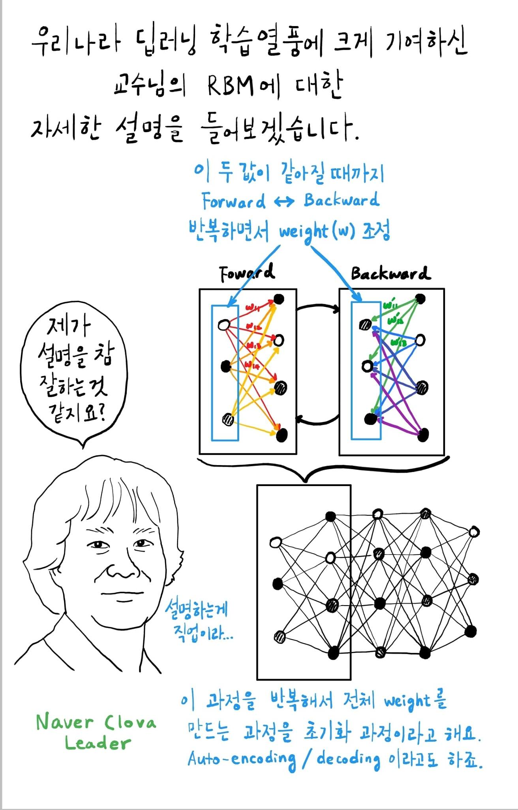

> #가문의영광 #만화에등장 만화로 술술 읽어지는 인공 지능이야기 책이 나왔습니다. 저도 개인적으로 기다리고 있던 책인데요.   이벤트 하나 들어 갑니다. **아래 등장하는 잘생긴 분의 이름은 무엇일까요?** 정답을 아시는 분은 이름을 댓글로 남겨주시면 이중 5분을 추첨하여 8/15일 1, 2권 꾸러미 보내 드립니다.  많은 분들이 정답을 맞추시면 좋겠습니다. 1권 http://www.kyobobook.co.kr/product/detailViewKor.laf?ejkGb=KOR&mallGb=KOR&barcode=9791197119903 2권 http://www.kyobobook.co.kr/product/detailViewKor.laf?mallGb=KOR&ejkGb=KOR&barcode=979119711991  1,2권 꾸러미 구매 http://www.kyobobook.co.kr/product/detailViewKor.laf?mallGb=KOR&ejkGb=KOR&barcode=2909101157702

### 8월 6일 (목) 21:09 · is getting ready for ocean swimming and …

is getting ready for ocean swimming and mountain trekking this weekend!

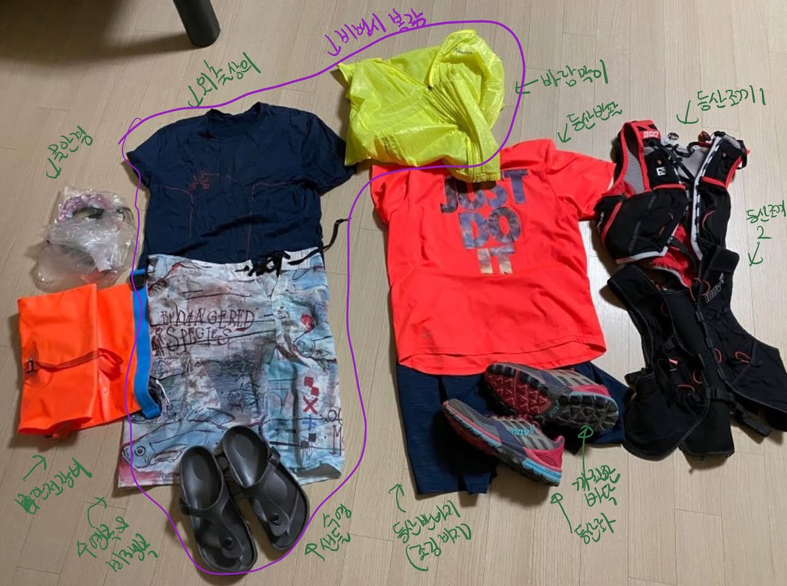

### 8월 7일 (금) 08:01 · 📷 사진 (5장)

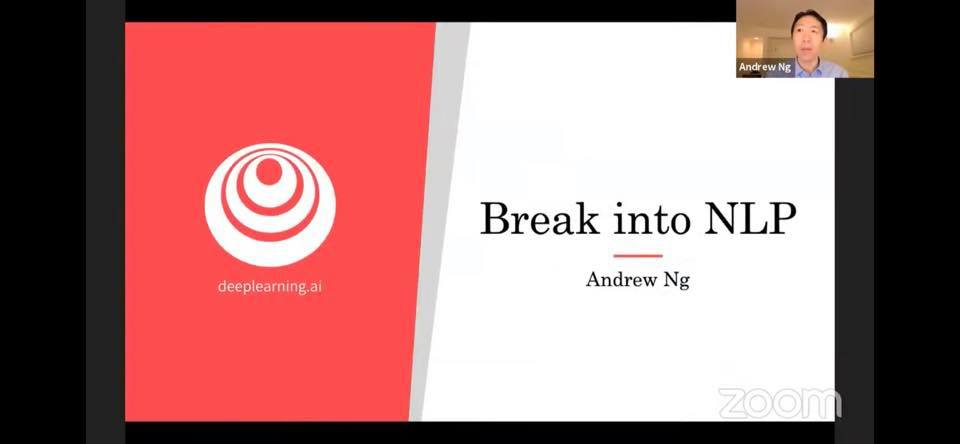 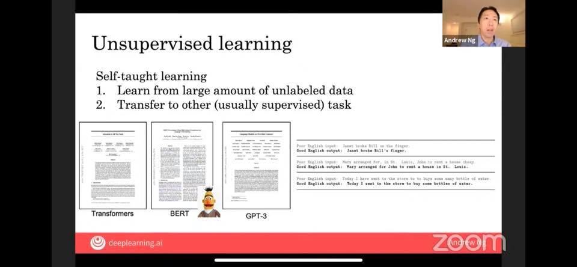 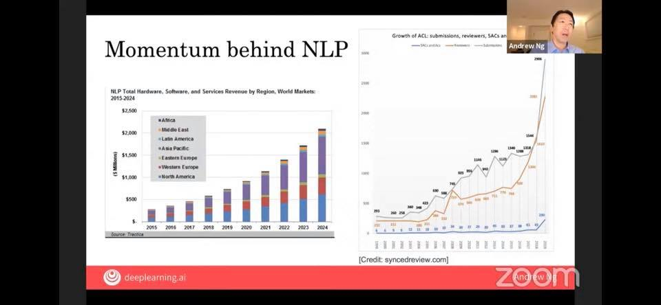 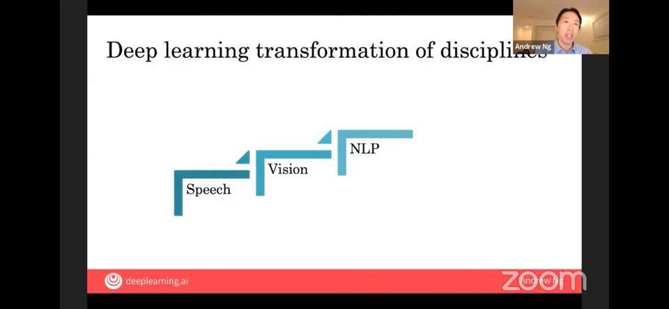 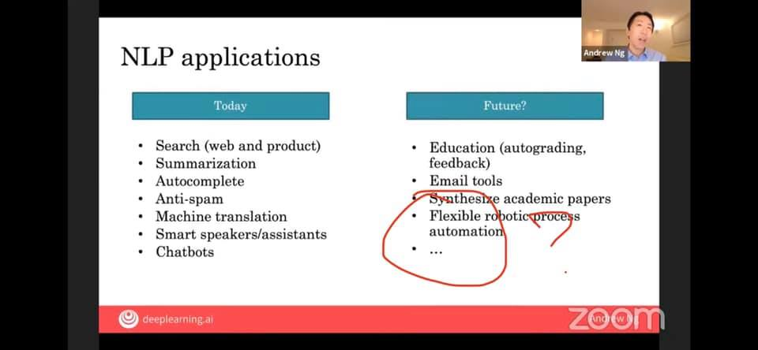

### 8월 9일 (일) 08:27 · 📷 앨범: Profile pictures (1장)

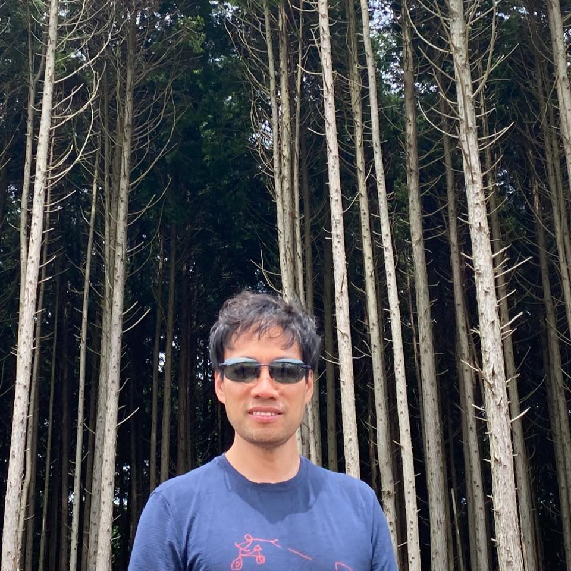

### 8월 12일 (수) 08:27 · 생일 축하드립니다! 한국 오셨다는 (오신다는) 소문이 있던데 한번 뵈어요…

생일 축하드립니다! 한국 오셨다는 (오신다는) 소문이 있던데 한번 뵈어요.

### 8월 12일 (수) 08:27 · ↪ 생일 축하드립니다! 한국 오셨다는 (오신다는) 소문이 있던데 한번 뵈어요…

*다른 프로필에 남긴 글*

생일 축하드립니다! 한국 오셨다는 (오신다는) 소문이 있던데 한번 뵈어요.

### 8월 14일 (금) 07:44 · is so happy with his new WaveCell Helmet…

is so happy with his new WaveCell Helmet and a fun ride.

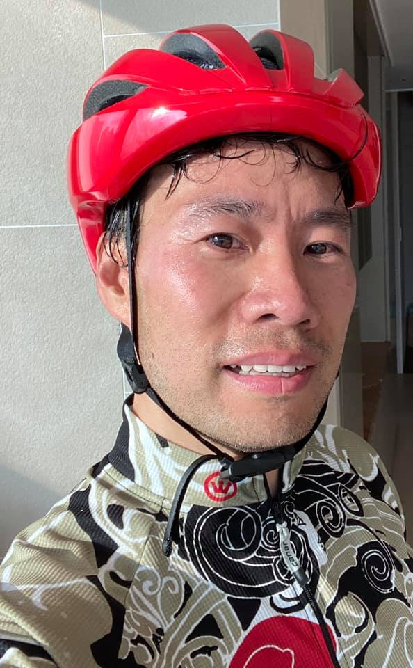 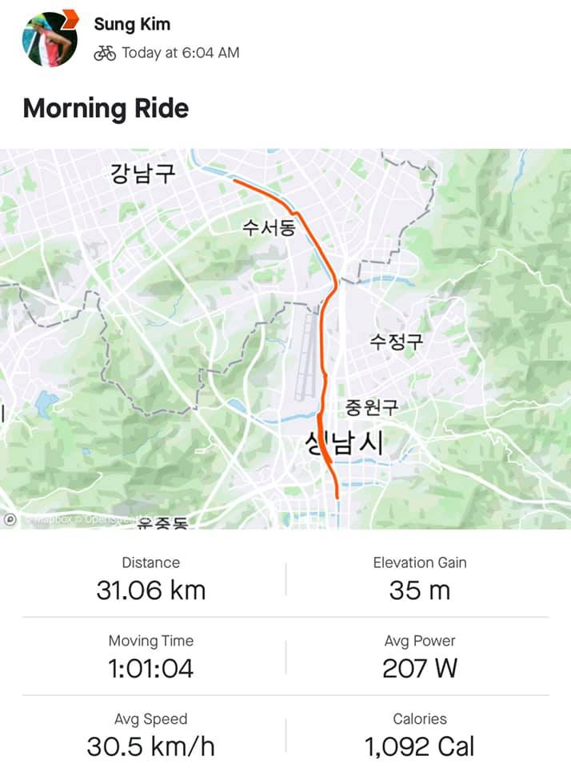

### 8월 16일 (일) 14:26 · 📷 사진 (1장)

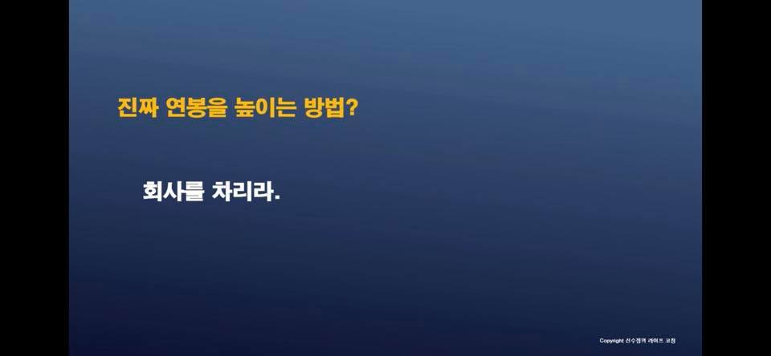

### 8월 19일 (수) 18:58 · is so happy to get the author autograph …

is so happy to get the author autograph from a bestseller book, Python Interview Algorithms.

저의 오랜 절친이자 베스트셀러 작가님이신 Sang-Kil Park 을 직접 뵙고 이렇게 저자사인까지 받아 영광입니다. 

저희 네이버에도 개발자 면접때 첫관문이 이 알고리즘/코딩 테스트인데요. 많은 분들이 코딩/알고리즘을 잘 다룰수 있으면 좋겠다는 생각을 늘 해왔는데 이 책은 정말 좋은것 같습니다. 친절한 설명과 간단하면서도 핵심을 찌르는 코드, 그리고 정진호님의 멋진 일러스트, 환상적인 조합입니다. 

저도 하나씩 풀어 보면서 설명을 읽고 있습니다.

http://www.yes24.com/Product/Goods/91084402

(Video from Hwalsuk Lee)

🎬 동영상 1개 (생략)

### 8월 22일 (토) 11:01 · Best coffee experience after fun and int…

Best coffee experience after fun and interval running Woljeongri Beach!

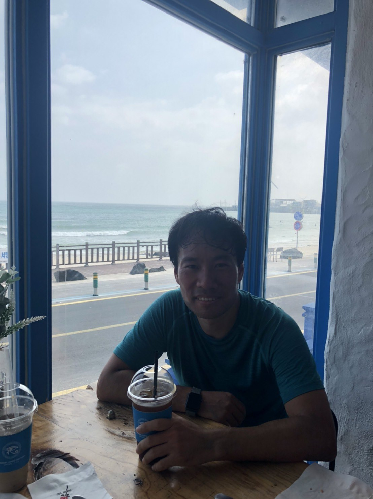 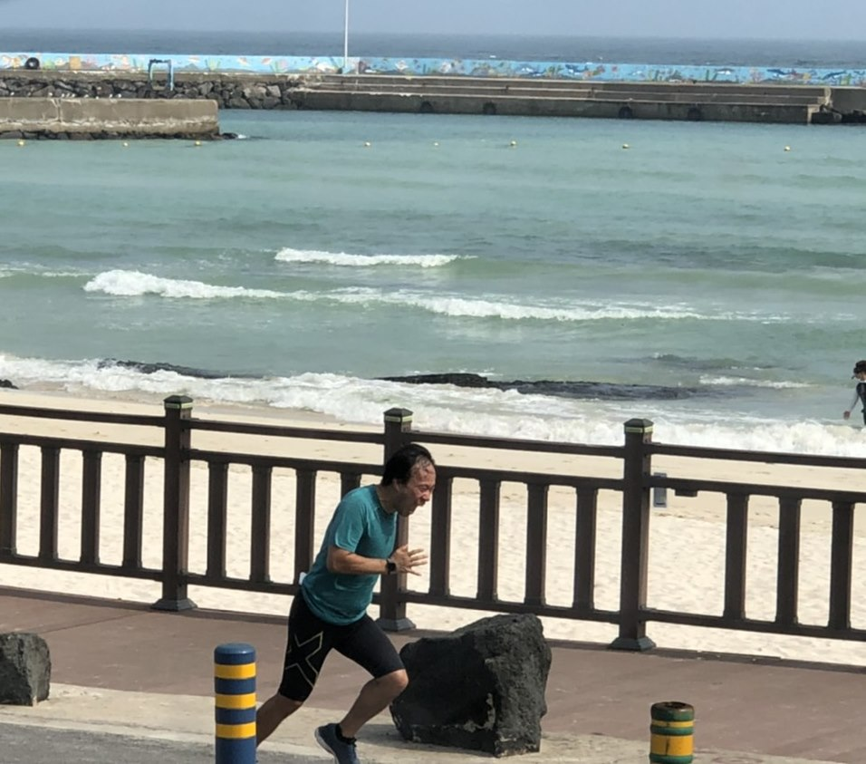

### 8월 25일 (화) 16:25 · 📷 사진 (1장)

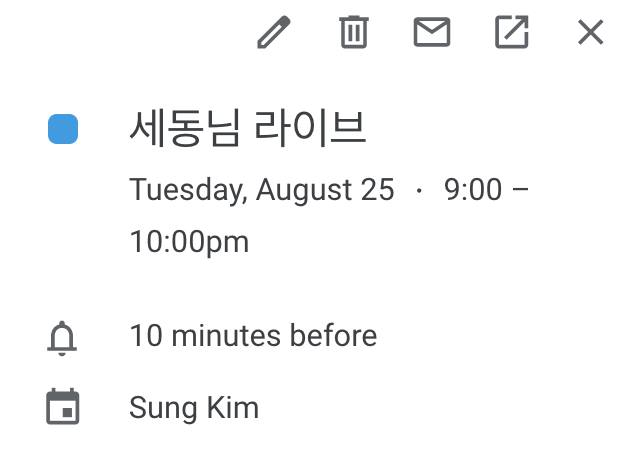

### 8월 27일 (목) 05:54 · 📷 사진 (1장)

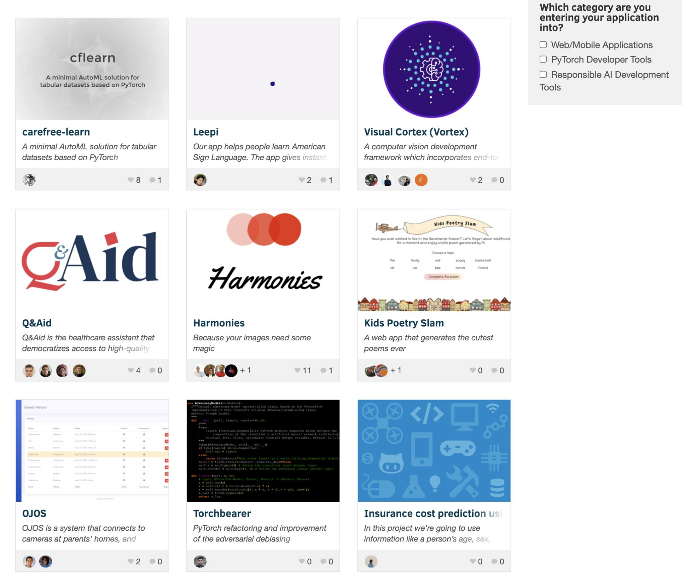

> PyTorch Summer Hackathon 2020 겔러리가 오픈되어 있습니다. AI를 사용해서 웹/모바일 application, Pytorch개발도구, AI 개발툴들 이렇게 3개의 분야인데요. 흥미로운 것이 많습니다.  [https://pytorch2020.devpost.com/submissions](https://pytorch2020.devpost.com/submissions)  자세한 설명과 각 프로젝트마다 비디오도 있습니다.  여러분들이 보시는 베스트 프로젝트는 무엇인지 댓글로 같이 이야기 해봐도 좋겠습니다. 우승자는 9월 22일 발표된다는데 여러분들이 선정한것이 최종 선택되는지도 볼만할것 같습니다.

### 8월 29일 (토) 07:15 · 📷 사진 (1장)

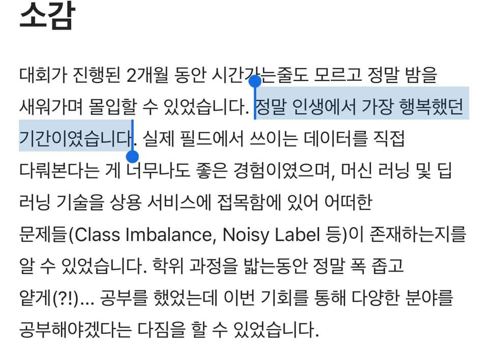
