# 2020년 10월

[← 2020년](README.md)

### 10월 2일 (금) 06:43 · 📷 사진 (1장)

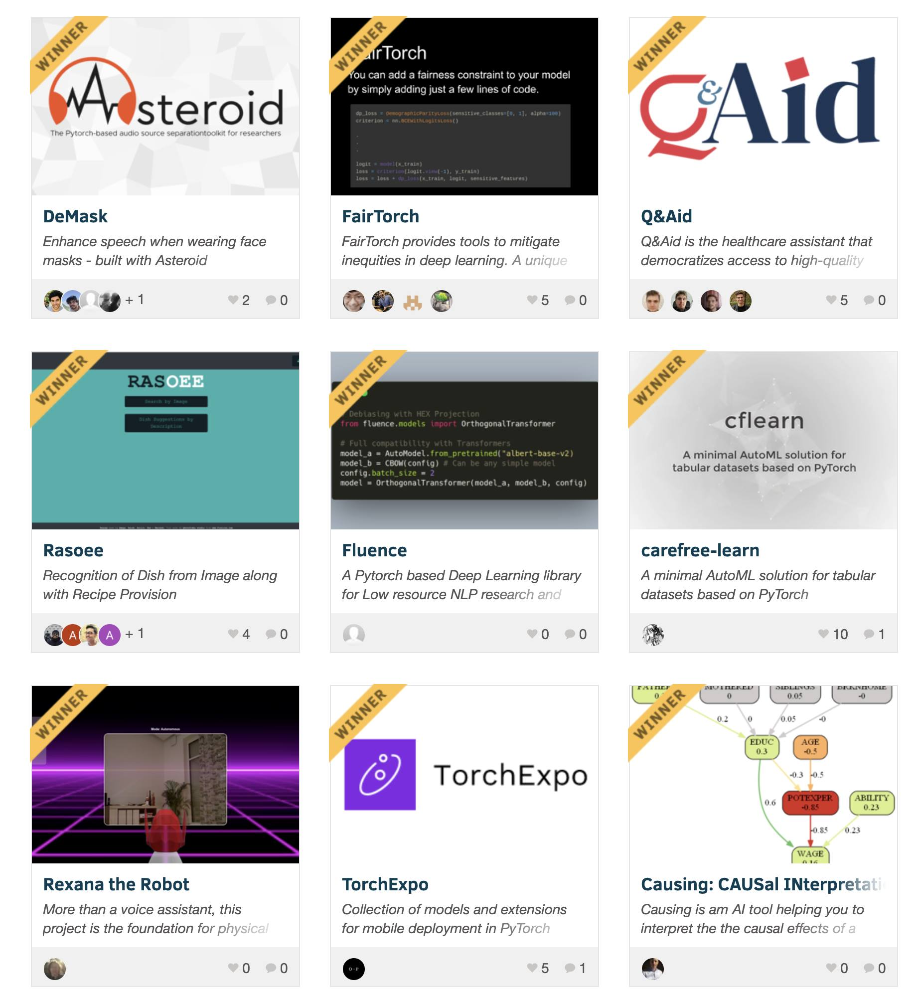

> PyTorch Summer Hackathon 2020의 최종 승자들은 누구일까요?  https://pytorch2020.devpost.com/project-gallery  멋진 프로젝트들이네요!

### 10월 2일 (금) 12:50 · Time flies! I miss Halla mountain everyd…

📍 Hallasan, Jeju-do

Time flies! I miss Halla mountain everyday!!

6년전인데 다시보기만 해도 즐겁네요. 한라산은 매일 매일 그리운 곳입니다.

6 Years Ago

Oct 02, 2014 7:53:47 pm

Turning around at the top of Halla mountain in Jeju.

🎬 동영상 1개 (생략)

### 10월 5일 (월) 05:37 · 📷 사진 (3장)

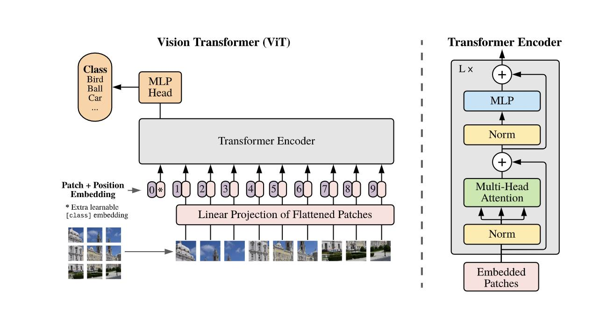 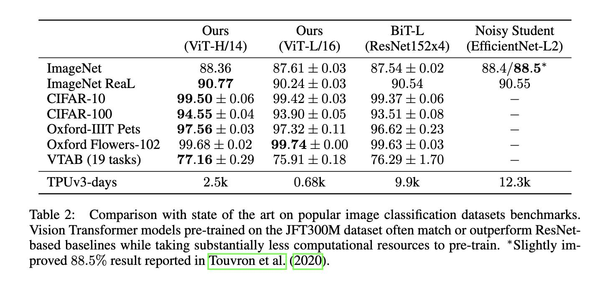 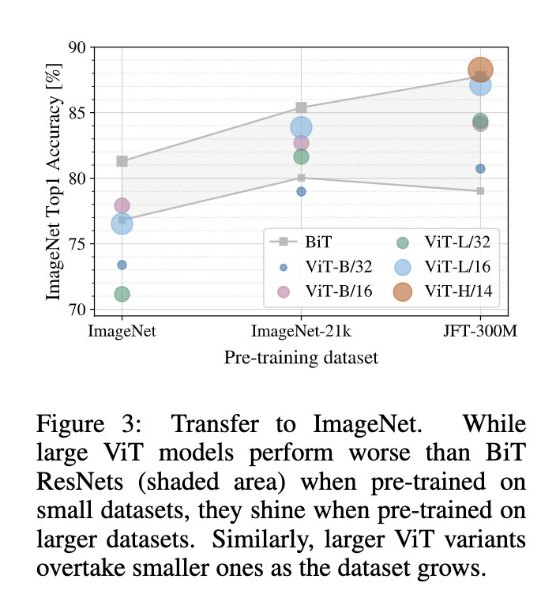

### 10월 5일 (월) 07:00 · #3년네이버행복 #3년네이버감사 #네이버최강AI

#3년네이버행복 #3년네이버감사 #네이버최강AI

라인/네이버와의 인연은 2017년 4월에 마라톤 참가로 일본을 잠시 방문했던 일로 시작되었습니다. 그 덕분에 네이버에서 클로바 AI 팀을 세팅하고 리딩 하는 멋진 기회를 가질 수 있었습니다. 처음 3명이었던 클로바 AI 팀은 최대 250+명까지 늘어났습니다. 정말 멋진 분들과 “모두를 위한 AI”라는 가치를 실현하기 위해 최고 수준의 AI 기술을 연구개발하고 서비스를 고민하였던 지난 3년은 제게 소중하고 행복했던 시간이었습니다.

네이버/라인의 많은 대표님들과 리더님들의 탁월한 인사이트와 추진력을 갖춘 리더십에서 많이 배웠습니다. 함께 달려주신 네이버 많은 리더님들과 멤버들 덕분에 일이 더욱 즐거웠습니다. 압도적인 월드클래스 AI 제품을 개발해보자는 하나 된 마음으로 최고의 결과들을 만들었기에 행복했습니다. 모든분들에게 감사드립니다.

이제 저는 2020년 10월부터 새로운 곳에서 또 다른 AI 꿈을 향해 달리게 되었습니다.

네이버/클로바는 지금도 AI 연구개발을 하기 가장 좋은 곳이며 많은 좋은 결과들이 쏟아져 나올 것입니다. 네이버 AI는 앞으로도 속도와 깊이를 더한 연구 개발로 글로벌 AI TOP이 될 것입니다. 새롭게 거듭난 네이버 AI에 계속 관심을 가져주시길 바라고 많은 응원을 부탁드립니다. 또 AI 함께 하시고 싶은 분들은 무조건, "네이버 AI!", "선지원 후고민!!" 입니다.

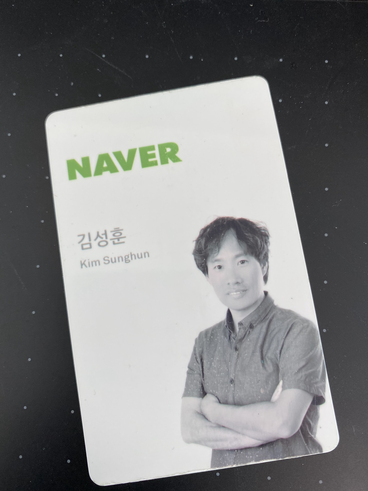

### 10월 7일 (수) 07:29 · 📷 사진 (1장)

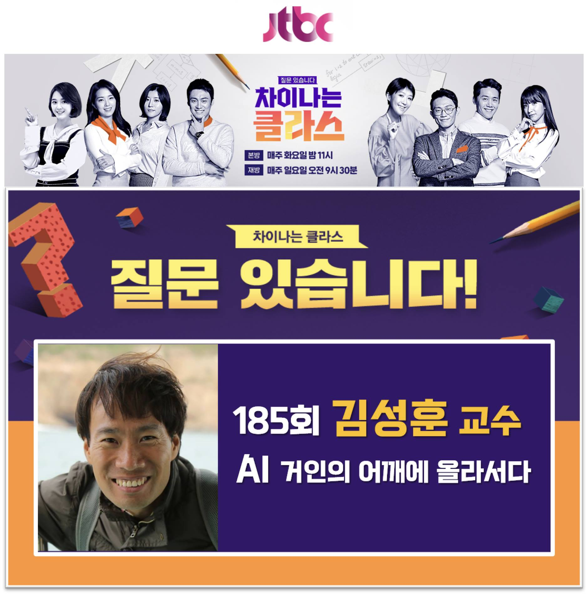 185회차 강사로 섭외되었습니다. 많이 부족한데 방송에">

> #TFKR차이나는클라스 #TFKR도움급구   여러분들의 성원에 힘입어 <차이나는 클라스> 185회차 강사로 섭외되었습니다. 많이 부족한데 방송에서 강의를 한다는 것이 좀 부끄럽습니다. 그럼에도  5만의 TFKR멤버님들께 도움을 요청드리면 되겠구나 하는 든든한 믿음으로 짧은 고민 끝에 수락하였습니다. "선수락, 후고민!" 강의중에도 (편집될 수는 있지만) TFKR커뮤니티를 많이 소개해보겠습니다.  강의를 위한 소재가 많이 필요해서 TFKR의 도움을 구하고자 아래 질문형식으로 적어보았습니다. 저도 작게나마 보답하는 마음으로 선물을 준비했습니다. 10월 14일까지 질문에 대한 알찬 답변으로 저를 도와주신 분들 가운데 1분을 선발하여, 코로나 시국이라 정말 어렵게 구한, <차이나는 클라스> 녹화 **참관권** (녹화일은 11월 6일, 3시간 촬영예정)을 드립니다. 그리고 10분을 선발하여 제가 개인적으로 준비한 스타벅스 **따뜻한 커피** 2만원권을 보내드리도록 하겠습니다.  * 인공지능의 어떤 이야기를 해주면 좋을까요? 여러분들이 생각하시는 인공지능의 가장 큰 WOW는 무엇인가요? * 우리의 삶을 변화시킨 현재 실생활에서 활용되고 있는 인공지능은 무엇인가요? (예컨대, 우리가 몰랐지만 인류사를 바꾼 인공지능들, 지구 반대편 난민들의 목숨을 살린 인공지능이라거나 우리 도시 안전을 지켜주고 있는 인공지능 등... 실생활에 도입된지도 몰랐지만 이미 삶에 큰 영향을 끼치고 있는 사례들이면 좋을 것 같습니다) * 특히 교육과 관련된 인공지능이 어디까지 개발되었는지? 인공지능이 생활을 바꾼다보다 구체적으로 아이들의 교육권을 챙겨주고 사회안전망을 튼튼하게 하는데 쓰이는 것들이 있는지? * 그럼 우리는 무엇을 어떻게 준비하면 좋을지? 정부나 기업은 무엇을 하면 좋을지? 우리 후학들은 무엇을 하면 좋은지?  위에 대해 생각하신 내용을 자유롭게 댓글로 달아주시면 됩니다. 멋진 댓글들을 기대하며 미리 감사드립니다!

### 10월 8일 (목) 07:18 · 📷 사진 (1장)

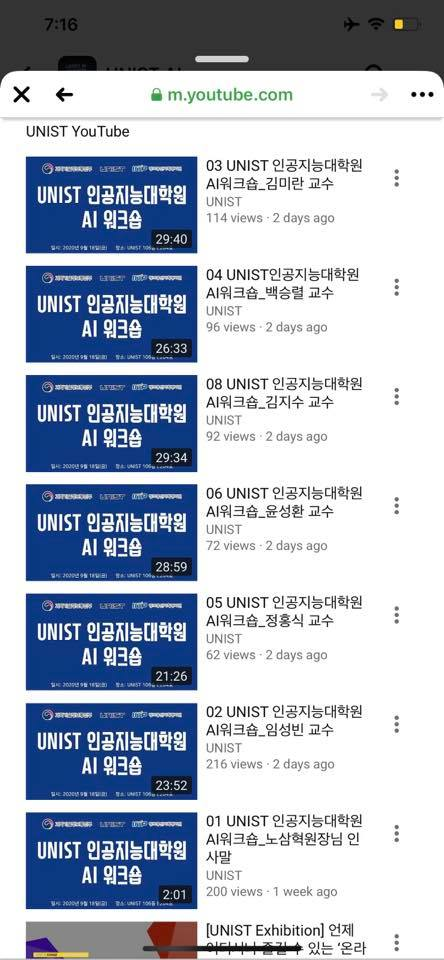

> UNIST인공지능 대학원 웍샵 비디오가 공개 되었습니다. 임성빈 교수님 강의등 매우 흥미진진한 주제가 많습니다.  오늘 저는 하루종일 이 비디오들 다 볼 예정입니다.   https://m.youtube.com/user/unistmedia

### 10월 14일 (수) 11:49 · 여러분을 AI의 Upstage로 모십니다.

여러분을 AI의 Upstage로 모십니다.
https://upstage.ai/

하루가 다르게 변모하는 AI WOW 기술들에 매일 두렵고 설레는 시대를 살아가고 있습니다. 이 기술들은 실제 산업에 적용 가능한 수준으로 빠르게 성숙하고 있고, 앞으로 3~5년간 거의 모든 산업을 점진적으로 혁신해 나갈 것입니다. 따라서 AI에 기반을 둔 기업과 그렇지 못한 기업 간의 경쟁력 격차는 매우 극명해질 것입니다.

이런 시기에 보다 많은 분들이 AI 혁신의 물결에 올라타실 수 있도록 도움을 드리고싶다는 생각했습니다. 그동안 제 개인적으로 해왔던 AI 교육에서 확장하여 기업 내 개발자들에게 AI 교육을 제공하는 일을 시작하려고 합니다. 그리고 점차 각 기업에서 필요로 하는 AI 팀들이 잘 세팅되도록 돕고 관련 인프라 구축에도 도움을 드릴 계획입니다. 나아가 솔루션을 함께 만들거나 자체 개발이 가능하도록 적합한 기술력을 제공할 예정입니다. 일부가 독점하는 AI가 아닌 더 많은 분들이 AI를 이해하고 활용하는 모두의 AI Transformation 시대를 열어보고 싶습니다.

이러한 비전에 공감해주신 Hwalsuk Lee (전 네이버 VisualAI/OCR 리더), Lucy Park (전 파파고 모델팀 리더), Jae Boum Kim (전 카카오 AI 팀장), Henny Son (전 엔비디아 AI 교육/마케팅 리더), 김상훈 (캐글 그랜드 마스터), Ji Hyung Moon (전 파파고 모델개발), Lee  Jun Yeop (전 네이버 OCR 기술리더), Sungjoon Park (전 구글 인턴,  NLP 최강 연구자) 등이 모여 “Making AI Benefitial” 을 모토로 이번 10월 Upstage를 설립하였습니다. Upstage는 우리가 그간 쌓은 AI 경험들을 바탕으로 국내를 넘어 세계적 수준의 AI 교육을 제공하고 모두를 위한 AI 기술보편화를 가속화 하고자 합니다.

“Making AI Benefitial” 를 하기 위해 더 많은 훌륭한 분들이 필요하고 함께 하고 싶습니다. 선지원, 후고민 부탁드립니다. (지금은 회사 설립 단계라 바로 채용절차가 진행되지는 않습니다만,  관심있으신 분들은 인재 POOL에 등록해주시면 포지션 오픈시 가장 먼저 연락드리도록 하겠습니다.)

관련기사: http://naver.me/xPtqH49w

### 10월 15일 (목) 07:01 · 📷 앨범: Profile pictures (1장)

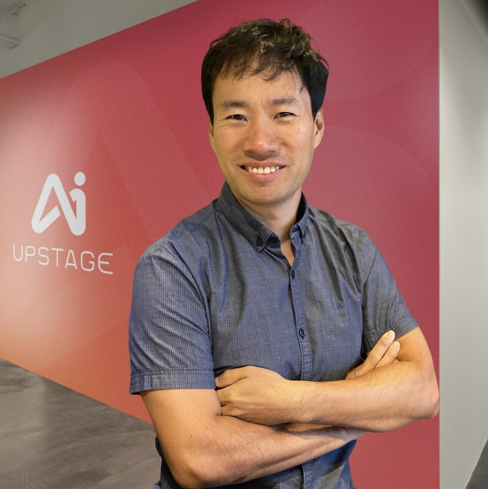

### 10월 21일 (수) 08:49 · 저희들 회사의 방향을 잘 설명해주신 Soonchan Park 기자님의 멋…

저희들 회사의 방향을 잘 설명해주신 Soonchan Park 기자님의 멋진 기사입니다. 대충 말한 것에서 핵심을 뽑아내주시는 능력, 그리고 필력에 정말 감탄했습니다. 좋은 기사 감사합니다.

"AI 기술은 실제 산업에 적용 가능한 수준으로 빠르게 성숙하고 있고, 앞으로 3~5년간 거의 모든 산업을 점진적으로 혁신해 나갈 것”이라며 “보다 많은 기업이 AI 혁신의 물결에 올라탈 수 있도록 도움을 주는 게 우리의 목표”

그리고 제가 정말 좋아하는 Hwalsuk Lee 님과의 사진은 오랫동안 제가 사용하게 될 것 같습니다.

매우 기쁜 날입니다.

Soonchan Park 기자님의 글인데 넵! 춘마 운동복입고 인터뷰 참여 했습니다!
---
"김성훈 업스테이지 대표님은 인터뷰에 '파란색 춘천마라톤' 티를 입고 오셨다, 철인 3종 경기 마니아시라고! 유쾌하고 시원시원한 김 대표님과 차분하게 조목조목 설명해주신 이활석 CTO님의 케미가 돋보였다.
매우 기대되는 Upstage!"

🔗 <https://n.news.naver.com/article/023/0003570049>

### 10월 24일 (토) 19:07 · 📷 사진 (1장)

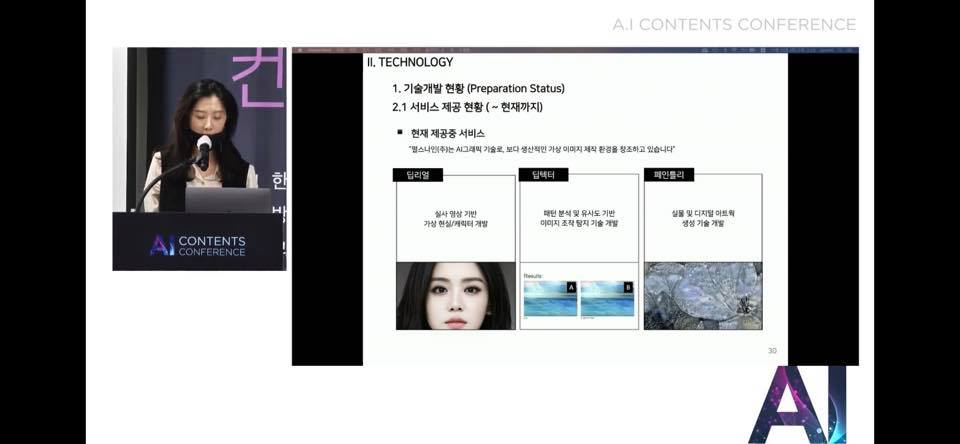

### 10월 28일 (수) 11:23 · 📷 사진 (1장)

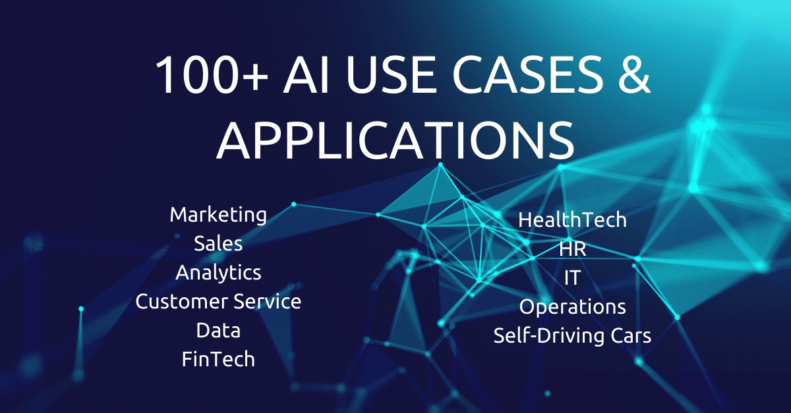

> AI로 무엇을 실제 무엇을 할수 있나요? 질문에 대한 100가지 이상의 답입니다. 정말 상상할수 있는 모든 리스트들이 있는것 같습니다.  https://research.aimultiple.com/ai-usecases/   정말 재미있게 본것이 "**Call Intent Discovery" **등인데 여러분들은 어떤 부분을 재미있게 보셨는지 아님 어떤 실무 문제에 관심이 많으신지도 궁금합니다.

### 10월 30일 (금) 14:01 · We made it! Jirisan Cheonwangbong Peak (…

We made it! Jirisan Cheonwangbong Peak (1915m)!!

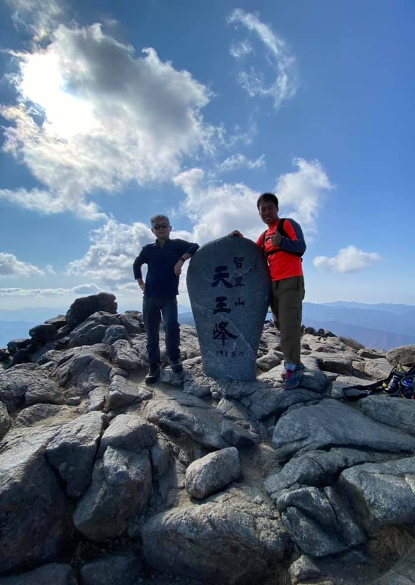
