# 2020년 12월

[← 2020년](README.md)

### 12월 8일 (화) 08:56 · 📷 사진 (9장)

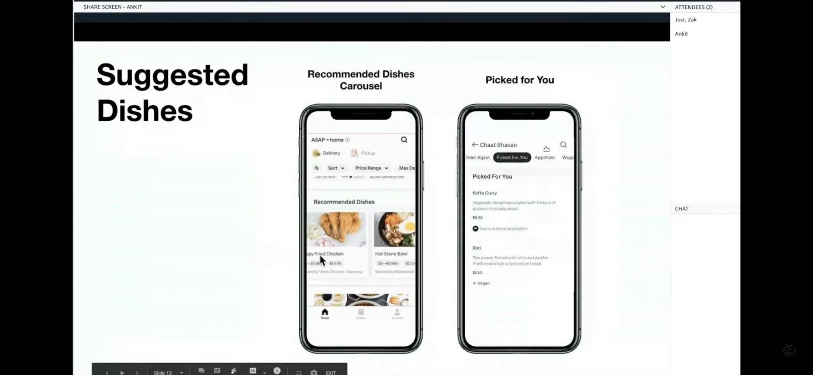
**이미지 캡션:** 화면에는 'Suggested Dishes'라는 제목과 함께 두 개의 스마트폰 화면이 나란히 표시되어 있습니다. 왼쪽 스마트폰 화면은 'Recommended Dishes Carousel'이라는 제목 아래 음식 목록을 보여주며, 'Crispy Fried Chicken'과 'Hot Stone Bowl' 같은 메뉴가 사진과 함께 나열되어 있습니다. 오른쪽 스마트폰 화면은 'Picked for You'라는 제목 아래 'Chaat Bhavan'이라는 식당의 메뉴를 보여주며, 'Kofta Curry'와 'Roti' 등의 음식이 추천 메뉴로 표시되어 있습니다. 화면 상단에는 'SHARE SCREEN - ANKIT'이라는 글자와 함께 참석자 목록이 보입니다. 전체적으로 음식 추천 앱의 인터페이스를 보여주는 화면으로, 깔끔하고 정보 전달에 초점을 맞춘 분위기입니다." and "Hot Stone Bowl" with prices and estimated delivery times. The right screen is labeled "Picked for You" and displays personalized recommendations from "Chaat Bhavan," featuring "Kofta Curry" and "Roti" with prices and dietary information. The background is a plain white, and the overall atmosphere is informative and professional, likely part of a product demonstration or review. In the top right corner, there is a section indicating "ATTENDEES (2)" with names "Jost, Zak" and "Ankit," suggesting this is a shared screen during an online meeting. A chat window is also visible on the far right. There are no people directly visible in the main content of the slide, only the interface of the application.
 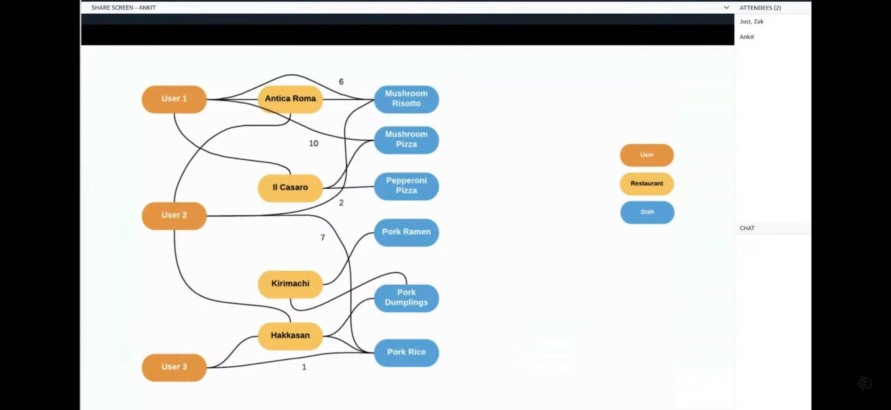
**이미지 캡션:** 화면에는 온라인 회의 또는 프레젠테이션의 일부로 보이는 다이어그램이 표시됩니다. 중앙에는 여러 개의 타원형 노드가 연결되어 있으며, 왼쪽에는 "User 1", "User 2", "User 3"이라고 표시된 주황색 노드가 있고, 오른쪽에는 "Antica Roma", "Il Casaro", "Kirimachi", "Hakkasan"이라고 표시된 주황색 노드가 있습니다. 이 노드들은 검은색 선으로 연결되어 있으며, 일부 선에는 숫자(6, 10, 2, 7, 1)가 표시되어 있습니다. 오른쪽에는 "Mushroom Risotto", "Mushroom Pizza", "Pepperoni Pizza", "Pork Ramen", "Pork Dumplings", "Pork Rice"라고 표시된 파란색 노드가 있습니다. 이 파란색 노드들은 주황색 노드들과 연결되어 있습니다. 화면 오른쪽에는 "User", "Restaurant", "Dish"라고 표시된 세 개의 주황색 및 파란색 노드가 세로로 나열되어 있습니다. 화면 상단에는 "SHARE SCREEN - ANKIT"이라는 텍스트가 표시되고, 오른쪽 상단에는 "ATTENDEES (2)"라는 제목과 함께 "Jost, Zak" 및 "Ankit"이라는 이름이 나열되어 있습니다. 화면 오른쪽에는 "CHAT"이라는 텍스트가 표시된 채팅 창이 있습니다. 전체적인 분위기는 정보 공유 및 분석을 위한 시각적 도구를 사용하는 회의 또는 프레젠테이션의 모습입니다.sotto", "Mushroom Pizza", "Pepperoni Pizza", "Pork Ramen", "Pork Dumplings", "Pork Rice"라고 표시된 파란색 노드가 있습니다. 이 파란색 노드들은 주황색 노드들과 연결되어 있습니다. 화면 오른쪽에는 "User", "Restaurant", "Dish"라고 표시된 세 개의 주황색 및 파란색 노드가 세로로 나열되어 있습니다. 화면 상단에는 "SHARE SCREEN - ANKIT"이라는 텍스트가 표시되고, 오른쪽 상단에는 "ATTENDEES (2)"라는 제목과 함께 "Jost, Zak" 및 "Ankit"이라는 이름이 나열되어 있습니다. 화면 오른쪽에는 "CHAT"이라는 텍스트가 표시된 채팅 창이 있습니다. 전체적인 분위기는 정보 공유 및 분석을 위한 시각적 도구를 사용하는 회의 또는 프레젠테이션의 모습입니다.
 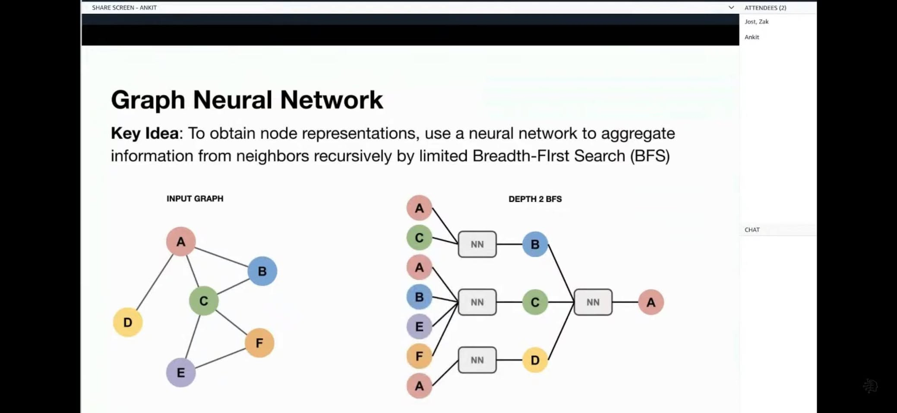
**이미지 캡션:** 이 이미지는 "Graph Neural Network"라는 제목의 프레젠테이션 슬라이드를 보여줍니다. 슬라이드에는 "Key Idea: To obtain node representations, use a neural network to aggregate information from neighbors recursively by limited Breadth-First Search (BFS)"라는 설명이 있습니다. 왼쪽에는 "INPUT GRAPH"라는 레이블과 함께 노드 A, B, C, D, E, F가 연결된 그래프가 표시됩니다. 오른쪽에는 "DEPTH 2 BFS"라는 레이블과 함께 신경망(NN)을 사용하여 이웃 노드의 정보를 집계하는 과정을 시각화한 다이어그램이 있습니다. 이 다이어그램은 여러 단계의 BFS를 통해 노드 표현을 생성하는 과정을 보여줍니다. 슬라이드 상단에는 "SHARE SCREEN - ANKIT"라는 텍스트와 함께 "ATTENDEES (2)"라는 표시가 있고, 그 아래에 "Jost, Zak"와 "Ankit"라는 참석자 이름이 보입니다. 오른쪽에는 "CHAT"라는 레이블이 있습니다. 전체적으로 이 슬라이드는 그래프 신경망의 핵심 아이디어와 작동 방식을 설명하는 교육적인 자료로 보입니다.가 표시됩니다. 오른쪽에는 "DEPTH 2 BFS"라는 레이블과 함께 신경망(NN)을 사용하여 이웃 노드의 정보를 집계하는 과정을 시각화한 다이어그램이 있습니다. 이 다이어그램은 여러 단계의 BFS를 통해 노드 표현을 생성하는 과정을 보여줍니다. 슬라이드 상단에는 "SHARE SCREEN - ANKIT"라는 텍스트와 함께 "ATTENDEES (2)"라는 표시가 있고, 그 아래에 "Jost, Zak"와 "Ankit"라는 참석자 이름이 보입니다. 오른쪽에는 "CHAT"라는 레이블이 있습니다. 전체적으로 이 슬라이드는 그래프 신경망의 핵심 아이디어와 작동 방식을 설명하는 교육적인 자료로 보입니다.
 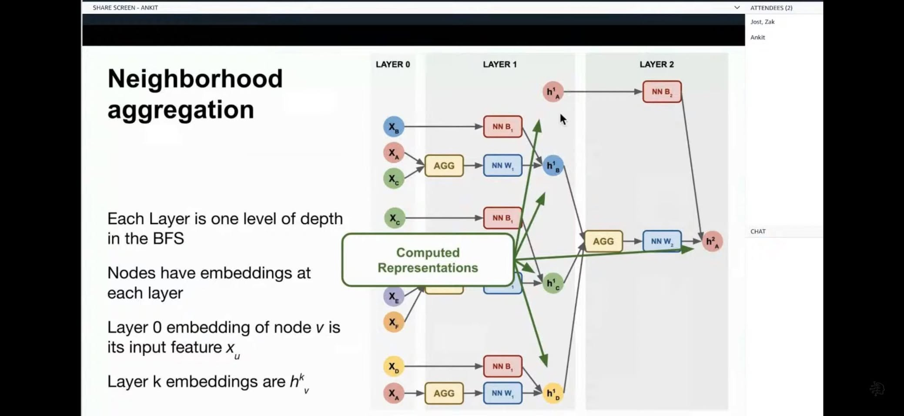
**이미지 캡션:** 이 이미지는 "Neighborhood aggregation"이라는 제목의 프레젠테이션 슬라이드를 보여줍니다. 슬라이드 왼쪽에는 텍스트 설명이 있고, 오른쪽에는 그래프가 있습니다. 텍스트 설명에는 "Each Layer is one level of depth in the BFS", "Nodes have embeddings at each layer", "Layer 0 embedding of node v is its input feature x_u", "Layer k embeddings are h^k_v"라고 쓰여 있습니다. 그래프는 "LAYER 0", "LAYER 1", "LAYER 2"로 구분되어 있으며, 각 레이어에서 노드들이 어떻게 집계되고 표현되는지를 나타내는 다이어그램입니다. 노드들은 색깔 있는 원이나 사각형으로 표현되며, "x_u", "AGG", "NN B_i", "NN W_i", "h^k_v"와 같은 레이블이 붙어 있습니다. 녹색 화살표는 데이터의 흐름을 나타내며, "Computed Representations"라는 녹색 테두리 상자가 일부 노드들의 집계 과정을 강조하고 있습니다. 화면 상단에는 "SHARE SCREEN - ANKIT"이라는 텍스트와 함께 참석자 목록("ATTENDEES (2): Jost, Zak, Ankit") 및 "CHAT"이라는 표시가 보입니다. 전체적으로 컴퓨터 과학, 특히 그래프 신경망(GNN)과 관련된 내용을 설명하는 학술적이거나 기술적인 발표의 한 장면으로 보입니다.있습니다. 그래프는 "LAYER 0", "LAYER 1", "LAYER 2"로 구분되어 있으며, 각 레이어에서 노드들이 어떻게 집계되고 표현되는지를 나타내는 다이어그램입니다. 노드들은 색깔 있는 원이나 사각형으로 표현되며, "x_u", "AGG", "NN B_i", "NN W_i", "h^k_v"와 같은 레이블이 붙어 있습니다. 녹색 화살표는 데이터의 흐름을 나타내며, "Computed Representations"라는 녹색 테두리 상자가 일부 노드들의 집계 과정을 강조하고 있습니다. 화면 상단에는 "SHARE SCREEN - ANKIT"이라는 텍스트와 함께 참석자 목록("ATTENDEES (2): Jost, Zak, Ankit") 및 "CHAT"이라는 표시가 보입니다. 전체적으로 컴퓨터 과학, 특히 그래프 신경망(GNN)과 관련된 내용을 설명하는 학술적이거나 기술적인 발표의 한 장면으로 보입니다.
 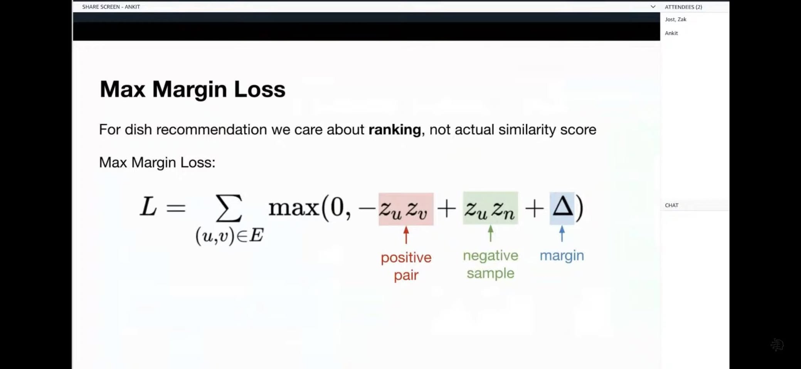
**이미지 캡션:** 화면에는 "Max Margin Loss"라는 제목과 함께 수식과 설명이 표시되어 있습니다. 제목은 검은색 굵은 글씨로 되어 있으며, 그 아래에는 "For dish recommendation we care about ranking, not actual similarity score"라는 문장이 있습니다. 이 문장은 음식 추천에서 실제 유사도 점수보다는 순위에 더 신경 쓴다는 내용을 담고 있습니다. 이어서 "Max Margin Loss:"라는 소제목과 함께 복잡한 수학 공식이 제시되어 있습니다. 공식은 L = ∑ max(0, -zuzv + zuzn + ∆)로 표기되어 있으며, 각 항에 대한 설명이 화살표와 함께 달려 있습니다. "-zuzv" 항은 "positive pair"로, "zuzn" 항은 "negative sample"로, "∆" 항은 "margin"으로 표시되어 있습니다. 배경은 흰색이며, 화면 오른쪽에는 "ATTENDEES (2)"라는 제목과 함께 "Jost, Zak", "Ankit"이라는 이름이 보이고, 그 아래에는 "CHAT"이라는 글자가 있습니다. 전체적으로 온라인 강의나 발표 화면의 일부로 보이며, 학술적이거나 기술적인 내용을 다루고 있습니다. 사람의 모습은 보이지 않습니다. max(0, -zuzv + zuzn + ∆)로 표기되어 있으며, 각 항에 대한 설명이 화살표와 함께 달려 있습니다. "-zuzv" 항은 "positive pair"로, "zuzn" 항은 "negative sample"로, "∆" 항은 "margin"으로 표시되어 있습니다. 배경은 흰색이며, 화면 오른쪽에는 "ATTENDEES (2)"라는 제목과 함께 "Jost, Zak", "Ankit"이라는 이름이 보이고, 그 아래에는 "CHAT"이라는 글자가 있습니다. 전체적으로 온라인 강의나 발표 화면의 일부로 보이며, 학술적이거나 기술적인 내용을 다루고 있습니다. 사람의 모습은 보이지 않습니다.
 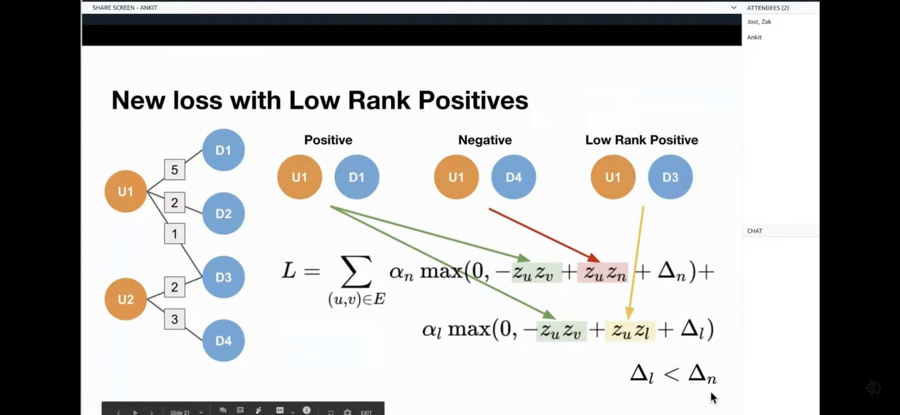
**이미지 캡션:** 이 이미지는 온라인 회의 화면의 일부로, 발표자가 "New loss with Low Rank Positives"라는 제목의 슬라이드를 공유하고 있습니다. 슬라이드에는 복잡한 수식과 그래프가 포함되어 있으며, 이는 머신러닝 또는 데이터 과학 분야의 연구 발표로 보입니다. 화면 왼쪽 상단에는 "SHARE SCREEN - ANKIT"이라는 텍스트가 보이며, 오른쪽에는 "ATTENDEES (2)"라는 텍스트와 함께 "Jost, Zak", "Ankit"이라는 참석자 이름이 나열되어 있습니다. 또한 "CHAT"이라는 텍스트와 함께 채팅 창이 보입니다. 슬라이드 내용은 "Positive", "Negative", "Low Rank Positive"라는 세 가지 범주로 데이터를 분류하고, 각 범주에 해당하는 요소(U1, D1, D4, D3 등)와 그 관계를 나타내는 그래프 및 수식이 포함되어 있습니다. 수식은 "L = ∑ αn max(0, -zuZv + zuzn + Δn) + αl max(0, -zuZv +zugl + Δl)"이며, 마지막에는 "Δl < Δn"이라는 조건이 명시되어 있습니다. 전반적으로 학술적인 발표 상황을 보여주는 이미지입니다.스트와 함께 채팅 창이 보입니다. 슬라이드 내용은 "Positive", "Negative", "Low Rank Positive"라는 세 가지 범주로 데이터를 분류하고, 각 범주에 해당하는 요소(U1, D1, D4, D3 등)와 그 관계를 나타내는 그래프 및 수식이 포함되어 있습니다. 수식은 "L = ∑ αn max(0, -zuZv + zuzn + Δn) + αl max(0, -zuZv +zugl + Δl)"이며, 마지막에는 "Δl < Δn"이라는 조건이 명시되어 있습니다. 전반적으로 학술적인 발표 상황을 보여주는 이미지입니다.
 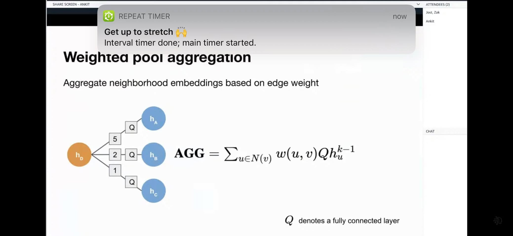
**이미지 캡션:** 화면 공유 중이며, 발표자는 성인 남성으로 보이며, 발표 내용은 "Weighted pool aggregation"이라는 제목과 함께 "Aggregate neighborhood embeddings based on edge weight"라는 부제목을 포함하고 있습니다. 그래프는 노드 h_D에서 시작하여 가중치 5, 2, 1을 가진 엣지를 통해 각각 h_A, h_B, h_C 노드로 연결되는 구조를 보여줍니다. 또한, AGG = Σu∈N(v) w(u, v)Qh_u^{k-1}라는 수식이 제시되어 있으며, Q는 fully connected layer를 의미한다고 설명되어 있습니다. 화면 오른쪽 상단에는 "ATTENDEES (2)"라는 표시와 함께 "Jost, Zak", "Ankit"이라는 이름이 보이며, "CHAT"이라는 텍스트도 있습니다. 화면 중앙 상단에는 "REPEAT TIMER"라는 알림창이 떠 있으며, "Get up to stretch"라는 메시지와 함께 "Interval timer done; main timer started."라는 내용이 표시되어 있습니다. 전반적으로 온라인 발표 또는 회의 화면의 일부로 보이며, 발표자는 그래픽과 수식을 사용하여 특정 개념을 설명하고 있습니다.y connected layer를 의미한다고 설명되어 있습니다. 화면 오른쪽 상단에는 "ATTENDEES (2)"라는 표시와 함께 "Jost, Zak", "Ankit"이라는 이름이 보이며, "CHAT"이라는 텍스트도 있습니다. 화면 중앙 상단에는 "REPEAT TIMER"라는 알림창이 떠 있으며, "Get up to stretch"라는 메시지와 함께 "Interval timer done; main timer started."라는 내용이 표시되어 있습니다. 전반적으로 온라인 발표 또는 회의 화면의 일부로 보이며, 발표자는 그래픽과 수식을 사용하여 특정 개념을 설명하고 있습니다.
 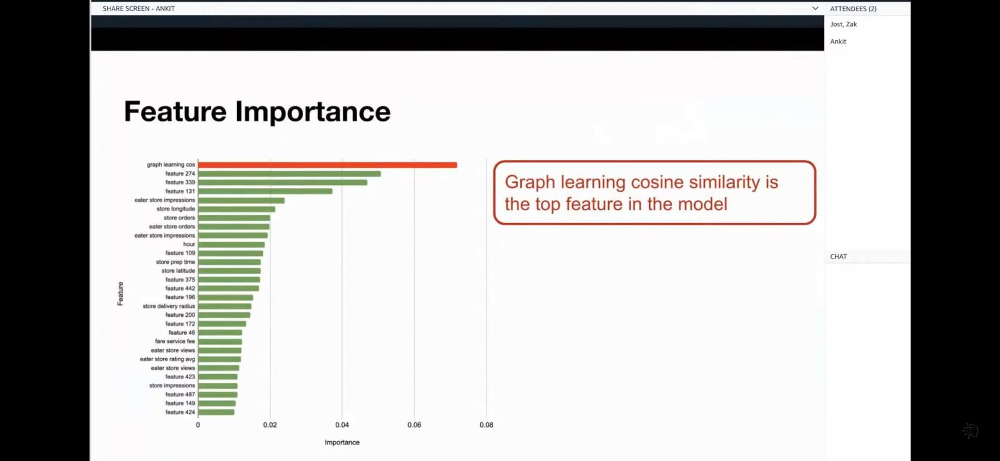
**이미지 캡션:** 화면 공유 중인 프레젠테이션 슬라이드에는 "Feature Importance"라는 제목이 크게 표시되어 있으며, 왼쪽에는 여러 피처의 중요도를 나타내는 가로 막대 그래프가 있습니다. 그래프의 y축에는 "Feature"라고 쓰여 있고, x축에는 "Importance"라고 쓰여 있으며 0부터 0.08까지의 값이 표시되어 있습니다. 가장 높은 막대는 "graph learning cos"로, 빨간색으로 강조되어 있으며, 그 아래로 여러 초록색 막대들이 중요도 순으로 나열되어 있습니다. 예를 들어 "feature 274", "feature 339", "feature 131", "eater store impressions", "store longitude", "store orders" 등이 보입니다. 그래프 오른쪽에는 "Graph learning cosine similarity is the top feature in the model"이라는 텍스트가 빨간색 테두리 상자 안에 쓰여 있습니다. 화면 오른쪽 상단에는 "ATTENDEES (2)"라는 표시와 함께 "Jost, Zak", "Ankit"이라는 참석자 이름이 보이고, 그 아래에는 "CHAT"이라는 텍스트가 있습니다. 전체적으로 데이터 분석 또는 머신러닝 모델의 피처 중요도를 설명하는 발표 상황으로 보이며, 차분하고 정보 전달에 집중하는 분위기입니다.4", "feature 339", "feature 131", "eater store impressions", "store longitude", "store orders" 등이 보입니다. 그래프 오른쪽에는 "Graph learning cosine similarity is the top feature in the model"이라는 텍스트가 빨간색 테두리 상자 안에 쓰여 있습니다. 화면 오른쪽 상단에는 "ATTENDEES (2)"라는 표시와 함께 "Jost, Zak", "Ankit"이라는 참석자 이름이 보이고, 그 아래에는 "CHAT"이라는 텍스트가 있습니다. 전체적으로 데이터 분석 또는 머신러닝 모델의 피처 중요도를 설명하는 발표 상황으로 보이며, 차분하고 정보 전달에 집중하는 분위기입니다.
 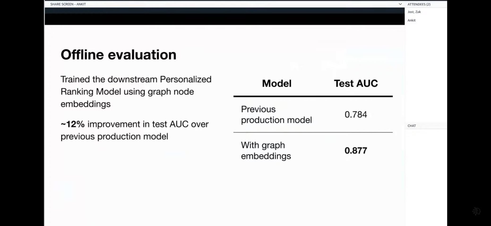
**이미지 캡션:** 이 사진은 온라인 회의 화면의 일부로, 발표자가 "Offline evaluation"이라는 제목의 슬라이드를 공유하고 있습니다. 슬라이드에는 "Trained the downstream Personalized Ranking Model using graph node embeddings"라는 설명과 함께 "~12% improvement in test AUC over previous production model"이라는 결과가 제시되어 있습니다. 또한, "Model"과 "Test AUC"라는 헤더 아래에 두 가지 모델의 성능을 비교하는 표가 있습니다. 첫 번째 모델인 "Previous production model"의 Test AUC는 0.784이고, 두 번째 모델인 "With graph embeddings"의 Test AUC는 0.877입니다. 화면 오른쪽 상단에는 "ATTENDEES (2)"라는 표시와 함께 "Jost, Zak", "Ankit"이라는 참석자 이름이 보이며, 화면 오른쪽 하단에는 "CHAT"이라는 글자가 작게 표시되어 있습니다. 전반적으로 기술적인 발표의 한 장면으로, 모델 성능 평가 결과를 보여주는 전문적인 분위기입니다.델의 성능을 비교하는 표가 있습니다. 첫 번째 모델인 "Previous production model"의 Test AUC는 0.784이고, 두 번째 모델인 "With graph embeddings"의 Test AUC는 0.877입니다. 화면 오른쪽 상단에는 "ATTENDEES (2)"라는 표시와 함께 "Jost, Zak", "Ankit"이라는 참석자 이름이 보이며, 화면 오른쪽 하단에는 "CHAT"이라는 글자가 작게 표시되어 있습니다. 전반적으로 기술적인 발표의 한 장면으로, 모델 성능 평가 결과를 보여주는 전문적인 분위기입니다.

### 12월 8일 (화) 13:59 · LIVE soon at  See you there.

LIVE soon at https://youtu.be/Tp9w7TatzJQ. See you there.

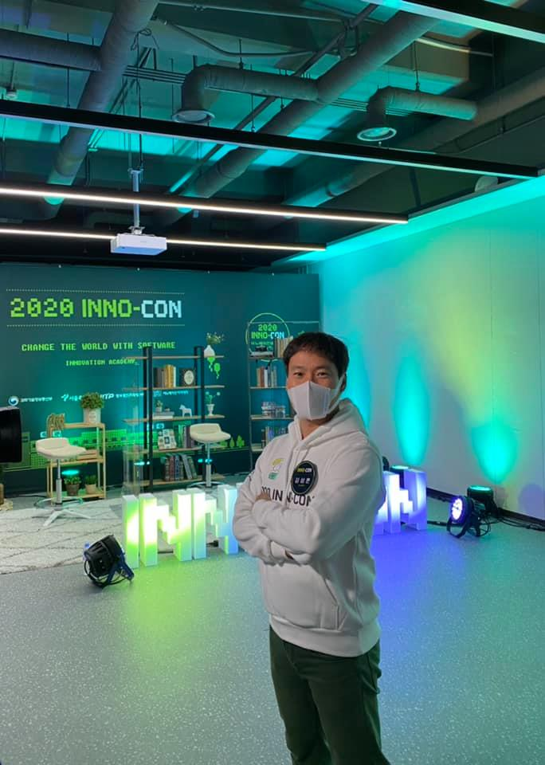
**이미지 캡션:** 한 성인 남성이 흰색 후드티와 녹색 바지를 입고 팔짱을 낀 채 카메라를 바라보고 있다. 남성은 흰색 마스크를 착용하고 있으며, 표정은 보이지 않는다. 배경에는 "2020 INNO-CON CHANGE THE WORLD WITH SOFTWARE INNOVATION ACADEMY"라고 적힌 대형 현수막이 걸려 있으며, 녹색과 파란색 조명이 공간을 밝히고 있다. 현수막 앞에는 "INNO-CON"이라는 글자가 입체적으로 디자인된 조명으로 설치되어 있다. 또한, 책장과 의자, 조명 장비 등도 보인다. 전반적으로 IT 관련 행사나 컨퍼런스의 홍보 부스 또는 무대 뒤편으로 보이는 분위기이다.련 행사나 컨퍼런스의 홍보 부스 또는 무대 뒤편으로 보이는 분위기이다.
 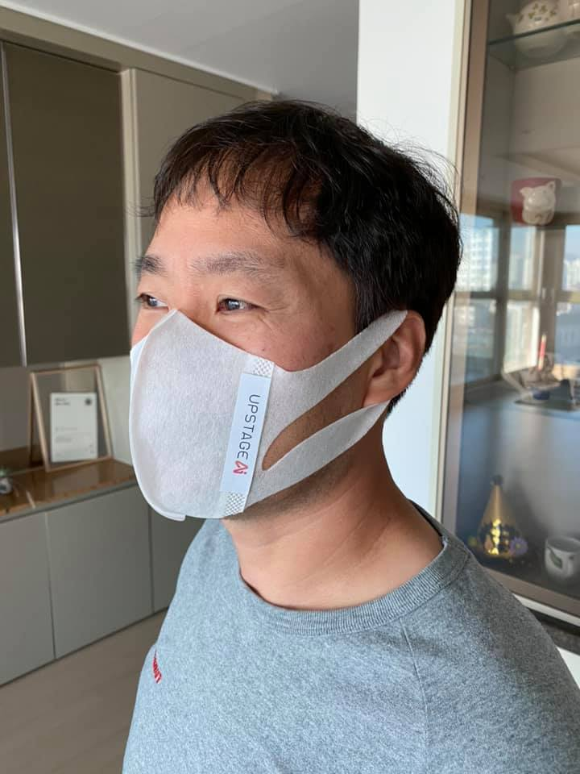
**이미지 캡션:** 사진에는 흰색 마스크를 착용한 성인 남성이 실내에서 옆모습을 보이고 있다. 남성은 40대 후반에서 50대 초반으로 보이며, 짧은 검은색 머리카락과 약간의 주름이 있다. 그는 무표정하지만 눈빛은 카메라를 향하고 있다. 남성은 회색 라글란 소매 티셔츠를 입고 있으며, 마스크에는 "UPSTAGEA"라는 글자가 흰색 바탕에 빨간색으로 적혀 있다. 배경에는 현대적인 디자인의 가구와 장식품이 보인다. 왼쪽에는 수납장과 액자가 걸려 있고, 오른쪽에는 유리 진열장이 있으며 그 안에는 찻잔과 장식품이 놓여 있다. 전반적으로 깔끔하고 정돈된 실내 환경이며, 남성은 편안한 모습으로 보인다.깔끔하고 정돈된 실내 환경이며, 남성은 편안한 모습으로 보인다.

### 12월 9일 (수) 07:39 · 📷 사진 (3장)

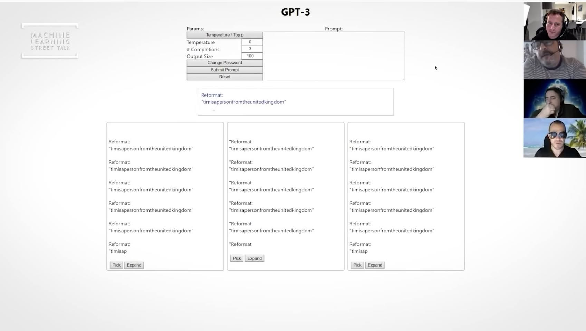
**이미지 캡션:** 화면에는 GPT-3라는 제목의 웹 인터페이스가 보이며, 왼쪽 상단에는 "MACHINE LEARNING STREET TALK"이라는 로고가 있다. 인터페이스는 크게 두 부분으로 나뉘는데, 왼쪽에는 "Params"와 "Prompt"를 설정하는 영역이 있고, 오른쪽에는 GPT-3의 결과가 표시되는 영역이다. "Params" 영역에는 Temperature, # Completions, Output Size 등의 설정값이 보이며, "Change Password", "Submit Prompt", "Reset" 버튼이 있다. "Prompt" 영역은 비어 있다. 결과 영역은 여러 개의 작은 창으로 나뉘어 있으며, 각 창에는 "Reformat:"이라는 문구와 함께 "timisapersonfromtheunitedkingdom"이라는 텍스트가 반복적으로 표시된다. 일부 창에는 "Pick"과 "Expand" 버튼도 보인다. 화면 오른쪽에는 네 명의 성인 남성이 화상 회의 형태로 나타나 있다. 첫 번째 남성은 헤드셋을 착용하고 있으며, 두 번째 남성은 안경을 쓰고 줄무늬 티셔츠를 입고 있다. 세 번째 남성은 검은색 옷을 입고 있으며, 네 번째 남성은 선글라스를 착용하고 야자수 배경을 하고 있다. 전반적으로 기술적인 주제에 대한 회의나 시연이 진행되는 것으로 보인다.. "Prompt" 영역은 비어 있다. 결과 영역은 여러 개의 작은 창으로 나뉘어 있으며, 각 창에는 "Reformat:"이라는 문구와 함께 "timisapersonfromtheunitedkingdom"이라는 텍스트가 반복적으로 표시된다. 일부 창에는 "Pick"과 "Expand" 버튼도 보인다. 화면 오른쪽에는 네 명의 성인 남성이 화상 회의 형태로 나타나 있다. 첫 번째 남성은 헤드셋을 착용하고 있으며, 두 번째 남성은 안경을 쓰고 줄무늬 티셔츠를 입고 있다. 세 번째 남성은 검은색 옷을 입고 있으며, 네 번째 남성은 선글라스를 착용하고 야자수 배경을 하고 있다. 전반적으로 기술적인 주제에 대한 회의나 시연이 진행되는 것으로 보인다.
 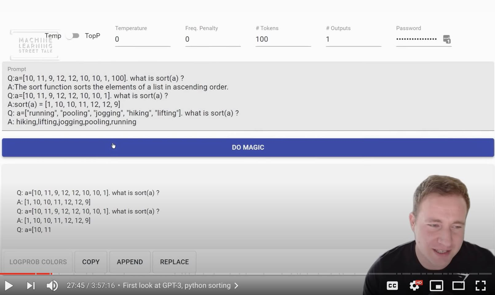
**이미지 캡션:** 화면 상단에는 "MACHINE LEARNING STREET TALK"이라는 로고와 함께 온도, TopP, 온도, 빈도 페널티, 토큰 수, 출력 수, 비밀번호를 설정하는 입력 필드들이 보인다. 그 아래에는 "Prompt"라는 제목과 함께 여러 개의 질문과 답변 쌍이 나열되어 있으며, 질문은 파이썬 리스트를 정렬하는 방법에 대한 것이고 답변은 정렬된 리스트를 보여준다. "DO MAGIC"이라는 파란색 버튼이 있으며, 그 아래에는 "LOGPROB COLORS", "COPY", "APPEND", "REPLACE" 버튼이 있다. 화면 오른쪽 하단에는 검은색 티셔츠를 입은 30대 후반에서 40대 초반으로 보이는 성인 남성이 웃으며 카메라를 바라보고 있다. 그는 밝은 조명 아래에 있으며, 배경은 흐릿하게 처리되어 있다. 화면 하단에는 비디오 재생 컨트롤과 함께 "27:45 / 3:57:16 • First look at GPT-3, python sorting"이라는 텍스트가 보인다. 전반적으로 기술 시연 또는 튜토리얼 영상의 일부로 보이며, 인공지능 모델의 코드 실행 결과를 보여주는 상황이다.튼이 있다. 화면 오른쪽 하단에는 검은색 티셔츠를 입은 30대 후반에서 40대 초반으로 보이는 성인 남성이 웃으며 카메라를 바라보고 있다. 그는 밝은 조명 아래에 있으며, 배경은 흐릿하게 처리되어 있다. 화면 하단에는 비디오 재생 컨트롤과 함께 "27:45 / 3:57:16 • First look at GPT-3, python sorting"이라는 텍스트가 보인다. 전반적으로 기술 시연 또는 튜토리얼 영상의 일부로 보이며, 인공지능 모델의 코드 실행 결과를 보여주는 상황이다.
 
**이미지 캡션:** 화면은 세 개의 창으로 분할되어 있으며, 상단 좌측 창에는 성인 남성이 검은색 후드티와 선글라스를 착용하고 있으며, 배경에는 열대 해변과 야자수가 보인다. 상단 우측 창에는 성인 남성이 검은색 티셔츠와 헤드폰을 착용하고 있으며, 배경은 흰색 벽으로 이루어져 있다. 하단 창에는 성인 남성이 파란색 티셔츠와 헤드폰을 착용하고 있으며, 마이크 앞에 앉아 있다. 배경에는 의자와 책상, 그리고 벽에 걸린 그림이 흐릿하게 보인다. 화면 하단에는 재생 시간, 제목 "Connor -- structure of the brain / How GPT works", 그리고 유튜브 컨트롤 바가 표시되어 있다. 전체적으로 온라인 화상 회의 또는 팟캐스트의 한 장면으로 보인다.n / How GPT works", 그리고 유튜브 컨트롤 바가 표시되어 있다. 전체적으로 온라인 화상 회의 또는 팟캐스트의 한 장면으로 보인다.

### 12월 13일 (일) 10:34 · The first snow run (in 2020) with a snow…

The first snow run (in 2020) with a snowman!

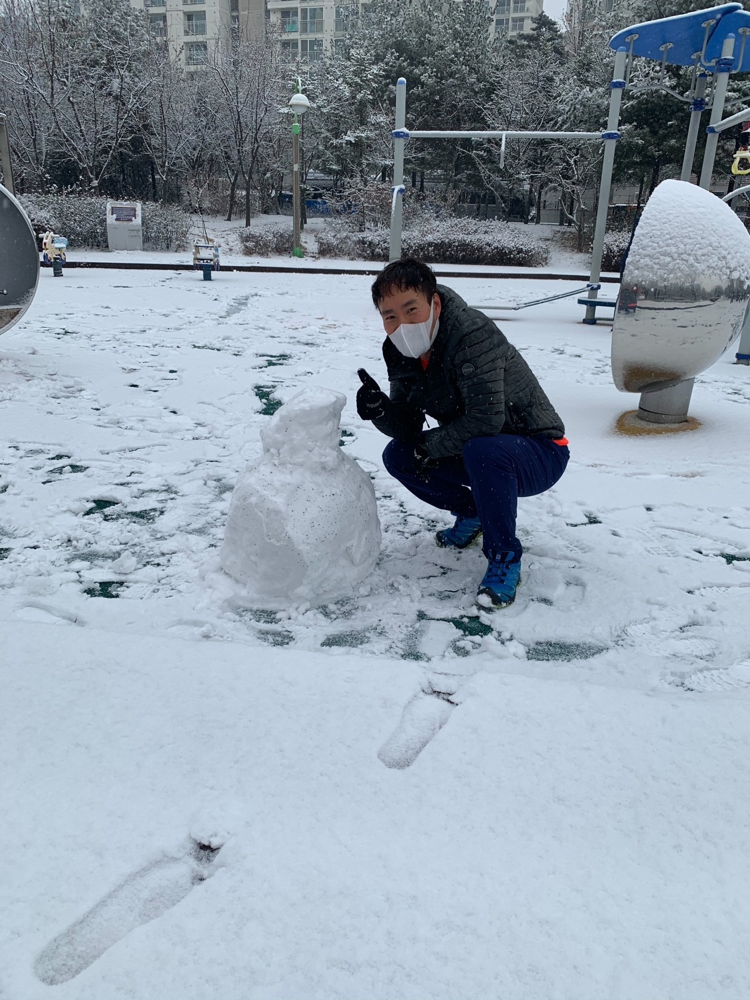
**이미지 캡션:** 눈이 쌓인 야외 놀이터에서 한 성인 남성이 무릎을 꿇고 앉아 엄지손가락을 치켜세우며 웃고 있다. 그는 회색 패딩 조끼와 파란색 바지, 파란색 운동화를 신고 있으며, 흰색 마스크를 착용하고 있다. 그의 앞에는 눈사람이 서 있고, 주변에는 눈이 쌓여 있으며 발자국이 보인다. 배경에는 나무와 아파트 건물, 그리고 놀이기구가 보인다. 전체적으로 눈 오는 날의 즐거운 분위기를 나타낸다.
 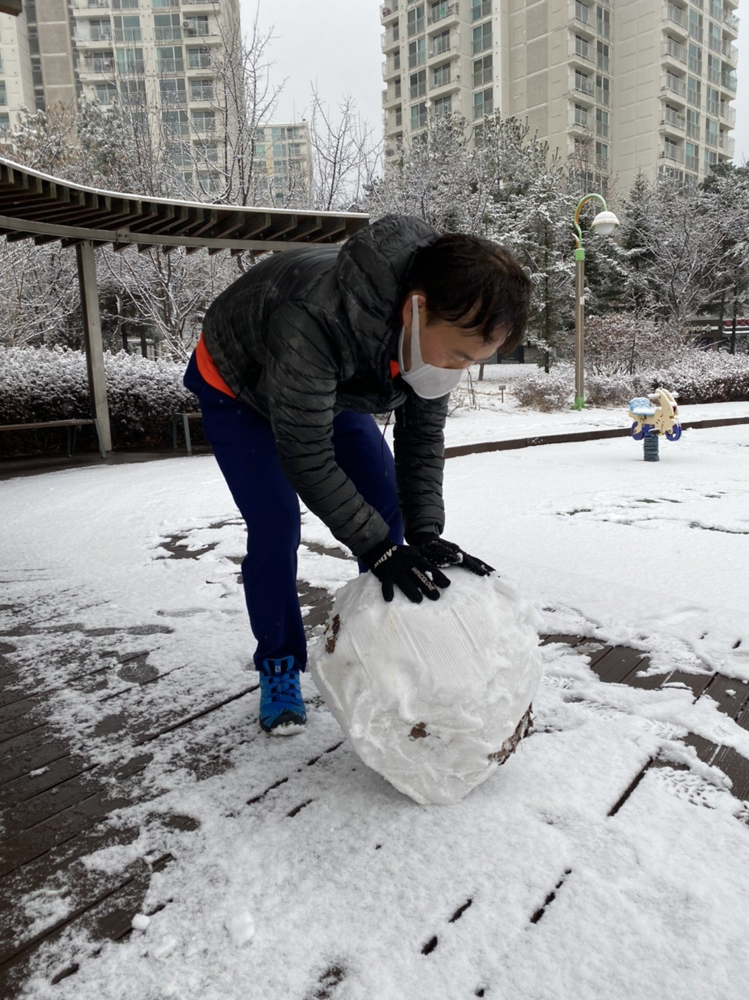
**이미지 캡션:** 눈이 쌓인 야외 놀이터에서 한 성인 남성이 흰색 마스크를 쓰고 검은색 패딩 점퍼와 파란색 바지, 파란색 운동화를 착용한 채 커다란 눈 뭉치를 만들고 있다. 남성은 눈 뭉치를 두 손으로 만지며 모양을 다듬고 있으며, 손에는 검은색 장갑을 끼고 있다. 배경에는 눈이 쌓인 나무들과 높은 아파트 건물들이 보이며, 놀이터에는 노란색과 파란색으로 된 놀이기구가 있다. 전체적으로 흐린 날씨에 눈이 내려 겨울 분위기를 자아낸다.

🎬 동영상 1개 (생략)

### 12월 15일 (화) 16:42 · #runtoupstage Run to Upstage AI! It's ju…

#runtoupstage Run to Upstage AI! It's just one hour run to the new upstage office. 

새로운 업스테이지 사무실 첫출근, 당연 달리기로 합니다. 집에서 10키로대 한시간 신나게 달렸습니다. 

함께 하실 분들은 모두 업스테이지로 고고!

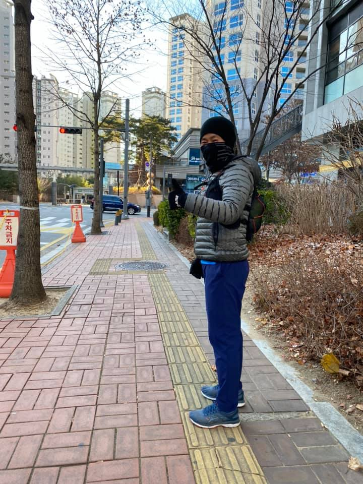
**이미지 캡션:** 한 성인 남성이 회색 패딩 조끼와 파란색 바지를 입고 검은색 비니와 마스크를 착용하고 있으며, 오른손에는 스마트폰을 들고 있다. 그는 도시 거리의 보도블록 위에 서 있으며, 배경에는 높은 아파트 건물들과 나무, 그리고 신호등이 보인다. 보도에는 점자 블록이 설치되어 있고, 나무 옆에는 "주차금지"라고 쓰인 주황색 표지판이 보인다. 전반적으로 맑은 날씨에 야외 활동을 하는 듯한 분위기이다.
 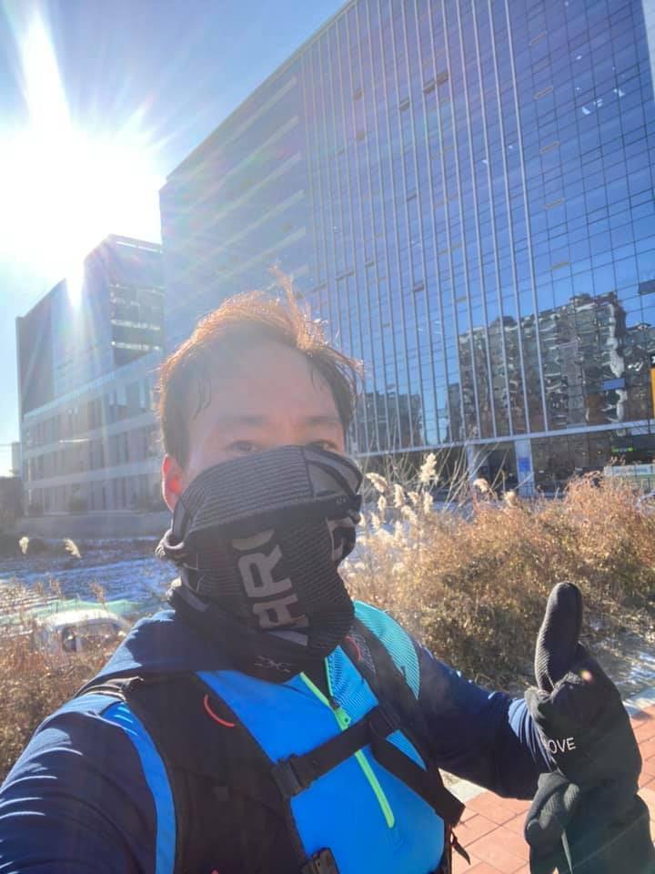
**이미지 캡션:** 햇살이 강하게 내리쬐는 야외에서 성인 남성이 셀카를 찍고 있으며, 그는 40대 후반에서 50대 초반으로 보이며 짧은 머리에 얼굴의 절반 이상을 검은색과 회색 패턴의 넥워머로 가리고 있다. 그는 파란색과 검은색이 조합된 스포츠 의류를 입고 있으며, 어깨에는 검은색 조끼를 메고 있다. 오른손에는 검은색 장갑을 끼고 엄지손가락을 치켜세우며 긍정적인 표정을 짓고 있다. 배경에는 현대적인 유리 외관의 고층 건물이 보이고, 그 앞에는 마른 풀과 약간의 눈이 쌓인 땅이 펼쳐져 있어 겨울철 야외 활동 중임을 짐작게 한다. 건물에는 창문들이 규칙적으로 배열되어 있으며, 햇빛이 반사되어 빛나고 있다. 전반적으로 활동적이고 건강한 분위기를 풍기는 사진이다.건물에는 창문들이 규칙적으로 배열되어 있으며, 햇빛이 반사되어 빛나고 있다. 전반적으로 활동적이고 건강한 분위기를 풍기는 사진이다.
 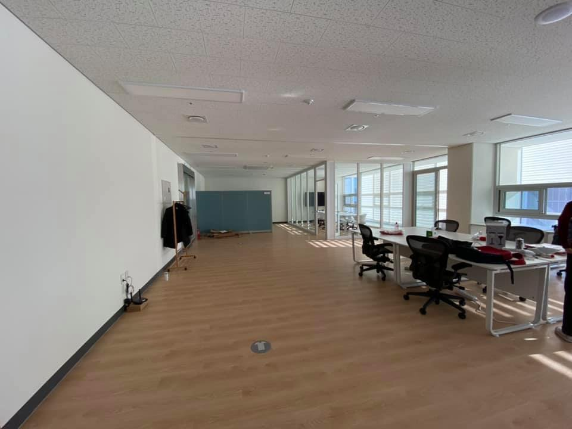
**이미지 캡션:** 이 사진은 현대적인 사무실 공간을 보여줍니다. 넓은 공간에는 여러 개의 책상과 의자가 배치되어 있으며, 일부는 회의용으로 사용되는 듯합니다. 유리 칸막이로 나뉜 공간도 보이며, 창문에는 블라인드가 설치되어 있습니다. 바닥은 밝은 색상의 나무 재질이며, 천장에는 형광등이 설치되어 있습니다. 사진 오른쪽에는 한 명의 성인 남성이 서 있는데, 검은색 상의와 바지를 입고 있으며, 그의 얼굴 표정이나 구체적인 행동은 명확하게 보이지 않습니다. 사무실 왼쪽 벽에는 옷걸이에 검은색 외투가 걸려 있고, 바닥에는 전선과 콘센트가 보입니다. 전반적으로 깔끔하고 정돈된 분위기의 사무실입니다.트가 보입니다. 전반적으로 깔끔하고 정돈된 분위기의 사무실입니다.
 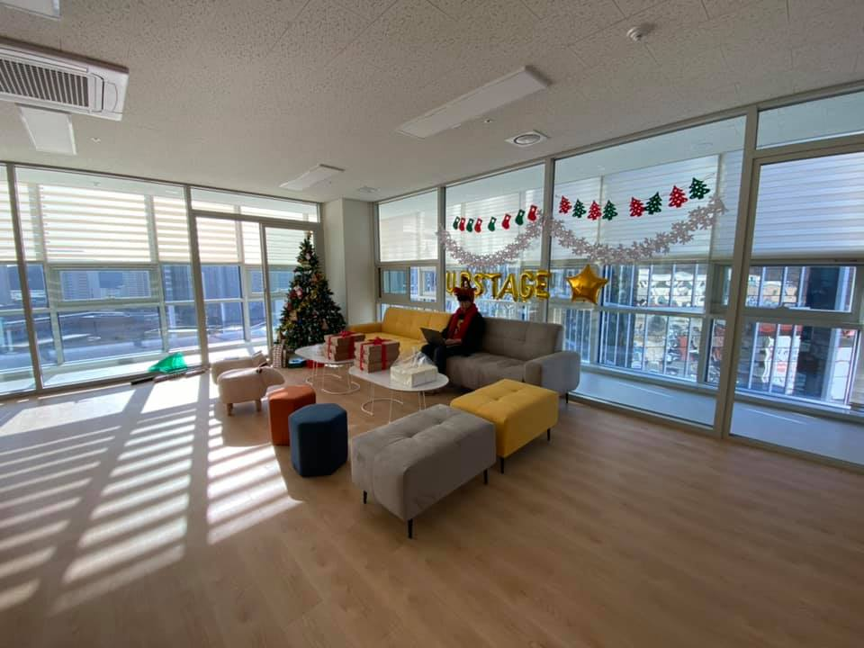
**이미지 캡션:** 넓은 창문이 있는 현대적인 실내 공간으로, 햇살이 비쳐 바닥에 그림자를 드리우고 있습니다. 중앙에는 노란색과 회색 소파가 놓여 있고, 그 앞에는 여러 개의 작은 스툴이 배치되어 있습니다. 한쪽에는 크리스마스 트리가 장식되어 있고, 선물 상자들도 보입니다. 창문 위에는 크리스마스 장식이 걸려 있으며, 풍선에는 "RUSSTAGE"라는 글자가 쓰여 있습니다. 한 성인 여성이 빨간색 모자와 검은색 옷을 입고 소파에 앉아 노트북을 사용하고 있으며, 표정은 편안해 보입니다. 전반적으로 따뜻하고 아늑한 분위기이며, 크리스마스 시즌을 맞이한 휴식 공간으로 보입니다.마스 시즌을 맞이한 휴식 공간으로 보입니다.
 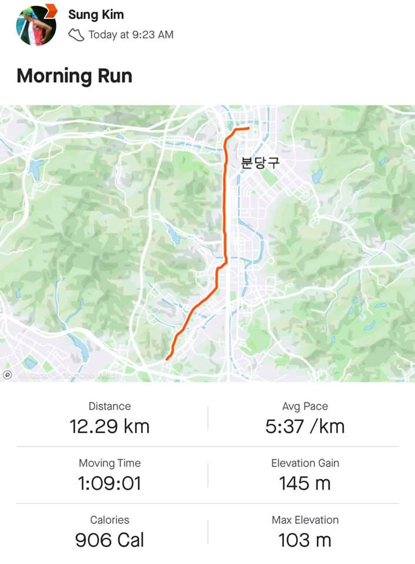
**이미지 캡션:** 이 사진은 'Sung Kim'이라는 이름의 사용자가 오늘 오전 9시 23분에 완료한 'Morning Run' 활동 기록을 보여줍니다. 사진 상단에는 사용자의 프로필 사진과 이름, 활동 시간이 표시되어 있습니다. 중앙에는 실제 달린 경로가 주황색 선으로 표시된 지도 이미지가 있으며, 지도에는 '분당구'라는 지명이 한국어로 표기되어 있습니다. 지도 아래에는 활동 통계가 나열되어 있는데, 총 거리는 12.29km, 평균 페이스는 5분 37초/km, 이동 시간은 1시간 9분 1초, 소모 칼로리는 906kcal입니다. 또한, 고도 변화는 145m, 최대 고도는 103m로 기록되어 있습니다. 사진 전반적으로 운동 기록 앱의 인터페이스를 보여주며, 활동적인 분위기를 나타냅니다. 또한, 고도 변화는 145m, 최대 고도는 103m로 기록되어 있습니다. 사진 전반적으로 운동 기록 앱의 인터페이스를 보여주며, 활동적인 분위기를 나타냅니다.

### 12월 16일 (수) 10:09 · 📷 사진 (1장)

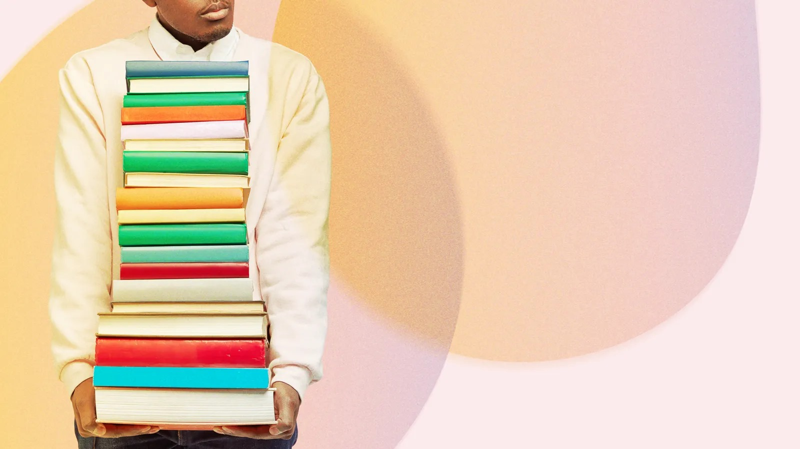
**이미지 캡션:** 한 성인 남성이 옅은 베이지색 스웨트셔츠와 흰색 셔츠를 입고, 손으로 여러 권의 책을 쌓아 들고 있다. 책들은 다양한 색상으로, 파란색, 빨간색, 흰색, 베이지색, 주황색, 녹색 등이며, 꽤 높이 쌓여 있어 남성의 상체 대부분을 가리고 있다. 남성은 정면을 응시하고 있으며, 그의 표정은 보이지 않지만 입술 주변의 모습으로 보아 무언가에 집중하고 있는 듯하다. 배경은 부드러운 파스텔톤으로, 왼쪽에는 노란색과 주황색이 섞인 그라데이션이 있고, 오른쪽에는 분홍색과 연한 주황색이 섞인 둥근 형태의 추상적인 디자인이 보인다. 전체적으로 밝고 긍정적인 분위기를 연출하며, 지식이나 학습과 관련된 이미지를 나타내는 것으로 보인다.보인다. 전체적으로 밝고 긍정적인 분위기를 연출하며, 지식이나 학습과 관련된 이미지를 나타내는 것으로 보인다.

> #올해최고의AI책 #투표하면크리스마스선물이   https://www.wired.com/gallery/best-books-artificial-intelligence/ 가 정한 8 Best Books About AI to read now 을 보고, 올해 여러분들이 읽은 책중 추천할만한 AI책은 무엇일지 궁금해졌습니다.  궁금하면 함께 알아봐야겠죠? 12월 20일까지 이 글의 댓글로 본인이 읽은책 + 한줄평, 그리고 혹시 출판사 관계자들중 책을 3권 정도 후원하실수 있으시면 책제목과 한줄평 이렇게 남겨주세요.  그럼 21일 부터 24일까지 제가 책 제목을 다 모아서 투표를 만들예정이고 저희 멤버들이 관심있는 책에 투표를 하시면 됩니다. 투표하시고 참여하신 분들에게 후원받은 책을 선물로 보내 드리겠습니다.  그럼 2020년 읽으신 멋진책 많은 소개 부탁드립니다!

### 12월 21일 (월) 07:49 · 📷 사진 (1장)

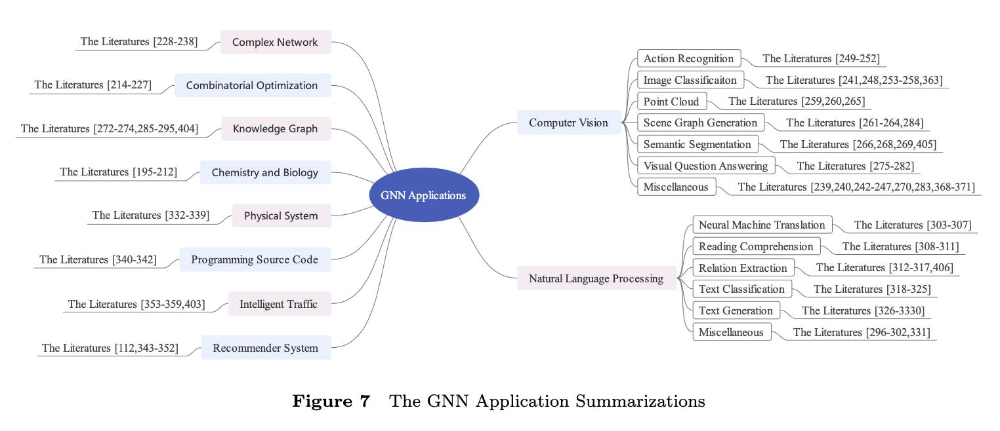
**이미지 캡션:** 이 이미지는 그래프 신경망(GNN)의 다양한 응용 분야를 요약한 마인드 맵입니다. 중앙에는 "GNN Applications"라는 제목의 파란색 타원형 노드가 있으며, 여기서 여러 가지 가지가 뻗어 나와 주요 응용 분야를 나타냅니다. 왼쪽에는 "Complex Network", "Combinatorial Optimization", "Knowledge Graph", "Chemistry and Biology", "Physical System", "Programming Source Code", "Intelligent Traffic", "Recommender System"과 같은 분야들이 각각 관련 문헌 목록과 함께 표시되어 있습니다. 오른쪽에는 "Computer Vision"과 "Natural Language Processing"이라는 두 개의 큰 범주가 있으며, 각각 하위 응용 분야들을 포함합니다. "Computer Vision" 아래에는 "Action Recognition", "Image Classification", "Point Cloud", "Scene Graph Generation", "Semantic Segmentation", "Visual Question Answering", "Miscellaneous"가 있으며, 각 분야별로 관련 문헌 번호가 기재되어 있습니다. "Natural Language Processing" 아래에는 "Neural Machine Translation", "Reading Comprehension", "Relation Extraction", "Text Classification", "Text Generation", "Miscellaneous"가 있으며, 이 역시 관련 문헌 번호와 함께 표시됩니다. 이미지 하단에는 "Figure 7 The GNN Application Summarizations"라는 제목이 있습니다. 이 이미지는 학술적인 내용을 시각적으로 정리한 것으로, 특정 인물이나 장소, 사물은 등장하지 않으며, 텍스트 정보와 구조적인 관계를 중심으로 구성되어 있습니다. 전반적으로 정보 전달에 초점을 맞춘 차분하고 분석적인 분위기입니다.Traffic", "Recommender System"과 같은 분야들이 각각 관련 문헌 목록과 함께 표시되어 있습니다. 오른쪽에는 "Computer Vision"과 "Natural Language Processing"이라는 두 개의 큰 범주가 있으며, 각각 하위 응용 분야들을 포함합니다. "Computer Vision" 아래에는 "Action Recognition", "Image Classification", "Point Cloud", "Scene Graph Generation", "Semantic Segmentation", "Visual Question Answering", "Miscellaneous"가 있으며, 각 분야별로 관련 문헌 번호가 기재되어 있습니다. "Natural Language Processing" 아래에는 "Neural Machine Translation", "Reading Comprehension", "Relation Extraction", "Text Classification", "Text Generation", "Miscellaneous"가 있으며, 이 역시 관련 문헌 번호와 함께 표시됩니다. 이미지 하단에는 "Figure 7 The GNN Application Summarizations"라는 제목이 있습니다. 이 이미지는 학술적인 내용을 시각적으로 정리한 것으로, 특정 인물이나 장소, 사물은 등장하지 않으며, 텍스트 정보와 구조적인 관계를 중심으로 구성되어 있습니다. 전반적으로 정보 전달에 초점을 맞춘 차분하고 분석적인 분위기입니다.

> Junhyun  Lee 님이 소개해주신 논문인데요 매우 수식이 많은 논문이지만 400개 이상의 GNN 논문을 정리하고 해당 어플리케에션들을 잘 정리해둔것 같습니다. 월요일 부터 멋진 읽을 거리 소개해주셔서 감사합니다.  https://www.facebook.com/groups/2190093671090112/permalink/3232749483491187/  논문링크: [https://arxiv.org/abs/2012.08752](https://arxiv.org/abs/2012.08752?fbclid=IwAR0gbY5d4JahiatGehPp8ESCGq8GVHPktO8aMXsRnnZluxCfRHAlUXBDSSU)

### 12월 24일 (목) 06:43 · Our lab has been blessed with a number o…

Our lab has been blessed with a number of recent successes including these new professors! Best of luck at your universities with all of your future endeavors!!

저희 연구실 김진대 박사님, 김미정 박사님이 올해 교수로 임용되시면서,  총 4분이 교수님이 되셨습니다. 같이 연구하는동안 정말 즐겁게 토론하고 결과들을 만들수 있어서 저에게 큰 축복이였습니다. 모두 멋진 교수님, 그리고 좋은 연구와 좋은 교육 기대합니다!
https://www.cse.ust.hk/pg/ourgraduates/?s=sunghun+kim

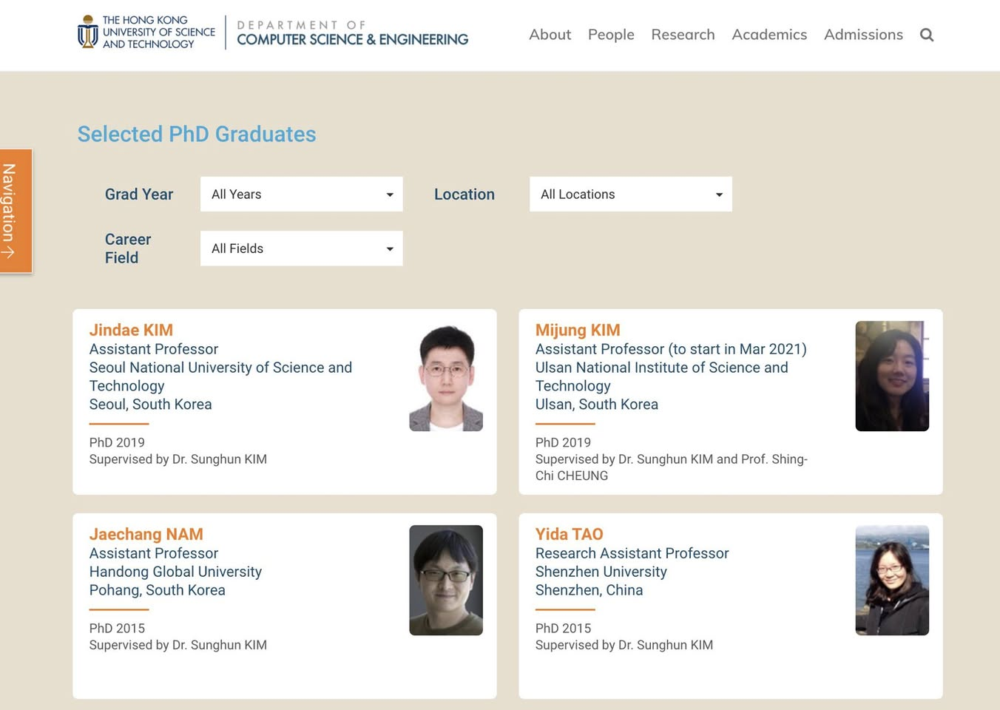
**이미지 캡션:** 이 화면은 홍콩 과학기술대학교 컴퓨터 과학 및 공학부의 박사 학위 취득자 명단을 보여주는 웹페이지입니다. 상단에는 학교 로고와 학부 이름, 그리고 "About", "People", "Research", "Academics", "Admissions" 등의 메뉴가 있습니다. "Selected PhD Graduates"라는 제목 아래에는 졸업 연도, 경력 분야, 지역을 선택할 수 있는 드롭다운 메뉴가 있습니다. 화면에는 총 네 명의 박사 학위 취득자 정보가 카드 형태로 표시되어 있습니다. 첫 번째 카드에는 Jindae KIM이라는 성인 남성이 있으며, 그는 서울과학기술대학교의 조교수이고 2019년에 박사 학위를 취득했으며 Sunghun KIM 박사의 지도를 받았습니다. 두 번째 카드에는 Mijung KIM이라는 성인 여성이 있으며, 그녀는 2021년 3월부터 울산과학기술대학교의 조교수로 근무 예정이고 2019년에 박사 학위를 취득했으며 Sunghun KIM 박사와 Shing-Chi CHEUNG 교수의 지도를 받았습니다. 세 번째 카드에는 Jaechang NAM이라는 성인 남성이 있으며, 그는 한동대학교의 조교수이고 2015년에 박사 학위를 취득했으며 Sunghun KIM 박사의 지도를 받았습니다. 네 번째 카드에는 Yida TAO라는 성인 여성이 있으며, 그녀는 심천대학교의 연구 조교수이고 2015년에 박사 학위를 취득했으며 Sunghun KIM 박사의 지도를 받았습니다. 각 카드에는 해당 인물의 사진과 함께 이름, 직책, 소속 대학, 졸업 연도, 지도 교수 정보가 기재되어 있습니다. 전반적으로 깔끔하고 정보 전달에 초점을 맞춘 디자인입니다.ae KIM이라는 성인 남성이 있으며, 그는 서울과학기술대학교의 조교수이고 2019년에 박사 학위를 취득했으며 Sunghun KIM 박사의 지도를 받았습니다. 두 번째 카드에는 Mijung KIM이라는 성인 여성이 있으며, 그녀는 2021년 3월부터 울산과학기술대학교의 조교수로 근무 예정이고 2019년에 박사 학위를 취득했으며 Sunghun KIM 박사와 Shing-Chi CHEUNG 교수의 지도를 받았습니다. 세 번째 카드에는 Jaechang NAM이라는 성인 남성이 있으며, 그는 한동대학교의 조교수이고 2015년에 박사 학위를 취득했으며 Sunghun KIM 박사의 지도를 받았습니다. 네 번째 카드에는 Yida TAO라는 성인 여성이 있으며, 그녀는 심천대학교의 연구 조교수이고 2015년에 박사 학위를 취득했으며 Sunghun KIM 박사의 지도를 받았습니다. 각 카드에는 해당 인물의 사진과 함께 이름, 직책, 소속 대학, 졸업 연도, 지도 교수 정보가 기재되어 있습니다. 전반적으로 깔끔하고 정보 전달에 초점을 맞춘 디자인입니다.

### 12월 24일 (목) 22:55 · Got problems to solve using AI? Please c…

https://www.upstage.ai/#probono

Got problems to solve using AI? Please check out our pro-bono office hours! Merry Christmas and Happy New Year!

여러분들의 도메인에 AI기술을 적용하고 싶다면 조경현교수님, Lei Chen Upstage 어드바이저들과 함께하는 무료 상담을 신청해보세요.

즐거운 크리스마스와 새해 되세요!

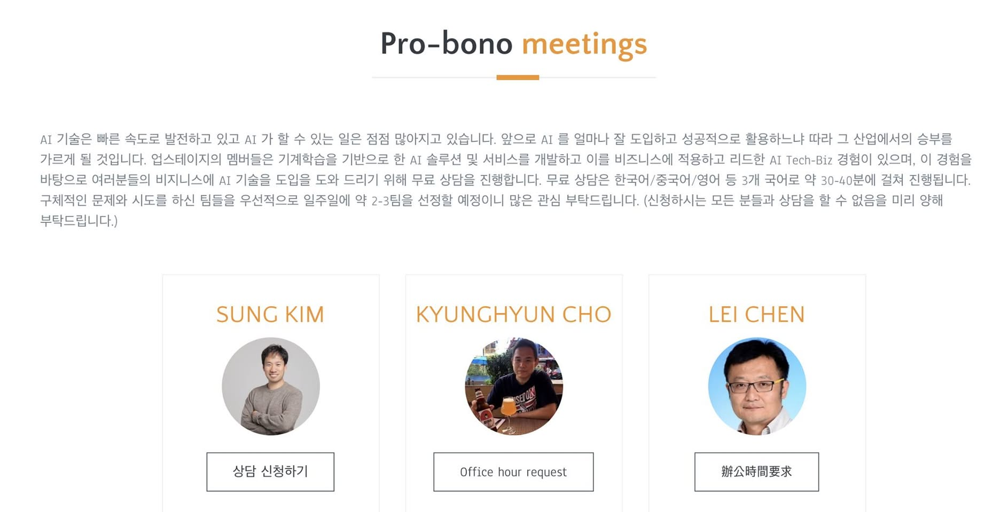
**이미지 캡션:** 화면 상단에는 "Pro-bono meetings"라는 제목이 보이며, 그 아래에는 AI 기술의 발전과 비즈니스 적용에 대한 설명이 한국어로 작성되어 있습니다. 이 설명은 업스테이지 멤버들이 기계 학습 기반 AI 솔루션 및 서비스를 개발하고 비즈니스에 적용한 경험을 바탕으로 무료 상담을 제공한다는 내용을 담고 있습니다. 상담은 한국어, 중국어, 영어 등 3개 국어로 진행되며, 약 30-40분 소요됩니다. 일주일에 2-3팀을 선정하여 상담을 진행할 예정이며, 모든 신청자와 상담할 수 없음을 미리 양해해달라는 내용도 포함되어 있습니다. 화면 하단에는 세 명의 남성이 각각의 이름과 함께 사진으로 소개되어 있습니다. 왼쪽부터 "SUNG KIM"이라는 이름의 성인 남성이 회색 니트를 입고 미소를 짓고 있으며, "상담 신청하기"라는 버튼이 있습니다. 가운데에는 "KYUNGHYUN CHO"라는 이름의 성인 남성이 캐주얼한 복장으로 맥주병과 맥주잔을 들고 있는 사진이 있으며, "Office hour request"라는 버튼이 있습니다. 오른쪽에는 "LEI CHEN"이라는 이름의 성인 남성이 안경을 쓰고 정장 차림으로 보이는 복장을 하고 있으며, "辦公時間要求"라는 버튼이 있습니다. 전반적으로 전문적이고 정보를 제공하는 분위기이며, AI 기술 상담에 대한 안내를 하고 있습니다.도 포함되어 있습니다. 화면 하단에는 세 명의 남성이 각각의 이름과 함께 사진으로 소개되어 있습니다. 왼쪽부터 "SUNG KIM"이라는 이름의 성인 남성이 회색 니트를 입고 미소를 짓고 있으며, "상담 신청하기"라는 버튼이 있습니다. 가운데에는 "KYUNGHYUN CHO"라는 이름의 성인 남성이 캐주얼한 복장으로 맥주병과 맥주잔을 들고 있는 사진이 있으며, "Office hour request"라는 버튼이 있습니다. 오른쪽에는 "LEI CHEN"이라는 이름의 성인 남성이 안경을 쓰고 정장 차림으로 보이는 복장을 하고 있으며, "辦公時間要求"라는 버튼이 있습니다. 전반적으로 전문적이고 정보를 제공하는 분위기이며, AI 기술 상담에 대한 안내를 하고 있습니다.

### 12월 24일 (목) 23:56 · 📷 사진 (1장)

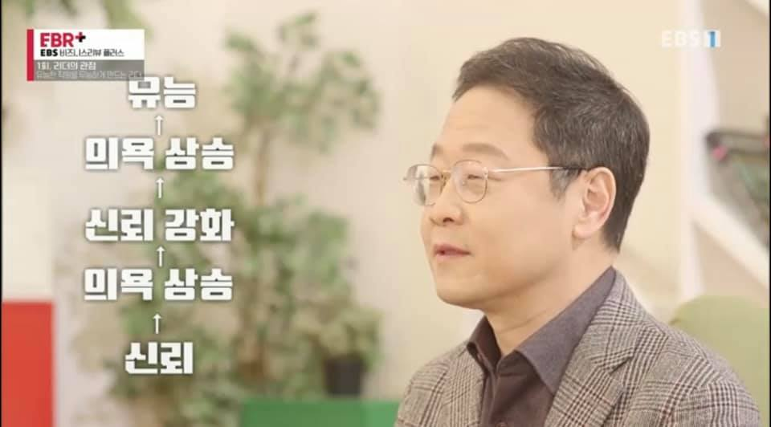
**이미지 캡션:** 화면 오른쪽에는 안경을 쓴 40대 후반에서 50대 초반으로 보이는 성인 남성이 측면을 바라보며 이야기하고 있으며, 그는 격자무늬 재킷 안에 짙은 색 셔츠를 입고 있다. 화면 왼쪽에는 "EBR+"라는 로고와 함께 "EBS 비즈니스리뷰 플러스"라는 문구가 보이며, 그 아래에는 "1회, 리더의 관점"이라는 글씨와 함께 "유능", "미목 삼슴", "신뢰 강화", "미목 삼슴", "신뢰"라는 단어들이 위쪽 화살표와 함께 계층적으로 나열되어 있다. 배경에는 흐릿하게 식물과 실내 공간이 보인다. 전반적으로 교육 또는 강연 프로그램의 한 장면으로 보이며, 진지하고 정보 전달적인 분위기이다. 프로그램의 한 장면으로 보이며, 진지하고 정보 전달적인 분위기이다.

### 12월 25일 (금) 20:30 · 📷 사진 (3장)

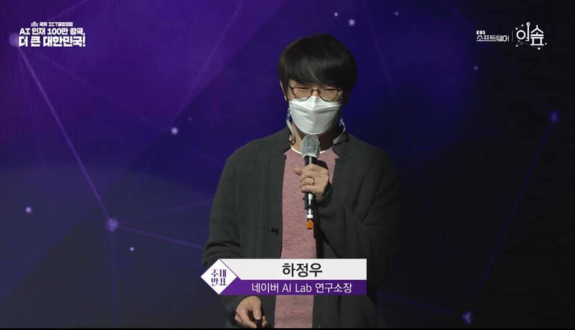
**이미지 캡션:** 이 사진은 무대 위에서 마이크를 들고 서 있는 한 성인 남성을 보여준다. 그는 검은색 안경을 쓰고 흰색 마스크를 착용하고 있으며, 짙은 회색 카디건 안에 붉은색 상의를 입고 있다. 그의 머리는 검은색이며 짧게 잘려 있다. 남성은 약간 고개를 숙이고 마이크를 잡고 있으며, 표정은 마스크 때문에 명확하게 보이지 않지만 차분한 분위기이다. 배경은 어두운 보라색이며, 빛나는 점들과 연결된 선들이 기하학적인 패턴을 이루고 있어 미래지향적이거나 기술적인 느낌을 준다. 무대 좌측 상단에는 "AI 인재 100만 강국, 더 큰 대한민국!"이라는 문구가 적힌 현수막이 걸려 있고, 우측 상단에는 "EBS 소프트웨어 이솜"이라는 로고가 보인다. 남성의 앞쪽에는 "주요 발표"라는 글자와 함께 "하정우 네이버 AI Lab 연구소장"이라고 적힌 명패가 놓여 있다. 전반적으로 기술 관련 행사나 발표회에서 연설하는 듯한 분위기이다.큰 대한민국!"이라는 문구가 적힌 현수막이 걸려 있고, 우측 상단에는 "EBS 소프트웨어 이솜"이라는 로고가 보인다. 남성의 앞쪽에는 "주요 발표"라는 글자와 함께 "하정우 네이버 AI Lab 연구소장"이라고 적힌 명패가 놓여 있다. 전반적으로 기술 관련 행사나 발표회에서 연설하는 듯한 분위기이다.
 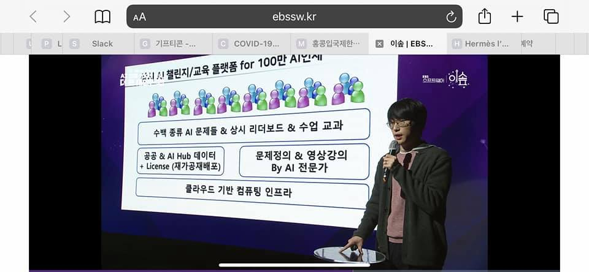
**이미지 캡션:** 한 젊은 성인 남성이 무대 위에서 마이크를 잡고 발표하고 있으며, 그의 뒤에는 AI 챌린지 및 교육 플랫폼에 대한 프레젠테이션 슬라이드가 보입니다. 남성은 검은색 안경을 쓰고 있으며, 회색 카디건 안에 분홍색 티셔츠를 입고 있습니다. 그의 표정은 진지하며, 손가락으로 무언가를 가리키고 있습니다. 슬라이드에는 "100만 AI인을 위한 챌린지/교육 플랫폼"이라는 제목과 함께 다양한 AI 관련 서비스 및 인프라에 대한 설명이 한국어로 적혀 있습니다. 배경은 보라색이며, 무대에는 반짝이는 원형 물체가 놓여 있습니다. 전체적으로 기술 발표회 또는 컨퍼런스의 한 장면으로 보입니다. 전체적으로 기술 발표회 또는 컨퍼런스의 한 장면으로 보입니다.
 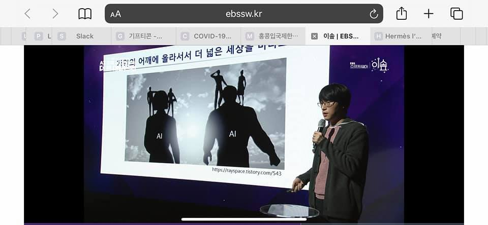
**이미지 캡션:** 화면 중앙에는 발표자가 마이크를 들고 강연하고 있으며, 그의 뒤로는 대형 스크린이 보인다. 스크린에는 "중국인의 어깨에 올라서서 더 넓은 세상을 비"라는 한국어 문구와 함께 실루엣으로 표현된 여러 사람의 모습이 담겨 있다. 이 실루엣 중 일부에는 "AI"라는 글자가 표시되어 있다. 발표자는 20대 후반에서 30대 초반으로 보이는 성인 남성으로, 검은색 안경을 착용하고 있으며 회색 후드티와 분홍색 티셔츠를 입고 있다. 그는 마이크를 쥔 오른손을 입 가까이 가져가고 왼손으로는 무언가를 가리키는 듯한 제스처를 취하고 있다. 배경은 보라색 조명으로 채워져 있으며, 스크린 하단에는 웹사이트 주소 "https://rayspace.tistory.com/543"이 보인다. 전체적으로 강연 또는 발표회 상황으로 보이며, 인공지능(AI)과 관련된 주제를 다루고 있는 것으로 추측된다.고 있다. 배경은 보라색 조명으로 채워져 있으며, 스크린 하단에는 웹사이트 주소 "https://rayspace.tistory.com/543"이 보인다. 전체적으로 강연 또는 발표회 상황으로 보이며, 인공지능(AI)과 관련된 주제를 다루고 있는 것으로 추측된다.

### 12월 28일 (월) 17:45 · Good to have JiHyun Kim and Jimin  Lee w…

Good to have JiHyun Kim and Jimin  Lee with Upstage T-shirts! Love your smile!

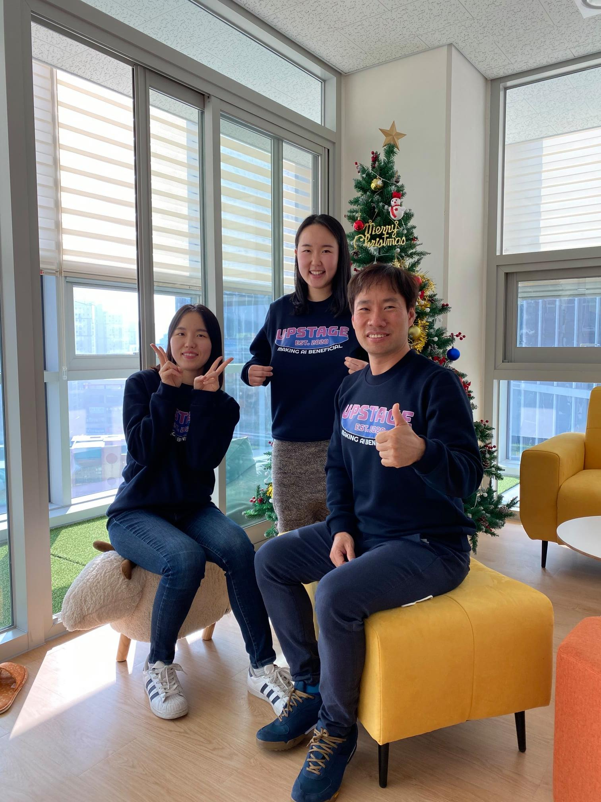
**이미지 캡션:** 세 명의 젊은 성인들이 크리스마스 트리 옆에 서서 사진을 찍고 있다. 왼쪽의 젊은 여성은 흰색 운동화와 청바지, 네이비색 후드티를 입고 있으며, 양손으로 브이 포즈를 취하고 있다. 가운데 서 있는 젊은 여성은 갈색 스커트와 네이비색 후드티를 입고 환하게 웃고 있다. 오른쪽의 성인 남성은 네이비색 바지와 네이비색 후드티를 입고 엄지손가락을 치켜세우며 웃고 있다. 세 사람 모두 네이비색 후드티에는 "UPSTAGE EST. 2020 MAKING AI BENEFICIAL"이라는 문구가 적혀 있다. 배경에는 창문과 크리스마스 트리가 보이며, 노란색과 주황색 의자가 놓여 있어 사무실이나 휴게 공간으로 보인다. 전반적으로 즐겁고 편안한 분위기이다.리스마스 트리가 보이며, 노란색과 주황색 의자가 놓여 있어 사무실이나 휴게 공간으로 보인다. 전반적으로 즐겁고 편안한 분위기이다.
