# 2021년 2월

[← 2021년](README.md)

### 2월 1일 (월) 19:05 · 📷 사진 (1장)

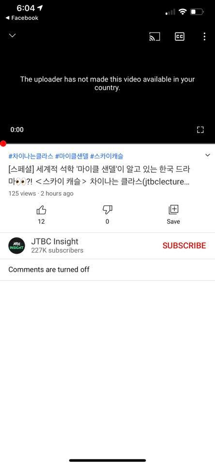
**이미지 캡션:** 화면 상단에는 페이스북 로고와 함께 시간 정보가 표시되어 있으며, 그 아래에는 "The uploader has not made this video available in your country."라는 문구가 검은색 배경에 흰색 글씨로 나타나 있어 해당 영상이 시청자의 국가에서는 재생할 수 없음을 알리고 있습니다. 영상 재생 시간은 0:00으로 표시되어 있으며, 영상 제목은 해시태그와 함께 "#차이나는클라스 #마이클샌델 #스카이캐슬 [스페셜] 세계적 석학 '마이클 샌델'이 알고 있는 한국 드라마?! <스카이 캐슬 > 차이나는 클라스(jtbclecture..."로 되어 있습니다. 영상 조회수는 125회이며, 2시간 전에 게시되었습니다. 좋아요는 12개, 싫어요는 0개로 표시되어 있습니다. 영상 채널은 "JTBC Insight"이며, 구독자 수는 227K명입니다. 채널명 아래에는 "SUBSCRIBE" 버튼이 빨간색으로 강조되어 있습니다. 댓글은 "Comments are turned off"라는 문구와 함께 비활성화되어 있습니다. 전반적으로 영상 시청이 제한된 상황을 보여주는 유튜브 화면의 일부입니다.슬 > 차이나는 클라스(jtbclecture..."로 되어 있습니다. 영상 조회수는 125회이며, 2시간 전에 게시되었습니다. 좋아요는 12개, 싫어요는 0개로 표시되어 있습니다. 영상 채널은 "JTBC Insight"이며, 구독자 수는 227K명입니다. 채널명 아래에는 "SUBSCRIBE" 버튼이 빨간색으로 강조되어 있습니다. 댓글은 "Comments are turned off"라는 문구와 함께 비활성화되어 있습니다. 전반적으로 영상 시청이 제한된 상황을 보여주는 유튜브 화면의 일부입니다.

### 2월 9일 (화) 17:17 · If you are around, we will be at the clu…

If you are around, we will be at the clubhouse tonight https://www.joinclubhouse.com/event/m21GDN6q at 9PM KST.

오늘 저녁 9시 클럽하우스에 업스테이지 AI개발자들 모여 AI미래, 우리의 미래에 대해 이야기 하고, AI개발 함께 하실분들 스피커로 모셔 이야기 나누고 싶습니다.

### 2월 9일 (화) 19:00 · 📷 사진 (1장)

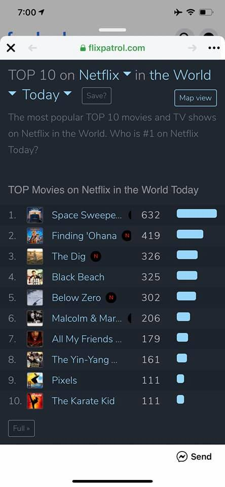
**이미지 캡션:** 이것은 flixpatrol.com 웹사이트의 스크린샷으로, 넷플릭스에서 전 세계적으로 인기 있는 영화 TOP 10 목록을 보여줍니다. 화면 상단에는 웹사이트 주소와 함께 "TOP 10 on Netflix in the World"라는 제목이 표시되어 있으며, "Today"라는 드롭다운 메뉴와 "Save?" 및 "Map view" 버튼이 있습니다. 그 아래에는 "The most popular TOP 10 movies and TV shows on Netflix in the World. Who is #1 on Netflix Today?"라는 설명이 있습니다. 목록은 "TOP Movies on Netflix in the World Today"라는 제목 아래에 있으며, 1위부터 10위까지 영화 제목, 썸네일 이미지, 시청자 수, 그리고 시청자 수를 나타내는 막대가 표시됩니다. 1위는 "Space Sweepe..."로 632명, 2위는 "Finding 'Ohana"로 419명, 3위는 "The Dig"로 326명, 4위는 "Black Beach"로 325명, 5위는 "Below Zero"로 302명, 6위는 "Malcolm & Mar..."로 206명, 7위는 "All My Friends ..."로 179명, 8위는 "The Yin-Yang ..."로 161명, 9위는 "Pixels"로 111명, 10위는 "The Karate Kid"로 111명입니다. 일부 영화 제목 옆에는 'N' 표시가 있는데, 이는 넷플릭스 오리지널 콘텐츠임을 나타낼 수 있습니다. 화면 하단에는 "Full" 버튼과 "Send" 버튼이 있습니다. 전반적으로 이 화면은 넷플릭스 인기 영화 순위를 보여주는 정보성 콘텐츠를 담고 있으며, 사용자가 정보를 확인하고 공유할 수 있도록 합니다.flix Today?"라는 설명이 있습니다. 목록은 "TOP Movies on Netflix in the World Today"라는 제목 아래에 있으며, 1위부터 10위까지 영화 제목, 썸네일 이미지, 시청자 수, 그리고 시청자 수를 나타내는 막대가 표시됩니다. 1위는 "Space Sweepe..."로 632명, 2위는 "Finding 'Ohana"로 419명, 3위는 "The Dig"로 326명, 4위는 "Black Beach"로 325명, 5위는 "Below Zero"로 302명, 6위는 "Malcolm & Mar..."로 206명, 7위는 "All My Friends ..."로 179명, 8위는 "The Yin-Yang ..."로 161명, 9위는 "Pixels"로 111명, 10위는 "The Karate Kid"로 111명입니다. 일부 영화 제목 옆에는 'N' 표시가 있는데, 이는 넷플릭스 오리지널 콘텐츠임을 나타낼 수 있습니다. 화면 하단에는 "Full" 버튼과 "Send" 버튼이 있습니다. 전반적으로 이 화면은 넷플릭스 인기 영화 순위를 보여주는 정보성 콘텐츠를 담고 있으며, 사용자가 정보를 확인하고 공유할 수 있도록 합니다.

### 2월 10일 (수) 14:39 · 📷 사진 (2장)

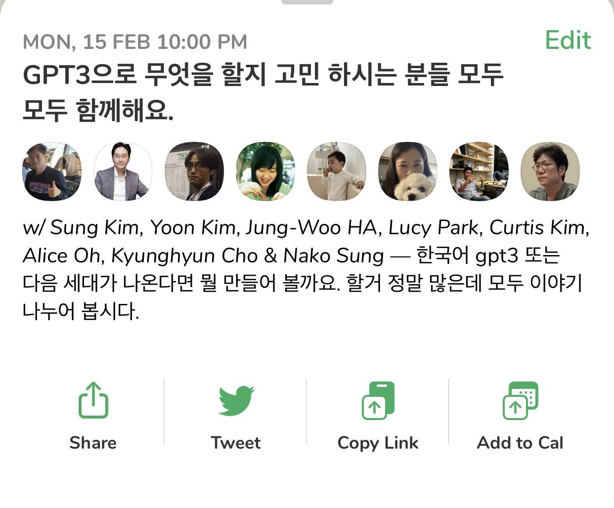
**이미지 캡션:** 화면 상단에는 "MON, 15 FEB 10:00 PM"이라는 날짜와 시간이 표시되어 있고, 그 아래에는 "GPT3으로 무엇을 할지 고민 하시는 분들 모두 모두 함께해요."라는 한국어 문구가 큰 글씨로 쓰여 있습니다. 오른쪽 상단에는 "Edit"라는 단어가 녹색으로 보입니다. 그 아래에는 7개의 원형 프로필 사진이 나란히 배치되어 있으며, 각 사진에는 다양한 연령대의 사람들이 담겨 있습니다. 첫 번째 사진에는 검은색 티셔츠를 입고 엄지손가락을 치켜든 성인 남성이, 두 번째 사진에는 흰색 셔츠와 재킷을 입은 성인 남성이, 세 번째 사진에는 안경을 쓴 성인 남성이, 네 번째 사진에는 짧은 머리의 젊은 여성, 다섯 번째 사진에는 아기, 여섯 번째 사진에는 강아지와 함께 있는 여성, 일곱 번째 사진에는 책장 앞에 앉아 있는 성인 남성이, 마지막 사진에는 안경을 쓴 성인 여성이 보입니다. 프로필 사진 아래에는 "w/ Sung Kim, Yoon Kim, Jung-Woo HA, Lucy Park, Curtis Kim, Alice Oh, Kyunghyun Cho & Nako Sung — 한국어 gpt3 또는 다음 세대가 나온다면 뭘 만들어 볼까요. 할거 정말 많은데 모두 이야기 나누어 봅시다."라는 긴 한국어 문장이 이어집니다. 화면 하단에는 네 개의 아이콘과 함께 "Share", "Tweet", "Copy Link", "Add to Cal"이라는 영어 단어가 각각 표시되어 있습니다. 전체적으로는 온라인 커뮤니티나 소셜 미디어 게시물의 일부로 보이며, GPT-3 기술에 대한 논의를 제안하는 내용입니다. 남성이, 세 번째 사진에는 안경을 쓴 성인 남성이, 네 번째 사진에는 짧은 머리의 젊은 여성, 다섯 번째 사진에는 아기, 여섯 번째 사진에는 강아지와 함께 있는 여성, 일곱 번째 사진에는 책장 앞에 앉아 있는 성인 남성이, 마지막 사진에는 안경을 쓴 성인 여성이 보입니다. 프로필 사진 아래에는 "w/ Sung Kim, Yoon Kim, Jung-Woo HA, Lucy Park, Curtis Kim, Alice Oh, Kyunghyun Cho & Nako Sung — 한국어 gpt3 또는 다음 세대가 나온다면 뭘 만들어 볼까요. 할거 정말 많은데 모두 이야기 나누어 봅시다."라는 긴 한국어 문장이 이어집니다. 화면 하단에는 네 개의 아이콘과 함께 "Share", "Tweet", "Copy Link", "Add to Cal"이라는 영어 단어가 각각 표시되어 있습니다. 전체적으로는 온라인 커뮤니티나 소셜 미디어 게시물의 일부로 보이며, GPT-3 기술에 대한 논의를 제안하는 내용입니다.
 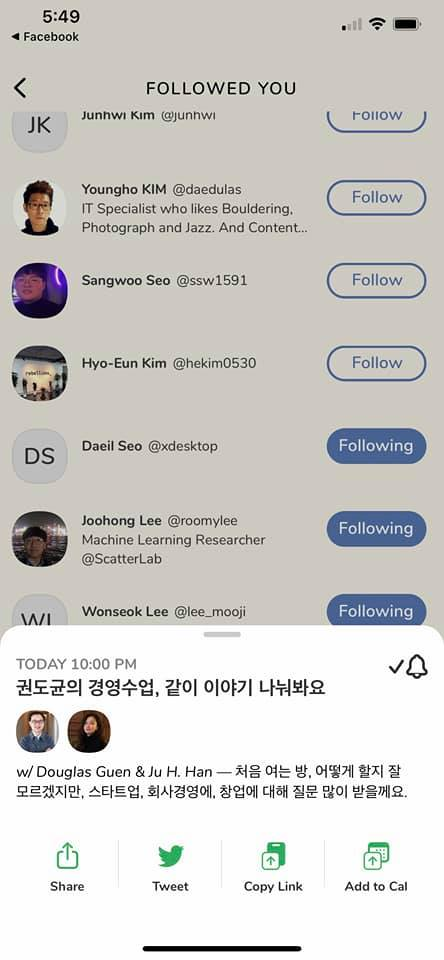
**이미지 캡션:** 이 화면은 "FOLLOWED YOU"라는 제목의 소셜 미디어 앱 화면으로, 사용자가 팔로우하고 있는 다른 사용자들의 목록을 보여줍니다. 각 사용자 항목에는 프로필 사진 또는 이니셜, 이름, 사용자 이름(@로 시작), 그리고 간단한 소개 또는 직업 정보가 포함되어 있습니다. 일부 사용자 옆에는 "Follow" 버튼이 있고, 다른 사용자 옆에는 "Following" 버튼이 있어 현재 팔로우 상태를 나타냅니다. 화면 하단에는 "TODAY 10:00 PM"이라는 시간과 함께 "권도균의 경영수업, 같이 이야기 나눠봐요"라는 제목의 팝업 알림이 표시됩니다. 이 알림에는 Douglas Guen과 Ju H. Han이라는 두 사람의 사진이 함께 있으며, "처음 여는 방, 어떻게 할지 잘 모르겠지만, 스타트업, 회사경영에, 창업에 대해 질문 많이 받을께요."라는 내용의 텍스트가 있습니다. 팝업 하단에는 공유, 트윗, 링크 복사, 캘린더 추가 등의 옵션 아이콘과 텍스트가 있습니다. 전반적으로 이 화면은 사용자가 팔로우하는 사람들과 예정된 온라인 모임에 대한 정보를 보여주는 인터페이스입니다."라는 제목의 팝업 알림이 표시됩니다. 이 알림에는 Douglas Guen과 Ju H. Han이라는 두 사람의 사진이 함께 있으며, "처음 여는 방, 어떻게 할지 잘 모르겠지만, 스타트업, 회사경영에, 창업에 대해 질문 많이 받을께요."라는 내용의 텍스트가 있습니다. 팝업 하단에는 공유, 트윗, 링크 복사, 캘린더 추가 등의 옵션 아이콘과 텍스트가 있습니다. 전반적으로 이 화면은 사용자가 팔로우하는 사람들과 예정된 온라인 모임에 대한 정보를 보여주는 인터페이스입니다.

> #GPT3KR #클럽하우스 올것이 왔습니다. GPT3+ KR 많은 분들이 필요성에 공감하고 있고 네이버의 경우는 이미 시작했고 SKT나 Kakao 다른 국내 AI기업 등도 많은 관심을 갖고 있는 것으로 알려져 있죠?  GPT3+로 무엇을 할수 있을까요? 인공지능이 새로운 문을 열 것인지 눈을 뜰것인지?  조경현 교수님 (NYU), 오혜연 교수님 (KAIST),  Yoon Kim (SKT), Jung-Woo Ha (NAVER AI LAB), Nako Sung (NAVER CLOVA), Ildoo Kim (Kakao Brain), Lucy Park (UPSTAGE) 등 학계와 업계의 최고 전문가들과 함께 신나게 이야기 해봅니다.  https://www.joinclubhouse.com/event/P0O3b06V  설 쉬고 15일 월요일 밤 10시입니다. 달력에 빨간색, 그리고 모두 클럽하우스에서 신나게 만나요! 오실수 있으신 분들이나 스피커로 참여하시고 싶으신분들 아래 댓글남겨주시고 다루고 싶은 주제도 있으시면 댓글로 남겨주세요.  아~ GPT3에 대해서 더 알고싶으시면  * https://arxiv.org/abs/2102.02503 GPT 미래  * https://arxiv.org/abs/2005.14165 GPT3 * https://airtable.com/shrndwzEx01al2jHM/tblYMAiGeDLXe35jC GPT3 응용들  참고하시면 됩니다.

### 2월 11일 (목) 22:38 · 📷 사진 (1장)

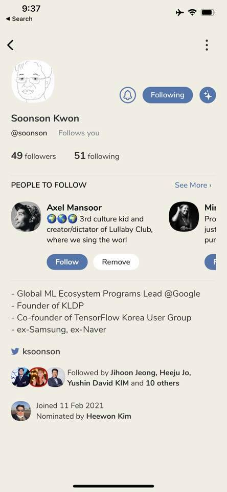
**이미지 캡션:** 이 화면은 소셜 미디어 프로필 페이지로, 상단에는 시간과 검색 아이콘이 보이며, 페이지 왼쪽 상단에는 뒤로 가기 화살표가 있다. 중앙에는 "Soonson Kwon"이라는 이름과 사용자 이름 "@soonson"이 표시되어 있으며, "Follows you"라는 문구가 함께 나타난다. 팔로워 수는 49명, 팔로잉 수는 51명이다. 그 아래에는 "PEOPLE TO FOLLOW" 섹션이 있으며, "Axel Mansoor"라는 이름과 함께 그의 프로필 사진, "3rd culture kid and creator/dictator of Lullaby Club, where we sing the worl"이라는 소개글이 보인다. "Follow"와 "Remove" 버튼도 함께 표시되어 있다. 또한, "Global ML Ecosystem Programs Lead @Google", "Founder of KLDP", "Co-founder of TensorFlow Korea User Group", "ex-Samsung, ex-Naver"와 같은 경력이 나열되어 있다. 트위터 아이콘과 함께 "ksoonson"이라는 아이디가 보이고, 여러 사람의 프로필 사진과 함께 "Followed by Jihoon Jeong, Heeju Jo, Yushin David KIM and 10 others"라는 문구가 있다. 마지막으로 "Joined 11 Feb 2021"과 "Nominated by Heewon Kim"이라는 정보가 표시되어 있다. 전반적으로 깔끔하고 정보 중심적인 인터페이스를 보여준다.tor of Lullaby Club, where we sing the worl"이라는 소개글이 보인다. "Follow"와 "Remove" 버튼도 함께 표시되어 있다. 또한, "Global ML Ecosystem Programs Lead @Google", "Founder of KLDP", "Co-founder of TensorFlow Korea User Group", "ex-Samsung, ex-Naver"와 같은 경력이 나열되어 있다. 트위터 아이콘과 함께 "ksoonson"이라는 아이디가 보이고, 여러 사람의 프로필 사진과 함께 "Followed by Jihoon Jeong, Heeju Jo, Yushin David KIM and 10 others"라는 문구가 있다. 마지막으로 "Joined 11 Feb 2021"과 "Nominated by Heewon Kim"이라는 정보가 표시되어 있다. 전반적으로 깔끔하고 정보 중심적인 인터페이스를 보여준다.

### 2월 14일 (일) 08:36 · 📷 사진 (4장)

**이미지 캡션:** 이 사진은 "Images+Text: (Technical) reading group on CLIP and friends"라는 제목의 슬라이드 또는 웹 페이지의 일부입니다. 중앙에는 두 개의 원형 프로필 사진이 나란히 배치되어 있습니다. 왼쪽 사진에는 옅은 갈색 머리에 수염을 기른 성인 남성이 환하게 웃고 있으며, 그의 뒤로 다른 두 명의 남성이 희미하게 보입니다. 오른쪽 사진에는 짧은 갈색 머리에 옅은 피부톤을 가진 젊은 성인 남성이 미소를 띠고 있습니다. 두 사진 아래에는 "w/ Andrej Karpathy, Justin Johnson"이라는 글자가 이탤릭체로 쓰여 있습니다. 그 아래에는 "Justin and I will chat / go through technical details of papers/code of CLIP, ALIGN and related recent work on learning powerful image+text representations."라는 텍스트가 있습니다. 배경은 옅은 베이지색이며, 전체적으로 정보 전달을 위한 깔끔하고 전문적인 분위기를 풍깁니다. Justin Johnson"이라는 글자가 이탤릭체로 쓰여 있습니다. 그 아래에는 "Justin and I will chat / go through technical details of papers/code of CLIP, ALIGN and related recent work on learning powerful image+text representations."라는 텍스트가 있습니다. 배경은 옅은 베이지색이며, 전체적으로 정보 전달을 위한 깔끔하고 전문적인 분위기를 풍깁니다.
 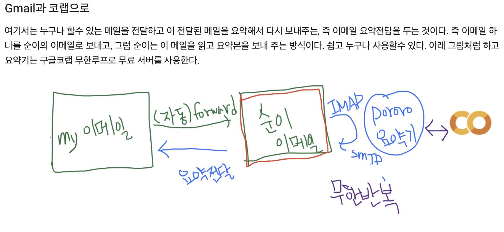
**이미지 캡션:** 이 이미지는 Gmail과 코랩을 활용한 이메일 요약 시스템을 설명하는 다이어그램과 텍스트로 구성되어 있습니다. 텍스트는 이메일을 전달하고 요약하여 다시 보내주는 과정을 설명하며, 이를 통해 누구나 쉽게 이메일 요약 기능을 사용할 수 있다고 말합니다. 다이어그램은 "my 이메일"에서 시작하여 "(자동) forward"를 거쳐 "순이 이메일"로 전달되는 과정을 보여줍니다. "순이 이메일"은 "요약전달"을 통해 "요약기"로 전달되며, "요약기"는 "IMAP", "SMTP"와 같은 프로토콜을 사용하고 "무한반복"되는 과정을 나타냅니다. 또한, "CO"라는 로고가 함께 표시되어 있어 이 시스템이 특정 서비스와 연관되어 있음을 암시합니다. 전체적으로 손글씨로 작성된 다이어그램과 텍스트는 이메일 요약 시스템의 작동 방식을 간결하고 직관적으로 설명하고 있습니다. 과정을 나타냅니다. 또한, "CO"라는 로고가 함께 표시되어 있어 이 시스템이 특정 서비스와 연관되어 있음을 암시합니다. 전체적으로 손글씨로 작성된 다이어그램과 텍스트는 이메일 요약 시스템의 작동 방식을 간결하고 직관적으로 설명하고 있습니다.
 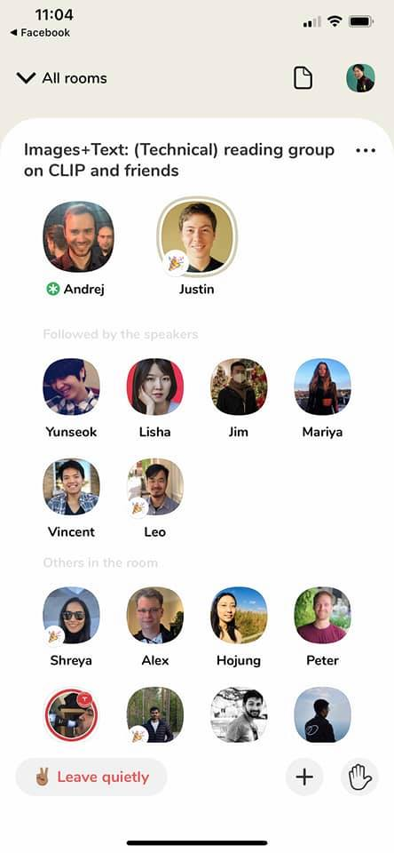
**이미지 캡션:** 이 화면은 모바일 앱의 채팅방을 보여주며, 상단에는 시간과 페이스북 로고가 표시되어 있고, "All rooms"라는 문구와 함께 체크 표시가 있다. 중앙에는 "Images+Text: (Technical) reading group on CLIP and friends"라는 제목의 방이 있고, 그 아래에는 방의 참여자들의 프로필 사진과 이름이 나열되어 있다. "Andrej"와 "Justin"은 스피커로 보이며, 그 아래 "Followed by the speakers"라는 문구가 있다. "Yunseok", "Lisha", "Jim", "Mariya", "Vincent", "Leo"는 스피커로 추정되며, 그 아래 "Others in the room"이라는 문구가 있다. "Shreya", "Alex", "Hojung", "Peter"도 참여자로 보인다. 화면 하단에는 "Leave quietly"라는 버튼과 함께 더하기(+) 버튼, 손 모양 아이콘이 있다. 전반적으로 온라인 커뮤니티 또는 소셜 미디어 앱의 방 참여자 목록 화면으로, 기술 관련 주제의 토론이 이루어지는 것으로 보인다.a", "Jim", "Mariya", "Vincent", "Leo"는 스피커로 추정되며, 그 아래 "Others in the room"이라는 문구가 있다. "Shreya", "Alex", "Hojung", "Peter"도 참여자로 보인다. 화면 하단에는 "Leave quietly"라는 버튼과 함께 더하기(+) 버튼, 손 모양 아이콘이 있다. 전반적으로 온라인 커뮤니티 또는 소셜 미디어 앱의 방 참여자 목록 화면으로, 기술 관련 주제의 토론이 이루어지는 것으로 보인다.
 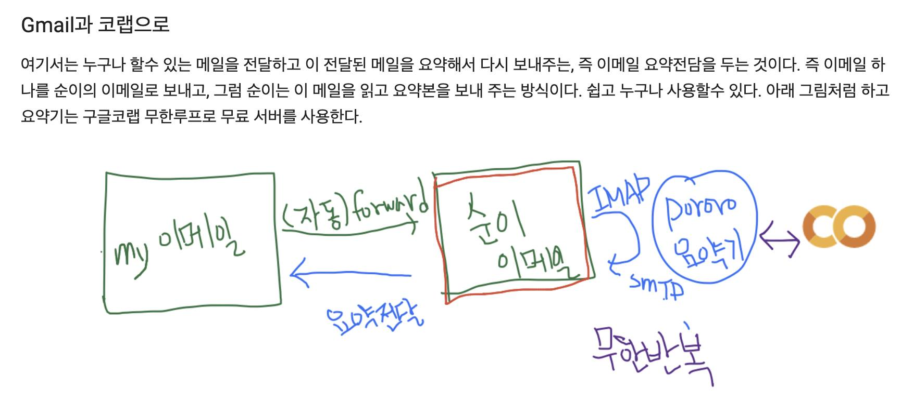
**이미지 캡션:** 이 이미지는 Gmail과 코랩을 활용한 이메일 요약 시스템에 대한 설명과 다이어그램을 보여준다. 상단에는 "Gmail과 코랩으로"라는 제목과 함께 이메일을 전달하고 요약하여 다시 보내주는 시스템에 대한 설명이 한국어로 작성되어 있다. 설명은 이메일을 보내고, 받은 사람이 이를 읽고 요약본을 보내주는 방식이며, 구글 코랩의 무한 루프를 사용하여 무료 서버를 사용한다고 언급한다. 하단에는 이 과정을 시각적으로 표현한 다이어그램이 있다. 왼쪽에는 "my 이메일"이라고 적힌 녹색 테두리의 사각형이 있고, 오른쪽에는 "순이 이메일"이라고 적힌 빨간색 테두리의 사각형이 있다. 두 사각형 사이에는 "(자동) forward"라는 글씨와 함께 화살표가 그려져 있으며, 아래에는 "요약전달"이라는 글씨와 파란색 화살표가 있다. 순이 이메일 사각형 옆에는 "IMAP"과 "SMTP"라는 글씨가 파란색으로 적혀 있고, 동그라미 안에는 "Pororo 요약기"라고 쓰여 있다. 이 동그라미와 오른쪽에 있는 "CO"라고 쓰인 로고 모양의 그림 사이에 양방향 화살표가 있다. 마지막으로, 다이어그램 하단에는 "무한반복"이라는 글씨가 보라색으로 쓰여 있다. 전체적으로 흰색 배경에 손으로 그린 듯한 그림과 텍스트로 구성되어 있으며, 이메일 자동화 및 요약 시스템의 개념을 쉽게 설명하려는 의도를 담고 있다."순이 이메일"이라고 적힌 빨간색 테두리의 사각형이 있다. 두 사각형 사이에는 "(자동) forward"라는 글씨와 함께 화살표가 그려져 있으며, 아래에는 "요약전달"이라는 글씨와 파란색 화살표가 있다. 순이 이메일 사각형 옆에는 "IMAP"과 "SMTP"라는 글씨가 파란색으로 적혀 있고, 동그라미 안에는 "Pororo 요약기"라고 쓰여 있다. 이 동그라미와 오른쪽에 있는 "CO"라고 쓰인 로고 모양의 그림 사이에 양방향 화살표가 있다. 마지막으로, 다이어그램 하단에는 "무한반복"이라는 글씨가 보라색으로 쓰여 있다. 전체적으로 흰색 배경에 손으로 그린 듯한 그림과 텍스트로 구성되어 있으며, 이메일 자동화 및 요약 시스템의 개념을 쉽게 설명하려는 의도를 담고 있다.

> 2월 14일 12시 PM KST에 CLIP, ALIGN등의 논문과 코드에 대해 이야기 한다고 합니다. https://www.joinclubhouse.com/event/Pb7Y1pJR  저도 관련 내용들 좀더 읽어보고 참여하려고 합니다.  * CLIP: https://openai.com/blog/clip/  오시는 분들 반갑게 뵙겠습니다.
> #NLP응용 #pororo #이메일요약 딥러닝 기술을 매일 사용하고, 그중 NLP의 좋은 응용이 무엇이 있을까요? 이걸 매일 고민하는데요. 제가 매일 사용하는 이메일 요약기 소개 드립니다. ##  [Pororo 출시기념 이메일 요약기]  긴 이메일 읽기 힘드시죠? 만약 여러분들의 이메일을 읽고 자동으로 한줄 요약을 해준다면, 즉 TL; DR: 한문장을 메일 첫부분에 넣어 주면 어떨까요? 빠르게 이메일 내용을 파악하고 읽어 볼수 있겠죠? https://youtu.be/PtgnzgaURIM 에 자세한 비디오 설명과 함께, 구글 colab에서 동작하는 코드 bit.ly/autosumkr 참고 하시면 됩니다.  저의 모든 이메일을 자동요약, TL;DR: 넣어서 읽고 있는데 매우 좋은것 같습니다.  카카오브래인에서 나온 Pororo, https://github.com/kakaobrain/pororo  좋습니다.
> #NLP응용 #pororo #이메일요약 #간만의생활코딩 딥러닝 기술을 매일 사용하고, 그중 NLP의 좋은 응용이 무엇이 있을까요? 이걸 매일 고민하는데요. 간만에 생활코딩을 통해 만든 이메일 요약기 소개 드립니다.  [PORORO 출시기념 이메일 요약기]  긴 이메일 읽기 힘드시죠? 만약 여러분들의 이메일을 읽고 자동으로 한줄 요약을 해준다면, 즉 TL; DR: 한문장을 메일 첫부분에 넣어 주면 어떨까요? 빠르게 이메일 내용을 파악하고 읽어 볼수 있겠죠?  https://youtu.be/PtgnzgaURIM 에 자세한 비디오 설명과 함께, 구글 colab에서 무료로 동작하는 코드 bit.ly/autosumkr 참고 하시면 됩니다.  저의 모든 이메일을 자동요약, TL;DR: 넣어서 읽고 있는데 매우 좋은것 같습니다.  카카오브래인에서 나온 Pororo, https://github.com/kakaobrain/pororo 좋습니다.

### 2월 14일 (일) 11:48 · #NLP응용 #pororo #이메일요약 NLP의 좋은 응용이 무엇이 있을…

#NLP응용 #pororo #이메일요약 NLP의 좋은 응용이 무엇이 있을까요?

[Pororo 출시기념 이메일 요약기]

긴 이메일 읽기 힘드시죠? 만약 여러분들의 이메일을 읽고 자동으로 한줄 요약을 해준다면, 즉 TL; DR: 한문장을 메일 첫부분에 넣어 주면 어떨까요? 빠르게 이메일 내용을 파악하고 읽어 볼수 있겠죠?

https://youtu.be/PtgnzgaURIM 에 자세한 비디오 설명과 함께 동작하는 코드 bit.ly/autosumkr 참고 하시면 됩니다.

저의 모든 이메일을 자동요약, TL;DR: 넣어서 읽고 있는데 매우 좋은것 같습니다.

카카오브래인에서 나온 Pororo, https://github.com/kakaobrain/pororo  좋습니다.

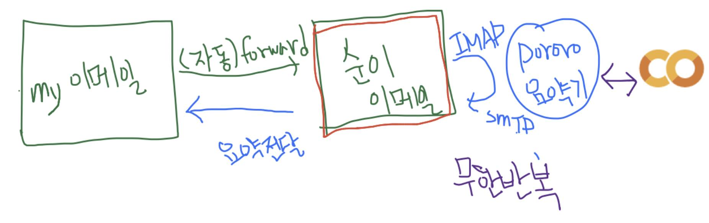
**이미지 캡션:** 이 이미지는 이메일 전달 및 요약 시스템에 대한 다이어그램으로, 흰색 배경에 손으로 그린 그림과 텍스트로 구성되어 있습니다. 왼쪽에는 녹색 테두리로 둘러싸인 "my 이메일"이라는 텍스트가 있으며, 이는 발신 이메일을 나타냅니다. 이메일에서 오른쪽으로 향하는 화살표와 함께 "(자동)forward"라는 텍스트가 있어 자동 전달 기능을 나타냅니다. 그 옆에는 빨간색과 녹색 테두리로 둘러싸인 "순이 이메일"이라는 텍스트가 있는데, 이는 수신 이메일을 나타냅니다. "순이 이메일"에서 왼쪽으로 향하는 파란색 화살표와 함께 "요약전달"이라는 텍스트가 있어 이메일 요약 전달 과정을 보여줍니다. "순이 이메일" 위쪽에는 "IMAP"이라는 텍스트와 함께 파란색 원으로 둘러싸인 "pororo 요약기"라는 텍스트가 있으며, 이는 이메일 요약 서비스 또는 도구를 나타냅니다. "pororo 요약기"에서 "순이 이메일"로 향하는 화살표에는 "SMTP"라는 텍스트가 붙어 있어 이메일 전송 프로토콜을 나타냅니다. "pororo 요약기"와 오른쪽의 주황색과 노란색으로 이루어진 두 개의 겹쳐진 원 모양 로고 사이에는 양방향 화살표가 있어 통신 또는 데이터 교환을 의미합니다. 이 로고는 "CO"로 해석될 수 있습니다. 다이어그램 아래쪽에는 보라색 텍스트로 "무한반복"이라고 쓰여 있어 시스템이 지속적으로 작동함을 암시합니다. 전체적으로 이 이미지는 이메일이 자동으로 전달되고, 요약되어, 다시 전달되는 과정을 시각적으로 표현하고 있습니다.께 "요약전달"이라는 텍스트가 있어 이메일 요약 전달 과정을 보여줍니다. "순이 이메일" 위쪽에는 "IMAP"이라는 텍스트와 함께 파란색 원으로 둘러싸인 "pororo 요약기"라는 텍스트가 있으며, 이는 이메일 요약 서비스 또는 도구를 나타냅니다. "pororo 요약기"에서 "순이 이메일"로 향하는 화살표에는 "SMTP"라는 텍스트가 붙어 있어 이메일 전송 프로토콜을 나타냅니다. "pororo 요약기"와 오른쪽의 주황색과 노란색으로 이루어진 두 개의 겹쳐진 원 모양 로고 사이에는 양방향 화살표가 있어 통신 또는 데이터 교환을 의미합니다. 이 로고는 "CO"로 해석될 수 있습니다. 다이어그램 아래쪽에는 보라색 텍스트로 "무한반복"이라고 쓰여 있어 시스템이 지속적으로 작동함을 암시합니다. 전체적으로 이 이미지는 이메일이 자동으로 전달되고, 요약되어, 다시 전달되는 과정을 시각적으로 표현하고 있습니다.

### 2월 20일 (토) 17:46 · 📷 사진 (1장)

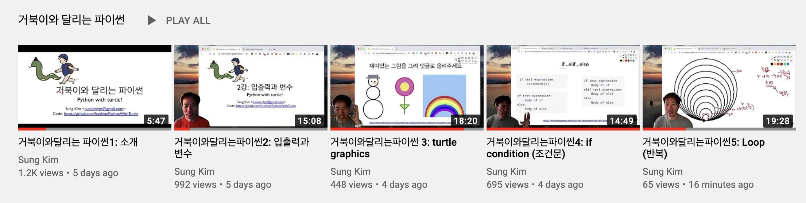
**이미지 캡션:** 이 화면은 "거북이와 달리는 파이썬"이라는 제목의 유튜브 재생 목록을 보여주며, 여러 개의 동영상 썸네일과 제목, 게시자, 조회수, 게시일이 표시되어 있습니다. 각 썸네일에는 동영상 내용과 관련된 그림이나 코드가 포함되어 있으며, 화면 왼쪽에는 "PLAY ALL" 버튼이 있습니다. 첫 번째 썸네일에는 파이썬 로고가 그려진 거북이와 함께 달리는 아이 그림이 있고, 제목은 "거북이와 달리는 파이썬1: 소개"입니다. 두 번째 썸네일에는 "2강: 입출력과 변수"라는 제목과 함께 첫 번째 썸네일과 유사한 그림이 있고, 제목은 "거북이와 달리는 파이썬2: 입출력과 변수"입니다. 세 번째 썸네일에는 눈사람, 꽃, 무지개 그림이 있고, 제목은 "거북이와 달리는 파이썬 3: turtle graphics"입니다. 네 번째 썸네일에는 "if...elif...else"라는 제목과 함께 조건문 코드 예시가 있고, 제목은 "거북이와 달리는 파이썬4: if condition (조건문)"입니다. 다섯 번째 썸네일에는 동심원을 여러 개 그린 그림과 함께 코드가 있고, 제목은 "거북이와 달리는 파이썬5: Loop (반복)"입니다. 각 썸네일의 왼쪽에는 동영상을 촬영한 것으로 보이는 성인 남성이 등장하며, 그는 주로 회색 또는 빨간색 상의를 입고 있으며, 표정은 밝고 친근해 보입니다. 배경은 주로 강의실이나 집에서 촬영한 것으로 보이며, 화면에는 동영상 길이 정보도 함께 표시되어 있습니다. 전체적으로 파이썬 프로그래밍 학습을 위한 튜토리얼 영상 시리즈임을 알 수 있습니다. 제목은 "거북이와 달리는 파이썬2: 입출력과 변수"입니다. 세 번째 썸네일에는 눈사람, 꽃, 무지개 그림이 있고, 제목은 "거북이와 달리는 파이썬 3: turtle graphics"입니다. 네 번째 썸네일에는 "if...elif...else"라는 제목과 함께 조건문 코드 예시가 있고, 제목은 "거북이와 달리는 파이썬4: if condition (조건문)"입니다. 다섯 번째 썸네일에는 동심원을 여러 개 그린 그림과 함께 코드가 있고, 제목은 "거북이와 달리는 파이썬5: Loop (반복)"입니다. 각 썸네일의 왼쪽에는 동영상을 촬영한 것으로 보이는 성인 남성이 등장하며, 그는 주로 회색 또는 빨간색 상의를 입고 있으며, 표정은 밝고 친근해 보입니다. 배경은 주로 강의실이나 집에서 촬영한 것으로 보이며, 화면에는 동영상 길이 정보도 함께 표시되어 있습니다. 전체적으로 파이썬 프로그래밍 학습을 위한 튜토리얼 영상 시리즈임을 알 수 있습니다.

> #거북이와달리는파이썬   제가 홍콩과기대(http://www.cse.ust.hk/) 에서 전공이 없는 신입생들 대상으로 가르친 내용을 한글화하고 조금 요약하여 거북이와 달리는 파이썬 시리즈를 만들고 있습니다. https://www.youtube.com/watch?v=bCh6wiQOXuY&list=PLlMkM4tgfjnKTpEpWBIqzWmge8aA0VQpP  파이썬 문법을 이야기 하지 않고 바로 turtle graphics를 이용하여 컴퓨터 언어를 따라하면서 배우는 방식입니다. (영어등 외국어 공부할때 지루한 문법등에 집중하지 않고 바로 말하기부터 시작하는것과 같은 방식입니다.)  한번도 프로그래밍 언어를 해보지 않으신분, 그리고 파이썬을 해보시지 않은 분들에게 적당한 내용이니 주위 프로그래밍 언어나 이에대한 간략 개념이 필요하신 분들에게 소개 부탁드립니다.  지금까지 5강이 올라가 있고 총 20강 정도가 되며 내용을 들으시면 간략한 게임을 만들수 있는 수준이 됩니다.

### 2월 25일 (목) 19:35 · 📷 사진 (1장)

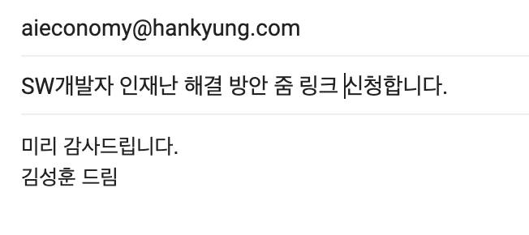
**이미지 캡션:** 이 이미지는 이메일 또는 메시지의 일부로, 상단에는 'aieconomy@hankyung.com'이라는 이메일 주소가 표시되어 있습니다. 그 아래에는 "SW개발자 인재난 해결 방안 줌 링크 신청합니다."라는 문장이 있습니다. 이는 소프트웨어 개발자 인재난 해결 방안에 대한 줌 링크를 신청한다는 내용입니다. 마지막으로 "미리 감사드립니다. 김성훈 드림"이라는 문구가 있어, 김성훈이라는 사람이 보낸 메시지임을 알 수 있습니다. 전체적으로는 비즈니스 또는 업무 관련 소통의 일부로 보이며, 간결하고 명확한 텍스트로 구성되어 있습니다. 특별한 인물이나 배경, 사물은 보이지 않으며, 텍스트만으로 상황을 파악할 수 있습니다.성되어 있습니다. 특별한 인물이나 배경, 사물은 보이지 않으며, 텍스트만으로 상황을 파악할 수 있습니다.

### 2월 28일 (일) 12:44 · 📷 사진 (1장)

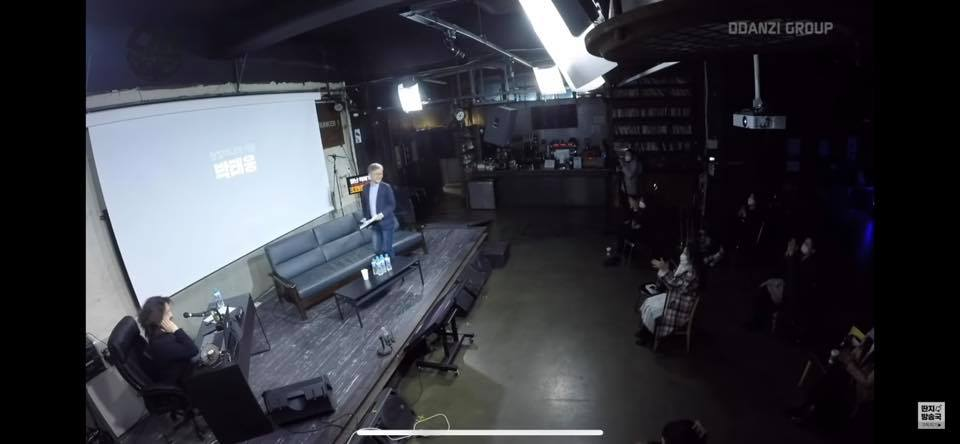
**이미지 캡션:** 어두운 실내 강연장으로 보이는 장소에서, 무대 위에는 흰색 스크린이 있고 그 앞에 검은색 소파와 테이블이 놓여 있으며, 한 명의 성인 남성이 파란색 재킷과 검은색 바지를 입고 서서 무언가를 들고 이야기하고 있다. 그의 표정은 진지해 보이며, 무대 좌측에는 한 명의 여성이 검은색 의자에 앉아 마이크를 조작하고 있다. 무대 뒤편에는 책장과 바가 보이며, 객석에는 여러 명의 사람들이 앉아 강연을 듣고 있다. 전반적으로 어두운 조명과 함께 집중된 분위기이며, 스크린에는 한국어로 "박현용"이라는 글자가 쓰여 있다.
