# 2021년 3월

[← 2021년](README.md)

### 3월 1일 (월) 08:15 · 📷 사진 (4장)

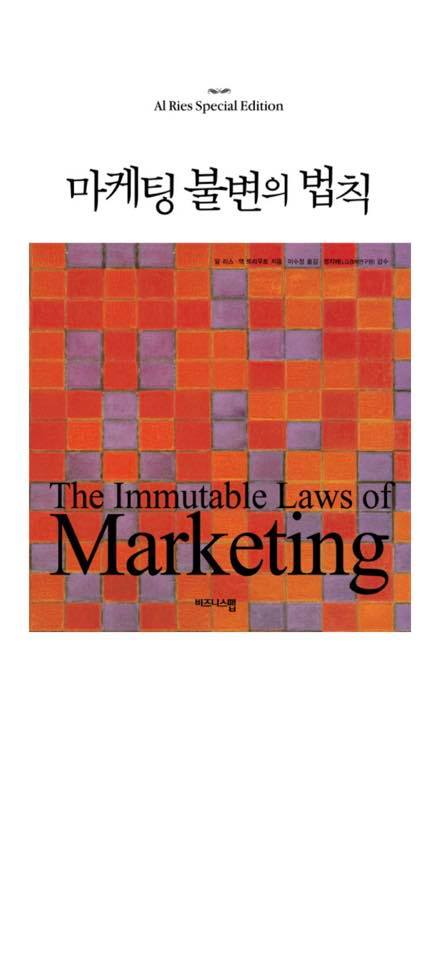
**이미지 캡션:** 이 이미지는 책 표지로, 흰색 배경에 검은색 글씨로 "Al Ries Special Edition"이라고 쓰여 있으며, 그 아래에는 "마케팅 불변의 법칙"이라는 한국어 제목이 큰 글씨로 적혀 있습니다. 제목 아래에는 주황색과 보라색의 격자무늬 디자인이 있으며, 이 디자인 위에는 "The Immutable Laws of Marketing"이라는 영어 제목이 흰색 글씨로 쓰여 있습니다. 격자무늬 디자인의 하단 중앙에는 "비즈니스맵"이라는 작은 글씨가 보입니다. 이 책은 마케팅 전략에 관한 내용을 다루는 것으로 보이며, 전체적으로 깔끔하고 전문적인 분위기를 풍깁니다.
 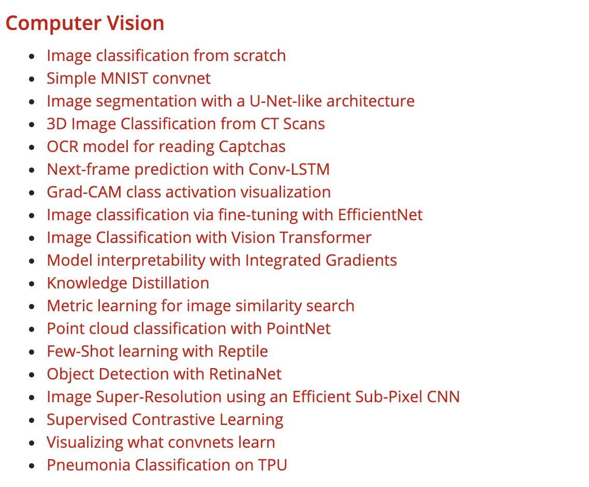
**이미지 캡션:** 이 이미지는 "컴퓨터 비전"이라는 제목 아래 컴퓨터 비전 분야의 다양한 주제를 나열한 슬라이드 또는 문서의 일부입니다. 텍스트는 흰색 배경에 짙은 빨간색으로 표시되며, 각 항목은 글머리 기호로 구분됩니다. 나열된 주제에는 "처음부터 이미지 분류", "간단한 MNIST 컨브넷", "U-Net과 유사한 아키텍처를 사용한 이미지 분할", "CT 스캔에서 3D 이미지 분류", "캡차를 읽기 위한 OCR 모델", "Conv-LSTM을 사용한 다음 프레임 예측", "Grad-CAM 클래스 활성화 시각화", "EfficientNet을 사용한 미세 조정을 통한 이미지 분류", "Vision Transformer를 사용한 이미지 분류", "통합 기울기를 사용한 모델 해석 가능성", "지식 증류", "이미지 유사성 검색을 위한 메트릭 학습", "PointNet을 사용한 포인트 클라우드 분류", "Reptile을 사용한 소수샷 학습", "RetinaNet을 사용한 객체 탐지", "효율적인 서브픽셀 CNN을 사용한 이미지 초해상도", "지도 대조 학습", "컨브넷이 학습하는 것 시각화", "TPU에서 폐렴 분류" 등이 포함됩니다. 이 이미지는 컴퓨터 비전 연구 또는 교육의 개요를 제공하는 데 사용될 수 있습니다.
 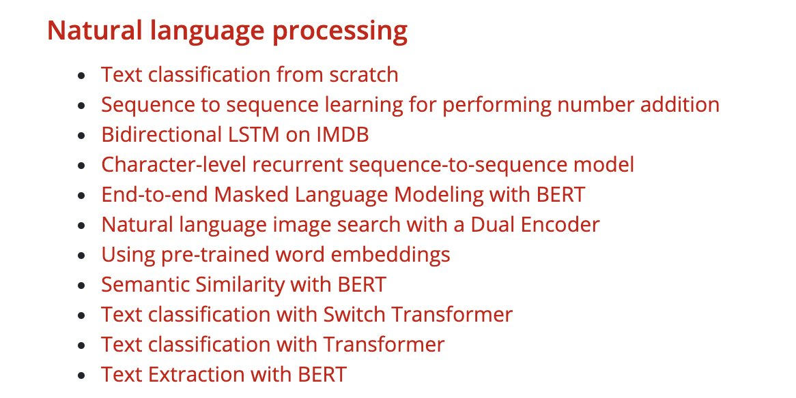
**이미지 캡션:** 이 이미지는 흰색 배경에 짙은 빨간색 글씨로 "Natural language processing"이라는 제목과 함께 자연어 처리와 관련된 다양한 주제를 나열한 슬라이드입니다. 제목 아래에는 글머리 기호로 구분된 10개의 항목이 있습니다. 각 항목은 자연어 처리의 특정 기술이나 응용 분야를 나타냅니다. 예를 들어, "Text classification from scratch", "Sequence to sequence learning for performing number addition", "Bidirectional LSTM on IMDB", "Character-level recurrent sequence-to-sequence model", "End-to-end Masked Language Modeling with BERT", "Natural language image search with a Dual Encoder", "Using pre-trained word embeddings", "Semantic Similarity with BERT", "Text classification with Switch Transformer", "Text classification with Transformer", "Text Extraction with BERT"와 같은 내용이 포함되어 있습니다. 이 이미지는 교육 자료나 발표 자료의 일부로 보이며, 자연어 처리 분야의 다양한 연구 주제를 간략하게 소개하고 있습니다. 사람, 장소, 사물, 보이는 텍스트 외의 정보는 없습니다.
 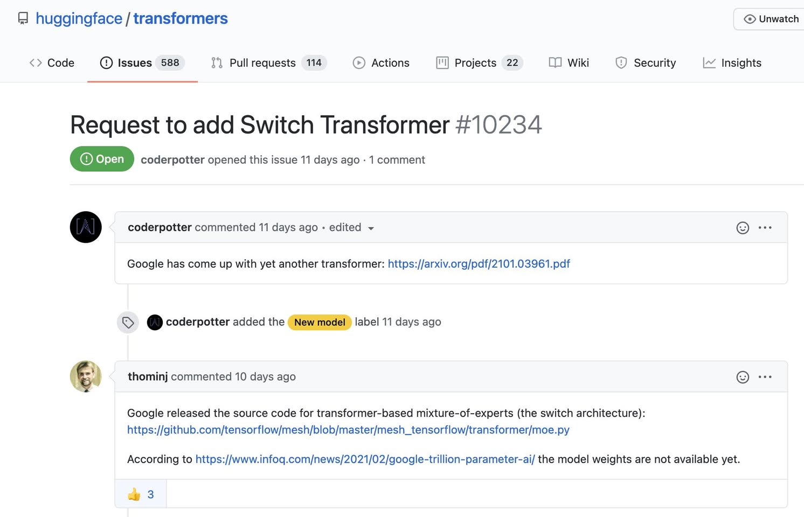
**이미지 캡션:** 이 이미지는 GitHub의 "huggingface/transformers" 저장소에서 "Switch Transformer" 모델 추가 요청에 대한 이슈 페이지를 보여줍니다. 화면 상단에는 저장소 이름과 함께 코드, 이슈, 풀 리퀘스트, 액션, 프로젝트, 위키, 보안, 인사이트 등의 탭이 보입니다. 중앙에는 "Request to add Switch Transformer #10234"라는 제목과 함께 "Open" 상태 표시와 함께 "coderpotter"라는 사용자가 11일 전에 이슈를 열었다는 내용이 있습니다. 그 아래에는 "coderpotter"가 11일 전에 "Google has come up with yet another transformer"라는 내용과 함께 arXiv 링크를 공유했으며, 이후 "New model" 라벨을 추가했다는 기록이 있습니다. 마지막으로 "thominj"라는 사용자가 10일 전에 "Google released the source code for transformer-based mixture-of-experts (the switch architecture)"라는 내용과 함께 GitHub 링크를 공유하고, infoq.com 링크를 통해 모델 가중치는 아직 사용 가능하지 않다는 정보를 덧붙였습니다. 각 댓글에는 사용자의 프로필 사진과 이름, 댓글이 달린 시간, 그리고 이모티콘과 점 세 개로 된 메뉴가 표시되어 있습니다. 전반적으로 기술적인 논의가 이루어지고 있는 개발 관련 커뮤니티의 모습입니다.

### 3월 2일 (화) 12:17 · 📷 사진 (1장)

**이미지 캡션:** 이 사진은 "ML Pipelines with Google Cloud"라는 제목의 온라인 강연을 홍보하는 포스터입니다. 중앙에는 "ML Pipelines"라는 큰 글씨와 함께 "with Google Cloud"라는 문구가 보이며, 그 위에 "www.upstage.ai"라는 웹사이트 주소와 "Upstage" 로고가 있습니다. 왼쪽 하단에는 검은색 티셔츠와 백팩을 메고 안경을 쓴 젊은 성인 남성이 환하게 웃으며 카메라를 바라보고 있습니다. 그의 티셔츠에는 거울에 비친 듯한 글자가 새겨져 있습니다. 남성의 이름은 PARK CHANSUNG으로 표기되어 있으며, 강연 참여를 위한 링크인 "http://bit.ly/UpZoomTalk"도 함께 안내되어 있습니다. 오른쪽 하단에는 보라색과 분홍색의 추상적인 도형들이 배치되어 있으며, 그 위에 "3월 9일 오전 11시"라는 강연 날짜와 시간이 적힌 보라색 타원형 텍스트 상자가 있습니다. 전체적으로 밝고 현대적인 디자인으로, 기술 관련 강연의 분위기를 잘 나타내고 있습니다.

> #업스톡 #모두에게공개   TFKR 운영진이시기도 한 Park Chansung 님께서 Google Cloud를 활용한 ML pilelines 업스테이지 톡을 해주십니다. Upstage에 매우 필요한 내용이라, 업스테이지톡 강사님으로 모셨는데, 이 주제가 너무 중요하고 많은 분들이 관심이 있을듯 하여 #모두에게공개 오픈업스톡으로 여러분들에게 공개합니다.  3월 9일 오전 11시 KST http://bit.ly/UpZoomTalk 으로 입장하시면 됩니다.  그럼 오시는분들 반갑게 뵙겠습니다. 세미나 준비를 위해 혹시 ML Pipleliens 관련 기대하시는 부분이 있으면 가볍게 댓글 남겨주시면 준비에 큰 도움이 되겠습니다.  업스테이지는 앞으로도 저희 내부업스톡중 필요한 경우 #모두에게공개 하도록 하겠습니다.

### 3월 3일 (수) 09:44 · 최고 NLP 연구자 Ji Hyung Moon, Sungjoon Park님…

최고 NLP 연구자 Ji Hyung Moon, Sungjoon Park님이 여시는 클럽하우스 NLP관심자들 초청 드립니다. 재미는 확실이 보장드리고 또 매우 유익합니다. 

https://www.joinclubhouse.com/event/xoBJdeN1 

목밤 10시, 선청취, 후고민!

### 3월 6일 (토) 09:16 · I also stand firmly with the people of M…

I also stand firmly with the people of Myanmar for a quick, peaceful restoration of democracy

"Use of violence against the people of Myanmar must stop now. There should not be any more loss of lives. We condemn the violent suppression of protests by the military and the police forces and strongly call for the immediate release of all those detained including State Counsellor Aung San Suu Kyi. We stand firmly with the people of Myanmar for a quick, peaceful restoration of democracy."

#JusticeForMyanmar
#StandWithMyanmar

### 3월 8일 (월) 07:29 · 📷 사진 (2장)

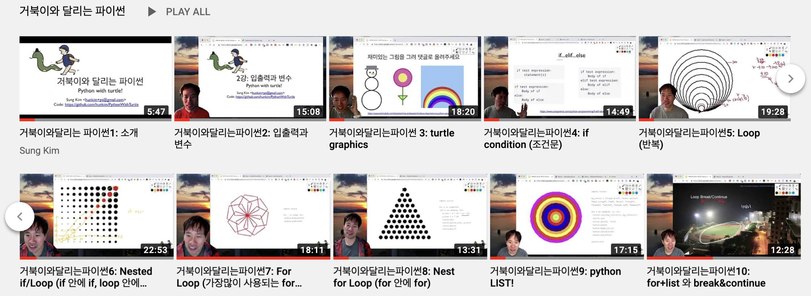
**이미지 캡션:** 이 화면은 파이썬 프로그래밍 튜토리얼 시리즈인 "거북이와 달리는 파이썬"의 유튜브 재생 목록을 보여줍니다. 화면 중앙에는 여러 개의 썸네일이 격자 형태로 배열되어 있으며, 각 썸네일은 개별 영상의 미리보기 이미지와 제목, 재생 시간을 포함하고 있습니다. 썸네일에는 주로 한 명의 성인 남성이 등장하며, 그는 강의를 진행하는 강사로 보입니다. 남성은 대부분 화면의 좌측 또는 우측 하단에 작게 배치되어 있고, 나머지 공간에는 파이썬 코드가 포함된 웹페이지 화면이나 파이썬의 turtle 그래픽 기능을 활용하여 그린 그림들이 표시됩니다. 예를 들어, 첫 번째 썸네일에는 거북이와 사람이 함께 달리는 그림이 있고, 두 번째 썸네일에는 눈사람과 꽃, 무지개 그림이 있습니다. 세 번째 썸네일에는 if, elif, else 조건문이 설명된 화면이, 네 번째 썸네일에는 동심원 모양의 그림이, 다섯 번째 썸네일에는 축구장 야경이 보입니다. 각 썸네일 아래에는 영상의 제목이 한국어로 작성되어 있으며, "소개", "입출력과 변수", "turtle graphics", "if condition (조건문)", "Loop (반복)", "Nested if/Loop", "For Loop", "Nest for Loop", "python LIST!", "for+list 와 break&continue" 등 다양한 파이썬 프로그래밍 주제를 다루고 있음을 알 수 있습니다. 전반적으로 교육적이고 정보 전달에 초점을 맞춘 분위기이며, 시청자들이 파이썬 프로그래밍을 배우는 데 도움을 주는 콘텐츠임을 시사합니다.
 
**이미지 캡션:** 화면에는 "거북이와 달리는 파이썬"이라는 제목의 유튜브 재생 목록이 표시되어 있으며, 여러 개의 썸네일이 가로로 나열되어 있습니다. 각 썸네일에는 동영상 제목, 썸네일 이미지, 그리고 일부 썸네일에는 강사의 얼굴이 작게 포함되어 있습니다. 강사는 동양인 성인 남성으로, 20대 후반에서 30대 초반으로 보이며, 대부분의 썸네일에서 밝고 긍정적인 표정을 짓고 있습니다. 그는 주로 캐주얼한 복장을 하고 있으며, 일부 썸네일에서는 강의 내용을 설명하는 듯한 제스처를 취하고 있습니다. 배경에는 강의 내용이 담긴 컴퓨터 화면이 보이며, 일부 썸네일에서는 실제 강의실이나 야외 풍경이 배경으로 사용되었습니다. 썸네일 이미지들은 파이썬 프로그래밍의 기초 개념들을 시각적으로 표현하고 있으며, 예를 들어 첫 번째 썸네일에는 거북이와 사람이 그려져 있고, 다른 썸네일에는 눈사람, 꽃, 무지개, 도형, 그리고 코딩 화면 등이 포함되어 있습니다. 각 썸네일 하단에는 동영상 제목과 강사의 이름(Sung Kim)이 명시되어 있습니다. 전체적으로 교육적이고 친근한 분위기를 풍기며, 파이썬 프로그래밍 학습을 위한 자료임을 알 수 있습니다.

> #거북이와달리는파이썬  제가 홍콩과기대(http://www.cse.ust.hk/) 에서 전공이 없는 신입생들 대상으로 가르친 내용을 한글화하고 조금 요약하여 거북이와 달리는 파이썬 시리즈, 이제 (전체 20강 예상의) 절반을 넘긴 10강까지 나왔습니다.  bit.ly/pturtle  파이썬 문법을 이야기 하지 않고 바로 turtle graphics를 이용하여 컴퓨터 언어를 따라하면서 배우는 방식입니다. (영어등 외국어 공부할때 지루한 문법등에 집중하지 않고 바로 말하기부터 시작하는것과 같은 방식입니다.)  한번도 프로그래밍 언어를 해보지 않으신분, 그리고 파이썬을 해보시지 않은 분들에게 적당한 내용이니 주위 프로그래밍 언어나 이에대한 간략 개념이 필요하신 분들에게 소개 부탁드립니다.  AI시대를 살아갈 우리 후배들에게 프로그래밍 개념은 정말 중요하고 컴퓨터와 AI를 자유자제로 다루고 소통할수 있으면 너무 좋을것 같습니다.
> #거북이와달리는파이썬  여긴 파이썬 잘하시는 분들이 많이 계시지만, 주위 한번도 프로그래밍 언어를 해보지 않으신분, 그리고 파이썬을 해보시지 않은 분들이 있다면 소개를 부탁드립니다.  제가 홍콩과기대(http://www.cse.ust.hk/) 에서 전공이 없는 신입생들 대상으로 가르친 내용을 한글화하고 조금 요약하여 거북이와 달리는 파이썬 시리즈, 이제 (전체 20강 예상의) 절반을 넘긴 10강까지 나왔습니다. bit.ly/pturtle 파이썬 문법을 이야기 하지 않고 바로 turtle graphics를 이용하여 컴퓨터 언어를 따라하면서 배우는 방식입니다. (영어등 외국어 공부할때 지루한 문법등에 집중하지 않고 바로 말하기부터 시작하는것과 같은 방식입니다.) AI시대를 살아갈 우리 후배들에게 프로그래밍 개념은 정말 중요하고, 컴퓨터와 AI를 자유자제로 다루고 소통할수 있으면 너무 좋을것 같아 만들고 있습니다.

### 3월 9일 (화) 07:51 · 📷 사진 (14장)

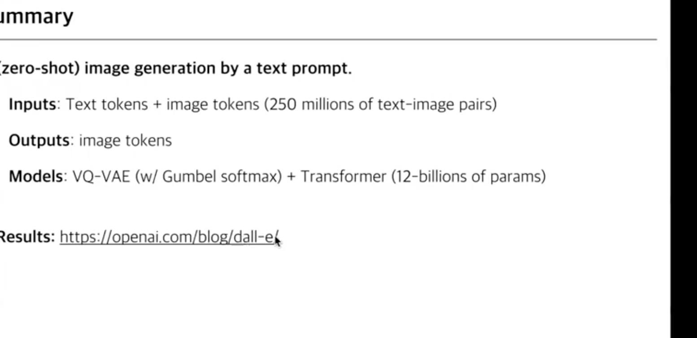
**이미지 캡션:** 이 사진은 흰색 배경에 검은색 글씨로 작성된 발표 자료의 일부를 보여줍니다. 사진에는 사람이 보이지 않으며, 장소는 실내 발표 환경으로 추정됩니다. 텍스트는 "Summary"라는 제목 아래 "(zero-shot) image generation by a text prompt.", "Inputs: Text tokens + image tokens (250 millions of text-image pairs)", "Outputs: image tokens", "Models: VQ-VAE (w/ Gumbel softmax) + Transformer (12-billions of params)", "Results: https://openai.com/blog/dall-e" 와 같이 인공지능 모델에 대한 요약 정보를 담고 있습니다. 특히, 텍스트-이미지 쌍 2억 5천만 개를 학습 데이터로 사용하고 VQ-VAE와 Transformer 모델을 활용하여 텍스트 프롬프트로부터 이미지를 생성하는 기술에 대한 내용입니다. 마지막 줄에는 OpenAI의 DALL-E 관련 블로그 게시물 링크가 포함되어 있습니다. 전반적으로 정보 전달에 초점을 맞춘 차분하고 전문적인 분위기입니다.
 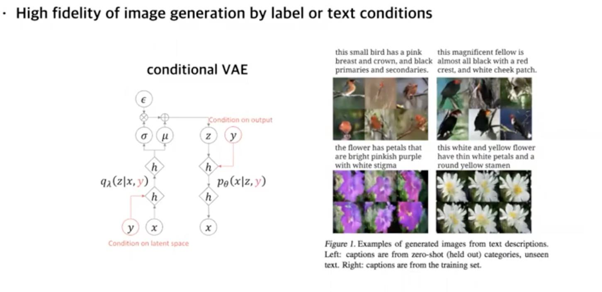
**이미지 캡션:** 이 이미지는 텍스트 설명으로부터 고품질 이미지를 생성하는 "조건부 VAE(Variational Autoencoder)"라는 기술을 보여줍니다. 왼쪽에는 조건부 VAE의 아키텍처를 나타내는 다이어그램이 있으며, 입력 데이터(x), 잠재 공간 표현(z), 조건(y) 및 생성된 출력(x) 간의 관계를 보여줍니다. 오른쪽에는 텍스트 설명에 따라 생성된 이미지의 예시가 있습니다. 위쪽에는 두 개의 열에 새 이미지들이 있고, 아래쪽에는 두 개의 열에 꽃 이미지들이 있습니다. 각 이미지 그룹 위에는 해당 이미지를 설명하는 텍스트가 있습니다. 왼쪽 열의 캡션은 "zero-shot(보지 못한)" 범주에서 가져온 것이고, 오른쪽 열의 캡션은 훈련 세트에서 가져온 것입니다. 이미지의 전반적인 분위기는 학술적이고 정보 전달적이며, 인공지능 기반 이미지 생성 기술의 가능성을 보여주고 있습니다.
 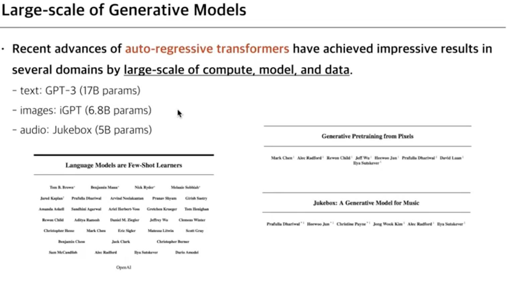
**이미지 캡션:** 이 이미지는 "Large-scale of Generative Models"라는 제목의 프레젠테이션 슬라이드로, 대규모 생성 모델의 최근 발전에 대해 설명하고 있습니다. 슬라이드에는 텍스트, 이미지, 오디오 분야에서 GPT-3, iGPT, Jukebox와 같은 모델의 성공 사례가 나열되어 있으며, 각 모델의 파라미터 수가 명시되어 있습니다. 또한 "Language Models are Few-Shot Learners", "Generative Pretraining from Pixels", "Jukebox: A Generative Model for Music"라는 제목 아래 연구자들의 이름이 나열되어 있어, 이러한 모델 개발에 참여한 연구진을 보여줍니다. 슬라이드에는 별도의 사람이나 장소는 보이지 않으며, 텍스트 정보와 연구자 이름 목록이 주를 이룹니다. 전반적으로 학술적이고 정보 전달 중심의 분위기입니다.
 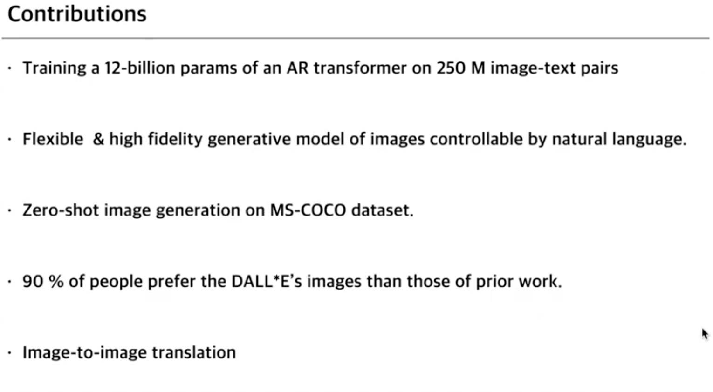
**이미지 캡션:** 이 이미지는 "Contributions"라는 제목 아래 여러 항목이 나열된 슬라이드 또는 문서의 일부입니다. 사람, 장소, 사물은 보이지 않으며, 텍스트만 존재합니다. 텍스트는 인공지능 모델의 개발 및 성능에 대한 기여도를 설명하고 있습니다. 구체적으로는 120억 개의 매개변수를 가진 AR 트랜스포머를 2억 5천만 개의 이미지-텍스트 쌍으로 학습시킨 것, 자연어로 제어 가능한 유연하고 고품질의 이미지 생성 모델, MS-COCO 데이터셋에서의 제로샷 이미지 생성 능력, 그리고 이전 작업보다 DALL*E의 이미지를 선호하는 사람들의 비율이 90%라는 점, 마지막으로 이미지 간 변환 기능이 언급되어 있습니다. 전반적으로 학술적이거나 기술적인 발표 자료의 일부로 보이며, 객관적이고 정보 전달에 초점을 맞춘 분위기입니다.
 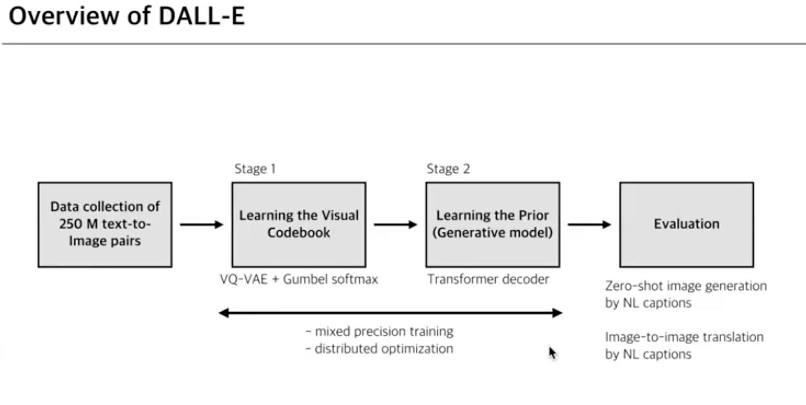
**이미지 캡션:** 이 이미지는 DALL-E 모델의 개요를 보여주는 다이어그램으로, 텍스트-이미지 쌍 2억 5천만 개를 수집하는 데이터 수집 단계, VQ-VAE와 Gumbel softmax를 사용하여 시각적 코드북을 학습하는 1단계, 트랜스포머 디코더를 사용하여 생성 모델인 사전 학습을 학습하는 2단계, 그리고 제로샷 이미지 생성 및 자연어 캡션에 의한 이미지-이미지 변환을 포함하는 평가 단계로 구성됩니다. 또한, 혼합 정밀도 학습과 분산 최적화가 두 단계에 걸쳐 적용됨을 나타내는 화살표와 텍스트가 있습니다. 이 다이어그램은 기술적인 내용을 전달하기 위한 것이며, 사람이나 구체적인 장소, 사물은 포함되어 있지 않습니다. 전체적인 분위기는 정보 전달에 초점을 맞춘 학술적이거나 기술적인 발표 자료의 일부임을 나타냅니다.
 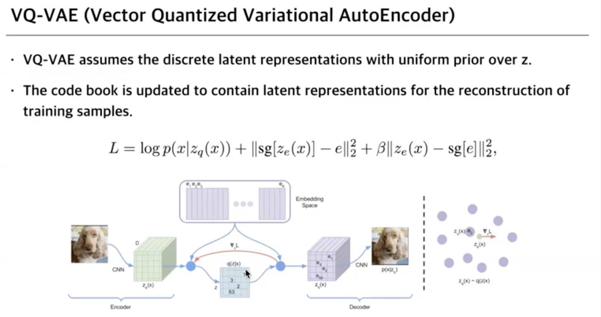
**이미지 캡션:** 이 이미지는 VQ-VAE(Vector Quantized Variational AutoEncoder)에 대한 프레젠테이션 슬라이드입니다. 슬라이드 상단에는 "VQ-VAE (Vector Quantized Variational AutoEncoder)"라는 제목이 있습니다. 그 아래에는 VQ-VAE의 두 가지 주요 가정을 설명하는 두 개의 글머리 기호 목록이 있습니다. 첫 번째는 "VQ-VAE는 z에 대한 균일한 사전 분포를 가진 이산 잠재 표현을 가정합니다."이고, 두 번째는 "코드북은 훈련 샘플의 재구성을 위한 잠재 표현을 포함하도록 업데이트됩니다."입니다. 그 아래에는 VQ-VAE의 손실 함수를 나타내는 수학 공식이 있습니다. 슬라이드의 하단에는 VQ-VAE의 작동 방식을 시각적으로 보여주는 다이어그램이 있습니다. 다이어그램은 입력 이미지(개 사진)가 인코더를 통과하여 잠재 표현 z_e(x)로 변환되는 과정을 보여줍니다. 이 잠재 표현은 코드북(Embedding Space)에서 가장 가까운 벡터 e로 양자화되어 z_q(x)를 생성합니다. 그런 다음 디코더는 이 z_q(x)를 사용하여 원래 이미지를 재구성합니다. 다이어그램에는 또한 잠재 표현과 코드북 벡터 간의 관계를 보여주는 추가적인 시각화가 포함되어 있습니다. 전반적으로 슬라이드는 VQ-VAE의 기본 개념과 작동 방식을 설명하는 데 중점을 두고 있으며, 기술적인 내용을 다루고 있습니다.
 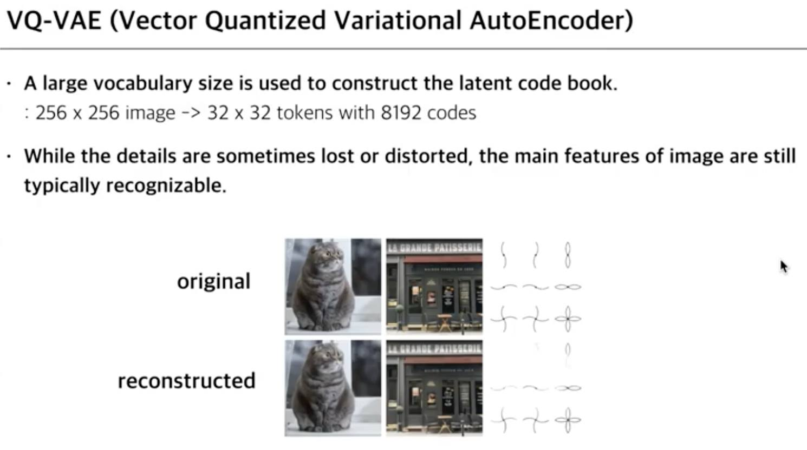
**이미지 캡션:** 화면 상단에는 "VQ-VAE (Vector Quantized Variational AutoEncoder)"라는 제목이 흰색 글씨로 표시되어 있으며, 그 아래에는 두 개의 글머리 기호 목록이 있습니다. 첫 번째 글머리 기호는 "A large vocabulary size is used to construct the latent code book."이라고 설명하며, 그 아래에 콜론으로 구분하여 "256 x 256 image -> 32 x 32 tokens with 8192 codes"라는 기술적인 정보를 제공합니다. 두 번째 글머리 기호는 "While the details are sometimes lost or distorted, the main features of image are still typically recognizable."라고 설명합니다. 화면 하단에는 "original"과 "reconstructed"라는 두 개의 레이블이 세로로 나열되어 있으며, 각 레이블 옆에는 두 개의 이미지 열이 있습니다. 왼쪽 열에는 각각 회색 고양이 사진이 있고, 오른쪽 열에는 "LA GRANDE PATISSERIE"라는 간판이 있는 상점 사진이 있습니다. 각 이미지 열의 가장 오른쪽에는 추상적인 선 그림들이 세로로 나열되어 있습니다. "original" 레이블 아래의 고양이와 상점 이미지는 "reconstructed" 레이블 아래의 이미지와 매우 유사하지만, 약간의 차이가 있습니다. 전체적으로 흰색 배경에 검은색 텍스트와 이미지가 포함된 프레젠테이션 슬라이드로 보입니다.
 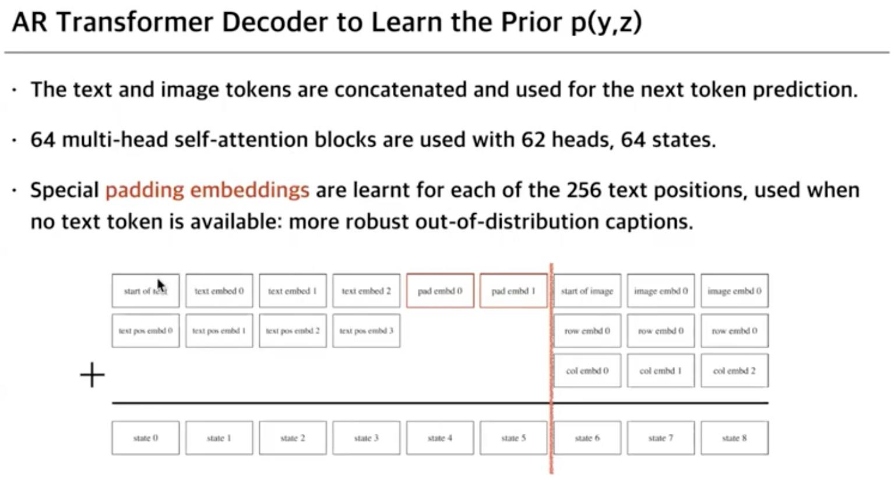
**이미지 캡션:** 이 이미지는 "AR Transformer Decoder to Learn the Prior p(y,z)"라는 제목의 프레젠테이션 슬라이드 또는 문서의 일부입니다. 슬라이드에는 세 개의 글머리 기호 목록과 두 개의 시각적 다이어그램이 포함되어 있습니다. 글머리 기호 목록은 AR Transformer Decoder의 작동 방식에 대한 기술적인 설명을 제공하며, 텍스트 및 이미지 토큰 연결, 멀티 헤드 셀프 어텐션 블록 수, 패딩 임베딩의 사용에 대해 설명합니다. 아래쪽 다이어그램은 텍스트 및 이미지 토큰과 상태를 나타내는 여러 개의 사각형 상자로 구성되어 있으며, 이는 모델의 입력 또는 처리 단계를 시각적으로 표현한 것으로 보입니다. 상자에는 "start of text", "text embed 0", "pad embd 0", "start of image", "image embd 0", "row embd 0", "col embd 0" 및 "state 0"부터 "state 8"까지의 레이블이 붙어 있습니다. 이미지에는 사람이 없으며, 배경은 흰색이며 텍스트와 다이어그램만 표시됩니다. 전체적인 분위기는 정보 전달에 초점을 맞춘 기술적이고 학술적인 느낌을 줍니다.
 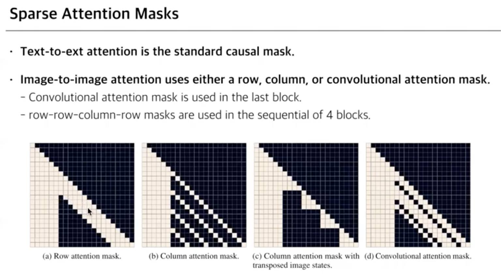
**이미지 캡션:** 이 이미지는 "Sparse Attention Masks"라는 제목의 발표 슬라이드로, 텍스트와 이미지 간의 어텐션 메커니즘에서 사용되는 다양한 어텐션 마스크를 설명하고 있습니다. 슬라이드 상단에는 제목과 함께 두 개의 글머리 기호 목록이 있습니다. 첫 번째 글머리 기호는 "Text-to-ext attention is the standard causal mask."라고 명시하며, 텍스트와 외부 정보 간의 어텐션이 표준적인 인과 마스크를 사용함을 나타냅니다. 두 번째 글머리 기호는 "Image-to-image attention uses either a row, column, or convolutional attention mask."라고 설명하며, 이미지 간의 어텐션은 행, 열 또는 컨볼루션 어텐션 마스크 중 하나를 사용한다고 말합니다. 이어서 두 개의 하위 글머리 기호는 컨볼루션 어텐션 마스크가 마지막 블록에 사용되고, 행-행-열-행 마스크가 4개의 블록 순차적으로 사용된다고 구체적으로 설명합니다. 슬라이드의 하단에는 네 개의 정사각형 격자 이미지가 나란히 표시되어 있으며, 각각은 다른 유형의 어텐션 마스크를 시각적으로 보여줍니다. 왼쪽부터 (a) Row attention mask, (b) Column attention mask, (c) Column attention mask with transposed image states, 그리고 (d) Convolutional attention mask라고 레이블이 붙어 있습니다. 각 격자는 검은색과 흰색 칸으로 구성되어 있으며, 흰색 칸은 어텐션이 적용되는 부분을 나타내고 검은색 칸은 적용되지 않는 부분을 나타내는 것으로 보입니다. (a)는 대각선 모양의 흰색 영역을, (b)는 계단식으로 내려가는 흰색 영역을, (c)는 (b)와 유사하지만 약간 다른 패턴의 흰색 영역을, (d)는 더 복잡하고 불규칙한 패턴의 흰색 영역을 보여줍니다. 이미지에는 사람이 직접적으로 보이지 않으며, 배경은 흰색으로 깔끔하게 처리되어 있습니다. 전반적으로 이 슬라이드는 기술적인 내용을 전달하는 교육적이거나 정보 전달적인 분위기를 가지고 있습니다.
 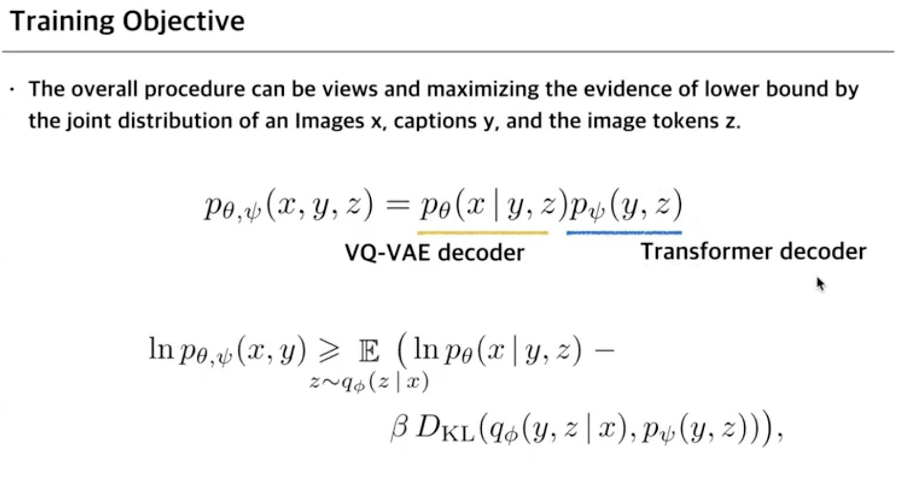
**이미지 캡션:** 이 이미지는 "Training Objective"라는 제목의 슬라이드로, 딥러닝 모델의 학습 목표를 설명하고 있습니다. 슬라이드에는 흰색 배경에 검은색 텍스트로 이루어진 내용이 포함되어 있으며, 수학 공식과 함께 몇 가지 용어가 밑줄로 강조되어 있습니다. 상단에는 "Training Objective"라는 제목이 있고, 그 아래에는 점으로 시작하는 문장이 있습니다. 이 문장은 "The overall procedure can be views and maximizing the evidence of lower bound by the joint distribution of an Images x, captions y, and the image tokens z."라고 쓰여 있습니다. 이어서 두 개의 수학 공식이 제시됩니다. 첫 번째 공식은 "pθ,ψ(x, y, z) = pθ(x|y, z)pψ(y, z)"이며, 이 공식의 각 부분 아래에는 "VQ-VAE decoder"와 "Transformer decoder"라는 용어가 각각 노란색과 파란색 밑줄로 표시되어 있습니다. 두 번째 공식은 더 복잡한 형태로, "ln pθ,ψ(x, y) ≥ E_{z~qφ(z|x)} (ln pθ(x|y, z) - β DKL(qφ(y, z|x), pψ(y, z)))"입니다. 이 슬라이드에는 사람이 등장하지 않으며, 특정 장소나 사물도 보이지 않습니다. 텍스트는 모두 영어로 되어 있으며, 슬라이드의 전체적인 분위기는 학술적이고 정보 전달에 초점을 맞추고 있습니다.
 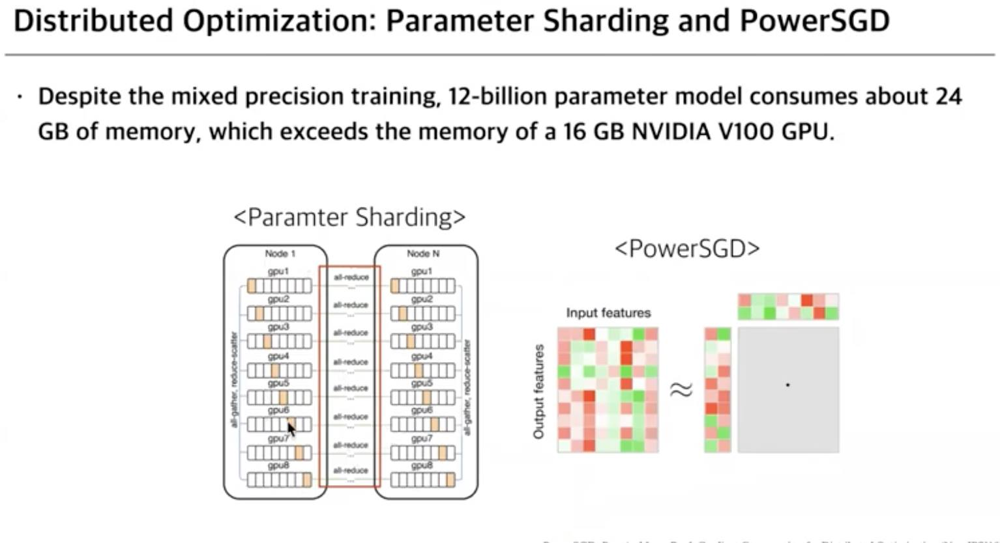
**이미지 캡션:** 이 이미지는 "분산 최적화: 파라미터 샤딩 및 PowerSGD"라는 제목의 프레젠테이션 슬라이드입니다. 슬라이드 상단에는 "혼합 정밀도 학습에도 불구하고 120억 개의 파라미터를 가진 모델은 약 24GB의 메모리를 소비하며, 이는 16GB NVIDIA V100 GPU의 메모리를 초과합니다."라는 텍스트가 있습니다. 슬라이드 중앙에는 두 가지 기술을 시각적으로 비교하는 다이어그램이 있습니다. 왼쪽에는 "파라미터 샤딩"이라는 제목의 다이어그램이 있으며, 여러 노드와 각 노드 내의 여러 GPU가 "all-reduce" 및 "all-gather, reduce-scatter"와 같은 통신 작업을 수행하는 것을 보여줍니다. 오른쪽에는 "PowerSGD"라는 제목의 다이어그램이 있으며, "입력 특징"과 "출력 특징"을 나타내는 색상으로 채워진 격자 모양의 시각화와 함께 근사 기호(≈)가 있습니다. 이 시각화는 입력 특징이 처리되어 출력 특징으로 변환되는 과정을 나타내는 것으로 보입니다. 슬라이드 하단에는 텍스트가 있지만 흐릿하여 읽기 어렵습니다. 전반적으로 이 슬라이드는 대규모 딥러닝 모델의 메모리 요구 사항과 이를 관리하기 위한 분산 최적화 기술을 설명하는 데 사용되는 것으로 보입니다.
 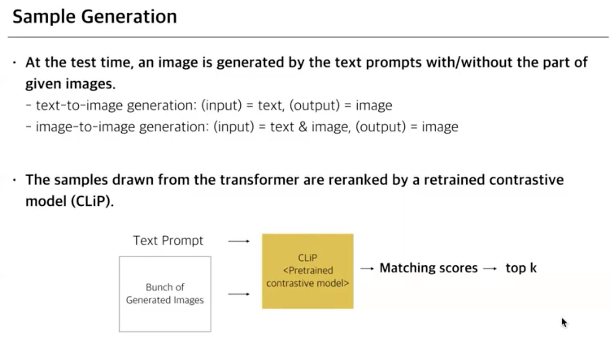
**이미지 캡션:** 이 이미지는 "샘플 생성"이라는 제목의 프레젠테이션 슬라이드입니다. 슬라이드에는 두 개의 주요 섹션이 있습니다. 첫 번째 섹션은 텍스트 프롬프트를 사용하여 이미지를 생성하는 방법에 대한 설명으로, 텍스트만 입력으로 사용하는 텍스트-이미지 생성과 텍스트와 이미지를 모두 입력으로 사용하는 이미지-이미지 생성을 구분합니다. 두 번째 섹션은 변환기에서 샘플링된 이미지를 재훈련된 대조 모델인 CLIP을 사용하여 순위를 매기는 과정을 설명하는 다이어그램입니다. 다이어그램은 텍스트 프롬프트와 생성된 이미지 묶음이 CLIP 모델을 통과하여 일치 점수를 얻고, 최종적으로 상위 k개의 이미지를 선택하는 과정을 보여줍니다. 슬라이드 전체적으로 흰색 배경에 검은색 텍스트와 노란색 상자로 구성되어 있으며, 정보 전달에 초점을 맞춘 깔끔하고 전문적인 분위기입니다.
 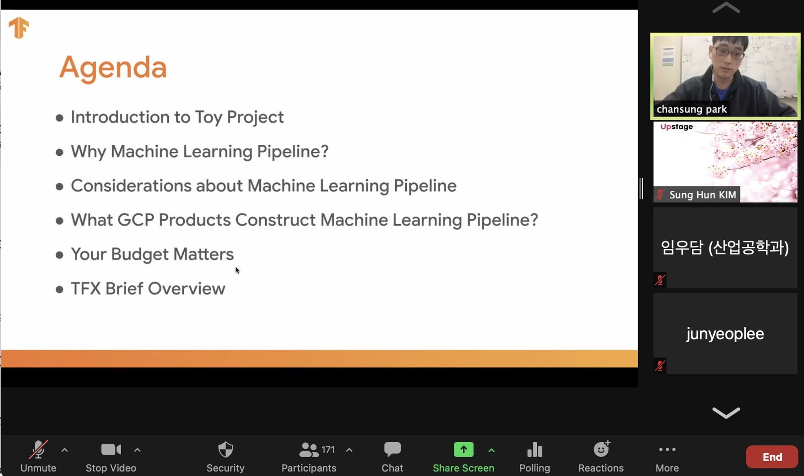
**이미지 캡션:** 화면 왼쪽에는 "Agenda"라는 제목과 함께 6개의 항목으로 구성된 발표 내용이 영어로 표시되어 있으며, 각 항목은 머신러닝 파이프라인, GCP 제품, 예산, TFX 개요 등을 다루고 있다. 화면 오른쪽에는 여러 참가자의 영상 화면이 작게 표시되어 있는데, 상단에는 안경을 쓴 성인 남성이 검은색 상의를 입고 발표 중인 모습이 보이며, 그의 이름은 "chansung park"로 표시되어 있다. 그 아래에는 벚꽃 이미지가 배경으로 보이는 "Upstage"라는 이름의 참가자 화면이 있고, 그 아래에는 "Sung Hun KIM"이라는 이름과 함께 "임우담 (산업공학과)"라는 한국어 이름이 표시된 참가자 화면이 있다. 가장 아래에는 "junyeoplee"라는 이름의 참가자 화면이 보인다. 화면 하단에는 줌(Zoom) 회의 컨트롤 바가 있으며, 음소거, 비디오 중지, 보안, 참가자, 채팅, 화면 공유, 투표, 반응, 더 보기, 종료 등의 버튼이 보인다. 전반적으로 온라인 화상 회의 중 발표가 진행되고 있는 상황으로 보이며, 차분하고 전문적인 분위기이다.
 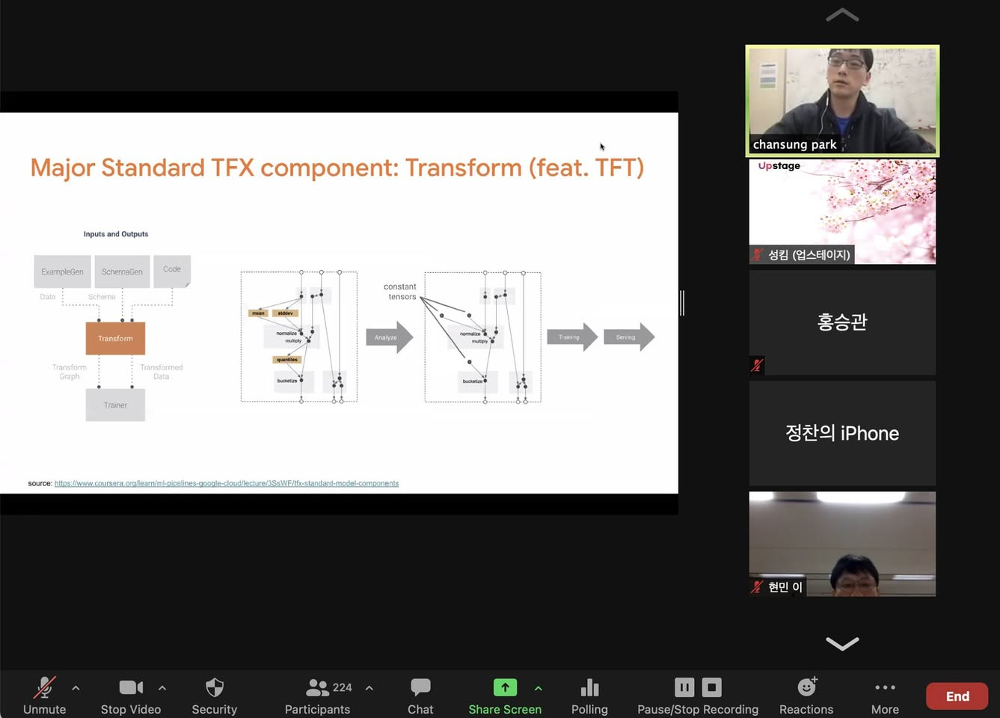
**이미지 캡션:** 화면에는 온라인 회의 중인 모습이 담겨 있으며, 발표자는 화면 공유를 통해 TFX의 주요 표준 컴포넌트인 Transform (feat. TFT)에 대한 슬라이드를 보여주고 있습니다. 발표자는 안경을 쓴 성인 남성으로, 검은색 상의를 입고 있으며 화면을 응시하며 설명하고 있습니다. 슬라이드에는 데이터 처리 파이프라인의 입력과 출력, 그리고 Transform 컴포넌트의 분석 및 학습, 서빙 과정을 나타내는 다이어그램이 포함되어 있습니다. 다이어그램에는 ExampleGen, SchemaGen, Code, Transform, Trainer 등의 구성 요소와 Data, Schema, Transform Graph, Transformed Data 등의 데이터 흐름이 표시되어 있습니다. 또한, 화면 오른쪽에는 다른 참가자들의 영상이 작게 표시되어 있으며, 'chansung park', '성킴 (업스테이지)', '홍승관', '정찬의 iPhone', '현민 이' 등의 이름이 보입니다. 회의 하단에는 음소거, 비디오 켜기/끄기, 보안, 참가자 목록, 채팅, 화면 공유, 폴링, 녹화, 반응, 더 보기, 종료 등의 컨트롤 버튼이 있습니다. 전반적으로 기술적인 내용을 공유하는 온라인 강의 또는 회의 상황으로 보입니다.

> 170명 이상 오셨습니다. 막 시작했습니다.  줌방: https://hkust.zoom.us/j/98098242519?pwd=V2FCMUtmTUZBb28rRjJUdU1sckdkQT09  https://www.facebook.com/groups/TensorFlowKR/permalink/1432381937102860/

### 3월 11일 (목) 09:39 · 생일 축하드립니다!

생일 축하드립니다!

### 3월 11일 (목) 09:39 · ↪ 생일 축하드립니다!

*다른 프로필에 남긴 글*

생일 축하드립니다!

### 3월 14일 (일) 19:54 · 📷 사진 (3장)

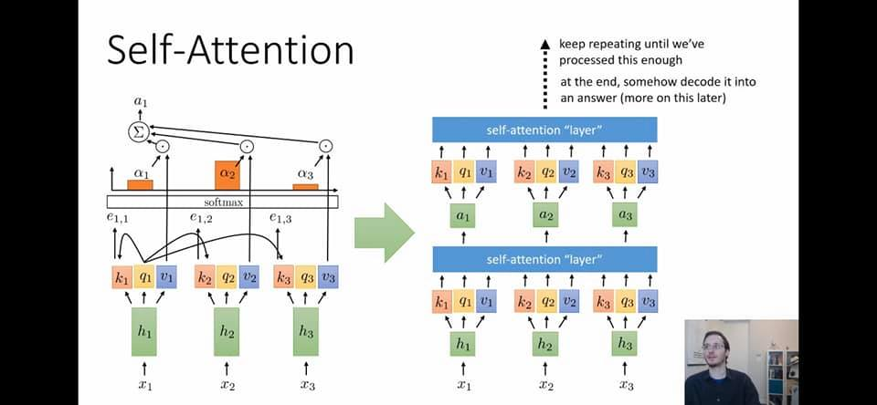
**이미지 캡션:** 화면 왼쪽에는 "Self-Attention"이라는 제목과 함께 셀프 어텐션 메커니즘의 한 부분을 시각적으로 표현한 다이어그램이 있습니다. 이 다이어그램은 입력 벡터 $x_1, x_2, x_3$가 각각 $h_1, h_2, h_3$로 변환되고, 이들이 다시 $k, q, v$ 벡터로 분해되는 과정을 보여줍니다. 이후 $e_{1,1}, e_{1,2}, e_{1,3}$와 같은 값들이 계산되고 소프트맥스 함수를 거쳐 $\alpha_1, \alpha_2, \alpha_3$와 같은 어텐션 가중치가 생성됩니다. 이 가중치들은 다시 $h_1, h_2, h_3$와 결합되어 최종 출력 $a_1$을 생성하는 복잡한 계산 과정을 나타냅니다. 화면 오른쪽에는 셀프 어텐션 레이어가 여러 개 쌓여 있는 트랜스포머 모델의 구조를 간략하게 보여주는 다이어그램이 있습니다. 이 다이어그램은 입력이 여러 개의 셀프 어텐션 레이어를 통과하며 처리되는 과정을 나타내며, 상단에는 "keep repeating until we've processed this enough"와 "at the end, somehow decode it into an answer (more on this later)"라는 텍스트가 있어 모델의 반복적인 처리와 최종 결과 도출 과정을 설명하고 있습니다. 화면 오른쪽 하단에는 검은색 상의를 입고 안경을 쓴 성인 남성이 강연을 하고 있는 모습이 작게 보입니다. 그는 화면을 바라보며 손짓을 하거나 설명하는 듯한 표정을 짓고 있으며, 배경에는 책장과 벽이 보입니다. 전체적으로 이 화면은 인공지능, 특히 자연어 처리 분야의 셀프 어텐션 메커니즘에 대한 강의 자료의 일부로 보이며, 학술적이면서도 교육적인 분위기를 풍깁니다.
 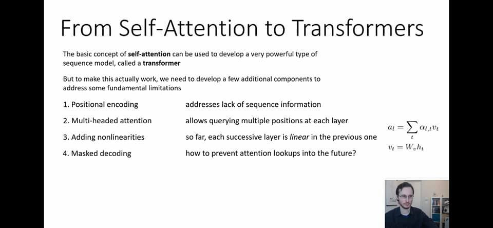
**이미지 캡션:** 화면에는 "From Self-Attention to Transformers"라는 제목의 프레젠테이션 슬라이드가 보이며, 그 아래에는 자기 주의(self-attention)의 기본 개념을 사용하여 트랜스포머라는 강력한 시퀀스 모델을 개발할 수 있다는 내용이 설명되어 있습니다. 또한, 트랜스포머가 제대로 작동하기 위해 필요한 몇 가지 추가 구성 요소와 관련된 근본적인 한계점을 해결해야 한다는 내용이 언급되어 있으며, 구체적으로는 1. 위치 인코딩, 2. 다중 헤드 주의, 3. 비선형성 추가, 4. 마스크 디코딩이 나열되어 있습니다. 각 항목 옆에는 해당 구성 요소가 해결하는 문제점이나 기능에 대한 설명이 간략하게 적혀 있습니다. 예를 들어, 위치 인코딩은 시퀀스 정보 부족을 다루고, 다중 헤드 주의는 각 레이어에서 여러 위치를 쿼리할 수 있게 하며, 비선형성 추가는 이전 레이어의 선형성을 극복하고, 마스크 디코딩은 미래를 향한 주의 검색을 방지하는 방법을 설명합니다. 슬라이드 오른쪽에는 두 개의 수학 공식이 표시되어 있으며, 화면 하단 오른쪽에는 안경을 쓰고 검은색 셔츠를 입은 성인 남성이 강의하는 모습이 작게 보입니다. 배경에는 책장과 같은 사물이 희미하게 보이며, 전반적으로 강의 또는 발표 상황임을 알 수 있습니다.
 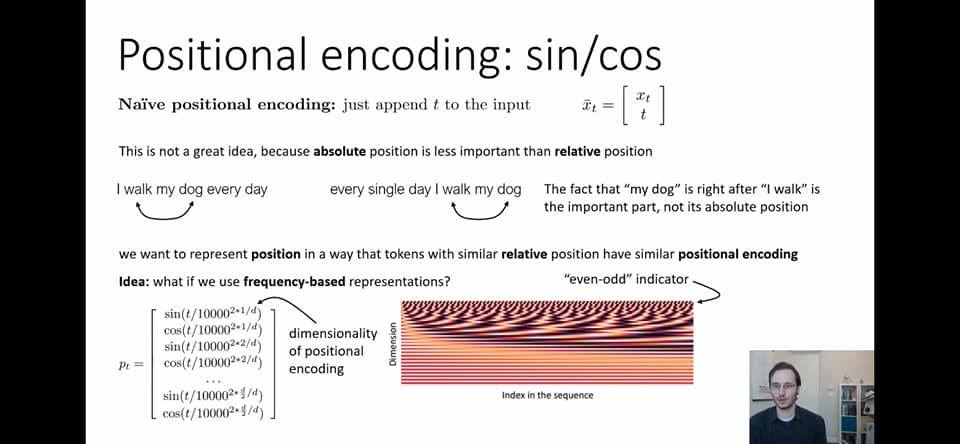
**이미지 캡션:** 화면에는 "Positional encoding: sin/cos"라는 제목의 프레젠테이션 슬라이드가 표시되어 있으며, 슬라이드에는 텍스트, 수식, 이미지, 그리고 한 명의 성인 남성이 포함되어 있습니다. 텍스트는 "Naïve positional encoding: just append t to the input"이라는 문장과 함께 수식 $\bar{x}_t = \begin{bmatrix} x_t \\ t \end{bmatrix}$를 보여주고 있으며, 이어서 "This is not a great idea, because absolute position is less important than relative position"이라는 설명과 함께 "I walk my dog every day"와 "every single day I walk my dog"라는 두 문장이 제시되고, 두 번째 문장에는 "my dog"이 "I walk" 바로 뒤에 오는 것이 중요하며 절대적인 위치가 중요하지 않다는 설명이 덧붙여져 있습니다. 또한, "we want to represent position in a way that tokens with similar relative position have similar positional encoding"이라는 문장과 함께 "Idea: what if we use frequency-based representations?"라는 질문이 제시됩니다. 이어서 위치 인코딩의 차원을 나타내는 수식 $p_t = \begin{bmatrix} \sin(t/10000^{2 \cdot 1/d}) \\ \cos(t/10000^{2 \cdot 1/d}) \\ \sin(t/10000^{2 \cdot 2/d}) \\ \cos(t/10000^{2 \cdot 2/d}) \\ \dots \\ \sin(t/10000^{2 \cdot d/d}) \\ \cos(t/10000^{2 \cdot d/d}) \end{bmatrix}$와 함께 "dimensionality of positional encoding"이라는 설명이 있고, 그 옆에는 "even-odd" indicator라는 화살표와 함께 "Dimension"과 "Index in the sequence"라는 축을 가진 복잡한 패턴의 이미지가 있습니다. 화면 오른쪽 하단에는 검은색 배경에 흰색 벽이 보이는 방에서 검은색 상의를 입고 안경을 쓴 성인 남성이 카메라를 바라보고 있으며, 그의 뒤에는 책장과 여러 물건들이 보입니다. 전반적으로 기술적인 내용을 설명하는 프레젠테이션의 한 장면으로, 차분하고 교육적인 분위기입니다.

### 3월 18일 (목) 11:14 · 📷 사진 (5장)

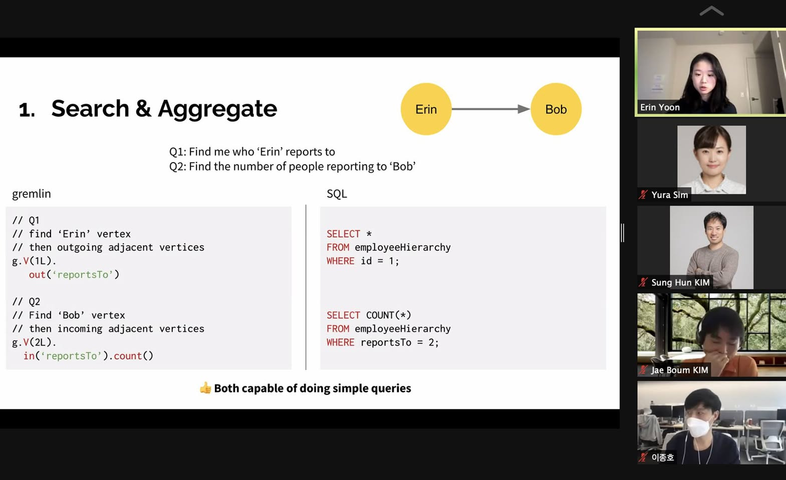
**이미지 캡션:** 화면에는 온라인 회의 화면이 보이며, 발표자는 "1. Search & Aggregate"라는 제목의 슬라이드를 공유하고 있습니다. 슬라이드에는 두 개의 질문과 함께 그래프 형태로 "Erin"과 "Bob"이라는 두 노드가 있고, "Erin"에서 "Bob"으로 향하는 화살표가 그려져 있습니다. 또한, "gremlin"과 "SQL"이라는 두 가지 쿼리 언어로 작성된 예시 코드가 제시되어 있습니다. 화면 오른쪽에는 여러 명의 참가자들의 영상이 작게 보입니다. 상단에는 "Erin Yoon"이라는 이름의 젊은 여성 발표자가 카메라를 보며 말하고 있으며, 그 아래로 "Yura Sim", "Sung Hun KIM", "Jae Boum KIM", 그리고 "이종호"라는 이름의 다른 참가자들이 보입니다. 이들은 모두 온라인으로 회의에 참여하고 있으며, 각자의 얼굴이 영상으로 송출되고 있습니다. 발표자는 차분하고 전문적인 표정으로 발표를 진행하고 있으며, 다른 참가자들은 발표를 듣거나 자신의 화면을 보고 있습니다. 전체적으로 기술적인 내용을 공유하는 온라인 발표 또는 회의의 모습입니다.
 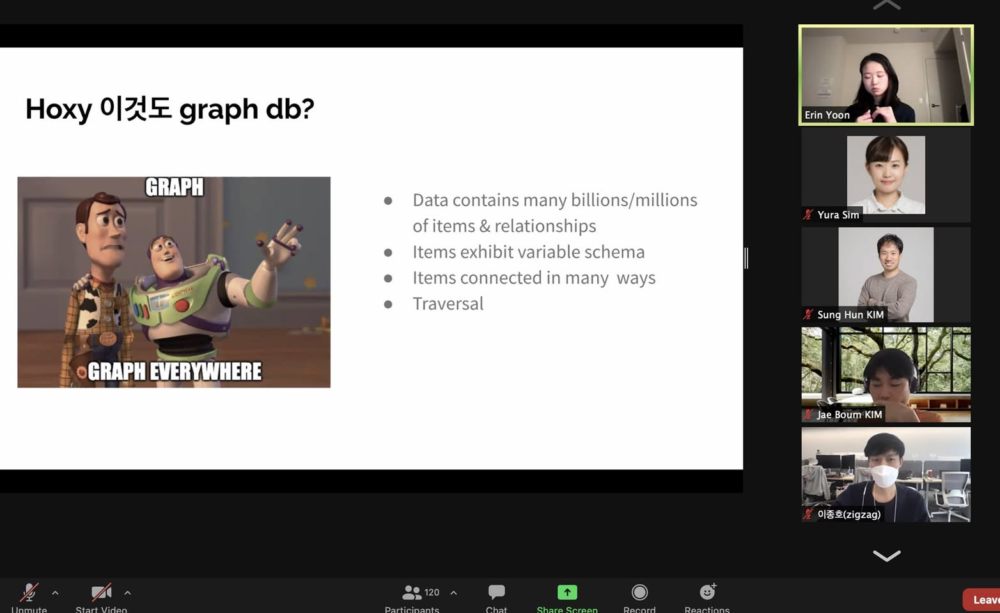
**이미지 캡션:** 이 사진은 온라인 화상 회의 화면을 캡처한 것으로, 발표자가 슬라이드를 공유하고 있으며 여러 참가자들이 각자의 화면에서 보이고 있다. 슬라이드에는 "Hoxy 이것도 graph db?"라는 제목과 함께 영화 '토이 스토리'의 우디와 버즈가 등장하는 밈 이미지가 있다. 밈 이미지에는 "GRAPH"와 "GRAPH EVERYWHERE"라는 텍스트가 삽입되어 있다. 슬라이드의 오른쪽에는 그래프 데이터베이스의 특징을 설명하는 글머리 기호 목록이 있다: "Data contains many billions/millions of items & relationships", "Items exhibit variable schema", "Items connected in many ways", "Traversal". 화면 오른쪽에는 네 명의 참가자가 썸네일 형태로 보이며, 각 참가자의 이름은 Erin Yoon, Yura Sim, Sung Hun KIM, Jae Boum KIM으로 표시되어 있다. 가장 아래쪽 썸네일에는 "이종호(zigzag)"라는 이름과 함께 마스크를 착용한 젊은 성인 남성이 보인다. 전반적으로 기술 관련 발표 또는 토론이 진행 중인 것으로 보이며, 분위기는 진지하면서도 유머러스한 요소가 포함되어 있다.
 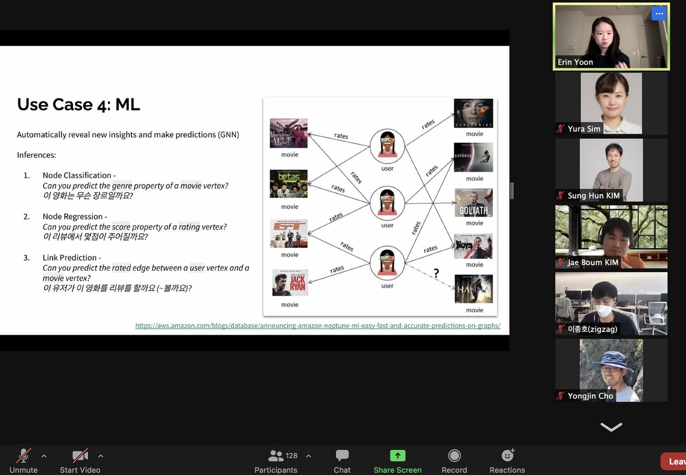
**이미지 캡션:** 화면 왼쪽에는 "Use Case 4: ML"이라는 제목과 함께 "Automatically reveal new insights and make predictions (GNN)"라는 설명이 있고, 그 아래에는 "Inferences"라는 소제목과 함께 세 가지 추론 항목이 나열되어 있습니다. 첫 번째 항목은 "Node Classification"으로 "Can you predict the genre property of a movie vertex?"와 한국어 질문 "이 영화는 무슨 장르일까요?"가 포함되어 있습니다. 두 번째 항목은 "Node Regression"으로 "Can you predict the score property of a rating vertex?"와 한국어 질문 "이 리뷰에서 몇점이 주어질까요?"가 있습니다. 세 번째 항목은 "Link Prediction"으로 "Can you predict the rated edge between a user vertex and a movie vertex?"와 한국어 질문 "이 유저가 이 영화를 리뷰를 할까요(~볼까요)?"가 있습니다. 이 추론 항목들 옆에는 영화 포스터 이미지들과 사용자(user) 및 영화(movie)를 나타내는 노드, 그리고 이들 간의 관계를 나타내는 화살표로 구성된 그래프가 그려져 있습니다. 그래프에는 "rates"라는 라벨이 붙은 화살표들이 있으며, 마지막 영화 노드에는 물음표(?)가 표시되어 있습니다. 화면 하단에는 웹사이트 주소가 링크되어 있습니다. 화면 오른쪽에는 여러 명의 참가자들이 줌(Zoom) 화상 회의 화면으로 나타나 있으며, 각 참가자의 이름과 프로필 사진이 보입니다. 가장 위에 있는 참가자는 Erin Yoon이며, 그 아래로 Yura Sim, Sung Hun Kim, Jae Boum Kim, 이종호(zigzag), Yongjin Cho가 차례로 보입니다. 회의 화면 하단에는 음소거, 비디오 시작, 참가자 수, 채팅, 화면 공유, 녹화, 반응 등의 줌 컨트롤 바가 있습니다. 전반적으로 온라인 강의 또는 발표 세션의 일부로 보이며, 머신러닝의 그래프 신경망(GNN)을 활용한 영화 추천 시스템에 대한 내용이 논의되고 있는 것으로 추정됩니다.
 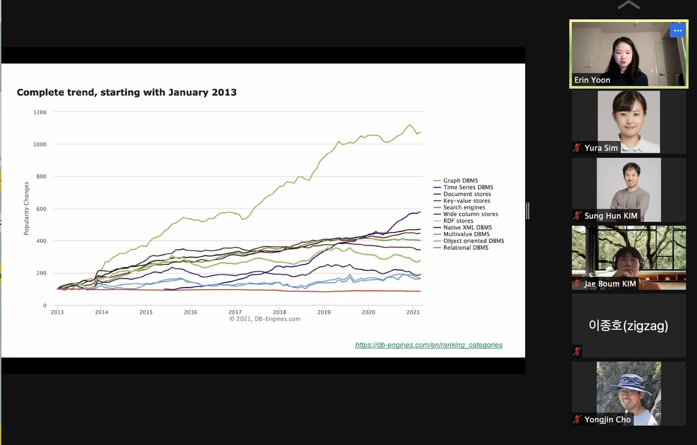
**이미지 캡션:** 이 화면은 온라인 회의 화면으로, 왼쪽에는 데이터베이스 종류별 인기 변화 추세를 보여주는 그래프가 표시되어 있으며, 2013년 1월부터 2021년까지의 데이터를 담고 있습니다. 그래프는 X축에 연도를, Y축에 인기도 변화를 나타내며, 여러 색상의 선으로 Graph DBMS, Time Series DBMS, Document stores, Key-value stores, Search engines, Wide column stores, RDF stores, Native XML DBMS, Multivalue DBMS, Object oriented DBMS, Relational DBMS 등 다양한 데이터베이스 종류의 인기도 변화를 보여줍니다. 오른쪽에는 여러 참가자들의 영상이 작게 표시되어 있으며, 가장 위에 있는 참가자는 Erin Yoon으로, 검은색 상의를 입고 있으며 발표 중인 것으로 보입니다. 그 아래에는 Yura Sim, Sung Hun KIM, Jae Boum KIM, 이종호(zigzag), Yongjin Cho 순서로 참가자들이 보입니다. 각 참가자는 자신의 영상 화면에서 다양한 배경을 가지고 있으며, 일부는 편안한 복장을 하고 있습니다. 전반적으로 온라인 회의 또는 발표 세션의 일부로 보이며, 데이터 분석 및 공유가 이루어지고 있는 상황입니다.
 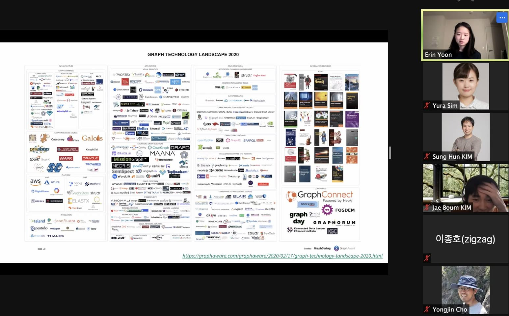
**이미지 캡션:** 이 사진은 온라인 회의 화면을 캡처한 것으로, 화면 왼쪽에는 "GRAPH TECHNOLOGY LANDSCAPE 2020"이라는 제목의 그래프 기술 관련 다이어그램이 표시되어 있으며, 다양한 기업 로고와 서비스 이름들이 카테고리별로 정리되어 있다. 화면 오른쪽에는 여러 명의 참가자들이 줌(Zoom) 화상 회의 형태로 참여하고 있으며, 각 참가자들의 이름과 프로필 사진이 보인다. 상단부터 차례대로 "Erin Yoon", "Yura Sim", "Sung Hun KIM", "Jae Boum KIM", "이종호(zigzag)", "Yongjin Cho"라는 이름이 표시되어 있다. Erin Yoon은 검은색 상의를 입고 있으며, Yura Sim은 흰색 상의를 입고 미소를 짓고 있다. Sung Hun KIM은 회색 상의를 입고 있으며, Jae Boum KIM은 헤드폰을 끼고 머리를 만지며 웃고 있다. 이종호(zigzag)는 이름만 보이고, Yongjin Cho는 파란색 모자를 쓰고 숲을 배경으로 하고 있다. 전반적으로 기술 관련 주제로 온라인 회의가 진행되고 있는 분위기이다.

### 3월 19일 (금) 14:56 · 📷 사진 (2장)

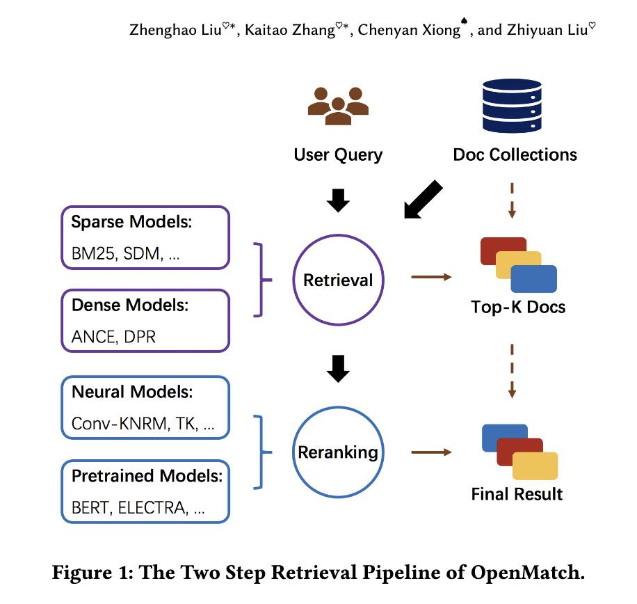
**이미지 캡션:** 이 이미지는 "OpenMatch"라는 시스템의 두 단계 검색 파이프라인을 설명하는 도식입니다. 상단에는 연구자들의 이름이 나열되어 있습니다. 중앙에는 사용자 쿼리(사람 모양 아이콘)와 문서 컬렉션(데이터베이스 아이콘)이 있으며, 이 두 가지가 검색(Retrieval) 단계로 연결됩니다. 검색 단계는 Sparse Models, Dense Models, Neural Models, Pretrained Models와 같은 다양한 모델 유형을 나타내는 네 개의 상자로 구성되어 있으며, 이 상자들은 검색 단계와 연결됩니다. 검색 단계의 결과는 Top-K Docs로 표시되며, 이는 여러 색상의 문서 스택 아이콘으로 표현됩니다. 그 아래에는 재순위(Reranking) 단계가 있으며, 이 단계는 Neural Models와 Pretrained Models 상자에서 오는 입력과 연결됩니다. 재순위 단계의 결과는 Final Result로 표시되며, 이 역시 여러 색상의 문서 스택 아이콘으로 표현됩니다. 전체적으로 흰색 배경에 파란색, 보라색, 갈색, 노란색, 빨간색 등 다양한 색상의 아이콘과 텍스트가 사용되어 정보의 흐름을 시각적으로 명확하게 보여줍니다. 이미지 하단에는 "Figure 1: The Two Step Retrieval Pipeline of OpenMatch."라는 캡션이 있습니다.
 
**이미지 캡션:** 이 이미지는 "OpenMatch"라는 시스템의 두 단계 검색 파이프라인을 설명하는 다이어그램입니다. 상단에는 Zhenghao Liu, Kaitao Zhang, Chenyan Xiong, Zhiyuan Liu라는 네 명의 연구원 이름이 나열되어 있습니다. 다이어그램의 왼쪽에는 "Sparse Models", "Dense Models", "Neural Models", "Pretrained Models"라는 네 개의 상자가 있으며, 각 상자 안에는 해당 모델 유형에 속하는 특정 알고리즘 이름(예: BM25, SDM, ANCE, DPR, Conv-KNRM, TK, BERT, ELECTRA)이 나열되어 있습니다. 이 네 개의 상자는 왼쪽에서 오른쪽으로 "Retrieval"이라는 보라색 원형 노드로 연결되는 중괄호로 묶여 있습니다. "Retrieval" 노드 위에는 사람 모양 아이콘과 함께 "User Query"라는 텍스트가 있고, 오른쪽에는 데이터베이스 아이콘과 함께 "Doc Collections"라는 텍스트가 있습니다. "User Query"에서 "Retrieval"로 향하는 검은색 화살표와 "Doc Collections"에서 "Retrieval"로 향하는 검은색 화살표가 있습니다. "Retrieval" 노드에서 오른쪽으로 향하는 갈색 화살표는 여러 색상의 문서 아이콘이 쌓여 있는 "Top-K Docs"라는 텍스트로 이어집니다. "Retrieval" 노드 아래에는 "Reranking"이라는 파란색 원형 노드가 있으며, "Neural Models"와 "Pretrained Models" 상자는 이 노드로 연결되는 중괄호로 묶여 있습니다. "Reranking" 노드에서 오른쪽으로 향하는 갈색 화살표는 여러 색상의 문서 아이콘이 쌓여 있는 "Final Result"라는 텍스트로 이어집니다. "Top-K Docs"에서 "Final Result"로 이어지는 점선 화살표도 있습니다. 다이어그램 하단에는 "Figure 1: The Two Step Retrieval Pipeline of OpenMatch."라는 캡션이 있습니다. 전체적으로 이 다이어그램은 사용자 쿼리가 다양한 모델을 사용하여 문서를 검색하고, 검색된 문서가 다시 랭킹을 거쳐 최종 결과를 생성하는 과정을 시각적으로 보여줍니다. 배경은 흰색이며, 다이어그램 요소들은 명확한 구분을 위해 다양한 색상으로 표시되어 있습니다.

### 3월 20일 (토) 08:35 · #선바다_후고민 Swimming season is on! Ocean ca…

#선바다_후고민 Swimming season is on! Ocean calls me every morning!!

**이미지 캡션:** 사진에는 성인 남성이 해변에서 셀카를 찍고 있다. 남성은 30대 후반에서 40대 초반으로 보이며, 짧은 갈색 머리에 약간의 수염이 있다. 파란색 수경을 착용하고 있으며, 노란색 테두리가 특징이다. 붉은색과 검은색 패턴이 있는 방수 재킷을 입고 있으며, 그 안에는 회색 티셔츠를 입고 있다. 남성은 카메라를 응시하며 무표정하거나 약간의 미소를 짓고 있는 듯한 표정이다. 배경에는 잔잔한 파도가 치는 바다와 흐린 하늘, 그리고 멀리 보이는 섬들이 보인다. 해변은 모래로 이루어져 있으며, 파도가 해변으로 밀려오고 있다. 전체적으로 차분하고 자연스러운 분위기이며, 수영을 하러 온 듯한 상황으로 보인다.

### 3월 25일 (목) 07:39 · 📷 사진 (1장)

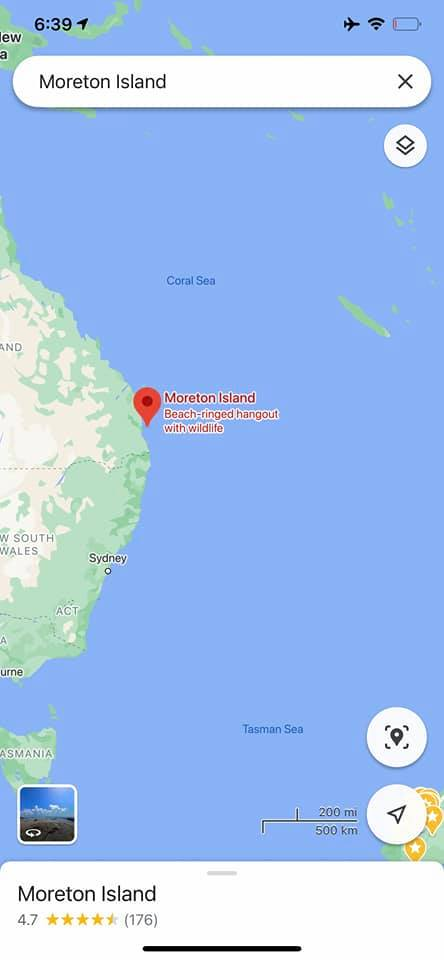
**이미지 캡션:** 이것은 구글 지도 앱의 스크린샷으로, 호주 동부 해안을 보여줍니다. 화면 상단에는 "Moreton Island"라는 검색창이 있고, 그 옆에는 X 표시가 있습니다. 지도에는 Moreton Island에 빨간색 위치 표시가 되어 있으며, "Moreton Island Beach-ringed hangout with wildlife"라는 설명이 함께 표시됩니다. 지도에는 또한 Coral Sea와 Tasman Sea가 보이며, 뉴사우스웨일스 주와 시드니도 표시됩니다. 화면 하단에는 Moreton Island의 이름과 평점 4.7점, 176개의 리뷰가 표시되는 정보 카드와 함께 작은 섬 사진이 보입니다. 전반적으로 이 스크린샷은 모바일 기기에서 지리적 위치를 검색하고 탐색하는 상황을 보여줍니다.

### 3월 26일 (금) 10:10 · 📷 사진 (1장)

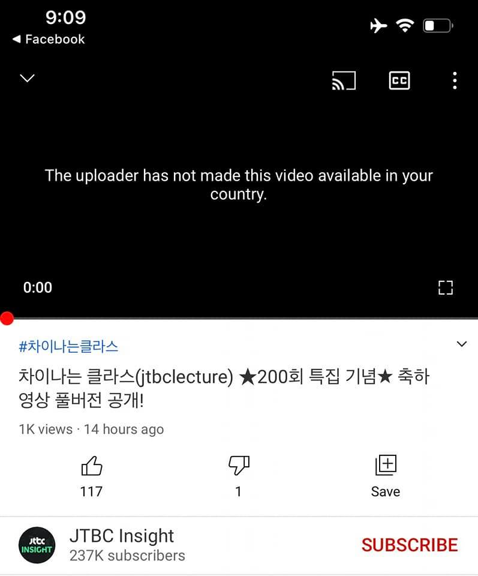
**이미지 캡션:** 이 이미지는 유튜브 영상 시청 화면을 캡처한 것으로, 영상 플레이어 상단에는 시간 정보인 "9:09"과 "Facebook"이라는 텍스트가 표시되어 있습니다. 영상 자체는 검은색 배경에 "The uploader has not made this video available in your country."라는 메시지가 나타나 시청할 수 없음을 알리고 있습니다. 영상 시간은 "0:00"으로 표시되어 있습니다. 영상 아래에는 "#차이나는클라스"라는 해시태그와 함께 "차이나는 클라스(jtbclecture) ★200회 특집 기념★ 축하 영상 풀버전 공개!"라는 제목이 보입니다. 조회수는 "1K views"이며, 14시간 전에 게시되었습니다. 좋아요 수는 117개, 싫어요 수는 1개로 표시되어 있으며, 저장 기능도 있습니다. 영상 채널은 "JTBC Insight"이며, 구독자 수는 "237K subscribers"입니다. 화면 오른쪽 하단에는 "SUBSCRIBE" 버튼이 있습니다. 전반적으로 영상 시청이 제한된 상황을 보여주는 화면입니다.

### 3월 27일 (토) 08:11 · 📷 사진 (3장)

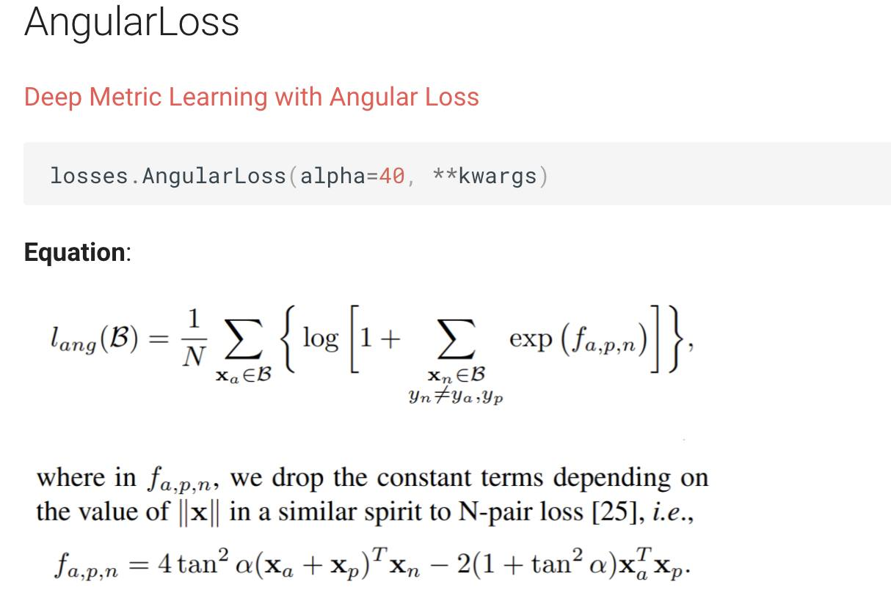
**이미지 캡션:** 이 이미지는 "AngularLoss"라는 제목과 "Deep Metric Learning with Angular Loss"라는 부제가 있는 스크린샷으로, 딥러닝 모델의 손실 함수인 Angular Loss에 대한 수학적 정의를 보여줍니다. 화면 상단에는 "AngularLoss"라는 제목이 흰색 글씨로, 그 아래에는 "Deep Metric Learning with Angular Loss"라는 부제가 빨간색 글씨로 표시되어 있습니다. 그 아래에는 회색 배경에 흰색 글씨로 `losses.AngularLoss(alpha=40, **kwargs)`라는 코드가 나타납니다. 이어서 "Equation:"이라는 제목과 함께 Angular Loss의 수학적 공식이 제시됩니다. 공식은 `l_ang(B) = 1/N * Σ_{x_a ∈ B} {log [1 + Σ_{x_n ∈ B, y_n ≠ y_a, y_p} exp(f_{a,p,n})]}`입니다. 공식 아래에는 `f_{a,p,n}`에 대한 설명과 함께 또 다른 공식 `f_{a,p,n} = 4 tan^2 α(x_a + x_p)^T x_n - 2(1 + tan^2 α)x_a^T x_p`가 표시되어 있습니다. 전반적으로 흰색 배경에 검은색과 빨간색 텍스트, 그리고 수학 공식이 포함되어 있어 학술적이거나 기술적인 문서의 일부로 보입니다. 이미지에는 사람이 등장하지 않으며, 배경은 단순한 흰색 또는 회색입니다.
 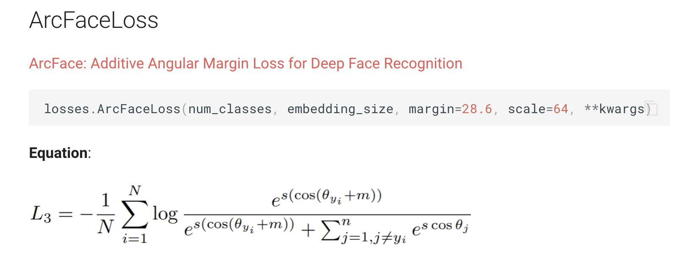
**이미지 캡션:** 이 이미지는 "ArcFaceLoss"라는 제목과 함께 "ArcFace: Additive Angular Margin Loss for Deep Face Recognition"이라는 부제를 보여줍니다. 그 아래에는 파이썬 코드 조각이 있는데, `losses.ArcFaceLoss(num_classes, embedding_size, margin=28.6, scale=64, **kwargs)`라고 표시되어 있습니다. 이어서 "Equation:"이라는 제목과 함께 ArcFace 손실 함수를 나타내는 수학 공식이 표시됩니다. 공식은 다음과 같습니다: $L_3 = -\frac{1}{N}\sum_{i=1}^{N}\log\frac{e^{s(\cos(\theta_{y_i}+m))}}{e^{s(\cos(\theta_{y_i}+m))}+\sum_{j=1,j\neq y_i}^{n}e^{s\cos\theta_j}}$입니다. 이 이미지는 딥러닝 기반 얼굴 인식 분야에서 사용되는 ArcFace 손실 함수를 설명하고 있습니다.
 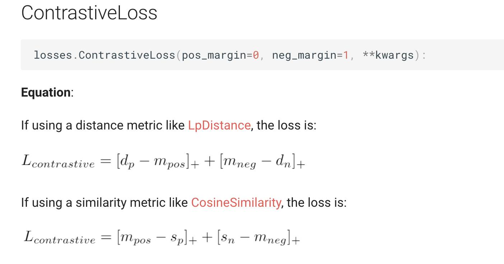
**이미지 캡션:** 이 이미지는 "ContrastiveLoss"라는 제목 아래에 Contrastive Loss 함수에 대한 설명과 수식을 보여줍니다. 상단에는 `losses.ContrastiveLoss(pos_margin=0, neg_margin=1, **kwargs):`라는 코드가 표시되어 있으며, 이는 Contrastive Loss 함수의 초기화와 매개변수를 나타냅니다. 그 아래에는 "Equation:"이라는 제목과 함께 두 가지 경우에 대한 손실 함수 수식이 제시됩니다. 첫 번째 수식은 LpDistance와 같은 거리 측정 방법을 사용할 때의 손실 함수로, `L_contrastive = [dp - m_pos]+ + [m_neg - dn]+`로 표현됩니다. 여기서 `d_p`는 긍정적인 쌍의 거리, `m_pos`는 긍정적인 쌍의 마진, `m_neg`는 부정적인 쌍의 마진, `d_n`은 부정적인 쌍의 거리를 나타내며, `[x]+`는 `max(0, x)`를 의미합니다. 두 번째 수식은 CosineSimilarity와 같은 유사도 측정 방법을 사용할 때의 손실 함수로, `L_contrastive = [m_pos - s_p]+ + [s_n - m_neg]+`로 표현됩니다. 여기서 `s_p`는 긍정적인 쌍의 유사도, `m_pos`는 긍정적인 쌍의 마진, `s_n`은 부정적인 쌍의 유사도, `m_neg`는 부정적인 쌍의 마진을 나타냅니다. 이미지는 흰색 배경에 검은색 텍스트와 일부 빨간색 텍스트로 구성되어 있으며, 코딩 문서의 일부를 캡처한 것으로 보입니다. 특별한 인물, 장소, 사물, 텍스트 외의 내용은 보이지 않으며, 전반적으로 정보 전달에 초점을 맞춘 기술적인 문서의 분위기입니다.

### 3월 27일 (토) 10:02 · Look forward to visiting all 11 Hong Kon…

Look forward to visiting all 11 Hong Kong restaurants! 

https://www.scmp.com/lifestyle/food-drink/article/3127024/asias-50-best-restaurants-2021-11-hong-kong-make-list-chairman
