# 2021년 4월

[← 2021년](README.md)

### 4월 1일 (목) 10:01 · 생일 축하드립니다!!

생일 축하드립니다!!

### 4월 1일 (목) 10:01 · ↪ 생일 축하드립니다!!

*다른 프로필에 남긴 글*

생일 축하드립니다!!

### 4월 1일 (목) 11:43 · First swimming with Garmin swim 2. Feel …

First swimming with Garmin swim 2. Feel so good.

**이미지 캡션:** 푸른 하늘에는 흰 구름이 흩뿌려져 있고, 잔잔한 바다 위로 푸른 산이 펼쳐져 있습니다. 바다 한가운데에는 성인 남성 한 명이 서 있는데, 그의 모습은 실루엣으로만 보입니다. 그는 수영복을 입고 있으며, 물속에서 무언가를 바라보고 있는 듯한 자세를 취하고 있습니다. 멀리 수평선에는 작은 섬들이 보이고, 바다 위에는 부유물이나 작은 배들이 떠 있습니다. 전체적으로 평화롭고 고요한 여름날의 풍경을 연출하고 있습니다.
 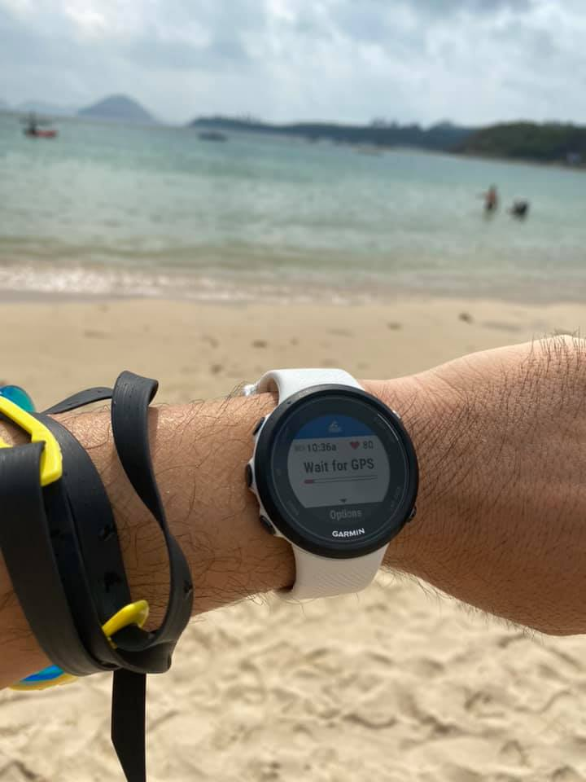
**이미지 캡션:** 모래사장을 배경으로 한 성인 남성의 팔에 착용된 흰색 스마트워치가 클로즈업되어 보인다. 스마트워치 화면에는 현재 시간 10:36, 심박수 80, 그리고 "Wait for GPS"라는 메시지가 표시되어 있으며, 하단에는 "Options"와 "GARMIN" 로고가 보인다. 남성의 팔에는 검은색과 노란색 스트랩이 달린 다른 기기가 함께 착용되어 있다. 배경에는 잔잔한 바다가 펼쳐져 있고, 멀리 섬과 흐린 하늘이 보인다. 바다 위에는 작은 배와 물놀이를 하는 사람들의 모습이 희미하게 보인다. 전체적으로 야외 활동 중 GPS 신호를 기다리는 상황을 보여주는 것으로 보인다. GPS 신호를 기다리는 상황을 보여주는 것으로 보인다.
 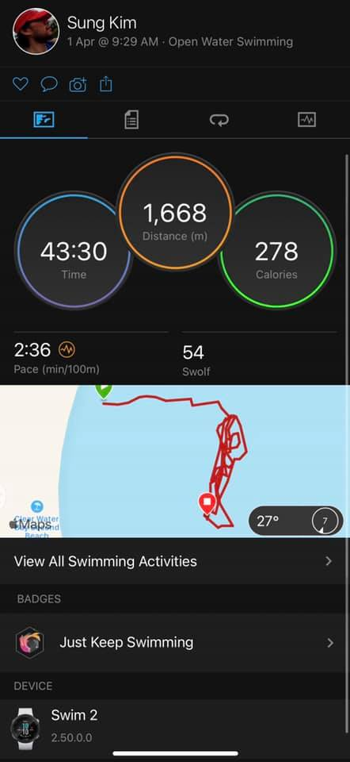
**이미지 캡션:** 이 화면은 성인 남성인 Sung Kim이 4월 1일 오전 9시 29분에 완료한 오픈 워터 수영 활동 기록을 보여줍니다. 총 43분 30초 동안 1,668미터를 수영했으며, 278 칼로리를 소모했습니다. 평균 페이스는 100미터당 2분 36초였고, Swolf 기록은 54였습니다. 화면에는 수영 경로를 보여주는 지도와 함께 수온 27도, 7명의 다른 수영객이 함께 있었음을 나타내는 정보가 표시됩니다. 하단에는 "Just Keep Swimming"이라는 배지와 "Swim 2"라는 기기 정보가 보입니다. 전반적으로 활동적인 라이프스타일을 보여주는 화면입니다.활동적인 라이프스타일을 보여주는 화면입니다.

### 4월 1일 (목) 19:25 · 📷 사진 (1장)

**이미지 캡션:** 이 사진은 수영 경주 중인 한 명의 성인 남성을 보여줍니다. 그는 물속에서 자유형으로 헤엄치고 있으며, 그의 팔과 다리가 물보라를 일으키고 있습니다. 그는 옅은 색의 수영복을 입고 있으며, 그의 얼굴은 보이지 않습니다. 배경에는 붉은색과 흰색으로 된 부표와 보트의 일부가 보입니다. 부표에는 "OMEGA"라는 글자가 희미하게 보입니다. 사진은 물 위에서 촬영되었으며, 햇빛이 물에 반사되어 반짝이는 모습을 볼 수 있습니다. 전반적으로 역동적이고 경쟁적인 분위기를 나타냅니다.

### 4월 3일 (토) 17:08 · 📷 사진 (1장)

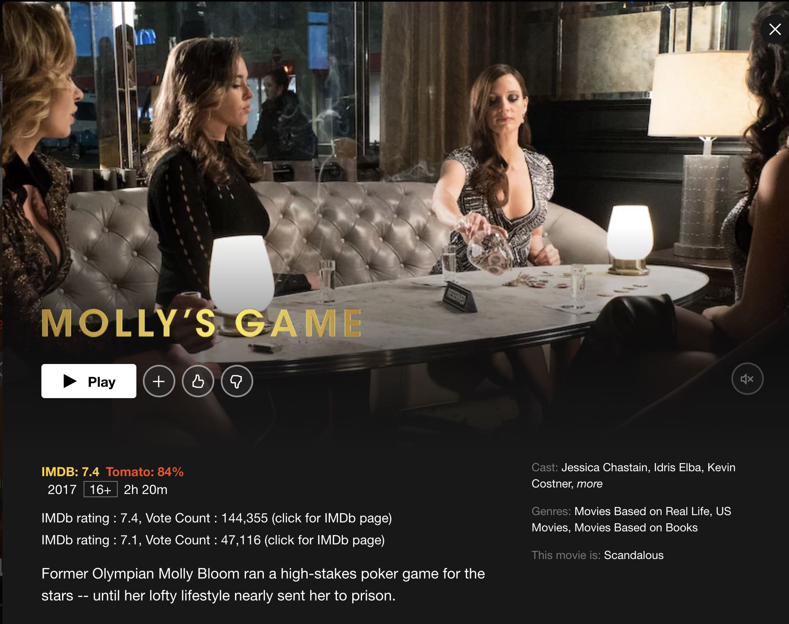
**이미지 캡션:** 이 장면은 고급스러운 실내에서 네 명의 성인 여성이 테이블에 둘러앉아 포커 게임을 하고 있는 모습을 보여줍니다. 중앙에 있는 여성은 화려한 은색 드레스를 입고 있으며, 손에는 동전이 담긴 유리잔을 들고 테이블 위에 놓인 칩과 카드를 만지고 있습니다. 그녀의 표정은 진지하며, 게임에 집중하고 있는 듯합니다. 테이블 위에는 램프, 유리잔, 칩, 카드 등이 놓여 있으며, "RESERVED"라고 적힌 작은 표지판도 보입니다. 배경에는 푹신한 소파와 장식적인 조명이 있어 고급스러운 분위기를 더합니다. 전체적으로 어두운 조명과 함께 긴장감 있고 흥미로운 상황을 연출하고 있습니다. 화면 하단에는 영화 제목 "MOLLY'S GAME"과 함께 재생, 추가, 좋아요, 싫어요 버튼이 보이며, 영화 정보로 IMDB 평점, 개봉 연도, 관람 등급, 상영 시간, 출연진, 장르 등이 표시되어 있습니다. 조명과 함께 긴장감 있고 흥미로운 상황을 연출하고 있습니다. 화면 하단에는 영화 제목 "MOLLY'S GAME"과 함께 재생, 추가, 좋아요, 싫어요 버튼이 보이며, 영화 정보로 IMDB 평점, 개봉 연도, 관람 등급, 상영 시간, 출연진, 장르 등이 표시되어 있습니다.

### 4월 5일 (월) 09:17 · #friendfilter

#friendfilter

I am cleaning up my friends list. If you want to stay connected, please like this post and leave a comment below!

🔗 <https://friendfilter.io/>

### 4월 5일 (월) 12:37 · #업스로켓6개월 #아름다운멤버들 #100이상기업 #SAI고고

#업스로켓6개월 #아름다운멤버들 #100이상기업 #SAI고고

Wonderful Upstage!

마치 어제 시작한 것 같은 Upstage는 어느덧 창립 6개월이 되었고, 우리는 성공적으로 궤도에 올라 항해를 이어가고 있습니다. “행복한 시간은 빨리 간다" 라는 말이 있듯이 6개월 아주 행복했고, 업스테이지 더 행복한 앞날들이 기대됩니다.

Hwalsuk Lee님과 AI의 보편화, Making AI Beneficial 해보자고 의기 투합하면서, 파파고 모델리더이자 NLP 원탑 Lucy Park님, 뵙기만 해도 즐거운 최고의 AI 마케터이자 교육 비즈니스를 이끌고 있는 Henny Son님, 추가 설명 필요없는 캐글 그랜드 마스터 Sanghoon  Kim님, 카카오에서 가장 존경받던 AI Lab 리더 Jaekyoung Bae님, 서비스 불패 신화의 카카오 AI 리더 Jae Boum Kim님, 모든 일을 빈틈없이 꼼꼼하게 그것도 행복하게 끝장을 보시는 매니저 Yura Shim님, 재정에 빈틈이 없이 챙겨주셔서 늘 든든한 혜연님, 사람을 끌어당기는 마성적 매력의 Hanna Ryu님, 두말 할 나위없는 최강 NLP 연구자 Sungjoon Park님, 멋진 논리력과 예리한 시선으로 모두를 감탄하게 하는 Jihyung Moon님, 풀스택 머신러닝 연구자의 위엄의 Lee  Jun Yeop님, 대규모 분산 시스템 연구/개발 분야에서 다양한 최적화와 test-driven 개발로 프로그래밍의 정점을 찍은 후 안주하지 않고 머신러닝 분야로 넘어와서도 NLP, 음성, 비전 등 도메인을 가리지 않고 활약 하고 계신 용진님, 수학, 프로그래밍, 뉴럴넷에 빠져있지만 종종 마술로 동료들을 즐겁게 해주고 서울대 딥러닝 학회 회장까지 역임한 욕심쟁이 박선규님, 코딩이 뭔지도 모르던 영문학도에서 2년만에 AI Researcher 고수 반열에 오른 대원님, 로켓에서 새로운 로켓으로, 실력자들과의 성장을 즐기는 종호님, 한국 최연소 그랜드마스터를 꿈꾸는 캐글러 GR-G의 윤수님, 추천의 모든 것을 알고 계시는 김지후님, 학부생이지만 해커수준의 개발 실력으로 바로 정직원으로 모신 지호님, 최고 열정과 뛰어난 기획 감각의 예빈님, 인공지능 기술과 사용자를 이어주는 AI-UX 디자이너 건희님, 모든 사람들이 AI 와 친구가 될 수 있는 AI 교육을 만들어 가시는 보겸님, 꼼꼼함과 책임감을 바탕으로 국내 최초 대회형 교육 설계를 담당하고 계시는 크리스님, 다년간의 테크 교육 설계 경험으로 AI 개발자 양성을 위한 프로그램 제작에 기여하고 계신 영웅님, 사업과 AI 모델개발 최고의 실력을 가진 민정님, 우리의 일상을 멋지게 홍보해주시는 지현님, 든든한 홍콩사업 전략을 챙겨주시는 MJ님, 열정의 ML 연구자 성래님, 연구 서비스 가리지 않고 개발하길 좋아하는 개발덕후 대현님, 사람에 대해 탐구하는 데이터 크리에이터 지윤님, 데이터의 동반자이자 국어학 형님인 태환님, 언어에 대한 사랑으로 좋은 NLP 문제를 정의하고자 하는 주현님, CV 데이터셋 분석 및 제작에 전문가로 성장하고 계신 석주님, 단단한 기획력과 비즈니스 경험으로 AI 교육 비즈니스를 탄탄하게 세우실 민지님, 맥킨지의 전략과 도전적 AI 기업이었던 ElementAI에서의 사업개발 경험을 동시에 보유한 최고의 사업 전략개발의 순일님, 정말 한분 한분이 최고중 최고시고 개인적으로도 제가 너무 좋아하는 분들입니다. 이런 멋진 멤버들과 함께 모여 AI를 이야기 하는 것 만으로 충분히 행복합니다. 
[그림1: Upstage 멤버들]

업스테이지는 Making AI Beneficial 이라는 비전을 가지고 우리의 삶을 유익하게 하는 AI 기술이 더 많이 개발되고 빠르게 우리의 삶에 적용되기를 기대하고 꿈꾸고 있습니다. 특히 세상의 변화를 이끌고 있는 기업들이 비즈니스에 맞는 AI 를 찾고 빠르게 적용할 수 있도록 돕겠다는 포부가 있습니다. 업스테이지는 지난 6개월 동안, AI 도입에 대한 시장의 니즈를 기업의 목소리를 통해 파악하고자 하였고 감사하게도 100+기업들이 저희들에 대한 많은 기대를 해주시고 AI 문제에 대해 상담해주셨습니다. 이 중 40+기업들과 함께 깊게 고민하며 이야기를 나누었고, 가장 수요가 많았던 추천/DKT, NLP 등의 핵심 엔진을 개발하면서, 금융, 교육, 통신, 이커머스 분야를 선도하고 있는 기업들과 산업의 AI Transformation 을 일으킬 수 있는 큰 규모의 AI 공동구축/공동사업을 시작했습니다. 국내 최고의 기업들과 함께 해서 정말 행복합니다. 저희들에게 연락주신 100+ 그리고 더 많은 기업들에게 필요한 AI 솔루션을 보다 빠르고 다양하게 공급하기 위해 Self-Improving AI Platform 을 개발하여 우리가 꿈꿨던 AI 보편화, Making AI Beneficial 을 만들어 가겠습니다. 도움이 필요하신 분들은 contact@upstage.ai 로 메일을 주시면 됩니다. 
[그림2: 100+ 고객사의 문의유형, 기술니즈, 고객 업종]

Making AI Beneficial 을 위해서는 더 많은 AI 개발자들이 필요합니다. 업스테이지는 AI 시장의 파이를 키우기 위해 비즈니스에 즉각 투입 될 수 있는 AI 개발자 양성에 힘쓰고 있으며, 이를 위해 AI Stages 라는 플랫폼을 구축하여 대회 및 실습 프로젝트 중심의 AI Tech 교육 과정을 만들었습니다. 네이버 커넥트 재단과 함께 시작한 ‘부스트캠프 AI Tech’ 과정에서는 25명의 월드클래스 강사님들과 AI 서비스 개발 실무 경험이 있는 50여명의 조교와 멘토분들이 저희와 뜻을 함께 하셔서 프로그램을 만들어주고 계시며, 곧 1기 수료생으로 200명 이상의 멋진 AI 개발자들이 탄생할 예정입니다. 이어지는 2기, 3기에는 더 많은 분들과 함께하여 한국의 그리고 세계의 AI 시장의 파이를 확장하는데 기여하겠습니다. 이 교육에서의 핵심이 되어주신 25명의 월드클래스 강사님들과 100여명의 조교님들, 운영진님들 정말 감사합니다.

국내를 넘어 글로벌 시장에도 Making AI Beneficial을 실현하고자 홍콩지사를 세우고 7명의 멋진 멤버들을 모셨고 더 모시고 있습니다. 업스테이지는 아시아, 유럽, 미주 등 차례로 그리고 아울러 글로벌 최고가 될 것입니다.

가장 중요한 것은, 여러분과 같이 멋진 분들과 이 일을 함께 하는 것입니다. 저희 업스테이지에서 Making AI Beneficial 모두 함께해요. 선지원 후고민, https://careers.upstage.ai

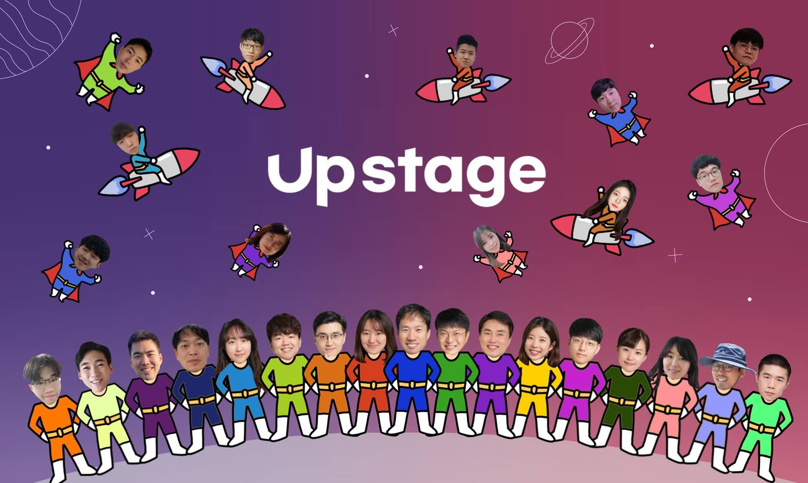
**이미지 캡션:** 이 이미지는 보라색과 분홍색이 그라데이션된 배경에 "Upstage"라는 흰색 글자가 중앙에 크게 쓰여 있으며, 여러 명의 사람들이 로켓을 타고 날아다니거나 슈퍼히어로 복장을 하고 서 있는 모습을 담고 있습니다. 로켓을 타고 있는 사람들은 대부분 성인 남성이며, 젊은 성인 여성도 한 명 포함되어 있습니다. 이들은 각자 다른 색상의 슈퍼히어로 망토와 복장을 하고 있으며, 밝고 즐거운 표정을 짓고 있습니다. 로켓은 빨간색과 흰색으로 디자인되어 있으며, 날개와 불꽃이 묘사되어 있습니다. 배경에는 작은 점들과 십자 모양, 그리고 행성 모양의 일러스트가 그려져 있어 우주적인 분위기를 연출합니다. 이미지 하단에는 여러 명의 성인 남성과 여성이 슈퍼히어로 복장을 하고 나란히 서 있는 모습이 보입니다. 이들 역시 각기 다른 색상의 복장을 하고 있으며, 손을 잡고 있거나 팔짱을 끼고 있는 등 단체로 서 있는 모습입니다. 이들의 표정은 대체로 밝고 긍정적이며, 전체적으로 유쾌하고 활기찬 분위기를 자아냅니다.양, 그리고 행성 모양의 일러스트가 그려져 있어 우주적인 분위기를 연출합니다. 이미지 하단에는 여러 명의 성인 남성과 여성이 슈퍼히어로 복장을 하고 나란히 서 있는 모습이 보입니다. 이들 역시 각기 다른 색상의 복장을 하고 있으며, 손을 잡고 있거나 팔짱을 끼고 있는 등 단체로 서 있는 모습입니다. 이들의 표정은 대체로 밝고 긍정적이며, 전체적으로 유쾌하고 활기찬 분위기를 자아냅니다.
 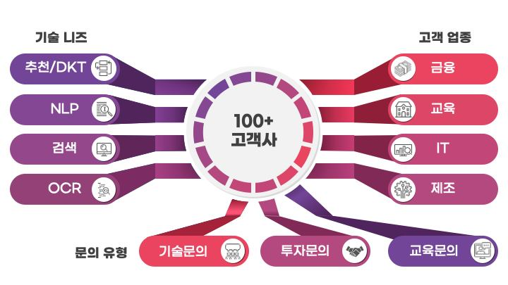
**이미지 캡션:** 이 이미지는 기술 니즈, 고객 업종, 문의 유형을 시각적으로 보여주는 다이어그램으로, 중앙에는 "100+ 고객사"라는 문구가 원형으로 둘러싸여 있습니다. 왼쪽에는 "기술 니즈"라는 제목 아래 추천/DKT, NLP, 검색, OCR 네 가지 항목이 보라색 계열의 띠 형태로 나열되어 있으며, 각 항목 옆에는 해당 기술을 상징하는 아이콘이 있습니다. 오른쪽에는 "고객 업종"이라는 제목 아래 금융, 교육, IT, 제조 네 가지 항목이 붉은색 계열의 띠 형태로 나열되어 있으며, 각 항목 옆에는 해당 업종을 상징하는 아이콘이 있습니다. 하단에는 "문의 유형"이라는 제목 아래 기술문의, 투자문의, 교육문의 세 가지 항목이 보라색과 붉은색이 혼합된 띠 형태로 나열되어 있으며, 각 항목 옆에는 해당 문의 유형을 상징하는 아이콘이 있습니다. 전체적으로 깔끔하고 전문적인 느낌을 주는 디자인이며, 기업의 서비스 범위와 고객층을 효과적으로 전달하고 있습니다.콘이 있습니다. 하단에는 "문의 유형"이라는 제목 아래 기술문의, 투자문의, 교육문의 세 가지 항목이 보라색과 붉은색이 혼합된 띠 형태로 나열되어 있으며, 각 항목 옆에는 해당 문의 유형을 상징하는 아이콘이 있습니다. 전체적으로 깔끔하고 전문적인 느낌을 주는 디자인이며, 기업의 서비스 범위와 고객층을 효과적으로 전달하고 있습니다.
 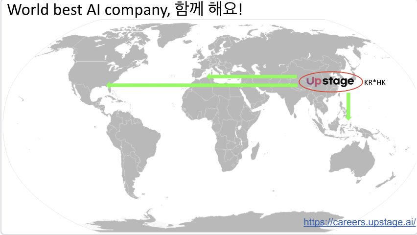
**이미지 캡션:** 이 이미지는 세계 지도 위에 두 개의 녹색 화살표와 "Upstage"라는 로고가 표시된 프레젠테이션 슬라이드입니다. 상단에는 "World best AI company, 함께 해요!"라는 한국어 문구가 있습니다. 지도에는 북미 대륙에서 시작하여 아시아 대륙으로 향하는 긴 녹색 화살표가 그려져 있으며, 아시아 대륙의 동쪽 부분에 "Upstage" 로고와 "KR*HK"라는 텍스트가 빨간색 타원 안에 표시되어 있습니다. 또 다른 녹색 화살표는 이 지역에서 시작하여 동남아시아 지역으로 향하고 있습니다. 지도 하단에는 웹사이트 주소 "https://careers.upstage.ai/"가 표시되어 있습니다. 이 이미지에는 사람이 등장하지 않으며, 배경은 단순한 세계 지도입니다. 전반적으로 AI 회사인 Upstage의 글로벌 사업 확장 또는 협력을 나타내는 것으로 보이며, 긍정적이고 진취적인 분위기를 풍깁니다.웹사이트 주소 "https://careers.upstage.ai/"가 표시되어 있습니다. 이 이미지에는 사람이 등장하지 않으며, 배경은 단순한 세계 지도입니다. 전반적으로 AI 회사인 Upstage의 글로벌 사업 확장 또는 협력을 나타내는 것으로 보이며, 긍정적이고 진취적인 분위기를 풍깁니다.

### 4월 5일 (월) 13:30 · 📷 사진 (1장)

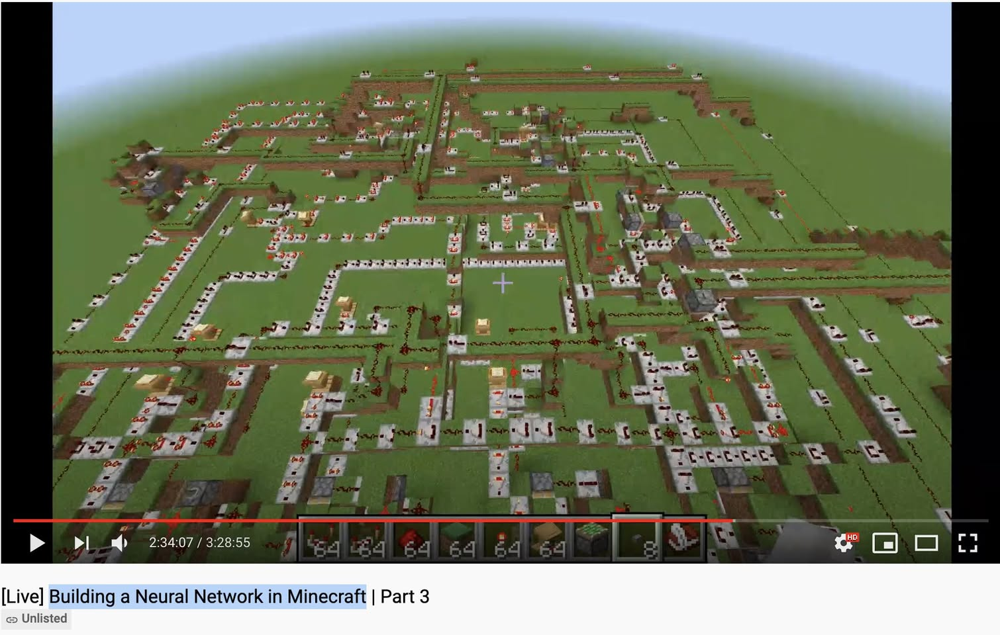
**이미지 캡션:** 이것은 마인크래프트 게임 화면으로, 성인 남성이 플레이하고 있는 것으로 보이며, 넓은 잔디밭 위에 복잡한 레드스톤 회로를 구축하고 있습니다. 화면 중앙에는 흰색 십자 표시가 있어 플레이어의 시점을 나타냅니다. 회로는 수많은 하얀색 블록과 빨간색 레드스톤 가루로 구성되어 있으며, 마치 거대한 기계 장치처럼 복잡하게 연결되어 있습니다. 일부 지역에는 작은 건물들이 배치되어 있고, 땅이 파헤쳐진 흔적도 보입니다. 전반적으로 게임 속에서 복잡한 기술을 구현하는 창의적이고 집중적인 작업이 진행되고 있음을 보여주는 장면입니다. 하단에는 유튜브 플레이어 컨트롤과 함께 "[Live] Building a Neural Network in Minecraft | Part 3"라는 제목과 "Unlisted"라는 표시가 보입니다.입니다. 하단에는 유튜브 플레이어 컨트롤과 함께 "[Live] Building a Neural Network in Minecraft | Part 3"라는 제목과 "Unlisted"라는 표시가 보입니다.

> Minecraft 로 뉴럴넷을 만드는 것이 가능하네요. 이게 된다면 간단한 뉴럴넷 수업은 마인크래프트로 해야 할까요?   https://www.youtube.com/watch?v=AyctcHR5ZLE

### 4월 8일 (목) 07:44 · 📷 사진 (1장)

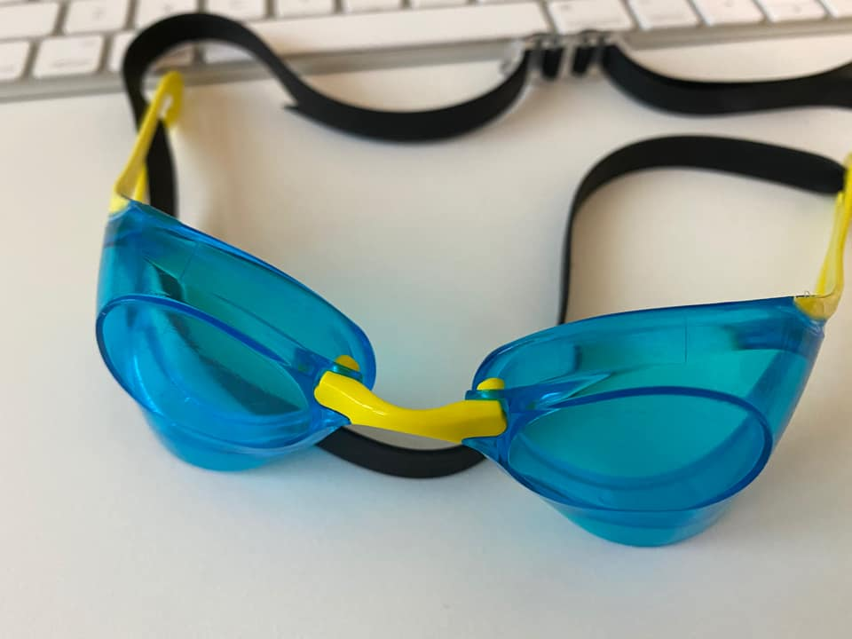
**이미지 캡션:** 수영 고글은 파란색 렌즈와 노란색 프레임, 검은색 밴드로 구성되어 있으며, 흰색 책상 위에 놓여 있고 배경에는 키보드가 보인다.

### 4월 9일 (금) 12:22 · 📷 사진 (1장)

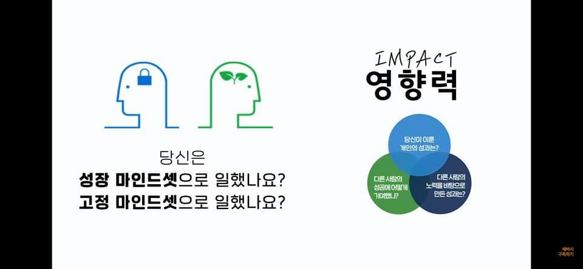
**이미지 캡션:** 이 이미지는 두 개의 주요 섹션으로 구성되어 있으며, 왼쪽에는 두 개의 프로필 실루엣이 있고 오른쪽에는 "IMPACT"라는 영어 단어와 "영향력"이라는 한국어 단어가 있습니다. 왼쪽의 프로필 실루엣은 각각 파란색과 녹색으로 그려져 있으며, 파란색 실루엣의 머리 안에는 자물쇠 아이콘이 있고 녹색 실루엣의 머리 안에는 싹이 튼 식물 아이콘이 있습니다. 이 실루엣 아래에는 "당신은"이라는 단어가 있고, 그 아래에는 "성장 마인드셋으로 일했나요?"와 "고정 마인드셋으로 일했나요?"라는 두 개의 질문이 나란히 배치되어 있습니다. 오른쪽 섹션에는 세 개의 겹쳐진 원이 있으며, 각 원에는 질문이 포함되어 있습니다. 가장 위에 있는 파란색 원에는 "당신이 이룬 개인의 성과는?"이라고 적혀 있고, 왼쪽 아래의 녹색 원에는 "다른 사람의 성공에 어떻게 기여했나?"라고 적혀 있으며, 오른쪽 아래의 짙은 파란색 원에는 "다른 사람의 노력을 바탕으로 만든 성과는?"이라고 적혀 있습니다. 전체적으로 이 이미지는 성장 마인드셋과 고정 마인드셋의 차이점, 그리고 개인의 성과와 타인에게 미치는 영향력에 대한 질문을 던지는 교육적이거나 동기 부여적인 내용을 담고 있는 것으로 보입니다. 배경은 흰색이며, 오른쪽 하단에는 "새로운 구독하기"라는 작은 텍스트가 보입니다. 있습니다. 오른쪽 섹션에는 세 개의 겹쳐진 원이 있으며, 각 원에는 질문이 포함되어 있습니다. 가장 위에 있는 파란색 원에는 "당신이 이룬 개인의 성과는?"이라고 적혀 있고, 왼쪽 아래의 녹색 원에는 "다른 사람의 성공에 어떻게 기여했나?"라고 적혀 있으며, 오른쪽 아래의 짙은 파란색 원에는 "다른 사람의 노력을 바탕으로 만든 성과는?"이라고 적혀 있습니다. 전체적으로 이 이미지는 성장 마인드셋과 고정 마인드셋의 차이점, 그리고 개인의 성과와 타인에게 미치는 영향력에 대한 질문을 던지는 교육적이거나 동기 부여적인 내용을 담고 있는 것으로 보입니다. 배경은 흰색이며, 오른쪽 하단에는 "새로운 구독하기"라는 작은 텍스트가 보입니다.

### 4월 9일 (금) 18:04 · #멋진분들과일하기 #AI사업전략함께해요

#멋진분들과일하기 #AI사업전략함께해요 

Wonderful to have two former McKinsey members, Suho and Soonil at Upstage! 

가장 즐거운 순간 중 하나는 탁월한 분들과 함께 일하고 배우면서, 더 나아지는 경험을 할 때입니다. 

아름다운 전략, 탄탄한 논리, 완벽한 언변은 물론이고 빠른 이해와 간결한 정리까지, 정말 부족함이 없습니다! 그동안 같이 일해보면서 감탄하고 또 감탄하였던 김수호 전 맥킨지앤컴퍼니 서울 사무소 파트너님 그리고 권순일 전 맥킨지 팀장님과 업스테이지에서 함께 하게 되어 너무 좋습니다. 업스테이지에서 이런 멋진 분들과 이야기 나누고 AI 전략을 짜며 논의하는 모든 시간들이 너무 행복합니다.
https://zdnet.co.kr/view/?no=20210408211117

AI 사업과 전략을 제일 잘하는 회사로 도약하며, 이렇게 멋진 분들과 함께 AI 사업개발, 전략, 기획하실 분들의 선택도 이제는 업스테이지 입니다! 선지원, 후고민 https://careers.upstage.ai/!

### 4월 10일 (토) 15:34 · #longestswim #가장먼수영

#longestswim #가장먼수영

This is the longest swim in my life. Next is 10KM.

오늘 인생에서 가장 멀리(6KM) 수영을 해봤습니다. 기분 좋습니다. 다음은 10KM에 도전합니다.

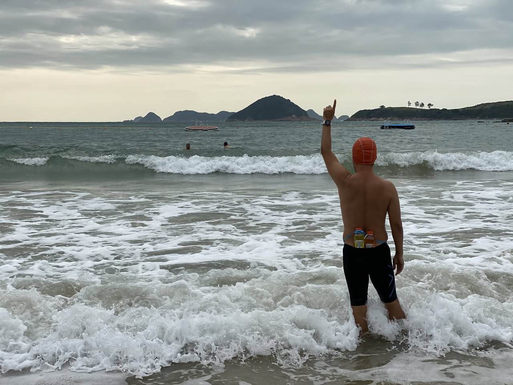
**이미지 캡션:** 흐린 날씨의 해변에서 한 성인 남성이 바다에 서서 오른팔을 들어 검지 손가락으로 하늘을 가리키고 있다. 그는 오렌지색 수영모를 쓰고 있으며, 허리에는 두 개의 작은 물병이 달린 벨트를 착용하고 있다. 남성은 검은색 수영복 하의를 입고 있으며, 그의 등에는 땀으로 보이는 물방울들이 맺혀 있다. 파도가 그의 다리를 감싸며 하얗게 부서지고 있다. 배경에는 잔잔한 바다가 펼쳐져 있고, 멀리 섬들이 보인다. 바다 위에는 두 개의 작은 부유식 플랫폼과 몇몇 사람들이 수영하는 모습이 보인다. 하늘은 구름으로 뒤덮여 있어 전반적으로 차분하고 활동적인 분위기를 자아낸다.전반적으로 차분하고 활동적인 분위기를 자아낸다.
 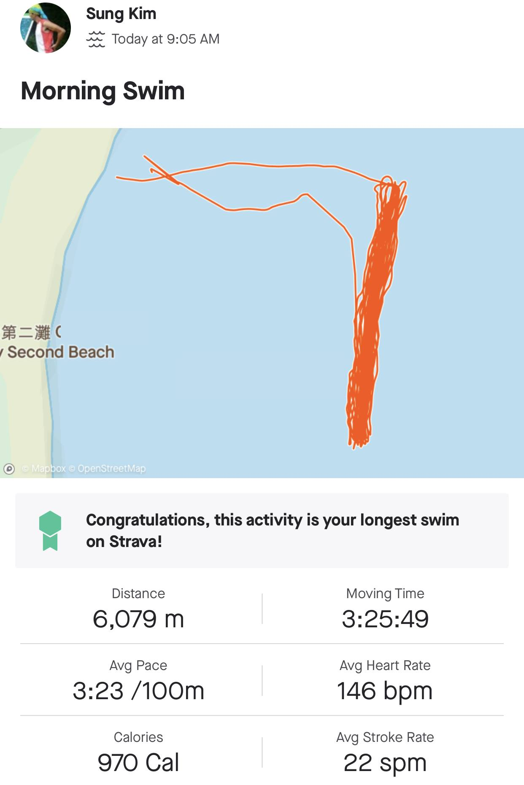
**이미지 캡션:** 이 이미지는 "Sung Kim"이라는 사용자가 오늘 오전 9시 5분에 완료한 "Morning Swim" 활동 기록을 보여줍니다. 화면 상단에는 사용자의 프로필 사진으로 보이는 수영하는 사람의 모습과 이름, 날짜 및 시간이 표시되어 있습니다. 그 아래에는 지도 위에 주황색 선으로 표시된 수영 경로가 나타나며, "第二灘(Second Beach)"이라는 텍스트와 함께 해당 장소가 표시되어 있습니다. 지도 하단에는 "Congratulations, this activity is your longest swim on Strava!"라는 축하 메시지가 보입니다. 이어서 활동 통계가 상세하게 제공되는데, 총 이동 거리는 6,079m, 총 이동 시간은 3시간 25분 49초, 평균 페이스는 100m당 3분 23초, 소모 칼로리는 970kcal, 평균 심박수는 146bpm, 평균 스트로크 수는 22spm입니다. 전반적으로 이 이미지는 사용자의 장거리 수영 활동 기록을 보여주는 스포츠 앱의 화면을 캡처한 것으로, 성인 남성으로 추정되는 사용자가 바다에서 긴 시간 동안 수영을 즐겼음을 알 수 있습니다.trava!"라는 축하 메시지가 보입니다. 이어서 활동 통계가 상세하게 제공되는데, 총 이동 거리는 6,079m, 총 이동 시간은 3시간 25분 49초, 평균 페이스는 100m당 3분 23초, 소모 칼로리는 970kcal, 평균 심박수는 146bpm, 평균 스트로크 수는 22spm입니다. 전반적으로 이 이미지는 사용자의 장거리 수영 활동 기록을 보여주는 스포츠 앱의 화면을 캡처한 것으로, 성인 남성으로 추정되는 사용자가 바다에서 긴 시간 동안 수영을 즐겼음을 알 수 있습니다.

🎬 동영상 1개 (생략)

### 4월 11일 (일) 20:03 · 📷 사진 (1장)

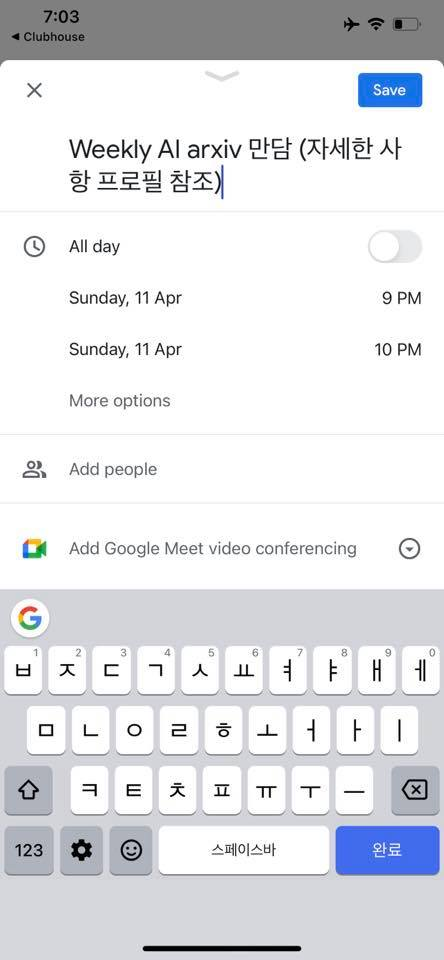
**이미지 캡션:** 이것은 스마트폰 화면의 캘린더 앱에서 이벤트를 생성하는 모습으로, "Weekly AI arxiv 만담 (자세한 사항 프로필 참조)"이라는 제목의 이벤트가 입력되어 있으며, 날짜는 4월 11일 일요일로 설정되어 있고 시간은 오후 9시와 10시로 표시되어 있다. "All day" 옵션이 선택되어 있지 않으며, "More options", "Add people", "Add Google Meet video conferencing"과 같은 추가 옵션들이 보인다. 화면 하단에는 한국어 키보드가 나타나 있으며, "스페이스바"와 "완료" 버튼이 보인다. 전반적으로 회의 일정을 설정하는 중인 것으로 보이며, 차분하고 집중된 분위기이다.바"와 "완료" 버튼이 보인다. 전반적으로 회의 일정을 설정하는 중인 것으로 보이며, 차분하고 집중된 분위기이다.

### 4월 22일 (목) 09:24 · 📷 사진 (1장)

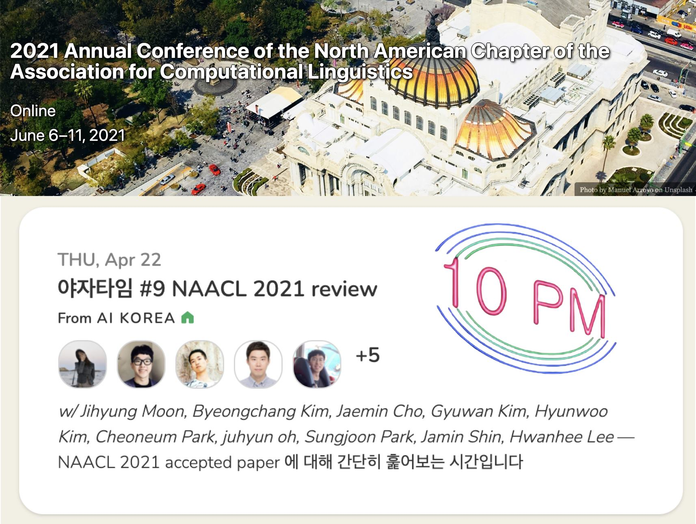
**이미지 캡션:** 상단에는 2021년 북미 전산 언어학회 연례 회의의 온라인 개최 정보가 담긴 이미지와 함께 "2021 Annual Conference of the North American Chapter of the Association for Computational Linguistics", "Online", "June 6-11, 2021"이라는 텍스트가 보입니다. 하단에는 4월 22일 목요일에 열리는 "야자타임 #9 NAACL 2021 review"라는 제목의 행사에 대한 정보가 있습니다. 이 행사는 AI KOREA에서 주최하며, 오후 10시에 시작됩니다. 행사 참여자로는 Jihyung Moon, Byeongchang Kim, Jaemin Cho, Gyuwan Kim, Hyunwoo Kim, Cheoneum Park, juhyun oh, Sungjoon Park, Jamin Shin, Hwanhee Lee를 포함한 5명 이상의 인원이 표시되어 있습니다. 행사의 내용은 NAACL 2021에 채택된 논문에 대해 간단히 살펴보는 시간임을 나타냅니다.주최하며, 오후 10시에 시작됩니다. 행사 참여자로는 Jihyung Moon, Byeongchang Kim, Jaemin Cho, Gyuwan Kim, Hyunwoo Kim, Cheoneum Park, juhyun oh, Sungjoon Park, Jamin Shin, Hwanhee Lee를 포함한 5명 이상의 인원이 표시되어 있습니다. 행사의 내용은 NAACL 2021에 채택된 논문에 대해 간단히 살펴보는 시간임을 나타냅니다.

> #오늘밤10시 #선참여노고민 #아자타임9   Jihyung Moon, Sungjoon Park, J-min Cho, Gyuwan Kim 님등 현존 최고의 NLP 연구/개발자들이 호스트 하는 #야자타임이 벌써 9번째를 맞이 합니다. 정말 야밤에 재미난 자연어 관련 이야기들을 들을수 있는데요. 오늘 밤 10시 특별 야자타임에서는 NAACL 2021의 accept 된 논문들을 빠르게 리뷰하면서 이야기 하는 정말 멋진 시간이 될것 같습니다. 저도 달력에 똭 넣어두고 기다리고 있습니다.   https://www.joinclubhouse.com/event/PDYljAgp (22일 목요일 저녁 10PM KST)  특히 NAACL 2021의 저자분들이 계시면 같이 스피커로 참여해서 본인의 논문을 직접 소개해주셔도 좋습니다.  아직 오지 않은 미래 NAACL 2021을 미리 가볼수 있고, 또 NAACL 가실분들에게 미리 자동준비 되는 야자타임 #9, 선참여 노고민입니다.

### 4월 24일 (토) 10:32 · 📷 사진 (5장)

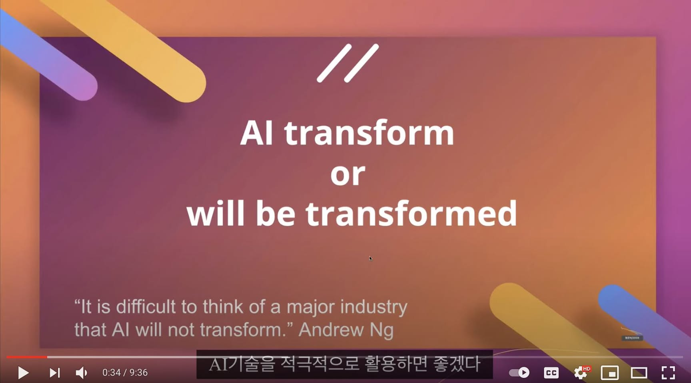
**이미지 캡션:** 이 사진은 AI의 변혁적인 영향에 대한 인용문이 담긴 프레젠테이션 슬라이드를 보여줍니다. 슬라이드는 보라색과 주황색이 혼합된 그라데이션 배경에 흰색 텍스트로 "AI transform or will be transformed"라는 문구가 중앙에 크게 표시되어 있습니다. 그 위에는 겹쳐진 슬래시 모양의 기호가 있습니다. 하단에는 앤드류 응(Andrew Ng)의 인용문인 "It is difficult to think of a major industry that AI will not transform."이 작은 글씨로 적혀 있습니다. 슬라이드 하단에는 비디오 재생 컨트롤 바가 보이며, 재생 시간은 0:34/9:36으로 표시되어 있습니다. 또한, 한국어 자막으로 "AI기술을 적극적으로 활용하면 좋겠다"라는 문구가 보입니다. 배경에는 노란색과 보라색, 파란색의 둥근 막대 모양의 그래픽 요소가 비스듬히 배치되어 시각적인 포인트를 더하고 있습니다. 전체적으로 진지하면서도 미래지향적인 분위기를 풍깁니다.로 적혀 있습니다. 슬라이드 하단에는 비디오 재생 컨트롤 바가 보이며, 재생 시간은 0:34/9:36으로 표시되어 있습니다. 또한, 한국어 자막으로 "AI기술을 적극적으로 활용하면 좋겠다"라는 문구가 보입니다. 배경에는 노란색과 보라색, 파란색의 둥근 막대 모양의 그래픽 요소가 비스듬히 배치되어 시각적인 포인트를 더하고 있습니다. 전체적으로 진지하면서도 미래지향적인 분위기를 풍깁니다.
 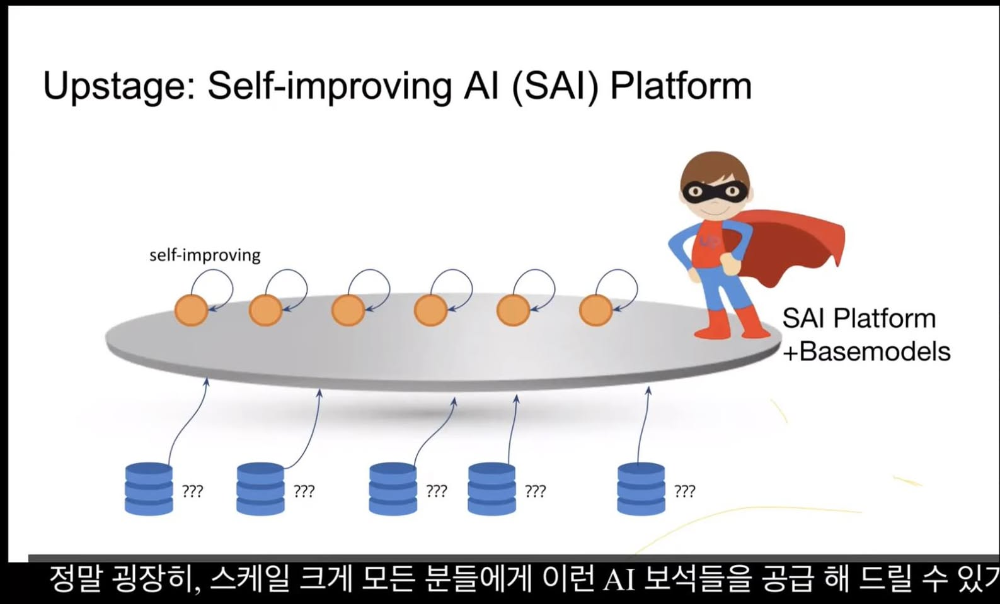
**이미지 캡션:** 이 이미지는 "Upstage: Self-improving AI (SAI) Platform"이라는 제목의 프레젠테이션 슬라이드로, 중앙에는 원형의 회색 플랫폼이 있고 그 위에 여러 개의 주황색 원들이 놓여 있으며 각 원에는 자기 자신을 가리키는 화살표가 그려져 있어 'self-improving'이라는 문구와 함께 AI의 자기 개선 과정을 시각적으로 표현하고 있습니다. 플랫폼 오른쪽에는 망토를 두르고 팔짱을 낀 슈퍼히어로 복장의 캐릭터가 서 있으며, 이 캐릭터 옆에는 "SAI Platform +Basemodels"라는 텍스트가 있습니다. 플랫폼 아래에는 여러 개의 파란색 원통형 데이터베이스 아이콘이 있고, 각 데이터베이스에는 물음표가 표시되어 있으며, 데이터베이스에서 플랫폼으로 연결되는 화살표가 그려져 있어 데이터가 AI 모델로 흘러 들어가는 것을 나타냅니다. 이미지 하단에는 "정말 굉장히, 스케일 크게 모든 분들에게 이런 AI 보석들을 공급 해 드릴 수 있기"라는 한국어 문구가 있습니다. 전체적으로 밝고 긍정적인 분위기이며, AI 기술의 발전과 보급을 강조하는 내용으로 보입니다."라는 텍스트가 있습니다. 플랫폼 아래에는 여러 개의 파란색 원통형 데이터베이스 아이콘이 있고, 각 데이터베이스에는 물음표가 표시되어 있으며, 데이터베이스에서 플랫폼으로 연결되는 화살표가 그려져 있어 데이터가 AI 모델로 흘러 들어가는 것을 나타냅니다. 이미지 하단에는 "정말 굉장히, 스케일 크게 모든 분들에게 이런 AI 보석들을 공급 해 드릴 수 있기"라는 한국어 문구가 있습니다. 전체적으로 밝고 긍정적인 분위기이며, AI 기술의 발전과 보급을 강조하는 내용으로 보입니다.
 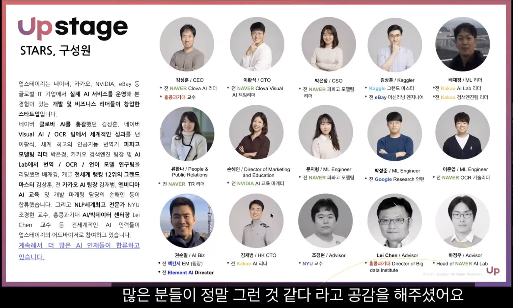
**이미지 캡션:** 이 사진은 업스테이지라는 스타트업의 구성원들을 소개하는 이미지로, 상단에는 'Upstage STARS, 구성원'이라는 제목과 함께 업스테이지에 대한 간략한 소개 글이 있다. 이 소개 글은 업스테이지가 네이버, 카카오, NVIDIA, eBay 등 글로벌 IT 기업에서 AI 서비스 운영 경험을 가진 리더들이 창업한 스타트업이며, 네이버 클로바 AI를 총괄했던 김성훈, 파파고 모델팀 리더 박은정, 캐글 그랜드 마스터 김상훈, 카카오 AI 팀장 김재범, NYU 조경현 교수, 홍콩과기대 Lei Chen 교수 등 세계적인 AI 인력들이 참여하고 있음을 설명한다. 사진의 중앙에는 총 12명의 인물 사진이 원형 프레임 안에 배치되어 있으며, 각 사진 아래에는 이름, 직책, 그리고 이전 경력이 한국어와 영어로 기재되어 있다. 이들은 모두 성인 남성 또는 여성으로 보이며, 대부분 정장이나 비즈니스 캐주얼 복장을 하고 있다. 표정은 대체로 밝고 자신감 있는 모습이며, 일부는 손을 들거나 가볍게 미소 짓는 등 자연스러운 포즈를 취하고 있다. 배경은 대부분 단색으로 처리되어 인물에 집중되도록 했으며, 일부 인물 사진에서는 흐릿하게 처리된 도시 풍경이나 실내 배경이 보인다. 사진 하단에는 '많은 분들이 정말 그런 것 같다 라고 공감을 해주셨어요'라는 문구가 검은색 바탕에 흰색 글씨로 쓰여 있어, 이들이 업스테이지의 비전이나 가치에 대해 많은 공감을 얻고 있음을 시사한다. 전반적으로 전문적이고 신뢰감 있는 분위기를 전달하며, 업스테이지의 뛰어난 인재 구성을 강조하고 있다.인 AI 인력들이 참여하고 있음을 설명한다. 사진의 중앙에는 총 12명의 인물 사진이 원형 프레임 안에 배치되어 있으며, 각 사진 아래에는 이름, 직책, 그리고 이전 경력이 한국어와 영어로 기재되어 있다. 이들은 모두 성인 남성 또는 여성으로 보이며, 대부분 정장이나 비즈니스 캐주얼 복장을 하고 있다. 표정은 대체로 밝고 자신감 있는 모습이며, 일부는 손을 들거나 가볍게 미소 짓는 등 자연스러운 포즈를 취하고 있다. 배경은 대부분 단색으로 처리되어 인물에 집중되도록 했으며, 일부 인물 사진에서는 흐릿하게 처리된 도시 풍경이나 실내 배경이 보인다. 사진 하단에는 '많은 분들이 정말 그런 것 같다 라고 공감을 해주셨어요'라는 문구가 검은색 바탕에 흰색 글씨로 쓰여 있어, 이들이 업스테이지의 비전이나 가치에 대해 많은 공감을 얻고 있음을 시사한다. 전반적으로 전문적이고 신뢰감 있는 분위기를 전달하며, 업스테이지의 뛰어난 인재 구성을 강조하고 있다.
 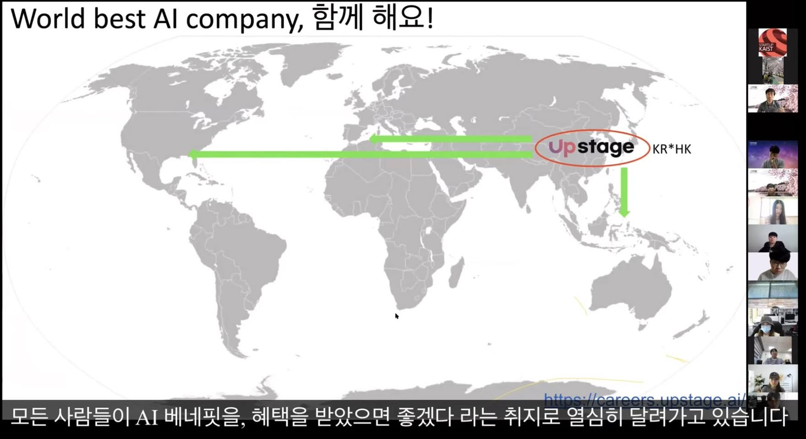
**이미지 캡션:** 화면 상단에는 "World best AI company, 함께 해요!"라는 한국어 문구가 보이며, 그 아래에는 세계 지도가 펼쳐져 있습니다. 지도 위에는 북미에서 유럽, 그리고 아시아로 이어지는 녹색 화살표가 그려져 있으며, 아시아 지역에는 빨간색 타원으로 둘러싸인 "Upstage" 로고와 "KR*HK"라는 텍스트가 있습니다. 지도 하단에는 "모든 사람들이 AI 베네핏을, 혜택을 받았으면 좋겠다 라는 취지로 열심히 달려가고 있습니다."라는 한국어 문구가 검은색 배경 위에 흰색 글씨로 표시되어 있습니다. 화면 오른쪽에는 여러 개의 작은 창들이 세로로 나열되어 있으며, 각 창에는 다양한 사람들이 각자의 공간에서 카메라를 보고 있는 모습이 담겨 있습니다. 이들은 대부분 성인 남성으로 보이며, 캐주얼한 복장을 하고 있습니다. 일부 창에는 배경으로 컴퓨터 화면이나 사무실 풍경이 보입니다. 전체적으로 온라인 회의 또는 프레젠테이션의 한 장면으로 보이며, AI 기술을 통해 세상을 이롭게 하려는 회사의 비전을 공유하는 긍정적이고 진취적인 분위기입니다.오른쪽에는 여러 개의 작은 창들이 세로로 나열되어 있으며, 각 창에는 다양한 사람들이 각자의 공간에서 카메라를 보고 있는 모습이 담겨 있습니다. 이들은 대부분 성인 남성으로 보이며, 캐주얼한 복장을 하고 있습니다. 일부 창에는 배경으로 컴퓨터 화면이나 사무실 풍경이 보입니다. 전체적으로 온라인 회의 또는 프레젠테이션의 한 장면으로 보이며, AI 기술을 통해 세상을 이롭게 하려는 회사의 비전을 공유하는 긍정적이고 진취적인 분위기입니다.
 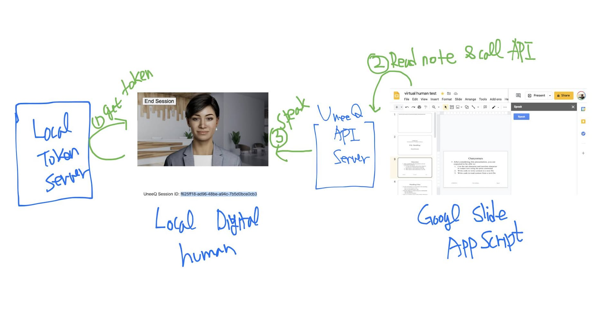
**이미지 캡션:** 이 이미지는 가상 인간과 API 서버를 활용한 시스템의 작동 방식을 도식화한 것입니다. 왼쪽에는 파란색 테두리로 둘러싸인 "Local Token Server"라는 텍스트가 있으며, 이 서버에서 "get token"이라는 녹색 화살표가 가상 인간의 이미지로 향하고 있습니다. 가상 인간은 단정한 회색 재킷을 입고 있으며, 배경에는 현대적인 사무실 인테리어가 보입니다. 가상 인간 이미지 아래에는 "UneeQ Session ID: f625ff18-ad96-48be-a94c-7b5d0bce0cb3"라는 텍스트가 있습니다. 가상 인간 이미지 옆에는 "UneeQ API Server"라고 적힌 파란색 테두리 상자가 있고, 가상 인간에서 "speak"이라는 녹색 화살표가 이 API 서버로 향하고 있습니다. API 서버에서 "Read note & call API"라는 녹색 텍스트가 오른쪽 상단으로 이어집니다. 오른쪽 상단에는 "virtual human test"라는 제목의 구글 슬라이드 문서가 열려 있으며, 슬라이드에는 "Outcomes"라는 제목과 함께 몇 가지 항목이 나열되어 있습니다. 이 구글 슬라이드와 API 서버를 연결하는 "Google Slide App Script"라는 파란색 텍스트가 이미지 하단에 쓰여 있습니다. 전체적으로 시스템의 흐름을 설명하는 다이어그램으로, 기술적인 내용을 간결하게 보여주고 있습니다.다. 가상 인간 이미지 옆에는 "UneeQ API Server"라고 적힌 파란색 테두리 상자가 있고, 가상 인간에서 "speak"이라는 녹색 화살표가 이 API 서버로 향하고 있습니다. API 서버에서 "Read note & call API"라는 녹색 텍스트가 오른쪽 상단으로 이어집니다. 오른쪽 상단에는 "virtual human test"라는 제목의 구글 슬라이드 문서가 열려 있으며, 슬라이드에는 "Outcomes"라는 제목과 함께 몇 가지 항목이 나열되어 있습니다. 이 구글 슬라이드와 API 서버를 연결하는 "Google Slide App Script"라는 파란색 텍스트가 이미지 하단에 쓰여 있습니다. 전체적으로 시스템의 흐름을 설명하는 다이어그램으로, 기술적인 내용을 간결하게 보여주고 있습니다.

### 4월 25일 (일) 09:04 · 생일축하드립니다!

생일축하드립니다!

### 4월 25일 (일) 09:04 · ↪ 생일축하드립니다!

*다른 프로필에 남긴 글*

생일축하드립니다!

### 4월 25일 (일) 09:04 · Happy birthday!

Happy birthday!

### 4월 25일 (일) 09:04 · ↪ Happy birthday!

*다른 프로필에 남긴 글*

Happy birthday!

### 4월 25일 (일) 09:04 · 생일 축하드립니다.

생일 축하드립니다.

### 4월 25일 (일) 09:04 · ↪ 생일 축하드립니다.

*다른 프로필에 남긴 글*

생일 축하드립니다.

### 4월 25일 (일) 13:08 · 📷 사진 (5장)

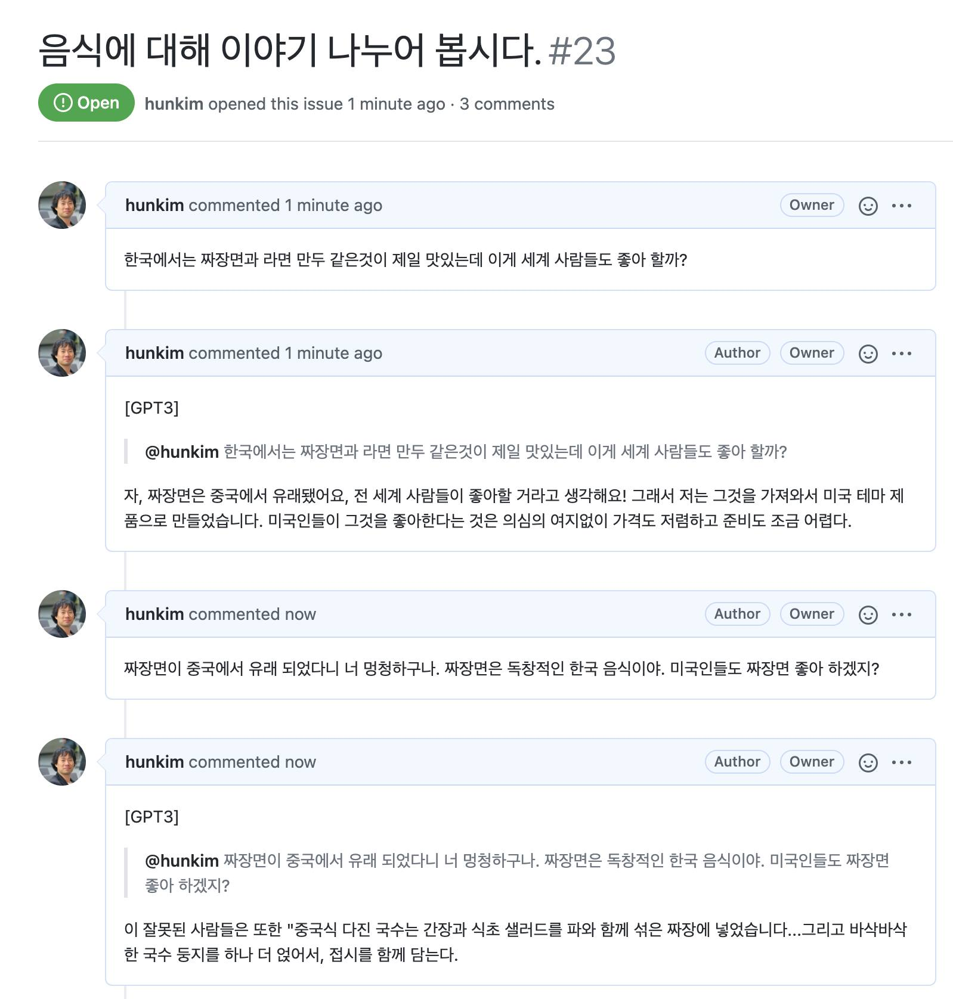
**이미지 캡션:** 이 이미지는 온라인 커뮤니티의 게시물 또는 토론 스레드를 보여줍니다. 상단에는 "음식에 대해 이야기 나누어 봅시다. #23"이라는 제목이 있으며, "Open"이라는 녹색 표시와 함께 "hunkim"이라는 사용자가 1분 전에 이 이슈를 열었고 3개의 댓글이 달렸다는 정보가 있습니다. 화면에는 여러 개의 댓글이 순서대로 나열되어 있습니다. 각 댓글은 사용자 이름, 댓글이 달린 시간, 그리고 댓글 내용으로 구성되어 있습니다. 첫 번째 댓글은 "hunkim"이라는 사용자가 1분 전에 작성했으며, "한국에서는 짜장면과 라면 만두 같은 것이 제일 맛있는데 이게 세계 사람들도 좋아할까?"라고 질문합니다. 이 댓글에는 "Owner"라는 태그가 붙어 있습니다. 두 번째 댓글 역시 "hunkim"이라는 사용자가 1분 전에 작성했으며, "[GPT3]"라는 표시와 함께 이전 댓글에 대한 답변으로 보입니다. "@hunkim 한국에서는 짜장면과 라면 만두 같은 것이 제일 맛있는데 이게 세계 사람들도 좋아할까?"라고 질문을 반복하며, 이어서 "자, 짜장면은 중국에서 유래됐어요, 전 세계 사람들이 좋아할 거라고 생각해요! 그래서 저는 그것을 가져와서 미국 테마 제품으로 만들었습니다. 미국인들이 그것을 좋아한다는 것은 의심의 여지없이 가격도 저렴하고 준비도 조금 어렵다."라고 답변합니다. 이 댓글에는 "Author"와 "Owner" 태그가 붙어 있습니다. 세 번째 댓글은 "hunkim"이라는 사용자가 "now"라고 표시된 시간으로 작성했습니다. 내용은 이전 댓글에 대한 반박으로 보이며, "짜장면이 중국에서 유래 되었다니 너 멍청하구나. 짜장면은 독창적인 한국 음식이야. 미국인들도 짜장면 좋아 하겠지?"라고 말합니다. 이 댓글에도 "Author"와 "Owner" 태그가 붙어 있습니다. 네 번째 댓글은 "[GPT3]"라는 표시와 함께 이전 댓글에 대한 답변으로 보입니다. "@hunkim 짜장면이 중국에서 유래 되었다니 너 멍청하구나. 짜장면은 독창적인 한국 음식이야. 미국인들도 짜장면 좋아 하겠지?"라고 이전 댓글의 내용을 인용하며, 이어서 "이 잘못된 사람들은 또한 '중국식 다진 국수는 간장과 식초 샐러드를 파와 함께 섞은 짜장에 넣었습니다... 그리고 바삭바삭한 국수 둥지를 하나 더 얹어서, 접시를 함께 담는다.'"라고 설명합니다. 이 댓글에도 "Author"와 "Owner" 태그가 붙어 있습니다. 각 댓글에는 사용자 프로필 사진으로 보이는 작은 원형 이미지 라면 만두 같은 것이 제일 맛있는데 이게 세계 사람들도 좋아할까?"라고 질문합니다. 이 댓글에는 "Owner"라는 태그가 붙어 있습니다. 두 번째 댓글 역시 "hunkim"이라는 사용자가 1분 전에 작성했으며, "[GPT3]"라는 표시와 함께 이전 댓글에 대한 답변으로 보입니다. "@hunkim 한국에서는 짜장면과 라면 만두 같은 것이 제일 맛있는데 이게 세계 사람들도 좋아할까?"라고 질문을 반복하며, 이어서 "자, 짜장면은 중국에서 유래됐어요, 전 세계 사람들이 좋아할 거라고 생각해요! 그래서 저는 그것을 가져와서 미국 테마 제품으로 만들었습니다. 미국인들이 그것을 좋아한다는 것은 의심의 여지없이 가격도 저렴하고 준비도 조금 어렵다."라고 답변합니다. 이 댓글에는 "Author"와 "Owner" 태그가 붙어 있습니다. 세 번째 댓글은 "hunkim"이라는 사용자가 "now"라고 표시된 시간으로 작성했습니다. 내용은 이전 댓글에 대한 반박으로 보이며, "짜장면이 중국에서 유래 되었다니 너 멍청하구나. 짜장면은 독창적인 한국 음식이야. 미국인들도 짜장면 좋아 하겠지?"라고 말합니다. 이 댓글에도 "Author"와 "Owner" 태그가 붙어 있습니다. 네 번째 댓글은 "[GPT3]"라는 표시와 함께 이전 댓글에 대한 답변으로 보입니다. "@hunkim 짜장면이 중국에서 유래 되었다니 너 멍청하구나. 짜장면은 독창적인 한국 음식이야. 미국인들도 짜장면 좋아 하겠지?"라고 이전 댓글의 내용을 인용하며, 이어서 "이 잘못된 사람들은 또한 '중국식 다진 국수는 간장과 식초 샐러드를 파와 함께 섞은 짜장에 넣었습니다... 그리고 바삭바삭한 국수 둥지를 하나 더 얹어서, 접시를 함께 담는다.'"라고 설명합니다. 이 댓글에도 "Author"와 "Owner" 태그가 붙어 있습니다. 각 댓글에는 사용자 프로필 사진으로 보이는 작은 원형 이미지
 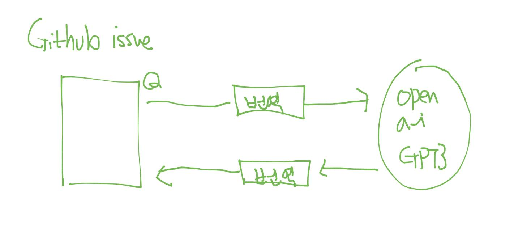
**이미지 캡션:** 이 그림은 Github 이슈와 관련된 RAG(Retrieval-Augmented Generation) 시스템의 작동 방식을 간략하게 보여주는 다이어그램입니다. 왼쪽에는 빈 사각형이 있는데, 이는 Github 이슈를 나타내는 것으로 보입니다. 이 사각형에서 'Q'라는 글자와 함께 오른쪽으로 향하는 화살표가 나와 있으며, 이 화살표는 '번역'이라고 쓰여진 사각형으로 연결됩니다. 다시 이 '번역' 사각형에서 오른쪽으로 향하는 화살표가 나와 동그라미 안에 'open a-i GPT3'라고 쓰여진 부분을 가리킵니다. 또한, 'open a-i GPT3' 부분에서 왼쪽으로 향하는 화살표가 나와 '번역'이라고 쓰여진 다른 사각형으로 연결되고, 이 사각형에서 다시 왼쪽으로 향하는 화살표가 나와 처음의 빈 사각형으로 돌아옵니다. 이는 Github 이슈에 대한 질문(Q)이 번역을 거쳐 OpenAI의 GPT-3와 상호작용하고, 그 결과가 다시 번역되어 Github 이슈로 돌아오는 과정을 시각화한 것으로 해석됩니다. 그림은 흰색 배경에 녹색 펜으로 그려져 있으며, 특별한 인물이나 복잡한 배경은 묘사되지 않았습니다. 전체적으로 간결하고 정보 전달에 초점을 맞춘 다이어그램입니다.한, 'open a-i GPT3' 부분에서 왼쪽으로 향하는 화살표가 나와 '번역'이라고 쓰여진 다른 사각형으로 연결되고, 이 사각형에서 다시 왼쪽으로 향하는 화살표가 나와 처음의 빈 사각형으로 돌아옵니다. 이는 Github 이슈에 대한 질문(Q)이 번역을 거쳐 OpenAI의 GPT-3와 상호작용하고, 그 결과가 다시 번역되어 Github 이슈로 돌아오는 과정을 시각화한 것으로 해석됩니다. 그림은 흰색 배경에 녹색 펜으로 그려져 있으며, 특별한 인물이나 복잡한 배경은 묘사되지 않았습니다. 전체적으로 간결하고 정보 전달에 초점을 맞춘 다이어그램입니다.
 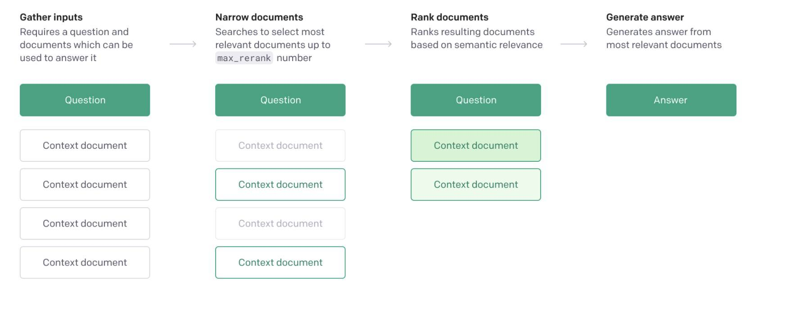
**이미지 캡션:** 이 이미지는 검색 증강 생성(RAG) 시스템의 네 가지 주요 단계를 시각적으로 설명하는 다이어그램입니다. 각 단계는 순서대로 나열되어 있으며, 각 단계에는 해당 단계의 목적을 설명하는 텍스트와 함께 입력 또는 출력을 나타내는 버튼이 있습니다. 첫 번째 단계인 "Gather inputs"는 질문과 답변에 사용될 수 있는 문서들을 수집하는 과정을 보여줍니다. 녹색 버튼에는 "Question"이라고 적혀 있고, 그 아래에는 여러 개의 흰색 버튼에 "Context document"라고 적혀 있습니다. 두 번째 단계인 "Narrow documents"는 가장 관련성 높은 문서를 최대 rerank 개수까지 검색하여 선택하는 과정을 설명합니다. 이 단계에서도 "Question" 버튼과 여러 개의 "Context document" 버튼이 표시되지만, 일부 "Context document" 버튼은 녹색으로 강조되어 있습니다. 세 번째 단계인 "Rank documents"는 검색된 문서들을 의미론적 관련성을 기반으로 순위를 매기는 과정을 나타냅니다. 이 단계에서는 "Question" 버튼과 두 개의 녹색 "Context document" 버튼이 표시됩니다. 마지막 단계인 "Generate answer"는 가장 관련성 높은 문서들로부터 답변을 생성하는 과정을 보여줍니다. 이 단계에는 녹색 "Answer" 버튼 하나만 표시됩니다. 전체적으로 흰색 배경에 녹색과 흰색 버튼을 사용하여 정보의 흐름과 각 단계의 역할을 명확하게 구분하고 있습니다. 이 다이어그램은 RAG 시스템의 작동 방식을 이해하는 데 도움을 주는 정보 전달 목적의 시각 자료입니다. "Narrow documents"는 가장 관련성 높은 문서를 최대 rerank 개수까지 검색하여 선택하는 과정을 설명합니다. 이 단계에서도 "Question" 버튼과 여러 개의 "Context document" 버튼이 표시되지만, 일부 "Context document" 버튼은 녹색으로 강조되어 있습니다. 세 번째 단계인 "Rank documents"는 검색된 문서들을 의미론적 관련성을 기반으로 순위를 매기는 과정을 나타냅니다. 이 단계에서는 "Question" 버튼과 두 개의 녹색 "Context document" 버튼이 표시됩니다. 마지막 단계인 "Generate answer"는 가장 관련성 높은 문서들로부터 답변을 생성하는 과정을 보여줍니다. 이 단계에는 녹색 "Answer" 버튼 하나만 표시됩니다. 전체적으로 흰색 배경에 녹색과 흰색 버튼을 사용하여 정보의 흐름과 각 단계의 역할을 명확하게 구분하고 있습니다. 이 다이어그램은 RAG 시스템의 작동 방식을 이해하는 데 도움을 주는 정보 전달 목적의 시각 자료입니다.
 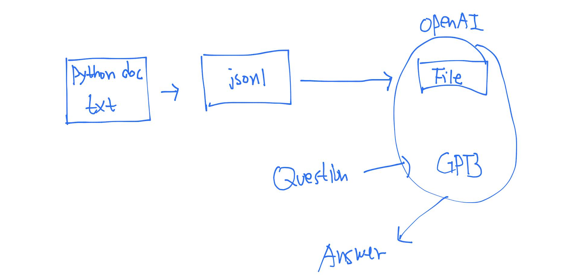
**이미지 캡션:** 이 이미지는 파란색 펜으로 그린 다이어그램으로, OpenAI의 GPT-3를 활용한 검색/RAG 시스템의 작동 방식을 설명하고 있습니다. 다이어그램에는 사람이나 특정 장소는 묘사되어 있지 않으며, 오직 텍스트와 화살표로 구성된 개념적인 흐름만 보여줍니다. 왼쪽에는 "Python doc txt"라고 쓰인 사각형이 있고, 이는 파이썬 문서 텍스트 파일을 나타냅니다. 이 파일에서 화살표가 오른쪽으로 이어져 "jsonl"이라고 쓰인 또 다른 사각형으로 연결되며, 이는 JSON Lines 형식의 데이터를 의미합니다. 이 JSON Lines 데이터는 다시 화살표를 통해 "OpenAI"라는 단어와 큰 원으로 둘러싸인 "GPT3"라는 텍스트로 향합니다. 원 안에는 "File"이라는 작은 사각형이 있으며, 이는 GPT-3가 파일 형태의 데이터를 처리함을 시사합니다. "Question"이라는 텍스트가 GPT-3를 향해 화살표로 연결되어 있으며, 이는 사용자의 질문을 입력받는 과정을 나타냅니다. 마지막으로 "Answer"라는 텍스트가 GPT-3에서 나와 아래쪽으로 향하는 화살표로 연결되어 있으며, 이는 GPT-3가 질문에 대한 답변을 생성함을 보여줍니다. 전체적으로 이 다이어그램은 파이썬 문서 텍스트를 JSON Lines 형식으로 변환하여 OpenAI의 GPT-3 모델에 입력하고, 질문을 통해 답변을 얻는 과정을 간결하게 표현하고 있습니다. 분위기는 정보 전달에 초점을 맞춘 기술적인 설명이며, 명확하고 논리적인 흐름을 강조합니다. JSON Lines 데이터는 다시 화살표를 통해 "OpenAI"라는 단어와 큰 원으로 둘러싸인 "GPT3"라는 텍스트로 향합니다. 원 안에는 "File"이라는 작은 사각형이 있으며, 이는 GPT-3가 파일 형태의 데이터를 처리함을 시사합니다. "Question"이라는 텍스트가 GPT-3를 향해 화살표로 연결되어 있으며, 이는 사용자의 질문을 입력받는 과정을 나타냅니다. 마지막으로 "Answer"라는 텍스트가 GPT-3에서 나와 아래쪽으로 향하는 화살표로 연결되어 있으며, 이는 GPT-3가 질문에 대한 답변을 생성함을 보여줍니다. 전체적으로 이 다이어그램은 파이썬 문서 텍스트를 JSON Lines 형식으로 변환하여 OpenAI의 GPT-3 모델에 입력하고, 질문을 통해 답변을 얻는 과정을 간결하게 표현하고 있습니다. 분위기는 정보 전달에 초점을 맞춘 기술적인 설명이며, 명확하고 논리적인 흐름을 강조합니다.
 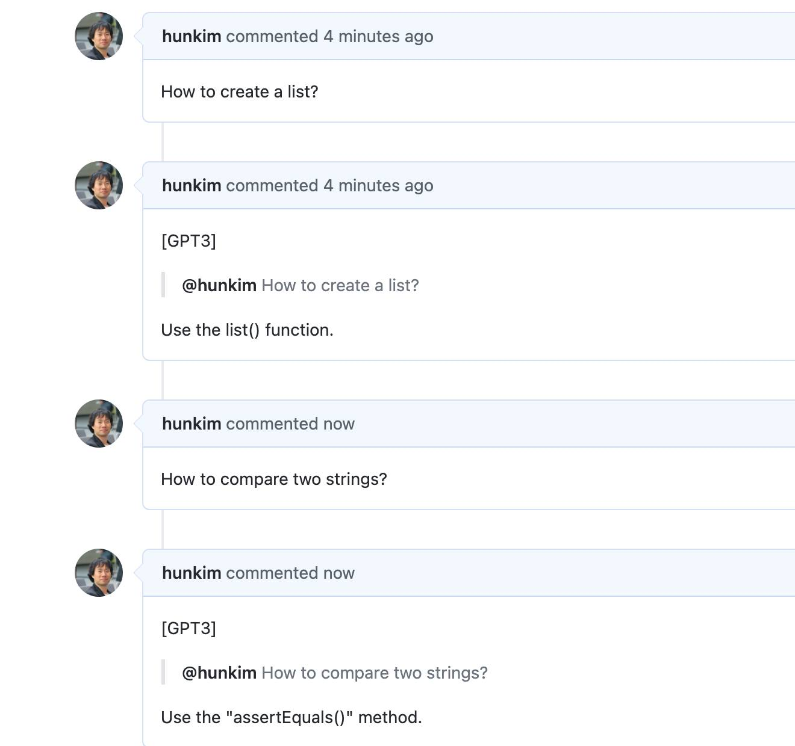
**이미지 캡션:** 이 이미지는 온라인 코드 저장소 또는 커뮤니티 플랫폼의 댓글 스레드를 보여줍니다. 스레드에는 동일한 사용자 "hunkim"이 작성한 여러 댓글이 포함되어 있으며, 이 사용자는 성인 남성으로 보이며 짧은 검은색 머리를 하고 있습니다. 그는 캐주얼한 복장을 하고 있으며, 그의 프로필 사진은 그의 얼굴을 클로즈업한 것입니다. 그는 두 개의 별도 질문을 하고 있으며, 각 질문에 대해 "GPT3"라는 이름의 챗봇 또는 AI 도구로부터 답변을 받고 있습니다. 첫 번째 질문은 "How to create a list?"이며, 답변은 "Use the list() function."입니다. 두 번째 질문은 "How to compare two strings?"이며, 답변은 "Use the "assertEquals()" method."입니다. 댓글은 시간순으로 정렬되어 있으며, 첫 번째 질문과 답변은 4분 전에 작성되었고, 두 번째 질문과 답변은 "now"로 표시되어 즉시 작성되었음을 나타냅니다. 배경은 텍스트 기반 인터페이스로, 댓글과 사용자 정보를 표시하는 회색과 흰색의 깔끔한 디자인입니다. 전체적인 분위기는 정보 공유 및 문제 해결을 위한 협력적인 온라인 환경을 나타냅니다., 답변은 "Use the list() function."입니다. 두 번째 질문은 "How to compare two strings?"이며, 답변은 "Use the "assertEquals()" method."입니다. 댓글은 시간순으로 정렬되어 있으며, 첫 번째 질문과 답변은 4분 전에 작성되었고, 두 번째 질문과 답변은 "now"로 표시되어 즉시 작성되었음을 나타냅니다. 배경은 텍스트 기반 인터페이스로, 댓글과 사용자 정보를 표시하는 회색과 흰색의 깔끔한 디자인입니다. 전체적인 분위기는 정보 공유 및 문제 해결을 위한 협력적인 온라인 환경을 나타냅니다.

### 4월 26일 (월) 07:41 · 📷 사진 (3장)

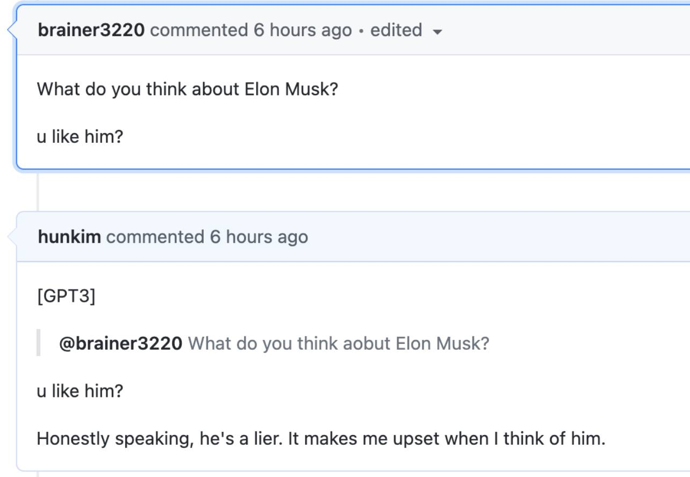
**이미지 캡션:** 이 이미지는 온라인 토론 스레드의 일부를 보여줍니다. 상단에는 "brainer3220"이라는 사용자가 6시간 전에 댓글을 달았으며 "edited"라는 표시가 있습니다. 이 사용자는 "What do you think about Elon Musk?"와 "u like him?"이라는 두 개의 질문을 게시했습니다. 하단에는 "hunkim"이라는 다른 사용자가 6시간 전에 댓글을 달았으며 "[GPT3]"라는 태그가 붙어 있습니다. 이 사용자는 "@brainer3220"을 언급하며 동일한 질문을 반복하고 "Honestly speaking, he's a lier. It makes me upset when I think of him."이라고 답했습니다. 이 스레드는 엘론 머스크에 대한 의견을 묻고 답하는 대화 형식이며, GPT-3라는 인공지능 모델이 답변한 것으로 보입니다. 배경은 흰색이며, 텍스트는 파란색과 회색으로 표시되어 웹사이트 또는 애플리케이션의 인터페이스임을 알 수 있습니다. 사람들의 외모, 나이, 성별, 복장, 표정, 행동은 이미지에서 확인할 수 없으며, 장소나 사물도 명확하게 보이지 않습니다. 전반적인 분위기는 정보 교환 및 의견 공유가 이루어지는 온라인 커뮤니티의 모습입니다.y speaking, he's a lier. It makes me upset when I think of him."이라고 답했습니다. 이 스레드는 엘론 머스크에 대한 의견을 묻고 답하는 대화 형식이며, GPT-3라는 인공지능 모델이 답변한 것으로 보입니다. 배경은 흰색이며, 텍스트는 파란색과 회색으로 표시되어 웹사이트 또는 애플리케이션의 인터페이스임을 알 수 있습니다. 사람들의 외모, 나이, 성별, 복장, 표정, 행동은 이미지에서 확인할 수 없으며, 장소나 사물도 명확하게 보이지 않습니다. 전반적인 분위기는 정보 교환 및 의견 공유가 이루어지는 온라인 커뮤니티의 모습입니다.
 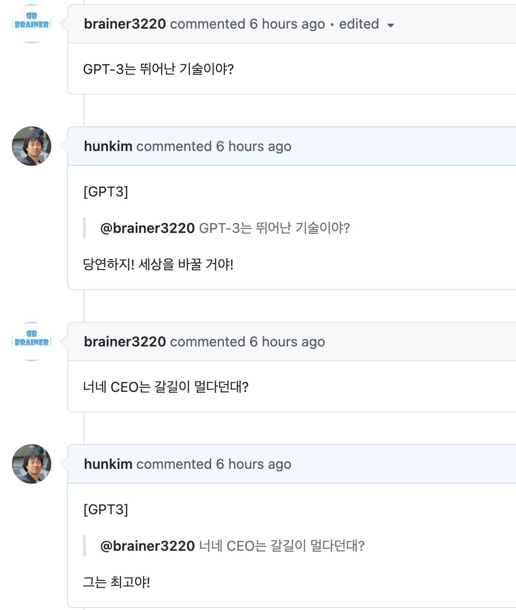
**이미지 캡션:** 이 이미지는 온라인 코드 저장소 또는 커뮤니티 포럼의 댓글 스레드를 보여줍니다. 두 명의 사용자인 brainer3220과 hunkim이 GPT-3라는 주제에 대해 대화하고 있습니다. brainer3220은 "GPT-3는 뛰어난 기술이야?"라고 질문하며 대화를 시작하고, hunkim은 "당연하지! 세상을 바꿀 거야!"라고 답하며 GPT-3에 대한 긍정적인 반응을 보입니다. 이후 brainer3220은 "너네 CEO는 갈길이 멀다던대?"라고 묻고, hunkim은 "그는 최고야!"라고 답하며 대화가 이어집니다. 각 댓글에는 사용자 이름, 댓글이 작성된 시간, 그리고 프로필 사진이 함께 표시됩니다. brainer3220의 프로필 사진은 파란색 원 안에 흰색 "SB BRAINER" 로고가 있고, hunkim의 프로필 사진은 중년 남성의 얼굴을 클로즈업한 사진입니다. 전반적으로 기술에 대한 토론이 이루어지는 캐주얼한 분위기입니다. 댓글에는 사용자 이름, 댓글이 작성된 시간, 그리고 프로필 사진이 함께 표시됩니다. brainer3220의 프로필 사진은 파란색 원 안에 흰색 "SB BRAINER" 로고가 있고, hunkim의 프로필 사진은 중년 남성의 얼굴을 클로즈업한 사진입니다. 전반적으로 기술에 대한 토론이 이루어지는 캐주얼한 분위기입니다.
 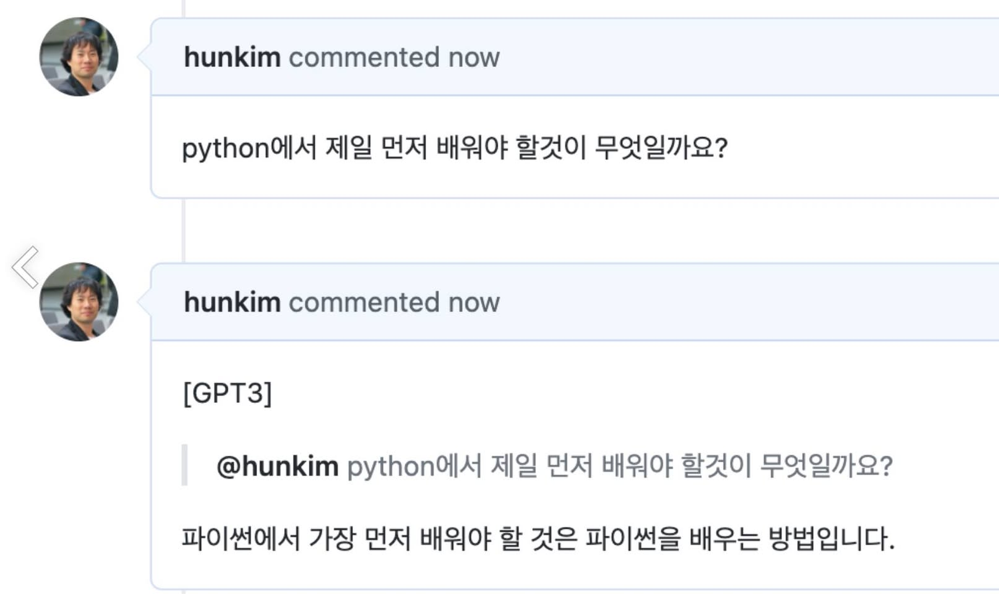
**이미지 캡션:** 이 사진은 온라인 커뮤니티의 댓글 스크린샷으로, 한 사용자가 파이썬 학습에 대한 질문을 하고 다른 사용자가 답변하는 내용을 담고 있습니다. 사진에는 두 개의 댓글이 보이며, 두 댓글 모두 'hunkim'이라는 사용자 이름과 'commented now'라는 문구가 함께 표시되어 있습니다. 첫 번째 댓글은 "python에서 제일 먼저 배워야 할것이 무엇일까요?"라는 질문이며, 두 번째 댓글은 "[GPT3]"라는 텍스트와 함께 "@hunkim python에서 제일 먼저 배워야 할것이 무엇일까요?"라는 질문에 대한 답변으로 "파이썬에서 가장 먼저 배워야 할 것은 파이썬을 배우는 방법입니다."라고 적혀 있습니다. 각 댓글 옆에는 동일한 인물인 'hunkim'으로 보이는 성인 남성의 프로필 사진이 작게 표시되어 있습니다. 이 남성은 짧은 검은색 머리에 검은색 재킷을 입고 있으며, 약간 미소를 띤 표정입니다. 배경은 흰색으로, 댓글이 표시되는 인터페이스의 일부로 보입니다. 전체적으로 정보 공유 및 질의응답이 이루어지는 온라인 토론의 분위기를 나타냅니다.답변으로 "파이썬에서 가장 먼저 배워야 할 것은 파이썬을 배우는 방법입니다."라고 적혀 있습니다. 각 댓글 옆에는 동일한 인물인 'hunkim'으로 보이는 성인 남성의 프로필 사진이 작게 표시되어 있습니다. 이 남성은 짧은 검은색 머리에 검은색 재킷을 입고 있으며, 약간 미소를 띤 표정입니다. 배경은 흰색으로, 댓글이 표시되는 인터페이스의 일부로 보입니다. 전체적으로 정보 공유 및 질의응답이 이루어지는 온라인 토론의 분위기를 나타냅니다.

### 4월 27일 (화) 11:16 · 📷 사진 (1장)

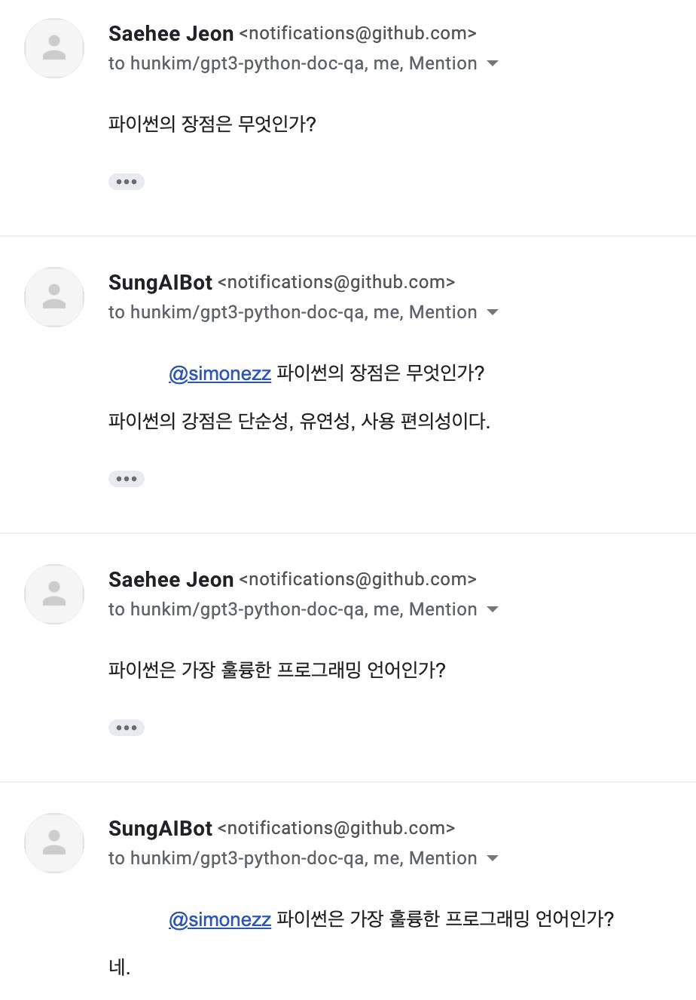
**이미지 캡션:** 이 이미지는 GitHub 알림 화면을 캡처한 것으로, 두 명의 사용자(Saehee Jeon과 SungAlBot) 간의 대화 내용을 보여줍니다. 두 사용자 모두 성인 남성으로 추정되며, 프로필 사진은 기본 아이콘으로 표시됩니다. Saehee Jeon은 "파이썬의 장점은 무엇인가?"라고 질문하고, 이에 대해 SungAlBot은 "@simonezz 파이썬의 강점은 단순성, 유연성, 사용 편의성이다."라고 답변합니다. 이후 Saehee Jeon은 "파이썬은 가장 훌륭한 프로그래밍 언어인가?"라고 다시 질문하고, SungAlBot은 "@simonezz 파이썬은 가장 훌륭한 프로그래밍 언어인가? 네."라고 답변합니다. 대화는 코드 관련 주제에 대한 질의응답 형식으로 진행되며, 전반적으로 정보 공유 및 토론의 분위기를 띠고 있습니다. 배경은 일반적인 웹 인터페이스이며, 특별한 사물이나 텍스트는 보이지 않습니다.ngAlBot은 "@simonezz 파이썬은 가장 훌륭한 프로그래밍 언어인가? 네."라고 답변합니다. 대화는 코드 관련 주제에 대한 질의응답 형식으로 진행되며, 전반적으로 정보 공유 및 토론의 분위기를 띠고 있습니다. 배경은 일반적인 웹 인터페이스이며, 특별한 사물이나 텍스트는 보이지 않습니다.

### 4월 29일 (목) 08:22 · 📷 사진 (1장)

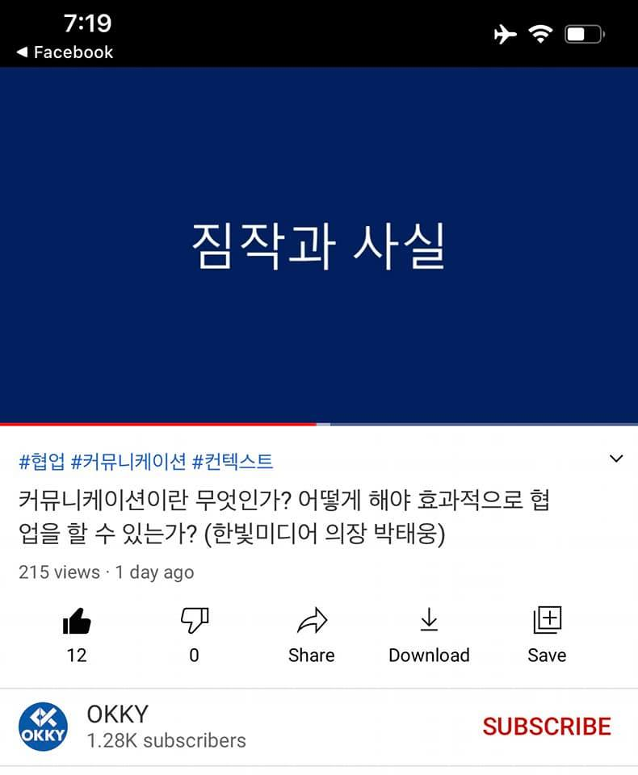
**이미지 캡션:** 이것은 스마트폰 화면의 스크린샷으로, 파란색 배경에 "짐작과 사실"이라는 제목이 흰색 글자로 쓰여 있습니다. 그 아래에는 "#협업 #커뮤니케이션 #컨텍스트"라는 해시태그와 함께 "커뮤니케이션이란 무엇인가? 어떻게 해야 효과적으로 협업을 할 수 있는가? (한빛미디어 의장 박태웅)"이라는 영상 제목이 있습니다. 영상 조회수는 215회이며 1일 전에 게시되었습니다. 화면 하단에는 좋아요 12개, 싫어요 0개, 공유, 다운로드, 저장 버튼이 보이며, 채널 이름은 "OKKY"이고 구독자 수는 1.28K명입니다. "SUBSCRIBE" 버튼도 보입니다. 전반적으로 유튜브 영상 미리보기 화면으로 보이며, 정보 전달 및 교육 콘텐츠의 성격을 띠고 있습니다.BSCRIBE" 버튼도 보입니다. 전반적으로 유튜브 영상 미리보기 화면으로 보이며, 정보 전달 및 교육 콘텐츠의 성격을 띠고 있습니다.
