# 2021년 7월

[← 2021년](README.md)

### 7월 1일 (목) 06:21 · 📷 사진 (1장)

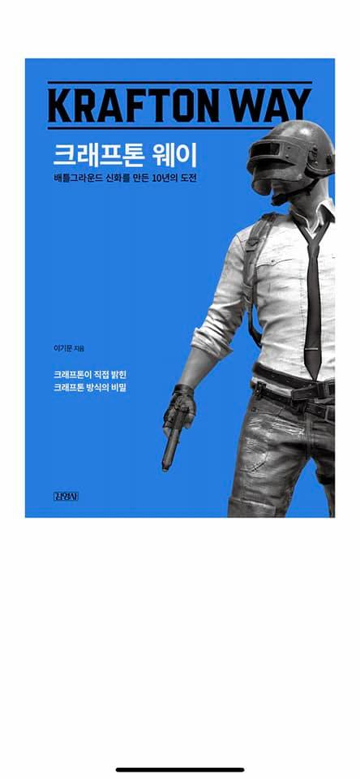
**이미지 캡션:** 파란색 배경에 게임 캐릭터로 보이는 성인 남성이 권총을 들고 서 있는 모습이 담겨 있으며, 남성은 헬멧을 쓰고 흰색 셔츠에 검은색 넥타이, 청바지를 착용하고 있다. 상단에는 "KRAFTON WAY"라는 영어 문구와 "크래프톤 웨이"라는 한글 문구가 크게 쓰여 있고, 그 아래에는 "배틀그라운드 신화를 만든 10년의 도전"이라는 부제가 있다. 왼쪽에는 "이기문 지음", "크래프톤이 직접 밝힌", "크래프톤 방식의 비밀"이라는 글과 함께 "M&R"이라는 로고가 보인다. 전체적으로 게임 관련 서적의 표지 디자인으로 보이며, 진지하고 도전적인 분위기를 풍긴다.

### 7월 2일 (금) 21:25 · #TBT #두대표님

#TBT #두대표님

존경하는 이람, Jungwook Lim 두 대표님과 JungMin Kim이사님, JC Park님을 바로 그 TBT에서 뵙는 큰 영광의 날이였습니다. 너무 감사합니다.

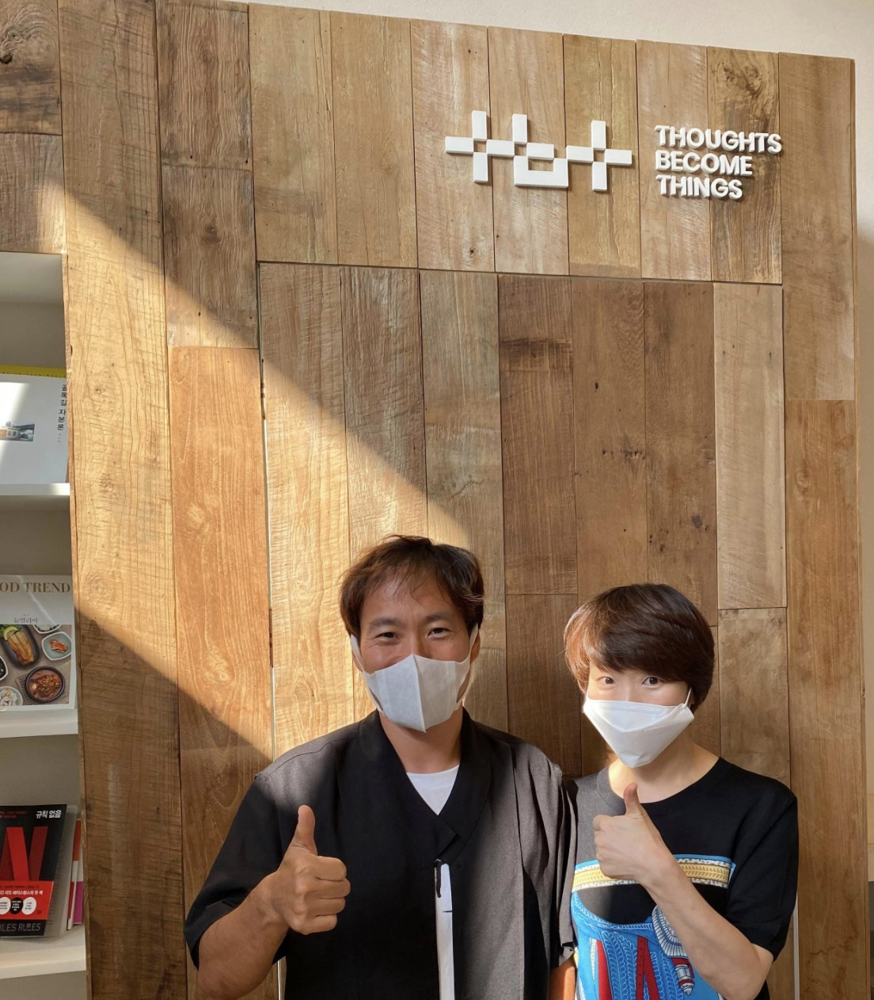
**이미지 캡션:** 따뜻한 햇살이 비치는 나무 벽을 배경으로, 흰색 마스크를 착용한 성인 남성과 성인 여성이 나란히 서서 엄지척 포즈를 취하고 있다. 남성은 50대 초반으로 보이며, 검은색 겉옷 안에 흰색 티셔츠를 입고 있다. 여성은 40대 초반으로 보이며, 검은색 티셔츠에 화려한 패턴이 그려진 옷을 입고 있다. 두 사람 모두 마스크를 착용하고 있지만, 눈빛과 표정에서 긍정적이고 밝은 분위기가 느껴진다. 배경의 나무 벽에는 흰색 로고와 함께 "THOUGHTS BECOME THINGS"라는 문구가 새겨져 있다. 왼쪽에는 책이 꽂힌 책장이 보이며, "GOOD TREND", "규칙 없음", "RULES RULES" 등의 텍스트가 일부 보인다. 전체적으로 편안하고 긍정적인 분위기의 사진이다.
 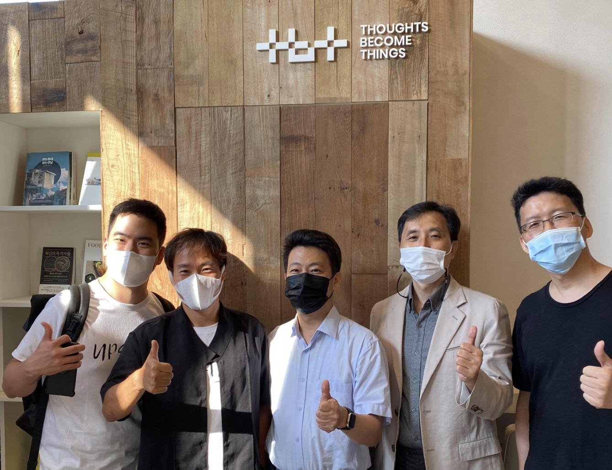
**이미지 캡션:** 다섯 명의 성인 남성이 실내에서 함께 포즈를 취하고 있습니다. 왼쪽에서 두 번째 남성은 흰색 티셔츠에 검은색 조끼를 입고 있으며, 엄지손가락을 치켜들고 있습니다. 그의 옆에 있는 남성은 흰색 셔츠를 입고 엄지손가락을 치켜들고 있습니다. 세 번째 남성은 베이지색 재킷을 입고 엄지손가락을 치켜들고 있습니다. 가장 오른쪽에 있는 남성은 검은색 티셔츠를 입고 안경을 쓰고 있으며, 엄지손가락을 치켜들고 있습니다. 네 번째 남성은 검은색 마스크를 쓰고 있습니다. 배경에는 나무 벽과 흰색 책장이 보이며, 책장에는 몇 권의 책이 놓여 있습니다. 벽에는 "THOUGHTS BECOME THINGS"라는 문구가 새겨져 있습니다. 전체적으로 밝고 긍정적인 분위기입니다.

### 7월 3일 (토) 13:21 · 멋진 분들과 팔각정 5회전과 대박 치킨. 너무 멋진 날 입니다.

멋진 분들과 팔각정 5회전과 대박 치킨. 너무 멋진 날 입니다.

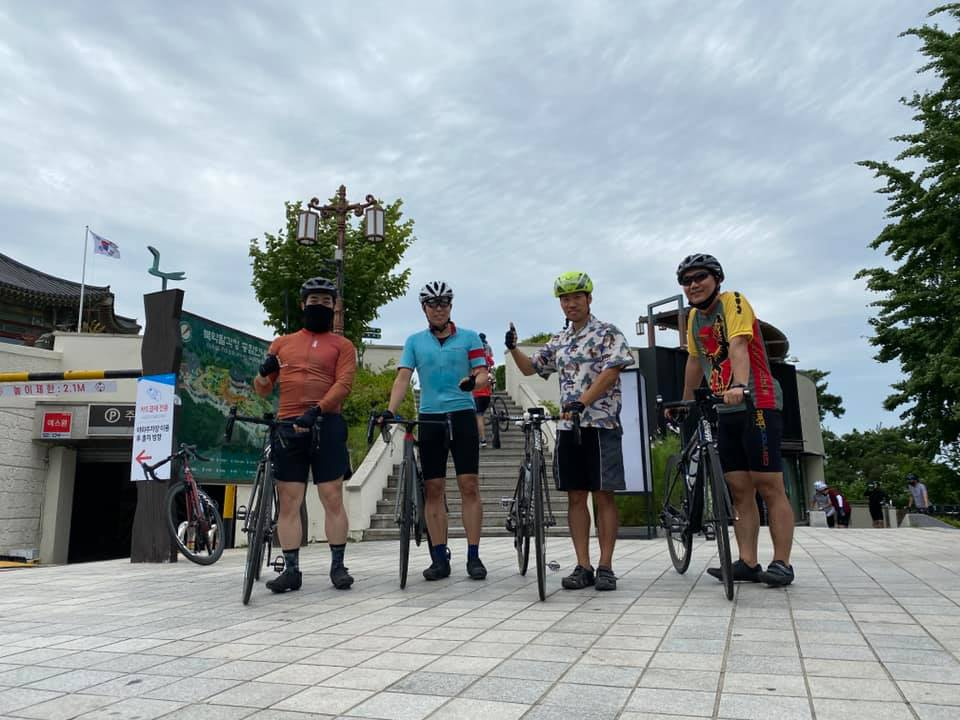
**이미지 캡션:** 네 명의 성인 남성이 자전거를 타고 야외에 서 있다. 왼쪽에서 두 번째 남성은 주황색 긴팔 상의와 검은색 반바지를 입고 있으며, 검은색 마스크를 쓰고 있다. 그는 자전거 핸들을 잡고 카메라를 바라보고 있다. 그 옆에 있는 남성은 파란색 반팔 상의와 검은색 반바지를 입고 있으며, 헬멧을 쓰고 엄지손가락을 치켜세우고 있다. 세 번째 남성은 화려한 무늬의 셔츠와 검은색 반바지를 입고 헬멧을 쓴 채 엄지손가락을 치켜세우고 있다. 가장 오른쪽에 있는 남성은 노란색과 빨간색이 섞인 반팔 상의와 검은색 반바지를 입고 헬멧을 쓰고 있으며, 자전거 핸들을 잡고 있다. 배경에는 한국 전통 양식의 건물 일부와 나무, 그리고 흐린 하늘이 보인다. 건물 앞에는 주차장 입구로 보이는 곳과 함께 한국어로 된 안내판이 서 있다. 안내판에는 "높이 제한: 2.1M"이라는 글자가 보이며, 주차장 표지판도 있다. 전체적으로 자전거 라이딩을 즐기는 사람들의 모습으로, 활동적이고 긍정적인 분위기이다.
 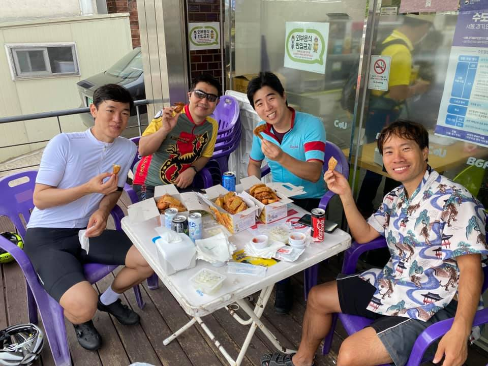
**이미지 캡션:** 네 명의 성인 남성이 야외 테이블에 앉아 치킨과 음료를 즐기고 있으며, 모두 밝고 행복한 표정을 짓고 있습니다. 왼쪽 첫 번째 남성은 흰색 반팔 저지와 검은색 반바지를 입고 있으며, 손에 치킨 조각을 들고 있습니다. 두 번째 남성은 노란색과 빨간색이 섞인 독특한 디자인의 상의를 입고 있으며, 역시 치킨을 들고 카메라를 바라보고 있습니다. 세 번째 남성은 하늘색 상의에 빨간색 소매가 달린 옷을 입고 있으며, 손에 치킨을 들고 웃고 있습니다. 오른쪽 마지막 남성은 하얀색 바탕에 푸른색 무늬가 그려진 셔츠와 검은색 반바지를 입고 있으며, 손에 치킨 조각을 들고 환하게 웃고 있습니다. 테이블 위에는 치킨 박스, 음료수 캔, 컵, 휴지 등이 놓여 있습니다. 배경에는 건물과 함께 "외부음식 반입금지"라는 문구가 적힌 표지판이 보입니다. 전반적으로 즐겁고 편안한 분위기입니다.
 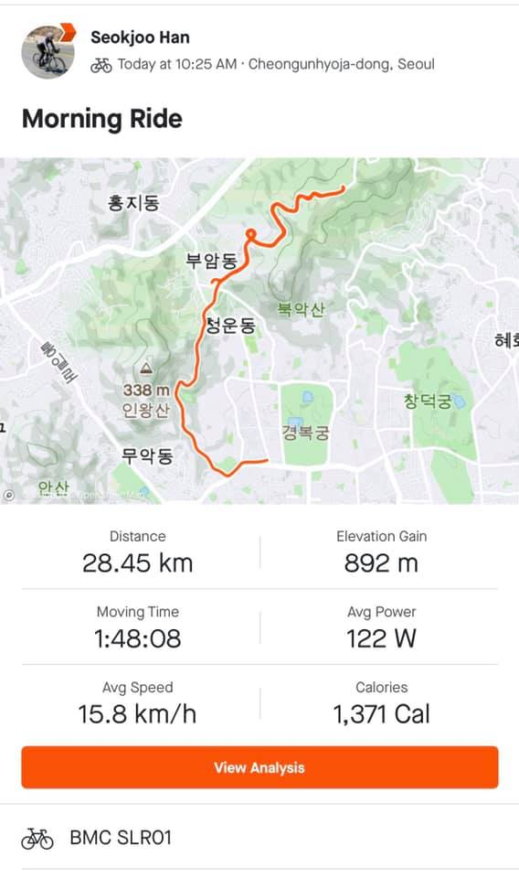
**이미지 캡션:** 이 화면은 'Seokjoo Han'이라는 사용자의 자전거 라이딩 기록을 보여주는 앱 화면으로, 제목은 "Morning Ride"이며 2023년 10월 25일 오전 10시 25분에 서울 청운동효자동에서 시작된 것으로 표시됩니다. 화면 중앙에는 서울의 북악산, 인왕산, 경복궁, 창덕궁 등의 지명이 표시된 지도 위에 주황색 선으로 라이딩 경로가 나타나 있으며, 경로 주변에는 산과 도로가 그려져 있습니다. 지도 아래에는 라이딩 통계 정보가 표시되는데, 총 거리는 28.45km, 이동 시간은 1시간 48분 8초, 평균 속도는 시속 15.8km, 평균 파워는 122W, 소모 칼로리는 1,371kcal입니다. 화면 하단에는 "View Analysis"라는 버튼이 있고, 그 아래에는 자전거 아이콘과 함께 "BMC SLR01"이라는 자전거 모델명이 적혀 있습니다. 전반적으로 활동적인 아침 라이딩의 기록을 보여주는 깔끔하고 정보 중심적인 인터페이스입니다.
 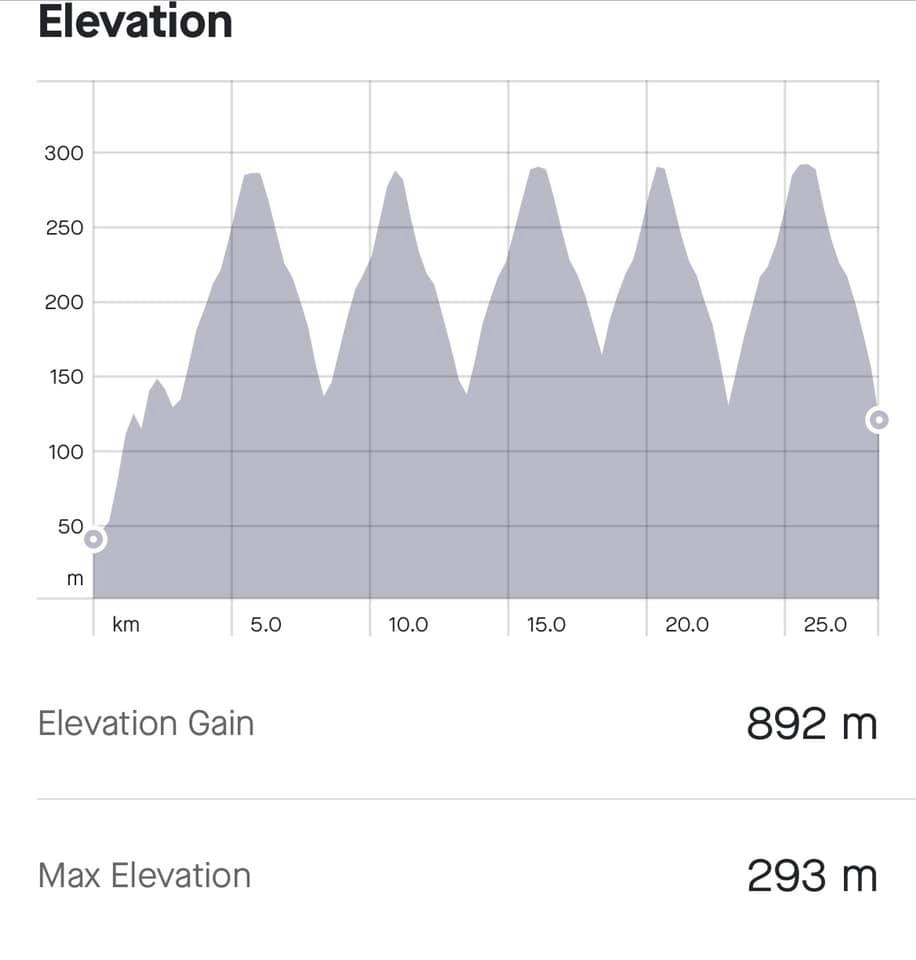
**이미지 캡션:** 이 이미지는 고도 변화를 보여주는 그래프입니다. 그래프의 제목은 "Elevation"이며, 세로축은 미터(m) 단위의 고도를 나타내고, 가로축은 킬로미터(km) 단위의 거리를 나타냅니다. 그래프는 0km부터 25km까지의 구간 동안 고도가 여러 번 오르내리는 것을 보여줍니다. 최고 고도는 300m 이상이며, 여러 봉우리와 계곡 형태를 띠고 있습니다. 그래프 아래에는 "Elevation Gain"이라는 문구와 함께 892m라는 수치가 표시되어 있으며, 이는 총 상승 고도를 의미하는 것으로 보입니다. 또한 "Max Elevation"이라는 문구와 함께 293m라는 수치가 표시되어 있으며, 이는 최고 지점의 고도를 나타내는 것으로 보입니다. 이미지에는 사람이 등장하지 않으며, 배경은 흰색 바탕에 회색 격자선으로 이루어진 그래프입니다. 전반적으로 운동 기록이나 지형 정보를 나타내는 차트의 일부로 보이며, 객관적이고 정보 전달 중심의 분위기입니다.

### 7월 9일 (금) 13:51 · #일의격 늘 귀한 영감을 주시는 귀한 글과 책의 멋진 신수정 부사장님 뵙…

#일의격 늘 귀한 영감을 주시는 귀한 글과 책의 멋진 신수정 부사장님 뵙고 사인을 받은 아주 기분 좋은 날입니다. 

부사장님의 말씀과 격려는 제가 Upstage를 창업하는데도 큰 동기가 되었습니다. 감사드립니다.

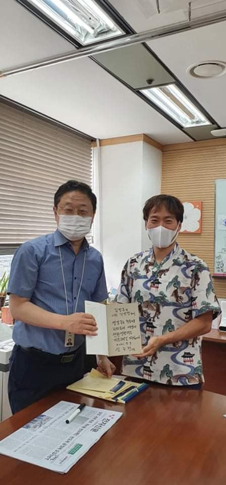
**이미지 캡션:** 사무실로 보이는 공간에서 두 명의 성인 남성이 서서 사진을 찍고 있다. 왼쪽 남성은 50대 후반에서 60대 초반으로 보이며, 짧은 검은 머리에 흰색 마스크를 착용하고 파란색 반팔 셔츠를 입고 있다. 그는 오른손으로 종이 한 장을 들고 있으며, 왼손은 종이 아래에 받치고 있다. 오른쪽 남성은 30대 후반에서 40대 초반으로 보이며, 짧은 검은 머리에 흰색 마스크를 착용하고 흰색 바탕에 푸른색과 갈색 패턴이 있는 화려한 반팔 셔츠를 입고 있다. 그는 양손으로 종이 한 장을 들고 있으며, 종이에는 한국어로 글씨가 쓰여 있다. 두 사람 모두 정면을 바라보고 있으며, 표정은 마스크 때문에 정확히 보이지 않지만, 전반적으로 차분하고 긍정적인 분위기이다. 배경에는 흰색 블라인드가 쳐진 창문, 형광등 조명, 그리고 책상과 서류 등이 보인다. 책상 위에는 신문과 필기구, 그리고 서류철이 놓여 있다. 전체적으로 사무실에서 주고받는 선물이나 감사장을 전달하는 듯한 상황으로 보인다.

### 7월 14일 (수) 13:39 · #모두를위한AI #일등모델

#모두를위한AI #일등모델 

https://m.mk.co.kr/news/it/view/2021/07/676825

일등한 모델을 잘 만들어서 모든 분들에게 공급해 드리는 Making AI Benefitial 하는 Upstage 소식 전해 드립니다. 

"두 사람 모두 업스테이지에서 일하는 최고의 장점으로 '실력자들과 함께 일하는 것'을 꼽았다. 현재 업스테이지 직원 45명 중 개발직은 약 77%다. 이번 인터뷰에 응한 것도 좋은 인재들이 업스테이지를 비롯한 개발자 생태계에 지원하기를 바라는 마음에서라고 했다. "

업스테이지 오셔서 모두를 위한 AI도 만들고, 함께 AI 성장해요!

https://careers.upstage.ai/ 선지원, 후고민!

### 7월 16일 (금) 06:24 · 📷 사진 (1장)

**이미지 캡션:** 이 화면은 유튜브의 'Upstage' 채널 페이지로, 최신순으로 정렬된 영상 목록을 보여주고 있습니다. 각 영상은 썸네일 이미지, 제목, 조회수, 업로드 시간을 포함합니다. 첫 번째 영상은 "Addressing Baumol's Cost Disease with Machine Learning Startups!"라는 제목으로 59분 29초 길이이며, 7시간 전에 21회의 조회수를 기록했습니다. 두 번째 영상은 한국어로 "[Upstage Talks] 개별 맞춤형 학습을 위한 지식 추적 및 추천에 대한 연구"라는 제목으로 56분 4초 길이이며, 1주 전에 108회의 조회수를 기록했습니다. 세 번째 영상은 "KLUE Paper Day"라는 제목으로 2시간 28분 2초 길이이며, 1개월 전에 239회의 조회수를 기록했습니다. 네 번째 영상은 "[Upstage Talks] Kaggle Shoppee 경진대회 1등 솔루션 공유"라는 제목으로 1시간 6분 11초 길이이며, 1개월 전에 712회의 조회수를 기록했습니다. 다섯 번째 영상은 "[Upstage Talks] Towards a Multi-task Multi-modal Learning"라는 제목으로 1시간 1분 22초 길이이며, 1개월 전에 148회의 조회수를 기록했습니다. 마지막으로 여섯 번째 영상은 "[Upstage Talks] Last One Mile between Textbook ML and its real applications"라는 제목으로 1시간 26분 44초 길이이며, 1개월 전에 313회의 조회수를 기록했습니다. 화면 하단에는 홈, 쇼츠, 구독, 보관함 등 유튜브의 기본 탐색 메뉴가 보입니다. 전반적으로 기술, 특히 머신러닝 및 인공지능 관련 주제를 다루는 영상들이 주를 이루고 있으며, 전문적인 느낌을 줍니다.

> #업스테이지톡 #10개업로드 #강사모십니다   AI기술 보편화를 위해 노력하고, 모두를 위한 easy-to-apply AI솔루션을 제공하는 Upstage는 딥러닝 기반 기술을 공개 테크톡을 통해 신나고 재미있는 기술을 더 많은 분들과 공유 하려고 합니다.   https://youtube.com/channel/UCXJY5PPAToqqSketm5_PrDw  오늘 10번째 톡이 올라와 여러분들에게 채널 공유 드립니다. 저희들은 더 많은 강사님을 모시고 더 많이 기술 공유 하도록 하겠습니다. 좋은 강사님 추천이나 셀프추천도 너무 좋습니다.   그리고 채널 구독과 알림 설정은 사랑입니다. ^^

### 7월 19일 (월) 16:01 · 존경하는 이람 대표님, 광교 Upstage 방문 해주시고 김밥과 떡볶이 …

존경하는 이람 대표님, 광교 Upstage 방문 해주시고 김밥과 떡볶이 같이 드시며 많은 좋은 이야기 해주셔서 너무 감사드립니다. 앞으로도 더 많이 재미있는일들 같이 하면 좋겠습니다.

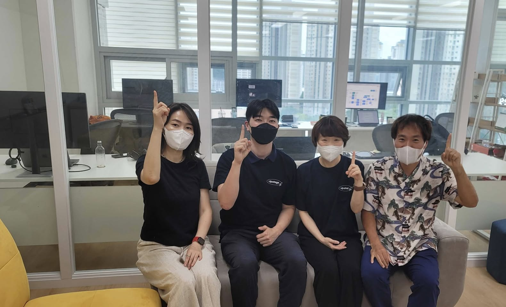
**이미지 캡션:** 네 명의 사람이 사무실 배경에서 포즈를 취하고 있습니다. 왼쪽부터 성인 여성 두 명, 성인 남성 두 명입니다. 첫 번째 여성은 30대 후반에서 40대 초반으로 보이며, 검은색 반팔 티셔츠와 베이지색 바지를 입고 흰색 마스크를 착용하고 있습니다. 그녀는 오른손 검지를 위로 향해 가리키고 있습니다. 두 번째 여성은 20대 후반에서 30대 초반으로 보이며, 검은색 반팔 티셔츠와 검은색 바지를 입고 검은색 마스크를 착용하고 있습니다. 그녀 역시 오른손 검지를 위로 향해 가리키고 있습니다. 세 번째 사람은 20대 후반에서 30대 초반의 성인 남성으로, 검은색 반팔 티셔츠와 검은색 바지를 입고 검은색 마스크를 착용하고 있습니다. 그는 오른손 검지를 위로 향해 가리키고 있습니다. 네 번째 사람은 40대 후반에서 50대 초반의 성인 남성으로, 흰색 바탕에 푸른색과 갈색 패턴이 있는 셔츠와 파란색 바지를 입고 흰색 마스크를 착용하고 있습니다. 그는 오른손 검지를 위로 향해 가리키고 있습니다. 배경에는 사무실 책상, 컴퓨터 모니터, 창문, 그리고 건물들이 보입니다. 전체적으로 밝고 긍정적인 분위기이며, 네 명 모두 같은 동작을 하고 있어 팀워크나 공동의 목표를 상징하는 듯합니다.
 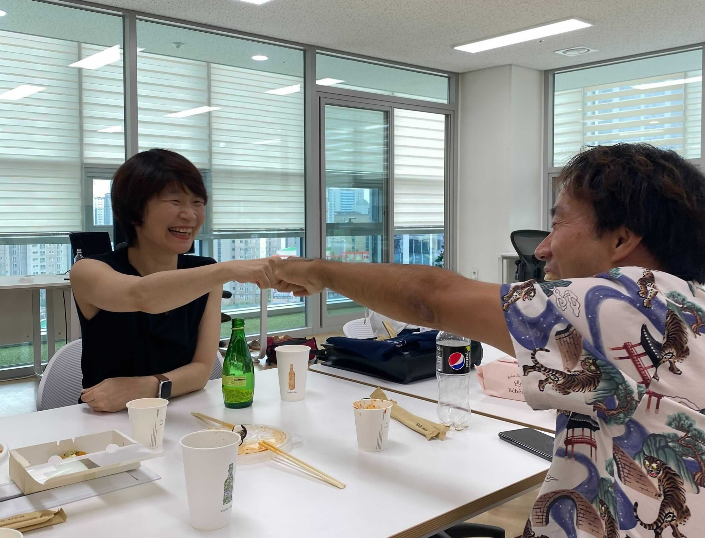
**이미지 캡션:** 사무실로 보이는 밝은 공간에서 성인 여성은 검은색 민소매 상의를 입고 환하게 웃으며 주먹을 내밀고 있고, 성인 남성은 화려한 호랑이 무늬의 셔츠를 입고 비슷한 표정으로 주먹을 맞대고 있다. 두 사람은 테이블에 앉아 있으며, 테이블 위에는 페트병, 종이컵, 젓가락, 음식 포장 용기 등이 놓여 있다. 배경에는 큰 창문이 있고 창밖으로는 도시 풍경이 보인다. 전반적으로 즐겁고 친근한 분위기이다.

### 7월 20일 (화) 08:30 · "경북궁 반시계 방향" Strava Local Legend (엡사용자중 …

"경북궁 반시계 방향" Strava Local Legend (엡사용자중 지난 90일간 가장 많이 운동한 사람)이 되었습니다! 당분간 왕관을 계속 유지해보겠습니다.

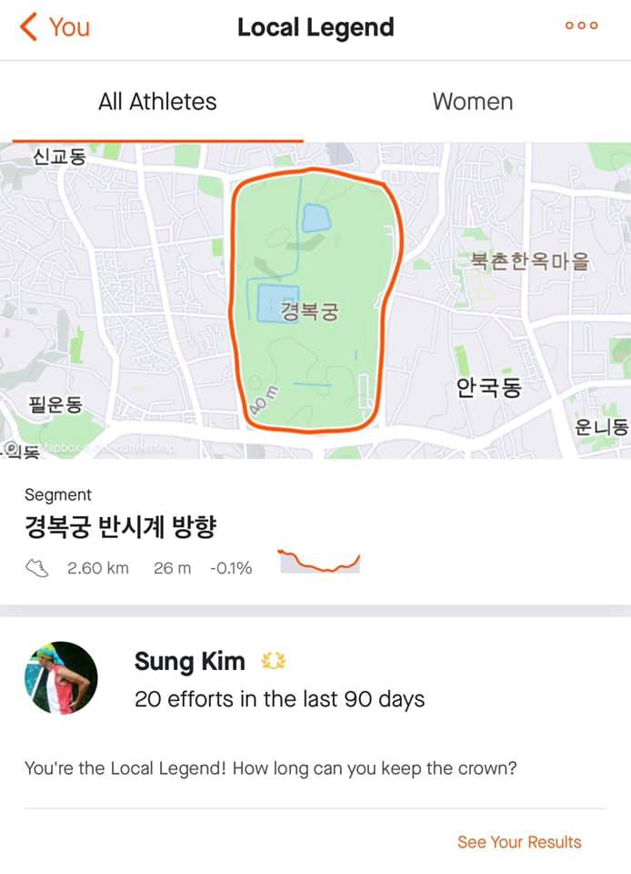
**이미지 캡션:** 화면 상단에는 "You"와 "Local Legend"라는 글자가 보이며, 오른쪽에는 점 세 개가 있다. 그 아래에는 "All Athletes"와 "Women"이라는 탭이 있고, "All Athletes"가 선택되어 있다. 지도에는 "신교동", "필운동", "경복궁", "북촌한옥마을", "안국동", "운니동"과 같은 지명이 표시되어 있으며, 경복궁 주변으로 주황색 선이 그려져 있다. 경복궁 안에는 파란색으로 표시된 건물과 연못이 보인다. "Segment" 섹션에는 "경복궁 반시계 방향"이라는 이름과 함께 2.60 km, 26 m, -0.1%라는 정보, 그리고 작은 그래프가 표시되어 있다. 그 아래에는 "Sung Kim"이라는 이름과 함께 금색 월계관 아이콘이 있고, "20 efforts in the last 90 days"라는 문구가 적혀 있다. 마지막으로 "You're the Local Legend! How long can you keep the crown?"이라는 문구와 함께 "See Your Results" 버튼이 보인다. 전반적으로 운동 기록 앱의 화면으로 보이며, 특정 구간의 기록을 보여주고 사용자가 해당 구간의 "Local Legend"임을 알리는 내용이다.

### 7월 22일 (목) 11:05 · 2차 접종완료하고 fully vaccination되었습니다. 모두에게 어…

2차 접종완료하고 fully vaccination되었습니다. 모두에게 어렵고 힘든시기지만 함께 이겨냅시다. 고고!!

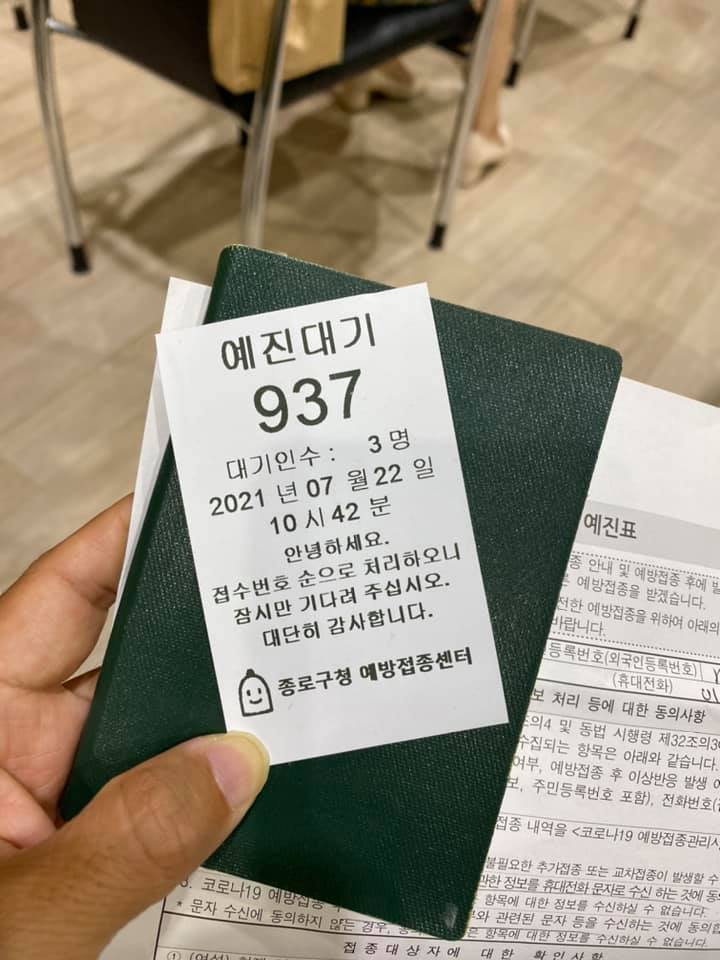
**이미지 캡션:** 한 성인 남성이 녹색 표지의 서류를 들고 있으며, 서류에는 '예진대기 937'이라는 글자와 함께 2021년 7월 22일 오전 10시 42분이라는 날짜와 시간이 적혀 있고, '종로구청 예방접종센터'라고 쓰여 있다. 배경에는 의자와 바닥이 보이며, 전체적으로 병원이나 접종 센터와 같은 분위기를 풍긴다.
 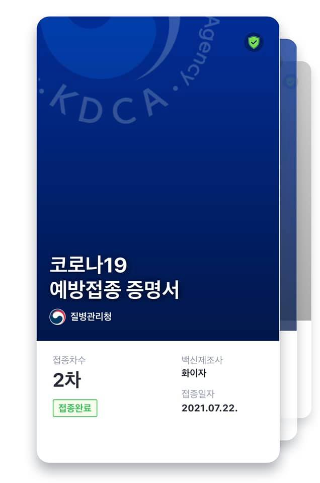
**이미지 캡션:** 이 사진은 코로나19 예방접종 증명서의 화면을 보여줍니다. 화면 상단에는 파란색 배경에 "KDCA Agency"라는 문구와 함께 질병관리청의 로고가 보입니다. 중앙에는 "코로나19 예방접종 증명서"라는 제목이 크게 쓰여 있고, 그 아래에는 질병관리청 로고와 함께 "질병관리청"이라는 글자가 있습니다. 화면 하단에는 접종 정보가 표시되어 있는데, "접종차수"는 "2차"이며, "접종완료"라는 녹색 버튼이 있습니다. 오른쪽에는 "백신제조사"로 "화이자"가, "접종일자"는 "2021.07.22."로 기재되어 있습니다. 전체적으로 깔끔하고 정보 전달에 초점을 맞춘 디자인이며, 디지털 증명서의 형태를 띠고 있습니다. 사람이나 특정 장소는 보이지 않으며, 오직 증명서 정보만 담고 있습니다.

### 7월 23일 (금) 16:08 · #권도균 #스타트업경영수업

#권도균 #스타트업경영수업 

Douglas Guen 대표님, 늘 좋은 가르치심과 든든한 support 감사합니다. 
JI Eon  Lee 좋은옷 만들어 주셔서 감사합니다. 커피맛과 분위기를 더해주는 멋진 옷입니다.

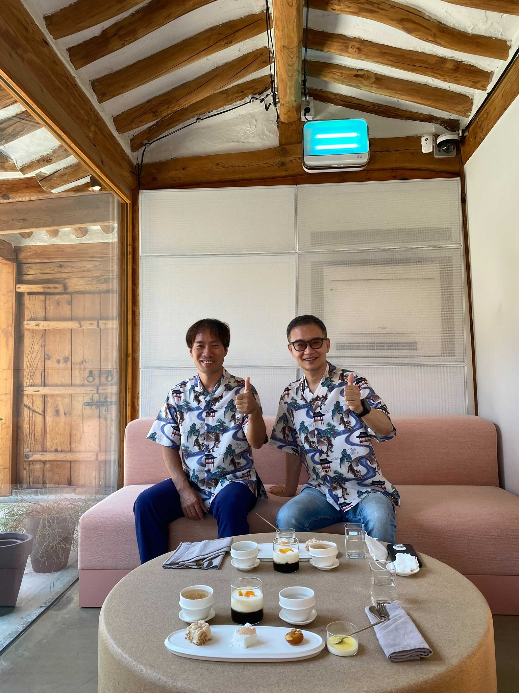
**이미지 캡션:** 두 명의 성인 남성이 옅은 분홍색 소파에 앉아 있으며, 둘 다 일본식 풍경이 그려진 흰색 셔츠와 각각 파란색 바지와 청바지를 입고 있다. 왼쪽 남성은 40대 후반으로 보이며, 오른쪽 남성은 40대 초반으로 보이며 안경을 쓰고 있다. 두 사람 모두 엄지손가락을 치켜들고 있으며, 밝고 긍정적인 표정을 짓고 있다. 그들 앞에는 타원형 테이블이 놓여 있으며, 테이블 위에는 여러 개의 작은 디저트와 차가 담긴 컵, 그리고 물잔이 놓여 있다. 배경에는 전통적인 한국식 가옥의 나무 서까래와 흰색 벽이 보이며, 현대적인 조명과 에어컨이 설치되어 있어 전통과 현대가 조화된 공간임을 알 수 있다. 창밖으로는 나무 문과 식물이 보인다. 전체적으로 편안하고 즐거운 분위기이다.

### 7월 24일 (토) 15:16 · 📷 앨범: Profile pictures (1장)

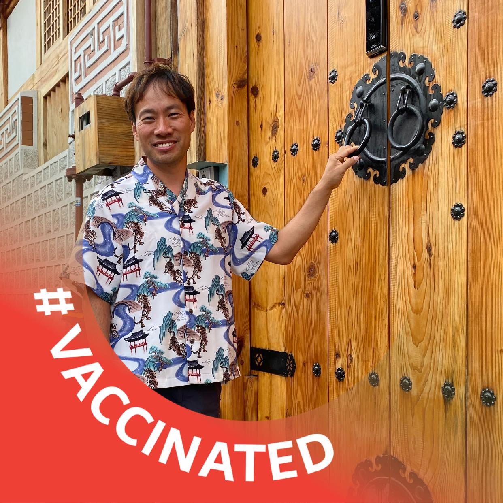
**이미지 캡션:** 한 성인 남성이 한국 전통 가옥의 나무 문 앞에 서서 문고리를 잡고 있다. 남성은 30대 후반에서 40대 초반으로 보이며, 짧은 검은색 머리에 미소를 짓고 있다. 그는 흰색 바탕에 파란색과 빨간색으로 그려진 용, 산, 전통 가옥, 호랑이 문양이 있는 짧은 소매 셔츠와 어두운 색 바지를 입고 있다. 배경에는 나무로 된 문과 그 옆에 있는 한국 전통 건축물의 일부가 보인다. 문에는 검은색 금속 장식이 달려 있으며, 특히 중앙에는 크고 화려한 문고리가 있다. 사진 왼쪽 하단에는 빨간색 배경에 흰색 글씨로 "#VACCINATED"라는 문구가 크게 쓰여 있다. 전반적으로 밝고 긍정적인 분위기를 풍기며, 남성이 백신 접종을 완료했음을 알리는 듯한 느낌을 준다.

### 7월 25일 (일) 16:59 · #여자양궁단체전 #9연패

#여자양궁단체전 #9연패 
흔들림이 없는 승리! 올림픽 양궁으로는 최초 9연패, 너무 멋지고 아름답습니다!!

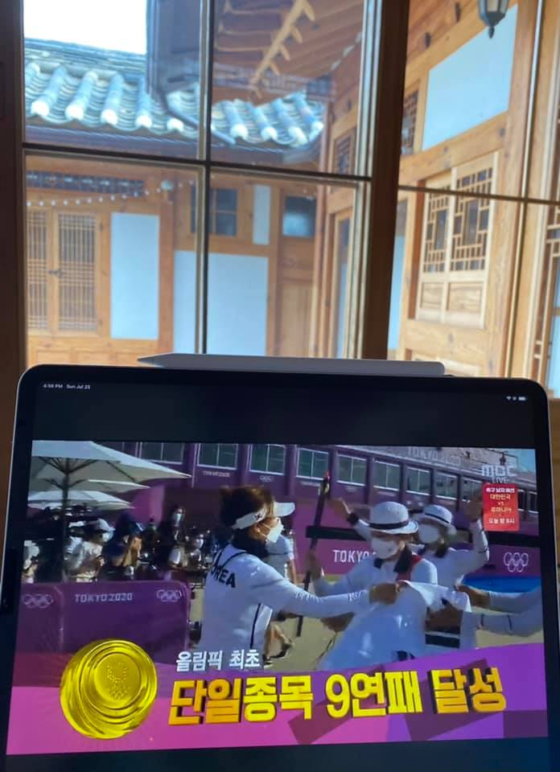
**이미지 캡션:** 이 사진은 태블릿 PC 화면과 그 뒤로 보이는 한국 전통 가옥의 창문을 담고 있습니다. 태블릿 PC 화면에는 도쿄 올림픽 관련 스포츠 중계 화면이 나오고 있으며, 여러 명의 여성 선수들이 흰색 유니폼과 모자를 착용하고 마스크를 쓴 채 환호하는 모습이 보입니다. 화면 왼쪽 하단에는 금메달 모양의 그래픽과 함께 "올림픽 최초 단일 종목 9연패 달성"이라는 한국어 자막이 크게 표시되어 있습니다. 화면 오른쪽 상단에는 MBC 로고와 함께 "LIVE 대한민국"이라는 문구가 보입니다. 배경에는 한국 전통 가옥의 목조 건축물과 기와 지붕이 창문을 통해 보이며, 따뜻하고 전통적인 분위기를 자아냅니다. 전반적으로 태블릿 PC 화면의 역동적인 스포츠 중계 장면과 배경의 고즈넉한 전통 가옥이 대비를 이루며 흥미로운 시각적 경험을 제공합니다.

### 7월 26일 (월) 08:27 · 📷 사진 (1장)

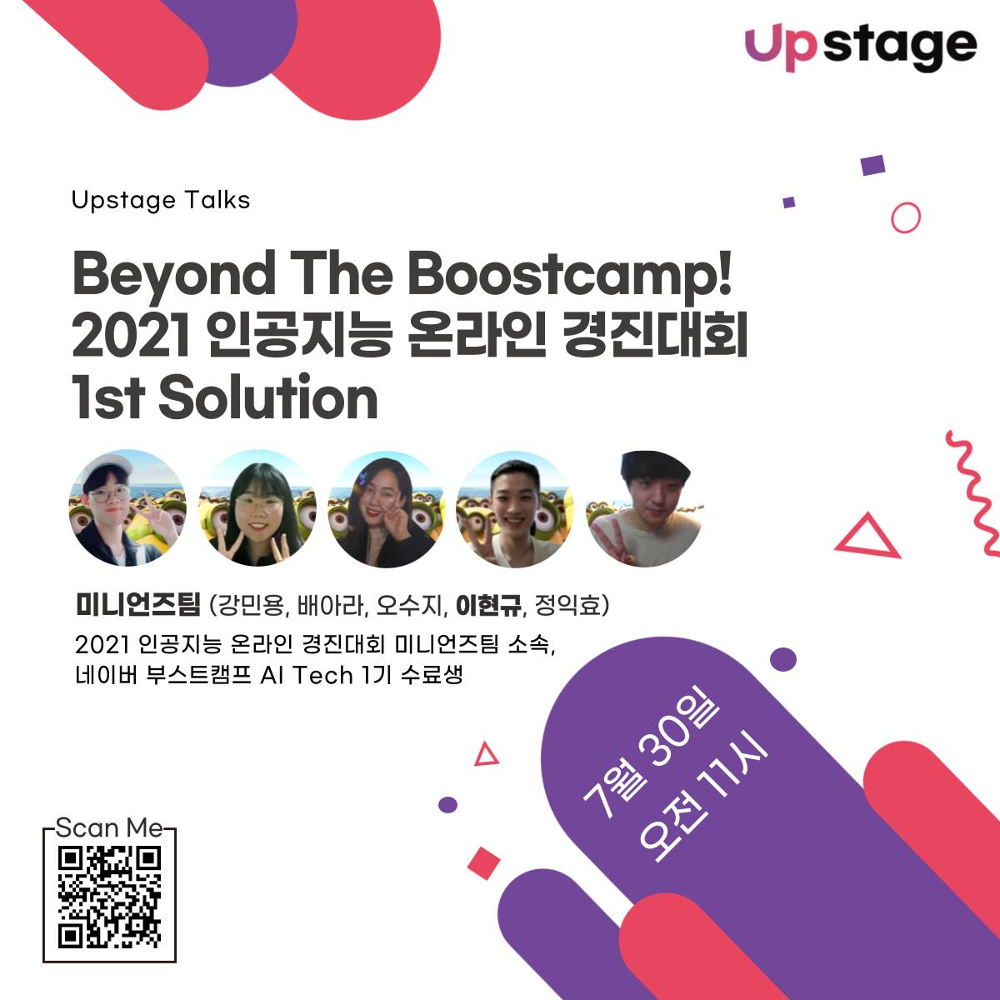
**이미지 캡션:** 이 포스터는 Upstage에서 주최하는 "Beyond The Boostcamp! 2021 인공지능 온라인 경진대회 1st Solution"이라는 행사를 홍보하고 있습니다. 상단에는 보라색과 분홍색의 추상적인 도형이 그려져 있으며, 오른쪽 상단에는 "Upstage" 로고가 보입니다. 중앙에는 행사의 제목이 큰 글씨로 쓰여 있고, 그 아래에는 5명의 젊은 성인 남녀의 얼굴 사진이 원형으로 배치되어 있습니다. 이들은 "미니언즈팀"으로 소개되며, 각자의 이름(강민용, 배아라, 오수지, 이현규, 정의효)이 함께 기재되어 있습니다. 이들은 2021 인공지능 온라인 경진대회 미니언즈팀 소속으로 네이버 부스트캠프 AI Tech 1기 수료생임을 알리고 있습니다. 왼쪽 하단에는 "Scan Me"라는 문구와 함께 QR 코드가 있어 스캔을 유도하고 있으며, 오른쪽 하단에는 보라색과 분홍색이 섞인 곡선 형태의 디자인 안에 "7월 30일 오전 11시"라는 행사 날짜와 시간이 적혀 있습니다. 전반적으로 밝고 활기찬 분위기이며, 젊은 인공지능 전문가들의 참여를 독려하는 행사임을 나타냅니다.

> #업스톡 #커넥트재단 #부스트캠프AITech  Upstage는 네이버 커넥트재단과 함께 AI 부스트캠프 교육을 하고 있습니다. 이런 교육을 할때 가장 큰 보람은 수료생들이 대박을 낼때입니다.   1기 수료생들이 부스캠프때 배운 지식과 만난 동료들로 팀을 꾸려 과학기술정보통신부가 추최한 "2021 인공지능 온라인 경진대회 법률 문서 요약 기술 부문" 에서 무려 1위를 차지 하면서 대박을 냈습니다. 너무 멋집니다!   이 멋진 솔류션을 여러분들과 공유합니다. 또  네이버 부스트캠프 AI Tech 수료 후기를 나눕니다. 이번주 금요일 11:00 부터 아래 등록 링크에 신청만 하면 누구나 참여하실수 있는 Zoom 링크를 보내 드립니다.   모두 모두 함께 해요! ---   * Title: Beyond The Boostcamp: 2021 인공지능 온라인 경진대회 1st Solution  * Abstract: 2021 인공지능 온라인 경진대회 법률 문서 요약 기술 부문에서 1위를 차지한 Solution을 소개하고 네이버 부스트캠프 AI Tech 수료 후기를 나눕니다. (코드 깃허브 주소 https://github.com/MINIONS-KR/Legal-Document-Summarization-Competition)  * 강사: 이현규님 (2021 인공지능 온라인 경진대회 미니언즈팀 소속, 네이버 부스트캠프 AI Tech 1기 수료생) When: 2021년 7월 30일 () 11:00-12:00  * 등록 링크: https://forms.gle/MXPEpgNAsP7HjWxN9

### 7월 30일 (금) 18:10 · #안산선수 #최초양궁3관왕

#안산선수 #최초양궁3관왕

너무 멋지고 자랑스럽습니다. 덕분에 매우 기쁜 날입니다!

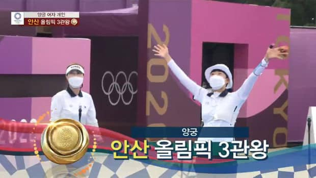
**이미지 캡션:** 이 사진은 올림픽 양궁 경기 시상식 또는 관련 행사 장면을 담고 있으며, 두 명의 젊은 성인 여성 선수들이 등장한다. 왼쪽 여성 선수는 흰색 상의와 모자, 마스크를 착용하고 있으며, 오른쪽 여성 선수는 같은 복장에 흰색 모자를 쓰고 마스크를 착용한 채 두 팔을 활짝 벌리고 환호하는 모습이다. 두 선수 모두 젊고 건강해 보이며, 표정은 마스크로 가려져 있지만 행동으로 보아 기쁨과 만족감을 표현하고 있다. 배경에는 보라색과 분홍색의 구조물이 보이며, "2020"이라는 숫자가 크게 새겨져 있고 올림픽 오륜기가 그려져 있다. 또한, "양궁 여자 개인", "안산 올림픽 3관왕"이라는 한국어 자막이 화면 상단과 하단에 표시되어 있어, 이 장면이 안산 선수의 올림픽 양궁 개인전 3관왕 달성을 축하하는 것임을 알 수 있다. 화면 왼쪽 하단에는 금메달 모양의 그래픽이 삽입되어 있어 승리를 상징적으로 보여준다. 전반적으로 축하와 영광의 분위기가 느껴진다.

### 7월 31일 (토) 06:32 · 📷 사진 (1장)

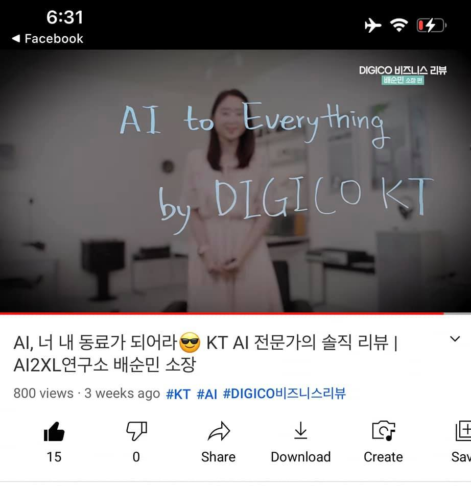
**이미지 캡션:** 화면 중앙에는 한 명의 성인 여성이 서 있고, 그녀 뒤편의 벽에는 "AI to Everything by DIGICO KT"라고 파란색 글씨로 쓰여 있습니다. 여성은 옅은 베이지색 원피스를 입고 있으며, 손은 자연스럽게 앞으로 모으고 있습니다. 그녀는 부드러운 미소를 띠고 있으며, 전체적으로 차분하고 긍정적인 분위기를 풍깁니다. 배경에는 사무실처럼 보이는 공간이 희미하게 보이며, 책상과 의자 같은 사물들이 놓여 있습니다. 화면 하단에는 영상의 제목인 "AI, 너 내 동료가 되어라 😎 KT AI 전문가의 솔직 리뷰 | AI2XL연구소 배순민 소장"과 함께 조회수, 게시일, 해시태그가 표시되어 있습니다. 또한 좋아요, 싫어요, 공유, 다운로드, 만들기, 저장 등의 인터페이스 요소들이 보입니다. 전반적으로 AI 기술에 대한 긍정적인 메시지를 전달하는 영상의 한 장면으로 보입니다.
