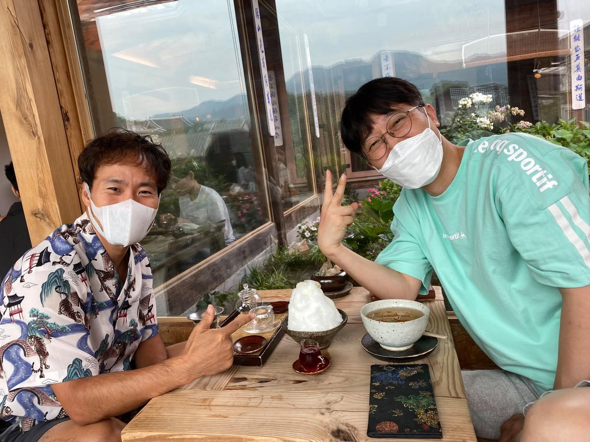
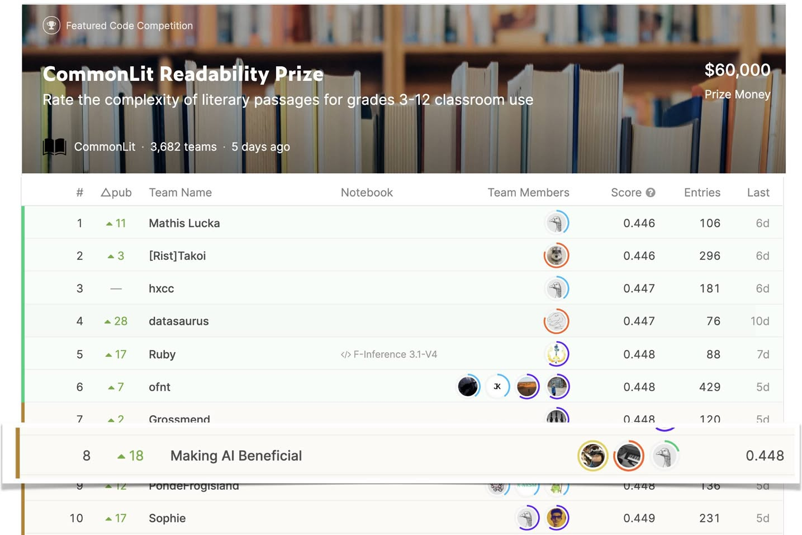
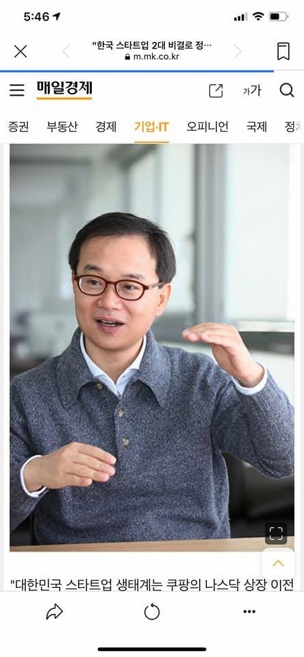
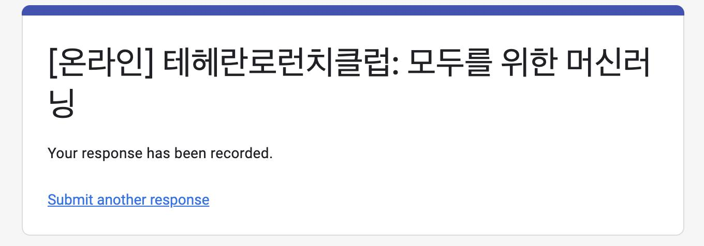
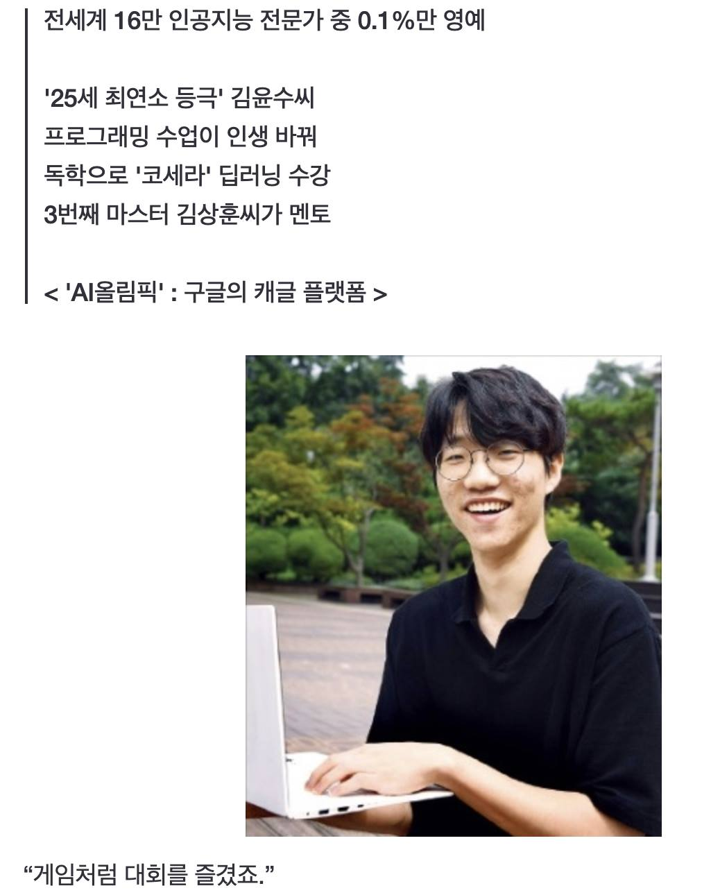

# 2021년 8월

[← 2021년](README.md)

### 8월 1일 (일) 16:55 · TUNiB Kyubyong Park 대표님, 멀리 북촌 한옥 마을 방문해…

TUNiB Kyubyong Park 대표님, 멀리 북촌 한옥 마을 방문해 주셔서 감사합니다. 가슴 뛰는 사업 이야기 잘 들었습니다. 너무 멋지고 건승을 기원하고 응원 드립니다!

**이미지 캡션:** 두 명의 성인 남성이 나무 테이블에 앉아 있으며, 한 명은 흰색 마스크를 쓰고 호랑이와 전통적인 풍경이 그려진 셔츠를 입고 있고, 다른 한 명은 흰색 마스크와 안경을 쓰고 민트색 티셔츠를 입고 있으며 브이 포즈를 취하고 있습니다. 테이블 위에는 팥빙수, 차가 담긴 그릇, 그리고 장식적인 책자가 놓여 있습니다. 배경에는 큰 창문이 있고, 창밖으로는 산과 건물이 보이며, 창문에는 한자로 된 글귀가 쓰여 있습니다. 전체적으로 편안하고 즐거운 분위기입니다.

### 8월 8일 (일) 13:49 · 📷 사진 (1장)

**이미지 캡션:** 책이 빽빽하게 꽂힌 배경을 뒤로하고 "CommonLit Readability Prize"라는 제목과 함께 $60,000의 상금이 표시되어 있으며, 그 아래에는 여러 팀의 순위, 팀 이름, 점수, 참가 횟수, 마지막 활동일 등이 나열된 표가 보인다. 표에는 각 팀의 순위 변동을 나타내는 화살표와 함께 팀 이름이 보이고, 일부 팀의 경우 팀원들의 프로필 사진으로 보이는 작은 원형 아이콘들이 함께 표시되어 있다. 8위 팀의 이름은 "Making AI Beneficial"이며, 이 팀의 점수는 0.448이다. 표의 일부만 보이지만, 이는 코딩 대회나 경연 대회의 리더보드 화면으로 추정된다.일부만 보이지만, 이는 코딩 대회나 경연 대회의 리더보드 화면으로 추정된다.

> #upstageAI #케글금메달  Upstage 에서 *또* 케글 금메달을 수상했습니다. 주어진 문장이 어느 정도 읽기 쉬운지/어려운지 가독성을 예측하는 대회입니다. 우리가 초등, 중등, 또는 고등이상의 학생들이 읽을 수 있는 책을 추천할 때 각 등급에 맞는 책을 추천해야 흥미를 잃지 않고 적절한 난이도의 책을 읽을 수 있게 됩니다.  이것을 위해 각 문장에 대한 가독성 측정이 필요한데 이런 멋진 대회에서 Upstage 팀이 총 3800팀 이상이 참여한 가운데 8위로 금메달을 수상하게 되었습니다. https://www.kaggle.com/c/commonlitreadabilityprize/  금메달 수상 알고리즘은 잘 정리하여 upstage talk으로 모든 분들에게 공개하도록 하겠습니다. (관련하여 궁금하신 점이 있으시면 댓글을 올려주시면 세미나 할때 참고하여 준비하겠습니다.)  멋진 AI 모델과 제품을 함께 만들고 Making AI Benefitial 함께 하시고 싶은 분들을 계속 모시고 있습니다. https://careers.upstage.ai/ 선지원, 후고민으로 함께해요!

### 8월 12일 (목) 18:46 · 📷 사진 (1장)

**이미지 캡션:** 화면 상단에는 시간, 배터리 잔량, 와이파이 신호, 통신사 정보가 표시되어 있으며, 웹 브라우저의 주소창에는 "한국 스타트업 2대 비결로 정..."이라는 제목과 함께 "m.mk.co.kr"이라는 주소가 보인다. 그 아래에는 "매일경제"라는 신문사 로고와 함께 "증권", "부동산", "경제", "기업·IT", "오피니언", "국제", "정치" 등의 메뉴가 나열되어 있다. 사진의 중심에는 40대 후반에서 50대 초반으로 보이는 동양인 성인 남성이 앉아 있으며, 그는 갈색 테 안경을 쓰고 짧은 검은색 머리를 하고 있다. 남성은 회색 니트 스웨터를 입고 있으며, 스웨터 안에는 흰색 셔츠를 받쳐 입고 있다. 그의 표정은 밝고 긍정적이며, 입을 살짝 벌리고 말하는 듯한 모습이다. 오른손은 앞으로 뻗어 손바닥을 위로 향하게 하고 있으며, 왼손은 가슴 앞에서 손가락을 구부린 채로 턱을 괴고 있다. 배경은 흐릿하게 처리되어 있으며, 사무실이나 회의실처럼 보이는 공간으로 추정된다. 사진 하단에는 "대한민국 스타트업 생태계는 쿠팡의 나스닥 상장 이전"이라는 기사 제목이 보이며, 공유, 새로고침, 더보기 아이콘이 함께 표시되어 있다. 전반적으로 인터뷰 기사의 한 장면으로 보이며, 진지하면서도 희망적인 분위기를 풍긴다.있다. 남성은 회색 니트 스웨터를 입고 있으며, 스웨터 안에는 흰색 셔츠를 받쳐 입고 있다. 그의 표정은 밝고 긍정적이며, 입을 살짝 벌리고 말하는 듯한 모습이다. 오른손은 앞으로 뻗어 손바닥을 위로 향하게 하고 있으며, 왼손은 가슴 앞에서 손가락을 구부린 채로 턱을 괴고 있다. 배경은 흐릿하게 처리되어 있으며, 사무실이나 회의실처럼 보이는 공간으로 추정된다. 사진 하단에는 "대한민국 스타트업 생태계는 쿠팡의 나스닥 상장 이전"이라는 기사 제목이 보이며, 공유, 새로고침, 더보기 아이콘이 함께 표시되어 있다. 전반적으로 인터뷰 기사의 한 장면으로 보이며, 진지하면서도 희망적인 분위기를 풍긴다.

### 8월 19일 (목) 19:02 · 📷 사진 (1장)

**이미지 캡션:** 이 이미지는 온라인으로 진행되는 "테헤란로 런치클럽: 모두를 위한 머신러닝"이라는 행사의 제목과 응답이 기록되었음을 알리는 메시지를 보여줍니다. 행사의 제목은 파란색 배경의 흰색 텍스트로 표시되며, "온라인"이라는 단어가 대괄호 안에 포함되어 있습니다. 그 아래에는 "Your response has been recorded."라는 영어 문구가 나타나며, 이는 사용자의 응답이 성공적으로 저장되었음을 의미합니다. 마지막으로 "Submit another response"라는 링크가 있어 사용자가 다른 응답을 제출할 수 있음을 나타냅니다. 이미지에는 사람이 등장하지 않으며, 배경은 단순한 흰색입니다. 전체적으로 정보 전달을 목적으로 하는 웹 페이지의 일부로 보이며, 차분하고 명확한 분위기입니다. 수 있음을 나타냅니다. 이미지에는 사람이 등장하지 않으며, 배경은 단순한 흰색입니다. 전체적으로 정보 전달을 목적으로 하는 웹 페이지의 일부로 보이며, 차분하고 명확한 분위기입니다.

### 8월 27일 (금) 09:39 · 📷 사진 (1장)

**이미지 캡션:** 한 명의 젊은 성인 남성이 야외에서 노트북을 사용하며 환하게 웃고 있다. 그는 검은색 반팔 폴로 셔츠를 입고 둥근 테 안경을 쓰고 있으며, 검은색 머리카락은 짧게 정리되어 있다. 남성은 노트북 키보드 위에 손을 올리고 있으며, 그의 얼굴에는 자신감과 즐거움이 엿보인다. 배경에는 나무와 벤치가 있는 공원이나 캠퍼스로 보이는 장소가 펼쳐져 있으며, 햇살이 비추는 듯 밝고 화창한 분위기이다. 사진 위쪽에는 "전세계 16만 인공지능 전문가 중 0.1%만 영예", "'25세 최연소 등극' 김윤수씨", "프로그래밍 수업이 인생 바꿔", "독학으로 '코세라' 딥러닝 수강", "3번째 마스터 김상훈씨가 멘토", "<'AI올림픽' : 구글의 캐글 플랫폼 >"라는 텍스트가 있고, 사진 아래에는 "“게임처럼 대회를 즐겼죠.”"라는 인용문이 있다. 전반적으로 젊은 인재의 성공과 열정을 보여주는 긍정적인 분위기이다.이 인생 바꿔", "독학으로 '코세라' 딥러닝 수강", "3번째 마스터 김상훈씨가 멘토", "<'AI올림픽' : 구글의 캐글 플랫폼 >"라는 텍스트가 있고, 사진 아래에는 "“게임처럼 대회를 즐겼죠.”"라는 인용문이 있다. 전반적으로 젊은 인재의 성공과 열정을 보여주는 긍정적인 분위기이다.

> #6번째케글그랜드마스터 #업스테이지멘토 #게임처럼대회를즐김 매우 반갑고 기쁜 소식이 있어 공유합니다. 인공 지능이 재미있어 수업을 듣고 프로그래밍 공부를 하고 케글 대회를 게임처럼 즐기고, 업스테이지에서 멋진 멘토와 함께 AI로 문제를 풀다가 그랜드 마스터가 된 아름답고 신나는 스토리 입니다. (관련하여 곧 업스테이지 테크톡으로 그 과정과 푼 문제들을 공유하도록 하겠습니다.) https://n.news.naver.com/article/015/0004596609 챌린징한 문제를 AI로 함께 게임처럼 즐기면서 풀고싶은 분들은 업스테이지에서 함께 해요! 여러분들을 AI의 가장 높은 업스테이지로 모셔 드리겠습니다. https://careers.upstage.ai/
