# 2021년 9월

[← 2021년](README.md)

### 9월 2일 (목) 09:46 · 📷 사진 (1장)

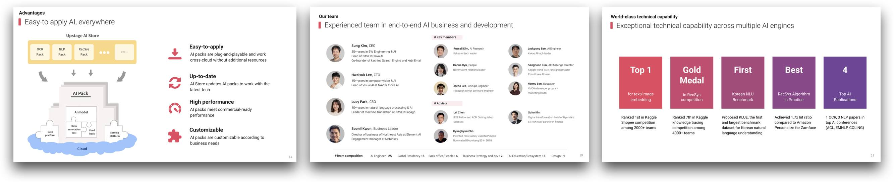

> TFKR 여러분들과 공유하고 싶은 기쁜 소식이 있습니다. Making AI Beneficial이라는 가치를 내걸고 모든 사람들이 쉽게 가져다가 사용할 수 있는 AI 팩을 만들어 고객의 서비스와 사업이 잘 되게 하는, aka “남이 잘 되게 하는 AI Pack” 을 만드는 Upstage가 창업 10개월 만에 316억의 투자를 받았습니다. https://www.sedaily.com/NewsView/22RAOLULXJ  정말 기라성같이 멋진 최고의 컴퍼니케이파트너스, 소프트뱅크벤처스, 프라이머 사제, 티비티(TBT), 프리미어, 스톤브릿지벤처스 등이 면밀하게 검토하고 심사해서 결정한 것입니다. 아래 그림처럼 우리가 가진 AI Pack이라는 모델, 그리고 함께한 인력들, 그리고 그간 만들어낸 세계 1등 하는 모델들과 실제 서비스 성과 등을 보았고, 정말 세계적인 AI 회사가 되겠다는 가능성을 보고 시리즈 A 단계에는 이례적인 큰 투자를 해주셨습니다.  Upstage는 고객의 사업과 서비스를 10배 100배 올려줄 수 있는 실질적인 AI 기술을 개발하고 있고 이미 성과를 내고 있습니다. 세계 최고의 기술을 가지고 있고 더더더 세계 최고가 되려는 좋은 리더와 개발자들이 있습니다. AI 기술이 정말 완벽하게 돌아가도록 만들어 주는 소프트웨어 엔지니어링 최고 전문가들이 있습니다. 아름다운 문화를 만들고 함게 일하고 싶은 좋은 회사를 만들어 가는 정말 멋진 사람들이 모여있는 Upstage, 함께해요!  AI가 더 많은 사람, 고객들에게 더더더 Beneficial 되게 하실 분들을 기다리고 있습니다. 바로 묻지 마 선지원 후 고민, 여기 https://careers.upstage.ai/ 입니다!

### 9월 4일 (토) 09:24 · 📷 사진 (1장)

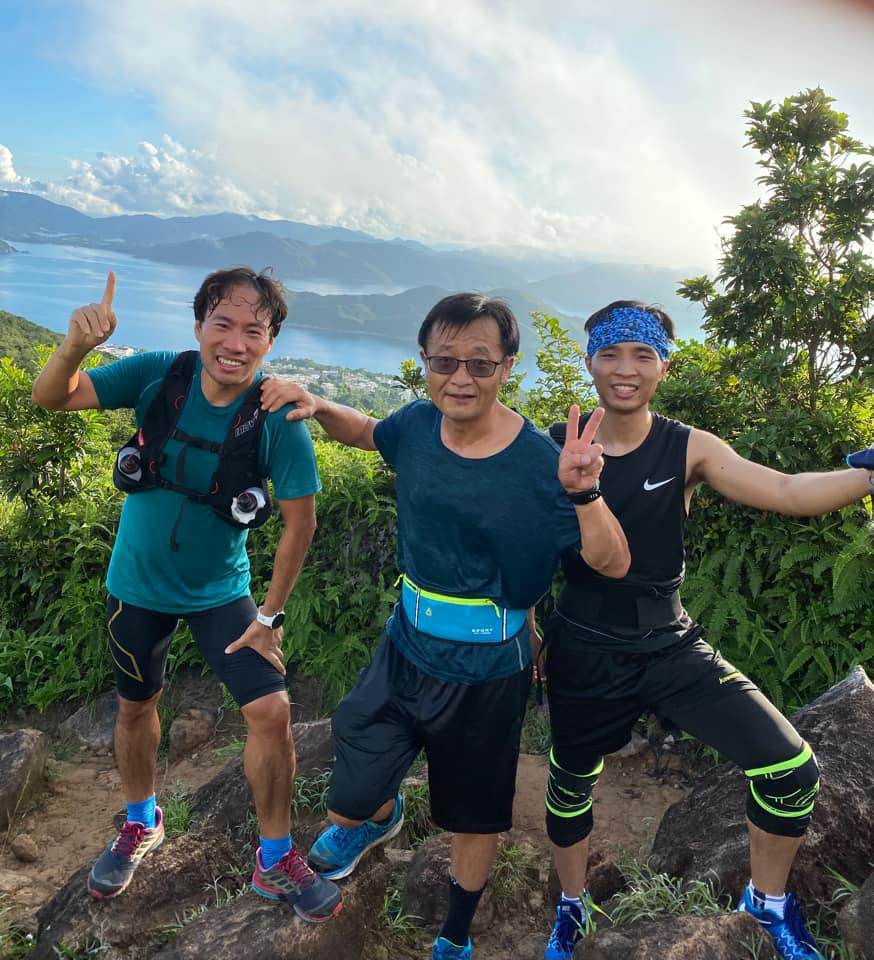

### 9월 6일 (월) 12:36 · 📷 사진 (1장)

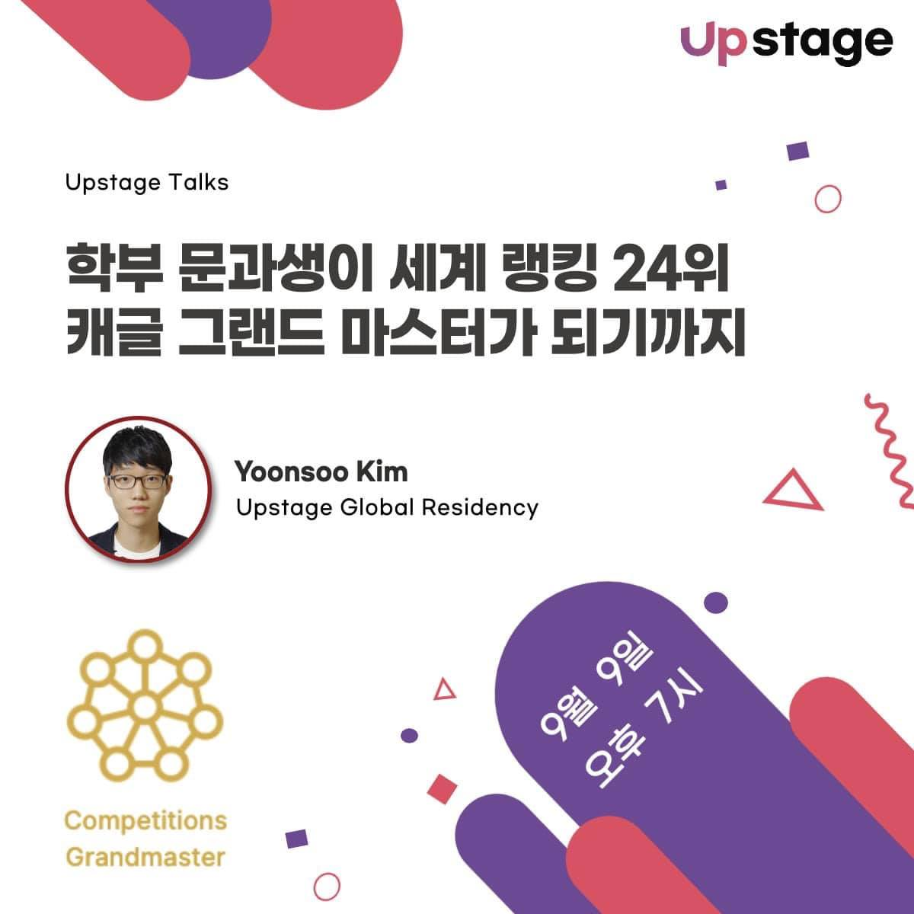

> #캐글그랜드마스터되기 #업스테이지   저희 업스테이지 Global Residency(GR) 로 활약중인 윤수님은 입사후 캐글 대회 금메달 5개를 받으며 그 어렵다는 캐글 그랜드 마스터가 되셨습니다.  그 생생한 이야기를 업스테이지 톡으로 여러분과 함께 나눕니다. 더 많은 분들이 참여하실수 있도록 목요일 오후 7시에 톡을 진행합니다.  선등록 후고민 하시면 됩니다. (등록하신 분들에게 줌링크 보내 드립니다.) --- 👉  주제 : 학부 문과생에서 세계 랭킹 24위 캐글 그랜드 마스터가 되기까지 👉  연사 : 김윤수님 (업스테이지 GR, 캐글 그랜드마스터) 👉  일시 : 2021년 9월 9일 (목) 19:00 👉  등록 : https://forms.gle/6V1xzb1ZwhEkwj3N6 ☝️ 참가 신청은 9월 8일 (수) 16:00 까지! 🤩 김윤수, 그는 누구인가! ‘AI올림픽’ 그랜드마스터 된 경제학도 👉 https://www.hankyung.com/it/article/2021082617481

### 9월 11일 (토) 15:55 · It's challenging but always fun to run u…

It's challenging but always fun to run up! Up, up, up!!

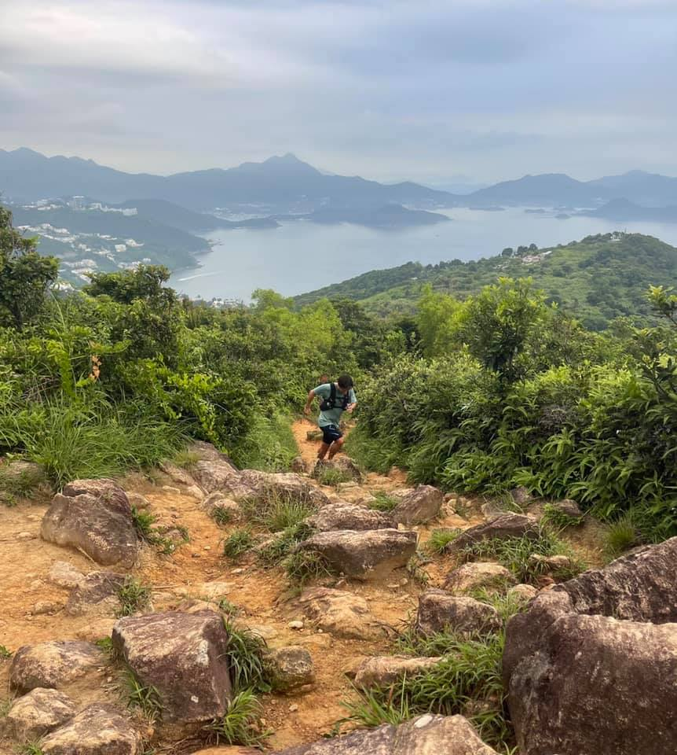

### 9월 12일 (일) 08:27 · 📷 사진 (1장)

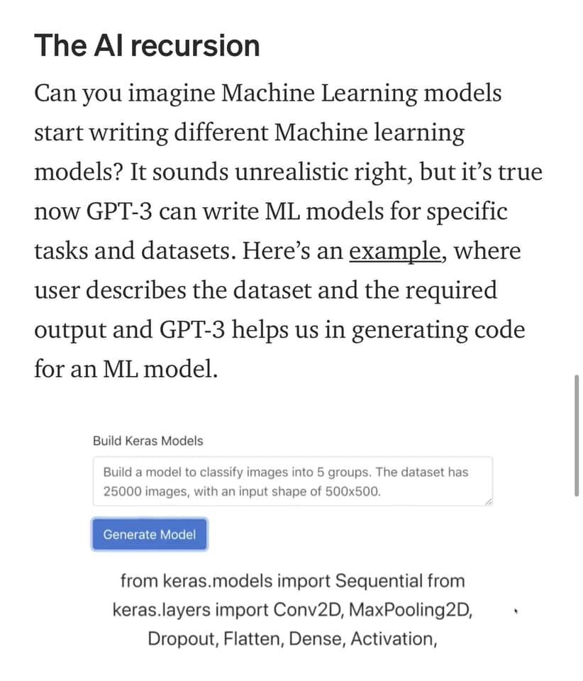

> GPT3관련 더 많은 응용 아이디어들이 나오는 가운데 스스로에게 AI모델을 만들어 보라는 ai recursion이 재미있네요.   AI가 AI를 만드는 시대가 오겠죠?  https://medium.com/eoraa-co/trending-use-cases-of-gpt-3-by-openai-56318b6a9184

### 9월 17일 (금) 06:53 · 📷 사진 (6장)

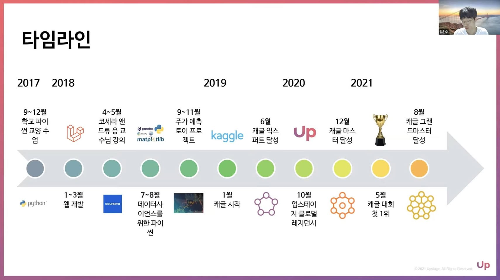 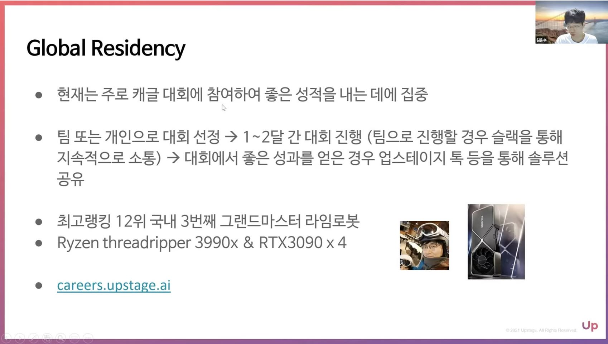 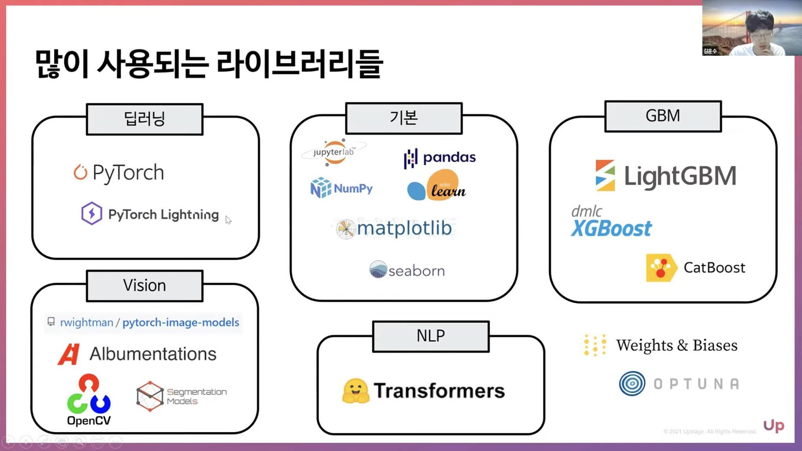 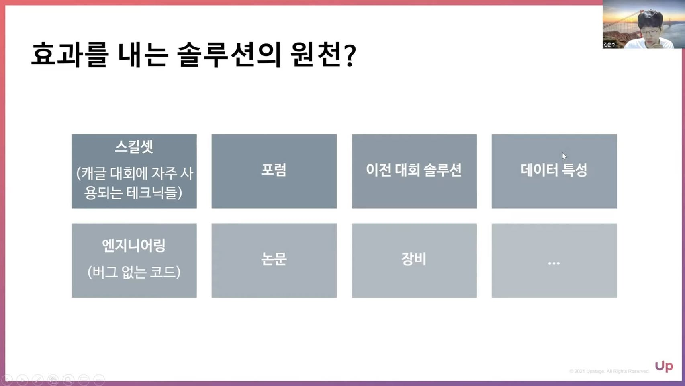 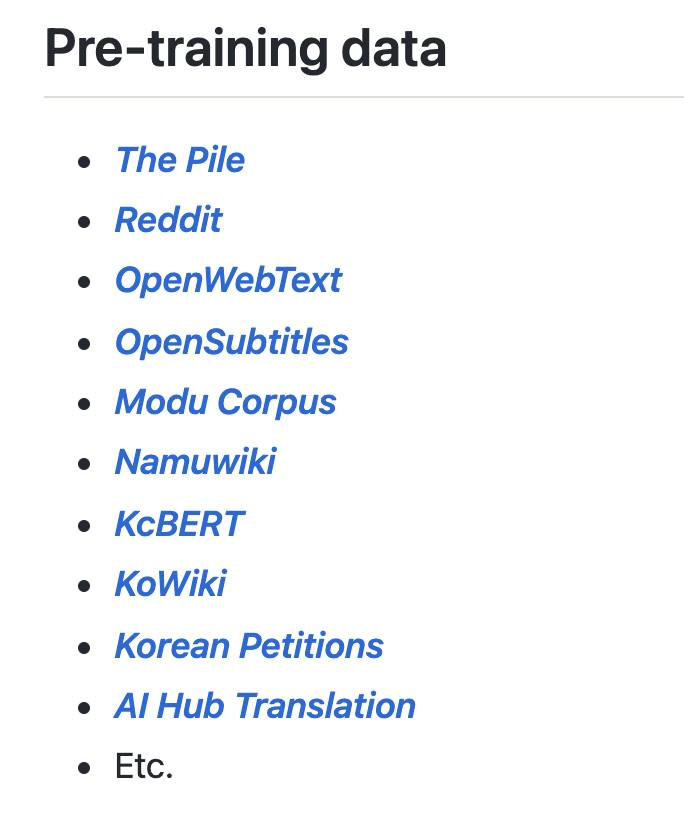 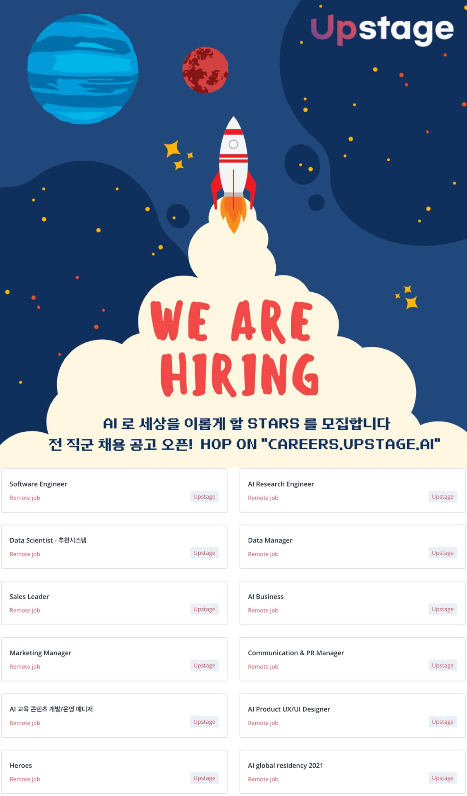

> #업스테이지로켓 #함께타요   누구나 쉽게 가져다 본인의 데이타에 맞게 자동으로 학습되는 AI Pack 솔류선을 통해 easy-to-apply AI를 리딩하는 Upstage가 시리즈 A (316억) 를 마무리 하고 전분야 채용을 오픈하였습니다.  AI로 세계 1등을 하고, 이 기술이 실제 가치를 만들어 많은 사람들을 행복하게 만들 분들 함께 해요! 지구 어디에서나 일할수 있는 리모트 환경과 함께 성장하는 것을 최고의 가치로 생각하고 있습니다.   선지원, 노고민 at https://careers.upstage.ai/ (전문연구요원도 문의 부탁드립니다.)

### 9월 20일 (월) 16:29 · 📷 사진 (1장)

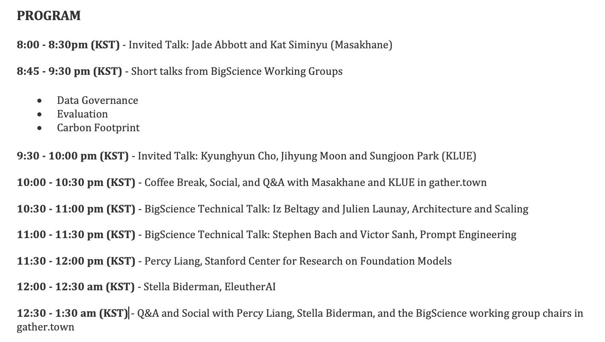

> 빅사이언스 웍샵: Large Language Models 이 한국시간 9월 20일 저녁 8시부터 시작됩니다. 재미있는 톡이 많습니다. 이중 하이라이트는 바로 저녁 9시에 작하는 Upstage 자문으로 계시는 Kyunghyun Cho 교수님, Upstage 멤버 Jihyung Moon, Sungjoon Park 님의 KLUE 초대 강연(https://youtu.be/w4DYkRHceqc) 이라 생각됩니다.    (아래 행사 일정은 한국 시간으로 수정해두었습니다.)  https://forms.gle/QvoY5riQKBxt1f7LA 등록하시면 누구 참여가 가능합니다. 곧 뵙겠습니다.  Title: BigScience Workshop: Large Language Models URL: https://bigscience.notion.site/Episode-2-Sept-20th-2021-489ffba0db7c4d3faa37c13c8cadc176

### 9월 23일 (목) 22:37 · 📷 앨범: Profile pictures (1장)

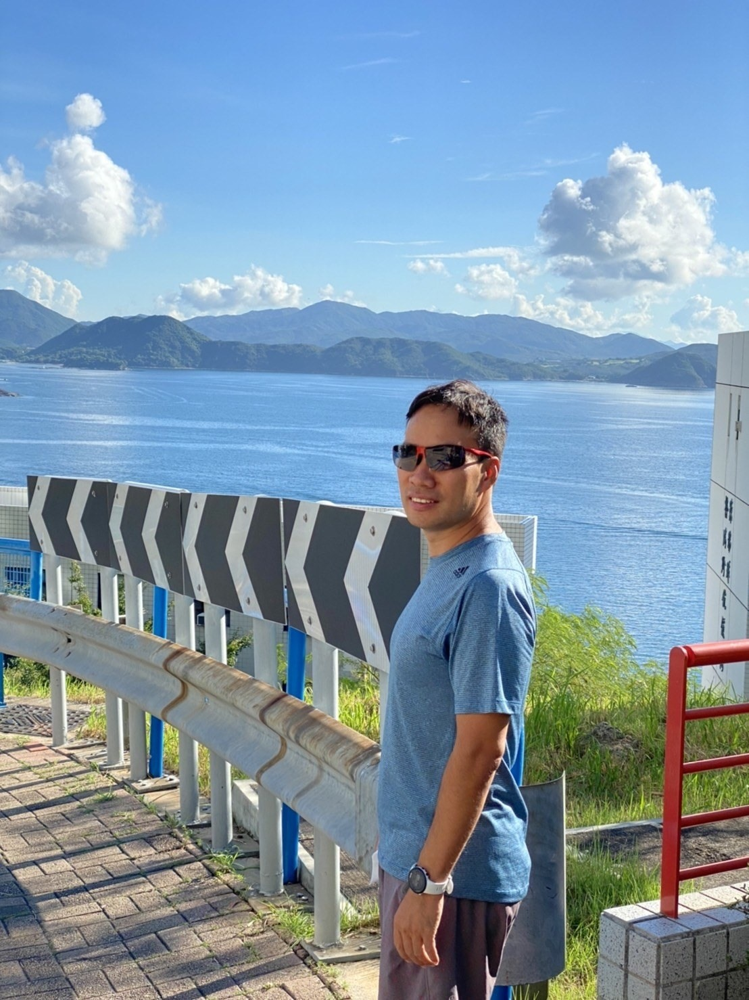

### 9월 24일 (금) 18:31 · 📷 사진 (2장)

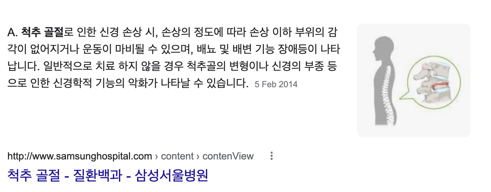 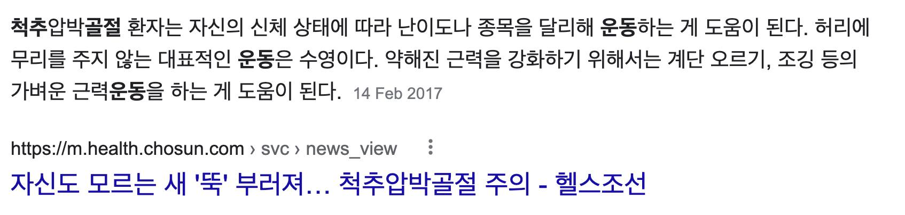

### 9월 25일 (토) 06:47 · #한국드라마전세계1등 #오징어게임

#한국드라마전세계1등 #오징어게임 

SQUID GAME, Top show in the world now! I highly recommend it. https://flixpatrol.com/title/squid-game/ 

어릴 때 오징어 게임의 추억을 가지고 기대 없이 보기 시작한 드라마인데 정말 많은 생각을 하게 되었습니다. 드라마를 다 보고서도 더 많은 생각과 인생에서 무엇이 소중한 것인지를 다시 고민하게 만들어 주는 드라마, 세계 1등할 만하다고 생각합니다. 좋은 드라마 세계 1등이라 너무 기쁜 날입니다!

이런 멋진 드라마를 만들어 주신 제작진들에게 감사하고 깊은 삶과 욕망에 대한 통찰, 그리고 단순하다고 할 수 있는 스토리를 정말 흥미진진하게 만든 기획/연출력은 놀랍습니다.

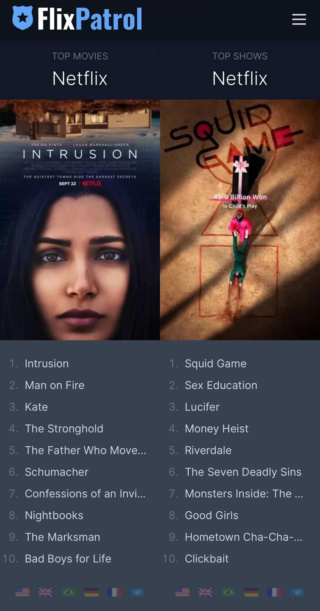

### 9월 25일 (토) 07:08 · #HKUSTGZ #홍콩과기대중국시대 #70대얼굴

#HKUSTGZ #홍콩과기대중국시대 #70대얼굴 
그동안 공간적인 제약으로 한계를 가졌던 홍콩과기대가 공간의 한계를 넘을 수 있는 중국으로 뻗어나갑니다. 중국에서 가장 살기 좋은 또 살고 싶어 하는 Guangzhou에, Pearl River를 가로지르는 멋지고 아름다운 HKUST GZ campus가 2022년 9월 완공되며 공식 개교를 합니다.

2008년 "아낌없는 전폭적인 지원으로 너를 세계 최고의 연구자로 만들어 주겠다"로 저를 설득하시고 홍콩과기대에 채용하신 특별한 인연을 가진 Lionel이 초대 총장님이라 더 기대가 됩니다.

Lionel을 최근에 다시 만나 소식을 듣던 중 총장님의 나이가 70이 넘었다는 충격적인 사실을 알게 되었는데요. 주름 없는 총장님의 얼굴이 어떻게 70이냐?라는 저의 질문에 "긍정적인 마인드에 젊음이 깃든다"라는 멋진 말로 답해 주셨습니다.늘 에너지 넘치고 뭐든 해보자는 긍정 마인드로 추진력과 리더십의 킹이십니다.

엄청난 인재들이 모여 함께 연구하고 공부할 HKUST GZ에 석사/박사 지원을 받고 있습니다. https://hkust-gz.edu.cn/admission (합격하시면 전 학위과정 동안 장학금과 생활비를 받으시며 연구에만 전념할 수 있습니다.

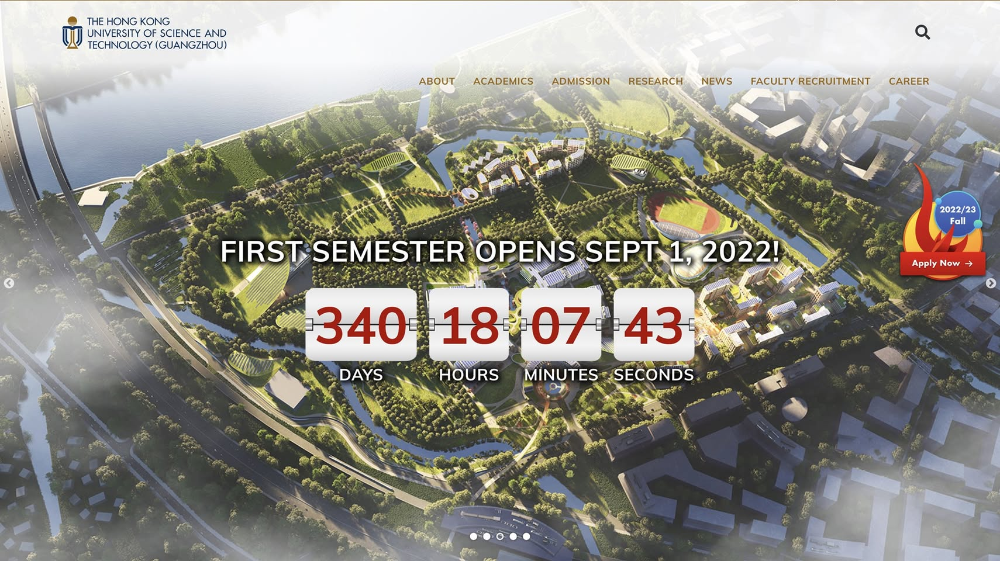 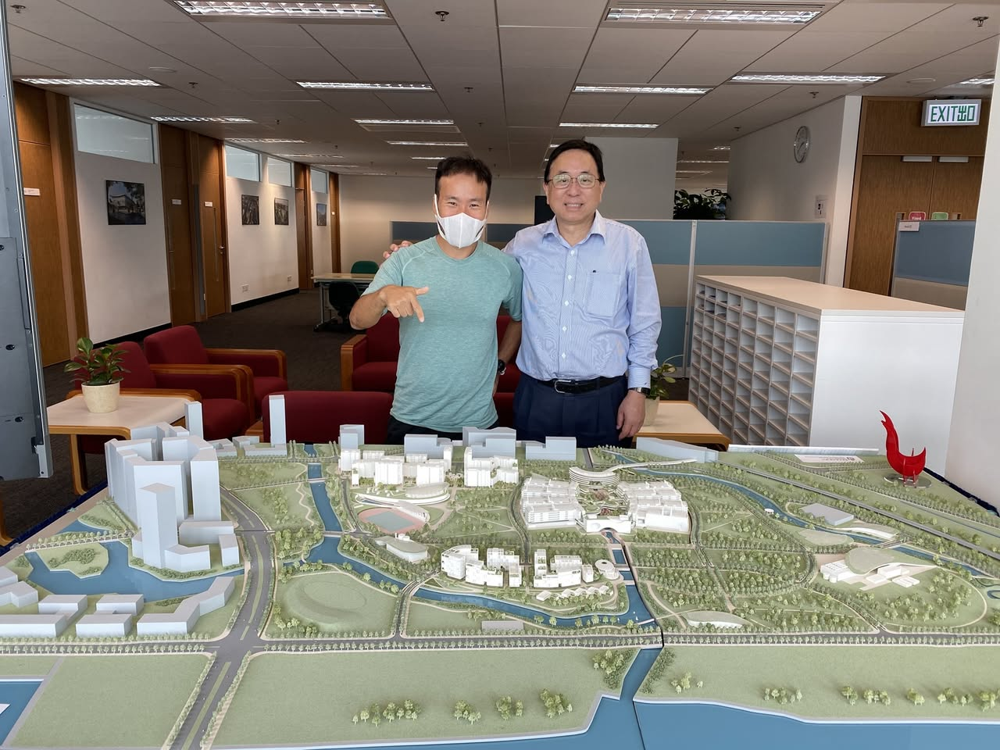
