# 2021년 10월

[← 2021년](README.md)

### 10월 4일 (월) 16:31 · 📷 사진 (2장)

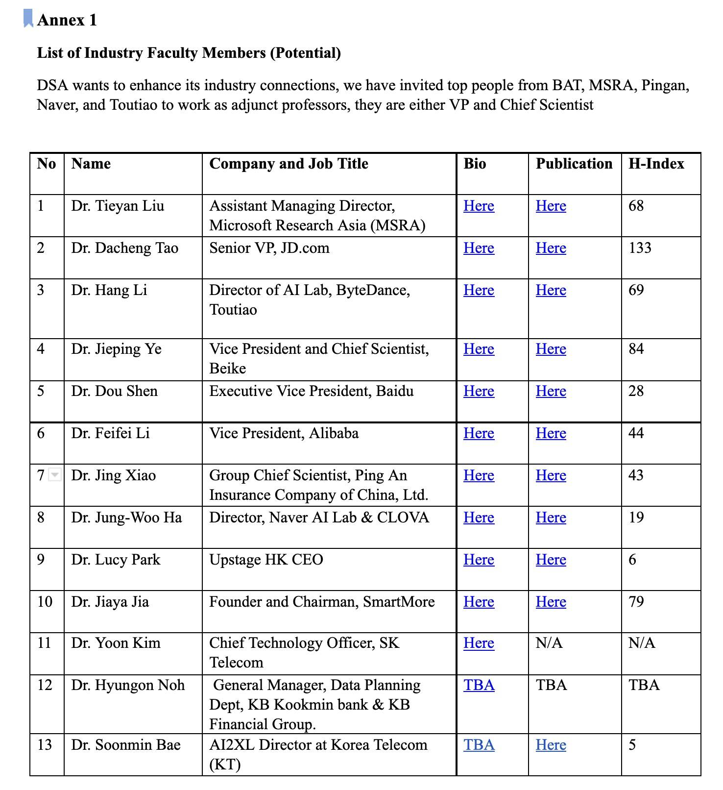
**이미지 캡션:** 이것은 "Annex 1"이라는 제목의 문서로, 잠재적인 산업 분야 교수진 목록을 보여줍니다. DSA는 업계와의 연결을 강화하기 위해 BAT, MSRA, Pingan, Naver, Toutiao에서 최고 인재들을 초청하여 부교수로 일하게 할 예정이며, 이들은 모두 VP 또는 최고 과학자 직책을 맡고 있습니다. 표에는 총 13명의 인물이 나열되어 있으며, 각 인물에 대해 번호, 이름, 회사 및 직책, 생물학 정보(Bio), 출판물(Publication), H-지수(H-Index)가 기재되어 있습니다. 예를 들어, 1번 Dr. Tieyan Liu는 Microsoft Research Asia(MSRA)의 조교수이며 H-지수는 68입니다. 2번 Dr. Dacheng Tao는 JD.com의 선임 부사장으로 H-지수는 133입니다. 3번 Dr. Hang Li는 ByteDance, Toutiao의 AI 연구소장이며 H-지수는 69입니다. 4번 Dr. Jieping Ye는 Beike의 부사장 겸 최고 과학자이며 H-지수는 84입니다. 5번 Dr. Dou Shen은 Baidu의 부사장이며 H-지수는 28입니다. 6번 Dr. Feifei Li는 Alibaba의 부사장이며 H-지수는 44입니다. 7번 Dr. Jing Xiao는 Ping An Insurance Company of China, Ltd.의 그룹 최고 과학자이며 H-지수는 43입니다. 8번 Dr. Jung-Woo Ha는 Naver AI Lab & CLOVA의 이사이며 H-지수는 19입니다. 9번 Dr. Lucy Park는 Upstage HK의 CEO이며 H-지수는 6입니다. 10번 Dr. Jiaya Jia는 SmartMore의 창립자 겸 회장이며 H-지수는 79입니다. 11번 Dr. Yoon Kim은 SK Telecom의 최고 기술 책임자이며 출판물 및 H-지수는 N/A입니다. 12번 Dr. Hyungon Noh는 KB Kookmin bank & KB Financial Group의 데이터 기획 부서 총괄 관리자이며 출판물, Bio, H-지수는 모두 TBA로 표시되어 있습니다. 13번 Dr. Soonmin Bae는 Korea Telecom (KT)의 AI2XL 이사이며 H-지수는 5입니다. 이 문서는 전문적이고 정보 전달적인 분위기를 띠고 있으며, 잠재적인 교수진의 자격과 경력을 요약하여 보여줍니다. 1번 Dr. Tieyan Liu는 Microsoft Research Asia(MSRA)의 조교수이며 H-지수는 68입니다. 2번 Dr. Dacheng Tao는 JD.com의 선임 부사장으로 H-지수는 133입니다. 3번 Dr. Hang Li는 ByteDance, Toutiao의 AI 연구소장이며 H-지수는 69입니다. 4번 Dr. Jieping Ye는 Beike의 부사장 겸 최고 과학자이며 H-지수는 84입니다. 5번 Dr. Dou Shen은 Baidu의 부사장이며 H-지수는 28입니다. 6번 Dr. Feifei Li는 Alibaba의 부사장이며 H-지수는 44입니다. 7번 Dr. Jing Xiao는 Ping An Insurance Company of China, Ltd.의 그룹 최고 과학자이며 H-지수는 43입니다. 8번 Dr. Jung-Woo Ha는 Naver AI Lab & CLOVA의 이사이며 H-지수는 19입니다. 9번 Dr. Lucy Park는 Upstage HK의 CEO이며 H-지수는 6입니다. 10번 Dr. Jiaya Jia는 SmartMore의 창립자 겸 회장이며 H-지수는 79입니다. 11번 Dr. Yoon Kim은 SK Telecom의 최고 기술 책임자이며 출판물 및 H-지수는 N/A입니다. 12번 Dr. Hyungon Noh는 KB Kookmin bank & KB Financial Group의 데이터 기획 부서 총괄 관리자이며 출판물, Bio, H-지수는 모두 TBA로 표시되어 있습니다. 13번 Dr. Soonmin Bae는 Korea Telecom (KT)의 AI2XL 이사이며 H-지수는 5입니다. 이 문서는 전문적이고 정보 전달적인 분위기를 띠고 있으며, 잠재적인 교수진의 자격과 경력을 요약하여 보여줍니다.
 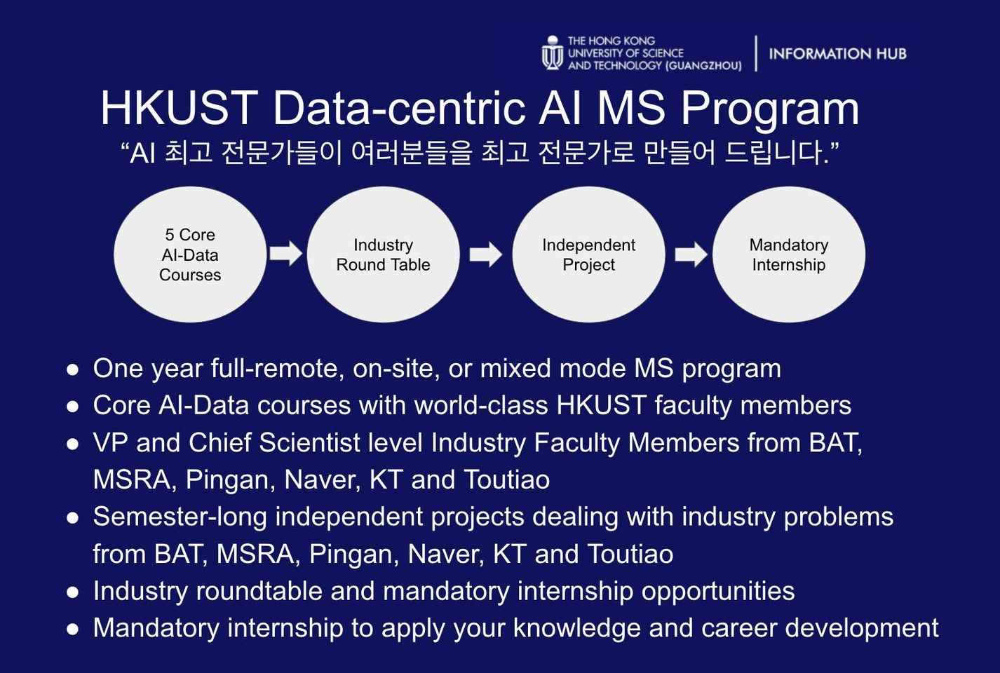
**이미지 캡션:** 이 이미지는 홍콩 과학기술대학교(광저우)의 데이터 중심 AI 석사 프로그램에 대한 정보를 담고 있으며, 파란색 배경에 흰색 텍스트와 그래픽 요소로 구성되어 있습니다. 상단에는 "THE HONG KONG UNIVERSITY OF SCIENCE AND TECHNOLOGY (GUANGZHOU)"와 "INFORMATION HUB"라는 로고와 텍스트가 있습니다. 그 아래에는 프로그램의 제목인 "HKUST Data-centric AI MS Program"이 크고 굵은 글씨로 쓰여 있고, 그 밑에는 한국어 슬로건인 "AI 최고 전문가들이 여러분들을 최고 전문가로 만들어 드립니다."가 인용 부호와 함께 표시되어 있습니다. 프로그램의 진행 과정을 나타내는 네 개의 원형 아이콘이 순서대로 나열되어 있으며, 각 아이콘에는 "5 Core AI-Data Courses", "Industry Round Table", "Independent Project", "Mandatory Internship"이라는 텍스트가 포함되어 있고, 화살표로 연결되어 있습니다. 이 네 가지 단계를 설명하는 여섯 개의 글머리 기호 목록이 이미지 하단에 나열되어 있으며, 프로그램의 특징, 커리큘럼, 교수진, 프로젝트, 인턴십 기회 등에 대한 구체적인 정보를 제공합니다. 이미지에는 사람이 등장하지 않으며, 전체적으로 학술적이고 전문적인 분위기를 풍깁니다. 최고 전문가들이 여러분들을 최고 전문가로 만들어 드립니다."가 인용 부호와 함께 표시되어 있습니다. 프로그램의 진행 과정을 나타내는 네 개의 원형 아이콘이 순서대로 나열되어 있으며, 각 아이콘에는 "5 Core AI-Data Courses", "Industry Round Table", "Independent Project", "Mandatory Internship"이라는 텍스트가 포함되어 있고, 화살표로 연결되어 있습니다. 이 네 가지 단계를 설명하는 여섯 개의 글머리 기호 목록이 이미지 하단에 나열되어 있으며, 프로그램의 특징, 커리큘럼, 교수진, 프로젝트, 인턴십 기회 등에 대한 구체적인 정보를 제공합니다. 이미지에는 사람이 등장하지 않으며, 전체적으로 학술적이고 전문적인 분위기를 풍깁니다.

### 10월 7일 (목) 15:20 · 📷 사진 (1장)

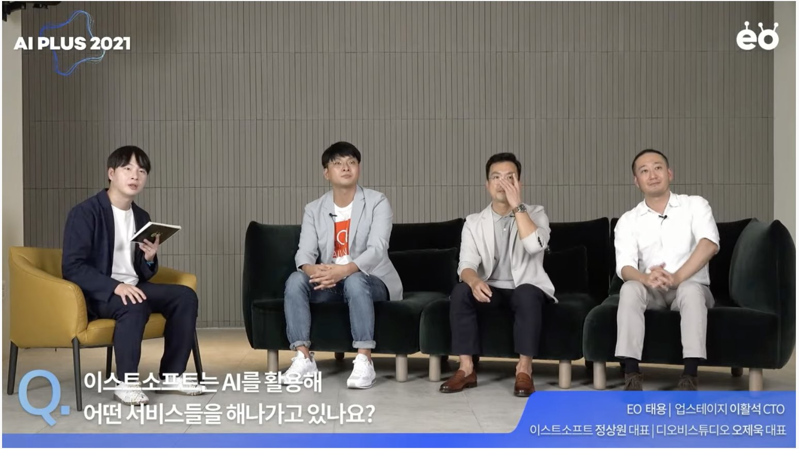
**이미지 캡션:** 네 명의 성인 남성이 소파에 앉아 대화를 나누고 있으며, 왼쪽 첫 번째 남성은 노란색 의자에 앉아 책을 들고 있습니다. 모두 캐주얼한 복장을 하고 있으며, 배경은 현대적인 디자인의 회색 벽입니다. 화면 하단에는 "AI PLUS 2021"이라는 로고와 함께 "이스트소프트는 AI를 활용해 어떤 서비스들을 해나가고 있나요?"라는 질문이 한국어로 표시되어 있습니다. 또한, 각 인물의 이름과 직책이 한국어로 기재되어 있습니다. 전반적으로 인터뷰나 토크쇼의 한 장면으로 보이며, AI 기술과 관련된 주제로 논의가 진행되고 있음을 알 수 있습니다. 있음을 알 수 있습니다.

> #활석님출연   AI PLUS 2021 라이브 토크 콘서트 안내 | AI를 통해 우리의 미래는 어떻게 달라질까? 일시: 10월 7일 목요일 15:00 - 17:00 이스트소프트가 주최하는 AI 개발자 콘퍼런스, AI PLUS 2021 토크 콘서트를 개최합니다. #AI #메타버스 #버츄얼휴먼 등 가장 핫한 키워드를 중심으로 진행될 예정인데요 :fire: 인공지능이 바꿔갈 우리의 새로운 일상이 궁금하시다면 사전 신청하고 푸짐한 경품도 받아 가세요! *애플워치(1명), 앱솔루트 안경(4명), 겐조 선글라스(2명)를 드립니다. 역대급 패널 라인업 :arrow_down: '알약' '알툴즈'를 만들다 AI 서비스 기업으로 전환한 이스트소프트의 정상원 대표 316억원 시리즈A 투자 유치한 AI 스타트업 유망주 업스테이지 이활석 CTO 버츄얼 휴먼 '루이'로 화제를 모으고 있는 DOB스튜디오 오제욱 대표 AI PLUS 2021 상세 페이지 및 사전 신청 바로가기: https://aiplus2021.com/live.php

### 10월 8일 (금) 11:09 · #폭풍런 아침에 큰 바람과 오래간만에 세찬비를 보고 폭풍런을 하던 어린 …

#폭풍런 아침에 큰 바람과 오래간만에 세찬비를 보고 폭풍런을 하던 어린 시절이 생각나서 달려보았습니다. 시원한 빗소리와 차가운 샤워 덕분에 매우 즐거운 달리기 되었습니다. 

앞으로 달리고 전진하는 것은 언제나 어떤 환경에서나 즐겁습니다. 업업업!
(시원한 빗소리도 들어 보셔요.)

🎬 동영상 1개 (생략)

### 10월 9일 (토) 09:23 · 📷 사진 (2장)

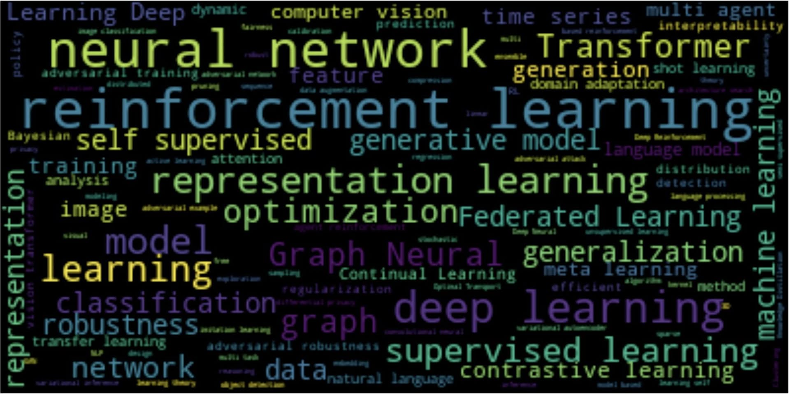
**이미지 캡션:** 이 이미지는 딥러닝 및 인공지능 분야의 다양한 키워드를 시각적으로 표현한 워드 클라우드입니다. 검은색 배경에 다양한 크기와 색상의 단어들이 무작위로 배치되어 있으며, 단어의 크기는 해당 키워드의 중요도나 빈도를 나타냅니다. 가장 크고 눈에 띄는 단어로는 "reinforcement learning", "representation learning", "deep learning", "neural network", "Transformer", "supervised learning", "learning", "model", "network" 등이 있습니다. 이 외에도 "computer vision", "time series", "multi agent", "generative model", "Federated Learning", "Graph Neural", "meta learning", "robustness", "transfer learning", "classification", "optimization", "image", "data", "natural language" 등 다양한 관련 용어들이 포함되어 있습니다. 일부 단어는 세로로 배치되어 있으며, 이는 "representation transformer"와 같이 여러 단어가 합쳐져 하나의 개념을 나타내는 경우도 있습니다. 전반적으로 이 워드 클라우드는 딥러닝 연구 및 개발에서 자주 사용되는 핵심 개념들을 한눈에 파악할 수 있도록 구성되어 있습니다., "network" 등이 있습니다. 이 외에도 "computer vision", "time series", "multi agent", "generative model", "Federated Learning", "Graph Neural", "meta learning", "robustness", "transfer learning", "classification", "optimization", "image", "data", "natural language" 등 다양한 관련 용어들이 포함되어 있습니다. 일부 단어는 세로로 배치되어 있으며, 이는 "representation transformer"와 같이 여러 단어가 합쳐져 하나의 개념을 나타내는 경우도 있습니다. 전반적으로 이 워드 클라우드는 딥러닝 연구 및 개발에서 자주 사용되는 핵심 개념들을 한눈에 파악할 수 있도록 구성되어 있습니다.
 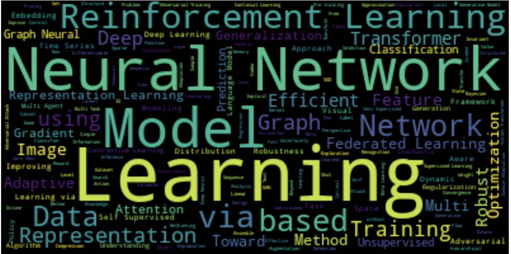
**이미지 캡션:** 이 이미지는 딥러닝 및 기계 학습과 관련된 다양한 용어를 시각적으로 표현한 워드 클라우드입니다. 검은색 배경 위에 다양한 크기와 색상의 단어들이 겹쳐져 나타나며, 가장 크고 눈에 띄는 단어는 "Learning"으로, 그 주변으로 "Neural", "Network", "Model", "Reinforcement", "Training" 등이 큰 글씨로 배치되어 있습니다. 이 외에도 "Deep", "Graph", "Image", "Data", "Representation", "Feature", "Transformer", "Classification", "Federated Learning", "Robust Optimization" 등 다양한 관련 용어들이 작은 글씨로 포함되어 있습니다. 이 워드 클라우드는 딥러닝 분야의 핵심 개념과 기술들을 한눈에 파악할 수 있도록 구성되어 있으며, 학술 발표, 교육 자료, 또는 관련 연구 분야의 개요를 보여주는 데 유용하게 활용될 수 있습니다.", "Classification", "Federated Learning", "Robust Optimization" 등 다양한 관련 용어들이 작은 글씨로 포함되어 있습니다. 이 워드 클라우드는 딥러닝 분야의 핵심 개념과 기술들을 한눈에 파악할 수 있도록 구성되어 있으며, 학술 발표, 교육 자료, 또는 관련 연구 분야의 개요를 보여주는 데 유용하게 활용될 수 있습니다.

### 10월 12일 (화) 07:46 · #한글날선물 #KLUE #NeurIPS2021 #멋지다

#한글날선물 #KLUE #NeurIPS2021 #멋지다 

매우 기쁜 소식입니다. AI 연구에 가장 중요한 것 중 하나는 바로 *데이터*입니다. 이게 있어야 모델 학습이 가능하고 이게 있어야 모델이 잘 되는지 안되는지 평가가 가능합니다. 그동안 NLP는 영어권 중국어권 중심으로 방대한 데이터들이 공개되고 많은 연구가 진행되는 것을 보고 부러워하였습니다. 특히 이미 공개된 데이터도 재가공이나 재배포가 저작권에 의해 불가능해서 연구자들의 필요에 맞게 사용할 수가 없었습니다. 그래서 "한글 데이터는 없나", "왜 만들거나 공개하지 않나" 불평만 하고 있었는데요.

이런 불평은 그만하고 "우리가 직접 만들어 보면 되겠네" 하고 나서신 업스테이지 Sungjoon Park 그리고 Jihyung Moon 이 해내고 말았습니다. 

주위 분들을 설득하고 30여 명 가까이 되는 팀원들을 모으고 12개의 기관들과 협업하며 도움을 받고 아주 과학적인 방법으로 데이터를 만들기 시작했습니다. 이어서 데이터가 공개되고 100페이지 가까운 contribution으로 공대 되었고 그 내용이 그 어렵다는 #NeurIPS2021 Datasets and Benchmarks Track에 accept 되었습니다!

KLUE 데이터 마음껏 가져다 사용하시고 임으로 수정 가공 재배포 모두 가능하니 연구에 많이 사용해 주시기 바랍니다. #NeurIPS2021 Accept 덕분에 이제 세계 연구자들이 절대적으로 사용하는 데이터 셋이 되고 이를 통해 한국 NLP 관련 연구가 많은 그라운드 브레이킹을 만들어 낼 것으로 기대합니다.

성준, 제니 정말 장하고 수고 많으셨고 함께해 주신 공동저자분들, 그리고 후원으로 데이터로 도와주신 많은 기관들 감사드리고 또 멋진 성과 축하드립니다.

또 개인적으로는 하나의 논문에 이렇게 수십 개의 기관이 협력하여 함께 저자가 된 것도 너무나 감동적이고 더 많이 협력하고 함께 뭉치면 좋겠습니다.

### 10월 12일 (화) 21:15 · 📷 사진 (1장)

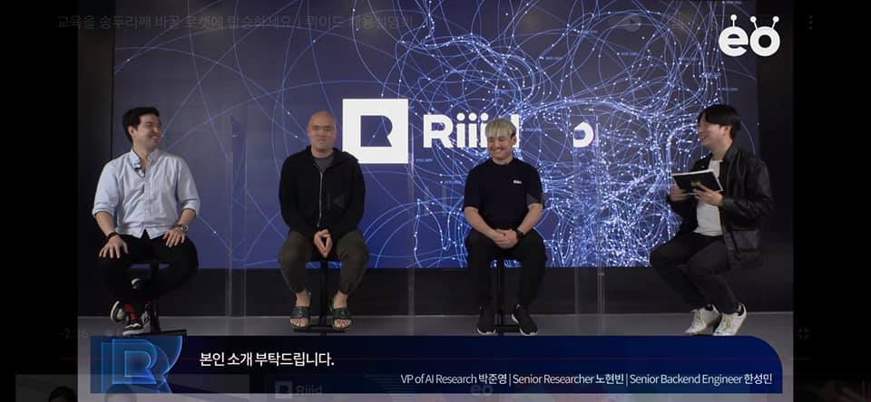
**이미지 캡션:** 네 명의 남성이 무대 위에서 각자 의자에 앉아 있다. 왼쪽 첫 번째 남성은 30대 후반에서 40대 초반으로 보이며, 밝은 색 셔츠를 입고 웃고 있다. 두 번째 남성은 30대 중반으로 보이며, 검은색 후드티에 회색 바지를 입고 정면을 응시하고 있다. 세 번째 남성은 20대 후반으로 보이며, 검은색 반팔 티셔츠에 검은색 바지를 입고 밝게 웃고 있다. 네 번째 남성은 30대 후반으로 보이며, 검은색 재킷에 흰색 티셔츠를 입고 태블릿을 들고 있다. 배경에는 파란색 바탕에 흰색 선으로 연결된 복잡한 네트워크 그래픽이 있고, "Riiid" 로고와 "eo" 로고가 보인다. 무대 앞쪽에는 파란색 받침대가 있고, 그 위에 "본인 소개 부탁드립니다."라는 문구와 함께 "VP of AI Research 박준영 | Senior Researcher 노현빈 | Senior Backend Engineer 한성민"이라는 텍스트가 표시되어 있다. 전체적으로 기술 관련 행사나 발표회 분위기이며, 발표자들이 편안하고 긍정적인 표정을 짓고 있다.있고, "Riiid" 로고와 "eo" 로고가 보인다. 무대 앞쪽에는 파란색 받침대가 있고, 그 위에 "본인 소개 부탁드립니다."라는 문구와 함께 "VP of AI Research 박준영 | Senior Researcher 노현빈 | Senior Backend Engineer 한성민"이라는 텍스트가 표시되어 있다. 전체적으로 기술 관련 행사나 발표회 분위기이며, 발표자들이 편안하고 긍정적인 표정을 짓고 있다.

### 10월 13일 (수) 18:40 · 📷 사진 (1장)

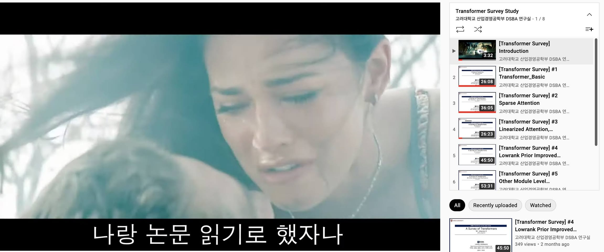
**이미지 캡션:** 화면 왼쪽에는 영화의 한 장면이 캡처되어 있으며, 젊은 성인 여성으로 보이는 인물이 눈물을 흘리며 슬픈 표정을 짓고 있다. 그녀의 얼굴에는 땀이나 눈물이 맺혀 있으며, 배경은 흐릿하게 처리되어 초점이 맞지 않는다. 여성은 목걸이를 착용하고 있으며, 어두운 색상의 옷을 입고 있는 것으로 보인다. 화면 오른쪽에는 유튜브 영상 목록이 표시되어 있으며, "Transformer Survey Study"라는 제목의 영상 시리즈가 보인다. 이 시리즈는 고려대학교 산업경영공학부 DSBA 연구실에서 제작한 것으로 보이며, 여러 개의 하위 영상들이 순서대로 나열되어 있다. 영상 목록에는 각 영상의 제목, 재생 시간, 그리고 간략한 설명이 포함되어 있다. 화면 하단에는 검은색 배경에 흰색 글씨로 "나랑 논문 읽기로 했잖아"라는 문구가 표시되어 있어, 영상의 내용이나 맥락을 짐작하게 한다. 전반적으로 영상은 감정적이고 진지한 분위기를 띠고 있으며, 연구 발표 영상과 함께 제시되어 학술적인 내용과 개인적인 감정이 교차하는 듯한 느낌을 준다.러 개의 하위 영상들이 순서대로 나열되어 있다. 영상 목록에는 각 영상의 제목, 재생 시간, 그리고 간략한 설명이 포함되어 있다. 화면 하단에는 검은색 배경에 흰색 글씨로 "나랑 논문 읽기로 했잖아"라는 문구가 표시되어 있어, 영상의 내용이나 맥락을 짐작하게 한다. 전반적으로 영상은 감정적이고 진지한 분위기를 띠고 있으며, 연구 발표 영상과 함께 제시되어 학술적인 내용과 개인적인 감정이 교차하는 듯한 느낌을 준다.

> #transformer #DSBA Transformer is All you Need 라고 해도 과언이 아닐 정도로 NLP 뿐만 아니라 CV, 추천, 강화학습 등등 많은 곳에서 사용되는데요. Transformer 서베이 논문을 7개의 비디오로 나누어 완벽하게 설명해줍니다.  https://www.youtube.com/watch?v=pOdLQIjGfl0&list=PLetSlH8YjIfXCRQ28UHh07wxkIxdU5c7-  매우 자세한 설명과 내부 토론내용들까지 공유해주시고 전반적으로 깊은 내용까지 다룹니다. 고려대학교 산업경영공학부 DSBA 연구실 멤버들 정말 대단하고 좋은 비디오 공유해주셔서 감사드립니다.  Transformer 의 여러 동향을 한번에 쫙 이해하시고 싶은 분들에게 강추 드립니다.

### 10월 18일 (월) 10:17 · #AI스타트업핫 #프라이머최고 #19기데모 #묻고더블로

#AI스타트업핫 #프라이머최고 #19기데모 #묻고더블로 

최근 시리즈 A 단계에서 316억의 투자를 받은 Upstage 소식 등 많은 AI 스타트업들이 제대로 가치를 만들고 성과를 만들어 내고 있습니다. AI 아이디어가 있으시면 AI 스타트업을 시작하기 정말 좋은 시대입니다.

어떤 회사들이 투자를 받고 주목을 받고 있을까요? 이를 살펴볼 수 있는 프라이머 19기 온라인 데모데이를 행사를 소개합니다. 프라이머는 최근 국내 최고의 스타트업 액셀러레이터로 선정되었고 저도 파트너 시즌6에 참여해서 믿고 보는 데모데이입니다. 

10월27일 저녁7시 온라인으로 진행되고 https://tinyurl.com/4w3tj3cn 에 신청하시면 누구나 무료로 참여 가능합니다. 

본인 얼굴이 포함된 사진/영상을 찾아주는 인공지능 앨리스, 화장품 정보 검색, 균형 잡힌 식사를 위한 맞춤형 솔류션등 AI를 직접 사용하는 회사들도 많고  대부분 회사들이 AI를 간접적으로 사용하고 있습니다.

이 데모데이를 보시고 또는 평소 생각하시는 사업아이템이 있으시다면 10월 31일까지 받고 있는 프라이머 20기에 도전해 보세요. 아직 구체적인 아이템이나 사업모델이 없어도 선지원, 후고민 하시면 됩니다. 좋은 피드백은 큰 도움이 되실 것입니다. 그리고 AI 주제면 묻고 더블로의 선택확률이 있습니다.

선지원, 후고민 여기: https://apply.primer.kr/incubations/26/letters/apply

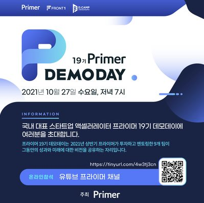
**이미지 캡션:** 이 이미지는 '프라이머 19기 데모데이' 행사를 알리는 포스터입니다. 중앙에는 파란색의 큰 'P' 로고와 함께 '19기 Primer DEMODAY'라는 문구가 크게 쓰여 있으며, 행사 날짜와 시간은 '2021년 10월 27일 수요일, 저녁 7시'로 명시되어 있습니다. 하단에는 'INFORMATION' 섹션이 있으며, 국내 대표 스타트업 액셀러레이터인 프라이머 19기 데모데이에 대한 소개와 함께, 2021년 상반기 프라이머가 투자하고 멘토링한 9개 팀이 성과와 미래 비전을 공유하는 자리임을 알리고 있습니다. 행사 참여 방법으로는 온라인 참석과 유튜브 프라이머 채널 시청을 안내하며, 관련 URL과 QR 코드가 제공됩니다. 포스터 상단에는 'Primer', 'FRONT 1', 'D.CAMP' 로고가 보입니다. 전반적으로 깔끔하고 현대적인 디자인으로, 행사의 중요성과 정보를 효과적으로 전달하고 있습니다.사 참여 방법으로는 온라인 참석과 유튜브 프라이머 채널 시청을 안내하며, 관련 URL과 QR 코드가 제공됩니다. 포스터 상단에는 'Primer', 'FRONT 1', 'D.CAMP' 로고가 보입니다. 전반적으로 깔끔하고 현대적인 디자인으로, 행사의 중요성과 정보를 효과적으로 전달하고 있습니다.
 
**이미지 캡션:** 이 이미지는 19번째 프라이머 데모데이를 홍보하는 포스터로, 세 개의 스타트업과 그 대표들을 소개하고 있습니다. 왼쪽에는 "MARKET STADIUM"이라는 로고와 함께 "마켓스타디움"이라는 이름의 미국 상업용 부동산 시장 가치 분석 플랫폼을 소개하며, 이기훈 대표의 사진과 이름이 표시되어 있습니다. 중앙에는 "NOTEING"이라는 로고와 함께 "노팅"이라는 이름의 Z세대를 위한 디지털 스터디 교재 e-book 플랫폼을 소개하고 있으며, 이윤지 대표의 사진과 이름이 표시되어 있습니다. 오른쪽에는 "ALICE"라는 로고와 함께 "인공지능 앨리스"라는 이름의 얼굴이 포함된 영상/사진을 찾는 인공지능 서비스를 소개하며, 이현승 대표의 사진과 이름이 표시되어 있습니다. 각 스타트업의 로고, 이름, 서비스 설명, 대표 사진 및 이름이 명확하게 배치되어 있으며, 전체적으로 파란색과 흰색을 사용하여 깔끔하고 전문적인 분위기를 연출하고 있습니다.라는 로고와 함께 "인공지능 앨리스"라는 이름의 얼굴이 포함된 영상/사진을 찾는 인공지능 서비스를 소개하며, 이현승 대표의 사진과 이름이 표시되어 있습니다. 각 스타트업의 로고, 이름, 서비스 설명, 대표 사진 및 이름이 명확하게 배치되어 있으며, 전체적으로 파란색과 흰색을 사용하여 깔끔하고 전문적인 분위기를 연출하고 있습니다.
 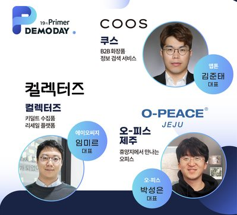
**이미지 캡션:** 이 이미지는 스타트업 데모데이를 홍보하는 포스터로 보이며, 세 개의 주요 스타트업과 그 대표들을 소개하고 있습니다. 왼쪽 상단에는 "19th Primer DEMODAY"라는 로고가 파란색과 흰색으로 디자인되어 있습니다. 그 아래에는 "컬렉터즈"라는 회사 이름과 함께 "컬렉터즈 키덜트 수집품 리테일 플랫폼"이라는 설명이 있습니다. 컬렉터즈의 대표로 보이는 성인 남성이 안경을 쓰고 미소를 띠고 있으며, 그의 이름은 임미르 대표로 표시되어 있습니다. 중앙 상단에는 "COOS"라는 회사 이름과 "쿠스 B2B 화장품 정보 검색 서비스"라는 설명이 있습니다. COOS의 대표로 보이는 성인 남성이 안경을 쓰고 정장을 입고 있으며, 그의 이름은 김준태 대표로 표시되어 있습니다. 오른쪽 하단에는 "O-PEACE JEJU"라는 회사 이름과 "오-피스 제주 휴양지에서 만나는 오피스"라는 설명이 있습니다. O-PEACE JEJU의 대표로 보이는 성인 남성이 안경을 쓰고 미소를 띠고 있으며, 그의 이름은 박성은 대표로 표시되어 있습니다. 전체적으로 깔끔하고 현대적인 디자인으로, 각 회사의 로고와 대표 사진, 그리고 핵심 서비스 설명이 명확하게 제시되어 있습니다.정보 검색 서비스"라는 설명이 있습니다. COOS의 대표로 보이는 성인 남성이 안경을 쓰고 정장을 입고 있으며, 그의 이름은 김준태 대표로 표시되어 있습니다. 오른쪽 하단에는 "O-PEACE JEJU"라는 회사 이름과 "오-피스 제주 휴양지에서 만나는 오피스"라는 설명이 있습니다. O-PEACE JEJU의 대표로 보이는 성인 남성이 안경을 쓰고 미소를 띠고 있으며, 그의 이름은 박성은 대표로 표시되어 있습니다. 전체적으로 깔끔하고 현대적인 디자인으로, 각 회사의 로고와 대표 사진, 그리고 핵심 서비스 설명이 명확하게 제시되어 있습니다.
 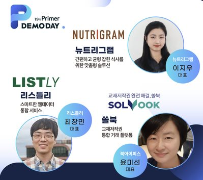
**이미지 캡션:** 이 이미지는 19번째 프라이머 데모데이를 홍보하는 포스터로, 세 개의 스타트업과 그 대표들의 사진과 정보를 담고 있습니다. 왼쪽 상단에는 파란색 'P' 로고와 함께 "19th Primer DEMODAY"라는 문구가 있습니다. 그 아래에는 "LISTLY"라는 로고와 함께 "리스틀리"라는 회사 이름, "스마트한 웹데이터 통합 서비스"라는 설명, 그리고 안경을 쓰고 미소 짓고 있는 30대 초반의 남성 대표인 최창민 씨의 사진이 있습니다. 중앙 상단에는 "NUTRIGRAM"이라는 로고와 함께 "뉴트리그램"이라는 회사 이름, "간편하고 균형 잡힌 식사를 위한 맞춤형 솔루션"이라는 설명, 그리고 검은색 상의를 입고 부드러운 미소를 짓고 있는 20대 후반의 여성 대표인 이지우 씨의 사진이 있습니다. 오른쪽 하단에는 "SOLVOOK"라는 로고와 함께 "쓸북"이라는 회사 이름, "교재저작권 통합 거래 플랫폼"이라는 설명, 그리고 짧은 머리에 편안한 미소를 짓고 있는 40대 초반의 여성 대표인 윤미선 씨의 사진이 있습니다. 각 회사와 대표의 이름은 원형의 말풍선 안에 표시되어 있습니다. 전체적으로 깔끔하고 현대적인 디자인으로, 스타트업의 혁신적인 아이디어를 소개하는 행사의 분위기를 잘 나타내고 있습니다. 이름, "간편하고 균형 잡힌 식사를 위한 맞춤형 솔루션"이라는 설명, 그리고 검은색 상의를 입고 부드러운 미소를 짓고 있는 20대 후반의 여성 대표인 이지우 씨의 사진이 있습니다. 오른쪽 하단에는 "SOLVOOK"라는 로고와 함께 "쓸북"이라는 회사 이름, "교재저작권 통합 거래 플랫폼"이라는 설명, 그리고 짧은 머리에 편안한 미소를 짓고 있는 40대 초반의 여성 대표인 윤미선 씨의 사진이 있습니다. 각 회사와 대표의 이름은 원형의 말풍선 안에 표시되어 있습니다. 전체적으로 깔끔하고 현대적인 디자인으로, 스타트업의 혁신적인 아이디어를 소개하는 행사의 분위기를 잘 나타내고 있습니다.

### 10월 18일 (월) 10:21 · 📷 사진 (4장)

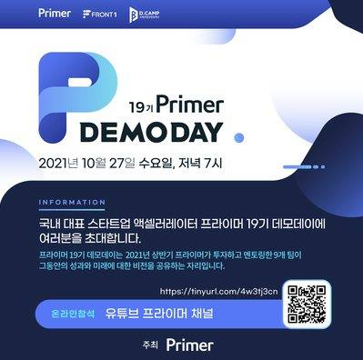
**이미지 캡션:** 이 이미지는 국내 대표 스타트업 액셀러레이터 프라이머의 19기 데모데이 행사를 알리는 포스터입니다. 포스터 상단에는 'Primer', 'FRONT 1', 'B.CAMP' 로고가 보이며, 중앙에는 파란색의 큰 'P'자 로고와 함께 '19기 Primer DEMODAY'라는 문구가 강조되어 있습니다. 행사 날짜와 시간은 '2021년 10월 27일 수요일, 저녁 7시'로 명시되어 있습니다. 하단 'INFORMATION' 섹션에는 행사의 목적이 설명되어 있는데, 프라이머 19기 데모데이는 2021년 상반기에 프라이머가 투자하고 멘토링한 9개 팀이 그동안의 성과와 미래에 대한 비전을 공유하는 자리임을 알리고 있습니다. 또한, 온라인 참여 방법으로 '유튜브 프라이머 채널'을 안내하며 짧은 URL과 QR 코드를 제공하고 있습니다. 포스터 전체적으로는 파란색과 흰색을 주조색으로 사용하여 깔끔하고 전문적인 느낌을 줍니다. 행사는 '주최 Primer'로 마무리됩니다. 투자하고 멘토링한 9개 팀이 그동안의 성과와 미래에 대한 비전을 공유하는 자리임을 알리고 있습니다. 또한, 온라인 참여 방법으로 '유튜브 프라이머 채널'을 안내하며 짧은 URL과 QR 코드를 제공하고 있습니다. 포스터 전체적으로는 파란색과 흰색을 주조색으로 사용하여 깔끔하고 전문적인 느낌을 줍니다. 행사는 '주최 Primer'로 마무리됩니다.
 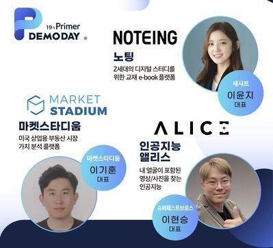
**이미지 캡션:** 이 이미지는 "19th Primer DEMODAY"라는 행사를 홍보하는 포스터로, 세 개의 스타트업과 각 회사의 대표를 소개하고 있습니다. 왼쪽 상단에는 "NOTEING"이라는 스타트업이 있으며, Z세대를 위한 디지털 스터디 교재 e-book 플랫폼을 제공합니다. 이 회사의 대표는 "이윤지"이며, 파란색 원 안에 사진과 이름, 직책이 표시되어 있습니다. 중앙에는 "MARKET STADIUM"이라는 스타트업이 있으며, 미국 상업용 부동산 시장 가치 분석 플랫폼을 제공합니다. 이 회사의 대표는 "이기훈"이며, 파란색 원 안에 사진과 이름, 직책이 표시되어 있습니다. 오른쪽 하단에는 "ALICE"라는 스타트업이 있으며, 얼굴이 포함된 영상/사진을 찾는 인공지능 기술을 개발합니다. 이 회사의 대표는 "이현승"이며, 파란색 원 안에 사진과 이름, 직책이 표시되어 있습니다. 각 스타트업의 로고와 함께 간략한 설명이 한국어로 기재되어 있으며, 전체적으로 파란색과 흰색을 사용하여 깔끔하고 전문적인 분위기를 연출하고 있습니다.란색 원 안에 사진과 이름, 직책이 표시되어 있습니다. 오른쪽 하단에는 "ALICE"라는 스타트업이 있으며, 얼굴이 포함된 영상/사진을 찾는 인공지능 기술을 개발합니다. 이 회사의 대표는 "이현승"이며, 파란색 원 안에 사진과 이름, 직책이 표시되어 있습니다. 각 스타트업의 로고와 함께 간략한 설명이 한국어로 기재되어 있으며, 전체적으로 파란색과 흰색을 사용하여 깔끔하고 전문적인 분위기를 연출하고 있습니다.
 
**이미지 캡션:** 이 이미지는 스타트업 데모데이 행사 포스터로 보이며, 세 개의 스타트업과 각 회사의 대표 사진 및 정보를 소개하고 있습니다. 왼쪽 상단에는 "19th Primer DEMODAY"라는 문구와 함께 파란색 P 로고가 있습니다. 그 아래에는 "컬렉터즈"라는 스타트업 이름과 함께 "컬렉터즈", "키덜트 수집품", "리세일 플랫폼"이라는 설명이 있습니다. 이 스타트업의 대표로 추정되는 성인 남성이 안경을 쓰고 미소를 짓고 있는 사진이 원형으로 배치되어 있으며, "에이오씨지 임미르 대표"라는 텍스트가 파란색 원 안에 표시되어 있습니다. 중앙 상단에는 "COOS 쿠스"라는 스타트업 이름과 함께 "B2B 화장품", "정보 검색 서비스"라는 설명이 있습니다. 이 스타트업의 대표로 추정되는 성인 남성이 안경을 쓰고 정면을 응시하는 사진이 원형으로 배치되어 있으며, "앱론 김준태 대표"라는 텍스트가 파란색 원 안에 표시되어 있습니다. 오른쪽 하단에는 "O-PEACE JEJU 오-피스 제주"라는 스타트업 이름과 함께 "휴양지에서 만나는 오피스"라는 설명이 있습니다. 이 스타트업의 대표로 추정되는 성인 남성이 안경을 쓰고 미소를 짓고 있는 사진이 원형으로 배치되어 있으며, "오피스 박성은 대표"라는 텍스트가 파란색 원 안에 표시되어 있습니다. 전체적으로 깔끔하고 현대적인 디자인으로, 각 스타트업의 핵심 정보와 대표를 효과적으로 전달하고 있습니다.시되어 있습니다. 중앙 상단에는 "COOS 쿠스"라는 스타트업 이름과 함께 "B2B 화장품", "정보 검색 서비스"라는 설명이 있습니다. 이 스타트업의 대표로 추정되는 성인 남성이 안경을 쓰고 정면을 응시하는 사진이 원형으로 배치되어 있으며, "앱론 김준태 대표"라는 텍스트가 파란색 원 안에 표시되어 있습니다. 오른쪽 하단에는 "O-PEACE JEJU 오-피스 제주"라는 스타트업 이름과 함께 "휴양지에서 만나는 오피스"라는 설명이 있습니다. 이 스타트업의 대표로 추정되는 성인 남성이 안경을 쓰고 미소를 짓고 있는 사진이 원형으로 배치되어 있으며, "오피스 박성은 대표"라는 텍스트가 파란색 원 안에 표시되어 있습니다. 전체적으로 깔끔하고 현대적인 디자인으로, 각 스타트업의 핵심 정보와 대표를 효과적으로 전달하고 있습니다.
 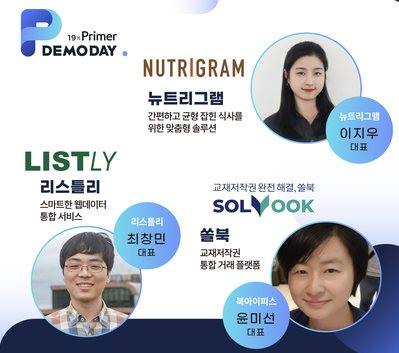
**이미지 캡션:** 이 이미지는 19번째 프라이머 데모데이를 홍보하는 포스터로, 세 개의 스타트업과 그 대표들을 소개하고 있습니다. 왼쪽 상단에는 파란색 P 로고와 함께 "19th Primer DEMODAY"라는 문구가 있습니다. 그 아래에는 "LISTLY 리스틀리"라는 녹색 로고와 함께 "스마트한 웹데이터 통합 서비스"라는 설명이 있고, 리스틀리의 대표인 최창민 씨의 사진과 이름, 직책이 원형으로 표시되어 있습니다. 중앙 상단에는 "NUTRIGRAM 뉴트리그램"이라는 로고와 함께 "간편하고 균형 잡힌 식사를 위한 맞춤형 솔루션"이라는 설명이 있고, 뉴트리그램의 대표인 이지우 씨의 사진과 이름, 직책이 원형으로 표시되어 있습니다. 오른쪽 하단에는 "SOLVOOK 쓸북"이라는 로고와 함께 "교재저작권 완전 해결, 쓸북"이라는 설명이 있고, "교재저작권 통합 거래 플랫폼"이라는 부연 설명이 있습니다. 쓸북의 대표인 윤미선 씨의 사진과 이름, 직책이 원형으로 표시되어 있습니다. 각 스타트업의 로고와 이름, 설명, 대표 사진이 깔끔하게 배치되어 있으며, 전반적으로 밝고 전문적인 분위기를 풍깁니다."이라는 설명이 있고, 뉴트리그램의 대표인 이지우 씨의 사진과 이름, 직책이 원형으로 표시되어 있습니다. 오른쪽 하단에는 "SOLVOOK 쓸북"이라는 로고와 함께 "교재저작권 완전 해결, 쓸북"이라는 설명이 있고, "교재저작권 통합 거래 플랫폼"이라는 부연 설명이 있습니다. 쓸북의 대표인 윤미선 씨의 사진과 이름, 직책이 원형으로 표시되어 있습니다. 각 스타트업의 로고와 이름, 설명, 대표 사진이 깔끔하게 배치되어 있으며, 전반적으로 밝고 전문적인 분위기를 풍깁니다.

### 10월 19일 (화) 12:29 · 📷 사진 (1장)

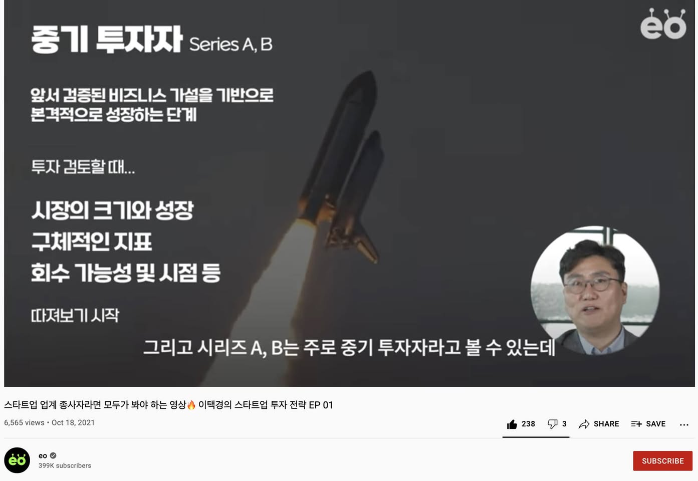
**이미지 캡션:** 이 영상은 우주왕복선이 불꽃을 뿜으며 상승하는 이미지를 배경으로, 한국어로 된 텍스트가 여러 줄 표시되어 있습니다. 상단에는 "중기 투자자 Series A, B"라는 제목이 있고, 그 아래에는 "앞서 검증된 비즈니스 가설을 기반으로 본격적으로 성장하는 단계", "투자 검토할 때...", "시장의 크기와 성장", "구체적인 지표", "회수 가능성 및 시점 등", "따져보기 시작"이라는 내용이 순서대로 나열되어 있습니다. 오른쪽 하단에는 동그란 원 안에 안경을 쓴 성인 남성이 얼굴을 클로즈업하여 보여주고 있으며, 그는 약간 입을 벌리고 말하는 듯한 표정을 짓고 있습니다. 영상 하단에는 "스타트업 업계 종사자라면 모두가 봐야 하는 영상 🔥 이택경의 스타트업 투자 전략 EP 01"이라는 제목과 함께 조회수, 게시일, 채널명 "eo", 구독자 수, 좋아요/싫어요 수, 공유 및 저장 버튼, 그리고 구독 버튼이 보입니다. 전체적으로 스타트업 투자 전략에 대한 정보를 전달하는 영상의 썸네일 또는 미리보기 화면으로 보이며, 진지하고 전문적인 분위기를 풍깁니다. 그는 약간 입을 벌리고 말하는 듯한 표정을 짓고 있습니다. 영상 하단에는 "스타트업 업계 종사자라면 모두가 봐야 하는 영상 🔥 이택경의 스타트업 투자 전략 EP 01"이라는 제목과 함께 조회수, 게시일, 채널명 "eo", 구독자 수, 좋아요/싫어요 수, 공유 및 저장 버튼, 그리고 구독 버튼이 보입니다. 전체적으로 스타트업 투자 전략에 대한 정보를 전달하는 영상의 썸네일 또는 미리보기 화면으로 보이며, 진지하고 전문적인 분위기를 풍깁니다.

### 10월 22일 (금) 13:33 · 📷 사진 (1장)

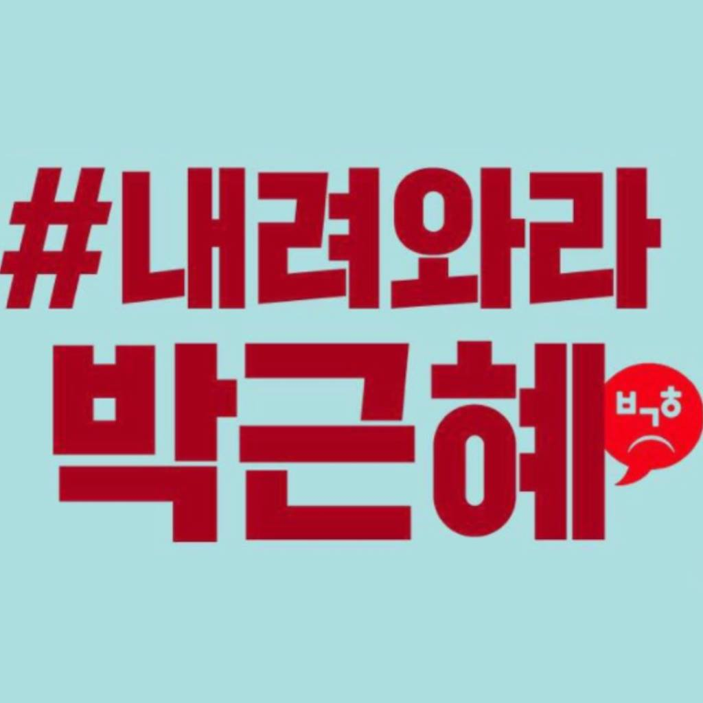
**이미지 캡션:** 이 이미지는 연한 하늘색 배경에 굵고 빨간색 글씨로 쓰인 두 줄의 문구를 보여줍니다. 첫 번째 줄에는 해시태그 기호와 함께 "내려와라"라는 글자가 쓰여 있으며, 두 번째 줄에는 "박근혜"라는 이름이 쓰여 있습니다. "박근혜"라는 글자 오른쪽에는 빨간색 말풍선 안에 슬픈 표정을 짓고 있는 캐릭터와 함께 "ㅂ, ㅎ"이라는 글자가 작게 쓰여 있습니다. 이 이미지는 정치적인 메시지를 담고 있으며, 특정 인물에 대한 비판이나 요구를 표현하는 것으로 보입니다.

### 10월 25일 (월) 13:52 · 📷 사진 (3장)

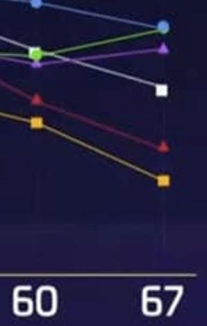
**이미지 캡션:** 어두운 파란색 배경에 여러 개의 선 그래프가 그려져 있으며, 각 선은 다른 색상과 모양의 점으로 표시되어 있습니다. 파란색 원, 녹색 사각형, 보라색 삼각형, 흰색 사각형, 빨간색 삼각형, 주황색 사각형이 각각 다른 선을 나타냅니다. 그래프 아래쪽에는 숫자 60과 67이 표시되어 있어 x축의 값을 나타내는 것으로 보입니다. 이 그래프는 어떤 데이터의 변화 추이를 보여주는 것으로 추정되며, 특정 시점(60과 67)에서의 여러 항목의 값을 비교하거나 시간에 따른 변화를 시각화한 것으로 보입니다. 사람이나 구체적인 사물은 보이지 않으며, 텍스트는 숫자 60과 67만 보입니다. 전반적으로 차분하고 분석적인 분위기를 풍깁니다. 사물은 보이지 않으며, 텍스트는 숫자 60과 67만 보입니다. 전반적으로 차분하고 분석적인 분위기를 풍깁니다.
 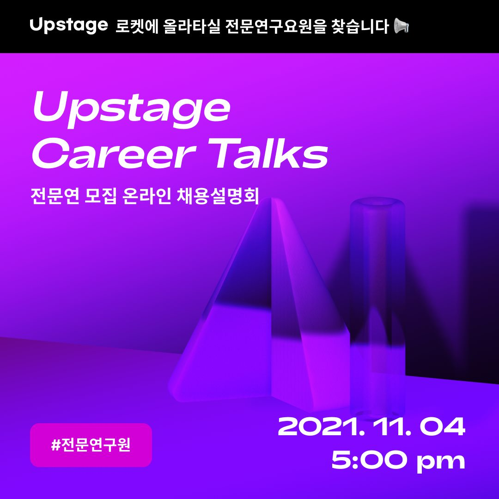
**이미지 캡션:** 이 이미지는 보라색 배경에 "Upstage Career Talks"라는 제목과 함께 "전문연 모집 온라인 채용설명회"라는 부제가 적힌 채용 설명회 포스터입니다. 상단에는 "Upstage 로켓에 올라타실 전문연구요원을 찾습니다"라는 문구가 있습니다. 하단에는 "#전문연구원"이라는 해시태그와 함께 행사 날짜인 "2021. 11. 04"와 시간인 "5:00 pm"이 표시되어 있습니다. 배경에는 기하학적인 형태의 투명한 오브젝트들이 배치되어 있으며, 전체적으로 현대적이고 미래지향적인 분위기를 연출합니다. 사람이나 구체적인 사물은 보이지 않으며, 텍스트 정보와 추상적인 그래픽 디자인으로 구성되어 있습니다.체적인 사물은 보이지 않으며, 텍스트 정보와 추상적인 그래픽 디자인으로 구성되어 있습니다.
 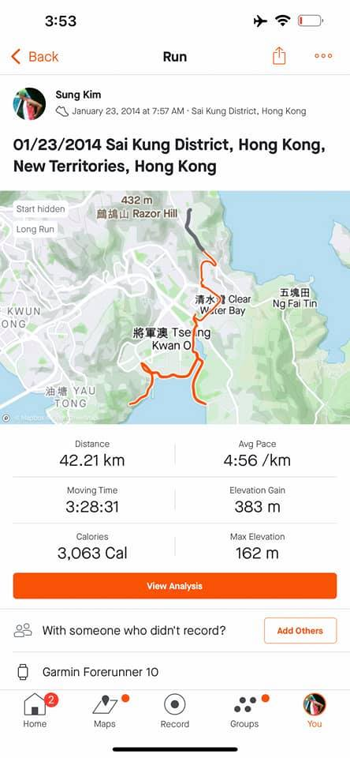
**이미지 캡션:** 이 화면은 스마트폰 앱에서 운동 기록을 보여주는 것으로, 사용자 "Sung Kim"의 2014년 1월 23일 홍콩 신계 사이쿵 지구에서의 달리기 기록을 나타냅니다. 지도에는 사이쿵 지구의 해안선과 산악 지형이 표시되어 있으며, 달린 경로가 주황색 선으로 표시되어 있습니다. 기록된 정보로는 총 거리 42.21km, 이동 시간 3시간 28분 31초, 소모 칼로리 3,063kcal, 평균 페이스 4분 56초/km, 고도 상승 383m, 최대 고도 162m입니다. 화면 하단에는 "분석 보기" 버튼과 함께 "기록하지 않은 사람과 함께?"라는 문구와 "다른 사람 추가" 버튼이 있으며, "Garmin Forerunner 10"이라는 기기 이름도 보입니다. 하단 메뉴에는 홈, 지도, 기록, 그룹, 사용자 아이콘이 있습니다. 전반적으로 운동 성과를 상세하게 보여주는 인터페이스입니다.않은 사람과 함께?"라는 문구와 "다른 사람 추가" 버튼이 있으며, "Garmin Forerunner 10"이라는 기기 이름도 보입니다. 하단 메뉴에는 홈, 지도, 기록, 그룹, 사용자 아이콘이 있습니다. 전반적으로 운동 성과를 상세하게 보여주는 인터페이스입니다.

> #AI전문연구요원 #전문연함께해요 #업스로켓함께타요   Upstage는 세계 최고의 AI솔류션을 만들고 있습니다. 잘 만들어 우리만 사용하는 것이 아니라, 모두를 위한 모두가 쉽게 사용하고, 재학습 가능한  Easy to Apply AI Pack 형태로 만들고 있습니다.  이번 특례 업체로 지정된 기념으로 저희들이 하고 있는 일들을 소개 드리고 전문연구요원 (신규 TO 20) 분들을 모시고 있습니다.   11월 4일 오후 5시 원격으로 열리는 업스테이지 채용설명회를 통해 보다 자세한 내용을 확인해 보세요! 선지원, 후고민!! * 채용설명회 참가신청 : https://forms.gle/DrLVPi1bE1aYuSgE9 * 모집 공고 자세히보기 : www.careers.upstage.ai

### 10월 25일 (월) 16:06 · 42K를 달릴 수 있다는 것은 언제나 신나고 즐거운  일입니다. 코로나 …

42K를 달릴 수 있다는 것은 언제나 신나고 즐거운  일입니다. 코로나 이후 첫 마라톤, 오랫동안 기억에 남을 것 같습니다!

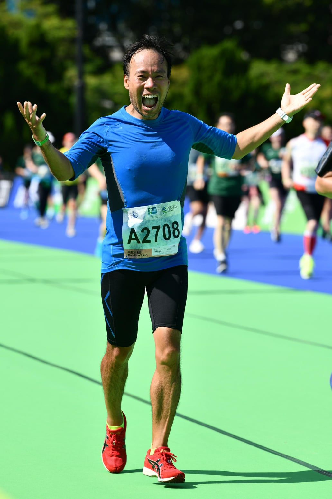
**이미지 캡션:** 한 명의 성인 남성이 마라톤 경주 중 환호하며 카메라를 향해 달려오고 있다. 그는 30대 후반에서 40대 초반으로 보이며, 짧은 검은 머리에 짙은 피부색을 가지고 있다. 얼굴에는 땀방울이 맺혀 있고, 입을 크게 벌린 채 환한 미소를 짓고 있어 매우 기쁘고 흥분된 표정이다. 파란색 반팔 운동복 상의와 검은색 반바지, 그리고 빨간색 운동화를 착용하고 있으며, 상의에는 'A2708'이라고 적힌 레이스 번호표가 부착되어 있다. 왼쪽 손목에는 하얀색 스포츠 시계를 차고 있다. 배경에는 다른 참가자들이 뛰고 있으며, 녹색과 파란색으로 구분된 트랙이 보인다. 햇살이 밝게 비추는 야외이며, 나무들이 보이는 것으로 보아 공원이나 넓은 야외 공간에서 경주가 진행되고 있는 것으로 추정된다. 전체적으로 활기차고 축제 같은 분위기이며, 참가자가 경주를 즐기고 성공적으로 완주했거나 좋은 성적을 거둔 듯한 긍정적인 상황이다.색과 파란색으로 구분된 트랙이 보인다. 햇살이 밝게 비추는 야외이며, 나무들이 보이는 것으로 보아 공원이나 넓은 야외 공간에서 경주가 진행되고 있는 것으로 추정된다. 전체적으로 활기차고 축제 같은 분위기이며, 참가자가 경주를 즐기고 성공적으로 완주했거나 좋은 성적을 거둔 듯한 긍정적인 상황이다.
 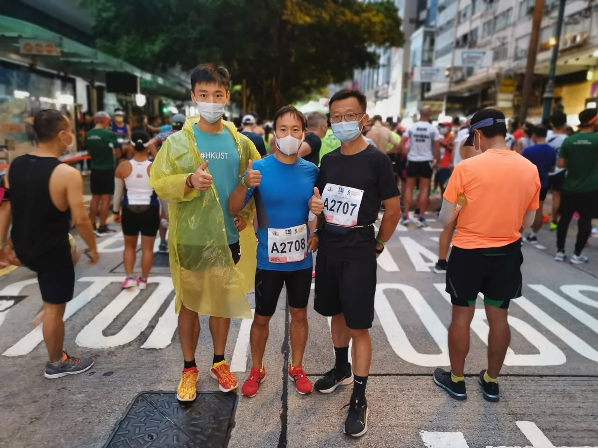
**이미지 캡션:** 세 명의 성인 남성이 도로 위에서 포즈를 취하고 있으며, 모두 마스크를 착용하고 있습니다. 왼쪽 남성은 검은색 민소매 상의와 검은색 반바지를 입고 있으며, 그의 오른쪽에는 노란색 비옷을 입고 있는 남성이 있습니다. 이 남성은 파란색 티셔츠에 #HKUST라고 적힌 흰색 문구가 있고, 엄지손가락을 치켜들고 있습니다. 가운데 남성은 파란색 반팔 티셔츠와 검은색 반바지를 입고 있으며, 가슴에는 A2708이라는 번호가 적힌 흰색 레이스 번호표를 달고 있습니다. 오른쪽 남성은 검은색 반팔 티셔츠와 검은색 반바지를 입고 있으며, 가슴에는 A2707이라는 번호가 적힌 흰색 레이스 번호표를 달고 있습니다. 세 사람 모두 운동화와 양말을 신고 있으며, 배경에는 다른 참가자들이 줄지어 서 있는 마라톤 행사로 보이는 장면이 펼쳐지고 있습니다. 도로에는 흰색 차선이 그려져 있고, 건물들이 늘어서 있는 도시 거리입니다. 전반적으로 활기찬 행사 분위기입니다.있으며, 가슴에는 A2707이라는 번호가 적힌 흰색 레이스 번호표를 달고 있습니다. 세 사람 모두 운동화와 양말을 신고 있으며, 배경에는 다른 참가자들이 줄지어 서 있는 마라톤 행사로 보이는 장면이 펼쳐지고 있습니다. 도로에는 흰색 차선이 그려져 있고, 건물들이 늘어서 있는 도시 거리입니다. 전반적으로 활기찬 행사 분위기입니다.
 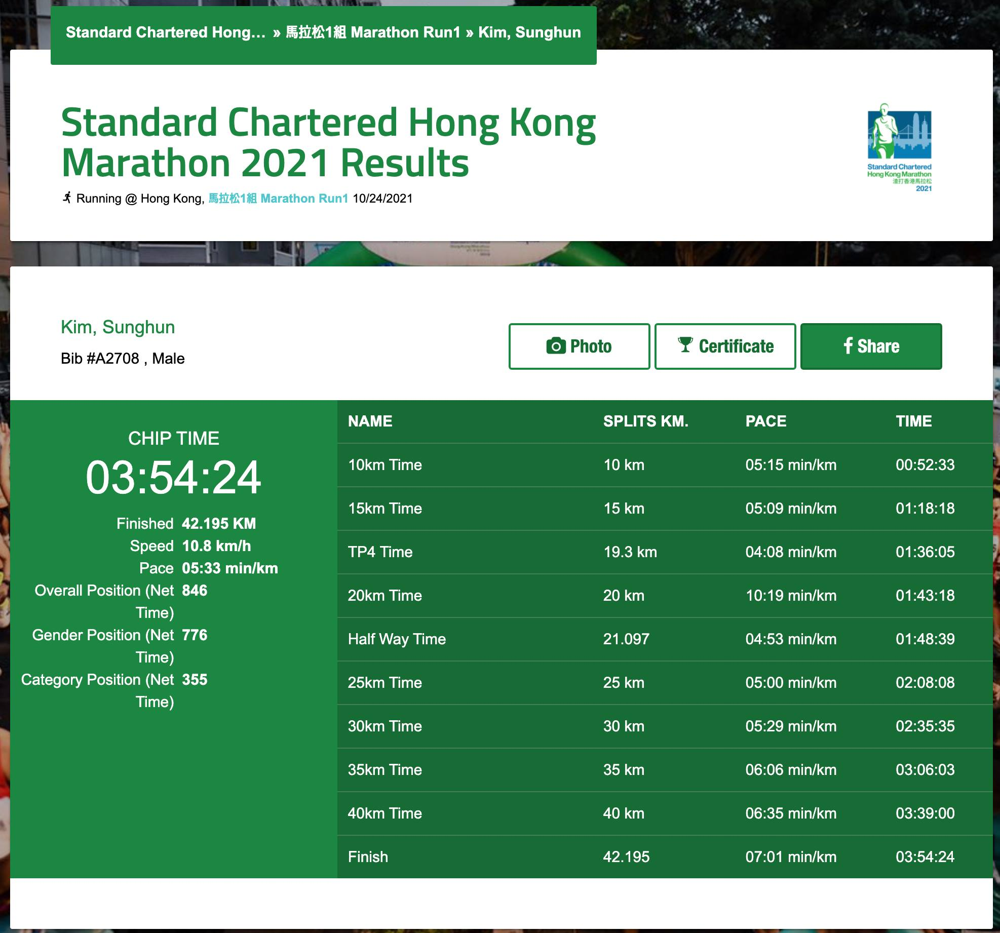
**이미지 캡션:** 이 사진은 스탠다드 차타드 홍콩 마라톤 2021 결과 페이지의 일부로, 김성훈이라는 성인 남성의 마라톤 기록을 보여줍니다. 김성훈 선수는 등번호 A2708을 달고 참가했으며, 칩 타임은 03:54:24입니다. 총 42.195km를 완주했으며, 평균 속도는 시속 10.8km, 페이스는 1km당 5분 33초입니다. 전체 순위는 846위, 성별 순위는 776위, 연령대 순위는 355위입니다. 페이지에는 10km, 15km, 19.3km, 20km, 하프웨이(21.097km), 25km, 30km, 35km, 40km 지점별 기록과 페이스, 그리고 최종 완주 기록이 표 형태로 상세하게 나와 있습니다. 상단에는 마라톤 대회 로고와 함께 "Standard Chartered Hong Kong Marathon 2021 Results"라는 제목이 보이며, 페이지 상단 링크에는 "Standard Chartered Hong... » 馬拉松1組 Marathon Run1 » Kim, Sunghun"이라고 표시되어 있습니다. 사진 오른쪽 상단에는 스탠다드 차타드 홍콩 마라톤 2021 로고가 있습니다. 페이지에는 "Photo", "Certificate", "f Share" 버튼이 있어 기록 확인, 인증서 발급, 공유 기능을 제공하는 것으로 보입니다. 전반적으로 깔끔하고 정보 전달에 초점을 맞춘 웹페이지 디자인입니다.m 지점별 기록과 페이스, 그리고 최종 완주 기록이 표 형태로 상세하게 나와 있습니다. 상단에는 마라톤 대회 로고와 함께 "Standard Chartered Hong Kong Marathon 2021 Results"라는 제목이 보이며, 페이지 상단 링크에는 "Standard Chartered Hong... » 馬拉松1組 Marathon Run1 » Kim, Sunghun"이라고 표시되어 있습니다. 사진 오른쪽 상단에는 스탠다드 차타드 홍콩 마라톤 2021 로고가 있습니다. 페이지에는 "Photo", "Certificate", "f Share" 버튼이 있어 기록 확인, 인증서 발급, 공유 기능을 제공하는 것으로 보입니다. 전반적으로 깔끔하고 정보 전달에 초점을 맞춘 웹페이지 디자인입니다.

### 10월 26일 (화) 16:36 · #소화전에핀풀 #무럭무럭자라길 오늘 산책 중 소화전에 풀이 떨어져 있나 …

#소화전에핀풀 #무럭무럭자라길 오늘 산책 중 소화전에 풀이 떨어져 있나 하면서 무심히 보았는데. 글쎄 이 작은 틈에서 살아가고 새 순을 티우는 생명체를 발견하였습니다. 페인트 사이를 비집고 뿌리까지 내리고 있는데 정말 대단한 생명력입니다. 작지만 그 크고 놀라운 힘에 감동한 감사한 아침입니다.

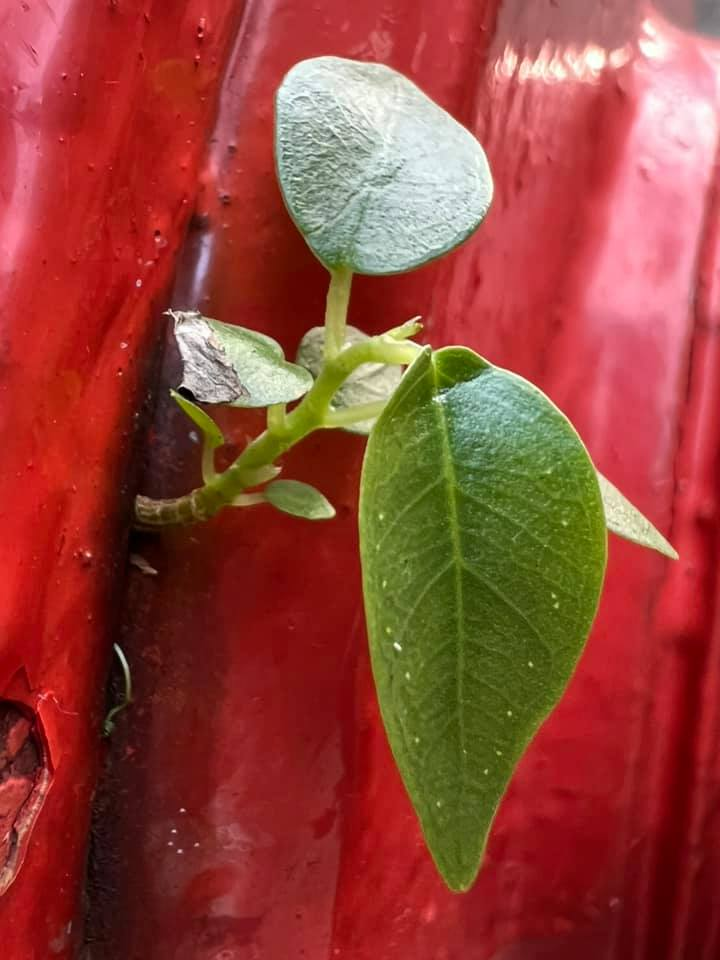
**이미지 캡션:** 붉은색 표면을 배경으로 옅은 녹색의 어린 식물이 자라고 있다. 식물은 얇고 연한 줄기를 가지고 있으며, 잎은 옅은 녹색을 띠고 있다. 큰 잎에는 흰색 점들이 불규칙하게 박혀 있으며, 잎맥이 선명하게 보인다. 작은 잎은 둥근 모양이며, 잎 가장자리가 약간 말려 있다. 배경의 붉은색 표면은 광택이 있으며, 약간의 흠집과 얼룩이 보인다. 전체적으로 식물의 생명력과 성장을 보여주는 듯한 모습이며, 붉은색과 녹색의 대비가 강렬하다.
 
**이미지 캡션:** 이 사진은 붉은색 소화전이 정면을 향해 서 있는 모습을 담고 있습니다. 소화전은 금속 재질로 보이며, 윗부분에는 둥근 뚜껑과 두 개의 연결구가 있고, 아랫부분에는 "139"라는 흰색 숫자가 새겨져 있습니다. 소화전 양쪽에는 쇠사슬이 연결되어 있으며, 이는 소화전 뚜껑이나 연결구를 보호하는 역할을 하는 것으로 보입니다. 소화전 주변으로는 회색 포장 블록이 깔려 있고, 틈새와 가장자리에는 풀과 낙엽이 자라나 있어 다소 방치된 듯한 느낌을 줍니다. 배경에는 푸른색의 무성한 관목이 보이며, 이는 야외 공간임을 시사합니다. 사진은 낮에 촬영된 것으로 보이며, 전체적으로 차분하고 일상적인 분위기를 자아냅니다. 사람이나 동물은 보이지 않으며, 오직 소화전과 주변 환경만이 담겨 있습니다.니다. 사진은 낮에 촬영된 것으로 보이며, 전체적으로 차분하고 일상적인 분위기를 자아냅니다. 사람이나 동물은 보이지 않으며, 오직 소화전과 주변 환경만이 담겨 있습니다.

### 10월 29일 (금) 16:41 · 📷 사진 (1장)

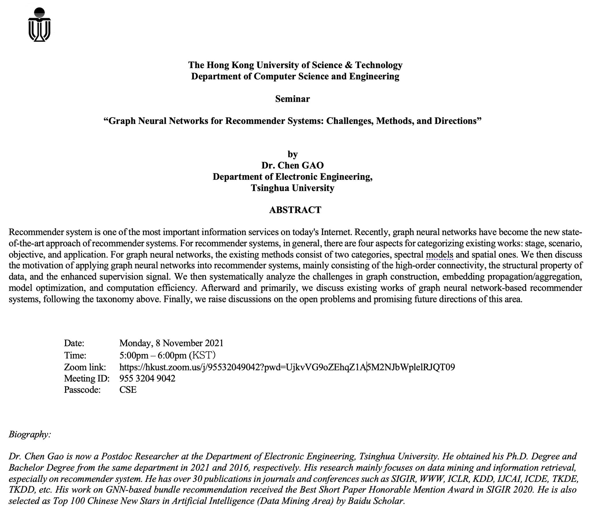
**이미지 캡션:** 이 문서는 홍콩 과학기술대학교 컴퓨터 과학 및 공학부에서 주최한 세미나의 안내문입니다. 세미나 제목은 "추천 시스템을 위한 그래프 신경망: 도전 과제, 방법 및 방향"이며, 2021년 11월 8일 월요일 오후 5시부터 6시(KST)까지 줌으로 진행됩니다. 줌 링크, 회의 ID 및 비밀번호가 제공됩니다. 발표자는 칭화대학교 전자공학부 박사후 연구원인 Chen Gao 박사입니다. 그의 약력에는 데이터 마이닝 및 정보 검색, 특히 추천 시스템 분야의 연구 경험이 자세히 설명되어 있으며, 다수의 논문 발표와 수상 경력이 언급되어 있습니다.력이 언급되어 있습니다.

> #GNN #추천   업스테이지가 초청하고 HKUST가 호스트하는 공개세미나 안내 드립니다. 가장 핫한 분야장 하나인 GNN과 추천! 이 관련하여 멋진 survey논문도 작성하시고 Top 100 Chinese New Stars in AI에 선정된 Gao님의 세미나 입니다.   누구에게나 오픈되어 있으니 아래 줌링크로 참여하시면 됩니다.  * Date: Monday, 8 November 2021 * Time: 5:00pm – 6:00pm (KST) * Zoom link: https://hkust.zoom.us/j/95532049042?pwd=UjkvVG9oZEhqZ1A5M2NJbWplelRJQT09 * Meeting ID: 955 3204 9042 * Passcode: CSE
