# 2021년 11월

[← 2021년](README.md)

### 11월 8일 (월) 17:22 · 📷 사진 (1장)

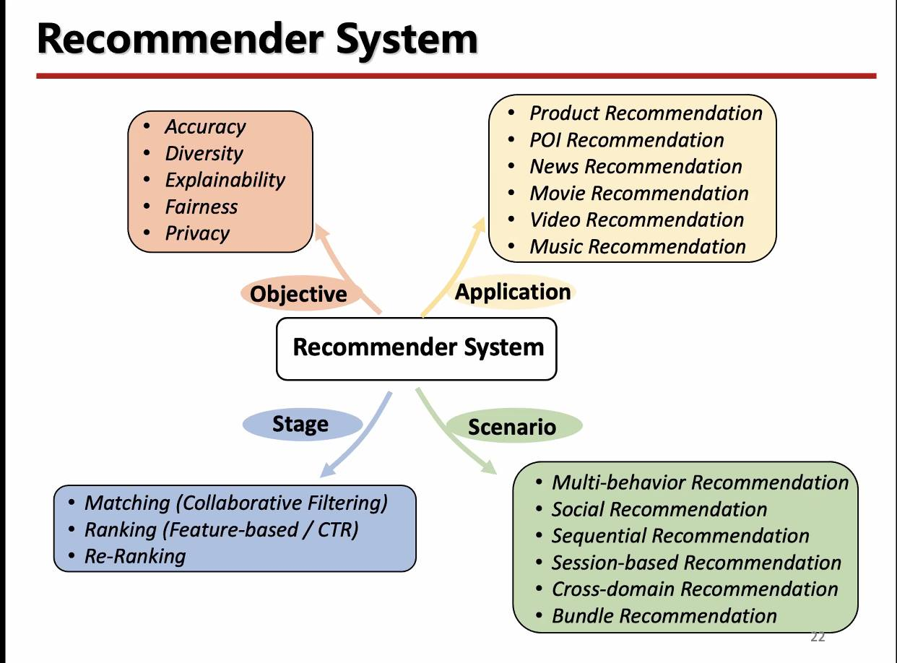

### 11월 9일 (화) 13:08 · 📷 사진 (1장)

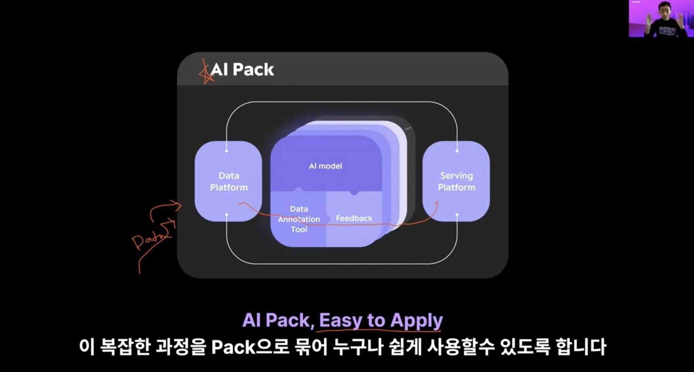

> 지난 주 목요일에 열린 Upstage Career Talks 전문연 온라인 채용설명회 녹화 영상 공유 드립니다! 채용설명회를 통해 업스테이지 비즈니스, 연구문화, 채용절차를 확인해보세요! (성킴의 새로운 얼굴 주의!) https://youtu.be/OoQFHbcEZRI  저희는 AWS Sagemaker나 Google의 Vertex AI 보다 한단계 더 abstract되어 코드 없이도 데이타 입력만으로도 지속적인 고성능으로 동작되는 AI pack을 개발하고 있습니다.  물론 AI Pack의 개발을 위해서는 상당한 MLOps지식, 그리고 계속 좋은 딥러닝 모델을 새로 개발해야 하는 매우 도전적인 과제입니다. 함께 하실분들을 모시고 있으며 Upstage 전문연 모집은 11월 10일까지 1차 마감입니다! 선지원, 후고민!   [전문연구요원] Software Engineer: https://careers.upstage.ai/l/ko/o/software-engineer-yongin  [전문연구요원] AI Research Engineer: https://careers.upstage.ai/l/ko/o/ai-research-engineer-1

### 11월 10일 (수) 07:38 · #부스트캠프AI텍 #3기모집 #이번주12일불금 #저녁7시

#부스트캠프AI텍 #3기모집 #이번주12일불금 #저녁7시 
AI교육계의 큰 화제가 되고 있는 Upstage 와 함께하는 네이버 부스트캠프 AI 3기 모집을 시작합니다. 

#최고강사진 #현업데이타 #빵빵한GPU 지원 #AIStages 환경에 #실무경력멘토단 등 AI교육에 필요한 모든것을 갖추고 있고 이미 수료한 1기의 수업평가를 보면 무려 평균 4.7입니다. 

무엇을 하길래 4.7 일까요? 이번 12일 불금 저녁 7시 https://tv.naver.com/l/89848 오시면 누구나 보실수 있습니다.

딥러링의 A~Z를 경험하고 실습할수 있고 멋진 동료들과 함께 성장하고, 세상을 바꿀 AI기술을 얻을수 있는 3기를 12/6일까지 모집하고 있으며 멋진 여정이 2022년 1월 7일 여러분들과 함께 시작합니다. 모두를 AI전문가로 업스테이지 해드리겠습니다. 함께해요!

 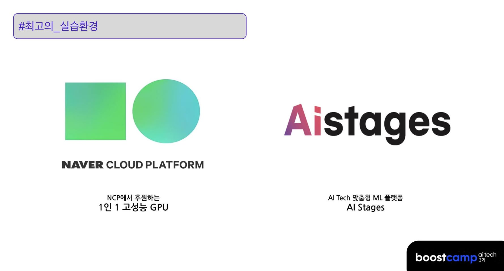 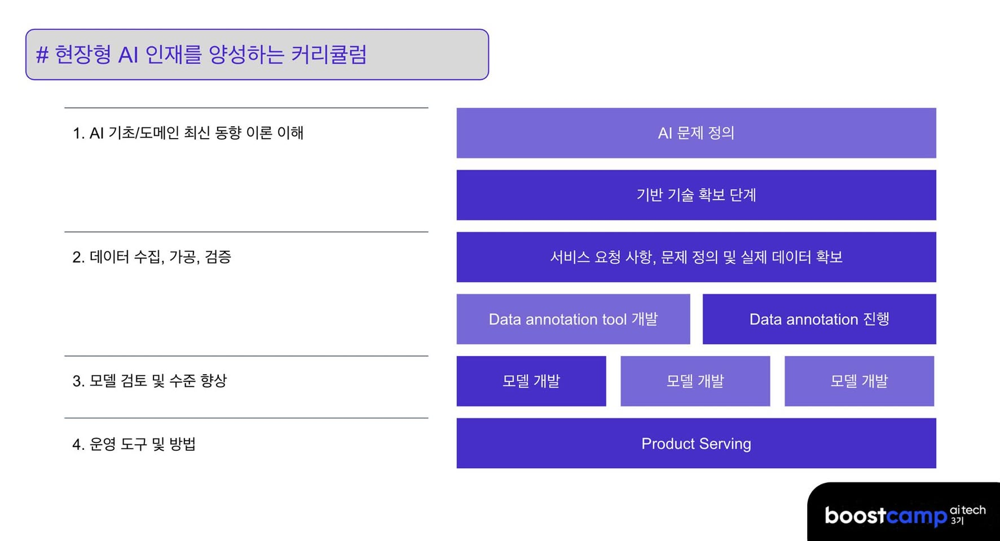

### 11월 10일 (수) 08:07 · 📷 사진 (6장)

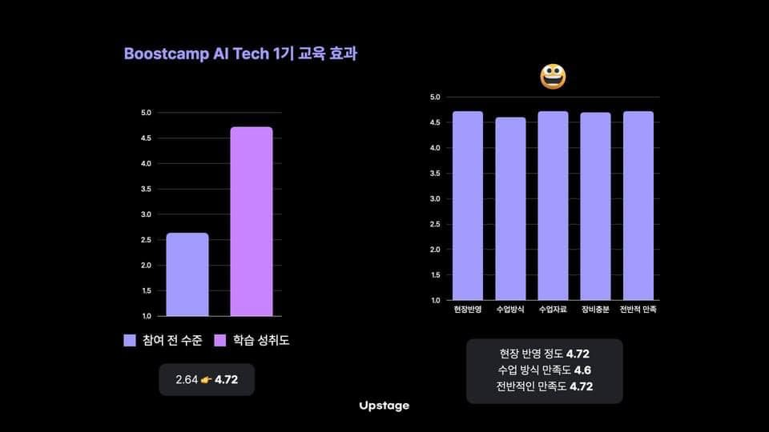 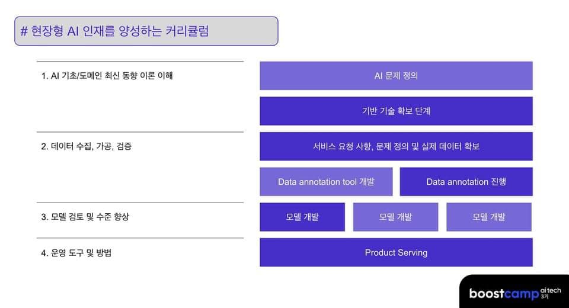    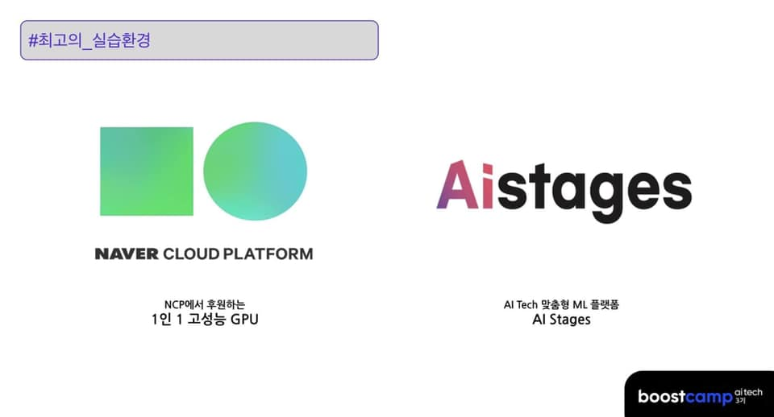

### 11월 12일 (금) 22:30 · 📷 사진 (6장)

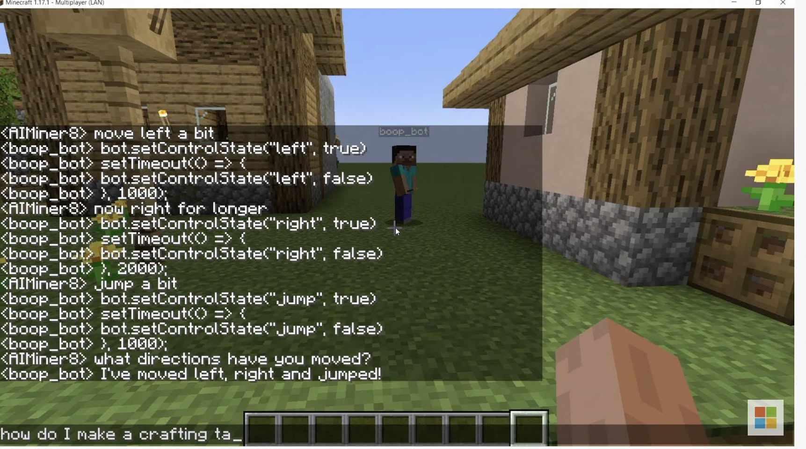 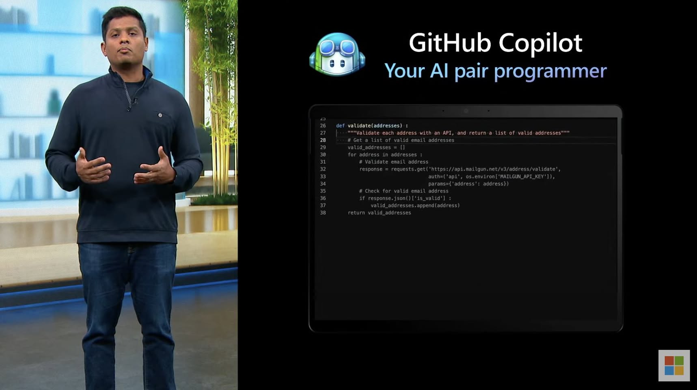 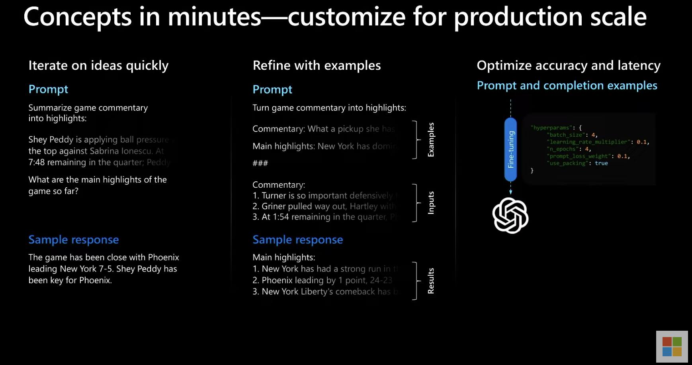 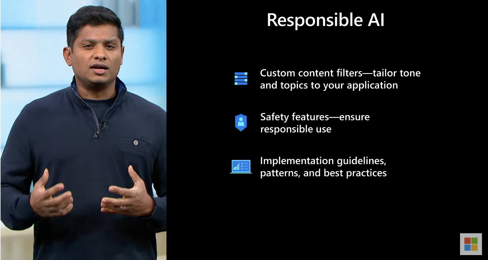 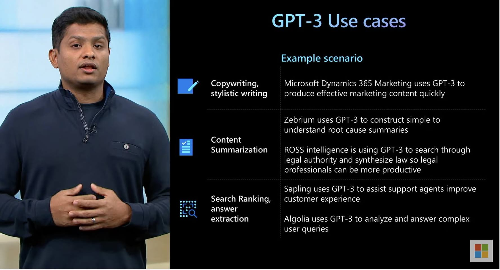 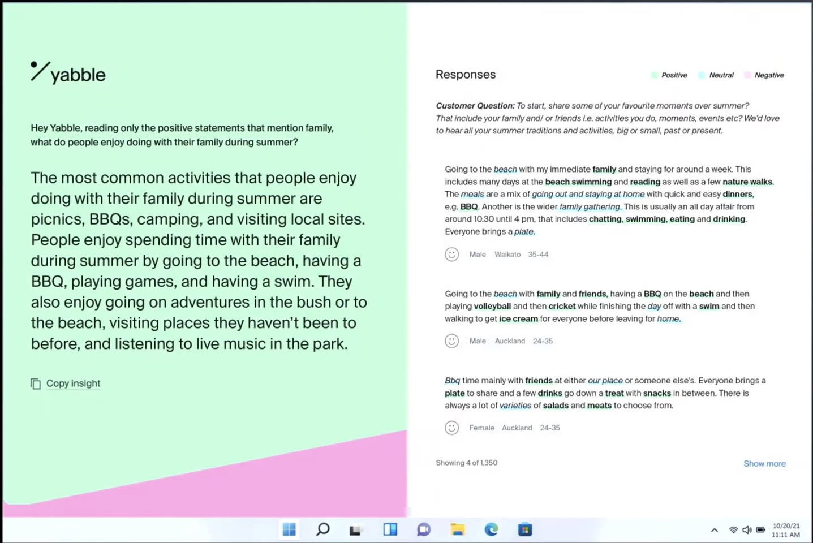

### 11월 19일 (금) 07:32 · 📷 사진 (1장)

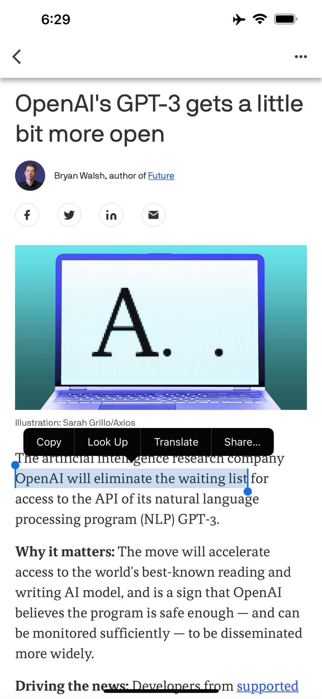

> GPT관련 소식들이 많이 나오고 있습니다. OpenAI gpt3가 이제 waiting list를 없애겠다고 합니다. 여러가지 재미있는 것들이 더 많이 나오기를 기대해봅니다.   https://www.axios.com/openai-gpt-3-waiting-list-api-929fd309-f8e1-4571-862a-879492e5ebc6.html

### 11월 20일 (토) 13:13 · 📷 사진 (5장)

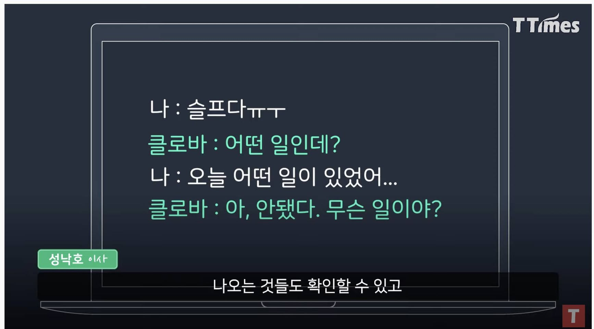  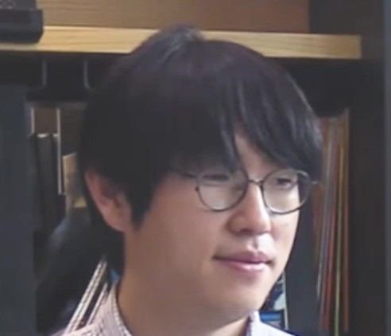 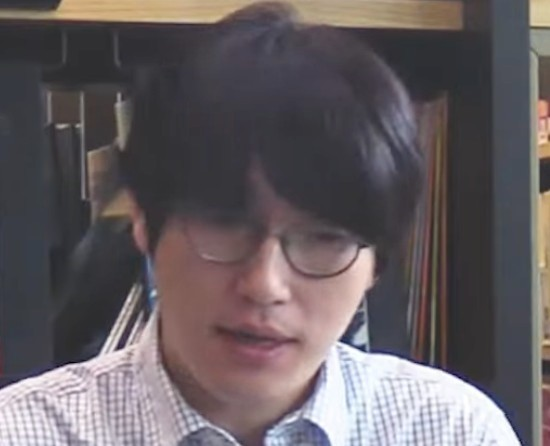 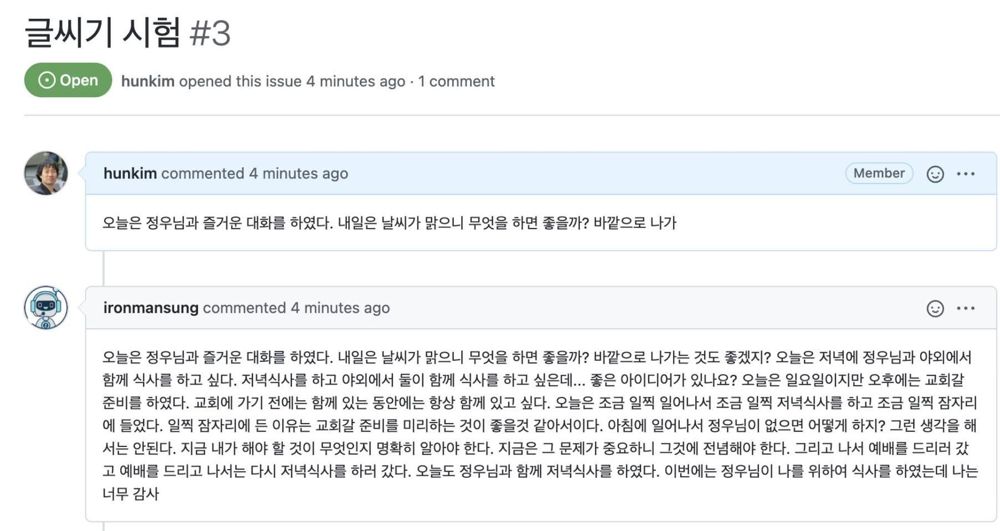

> #카카오gpt #테스트해보자  https://huggingface.co/kakaobrain/kogpt 에 올려주신 gpt를 간단히 그리고 공개적으로 테스트 해볼수 있는 gthub repos 하나 만들어 보았습니다.  https://github.com/DeepSE/gpt_playground  issue 본문에 prompt를 주시면 답변형식으로 응답을 드립니다. 대략 max_length=256 정도로 해두었으니 참고해서 짧게 prompt를 주시면 좋습니다.   제 연구실 학생들이 사용하는 3090GPU 하나를 빌려 서빙중이라 응답이 (2초정도) 느리고 불안정 할수 있습니다.   Ildoo Kim 공개해주신 카브 감사드리며 DongPil Seo 메모리 관련 도움 감사드립니다. (https://github.com/DeepSE/gpt_playground watch 하시면 다른 분들이 올리시는 prompt와 응답을 보실수 있으십니다.)

### 11월 24일 (수) 22:35 · 📷 사진 (1장)

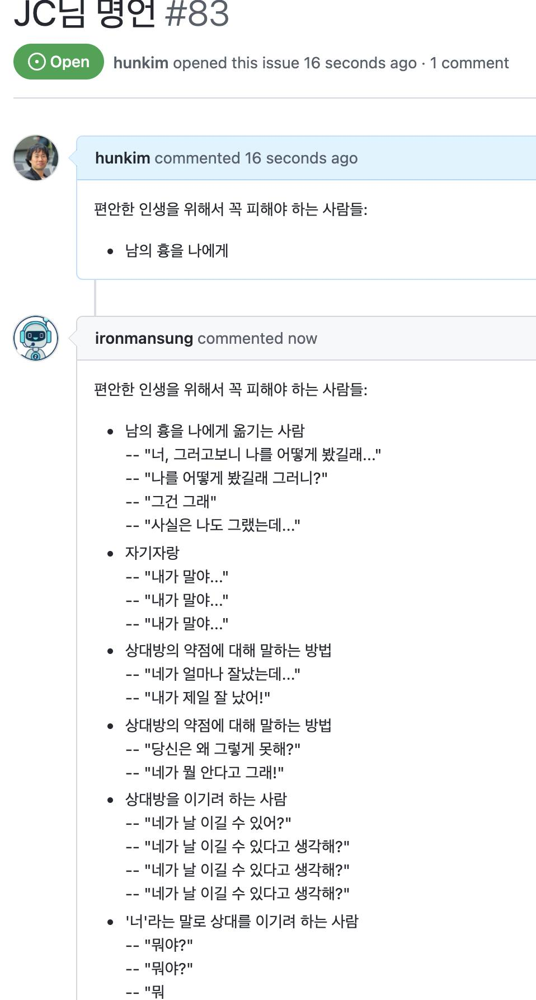

### 11월 26일 (금) 17:32 · 📷 사진 (1장)

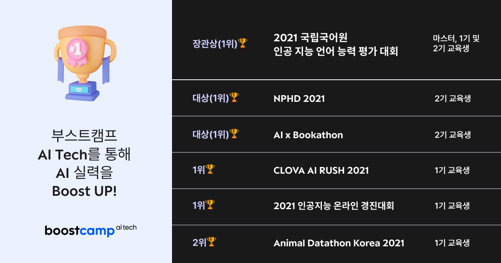

> #부캠AI #묻지마등록 #3기마감임박 #1206 #실력업업   최고 강사진, 밀착 멘토, 실무 데이타, 든든한 베이스라인 코드, 함께 성능을 올리며 성장하는 최고의 AI교육으로 꼽히는 부캠AI 3기 지원이 오는 2021년 12월 6일(월) 오전 10시 마감됩니다.  https://apply.connect.or.kr/connect/applyDetail?annoId=20006803  저희 부캠출신이 1등을 휩쓰는 활약상이 보여주듯 최고의 AI개발자가 될수 있는 부캠, 모두 함께 해요! 특히 함께 1등하시고 싶은 분들은 모두 부캠으로!!

### 11월 26일 (금) 17:45 · #부캠AI #묻지마등록 #3기마감임박 #1206 #실력업업

#부캠AI #묻지마등록 #3기마감임박 #1206 #실력업업 

교육관련 일을 할때 개인적으로 가장 뿌듯한 순간은 참여한 학생들이 대박을 낼때 입니다. 

제가 참여하고 있는 커넥트재단 부캠출신들이 장관상을 비롯하여 1등을 휩쓸고 있습니다. 너무나 자랑스럽고 기분 좋습니다.

계속해서 최고의 AI엔지니어가 되고 1등하실 분들 부캠 3기도 12월 6일까지 모집 중이니 함께해요! https://apply.connect.or.kr/connect/applyDetail?annoId=20006803

멋진 분들 3기에서 뵐 생각에 벌써부터 설렘니다. 선지원, 노고민!

