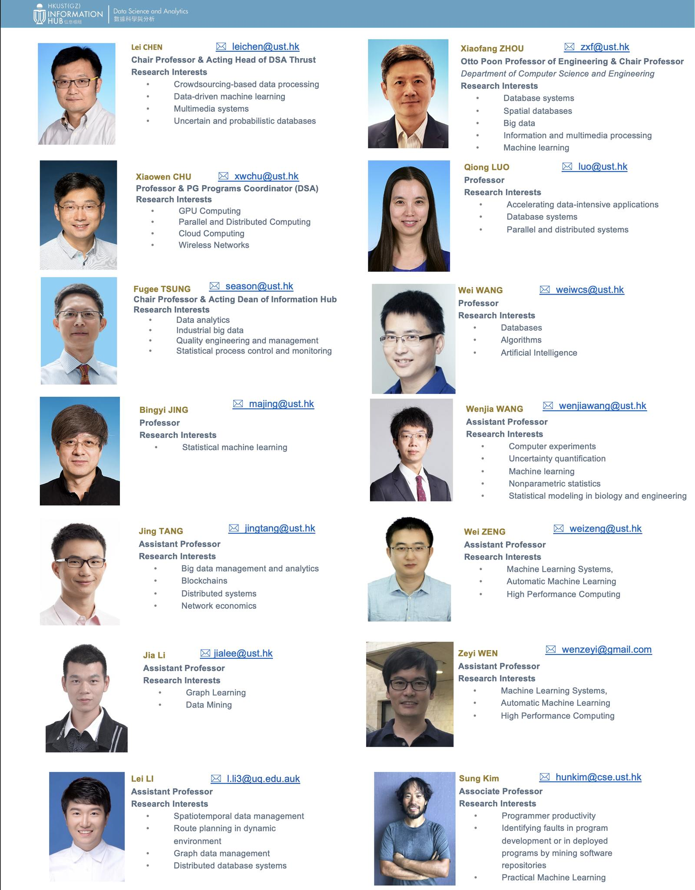
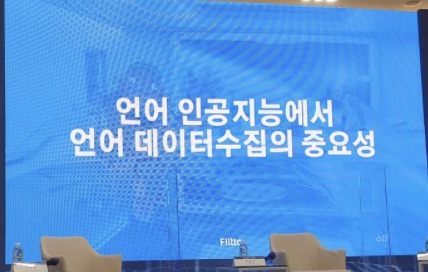
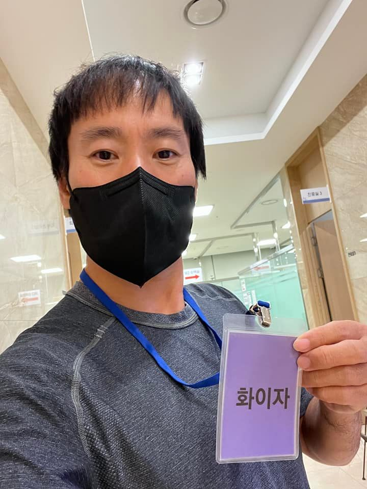

# 2021년 12월

[← 2021년](README.md)

### 12월 3일 (금) 15:07 · 📷 사진 (1장)

**이미지 캡션:** 이 사진은 홍콩 과학기술대학교(HKUST) 정보 허브의 데이터 과학 및 분석 분야 교수진을 소개하는 웹페이지의 일부로, 총 12명의 교직원 사진과 이름, 직책, 이메일 주소, 연구 관심사를 보여준다. 왼쪽 열에는 레이 첸, 샤오웬 추, 푸지 쑨, 빙이 징, 징 탕, 자 리, 레이 리가 있으며, 오른쪽 열에는 샤오팡 저우, 치옹 루오, 웨이 왕, 웨인지아 왕, 웨이 젱, 제이 원, 성 김이 있다. 대부분의 인물은 정면을 응시하며 차분하고 전문적인 표정을 짓고 있으며, 깔끔한 복장을 하고 있다. 배경은 대부분 흰색 또는 단색으로 인물에 집중할 수 있도록 단순하게 처리되었다. 각 인물 정보 아래에는 점으로 구분된 연구 관심사 목록이 나열되어 있어, 이들이 데이터 과학, 기계 학습, 데이터베이스 시스템, 인공 지능 등 다양한 분야를 연구하고 있음을 알 수 있다. 전반적으로 학술적이고 정보 전달에 초점을 맞춘 차분한 분위기이다.

> #홍콩과기대광저우 #데이타분석박사 #4년풀지원 #리모트 #인턴기회 #tfkr멤버환영  요약: * 박사: 세상을 변화시킬 한 문제를 푸는데 전념할 수 있는 3~4년의 시간 * 2022년 9월 개교하는 홍콩과기대 광저우 데이타 분석박사 과정모집 * 박사과정중 full stipend 등 풀지원 (첫 1~2년은 리모트 참여가능) * 세계적인 교수님을 골라 연구, 동료들과 최고 연구  * 3월 1일 원서 마감 https://prog-crs.ust.hk/pgprog/2022-23/mphil-phd-dsa   오는 9월 개교하는 광저우 캠퍼스 데이터 분석학과에서 풀지원/장학생 박사과정을 모집합니다. AI의 가장 중요한 데이타의 분석과 이를 활용한 AI모델등을 연구하는 박사 과정입니다. 아래 사진처럼 해당분야 최고의 교수님들, 그리고 동료들과 함께 풀생활비 지원을 받으시면서 연구가능합니다. 정말 멋진 교수님들이 많습니다. 또한 박사과정중 MS, Google, 바이트덴스, 업스테이지등 세계적인 AI회사에서 인턴을 하시거나 공동연구를 하실 기회들이 매우 많습니다.  코로나등의 상황으로 첫 1~2년 수업은 리모트로 참여 가능하며 이후 광저우에서 공부할수 있는 환경이 되면 기숙사를 제공하여 편리하게 연구에만 집중할수 있습니다.   박사를 한다는 것은 어떤 의미일까를 적어둔 이전 글을 첨부 드립니다. 한마디로 멋진 일인데, 함께 하실분들 많은 지원 부탁드립니다. 궁금하신 내용은 https://prog-crs.ust.hk/pgprog/2022-23/mphil-phd-dsa 참고하시고, 추가로 페메나 hunkim+phd@gmail.com 등으로 문의 주시면 제가 담당자와 연결드리겠습니다.   --- 요즈음에는 박사들이 많고 또 박사학위를 받는다고 해도 일자리가 없다는 등의 이야기를 듣습니다. 이런 시대에 박사를 한다는 것은 무엇일까요? 제가 공대쪽이라 다른 분야는 잘 모르겠지만, 공대 분야에서 박사를 한다는 것은 인생에서 나름대로 배운 지식을 총동원하여 세상을 변화시킬 한 문제를 푸는데 전념할 수 있는 3~4년의 시간이라 하겠습니다.  학부때까지 배운 여러분들의 지식, 그리고 대학원 초기에 배우는 조금 더 상세한 지식을 익힌 후 이것을 이용해 "문제" 를 찾습니다. 대학때까지는 대부분 답이 있는 문제가 여러분들에게 주어지고, 이 문제를  푼 다음 "정답"과 맞추어 보는 식이라고 할 수 있습니다. 박사과정은 그 문제를 찾는 것부터가 시작합니다.  물론 여러분들이 찾은  "문제"에 답이 있을 수도 있고 없을 수도 있습니다. 아무도 풀어보지 않은 문제이기에 우리는 모르는 것이죠. 그런 문제를 하나 잡아서 3~4년 동안 이 한 가지에 집중해 보는 것입니다. 아침에 일어나서 그 문제를 생각하고 버스를 타다가도 문득, 또는 그릇을 씻다가, 길을 걷다가도 계속 그 문제를 생각해보는 것입니다. 이 한 문제에 올인하는 것이죠.  가급적 주위의 방해 받는 잡무나, 프로젝트 없이, 그리고 경제적인 걱정 없이 (저희 학교의 경우 약 월 200만원의 stipend 지급) 그 문제에만 집중할 수 있는 환경을 가진 곳이 박사를 하기 좋은 곳이고 무엇보다도 본인이 찾은 문제가 좋은 문제인가를 같이 고민할 adviser가 있는 곳이 최고 좋은 곳입니다. 그렇게 3~4년을 보낸다면 정말 멋진 문제를 아름답게 풀 수 있을 것입니다. 그 결과로 박사과정동안 수행한 연구가 세상을 바꾸고 그 분야의 혁신적인 기술 발전을 이룬 예는 무수히 많습니다.  인생에 있어서 한 가지 문제에 집중할 수 있는 시간을 가진다는 것은 참 쉽지 않습니다. 우선 학부때는 지식이 좀 더 필요하므로 문제를 찾거나 그 문제에 대한 답을 찾기가 어렵고 (간혹 이것을 해내는 학부 학생들도 있습니다만), 또 제 또래가 되면 할 일의 종류가 늘어나고 학생들도 있고 해서 한 문제에만 집중하기가 쉽지 않습니다. 그래서 저는 박사과정을 시작하는 제 학생들을 보면 사실 부러운 마음도 듭니다.  인생에서 3~4년 정도 "한 문제" 풀기에 집중해보는 것은 여러분의 젊음을 보내는 가장 좋은 방법 중 하나라고 생각합니다. 물론 이렇게 해서 한 문제를 잘 푼 사람들은 그 문제에 대해서만큼은 세계 최고이며, 계속해서 다른 문제를 잘 풀 수 있는 자신감과 능력을 가진 것이고 그럴 때 "박사"라는 칭호가 어울릴 것입니다. 출처: https://sestory.tistory.com/60 [소프트웨어 이야기]

### 12월 17일 (금) 13:53 · 📷 사진 (1장)

**이미지 캡션:** 이 사진은 파란색 배경의 대형 스크린 앞에 놓인 두 개의 의자를 보여주며, 스크린에는 "언어 인공지능에서 언어 데이터 수집의 중요성"이라는 한국어 문구가 흰색 글씨로 크게 쓰여 있습니다. 스크린 하단에는 "Flitte"와 "oll"이라는 로고가 작게 보입니다. 스크린 배경에는 추상적인 패턴과 흐릿한 이미지가 포함되어 있으며, 의자 앞쪽에는 작은 테이블과 물병이 놓여 있습니다. 전체적으로 기술 관련 컨퍼런스나 발표회장의 모습으로 보이며, 진지하고 전문적인 분위기를 풍깁니다.

### 12월 28일 (화) 11:10 · AI 기술 글로벌 1위를 통해 고객사들에게 AI 가치를 만들어 내고 Ma…

AI 기술 글로벌 1위를 통해 고객사들에게 AI 가치를 만들어 내고 Making AI Beneficial 을 향해 달려가고 있습니다. 2021년 한해 여러분들 덕분에 많이 앞으로 달렸고, 2022년은 더 신나게 더 멀리 달려보겠습니다.

저희와 함께 달리고 싶은 분들에게 문은 활짝 열려있습니다. https://careers.upstage.ai/ 선 지원 후 함께 달려요!

2021년 너무 감사했습니다. 2022년 모두 새해 복 많이 받으세요!

🎬 동영상 1개 (생략)

### 12월 28일 (화) 20:30 · 📷 사진 (1장)

**이미지 캡션:** 사진은 실내 복도에서 촬영된 셀카로, 성인 남성이 검은색 마스크를 쓰고 파란색 목걸이 줄에 걸린 보라색 명찰을 들고 있다. 남성은 40대 후반에서 50대 초반으로 보이며, 짧은 검은색 머리에 약간의 이마 주름이 있다. 그는 회색 스포츠 티셔츠를 입고 있으며, 명찰에는 한국어로 "화이자"라고 쓰여 있다. 배경에는 사무실 복도가 보이며, 벽에는 "진료실 3"이라고 적힌 표지판이 있고, 형광등 조명이 켜져 있다. 전반적으로 차분하고 일상적인 분위기를 풍긴다.
