# 2022년 2월

[← 2022년](README.md)

### 2월 4일 (금) 07:56 · 📷 사진 (1장)

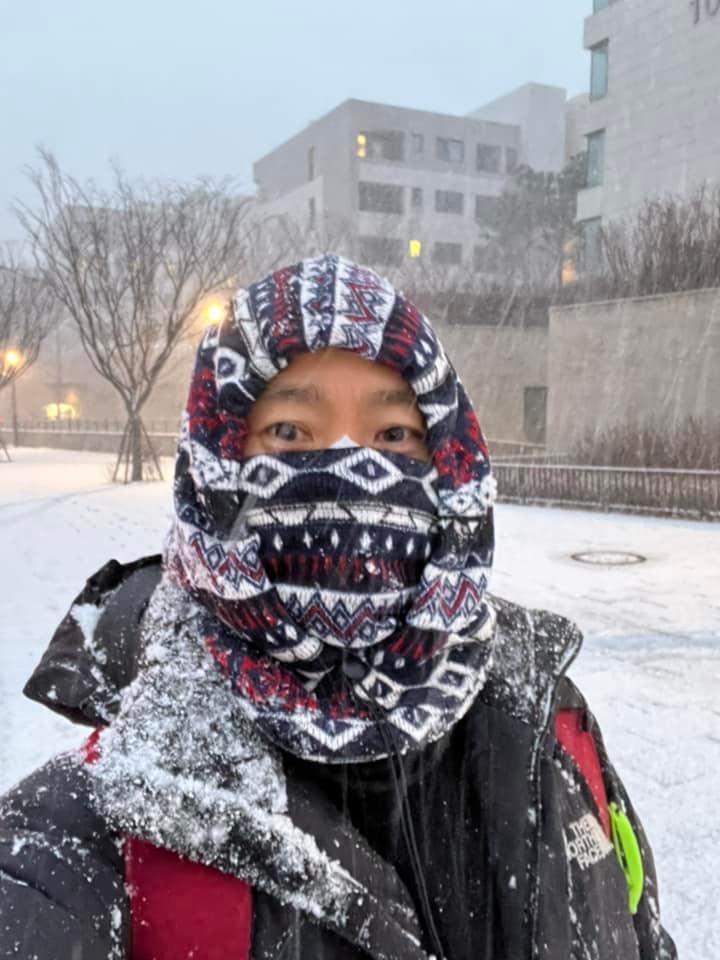
**이미지 캡션:** 눈이 내리는 야외에서 한 성인 남성이 셀카를 찍고 있다. 남성은 얼굴 대부분을 기하학적 패턴의 머플러와 넥워머로 가리고 있으며, 눈에 띄는 것은 그의 눈뿐이다. 그는 검은색 패딩 점퍼를 입고 있으며, 점퍼에는 눈이 쌓여 있다. 점퍼 왼쪽 팔 부분에는 "THE NORTH FACE" 로고가 희미하게 보인다. 배경에는 눈이 쌓인 나무와 현대적인 건물들이 보이며, 가로등 불빛도 희미하게 빛나고 있다. 눈이 흩날리는 모습으로 보아 눈이 많이 내리고 있는 추운 날씨임을 알 수 있다. 전반적으로 겨울철 눈 오는 날의 풍경과 추위에 대비한 복장을 한 사람의 모습이 담겨 있다.과 추위에 대비한 복장을 한 사람의 모습이 담겨 있다.

### 2월 22일 (화) 10:33 · 📷 사진

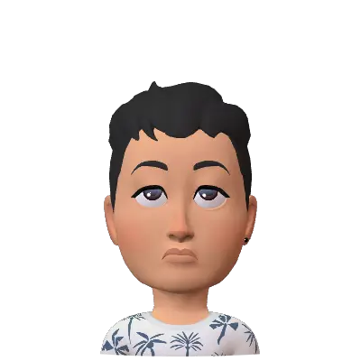
**이미지 캡션:** 이 이미지는 검은색 배경에 3D 애니메이션 스타일의 젊은 성인 남성을 보여줍니다. 남성은 짧고 짙은 검은색 머리카락을 가지고 있으며, 눈은 위로 치켜 올라가 있고 입술은 살짝 닫혀 있어 약간 지루하거나 무관심한 표정을 짓고 있습니다. 그는 흰색 티셔츠를 입고 있으며, 티셔츠에는 야자수 잎 무늬가 파란색으로 그려져 있습니다. 왼쪽 귀에는 작은 검은색 귀걸이를 하고 있습니다. 이 캐릭터는 전반적으로 캐주얼하고 편안한 분위기를 풍깁니다.

### 2월 22일 (화) 16:42 · 📷 사진

**이미지 캡션:** 이 이미지는 3D 애니메이션 스타일의 젊은 성인 남성을 보여줍니다. 그는 짧고 짙은 머리카락에 짙은 눈썹, 갈색 눈을 가지고 있으며, 입을 벌리고 활짝 웃는 표정입니다. 목걸이처럼 보이는 검은색 귀걸이를 하고 있으며, 하와이안 셔츠처럼 보이는 흰색 상의에는 야자수 무늬가 그려져 있습니다. 양팔을 위로 들어 올리고 손을 쫙 펴고 있으며, 이는 환영하거나 감사함을 표현하는 듯한 행동입니다. 배경에는 노란색 별 모양과 함께 "THANKS!"라는 글자가 굵고 입체적인 노란색으로 빛나고 있습니다. 별들은 빛줄기와 함께 퍼져나가며 축하하는 듯한 분위기를 연출합니다. 전체적으로 밝고 긍정적인 느낌을 주는 이미지입니다. 퍼져나가며 축하하는 듯한 분위기를 연출합니다. 전체적으로 밝고 긍정적인 느낌을 주는 이미지입니다.

### 2월 22일 (화) 17:00 · 📷 사진

**이미지 캡션:** 이 이미지는 밝고 긍정적인 분위기의 아침 인사 이미지입니다. 중앙에는 3D 애니메이션 스타일의 성인 남성이 환하게 웃으며 양팔을 벌리고 있습니다. 남성은 짧은 검은색 머리카락에 짙은 눈썹, 동그란 눈, 활짝 벌어진 입을 가지고 있으며, 귀에는 작은 검은색 귀걸이를 착용하고 있습니다. 흰색 티셔츠를 입고 있으며, 티셔츠에는 흰색 패턴이 있습니다. 남성의 뒤로는 노란색 빛줄기가 폭발하는 듯한 배경이 있어 더욱 생동감을 더합니다. 이미지 상단에는 파란색 구름 모양의 글자로 "GOOD"이라고 쓰여 있고, 하단에는 같은 스타일의 글자로 "MORNING"이라고 쓰여 있습니다. 전체적으로 검은색 배경에 밝은 색상의 텍스트와 인물이 대비를 이루며 시선을 사로잡습니다. 이 이미지는 아침에 좋은 하루를 시작하라는 메시지를 전달하는 데 사용될 수 있습니다.은 스타일의 글자로 "MORNING"이라고 쓰여 있습니다. 전체적으로 검은색 배경에 밝은 색상의 텍스트와 인물이 대비를 이루며 시선을 사로잡습니다. 이 이미지는 아침에 좋은 하루를 시작하라는 메시지를 전달하는 데 사용될 수 있습니다.

### 2월 22일 (화) 17:00 · 📷 사진

**이미지 캡션:** 이 이미지는 흰색 배경에 3D 애니메이션 스타일의 젊은 성인 남성을 보여줍니다. 그는 검은색 머리카락을 가지고 있으며, 머리카락은 약간 삐죽삐죽하게 스타일링되어 있습니다. 그의 피부색은 밝은 갈색이며, 눈은 갈색이고 눈썹은 짙은 색입니다. 남성은 왼쪽을 바라보고 있으며, 오른손 손가락을 턱에 대고 생각에 잠긴 듯한 표정을 짓고 있습니다. 그의 표정은 고민하거나 무언가를 깊이 생각하는 듯한 느낌을 줍니다. 그는 흰색 바탕에 파란색 야자수 무늬가 그려진 반팔 티셔츠를 입고 있습니다. 귀에는 검은색 작은 귀걸이를 하고 있습니다. 배경은 완전히 흰색으로, 인물에게 초점을 맞추고 있습니다. 전체적인 분위기는 차분하고 사색적인 느낌을 줍니다.하고 있습니다. 배경은 완전히 흰색으로, 인물에게 초점을 맞추고 있습니다. 전체적인 분위기는 차분하고 사색적인 느낌을 줍니다.

### 2월 22일 (화) 17:18 · 📷 사진

**이미지 캡션:** 이 이미지는 생일 축하를 표현하는 3D 애니메이션 스타일의 그림입니다. 중앙에는 젊은 성인 남성이 두 팔을 활짝 벌리고 환하게 웃고 있으며, 머리 위에는 파란색과 노란색의 크림이 묻어 있고 촛불이 꽂힌 케이크 조각이 튀어나와 있습니다. 남성은 흰색 바탕에 야자수 무늬가 있는 짧은 소매 셔츠를 입고 있습니다. 그의 발은 거대한 2단 케이크 안에 잠겨 있으며, 케이크는 파란색과 분홍색으로 장식되어 있습니다. 케이크의 옆면에는 붉은색 글씨로 "Happy Birthday!"라고 쓰여 있습니다. 주변에는 여러 개의 촛불과 케이크 조각들이 공중에 떠다니며 생일 축하의 역동적인 분위기를 더하고 있습니다. 배경은 흰색으로, 모든 초점이 인물과 케이크에 맞춰져 있습니다. 전반적으로 매우 즐겁고 축제적인 분위기를 자아냅니다.불과 케이크 조각들이 공중에 떠다니며 생일 축하의 역동적인 분위기를 더하고 있습니다. 배경은 흰색으로, 모든 초점이 인물과 케이크에 맞춰져 있습니다. 전반적으로 매우 즐겁고 축제적인 분위기를 자아냅니다.

### 2월 22일 (화) 17:23 · 📷 사진

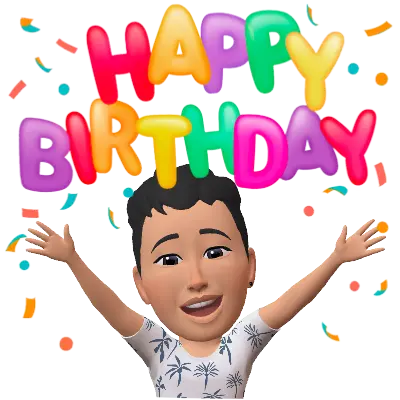
**이미지 캡션:** 이 이미지는 생일 축하 메시지를 담고 있으며, 3D 애니메이션 스타일의 젊은 성인 남성이 등장합니다. 남성은 검은색 짧은 머리에 갈색 눈을 가지고 있으며, 입을 벌리고 활짝 웃는 표정으로 매우 기뻐 보입니다. 그는 하얀색 바탕에 야자수 무늬가 그려진 반팔 셔츠를 입고 있습니다. 양팔을 위로 활짝 벌리고 있어 축하하는 분위기를 더욱 고조시키고 있습니다. 배경에는 "HAPPY BIRTHDAY"라는 문구가 다채로운 색상의 풍선 모양 글자로 쓰여 있으며, 주변에는 형형색색의 색종이가 흩날리고 있어 축제 분위기를 연출합니다. 전체적으로 밝고 즐거운 생일 축하의 순간을 표현하고 있습니다.합니다. 전체적으로 밝고 즐거운 생일 축하의 순간을 표현하고 있습니다.

### 2월 22일 (화) 17:25 · 📷 사진

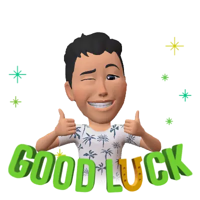
**이미지 캡션:** 검은색 배경에 3D 애니메이션 스타일의 젊은 성인 남성이 등장하며, 그는 한쪽 눈을 찡긋하고 환하게 웃으며 양손 엄지를 치켜들고 있다. 남성은 짧은 검은색 머리카락에 하얀색 반팔 티셔츠를 입고 있으며, 티셔츠에는 야자수 무늬가 그려져 있다. 그의 앞쪽에는 녹색과 노란색으로 "GOOD LUCK"이라는 문구가 3D 글자로 쓰여 있고, 글자 주변에는 반짝이는 별 모양의 장식이 여러 개 떠 있다. 전반적으로 긍정적이고 희망적인 분위기를 나타낸다.

### 2월 22일 (화) 17:25 · 📷 사진

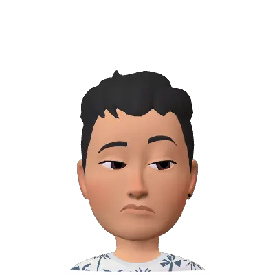
**이미지 캡션:** 이것은 흰색 배경에 있는 3D 아바타의 상반신 클로즈업 사진으로, 성인 남성으로 보이는 인물이 등장합니다. 그는 20대 후반에서 30대 초반으로 추정되며, 짧고 짙은 검은색 머리카락에 약간 곱슬거리는 스타일을 하고 있습니다. 짙은 눈썹 아래로 눈은 약간 아래를 향하고 있으며, 눈꺼풀은 살짝 내려와 있어 무관심하거나 지루한 듯한 표정을 짓고 있습니다. 입술은 살짝 닫혀 있고, 입꼬리는 약간 내려가 있어 불만족스럽거나 시무룩한 느낌을 줍니다. 뺨에는 홍조가 약간 있습니다. 그는 흰색 바탕에 파란색과 흰색의 야자수 잎 무늬가 있는 옷을 입고 있으며, 왼쪽 귀에는 작은 검은색 귀걸이를 하고 있습니다. 배경은 완전히 흰색으로 아무런 정보도 제공하지 않습니다. 이 아바타는 무표정하고 약간은 지루해 보이는 표정으로 정면을 응시하고 있으며, 전체적인 분위기는 다소 단조롭고 무관심한 느낌을 줍니다. 잎 무늬가 있는 옷을 입고 있으며, 왼쪽 귀에는 작은 검은색 귀걸이를 하고 있습니다. 배경은 완전히 흰색으로 아무런 정보도 제공하지 않습니다. 이 아바타는 무표정하고 약간은 지루해 보이는 표정으로 정면을 응시하고 있으며, 전체적인 분위기는 다소 단조롭고 무관심한 느낌을 줍니다.

### 2월 22일 (화) 17:26 · 📷 사진

**이미지 캡션:** 이 이미지는 3D 아바타 스타일의 젊은 성인 남성이 두 팔을 활짝 벌리고 포옹을 보내는 모습을 담고 있습니다. 남성은 짧은 검은색 머리에 갈색 피부, 옅은 갈색 눈을 가지고 있으며, 밝고 친근한 미소를 짓고 있습니다. 그는 하와이안 셔츠와 비슷한 패턴의 흰색 티셔츠를 입고 있으며, 셔츠에는 야자수 잎 모양의 무늬가 그려져 있습니다. 남성의 머리 위와 양옆에는 빨간색 하트 모양이 두 개 떠 있으며, "Sending"이라는 글자가 파란색 배경 위에 흰색으로 쓰여 있습니다. 이미지 하단에는 "HUGS"라는 글자가 흰색으로 크게 쓰여 있으며, 이 글자 위로 남성의 팔이 겹쳐 보입니다. 배경은 우표 모양으로 테두리가 처리되어 있으며, 파란색 바탕에는 희미하게 날짜와 우표 모양의 문양이 보입니다. 전체적으로 따뜻하고 친근한 분위기를 전달하며, 포옹을 통해 애정과 격려를 표현하는 듯한 느낌을 줍니다.흰색으로 크게 쓰여 있으며, 이 글자 위로 남성의 팔이 겹쳐 보입니다. 배경은 우표 모양으로 테두리가 처리되어 있으며, 파란색 바탕에는 희미하게 날짜와 우표 모양의 문양이 보입니다. 전체적으로 따뜻하고 친근한 분위기를 전달하며, 포옹을 통해 애정과 격려를 표현하는 듯한 느낌을 줍니다.

### 2월 22일 (화) 17:26 · 📷 사진

**이미지 캡션:** 이 3D 렌더링 이미지에는 성인 남성이 등장하며, 그는 눈을 감고 손을 모아 합장하는 자세를 취하고 있습니다. 그의 표정은 평온하고 만족스러워 보이며, 입가에는 희미한 미소가 번져 있습니다. 짧은 검은색 머리카락은 약간 헝클어져 있고, 귀에는 검은색 귀걸이를 착용하고 있습니다. 그는 하얀색 바탕에 야자수 무늬가 그려진 반팔 셔츠를 입고 있습니다. 배경은 흰색으로, 여러 개의 노란색과 주황색 별 모양이 반짝이며 떠 있습니다. 이 별들은 마치 축복이나 행운을 상징하는 듯한 느낌을 줍니다. 전체적으로 따뜻하고 긍정적인 분위기를 자아내는 이미지입니다.적인 분위기를 자아내는 이미지입니다.

### 2월 22일 (화) 17:31 · 📷 사진

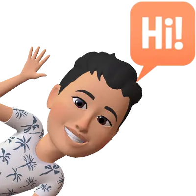
**이미지 캡션:** 이것은 3D 애니메이션 스타일의 젊은 성인 남성 아바타로, 검은색 머리카락에 짙은 눈썹, 갈색 눈을 가지고 있습니다. 그는 활짝 웃으며 흰색 배경을 향해 손을 흔들고 있으며, 그의 셔츠에는 야자수 잎 무늬가 있습니다. 그의 머리 위에는 주황색 말풍선이 있고, 그 안에는 흰색 글자로 "Hi!"라고 쓰여 있습니다. 전체적으로 밝고 친근한 분위기를 연출합니다.

### 2월 22일 (화) 17:33 · 📷 사진

**이미지 캡션:** 이 이미지는 불타는 머리카락과 손을 가진 젊은 성인 남성을 보여줍니다. 남성은 20대 후반에서 30대 초반으로 보이며, 짧은 검은색 머리카락에 불꽃이 활활 타오르고 있습니다. 그의 얼굴은 찡그려져 있고 입은 약간 벌어져 있으며, 눈은 위로 치켜 올라가 있어 분노나 좌절감을 표현하는 듯합니다. 그는 하얀색 반팔 티셔츠를 입고 있는데, 티셔츠에는 야자수 무늬가 그려져 있습니다. 그의 양손에서도 불꽃이 피어오르고 있으며, 마치 불을 다루는 능력이 있는 것처럼 보입니다. 배경은 검은색으로 처리되어 있어 인물과 불꽃에 시선이 집중됩니다. 이미지 전체적으로 강렬하고 역동적인 분위기를 자아내며, "NO"라는 단어가 불꽃으로 형상화되어 나타나 강한 거부의 의사를 표현하고 있습니다. 시선이 집중됩니다. 이미지 전체적으로 강렬하고 역동적인 분위기를 자아내며, "NO"라는 단어가 불꽃으로 형상화되어 나타나 강한 거부의 의사를 표현하고 있습니다.

### 2월 22일 (화) 17:45 · 📷 사진

**이미지 캡션:** 이 3D 애니메이션 캐릭터는 젊은 성인 남성으로 보이며, 짧고 짙은 머리카락에 눈썹이 짙고 눈은 갈색이며 입은 활짝 웃고 있습니다. 그는 옅은 색의 셔츠를 입고 있으며, 셔츠에는 야자수 무늬가 있습니다. 그는 양손으로 "CONGRATS"라고 쓰인 가랜드를 잡고 있으며, 가랜드의 각 글자는 주황색과 청록색의 깃발 모양 띠에 흰색으로 쓰여 있습니다. 캐릭터의 머리 위와 주변에는 오렌지색, 청록색, 분홍색의 색종이가 흩날리고 있어 축하하는 분위기를 더합니다. 배경은 흰색으로, 캐릭터와 가랜드, 색종이에 시선이 집중되도록 합니다. 전반적으로 기쁨과 축하를 표현하는 밝고 긍정적인 분위기입니다.되도록 합니다. 전반적으로 기쁨과 축하를 표현하는 밝고 긍정적인 분위기입니다.

### 2월 22일 (화) 17:47 · 📷 사진

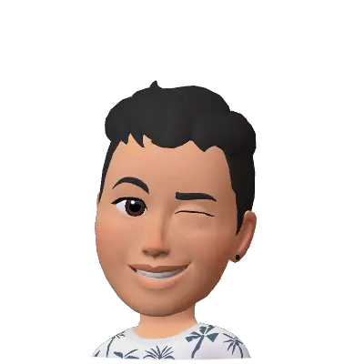
**이미지 캡션:** 이것은 검은색 배경에 3D 아바타로 묘사된 성인 남성입니다. 그는 짧고 곱슬거리는 검은색 머리카락을 가지고 있으며, 왼쪽 눈을 감고 오른쪽 눈을 뜨고 윙크하는 표정을 짓고 있습니다. 입은 살짝 벌리고 미소를 짓고 있으며, 턱선이 뚜렷하고 피부색은 갈색입니다. 귀에는 검은색 귀걸이를 하고 있습니다. 그는 하얀색 상의를 입고 있는데, 상의에는 야자수 무늬가 그려져 있습니다. 이 아바타는 긍정적이고 친근한 분위기를 풍깁니다.

### 2월 22일 (화) 17:49 · 📷 사진

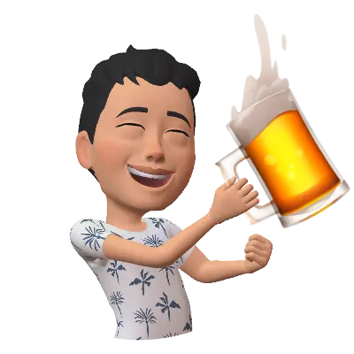
**이미지 캡션:** 이 이미지는 20대 초중반으로 보이는 성인 남성의 3D 아바타를 보여줍니다. 그는 검은색 짧은 머리에 옅은 갈색 피부를 가지고 있으며, 눈을 감고 환하게 웃는 표정입니다. 흰색 반팔 티셔츠를 입고 있으며, 티셔츠에는 파란색 야자수 무늬가 새겨져 있습니다. 남성은 오른손으로 맥주잔을 들고 있으며, 맥주잔에서는 거품이 넘쳐흐르고 있습니다. 왼손은 주먹을 쥐고 팔을 살짝 구부린 채로 힘을 주는 듯한 포즈를 취하고 있습니다. 배경은 검은색으로 아무것도 보이지 않습니다. 전체적으로 즐겁고 축하하는 듯한 분위기를 연출하고 있습니다.고 있습니다.

### 2월 22일 (화) 17:53 · 📷 사진

**이미지 캡션:** 이 이미지는 검은색 배경에 밝고 다채로운 3D 렌더링 스타일의 캐릭터와 텍스트가 포함되어 있습니다. 중앙에는 젊은 성인 남성이 점프하며 환호하는 모습입니다. 그는 짧은 검은색 머리카락에 옅은 피부톤을 가지고 있으며, 눈을 감고 활짝 웃는 표정으로 매우 기뻐 보입니다. 흰색 반팔 티셔츠에는 야자수 무늬가 그려져 있고, 짙은 색의 바지와 샌들을 신고 있습니다. 그의 양팔은 위로 뻗어 주먹을 쥐고 있으며, 한쪽 다리는 앞으로, 다른 쪽 다리는 뒤로 구부린 채 역동적으로 점프하는 자세를 취하고 있습니다. 캐릭터 뒤로는 "YESSS!"라는 글자가 크고 굵은 폰트로 나타나 있습니다. 'Y'는 붉은색, 'E'는 주황색, 첫 번째 'S'는 연두색, 두 번째 'S'는 청록색, 마지막 'S'와 느낌표는 파란색으로, 각 글자마다 색상이 다르고 입체적으로 표현되어 있습니다. 글자들은 부채꼴 모양으로 펼쳐지며 빛이 퍼져나가는 듯한 효과를 주고 있어, 전반적으로 매우 긍정적이고 신나는 분위기를 연출합니다. 이 이미지는 성공, 기쁨, 환호 등을 표현하는 데 사용될 수 있습니다.는 "YESSS!"라는 글자가 크고 굵은 폰트로 나타나 있습니다. 'Y'는 붉은색, 'E'는 주황색, 첫 번째 'S'는 연두색, 두 번째 'S'는 청록색, 마지막 'S'와 느낌표는 파란색으로, 각 글자마다 색상이 다르고 입체적으로 표현되어 있습니다. 글자들은 부채꼴 모양으로 펼쳐지며 빛이 퍼져나가는 듯한 효과를 주고 있어, 전반적으로 매우 긍정적이고 신나는 분위기를 연출합니다. 이 이미지는 성공, 기쁨, 환호 등을 표현하는 데 사용될 수 있습니다.

### 2월 22일 (화) 17:54 · 📷 사진

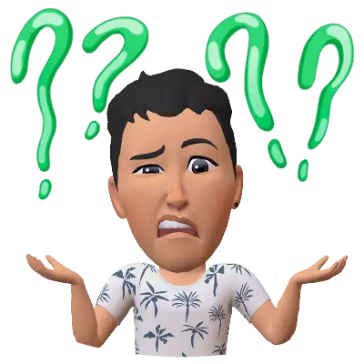
**이미지 캡션:** 이 이미지는 3D 애니메이션 스타일의 젊은 성인 남성을 보여줍니다. 그는 검은색 짧은 머리에 옅은 갈색 피부를 가지고 있으며, 흰색 바탕에 야자수 무늬가 있는 반팔 셔츠를 입고 있습니다. 남성은 눈썹을 찌푸리고 입을 살짝 벌린 채 당황하거나 혼란스러워하는 표정을 짓고 있으며, 양손을 어깨 높이로 들어 올려 손바닥을 위로 향하게 하고 있습니다. 그의 머리 위에는 네 개의 반짝이는 녹색 물음표가 떠 있어 그의 혼란스러운 감정을 강조합니다. 배경은 흰색으로, 인물과 물음표에 집중되도록 처리되었습니다. 전반적으로 이미지는 불확실성, 의문, 또는 이해하지 못하는 상황을 표현하는 분위기를 전달합니다.미지는 불확실성, 의문, 또는 이해하지 못하는 상황을 표현하는 분위기를 전달합니다.

### 2월 22일 (화) 18:04 · 📷 사진

**이미지 캡션:** 이것은 밝은 배경에 흰색 셔츠를 입고 두 팔을 위로 들어 올린 채 환하게 웃고 있는 3D 애니메이션 캐릭터입니다. 캐릭터는 짧은 검은색 머리카락과 갈색 피부를 가지고 있으며, 눈은 보라색으로 보입니다. 셔츠에는 파란색 야자수 잎 무늬가 있습니다. 캐릭터의 표정은 매우 기쁘고 활기찬 모습이며, 마치 무언가를 축하하거나 성공을 알리는 듯한 제스처를 취하고 있습니다. 전체적인 분위기는 긍정적이고 즐거운 느낌을 줍니다.

### 2월 24일 (목) 16:17 · 📷 사진

**이미지 캡션:** 이 3D 렌더링 이미지에는 휠체어에 앉아 있는 젊은 성인 남성이 환호하는 모습이 담겨 있습니다. 남성은 짧은 검은 머리에 밝은 피부를 가지고 있으며, 흰색 반팔 셔츠에 야자수 무늬가 있고 청바지를 입고 있습니다. 그는 두 팔을 위로 들어 올리고 주먹을 쥐고 있으며, 입을 크게 벌리고 환한 미소를 짓고 있어 매우 기뻐하는 표정입니다. 그의 뒤로는 "YESSS!"라는 글자가 무지개 빛깔로 퍼져나가며 강조되고 있습니다. 휠체어는 파란색 테두리가 있는 검은색이며, 바퀴와 손잡이가 보입니다. 배경은 흰색으로, 인물과 글자에 집중되도록 처리되었습니다. 전체적으로 매우 긍정적이고 축하하는 분위기를 나타냅니다.글자에 집중되도록 처리되었습니다. 전체적으로 매우 긍정적이고 축하하는 분위기를 나타냅니다.

### 2월 24일 (목) 16:17 · 📷 사진

**이미지 캡션:** 이 이미지는 성인 남성으로 보이는 3D 캐릭터를 보여줍니다. 그는 젊어 보이며, 짧고 검은 머리카락과 밝은 피부를 가지고 있습니다. 파란색 눈을 가졌으며, 입을 벌리고 활짝 웃는 표정입니다. 그는 하얀색 반팔 티셔츠를 입고 있는데, 티셔츠에는 야자수 무늬가 그려져 있습니다. 캐릭터는 오른손으로 빨간색 폼 손가락 장갑을 들고 있으며, 이 장갑은 숫자 1을 나타냅니다. 왼손으로는 럭비공을 들고 있습니다. 배경은 흰색으로 아무것도 보이지 않습니다. 전체적으로 활기차고 응원하는 듯한 분위기를 풍깁니다.

### 2월 24일 (목) 16:17 · 📷 사진

**이미지 캡션:** 이 사진은 검은색 배경에 3D 애니메이션 스타일의 성인 남성이 환호하는 모습을 담고 있습니다. 남성은 20대 후반에서 30대 초반으로 보이며, 짧은 검은색 머리에 흰색 반팔 티셔츠와 청바지를 입고 있습니다. 티셔츠에는 야자수 무늬가 그려져 있습니다. 그는 두 팔을 높이 들고 환호하며, 입을 크게 벌리고 눈을 감은 채 매우 기뻐하는 표정을 짓고 있습니다. 그의 발밑에는 갈색 나무 테이블이 놓여 있으며, 테이블 위에는 팝콘이 담긴 그릇, 나초가 담긴 빨간색 그릇, 쏟아지는 음료수 캔, 그리고 녹색 소스가 담긴 하얀색 그릇이 보입니다. 테이블 옆에는 검은색 리모컨도 있습니다. 남성의 뒤쪽으로는 "LET'S GO!"라는 문구가 빨간색 글씨로 크게 쓰여 있으며, 글씨 주변에는 팝콘과 나초 조각들이 흩날리고 있습니다. 또한, 공중에 떠 있는 미식축구공도 보입니다. 전체적으로 스포츠 경기 관람이나 흥미진진한 순간을 함께 즐기는 듯한 역동적이고 신나는 분위기를 연출하고 있습니다.얀색 그릇이 보입니다. 테이블 옆에는 검은색 리모컨도 있습니다. 남성의 뒤쪽으로는 "LET'S GO!"라는 문구가 빨간색 글씨로 크게 쓰여 있으며, 글씨 주변에는 팝콘과 나초 조각들이 흩날리고 있습니다. 또한, 공중에 떠 있는 미식축구공도 보입니다. 전체적으로 스포츠 경기 관람이나 흥미진진한 순간을 함께 즐기는 듯한 역동적이고 신나는 분위기를 연출하고 있습니다.

### 2월 24일 (목) 16:17 · 📷 사진

**이미지 캡션:** 이 이미지는 휠체어에 앉아 손을 흔들며 "Bye!"라고 말하는 젊은 성인 남성을 보여줍니다. 남성은 짧은 검은색 머리에 옅은 피부를 가지고 있으며, 야자수 무늬가 있는 흰색 반팔 셔츠와 짙은 색 바지를 입고 있습니다. 그는 밝고 행복한 표정을 짓고 있으며, 마치 즐거운 시간을 보내고 떠나는 듯한 모습입니다. 배경은 흰색으로, 휠체어 아래에는 물결 모양의 파란색 효과가 있어 움직임이나 물가를 연상시킵니다. 전체적으로 긍정적이고 활기찬 분위기를 자아냅니다.

### 2월 24일 (목) 16:17 · 📷 사진

**이미지 캡션:** 이 이미지는 3D 애니메이션 스타일의 젊은 성인 남성을 보여줍니다. 그는 짧고 검은 머리카락을 가지고 있으며, 갈색 눈과 옅은 피부톤을 가지고 있습니다. 남성은 활짝 웃으며 두 주먹을 불끈 쥐고 팔을 들어 올리는 역동적인 포즈를 취하고 있습니다. 그의 표정은 매우 기쁘고 흥분된 듯 보입니다. 그는 흰색 바탕에 야자수 무늬가 그려진 반팔 셔츠를 입고 있습니다. 배경은 검은색으로 아무것도 보이지 않아 인물에게 시선이 집중됩니다. 전체적으로 밝고 긍정적인 분위기를 자아내며, 무언가에 성공했거나 매우 기쁜 순간을 표현하는 듯합니다.현하는 듯합니다.

### 2월 26일 (토) 11:19 · 📷 앨범: Profile pictures (1장)

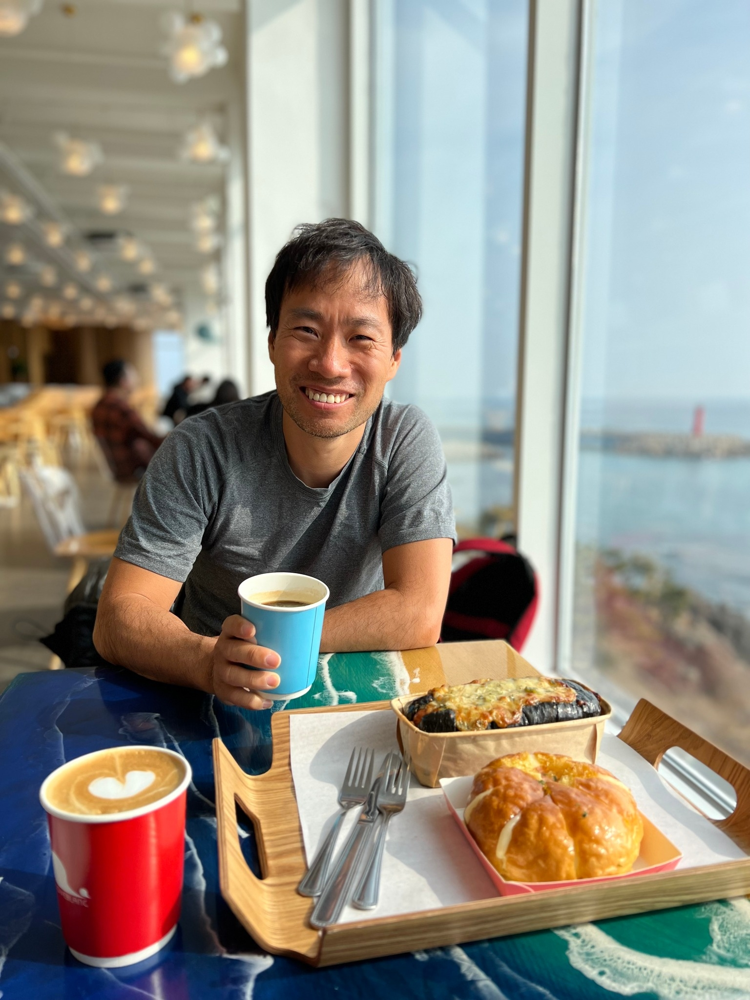
**이미지 캡션:** 한 성인 남성이 밝은 표정으로 카메라를 바라보며 커피를 들고 있다. 그는 회색 반팔 티셔츠를 입고 있으며, 그의 앞에는 빨간색 컵에 담긴 라떼와 파란색 컵에 담긴 커피, 그리고 빵 두 개가 놓여 있다. 빵은 나무 쟁반 위에 올려져 있으며, 쟁반 옆에는 포크 세 개가 있다. 배경에는 넓은 창문이 있고, 창밖으로는 바다와 등대가 보인다. 실내에는 테이블과 의자들이 보이며, 다른 손님들도 앉아 있다. 전체적으로 밝고 편안한 분위기이다.

> 봄이 왔습니다! 아름답고 따뜻한 날씨처럼 좋은 일들만 가득하세요.

### 2월 26일 (토) 14:22 · 인천상륙작전 성공을 위한 (다 죽는) 디코이 작전이였던 장사상륙작전에 단…

인천상륙작전 성공을 위한 (다 죽는) 디코이 작전이였던 장사상륙작전에 단 3일간 훈련받고 투입된 700여 학생들의 고귀한 희생을 되새기며, 우크라이나 전쟁에 반대하며, 러시아와 푸틴 대통령의 행위를 규탄합니다. 

아울러 선제타격을 포함한 어떠한 전쟁행위도 반대하며, 전쟁은 일어나서는 안되는 일입니다

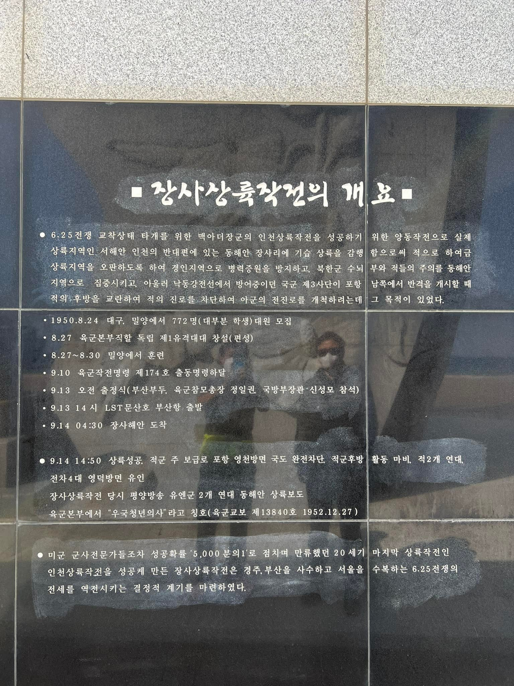
**이미지 캡션:** 이 사진은 어두운 배경에 흰색 글씨로 쓰여진 기념비의 일부를 보여줍니다. 기념비에는 "장사상륙작전의 개요"라는 제목과 함께 6.25 전쟁 당시 장사상륙작전에 대한 설명이 상세하게 기록되어 있습니다. 내용은 작전의 배경, 주요 사건, 그리고 작전의 의의 등을 포함하고 있습니다. 글씨는 명확하게 보이며, 사진은 기념비의 일부를 클로즈업하여 보여주고 있습니다. 특별히 사람이나 사물이 직접적으로 보이지는 않으며, 오로지 텍스트 정보만이 제공됩니다. 전반적으로 역사적인 사실을 전달하는 진지하고 정보 전달적인 분위기를 띠고 있습니다.띠고 있습니다.
 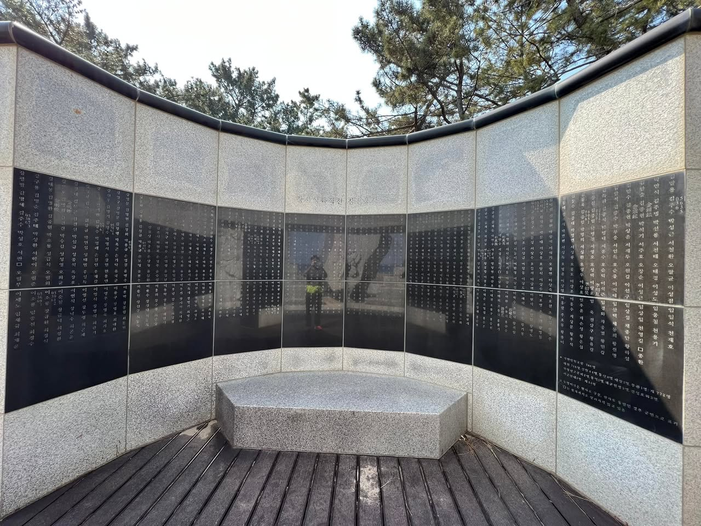
**이미지 캡션:** 이 사진은 야외에 설치된 기념비를 보여줍니다. 기념비는 반원형으로, 검은색 광택이 나는 패널에 한국어로 된 수많은 이름이 새겨져 있습니다. 패널은 회색 화강암으로 된 벽으로 둘러싸여 있으며, 그 위로는 소나무 가지가 보입니다. 기념비 앞에는 나무 바닥이 깔려 있고, 중앙에는 회색 화강암으로 된 육각형 모양의 좌석이 있습니다. 기념비 뒤편에는 바다가 희미하게 보이며, 한 성인 남성이 노란색 상의와 검은색 하의를 입고 기념비를 배경으로 서 있습니다. 남성은 기념비에 새겨진 글씨를 읽고 있는 것으로 보이며, 그의 표정은 명확하게 보이지 않습니다. 전체적으로 차분하고 경건한 분위기입니다.표정은 명확하게 보이지 않습니다. 전체적으로 차분하고 경건한 분위기입니다.
 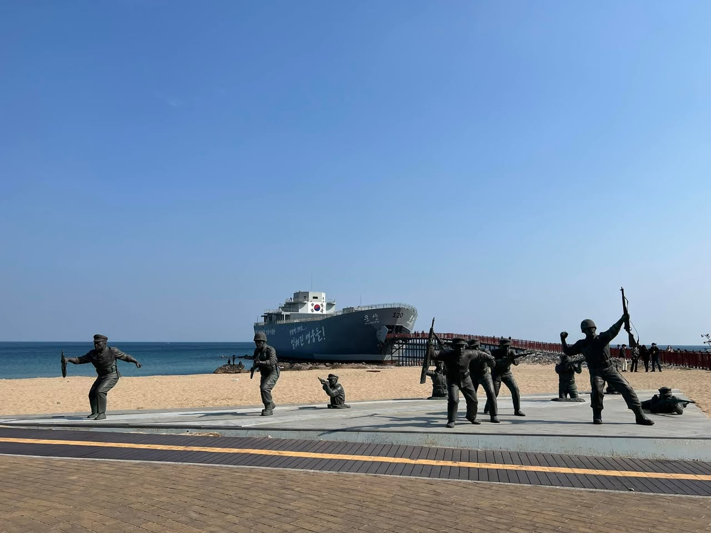
**이미지 캡션:** 푸른 하늘 아래, 해변에 설치된 동상들이 한국 전쟁 당시의 치열했던 전투를 재현하고 있다. 동상들은 모두 성인 남성으로, 군복을 입고 총을 들고 있거나 엎드려 사격하는 등 역동적인 자세를 취하고 있다. 일부 동상은 헬멧을 쓰고 있으며, 긴박한 상황 속에서도 굳건한 표정을 짓고 있다. 배경에는 거대한 선박이 정박해 있고, 선박에는 "울산 120"이라는 글자와 태극기가 선명하게 보인다. 선박 옆으로는 붉은색 난간이 설치된 산책로가 이어져 있으며, 그 뒤로 모래사장과 잔잔한 바다가 펼쳐져 있다. 동상 앞쪽으로는 나무 바닥으로 된 보행로가 있어 방문객들이 동상들을 가까이에서 관람할 수 있도록 되어 있다. 전체적으로 잊혀진 영웅들을 기리는 듯한 경건하면서도 비장한 분위기를 자아낸다.무 바닥으로 된 보행로가 있어 방문객들이 동상들을 가까이에서 관람할 수 있도록 되어 있다. 전체적으로 잊혀진 영웅들을 기리는 듯한 경건하면서도 비장한 분위기를 자아낸다.
 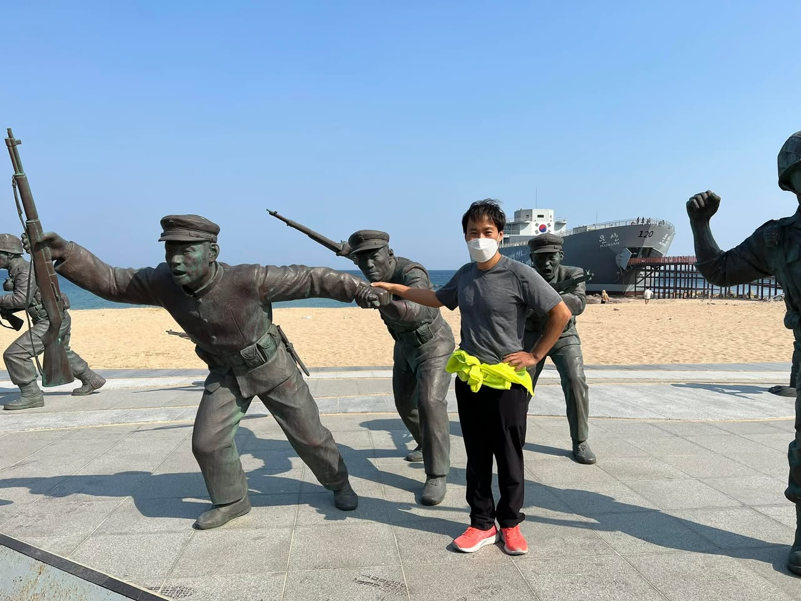
**이미지 캡션:** 푸른 하늘 아래 해변에 설치된 동상 앞에서 한 성인 남성이 포즈를 취하고 있다. 남성은 40대 정도로 보이며, 회색 반팔 티셔츠에 검은색 바지를 입고 형광 연두색 조끼를 허리에 두르고 있다. 발에는 주황색 운동화를 신고 있다. 얼굴에는 흰색 마스크를 착용하고 있으며, 표정은 명확하게 보이지 않지만 카메라를 향해 서 있다. 남성의 뒤로는 한국 전쟁 당시 병사들의 모습을 형상화한 여러 개의 청동 동상들이 배치되어 있다. 동상들은 총을 들고 전진하는 역동적인 자세를 취하고 있으며, 당시 군복을 입고 있다. 배경에는 넓은 모래 해변과 푸른 바다가 펼쳐져 있고, 그 위로는 '120'이라는 숫자가 적힌 큰 회색 선박이 보인다. 선박에는 '부산'이라는 글자도 희미하게 보인다. 전반적으로 맑고 화창한 날씨 속에서 역사적인 순간을 기념하는 듯한 분위기를 자아낸다. 넓은 모래 해변과 푸른 바다가 펼쳐져 있고, 그 위로는 '120'이라는 숫자가 적힌 큰 회색 선박이 보인다. 선박에는 '부산'이라는 글자도 희미하게 보인다. 전반적으로 맑고 화창한 날씨 속에서 역사적인 순간을 기념하는 듯한 분위기를 자아낸다.
