# 2022년 4월

[← 2022년](README.md)

### 4월 1일 (금) 12:37 · 인격으로나, 실력으로나, 외모로나 세상에서 제일 멋진 Upstage 공동…

인격으로나, 실력으로나, 외모로나 세상에서 제일 멋진 Upstage 공동창업자 Hwalsuk Lee님의 멋진 인터뷰 영상!

KBS 신년기획 다음이 온다 시즌2 3부작 중 마지막 편 ‘불평등의 내일, 과학에 길을 묻다’ 편 활석님 인터뷰는 25분 45초부터 1분가량 진행됩니다. 
https://vod.kbs.co.kr/index.html?source=episode&sname=vod&stype=vod&program_code=T2021-0563&program_id=PS-2022020703-01-000&broadcast_complete_yn=N&local_station_code=00&section_code=05&section_sub_code=08

너무 너무 멋집니다.

🎬 동영상 1개 (생략)

### 4월 1일 (금) 20:59 · 📷 사진 (1장)

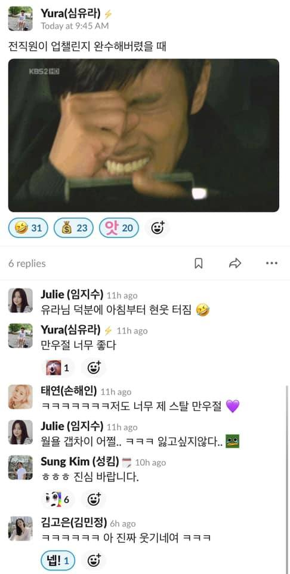
**이미지 캡션:** 화면 상단에는 Yura(심유라)라는 사용자가 오늘 오전 9시 45분에 올린 게시물이 보이며, "전 직원이 업챌린지 완수해버렸을 때"라는 제목과 함께 한 남성의 얼굴을 클로즈업한 이미지가 첨부되어 있습니다. 이 남성은 성인 남성으로 추정되며, 눈을 가리고 입을 크게 벌린 채 웃고 있는 듯한 표정을 짓고 있습니다. 그의 얼굴은 찡그려져 있으며, 마치 매우 웃기거나 당황스러운 상황에 처한 것처럼 보입니다. 배경은 어둡고 흐릿하여 명확하게 파악하기 어렵지만, KBS2라는 로고가 화면 좌측 상단에 작게 보입니다. 이미지 아래에는 '좋아요' 31개, '돈' 모양 이모티콘 23개, '앗' 모양 이모티콘 20개가 표시되어 있으며, 댓글은 총 6개입니다. 댓글 작성자로는 Julie(임지수), Yura(심유라), 태연(손해인), Sung Kim(성킴), 김고은(김민정) 등이 보이며, 각자 게시물에 대한 반응을 댓글로 남기고 있습니다. Julie는 "유라님 덕분에 아침부터 현웃 터짐"이라고 했고, Yura는 "만우절 너무 좋다"고 답했습니다. 태연은 "ㅋㅋㅋㅋㅋㅋㅋ저도 너무 제 스탈 만우절"이라고 했고, Julie는 다시 "월욜 갭차이 어쩔.. ㅋㅋㅋ 잃고싶지않다.."라고 댓글을 달았습니다. Sung Kim은 "ㅎㅎㅎ 진심 바랍니다."라고 남겼고, 김고은은 "ㅋㅋㅋㅋㅋㅋ 아 진짜 웃기네여 ㅋㅋㅋ"라고 반응했습니다. 전반적으로 유머러스하고 즐거운 분위기이며, 만우절과 관련된 내용으로 추정됩니다.지 아래에는 '좋아요' 31개, '돈' 모양 이모티콘 23개, '앗' 모양 이모티콘 20개가 표시되어 있으며, 댓글은 총 6개입니다. 댓글 작성자로는 Julie(임지수), Yura(심유라), 태연(손해인), Sung Kim(성킴), 김고은(김민정) 등이 보이며, 각자 게시물에 대한 반응을 댓글로 남기고 있습니다. Julie는 "유라님 덕분에 아침부터 현웃 터짐"이라고 했고, Yura는 "만우절 너무 좋다"고 답했습니다. 태연은 "ㅋㅋㅋㅋㅋㅋㅋ저도 너무 제 스탈 만우절"이라고 했고, Julie는 다시 "월욜 갭차이 어쩔.. ㅋㅋㅋ 잃고싶지않다.."라고 댓글을 달았습니다. Sung Kim은 "ㅎㅎㅎ 진심 바랍니다."라고 남겼고, 김고은은 "ㅋㅋㅋㅋㅋㅋ 아 진짜 웃기네여 ㅋㅋㅋ"라고 반응했습니다. 전반적으로 유머러스하고 즐거운 분위기이며, 만우절과 관련된 내용으로 추정됩니다.

### 4월 2일 (토) 20:25 · #4000m업 #화악산x3

#4000m업 #화악산x3 
우리는 얼마나 멀리 갈수 있을까? 얼마나 높이 올라갈수 있을까? 늘 스스로에게 하면서 도전을 찾아 보고 있습니다. 

오늘은 자전거로 4000m 업힐을, 가장 잔인한 업힐 화악산 x 3 으로 도전 해보았습니다. 길지만 언젠가는 그리고 생각보다 빠르게 정상에 도착하는 멋진 경험이였고 재미있었습니다. 

함께해주신 DoHyun Jung 감사드립니다. 다음에는 화악산 x 4 로 5000+m 도전 합니다.

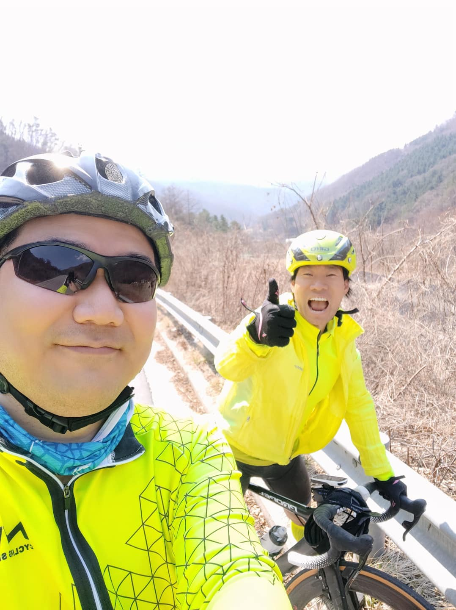
**이미지 캡션:** 두 명의 성인 남성이 자전거를 타고 야외에서 셀카를 찍고 있다. 앞에 있는 남성은 헬멧과 선글라스를 착용하고 있으며, 형광 노란색 자전거 재킷을 입고 있다. 그의 얼굴은 카메라를 향하고 있으며, 입가에 미소를 띠고 있다. 뒤에 있는 남성도 헬멧을 쓰고 형광 노란색 자전거 재킷을 입고 있으며, 엄지손가락을 치켜세우고 환하게 웃고 있다. 두 사람 모두 자전거를 타기에 적합한 복장을 하고 있으며, 배경에는 산과 나무가 보이고 맑은 하늘이 펼쳐져 있다. 전반적으로 즐겁고 활동적인 분위기를 나타낸다.
 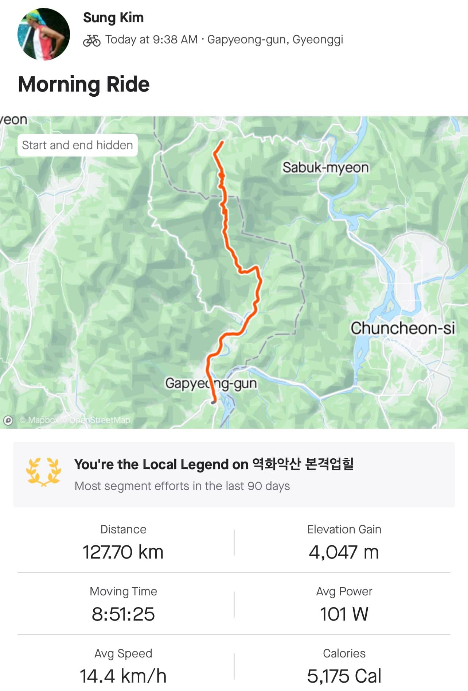
**이미지 캡션:** 이 화면은 성인 남성인 Sung Kim이 오늘 오전 9시 38분에 경기도 가평군에서 진행한 "Morning Ride" 활동 기록을 보여줍니다. 지도에는 가평군, 사북면, 춘천시 지역을 가로지르는 주황색 경로가 표시되어 있으며, "Start and end hidden"이라는 문구가 보입니다. 이 활동은 "역화악산 본격업힐" 구간에서 "Local Legend"로 선정되었음을 나타내며, 지난 90일간의 구간 기록 중 가장 뛰어난 성과임을 의미합니다. 총 이동 거리는 127.70km이며, 총 상승 고도는 4,047m입니다. 이동 시간은 8시간 51분 25초이고, 평균 속도는 14.4km/h입니다. 평균 파워는 101W이며, 소모 칼로리는 5,175 Cal입니다. 전반적으로 산악 지형을 포함한 장거리 자전거 라이딩 기록을 보여주는 화면입니다.입니다. 이동 시간은 8시간 51분 25초이고, 평균 속도는 14.4km/h입니다. 평균 파워는 101W이며, 소모 칼로리는 5,175 Cal입니다. 전반적으로 산악 지형을 포함한 장거리 자전거 라이딩 기록을 보여주는 화면입니다.

🎬 동영상 1개 (생략)

### 4월 3일 (일) 07:20 · 📷 사진 (1장)

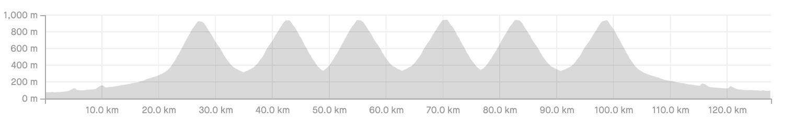
**이미지 캡션:** 이것은 고도 프로필 그래프로, 수직 축은 미터(m) 단위의 고도를 나타내고 수평 축은 킬로미터(km) 단위의 거리를 나타냅니다. 그래프는 0km에서 시작하여 120km까지 이어지며, 여러 개의 가파른 오르막과 내리막이 반복되는 것을 보여줍니다. 가장 높은 지점은 약 1,000m에 도달하며, 여러 개의 봉우리와 골짜기가 험준한 지형을 나타냅니다. 텍스트는 축의 눈금과 거리를 표시하며, 전체적으로는 스포츠 경기나 장거리 이동 경로의 고도 변화를 보여주는 정보성 그래프입니다.

### 4월 3일 (일) 16:03 · #업스창업자라이딩 #눈이부시게

#업스창업자라이딩 #눈이부시게 
눈부신 햇살 아래 한강 맛집 라이딩, 정말 즐거웠습니다. Douglas Guen 대표님 좋은 사업 아이디어와 또 업스테이지 응원 늘 감사드리고 또 맛있는 점심 너무 감사드립니다. 업업업!!!

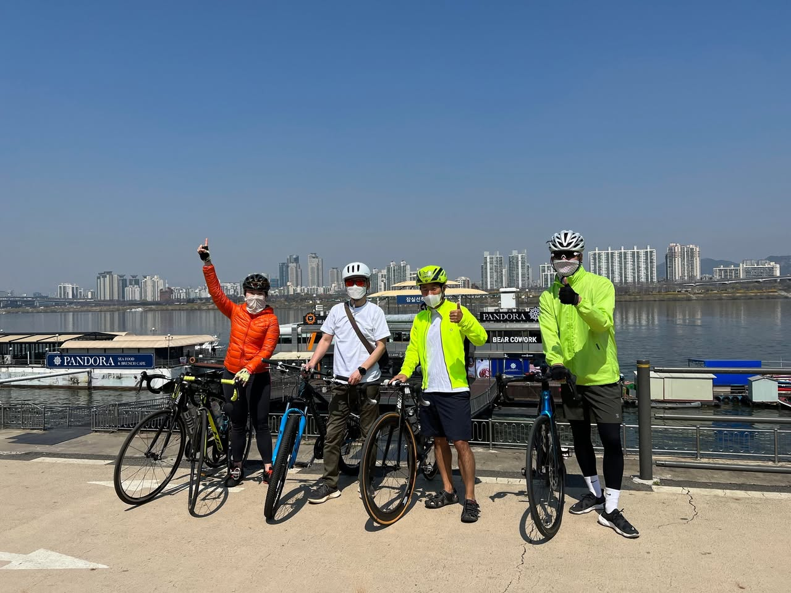
**이미지 캡션:** 네 명의 성인 남녀가 자전거를 타고 강변을 배경으로 서 있다. 왼쪽에서 두 번째 여성은 주황색 재킷을 입고 마스크를 쓴 채 한 손가락으로 하늘을 가리키고 있으며, 나머지 세 명의 남성은 헬멧과 마스크를 착용하고 있다. 그들은 모두 자전거를 옆에 세워두고 있으며, 두 명은 엄지손가락을 치켜세우고 있다. 배경에는 강과 함께 도시의 고층 건물들이 보이며, 강 위에는 여러 척의 배가 정박해 있다. 배에는 'PANDORA SEA FOOD & BRUNCH CAFE'라는 글자가 쓰여 있다. 전체적으로 맑은 날씨에 야외 활동을 즐기는 밝고 활기찬 분위기이다.동을 즐기는 밝고 활기찬 분위기이다.

### 4월 3일 (일) 17:46 · #prayforukrania #stopwar #우크라이나대사관

#prayforukrania #stopwar #우크라이나대사관

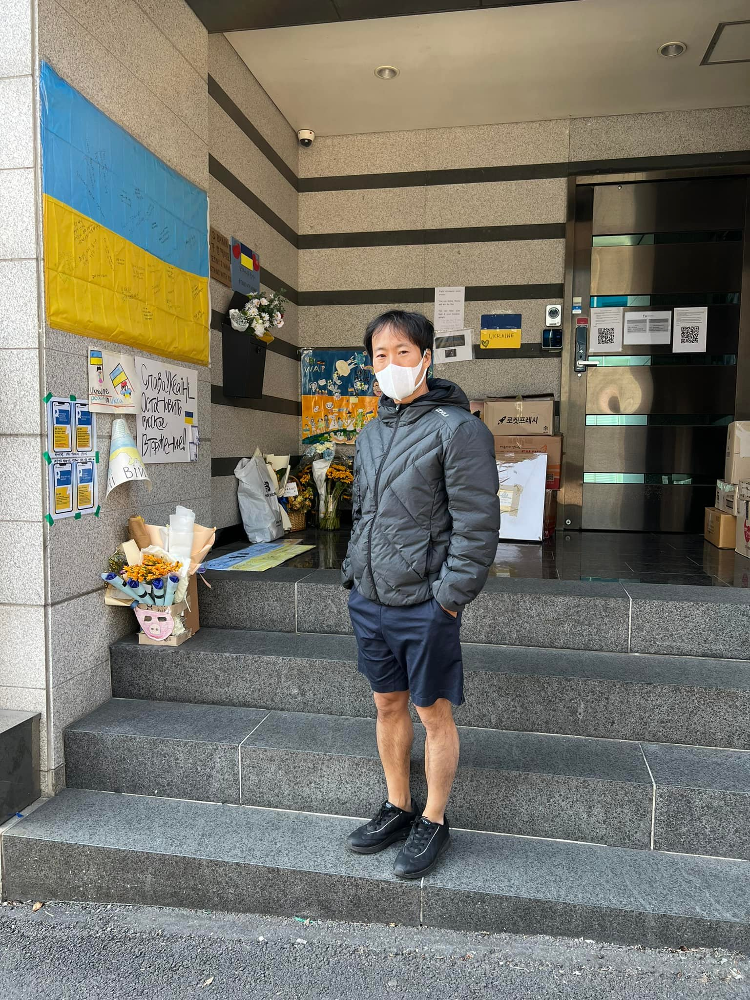
**이미지 캡션:** 한 성인 남성이 회색 패딩 점퍼와 남색 반바지, 검은색 운동화를 신고 계단에 서 있다. 그는 흰색 마스크를 착용하고 있으며, 얼굴에는 옅은 미소가 감돈다. 남성의 뒤로는 우크라이나 국기가 걸려 있고, 그 옆에는 꽃다발과 여러 장의 메시지가 붙어 있다. 건물 입구에는 택배 상자들이 쌓여 있고, '로켓프레시'라는 글자가 적힌 상자도 보인다. 전체적으로 평화와 지지를 상징하는 듯한 분위기이다.
 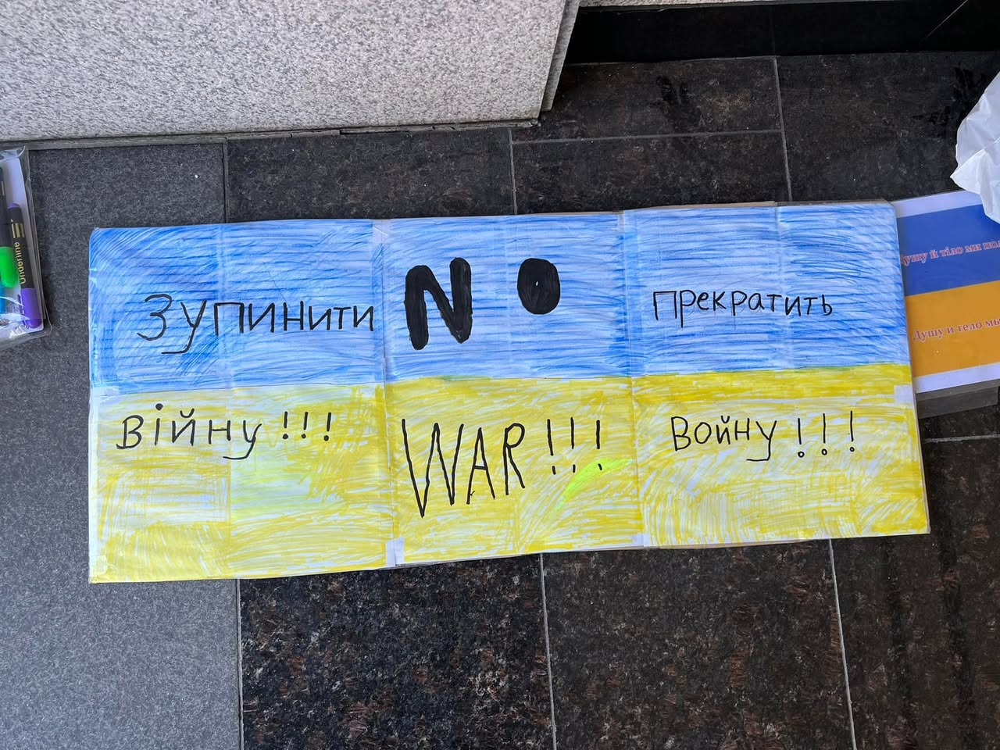
**이미지 캡션:** 이 사진은 우크라이나 국기를 닮은 파란색과 노란색으로 칠해진 손으로 만든 플래카드를 보여줍니다. 플래카드에는 세 가지 언어로 "전쟁을 멈춰라"라는 메시지가 적혀 있습니다. 왼쪽에는 우크라이나어로 "Зупинити війну!!!"라고 쓰여 있고, 가운데에는 영어로 "NO WAR!!!"라고 쓰여 있으며, 오른쪽에는 러시아어로 "Прекратить войну!!!"라고 쓰여 있습니다. 플래카드는 바닥에 놓여 있으며, 왼쪽에는 여러 개의 마커가 담긴 투명한 봉지가 있고, 오른쪽에는 우크라이나 국기 색깔의 다른 종이가 보입니다. 이 플래카드는 평화와 전쟁 반대를 촉구하는 시위나 집회에서 사용되었을 가능성이 높습니다. 사진의 분위기는 진지하고 단호하며, 평화를 향한 강한 염원을 담고 있습니다.가 보입니다. 이 플래카드는 평화와 전쟁 반대를 촉구하는 시위나 집회에서 사용되었을 가능성이 높습니다. 사진의 분위기는 진지하고 단호하며, 평화를 향한 강한 염원을 담고 있습니다.
 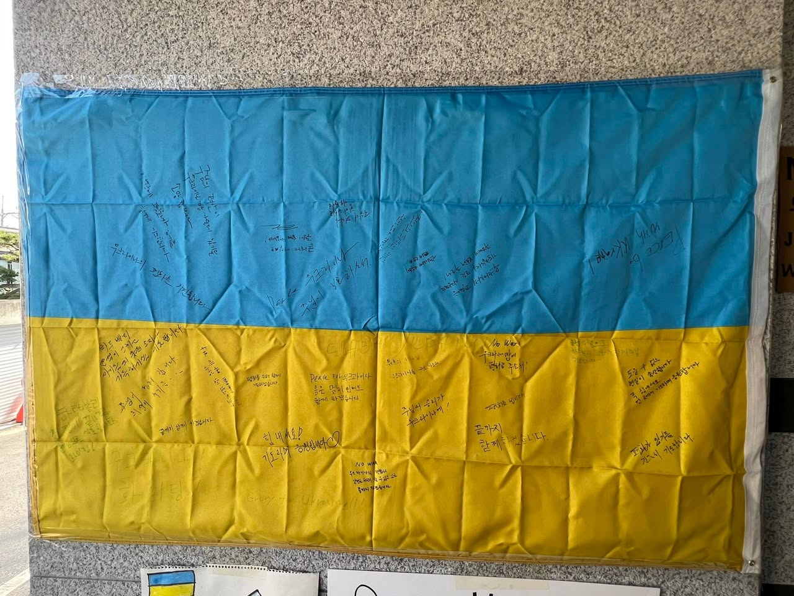
**이미지 캡션:** 이 사진은 우크라이나 국기를 배경으로 여러 사람들이 남긴 메시지를 담고 있다. 국기는 파란색과 노란색으로 나뉘어 있으며, 파란색 부분에는 "우크라이나의 평화는 기원합니다", "Peace be with Ukraine!" 등의 문구가 적혀 있고, 노란색 부분에는 "힘내세요!", "끝까지 함께하겠습니다."와 같은 응원의 메시지가 쓰여 있다. 메시지들은 대부분 한국어로 작성되었으며, 일부는 영어로도 작성되었다. 사진은 야외에서 촬영된 것으로 보이며, 배경에는 건물 벽과 일부 나무가 보인다. 국기는 벽에 걸려 있거나 부착되어 있으며, 여러 개의 메시지가 펜으로 직접 쓰여 있어 사람들의 연대와 지지를 보여주는 듯한 분위기를 자아낸다. 사진 속에는 사람이 직접적으로 보이지는 않지만, 국기에 남겨진 메시지들을 통해 많은 사람들이 이 메시지를 작성했음을 짐작할 수 있다. 전반적으로 평화와 연대를 기원하는 따뜻하고 희망적인 분위기를 느낄 수 있다.부착되어 있으며, 여러 개의 메시지가 펜으로 직접 쓰여 있어 사람들의 연대와 지지를 보여주는 듯한 분위기를 자아낸다. 사진 속에는 사람이 직접적으로 보이지는 않지만, 국기에 남겨진 메시지들을 통해 많은 사람들이 이 메시지를 작성했음을 짐작할 수 있다. 전반적으로 평화와 연대를 기원하는 따뜻하고 희망적인 분위기를 느낄 수 있다.
 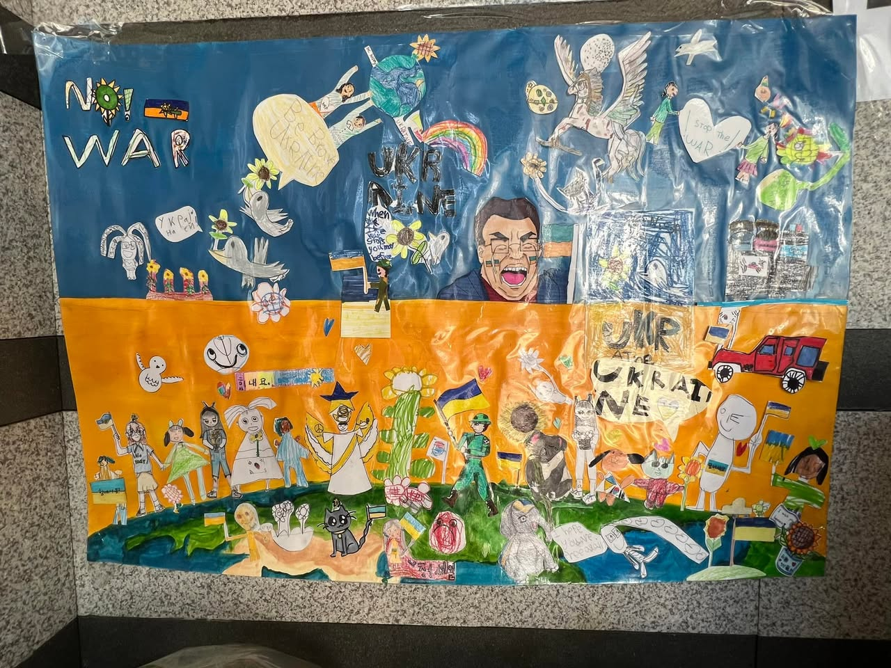
**이미지 캡션:** 이 그림은 전쟁 반대와 우크라이나 지지를 표현하는 콜라주 작품으로, 파란색과 주황색으로 나뉜 배경에 다양한 그림과 텍스트가 포함되어 있습니다. 상단 파란색 부분에는 "NO WAR"라는 문구와 함께 우크라이나 국기가 그려져 있고, 평화로운 지구와 무지개, 천사 날개를 가진 페가수스, 전쟁을 멈추자는 팻말을 든 사람 등 평화를 상징하는 요소들이 있습니다. 또한, "Be Brave UKRAINE"이라는 문구와 함께 우크라이나 국기를 든 사람들의 모습도 보입니다. 한쪽에는 크게 웃는 얼굴의 남성 그림이 있는데, 그의 얼굴에 우크라이나 국기 문양이 그려져 있습니다. 하단 주황색 부분에는 다양한 캐릭터들이 등장하며, 이들 역시 우크라이나 국기를 들고 있거나 평화를 상징하는 요소들을 가지고 있습니다. 귀여운 동물 캐릭터들과 함께 "UMR AT UKRAINE"이라는 문구가 보이며, 빨간색 자동차와 함께 평화로운 풍경을 묘사하고 있습니다. 전반적으로 아이들의 순수한 시선으로 전쟁의 비극을 알리고 평화를 염원하는 메시지를 담고 있습니다. 얼굴에 우크라이나 국기 문양이 그려져 있습니다. 하단 주황색 부분에는 다양한 캐릭터들이 등장하며, 이들 역시 우크라이나 국기를 들고 있거나 평화를 상징하는 요소들을 가지고 있습니다. 귀여운 동물 캐릭터들과 함께 "UMR AT UKRAINE"이라는 문구가 보이며, 빨간색 자동차와 함께 평화로운 풍경을 묘사하고 있습니다. 전반적으로 아이들의 순수한 시선으로 전쟁의 비극을 알리고 평화를 염원하는 메시지를 담고 있습니다.
 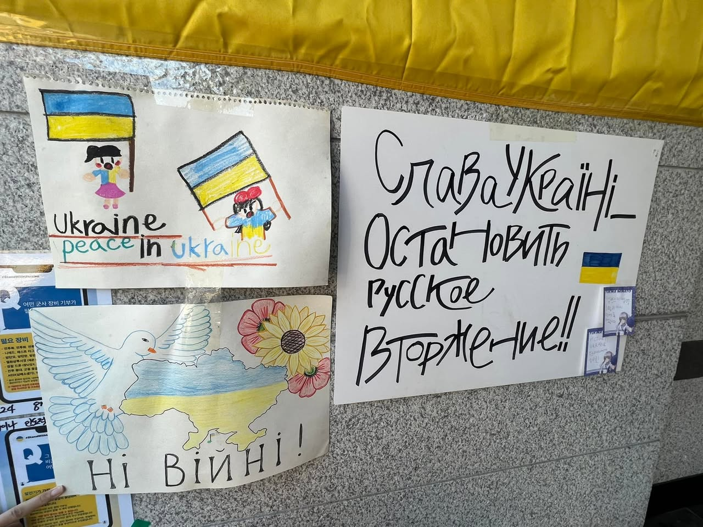
**이미지 캡션:** 회색 벽에 노란색 천이 걸려 있고, 그 아래에 세 개의 그림과 글이 쓰인 종이가 붙어 있습니다. 왼쪽 위 그림에는 파란색과 노란색 깃발을 들고 있는 어린 소녀와 어린 소년이 그려져 있으며, "Ukraine peace in ukraine"이라는 글이 쓰여 있습니다. 왼쪽 아래 그림에는 우크라이나 지도를 배경으로 평화를 상징하는 비둘기와 해바라기가 그려져 있으며, "Hi Війні!"라는 글이 쓰여 있습니다. 오른쪽 그림에는 키릴 문자로 "Слава Україні! Остановить Русское Вторжение!!!"라고 쓰여 있으며, 우크라이나 국기가 그려져 있고 작은 사진 여러 장이 붙어 있습니다. 전체적으로 우크라이나를 지지하고 러시아의 침공을 규탄하는 메시지를 담고 있으며, 평화와 승리를 기원하는 분위기입니다.ие!!!"라고 쓰여 있으며, 우크라이나 국기가 그려져 있고 작은 사진 여러 장이 붙어 있습니다. 전체적으로 우크라이나를 지지하고 러시아의 침공을 규탄하는 메시지를 담고 있으며, 평화와 승리를 기원하는 분위기입니다.

### 4월 4일 (월) 09:41 · 📷 사진 (1장)

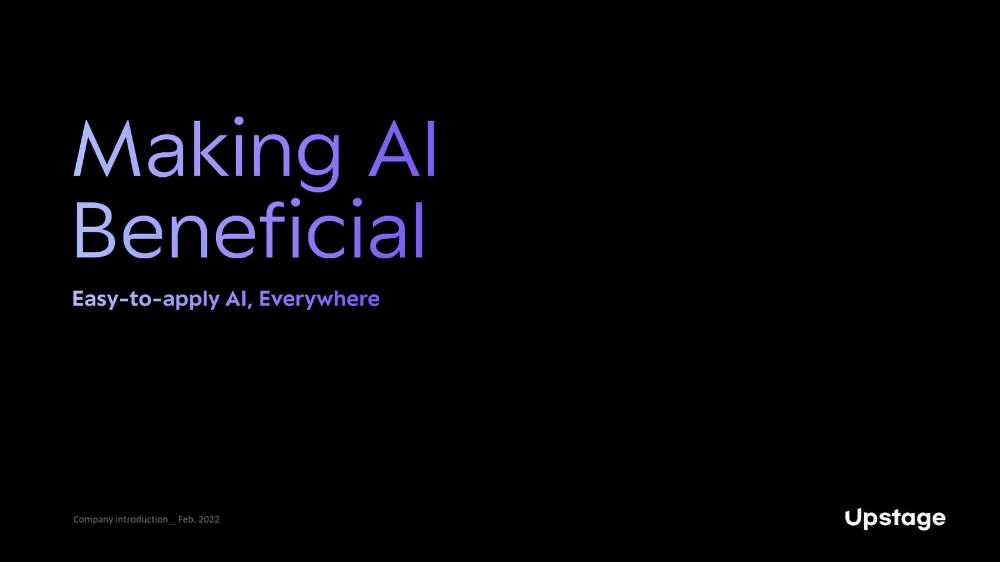
**이미지 캡션:** 이 이미지는 검은색 배경에 보라색과 흰색 텍스트가 있는 프레젠테이션 슬라이드입니다. 왼쪽 상단에는 "Making AI Beneficial"이라는 큰 제목이 보라색 그라데이션으로 표시되어 있습니다. 그 아래에는 "Easy-to-apply AI, Everywhere"라는 더 작은 부제가 흰색으로 표시되어 있습니다. 슬라이드 하단 왼쪽에는 "Company introduction_ Feb. 2022"라는 작은 텍스트가 흰색으로 표시되어 있으며, 오른쪽 하단에는 "Upstage"라는 흰색 로고가 있습니다. 이 슬라이드는 인공지능 기술의 이점을 강조하고 보급하려는 회사의 소개 자료로 보입니다.는 인공지능 기술의 이점을 강조하고 보급하려는 회사의 소개 자료로 보입니다.

### 4월 5일 (화) 22:34 · #ai #beneficial #upstage AI를 쉽게 사용할수 있게 …

#ai #beneficial #upstage AI를 쉽게 사용할수 있게 만드는 어렵지만 의미 있는 도전을 세상에서 제일 멋진 분들이랑 함께 한다는 것은 저에게 큰 축복입니다. 업업업!!!

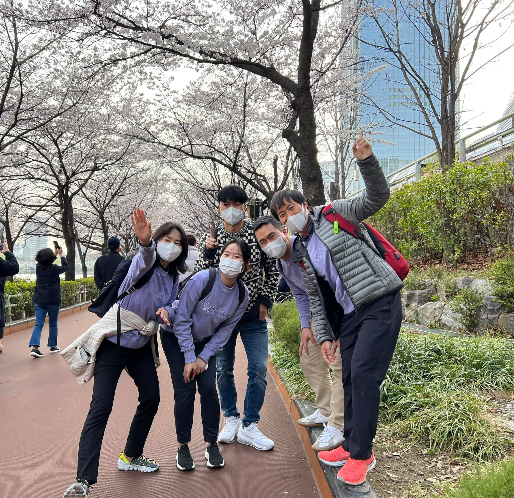
**이미지 캡션:** 다섯 명의 젊은 성인들이 벚꽃이 만발한 공원에서 사진을 찍고 있다. 왼쪽에서부터 두 명의 젊은 여성은 보라색 스웨트셔츠와 검은색 바지를 입고 있으며, 한 명은 손을 흔들고 있고 다른 한 명은 카메라를 향해 포즈를 취하고 있다. 그 뒤에는 두 명의 젊은 남성이 있으며, 한 명은 체크무늬 스웨터를 입고 엄지손가락을 치켜세우고 있고, 다른 한 명은 흰색 마스크를 쓰고 카메라를 향해 웃고 있다. 가장 오른쪽에 있는 성인 남성은 회색 패딩 조끼와 보라색 스웨트셔츠, 검은색 바지를 입고 있으며, 한 손으로는 브이 포즈를 취하고 있다. 모두 흰색 마스크를 착용하고 있으며, 배경에는 벚꽃 나무가 늘어서 있고 멀리 현대적인 건물이 보인다. 전반적으로 즐겁고 활기찬 분위기이다. 취하고 있다. 모두 흰색 마스크를 착용하고 있으며, 배경에는 벚꽃 나무가 늘어서 있고 멀리 현대적인 건물이 보인다. 전반적으로 즐겁고 활기찬 분위기이다.

### 4월 10일 (일) 07:07 · 📷 사진 (2장)

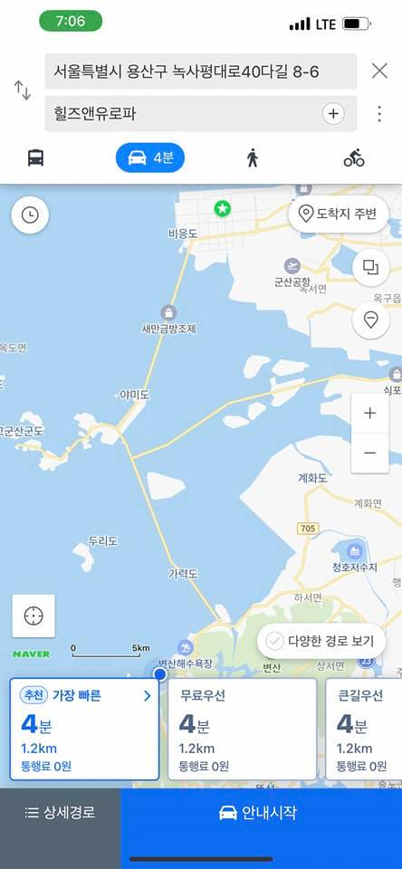
**이미지 캡션:** 이 사진은 네이버 지도 앱의 화면을 캡처한 것으로, 현재 시간은 오전 7시 6분이며 LTE 통신 상태임을 보여준다. 화면 상단에는 출발지로 '서울특별시 용산구 녹사평대로40다길 8-6'이, 도착지로 '힐즈앤유로파'가 입력되어 있다. 그 아래에는 대중교통, 자동차, 도보, 자전거 아이콘이 나열되어 있으며, 자동차 아이콘 옆에 '4분'이라고 표시되어 있어 자동차로 4분 거리에 도착할 수 있음을 나타낸다. 지도 화면에는 서울특별시 용산구에서 시작하여 서해안 지역의 여러 섬과 지명들이 표시되어 있으며, '비응도', '새만금방조제', '야미도', '두리도', '가력도', '군산공항', '계화도', '청호저수지' 등이 보인다. 또한 '도착지 주변'이라는 안내 문구와 함께 현재 위치를 나타내는 녹색 별 모양 아이콘이 지도 상에 표시되어 있다. 화면 하단에는 추천 경로로 '가장 빠른' 경로가 4분, 1.2km, 통행료 0원으로 제시되어 있으며, '무료우선'과 '큰길우선' 경로도 각각 4분, 1.2km, 통행료 0원으로 표시되어 있다. '상세경로' 버튼과 '안내시작' 버튼이 화면 하단에 위치하고 있다. 전반적으로 길 안내를 받고 있는 상황으로 보이며, 지도 상의 지명들로 미루어 보아 서해안 지역으로 이동 중이거나 이동 경로를 확인하는 중인 것으로 추정된다.'새만금방조제', '야미도', '두리도', '가력도', '군산공항', '계화도', '청호저수지' 등이 보인다. 또한 '도착지 주변'이라는 안내 문구와 함께 현재 위치를 나타내는 녹색 별 모양 아이콘이 지도 상에 표시되어 있다. 화면 하단에는 추천 경로로 '가장 빠른' 경로가 4분, 1.2km, 통행료 0원으로 제시되어 있으며, '무료우선'과 '큰길우선' 경로도 각각 4분, 1.2km, 통행료 0원으로 표시되어 있다. '상세경로' 버튼과 '안내시작' 버튼이 화면 하단에 위치하고 있다. 전반적으로 길 안내를 받고 있는 상황으로 보이며, 지도 상의 지명들로 미루어 보아 서해안 지역으로 이동 중이거나 이동 경로를 확인하는 중인 것으로 추정된다.
 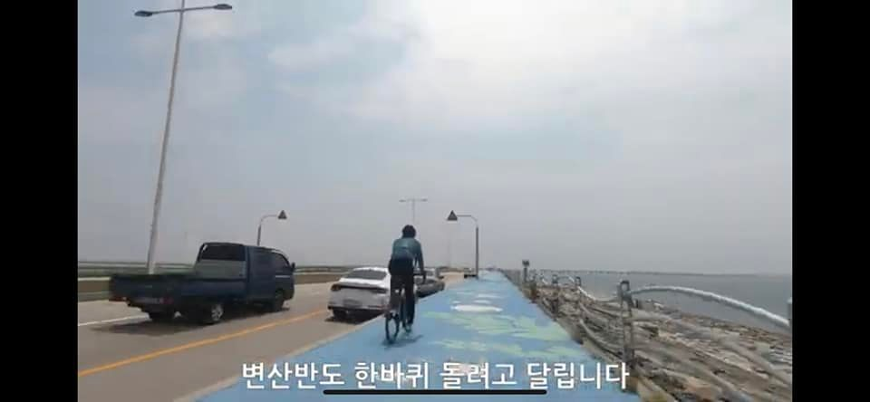
**이미지 캡션:** 한 명의 성인 남성이 자전거를 타고 푸른색과 흰색이 섞인 자전거 도로를 달리고 있습니다. 남성은 어두운 색상의 상의와 바지를 입고 있으며, 등에는 배낭을 메고 있습니다. 그의 표정은 보이지 않지만, 자전거를 타는 모습으로 보아 활동적인 분위기입니다. 배경에는 바다와 하늘이 보이며, 날씨는 맑은 편입니다. 도로에는 파란색 트럭과 흰색 승용차가 지나가고 있으며, 도로 옆으로는 가드레일과 함께 바다로 이어지는 구조물이 보입니다. 자전거 도로에는 파란색 바탕에 흰색 무늬가 그려져 있어 시각적으로 돋보입니다. 전반적으로 시원한 바닷가 풍경 속에서 자전거를 타는 여유로운 모습이 연출되고 있습니다. 화면 하단에는 "변산반도 한바퀴 돌려고 달립니다"라는 한국어 자막이 보입니다.로 시원한 바닷가 풍경 속에서 자전거를 타는 여유로운 모습이 연출되고 있습니다. 화면 하단에는 "변산반도 한바퀴 돌려고 달립니다"라는 한국어 자막이 보입니다.

### 4월 13일 (수) 09:48 · 📷 사진 (1장)

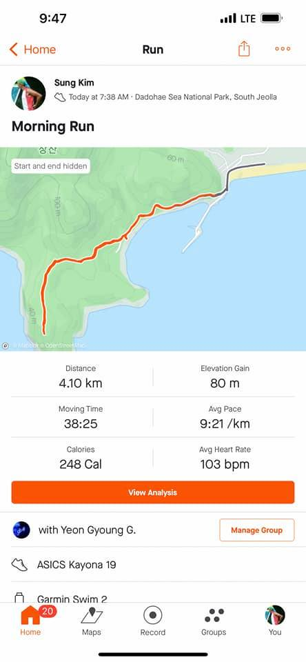
**이미지 캡션:** 이 화면은 운동 기록 앱의 일부로, "Sung Kim"이라는 이름의 사용자가 오늘 아침 7시 38분에 전라남도 다도해 해상국립공원에서 4.10km를 38분 25초 동안 달린 "Morning Run" 기록을 보여줍니다. 총 248 칼로리를 소모했으며, 평균 심박수는 103 bpm, 평균 페이스는 9분 21초/km, 고도 상승은 80m입니다. 지도에는 달린 경로가 주황색으로 표시되어 있으며, 해안가를 따라 산악 지형을 달린 것으로 보입니다. "Yeon Gyoung G."와 함께 운동했으며, 사용한 신발은 ASICS Kayona 19이고, Garmin Swim 2 기기를 사용한 것으로 추정됩니다. 화면 하단에는 홈, 지도, 기록, 그룹, 나 등 앱의 주요 메뉴가 표시되어 있습니다. 전반적으로 맑은 날씨에 바다와 산이 어우러진 아름다운 자연 속에서 상쾌하게 운동한 분위기를 느낄 수 있습니다.S Kayona 19이고, Garmin Swim 2 기기를 사용한 것으로 추정됩니다. 화면 하단에는 홈, 지도, 기록, 그룹, 나 등 앱의 주요 메뉴가 표시되어 있습니다. 전반적으로 맑은 날씨에 바다와 산이 어우러진 아름다운 자연 속에서 상쾌하게 운동한 분위기를 느낄 수 있습니다.

### 4월 15일 (금) 08:22 · #AWSSummit 둘째날 첫 시간에 'AWS구루에게 듣는 클라우드와 인…

#AWSSummit 둘째날 첫 시간에 'AWS구루에게 듣는 클라우드와 인공지능 학습 비법'이라 세션에 Channy Yun 님의 초대로 참여하게 되었습니다. 

이외에도 재미있는 강의와 세션도 많으니 선등록 후고민 입니다.  ▶바로 무료 등록하기: https://go.aws/3x2rNan

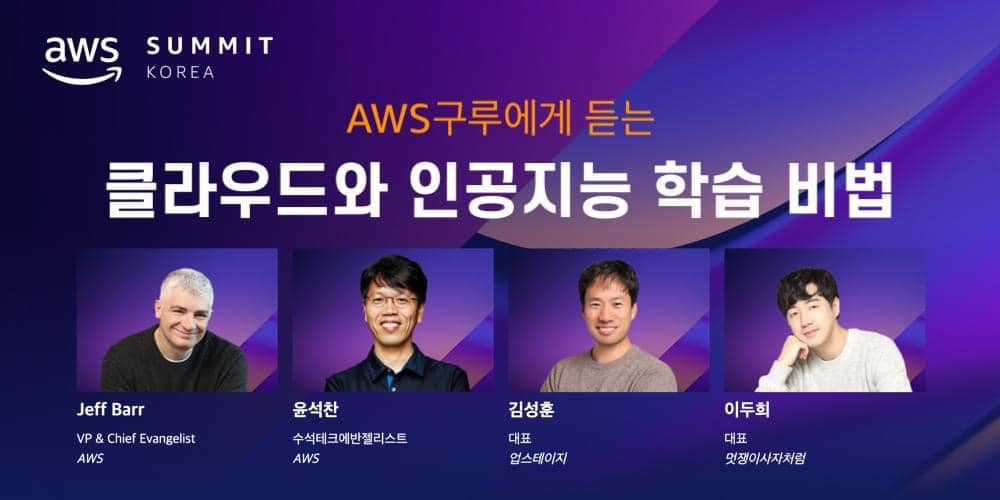
**이미지 캡션:** 이 이미지는 AWS Summit Korea 행사 포스터로, 보라색 배경에 AWS 로고와 함께 "AWS Summit Korea"라는 문구가 상단에 표시되어 있습니다. 그 아래에는 "AWS 구루에게 듣는 클라우드와 인공지능 학습 비법"이라는 제목이 흰색과 주황색 글씨로 쓰여 있습니다. 화면 하단에는 네 명의 남성이 각각의 프로필 사진과 함께 소개되어 있습니다. 왼쪽 첫 번째는 백발의 중년 남성으로 검은색 옷을 입고 미소를 짓고 있으며, 이름은 Jeff Barr, 직책은 VP & Chief Evangelist, 소속은 AWS입니다. 두 번째는 안경을 쓴 동양인 남성으로 검은색 셔츠를 입고 환하게 웃고 있으며, 이름은 윤석찬, 직책은 수석테크에반젤리스트, 소속은 AWS입니다. 세 번째는 동양인 남성으로 회색 상의를 입고 밝게 웃고 있으며, 이름은 김성훈, 직책은 대표, 소속은 업스테이지입니다. 마지막 네 번째는 젊은 동양인 남성으로 흰색 상의를 입고 손으로 턱을 괴고 카메라를 바라보고 있으며, 이름은 이두희, 직책은 대표, 소속은 멋쟁이사자처럼입니다. 전체적으로 행사의 주제와 연사들을 소개하는 전문적이고 긍정적인 분위기를 풍깁니다.속은 AWS입니다. 두 번째는 안경을 쓴 동양인 남성으로 검은색 셔츠를 입고 환하게 웃고 있으며, 이름은 윤석찬, 직책은 수석테크에반젤리스트, 소속은 AWS입니다. 세 번째는 동양인 남성으로 회색 상의를 입고 밝게 웃고 있으며, 이름은 김성훈, 직책은 대표, 소속은 업스테이지입니다. 마지막 네 번째는 젊은 동양인 남성으로 흰색 상의를 입고 손으로 턱을 괴고 카메라를 바라보고 있으며, 이름은 이두희, 직책은 대표, 소속은 멋쟁이사자처럼입니다. 전체적으로 행사의 주제와 연사들을 소개하는 전문적이고 긍정적인 분위기를 풍깁니다.

### 4월 18일 (월) 11:53 · LA 롱비치나 마이애미비치가 전혀 부럽지 않은 완도군 신지도 명사십리 해…

LA 롱비치나 마이애미비치가 전혀 부럽지 않은 완도군 신지도 명사십리 해변에서 (거의) 맨발 모래/물 달리기해 보았습니다.

경쾌한 파도 소리와 찬 기운 가득한 바람은 힘든 달리기를 계속 업업업 해주었습니다.

너무 멋진 장소, 멋진 날입니다!

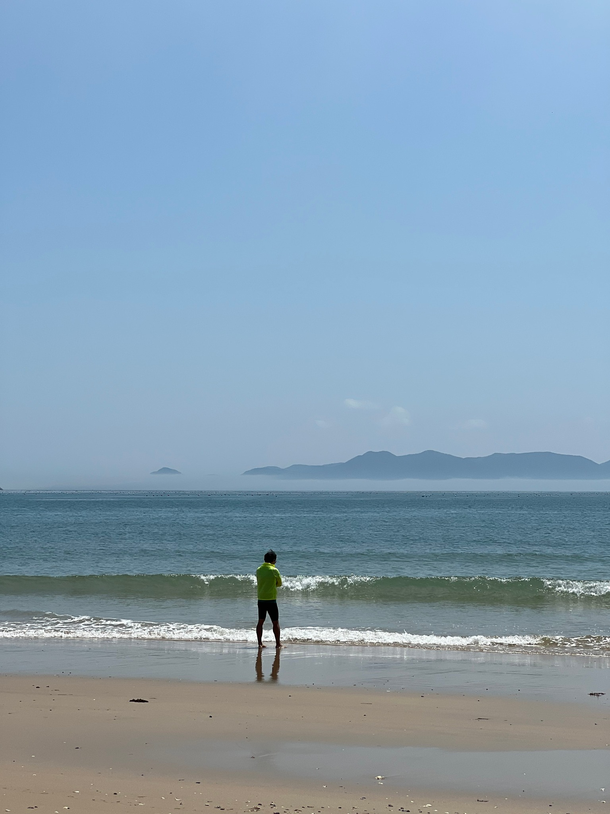
**이미지 캡션:** 한 명의 성인 남성이 해변에 서서 바다를 바라보고 있다. 남성은 20대 후반에서 30대 초반으로 보이며, 짧은 머리에 옅은 녹색 반팔 티셔츠와 검은색 반바지를 입고 있다. 그의 표정은 보이지 않지만, 바다를 응시하는 모습에서 사색에 잠겨 있거나 무언가를 기다리는 듯한 분위기를 풍긴다. 남성은 발목까지 물에 잠긴 채 잔잔한 파도와 마주하고 있으며, 그의 모습은 물에 비쳐 반사되고 있다. 배경에는 푸른 바다가 펼쳐져 있고, 수평선 너머로는 희미하게 산들이 보인다. 하늘은 맑고 푸르며, 약간의 안개가 낀 듯한 몽환적인 느낌을 준다. 해변은 모래로 이루어져 있으며, 몇 개의 작은 조개껍데기와 해초 조각들이 보인다. 전반적으로 평화롭고 고요한 분위기의 해변 풍경이다.적인 느낌을 준다. 해변은 모래로 이루어져 있으며, 몇 개의 작은 조개껍데기와 해초 조각들이 보인다. 전반적으로 평화롭고 고요한 분위기의 해변 풍경이다.
 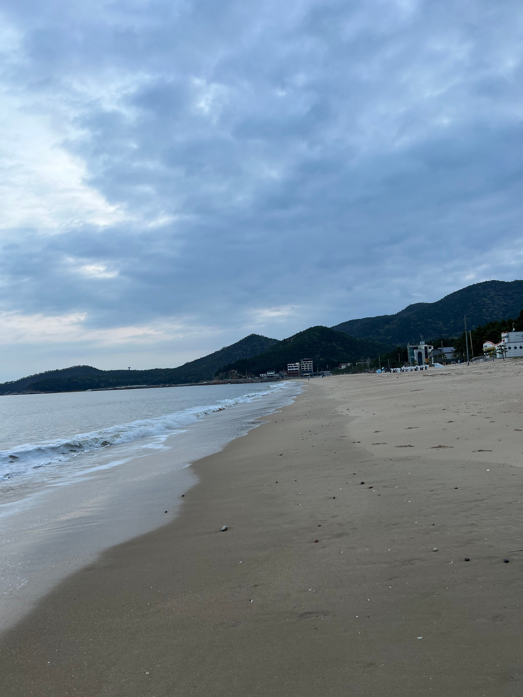
**이미지 캡션:** 흐린 하늘 아래 잔잔한 파도가 밀려오는 넓은 해변의 풍경으로, 모래사장에는 작은 조약돌들이 흩어져 있고, 멀리 산과 함께 몇 채의 건물들이 늘어서 있다.
 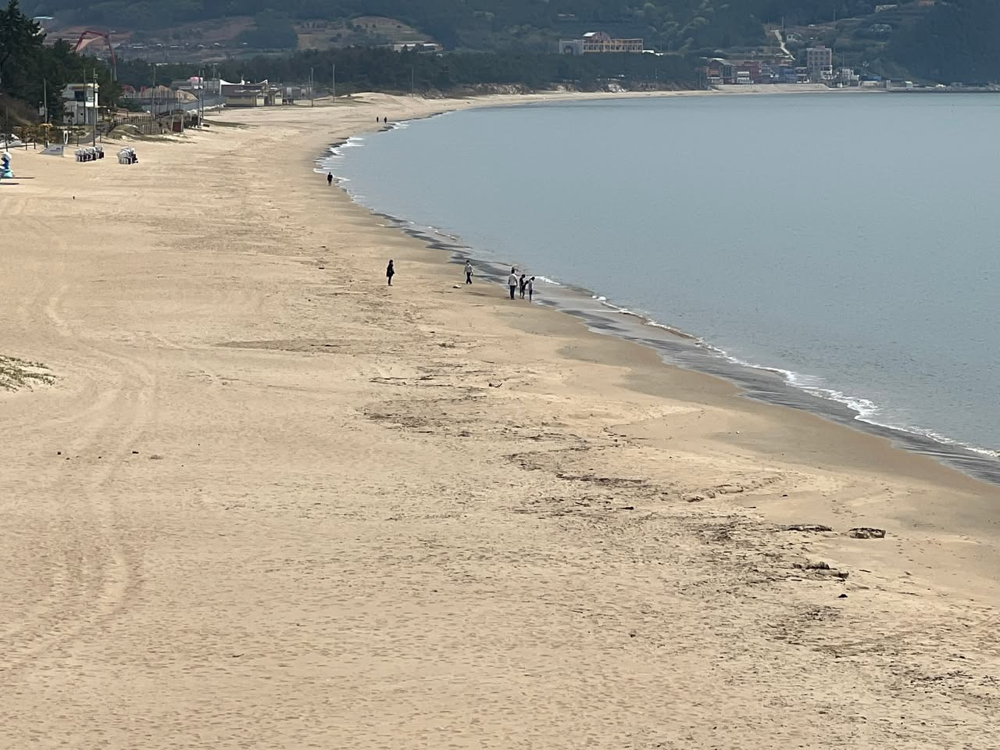
**이미지 캡션:** 넓고 한적한 해변의 풍경으로, 부드러운 모래사장과 잔잔한 바다가 펼쳐져 있습니다. 해변에는 몇몇 사람들이 산책하거나 바다를 바라보고 있으며, 멀리 보이는 언덕에는 건물들과 나무들이 보입니다. 해변에는 파라솔과 의자 같은 시설물도 일부 보이며, 전반적으로 평화롭고 여유로운 분위기입니다.
 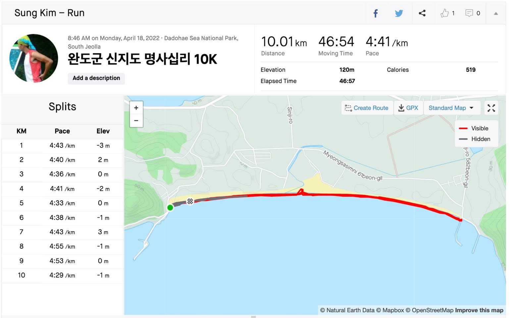
**이미지 캡션:** 이 화면은 "Sung Kim"이라는 사용자의 달리기 기록을 보여주는 웹페이지의 일부입니다. 화면 왼쪽 상단에는 달리는 사람의 프로필 사진이 있는데, 이 사람은 성인 남성으로 보이며, 머리에는 파란색과 노란색이 섞인 두건을 쓰고 있고, 빨간색과 흰색이 섞인 민소매 상의와 검은색 하의를 착용하고 있습니다. 그는 약간 옆으로 서서 팔짱을 끼고 있으며, 표정은 명확하게 보이지 않지만 편안해 보입니다. 화면 중앙에는 "완도군 신지도 명사십리 10K"라는 제목과 함께 달리기 날짜 및 시간, 장소가 표시되어 있습니다. 날짜는 2022년 4월 18일 월요일 오전 8시 46분이며, 장소는 전라남도 완도군에 위치한 다도해해상국립공원입니다. 그 아래에는 "Add a description" 버튼이 있습니다. 화면 상단에는 달리기 거리 10.01km, 이동 시간 46분 54초, 평균 페이스 4분 41초/km, 총 고도 변화 120m, 소모 칼로리 519kcal, 총 경과 시간 46분 57초 등의 정보가 요약되어 있습니다. 화면 왼쪽에는 각 킬로미터별 페이스와 고도 변화를 보여주는 "Splits" 표가 있습니다. 표에는 1km부터 10km까지 각 구간의 페이스와 고도 변화가 기록되어 있으며, 고도 변화는 해발 고도를 기준으로 약간의 오르내림이 있음을 보여줍니다. 화면 오른쪽에는 달리기 경로를 보여주는 지도 이미지가 있습니다. 지도는 해안선을 따라 이어지는 도로를 보여주며, 빨간색 선으로 표시된 달리기 경로가 해안가를 따라 길게 이어져 있습니다. 지도에는 "Sinji-ro", "Myeongsasimni 61beon-gil", "ji-ro 582beon-gil"과 같은 도로 이름과 10m, 30m 등의 고도 표시가 있습니다. 지도에는 "Create Route", "GPX", "Standard Map" 버튼과 함께 지도 확대/축소 기능도 보입니다. 전반적으로 이 화면은 사용자가 완도 신지도 명사십리에서 10km를 달린 기록을 상세하게 보여주며, 활동적인 분위기를 나타냅니다.짜는 2022년 4월 18일 월요일 오전 8시 46분이며, 장소는 전라남도 완도군에 위치한 다도해해상국립공원입니다. 그 아래에는 "Add a description" 버튼이 있습니다. 화면 상단에는 달리기 거리 10.01km, 이동 시간 46분 54초, 평균 페이스 4분 41초/km, 총 고도 변화 120m, 소모 칼로리 519kcal, 총 경과 시간 46분 57초 등의 정보가 요약되어 있습니다. 화면 왼쪽에는 각 킬로미터별 페이스와 고도 변화를 보여주는 "Splits" 표가 있습니다. 표에는 1km부터 10km까지 각 구간의 페이스와 고도 변화가 기록되어 있으며, 고도 변화는 해발 고도를 기준으로 약간의 오르내림이 있음을 보여줍니다. 화면 오른쪽에는 달리기 경로를 보여주는 지도 이미지가 있습니다. 지도는 해안선을 따라 이어지는 도로를 보여주며, 빨간색 선으로 표시된 달리기 경로가 해안가를 따라 길게 이어져 있습니다. 지도에는 "Sinji-ro", "Myeongsasimni 61beon-gil", "ji-ro 582beon-gil"과 같은 도로 이름과 10m, 30m 등의 고도 표시가 있습니다. 지도에는 "Create Route", "GPX", "Standard Map" 버튼과 함께 지도 확대/축소 기능도 보입니다. 전반적으로 이 화면은 사용자가 완도 신지도 명사십리에서 10km를 달린 기록을 상세하게 보여주며, 활동적인 분위기를 나타냅니다.

### 4월 20일 (수) 18:34 · 📷 사진 (1장)

**이미지 캡션:** 이 이미지는 AI-DX Summit Korea 2022의 업스테이지 세션 'What is AI Pack' 홍보물로, 연한 보라색 배경에 흰색과 파란색 텍스트가 사용되었습니다. 왼쪽에는 세션 정보와 이벤트 안내가 있으며, '시청 인증 이벤트'라는 문구가 강조되어 있습니다. 이벤트 참여 기간은 2022년 4월 22일 금요일 15시 20분부터 선착순 마감까지이며, 참여 링크는 www.upstage.ai/ai-pack입니다. 세션을 시청하고 이벤트에 참여한 선착순 100명에게 커피 상품권 1만원권을 증정한다는 내용이 명시되어 있습니다. 오른쪽에는 업스테이지 CTO인 Hwalsuk Lee의 흑백 사진이 있고, 그의 이름과 직책, 그리고 AI Pack의 특징과 고객에게 제공할 혜택에 대한 설명이 간략하게 기재되어 있습니다. 사진 속 Hwalsuk Lee는 안경을 쓰고 흰색 옷을 입고 있으며, 손가락으로 턱을 괴고 미소를 짓고 있어 긍정적이고 자신감 있는 분위기를 풍깁니다. 배경에는 추상적인 보라색 도형이 그려져 있어 현대적이고 세련된 느낌을 더합니다. 전반적으로 AI 기술과 관련된 비즈니스 솔루션에 대한 정보를 전달하고 참여를 유도하는 홍보물로서, 전문적이면서도 친근한 분위기를 자아냅니다. 명시되어 있습니다. 오른쪽에는 업스테이지 CTO인 Hwalsuk Lee의 흑백 사진이 있고, 그의 이름과 직책, 그리고 AI Pack의 특징과 고객에게 제공할 혜택에 대한 설명이 간략하게 기재되어 있습니다. 사진 속 Hwalsuk Lee는 안경을 쓰고 흰색 옷을 입고 있으며, 손가락으로 턱을 괴고 미소를 짓고 있어 긍정적이고 자신감 있는 분위기를 풍깁니다. 배경에는 추상적인 보라색 도형이 그려져 있어 현대적이고 세련된 느낌을 더합니다. 전반적으로 AI 기술과 관련된 비즈니스 솔루션에 대한 정보를 전달하고 참여를 유도하는 홍보물로서, 전문적이면서도 친근한 분위기를 자아냅니다.

> #선등록후아아 #활석님출연 #업스세션시청이벤트 #AIDX서밋코리아2022 #업스테이지 #AIPack   Making AI Beneficial을 이루기 위한 노코드 AI Pack을 만들고 있는 Upstage 업스테이지 Hwalsuk Lee CTO가 AI DX 서밋 코리아 2022 출연 합니다. 이번 금요일 오후 3:20분 생중계로 진행됩니다.  * 서밋 무료 등록 [https://conference.etnews.com/conf_info.html?uid=202](https://conference.etnews.com/conf_info.html?uid=202)   더 많은 분들과 함께하고자, 저희들이 가벼운 이벤트를 마련했는데요. 활석님 세션을 온라인으로 참여하시고 간단히 1. 세션 관련 질문을 남겨 주시거나, 2. 시청 인증샷을 올려주시거나, 3. 소감이나 리뷰를 올려주시는 분들 (3개 중 하나만) 선착순 100분에게 아아 (아이스 아메리카노) 1만원 상품권을 드립니다!  * 이벤트 참여하기 (이번주 금요일 3:20분 세션시작과 동시 오픈됩니다.) https://www.upstage.ai/ai-pack  함께해요! 선등록, 후아아!!

### 4월 20일 (수) 18:56 · #선등록후아아 저희가 만들고 있는 AI팩에 대해 Hwalsuk Lee님이…

#선등록후아아 저희가 만들고 있는 AI팩에 대해 Hwalsuk Lee님이 직접 설명하고 이야기 나눕니다. 함께하시고 시원한 커피 상품권도 받아 가세요.

선등록, 후아아! 함께해요!!

### 4월 21일 (목) 05:09 · 📷 사진

**이미지 캡션:** 이 이미지는 졸업을 축하하는 3D 아바타 캐릭터를 보여줍니다. 아바타는 젊은 성인 남성으로 보이며, 짧은 검은색 머리에 환한 미소를 짓고 있습니다. 흰색 바탕에 검은색 야자수 무늬가 있는 셔츠를 입고 있으며, 양팔을 위로 뻗어 기쁨을 표현하고 있습니다. 배경에는 "Congrats"라는 금색 글씨와 함께 금색, 은색 색종이가 흩날리고 있습니다. 하단에는 "Class of 2022"라는 문구가 검은색과 금색으로 크게 쓰여 있으며, 오른쪽에는 졸업 모자가 놓여 있습니다. 전체적으로 밝고 축제 분위기이며, 졸업이라는 특별한 순간을 기념하는 상황을 나타냅니다. 특별한 순간을 기념하는 상황을 나타냅니다.

### 4월 23일 (토) 11:37 · 📷 사진

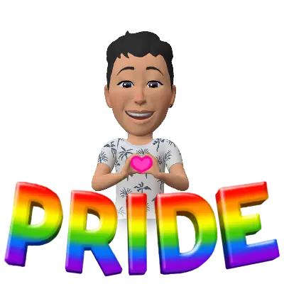
**이미지 캡션:** 이 3D 렌더링 이미지에는 젊은 성인 남성이 등장하며, 그는 옅은 피부색과 짧은 검은색 머리를 가지고 있습니다. 그는 하얀색 티셔츠를 입고 있으며, 티셔츠에는 야자수 잎 무늬가 그려져 있습니다. 남성은 두 손으로 분홍색 하트 모양을 만들고 있으며, 얼굴에는 활짝 웃는 표정을 짓고 있습니다. 그의 뒤로는 무지개 색으로 이루어진 "PRIDE"라는 글자가 크게 보입니다. 배경은 흰색으로 아무것도 보이지 않습니다. 전체적으로 긍정적이고 축하하는 분위기를 나타냅니다.

### 4월 23일 (토) 11:37 · 📷 사진

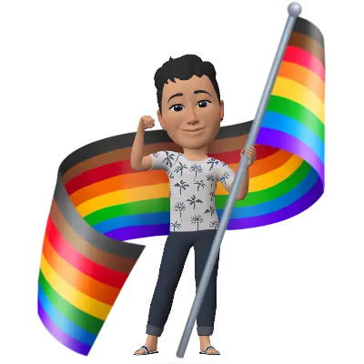
**이미지 캡션:** 이 3D 렌더링 이미지에는 성인 남성이 무지개 깃발을 들고 서 있습니다. 남성은 20대 후반에서 30대 초반으로 보이며, 짧은 검은색 머리에 갈색 피부를 가지고 있습니다. 그는 하얀색 반팔 셔츠를 입고 있는데, 셔츠에는 야자수 무늬가 그려져 있습니다. 바지는 짙은 남색이며, 발에는 흰색 스트랩 샌들을 신고 있습니다. 남성은 깃발을 들고 있는 팔을 들어 올리며 근육을 자랑하는 듯한 포즈를 취하고 있으며, 얼굴에는 자신감 있고 긍정적인 미소를 띠고 있습니다. 그의 뒤로는 무지개색과 갈색, 검은색 줄무늬가 있는 깃발이 바람에 휘날리고 있습니다. 배경은 검은색으로, 인물과 깃발에 시선이 집중되도록 합니다. 전반적으로 이 이미지는 긍정적이고 지지적인 분위기를 전달하며, 성소수자 커뮤니티에 대한 지지를 나타내는 것으로 해석될 수 있습니다.발이 바람에 휘날리고 있습니다. 배경은 검은색으로, 인물과 깃발에 시선이 집중되도록 합니다. 전반적으로 이 이미지는 긍정적이고 지지적인 분위기를 전달하며, 성소수자 커뮤니티에 대한 지지를 나타내는 것으로 해석될 수 있습니다.

### 4월 23일 (토) 11:37 · 📷 사진

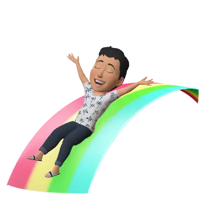
**이미지 캡션:** 이 3D 애니메이션 캐릭터는 성인 남성으로, 20대에서 30대로 보이는 젊은 외모를 하고 있습니다. 짧은 검은색 머리에 옅은 갈색 피부를 가졌으며, 눈을 감고 입을 크게 벌린 채 환하게 웃고 있어 매우 행복하고 즐거운 표정입니다. 흰색 바탕에 검은색 야자수 무늬가 그려진 반팔 셔츠와 롤업된 어두운 색상의 청바지를 입고 있으며, 발에는 흰색과 파란색 줄무늬가 있는 슬리퍼를 신고 있습니다. 그는 무지개 모양의 미끄럼틀 위에 누워 팔을 활짝 벌리고 있으며, 마치 무지개를 타고 내려오는 듯한 역동적인 자세를 취하고 있습니다. 배경은 흰색으로 아무것도 보이지 않아 인물과 무지개에 집중됩니다. 무지개는 분홍색, 노란색, 초록색, 하늘색 등 다채로운 색상으로 이루어져 있으며, 부드러운 곡선을 그리며 오른쪽 아래로 뻗어 있습니다. 전체적으로 밝고 긍정적인 분위기를 연출하며, 마치 동화 속 한 장면처럼 환상적이고 행복한 느낌을 줍니다.있습니다. 배경은 흰색으로 아무것도 보이지 않아 인물과 무지개에 집중됩니다. 무지개는 분홍색, 노란색, 초록색, 하늘색 등 다채로운 색상으로 이루어져 있으며, 부드러운 곡선을 그리며 오른쪽 아래로 뻗어 있습니다. 전체적으로 밝고 긍정적인 분위기를 연출하며, 마치 동화 속 한 장면처럼 환상적이고 행복한 느낌을 줍니다.

### 4월 24일 (일) 14:59 · #나는물고기 인생 처음 물고기가 뛰어노는 (사진처럼 정말 물고기가 업업업…

#나는물고기 인생 처음 물고기가 뛰어노는 (사진처럼 정말 물고기가 업업업) 바닷가에서 같이 수영! 8번이나 같이 뛰어준 물고기들 멋집니다!!

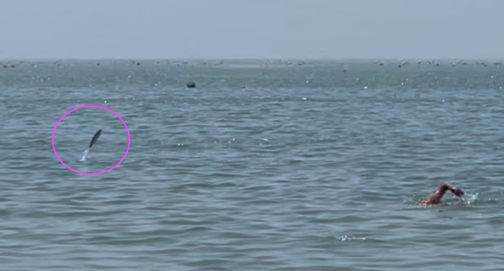
**이미지 캡션:** 넓은 바다 위에서 한 성인 남성이 자유형으로 수영하고 있으며, 그의 오른쪽 팔이 물 밖으로 나와 물살을 가르고 있다. 수영하는 사람의 복장은 붉은색 수영복으로 보인다. 수영하는 사람으로부터 멀리 떨어진 왼쪽에는 물고기 한 마리가 물 위로 솟구쳐 오르고 있으며, 물방울이 튀고 있다. 이 물고기는 분홍색 원 안에 표시되어 있다. 수평선 너머에는 희미하게 보이는 작은 점들이 여러 개 떠 있는데, 이는 새떼이거나 부표일 수 있다. 배경은 옅은 회색의 하늘과 잔잔한 바다가 어우러져 있으며, 전반적으로 평화롭고 자연적인 분위기를 자아낸다. 분위기를 자아낸다.

🎬 동영상 1개 (생략)

### 4월 25일 (월) 14:27 · 📷 사진 (1장)

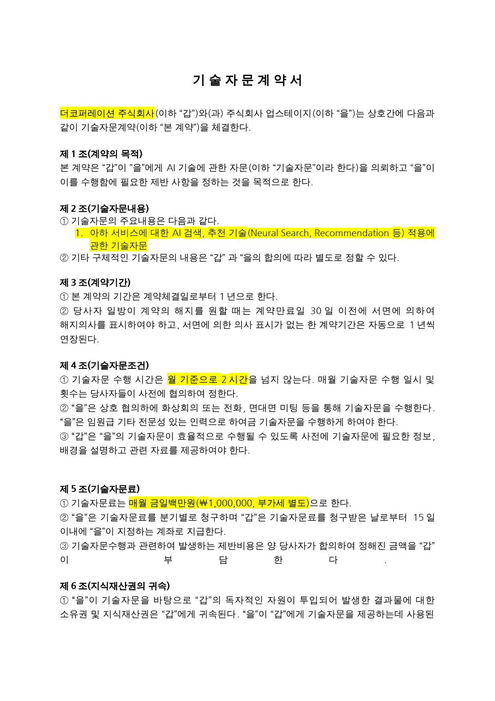
**이미지 캡션:** 이 문서는 기술 자문 계약서로, 더코퍼레이션 주식회사("갑")와 주식회사 업스테이지("을")가 상호 간에 기술 자문 계약을 체결하는 내용을 담고 있습니다. 계약의 목적은 "갑"이 "을"에게 AI 기술에 관한 자문을 의뢰하고, "을"이 이를 수행함에 필요한 제반 사항을 정하는 것입니다. 제2조에서는 기술 자문의 주요 내용으로 AI 검색, 추천 기술(Neural Search, Recommendation 등) 적용을, 기타 구체적인 내용은 "갑"과 "을"의 합의에 따라 별도로 정할 수 있다고 명시하고 있습니다. 제3조는 계약 기간을 계약 체결일로부터 1년으로 하고, 당사자 일방이 계약의 해지를 원할 때는 계약 만료일 30일 이전에 서면에 의하여 통지해야 하며, 서면에 의한 의사 표시가 없는 한 계약 기간은 자동으로 1년씩 연장된다고 규정하고 있습니다. 제4조는 기술 자문 수행 시간을 월 기준으로 2시간을 넘지 않도록 하고, "을"은 상호 협의하에 전화, 면대면 미팅 등을 통해 기술 자문을 수행하며, "갑"은 "을"의 기술 자문이 효율적으로 수행될 수 있도록 필요한 정보, 배경을 설명하고 관련 자료를 제공해야 한다고 명시하고 있습니다. 제5조는 기술 자문료를 월 일금 백만원(₩1,000,000, 부가세 별도)으로 하고, "을"은 기술 자문료를 분기별로 청구하며, 제반 비용은 양 당사자가 협의하여 정해진 금액을 "갑"이 부담한다고 되어 있습니다. 제6조는 "을"이 기술 자문을 바탕으로 "갑"의 독자적인 자원이 투입되어 발생한 결과물에 대한 소유권 및 지식재산권은 "갑"에게 귀속된다고 명시하고 있습니다. 전반적으로 전문적인 계약서의 형식을 띠고 있으며, 법률 및 기술 관련 용어가 포함되어 있습니다.3조는 계약 기간을 계약 체결일로부터 1년으로 하고, 당사자 일방이 계약의 해지를 원할 때는 계약 만료일 30일 이전에 서면에 의하여 통지해야 하며, 서면에 의한 의사 표시가 없는 한 계약 기간은 자동으로 1년씩 연장된다고 규정하고 있습니다. 제4조는 기술 자문 수행 시간을 월 기준으로 2시간을 넘지 않도록 하고, "을"은 상호 협의하에 전화, 면대면 미팅 등을 통해 기술 자문을 수행하며, "갑"은 "을"의 기술 자문이 효율적으로 수행될 수 있도록 필요한 정보, 배경을 설명하고 관련 자료를 제공해야 한다고 명시하고 있습니다. 제5조는 기술 자문료를 월 일금 백만원(₩1,000,000, 부가세 별도)으로 하고, "을"은 기술 자문료를 분기별로 청구하며, 제반 비용은 양 당사자가 협의하여 정해진 금액을 "갑"이 부담한다고 되어 있습니다. 제6조는 "을"이 기술 자문을 바탕으로 "갑"의 독자적인 자원이 투입되어 발생한 결과물에 대한 소유권 및 지식재산권은 "갑"에게 귀속된다고 명시하고 있습니다. 전반적으로 전문적인 계약서의 형식을 띠고 있으며, 법률 및 기술 관련 용어가 포함되어 있습니다.

### 4월 27일 (수) 18:25 · 📷 사진 (1장)

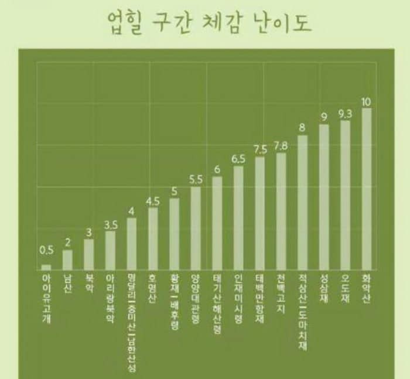
**이미지 캡션:** 이 이미지는 "업힐 구간 체감 난이도"라는 제목의 막대 그래프로, 한국의 여러 산악 구간별 체감 난이도를 나타냅니다. 그래프는 녹색 배경에 흰색 막대로 구성되어 있으며, 각 막대는 특정 산악 구간을 나타내고 그 위에 난이도 수치가 표시되어 있습니다. X축에는 "아이유고개", "남산", "북악", "아리랑북악", "명달리-중미산/남한산성", "호명산", "황재-배후령", "양양대관령", "태기산해산령", "인재미시령", "태백만항재", "전백고지", "적상산-도마치재", "성삼재", "오도재", "화악산"과 같은 산악 구간 이름이 세로로 나열되어 있습니다. Y축은 0.5부터 10까지의 숫자로 체감 난이도를 나타냅니다. 막대의 높이와 위에 표시된 숫자를 통해 각 구간의 난이도를 비교할 수 있으며, "화악산"이 10으로 가장 높은 난이도를 보이고 "아이유고개"가 0.5로 가장 낮은 난이도를 보입니다. 그래프 상단에는 "업힐 구간 체감 난이도"라는 제목이 한국어로 쓰여 있습니다. 이미지에는 사람이 등장하지 않으며, 배경은 단순한 녹색 그래프 영역입니다. 텍스트는 모두 한국어이며, 그래프의 제목과 각 산악 구간의 이름, 그리고 난이도 수치로 구성되어 있습니다. 전반적으로 정보 전달을 위한 차트 이미지로, 차분하고 정보 중심적인 분위기를 띠고 있습니다.은 산악 구간 이름이 세로로 나열되어 있습니다. Y축은 0.5부터 10까지의 숫자로 체감 난이도를 나타냅니다. 막대의 높이와 위에 표시된 숫자를 통해 각 구간의 난이도를 비교할 수 있으며, "화악산"이 10으로 가장 높은 난이도를 보이고 "아이유고개"가 0.5로 가장 낮은 난이도를 보입니다. 그래프 상단에는 "업힐 구간 체감 난이도"라는 제목이 한국어로 쓰여 있습니다. 이미지에는 사람이 등장하지 않으며, 배경은 단순한 녹색 그래프 영역입니다. 텍스트는 모두 한국어이며, 그래프의 제목과 각 산악 구간의 이름, 그리고 난이도 수치로 구성되어 있습니다. 전반적으로 정보 전달을 위한 차트 이미지로, 차분하고 정보 중심적인 분위기를 띠고 있습니다.

### 4월 28일 (목) 15:59 · 📷 사진 (1장)

**이미지 캡션:** 이 사진은 "Interaction-Centric AI"라는 주제로 열리는 강연을 홍보하는 이미지로, 왼쪽에는 행사에 대한 정보가, 오른쪽에는 연사 사진과 정보가 담겨 있습니다. 왼쪽 배경은 보라색과 분홍색이 그라데이션으로 이루어져 있으며, 텍스트는 흰색으로 표시되어 있습니다. 상단에는 "Interaction-Centric AI"라는 제목이 크게 적혀 있고, 그 아래에는 "2022. 04. 28. Thu. 8:00 pm"이라는 날짜와 시간이 명시되어 있습니다. 하단에는 "upstage insight talks"라는 로고가 있습니다. 오른쪽에는 검은색 재킷과 흰색 셔츠를 입고 검은색 안경을 쓴 30대 후반에서 40대 초반으로 보이는 동양인 남성의 흑백 사진이 있습니다. 그는 환하게 웃으며 카메라를 바라보고 있으며, 머리카락은 짧고 단정합니다. 사진 아래에는 "Prof. Juho Kim"이라는 이름과 "KAIST 전산학부"라는 소속이 적혀 있습니다. 전체적으로 깔끔하고 전문적인 분위기를 풍기며, AI 분야의 강연임을 알 수 있습니다.라는 로고가 있습니다. 오른쪽에는 검은색 재킷과 흰색 셔츠를 입고 검은색 안경을 쓴 30대 후반에서 40대 초반으로 보이는 동양인 남성의 흑백 사진이 있습니다. 그는 환하게 웃으며 카메라를 바라보고 있으며, 머리카락은 짧고 단정합니다. 사진 아래에는 "Prof. Juho Kim"이라는 이름과 "KAIST 전산학부"라는 소속이 적혀 있습니다. 전체적으로 깔끔하고 전문적인 분위기를 풍기며, AI 분야의 강연임을 알 수 있습니다.

> #업스톡 #오늘7시등록마감  모델의 성능뿐만 아니라 인터렉션이 상당히 중요한데요 이 관련 세계 최고의 전문가중 한분이신 김주호 교수님을 모시고 이야기를 나누어 봅니다.  🤔 '왜 엄청난 AI 모델의 성능은 더 나은 어플리케이션과 사용자 경험의 향상으로 연결되지 않을까?' 라는 질문으로 시작됩니다. 이에 대한 해답을 찾기 위한 일환으로 모델과 데이터 중심의 AI 패러다임의 한계를 극복하는 대안으로서 '인터랙션 중심의 AI'을 제안합니다. 앞으로 더 일반화될 AI 시대에 꼭 필요한 새로운 인사이트를 이번 강연을 통해 만나보세요!  👉 주제 : Interaction-Centric AI  👉 연사 : 김주호 | KAIST 전산학부 부교수  👉 일시 : 2022년 4월 28일 목요일 오후 8시  👉 신청 : [https://bit.ly/upstalks_interaction_rsvp](https://bit.ly/upstalks_interaction_rsvp?fbclid=IwAR0SLh3wjK1oW70rDP51cDJWJjEo1qmUFf8uIAztTfDm8Gf3Q9-Fe8qgVaU) (4/28일 7시 마감)
