# 2022년 5월

[← 2022년](README.md)

<a id="p0504-1004"></a>
### 5월 4일 (수) 10:04 · 로켓 성장하는 업스테이지 CTO Hwalsuk Lee 님의 일하는 법에 …

로켓 성장하는 업스테이지 CTO Hwalsuk Lee 님의 일하는 법에 대한 너무 재미있는 영상입니다. TaeYong Kim님의 멋진 질문과 진행, 그리고 활석님의 유쾌함, 서주은 CTO 님의 멋진 스토리가 있습니다. 

https://youtu.be/0EyWBxq8z2g 선시청 후고민. 

활석님과 신나게 일해보실 분들은 https://careers.upstage.ai/ 선지원 후고민 입니다!

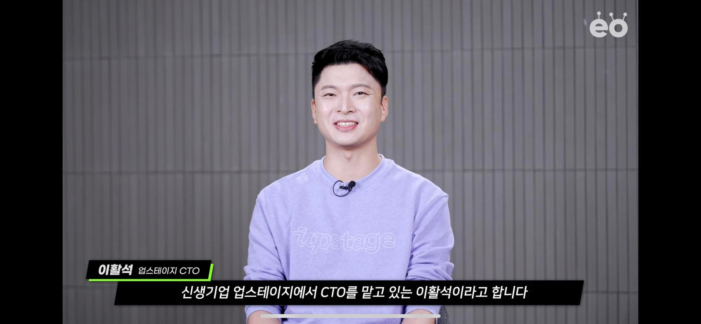
**이미지 캡션:** 화면 중앙에는 옅은 보라색 맨투맨 티셔츠를 입고 환하게 웃고 있는 30대 초반의 성인 남성이 보인다. 남성은 짧은 검은색 머리에 깔끔한 인상을 주며, 목에는 작은 마이크가 달려 있다. 그의 옷에는 'upstage'라는 흰색 글자가 새겨져 있다. 배경은 회색의 수직 격자무늬 벽으로, 차분하고 현대적인 느낌을 준다. 화면 하단에는 검은색 배경에 흰색 글자로 "이활석 업스테이지 CTO"라고 적혀 있고, 그 아래에는 "신생기업 업스테이지에서 CTO를 맡고 있는 이활석이라고 합니다"라는 자막이 보인다. 화면 오른쪽 상단에는 'eo'라는 로고가 작게 표시되어 있다. 전반적으로 인터뷰나 발표 영상의 한 장면으로 보이며, 전문적이고 긍정적인 분위기를 풍긴다.단에는 'eo'라는 로고가 작게 표시되어 있다. 전반적으로 인터뷰나 발표 영상의 한 장면으로 보이며, 전문적이고 긍정적인 분위기를 풍긴다.
 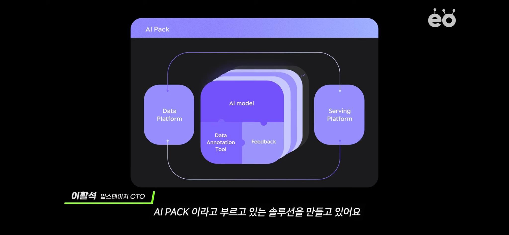
**이미지 캡션:** 이 사진은 검은색 배경에 보라색과 흰색으로 구성된 다이어그램을 보여줍니다. 다이어그램은 "AI Pack"이라는 제목으로 시작하며, 여러 개의 겹쳐진 보라색 상자로 구성된 중앙의 "AI model" 블록을 중심으로 "Data Platform"과 "Serving Platform"이라는 두 개의 블록이 연결되어 있습니다. "AI model" 블록 안에는 "Data Annotation Tool"과 "Feedback"이라는 더 작은 블록이 포함되어 있습니다. 다이어그램의 왼쪽 하단에는 "이활석 업스테이지 CTO"라는 이름과 직책이 흰색 글씨로 표시되어 있으며, 그 아래에는 "AI PACK 이라고 부르고 있는 솔루션을 만들고 있어요"라는 한국어 문장이 흰색 글씨로 쓰여 있습니다. 오른쪽 상단에는 "éö"라는 로고가 흰색으로 표시되어 있습니다. 전체적으로 기술적인 내용을 설명하는 프레젠테이션이나 영상의 한 장면으로 보이며, 차분하고 전문적인 분위기를 풍깁니다.이름과 직책이 흰색 글씨로 표시되어 있으며, 그 아래에는 "AI PACK 이라고 부르고 있는 솔루션을 만들고 있어요"라는 한국어 문장이 흰색 글씨로 쓰여 있습니다. 오른쪽 상단에는 "éö"라는 로고가 흰색으로 표시되어 있습니다. 전체적으로 기술적인 내용을 설명하는 프레젠테이션이나 영상의 한 장면으로 보이며, 차분하고 전문적인 분위기를 풍깁니다.
 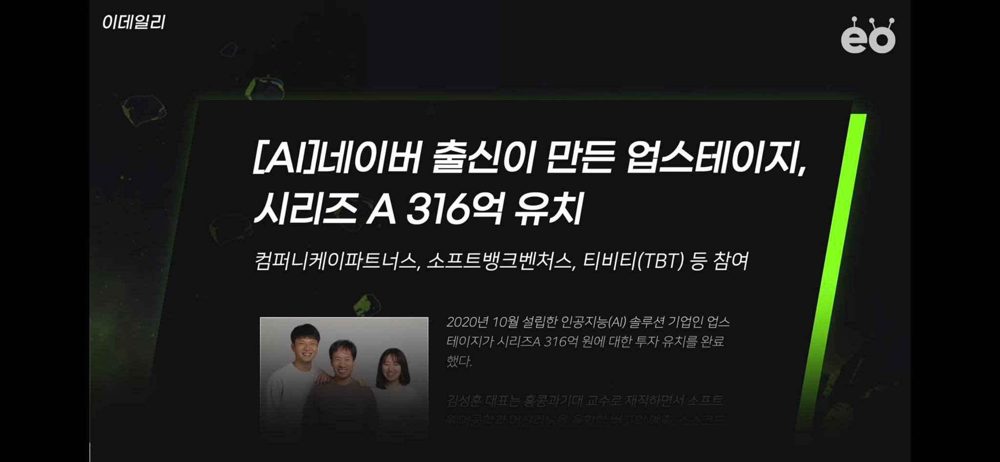
**이미지 캡션:** 이 사진은 '이데일리'라는 로고와 함께 AI 기술 스타트업 '업스테이지'에 대한 뉴스를 다루고 있습니다. 화면 중앙에는 "[AI]네이버 출신이 만든 업스테이지, 시리즈 A 316억 유치"라는 제목이 흰색 글씨로 크게 쓰여 있으며, 그 아래에는 "컴퍼니케이파트너스, 소프트뱅크벤처스, 티비티(TBT) 등 참여"라는 부제가 있습니다. 왼쪽 하단에는 업스테이지의 창업 멤버로 보이는 성인 남성 두 명과 성인 여성 한 명이 함께 웃으며 찍은 사진이 있습니다. 이들은 캐주얼한 복장을 하고 있으며, 밝고 긍정적인 표정을 짓고 있습니다. 사진 오른쪽에는 "2020년 10월 설립한 인공지능(AI) 솔루션 기업인 업스테이지가 시리즈 A 316억 원에 대한 투자 유치를 완료했다."라는 기사 내용이 요약되어 있으며, 그 아래에는 "김성훈 대표는 홍콩과기대 교수로 재직하면서 소프트웨어 과학과 머신러닝을 통합한 박사 과정 소스코드를 개발했다."라는 추가 정보가 있습니다. 배경은 어두운 녹색 톤으로, 추상적인 그래픽 요소들이 배치되어 있어 기술적인 느낌을 줍니다. 전체적으로 성공적인 투자 유치를 축하하고 회사의 기술력을 강조하는 긍정적이고 진취적인 분위기입니다.고 있습니다. 사진 오른쪽에는 "2020년 10월 설립한 인공지능(AI) 솔루션 기업인 업스테이지가 시리즈 A 316억 원에 대한 투자 유치를 완료했다."라는 기사 내용이 요약되어 있으며, 그 아래에는 "김성훈 대표는 홍콩과기대 교수로 재직하면서 소프트웨어 과학과 머신러닝을 통합한 박사 과정 소스코드를 개발했다."라는 추가 정보가 있습니다. 배경은 어두운 녹색 톤으로, 추상적인 그래픽 요소들이 배치되어 있어 기술적인 느낌을 줍니다. 전체적으로 성공적인 투자 유치를 축하하고 회사의 기술력을 강조하는 긍정적이고 진취적인 분위기입니다.

<a id="p0514-1759"></a>
### 5월 14일 (토) 17:59 · 멋진분들과 73k의 새만금 바닷가길 라이딩 -- 오랫동안 기억에 남을 멋…

멋진분들과 73k의 새만금 바닷가길 라이딩 -- 오랫동안 기억에 남을 멋진 라이딩 이였습니다. 함께 하신분들 너무 감사해요.

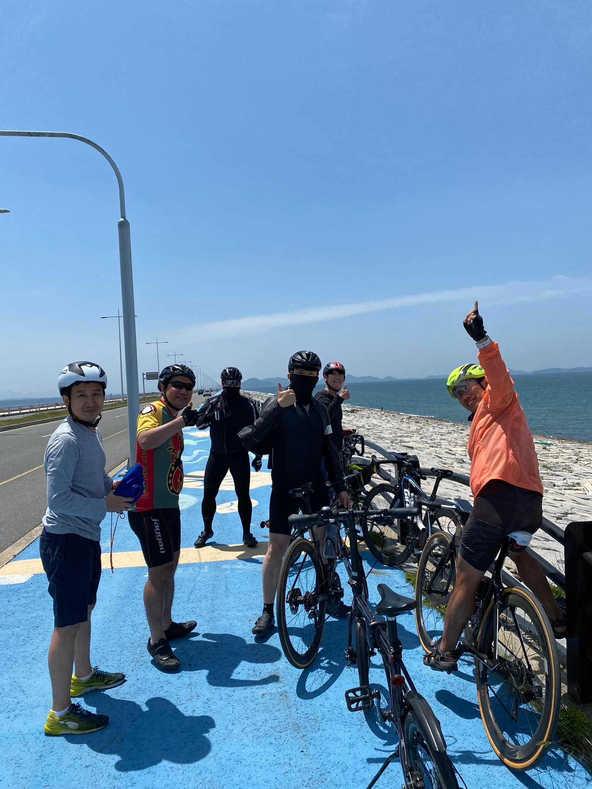
**이미지 캡션:** 다섯 명의 성인 남성이 자전거를 타고 해안 도로를 따라 걷고 있다. 그들은 모두 사이클링 복장을 하고 있으며 헬멧을 쓰고 있다. 왼쪽에서부터 첫 번째 남성은 회색 긴팔 셔츠와 남색 반바지를 입고 노란색 운동화를 신고 있다. 두 번째 남성은 노란색, 빨간색, 녹색이 섞인 저지 상의와 검은색 반바지를 입고 있다. 세 번째 남성은 검은색 사이클링 복장을 하고 있으며, 네 번째 남성도 검은색 사이클링 복장을 하고 있다. 다섯 번째 남성은 주황색 저지 상의와 검은색 반바지를 입고 있으며, 한 손을 들고 있다. 배경에는 파란색 자전거 도로, 바다, 그리고 맑은 하늘이 보인다. 도로 옆에는 검은색 난간이 설치되어 있다. 전반적으로 화창한 날씨에 즐거운 자전거 라이딩을 즐기는 모습이다. 파란색 자전거 도로, 바다, 그리고 맑은 하늘이 보인다. 도로 옆에는 검은색 난간이 설치되어 있다. 전반적으로 화창한 날씨에 즐거운 자전거 라이딩을 즐기는 모습이다.
 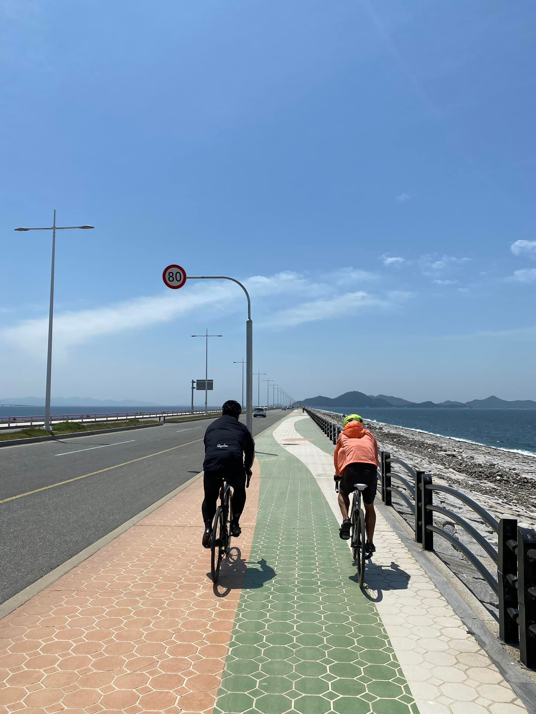
**이미지 캡션:** 맑고 푸른 하늘 아래, 두 명의 성인 남성이 자전거를 타고 해안 도로를 달리고 있다. 앞서가는 남성은 검은색 긴팔 상의와 검은색 바지를 입고 있으며, 뒤따르는 남성은 주황색 바람막이와 검은색 반바지를 입고 헬멧을 착용하고 있다. 두 사람 모두 자전거를 타는 데 집중하고 있으며, 표정은 보이지 않는다. 배경으로는 넓게 펼쳐진 바다와 그 너머로 보이는 산들이 있으며, 도로 옆으로는 자전거 도로가 조성되어 있다. 자전거 도로 바닥은 주황색과 녹색의 육각형 패턴 타일로 덮여 있으며, 도로에는 80km/h 속도 제한 표지판이 보인다. 전반적으로 맑고 시원한 날씨 속에서 여유롭게 자전거를 타는 평화로운 분위기이다.표지판이 보인다. 전반적으로 맑고 시원한 날씨 속에서 여유롭게 자전거를 타는 평화로운 분위기이다.
 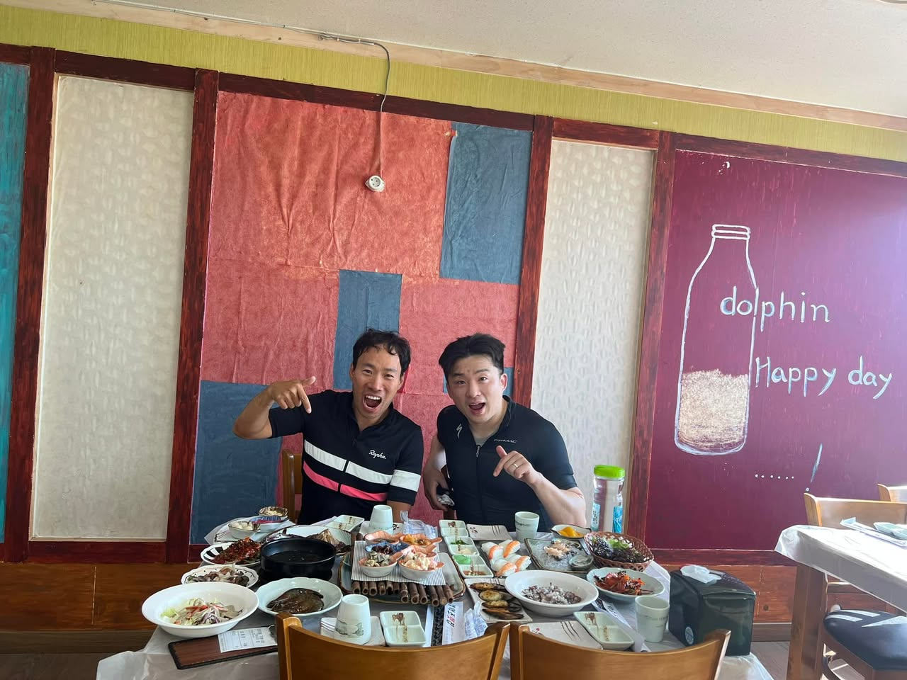
**이미지 캡션:** 두 명의 성인 남성이 식탁 앞에 앉아 카메라를 향해 손가락질하며 환하게 웃고 있다. 왼쪽 남성은 검은색 상의에 흰색과 분홍색 줄무늬가 있는 옷을 입고 있으며, 오른쪽 남성은 검은색 상의를 입고 있다. 두 사람 모두 젊고 활기찬 모습이다. 식탁 위에는 다양한 해산물 요리와 초밥, 밥, 국 등이 차려져 있어 푸짐한 식사를 하고 있는 것으로 보인다. 배경 벽에는 붉은색, 분홍색, 흰색, 파란색 천 조각이 불규칙하게 붙어 있고, 오른쪽 벽에는 병 모양과 함께 "dolphin Happy day"라는 글씨가 흰색으로 쓰여 있다. 전체적으로 밝고 즐거운 분위기이며, 식사를 하며 즐거운 시간을 보내고 있는 모습이다.여 있다. 전체적으로 밝고 즐거운 분위기이며, 식사를 하며 즐거운 시간을 보내고 있는 모습이다.
 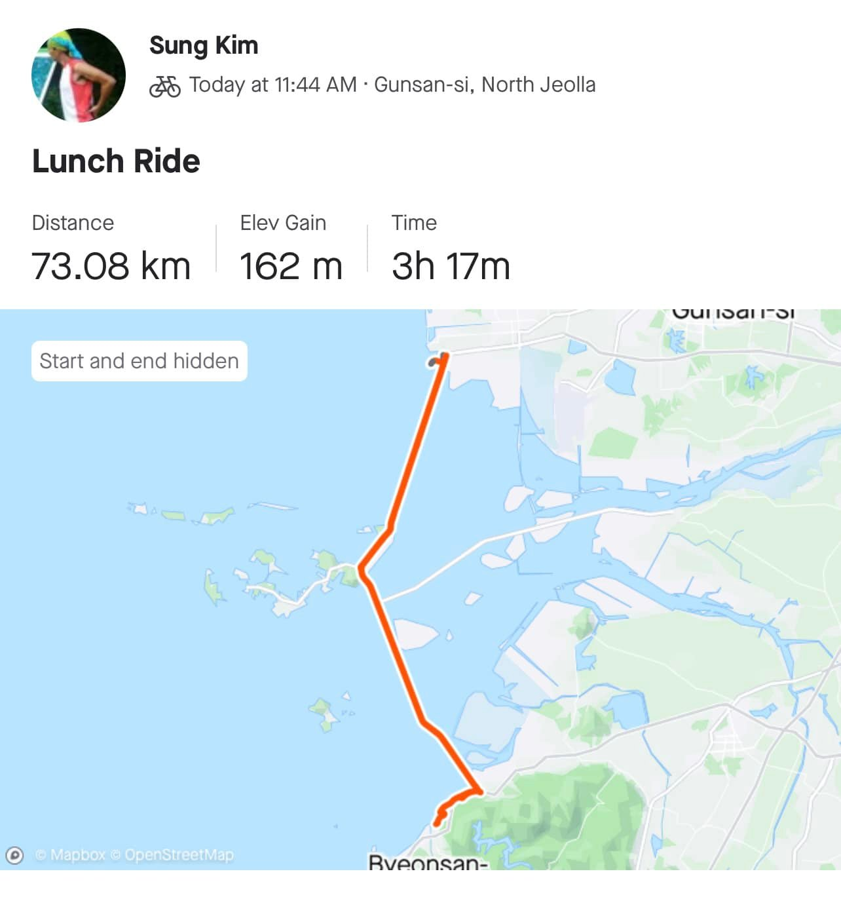
**이미지 캡션:** 사진에는 'Sung Kim'이라는 이름의 사용자가 오늘 오전 11시 44분에 전라북도 군산시에서 'Lunch Ride'라는 제목으로 자전거를 탄 기록이 표시되어 있습니다. 총 이동 거리는 73.08km, 고도 상승은 162m, 소요 시간은 3시간 17분입니다. 지도에는 바다와 섬, 그리고 육지가 보이며, 주황색 선으로 자전거 경로가 표시되어 있습니다. 경로의 시작점과 끝점은 'Start and end hidden'이라는 문구로 가려져 있습니다. 지도 하단에는 'Mapbox © OpenStreetMap'이라는 저작권 정보와 'Byeonsan-'이라는 지명이 보입니다. 사진 상단 좌측에는 사용자의 프로필 사진으로 보이는 작은 원형 이미지가 있는데, 여기에는 녹색 모자와 빨간색 상의를 입은 사람의 상반신이 보입니다. 이 사람은 성인 남성으로 추정되며, 얼굴 표정이나 구체적인 행동은 명확하게 보이지 않습니다. 전반적으로 자전거 라이딩 기록을 보여주는 화면 캡처 이미지로, 활동적인 취미 생활을 나타내는 분위기입니다.저작권 정보와 'Byeonsan-'이라는 지명이 보입니다. 사진 상단 좌측에는 사용자의 프로필 사진으로 보이는 작은 원형 이미지가 있는데, 여기에는 녹색 모자와 빨간색 상의를 입은 사람의 상반신이 보입니다. 이 사람은 성인 남성으로 추정되며, 얼굴 표정이나 구체적인 행동은 명확하게 보이지 않습니다. 전반적으로 자전거 라이딩 기록을 보여주는 화면 캡처 이미지로, 활동적인 취미 생활을 나타내는 분위기입니다.
 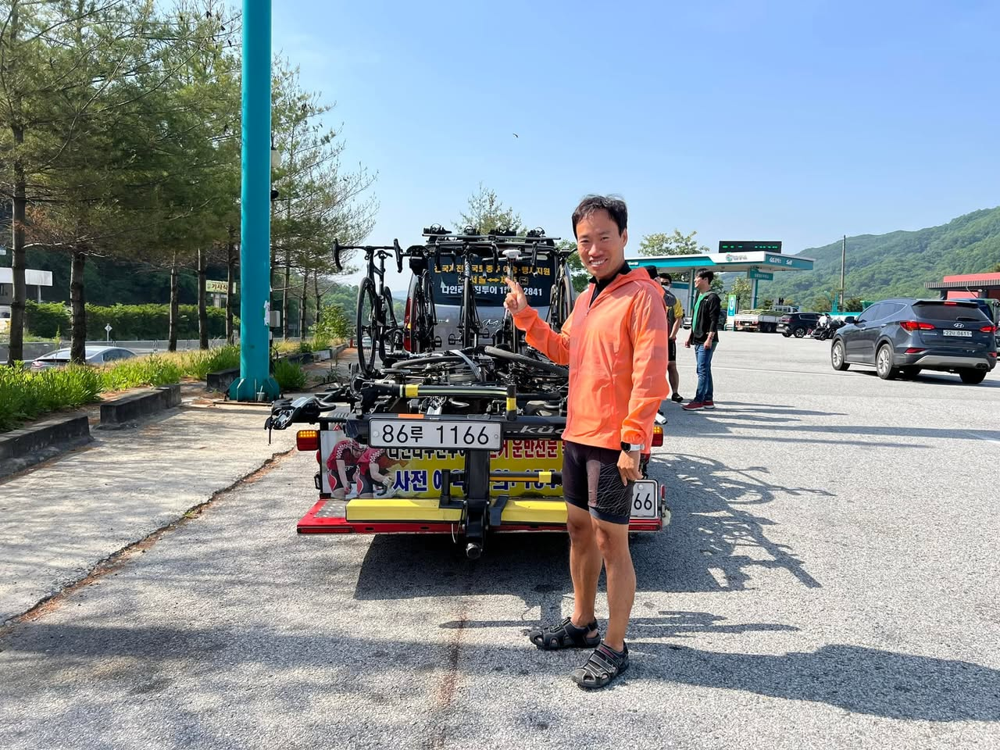
**이미지 캡션:** 한 성인 남성이 주황색 바람막이와 검은색 반바지, 샌들을 착용하고 밝게 웃으며 카메라를 향해 손가락으로 가리키고 있다. 그는 자전거 여러 대가 실린 트럭 뒤에 서 있으며, 트럭에는 "86루 1166"이라는 번호와 함께 한국어로 된 문구가 적혀 있다. 배경에는 주유소와 산이 보이며, 다른 차량들도 주차되어 있다. 전반적으로 맑고 화창한 날씨에 야외 활동을 준비하는 듯한 분위기이다.

🎬 동영상 2개 (생략)

<a id="p0516-1054"></a>
### 5월 16일 (월) 10:54 · 멋진 분들과 설악산 개방 첫날 대청봉 방문 합니다. 좋은 분들과 올라오니…

멋진 분들과 설악산 개방 첫날 대청봉 방문 합니다. 좋은 분들과 올라오니 대청봉 2시간 컷 해보았습니다. 정말 멋지네요.

업업업!!!

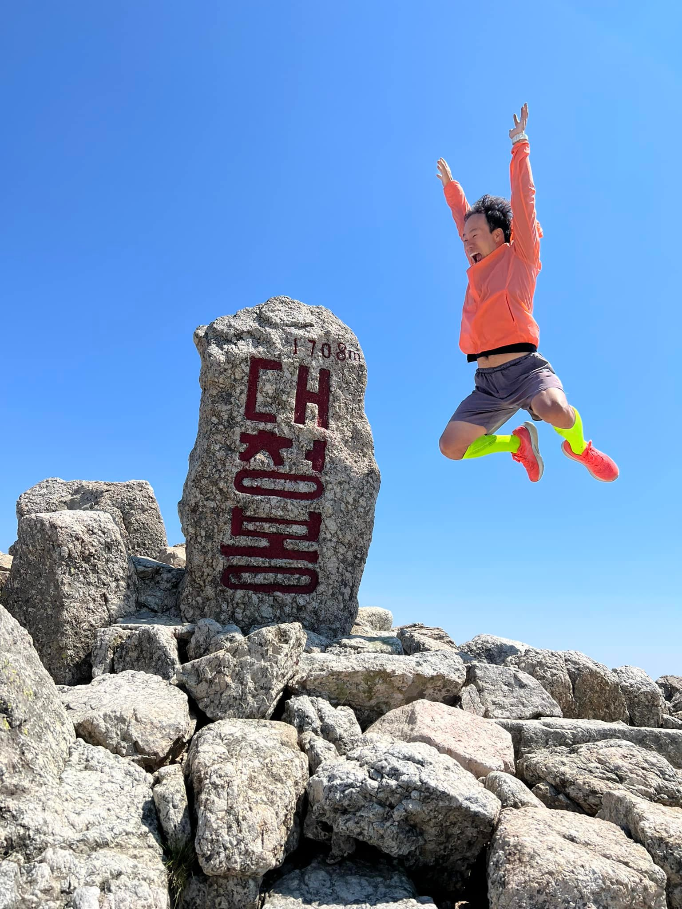
**이미지 캡션:** 맑고 푸른 하늘 아래, 한 성인 남성이 산 정상에서 점프하며 환호하고 있다. 그는 주황색 바람막이 점퍼와 회색 반바지, 형광 연두색 양말과 주황색 운동화를 신고 있다. 그의 얼굴에는 기쁨과 성취감이 가득하며, 두 팔을 높이 들어 올리고 있다. 배경에는 '대청봉 1708m'이라고 붉은 글씨로 새겨진 큰 바위와 주변의 여러 바위들이 보인다. 이 사진은 등반 성공의 기쁨과 함께 아름다운 자연을 만끽하는 순간을 포착하고 있다.
 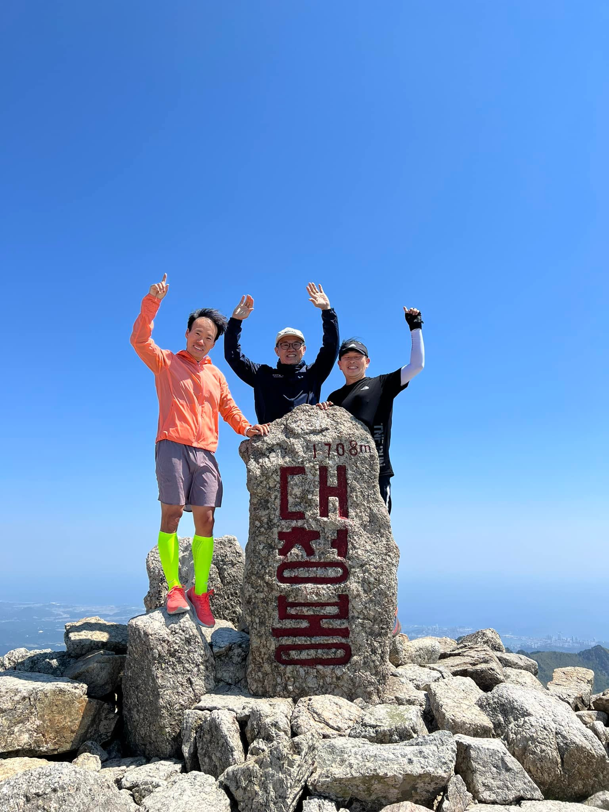
**이미지 캡션:** 푸른 하늘 아래, 세 명의 성인 남성이 대청봉 정상에 서서 기념 사진을 찍고 있다. 왼쪽 남성은 주황색 후드 집업과 회색 반바지, 형광 연두색 긴 양말과 빨간색 운동화를 신고 있으며, 오른손을 들어 올리고 있다. 가운데 남성은 검은색 긴팔 상의와 흰색 모자, 안경을 착용하고 있으며, 양손을 들어 올리고 있다. 오른쪽 남성은 검은색 반팔 상의와 검은색 모자, 팔토시를 착용하고 있으며, 오른손을 들어 올리고 있다. 세 사람 모두 환한 미소를 띠고 있으며, 배경에는 1708m라는 표지석과 함께 '대청봉'이라는 글자가 붉은색으로 새겨져 있다. 주변은 바위로 둘러싸여 있고, 멀리 바다와 도시 풍경이 펼쳐져 있어 등반의 성취감과 시원한 경치를 느낄 수 있는 화창한 날씨이다.가 붉은색으로 새겨져 있다. 주변은 바위로 둘러싸여 있고, 멀리 바다와 도시 풍경이 펼쳐져 있어 등반의 성취감과 시원한 경치를 느낄 수 있는 화창한 날씨이다.
 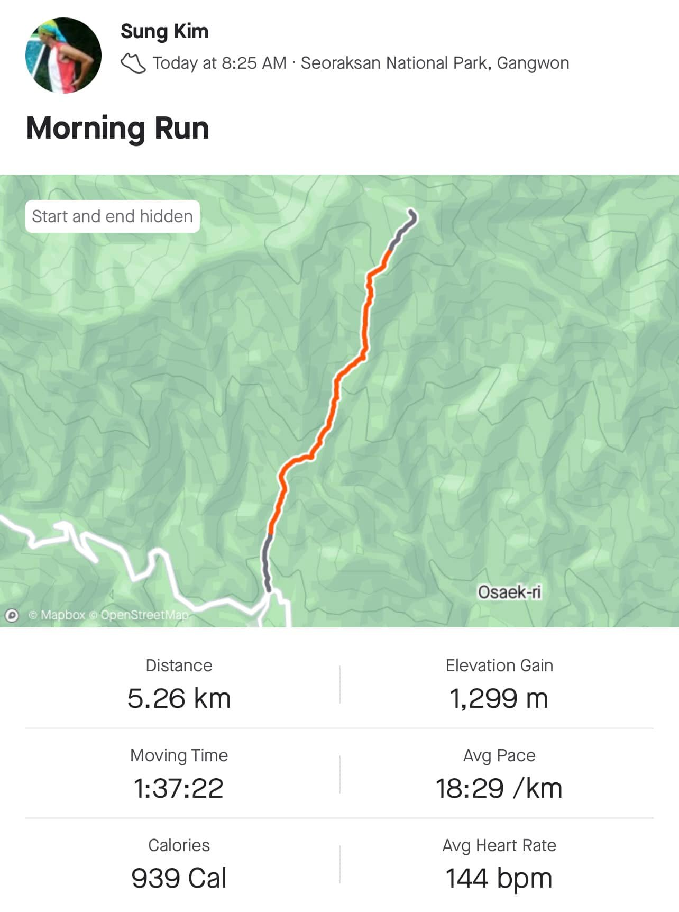
**이미지 캡션:** 이 사진은 성인 남성인 Sung Kim이 오전 8시 25분에 설악산 국립공원에서 진행한 아침 달리기 기록을 보여줍니다. 사진 상단에는 Sung Kim의 프로필 사진과 이름, 그리고 활동 내용인 'Morning Run'이 표시되어 있습니다. 중앙에는 산악 지형을 나타내는 지도 위에 주황색과 회색으로 표시된 달리기 경로가 보이며, 'Start and end hidden'이라는 문구가 경로의 시작점과 끝점이 숨겨져 있음을 나타냅니다. 지도에는 'Osaek-ri'라는 지명도 보입니다. 하단에는 달리기 기록이 상세하게 표시되어 있는데, 총 거리는 5.26km, 이동 시간은 1시간 37분 22초, 소모 칼로리는 939kcal입니다. 또한, 고도 상승은 1,299m, 평균 페이스는 18분 29초/km, 평균 심박수는 144bpm으로 기록되어 있습니다. 전반적으로 활동적인 야외 운동 기록을 보여주는 깔끔하고 정보 전달에 충실한 화면입니다. 표시되어 있는데, 총 거리는 5.26km, 이동 시간은 1시간 37분 22초, 소모 칼로리는 939kcal입니다. 또한, 고도 상승은 1,299m, 평균 페이스는 18분 29초/km, 평균 심박수는 144bpm으로 기록되어 있습니다. 전반적으로 활동적인 야외 운동 기록을 보여주는 깔끔하고 정보 전달에 충실한 화면입니다.

<a id="p0526-1001"></a>
### 5월 26일 (목) 10:01 · 📷 사진 (3장)

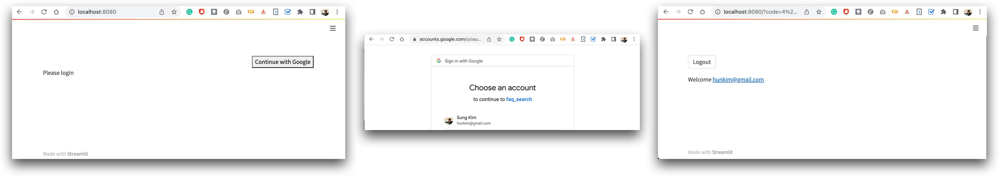
**이미지 캡션:** 세 개의 웹 브라우저 창이 나란히 표시되어 있으며, 각각 다른 로그인 또는 인증 단계를 보여줍니다. 가장 왼쪽 창에는 "Please login"이라는 텍스트와 "Continue with Google" 버튼이 있습니다. 가운데 창은 Google 로그인 페이지로, "Sign in with Google"이라는 제목과 함께 "Choose an account"라는 텍스트가 표시되며, "Sung Kim"이라는 이름과 "hunkim@gmail.com"이라는 이메일 주소가 나타납니다. 가장 오른쪽 창은 로그인 후의 상태를 보여주며, "Logout" 버튼과 "Welcome hunkim@gmail.com"이라는 환영 메시지가 표시됩니다. 세 창 모두 하단에 "Made with Streamlit"이라는 문구가 있습니다. 전반적으로 웹 애플리케이션의 로그인 및 인증 흐름을 보여주는 화면입니다.보여주며, "Logout" 버튼과 "Welcome hunkim@gmail.com"이라는 환영 메시지가 표시됩니다. 세 창 모두 하단에 "Made with Streamlit"이라는 문구가 있습니다. 전반적으로 웹 애플리케이션의 로그인 및 인증 흐름을 보여주는 화면입니다.
 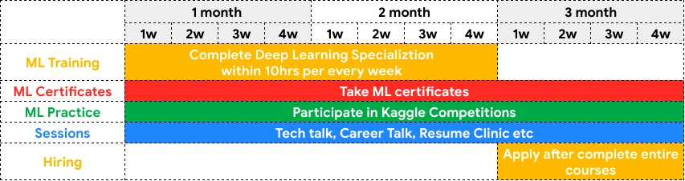
**이미지 캡션:** 이 이미지는 머신러닝 학습 및 취업을 위한 3개월 로드맵을 보여주는 차트입니다. 왼쪽에는 ML Training, ML Certificates, ML Practice, Sessions, Hiring이라는 5가지 주요 활동이 나열되어 있으며, 각 활동은 다른 색상으로 구분됩니다. 상단에는 1개월, 2개월, 3개월로 나뉜 시간 축이 있으며, 각 월은 다시 1주차, 2주차, 3주차, 4주차로 세분화됩니다. ML Training 활동은 노란색으로 표시되어 있으며, 1개월차부터 2개월차 3주차까지 "Complete Deep Learning Specialization within 10hrs per every week"라는 내용으로 채워져 있습니다. ML Certificates 활동은 빨간색으로 표시되어 2개월차 1주차부터 3개월차 4주차까지 "Take ML certificates"라는 내용으로 진행됩니다. ML Practice 활동은 녹색으로 표시되어 2개월차 1주차부터 3개월차 4주차까지 "Participate in Kaggle Competitions"라는 내용으로 진행됩니다. Sessions 활동은 파란색으로 표시되어 2개월차 1주차부터 2개월차 4주차까지 "Tech talk, Career Talk, Resume Clinic etc"라는 내용으로 진행됩니다. Hiring 활동은 주황색으로 표시되어 3개월차 3주차부터 3개월차 4주차까지 "Apply after complete entire courses"라는 내용으로 마지막에 배치되어 있습니다. 전반적으로 이 차트는 체계적인 학습 계획과 실전 경험, 그리고 취업 준비까지 이어지는 과정을 시각적으로 명확하게 보여줍니다.ep Learning Specialization within 10hrs per every week"라는 내용으로 채워져 있습니다. ML Certificates 활동은 빨간색으로 표시되어 2개월차 1주차부터 3개월차 4주차까지 "Take ML certificates"라는 내용으로 진행됩니다. ML Practice 활동은 녹색으로 표시되어 2개월차 1주차부터 3개월차 4주차까지 "Participate in Kaggle Competitions"라는 내용으로 진행됩니다. Sessions 활동은 파란색으로 표시되어 2개월차 1주차부터 2개월차 4주차까지 "Tech talk, Career Talk, Resume Clinic etc"라는 내용으로 진행됩니다. Hiring 활동은 주황색으로 표시되어 3개월차 3주차부터 3개월차 4주차까지 "Apply after complete entire courses"라는 내용으로 마지막에 배치되어 있습니다. 전반적으로 이 차트는 체계적인 학습 계획과 실전 경험, 그리고 취업 준비까지 이어지는 과정을 시각적으로 명확하게 보여줍니다.
 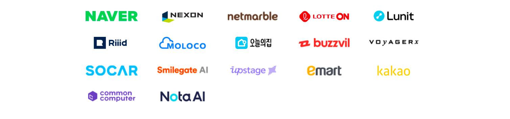
**이미지 캡션:** 이 이미지는 다양한 한국 기업들의 로고를 모아놓은 것으로, 사람이나 특정 장소, 사물은 보이지 않으며 텍스트는 각 기업의 이름으로 구성되어 있습니다. 로고들은 흰색 배경 위에 각기 다른 색상과 글꼴로 배치되어 있으며, 전반적으로 깔끔하고 정보 전달에 초점을 맞춘 분위기를 띠고 있습니다. 보이는 텍스트는 NAVER, NEXON, netmarble, LOTTE ON, Lunit, Riiid, MOLOCCO, 오늘의집, buzzvil, VOYAGERX, SOCAR, Smilegate AI, upstage, emart, kakao, common computer, Nota AI 입니다.t, kakao, common computer, Nota AI 입니다.

> #streamlit #GoogleOAuth2   streamlit은 간단한 ML/딥러닝 데모 만들기에 너무 좋은데요. 구글 login기능이 필요할때 몇줄로 로그인 기능을 넣을수 있는 streamlit-google-oauth 기능을 만들어 보았습니다.    pip install git+[https://github.com/hunkim/streamlit-google-oauth](https://github.com/hunkim/streamlit-google-oauth)  하신다음 아래 코드면 됩니다.   일주일 정도 테스트후 pip에 등록해보려고 합니다. PR이나 커멘트 환영입니다 [https://github.com/hunkim/streamlit-google-oauth](https://github.com/hunkim/streamlit-google-oauth) (지금 버턴이 너무 안이쁩니다.)  ``` login_info = oauth.login(         client_id=client_id,         client_secret=client_secret,         redirect_uri=redirect_uri,         login_button_text="Continue with Google",         logout_button_text="Logout",     ) if login_info:         user_id, user_email = login_info         st.write(f"Welcome {user_email}") else:         st.write("Please login") ```

<a id="p0527-1120"></a>
### 5월 27일 (금) 11:20 · 📷 사진 (1장)

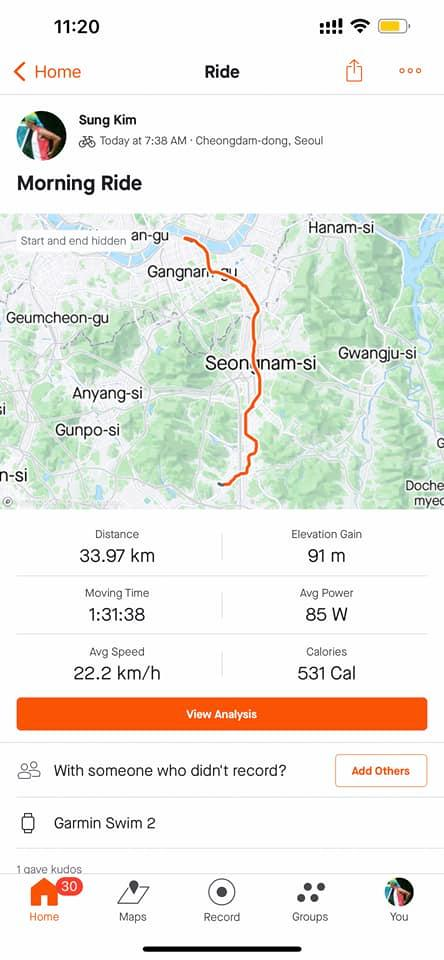
**이미지 캡션:** 이 화면은 자전거 타기 활동 기록을 보여주는 모바일 애플리케이션의 일부로, 'Sung Kim'이라는 사용자가 'Morning Ride'라는 제목으로 2024년 7월 38일 오전 7시 38분에 서울 청담동에서 시작하여 안양시, 군포시, 성남시, 광주시 등을 거쳐 하남시 근처까지 이동한 경로를 지도 위에 주황색 선으로 표시하고 있습니다. 지도에는 강남구, 금천구, 안양시, 군포시, 성남시, 광주시 등 서울 및 경기 지역의 지명이 표시되어 있으며, "Start and end hidden"이라는 문구로 시작점과 종료점이 가려져 있습니다. 활동 기록 요약 정보로는 총 거리 33.97km, 이동 시간 1시간 31분 38초, 평균 속도 22.2km/h, 고도 상승 91m, 평균 파워 85W, 소모 칼로리 531kcal가 나타나 있습니다. 화면 하단에는 "View Analysis" 버튼과 함께 "With someone who didn't record?"라는 문구와 "Add Others" 버튼, 그리고 "Garmin Swim 2"라는 기기 정보가 보입니다. 또한, "1 gave kudos 30"이라는 표시와 함께 하단 메뉴에는 Home, Maps, Record, Groups, You 아이콘이 배치되어 있습니다. 전반적으로 활동적인 라이딩 기록을 확인하고 분석하는 상황을 보여줍니다.점이 가려져 있습니다. 활동 기록 요약 정보로는 총 거리 33.97km, 이동 시간 1시간 31분 38초, 평균 속도 22.2km/h, 고도 상승 91m, 평균 파워 85W, 소모 칼로리 531kcal가 나타나 있습니다. 화면 하단에는 "View Analysis" 버튼과 함께 "With someone who didn't record?"라는 문구와 "Add Others" 버튼, 그리고 "Garmin Swim 2"라는 기기 정보가 보입니다. 또한, "1 gave kudos 30"이라는 표시와 함께 하단 메뉴에는 Home, Maps, Record, Groups, You 아이콘이 배치되어 있습니다. 전반적으로 활동적인 라이딩 기록을 확인하고 분석하는 상황을 보여줍니다.

<a id="p0528-0723"></a>
### 5월 28일 (토) 07:23 · #굿즈퀴즈 #20명선물 #각각몇개 #531마감

#굿즈퀴즈 #20명선물 #각각몇개 #531마감 

세계 최고의 AI모델을 세계 최고의 AI칩에 올리기 위한 Furiosa 와 Upstage 와 회식을 하고, (몸무게 1~2K를 올린다음), 마지막으로 Pull-UP 챌린지를 했습니다. 최고의 AI 모델과 칩을 위해 체력은 중요하기에...

여기서 선물이 걸린 퀴즈 나갑니다. 아래 영상의 자세와 올라가는 몸동작을 보시고 최종 각각 몇개를 했을지 prediction해주시면 됩니다. 본인이 가지고 있는 AI모델을 돌리셔도 되고, 그냥 눈으로 보고 게스를 해도 좋습니다.

5/31일까지 정답을 맞추신, 또는 가장 가까운 (L1 distance 기준) 20명을 뽑아 Furiosa & Upstage에서 각각 선물을 보내 드립니다!

예: Furosa: 2, Upstage 2

그럼 멋진 예측 결과를 기대해봅니다!

🎬 동영상 1개 (생략)

<a id="p0528-0727"></a>
### 5월 28일 (토) 07:27 · 📷 사진 (1장)

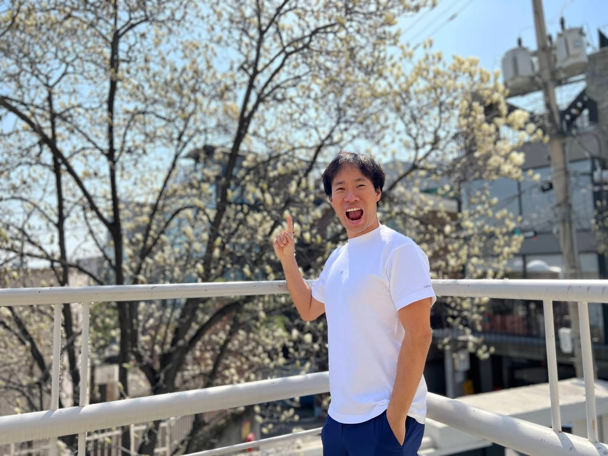
**이미지 캡션:** 밝은 햇살 아래, 한 성인 남성이 흰색 반팔 티셔츠와 남색 바지를 입고 난간에 기댄 채 활짝 웃으며 카메라를 향해 손가락으로 무언가를 가리키고 있다. 그의 표정은 매우 즐거워 보이며, 입을 크게 벌리고 있다. 배경에는 하얀 꽃이 만개한 나무와 건물, 전봇대, 그리고 파란 하늘이 보인다. 전체적으로 화창하고 활기찬 봄날의 분위기를 느낄 수 있다.

<a id="p0528-1749"></a>
### 5월 28일 (토) 17:49 · #반드시투표 #지방선거투표 #함께해요

#반드시투표 #지방선거투표 #함께해요

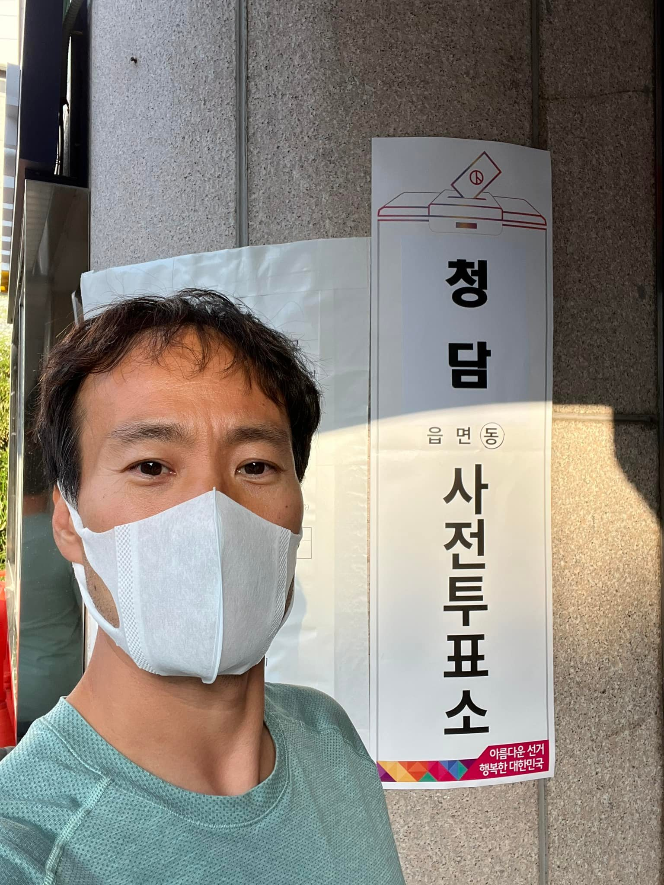
**이미지 캡션:** 한 성인 남성이 흰색 마스크를 쓰고 카메라를 향해 셀카를 찍고 있다. 남성은 40대 후반에서 50대 초반으로 보이며, 짧은 검은색 머리카락에 약간의 흰머리가 섞여 있다. 그는 옅은 녹색의 운동복 상의를 입고 있으며, 마스크 위로 보이는 그의 표정은 무표정하다. 배경에는 "청담면 사전투표소"라고 적힌 선거 안내문이 붙어 있으며, 안내문 상단에는 투표함 그림과 함께 '투표'를 상징하는 문양이 그려져 있다. 안내문 하단에는 "아름다운 선거 행복한 대한민국"이라는 문구가 보인다. 사진은 낮에 촬영된 것으로 보이며, 건물 외벽에 붙은 안내문과 남성의 모습이 담겨 있다. 전체적으로 투표 참여를 독려하는 듯한 분위기이다.건물 외벽에 붙은 안내문과 남성의 모습이 담겨 있다. 전체적으로 투표 참여를 독려하는 듯한 분위기이다.

<a id="p0529-0855"></a>
### 5월 29일 (일) 08:55 · #팔굽혀펴기100

#팔굽혀펴기100 
100에 대한 갈망, 그리고 팔굽혀 펴기. 정말 팔굽혀 펴기는 저에게는 힘든 운동입니다. 10, 20개에서 늘지 않고, 겨우 50개 까지 힘들게 올려도 1~2주일 딴 생각하면서 쉬면 바로 30개 하는 수준으로 떨어지고.

100개의 목표를 다시 잡고 5월 한달간 50개에서 60, 70개를 하고, 한번더 할수 있는 만큼 더더더 한다음, 하루 근육 회복을 하고 그 다음날 또.

엉성한 자세와, 아직 원샷은 아니지만, 팔을 떼지 않고 100개이상 인생 최대의 팔굽혀 펴기 기록을 남깁니다.

계속해서 더 바른 자세로 더 쉽게 100개 할때까지 도전은 계속됩니다. 업업업!!!

🎬 동영상 1개 (생략)

<a id="p0531-0814"></a>
### 5월 31일 (화) 08:14 · 📷 사진 (1장)

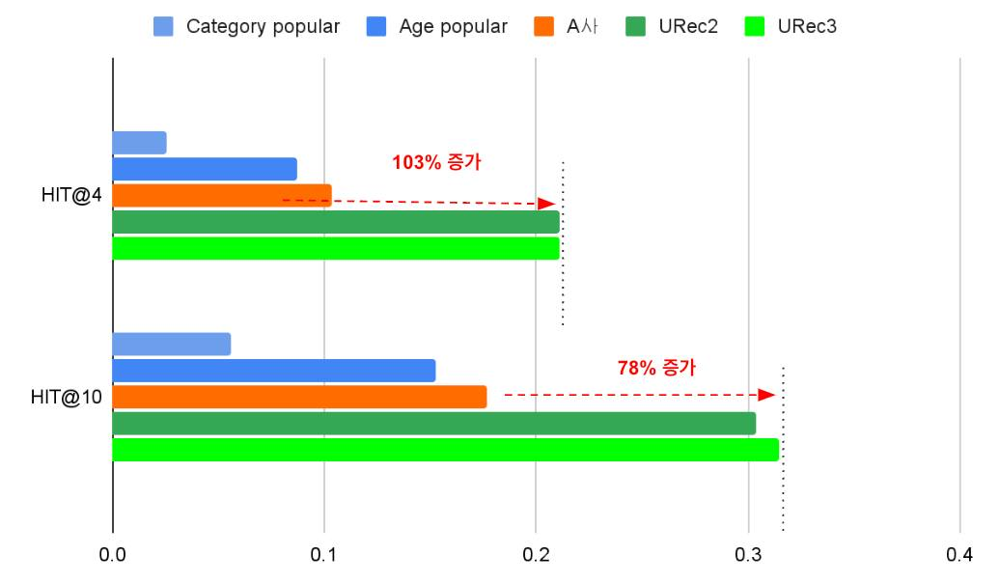
**이미지 캡션:** 이 이미지는 두 개의 수평 막대 그래프 세트를 보여주는 차트입니다. 각 세트는 "HIT@4"와 "HIT@10"으로 레이블이 지정되어 있으며, 이는 추천 시스템의 성능을 나타내는 지표로 보입니다. 각 세트에는 네 개의 막대가 있으며, 범례에 따르면 각각 "Category popular", "Age popular", "A사", "URec2", "URec3"를 나타냅니다. 막대의 색상은 연한 파란색, 파란색, 주황색, 녹색입니다. "HIT@4" 세트에서는 주황색 막대("A사")가 약 0.15에서 시작하여 점선으로 표시된 0.21 정도의 값까지 증가하는 것을 보여주며, "103% 증가"라는 텍스트가 이를 강조합니다. 녹색 막대("URec2" 또는 "URec3")는 약 0.22 정도의 값을 가집니다. "HIT@10" 세트에서는 주황색 막대("A사")가 약 0.12에서 시작하여 점선으로 표시된 0.21 정도의 값까지 증가하는 것을 보여주며, "78% 증가"라는 텍스트가 이를 강조합니다. 녹색 막대("URec2" 또는 "URec3")는 약 0.32 정도의 값을 가집니다. 차트의 x축은 0.0에서 0.4까지의 값을 나타내며, y축은 두 개의 주요 지표("HIT@4", "HIT@10")를 보여줍니다. 배경은 흰색이며, 회색 수직선이 간격마다 그려져 있습니다. 이 차트는 추천 시스템의 성능 개선을 비교 분석하는 데 사용되는 것으로 보이며, 특히 "A사"의 성능이 두 지표 모두에서 크게 향상되었음을 시각적으로 보여줍니다.표시된 0.21 정도의 값까지 증가하는 것을 보여주며, "103% 증가"라는 텍스트가 이를 강조합니다. 녹색 막대("URec2" 또는 "URec3")는 약 0.22 정도의 값을 가집니다. "HIT@10" 세트에서는 주황색 막대("A사")가 약 0.12에서 시작하여 점선으로 표시된 0.21 정도의 값까지 증가하는 것을 보여주며, "78% 증가"라는 텍스트가 이를 강조합니다. 녹색 막대("URec2" 또는 "URec3")는 약 0.32 정도의 값을 가집니다. 차트의 x축은 0.0에서 0.4까지의 값을 나타내며, y축은 두 개의 주요 지표("HIT@4", "HIT@10")를 보여줍니다. 배경은 흰색이며, 회색 수직선이 간격마다 그려져 있습니다. 이 차트는 추천 시스템의 성능 개선을 비교 분석하는 데 사용되는 것으로 보이며, 특히 "A사"의 성능이 두 지표 모두에서 크게 향상되었음을 시각적으로 보여줍니다.

> #추천모델오픈소스 #AIPack #함께해요  추천은 쉽게 시작해볼수 있지만, 막상 해보면 변수도  많고 성능을 올리기가 만만하지 않은 영역이라 할수 있습니다. 그러나 추천의 성능을 올리는것 만으로도 많은 서비스 품질이 올라가고 고객은 원하는 것을 더 쉽고 빠르게 찾을수 있어 꼭 필요한 기능입니다.  더많은 분들이 쉽게 추천을 사용할수 있도록 Upstage 는 추천기능을 DB에 쉽게 붙이는 수준으로 바로 사용해볼수 있는 **추천 AI팩**을 개발하고 있으며, 하나의 알고리즘이 아니라 수십개의 알고리즘이 서로 경쟁하며 최적의 결과를 만들어 낼수 있도록 하고 있습니다.  이 과정에서 개발되는 알고리즘들은 최대한 오픈소스화 하여 공개할 예정이고 오늘 첫번째 코드를 공개합니다.   https://github.com/AIM-SE/DIF-SR  추천에 사용되는 다양한 정보를 input이 아니라 attention layer에 직접넣어 이 정보가 희석되지 않고 사용되어 더 좋은 결과를 낸다는 간단한 아이디어 입니다. 수정및 재배포가 가능하고 상업적 사용도 가능한 라이센스입니다.  DIF-SR등 많은 알고리즘을 활용하여 실제 서비스 데이타로 평가를 해보면 기존 성능을 2배까지 올려주는 놀라운 결과들이 나오고 있습니다.  지금 하시고 있는 서비스에 바로 추천을 붙여 사용해보시고 싶으시면 [contact@upstage.ai](mailto:contact@upstage.ai) 으로 연락주시고, 그리고 최고의 추천 AI Pack을 같이 만들고 싶다면 https://careers.upstage.ai/ 입니다.  더 좋은, 그리고 많은 알고리즘을 만들어 공개하도록 하겠습니다.
