# 2022년 6월

[← 2022년](README.md)

### 6월 1일 (수) 14:07 · 📷 사진 (1장)

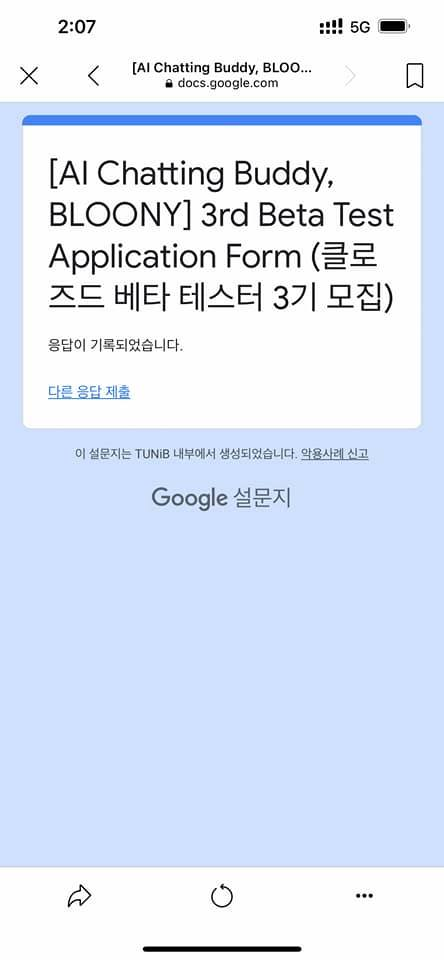
**이미지 캡션:** 이 이미지는 스마트폰 화면을 캡처한 것으로, 웹 브라우저에서 Google 설문지 페이지를 보고 있는 모습입니다. 화면 상단에는 시간(2:07), 통신사 정보(5G), 배터리 잔량 표시가 보입니다. 또한, 브라우저의 뒤로 가기, 앞으로 가기, 닫기 버튼과 북마크 아이콘이 있습니다. 페이지 제목은 "[AI Chatting Buddy, BLOONY] 3rd Beta Test Application Form (클로즈드 베타 테스터 3기 모집)"으로, AI 챗팅 버디 BLOONY의 3차 베타 테스트 신청서임을 알 수 있습니다. 설문지 내용으로는 "응답이 기록되었습니다."라는 문구와 "다른 응답 제출"이라는 링크가 보입니다. 하단에는 "이 설문지는 TUNiB 내부에서 생성되었습니다. 악용사례 신고"라는 안내 문구와 함께 "Google 설문지"라는 로고가 있습니다. 화면 하단에는 공유, 새로고침, 더보기 아이콘이 있는 메뉴 바가 보입니다. 전체적으로 깔끔하고 현대적인 디자인의 인터페이스이며, 사용자가 설문지 제출을 완료했음을 나타내는 상황입니다.습니다. 설문지 내용으로는 "응답이 기록되었습니다."라는 문구와 "다른 응답 제출"이라는 링크가 보입니다. 하단에는 "이 설문지는 TUNiB 내부에서 생성되었습니다. 악용사례 신고"라는 안내 문구와 함께 "Google 설문지"라는 로고가 있습니다. 화면 하단에는 공유, 새로고침, 더보기 아이콘이 있는 메뉴 바가 보입니다. 전체적으로 깔끔하고 현대적인 디자인의 인터페이스이며, 사용자가 설문지 제출을 완료했음을 나타내는 상황입니다.

### 6월 1일 (수) 18:12 · #FuriosaAI_Upstage #Pullups #개발협약

#FuriosaAI_Upstage #Pullups #개발협약
최고의 AI 칩 위에 최고의 모델을 올려 더 많은 분들이 AI 혜택을 누릴 수 있도록 협약식을 마치고 양사의 더 깊은 관계를 위한 Pullups 챌린지 결과를 공개합니다. 막상 막하의 흥미진진한 챌린지였고 많은 분들이 예측해 주셨습니다. L1 기준으로 24분을 선발하였고 선물을 받으실 주소 등을 6월 6일 저녁까지 입력해 주시면 선물을 보내 드리겠습니다. https://docs.google.com/forms/d/e/1FAIpQLSfOZVehk5t28uEPU7q-JPDz1f04-Qg46wl5AkRWk4V3dZ7AfA/viewform

총 다음 24명이 가장 좋은 예측 결과로 선발되셨습니다. 축하 드립니다!

@Hyeon-Gab Shin (1.0), @Byoung-Ki Jeon (3.0), @김재원 (5.0), @Minwook Kang (5.0), @Song InYeob (5.0), @김민준 (5.0), @김은희 (6.0), @Jun-Ho Kim (6.0), @송석리 (8.0), @Jaymin Lee (8.0), @Dongbin Na (9.0), @Moonsik Geum (9.0), @Joseph Lee (9.0), @Inhwan Lee (10.0), @박영준 (10.0), @Yusung Kim (11.0), @Dongjun Lee (11.0), @김명준 (11.0), @Hongmo Je (13.0), @Jayden Hunsue Lee (14.0), @Sungho Lee (14.0), @황보현우 (14.0), @Eunjung Park (14.0), @Kim ChanRan (14.0)

평가를 위한 코드 참조: https://colab.research.google.com/drive/1p6lXFAML6J6npQHG_BJBgGBisXyxdUZC
(혹시 누락된 부분이나 오류가 있으면 말씀주세요.)

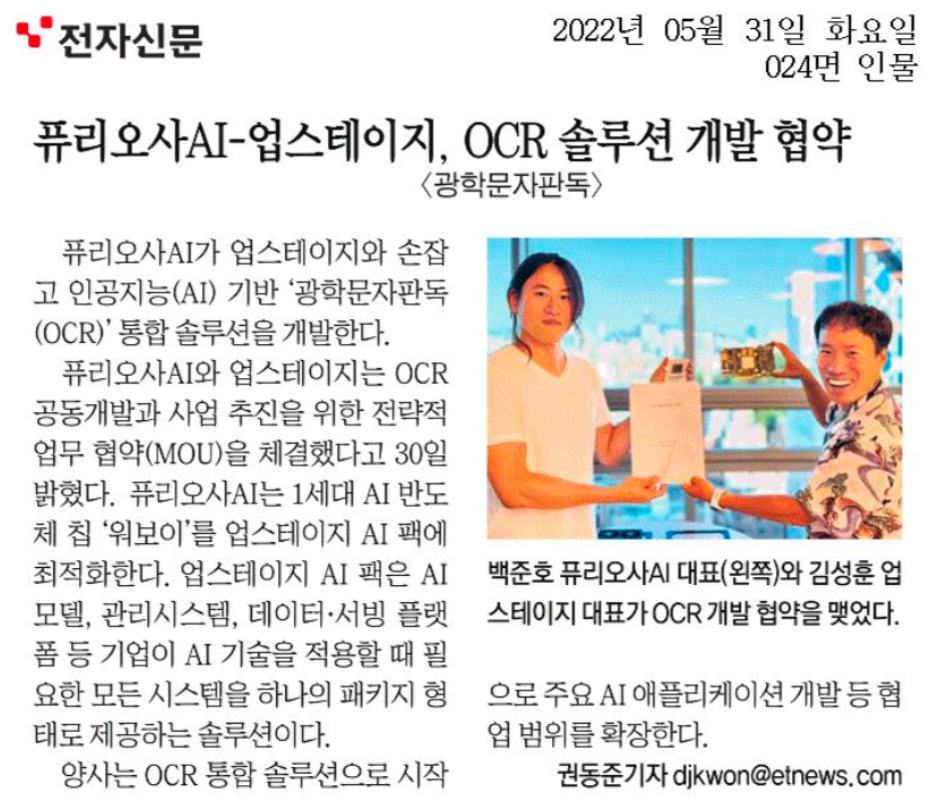
**이미지 캡션:** 한 명의 성인 남성이 흰색 티셔츠를 입고 서류를 들고 있고, 다른 한 명의 성인 남성이 화려한 무늬의 셔츠를 입고 전자 부품을 들고 있다. 두 사람은 밝게 웃고 있으며, 배경에는 창문과 흐릿한 도시 풍경이 보인다. 이 사진은 2022년 5월 31일자 전자신문 기사로, 퓨리오사AI와 업스테이지가 OCR 솔루션 개발 협약을 체결했다는 내용을 담고 있다.
 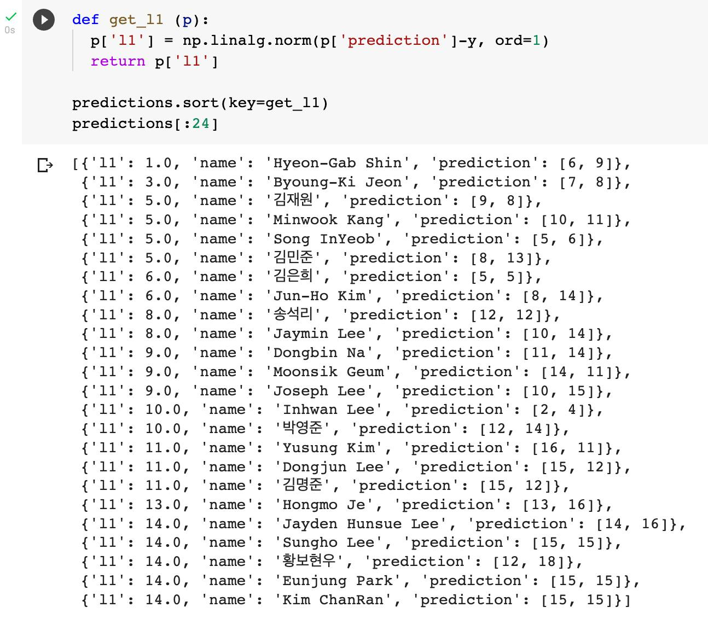
**이미지 캡션:** 이 이미지는 파이썬 코드의 일부를 보여주며, `get_11`이라는 함수 정의와 `predictions`라는 리스트의 일부 내용을 담고 있습니다. `get_11` 함수는 입력받은 `p` 객체의 'prediction' 키에 해당하는 값의 L1 노름을 계산하여 반환합니다. 그 아래에는 `predictions` 리스트를 `get_11` 함수를 기준으로 정렬하고, 처음 24개의 요소를 출력하는 코드가 있습니다. 출력된 리스트는 각 요소가 딕셔너리 형태이며, '11'이라는 키에 실수 값, 'name' 키에 사람 이름(한국어 및 영어 이름 혼합), 'prediction' 키에 두 개의 정수로 이루어진 리스트를 값으로 가지고 있습니다. 이 데이터는 특정 예측값에 따라 사람들의 순위를 매기거나 분류하는 데 사용될 수 있는 것으로 보입니다. 배경은 흰색이며, 코드 편집기나 콘솔 화면의 일부로 추정됩니다. 특별한 사물이나 텍스트는 코드 외에 보이지 않으며, 전반적으로 기술적이고 데이터 중심적인 분위기입니다.국어 및 영어 이름 혼합), 'prediction' 키에 두 개의 정수로 이루어진 리스트를 값으로 가지고 있습니다. 이 데이터는 특정 예측값에 따라 사람들의 순위를 매기거나 분류하는 데 사용될 수 있는 것으로 보입니다. 배경은 흰색이며, 코드 편집기나 콘솔 화면의 일부로 추정됩니다. 특별한 사물이나 텍스트는 코드 외에 보이지 않으며, 전반적으로 기술적이고 데이터 중심적인 분위기입니다.

🎬 동영상 1개 (생략)

### 6월 2일 (목) 10:57 · 📷 사진 (1장)

**이미지 캡션:** 한 성인 남성이 갈색 스웨터를 입고 팔짱을 낀 채 카메라를 향해 활짝 웃고 있다. 그의 뒤로는 현대적인 쇼핑몰의 복도가 보이며, 조명이 밝고 천장이 높다. 복도 양쪽에는 유리로 된 상점들이 늘어서 있으며, 한쪽 상점에는 주황색 네온사인으로 "YEUIDO OPEN STUDIO"라고 쓰여 있고, 다른 쪽 상점에는 파란색 네온사인으로 "3PRO TV"라고 쓰여 있다. 상점 내부에는 유리창을 통해 스튜디오 장비와 모니터 등이 희미하게 보인다. 전체적으로 밝고 깨끗한 분위기이며, 남성의 미소는 친근하고 긍정적인 느낌을 준다. 준다.

> #3프로TV #컴퍼니백브리핑 #AIStory #AIPack #채널고정  6월 2일 오늘 오후 5시부터 3PRO TV '컴퍼니백브리핑' 라이브로 AI이야기, 창업이야기, Upstage 이야기, 저희 AI Pack이야기 풀어 봅니다. 🎬  오후 5시부터 3PRO TV 채널 고정! 업업업!  👉 삼프로TV 바로보기 : [https://bit.ly/3m70YLf](https://bit.ly/3m70YLf?fbclid=IwAR13uH8uAhMK0BVy3k5Ladu1I3Aur1Y_cDfKR1OkSfaG0jE-KBK43IXoGI8)

### 6월 2일 (목) 11:40 · #3프로TV #컴퍼니백브리핑 #AIStory #AIPack #채널고정 오…

#3프로TV #컴퍼니백브리핑 #AIStory #AIPack #채널고정 오늘 오후 5시부터 3PRO TV '컴퍼니백브리핑' 라이브로 AI이야기, 창업이야기, Upstage 이야기, 저희 AI Pack이야기 풀어 봅니다. 질문을 재미있게 주신다고 해서 믿고 나가 봅니다. 

오후 5시부터 3PRO TV 채널 고정! 업업업!
👉 삼프로TV 바로보기 : https://bit.ly/3m70YLf

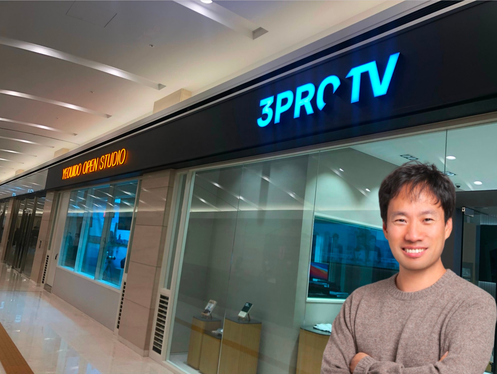
**이미지 캡션:** 한 성인 남성이 갈색 스웨터를 입고 팔짱을 낀 채 카메라를 향해 환하게 웃고 있다. 그의 뒤로는 현대적인 쇼핑몰 내부가 보이며, 쇼핑몰 천장에는 조명이 설치되어 있고 바닥은 광택이 나는 재질이다. 남성의 오른쪽 뒤로는 파란색 네온 불빛으로 "3PRO TV"라고 쓰인 간판이 걸린 상점이 보인다. 왼쪽 뒤로는 주황색 불빛으로 "YEOUIDO OPEN STUDIO"라고 쓰인 간판이 있는 또 다른 상점이 보인다. 두 상점 모두 통유리 외관을 가지고 있으며, 내부에는 조명과 디스플레이가 보인다. 전체적인 분위기는 밝고 현대적이며, 남성의 표정은 자신감 있고 긍정적이다. 현대적이며, 남성의 표정은 자신감 있고 긍정적이다.

### 6월 3일 (금) 07:22 · #3pro #추천 #인식 #검색 #aipack

#3pro #추천 #인식 #검색 #aipack 

역시 3pro 제목을 재미있게 뽑아주시네요. 생방으로 진행되면서 이대표님, 안대표님의 대본에 전혀 없는 질문들이 마구 쏟아져서 더 재미있었던것 같습니다. 이 두분의 정리능력과 추가 질문 능력에 많이 감탄하였습니다. 

https://youtu.be/OakkXYswAmc

좋은 질문들도 많았는데 제가 답을 잘 못한 것도 많습니다. 혹시 여러분들이 생각하시는 답들이 있으면 함께 댓글로 이야기 나누어 보면 좋겠습니다.

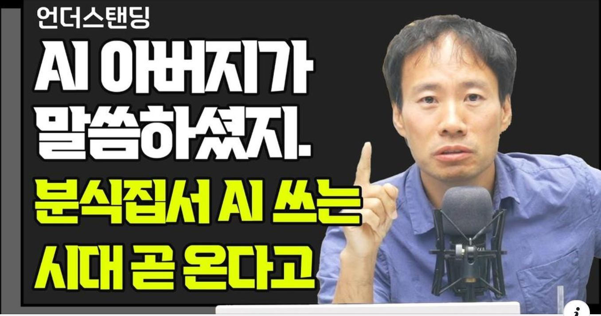
**이미지 캡션:** 이 사진은 검은색 배경에 흰색과 노란색 글씨로 된 텍스트와 함께 한 성인 남성이 등장합니다. 남성은 40대 정도로 보이며, 짧은 검은색 머리카락에 약간의 이마 주름이 있습니다. 그는 파란색 셔츠를 입고 있으며, 마이크를 향해 손가락으로 무언가를 가리키며 말하는 듯한 표정을 짓고 있습니다. 그의 표정은 진지하고 집중하는 모습입니다. 배경에는 "언더스탠딩", "AI 아버지가 말씀하셨지.", "분식집서 AI 쓰는 시대 곧 온다고"라는 한국어 텍스트가 크게 쓰여 있습니다. 이 텍스트는 남성이 이야기하는 주제와 관련이 있는 것으로 보이며, AI 기술의 발전과 일상생활에서의 적용에 대한 내용을 담고 있을 가능성이 높습니다. 사진의 전체적인 분위기는 정보 전달 또는 강연의 한 장면을 연상시키며, AI 기술에 대한 흥미와 관심을 유발하는 듯합니다. 있는 것으로 보이며, AI 기술의 발전과 일상생활에서의 적용에 대한 내용을 담고 있을 가능성이 높습니다. 사진의 전체적인 분위기는 정보 전달 또는 강연의 한 장면을 연상시키며, AI 기술에 대한 흥미와 관심을 유발하는 듯합니다.
 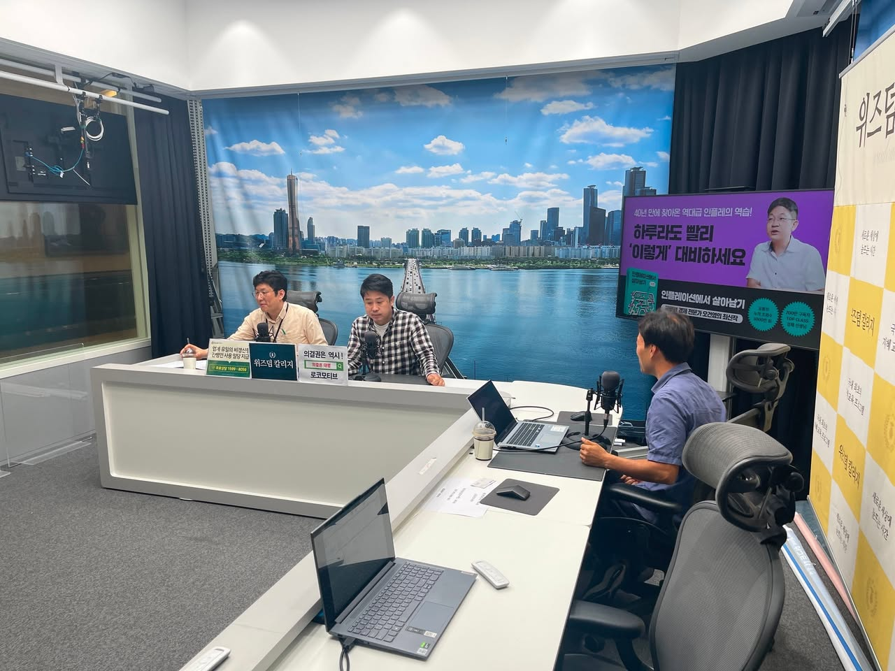
**이미지 캡션:** 방송 스튜디오에서 두 명의 성인 남성이 마이크 앞에 앉아 대화하고 있으며, 한 명은 베이지색 셔츠를, 다른 한 명은 체크무늬 셔츠를 입고 있다. 배경에는 서울의 도시 풍경과 강이 그려진 대형 현수막이 걸려 있고, 현수막에는 한국어로 된 텍스트와 함께 한 남성의 얼굴이 담긴 화면이 보인다. 화면에는 "40년 만에 찾아온 역대급 인플레의 역습! 하루라도 빨리 '이렇게' 대비하세요"라는 문구가 적혀 있다. 스튜디오에는 노트북, 마이크, 커피잔 등 다양한 장비와 사물이 놓여 있으며, 전반적으로 진지하고 정보 전달적인 분위기이다. 분위기이다.
 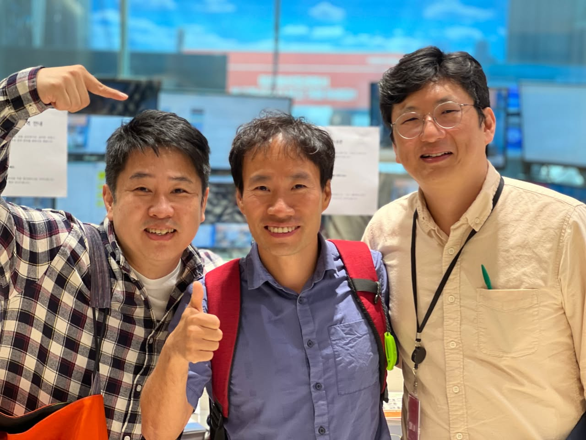
**이미지 캡션:** 사진에는 세 명의 성인 남성이 밝은 실내 공간에서 포즈를 취하고 있다. 왼쪽 남성은 40대 후반에서 50대 초반으로 보이며, 체크무늬 셔츠를 입고 흰색 티셔츠를 안에 받쳐 입었다. 그는 오른손으로 자신의 머리 위를 가리키고 있으며, 얼굴에는 미소를 띠고 있다. 가운데 남성은 30대 후반에서 40대 초반으로 보이며, 파란색 셔츠를 입고 빨간색 백팩을 메고 있다. 그는 엄지손가락을 치켜세우고 있으며, 얼굴에는 환한 미소를 짓고 있다. 오른쪽 남성은 40대 후반에서 50대 초반으로 보이며, 베이지색 셔츠를 입고 안경을 착용했다. 그의 셔츠 왼쪽 가슴 주머니에는 녹색 펜이 꽂혀 있고, 목에는 검은색 목걸이와 함께 신분증으로 보이는 카드가 걸려 있다. 그는 활짝 웃으며 카메라를 바라보고 있다. 배경에는 흐릿하게 보이는 여러 개의 모니터와 파란색 하늘을 연상시키는 이미지가 보인다. 전반적으로 즐겁고 긍정적인 분위기를 나타내는 사진이다.경을 착용했다. 그의 셔츠 왼쪽 가슴 주머니에는 녹색 펜이 꽂혀 있고, 목에는 검은색 목걸이와 함께 신분증으로 보이는 카드가 걸려 있다. 그는 활짝 웃으며 카메라를 바라보고 있다. 배경에는 흐릿하게 보이는 여러 개의 모니터와 파란색 하늘을 연상시키는 이미지가 보인다. 전반적으로 즐겁고 긍정적인 분위기를 나타내는 사진이다.

### 6월 3일 (금) 09:57 · 📷 사진 (1장)

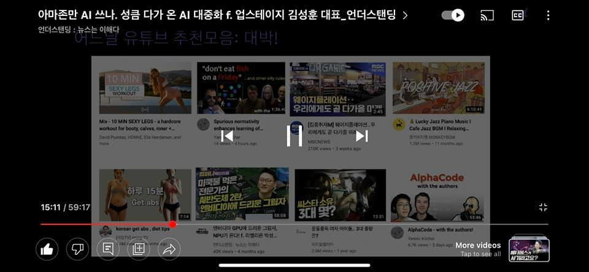
**이미지 캡션:** 이 화면은 유튜브 시청 화면으로, 상단에는 "아마존만 AI 쓰나. 성큼 다가 온 AI 대중화 f. 업스테이지 김성훈 대표_언더스탠딩"이라는 제목과 함께 "언더스탠딩 : 윤수는 이해다 유튜브 추천모음: 대박!"이라는 부제가 보인다. 화면 중앙에는 여러 개의 유튜브 영상 썸네일이 격자 형태로 나열되어 있으며, 각 썸네일에는 영상 제목, 썸네일 이미지, 그리고 영상 길이 및 조회수 등의 정보가 포함되어 있다. 예를 들어, "10 MIN SEXY LEGS WORKOUT"이라는 제목의 영상은 한 여성이 야외에서 운동하는 모습을 담고 있으며, "Mix - 10 MIN SEXY LEGS - a hardcore workout for booty, calves, inner"라는 설명이 붙어 있다. 다른 영상으로는 "Spurious normativity enhances learning of..."라는 제목의 영상과 "웨이지플레이션.. 우리에게도 곧 다가올 미래"라는 제목의 영상, "Lucky Jazz Piano Music | Cafe Jazz BGM | Relaxing..."라는 제목의 영상 등이 보인다. 하단에는 영상 재생 시간 15:11/59:17과 함께 좋아요, 싫어요, 댓글, 공유 등의 컨트롤 버튼이 있으며, "More videos Tap to see all"이라는 문구와 함께 추천 영상 썸네일이 작게 표시되어 있다. 전반적으로 다양한 주제의 유튜브 영상들을 추천하는 화면으로, AI 기술과 관련된 내용이 상단에 언급되어 있어 관련 콘텐츠가 주로 추천되고 있음을 짐작할 수 있다.는 모습을 담고 있으며, "Mix - 10 MIN SEXY LEGS - a hardcore workout for booty, calves, inner"라는 설명이 붙어 있다. 다른 영상으로는 "Spurious normativity enhances learning of..."라는 제목의 영상과 "웨이지플레이션.. 우리에게도 곧 다가올 미래"라는 제목의 영상, "Lucky Jazz Piano Music | Cafe Jazz BGM | Relaxing..."라는 제목의 영상 등이 보인다. 하단에는 영상 재생 시간 15:11/59:17과 함께 좋아요, 싫어요, 댓글, 공유 등의 컨트롤 버튼이 있으며, "More videos Tap to see all"이라는 문구와 함께 추천 영상 썸네일이 작게 표시되어 있다. 전반적으로 다양한 주제의 유튜브 영상들을 추천하는 화면으로, AI 기술과 관련된 내용이 상단에 언급되어 있어 관련 콘텐츠가 주로 추천되고 있음을 짐작할 수 있다.

### 6월 4일 (토) 21:05 · 더위를 뚫고 멋진 분들과 화악산 다녀왔습니다. 새로운 분들이 많아 더 신…

더위를 뚫고 멋진 분들과 화악산 다녀왔습니다. 새로운 분들이 많아 더 신나는 라이딩 입니다. 백준호 TaeYong Kim DoHyun Jung Kyu Hyun Byun Jin Young Choi 덕분에 즐거웠습니다.

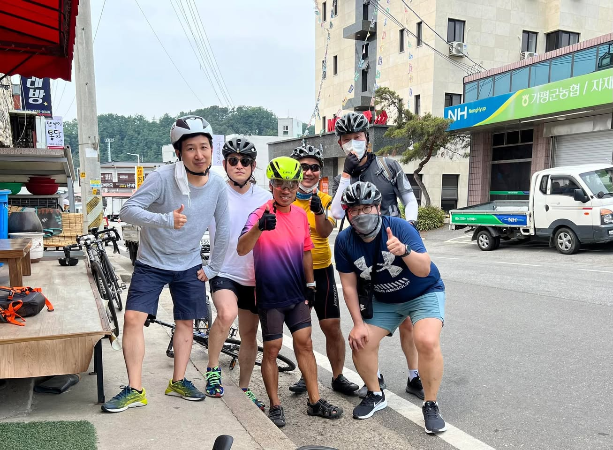
**이미지 캡션:** 여섯 명의 성인 남성이 자전거 헬멧을 쓰고 야외에서 포즈를 취하고 있으며, 모두 엄지손가락을 치켜세우고 있다. 왼쪽에서부터 첫 번째 남성은 회색 긴팔 셔츠와 파란색 반바지를 입고 있으며, 두 번째 남성은 흰색 반팔 셔츠와 검은색 반바지를 입고 있다. 세 번째 남성은 밝은 노란색 상의와 검은색 반바지를 입고 있으며, 네 번째 남성은 노란색 상의를 입고 있다. 다섯 번째 남성은 회색 상의와 검은색 반바지를 입고 있으며, 여섯 번째 남성은 파란색 반팔 티셔츠와 하늘색 반바지를 입고 있다. 배경에는 건물, 나무, 그리고 흰색 트럭이 보인다. 건물에는 "NH Nonghyup"이라는 로고와 함께 한국어로 "가평군농협/자재"라고 쓰여 있다. 또한, 왼쪽에는 빨간색 천막이 있는 가게와 자전거가 보인다. 전반적으로 활동적인 분위기이며, 그룹 사진 촬영을 위해 잠시 멈춘 듯한 모습이다.리고 흰색 트럭이 보인다. 건물에는 "NH Nonghyup"이라는 로고와 함께 한국어로 "가평군농협/자재"라고 쓰여 있다. 또한, 왼쪽에는 빨간색 천막이 있는 가게와 자전거가 보인다. 전반적으로 활동적인 분위기이며, 그룹 사진 촬영을 위해 잠시 멈춘 듯한 모습이다.
 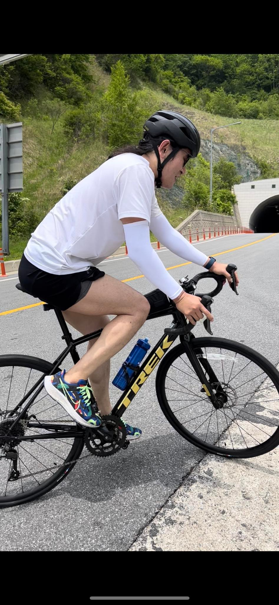
**이미지 캡션:** 한 명의 성인 남성이 검은색 헬멧을 쓰고 흰색 반팔 상의와 검은색 반바지, 팔토시, 화려한 색상의 운동화를 착용하고 자전거를 타고 있다. 남성은 도로 위에서 터널을 향해 주행 중이며, 자전거에는 파란색 물통이 장착되어 있다. 배경에는 푸른 나무와 산이 보이며, 도로 옆에는 터널 입구가 있다. 전반적으로 야외에서 자전거를 타는 활동적인 분위기를 나타낸다.
 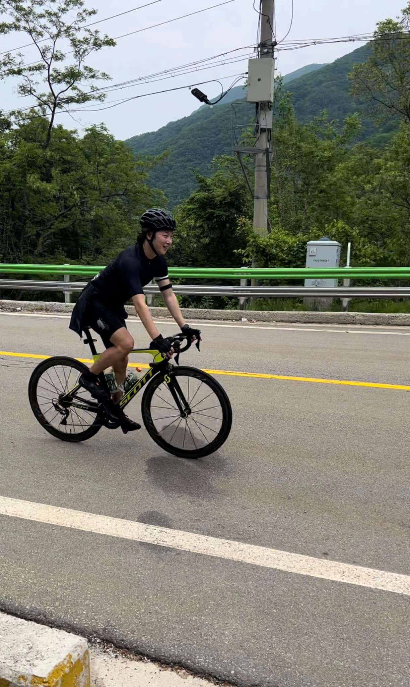
**이미지 캡션:** 한 명의 성인 남성이 검은색 헬멧과 검은색 반팔 저지, 검은색 반바지를 입고 검은색과 노란색이 섞인 로드 자전거를 타고 도로를 달리고 있다. 남성은 장갑을 끼고 있으며, 얼굴에는 미소를 띠고 있다. 배경에는 푸른 산과 나무들이 보이며, 도로에는 노란색 중앙선과 흰색 차선이 그려져 있다. 도로 옆에는 초록색 난간과 전봇대, 그리고 작은 건물들이 보인다. 전반적으로 맑은 날씨에 야외에서 자전거를 타는 활동적인 분위기이다.
 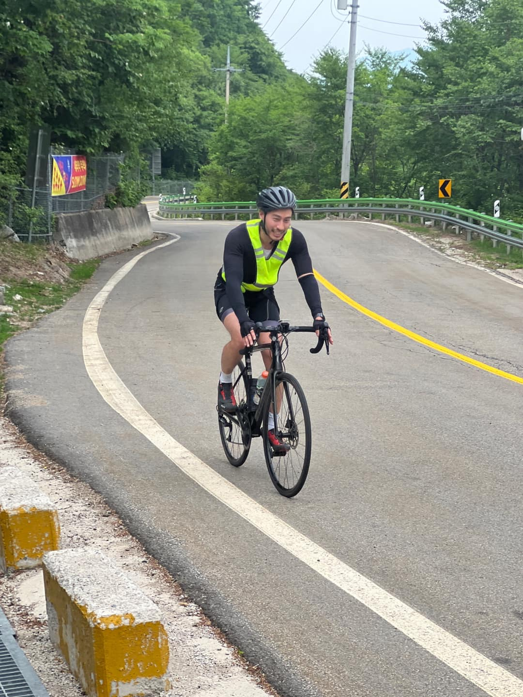
**이미지 캡션:** 한 명의 성인 남성이 자전거를 타고 도로를 달리고 있다. 남성은 30대 초중반으로 보이며, 검은색 긴팔 상의 위에 형광 노란색 조끼를 착용하고 있으며, 검은색 반바지와 흰색 양말, 빨간색 신발을 신고 있다. 머리에는 검은색 헬멧을 쓰고 있으며, 얼굴에는 미소를 띠고 있다. 남성은 자전거 핸들을 잡고 앞으로 나아가고 있으며, 자전거는 검은색 로드바이크이다. 배경은 산으로 둘러싸인 도로이며, 도로는 구불구불하게 이어져 있다. 도로에는 흰색과 노란색 차선이 그려져 있고, 가드레일과 표지판이 보인다. 도로 옆에는 콘크리트 구조물과 나무들이 있다. 전반적으로 맑은 날씨에 야외 활동을 즐기는 모습으로, 건강하고 활기찬 분위기이다.크리트 구조물과 나무들이 있다. 전반적으로 맑은 날씨에 야외 활동을 즐기는 모습으로, 건강하고 활기찬 분위기이다.
 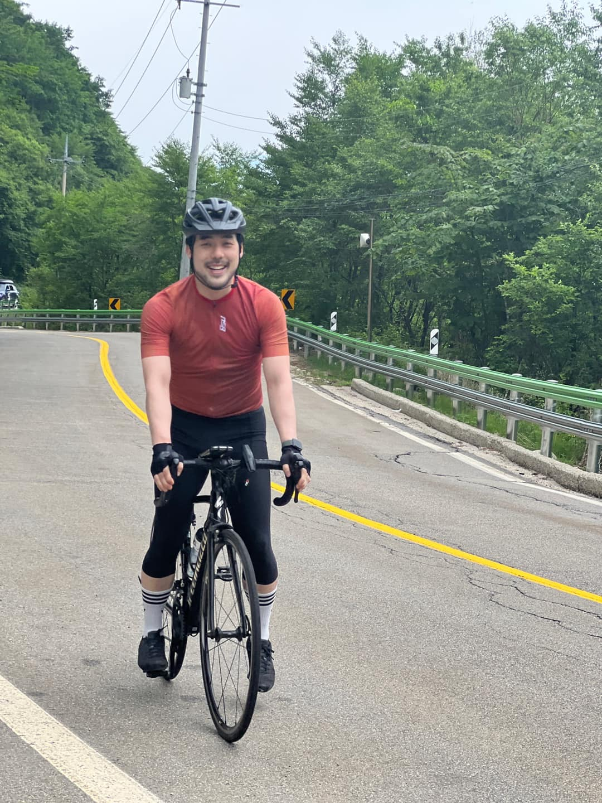
**이미지 캡션:** 한 명의 성인 남성이 검은색 헬멧을 쓰고 빨간색 반팔 사이클링 저지와 검은색 사이클링 바지를 입고 자전거를 타고 있다. 그는 흰색 양말에 검은색 사이클링 신발을 신고 있으며, 손에는 검은색 장갑을 끼고 있다. 남성은 카메라를 향해 환하게 웃고 있으며, 그의 얼굴에는 즐거움과 활기가 느껴진다. 배경은 숲이 우거진 산악 도로로, 구불구불한 도로와 가드레일, 전신주가 보인다. 하늘은 흐린 편이며, 전체적으로 야외 활동하기 좋은 날씨임을 짐작게 한다. 도로는 아스팔트로 포장되어 있으며, 노란색 중앙선과 흰색 차선이 그려져 있다. 도로 옆으로는 푸른 나무들이 울창하게 늘어서 있어 자연 속에서 라이딩을 즐기는 모습이다.그려져 있다. 도로 옆으로는 푸른 나무들이 울창하게 늘어서 있어 자연 속에서 라이딩을 즐기는 모습이다.
 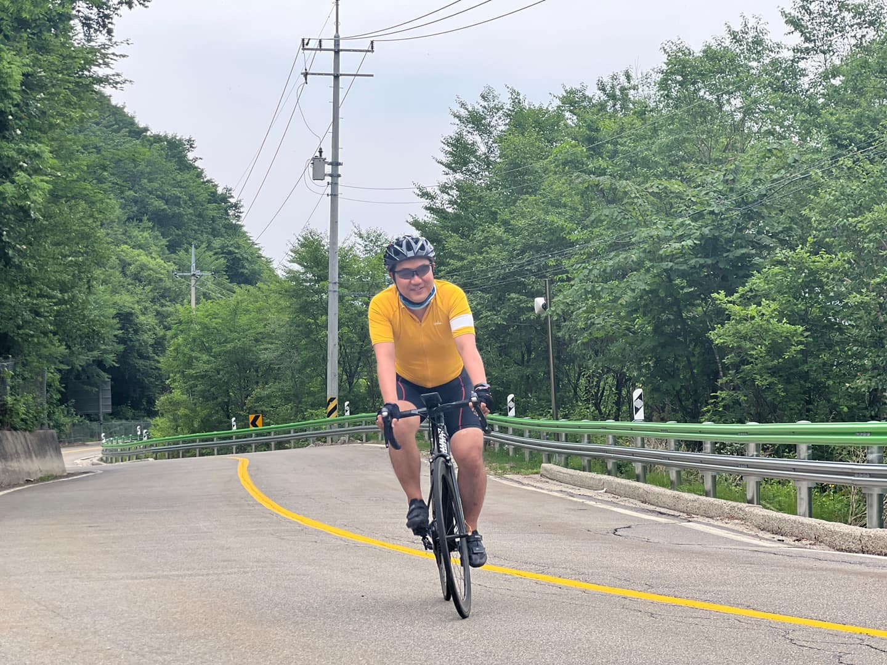
**이미지 캡션:** 한 명의 성인 남성이 헬멧과 선글라스를 착용하고 노란색 반팔 저지와 검은색 반바지를 입고 자전거를 타고 있다. 그는 도로를 따라 내려가고 있으며, 그의 얼굴에는 미소가 번져 있다. 배경에는 울창한 녹색 나무와 전신주가 보이며, 도로는 노란색 중앙선으로 표시되어 있다. 도로 옆에는 녹색 난간과 콘크리트 방벽이 있다. 하늘은 흐리고 구름이 끼어 있다. 전반적으로 활동적이고 즐거운 분위기를 나타낸다.
 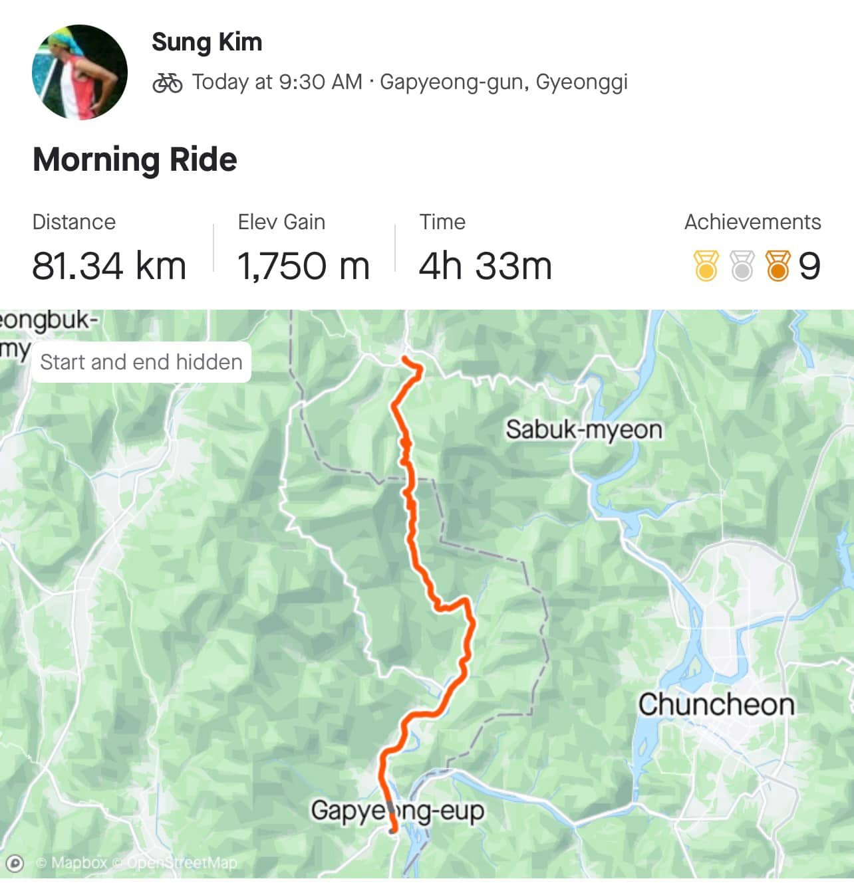
**이미지 캡션:** 이 화면은 "Sung Kim"이라는 이름의 사용자가 오늘 오전 9시 30분에 경기도 가평군에서 진행한 "Morning Ride" 활동 기록을 보여줍니다. 이 라이딩은 총 81.34km의 거리를 4시간 33분 동안 진행했으며, 1,750m의 고도 상승이 있었습니다. 화면 오른쪽 상단에는 금메달 1개와 은메달 2개, 그리고 숫자 9가 표시되어 있어 9개의 업적을 달성했음을 나타냅니다. 화면 하단에는 라이딩 경로가 주황색 선으로 표시된 지도 이미지가 보이며, 지도에는 "Gapyeong-eup", "Sabuk-myeon", "Chuncheon" 등의 지명이 표기되어 있습니다. 지도 왼쪽 상단에는 "eongbuk-my"라는 텍스트와 함께 "Start and end hidden"이라는 문구가 보입니다. 전체적으로 활동 기록과 지도 정보를 제공하는 화면으로, 활동적인 라이딩 경험을 기록하고 공유하는 데 사용되는 것으로 보입니다.on", "Chuncheon" 등의 지명이 표기되어 있습니다. 지도 왼쪽 상단에는 "eongbuk-my"라는 텍스트와 함께 "Start and end hidden"이라는 문구가 보입니다. 전체적으로 활동 기록과 지도 정보를 제공하는 화면으로, 활동적인 라이딩 경험을 기록하고 공유하는 데 사용되는 것으로 보입니다.

### 6월 6일 (월) 10:50 · 📷 사진 (4장)

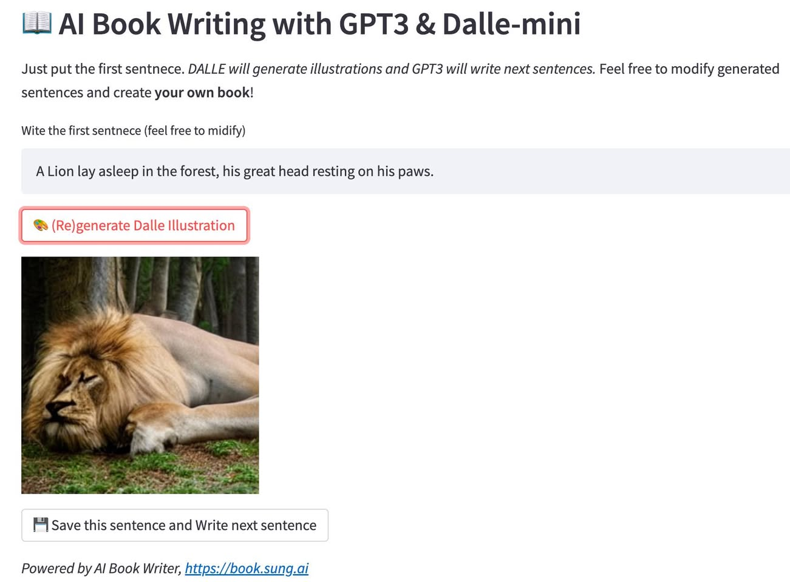
**이미지 캡션:** AI Book Writing with GPT3 & Dalle-mini라는 제목의 웹페이지 화면으로, GPT3와 Dalle-mini를 사용하여 책을 쓰는 과정을 보여준다. 페이지 상단에는 "AI Book Writing with GPT3 & Dalle-mini"라는 제목이 있고, 그 아래에는 "첫 문장을 입력하면 DALLE가 삽화를 생성하고 GPT3가 다음 문장을 작성하여 나만의 책을 만들 수 있습니다!"라는 안내 문구가 있다. "첫 문장을 입력하세요 (수정 가능)"라는 문구 아래에는 "A Lion lay asleep in the forest, his great head resting on his paws."라는 문장이 입력되어 있다. 그 아래에는 빨간색 테두리의 "(재)생성 Dalle 삽화" 버튼이 있다. 그 아래에는 숲을 배경으로 잠든 사자의 이미지가 보인다. 사자는 갈기가 풍성하고, 앞발에 머리를 기댄 채 편안하게 누워 있다. 이미지 아래에는 "이 문장을 저장하고 다음 문장 작성"이라는 버튼이 있고, 가장 하단에는 "AI Book Writer 제공, https://book.sung.ai"라는 문구와 웹사이트 주소가 표시되어 있다. 전체적으로 깔끔하고 기능적인 인터페이스를 보여주며, AI를 활용한 창작 활동을 지원하는 도구임을 알 수 있다.eep in the forest, his great head resting on his paws."라는 문장이 입력되어 있다. 그 아래에는 빨간색 테두리의 "(재)생성 Dalle 삽화" 버튼이 있다. 그 아래에는 숲을 배경으로 잠든 사자의 이미지가 보인다. 사자는 갈기가 풍성하고, 앞발에 머리를 기댄 채 편안하게 누워 있다. 이미지 아래에는 "이 문장을 저장하고 다음 문장 작성"이라는 버튼이 있고, 가장 하단에는 "AI Book Writer 제공, https://book.sung.ai"라는 문구와 웹사이트 주소가 표시되어 있다. 전체적으로 깔끔하고 기능적인 인터페이스를 보여주며, AI를 활용한 창작 활동을 지원하는 도구임을 알 수 있다.
 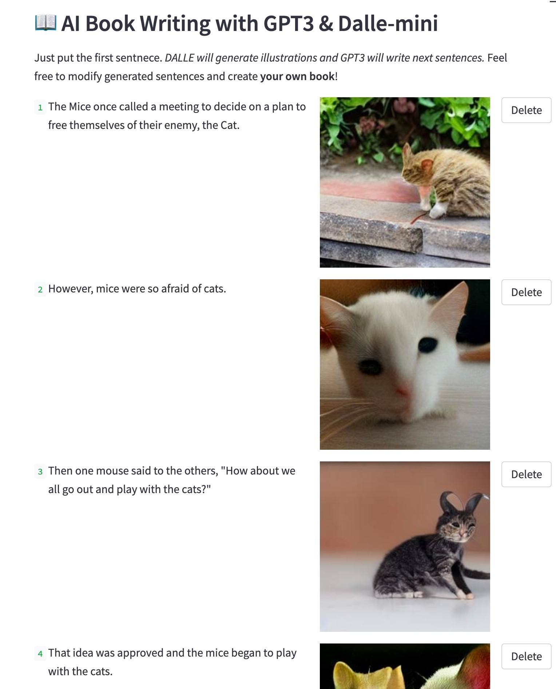
**이미지 캡션:** 이 이미지는 AI 기반의 책 쓰기 도구를 보여주며, 제목은 "AI Book Writing with GPT3 & Dalle-mini"입니다. 화면 상단에는 이 도구의 사용법을 안내하는 문구가 있습니다. 그 아래에는 네 개의 문장과 각 문장에 해당하는 이미지, 그리고 삭제 버튼이 나열되어 있습니다. 첫 번째 문장은 "The Mice once called a meeting to decide on a plan to free themselves of their enemy, the Cat."이며, 이에 대한 이미지로는 흙길 위에 앉아 있는 갈색 아기 고양이가 보입니다. 두 번째 문장은 "However, mice were so afraid of cats."이며, 이미지로는 흰색 고양이의 얼굴이 클로즈업되어 있습니다. 세 번째 문장은 "Then one mouse said to the others, 'How about we all go out and play with the cats?'"이며, 이미지로는 귀에 토끼 귀 같은 장식이 달린 검은색과 회색 줄무늬 고양이가 앉아 있는 모습이 보입니다. 네 번째 문장은 "That idea was approved and the mice began to play with the cats."이며, 이미지로는 노란색과 분홍색 털을 가진 동물의 머리가 일부 보입니다. 각 이미지 옆에는 'Delete' 버튼이 있어 해당 항목을 삭제할 수 있습니다. 전체적으로 이 화면은 AI가 텍스트를 기반으로 이미지를 생성하고, 사용자가 이를 수정하여 책을 만들 수 있는 과정을 시각적으로 보여주고 있습니다.흙길 위에 앉아 있는 갈색 아기 고양이가 보입니다. 두 번째 문장은 "However, mice were so afraid of cats."이며, 이미지로는 흰색 고양이의 얼굴이 클로즈업되어 있습니다. 세 번째 문장은 "Then one mouse said to the others, 'How about we all go out and play with the cats?'"이며, 이미지로는 귀에 토끼 귀 같은 장식이 달린 검은색과 회색 줄무늬 고양이가 앉아 있는 모습이 보입니다. 네 번째 문장은 "That idea was approved and the mice began to play with the cats."이며, 이미지로는 노란색과 분홍색 털을 가진 동물의 머리가 일부 보입니다. 각 이미지 옆에는 'Delete' 버튼이 있어 해당 항목을 삭제할 수 있습니다. 전체적으로 이 화면은 AI가 텍스트를 기반으로 이미지를 생성하고, 사용자가 이를 수정하여 책을 만들 수 있는 과정을 시각적으로 보여주고 있습니다.
 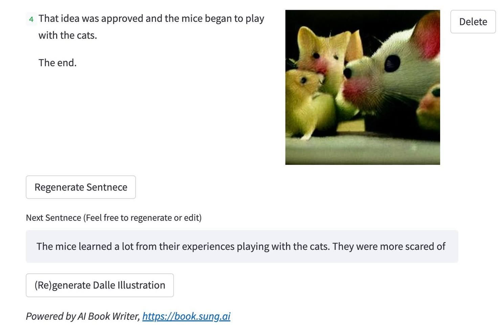
**이미지 캡션:** 화면 왼쪽에는 네 개의 문장이 표시되어 있으며, 첫 번째 문장에는 숫자 4가 앞에 붙어 있습니다. 오른쪽에는 귀여운 세 마리의 쥐가 서로 가까이 붙어 있는 그림이 있습니다. 쥐들은 옅은 노란색과 흰색 털을 가지고 있으며, 붉은색 뺨과 검은색 눈을 가지고 있습니다. 그림은 어두운 배경에 밝은 조명으로 인해 쥐들이 돋보이게 표현되었습니다. 그림 아래에는 "Regenerate Sentnece"라는 버튼이 있고, 그 아래에는 "Next Sentnece (Feel free to regenerate or edit)"라는 문구가 있습니다. 그 아래에는 "The mice learned a lot from their experiences playing with the cats. They were more scared of"라는 문장이 표시되어 있습니다. 마지막으로 "(Re)generate Dalle Illustration"이라는 버튼과 "Powered by AI Book Writer, https://book.sung.ai"라는 문구가 화면 하단에 보입니다. 그림 오른쪽 상단에는 "Delete"라는 버튼이 있습니다. 전반적으로 이 화면은 AI 기반의 스토리 생성 도구의 일부로 보이며, 텍스트와 이미지가 함께 제공되어 스토리를 구성하고 시각화하는 과정을 보여줍니다. 문구가 있습니다. 그 아래에는 "The mice learned a lot from their experiences playing with the cats. They were more scared of"라는 문장이 표시되어 있습니다. 마지막으로 "(Re)generate Dalle Illustration"이라는 버튼과 "Powered by AI Book Writer, https://book.sung.ai"라는 문구가 화면 하단에 보입니다. 그림 오른쪽 상단에는 "Delete"라는 버튼이 있습니다. 전반적으로 이 화면은 AI 기반의 스토리 생성 도구의 일부로 보이며, 텍스트와 이미지가 함께 제공되어 스토리를 구성하고 시각화하는 과정을 보여줍니다.
 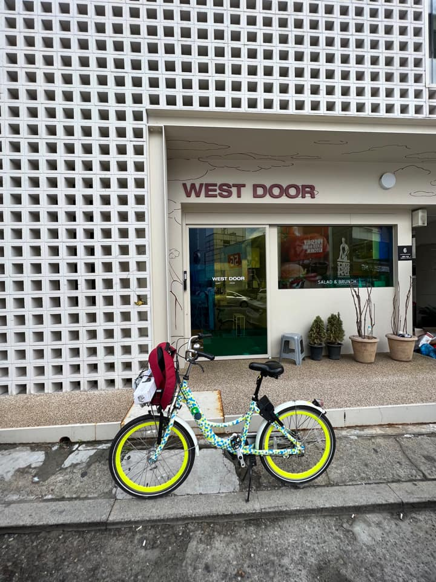
**이미지 캡션:** 건물 앞에 주차된 화려한 패턴의 자전거가 보인다. 자전거는 밝은 노란색 바퀴 테두리와 파란색, 녹색, 노란색 점이 찍힌 독특한 프레임을 가지고 있으며, 앞 바구니에는 붉은색 배낭과 흰색 상자가 놓여 있다. 자전거 뒤로는 'WEST DOOR'라고 적힌 간판이 있는 건물 입구가 보인다. 건물 외벽은 격자무늬의 흰색 블록으로 되어 있으며, 입구 유리창 안으로는 'WEST DOOR'와 'SALAD & BRUNCH'라는 글자가 보인다. 건물 앞에는 작은 화분 몇 개와 회색 의자가 놓여 있다. 전반적으로 도시의 한적한 거리 풍경을 담고 있으며, 자전거의 개성 있는 디자인이 시선을 끈다.거리 풍경을 담고 있으며, 자전거의 개성 있는 디자인이 시선을 끈다.

### 6월 9일 (목) 11:10 · #LGUPlusXUpstage

#LGUPlusXUpstage 

LG U+와 함께 AI기술로 서비스 업업 하고 있습니다. AI platform, 검색, OCR, 추천등 making ai beneficial 한 부분들 많은 성과를 내고 모아서 또 공개 하도록 하겠습니다.

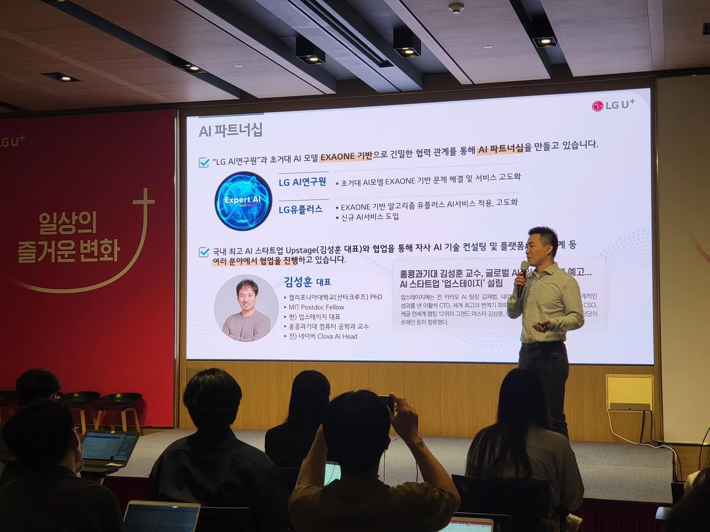
**이미지 캡션:** 행사장에서 한 명의 성인 남성이 강연을 하고 있으며, 그는 약 40대 초반으로 보이고 짧은 검은 머리에 캐주얼한 셔츠를 입고 있다. 그는 오른손으로 마이크를 잡고 왼손으로는 제스처를 취하며 열정적으로 발표하고 있으며, 그의 표정은 진지하면서도 자신감 있어 보인다. 배경에는 LG U+ 로고와 함께 "AI 파트너십"이라는 제목의 프레젠테이션 슬라이드가 띄워져 있으며, 슬라이드에는 LG AI 연구원, LG 유플러스, 그리고 국내 최고 AI 스타트업 Upstage에 대한 내용이 담겨 있다. 또한, 슬라이드에는 Upstage의 김성훈 대표의 사진과 약력이 소개되어 있다. 행사장 앞쪽에는 여러 명의 사람들이 앉아 발표를 경청하고 있으며, 일부는 노트북을 사용하고 있다. 전체적으로 차분하면서도 집중된 분위기이며, 기술 관련 세미나 또는 발표회로 보인다.tage의 김성훈 대표의 사진과 약력이 소개되어 있다. 행사장 앞쪽에는 여러 명의 사람들이 앉아 발표를 경청하고 있으며, 일부는 노트북을 사용하고 있다. 전체적으로 차분하면서도 집중된 분위기이며, 기술 관련 세미나 또는 발표회로 보인다.
 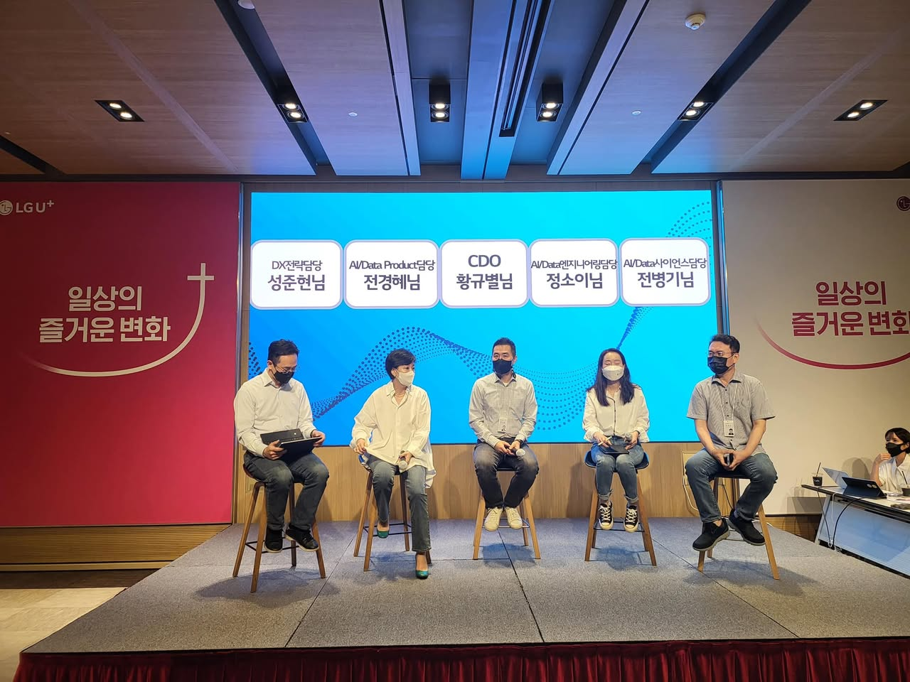
**이미지 캡션:** 이 사진은 LG U+ 행사의 한 장면을 담고 있으며, 무대 위에 다섯 명의 패널이 의자에 앉아 있다. 왼쪽부터 성인 남성, 성인 여성, 성인 남성, 성인 여성, 성인 남성으로 구성되어 있으며, 모두 마스크를 착용하고 있다. 성인 남성들은 30대에서 40대로 보이며, 캐주얼한 셔츠와 청바지 차림이다. 성인 여성들은 20대 후반에서 30대로 보이며, 역시 캐주얼한 복장이다. 무대 뒤편에는 LG U+ 로고와 함께 "일상의 즐거운 변화"라는 문구가 적힌 대형 스크린이 설치되어 있으며, 스크린에는 각 패널의 직책과 이름이 한국어로 표시되어 있다. 패널들은 각자의 역할에 맞는 전문성을 보여주는 듯 진지한 표정으로 앉아 있으며, 일부는 태블릿이나 서류를 보고 있다. 전체적으로 차분하고 전문적인 분위기 속에서 행사가 진행되고 있음을 알 수 있다.름이 한국어로 표시되어 있다. 패널들은 각자의 역할에 맞는 전문성을 보여주는 듯 진지한 표정으로 앉아 있으며, 일부는 태블릿이나 서류를 보고 있다. 전체적으로 차분하고 전문적인 분위기 속에서 행사가 진행되고 있음을 알 수 있다.

### 6월 13일 (월) 03:39 · #HelloSeattle MS, Amazon, Starbucks의 도시 …

#HelloSeattle MS, Amazon, Starbucks의 도시 시애틀에서 한 달간 살면서, Upstage 와 함께 하실 분들, 협업을 위한 분들 많이 뵙고 함께 Making AI Beneficial 이야기 하며 즐거운 시간을 가질 예정입니다. 반갑게 뵙겠습니다.

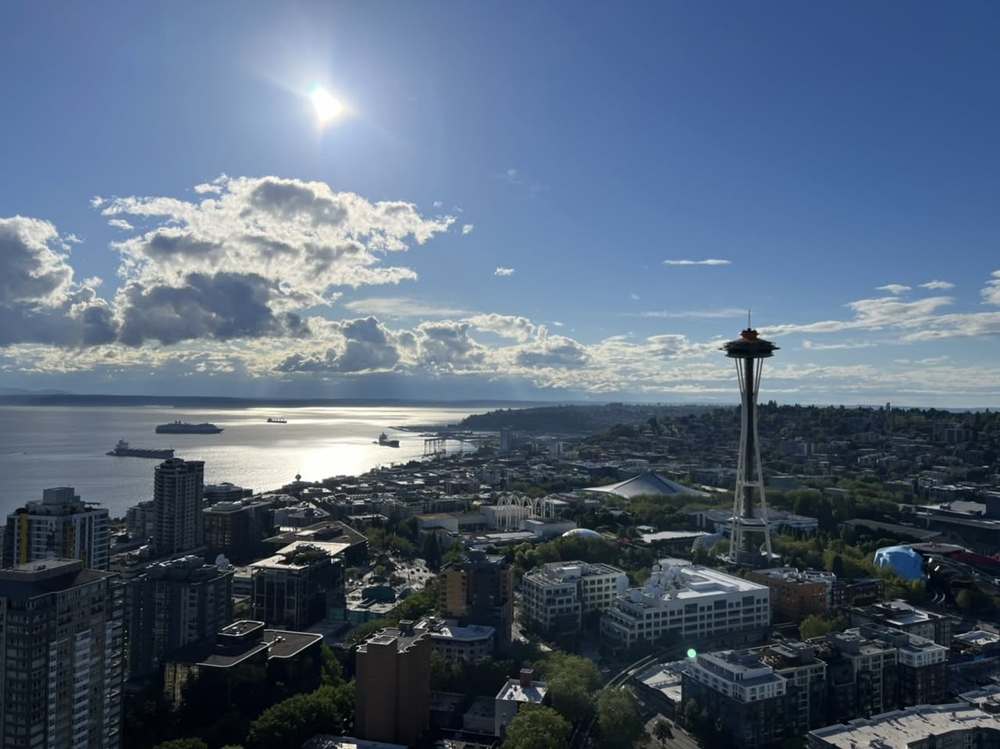
**이미지 캡션:** 이 사진은 시애틀의 스페이스 니들 타워와 주변 도시 풍경을 담고 있으며, 맑고 구름이 약간 낀 하늘 아래 햇빛이 바다와 건물에 반사되어 빛나고 있습니다. 사진에는 사람이나 특정 인물은 보이지 않으며, 대신 도시의 전경이 펼쳐져 있습니다. 장소는 미국 시애틀의 도심으로, 푸른 바다와 그 위에 떠 있는 여러 척의 선박, 그리고 고층 빌딩과 낮은 건물들이 빽빽하게 들어서 있습니다. 스페이스 니들 타워가 사진의 중심부에서 약간 오른쪽으로 치우쳐 우뚝 솟아 있으며, 그 뒤로는 푸른 언덕과 도시의 외곽 지역이 보입니다. 하늘에는 뭉게구름이 흩어져 있고, 태양이 밝게 빛나고 있어 전체적으로 밝고 활기찬 분위기를 자아냅니다. 건물들의 다양한 건축 양식과 녹지 공간이 조화를 이루고 있으며, 도시의 역동성과 자연의 아름다움이 공존하는 풍경입니다. 하늘에는 뭉게구름이 흩어져 있고, 태양이 밝게 빛나고 있어 전체적으로 밝고 활기찬 분위기를 자아냅니다. 건물들의 다양한 건축 양식과 녹지 공간이 조화를 이루고 있으며, 도시의 역동성과 자연의 아름다움이 공존하는 풍경입니다.

### 6월 14일 (화) 11:48 · Mt.Rainier 의 웅장함과 흰맛 (whiteout) 보고왔습니다 -…

Mt.Rainier 의 웅장함과 흰맛 (whiteout) 보고왔습니다 -- 천국의 문앞에 도착한 듯한 황홀한 시간였습니다.  Jinsoo Yoon 님 함께 해서 더 즐거웠습니다.

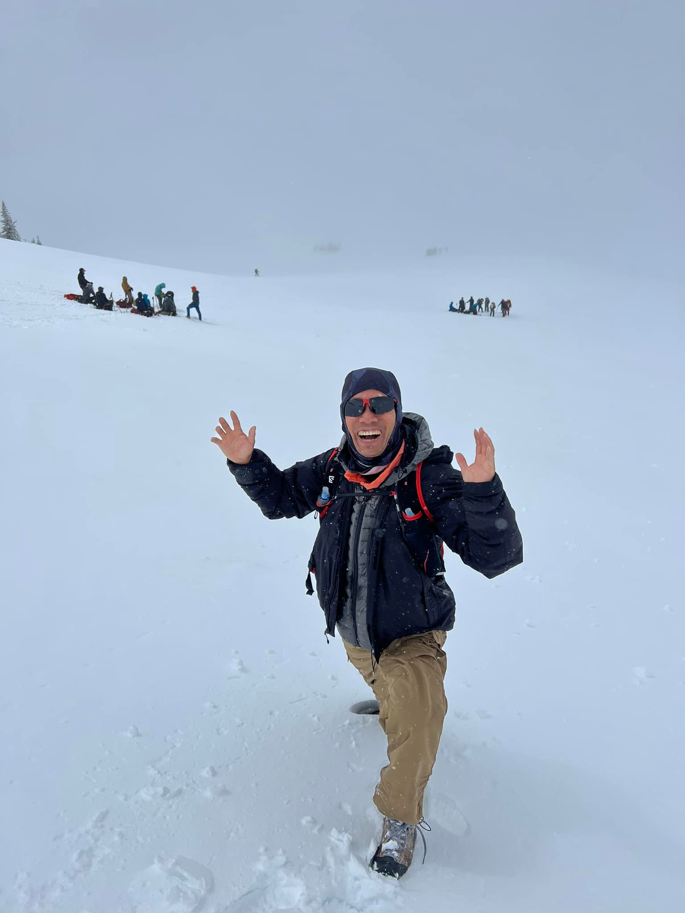
**이미지 캡션:** 눈 덮인 산에서 한 성인 남성이 카메라를 향해 두 팔을 들고 환하게 웃고 있다. 그는 검은색 방수 재킷, 갈색 바지, 스키 부츠, 머리에는 검은색 비니를 쓰고 있으며, 얼굴에는 선글라스를 착용하고 있다. 재킷에는 주황색 목도리가 겹쳐져 있고, 등에는 빨간색 배낭을 메고 있다. 남성의 뒤로는 눈 덮인 넓은 경사면이 펼쳐져 있으며, 멀리에는 여러 명의 사람들이 스키를 타거나 앉아 있는 모습이 희미하게 보인다. 배경은 안개가 낀 듯 흐릿하며, 눈이 내리고 있는 것으로 보인다. 전체적으로 즐겁고 활기찬 분위기이다.
 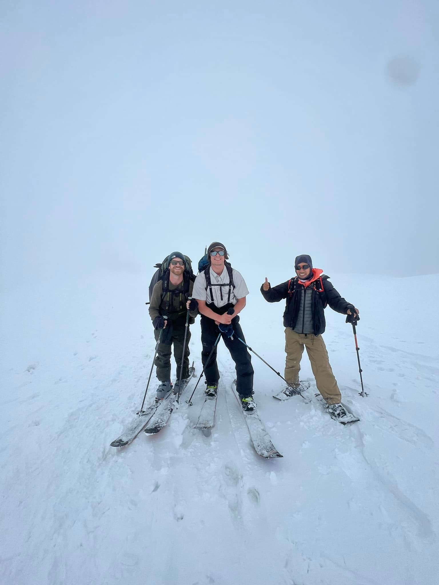
**이미지 캡션:** 세 명의 성인 남성이 눈 덮인 산에서 스키를 타고 있다. 세 사람 모두 등산 배낭을 메고 있으며, 스키 장비를 착용하고 있다. 왼쪽 남성은 짙은 녹색 재킷과 바지를 입고 있으며, 선글라스와 모자를 착용하고 있다. 가운데 남성은 흰색 셔츠와 검은색 바지를 입고 있으며, 선글라스와 모자를 착용하고 있다. 오른쪽 남성은 검은색 재킷과 베이지색 바지를 입고 있으며, 주황색 후드티를 덧입고 선글라스와 모자를 착용하고 있다. 그는 엄지손가락을 치켜세우며 긍정적인 표정을 짓고 있다. 배경은 안개가 짙게 끼어 있어 시야가 제한적이며, 눈으로 덮인 광활한 풍경이 펼쳐져 있다. 전체적으로 스키 여행이나 등반을 즐기는 듯한 분위기이며, 험준한 자연 환경 속에서 모험을 즐기는 모습이다.제한적이며, 눈으로 덮인 광활한 풍경이 펼쳐져 있다. 전체적으로 스키 여행이나 등반을 즐기는 듯한 분위기이며, 험준한 자연 환경 속에서 모험을 즐기는 모습이다.
 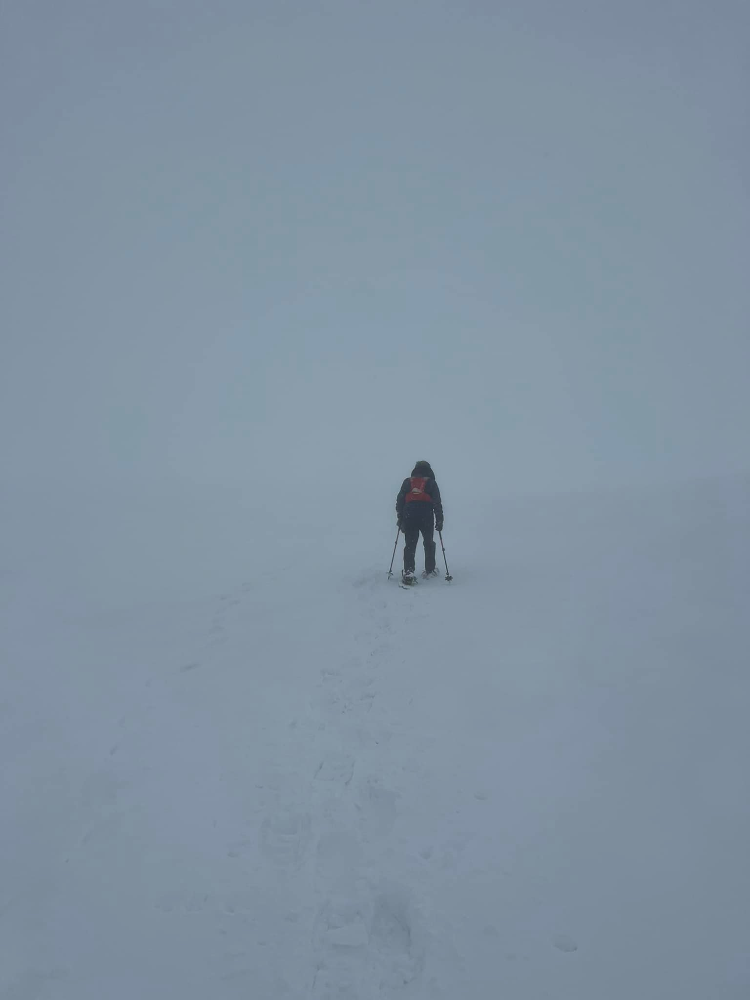
**이미지 캡션:** 안개 낀 흐린 날씨 속에서 한 명의 성인 남성이 스노우슈를 신고 스키 폴을 잡고 눈밭을 걷고 있습니다. 그는 어두운 색의 재킷과 바지를 입고 있으며, 등에는 주황색 배낭을 메고 있습니다. 그의 표정은 보이지 않지만, 홀로 눈길을 걷는 모습에서 고독함과 함께 자연 속에서의 여정을 느끼게 합니다. 배경은 온통 하얀 눈으로 뒤덮여 있으며, 희미하게 보이는 발자국만이 그가 지나온 길을 나타냅니다. 전체적으로 고요하고 웅장한 겨울 풍경 속에서 한 인물이 자연과 마주하고 있는 듯한 분위기입니다.
 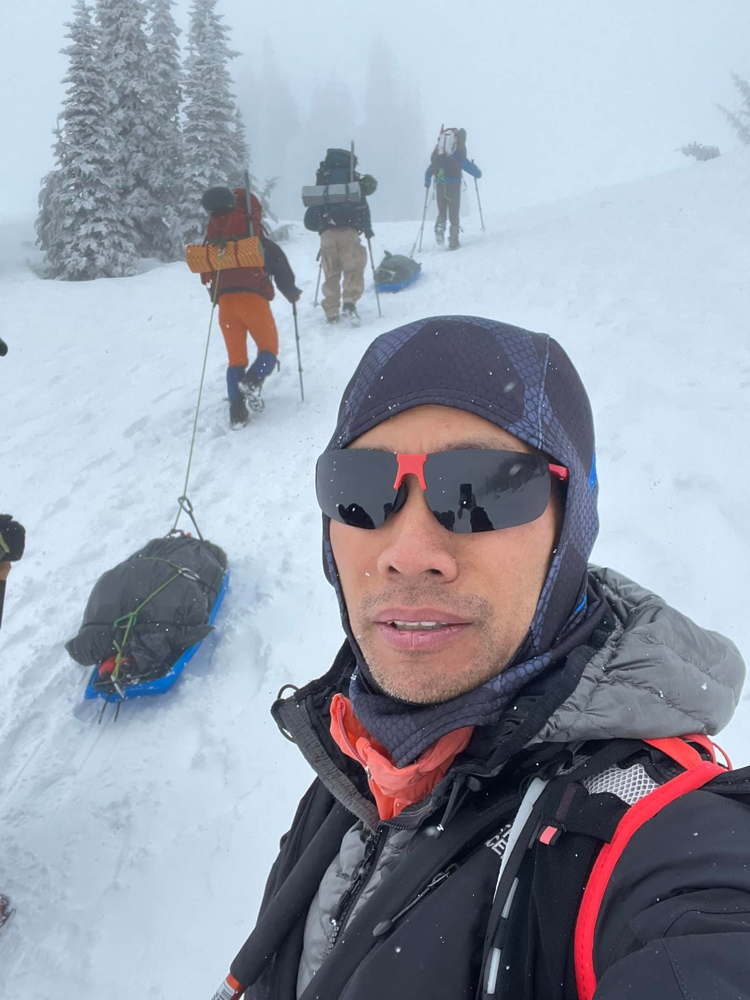
**이미지 캡션:** 이 사진은 눈 덮인 산을 오르는 여러 명의 사람들을 보여줍니다. 전경에는 한 성인 남성이 카메라를 향해 셀카를 찍고 있으며, 그는 검은색과 회색 패턴의 머리 커버, 선글라스, 주황색 넥 워머, 검은색 재킷을 입고 있습니다. 그의 얼굴에는 땀이 약간 맺혀 있고, 약간 찡그린 표정을 짓고 있습니다. 그의 뒤로는 눈밭을 오르는 세 명의 다른 사람들이 보입니다. 그들 모두 두꺼운 겨울 옷을 입고 배낭을 메고 있으며, 일부는 썰매를 끌고 있습니다. 썰매에는 검은색 덮개로 덮인 짐이 실려 있습니다. 배경에는 눈이 쌓인 나무들이 희미하게 보이며, 날씨는 흐리고 눈이 내리는 듯합니다. 전반적으로 사진은 혹독한 겨울 환경에서 등반이나 탐험을 하는 사람들의 모습을 담고 있으며, 약간의 긴장감과 함께 도전적인 분위기를 자아냅니다.나무들이 희미하게 보이며, 날씨는 흐리고 눈이 내리는 듯합니다. 전반적으로 사진은 혹독한 겨울 환경에서 등반이나 탐험을 하는 사람들의 모습을 담고 있으며, 약간의 긴장감과 함께 도전적인 분위기를 자아냅니다.

### 6월 16일 (목) 09:25 · 📷 사진 (1장)

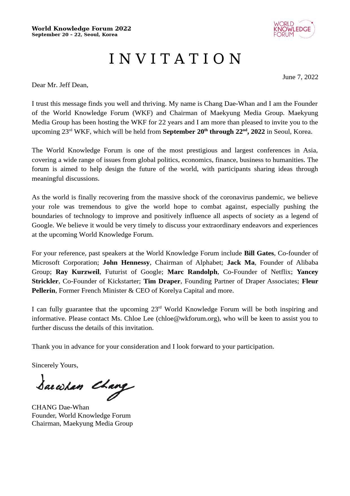
**이미지 캡션:** 이것은 2022년 6월 7일에 작성된 World Knowledge Forum 2022의 초대장으로, 서울에서 2022년 9월 20일부터 22일까지 개최될 예정입니다. 초대장은 한국어로 작성되었으며, World Knowledge Forum의 창립자이자 Maekyung Media Group의 회장인 Chang Dae-Whan이 Jeff Dean 씨에게 보내는 것입니다. 초대장에는 포럼의 중요성, 주제, 그리고 과거 연사들에 대한 정보가 포함되어 있습니다. 또한, 포럼에 대한 추가 정보를 얻기 위해 Chloe Lee 씨에게 연락할 수 있는 정보도 제공됩니다. 초대장은 공식적이고 정중한 분위기이며, Jeff Dean 씨의 참여를 기대하는 내용으로 마무리됩니다.e 씨에게 연락할 수 있는 정보도 제공됩니다. 초대장은 공식적이고 정중한 분위기이며, Jeff Dean 씨의 참여를 기대하는 내용으로 마무리됩니다.

### 6월 17일 (금) 03:33 · #617 #helloseattle #changbal 제가 시애틀에 사는 …

#617 #helloseattle #changbal 제가 시애틀에 사는 기간동안 멋진 행사가 열려 초대 드립니다. 아래 사진의 멋진 연사들이 what's next in AI라는 주제로 강의및 토론을 합니다. 

근처 계시는 분들 오시는 분들 반갑게 뵙겠습니다. 

[일시 및 장소]
📆날짜: 6월 17일 
⌛시간: 6:30pm ~ 11:00pm
📍장소: The Westin Bellevue (600 Bellevue Way NE, Bellevue, WA 98004)
🚗주차: Lincoln Square (무료)
💓RSVP 필수

https://www.changbal.org/event-info/lg-electronics-changbal-seminar-whats-next-in-ai

**이미지 캡션:** 이 이미지는 LG전자와 Changbal이 공동 주최하는 "What's next in AI?"라는 제목의 인공지능 세미나를 홍보하는 포스터입니다. 포스터 상단에는 LG 로고와 Changbal 로고가 나란히 있으며, 그 아래에는 "LG Electronics x Changbal"이라는 문구와 함께 "What's next in AI?"라는 큰 제목이 있습니다. 중앙에는 5명의 남성 연사들의 사진이 타원형 틀 안에 배치되어 있으며, 각 사진 아래에는 이름과 소속이 한국어로 표기되어 있습니다. 왼쪽 상단부터 이현철(LG전자), 박도형(Meta), 이성진(Amazon), 김영진(Microsoft), 활동성(Google)입니다. 이들은 모두 성인 남성이며, 각기 다른 복장과 표정을 하고 있습니다. 이현철은 회색 티셔츠를 입고 있으며, 박도형은 검은색 재킷과 안경을 착용하고 있습니다. 이성진은 흰색 셔츠를 입고 있으며, 김영진은 검은색 정장을 입고 안경을 쓰고 있습니다. 활동성은 파란색과 검은색이 섞인 재킷을 입고 있습니다. 포스터 오른쪽 상단에는 분홍색 원형 안에 "D-2"라는 글자가 쓰여 있어 행사까지 남은 날짜를 나타냅니다. 포스터 하단에는 행사 정보가 "What", "When", "Where"로 구분되어 제공됩니다. "What"에는 "In-person Seminar"라고 적혀 있고, "When"에는 "Jun 17, 2022 6:30-11 PM"이라고 날짜와 시간이 명시되어 있습니다. "Where"에는 "The Westin Bellevue 600 Bellevue Way NE"라고 장소가 기재되어 있습니다. 전체적으로 노란색 배경에 분홍색과 주황색이 포인트로 사용되어 밝고 현대적인 분위기를 연출합니다.전자), 박도형(Meta), 이성진(Amazon), 김영진(Microsoft), 활동성(Google)입니다. 이들은 모두 성인 남성이며, 각기 다른 복장과 표정을 하고 있습니다. 이현철은 회색 티셔츠를 입고 있으며, 박도형은 검은색 재킷과 안경을 착용하고 있습니다. 이성진은 흰색 셔츠를 입고 있으며, 김영진은 검은색 정장을 입고 안경을 쓰고 있습니다. 활동성은 파란색과 검은색이 섞인 재킷을 입고 있습니다. 포스터 오른쪽 상단에는 분홍색 원형 안에 "D-2"라는 글자가 쓰여 있어 행사까지 남은 날짜를 나타냅니다. 포스터 하단에는 행사 정보가 "What", "When", "Where"로 구분되어 제공됩니다. "What"에는 "In-person Seminar"라고 적혀 있고, "When"에는 "Jun 17, 2022 6:30-11 PM"이라고 날짜와 시간이 명시되어 있습니다. "Where"에는 "The Westin Bellevue 600 Bellevue Way NE"라고 장소가 기재되어 있습니다. 전체적으로 노란색 배경에 분홍색과 주황색이 포인트로 사용되어 밝고 현대적인 분위기를 연출합니다.

### 6월 18일 (토) 08:02 · #helloseattle H2O.ai 계시는 Neo Minchul Cha…

#helloseattle H2O.ai 계시는 Neo Minchul Chae 멋진식사와 카페코딩까지 멋진 시간되었습니다. 많이 배웠습니다. 감사해요!

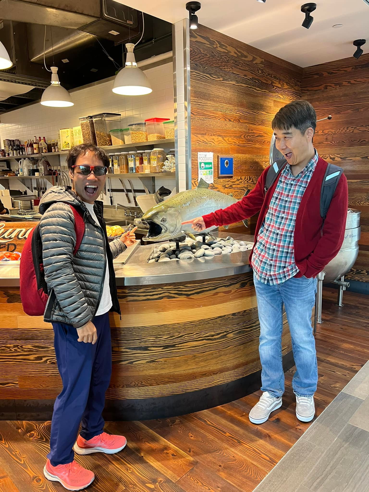
**이미지 캡션:** 두 명의 성인 남성이 실내에서 커다란 모형 물고기를 배경으로 서서 포즈를 취하고 있다. 왼쪽 남성은 30대 후반에서 40대 초반으로 보이며, 회색 경량 패딩 조끼와 흰색 티셔츠, 남색 바지, 주황색 운동화를 착용하고 있다. 그는 빨간색 백팩을 메고 있으며, 선글라스를 끼고 입을 크게 벌린 채 웃으며 물고기를 가리키고 있다. 오른쪽 남성은 30대 후반에서 40대 초반으로 보이며, 빨간색 가디건 안에 체크무늬 셔츠를 입고 청바지와 회색 운동화를 신고 있다. 그는 검은색 백팩을 메고 있으며, 놀란 표정으로 입을 벌리고 물고기를 가리키고 있다. 배경에는 주방 조리대와 선반이 보이며, 다양한 식재료와 조리 도구들이 진열되어 있다. 또한, 나무 질감의 벽과 바닥이 인테리어를 이루고 있으며, 물고기 모형은 돌 위에 놓여 있다. 전체적으로 활기차고 즐거운 분위기이다.리고 물고기를 가리키고 있다. 배경에는 주방 조리대와 선반이 보이며, 다양한 식재료와 조리 도구들이 진열되어 있다. 또한, 나무 질감의 벽과 바닥이 인테리어를 이루고 있으며, 물고기 모형은 돌 위에 놓여 있다. 전체적으로 활기차고 즐거운 분위기이다.
 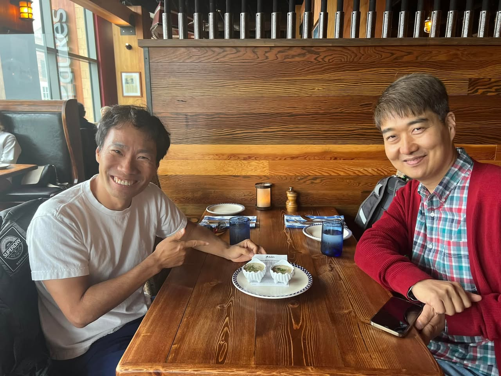
**이미지 캡션:** 두 명의 성인 남성이 나무 테이블에 앉아 식사를 하고 있다. 왼쪽 남성은 30대 후반에서 40대 초반으로 보이며, 흰색 반팔 티셔츠와 파란색 바지를 입고 있다. 그는 환하게 웃으며 카메라를 응시하고 있고, 오른손으로 테이블 위의 음식을 가리키고 있다. 그의 왼쪽 팔에는 'SUPERDRY'라고 적힌 검은색 재킷이 걸려 있다. 오른쪽 남성은 40대 초반에서 50대 초반으로 보이며, 빨간색 가디건 안에 체크무늬 셔츠를 입고 있다. 그는 카메라를 향해 부드럽게 미소 짓고 있으며, 그의 앞에는 스마트폰이 놓여 있다. 테이블 위에는 두 개의 작은 컵에 담긴 음식과 물컵, 소금통, 후추통, 그리고 접시가 놓여 있다. 배경은 나무 패널로 장식되어 있으며, 식당 내부로 보인다. 전반적으로 편안하고 즐거운 분위기이다.테이블 위에는 두 개의 작은 컵에 담긴 음식과 물컵, 소금통, 후추통, 그리고 접시가 놓여 있다. 배경은 나무 패널로 장식되어 있으며, 식당 내부로 보인다. 전반적으로 편안하고 즐거운 분위기이다.
 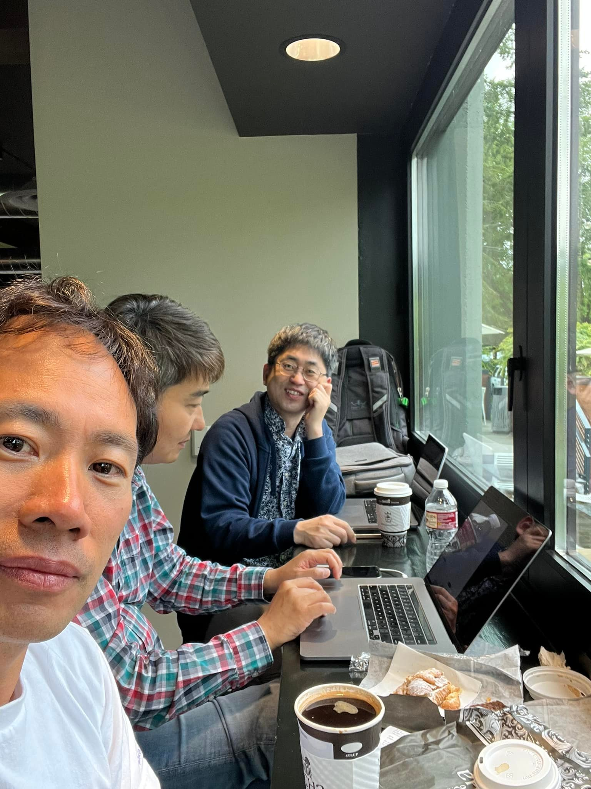
**이미지 캡션:** 세 명의 성인 남성이 카페 창가 자리에 앉아 노트북을 사용하며 시간을 보내고 있다. 가장 가까이 있는 남성은 카메라를 향해 얼굴을 클로즈업하고 있으며, 흰색 티셔츠를 입고 있다. 그의 옆에는 체크무늬 셔츠를 입은 남성이 노트북을 사용하고 있고, 그 뒤로는 파란색 카디건을 입고 안경을 쓴 남성이 팔짱을 끼고 창밖을 바라보고 있다. 테이블 위에는 노트북, 커피잔, 물병, 그리고 페이스트리가 놓여 있다. 창밖으로는 나무와 건물이 보이며, 전체적으로 편안하고 일상적인 분위기이다.

### 6월 22일 (수) 05:48 · 📷 사진 (2장)

**이미지 캡션:** 이 이미지는 GitHub Copilot의 가격 및 무료 사용 기간 만료에 대한 정보를 담고 있는 웹페이지 스크린샷입니다. 상단에는 파란색과 흰색의 로봇 아이콘과 함께 "GitHub Copilot"이라는 제목과 "Your AI pair programmer"라는 부제가 표시되어 있습니다. 중앙에는 "GitHub Copilot is free until August 22"라는 큰 제목과 함께 기술 미리보기 프로그램에 참여한 사용자들에게 감사하며 2022년 8월 22일까지 무료로 계속 사용할 수 있다는 안내 문구가 있습니다. 또한, GitHub Copilot이 Python, JavaScript, TypeScript, Go, Ruby 등 다양한 코딩 언어를 지원하며 VS Code, Visual Studio, Neovim, JetBrains와 같은 IDE에 통합된다는 장점이 체크리스트 형태로 나열되어 있습니다. 그 아래에는 8월 22일 이후 유료 플랜에 대한 선택지가 제시되어 있으며, 월간 플랜은 월 10달러, 연간 플랜은 연 100달러로 표시되어 있습니다. 현재 월간 플랜이 선택되어 있습니다. "Continue to get access to Copilot"이라는 녹색 버튼이 있으며, 그 아래에는 "Want to setup payment later? Continue without payment details."라는 문구와 함께 결제 없이 계속 진행할 수 있는 링크가 있습니다. 마지막으로, GitHub Copilot은 인기 있는 오픈 소스 소프트웨어 유지보수자와 인증된 학생들에게 무료로 제공된다는 정보와 함께 FAQ 링크가 안내되어 있습니다. 전체적으로 깔끔하고 정보 전달에 초점을 맞춘 디자인이며, 개발자들을 대상으로 하는 서비스임을 알 수 있습니다.습니다. 또한, GitHub Copilot이 Python, JavaScript, TypeScript, Go, Ruby 등 다양한 코딩 언어를 지원하며 VS Code, Visual Studio, Neovim, JetBrains와 같은 IDE에 통합된다는 장점이 체크리스트 형태로 나열되어 있습니다. 그 아래에는 8월 22일 이후 유료 플랜에 대한 선택지가 제시되어 있으며, 월간 플랜은 월 10달러, 연간 플랜은 연 100달러로 표시되어 있습니다. 현재 월간 플랜이 선택되어 있습니다. "Continue to get access to Copilot"이라는 녹색 버튼이 있으며, 그 아래에는 "Want to setup payment later? Continue without payment details."라는 문구와 함께 결제 없이 계속 진행할 수 있는 링크가 있습니다. 마지막으로, GitHub Copilot은 인기 있는 오픈 소스 소프트웨어 유지보수자와 인증된 학생들에게 무료로 제공된다는 정보와 함께 FAQ 링크가 안내되어 있습니다. 전체적으로 깔끔하고 정보 전달에 초점을 맞춘 디자인이며, 개발자들을 대상으로 하는 서비스임을 알 수 있습니다.
 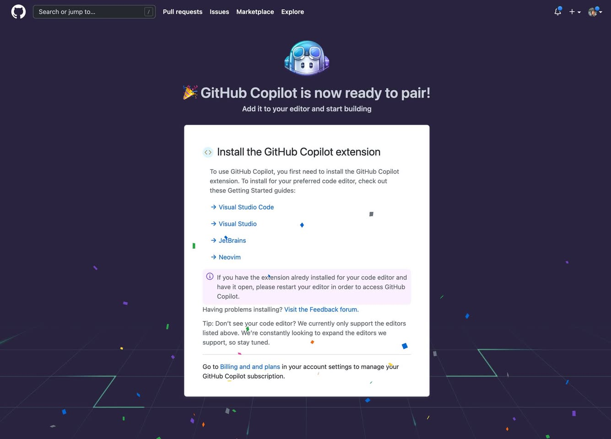
**이미지 캡션:** 이 이미지는 GitHub Copilot이 사용자에게 설치를 안내하는 웹 페이지를 보여줍니다. 화면 중앙에는 흰색 배경의 팝업 창이 있으며, "Install the GitHub Copilot extension"이라는 제목과 함께 GitHub Copilot을 설치하는 방법에 대한 안내가 포함되어 있습니다. 팝업 창 안에는 Visual Studio Code, Visual Studio, JetBrains, Neovim 등 지원되는 코드 편집기 목록이 링크 형태로 제공됩니다. 또한, 이미 확장 프로그램이 설치된 경우 편집기를 다시 시작해야 한다는 안내와 함께 문제 해결을 위한 피드백 포럼 링크도 있습니다. 하단에는 현재 지원되는 편집기에 대한 팁과 함께 계정 설정에서 빌링 및 요금제를 관리하라는 메시지가 있습니다. 배경은 어두운 보라색이며, 다채로운 색상의 종이 조각들이 흩날리는 듯한 그래픽 효과가 적용되어 축제 분위기를 연출합니다. 상단에는 GitHub의 기본 탐색 메뉴가 있으며, 검색창과 함께 Pull requests, Issues, Marketplace, Explore와 같은 항목이 보입니다. 오른쪽 상단에는 사용자 프로필 아이콘과 알림 아이콘이 있습니다. 이 페이지는 GitHub Copilot을 처음 사용하는 사용자에게 설치 과정을 안내하고 지원하는 데 목적이 있습니다.편집기를 다시 시작해야 한다는 안내와 함께 문제 해결을 위한 피드백 포럼 링크도 있습니다. 하단에는 현재 지원되는 편집기에 대한 팁과 함께 계정 설정에서 빌링 및 요금제를 관리하라는 메시지가 있습니다. 배경은 어두운 보라색이며, 다채로운 색상의 종이 조각들이 흩날리는 듯한 그래픽 효과가 적용되어 축제 분위기를 연출합니다. 상단에는 GitHub의 기본 탐색 메뉴가 있으며, 검색창과 함께 Pull requests, Issues, Marketplace, Explore와 같은 항목이 보입니다. 오른쪽 상단에는 사용자 프로필 아이콘과 알림 아이콘이 있습니다. 이 페이지는 GitHub Copilot을 처음 사용하는 사용자에게 설치 과정을 안내하고 지원하는 데 목적이 있습니다.

### 6월 24일 (금) 09:46 · #runonwater #seattle_to_bellevue

#runonwater #seattle_to_bellevue 

MS에서 빅모델과 번역 모델을 하시는 Kim Young-Jin 님을 뵙기 위해 seattle to bellevue run 18KM 해보았습니다. 바다를 가로지르는 520 trail은 달리는 동안 시간이 가지 않으면 좋겠다는 생각이 들정도로 멋졌습니다. 

@Young-Jin 님 오늘 멋진 이야기들 잘 들었고 맛난 점심도 감사했습니다!

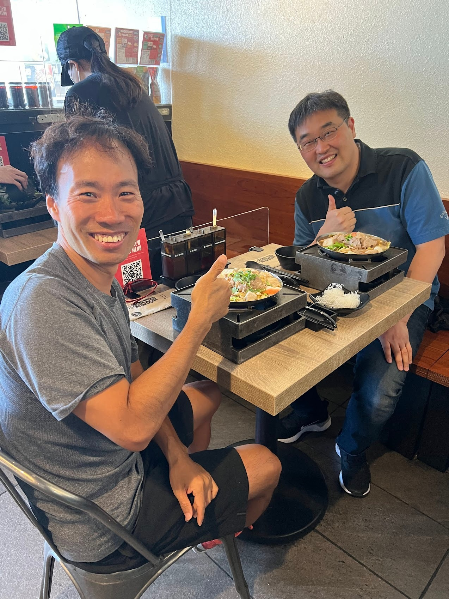
**이미지 캡션:** 두 명의 성인 남성이 식당에서 식사를 하고 있으며, 두 사람 모두 엄지손가락을 치켜세우며 긍정적인 표정을 짓고 있습니다. 앞에 앉은 남성은 30대 후반에서 40대 초반으로 보이며, 회색 반팔 티셔츠와 검은색 반바지를 입고 있습니다. 그는 카메라를 향해 활짝 웃으며 엄지손가락을 치켜들고 있습니다. 뒤에 앉은 남성은 40대 초반에서 50대 초반으로 보이며, 파란색과 검은색이 섞인 폴로 셔츠와 청바지를 입고 있습니다. 그는 안경을 쓰고 있으며, 카메라를 향해 미소를 지으며 엄지손가락을 치켜들고 있습니다. 두 사람 앞에는 개인용 휴대용 스토브 위에 놓인 냄비 요리가 보이며, 얇은 국수와 채소가 담겨 있습니다. 테이블 위에는 양념통과 냅킨 등이 놓여 있습니다. 배경에는 식당의 모습이 보이며, 벽에는 메뉴판으로 보이는 것으로 추정되는 여러 장의 종이가 붙어 있습니다. 또한, 테이블 사이에는 투명한 칸막이가 설치되어 있어 위생적인 환경을 보여줍니다. 전반적으로 즐겁고 편안한 식사 분위기를 나타냅니다.앞에는 개인용 휴대용 스토브 위에 놓인 냄비 요리가 보이며, 얇은 국수와 채소가 담겨 있습니다. 테이블 위에는 양념통과 냅킨 등이 놓여 있습니다. 배경에는 식당의 모습이 보이며, 벽에는 메뉴판으로 보이는 것으로 추정되는 여러 장의 종이가 붙어 있습니다. 또한, 테이블 사이에는 투명한 칸막이가 설치되어 있어 위생적인 환경을 보여줍니다. 전반적으로 즐겁고 편안한 식사 분위기를 나타냅니다.
 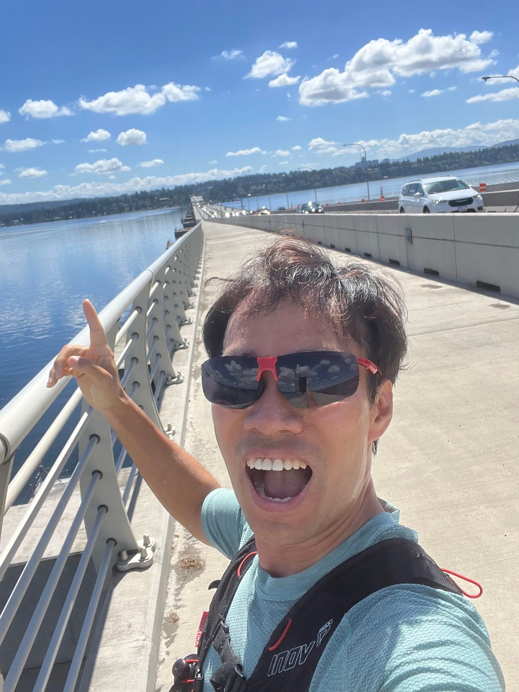
**이미지 캡션:** 푸른 하늘과 구름이 있는 맑은 날, 한 성인 남성이 다리 위에서 셀카를 찍고 있습니다. 그는 30대 후반에서 40대 초반으로 보이며, 짧은 검은 머리에 붉은색 프레임의 선글라스를 착용하고 있습니다. 입을 크게 벌리고 환하게 웃고 있으며, 옅은 청록색 반팔 티셔츠와 검은색 조끼를 입고 있습니다. 조끼에는 "INOV-8"이라는 로고가 보입니다. 그는 왼쪽 팔을 들어 올리고 손가락으로 저 멀리 다리 끝을 가리키고 있습니다. 배경으로는 넓은 호수와 그 너머로 보이는 숲이 우거진 산, 그리고 다리 위를 달리는 차들이 보입니다. 다리는 콘크리트와 금속 난간으로 이루어져 있으며, 맑고 푸른 물이 잔잔하게 펼쳐져 있습니다. 전반적으로 활동적이고 즐거운 분위기를 나타냅니다.보입니다. 다리는 콘크리트와 금속 난간으로 이루어져 있으며, 맑고 푸른 물이 잔잔하게 펼쳐져 있습니다. 전반적으로 활동적이고 즐거운 분위기를 나타냅니다.
 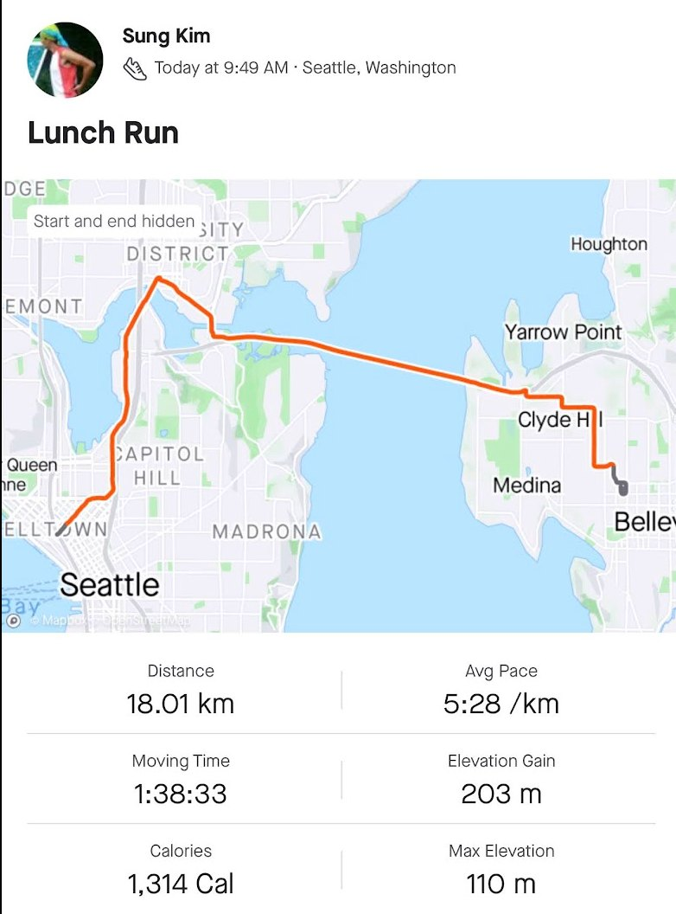
**이미지 캡션:** 이 사진은 "Sung Kim"이라는 사용자가 "Lunch Run"이라는 제목으로 기록한 운동 정보를 보여줍니다. 사진 상단에는 사용자의 프로필 사진과 이름, 운동 시간 및 장소가 표시되어 있습니다. 프로필 사진에는 운동복을 입은 사람의 모습이 흐릿하게 보입니다. 운동 정보는 지도 위에 오렌지색 선으로 표시된 경로와 함께 제공됩니다. 지도는 시애틀 지역을 보여주며, 시애틀 시내, 캐피톨 힐, 매디나, 벨뷰 등의 지명이 보입니다. 운동 기록에는 총 거리 18.01km, 이동 시간 1시간 38분 33초, 소모 칼로리 1,314 Cal, 평균 페이스 5:28/km, 고도 상승 203m, 최대 고도 110m가 기록되어 있습니다. 전반적으로 운동 기록을 공유하는 앱 화면으로 보이며, 활동적인 분위기를 나타냅니다.리 1,314 Cal, 평균 페이스 5:28/km, 고도 상승 203m, 최대 고도 110m가 기록되어 있습니다. 전반적으로 운동 기록을 공유하는 앱 화면으로 보이며, 활동적인 분위기를 나타냅니다.

### 6월 25일 (토) 12:52 · #helloseattle #Rattlesnake #25일 #오후230

#helloseattle #Rattlesnake #25일 #오후230 

시애틀 근교 가장 멋진 코스로 알려져 있는 Rattlesnake Ledge Trailhead를 Minsuk Chang @Youngjae Yu 박사님, UW 분들과 함께 2~3시간 걷고 AI이야기 할 예정입니다. 

번개 모임이니 근처에 계시면서 시간되시는 분들은 6월 25일 오후 2:30분 https://maps.app.goo.gl/TGT3L5vViuHebeJw7 오시면 됩니다. 

정말 좋은 날씨, 아름다운 코스, 멋진 분들과 잊지 못할 시간이 될것입니다. 

(등산후 저녁 만찬도 준비 되어 있습니다!)

### 6월 26일 (일) 14:02 · #helloseattle 등산으로 멋진 경치고 보고 거위와 이야기 하며 …

#helloseattle 등산으로 멋진 경치고 보고 거위와 이야기 하며 수영 한다음, 고기로 멋진 마무리가 되었습니다. 무엇보다도 함께 만나고 이야기 하고 웃고, AI 이야기와 미래 꿈을 즐겁게 나누어 주신 분들에게 너무 감사드립니다. 준비해주신 Minsuk Chang 님 감사드리며 또 해요!

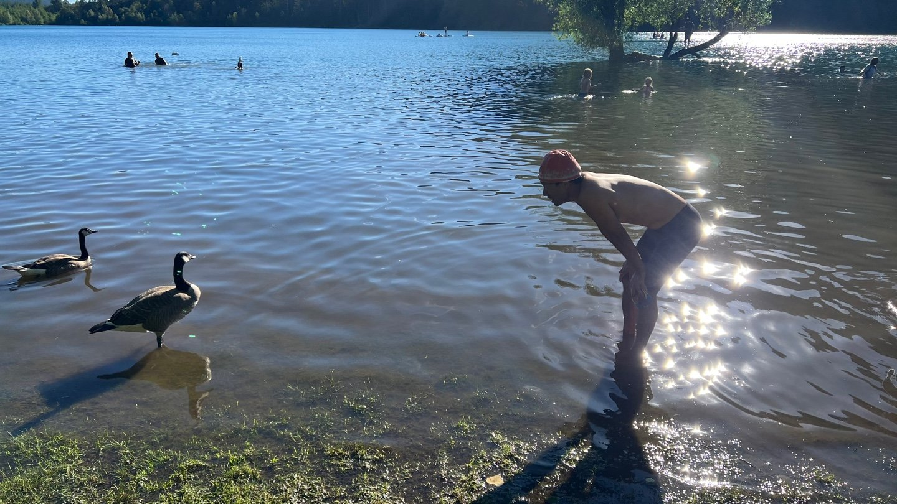
**이미지 캡션:** 맑고 푸른 호수에서 한 젊은 성인 남성이 상의를 탈의한 채 물에 발을 담그고 허리를 숙여 호수를 바라보고 있다. 그는 붉은색 수영모를 쓰고 있으며, 회색 수영복을 입고 있다. 남자의 얼굴 표정은 명확하게 보이지 않지만, 호수 속 무언가에 집중하는 듯한 모습이다. 호수에는 햇빛이 반짝이며 아름다운 물결을 만들고 있으며, 두 마리의 캐나다 기러기가 물 위에 떠 있다. 멀리 호수에는 몇몇 사람들이 물놀이를 즐기고 있으며, 배경에는 울창한 숲이 펼쳐져 있다. 전반적으로 평화롭고 여유로운 여름날의 풍경을 담고 있다.
 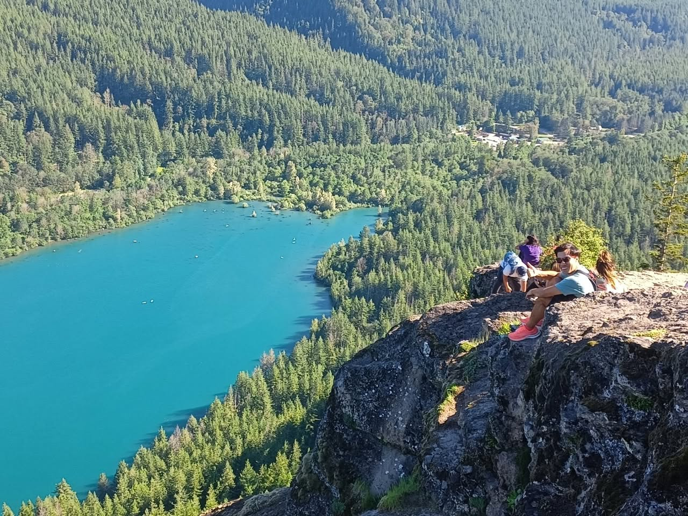
**이미지 캡션:** 이 사진은 푸른 호수와 울창한 숲으로 둘러싸인 절벽 꼭대기에서 휴식을 취하는 사람들의 모습을 담고 있습니다. 전경에는 밝은 핑크색 운동화를 신고 푸른색 티셔츠와 갈색 반바지를 입은 성인 남성이 바위에 앉아 카메라를 향해 미소를 짓고 있습니다. 그의 옆에는 갈색 머리를 가진 또 다른 사람이 앉아 있고, 뒤쪽에는 보라색 상의를 입은 성인 여성과 파란색과 흰색 옷을 입은 어린이가 서 있습니다. 이들은 모두 등산복 차림으로 보이며, 배낭을 메고 있습니다. 배경에는 맑고 푸른 호수가 펼쳐져 있고, 호수 위에는 몇 척의 작은 보트가 떠 있습니다. 호수 주변과 산비탈은 빽빽한 침엽수림으로 덮여 있으며, 멀리 산 정상 부근에는 작은 마을이 보입니다. 햇살이 비추는 맑고 화창한 날씨이며, 전반적으로 평화롭고 아름다운 자연 풍경 속에서 여유를 즐기는 듯한 분위기입니다. 작은 보트가 떠 있습니다. 호수 주변과 산비탈은 빽빽한 침엽수림으로 덮여 있으며, 멀리 산 정상 부근에는 작은 마을이 보입니다. 햇살이 비추는 맑고 화창한 날씨이며, 전반적으로 평화롭고 아름다운 자연 풍경 속에서 여유를 즐기는 듯한 분위기입니다.
 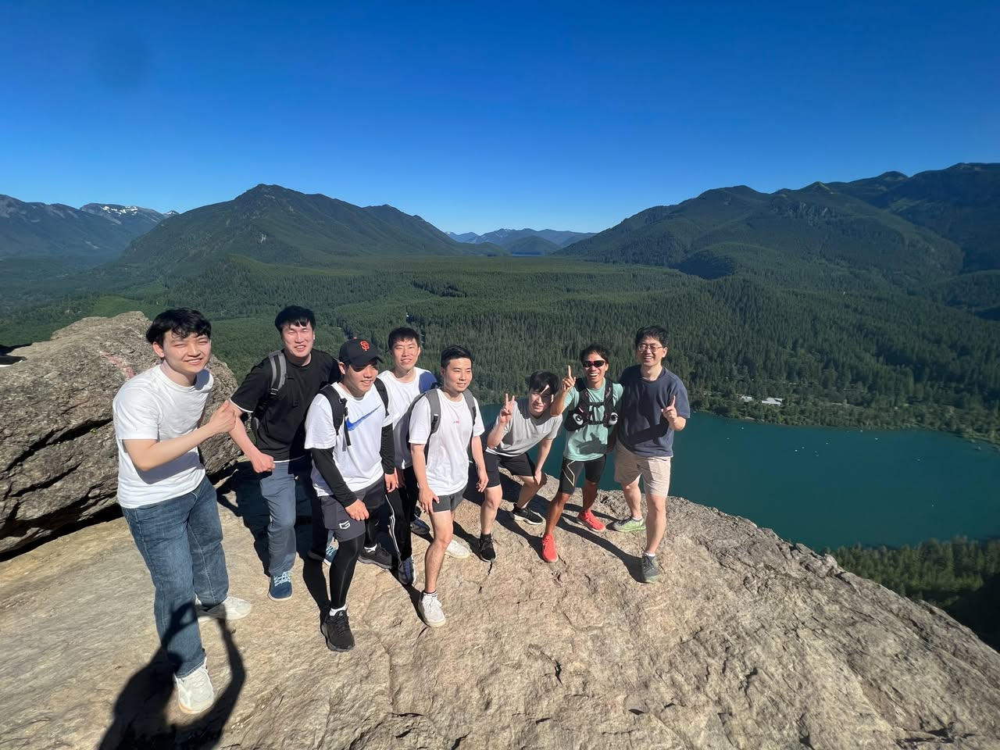
**이미지 캡션:** 일곱 명의 젊은 성인 남성들이 산 정상의 바위 위에 서서 푸른 하늘과 울창한 숲, 그리고 푸른 호수가 보이는 멋진 풍경을 배경으로 사진을 찍고 있다. 왼쪽에서부터 첫 번째 남성은 흰색 티셔츠와 청바지를 입고 환하게 웃으며 손을 흔들고 있다. 두 번째 남성은 검은색 티셔츠와 회색 바지를 입고 배낭을 메고 있으며, 세 번째 남성은 흰색 티셔츠와 검은색 반바지, 검은색 모자를 쓰고 있다. 네 번째 남성은 흰색 티셔츠와 검은색 바지를 입고 있으며, 다섯 번째 남성은 흰색 티셔츠와 회색 반바지를 입고 있다. 여섯 번째 남성은 민트색 티셔츠와 검은색 반바지를 입고 선글라스를 끼고 있으며, 일곱 번째 남성은 남색 티셔츠와 베이지색 반바지를 입고 있다. 모두 즐겁고 활기찬 표정으로 포즈를 취하고 있으며, 일부는 손가락으로 브이(V)를 만들고 있다. 배경에는 푸른 하늘 아래로 끝없이 펼쳐진 녹색 산맥과 숲, 그리고 그림 같은 호수가 보인다. 전반적으로 맑고 화창한 날씨 속에서 친구들과 함께 하이킹을 즐기는 행복하고 역동적인 분위기를 담고 있다. 남성은 민트색 티셔츠와 검은색 반바지를 입고 선글라스를 끼고 있으며, 일곱 번째 남성은 남색 티셔츠와 베이지색 반바지를 입고 있다. 모두 즐겁고 활기찬 표정으로 포즈를 취하고 있으며, 일부는 손가락으로 브이(V)를 만들고 있다. 배경에는 푸른 하늘 아래로 끝없이 펼쳐진 녹색 산맥과 숲, 그리고 그림 같은 호수가 보인다. 전반적으로 맑고 화창한 날씨 속에서 친구들과 함께 하이킹을 즐기는 행복하고 역동적인 분위기를 담고 있다.
 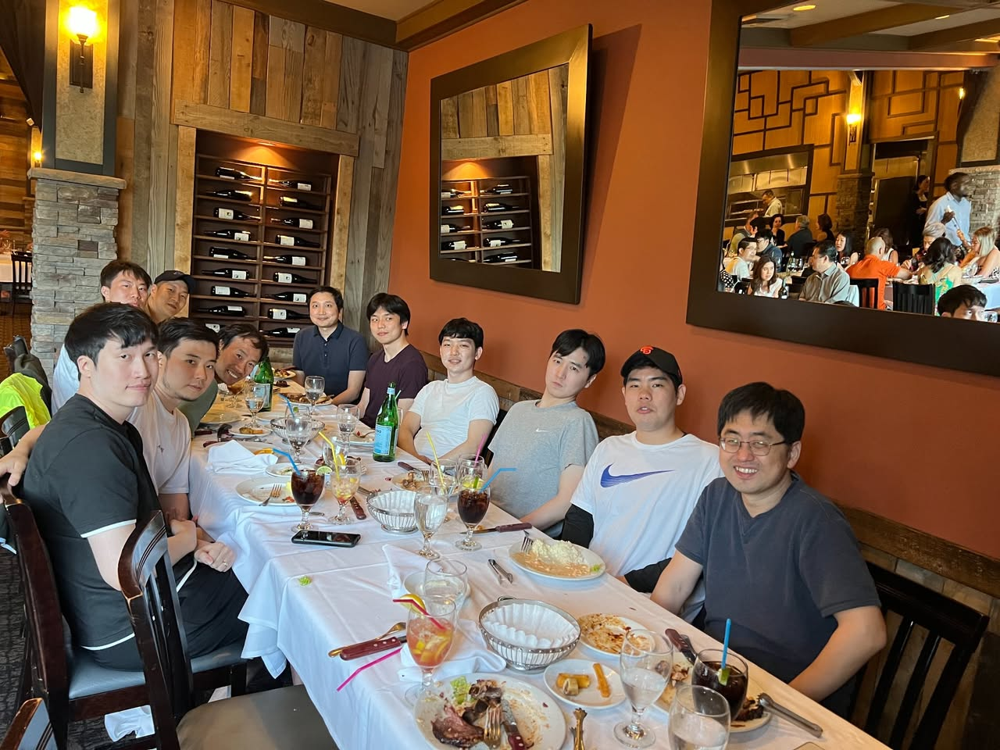
**이미지 캡션:** 이 사진은 레스토랑에서 식사 중인 아시아계 남성 그룹을 보여줍니다. 총 9명의 남성이 테이블에 앉아 있으며, 대부분 20대 후반에서 30대 초반으로 보입니다. 왼쪽부터 첫 번째 남성은 검은색 티셔츠를 입고 카메라를 바라보고 있으며, 두 번째 남성은 흰색 티셔츠에 검은색 모자를 쓰고 있습니다. 세 번째 남성은 회색 티셔츠를 입고 있으며, 네 번째 남성은 검은색 폴로 셔츠를 입고 있습니다. 다섯 번째 남성은 흰색 티셔츠를 입고 있으며, 여섯 번째 남성은 회색 티셔츠를 입고 있습니다. 일곱 번째 남성은 보라색 티셔츠를 입고 있으며, 여덟 번째 남성은 흰색 티셔츠를 입고 있습니다. 마지막으로 아홉 번째 남성은 검은색 티셔츠를 입고 안경을 쓰고 있습니다. 모두 편안한 복장을 하고 있으며, 일부는 음식을 먹거나 마시고 있습니다. 테이블 위에는 접시, 컵, 병 등이 놓여 있으며, 배경에는 와인 랙과 거울이 보입니다. 거울에는 다른 테이블에서 식사하는 사람들의 모습이 비쳐 보입니다. 전체적으로 편안하고 즐거운 분위기입니다.츠를 입고 있으며, 여덟 번째 남성은 흰색 티셔츠를 입고 있습니다. 마지막으로 아홉 번째 남성은 검은색 티셔츠를 입고 안경을 쓰고 있습니다. 모두 편안한 복장을 하고 있으며, 일부는 음식을 먹거나 마시고 있습니다. 테이블 위에는 접시, 컵, 병 등이 놓여 있으며, 배경에는 와인 랙과 거울이 보입니다. 거울에는 다른 테이블에서 식사하는 사람들의 모습이 비쳐 보입니다. 전체적으로 편안하고 즐거운 분위기입니다.
