# 2022년 10월

[← 2022년](README.md)

### 10월 3일 (월) 08:45 · 📷 사진 (2장)

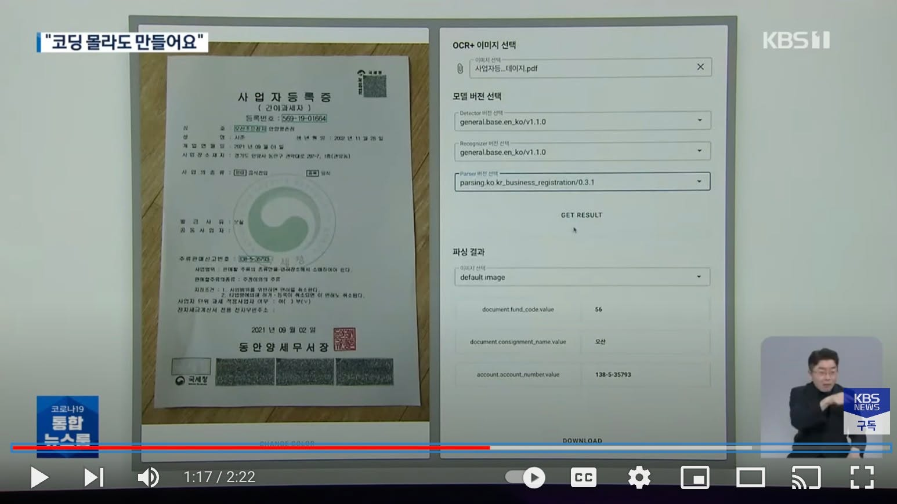
**이미지 캡션:** 화면 왼쪽에는 "코딩 몰라도 만들어요"라는 문구가 적힌 파란색 배경의 뉴스 자막과 함께 사업자등록증이 걸려 있고, 그 아래에는 "코로나19 통합 뉴스"라는 파란색 로고가 보인다. 사업자등록증에는 "사업자등록증 (간이과세자)"라고 적혀 있으며, 등록번호, 사업장 소재지, 사업 개시일 등의 정보가 기재되어 있고, 하단에는 "2021년 09월 02일 동안양세무서장"이라는 문구와 국세청 로고가 보인다. 화면 오른쪽에는 컴퓨터 화면이 보이며, OCR+ 이미지 선택, 모델 버전 선택, 파싱 결과 등의 메뉴가 있고, "GET RESULT" 버튼과 함께 파싱된 결과값들이 나열되어 있다. 화면 오른쪽 하단에는 KBS 뉴스 로고와 함께 수어 통역사가 뉴스 내용을 수어 통역하는 모습이 보인다. 전체적으로 기술을 활용하여 서류를 처리하는 과정을 보여주는 뉴스 화면으로 보인다.ET RESULT" 버튼과 함께 파싱된 결과값들이 나열되어 있다. 화면 오른쪽 하단에는 KBS 뉴스 로고와 함께 수어 통역사가 뉴스 내용을 수어 통역하는 모습이 보인다. 전체적으로 기술을 활용하여 서류를 처리하는 과정을 보여주는 뉴스 화면으로 보인다.
 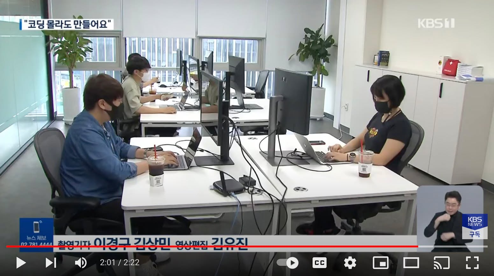
**이미지 캡션:** 이 사진은 사무실 환경을 보여주며, 여러 명의 사람들이 각자의 책상에서 노트북을 사용하고 있다. 전면에는 파란색 셔츠를 입은 성인 남성이 마스크를 착용하고 노트북에 집중하고 있으며, 그의 옆에는 커피잔이 놓여 있다. 그 뒤로는 다른 성인 남성 한 명이 마스크를 쓰고 노트북 작업을 하고 있고, 더 뒤쪽에는 검은색 티셔츠를 입은 성인 여성이 마스크를 착용하고 노트북을 사용하고 있다. 사무실은 밝고 현대적인 분위기이며, 책상 위에는 노트북, 모니터, 커피잔, 라우터 등 다양한 사무용품이 보인다. 배경에는 창문과 수납장이 있으며, 한쪽에는 화분이 놓여 있다. 화면 하단에는 뉴스 자막과 함께 KBS 뉴스 로고, 수어 통역사의 모습이 보인다. 전반적으로 업무에 집중하는 현대적인 사무실의 모습을 담고 있다.납장이 있으며, 한쪽에는 화분이 놓여 있다. 화면 하단에는 뉴스 자막과 함께 KBS 뉴스 로고, 수어 통역사의 모습이 보인다. 전반적으로 업무에 집중하는 현대적인 사무실의 모습을 담고 있다.

### 10월 5일 (수) 13:18 · #스켄본99 #촬영본95 #불가능을가능으로 #OCRPack

#스켄본99 #촬영본95 #불가능을가능으로 #OCRPack

진료비 영수증에서 필요한 정보를 뽑아오는 것은 OCR-parsing 중 가장 어려운 task 중 하나입니다. 그동안 현업에서는 진료비 영수증 관련 자동화를 하고 싶었지만, 정확도가 높지 않아 어렵다고 판단하고 있던 영역이었습니다.

스캔본: 99.8%, 촬영본: 95%

이번 모 보험사에서 자체 데이터를 가지고 평가해서 받은 UpOCR Pack의 성적표입니다. 고객사에서는 대단하다 고 여러 번 말씀 주셨고, 무엇보다 “금번 테스트 결과의 업스테이지 수치도 높지만 현업에서 바라는 업무 자동화가 실현 가능한 수준이라고 판단” 한다는 점에서 AI로 불가능을 가능하게 만드는 영역이 또 하나 추가될 것 같습니다.

진료비 영수증급의 어려운 문서를 매우 높은 정확도로 업무 자동화하시고 싶은 분들은 https://www.upstage.ai/contactus로 연락 주세요. 놀라움을 드리겠습니다.

그리고 super human performance를 넘어 100%에 도전하는 OCR Parsing 함께 만드실 분들은 https://careers.upstage.ai/ 선지원 후고민 입니다.

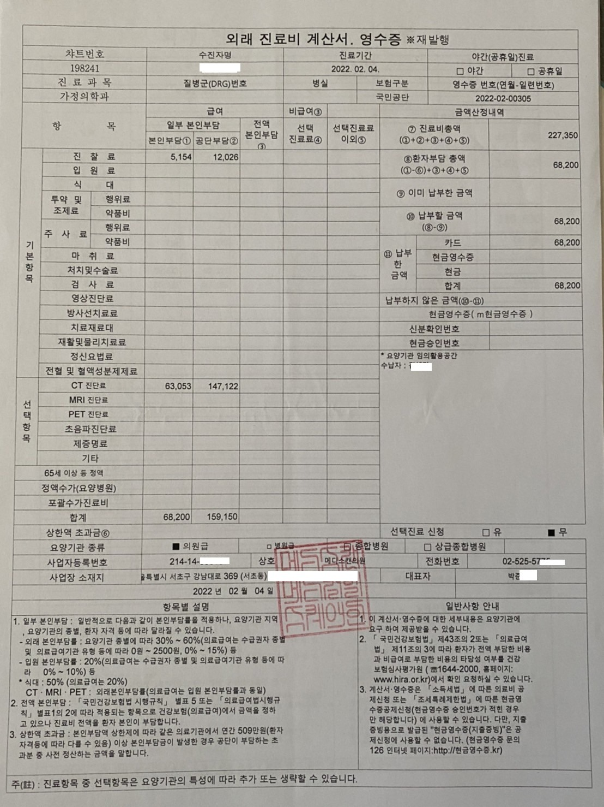
**이미지 캡션:** 이것은 한국어로 된 외래 진료비 계산서 및 영수증입니다. 상단에는 "외래 진료비 계산서. 영수증 ※재발행"이라고 적혀 있으며, 환자의 차트 번호는 198241이고 진료과는 가정의학과입니다. 진료 기간은 2022년 2월 4일이며, 야간 및 공휴일 진료 여부를 선택하는 칸이 있습니다. 질병군(DRG) 번호, 병실, 보험 구분, 국민공단, 영수증 번호(2022-02-00305) 등의 정보가 기재되어 있습니다. 진료 항목별로 급여와 비급여 금액이 구분되어 있으며, 진찰료, 입원료, 식대, 투약 및 조제료, 주사료, 행위료, 약품비, 마취료, 처치 및 수술료, 검사료, 영상 진단료, 방사선 치료료, 치료 재료대, 재활 및 물리 치료료, 정신 요법료, 전혈 및 혈액 성분 제제료 등이 포함됩니다. 선택 항목으로는 CT 진단료, MRI 진단료, PET 진단료, 초음파 진단료, 제증명료, 기타 등이 있습니다. 각 항목별로 본인 부담금, 공단 부담금, 전액 본인 부담금, 선택 진료료 등이 계산되어 있으며, 총 진료비는 227,350원입니다. 환자가 이미 납부한 금액은 68,200원이며, 납부할 금액도 68,200원입니다. 납부 방법으로는 카드와 현금이 있으며, 합계 금액은 68,200원입니다. 납부하지 않은 금액은 0원입니다. 하단에는 요양기관 정보가 기재되어 있으며, 요양기관 종류는 의원급, 상호는 메디소아과의원, 사업자 등록 번호는 214-14-, 사업장 소재지는 서울특별시 서초구 강남대로 369 (서초동)입니다. 대표자는 박준이며, 전화번호는 02-525-57**입니다. 영수증 발행일은 2022년 2월 4일입니다. 항목별 설명 부분에는 본인 부담률, 전액 본인 부담, 상한액 초과금 등에 대한 안내가 포함되어 있습니다. 또한, 일반 사항 안내에는 계산서 영수증에 대한 세부 내용 확인 방법, 건강보험심사평가원 연락처, 소득세법에 따른 의료비 공제 및 현금 영수증 사용 안내 등이 기재되어 있습니다.행위료, 약품비, 마취료, 처치 및 수술료, 검사료, 영상 진단료, 방사선 치료료, 치료 재료대, 재활 및 물리 치료료, 정신 요법료, 전혈 및 혈액 성분 제제료 등이 포함됩니다. 선택 항목으로는 CT 진단료, MRI 진단료, PET 진단료, 초음파 진단료, 제증명료, 기타 등이 있습니다. 각 항목별로 본인 부담금, 공단 부담금, 전액 본인 부담금, 선택 진료료 등이 계산되어 있으며, 총 진료비는 227,350원입니다. 환자가 이미 납부한 금액은 68,200원이며, 납부할 금액도 68,200원입니다. 납부 방법으로는 카드와 현금이 있으며, 합계 금액은 68,200원입니다. 납부하지 않은 금액은 0원입니다. 하단에는 요양기관 정보가 기재되어 있으며, 요양기관 종류는 의원급, 상호는 메디소아과의원, 사업자 등록 번호는 214-14-, 사업장 소재지는 서울특별시 서초구 강남대로 369 (서초동)입니다. 대표자는 박준이며, 전화번호는 02-525-57**입니다. 영수증 발행일은 2022년 2월 4일입니다. 항목별 설명 부분에는 본인 부담률, 전액 본인 부담, 상한액 초과금 등에 대한 안내가 포함되어 있습니다. 또한, 일반 사항 안내에는 계산서 영수증에 대한 세부 내용 확인 방법, 건강보험심사평가원 연락처, 소득세법에 따른 의료비 공제 및 현금 영수증 사용 안내 등이 기재되어 있습니다.

### 10월 5일 (수) 16:51 · 📷 사진 (1장)

**이미지 캡션:** 이것은 한국어로 된 외래 진료비 계산서 및 영수증으로, 환자의 이름, 진료 기간, 진료 과목, 진료비 내역, 납부 금액 등이 상세하게 기재되어 있습니다. 환자는 198241번 차트 번호를 가진 환자이며, 진료 기간은 2022년 2월 4일입니다. 진료 과목은 가정의학과이며, 총 진료비는 227,350원입니다. 이 중 환자가 납부한 금액은 68,200원이며, 이는 카드와 현금으로 납부되었습니다. 영수증에는 진료비 항목별 상세 내역과 함께 국민건강보험법 및 의료급여법에 따른 본인 부담률에 대한 설명도 포함되어 있습니다. 또한, 요양기관 정보와 대표자 정보도 기재되어 있습니다. 전반적으로 병원에서 발급된 공식적인 진료비 영수증의 형태를 띠고 있으며, 진료비 관련 정보를 투명하게 제공하고 있습니다.니다. 또한, 요양기관 정보와 대표자 정보도 기재되어 있습니다. 전반적으로 병원에서 발급된 공식적인 진료비 영수증의 형태를 띠고 있으며, 진료비 관련 정보를 투명하게 제공하고 있습니다.

> #스켄본99,#촬영본95 #불가능을가능으로 #OCRPack  진료비 영수증에서 필요한 정보를 뽑아오는 것은 OCR-parsing 중 가장 어려운 task 중 하나입니다. 그동안 현업에서는 진료비 영수증 관련 자동화를 하고 싶었지만, 정확도가 높지 않아 어렵다고 판단하고 있던 영역이었습니다. **스캔본: 99.8%, 촬영본: 95% ** 이번 모 보험사에서 자체 데이터를 가지고 평가해서 받은 UpOCR Pack의 성적표입니다. 고객사에서는 **대단하다** 고 여러 번 말씀 주셨고, 무엇보다 “금번 테스트 결과의 업스테이지 수치도 높지만 현업에서 바라는 업무 자동화가 실현 가능한 수준이라고 판단” 한다는 점에서 **AI로 불가능을 가능하게** 만드는 영역이 또 하나 추가될 것 같습니다.  진료비 영수증급의 어려운 문서를 매우 높은 정확도로 업무 자동화하시고 싶은 분들은 https://www.upstage.ai/contactus로 연락 주세요. 놀라움을 드리겠습니다.  그리고 super human performance를 넘어 100%에 도전하는 OCR Parsing 함께 만드실 분들은 [https://careers.upstage.ai/](https://careers.upstage.ai/) 선지원 후고민 입니다.

### 10월 8일 (토) 21:25 · 📷 사진 (1장)

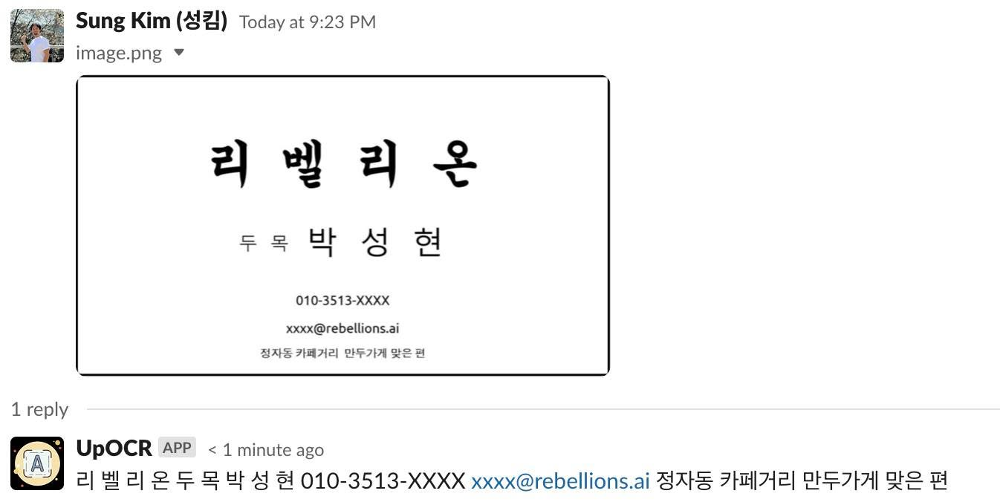
**이미지 캡션:** 화면 상단에는 "Sung Kim (성킴)"이라는 이름과 함께 "Today at 9:23 PM"이라는 시간이 표시되어 있으며, 그 아래에는 "image.png"라는 파일 이름이 보입니다. 중앙에는 흰색 배경에 검은색 글씨로 된 명함이 있습니다. 명함에는 "리벨리온"이라는 큰 글씨와 함께 "두목 박성현"이라는 이름이 적혀 있습니다. 그 아래에는 전화번호 "010-3513-XXXX", 이메일 주소 "xxxx@rebellions.ai", 그리고 "정자동 카페거리 만두가게 맞은 편"이라는 주소 정보가 있습니다. 화면 하단에는 "1 reply"라는 표시와 함께 "UpOCR APP"이라는 앱 이름과 "< 1 minute ago"라는 시간이 보이며, 그 아래에는 명함의 내용을 요약한 듯한 텍스트가 있습니다. 전반적으로 비즈니스 명함 정보가 공유되고 있는 상황으로 보입니다.하단에는 "1 reply"라는 표시와 함께 "UpOCR APP"이라는 앱 이름과 "< 1 minute ago"라는 시간이 보이며, 그 아래에는 명함의 내용을 요약한 듯한 텍스트가 있습니다. 전반적으로 비즈니스 명함 정보가 공유되고 있는 상황으로 보입니다.

### 10월 13일 (목) 08:57 · 한라산은 올때마다 아름답고 멋집니다. 업업업!!

한라산은 올때마다 아름답고 멋집니다. 업업업!!

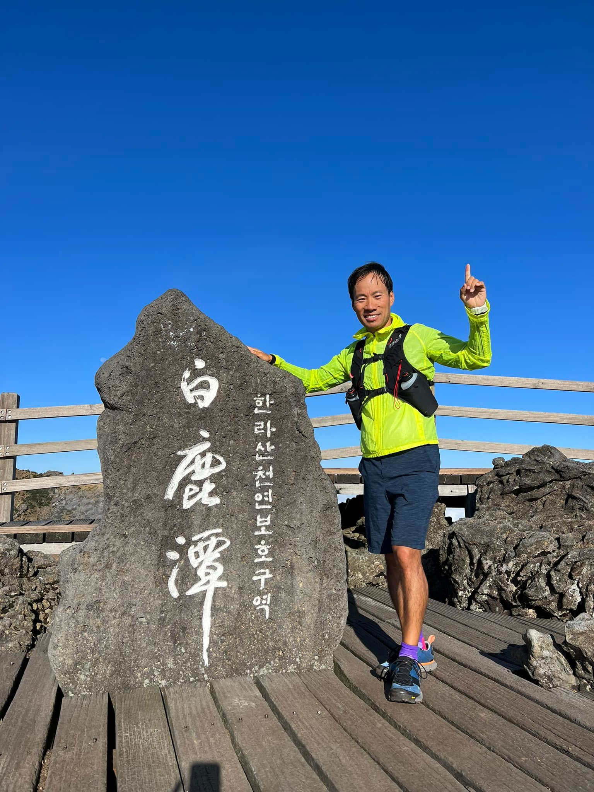
**이미지 캡션:** 맑고 푸른 하늘 아래, 한 성인 남성이 큰 바위에 기대어 서 있다. 남성은 40대 후반에서 50대 초반으로 보이며, 짧은 머리에 건강한 체격이다. 그는 밝은 형광 연두색 바람막이와 네이비색 반바지, 그리고 보라색 양말과 트레일 러닝화를 착용하고 있다. 얼굴에는 환한 미소를 띠고 있으며, 오른손 검지를 하늘로 향해 가리키고 있다. 그의 뒤로는 '한라산천연보호구역'이라고 쓰인 큰 바위가 있고, 바위에는 흰색으로 '백록담'이라는 글자가 세로로 쓰여 있다. 주변은 나무 데크로 이루어진 산책로이며, 울타리와 검은색 화산암들이 보인다. 전체적으로 등반 성공을 축하하는 듯한 밝고 활기찬 분위기이다.산암들이 보인다. 전체적으로 등반 성공을 축하하는 듯한 밝고 활기찬 분위기이다.
 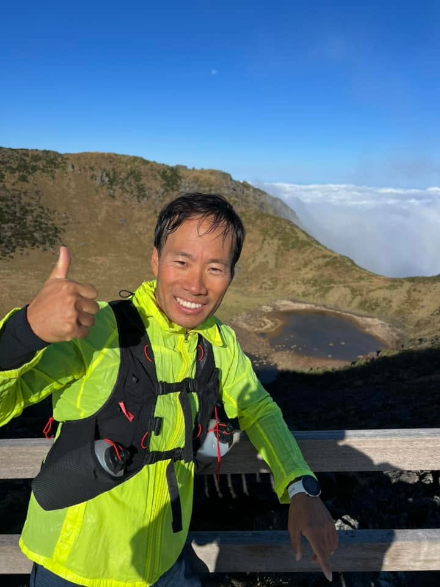
**이미지 캡션:** 한 명의 성인 남성이 밝은 형광색 재킷과 검은색 조끼를 입고 엄지손가락을 치켜세우며 카메라를 향해 환하게 웃고 있다. 남성은 40대 후반에서 50대 초반으로 보이며, 짧은 검은색 머리에 건강해 보이는 피부를 가지고 있다. 조끼에는 두 개의 물병이 달려 있고, 손목에는 스포츠 시계가 착용되어 있다. 배경으로는 푸른 하늘 아래 구름 바다가 펼쳐져 있고, 그 너머로 황갈색 산과 작은 호수가 보인다. 남성은 나무 난간에 기대어 서 있으며, 전체적으로 활동적이고 즐거운 분위기를 연출한다.
 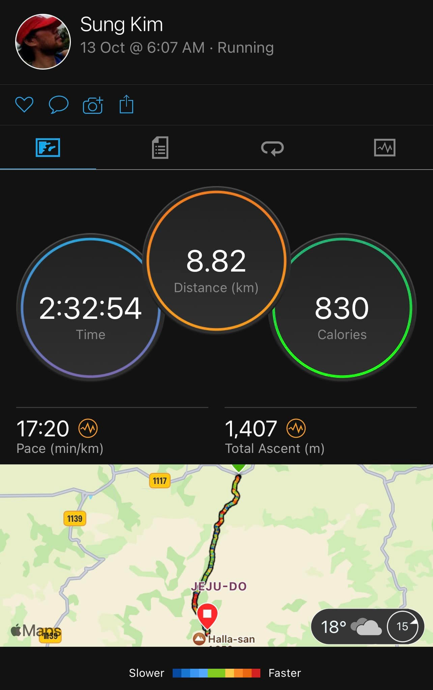
**이미지 캡션:** 사진에는 성인 남성인 Sung Kim의 러닝 기록이 표시되어 있습니다. 그는 10월 13일 오전 6시 7분에 2시간 32분 54초 동안 8.82km를 달렸으며, 830 칼로리를 소모했습니다. 그의 평균 페이스는 1km당 17분 20초였고, 총 상승 고도는 1,407m였습니다. 배경에는 제주도의 한라산 지도가 보이며, 현재 기온은 18도이고 구름이 약간 끼어 있습니다. 전반적으로 활동적인 야외 운동 기록을 보여주는 화면입니다.
 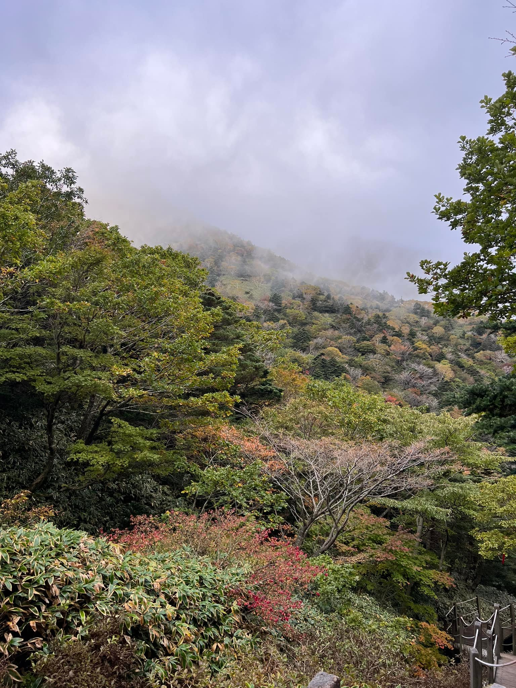
**이미지 캡션:** 흐린 날씨에 안개가 자욱한 산의 풍경으로, 울창한 숲이 계곡을 따라 펼쳐져 있습니다. 숲은 다양한 종류의 나무와 관목으로 이루어져 있으며, 가을을 맞아 잎사귀들이 녹색, 붉은색, 갈색 등 다채로운 색으로 물들어 있습니다. 사진 오른쪽 하단에는 나무로 만들어진 계단이 보이며, 이는 산책로나 등산로의 일부로 추정됩니다. 계단 난간은 어두운 색으로 되어 있으며, 숲의 자연스러운 모습과 조화를 이룹니다. 전반적으로 차분하고 고요한 분위기를 자아내며, 자연의 아름다움을 느끼게 하는 풍경입니다.
 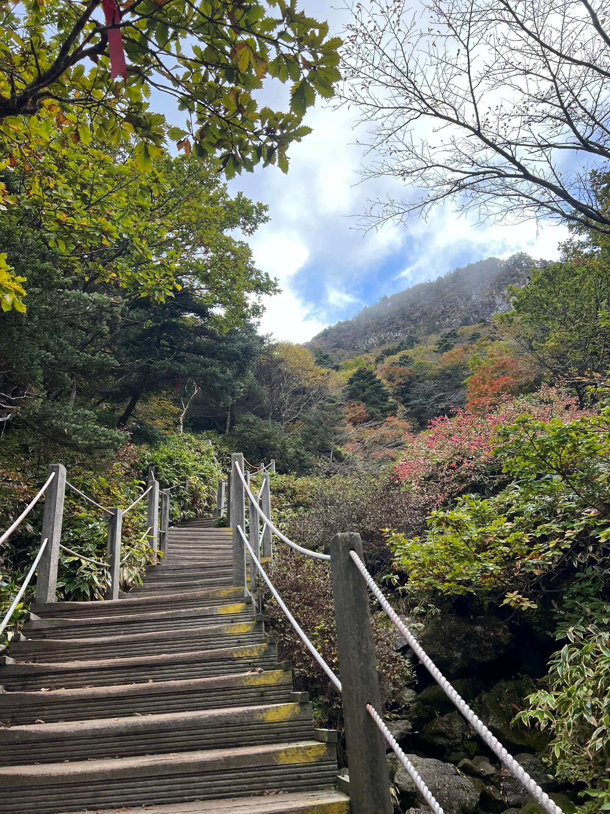
**이미지 캡션:** 가을 산의 풍경을 담은 사진으로, 나무 계단이 구불구불하게 이어져 있으며 계단 옆으로는 밧줄 난간이 설치되어 있습니다. 계단은 낡은 나무로 만들어졌고 일부에는 노란색 페인트가 칠해져 있습니다. 주변에는 울창한 숲이 우거져 있으며, 나뭇잎은 초록색, 노란색, 붉은색 등 다양한 가을 색을 띠고 있습니다. 멀리 보이는 산비탈에는 안개가 낀 듯 몽환적인 분위기를 자아내며, 하늘에는 구름이 옅게 드리워져 있습니다. 사진에는 사람이 보이지 않으며, 숲길을 오르는 듯한 고요하고 평화로운 분위기를 느낄 수 있습니다.

🎬 동영상 3개 (생략)

### 10월 15일 (토) 11:27 · #AI교육 #함께해요 #실무데이터 #실무코드 #디플로이

#AI교육 #함께해요 #실무데이터 #실무코드 #디플로이 

어떻게 더 많은 분들이 AI개발에 참여하고 멋진 서비스를 만들수 있을까요? 

네이버 시절때 부터 인턴 채용, 각종 AI Hackathon 등을 통해 AI 개발자 교육과 함께하기를 여러가지로 시도 해보았는데, 이중 가장 효과가 좋았던 것이 실무 데이터를 실무 베이스라인 코드와 드리고, 이 코드의 성능을 올리고 서빙해보는등 실무형의 AI RUSH라는 프로그램이였습니다. 이 과정을 통해 많은 분들이 네이버, Upstage 등 입사하시고 또 회사에서도 좋은 성과를 내고 있습니다. 
 
Upstage 에서는 이를 솔루션화하여 네이버 커텍트 재단이랑 교육을 하고 있는데 (https://boostcamp.connect.or.kr/), 매해 500명의 교육생을 배출하고 있고 이 과정 출신들이 원하는 곳에 취업하는등 좋은 성과를 내고 있습니다. 무엇보다 이 과정에 참여하신 분들이 매우 성장했고 또 이 과정을 추천하고 싶다는 의견을 주셨습니다. 

또한 저희가 모 회사에 이 과정의 일부를 옮겨서 교육을 진행 하였는데 기존 임직원들에게는 큰 도움이 되었습니다. 설문에 응한 전체가 역량이 향상되었고 교육에 만족하고 이 교육을 주변에 추천하겠다고 하셨습니다. 이에 이 회사는 1회성이 아니라 정기적으로 진행하기로 하였습니다.

저희 과정은 초심자를 위한 기초 강의부터, End-to-End를 경험할 수 있는 도메인별 심화 강의 및 실습 콘텐츠, AI Challenge(AI 문제해결 경진대회/해커톤) 등을 지원합니다.특히, AI Stages 플랫폼을 활용한 AI Challenge 프로젝트를 통해, 실무에서 활용가능한 높은 성능의 AI 모델 개발 프로세스를 경험할 수 있다는 것이 가장 큰 특징입니다. AI 개발이 처음이더라도, 제공되는 베이스라인 코드를 활용하여 점진적인 모델 성능 향상을 이끌어 낼 수 있고 실제 디플로이, 서비스 적용까지 가능하게 됩니다. 
 
저희 업스테이지는 이를 위한 기본 강의, 실습을 위한 모든 데이타, 코드, 그리고 멘토링포함 전체 운영 또는 필요하신 만큼 일부의 기능을 제공 할수 있습니다. 

이러한 AI 교육이 필요한 회사나 단체들 AI 교육 함께 해요! hunkim+edu@upstage.ai로 연락주시면 됩니다.

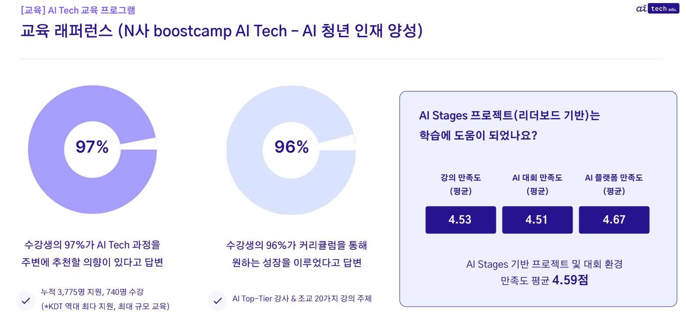
**이미지 캡션:** 이 이미지는 AI Tech 교육 프로그램의 성과를 보여주는 자료로, 왼쪽에는 두 개의 원형 그래프가 있습니다. 왼쪽 그래프는 97%를 나타내며, "수강생의 97%가 AI Tech 과정을 주변에 추천할 의향이 있다고 답변"이라는 설명과 함께 "누적 3,775명 지원, 740명 수강 (*KDT 역대 최다 지원, 최대 규모 교육)"이라는 정보가 하단에 기재되어 있습니다. 오른쪽 그래프는 96%를 나타내며, "수강생의 96%가 커리큘럼을 통해 원하는 성장을 이루었다고 답변"이라는 설명과 함께 "AI Top-Tier 강사 & 조교 20가지 강의 주제"라는 정보가 하단에 기재되어 있습니다. 이미지 상단에는 "[교육] AI Tech 교육 프로그램"이라는 제목과 "교육 래퍼런스 (N사 boostcamp AI Tech - AI 청년 인재 양성)"라는 부제가 있습니다. 오른쪽에는 "AI Stages 프로젝트(리더보드 기반)는 학습에 도움이 되었나요?"라는 질문과 함께 강의 만족도(평균 4.53점), AI 대회 만족도(평균 4.51점), AI 플랫폼 만족도(평균 4.67점)를 나타내는 막대 그래프가 있으며, 하단에는 "AI Stages 기반 프로젝트 및 대회 환경 만족도 평균 4.59점"이라는 요약 정보가 있습니다. 전체적으로 파란색과 보라색 계열의 색상을 사용하여 깔끔하고 전문적인 느낌을 줍니다.강사 & 조교 20가지 강의 주제"라는 정보가 하단에 기재되어 있습니다. 이미지 상단에는 "[교육] AI Tech 교육 프로그램"이라는 제목과 "교육 래퍼런스 (N사 boostcamp AI Tech - AI 청년 인재 양성)"라는 부제가 있습니다. 오른쪽에는 "AI Stages 프로젝트(리더보드 기반)는 학습에 도움이 되었나요?"라는 질문과 함께 강의 만족도(평균 4.53점), AI 대회 만족도(평균 4.51점), AI 플랫폼 만족도(평균 4.67점)를 나타내는 막대 그래프가 있으며, 하단에는 "AI Stages 기반 프로젝트 및 대회 환경 만족도 평균 4.59점"이라는 요약 정보가 있습니다. 전체적으로 파란색과 보라색 계열의 색상을 사용하여 깔끔하고 전문적인 느낌을 줍니다.
 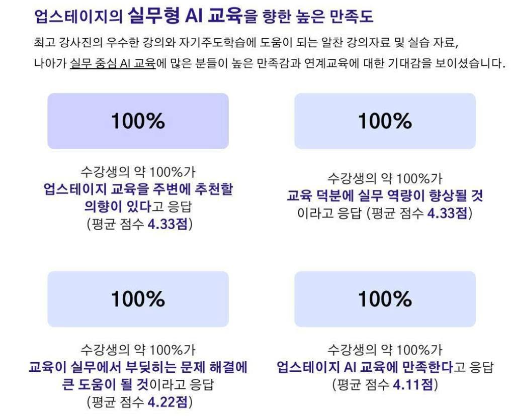
**이미지 캡션:** 이 이미지는 업스테이지의 실무형 AI 교육에 대한 높은 만족도를 보여주는 그래프와 텍스트로 구성되어 있습니다. 상단에는 "업스테이지의 실무형 AI 교육을 향한 높은 만족도"라는 제목이 있고, 그 아래에는 "최고 강사진의 우수한 강의와 자기주도학습에 도움이 되는 알찬 강의자료 및 실습 자료, 나아가 실무 중심 AI 교육에 많은 분들이 높은 만족감과 연계교육에 대한 기대감을 보이셨습니다."라는 설명이 있습니다. 이미지 중앙에는 네 개의 칸이 있으며, 각 칸에는 "100%"라는 숫자가 크게 표시되어 있습니다. 각 100% 아래에는 해당 결과에 대한 설명이 한국어로 작성되어 있습니다. 왼쪽 상단 칸은 "수강생의 약 100%가 업스테이지 교육을 주변에 추천할 의향이 있다고 응답 (평균 점수 4.33점)"이라고 설명합니다. 오른쪽 상단 칸은 "수강생의 약 100%가 교육 덕분에 실무 역량이 향상될 것이라고 응답 (평균 점수 4.33점)"이라고 설명합니다. 왼쪽 하단 칸은 "수강생의 약 100%가 교육이 실무에서 부딪히는 문제 해결에 큰 도움이 될 것이라고 응답 (평균 점수 4.22점)"이라고 설명합니다. 오른쪽 하단 칸은 "수강생의 약 100%가 업스테이지 AI 교육에 만족한다고 응답 (평균 점수 4.11점)"이라고 설명합니다. 이미지에는 사람이 등장하지 않으며, 배경은 흰색입니다. 사물로는 텍스트가 포함된 네 개의 연한 파란색 직사각형 상자가 있습니다. 보이는 텍스트는 모두 한국어이며, 교육 만족도와 관련된 통계 데이터를 나타냅니다. 전반적인 분위기는 긍정적이며, 업스테이지의 AI 교육 프로그램이 매우 성공적이고 수강생들에게 높은 만족도를 제공하고 있음을 시사합니다.100% 아래에는 해당 결과에 대한 설명이 한국어로 작성되어 있습니다. 왼쪽 상단 칸은 "수강생의 약 100%가 업스테이지 교육을 주변에 추천할 의향이 있다고 응답 (평균 점수 4.33점)"이라고 설명합니다. 오른쪽 상단 칸은 "수강생의 약 100%가 교육 덕분에 실무 역량이 향상될 것이라고 응답 (평균 점수 4.33점)"이라고 설명합니다. 왼쪽 하단 칸은 "수강생의 약 100%가 교육이 실무에서 부딪히는 문제 해결에 큰 도움이 될 것이라고 응답 (평균 점수 4.22점)"이라고 설명합니다. 오른쪽 하단 칸은 "수강생의 약 100%가 업스테이지 AI 교육에 만족한다고 응답 (평균 점수 4.11점)"이라고 설명합니다. 이미지에는 사람이 등장하지 않으며, 배경은 흰색입니다. 사물로는 텍스트가 포함된 네 개의 연한 파란색 직사각형 상자가 있습니다. 보이는 텍스트는 모두 한국어이며, 교육 만족도와 관련된 통계 데이터를 나타냅니다. 전반적인 분위기는 긍정적이며, 업스테이지의 AI 교육 프로그램이 매우 성공적이고 수강생들에게 높은 만족도를 제공하고 있음을 시사합니다.
 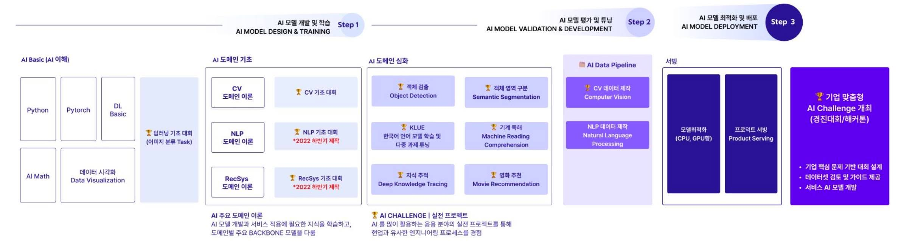
**이미지 캡션:** 이 이미지는 인공지능(AI) 모델 개발 및 배포 과정을 단계별로 설명하는 플로우차트입니다. 좌측 상단에는 AI 모델 개발 및 학습을 Step 1으로, AI 모델 평가 및 튜닝을 Step 2로, AI 모델 최적화 및 배포를 Step 3으로 명시하고 있습니다. 각 단계별로 세부적인 내용이 박스로 구분되어 있으며, AI Basic(AI 이해) 단계에서는 Python, Pytorch, DL Basic, AI Math, 데이터 시각화 등의 기초 지식을 다룹니다. AI 도메인 기초 단계에서는 CV(컴퓨터 비전), NLP(자연어 처리), RecSys(추천 시스템) 도메인 이론과 관련 기초 대회를 소개합니다. AI 도메인 심화 단계에서는 객체 검출, 객체 영역 구분, 한국어 언어 모델 학습 및 다중 과제 튜닝, 기계 독해, 지식 추적, 영화 추천 등 구체적인 AI 응용 분야와 관련 대회를 제시합니다. AI Data Pipeline 섹션에서는 CV 데이터 제작(Computer Vision)과 NLP 데이터 제작(Natural Language Processing)을 설명합니다. 우측에는 서빙 섹션이 있으며, 모델 최적화(CPU, GPU향)와 프로덕트 서빙(Product Serving)을 포함합니다. 마지막으로 기업 맞춤형 AI Challenge 개최(경진대회/해커톤)를 통해 기업 핵심 문제 기반 대회 설계, 데이터셋 검토 및 가이드 제공, 서비스 AI 모델 개발 등의 활동을 진행함을 보여줍니다. 전반적으로 흰색과 연보라색, 진보라색을 사용하여 깔끔하고 정보 전달에 집중한 디자인입니다.(자연어 처리), RecSys(추천 시스템) 도메인 이론과 관련 기초 대회를 소개합니다. AI 도메인 심화 단계에서는 객체 검출, 객체 영역 구분, 한국어 언어 모델 학습 및 다중 과제 튜닝, 기계 독해, 지식 추적, 영화 추천 등 구체적인 AI 응용 분야와 관련 대회를 제시합니다. AI Data Pipeline 섹션에서는 CV 데이터 제작(Computer Vision)과 NLP 데이터 제작(Natural Language Processing)을 설명합니다. 우측에는 서빙 섹션이 있으며, 모델 최적화(CPU, GPU향)와 프로덕트 서빙(Product Serving)을 포함합니다. 마지막으로 기업 맞춤형 AI Challenge 개최(경진대회/해커톤)를 통해 기업 핵심 문제 기반 대회 설계, 데이터셋 검토 및 가이드 제공, 서비스 AI 모델 개발 등의 활동을 진행함을 보여줍니다. 전반적으로 흰색과 연보라색, 진보라색을 사용하여 깔끔하고 정보 전달에 집중한 디자인입니다.

### 10월 17일 (월) 07:36 · 📷 사진 (3장)

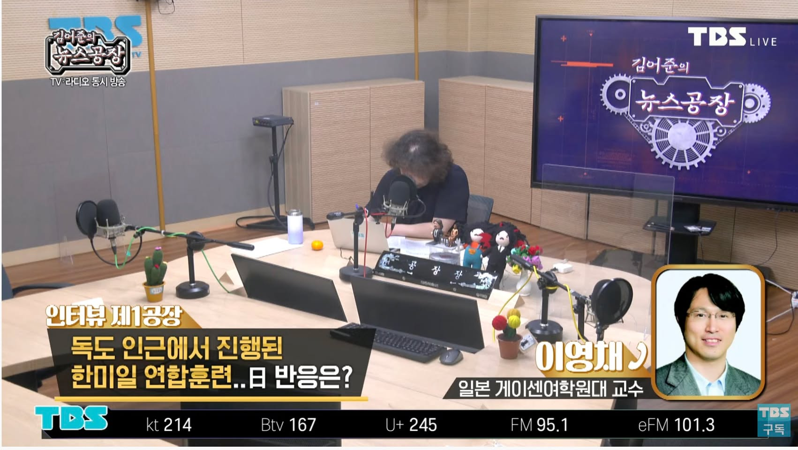
**이미지 캡션:** 이 사진은 라디오 방송 스튜디오에서 촬영된 것으로 보이며, 한 명의 성인 남성이 마이크 앞에 앉아 방송을 진행하고 있습니다. 이 남성은 곱슬거리는 긴 머리에 검은색 티셔츠를 입고 있으며, 고개를 숙이고 무언가를 보고 있어 표정은 명확하게 보이지 않습니다. 그의 앞에는 마이크, 노트북, 작은 선인장 화분, 그리고 여러 개의 인형이 놓여 있습니다. 배경에는 TBS LIVE 로고와 함께 "김어준의 뉴스공장"이라는 프로그램 제목이 적힌 대형 스크린이 보입니다. 스크린 하단에는 "인터뷰 제1공장", "독도 인근에서 진행된 한미일 연합훈련..日 반응은?"이라는 자막이 표시되어 있으며, 게스트로 보이는 "이영채 일본 게이센여학원대 교수"의 사진과 이름도 함께 보입니다. 전반적으로 방송 스튜디오의 차분하고 전문적인 분위기를 느낄 수 있습니다.행된 한미일 연합훈련..日 반응은?"이라는 자막이 표시되어 있으며, 게스트로 보이는 "이영채 일본 게이센여학원대 교수"의 사진과 이름도 함께 보입니다. 전반적으로 방송 스튜디오의 차분하고 전문적인 분위기를 느낄 수 있습니다.
 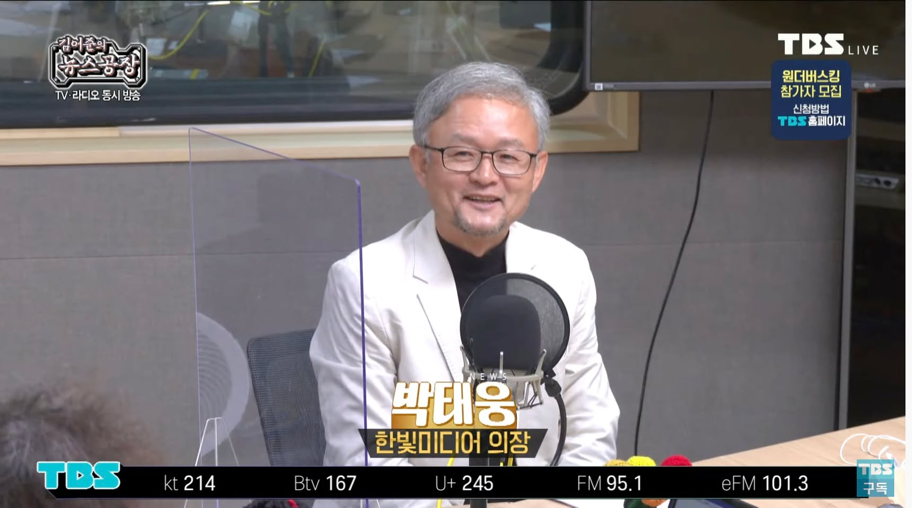
**이미지 캡션:** 이 사진은 스튜디오에서 진행되는 라디오 방송의 한 장면을 담고 있으며, 중년의 성인 남성이 마이크 앞에 앉아 카메라를 보며 환하게 웃고 있다. 남성은 흰색 재킷 안에 검은색 터틀넥을 입고 있으며, 안경을 착용하고 있다. 그의 머리는 짧고 은색으로 염색되어 있으며, 턱수염이 약간 있다. 그의 표정은 매우 밝고 긍정적이며, 편안한 분위기를 풍긴다. 배경에는 방송 스튜디오의 장비들이 보이며, 투명한 칸막이가 남성과 앞에 있는 마이크를 분리하고 있다. 화면 오른쪽 상단에는 "TBS LIVE"라는 로고와 함께 "원더버스킹 참가자 모집 신청방법 TBS 홈페이지"라는 문구가 적힌 파란색 안내문이 보인다. 화면 하단에는 "TBS" 로고와 함께 "kt 214", "Btv 167", "U+ 245", "FM 95.1", "eFM 101.3" 등의 채널 정보가 표시되어 있다. 또한, 남성의 이름으로 추정되는 "박태웅"과 직책으로 보이는 "한빛미디어 의장"이라는 글자가 화면 중앙에 크게 표시되어 있다. 전반적으로 활기차고 정보 전달적인 분위기의 방송 현장을 보여주는 사진이다.스킹 참가자 모집 신청방법 TBS 홈페이지"라는 문구가 적힌 파란색 안내문이 보인다. 화면 하단에는 "TBS" 로고와 함께 "kt 214", "Btv 167", "U+ 245", "FM 95.1", "eFM 101.3" 등의 채널 정보가 표시되어 있다. 또한, 남성의 이름으로 추정되는 "박태웅"과 직책으로 보이는 "한빛미디어 의장"이라는 글자가 화면 중앙에 크게 표시되어 있다. 전반적으로 활기차고 정보 전달적인 분위기의 방송 현장을 보여주는 사진이다.
 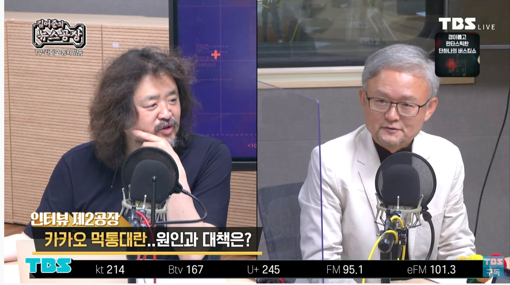
**이미지 캡션:** 이 사진은 라디오 방송 스튜디오에서 두 명의 남성이 대화하는 모습을 담고 있다. 왼쪽에는 40대 후반에서 50대 초반으로 보이는 성인 남성이 검은색 반팔 티셔츠를 입고 있으며, 곱슬거리는 긴 머리와 수염을 가지고 있다. 그는 마이크를 바라보며 손으로 턱을 괴고 생각에 잠긴 듯한 표정을 짓고 있다. 그의 뒤편에는 "김어준의 뉴스공장"이라는 로고와 함께 "TV 라디오 동시 방송"이라는 문구가 적힌 현수막이 걸려 있고, 파란색 화면에는 알 수 없는 그래프와 십자 표시가 보인다. 오른쪽에는 50대 후반에서 60대 초반으로 보이는 성인 남성이 흰색 재킷을 입고 안경을 쓰고 있다. 그는 마이크를 향해 이야기하며 부드러운 표정을 짓고 있다. 그의 뒤편에는 "TBS LIVE"라는 로고와 함께 "경이롭고 판타스틱한 단하나의 버스킹쇼"라는 문구가 적힌 홍보물이 보인다. 두 사람 사이에는 투명한 아크릴 칸막이가 설치되어 있으며, 각자의 앞에 마이크가 놓여 있다. 사진 하단에는 "TBS" 로고와 함께 "kt 214", "Btv 167", "U+ 245", "FM 95.1", "eFM 101.3" 등의 방송 채널 정보와 "구독"이라는 버튼이 보인다. 전반적으로 진지하면서도 활기찬 방송 분위기를 느낄 수 있다.반으로 보이는 성인 남성이 흰색 재킷을 입고 안경을 쓰고 있다. 그는 마이크를 향해 이야기하며 부드러운 표정을 짓고 있다. 그의 뒤편에는 "TBS LIVE"라는 로고와 함께 "경이롭고 판타스틱한 단하나의 버스킹쇼"라는 문구가 적힌 홍보물이 보인다. 두 사람 사이에는 투명한 아크릴 칸막이가 설치되어 있으며, 각자의 앞에 마이크가 놓여 있다. 사진 하단에는 "TBS" 로고와 함께 "kt 214", "Btv 167", "U+ 245", "FM 95.1", "eFM 101.3" 등의 방송 채널 정보와 "구독"이라는 버튼이 보인다. 전반적으로 진지하면서도 활기찬 방송 분위기를 느낄 수 있다.

### 10월 17일 (월) 09:44 · #50마리이상돌고래 #20221016비봉이야생방류 #🐬 #8 #비봉이 #…

#50마리이상돌고래 #20221016비봉이야생방류 #🐬 #8 #비봉이 #비봉이를바다로 #불법포획금지 #제주남방큰돌고래 #남방큰돌고래 #돌고래 #해양보호생물 #제주 #제주도 #생태법인 #돌고래해방 #해양환경단체 #핫핑크돌핀스

어제는 비봉이가 야생방류되는 날이였습니다. 이를 기념하기라도 한것일까요? 월정리에 50+ 돌고래가 관찰되었습니다. 아래 영상의 흰 물결은 거의 돌고래가 뛰는 것입니다. 

너무 감격적인 순간이였는데 카메라로 다 담지 못해 너무 아쉽네요. 고래를 많이 보면 행운이 온다는 이야기도 있던데 보시는 모든 분들에게 행운을 드립니다!

https://www.instagram.com/tv/CjxR76jD3-7/?igshid=YmMyMTA2M2Y%3D

🎬 동영상 1개 (생략)

### 10월 18일 (화) 10:09 · #선지원후고민 #현업데이타 #실무코드

#선지원후고민 #현업데이타 #실무코드 

유플러스와 함께 AI Ground 를 진행합니다. AI를 배우는 가장 빠른 방법은 실무데이타를 사용해서 많이 개발해보는 것입니다. 

이번 AI Ground는 LG ‘아이들나라’의 실제 사용자 데이터를 바탕으로,새로운 추천 아이디어 및 프로필별 맞춤형 콘텐츠 추천 AI 모델을 개발하는 AI 경진대회 입니다. 

10월 31일까지 https://forms.gle/XmTo84yQT4pTQ4uNA 에서 지원이 가능합니다.  자세한 내용은 https://github.com/UpstageAI/2022-lguplus-AI-Ground 참고 하세요.

수상하시는 경우 상금과 LGU+ 지원시 코테와 서류전형이 면제 됩니다. 

#선지원후고민

🎬 동영상 1개 (생략)

### 10월 19일 (수) 20:32 · 📷 사진 (1장)

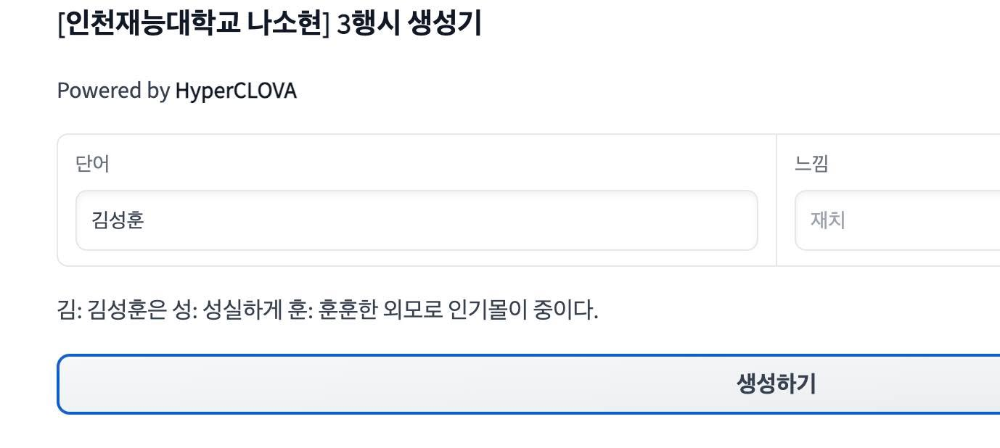
**이미지 캡션:** 이 이미지는 인천재능대학교 나소현 님이 만든 3행시 생성기 웹페이지의 일부를 보여줍니다. 화면 상단에는 "[인천재능대학교 나소현] 3행시 생성기"라는 제목이 있고, 그 아래에는 "Powered by HyperCLOVA"라는 문구가 있습니다. 페이지 중앙에는 "단어"와 "느낌"이라는 두 개의 입력란이 있으며, "단어" 입력란에는 "김성훈"이라는 이름이 입력되어 있고, "느낌" 입력란에는 "재치"라는 단어가 입력되어 있습니다. 그 아래에는 "김: 김성훈은 성: 성실하게 훈: 훈훈한 외모로 인기몰이 중이다."라는 3행시 예시가 제시되어 있습니다. 가장 하단에는 파란색 버튼으로 "생성하기"라는 문구가 있습니다. 이 페이지는 사용자가 단어를 입력하면 해당 단어로 3행시를 생성해주는 기능을 제공하는 것으로 보이며, 현재는 "김성훈"이라는 이름과 "재치"라는 느낌으로 예시가 표시되어 있습니다. 전체적으로 깔끔하고 현대적인 디자인의 웹 인터페이스입니다.3행시 예시가 제시되어 있습니다. 가장 하단에는 파란색 버튼으로 "생성하기"라는 문구가 있습니다. 이 페이지는 사용자가 단어를 입력하면 해당 단어로 3행시를 생성해주는 기능을 제공하는 것으로 보이며, 현재는 "김성훈"이라는 이름과 "재치"라는 느낌으로 예시가 표시되어 있습니다. 전체적으로 깔끔하고 현대적인 디자인의 웹 인터페이스입니다.

### 10월 20일 (목) 17:26 · 하나은행 황보현우 CDO 님을 The Hong Kong Universit…

하나은행 황보현우 CDO 님을 The Hong Kong University of Science and Technology - HKUST 겸임 교수님으로 모실 수 있게 되어 기쁩니다.

올가을 세미나 등을 통해 현업에서의 데이터와 AI 관점에서 저희 학생들을 많이 지도해 주시고, 2023년 가을부터 시작되는 HKUST Practical Datacentric AI MSC program에서 학생 선발과 프로젝트 등을 통한 지도로 많은 기여를 해주실 예정이십니다.

황보현우 교수님, 다시 한번 큰 감사드립니다.

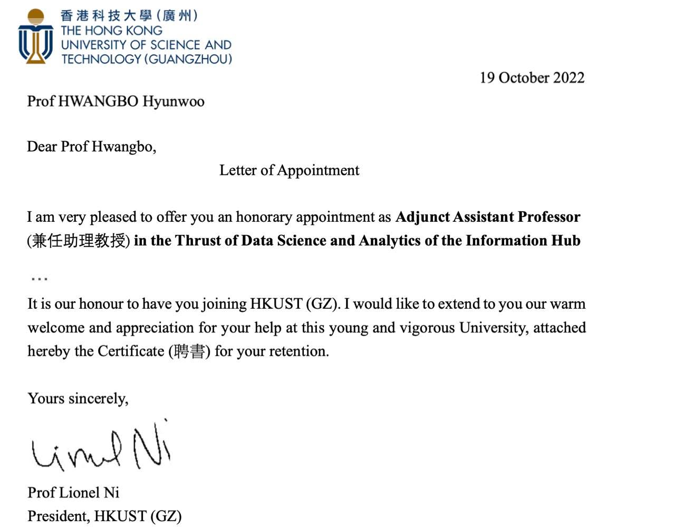
**이미지 캡션:** 이것은 홍콩 과학 기술 대학교(광저우)에서 발급한 임명장으로, 2022년 10월 19일에 작성되었습니다. 이 문서는 황보현우 교수에게 데이터 과학 및 정보 허브 분석 분야의 겸임 조교수로 명예 임명하는 내용을 담고 있습니다. 문서에는 대학 로고, 수신자 및 발신자 정보, 임명 내용, 환영 메시지, 그리고 총장인 Lionel Ni 교수의 서명이 포함되어 있습니다. 전반적으로 공식적이고 전문적인 분위기이며, 새로운 교직원의 합류를 환영하는 긍정적인 상황을 나타냅니다.

### 10월 22일 (토) 16:13 · #바다수영 #1KM

#바다수영 #1KM 

 Jaekyoung Bae 님 올 여름 주말마다 수영 연습하시더니 오늘 바다수영 1KM 엄청난 마일스톤 달성하셨습니다. 정말 멋지고 대단합니다. 축하드립니다.

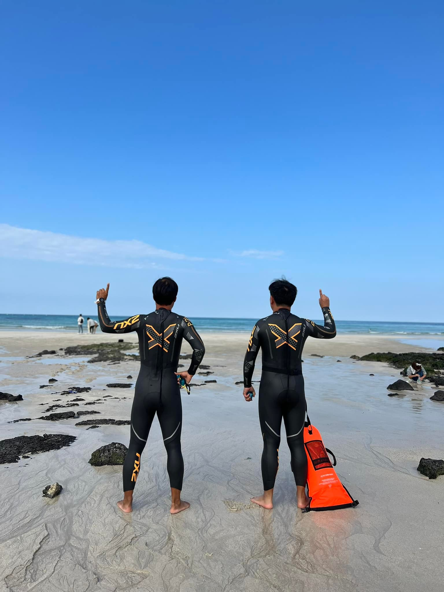
**이미지 캡션:** 두 명의 성인 남성이 검은색 잠수복을 입고 해변에 서서 바다를 바라보고 있으며, 두 사람 모두 잠수복 등 부분에 주황색 X자 모양의 로고와 2XU라는 글자가 새겨져 있고, 한 명은 오른손으로 하늘을 가리키고 있으며 다른 한 명은 왼손으로 하늘을 가리키고 있습니다. 오른쪽에 주황색 부표가 놓여 있고, 배경에는 푸른 하늘과 잔잔한 바다가 펼쳐져 있으며, 해변에는 모래와 바위들이 흩어져 있고 멀리 몇몇 사람들이 보입니다.
 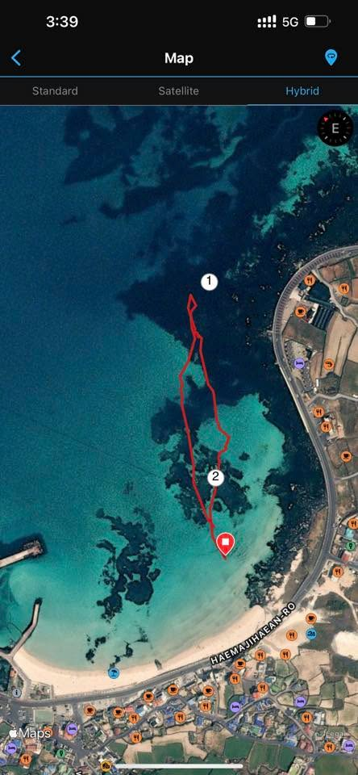
**이미지 캡션:** 이것은 스마트폰 지도 앱의 스크린샷으로, 해안 지역의 위성 사진 위에 경로가 표시되어 있습니다. 화면 상단에는 시간 3:39, 5G 신호 강도, 배터리 잔량이 표시됩니다. 지도 앱의 제목은 "Map"이며, 표준, 위성, 하이브리드 보기 옵션이 있습니다. 화면 중앙에는 맑고 푸른 바다가 펼쳐져 있으며, 얕은 물에는 산호초나 암초로 보이는 어두운 부분이 군데군데 있습니다. 해안선은 모래사장으로 이루어져 있으며, 그 뒤로는 도로와 건물들이 밀집해 있는 마을이 보입니다. 도로에는 "HAEMAJIHAEAN-RO"라는 표지판이 보입니다. 지도 위에는 빨간색 선으로 표시된 경로가 있는데, 시작점과 끝점은 보이지 않지만 중간에 1번과 2번이라는 숫자로 표시된 두 개의 지점이 있습니다. 또한, 경로 상에는 빨간색 사각형 안에 빨간색 점이 있는 마커가 표시되어 있습니다. 마을 주변에는 식당, 숙박 시설 등을 나타내는 다양한 아이콘들이 표시되어 있습니다. 전반적으로 맑고 화창한 날씨에 해안 지역을 탐방하거나 활동한 기록을 보여주는 것으로 보입니다.표지판이 보입니다. 지도 위에는 빨간색 선으로 표시된 경로가 있는데, 시작점과 끝점은 보이지 않지만 중간에 1번과 2번이라는 숫자로 표시된 두 개의 지점이 있습니다. 또한, 경로 상에는 빨간색 사각형 안에 빨간색 점이 있는 마커가 표시되어 있습니다. 마을 주변에는 식당, 숙박 시설 등을 나타내는 다양한 아이콘들이 표시되어 있습니다. 전반적으로 맑고 화창한 날씨에 해안 지역을 탐방하거나 활동한 기록을 보여주는 것으로 보입니다.
 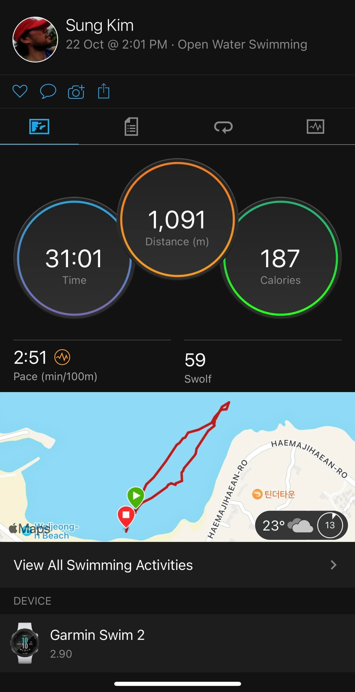
**이미지 캡션:** 이 화면은 야외 수영 활동 기록을 보여주는 스마트폰 앱 화면으로, 상단에는 "Sung Kim"이라는 이름과 함께 10월 22일 오후 2시 1분에 "Open Water Swimming" 활동을 기록했음을 나타냅니다. 활동 요약 정보로는 총 31분 1초 동안 1,091미터를 수영하여 187 칼로리를 소모했으며, 100미터당 평균 페이스는 2분 51초, Swolf 지수는 59임을 보여줍니다. 화면 중앙에는 수영 궤적을 나타내는 빨간색 선과 함께 시작점(빨간색 핀)과 현재 위치(초록색 플레이 버튼)를 표시하는 지도 이미지가 보입니다. 지도에는 "Waejeong-n Beach"라는 지명과 "HAEMAJIHAEAN-RO"라는 도로명이 표시되어 있으며, 현재 온도 23도와 구름, 그리고 13이라는 숫자가 함께 표시되어 있습니다. 하단에는 "View All Swimming Activities"라는 버튼과 함께 "Garmin Swim 2"라는 기기 이름과 2.90이라는 숫자가 표시되어 있습니다. 전반적으로 활동적인 야외 수영 경험을 기록하고 분석하는 데 초점을 맞춘 인터페이스입니다.이미지가 보입니다. 지도에는 "Waejeong-n Beach"라는 지명과 "HAEMAJIHAEAN-RO"라는 도로명이 표시되어 있으며, 현재 온도 23도와 구름, 그리고 13이라는 숫자가 함께 표시되어 있습니다. 하단에는 "View All Swimming Activities"라는 버튼과 함께 "Garmin Swim 2"라는 기기 이름과 2.90이라는 숫자가 표시되어 있습니다. 전반적으로 활동적인 야외 수영 경험을 기록하고 분석하는 데 초점을 맞춘 인터페이스입니다.

🎬 동영상 1개 (생략)

### 10월 24일 (월) 10:38 · 📷 사진 (3장)

**이미지 캡션:** 이 이미지는 AI 프로젝트의 가치와 맞춤화 문제를 설명하는 그래프입니다. 그래프는 두 개의 축으로 구성되어 있으며, 세로축은 'Value'(가치)를 나타내고 가로축은 'HEAD'(헤드)와 'LONG TAIL'(롱테일)로 구분되어 있습니다. 'HEAD' 부분에는 'Ads'(광고)와 'Web Search'(웹 검색), 'recsys'(추천 시스템)와 같이 가치가 높은 AI 프로젝트들이 표시되어 있으며, 이들은 큰 파란색 막대로 표현됩니다. 'LONG TAIL' 부분에는 'T-shirt product placement'(티셔츠 상품 배치), 'T-shirt demand forecasting'(티셔츠 수요 예측), 'Pizzeria demand forecasting'(피자 가게 수요 예측)과 같이 가치가 상대적으로 낮은 AI 프로젝트들이 작은 막대와 아이콘으로 표시됩니다. 각 'LONG TAIL' 프로젝트에는 해당 프로젝트를 나타내는 아이콘(티셔츠, 피자)과 함께 작은 주황색 화살표가 위쪽을 향해 그려져 있어, 이들 프로젝트 역시 가치를 가지고 있음을 시사합니다. 그래프 상단에는 "AI's long tail (customization) problem"이라는 제목이 쓰여 있어, AI 프로젝트의 가치가 높은 'HEAD' 부분과 가치가 낮지만 개별적으로는 다양한 'LONG TAIL' 부분으로 나뉘는 문제점을 나타냅니다. 배경은 어두운 파란색이며, 텍스트는 흰색으로 표시되어 있습니다. 이 이미지는 AI 기술을 적용할 때 어떤 프로젝트에 집중해야 하는지에 대한 시사점을 제공합니다.nt'(티셔츠 상품 배치), 'T-shirt demand forecasting'(티셔츠 수요 예측), 'Pizzeria demand forecasting'(피자 가게 수요 예측)과 같이 가치가 상대적으로 낮은 AI 프로젝트들이 작은 막대와 아이콘으로 표시됩니다. 각 'LONG TAIL' 프로젝트에는 해당 프로젝트를 나타내는 아이콘(티셔츠, 피자)과 함께 작은 주황색 화살표가 위쪽을 향해 그려져 있어, 이들 프로젝트 역시 가치를 가지고 있음을 시사합니다. 그래프 상단에는 "AI's long tail (customization) problem"이라는 제목이 쓰여 있어, AI 프로젝트의 가치가 높은 'HEAD' 부분과 가치가 낮지만 개별적으로는 다양한 'LONG TAIL' 부분으로 나뉘는 문제점을 나타냅니다. 배경은 어두운 파란색이며, 텍스트는 흰색으로 표시되어 있습니다. 이 이미지는 AI 기술을 적용할 때 어떤 프로젝트에 집중해야 하는지에 대한 시사점을 제공합니다.
 
**이미지 캡션:** 한 명의 성인 남성이 무대 위에서 발표하고 있으며, 그의 뒤에는 대형 스크린이 설치되어 있습니다. 남성은 40대 정도로 보이며, 검은색 정장 재킷과 바지, 흰색 셔츠를 입고 있습니다. 그는 오른손을 들어 무언가를 설명하는 듯한 제스처를 취하고 있으며, 표정은 진지합니다. 스크린에는 "LandingLens"라는 로고와 함께 "Object detection Cloth Quality Inspection"이라는 제목이 보입니다. 화면 왼쪽에는 "Data", "Defects", "Metadata", "Labeling", "Exported dataset", "Models", "Deployment", "My tasks"와 같은 메뉴 항목들이 나열되어 있습니다. 화면 오른쪽에는 파란색 배경에 다양한 천 조각 이미지들이 격자 형태로 배열되어 있으며, 일부 이미지에는 녹색 또는 분홍색 테두리가 쳐져 있어 결함이나 특정 부분을 표시하는 것으로 보입니다. 스크린 하단에는 발표자의 이름으로 추정되는 "Andrew"라는 글자가 보입니다. 무대 앞쪽에는 관객들의 머리 일부가 보이며, 전체적으로 기술 발표회 또는 컨퍼런스의 한 장면으로 보입니다., "Exported dataset", "Models", "Deployment", "My tasks"와 같은 메뉴 항목들이 나열되어 있습니다. 화면 오른쪽에는 파란색 배경에 다양한 천 조각 이미지들이 격자 형태로 배열되어 있으며, 일부 이미지에는 녹색 또는 분홍색 테두리가 쳐져 있어 결함이나 특정 부분을 표시하는 것으로 보입니다. 스크린 하단에는 발표자의 이름으로 추정되는 "Andrew"라는 글자가 보입니다. 무대 앞쪽에는 관객들의 머리 일부가 보이며, 전체적으로 기술 발표회 또는 컨퍼런스의 한 장면으로 보입니다.
 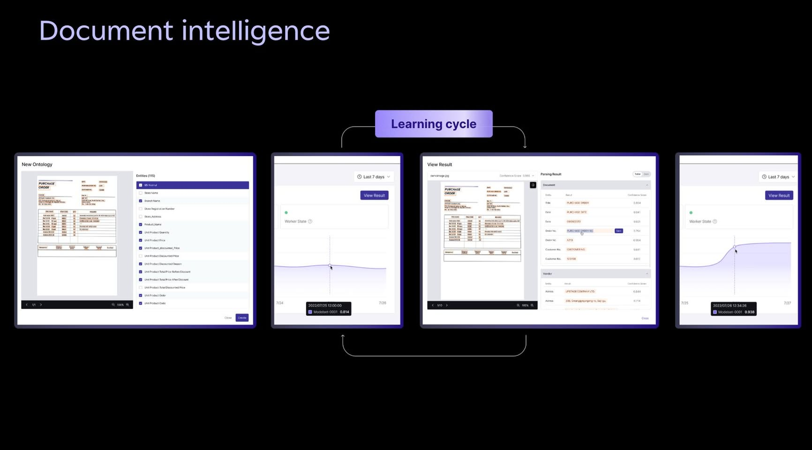
**이미지 캡션:** 이 이미지는 "Document intelligence"라는 제목 아래 네 개의 화면을 보여주며, "Learning cycle"이라는 텍스트가 중앙에 배치되어 이 화면들이 순환하는 과정을 나타냅니다. 각 화면은 문서 처리 및 분석과 관련된 인터페이스를 보여줍니다. 왼쪽 첫 번째 화면은 "New Ontology"라는 제목과 함께 구매 주문서 이미지와 함께 추출 가능한 엔티티 목록을 보여줍니다. 두 번째 화면은 "Last 7 days"라는 제목과 함께 그래프와 "View Result" 버튼을 포함하고 있으며, 그래프에는 "Worker State"라는 레이블이 붙어 있습니다. 세 번째 화면은 "View Result"라는 제목과 함께 구매 주문서 이미지와 함께 파싱된 결과 데이터를 표 형태로 보여줍니다. 네 번째 화면은 두 번째 화면과 유사하게 "Last 7 days"라는 제목과 그래프, "View Result" 버튼을 보여주며, 그래프에는 "Worker State"라는 레이블이 붙어 있습니다. 전체적으로 이 이미지는 문서에서 정보를 추출하고 학습하는 과정을 시각적으로 설명하는 데 사용된 것으로 보입니다.프에는 "Worker State"라는 레이블이 붙어 있습니다. 세 번째 화면은 "View Result"라는 제목과 함께 구매 주문서 이미지와 함께 파싱된 결과 데이터를 표 형태로 보여줍니다. 네 번째 화면은 두 번째 화면과 유사하게 "Last 7 days"라는 제목과 그래프, "View Result" 버튼을 보여주며, 그래프에는 "Worker State"라는 레이블이 붙어 있습니다. 전체적으로 이 이미지는 문서에서 정보를 추출하고 학습하는 과정을 시각적으로 설명하는 데 사용된 것으로 보입니다.

### 10월 24일 (월) 10:50 · #모두를위한AI #AIPack #andrewng #TED #upstage…

#모두를위한AI #AIPack #andrewng #TED #upstage #aipack 

Andrew Ng 교수님의 말씀은 언제나 인사이트가 넘칩니다. 몇주전에 나온 TED톡인데요: https://youtu.be/reUZRyXxUs4

* 일부 계층만 글을 읽고 쓰던 시절 --> 모두가 글을 읽고 쓰면서 엄청난 혁신
* 지금 (대)기업 중심으로 개발 사용하는 AI --> 모두가 사용한다면 더 큰 혁신
* 대기업은 큰 돈을 투자해서 short-head 문제는 풀수 있는데
* 작은 기업의 long-tail AI problem은 어쩔것이냐? (첫번째 이미지)

로 동기 부여를 합니다.

그런후, 지금 하고 계시는 일종의 노코드 AI툴을 소개 (2번째 이미지) 인데 매우 설득력이 있습니다.

Upstage 에서도 Making AI Beneficial (for everyone) 비전으로 누구나 노코드로 AI를 사용할수 있는 AI Pack을 곧 출시할 예정입니다. (3번째 이미지 OCR Pack 의 예)

Andrew Ng 교수님의 클로징 멘트처럼 반드시 모두가 사용하는 AI세상, 함께 만들어 봅시다. Upstage 에서 함께 하실 분들은 https://careers.upstage.ai/ 입니다!

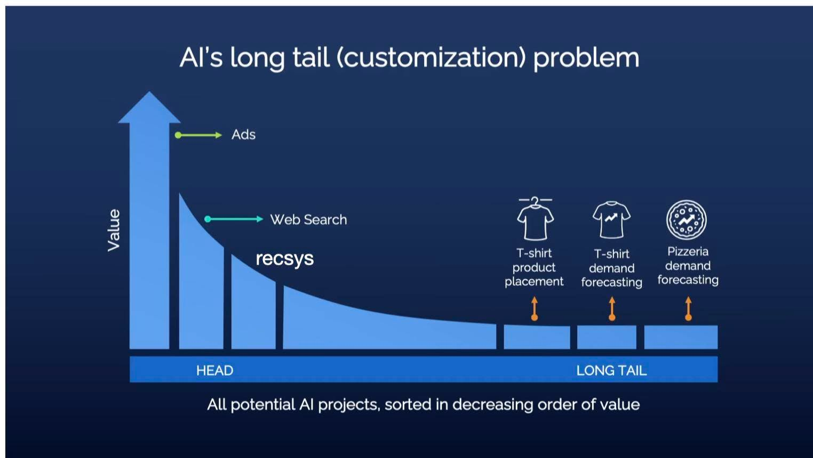
**이미지 캡션:** 이 이미지는 "AI의 롱테일(맞춤화) 문제"라는 제목의 그래프로, 잠재적인 AI 프로젝트들을 가치 순으로 나열했을 때 발생하는 문제점을 시각적으로 보여줍니다. 그래프의 세로축은 'Value'(가치)를 나타내고, 가로축은 'HEAD'(헤드)와 'LONG TAIL'(롱테일)로 구분되어 있습니다. 'HEAD' 부분에는 광고(Ads), 웹 검색(Web Search), 추천 시스템(recsys)과 같이 가치가 높고 비교적 일반적인 AI 프로젝트들이 배치되어 있으며, 이들은 높은 막대로 표현됩니다. 반면 'LONG TAIL' 부분에는 티셔츠 상품 배치(T-shirt product placement), 티셔츠 수요 예측(T-shirt demand forecasting), 피자 가게 수요 예측(Pizzeria demand forecasting)과 같이 가치가 낮지만 매우 구체적이고 다양한 AI 프로젝트들이 나열되어 있으며, 이들은 낮은 막대로 표현됩니다. 각 롱테일 프로젝트 위에는 해당 프로젝트를 상징하는 아이콘(옷걸이에 걸린 티셔츠, 티셔츠, 피자)과 함께 프로젝트 이름, 그리고 아래쪽에는 주황색 화살표로 가치를 나타내는 작은 막대가 표시되어 있습니다. 그래프 하단에는 "모든 잠재적인 AI 프로젝트, 가치 내림차순 정렬"이라는 설명이 있습니다. 전반적으로 파란색과 흰색을 사용한 깔끔하고 정보 전달에 집중된 디자인이며, AI 기술의 적용 범위와 가치 분배에 대한 통찰을 제공하는 프레젠테이션 또는 교육 자료의 일부로 보입니다.IL' 부분에는 티셔츠 상품 배치(T-shirt product placement), 티셔츠 수요 예측(T-shirt demand forecasting), 피자 가게 수요 예측(Pizzeria demand forecasting)과 같이 가치가 낮지만 매우 구체적이고 다양한 AI 프로젝트들이 나열되어 있으며, 이들은 낮은 막대로 표현됩니다. 각 롱테일 프로젝트 위에는 해당 프로젝트를 상징하는 아이콘(옷걸이에 걸린 티셔츠, 티셔츠, 피자)과 함께 프로젝트 이름, 그리고 아래쪽에는 주황색 화살표로 가치를 나타내는 작은 막대가 표시되어 있습니다. 그래프 하단에는 "모든 잠재적인 AI 프로젝트, 가치 내림차순 정렬"이라는 설명이 있습니다. 전반적으로 파란색과 흰색을 사용한 깔끔하고 정보 전달에 집중된 디자인이며, AI 기술의 적용 범위와 가치 분배에 대한 통찰을 제공하는 프레젠테이션 또는 교육 자료의 일부로 보입니다.
 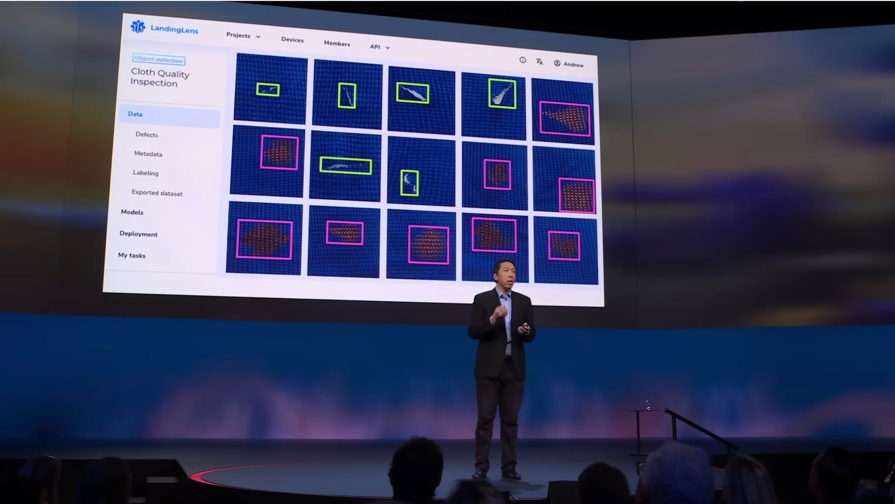
**이미지 캡션:** 한 명의 성인 남성이 검은색 정장 재킷과 바지를 입고 무대 위에서 발표하고 있으며, 그의 뒤에는 큰 스크린이 설치되어 있습니다. 스크린에는 "LandingLens"라는 로고와 함께 "Object detection Cloth Quality Inspection"이라는 제목이 보이며, 여러 개의 작은 이미지들이 격자 형태로 배열되어 있습니다. 이 이미지들은 파란색 배경에 다양한 결함이 있는 천 조각들을 보여주며, 일부 결함은 녹색 또는 분홍색 상자로 표시되어 있습니다. 스크린 왼쪽에는 "Data", "Defects", "Metadata", "Labeling", "Exported dataset", "Models", "Deployment", "My tasks"와 같은 메뉴 항목들이 나열되어 있습니다. 남성은 오른손을 들어 무언가를 설명하는 듯한 제스처를 취하고 있으며, 그의 표정은 진지하고 집중하고 있습니다. 무대 앞쪽에는 관객들의 머리 일부가 보이며, 배경에는 보라색과 파란색이 섞인 추상적인 조명이 비추고 있습니다. 전반적으로 기술 발표회 또는 컨퍼런스의 한 장면으로 보이며, 인공지능 기반의 직물 품질 검사 시스템을 소개하는 듯한 분위기입니다.", "Metadata", "Labeling", "Exported dataset", "Models", "Deployment", "My tasks"와 같은 메뉴 항목들이 나열되어 있습니다. 남성은 오른손을 들어 무언가를 설명하는 듯한 제스처를 취하고 있으며, 그의 표정은 진지하고 집중하고 있습니다. 무대 앞쪽에는 관객들의 머리 일부가 보이며, 배경에는 보라색과 파란색이 섞인 추상적인 조명이 비추고 있습니다. 전반적으로 기술 발표회 또는 컨퍼런스의 한 장면으로 보이며, 인공지능 기반의 직물 품질 검사 시스템을 소개하는 듯한 분위기입니다.
 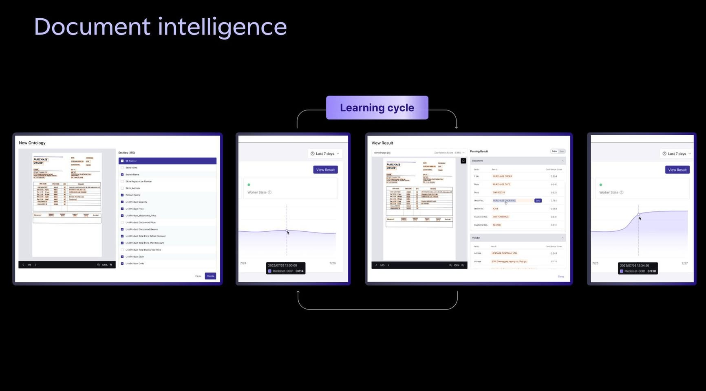
**이미지 캡션:** 이 이미지는 "Document intelligence"라는 제목 아래 네 개의 화면을 보여주며, "Learning cycle"이라는 텍스트가 중앙에 배치되어 이 화면들이 순환적인 학습 과정을 나타냄을 시사합니다. 왼쪽 첫 번째 화면은 "New Ontology"라는 제목으로, "PURCHASE ORDER"라는 문서 이미지와 함께 "Entities (115)"라는 목록이 표시됩니다. 이 목록에는 "PO Invoice", "Store name", "Product Name" 등 다양한 문서 필드들이 체크박스와 함께 나열되어 있습니다. 두 번째 화면은 "Last 7 days"라는 제목과 함께 "View Result" 버튼이 있고, 아래에는 "Worker State"라는 라벨과 함께 시간에 따른 그래프가 그려져 있습니다. 그래프 위에는 마우스 커서로 보이는 작은 손가락 아이콘이 특정 지점을 가리키고 있으며, 해당 지점에는 "2022/07/25 12:00:00"이라는 날짜와 시간, 그리고 "Modelset-0001 0.814"이라는 텍스트가 표시됩니다. 세 번째 화면은 "View Result"라는 제목으로, 첫 번째 화면과 유사한 "PURCHASE ORDER" 문서 이미지를 보여주며, 오른편에는 "Parsing Result"라는 섹션이 있습니다. 이 섹션에는 "Document", "File", "Date", "Order No.", "Customer No.", "Vendor" 등 추출된 정보들이 나열되어 있으며, 각 항목 옆에는 신뢰도 점수가 표시되어 있습니다. 네 번째 화면은 다시 "Last 7 days"라는 제목과 함께 "View Result" 버튼, "Worker State" 라벨, 그리고 그래프가 표시됩니다. 이 그래프 역시 시간에 따른 변화를 보여주며, 특정 지점에는 "2022/07/26 12:34:26"이라는 날짜와 시간, 그리고 "Modelset-0001 0.038"이라는 텍스트가 표시됩니다. 전체적으로 이 이미지는 문서에서 정보를 추출하고, 이를 바탕으로 모델을 학습시키는 과정을 시각적으로 표현하고 있습니다.나열되어 있습니다. 두 번째 화면은 "Last 7 days"라는 제목과 함께 "View Result" 버튼이 있고, 아래에는 "Worker State"라는 라벨과 함께 시간에 따른 그래프가 그려져 있습니다. 그래프 위에는 마우스 커서로 보이는 작은 손가락 아이콘이 특정 지점을 가리키고 있으며, 해당 지점에는 "2022/07/25 12:00:00"이라는 날짜와 시간, 그리고 "Modelset-0001 0.814"이라는 텍스트가 표시됩니다. 세 번째 화면은 "View Result"라는 제목으로, 첫 번째 화면과 유사한 "PURCHASE ORDER" 문서 이미지를 보여주며, 오른편에는 "Parsing Result"라는 섹션이 있습니다. 이 섹션에는 "Document", "File", "Date", "Order No.", "Customer No.", "Vendor" 등 추출된 정보들이 나열되어 있으며, 각 항목 옆에는 신뢰도 점수가 표시되어 있습니다. 네 번째 화면은 다시 "Last 7 days"라는 제목과 함께 "View Result" 버튼, "Worker State" 라벨, 그리고 그래프가 표시됩니다. 이 그래프 역시 시간에 따른 변화를 보여주며, 특정 지점에는 "2022/07/26 12:34:26"이라는 날짜와 시간, 그리고 "Modelset-0001 0.038"이라는 텍스트가 표시됩니다. 전체적으로 이 이미지는 문서에서 정보를 추출하고, 이를 바탕으로 모델을 학습시키는 과정을 시각적으로 표현하고 있습니다.

### 10월 26일 (수) 16:27 · 업스테이지 활석님과 같이 ocr pack (no code ai) PM으로…

업스테이지 활석님과 같이 ocr pack (no code ai) PM으로 일하실 분들을 모시고 있습니다. Hwalsuk Lee 님에게 DM주시거나 저에게 DM주시면 되십니다.

### 10월 28일 (금) 08:48 · 아름다운 가을, 하늘, 단풍, 오리, 공기... 좋은 분들과 달리기 정말…

아름다운 가을, 하늘, 단풍, 오리, 공기... 좋은 분들과 달리기 정말 좋은 계절입니다.

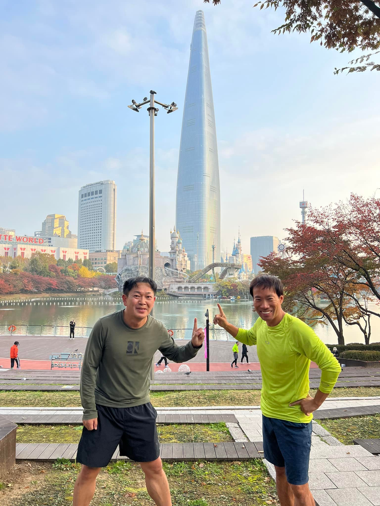
**이미지 캡션:** 두 명의 성인 남성이 야외 공원에서 사진을 찍고 있으며, 배경에는 롯데월드 타워와 롯데월드 어드벤처의 놀이기구들이 보인다. 왼쪽 남성은 30대 후반에서 40대 초반으로 보이며, 올리브색 긴팔 상의와 검은색 반바지를 입고 있다. 그는 카메라를 향해 웃으며 왼손으로 숫자 2를, 오른손으로 숫자 1을 표시하고 있다. 오른쪽 남성은 30대 초반에서 30대 후반으로 보이며, 형광 연두색 긴팔 상의와 남색 반바지를 입고 있다. 그는 카메라를 향해 환하게 웃으며 오른손으로 숫자 1을 가리키고, 왼손은 허리에 얹고 있다. 두 사람 모두 운동복 차림으로 활기찬 표정을 짓고 있어 즐거운 분위기를 연출한다. 배경에는 잔잔한 호수와 가을 단풍으로 물든 나무들이 보이며, 맑고 푸른 하늘 아래 롯데월드 타워의 웅장한 모습이 시선을 사로잡는다. 공원에는 산책하거나 운동하는 다른 사람들이 희미하게 보이며, 전체적으로 평화롭고 활동적인 오후의 풍경을 담고 있다.두 사람 모두 운동복 차림으로 활기찬 표정을 짓고 있어 즐거운 분위기를 연출한다. 배경에는 잔잔한 호수와 가을 단풍으로 물든 나무들이 보이며, 맑고 푸른 하늘 아래 롯데월드 타워의 웅장한 모습이 시선을 사로잡는다. 공원에는 산책하거나 운동하는 다른 사람들이 희미하게 보이며, 전체적으로 평화롭고 활동적인 오후의 풍경을 담고 있다.
 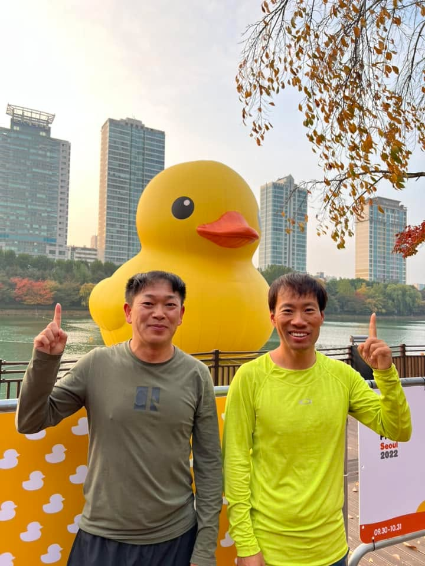
**이미지 캡션:** 두 명의 성인 남성이 거대한 노란색 고무 오리 조형물 앞에서 포즈를 취하고 있다. 왼쪽 남성은 40대 후반에서 50대 초반으로 보이며, 올리브색 긴팔 티셔츠와 검은색 반바지를 입고 있다. 그는 카메라를 향해 미소를 지으며 오른손 검지를 위로 가리키고 있다. 오른쪽 남성은 40대 초반으로 보이며, 형광 연두색 긴팔 티셔츠와 검은색 하의를 입고 있다. 그는 활짝 웃으며 오른손 검지를 위로 가리키고 있다. 배경에는 잔잔한 호수와 그 뒤로 높은 빌딩들이 보이며, 가을 단풍이 든 나뭇가지가 사진 상단에 걸쳐 있다. 또한, 오리 조형물 앞에는 노란색 바탕에 흰색 오리 그림이 반복되는 배너가 설치되어 있으며, 오른쪽에는 "Seoul 2022"와 날짜가 적힌 포스터가 보인다. 전체적으로 화창한 날씨에 야외 행사나 축제가 진행되는 듯한 즐겁고 활기찬 분위기이다.한, 오리 조형물 앞에는 노란색 바탕에 흰색 오리 그림이 반복되는 배너가 설치되어 있으며, 오른쪽에는 "Seoul 2022"와 날짜가 적힌 포스터가 보인다. 전체적으로 화창한 날씨에 야외 행사나 축제가 진행되는 듯한 즐겁고 활기찬 분위기이다.
 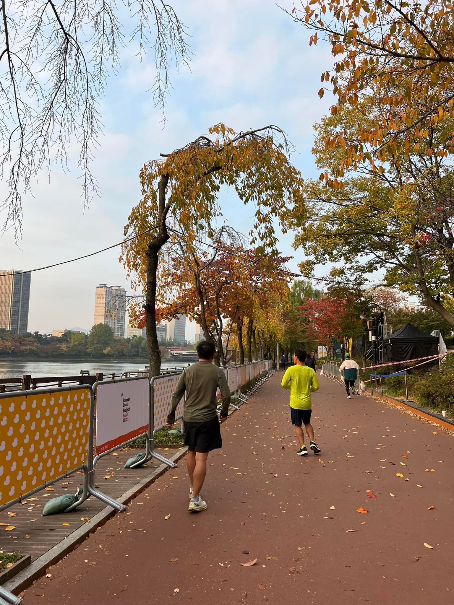
**이미지 캡션:** 가을날, 한강변 공원에서 두 명의 성인 남성이 조깅을 하고 있다. 앞서가는 남성은 올리브색 긴팔 상의와 검은색 반바지를 입고 있으며, 뒤따르는 남성은 형광 연두색 긴팔 상의와 검은색 반바지를 착용하고 있다. 두 사람 모두 운동화 차림이며, 전방을 주시하며 여유로운 표정으로 달리고 있다. 배경에는 단풍으로 물든 나무들과 잔잔한 강물이 보이며, 강 건너편에는 현대적인 고층 건물들이 늘어서 있다. 길가에는 노란색과 주황색으로 된 행사용 배너와 울타리가 설치되어 있고, 바닥에는 떨어진 낙엽들이 흩어져 있어 가을의 정취를 물씬 풍긴다. 멀리 보이는 다른 사람들과 텐트, 그리고 행사 관련 구조물들은 이곳이 어떤 행사가 진행 중인 장소임을 암시한다. 전체적으로 차분하고 평화로운 분위기 속에서 사람들이 건강한 활동을 즐기는 모습이다.취를 물씬 풍긴다. 멀리 보이는 다른 사람들과 텐트, 그리고 행사 관련 구조물들은 이곳이 어떤 행사가 진행 중인 장소임을 암시한다. 전체적으로 차분하고 평화로운 분위기 속에서 사람들이 건강한 활동을 즐기는 모습이다.
 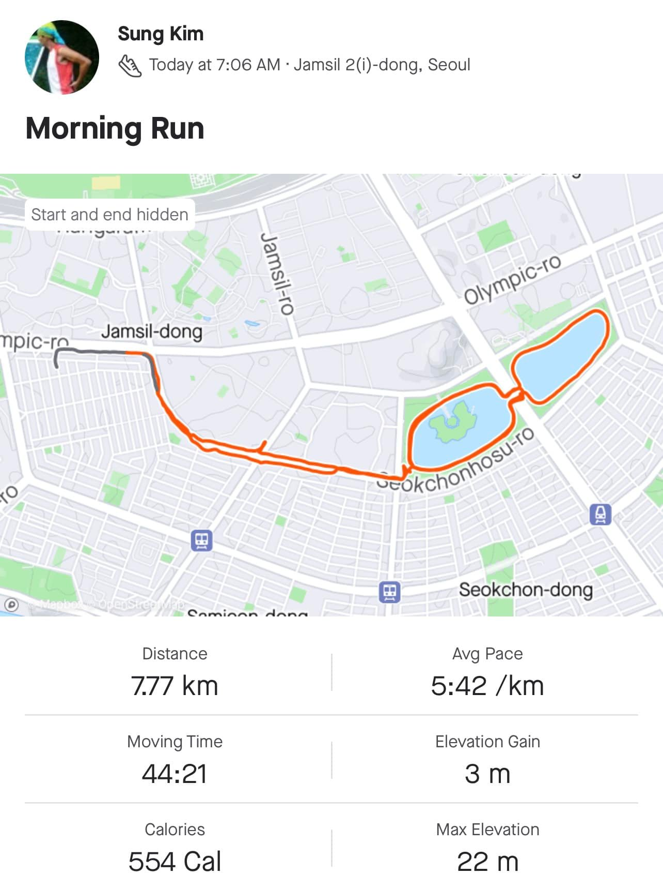
**이미지 캡션:** 사진에는 "Sung Kim"이라는 이름의 성인 남성이 오전 7시 6분에 서울 잠실 2동에서 "Morning Run"이라는 제목으로 7.77km를 44분 21초 동안 달린 기록이 표시되어 있습니다. 평균 페이스는 5분 42초/km이며, 고도 상승은 3m, 최대 고도는 22m입니다. 배경에는 올림픽대로와 잠실동, 석촌동 일대의 지도와 함께 두 개의 호수가 있는 공원의 모습이 보이며, 주황색 선으로 달린 경로가 표시되어 있습니다. 전반적으로 활동적인 아침 운동 기록을 보여주는 캡처 화면입니다.

### 10월 29일 (토) 07:43 · #변하지않을것 #문서처리 #ocrpack

#변하지않을것 #문서처리 #ocrpack

올 7월 맥킨지 AI Practice 자료를 보면 8개의 Key Automation 기술에 가장 중요한 것이 바로 문서를 처리하고 관리하는 것이었습니다. (무려 52% 이상의 기업에서 적용 중) 아마 문서 처리는 계속해서 우리 인류에게 가장 중요한 변하지 않는 영역일 것입니다.

Making AI Beneficial 중 Upstage 가 가장 먼저 주목한 것도 이 문서 처리를 위한 document intelligence 영역이었습니다.

특히 이미지를 포함한 문서에서 원하는 정보인 key-value를 어떻게 자동으로 뽑아낼 것인가? 새로운 문서마다, 뽑고자 하는 key-value가 바뀔 때마다 새로운 모델을 개발하는 것이 아니라, 자동으로 학습하여 원하는 정보를 얻어내는 것이 가능할까? 마치 사람에게 부탁하듯 이 문서에서 이런 이런 정보를 뽑아 주세요라고 부탁한 다음 틀린 부분에 대해 알려주는 것으로 더 완벽하게 할 수 있을까?

그 첫걸음으로 저희는 지난 1년 동안 개발한 OCR Pack 이 곧곧곧 출시됩니다. 처리해야 할 문서가 많은 고객분들, 다양한 문서에 빠르게 OCR을 적용하실 고객분들을 곧 찾아뵙도록 하겠습니다!

두근. 두근. 두근.

(맥킨지 보고서: https://www.mckinsey.com/business-functions/operations/our-insights/your-questions-about-automation-answered?cid=other-soc-twi-mip-mck-oth---&sid=7568374439&linkId=180446297)

🎬 동영상 1개 (생략)

### 10월 30일 (일) 19:19 · 📷 앨범: Profile pictures (1장)

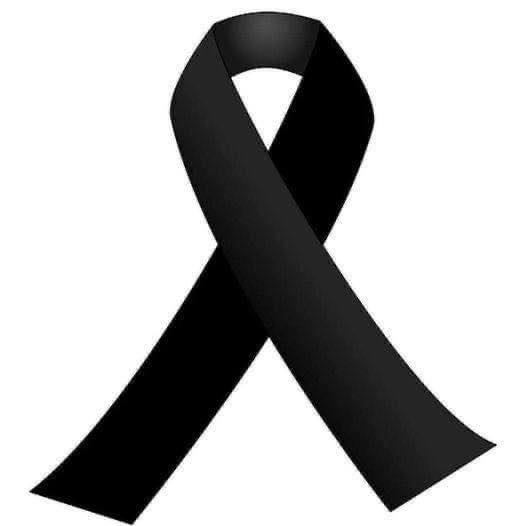
**이미지 캡션:** 이 이미지는 검은색 리본을 클로즈업하여 보여줍니다. 리본은 흰색 배경에 놓여 있으며, 겹쳐진 두 개의 띠로 구성되어 있으며, 위쪽 띠는 아래쪽 띠 위로 교차하여 매듭을 형성합니다. 리본은 부드럽고 유연한 천으로 만들어진 것처럼 보이며, 빛이 반사되어 약간의 광택이 있습니다. 리본의 색상은 깊고 진한 검은색으로, 애도, 슬픔, 또는 추모의 의미를 나타내는 상징으로 자주 사용됩니다. 이미지에는 사람, 장소, 텍스트가 보이지 않으며, 오직 검은색 리본 자체만이 강조되어 있습니다. 전반적인 분위기는 진지하고 숙연하며, 무언가에 대한 애도나 추모의 감정을 불러일으킵니다., 무언가에 대한 애도나 추모의 감정을 불러일으킵니다.
