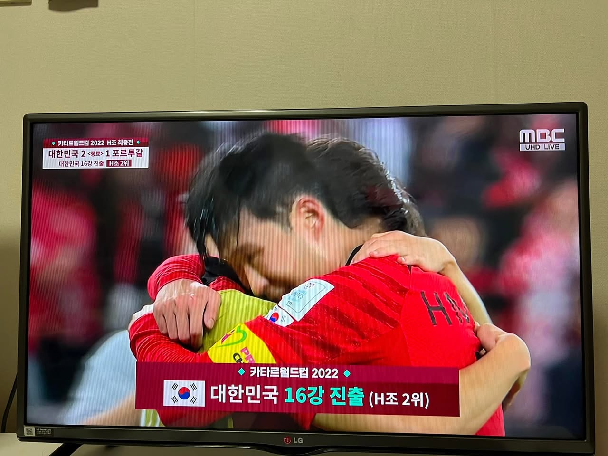
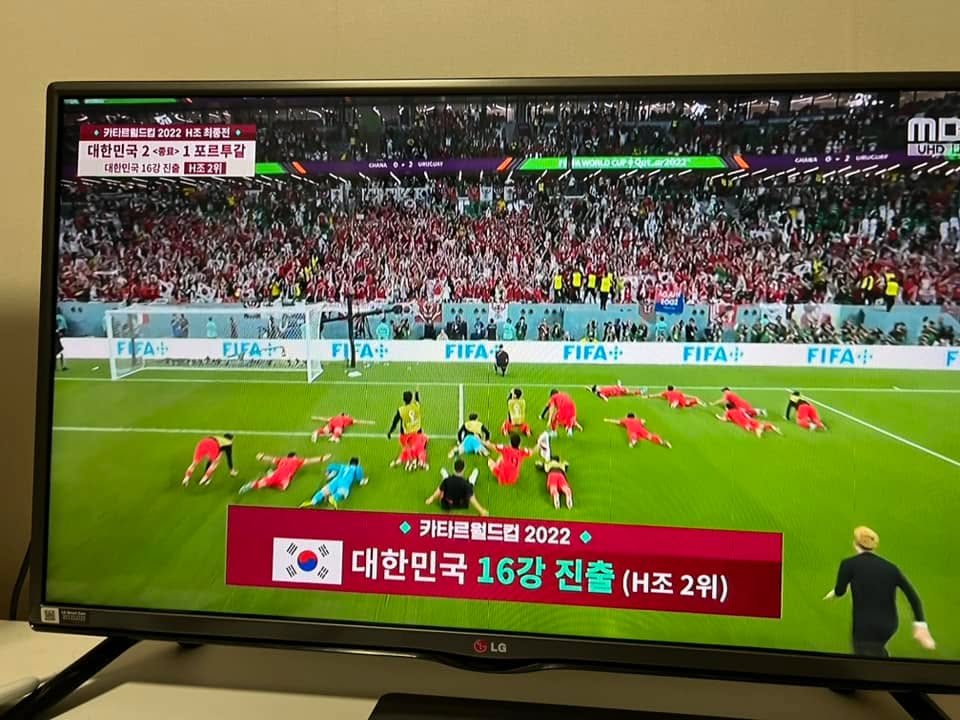
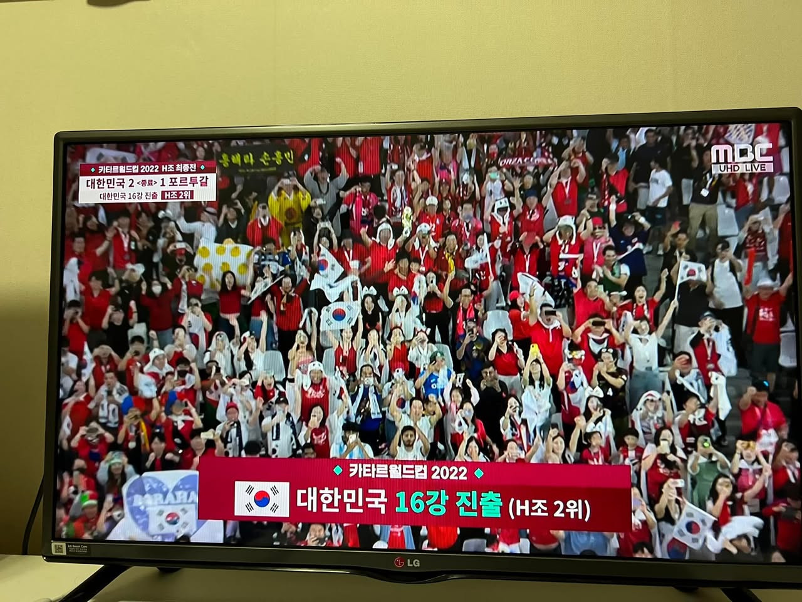
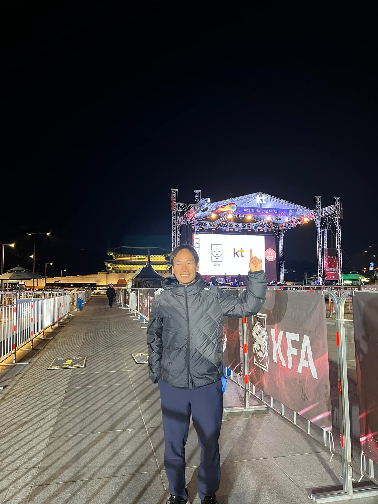
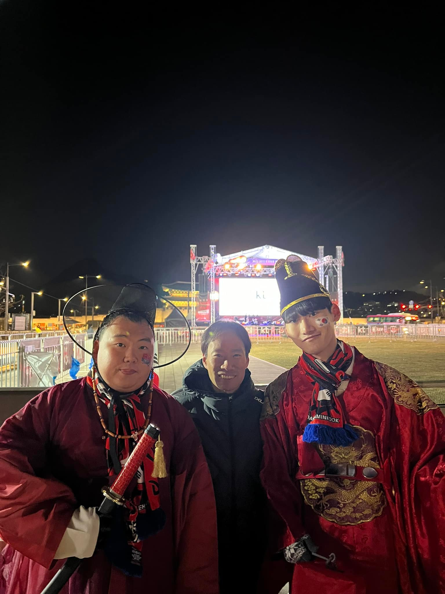
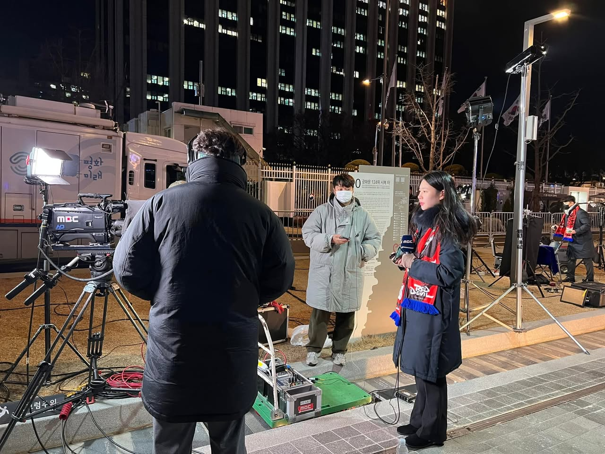
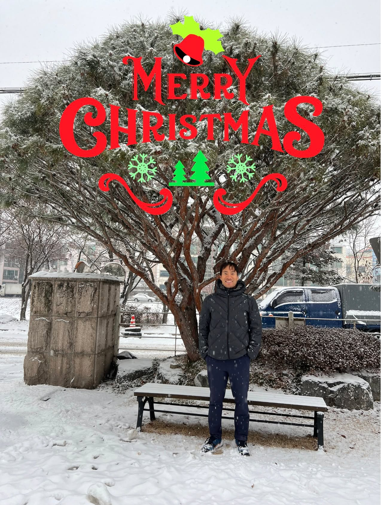
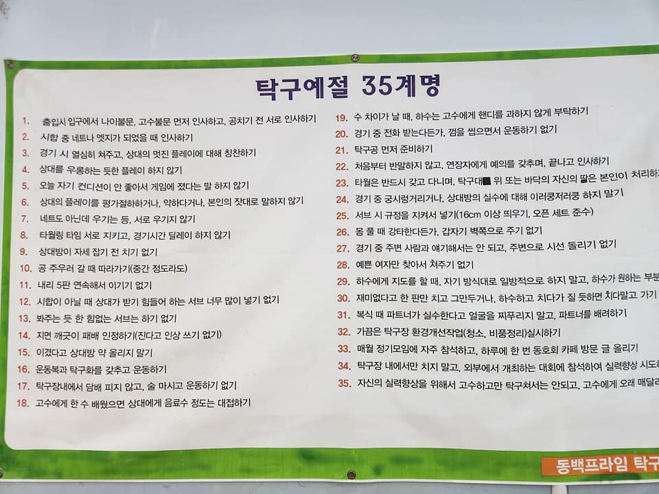

# 2022년 12월

[← 2022년](README.md)

### 12월 3일 (토) 02:06 · Well done!

Well done!

  

### 12월 5일 (월) 20:01 · 대한민국 8강 진출 응원합니다! Go Korea!!

대한민국 8강 진출 응원합니다! Go Korea!!

  

### 12월 9일 (금) 07:45 · 저희가 만든 제품을 고객이 잘 사용해주시고, 결국의 고객에게 도움이 될때…

저희가 만든 제품을 고객이 잘 사용해주시고, 결국의 고객에게 도움이 될때 제일 기쁜것 같습니다. Making AI Beneficial!

한 예로 브랜디 데이터최적화실 최원조 실장님의 인터뷰를 통해 업스테이지와 일하시면 어떤 성과를 낼수 있는지 볼수 있습니다.

https://www.upstage.ai/blog/business/customer-success-stories-brandi

"업스테이지의 추천 AI Pack 적용 후 효과는 총 노출당 구매전환액이 해당 사업 시작하기 전 대비해서 60% 가까이 증가했습니다. 제가 올해 초에 사업을 시작하면서 목표로 잡았던 +32%에 비해 거의 2배가 상승한 셈이죠. 업스테이지 AI 모델만으로 보면 기존 대비 평균 +150%까지도 증가했습니다."

"업스테이지는 연동 작업부터 시작하지 않았습니다. 연동 전 PoC때부터 저희와 마치 한 팀처럼 수많은 EDA와 데이터 검증을 진행했습니다.[...] 업스테이지의 이런 어프로치에 대해 감탄했습니다. [...] 그 결과 초반부터 빠르게 성능이 향상했습니다. 많은 업체들 중 도메인 지식을 직접 파고들고 데이터 검증부터 시작했던 것은 업스테이지였거든요."

"또한 인상 깊었던 것은 성능입니다. 보통은 2주~두 달 정도 걸려야 성능이 좋아져서 PoC 기간이 길어지고, 그동안 솔루션 도입 여부가 보류되기도 하는데, 업스테이지의 추천 AI는 그간의 분석에 대한 보람이 있는지 거의 도입 후 2,3일 뒤부터 바로 저희의 레퍼런스 모델의 성능을 능가하기 시작해 다른 모든 모델들을 앞질렀습니다."

저희 Upstage와 한팀으로 2, 3일 후부터 성능 향상을 보시면서 구매전환률을 60%이상 올리고 싶으신 분들은 https://www.upstage.ai/contact-us 로 연락주셔서 저희와 함께 해요!

### 12월 13일 (화) 21:15 · AI도입을 고민 하고 있는 분들을 위해 매우 일반적인 용어로 AI와 응용…

https://youtu.be/FpoI7A3yQ2Y AI도입을 고민 하고 있는 분들을 위해 매우 일반적인 용어로 AI와 응용 활용등에 대해 이야기 나눕니다. 물론 도움이 필요하시면 바로 Upstage 로 연락 주시고요!

### 12월 19일 (월) 14:17 · 최고의 AI를 위해 가장 중요한 일 중 하나는 최고의 데이터를 확보하는 …

최고의 AI를 위해 가장 중요한 일 중 하나는 최고의 데이터를 확보하는 것이고 이를 위해 안정적이고 지속가능한 데이터 구축 파이프라인이 필요합니다.

그동안 업스테이지 경험을 토대로 전체 데이터 구축 파이프라인이 어떻게 되는지 누가 각 과정에서 어떤 부분들에 유의하며 구축해야 하는지 이야기 나누어 보려고 합니다. 

이번 NeurIPS 2022 HCAI Workshop에 발표된 업스테이지 연구를 바탕으로 Annotator, Data Manager, PM, ML engineer과 같은 많은 사람들의 전문성이 어떻게 발현될 수 있는지를 소개합니다.

멋진 AI를 만들고 멋진 AI데이터를 만드실 분들 함께해요. 

* 일시: 12월 20일 저녁 8시
* 사전등록: 👉 https://bit.ly/hcai_data_fb

실시간 참석이 어려우시더라도 등록해 주신 분들께는 ‘다시 보기' 링크를 전달 드릴 예정이오니 많은 등록 부탁드립니다.

### 12월 24일 (토) 13:07 · #merryxmas #HappyNewYear 페친여러분! 모두 즐거운 성…

#merryxmas #HappyNewYear 페친여러분! 모두 즐거운 성탄되시고, 2023년은 더 많이 웃고, 더 신나고, 더 즐거운 일들이 많은 한해가 되기시를 기원합니다.

### 12월 25일 (일) 13:39 · 📷 사진 (1장)

### 12월 29일 (목) 18:11 · 저희 Upstage Hwalsuk Lee CTO님이 정리해주신 맥킨지 A…

저희 Upstage Hwalsuk Lee CTO님이 정리해주신 맥킨지 AI 리포트인데 좋은 내용이 많습니다. 

정리해주신 내용에 나오는 "AI high performer" 분들이 가장 많이 모인 곳이 바로 Upstage입니다. 함께 Making AI Beneficial 하실 분들은 저희랑 함께해요!!
