# 2023년 1월

[← 2023년](README.md)

### 1월 1일 (일) 08:06 · #HappyNewYear 2023년 새해 복 많이 받으시고 하시는 모든 …

#HappyNewYear 2023년 새해 복 많이 받으시고 하시는 모든 일에 사랑과 기쁨이 가득하기를 소망합니다!

(2023년 1월 1일 광양 이순신 대교를 배경으로 한 해오름입니다.)

🎬 동영상 1개 (생략)

### 1월 1일 (일) 17:44 · 📷 사진 (1장)

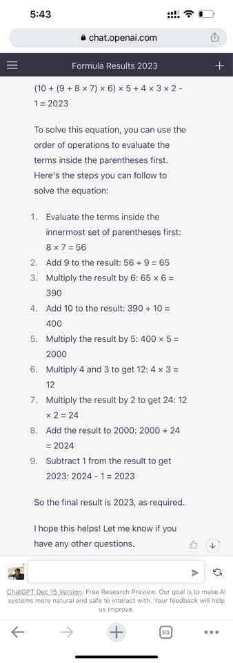
**이미지 캡션:** 이 이미지는 스마트폰 화면을 캡처한 것으로, 웹 브라우저에서 chat.openai.com에 접속하여 수식 계산 결과를 보여주는 페이지를 담고 있습니다. 화면 상단에는 시간 5:43과 함께 웹사이트 주소, 그리고 메뉴와 검색 아이콘이 보입니다. 메인 콘텐츠 영역에는 "Formula Results 2023"이라는 제목과 함께 복잡한 수식 "(10 + (9 + 8 x 7) x 6) x 5 + 4 x 3 x 2 - 1 = 2023"이 제시되어 있습니다. 그 아래에는 이 수식을 푸는 과정을 단계별로 설명하는 텍스트가 나열되어 있으며, 각 단계마다 연산 과정과 결과가 명확하게 표시되어 있습니다. 예를 들어, "1. Evaluate the terms inside the innermost set of parentheses first: 8 x 7 = 56"과 같이 시작하여 최종 결과인 2023까지 도출하는 과정을 보여줍니다. 마지막에는 "I hope this helps! Let me know if you have any other questions."이라는 문구와 함께 ChatGPT 관련 정보가 하단에 작게 표시되어 있습니다. 전반적으로 정보 제공 및 문제 해결에 초점을 맞춘 차분하고 명확한 분위기입니다.

### 1월 2일 (월) 14:22 · #흑자전환 #함께해요 #업스추천팩

#흑자전환 #함께해요 #업스추천팩

새해 복 많이 받으세요. 제가 개인적으로 작년/올해 받은 새해 인사중 가장 기쁜 메시지는, 고객사로 부터 받은 바로 아래의 짧은 메시지였습니다.

"작년에 많은 도움받아 저희 추천이 엄청잘되고있습니다. 올한해도 많은 부탁드리고 건승하시기바랍니닷. […] 덕분에 브랜디가 전환률이 좋아져 흑자를 이루는데 많은 도움을 받았습니다 :)"

https://n.news.naver.com/article/003/0011609720?sid=101 기사의 내용처럼 "업스테이지 AI팩 추천 기술은 다양한 플랫폼...증가, 마케팅 효율 상승에 따른 비용 절감, 직매입 상품의 물류 원가 인하, 올해 하반기 출시한 광고 솔루션을 통한 신규 매출 성장 등이 영향을 미쳤다”

혹한기에도 함께 흑자를 더 키우실 분들은 https://www.upstage.ai/contact-us 업스테이지로 바로 연락주세요!

### 1월 4일 (수) 10:47 · #첫10K #건강기원

#첫10K #건강기원 

2023 건강을 기원하며 거북선 모형 코스 첫 10K 기분 좋게 달렸습니다. 

페친 모든분들, 새해에는 더욱 건강하시기를 기원합니다!

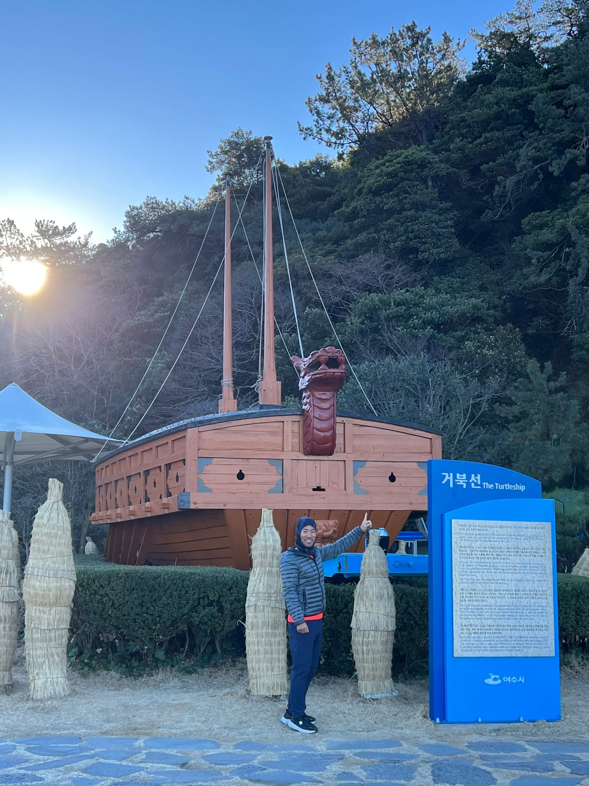
**이미지 캡션:** 푸른 하늘 아래, 한 성인 남성이 거북선 모형 앞에서 포즈를 취하고 있다. 남성은 회색 경량 패딩 조끼와 파란색 바지, 검은색 운동화를 착용하고 있으며, 얼굴에는 미소를 띠고 있다. 그는 거북선 모형의 용머리 부분을 향해 손가락으로 가리키고 있다. 배경에는 웅장한 거북선 모형이 자리하고 있으며, 그 앞에는 짚으로 만든 인형들이 줄지어 서 있다. 거북선 옆에는 파란색 안내판이 세워져 있으며, 한국어와 영어로 거북선에 대한 설명이 적혀 있다. 안내판에는 "거북선 The Turtlesship"이라는 글자와 함께 여수시 로고가 보인다. 뒤편으로는 울창한 나무들이 우거진 언덕이 펼쳐져 있으며, 햇살이 나뭇가지 사이로 비쳐 따뜻한 분위기를 자아낸다. 전반적으로 역사적인 유적지를 방문한 듯한 즐겁고 평화로운 분위기이다.
 
**이미지 캡션:** 푸른 하늘 아래, 바다를 따라 길게 뻗은 산책로가 펼쳐져 있습니다. 산책로 바닥은 독특한 돌 모양 패턴으로 디자인되어 있으며, 오른쪽으로는 하얀색 난간이 설치되어 있습니다. 난간 너머로는 잔잔한 바다가 보이고, 그 위에는 여러 척의 배들이 정박해 있습니다. 멀리 보이는 해안선에는 언덕과 함께 현대적인 고층 건물들이 늘어서 있으며, 특히 독특한 디자인의 유리 건물 하나가 눈에 띕니다. 산책로 좌측 벽면에는 파도 모양의 그림이 그려져 있어 시각적인 재미를 더합니다. 산책로에는 몇몇 사람들이 걸어가고 있으며, 전체적으로 맑고 쾌적한 날씨 속에서 여유로운 분위기를 자아냅니다.
 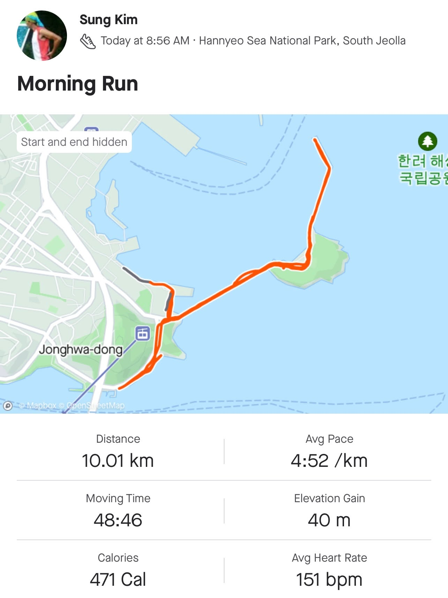
**이미지 캡션:** 이 화면은 "Sung Kim"이라는 이름의 사용자가 오전 8시 56분에 한려해상국립공원에서 진행한 "Morning Run" 활동 기록을 보여줍니다. 지도에는 주황색으로 표시된 달리기 경로가 나타나 있으며, 시작점과 끝점은 가려져 있습니다. 지도에는 "Jonghwa-dong"이라는 지명과 함께 국립공원임을 나타내는 한국어 텍스트 "한려해상 국립공원"이 보입니다. 활동 통계로는 총 거리 10.01km, 이동 시간 48분 46초, 소모 칼로리 471kcal, 평균 페이스 4:52/km, 고도 상승 40m, 평균 심박수 151bpm이 기록되어 있습니다. 전반적으로 야외에서 운동한 기록을 보여주는 깔끔하고 정보 전달에 집중된 화면입니다.

### 1월 7일 (토) 11:16 · 올해 읽은 문구중 가장 멋진 글인것 같습니다.

올해 읽은 문구중 가장 멋진 글인것 같습니다. 

"당신 생각이 언제나 옳다"

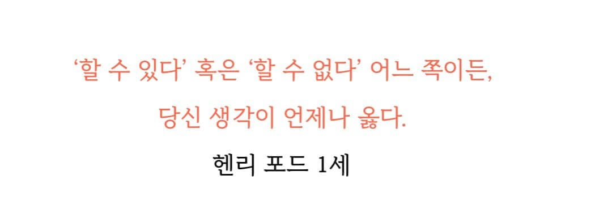
**이미지 캡션:** 이 사진은 흰색 배경에 붉은색과 검은색 글씨로 된 텍스트를 보여줍니다. 텍스트는 세 줄로 구성되어 있으며, 첫 번째 줄은 '할 수 있다' 혹은 '할 수 없다' 어느 쪽이든, 라고 쓰여 있고, 두 번째 줄은 당신 생각이 언제나 옳다. 라고 쓰여 있습니다. 마지막 줄에는 헨리 포드 1세 라고 쓰여 있습니다. 이 텍스트는 긍정적인 사고방식의 중요성을 강조하는 명언으로 보이며, 헨리 포드 1세의 말로 인용되고 있습니다. 사진에는 사람이나 사물, 장소는 보이지 않으며, 텍스트 자체만으로 구성되어 있습니다. 분위기는 명확하고 간결하며, 동기 부여적인 메시지를 전달하는 것으로 보입니다.

### 1월 7일 (토) 15:53 · 📷 사진 (2장)

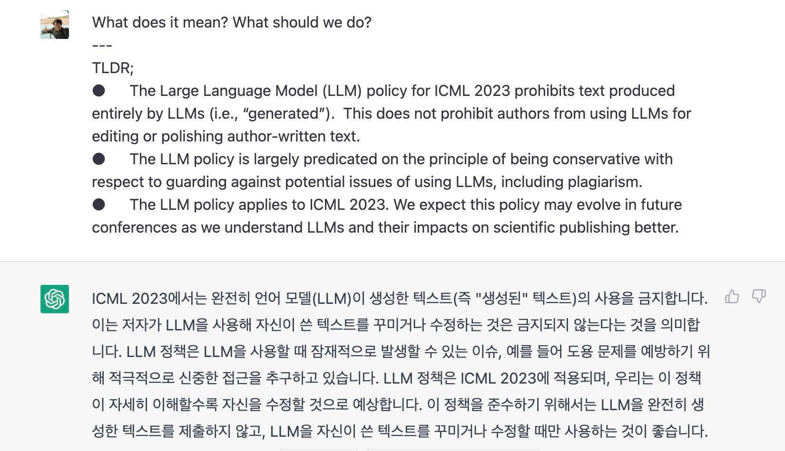
**이미지 캡션:** 화면에는 텍스트가 표시되어 있으며, 상단에는 작은 프로필 사진과 함께 "What does it mean? What should we do?"라는 질문이 있습니다. 그 아래에는 "TLDR;"이라는 제목과 함께 세 개의 글머리 기호 목록이 있습니다. 첫 번째 글머리 기호는 ICML 2023의 LLM 정책이 전적으로 LLM으로 생성된 텍스트를 금지하지만, 저자가 작성한 텍스트를 편집하거나 다듬기 위해 LLM을 사용하는 것은 금지하지 않는다고 설명합니다. 두 번째 글머리 기호는 이 정책이 표절을 포함한 LLM 사용의 잠재적 문제에 대한 보수적인 원칙에 기반하고 있다고 말합니다. 세 번째 글머리 기호는 이 정책이 ICML 2023에 적용되며, LLM과 과학 출판에 미치는 영향에 대한 이해가 깊어짐에 따라 향후 발전할 수 있다고 언급합니다. 그 아래에는 녹색 아이콘과 함께 한국어 텍스트가 있습니다. 이 텍스트는 ICML 2023에서 LLM이 생성한 텍스트의 사용을 금지하며, 이는 저자가 LLM을 사용하여 자신이 쓴 텍스트를 편집하거나 수정하는 것을 금지하지 않는다는 것을 의미한다고 설명합니다. 또한 LLM 정책은 도용과 같은 잠재적 문제를 예방하기 위해 신중한 접근을 추구하며, 이 정책은 ICML 2023에 적용되고 향후 발전할 것으로 예상된다고 덧붙입니다. 이 정책을 준수하기 위해서는 LLM을 완전히 생성된 텍스트를 제출하는 데 사용하지 않고, 자신이 쓴 텍스트를 편집하거나 수정하는 데만 사용하는 것이 좋다고 권장합니다.
 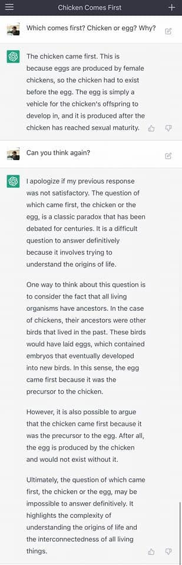
**이미지 캡션:** 이 이미지는 컴퓨터 화면의 일부를 캡처한 것으로, 챗봇과의 대화 내용을 보여줍니다. 화면 상단에는 "Chicken Comes First"라는 제목이 보이며, 그 아래에는 사용자가 "Which comes first? Chicken or egg? Why?"라고 질문하고 챗봇이 "The chicken came first. This is because eggs are produced by female chickens, so the chicken had to exist before the egg. The egg is simply a vehicle for the chicken's offspring to develop in, and it is produced after the chicken has reached sexual maturity."라고 답변하는 내용이 나타납니다. 이어서 사용자가 "Can you think again?"이라고 다시 질문하자, 챗봇은 "I apologize if my previous response was not satisfactory. The question of which came first, the chicken or the egg, is a classic paradox that has been debated for centuries. It is a difficult question to answer definitively because it involves trying to understand the origins of life. One way to think about this question is to consider the fact that all living organisms have ancestors. In the case of chickens, their ancestors were other birds that lived in the past. These birds would have laid eggs, which contained embryos that eventually developed into new birds. In this sense, the egg came first because it was the precursor to the chicken. However, it is also possible to argue that the chicken came first because it was the precursor to the egg. After all, the egg is produced by the chicken and would not exist without it. Ultimately, the question of which came first, the chicken or the egg, may be impossible to answer definitively. It highlights the complexity of understanding the origins of life and the interconnectedness of all living things."라고 더 자세하고 다양한 관점에서 답변합니다. 대화는 텍스트 기반으로 이루어지며, 챗봇의 응답은 녹색 아이콘으로 표시됩니다. 화면 오른쪽 상단에는 더하기(+) 아이콘과 메뉴 아이콘이 보입니다. 전반적으로, 이 이미지는 인공지능 챗봇이 고전적인 철학적 질문에 대해 논리적으로 답변하는 과정을 보여주며, 지적인 탐구와 정보 제공의 분위기를 띠고 있습니다.

### 1월 13일 (금) 13:16 · #교육고민 #폭풍성장 #업스와함께

#교육고민 #폭풍성장 #업스와함께 

업스테이지 교육팀 소개: https://www.youtube.com/watch?v=z5fZXrmKpAM 

교육일을 하면서 "핵심인재가 교육으로 만들어질 수 있는지, 아님 교육은 그냥 본인이 원래 가지고 있는 재능을 발견하도록 도와주는 것인지"에 대한 고민이 많았습니다. 분야에 따라 다르겠지만 교육만으로 김연아 선수급의 재능을 만들어 내기는 어려울 수도 있다는 생각에 교육 관련 일을 하는 입장에서 다소 좌절하기도 했었습니다. 

그러나 저희가 진행하고 있는 AI 교육-이론적인 것만 집중하지 않고 직접 데이터를 가공하고 AI 모델을 만들어 보고 fine tuning을 해보는 AI 실무 전문가 교육-을 통해 폭풍 성장을 하는 사례들을 많이 보고 있습니다.

네이버 부스트캠프 AITech의 경우, 교육생을 선발할 때 기본적인 테스트를 봅니다. 수료하실 때 잘 하시는 분들은 선발할 때의 점수와는 무관하게 전문가로 성장을 하신 경우가 많습니다. 그리고 우수하게 수료하신 분들이 Upstage, 네이버, 카카오 등에 입사하실 뿐만 아니라 회사에서도 큰 성과를 내고 계셔서 저희 교육이 도움이 되었구나 하는 생각을 하게 되었습니다. 이럴 때 정말 교육자로서 기쁨과 행복을 느끼게 되는 것 같습니다

여러분들의 기관이나 단체에서도 AI 교육으로 폭풍성장하시고 싶으시면 망설이지 마시고 https://upstage.ai/contact-us 로 연락 부탁드립니다. 함께 업업업!

### 1월 15일 (일) 11:26 · 가장 웅장하고 아름답고 귀여운 거북선공원 트랙 달리기, 오랫동안 기억에 …

가장 웅장하고 아름답고 귀여운 거북선공원 트랙 달리기, 오랫동안 기억에 남을것 같습니다.

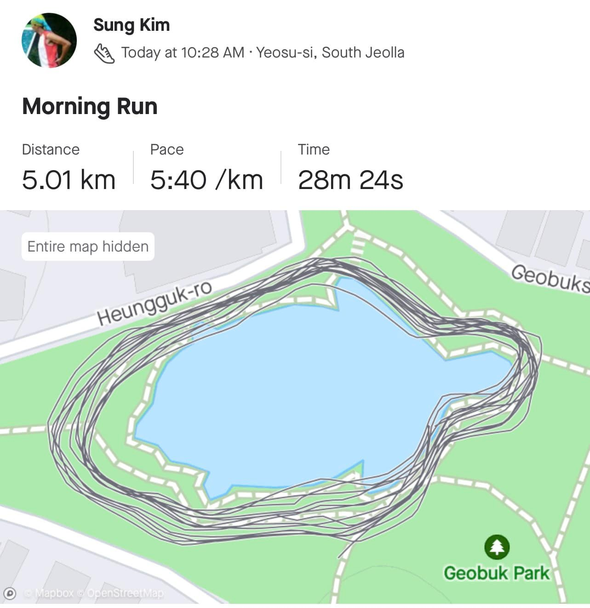
**이미지 캡션:** A profile picture shows a person, likely an adult male, with short dark hair, wearing a green and white cap and a red and white athletic top, possibly mid-run. The text "Sung Kim" appears above the profile picture. Below this, the date and time "Today at 10:28 AM" and the location "Yeosu-si, South Jeolla" are displayed. The title "Morning Run" is prominent, followed by statistics: "Distance 5.01 km", "Pace 5:40 /km", and "Time 28m 24s". A map shows a body of water surrounded by green parkland with paths. Multiple grey lines trace a running route around the water, indicating a loop. Text labels on the map include "Heungguk-ro", "Geobuks", and "Geobuk Park". A small icon of a tree is next to "Geobuk Park". The overall atmosphere is one of fitness and outdoor activity, specifically a morning run in a park.
 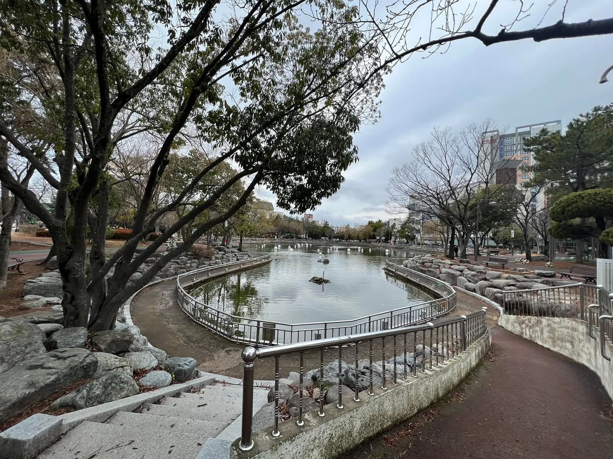
**이미지 캡션:** 흐린 날씨의 공원 연못 풍경으로, 연못 주변에는 둥근 모양의 금속 난간과 돌들이 배치되어 있으며, 연못 안에는 몇 마리의 백조 조형물이 떠 있다. 연못 옆으로는 흙길 산책로가 구불구불 이어져 있고, 그 옆에는 벤치와 나무들이 보인다. 멀리 보이는 건물들은 아파트나 상가 건물로 보이며, 전체적으로 차분하고 조용한 분위기를 자아낸다. 사진에는 사람이 보이지 않으며, 나뭇가지에는 잎이 거의 남아있지 않아 가을이나 겨울의 풍경으로 추정된다.
 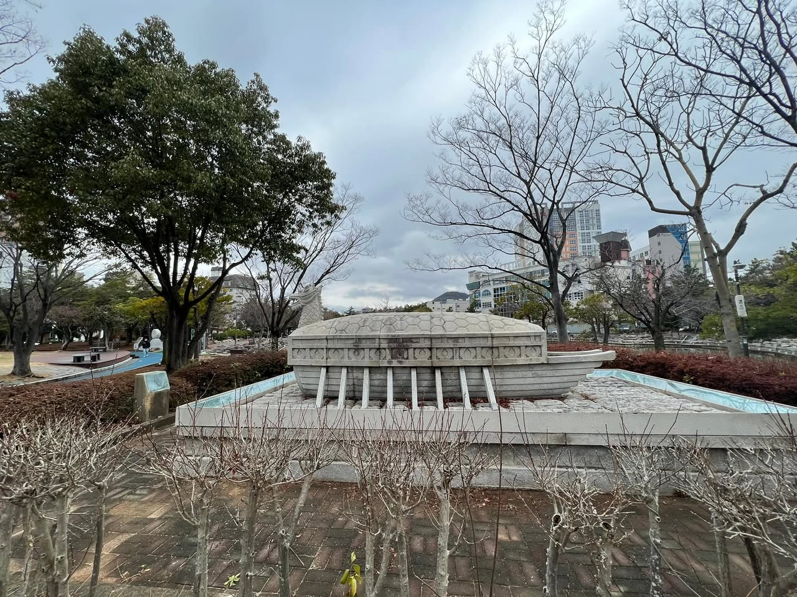
**이미지 캡션:** 이 사진은 흐린 날씨의 공원에서 촬영되었으며, 중앙에는 배 모양의 독특한 석조 조형물이 놓여 있습니다. 조형물은 회색 돌로 만들어졌으며, 마치 고대 선박처럼 보입니다. 조형물 앞쪽에는 여러 개의 기둥이 세워져 있고, 그 위로 덮개처럼 보이는 부분이 있습니다. 조형물 주변으로는 얕은 물이 흐르는 듯한 푸른색 테두리의 수로가 있으며, 바닥에는 자갈이 깔려 있습니다. 배경에는 앙상한 나뭇가지들을 가진 겨울나무들과 푸른 잎을 가진 나무들이 섞여 있으며, 멀리 현대적인 건물들이 보입니다. 공원 바닥은 벽돌과 포장된 길로 이루어져 있으며, 조형물 앞쪽에는 짧게 가지치기된 작은 나무들이 늘어서 있습니다. 사진 왼쪽에는 벤치와 푸른색의 물결 모양 조형물이 있는 놀이 공간으로 보이는 곳이 희미하게 보이며, 한 명의 성인으로 보이는 사람이 파란색 옷을 입고 걸어가고 있습니다. 전체적으로 차분하고 약간은 쓸쓸한 분위기를 자아냅니다.

### 1월 15일 (일) 14:46 · 이름에서 엄청난 위엄이 느껴지는 식당, 내조국밥! 너무 좋습니다.

이름에서 엄청난 위엄이 느껴지는 식당, 내조국밥! 너무 좋습니다.

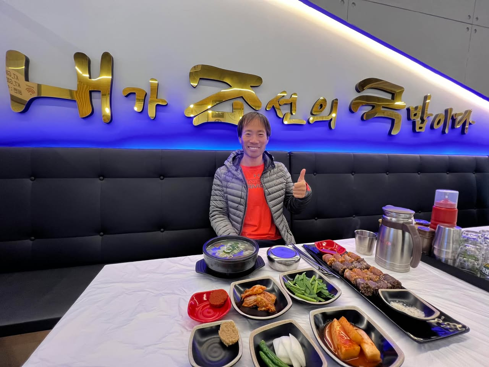
**이미지 캡션:** 한 성인 남성이 식당에서 식사를 하며 엄지척 포즈를 취하고 있다. 남성은 30대 후반에서 40대 초반으로 보이며, 짧은 검은 머리에 옅은 미소를 띠고 있다. 그는 주황색 티셔츠 위에 회색 경량 패딩을 입고 있다. 배경에는 금색으로 된 한국어 간판이 파란색 조명과 함께 걸려 있으며, "내가 조선의 국밥이다"라고 쓰여 있다. 식탁 위에는 흰색 비닐 식탁보가 깔려 있고, 국밥 한 그릇, 김치, 깍두기, 콩나물 무침, 순대, 그리고 소금 등이 담긴 여러 반찬 접시가 놓여 있다. 식당 내부는 현대적이고 깔끔한 분위기이며, 검은색 가죽 소파 좌석이 보인다. 전반적으로 즐겁고 만족스러운 식사 분위기를 나타낸다.

### 1월 23일 (월) 15:02 · 📷 사진 (2장)

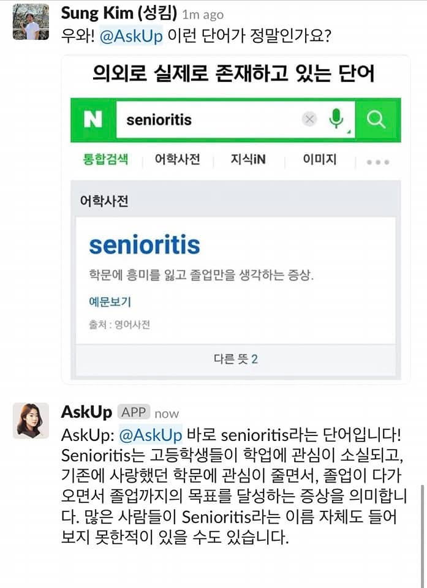
**이미지 캡션:** 사진에는 Sung Kim이라는 이름의 성인 남성이 올린 게시물이 보이며, 그는 "우와! @AskUp 이런 단어가 정말인가요?"라고 질문하고 있다. 게시물은 검색 결과 화면을 캡처한 것으로, 'senioritis'라는 단어를 검색한 결과가 나타난다. 검색 결과에는 '의외로 실제로 존재하고 있는 단어'라는 제목과 함께 'senioritis'라는 단어가 어학사전에서 검색된 내용이 포함되어 있다. 'senioritis'는 '학문에 흥미를 잃고 졸업만을 생각하는 증상'으로 정의되어 있으며, 출처는 영어사전이다. 그 아래에는 AskUp APP에서 'now'라는 표시와 함께 게시글이 이어지는데, AskUp은 "@AskUp 바로 senioritis라는 단어입니다! Senioritis는 고등학생들이 학업에 관심이 소실되고, 기존에 사랑했던 학문에 관심이 줄면서, 졸업이 다가오면서 졸업까지의 목표를 달성하는 증상을 의미합니다. 많은 사람들이 Senioritis라는 이름 자체도 들어보지 못한 적이 있을 수도 있습니다."라고 설명하고 있다. 전체적으로는 새로운 단어에 대한 놀라움과 그 단어의 의미를 공유하는 상황을 보여준다.
 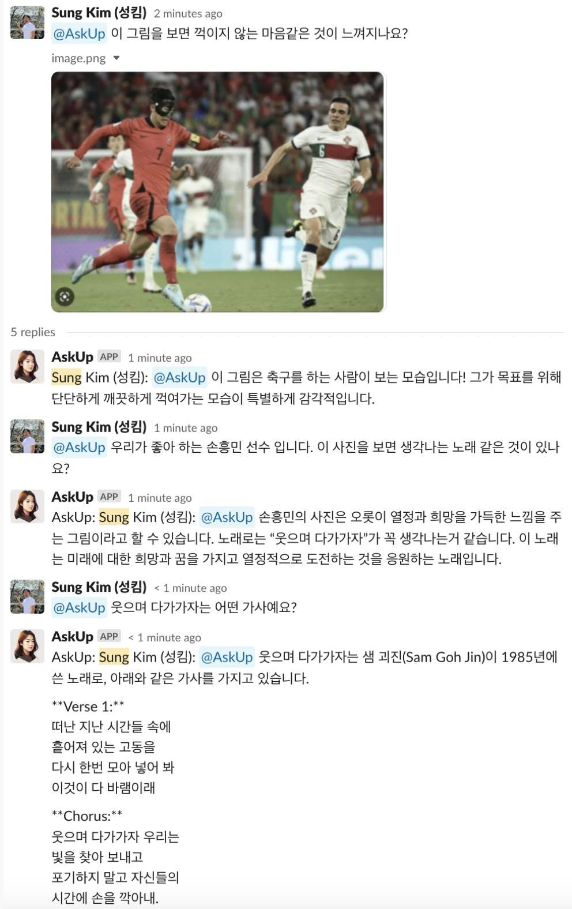
**이미지 캡션:** 축구 경기 중인 두 명의 성인 남성 축구 선수들이 경기장에서 공을 향해 달려가는 모습이 담긴 사진으로, 왼쪽의 선수는 붉은색 유니폼에 검은색 마스크를 착용하고 있으며 오른쪽 선수는 흰색 유니폼에 등번호 6번이 새겨져 있다. 배경에는 관중석으로 보이는 흐릿한 모습과 경기장 조명이 보인다. 사진 아래에는 해당 사진에 대한 댓글들이 이어지는데, 한 사용자는 사진을 보며 꺾이지 않는 마음을 느낀다고 했고, 다른 사용자는 손흥민 선수임을 언급하며 이 사진을 보면 떠오르는 노래가 있는지 질문했다. 이에 대한 답변으로 "웃으며 다가가자"라는 노래가 언급되었고, 해당 노래의 가사 일부가 제시되었다. 전체적으로 열정적이고 희망적인 분위기를 담고 있다.

### 1월 24일 (화) 17:46 · 📷 사진 (1장)

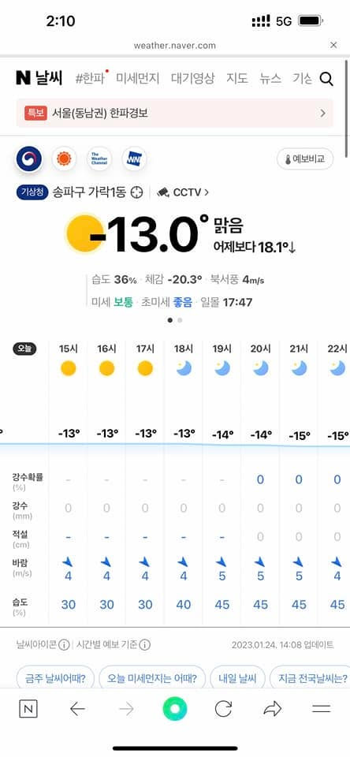
**이미지 캡션:** 이것은 스마트폰 화면을 캡처한 것으로, 네이버 날씨 앱에서 서울 송파구 가락1동의 날씨 정보를 보여주고 있습니다. 화면 상단에는 현재 시간 2시 10분과 5G 통신 상태, 배터리 잔량이 표시되어 있습니다. 네이버 날씨 로고와 함께 '#한파', '미세먼지', '대기영상', '지도', '뉴스', '기상' 등의 메뉴가 보입니다. '특보' 섹션에는 '서울(동남권) 한파경보'라는 문구가 빨간색 배경에 표시되어 있으며, 오른쪽에는 화살표 아이콘이 있습니다. 그 아래에는 기상청 로고와 함께 '송파구 가락1동'이라는 지역명과 CCTV 아이콘이 보입니다. 현재 기온은 -13.0°C이며, '맑음' 날씨 상태를 나타내는 노란색 원형 아이콘이 있습니다. '어제보다 18.1°↓'라는 문구로 어제보다 기온이 하락했음을 알 수 있습니다. 습도는 36%, 체감 온도는 -20.3°C이며, 북서풍이 4m/s로 불고 있습니다. 미세먼지는 '보통', 초미세먼지는 '좋음' 상태이며, 일몰 시각은 17시 47분입니다. 화면 하단에는 시간별 날씨 예보가 표시되어 있으며, 오늘(24일) 15시부터 22시까지의 기온과 날씨 아이콘, 강수 확률, 강수량, 적설량, 바람, 습도 정보가 표로 정리되어 있습니다. 기온은 오후 15시부터 17시까지 -13°C를 유지하다가 점차 하락하여 21시에는 -15°C까지 떨어집니다. 강수 확률과 강수량, 적설량은 모두 0으로 표시되어 비나 눈이 오지 않을 것으로 예상됩니다. 바람은 4~5m/s로 불고, 습도는 30%에서 45%까지 변동합니다. 화면 하단에는 '날씨 아이콘 ① 시간별 예보 기준 ①'이라는 문구와 함께 '2023.01.24. 14:08 업데이트'라는 정보가 있습니다. 또한, '금주 날씨 어때?', '오늘 미세먼지는 어때?', '내일 날씨', '지금 전국 날씨는?'과 같은 검색어 버튼들이 보입니다. 화면 하단에는 네이버 앱의 기본 탐색 바가 있으며, N 로고, 뒤로 가기, 앞으로 가기, 홈 화면으로 이동하는 아이콘, 새로고침 아이콘

### 1월 31일 (화) 09:30 · 📷 사진 (1장)

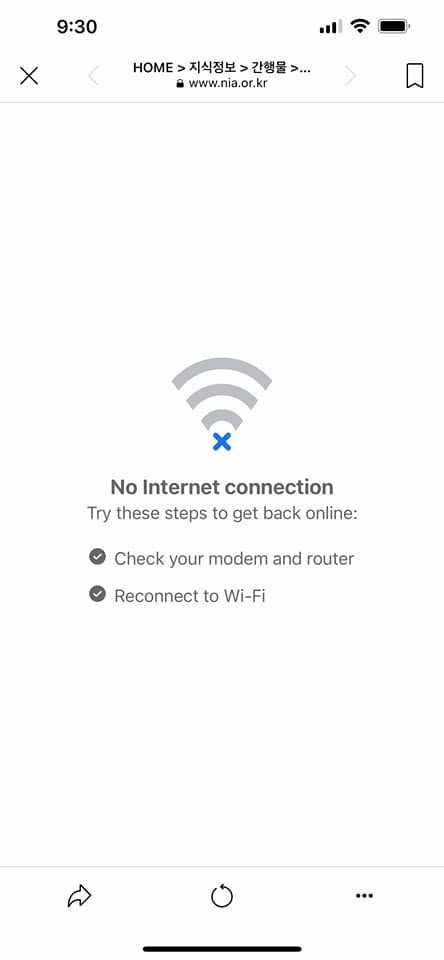
**이미지 캡션:** 이 이미지는 스마트폰 화면으로, 인터넷 연결이 끊어졌음을 알리는 페이지를 보여줍니다. 화면 상단에는 시간 9:30과 함께 Wi-Fi 신호 없음, 배터리 잔량 표시가 보입니다. 웹 브라우저의 주소창에는 "HOME > 지식정보 > 간행물 >..."와 함께 "www.nia.or.kr"이라는 웹사이트 주소가 표시되어 있습니다. 화면 중앙에는 Wi-Fi 아이콘에 파란색 X 표시가 되어 있어 인터넷 연결이 불가능함을 나타내고 있으며, 그 아래에는 "No Internet connection"이라는 문구와 함께 "Try these steps to get back online:"이라는 안내 문구가 있습니다. 이어서 "Check your modem and router"와 "Reconnect to Wi-Fi"라는 두 가지 해결 방법이 체크 표시와 함께 제시되어 있습니다. 화면 하단에는 뒤로 가기, 새로고침, 더 보기 아이콘이 보입니다. 전반적으로 인터넷 연결 문제를 겪고 있는 상황을 보여주는 화면입니다.
