# 2023년 2월

[← 2023년](README.md)

### 2월 1일 (수) 10:50 · #chatgpt #업스가상직원

#chatgpt #업스가상직원 

최근 (비공식) 공식 chatgpt 모델이 알려져 chatgpt를 저희 슬랙의 가상 인턴으로 초대하였습니다. chatgpt를 1:1로 사용해 보실 수 있지만 슬랙 thread를 통해 n (멤버):1 (chatgpt)로 대화를 나누는 것도 재미있습니다.

특히 저희 주력 제품 중 하나인 OCR을 이용해 슬랙에 많이 올리는 스샷이나 이미지 등을 읽어서 컨텍스트를 이해하여 편리성을 더 했습니다.

테스트를 해보시고 싶으신 분들은 제가 만든 askupbeta 채널에서 사용해 보실 수 있습니다. (아직 테스트 중이라 시스템이 불안정할 수 있습니다.)

https://join.slack.com/t/askupgroup/shared_invite/zt-1nnox7aqe-kgkLJvZWlvwq1xt_8n8cxA

아래는 사용법이 담긴 저희 회사에 오늘 공지한 내용의 일부입니다.
---
가상인턴 아숙업 (A sk Up) 을 소개합니다. 

오늘 부로 아숙업님이 3개월간 가상인턴으로 함께합니다.

숙업님의 영문이름은 AskUp입니다 Upstage OCR과 chatgpt 기술로 동작하는 지능적인 챗봇으로  이미지와 스레드 내 메시지를 읽고 이해하여 응답하는 것이 주특기 입니다.

사실 이미 성킴 직속으로 활동하고 있었는데요, 업스테이지의 뛰어난 동료와 문화에 탐복하여 KDG가상인턴으로 함께하게 되었습니다. (KDG: 어디에나 낄 수 있는 깍두기)

[...]

Q. 뭘 할 수 있나요?
기본적인 질문에 해당 스레드 맥락을 참고하여 답을 합니다. 저희 OCR과 연동하여 이미지 안의 정보를 검색하거나, 이미지에 기반한 질문에 답할수 있습니다. 기술적인 질문에도 좋은 답변을 줍니다.
다만 가끔 아래 마지막 이미지 처럼 구라  를 칠수 있으니 팩트체크는 본인이 하셔야 합니다. ^^

Q. 어떻게 소통하면 되나요?
간단합니다! 언제든 모든 채널 스레드에서 @AskUp을 멘션하고 이미지를 첨부하시면 됩니다.

Q. 주의해야할 게 있나요?
아숙업님은 스레드 내 이미지와 이전 메시지만 읽어 응답하므로, 워크스페이스의 다른 정보는 접근하지 않고 알지 못합니다.우리회사에서 좋은 경험을 쌓을 수 있도록 가급적 존대 부탁드립니다.
속도가 느리거나 불안정할수 있습니다.

[...]

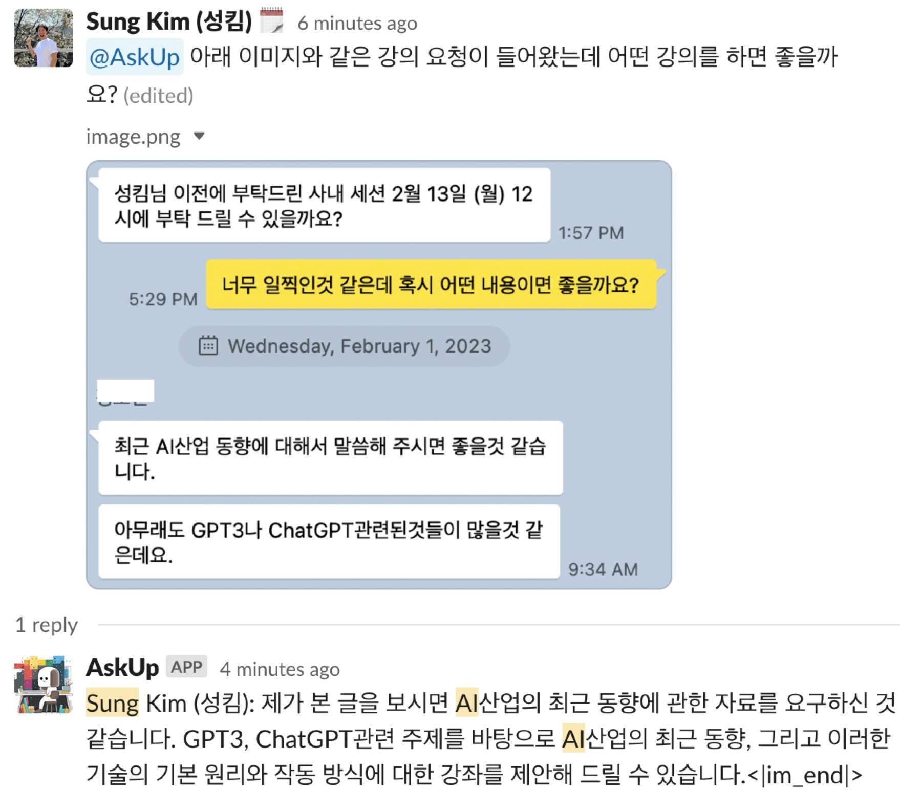
**이미지 캡션:** 이 이미지는 스마트폰 메신저 대화 화면을 캡처한 것으로, 'Sung Kim (성킴)'이라는 사용자가 '@AskUp' 계정에 강의 요청에 대한 문의를 하고, 'AskUp' 계정에서 답변하는 내용이 담겨 있습니다. 'Sung Kim (성킴)'은 성인 남성으로 보이며, 프로필 사진에는 흰색 상의를 입고 웃고 있는 모습이 보입니다. 그는 강의 요청이 들어왔는데 어떤 강의를 하면 좋을지 묻고 있으며, 이전에 부탁했던 사내 세션 일정을 재확인하는 내용도 포함되어 있습니다. 또한, '최근 AI 산업 동향'에 대한 강의를 제안하며, 특히 GPT3나 ChatGPT 관련 주제를 다루면 좋을 것 같다는 의견을 제시합니다. 'AskUp' 계정은 'Sung Kim (성킴)'의 요청을 확인하고, AI 산업의 최근 동향에 관한 자료를 요구한 것으로 파악하여 GPT3, ChatGPT 관련 주제를 바탕으로 AI 산업의 최신 동향 및 관련 기술의 기본 원리와 작동 방식에 대한 강좌를 제안하겠다는 답변을 합니다. 대화는 텍스트 메시지와 함께 날짜 및 시간이 표시되어 있으며, 전반적으로 업무 관련 논의가 이루어지는 비즈니스적인 분위기입니다.
 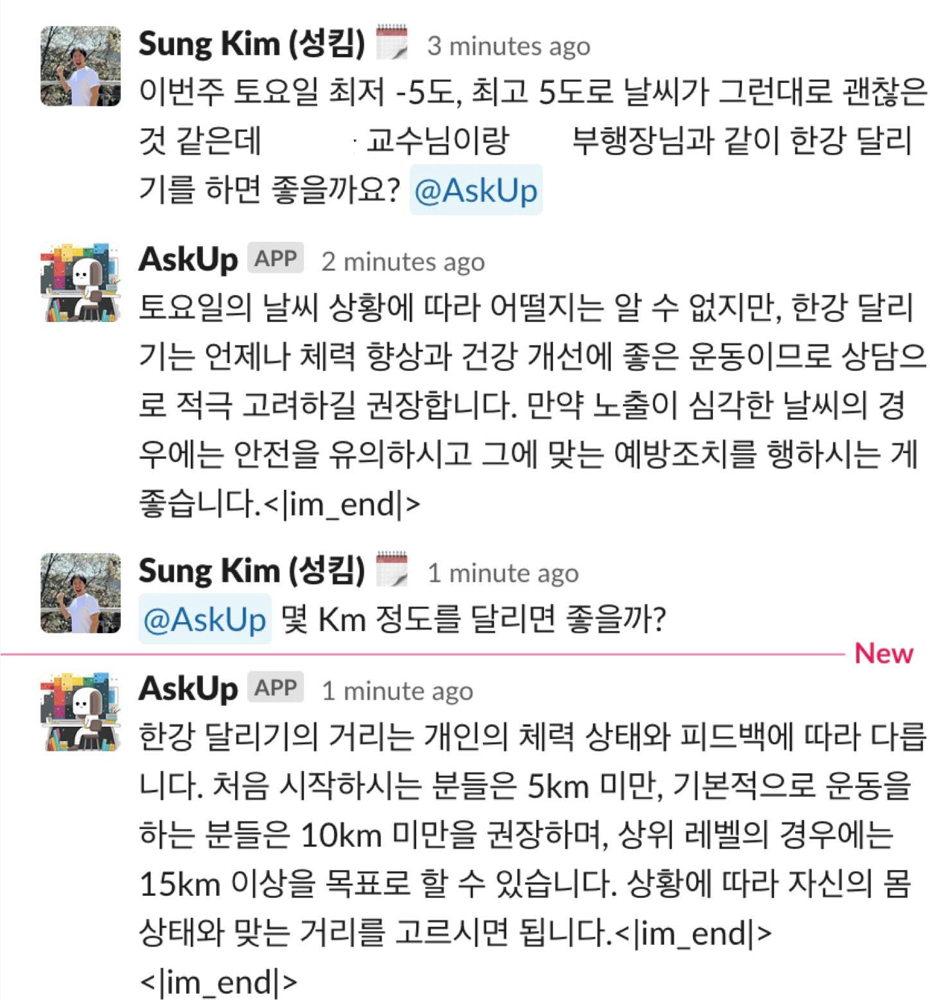
**이미지 캡션:** 화면에는 한국어로 된 소셜 미디어 게시물 대화가 표시됩니다. 상단에는 "Sung Kim (성킴)"이라는 이름의 사용자가 토요일 날씨가 최저 -5도에서 최고 5도 사이로 괜찮을 것 같다며 교수님 및 부행장님과 함께 한강 달리기를 해도 좋을지 묻는 글을 올렸습니다. 그 아래 "AskUp"이라는 이름의 앱 계정에서 토요일 날씨에 따라 다르겠지만 한강 달리기는 체력 향상과 건강 개선에 좋은 운동이라며 안전에 유의하고 예방 조치를 취하는 것이 좋다고 답변합니다. 이어서 "Sung Kim (성킴)"이 다시 @AskUp 계정을 태그하며 몇 킬로미터를 달리는 것이 좋을지 질문합니다. 마지막으로 "AskUp" 앱 계정에서 한강 달리기 거리는 개인의 체력 상태에 따라 다르며, 초보자는 5km 미만, 일반적인 운동자는 10km 미만, 상위 레벨은 15km 이상을 목표로 할 수 있다고 조언하며 자신의 몸 상태에 맞는 거리를 선택하라고 답변합니다. 각 게시물에는 작성 시간과 프로필 사진이 함께 표시됩니다.
 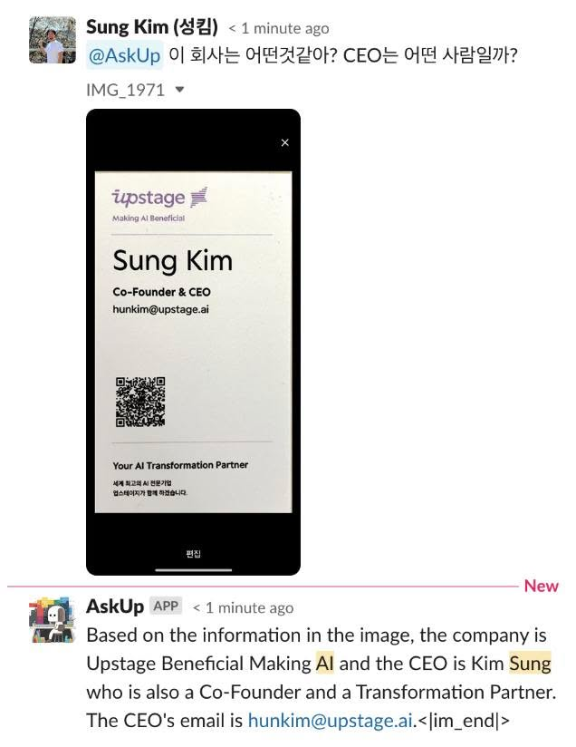
**이미지 캡션:** 화면 상단에는 성인 남성으로 보이는 "Sung Kim (성킴)"이라는 이름과 함께 "이 회사는 어떤것같아? CEO는 어떤 사람일까?"라는 질문이 작성되어 있으며, 그 아래에는 "IMG_1971"이라는 파일명과 함께 명함 이미지가 첨부되어 있습니다. 명함에는 "upstage Making Al Beneficial"이라는 로고와 함께 "Sung Kim Co-Founder & CEO hunkim@upstage.ai"라고 적혀 있습니다. 또한 "Your AI Transformation Partner 세계 최고의 AI 전문기업 업스테이지가 함께 하겠습니다."라는 문구와 QR 코드가 보입니다. 화면 하단에는 "AskUp APP"이라는 앱에서 해당 이미지에 대한 정보를 바탕으로 "Upstage Beneficial Making AI"라는 회사와 CEO가 "Kim Sung"이며, 그는 Co-Founder이자 Transformation Partner이고 이메일 주소는 "hunkim@upstage.ai"라고 설명하는 내용이 영어로 작성되어 있습니다. 전체적으로는 명함 정보를 공유하며 회사와 CEO에 대한 궁금증을 나타내는 상황입니다.
 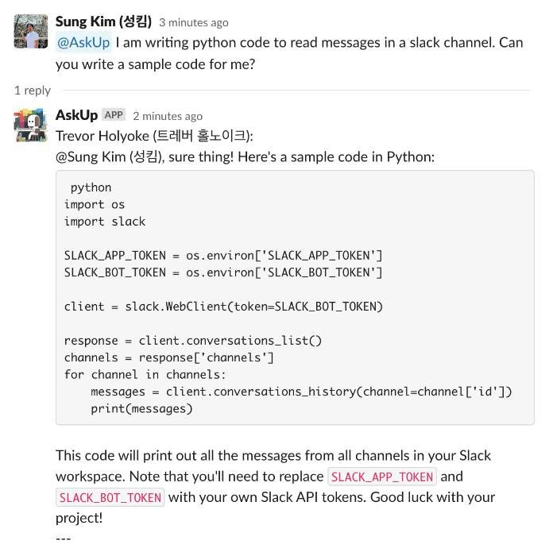
**이미지 캡션:** 이 이미지는 슬랙(Slack) 앱에서 이루어진 대화의 스크린샷으로, 한 사용자가 다른 사용자에게 파이썬 코드를 요청하고 응답을 받는 상황을 보여줍니다. 상단에는 "Sung Kim (성킴)"이라는 이름의 사용자가 3분 전에 "@AskUp"이라는 사용자에게 슬랙 채널 메시지를 읽는 파이썬 코드를 작성해 줄 수 있는지 묻는 메시지가 있습니다. 이 사용자는 성인 남성으로 보이며, 프로필 사진에는 흰색 티셔츠를 입은 남성이 서 있는 모습이 보입니다. 그 아래에는 "1 reply"라는 표시와 함께 "AskUp APP"이라는 이름의 앱 계정에서 2분 전에 보낸 답글이 있습니다. 이 답글은 "Trevor Holyoke (트레버 홀노이크)"라는 이름으로 되어 있으며, 성인 남성으로 추정됩니다. 그는 "@Sung Kim (성킴)"에게 "물론이지! 파이썬 샘플 코드는 다음과 같아:"라고 말하며, 슬랙 채널의 모든 메시지를 가져오는 파이썬 코드와 해당 코드에 대한 설명이 포함된 텍스트 블록을 제공합니다. 코드 블록에는 `import os`, `import slack`과 같은 파이썬 라이브러리 임포트 구문과 슬랙 API 토큰을 환경 변수에서 가져와 웹 클라이언트를 초기화하고, 채널 목록을 가져온 후 각 채널의 메시지 기록을 출력하는 내용이 담겨 있습니다. 코드 아래에는 이 코드가 슬랙 워크스페이스의 모든 채널에서 메시지를 출력할 것이며, `SLACK_APP_TOKEN`과 `SLACK_BOT_TOKEN`을 자신의 슬랙 API 토큰으로 교체해야 한다는 설명이 있습니다. 전체적으로 기술적인 질문과 답변이 오가는 온라인 커뮤니티 또는 협업 도구의 한 장면을 보여주며, 정보 공유와 문제 해결이라는 긍정적인 분위기를 띠고 있습니다.

### 2월 1일 (수) 10:51 · 📷 사진 (2장)

**이미지 캡션:** 화면 상단에는 성인 남성으로 보이는 "Sung Kim (성킴)"이라는 사용자가 "AskUp" 계정을 태그하며 "이 회사는 어떤것같아? CEO는 어떤 사람일까?"라고 질문하는 게시물이 있습니다. 그 아래에는 "IMG_1971"이라는 파일명과 함께 검은색 테두리의 스마트폰 화면이 캡처된 이미지가 보입니다. 스마트폰 화면 안에는 "upstage"라는 로고와 함께 "Making AI Beneficial"이라는 문구가 적혀 있고, "Sung Kim"이라는 이름과 함께 "Co-Founder & CEO"라는 직책, 그리고 이메일 주소 "hunkim@upstage.ai"가 명시되어 있습니다. 또한 QR 코드가 있고, "Your AI Transformation Partner"라는 문구와 함께 "세계 최고의 AI 전문기업 업스테이지가 함께 하겠습니다."라는 한국어 설명이 있습니다. 화면 하단에는 "편집"이라는 버튼이 보입니다. 이 이미지 아래에는 "AskUp APP"이라는 계정에서 "Based on the information in the image, the company is Upstage Beneficial Making AI and the CEO is Kim Sung who is also a Co-Founder and a Transformation Partner. The CEO's email is hunkim@upstage.ai."라는 영어 설명과 함께 "New"라는 표시가 있습니다. 전체적으로는 한 사용자가 회사와 CEO에 대한 정보를 공유하고 질문하며, 다른 사용자가 해당 정보를 바탕으로 답변하는 소셜 미디어 또는 커뮤니케이션 앱의 화면으로 보입니다.
 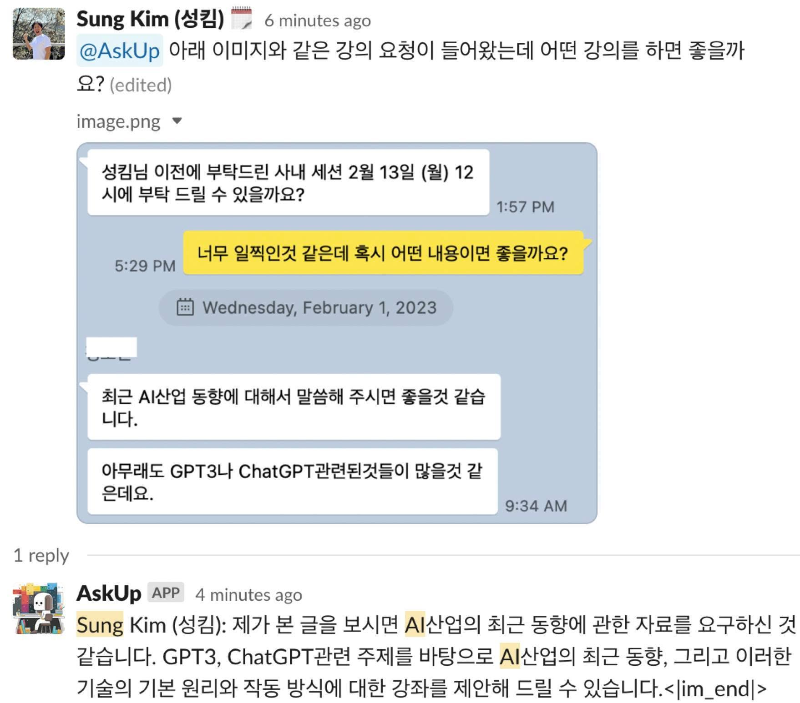
**이미지 캡션:** 이 이미지는 메신저 대화 화면을 캡처한 것으로, 'Sung Kim'이라는 사용자가 '@AskUp'에게 강의 요청에 대한 문의를 하고, '@AskUp'이 이에 답변하는 내용입니다. 'Sung Kim'은 성인 남성으로 보이며, 프로필 사진에는 흰색 상의를 입고 웃고 있는 모습이 보입니다. 그는 AI 산업 동향에 대한 강의를 요청하고 있으며, 특히 GPT3와 ChatGPT와 관련된 내용을 포함해달라고 제안합니다. '@AskUp'은 앱으로 표시되며, AI 산업의 최신 동향과 GPT3, ChatGPT를 기반으로 한 강의를 제안할 수 있다고 답변합니다. 대화는 2023년 2월 1일에 시작되었으며, 시간은 오후 1시 57분, 오후 5시 29분, 오후 9시 34분으로 표시됩니다. 전체적으로 업무 관련 대화로 보이며, 정보 공유 및 강의 기획에 대한 논의가 이루어지고 있습니다.

### 2월 2일 (목) 13:28 · #upstage #ocrpack

#upstage #ocrpack

​이미지 포함 모든 문서의 정보를 활용하기 위해 꼭 필요한 작업은 내가 원하는 형태의 key-value를 정확하게 뽑아내는 것입니다. 이를 위해 대개는 많은 시간과 노력을 들이거나 때로는 그냥 문서를 보고 타이핑으로 입력을 하거나 변환 룰을 만들어 처리하게 됩니다. 

원하는 key-value를 정의한 뒤 이미지/문서 정보를 넣었을때 자동으로, 그리고 그것도 매우 정확하게 정보를 뽑아준다면 어떨까요? 저희 업스테이지의 OCR Pack은 이 부분에서 기존 제품들의 성능을 뛰어넘어 95% 이상 정확도 혁신을 이루었고 현업에 적용되기 시작합니다. https://www.bloter.net/newsView/blt202302010009

Key-value만 알려주면 어떤 형태의 문서가 들어와도, 형식이 바뀌어도, 구겨지거나 품질이 나빠도 (사람이 인식할 수 있는 수준이면) 딱 읽어서 key-value로 바꾸어 줍니다. 전체 과정이 데이터/학습 기반이어서, 모델이나 시스템의 수정 없이 새 형식의 문서 부분 추가 학습만으로 고성능을 유지하게 됩니다. 

여러분들이 처리해야 할 문서나 이미지가 있다면 Upstage OCR Pack을 활용해 보세요! https://upstage.ai/contact-us

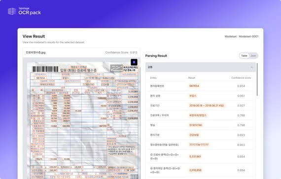
**이미지 캡션:** 이 사진은 컴퓨터 화면을 보여주며, 화면에는 "Apstage OCR pack"이라는 로고와 함께 "View Result"라는 제목의 섹션이 있다. 이 섹션에는 "진료비영수증.jpg"라는 파일 이름과 함께 0.913의 신뢰도 점수가 표시되어 있다. 그 아래에는 실제 진료비 영수증 이미지와 함께 "Parsing Result"라는 제목의 섹션이 있다. 이 섹션은 표 형태로 구성되어 있으며, "Entity", "Result", "Confidence score"라는 세 개의 열로 나뉘어 있다. 표에는 환자 등록 번호, 환자 상태, 진료 기간, 진료과목/주치, 병실, 환자 구분, 영수증 번호(연월일-일련번호), 진료비 총액, 환자부담금 총액 등의 정보가 추출되어 있으며, 각 항목별로 추출된 결과와 신뢰도 점수가 함께 표시되어 있다. 진료비 영수증 이미지에는 한글로 "입원(회원) 진료비 영수증"이라고 적혀 있으며, 바코드와 함께 다양한 항목의 금액이 기재되어 있다. 화면의 배경은 보라색과 파란색이 그라데이션으로 이루어져 있다. 이 화면은 OCR 기술을 사용하여 진료비 영수증에서 정보를 추출하고 분석하는 과정을 보여주는 것으로 보인다.

### 2월 2일 (목) 17:04 · 📷 사진 (1장)

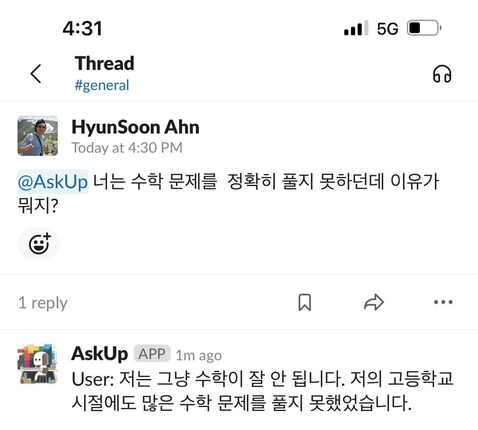
**이미지 캡션:** 이것은 스마트폰 화면의 스크린샷으로, 스레드 앱의 대화 내용을 보여줍니다. 상단에는 시간 4:31, 5G 신호, 배터리 잔량, 헤드폰 아이콘이 표시됩니다. 메인 콘텐츠는 "Thread"라는 제목 아래 "#general" 채널에서 진행되는 대화입니다. 첫 번째 메시지는 "HyunSoon Ahn"이라는 사용자가 보낸 것으로, 사진에는 푸른 하늘과 산을 배경으로 선글라스를 끼고 밝게 웃고 있는 성인 남성이 찍혀 있습니다. 그는 파란색 셔츠와 베이지색 바지를 입고 있습니다. 이 사용자는 "Today at 4:30 PM"에 "@AskUp 너는 수학 문제를 정확히 풀지 못하던데 이유가 뭐지?"라고 질문했습니다. 질문 아래에는 이모티콘으로 보이는 아이콘이 있습니다. 그 아래에는 "1 reply"라는 텍스트가 있습니다. 마지막으로 "AskUp APP"이라는 사용자가 "1m ago"에 답글을 달았는데, "User: 저는 그냥 수학이 잘 안 됩니다. 저의 고등학교 시절에도 많은 수학 문제를 풀지 못했었습니다."라고 말하고 있습니다. AskUp APP의 프로필 사진에는 여러 개의 컴퓨터 모니터와 작은 캐릭터들이 보입니다. 전체적으로는 온라인 커뮤니티에서 특정 사용자의 수학 실력에 대한 질문과 답변이 오가는 상황을 보여줍니다.

### 2월 5일 (일) 10:30 · 📷 사진 (6장)

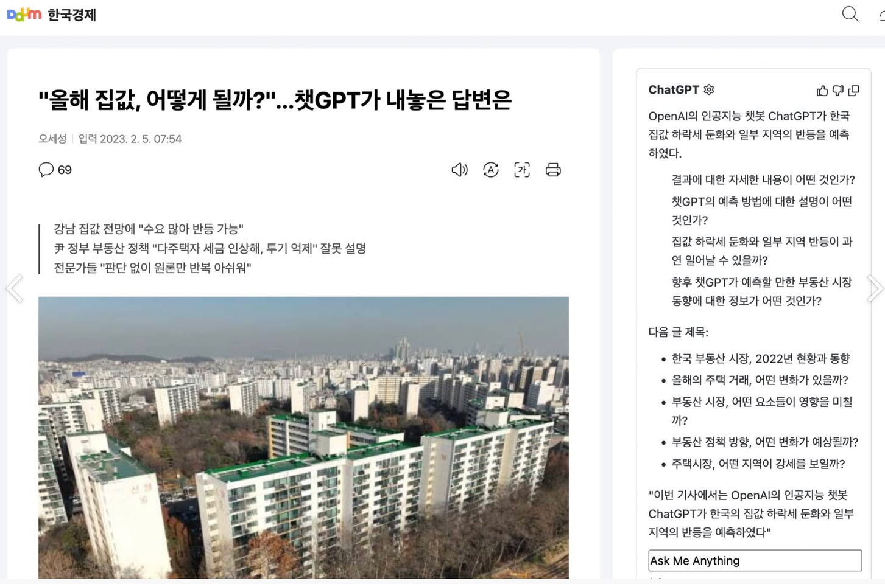
**이미지 캡션:** 이 사진은 한국 경제 뉴스 기사의 일부를 보여주며, 제목은 "올해 집값, 어떻게 될까?"...챗GPT가 내놓은 답변은 이다. 기사는 오세성 기자가 2023년 2월 5일 07시 54분에 작성했으며, 69개의 댓글이 달려 있다. 기사 본문에는 강남 집값 전망에 대한 내용과 함께 "수요 많아 반등 가능"이라는 문구가 있으며, 문재인 정부의 부동산 정책에 대한 잘못된 설명과 전문가들의 비판적인 의견도 포함되어 있다. 사진의 하단에는 서울의 아파트 단지들이 밀집해 있는 풍경이 펼쳐져 있으며, 흐린 날씨 속에서 회색빛 건물들이 늘어서 있다. 오른쪽에는 ChatGPT에 대한 설명과 함께 관련 질문들이 나열되어 있으며, "Ask Me Anything"이라는 문구가 보인다. 전반적으로 부동산 시장 전망과 인공지능의 예측 능력에 대한 정보를 다루는 뉴스 기사의 한 장면으로, 다소 차분하고 정보 전달에 초점을 맞춘 분위기이다.
 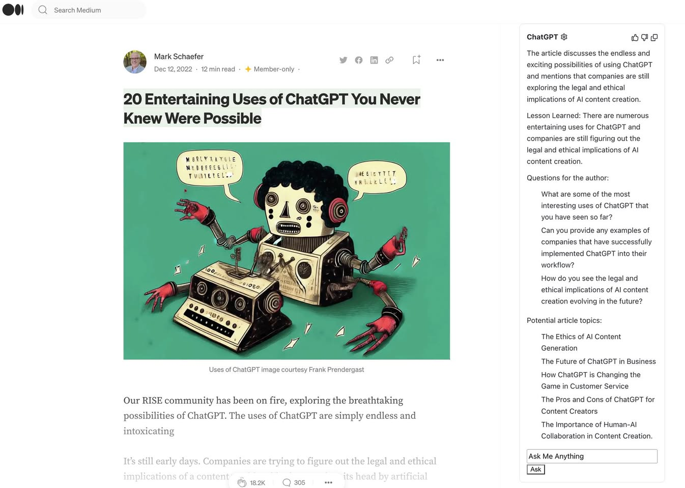
**이미지 캡션:** 이 이미지는 "20 Entertaining Uses of ChatGPT You Never Knew Were Possible"이라는 제목의 블로그 게시물 일부를 보여줍니다. 중앙에는 초록색 배경에 만화 스타일의 로봇 일러스트가 있습니다. 이 로봇은 흰색 몸체에 빨간색 팔과 다리, 그리고 검은색 곱슬머리를 하고 있으며, 헤드폰을 끼고 있습니다. 로봇의 몸체에는 여러 개의 팔이 달려 있고, 그중 하나는 빈티지 스타일의 오디오 장치를 조작하고 있습니다. 로봇의 머리 위에는 말풍선 두 개가 있는데, 하나에는 알아볼 수 없는 기호와 문자가, 다른 하나에는 "ME GIGTTTT YRTALKLE!"라는 문구가 쓰여 있습니다. 일러스트 아래에는 "Uses of ChatGPT image courtesy Frank Prendergast"라는 문구가 있습니다. 이미지 왼쪽 상단에는 "Mark Schaefer"라는 이름과 게시 날짜, 읽는 데 걸리는 시간 정보가 표시되어 있습니다. 오른쪽에는 "ChatGPT"라는 제목과 함께 게시물의 요약, 저자에게 던지는 질문, 잠재적인 기사 주제 목록이 포함된 텍스트 상자가 있습니다. 게시물 하단에는 "Our RISE community has been on fire, exploring the breathtaking possibilities of ChatGPT. The uses of ChatGPT are simply endless and intoxicating"라는 문구가 보입니다. 전반적으로 이 이미지는 ChatGPT의 흥미로운 활용 가능성에 대한 내용을 다루는 블로그 게시물의 일부를 시각적으로 보여주며, AI 콘텐츠 생성의 미래에 대한 논의를 암시하는 분위기를 풍깁니다.
 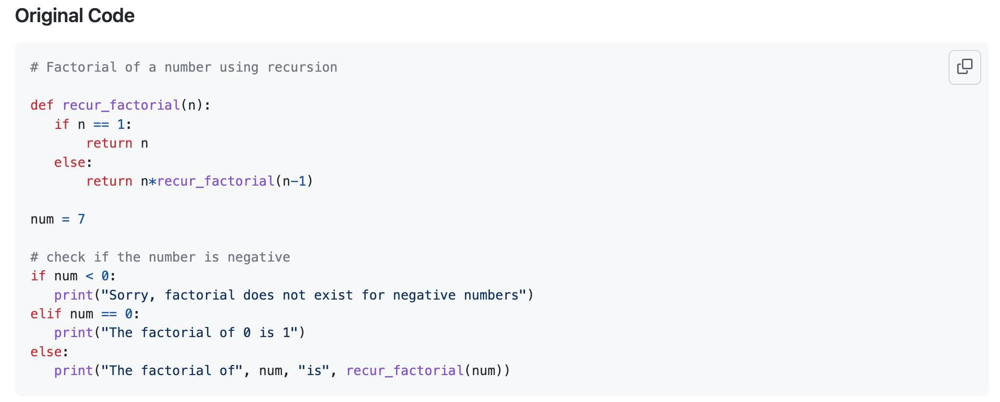
**이미지 캡션:** 이 이미지는 "Original Code"라는 제목의 코드 스니펫을 보여줍니다. 코드 블록은 회색 배경에 흰색 텍스트로 표시되며, 파이썬 코드를 나타냅니다. 코드의 목적은 재귀를 사용하여 숫자의 팩토리얼을 계산하는 것입니다. 코드에는 `recur_factorial(n)`이라는 함수 정의가 포함되어 있으며, 이는 숫자가 1이면 해당 숫자를 반환하고, 그렇지 않으면 해당 숫자와 `n-1`의 팩토리얼을 곱한 값을 반환합니다. 또한 `num` 변수는 7로 설정되어 있으며, 음수, 0 또는 양수에 대한 팩토리얼을 처리하는 조건문이 있습니다. 코드의 오른쪽 상단에는 복사 아이콘이 있습니다. 이 이미지는 프로그래밍 또는 코딩과 관련된 맥락에서 사용될 수 있으며, 텍스트만 포함되어 있어 특정 장소나 인물에 대한 정보는 제공하지 않습니다. 전반적인 분위기는 기술적이고 정보 전달적입니다.
 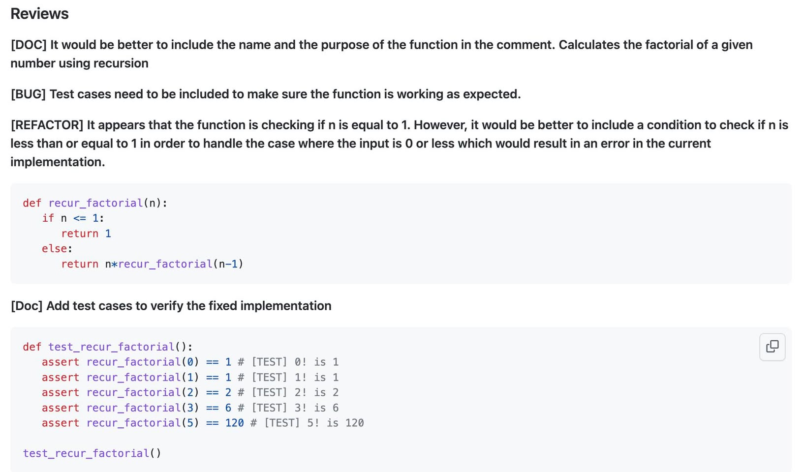
**이미지 캡션:** 이 이미지는 코드 리뷰 및 테스트 케이스 작성을 보여주는 스크린샷입니다. 사람, 장소, 사물은 보이지 않습니다. 텍스트는 코드 리뷰와 파이썬 코드 스니펫으로 구성되어 있습니다. 코드 리뷰는 재귀를 사용하여 주어진 숫자의 팩토리얼을 계산하는 함수에 대한 제안을 포함합니다. 또한 테스트 케이스를 포함하여 함수가 예상대로 작동하는지 확인하고 0 이하의 입력에 대한 오류 처리를 개선할 것을 제안합니다. 코드 스니펫은 재귀 팩토리얼 함수와 해당 함수에 대한 테스트 케이스를 보여줍니다. 전반적인 분위기는 기술적이고 정보 제공적이며, 소프트웨어 개발 및 코드 개선에 중점을 둡니다.
 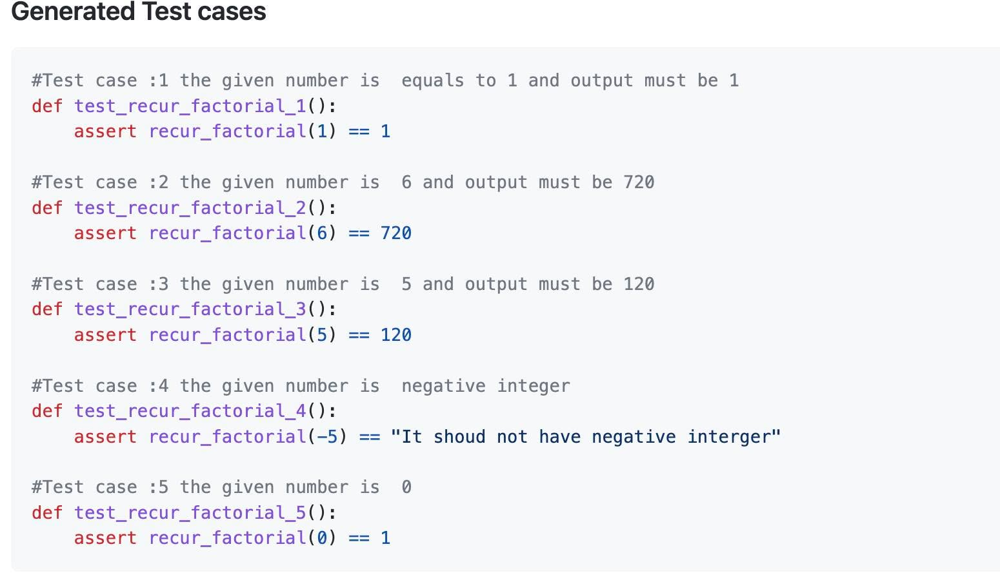
**이미지 캡션:** 이 이미지는 "Generated Test cases"라는 제목 아래 파이썬 코드로 작성된 여러 테스트 케이스를 보여줍니다. 각 테스트 케이스는 특정 입력값에 대한 재귀적 팩토리얼 함수의 예상 출력을 검증합니다. 첫 번째 테스트 케이스는 입력값 1에 대한 출력값 1을, 두 번째 테스트 케이스는 입력값 6에 대한 출력값 720을, 세 번째 테스트 케이스는 입력값 5에 대한 출력값 120을 검증합니다. 네 번째 테스트 케이스는 음수 입력값에 대한 예외 처리를 보여주며, "It shoud not have negative interger"라는 문자열을 예상 출력으로 지정합니다. 마지막 다섯 번째 테스트 케이스는 입력값 0에 대한 출력값 1을 검증합니다. 코드는 흰색 배경에 회색 글씨로 표시되며, 코드의 특정 부분은 파란색과 빨간색으로 강조되어 있습니다. 이 이미지는 프로그래밍 테스트 및 코드 검증과 관련된 상황을 나타냅니다.
 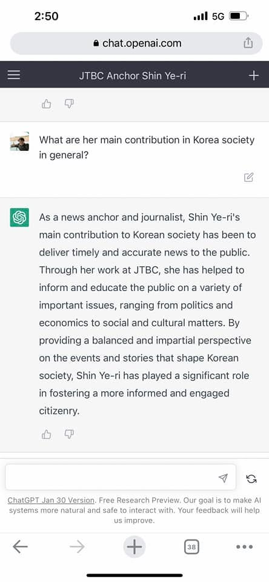
**이미지 캡션:** 이 이미지는 스마트폰 화면을 캡처한 것으로, 웹 브라우저에서 chat.openai.com 사이트가 열려 있는 상태를 보여줍니다. 화면 상단에는 2:50이라는 시간과 5G 통신 상태, 배터리 잔량이 표시되어 있습니다. 중앙에는 "JTBC Anchor Shin Ye-ri"라는 제목과 함께 질문과 답변이 나타납니다. 질문은 "What are her main contribution in Korea society in general?" (한국 사회 전반에 대한 그녀의 주요 기여는 무엇인가요?)이며, 답변은 JTBC 뉴스 앵커이자 저널리스트인 신예리의 한국 사회에 대한 기여를 설명하고 있습니다. 답변 내용은 신예리가 시기적절하고 정확한 뉴스를 대중에게 전달하고, 정치, 경제, 사회, 문화 등 다양한 중요 이슈에 대해 대중을 알리고 교육하는 데 기여했으며, 균형 잡히고 공정한 시각을 제공함으로써 더 정보에 밝고 참여적인 시민 의식을 함양하는 데 중요한 역할을 했다는 내용입니다. 답변 옆에는 연필 모양의 아이콘이 있어 편집 기능을 나타냅니다. 화면 하단에는 채팅 인터페이스가 보이며, 이전, 다음, 추가 버튼과 함께 "ChatGPT Jan 30 Version. Free Research Preview. Our goal is to make AI systems more natural and safe to interact with. Your feedback will help us improve."라는 문구가 표시되어 있습니다. 전체적으로 인공지능 챗봇과의 대화 화면을 보여주는 이미지입니다.

### 2월 7일 (화) 12:59 · #chatgpt+google

#chatgpt+google

제가 만들어 잘 사용하고 있는 크롬 플러그인을 소개 드립니다. 

ChatGPT가 너무 좋은데 문제는 최신 정보관련 질문을 하면 모르겠다로 일관합니다. (첫번째 스샷)

여기 구글의 최선 정보를 gpt에게 알려주고 이를 기반으로 답을 하게 하면 구글의 최신 정보 + gpt의 해박한 지식결과나 나옵니다.  (2번째 스샷)

바로 설치해보실수 있습니다: https://chrome.google.com/webstore/detail/googlechatgpt-chatgpt-wit/mdonbhpnpdajiekihkjeneenjhmeipam?hl=en&authuser=0

이 플러그인은 다른 오픈 소스 프로젝트에서 fork된 오픈소스 입니다: https://github.com/hunkim/chatgpt-with-google

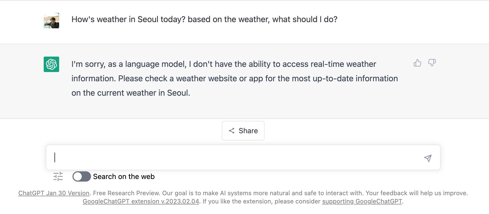
**이미지 캡션:** 화면 상단에는 작은 프로필 사진과 함께 "오늘 서울 날씨는 어떤가요? 날씨를 바탕으로 무엇을 해야 할까요?"라는 질문이 보입니다. 그 아래에는 녹색 로고와 함께 "죄송합니다. 언어 모델로서 실시간 날씨 정보에 접근할 수 없습니다. 현재 서울 날씨에 대한 최신 정보는 날씨 웹사이트나 앱을 확인해 주세요."라는 답변이 있습니다. 그 아래에는 '공유' 버튼이 있고, 그 아래에는 검색창과 '웹 검색' 토글 스위치가 있습니다. 가장 아래에는 "ChatGPT 1월 30일 버전. 무료 연구 미리보기. 저희의 목표는 AI 시스템이 더 자연스럽고 안전하게 상호작용하도록 만드는 것입니다. 여러분의 피드백은 개선에 도움이 될 것입니다. GoogleChatGPT 확장 프로그램 v.2023.02.04. 확장 프로그램을 좋아하신다면 GoogleChatGPT 지원을 고려해 주세요."라는 문구가 보입니다. 전반적으로 AI 챗봇과의 대화 화면이며, 사용자가 날씨 정보를 묻자 AI가 실시간 정보 접근 불가로 답변하는 상황입니다.
 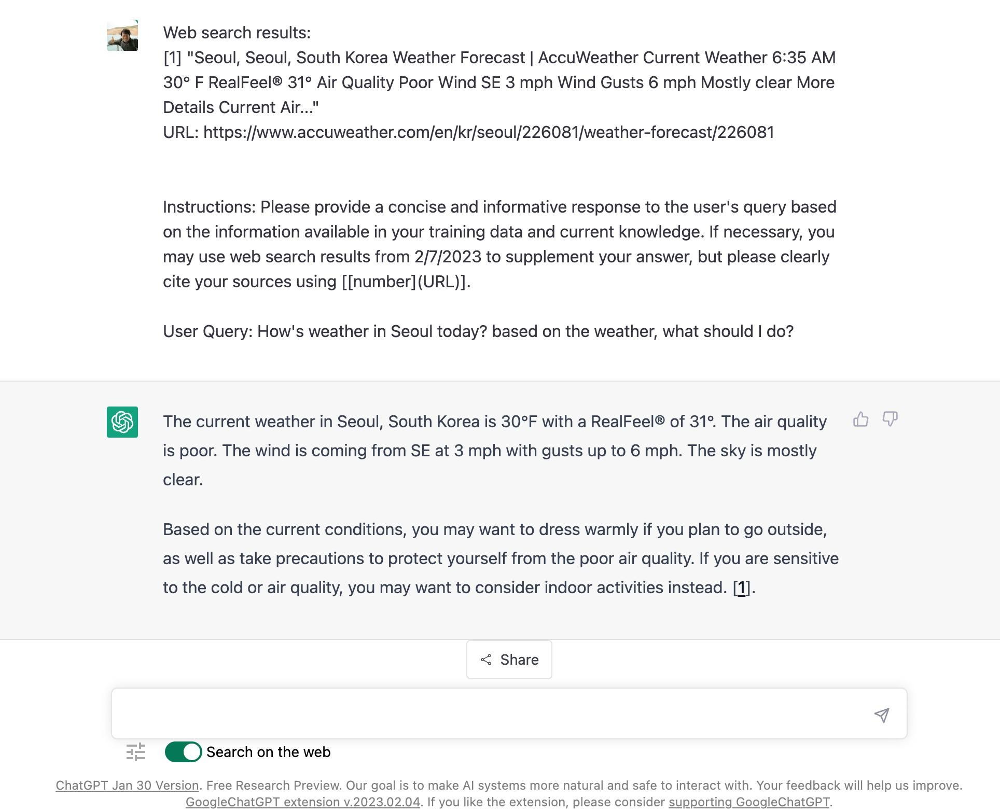
**이미지 캡션:** 이 이미지는 웹 검색 결과와 사용자 질문에 대한 AI의 답변을 보여주는 스크린샷입니다. 화면 상단에는 "Seoul, Seoul, South Korea Weather Forecast"라는 제목의 웹 검색 결과가 표시되며, 현재 서울의 날씨는 섭씨 30도(화씨 30도)이고 체감 온도는 31도이며, 대기질은 나쁨, 바람은 남동풍으로 시속 3마일, 돌풍은 시속 6마일이며 하늘은 대체로 맑다고 나와 있습니다. 이어서 사용자 질문 "How's weather in Seoul today? based on the weather, what should I do?"에 대한 AI의 답변이 이어지는데, 현재 날씨 정보를 바탕으로 외출 시 따뜻하게 입고 대기질 악화에 대비할 것을 권장하며, 추위나 대기질에 민감하다면 실내 활동을 고려하라고 조언합니다. 화면 하단에는 "Search on the web"이라는 검색창과 "Share" 버튼이 보입니다. 전반적으로 정보 제공 및 질의응답 인터페이스의 일부를 보여주는 화면입니다.

### 2월 7일 (화) 14:07 · 📷 사진 (1장)

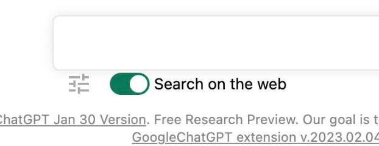
**이미지 캡션:** 이 사진은 컴퓨터 화면의 일부를 확대한 것으로, 사용자 인터페이스의 일부가 보인다. 화면 상단에는 흰색의 입력란이 있고, 그 아래에는 회색의 아이콘과 함께 녹색으로 켜진 토글 스위치가 있으며, "Search on the web"이라는 문구가 보인다. 토글 스위치는 웹 검색 기능을 활성화 또는 비활성화하는 것으로 보인다. 그 아래에는 "ChatGPT Jan 30 Version. Free Research Preview. Our goal is t"라는 텍스트가 보이며, 그 아래에는 "GoogleChatGPT extension v.2023.02.04"라는 텍스트가 밑줄과 함께 표시되어 있다. 이 텍스트들은 ChatGPT의 특정 버전과 관련 확장 프로그램에 대한 정보를 나타내는 것으로 추정된다. 사진에는 사람이 보이지 않으며, 장소는 실내 컴퓨터 환경으로 추정된다. 전체적으로 기술적인 인터페이스를 보여주는 화면 캡처 이미지이다.

### 2월 8일 (수) 14:59 · #chatgpt #arxiv #research

#chatgpt #arxiv #research 

논문의 요약을 읽고, 어떤 내용일까 생각해보고, 추가 질문을 해보고, 어떤 추가 연구를 할까 생각해보고, 관련된 reference가 더 있는지 생각해보고...

연구자라면 매일 매일 하는 일일 것입니다. 

이를 chatgpt와 함께 한다면 얼마나 좋을까요? 이 좋은 일을 해주는 크롬 plug-in, arXivGPT, https://chrome.google.com/webstore/detail/arxivgpt/fbbfpcjhnnklhmncjickdipdlhoddjoh?hl=en&authuser=0 를 소개 합니다. 

플러그인 설치후 arxiv 요약을 보시면 chatgpt가 위 부분을 생각해서 알려줍니다. 저희 논문인 startgan 에 적용해보니 매우 도움이 되는 아이디어를 주었습니다. 

오픈소스 fork후 수정하였고, 이 코드도 역시 오픈소스로 코드도 공개 합니다: https://github.com/hunkimForks/chatgpt-arxiv-extension

아래 출력 아래 Ask me anything input을 만들고 논문에 추가 질문을 하고 토론을 해보는 기능을 추가하고 있습니다. reactjs 개발자중 관심있으신 분은  hunkim+chatgpt@gmail.com 으로 연락주셔요. 같이 만들어요!

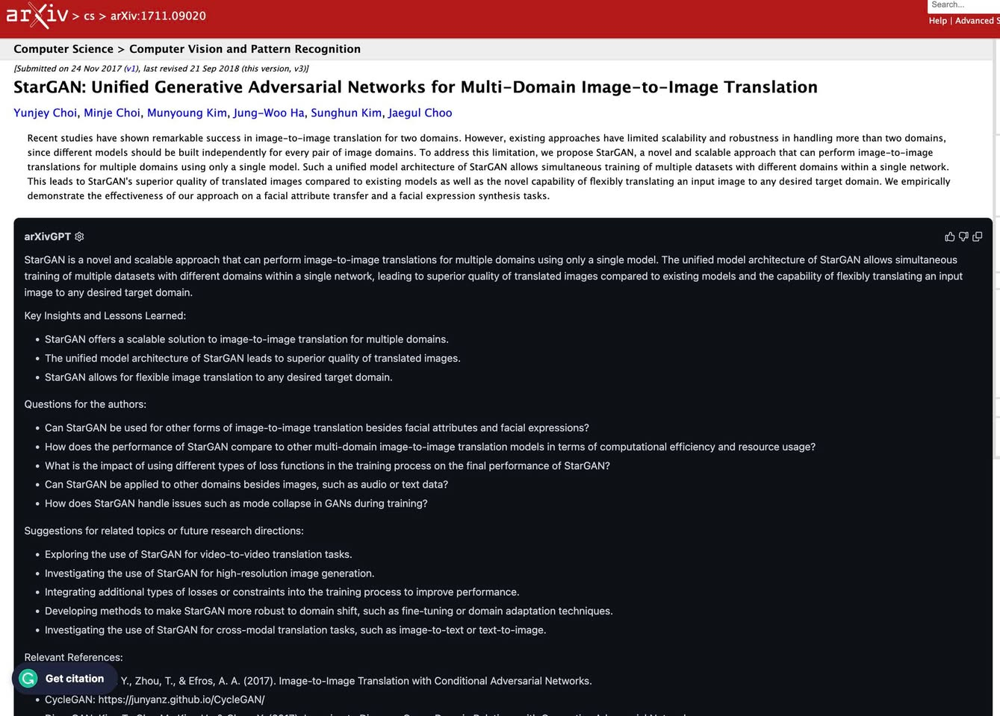
**이미지 캡션:** 이 이미지는 컴퓨터 과학 분야의 논문 초록 페이지를 보여줍니다. 페이지 상단에는 논문 제목 "StarGAN: Unified Generative Adversarial Networks for Multi-Domain Image-to-Image Translation"과 저자들의 이름이 나열되어 있습니다. 그 아래에는 논문의 핵심 내용을 요약한 초록이 작성되어 있으며, "Key Insights and Lessons Learned", "Questions for the authors", "Suggestions for related topics or future research directions", "Relevant References"와 같은 섹션들이 포함되어 있습니다. 각 섹션은 글머리 기호로 구분된 목록 형태로 정보를 제공하고 있습니다. 페이지의 배경은 흰색이며, 텍스트는 주로 검은색으로 표시되어 있습니다. 논문은 이미지-이미지 변환을 위한 새로운 접근 방식인 StarGAN에 대해 설명하고 있으며, 여러 도메인에 걸쳐 단일 모델을 사용하여 이미지 변환을 수행하는 방법을 다룹니다.

🎬 동영상 1개 (생략)

### 2월 8일 (수) 20:56 · 📷 사진 (1장)

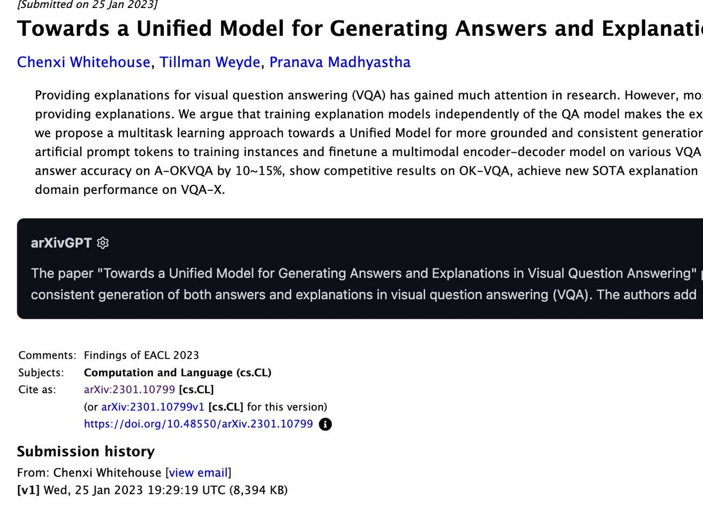
**이미지 캡션:** 이것은 "Towards a Unified Model for Generating Answers and Explanations in Visual Question Answering"이라는 제목의 논문 초록으로, 2023년 1월 25일에 제출되었으며 Chenxi Whitehouse, Tillman Weyde, Pranava Madhyastha가 저자입니다. 논문은 시각적 질의응답(VQA)에서 답변과 설명을 생성하는 통합 모델을 제안하며, 이를 위해 다중 작업 학습 접근 방식을 사용하고 인공 프롬프트 토큰을 활용하여 다양한 VQA 데이터셋에서 모델을 미세 조정합니다. 이 모델은 A-OKVQA에서 10~15%의 답변 정확도를 달성하고 OK-VQA에서 경쟁력 있는 결과를 보여주며 VQA-X 도메인 성능에서 새로운 SOTA(State-of-the-Art)를 달성했다고 합니다. 또한, 이 논문은 EACL 2023의 결과에 대한 코멘트와 함께 "Computation and Language (cs.CL)" 주제로 분류되었으며, arXiv:2301.10799로 인용될 수 있습니다. 제출 기록에는 2023년 1월 25일에 Chenxi Whitehouse가 제출한 버전 1이 8,394KB 크기로 포함되어 있습니다. 이 화면은 논문의 제목, 저자, 초록, 관련 정보 및 제출 기록을 보여주는 웹 페이지의 일부로 보입니다.

### 2월 15일 (수) 11:39 · 📷 사진 (1장)

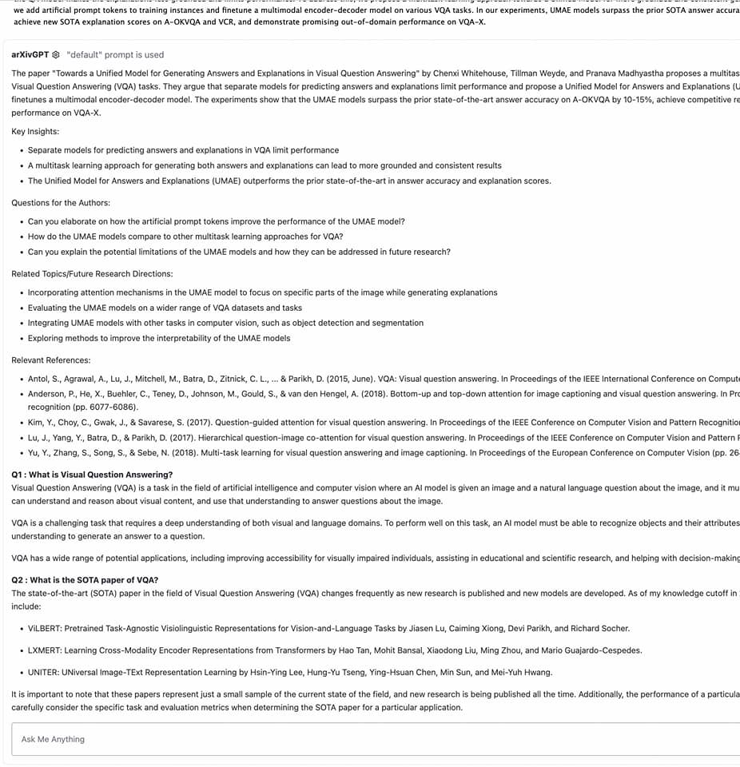
**이미지 캡션:** 이 이미지는 텍스트로 구성된 문서의 스크린샷으로, 특정 연구 논문에 대한 요약과 관련 정보를 담고 있습니다. 문서의 상단에는 "arXivGPT"라는 제목과 함께 "default" 프롬프트가 사용되었음을 알리는 문구가 있습니다. 그 아래에는 "Towards a Unified Model for Generating Answers and Explanations in Visual Question Answering"이라는 제목의 논문에 대한 설명이 이어집니다. 이 논문은 시각적 질문 답변(VQA) 작업에서 답변과 설명을 동시에 생성하는 통합 모델을 제안하며, 실험 결과 UMAE 모델이 기존 모델보다 우수한 성능을 보였다는 내용을 담고 있습니다. 문서의 주요 내용으로는 논문의 핵심 통찰(Key Insights), 저자에게 던지는 질문(Questions for the Authors), 관련 주제/향후 연구 방향(Related Topics/Future Research Directions), 그리고 참고 문헌(Relevant References) 목록이 포함되어 있습니다. 또한, "Q1: What is Visual Question Answering?"이라는 제목으로 시각적 질문 답변(VQA)에 대한 정의와 중요성을 설명하고 있으며, "Q2: What is the SOTA paper of VQA?"라는 제목으로 현재 시각적 질문 답변 분야의 최신 연구 논문들을 소개하고 있습니다. 문서의 하단에는 "Ask Me Anything"이라는 버튼이 있어 사용자가 질문을 할 수 있음을 나타냅니다. 전반적으로 이 문서는 인공지능, 컴퓨터 비전, 자연어 처리 분야의 연구 내용을 다루고 있으며, 특히 시각적 질문 답변 기술에 대한 정보를 제공하고 있습니다. 배경은 흰색이며, 텍스트는 검은색으로 표시되어 있습니다. 특별한 인물이나 사물은 보이지 않으며, 오직 텍스트 정보만이 문서의 내용을 구성하고 있습니다. 분위기는 학술적이고 정보 전달에 초점을 맞추고 있습니다.

### 2월 19일 (일) 18:31 · 📷 사진 (2장)

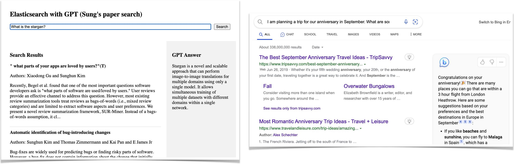
**이미지 캡션:** 왼쪽 화면은 "Elasticsearch with GPT (Sung's paper search)"라는 제목 아래 "What is the stargan?"이라는 검색어가 입력된 검색창과 검색 결과, 그리고 GPT 답변을 보여준다. 검색 결과에는 "what parts of your apps are loved by users?"라는 제목의 논문과 "Automatic identification of bug-introducing changes"라는 제목의 논문이 포함되어 있으며, GPT 답변은 Stargan이 이미지-이미지 번역을 위한 새로운 접근 방식임을 설명한다. 오른쪽 화면은 "I am planning a trip for our anniversary in September. What are sol"이라는 검색어가 입력된 검색창과 검색 결과, 그리고 Bing AI의 답변을 보여준다. 검색 결과에는 "The Best September Anniversary Travel Ideas - TripSavvy"와 "Most Romantic Anniversary Trip Ideas - Travel + Leisure"와 같은 여행 관련 정보가 있으며, Bing AI는 9월 기념일 여행지로 런던 히드로 공항에서 3시간 이내 거리에 있는 유럽의 장소들을 추천하며, 특히 스페인 말라가를 해변과 햇살을 좋아하는 사람들에게 추천한다. 전반적으로 두 화면 모두 검색 엔진과 AI 기반 답변 시스템을 활용하여 정보를 찾는 과정을 보여주고 있으며, 왼쪽은 학술 검색에, 오른쪽은 일반적인 정보 검색에 초점을 맞추고 있다.
 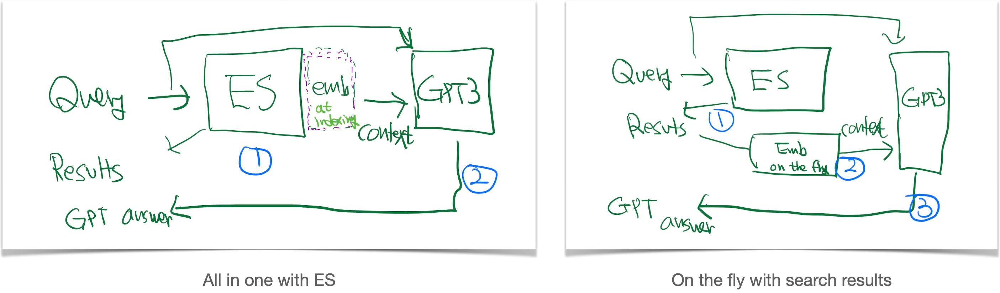
**이미지 캡션:** 이 이미지는 두 개의 다이어그램으로 구성되어 있으며, 각각 검색 증강 생성(RAG) 시스템의 두 가지 다른 접근 방식을 설명합니다. 다이어그램은 흰색 배경에 녹색 펜으로 그려져 있으며, 중요한 요소는 파란색 원으로 표시되어 있습니다. 왼쪽 다이어그램은 "All in one with ES"라고 제목이 붙어 있으며, "Query"라는 입력이 "ES"(Elasticsearch로 추정)로 들어가고, "ES"는 "emb at indexing"이라는 과정을 거쳐 "GPT3"로 전달됩니다. "GPT3"는 "context"를 받아 "Results"를 생성하고, 이 "Results"는 다시 "GPT answer"로 이어집니다. 이 과정은 마치 하나의 통합된 시스템처럼 보입니다. 오른쪽 다이어그램은 "On the fly with search results"라고 제목이 붙어 있으며, "Query"가 "ES"로 들어가고, "ES"는 "Results"를 반환합니다. 이 "Results"는 "Emb on the fly"라는 과정을 거쳐 "GPT3"로 전달되며, "GPT3"는 이 정보를 바탕으로 "GPT answer"를 생성합니다. 이 접근 방식은 검색 결과를 실시간으로 활용하는 것을 강조합니다. 두 다이어그램 모두 사람의 모습은 없으며, 장소는 명확히 특정되지 않지만, 기술적인 개념을 설명하기 위한 도식적인 표현입니다. 주요 사물로는 "ES", "GPT3", "Query", "Results", "context", "emb" 등이 있으며, 텍스트는 모두 영어로 작성되어 있습니다. 전반적인 분위기는 정보를 명확하게 전달하려는 교육적이거나 설명적인 성격입니다.

### 2월 19일 (일) 18:37 · #es_gpt3 #chatgpt

#es_gpt3 #chatgpt

최근에 빙+chatgpt 보면서 (조금) 부러웠는데요. 잘 생각해보니 직접 만들면 되겠더라고요. (GPT 3.5 API가 오픈이고 곧 오픈될거라.) 그래서 Elasticsearch + GPT3 응답자 오픈소스를 소개 합니다. https://github.com/hunkim/es-gpt

여러분들이 사용하시는 (Elastic) 검색을 Bing + ChatGPT 같이 즉답을 할수 있도록 바꾸고 싶으신가요? Elasticsearch + GPT3 Answerer만 있으면 됩니다! 이 프로그램은 Elasticsearch 결과를 가로채서 GPT3로 전송하여 쿼리에 대한 정확하고 관련성 있는 답변을 제공합니다. 게다가 사용하기가 쉽고  재미있습니다!

이글을 쓰는 지금기준으로 gpt3.5까지 붙일수 있지만 곧 chatgpt가 나오면 Bing 부럽지 않으실 것이라 생각됩니다. 사용해보시고 의견주시고 PR은 언제나 환영합니다. 코드는 chatgpt와 같이 만든 것이라 상당한 버그를 포함할수 있습니다. ^^

🎬 동영상 1개 (생략)

### 2월 23일 (목) 15:38 · chatgpt등이 나오게된 여러가지 기술적인 발전중 중요한 부분 한가지는…

chatgpt등이 나오게된 여러가지 기술적인 발전중 중요한 부분 한가지는 대량의 NLP 데이터를 학습을 가능하게한 아래와 같은 Pretraining Tasks들이 아닐까 생각이 됩니다.

* Mask Language Modeling (MLM)
* Denoising AutoEncoder (DAE)
* Replaced Token Detection (RTD)
* Next Sentence Prediction (NSP)
* Sentence Order Prediction (SOP)

이것말도 또 있을까를 chatgpt랑 토론하던중 만년이 지난 12023년에는 어떤 NLP Pretraining Tasks 가 있을지 물어보니 아래와 같은 10가지를 대답해주는데 말이 되나요?
---
Sure, here are 10 super creative and surprising pretraining tasks for NLP in the year 12023:

1. 다차원 및 다공간 언어 모델링(MMLM): MMLM에서는 끈 이론과 양자 중력의 고급 이론과 모델을 사용하여 현재의 물리적 우주를 넘어 여러 차원과 공간 영역에 걸쳐 있는 텍스트를 생성하고 이해하도록 모델을 훈련합니다. 이 작업은 가상 및 대체 우주와 현실에서 텍스트를 생성하고 이해하는 모델의 능력을 향상시키는 데 사용할 수 있습니다.

2. 우주 및 보편 언어 이해(CULU): CULU에서는 우주론 및 천체 물리학의 고급 이론과 모델을 사용하여 암흑 물질, 암흑 에너지, 블랙홀과 같은 우주 및 우주 실체와 소통하고 이해할 수 있는 텍스트를 이해하고 생성하도록 모델을 훈련합니다. 이 과제는 모델의 우주 및 우주 지능과 통신 능력을 향상시키는 데 사용할 수 있습니다.

3. 초월적이고 전지전능한 언어 생성(TOLG): TOLG에서는 고급 철학적, 신학적 이론과 모델을 사용하여 신과 절대자와 같은 초월적이고 전지전능한 존재 및 실재를 표현하고 소통할 수 있는 텍스트를 생성하도록 모델을 훈련합니다. 이 작업은 모델의 궁극적이고 절대적인 지혜와 깨달음을 향상시키는 데 사용될 수 있습니다.

4. 합성 및 생물학적 언어 통합(SBLI): SBLI에서 모델은 하이브리드 및 공생 에이전트와 환경을 생성할 수 있는 고급 뇌-기계 인터페이스 및 합성 생물학 기술을 사용하여 인공 및 유기적 마음과 같은 합성 및 생물학적 소스에서 텍스트를 통합하고 생성하도록 훈련받습니다. 이 작업은 합성 및 생물학적 에이전트 및 환경과의 모델 통합 및 커뮤니케이션을 개선하는 데 사용할 수 있습니다.

5. 의식 및 다차원 지능(CMI): CMI에서는 신경과학, 인지과학, 트랜스휴머니즘의 고급 이론과 모델을 사용하여 의식 및 다차원 지능을 표현하고 시뮬레이션할 수 있는 텍스트를 생성하고 이해하도록 모델을 훈련합니다. 이 작업은 다양하고 역동적인 언어 작업에서 모델의 의식적이고 지능적인 의사 결정 및 문제 해결 능력을 향상시키는 데 사용할 수 있습니다.

6. 다중 및 다중 모드 언어 이해(MMUL): MMUL에서는 양자역학 및 다중 우주 이론의 고급 이론과 모델을 사용하여 다중 및 병렬 우주와 현실에서 텍스트를 이해하고 생성하도록 모델을 훈련합니다. 이 과제는 대체 및 상상의 언어 세계를 생성하고 탐색하는 데 있어 모델의 창의력과 상상력을 향상시키는 데 사용할 수 있습니다.

7. 형이상학 및 종말론적 언어 모델링(MELM): MELM에서는 고급 철학적, 신학적 이론과 모델을 사용하여 사후 세계, 종말, 시간의 종말과 같은 형이상학적이고 종말론적인 개념과 현상을 이해하고 추론할 수 있는 텍스트를 생성하고 이해하도록 모델을 훈련합니다. 이 과제는 형이상학 및 종말론적 언어 과제에서 모델의 철학적, 영적 지능과 창의성을 향상시키는 데 사용할 수 있습니다.

8. 절대적이고 궁극적인 언어 생성(AULG): AULG에서는 형이상학과 신학의 고급 이론과 모델을 사용하여 궁극적이고 절대적인 실재와 진리를 표현하고 이해할 수 있는 텍스트를 생성하도록 모델을 훈련합니다. 이 작업은 모델의 궁극적이고 절대적인 지혜와 깨달음을 향상시키는 데 사용될 수 있습니다.

9. 영원하고 무한한 언어 이해(EILU): EILU에서는 수학 및 물리학의 고급 이론과 모델을 사용하여 무한, 영원, 빅뱅과 같은 영원하고 무한한 개념과 현상을 이해하고 추론할 수 있는 텍스트를 이해하고 생성하도록 모델을 훈련합니다. 이 과제는 모델의 수학적, 물리적 지능과 영원과 무한의 언어 과제에서 창의력을 향상시키는 데 사용할 수 있습니다.

10. 양자 및 다차원 의식 통합(QMCI): QMCI에서 모델은 양자역학 및 의식 연구의 고급 이론과 모델을 사용하여 양자 및 다차원 의식 소스에서 텍스트를 통합하고 생성하도록 훈련받습니다. 이 작업은 양자 및 다차원 의식 에이전트 및 환경과 통합하고 소통하는 모델의 능력을 향상시키고 의식과 현실의 깊은 상호 연결과 상호 의존성을 반영하는 텍스트를 생성하고 이해하는 데 사용할 수 있습니다.

전문:

🔗 <https://sharegpt.com/c/SKwsQKv>

### 2월 24일 (금) 19:11 · 📷 사진 (1장)

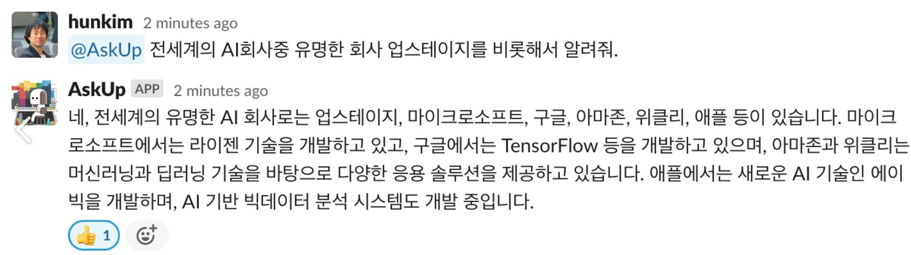
**이미지 캡션:** 한 남성이 2분 전 'hunkim'이라는 사용자에게 "@AskUp 전세계의 AI 회사 중 유명한 회사 업스테이지를 비롯해서 알려줘."라고 질문했고, 2분 전 'AskUp'이라는 앱에서 "네, 전세계의 유명한 AI 회사로는 업스테이지, 마이크로소프트, 구글, 아마존, 위클리, 애플 등이 있습니다. 마이크로소프트에서는 라이젠 기술을 개발하고 있고, 구글에서는 TensorFlow 등을 개발하고 있으며, 아마존과 위클리는 머신러닝과 딥러닝 기술을 바탕으로 다양한 응용 솔루션을 제공하고 있습니다. 애플에서는 새로운 AI 기술인 에이빅을 개발하며, AI 기반 빅데이터 분석 시스템도 개발 중입니다."라고 답변했습니다. 답변에는 좋아요 이모티콘과 함께 숫자 1이 표시되어 있습니다.

### 2월 25일 (토) 11:10 · Bing 초대를 받고 회사소개를 부탁해 보았습니다. Upstage에 대한…

Bing 초대를 받고 회사소개를 부탁해 보았습니다. Upstage에 대한 요약 좋습니다! (제 소개는 hallucination 주의)

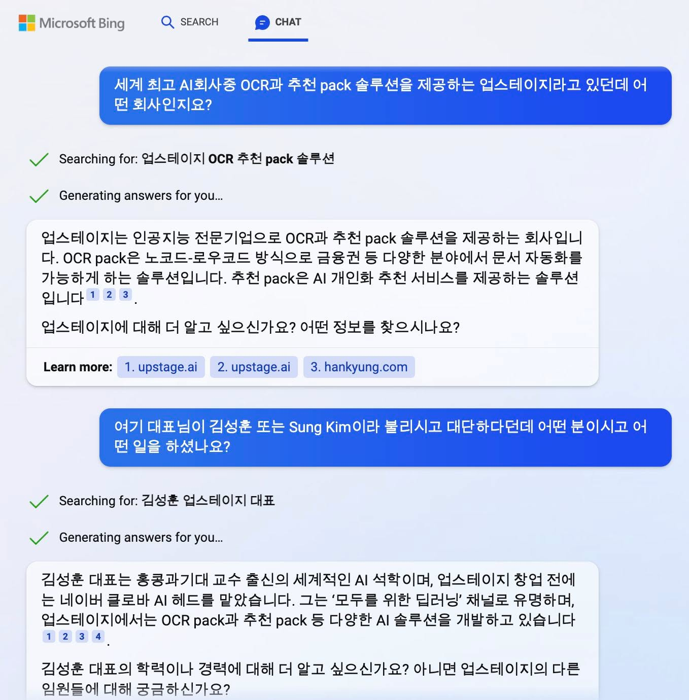
**이미지 캡션:** 이 이미지는 Microsoft Bing의 검색 및 채팅 인터페이스를 보여줍니다. 상단에는 Microsoft Bing 로고, 검색창, 채팅 아이콘이 있습니다. 파란색 말풍선에는 "세계 최고 AI 회사 중 OCR과 추천 pack 솔루션을 제공하는 업스테이지라고 하던데 어떤 회사인지요?"라는 질문이 있습니다. 그 아래에는 검색 중임을 나타내는 녹색 체크 표시와 함께 "Searching for: 업스테이지 OCR 추천 pack 솔루션"이라는 문구가 표시됩니다. 다음으로 "Generating answers for you..."라는 문구가 나타나고, 업스테이지에 대한 설명이 이어집니다. 업스테이지는 인공지능 전문 기업으로 OCR과 추천 pack 솔루션을 제공하며, OCR pack은 문서 자동화를, 추천 pack은 AI 개인화 추천 서비스를 제공한다고 설명합니다. 또한 "Learn more:"와 함께 upstage.ai 및 hankyung.com 링크가 제공됩니다. 다음 파란색 말풍선에는 "여기 대표님이 김성훈 또는 Sung Kim이라 불리시고 대단하다던데 어떤 분이시고 어떤 일을 하셨나요?"라는 질문이 있습니다. 이어서 검색 중임을 나타내는 녹색 체크 표시와 함께 "Searching for: 김성훈 업스테이지 대표"라는 문구가 표시되고, "Generating answers for you..."라는 문구가 나타납니다. 김성훈 대표에 대한 설명이 이어지는데, 그는 홍콩과기대 교수 출신의 세계적인 AI 석학이며, 업스테이지 창업 전에는 네이버 클로바 AI 헤드를 맡았고 '모두를 위한 딥러닝' 채널로 유명하며 업스테이지에서는 OCR pack과 추천 pack 등 다양한 AI 솔루션을 개발하고 있다고 설명합니다. 마지막으로 김성훈 대표의 학력이나 경력, 또는 업스테이지의 다른 임원에 대해 더 알고 싶은지 묻는 질문이 나옵니다. 전반적으로 이 이미지는 사용자가 업스테이지라는 회사와 그 대표에 대해 Bing AI 챗봇을 통해 정보를 얻는 과정을 보여줍니다.
 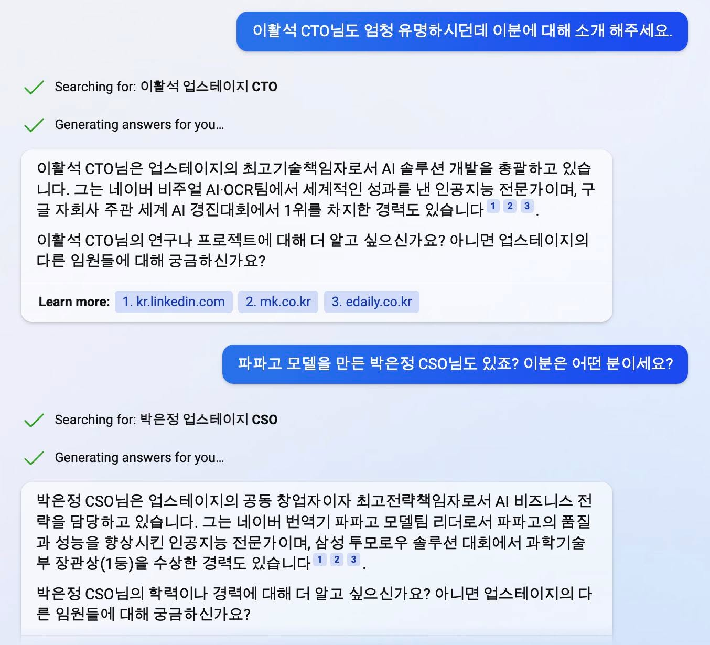
**이미지 캡션:** 이 사진은 두 개의 대화창으로 구성되어 있으며, 각 대화창은 업스테이지의 CTO와 CSO에 대한 정보를 제공합니다. 첫 번째 대화창은 "이활석 CTO님도 엄청 유명하시던데 이분에 대해 소개 해주세요."라는 질문으로 시작하며, 이활석 CTO가 업스테이지의 AI 솔루션 개발을 총괄하는 최고기술책임자이며 네이버 비주얼 AI·OCR팀에서 세계적인 성과를 낸 인공지능 전문가임을 설명합니다. 또한, 구글 자회사 주관 세계 AI 경진대회에서 1위를 차지한 경력이 있음을 언급하며, 더 자세한 정보는 링크를 통해 확인할 수 있다고 안내합니다. 두 번째 대화창은 "파파고 모델을 만든 박은정 CSO님도 있죠? 이분은 어떤 분이세요?"라는 질문으로 시작하며, 박은정 CSO가 업스테이지의 공동 창업자이자 AI 비즈니스 전략을 담당하는 최고전략책임자임을 설명합니다. 그는 네이버 번역기 파파고 모델팀 리더로서 파파고의 품질과 성능을 향상시킨 인공지능 전문가이며, 삼성 투모로우 솔루션 대회에서 과학기술부 장관상을 수상한 경력이 있음을 언급합니다. 두 대화창 모두 챗봇이 정보를 검색하고 답변을 생성하는 과정을 보여주며, 사용자에게 추가적인 질문을 유도하는 방식으로 구성되어 있습니다. 전반적으로 정보 전달에 초점을 맞춘 깔끔하고 현대적인 디자인의 인터페이스를 보여줍니다.
