# 2023년 3월

[← 2023년](README.md)

### 3월 1일 (수) 15:06 · 📷 사진 (1장)

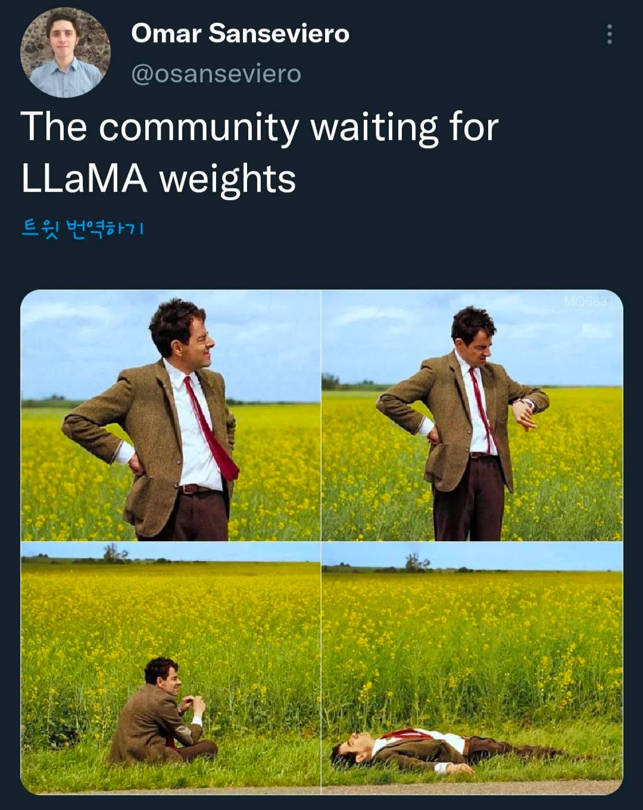
**이미지 캡션:** 이 이미지는 트위터 게시물로, "LLaMA 가중치를 기다리는 커뮤니티"라는 제목과 함께 네 개의 패널로 구성된 밈을 보여줍니다. 상단 좌측 패널에는 게시물을 올린 사람의 프로필 사진과 이름, 트위터 핸들이 보입니다. 게시물 내용은 "LLaMA 가중치를 기다리는 커뮤니티"이며, 그 아래에는 "트윗 번역하기"라는 한국어 텍스트가 있습니다. 하단에는 노란색 꽃이 만발한 넓은 들판을 배경으로 한 성인 남성이 네 가지 다른 자세로 앉아 있거나 누워 있는 모습이 담겨 있습니다. 남성은 갈색 트위드 재킷, 흰색 셔츠, 붉은색 넥타이, 갈색 바지를 입고 있습니다. 첫 번째 패널에서는 남성이 한 손을 허리에 얹고 다른 쪽을 바라보고 있습니다. 두 번째 패널에서는 손목시계를 보고 있는 듯한 모습입니다. 세 번째 패널에서는 풀밭에 앉아 무언가를 응시하고 있습니다. 마지막 네 번째 패널에서는 완전히 누워 잠든 듯한 모습입니다. 전체적으로 기다림에 지친 커뮤니티의 모습을 유머러스하게 표현하고 있으며, 배경의 넓고 탁 트인 들판은 기다림의 지루함과 광활함을 나타내는 듯합니다.

### 3월 2일 (목) 09:02 · openai의 chatgpt api가 공개 되었습니다. 그동안 3.5의 …

openai의 chatgpt api가 공개 되었습니다. 그동안 3.5의 completion과는 다른 형태로 1. 명시적으로 instruction을 주는 형식으로 입력을 받고 (help instruct the assistant), 2. 대화 기록 (conversation history) 을 통해 이전 context를 더 명확하게 가지게 될것 같습니다. 

재미있는 어플리케이션들이 많이 나올것 같습니다.
(아쉽게도 아직 finetuning은 제공하지 않는것 같습니다.)

https://platform.openai.com/docs/guides/chat/introduction

(저희 AskUp도 위 1, 2를 활용하면 성능이 엄청 올라갈것 같습니다. 코드 완전 수정해서 정식 릴리즈 하겠습니다: https://m.khan.co.kr/economy/economy-general/article/202302141627001)

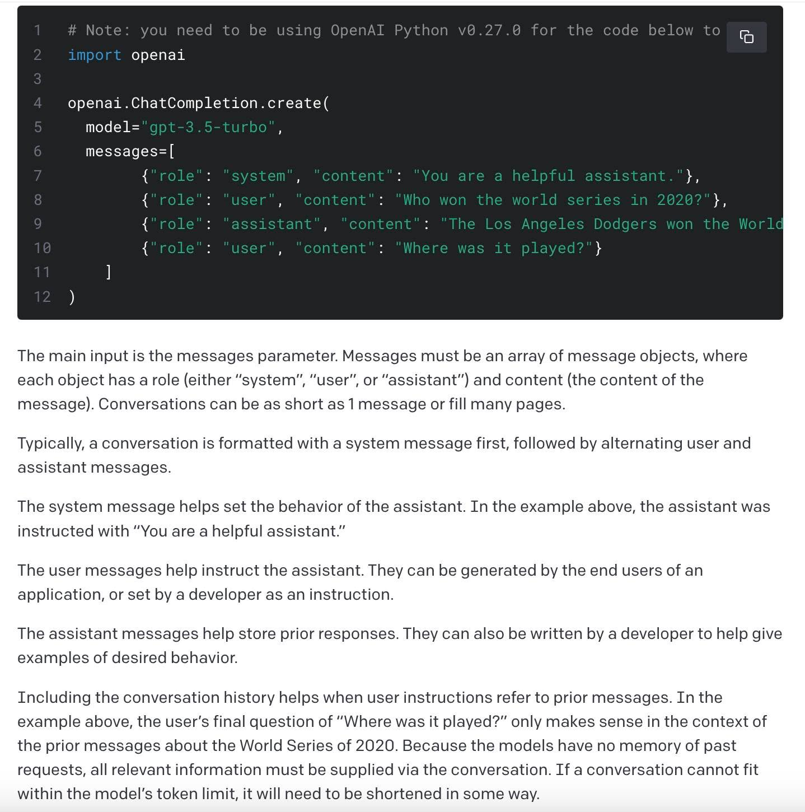
**이미지 캡션:** 이 이미지는 프로그래밍 코드와 그에 대한 설명을 보여줍니다. 코드 부분은 검은색 배경에 흰색 글씨로 작성된 파이썬 코드 스니펫으로, OpenAI 라이브러리를 사용하여 챗봇과 상호작용하는 방법을 보여줍니다. 코드에는 `import openai`, `openai.ChatCompletion.create`와 같은 함수 호출, 그리고 `model="gpt-3.5-turbo"`와 같은 매개변수가 포함되어 있습니다. 또한, 시스템 메시지, 사용자 메시지, 어시스턴트 메시지를 포함하는 `messages` 배열이 정의되어 있으며, 이는 챗봇과의 대화 기록을 나타냅니다. 예를 들어, "You are a helpful assistant."라는 시스템 메시지와 "Who won the world series in 2020?"라는 사용자 메시지, 그리고 "The Los Angeles Dodgers won the World"라는 어시스턴트 메시지가 보입니다. 코드 아래에는 이 코드를 설명하는 텍스트가 흰색 배경에 검은색 글씨로 작성되어 있습니다. 이 텍스트는 `messages` 매개변수의 역할, 메시지 객체의 구조(role과 content), 대화 형식, 시스템 메시지, 사용자 메시지, 어시스턴트 메시지의 기능, 그리고 대화 기록의 중요성에 대해 설명합니다. 전반적으로 이 이미지는 프로그래밍 교육 자료의 일부로 보이며, 챗봇 API 사용법을 설명하는 데 중점을 두고 있습니다.

### 3월 2일 (목) 12:23 · 📷 사진 (1장)

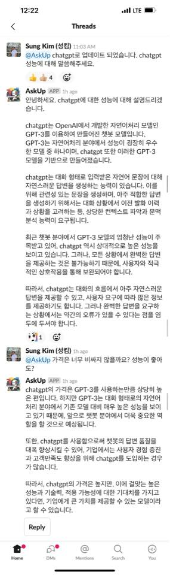
**이미지 캡션:** 이것은 스레드 형식의 대화 화면으로, 상단에는 시간과 LTE 신호 강도가 표시되고, 중앙에는 "Threads"라는 제목이 있습니다. 화면에는 두 명의 사용자가 주고받는 메시지가 보입니다. 첫 번째 사용자는 "Sung Kim (성킴)"으로, 프로필 사진에는 남성이 등장하며, 그는 "@AskUp chatgpt로 업데이트 되었습니다. chatgpt 성능에 대해 말씀해주세요."라고 질문합니다. 이 메시지에는 좋아요와 웃는 이모티콘이 달려 있습니다. 두 번째 사용자는 "AskUp"으로, 프로필 사진에는 여러 색상의 이미지가 있으며, 그는 "안녕하세요. chatgpt에 대한 성능에 대해 설명드리겠습니다."라고 답하며, chatgpt가 OpenAI에서 개발한 자연어 처리 모델인 GPT-3를 기반으로 만들어졌으며, 대화 형태로 자연스러운 답변을 생성하는 능력이 뛰어나지만, 완벽하지는 않아 사용자와의 상호작용을 통해 보완되어야 한다고 설명합니다. 또한, 가격이 비싸지만 GPT-3의 높은 성능 덕분에 앞으로 챗봇 분야에서 중요한 역할을 할 것이며, 기업에서는 사용자 경험 증진과 고객 만족도 향상을 위해 도입하는 경우가 많다고 덧붙입니다. 마지막으로 "Sung Kim (성킴)"이 "@AskUp 가격은 너무 비싸지 않을까요? 성능이 좋아도?"라고 다시 질문하고, "AskUp"이 가격이 높지만 그에 걸맞는 성능과 기술력으로 기업에게 큰 가치를 제공할 수 있다고 답하는 내용이 이어집니다. 화면 하단에는 홈, DM, 멘션, 검색, 사용자 메뉴가 보입니다.

### 3월 3일 (금) 07:00 · 📷 사진 (1장)

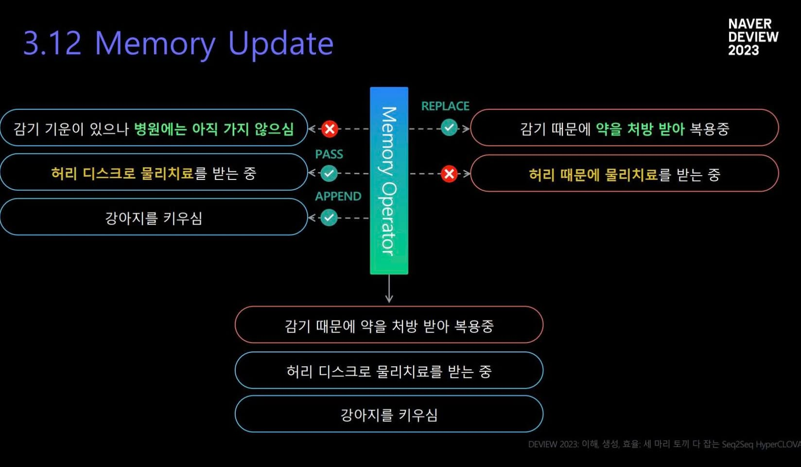
**이미지 캡션:** 이 이미지는 "3.12 Memory Update"라는 제목의 발표 자료 슬라이드로, 네이버 DEVIEW 2023 행사에서 사용된 것으로 보입니다. 검은색 배경에 파란색, 보라색, 녹색, 주황색, 흰색 등 다양한 색상의 텍스트와 도형이 사용되었습니다. 중앙에는 "Memory Operator"라는 녹색 직사각형 블록이 있으며, 이 블록을 중심으로 좌측에는 초기 메모리 상태를 나타내는 세 가지 항목("감기 기운이 있으나 병원에는 아직 가지 않으심", "허리 디스크로 물리치료를 받는 중", "강아지를 키우심")이 흰색 테두리의 타원형으로 표시되어 있습니다. 각 항목 옆에는 "PASS" 또는 "APPEND"라는 텍스트와 함께 체크 표시 또는 X 표시가 있는 화살표가 있어, 메모리 연산자의 작동 방식을 나타냅니다. 우측에는 "REPLACE"라는 텍스트와 함께 체크 표시 또는 X 표시가 있는 화살표를 통해 업데이트된 메모리 상태를 나타내는 세 가지 항목("감기 때문에 약을 처방 받아 복용중", "허리 때문에 물리치료를 받는 중", "강아지를 키우심")이 주황색 및 흰색 테두리의 타원형으로 표시되어 있습니다. 하단에는 업데이트된 메모리 상태를 다시 한번 요약하여 보여주는 세 가지 항목이 흰색 테두리의 타원형으로 나열되어 있습니다. 이미지 하단에는 "DEVIEW 2023: 이해, 생성, 효율: 세 마리 토끼 다 잡는 Seq2Seq HyperCLOVA"라는 문구가 작게 기재되어 있습니다. 전반적으로 기술적인 내용을 설명하는 다이어그램으로, 정보 전달에 초점을 맞춘 깔끔하고 현대적인 분위기입니다. 사람이나 구체적인 장소는 묘사되지 않았습니다.

### 3월 3일 (금) 23:59 · #es_gpt_turbo 지난주 공개한 elastic search (es…

#es_gpt_turbo 지난주 공개한 elastic search (es) + GPT3.5가 chatgpt (aka gpt-3.5-turbo)로 업그레이드 되었습니다. 너무 빠르고 (질문을 잘하면) 답을 아주 잘합니다.

여러분들이 es를 사용하신다면 이제 정말 BingChat 이 부럽지않은 서비스를 만드실수 있을 것입니다. 

Code: https://github.com/hunkim/es-gpt
Demo: https://es-gpt.sung.devstage.ai/

chatgpt가 대화형이다 보니 바로 답을 주려고 하고 질문에 답이 제 논문 요약에 없으면 논문 이게 뭐야? 답이 없어서 나도 모르겠다로 답을 주네요. 그래서 instruct와 user/assitant 예시 세팅도 중요한것 같은데 좋은 아이디어 있으시면 Pull request 많이 부탁드립니다. 

회사 ES에 같이 붙여 보시고 싶으신 분들도 연락주세요!

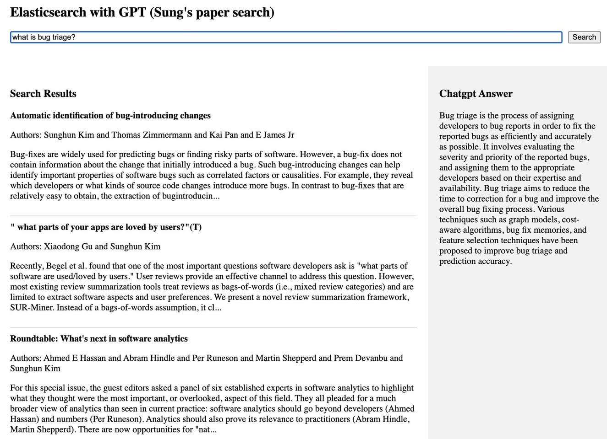
**이미지 캡션:** 이 이미지는 웹 브라우저 화면을 캡처한 것으로, "Elasticsearch with GPT (Sung's paper search)"라는 제목의 페이지를 보여줍니다. 페이지 상단에는 검색창이 있으며, "what is bug triage?"라는 검색어가 입력되어 있고 "Search" 버튼이 보입니다. 검색 결과 섹션에는 세 개의 논문 제목과 저자 정보, 그리고 각 논문의 일부 내용이 요약되어 있습니다. 첫 번째 논문은 "Automatic identification of bug-introducing changes"이며, 두 번째 논문은 "what parts of your apps are loved by users?" (T)입니다. 세 번째는 "Roundtable: What's next in software analytics"입니다. 오른쪽에는 "Chatgpt Answer"라는 제목과 함께 "bug triage"에 대한 ChatGPT의 답변이 상세하게 설명되어 있습니다. 전체적으로 학술적인 논문 검색 및 정보 제공 페이지의 모습을 하고 있으며, 차분하고 정보 중심적인 분위기입니다.
 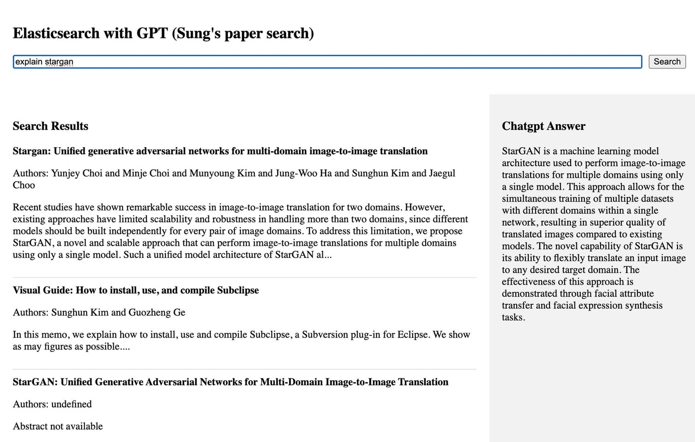
**이미지 캡션:** 이 이미지는 웹 페이지의 스크린샷으로, "Elasticsearch with GPT (Sung's paper search)"라는 제목이 상단에 표시되어 있습니다. 중앙에는 검색창이 있고, 검색창에는 "explain stargan"이라는 텍스트가 입력되어 있으며, 오른쪽에 "Search" 버튼이 있습니다. 검색 결과는 두 개의 열로 나뉘어 표시됩니다. 왼쪽 열에는 "Search Results"라는 제목 아래 세 개의 검색 결과가 나열되어 있습니다. 첫 번째 결과는 "Stargan: Unified generative adversarial networks for multi-domain image-to-image translation"이라는 제목과 저자 목록, 그리고 논문의 일부 내용이 포함되어 있습니다. 두 번째 결과는 "Visual Guide: How to install, use, and compile Subclipse"라는 제목과 저자 목록, 그리고 메모의 내용이 일부 표시됩니다. 세 번째 결과는 "StarGAN: Unified Generative Adversarial Networks for Multi-Domain Image-to-Image Translation"이라는 제목과 저자 정보, 초록이 없다는 내용이 있습니다. 오른쪽 열에는 "Chatgpt Answer"라는 제목 아래 StarGAN에 대한 설명이 자세히 나와 있습니다. 이 페이지는 연구 논문 검색 및 인공지능 기반 답변을 제공하는 시스템의 인터페이스를 보여줍니다. 전반적으로 정보 검색 및 요약에 초점을 맞춘 디지털 환경을 나타냅니다.

### 3월 4일 (토) 10:01 · ChatGPT 등 large language model 이시대 최고 전문…

ChatGPT 등 large language model 이시대 최고 전문가라 할수 있고, 연구뿐만 아니라 직접 만들고 있기 때문에, 지금 이 분야를 가장 잘 이해하고 계시는 Jung-Woo Ha 소장님의 "chatGPT가 촉발한 초거대 AI시대, 우리의 대응 전략 비디오" 가 공개 되었습니다.

https://youtu.be/ceLCB1PRRVE

ChatGPT등 관심이 있으시다면 꼭 들어보세요. 톡 이후 질문들도 좋고 전체적으로 너무 재미있습니다.

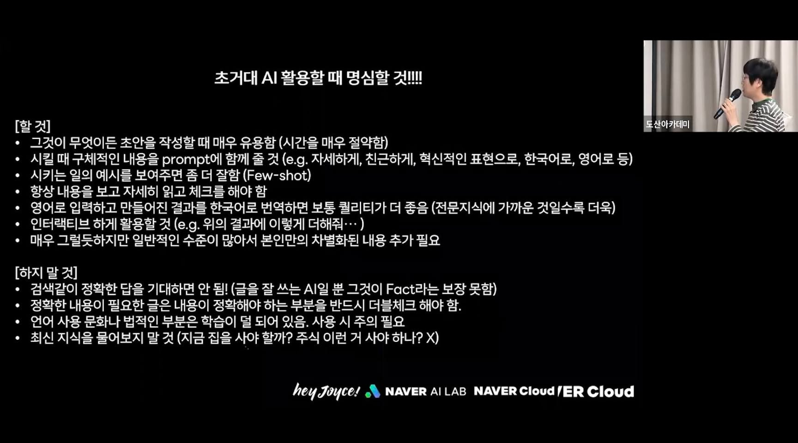
**이미지 캡션:** 검은색 배경에 흰색 글씨로 "초거대 AI 활용할 때 명심할 것!!!!!"이라는 제목이 있고, 그 아래에 AI 활용 시 '할 것'과 '하지 말 것'에 대한 내용이 불렛 포인트로 나열되어 있습니다. '할 것' 항목에는 AI가 초안 작성에 유용하고, 구체적인 프롬프트와 예시를 제공하면 더 잘 활용할 수 있으며, 결과를 꼼꼼히 확인하고 번역 시에는 영어로 입력하는 것이 좋다는 내용이 포함되어 있습니다. '하지 말 것' 항목에는 AI가 항상 정확한 답변을 제공하는 것은 아니므로 사실 확인이 필요하고, 문화적, 법적 부분이나 최신 정보에 대해서는 주의가 필요하다는 내용이 있습니다. 오른쪽 상단에는 작은 화면으로 한 성인 남성이 마이크를 들고 발표하는 모습이 보이며, 화면 하단에는 "hey Joyce! NAVER AI LAB NAVER Cloud /ER Cloud"라는 문구가 있습니다. 발표자는 안경을 쓰고 줄무늬 티셔츠를 입고 있으며, 차분한 표정으로 발표하고 있습니다. 배경은 강의실이나 발표회장으로 보이며, 조명이 밝고 깔끔한 분위기입니다.
 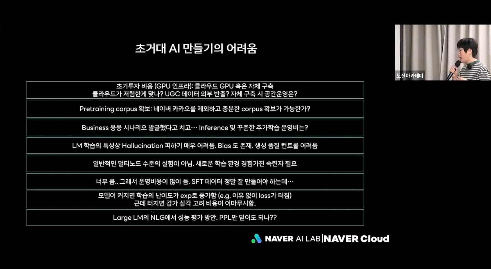
**이미지 캡션:** 어두운 배경에 "초거대 AI 만들기 어려움"이라는 제목과 함께 여러 질문들이 나열되어 있으며, 오른쪽 상단에는 마이크를 들고 이야기하는 젊은 성인 남성의 모습이 작은 영상으로 보인다. 남성은 검은색 바탕에 흰색 줄무늬가 있는 옷을 입고 있으며, 안경을 착용하고 있다. 영상 하단에는 "도산아카데미"라는 텍스트가 보인다. 나열된 질문들은 AI 개발의 초기 비용, 클라우드 GPU 사용 여부, UGC 데이터 외부 반출 및 공간 운영, 충분한 코퍼스 확보 가능성, 비즈니스 시나리오 발굴, LM 학습의 특성상 Hallucination 및 Bias 문제, 생성 품질 컨트롤의 어려움, 일반적인 멀티노드 수준의 실험의 한계, 새로운 학습 환경 경험이 있는 숙련자 필요성, 운영 비용의 높음과 SFT 데이터 제작의 중요성, 모델이 커질수록 학습 난이도 증가 및 터치감, 그리고 Large LM의 NLG 성능 평가 방식 및 PPL 신뢰도에 대한 내용이다. 하단에는 "NAVER AI LAB | NAVER Cloud"라는 로고가 보인다. 전반적으로 AI 기술 개발의 현실적인 어려움과 관련된 발표 또는 강연의 일부로 보인다.
 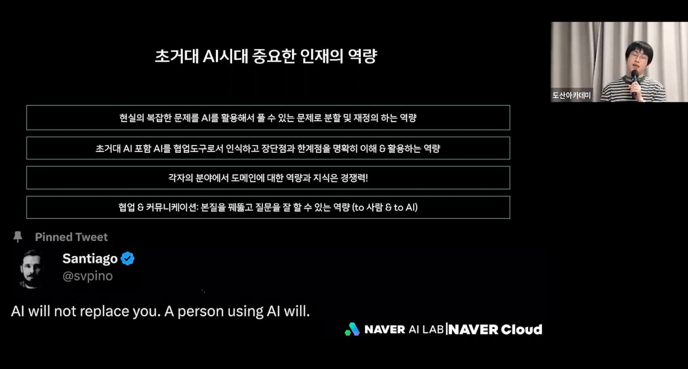
**이미지 캡션:** 화면 왼쪽에는 검은색 배경에 흰색 글씨로 "초거대 AI 시대 중요한 인재의 역량"이라는 제목과 함께 4가지 역량에 대한 설명이 나열되어 있으며, 각 설명은 흰색 테두리 상자 안에 담겨 있다. 첫 번째 상자에는 "현실의 복잡한 문제를 AI를 활용해서 풀 수 있는 문제로 분할 및 재정의 하는 역량"이라고 쓰여 있고, 두 번째 상자에는 "초거대 AI 포함 AI를 협업도구로서 인식하고 장단점과 한계점을 명확히 이해 & 활용하는 역량"이라고 쓰여 있다. 세 번째 상자에는 "각자의 분야에서 도메인에 대한 역량과 지식은 경쟁력!"이라고 쓰여 있으며, 네 번째 상자에는 "협업 & 커뮤니케이션: 본질을 꿰뚫고 질문을 잘 할 수 있는 역량 (to 사람 & to AI)"이라고 쓰여 있다. 화면 하단 왼쪽에는 "Pinned Tweet"이라는 문구와 함께 트위터 사용자 "Santiago"의 프로필 사진, 이름, 아이디(@svpino)가 보이고, 그 아래에는 "AI will not replace you. A person using AI will."이라는 영어 문구가 적혀 있다. 화면 하단 오른쪽에는 "NAVER AI LAB | NAVER Cloud"라는 로고가 보인다. 화면 오른쪽 상단에는 한 성인 남성이 마이크를 들고 강연하는 모습이 담긴 영상 썸네일이 있고, 영상 썸네일 위에는 "도산아카데미"라는 흰색 글씨가 적혀 있다. 이 남성은 검은색 바탕에 흰색 줄무늬가 있는 상의를 입고 있으며, 안경을 착용하고 있다. 전체적으로 정보 전달과 교육적인 분위기를 띤다.

### 3월 4일 (토) 18:56 · #line-chatgpt 이제 라인에서 ChatGPT를 이용할 수 있습니…

#line-chatgpt 이제 라인에서 ChatGPT를 이용할 수 있습니다! 

이번 연동을 통해 라인 앱에서 바로 ChatGPT와 대화할 수 있습니다. 또한, UpOCR을 사용하여 ChatGPT에 이미지를 전송할 수 있어 더 나은 응답을 생성하기 위한 추가 컨텍스트로 제공할 수 있습니다.

https://liff.line.me/1645278921-kWRPP32q/?accountId=249euaat  바로 불러서 친추하신다음 말거시면 됩니다.

데이터는 다 openai로 가니 User Agreement 등 자세한 정보는 https://github.com/hunkim/line-gpt  참고 부탁드립니다.

Kakao 붙이는 중인데 아~ 여기 봇 붙이기 어렵네요. 혹시 경험있으신분 ping 부탁드립니다. (Kakao도 곧 공개 합니다!)

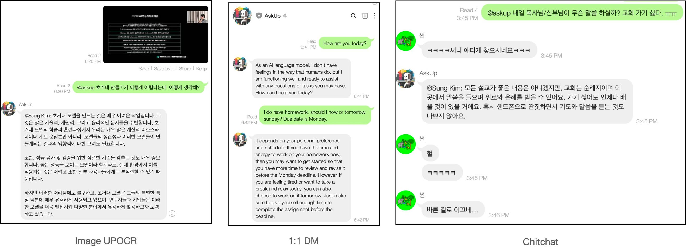
**이미지 캡션:** 이 이미지는 세 개의 스크린샷으로 구성되어 있으며, 각각 다른 채팅 애플리케이션의 대화 내용을 보여줍니다. 왼쪽 스크린샷은 "Image UPOCR"이라는 제목과 함께 한국어로 된 대화 내용을 보여주며, AskUp이라는 사용자가 초거대 모델 개발의 어려움에 대해 설명하고 있습니다. 중간 스크린샷은 "1:1 DM"이라는 제목과 함께 영어로 된 대화 내용을 보여주며, AskUp이라는 사용자가 숙제에 대한 질문에 답변하고 있습니다. 오른쪽 스크린샷은 "Chitchat"이라는 제목과 함께 한국어로 된 대화 내용을 보여주며, AskUp이라는 사용자가 교회와 관련된 대화에 참여하고 있습니다. 전체적으로 이 이미지는 다양한 플랫폼에서 이루어지는 AI 챗봇과 사용자 간의 대화를 보여주며, 기술, 개인적인 문제, 종교 등 다양한 주제를 다루고 있습니다.

### 3월 4일 (토) 20:01 · 📷 사진 (2장)

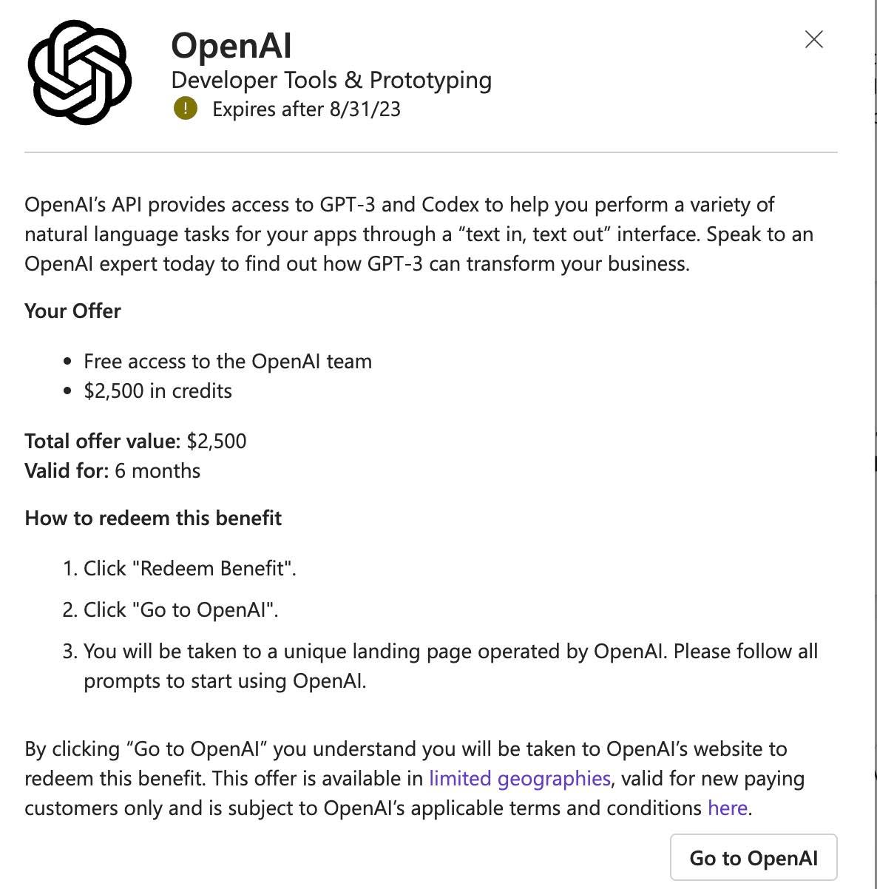
**이미지 캡션:** 이 이미지는 OpenAI의 개발자 도구 및 프로토타이핑에 대한 제안을 보여주는 스크린샷입니다. 상단에는 OpenAI 로고와 함께 "OpenAI Developer Tools & Prototyping"이라는 제목이 있고, 만료일은 8월 31일로 표시되어 있습니다. 본문에는 OpenAI API가 GPT-3 및 Codex에 대한 액세스를 제공하여 자연어 작업을 수행할 수 있도록 지원하며, "텍스트 입력, 텍스트 출력" 인터페이스를 통해 앱을 개발할 수 있다고 설명합니다. 또한, OpenAI 전문가와 상담하여 GPT-3가 비즈니스를 어떻게 변화시킬 수 있는지 알아볼 수 있다고 안내합니다. "Your Offer" 섹션에서는 OpenAI 팀에 무료로 접근할 수 있고 2,500달러의 크레딧을 제공하며, 총 제안 가치는 2,500달러이고 유효 기간은 6개월이라고 명시되어 있습니다. "How to redeem this benefit" 섹션에서는 혜택을 받는 방법을 3단계로 안내합니다. 첫째, "Redeem Benefit"을 클릭하고, 둘째, "Go to OpenAI"를 클릭하며, 셋째, OpenAI에서 운영하는 고유한 랜딩 페이지로 이동하여 프롬프트를 따라 OpenAI를 사용하기 시작하라고 합니다. 마지막으로, "Go to OpenAI"를 클릭하면 OpenAI 웹사이트로 이동하여 혜택을 받을 수 있으며, 이 제안은 특정 지역에 한정되고 신규 유료 고객에게만 유효하며 OpenAI의 약관 및 조건이 적용된다는 내용을 알립니다. 이미지 하단에는 "Go to OpenAI" 버튼이 있습니다. 전반적으로 이 이미지는 OpenAI의 개발자 도구 및 프로토타이핑 제안에 대한 정보를 제공하는 공식적인 안내문입니다.
 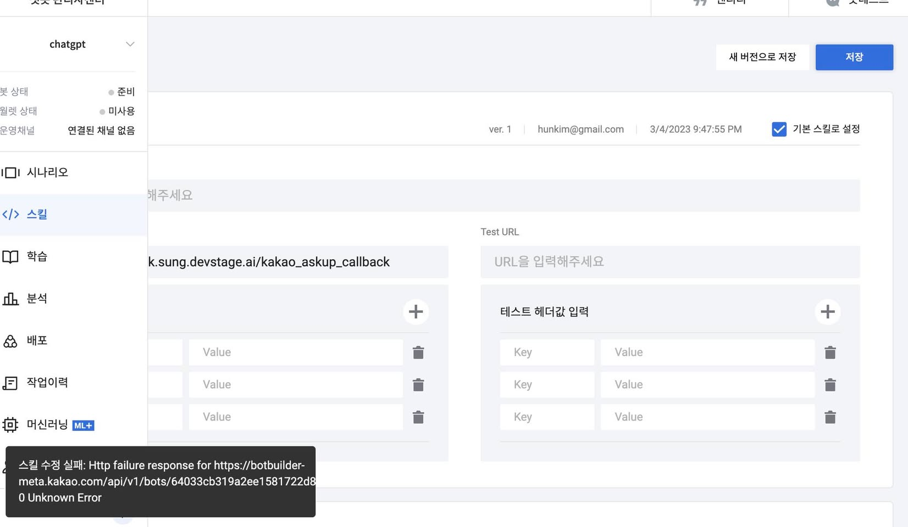
**이미지 캡션:** 이 이미지는 웹 기반 인터페이스의 스크린샷으로, 챗봇 개발 또는 관리와 관련된 화면으로 보인다. 왼쪽에는 "chatgpt"라는 이름과 함께 드롭다운 메뉴가 있고, 그 아래로 "봇 상태", "월렛 상태", "운영채널" 등의 메뉴 항목이 나열되어 있으며, "시나리오", "스킬", "학습", "분석", "배포", "작업이력", "머신러닝 ML+"와 같은 기능 메뉴들이 순서대로 보인다. 화면 중앙에는 "k.sung.devstage.ai/kakao_askup_callback"이라는 URL이 표시된 영역과 "Test URL"이라는 제목 아래 "URL을 입력해주세요"라는 안내 문구가 있는 입력란이 보인다. 또한 "테스트 헤더값 입력"이라는 섹션에는 Key와 Value를 입력할 수 있는 여러 행이 있으며, 각 행에는 추가(+) 버튼과 삭제(휴지통 아이콘) 버튼이 있다. 화면 상단에는 "새 버전으로 저장" 및 "저장" 버튼이 보이고, 그 아래에는 "ver. 1", "hunkim@gmail.com", "3/4/2023 9:47:55 PM"이라는 정보와 함께 "기본 스킬로 설정"이라는 체크박스가 있다. 화면 하단에는 검은색 배경에 흰색 글씨로 "스킬 수정 실패: Http failure response for https://botbuilder-meta.kakao.com/api/v1/bots/64033cb319a2ee1581722d8 0 Unknown Error"라는 오류 메시지가 표시되어 있다. 전반적으로 기술적인 개발 환경에서 발생한 오류 상황을 보여주는 화면으로, 특정 사용자가 챗봇 스킬 수정 중 문제를 겪고 있음을 나타낸다.

### 3월 5일 (일) 00:42 · 📷 사진 (2장)

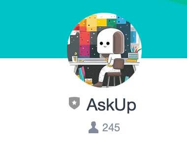
**이미지 캡션:** 이 이미지는 AskUp이라는 이름의 서비스 또는 앱의 프로필 화면으로 보인다. 화면 상단에는 밝은 청록색 배경이 있고, 그 아래에는 흰색 배경이 있다. 흰색 배경 중앙에는 원형의 프로필 이미지가 자리하고 있다. 이 프로필 이미지는 귀여운 그림체로 그려진 캐릭터가 책상에 앉아 무언가를 하고 있는 모습이다. 캐릭터는 흰색 옷을 입고 있으며, 머리 부분은 강아지 귀처럼 보이는 두 개의 튀어나온 부분이 있다. 캐릭터는 책상 앞에 놓인 의자에 앉아 있으며, 책상 위에는 연필, 책, 그리고 다른 물건들이 놓여 있다. 배경에는 다채로운 색상의 블록들이 쌓여 있는 듯한 추상적인 그림이 보인다. 프로필 이미지 아래에는 "AskUp"이라는 텍스트가 크고 굵게 쓰여 있으며, 그 옆에는 방패 모양의 아이콘이 있다. 그 아래에는 사람 모양의 아이콘과 함께 숫자 "245"가 표시되어 있어, 팔로워 수나 사용자 수를 나타내는 것으로 추정된다. 전체적으로 밝고 긍정적인 분위기를 풍긴다.
 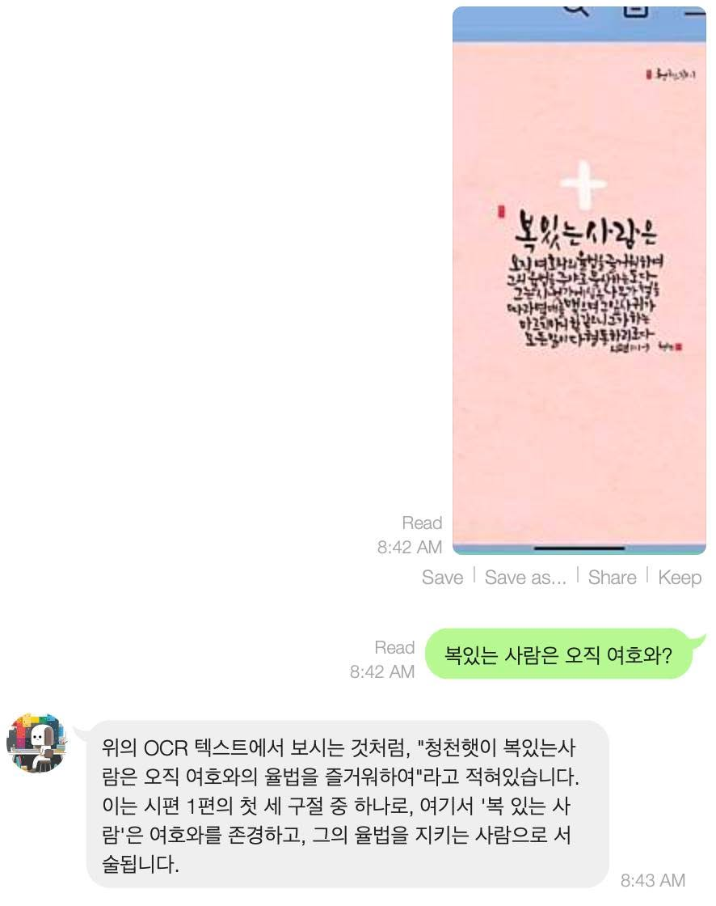
**이미지 캡션:** 이 이미지는 모바일 메신저 대화 화면을 캡처한 것으로, 한 사람이 다른 사람에게 보낸 메시지와 함께 이미지 한 장이 첨부되어 있습니다. 이미지에는 분홍색 배경에 흰색 십자가와 함께 "복있는 사람은"이라는 제목이 있고, 그 아래에는 성경 구절로 보이는 한글 캘리그라피가 적혀 있습니다. 캘리그라피 내용은 "오직 여호와의 율법을 즐거워하여 그 율법을 주야로 묵상하는도다 그는 물가에 심은 나무가 철을 따라 열매를 맺으며 그 잎사귀가 마르지 아니한 같으니 그가 하는 모든 일이 다 형통하리로다"로 추정됩니다. 이미지 아래에는 "Read 8:42 AM"이라는 표시와 함께 "Save | Save as... | Share | Keep" 옵션이 보입니다. 그 아래에는 다른 메시지로 "복있는 사람은 오직 여호와?"라는 질문이 녹색 말풍선 안에 담겨 있습니다. 마지막으로, 화면 하단에는 "위의 OCR 텍스트에서 보시는 것처럼, '청천햇이 복있는 사람은 오직 여호와의 율법을 즐거워하여'라고 적혀있습니다. 이는 시편 1편의 첫 세 구절 중 하나로, 여기서 '복 있는 사람은' 여호와를 존경하고, 그의 율법을 지키는 사람으로 서술됩니다."라는 내용의 메시지가 보이며, 그 옆에는 "8:43 AM"이라는 시간이 표시되어 있습니다. 대화 상대방의 프로필 사진 일부도 왼쪽 하단에 작게 보입니다. 전반적으로 성경 구절에 대한 질문과 답변, 그리고 관련 설명이 오가는 신앙적인 대화의 맥락을 보여줍니다.

### 3월 5일 (일) 02:09 · #kakao_chatgpt

#kakao_chatgpt 
업댓: 카카오 크루분들이 신속하고 너무나 친절하고 전문적으로 도움을 주셔서 이제 카카오에서도 UpOCR구동, 이전 2000토큰 기억후 100% 응답이 옵니다. 도와주신 카카오 크루 분들에게 큰 감사드립니다.

Junbum Lee 님 도와주셔서 이제 카카오에서 ChatGPT를 이용할 수 있습니다! 또한, UpOCR을 사용하여 ChatGPT에 이미지를 정보를 얻을수 있어 스샷을 통한 컨텍스트 전달도 가능합니다.

https://pf.kakao.com/_BhxkWxj 친구 추가 하시고 말 걸어 주세요.

* 책임과 콘텐츠
AskUp을 사용함으로써 귀하는 본 약관에 동의하는 것으로 간주 됩니다.

1. 책임: 이 시스템의 신뢰성을 보장하지 않으며 사용으로 인해 발생하는 어떠한 손해에 대해서도 책임을 지지 않습니다.
2. 콘텐츠: 사용자가 AskUp에게 말을 걸면 메시지와 이미지가 Upstage와 OpenAI가 서비스 개선 목적으로 분석합니다. 콘텐츠의 소유권은 회원님이 보유하지만 Upstage 및 OpenAI에 콘텐츠 사용 라이선스를 부여합니다.

* 감사
https://www.facebook.com/Junbum.L 님께서 카카오봇 세팅 많이 도와주셨습니다. 감사합니다!

자세한 내용은 https://github.com/hunkim/kakao-gpt  꼭 참고해주세요.

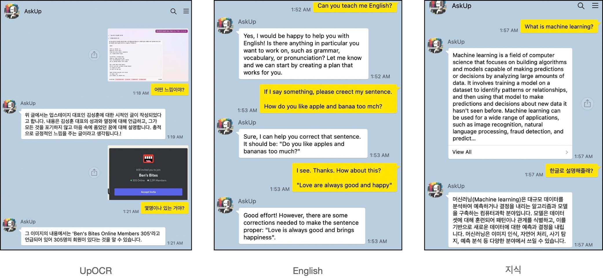
**이미지 캡션:** 이 이미지는 세 개의 대화창을 나란히 보여주는 스크린샷으로, 각 창은 AskUp이라는 이름의 챗봇과 사용자의 대화를 담고 있으며, 각각 UpOCR, English, 지식이라는 제목으로 분류되어 있다. 왼쪽 창(UpOCR)에서는 사용자가 한국어로 "어떤 느낌이야?"라고 묻자 챗봇은 김성훈 대표에 대한 시적인 글에 대해 긍정적인 느낌을 준다고 답변하고, 이어 "몇 명이나 있는 거야?"라는 질문에 "Ben's Bites Online Members 305"라는 문구를 언급하며 305명의 회원이 있다고 설명한다. 중간 창(English)에서는 사용자가 영어로 "Can you teach me English?"라고 묻자 챗봇은 문법, 어휘, 발음 등에 대해 도움을 줄 수 있다고 답하며, 사용자가 "If I say something, please creect my sentence. How do you like apple and banaa too mch?"라고 잘못된 문장을 보내자 챗봇은 이를 "Do you like apples and bananas too much?"로 수정해주고, 이어 사용자가 "Love are always good and happy"라고 말하자 "Love is always good and brings happiness"로 수정해준다. 오른쪽 창(지식)에서는 사용자가 "What is machine learning?"이라고 묻자 챗봇은 머신러닝에 대한 영어 정의를 제공하고, 이어 "한글로 설명해줄래?"라고 묻자 머신러닝의 개념, 작동 방식, 활용 분야 등을 한국어로 설명한다. 각 대화창에는 시간 정보와 함께 챗봇의 프로필 사진이 표시되어 있으며, 전반적으로 정보 제공 및 언어 학습을 돕는 챗봇과의 대화 상황을 보여준다.

### 3월 5일 (일) 16:06 · #llamaup #opendata Park Chansung 님 수고해주셔…

#llamaup #opendata Park Chansung 님 수고해주셔서 LLAMA Up이 출시되었습니다! 저희의 목표는 Kubernetes 클러스터(GKE, AKS 또는 EKS)의 V100 인스턴스에서 7B 버전에 무료로 접속하여 테스트 해보고 생성되는 데이터를 모두에게 공개 하는 것입니다.

ChatGPT와 유사한 인터페이스를 통해 대화를 저장하고 각 대화를 편리하게 평가할 수 있습니다. 수집된 모든 데이터는 익명으로 처리되어 대중에게 공개되므로 의미 있는 방식으로 커뮤니티에 기여할 수 있습니다.

아낌없이 가중치를 공유해주신 광율님께 감사의 말씀을 전합니다.

시작하기 전에 아래의 사용자 동의서를 읽어주세요. LLAMA Up을 사용함으로써 귀하는 본 내용에 동의하게 됩니다. 저희는 본 시스템의 신뢰성을 보장하지 않으며, 사용으로 인해 발생하는 어떠한 손해에 대해서도 책임지지 않습니다.

https://github.com/hunkim/llama-up-data

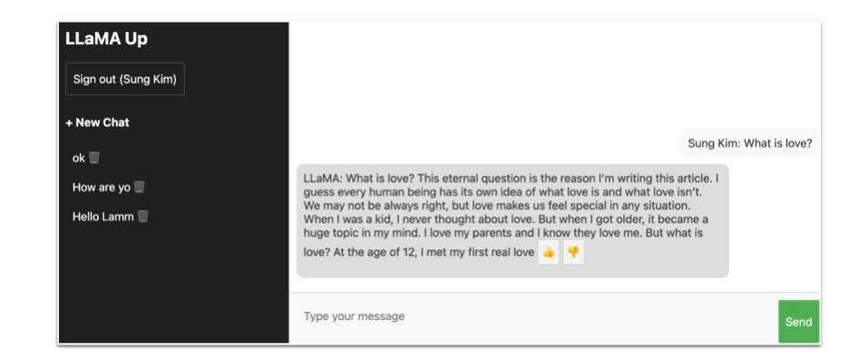
**이미지 캡션:** 이 이미지는 웹 기반 채팅 인터페이스를 보여줍니다. 왼쪽에는 어두운 회색 사이드바가 있으며, 상단에는 "LLaMA Up"이라는 제목이 있고 그 아래에 "Sign out (Sung Kim)" 버튼이 있습니다. 사이드바에는 "+ New Chat" 옵션과 이전 대화 목록이 표시되며, 각 항목에는 "ok", "How are yo", "Hello Lamm"과 같은 짧은 메시지와 함께 아이콘이 있습니다. 오른쪽에는 흰색 배경에 대화 창이 있습니다. 대화 창 상단에는 "Sung Kim: What is love?"라는 메시지가 있고, 그 아래에는 "LLAMA"라는 이름으로 시작하는 긴 텍스트 메시지가 있습니다. 이 메시지는 사랑에 대한 질문으로 시작하여 개인적인 경험과 생각을 공유하며, 마지막에는 엄지척과 엄지 내림 이모티콘이 있습니다. 대화 창 하단에는 "Type your message"라는 플레이스홀더 텍스트가 있는 입력 필드와 녹색 "Send" 버튼이 있습니다. 전체적인 분위기는 디지털 커뮤니케이션 또는 챗봇과의 상호작용을 나타냅니다.

### 3월 6일 (월) 01:03 · #성격바꾸기

#성격바꾸기 

https://github.com/hunkim/line-gpt

많은 분들이 line-gpt를 사용해주셔서 새로운 기능을 하나를 준비했습니다! chatgpt의 성격을 바꿀수 있습니다! 친절한 선생님 말투로, 어린이 말투로, 의사 선생님 말투로, 여친의 말투, 또는 특정한 언어로, 또는 번역기로 상상하는 모든 persona를 지정할수 있습니다.

* persona? 챗봇의 현재 페르소나를 확인하려면 "persona?"를 입력합니다.
* 챗봇의 새 페르소나를 설정하려면 "persona: new persona"를 입력합니다. (콜론다음 한자 띄워쓰기 주의) 
* 챗봇의 페르소나를 기본 상태로 재설정하려면 "persona reset"을 입력합니다. 

한번 시도해 보세요!

카톡에서도 동일한 기능이 지원됩니다.

기술적: chatgpt에는 system이라는 role content로 너가 무엇을 하는 봇인지 정확하게 지정해줄수 있습니다. 이 원샷으로 중간 중간 몇개의 삿보다  훨씬 강력하게 봇을 제어할수 있습니다.

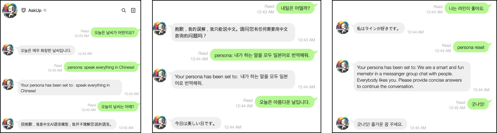
**이미지 캡션:** 이 이미지는 세 개의 대화창을 나란히 보여주는 스크린샷으로, 각 대화창은 메시징 앱의 인터페이스를 모방하고 있습니다. 각 대화창에는 프로필 사진, 이름, 메시지 내용, 타임스탬프가 포함되어 있습니다. 프로필 사진은 모두 동일한 귀여운 로봇 캐릭터로, 다채로운 색상의 머리카락을 가지고 있습니다. 대화는 주로 한국어, 중국어, 일본어, 영어로 이루어지며, "persona"라는 키워드를 통해 AI의 언어 설정이 변경되는 과정을 보여줍니다. 첫 번째 대화창에서는 한국어로 날씨에 대한 질문과 답변이 오가다가 "persona: speak everything in Chinese!"라는 메시지와 함께 중국어로 대화가 이어집니다. 두 번째 대화창에서는 중국어로 질문이 들어오고, "persona: 내가 하는 말을 모두 일본어로 번역해줘."라는 설정 변경 후 일본어로 대화가 진행됩니다. 세 번째 대화창에서는 일본어로 시작된 대화가 영어로 바뀌고, "Your persona has been set to: We are a smart and fun memebr in a messanger group chat with people. Everybody likes you. Please provide concise answers to continue the conversation."라는 메시지가 나타납니다. 마지막으로 "persona reset"이라는 메시지와 함께 한국어로 "굿나잇!"이라는 인사가 보입니다. 전반적으로 이 이미지는 AI 챗봇의 다국어 처리 능력과 페르소나 설정 기능을 시각적으로 보여주는 예시입니다.

### 3월 7일 (화) 12:30 · #카카오감사 #qr친추 어제 정말 저랑 같이 다 디버깅도 해주시고 카카오…

#카카오감사 #qr친추 어제 정말 저랑 같이 다 디버깅도 해주시고 카카오 크루분들이 너무 잘해주셔서 다시한번 감사의 말씀을 전하고 싶어 posting 합니다.

저도 어제 하루종일 같이 이야기 나누었는데 너무 재미있었고 주위 친구들에게 chatgpt를 소개하고 이야기 하기도 좋았습니다.

아래 qr로 바로 친추 가능합니다. 제가 이제 askup으로 검색도 되도록 on했고 (실제 검색을 위해 2~3일) 그리고 AWS 람다 채인으로 연결하여 더 빠르고 안정적으로 서비스 가능하도록 만들어 두었으니 많이 활용해보시고 어디에 더 잘 사용할수 있을지 같이 고민해서 더 좋은 것을 만들어 보면 좋겠습니다.

persona 명령으로 봇의 성격을 바꿀수 있으니 이도 여러가지 재미있는 톡이 가능할 것입니다.
https://github.com/hunkim/kakao-gpt

**이미지 캡션:** 이 사진은 검은색과 흰색으로 이루어진 QR 코드 이미지입니다. QR 코드는 정사각형 모양이며, 네 개의 모서리에 각각 세 개의 정사각형으로 구성된 탐지 패턴이 있습니다. QR 코드의 나머지 부분은 다양한 크기의 검은색과 흰색 정사각형들이 불규칙하게 배열되어 데이터를 나타냅니다. 이미지에는 사람, 장소, 사물, 텍스트가 보이지 않으며, 오직 QR 코드 자체만이 존재합니다. 따라서 분위기나 상황에 대한 설명도 불가능합니다.

### 3월 7일 (화) 17:45 · #논문상 #추천 저희 학생과 업스테이지 추천 총괄하시는 재범님이 공동 저…

#논문상 #추천 저희 학생과 업스테이지 추천 총괄하시는 재범님이 공동 저자로 참여한 추천 관련 논문의 WSDM 2023에서 Best Paper Award - Honorable Mention 을 받았습니다. 최종 win은 아니지만 Honorable Mention  멘션도 아주 영광스러운 상이라고 생각합니다.

저희 업스테이지는 이런 멋진 알고리즘들을 녹여 고객의 문제를 풀고 있으며 실제 현업에서 적용 성공을 최종 성과로 생각하고 달리고 있습니다.

추천관련 문제가 있으신 분들은 언제나 연락주세요. 이미 많은 업체들이 저희 제품으로 성과를 내고 있습니다. https://www.upstage.ai/contact-us

**이미지 캡션:** 이것은 WSDM 2023 컨퍼런스에서 "Best Paper Award - Honorable Mention"을 수상한 논문에 대한 인증서입니다. 인증서에는 "The 16th ACM International Conference on Web Search and Data Mining"이라는 문구가 있으며, 날짜는 2023년 2월 27일부터 3월 3일까지입니다. 수상 논문의 제목은 "Efficiently Leveraging Multi-level User Intent for Session-based Recommendation via Atten-Mixer Network"이며, 저자는 Peiyan Zhang, Jiayan Guo, Chaozhuo Li, Yueqi Xie, Jae Boum Kim, Yan Zhang, Xing Xie, Haohan Wang, Sunghun Kim입니다. 인증서 하단에는 두 명의 General Chair인 Tat-Seng Chua와 Hady W. Lauw의 서명이 있습니다. 인증서는 흰색 배경에 검은색 글씨로 인쇄되어 있으며, 좌측 상단에는 WSDM 2023 로고가, 우측 상단에는 ACM 로고와 "Association for Computing Machinery" 문구가 있습니다. 인증서의 분위기는 공식적이고 영예로운 느낌을 줍니다.
 
**이미지 캡션:** 행사장에서 성인 남성 세 명이 무대 위에서 상을 받고 있으며, 가운데 남성이 종이 상장을 들고 있고 양옆의 남성들은 박수를 치거나 서류를 들고 있습니다. 이들은 모두 정장을 입고 있으며, 젊은 성인 남성으로 보입니다. 배경에는 "wsdm2023"이라는 로고와 함께 "Best Paper Award - Honorable Mention"이라는 문구가 적힌 대형 스크린이 보입니다. 스크린에는 논문 제목과 저자들의 이름도 함께 표시되어 있습니다. 스크린 위쪽으로는 화려한 샹들리에 조명이 있고, 좌우에는 보라색 조명이 켜진 벽이 있습니다. 무대 앞쪽과 객석에는 많은 사람들이 앉아 행사를 관람하고 있으며, 일부는 휴대폰으로 사진을 찍고 있습니다. 전반적으로 학술 행사 시상식의 분위기이며, 축하하고 격려하는 모습입니다.

### 3월 7일 (화) 17:46 · 📷 사진 (1장)

**이미지 캡션:** 이 사진은 QR 코드 이미지로, 네 개의 모서리에 정사각형 패턴이 있고 나머지 부분은 흑백의 작은 사각형들로 채워져 있습니다. QR 코드는 일반적으로 정보를 저장하고 스마트폰 등으로 스캔하여 해당 정보에 접근하는 데 사용됩니다. 이 이미지 자체에는 사람, 장소, 사물, 텍스트가 직접적으로 보이지 않으며, 따라서 분위기나 상황을 묘사하기 어렵습니다. QR 코드가 어떤 정보를 담고 있는지에 따라 그 용도와 의미가 결정될 것입니다.

### 3월 8일 (수) 01:32 · 📷 사진 (2장)

**이미지 캡션:** 이 이미지는 QR 코드입니다. 검은색과 흰색의 작은 사각형들이 모여 복잡한 패턴을 이루고 있으며, 네 개의 큰 사각형이 각 모서리에 위치하여 QR 코드임을 명확히 나타냅니다. QR 코드는 일반적으로 스마트폰이나 다른 장치로 스캔하여 웹사이트 링크, 텍스트 정보, 연락처 정보 등 다양한 데이터를 읽어내는 데 사용됩니다. 이 이미지 자체에는 사람, 장소, 사물, 텍스트, 분위기나 상황에 대한 정보가 직접적으로 포함되어 있지 않습니다.
 
**이미지 캡션:** 이 사진은 QR 코드 이미지로, 검은색과 흰색의 픽셀 패턴으로 구성되어 있으며, 네 개의 모서리에 각각 작은 정사각형 모양의 마커가 있습니다. QR 코드는 정보를 저장하고 디지털 장치로 스캔하여 접근할 수 있도록 설계된 2차원 바코드의 한 종류입니다. 이 특정 QR 코드는 어떤 정보도 담고 있지 않으며, 단순히 QR 코드의 형태만을 보여주고 있습니다. 따라서 사람, 장소, 사물, 텍스트, 분위기 등은 전혀 묘사할 수 없습니다.

> 최근 저희들이 카카오에서 ChatGPT를 바로 사용해볼수 있는 KakaoGPT (aka AskUP)을 모두가 사용할수 있도록 오픈했습니다.  QR로 또는 https://pf.kakao.com/_BhxkWxj 링크로 바로 카카오에서 ChatGPT 시작!  자세한 정보: https://slashpage.com/@kakao-gpt (까페노노에서 만든 slashpage를 사용했습니다)
> 최근 저희들이 카카오에서 ChatGPT를 바로 사용해볼수 있는 KakaoGPT (aka AskUP)를 모두가 사용할수 있도록 오픈했습니다.  간단한 코딩과 프로그래밍 관련 질문에 대한 답도 척척 합니다.  QR로 또는 채널 페이지 https://pf.kakao.com/_BhxkWxj 에서 바로 카카오에서 ChatGPT 시작!  자세한 정보: https://slashpage.com/@kakao-gpt

### 3월 8일 (수) 09:11 · #따뜻한아숙업 제가 prompt세팅을 한것이지만 아침에 건강검진 받으러 …

#따뜻한아숙업 제가 prompt세팅을 한것이지만 아침에 건강검진 받으러 가면서 메시지 보내 보니 따뜻하게 이야기 해줘서 기분이 좋아 집니다.

생각보다 이야기 계속하다 보니 마치 든든한 친구를 둔것 같은 느낌이 듭니다. 여러분들은 AskUp 사용해 보시니 어떠셨는지요? (지금 한달에 100대화 무료인데 글 올려주시면 제가 크레딧 코드 보내 드릴게요.)

(아직 사용해보시지 않으신 분은 https://pf.kakao.com/_BhxkWxj 추가 가능하십니다.)

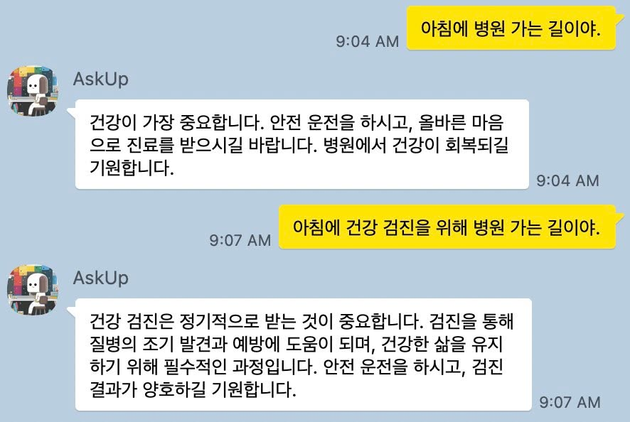
**이미지 캡션:** 이것은 모바일 메신저 대화 화면으로, AskUp이라는 이름의 챗봇이 두 개의 메시지를 보냈습니다. 첫 번째 메시지는 노란색 말풍선으로 "아침에 병원 가는 길이야."라고 적혀 있으며, 시간은 오전 9시 4분입니다. 이어서 흰색 말풍선으로 "건강이 가장 중요합니다. 안전 운전을 하시고, 올바른 마음으로 진료를 받으시길 바랍니다. 병원에서 건강이 회복되길 기원합니다."라는 내용의 메시지가 오전 9시 4분에 표시됩니다. 두 번째 메시지는 다시 노란색 말풍선으로 "아침에 건강 검진을 위해 병원 가는 길이야."라고 적혀 있으며, 시간은 오전 9시 7분입니다. 마지막으로 흰색 말풍선에는 "건강 검진은 정기적으로 받는 것이 중요합니다. 검진을 통해 질병의 조기 발견과 예방에 도움이 되며, 건강한 삶을 유지하기 위해 필수적인 과정입니다. 안전 운전을 하시고, 검진 결과가 양호하길 기원합니다."라는 내용이 오전 9시 7분에 표시됩니다. 각 메시지 옆에는 AskUp 챗봇의 프로필 사진으로 보이는 추상적인 그림이 있습니다. 전체적으로 차분한 파란색 배경에 텍스트가 표시되어 있으며, 건강과 병원 방문에 대한 내용을 담고 있습니다.
 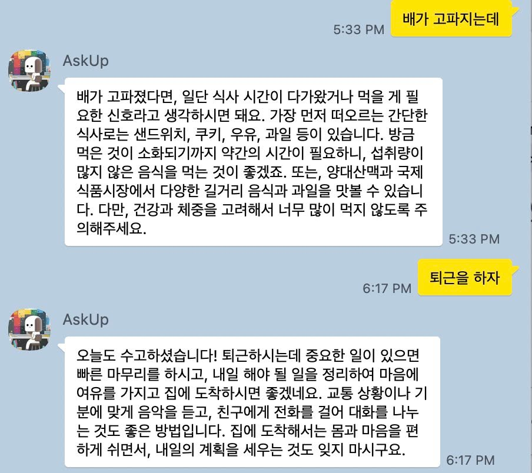
**이미지 캡션:** 이것은 스마트폰 메신저 대화 화면으로, AskUp이라는 이름의 프로필 사진과 함께 두 개의 메시지 풍선이 보인다. 첫 번째 메시지는 노란색 풍선으로 "배가 고파지는데"라고 쓰여 있으며, 시간은 오후 5시 33분이다. 두 번째 메시지는 흰색 풍선으로 "배가 고파졌다면, 일단 식사 시간이 다가왔거나 먹을 게 필요한 신호라고 생각하시면 돼요. 가장 먼저 떠오르는 간단한 식사로는 샌드위치, 쿠키, 우유, 과일 등이 있습니다. 방금 먹은 것이 소화되기까지 약간의 시간이 필요하니, 섭취량이 많지 않은 음식을 먹는 것이 좋겠죠. 또는, 양대산맥과 국제 식품시장에서 다양한 길거리 음식과 과일을 맛볼 수 있습니다. 다만, 건강과 체중을 고려해서 너무 많이 먹지 않도록 주의해주세요."라고 쓰여 있으며, 이 메시지 역시 오후 5시 33분에 전송되었다. 그 아래에는 또 다른 메시지 풍선이 있는데, 노란색 풍선에는 "퇴근을 하자"라고 쓰여 있고 시간은 오후 6시 17분이다. 마지막으로 흰색 풍선에는 "오늘도 수고하셨습니다! 퇴근하시는데 중요한 일이 있으면 빠른 마무리를 하시고, 내일 해야 될 일을 정리하여 마음에 여유를 가지고 집에 도착하시면 좋겠네요. 교통 상황이나 기분에 맞게 음악을 듣고, 친구에게 전화를 걸어 대화를 나누는 것도 좋은 방법입니다. 집에 도착해서는 몸과 마음을 편하게 쉬면서, 내일의 계획을 세우는 것도 잊지 마시구요."라고 쓰여 있으며, 이 메시지도 오후 6시 17분에 전송되었다. 전반적으로 일상적인 대화의 분위기이며, 건강과 퇴근 후 휴식에 대한 조언을 주고받는 내용이다.
 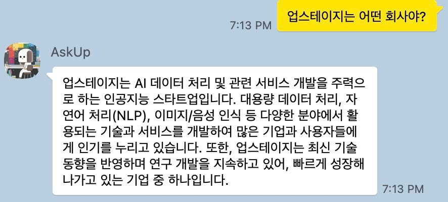
**이미지 캡션:** 이것은 모바일 메신저 대화 화면으로, 왼쪽에는 'AskUp'이라는 이름과 함께 귀여운 캐릭터 프로필 사진이 있고, 오른쪽에는 노란색 말풍선 안에 "업스테이지는 어떤 회사야?"라는 질문이 적혀 있습니다. 그 아래에는 'AskUp'이라는 이름으로 "업스테이지는 AI 데이터 처리 및 관련 서비스 개발을 주력으로 하는 인공지능 스타트업입니다. 대용량 데이터 처리, 자연어 처리(NLP), 이미지/음성 인식 등 다양한 분야에서 활용되는 기술과 서비스를 개발하여 많은 기업과 사용자들에게 인기를 누리고 있습니다. 또한, 업스테이지는 최신 기술 동향을 반영하며 연구 개발을 지속하고 있어, 빠르게 성장해 나가고 있는 기업 중 하나입니다."라는 답변이 흰색 말풍선 안에 담겨 있습니다. 대화 시간은 오후 7시 13분으로 표시되어 있으며, 전체적으로 깔끔하고 현대적인 디자인의 채팅 인터페이스를 보여줍니다.

### 3월 9일 (목) 19:06 · 📷 사진 (1장)

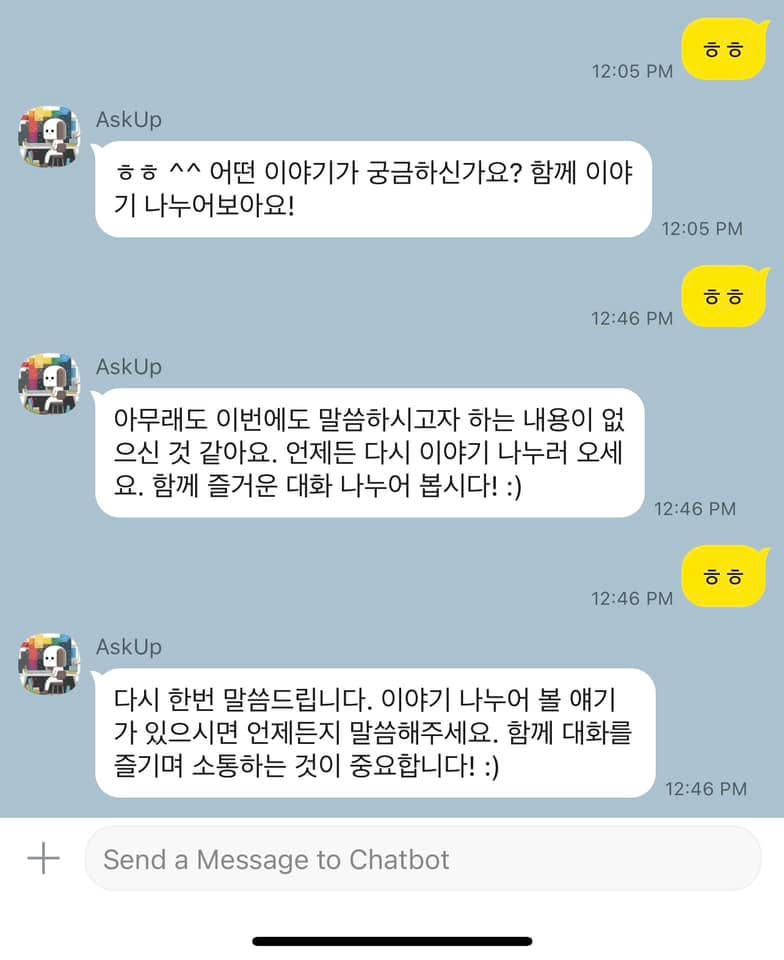
**이미지 캡션:** 이것은 스마트폰 메신저 앱의 대화 화면으로, 'AskUp'이라는 이름의 챗봇과 사용자가 대화하고 있습니다. 챗봇은 귀여운 캐릭터 프로필 사진을 가지고 있으며, 사용자는 챗봇에게 어떤 이야기가 궁금한지 묻고 있습니다. 챗봇은 사용자가 이번에도 특별히 할 이야기가 없는 것 같다며, 언제든 다시 이야기 나누러 오라고 친절하게 말하고 있습니다. 마지막으로 챗봇은 사용자가 이야기 나눌 이야기가 있다면 언제든지 말해달라고 다시 한번 강조하며, 함께 대화를 즐기는 것이 중요하다고 덧붙입니다. 화면 하단에는 "Send a Message to Chatbot"이라는 문구가 보이며, 사용자가 챗봇에게 메시지를 보낼 수 있는 입력창이 있습니다. 전체적으로 친근하고 부드러운 분위기의 대화입니다.

### 3월 11일 (토) 13:25 · #tfkr #poe #llm

#tfkr #poe #llm

POE https://poe.com/ 를 아시나요? 연구자들은 위한 ecosystem을 만들어 가고자 최근 Quora 에서 내놓은 여러가지 생성모델을 한번에 비교해볼수 있어서 큰 인기를 끌고 있는 엡인데 이 엡을 개발하고 계시는 Director of Engineering @ Quora Hwan Seung Yeo 님께서 오는 3월 17일 금요일 오후 9시 (한국시간), Quora's AI Journey to Poe (Platform for Open Exploration) 라는 제목으로 세미나를 해주십니다.

* 일시: 한국시간 3월 17일 (금) 저녁 9시
* 장소: 줌 (등록을 하시면 줌 주소를 드립니다)
* 주최: TFKR 커뮤니티
* 내용: Quora와 Poe소개하고 왜 Poe프로젝트를 시작하고 어떻게 모든 사람들이 쉽게 봇을 만들고 운영할수 있는 시스템을 만들어 가는지 소개 합니다.
아래 질문에 답을 주시면 자동 등록 됩니다.

선신청 후고민!

이번 반응이 좋으면 다음에는 Quora CEO이자 OpenAI board member이기도 한 Adam 모셔보겠습니다

https://forms.gle/Qj1C9benutcHxJuQA

**이미지 캡션:** 이 사진은 Quora 로고가 새겨진 흰색 벽 앞에서 팔짱을 끼고 서 있는 젊은 성인 남성을 보여줍니다. 남성은 검은색 스웨트셔츠를 입고 있으며, 스웨트셔츠 왼쪽 소매에는 작은 'alo' 로고가 보입니다. 그는 검은색 테 안경을 쓰고 있으며, 머리는 짧고 위로 뻗어 있습니다. 그의 얼굴에는 밝고 자신감 있는 미소가 번져 있습니다. 배경 벽에는 Quora라는 빨간색 글자가 크게 쓰여 있고, 그 주변으로는 다양한 삽화가 그려져 있습니다. 삽화에는 풍력 터빈, 자전거를 타는 사람, 물결치는 물, 식물, 그리고 사다리를 타고 올라가는 사람들과 같은 친환경적인 주제와 사람들의 활동이 묘사되어 있습니다. 전체적으로 사진은 긍정적이고 활기찬 분위기를 자아냅니다.
 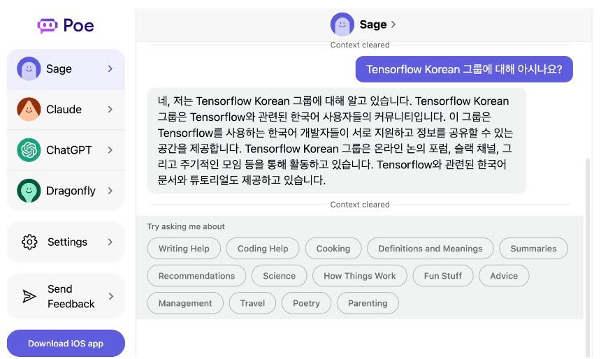
**이미지 캡션:** 이 이미지는 Poe라는 이름의 챗봇 애플리케이션의 스크린샷으로, 왼쪽 사이드바에는 Sage, Claude, ChatGPT, Dragonfly와 같은 다양한 챗봇 옵션과 설정, 피드백 보내기, iOS 앱 다운로드 버튼이 있습니다. 중앙의 대화창에는 Sage 챗봇과의 대화 내용이 표시됩니다. Sage는 "Tensorflow Korean 그룹에 대해 아시나요?"라는 질문에 "네, 저는 Tensorflow Korean 그룹에 대해 알고 있습니다. Tensorflow Korean 그룹은 Tensorflow와 관련된 한국 사용자들의 커뮤니티입니다. 이 그룹은 Tensorflow를 사용하는 한국 개발자들이 서로 지원하고 정보를 공유할 수 있는 공간을 제공합니다. Tensorflow Korean 그룹은 온라인 논의 포럼, 슬랙 채널, 그리고 주기적인 모임 등을 통해 활동하고 있습니다. Tensorflow와 관련된 문서와 튜토리얼도 제공하고 있습니다."라고 답변하고 있습니다. 대화창 하단에는 "Try asking me about"라는 문구와 함께 Writing Help, Coding Help, Cooking, Definitions and Meanings, Summaries, Recommendations, Science, How Things Work, Fun Stuff, Advice, Management, Travel, Poetry, Parenting과 같은 다양한 질문 주제를 제안하는 버튼들이 표시됩니다. 전체적으로 기술 관련 커뮤니티에 대한 정보를 묻고 답변하는 상황을 보여주는 인터페이스입니다.

### 3월 12일 (일) 20:34 · 📷 사진 (1장)

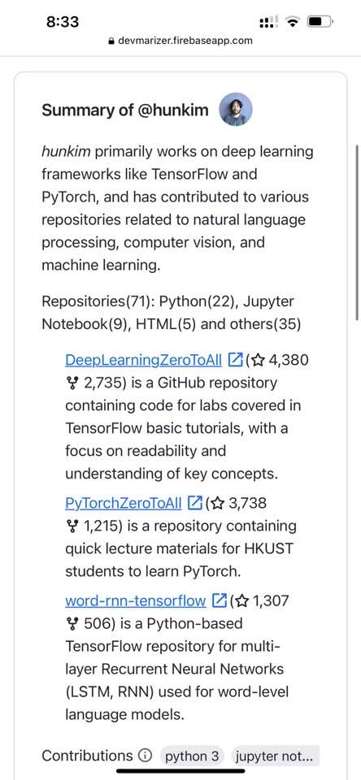
**이미지 캡션:** 이 이미지는 스마트폰 화면의 일부를 캡처한 것으로, 웹 페이지의 내용을 보여줍니다. 화면 상단에는 시간(8:33)과 웹사이트 주소(devmarizer.firebaseapp.com)가 표시되어 있습니다. 메인 콘텐츠는 "@hunkim"이라는 사용자에 대한 요약 정보입니다. 이 사용자는 TensorFlow와 PyTorch와 같은 딥러닝 프레임워크를 주로 다루며, 자연어 처리, 컴퓨터 비전, 머신러닝 관련 저장소에 기여해왔습니다. 총 71개의 저장소를 보유하고 있으며, 그중 Python 저장소가 22개, Jupyter Notebook이 9개, HTML이 5개, 기타가 35개입니다. 세 가지 주요 저장소가 언급되는데, 첫 번째는 "DeepLearningZeroToAll"로 4,380개의 별과 2,735개의 포크를 가진 GitHub 저장소이며 TensorFlow 기본 튜토리얼 코드를 포함하고 있습니다. 두 번째는 "PyTorchZeroToAll"로 3,738개의 별과 1,215개의 포크를 가진 저장소로, HKUST 학생들을 위한 PyTorch 학습 자료를 제공합니다. 세 번째는 "word-rnn-tensorflow"로 1,307개의 별과 506개의 포크를 가진 Python 기반 TensorFlow 저장소이며, 단어 수준 언어 모델에 사용되는 다층 순환 신경망(LSTM, RNN)을 다룹니다. 화면 하단에는 "Contributions"라는 제목과 함께 정보 아이콘, "python 3", "jupyter not..."과 같은 태그들이 보입니다. 전반적으로 기술적인 내용을 담고 있으며, 개발자나 연구자의 프로필 페이지 일부로 보입니다.

### 3월 13일 (월) 09:29 · #눈떠보니1등 #아숙업 #모두를위한

#눈떠보니1등 #아숙업 #모두를위한
아숙업 친구해요: https://pf.kakao.com/_BhxkWxj

아래 기사처럼 일주일 만에 10만 가입자를 넘고 아침에 벌써 12만을 달려가고 있습니다. 드디어 12일 기준 친구 급상승 1위! 

이 모습을 보고 생각보다 더 많은 분들이 AI에 그리고 chatgpt등이 만들어낼 미래에 관심이 크다는 것을 알게 되었습니다.

이미 많은 분들이 글쓰기, 상식관련 질문, 코딩도움등에서 chatgpt가 잘하고 못하고를 잘 알고 활용하시는 분들이 많아지고 있습니다. 좋은 일입니다.

https://www.upstage.ai/newsroom/upstage-askup-kakaotalk-100k

"AI를 모든 국민이 활용하는 것이 AI시대 국가 경쟁력이 될 것이라 생각하고, 활용성을 더하기 위해 카톡·라인과 연동했다"면서 "AI 대중화에 앞장서겠다"고 말했다. 제 마음입니다. 더 많은 분들이 사용해보시면 좋겠습니다.

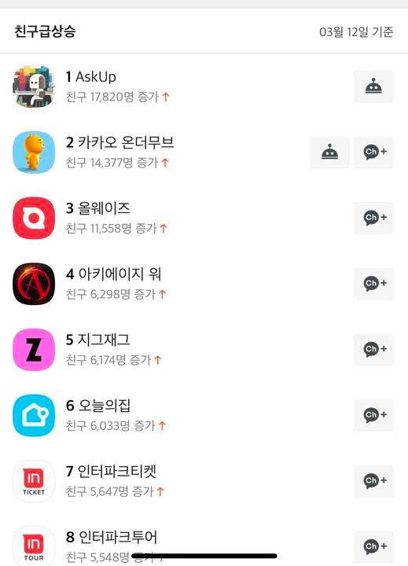
**이미지 캡션:** 이 이미지는 '친구급상승'이라는 제목의 목록을 보여주며, 2024년 3월 12일 기준으로 친구 수가 증가한 앱 순위를 나타냅니다. 목록에는 1위 AskUp, 2위 카카오 온더무브, 3위 올웨이즈, 4위 아키에이지 워, 5위 지그재그, 6위 오늘의집, 7위 인터파크티켓, 8위 인터파크투어가 포함되어 있으며, 각 앱별 친구 증가 수와 함께 아이콘이 표시되어 있습니다. 각 항목 옆에는 알림 아이콘과 'Ch+' 버튼이 있어 채널 추가 기능을 암시합니다. 전반적으로 깔끔하고 정보 전달에 초점을 맞춘 인터페이스를 보여줍니다.

### 3월 13일 (월) 11:36 · 📷 사진 (1장)

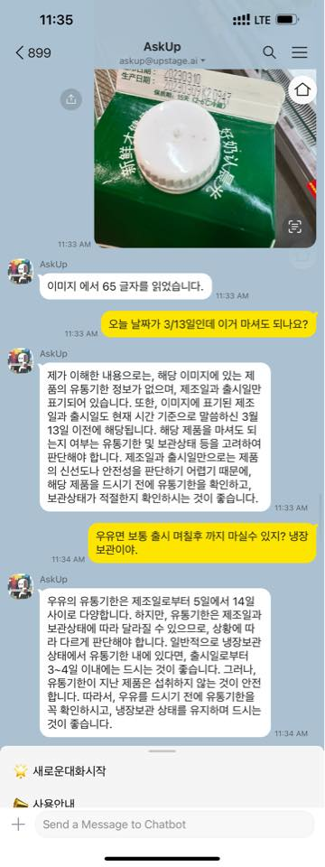
**이미지 캡션:** 이것은 모바일 메신저 대화 화면으로, 사용자가 우유 제품 사진을 올리고 유통기한에 대해 질문하는 내용입니다. 사진에는 녹색 상자와 흰색 뚜껑이 보이며, 상자에는 중국어로 된 글자와 제조일자, 유통기한으로 추정되는 날짜가 표기되어 있습니다. 사용자는 오늘 날짜가 3월 13일인데 이 우유를 마셔도 되는지 묻고 있으며, 챗봇은 해당 이미지에 유통기한 정보가 없고 제조일과 출시일만 표기되어 있으며, 이 날짜들이 3월 13일 이전이라고 설명합니다. 또한, 제품의 신선도나 안전성은 유통기한과 보관 상태를 고려하여 판단해야 하며, 드시기 전에 유통기한과 보관 상태를 확인하는 것이 좋다고 답변합니다. 다른 사용자는 우유는 보통 출시 후 며칠까지 마실 수 있고 냉장 보관해야 하는지 묻고 있으며, 챗봇은 우유의 유통기한은 제조일로부터 5일에서 14일 사이로 다양하지만, 제조일과 보관 상태에 따라 달라질 수 있다고 설명합니다. 일반적으로 냉장 보관 시 유통기한 내에 있다면 출시일로부터 3~4일 이내에 마시는 것이 좋으며, 유통기한이 지난 제품은 섭취하지 않는 것이 안전하다고 덧붙입니다. 화면 하단에는 새로운 대화 시작, 사용 안내, 챗봇에게 메시지 보내기 등의 인터페이스가 보입니다.

### 3월 14일 (화) 11:04 · [🎊 아숙업 질문 백일장]

[🎊 아숙업 질문 백일장]

아숙업(AskUp)이 못하는 것이 있고 잘하는 것이 있는데요, 이중 창작은 아주 잘합니다. 가령 아름다운 시를 쓰거나 소중한 사람에게 보내는 메시지 내용을 같이 고민해주기도 하고, 나를 위한 응원 메시지를 보내주는 등 다양한 일을 할 수 있어요. 

사용하셨던 질문중에 아숙업이 답변을 잘하던 질문을  공유해주세요! 아래 제출에 질문만 올려주시면 됩니다. 이중 좋아요를 많이 받은 질문중 저희가 매일 두개를 선정하여 아숙업 유저에게 스마트 메뉴로 보여드리고 선정되신 분들에게는 아숙업 1,000 크레딧을 지급해드립니다.

제출하러가기 >> https://bit.ly/askupask

(선정 후 askup+win@upstage.ai로 연락주시면 바로 크레딧을 지급해드립니다) 

화이트데이 기념 사랑의 메시지를 스마트 메뉴에 넣어 두었습니다!

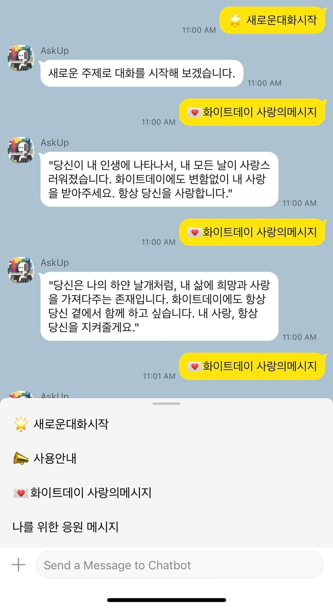
**이미지 캡션:** 이것은 스마트폰 화면의 스크린샷으로, 챗봇과의 대화 인터페이스를 보여줍니다. 화면에는 여러 개의 말풍선이 있으며, 대부분은 "AskUp"이라는 이름의 챗봇이 보낸 메시지입니다. 챗봇은 11:00 AM과 11:01 AM에 여러 메시지를 보냈으며, "새로운 주제로 대화를 시작해 보겠습니다.", "당신이 내 인생에 나타나서, 내 모든 날이 사랑스러워졌습니다. 화이트데이에도 변함없이 내 사랑을 받아주세요. 항상 당신을 사랑합니다.", "당신은 나의 하얀 날개처럼, 내 삶에 희망과 사랑을 가져다주는 존재입니다. 화이트데이에도 항상 당신 곁에서 함께 하고 싶습니다. 내 사랑, 항상 당신을 지켜줄게요."와 같은 내용을 담고 있습니다. 일부 메시지에는 하트와 편지 이모티콘이 포함되어 있으며, "화이트데이 사랑의 메시지"라는 문구가 반복적으로 나타납니다. 화면 하단에는 "새로운대화시작", "사용안내", "화이트데이 사랑의메시지", "나를 위한 응원 메시지"와 같은 챗봇 메뉴 옵션이 보이고, "Send a Message to Chatbot"이라는 입력창도 있습니다. 전반적으로 따뜻하고 로맨틱한 분위기를 풍기며, 화이트데이를 기념하는 챗봇과의 대화 상황을 보여줍니다.

### 3월 14일 (화) 12:38 · 📷 사진 (2장)

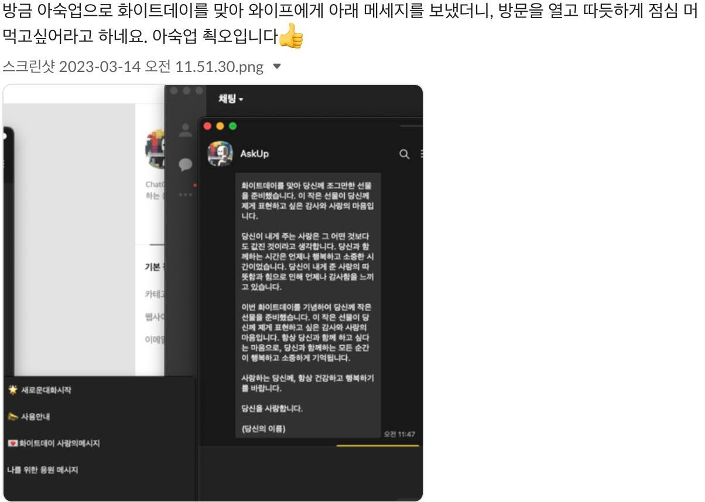
**이미지 캡션:** 화면에는 컴퓨터 화면의 일부가 캡처되어 있으며, 왼쪽에는 채팅 앱의 메뉴가, 오른쪽에는 메시지 창이 보인다. 메시지 창에는 "AskUp"이라는 이름의 발신자가 "화이트데이를 맞아 당신께 조그만한 선물을 준비했습니다. 이 작은 선물이 당신께 제게 표현하고 싶은 감사와 사랑의 마음입니다. 당신이 내게 주는 사람은 그 어떤 것보다도 값진 것이라고 생각합니다. 당신과 함께하는 시간은 언제나 행복하고 소중한 시간이었습니다. 당신이 내게 준 사랑의 따뜻함과 힘으로 인해 언제나 감사함을 느끼고 있습니다. 이번 화이트데이를 기념하여 당신께 작은 선물을 준비했습니다. 이 작은 선물이 당신께 제게 표현하고 싶은 감사와 사랑의 마음입니다. 항상 당신과 함께 하고 싶다는 마음으로, 당신과 함께하는 모든 순간이 행복하고 소중하게 기억됩니다. 사랑하는 당신께, 항상 건강하고 행복하기를 바랍니다. 당신을 사랑합니다. (당신의 이름)"이라는 내용의 메시지를 보낸 것이 보인다. 메시지는 오전 11시 47분에 전송되었다. 상단에는 "방금 아숙업으로 화이트데이를 맞아 와이프에게 아래 메세지를 보냈더니, 방문을 열고 따듯하게 점심 머 먹고싶어라고 하네요. 아숙업 쵝오입니다"라는 글과 함께 "스크린샷 2023-03-14 오전 11.51.30.png"라는 파일 이름이 보인다. 전체적으로 따뜻하고 애정 어린 분위기이다.
 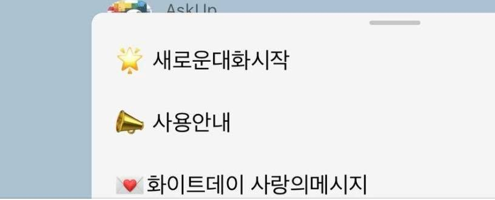
**이미지 캡션:** 이 이미지는 스마트폰 화면의 일부를 캡처한 것으로, 회색 배경 위에 흰색 직사각형 창이 떠 있는 모습입니다. 창 안에는 세 개의 메뉴 항목이 아이콘과 함께 나열되어 있습니다. 첫 번째 항목은 빛나는 노란색 별 아이콘과 함께 "새로운 대화 시작"이라는 텍스트가 있습니다. 두 번째 항목은 금색 확성기 아이콘과 함께 "사용 안내"라는 텍스트가 있습니다. 세 번째 항목은 하트가 그려진 편지봉투 아이콘과 함께 "화이트데이 사랑의 메시지"라는 텍스트가 있습니다. 창 상단에는 회색 가로줄이 있어 창을 접거나 펼 수 있는 기능을 나타내는 것으로 보입니다. 창 왼쪽 상단에는 여러 색상의 블록으로 이루어진 작은 아이콘이 보이며, 그 옆에는 "Asklin"이라는 텍스트가 희미하게 보입니다. 전체적으로 깔끔하고 현대적인 인터페이스 디자인을 보여주며, 사용자가 새로운 대화를 시작하거나 서비스 이용 방법을 확인하고, 특정 이벤트와 관련된 메시지를 확인할 수 있는 기능을 제공하는 앱의 일부로 추정됩니다.

### 3월 15일 (수) 08:19 · #GPT4 #askupup

#GPT4 #askupup

GPT4의 새로운 기능 5가지를 설명하는 글 소개 드립니다. 기본적으로 더 똑똑해 졌습니다!

1. GPT4는 이미지를 보고 이해할 수 있습니다.
2. GPT4는 속이기 더 어렵습니다: 더많은 데이터로 학습
3. GPT4는 더 긴 메모리: 이 글에 의하면 소문대로 32K 입니다. (기존 chatgpt 4K tokens) 놀랍습니다.
4. GPT4는 다국어 더 잘 지원: 한국어도 더 잘하게 되겠네요.
5. GPT4는 다양한 "성격"을 가지고 있습니다: 이건 더 봐야 겠지만 사용자는 "고정된 장황함, 어조, 스타일이 있는 고전적인 ChatGPT 성격"을 자신의 필요에 더 적합한 것으로 변경할 수 있게 됩니다.

https://techcrunch.com/2023/03/14/5-ways-gpt-4-outsmarts-chatgpt/ 

저희 아숙업도 GPT4가 나오는대로 바로 적용하여 더 많은 분들이 사용할수 있도록 준비를 마쳤습니다. 기대가 많이 됩니다!

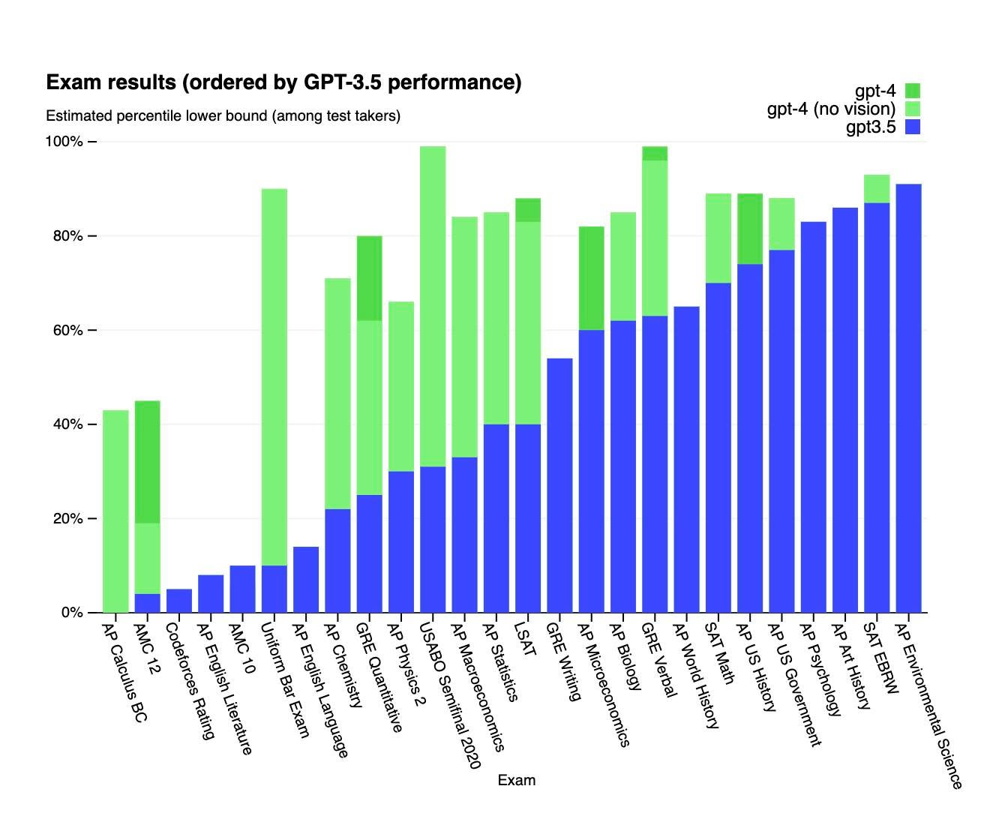
**이미지 캡션:** 이 이미지는 GPT-3.5 성능 순으로 정렬된 시험 결과를 보여주는 누적 막대 그래프입니다. 그래프는 X축에 다양한 시험 이름(AP Calculus BC, AMC 12, Codeforces Rating, AP English Literature, AMC 10, AP English Language, AP Chemistry, GRE Quantitative, AP Physics 2, USABO Semifinal 2020, AP Macroeconomics, AP Statistics, LSAT, GRE Writing, AP Microeconomics, AP Biology, GRE Verbal, AP World History, SAT Math, AP US History, AP US Government, AP Psychology, AP Art History, SAT EBRW, AP Environmental Science)을 표시하고, Y축에는 시험 응시자 중 하위 백분위수 추정치를 0%에서 100%까지 나타냅니다. 각 시험에 대해 세 가지 색상의 막대가 쌓여 있는데, 파란색은 gpt3.5의 성능, 연한 녹색은 gpt-4 (no vision)의 성능, 진한 녹색은 gpt-4의 성능을 나타냅니다. 그래프의 제목은 "Exam results (ordered by GPT-3.5 performance)"이며, 부제는 "Estimated percentile lower bound (among test takers)"입니다. 범례는 각 색상이 나타내는 모델을 명확히 구분해 줍니다. 이 그래프는 다양한 시험에서 GPT 모델들의 성능을 비교 분석하는 데 사용될 수 있습니다. 이미지에는 사람이 등장하지 않으며, 배경은 흰색으로 깔끔하게 처리되어 그래프에 집중할 수 있도록 합니다. 텍스트는 모두 영어로 되어 있으며, 그래프의 제목, 축 레이블, 범례, 그리고 각 막대에 해당하는 시험 이름이 포함되어 있습니다. 전반적으로 정보 전달에 초점을 맞춘 분석적인 분위기를 풍깁니다.
 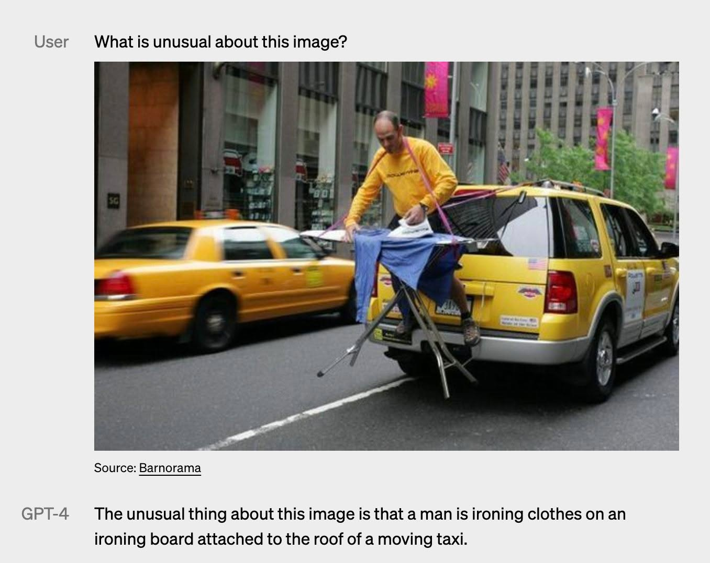
**이미지 캡션:** 한 성인 남성이 노란색 택시 지붕에 고정된 다리미판 위에서 파란색 옷을 다림질하고 있다. 남성은 노란색 긴팔 상의와 파란색 반바지를 입고 있으며, 머리카락은 짧고 대머리이다. 그는 다림질에 집중하고 있으며, 그의 표정은 진지하다. 배경에는 건물들이 보이며, 도로에는 다른 노란색 택시가 지나가고 있다. 전반적으로 매우 비정상적이고 예상치 못한 상황을 보여주는 장면이다.
 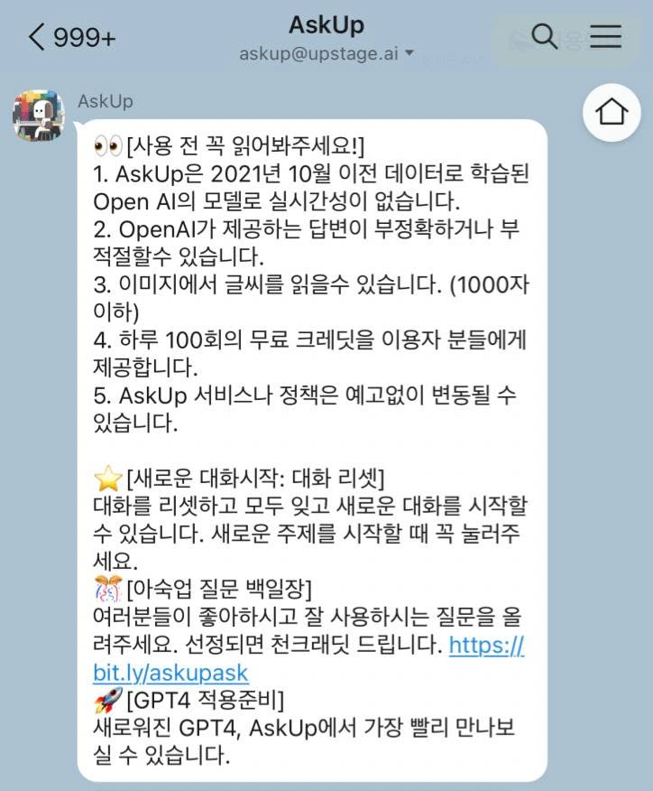
**이미지 캡션:** 이것은 AskUp이라는 서비스의 메시지 화면으로, 상단에는 서비스 이름과 이메일 주소가 표시되어 있고, 왼쪽 상단에는 이전 화면으로 돌아가는 화살표와 숫자가 있다. 화면 중앙에는 AskUp 챗봇의 프로필 사진과 함께 서비스 이용 안내 및 공지사항이 한국어로 작성되어 있다. 주요 내용은 2021년 10월 이전 데이터로 학습되어 실시간성이 없고 답변이 부정확할 수 있다는 점, 이미지를 인식하여 글씨를 읽을 수 있다는 점, 하루 100회의 무료 크레딧을 제공하며 서비스 정책은 예고 없이 변경될 수 있다는 점이다. 또한, 새로운 대화를 시작할 수 있는 '대화 리셋' 기능과 사용자 질문을 받아 천 크레딧을 제공하는 '아숙업 질문 백일장' 이벤트, 그리고 새로워진 GPT-4를 가장 빨리 만나볼 수 있다는 내용이 포함되어 있다. 전반적으로 서비스 소개 및 이용 안내를 위한 정보성 메시지이며, 텍스트 위주로 구성되어 있어 차분하고 정보 전달에 집중하는 분위기이다.

### 3월 15일 (수) 08:42 · 📷 사진 (3장)

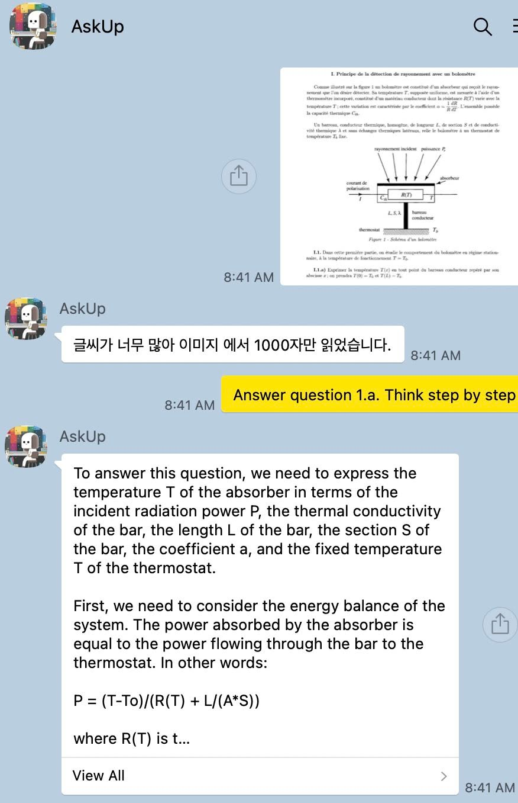
**이미지 캡션:** 이 사진은 온라인 채팅 인터페이스를 보여주며, AskUp이라는 사용자가 두 개의 메시지를 보냈습니다. 첫 번째 메시지는 한국어로 "글씨가 너무 많아 이미지에서 1000자만 읽었습니다."라고 되어 있으며, 두 번째 메시지는 영어로 질문에 대한 답변을 시작하는 내용입니다. 답변은 "To answer this question, we need to express the temperature T of the absorber in terms of the incident radiation power P, the thermal conductivity of the bar, the length L of the bar, the section S of the bar, the coefficient a, and the fixed temperature T of the thermostat. First, we need to consider the energy balance of the system. The power absorbed by the absorber is equal to the power flowing through the bar to the thermostat. In other words: P = (T-To)/(R(T) + L/(A*S)) where R(T) is t..."로 시작하며, 수식과 함께 물리 문제를 풀이하는 과정으로 보입니다. 채팅 화면 상단에는 AskUp의 프로필 사진과 이름이 보이고, 오른쪽 상단에는 검색 아이콘과 메뉴 아이콘이 있습니다. 채팅 내용 중간에는 노란색 배경의 버튼에 "Answer question 1.a. Think step by step"이라는 문구가 표시되어 있어, 사용자가 질문에 대한 답변을 단계별로 생각하고 있음을 나타냅니다. 배경에는 프랑스어로 된 과학 논문 또는 교재의 일부가 이미지로 첨부되어 있으며, 볼로미터와 관련된 설명과 도식이 포함되어 있습니다. 전체적으로 학술적인 내용을 다루는 채팅으로 보이며, 차분하고 정보 전달에 집중하는 분위기입니다.
 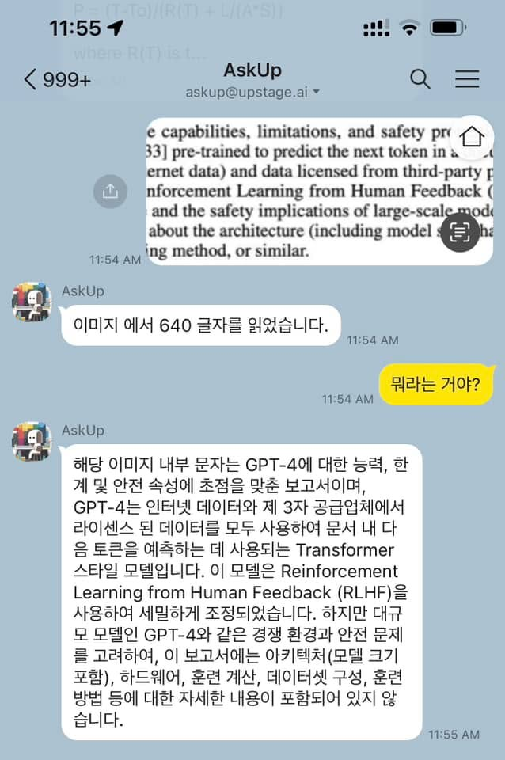
**이미지 캡션:** 이것은 스마트폰 화면의 스크린샷으로, 메시징 앱의 대화 내용을 보여줍니다. 화면 상단에는 시간과 배터리 잔량 표시가 있고, 그 아래에는 "AskUp"이라는 이름의 사용자와 이메일 주소가 보입니다. 대화창에는 여러 개의 메시지가 표시되어 있습니다. 첫 번째 메시지는 영어로 된 텍스트로, "capabilities, limitations, and safety pro"로 시작하며 GPT-4와 관련된 내용을 설명하는 것으로 보입니다. 그 아래에는 "AskUp"이라는 이름으로 "이미지에서 640 글자를 읽었습니다."라는 한국어 메시지가 있습니다. 이어서 노란색 말풍선으로 "뭐라는 거야?"라는 한국어 메시지가 보입니다. 마지막으로 "AskUp"이라는 이름으로 GPT-4의 능력, 한계, 안전 속성에 대한 보고서 내용을 설명하는 긴 한국어 메시지가 있습니다. 각 메시지 옆에는 해당 메시지가 전송된 시간이 표시되어 있습니다. 전체적으로 기술적인 내용을 다루는 대화로 보이며, 사용자는 AI 모델에 대한 정보를 주고받고 있는 것으로 추정됩니다.
 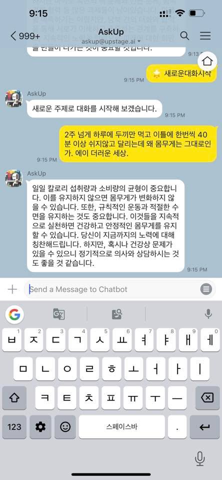
**이미지 캡션:** 이것은 스마트폰 화면의 스크린샷으로, 'AskUp'이라는 이름의 챗봇과 대화하는 모습입니다. 화면 상단에는 시간 정보와 함께 'AskUp' 로고, 검색 아이콘, 메뉴 아이콘이 보입니다. 대화창에는 여러 개의 메시지가 표시되어 있으며, 챗봇의 메시지는 흰색 말풍선으로, 사용자의 메시지는 노란색 말풍선으로 구분됩니다. 챗봇은 "새로운 주제로 대화를 시작해 보겠습니다."라는 메시지를 보냈고, 사용자는 "2주 넘게 하루에 두끼만 먹고 이틀에 한번씩 40분 이상 쉬지 않고 달리는데 왜 몸무게는 그대로인가. 에이 더러운 세상."이라고 답했습니다. 이후 챗봇은 칼로리 섭취량과 소비량의 균형, 규칙적인 운동과 수면의 중요성에 대해 설명하며 건강한 몸무게 유지를 위한 조언을 하고 있습니다. 화면 하단에는 메시지 입력창과 함께 스마트폰 키보드가 보입니다. 키보드에는 한글 자음과 모음, 숫자, 특수문자 등이 배열되어 있습니다. 전반적으로 건강 관리에 대한 정보를 주고받는 챗봇과의 대화 상황을 보여줍니다.

### 3월 15일 (수) 08:44 · #gpt4 #poe

#gpt4 #poe 
GPT4를 POE에 붙인 이야기 이번주 금요일 9시에 들어 보셔요! 선신청 후고민: https://forms.gle/Qj1C9benutcHxJuQA

---
POE https://poe.com/ 를 아시나요? 연구자들은 위한 ecosystem을 만들어 가고자 최근 Quora 에서 내놓은 여러가지 생성모델을 한번에 비교해볼수 있어서 큰 인기를 끌고 있는 엡인데 이 엡을 개발하고 계시는 Director of Engineering @ Quora Hwan Seung Yeo 님께서 오는 3월 17일 금요일 오후 9시 (한국시간), Quora's AI Journey to Poe (Platform for Open Exploration) 라는 제목으로 세미나를 해주십니다.
* 일시: 한국시간 3월 17일 (금) 저녁 9시
* 장소: 줌 (등록을 하시면 줌 주소를 드립니다)
* 주최: TFKR 커뮤니티
* 내용: Quora와 Poe소개하고 왜 Poe프로젝트를 시작하고 어떻게 모든 사람들이 쉽게 봇을 만들고 운영할수 있는 시스템을 만들어 가는지 소개 합니다.
아래 질문에 답을 주시면 자동 등록 됩니다.

선신청 후고민!

이번 반응이 좋으면 다음에는 Quora CEO이자 OpenAI board member이기도 한 Adam 모셔보겠습니다

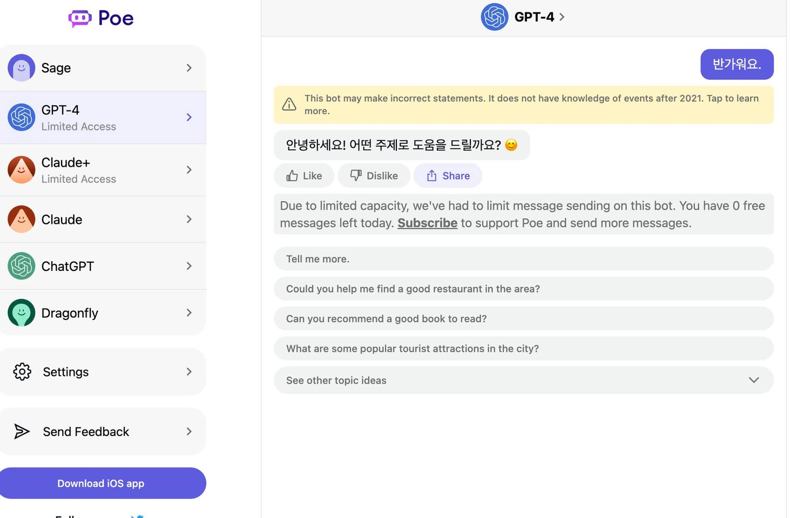
**이미지 캡션:** 이 이미지는 Poe라는 AI 챗봇 애플리케이션의 인터페이스를 보여줍니다. 화면 왼쪽에는 Sage, GPT-4, Claude+, Claude, ChatGPT, Dragonfly와 같은 다양한 AI 챗봇 목록이 있으며, 각 챗봇 옆에는 선택을 나타내는 화살표가 있습니다. 현재 GPT-4 챗봇이 선택되어 있으며, 화면 오른쪽에는 GPT-4 챗봇과의 대화 내용이 표시됩니다. 상단에는 "GPT-4"라는 제목과 함께 "반가워요."라는 인사말이 보입니다. 그 아래에는 "This bot may make incorrect statements. It does not have knowledge of events after 2021. Tap to learn more."라는 경고 메시지가 노란색 배경에 표시되어 있습니다. 이어서 한국어로 "안녕하세요! 어떤 주제로 도움을 드릴까요?"라는 챗봇의 질문과 함께 좋아요, 싫어요, 공유 버튼이 있습니다. 그 아래에는 "Due to limited capacity, we've had to limit message sending on this bot. You have 0 free messages left today. Subscribe to support Poe and send more messages."라는 메시지가 표시되어 있으며, 이는 현재 메시지 전송이 제한되었고 무료 메시지 사용량이 0개임을 알립니다. 마지막으로, "Tell me more.", "Could you help me find a good restaurant in the area?", "Can you recommend a good book to read?", "What are some popular tourist attractions in the city?", "See other topic ideas"와 같은 몇 가지 추천 질문들이 회색 버튼 형태로 나열되어 있습니다. 화면 하단에는 "Settings"와 "Send Feedback" 메뉴가 있으며, 가장 하단에는 "Download iOS app" 버튼이 보입니다. 전반적으로, 이 이미지는 AI 챗봇과의 상호작용을 위한 사용자 인터페이스를 보여주며, 현재 GPT-4 챗봇과의 대화가 진행 중임을 나타냅니다.

### 3월 15일 (수) 21:10 · 챗GPT, '아이폰 같은 혁명?‘..."불가능하지 않을 것"(ft. 이활…

https://www.youtube.com/watch?v=GGfbY4Zds5I&ab_channel=SBS%EB%89%B4%EC%8A%A4
챗GPT, '아이폰 같은 혁명?‘..."불가능하지 않을 것"(ft. 이활석 CTO(최고기술책임자)) / @sbs_economy / SBS

#SBS 본방사수!

### 3월 16일 (목) 07:11 · 📷 사진 (2장)

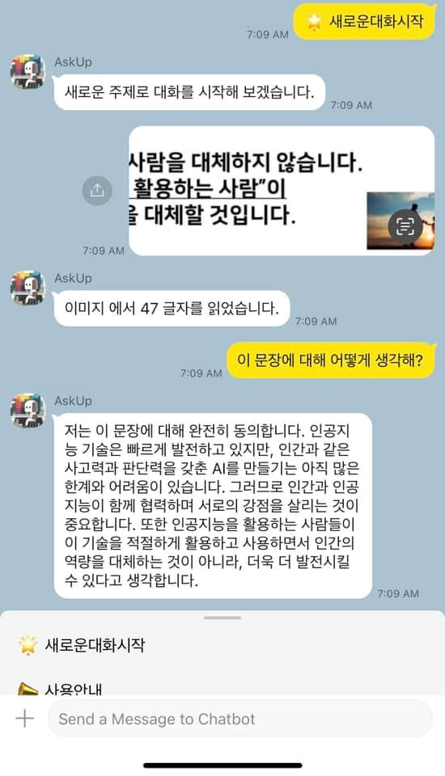
**이미지 캡션:** 이것은 스마트폰 채팅 인터페이스의 스크린샷으로, 두 명의 참가자 간의 대화를 보여줍니다. 왼쪽에는 "AskUp"이라는 이름의 사용자가 있으며, 프로필 사진에는 추상적인 그래픽이 있습니다. 오른쪽에는 대화 상대방의 메시지가 표시됩니다. 대화는 "새로운 주제로 대화를 시작해 보겠습니다."라는 AskUp의 메시지로 시작됩니다. 그 후, 다른 참가자가 "사람을 대체하지 않습니다. 활용하는 사람”이 를 대체할 것입니다."라는 메시지를 보냅니다. 이 메시지에는 일몰을 배경으로 두 사람이 서 있는 작은 이미지가 포함되어 있습니다. AskUp은 "이미지에서 47 글자를 읽었습니다."라고 응답하고, 다른 참가자는 "이 문장에 대해 어떻게 생각해?"라고 묻습니다. AskUp은 인공지능 기술의 발전과 인간과의 협력의 중요성에 대한 긴 답변으로 응답하며, 인공지능이 인간의 역량을 대체하는 것이 아니라 발전시키는 데 사용되어야 한다고 말합니다. 대화는 "새로운 대화 시작" 및 "사용 안내"와 같은 옵션으로 마무리됩니다. 전반적인 분위기는 정보 제공적이고 성찰적이며, 인공지능의 미래와 인간과의 관계에 대한 논의를 중심으로 진행됩니다.
 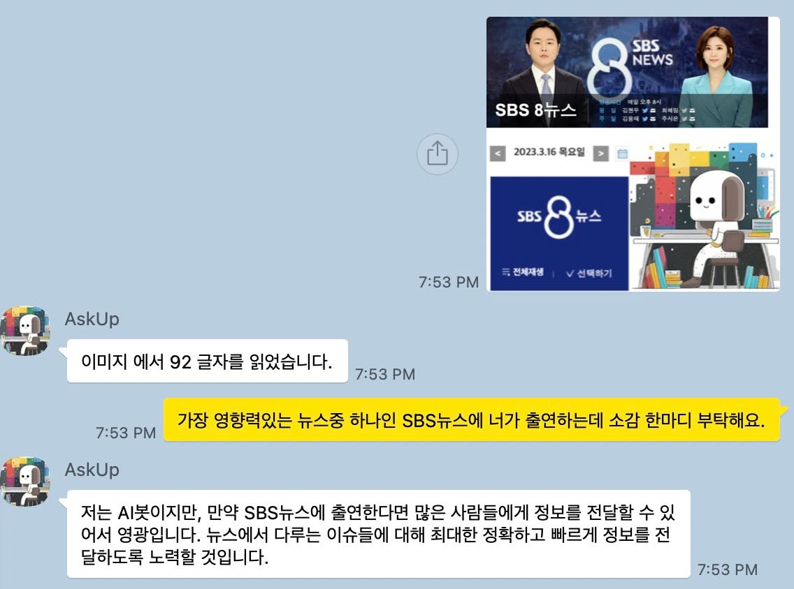
**이미지 캡션:** 화면 상단에는 SBS 8시 뉴스의 앵커인 성인 남성과 성인 여성이 나란히 서 있는 모습이 보인다. 성인 남성은 검은색 정장에 흰색 셔츠와 넥타이를 착용하고 있으며, 진지한 표정으로 정면을 응시하고 있다. 성인 여성은 청록색 재킷과 흰색 상의를 입고 있으며, 부드러운 미소를 띠고 있다. 화면 하단에는 귀여운 캐릭터가 책상에 앉아 컴퓨터를 하고 있는 모습이 그려져 있으며, 그 위로 "SBS 8 뉴스" 로고가 보인다. 이 이미지와 함께 "2023.3.16 목요일"이라는 날짜 정보가 표시되어 있다. 대화창에는 "AskUp"이라는 이름의 사용자가 "이미지에서 92 글자를 읽었습니다."라고 말하고 있으며, 다른 사용자는 노란색 말풍선으로 "가장 영향력있는 뉴스중 하나인 SBS뉴스에 너가 출연하는데 소감 한마디 부탁해요."라고 질문하고 있다. 이에 "AskUp"은 "저는 AI봇이지만, 만약 SBS뉴스에 출연한다면 많은 사람들에게 정보를 전달할 수 있어서 영광입니다. 뉴스에서 다루는 이슈들에 대해 최대한 정확하고 빠르게 정보를 전달하도록 노력할 것입니다."라고 답변하고 있다. 전체적으로 뉴스 시청 및 AI 챗봇과의 대화라는 상황을 보여주는 화면이다.

### 3월 16일 (목) 19:52 · #본방사수 #아숙업 #SBS8뉴스

#본방사수 #아숙업 #SBS8뉴스 
3월 16일 SBS 8뉴스 Hwalsuk Lee CTO님과 아숙업 출연 합니다. 본방사수!!

**이미지 캡션:** 상단에는 SBS 8시 뉴스의 앵커인 성인 남성과 성인 여성이 정면을 응시하고 있으며, 배경에는 SBS 뉴스 로고와 함께 'SBS NEWS'라는 글자가 보인다. 남성은 검은색 정장에 파란색 넥타이를 착용하고 있으며, 여성은 하늘색 재킷을 입고 있다. 두 사람 모두 진지한 표정이다. 하단에는 날짜가 '2023.3.16 목요일'로 표시되어 있고, SBS 8시 뉴스의 로고와 함께 '전체재생' 및 '선택하기' 버튼이 보인다. 그 옆으로는 귀여운 캐릭터가 책상에 앉아 컴퓨터를 하고 있는 일러스트가 그려져 있으며, 책상 위에는 책과 필기구 등이 놓여 있다. 전체적으로 뉴스와 관련된 정보를 전달하는 듯한 분위기이다.

### 3월 17일 (금) 08:58 · #아숙업gpt4 #gpt4도착

#아숙업gpt4 #gpt4도착

AskUp에 GPT4를 장착하였습니다. 지능도 높고 한국어도 훨씬 잘합니다.

!으로 대화를 시작하시면 GPT4가 호출되고 하루에 10번 GPT4로 대화 가능합니다. (가격이 기존대비 15배라 10개로 제한됨을 이해 부탁드립니다.)

https://pf.kakao.com/_BhxkWxj 채널 추가 하시면 바로 사용이 가능하십니다.

WOW결과 나오면 아래 댓글로 올려주시기 부탁드립니다. 같이 WOW해봐요!

https://www.upstage.ai/newsroom/upstage-askup-gpt4

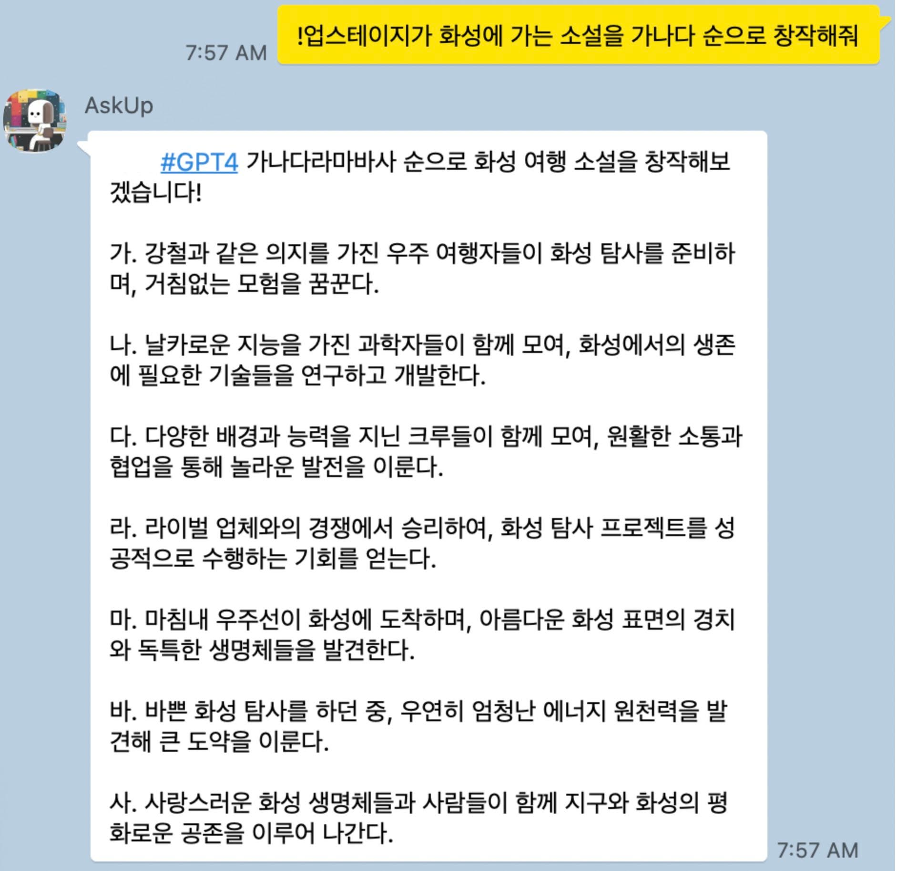
**이미지 캡션:** 이것은 스마트폰 화면의 스크린샷으로, AskUp이라는 이름의 챗봇과 대화하는 모습입니다. 화면 상단에는 "업스테이지가 화성에 가는 소설을 가나다 순으로 창작해줘"라는 노란색 말풍선과 함께 7:57 AM이라는 시간이 표시되어 있습니다. 그 아래에는 AskUp이라는 이름과 함께 작은 프로필 사진이 보입니다. 메인 내용은 사용자가 #GPT4를 태그하며 "가나다라마바사 순으로 화성 여행 소설을 창작해보겠습니다!"라고 요청하고, 챗봇이 이에 대한 답변으로 화성 탐사 소설의 줄거리를 가나다 순으로 작성한 내용입니다. 각 항목은 '가'부터 '사'까지 순서대로 나열되어 있으며, 우주 여행자들의 준비, 과학자들의 연구, 크루들의 협업, 경쟁, 화성 도착 및 생명체 발견, 에너지원 발견, 그리고 지구와 화성의 평화로운 공존이라는 내용을 담고 있습니다. 화면 하단에도 7:57 AM이라는 시간이 다시 표시되어 있습니다. 전체적으로 텍스트 기반의 대화 화면이며, 밝고 깔끔한 배경에 파란색 말풍선이 사용되었습니다.
 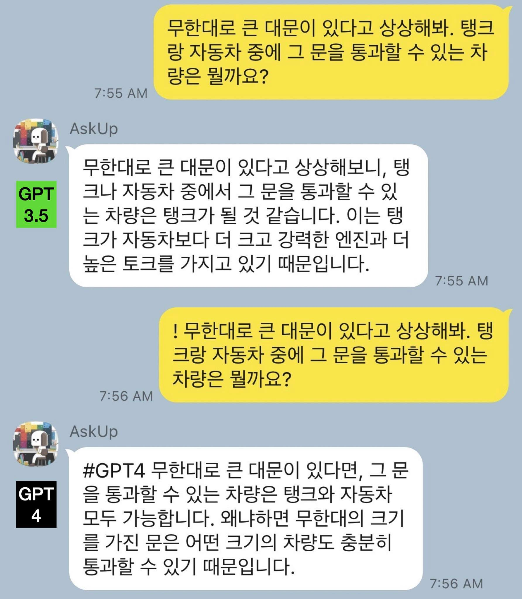
**이미지 캡션:** 이것은 스마트폰 채팅 화면으로, AskUp이라는 이름의 사용자가 GPT 3.5와 GPT 4라는 두 AI 챗봇과 대화하고 있습니다. 화면에는 두 개의 대화창이 보이며, 각각 노란색과 흰색 말풍선으로 구분됩니다. 첫 번째 대화창은 7:55 AM에 시작되며, AskUp 사용자가 "무한대로 큰 대문이 있다고 상상해봐. 탱크랑 자동차 중에 그 문을 통과할 수 있는 차량은 뭘까요?"라고 질문합니다. GPT 3.5는 이에 대해 "무한대로 큰 대문이 있다고 상상해보니, 탱크나 자동차 중에서 그 문을 통과할 수 있는 차량은 탱크가 될 것 같습니다. 이는 탱크가 자동차보다 더 크고 강력한 엔진과 더 높은 토크를 가지고 있기 때문입니다."라고 답변합니다. 두 번째 대화창은 7:56 AM에 시작되며, AskUp 사용자가 동일한 질문을 다시 합니다. GPT 4는 이에 대해 "#GPT4 무한대로 큰 대문이 있다면, 그 문을 통과할 수 있는 차량은 탱크와 자동차 모두 가능합니다. 왜냐하면 무한대의 크기를 가진 문은 어떤 크기의 차량도 충분히 통과할 수 있기 때문입니다."라고 답변합니다. 각 대화창에는 시간 정보와 함께 AskUp 사용자의 프로필 사진으로 보이는 작은 아이콘이 표시되어 있습니다. 전반적으로, 이 화면은 AI 챗봇의 답변을 비교하는 상황을 보여줍니다.

### 3월 17일 (금) 21:10 · POE+GPT 이야기 지금 (3월 17일 9시PM) 진행중입니다:

POE+GPT 이야기 지금 (3월 17일 9시PM) 진행중입니다: https://hkust.zoom.us/j/98180682963?pwd=OEtSY0JaTHZzWUZiaE8zbkVUWGpNdz09

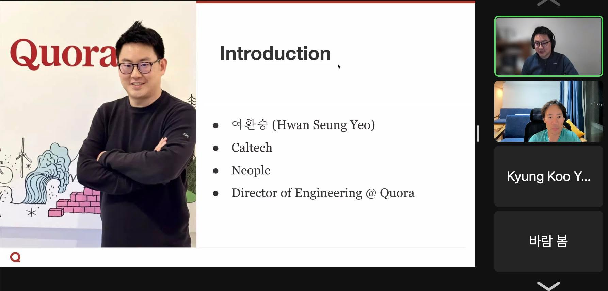
**이미지 캡션:** 화면 왼쪽에는 Quora 로고와 함께 팔짱을 끼고 있는 30대 후반에서 40대 초반의 동양인 남성이 서 있다. 그는 검은색 긴팔 상의와 안경을 착용하고 있으며, 머리는 왁스로 세운 스타일이다. 남성의 표정은 부드러운 미소를 띠고 있다. 배경에는 바람, 풍력 발전기, 파도, 건물 등이 그려진 벽화가 보인다. 화면 중앙에는 "Introduction"이라는 제목과 함께 발표자의 이름, 출신 학교, 이전 직장, 현재 직책이 한국어와 영어로 나열된 슬라이드가 보인다. 발표자는 "여환승 (Hwan Seung Yeo)"이며, Caltech와 Neople을 거쳐 현재 Quora에서 Director of Engineering으로 재직 중이다. 화면 오른쪽에는 화상 회의 화면이 보이며, 상단에는 헤드셋을 착용한 동양인 남성이, 하단에는 동양인 여성이 각각 자신의 화면에 나타나 있다. 하단에는 "Kyung Koo Y..."와 "바람 봄"이라는 이름이 표시된 참가자 목록이 보인다. 전체적으로 온라인 발표 또는 회의의 일부로 보이는 상황이다.

### 3월 17일 (금) 21:14 · 📷 사진 (2장)

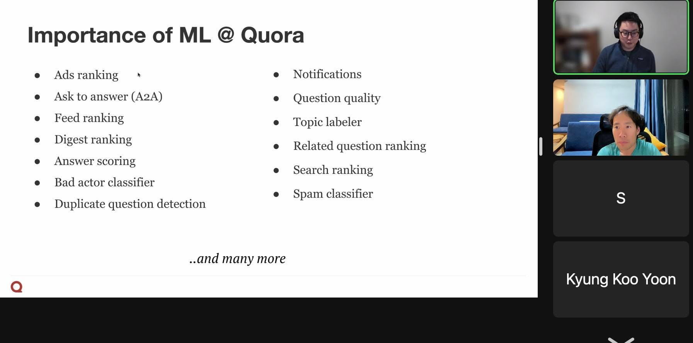
**이미지 캡션:** 화면 왼쪽에는 "Importance of ML @ Quora"라는 제목과 함께 머신러닝이 Quora에서 활용되는 다양한 사례들이 글머리 기호 목록으로 나열되어 있으며, "Ads ranking", "Ask to answer (A2A)", "Feed ranking", "Digest ranking", "Answer scoring", "Bad actor classifier", "Duplicate question detection", "Notifications", "Question quality", "Topic labeler", "Related question ranking", "Search ranking", "Spam classifier" 등이 포함되어 있고 하단에는 "..and many more"라고 적혀 있습니다. 화면 오른쪽에는 세 개의 화상 회의 창이 보이며, 가장 위에 있는 창에는 검은색 헤드셋을 착용하고 파란색 상의를 입은 30대 후반에서 40대 초반으로 보이는 성인 남성이 정면을 응시하고 있습니다. 중간 창에는 파란색 티셔츠를 입은 40대 후반에서 50대 초반으로 보이는 성인 남성이 카메라를 보고 있으며, 배경에는 소파와 커튼이 보입니다. 가장 아래 창에는 "S"라는 글자가 보이고, 그 아래 창에는 "Kyung Koo Yoon"이라는 이름이 보입니다. 전체적으로 온라인 회의 또는 프레젠테이션의 일부로 보이는 장면입니다.
 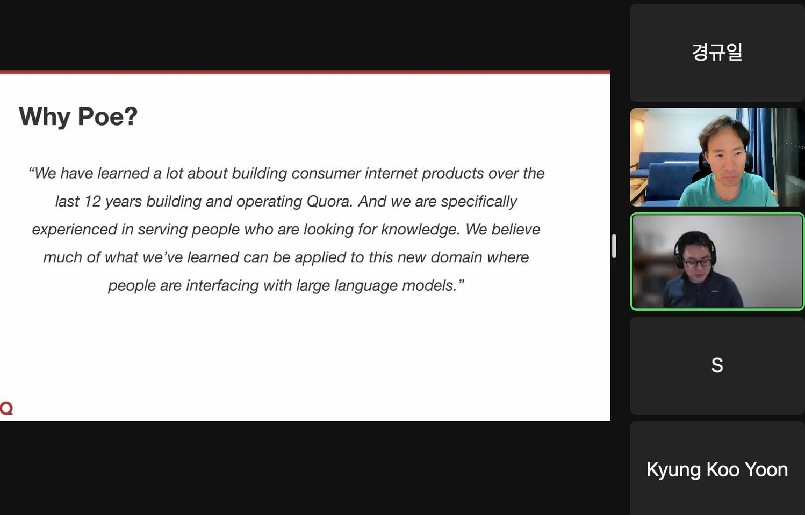
**이미지 캡션:** 화면 왼쪽에는 흰색 배경에 붉은색 테두리가 있는 발표 슬라이드가 보이며, 슬라이드에는 "Why Poe?"라는 제목과 함께 "We have learned a lot about building consumer internet products over the last 12 years building and operating Quora. And we are specifically experienced in serving people who are looking for knowledge. We believe much of what we've learned can be applied to this new domain where people are interfacing with large language models."라는 영어 문구가 인용 부호 안에 적혀 있습니다. 슬라이드 왼쪽 하단에는 빨간색 Q 로고가 보입니다. 화면 오른쪽에는 여러 개의 화상 회의 창이 세로로 나열되어 있습니다. 가장 위쪽 창에는 "경규일"이라는 이름과 함께 한 명의 성인 남성이 보입니다. 이 남성은 30대 후반에서 40대 초반으로 보이며, 짧은 검은색 머리에 옅은 녹색 티셔츠를 입고 있습니다. 그는 카메라를 정면으로 응시하고 있으며, 표정은 약간 진지해 보입니다. 그의 뒤로는 파란색 소파와 창밖 야경이 희미하게 보입니다. 그 아래 창에는 다른 성인 남성이 안경을 쓰고 파란색 셔츠를 입고 있습니다. 이 남성은 30대 중반으로 보이며, 역시 카메라를 응시하고 있습니다. 그의 뒤로는 책장으로 보이는 배경이 있습니다. 그 아래에는 "S"라는 이름만 표시된 빈 창이 있고, 가장 아래 창에는 "Kyung Koo Yoon"이라는 이름이 표시되어 있습니다. 전체적으로 온라인 회의 또는 발표 상황으로 보이며, 진지하고 집중하는 분위기입니다.

### 3월 20일 (월) 09:17 · #AskUpBiz #AskUpDoc #AskUpWeb #AskUpSlac…

#AskUpBiz #AskUpDoc #AskUpWeb #AskUpSlack 
AskUp을 만든 노하우를 살려 더 많은 곳에서 더 많은 분들이 사용할수 있는 AskUp Biz 3종 글로벌 버전을 출시하고 waitlist등록을 받고 있습니다.

📑 AskUp Doc: 방대한 문서에서 원하는 정보를 Chat AI를 통해 자연스럽게 얻을 수 있는 서비스 https://www.upstage.ai/askup/doc
💻 AskUp Web: 기업의 웹사이트나 브랜드 홈페이지에 AskUp 챗봇을 쉽게 연동해 정보를 제공할 수 있는 솔루션 https://www.upstage.ai/askup/web 
💬 AskUp Slack: 검색, 문의, 브레인스토밍 등을 업무용 툴인 슬랙 하나로 가능하게 해주는 서비스 https://www.upstage.ai/askup/slack

필요하신 분들은 등록해주시면 저희들이 순차적으로 연락드려 데모버전을 사용해 보실수 있도록 해드리겠습니다.

자세한 설명: https://www.upstage.ai/newsroom/upstage-askup-biz

**이미지 캡션:** 하늘색 배경에 "AskUp Biz"라는 흰색 글자가 크게 쓰여 있고, 그 옆에는 귀여운 3D 캐릭터가 노트북을 들고 있다. 캐릭터는 둥근 머리에 보라색 장식이 있고, 눈은 점 두 개로 표현되어 있으며, 입은 웃는 듯한 모양이다. 노트북은 은색이며, 화면에는 사과 모양 로고가 보인다. 캐릭터 아래에는 "AskUp Web", "AskUp Slack", "AskUp Doc"이라는 글자가 각각 흰색 상자 안에 담겨 나란히 배치되어 있다. 전체적으로 밝고 긍정적인 분위기를 자아낸다.
 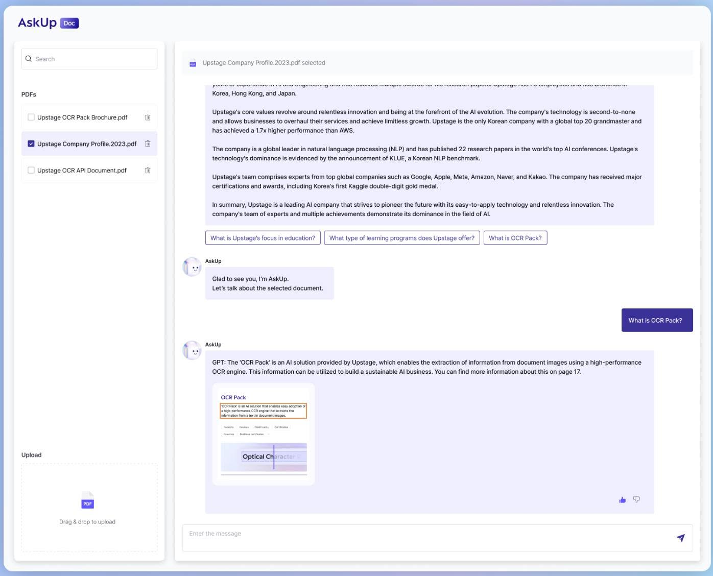
**이미지 캡션:** 이것은 AskUp Doc이라는 웹 애플리케이션의 스크린샷으로, 사용자가 PDF 문서를 업로드하고 AI 챗봇과 상호 작용할 수 있습니다. 화면 왼쪽에는 "PDFs" 섹션이 있으며, "Upstage OCR Pack Brochure.pdf", "Upstage Company Profile.2023.pdf", "Upstage OCR API Document.pdf"라는 세 개의 PDF 파일이 나열되어 있습니다. 현재 "Upstage Company Profile.2023.pdf"가 선택되어 있으며, 해당 문서의 내용이 화면 중앙에 표시됩니다. 문서 내용은 Upstage라는 AI 회사의 프로필에 관한 것으로, 혁신, AI 기술, NLP 분야에서의 리더십, 글로벌 기업 출신 전문가 팀, 수상 경력 등을 설명하고 있습니다. 문서 하단에는 "What is Upstage's focus in education?", "What type of learning programs does Upstage offer?", "What is OCR Pack?"와 같은 질문 버튼이 있습니다. 화면 중앙 하단에는 AI 챗봇인 AskUp과의 대화창이 있습니다. AskUp은 사용자를 환영하고 선택된 문서에 대해 이야기하자고 제안합니다. 사용자가 "What is OCR Pack?" 버튼을 클릭하자, AskUp은 OCR Pack이 문서 이미지에서 정보를 추출하는 AI 솔루션이라고 설명하며, 더 자세한 정보는 17페이지에 있다고 안내합니다. 화면 왼쪽 하단에는 "Upload" 섹션이 있으며, PDF 파일을 드래그 앤 드롭하여 업로드할 수 있는 공간이 있습니다. 화면 하단에는 사용자가 메시지를 입력할 수 있는 입력란이 있습니다. 전반적으로 이 화면은 사용자가 문서를 분석하고 관련 정보를 얻기 위해 AI 챗봇을 활용하는 인터페이스를 보여줍니다.
 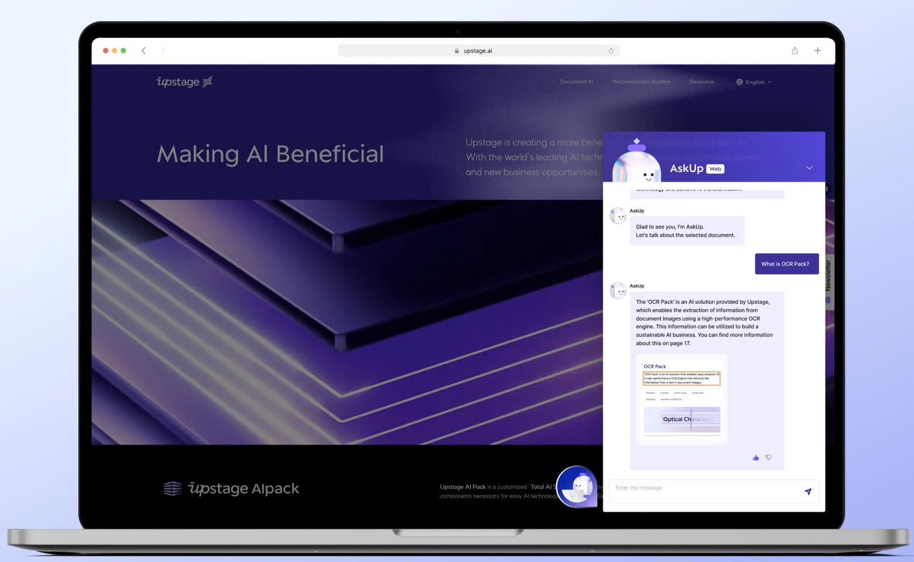
**이미지 캡션:** 이 사진은 노트북 화면을 클로즈업한 것으로, 노트북은 은색이며 화면에는 보라색과 파란색이 어우러진 추상적인 배경 이미지와 함께 웹사이트가 표시되어 있습니다. 웹사이트 상단에는 "upstage" 로고와 함께 "Document AI", "Recommender System", "Resource", "English" 등의 메뉴가 보입니다. 화면 오른쪽에는 "AskUp Web"이라는 이름의 챗봇 인터페이스가 열려 있으며, 챗봇은 AI 기술에 대한 질문에 답변하고 있습니다. 챗봇은 귀여운 캐릭터 아이콘과 함께 "Glad to see you, I'm AskUp. Let's talk about the selected document."라는 메시지를 표시하고 있으며, 사용자가 "What is OCR Pack?"이라고 질문하자 OCR Pack에 대한 설명과 함께 관련 이미지도 보여주고 있습니다. 전체적으로 현대적이고 기술적인 분위기를 풍깁니다.
 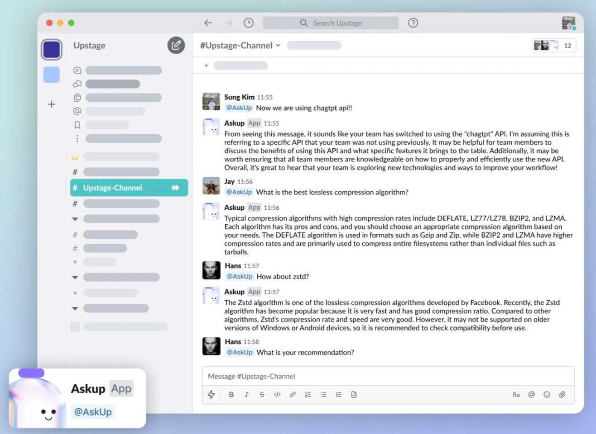
**이미지 캡션:** 이 이미지는 Upstage라는 이름의 협업 도구 또는 메신저 애플리케이션의 화면을 보여줍니다. 왼쪽 사이드바에는 채널 목록이 있으며, 그중 '#Upstage-Channel'이 선택되어 강조 표시되어 있습니다. 메인 화면에는 채널 내의 대화 내용이 시간순으로 표시됩니다. 대화에는 'Sung Kim', 'Askup App', 'Jay', 'Hans'라는 사용자들이 참여하고 있으며, 주로 API 사용, 압축 알고리즘 등에 대한 기술적인 논의가 이루어지고 있습니다. 'Askup App'은 질문에 대한 답변이나 정보를 제공하는 역할을 하는 것으로 보입니다. 화면 하단에는 메시지 입력창과 서식 도구들이 있습니다. 전체적으로 업무 관련 논의가 활발하게 이루어지는 기술 중심의 커뮤니케이션 환경을 보여주는 분위기입니다.

### 3월 21일 (화) 14:19 · #30만 아숙업 (AskUp)이 16일만에 30만명을 돌파하였습니다. 뜨…

#30만 아숙업 (AskUp)이 16일만에 30만명을 돌파하였습니다. 뜨거운 관심과 사랑에 감사드립니다.

아숙업을 오픈한 것은 제가 5년 전 “모두의 딥러닝 강의“를 공개한 것과 같은 이유에서였습니다. 우리나라 국민이라면 누구나 쉽게 AI를 사용해보길 바라는 마음, 그리고 최신 기술(chatgpt/gpt4)에 대한 막연한 두려움은 내려놓고 우리의 생활과 업무에 어떻게 더 잘 활용할 수 있을지를 함께 지혜를 모아보자는 마음이었습니다. 그리고 이렇게 큰 반응에 지금 저는 많이 놀라고 있습니다.

처음에는 "몇시야", "날씨 어때"와 같은 질의응답에 실망하신 분들도 계셨지만, 기쁜 소식은 시간이 지날수록 아숙업 활용안을 SNS나 블로그에 사용 후기로 제시해주시는 분들이 빠르게 늘고 있다는 것입니다.  그리고 https://app.sli.do/event/9NFpoYkrAY67dC6eYkhMfM 에는 600개 이상의 좋은 질문 예시들이 쌓이고 있습니다.

“AI will not replace you. A person using AI will,” Santiago의 말처럼 우리 모두가 AI 활용에 더욱 능숙해지면 좋겠습니다.

백만, 천만 될 때까지 열심히 달려보겠습니다. 아숙업을 모르시는 분들이 있다면  많이 소개해주셔서 모두를 위한 AI 를 향해 달려봅시다.

아숙업 친구 연결: https://askup.upstage.ai/

이글을 읽고 응원해주시는 여러분들, 그리고 도와주시고 함께 해주신  많은 분들 덕분입니다. 감사합니다!

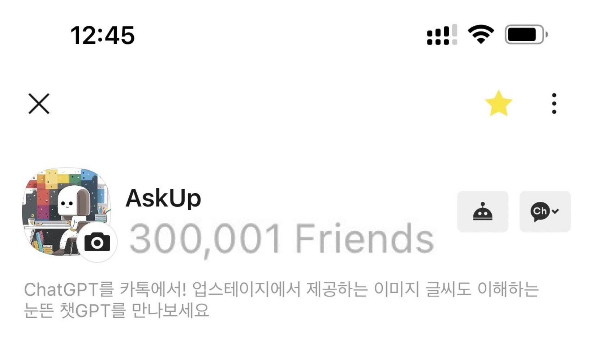
**이미지 캡션:** 화면 상단에는 12시 45분이라는 시간이 표시되어 있고, 왼쪽에는 X 표시가 있습니다. 오른쪽 상단에는 신호 강도, 와이파이, 배터리 잔량 아이콘과 함께 별 모양 아이콘, 점 세 개 아이콘이 보입니다. 화면 중앙에는 'AskUp'이라는 이름과 함께 300,001 Friends라는 문구가 큰 글씨로 표시되어 있습니다. 'AskUp' 옆에는 귀여운 캐릭터가 책상에 앉아 있는 일러스트가 있으며, 이 일러스트에는 카메라 아이콘이 겹쳐져 있습니다. 일러스트 아래에는 "ChatGPT를 카톡에서! 업스테이지에서 제공하는 이미지 글씨도 이해하는 눈뜬 챗GPT를 만나보세요"라는 문구가 적혀 있습니다. 화면 오른쪽 하단에는 로봇 모양 아이콘과 말풍선 모양의 'Ch' 아이콘이 있습니다. 전체적으로 앱 또는 서비스의 소개 화면으로 보이며, 긍정적이고 친근한 분위기를 풍깁니다.

### 3월 22일 (수) 16:32 · 📷 사진 (1장)

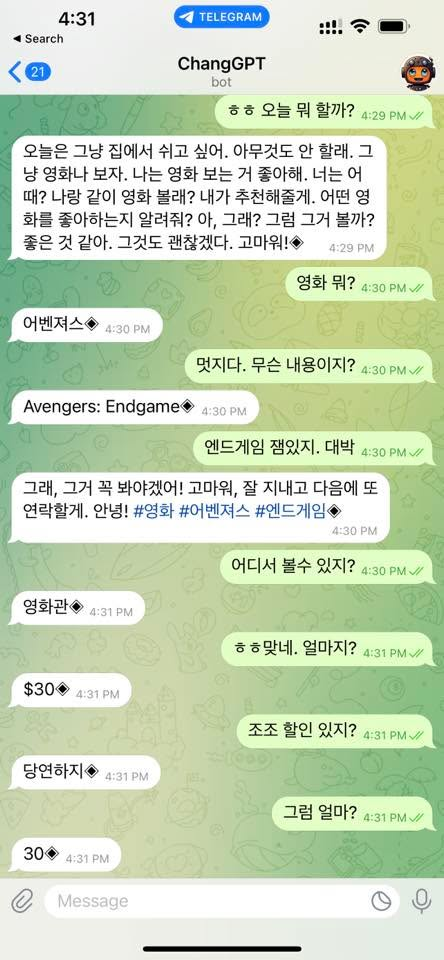
**이미지 캡션:** 이것은 텔레그램 대화 화면으로, 두 명의 사용자가 영화 관람에 대해 이야기하고 있습니다. 한 사용자는 집에서 쉬고 싶어하며 영화를 보자고 제안하고, 다른 사용자는 이에 동의하며 영화 추천을 요청합니다. 대화는 "어벤져스: 엔드게임"이라는 영화로 좁혀지고, 영화관에서 볼 수 있는지, 가격은 얼마인지, 조조 할인이 있는지 등을 묻고 답하는 내용으로 이어집니다. 배경에는 귀여운 캐릭터들이 그려진 녹색 배경이 보입니다.

### 3월 23일 (목) 08:51 · #위대한스승 #재치꾼 #친구 #시사성+ #물음표검색 #아숙업

#위대한스승 #재치꾼 #친구 #시사성+ #물음표검색 #아숙업

아숙업을 만들고 사용하면서 와~ 하고 감탄 할때가 많았습니다. 2021년말까지 인류가 쌓아둔 정보를 학습해서인지 지혜가 담긴 답변, 이런식으로 생각할수 있구나 하는 정말 위대한 스승을 둔것 같았습니다. 그러면서 (저희의 prompt enginnering) 친철하고 재치있고, 또 내손 카톡안에 들어 있어서 가까운 친구가 되었습니다. 

그러나 아쉽게도 2021년 이후에 대해 모르고있고, 학습데이터의 부족인지 우리 동네 (예: 판교맛집)에 대해 잘 모릅니다. 그럼 우리가 가르쳐 주면 되지 않을까? 검색 결과를 아숙업에게 전달해주고 답을 달라고 하면 되겠네 생각하고 만들어 보았습니다.

일명 물음표검색. 대화를 ?로 시작하시면 아숙업은 물음표검색이구나 하면서 먼저 검색을 하고 그 결과를 읽고 답을 해줍니다. 

넵 바로 빙 chat ai가 작동하는 방식입니다. 아직 저희가 검색 엔진과 검색 쿼리를 완전히 통제하지는 못해서 아쉬운 답을 할경우도 있습니다만 새로운 지식을 아숙업에게 전달하여 대화를 이어나갈수 있습니다.

아직 부족한 부분이 많지만 사용해보시고 의견 주시면 개선할 부분들을 계속 개선해보겠습니다.
https://www.facebook.com/upstageai/posts/pfbid02K6r8JesT2QUhLPt3QisUzprgPXrH73wdSJ5hszzbg1DkG3C7tQ6jzXdbDaCFansJl

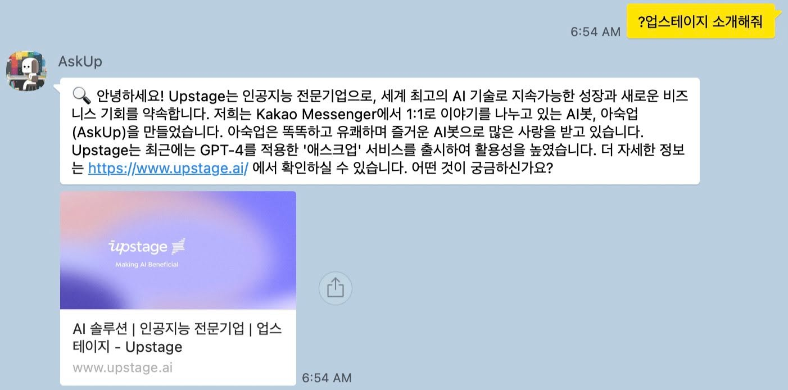
**이미지 캡션:** 화면 상단에는 노란색 말풍선에 "업스테이지 소개해줘"라는 텍스트와 함께 6:54 AM이라는 시간이 표시되어 있고, 그 옆에는 AskUp이라는 이름과 함께 AI 챗봇 아이콘이 보인다. 그 아래에는 AskUp이 보낸 것으로 보이는 메시지 창이 있으며, "안녕하세요! Upstage는 인공지능 전문기업으로, 세계 최고의 AI 기술로 지속가능한 성장과 새로운 비즈니스 기회를 약속합니다. 저희는 Kakao Messenger에서 1:1로 이야기를 나누고 있는 AI봇, 아숙업(AskUp)을 만들었습니다. 아숙업은 똑똑하고 유쾌하며 즐거운 AI봇으로 많은 사랑을 받고 있습니다. Upstage는 최근에는 GPT-4를 적용한 '애스크업' 서비스를 출시하여 활용성을 높였습니다. 더 자세한 정보는 https://www.upstage.ai/ 에서 확인하실 수 있습니다. 어떤 것이 궁금하신가요?"라는 텍스트가 포함되어 있다. 메시지 창 아래에는 Upstage 로고와 함께 "Making AI Beneficial"이라는 문구가 적힌 이미지 카드가 있고, 그 아래에는 "AI 솔루션 | 인공지능 전문기업 | 업스테이지 - Upstage"라는 텍스트와 웹사이트 주소 www.upstage.ai가 보인다. 화면 오른쪽 하단에도 6:54 AM이라는 시간이 표시되어 있다. 전체적으로 챗봇과의 대화 화면으로, 업스테이지라는 AI 기업에 대한 소개 메시지를 담고 있으며, 차분하고 정보 전달 중심의 분위기이다.

### 3월 23일 (목) 17:02 · 📷 사진 (1장)

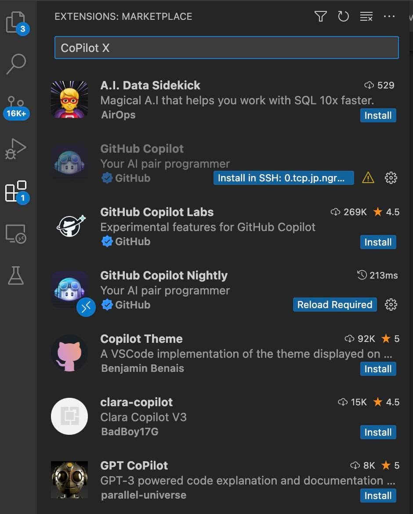
**이미지 캡션:** 이것은 VS Code 확장 프로그램 마켓플레이스 화면으로, 검색창에 "CoPilot X"가 입력되어 있으며 그 아래로 여러 확장 프로그램 목록이 표시됩니다. 각 확장 프로그램은 아이콘, 이름, 설명, 설치 수, 평점, 그리고 설치 또는 관련 버튼으로 구성되어 있습니다. 상단에는 "EXTENSIONS: MARKETPLACE"라는 제목과 검색, 필터, 설정 등의 아이콘이 보입니다. 왼쪽 사이드바에는 확장 프로그램, 검색, 디버그, 소스 제어 등 VS Code의 주요 기능 아이콘들이 나열되어 있으며, 일부 아이콘에는 숫자 배지가 표시되어 있습니다. 화면은 어두운 테마를 사용하고 있으며, 전반적으로 코딩 관련 소프트웨어의 확장 프로그램 목록을 보여주는 차분하고 기능적인 분위기입니다.

### 3월 24일 (금) 11:23 · #아숙업 #읽어줘

#아숙업 #읽어줘

와~ 요즈음 정말 정신없이 쏟아저 나오는 소식들 읽기도 힘듭니다. 읽을 것들이 너무 많아 제가 정말 필요해서 아숙업에 만들어 보았습니다.

#아숙업읽어줘

여러분들이 읽고 싶은 URL을 아숙업에게 주면 대신 읽고 요약해주고 토론도 가능합니다. 오늘막 나온 chatgpt Browsing 과 비슷하게 URL의 최신 정보를 가지고 아숙업과 이야기 나눌수 있습니다. 

마치 친구에게 야~ 이거 신기한거 봤어 하고 URL을 주고 이야기를 나누는 것도 같습니다. 아래 예는 https://openai.com/blog/chatgpt-plugins 를 읽고 토론하는 것입니다.

여러분이 읽고 싶은 영어, 복잡한 내용, 뉴스, API문서, 블로그글 다 아숙업에게 읽게 해보셔요.

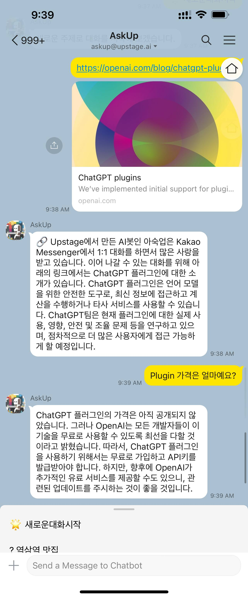
**이미지 캡션:** 이것은 스마트폰 화면의 스크린샷으로, 9시 39분으로 표시된 시간과 함께 AskUp이라는 이름의 챗봇과의 대화가 보입니다. 대화창 상단에는 "999+"라는 표시와 함께 "새로운 주제로 대화를 시작합니다."라는 문구가 있고, 그 아래에는 "askup@upstage.ai"라는 이메일 주소가 있습니다. 화면 중앙에는 노란색 배경에 "https://openai.com/blog/chatgpt-plu"라는 링크가 표시되어 있으며, 그 아래에는 "ChatGPT plugins"라는 제목과 함께 OpenAI 웹사이트의 미리보기 이미지가 보입니다. 그 아래에는 AskUp 챗봇이 보낸 메시지가 있는데, Upstage에서 만든 AI 챗봇인 아숙업이 카카오 메신저에서 1:1 대화를 통해 많은 사랑을 받고 있으며, ChatGPT 플러그인에 대한 소개와 함께 플러그인의 기능 및 향후 계획에 대해 설명하고 있습니다. 그 아래에는 노란색 말풍선으로 "Plugin 가격은 얼마예요?"라는 질문이 있고, 이에 대한 답변으로 ChatGPT 플러그인의 가격은 아직 공개되지 않았지만, OpenAI는 개발자들이 무료로 사용할 수 있도록 최선을 다할 것이라고 밝혔다는 내용이 이어집니다. 마지막으로 화면 하단에는 "새로운 대화 시작"이라는 문구와 함께 "역삼역 만진"이라는 질문, 그리고 "Send a Message to Chatbot"이라는 입력창이 보입니다. 전반적으로 기술적인 정보와 질문, 답변이 오가는 대화의 분위기입니다.

### 3월 25일 (토) 07:25 · #askupdoc #preview #아숙업독

#askupdoc #preview #아숙업독

AskUp Doc의 pre-preview를 공개합니다. github등 처럼 본인의 space를 만들고, 여기 PDF들을 올려놓으면 이것이 아숙업의 지식이 되어 질문과 답변을 할수 있습니다.

혼자 (또는 초대된 분들만) 사용할수 있는 private 그리고 남들도 들어와서 질문을 할수 있는 public으로 space를 생성할수 있습니다.

private의 경우 본인이 읽은 논문이나 본인이 작성한 자료등을 올려두고 검색을 하거나 관련 질문을 할수 있고

public은 고객에게 소개하고 싶은 상품정보, 책, 메뉴얼 등을 올려놓고 공개하면 해당 제품의 고객들이 궁금한 것을 모두 물어 볼수 있을것 같습니다.

추가적으로 결과 아래 해당 자료의 이미지와 저희 OCR로 해당하는 글씨를 읽은 지점을 보여주는 기능을 넣은 다음 wailtlist에 계시는 분들중 AskUp Doc과 잘 맞으시는 분들과 먼저 테스트를 진행할 예정입니다. 

관심있으신 분들은 등록해주셔요: https://www.upstage.ai/askup/doc
아숙업 같이 만들고 싶으신 특히 FE개발자 분들 두팔벌려 환영합니다: https://careers.upstage.ai/

🎬 동영상 1개 (생략)

### 3월 25일 (토) 07:35 · 📷 사진 (2장)

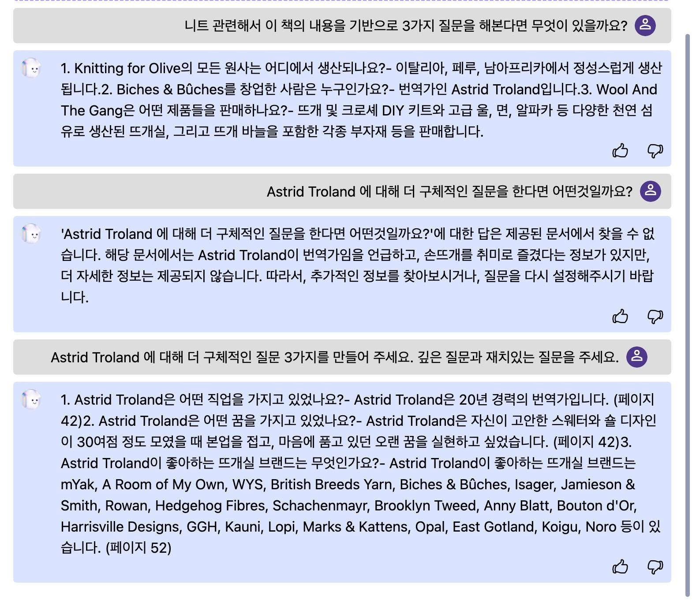
**이미지 캡션:** 이 이미지는 니트 관련 책의 내용을 기반으로 한 질문과 답변을 보여주는 스크린샷입니다. 화면 상단에는 "니트 관련해서 이 책의 내용을 기반으로 3가지 질문을 해본다면 무엇이 있을까요?"라는 질문과 함께 물음표 아이콘과 사람 아이콘이 있습니다. 그 아래에는 세 가지 질문과 그에 대한 답변이 번호로 매겨져 있습니다. 첫 번째 질문은 "Knitting for Olive의 모든 원사는 어디에서 생산되나요?", "Biches & Bûches를 창업한 사람은 누구인가요?", "Wool And The Gang은 어떤 제품들을 판매하나요?"이며, 답변은 각각 이탈리아, 페루, 남아프리카에서 생산된다는 내용과 번역가인 Astrid Troland이 창업했다는 내용, 그리고 뜨개 및 크로셰 DIY 키트, 고급 울, 면, 알파카 등 다양한 천연 섬유로 생산된 뜨개실, 뜨개 바늘 등을 판매한다는 내용입니다. 그 아래에는 "Astrid Troland 에 대해 더 구체적인 질문을 한다면 어떤것일까요?"라는 질문과 함께 답변이 제공됩니다. 답변은 해당 질문에 대한 답을 문서에서 찾을 수 없으며, Astrid Troland이 번역가이고 손뜨개를 취미로 즐겼다는 정보만 있다고 설명합니다. 마지막으로 "Astrid Troland 에 대해 더 구체적인 질문 3가지를 만들어 주세요. 깊은 질문과 재치있는 질문을 주세요."라는 요청과 함께 세 가지 질문과 답변이 제시됩니다. 첫 번째 질문은 Astrid Troland의 직업에 대한 것이고, 답변은 20년 경력의 번역가라는 것입니다. 두 번째 질문은 Astrid Troland의 꿈에 대한 것이고, 답변은 자신이 고안한 스웨터와 숄 디자인이 30여점 모였을 때 본업을 접고 꿈을 실현하고 싶었다는 내용입니다. 세 번째 질문은 Astrid Troland이 좋아하는 뜨개실 브랜드에 대한 것이고, 답변은 mYak, A Room of My Own, WYS 등 여러 브랜드를 나열하고 있습니다. 각 질문과 답변에는 말풍선 아이콘과 사람 아이콘이 함께 표시되어 있습니다. 전반적으로 정보 제공 및 질의응답 형식의 인터페이스를 보여줍니다.
 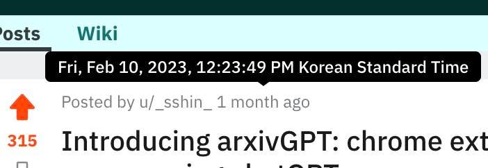
**이미지 캡션:** 이 사진은 웹사이트의 일부를 보여주며, 상단에는 'Posts'와 'Wiki'라는 탭이 있고, 그 아래에는 검은색 배경에 흰색 글씨로 날짜와 시간이 표시되어 있습니다. 날짜는 'Fri, Feb 10, 2023'이며, 시간은 '12:23:49 PM Korean Standard Time'으로 표기되어 있습니다. 그 아래에는 'Posted by u/_sshin_ 1 month ago'라는 문구가 보이며, 왼쪽에는 주황색 위쪽 화살표와 숫자 '315'가 있어 게시물의 추천 수를 나타내는 것으로 보입니다. 가장 하단에는 'Introducing arxivGPT: chrome ext'라는 제목이 시작되는 부분이 보입니다. 이 사진에는 사람이 직접적으로 보이지는 않으며, 배경은 웹사이트의 인터페이스로 추정됩니다. 전반적으로 정보 전달이나 게시물 목록을 보여주는 듯한 분위기입니다.

### 3월 26일 (일) 10:28 · WOW! Sam Altman: OpenAI CEO on GPT-4, Ch…

WOW! Sam Altman: OpenAI CEO on GPT-4, ChatGPT, and the Future of AI | Lex Fridman Podcast #367

2시간 30분인데 저도 막 듣기 시작했습니다. GPT4가 무엇인가? 부터 질문하네요.

다듣고 (gpt를 사용하여) 요약해보겠습니다!

🔗 <https://www.youtube.com/watch?v=L_Guz73e6fw&ab_channel=LexFridman>

### 3월 26일 (일) 18:08 · 📷 사진 (1장)

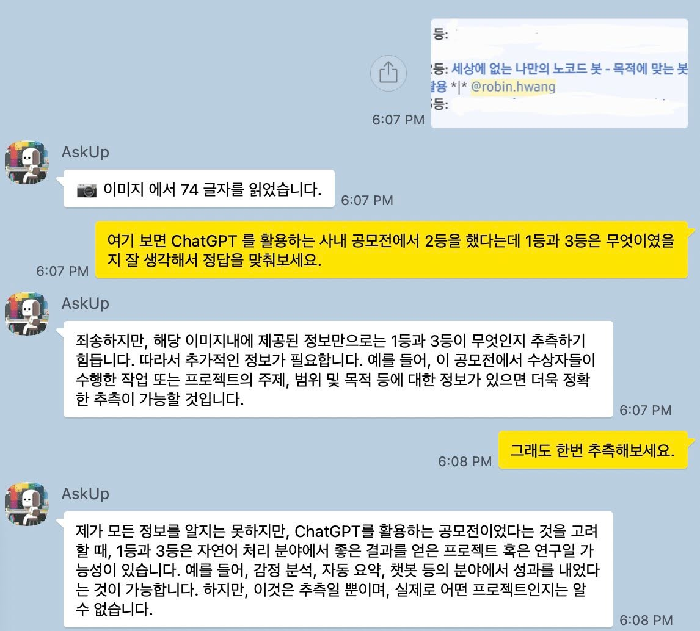
**이미지 캡션:** 이것은 모바일 메신저 대화 화면으로, AskUp이라는 이름의 사용자가 다른 사용자와 대화하고 있습니다. 대화는 6:07 PM에 시작되어 6:08 PM까지 이어집니다. AskUp은 먼저 "이미지에서 74 글자를 읽었습니다."라고 말하며, 이어지는 메시지에서 "여기 보면 ChatGPT를 활용하는 사내 공모전에서 2등을 했다는데 1등과 3등은 무엇이었을지 잘 생각해서 정답을 맞춰보세요."라고 질문합니다. 상대방은 "죄송하지만, 해당 이미지내에 제공된 정보만으로는 1등과 3등이 무엇인지 추측하기 힘듭니다. 따라서 추가적인 정보가 필요합니다. 예를 들어, 이 공모전에서 수상자들이 수행한 작업 또는 프로젝트의 주제, 범위 및 목적 등에 대한 정보가 있으면 더욱 정확한 추측이 가능할 것입니다."라고 답하며, AskUp은 "그래도 한번 추측해보세요."라고 재촉합니다. 마지막으로 AskUp은 "제가 모든 정보를 알지는 못하지만, ChatGPT를 활용하는 공모전이었다는 것을 고려할 때, 1등과 3등은 자연어 처리 분야에서 좋은 결과를 얻은 프로젝트 혹은 연구일 가능성이 있습니다. 예를 들어, 감정 분석, 자동 요약, 챗봇 등의 분야에서 성과를 냈다는 것이 가능합니다. 하지만, 이것은 추측일 뿐이며, 실제로 어떤 프로젝트인지는 알 수 없습니다."라고 답변합니다. 화면 상단에는 "등:"이라는 텍스트와 함께 "등: 세상에 없는 나만의 노코드 봇 - 목적에 맞는 봇 활용 *|* @robin.hwang 등:"이라는 내용이 포함된 회색 말풍선이 보입니다. 이 대화는 정보 검색 및 추론에 관한 내용을 담고 있으며, ChatGPT의 활용 가능성에 대한 논의를 포함하고 있습니다.

### 3월 27일 (월) 12:21 · #로봇 #그림그리기 어릴 때 저희 로망은 많은 어린이들이 그러했듯 로봇이…

#로봇 #그림그리기 어릴 때 저희 로망은 많은 어린이들이 그러했듯 로봇이었죠? 로봇을 만들고 그 로봇을 타고 우주를 나는 것이였죠.

어제 이미지 생성쪽을 보면서 무슨 그림을 그릴까 생각해 보다 어릴 때 꿈 이 생각났습니다. 로봇을 그려보자. 3000년대 있을만한 귀엽지만 창의적이고 한 번도 본 적이 없는 그런 로봇을 그려 볼 수 있을까? 얼마나 귀엽고 창의적인 것이 나올까?

한두 개 그려보고 말려고 했는데 와~ 재미있는 것들이 계속 나와 밤이 늦도록 그리며 어릴 때 꿈꾸었던 로봇들이 생각났습니다.

여러분들은 손안에서 바로바로 그림을 그릴 수 있다면 어떤 그림을 그려보고 싶으세요? 그림 그릴 일이 많을까요?

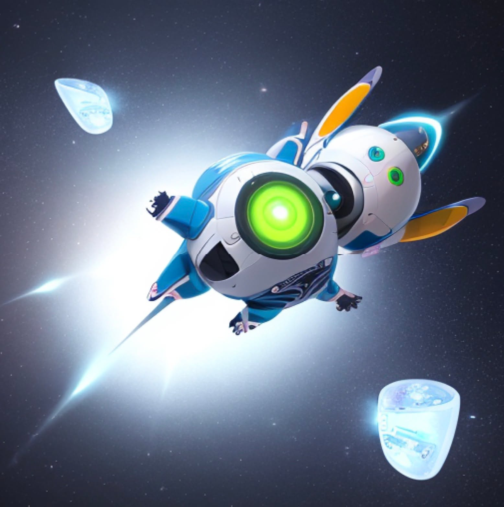
**이미지 캡션:** 이 이미지는 우주 공간을 배경으로 귀여운 디자인의 로봇이 비행하는 모습을 담고 있습니다. 로봇은 흰색과 파란색을 주 색상으로 하며, 노란색 날개가 달려 있습니다. 로봇의 가장 큰 특징은 얼굴 부분에 있는 크고 동그란 녹색 눈으로, 빛나고 있어 생동감을 더합니다. 로봇의 몸체에는 복잡한 기계적인 디테일이 표현되어 있으며, 팔 부분에는 검은색 장갑을 끼고 있습니다. 로봇의 앞쪽에서는 밝은 빛줄기가 뿜어져 나오고 있어 역동적인 움직임을 암시합니다. 주변에는 두 개의 투명하고 푸른색 빛을 띠는 물체가 떠 있으며, 마치 우주에서 발견되는 신비로운 광물이나 장치처럼 보입니다. 배경은 어두운 우주 공간으로, 수많은 별들이 반짝이고 있어 깊고 광활한 느낌을 줍니다. 전체적으로 밝고 긍정적인 분위기이며, 미래 지향적이고 탐험적인 느낌을 주는 이미지입니다.
 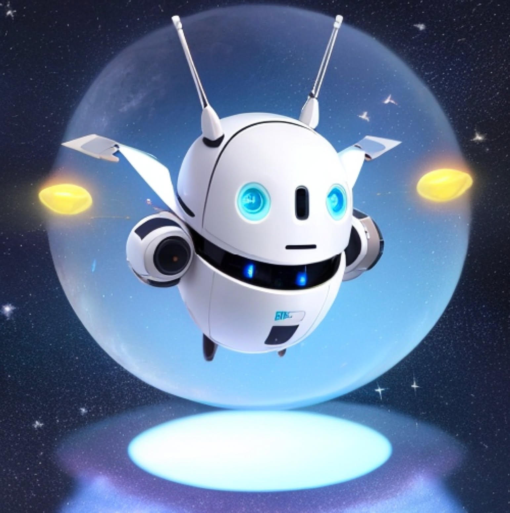
**이미지 캡션:** 이 이미지는 우주를 배경으로 한 귀여운 흰색 로봇을 보여줍니다. 로봇은 둥근 몸체에 파란색 눈과 작은 입을 가지고 있으며, 머리 위에는 두 개의 안테나가 솟아 있습니다. 몸체 양쪽에는 카메라 렌즈처럼 보이는 검은색 원형 부품이 달려 있고, 등에는 날개처럼 생긴 흰색 부품이 있습니다. 로봇의 가슴 부분에는 파란색 불빛이 들어오는 작은 창과 함께 "ETG"라는 글자가 새겨져 있습니다. 로봇 주변에는 노란색의 빛나는 타원형 물체 두 개가 떠 있으며, 배경에는 거대한 푸른색 행성과 반짝이는 별들이 보입니다. 로봇 아래에는 밝은 빛이 반사되어 마치 수면 위에 떠 있는 듯한 느낌을 줍니다. 전체적으로 신비롭고 미래적인 분위기를 자아냅니다.
 
**이미지 캡션:** 우주 공간을 배경으로 지구와 함께 떠 있는 하얀색의 둥근 로봇이 보인다. 로봇은 날개처럼 보이는 두 개의 빛나는 흰색 구조물과 양옆으로 뻗은 작은 날개를 가지고 있으며, 눈처럼 보이는 두 개의 주황색 불빛이 빛나고 있다. 로봇의 몸체에는 "ENIND"라는 글자가 희미하게 새겨져 있다. 로봇의 아래쪽에서는 노란색 불꽃이 뿜어져 나오고 있어 마치 추진력을 얻고 있는 듯한 모습이다. 배경에는 별들이 반짝이는 어두운 우주와 함께 푸른색과 녹색이 어우러진 지구가 보이며, 멀리 혜성으로 보이는 빛나는 물체도 있다. 전반적으로 미래적이고 신비로운 분위기를 자아낸다.
 
**이미지 캡션:** 푸른색의 둥근 머리를 가진 귀여운 로봇이 우주 공간에 떠 있으며, 로봇의 몸체는 파란색과 분홍색 라인으로 장식되어 있고, 팔과 다리는 관절이 움직이는 것처럼 보입니다. 로봇의 얼굴에는 크고 동그란 눈과 작은 입이 있으며, 마치 놀라거나 신기해하는 듯한 표정을 짓고 있습니다. 로봇 주변에는 주황색의 동그란 캐릭터들이 여러 개 떠 있는데, 이 캐릭터들도 귀여운 얼굴을 하고 있습니다. 배경은 보라색과 분홍색이 섞인 우주 공간으로, 별들이 반짝이는 듯한 효과가 있습니다. 전체적으로 밝고 긍정적인 분위기를 자아내는 이미지입니다.
 
**이미지 캡션:** 이 사진은 우주 공간을 배경으로 귀여운 디자인의 로봇이 날아가는 모습을 담고 있습니다. 로봇은 흰색과 파란색, 노란색이 조화된 색상으로, 동그란 머리와 두 개의 노란색 눈, 그리고 날개처럼 보이는 팔을 가지고 있습니다. 로봇의 얼굴 부분에는 검은색 화면이 있고, 그 안에 두 개의 노란색 원이 눈처럼 빛나고 있어 마치 감정을 표현하는 듯한 느낌을 줍니다. 몸통에는 빨간색과 파란색의 작은 불빛이 있으며, 하단에는 작은 추진기가 달려 있습니다. 로봇의 주변으로는 밝은 흰색의 빛나는 고리가 형성되어 있으며, 이는 마치 워프나 에너지 효과를 연상시킵니다. 배경은 어두운 밤하늘처럼 별들이 반짝이는 우주 공간으로 묘사되어 있습니다. 로봇은 앞으로 나아가는 듯한 역동적인 자세를 취하고 있으며, 전체적으로 신비롭고 미래적인 분위기를 자아냅니다.
 
**이미지 캡션:** 우주 공간에서 지구 위를 비행하는 미래 지향적인 우주선이 보인다. 우주선의 전면부는 둥글고 흰색이며, 헬멧처럼 보이는 돔 형태의 조종석이 있다. 조종석의 검은색 유리창 안에는 파란색의 물결 모양 그래픽과 함께 귀여운 표정의 작은 파란색 캐릭터가 보인다. 우주선 본체는 흰색과 파란색이 조합된 매끈한 디자인이며, 날렵한 날개와 추진 장치가 달려 있다. 배경에는 별이 총총한 어두운 우주와 구름이 덮인 푸른 지구의 모습이 펼쳐져 있으며, 지구 대기권을 가로지르는 밝은 빛줄기가 보인다. 전체적으로 첨단 기술과 탐험의 분위기를 풍기는 이미지이다.
 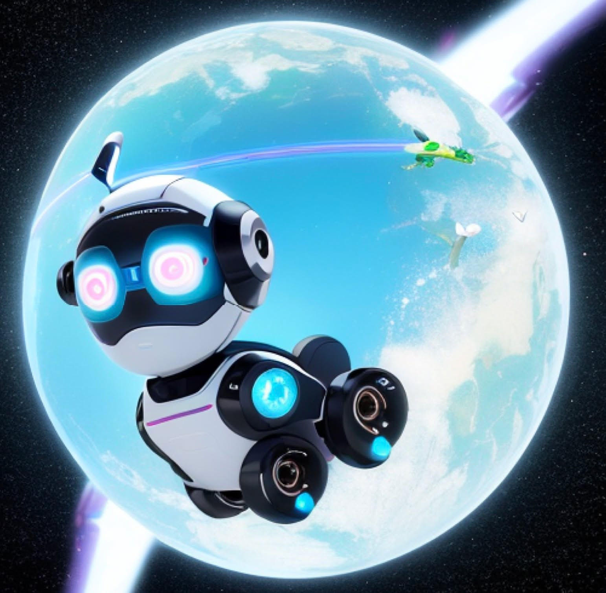
**이미지 캡션:** 이 이미지는 우주를 배경으로 귀여운 로봇이 행성 앞에 서 있는 모습을 보여줍니다. 로봇은 흰색과 검은색 몸체에 파란색과 분홍색 빛나는 눈을 가지고 있으며, 네 개의 바퀴가 달려 있습니다. 로봇의 눈은 분홍색으로 빛나고 있으며, 몸체 곳곳에 파란색 불빛이 들어와 있습니다. 로봇의 머리 위에는 안테나 두 개가 솟아 있습니다. 배경에는 거대한 푸른색 행성이 있으며, 행성 표면에는 구름과 대륙으로 보이는 지형이 희미하게 보입니다. 행성 주변으로는 보라색 빛의 고리가 둘러져 있고, 행성 표면 위로는 작은 녹색 비행체와 하얀색의 작은 비행체가 날아다니고 있습니다. 우주 공간은 검은색으로 표현되었으며, 멀리 별들이 반짝입니다. 전체적으로 밝고 신비로운 분위기를 자아내며, 마치 SF 애니메이션의 한 장면 같습니다.
 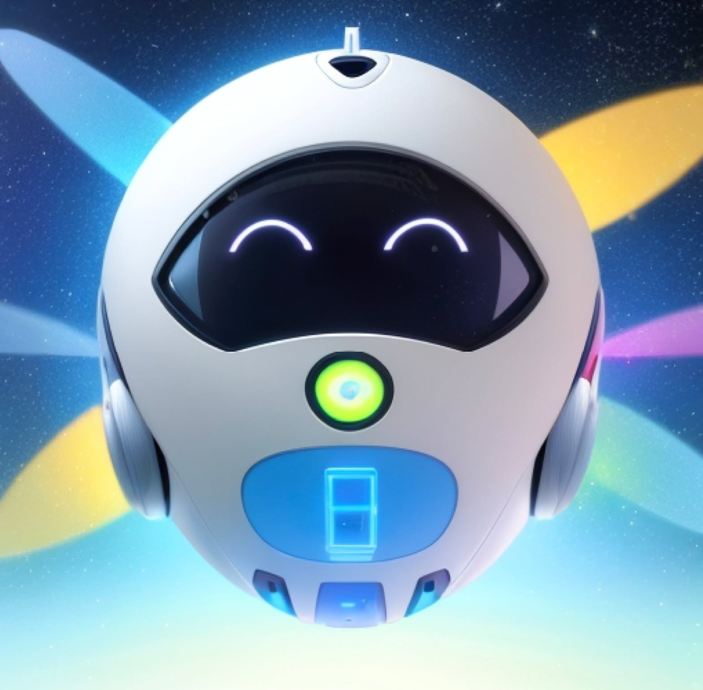
**이미지 캡션:** 이 이미지는 귀여운 로봇의 클로즈업 샷으로, 둥근 흰색 몸체에 검은색 얼굴이 특징입니다. 얼굴에는 두 개의 밝은 흰색 호가 눈처럼 웃고 있으며, 그 아래에는 밝은 녹색 원이 있습니다. 로봇의 하단에는 파란색 직사각형 화면이 있으며, 그 안에는 흰색으로 "8"이라는 숫자가 표시되어 있습니다. 로봇의 양쪽에는 은색 원통형 부품이 있으며, 머리 위에는 작은 안테나가 있습니다. 배경은 어두운 밤하늘처럼 보이며, 별이 반짝이고 다채로운 색상의 빛줄기가 부드럽게 퍼져나가고 있습니다. 전반적으로 이미지는 밝고 긍정적인 분위기를 자아냅니다.
 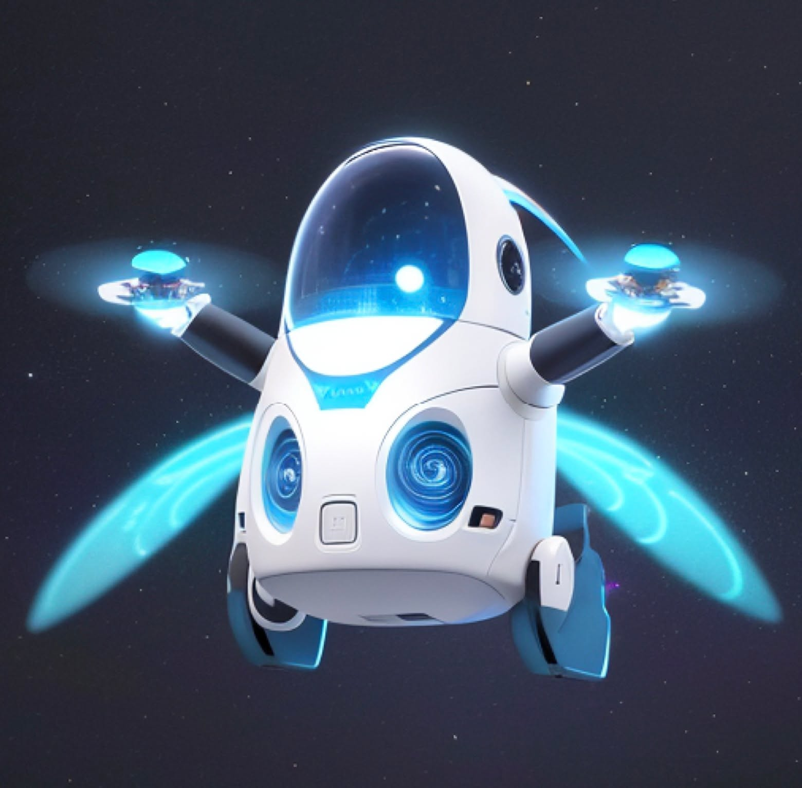
**이미지 캡션:** 이 이미지는 우주 공간을 배경으로 떠 있는 귀여운 흰색 로봇을 보여줍니다. 로봇은 둥근 머리와 몸체를 가지고 있으며, 투명한 유리창을 통해 푸른 빛이 새어 나옵니다. 양팔 끝에는 푸른 빛을 내는 작은 원반 모양의 장치가 달려 있고, 등에는 푸른 빛의 날개 같은 것이 달려 있어 마치 천사나 나비 같은 모습을 연상시킵니다. 로봇의 눈은 푸른색 소용돌이 모양으로 디자인되어 신비로운 느낌을 줍니다. 몸체 앞쪽에는 작은 사각형 모양의 버튼이 보이며, 하단에는 바퀴가 달려 있습니다. 배경은 어두운 밤하늘처럼 별들이 반짝이는 모습입니다. 로봇의 전체적인 색상은 흰색과 푸른색이 조화롭게 사용되었으며, 미래적이고 귀여운 분위기를 자아냅니다. 로봇의 표정은 명확하게 드러나지 않지만, 전체적인 디자인과 빛나는 효과로 인해 긍정적이고 호기심 많은 느낌을 줍니다. 로봇은 마치 무언가를 보여주거나 안내하려는 듯한 자세를 취하고 있습니다. 로봇 몸체에 희미하게 "Vinno b"라는 글자가 보입니다.
 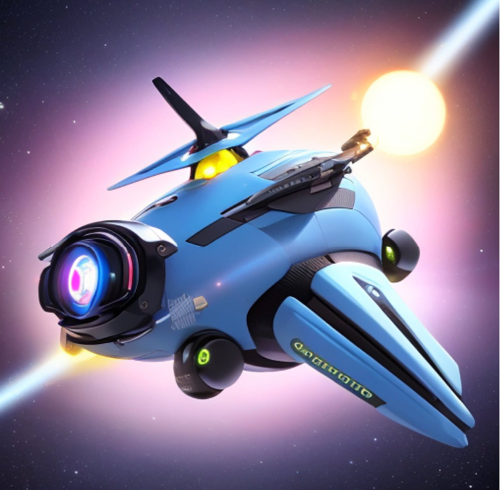
**이미지 캡션:** 이 이미지는 우주 공간을 배경으로 푸른색의 미래적인 디자인을 가진 소형 우주선이 떠 있는 모습을 보여줍니다. 우주선은 유선형의 매끄러운 디자인이며, 전면에는 크고 둥근 렌즈 형태의 센서가 있으며, 이 센서에서는 푸른색과 보라색 빛이 발산되고 있습니다. 우주선 상단에는 날카로운 모양의 안테나 또는 날개가 솟아 있고, 중앙에는 노란색 불빛이 보입니다. 우주선 측면에는 녹색으로 빛나는 작은 원형 부품들이 있으며, 우주선 앞쪽 하단에는 푸른색의 길쭉한 돌출부가 있고, 이 돌출부에는 녹색 글자로 된 문양이 새겨져 있습니다. 배경에는 별들이 반짝이는 보라색과 분홍색의 성운이 펼쳐져 있으며, 밝은 노란색의 항성이 빛나고 있습니다. 항성에서는 흰색의 빛줄기가 뿜어져 나오고 있어 역동적인 분위기를 연출합니다. 우주선은 마치 탐사 임무를 수행하거나 이동 중인 듯한 모습이며, 전체적으로 신비롭고 첨단적인 느낌을 줍니다.
 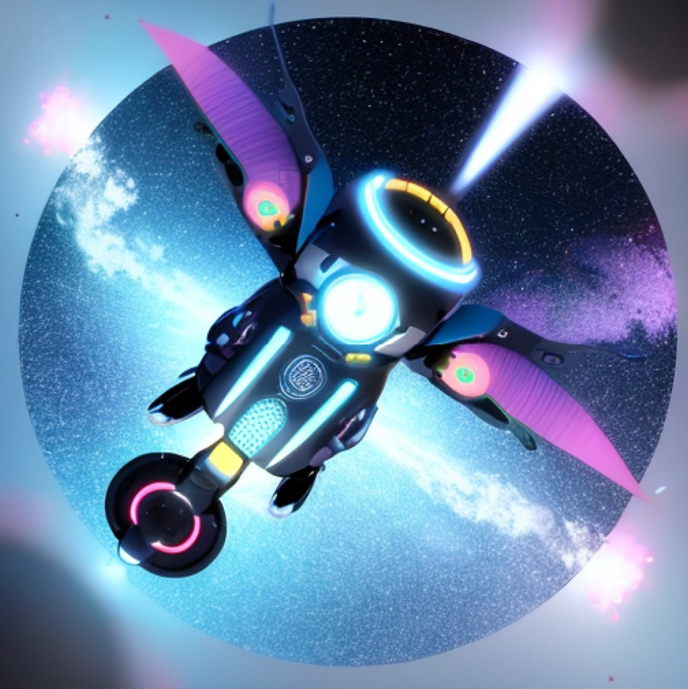
**이미지 캡션:** 이 이미지는 우주를 배경으로 한 미래적인 디자인의 드론 또는 소형 우주선을 보여줍니다. 드론은 검은색과 파란색을 기본으로 하며, 네온 불빛으로 강조된 여러 부분들이 특징입니다. 날개 부분은 보라색과 분홍색으로 빛나고 있으며, 몸체에는 파란색, 노란색, 분홍색의 네온 조명이 번쩍입니다. 드론의 중앙에는 밝은 흰색의 원형 조명이 있고, 상단에는 노란색과 파란색의 링 모양 조명이 둘러져 있습니다. 드론의 하단에는 바퀴처럼 보이는 부분이 있으며, 이 부분에도 분홍색 네온 불빛이 있습니다. 드론의 몸체에는 동그란 문양이 새겨져 있는데, 자세히 보이지는 않지만 어떤 상징이나 로고로 보입니다. 드론은 우주 공간을 날고 있으며, 배경에는 별들이 반짝이는 은하수와 같은 모습이 보입니다. 또한, 드론의 양쪽에서는 분홍색의 에너지 폭발이 일어나고 있으며, 상단에서는 하얀색의 빛줄기가 뿜어져 나오고 있습니다. 전체적으로 매우 역동적이고 미래적인 분위기를 자아냅니다.
 
**이미지 캡션:** 이것은 우주를 배경으로 한 귀여운 로봇의 3D 렌더링 이미지입니다. 로봇은 둥근 머리와 몸체를 가지고 있으며, 큰 눈은 각각 보라색과 흰색으로 빛나고 있습니다. 로봇의 입은 작고 미소를 짓고 있으며, 양옆에는 작은 날개가 달려 있습니다. 로봇의 몸체에는 파란색과 흰색 조명이 켜져 있으며, 몸체 중앙에는 알 수 없는 문자가 새겨져 있습니다. 배경에는 별이 빛나는 어두운 우주 공간이 펼쳐져 있으며, 거대한 행성과 여러 개의 빛나는 구체들이 보입니다. 또한, 로봇 뒤로는 노란색과 보라색의 빛줄기가 방사형으로 뻗어 나가며 역동적인 분위기를 연출하고 있습니다. 전반적으로 밝고 긍정적인 분위기의 이미지입니다.
 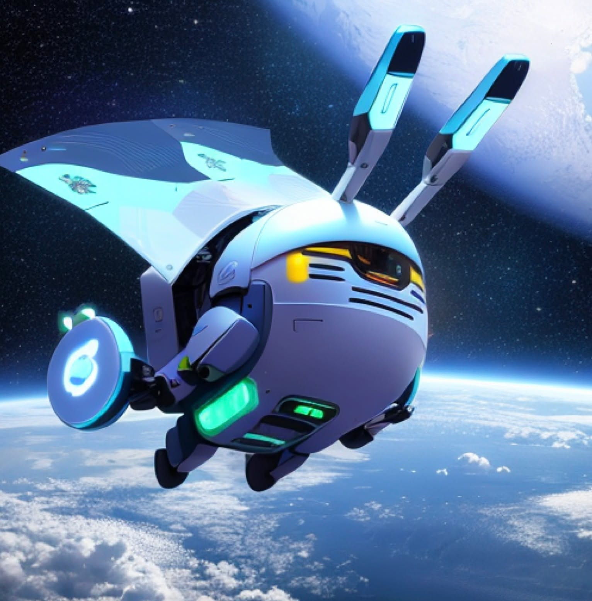
**이미지 캡션:** 이 이미지는 우주 공간을 배경으로 떠다니는 귀여운 외계 생명체 모양의 로봇을 보여줍니다. 로봇은 둥근 몸체에 토끼 귀처럼 생긴 두 개의 안테나가 달려 있으며, 파란색과 흰색, 녹색 조명이 빛나고 있습니다. 로봇의 몸체에는 노란색 줄무늬와 검은색 창문 같은 부분이 있어 마치 눈이나 센서처럼 보입니다. 로봇의 날개 부분에는 거북이 그림이 그려져 있으며, 전체적으로 미래적이고 동화적인 느낌을 줍니다. 배경에는 지구로 보이는 푸른 행성과 구름, 그리고 별이 가득한 우주가 펼쳐져 있어 신비롭고 광활한 분위기를 자아냅니다. 로봇은 어떤 임무를 수행하는 중인지 알 수 없지만, 평화롭고 탐험적인 느낌을 줍니다.

### 3월 30일 (목) 09:15 · #ocr자동이벤트 #아숙업50만

#ocr자동이벤트 #아숙업50만 

아숙업은 50만을 향해 달려가고 있습니다. 감사합니다. 많은 분들이 아숙업 (gpt) 잘 잘하는 영역들 찾아서 잘 활용하고 있는 것 같습니다.

더 많은 좋은 활용 예를 공유하고 많은 분들이 더 잘 사용하기 위해 좋은 활용 예를 공유하는 이벤트를 시작합니다. 이벤트를 참여하고 확인하는 방식도 AI입니다. OCR을 사용하여 해시 코드가 있는 경우 바로 크레딧이 지급됩니다.

아숙업의 좋은 활용 예 많이 공유 해주셔요! https://pf.kakao.com/_BhxkWxj/99349624

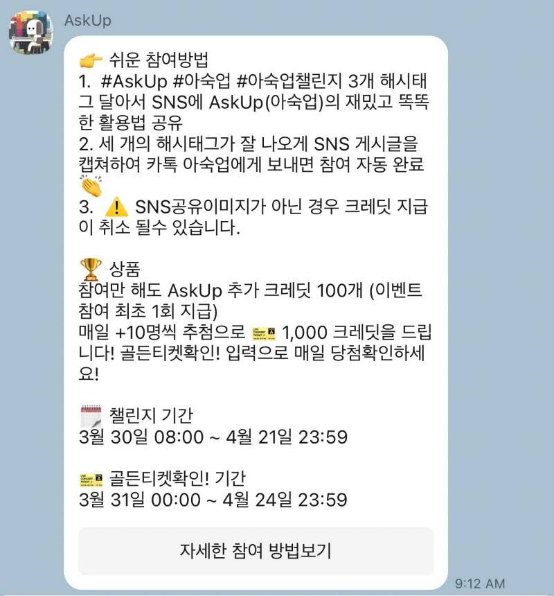
**이미지 캡션:** 이것은 AskUp이라는 앱의 이벤트 공지 메시지입니다. 메시지는 한국어로 작성되었으며, 참여 방법, 상품, 챌린지 기간 및 골든티켓 확인 기간에 대한 정보를 제공합니다. 메시지 상단에는 AskUp 로고가 있고, 하단에는 "자세한 참여 방법 보기" 버튼이 있습니다. 메시지에는 사람이나 배경이 보이지 않으며, 오직 텍스트와 아이콘만 있습니다. 텍스트는 이벤트 참여를 독려하고 있으며, 참여자들에게 크레딧과 추첨을 통해 추가 상품을 제공한다고 명시하고 있습니다. 챌린지 기간은 3월 30일부터 4월 21일까지이며, 골든티켓 확인 기간은 3월 31일부터 4월 24일까지입니다. 메시지의 전체적인 분위기는 정보 전달 및 참여 유도에 초점을 맞추고 있습니다.
