# 2023년 4월

[← 2023년](README.md)

### 4월 3일 (월) 08:53 · #아숙업그림판 #업스케치 #풍경 #우주 #꽃 #사물 #특화

#아숙업그림판 #업스케치 #풍경 #우주 #꽃 #사물 #특화

(이번 1차 2차 베타신청은 몇시간만에 모두 마감되었습니다. 3차 추가 모집은 4월 4일 오전 9시부터 다시 열립니다!)

내 손안의 AI, 아숙업이 글뿐만 아니라 그림 창작도 하게 됩니다. 업 스테이지에서 파인튜닝한 풍경, 꽃, 사물, 우주 등에 특화된 Stable diffusion 기반의 생성 모델이고 2단계 생성 기법을 사용하여 1024x1024의 고퀄의 이미지를 그려줍니다. 
(아래 이미지는 모두 아숙업이 창작하여 그려준 것입니다.)

아숙업 대화창에 “업스케치 베타신청!” 비밀코드를 입력하시면 베타 신청 화면이 나오고 약관에 동의하시면 그림 그리기가 시작됩니다. 

우선 천명 베타 모집을 하고 있으니 관심 있으신 분들은 업스케치 베타신청! 바로 입력해 주시고 많이 사용해주세요.

아시겠지만 prompt는 길고 자세하게 할수록 더 좋은 이미지를 만들어 냅니다.

아직 부족함이 많은 기술이지만 함께 사용해고도 부족한 점들 함께 토론하고 개선해서 앞으로 나가보려고 합니다. 많은 의견 부탁드립니다.

채널추가: https://pf.kakao.com/_BhxkWxj
공식설명: https://www.facebook.com/upstageai/posts/pfbid0MuoASnRsB9hG31bF3DFmVrFY5SY3ptrnyU572Ephm8EEabGYGoqCZYTia5bSbW4al

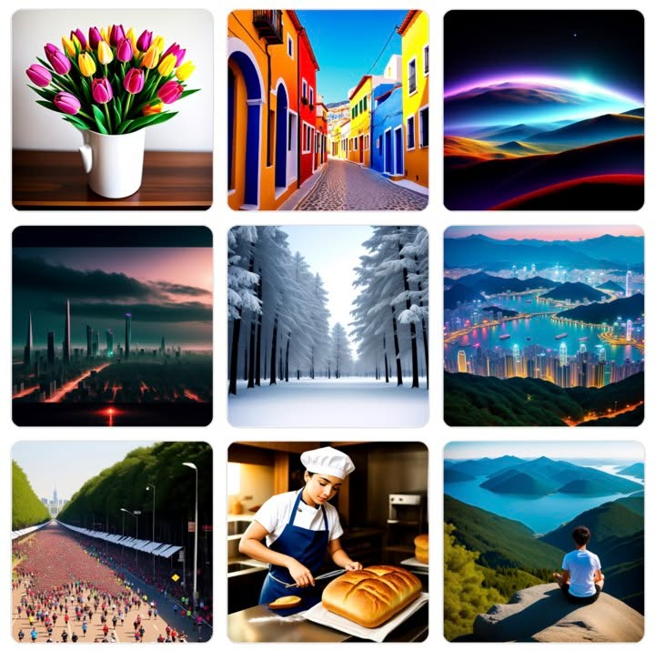
**이미지 캡션:** 이 이미지는 9개의 작은 사진으로 구성된 콜라주입니다. 왼쪽 상단에는 흰색 꽃병에 담긴 분홍색, 노란색, 주황색 튤립 꽃다발이 있습니다. 그 옆에는 다채로운 건물들이 늘어선 좁은 골목길 풍경이 펼쳐져 있습니다. 오른쪽 상단에는 보라색, 주황색, 파란색 빛으로 물든 산봉우리와 계곡의 추상적인 풍경이 보입니다. 중간 왼쪽에는 어두운 하늘 아래 도시의 스카이라인이 보이며, 불빛이 길게 늘어져 있습니다. 그 옆에는 눈 덮인 소나무 숲의 겨울 풍경이 있습니다. 중간 오른쪽에는 밤에 불빛으로 빛나는 도시와 항구가 내려다보이는 산꼭대기 풍경이 있습니다. 아래 왼쪽에는 녹색 언덕을 배경으로 수많은 사람들이 달리고 있는 마라톤 대회 장면이 보입니다. 그 옆에는 흰색 요리사 모자와 파란색 앞치마를 두른 젊은 여성이 빵을 자르고 있는 모습이 담겨 있습니다. 오른쪽 하단에는 푸른 호수와 산으로 둘러싸인 절벽 위에 앉아 명상하는 사람의 뒷모습이 보입니다.

### 4월 3일 (월) 10:40 · 📷 사진 (1장)

**이미지 캡션:** 이 사진은 젊은 성인 여성으로, 20대 초중반으로 보이며, 짙은 갈색 머리를 높게 묶어 포니테일로 연출했다. 그녀는 옅은 녹색 눈동자를 가지고 있으며, 약간 옆을 응시하는 표정으로 무언가에 집중하거나 생각에 잠긴 듯한 모습이다. 붉은색 터틀넥 위에 흰색 재킷을 걸쳤는데, 재킷의 칼라 부분에는 검은색 라인이 들어가 있어 포인트를 주고 있다. 귀에는 작은 은색 귀걸이를 착용하고 있다. 배경은 흐릿하게 처리되어 있어 인물에 시선이 집중되도록 했으며, 어두운 색조와 밝은 조명이 혼합되어 도시적인 분위기를 자아낸다. 사진 속에는 다른 사람의 모습도 흐릿하게 보이지만, 초점은 전적으로 앞에 있는 여성에게 맞춰져 있다. 전체적으로 세련되고 현대적인 느낌을 주는 패션 화보나 거리 사진의 한 장면으로 보인다.

### 4월 4일 (화) 10:44 · #supersimple #superfast #추천 여러분들이 고객에게 추…

#supersimple #superfast #추천 여러분들이 고객에게 추천해야 할 제품이 있다면 아주 간단하게 사용할 수 있는 저희 추천 API를 사용해 보세요. 그냥 지금 session/user가 무엇을 봤는데 클릭했는지 아이템 몇 개만 알려주면, 그다음 이 session/user가 무엇을 볼 것인지 클릭할 것인지를 매우 빠르고 정확하게 알려줍니다.

그냥 저희 API를 한번 부르는 것만으로 고객에게 놀라운 추천 경험을 제공해 드릴수 있습니다.

이게 잘 될까요? 정말 잘됩니다. 한번 연결해 보시면 바로 아실 수 있고 저희 그동안이 추천 노하우를 모두 담아 하나의 더 이상 간단할 수 없는 API로 만들었습니다.

지금 살펴보시고 바로 사용신청해 주세요! #선신청 #노고민
https://www.upstage.ai/recommender-system-api

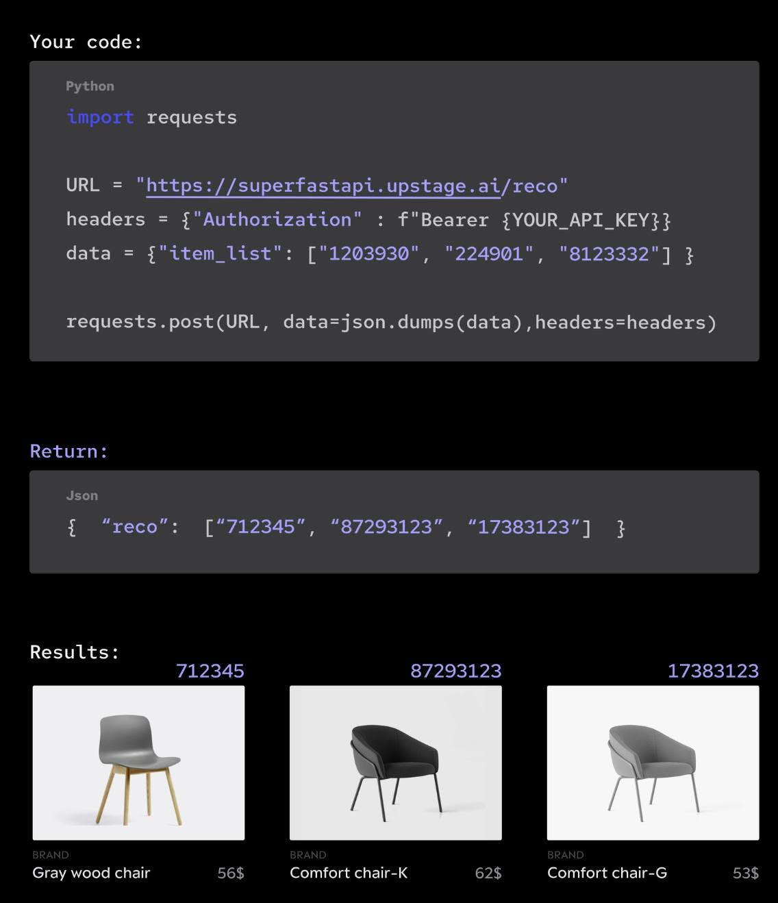
**이미지 캡션:** 이 이미지는 파이썬 코드를 사용하여 추천 시스템 API를 호출하고 그 결과를 보여주는 화면을 담고 있습니다. 상단에는 "Your code:"라는 제목과 함께 파이썬 코드가 표시되어 있습니다. 코드는 `requests` 라이브러리를 사용하여 `https://superfastapi.upstage.ai/reco` URL로 POST 요청을 보내는 것을 보여줍니다. 요청 헤더에는 API 키가 포함되어 있으며, 요청 본문에는 추천을 받고자 하는 아이템 목록이 JSON 형식으로 담겨 있습니다. 그 아래에는 "Return:"이라는 제목과 함께 API 응답으로 받은 JSON 데이터가 표시됩니다. 이 JSON은 "reco"라는 키 아래에 추천된 아이템들의 ID 목록을 포함하고 있습니다. 마지막으로 "Results:"라는 제목과 함께 추천된 아이템들의 이미지와 정보가 세 개의 열로 나열되어 있습니다. 각 아이템은 고유 ID, 브랜드 이름, 제품명, 가격을 보여줍니다. 첫 번째 아이템은 ID 712345로 "Gray wood chair"이며 가격은 56달러입니다. 두 번째 아이템은 ID 87293123으로 "Comfort chair-K"이며 가격은 62달러입니다. 세 번째 아이템은 ID 17383123으로 "Comfort chair-G"이며 가격은 53달러입니다. 전체적으로 기술적인 코드 실행 결과와 그에 따른 시각적인 상품 추천 결과를 보여주는 정보성 화면입니다.

### 4월 7일 (금) 15:46 · #대화업스케치 #ChatAI #아숙업

#대화업스케치 #ChatAI #아숙업 

AI와 말이 통하고 대화가 된다는 것은 무엇일까요? 

우리가 멋진 prompt를 주었을때 AI가 원타임으로 짠~ 그리는 것이 아니라 AI와의 대화를 통해 원하는 이미지를 도출할 수 있을까를 고민하고 있습니다. 

그 첫 결과로 아숙업의 대화기반의 업스케치를 출시합니다.

여러분이 대화를 나누다가 이 대화 내용을 기반으로 원하는 그림을 그려달라고 부탁할 수도 있고 이미 그려진 이미지를 대화로 이렇게 저렇게 바꾸라고 지시하면서 만들어 갈수 있습니다. 

저희들이 이미지 생성을 통해 ChatAl를 테스트 하고 있습니다만, 검색과 상품 구매, 추천 등등 거의 우리 생활에서 일어나는 모든 일을 이런 ChatAl 가 담당하게 될까요? 그렇다면 아주 재미있는 세상이 펼쳐질 것 같습니다.

https://pf.kakao.com/_BhxkWxj 아숙업 친구로 대화 업스케치를 만나 보세요.

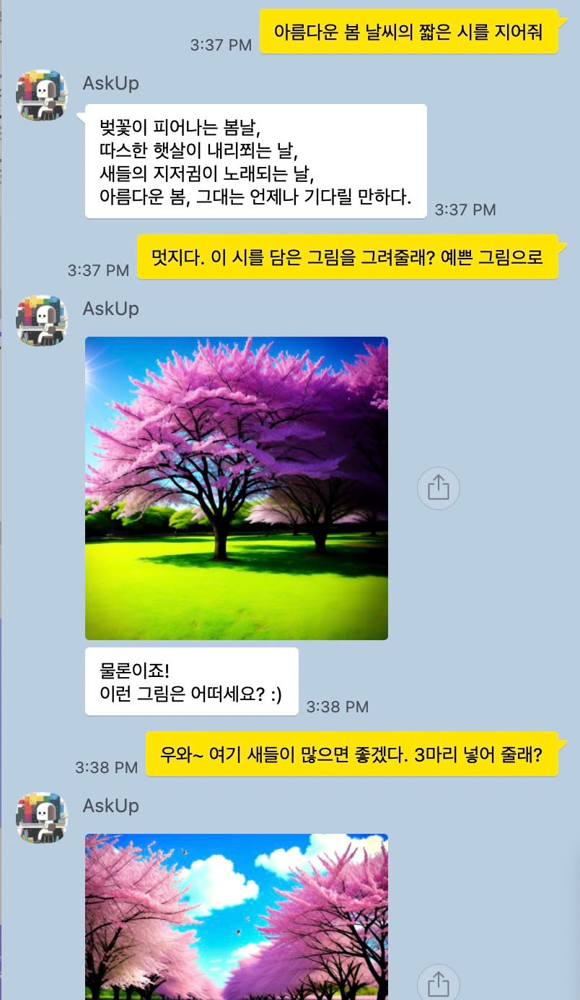
**이미지 캡션:** 이것은 대화 화면으로, AskUp이라는 사용자가 3시 37분에 "아름다운 봄 날씨의 짧은 시를 지어줘"라고 요청했고, 이에 대한 응답으로 벚꽃이 피어나는 봄날에 대한 시가 작성되었습니다. 이어서 AskUp은 3시 37분에 "멋지다. 이 시를 담은 그림을 그려줄래? 예쁜 그림으로"라고 요청했고, 3시 38분에 AskUp은 벚꽃 나무가 있는 풍경 사진을 공유하며 "물론이죠! 이런 그림은 어떠세요? :)"라고 물었습니다. 마지막으로 AskUp은 3시 38분에 "우와~ 여기 새들이 많으면 좋겠다. 3마리 넣어 줄래?"라고 요청하며 또 다른 벚꽃 풍경 사진을 공유했습니다. 사진 속 배경은 푸른 잔디밭에 분홍색 벚꽃이 만개한 나무들이 있는 아름다운 봄날의 풍경입니다. 전반적으로 따뜻하고 화사한 분위기입니다.
 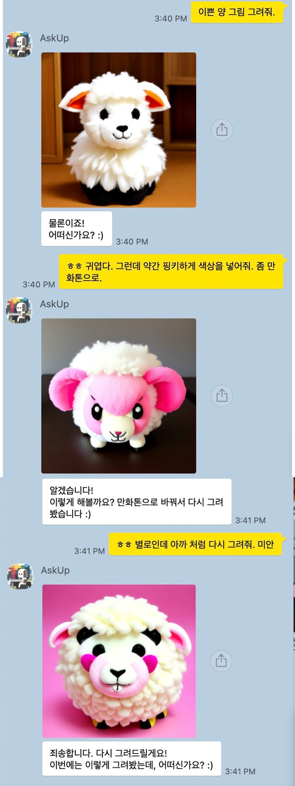
**이미지 캡션:** 이 대화는 AskUp이라는 사용자 프로필을 가진 AI 챗봇과 사용자가 주고받은 메시지를 보여줍니다. 사용자는 처음에 "이쁜 양 그림 그려줘"라고 요청했고, AI는 귀여운 하얀 양 그림을 보여주며 "물론이죠! 어떠신가요? :)"라고 답합니다. 사용자는 그림이 귀엽다고 칭찬하며 "약간 핑키하게 색상을 넣어줘. 좀 만 화톤으로."라고 수정 요청을 합니다. AI는 이를 수락하고 만화톤으로 수정한 양 그림을 보여주며 "알겠습니다! 이렇게 해볼까요? 만화톤으로 바꿔서 다시 그려봤습니다 :)"라고 말합니다. 하지만 사용자는 이번 그림이 마음에 들지 않는 듯 "ㅎㅎ 별로인데 아까 처럼 다시 그려줘. 미안"이라고 말합니다. 마지막으로 AI는 다시 사과하며 "죄송합니다. 다시 그려드릴게요! 이번에는 이렇게 그려봤는데, 어떠신가요? :)"라고 말하며 세 번째 양 그림을 보여줍니다. 각 메시지에는 시간 정보가 표시되어 있으며, 대화는 3:40 PM부터 3:41 PM까지 약 1분 동안 진행되었습니다. 전반적으로 사용자는 AI에게 양 그림을 요청하고, AI는 사용자의 피드백에 따라 그림을 수정하며 친절하게 응대하는 상황입니다.

### 4월 7일 (금) 15:58 · 📷 사진 (2장)

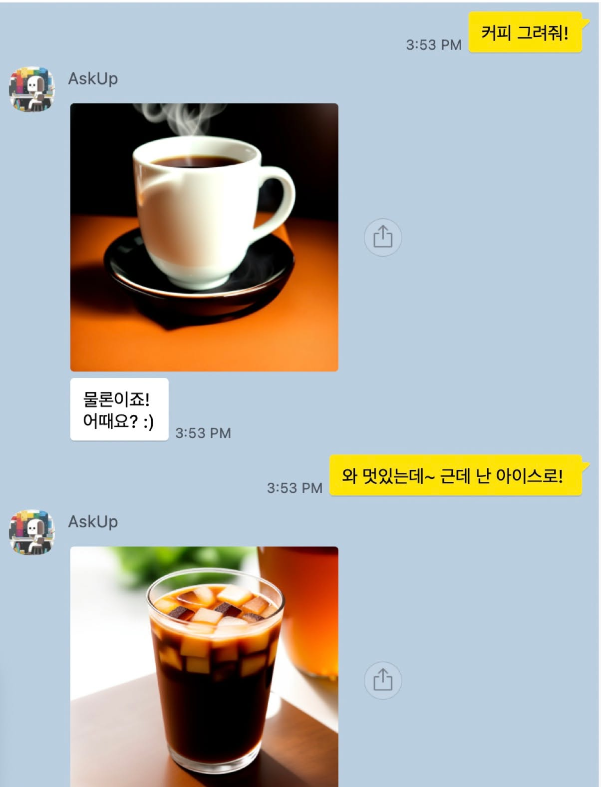
**이미지 캡션:** 이것은 채팅 앱의 스크린샷으로, 두 개의 메시지 스레드가 표시됩니다. 첫 번째 스레드에는 "AskUp"이라는 프로필 이름과 함께 뜨거운 커피 한 잔의 사진이 포함되어 있습니다. 사진 위에는 "커피 그려줘!"라는 노란색 말풍선이 있고, 그 아래에는 "물론이죠! 어때요? :)"라는 텍스트가 있습니다. 두 번째 스레드에는 "AskUp"이라는 프로필 이름과 함께 얼음이 들어 있는 아이스 커피 한 잔의 사진이 포함되어 있습니다. 사진 위에는 "와 멋있는데~ 근데 난 아이스로!"라는 노란색 말풍선이 있습니다. 두 스레드 모두 3:53 PM이라는 타임스탬프를 공유합니다. 전반적인 분위기는 캐주얼하고 친근하며, 한 사람이 다른 사람에게 커피 이미지를 요청하고 응답하는 것으로 보입니다.
 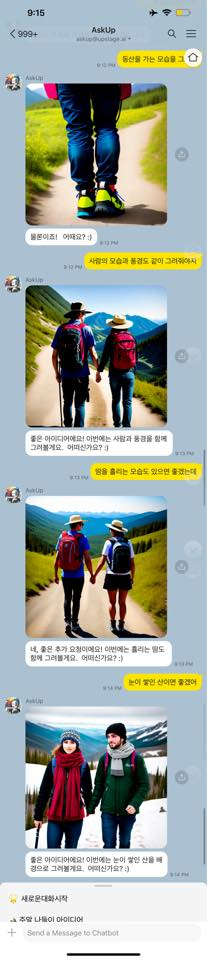
**이미지 캡션:** 이것은 AskUp이라는 앱에서 이루어진 대화로, 사용자가 챗봇에게 등산하는 모습을 그려달라고 요청하고 챗봇이 이를 반영하여 이미지를 생성하는 과정을 보여줍니다. 첫 번째 이미지에는 등산로를 걷는 사람의 발이 클로즈업되어 있으며, 파란색 청바지와 형광색 운동화를 신고 있습니다. 두 번째 이미지에는 한 쌍의 성인 남녀가 손을 잡고 산길을 걷는 모습이 담겨 있으며, 남성은 모자와 배낭을 메고 있으며 여성은 밀짚모자와 배낭을 메고 있습니다. 세 번째 이미지 역시 같은 두 사람이 손을 잡고 걷는 모습이지만, 이번에는 좀 더 가까이서 촬영되었고 배경의 산이 더 잘 보입니다. 네 번째 이미지에는 눈 덮인 산을 배경으로 두 사람이 손을 잡고 서 있는 모습이 나타나며, 남성은 모자와 목도리를 하고 있고 여성은 머리에 털모자를 쓰고 붉은색 목도리를 하고 있습니다. 각 이미지에는 챗봇이 사용자의 요청을 반영하여 이미지를 생성했음을 알리는 메시지가 함께 표시됩니다.

### 4월 8일 (토) 07:10 · 📷 사진 (2장)

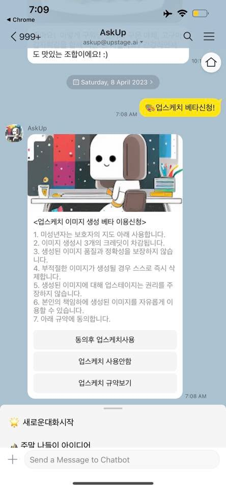
**이미지 캡션:** 이것은 스마트폰 메신저 앱의 스크린샷으로, AskUp이라는 이름의 봇과 대화하는 내용을 보여줍니다. 화면 상단에는 시간, 배터리 상태, Wi-Fi 신호, Chrome 브라우저 아이콘이 표시됩니다. 대화창에는 "AskUp"이라는 이름의 봇과 "999+"라는 알 수 없는 사용자 간의 메시지가 있습니다. 봇은 "도 맛있는 조합이에요! :)"라는 메시지를 보냈고, 사용자는 "업스케치 베타신청!"이라는 노란색 말풍선 메시지를 보냈습니다. 그 아래에는 "Saturday, 8 April 2023"이라는 날짜 표시가 있고, 그 아래에는 AskUp 봇의 프로필 사진과 함께 "업스케치 이미지 생성 베타 이용신청"이라는 제목의 메시지가 보입니다. 이 메시지에는 베타 이용 신청에 대한 7가지 규정이 나열되어 있으며, "동의후 업스케치사용", "업스케치 사용안함", "업스케치 규약보기"라는 세 개의 버튼이 있습니다. 화면 하단에는 "새로운대화시작"과 "주말 나들이 아이디어"라는 텍스트와 함께 "Send a Message to Chatbot"이라는 입력창이 보입니다. 전반적으로, 이 화면은 사용자가 이미지 생성 베타 서비스를 신청하고 관련 정보를 확인하는 상황을 보여줍니다.
 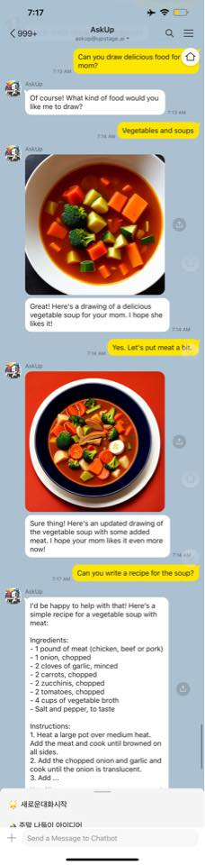
**이미지 캡션:** 이것은 챗봇과의 대화 화면으로, 사용자가 엄마를 위한 맛있는 음식 그림을 그려달라고 요청하자 챗봇은 채소 수프 그림을 보여주고, 사용자가 고기를 추가해달라고 하자 고기가 추가된 수프 그림을 보여준다. 마지막으로 사용자가 수프 레시피를 요청하자 챗봇은 재료와 조리법을 포함한 간단한 레시피를 제공한다. 대화는 한국어로 진행되며, 챗봇은 친절하고 도움이 되는 태도를 보인다.

### 4월 9일 (일) 12:34 · 챗GPT 제일 쉽게 쓰는 방법 f. 카카오톡 [압권 37화] 저희 Hwa…

챗GPT 제일 쉽게 쓰는 방법 f. 카카오톡 [압권 37화] 저희 Hwalsuk Lee CTO님 정말 멋지게 설명해주십니다. 압권입니다!!

https://youtu.be/VTLRjoEj_kQ

### 4월 15일 (토) 10:50 · #아숙업오토 #무슨오토를 먼저 만들까요?

#아숙업오토 #무슨오토를 먼저 만들까요?

아숙업 오토 기능 추가를 위해 질문 드립니다. 최근 많이 보셨겠지만 https://github.com/Torantulino/Auto-GPT 가 많은 관심을 받고 있습니다. 
* Q->GPT->A 이렇게 원턴으로 결과를 받는 것이 아니라 
* Task -> GPT -> [Plan] 을 만들어 내고 

이 Plan을 하나씩 실행해서 결과를 내줍니다. 이 Plan에는 search, db_store, gpt_call, reserve, sendmail 등 우리가 일상에서 하는 action들이 포함될수 있습니다. 

아숙업 AUTO에 서비스를 넣어 보려고 하는데. 어떤 Task가 좋을까요?

* 요즈음 GPT의 사업트랜드에 대한 보고서 작성해줘?
* 제주도 2박3일 일정으로 여행가는데 아숙업이 알아서 다 예약해줘

구체적으로 한 예를 들면 한 Task로  "요즈음 핫한 Upstage에  투자할지 말지를 결정하려고 하는데 이를 판단하기 위한 리포트를 작성해줘" 하면 

아래와 같은 plan 을 짜주고, 이를 하나씩 실행 하여 결과 보고서를 만들어 줍니다. 
—
Search for the top AI companies using the {search} tool:
{search: top AI companies}

Store the results in the database using the {db} tool:
{db: top AI companies}

Check if "Upstage" is among the top AI companies:
{gpt4: check if "Upstage" is a top AI company, context: top AI companies}

If "Upstage" is a top AI company, gather information on the company using the {search} tool:
{search: Upstage company information}

Store the information about "Upstage" in the database using the {db} tool:
{db: Upstage information}

Break down the "Upstage" information into smaller context chunks that fit within the 1K context limitation. For example, we can create separate contexts for financial data, management, products and services, competitors, and market trends.

Analyze each context chunk to determine if it's a good investment using the {gpt4} tool. For instance:

a. {gpt4: analyze financial data, context: Upstage financial data}
b. {gpt4: analyze management, context: Upstage management}
c. {gpt4: analyze products and services, context: Upstage products and services}
d. {gpt4: analyze competitors, context: Upstage competitors}
e. {gpt4: analyze market trends, context: Upstage market trends}

Assemble the analysis results and store them in the database using the {db} tool:
{db: Upstage analysis results}

Create a comprehensive report outline using the {gpt4} tool:
{gpt4: create a report outline, context: Upstage analysis results}

Break down the outline into smaller sections that fit within the 1K results limitation. For example, we can create separate sections for executive summary, financial analysis, management analysis, product and service analysis, competitor analysis, market trend analysis, and investment recommendation.

Generate content for each section of the report using the {gpt4} tool. For instance:

a. {gpt4: write executive summary, context: Upstage analysis results}
b. {gpt4: write financial analysis, context: Upstage analysis results}
c. {gpt4: write management analysis, context: Upstage analysis results}
d. {gpt4: write product and service analysis, context: Upstage analysis results}
e. {gpt4: write competitor analysis, context: Upstage analysis results}
f. {gpt4: write market trend analysis, context: Upstage analysis results}
g. {gpt4: write investment recommendation, context: Upstage analysis results}

Assemble the generated content into a comprehensive and professional report.

Present the comprehensive report and the investment recommendation.

---
잘된다면 정말 재미있는 서비스가 될것 같습니다.

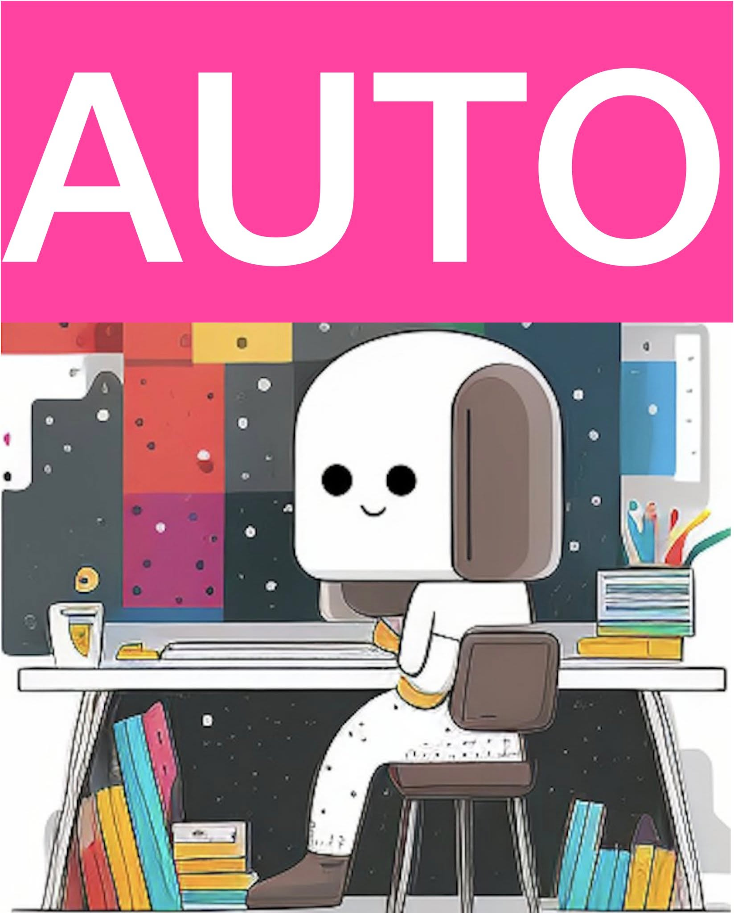
**이미지 캡션:** 분홍색 배경에 흰색으로 "AUTO"라는 글자가 크게 쓰여 있고, 그 아래에는 귀여운 캐릭터가 책상에 앉아 있는 모습이 보인다. 이 캐릭터는 흰색의 둥근 머리에 갈색 귀가 달려 있고, 검은색 점 두 개와 웃는 입 모양의 얼굴을 하고 있다. 몸통은 흰색이며, 팔은 노란색 띠로 묶여 있고, 하얀색 바탕에 검은색 점이 찍힌 바지를 입고 갈색 신발을 신고 있다. 캐릭터는 책상 앞에 앉아 키보드를 치고 있으며, 책상 위에는 키보드, 마우스, 컵, 그리고 책들이 놓여 있다. 책상 아래에는 여러 권의 책이 꽂혀 있고, 배경에는 알록달록한 색상의 격자무늬와 별이 떠 있는 듯한 그림이 그려져 있다. 전체적으로 밝고 긍정적인 분위기를 풍기는 일러스트이다.

### 4월 16일 (일) 20:19 · 📷 사진 (1장)

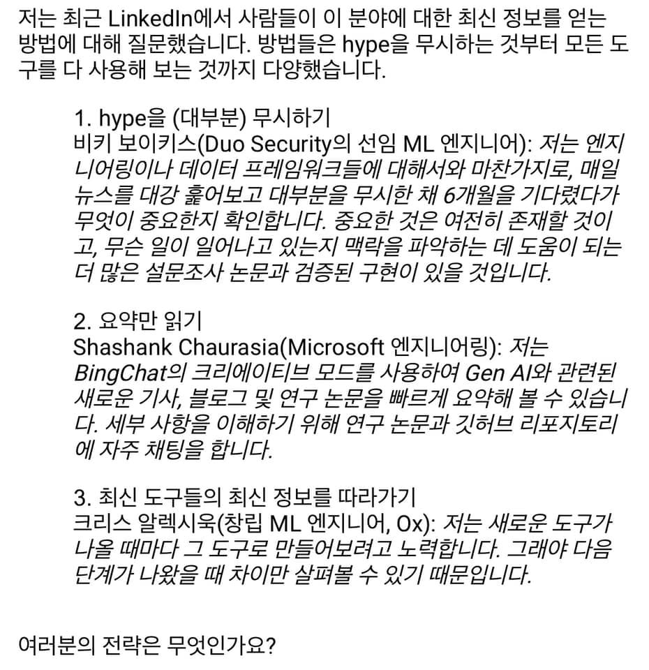
**이미지 캡션:** 이 사진은 텍스트 기반의 이미지로, 한국어로 작성된 글이 포함되어 있습니다. 글의 내용은 사람들이 최신 정보를 얻는 방법에 대한 질문에 대한 답변으로, 세 가지 전략을 제시하고 있습니다. 첫 번째 전략은 'hype을 (대부분) 무시하기'로, Duo Security의 선임 ML 엔지니어가 매일 뉴스를 훑어보고 대부분을 무시한 채 6개월을 기다렸다가 중요한 것을 확인하는 방법을 설명합니다. 두 번째 전략은 '요약만 읽기'로, Microsoft 엔지니어링의 Shashank Chaurasia가 BingChat의 크리에이티브 모드를 사용하여 Gen AI 관련 기사, 블로그, 연구 논문을 요약하고, 세부 사항 이해를 위해 연구 논문과 깃허브 리포지토리에 자주 채팅하는 방법을 설명합니다. 세 번째 전략은 '최신 도구들의 최신 정보를 따라가기'로, 창립 ML 엔지니어인 Chris Alexiuk가 새로운 도구가 나올 때마다 직접 만들어보며 다음 단계가 나왔을 때 차이점을 살펴보는 방법을 설명합니다. 마지막으로 "여러분의 전략은 무엇인가요?"라는 질문으로 마무리됩니다. 이미지 자체에는 사람, 장소, 사물, 텍스트 외의 시각적 요소는 없습니다. 전반적으로 정보 공유 및 토론을 유도하는 텍스트 콘텐츠입니다.

### 4월 19일 (수) 16:11 · MS행사 @북촌 너무 멋지고 기대됩니다. 오시는 분들 반갑게 뵙겠습니다.

MS행사 @북촌 너무 멋지고 기대됩니다. 오시는 분들 반갑게 뵙겠습니다.

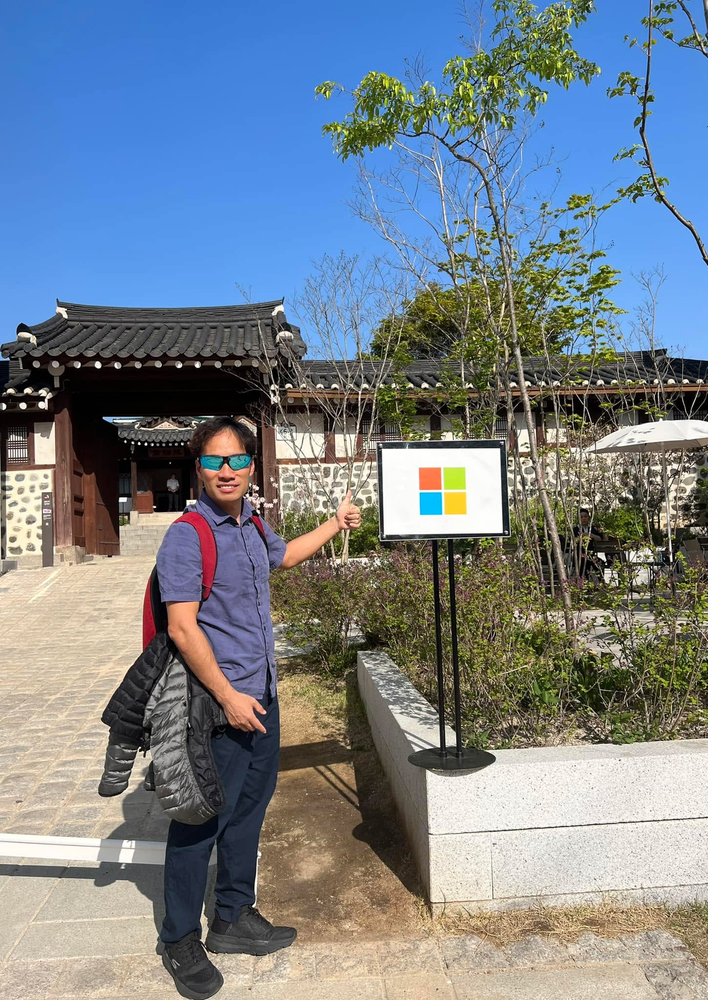
**이미지 캡션:** 푸른 하늘 아래, 한 성인 남성이 한국 전통 건축물 앞에서 마이크로소프트 로고가 그려진 표지판을 가리키며 엄지손가락을 치켜들고 있다. 남성은 40대 정도로 보이며, 파란색 반팔 셔츠에 남색 바지를 입고 있으며, 어깨에는 빨간색 백팩을 메고 있다. 셔츠 위에는 회색 패딩 점퍼를 걸치고 있다. 선글라스를 착용하고 있으며, 얼굴에는 미소를 띠고 있다. 배경에는 검은 기와지붕과 돌담으로 이루어진 전통 가옥이 보이며, 그 앞에는 푸른 잎이 돋아나는 나무와 관목들이 심어져 있다. 표지판은 검은색 기둥에 세워져 있으며, 흰색 바탕에 빨간색, 파란색, 초록색, 노란색 사각형으로 이루어진 마이크로소프트 로고가 선명하게 보인다. 전체적으로 화창한 날씨 속에서 즐거운 분위기를 연출하고 있다.

### 4월 24일 (월) 19:29 · #ICDAR4종목1위 세계 최고 권위의 AI OCR 경연 대회인 ICDA…

#ICDAR4종목1위 세계 최고 권위의 AI OCR 경연 대회인 ICDAR 2023 대회에서 Upstage는  놀라운 성과를 달성했습니다! 아마존, 알리바바, N사, AntGroup, 화웨이와 같은 글로벌 기업들과 격돌한 결과, Upstage OCR과 NLP Parsing은 네 개의 부문에서 모두 높은 점수로 압도적인 1위를 거뒀습니다. 뿐만 아니라, 저희 홍콩과기대 RA 팀이 Upstage의 지도를 받아 2, 3, 4위를 차지하는 성과를 거두었으며, 이 팀의 핵심 멤버들은 앞으로 Upstage에 합류할 예정입니다.

Upstage는 이를 통해 세계 최고의 기술을 활용하여 여러분의 문서에서 필요한 key-value 및 정형화된 데이터를 정확하게 추출해 드립니다. 세계 최고의 OCR 기술을 경험하고 싶다면, 지금 바로 Upstage를 찾아주세요!

https://icdar2023.org/program/competitions/

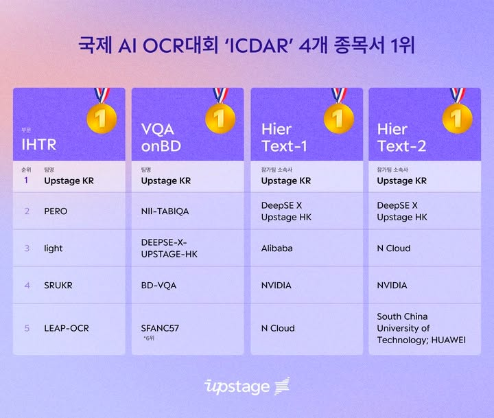
**이미지 캡션:** 이 이미지는 국제 AI OCR 대회 'ICDAR'에서 Upstage KR 팀이 4개 종목에서 1위를 차지했음을 보여주는 표입니다. 표는 보라색 배경에 흰색 글씨로 구성되어 있으며, 각 종목별 순위와 팀명, 참가팀 소속사가 명시되어 있습니다. 각 종목의 1위에는 금메달 아이콘이 함께 표시되어 있습니다. 표 상단에는 "국제 AI OCR대회 'ICDAR' 4개 종목서 1위"라는 제목이 한국어로 적혀 있습니다. 표 하단에는 Upstage 로고가 흰색으로 표시되어 있습니다. 이 이미지는 AI 기술 경쟁에서의 성과를 시각적으로 전달하는 정보성 콘텐츠입니다.

### 4월 25일 (화) 21:28 · 📷 사진 (1장)

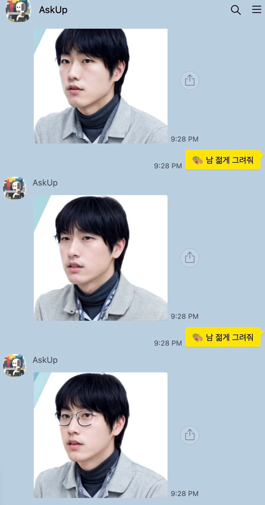
**이미지 캡션:** 이것은 AskUp이라는 이름의 사용자가 보낸 메시지 대화 화면으로, 세 개의 사진과 함께 "남 젊게 그려줘"라는 텍스트 메시지가 표시됩니다. 각 사진에는 검은색 머리카락을 가진 젊은 성인 남성이 등장하며, 첫 번째와 두 번째 사진에서는 안경을 착용하지 않았고 회색 재킷과 터틀넥을 입고 있습니다. 세 번째 사진에서는 같은 남성이 안경을 쓰고 있으며, 표정은 약간 놀란 듯하거나 무표정합니다. 배경은 흰색으로, 사진은 상반신만 보입니다. 각 메시지에는 9:28 PM이라는 타임스탬프가 찍혀 있으며, 노란색 말풍선에는 그림 이모티콘과 함께 "남 젊게 그려줘"라는 문구가 한국어로 적혀 있습니다. 전반적으로, 이 화면은 사용자가 사진 속 남성의 젊은 버전을 요청하는 상황을 보여줍니다.

### 4월 26일 (수) 07:59 · Upstage 권순일 사업총괄의 아숙업 인터뷰, 실제 사진도 찍어 올려보…

Upstage 권순일 사업총괄의 아숙업 인터뷰, 실제 사진도 찍어 올려보고 아숙업이 추천하는 커피집도 직접 가보는 아숙언과 함께하기 시연입니다. 재미있습니다. ^^ 

https://news.mtn.co.kr/news-detail/2023042116375157503

🎬 동영상 1개 (생략)

### 4월 27일 (목) 09:01 · #모두를위한ChatgxtUP(유료)

#모두를위한ChatgxtUP(유료) 

https://www.upstage.ai/chatgpt-lecture 

하루가 다르게 쏟아지는 AI 그리고 ChatGPT 관련 트렌드를 한 번에 이해하고, 실무에 활용하고 나아가 관련 Application으로 응용해 볼 수 있는 총 4강 (약 10시간) 유료 강의를 마련했습니다. 모두를 위한 쉽고 재미있는, 그리고 강의 후 무엇보다 바로 사용할 수 있는 실용성에 초점을 맞추어 강의를 설계했습니다.

Upstage, MS 양파님 등 실제 AI를 만들고, ChatGPT를 업무에 적용하고, 아숙업 90만 사용자를 위한 서비스를 만들면서 알게 된 지식과 노하우도 함께 담았습니다. ChatGPT에서 가장 중요한 Prompt Engineering 최고의 전문가와 함께 깊게 다루어 ChatGPT 100% 이상 활용하는 방법을 배울 수 있습니다. 더 나아가 AutoGPT과 같은 GPT의 채인 사용과 아숙업과 같은 실제 서비스를 만드는 방법도 다루어 깊이를 더했습니다.

많은 신청 부탁드립니다. (강의 수익은 아숙업 개발과 운영비용으로 사용됩니다. AKA 아숙업구하기)

* Session 1. 박은정 (Upstage CSO, 전 네이버 파파고 모델리더), 이활석 (Upstage CTO, 전 네이버 클로바 VisualAI 리더)
Large Language Model (LLM) / ChatGPT 의 큰 그림 이해하기 (이론 & 트렌드)

* Session 2. 양파님 (Copilot Applied AI Engineering team @Microsoft)
나만의 AI 기술로 만드는 노하우, ChatGPT Deep Prompt Engineering & LangChain

* Session 3. 김상훈 (Upstage AI Challenges Team Lead, Kaggle Grand Master)
나만의 자비스, AutoGPT 로 업무와 일상생활 문제 해결하기

* Session 4. Sung Kim (Upstage Founder & CEO, 모두를 위한 딥러닝 강사)
ChatGPT Applications 직접 만들어보기

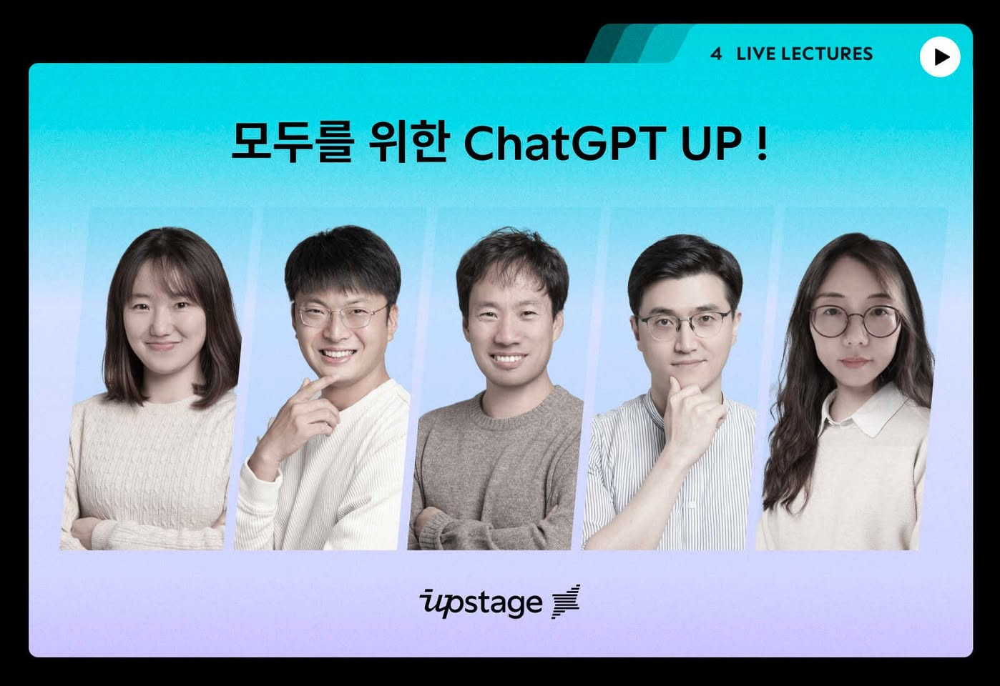
**이미지 캡션:** 이 사진은 다섯 명의 젊은 성인 남녀가 나란히 서서 카메라를 응시하는 모습입니다. 왼쪽부터 첫 번째 여성은 20대 초반으로 보이며, 짧은 단발머리에 흰색 니트 스웨터를 입고 부드러운 미소를 짓고 있습니다. 두 번째 남성은 20대 후반으로, 검은색 머리에 안경을 쓰고 흰색 니트 스웨터를 입고 손가락으로 턱을 괴고 있습니다. 세 번째 남성은 30대 초반으로, 짧은 머리에 회색 라운드넥 스웨터를 입고 자연스러운 미소를 짓고 있습니다. 네 번째 남성은 20대 후반으로, 검은색 머리에 안경을 쓰고 줄무늬 셔츠를 입고 턱을 괴고 있습니다. 마지막 여성은 20대 중반으로, 긴 생머리에 흰색 블라우스를 입고 안경을 쓰고 정면을 응시하고 있습니다. 배경은 밝은 하늘색 그라데이션으로, 상단에는 "4 LIVE LECTURES"라는 문구와 함께 재생 버튼 모양의 아이콘이 있습니다. 중앙에는 "모두를 위한 ChatGPT UP !"이라는 한국어 문구가 검은색으로 쓰여 있습니다. 하단에는 "upstage"라는 로고가 보입니다. 전체적으로 밝고 긍정적인 분위기이며, 온라인 강의나 발표회와 관련된 행사임을 암시합니다.

### 4월 28일 (금) 14:16 · #1위2위동시공급 #OCR팩

#1위2위동시공급 #OCR팩 

Upstage는 한화생명에 이어 삼성생명에 금융 특화 AI 솔루션 ‘OCR 팩’ 공급하게 되었습니다. 이로써 업계 1위와 2위 생명보험사 동시에 OCR을 공급하는 회사가 되었습니다. 매우 기쁜 날입니다.

둘 다 치열한 경쟁 입찰을 거쳤고, 결국은 압도적인 성능 차이의 Upstage 가 선정되었습니다.

OCR 관련 필요하신 분들은 망설임 없이 http://upstage.ai/contact-us 연락 주시면 최고의 성능으로 고객만족, 서비스 만족을 드리도록 하겠습니다.

https://n.news.naver.com/mnews/article/366/0000897508?sid=105

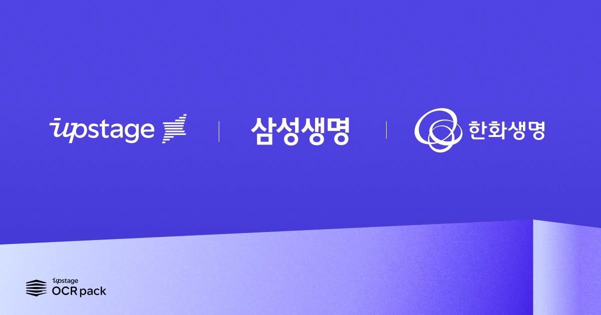
**이미지 캡션:** 이 이미지는 파란색 배경에 세 개의 로고와 텍스트가 나열되어 있습니다. 왼쪽에는 "upstage"라는 로고와 함께 겹쳐진 여러 개의 선으로 이루어진 아이콘이 있습니다. 가운데에는 세로선으로 구분되어 "삼성생명"이라는 텍스트가 흰색으로 표시되어 있습니다. 오른쪽에는 동그라미가 겹쳐진 모양의 로고와 함께 "한화생명"이라는 텍스트가 흰색으로 표시되어 있습니다. 이미지 하단에는 보라색과 흰색이 그라데이션으로 이루어진 면이 있으며, 이 면 위에는 왼쪽 하단에 "upstage OCR pack"이라는 텍스트와 함께 쌓여 있는 듯한 모양의 아이콘이 있습니다. 전체적으로 깔끔하고 현대적인 디자인이며, 기업 간의 협력이나 파트너십을 나타내는 것으로 보입니다. 사람이나 구체적인 행동은 보이지 않으며, 로고와 텍스트 정보가 주를 이룹니다.

### 4월 30일 (일) 16:52 · 📷 사진 (1장)

**이미지 캡션:** 이 이미지는 대화창의 일부를 보여주며, 오렌지색 말풍선 아이콘과 함께 "Too much traffic, please try again."이라는 영어 문구가 표시되어 있습니다. 말풍선 안의 아이콘은 당황하거나 놀란 표정을 짓고 있는 것으로 보입니다. 그 아래에는 "Alpaca에게 넣어서 테스트하"라는 한국어 문구가 흐릿하게 보입니다. 배경은 연한 분홍색으로, 전체적으로 메시지 알림이나 오류 메시지가 표시된 화면의 일부인 것으로 추정됩니다. 사람의 모습은 보이지 않으며, 보이는 텍스트는 영어와 한국어로 구성되어 있습니다. 분위기는 기술적인 문제로 인해 서비스 이용에 어려움이 있음을 알리는 다소 부정적인 상황을 나타냅니다.
