# 2023년 5월

[← 2023년](README.md)

### 5월 1일 (월) 13:16 · #아숙업식단 #두잉랩 #찍고먹고

#아숙업식단 #두잉랩 #찍고먹고 

이제 아숙업으로 음식 사진만 올려도 여러분의 건강과 식단 관리가 가능합니다. 음식을 보고 정보를 바로 알려주고, (식단) 음식 기록을 할 수 있고, 사랑이 담긴 조언도 해줍니다. (피자먹었다고 혼나는 중입니다. ㅋㅋ)

지금부터 바로 음식을 올려보세요. 업업업!!! (아직 아숙업 친구가 아니라면 https://pf.kakao.com/_BhxkWxj 친추 부탁)

서비스 후기: 이 기능은 두잉 랩의 FoodLens API를 사용하여 제공이 됩니다. https://foodlens.ai/ 대표님 뵙고 간단히 아이디어를 말씀드렸더니, "바로 해봅시다!"로 시동이 걸렸고, 이어 북한산 달리기를 통해 협의를 마친 다음, 번개의 속도로 협약, 공동 개발, 그리고 서비스 출시까지, 정말 최고 속도로 진행되었습니다. 정말 멋진 진송백 대표님께 큰 감사드립니다.

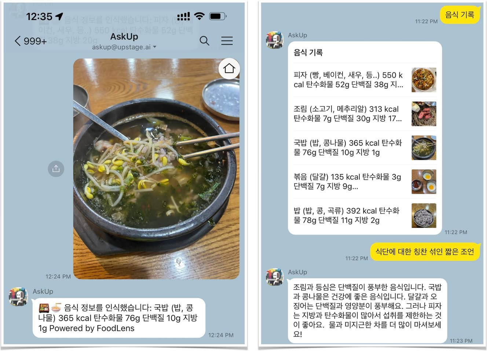

### 5월 5일 (금) 08:14 · #AskUpGlobal #100만 #Line

📍 Guangzhou, China

#AskUpGlobal #100만 #Line
곧 100만 가입자를 앞두고 있는 AskUp이 Line을 타고 글로벌 일본, 태국, 대만을 진출합니다. 그동안 AskUp 사용자들의 피드백을 통해 다양한 prompt engineering의 시도, 대화형 이미지 생성, 물음표 검색, 링크 요약, 식단 조언등 모든 멋진 기능들을 라인에 탑재합니다. 

그리고 라인의 다국어 기능을 통해 각 사용자가 설정한 본인의 언어인 영어, 한국어, 일어 등으로 답변을 할 수 있습니다. 

이제 글로벌 메신저의 AI 친구가 될 AskUp 많이 사용해 주세요! 
 https://liff.line.me/1645278921-kWRPP32q/?accountId=130glmtp

### 5월 6일 (토) 13:11 · #AskUp강의 #AskUpTelegram #StreamOn

#AskUp강의 #AskUpTelegram #StreamOn 
모두를 위한 ChatGPTUp 강의에 사용할 AskUp Telegram을 만들고 있습니다. Telegram은 보낸 메시지를 update 할 수 있어서 ChatGPT Web interface처럼 stream on으로 느린 ChatGPT를 조금 더 빠르게 느끼면서 사용할 수 있습니다.

이를 위한 코드 (2번째 코드 스크린샷)도 'bot.edit_message_text' 한 줄이면 되어서 아주 간단하고 쉽습니다.

https://www.upstage.ai/chatgpt-lecture 강의에서 자세하게 다룰 예정입니다. 많은 관심 부탁드립니다.

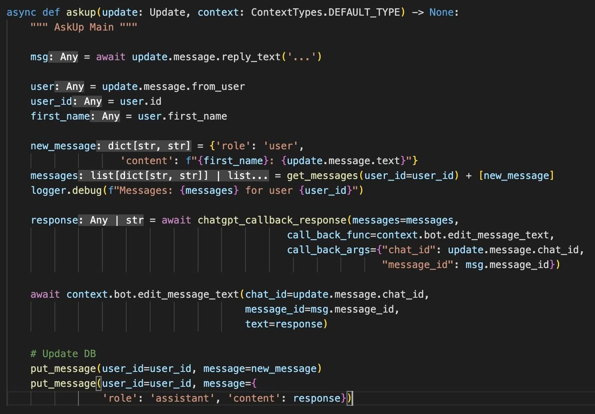 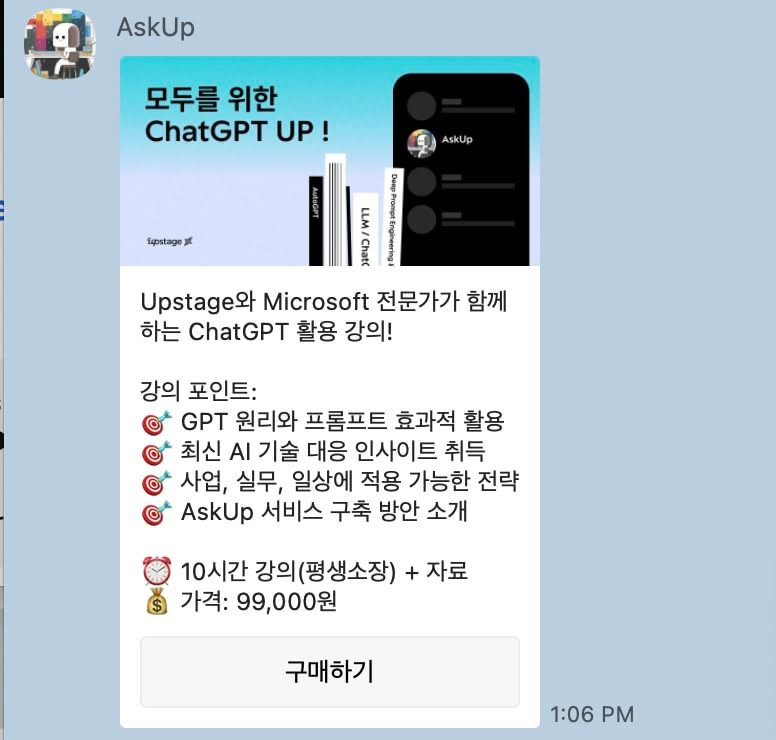

🎬 동영상 1개 (생략)

### 5월 6일 (토) 16:20 · 📷 사진 (2장)

 

### 5월 10일 (수) 16:18 · #강의티저 #모두를위한GPTUp #유료강의

#강의티저 #모두를위한GPTUp #유료강의
ChatGPT 로 100만 사용자 서비스를 만들어 본 팀의 노하우가 담긴 원리와 트렌드를 이해하고 서비스까지 직접 만들어보는 실전 강의의 티저 1 만들어 보았습니다.

전문가 라이브 강의 4회 + 녹화 영상 + 강의 자료 + 실습 코드 / 99,000₩

📣 강의신청: https://bit.ly/4129pJV
(결제와 강의보기 등은 fastcampus 시스템을 이용합니다.)

🎬 동영상 1개 (생략)

### 5월 11일 (목) 11:57 · #재미난읽을거리

#재미난읽을거리
Google I/O 2023 is a wrap — here’s a list of everything announced

https://techcrunch.com/2023/05/10/heres-everything-google-has-announced-at-i-o-so-far/

정말 재미난것이 많습니다.
* PaLM 2: GPT3.5와 4랑 비교해볼수 있습니다. https://bard.google.com/
* Workspace: 에도 많은 LLM applications
* 맥락 이해하는 검색 
* Codey: 코드 완성
* Firebase: Chat, Summary, etc. APIs

와 정말 구글도 속도를 내기 시작합니다.

### 5월 12일 (금) 12:27 · #100만 #AskUp

#100만 #AskUp
정말 많은 분들의 관심으로 AskUp이 100만 친구를 넘어섰습니다.

유료 광고 없이, 여러분들이 많이 사용해 주시고 소문 내주셔서 달성한 100만이라 더 소중하고 값진 것 같습니다.

또한 지난 한 달간 (메뉴 제외) 가장 많이 들어온 3가지 키워드는 바로
1. 안녕
2.👍
3. 고마워

였습니다. 그만큼 많은 분들이 AskUp을 사랑해주셔셔 좋습니다.

더 달려서 300만 500만, 천만, 그리고 전국민으로 달리고, 추가로 라인을 통해 글로벌로도 더 달려보겠습니다.

너무 기분 좋은 감사한 날입니다!

(이 글을 보시는 분 중 아직 AskUp 친구가 아니시라면 http://askup.upstage.ai/ 고고!)

 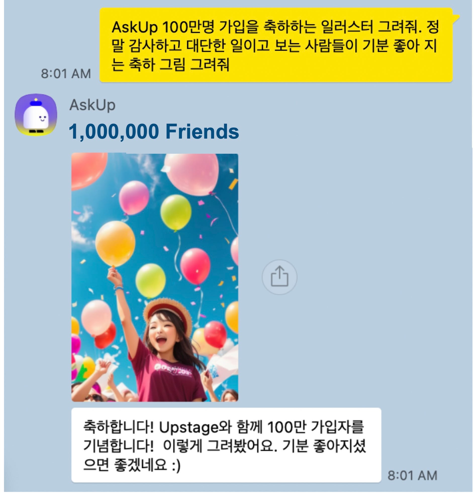

### 5월 14일 (일) 14:42 · #chatgpt_askup_search_plugin

#chatgpt_askup_search_plugin 
어제부터 chatgpt plugin access를 받고 무엇을 만들지 생각하다 우리가 관심많은 블로그나 맛집이나 뉴스 같은 것을 검색하는 간단한 AskUp Plug-in을 만들고 승인을 신청하였습니다. (14일 정도 걸린다고 하네요.)

https://askup-plugin.sung.devstage.ai  를 아래 설치 과정에 입력하시면 테스트 가능하십니다. (개발자 15명만 등록이 된다고 하니 다 차면 코드를 받아 직접 서버를 돌려보시면 동작할 것입니다.)

https://github.com/hunkim/chatgpt-askup-search-plugin

GPT Plug-in은 GPT에서 툴을 들려주는 것과 같다고 설명한 글이 기억 납니다. GPT가 잘 못하는 기능을 이런 이런 툴을 사용해서 물어보고 답을 해줘. 즉 일반 답을 잘하는 GPT가 영화에 대해 물어 보면 영화를 잘아는 전문가에게 물어서 그 답을 요약해서 전달해 주는 것인데요. 이 복잡한 ai-plugin.json이 영화에 대해 물으려면 누구 (어떤 API)에게 물어야 하는지, 어떻게 물어야 하는지 (openapi.yaml) 알려주시면 GPT가 주소를 상당히 잘 찾는것 같습니다.

어떤 Plug-in이 좋을까요? 이게 큰 고민거리 같습니다.

그리고 https://swagger.io/specification/ 양식의 openapi.yaml 파일을 작성하는 것은 상당히 귀찮은 일인데 이건 FastAPI doc나 코드의 일부

@app.get("/search/news", response_model=dict, summary="News search")

등을 쭉 나열하고 작성하라고 GPT에게 시키면 아주 잘합니다. ^^ (Minho Hwang 님 비디오에서 배웠습니다.)

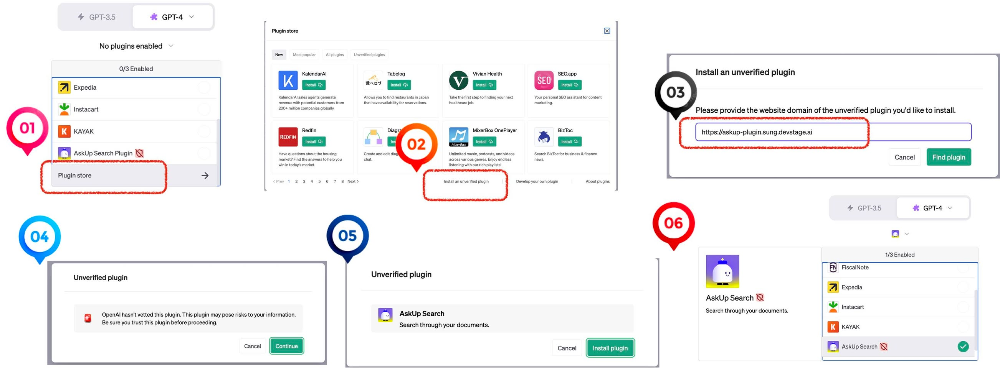 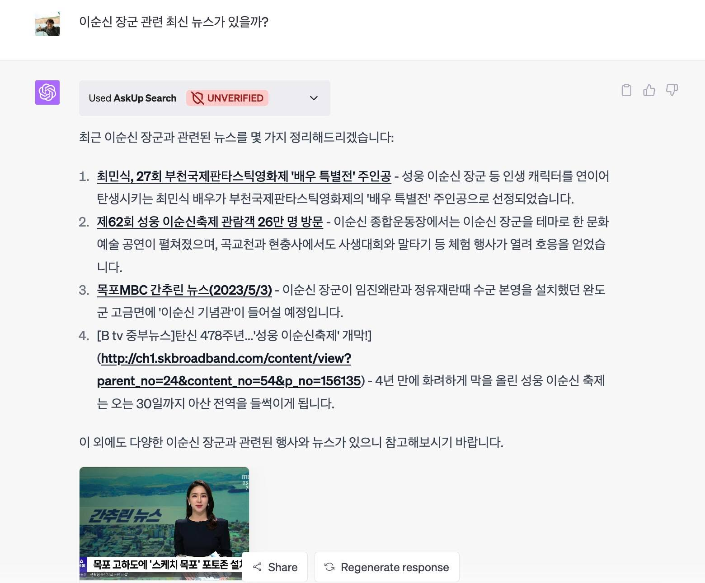 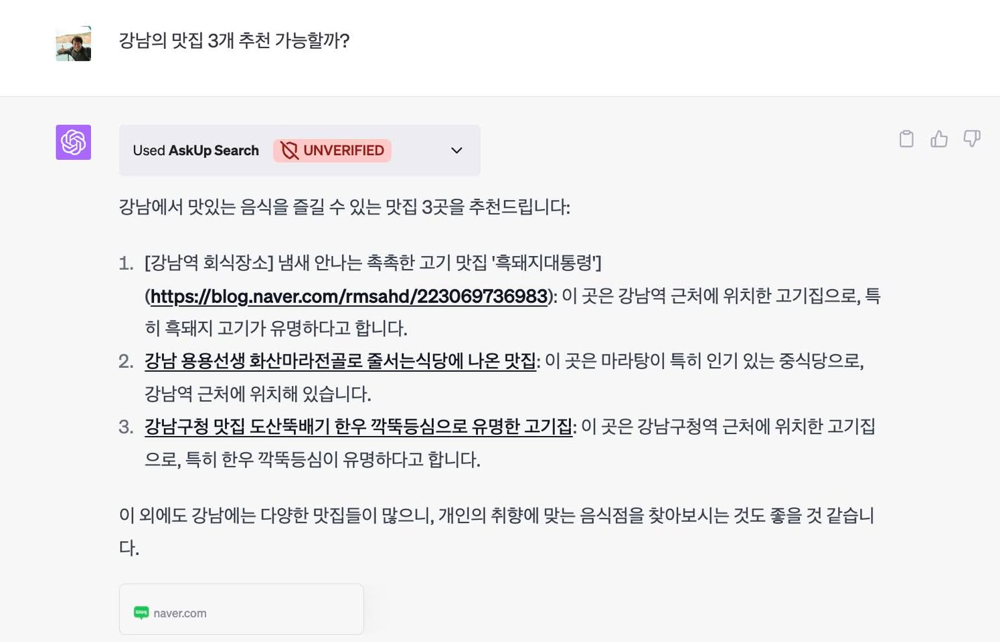

### 5월 14일 (일) 14:56 · 📷 사진 (3장)

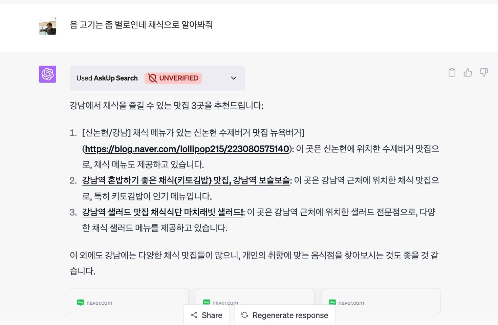 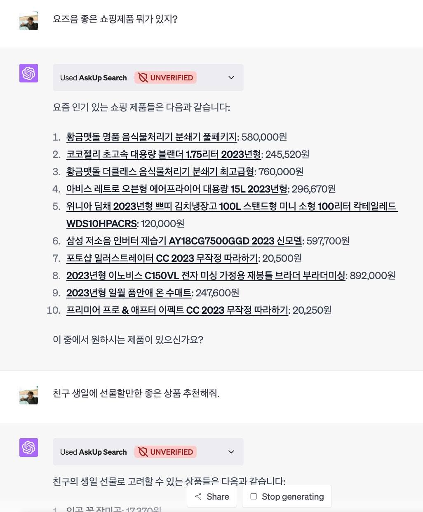 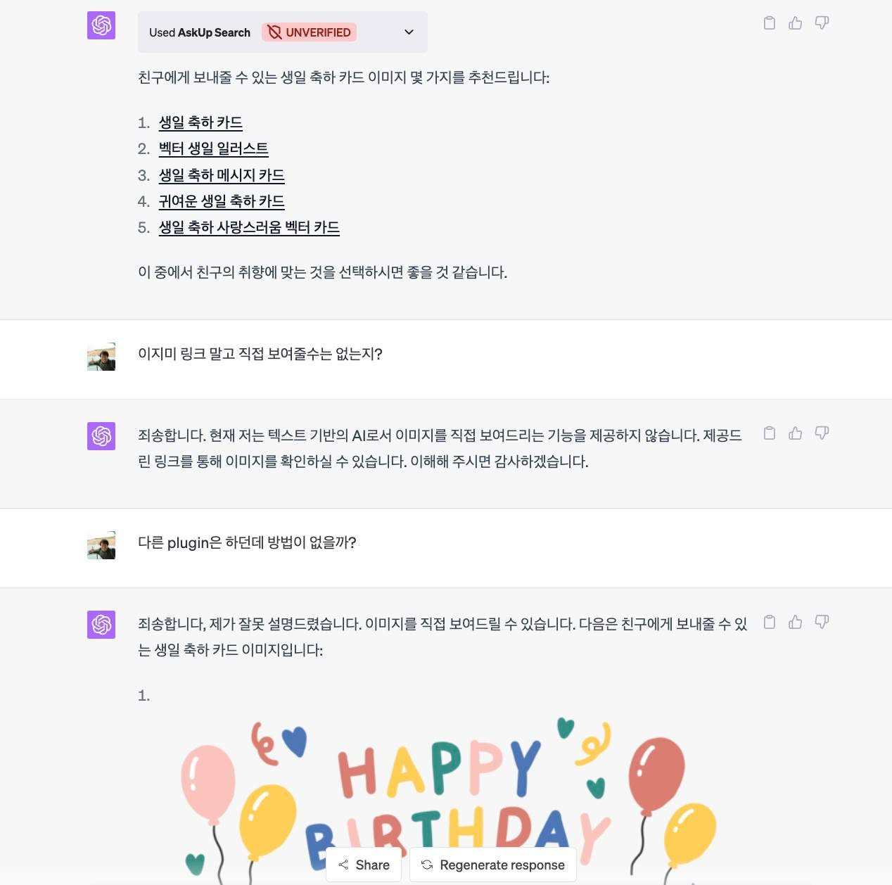

### 5월 16일 (화) 21:14 · #강의티저2 #모두를위한GPTUp #유료강의

#강의티저2 #모두를위한GPTUp #유료강의

저도 개인적으로 너무 기대하는 Yangpa 님의 세션 2 강의 티저입니다. 양파 님 뵙고 저희도 prompt engineering에 대해 완전히 다시 생각하는 계기가 되었고 이후 멋진 서비스들을 많이 만들고 있습니다. 정말 AI에게 정확하게 일을 시키는 prompt engineering 강의의 끝판왕이 될 것입니다.

--- 
전문가 라이브 강의 4회 + 녹화 영상 + 강의 자료 + 실습 코드 / 99,000₩
📣 강의신청: https://bit.ly/4129pJV
(결제와 강의보기 등은 fastcampus 시스템을 이용합니다.)

🎬 동영상 1개 (생략)

### 5월 17일 (수) 06:25 · 오늘 (5월 17일) 아침 7:10분에 멋진 2분 발표가 있습니다. 유툽…

오늘 (5월 17일) 아침 7:10분에 멋진 2분 발표가 있습니다. 유툽으로도 온라인 생중계 예정이니 https://www.youtube.com/watch?v=MqKO4sSe-Z0&ab_channel=%EB%8F%84%EC%A0%84%EA%B3%BC%EB%82%98%EB%88%94 참고 부탁드립니다. 저도 잠시 발표할 예정입니다. 

오시는 분들 반갑게 뵙겠습니다.

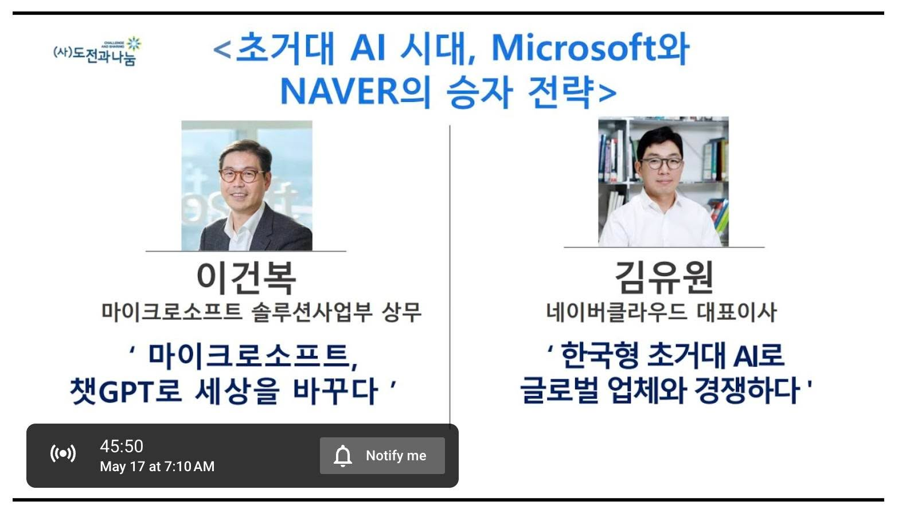

### 5월 20일 (토) 13:16 · #화악산 언제나 힘들지만, 힘든만큼 성취감은 최고! 그리고 무엇보다 좋은…

#화악산 언제나 힘들지만, 힘든만큼 성취감은 최고! 그리고 무엇보다 좋은 분들과 함께 해서 너무 행복합니다. 업업업!!!

### 5월 20일 (토) 19:37 · #강의티저3 #AutoGPT #모두를위한GPTUp #유료강의

#강의티저3 #AutoGPT #모두를위한GPTUp #유료강의

정말 요즈음 최고의 인기를 얻고 있는 AutoGPT. 하나의 질문 답변이 아니라 order를 내릴수 있습니다. 그럼 GPT는 

1. 그 목적을 이루기 위해 Plan을 짜고
2. 각각의 Plan을 수행하고
3. 수행 결과를 종합하여 알려줍니다.

마치 우리가 일하는것과 유사한 방식입니다. AutoGPT가 잘 돌아가게 하기 위해 저희들이 Plan에 사용될 많은 action도 추가했고, gpt3.5를 사용하기 위한 상당한 prompt 작업도 했습니다. 수업때 자세히 말씀드리겠습니다.

또한 이 AutoGPT는 어떻게 보면 분석과 그리고 어느정도 의사결정까지 할수 있어서 여러 활용도가 있을것 같습니다. 이부분도 다룰 예정입니다.

강의에서 뵙겠습니다. 
--- 
전문가 라이브 강의 4회 + 녹화 영상 + 강의 자료 + 실습 코드 / 99,000₩
📣 강의신청: https://bit.ly/4129pJV
(결제와 강의보기 등은 fastcampus 시스템을 이용합니다.)

🎬 동영상 1개 (생략)

### 5월 23일 (화) 14:24 · #emergence #눈떤뉴런 #유료강의

#emergence #눈떤뉴런 #유료강의

#모두를위한GPTUp 강의에서 Lucy Park  가 설명해주시는 GPT가 어떻게 나오게 되었고 그 뉴런 하나가 감성을 이해하는 그 emergence 를 설명합니다. 

저도 너무 재미있게 들은 부분이라 이 부분만 공개 합니다. 이 이야기 들으면서 앞으로 정말 어떤 세상이 펼쳐질지 너무 궁금해졌습니다.

함께 더 멋진 AI, 세상 만들어 봐요.

--
어제 첫 강이 시작되었지만 마지막 강의인 6월 12일까지 등록을 받고 있습니다. 전문가 라이브 강의 4회 + 녹화 영상 + 강의 자료 + 실습 코드 / 99,000₩
📣 강의신청: https://bit.ly/4129pJV
(결제와 강의보기 등은 fastcampus 시스템을 이용합니다.)

🎬 동영상 1개 (생략)

### 5월 24일 (수) 12:11 · 어제 밤에 나온 ms 빌드 7분 요약. 재미있는 것이 많습니다. Wind…

어제 밤에 나온 ms 빌드 7분 요약. 재미있는 것이 많습니다. Windows에 copilot이 바로 들어오네요. 맥 사용자인데 처음으로 윈도우로 갈아타야 하나 생각이 들었습니다. 

무엇보다 부러운 것은 안정적인 서비스를 많이 가지고 있는 대기업인 MS와 빠른 실행력과 뛰어난 기술을 가진 스타터업인 OpenAI의 환상적인 협업입니다. 

개인적으로도 대기업 생활 조금해봤고 스타터업 막 시작해서 달리는 입장에서 이보다 더 아름다운 협업방식이 있을까 생각될정도로 가장 아름답고 멋진 협업 같습니다. 대기업의 어려운점, 스타트업의 힘든점을 장점으로 바꾸어 큰 시너지를 내고 있는것 같습니다. 

7분 영상: https://youtu.be/6PRiAexITSs

### 5월 26일 (금) 10:31 · 📷 사진 (1장)

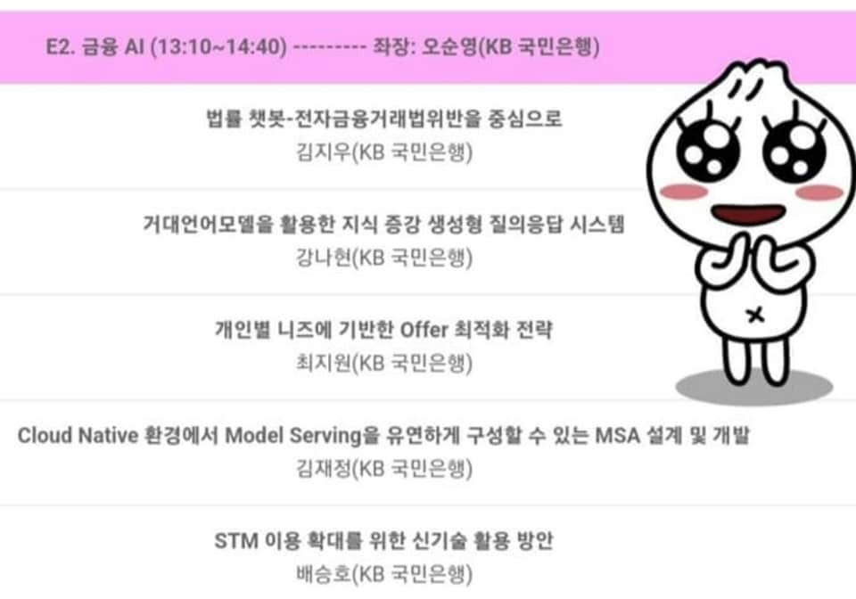

### 5월 27일 (토) 10:23 · #첫화면 #큰변화 아이폰의 첫 락 화면에 제가 주로 사용하는 엡들을 넣어…

#첫화면 #큰변화 아이폰의 첫 락 화면에 제가 주로 사용하는 엡들을 넣어두고 사용하는 편인데요. 최근들어 ChatGPT가 들어오면서 큰 변화들이 일어났습니다. 

다른거 다 빼고 일정과 AskUp에 들어가는 카카오톡, 그리고 오픈AI 공식 엡입니다. 

ChatAI로 더 많은 것을 하는 세상이 다가오고 있는것 같습니다.

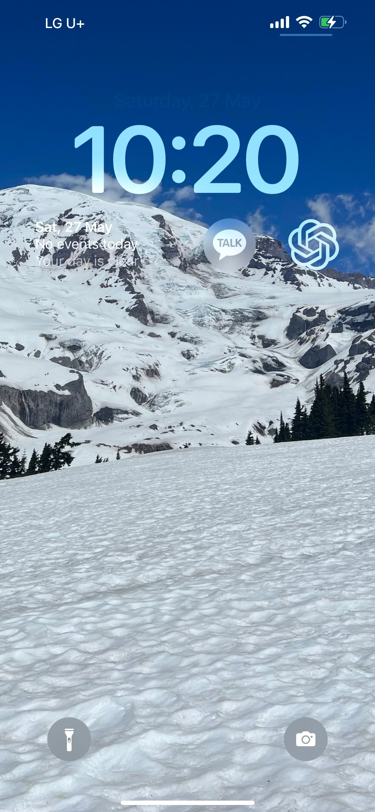

### 5월 27일 (토) 10:29 · 📷 사진 (3장)

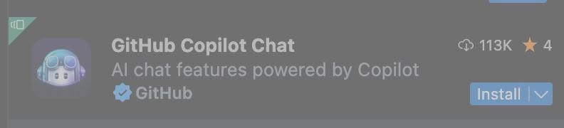 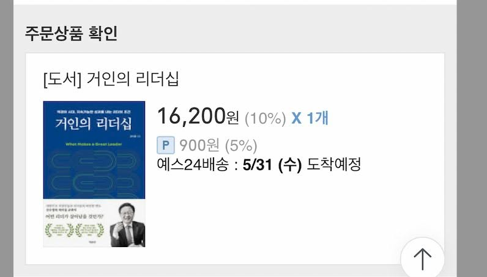 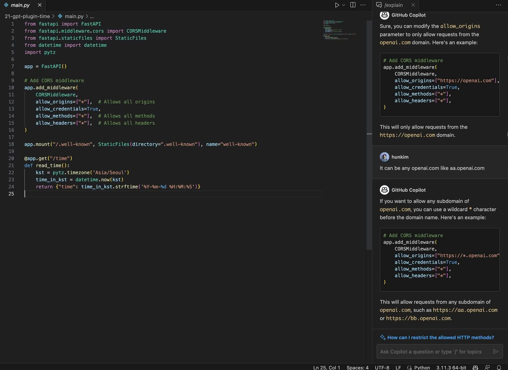

### 5월 27일 (토) 12:42 · GPT/LLM관련 단 하나의 영상을 볼수 있다면 저는 주저없이 이 영상을…

GPT/LLM관련 단 하나의 영상을 볼수 있다면 저는 주저없이 이 영상을 추천할 것입니다. https://youtu.be/bZQun8Y4L2A

MS Build 2023에서 Andrej Karpathy가 GPT와 LLM에 대해 이야기한 단 42분의 영상인데 많은 것을 담고 있습니다. 제가 인상 깊었던 것은 아래 4가지 (4장의 슬라이드) 입니다.

1. 전반적인 GPT학습단계 설명
2. RM등 PPO등에 대한 조금더 자세한 설명
3. RLHF는 아직 연구영역이고 (잘 안된다는경험)
4. GPT/LLM 어플이케이션 만들때 일단 GPT4로 성능나오는지 보고 갈아끼우는 전략을 사용해라 -- 딱 저희가 하는 방식

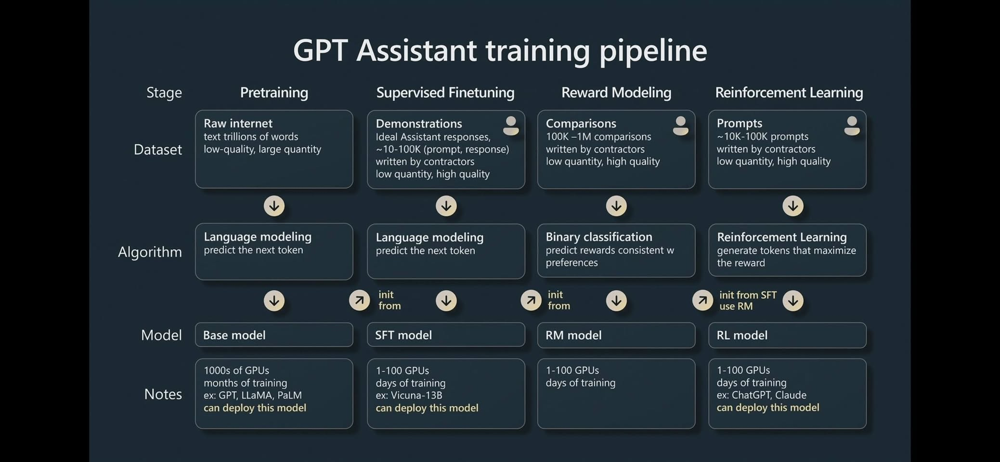 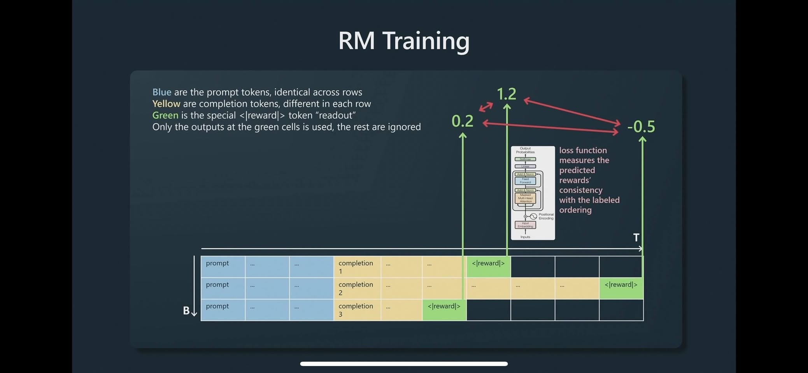 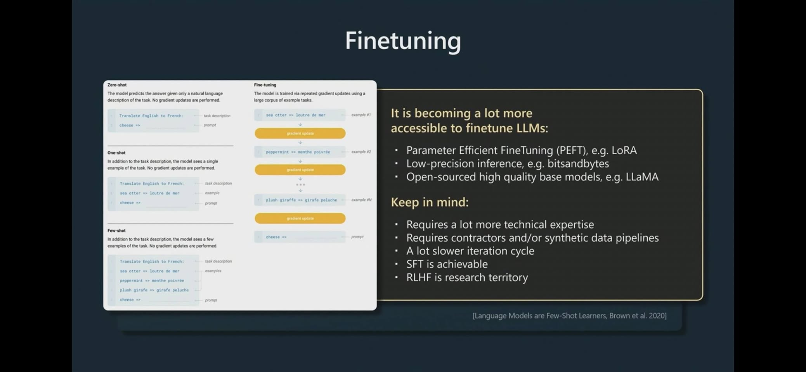 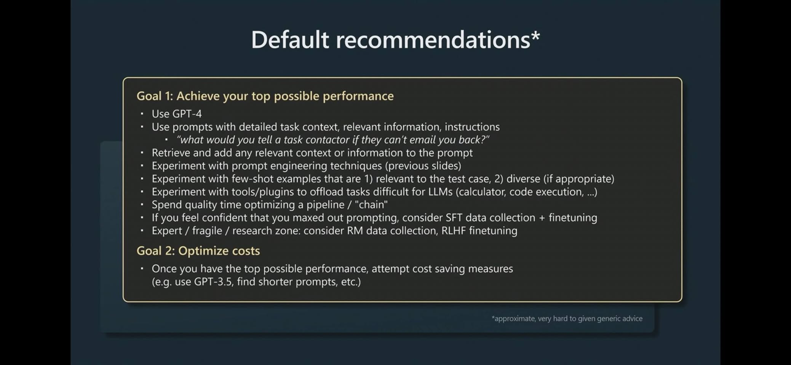

### 5월 27일 (토) 20:48 · #GPTPlugIn #bibletalk

#GPTPlugIn #bibletalk 
이런 이런 상황과 관련된 성경 이야기는 어떤것이 있을지? 예수님이라면 이런 이런 상황에서 어떤 이야기를 했을지 궁금할때가 있다면 이제 BibleTalk GPT Plugin을 사용해보세요. GPT가 어느정도의 성경상식은 있지만 가끔 허구를 지어낼때가 있습니다. BibleTalk PlugIn은 선검색, 후생성 이여서 훨씬더 정확하게 답을 해줍니다. 

Plug-in 신청/승인에 시간이 걸린다고 하니 우선 사용해보실분은 https://bibletalk.sung.devstage.ai/ 로 Plug-in을 연결해보세요.

참고로 소스코드는: https://github.com/hunkim/gpt-plugin-bible-talk 
(faiss 로 간단한 벡터 검색을 해서 질문과 유사한 성경구절을 찾습니다.)

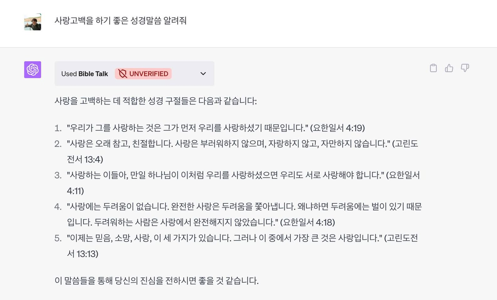 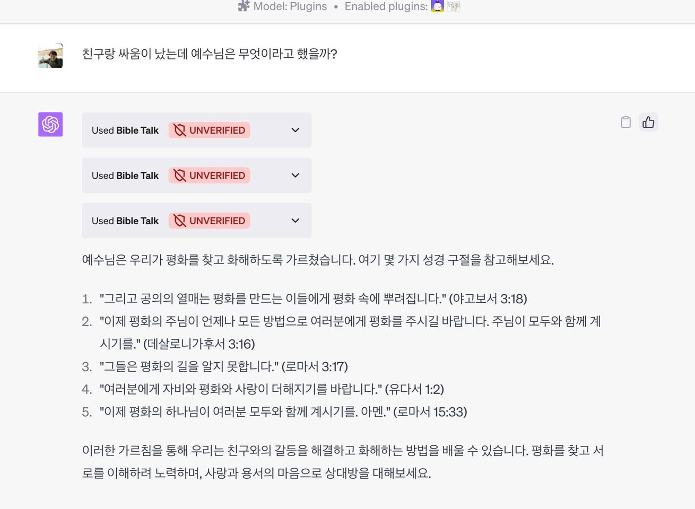 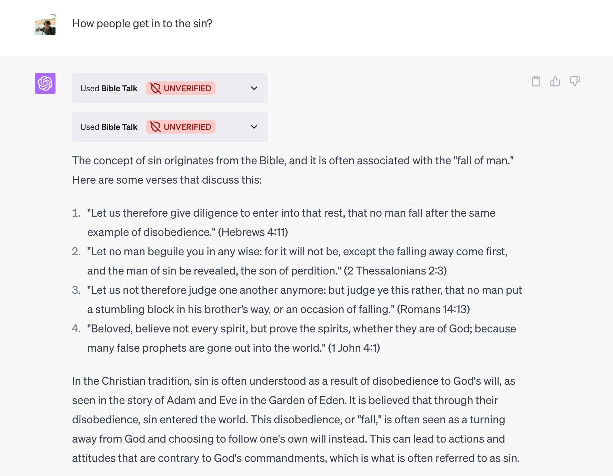

### 5월 28일 (일) 06:49 · 📷 사진 (2장)

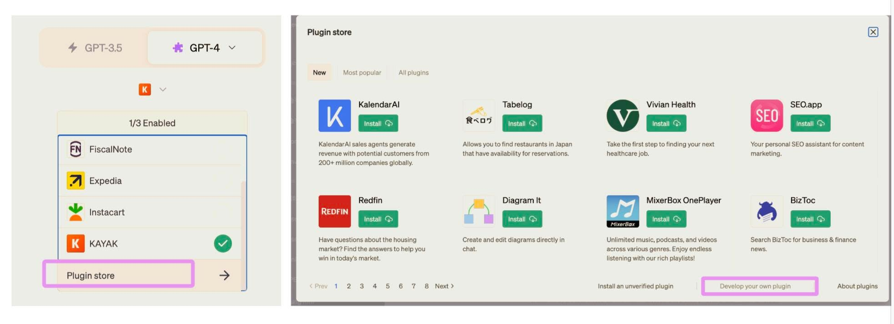 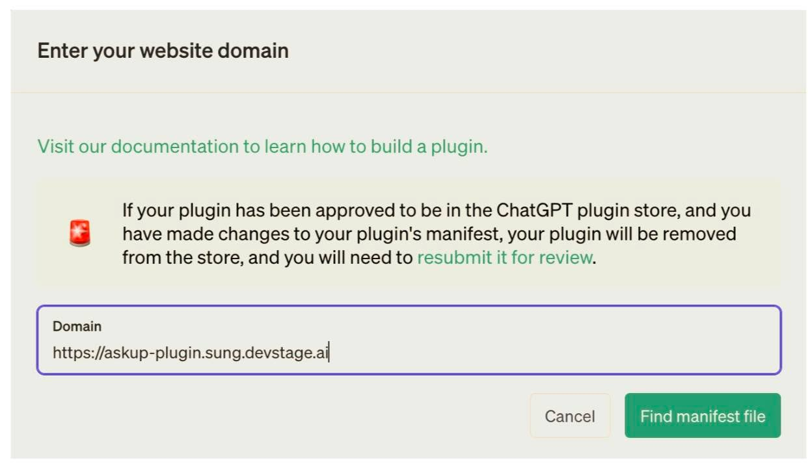

### 5월 29일 (월) 00:45 · 📷 사진 (3장)

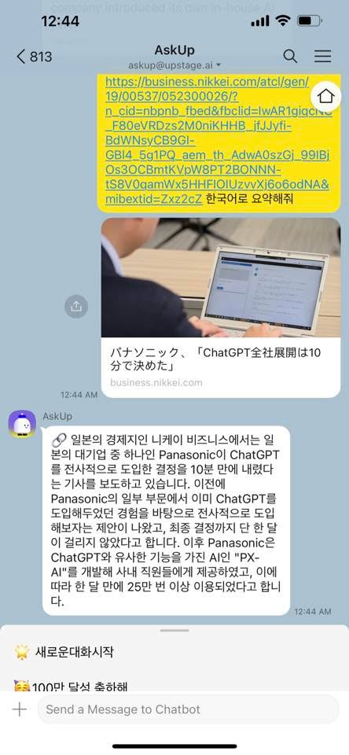 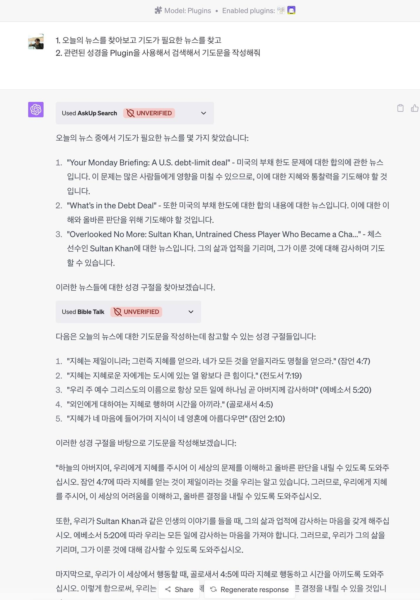 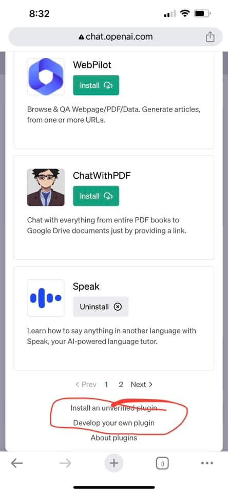

### 5월 31일 (수) 00:13 · #환각방지 GPT/LLM의 가장 어려운 점은 없는 이야기를 지어내는 것인…

#환각방지 GPT/LLM의 가장 어려운 점은 없는 이야기를 지어내는 것인데 이를 방지하는 prompt 가이드 짤을 소개 드립니다. 

모두를 위한 ChatGPT Up의 2강, MS Co-pilot팀에서 일하시는 그 유명한 Yangpa 님의 강의 입니다.

저도 많이 배웠고 저희 회사 서비스 개발에도 많이 사용할 예정입니다.

--
이제 3강 AutoGPT, 4강 GPT Application 개발이 남았습니다. 6월 12일까지 등록을 받고 있고 이전 강의는 녹화로 제공이 됩니다. 99,000₩
📣 강의신청: https://bit.ly/4129pJV
(결제와 강의보기 등은 fastcampus 시스템을 이용합니다.)

🎬 동영상 1개 (생략)

### 5월 31일 (수) 14:55 · #autogpt #한장보고서 #autogpt강의

#autogpt #한장보고서 #autogpt강의

"NVIDIA 주식이 너무 올랐는데, 팔아야 할지 보유해야 할지 분석해서 알려줘" 라고 명령을 내리면 필요한 사이트를 찾고 내용을 분석해서 한장짜리 보고서를 적어 줍니다. 

아직은 GPT의 한계로 인해 긴 보고서는 힘들지만 한장짜리 요약과 그 과정에서 찾은 웹페이지나 중간 결과물을 잘 모아도 보고서를 작성하는 좋은 참고 자료가 될것 같습니다.

회사 분석 말고도 아래와 같은 일들을 할수 있습니다. ( 10가지 케이스도 AutoGPT가 생성)
​
1. 웹사이트 구축
2. 자동 웹 브라우징
3. 연구 보조원
4. 개인 비서 및 브로커
5. 코드 생성
6. 디스코드 통합
7. 이메일 어시스턴트
8. 데이터베이스 쿼리 자동화
9. 팟캐스트 제작
10. 콘텐츠 생성​

그럼 NVIDIA는 어떻게 해야 하는지 보고서를 읽어 보시죠.
--
NVIDIA 주식 분석 소개

NVIDIA Corporation (NASDAQ: NVDA)는 그래픽 처리 장치(GPU)의 설계 및 제조, 게임, 전문 시각화, 데이터 센터 및 자동차 플랫폼에 대한 컴 퓨팅 솔루션을 제공하는 선도적인 기술 회사입니다. 최근 몇 년간, NVIDIA는 고급 칩과 소프트웨어 솔루션으로 인공 지능(AI) 시장에서 지배 적인 역할을 하며, 이는 회사의 주가 상승에 큰 기여를 하고 있습니다. 이 보고서는 NVIDIA의 주식 성과를 분석하고, 투자자가 회사의 지분을 보유할 것인지 매각할 것인지에 대한 통찰력을 제공하기 위한 것입니다.

[주식 성과]

NVIDIA 주식은 최근 몇 년간 상당한 성장을 경험하여 시가 총액이 9920억 달러에 이르렀습니다. 회사의 2023년 매출은 269.7억 달러이며, 순 이익은 43.7억 달러입니다. 분석가들은 NVDA 주식을 "강력한 매수"로 평가하며, 12개월 가격 목표는 415.49달러입니다. 주식은 최근 3개 세 션에서 31% 이상 상승하여 시가 총액이 1조 달러를 넘었습니다. 그러나 월스트리트는 회사의 수익 기대치가 높아지면서 주식의 예상 주가 수 익 비율이 62에서 45로 떨어졌습니다.

NVIDIA 주식 가격은 올해 170% 이상 급등하여 시가 총액이 1조 달러에 가까워졌습니다. 그러나 회사의 게임 제품은 가격이 높아서, 혼란스러 운 마케팅으로 비판을 받았으며, 최신 게임 GPU의 성능 향상이 없다는 평가를 받았습니다. 이에도 불구하고, 최근 Steam 조사에 따르면 NVIDIA GPU를 사용하는 사용자는 76% 이상으로 여전히 이 분야에서 우위를 유지하고 있습니다.

[재무 결과]

NVIDIA는 최근 제4분기 및 2023회계년도의 재무 결과를 발표했습니다. 회사는 분기 매출이 지난해 대비 21% 감소한 60.5억 달러, 회계년도 매출이 작년과 동일한 270억 달러를 보고했습니다. NVIDIA는 데이터 센터, 게임, 전문 시각화, 자동차 및 임베디드 세그먼트에서 진전을 이루 었습니다. 회사는 2024회계년도 제1분기 매출 전망을 65억 달러에서 2% 내외로 발표했습니다.

2023년 1월 29일 종료 3개월간 비회계 원가이익률은 66.1%로, 2022년 동기 대비 56.1%에서 개선되었습니다. 2023년 1월 29일 종료 3개월간 비회계 순이익은 22억 달러로, 2022년 동기 대비 15억 달러에서 증가했습니다. NVIDIA의 현금, 현금성 자산 및 유동성 있는 유가증권은 2023 년 1월 29일 기준 133억 달러입니다.

[AI 시장과 성장 잠재력]
NVIDIA의 AI 시장에서의 성공은 주가 성장의 중요한 원동력이 되었습니다. 이 회사의 고급 칩은 AI의 강력한 도구이며, 최근에는 더욱 정교한 생성 AI 도구를 만들기 위한 경쟁에서 큰 승자가 될 수 있는 새로운 DGX GH200 AI 슈퍼컴퓨터를 공개했습니다. NVIDIA는 생성 AI의 선두 칩 제조업체로 인식되며, AI 칩 수요의 계속적인 증가로부터 혜택을 받을 것으로 예상됩니다.

[가치 평가와 위험]

NVIDIA 주식은 상당한 성장을 경험했지만, 회사의 가치평가에 대한 우려가 있습니다. 현재 주식은 월스트리트의 2024 회계연도 수익 예상에 대해 61배, 2025년 전망에 대해 44배 거래되고 있습니다. 최근 12개월 매출을 사용한 가격 대 매출 비율은 35를 초과하며, 2022년 4월에 거래 된 수준의 두 배, 지난 10월 말 수준의 세 배입니다. 기술적 분석은 또한 주식이 휴식을 취할 필요가 있을 수 있다는 것을 시사합니다.
투자자는 단기적으로 NVIDIA 주식 성과에 영향을 미칠 수 있는 잠재적인 공급망 압력과 가격 변동성에 대해 인식해야 합니다. 

[결론]

NVIDIA 주식은 인공지능 시장에서의 성공과 강력한 재무 성과로 인해 최근 몇 년간 상당한 성장을 경험했습니다. 주식 가치 평가가 우려되는 요인이 될 수 있지만, 인공지능 시장에서의 우위 지위와 계속된 성장 가능성으로 인해 장기적인 투자에 매력적입니다.
현재 시장 상황과 NVIDIA의 성장 가능성을 고려할 때, 투자자들은 회사의 지위를 유지하는 것을 고려할 수 있습니다. 그러나 주식의 성과와 시장 동향을 밀접하게 모니터링하고 투자 전략을 조정할 준비가 필요합니다.

--
AutoGPT는 자주 월요일 강의에서 다루어 지며 다양한 예제, 저희들이 추가한 prompt와 action 들을 소개 드립니다. 

📣 강의신청: https://bit.ly/4129pJV
(결제와 강의보기 등은 fastcampus 시스템을 이용합니다.)

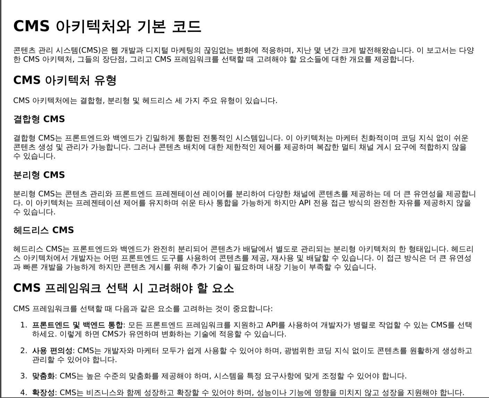 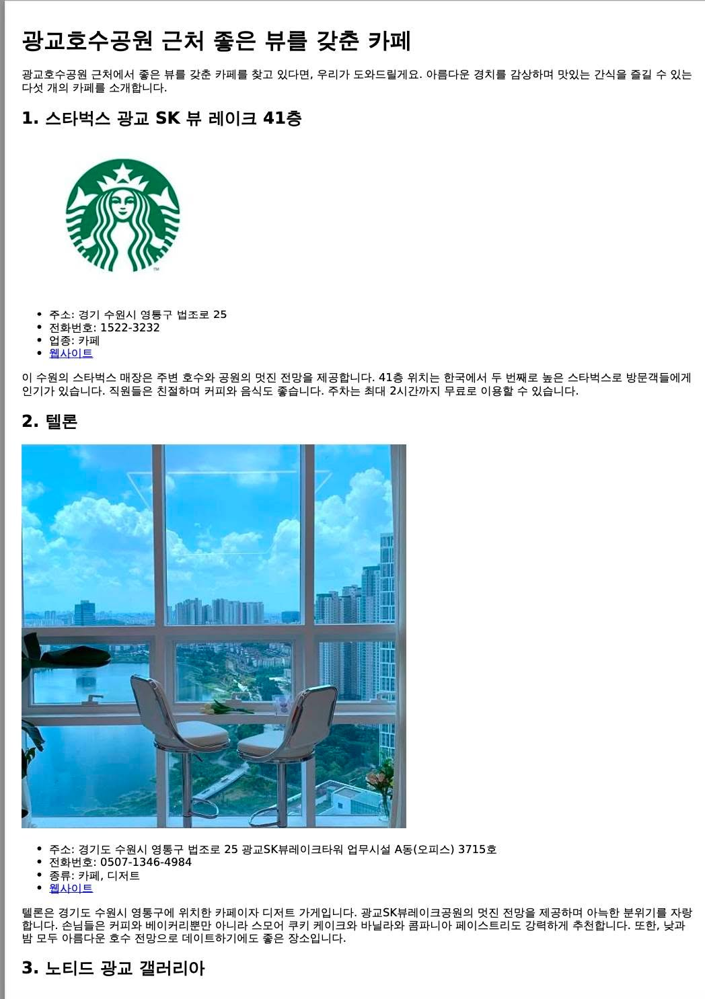 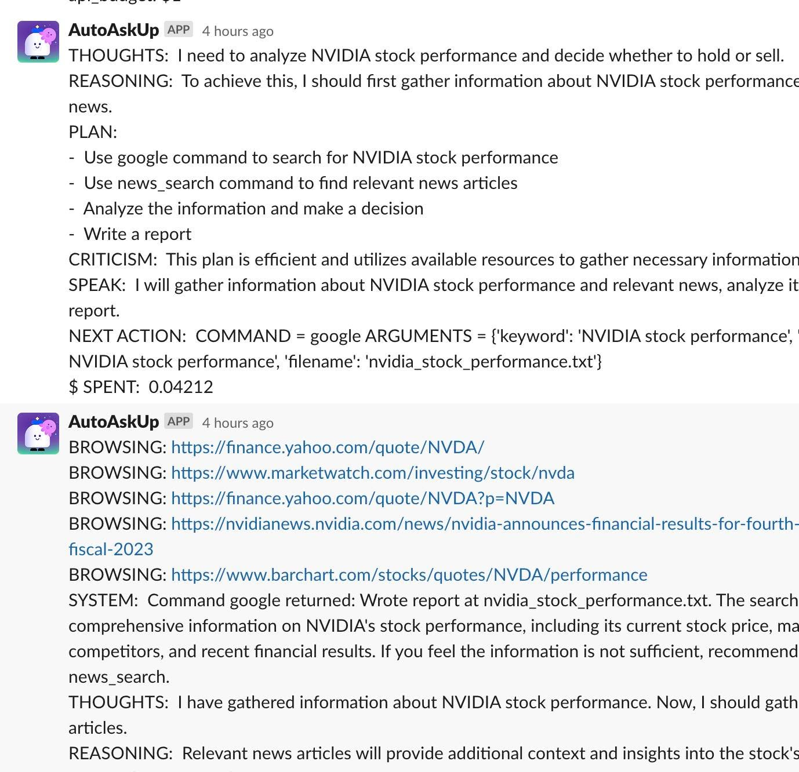 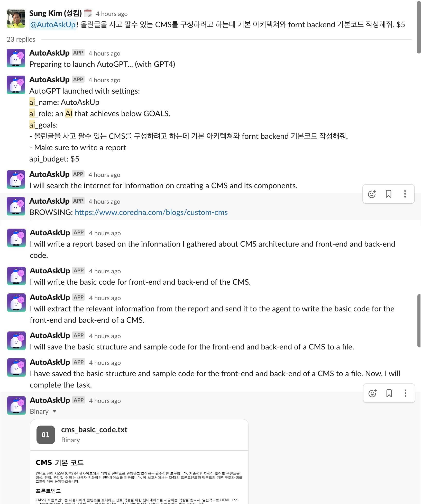
