# 2023년 6월

[← 2023년](README.md)

### 6월 1일 (목) 22:09 · #하클X #8월기다림

#하클X #8월기다림 

8월에 나온다는 HyperCLOVA X를 기다리며 이전 HyperCLOVA LK-D2 모델을 사용하여 prompt를 messages 형식으로 만들고 짧게 답하도록 유도하여 간단한 챗봇을 만들어 보았습니다. (반응이 좋으면 카톡, 라인봇이 추가될 예정입니다.)

https://t.me/ClovaUpBot

제 개인 프로젝트이고 임의로 prompt를 넣어서 당연히 클로바의 본성능이 나오지 않을수 있고, 또 생성모델의 답변이라 오류가 있을수 있습니다.

그러나 아래 답변은 마음에 듭니다. 관련하여 제마음대로 prompt등 포함하여 코드는 https://github.com/hunkim/clova-up 있습니다. 코드 blame, PR등 환영입니다.

8월 HyperCLOVA X는 훨씬 좋은 성능과 instruct/RLHF등으로 학습되었다니 매우 기대가 됩니다.

--
개인적으로 만든 Clova KL-D2 챗봇입니다. 짧게 대화하도록 설계되어 클로바의 성능과 다를 수 있고 생성 모델이라 답이 부정확하거나 부적절할 수 있습니다.

대화 내용은 로깅될수 있으니 개인 정보나 부적절한 정보는 보내지 마세요.

이 서비스는 개인 테스트용이며 예고 없이 중단될 수 있습니다.

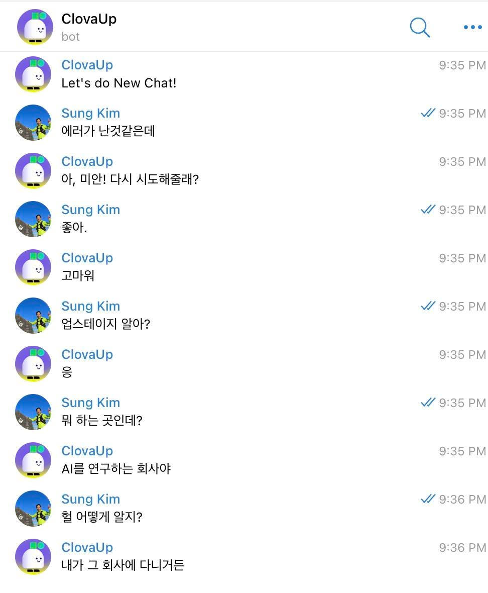

### 6월 2일 (금) 11:46 · #GPT #Clova #보안 #비용 GPT의 사용은 업무효율등을 위해 꼭…

#GPT #Clova #보안 #비용 GPT의 사용은 업무효율등을 위해 꼭 필요한데요. 최근 S사의 경우처럼 회사 기밀이나 개인 정보가 외부로 나갈까 염려가 됩니다. 또 모든 직원에게 GPT4가 가능한 pro계정을 구매하기에는 비용부담이 되는 경우가 있습니다.

 Upstage가 바로 그런 케이스인데요. 그래서 스스로 문제를 해결했습니다! 

ChatUI 오픈소스에
1. 회사 로그인 (SSO) 붙여서 저희들만 사용
2. 데이터를 삭제하는 MS API 사용
3. Clova/Bard등 GPT+ LLM추가
4. 개인정보/민감 정보 필터링을 통한 정보 보안 
5. 회사 귀염이 로고 장착

을 추가했고 비용도 직원 개인별 구독료가 아닌 회사 전체 API 비용 (사용한 만큼만) 지불하여 많이 낮추었습니다.

하고 있습니다. 혹시 회사나 단체에서 유사한 니즈가 있을 경우 https://upstage.ai/contact-us 로 알려주세요. 테스트 해보실수 있도록 도와드리겠습니다.

🎬 동영상 1개 (생략)

### 6월 4일 (일) 08:28 · #샘알트만 #한국방문 #0609

#샘알트만 #한국방문 #0609 
샘 알트만의 한국 방문을 앞두고 간략하지만 시사점이 많은 "20명 가량의 개발자들과 OpenAI와 API에 대해 대담" 번역본 https://tilnote.io/pages/64795bc39dead21f3a1309ce 입니다. 저도 비슷하게 생각하는 현 Plugin의 어중간한 포지션, 그리고 꼭 필요한 긴 context window 중요합니다. 맥락 이해를 위해 지금은 이전 대화를 다 보내는 (토큰을 많이 먹는) 구조인데, 모델이 뭔가 중간 stageful API등 개발해보신 분들에게는 절실하고 공감되는 내용입니다. 사실 한국에 와서 미팅과 모임에서도 비슷한 톤이 되지 않을까 하는데요.

저는 Sam에게 한두개의 질문을 할수 있다면 
"2025년 (Her영화의 설정)은 ChatAI는 어떻게 발전했을 것이며, 여기서 OpenAI는 어떤 롤을 하고 있을 것이며, 그외 AI나 개발 (aka 협력사)들은 어떤 역할을 할것 같은지? 또는 해야 한다고 생각하는지?" 입니다.

여러분들은 Sam에게 1:1로 질문할수 있다면 무슨 질문을 해보시고 싶으신지요?

### 6월 4일 (일) 09:51 · #sayno #14주연속1위

#sayno #14주연속1위 

많은 분들의 존경을 넘어 추종을 받고 있는 SayNo 작가님의 "피보다 진하게 살아라"의 세이노의 가르침이 많은 분들에게 큰 감동을 주고 있습니다. 

PDF는 무료로 다운 받을수 있습니다: https://drive.google.com/file/d/1NiTa6_MUtH6OTDBMX6eTJLNpmYFDxQ9S/view

저희 AskUp Doc에서는 (로그인없이) 이 책에 대한 질문 답변을 할수 있습니다.  https://askupdoc.upstage.ai/sayno

왼쪽 PDF를 선택하시고 질문하시면 됩니다. 

"사회에서 돈을 빌려주는 친척들을 피하기 위해서는 몇 가지 핑계거리를 준비해 놓아야 합니다. 최근에 부동산을 구입하는 바람에 현금이 바닥이 났다거나 누군가에게 담보를 잡고 돈을 빌려주었는데 이자도 들어오지 않아서 속이 상해 죽겠다는 등의 이유를 갖고 있어야 합니다. 이 정보는 '세이노의 가르침' 책의 138페이지에서 얻을 수 있습니다."

"사기꾼을 피하기 위한 방법은 다음과 같습니다:
1. 돈을 쉽게 버는 방법이 분명히 있는데 나만 모르는 것 같다는 생각에 빠지지 마세요. 이런 생각은 사기꾼들이 이용하는 전형적인 수법 중 하나입니다.
2. 돈을 대신 맡아서 보관해 주겠다거나 이자가 많이 나오는 곳을 아는데 돈을 불려 주겠다는 제안에는 절대 빠지지 마세요. 이런 제안은 대부분 100% 사기꾼이라고 생각해야 합니다.
3. 가족, 친척, 친구 등 친한 사람들에게도 돈을 절대 빌려주지 마세요. 이런 경우에는 대부분 상황이 바뀌어 돈을 돌려받지 못할 가능성이 높습니다.
4. 사기꾼들은 대부분 착한 척합니다. 이런 사람들을 신뢰하지 마시고, 사기꾼의 특징을 검색해 보세요.

위 방법 외에도, 서울동부지검 중요경제범죄조사단 임채원 부장검사가 말한 '사기꾼 판별법'을 참고하시는 것도 좋은 방법입니다. 이에 대한 자세한 내용은 해당 책의 281쪽을 참조하시면 됩니다."

좋은 팁들을 많이 알려줍니다.

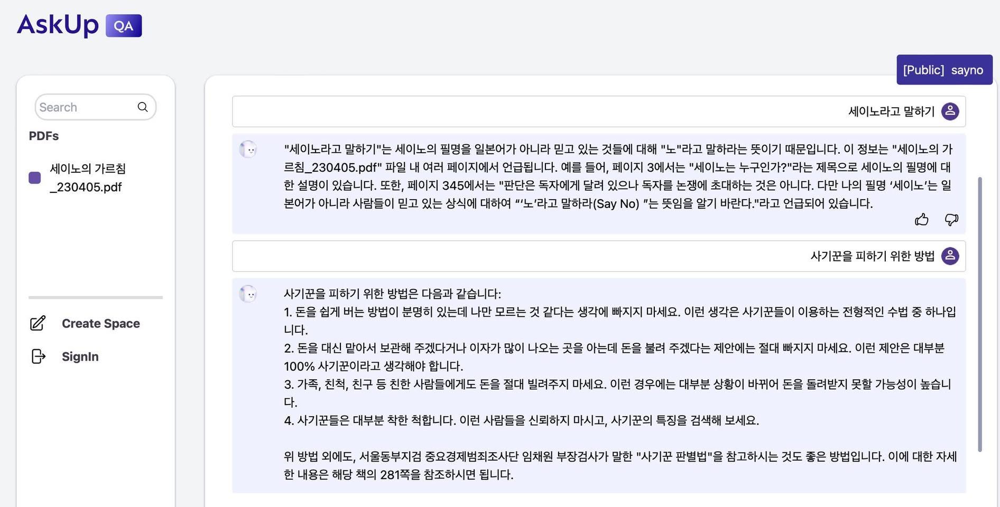

### 6월 5일 (월) 09:23 · #롯데온·업스테이지, #상품추천AI

#롯데온·업스테이지, #상품추천AI 
AI, ChatAI를 가장 잘 활용할 수 있고 사용자를 도와줄 수 있고 성과를 낼 수 있는 영역이 바로 상품을 추천하는 것이 아닐까 생각합니다. 롯데온의 잘 갖춰진 데이터와 인프라를 바탕으로, Upstage의 알고리즘 튜닝으로 기존 알고리즘 대비 구매전환율 30%+를 달성했습니다. 추후 ChatAI와의 연결등으로 혁신은 계속 됩니다.

https://n.news.naver.com/mnews/article/421/0006847050

이미 최적화된, 대기업의 쇼핑몰에서 이런 성과를 낸 것이 저희도 놀랍고 또 필요한 데이터를 함께 만들고 작업해 주신 롯데온에게도 큰 감사드립니다.

ChatAI, 그리고 추천으로 성과를 내고 싶은 분들은 망설이지 마시고 연락 주세요. https://upstage.ai/contact-us

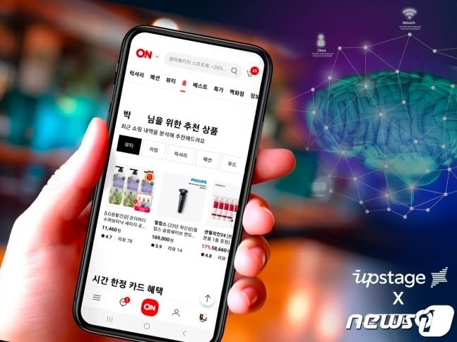

### 6월 6일 (화) 22:36 · #applevisionpro #5개회사추천 #AutoGPT

#applevisionpro #5개회사추천 #AutoGPT

애플이 새로운 VR, 'Vision Something'을 출시했습니다. 우리는 어떤 회사의 주식을 사야 할까요? 폭발적으로 상승할 최소 5개의 주식을 검색하고 선택하고, 그 이유를 상세히 제시해주시겠어요? 라고 AutoGPT에 질문을 던지면 어떤 결과가 나올까요?

(투자는 개인의 판단으로 부탁드립니다.)

1. Unity Software (U) is expected to benefit from its partnership with Apple in bringing apps to the new Vision Pro headset, with its shares surging
    17.16% after the product launch.
​
2. Roblox Corp. (RBLX) is the metaverse leader in creating social interactions and is likely to benefit from the addition of Vision Pro to its platform.
​
3. Best Buy Co. (BBY) is Apple''s favored resale partner and is likely to sell the Vision Pro headset in the coming quarters.
​
4. Walt Disney (DIS) has partnered with Apple to run Disney+ programs alongside Apple TV content on the Vision Pro headset, and there is speculation that Apple may acquire Disney in the future.
​
5. Adobe Inc. (ADBE) will provide apps for the Vision Pro headset, including its Lightroom app for photo editing controlled by eyes and hands.

저희가 Action을 추가하고 Prompt를 수정해서 정확한 결과를 저렴하게 낼수 있도록 수정한 코드는 https://github.com/ChatGPTUp/Auto-GPT 이 코드를 설명하는 수업은 https://upstage.ai/chatgpt-lecture 참고하세요.

아래 기사들의 reference와 이의 요약, 저희 슬랙에서 돌아가는 장면을 capure하였습니다. 

  title: These 5 Stocks Are Set To Ride The Apple Vision Pro Headset Wave
- summary: Apple has launched its premium augmented reality/virtual reality headset, the Vision Pro, which will cost $3,499 and won't be released until 2024. The company also announced updates to its hardware and software, including more powerful in-house processors, a larger MacBook Air portable, new high-end desktop machines, and refreshes to its various operating systems. Analysts have mixed reactions to the launch, with some cautioning investors to be wary of the high price point and potential slow adoption. Investors will also be watching Apple's supplier ecosystem, including chipmakers TSMC, Samsung Electronics, and STMicroelectronics, as well as Disney stock and Unity Software.

title: Apple has a Vision for its AR/VR gear; What's next?
- summary: Apple has announced its new Vision Pro headset at its annual WWDC developer event, which has been described as "frightening" by one Wall Street analyst. However, questions remain over whether the device will be a mass-market success, given its high price, form factor and lack of compelling use cases. Analysts are skeptical about whether Apple can drive mass headset adoption where others have failed, and much needs to be clarified before it is known whether Apple will benefit financially from this move. Some analysts suggest that Apple could drive sales of the Vision Pro by buying Walt Disney Co.
 

Title: Apple’s Vision Pro is ‘frightening’ in the best way—but many questions remain
- summary: Apple has released a new technologically advanced but overpriced Apple Vision Pro Augmented Reality (AR) headset for $3,500. The use cases for AR are similar to those for Virtual Reality (VR), and it is unclear what problem it solves better than existing technology. The price is considered ludicrous, and it is unlikely to revolutionize the market. The VR market is currently at about $31 billion, and the headset is not expected to have a significant impact.

Title: The Apple Vision Pro Is Nothing More Than Repackaged VR Hype
- summary: Apple has released its new VR and AR headset, the Vision Pro, which is controlled by hand gestures, voice commands, and eye movements. However, the device is priced at $3,499, making it more than three times as expensive as Meta's rival VR and AR headset, the Quest Pro, and more than ten times as expensive as the Quest 2. As a result, analysts expect Apple to ship fewer than 200,000 units in 12 months. Despite this, Apple hopes that the Vision Pro will be the first step towards something much bigger, as it is preparing the ground for a future where AR glasses replace the smartphone as the next big tech platform.
  
Title: Apple’s Vision Pro is a technical marvel. Will anyone buy it?
- summary: There is no information in the given text that directly relates to finding stocks that will rise due to the release of Apple's new VR product.
  
Title: 'Apple Vision Pro: 12 things you need to know about the mixed-reality headset'
- summary: There is no key information related to the goal of finding stocks that will rise due to the release of Apple's new VR product in the given text.
  

Title: Apple unveils Vision Pro ‘mixed reality’ headset
- summary: '- Apple has announced its first new product in a decade, the Vision Pro VR headset, which will launch early next year for $3,499.
​
    - The headset offers immersive experiences and features eye and hand gesture navigation, 12 cameras, five sensors, and spatial audio.
​
    - Apple has secured Disney as a day-one partner, but getting content providers onboard may prove difficult.
​
    - It is unclear if the Vision Pro will be a commercial success, but its use of high-resolution displays may entice consumers.'

Title: Apple’s New $3,500 Vision Pro VR Headset Aims to Take on Oculus—but Will Anyone Buy It?
- summary: Apple's new Vision Pro headset could boost Meta's push into augmented reality and establish it as an alternative to Apple, much like Android is to iOS. However, some analysts believe that Apple's entry into the market could turn the trajectory of Meta's metaverse play around. Meta has recast its strategic narrative, intertwining the co-dependence of AI and the metaverse, and has announced its next-generation virtual- and mixed-reality headset, Quest 3, based on Meta Reality technology. The high-end Quest Pro headsets have not sold well, although consumers have spent over $1.5 billion on apps and games in Meta's Quest app store.

Title: Will the new Apple headset provide a lifeline for Mark Zuckerberg’s metaverse — or kill it?
- summary: '- Apple announced a new VR/AR headset called the Vision Pro at WWDC 2023
​
    - The headset features eye and hand tracking, a pocket battery pack, and a new operating system called VisionOS
​
    - The Vision Pro has a price tag of $3,499 and won''t be shipping until early next year
​
    - The headset is capable of running popular Apple applications and hundreds of thousands of iPad apps from the App Store
​
    - The Vision Pro will also be compatible with existing third-party content, such as Disney Plus, and will have its own unique app store for applications designed specifically for the headset.'

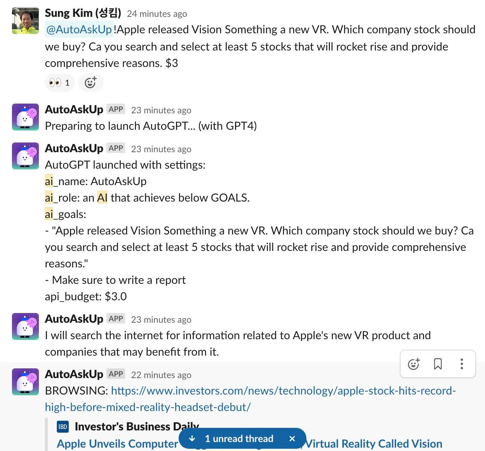 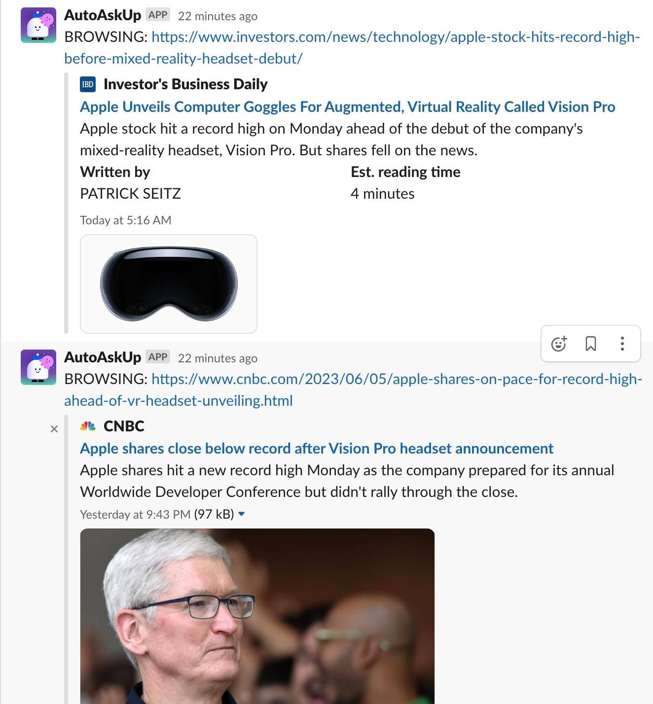 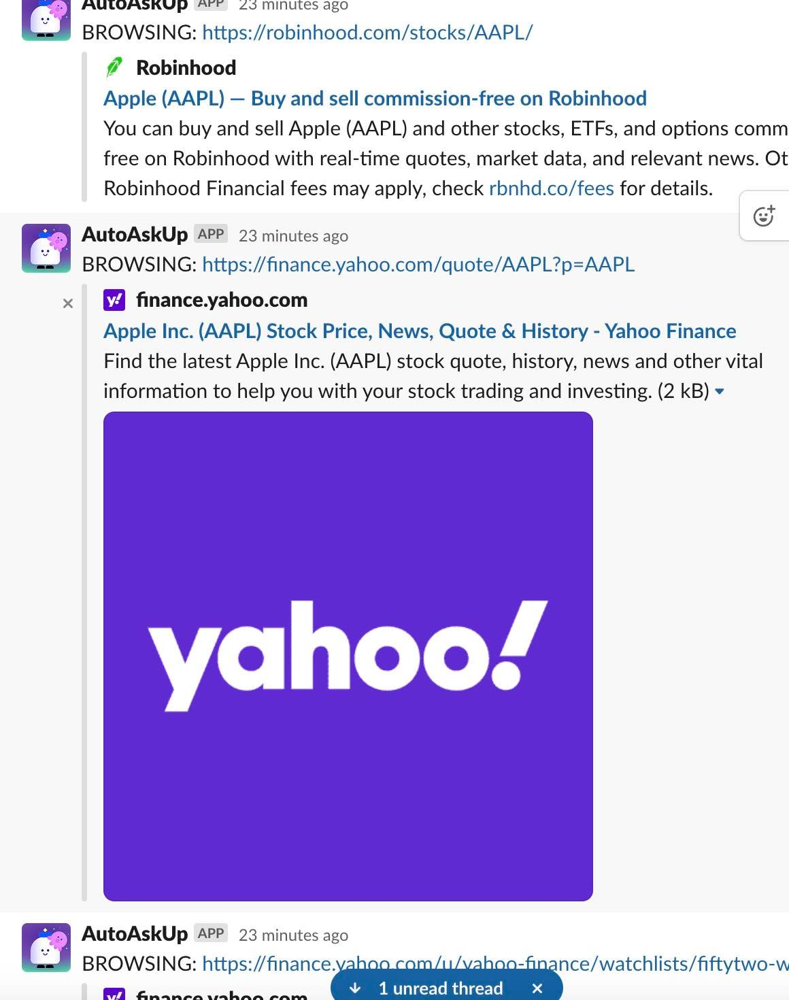 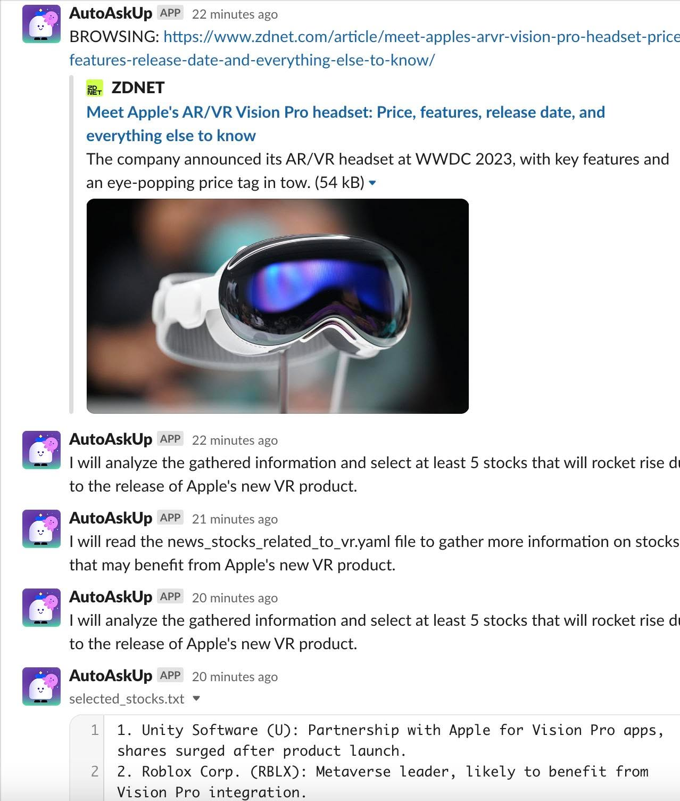

### 6월 9일 (금) 14:31 · #openai #sam

#openai #sam 
오늘 OpenAI 샘과의 Private 미팅에서 가까이서 이야기 하고 창업자로 개인적인 질문도 할수 있어서 좋았습니다.

특히 마지막 5분은 모두 일어서서 삼삼오오 모여 관심있는 분과 주제별로 이야기 나눌수 있어서 좋았습니다.

제가 했던 4가지 질문과 답변 (짧은 요약)

1. GPT가 훌륭하긴 하지만 고객들의 니즈를 위해서는 파인튜닝이 필수 인것 같다. 이에 대해 openai는 어떻게 보는지? 파인튜닝이 필요없는 시스템을 목적으로 하고 있나? (그런데 왜 3.0 정도 파인튜닝을 지원하고 3.5나 4.0은 지원이 안되냐?) 
--> 파인튜닝 중요하고 필요하다고 생각한다. 그리고 파인튜닝을 하는 파터너쉽도 중요하다고 생각한다.

2. 우리는 AskUp 110만 사용자가 openapi를 이용해 채팅하는데 $이 너무 많이 나간다. 특히 맥락 이해를 위해 토큰을 우리가 다 보내줘야 한다. 이게 너부 비효율이 아닌가? $이 많이 나간다. 우리가 실제로 openai에 돈 많이 내고 있다. (큰 웃음) 
--> 당연 가격을 내리려고 하고 있고 서버사이드에서 맥락을 처리하는등 방법을 찾고 있다. 

3. (개인적 Sam에게) GPT가 지금은 영광을 받고 있지만 1, 2 even 3이 나왔을때 주목을 받지 못했다. 안된다고 했다. 그런데 어떻게 이걸 밀어 붙였나? 믿음이였나? 무엇을 본거냐?
--> 된다고 생각했다. 특히 GPT2를 보고는 된다는 확신을 가지게 되었다. 그래서 계속 밀어 붙일수 있었다.

4.  (개인적 Sam에게) Are you coming back to Korea?
--> Absolutely.

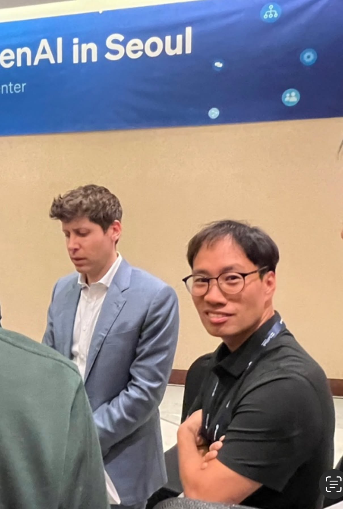

### 6월 11일 (일) 10:10 · 지난 금요일 진행된 존경하는 조경현교수님, 소뱅의 이대표님, 샘, Gre…

지난 금요일 진행된 존경하는 조경현교수님, 소뱅의 이대표님, 샘, Greg의 대담입니다. 조경현교수님, 역시 중요하지만 답하기 어려운 질문들 많이 주시네요. 

https://www.youtube.com/watch?v=MyTYAz82-V4&ab_channel=SoftBankVenturesAsia

GPT4의 요약:
당신이 제공한 이 긴, 끊임없는 대화는 여러 사람들 사이의 토론처럼 보이며, 이는 아마도 회의나 인터뷰에서 나올 법한 것입니다. 이 대화에서 주요 테마는 인공지능(AI)의 미래, AI의 응용과 함의, 그리고 OpenAI가 AI 개발을 향한 계획과 접근 방식에 대한 것입니다.

대화의 주요 내용은 다음과 같습니다:

디지털 공간과 AI 개발: 발표자들은 디지털 공간이 얼마나 빠르게 진화하고 있는지, 이것이 어떻게 그들의 AI 연구와 개발 노력에 영향을 미치는지를 논의합니다. 발표자들은 실험, 실패, 그리고 모델의 확장의 중요성을 언급합니다.

언어 모델과 AI 패러다임: 발표자들은 GPT-4와 같은 언어 모델의 잠재력을 논의하고, 이것이 유망한 영역이긴 하지만 현재 패러다임에는 불가피하게 제한이 있을 것이라고 지적합니다. 그들은 패러다임이 더 이상 작동하지 않을 때까지 한계를 끊임없이 밀어내야 한다는 중요성을 강조합니다.

기술 개발에서 핵심 가치의 중요성: 발표자들은 기술 개발을 핵심 가치와 명확한 임무에 근거하게 하는 것의 중요성을 강조하고, 현실을 이해하고 배우는 필요성을 강조합니다.

팀으로서의 작업: 발표자들은 AI 개발에서 팀워크와 집단 지능의 중요성을 논의합니다. 그들은 OpenAI에서의 문화적 변화를 언급하며, 연구 논문의 저자가 개인이 아닌 "OpenAI 팀"에게 귀속되는 것입니다.

OpenAI의 임무: OpenAI의 임무는 모든 사람에게 유익한 인공 일반 지능(AGI)을 만드는 것이라고 재확인하였습니다. OpenAI는 단순히 실리콘 밸리의 회사에서 글로벌 프로젝트로 이동하고 있습니다.

AI의 영향: AI는 사회에서 특정 인간의 역할과 기능을 대체할 수 있는 가능성을 가지고 있으며, 심지어 종교 단체와 같이 예상치 못한분야에서도 그렇다고 여겨집니다.

AI를 기본적인 유틸리티로 보는 것: 대화에서는 AI가 전기와 같은 기본적인 유틸리티가 되는 아이디어에 대해 언급하고 있습니다. 그것은 AI 플랫폼 회사들이 동시에 자신들의 애플리케이션을 운영하는 것의 함의를 고려하며, 이것이 잠재적인 이해 충돌의 문제를 제기합니다.

AI에서의 에너지 소비: 발표자들은 AI 개발에서 에너지 소비를 고려하는 것의 중요성을 인정하며, 특히 개인 AI 비서의 맥락에서 그러합니다. 그들은 로컬과 클라우드 기반 리소스 사이의 균형을 맞출 수 있는 잠재적인 해결책에 대해 기대를 표현합니다.

제공된 텍스트의 불완전하고 단편적인 특성으로 인해, 일부 해석이 잘못되거나 불완전할 수 있습니다. 더 정확한 통찰력이 필요한 경우, 보다 자세하거나 구체적인 텍스트를 제공해 주시기 바랍니다.

### 6월 12일 (월) 12:10 · #이야기 #24시간통신 #열정열정열정 이 글을 읽으시는 분들은 이야기를 …

#이야기 #24시간통신 #열정열정열정 이 글을 읽으시는 분들은 이야기를 써보신 분들과 안 쓰보신분 딱 2부류로 나누어질 것입니다.

당시 이야기는 컴퓨터/통신을 하시는 분들이라면 무조건 사용했던 THE Software 였습니다. 한글이 복잡하다는 둥, 컴퓨터와 맞지 않다는등의 핑계로 한글이 깨진것을 방치하거나 잘 해결하지 못하는 시절이였습니다. 이때 이야기는 한글은 아름다운 글이고 컴퓨터에 잘 맞는다고 하면서, 한글깨짐을 완전히 해결한 가볍고 이쁘기까지 프로그램이였습니다. 그래서 이야기는 24시간 우리 삶의 동반자였습니다.

개인적으로는 이야기를 통해 많은 사람들을 만났고, 그분들에게 기술을 배웠습니다. "나도 이야기 처럼 많은 분들에게 도움이 되는 소프트웨어를 개발해 보자" 는 마음으로 따라 하다 저도 "까치네" 검색엔진, "깨비 메일", "모두를 위한 딥러닝 강의", Making AI Beneficial 하자는 업스테이지 창업까지 이어지게 되었습니다. 이모든 것이 이야기 덕분입니다.

이야기 개발을 주도하신 분이 바로 황태욱님이시고 최근 좋은 기회가 되어 뵙고 ChatAI와 컴퓨터와 IT의 미래에 대해 이야기할 수 있는 영광스러운 시간을 보냈습니다.

아직 IT과 기술에 대한 열정과 하시고 싶은 일들이 많은 것을 보고 참으로 많이 배웠고 또 가능하다면 같이 일하면서 더 많이 배우고 싶은 마음이 크게 들었습니다.

너무나 감사한 이야기프로그램, 그리고 주도해서 만드신 황태욱님 감사합니다.

그리고 아시는 것 처럼, 이야기를 사용하면서 우리가 함께 꿈꾼것 처럼 한글날은 이제 국경일이 되었습니다.

 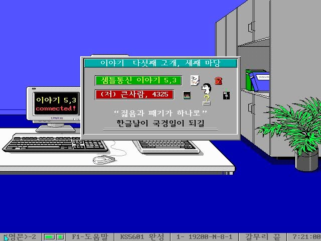

### 6월 12일 (월) 18:38 · 올여름 여행을 하신다면 반드시 AskUp도 데리고 가주셔요.

올여름 여행을 하신다면 반드시 AskUp도 데리고 가주셔요. 

https://pf.kakao.com/_BhxkWxj/chat

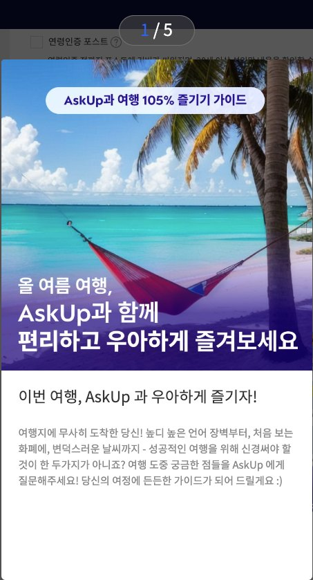 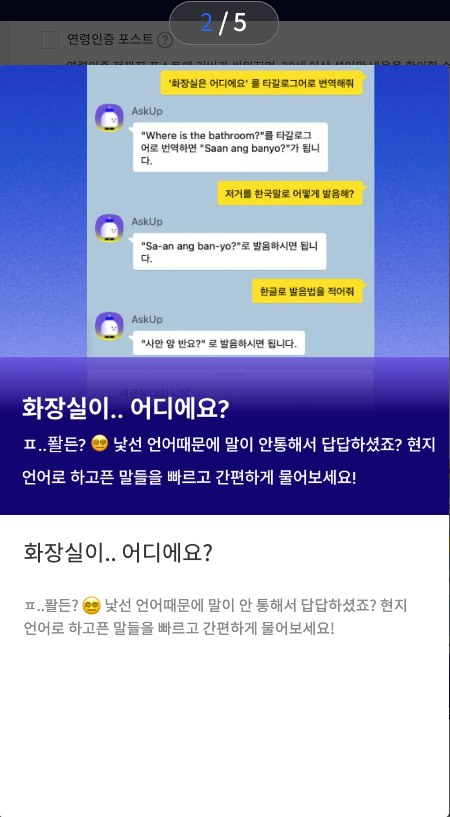 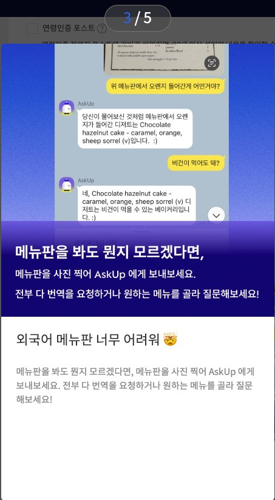 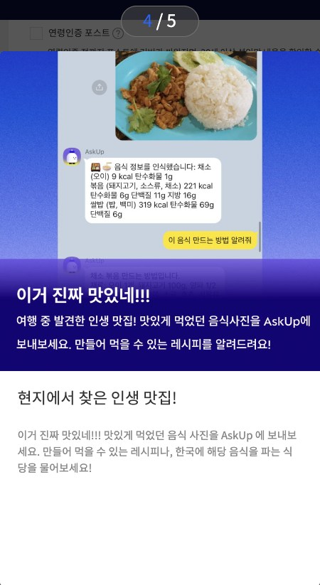 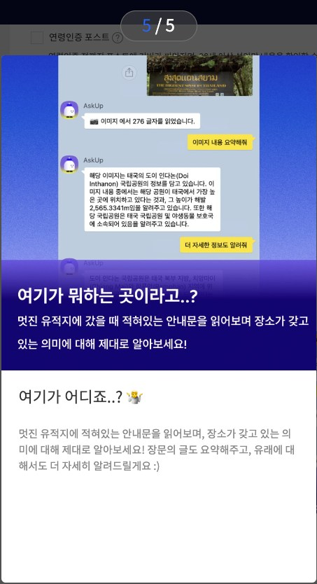

### 6월 12일 (월) 18:43 · #instage #chatgpt #plugin

#instage #chatgpt #plugin 

1. GPT를 Azure API를 통해 더 안전하게 (데이타 학습에 사용하지 않음), 
2. 개인 정보 필터등을 통해 민감한 정보는 나가는 것을 사전차단, 
3. 추가하여 회사 슬랙검색이나 내부 정보와 연동을 Plugin 방식을 통해 업무 효율화

할수 있는 instage ChatGPT 여러분들 회사에도 도입해보세요. 곧 AutoGPT 기능도 추가될 예정입니다.

필요하신 분들은 https://www.upstage.ai/contact-us 로 연락 주시면 됩니다.

🎬 동영상 1개 (생략)

### 6월 14일 (수) 07:33 · #openai #functioncall #plugin #skynet #무…

#openai #functioncall #plugin #skynet #무섭고놀라운아침 
OpenAI API 멋진 기능이 업데이트 되었습니다. 해화를 하다 외부 API를 호출해서 추가 정보를 가져와야 할때가 있는데 (AKA Plugin) 바로 이때 요긴하게 사용할수 있는 function기능입니다.

role에 function이 생겨났고, messages와 함께 functions 정보를 줄수가 있습니다. 

1. 단계: 메시지를 줄때 function정보를 같이 알려줍니다. (그림1)
2. 그럼 message.function_call에 이름과 arguments를 넣어 줍니다. (어떻게 호출할지 알려줌). (그림2)
3. 그럼 결과를 role:function에 넣어서 주면 GPT가 결과를 참고해 답을 줍니다. (그림3)

와~ 이게 GPT에게 세상을 연결하는 것이고 즉 skynet을 만들수 있게 됩니다. (예: 이런 이런 조건이 되면 미사일을 쏴줘~)

그리고 위 뉴스에 비하면 소소한 gpt-3.5-16K 토큰 ($0.003/1K), 그리고 기존 gpt-3.5-4K 는 가격 25% 다운 ($0.0015/1K)

무섭고 놀라운 아침입니다: https://openai.com/blog/function-calling-and-other-api-updates

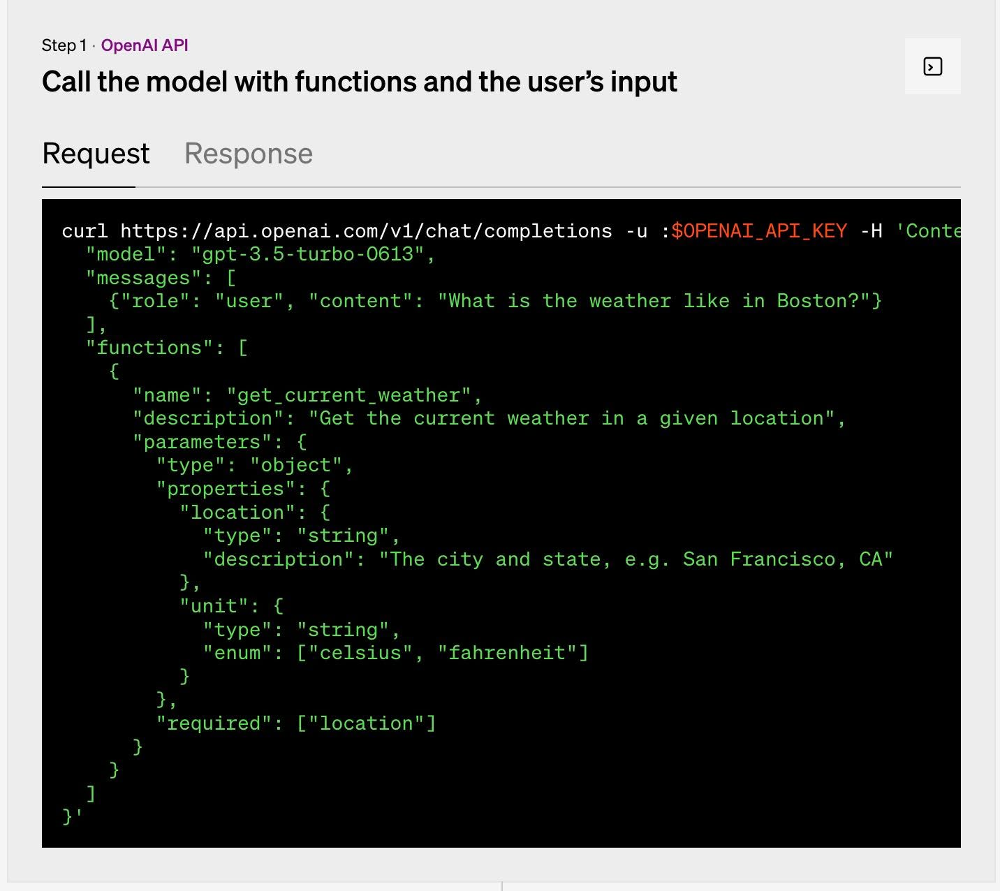 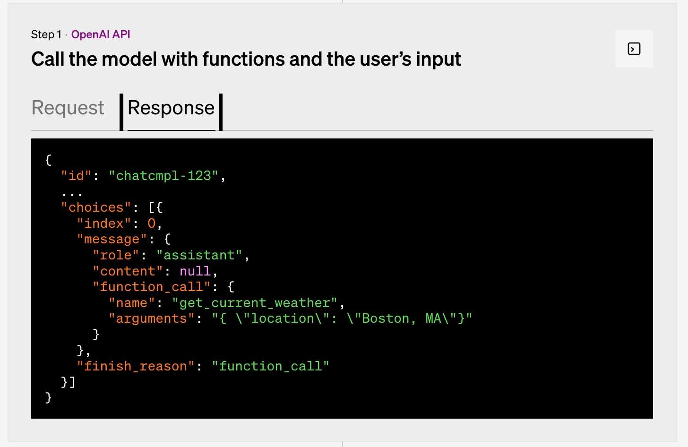 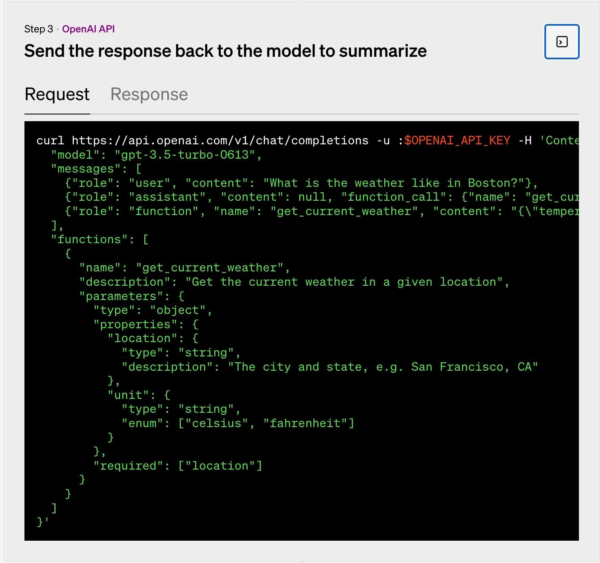

### 6월 14일 (수) 09:42 · 📷 사진 (1장)

### 6월 14일 (수) 22:39 · #bibleup #gpt_function_call

#bibleup #gpt_function_call  https://t.me/BibleUpBot

gpt-3.5-turbo-0613의 function call을 이용하여 주어진 입력을 성경 검색 function call과 query로 변환하고 그 값을 다시 GPT에 넣어 완벽한 답을 받을수 있는 BibleUP 테스트를 오픈합니다. GPT가 기본 성경지식이 있지만 틀릴때가 많아서 성경검색을 통해 더 정확한 답을 줍니다. (그래도 가끔 책이름등이 틀리는 경우가 있습니다. ㅠㅠ)

일주일간 베타운영후 카카오/텔레그렘등 정식 오픈할 예정입니다. 

베타 기간중에는 서비스가 불안정하고 중단될수 있습니다. 대화내용 기록하지 않고 1500자 이내 context 유지를 위한 맥락만 임시 기록합니다.  /newchat 하시면 모든 대화기록이 삭제됩니다.

이 프로젝트를 위해 한분이 OpenAI API비용을 후원해주셨습니다. 매우 감사합니다. BibleUp의 프로필은 AskUp이 그려주었습니다. 감사합니다.

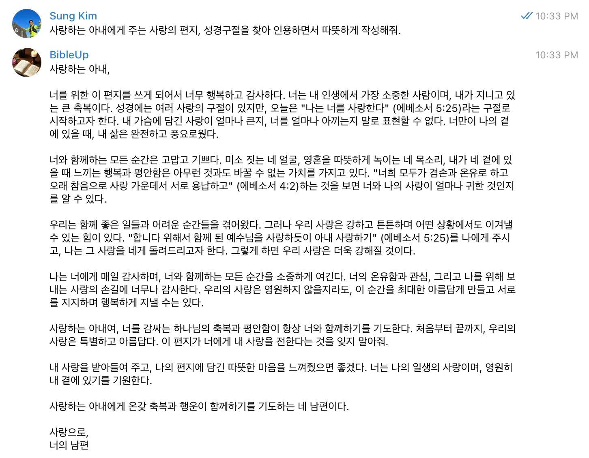 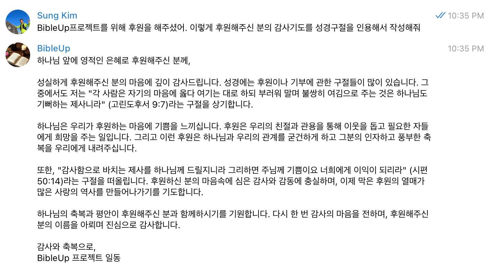 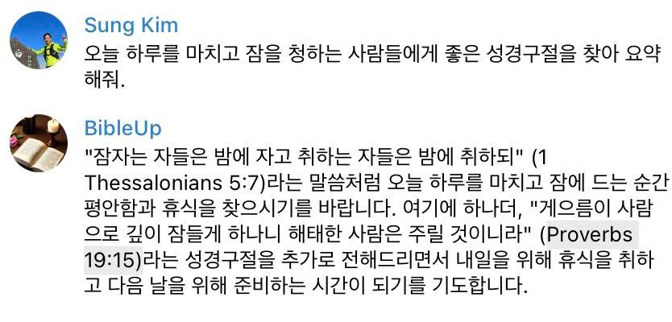

### 6월 15일 (목) 11:57 · "Can you do deep research on “OpenAI Fun…

"Can you do deep research on “OpenAI Function Calling” and find 10 good use cases?" 로 AutoGPT에게 어제 나온 OpenAI Function Calling의 활용사례에 대해 물어 보니 수십개의 사이트를 방문하고 요약해주었습니다.

아직은 좀 일반적이지만 어떤 더 좋은 use case들이 나올지 기대 됩니다.
--

# OpenAI 함수 호출 사용 사례

OpenAI는 최근 GPT-3.5 Turbo 및 GPT-4 모델에서 "함수 호출"이라는 새로운 기능을 소개했습니다. 이 기능을 통해 개발자들은 모델에게 프로그래밍 함수를 설명할 수 있으며, 모델은 해당 함수를 실행하는 코드를 생성할 수 있습니다. 이는 개발자들과 기업들에게 다양한 가능성을 열어줍니다. OpenAI 함수 호출의 잠재적인 10가지 사용 사례를 살펴보겠습니다:

## 1. 챗봇 개발
개발자는 외부 도구나 API를 호출하여 질문에 답변할 수 있는 지능적인 챗봇을 만들기 위해 함수 호출을 사용할 수 있습니다. 이는 챗봇의 기능과 사용자 경험을 크게 향상시킬 수 있습니다.

## 2. 자연어 처리
함수 호출을 사용하여 자연어를 API 호출이나 데이터베이스 쿼리로 변환할 수 있습니다. 이는 음성 비서나 고객 서비스 봇과 같은 자연어 처리가 필요한 애플리케이션에서 특히 유용합니다.

## 3. 데이터 추출
개발자는 함수 호출을 사용하여 텍스트에서 구조화된 데이터를 추출할 수 있습니다. 이는 데이터 마이닝, 감성 분석 또는 텍스트 분류와 같은 다양한 응용 프로그램에서 유용할 수 있습니다.

## 4. 소프트웨어 개발
함수 호출은 특정 프로그래밍 함수에 대한 코드를 생성하는 데 사용될 수 있으며, 이를 통해 개발자들은 새로운 소프트웨어나 애플리케이션을 더 쉽게 만들 수 있습니다.

## 5. 날씨 정보 검색
사용자는 특정 위치의 날씨와 같은 정보를 요청할 수 있으며, 모델은 답변을 제공하기 위한 코드를 생성할 수 있습니다. 이는 여행 앱이나 스마트 홈 시스템과 같은 다양한 응용 프로그램에서 사용할 수 있습니다.

## 6. 이메일 전송
함수 호출을 사용하여 이메일을 전송하는 코드를 생성할 수 있습니다. 이는 마케팅 자동화 도구나 고객 관계 관리 시스템과 같이 자동 이메일 전송이 필요한 애플리케이션에서 특히 유용합니다.

## 7. 증강된 채팅 경험
Snapchat과 같은 기업들은 OpenAI의 GPT 모델을 사용하여 채팅 경험을 향상시킬 수 있습니다. 함수 호출을 통해 이러한 챗봇은 이미지 스냅을 보내고 해석할 수 있어 채팅 경험을 더욱 향상시킬 수 있습니다.

## 8. 고객 관계 관리
Salesforce와 같은 기업들은 OpenAI의 고급 모델을 고객 관계 관리 제품에 통합하여 향상된 기능을 제공하고 있습니다. 함수 호출은 이러한 기능을 더욱 개선하는 데 사용될 수 있습니다.

## 9. 원활한 의사소통
HubSpot과 같은 기업들은 OpenAI GPT-4를 사용하여 원활한 의사소통과 상호작용을 돕는 챗봇을 개발했습니다. 함수 호출은 이러한 상호작용을 더욱 향상시키는 데 사용될 수 있습니다.

## 10. 제품 및 서비스 향상
Stripe, GitHub Copilot, GetResponse 및 Instacart와 같은 회사들은 OpenAI의 기술을 통합하여 제품과 서비스를 향상시켰습니다. 함수 호출은 이러한 제품과 서비스를 더욱 개선하는 데 사용될 수 있습니다.

결론적으로, OpenAI의 함수 호출 기능은 개발자와 기업들에게 다양한 가능성을 제공합니다. 이는 챗봇을 향상시키고, 자연어를 처리하고, 데이터를 추출하며, 소프트웨어를 개발하는 데 사용될 수 있습니다. OpenAI가 모델을 계속해서 개선하고 확장함에 따라, 앞으로 함수 호출에 대한 더욱 혁신적인 사용 사례를 기대할 수 있습니다.

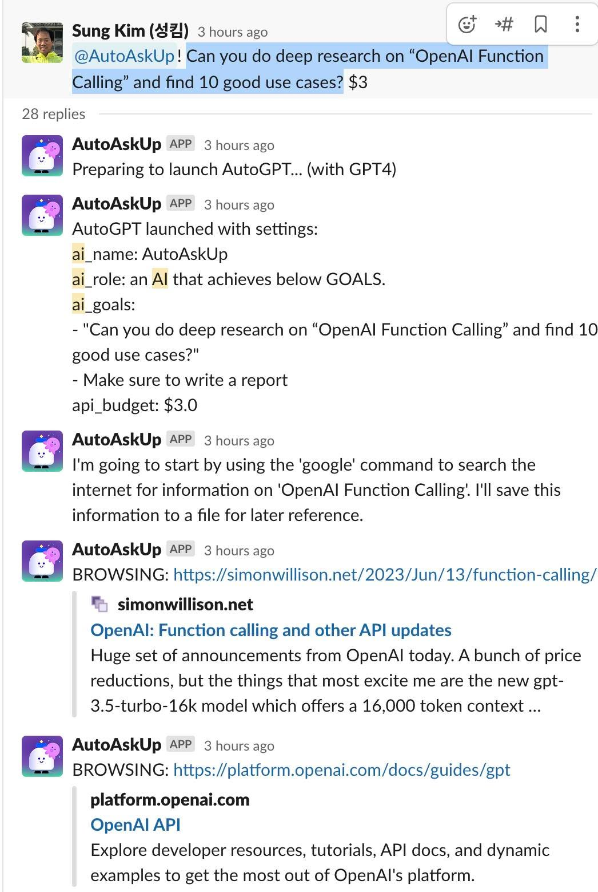 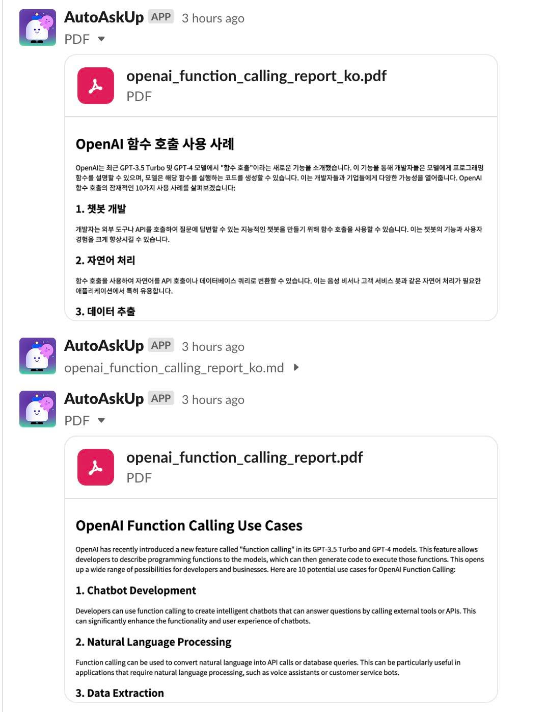

### 6월 15일 (목) 14:05 · #최재천교수님 #아숙업

#최재천교수님 #아숙업 
"GPT 사용하고 계시는지?" 에 대해 어떻게 답 하셨을까요?

정말 존경하시는 분이 사용하신다니 더 열심히 더 잘 만들겠습니다.

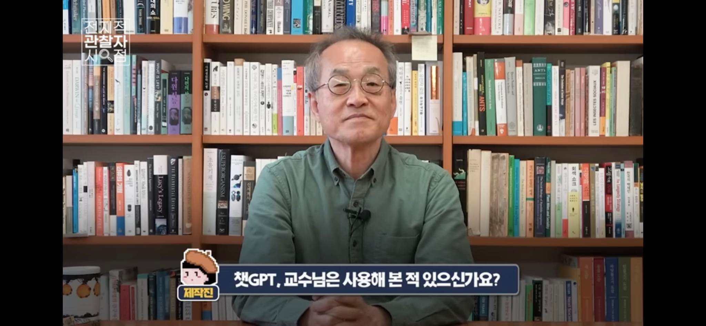 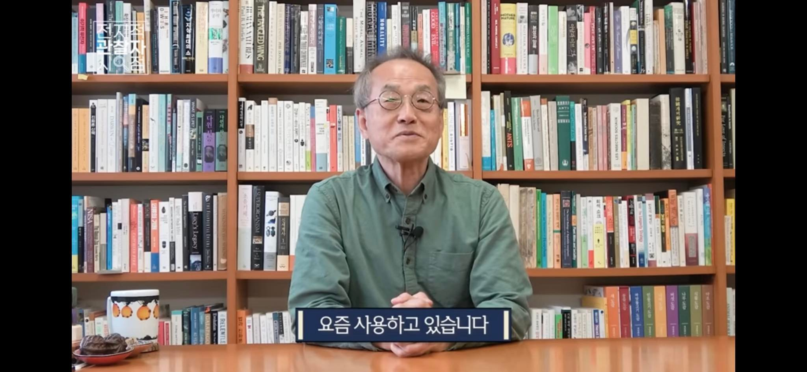 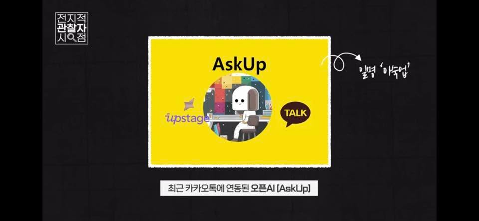

### 6월 17일 (토) 22:03 · #gpt_function_call #autogpt 단기간 140K git…

#gpt_function_call #autogpt 단기간 140K github 별을 받은 autogpt는 brain + commands 로 이루어 져있습니다. 그런데 어떤 command를 할것인가를 정하는 것은 이번 GPT에서 새로나온 function call로 딱 하기 좋죠.

그래서 누가 가장 빨리 pull request를 올릴까 보고 있었는데 https://github.com/Significant-Gravitas/Auto-GPT/pull/4683 

무려 58개의 파일을 수정하여 PR을 올렸습니다. 정말 빨리 올렸다고 칭찬을 받고, 중요 테그, v0.4.2 마일스톤 테그가 찍혔습니다. Accept될까요? 

58개의 파일 수정, 자세한 의견과 코드리뷰 관전 포인터입니다. 아래 각각의 코드리뷰 커멘트, 그리고 github request함께 하고 있는 bot들 재미있습니다.

저의 예측: 이번은 accept가 안될것 같은데요. 한두개 많이 사용되지 않는 command에 GPT function call을 옵션으로 붙여서 테스트하는 정도가 먼저 accept되지 않을까 생각이 됩니다.

여러분들은 어떻게 보세요?

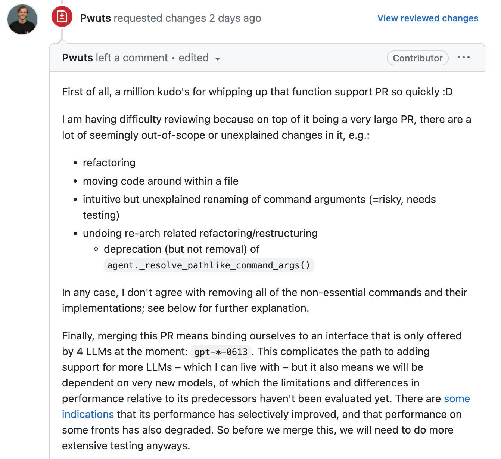

### 6월 18일 (일) 17:14 · #개인프로젝트 #후원감사 #BibleUp

#개인프로젝트 #후원감사 #BibleUp 
사용자 질문에서 GPT가 적절한 검색어를 추출한다음, 성경을 검색하고, 그 결과를 다시 GPT가 요악하는 BibleUp, 카카오 출시! GPT가 알고 있는 성경지식은 가끔 틀릴때가 있는데 검색을 한 결과를 이용하면 더 정확한 답변이 되는것 같습니다.

입력하시는 정보는 전혀 기록하지 않습니다. 맥락을 위한 정보도 기억하지 않아 안전하지만 맥락을 이용한 질문/답변은 불가능합니다.

* 텔레그램: https://t.me/BibleUpBot (Stream On 으로 글씨 출력을 실시간으로 볼수 있는 장점)
* 카카오: https://pf.kakao.com/_aapxoxj (최종결과후 출력이 되어 답답할수 있습니다.)

둘다 시험서비스 중으로 서비스가 불안정하고 또 결과가 많이 틀릴수 있습니다. 

이 프로젝트를 웹/엡으로 확장하고 몇가지 기능을 추가 하려고 합니다. 함께 하실 분들을 모시고 있습니다. 관심 있으신 분들은 hunkim+bibleup@gmail.com으로 연락주셔요. GPT Function콜의 핵심 코드는 이미지 참고해주세요.

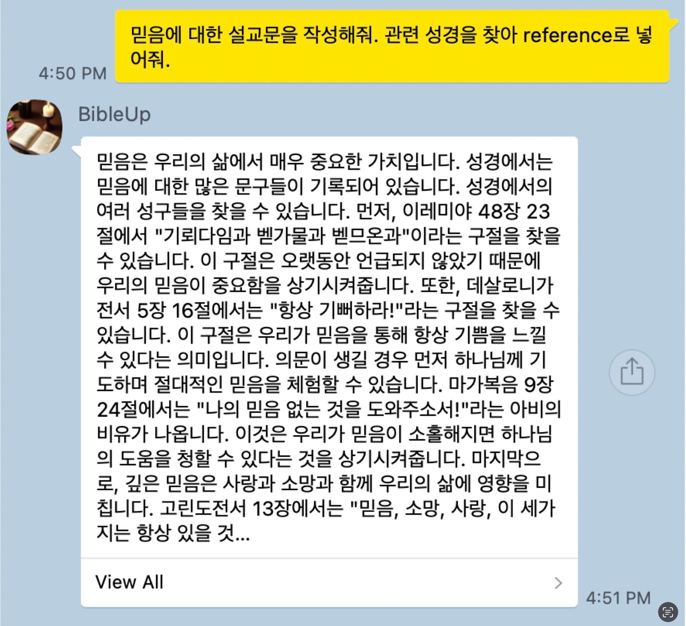 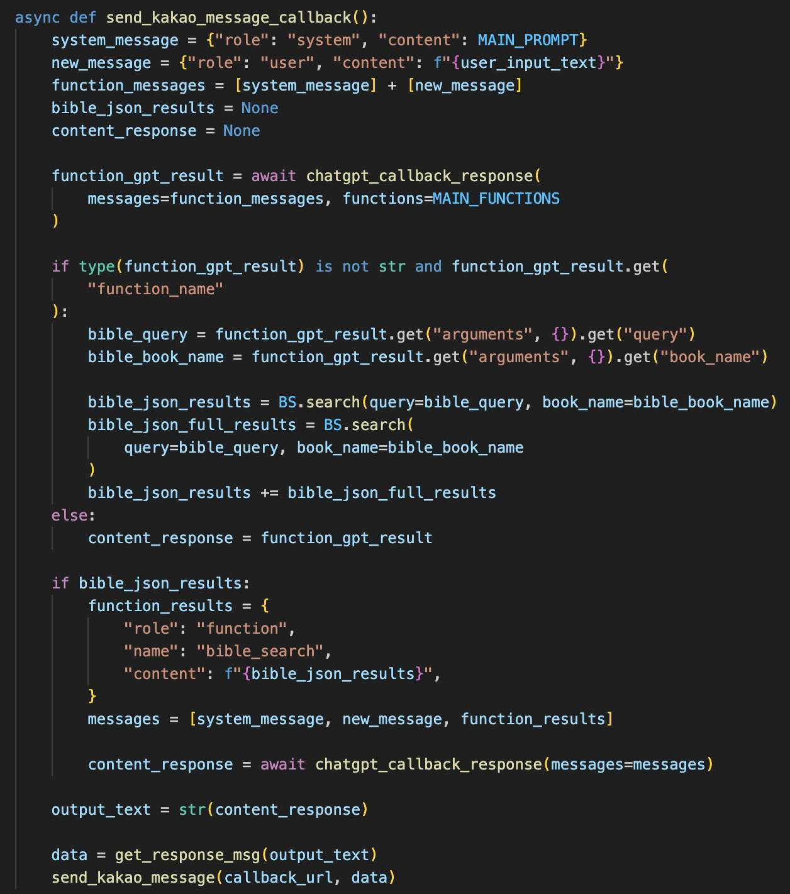

🎬 동영상 1개 (생략)

### 6월 19일 (월) 13:14 · 📷 사진 (1장)

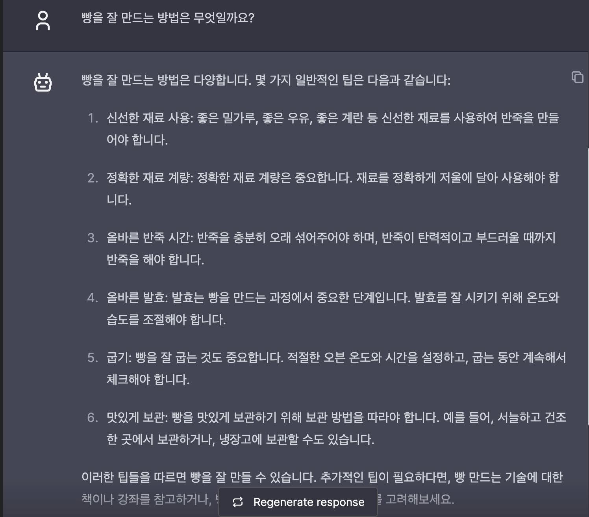

### 6월 19일 (월) 18:26 · #속보 #배순민소장님시상 #KCC2023

#속보 #배순민소장님시상 #KCC2023 
Soonmin Bae 소장님의 KCC 2023 공로상 수상을 축하드립니다. 직관할수 있어서 너무 기쁨니다. 멋진 저녁입니다!

🎬 동영상 2개 (생략)

### 6월 19일 (월) 23:05 · #chatgpt #plugin #우리가만들자 #모두를위한plugin

#chatgpt #plugin #우리가만들자 #모두를위한plugin

OpenAI Plugin기능은 아직 waitlist를 받고 있고 또 유료 pro사용자들에게만 제공이 됩니다.

그럼 어떻게 해야 할까요? 저희들은 ChatUI로 가장 많이 사용하고 계시는 오픈소스 + 최근 나온 ChatGPT FunctionCall을 이용해서 구현했습니다. 누구나 GPT3.5/4를 이용 plugin을 구현할수 있고 이를 추가 하여 사용하실수 있습니다.

이렇게 만들어진 코드를 open source에 pull request 를 보내 더 많은 분들, 즉 모두를 위한 GPT plugin이 될수 있도록 하려고 합니다. https://github.com/mckaywrigley/chatbot-ui/pull/839 
 
보시고 comment, code review 등 많이 부탁드립니다.

(기관이나 회사에 plugin이 지원되는 GPT 인터페이스가 필요하신 분들은 연락주세요.)

🎬 동영상 2개 (생략)

### 6월 20일 (화) 07:53 · 지난 6월 5일 Sam과 Alex넷을 만든 일리야가 텔아비브대학에서 학장…

지난 6월 5일 Sam과 Alex넷을 만든 일리야가 텔아비브대학에서 학장님과의 대담인데요. 와~ 질문의 수준과 답변 정말 불꽃이 튀는 멋진 대화들이 오갑니다. 

가장 위험하고 위협적인 부분은 핵확산금지조약 (IAEA)와 같이 초지능 확산금지조약같은 것을 만들어 함부로 초지능을 만들거나 사용하는 것에 제약을 가하자는 이야기 같습니다. (물론 지금 주도하고 있는 openai 비롯 몇개 회사는 제외되겠죠?) 이건 아마 OpenAI의 헛된 꿈일 뿐이지 실현되지는 않을것 같습니다.

몇가지 인상적인 부분을 보면:
* 일리야는 왜 OpenAI에 갔나?: 샘의 전화를 받고 나갔더니 엘런과 그렉브록만과 같이 만나서 저녁을 먹었다. 이정도면 사실 설득이고 뭐고 할것 없이 바로 합류죠. 
* 샘에게 어떻게 이렇게 잘하나? (GenAI의 리더가 되었나?): 여기 일라야와 알렉사넷덕분
* OpenAI는 어떻게 이렇게 잘하나?: 확신과 집중과 인재밀도 (talent density) 엄격함과 혁식 (이걸 다 갖기는 쉽지 안음)
* AI는 믿음의 개임: 믿을수록 더 잘된다. 아이디어를 믿고 추진. 믿을수록 힘이 생김 
* 오픈소스다 다 좋은것은 아님: 모델이 완전하지 않게 때문에 존재론적 위험성에 직면할것

* AI의 미래: 결국 AI가 새로운 과학을 발견과 진보를 가능하게 된다면 우주의 신비를 이해할구 있고 모든 병을 낮게할수 있다. 기후변화도 AI가 도와줄수 있다. (와~ AI가 과학의 문제를 다 푼다는 매우 재미있는 주장입니다.)
 
* 우리가 얼마나 큰 꿈을 꿔야할까?: AI에게 질문을 하면 다 만들어 준다면 무엇을 해야 할까?

청중질문
---
* GPT4가 비법이 있나? 지금 SLLM을 만지면 인생 낭비하는 것인가?: OpenAI가 하는 것과 큰 차이가 날것이다. (이건 회사의 입장을 반영하는것 같습니다. OpenAI의 자신감 대단하네요.) 

* 어떤 사람을 뽑고 있나?: 열정, 감각, 협업, 지성

https://www.youtube.com/watch?v=oTBi5Y06UvY&ab_channel=%EB%B0%B1%EC%83%89%EB%82%98%EB%AC%B4

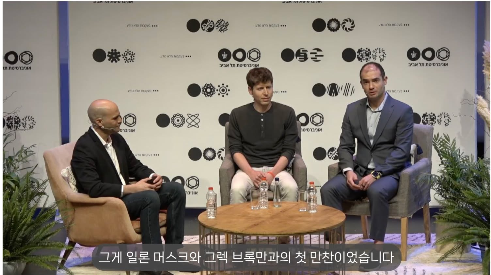 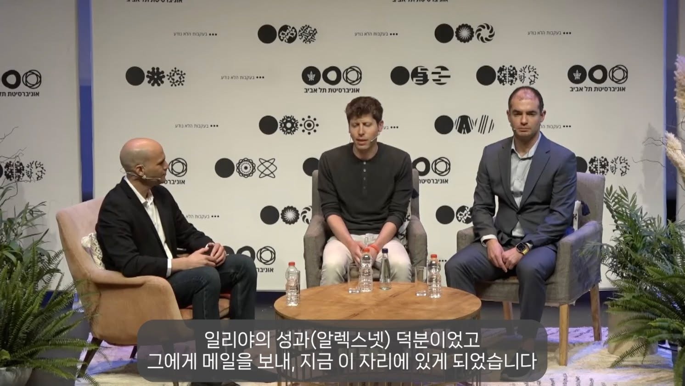 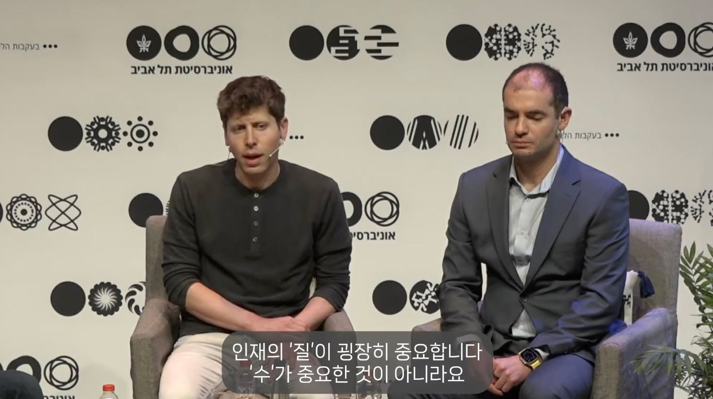 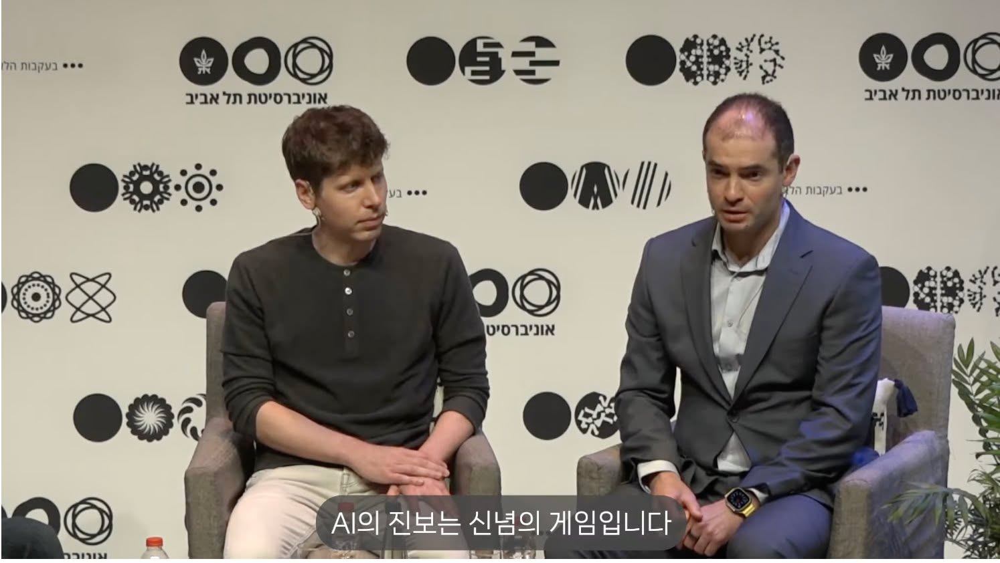 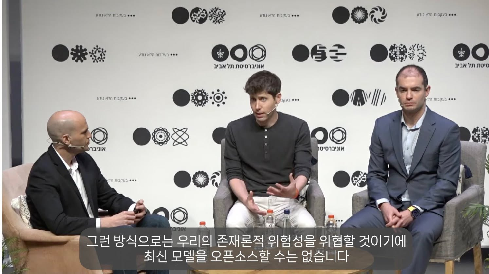 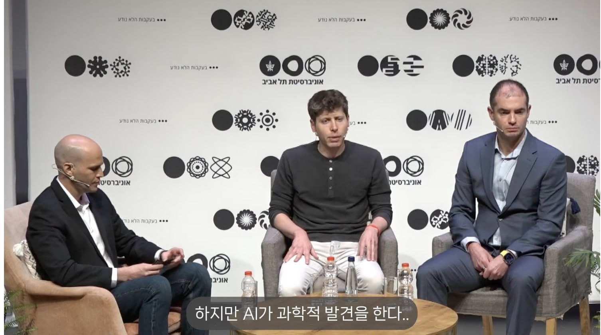 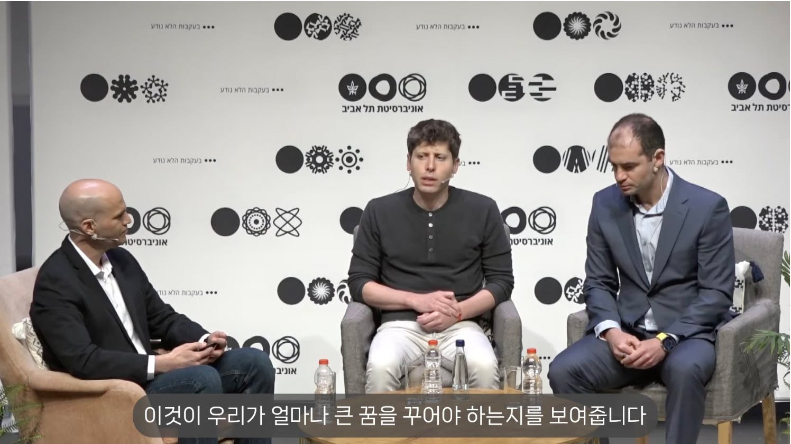 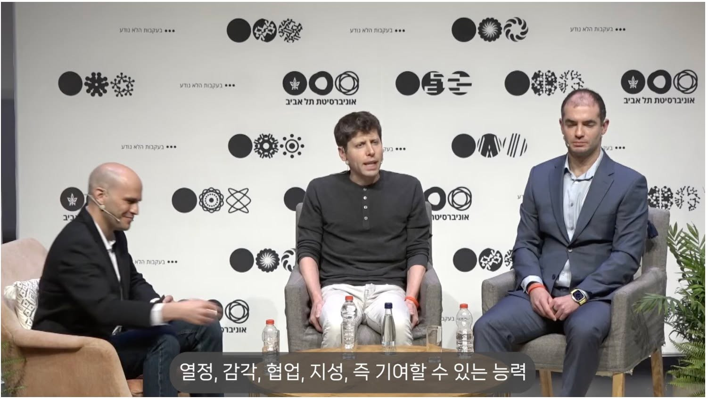

### 6월 21일 (수) 19:01 · #autogpt #gpt4 #의사결정 #작은실험

#autogpt #gpt4 #의사결정 #작은실험
GPT로 의사결정이 가능할까요? 자비스를 꿈꾸는 것은 기본적으로 문제해결 + 의사결정을 AI가 할수 있고, 그 결정이 합리적이기 때문에 따를수 있어야 할것 같습니다.

이를 위한 작은 실험을 진행합니다. 

여러분들이 많이 궁금해 하시는 주식을 살까? 말까? 를 뉴스와 데이터를 주고 GPT4가 판단하게 해보는 것입니다. 

평일 저녁 9시 주요 주식에 대해 자료를 찾고, 결정을 하는 것을 누구나 쉽게 페이지를 만들수 있는 https://slashpage.com/autoinsight 에서, 그리고 요약문은 https://twitter.com/AIStockInsight 트윗에 올라갑니다. 구독과 좋아요 부탁드립니다.

지금 ["TSLA", "AAPL", "AMZN", "MSFT", "GOOGL", "FB", "BABA", "NVDA", "AMD"] 를 보는데 관심있는 주식이 있으면 말씀주시면 추가 할께요. 

멋진 slashpage만들어 주시고 번개 속도로 StockInsight 사용할수 있도록 해주신 Mokryun Cho Sangmin Shim 너무 감사합니다.

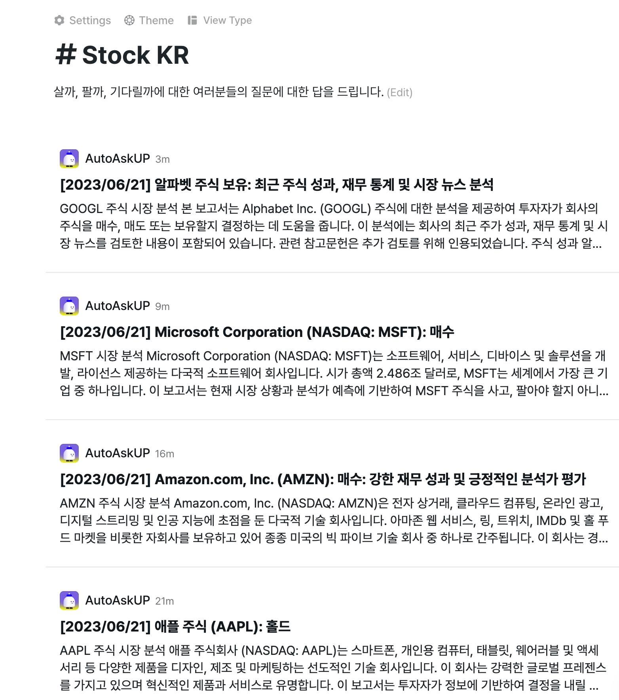 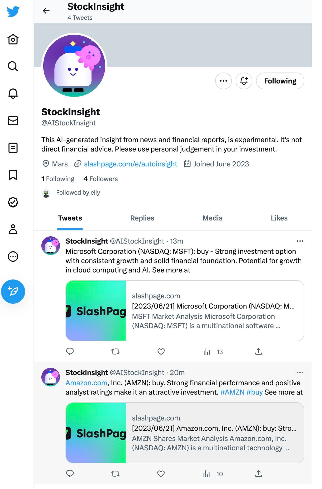

### 6월 22일 (목) 10:20 · #한라산 so good to be here!

#한라산 so good to be here!

   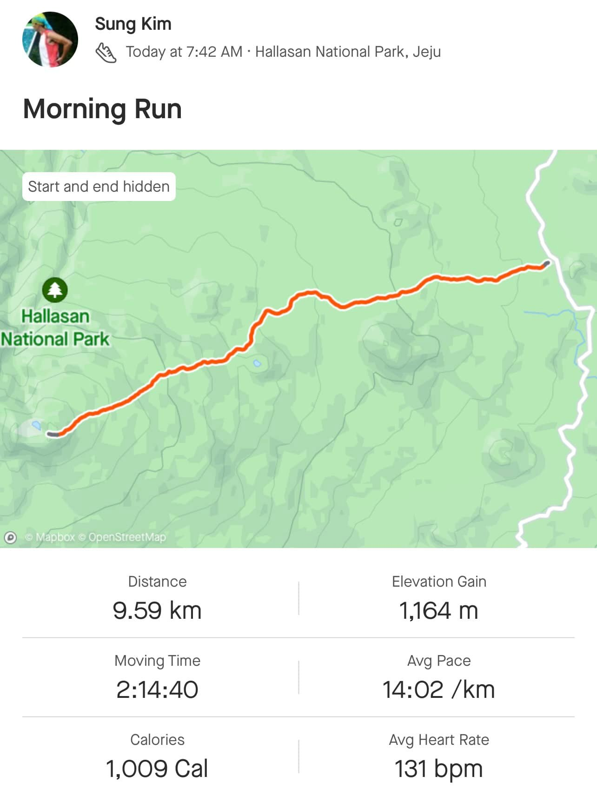

### 6월 23일 (금) 17:01 · 📷 사진 (3장)

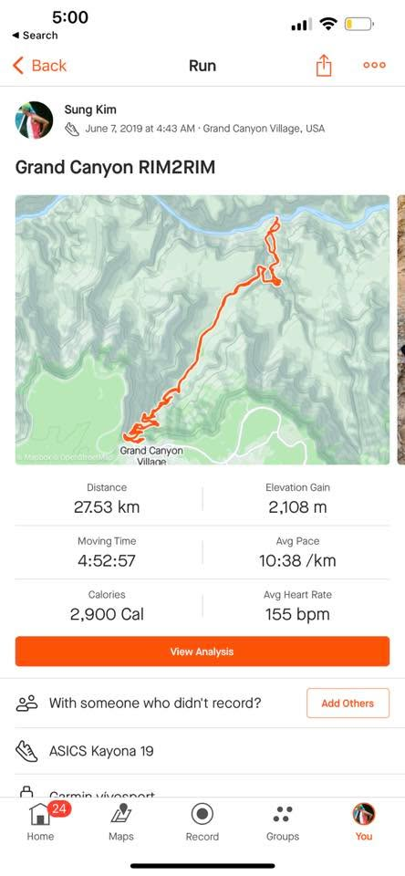 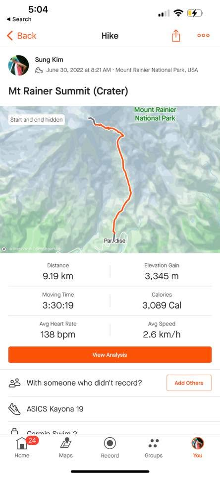 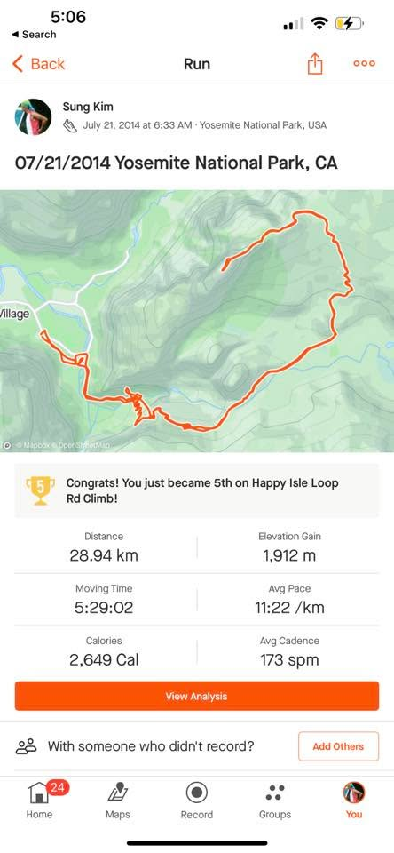

### 6월 24일 (토) 08:17 · #krnet2023

#krnet2023 

학부 시절 부터 설렘으로 참여해오던 KRNET에서 발표를 하게 되었습니다. 오시는분들 반갑게 뵙겠습니다. https://krnet.or.kr/program

"KRNET(학술전산망워크숍)은 1993년부터 개최된 한국의 인터넷 관련 워크숍으로 인터넷 분야 국내 최대의 행사이다. 국내외 인터넷 관련 기술 동향을 소개하고 전문가들의 교류 및 협력을 도모하는 역할을 담당하고 있으며, 인터넷을 확산시키기 위한 논의와 교육이 함께 이루어지는 대중 행사를 겸하고 있다. 1회 대회의 주최는 당시 국내 3대 연구개발망인 하나망, 교육전산망, 연구전산망이 공동으로 맡았고, 학술전산망협의회 및 한국통신이 주관했다. 초대 조직위원장은 전길남, 운영위원장은 한선영이었다. 제1회 KRNET에서는 월드와이드웹이 소개되었고, 여러 네트워크 전문가들에 의해 인터넷 관련 현안 및 쟁점이 발표되었다. 1회 참가자는 800여 명에 달했다. 이후, 한국전산원, 조선일보, 한국인터넷협회, 개방형컴퓨터통신연구회 등이 주관했다. KRNET을 통해 다양한 연구자 모임이 결성되었으며, 일반인들에게 인터넷과 월드와이드웹을 알리는 데 큰 역할을 했다." 위키

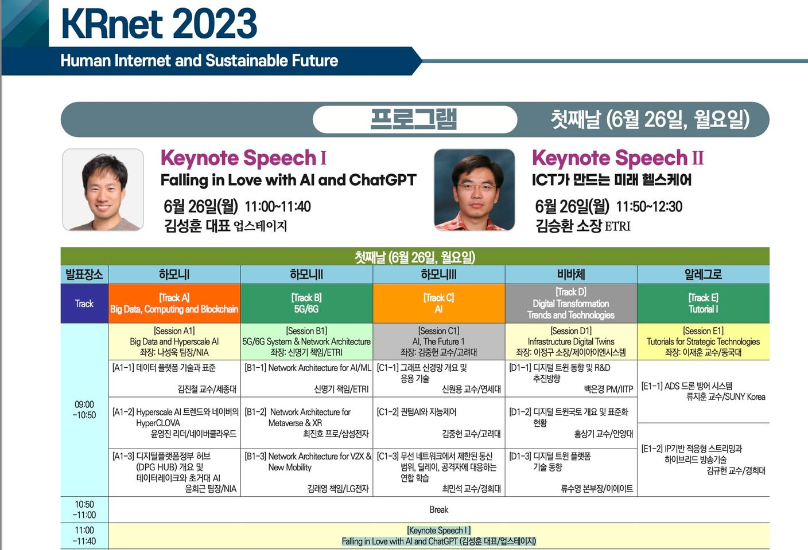

### 6월 25일 (일) 16:39 · #준자비스 #pandasai #excelcopilot

#준자비스 #pandasai #excelcopilot 

엑셀 co-pilot을 기다리던중 PandanAI라는 멋진 프로젝트를 발견하고 저희 회사 Slack AskUp과 연동하여 "csv/엑셀파일" 무엇이든 물어보세요 실험을 합니다. 

아래 예처럼 World Happiness Report 2023 csv 파일을 올리고 질문을 해볼수 있는데요. 

1. 제일 행복한 나아?
2. 한국 몇등?
3. 한국보다 잘살면서 불행한 나라가 어디야? 홍콩
4. 가난하면서도 행복한곳 어디야?

수치 요약후 이를 바탕으로 간단한 *의사결정* 도 하지 않을까 생각이 됩니다.

여러분들 슬랙에서 오프렘 LLM등으로 (외부 정보유출없이) 사용할수 있다면, 어떤 데이터를 넣고 질문한다면 어떤 질문을 제일 많이 하게 될까요?

*구현: 아마도
1. 사용자 질문 -> GPT function calls -> Pandas 쿼리 
2. 쿼리 결과 + 사용자 질문 -> 최종 결과

로 되어 있을듯 합니다. 즉 개선할 부분들이 많이 보입니다.

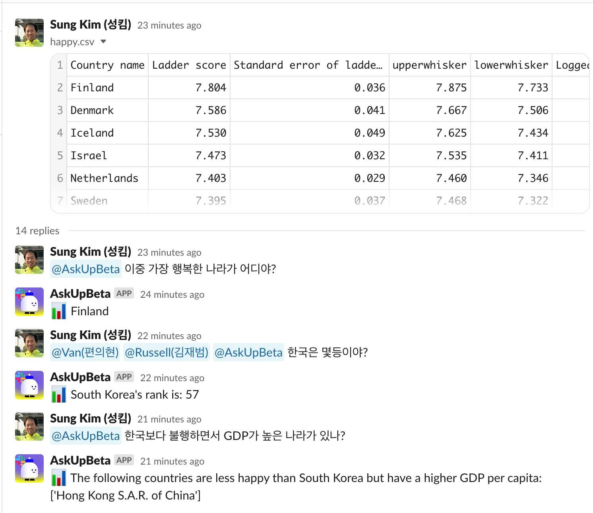 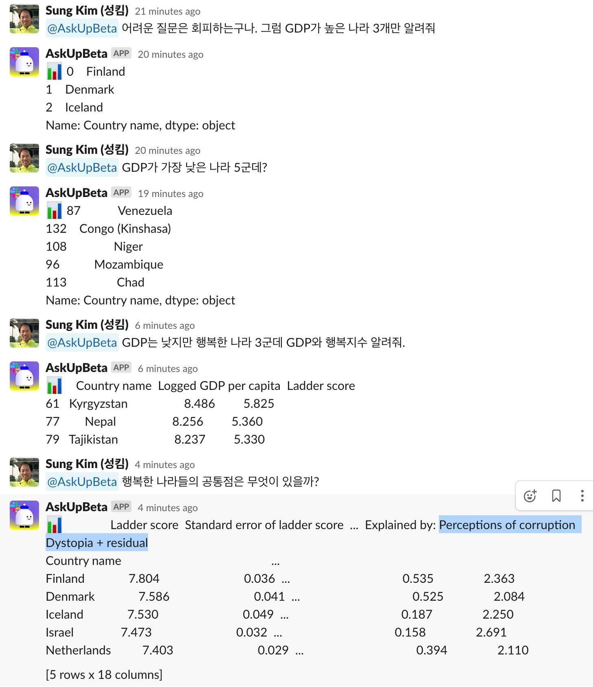

### 6월 26일 (월) 18:10 · "업스테이지 성킴 ‘러브콜’에 한달 고민"

"업스테이지 성킴 ‘러브콜’에 한달 고민"
“못다 한 금융권 DT, 기술력으로 실현”
“하와이에서 한 달 동안 김 대표와 통화를 하루 두 통씩은 했다”

함께 일해서 너무 기쁘고 좋습니다. 

저희는 더 많은 고객, 더 많은 AI로 고객만족을 위해 달려보겠습니다.

https://n.news.naver.com/mnews/article/081/0003371795?sid=101

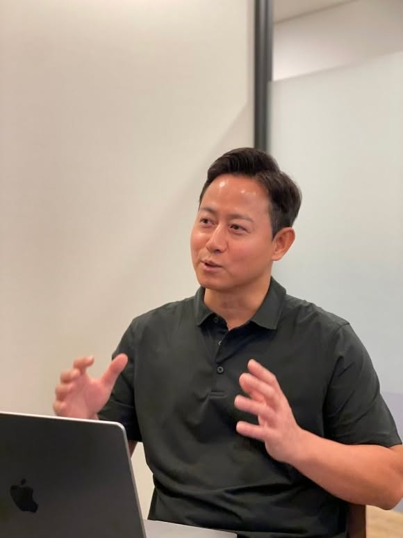

### 6월 27일 (화) 15:25 · 📷 사진 (1장)

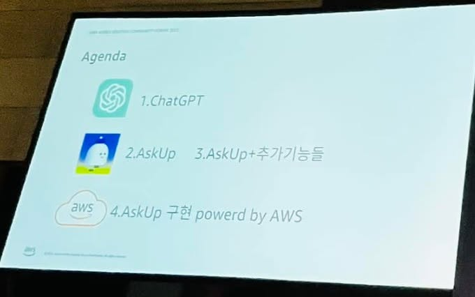

### 6월 28일 (수) 16:23 · #ChatAI고민 #무엇을할까? #AskUp그립톡선물

#ChatAI고민 #무엇을할까? #AskUp그립톡선물 

제가 7월 대한상공회의소, 8월 경실련에서 선배 기업가분들 앞에서 Chat AI를 어떻게 사업에 적용할지에 대한 이야기를 할 수 있는 기회를 얻었습니다. 막상 발표일이 다가오니 걱정도 되는데요. 어떤 적용 사례를 말씀드리면 좋을까요?

GPT4 수준으로는 무엇을 할 수 있을까요? GPT5, 6, 7 정도가 나와서 정말 자비스처럼 똑똑하고 좋은 브레인이 있다면 무엇을 더 할 수 있을까요? 제가 저희가 보고 있는 부분을 한 장의 슬라이드로 붙여 보았는데요, 추가 아이디어가 있을까요? 댓글로 많이 부탁드립니다.

#선물 댓글 주시는 분들 중 10분을 추첨하여 한정판 AskUp 그립톡을 보내 드립니다. 미리 감사드립니다.

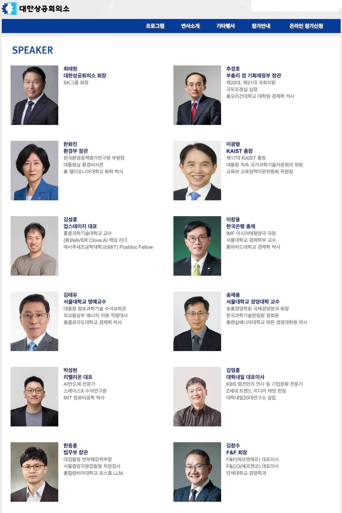 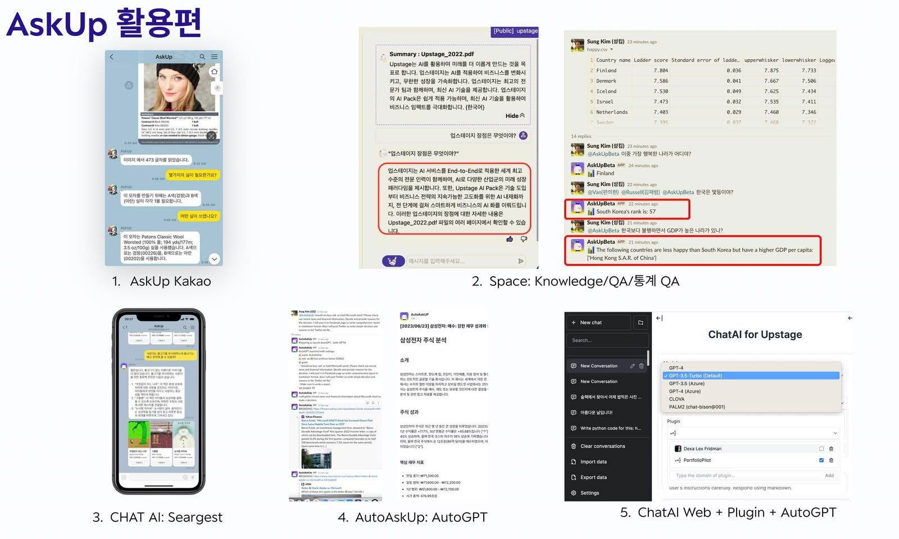 

### 6월 29일 (목) 09:58 · #paperless #upocr 업스테이지의 주력상품인 초고성능 OCR/…

#paperless #upocr 업스테이지의 주력상품인 초고성능 OCR/DocAI와 KT함께 협력합니다. 이를 통해 DX의 핵심과제중 하나인 paperless를 모두에게 제공하려고 합니다. 모두를 위한 PaperLess. 필요하신 분들은 업스테이지와 KT로 연락 주세요!

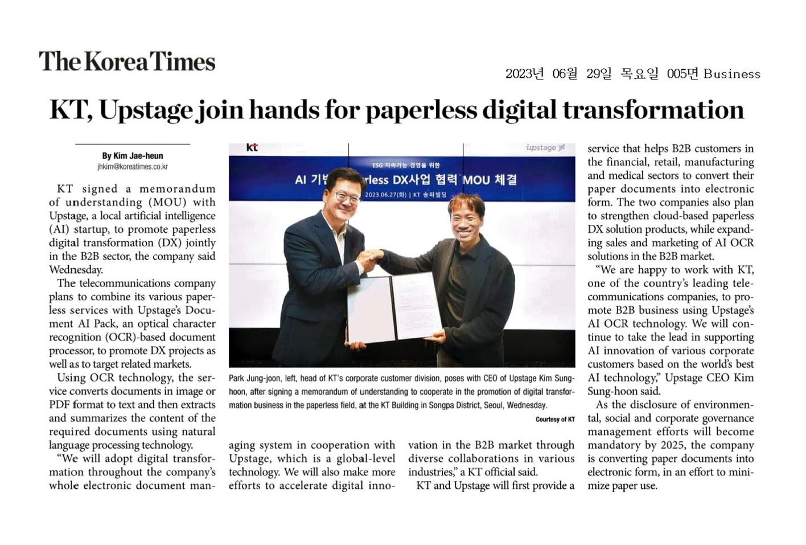
