# 2023년 7월

[← 2023년](README.md)

### 7월 5일 (수) 07:40 · #업스문화 #일이되게 #자유로운문화

#업스문화 #일이되게 #자유로운문화

함께 AI 세계 최고를 꿈꾸며 (일부는 이미 이루었고) 계속 달리는 업스테이지. 그 문화를 만들어 가는 모든 멤버들을 앞에서 이끌고 있는 존경하는 Hanna Ryu 부사장님, GO팀 리더의 인터뷰입니다. 회사를 앞으로 나아가게 하는 의미의 GO팀 덕분에, 우리 회사는 정말 멋지고 재미있는 회사가 되어가고 있습니다.
https://bit.ly/upstagego

"우리는 근태 관리가 아닌, 일이 되게 하는 데 집중한다. 전사 타운홀, 일을 주고받을 때 맥락 설명, 상대방이 정보를 놓치지 않게 하기 위해 태그(소환), 말을 걸 수 있게 스케줄을 공개, 정기적 1:1, 랜덤 티타임 매칭 등 여러가지 시도를 하고 있다"면서 "또 원격으로 일을 하다가도 필요하면 적극 만나기도 한다"

자유로운 업무 문화도 큰 호응을 받는다. 특히 김성훈 대표가 주최하는 '운동챌린지'는 가장 인기를 끄는 이벤트다. 지난해 상반기 팔굽혀펴기·와이드 턱걸이·스필릿 스쿼트 종목 챌린지를 시작으로, 하반기 풀 마라톤을 진행했다. 올해는 '3대 명산' 오르기 등 챌린지로 이어지고 있다. 챌린지를 완수할 경우 김성훈 대표 사비로 100만원의 축하금을 받을 수 있다.

남궁경 기자님의 멋진 인터뷰 기사, 감사드립니다.

### 7월 5일 (수) 08:04 · "챗GPT? 빌리지 말고 직접 소유하세요!"

"챗GPT? 빌리지 말고 직접 소유하세요!"

오늘 나온 https://mirakle.mk.co.kr/ 뉴스레터에 의하면 3억~10억 정도면 가벼운 파인튜닝은 가능하다는 의견을 적어 주셨습니다.

저희도 120만 AskUp (현 GPT3.5)를 일부 대체해보기 위해 만들고 있는 AskUpLLM 의 성능이 상당합니다. 곧 30%정도의 AskUp 트래픽을 AskUpLLM 으로 대체하여 서비스를 할 예정입니다.

"3억~10억의 실비투자면 (Private)GPT를 가질수 있다면" 여러분들과 여러분들의 회사/조직은 이정도를 투자하실까요? 그리고 이러한 PrivateGPT를 어떤곳에 사용하고 싶으신지요?

관심있으신 분들은 연락주셔요. 함께 만들어 봅시다!

--
조금 긴 이야기 TMI (Too long; didn't read)

지난번 Sam Altman과의 private session에서 Kyunghyun Cho 교수님이 토론을 위해 이런 질문을 하셨습니다.

"Why we should use GPT API?"

추가 질문을 의역하면

"왜 우리가 OpenAI GPT API를 사용해야하지? 너네도 한지가 3년도 안되었잖아? (OpenAI멤버가 본격한것은 2년이라고 수정해줌). 그리고 그때 100~200명도 안되었잖아? 그럼 지금 기술이 더 많이 공개 되었으니 더 적은 시간 그리고 더 적은 리소스로 가능한데 왜 너네걸 사용해야 하지?

여기 모인 스타터업이 자체 LLM을 만드는것에 대해 오픈 AI는 어떻게 생각해?"

여기 제가 리듬으로
"Should we?" 당연해야지를 붙이면서 장내가 웃음바다가 되면서...

OpenAI 답변이 시작되었는데요. 경영진들의 뻔한 답변 Political correctness (PC) 을 듣다 지친 조경현 교수님이 경연진 말고 OpenAI 실무진들은 어떻게 생각하는지 하는 질문으로 더 흥미진진하게 토론을 이끌었습니다.

실무진들은 상당히 다른 답변을 했는데요... 이는 다음 TMI에서 다릅니다.

그때 조경현 교수님의 질문은 저를 비롯한 많은 창업자의 가슴에 불을 당겼을 것입니다. 역시 멋진 교수님의 질문입니다!

이 질문으로 인해 저희도 본격 투자를 시작했고 곧 결과들을 공개할수 있을것 같습니다.

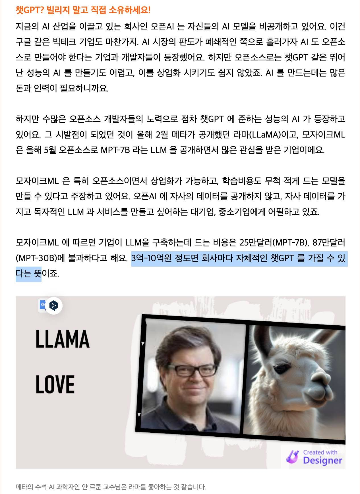
**이미지 캡션:** 사진에는 "LLAMA LOVE"라는 텍스트와 함께 한 남성과 라마의 이미지가 나란히 배치되어 있습니다. 남성은 안경을 쓰고 미소를 짓고 있으며, 라마는 정면을 응시하고 있습니다. 이미지 상단에는 "챗GPT? 빌리지 말고 직접 소유하세요!"라는 제목과 함께 오픈소스 AI 모델에 대한 설명이 한국어로 작성되어 있습니다. 텍스트 내용은 오픈AI의 폐쇄적인 AI 모델 개발 방식과 이에 대한 대안으로 등장한 오픈소스 AI 모델들의 장점을 설명하고 있으며, 특히 메타의 라마(LLaMA)와 모자이크ML의 MPT-7B 모델을 언급하고 있습니다. 또한, 오픈소스 LLM 구축에 드는 비용이 상대적으로 저렴하다는 점을 강조하며 기업들이 자체적인 AI 모델을 구축할 수 있다는 가능성을 제시하고 있습니다. 사진 하단에는 "메타의 수석 AI 과학자인 얀 르쿤 교수님은 라마를 좋아하는 것 같습니다."라는 문구가 있어, 이미지의 내용과 관련성을 시사합니다. 전반적으로 AI 기술, 특히 오픈소스 AI 모델에 대한 정보를 전달하는 내용이며, 긍정적이고 희망적인 분위기를 담고 있습니다.

### 7월 6일 (목) 07:20 · #sLLM #usecase #한국어1T #RAG

#sLLM #usecase #한국어1T #RAG 

1T토큰을 from scratch에서 굽는데는 871KUSD가 필요하고 1B토큰으로 파인튜닝을 하면 871USD가 든다는 MosaicML등 SLLM은 내가 하려는 Task에서 얼마나 잘될까요? https://www.mosaicml.com/blog/mpt-30b

이 질문에 제가 답을 드리려면 여러분이 하시려는 테스크가 무엇인지를 알아야 합니다. 

혹시 RAG류 일까요? 생성모델은 환각이 존재하기 때문에 많은 경우에는 주어진 많은 자료에서 임베딩등의 검색으로 자료의 양을 줄이고 (4K context) 그 것을 LLM의 prompt로 넣게 됩니다. 그런다음 그 안에서 답을 찾아 주거나 요약정리하거나 등을 하는 *검색결과 떠먹여* 주며 생성을 하게 됩니다.Retrieval-Augmented Generation (RAG) 라는 방식입니다.

즉 우리가 많이 생각할수 있는 AI QA, AI ChatBot, AI Contact center (AICC) 등이 여기에 해당합니다.  

특히 여러분들이 실시간성으로 변화하는 데이터 (예: 고객의 구매이력, 오늘의 최신 뉴스, 주가) 등을 대상으로 어떤 서비스를 하신다면 RAG 방식은 필수입니다. 

그렇다면 이러한 Task에서는 sllm은 얼마나 잘될까요? https://lmsys.org/blog/2023-06-29-longchat/ 의 그림 1, 2을 보시면 힌트가 나옵니다. 

그런데 놀랍습니다. 아주 놀랍습니다!

long-range topic retrieval task 에서는 13B정도도 상당히 정확하고 ong-range line retrieval task 에서도 쓸만한 수준이 나옵니다. 특히 5K등 작은 context에서는 MPT-30B는 1.0의 정확도로 GPT3.5와 같은 성능입니다. 

여러분들이 하시고 싶은 task에 따라, 그리고 필요한 context의 크기에 따라 sllm은 좋은 결과를 줄수도 있고 사용하지 못할수도 있습니다.

여러분들은 어떤 LLM으로 어떤  task하시고 싶으신지요? 그 task에 sLLM을 사용하실수 있을까요?

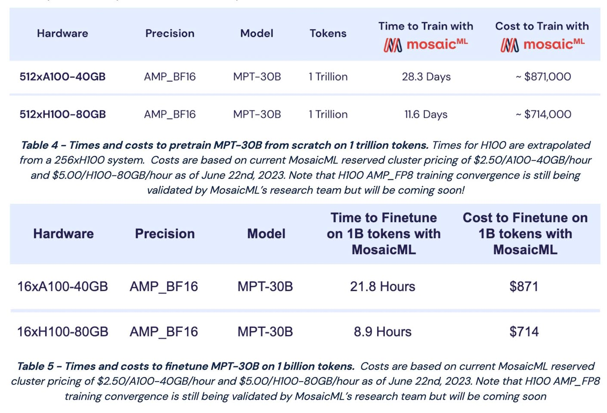
**이미지 캡션:** 이 이미지는 두 개의 표를 포함하고 있으며, 첫 번째 표는 MPT-30B 모델을 1조 개의 토큰으로 처음부터 사전 학습하는 데 걸리는 시간과 비용을 보여주고, 두 번째 표는 10억 개의 토큰으로 MPT-30B 모델을 파인튜닝하는 데 걸리는 시간과 비용을 보여줍니다. 두 표 모두 하드웨어, 정밀도, 모델, 토큰 수, 소요 시간, 비용 등의 정보를 담고 있습니다. 첫 번째 표의 하드웨어는 512xA100-40GB와 512xH100-80GB이며, 각각 28.3일과 11.6일이 소요되고 비용은 약 871,000달러와 714,000달러입니다. 두 번째 표의 하드웨어는 16xA100-40GB와 16xH100-80GB이며, 각각 21.8시간과 8.9시간이 소요되고 비용은 871달러와 714달러입니다. 두 표 모두 MosaicML의 예약 클러스터 가격을 기준으로 하며, 2023년 6월 22일 기준입니다. 또한 H100 AMP_FP8 학습 수렴은 MosaicML 연구팀에서 검증 중이며 곧 공개될 예정이라는 내용이 포함되어 있습니다. 이 이미지는 컴퓨터 과학 또는 인공지능 분야의 연구자들이 모델 학습 및 파인튜닝에 대한 비용과 시간을 비교하는 데 유용할 수 있습니다.
 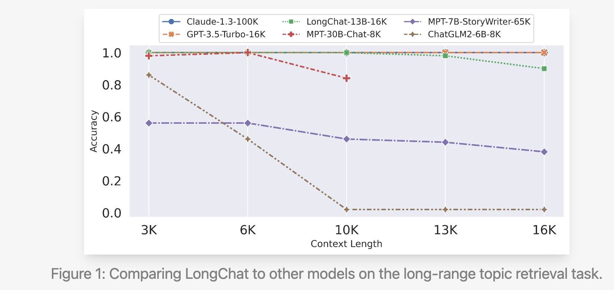
**이미지 캡션:** 이것은 여러 인공지능 모델의 성능을 비교하는 선 그래프로, x축은 컨텍스트 길이(3K, 6K, 10K, 13K, 16K)를 나타내고, y축은 정확도를 나타냅니다. 각 선은 다른 모델을 나타내며, 범례에는 Claude-1.3-100K, GPT-3.5-Turbo-16K, MPT-30B-Chat-8K, LongChat-13B-16K, MPT-7B-StoryWriter-65K, ChatGLM2-6B-8K와 같은 모델 이름이 표시되어 있습니다. 그래프는 컨텍스트 길이가 증가함에 따라 모델들의 정확도가 어떻게 변하는지를 보여주며, 특히 LongChat 모델이 장거리 주제 검색 작업에서 다른 모델들과 비교하여 어떤 성능을 보이는지를 나타냅니다. 그래프 아래에는 "Figure 1: Comparing LongChat to other models on the long-range topic retrieval task."라는 캡션이 있습니다. 이 이미지는 연구 또는 기술 보고서의 일부로 보이며, 데이터 시각화를 통해 정보를 전달하는 데 중점을 두고 있습니다.
 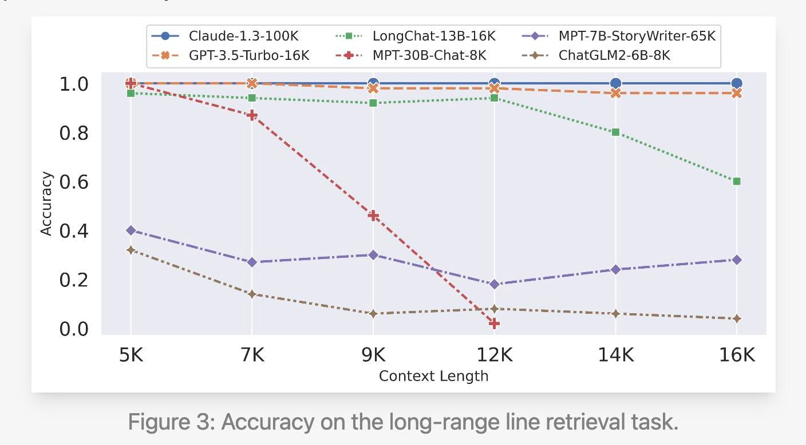
**이미지 캡션:** 이 이미지는 여러 인공지능 모델의 장거리 라인 검색 작업에 대한 정확도를 보여주는 그래프입니다. 그래프의 가로축은 컨텍스트 길이(5K, 7K, 9K, 12K, 14K, 16K)를 나타내고, 세로축은 정확도를 0.0부터 1.0까지 보여줍니다. 각 선은 다른 모델을 나타내며, 파란색 원형 마커와 실선은 Claude-1.3-100K, 주황색 십자 마커와 점선은 GPT-3.5-Turbo-16K, 녹색 사각형 마커와 점선은 LongChat-13B-16K, 빨간색 십자 마커와 파선은 MPT-30B-Chat-8K, 보라색 다이아몬드 마커와 점선은 MPT-7B-StoryWriter-65K, 갈색 마커와 점선은 ChatGLM2-6B-8K를 나타냅니다. 전반적으로 Claude-1.3-100K와 GPT-3.5-Turbo-16K 모델이 컨텍스트 길이가 길어질수록 높은 정확도를 유지하는 반면, 다른 모델들은 컨텍스트 길이가 길어짐에 따라 정확도가 감소하는 경향을 보입니다. 그래프 하단에는 "Figure 3: Accuracy on the long-range line retrieval task."라는 제목이 있습니다.

### 7월 7일 (금) 21:36 · #pageturner #단숨에읽어짐 #꿀잼책

#pageturner #단숨에읽어짐 #꿀잼책 

한국 인공지능 분야를 선도하는 Jung-Woo Ha 센터장님과 존경하는 1세대 AI 대표적인 연구자이신 Steve Han 대표님의 멋진 대담을 그대로 옮긴 책입니다. 

빠른 전개와 흥미진진한 질문과 인사이트 넘치는 답변들을 읽으면서 간만에 시간순삭 + 단숨이 읽어지는 멋진 책이였습니다.

영광스럽게도 저는 이 책에 아래와 같은 추천사를 드렸습니다. 

"챗GPT를 통해 우리 일상에 인공지능이 깊이 들어오면서 어느 때보다 인공일반지능(AGI)의 실현이 점점 가까워지고 있다는 사실이 많은 이들의 흥분을 자아내고 있다. 이 놀라움의 시대에 한국 인공지능 분야에서 가장 중요한 인물의 목소리를 들을 수 있는 기회가 생겼으니, 바로 이 책이다! 네이버 하이퍼클로바X를 만들고 있고 한국 인공지능 분야를 선도하는 하정우 센터장과의 대화를 통해 여러분은 AI 기술의 최신 트렌드와 미래에 대한 통찰을 얻을 수 있을 것이다. 만약 이 시대에 읽어야 할 단 한 권의 AI 책이 있다면, 그것은 바로 이 책이다. AI의 흥미진진한 물결 속에서 흥미로운 인사이트를 발견할 수 있게 해주는 이 책을 망설임 없이 추천한다."

한마디로 멋진 책입니다. 선구매, 노고민

🔗 <https://www.yes24.com/Product/Goods/120007902>

### 7월 9일 (일) 23:30 · GPT Code Interpreter의 10가지 멋진 Use Cases …

GPT Code Interpreter의 10가지 멋진 Use Cases 공유드립니다. WOW 입니다. 

Code Interpreter의 의미는 여러분들이 말로 하면 이걸 코드로 해석해서 짜서 실행해주겠다는 것 같습니다. 그래서 코드로/프로그래밍으로 할수 있는 거의 모든일을 할수 있습니다.

(트윗 링크가 너무 많이 달려서 Thread를 좋아 하는 FB에서 이 글은 거의 노출이 안될것 같습니다.)

1. 모든 종류의 그래프를 쉽게 생성할 수 있습니다
https://twitter.com/gdb/status/1677023789807292420

2. 어떤 GIF든 MP4로 변환할 수 있습니다.
https://twitter.com/goodside/status/1652540643212767234

3. 이미지에서 색상을 추출하여 간단한 PNG 팔레트를 생성할 수 있습니다.
https://twitter.com/skirano/status/1653085442047369217

4. 데이터를 정리한 후에는 통찰력 있는 데이터 시각화를 생성할 수 있습니다.
https://twitter.com/Saboo_Shubham_/status/1677016588233367568

5. CSV 파일을 GIF로 변환할 수 있습니다.
https://twitter.com/emollick/status/1653451648826757121

6. 플레이리스트를 분석하여 음악 취향을 요약할 수 있습니다.
https://twitter.com/SHL0MS/status/1652842277788692480

7. 데이터셋에서 완전히 기능하는 HTML 사이트를 생성하세요. 이건 정말 놀랍습니다!
https://twitter.com/PatrickJBlum/status/1652365030535598081

8. 쉽게 다운로드할 수 있는 주식 데이터셋을 생성하세요.
https://twitter.com/TechMemeKing/status/1653258652055138304

9. 이미지를 텍스트 파일로 변환하세요.
https://twitter.com/Saboo_Shubham_/status/1654323164187377665

10. 심지어 비정형 데이터의 상세한 데이터 분석도 수행할 수 있습니다.
https://twitter.com/emollick/status/1676441469979185157

원문: https://medium.com/@smraiyyan/chatgpt-code-interpreter-launches-next-week-here-are-10-mind-blowing-use-cases-c20ce9be3824

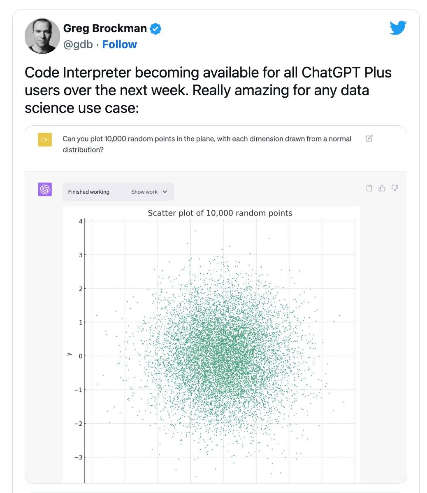
**이미지 캡션:** 이 사진은 트위터 게시물로, 그렉 브록만이라는 성인 남성이 올린 것으로 보인다. 그는 짧은 머리에 검은색 티셔츠를 입고 있으며, 카메라를 응시하며 무표정하다. 게시물은 "Code Interpreter가 다음 주에 모든 ChatGPT Plus 사용자에게 제공될 예정입니다. 데이터 과학 활용 사례에 정말 놀랍습니다."라는 내용과 함께, ChatGPT의 코드 인터프리터 기능을 활용하여 10,000개의 무작위 점을 평면에 그리는 예시를 보여준다. 이 예시는 "CH"라는 아이콘과 함께 표시되며, "정규 분포에서 각 차원을 추출하여 평면에 10,000개의 무작위 점을 그릴 수 있습니까?"라는 질문을 포함하고 있다. 그 아래에는 "Finished working"이라는 상태 표시와 함께 "Show work" 버튼이 있으며, 실제 결과로 10,000개의 무작위 점이 정규 분포 형태로 흩뿌려진 산점도가 나타난다. 산점도의 x축과 y축은 각각 0을 중심으로 대칭적인 분포를 보이며, y축은 -3부터 4까지 표시되어 있다. 전체적으로 기술적인 정보를 공유하고 새로운 기능의 유용성을 강조하는 분위기이다.
 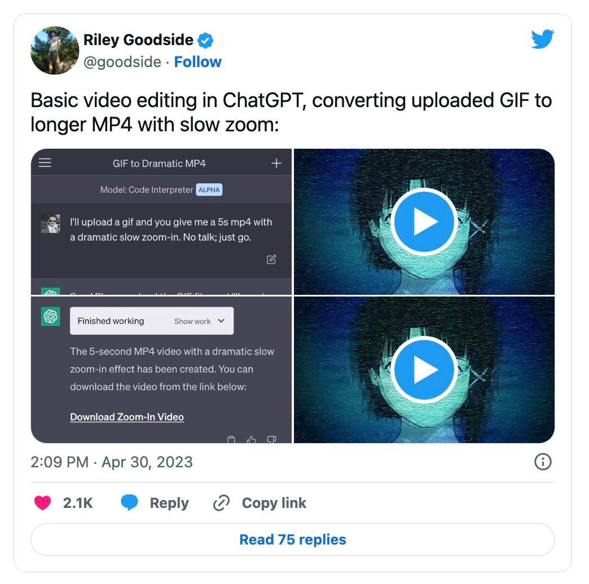
**이미지 캡션:** 이것은 트위터 게시물로, Riley Goodside라는 사용자가 올린 것으로 보인다. 게시물 제목은 "Basic video editing in ChatGPT, converting uploaded GIF to longer MP4 with slow zoom:"이며, ChatGPT를 사용하여 GIF 파일을 느린 줌 효과가 있는 MP4 비디오로 변환하는 과정을 보여준다. 화면은 크게 두 부분으로 나뉘는데, 왼쪽에는 ChatGPT 인터페이스가, 오른쪽에는 생성된 비디오 미리보기가 표시된다. 왼쪽 상단에는 "GIF to Dramatic MP4"라는 제목과 함께 "Model: Code Interpreter ALPHA"라는 문구가 보이며, ChatGPT와의 대화 내용이 나타난다. 사용자가 GIF를 업로드하면 5초 길이의 느린 줌 효과가 있는 MP4 비디오를 만들어준다는 내용이다. 왼쪽 하단에는 "Finished working"이라는 메시지와 함께 "The 5-second MP4 video with a dramatic slow zoom-in effect has been created. You can download the video from the link below:"라는 문구와 함께 "Download Zoom-In Video"라는 버튼이 보인다. 오른쪽에는 두 개의 비디오 미리보기가 있는데, 각각 파란색 플레이 버튼이 있는 애니메이션 스타일의 인물 얼굴이 나타난다. 이 인물은 긴 검은색 머리카락과 둥근 얼굴형을 가지고 있으며, 눈은 크고 검은색으로 표현되어 있다. 전체적으로 어두운 파란색 톤의 배경과 함께 약간은 몽환적이거나 신비로운 분위기를 자아낸다. 게시물 하단에는 게시 시간(2:09 PM · Apr 30, 2023), 좋아요 수(2.1K), 댓글 수, 링크 복사 기능, 그리고 75개의 댓글을 읽을 수 있는 버튼이 표시되어 있다.
 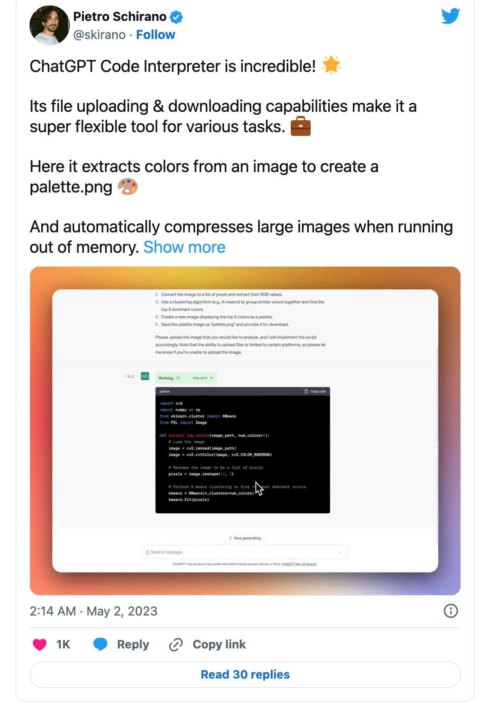
**이미지 캡션:** 이 사진은 트위터 게시물로, 한 성인 남성이 ChatGPT 코드 인터프리터의 기능을 소개하고 있습니다. 남성은 짧은 검은색 머리에 수염을 기르고 있으며, 검은색 티셔츠를 입고 있습니다. 그는 카메라를 응시하며 약간 미소를 짓고 있습니다. 배경은 흰색이며, 그의 프로필 사진과 트위터 로고가 보입니다. 게시물 내용은 ChatGPT 코드 인터프리터가 이미지에서 색상을 추출하여 팔레트를 만들고 대용량 이미지를 자동으로 압축하는 기능을 설명합니다. 화면에는 코드 인터프리터의 인터페이스가 캡처되어 있으며, 파이썬 코드가 작성되어 있고 이미지 처리 과정에 대한 설명이 단계별로 나열되어 있습니다. 게시물 하단에는 게시 시간, 좋아요 수, 댓글 수, 공유 링크 옵션이 표시되어 있습니다. 전체적으로 기술적인 기능을 긍정적으로 소개하는 분위기입니다.
 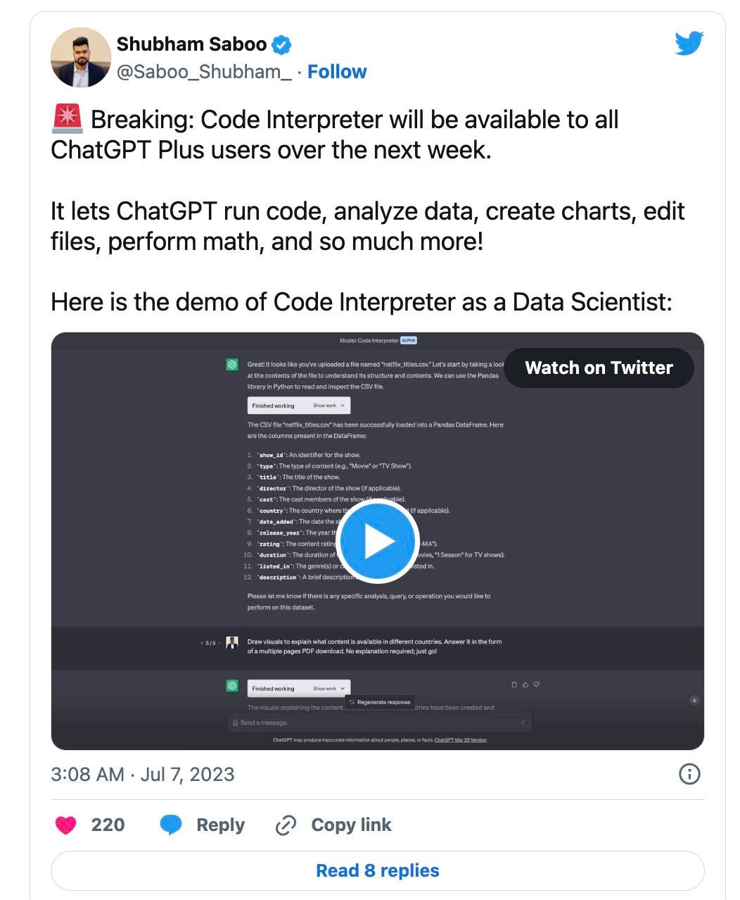
**이미지 캡션:** 이 사진은 트위터 게시물로, 성인 남성인 Shubham Saboo가 ChatGPT의 코드 인터프리터 기능에 대한 정보를 공유하고 있습니다. 그는 젊고 단정한 외모를 하고 있으며, 검은색 셔츠를 입고 있습니다. 그의 표정은 진지하면서도 흥미를 느끼는 듯합니다. 사진의 배경에는 그의 프로필 사진과 트위터 로고가 보이며, 게시물 본문에는 코드 인터프리터 기능에 대한 설명과 함께 데모 영상이 포함되어 있습니다. 영상 속 화면에는 ChatGPT의 인터페이스가 보이며, CSV 파일을 분석하고 시각화하는 과정이 나타나 있습니다. 텍스트로는 "Breaking: Code Interpreter will be available to all ChatGPT Plus users over the next week."과 같은 내용이 보입니다. 전체적으로 기술적인 정보를 공유하는 진지하고 유익한 분위기입니다.
 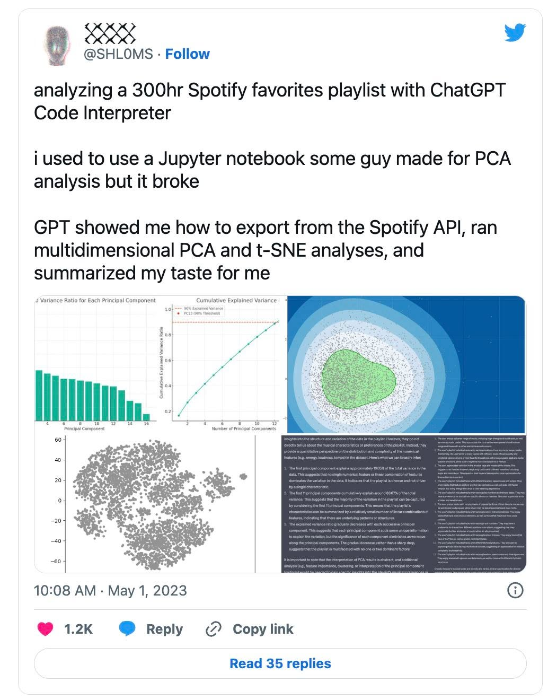
**이미지 캡션:** 이것은 트위터 게시물로, 사용자가 300시간 분량의 스포티파이 즐겨찾기 플레이리스트를 ChatGPT 코드 인터프리터를 사용하여 분석한 경험을 공유하고 있습니다. 게시물에는 여러 개의 그래프가 포함되어 있는데, 첫 번째는 각 주성분별 분산 비율을 보여주는 막대 그래프이고, 두 번째는 누적 설명 분산 비율을 보여주는 꺾은선 그래프이며, 세 번째는 t-SNE 분석 결과를 시각화한 산점도입니다. 네 번째는 PCA 결과에 대한 해석을 담은 텍스트입니다. 사용자는 이전에 PCA 분석을 위해 사용했던 주피터 노트북이 고장 났지만, ChatGPT가 스포티파이 API에서 데이터를 추출하고 다차원 PCA 및 t-SNE 분석을 수행하는 방법을 보여주어 자신의 취향을 요약해 주었다고 설명합니다. 게시물 하단에는 게시 시간과 날짜(2023년 5월 1일 오전 10시 8분), 좋아요 수(1.2K), 답글 및 링크 복사 기능, 그리고 35개의 답글을 읽을 수 있는 버튼이 표시되어 있습니다. 전체적으로 기술적인 분석 결과와 이를 가능하게 한 도구에 대한 정보를 공유하는 내용입니다.
 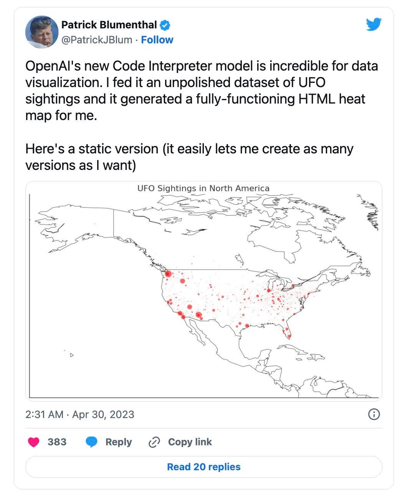
**이미지 캡션:** 화면 상단에는 파란색 체크 표시와 함께 "Patrick Blumenthal"이라는 이름과 "@PatrickJBlum"이라는 트위터 계정이 보이며, 그 옆에는 파란색 새 모양의 트위터 로고가 있다. 이 사용자는 성인 남성으로 추정되며, 프로필 사진에는 존 F. 케네디 전 미국 대통령의 모습이 담겨 있다. 그는 "OpenAI의 새로운 Code Interpreter 모델은 데이터 시각화에 놀랍습니다. 저는 이를 가공되지 않은 UFO 목격 데이터셋에 입력했고, 완전한 기능을 갖춘 HTML 히트맵을 생성해 주었습니다. 제가 원하는 만큼 쉽게 여러 버전을 만들 수 있는 정적 버전입니다."라고 썼다. 그 아래에는 북미 지역의 UFO 목격 횟수를 나타내는 히트맵이 그려져 있으며, 붉은색 점들이 북미 전역, 특히 미국 동부와 서부 해안 지역에 집중되어 있다. 지도 위에는 "UFO Sightings in North America"라는 제목이 있다. 화면 하단에는 게시물이 게시된 시간인 "2:31 AM · Apr 30, 2023"과 함께 좋아요 383개, 답글, 링크 복사 기능이 표시되어 있으며, "20개의 답글 읽기"라는 버튼도 보인다. 전반적으로 이 게시물은 기술적인 도구를 사용하여 데이터를 시각화하는 것에 대한 정보를 공유하는 분위기이다.
 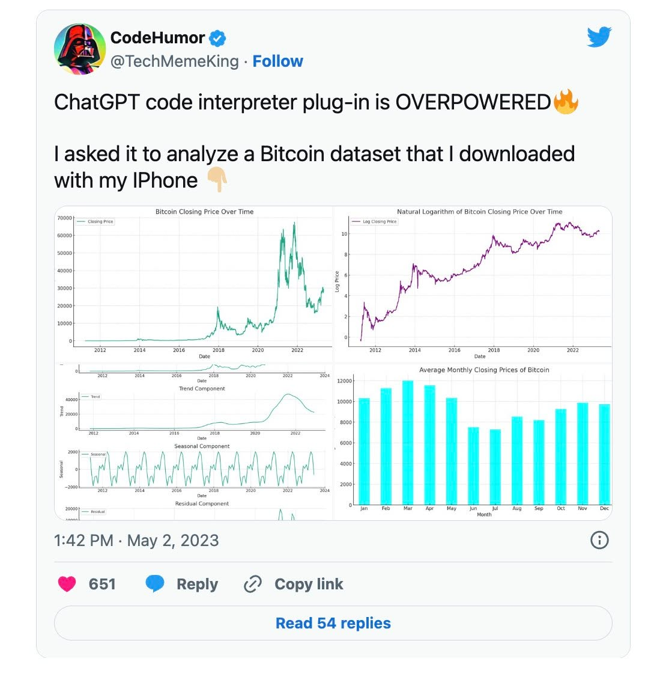
**이미지 캡션:** 이 사진은 트위터 게시물로, 사용자가 "CodeHumor"라는 계정의 "TechMemeKing"이라는 사용자가 올린 내용을 보여줍니다. 이 사용자는 성인 남성으로 보이며, 다스베이더 캐릭터 프로필 사진을 사용하고 있습니다. 그는 "ChatGPT 코드 인터프리터 플러그인이 너무 강력하다"는 제목과 함께, 아이폰으로 다운로드한 비트코인 데이터셋을 분석해달라고 ChatGPT에 요청했다고 설명합니다. 게시물에는 네 개의 그래프가 포함되어 있습니다. 왼쪽 상단에는 2012년부터 2022년까지 비트코인 종가 추세를 보여주는 선 그래프가 있고, 오른쪽 상단에는 같은 기간 동안 비트코인 종가의 자연 로그를 보여주는 보라색 선 그래프가 있습니다. 왼쪽 하단에는 비트코인 가격의 추세, 계절성, 잔차 구성 요소를 보여주는 세 개의 작은 선 그래프가 나란히 표시되어 있습니다. 오른쪽 하단에는 2023년 1월부터 12월까지 비트코인의 월평균 종가를 나타내는 파란색 막대 그래프가 있습니다. 게시물은 2023년 5월 2일 오후 1시 42분에 게시되었으며, 651개의 좋아요와 54개의 답글이 있습니다. 전반적으로 이 게시물은 ChatGPT의 데이터 분석 능력에 대한 감탄과 비트코인 가격 추이에 대한 관심을 보여주는 기술 관련 콘텐츠입니다.
 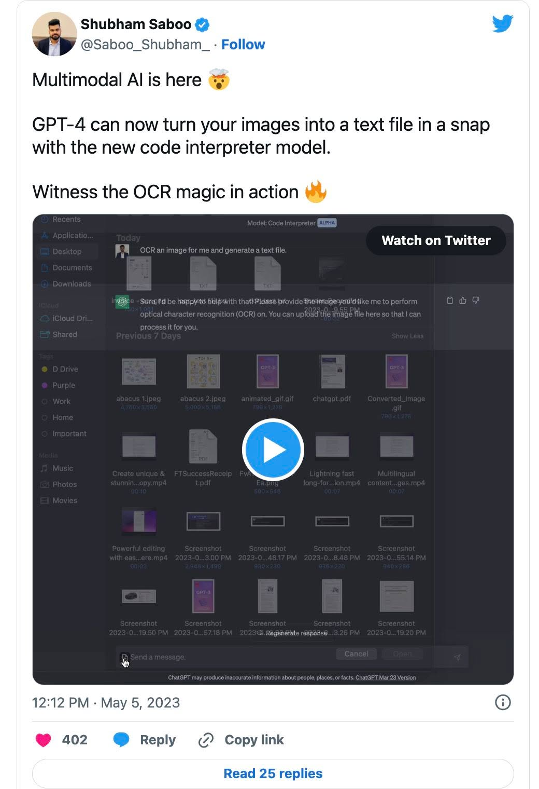
**이미지 캡션:** 이것은 Shubham Saboo라는 사용자가 올린 트윗으로, GPT-4의 새로운 코드 인터프리터 모델을 사용하여 이미지를 텍스트로 변환하는 광학 문자 인식(OCR) 기능을 시연하고 있습니다. 화면에는 파일 탐색기 인터페이스가 표시되며, "OCR an image for me and generate a text file."이라는 메시지와 함께 이미지 파일들이 나열되어 있습니다. 또한, "Sure, I'd be happy to help with that! Please provide the image you'd like me to perform optical character recognition (OCR) on. You can upload the image file here so that I can process it for you."라는 챗봇의 응답도 보입니다. 다양한 파일 형식의 이미지와 동영상 파일들이 미리 보기 형태로 나타나 있으며, 화면 하단에는 메시지 입력창과 함께 "Send a message."라는 문구가 있습니다. 트윗은 2023년 5월 5일 12시 12분에 게시되었으며, 402개의 좋아요와 함께 답글 및 링크 복사 기능이 제공됩니다. 전반적으로 GPT-4의 새로운 기능을 소개하고 시연하는 기술적인 내용을 담고 있으며, 흥미롭고 혁신적인 분위기를 자아냅니다.
 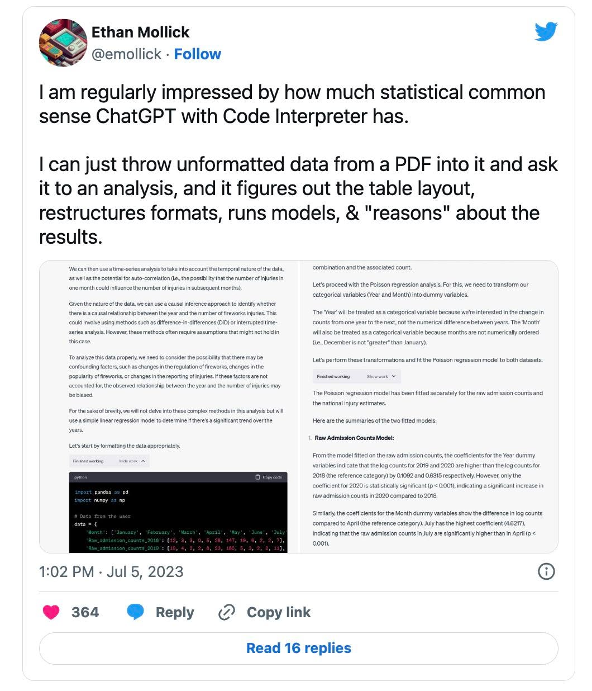
**이미지 캡션:** 이 사진은 Ethan Mollick이라는 이름의 성인 남성이 작성한 트윗의 일부를 보여줍니다. 그는 챗GPT와 코드 인터프리터의 통계적 능력에 감탄하며, PDF에서 비정형 데이터를 입력하면 테이블 레이아웃을 파악하고, 형식을 재구성하며, 모델을 실행하고, 결과에 대한 "이유"를 설명해 준다고 말합니다. 트윗 본문에는 시간 경과에 따른 데이터 분석, 인과 관계 추론, 잠재적 혼란 요인, 그리고 단순 선형 회귀 모델을 사용한 분석에 대한 설명이 포함되어 있습니다. 또한, 파이썬 코드를 사용하여 데이터를 형식화하는 예시와 함께, 연도 및 월별 더미 변수를 사용하여 포아송 회귀 분석을 수행하는 과정과 그 결과에 대한 설명이 상세하게 나와 있습니다. 이 분석은 2018년부터 2020년까지의 원시 입원 건수와 국가 부상 추정치를 다루며, 특히 2020년의 입원 건수 증가와 7월의 높은 입원 건수 비율에 대한 통계적 유의성을 강조합니다. 트윗은 2023년 7월 5일 오후 1시 2분에 게시되었으며, 364개의 좋아요와 16개의 답글이 있습니다. 배경은 명확하지 않지만, 트윗의 내용을 뒷받침하는 텍스트와 코드 블록으로 구성되어 있습니다. 전반적으로 기술적인 분석과 AI의 활용에 대한 내용을 담고 있으며, 정보 전달에 초점을 맞춘 진지하고 전문적인 분위기입니다.

### 7월 11일 (화) 06:34 · #gpt-code-interpreter-opensource GPT Cod…

#gpt-code-interpreter-opensource GPT Code Interpreter는 기본적으로 여러분들이 하고 싶은 일을 말하면, GPT가 코드를 생성하고 이 코드를 (주어진 데이터가 있다면) 생성하고 결과를 보여주는 것입니다.  그래서 점점 프로그래머가 할수 있는 많은 일을 할수 있을 것입니다. 

Code Interpreter의 OpenSource 버전을 소개합니다. 이름이 GPT-Code 인데 GPT로 코드를 짜고 이를 Jupyter Kernel에서 실행을 시키고, Flask UI로 보여주는 것입니다. 

정말 멋진 프로젝트 입니다. 

https://github.com/ricklamers/gpt-code-ui

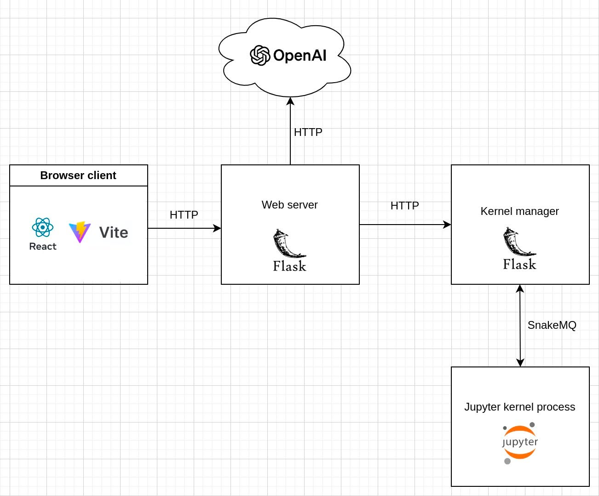
**이미지 캡션:** 이 다이어그램은 브라우저 클라이언트, 웹 서버, 커널 관리자, 주피터 커널 프로세스 및 OpenAI 서비스 간의 상호 작용을 보여주는 시스템 아키텍처를 나타냅니다. 브라우저 클라이언트에는 React와 Vite가 포함되어 있으며, 웹 서버는 Flask를 사용합니다. 웹 서버는 HTTP를 통해 OpenAI 서비스와 통신하고, 커널 관리자와도 HTTP를 통해 통신합니다. 커널 관리자는 Flask를 사용하며, 주피터 커널 프로세스와 SnakeMQ를 통해 양방향으로 통신합니다. 주피터 커널 프로세스에는 주피터 로고가 표시되어 있습니다. 전체적인 분위기는 기술적이고 정보 전달에 초점을 맞춘 다이어그램입니다.
 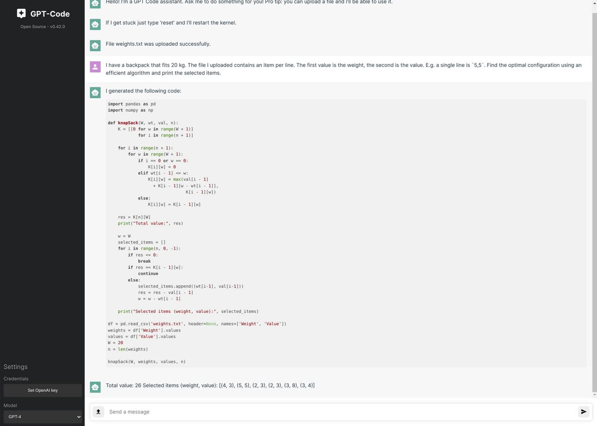
**이미지 캡션:** 이것은 GPT-Code라는 코딩 도우미의 인터페이스입니다. 화면 왼쪽에는 "GPT-Code" 로고와 "Open Source - v0.42.0"이라는 버전 정보가 표시되어 있습니다. 그 아래에는 "Settings", "Credentials", "Model" 섹션이 있으며, "GPT-4"가 선택된 모델로 표시됩니다. "Set OpenAI key" 버튼도 보입니다. 화면 중앙에는 대화창이 있습니다. 상단에는 사용자가 GPT-Code에게 "20kg을 담을 수 있는 배낭이 있는데, 업로드한 파일에는 항목당 무게와 가치가 한 줄씩 들어있습니다. 예를 들어, '5,5'와 같은 형식입니다. 효율적인 알고리즘을 사용하여 최적의 구성을 찾고 선택된 항목을 출력해 주세요."라고 요청한 내용이 표시됩니다. 이 요청에 대한 응답으로 GPT-Code는 파이썬 코드를 생성했습니다. 생성된 코드는 `pandas`와 `numpy` 라이브러리를 사용하여 0/1 배낭 문제를 해결하는 `knapsack` 함수를 정의합니다. 이 함수는 최대 무게 `W`, 항목들의 무게 `wt`, 항목들의 가치 `val`, 항목의 개수 `n`을 입력받아 최대 가치를 계산하고 선택된 항목들을 출력합니다. 코드 아래에는 `weights.txt` 파일을 읽어와서 배낭 문제에 적용하는 부분이 있습니다. 대화창 하단에는 "Total value: 26 Selected items (weight, value): [(4, 3), (5, 5), (2, 3), (2, 3), (3, 8), (3, 4)]"라는 결과가 표시되어, 총 가치가 26이고 선택된 항목들의 무게와 가치가 나열되어 있습니다. 화면 하단에는 "Send a message"라는 입력 필드와 전송 버튼이 있습니다. 전반적으로 이 화면은 사용자가 코딩 도우미와 상호작용하며 코드를 생성하고 실행하는 과정을 보여줍니다.

### 7월 12일 (수) 09:50 · 아침부터 굿뉴스가 왔습니다. 구글 AI Week에 맞춰 온것같기도 한데요…

아침부터 굿뉴스가 왔습니다. 구글 AI Week에 맞춰 온것같기도 한데요. Google Workspace에서 AI기능을 사용하게 된다고 합니다. 아주 재미있을것 같습니다.

--
오늘부터 사용 가능한 Workspace Labs의 특징들

[Google Docs에서 AI와 함께 글을 써보세요]
Google Docs에서는 인공지능을 이용해 여러분의 질문에 따른 텍스트를 제안해드립니다. 예를 들어 "Help me write (Labs)"라는 질문을 통해 블로그 포스트를 작성하거나 노래 가사를 쓰는 것이 가능하며, 이미 존재하는 텍스트를 더 상세하게 혹은 간결하게 재작성하는 것도 가능합니다.

[Gmail에서 빠르게 이메일을 작성하거나 개선해보세요]
Gmail에서는 인공지능을 이용해 여러분의 질문에 따른 이메일을 작성할 수 있습니다. "Help me write (Labs)" 버튼을 Gmail에서 선택하고 질문을 입력해 직장에 보낼 커버레터나 친구들에게 보낼 생일 초대장을 작성하거나, 초안을 더 상세하게 혹은 간결하게 수정하는 것도 가능합니다.

[Google Slides에서 AI로 이미지를 생성해보세요]
Google Slides에서는 인공지능을 이용해 여러분의 질문에 따른 이미지를 생성할 수 있습니다. 예를 들어, "Help me visualize" 버튼을 선택하고 질문을 입력해 피크닉이나 추상화 그림 등의 이미지를 생성하는 것이 가능합니다.

[Google Sheets에서 AI를 활용해 정리해보세요]
Google Sheets에서는 인공지능을 이용해 여러분의 질문에 따른 표를 제안해드립니다. 예를 들어 "Help me organize (Workspace Labs)" 기능을 이용해 여행 계획이나 작업 트래커를 작성하는 것이 가능합니다.

**이미지 캡션:** 이 이미지는 흰색 배경에 귀여운 일러스트와 텍스트가 포함된 팝업 창입니다. 일러스트는 보라색 액체가 담긴 플라스크 모양으로, 주변에는 별 모양의 장식과 작은 점들이 떠 있습니다. 플라스크 위에는 노란색 별 모양과 빨간색 점이 있습니다. 텍스트는 "Good news! You've been selected to be one of the first few to test new AI features in Google Workspace"라고 쓰여 있으며, 이는 사용자가 Google Workspace의 새로운 AI 기능을 테스트할 수 있는 기회를 얻었음을 알리는 내용입니다. 팝업 창 하단에는 파란색 버튼에 "Sign up for Labs"라고 적혀 있어, 사용자가 이 프로그램에 참여하기 위한 행동을 유도합니다. 전체적으로 밝고 긍정적인 분위기를 전달하며, 새로운 기술에 대한 기대감을 불러일으킵니다.
 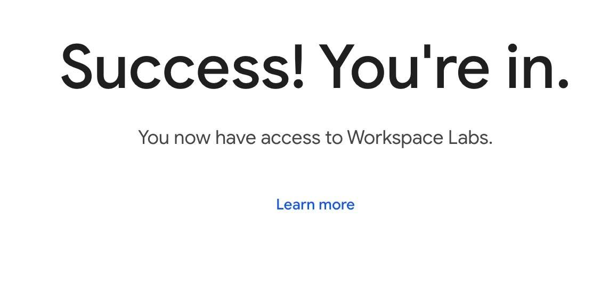
**이미지 캡션:** 이 이미지는 흰색 배경에 검은색 텍스트로 구성되어 있으며, "Success! You're in."이라는 큰 제목과 그 아래 "You now have access to Workspace Labs."라는 부제목이 있습니다. 마지막으로 파란색 텍스트로 "Learn more"라는 링크가 표시되어 있습니다. 이 화면은 사용자가 Workspace Labs에 성공적으로 접근했음을 알리는 메시지이며, 추가 정보를 얻을 수 있는 링크를 제공합니다. 사람, 장소, 사물 등은 보이지 않으며, 텍스트만으로 이루어진 단순한 웹 페이지 또는 알림 화면입니다. 분위기는 긍정적이고 성공적인 느낌을 줍니다.
 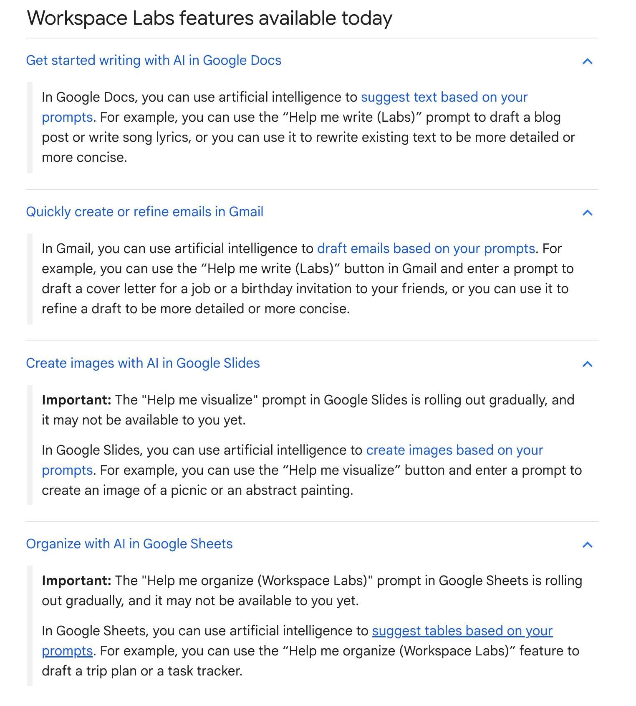
**이미지 캡션:** 이 이미지는 "Workspace Labs features available today"라는 제목의 문서로, Google Workspace의 인공지능(AI) 기반 기능들을 소개하고 있습니다. 문서에는 Google Docs, Gmail, Google Slides, Google Sheets에서 사용할 수 있는 AI 기능들이 각각 설명되어 있습니다. 각 섹션은 기능의 이름과 함께 해당 기능이 어떻게 작동하는지, 그리고 예시를 제공합니다. 예를 들어, Google Docs에서는 AI를 사용하여 텍스트를 제안받거나 기존 텍스트를 수정할 수 있으며, Gmail에서는 AI를 통해 이메일 초안을 작성하거나 다듬을 수 있습니다. Google Slides에서는 AI로 이미지를 생성할 수 있고, Google Sheets에서는 AI를 활용하여 표를 제안받거나 정리할 수 있습니다. 일부 기능은 아직 점진적으로 출시되고 있어 모든 사용자에게 즉시 제공되지 않을 수 있다는 점도 명시되어 있습니다. 문서 전체적으로는 정보 전달을 목적으로 하는 텍스트 기반의 내용이며, 특별한 인물이나 장소, 사물은 묘사되지 않았습니다. 분위기는 정보 제공적이고 기술적인 느낌을 줍니다.

### 7월 12일 (수) 09:55 · 과기부와 구글이 준비한 AI 위크 첫날인 13일에 Hwalsuk Lee …

과기부와 구글이 준비한 AI 위크 첫날인 13일에 Hwalsuk Lee 업스테이지 CTO님이 국내 AI 기업 대표연사로 참석하게 되었습니다.

저희가 만들고 있는 127만 AskUp ChatAI 서비스와, LLM에 대해 AI For Everyone이라는 큰 주제하에 발표하게 됩니다.

구글과도 함께 멋진 기술 모두를 위해 만들고 사용할수 있도록 하겠습니다!

**이미지 캡션:** 이 사진은 대한민국 인공지능 위크 2023 행사의 한 세션을 소개하는 이미지로, 과학기술정보통신부와 Google이 후원하고 Upstage가 주최하는 행사임을 알 수 있습니다. 중앙에는 7월 13일 목요일 12시 10분부터 12시 30분까지 진행되는 "업스테이지가 본 생성형 AI 시장의 발전과 비즈니스 기회"라는 제목의 세션 정보가 표시되어 있습니다. 세션 발표자로 보이는 성인 남성의 사진이 원형 프레임 안에 담겨 있으며, 그는 안경을 착용하고 밝게 웃고 있습니다. 사진 하단에는 "이활석 CTO"라는 이름과 직책이 기재되어 있습니다. 배경은 부드러운 파란색 그라데이션으로 처리되어 있으며, 전체적으로 깔끔하고 전문적인 분위기를 풍깁니다.
 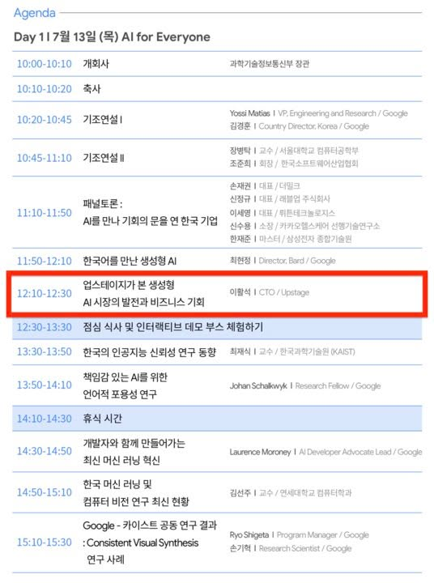
**이미지 캡션:** 이 이미지는 "AI for Everyone"이라는 제목의 행사 일정을 보여주는 표로, 2023년 7월 13일 목요일에 진행되는 내용을 담고 있습니다. 표는 시간대별로 세션 제목과 발표자 정보를 제공하며, 오전 10시부터 오후 3시 30분까지 다양한 주제의 발표와 토론이 예정되어 있습니다. 주요 세션으로는 개회사, 축사, 기조연설, 패널 토론, 한국어를 만난 생성형 AI, 업스테이지가 본 생성형 AI 시장의 발전과 비즈니스 기회, 점심 식사 및 데모 부스 체험, 한국의 인공지능 신뢰성 연구 동향, 책임감 있는 AI를 위한 언어적 포용성 연구, 휴식 시간, 개발자와 함께 만들어가는 최신 머신 러닝 혁신, 한국 머신 러닝 및 컴퓨터 비전 연구 최신 현황, 그리고 Google-카이스트 공동 연구 결과 발표 등이 포함되어 있습니다. 각 세션에는 발표자의 이름, 소속, 직책이 명시되어 있으며, 일부 세션은 여러 명의 발표자가 참여하는 것으로 보입니다. 행사는 과학기술정보통신부 장관의 개회사를 시작으로, Google, 한국소프트웨어산업협회, 더밀크, 래블업, 위튼테크놀로지스, 카카오헬스케어, 삼성전자, Upstage, KAIST, 그리고 연세대학교 등 다양한 기관 및 기업의 전문가들이 참여하여 AI 기술의 현재와 미래, 그리고 다양한 응용 분야에 대한 논의를 진행할 예정입니다. 특히, 생성형 AI와 관련된 세션들이 여러 개 포함되어 있어 현재 AI 분야의 주요 관심사를 반영하고 있습니다. 행사의 전반적인 분위기는 학술적이고 전문적인 정보 교류의 장으로 보이며, AI 기술의 발전과 비즈니스 기회 창출에 초점을 맞추고 있습니다.

### 7월 12일 (수) 15:47 · 아내는/남편은 항상 옳다로 저희 LLM을 정성평가하고 있습니다. 잘됩니다…

아내는/남편은 항상 옳다로 저희 LLM을 정성평가하고 있습니다. 잘됩니다.

### 7월 14일 (금) 11:02 · #대한상공회의소 #46회제주포럼 #825전경련

#대한상공회의소 #46회제주포럼 #825전경련

KAIST총장님의 멋진 발표에 이어, AI가 (지금 GPT수준의) 간단한 질문에 답을 하는 수준이 아니라, 우리가 풀지 못했던 사업문제, 인류의 문제를 풀수 있고, 그래서 지금 함께 많은 시도를 해보고 또 투자해야 한다고 선배 사업가 분들에게 말씀드리고 왔습니다. (Sunghyun Park 대표님의 멋진 사진 감사합니다.)

더 많은 분들이 더 많은 AI, 시도를 하고 더 많은 AI 투자를 하면 좋겠습니다. (더더더!)

막간에 SK회장님께 AskUp 그립톡 붙여 드리고 왔습니다!

(광고) 비슷한 이야기를 8/25(금) [제 423회 전경련 경영자 조찬경연] 에서 Chat GPT, 우리기업 비즈니스에 AI를 더하다! 라는 제목으로 진행합니다. 오시면 그립톡 붙여 드리겠습니다.

★8월 조찬경연 간편신청: bit.ly/3JWE5GQ

■ 일 시 : 2023. 8. 25(금) 06:50~09:00
■ 장 소 : 여의도 전경련회관 컨퍼런스센터 그랜드볼룸(1F)
■ 주 제 : Chat GPT, 우리기업 비즈니스에 AI를 더하다
■ 연 사 : 김성훈 업스테이지 대표이사

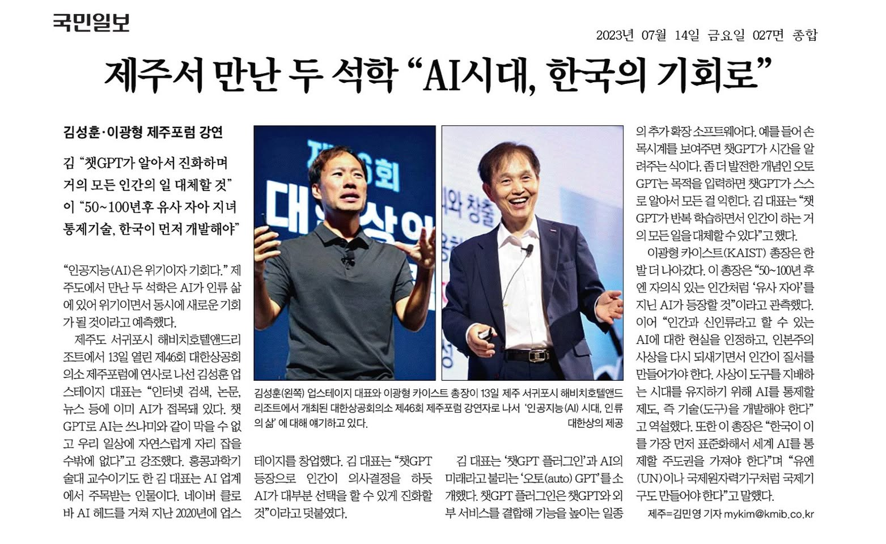
**이미지 캡션:** 국민일보 2023년 7월 14일 금요일 027면 종합 기사로, 제주도에서 열린 대한상공회의소 제주포럼에서 김성훈 업스테이지 대표와 이광형 카이스트 총장이 인공지능(AI) 시대에 대해 강연한 내용을 다루고 있다. 사진은 두 석학의 모습을 담고 있으며, 왼쪽에는 검은색 반팔 티셔츠를 입고 연설 중인 김성훈 대표가, 오른쪽에는 남색 정장을 입고 환하게 웃으며 강연하는 이광형 총장이 보인다. 두 사람 모두 중년 남성으로 보이며, 활기찬 표정과 제스처로 청중과 소통하고 있다. 배경에는 '대한상공회의소'와 'AI 시대, 한국의 기회로'라는 제목이 적힌 현수막이 걸려 있어 포럼의 분위기를 짐작하게 한다. 기사는 AI가 인간의 삶에 미칠 영향과 한국이 AI 시대를 어떻게 기회로 삼아야 할지에 대한 두 석학의 견해를 상세히 전달하고 있다.
 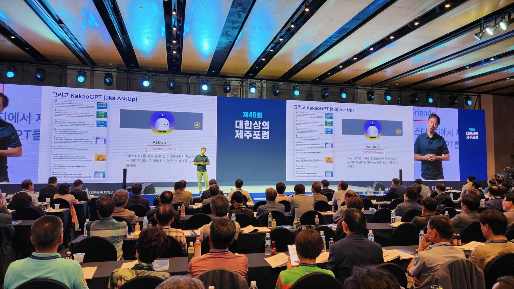
**이미지 캡션:** 행사장에서 한 성인 남성이 강연을 하고 있으며, 그의 뒤로는 대형 스크린이 설치되어 있다. 스크린에는 "그리고 KakaoGPT (aka AskUp)"라는 문구와 함께 AskUp 앱의 아이콘, 친구 수, 그리고 서비스 설명이 한국어로 표시되어 있다. 또한 "제46회 대한상의 제주포럼"이라는 문구도 보인다. 강연자는 검은색 반팔 티셔츠와 회색 바지를 입고 있으며, 손을 앞으로 모으고 있다. 그의 표정은 진지하며, 청중들을 향해 설명하고 있는 듯하다. 청중들은 객석에 앉아 스크린을 바라보고 있으며, 대부분 성인 남성들이다. 행사장 내부는 조명이 밝고, 무대와 객석이 구분되어 있다. 전반적으로 기술 발표회 또는 포럼의 분위기를 띤다.
 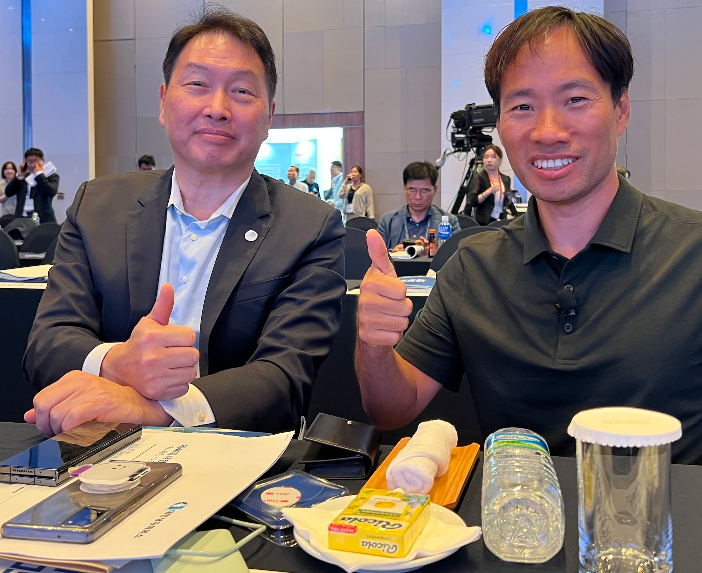
**이미지 캡션:** 두 명의 성인 남성이 테이블에 앉아 엄지손가락을 치켜들고 카메라를 향해 웃고 있다. 왼쪽 남성은 50대 정도로 보이며, 검은색 정장 재킷 안에 하늘색 셔츠를 입고 있다. 그의 얼굴에는 부드러운 미소가 번져 있고, 오른쪽 남성은 40대 정도로 보이며, 검은색 폴로 셔츠를 입고 있다. 그는 활짝 웃으며 치아를 드러내고 있다. 두 사람 앞에는 서류, 스마트폰, 물병, 그리고 리콜라 사탕 상자가 놓여 있다. 배경에는 다른 사람들이 회의에 참석하고 있는 모습이 희미하게 보인다. 전반적으로 긍정적이고 편안한 분위기이다.
 
**이미지 캡션:** 이 사진은 스마트폰과 그 위에 부착된 귀여운 캐릭터 모양의 스마트톡을 클로즈업하여 보여줍니다. 스마트폰은 투명한 케이스를 씌운 상태이며, 뒷면에는 둥근 모양의 스마트톡이 부착되어 있습니다. 스마트톡은 하얀색 바탕에 귀여운 눈과 입 모양이 그려져 있으며, 보라색과 노란색의 고리가 달려 있습니다. 스마트폰은 종이 위에 놓여 있으며, 종이에는 한국어로 된 글씨와 그림이 희미하게 보입니다. 글씨는 "수-15"와 같은 숫자가 포함되어 있어 날짜나 시간과 관련된 정보일 가능성이 있습니다. 전체적으로 밝고 부드러운 조명 아래에서 촬영되었으며, 스마트폰과 스마트톡에 초점이 맞춰져 있어 일상적인 사물을 귀엽고 아기자기하게 표현한 느낌을 줍니다.

### 7월 16일 (일) 10:04 · 📷 앨범: Profile pictures (1장)

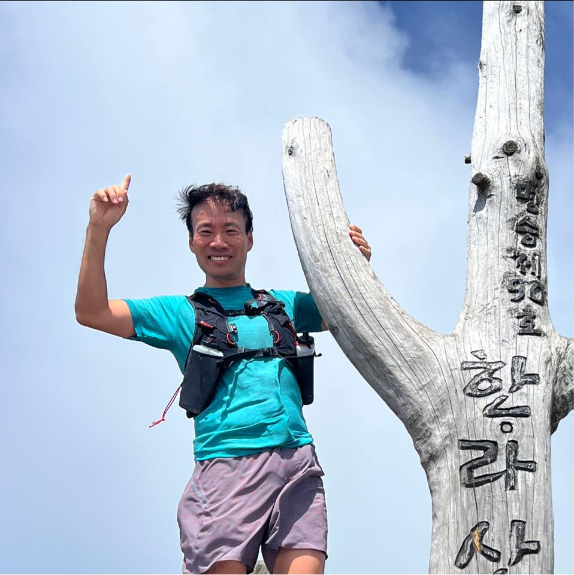
**이미지 캡션:** 푸른 하늘과 구름을 배경으로 한 성인 남성이 산 정상에서 찍은 사진입니다. 남성은 30대 후반에서 40대 초반으로 보이며, 짧은 검은 머리에 활짝 웃는 표정을 짓고 있습니다. 그는 짙은 청록색 반팔 티셔츠 위에 검은색 조끼를 착용하고 있으며, 조끼에는 물통이나 간식 등을 넣을 수 있는 여러 개의 주머니가 달려 있습니다. 하의로는 연한 보라색 반바지를 입고 있습니다. 오른손은 하늘을 향해 검지를 뻗고 있고, 왼손으로는 옆에 있는 나무 기둥을 잡고 있습니다. 나무 기둥에는 검은색으로 한글이 새겨져 있는데, "합천호", "하", "라", "사"라고 읽을 수 있습니다. 이 나무 기둥은 산 정상임을 알리는 표지석 역할을 하는 것으로 보입니다. 전반적으로 등산이나 트레일 러닝을 성공적으로 마친 후의 성취감과 즐거움이 느껴지는 밝고 긍정적인 분위기입니다.

> On The Top of the Mountain

### 7월 19일 (수) 08:33 · #역사적인기록 #세계최고30B_LLM #메타라마2발표한날 #그래도1등

#역사적인기록 #세계최고30B_LLM #메타라마2발표한날 #그래도1등

업스테이지가 30B의 작은 모델로 OpenLLM 리더보드 세계 1등을 달성했습니다! 너무 기쁜날입니다!!  

OpenAI, Google, Anthropic등의 초거대 모델들이 엄청난 경쟁을 하고 있는데요. 그 뿐만 아니라 Open LLM들의 경쟁도 하루에 몇개씩 새로운 모델과 데이터셋이 나올 정도로 치열합니다. 허깅페이스의 OpenLLM 리더보드가 그 경쟁의 각축장인데요. 

전세계 치열한 LLM경쟁을 제치고 업스테이지 LLM이 파인튜닝의 실력으로 당당히 1등을 차지 했습니다. (심지어 오늘 새벽 Mark Zuckerberg님이 직접 발표한 메타의 라마2 70B 큰 사이즈를 넘어섰습니다). 특히 메타와 MS 등 빅테크 기업이 만든 모델과 Stability AI, 데이터브릭스 등 글로벌 AI/LLM 대표 기업의 모델 포함, 최근 몇 달간 줄곧 1,2위를 지키던 UAE 기술혁신연구소의 ‘팰컨’ 모델과 최근 데이터브릭스가 13억 달러(약 1조 7천억원)에 인수한 모자이크ML의 모델 등 최고 성능의 AI 모델 대비 10% 가량 앞서며 평균 67점으로 1위를 차지했습니다. 

저희는 30B 모델로 일등을 달성했다는 것에 매우 흥분하고 있습니다. 30B사이즈는 3090에서 서빙할수 있을 정도로 온프렘이 용이하고 서빙 비용도 상당히 저렴합니다. 30B의 활용성이 매우 많을 것으로 생각이 됩니다. 

Upstage는 LLM의 한국어 성능을 높이기 위해 한국어 데이터를 추가 하여 모델을 만들고 파인튜닝을 하고 있습니다. 

온프렘, PrivateLLM을 구축하거나 활용하고 싶은 분들은, 이제 세계 최고의 OpenLLM을 보유한 Upstage로 연락주시면 됩니다.

🏆 OpenLLM 리더보드: https://huggingface.co/spaces/HuggingFaceH4/open_llm_leaderboard  
🔗 Newsroom: https://bit.ly/fb-upstage-huggingface-llm

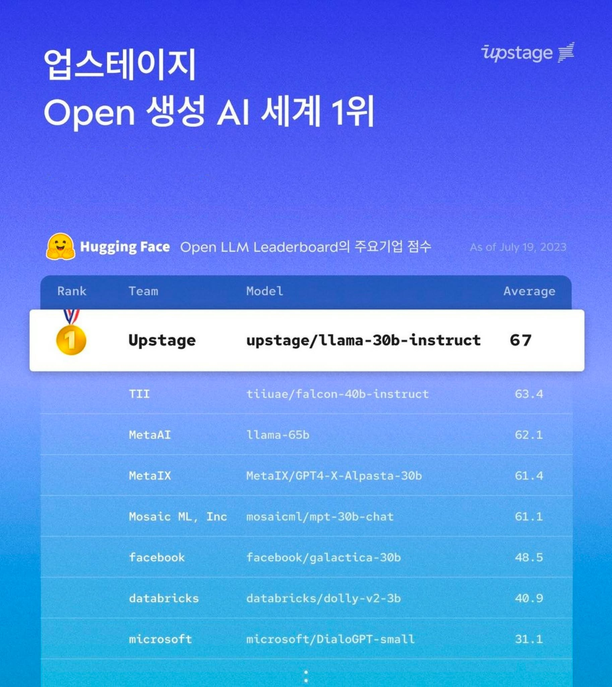
**이미지 캡션:** 이 이미지는 "업스테이지 Open 생성 AI 세계 1위"라는 제목과 함께 Hugging Face의 Open LLM 리더보드에서 주요 기업들의 점수를 보여주는 차트입니다. 차트에는 순위, 팀, 모델, 평균 점수가 표시되어 있으며, 2023년 7월 19일 기준임을 나타냅니다. 가장 상단에는 금메달 아이콘과 함께 1위로 "Upstage" 팀이 "upstage/llama-30b-instruct" 모델로 67점의 평균 점수를 기록하고 있습니다. 그 아래로는 TII, MetaAI, MetaIX, Mosaic ML, Inc, facebook, databricks, microsoft 팀들이 각각의 모델과 평균 점수를 나열하고 있습니다. 배경은 파란색 그라데이션이며, 상단에는 "Upstage" 로고가 있습니다. 이 이미지는 생성형 AI 분야에서 업스테이지의 성과를 강조하고 있습니다.
 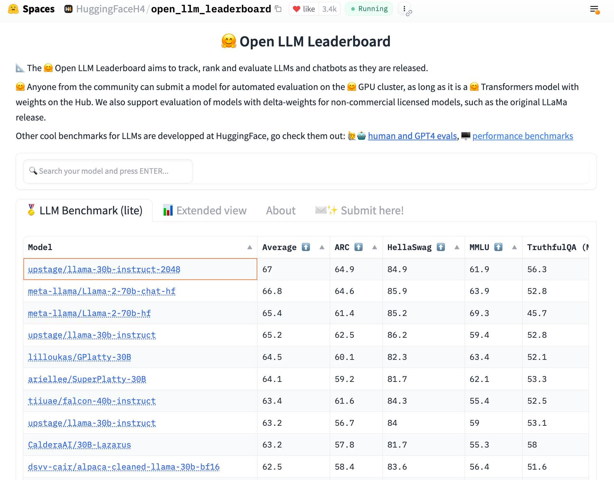
**이미지 캡션:** 이것은 Hugging Face 웹사이트의 "Open LLM Leaderboard" 페이지를 보여주는 스크린샷으로, 다양한 대규모 언어 모델(LLM)의 성능을 비교하는 표가 표시됩니다. 페이지 상단에는 "Open LLM Leaderboard"라는 제목이 있고, 그 아래에는 LLM을 추적, 순위 지정 및 평가하는 데 대한 설명이 있습니다. 또한 커뮤니티에서 모델을 제출할 수 있다는 내용과 다른 벤치마크에 대한 링크도 있습니다. 페이지 중앙에는 "LLM Benchmark (lite)"라는 섹션이 있으며, 여기에는 모델 이름, 평균 점수 및 ARC, HellaSwag, MMLU, TruthfulQA와 같은 다양한 벤치마크에 대한 점수가 포함된 표가 있습니다. 표

### 7월 26일 (수) 07:22 · Jaewook Chung, Chanwoo Kim 삼성전자 최연소 부사장님…

Jaewook Chung, Chanwoo Kim 삼성전자 최연소 부사장님들과 Upstage Hwalsuk Lee CTO, Soonil  Kwon 부사장 함께 모여 LLM의 미래와 기타 많은 것들에 대해 길게 이야기 나누었습니다. 경험에서 나온 인사이트 공유 감사드립니다.

3년이 지나면 LLM은 어떻게 변화해 있을까요? 얼만큼 우리 생활에 들어와 있을까요?

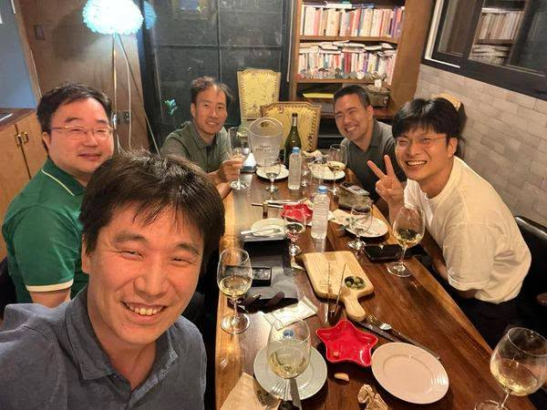
**이미지 캡션:** 다섯 명의 성인 남성이 긴 나무 테이블에 둘러앉아 식사하며 즐거운 시간을 보내고 있다. 가장 가까운 남성은 회색 셔츠를 입고 카메라를 향해 활짝 웃고 있으며, 그의 뒤에는 녹색 셔츠를 입은 남성이 안경을 쓰고 미소를 짓고 있다. 테이블 위에는 와인잔, 물병, 접시, 그리고 음식들이 놓여 있다. 배경에는 책장이 보이며, 전체적으로 편안하고 즐거운 분위기이다.

### 7월 27일 (목) 09:34 · #매봉달리기 올때 마다 아름답고 멋지고 시원한 청계산 입니다. 달린후 계…

#매봉달리기 올때 마다 아름답고 멋지고 시원한 청계산 입니다. 달린후 계곡물은 세상을 다 얻은 듯한 시원함 입니다.

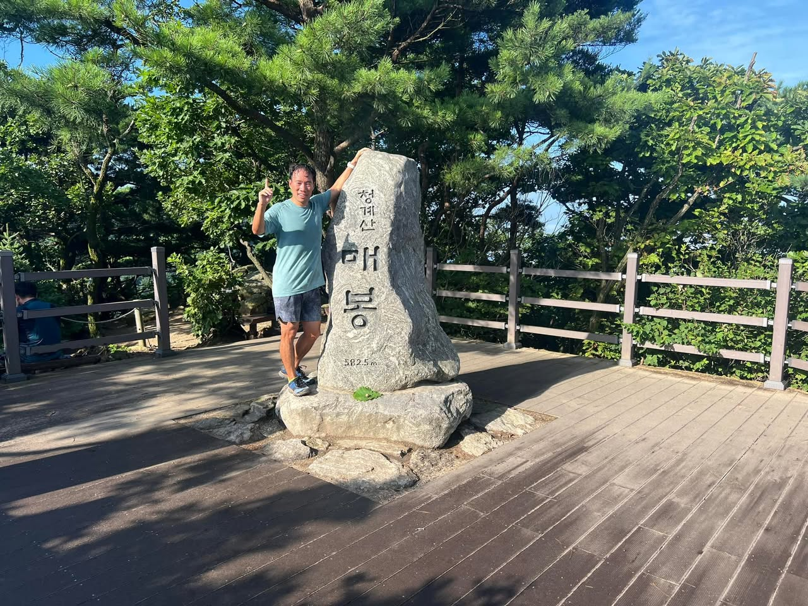
**이미지 캡션:** 한 성인 남성이 청계산 매봉 정상석 옆에 서서 오른손 검지를 위로 가리키며 환하게 웃고 있다. 그는 30대 후반에서 40대 초반으로 보이며, 짧은 머리에 건강한 피부색을 가지고 있다. 남성은 옅은 녹색 반팔 티셔츠와 회색 반바지, 그리고 파란색 운동화를 착용하고 있다. 그의 표정은 매우 즐겁고 활기차 보인다. 배경에는 울창한 나무들과 푸른 하늘이 보이며, 나무 사이로 햇살이 비쳐 따뜻하고 맑은 날씨임을 알 수 있다. 남성이 서 있는 곳은 나무 데크로 이루어진 전망대이며, 주변에는 짙은 갈색의 난간이 설치되어 있다. 난간 너머로는 또 다른 나무들과 숲이 펼쳐져 있다. 정상석에는 "청계산 매봉 582.5m"라고 한글로 쓰여 있다. 전체적으로 등산을 성공적으로 마친 후의 성취감과 자연의 아름다움을 만끽하는 즐거운 분위기를 느낄 수 있다.
 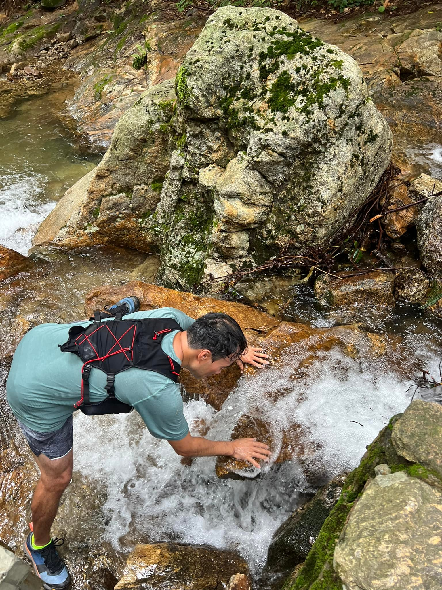
**이미지 캡션:** 한 성인 남성이 옅은 녹색 반팔 티셔츠와 회색 반바지를 입고 검은색 조끼를 착용한 채 계곡물에 몸을 숙이고 있습니다. 그는 오른손으로 물에 젖은 바위를 짚고 왼손으로 물살을 만지고 있으며, 얼굴은 물 쪽으로 향하고 있습니다. 남성은 30대에서 40대로 보이며, 짧은 검은색 머리카락을 가지고 있습니다. 배경에는 이끼 낀 크고 작은 바위들과 맑은 물이 흐르는 계곡이 보입니다. 물은 바위를 따라 빠르게 흘러내리며 하얀 물보라를 일으키고 있습니다. 전반적으로 자연 속에서 휴식을 취하거나 물을 마시는 듯한 평화로운 분위기입니다.
 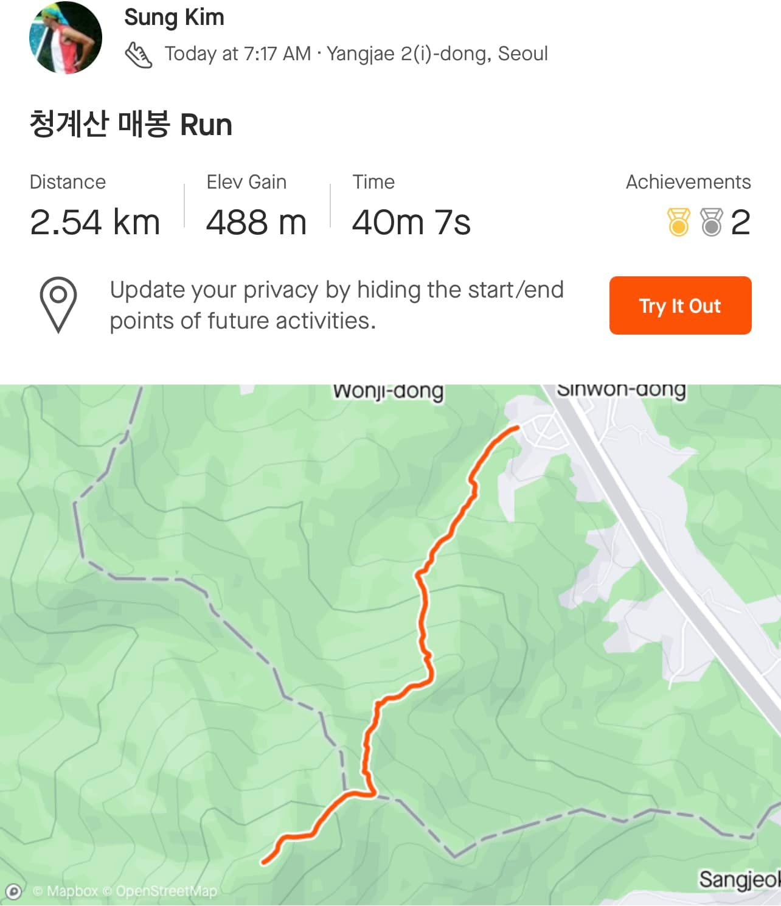
**이미지 캡션:** A profile picture shows a young adult male with short dark hair, wearing a green and white cap, a red tank top, and a white sleeveless shirt underneath, with his arms raised in a celebratory gesture. He is identified as Sung Kim and the activity took place today at 7:17 AM in Yangjae 2(i)-dong, Seoul. The activity is titled "청계산 매봉 Run" (Cheonggyesan Maebong Run) and recorded a distance of 2.54 km, an elevation gain of 488 m, and a time of 40 minutes and 7 seconds. There are two achievements indicated, represented by a gold medal and a silver medal. A prompt suggests updating privacy by hiding start/end points of future activities, with a button labeled "Try It Out". Below this, a topographic map displays a route marked in orange, indicating a mountain trail. The map shows contour lines representing elevation changes and labels for areas like "wonji-dong" and "Sinwon-aong", with a road or highway visible on the right side. The overall atmosphere is one of accomplishment and outdoor activity, specifically a challenging mountain run.

### 7월 28일 (금) 08:35 · Big congratulations on Kristin! Super am…

Big congratulations on Kristin! Super amazing!!

"14 Peaks in just 3 months and 1 day, breaking the record of 6 months 6 days."

### 7월 29일 (토) 10:54 · Happy Birthday 🎉🎉

Happy Birthday 🎉🎉

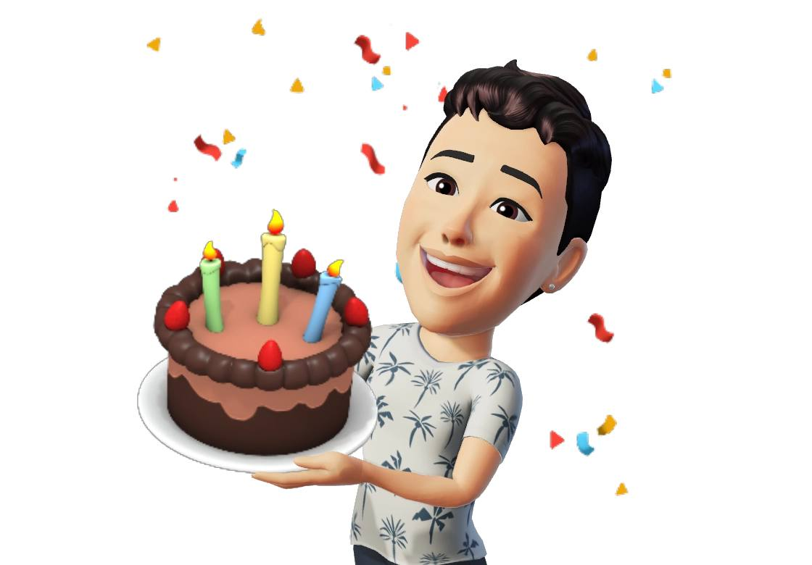
**이미지 캡션:** 이 3D 렌더링 이미지에는 성인 남성이 생일 케이크를 들고 있는 모습이 담겨 있습니다. 남성은 20대 후반에서 30대 초반으로 보이며, 짧고 검은색 머리에 짙은 눈썹을 가지고 있습니다. 그는 활짝 웃으며 밝고 행복한 표정을 짓고 있으며, 귀에는 작은 은색 귀걸이를 하고 있습니다. 남성은 하얀색 반팔 티셔츠를 입고 있는데, 티셔츠에는 야자수 잎 무늬가 그려져 있습니다. 그는 두 손으로 하얀 접시에 담긴 초콜릿 케이크를 들고 있으며, 케이크 위에는 빨간색 딸기 장식과 함께 초록색, 노란색, 파란색 초 세 개가 꽂혀 있습니다. 배경은 흰색이며, 주변에는 빨간색, 파란색, 노란색 색종이가 흩날리고 있어 축하 분위기를 더합니다. 전체적으로 생일 축하 파티의 즐겁고 행복한 순간을 포착한 이미지입니다.

### 7월 29일 (토) 10:54 · ↪ Happy Birthday 🎉🎉

*다른 프로필에 남긴 글*

Happy Birthday 🎉🎉
