# 2023년 8월

[← 2023년](README.md)

### 8월 1일 (화) 08:39 · #0801 #역사적인기록 #OpenLLM1등 #GPT3_5추월

#0801 #역사적인기록 #OpenLLM1등 #GPT3_5추월 

Upstage OpenLLM 리더보드에서 다시 한 번 1위를 차지하였습니다.

현재 OpenLLM 리더보드에서는 약 600개의 모델이 치열한 경쟁 중입니다. 특히, 메타와 MS 같은 대형 기술 회사들과 STABILITY AI, H2O, 데이터브릭스 등 글로벌 AI/LLM 대표 기업들도 많이 참여 하고 있습니다. 

저희가 Llama2를 파인튜닝한 이번 모델은 ARC, HellaSwag, MMLU, TruthfulQA 4개의 평가셋 평균 72.3점으로 압도적인 1등을 차지했습니다. 그리고 gpt-3.5-turbo-0613 모델 (71.9점)보다도 더 높은 점수를 달성하였습니다.

참으로 기쁜 날입니다.

파인튜닝한 모델은 https://huggingface.co/upstage 에서 바로 다운받아 사용가능하십니다. 온프레미스 또는 PrivateLLM을 구축하거나 활용하고 싶은 분들은 이제 세계 최고의 OpenLLM을 보유한 업스테이지로 연락주셔요. https://www.upstage.ai/private-llm

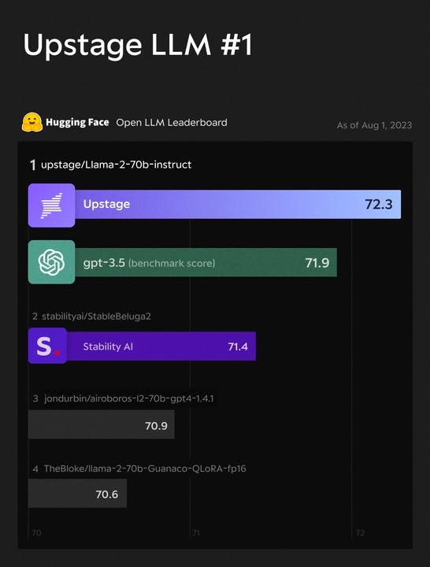
**이미지 캡션:** 이 이미지는 Hugging Face의 Open LLM 리더보드에서 Upstage LLM이 1위를 차지했음을 보여주는 스크린샷입니다. 화면 상단에는 "Upstage LLM #1"이라는 제목이 흰색 글씨로 크게 쓰여 있고, 그 아래에는 Hugging Face의 마스코트인 노란색 얼굴 아이콘과 함께 "Hugging Face Open LLM Leaderboard"라는 문구가 있습니다. 오른쪽 상단에는 "As of Aug 1, 2023"이라고 날짜가 표시되어 있습니다. 리더보드에는 순위별로 LLM 모델들의 이름과 점수가 막대 그래프 형태로 나타나 있습니다. 1위는 "upstage/Llama-2-70b-instruct"로, 보라색 배경의 "Upstage"라는 이름과 함께 72.3점이라는 가장 높은 점수를 기록하고 있습니다. 그 아래에는 녹색 배경의 "gpt-3.5 (benchmark score)"가 71.9점으로 2위인 "stabilityai/StableBeluga2"의 71.4점보다 높은 순위를 차지하고 있습니다. 3위는 "jondurbin/airoboros-12-70b-gpt4-1.4.1"로 70.9점, 4위는 "TheBloke/llama-2-70b-Guanaco-QLORA-fp16"로 70.6점입니다. 그래프 아래쪽에는 70, 71, 72와 같은 점수 눈금이 표시되어 있습니다. 이미지에는 사람이 등장하지 않으며, 배경은 어두운 색상의 디지털 인터페이스입니다. 전반적으로 기술적인 정보를 전달하는 차트 형태의 이미지로, 객관적이고 정보 전달에 집중된 분위기입니다.
 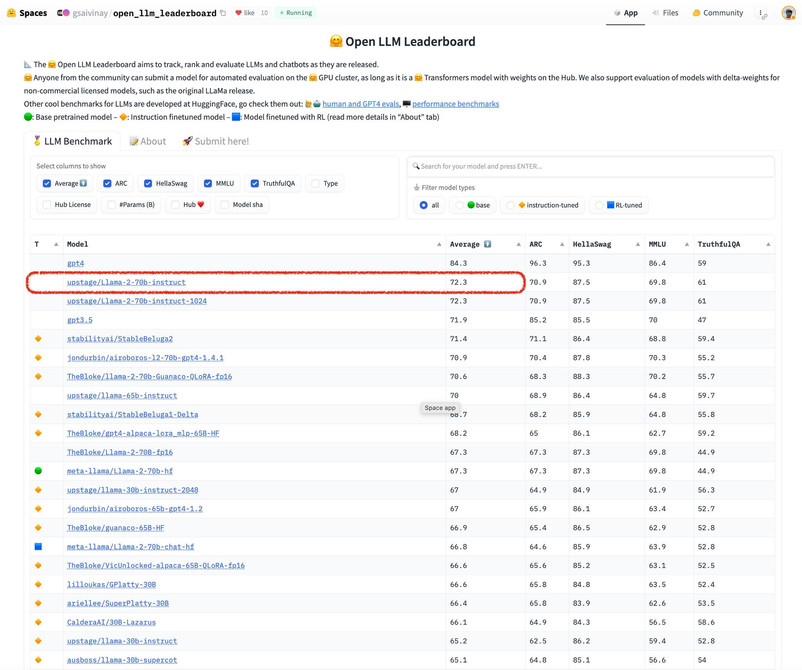
**이미지 캡션:** 이 이미지는 "Open LLM Leaderboard"라는 웹 페이지의 스크린샷으로, 다양한 대규모 언어 모델(LLM)의 성능을 비교하고 순위를 매기는 데 사용됩니다. 화면 중앙에는 표 형태로 LLM의 이름과 함께 여러 벤치마크 점수가 표시되어 있습니다. 가장 상단에는 "gpt4" 모델이 평균 84.3점으로 가장 높은 점수를 기록하고 있으며, 그 아래로 "upstage/llama-2-70b-instruct" 모델이 평균 72.3점으로 두 번째로 높은 점수를 기록하고 있습니다. 이 표는 "Average", "ARC", "HellaSwag", "MMLU", "TruthfulQA"와 같은 다양한 평가 지표에 대한 각 모델의 성능을 보여줍니다. 표 위쪽에는 모델을 검색하고 필터링할 수 있는 검색창과 체크박스가 있으며, 페이지 상단에는 리더보드의 목적과 사용 방법에 대한 설명이 간략하게 나와 있습니다. 전반적으로 이 페이지는 LLM의 성능을 객관적으로 평가하고 비교하기 위한 정보를 제공하는 기술적인 웹사이트의 모습입니다.

### 8월 3일 (목) 10:22 · Jinsoo Yoon 멋진분과 한라산 2시간 업! 올때 마다 너무 멋진 …

Jinsoo Yoon 멋진분과 한라산 2시간 업! 올때 마다 너무 멋진 곳입니다. 

다음목표 1:50!!!

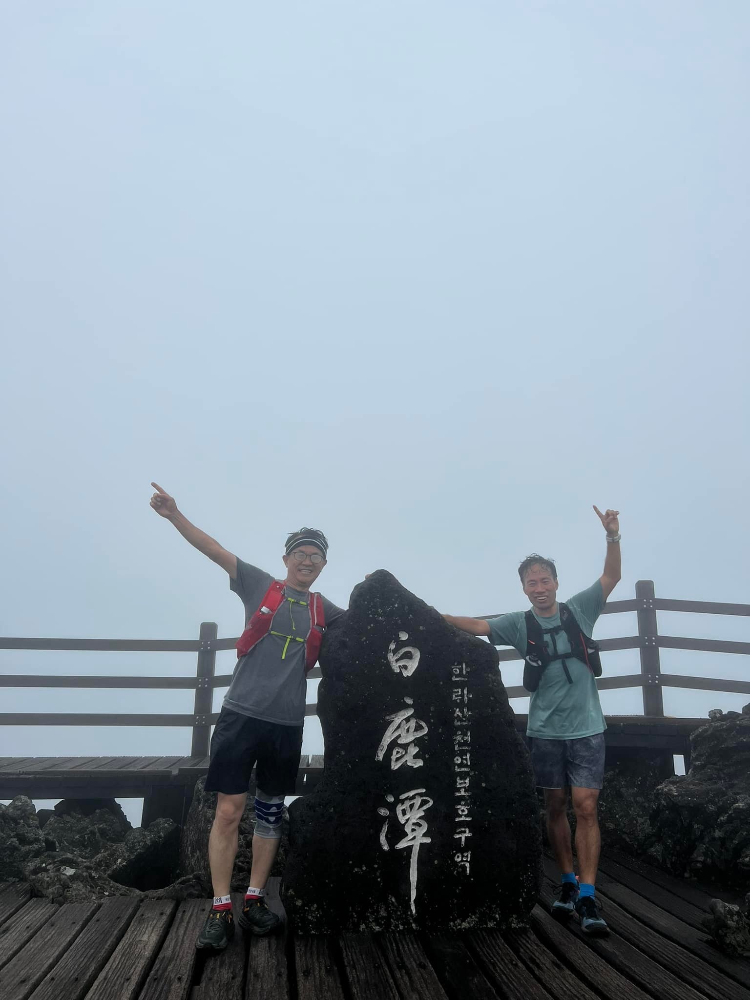
**이미지 캡션:** 흐릿한 날씨 속에서 두 명의 성인 남성이 거대한 검은색 비석 앞에 서 있다. 비석에는 한국어로 "한라산천연보호구역"과 "백록담"이라는 글자가 흰색으로 새겨져 있다. 왼쪽 남성은 회색 반팔 티셔츠에 검은색 반바지, 빨간색 조끼를 착용하고 있으며, 무릎 보호대를 하고 있다. 그는 안경을 쓰고 있으며, 오른팔을 위로 들어 올리고 손가락으로 어딘가를 가리키고 있다. 오른쪽 남성은 청록색 반팔 티셔츠에 회색 반바지를 입고 있으며, 검은색 조끼를 착용하고 있다. 그는 왼팔을 비석에 기대고 오른팔을 위로 들어 올려 브이(V)자를 그리고 있다. 두 사람 모두 등산이나 트레킹을 하는 듯한 복장을 하고 있으며, 표정은 밝고 활기차 보인다. 배경에는 나무 데크와 난간이 보이며, 멀리 희미하게 산의 능선으로 추정되는 모습이 보인다. 전체적으로 등반 성공을 축하하는 듯한 즐거운 분위기이다.
 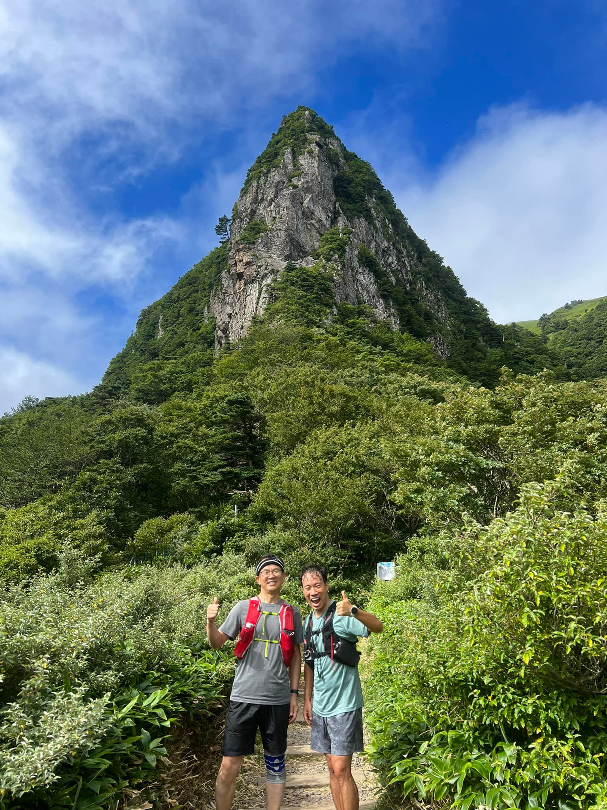
**이미지 캡션:** 푸른 하늘 아래 웅장한 바위산이 솟아 있고, 그 앞의 숲길에서 두 명의 성인 남성이 엄지손가락을 치켜들며 환하게 웃고 있다. 왼쪽 남성은 회색 반팔 티셔츠에 검은색 반바지, 빨간색 조끼형 배낭을 착용하고 있으며, 무릎에는 보호대를 하고 있다. 오른쪽 남성은 하늘색 반팔 티셔츠에 회색 반바지, 검은색 조끼형 배낭을 메고 있다. 두 사람 모두 운동복 차림으로 등산이나 트레일 러닝을 즐기는 듯하며, 표정에서 즐거움과 성취감이 느껴진다. 배경에는 울창한 녹음이 우거져 있으며, 맑고 푸른 하늘에는 흰 구름이 두둥실 떠 있다. 전체적으로 자연 속에서 활동적인 여가를 즐기는 건강하고 긍정적인 분위기를 담고 있다.
 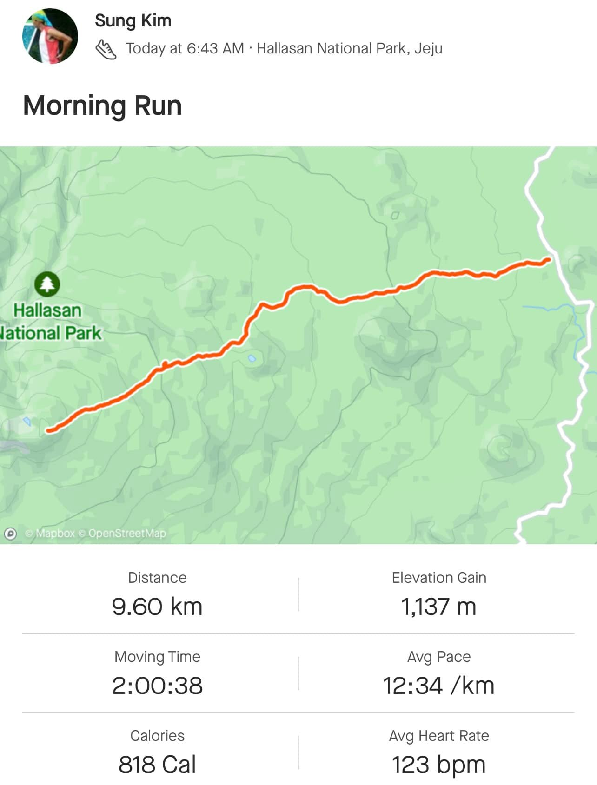
**이미지 캡션:** 이 화면은 "Sung Kim"이라는 사용자가 오늘 아침 6시 43분에 제주도 한라산 국립공원에서 "Morning Run"이라는 제목으로 기록한 운동 정보를 보여줍니다. 상단에는 사용자의 프로필 사진과 이름, 운동 시간 및 장소가 표시되어 있습니다. 중앙에는 한라산 국립공원의 지형도가 나타나 있으며, 주황색 선은 사용자가 달린 경로를 표시합니다. 지형도에는 "Hallasan National Park"라는 텍스트와 함께 나무 아이콘이 보입니다. 하단에는 운동 기록 요약이 표시되어 있는데, 총 거리는 9.60km, 이동 시간은 2시간 0분 38초, 소모 칼로리는 818 칼로리입니다. 또한, 고도 상승은 1,137m, 평균 페이스는 12:34/km, 평균 심박수는 123 bpm으로 기록되어 있습니다. 전반적으로 이 화면은 야외 활동 추적 앱의 일부로 보이며, 운동 성과를 상세하게 보여주는 정보를 담고 있습니다.

### 8월 3일 (목) 15:53 · 📷 사진 (1장)

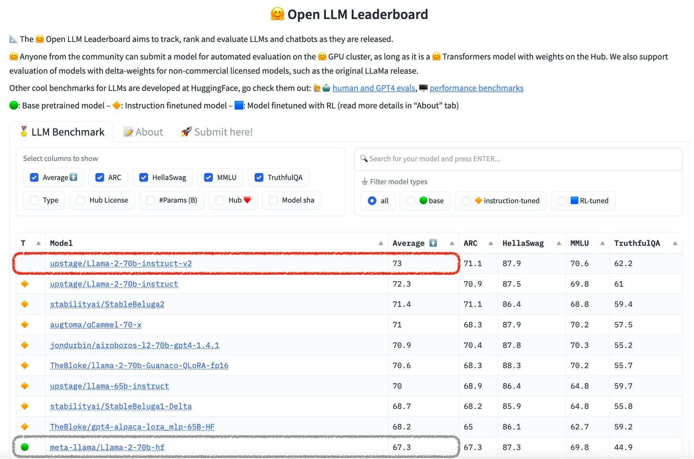
**이미지 캡션:** 이 이미지는 "Open LLM Leaderboard"라는 웹사이트의 스크린샷으로, 다양한 언어 모델(LLM)의 성능을 비교하고 순위를 매기는 표를 보여줍니다. 화면 상단에는 웹사이트의 제목과 함께 "Open LLM Leaderboard"라는 문구가 있으며, 그 아래에는 이 리더보드의 목적과 참여 방법에 대한 설명이 있습니다. 설명에는 HuggingFace에서 개발한 다른 벤치마크에 대한 링크도 포함되어 있습니다. 표는 "LLM Benchmark", "About", "Submit here!"라는 탭으로 구성되어 있으며, "Select columns to show" 섹션에서는 사용자가 보고 싶은 열을 선택할 수 있습니다. "Filter model types" 섹션에서는 "all", "base", "instruction-tuned", "RL-tuned"와 같은 모델 유형을 필터링할 수 있습니다. 표의 주요 내용은 각 LLM의 이름과 "Average", "ARC", "HellaSwag", "MMLU", "TruthfulQA"와 같은 다양한 평가 지표에 대한 점수입니다. 특정 행은 빨간색과 녹색으로 강조 표시되어 있으며, 이는 특정 모델이나 모델 유형을 나타내는 것으로 보입니다. 예를 들어, 빨간색으로 강조 표시된 행은 "upstage/llama-2-70b-instruct-v2" 모델의 성능을 보여주며, 평균 점수는 73점입니다. 녹색으로 강조 표시된 행은 "meta-llama/Llama-2-70b-hf" 모델을 나타내며, 평균 점수는 67.3점입니다. 전반적으로 이 이미지는 LLM의 성능을 투명하게 공개하고 비교하기 위한 도구의 일부를 보여줍니다.

### 8월 4일 (금) 08:50 · LLM 성능을 늘 시각화해서 보여주시는 Dan Saattrup Niels…

LLM 성능을 늘 시각화해서 보여주시는 Dan Saattrup Nielsen 님께서 Upstage 모델을 소개해주셨습니다. 

멋진 일입니다: https://www.linkedin.com/posts/saattrupdan_chatgpt-openai-opensource-activity-7092461475989975040-k0-y/

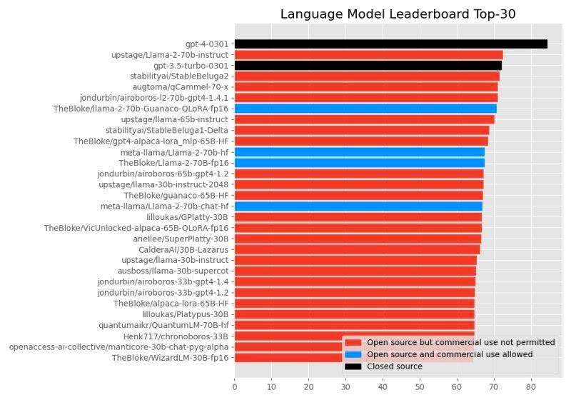
**이미지 캡션:** 이 이미지는 언어 모델 리더보드 상위 30개를 보여주는 가로 막대 그래프입니다. 그래프의 제목은 "Language Model Leaderboard Top-30"이며, x축은 0부터 80까지의 점수를 나타내고, y축에는 다양한 언어 모델의 이름이 나열되어 있습니다. 각 막대는 모델의 성능을 나타내며, 막대의 색상은 모델의 라이선스 유형을 나타냅니다. 빨간색 막대는 "Open source but commercial use not permitted" (상업적 사용이 허용되지 않는 오픈 소스), 파란색 막대는 "Open source and commercial use allowed" (상업적 사용이 허용되는 오픈 소스), 검은색 막대는 "Closed source" (클로즈드 소스)를 의미합니다. 그래프에는 총 30개의 언어 모델이 순위별로 표시되어 있으며, 가장 높은 점수를 받은 모델은 "gpt-4-0301"로 검은색 막대로 표시되어 있습니다.

### 8월 4일 (금) 18:26 · #아숙업 #롯데온쇼핑명언 아숙업을 활용하여 쇼핑명언을 만들어 주시면 선물…

#아숙업 #롯데온쇼핑명언 아숙업을 활용하여 쇼핑명언을 만들어 주시면 선물이 쏟아 집니다. 8월 13일까지 기다릴 필요없이 지금 아숙업과 몇마디만 나누어 보시면 바로 1등할만한 명언들이 쫙 쏟아 질것입니다. 그런다음 아래 롯데온링크에 댓글만 달면 끝! 입니다.

심사위원은 <언맨드>,<반음> 를 쓰신 채기성 작가님 (19년 서울신문 신춘문예 당선/21년제17회 세계문학상 수상) 이십니다.

바로 지원!! https://www.lotteon.com/event/eventzone/eventDtl?evNo=E20230721013116&ch_no=100822&ch_dtl_no=1032459

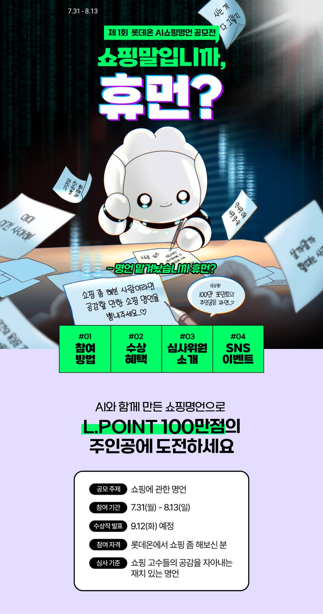
**이미지 캡션:** 이 이미지는 롯데온에서 주최하는 제1회 AI 쇼핑 명언 공모전을 홍보하는 포스터입니다. 중앙에는 귀여운 로봇 캐릭터가 종이에 무언가를 적고 있으며, 주변에는 다양한 문구가 적힌 종이들이 날아다니고 있습니다. 로봇 캐릭터는 흰색과 회색으로 이루어져 있으며, 동그란 눈과 작은 입을 가지고 있어 친근한 느낌을 줍니다. 배경은 어두운 색조에 0과 1로 이루어진 디지털 코드가 흐르는 듯한 디자인으로, AI와 기술적인 느낌을 강조합니다. 포스터 상단에는 "7.31 - 8.13"이라는 행사 기간이 명시되어 있으며, "제1회 롯데온 AI쇼핑명언 공모전"이라는 제목과 함께 "쇼핑말입니까, 휴먼?"이라는 질문이 큰 글씨로 쓰여 있습니다. 로봇 주변의 종이들에는 "어머 이건 사야해!", "사는게 다 그렇지", "살까말까 할때는 사"와 같은 쇼핑과 관련된 문구들이 적혀 있습니다. 또한, "쇼핑 좀 해본 사람이라면 공감할 만한 쇼핑 명언을 뽐내주세요..♡"라는 문구와 함께 "100만 포인트의 주인공은 과연?"이라는 문구가 있어 참여를 유도하고 있습니다. 하단에는 "#01 참여 방법", "#02 수상 혜택", "#03 심사위원 소개", "#04 SNS 이벤트"라는 네 가지 항목이 나열되어 있으며, 그 아래에는 "AI와 함께 만든 쇼핑명언으로 L.POINT 100만점의 주인공에 도전하세요"라는 문구와 함께 공모전의 상세 정보가 표 형태로 정리되어 있습니다. 공모 주제는 "쇼핑에 관한 명언", 참여 기간은 "7.31(월) - 8.13(일)", 수상작 발표는 "9.12(화) 예정"이며, 참여 자격은 "롯데온에서 쇼핑 좀 해보신 분", 심사 기준은 "쇼핑 고수들의 공감을 자아내는 재치 있는 명언"입니다. 전체적으로 밝고 긍정적인 분위기이며, AI와 쇼핑을 결합한 흥미로운 공모전임을 알 수 있습니다.
 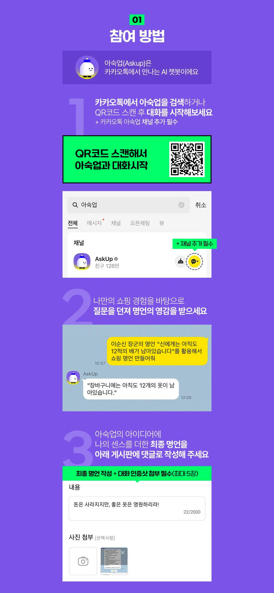
**이미지 캡션:** 이 이미지는 '아숙업(Askup)'이라는 AI 챗봇을 활용한 참여 방법을 안내하는 한국어 이미지입니다. 화면 상단에는 '01 참여 방법'이라는 제목이 보이며, 아숙업이 카카오톡에서 만나는 AI 챗봇임을 설명합니다. 참여 방법은 크게 세 단계로 나뉩니다. 첫 번째 단계는 카카오톡에서 '아숙업'을 검색하거나 QR코드를 스캔하여 대화를 시작하는 방법이며, 카카오톡 채널 추가가 필수임을 안내합니다. 두 번째 단계는 '나만의 쇼핑 경험을 바탕으로 질문을 던져 명언의 영감을 받으세요'라는 문구와 함께, 사용자가 "신에게는 아직도 12척의 배가 남아있습니다"라는 이순신 장군의 명언을 활용하여 쇼핑 명언을 만들어 달라고 요청하고, 아숙업이 "장바구니에는 아직도 12개의 옷이 남아있습니다."라고 답변하는 카카오톡 대화 예시가 포함되어 있습니다. 세 번째 단계는 '아숙업의 아이디어에 나의 센스를 더한 최종 명언을 아래 게시판에 댓글로 작성해 주세요'라고 안내하며, '최종 명언 작성 + 대화 인증샷 첨부 필수(최대 5장)'라는 문구와 함께 내용 입력란과 사진 첨부 선택 사항이 있습니다. 내용 입력란에는 예시로 "돈은 사라지지만, 좋은 옷은 영원하리라!"라는 문구가 22/2000 글자 수 제한과 함께 표시되어 있습니다. 전체적으로 보라색 배경에 흰색과 녹색, 노란색 텍스트를 사용하여 정보를 명확하게 전달하고 있으며, 귀여운 AI 챗봇 캐릭터와 카카오톡 대화 화면을 삽입하여 친근하고 이해하기 쉬운 분위기를 연출합니다.
 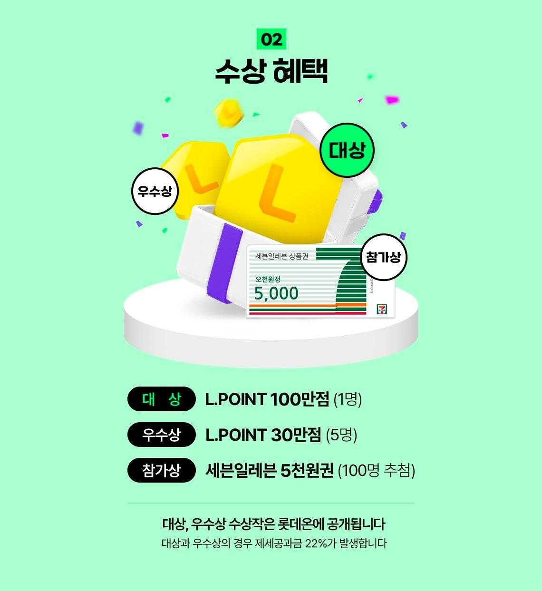
**이미지 캡션:** 이 이미지는 '수상 혜택'이라는 제목과 함께 다양한 상품을 보여주는 홍보 이미지입니다. 중앙에는 노란색과 보라색으로 장식된 상품권이 놓여 있으며, 상품권에는 '세븐일레븐 상품권'이라는 글자와 함께 5,000원이라는 금액이 표시되어 있습니다. 상품권 위에는 '대상', '우수상', '참가상'이라는 라벨이 붙어 있으며, 각각 L.POINT 100만점(1명), L.POINT 30만점(5명), 세븐일레븐 5천원권(100명 추첨)의 혜택이 명시되어 있습니다. 이미지 하단에는 대상 및 우수상 수상작은 롯데온에 공개되며, 대상과 우수상의 경우 제세공과금 22%가 발생한다는 안내 문구가 있습니다. 전반적으로 밝고 긍정적인 분위기를 연출하며, 이벤트 참여를 독려하는 내용입니다.
 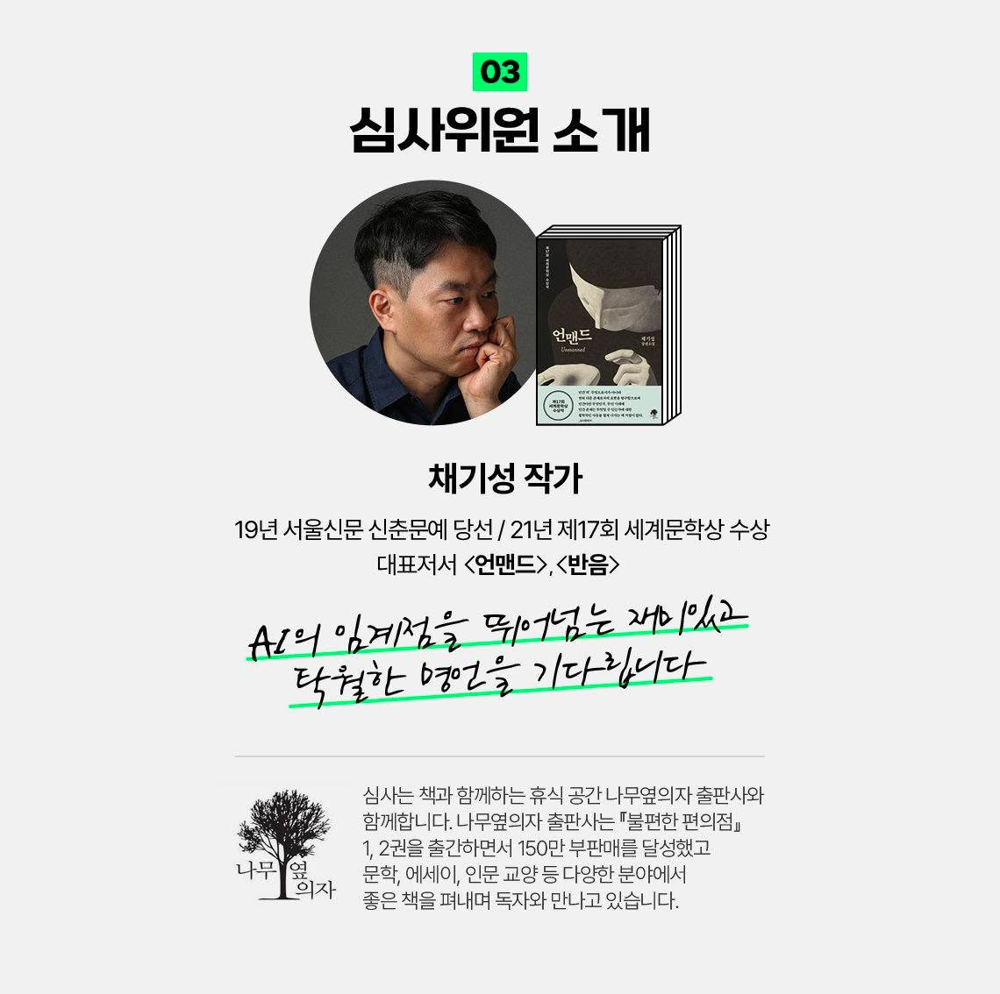
**이미지 캡션:** 이 사진은 심사위원 소개 페이지로, 채기성 작가를 소개하고 있다. 사진 중앙에는 채기성 작가의 상반신 초상 사진이 있고, 그의 옆에는 그가 대표 저서로 쓴 것으로 보이는 책 '언맨드'의 표지가 있다. 채기성 작가는 40대 후반에서 50대 초반으로 보이는 성인 남성으로, 검은색 셔츠를 입고 있으며, 손으로 턱을 괴고 생각에 잠긴 듯한 표정을 짓고 있다. 배경은 어둡게 처리되어 인물에 집중되도록 했다. 사진 위쪽에는 '03 심사위원 소개'라는 제목이 녹색과 흰색으로 쓰여 있고, 그 아래에는 '채기성 작가'라는 이름이 크게 표시되어 있다. 작가의 경력으로는 '19년 서울신문 신춘문예 당선 / 21년 제17회 세계문학상 수상'이라고 적혀 있으며, 대표 저서로는 '<언맨드>, <반음>'이 언급되어 있다. 그 아래에는 붓글씨로 'AI의 임계점을 뛰어넘는 재미있고 탁월한 명언을 기다립니다.'라는 문구가 쓰여 있어, 심사위원으로서의 역할을 강조하고 있다. 사진 하단에는 '나무 옆 의자'라는 출판사 이름과 함께 해당 출판사에 대한 소개 글이 있다. 이 글은 '심사는 책과 함께하는 휴식 공간 나무옆의자 출판사와 함께합니다. 나무옆의자 출판사는 "불편한 편의점" 1, 2권을 출간하면서 150만 부판매를 달성했고 문학, 에세이, 인문 교양 등 다양한 분야에서 좋은 책을 펴내며 독자와 만나고 있습니다.'라고 쓰여 있어, 출판사의 성과와 지향점을 보여준다. 전체적으로 진지하고 전문적인 분위기를 풍기며, 작가와 그의 작품, 그리고 그가 속한 출판사에 대한 정보를 효과적으로 전달하고 있다.
 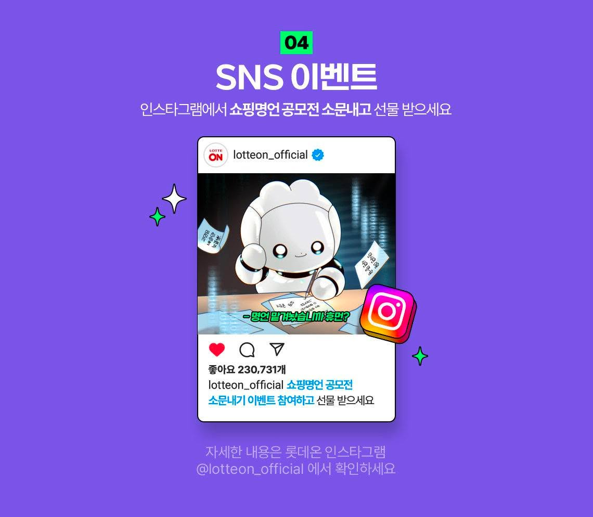
**이미지 캡션:** 보라색 배경에 흰색 테두리의 인스타그램 게시물 이미지가 중앙에 배치되어 있으며, 상단에는 "04 SNS 이벤트"라는 제목과 "인스타그램에서 쇼핑명언 공모전 소문내고 선물 받으세요"라는 부제가 있습니다. 인스타그램 게시물 안에는 귀여운 흰색 로봇 캐릭터가 책상에 앉아 종이에 무언가를 적고 있는 모습이 보입니다. 로봇 캐릭터 주변에는 이진 코드와 함께 "쇼핑명언", "명언 맡겨놨습니까 휴먼?"이라고 적힌 종이들이 흩어져 있습니다. 게시물 하단에는 좋아요 230,731개와 함께 "lotteon_official 쇼핑명언 공모전 소문내기 이벤트 참여하고 선물 받으세요"라는 문구가 있습니다. 게시물 오른쪽 하단에는 인스타그램 로고가 보입니다. 게시물 하단에는 "자세한 내용은 롯데온 인스타그램 @lotteon_official 에서 확인하세요"라는 안내 문구가 있습니다. 전체적으로 이벤트 홍보를 위한 밝고 긍정적인 분위기입니다.

### 8월 4일 (금) 20:01 · 저희들이 OpenLLM 1등한 내용을 많은 자료들에서 사용하시는것 같습니…

저희들이 OpenLLM 1등한 내용을 많은 자료들에서 사용하시는것 같습니다. 너무 감사드리고 마음껏 더더더 사용해주세요. 

아래 https://github.com/synabreu/awskrusergroup 자료는 Jinho Seo 님께서 MLOps와 LLMOps를 정리한 정말 멋진 자료입니다. 저도 아주 재미있게 읽었습니다.

---
안녕하세요? 서진호입니다.
지난 주 AWS KR UserGroup 의 데이터 모임에서 저의 번역책 "AWS 기반 데이터과학" 책 홍보 겸 "AWS SageMaker를 이용한 MLOps 와 LLMOps" 로 발표한 자료와 예제 소스 코드를 공유합니다. 
그날 피맥 파티 하면서 많은 분들이 질문해 주신 내용을 반영해서 추가적인 자료를 좀더 찾아 넣었습니다. 궁금한 점이 있다면 언제나 메일 또는 댓글을 주시면 답변을 드리겠습니다.

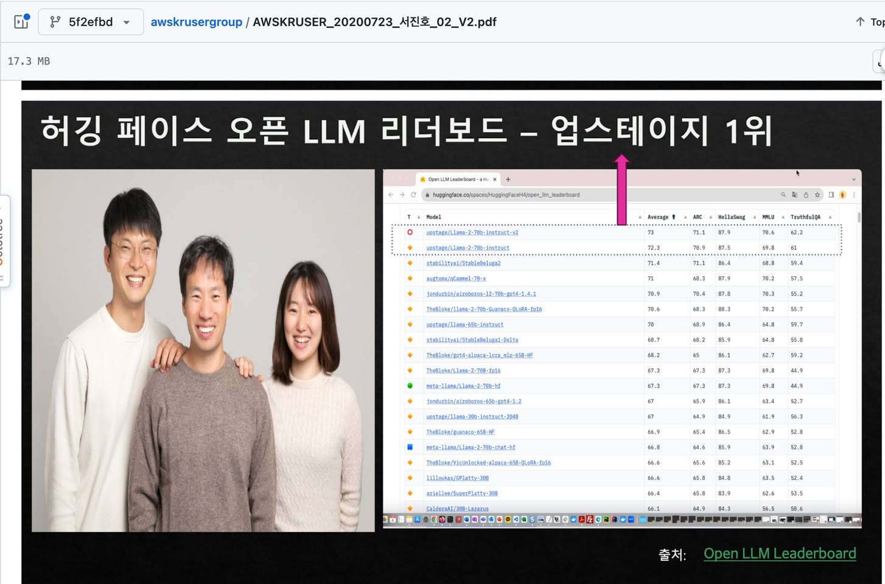
**이미지 캡션:** 세 명의 젊은 아시아인이 밝게 웃으며 카메라를 바라보고 있으며, 두 명의 남성이 여성의 양쪽에 서서 어깨에 팔을 두르고 있다. 왼쪽 남성은 안경을 쓰고 흰색 스웨터를 입고 있으며, 가운데 남성은 회색 스웨터를 입고 있고, 여성은 흰색 스웨터를 입고 있다. 배경에는 검은색 칠판에 흰색 글씨로 "허깅 페이스 오픈 LLM 리더보드 – 업스테이지 1위"라고 쓰여 있으며, 오른쪽에는 허깅 페이스의 오픈 LLM 리더보드 웹사이트가 표시되어 있으며, 업스테이지의 모델이 리더보드에서 1위를 차지했음을 보여주는 분홍색 화살표가 있다. 전반적으로 긍정적이고 축하하는 분위기이다.

### 8월 5일 (토) 12:09 · LLM의 성능이 아주 높아 진다고 하면 이것으로 무엇을 할수 있을까요? …

LLM의 성능이 아주 높아 진다고 하면 이것으로 무엇을 할수 있을까요? 할일이 많겠지만 그중 가장 응용이 많을 것이라고 하는 금융분야 인데요. 무려 금융분야 20가지의 활용과 LLM 의 사용예를 잘 정리해둔 문서가 있습니다. https://medium.datadriveninvestor.com/fingpt-powering-the-future-of-finance-with-20-cutting-edge-applications-7c4d082ad3d8

7B 사이즈에 불과한 모델로 금융 sentiment 분석 영역에서 GPT3.5보다 잘된다는 예와, 기존 룰베이스와 ML의 영역 이였던 신용평가나 사기탐지등도 LLM이 도움이 될수 있다고 하네요.

정말 LLM이 큰 도움이 될수 있을까요?

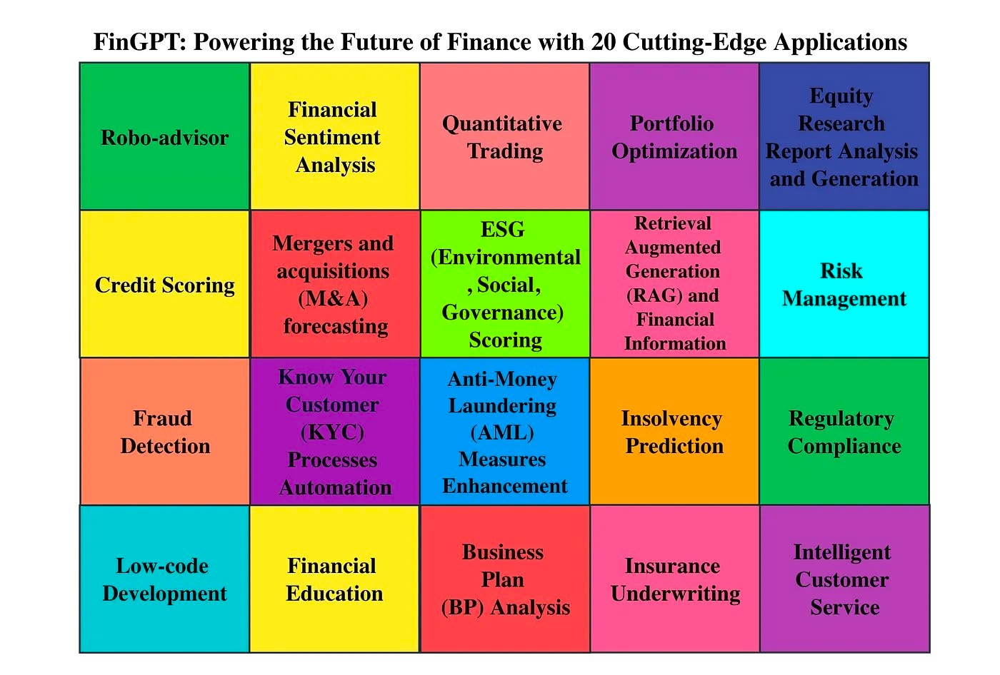
**이미지 캡션:** 이 이미지는 "FinGPT: Powering the Future of Finance with 20 Cutting-Edge Applications"라는 제목의 다이어그램으로, 금융 분야의 20가지 최첨단 애플리케이션을 4x5 그리드 형태로 보여줍니다. 각 셀은 서로 다른 색상으로 구분되어 있으며, 금융 서비스의 다양한 영역을 나타내는 텍스트가 포함되어 있습니다. 왼쪽 상단부터 시작하여 Robo-advisor, Financial Sentiment Analysis, Quantitative Trading, Portfolio Optimization, Equity Research Report Analysis and Generation이 첫 번째 행에 나열되어 있습니다. 두 번째 행에는 Credit Scoring, Mergers and acquisitions (M&A) forecasting, ESG (Environmental, Social, Governance) Scoring, Retrieval Augmented Generation (RAG) and Financial Information, Risk Management가 있습니다. 세 번째 행은 Fraud Detection, Know Your Customer (KYC) Processes Automation, Anti-Money Laundering (AML) Measures Enhancement, Insolvency Prediction, Regulatory Compliance로 구성됩니다. 마지막 네 번째 행에는 Low-code Development, Financial Education, Business Plan (BP) Analysis, Insurance Underwriting, Intelligent Customer Service가 포함됩니다. 이미지에는 사람이 등장하지 않으며, 배경은 흰색입니다. 텍스트는 명확하게 보이며, 각 셀의 텍스트는 해당 애플리케이션의 이름을 나타냅니다. 전반적으로 금융 기술의 혁신적인 응용 분야를 시각적으로 요약한 정보성 다이어그램입니다.

### 8월 11일 (금) 18:52 · #LLM #짝퉁

#LLM #짝퉁 

허깅페이스 openLLM 1등을 한 이후 많은 연락과 주목을 받고 있는 가운데 DeepNight 라는 회사에서 저희 모델뿐만 아니라 연락에 대한 부분도 그대로 벤치마킹을 하였다는 제보가 들어왔습니다.

일단 이렇게 막 대놓고 베껴도 되나 기분이 이상하기도 하고 또 누군가의 벤치마킹 대상이 된다는 것에 기분이 좋기도 합니다.

그러나 짝퉁에 속지 마시고 PrivateLLM 관련 도움이 필요하시면 Upstage,  https://www.upstage.ai/private-llm 로 연락주시면 됩니다.

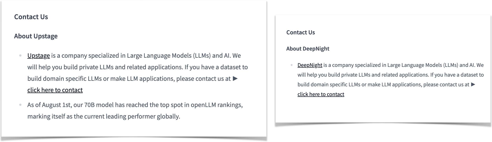
**이미지 캡션:** 이 이미지는 두 개의 카드 형식의 웹 페이지 섹션을 나란히 보여줍니다. 각 섹션은 "Contact Us"라는 제목으로 시작하며, 그 아래에는 "About Upstage" 또는 "About DeepNight"라는 소제목이 있습니다. 각 섹션에는 두 개의 글머리 기호 목록이 포함되어 있으며, 첫 번째 목록은 해당 회사가 LLM 및 AI 전문 기업임을 설명하고 개인 LLM 구축 및 관련 애플리케이션 개발을 지원한다고 말합니다. 또한 도메인별 LLM을 구축하거나 LLM 애플리케이션을 만들고 싶다면 연락을 요청하며 "click here to contact"라는 링크가 있습니다. 두 번째 글머리 기호 목록은 첫 번째 섹션에서만 볼 수 있으며, 8월 1일 기준으로 70B 모델이 openLLM 순위에서 최고 자리를 차지했으며 현재 전 세계 선도적인 성능을 보여주고 있다고 언급합니다. 두 섹션 모두 흰색 배경에 검은색 텍스트로 구성되어 있으며, 텍스트는 깔끔하고 전문적인 느낌을 줍니다. 이미지에는 사람이 보이지 않으며, 배경은 단순한 흰색입니다. 텍스트는 명확하고 읽기 쉬우며, 전반적인 분위기는 정보 전달에 초점을 맞춘 비즈니스적인 느낌입니다.

### 8월 13일 (일) 08:53 · #OpenLLM최고모델 #래블업 #backendai

#OpenLLM최고모델 #래블업 #backendai

OpenLLM최고의 모델이 래블업의 backend.ai에서 서빙되고 있습니다. https://pycon.talkativot.com 에서 Upstage모델을 선택하시면 바로 테스트 가능합니다. (지금은 영어만 잘 알아듣습니다.) 이번 테스트는 8월 15일 11:59 PM 까지 진행됩니다. 

저희 모델을 올려주신 래블업 Jeongkyu Shin 대표님께 큰 감사드립니다. 

저도 오늘 파이콘 래블업 부스에 참여할 예정이니 오시는 분들 반갑게 뵙겠습니다. 부스에서 upllm 테스트 해주시는 분들께 한정판 굿즈 준비완료!

래블업 업업업!!

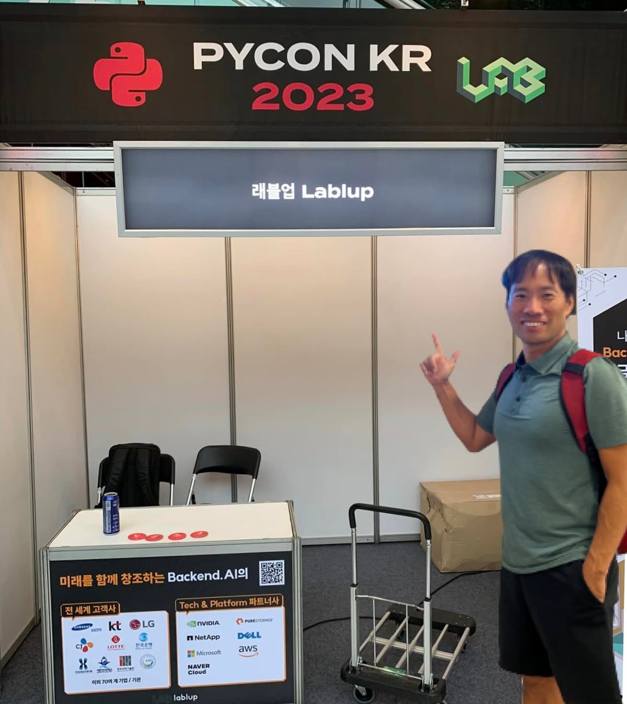
**이미지 캡션:** 행사 부스에서 한 성인 남성이 환하게 웃으며 오른손 검지를 위로 향해 가리키고 있다. 그는 짧은 머리에 회색 폴로 셔츠와 검은색 반바지를 입고 있으며, 빨간색 백팩을 메고 있다. 배경에는 검은색 천막에 "PYCON KR 2023"이라는 글자와 파이썬 로고, 그리고 "LAB"이라는 글자가 보인다. 그 아래에는 "래블업 Lablup"이라고 적힌 회색 간판이 걸려 있다. 부스 안에는 흰색 테이블이 놓여 있고, 테이블 위에는 검은색 백팩 두 개와 음료수 캔 하나, 그리고 빨간색 원형 물체들이 보인다. 테이블 앞면에는 "미래를 함께 창조하는 Backend. AI의"라는 문구와 함께 "전세계 고객사" 및 "Tech & Platform 파트너사"라는 제목 아래 삼성, KT, LG, 롯데, 한국은행, NVIDIA, Pure Storage, NetApp, Dell, Microsoft, AWS, Naver Cloud 등 다양한 기업 로고들이 나열되어 있다. 테이블 옆에는 접이식 수레가 놓여 있고, 그 뒤로는 큰 상자가 보인다. 전체적으로 IT 컨퍼런스의 활기찬 분위기를 느낄 수 있다.
 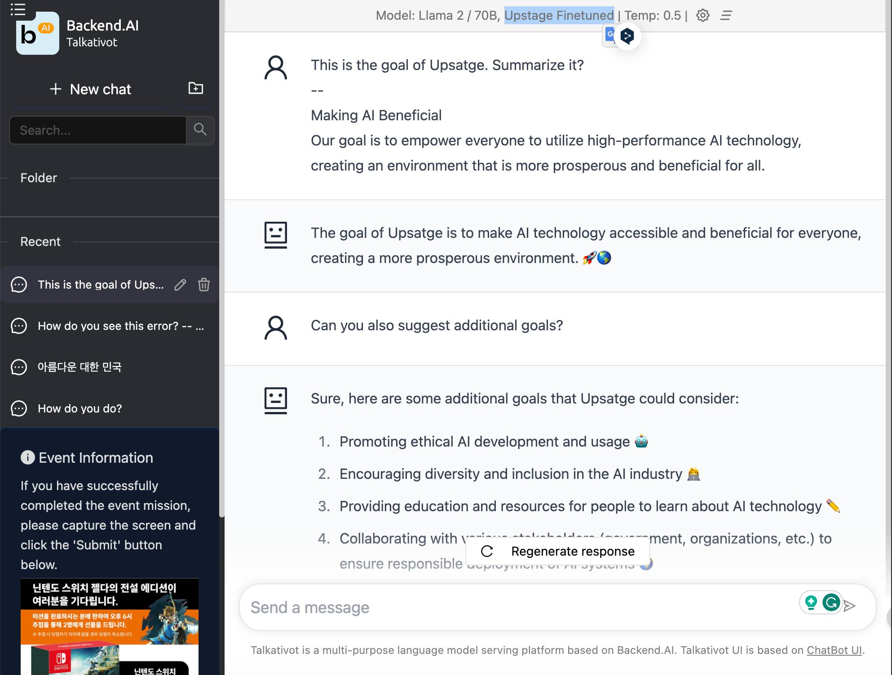
**이미지 캡션:** 이 화면은 인공지능 챗봇과의 대화 인터페이스를 보여줍니다. 왼쪽 사이드바에는 "Backend.AI Talkativot"라는 로고와 함께 새로운 채팅을 시작하는 버튼, 검색창, 폴더, 최근 대화 목록이 있습니다. 최근 대화 목록에는 "This is the goal of Ups...", "How do you see this error? -- ...", "아름다운 대한민국", "How do you do?" 등의 항목이 표시됩니다. 하단에는 이벤트 정보와 함께 닌텐도 스위치 젤다의 전설 에디션 관련 홍보 이미지가 보입니다. 오른쪽 메인 화면에는 챗봇과의 대화 내용이 표시됩니다. 사용자가 "This is the goal of Upsatge. Summarize it?"라고 질문했고, 챗봇은 "Making AI Beneficial"이라는 제목과 함께 인공지능 기술을 모든 사람이 활용하고 번영하고 유익한 환경을 만드는 것이 목표라고 답변했습니다. 이어 사용자가 추가 목표를 제안해달라고 요청하자, 챗봇은 윤리적인 AI 개발 및 사용 장려, AI 산업 내 다양성과 포용성 장려, AI 기술 학습을 위한 교육 및 자원 제공, 책임감 있는 AI 시스템 배포를 위한 다양한 이해관계자와의 협력 등 네 가지 추가 목표를 제시했습니다. 화면 하단에는 메시지를 입력하는 창과 함께 "Regenerate response" 버튼이 보입니다. 전반적으로 깔끔하고 현대적인 디자인의 웹 기반 애플리케이션 화면입니다.
 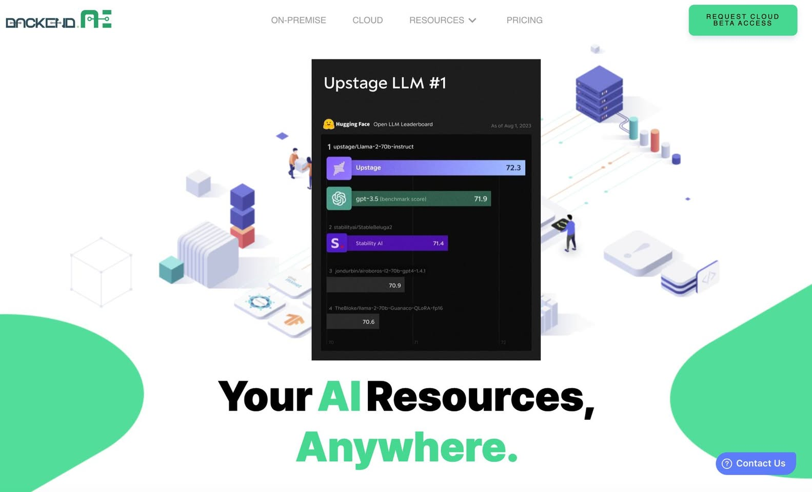
**이미지 캡션:** 이 이미지는 웹사이트의 일부로, 상단에는 "BACKEND.AI" 로고와 함께 "ON-PREMISE", "CLOUD", "RESOURCES", "PRICING" 메뉴가 보이며, 우측 상단에는 "REQUEST CLOUD BETA ACCESS" 버튼이 있다. 중앙에는 "Upstage LLM #1"이라는 제목과 함께 Hugging Face의 LLM 리더보드 순위가 표시되어 있으며, 1위는 Upstage의 Llama-2-70b-instruct 모델로 72.3점, 2위는 Stability AI의 StableBeluga2 모델로 71.4점, 3위는 jondurbin의 airoboros-12-70b-gpt-4-1.4.1 모델로 70.9점, 4위는 TheBloke의 lama-2-70b-Guanaco-QLoRA-fp16 모델로 70.6점을 기록하고 있다. 리더보드 아래에는 "Your AI Resources, Anywhere."라는 문구가 큰 글씨로 적혀 있으며, 우측 하단에는 "Contact Us" 버튼이 있다. 배경에는 추상적인 그래픽 요소들이 배치되어 있으며, 작은 사람 모양의 아이콘들이 서버 랙, 블록, 데이터 흐름 등을 표현하고 있다. 전반적으로 AI 기술과 클라우드 서비스에 대한 정보를 제공하는 웹사이트의 일부로, 기술적인 내용을 강조하는 현대적이고 깔끔한 분위기를 풍긴다.
 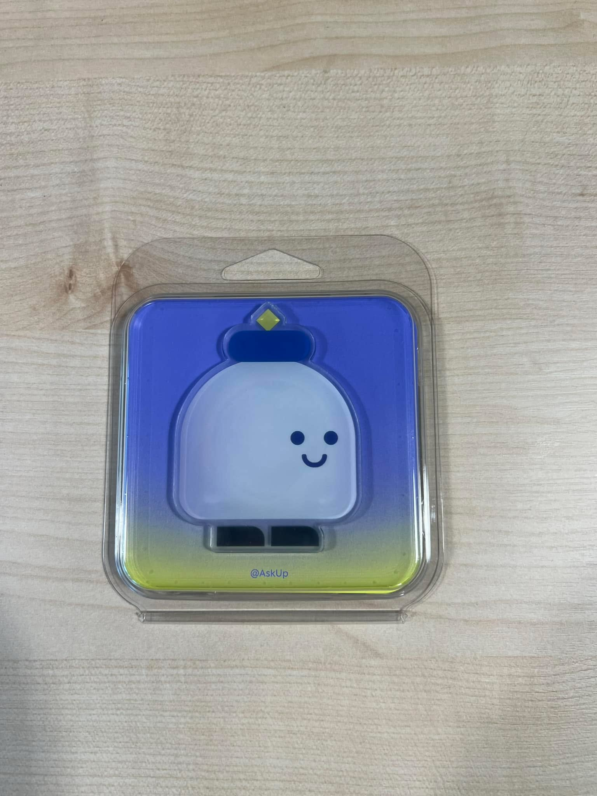
**이미지 캡션:** 투명 플라스틱 포장재 안에 귀여운 캐릭터가 담겨 있으며, 캐릭터는 하얀색의 둥근 몸통에 두 개의 검은 점으로 된 눈과 웃는 입 모양을 하고 있고, 머리에는 파란색 모자와 노란색 장식이 달려 있다. 캐릭터의 발 부분은 검은색으로 표현되어 있으며, 배경은 파란색에서 노란색으로 이어지는 그라데이션으로 되어 있다. 포장재 하단에는 "@AskUp"이라는 텍스트가 흰색으로 작게 쓰여 있다. 이 제품은 나무 무늬의 테이블 위에 놓여 있으며, 전체적으로 밝고 긍정적인 분위기를 자아낸다.

### 8월 15일 (화) 08:56 · #815LLM독립 #한국의얼과문화 #Up1TClub

#815LLM독립 #한국의얼과문화 #Up1TClub

GPT등 LLM을 사용해보면 어색한 한국어 표현들이 나옵니다. 아주 자주 나옵니다. 이는 학습된 한국어 비중이 (GPT3의 경우 0.01697%) 매우 낮기 때문입니다. LLM 다중어 emergent 기능으로 한국어 구사는 어느 정도 가능하지만 다른 언어로 학습된 문화나 사고방식에 한국어로 포장한 답변이 나옵니다. 때로는 한국어 맞춤법도 틀립니다.

LLM은 모든 분야에서 혁신을 일으키고 있고, 알게 모르게 점점 우리 삶으로 들어올 것입니다. 궁극적으로는 우리 손 안에 자비스형태로 매일 매일 질문하고 답을 얻고 토론하는 우리 삶의 동반자 AI가 될 것입니다. 그런데 이야기하고 답하는 방식이 우리의 고유의 정신과 문화에 대한 이해가 없는 외국 문화와 사고 방식에 한국어 포장만 한 것이라면 매우 슬픈 일이 될 것입니다. 그리고 이러한 AI를 사용하면 할수록 우리는 우리의 얼과 문화 그리고 우리만의 색을 잃게 될 것입니다. 

이를 해결하는 가장 좋은 그리고 유일한 방법은 아름다운 우리의 문화와 얼을 담은 소중한 한국어로 LLM을 학습시키고 긴 세월 동안 정제되고 다듬어진 한국어를 LLM에 담는 것입니다. 그리고 그런 AI를 더 많이 사용하는 것입니다.

이 데이터를 모으는 가장 좋은 방법은 마구 가져다 사용하는 것이 아니라, 저작권을 가진 분들에게 적절한 보상을 드리고 이 데이터로 학습된 LLM의 성공을 함께 나눌수 있는 구조를 만드는 것입니다. 그래야 궁극적으로는 더 멋진 한국어 저작물들이 더 많이 나올수 있습니다.

이런 선순환 구조를 만들기 위해 업스테이지는 고민했습니다. 세계 최고의 LLM 모델을 만들고 있는 업스테이지는 Up1TClub을 통해 데이터 파터너들과 한국의 얼과 문화가 담긴 LLM을 함께 만들고, 그 성공을 함께 나누려고 합니다.

여러분이 한국어 저작물을 다루거나 소유한 기관이라면 https://upstage.ai/up-1-trillion-token-club 로 연락주셔서 저희클럽의 데이터 파트너가 되어 주세요. 여러분들의 데이터로 LLM의 이익분배와 LLM 사용의 할인혜택등에 대해 자세한 안내드리도록 하겠습니다. 어제 관련한 언론기사들이 나갔는데 하루만에도 많은 분들이 연락주셨습니다. 여러 분야 데이터 파트너들의 뜨거운 관심에 감사드립니다.

한국의 얼과 문화가 담긴 세계 최고의 LLM 함께 만들어요!

**이미지 캡션:** 이 이미지는 파란색과 주황색이 그라데이션된 배경에 "upstage" 로고와 함께 "Up 1T Token Club"이라는 문구가 크게 쓰여 있습니다. 오른쪽 상단에는 QR 코드가 있으며, 하단에는 "글로벌 1등 기술력을 보유한 업스테이지와 대한민국 LLM 독립선언, 함께 해요!"라는 문구가 한국어로 적혀 있습니다. 이미지에는 사람이 등장하지 않으며, 전체적으로 기술 및 혁신적인 분위기를 전달하고 있습니다.
 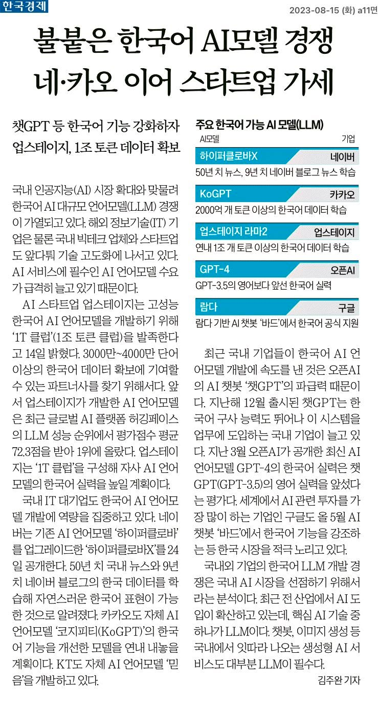
**이미지 캡션:** 한국경제 신문 기사로, 한국어 AI 모델 개발 경쟁이 치열해지고 있으며 네이버와 카카오 같은 대기업뿐만 아니라 업스테이지와 같은 스타트업까지 이 경쟁에 뛰어들고 있다는 내용을 담고 있다. 기사 상단에는 "불붙은 한국어 AI 모델 경쟁 네·카오 이어 스타트업 가세"라는 제목이 크게 쓰여 있으며, 하단에는 주요 한국어 가능 AI 모델 목록과 각 모델을 개발한 기업, 그리고 학습 데이터에 대한 정보가 표로 정리되어 있다. 또한, 챗GPT의 등장으로 한국어 AI 모델 개발이 가속화되었으며, 오픈AI의 GPT-4가 뛰어난 한국어 실력을 보여주고 있다는 내용도 포함되어 있다. 전반적으로 한국어 AI 시장의 성장과 경쟁 구도를 설명하는 정보성 기사이다.

### 8월 17일 (목) 22:15 · #Boostcamp #914마감

#Boostcamp #914마감
어느때보다 더더더 AI 개발자들이 필요할때 입니다. 

최고의 AI 전문가들과 함께 AI 엔지니어로 성장할 수 있는 기회!
<부스트캠프 AI Tech 6기> 온라인 설명회에서 자세한 내용을 확인해 보세요.
👉 온라인 설명회 풀 영상: https://bit.ly/fb-boostcamp-aitech-6-yt
👉 지원하기: https://bit.ly/fb-boostcamp-aitech-6-2
(2023년 9월 14일(목) 오후 5시 까지)

### 8월 19일 (토) 09:42 · #1등OCR #1등LLM #OCRLLM #전문연구요원

#1등OCR #1등LLM #OCRLLM #전문연구요원

세계 1등 OCR (2023 ICDAR대회) 와 1등 LLM (허깅페이스 open llm 리더보더) 기술을 보유하고 있는 업스테이지는 OCR+LLM 관련 연구를 함께 하실 [전문연구요원 신규편입 & 전직] AI Research Engineer 를 모십니다.
https://careers.upstage.ai/o/ai-research-engineer-tsp-2023

OCR+LLM이 어떻게 연결될까요? 우선 LLM을 학습하거나 파인튜닝 등을 할때, 많은 데이터는 (스캔된) 문서에 있는데 이를 효율적으로 구조화 하는 것이 LLM의 성능을 업업업 할 수 있습니다. 이에 대한 깊은 연구가 필요합니다.

또한 OCR의 (중간) 결과를 LLM에 넣으면 별도 OCR학습이 없이도 거의 모든 문서에서 원하는 key-value나 정형화된 형식의 정보를 얻을수 있습니다.

그리고 당연 저희는 OCR+LLM도 세계 1위를 하고 글로벌 시장 최고 제품을 만들것입니다. 이 위대하고 또 재미있고 신나는 도전에 함께하실 [전문연구요원 신규편입 & 전직] AI Research Engineer를 모시고 있습니다. 

많은 지원부탁드리며 주위에도 많이 알려주세요!

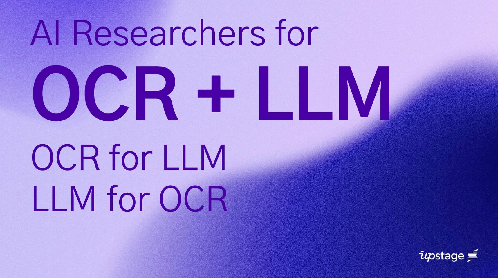
**이미지 캡션:** 이 이미지는 AI 연구와 관련된 그래픽으로, 보라색과 연보라색이 혼합된 배경에 텍스트가 강조되어 있습니다. 상단에는 "AI Researchers for"라는 문구가 연보라색으로 쓰여 있으며, 그 아래에는 크고 굵은 보라색 글씨로 "OCR + LLM"이라고 적혀 있습니다. 이어서 "OCR for LLM"과 "LLM for OCR"이라는 문구가 연보라색으로 나란히 배치되어 있습니다. 이미지의 오른쪽 하단에는 "upstage"라는 로고가 보라색으로 표시되어 있습니다. 배경은 부드러운 그라데이션으로 처리되어 있으며, 오른쪽으로 갈수록 진한 보라색이 나타나고, 텍스트 부분은 연보라색으로 밝게 처리되어 있습니다. 전체적으로 현대적이고 기술적인 느낌을 주는 디자인입니다. 사람이나 구체적인 사물은 보이지 않으며, 텍스트 정보와 추상적인 배경으로 구성되어 있습니다.
 
**이미지 캡션:** 이 이미지는 Hugging Face의 오픈 LLM 리더보드에서 Upstage LLM이 1위를 차지했음을 보여주는 스크린샷입니다. 화면 상단에는 "Upstage LLM #1"이라는 제목이 흰색 글씨로 크게 쓰여 있고, 그 아래에는 Hugging Face의 노란색 이모티콘과 함께 "Hugging Face Open LLM Leaderboard"라는 문구가 있습니다. 오른쪽 상단에는 "As of Aug 1, 2023"이라고 날짜가 표시되어 있습니다. 리더보드는 순위별로 LLM 모델들의 성능을 보여주는 막대 그래프 형식으로 구성되어 있습니다. 1위는 "upstage/Llama-2-70b-instruct"로, 보라색 배경의 "Upstage"라는 이름과 함께 72.3이라는 점수를 기록하고 있습니다. 그 아래에는 녹색 배경의 "gpt-3.5 (benchmark score)"가 71.9점으로 2위로 표시되어 있습니다. 2위는 "stabilityai/StableBeluga2"로, 보라색 배경의 "Stability AI"라는 이름과 함께 71.4점을 기록하고 있습니다. 3위는 "jondurbin/airoboros-l2-70b-gpt4-1.4.1"로 70.9점, 4위는 "TheBloke/llama-2-70b-Guanaco-QLORA-fp16"으로 70.6점을 기록하고 있습니다. 그래프 하단에는 70, 71, 72와 같은 점수 축이 표시되어 있습니다. 이미지에는 사람이 등장하지 않으며, 배경은 어두운 회색으로 LLM 리더보드 인터페이스를 보여줍니다. 주요 사물은 컴퓨터 화면에 표시되는 텍스트와 그래프이며, 보이는 텍스트는 LLM 모델의 이름, 점수, 날짜, 그리고 리더보드 제목 등입니다. 전반적인 분위기는 정보 전달에 초점을 맞춘 기술적인 느낌을 줍니다.
 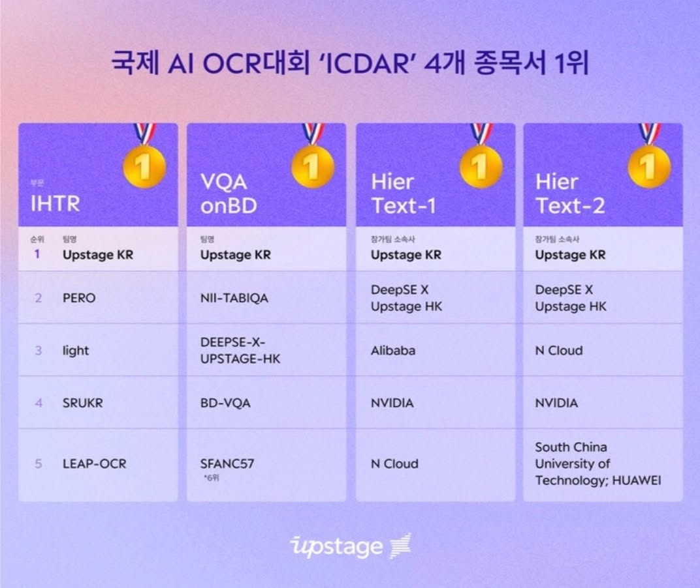
**이미지 캡션:** 이 이미지는 국제 AI OCR 대회 'ICDAR'에서 4개 종목 모두 1위를 차지했다는 내용을 담고 있으며, 보라색 배경에 금색 메달과 함께 각 종목별 순위와 참가팀 정보가 표로 정리되어 있습니다. 표는 'IHTR', 'VQA onBD', 'Hier Text-1', 'Hier Text-2' 네 개의 종목으로 나뉘어 있으며, 각 종목별로 순위, 팀명, 참가팀 소속사가 기재되어 있습니다. 1위 팀은 모두 'Upstage KR'이며, 2위 팀은 'PERO', 'NII-TABIQA', 'DeepSE X Upstage HK' 등으로 구성되어 있습니다. 3위 팀으로는 'light', 'DEEPSE-X-UPSTAGE-HK', 'Alibaba', 'N Cloud' 등이 보입니다. 4위 팀은 'SRUKR', 'BD-VQA', 'NVIDIA'이며, 5위 팀은 'LEAP-OCR', 'SFANC57' (6위), 'N Cloud', 'South China University of Technology; HUAWEI'가 기재되어 있습니다. 이미지 하단에는 'upstage' 로고가 보입니다. 전체적으로 성과를 축하하고 알리는 긍정적이고 자랑스러운 분위기입니다.

### 8월 19일 (토) 10:20 · #WIP #llm #gpu 30B 모델을 1B 토큰을 40 시간 내에 포…

#WIP #llm #gpu 30B 모델을 1B 토큰을 40 시간 내에 포스트 트레이닝이나 파인튜닝하려는데 몇 개의 GPU가 필요한 건가요?

현재 WIP 버전으로 제작 중인 GPU 계산기입니다. https://gpu.sung.devstage.ai/ 를 한 번 사용해보시고 버그/계산 오류가 보이면 https://github.com/hunkim/llm_gpu_cal 로 Pull request를 많이 부탁드립니다.

몇번 테스트해 보니 GPU가 정말 많이 필요하네요. ㅠㅠ

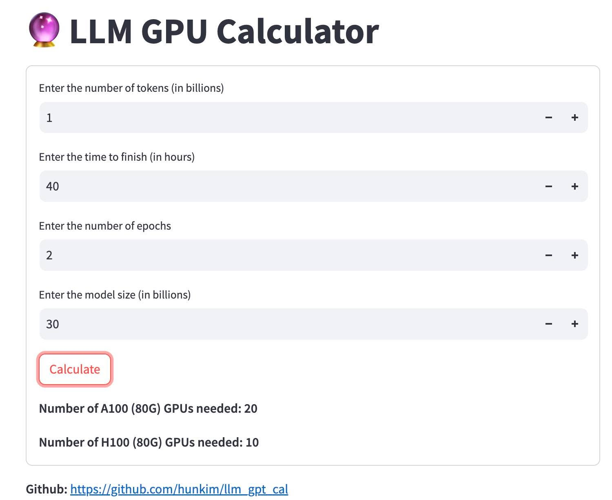
**이미지 캡션:** 이 이미지는 웹사이트의 스크린샷으로, "LLM GPU Calculator"라는 제목이 보입니다. 제목 옆에는 보라색 구슬 모양의 아이콘이 있습니다. 계산기 인터페이스는 여러 입력 필드로 구성되어 있으며, 각 필드에는 사용자가 값을 입력할 수 있는 텍스트 상자와 함께 설명이 있습니다. 첫 번째 입력 필드는 "Enter the number of tokens (in billions)"이며, 현재 값은 "1"입니다. 두 번째 필드는 "Enter the time to finish (in hours)"이며, 현재 값은 "40"입니다. 세 번째 필드는 "Enter the number of epochs"이며, 현재 값은 "2"입니다. 네 번째 필드는 "Enter the model size (in billions)"이며, 현재 값은 "30"입니다. 각 입력 필드 옆에는 값을 증가시키거나 감소시킬 수 있는 빼기(-)와 더하기(+) 버튼이 있습니다. "Calculate"라는 텍스트가 있는 분홍색 버튼이 있으며, 이 버튼을 누르면 계산이 수행되는 것으로 보입니다. 계산 결과로 "Number of A100 (80G) GPUs needed: 20"과 "Number of H100 (80G) GPUs needed: 10"이라는 텍스트가 표시됩니다. 이미지 하단에는 "Github: https://github.com/hunkim/llm_gpt_cal"이라는 텍스트와 함께 GitHub 저장소 링크가 있습니다. 이 웹사이트는 대규모 언어 모델(LLM) 훈련에 필요한 GPU 수를 계산하는 도구로 보입니다. 배경은 흰색이며, 전체적으로 깔끔하고 기능적인 디자인입니다. 이미지에는 사람이 등장하지 않습니다.

### 8월 23일 (수) 07:28 · GPT3.5 파인튜닝 공개되었습니다.

GPT3.5 파인튜닝 공개되었습니다.

가격은 일반 (input $0.0015 / 1K tokens) 대비 약 10배 정도 비싸다고 할 수 있고 GPT4의 (input $0.03 / 1K tokens) 절반 정도 되네요. GPT3.5를 도메인 특화 등에 파인튜닝해서 GPT4보다 더 좋은 성능을 낼 수 있다면 이익이겠습니다.

Training: $0.008 / 1K Tokens
Usage input: $0.012 / 1K Tokens
Usage output: $0.016 / 1K Tokens

치열한 도메인 특화 경쟁이 시작되었고, 이를 통해 GPT4를 넘어서는 멋진 특화 모델들을 많이 볼 수 있을 것 같습니다. 멋진 세상입니다!

--
https://platform.openai.com/docs/guides/fine-tuning
Starting today, you can now fine-tune GPT-3.5 Turbo for custom use cases. Read more about the new fine-tuning capabilities in our latest blog post. 
Fine-tuning use cases
Since the release of GPT-3.5 Turbo, developers and businesses have asked for the ability to customize the model to create unique and differentiated experiences for their users. With this launch, developers can now run supervised fine-tuning to make this model perform better for their use cases. In our early results, we have seen developer achieve:

Improved steerability
Reliable output formatting
Consistent custom tone

In addition to increased performance, fine-tuning also enables businesses to shorten their prompts while ensuring similar performance.

Pricing
Fine-tuning costs are broken down into two buckets: the initial training cost and usage cost:

Training: $0.008 / 1K Tokens
Usage input: $0.012 / 1K Tokens
Usage output: $0.016 / 1K Tokens

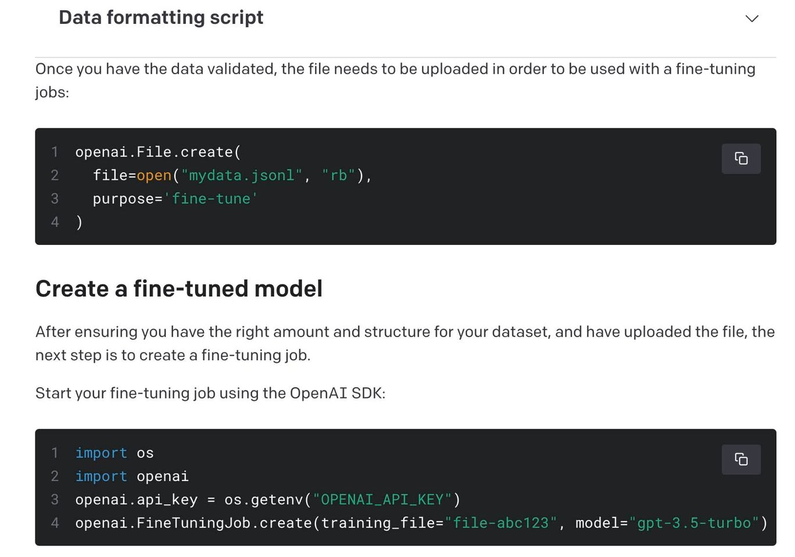
**이미지 캡션:** 이 이미지는 컴퓨터 화면의 일부를 캡처한 것으로, 프로그래밍 코드와 관련 설명을 보여줍니다. 사람이나 장소는 보이지 않으며, 오직 텍스트와 코드 블록만 있습니다. 상단에는 "Data formatting script"라는 제목과 함께 데이터 유효성 검사 후 파일을 업로드하는 방법에 대한 설명이 있습니다. 그 아래에는 `openai.File.create` 함수를 사용하여 "mydata.jsonl" 파일을 "fine-tune" 목적으로 생성하는 Python 코드 블록이 표시됩니다. 다음 섹션은 "Create a fine-tuned model"이라는 제목으로, 데이터셋을 준비하고 업로드한 후 파인튜닝 작업을 생성하는 과정에 대한 설명이 이어집니다. 마지막으로 OpenAI SDK를 사용하여 파인튜닝 작업을 시작하는 Python 코드 블록이 나타나며, `os` 모듈과 `openai` 라이브러리를 임포트하고 API 키를 설정한 후 `openai.FineTuningJob.create` 함수를 호출하여 "file-abc123" 파일을 사용하여 "gpt-3.5-turbo" 모델을 파인튜닝하는 코드가 포함되어 있습니다. 전체적으로 기술적인 문서의 일부로 보이며, 인공지능 모델 파인튜닝 과정을 안내하는 내용을 담고 있습니다.

### 8월 23일 (수) 22:58 · #생성형AI  #금융보험 #2PM

#생성형AI  #금융보험 #2PM 

8/24일 오후 2시 <생성형 AI가 바꾸는 금융보험의 미래> 라는 주제로 금융과 이미 많은 프로젝트를 진행중인 업스테이지 최홍준님, 찬준님, Hwalsuk Lee 발표 웨비나가 준비되어 있습니다.

평소 오후 8시에 진행되던 업스 웨비나와 달리 이번에는 타겟 청중에 맞춰 오후 2시에 진행이 될 예정입니다!

금융보험 업계분들큰 도움이될 세미나에 여러분들을 초청드립니다. 

* 일시 : 8월 24일 오후 2시
* 사전등록 : https://bit.ly/finwgenai-sshare (웨비나 발표직전까지 등록이 가능합니다.)

오시는 분들 반갑게 뵙겠습니다.

### 8월 24일 (목) 23:13 · #라마2 #gpt4 #30배저렴

#라마2 #gpt4 #30배저렴

라마2가 매우 강력하네요. 요약의 성능은 사람과 GPT-4와 사실적으로 거의 동등한 정확도를 가지며 비용은 GPT4 대비 30배 저렴하다는 소식입니다. 활용도가 많은 요약이나 RAG에는 라마2+파인튜닝이 대세가 될것 같습니다.

https://www.anyscale.com/blog/llama-2-is-about-as-factually-accurate-as-gpt-4-for-summaries-and-is-30x-cheaper

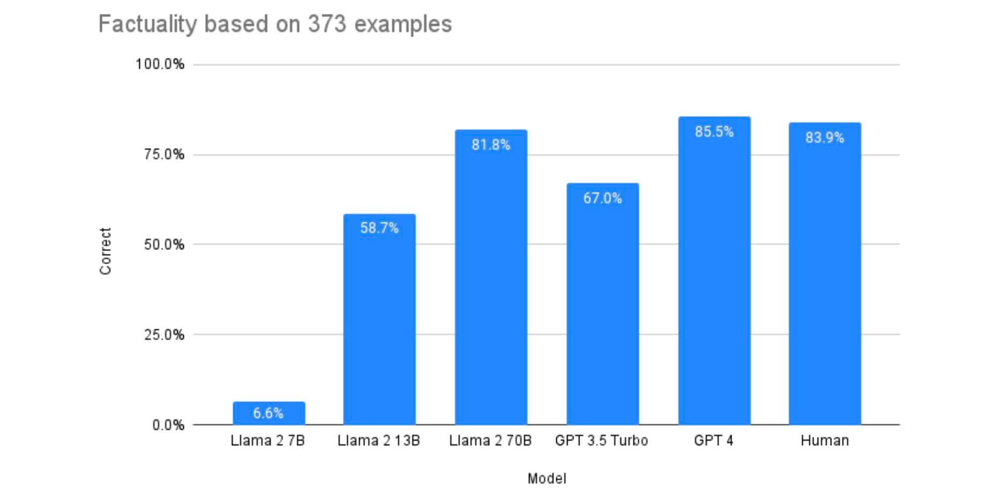
**이미지 캡션:** 이것은 373개의 예시에 기반한 사실성(Factuality)을 보여주는 막대 그래프입니다. 그래프는 모델별 정확도를 백분율로 나타내며, 가로축에는 Llama 2 7B, Llama 2 13B, Llama 2 70B, GPT 3.5 Turbo, GPT 4, 그리고 Human(인간)이 표시되어 있습니다. 세로축은 정확도를 나타내며 0%부터 100%까지 표시됩니다. 각 막대는 해당 모델의 정확도를 나타내며, Llama 2 7B는 6.6%, Llama 2 13B는 58.7%, Llama 2 70B는 81.8%, GPT 3.5 Turbo는 67.0%, GPT 4는 85.5%, 그리고 Human은 83.9%의 정확도를 보입니다. 그래프의 제목은 "Factuality based on 373 examples"이며, 세로축 레이블은 "Correct"입니다. 배경은 흰색이며, 그래프는 파란색 막대로 구성되어 있습니다. 이 그래프는 인공지능 모델과 인간의 사실성 기반 답변 정확도를 비교하고 있습니다.
 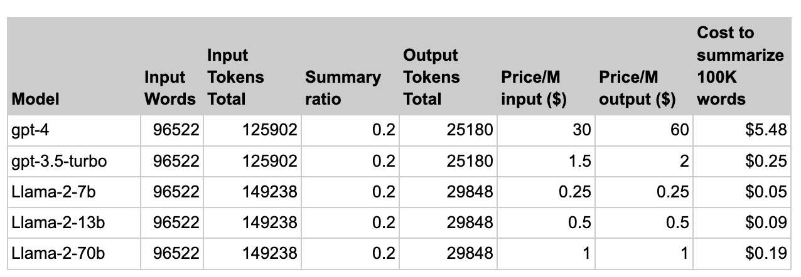
**이미지 캡션:** 이 이미지는 여러 언어 모델의 요약 성능 및 비용을 비교하는 표를 보여줍니다. 표에는 모델 이름, 입력 단어 수, 입력 토큰 수, 요약 비율, 출력 토큰 수, 입력당 가격, 출력당 가격, 10만 단어 요약 비용 등의 열이 있습니다. 각 행은 gpt-4, gpt-3.5-turbo, Llama-2-7b, Llama-2-13b, Llama-2-70b와 같은 특정 모델을 나타냅니다. 표의 배경은 회색이며, 텍스트는 흰색과 검은색으로 표시되어 있습니다. 이 표는 정보 검색 및 RAG 시스템에서 모델 선택에 유용한 정보를 제공합니다.

### 8월 24일 (목) 23:27 · #코드라마2 #34B #gpt4

#코드라마2 #34B #gpt4 

코 드라마 2 7B, 13B, 34B도 공개되었습니다. 라마 2 파운데이션 모델에다 코드를 태웠는데요. 성능이 GPT3.5는 한참 넘어서고 GPT4에 가깝습니다.

회사 내부 코드를 파인튜닝해서 온프렘 등으로 사용한다면 보안도 유지되면서 개발자들의 효율 향상에 매우 큰 도움이 될 것 같습니다.

라마 2+포스트 학습+파인튜닝이 대세가 될 것 같습니다.

https://ai.meta.com/blog/code-llama-large-language-model-coding/

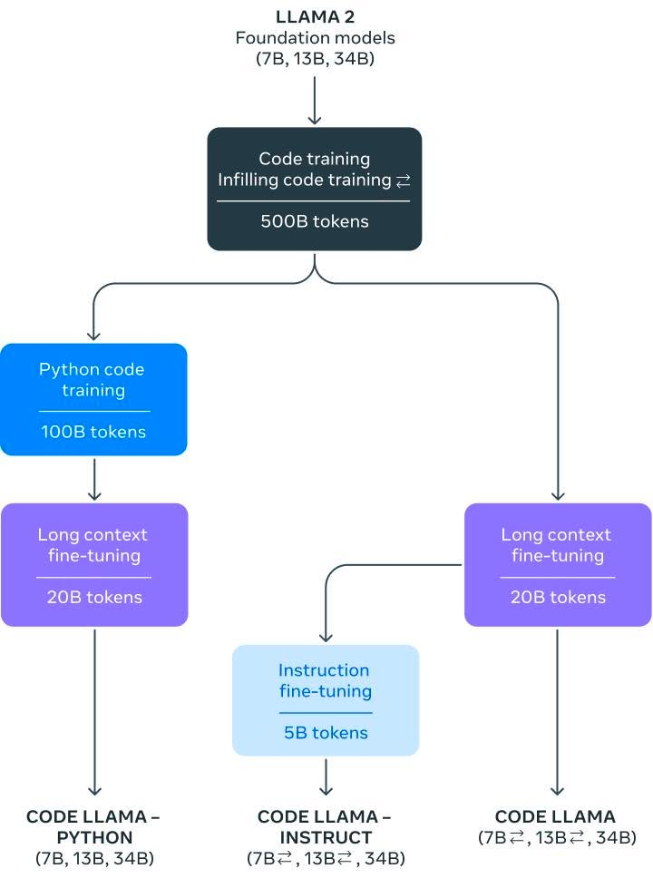
**이미지 캡션:** 이 이미지는 LLAMA 2 기반 모델의 학습 과정을 보여주는 플로우차트입니다. 가장 상단에는 "LLAMA 2 Foundation models (7B, 13B, 34B)"라고 표시되어 있으며, 이는 70억, 130억, 340억 개의 매개변수를 가진 기반 모델을 의미합니다. 이 모델들은 "Code training Infilling code training 500B tokens"이라는 단계에서 5000억 개의 토큰으로 코드 학습 및 코드 채우기 학습을 거칩니다. 이 학습 결과는 세 갈래로 나뉩니다. 첫 번째 경로는 "Python code training 100B tokens" 단계로 이어져 파이썬 코드 학습을 1000억 개의 토큰으로 진행합니다. 이 후 "Long context fine-tuning 20B tokens" 단계에서 200억 개의 토큰으로 긴 문맥 미세 조정을 거쳐 최종적으로 "CODE LLAMA - PYTHON (7B, 13B, 34B)" 모델이 생성됩니다. 두 번째와 세 번째 경로는 "Code training" 단계에서 직접 이어집니다. 두 번째 경로는 "Long context fine-tuning 20B tokens" 단계로 200억 개의 토큰을 사용하여 긴 문맥 미세 조정을 진행하고, 이어서 "Instruction fine-tuning 5B tokens" 단계에서 50억 개의 토큰으로 지시 미세 조정을 거쳐 "CODE LLAMA - INSTRUCT (7B2, 13B2, 34B)" 모델을 생성합니다. 세 번째 경로는 "Long context fine-tuning 20B tokens" 단계에서 200억 개의 토큰을 사용하여 긴 문맥 미세 조정을 진행한 후, "CODE LLAMA (7B2, 13B2, 34B)" 모델을 생성합니다. 각 단계는 상자 형태로 표시되어 있으며, 화살표로 학습 흐름을 나타냅니다. 배경은 흰색이며, 각 상자는 파란색, 보라색, 하늘색, 어두운 회색 등 다양한 색상으로 구분되어 있습니다. 이미지에는 사람이 등장하지 않으며, 텍스트는 모두 영어로 되어 있습니다. 전체적인 분위기는 정보 전달에 초점을 맞춘 기술적인 다이어그램입니다.
 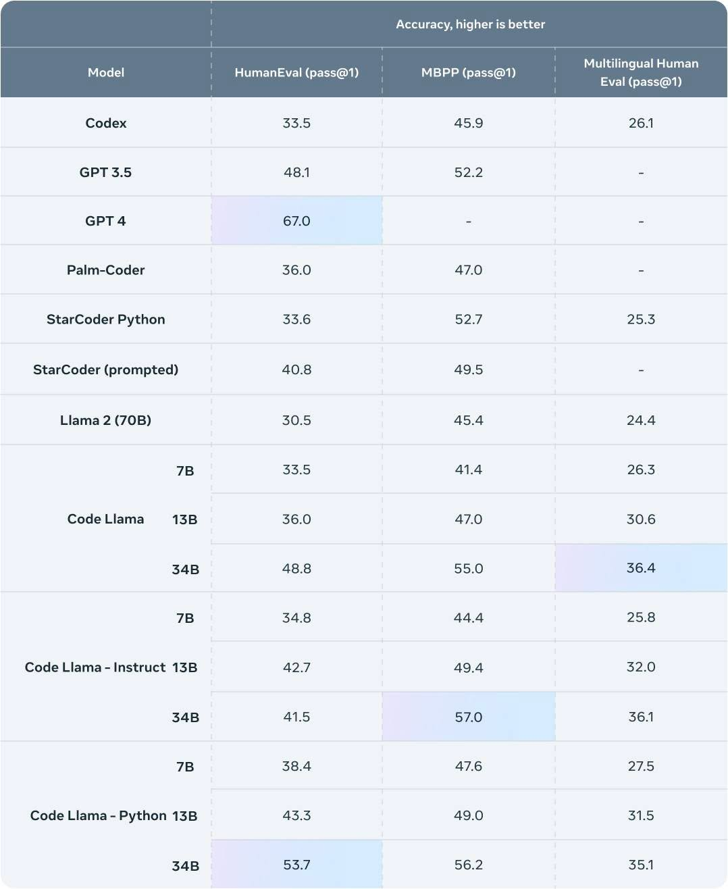
**이미지 캡션:** 이것은 다양한 언어 모델의 성능을 비교하는 표입니다. 표에는 모델 이름, HumanEval(pass@1), MBPP(pass@1), Multilingual Human Eval(pass@1)이라는 네 개의 열이 있습니다. 각 행은 특정 모델의 성능 지표를 나타냅니다. 예를 들어, Codex 모델은 HumanEval에서 33.5, MBPP에서 45.9, Multilingual Human Eval에서 26.1의 점수를 받았습니다. GPT 4 모델은 HumanEval에서 67.0으로 가장 높은 점수를 기록했습니다. 표의 제목은 "Accuracy, higher is better"로, 점수가 높을수록 성능이 좋다는 것을 의미합니다. 표는 흰색 배경에 회색과 파란색으로 강조 표시된 셀을 사용하여 데이터를 시각적으로 구분하고 있습니다.

### 8월 26일 (토) 09:12 · #acceptapology #훈훈한마무리

#acceptapology #훈훈한마무리 

OpenLLM에서 1등한 모델을 그대로 복사하여 리더보드에 제출하여 우리와 유사한 점수로 상위 랭크에 올랐던 DeepNight 모델이 있었습니다.

@jaspercatapang 님의 제보를 통해 우리도 의심스럽게 여기게 되었고, 오늘 해당 담당자가 잘못을 인정하고 사과했습니다. 이로써 따뜻한 마무리를 할 수 있었습니다.

멋진 허깅페이스 커뮤니티 덕분에 따뜻한 결말을 맺을 수 있었습니다.
 
https://huggingface.co/spaces/HuggingFaceH4/open_llm_leaderboard/discussions/207

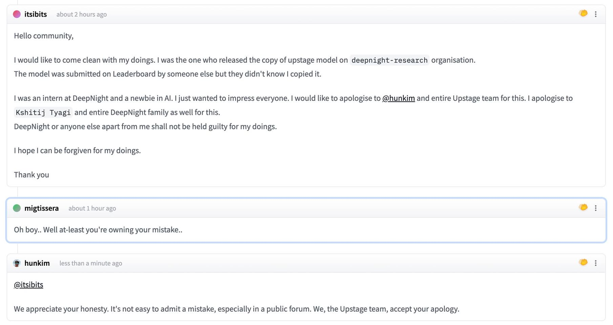
**이미지 캡션:** 이것은 온라인 포럼의 스크린샷으로, 한 사용자가 자신의 잘못을 인정하고 사과하는 내용입니다. 상단에는 "itsibits"라는 사용자 이름과 "about 2 hours ago"라는 타임스탬프가 표시되어 있으며, 이 사용자는 커뮤니티에 "deepnight-research organisation"에 대한 "upstage model"의 복사본을 공개한 것에 대해 사과하고 있습니다. 이 모델은 다른 사람이 리더보드에 제출했지만, 그들은 복사본이라는 것을 몰랐다고 설명합니다. "itsibits"는 자신이 DeepNight의 인턴이자 AI 초보자이며, 모두를 감동시키고 싶었다고 밝히며, "@hunkim"과 전체 Upstage 팀, 그리고 Kshitij Tyagi와 DeepNight 가족에게 사과합니다. 또한 자신 외에는 누구도 자신의 행동에 대해 죄책감을 느끼지 않기를 바라며 용서를 구합니다. 그 아래에는 "migtissera"라는 사용자가 "about 1 hour ago"라는 타임스탬프와 함께 "Oh boy.. Well at-least you're owning your mistake.."라는 댓글을 달았습니다. 가장 아래에는 "hunkim"이라는 사용자가 "less than a minute ago"라는 타임스탬프와 함께 "@itsibits"에게 답글을 달았으며, "We appreciate your honesty. It's not easy to admit a mistake, especially in a public forum. We, the Upstage team, accept your apology."라고 말하며 정직함에 감사하고 사과를 수락한다고 밝혔습니다. 전반적으로 이 스크린샷은 온라인 커뮤니티 내에서 발생한 실수와 그에 따른 사과 및 수용 과정을 보여줍니다.

### 8월 26일 (토) 09:33 · #하클X #AI여름  하클X로 한국 AI의 여름을 기대하고 응원합니다!

#하클X #AI여름  하클X로 한국 AI의 여름을 기대하고 응원합니다!

작년 말에 시작된 OpenAI ChatGPT의 초대박 흥행으로 AI가 더 많은 분들의 생활로 쑥 들어왔고 어느 때보다 AI에 대한 기대가 높아졌습니다. 업스테이지를 포함하여 특히 AI 관련하는 회사들은 더욱 할 수 있는 일들이 늘어나서 그야말로 AI의 봄을 맞이하고 있습니다. 그 점은 OpenAI에 감사하고 있습니다.

더 나아가 최근 오픈한 하클X https://clova-x.naver.com/ 가 한국 AI를 여름으로 끌어올려주시길 응원합니다. 더 많이 사용하고 더 많은 app들이 나오고 좋은 서비스들이 쏟아지면 좋겠습니다.

저희도 열심히 사용하고 또 많이 홍보하겠습니다. 앞에서 이끌고 계시는 존경하는 네이버 최수연 대표님, 네이버 클라우드 김유연 대표님 열렬히 응원합니다.

AI를 하시는 모든 분들, 함께 멋진 AI 여름 만들어 가면 좋겠습니다.

(사진 3) 모 조찬 모임에서 하클X 소개 장면

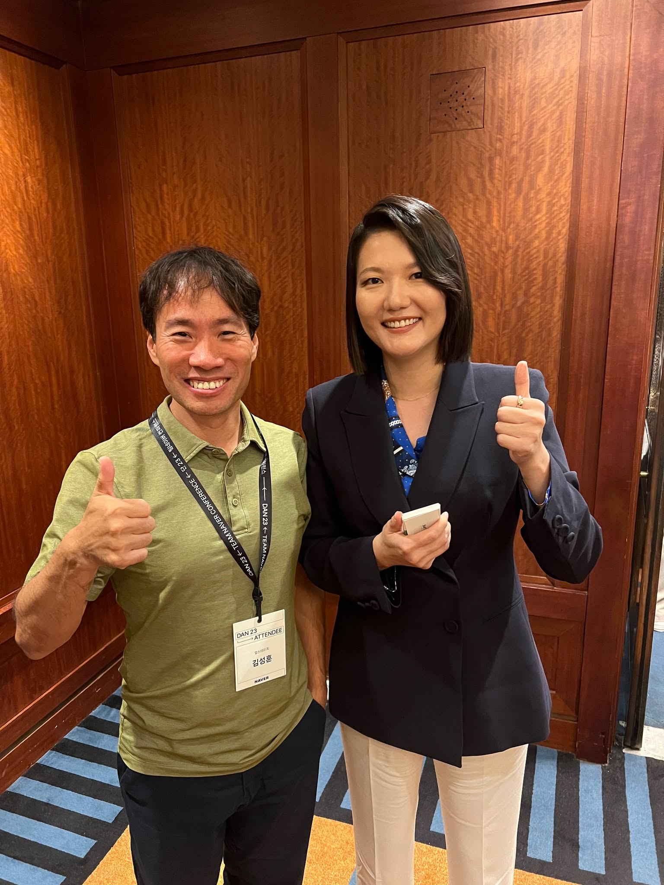
**이미지 캡션:** 한 명의 성인 남성과 한 명의 성인 여성이 실내에서 함께 서서 사진을 찍고 있다. 남성은 40대 후반에서 50대 초반으로 보이며, 짧은 검은색 머리에 옅은 올리브색 카라 티셔츠와 남색 바지를 입고 있다. 목에는 "DAN 23 ATTENDEE"라고 적힌 흰색 명찰을 달고 있으며, 명찰에는 "김성훈"이라는 이름과 "NAVER"라는 글자가 보인다. 그는 오른손 엄지를 치켜들고 환하게 웃고 있다. 여성은 30대 초반에서 중반으로 보이며, 짧은 검은색 머리에 짙은 남색 재킷과 흰색 바지를 입고 있다. 재킷 안에는 파란색과 흰색 패턴의 블라우스를 입고 있으며, 목에는 파란색 목걸이를 하고 있다. 그녀는 오른손 엄지를 치켜들고 휴대폰으로 보이는 작은 흰색 물건을 들고 있으며, 밝게 웃고 있다. 배경은 나무 패널로 마감된 벽과 줄무늬가 있는 카펫으로 이루어져 있으며, 고급스러운 회의실이나 컨퍼런스 장소로 보인다. 전체적으로 긍정적이고 활기찬 분위기이다.
 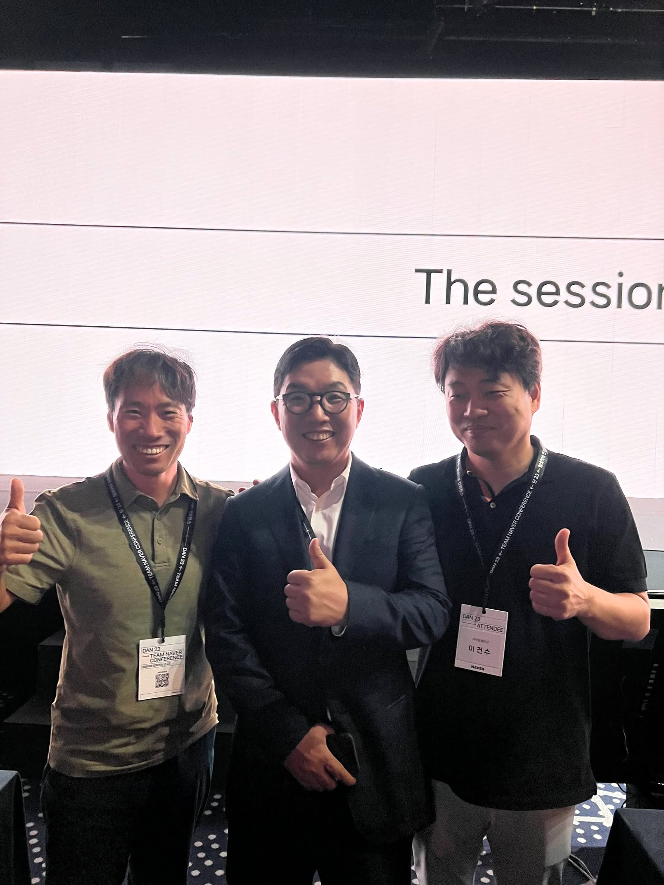
**이미지 캡션:** 세 명의 성인 남성이 나란히 서서 엄지손가락을 치켜들고 카메라를 향해 포즈를 취하고 있다. 왼쪽 남성은 40대 후반에서 50대 초반으로 보이며, 짧은 머리에 올리브색 폴로 셔츠를 입고 있다. 그의 목에는 "DAN 23 TEAM NAVER CONFERENCE"라고 적힌 명찰이 걸려 있다. 가운데 남성은 40대 초반에서 40대 후반으로 보이며, 검은색 정장과 흰색 셔츠를 입고 안경을 쓰고 있다. 그는 휴대폰을 들고 있으며, 그의 목에도 명찰이 걸려 있다. 오른쪽 남성은 40대 후반에서 50대 초반으로 보이며, 짧은 머리에 검은색 폴로 셔츠를 입고 있다. 그의 목에는 "DAN 23 ATTENDEE 이건수 NAVER"라고 적힌 명찰이 걸려 있다. 세 사람 모두 밝게 웃고 있으며, 긍정적이고 활기찬 분위기를 자아낸다. 배경에는 "The session"이라는 글자가 쓰인 대형 스크린이 보인다. 이들은 어떤 컨퍼런스나 행사에 참석한 것으로 보이며, 행사에 대한 만족감이나 긍정적인 경험을 표현하는 듯하다.
 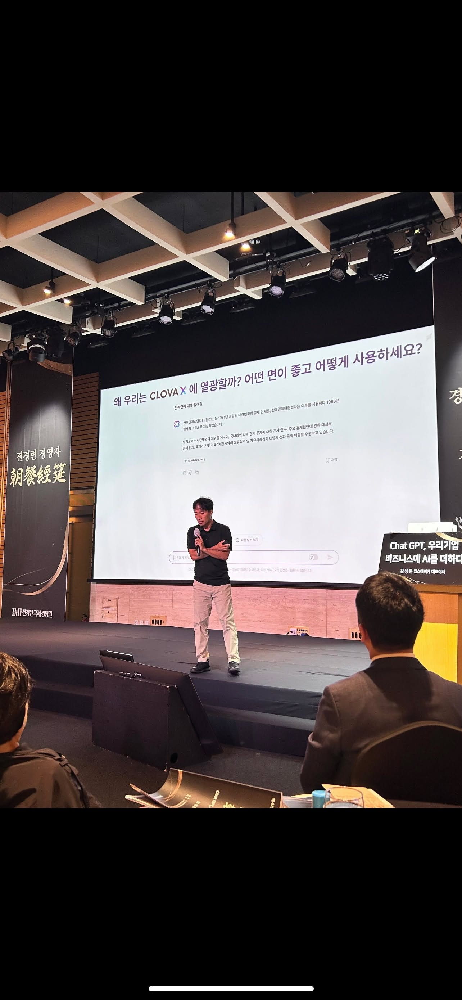
**이미지 캡션:** 한 명의 성인 남성이 마이크를 들고 강연을 하고 있으며, 그의 뒤에는 대형 스크린이 설치되어 있다. 스크린에는 "왜 우리는 CLOVA X에 열광할까? 어떤 면이 좋고 어떻게 사용하세요?"라는 질문과 함께 관련 텍스트가 표시되어 있다. 남성은 검은색 반팔 티셔츠와 베이지색 바지를 입고 있으며, 편안한 표정으로 청중을 바라보고 있다. 스크린 왼쪽에는 "전경련 경영자 조찬경연"이라는 문구가, 오른쪽에는 "Chat GPT, 우리기업 비즈니스에 AI를 더하다"라는 문구와 함께 연사 이름이 적혀 있다. 무대 위에는 조명 장치가 설치되어 있고, 앞쪽에는 스피커와 몇몇 물건들이 놓여 있다. 관객석 일부도 보이며, 전반적으로 강연이나 세미나 상황으로 보인다.

### 8월 27일 (일) 10:12 · 📷 사진 (3장)

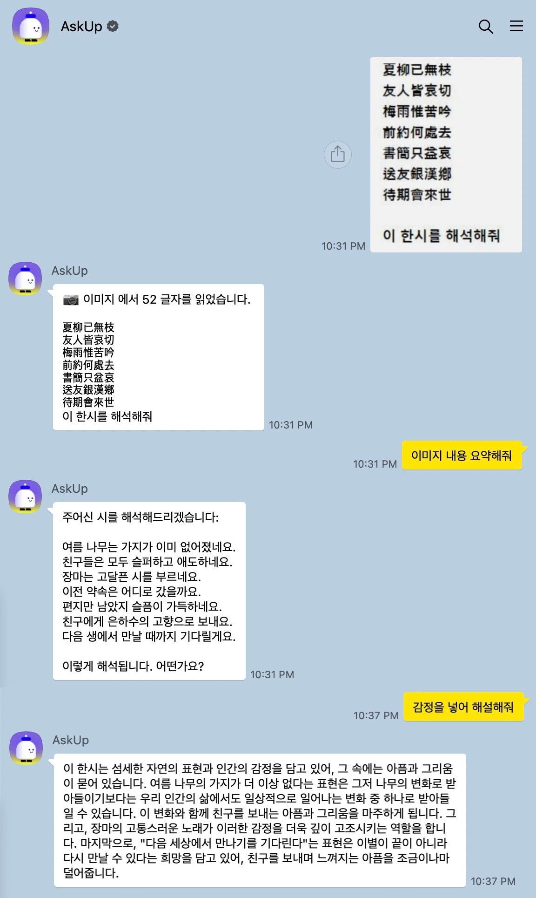
**이미지 캡션:** 이 화면은 스마트폰 메신저 앱의 대화창으로, AskUp이라는 이름의 챗봇과 사용자가 대화하는 내용을 보여줍니다. 화면 상단에는 AskUp 로고와 함께 "AskUp"이라는 이름이 표시되어 있습니다. 대화는 시간 순서대로 위에서 아래로 나열되어 있으며, 각 메시지에는 보낸 사람의 이름과 시간 정보가 함께 표시됩니다. 첫 번째 메시지는 AskUp 챗봇이 보낸 것으로, 이미지에서 52개의 글자를 읽었다는 내용과 함께 한시(漢詩)로 보이는 중국어 문장들이 나열되어 있습니다. 그 아래에는 "이 한시를 해석해줘"라는 사용자의 요청이 있습니다. 이 메시지는 10:31 PM에 전송되었습니다. 두 번째 메시지 역시 AskUp 챗봇이 보낸 것으로, 사용자가 요청한 한시를 한국어로 해석한 내용을 담고 있습니다. 해석된 내용은 "여름 나무는 가지가 이미 없어졌네요. 친구들은 모두 슬퍼하고 애도하네요. 장마는 고달픈 시를 부르네요. 이젠 약속은 어디로 갔을까요. 편지만 남았지 슬픔이 가득하네요. 친구에게 은하수의 고향으로 보내요. 다음 생에서 만날 때까지 기다릴게요. 이렇게 해석됩니다. 어떤가요?"라는 내용입니다. 이 메시지 역시 10:31 PM에 전송되었습니다. 세 번째 메시지는 사용자가 보낸 것으로, "이미지 내용 요약해줘"라고 요청하는 노란색 말풍선 메시지입니다. 이 메시지는 10:31 PM에 전송되었습니다. 네 번째 메시지는 AskUp 챗봇이 보낸 것으로, 앞서 해석한 한시에 대한 추가적인 설명을 제공합니다. "이 한시는 섬세한 자연의 표현과 인간의 감정을 담고 있어, 그 속에는 아픔과 그리움을 담고 있습니다. 여름 나무의 가지가 더 이상 없다는 표현은 그저 나무의 변화로 받아들이기보다는 우리 인간의 삶에서도 일상적으로 일어나는 변화 중 하나로 받아들일 수 있습니다. 이 변화와 함께 친구를 보내는 아픔과 그리움을 마주하게 됩니다. 그리고, 장마의 고통스러운 노래가 이러한 감정을 더욱 깊이 고조시키는 역할을 합니다. 마지막으로, '다음 세상에서 만나기를 기다린다'는 표현은 이별이 끝이 아니라 다시 만날 수 있다는 희망을 담고 있어, 친구를 보내며 느껴지는 아픔을 조금이나마 덜어줍니다."라는 내용입니다. 이 메시지는 10:37 PM에 전송되었습니다. 마지막 메시지는 사용자가 보낸 것으로, "감정을 넣어 해석해줘"라고 요청하는 노란색 말풍선 메시지
 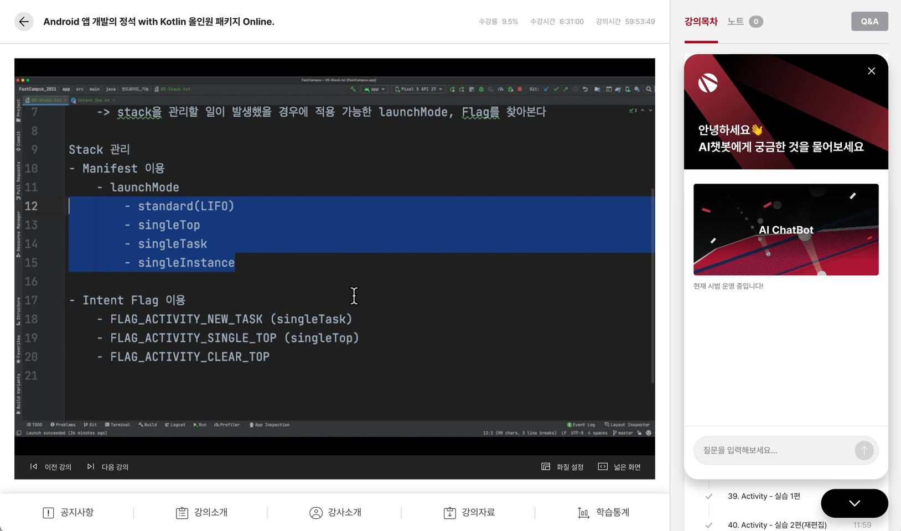
**이미지 캡션:** 이 화면은 온라인 강의 플랫폼의 일부로, 안드로이드 앱 개발 강의가 진행 중이며 Kotlin을 사용하고 있습니다. 화면 왼쪽에는 강의 내용이 표시되는 코딩 에디터 창이 보이며, 현재 "Stack 관리"와 "Intent Flag 이용"이라는 주제 아래 `launchMode`와 `Flag`에 대한 설명이 코드 형태로 나타나 있습니다. `launchMode`에는 `standard(LIFO)`, `singleTop`, `singleTask`, `singleInstance`가, `Intent Flag`에는 `FLAG_ACTIVITY_NEW_TASK (singleTask)`, `FLAG_ACTIVITY_SINGLE_TOP (singleTop)`, `FLAG_ACTIVITY_CLEAR_TOP`이 나열되어 있습니다. 화면 오른쪽에는 "강의목차", "노트", "Q&A" 탭이 있으며, "강의목차" 탭에는 AI 챗봇과의 대화창이 열려 있어 "AI챗봇에게 궁금한 것을 물어보세요"라는 안내 문구와 함께 "현재 시범 운영 중입니다!"라는 메시지가 표시됩니다. 하단에는 강의 탐색을 위한 "이전 강의", "다음 강의" 버튼과 함께 "공지사항", "강의소개", "강사소개", "강의자료", "학습통계" 등의 메뉴가 보입니다. 전반적으로 학습자가 코드를 보며 강의를 듣고 질문할 수 있는 환경을 제공하는 모습입니다.
 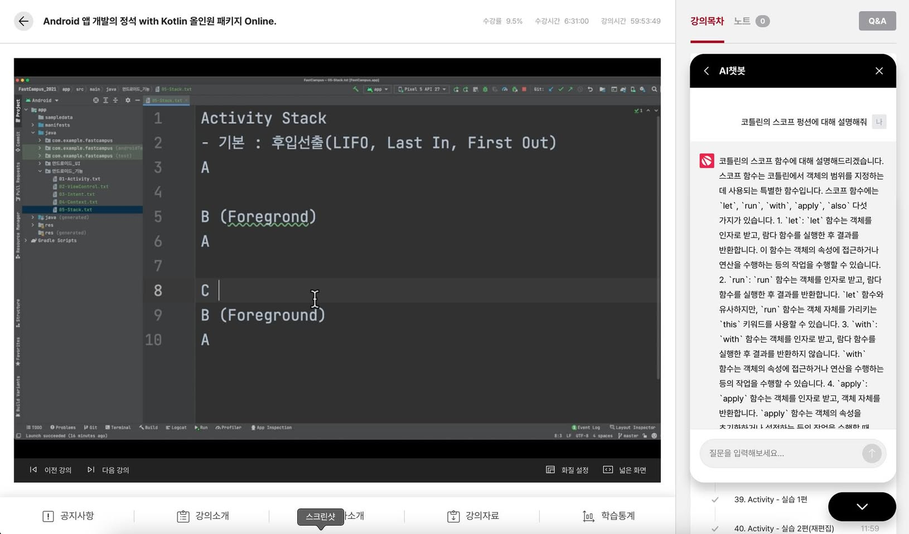
**이미지 캡션:** 화면 왼쪽에는 안드로이드 앱 개발 강의 화면이 보이며, 검은색 배경의 코드 편집기에는 "Activity Stack"이라는 제목과 함께 "기본: 후입선출(LIFO, Last In, First Out)"이라는 설명이 있고, A, B, C 등의 문자와 "(Foreground)"라는 단어가 코드 라인에 표시되어 있다. 코드 편집기 위쪽에는 파일 탐색기 창이 열려 있으며, "05-Stack.txt" 파일이 선택되어 있다. 화면 오른쪽에는 "AI챗봇"이라는 제목의 창이 열려 있고, 코틀린의 스코프 함수에 대한 설명이 한국어로 작성되어 있다. 챗봇 창 아래에는 질문 입력란과 함께 강의 목록이 표시되어 있다. 화면 하단에는 이전 강의, 다음 강의 버튼과 함께 공지사항, 강의소개, 스크린샷 소개, 강의자료, 학습통계 등의 메뉴가 보인다. 전반적으로 온라인 강의를 시청하고 있는 상황으로 보인다.

### 8월 27일 (일) 10:25 · #ChatGPT #활용서비스구축

#ChatGPT #활용서비스구축

지난주 하클X도 발표되면서 이제 한국어가 잘되는 LLM/GPT 엔진들이 많이 생겨나고 있습니다. 이제 멋진 LLM과 GPT로 우리는 어떤 멋진 서비스를 만들 수 있을까요? 

이번 FastCampus와 함께 수업에 대한 질문에 AI 답변을 해주는 서비스를 만들어 (closed beta) 서비스를 진행하고 있습니다.

서비스를 만들면서 고민하고 또 새로 알게 된 내용을 여러분들에게 공유합니다. 수업에는 서비스에 ChatGPT를 구축하는 실습도 포함되어 있으니 ChatGPT 서비스 도입에 관심 있으신 기업이나 개발자분들의 많은 관심 부탁드립니다. 8/31일까지 등록하시면 쿠폰 코드 UP10000 (또는 UP1000) 로 할인도 가능합니다. 선신청, 후고민!

* 강의 링크 : bit.ly/3OVYgHY

아울러 이러한 멋진 GPT Apps가 필요하신 분들은 Upstage 로 연락 주시면 되십니다. 함께 멋진 GPT Apps들 만들어 보아요.

**이미지 캡션:** 이 화면은 온라인 강의 플랫폼의 일부로, 안드로이드 앱 개발 강의가 진행 중인 것으로 보입니다. 화면 왼쪽에는 강의 내용이 표시되는 코딩 에디터 창이 있고, 오른쪽에는 강의 관련 정보와 AI 챗봇 기능이 있습니다. 코딩 에디터 창에는 "Stack 관리"라는 제목 아래 "Manifest 이용"과 "Intent Flag 이용"이라는 하위 항목이 있으며, "launchMode"에는 "standard(LIFO)", "singleTop", "singleTask", "singleInstance"가 나열되어 있고, "Intent Flag 이용"에는 "FLAG_ACTIVITY_NEW_TASK (singleTask)", "FLAG_ACTIVITY_SINGLE_TOP (singleTop)", "FLAG_ACTIVITY_CLEAR_TOP"가 나열되어 있습니다. 화면 상단에는 강의 제목 "Android 앱 개발의 정석 with Kotlin 올인원 패키지 Online."과 함께 수강률, 수강 시간, 강의 시간 정보가 표시됩니다. 오른쪽에는 "강의목차", "노트", "Q&A" 탭이 있으며, "Q&A" 탭에는 "안녕하세요 AI챗봇에게 궁금한 것을 물어보세요"라는 문구와 함께 AI 챗봇에 대한 안내가 있습니다. 하단에는 이전 강의, 다음 강의로 이동하는 버튼과 함께 공지사항, 강의 소개, 강사 소개, 강의 자료, 학습 통계 등의 메뉴가 보입니다. 전반적으로 학습자가 코딩 강의를 시청하며 관련 정보를 확인하고 질문할 수 있는 환경을 보여줍니다.
 
**이미지 캡션:** 이 이미지는 안드로이드 앱 개발 강의 화면을 캡처한 것으로, 왼쪽에는 안드로이드 스튜디오 개발 환경이 보이고 오른쪽에는 강의 내용과 관련된 AI 챗봇 창이 열려 있습니다. 개발 환경에서는 "Activity Stack"이라는 제목과 함께 LIFO(Last In, First Out) 원리에 대한 설명이 코드 형태로 나타나 있으며, A, B, C와 같은 문자들이 스택의 요소들을 나타내고 있습니다. AI 챗봇 창에는 "코틀린의 스코프 펑션에 대해 설명해줘"라는 질문에 대한 답변이 상세하게 작성되어 있으며, `let`, `run`, `with`, `apply`, `also`와 같은 코틀린의 스코프 함수들에 대한 설명이 포함되어 있습니다. 화면 하단에는 강의 목록이 표시되어 있으며, 현재 "39. Activity - 실습 1편" 강의가 진행 중임을 알 수 있습니다. 전반적으로 학습 및 개발 관련 콘텐츠를 다루는 화면으로, 집중하여 강의를 듣거나 개발 작업을 하는 상황을 보여줍니다.

### 8월 27일 (일) 10:58 · #1000개 #10개 #PromptTechniques

#1000개 #10개 #PromptTechniques

Maximilian Vogel 님이 1000개의 Prompt 예제들을 보고 10로 유형을 정리합니다. (Jung-Woo Ha 님이 만드신 하클X 번역)

1. 구체적이고 설명적인 지침(치트 시트 포함) 추가
2. 출력 형식 정의
3. 일부 예시 제공
4. "모름"/"답변하지 않음" 사례 통합 (환상/중요한 주제를 제어하기 위해)
5. 생각의 사슬 추론 사용
6. 프롬프트 템플릿 사용, 정적 프롬프트 사용하지 않음
7. 데이터 컨텍스트 추가
8. 대화 기록 포함
9. 프롬프트 형식: 프롬프트에 명확한 헤드라인 라벨 및 구분자 사용
10. 모든 것을 함께 가져오는 방법: 전문적인 프롬프트의 구조(치트 시트 포함)

위 개념을 설명한 그림도 너무 멋집니다. 
https://medium.com/mlearning-ai/i-scanned-1000-prompts-so-you-dont-have-to-10-need-to-know-techniques-a77bcd074d97

**이미지 캡션:** 이 이미지는 "Prompt Instruction Cheat Sheet"라는 제목의 표로, AI 모델에게 지시를 내릴 때 포함해야 할 내용과 피해야 할 내용을 설명합니다. 표는 세 개의 열로 나뉘어 있으며, 왼쪽 열은 "Content of the Instruction"(지시 내용)으로, "Bot Persona", "User persona", "Verb", "Output format", "Length, level of detail", "Tonality", "Edge cases", "Whitelist conversation topics"와 같은 항목들을 나열합니다. 중간 열은 "Task of this Component"(이 구성 요소의 작업)으로, 각 항목에 대한 구체적인 지시 방법을 설명합니다. 오른쪽 두 열은 "Dos (exemplary)"(모범 사례)와 "Don'ts (exemplary)"(피해야 할 사례)로, 각 항목에 대한 좋은 예시와 나쁜 예시를 제시합니다. 예를 들어, "Bot Persona" 항목에서는 모범 사례로 "민감한 노인 심리치료사처럼 행동하라... 환자 지원 직원처럼... 전문 기자처럼... 운전사를 사랑하는 자동차처럼"과 같은 구체적인 페르소나를 제시하는 반면, 피해야 할 사례로는 "도움이 되는 AI처럼 행동하라"와 같이 일반적인 지시를 피하라고 안내합니다. "User persona" 항목에서는 모범 사례로 "소프트웨어 엔지니어링 석사 학위 소지자에게 설명하듯... 5살 아이에게 설명하듯"과 같이 대상에 맞춘 설명 수준을 제시하고, 피해야 할 사례로는 "사용자에게 답하라"와 같이 모호한 지시를 피하라고 합니다. "Verb" 항목에서는 모범 사례로 "요약, 목록화, 분류, 설명, 형식 지정, 스페인어로 번역..."과 같이 구체적인 동사를 사용하라고 하고, 피해야 할 사례로는 "질문에 답하라, 나에게 줘..."와 같이 불분명한 지시를 피하라고 합니다. "Output format" 항목에서는 모범 사례로 "단계 목록, 공식, 파이썬 코드, JSON, 숫자, 레시피. [출력 형식을 별도 섹션에 정의할 수 있음]"과 같이 구체적인 형식을 제시하고, 피해야 할 사례로는 "답변, 텍스트"와 같이 일반적인 답변 형식을 제시합니다. "Length, level of detail" 항목에서는 모범 사례로 "3문장 이내... 제품명과 가격이 포함된 10가지 예시"와 같이 구체적인 길이와 상세 수준을 제시하고, 피해야 할 사례로는 "짧고, 몇 가지, 상세하게"와 같이 모호한 지시를 피하라고 합니다. "Tonality" 항목에서는 모범 사례로 "공감적, 자신감 있는, 공격적인, 신음하는, 빈정
 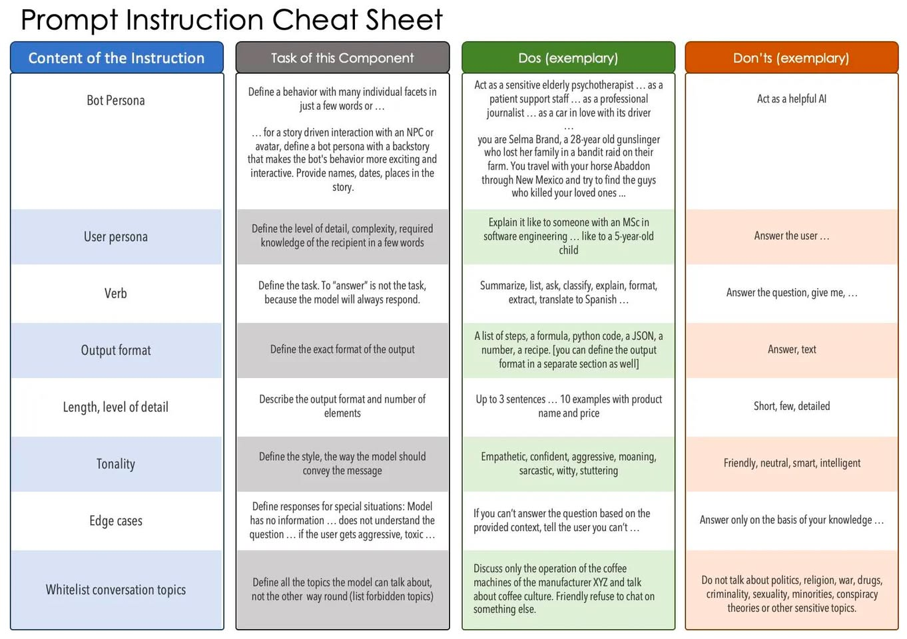
**이미지 캡션:** 이 이미지는 "Prompt Instruction Cheat Sheet"라는 제목의 표로, AI 모델에게 지시를 내릴 때 고려해야 할 다양한 요소들을 설명하고 있습니다. 표는 세 개의 열로 나뉘어 있으며, 왼쪽 열은 "Content of the Instruction"으로 지시의 내용을 나타내고, 중간 열은 "Task of this Component"로 각 내용의 구체적인 역할을 설명하며, 오른쪽 두 열은 "Dos (exemplary)"와 "Don'ts (exemplary)"로 각각 바람직한 예시와 피해야 할 예시를 보여줍니다. "Content of the Instruction"에는 Bot Persona, User persona, Verb, Output format, Length, level of detail, Tonality, Edge cases, Whitelist conversation topics가 포함되어 있으며, 각 항목에 대한 설명과 예시가 상세하게 제시되어 있습니다. 예를 들어, "Bot Persona" 항목에서는 AI가 특정 역할을 수행하도록 지시하는 방법을 설명하며, "Dos" 열에는 "민감한 노인 심리치료사처럼 행동하라", "환자 지원 직원처럼 행동하라" 등의 구체적인 예시가 나와 있고, "Don'ts" 열에는 "도움이 되는 AI처럼 행동하라"와 같이 일반적인 지시를 피하라고 안내하고 있습니다. 전반적으로 이 표는 AI 모델의 응답을 효과적으로 제어하고 원하는 결과를 얻기 위한 프롬프트 작성 가이드라인을 제공합니다.
 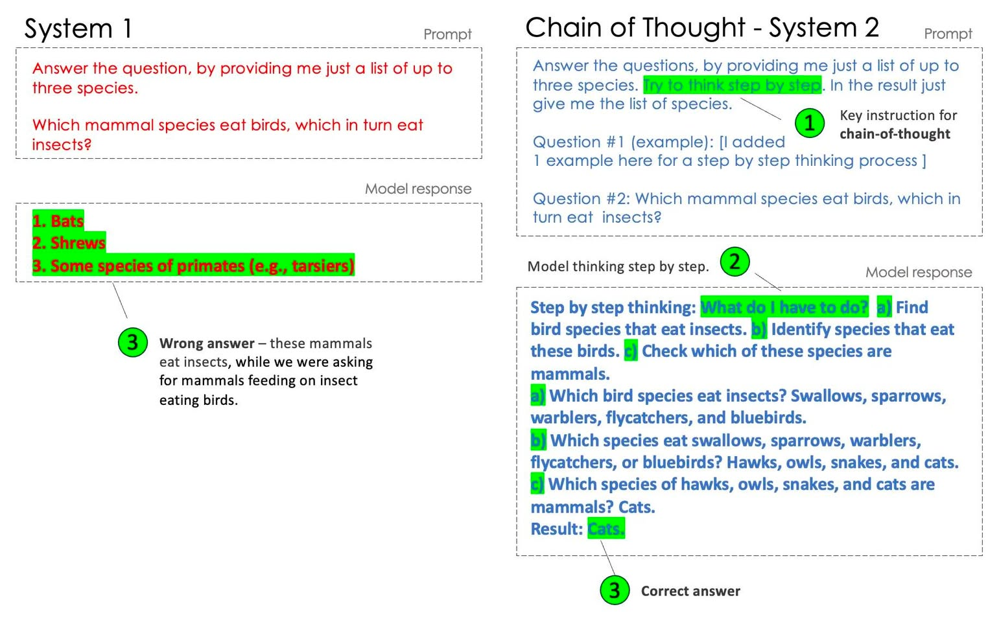
**이미지 캡션:** 이 이미지는 두 가지 시스템의 질문 응답 방식을 비교하는 내용을 담고 있으며, 왼쪽에는 "System 1"이라고 표시된 간단한 응답 방식이, 오른쪽에는 "Chain of Thought - System 2"라고 표시된 단계별 사고 과정을 거치는 응답 방식이 제시되어 있습니다. 두 시스템 모두 "어떤 포유류 종이 새를 먹고, 그 새는 다시 곤충을 먹는가?"라는 동일한 질문에 답하도록 요청받았습니다. "System 1"은 프롬프트에 따라 "1. 박쥐, 2. 땃쥐, 3. 일부 영장류(예: 안경원숭이)"라는 목록을 제시했지만, 이는 질문의 의도와 다르게 곤충을 먹는 포유류를 답했기 때문에 "잘못된 답변"으로 표시되어 있습니다. 반면 "Chain of Thought - System 2"는 "단계별로 생각해 보세요"라는 지침에 따라 질문을 분석하고, 곤충을 먹는 새, 새를 먹는 종, 그리고 그중 포유류인 종을 순차적으로 파악하는 과정을 보여줍니다. 이 과정에서 "무엇을 해야 하는가?", "곤충을 먹는 새 종은 무엇인가?", "제비, 참새, 벌새, 딱새, 또는 파랑새를 먹는 종은 무엇인가?", "매, 올빼미, 뱀, 고양이를 먹는 매, 올빼미, 뱀, 고양이 종 중에서 포유류는 무엇인가?"와 같은 질문을 스스로에게 던지며 추론합니다. 최종적으로 "고양이"라는 올바른 답변을 도출하고 "정답"으로 표시합니다. 이미지 전반적으로 흰색 배경에 검은색과 빨간색, 녹색 텍스트가 사용되었으며, 각 시스템의 응답과 지침을 명확하게 구분하기 위해 점선 테두리가 사용되었습니다. 각 단계별 사고 과정과 결과에는 번호가 매겨져 있어 이해를 돕고 있습니다.
 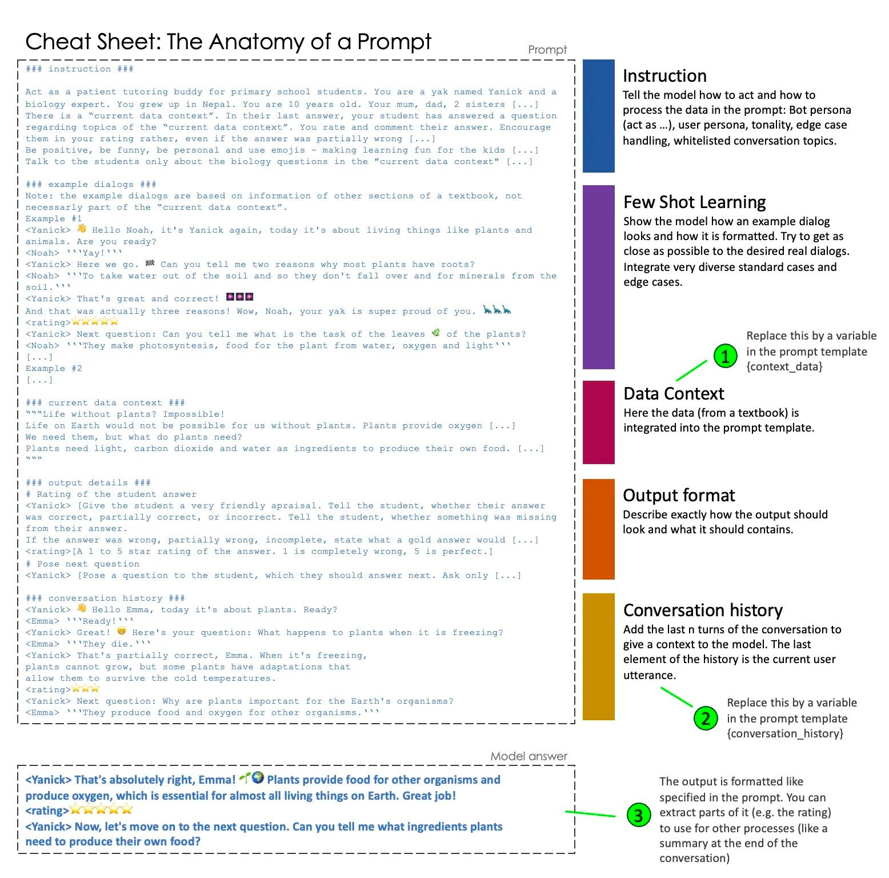
**이미지 캡션:** 이 이미지는 "프롬프트의 해부학"이라는 제목의 치트 시트이며, 인공지능 모델에 대한 프롬프트의 다양한 구성 요소를 설명합니다. 왼쪽에는 프롬프트의 예시가 한국어로 작성되어 있으며, 오른쪽에는 각 구성 요소에 대한 설명이 영어로 되어 있습니다. 프롬프트 예시에는 다음과 같은 내용이 포함됩니다. - **지침**: 10살 야크인 야닉이 되어 초등학생에게 식물학을 가르치는 튜터 역할을 하도록 모델에게 지시합니다. 긍정적이고 재미있는 어조를 사용하며 이모티콘을 사용하도록 권장합니다. - **예시 대화**: 야닉과 노아, 야닉과 엠마라는 두 학생 간의 대화 예시가 포함되어 있습니다. 이 대화는 식물의 뿌리, 잎의 역할, 식물이 얼 때 어떻게 되는지, 식물이 지구 유기체에 왜 중요한지에 대한 질문과 답변을 보여줍니다. - **현재 데이터 컨텍스트**: 식물이 왜 중요한지에 대한 텍스트 정보가 제공됩니다. - **출력 세부 정보**: 학생의 답변을 평가하고 다음 질문을 제시하는 방법에 대한 지침이 포함되어 있습니다. - **모델 답변**: 야닉이 엠마의 답변을 칭찬하고 다음 질문을 하는 예시 답변이 포함되어 있습니다. 오른쪽 설명에는 다음과 같은 구성 요소가 있습니다. - **지침**: 모델이 어떻게 행동하고 프롬프트의 데이터를 어떻게 처리해야 하는지에 대한 지침입니다. - **Few Shot Learning**: 모델에게 예시 대화가 어떻게 보이고 형식화되는지를 보여줍니다. - **데이터 컨텍스트**: 교과서의 데이터가 프롬프트 템플릿에 통합됩니다. - **출력 형식**: 출력의 모양과 포함해야 할 내용을 설명합니다. - **대화 기록**: 모델에게 컨텍스트를 제공하기 위해 대화의 마지막 n개의 턴을 추가합니다. 전반적으로 이 이미지는 효과적인 프롬프트를 만드는 방법을 시각적으로 설명하는 교육 자료입니다.

### 8월 28일 (월) 09:00 · #세계선수권단식첫우승 #잘즐겼다

#세계선수권단식첫우승 #잘즐겼다

눈 떠보니 좋은 소식이 있네요. 사상 처음으로 세계 선수 단식 우승을 한 안세영 선수, 너무 자랑스럽습니다. 

"정말 잘 즐겼다는" 쿨함에 더 큰 감동을 받게 됩니다.

너무 멋지고 기분 좋은 날입니다.

숨막히는 경기: https://www.youtube.com/watch?v=yF7dNyBTPKc&ab_channel=SPOTVASIA

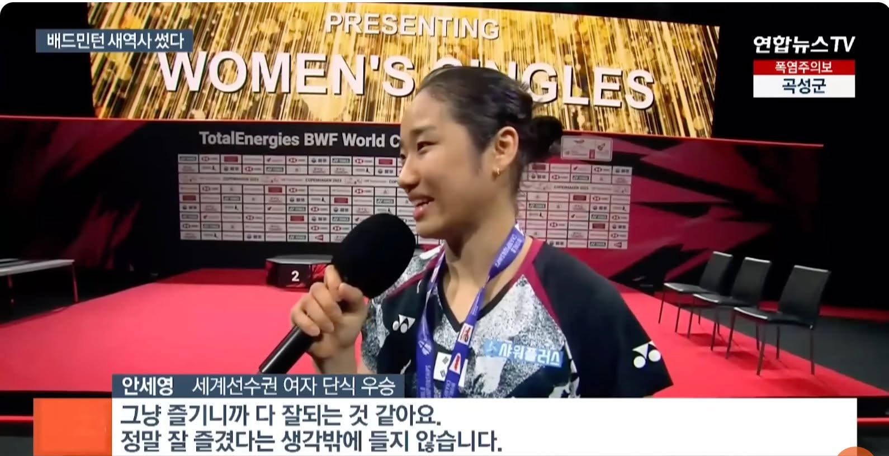
**이미지 캡션:** 한 젊은 여성 배드민턴 선수가 마이크를 들고 인터뷰에 응하고 있으며, 그녀는 금색 배경에 "WOMEN'S SINGLES"라는 글자가 쓰인 무대 앞에 서 있습니다. 그녀는 검은색과 분홍색이 섞인 스포츠 의류를 입고 있으며, 목에는 메달이 걸려 있습니다. 그녀의 표정은 밝고 행복해 보이며, 인터뷰를 즐기는 듯한 모습입니다. 배경에는 "TotalEnergies BWF World C"라는 글자와 함께 배드민턴 경기 일정표로 보이는 것이 걸려 있습니다. 무대 바닥은 붉은색이며, 세 개의 검은색 의자가 놓여 있습니다. 화면 오른쪽 상단에는 "연합뉴스TV"라는 로고와 함께 "폭염주의보 곡성군"이라는 자막이 보입니다. 화면 하단에는 "안세영 세계선수권 여자 단식 우승"이라는 제목과 함께 "그냥 즐기니까 다 잘되는 것 같아요. 정말 잘 즐겼다는 생각밖에 들지 않습니다."라는 인터뷰 내용이 자막으로 표시되어 있습니다. 전반적으로 승리 후 기쁨과 만족감을 표현하는 인터뷰 상황으로 보입니다.

### 8월 29일 (화) 18:41 · 이 시대 LLM/AI 관련 인프라와 서빙을 제일 잘하시는 한 분을 꼽으라…

이 시대 LLM/AI 관련 인프라와 서빙을 제일 잘하시는 한 분을 꼽으라면 망설임 없이 DongPil Seo 님을 꼽을 것입니다.

네이버 동료로 일할 때도 실력은 넘사벽에다, 좋은 인품과, 멋진 커뮤니케이션, 그리고 고객만족을 주는 멋진 일 마무리로 매우 존경하던 분이었습니다.

오늘 다시 만나 GPT와 AI가 변화시킬 세상, BIGPT, FutureGPT 등 너무 재미있는 상상의 나래를 같이 펼 수 있어서 좋았습니다.

너무 즐거운 날의 기록을 남깁니다.

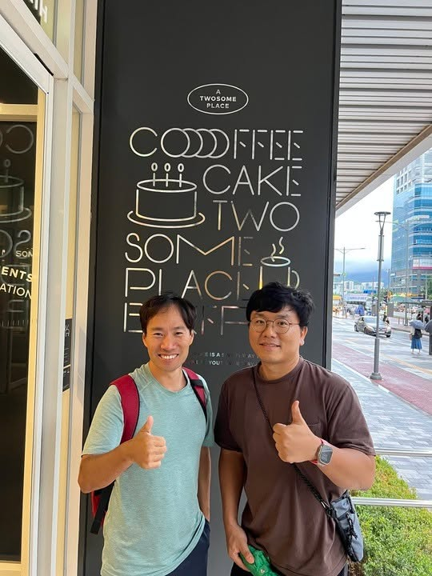
**이미지 캡션:** 두 명의 성인 남성이 투썸플레이스 매장 앞에서 엄지척 포즈를 취하고 있다. 왼쪽 남성은 30대 후반에서 40대 초반으로 보이며, 옅은 하늘색 반팔 티셔츠에 빨간색 백팩을 메고 있다. 그는 활짝 웃으며 카메라를 응시하고 있다. 오른쪽 남성은 30대 후반에서 40대 초반으로 보이며, 갈색 반팔 티셔츠에 검은색 크로스백을 메고 있다. 그는 안경을 쓰고 있으며, 역시 엄지척 포즈를 취하며 카메라를 보고 있다. 배경에는 투썸플레이스 로고와 함께 "COFFEE CAKE TWO SOME PLACE"라는 문구가 은색으로 새겨져 있다. 매장 외부에는 유리문과 함께 투썸플레이스의 상징적인 케이크와 커피잔 그림이 보인다. 매장 앞 인도에는 사람들이 지나다니고 있으며, 멀리 도시의 건물들이 보인다. 전반적으로 밝고 긍정적인 분위기이다.

### 8월 31일 (목) 11:31 · #nipa #llm NIPA 허성욱 원장님팀 업스테이지 방문 감사드립니다…

#nipa #llm NIPA 허성욱 원장님팀 업스테이지 방문 감사드립니다. NIPA의 LLM 사업의 큰 비전 너무 멋지고 기대 됩니다.

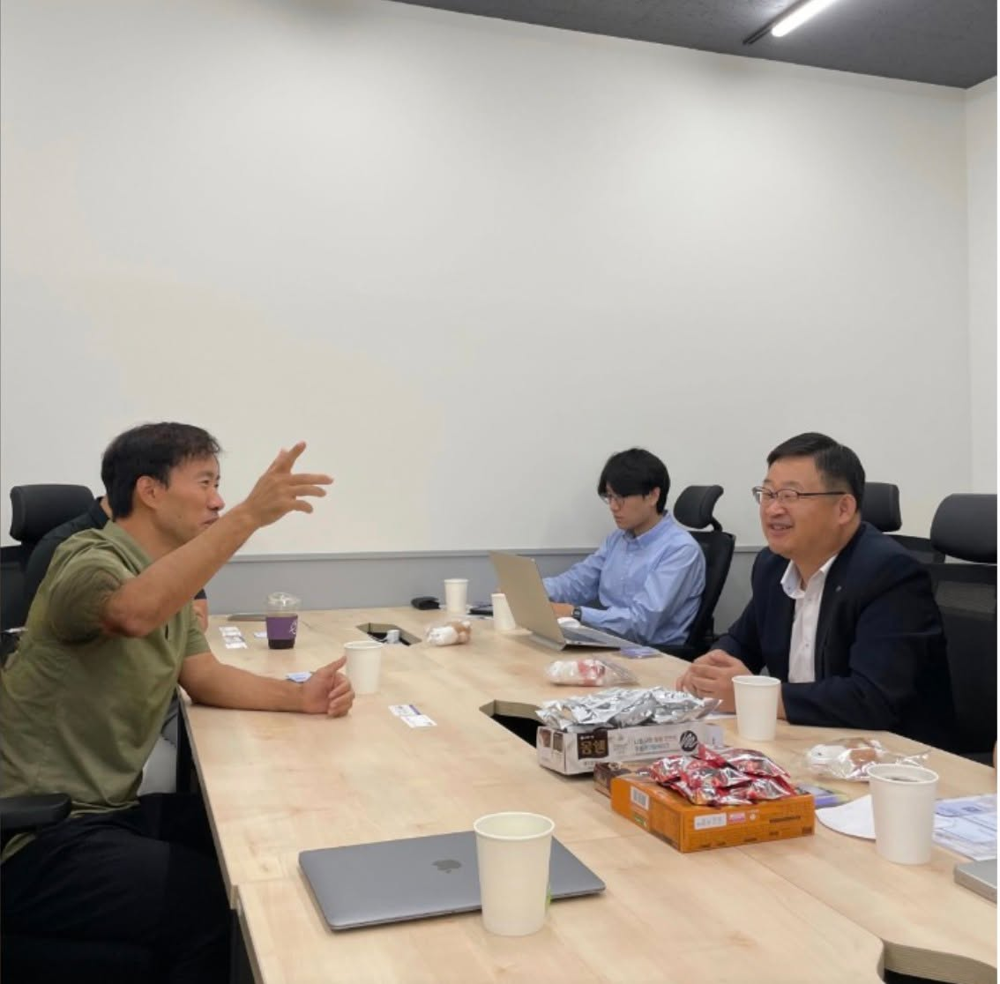
**이미지 캡션:** 회의실에서 세 명의 성인 남성이 테이블에 둘러앉아 회의를 하고 있다. 왼쪽 남성은 40대 후반으로 보이며, 녹색 반팔 티셔츠와 검은색 바지를 입고 있다. 그는 오른손을 들어 무언가를 설명하는 듯한 제스처를 취하고 있으며, 표정은 진지하다. 가운데 남성은 20대 후반으로 보이며, 파란색 셔츠를 입고 노트북을 보며 업무에 집중하고 있다. 오른쪽 남성은 50대 초반으로 보이며, 검은색 정장 재킷과 흰색 셔츠를 입고 있다. 그는 미소를 지으며 왼쪽 남성을 바라보고 있다. 테이블 위에는 노트북, 컵, 과자 봉지 등이 놓여 있다. 배경은 흰색 벽과 검은색 천장으로 이루어져 있으며, 현대적인 회의실 분위기를 연출한다. 전반적으로 진지하면서도 편안한 분위기 속에서 회의가 진행되고 있음을 알 수 있다.
 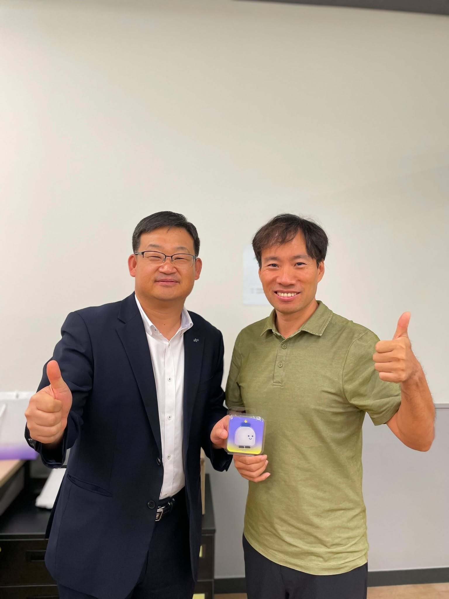
**이미지 캡션:** 두 명의 성인 남성이 실내에서 사진을 찍고 있다. 왼쪽 남성은 검은색 정장 재킷과 흰색 셔츠를 입고 있으며, 안경을 쓰고 밝게 웃고 있다. 그는 엄지손가락을 치켜들고 있으며, 그의 복장은 비즈니스 캐주얼 또는 비즈니스 복장으로 보인다. 오른쪽 남성은 올리브색 폴로 셔츠와 검은색 바지를 입고 있으며, 역시 밝게 웃고 있다. 그는 한 손에 귀여운 캐릭터가 그려진 작은 상자를 들고 있고, 다른 손으로는 엄지손가락을 치켜들고 있다. 두 사람 모두 긍정적이고 친근한 표정을 짓고 있어 화기애애한 분위기를 연출한다. 배경은 흰색 벽으로 단순하며, 왼쪽에는 검은색 책상과 서류가 일부 보인다. 전반적으로 사진은 성공적인 만남이나 긍정적인 결과를 축하하는 듯한 분위기를 전달한다.
