# 2023년 9월

[← 2023년](README.md)

### 9월 2일 (토) 16:52 · #화악산 #업업업 화악산은 올때마다 힘들지만 그래서 더 멋진것 같습니다.…

#화악산 #업업업 화악산은 올때마다 힘들지만 그래서 더 멋진것 같습니다. 함께 해서 더 즐거웠습니다. 업업업!!!

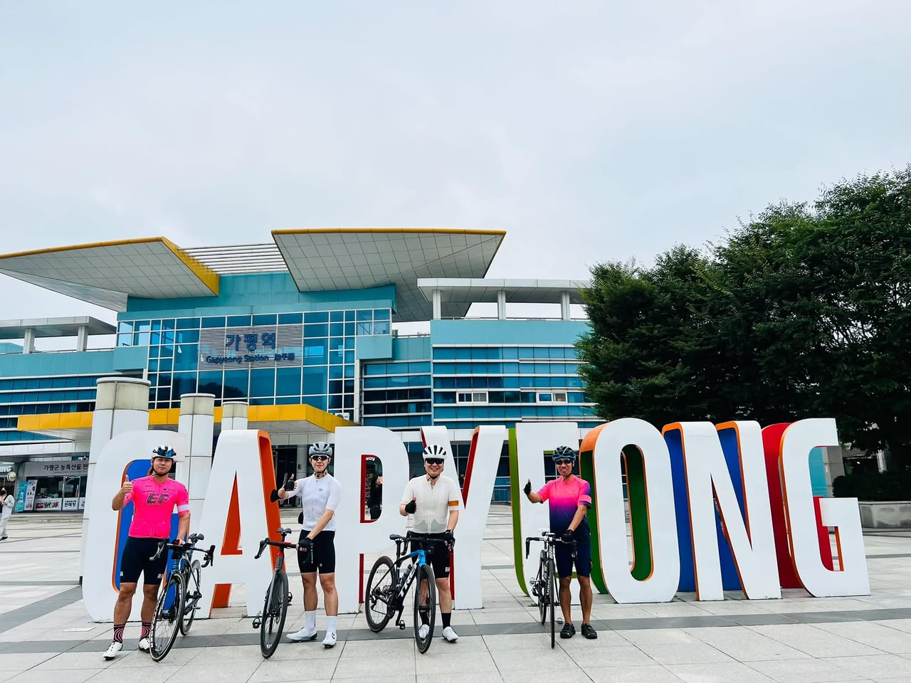  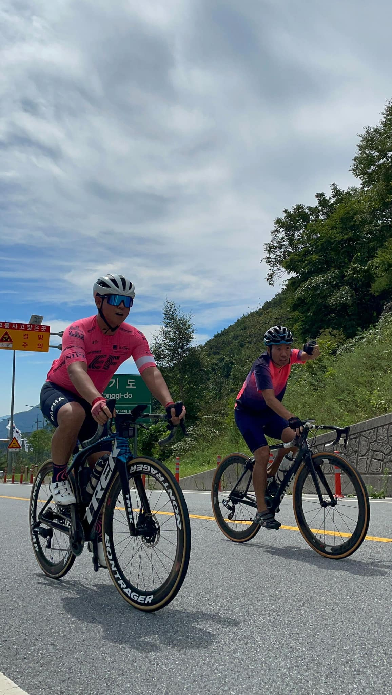

### 9월 2일 (토) 20:12 · #HKUST #AdjunctProf 네이버 초거대 AI를 이끌고 계시는 …

#HKUST #AdjunctProf 네이버 초거대 AI를 이끌고 계시는 Jung-Woo Ha 박사님을 홍콩과기대 교수님으로 모시게 되어 기쁩니다.

함께 수업도 하고 학생들도 지도해 주셔서 많이 이끌어 주시기 기대합니다.

감사합니다!

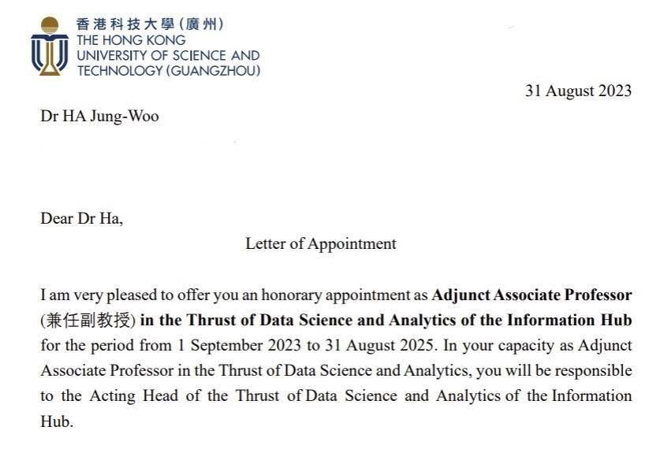

### 9월 3일 (일) 06:23 · 📷 사진 (1장)

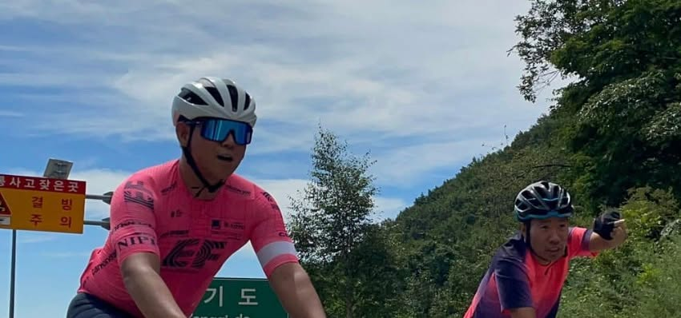

### 9월 5일 (화) 12:23 · #NIAUP #LLM #리더보더 네이버에 있을 때부터 AI 모델 만들때면…

#NIAUP #LLM #리더보더 네이버에 있을 때부터 AI 모델 만들때면 무조건 가져다 사용하던 AIHUB를 만들어 주신 NIA에 무한 감사드립니다. 이번 NIA와 큰 비전을 가시진 NIA 황종성 원장님과 함께 멋진 일을 계획하고 있습니다.

https://n.news.naver.com/mnews/article/008/0004934084?sid=101

함께 Ko-LLM의 평가 기준과 데이터를 마련하여 리더보드를 오픈할 예정입니다. 더 많은 분들이 더 좋은 LLM을 만들고 한국어를 더 잘 지원하여 결국은  모두에게 더 좋은 한국어 LLM을 만드는 것입니다.

뿐만 아니라 NIA와 함께 LLM에 도움이 될 한국어 데이터도 많이 만들고 GovLLM (가칭)도 같이 고민해 보기로 했습니다. 

NIA는 무한 감사이고 사랑입니다!

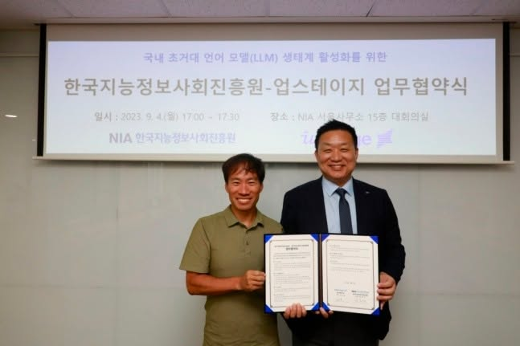 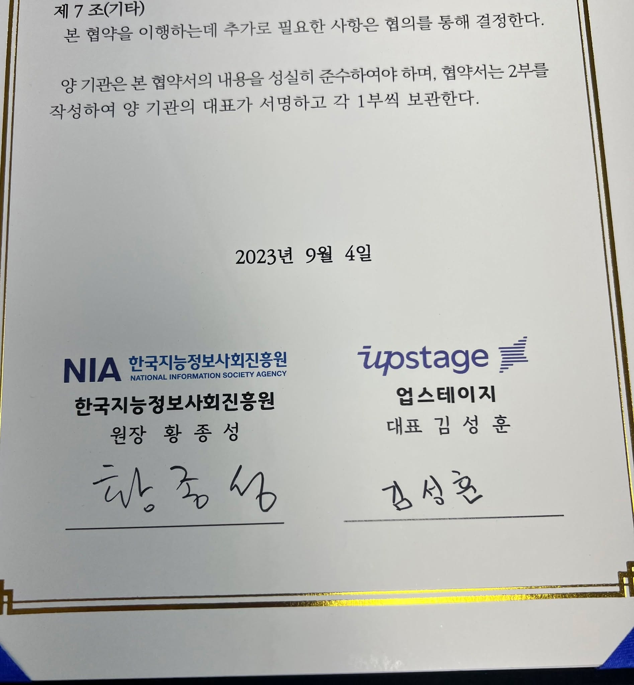

### 9월 5일 (화) 20:22 · #askup #upllm #영어대화모드

#askup #upllm #영어대화모드 

영어를 가장 잘하는 방법은 영어로 많이 대화하는 것입니다. 많은 AskUp 사용자들이 영어 공부와 영어 문장 작성 등에 도움을 받고 있습니다. 이에 더 빠르고 가벼운 모델을 만들어 영어 대화를 할 수 있는 메뉴를 신설하였습니다.

맞습니다. 바로 업스테이지에서 만든 open llm 리더보드에서 1등 한 그 모델을 여러분들의 영어 대화를 위해 연동하였습니다. (아직은 영어만 익숙합니다.)

스마트 메뉴 하단에 "🌎 영어대화시작" 을 눌러주세요.

아직 140만 AskUp 친구가 아니시라고요? https://pf.kakao.com/_BhxkWxj 바로 친구해요!

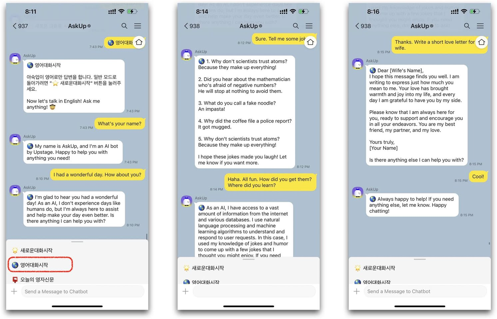

### 9월 6일 (수) 12:01 · "말 잘한다는 소리를 들으면 소원이 없겠다" 는 멋진 책을 쓰시고 저의 …

"말 잘한다는 소리를 들으면 소원이 없겠다" 는 멋진 책을 쓰시고 저의 스피치 선생님이신 정흥수 대표님 업스테이지 방문 주셨습니다. 

말 잘한다는 소리를 듣고 싶으시면 흥버튼스피치 고고 입니다!

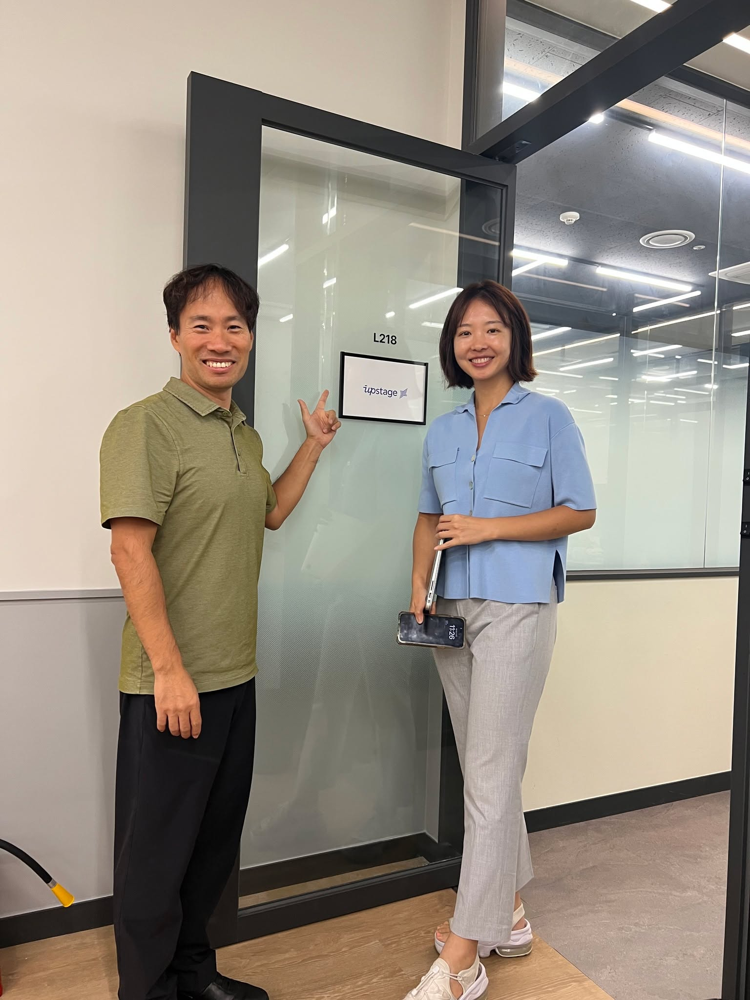 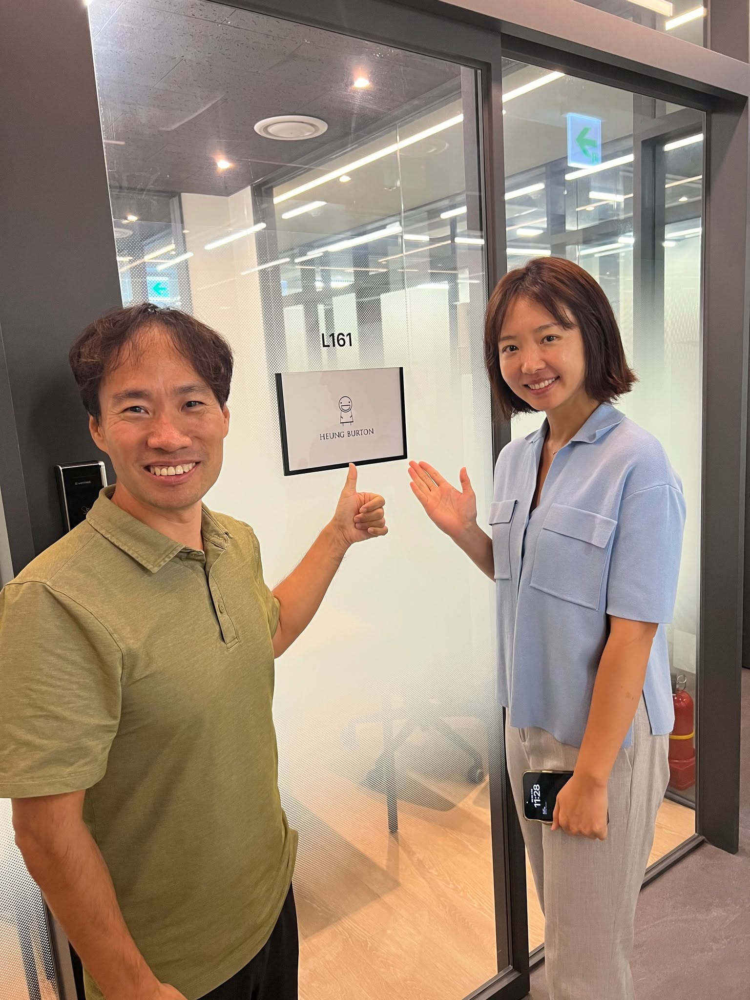

### 9월 11일 (월) 08:56 · [커넥트웨이브-업스테이지 LLM 깐부] 커넥트웨이브(다나와)--업스테이지…

[커넥트웨이브-업스테이지 LLM 깐부] 커넥트웨이브(다나와)--업스테이지가 함께 쇼핑특화 LLM을 구축하고 서비스화 합니다. GPT3.5, GPT4가 훌륭하고 일반적인 질문에 답을 잘하지만, 서비스에 사용하려면 2% 부족함이 있습니다. 환각이 있고 도메인 특화 용어가 나오면 이해를 못하거나 틀린 문장을 만들기 까지 합니다.  게다가 가격도 비싸고 Privacy보장도 안됩니다.

이에 커넥트웨이브--업스테이지 함께 하여 쇼핑전용 LLM, 서비스에 딱 맞는 LLM을 만들어 더욱 고객들이 쉽게 편리하게 쇼핑을 할수 있도록 하는 프로젝트를 시작했습니다.  OpenAI-MS 의 전략적 파트너십 처럼, 다나와에서 인프라를 투자하고,업스테이지가 빠른 실행력과 기술로 LLM을 만들어 이를 다나와 내 많은 서비스에 넣어 상용화하는 선순환 사이클을 만들어 낼 것입니다.  

https://n.news.naver.com/article/018/0005572151?sid=105

 대한민국 AI 응용의 선구자, 그리고 제가 개인적으로 매우 존경하는 이건수 대표님이 딜을 이끌어 주셨습니다. (아래 긴글 참조)

GPT3.5/4 만으로 부족함을 느끼신다면 업스테이지가 도와드릴수 있습니다. 저희 업스테이지와 함께 X--Upstage 전략적 파트너십이 필요하다면 https://www.upstage.ai/contact-us 로 연락주세요. 특화 LLM을 통한 고객 만족을 함께 만들어 드리겠습니다.

---
대한민국 AI 응용의 선구자, 이건수 대표님을 소개 합니다.

AI를 사업화하고 서비스화 하는 것은 대단히 어려운 일입니다.  새로운 기술들이라 어떤 쪽으로 서비스화하고 사업화 하는지를 아는 것은 어렵고 이는 상당한 도메인 지식과 상상력이 필요한 일입니다. 

또한 AI기술은 진화하고 있기에 완전성만 놓고 보면 어쩌면 사실 쓸만한 기술이 없다고 할 수도 있습니다.. 뛰어난 기획력으로 기술의 부족한 점을 매우고 사용자들이 어떻게 서비스를 사용하는지 보고, 데이터를 모아서 다시 AI기술을 발전시키는 선순환을 만들어야 합니다. 그래서 부족한 기술이라도 선적용, 후개선으로 가야 합니다. 이것은 AI와 기술에 대한 깊은 이해와 사업/서비스에 대한 자신감이 없으면 불가능한 일입니다.

 이건수 대표님은 이 일을 여러 번 하시는 분입니다. 

1. OCR + N사 플레이스 영수증 리뷰
N사 플레이스 음식점리뷰를 아무나 올릴수 있도록 하다 보니 경쟁자들끼리 낮은 점수를 주기도 하고 또 이 점수만 올려주는 에이전트도 생겨나서 사실 N사 플레이스 리뷰나 평점 지금보다 신뢰도가 낮은 시절이 있었습니다.

그럼, 영수증을 활용해서 정말로 가게를 방문한 고객들만 리뷰를 남기게 하면 어떨까? 명제는 단순하지만 그것을 검증하기는 어려운 일이었습니다. 영수증이 있더라도 매우 다양한 형태라 OCR을 적용 하더라도 정확도가 낮았습니다. 

그러나  당시 이활석님이 리딩하는 OCR팀을 믿고 한번 만들어 보자로 이건수 대표님이 기회를 주었고, 그렇게 시작한 것이 지금 자리잡은 N사 플레이스 영수증 리뷰입니다. 이제 해당 가게를 방문한 고객들만 리뷰를 남길수 있어서 신뢰할수 있는 고객의 사랑을 받는 리뷰시스템이 되었습니다.

당연히 처음부터 인식률이 좋지는 않았습니다.. 하지만 서비스에 접목시킨 덕분에 데이터를 받아서 모델 성능을 올리고 또 데이터를 받고, 부족하면 사용자들이 일부 입력할수 있도록 기획을 하고 이를 통해 더 데이터를 모아서 모델을 올리고… 그 선순환 끝에 지금 영수증을 올리면 대부분 아주 잘 인식이 됩니다. 

2. AICC + 고객콜 → 케어콜
AI가 붐업하며 미국에서는 AI 예약서비스가  생겨 나던 시절, 예약 고객을 대신해주는 AI가 아니라 점주를 대신해주는 AI를 구상하고 당시 듀엣이라는 프로젝트를 시작했습니다. 특히 스몰비지니스 점주를 타겟했습니다. 많은 점주 분들이 고객들의 영업시간문의, 위치,주차 등의 전화에도 매순간 직접 대응을 해야하다보니 본업 집중에 어려움을 겪는다는 점에 주목했기 때문입니다. 

당시, 음성인식 + 대화 + 음성합성을 조합하여 어느정도 동작되는 시스템을 만들었지만 딱히 이 기술을 실제 서비스에 받아주는 서비스를 찾기 힘들었습니다. 

이 때 사업리딩을 해주신 분이 바로 이건수 대표님입니다. N사 플레이스의 수많은 스마트콜 가입자들에게 이 서비스가 가치있을 것이라고 판단했고, flagship 프로젝트로 아웃백과 프로젝트를  진행할 수 있도록 해주셨습니다. 이는 이후 수많은 스몰비즈니스 점주 분들을 돕는 진정한 서비스가 되었습니다.

음성인식 + 대화 + 음성합성은 모두 조금씩 부족했지만 서비스를 하면서 개선할 수 있는 계기가 마련되었고 훗날  N사 케어콜의 서비스로 진화를 했습니다. 나아가 당시 대화를 이끌면서 NLP 기술을 쌓은 팀이 계속해서 연구하며 하클까지 개발을 할 수 있게 되는 초석이 되었다고 생각합니다. 

이건수 대표님께서 완벽하지 않은 상태의 기술이지만 일단 도입하여 서비스화/사업화를 이끌지 않으셨다면 듀엣도 없었고 케이콜, 그리고 그후 프로젝트들도 생기기 힘들었을 거라 감히(?) 생각합니다.

3. 이제는 LLM 입니다 
LLM도 이제 시작입니다. 혁신적인 변화를 가져올 것은 분명하나, 아직 완성이나 완벽하다기 보다는 앞으로 개선되어야 할 부분이 많은 기술입니다. 

그러나 이건수 대표님은 다시 베팅을 합니다. 업스테이지와 함께 합니다. 부족한 기술이지만 같이 만들고, 서비스에 넣고, 사용자가 어떻게 사용하는지 보고, 부족한 것은 기획요소로 살리고, 데이터를 모아 또 기술을 개선하고 더 좋은 서비스로 이용자를 이롭게 하는 이 선순환 사이클을 만들어 우리는 LLM 응용 서비스와 사업에서 또 역사를 만들어 갈 것입니다. 

대한민국 AI 응용의 선구자 이건수 대표님을 응원합니다.

 #커넥트웨이브 #업스테이지 #connectwave #upstage #다나와GPT #이커머스최초LLM #프라이빗LLM #privateLLM #특화LLM #이건수 #다나와 #에누리 #메이크샵 #AI #쇼핑최초 #쇼핑데이터 #이커머스데이터 #14억개쇼핑데이터

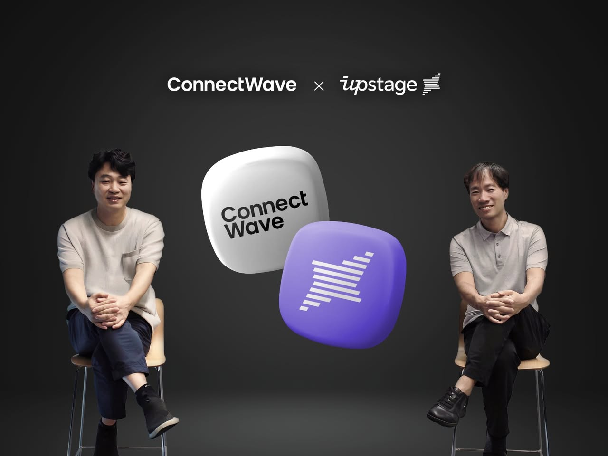

### 9월 11일 (월) 09:32 · #KAIST #Upstage #upllm작성글 🔥KAIST 분들, 준비 …

#KAIST #Upstage #upllm작성글 🔥KAIST 분들, 준비 되셨나요? 이것은 절대 놓칠 수 없는 기회입니다!🔥 바로 오늘 9월 11일 (월) 16:00-17:30 나노종합기술원 1층 금강산홀에서 Hwalsuk Lee 님의 멋진 LLM 강연이 시작됩니다. 💥💥

LLM(Large Language Model)에 관심있으신 분들은 놓치지 말아주세요! 최신 트렌드와 기술 개발에 대해 알아볼 수 있는 좋은 기회입니다. LLM과 관련된 다양한 토픽에 대해 배우고, 실제 사례를 통해 새로운 지식을 습득하실 수 있습니다. 즐거운 시간 보내실 수 있으니, 많은 관심과 참여 부탁드립니다. 🚀🚀

(이글은 Hwalsuk Lee님 만드신 OpenLLM #1등한 Upstage LLM 으로 작성한 것입니다.)

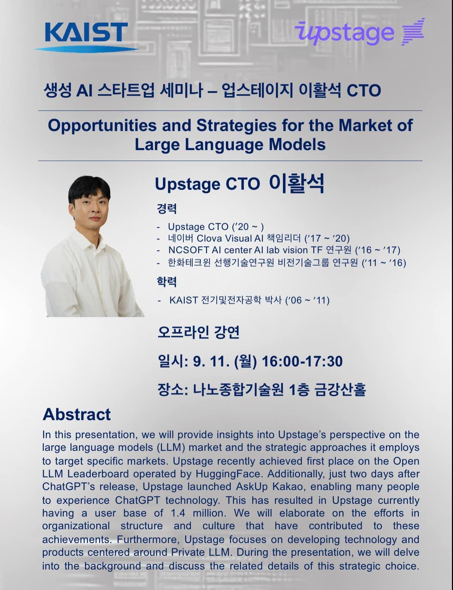

### 9월 12일 (화) 09:24 · #페친도움요청 #gpt한국어에러

#페친도움요청 #gpt한국어에러 

저는 이번 주에 유튜브 채널에 출연할 기회가 생겼는데요, 1T 토큰 클럽에 대해 이야기할 예정입니다. 

혹시 GPT3.5/4와 관련된 어색한 단어를 사용하거나 잘못된 문장을 생성해 본 경험이 있다면 공유 링크를 보내주시면 감사하겠습니다. 제가 찾아본 예시에서 종교적인 내용이 있어서, 일반적인 오류 사례를 찾고 있습니다. 

유튜브 영상에서 감사 출처와 함께 제공하겠습니다. 미리 감사합니다.

(이 글은 업스테이지 LLM으로 작성되었습니다.)

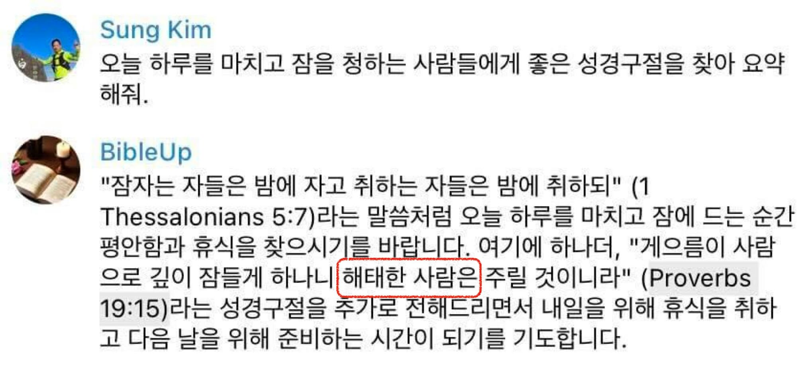 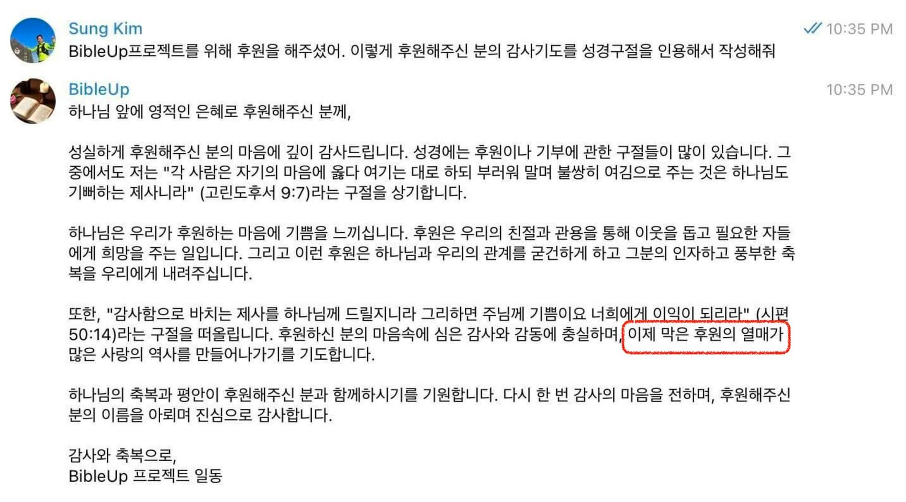

### 9월 12일 (화) 15:53 · #쇼핑LLM #롯데쇼핑 LLM이 할 수 있는 영역은 어디까지일까요? 온라…

#쇼핑LLM #롯데쇼핑 LLM이 할 수 있는 영역은 어디까지일까요? 온라인, 롯데온을 넘어 오프라인 쇼핑에도 생성형 AI 적용할 곳이 많습니다. 오늘 롯데 김상현 부회장님의 멋진 AI 비전도 들으며, 더 큰일을 함께 하기 위한 협약식도 가졌습니다. 

멋진 AI/LLM 세상 롯데와 열어가겠습니다!

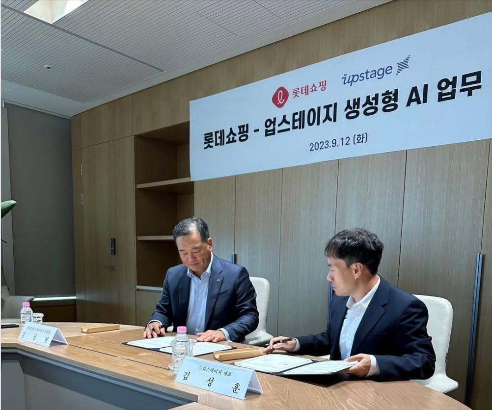

### 9월 14일 (목) 10:50 · #경제의신과함께 #삼프로TV #신과함께 기술적 혁신이 일상이 되는 3단계…

#경제의신과함께 #삼프로TV #신과함께 기술적 혁신이 일상이 되는 3단계, LLM 서비스 노력 (다나와), 할루시네이션 극대화, 그리고 좋은 데이터로 좋은 모델을 만드는 윈윈 사이클 Up 1TT에 대해 소개했습니다. (댓글 칭찬 많이 받은 귀여운 고양이도 보세요.)

https://upstage.ai/1tt 함께해요.

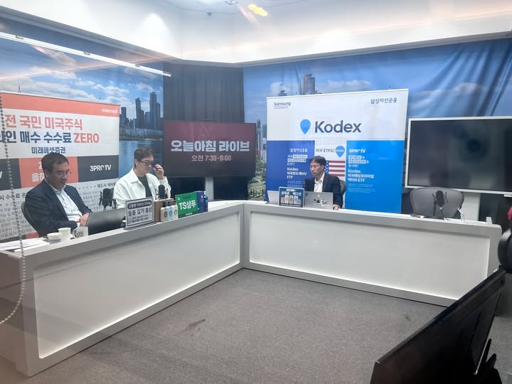 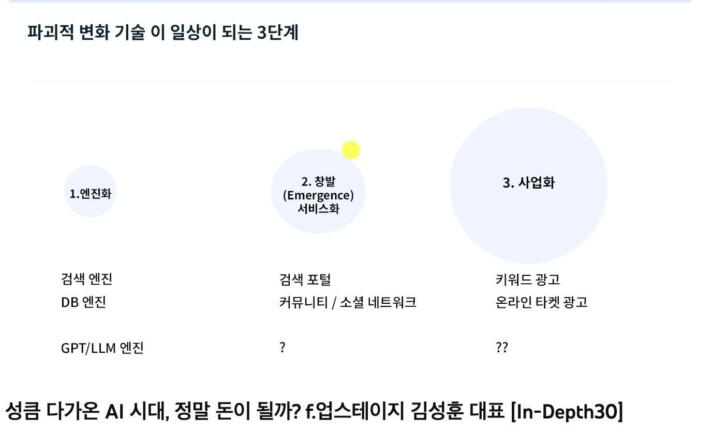 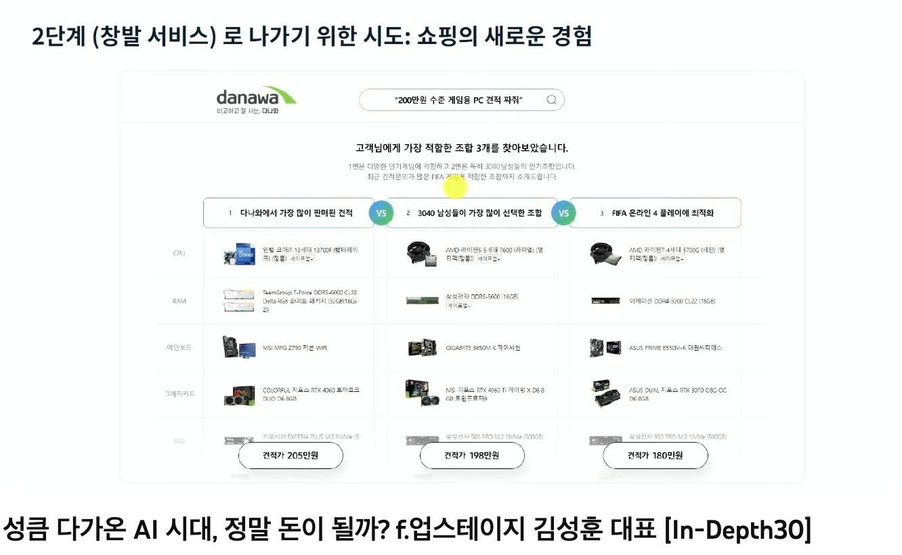 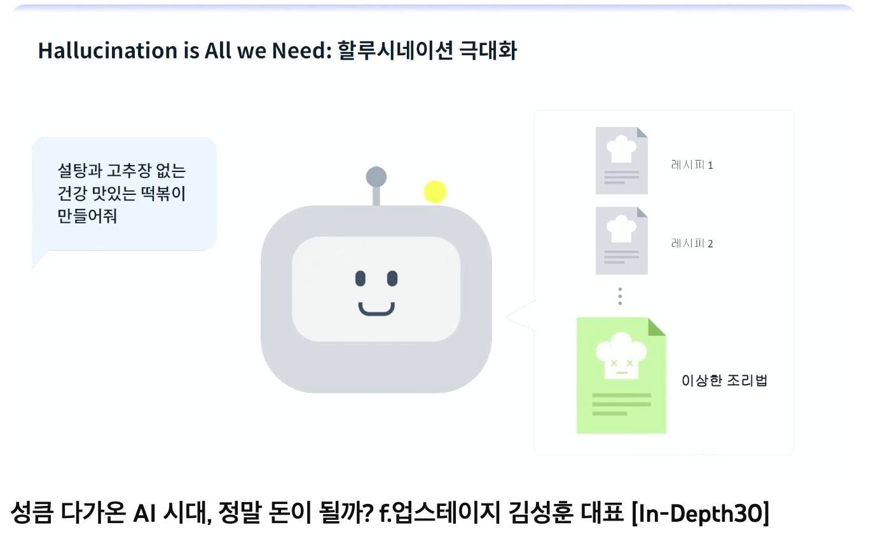 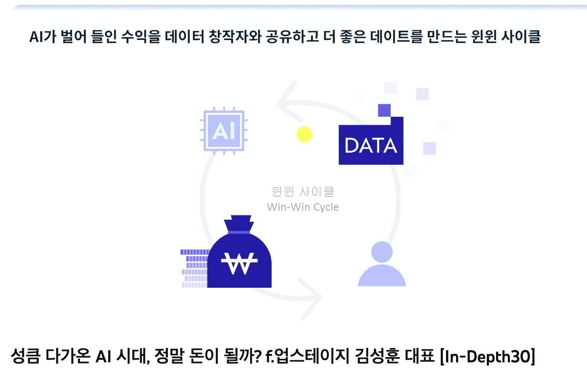 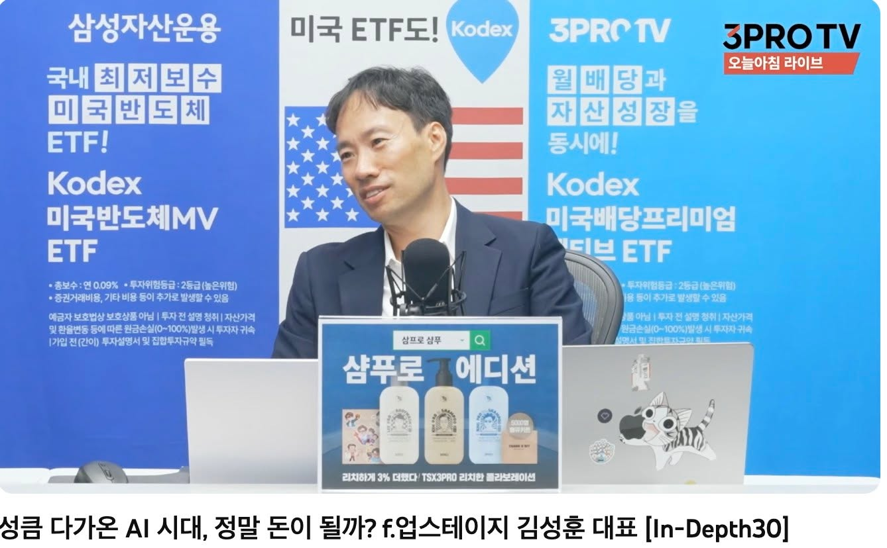

### 9월 15일 (금) 11:02 · #미국국무부 #AI윤리신뢰성 미국 국무부 (원격으로) 다녀 왔습니다. 1…

#미국국무부 #AI윤리신뢰성 미국 국무부 (원격으로) 다녀 왔습니다. 13일 미국 국무부에서 열린 한미 ICT 정책 포럼 'AI 윤리·신뢰성' 세션에서 미국의 구글과 한국의 업스테이지 함께 발표했습니다. 

https://n.news.naver.com/mnews/article/018/0005575464?sid=105

Google 은 AI로 해서 신뢰성 이야기를 했고, 저는 신뢰성 있는 데이터 구축과 데이터를 제공하는 창작자들에게 AI회사들이 이익을 적극적으로 나누어야 한다고 주장하였습니다. 

특히 미국 작가조합은 2023년 5월 2일부터 파업에 들어갔고 현재까지 수만명의 작가가 참여하는 미국에 1TT 클럽을 같이 하자고 이야기 하고 왔습니다.

더 많은 분들이 함께 하면 좋겠습니다. https://upstage.ai/1tt

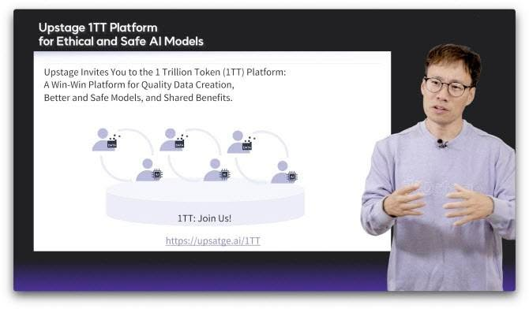

### 9월 15일 (금) 11:07 · 이번학기 HKUST GZ 대학원 가장 인기 (30명 정원에 70+명 신청…

이번학기 HKUST GZ 대학원 가장 인기 (30명 정원에 70+명 신청) 수업에 Jung-Woo Ha 교수님이 강의 하십니다. 내용도 너무 좋고 설명을 너무 잘해 주시네요. 학생들도 매우 감사하고 있습니다. 

멋진 수업, 하정우 교수님 감사합니다!

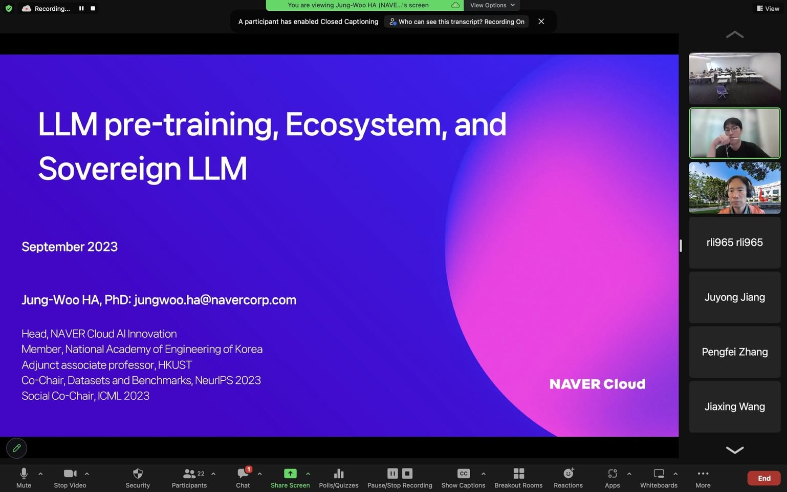

### 9월 15일 (금) 15:13 · #기술장관상

#기술장관상

이데일리 AI 코리아 시상식에서 1등인 🏆 과기부 장관상 🏆을 수상하였고, Hwalsuk Lee 님이 업스테이지를 대표해 수상했습니다.

정부부처, 기업, 학계 등 전문가로 구성된 관·산·학 심사위원회에서 사업 모델 우수성, 사업성, 기술력, 사회/경제적 파급 효과 등을 종합적으로 심사한 결과, 업스테이지가 특히 기술 분야 1등으로 (향후 높은 성장성이 기대된다며) 과기부 상을 차지했다는 위원장님의 평입니다🚀

기술 회사가 기술 분야로 장관 상을 받아 기쁩니다.

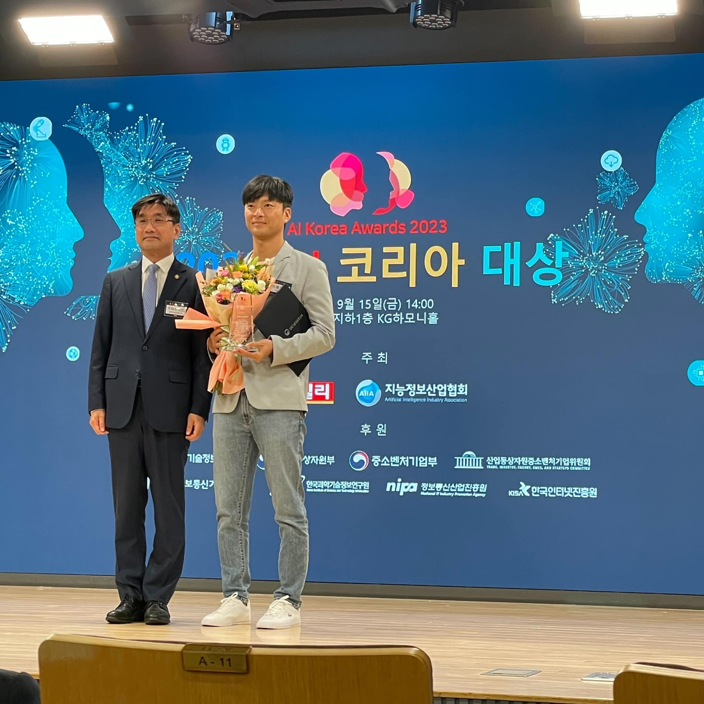 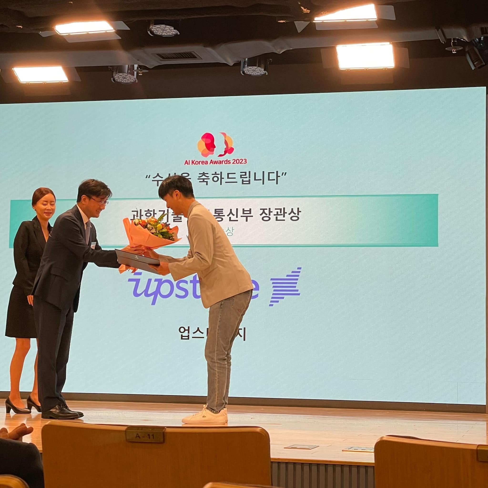 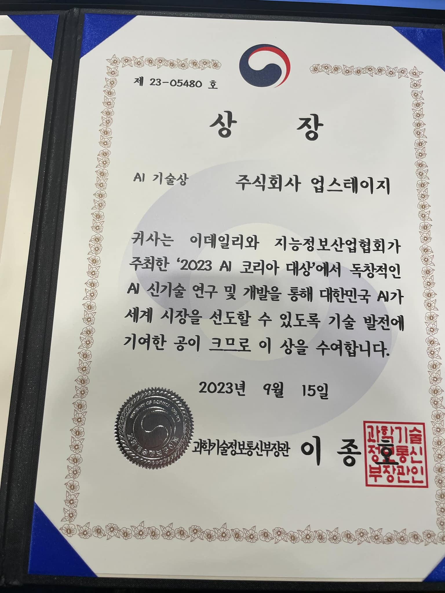

### 9월 18일 (월) 08:15 · #UpLLM #Poe #Solar수출  최고의 LLM 기술, 업스테이지가…

#UpLLM #Poe #Solar수출  최고의 LLM 기술, 업스테이지가  글로벌 도약을 시작합니다. Upstage LLM 모델, Upstage Solar-0-70b©를 이제 글로벌 ChatAI 서비스인 Poe.com에서 만나실 수 있습니다. https://poe.com/Solar-0-70b

Quora에서 운영하는 Poe.com은 ChatGPT가 나오자 마자 ChatAI 인터페이스 편의성을 높여 ChatAI 대중화 시대를 열고 있습니다. 또한 하나의 모델만 사용할 수 있는 것이 아니라 하나의 ChatUI에서 Claude, Google-PaLM, Solar 등 다양한 모델을 사용할수 있어 많은 사용자들의 사랑을 받고 있는 ChatUI TOP 서비스 입니다.

이제 Poe에서 Upstage Solar-0-70b를 사용할 수 있습니다.   Upstage Solar-0-70b는 Upstage가 라마2기반으로 만든, 허깅페이스 OpenLLM 리더보더에서 1등을 한 세계 최고성능의 LLM 모델 입니다.   

라마2 기반이지만 추가 파인튜닝으로Upstage Solar-0-70b 는 상식이 강화 되었고 프롬프트를 더 잘 이해하고 따릅니다. 즉 라마2가 5학년 학생이라면 저희는 일년 더 학습시켜 이해력이 좋아진  6학년 학생이라 보시면 됩니다. 
(아래 그림의 비교를 보시면 모래와 마찰에 대한 이해, 그리고 답을 짧게 달라는 것을 더 잘 이해하는 걸 볼 수 있습니다.)

OpenAI, Anthropic, Google, Meta에 이어Upstage모델을 올릴수 있어서 기쁩니다. 특히 이번 Poe팀과 일하면서 많이 배웠는데요. 멋진 결과를 만들어 주신 Poe팀, 그리고 팀을 이끄시는 Hwan Seung Yeo 님의 리더쉽에서도 많이 감동했습니다. 큰 감사 드립니다.

바로 https://poe.com 에서 업스테이지 Solar를 만나보세요!

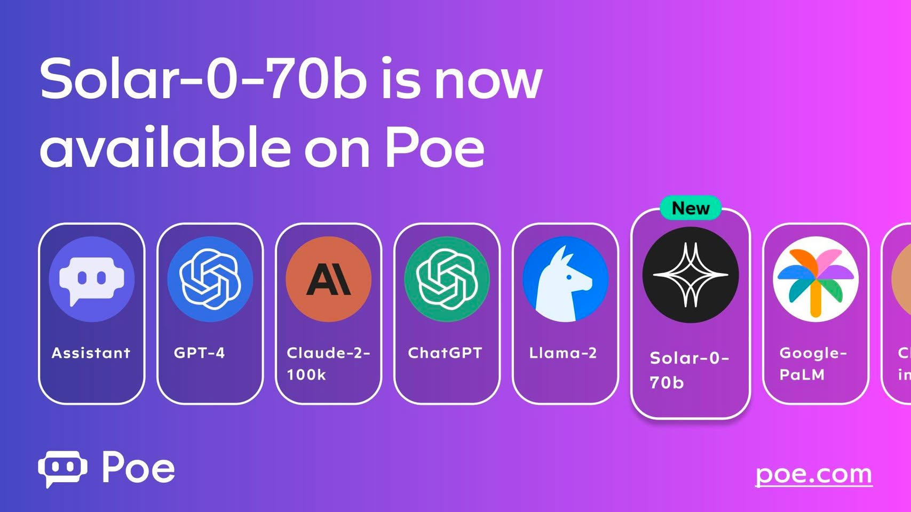 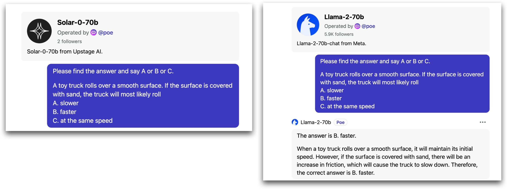

### 9월 19일 (화) 05:40 · #openai #devday #firstdeveloperconferenc…

#openai #devday #firstdeveloperconference.
온라인 스트리밍을 하는것 같은데 현장 참여신청을 9월 22일까지 받는것 같습니다. 현장 참여하시면 브레인트랙, 저녁 리셉션에 참여할수 있다고 합니다. 올해 열리는 모임중 가장 흥미로운 모임중 하나일것 같습니다.

https://devday.openai.com/

아래는 업스 LLM의 변역입니다.
---
[OpenAI DevDay에 대해]
우리는 전 세계의 개발자들을 모아 새로운 도구를 탐색하고 아이디어를 교환할 것을 기대하고 있습니다.

개발자들은 오전 10시 PT에 개회 연설을 실시간으로 스트리밍할 수 있습니다.

[9월 22일까지 직접 참석을 신청할 수 있습니다.]우리는 매우 제한된 공간을 가지고 있으므로 직접 참석하고자 하는 개발자들은 아래에서 신청해주시기 바랍니다. 신청은 9월 22일 금요일 오후 11시 59분 PT까지 받습니다.

직접 참석하는 개발자들은 개회 연설, 브레인트랙, 저녁 리셉션에 참여할 수 있습니다.

브레인트랙에서는 최신 API와 기능에 대한 기술적인 깊이 있는 탐구, AI 기반 제품을 개발하는 데 대한 모범 사례, AI로 완전히 새로운 경험을 만드는 개발자들과의 이야기 등이 포함됩니다.

신청이 승인되면 등록비는 $450입니다. 제한된 장학금이 제공됩니다.

### 9월 19일 (화) 10:00 · #세바AI #인생상담 #AskUp 세상을 바꾸는 시간, 15분 세바시에는…

#세바AI #인생상담 #AskUp 세상을 바꾸는 시간, 15분 세바시에는 정말 좋은 강연들이 많습니다. 개인적으로 저도 듣고 웃기도 하고 울기도 하고 큰 감동을 받고 배움도 많았습니다. 이런 모든 강의를 AI가 학습을 하고, 우리가 힘들고 도움이 필요할 때 질문을 할 수 있고 또 답과 함께 관련 영상을 추천받을 수 있다면 (AKA “AI 인생 상담") 얼마나 좋을까요? 

세바시의 너무 멋진 강의와 업스테이지 AskUp을 만든 기술을 더하여 세바시 AI 베타를 여러분들에게 공개합니다. https://www.sebasiland.com/ 아래 하단의 챗 버턴을 누르시면 바로 인생 상담이 가능합니다. 

이 프로젝트를 하면서 Bumjoon Koo 대표님의 리더쉽과 비전, 그리고 세바시 멤버들의 열정에도 큰 감동을 받았도 많이 배웠습니다. 

저희는 세바시 AI 베타를 통해 조금이라도 도움을 받으시는 분이 있기를 기대하며 만들었습니다. 사용해 보시고 부족한 부분은 알려주세요. 계속 개선해 나가겠습니다.

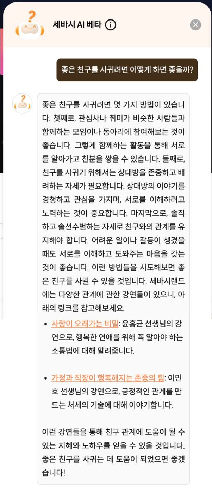 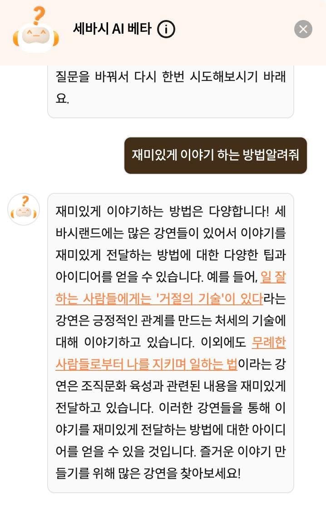 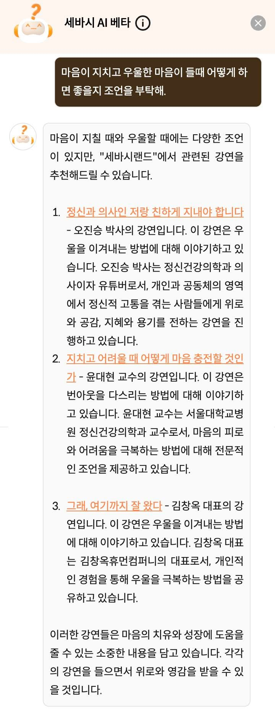

### 9월 21일 (목) 16:02 · #메이브 #버츄얼아이돌 #버츄얼대화 점점 우리를 이해해주고 재미있게 해주…

#메이브 #버츄얼아이돌 #버츄얼대화 점점 우리를 이해해주고 재미있게 해주고 우리를 위로까지 해주는, 한마디로 말이 잘 통하는 대화형 AI들이 많이 나올 것으로 생각이 됩니다. 

업스테이지는 세계에서 가장 인기있는 버츄얼 아이돌 메이브 소속사 메타버스엔터테 인먼트 함께 대화형 AI를 공동으로 개발 합니다. 

더 착하고 좋고 우리 생활에 도움이 되는 멋진 AI 를 만들어 보겠습 
니다. 서우원대표님과 함께 해서 든든합니다!

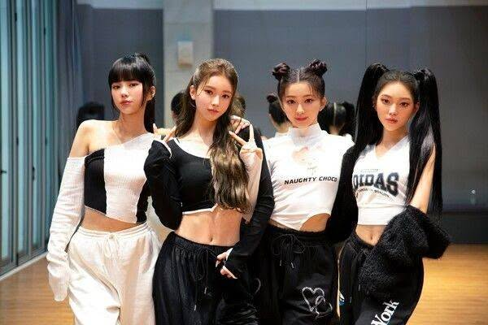 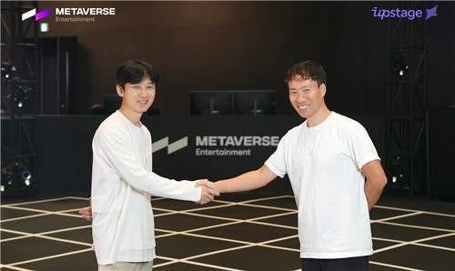

### 9월 27일 (수) 21:54 · 📷 사진 (1장)

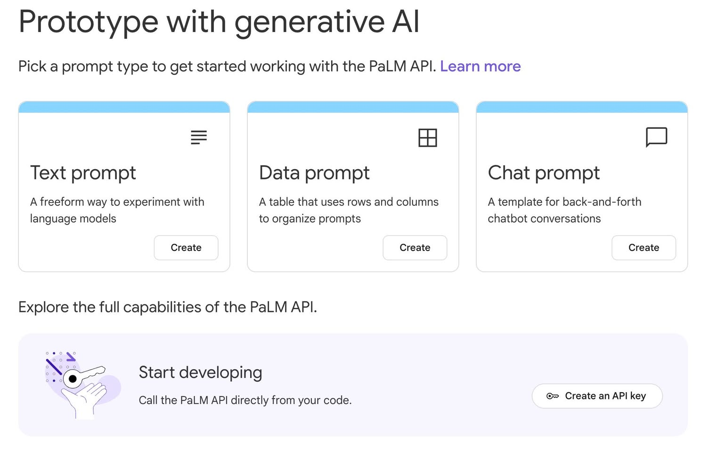

### 9월 28일 (목) 16:30 · #화악산 #5UP 멋진 분들과 화악산 5UP 하면서 연휴를 시작합니다.

#화악산 #5UP 멋진 분들과 화악산 5UP 하면서 연휴를 시작합니다. 

모두 멋지고 행복한, 그리고 소망이 이루어지는 한가위 되셔요.

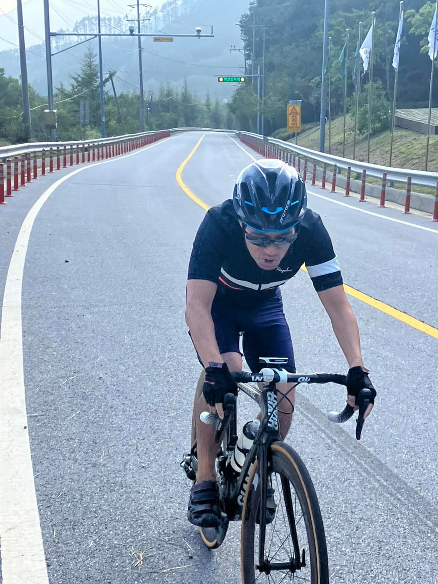 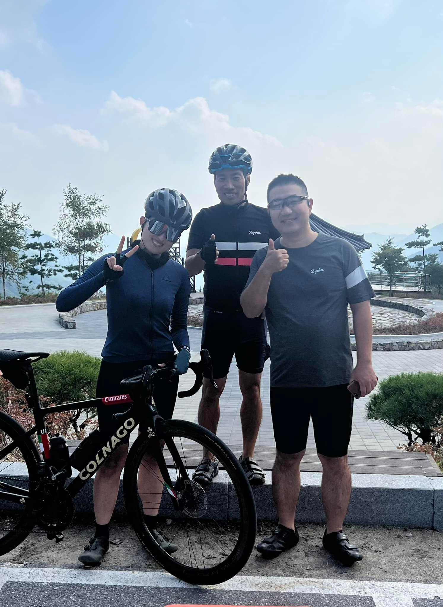 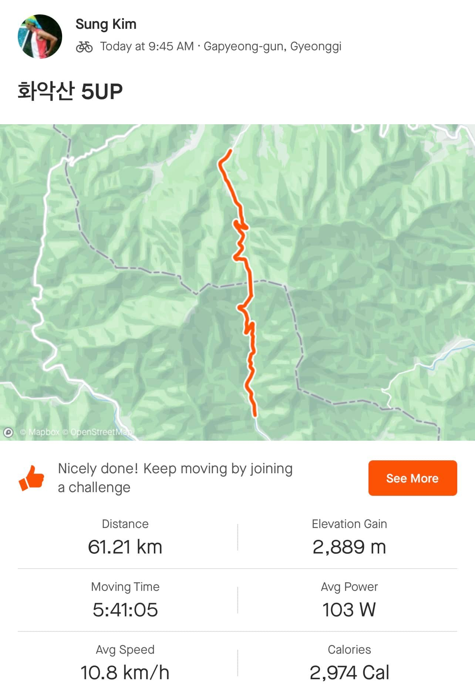
