# 2023년 10월

[← 2023년](README.md)

### 10월 1일 (일) 07:12 · #마라톤 #손기정 #서윤복 #남승룡 #대한민국 오래간만에 울고, 웃고, …

#마라톤 #손기정 #서윤복 #남승룡 #대한민국 오래간만에 울고, 웃고, (마음속으로) 박수친 영화가 있습니다. 

그 어려운 시절 우리의 독립을 마라톤으로 알린 사람들. 해방후 국제 경기 최초의 우승. 

그 과정은 쉽지 않았습니다. 수많은 좌절들 가운데, 꺽이지 않는 마음으로 하나씩 극복. 달리는 도중 개에 걸려 넘어지기까지 (이건 역사적 사실)...

"조국을 위해" 달리는 마음. 그토록 바라던 태극기를 달고 달렸던 새 역사를 쓴 사람들의 멋진 이야기 감동적입니다. 

특히 평생 지도자로 사시며 비운의 2인자로 불렸던 남승룡 선생님의 멋진 페이스메이킹이 없었으면 오늘의 이 역사는 없었을 지도 모를 일입니다.

### 10월 2일 (월) 11:00 · #LLM #한판정리 LLM 관련 탑 Github 한판정리 입니다. Aks…

#LLM #한판정리 LLM 관련 탑 Github 한판정리 입니다. Akshay Rajpal Pachaar 님의 너무 깔끔한정리. 이거 공부하다 보면 이번 남은 연휴도 다 재미있게 보낼수 있을것 같습니다. 자 시작합니다!

1️⃣ Lit-GPT 최신 오픈 소스 LLMs의 해킹 가능한 구현 https://github.com/Lightning-AI/lit-gpt

2️⃣ Prompt Engineering Guide 어떻게 최신 논문, 학습 가이드, 강의, 참고 자료 및 도구를 활용하여 LLM의 프롬프트 엔지니어링을 배울 수 있는지에 대한 모든 정보가 포함된 가이드입니다. https://github.com/dair-ai/Prompt-Engineering-Guide

3️⃣ Awesome LLMs 선별된 목록로 구성된 대형 언어 모델에 관한 논문과 자료 들의 목록 https://github.com/Hannibal046/Awesome-LLM

4️⃣ Awesome LLMOps최고의 LLMOps 도구들을 뽑아 정리한 목록입니다.  https://github.com/tensorchord/awesome-llmops 

5️⃣ Baby AGI 아기 AGI는 파이썬을 사용하여 개발된 자율 인공지능 에이전트로, OpenAI와 Pinecone API를 통해 작동합니다. https://github.com/yoheinakajima/babyagi

6️⃣ Open LLM 오픈소스 플랫폼으로, 실제 애플리케이션에서 LLM의 배포 및 운영을 용이하게 하도록 설계되었습니다. https://github.com/bentoml/OpenLLM

7️⃣ LangChain 랭체인은 LLM을 사용하여 애플리케이션을 만들기 위한 프레임워크로 설계되어 있습니다. 쉽고 간편하게 애플리케이션을 만드는 것을 목표로 하고 있습니다. https://github.com/langchain-ai

8️⃣ LlamaIndex 일반적인 개념처럼 쉽고 유연한 데이터 프레임워크인 LlamaIndex는 대용량 언어 모델과 특정 데이터 소스를 연결하는 데 사용됩니다. https://github.com/jerryjliu/llama_index

9️⃣ (하나더 추가하자면) LLM Data Hub https://github.com/Zjh-819/LLMDataHub (누군가 Awsome-llm-datasets 만드셔야 할듯요. 이미 있나요?)

(Solar로 번역했습니다. https://poe.com/Solar-0-70b )

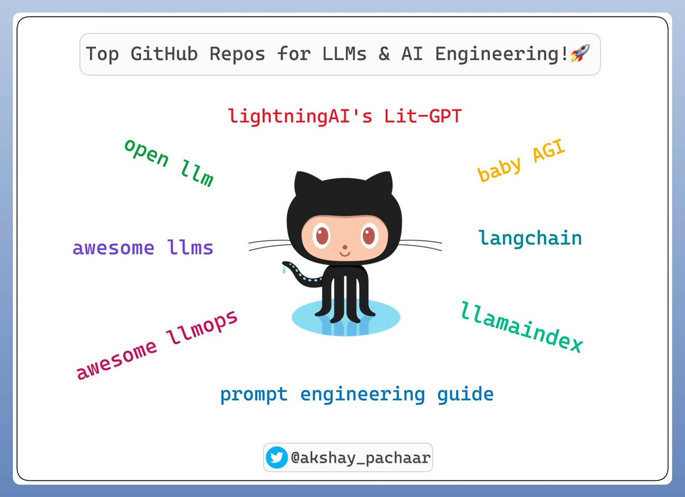

### 10월 4일 (수) 10:26 · #kollm #리더보드 #nia #kt #고려대 “Can't measur…

#kollm #리더보드 #nia #kt #고려대 “Can't measure it, Can't manage it,” Peter Drucker님의 말씀처럼 Ko-LLM의 발전을 위해서는 함께 성능을 측정하고 기록하는 것이 매우 중요합니다. 업스테이지는 고려대학교의 데이터셋 지원과 KT 클라우드의 GPU 후원으로 NIA와 Ko-LLM 리더보드를 허깅페이스에 오픈하고 공동운영을 시작합니다. https://huggingface.co/spaces/upstage/open-ko-llm-leaderboard

현재 60여개의 모델들이 올라와 있고, 10월 3일 기준으로 hyunseoki/ko-en-llama2-13b 모델이 5개의 테스트 셋 평균 가장 좋은 점수를 보이고 있습니다.

여러분들이 가지고 있는 모델, 만들고 계시는 모델들을 많이 올려주시기 부탁드립니다. 평가를 위해 GPU 걱정을 하실 필요가 없으며, 여러분들은 모델만 올려주시면 KT클라우드 GPU에서 숨겨진 테스트 셋을 이용하여 자동으로 평가됩니다.

참고로 이 리더보드는 한국에서 만든 LLM만을 올리는 곳이 아닙니다. 한국어가 지원되는 모든 모델을 올릴 수 있습니다. (개인적으로는 모든 AI 모델이 한국어를 잘 지원해주기를 바랍니다.)

이미 허깅페이스 Apec담당자, NLTK 저자, Awesome-LLM 등에서도 많이 소개되고 있고, 글로벌 LLM들도 올라오고 있습니다. 한국어가 지원되는 LLM 학습에 1% 이상의 한국어가 사용된 LLM 모델의 저자들에게도 많이 홍보해주세요. Ko-LLM 리더보드를 통해 한국어도 영어 처럼 세상의 모든 LLM의 기본이 되면 좋겠습니다.

이미 허깅페이스 담당자, NLTK 개발자, Awesome-LLM 등에서 많은 분들이 홍보해주시고 응원해주시고 계십니다. 허깅페이스 창업자/CEO님의 열열한 (불?) 응원도 멋집니다.

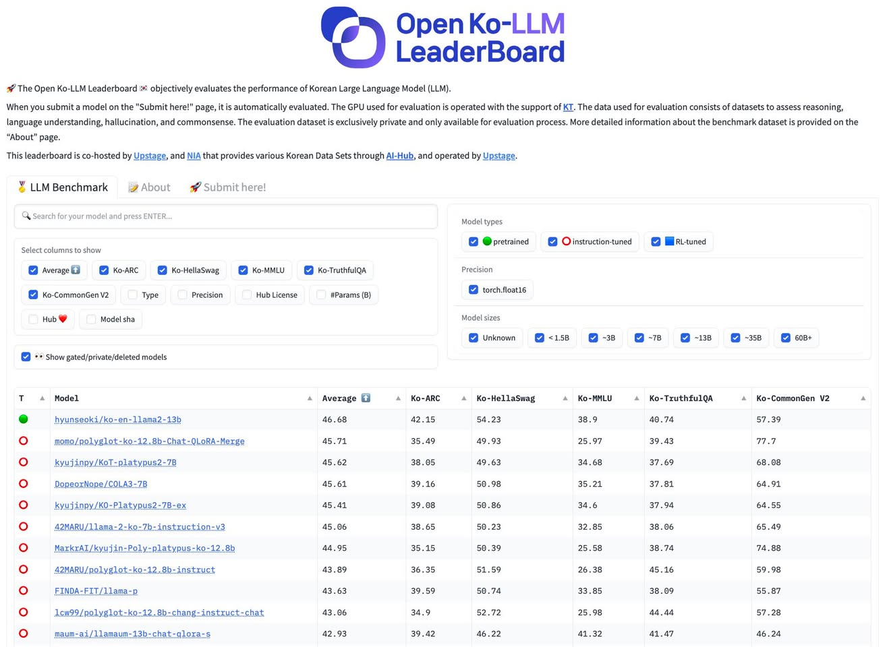 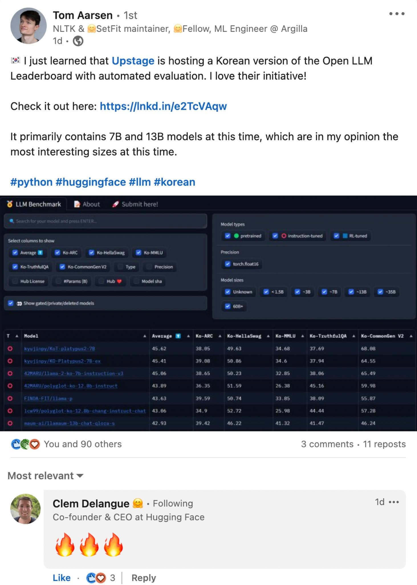 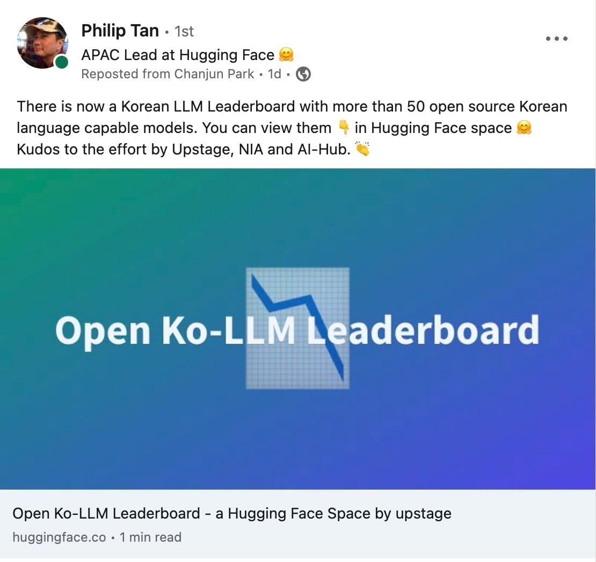 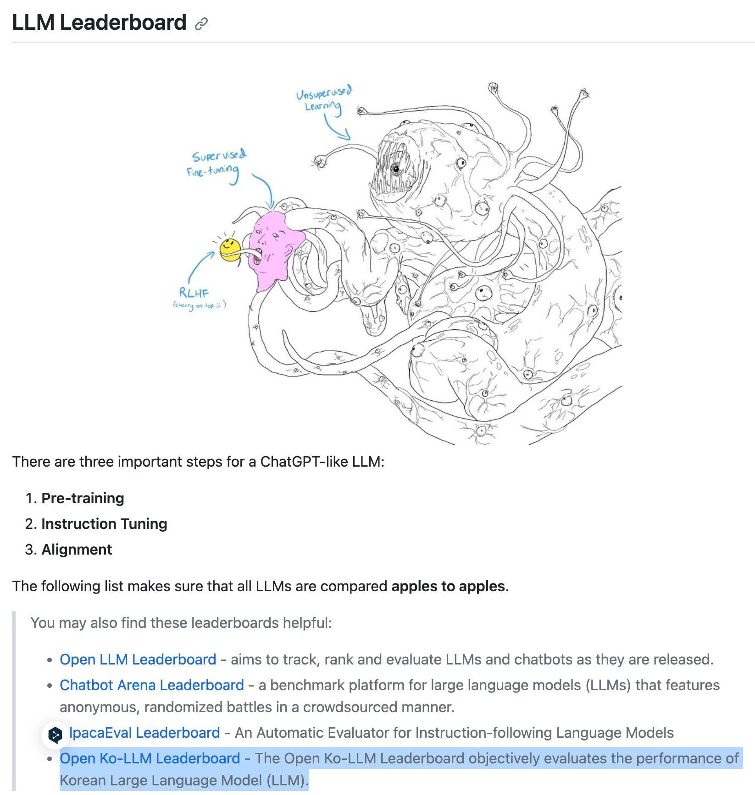

### 10월 8일 (일) 07:09 · #항저우아시안게임 #안세영 #배드민턴 #축구 #야구 "이보다 기쁠 수 있…

#항저우아시안게임 #안세영 #배드민턴 #축구 #야구 "이보다 기쁠 수 있을까요?" 2023년 10월 7일은 꼭 기억하고 싶은 날입니다. 항저우 아시안게임에서 제가 개인적으로도 제일 좋아하는 축구, 야구, 그리고 배드민턴 모두 금메달을 땄습니다!

얼마나 힘들었을까요? 얼마나 많은 훈련을 했을까요? 그리고 중간중간 얼마나 아팠을까요?

안세영 선수의 "오늘도 아팠지만 포기하지 않으니 기회는 오고 좋은 결과로 보답"이라는 멋진 말씀은 오랫동안 가슴에 남을 것 같습니다.

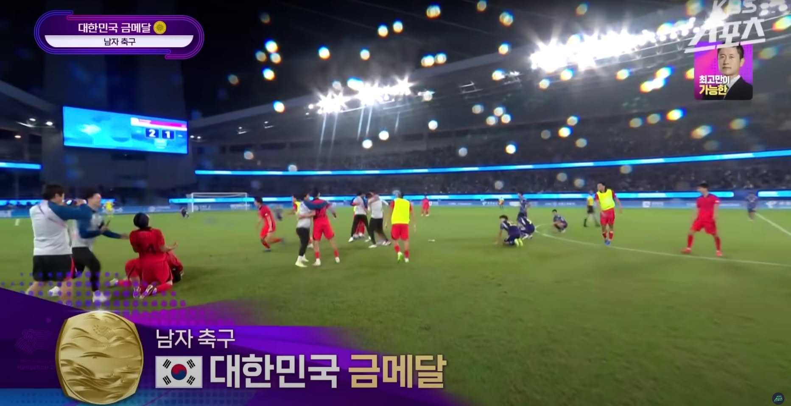 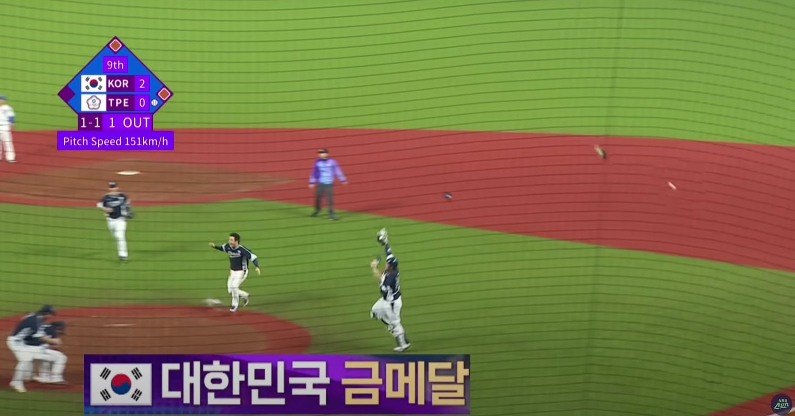 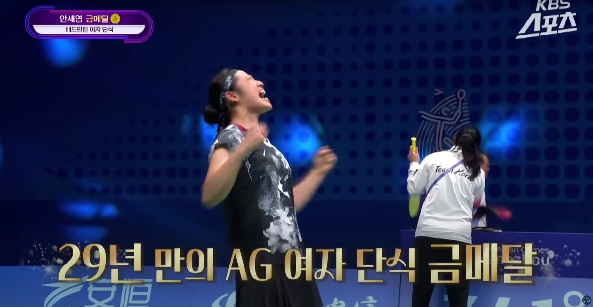

### 10월 12일 (목) 13:00 · #LLAMA #askup #upstage 라마 (인형) 과 함께 메타 분…

#LLAMA #askup #upstage 라마 (인형) 과 함께 메타 분들을 만나 라마2와 LLM, AskUp 이야기 즐거웠습니다. 멋진일들이 일어날것 같은 좋은 느낌입니다!

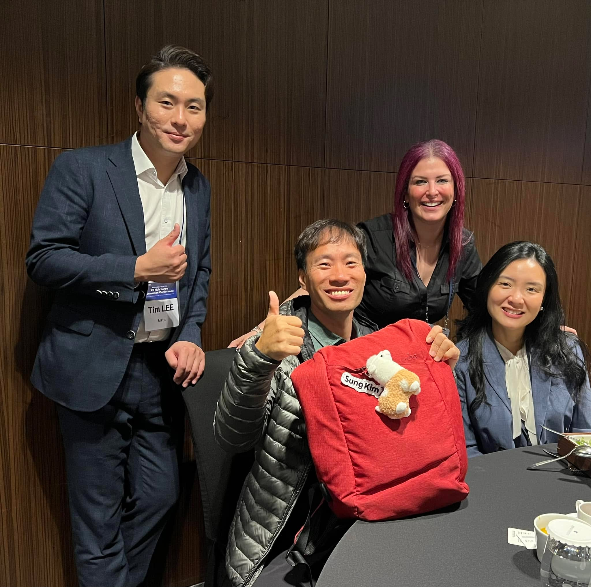

### 10월 12일 (목) 13:23 · #ko-llm #100+ NIA, KT와 공동으로 운영중인 Open Ko…

#ko-llm #100+ NIA, KT와 공동으로 운영중인 Open Ko-LLM 리더보더에 100개 이상의 모델이 참여하고 있습니다. 

국내에 10개, 20개가 있을까 생각했었는데요. 2주만에 100개가 넘게 좋은 모델들이 올라오고 있습니다.

뿐만 아니라 Mistral 등도 올라오고 있고 글로벌 모델 만드시는 분들도 직접 Ko-LLM 리더보드에 올려주고 계십니다. 

모든 LLM이 한국어 잘 지원되기를 기원합니다. 여러분들의 LLM도 많이 올려주세요.

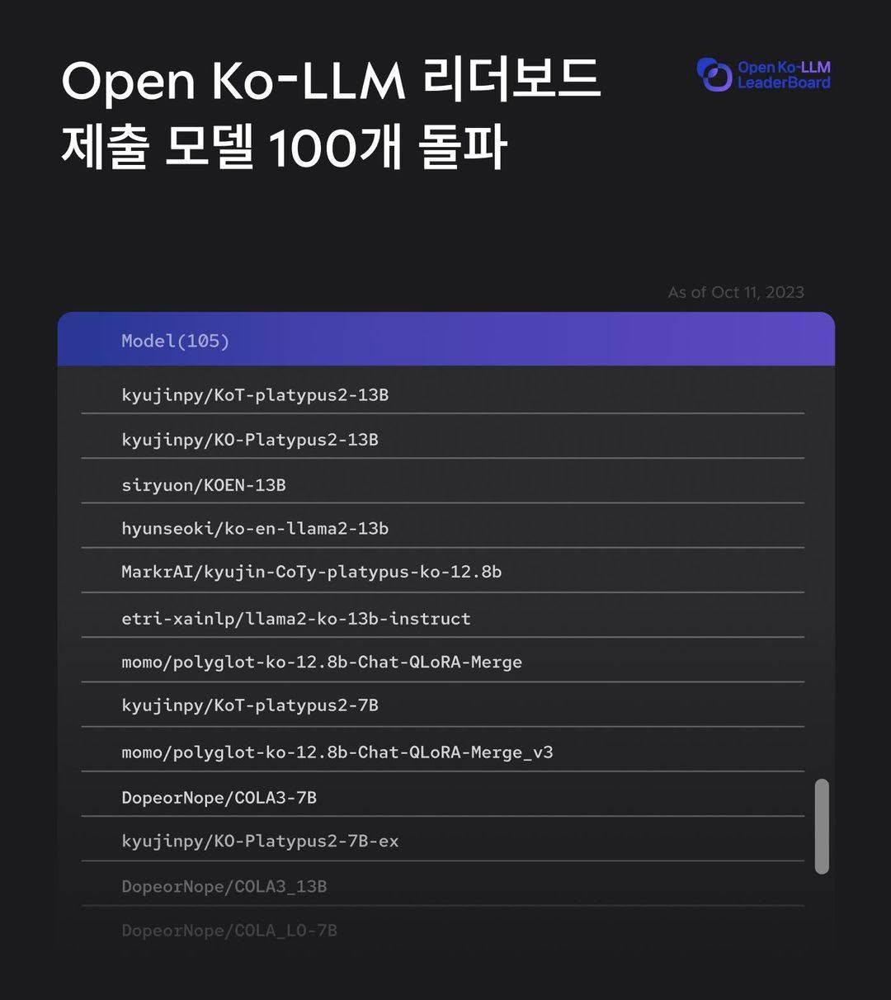

### 10월 19일 (목) 08:05 · 🚀🤖 오늘, OpenAI를 뛰어넘을 수도 있는 기업, B2B 분야에서 화…

🚀🤖 오늘, OpenAI를 뛰어넘을 수도 있는 기업, B2B 분야에서 화제의 중심인 Anthropic의 CEO, Dario Amodei 님과의 대화에서 귀중한 인사이트를 얻었습니다! 우리는 LLM의 규모 확장, 안전성, 세밀한 조정, 다언어 지원, 그리고 실용적인 응용 분야 등 미래 기술 트렌드에 대한 깊이 있는 토론을 펼쳤습니다.

✨ 이 대화는 단순한 정보 교환을 넘어, 우리 모두에게 새로운 비전과 가능성을 열어줄 전환점이 될 것 같습니다. 💡🌟 (Written by LLM)

#Anthropic #AI #Innovation #FutureTrends #Technology #LLM

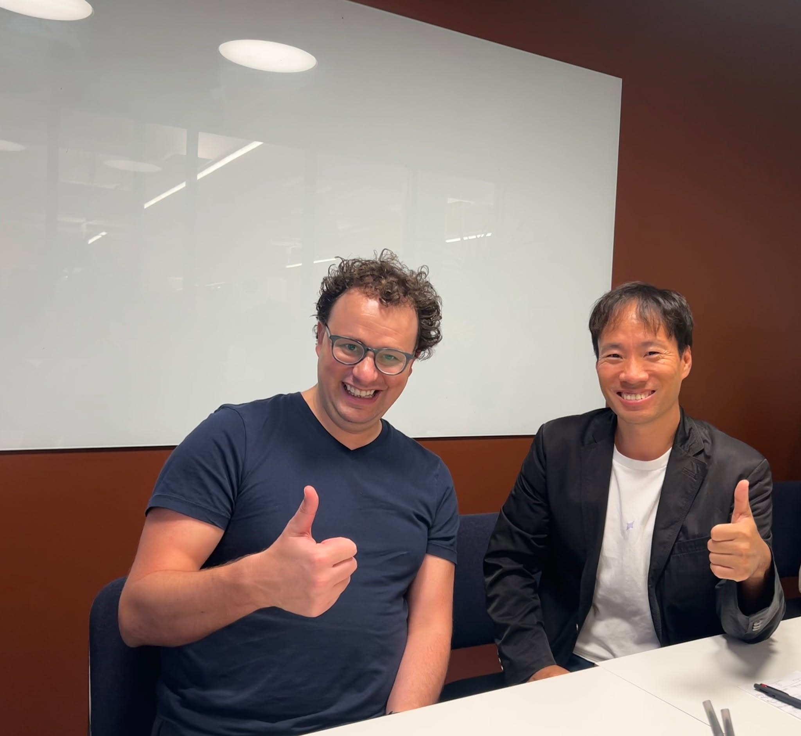

### 10월 22일 (일) 11:07 · #gpt4voice #그날 대충말해줘도 잘 알아 듣고 잘 대답을 해줍니다…

#gpt4voice #그날 대충말해줘도 잘 알아 듣고 잘 대답을 해줍니다. PR39과  pier39의 틀린 발음도 컨텍스를 통해 잘 이해 합니다. 한국어로 말해도 잘 답을 하네요. 

그냥 커놓고 하고 싶은 말이 마구 해도 친절하게 답을 해주는 좋은 친구를 얻은것 같습니다. 

그날은 점점 다가오는것 같습니다.

🎬 동영상 1개 (생략)
