# 2023년 11월

[← 2023년](README.md)

### 11월 1일 (수) 10:07 · 존경하는 Kiha Lee대표님 산달리기 입문 축하드립니다. 산달리기 너무…

존경하는 Kiha Lee대표님 산달리기 입문 축하드립니다. 산달리기 너무 아름다운 계절입니다. 업업업!!!

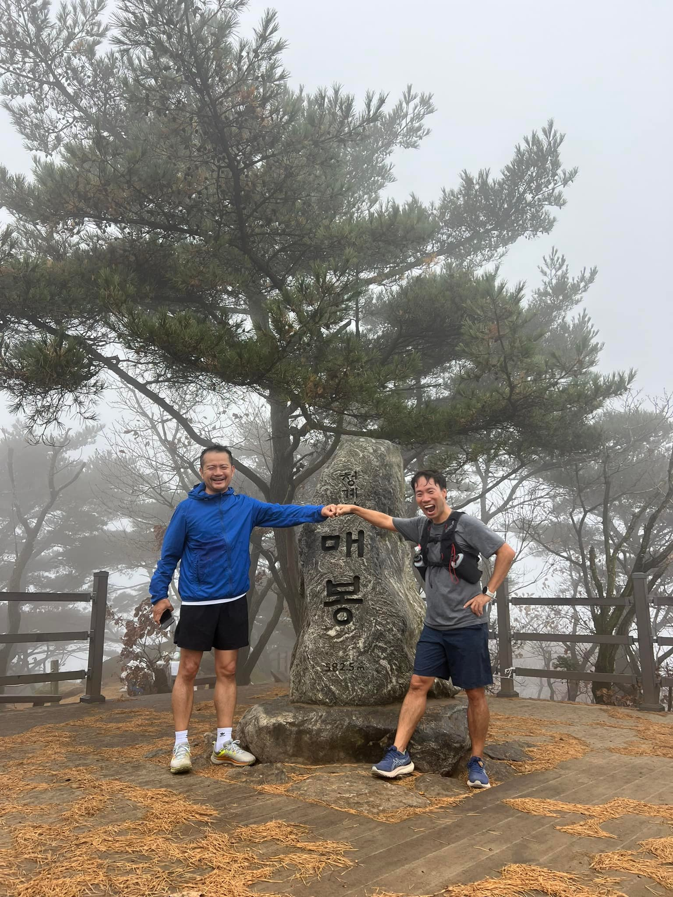 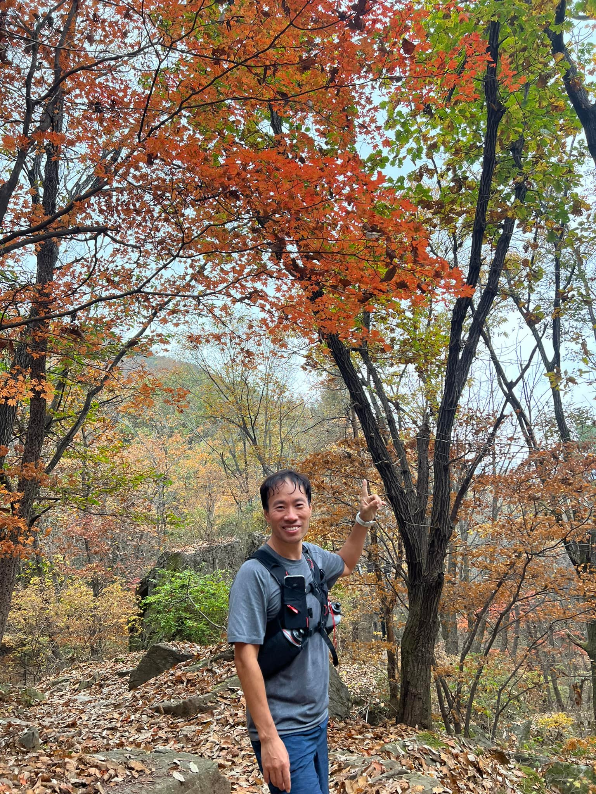 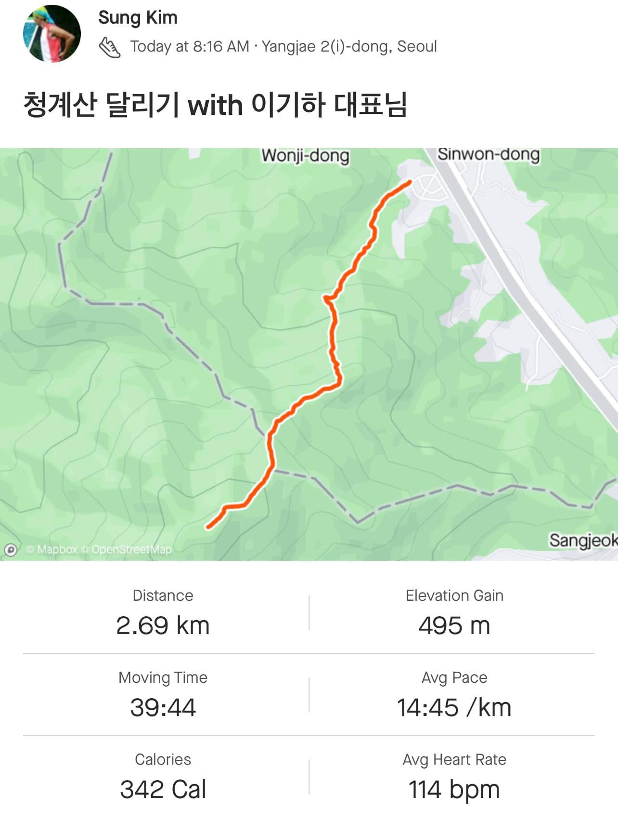

🎬 동영상 2개 (생략)

### 11월 5일 (일) 07:57 · OpenAI 개발자 데이 키노트는 한국시간 11월 7일 화요일  새벽 0…

OpenAI 개발자 데이 키노트는 한국시간 11월 7일 화요일  새벽 03시 (Monday 10AM PST) 에 생중계됩니다.

함께해요! 📺👥🔥 (Written by Solar)

🔗 <https://www.youtube.com/watch?v=U9mJuUkhUzk&ab_channel=OpenAI>

### 11월 7일 (화) 06:32 · OpenAI가 가격을 내리는 것을 포함하여 더 발전된 모델, 그리고 대부…

OpenAI가 가격을 내리는 것을 포함하여 더 발전된 모델, 그리고 대부분 이것을 API로 오픈했습니다. 더더더 많고 재미있고 세상을 바꾸는 AI모델들과 서비스들이 나오게 될것 같습니다.

GPT4가 작성한 요약
---
문맥 길이: 새로운 GPT-4 터보는 최대 128,000개의 토큰까지 문맥을 지원해서 더 긴 대화와 복잡한 작업을 처리할 수 있게 되었습니다. 이전 8,000 토큰 한도보다 많이 늘어났어요.

더 많은 제어: 개발자들이 모델의 응답을 더 많이 제어할 수 있게 되었습니다. JSON 로드 같은 새 기능으로 유효한 JSON 응답을 보장하고, 일관된 결과를 위해 시드 매개변수를 이용한 재현 가능한 출력이 소개되었습니다.

더 나은 지식: GPT-4 터보는 2023년 4월까지의 최신 지식을 갖추고 있어 이전 모델에서의 정보 지연 문제를 해결했습니다.

새로운 모달리티: 비전과 텍스트-투-스피치와 같은 새로운 모달리티가 포함되어 이미지를 이해하고 자연스러운 소리를 내는 오디오를 생성할 수 있게 되었습니다. 이 기능들은 개발자들이 만들 수 있는 AI 애플리케이션의 다양성을 확장시킵니다.

맞춤화: 오픈AI는 GPT-4 모델의 맞춤화 옵션을 개선했습니다. 이를 통해 개발자들은 모델을 특정 분야나 사용 사례에 더 밀접하게 맞출 수 있습니다.

더 높은 비율 제한: 기존 GPT-4 고객들을 위한 토큰 비율 제한이 두 배로 증가하여 사용량 제한 없이 모델의 기능을 더 많이 사용할 수 있게 되었습니다.

슬라이드에는 "낮은 가격"이라는 부분도 강조되어 있는데, 이는 기술적 개선뿐만 아니라 GPT-4 모델 사용 비용을 상당히 절감하여 더 많은 개발자와 회사들이 기술을 접근할 수 있도록 만들겠다는 의도를 나타냅니다.

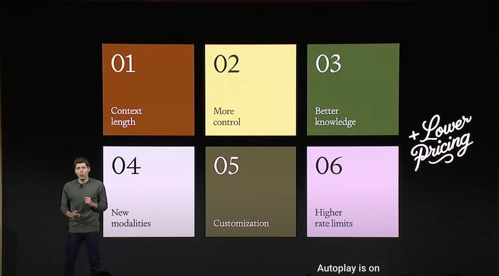 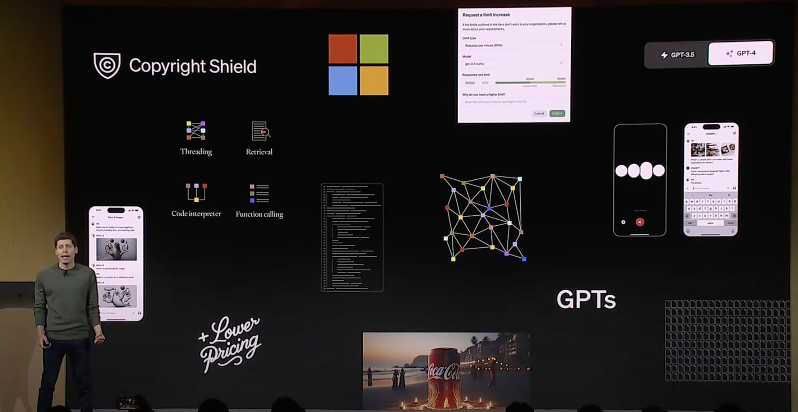

### 11월 8일 (수) 06:26 · #혁신아이콘

#혁신아이콘 

많은 심사를 거쳐 업스테이지 기술과 비지니스 모델을 바탕으로 혁신아이콘으로 선정해주셔서 진심으로 감사합니다. 또한 선정되어 매우 기쁩니다! 😊👍

함께 선정된 회사들에게 큰 축하 드립니다! 🎉🎊

"신보는 혁신적인 비즈니스 모델을 바탕으로 고속 성장이 예상되는 6개 혁신 스타트업을 ‘제10기 혁신아이콘’으로 선정했다고 6일 밝혔다.

이번 10기 혁신아이콘 모집에는 총 218개 기업이 지원해 36대 1의 높은 경쟁률을 보였다. 신보는 서류심사, 현장실사, 내·외부 전문가가 포함된 전문 심사위원단의 심사를 거쳐 6개 기업을 최종 선정했다.

최종 선정된 6개 기업은 △네오사피엔스 △리벨리온 △업스테이지 △에이비일팔공 △케어링 △피알앤디컴퍼니다. AI 기술기업이 전면에 나섰으며 일상을 파고든 온오프라인(O2O) 플랫폼이 뽑혔다." 

(기사원문은 댓글 참조)

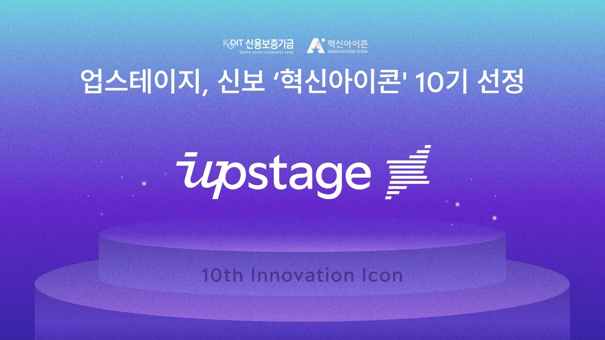 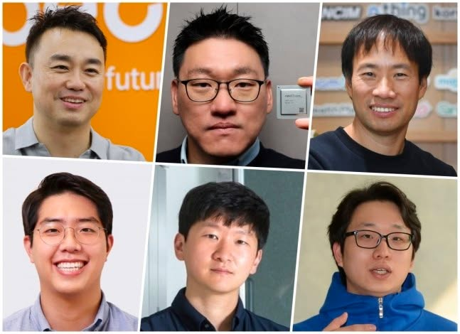

### 11월 8일 (수) 09:13 · 존경하는 Keonsu Lee 대표님과 함께 3C conference에서 …

존경하는 Keonsu Lee 대표님과 함께 3C conference에서 발표합니다. 오시는 분들 반갑게 뵙겠습니다. :)

바지 색깔 깔맞춤으로 느낌이 아주 좋습니다! 😊

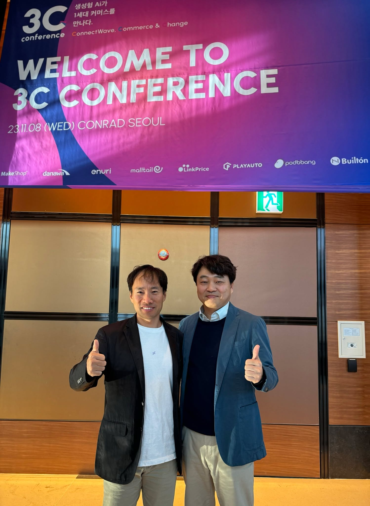

### 11월 14일 (화) 09:49 · #AIBiz #OpenAIDay 비디오들이 하나씩 공개 되고 있습니다.

#AIBiz #OpenAIDay 비디오들이 하나씩 공개 되고 있습니다. 

The Business of AI 라는 제목으로 Aliisa Rosenthal, Head of Sales at OpenAI 와 Oji Udezue, Chief Product Officer at Typeform, Kathy Baxter, Principal Architect, Responsible AI & Tech at Salesforce, 
Miqdad Jaffer, Director of Product at Shopify 가 함께 이야기를 나누는데 매우 흥미롭습니다. 

AI로 70% 되는 제품을 만들기는 정말 쉽다. 그 다음이 어렵다는 이야기는 정말 공감이 됩니다.

아래 GPT4가 요약한것입니다.
---
패널 소개: 오픈AI의 영업 책임자 알리사 로젠탈이 캐시 배락스(세일즈포스), 오지 우데주(타입폼), 미크닷 자퍼(숍파이)와 함께 AI를 비즈니스 제품과 운영에 통합하는 방법에 대해 논의하는 패널 토론을 주재합니다.

AI 통합의 도전: 패널리스트들은 회사의 사명과 일치시키기, 신뢰와 안전성 확보, AI의 지속적인 발전에 적응하는 것을 강조하며 AI 통합의 복잡성에 대해 논의합니다.

제품 개발에서의 AI: 타입폼과 숍파이와 같은 회사들이 양식 경험을 재고하고 플랫폼 전반에 AI를 통합하는 방식으로 제품을 혁신하고 향상시키는 방법에 대한 논의가 이루어집니다.

혁신과 안전성의 균형: 세일즈포스의 캐시 배락스는 AI 혁신과 안전성 사이의 균형을 맞추는 도전에 대해 논의하며, 투명하고, 정직하며, 사용자를 권한 부여하는 책임있는 AI 개발에 중점을 둡니다.

비즈니스와 AI 전략: 고객 관리, 경험 가격 책정, 시장 전략을 포함한 비즈니스에서 AI의 전략적 측면에 대해 논의됩니다. 또한 고객 작업 흐름을 이해하고 AI가 이러한 과정을 어떻게 증진시킬 수 있는지에 대한 중요성도 다룹니다.

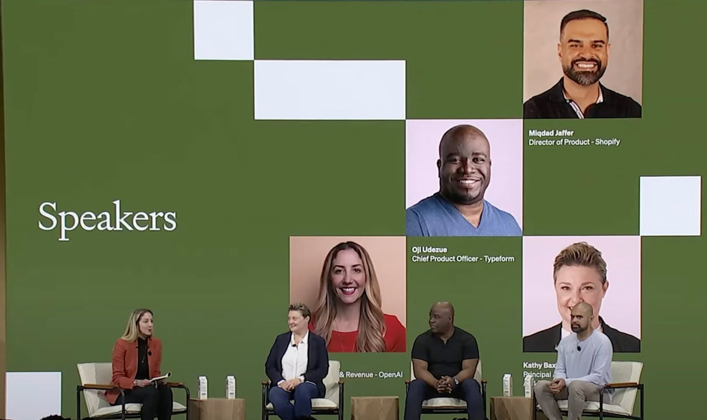

### 11월 15일 (수) 12:57 · #math-llm #gpt4 #kt #qanda LLM이 가장 못하는 영…

#math-llm #gpt4 #kt #qanda LLM이 가장 못하는 영역중 하나가 수치적인 이해와 생성입니다. 그런데 수치적인 이해는 분석과 reasoning을 위해 매우 중요한 부분입니다.

업스테이지는 math 데이터가 가장 많은 Qanda와 함께 KT믿음 스튜디오 인프라와 함께 math-llm을 새로 만드는 프로젝트를 시작했고 어느정도 결과가 나오고 있습니다.

세계에서 가장 잘되는 math-llm 을 함께 만들어, 모든 분들이 사용할수 있도록 해드리겠습니다. 🤝💼🧑‍🎓

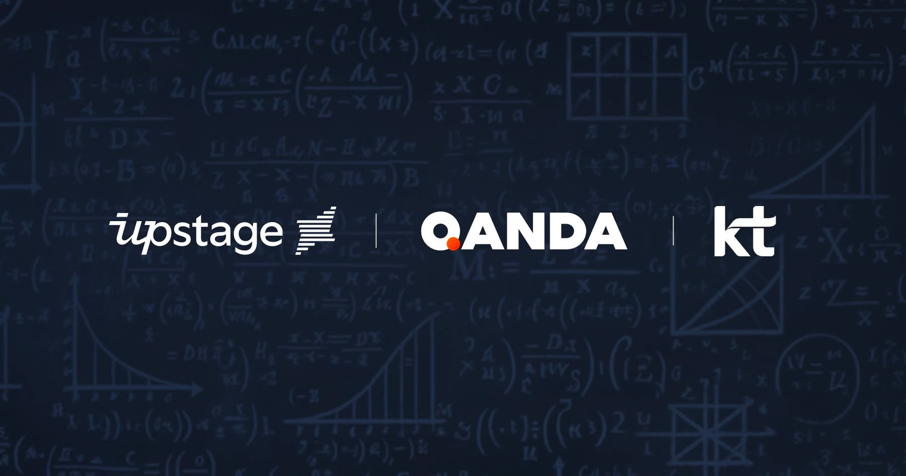

### 11월 18일 (토) 07:37 · Sam Altman, [OpenAI의 CEO에서 해임]

Sam Altman, [OpenAI의 CEO에서 해임]

Sam은 Jobs의 길을 가게 되는 것일까요? (샘은 스티브 잡스처럼 자신이 설립한 회사에서 해고된 후 돌아와 더 큰 업적을 이룰까요? 🤔)

“Mr. Altman’s departure follows a deliberative review process by the board, which concluded that he was not consistently candid in his communications with the board, hindering its ability to exercise its responsibilities,” the company said in its blog post. “The board no longer has confidence in his ability to continue leading OpenAI.”

오후에 보니 더 많은 분들이 사임을 하고 있네요. 😱 멋진회사를 만들고 GPT/ChatGPT로 모두를 위한 생성 AI 시대를 열어준 OpenAI분들이 모두 건승하시길 기원합니다. 🙏

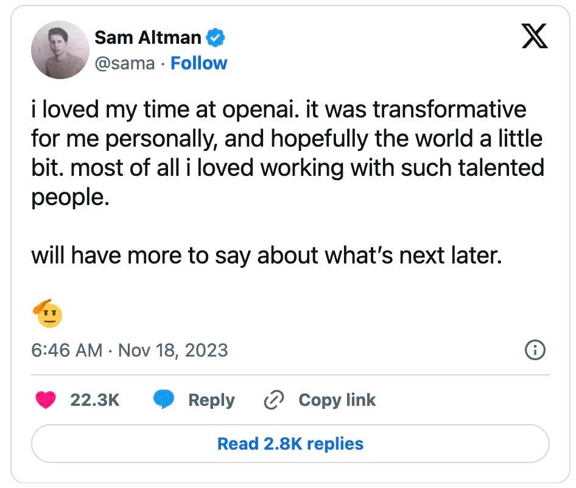

### 11월 18일 (토) 15:36 · 📷 사진 (1장)

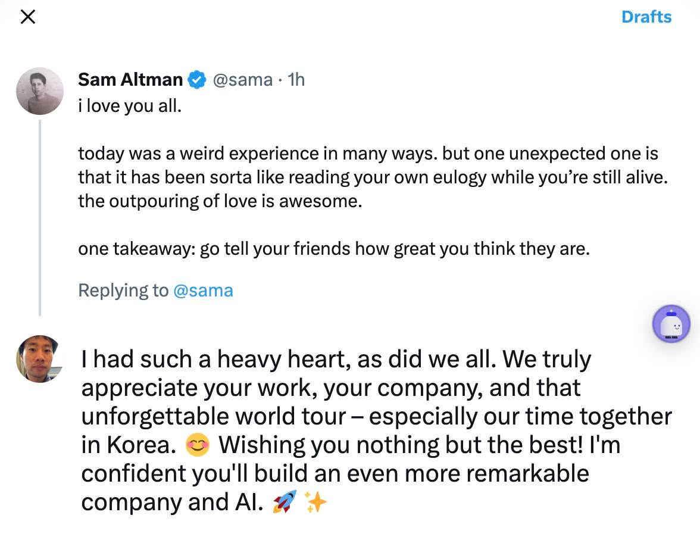

### 11월 21일 (화) 15:07 · #AIPM Jump into the AI World - AI Produc…

#AIPM Jump into the AI World - AI Product Lifecycle 🤖💡 인공지능 프로젝트를 어떻게 관리하고 성공시킬 수 있을까요? 다년간의 AI 프로젝트 성공 경험을 가진 Hwalsuk Lee 님이 그 방법을 공유합니다.

🌟 Udemy의 멋진 강의 모두 함께 해요!

(Written by Solar)

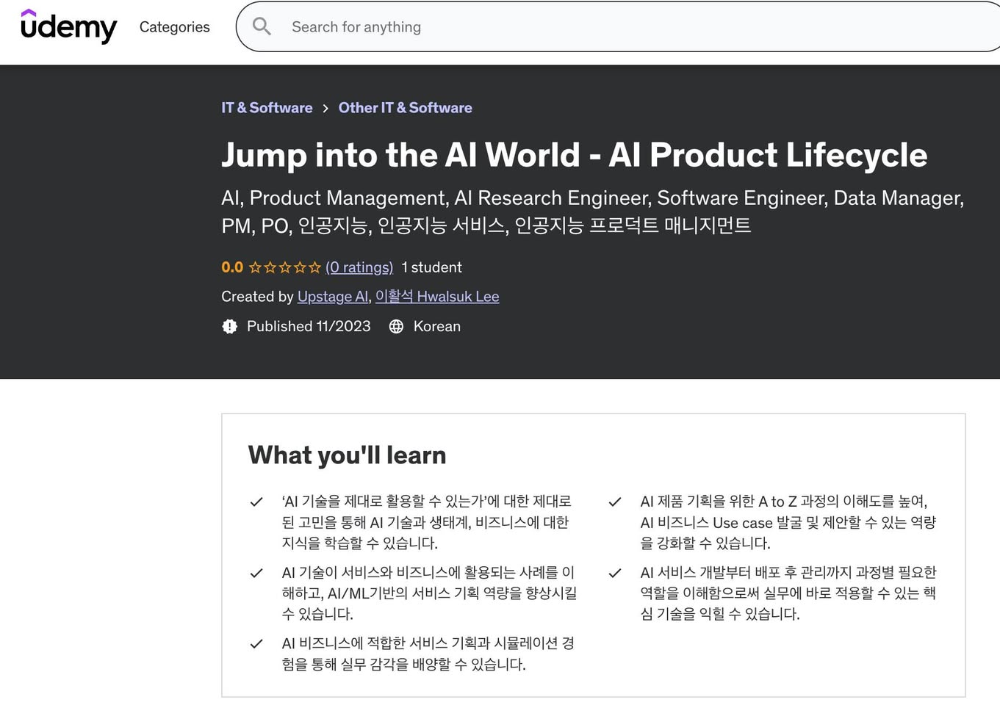

### 11월 26일 (일) 18:23 · #Ko-LLM #500 #KT #huggingface

#Ko-LLM #500 #KT #huggingface

Ko-LLM 리더보드를 시작했을 때 얼마나 많은 모델이 참여할지 걱정했었는데요. 벌써 500개가 넘었다니 정말 놀랍고 감사합니다. 🎉
https://huggingface.co/spaces/upstage/open-ko-llm-leaderboard

참여해주신 모든 분들께 진심으로 감사의 말씀 드립니다. 여러분 덕분에 훨씬 더 다양하고 훌륭한 Open KoLLM을 만나볼 수 있게 되었어요.

함께 운영해주신 NIA, 데이터셋 제공 해주신 고려대학교에 대한 큰 감사를드립니다. 그리고 KT와 허깅페이스에게는 GPU/CPU 후원에 대해 깊은 감사를 표합니다. 🙏

저희는 앞으로도 더 안정적인 운영을 위해 노력할 것이며, 평가 데이터셋도 계속 추가해 나갈 예정입니다. 많이 참여해주시고 많이 도와주시고 또 많이 기대해주세요! 💪💖🚀

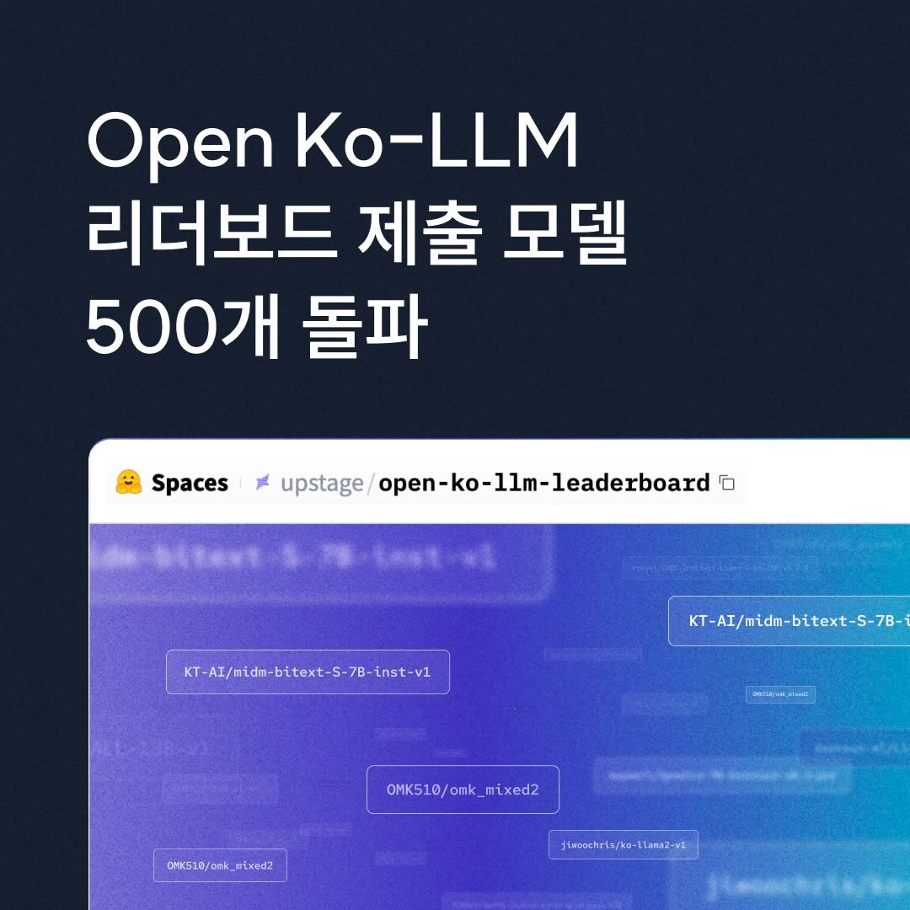

### 11월 27일 (월) 12:45 · SBS 디지털 포럼에 참석하신 여러분께서 Sung Kim을 가장 인상 깊…

SBS 디지털 포럼에 참석하신 여러분께서 Sung Kim을 가장 인상 깊은 연사로 선정해 주셨다는 소식이 정말 기쁩니다. 😊

앞으로도 여러분의 이해를 돕기 위해 복잡한 기술을 쉽고 재미있게 설명하는 것은 물론, 더 섬세한 언어로 소통하겠습니다. 🌟

오늘은 정말 기분 좋은 날이네요! ☀️

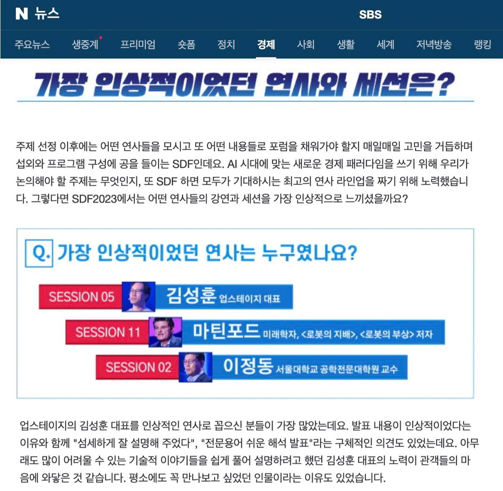
