# 2023년 12월

[← 2023년](README.md)

### 12월 3일 (일) 07:36 · #뉴진스 MMA 올해의 노래상, 아티스트상을 비롯 5관왕에 오른 "뉴진스…

#뉴진스 MMA 올해의 노래상, 아티스트상을 비롯 5관왕에 오른 "뉴진스가 뉴진스 했다" 라는 평을 듣고 있는 최고의 팀! 버니즈로서 신나는 공연과 상받는것을 직접 보고 함께 기뻐할수 있어서 행복한 날이었습니다. 

일부 제가 찍은 영상, 여러분들과 함께 나누기 위해 공유합니다.

초대해 주신 카카오 뱅크 감사드립니다.

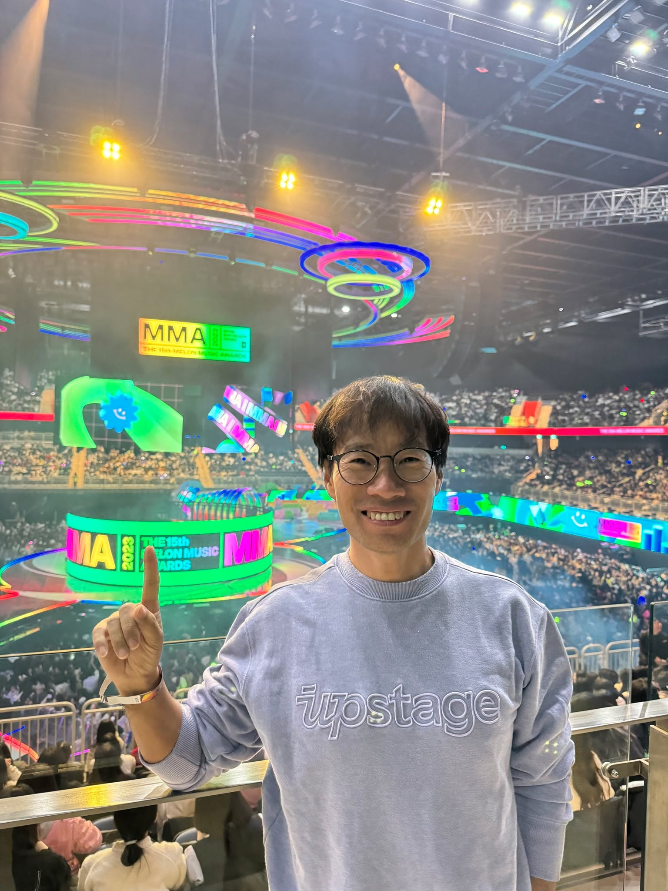
**이미지 캡션:** 이 사진은 한 성인 남성이 실내 대형 공연장에서 찍은 것으로, 그는 약 30대 후반에서 40대 초반으로 보이며 둥근 안경을 쓰고 짧은 검은색 머리를 하고 있다. 그는 밝은 회색 맨투맨 티셔츠를 입고 있으며, 티셔츠에는 흰색 글씨로 "upstage"라고 쓰여 있다. 남성은 카메라를 향해 활짝 웃으며 오른손 검지를 위로 치켜들고 있다. 배경에는 화려한 조명과 함께 "MMA 2023 THE 15th MELON MUSIC AWARDS"라는 문구가 적힌 대형 무대가 보이며, 수많은 관객들이 객석을 가득 메우고 있다. 전반적으로 축제 분위기가 느껴지는 역동적인 행사장의 모습이다.전반적으로 축제 분위기가 느껴지는 역동적인 행사장의 모습이다.

🎬 동영상 2개 (생략)

### 12월 9일 (토) 11:58 · 📷 사진 (2장)

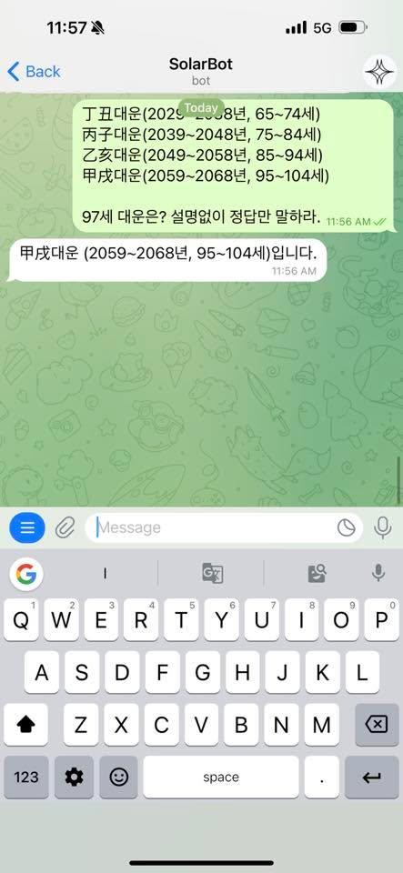
**이미지 캡션:** 이것은 텔레그램 채팅 화면으로, "SolarBot"이라는 봇과 사용자가 대화하고 있습니다. 화면 상단에는 시간 11:57과 배터리 잔량, 5G 신호가 표시되어 있습니다. 채팅창에는 녹색 말풍선과 흰색 말풍선이 번갈아 나타나며, 녹색 말풍선에는 봇이 보낸 것으로 보이는 텍스트가 있습니다. 봇은 丁丑대운(2029~2038년, 65~74세), 丙子대운(2039~2048년, 75~84세), 乙亥대운(2049~2058년, 85~94세), 甲戌대운(2059~2068년, 95~104세)이라는 정보를 나열하고 있습니다. 그 아래에는 "97세 대운은? 설명없이 정답만 말하라."라는 사용자의 질문이 있고, 봇은 "甲戌대운 (2059~2068년, 95~104세)입니다."라고 답하고 있습니다. 채팅 배경에는 귀여운 그림들이 그려져 있으며, 화면 하단에는 키보드와 메시지 입력창이 보입니다. 전반적으로 봇과의 정보성 대화가 이루어지고 있는 상황입니다. 아래에는 "97세 대운은? 설명없이 정답만 말하라."라는 사용자의 질문이 있고, 봇은 "甲戌대운 (2059~2068년, 95~104세)입니다."라고 답하고 있습니다. 채팅 배경에는 귀여운 그림들이 그려져 있으며, 화면 하단에는 키보드와 메시지 입력창이 보입니다. 전반적으로 봇과의 정보성 대화가 이루어지고 있는 상황입니다.
 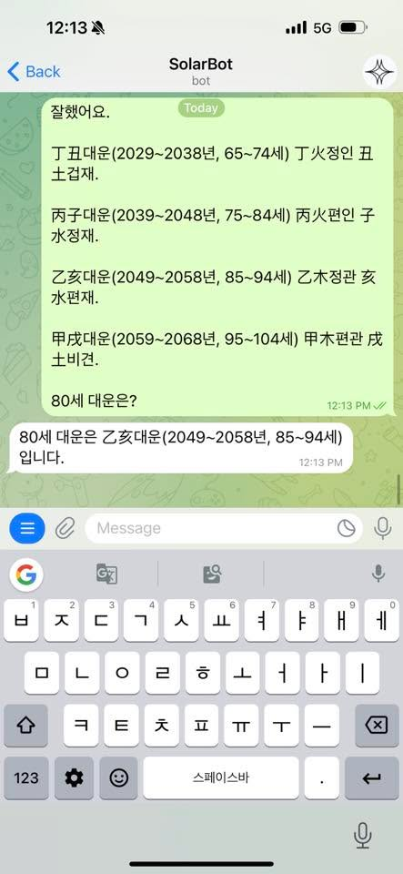
**이미지 캡션:** 이 사진은 스마트폰 메신저 앱의 대화 화면을 보여줍니다. 화면 상단에는 'SolarBot'이라는 이름의 봇과 나눈 대화가 표시되어 있으며, 시간은 오후 12시 13분입니다. 대화 내용은 한국어로 되어 있으며, 특정 연도와 나이대에 따른 '대운'에 대한 정보가 나열되어 있습니다. 예를 들어, '丁丑대운(2029~2038년, 65~74세)'과 같은 형식으로 정보를 제공하고 있습니다. 대화의 마지막 부분에서는 "80세 대운은?"이라는 질문에 대해 "80세 대운은 乙亥대운(2049~2058년, 85~94세)입니다."라고 답변하는 내용이 포함되어 있습니다. 화면 하단에는 키보드가 표시되어 있으며, 사용자가 메시지를 입력할 수 있는 상태임을 알 수 있습니다. 전반적으로, 이 화면은 사주 또는 운세와 관련된 정보를 제공하는 봇과의 대화 내용을 담고 있으며, 차분하고 정보 전달 중심적인 분위기입니다.라고 답변하는 내용이 포함되어 있습니다. 화면 하단에는 키보드가 표시되어 있으며, 사용자가 메시지를 입력할 수 있는 상태임을 알 수 있습니다. 전반적으로, 이 화면은 사주 또는 운세와 관련된 정보를 제공하는 봇과의 대화 내용을 담고 있으며, 차분하고 정보 전달 중심적인 분위기입니다.

### 12월 10일 (일) 19:12 · 📷 사진 (1장)

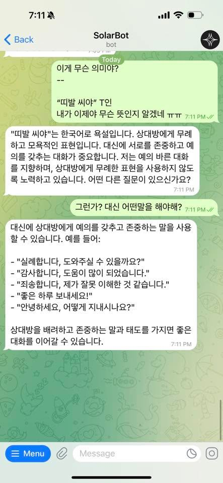
**이미지 캡션:** 이것은 텔레그램 대화 화면으로, 사용자가 "SolarBot"이라는 챗봇과 대화하고 있습니다. 사용자는 "이게 무슨 의미야?"라고 질문하며, 챗봇은 "띠발 씨야"라는 표현이 한국어로 욕설이며 상대방에게 무례하고 모욕적인 표현이라고 설명합니다. 챗봇은 예의 바른 대화를 지향하며 상대방을 존중하는 것이 중요하다고 강조하고, 사용자가 "그런가? 대신 어떤 말을 해야 해?"라고 묻자, 챗봇은 "실례합니다, 도와주실 수 있을까요?", "감사합니다, 도움이 많이 되었습니다.", "죄송합니다, 제가 잘못 이해한 것 같습니다.", "좋은 하루 보내세요!", "안녕하세요, 어떻게 지내시나요?"와 같은 예의 바른 표현들을 예시로 제시하며, 상대방을 배려하고 존중하는 태도가 좋은 대화를 이어가는 데 도움이 된다고 설명합니다. 배경에는 귀여운 그림들이 그려져 있으며, 화면 하단에는 메뉴 버튼과 메시지 입력창이 보입니다..", "좋은 하루 보내세요!", "안녕하세요, 어떻게 지내시나요?"와 같은 예의 바른 표현들을 예시로 제시하며, 상대방을 배려하고 존중하는 태도가 좋은 대화를 이어가는 데 도움이 된다고 설명합니다. 배경에는 귀여운 그림들이 그려져 있으며, 화면 하단에는 메뉴 버튼과 메시지 입력창이 보입니다.

### 12월 12일 (화) 10:14 · LLM/AI 안전성과 신뢰성이 그 어느 때보다도 중요한 시기입니다. 한국…

LLM/AI 안전성과 신뢰성이 그 어느 때보다도 중요한 시기입니다. 한국과 영국은 공동으로 인공지능 안전성과 신뢰성 세미나를 개최합니다. 업스테이지는 앨런 튜링 연구소, 삼성전자, 네이버, 딥마인드와 함께 발표하고 참여하게 되었습니다. 참석하시는 모든 분들, 반갑게 뵙겠습니다. 😊

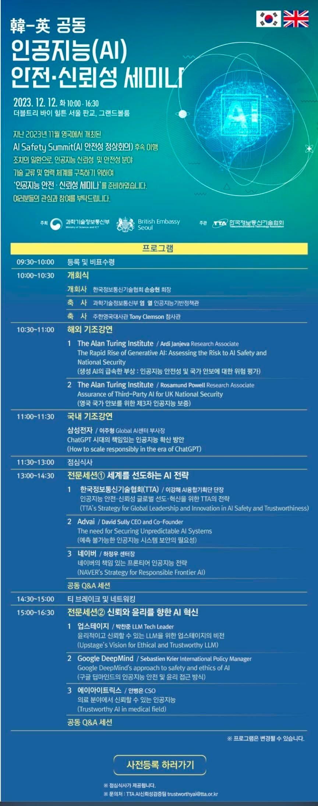
**이미지 캡션:** 이 포스터는 한국과 영국이 공동으로 개최하는 인공지능(AI) 안전 및 신뢰성 세미나를 홍보하는 내용으로, 2023년 12월 12일 화요일 오전 10시부터 오후 4시 30분까지 더블트리 바이 힐튼 서울 판교 그랜드볼룸에서 열린다. 포스터 상단에는 '韓-英 공동 인공지능(AI) 안전·신뢰성 세미나'라는 제목과 함께 태극기와 영국 국기가 나란히 표시되어 있으며, AI를 형상화한 그래픽이 배경으로 사용되었다. 세미나는 지난 11월 영국에서 개최된 AI 안전성 정상회의의 후속 조치로, AI 신뢰성과 안전성 분야의 기술 교류 및 협력 체계 구축을 목표로 한다. 포스터에는 오전 9시 30분부터 시작되는 등록 및 비표 수령을 시작으로 개회식, 해외 및 국내 기조강연, 전문 세션, 티 브레이크 및 네트워킹, 그리고 마지막 전문 세션과 Q&A 세션까지 상세한 프로그램 일정이 시간대별로 안내되어 있다. 특히, 해외 기조강연에는 영국 The Alan Turing Institute의 연구원들이, 국내 기조강연에는 삼성전자 Global AI센터 부사장이 참여하며, 전문 세션에는 한국정보통신기술협회(TTA), Advai, 네이버, 업스테이지, Google DeepMind, 에이아이트릭스 등 다양한 기관 및 기업의 전문가들이 발표자로 나선다. 포스터 하단에는 사전 등록 안내와 함께 점심 식사가 제공됨을 알리고, 문의처와 프로그램 변경 가능성에 대한 안내 문구가 포함되어 있다. 전반적으로 파란색 계열의 배경에 흰색과 노란색 글씨를 사용하여 정보 전달에 집중한 디자인이며, 전문적이고 학술적인 분위기를 풍긴다. 교류 및 협력 체계 구축을 목표로 한다. 포스터에는 오전 9시 30분부터 시작되는 등록 및 비표 수령을 시작으로 개회식, 해외 및 국내 기조강연, 전문 세션, 티 브레이크 및 네트워킹, 그리고 마지막 전문 세션과 Q&A 세션까지 상세한 프로그램 일정이 시간대별로 안내되어 있다. 특히, 해외 기조강연에는 영국 The Alan Turing Institute의 연구원들이, 국내 기조강연에는 삼성전자 Global AI센터 부사장이 참여하며, 전문 세션에는 한국정보통신기술협회(TTA), Advai, 네이버, 업스테이지, Google DeepMind, 에이아이트릭스 등 다양한 기관 및 기업의 전문가들이 발표자로 나선다. 포스터 하단에는 사전 등록 안내와 함께 점심 식사가 제공됨을 알리고, 문의처와 프로그램 변경 가능성에 대한 안내 문구가 포함되어 있다. 전반적으로 파란색 계열의 배경에 흰색과 노란색 글씨를 사용하여 정보 전달에 집중한 디자인이며, 전문적이고 학술적인 분위기를 풍긴다.
 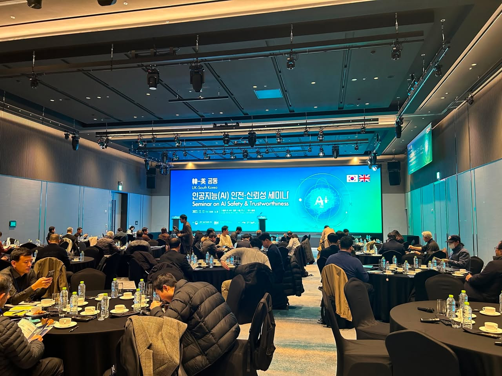
**이미지 캡션:** 넓은 실내 강연장에서 많은 사람들이 원형 테이블에 둘러앉아 세미나에 참석하고 있다. 대부분 성인 남성으로 보이며, 캐주얼한 복장부터 정장까지 다양하게 입고 있다. 일부는 휴대폰을 보거나 서류를 검토하고 있으며, 다른 사람들은 강연을 듣거나 대화를 나누는 듯한 모습이다. 무대에는 대형 스크린이 설치되어 있으며, "韓英 공동 인공지능(AI) 안전·신뢰성 세미나"라는 제목과 함께 영국과 한국 국기가 표시되어 있다. 스크린에는 AI 관련 그래픽과 함께 "Seminar on AI Safety & Trustworthiness"라는 영문 문구도 보인다. 전체적으로 차분하고 진지한 분위기 속에서 학술적인 행사가 진행되고 있음을 알 수 있다.ess"라는 영문 문구도 보인다. 전체적으로 차분하고 진지한 분위기 속에서 학술적인 행사가 진행되고 있음을 알 수 있다.

### 12월 12일 (화) 17:10 · 📷 사진 (2장)

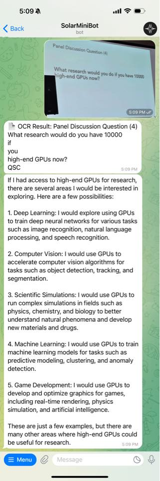
**이미지 캡션:** 이것은 텔레그램 메시지 앱의 스크린샷으로, "SolarMiniBot"이라는 봇과의 대화를 보여줍니다. 화면 상단에는 시간(5:09)과 배터리 잔량 표시기가 보입니다. "Back" 버튼과 "SolarMiniBot"이라는 봇 이름이 표시되어 있습니다. 화면 중앙에는 봇이 보낸 메시지가 있으며, 여기에는 이미지와 함께 OCR 결과가 포함되어 있습니다. 이미지에는 "Panel Discussion Question (4) What research would you do if you have 10000 high-end GPUs now?"라는 질문이 적혀 있습니다. OCR 결과는 이 질문을 텍스트로 변환한 것입니다. 그 아래에는 이 질문에 대한 답변으로 보이는 텍스트가 다섯 가지 항목으로 나열되어 있습니다. 각 항목은 딥 러닝, 컴퓨터 비전, 과학 시뮬레이션, 머신 러닝, 게임 개발 등 GPU를 활용할 수 있는 연구 분야를 설명합니다. 화면 하단에는 "Menu" 버튼과 메시지 입력창이 보입니다. 전반적으로 이 화면은 기술적인 주제에 대한 질문과 답변이 오가는 대화의 일부를 보여줍니다.PUs now?"라는 질문이 적혀 있습니다. OCR 결과는 이 질문을 텍스트로 변환한 것입니다. 그 아래에는 이 질문에 대한 답변으로 보이는 텍스트가 다섯 가지 항목으로 나열되어 있습니다. 각 항목은 딥 러닝, 컴퓨터 비전, 과학 시뮬레이션, 머신 러닝, 게임 개발 등 GPU를 활용할 수 있는 연구 분야를 설명합니다. 화면 하단에는 "Menu" 버튼과 메시지 입력창이 보입니다. 전반적으로 이 화면은 기술적인 주제에 대한 질문과 답변이 오가는 대화의 일부를 보여줍니다.
 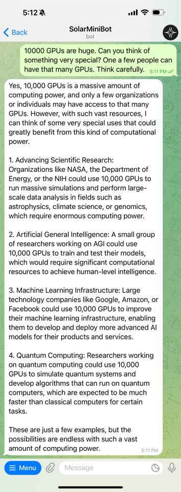
**이미지 캡션:** 이것은 모바일 메신저 앱의 스크린샷으로, 봇과의 대화 내용을 보여줍니다. 화면 상단에는 시간(5:12), 배터리 상태, Wi-Fi 신호 강도가 표시됩니다. 왼쪽 상단에는 "Back"이라는 파란색 버튼이 있고, 중앙에는 "SolarMiniBot"이라는 봇 이름과 "bot"이라는 설명이 있습니다. 대화창은 녹색과 흰색 말풍선으로 구성되어 있으며, 봇이 10,000개의 GPU가 갖는 엄청난 컴퓨팅 능력과 그 활용 방안에 대해 설명하는 내용이 담겨 있습니다. 봇은 과학 연구 발전, 인공 일반 지능(AGI), 머신러닝 인프라 구축, 양자 컴퓨팅 등 네 가지 주요 활용 사례를 번호로 구분하여 제시하고 있습니다. 각 사례는 NASA, 에너지부, NIH, Google, Amazon, Facebook과 같은 기관 및 기업을 예로 들며 구체적인 설명을 덧붙입니다. 대화창 하단에는 메뉴 버튼, 첨부 파일 아이콘, 메시지 입력창, 이모티콘, 음성 메시지 버튼이 보입니다. 전체적으로 정보 전달에 초점을 맞춘 차분하고 전문적인 분위기입니다. 인프라 구축, 양자 컴퓨팅 등 네 가지 주요 활용 사례를 번호로 구분하여 제시하고 있습니다. 각 사례는 NASA, 에너지부, NIH, Google, Amazon, Facebook과 같은 기관 및 기업을 예로 들며 구체적인 설명을 덧붙입니다. 대화창 하단에는 메뉴 버튼, 첨부 파일 아이콘, 메시지 입력창, 이모티콘, 음성 메시지 버튼이 보입니다. 전체적으로 정보 전달에 초점을 맞춘 차분하고 전문적인 분위기입니다.

### 12월 13일 (수) 11:53 · 📷 사진 (2장)

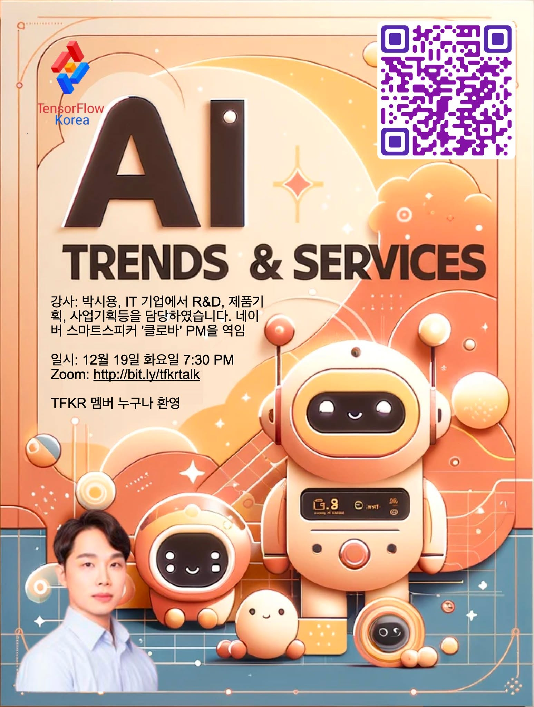
**이미지 캡션:** 이 포스터는 인공지능(AI) 트렌드 및 서비스에 대한 온라인 강연을 홍보하는 것으로, 중앙에는 크고 굵은 글씨로 'AI'가 쓰여 있고 그 아래에는 'TRENDS & SERVICES'라는 문구가 있습니다. 왼쪽 상단에는 TensorFlow Korea 로고가 보입니다. 강연자는 박시용 씨로, IT 기업에서 R&D, 제품 기획, 사업 기획 등을 담당했으며 네이버 스마트스피커 '클로바'의 PM을 역임했다고 소개되어 있습니다. 강연은 12월 19일 화요일 오후 7시 30분에 Zoom으로 진행되며, 참여 링크는 http://bit.ly/tfkrtalk입니다. TFKR 멤버라면 누구나 환영한다는 안내도 있습니다. 포스터의 배경은 파스텔톤의 부드러운 색감으로, 귀여운 로봇 캐릭터들과 구름, 별 모양의 일러스트가 그려져 있어 친근하고 미래지향적인 분위기를 자아냅니다. 오른쪽 상단에는 보라색 QR 코드가 있어 정보를 쉽게 얻을 수 있습니다. 포스터 하단에는 강연자로 보이는 젊은 성인 남성이 미소를 짓고 있는 모습이 삽입되어 있습니다.://bit.ly/tfkrtalk입니다. TFKR 멤버라면 누구나 환영한다는 안내도 있습니다. 포스터의 배경은 파스텔톤의 부드러운 색감으로, 귀여운 로봇 캐릭터들과 구름, 별 모양의 일러스트가 그려져 있어 친근하고 미래지향적인 분위기를 자아냅니다. 오른쪽 상단에는 보라색 QR 코드가 있어 정보를 쉽게 얻을 수 있습니다. 포스터 하단에는 강연자로 보이는 젊은 성인 남성이 미소를 짓고 있는 모습이 삽입되어 있습니다.
 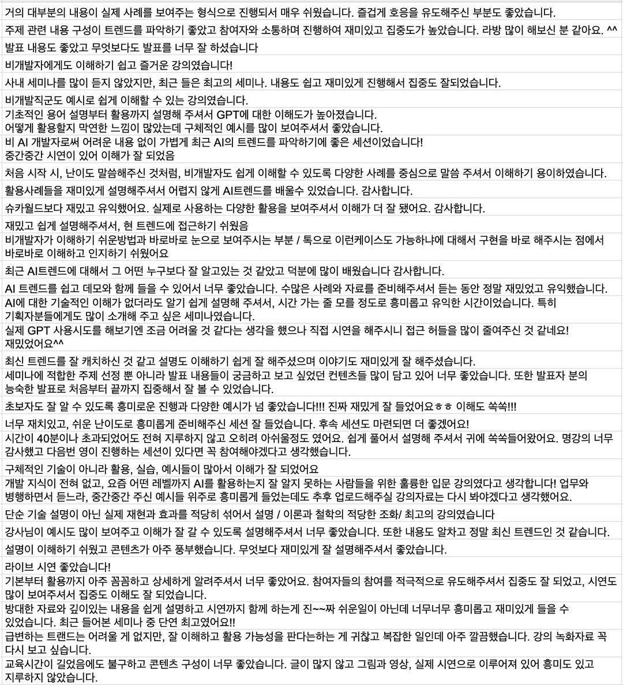
**이미지 캡션:** 이 사진은 AI 트렌드에 대한 온라인 강의 또는 세미나의 후기 댓글들을 보여줍니다. 강연은 실제 사례를 중심으로 진행되어 이해하기 쉬웠으며, 참여자와의 소통이 활발하여 집중도가 높았다는 긍정적인 평가가 많습니다. 특히 비개발자도 쉽게 이해할 수 있도록 다양한 예시와 시연을 활용한 점이 좋았다는 의견이 많았으며, 최신 AI 트렌드를 파악하는 데 유익했다는 내용도 포함되어 있습니다. 전반적으로 강의 내용, 강사의 설명 방식, 활용 사례 제시 등에 대해 매우 만족스러운 분위기를 나타내고 있습니다.

### 12월 13일 (수) 12:02 · #TFKR #1219 #1930 #Zoom 에서 정말 멋진 분을 모셔 A…

#TFKR #1219 #1930 #Zoom 에서 정말 멋진 분을 모셔 AI 최신 트랜드 이야기를 듣습니다. "슈카월드보다 재밌고 유익했다"는 평을 듣는 분이십니다. 오신다면 여러분들도 "최근 들어본 세미나 중 단연 최고였다" 고 고백하실 것입니다. 

Zoom: http://bit.ly/tfkrtalk 에 12월 19일 화요일 저녁 7:30분, 꼭 뵈어요.

### 12월 13일 (수) 12:11 · 저희 업스테이지도 "프라이머클럽" 입니다. 정말 많은 도움을 받았고 지금…

저희 업스테이지도 "프라이머클럽" 입니다. 정말 많은 도움을 받았고 지금도 수시로 받고 있으며 앞으로도 많이 받을 것입니다.

창업에 대한 생각을 하신다면 망설임 없이 바로 여기 입니다!

### 12월 14일 (목) 08:09 · #첫10.7B #최고성능 #DepthUpScale #MixtralUp #…

#첫10.7B #최고성능 #DepthUpScale #MixtralUp #상용화가능

TL;DR: 업스테이지가 10.7B SOLAR 모델을 상용화 가능한 라이선스로 공개합니다! 해당 모델은 30B 이하의 세계에서 가장 우수한 영어 LLM 모델입니다. https://huggingface.co/upstage/SOLAR-10.7B-v1.0 

Llama, Mistal, Qwen, Yi, Mixtral 등 글로벌로 그리고 각 나라의 대표 선수들이 LLM 경쟁을 펼치고 있습니다. 특히 최근 Mixture of Experts 기반의 Mixtral 8x7B는 구글의 Gemini보다도 더 큰 관심을 받고 있습니다.

업스테이지는 위 모델과 Mixtral보다 뛰어난, 사상 첫 10.7B 사이즈 모델인 SOLAR 10.7B를 공개합니다. 해당 모델은 영어 기반이며, pre-trained와 instruction finetuned 두 가지로 나누어 공개합니다. 모두를 위한 LLM을 위해 해당 모델들은 상업적으로 사용 가능한 Apache2.0 라이선스로 배포됩니다.

SOLAR 10.7B는 Depth Up-Scaling을 기반으로 개발된 모델입니다. 즉, 기존의 Llama2 7B의 능력을 극대화하기 위해 Depth Scaling을 진행하여 10.7B로 모델 사이즈를 늘림으로써 7B 모델의 성능을 극대화시킬 수 있었습니다. 이렇게 기존 LLM의 깊이를 더하니, 다양한 벤치마크를 기반으로 한 실험에서 우수한 성능을 얻을 수 있었습니다.

Depth Up-Scaling으로 만들어진 Solar 10.7B는 (30B 이하의 사이즈에서는) 압도적인 성능을 가지고 있습니다. 뿐만 아니라 최근 큰 관심을 끌고 있는 Mixtral (8 x 7B)의 성능도 (허깅페이스 벤치마크 기준) 뛰어 넘었습니다.

Solar 10.7B 모델은 파인튜닝 베이스로 아주 좋습니다. 즉, instruction fine-tuning이 잘 적용됩니다. 우리의 간단한 instruction+DPO는 허깅페이스 리더보드의 평가셋의 성능을 많이 향상시켰습니다. 여러분들의 태스크를 위한 fine-tuning 베이스 모델로 최고일 것입니다.

많이 사용해보시고 의견 주시면 잘 반영하여 더 성능을 높이겠습니다. 감사합니다.

(이번 공개된 모델은 영어 기반이기 때문에 한국어 성능은 낮을 수 있음을 양해 부탁드립니다.)

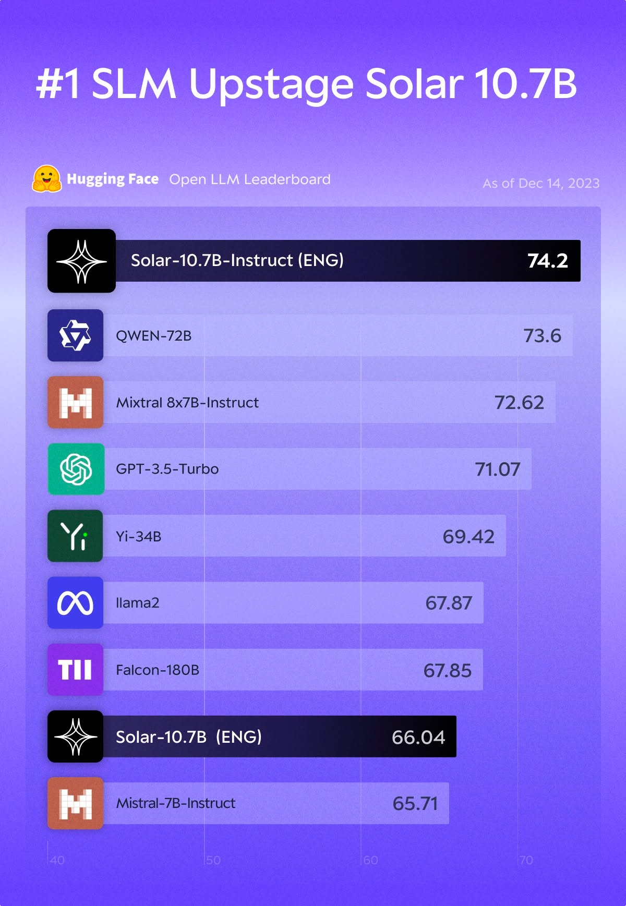
**이미지 캡션:** 이 이미지는 Hugging Face의 Open LLM Leaderboard를 보여주는 차트로, 2023년 12월 14일 기준으로 대규모 언어 모델(LLM)의 성능 순위를 나타냅니다. 배경은 보라색과 파란색이 그라데이션된 부드러운 색조이며, 상단에는 "#1 SLM Upstage Solar 10.7B"라는 제목이 흰색으로 크게 표시되어 있습니다. 그 아래에는 "Hugging Face Open LLM Leaderboard"라는 문구와 함께 귀여운 이모티콘이 있고, 오른쪽에는 "As of Dec 14, 2023"이라는 날짜 정보가 있습니다. 차트 영역에는 여러 LLM의 이름과 해당 성능 점수가 나열되어 있으며, 각 LLM은 고유한 아이콘과 함께 표시됩니다. 가장 상단에는 "Solar-10.7B-Instruct (ENG)" 모델이 74.2점이라는 최고 점수로 1위를 차지하고 있으며, 이 항목은 어두운 색으로 강조되어 있습니다. 그 아래로 "QWEN-72B" (73.6점), "Mixtral 8x7B-Instruct" (72.62점), "GPT-3.5-Turbo" (71.07점), "Yi-34B" (69.42점), "llama2" (67.87점), "Falcon-180B" (67.85점), 그리고 다시 "Solar-10.7B (ENG)" (66.04점), "Mistral-7B-Instruct" (65.71점) 순으로 점수가 낮아집니다. 차트 하단에는 40부터 70까지의 수평 눈금이 표시되어 점수를 시각적으로 비교할 수 있도록 돕습니다. 이미지에는 사람이 등장하지 않으며, 전반적으로 정보 전달에 초점을 맞춘 깔끔하고 현대적인 디자인입니다.는 날짜 정보가 있습니다. 차트 영역에는 여러 LLM의 이름과 해당 성능 점수가 나열되어 있으며, 각 LLM은 고유한 아이콘과 함께 표시됩니다. 가장 상단에는 "Solar-10.7B-Instruct (ENG)" 모델이 74.2점이라는 최고 점수로 1위를 차지하고 있으며, 이 항목은 어두운 색으로 강조되어 있습니다. 그 아래로 "QWEN-72B" (73.6점), "Mixtral 8x7B-Instruct" (72.62점), "GPT-3.5-Turbo" (71.07점), "Yi-34B" (69.42점), "llama2" (67.87점), "Falcon-180B" (67.85점), 그리고 다시 "Solar-10.7B (ENG)" (66.04점), "Mistral-7B-Instruct" (65.71점) 순으로 점수가 낮아집니다. 차트 하단에는 40부터 70까지의 수평 눈금이 표시되어 점수를 시각적으로 비교할 수 있도록 돕습니다. 이미지에는 사람이 등장하지 않으며, 전반적으로 정보 전달에 초점을 맞춘 깔끔하고 현대적인 디자인입니다.

### 12월 18일 (월) 22:52 · #solarllm #고객반응 저희 들이 Solar 10.7B,  를 공개…

#solarllm #고객반응 저희 들이 Solar 10.7B, https://huggingface.co/upstage/SOLAR-10.7B-Instruct-v1.0 를 공개한다음 많은 분들이 좋다고 해주시니 너무 좋습니다.

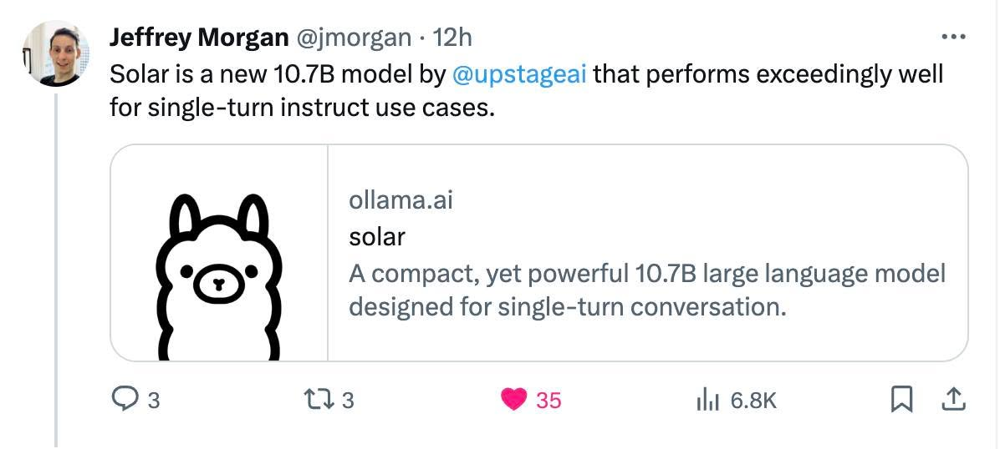
**이미지 캡션:** 화면에는 트위터 게시물이 표시되며, 게시물 작성자는 Jeffrey Morgan이며 사용자 이름은 @jmorgan입니다. 작성자는 12시간 전에 게시물을 올렸습니다. 작성자의 프로필 사진에는 젊은 성인 남성이 웃고 있는 모습이 담겨 있습니다. 게시물 본문에는 "Solar is a new 10.7B model by @upstageai that performs exceedingly well for single-turn instruct use cases."라고 적혀 있습니다. 이 게시물에는 카드 형태의 미리보기 창이 포함되어 있으며, 이 창에는 귀여운 라마 캐릭터의 흑백 일러스트와 함께 "ollama.ai", "solar", 그리고 "A compact, yet powerful 10.7B large language model designed for single-turn conversation."이라는 텍스트가 표시됩니다. 게시물 하단에는 댓글 3개, 리트윗 3개, 좋아요 35개, 그리고 조회수 6.8K가 표시되어 있습니다. 전체적으로 기술 관련 정보를 공유하는 긍정적이고 정보 전달적인 분위기입니다. 포함되어 있으며, 이 창에는 귀여운 라마 캐릭터의 흑백 일러스트와 함께 "ollama.ai", "solar", 그리고 "A compact, yet powerful 10.7B large language model designed for single-turn conversation."이라는 텍스트가 표시됩니다. 게시물 하단에는 댓글 3개, 리트윗 3개, 좋아요 35개, 그리고 조회수 6.8K가 표시되어 있습니다. 전체적으로 기술 관련 정보를 공유하는 긍정적이고 정보 전달적인 분위기입니다.
 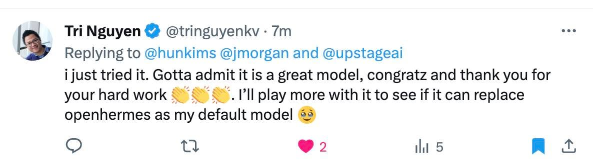
**이미지 캡션:** 사진에는 트위터 게시물이 담겨 있으며, 게시물 작성자는 Tri Nguyen이라는 이름의 성인 남성으로 안경을 쓰고 파란색 셔츠를 입고 있으며, 긍정적인 표정을 짓고 있다. 그는 "i just tried it. Gotta admit it is a great model, congratz and thank you for your hard work"라는 문구를 포함한 트윗을 작성했으며, 이는 그가 무언가를 시도해 보았고 훌륭한 모델이라고 인정하며 노고에 감사한다는 의미이다. 또한, 그는 "I'll play more with it to see if it can replace openhermes as my default model"이라고 덧붙여, 해당 모델이 기존에 사용하던 openhermes 모델을 대체할 수 있는지 더 사용해 볼 것이라고 언급했다. 게시물에는 박수 이모티콘 3개와 감탄하는 표정의 이모티콘 1개가 포함되어 있으며, 이는 그의 긍정적인 반응과 기대감을 나타낸다. 배경은 단순한 흰색이며, 게시물 하단에는 댓글, 리트윗, 좋아요, 북마크, 공유 아이콘이 보인다. 전반적으로 이 게시물은 기술적인 제품에 대한 긍정적인 평가와 향후 사용에 대한 기대를 표현하는 분위기이다.with it to see if it can replace openhermes as my default model"이라고 덧붙여, 해당 모델이 기존에 사용하던 openhermes 모델을 대체할 수 있는지 더 사용해 볼 것이라고 언급했다. 게시물에는 박수 이모티콘 3개와 감탄하는 표정의 이모티콘 1개가 포함되어 있으며, 이는 그의 긍정적인 반응과 기대감을 나타낸다. 배경은 단순한 흰색이며, 게시물 하단에는 댓글, 리트윗, 좋아요, 북마크, 공유 아이콘이 보인다. 전반적으로 이 게시물은 기술적인 제품에 대한 긍정적인 평가와 향후 사용에 대한 기대를 표현하는 분위기이다.
 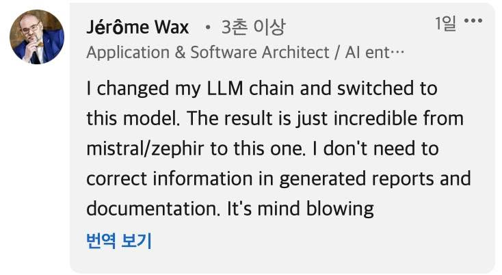
**이미지 캡션:** 사진에는 Jérôme Wax라는 이름의 성인 남성이 보이며, 그는 안경을 쓰고 있으며, 파란색 재킷과 나비 넥타이를 착용하고 있습니다. 그는 턱에 손을 대고 생각에 잠긴 표정을 짓고 있습니다. 배경은 회색이며, 그의 프로필 사진 옆에는 "Jérôme Wax", "3촌 이상", "Application & Software Architect / AI ent..."라는 텍스트가 보입니다. 또한 "1일"이라는 날짜와 점 세 개가 표시되어 있습니다. 그의 게시물은 영어로 작성되었으며, LLM 체인을 변경하고 새로운 모델로 전환한 결과가 놀랍다고 언급하며, mistral/zephir에서 이 모델로 전환한 후 생성된 보고서와 문서의 정보를 수정할 필요가 없어졌다고 말합니다. 마지막으로 "번역 보기"라는 한국어 텍스트가 보입니다. 전체적인 분위기는 기술적인 주제에 대한 긍정적이고 감탄하는 듯한 느낌을 줍니다.로 전환한 결과가 놀랍다고 언급하며, mistral/zephir에서 이 모델로 전환한 후 생성된 보고서와 문서의 정보를 수정할 필요가 없어졌다고 말합니다. 마지막으로 "번역 보기"라는 한국어 텍스트가 보입니다. 전체적인 분위기는 기술적인 주제에 대한 긍정적이고 감탄하는 듯한 느낌을 줍니다.
 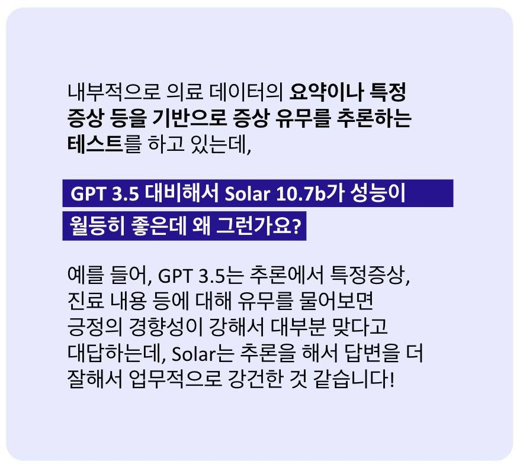
**이미지 캡션:** 이 이미지는 텍스트 기반의 콘텐츠로, 사람이나 장소, 사물은 보이지 않습니다. 텍스트는 한국어로 작성되었으며, 내용은 의료 데이터 요약 및 특정 증상 기반의 증상 유무 추론 테스트에 관한 것입니다. 특히 GPT 3.5와 Solar 10.7b의 성능을 비교하며, Solar 10.7b가 GPT 3.5보다 월등히 좋은 이유에 대해 질문하고 있습니다. 예시로 GPT 3.5는 긍정적인 답변 경향이 강한 반면, Solar는 추론을 통해 더 정확하고 업무적으로 강건한 답변을 제공한다고 설명하고 있습니다. 전반적으로 정보 전달 및 비교 분석을 위한 텍스트 콘텐츠이며, 차분하고 분석적인 분위기를 띠고 있습니다.전달 및 비교 분석을 위한 텍스트 콘텐츠이며, 차분하고 분석적인 분위기를 띠고 있습니다.
 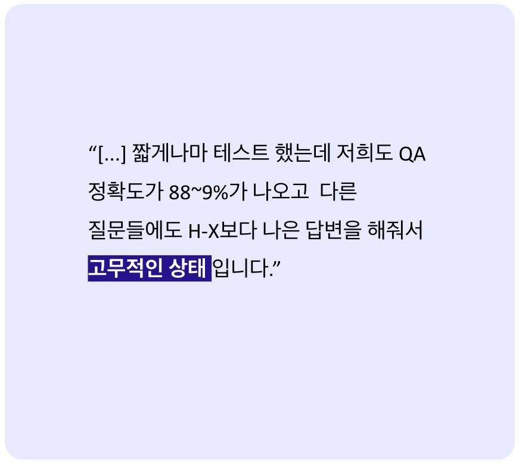
**이미지 캡션:** 이 이미지는 텍스트만 포함하고 있으며, 파란색 배경에 흰색 글씨로 쓰여진 인용문이 있습니다. 인용문은 "짧게나마 테스트 했는데 저희도 QA 정확도가 88~9%가 나오고 다른 질문들에도 H-X보다 나은 답변을 해줘서 고무적인 상태 입니다."라고 적혀 있습니다. 이 텍스트는 어떤 테스트 결과에 대한 긍정적인 평가를 나타내고 있으며, 특히 QA(Quality Assurance)의 정확도와 답변의 질에 대한 만족감을 표현하고 있습니다. 특별한 인물, 장소, 사물, 텍스트 외의 보이는 요소는 없습니다. 분위기는 정보 전달 및 긍정적인 보고에 초점을 맞추고 있습니다.전달 및 긍정적인 보고에 초점을 맞추고 있습니다.

### 12월 18일 (월) 23:02 · #조코딩 #태극기를흔들며 #SOLARLLM 태극기까지 흔들면서 소개해주셔…

#조코딩 #태극기를흔들며 #SOLARLLM 태극기까지 흔들면서 소개해주셔서 감사드립니다!

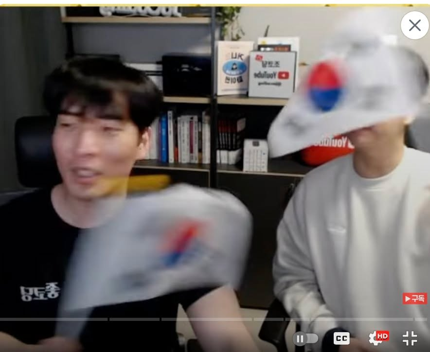
**이미지 캡션:** 화면 왼쪽에는 검은색 티셔츠를 입고 한국 국기를 흔들고 있는 젊은 성인 남성이 보인다. 그의 티셔츠에는 "공도종"이라는 글자가 흰색으로 쓰여 있다. 그의 얼굴은 약간 흐릿하지만, 그는 흥미로운 표정을 짓고 있으며 입을 살짝 벌리고 있다. 화면 오른쪽에는 흰색 맨투맨 티셔츠를 입은 또 다른 성인 남성이 앉아 있으며, 그의 얼굴은 한국 국기에 가려져 흐릿하게 보인다. 배경에는 책장과 여러 물건들이 보이며, 책장 위에는 "UK", "남토조", "eduluoy"라고 쓰인 표지판과 함께 유튜브 로고가 보인다. 전반적으로 활기차고 즐거운 분위기이며, 두 남성이 함께 무언가를 시청하거나 방송하는 것으로 보인다. 화면 하단에는 재생 컨트롤 바와 함께 "구독" 버튼이 보인다.로 활기차고 즐거운 분위기이며, 두 남성이 함께 무언가를 시청하거나 방송하는 것으로 보인다. 화면 하단에는 재생 컨트롤 바와 함께 "구독" 버튼이 보인다.
 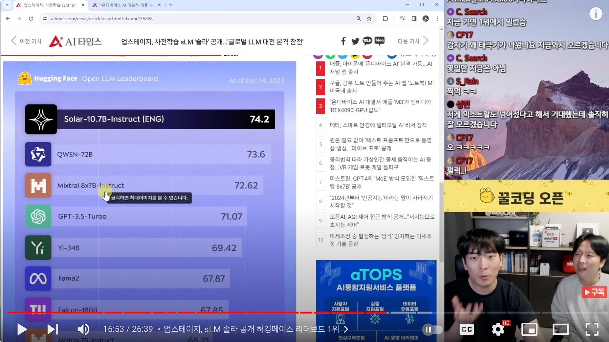
**이미지 캡션:** 화면 왼쪽에는 AI 모델들의 성능 순위를 보여주는 웹페이지가 열려 있으며, 'Hugging Face Open LLM Leaderboard'라는 제목 아래 'Solar-10.7B-Instruct (ENG)'가 74.2점으로 1위를 차지하고 있고, 그 뒤를 이어 'QWEN-72B', 'Mixtral 8x7B-Instruct', 'GPT-3.5-Turbo', 'Yi-34B', 'llama2', 'Falcon-1808' 등의 모델들이 순서대로 나열되어 있다. 'Mixtral 8x7B-Instruct' 항목 위에는 마우스 커서가 올려져 있으며, "클릭하면 확대 이미지를 볼 수 있습니다."라는 툴팁이 보인다. 웹페이지 상단에는 'AI타임스' 로고와 함께 "업스테이지, 사전학습 sLM '솔라' 공개...'글로벌 LLM 대전 본격 참전'"이라는 기사 제목이 보인다. 화면 오른쪽에는 산악 지형을 배경으로 두 명의 성인 남성이 등장하는 라이브 스트리밍 화면이 보인다. 왼쪽 남성은 검은색 티셔츠를 입고 손짓을 하며 열정적으로 이야기하고 있고, 오른쪽 남성은 흰색 후드티를 입고 약간 놀란 듯한 표정으로 화면을 보고 있다. 화면 하단에는 '꿀코딩 오픈'이라는 문구가 적힌 노란색 배너가 있고, 그 아래에는 'aTOPS AI통합지원서비스 플랫폼'이라는 로고와 함께 다양한 서비스 항목들이 나열되어 있다. 라이브 스트리밍 화면 하단에는 재생, 일시정지, 볼륨 조절 등의 컨트롤 바와 함께 현재 재생 시간 및 영상 제목이 표시되어 있다. 전반적으로 AI 기술 동향에 대한 정보를 공유하고 토론하는 듯한 분위기이다.우스 커서가 올려져 있으며, "클릭하면 확대 이미지를 볼 수 있습니다."라는 툴팁이 보인다. 웹페이지 상단에는 'AI타임스' 로고와 함께 "업스테이지, 사전학습 sLM '솔라' 공개...'글로벌 LLM 대전 본격 참전'"이라는 기사 제목이 보인다. 화면 오른쪽에는 산악 지형을 배경으로 두 명의 성인 남성이 등장하는 라이브 스트리밍 화면이 보인다. 왼쪽 남성은 검은색 티셔츠를 입고 손짓을 하며 열정적으로 이야기하고 있고, 오른쪽 남성은 흰색 후드티를 입고 약간 놀란 듯한 표정으로 화면을 보고 있다. 화면 하단에는 '꿀코딩 오픈'이라는 문구가 적힌 노란색 배너가 있고, 그 아래에는 'aTOPS AI통합지원서비스 플랫폼'이라는 로고와 함께 다양한 서비스 항목들이 나열되어 있다. 라이브 스트리밍 화면 하단에는 재생, 일시정지, 볼륨 조절 등의 컨트롤 바와 함께 현재 재생 시간 및 영상 제목이 표시되어 있다. 전반적으로 AI 기술 동향에 대한 정보를 공유하고 토론하는 듯한 분위기이다.

### 12월 19일 (화) 16:05 · #solarllm 이번 저희가 만들고 공개한 Open LLM 1위 Sol…

#solarllm 이번 저희가 만들고 공개한 Open LLM 1위 Solar 이야기와 이 모델을 베이스로 하여 Fine-tuning 실습 그리고 이에 필요한 이론과 트렌드를 완전 정복하는 강의를 준비했습니다 https://bit.ly/40NbECx

LLM 트랜드를 완전히 꿰고 계시는 조준호님, Ko-LLM 수차례 1등을 하신 한규진님과 함께 열심히 만들어 보았습니다.

12월 19일 기준 OpenLLM 리더보더 top10중 3개는 Solar 10.7B 기반의 모델입니다. Solar 모델을 베이스로 여러분들도 최고 성능의 모델을 파인튜닝해보세요.

강의는 12월 29일 시작됩니다. 선신청 노고민!

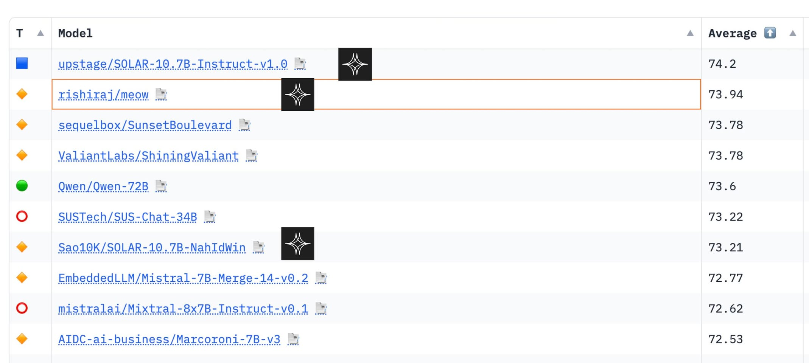
**이미지 캡션:** 이 이미지는 컴퓨터 화면의 일부를 캡처한 것으로, 표 형식의 데이터를 보여줍니다. 표에는 "Model"과 "Average"라는 두 개의 주요 열이 있습니다. "Model" 열에는 다양한 인공지능 모델의 이름이 나열되어 있으며, 각 모델 이름 앞에는 파란색, 주황색, 녹색, 빨간색 등 다양한 색상의 점이 표시되어 있습니다. 일부 모델 이름 옆에는 파일 아이콘이 있습니다. 또한, 일부 행에는 별 모양의 아이콘이 표시되어 있습니다. "Average" 열에는 각 모델의 평균 점수가 숫자로 표시되어 있습니다. 특히 "rishiraj/meow"라는 모델은 주황색 테두리로 강조 표시되어 있으며, 그 평균 점수는 73.94입니다. 표의 배경은 흰색이며, 전체적으로 깔끔하고 정보 전달에 초점을 맞춘 디자인입니다. 이 표는 여러 AI 모델의 성능을 비교하고 순위를 매기는 데 사용되는 것으로 보입니다.rishiraj/meow"라는 모델은 주황색 테두리로 강조 표시되어 있으며, 그 평균 점수는 73.94입니다. 표의 배경은 흰색이며, 전체적으로 깔끔하고 정보 전달에 초점을 맞춘 디자인입니다. 이 표는 여러 AI 모델의 성능을 비교하고 순위를 매기는 데 사용되는 것으로 보입니다.

🎬 동영상 1개 (생략)

### 12월 20일 (수) 19:03 · #감사 #4개의상 올해 많은 분들이 Upstage 응원해주시고 큰 상을 …

#감사 #4개의상 올해 많은 분들이 Upstage 응원해주시고 큰 상을 주셔서 감사합니다. 더 잘하라는 말씀으로 마음에 잘 새겨서 내년에 더 좋은 결과를 만들어보겠습니다.

1. AI코리아 2023 - AI 기술상 수상(최고상 / 과기부 장관상)
2. 제 5회 중소기업 - 스타트업 대상 - 대상 수상(최고상 / 중기부 장관상)
3. 제 1회 인공지능 신뢰성 - 품질 대상 - 우수상 수상
4. 2023 아시아 AI 대상 - 우수 스타트업상 수상(벤처기업협회장상)

너무나 감사합니다.

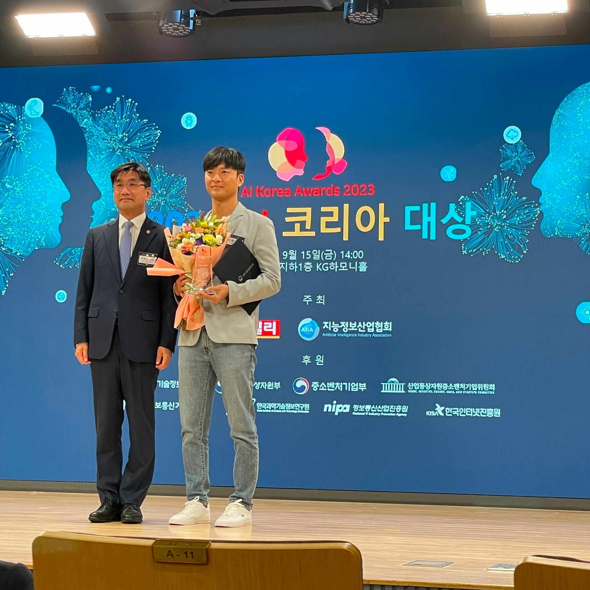
**이미지 캡션:** 행사장에서 두 명의 남성이 시상식을 위해 무대에 서 있다. 왼쪽의 성인 남성은 50대 후반에서 60대 초반으로 보이며, 검은색 정장과 파란색 넥타이를 착용하고 있다. 그는 차분하고 진지한 표정으로 정면을 응시하고 있다. 오른쪽의 젊은 성인 남성은 20대 후반에서 30대 초반으로 보이며, 회색 재킷과 청바지, 흰색 운동화를 신고 있다. 그는 꽃다발과 상패, 그리고 검은색 서류 가방을 들고 있으며, 약간의 미소를 띠고 있다. 배경에는 "AI Korea Awards 2023 코리아 대상"이라는 문구와 함께 인공지능을 상징하는 푸른색 디자인이 그려진 대형 스크린이 보인다. 스크린에는 행사 날짜와 장소, 주최 및 후원 기관들의 로고와 이름이 한국어로 표시되어 있다. 전반적으로 시상식의 분위기를 나타내는 공식적이고 축하하는 느낌을 준다.을 상징하는 푸른색 디자인이 그려진 대형 스크린이 보인다. 스크린에는 행사 날짜와 장소, 주최 및 후원 기관들의 로고와 이름이 한국어로 표시되어 있다. 전반적으로 시상식의 분위기를 나타내는 공식적이고 축하하는 느낌을 준다.
 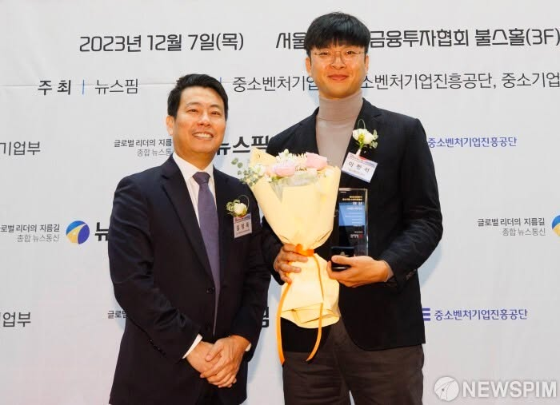
**이미지 캡션:** 행사장에서 두 명의 성인 남성이 포즈를 취하고 있다. 왼쪽 남성은 40대 후반에서 50대 초반으로 보이며, 검은색 정장에 보라색 넥타이를 매고 있다. 그는 밝게 웃으며 카메라를 응시하고 있으며, 가슴에는 이름표와 꽃 장식이 달려 있다. 오른쪽 남성은 30대 후반에서 40대 초반으로 보이며, 검은색 재킷 안에 베이지색 터틀넥을 입고 있다. 그는 안경을 쓰고 있으며, 한 손에는 꽃다발을, 다른 한 손에는 상패를 들고 있다. 그의 표정은 차분하며, 카메라를 향해 살짝 미소 짓고 있다. 배경에는 "2023년 12월 7일(목)", "서울 금융투자협회 불스홀(3F)", "주최 뉴스핌", "중소벤처기업진흥공단" 등의 글자가 적힌 현수막이 걸려 있다. 또한 "글로벌 리더의 지름길 종합 뉴스통신"이라는 문구와 뉴스핌 로고도 보인다. 전반적으로 시상식이나 기념행사의 분위기를 띠고 있으며, 두 남성은 수상자 또는 행사 관계자로 보인다.7일(목)", "서울 금융투자협회 불스홀(3F)", "주최 뉴스핌", "중소벤처기업진흥공단" 등의 글자가 적힌 현수막이 걸려 있다. 또한 "글로벌 리더의 지름길 종합 뉴스통신"이라는 문구와 뉴스핌 로고도 보인다. 전반적으로 시상식이나 기념행사의 분위기를 띠고 있으며, 두 남성은 수상자 또는 행사 관계자로 보인다.
 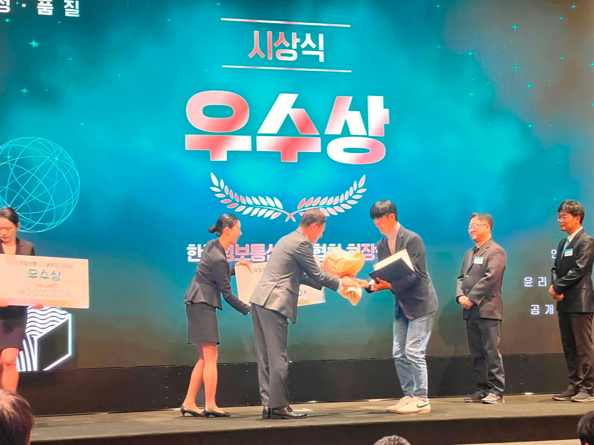
**이미지 캡션:** 이 사진은 시상식 장면을 담고 있으며, 무대 위에서 여러 사람이 상을 수여하고 받는 모습이 보인다. 중앙에는 젊은 성인 남성이 검은색 재킷과 청바지를 입고 꽃다발과 상장을 받고 있으며, 그의 표정은 약간 긴장되면서도 기쁜 듯하다. 그 옆에는 중년의 성인 남성이 검은색 정장을 입고 미소를 지으며 서 있고, 또 다른 중년의 성인 남성은 검은색 정장에 파란색 명찰을 달고 서 있다. 왼쪽에는 검은색 정장을 입은 젊은 성인 여성이 상장으로 보이는 것을 들고 있으며, 그녀는 진지한 표정으로 무대를 바라보고 있다. 배경에는 "시상식"과 "우수상"이라는 큰 글자가 푸른색 조명과 함께 빛나고 있으며, 왼쪽에는 지구본 모양의 그래픽이 보인다. 무대 바닥에는 여러 개의 조명이 설치되어 있고, 관객으로 보이는 사람들의 머리가 사진 하단에 일부 보인다. 전체적으로 행사의 중요성과 축하 분위기를 느낄 수 있다.는 "시상식"과 "우수상"이라는 큰 글자가 푸른색 조명과 함께 빛나고 있으며, 왼쪽에는 지구본 모양의 그래픽이 보인다. 무대 바닥에는 여러 개의 조명이 설치되어 있고, 관객으로 보이는 사람들의 머리가 사진 하단에 일부 보인다. 전체적으로 행사의 중요성과 축하 분위기를 느낄 수 있다.
 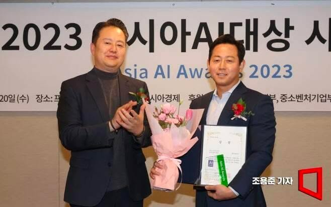
**이미지 캡션:** 두 명의 성인 남성이 시상식 배경 앞에서 포즈를 취하고 있으며, 왼쪽 남성은 40대 초반으로 보이며 검은색 재킷과 회색 터틀넥을 입고 있으며, 오른쪽 남성은 30대 후반으로 보이며 네이비색 정장을 입고 있습니다. 왼쪽 남성은 꽃다발을 들고 있고, 오른쪽 남성은 상장과 꽃다발을 들고 있습니다. 두 사람 모두 미소를 짓고 있으며, 배경에는 "2023 아시아 AI 대상"이라는 글자가 쓰여 있습니다. 전반적으로 축하와 성취의 분위기입니다.

### 12월 20일 (수) 20:37 · #solarllm #phi #mixtral 우왕! MS의 phi, mis…

#solarllm #phi #mixtral 우왕! MS의 phi, mistral의 Mixtral과 함께 Upstage의 solar가 이번주 trending models로 선정 되었습니다. 여러분들의 사용과 응원 덕분입니다. 

https://huggingface.co/upstage/SOLAR-10.7B-Instruct-v1.0

더 많이 사용해주시고 의견 부탁드립니다.

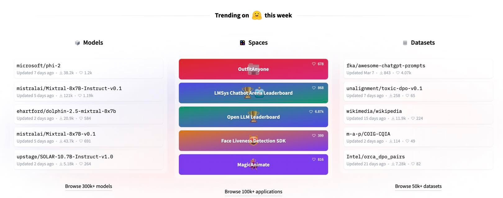
**이미지 캡션:** 이 이미지는 웹사이트의 일부로, "Trending on this week"라는 문구와 함께 세 가지 주요 섹션인 "Models", "Spaces", "Datasets"를 보여줍니다. 각 섹션에는 인기 있는 항목들이 나열되어 있으며, 업데이트 날짜, 다운로드 수, 좋아요 수가 함께 표시됩니다. "Models" 섹션에는 "microsoft/phi-2", "mistralai/Mixtral-8x7B-Instruct-v0.1" 등이 있으며, "Spaces" 섹션에는 "OutfitAnyone", "LMSys Chatbot Arena Leaderboard", "Open LLM Leaderboard", "Face Liveness Detection SDK", "MagicAnimate" 등이 있습니다. "Datasets" 섹션에는 "fka/awesome-chatgpt-prompts", "unalignment/toxic-dpo-v0.1", "wikimedia/wikipedia" 등이 포함되어 있습니다. 각 섹션 하단에는 해당 섹션의 항목을 더 찾아볼 수 있는 "Browse" 버튼이 있습니다. 전체적으로 깔끔하고 현대적인 디자인이며, 정보 전달에 초점을 맞춘 인터페이스입니다.t Arena Leaderboard", "Open LLM Leaderboard", "Face Liveness Detection SDK", "MagicAnimate" 등이 있습니다. "Datasets" 섹션에는 "fka/awesome-chatgpt-prompts", "unalignment/toxic-dpo-v0.1", "wikimedia/wikipedia" 등이 포함되어 있습니다. 각 섹션 하단에는 해당 섹션의 항목을 더 찾아볼 수 있는 "Browse" 버튼이 있습니다. 전체적으로 깔끔하고 현대적인 디자인이며, 정보 전달에 초점을 맞춘 인터페이스입니다.

### 12월 21일 (목) 11:31 · #solarllm #업업업 이제 글로벌 chat업체들도 Upstage S…

#solarllm #업업업 이제 글로벌 chat업체들도 Upstage Solar 모델을 기본으로 탑재 하기 시작했습니다. (심지어 리스팅 순서로 4번째!) 

너무 멋지고 기쁜 일입니다. 

https://www.snack.tools/

**이미지 캡션:** 어두운 배경에 "snack" 로고와 "Sign in" 버튼이 상단에 보이며, 중앙에는 "Ask multi-LLMs at once"라는 큰 제목과 함께 "Stop the search for multiple chatbots. Get all your answers in one go with Snack."라는 설명 문구가 있다. 그 아래에는 "Try for Free"라고 적힌 흰색 버튼이 있다. 버튼 아래에는 여러 LLM(대규모 언어 모델)의 이름들이 아이콘과 함께 나열되어 있는데, "Gemini Pro", "GPT-4 Turbo", "Mixtral 8X7B", "Upstage SOLAR", "PaLM 2" 등이 보인다. 이 중 "Upstage SOLAR"는 보라색 타원으로 강조되어 있다. 화면 하단에는 입력창으로 보이는 부분이 일부 보이며, 우측 하단에는 빨간색 원형 아이콘이 있다. 전반적으로 깔끔하고 현대적인 디자인의 웹사이트 또는 앱 화면으로, 여러 AI 챗봇을 한 번에 사용할 수 있는 서비스의 랜딩 페이지로 보인다.-4 Turbo", "Mixtral 8X7B", "Upstage SOLAR", "PaLM 2" 등이 보인다. 이 중 "Upstage SOLAR"는 보라색 타원으로 강조되어 있다. 화면 하단에는 입력창으로 보이는 부분이 일부 보이며, 우측 하단에는 빨간색 원형 아이콘이 있다. 전반적으로 깔끔하고 현대적인 디자인의 웹사이트 또는 앱 화면으로, 여러 AI 챗봇을 한 번에 사용할 수 있는 서비스의 랜딩 페이지로 보인다.

### 12월 21일 (목) 19:41 · #solarllm #🌞 허깅페이스 OpenLLM 1위가 바뀌었는데 더 기…

#solarllm #🌞 허깅페이스 OpenLLM 1위가 바뀌었는데 더 기쁩니다. Upstage Solar 모델 기반을 독일어 데이터를 더 부어 파인튜닝한 모델이 1등을 했기 때문입니다. 🎉

https://huggingface.co/VAGOsolutions/SauerkrautLM-SOLAR-Instruct

이제 1, 2, 3, 그리고 8등 모델은 Solar 기반의 모델입니다. 더 똑똑한 LLM을 만들기 위해선 Solar를 기반으로 사용해야 하는 시대가 오고 있습니다. 🌞

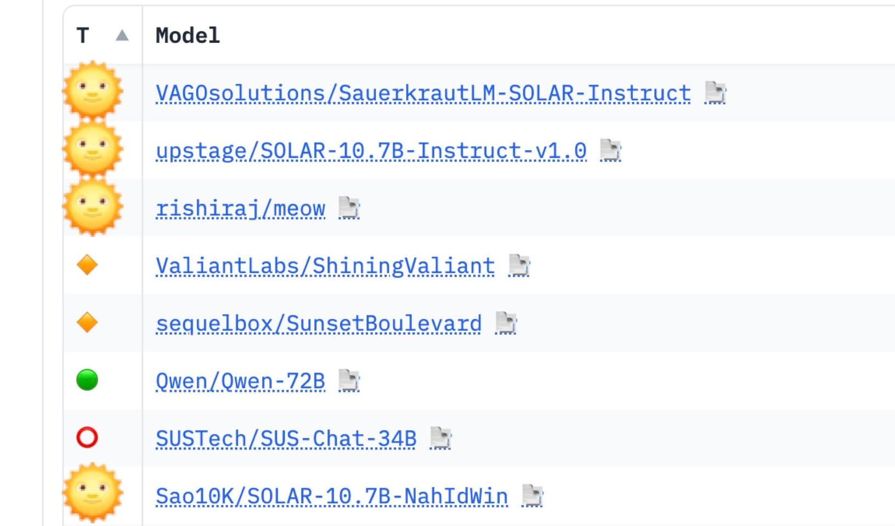
**이미지 캡션:** 이 이미지는 컴퓨터 화면의 일부를 확대한 것으로, 여러 개의 행으로 구성된 목록을 보여줍니다. 각 행에는 왼쪽에 아이콘이 있고 오른쪽에 텍스트가 있습니다. 왼쪽의 아이콘은 태양 모양, 다이아몬드 모양, 녹색 원, 빨간색 원으로 다양합니다. 오른쪽의 텍스트는 주로 슬래시로 구분된 두 개의 단어로 이루어져 있으며, 이는 모델 이름이나 사용자 이름과 모델 이름을 나타내는 것으로 보입니다. 예를 들어, "VAGOsolutions/SauerkrautLM-SOLAR-Instruct", "upstage/SOLAR-10.7B-Instruct-v1.0", "rishiraj/meow", "ValiantLabs/ShiningValiant", "sequelbox/Sunset Boulevard", "Qwen/Qwen-72B", "SUSTech/SUS-Chat-34B", "Sao10K/SOLAR-10.7B-NahIdWin" 등이 보입니다. 각 텍스트 항목 옆에는 작은 파일 아이콘이 있습니다. 배경은 흰색이며, 전체적으로 깔끔하고 정보 중심적인 분위기를 풍깁니다. 이 목록은 인공지능 모델이나 소프트웨어 관련 정보를 표시하는 인터페이스의 일부일 가능성이 높습니다.B-Instruct-v1.0", "rishiraj/meow", "ValiantLabs/ShiningValiant", "sequelbox/Sunset Boulevard", "Qwen/Qwen-72B", "SUSTech/SUS-Chat-34B", "Sao10K/SOLAR-10.7B-NahIdWin" 등이 보입니다. 각 텍스트 항목 옆에는 작은 파일 아이콘이 있습니다. 배경은 흰색이며, 전체적으로 깔끔하고 정보 중심적인 분위기를 풍깁니다. 이 목록은 인공지능 모델이나 소프트웨어 관련 정보를 표시하는 인터페이스의 일부일 가능성이 높습니다.
 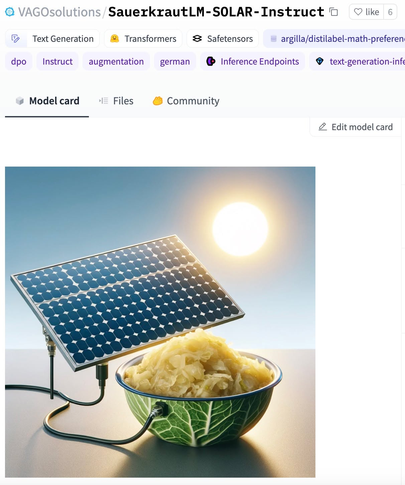
**이미지 캡션:** 화면 상단에는 VAGOsolutions라는 로고와 함께 "SauerkrautLM-SOLAR-Instruct"라는 제목이 보이며, 그 옆에는 복사 아이콘과 "like 6"이라는 좋아요 표시가 있습니다. 그 아래에는 "Text Generation", "Transformers", "Safetensors", "argilla/distilabel-math-preferen", "dpo", "Instruct", "augmentation", "german", "Inference Endpoints", "text-generation-infe"와 같은 여러 태그들이 나열되어 있습니다. 이 태그들은 해당 모델의 기능이나 관련 기술을 나타내는 것으로 보입니다. 그 아래에는 "Model card", "Files", "Community"라는 탭이 있으며, 현재 "Model card"가 선택되어 있습니다. 오른편에는 "Edit model card"라는 버튼이 있습니다. 이미지의 중앙에는 밝은 태양을 배경으로 태양광 패널과 양배추가 담긴 그릇이 놓여 있습니다. 태양광 패널은 금속 지지대에 고정되어 있으며, 전선이 연결되어 있습니다. 패널 아래에는 잎맥이 그려진 초록색 그릇이 놓여 있고, 그 안에는 잘게 썰린 양배추가 가득 담겨 있습니다. 그릇에도 전선이 연결되어 있어 태양광 패널과 연결된 것처럼 보입니다. 전체적으로 밝고 긍정적인 분위기이며, 태양광 에너지를 활용하여 양배추를 가공하는 듯한 독특한 장면을 연출하고 있습니다. 배경은 맑고 푸른 하늘이며, 태양은 밝게 빛나고 있습니다.on-infe"와 같은 여러 태그들이 나열되어 있습니다. 이 태그들은 해당 모델의 기능이나 관련 기술을 나타내는 것으로 보입니다. 그 아래에는 "Model card", "Files", "Community"라는 탭이 있으며, 현재 "Model card"가 선택되어 있습니다. 오른편에는 "Edit model card"라는 버튼이 있습니다. 이미지의 중앙에는 밝은 태양을 배경으로 태양광 패널과 양배추가 담긴 그릇이 놓여 있습니다. 태양광 패널은 금속 지지대에 고정되어 있으며, 전선이 연결되어 있습니다. 패널 아래에는 잎맥이 그려진 초록색 그릇이 놓여 있고, 그 안에는 잘게 썰린 양배추가 가득 담겨 있습니다. 그릇에도 전선이 연결되어 있어 태양광 패널과 연결된 것처럼 보입니다. 전체적으로 밝고 긍정적인 분위기이며, 태양광 에너지를 활용하여 양배추를 가공하는 듯한 독특한 장면을 연출하고 있습니다. 배경은 맑고 푸른 하늘이며, 태양은 밝게 빛나고 있습니다.

### 12월 22일 (금) 03:03 · 📷 사진 (1장)

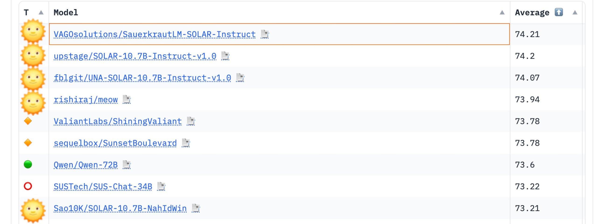
**이미지 캡션:** 이 이미지는 컴퓨터 화면의 일부를 캡처한 것으로, 표 형식으로 여러 모델의 성능을 나열하고 있습니다. 표의 왼쪽에는 각 모델을 나타내는 이모티콘과 함께 'T'라는 열이 있고, 그 옆에는 'Model'이라는 열이 있어 각 모델의 이름이 표시됩니다. 모델 이름 옆에는 파일 아이콘이 있습니다. 'Model' 열의 오른편에는 'Average'라는 열이 있으며, 각 모델의 평균 점수가 숫자로 표시됩니다. 표의 배경은 흰색이며, 각 행은 옅은 회색으로 구분되어 있습니다. 상단에는 'T', 'Model', 'Average'라는 헤더가 보입니다. 이모티콘은 대부분 웃는 태양 모양이며, 일부는 다이아몬드 모양과 녹색 원, 빨간색 원으로 되어 있습니다. 표에는 총 9개의 모델이 나열되어 있으며, 각 모델의 평균 점수는 73.21에서 74.21 사이입니다. 이 이미지는 모델 성능 비교 또는 벤치마킹 결과를 보여주는 것으로 보입니다.'라는 헤더가 보입니다. 이모티콘은 대부분 웃는 태양 모양이며, 일부는 다이아몬드 모양과 녹색 원, 빨간색 원으로 되어 있습니다. 표에는 총 9개의 모델이 나열되어 있으며, 각 모델의 평균 점수는 73.21에서 74.21 사이입니다. 이 이미지는 모델 성능 비교 또는 벤치마킹 결과를 보여주는 것으로 보입니다.

### 12월 24일 (일) 10:08 · like it!

like it!

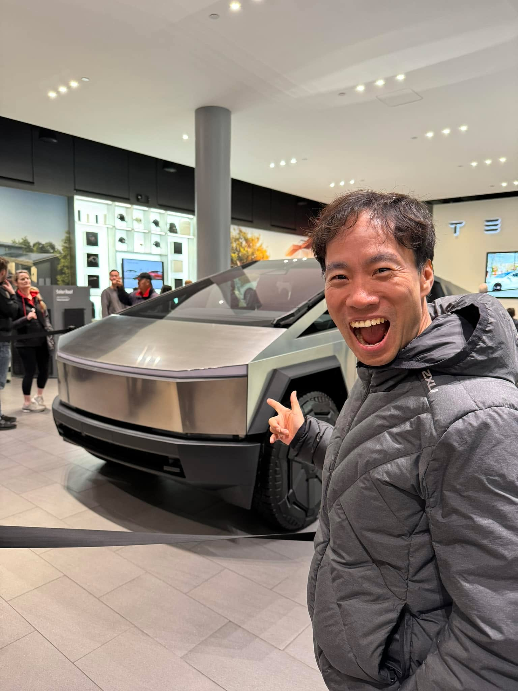
**이미지 캡션:** 한 성인 남성이 테슬라 매장으로 보이는 실내에서 사이버트럭 앞에서 포즈를 취하고 있다. 남성은 30대 후반에서 40대 초반으로 보이며, 짧은 검은색 머리에 활짝 웃으며 카메라를 응시하고 있다. 그는 회색 패딩 점퍼를 입고 있으며, 점퍼에는 "2XU"라는 로고가 보인다. 남성은 왼손으로 사이버트럭을 가리키며, 오른손으로는 브이(V)자를 그리고 있다. 배경에는 은색의 독특한 디자인을 가진 테슬라 사이버트럭이 전시되어 있으며, 그 뒤로는 테슬라 로고와 함께 다양한 제품들이 진열된 벽면이 보인다. 매장 바닥은 타일로 되어 있고, 사이버트럭 앞에는 검은색 안전 라인이 설치되어 있다. 전체적으로 밝고 활기찬 분위기이며, 남성의 표정에서 사이버트럭에 대한 흥미와 즐거움을 느낄 수 있다. 되어 있고, 사이버트럭 앞에는 검은색 안전 라인이 설치되어 있다. 전체적으로 밝고 활기찬 분위기이며, 남성의 표정에서 사이버트럭에 대한 흥미와 즐거움을 느낄 수 있다.

### 12월 24일 (일) 19:59 · #solarllm 벤치마킹 점수도 중요하지만, 가장 중요한 것은 사용자들…

#solarllm 벤치마킹 점수도 중요하지만, 가장 중요한 것은 사용자들의 평가입니다. 

https://chat.lmsys.org/ 를 통해 여러모델을 사용자들이 직접 비교 평가하는 사이트에서  "솔라 10.7B와 스탈링-LM-7B가 LMSYS 아레나 오픈 모델 부문 상위 순위에 올랐습니다. (Solar번역)"

"Solar 10.7B and Sarling-LM-7B take top spots on LMSYS arena Elo for open models."

평가를 받았습니다. 

너무나 감사한 일입니다. 이번에 공개한 모델은 멀티턴이 아닌 싱클 QA모델여서 곧 공개될 멀티턴 chat 모델은 더 높은 평가를 받을 것으로 기대 됩니다. 

https://chat.lmsys.org/ 에서 Solar모델과 다른 모델들 한번씩 비교 부탁드립니다.

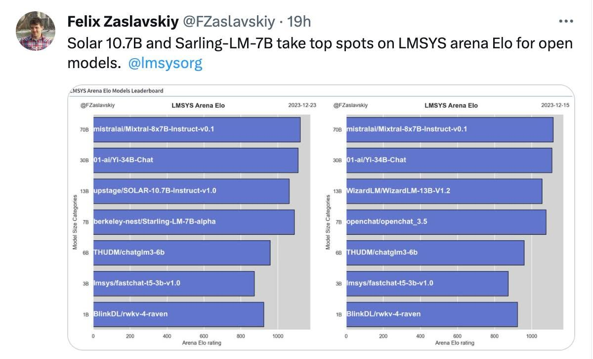
**이미지 캡션:** 이 사진은 Felix Zaslavskiy라는 이름의 성인 남성이 올린 트윗으로, 두 개의 막대 그래프를 보여준다. 남성은 옅은 갈색 머리에 체크무늬 셔츠를 입고 있으며, 사진 속에서는 정면을 응시하고 있다. 배경은 흰색이며, 트윗 내용은 "Solar 10.7B and Sarling-LM-7B take top spots on LMSYS arena Elo for open models. @lmsysorg"라고 적혀 있다. 두 개의 막대 그래프는 각각 2023년 12월 23일과 2023년 12월 15일의 LMSYS Arena Elo 모델 리더보드를 나타낸다. 그래프의 세로축에는 모델 크기 범주가, 가로축에는 Arena Elo rating이 표시되어 있으며, 여러 AI 모델들의 순위를 보여준다. 전반적으로 기술적인 정보를 공유하는 차분하고 정보 전달적인 분위기이다.Arena Elo 모델 리더보드를 나타낸다. 그래프의 세로축에는 모델 크기 범주가, 가로축에는 Arena Elo rating이 표시되어 있으며, 여러 AI 모델들의 순위를 보여준다. 전반적으로 기술적인 정보를 공유하는 차분하고 정보 전달적인 분위기이다.

### 12월 26일 (화) 10:14 · #morewithless #solarllm 어렵지만 작은 자원으로 작은 …

#morewithless #solarllm 어렵지만 작은 자원으로 작은 틈새를 파고드는 Upstage 응원해 주셔서 정말 감사합니다. 앞으로 이 SLM 분야에서 세계적인 1등을 목표로 더욱 노력하겠습니다.

또한, 12월 26일 기준으로 허깅페이스 공식 오픈 LLM 리더보드 상위 10개 중 9개가 Upstage Solar 기반 모델입니다 (3번째 이미지). 많은 분들이 Solar를 사용하고 사랑해주시는 모습이 보이고 있습니다.

저희는 오픈된 모델보다 더 뛰어난 성능을 가진 Solar Mini API를 곧 출시할 예정이니 많은 기대 부탁드립니다. 😊

(이글은 Solar로 작성되었습니다.)

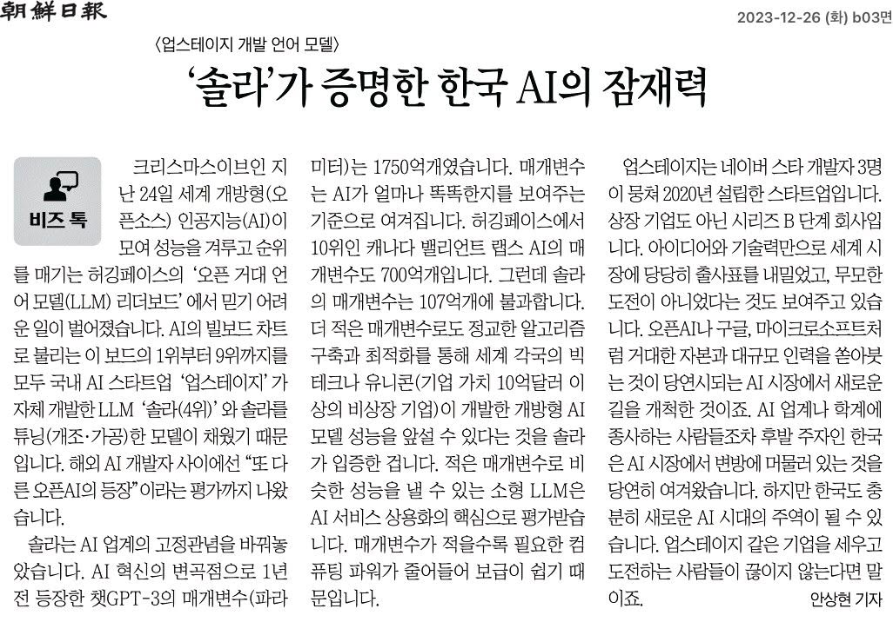
**이미지 캡션:** 이 기사는 '솔라'라는 한국 AI 언어 모델이 세계적인 AI 성능 평가에서 뛰어난 성과를 거두며 한국 AI 기술의 잠재력을 증명했다는 내용을 담고 있습니다. 기사에는 '비즈톡'이라는 섹션 제목과 함께, 2023년 12월 26일자 신문임을 나타내는 날짜 정보가 있습니다. 사진 속 인물은 명확히 보이지 않지만, 기사 내용은 한국 AI 스타트업 '업스테이지'가 개발한 '솔라'라는 언어 모델이 허깅페이스의 '오픈 거대 언어 모델(LLM) 리더보드'에서 1위부터 9위까지 석권했다는 사실을 전하고 있습니다. 이는 적은 매개변수로도 뛰어난 성능을 보여주며, AI 서비스 상용화의 가능성을 높였다는 점에서 주목받고 있습니다. 업스테이지는 네이버 출신 개발자들이 설립한 스타트업으로, 대규모 자본 없이도 혁신적인 기술력으로 AI 시장에 도전하고 있음을 강조합니다. 전반적으로 한국 AI 기술의 가능성과 자부심을 고취하는 긍정적이고 희망적인 분위기를 전달하고 있습니다.매개변수로도 뛰어난 성능을 보여주며, AI 서비스 상용화의 가능성을 높였다는 점에서 주목받고 있습니다. 업스테이지는 네이버 출신 개발자들이 설립한 스타트업으로, 대규모 자본 없이도 혁신적인 기술력으로 AI 시장에 도전하고 있음을 강조합니다. 전반적으로 한국 AI 기술의 가능성과 자부심을 고취하는 긍정적이고 희망적인 분위기를 전달하고 있습니다.
 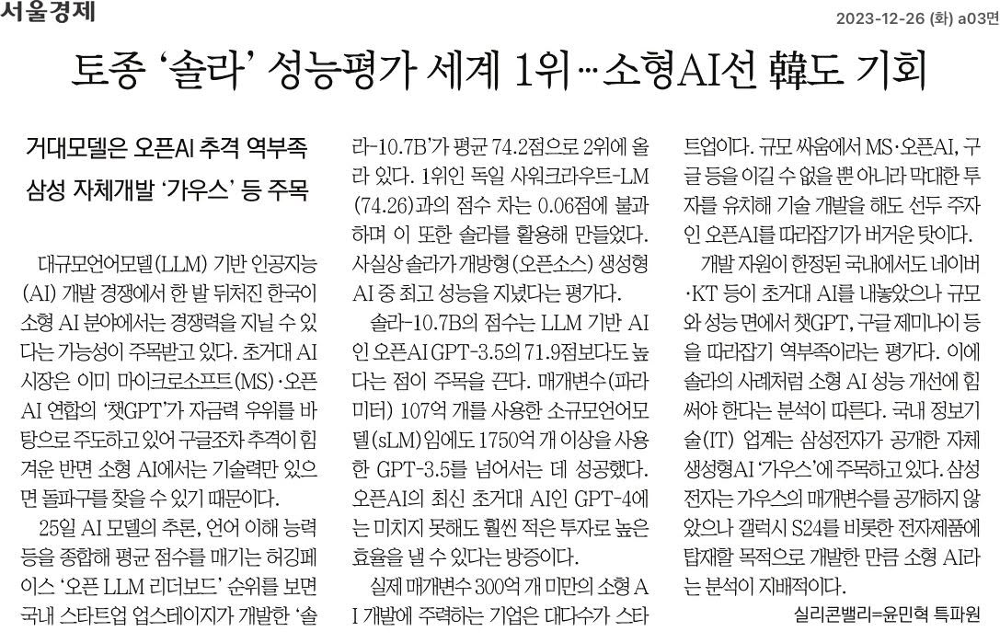
**이미지 캡션:** 서울경제 신문 기사로, 2023년 12월 26일자 발행된 내용이다. 제목은 "토종 '솔라' 성능평가 세계 1위…소형 AI선 韓도 기회"이며, 부제목은 "거대모델은 오픈AI 추격 역부족, 삼성 자체개발 '가우스' 등 주목"이다. 기사는 한국의 인공지능(AI) 기술, 특히 소형 AI 분야에서의 경쟁력과 가능성에 대해 다루고 있다. 기사의 주요 내용은 다음과 같다. *   **소형 AI의 부상**: 한국이 초거대 AI 시장에서는 마이크로소프트(MS)·오픈AI 연합의 '챗GPT'에 밀려 경쟁력이 뒤처지고 있지만, 소형 AI 분야에서는 기술력으로 돌파구를 찾을 수 있다는 가능성이 주목받고 있다. *   **'솔라-10.7B'의 성과**: 국내 스타트업 업스테이지가 개발한 소형 AI 모델 '솔라-10.7B'가 허깅페이스 '오픈 LLM 리더보드'에서 평균 74.2점으로 2위를 차지했다. 이는 1위인 독일 사워크라우트-LM과의 점수 차가 0.06점에 불과하며, 사실상 오픈소스 생성형 AI 중 최고 성능을 지녔다는 평가다. 또한, 오픈AI의 GPT-3.5(71.9점)보다 높은 점수를 기록하며, 훨씬 적은 매개변수(107억 개)로 GPT-3.5를 넘어선 성과를 보였다. *   **국내 기업의 전략**: 규모 싸움에서 거대 AI 기업들을 이기기 어려운 국내 기업들은 소형 AI 개발에 주력하는 경향이 있다. 네이버, KT 등은 초거대 AI를 선보였지만 경쟁력이 부족하다는 평가를 받고 있으며, 이에 따라 소형 AI 성능 개선에 힘써야 한다는 분석이 나온다. *   **삼성전자의 '가우스'**: 삼성전자가 공개한 자체 생성형 AI '가우스' 역시 주목받고 있다. 매개변수는 공개되지 않았으나, 갤럭시 S24 등 전자제품에 탑재될 것으로 예상되어 소형 AI로 분석되고 있다. 전반적으로 기사는 한국이 초거대 AI 시장에서는 어려움을 겪고 있지만, 소형 AI 분야에서 '솔라'와 같은 성공 사례를 바탕으로 새로운 기회를 모색할 수 있음을 시사하고 있다. 또한, 삼성전자의 '가우스' 역시 이러한 흐름 속에서 중요한 역할을 할 것으로 전망하고 있다. 기사는 신문 지면의 일부로, 텍스트 위주의 내용이며 별도의 이미지나 삽화형 AI 분야에서는 기술력으로 돌파구를 찾을 수 있다는 가능성이 주목받고 있다. *   **'솔라-10.7B'의 성과**: 국내 스타트업 업스테이지가 개발한 소형 AI 모델 '솔라-10.7B'가 허깅페이스 '오픈 LLM 리더보드'에서 평균 74.2점으로 2위를 차지했다. 이는 1위인 독일 사워크라우트-LM과의 점수 차가 0.06점에 불과하며, 사실상 오픈소스 생성형 AI 중 최고 성능을 지녔다는 평가다. 또한, 오픈AI의 GPT-3.5(71.9점)보다 높은 점수를 기록하며, 훨씬 적은 매개변수(107억 개)로 GPT-3.5를 넘어선 성과를 보였다. *   **국내 기업의 전략**: 규모 싸움에서 거대 AI 기업들을 이기기 어려운 국내 기업들은 소형 AI 개발에 주력하는 경향이 있다. 네이버, KT 등은 초거대 AI를 선보였지만 경쟁력이 부족하다는 평가를 받고 있으며, 이에 따라 소형 AI 성능 개선에 힘써야 한다는 분석이 나온다. *   **삼성전자의 '가우스'**: 삼성전자가 공개한 자체 생성형 AI '가우스' 역시 주목받고 있다. 매개변수는 공개되지 않았으나, 갤럭시 S24 등 전자제품에 탑재될 것으로 예상되어 소형 AI로 분석되고 있다. 전반적으로 기사는 한국이 초거대 AI 시장에서는 어려움을 겪고 있지만, 소형 AI 분야에서 '솔라'와 같은 성공 사례를 바탕으로 새로운 기회를 모색할 수 있음을 시사하고 있다. 또한, 삼성전자의 '가우스' 역시 이러한 흐름 속에서 중요한 역할을 할 것으로 전망하고 있다. 기사는 신문 지면의 일부로, 텍스트 위주의 내용이며 별도의 이미지나 삽화
 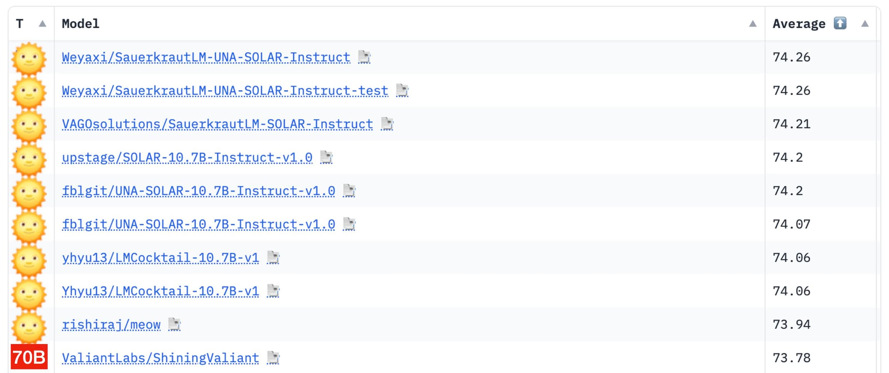
**이미지 캡션:** 이 이미지는 컴퓨터 모델의 성능을 비교하는 표를 보여줍니다. 표에는 "Model"과 "Average"라는 두 개의 열이 있으며, 각 행은 특정 모델의 이름과 해당 모델의 평균 점수를 나타냅니다. "Model" 열에는 "Weyaxi/SauerkrautLM-UNA-SOLAR-Instruct", "VAGOsolutions/SauerkrautLM-SOLAR-Instruct", "upstage/SOLAR-10.7B-Instruct-v1.0", "fblgit/UNA-SOLAR-10.7B-Instruct-v1.0", "yhyu13/LMCocktail-10.7B-v1", "Yhyu13/LMCocktail-10.7B-v1", "rishiraj/meow", "ValiantLabs/ShiningValiant"와 같은 다양한 모델 이름이 나열되어 있습니다. 각 모델 이름 옆에는 문서 아이콘이 있어 추가 정보가 있음을 나타냅니다. "Average" 열에는 74.26부터 73.78까지의 숫자가 표시되어 있으며, 이는 각 모델의 평균 성능 점수를 나타냅니다. 표의 왼쪽에는 태양 이모티콘이 여러 개 있으며, 이는 모델의 순위나 상태를 나타내는 것으로 보입니다. 마지막 행에는 "70B"라는 텍스트가 빨간색 배경에 표시되어 있으며, 이는 모델의 크기나 다른 분류를 나타낼 수 있습니다. 전반적으로 이 이미지는 다양한 AI 모델의 성능을 평가하고 비교하는 데 사용되는 데이터 시각화의 일부입니다.hyu13/LMCocktail-10.7B-v1", "Yhyu13/LMCocktail-10.7B-v1", "rishiraj/meow", "ValiantLabs/ShiningValiant"와 같은 다양한 모델 이름이 나열되어 있습니다. 각 모델 이름 옆에는 문서 아이콘이 있어 추가 정보가 있음을 나타냅니다. "Average" 열에는 74.26부터 73.78까지의 숫자가 표시되어 있으며, 이는 각 모델의 평균 성능 점수를 나타냅니다. 표의 왼쪽에는 태양 이모티콘이 여러 개 있으며, 이는 모델의 순위나 상태를 나타내는 것으로 보입니다. 마지막 행에는 "70B"라는 텍스트가 빨간색 배경에 표시되어 있으며, 이는 모델의 크기나 다른 분류를 나타낼 수 있습니다. 전반적으로 이 이미지는 다양한 AI 모델의 성능을 평가하고 비교하는 데 사용되는 데이터 시각화의 일부입니다.

### 12월 27일 (수) 12:11 · #solarllm #techreport 요즈음 업업업 하는 Solar 모…

#solarllm #techreport 요즈음 업업업 하는 Solar 모델의 tech report공개 합니다. 

https://x.com/hunkims/status/1739842542596927882?s=20

✅ 깊이 확장(DUS)은 LLM을 효율적으로 확장하는 새로운 기술이며, 이를 이용하여 우수한 성능을 보이는 SOLAR 10.7B이 구축되었습니다. 
✅ 이 모델은 Apache 2.0 라이선스로 공개되어 있으며, LLM 분야에서 널리 활용될 수 있습니다.

긴요약: 깊이 확장(DUS)은 간단하면서도 효율적으로 기본 LLM을 확장하는 새로운 기술입니다. 혼합 전문가(MoE)와 달리, DUS는 훈련 및 추론에 복잡한 변경이 필요하지 않습니다. 

DUS를 사용하여 107억 개의 매개변수를 갖는 대규모 언어 모델(LLM)인 SOLAR 10.7B을 구축하였으며, 다양한 자연어 처리(NLP) 작업에서 우수한 성능을 보입니다. 비교 평가 결과, SOLAR 10.7B은 Llama 2 및 Mistral 7B와 같은 기존 오픈 소스 사전 훈련된 LLM보다 우수한 성능을 보입니다. 또한, SOLAR 10.7B-Instruct라는 지시사항 수행 능력을 향상시킨 변형 모델을 제시하며, Mixtral-8x7B를 능가합니다. 

SOLAR 10.7B은 Apache 2.0 라이선스로 공개되어 있으며, LLM 분야에서 광범위한 접근과 응용을 촉진합니다.

위 글과 변역은 Solar로 작성되었습니다. 
(트윗 링크를 달면 FB은 노출을 안한다던데 걱정입니다.)

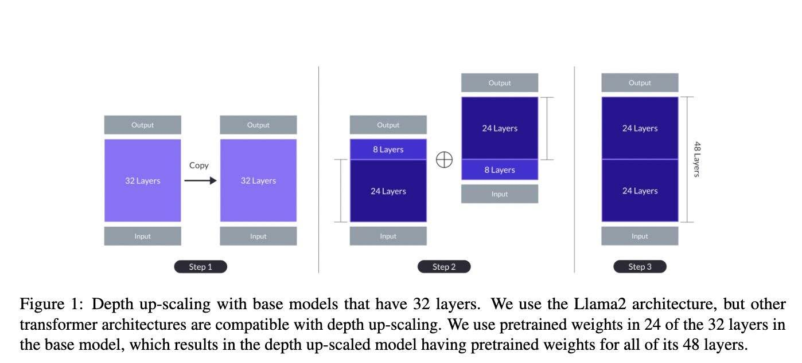
**이미지 캡션:** 이 이미지는 32개 레이어를 가진 기본 모델의 깊이 업스케일링 과정을 시각적으로 보여주는 도표입니다. 왼쪽부터 세 단계로 나뉘어 설명됩니다. 첫 번째 단계(Step 1)에서는 32개의 레이어로 구성된 모델이 복사(Copy)되어 다음 단계로 전달됨을 나타냅니다. 두 번째 단계(Step 2)에서는 32개의 레이어가 8개의 레이어와 24개의 레이어로 분할되고, 이 두 부분이 합쳐지는(⊕ 기호) 과정을 보여줍니다. 세 번째 단계(Step 3)에서는 합쳐진 결과로 24개의 레이어가 두 개 쌓여 총 48개의 레이어를 가진 모델이 완성됨을 나타내며, 우측에 "48 Layers"라고 표시되어 있습니다. 각 단계의 모델은 입력(Input)과 출력(Output)을 나타내는 상자로 구성되어 있으며, 레이어의 수는 각 상자 안에 명시되어 있습니다. 도표 하단에는 "Figure 1: Depth up-scaling with base models that have 32 layers. We use the Llama2 architecture, but other transformer architectures are compatible with depth up-scaling. We use pretrained weights in 24 of the 32 layers in the base model, which results in the depth up-scaled model having pretrained weights for all of its 48 layers."라는 설명이 포함되어 있어, 이 과정이 Llama2 아키텍처를 사용하며 다른 트랜스포머 아키텍처에도 적용 가능하고, 32개 레이어 중 24개 레이어의 사전 학습된 가중치를 사용하여 48개 레이어 전체에 대한 사전 학습된 가중치를 가진 모델을 생성하는 것을 설명합니다. 전체적으로 흰색 배경에 파란색과 보라색 계열의 도형을 사용하여 기술적인 개념을 명확하게 전달하고 있습니다.진 모델이 완성됨을 나타내며, 우측에 "48 Layers"라고 표시되어 있습니다. 각 단계의 모델은 입력(Input)과 출력(Output)을 나타내는 상자로 구성되어 있으며, 레이어의 수는 각 상자 안에 명시되어 있습니다. 도표 하단에는 "Figure 1: Depth up-scaling with base models that have 32 layers. We use the Llama2 architecture, but other transformer architectures are compatible with depth up-scaling. We use pretrained weights in 24 of the 32 layers in the base model, which results in the depth up-scaled model having pretrained weights for all of its 48 layers."라는 설명이 포함되어 있어, 이 과정이 Llama2 아키텍처를 사용하며 다른 트랜스포머 아키텍처에도 적용 가능하고, 32개 레이어 중 24개 레이어의 사전 학습된 가중치를 사용하여 48개 레이어 전체에 대한 사전 학습된 가중치를 가진 모델을 생성하는 것을 설명합니다. 전체적으로 흰색 배경에 파란색과 보라색 계열의 도형을 사용하여 기술적인 개념을 명확하게 전달하고 있습니다.

### 12월 28일 (목) 03:15 · #solarllm #hfdailypaper #upvote Solar LL…

#solarllm #hfdailypaper #upvote Solar LLM의 기술 보고서가 12월 27일 허깅페이스 Daily Paper로 선정되었습니다. https://huggingface.co/papers/2312.15166 허깅페이스 계정이 있으신 분들은 읽어보시고 좋으면 Upvote 부탁드립니다. 읽기 아주 쉽고 재미있는 보고서입니다. 😊

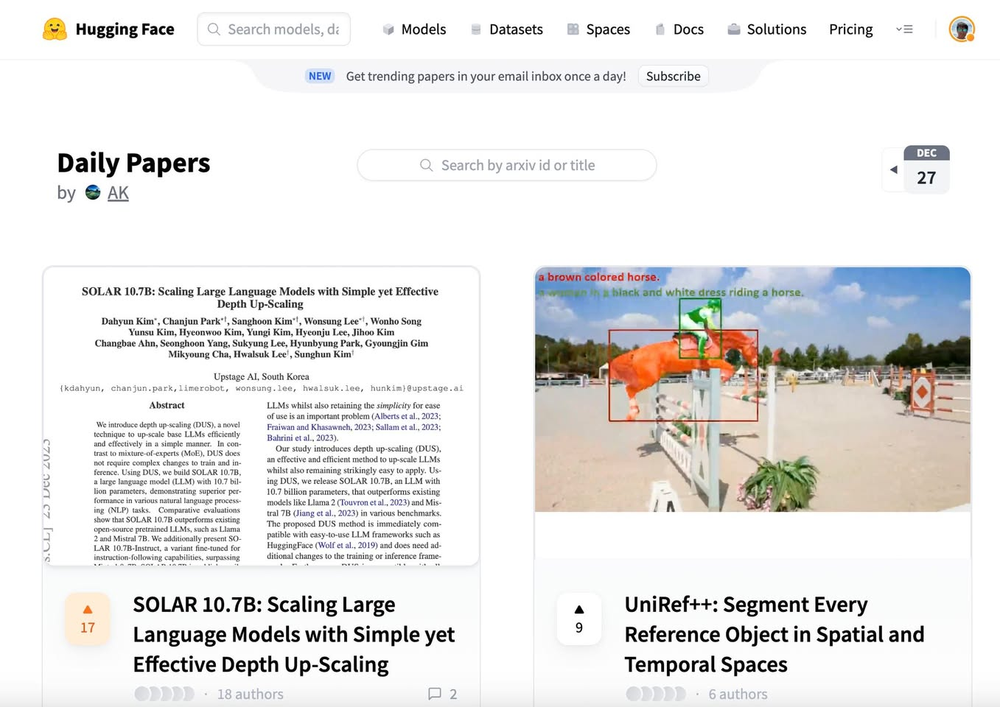
**이미지 캡션:** 화면에는 Hugging Face 웹사이트의 "Daily Papers" 섹션이 표시되며, 여러 논문 요약과 관련 이미지가 나열되어 있습니다. 왼쪽에는 "SOLAR 10.7B: Scaling Large Language Models with Simple yet Effective Depth Up-Scaling"이라는 제목의 논문 요약이 보이며, 저자 정보와 초록이 한국어로 작성되어 있습니다. 이 논문은 LLM(대규모 언어 모델)의 효율적인 업스케일링 기법인 DUS(Depth Up-Scaling)를 소개하고, SOLAR 10.7B라는 모델을 개발하여 기존 모델보다 뛰어난 성능을 보인다고 설명합니다. 오른쪽에는 "a brown colored horse."라는 설명과 함께 말과 기수가 장애물을 넘는 장면을 담은 이미지가 있습니다. 이미지에는 객체 탐지 결과로 보이는 빨간색과 녹색 테두리가 표시되어 있으며, "a woman in a black and white dress riding a horse."라는 추가 설명도 보입니다. 이 이미지 아래에는 "UniRef++: Segment Every Reference Object in Spatial and Temporal Spaces"라는 제목의 또 다른 논문 요약이 있습니다. 전반적으로 학술 논문 발표 및 정보 공유를 위한 웹사이트의 모습이며, 기술적인 내용을 다루고 있습니다.d by Upstage AI in South Korea and has 18 authors. Below this, another section shows the same paper title with a count of 17 and a comment icon with the number 2. To the right, a vibrant image depicts a brown horse jumping over a hurdle in an equestrian event, with a rider in a black and white dress. This image is accompanied by bounding boxes and labels identifying "a brown colored horse" and "a woman in a black and white dress riding a horse." Below this image, a paper titled "UniRef++: Segment Every Reference Object in Spatial and Temporal Spaces" is listed with a count of 9 and 6 authors. The overall atmosphere is informative and professional, typical of a platform for sharing and discovering AI research.

### 12월 30일 (토) 02:02 · #solarllm #써보니좋네 Solar모델을 소개하고 무엇보다 많이 사…

#solarllm #써보니좋네 Solar모델을 소개하고 무엇보다 많이 사용해보고 실제로 어떤지 리뷰해주는 비디오가 나왔습니다.

이분도 벤치마크 성능은 참고만 하고, 실제 사용해보고 usecase 에 적용시켜 보라는 매우 공감가는 말씀 주셨습니다.  

이후 설명에는 모델머지후 학습하는 DUS방법론과, 데이터 오염도 테스트, 베이스버전이 Mistral7B보다 뛰어난점, 모델을 로딩하는 방법.

그리고 가장 멋진 부분이 바로 여기인데요. 약 9분동안 실 사용예들을 보여주고 아쉬운점 그리고 Mixtral보다 더 좋은 결과들을 소개합니다. 

댓글중 하나도 "This is better model but still lacks in reasoning. I tested with GPT 3.5 and GPT 4. It is better than 3.5 and less than GPT 4. May be you have missed 1 point. This model should only used for single turn conversation  . I.e chat bot it is not suitable." 

로 gpt3.5보다는 좋은데 싱글턴이라 아쉽다는 말씀을 주시네요.

저희들은 멀티턴과 더 좋은 성능의 모델을 확보하고 있으며  이는 내년초 API형태로 공개될 예정입니다. 저희의 목표는 gpt4를 뛰어넘어 세계 최고의 LLM 지능이 되는 것입니다.

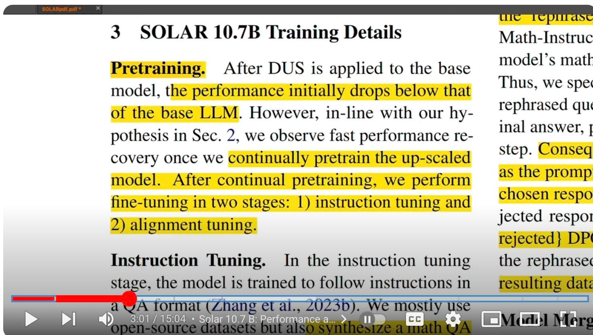
**이미지 캡션:** 이 사진은 컴퓨터 화면의 일부를 캡처한 것으로, 문서의 텍스트 내용이 보입니다. 화면에는 "SOLARpdf.pdf"라는 제목의 PDF 파일이 열려 있으며, 문서의 3번 섹션인 "SOLAR 10.7B Training Details"에 대한 내용이 표시됩니다. 주요 내용은 "Pretraining"과 "Instruction Tuning"에 대한 설명으로, 모델의 성능 향상을 위한 사전 학습 및 미세 조정 과정에 대해 기술하고 있습니다. 텍스트는 노란색 형광펜으로 강조된 부분이 있으며, 이는 중요한 내용을 나타내는 것으로 보입니다. 화면 하단에는 동영상 재생 컨트롤 바가 일부 보이며, 재생 시간, 볼륨 조절, 자막 설정 등의 아이콘이 있습니다. 전반적으로 기술 문서의 내용을 담고 있는 화면으로, 학술적이거나 기술적인 정보를 전달하는 상황으로 추정됩니다.것으로 보입니다. 화면 하단에는 동영상 재생 컨트롤 바가 일부 보이며, 재생 시간, 볼륨 조절, 자막 설정 등의 아이콘이 있습니다. 전반적으로 기술 문서의 내용을 담고 있는 화면으로, 학술적이거나 기술적인 정보를 전달하는 상황으로 추정됩니다.
 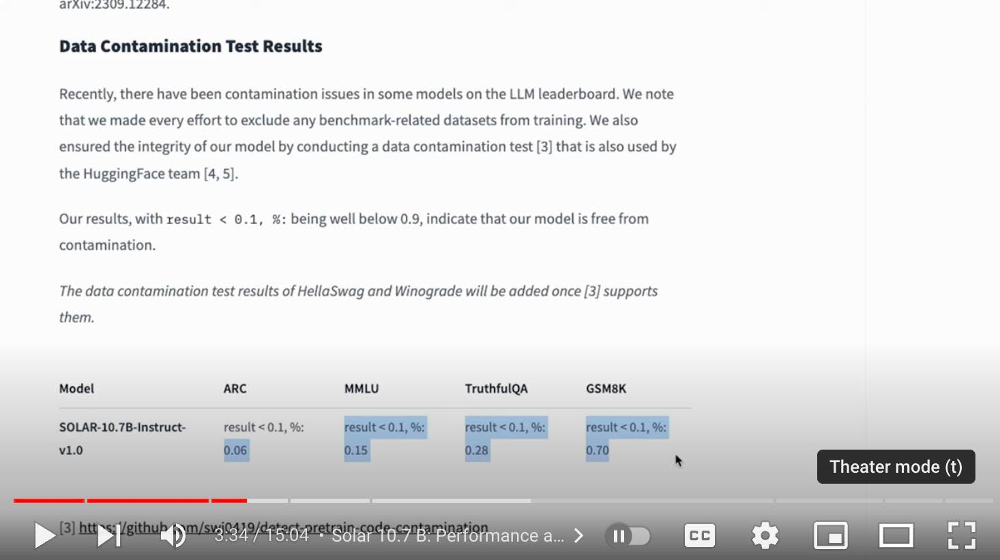
**이미지 캡션:** 화면에는 "Data Contamination Test Results"라는 제목의 문서가 표시되며, LLM 리더보드의 오염 문제에 대한 설명과 모델의 무결성을 보장하기 위한 데이터 오염 테스트 결과가 포함되어 있습니다. 테이블에는 SOLAR-10.7B-Instruct-v1.0 모델에 대한 ARC, MMLU, TruthfulQA, GSM8K 벤치마크의 결과가 나열되어 있으며, 모든 결과가 0.1% 미만으로 나타나 모델이 오염되지 않았음을 시사합니다. 화면 하단에는 비디오 재생 컨트롤과 "Theater mode (t)" 버튼이 보입니다.t)" 버튼이 보입니다.
 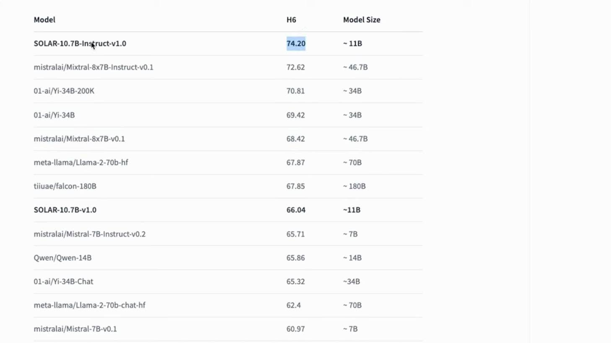
**이미지 캡션:** 이것은 컴퓨터 화면의 일부를 보여주는 이미지로, 여러 인공지능 모델의 성능 지표를 표 형태로 나열하고 있습니다. 화면에는 "Model", "H6", "Model Size"라는 세 개의 열 제목이 보입니다. 각 행은 특정 모델의 이름, "H6" 점수, 그리고 모델 크기를 나타냅니다. 예를 들어, "SOLAR-10.7B-Instruct-v1.0" 모델은 "H6" 점수 74.20에 "~11B" 크기를 가지고 있습니다. 다른 모델로는 "mistralai/Mixtral-8x7B-Instruct-v0.1", "01-ai/Yi-34B-200K", "meta-llama/Llama-2-70b-hf" 등이 있으며, 각기 다른 "H6" 점수와 모델 크기를 가집니다. 표의 일부 셀, 특히 "74.20"과 "66.04"는 강조 표시되어 있습니다. 배경은 흰색이며, 특별한 인물이나 사물은 보이지 않습니다. 전반적으로 기술적인 데이터를 보여주는 깔끔하고 정보 중심적인 화면입니다./Yi-34B-200K", "meta-llama/Llama-2-70b-hf" 등이 있으며, 각기 다른 "H6" 점수와 모델 크기를 가집니다. 표의 일부 셀, 특히 "74.20"과 "66.04"는 강조 표시되어 있습니다. 배경은 흰색이며, 특별한 인물이나 사물은 보이지 않습니다. 전반적으로 기술적인 데이터를 보여주는 깔끔하고 정보 중심적인 화면입니다.
 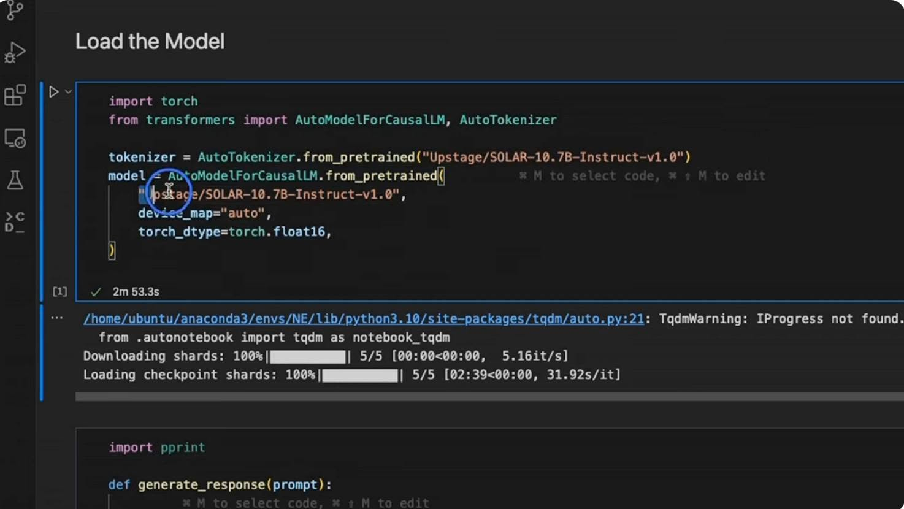
**이미지 캡션:** 이 이미지는 컴퓨터 화면의 일부를 보여주며, 검은색 배경에 코드가 표시되어 있습니다. 화면 상단에는 "Load the Model"이라는 제목이 있습니다. 그 아래에는 파이썬 코드가 작성되어 있으며, `torch`와 `transformers` 라이브러리를 사용하여 "Upstage/SOLAR-10.7B-Instruct-v1.0" 모델을 로드하는 과정이 나타납니다. 코드 편집기에는 파란색 커서가 깜빡이고 있으며, "M to select code, ↑ M to edit"와 같은 텍스트가 보입니다. 코드 아래에는 다운로드 및 체크포인트 로딩 진행 상황을 나타내는 진행률 표시줄과 함께 "Downloading shards: 100%" 및 "Loading checkpoint shards: 100%"라는 텍스트가 표시됩니다. 또한, "TqdmWarning: IProgress not found."라는 경고 메시지도 보입니다. 전반적으로, 이 이미지는 인공지능 모델을 로드하고 사용하는 프로그래밍 과정을 보여주고 있습니다.로드 및 체크포인트 로딩 진행 상황을 나타내는 진행률 표시줄과 함께 "Downloading shards: 100%" 및 "Loading checkpoint shards: 100%"라는 텍스트가 표시됩니다. 또한, "TqdmWarning: IProgress not found."라는 경고 메시지도 보입니다. 전반적으로, 이 이미지는 인공지능 모델을 로드하고 사용하는 프로그래밍 과정을 보여주고 있습니다.
 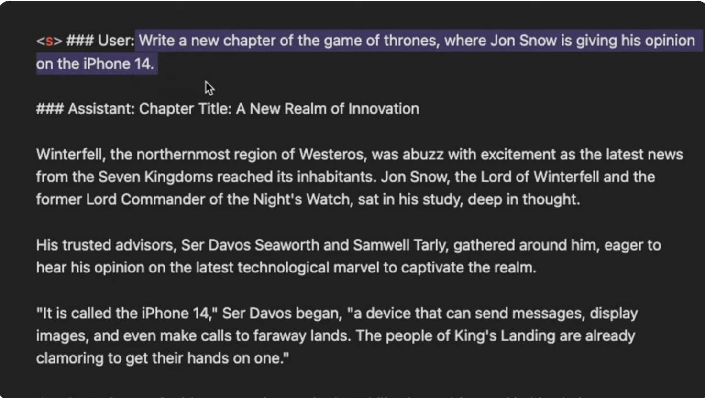
**이미지 캡션:** 화면에는 어두운 배경에 흰색 텍스트로 된 글이 표시되어 있으며, 보라색으로 하이라이트된 부분은 사용자의 질문으로 보입니다. 질문은 "Write a new chapter of the game of thrones, where Jon Snow is giving his opinion on the iPhone 14."입니다. 그 아래에는 "Assistant: Chapter Title: A New Realm of Innovation"이라는 제목이 있고, 그 뒤로 "Winterfell, the northernmost region of Westeros, was abuzz with excitement as the latest news from the Seven Kingdoms reached its inhabitants. Jon Snow, the Lord of Winterfell and the former Lord Commander of the Night's Watch, sat in his study, deep in thought. His trusted advisors, Ser Davos Seaworth and Samwell Tarly, gathered around him, eager to hear his opinion on the latest technological marvel to captivate the realm. 'It is called the iPhone 14,' Ser Davos began, 'a device that can send messages, display images, and even make calls to faraway lands. The people of King's Landing are already clamoring to get their hands on one.'"라는 내용의 글이 이어집니다. 이 글은 가상의 세계인 웨스테로스의 윈터펠에서 존 스노우가 아이폰 14에 대한 의견을 나누는 장면을 묘사하고 있습니다. 존 스노우는 윈터펠의 영주이자 나이트 워치의 전 사령관으로, 그의 서재에서 깊은 생각에 잠겨 있습니다. 그의 신뢰하는 조언자인 데이보스 시워스와 샘웰 탈리가 그의 곁에 모여, 왕국을 사로잡은 최신 기술적 경이로움에 대한 그의 의견을 듣기를 간절히 기다리고 있습니다. 데이보스는 아이폰 14가 메시지를 보내고, 이미지를 표시하며, 멀리 떨어진 곳으로 통화까지 할 수 있는 장치라고 설명하며, 킹스 랜딩의 사람들이 이미 그것을 손에 넣기 위해 아우성치고 있다고 덧붙입니다. 전반적으로 이 장면은 판타지 세계관에 현대 기술이 접목된 흥미로운 상황을 보여줍니다.gion of Westeros, was abuzz with excitement as the latest news from the Seven Kingdoms reached its inhabitants. Jon Snow, the Lord of Winterfell and the former Lord Commander of the Night's Watch, sat in his study, deep in thought. His trusted advisors, Ser Davos Seaworth and Samwell Tarly, gathered around him, eager to hear his opinion on the latest technological marvel to captivate the realm. 'It is called the iPhone 14,' Ser Davos began, 'a device that can send messages, display images, and even make calls to faraway lands. The people of King's Landing are already clamoring to get their hands on one.'"라는 내용의 글이 이어집니다. 이 글은 가상의 세계인 웨스테로스의 윈터펠에서 존 스노우가 아이폰 14에 대한 의견을 나누는 장면을 묘사하고 있습니다. 존 스노우는 윈터펠의 영주이자 나이트 워치의 전 사령관으로, 그의 서재에서 깊은 생각에 잠겨 있습니다. 그의 신뢰하는 조언자인 데이보스 시워스와 샘웰 탈리가 그의 곁에 모여, 왕국을 사로잡은 최신 기술적 경이로움에 대한 그의 의견을 듣기를 간절히 기다리고 있습니다. 데이보스는 아이폰 14가 메시지를 보내고, 이미지를 표시하며, 멀리 떨어진 곳으로 통화까지 할 수 있는 장치라고 설명하며, 킹스 랜딩의 사람들이 이미 그것을 손에 넣기 위해 아우성치고 있다고 덧붙입니다. 전반적으로 이 장면은 판타지 세계관에 현대 기술이 접목된 흥미로운 상황을 보여줍니다.

### 12월 31일 (일) 15:08 · #Solarllm #AIWinners #Y2023 #써보니좋더라 모 회사…

#Solarllm #AIWinners #Y2023 #써보니좋더라 모 회사 창업자및 CTO님이 꼽아 주신 본인이 꼽은 2023년 AI 승자에 Upstage Solar LLM이 2위로 선정되었습니다. 와~ 매우 큰 영광이 아닐수 없습니다. 

"2. Best "large" LLM: #Solar11B - Solar 10.7B model from Upstage. Based on Llama2 architecture, but also incorporates Mistral 7B weights into the upscaled layers. For me, it's a clear winner and the best performing LLM for general use. The Instruct version is also available. "

2. 최고의 '대형' LLM: #Solar11B - Upstage의 Solar 10.7B 모델. Llama2 아키텍처를 기반으로 하면서도 Mistral 7B 가중치를 업스케일된 레이어에 통합하였습니다. 제 의견으로는, 이는 일반적인 사용을 위한 최고의 성능을 발휘하는 LLM이며, 명확한 우승자입니다. Instruct 버전도 사용 가능합니다. (Solar번역)

매우 기쁘고 감사한 소식입니다. 사용해보시면 정말 좋습니다.
(다만 이 좋은 것을 홍보하지 않은 점에서 looser 라고 ㅠㅠ)

1등은 무엇일까요? 아래 링크에서 확인해 보세요!
