# 2024년 1월

[← 2024년](README.md)

### 1월 2일 (화) 14:55 · #solarllm #solarecosystem #써보니좋네 저희는 Sol…

#solarllm #solarecosystem #써보니좋네 저희는 Solar Pre-trained (PT) 모델을 만들면서 생태계의 확장에 기여하기를 기대했습니다. 즉, 이 베이스 모델을 통해 더 나은 파인튜닝 모델들이 나오기를 바란 것이죠.

커뮤니티에서 가장 뛰어난 fine-tuner로 불리는 Teknium님이 Solar PT 모델을 파인튜닝하여 좋은 결과를 얻었습니다. 저희의 기대가 이루어지고 있는 것을 보니 기쁩니다. :)

https://huggingface.co/NousResearch/Nous-Hermes-2-SOLAR-10.7B

이 모델에 대한 다양한 반응들이 이어지고 있습니다.
"solar is a fantastic base llm"
"What a gift 😍 legends 🔥"
"Starting off with a bang! 🔥🤩"

저희가 만든 모델을 좋아해 주시고 open LLM 생태계에 기여할 수 있어 너무 기쁩니다! 😊

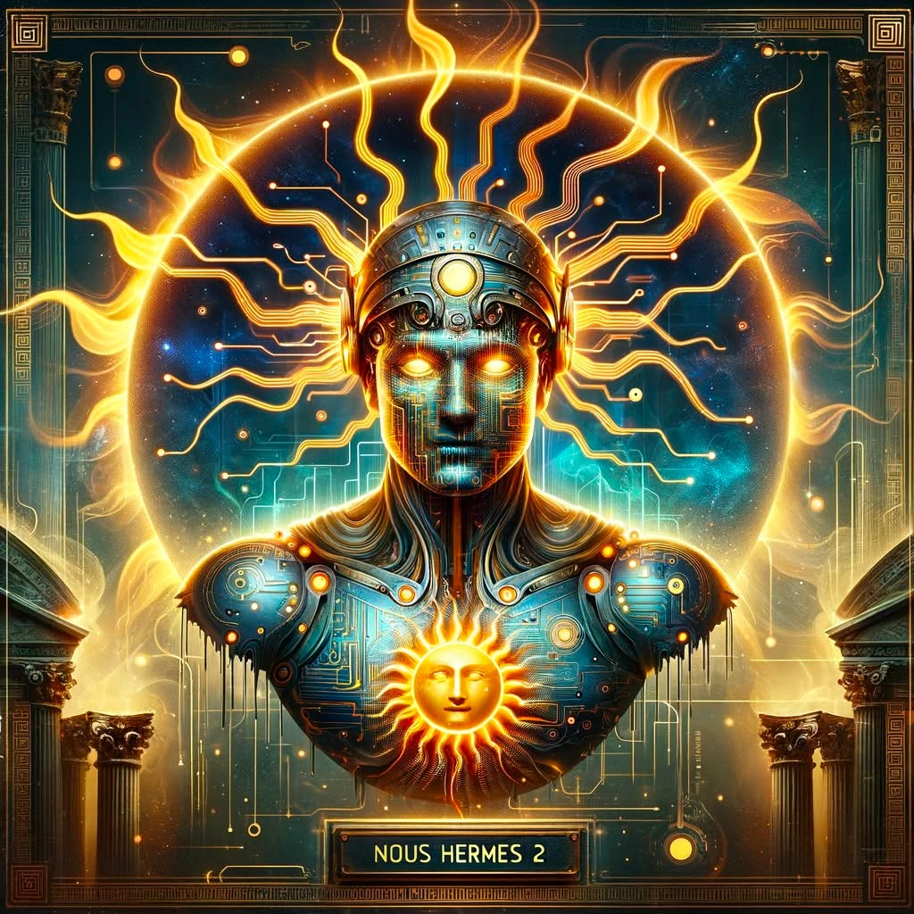 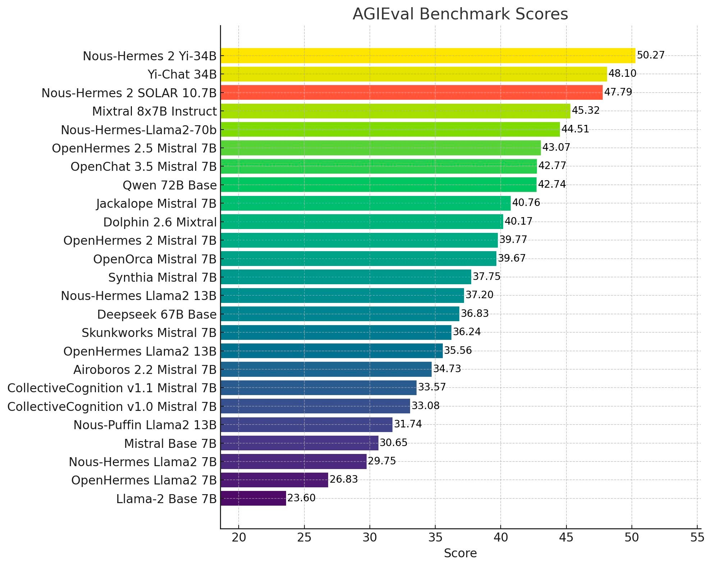

### 1월 8일 (월) 03:05 · 와! Palo Alto 에서 가장 아름다운 달리기길을 다녀 왔습니다. 너…

와! Palo Alto 에서 가장 아름다운 달리기길을 다녀 왔습니다. 너무 멋지고 멋진 곳입니다.

 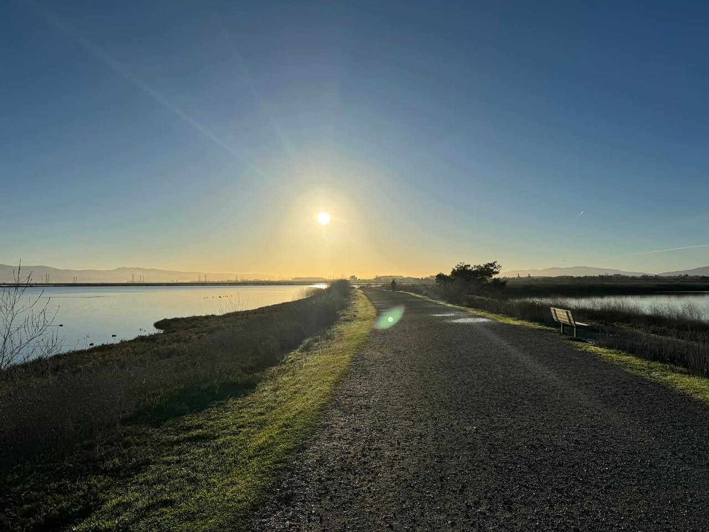 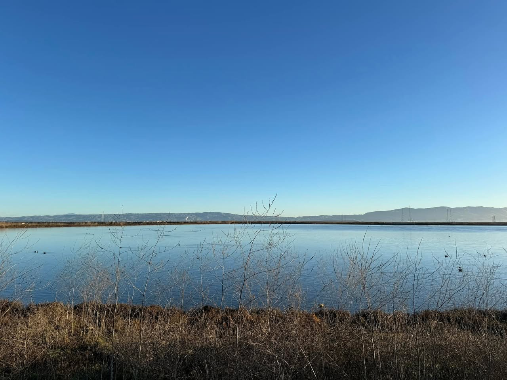 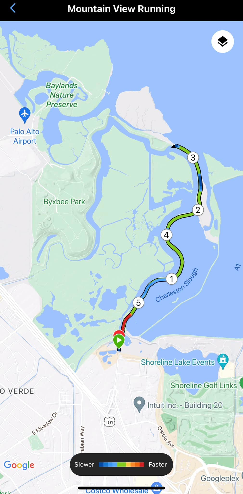

### 1월 8일 (월) 07:38 · #solarllm 을 로컬에서 실행하는 방법을 설명하고 다양한 사용 사례…

#solarllm 을 로컬에서 실행하는 방법을 설명하고 다양한 사용 사례를 보여주는 멋진 비디오입니다. Solar를 여러분들의 컴퓨터에 local로 돌려보세요! 
(링크는 댓글에 첨부되어 있습니다.)

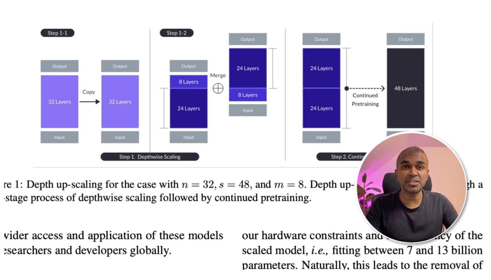 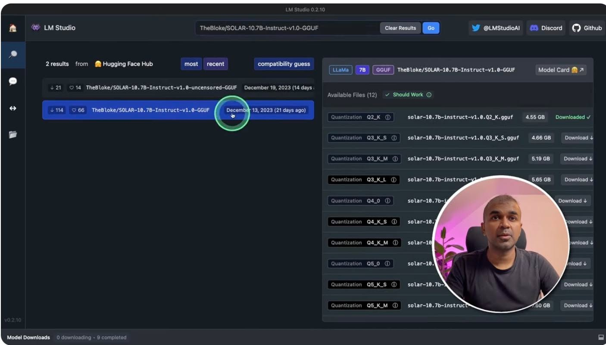 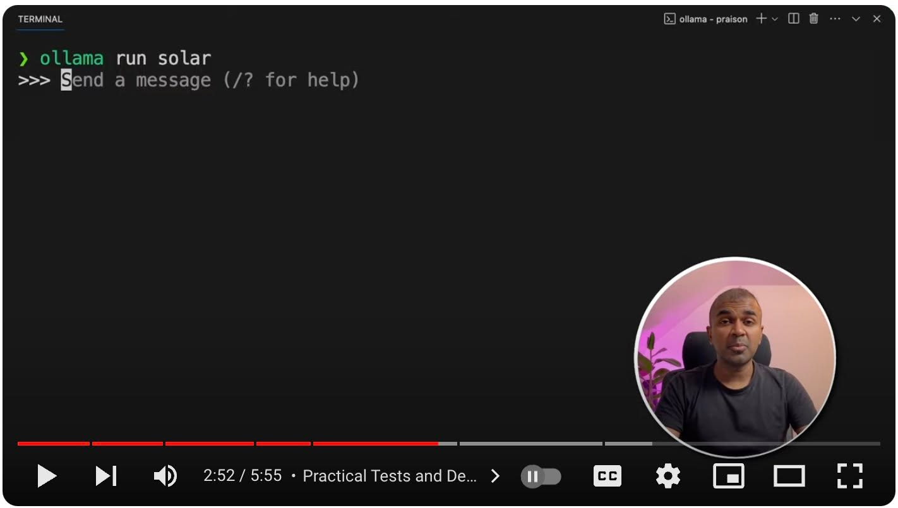

### 1월 9일 (화) 09:14 · #solarllm #solartree Solar가 출시된 지 한 달이 채…

#solarllm #solartree Solar가 출시된 지 한 달이 채 되지 않았는데, 이미 250개 이상의 모델이 Solar기반으로 만들어 지거나 피안튜닝 되었고, Hugging Face의 도움으로 Ollama와 LM Studio를 포함한 여러 서비스를 사용할 수 있게 되었습니다. 모든 Solar 사용자분들께 감사의 말씀을 전합니다. 

Solar를 사용해보는 것을 여러분들이 좋아하실 거예요! 
https://huggingface.co/upstage/SOLAR-10.7B-Instruct-v1.0

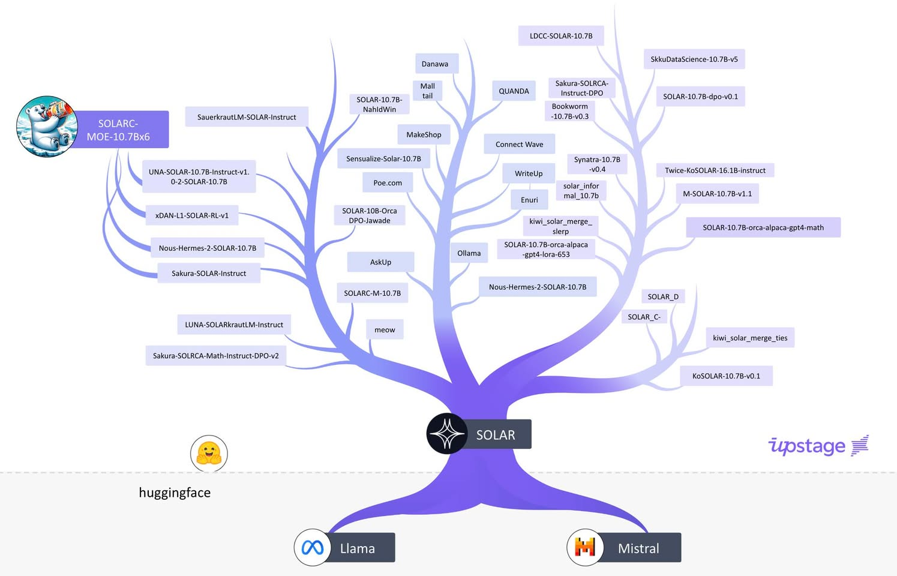

### 1월 9일 (화) 13:59 · #writeup #매일매일 #producthunt LLM의 가장 유용한 …

#writeup #매일매일 #producthunt LLM의 가장 유용한 기능 중 하나는 글에서 오타를 찾아주고 수정해주는 것입니다. WriteUp은 Solar LLM을 내장되어 있어 여러분의 Mac 컴퓨터에 설치하면 모든 편집 창에서 도움을 받을 수 있습니다.

https://www.producthunt.com/posts/writeup-private-local-write-assistant

특히 Local 모드에서는 모든 것이 여러분의 Mac에서 실행되어 100% 보안이 보장됩니다. 사용해보시고 마음에 드시면 바로 UpVote 부탁드립니다! 또한 30% 할인 코드를 놓치지 마세요. (현재는 Mac만 지원하지만 추후 Windows로 확대할 예정입니다.)

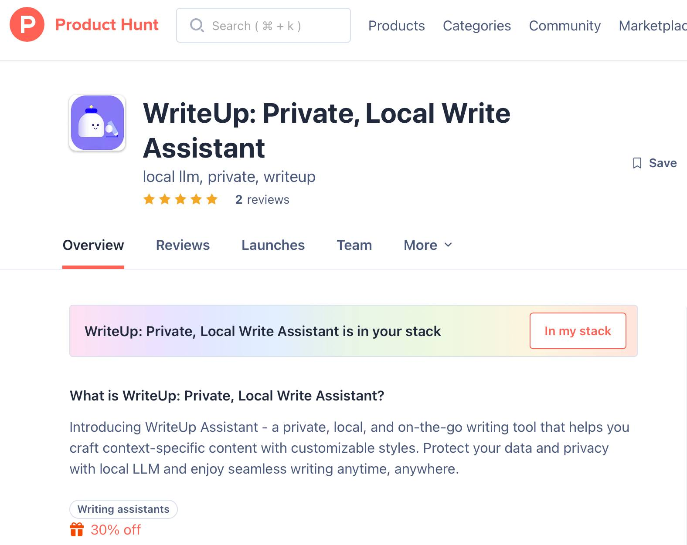 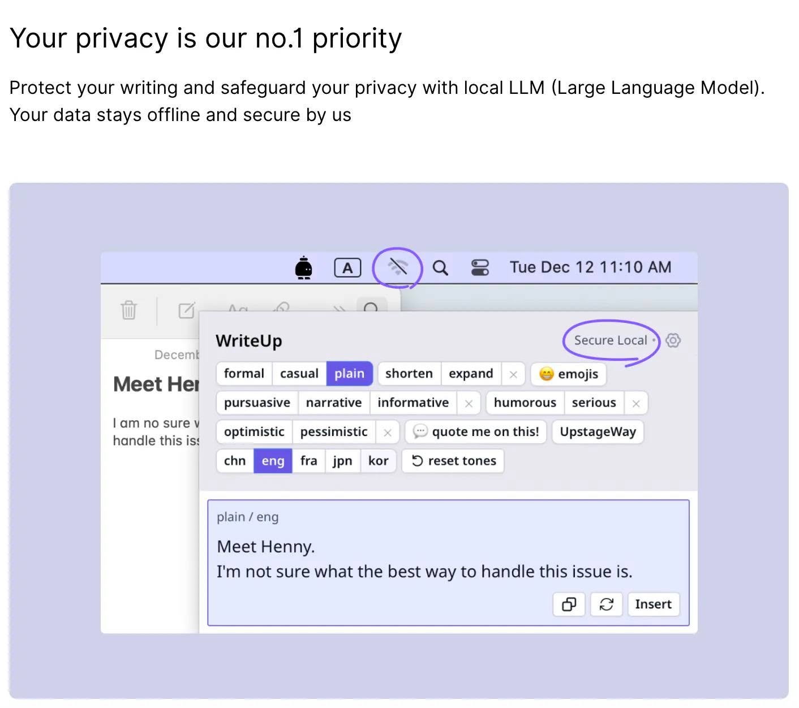 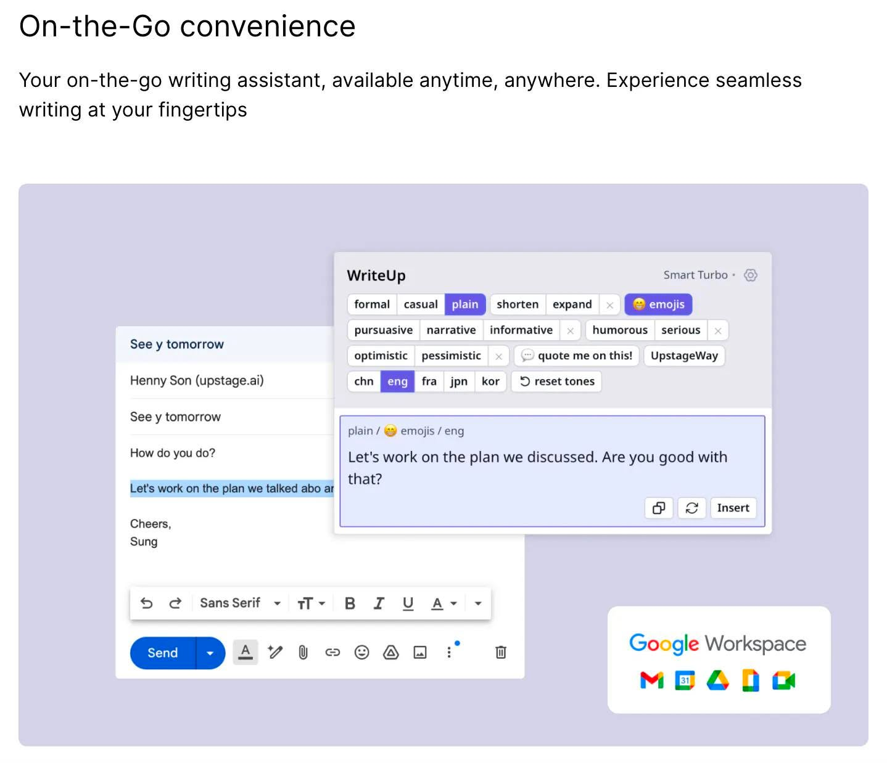 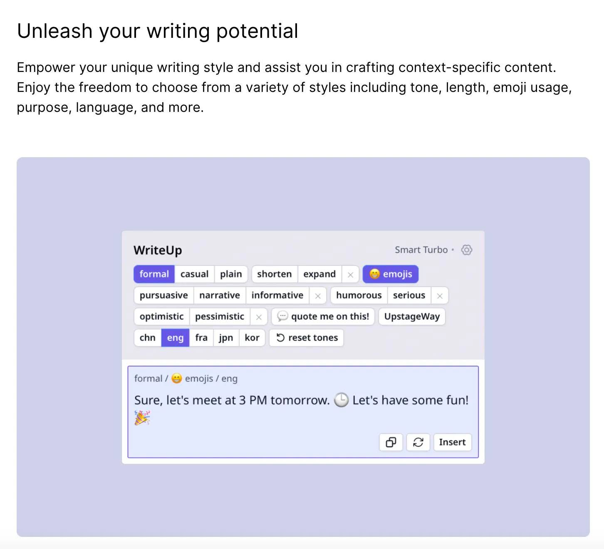

### 1월 10일 (수) 03:36 · LLM의 가장 좋은 usecase가 글쓰기 인데요. Solar LLM을 …

LLM의 가장 좋은 usecase가 글쓰기 인데요. Solar LLM을 장착하여 Mac에서 글쓰기를 도와주는 WriteUp을 출시 했습니다. https://www.producthunt.com/posts/writeup-private-local-write-assistant 방문하셔서 UpVote도 해주시고 많은 격려 부탁드립니다! 제가 매일 사용하는 App이라 추천드립니다! (따봉주신 조선일보 임경업 기자님 감사드립니다.)

🎬 동영상 1개 (생략)

### 1월 11일 (목) 13:58 · #꿈은이루어진다 #solarllm #askup AskU…

#꿈은이루어진다 #solarllm #askup AskUp에서 Solar를 만나보세요.

저는 Chat GPT를 사용해보고, 자연스러운 대화와 언어 능력에 놀랐습니다. 그래서 2023년 3월에 GPT-3.5 API가 출시되자마자, "이 좋은 기술을 더 많은 사람들이 사용할 수 있게 해 보자!"는 단순한 마음으로 카카오에 AskUp을 만들게 되었습니다. 😊

많은 분들이 사용해주시고 사랑해 주시는 것을 보면서, 저희 팀은 꿈 하나를 꾸게 되었습니다 - 바로 "우리가 만든 모델로 AskUp 서비스를 제공해 보자!"였습니다. 🌟

약 10개월이 지난 후, 우리의 꿈이 이루어졌습니다. 이제 AskUp에서 DUP 방법을 사용하여 직접 사전 훈련한 모델과 세계적으로 인정받는 Solar 모델을 사용할 수 있습니다.

현재 AskUp은 GPT-3.5, GPT-4 터보, Solar 세 가지 모델 중에서 무작위로 답변을 제공합니다. 저희 내부 평가와 일부 사용자들의 평가에 따르면, Solar 모델은 GPT-3.5보다 더 나은 성능을 보이며, GPT-4와도 비슷한 수준의 성능을 보입니다. Solar 모델과 GPT-4 모델의 답변을 구분하기 어려울 정도로, 저희 Solar 모델의 성능은 뛰어납니다.

AskUp을 많이 사용해주시면, 저희는 더욱 빠르게 Solar 모델의 부족한 점을 보완할 수 있습니다. 앞으로도 저희는 GPT-4를 넘어서 최고의 LLM Inttelegent Layer가 되기 위해 꿈을 향해 달려나가겠습니다. 😊

AskUp 대화시작: http://pf.kakao.com/_BhxkWxj
(이글을 WriteUp/Solar로 작성되었습니다.)

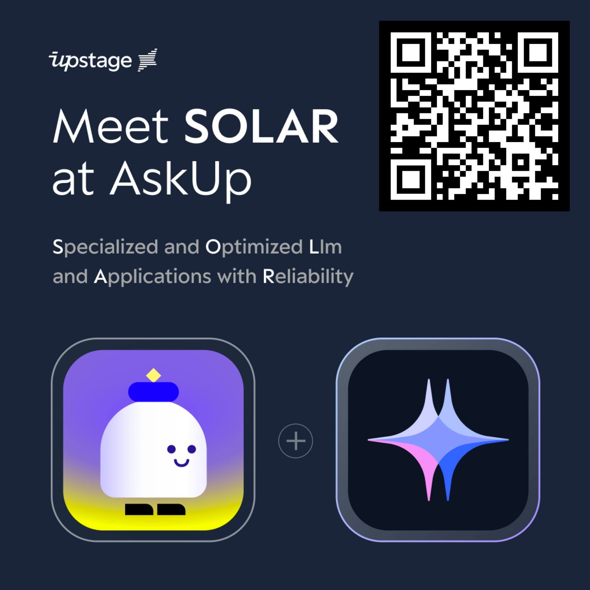

### 1월 16일 (화) 08:18 · #solarllm #solarinaction 솔라가 논문을 요약해서 배달…

#solarllm #solarinaction 솔라가 논문을 요약해서 배달해 드립니다. 허깅페이스에서 엄선한 daily papers를 Solar llm으로 요약하여 여러분들의 메일함에 넣어 드립니다. 

https://groups.google.com/g/hf-daily-paper-newsletter 가셔서 가입한번만 눌러 주시면 됩니다! 

Park Chansung 님, Daily Paper Project 너무 멋집니다. 감사드립니다!

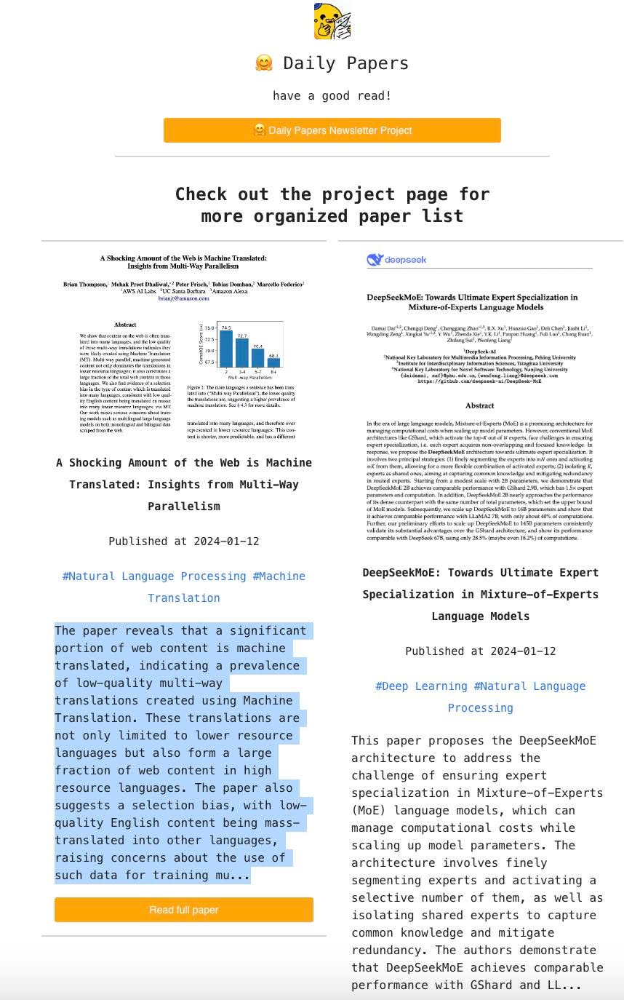 

### 1월 18일 (목) 01:15 · #beef #Emmys 와우~ 한국계 감독과 배우가 많이 참여한 BEEF…

#beef #Emmys 와우~ 한국계 감독과 배우가 많이 참여한 BEEF의 여배우가 쟁쟁한 배우들을 모두 이기고 여배우상을 수상하다니 정말 놀랐어요! 그런데 더 놀라운 건 BEEF가 미국 에미상에서 8관왕을 차지했다는 거예요. 오징어게임보다도 더 멋진 성과네요! 😁

대단하고 대단합니다!

  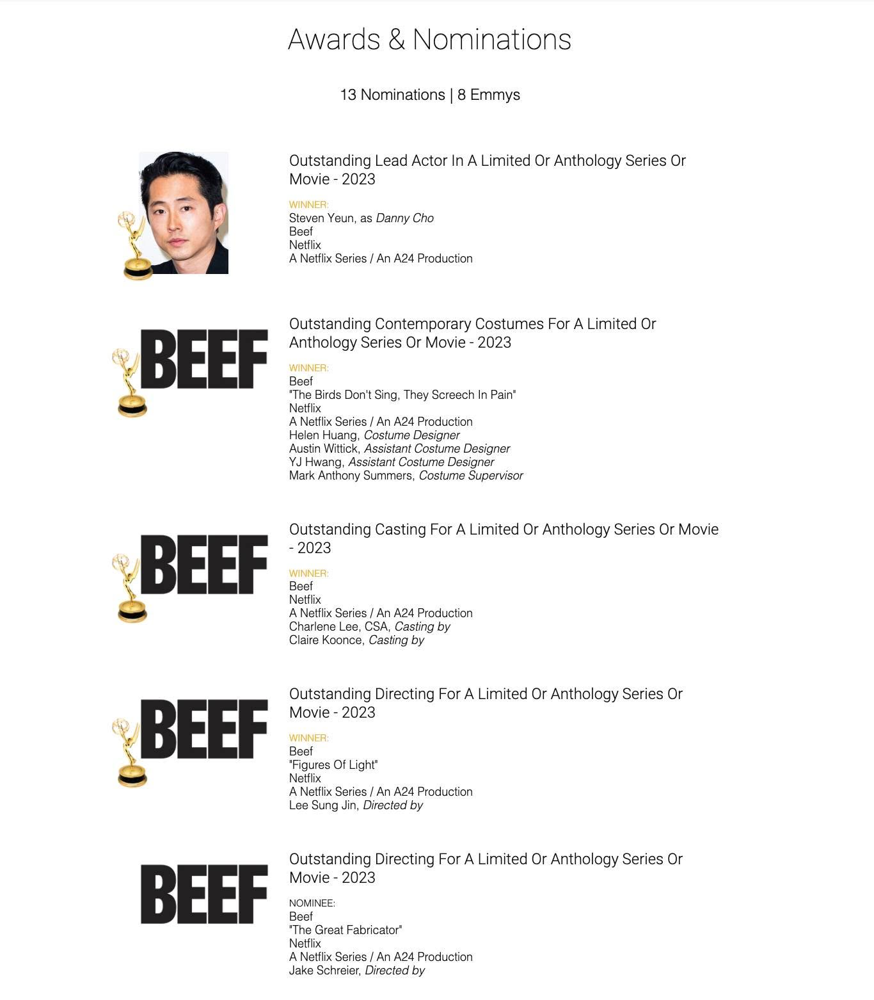  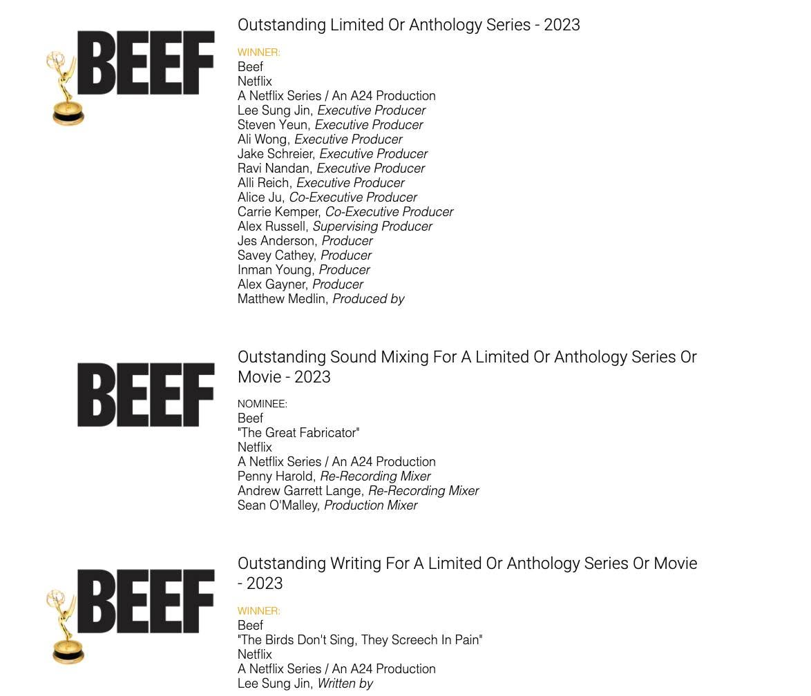

### 1월 18일 (목) 12:59 · #solarllm #askup #thumbsup 160만명의 AskUp에…

#solarllm #askup #thumbsup 160만명의 AskUp에 Solar LLM이 사용되고 있습니다. 그리고 gpt3.5, gpt4와 함께 사용되어 새로운 대화를 시작할때 LLM 모델이 무작위로 선택이 됩니다. 

이중 어떤 모델의 대화가 마음에 드셨는지 대화도중 랜덤하게 따봉을 남길수 있는 버턴을 노출하고 있습니다. 이 지표를 통해 어느정도 모델 대화 성능을 평가할수 있게 됩니다.

총 6만명이 넘는 sample 사용자들의 따봉을 저희 들이 통계를 내어 보았는데요. 과연 어떤 모델이 어느정도 따봉을 받았을까요? 

두둥 두둥!

Solar는 무려 24%의 따봉을 받았습니다. (따봉 선택 사항이여서 모두 누르시는 것은 아닙니다. ) 

gpt3.5는 17.9%로 Solar에 비해 한참 뒤떨어 집니다. 역시 gpt4는 강력합니다. 그러나 Solar와 아주 큰 격차는 아닙니다. 저희들이 빨리 따라잡아 더 좋은 solar로 만나뵙도록 하겠습니다.

AskUp 친구해요: https://pf.kakao.com/_BhxkWxj

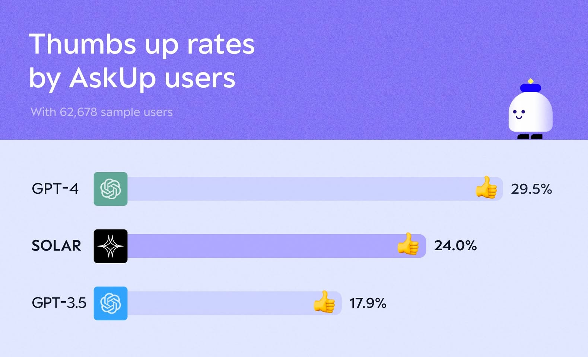

### 1월 22일 (월) 10:40 · #solarllm #써보니좋더라 사용해보신 분들이 좋다고 하는 것이 제품…

#solarllm #써보니좋더라 사용해보신 분들이 좋다고 하는 것이 제품을 만드는 입장에서는 가장 행복한 소식입니다. Financial document question answering 에서 Solar llm은 GPT-4 다음으로 최고의 성능을 달성했습니다. 

https://medium.com/@kunal_79217/an-llm-benchmark-for-financial-document-question-answering-e63e9d2bda25

곧 gpt4도 넘어 보겠습니다! Solar llm이 필요하신 분들은 Upstage로 연락 부탁드립니다.

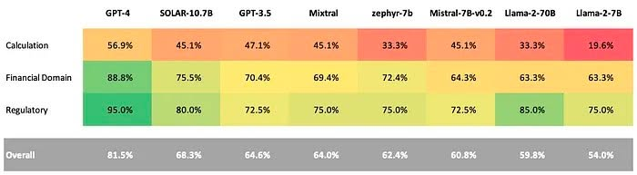

### 1월 25일 (목) 08:22 · #upstage #함께해요

#upstage #함께해요 

Upstage와 패스트캠퍼스와 함께하는 인공지능 부트캠프, Upstage AI Lab 3기 교육생을 모집합니다. Solar 로 세계 최고의 LLM을 만드는 Upstage 가 함께하여 최신 기술 트랜드를 알려드립니다. 여러분들을 AI전문가가 될수 있도록 도와드리겠습니다! 함께해요!! 

👉 설명회 신청 바로가기: https://bit.ly/3TVX5uR
💡Upstage AI Lab 알아보기: https://lnkd.in/ggEnFE6S

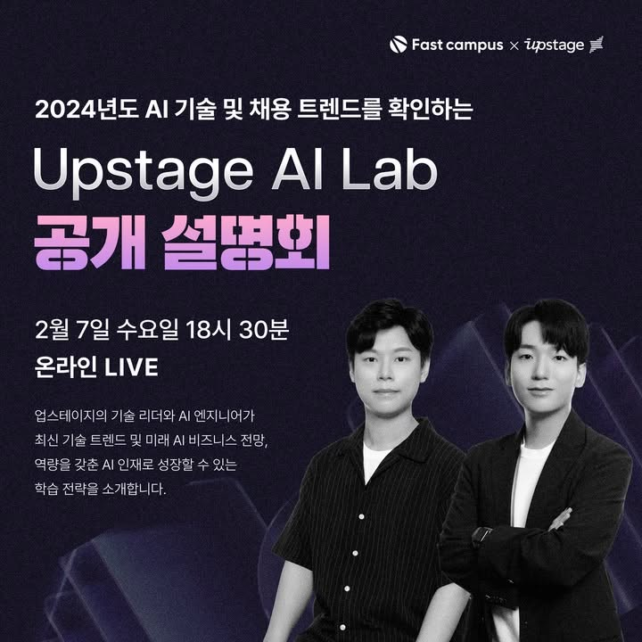

### 1월 27일 (토) 07:51 · #solarllm #써보니좋더라 #알아서넣어주심 Solar llm을 더 …

#solarllm #써보니좋더라 #알아서넣어주심 Solar llm을 더 많은 분들이 사용해주시고 계십니다. 여러 논문/벤치마크에도 기본적으로 포함되고 있습니다. 너무 감사한일입니다.

이번에는 시리즈 A로 1300억을 받아 실리콘 벨리에서도 큰 화제와 주목을 받고 있는 together.ai에서 Solar 10.7 open 모델을 넣어 주셨습니다. 유명한 모델만 curation하는데 여기 Solar가 포함된 것입니다!

바로 사용해보세요. (참고로 Solar 10.7 오픈 모델은 영어전용이고 single turn용입니다. GPT-3.5-turbo-instruct 느낌 입니다.)
https://api.together.xyz/playground/chat/upstage/SOLAR-10.7B-Instruct-v1.0

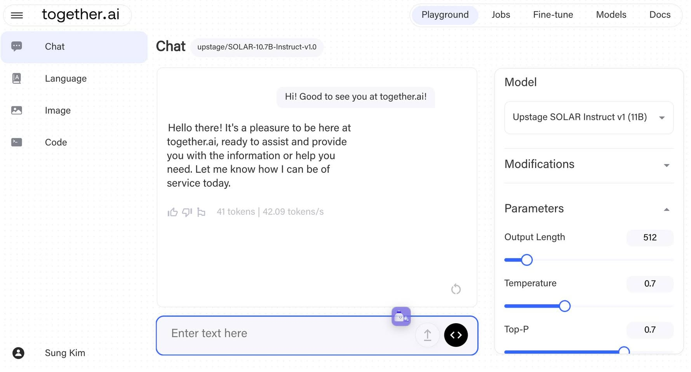

### 1월 29일 (월) 01:45 · Minho Hwang 님의 insight 넘치는 그림. 멋집니다!

Minho Hwang 님의 insight 넘치는 그림. 멋집니다! 

#solarllm 더 키워 보겠습니다.

### 1월 30일 (화) 08:35 · Hwan Seung Yeo 님이 이끄시는 Quora/Poe에 Solar …

Hwan Seung Yeo 님이 이끄시는 Quora/Poe에 Solar Mini가 탑재 되었습니다. https://poe.com/Solar-mini 

Poe는 많은 사용자들이 이용하는 플랫폼이며, 최근 a16z로부터 천억 원의 투자를 받아 실리콘 밸리에서 가장 인기 있는 챗봇/인공지능 서비스로 자리매김하고 있습니다. 😊

Solar Mini는 공개 모델보다 성능이 20~30% 더 뛰어나며, 멀티턴이 가능하고, 한국어 이해력이 뛰어납니다. 또한, Poe의 PDF RAG 기능을 사용하여 PDF를 업로드하고, 이야기를 공유할 수 있습니다. 

많이 사용해주시고 오른쪽 follow도 부탁드립니다!

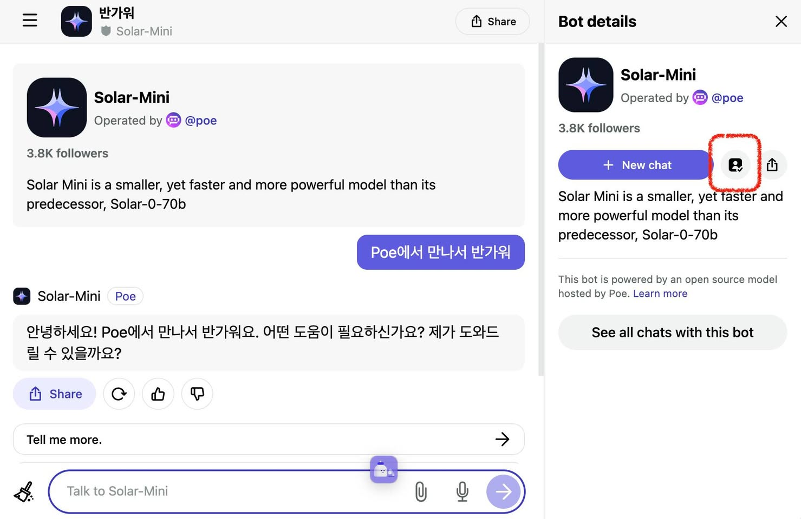 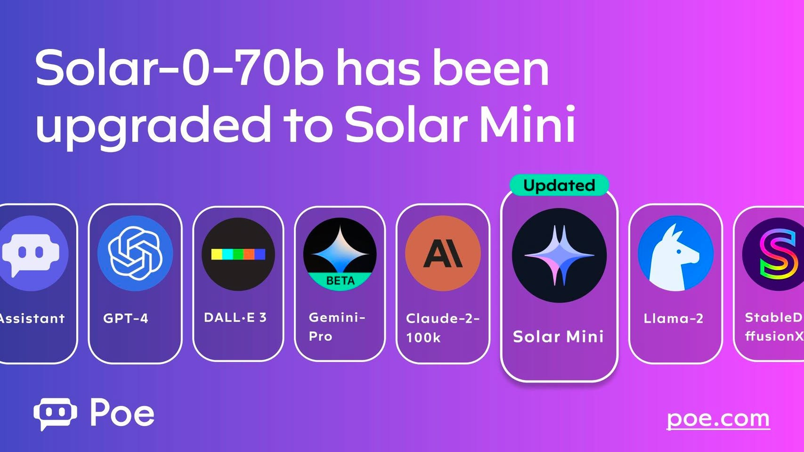
