# 2024년 2월

[← 2024년](README.md)

### 2월 6일 (화) 12:48 · #lg #gram #solarllm LG gram에서 Solar LLM을…

#lg #gram #solarllm LG gram에서 Solar LLM을 만나보세요. 글쓰기뿐만 아니라 내부 파일 검색 및 QA, 그리고 에이전트 기능까지 On-device LLM으로 정보 외부 유출 없이 빠르고 안전하게 사용할 수 있습니다.

모두를 위한 LLM, 어떤 device에서도 돌아가는 LLM으로,  누구도 AI 혜택에서 소외받지 않도록 하겠습니다.

미리 맛보기 하실 분들은 Mac에서 돌려볼수 있는 https://writeup.upstage.ai/ 참고해주세요.

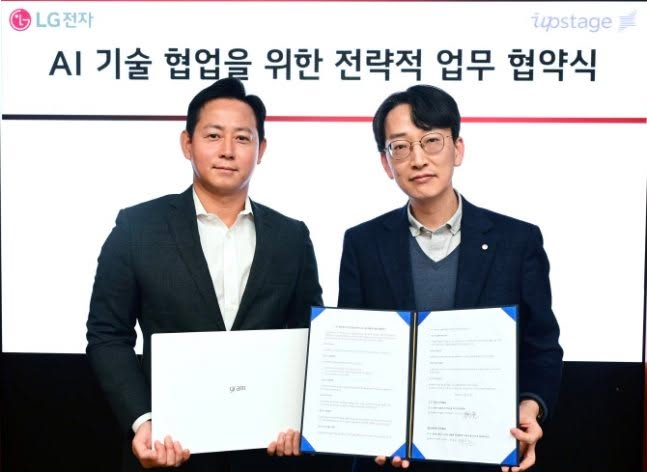

### 2월 6일 (화) 16:08 · #2월9일금요일 #SanMateo #실리콘벨리 한국투자공사와 샌프란시스코…

#2월9일금요일 #SanMateo #실리콘벨리 한국투자공사와 샌프란시스코 총영사관이 주최하는 실리콘벨리 지역 VC와 한인 창업자들이 모이는 행사인데 너무 재미있을것 같습니다. 저도 신청하고 기대하고 있습니다. 근처 계시는 분들 모두  반갑게 뵙겠습니다. 함께 AI와 LLM 이야기 함께 나누어 보면 좋겠습니다.

저녁과 음료는 샌프란시스코 총영사관에서 후원합니다!

선신청 후고민 https://lu.ma/koreanvc

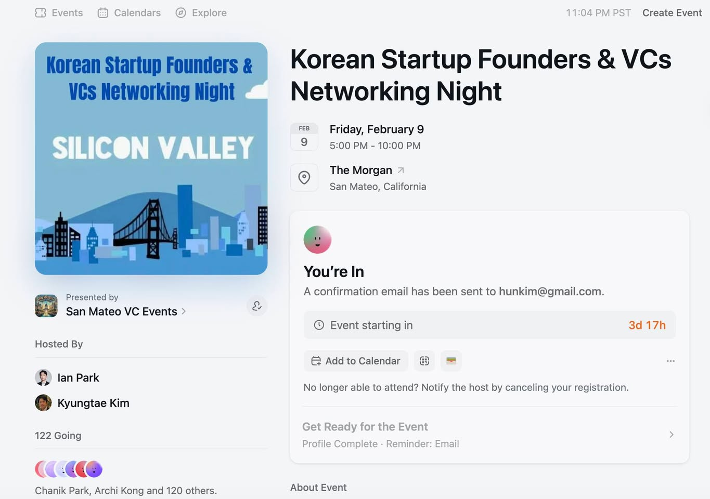

### 2월 14일 (수) 16:30 · 이번 CES에서 열린 포럼들중 가장 기대 했던 윤송이대표님의 강의. 직접…

이번 CES에서 열린 포럼들중 가장 기대 했던 윤송이대표님의 강의. 직접 참여하지 못해 너무 속상했는데요. 오늘 마침내 유튭에 공개 되었습니다. (링크는 댓글에 있습니다.)

올해 제가 들었던 AI강의중 단연 최고입니다: AI장점과 어떤 변화를 줄것인에 더해, 미국과 서구권 중심이 AI발전의 편향성 부분을 잘 짚어 주십니다. 그래서 결국 우리 회사, 정부가 각각 어떻게 해야하는지에 대한 부분도 분명하게 말씀주시네요. 

아래 1포인터, 1스샷으로 요약합니다.

1. AI를 사용하는 사람과 하지 않는 사람들의 실제 차이는 크다. 한 예로 2명의 사람보다 AI+사람이 암을 발견하는데 20% 이상 더 효율적이다. 

2. 뿐만 아니라 우리가 하는 더 많은 일들이 AI로 대치 될수 있다. 사실 AI를 사용하는 사람들에 의해 먼저 대치 될것이다.

3. 이런 AI의 투자가 한곳으로 집중되고 있다. 알려진 투자의 80%가 미국에 집중되고 그 결과로 미국의 주도가 당연히 예측된다. 

4. 중국도 무섭게 따라간다. 무려 280개의 LLM이 있다. 

5. 이런 특정 국가가 주도하는 AI 편향적일수 밖에 없다. 한 예로 안중근을 테러리스트로 묘사하거나 독도가 분쟁지역이라고 하는등의 문제가 있다.

6. 심지어 지금 인터넷을 많이 사용하지 않는 나라들의 자료, 생각, 문화 등은 AI 모델 학습에서 완전히 배제 되어있다. 지금 대부분의 AI 모델은 서구권 중심이다.

7. 이런 편향성은 어떤 문제가 있을까? 유툽의 노란딱지를 아는가? 이 심사를 AI모델이 하는데 무슨 기준으로 하는가? 이런식으로 AI모델은 우리의 심판자가 될수 있다. 그 모델은 어떤 기준으로 평가하는가? 우리는 알수없다. 그냥 평갸 결과를 따라야 할거다.

8. 그래서 우리도 빨리 AI 네이브로 가야 한다. 그냥 솔루션을 사용하는것에서 더 나아가 AI로 전반적인 체질 개선을 해야 한다.

9.  AI연구 개발에는 막대한 투자가 필요한데 정부가 나서야 한다. 미국 정부도 많이 한다.

10. 우리 함께 투명하고 편향성 없는 모델을 시스템을 만들어야 한다. 최대한 투명하게 공개해서 함께 발전해야 한다. 다양한 집단의 입장을 반영해야 한다.

11. 우리 모두 인간 중심의 신뢰할수 있는 AI를 함께 만들어 가야 한다.

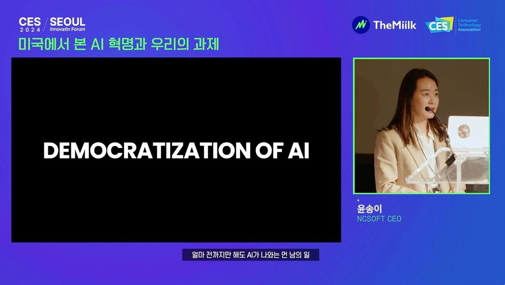 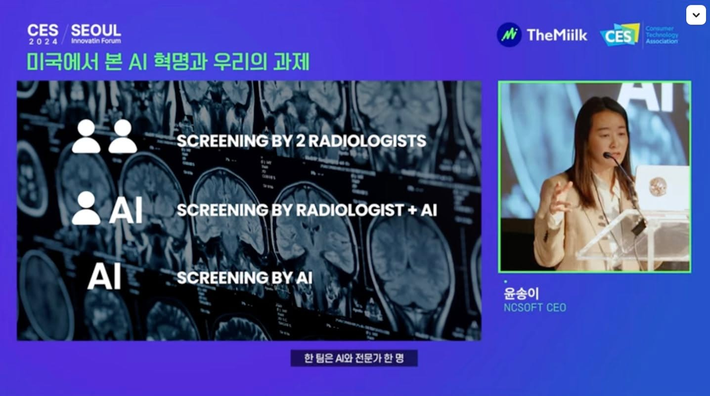 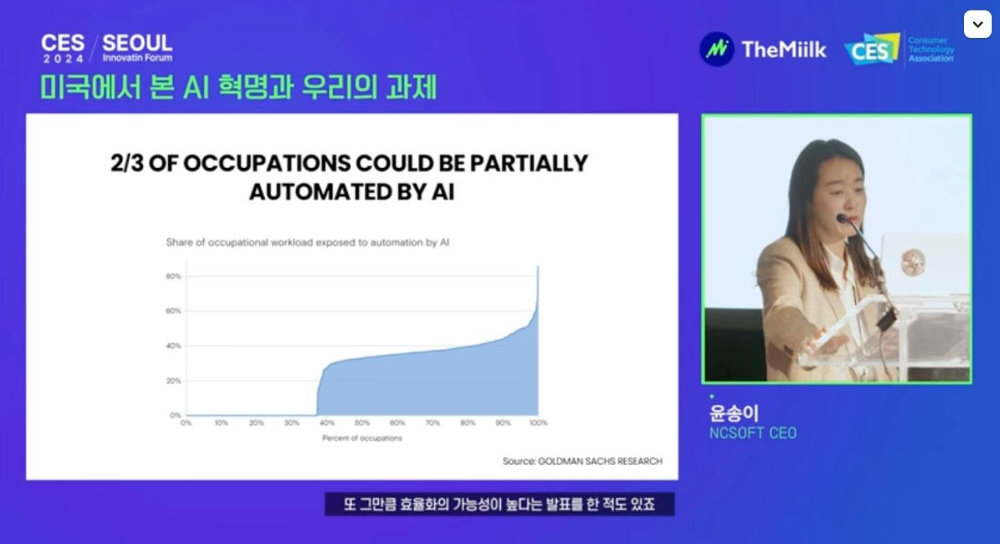 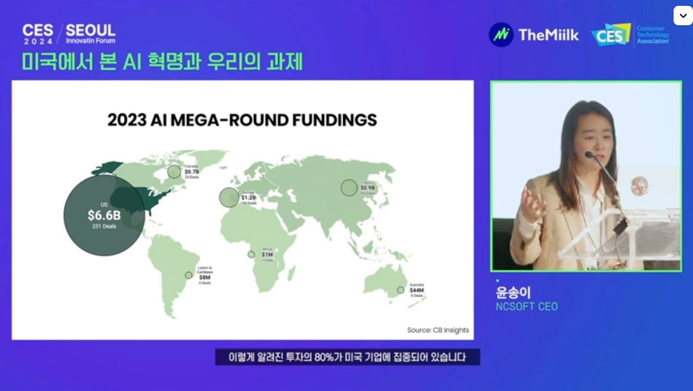 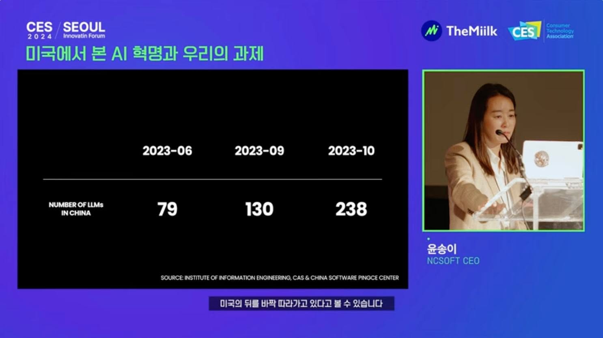 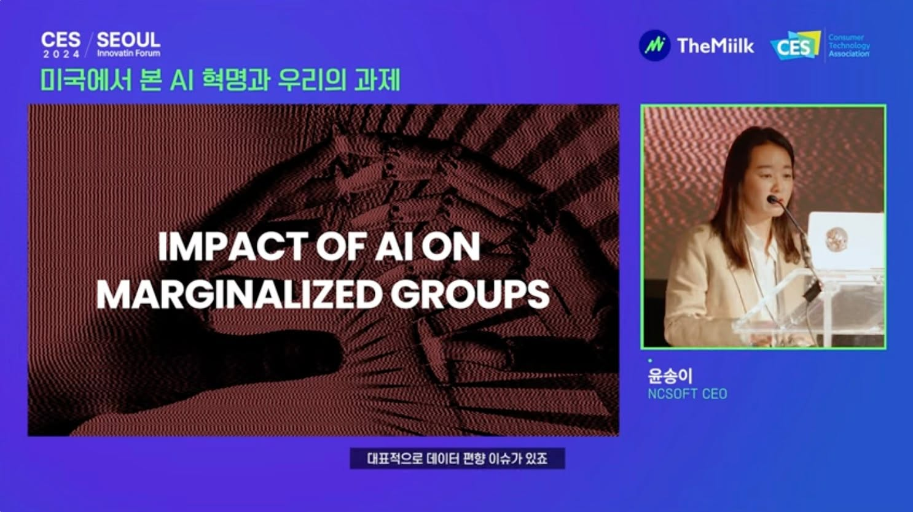 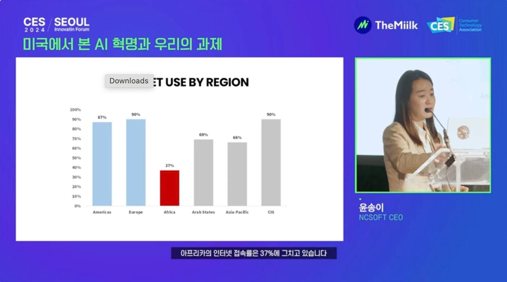 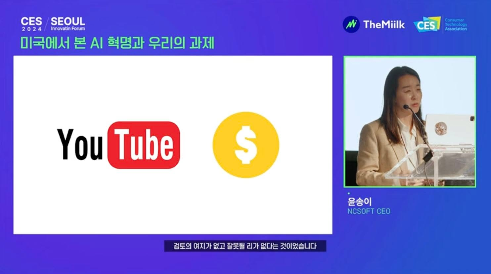 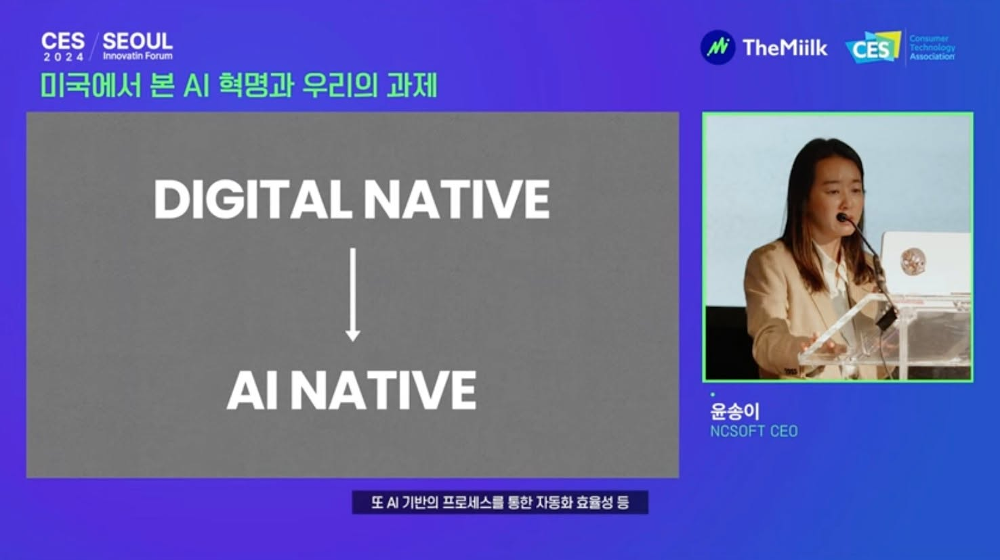 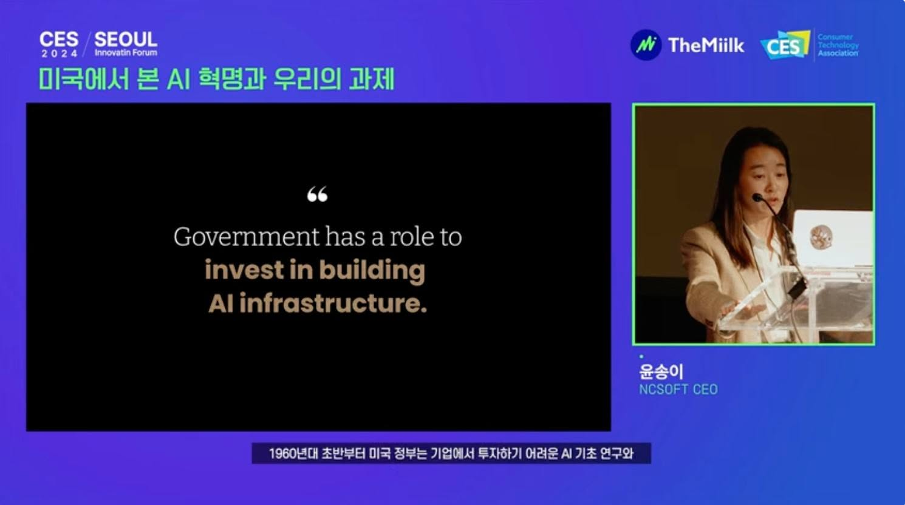 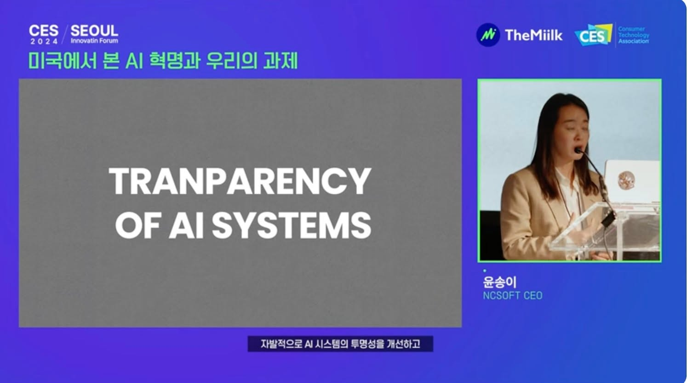 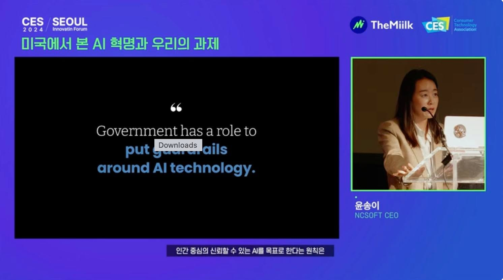

### 2월 15일 (목) 18:14 · #WGS2024 #nvidia #jensenhuang #omar

#WGS2024 #nvidia #jensenhuang #omar 

이번 WGS에서 가장 재미있게 들었던 대담이 바로 Omar와 잰슨황의 이야기 였는데요. 지난 10년간 1M 배의 효울성을 만들어 모든 연구자들이 GPU를 사용핼수 있게 해줘서 Gen AI 혁신이 일어났다는 멋진 말씀을 주십니다. 

그리고 Sovereign AI에 대한 자세한 설명을 주시는데 공감이 갑니다. 

1. 인공지능은 더 이상 신비롭거나 무서운 기술이 아니며, 적극적으로 활용해야 하는 기술입니다.
2. 현재 진행 중인 새로운 산업 혁명은 지능의 생산에 관한 것이며, 각 국가는 자체적인 지능을 소유해야 합니다.
3. 주권 AI는 국가가 데이터를 소유하고, 이를 기반으로 국가적인 지능을 소유하는 것을 의미합니다.
4. 연구자, 기업 및 정부는 AI 인프라의 이점을 활용하여 자체적인 AI를 개발할 수 있도록 인프라를 구축해야 합니다.
5. AI의 계산 및 인프라가 민주화되었으므로, 이제 남은 것은 개인이 주도적으로 산업을 활성화하고 인프라를 구축하여 AI의 혜택을 활용하는 것입니다.

번역과 원문 참고:

거의 지난 6개월 동안 모든 국가가 인공지능이 신비롭거나 무서운 기술이 아니라는 것을 깨달았습니다. 인공지능을 활용하기 위해 자신을 활성화하는 방법을 찾아야 합니다. 그 이유는 이것이 새로운 산업 혁명의 시작이기 때문입니다. 이 산업 혁명은 에너지나 식품의 생산이 아니라 지능의 생산에 관한 것입니다. 모든 국가는 자신의 지능을 생산해야 하며, 이것이 주권 AI라는 개념이 생긴 이유입니다. 당신은 자신의 데이터를 소유하고 있으며, 아무도 그것을 소유하지 않습니다. 당신의 국가가 데이터를 소유하고 있으며, 당신의 문화, 당신의 사회의 지능, 상식, 역사를 코딩합니다. 당신은 자신의 데이터를 소유하고 있습니다. 따라서 그 데이터를 가져와서 정제하고, 자신의 국가 지능을 소유해야 합니다. 다른 사람들에게 그것을 맡길 수는 없으며, 이는 우리가 인공지능의 계산과 인프라를 민주화한 지금에야 실제로 깨달은 것입니다. 나머지는 당신이 주도권을 잡고, 산업을 활성화하고, 인프라를 가능한 빠르게 구축하여 연구자, 기업, 정부가 이 인프라를 활용하여 자신만의 AI를 창출할 수 있도록 하는 것입니다.

An awakening of every single country in probably the last six months that artificial intelligence is a technology you can't be mystified by, you cannot be terrified by it. You have to find a way to activate yourself to take advantage of it. And the reason for that is because this is the beginning of a new Industrial Revolution. This Industrial Revolution is about the production not of energy, not of food, but the production of intelligence. And every country needs to own the production of their own intelligence, which is the reason why there's this idea called Sovereign AI. You own your own data, nobody owns it. Your country owns the data, your culture, it codifies your culture, your society's intelligence, your common sense, your history. You own your own data. You therefore must take that data, refine that data, and own your own national intelligence. You cannot allow that to be done by other people, and that is a real realization now that we've democratized the computation of AI, the infrastructure of AI. The rest of it is really up to you to take initiative, activate your industry, build the infrastructure as fast as you can, so that the researchers, the companies, your governments can take advantage of this infrastructure to go and create your own AI.

(요약과 정리, 번역은 Solar-min가 작성한 것입니다.)

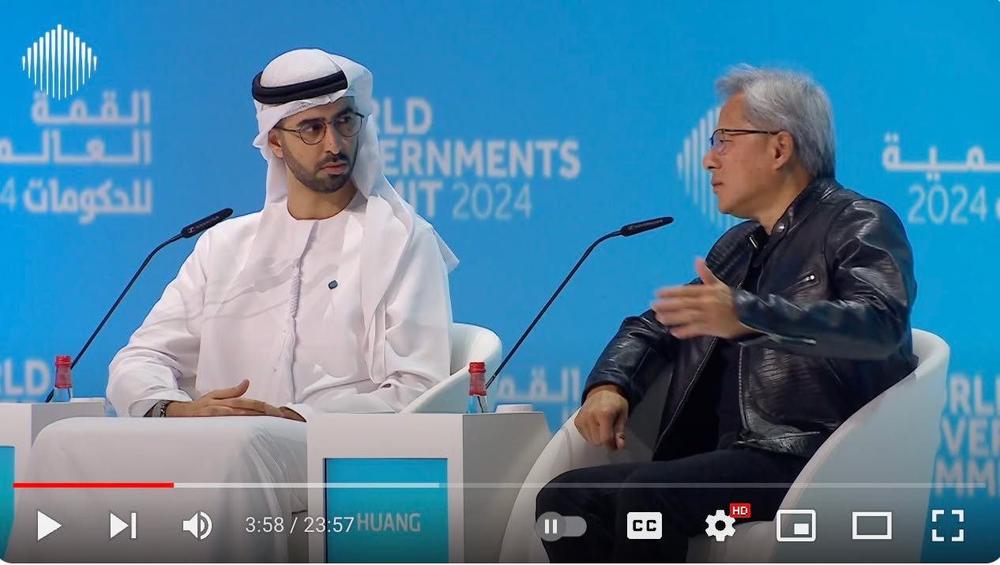

### 2월 16일 (금) 05:50 · #ooenai #sora 로 생성된 비디오. 와~ 저도 잠결에 비디오를 …

#ooenai #sora 로 생성된 비디오. 와~ 저도 잠결에 비디오를 보았는데요. 정말 대단 합니다. AI의 역사적인 날!

"a cat waking up its sleeping owner demanding breakfast..."

https://openai.com/sora

🎬 동영상 1개 (생략)

### 2월 19일 (월) 17:30 · Upstage, NIA가 함께 운영하고 고려대, KT, 허깅페이스의 후원…

Upstage, NIA가 함께 운영하고 고려대, KT, 허깅페이스의 후원으로 운영중인 OpenKoLLM 리더보더에 제출된 평가된 모델이 1000개가 넘어섰습니다. 

수많은 분들이 새로운 모델과 파인튜닝 모델을 만들어 주셔서 정말 감사합니다. 더 많은 훌륭한 한국어 모델을 기대해 봅니다. 

🤩🤩🤩

https://huggingface.co/spaces/upstage/open-ko-llm-leaderboard

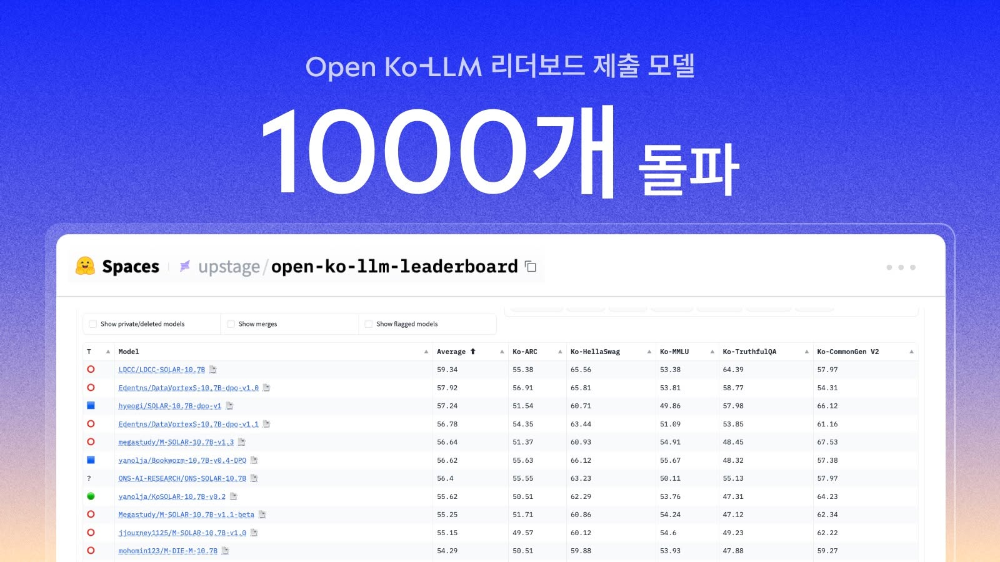

### 2월 20일 (화) 18:08 · Ko-LLM 리더보더에 대한 허깅페이스 공식 블로그가 올라왔습니다.

Ko-LLM 리더보더에 대한 허깅페이스 공식 블로그가 올라왔습니다. 
https://huggingface.co/blog/leaderboards-on-the-hub-upstage 

그동안 1000개의 모델을 받은 이야기, 저희의 비전, 그리고 배운점에 대해 이야기 합니다. 

(아래 번역은 solar-mini-translate 무수정 결과입니다.)
---
한국어 LLM 평가를 선도하는 Open Ko-LLM 리더보드를 소개합니다! 🎉
by Park Chanjun (guest), Sung Kim (guest), Clémentine Fourrier

빠르게 진화하는 Large Language Model(LLM)의 생태계에서 '생태계'를 구축하는 것은 그 어느 때보다도 중요해졌습니다. 이러한 경향은 Hugging Faces가 NLP를 민주화하고 Upstage가 생성형 AI 생태계를 구축하는 것과 같은 몇 가지 주요한 발전에서 확인할 수 있습니다.

이러한 업계의 이정표에서 영감을 받아 2023년 9월, Upstage에서는 Open Ko-LLM Leaderboard를 시작했습니다. 우리의 목표는 한국어 LLM 데이터에 대한 평가 생태계를 빠르게 개발하고 도입하여, 개방적이고 협력적인 AI 개발을 위한 글로벌 움직임에 부합하는 것이었습니다.

Open Ko-LLM Leaderboard의 비전은 한국어 LLM 평가 생태계를 육성하여 연구자들이 결과를 공유하고 LLM 분야의 숨겨진 재능을 발굴할 수 있도록 투명성을 촉진하는 것입니다. 본질적으로, 우리는 한국어 LLM의 경기장을 확장하기 위해 노력하고 있습니다. 이를 위해 우리는 개인이 한국어 LLM을 등록하고 다른 모델과 경쟁할 수 있는 오픈 플랫폼을 개발했습니다. 또한, 우리는 한국어의 고유한 특성과 문화를 포착하는 리더보드를 만들고자 했습니다. 이 목표를 달성하기 위해 우리는 Ko-MMLU와 같은 번역된 벤치마크 데이터셋이 한국어의 독특한 속성을 반영하도록 했습니다.

# 리더보드 디자인 선택: 공정성을 위한 새로운 개인 테스트 세트 생성
Open Ko-LLM Leaderboard는 특히 다음과 같은 벤치마킹의 독특한 접근 방식으로 특징지어집니다.

영어 기반 벤치마크의 보편적인 사용과는 달리 한국어 데이터셋을 채택했습니다.
대부분의 리더보드의 공개 테스트 세트와 대조적으로 테스트 세트를 공개하지 않았습니다. 우리는 Open Ko-LLM에 전용으로 완전히 새로운 데이터셋을 구성하고 비공개로 유지하여 테스트 세트 오염을 방지하고 보다 공정한 비교 프레임워크를 보장하기로 결정했습니다.
공개 벤치마크를 통해 연구 커뮤니티에 대한 보다 광범위한 영향과 유용성을 인정하면서도, 폐쇄형 테스트 세트 환경을 유지하기로 한 결정은 보다 통제되고 공정한 비교 분석을 촉진하기 위한 의도였습니다.

# 평가 작업
Open Ko-LLM Leaderboard는 다음과 같은 다섯 가지 유형의 평가 방법을 채택합니다.

Ko-ARC(AI2 Reasoning Challenge): Ko-ARC는 과학적 사고와 이해를 평가하기 위해 설계된 객관식 테스트입니다. 과학적 문제를 해결하는 데 필요한 추론 능력을 측정하여 복잡한 추론, 문제 해결 능력 및 과학적 지식의 이해를 평가합니다. 평가 지표는 정확도 비율에 중점을 두며, 모델이 옵션 세트에서 올바른 답변을 선택하는 빈도를 반영하여 과학적 원리를 효과적으로 탐색하고 적용할 수 있는 능력을 측정합니다.

Ko-HellaSwag: Ko-HellaSwag는 생성 형식 또는 객관식 설정으로 상황 이해 및 예측 능력을 평가합니다. 상황에 따라 가장 가능성이 높은 다음 시나리오를 예측하는 능력을 테스트하여 모델의 상황에 대한 이해와 추론 능력을 나타내는 지표로 사용됩니다. 객관식으로 접근하는지 여부에 따라 예측의 품질을 평가하는 정확도가 지표로 사용됩니다.

Ko-MMLU(Massive Multitask Language Understanding): Ko-MMLU는 다양한 주제와 분야의 언어 이해력을 객관식 형식으로 평가합니다. 이 광범위한 테스트는 모델이 다양한 도메인에서 얼마나 잘 작동하는지 보여주며, 언어 이해의 다양성과 깊이를 보여줍니다. 작업 전반에 걸친 전체 정확도와 도메인별 성능은 주요 지표로, 지식의 다양한 영역에서 강점과 약점을 강조합니다.

Ko-Truthful QA: Ko-Truthful QA는 실제로 모델의 진실성과 사실적 정확성을 평가하기 위해 설계된 객관식 벤치마크입니다. 모델이 자유롭게 응답을 생성하는 생성 형식과 달리, 이 객관식 설정에서 모델은 옵션 세트에서 가장 정확하고 진실한 답변을 선택하는 것이 목표입니다. 이 접근 방식은 모델이 제한된 선택 프레임워크 내에서 진실성과 정확성을 구별하는 능력을 강조합니다. Ko-Truthful QA의 주요 지표는 모델의 선택 정확도에 중점을 두며, 알려진 사실과 일치하는지 여부와 제공된 선택지 중에서 가장 진실한 응답을 식별하는 능력을 평가합니다.
Ko-CommonGEN V2: Open Ko-LLM Leaderboard를 위해 새로 만들어진 벤치마크는 특정 조건에서 한국어 상식에 부합하는 출력을 생성할 수 있는지 여부를 평가하여 한국어에서 문맥적이고 문화적으로 관련성 있는 출력을 생성하는 모델의 능력을 테스트합니다.

# 실제 리더보드: Ko-LLM의 바로미터

Open Ko-LLM Leaderboard는 1,000개 이상의 모델이 제출되어 기대를 뛰어넘었습니다. 비교하자면, 원래의 영어 Open LLM Leaderboard는 현재 4,000개 이상의 모델을 호스팅하고 있습니다. Ko-LLM 리더보드는 출시 후 5개월 만에 그 수의 1/4을 달성했습니다. 한국어 LLM 개발에 대한 활기찬 관심을 보여주는 이러한 광범위한 참여에 감사드립니다.

특히, KT, 롯데정보통신, 야놀자, 메가스터디 마더텅, 42마루, 한국전자통신연구원(ETRI), KAIST, 고려대학교 등 개인 연구자, 기업 및 학술 기관을 포함한 다양한 경쟁이 주목할 만합니다. KT의 Mi:dm 7B 모델은 7B 매개변수 이하의 모델 중 순위를 석권했을 뿐만 아니라 공개적으로 사용할 수 있게 되어 중요한 이정표를 세웠습니다.

또한, 보다 일반적으로 두 가지 유형의 모델이 리더보드에서 강력한 성능을 보이는 것을 관찰했습니다.

Upstage의 SOLAR와 같이 한국어로 교차 언어 전송 또는 미세 조정을 거친 모델
LLaMa2, Yi 및 Mistral에서 미세 조정된 모델은 미세 조정을 위해 견고한 기반 모델을 활용하는 것의 중요성을 강조합니다.
이렇게 큰 리더보드를 관리하는 것은 그 자체로 도전이었습니다. Open Ko-LLM Leaderboard는 특히 Hugging Face 모델 생태계와 통합되는 Open LLM Leaderboard의 철학과 밀접하게 일치하도록 목표로 합니다. 이 전략은 리더보드가 접근 가능하도록 하여 참가자가 더 쉽게 참여할 수 있도록 하는 데 중요한 역할을 합니다. 그럼에도 불구하고, 16개의 A100 80GB GPU에 의존하는 인프라로 인해 제한이 있습니다. 이 설정은 특히 300억 개 이상의 매개변수를 가진 모델을 실행할 때 과도한 컴퓨팅 리소스가 필요하기 때문에 어려움을 겪습니다. 이로 인해 많은 제출물이 보류 상태로 유지되는 시간이 길어집니다. 이러한 인프라적 도전에 대처하는 것은 Open Ko-LLM Leaderboard의 향후 개선을 위해 필수적입니다.

# 우리의 비전과 다음 단계

우리는 실제 세계 맥락에서 고려할 때 현재 리더보드 모델의 몇 가지 한계를 인식합니다.

오래된 데이터: SQUAD 및 KLEU와 같은 데이터셋은 시간이 지남에 따라 오래되어집니다. 데이터는 지속적으로 진화하고 변형되지만, 기존 리더보드는 특정 시간 프레임에 고정되어 있어 매일 수백 개의 새로운 데이터 포인트가 생성됨에 따라 현재 순간을 덜 반영합니다.
실제 세계를 반영하지 못함: B2B 및 B2C 서비스에서 데이터는 사용자 또는 산업에서 지속적으로 축적되며, 엣지 케이스 또는 이상치가 지속적으로 발생합니다. 진정한 경쟁 우위는 이러한 도전에 잘 대응하는 데 있지만, 현재 리더보드 시스템은 이러한 능력을 측정할 수 있는 수단이 부족합니다. 실제 세계 데이터는 끊임없이 생성되고 변경되며 진화합니다.
경쟁의 의미에 대한 의문: 많은 모델이 테스트 세트에서 잘 수행하도록 특별히 조정되어 테스트 세트 내에서 또 다른 형태의 과적합을 유발할 수 있습니다. 따라서 현재 리더보드 시스템은 실제 세계 중심보다는 리더보드 중심 방식으로 작동합니다.
따라서 우리는 리더보드를 더욱 발전시켜 이러한 문제를 해결하고 많은 사람들에게 널리 인정받는 신뢰할 수 있는 리소스가 되도록 할 계획입니다. 실제 사용 사례와 강한 상관관계가 있는 다양한 벤치마크를 통합하여 리더보드를 보다 관련성 있게 만들고 비즈니스에 진정으로 도움이 되도록 하고자 합니다. 우리는 학술 연구와 실제 적용 사이의 격차를 좁히고, 연구 커뮤니티와 업계 실무자의 피드백을 통해 벤치마크가 엄격하고 포괄적이며 최신 상태를 유지하도록 지속적으로 업데이트하고 향상시킬 것입니다. 이러한 노력을 통해 우리는 실용적이고 영향력 있는 문제를 해결하는 데 있어 대형 언어 모델의 진전을 정확하게 측정하고 추진하는 플랫폼을 제공함으로써 분야의 발전에 기여하기를 희망합니다.

데이터셋을 개발하고 이와 관련하여 협력하고 싶은 경우, 우리는 기꺼이 대화할 것이며, chanjun.park@upstage.ai 또는 contact@upstage.ai로 연락할 수 있습니다.

추신으로, 우리는 벤치마크 기반 평가와 달리 실제 온라인 환경에서의 평가가 매우 의미 있다고 믿습니다. 벤치마크 기반 평가 내에서도 벤치마크를 매월 업데이트하거나 벤치마크가 도메인별 측면을 보다 구체적으로 평가하는 것이 필요합니다. - 우리는 이러한 이니셔티브를 장려하고 싶습니다.

# 파트너에게 많은 감사를 드립니다.
Open Ko-LLM Leaderboard의 여정은 Upstage와 한국의 주요 국가 기관인 한국정보화진흥원(NIA)과의 파트너십을 통해 한국어식 리더보드를 개발하기 위한 협력 계약으로 시작되었습니다. 이 파트너십은 시작 신호를 알렸고, 불과 한 달 만에 리더보드를 출시할 수 있었습니다. 상식 추론을 검증하기 위해 고려대학교의 김희석 교수 연구팀과 협력하여 KoCommonGen V2를 리더보드의 추가 작업으로 통합했습니다. 견고한 인프라를 구축하는 것은 성공에 매우 중요했습니다. 이를 위해 우리는 한국통신(KT)이 GPU 리소스를 아낌없이 지원해준 것과 Hugging Face가 지속적인 지원을 해준 것에 감사드립니다. Open Ko-LLM Leaderboard가 자연어 처리 분야의 글로벌 리더인 Hugging Face와 직접적인 소통 채널을 구축했으며, 새로운 이니셔티브를 추진하기 위해 지속적으로 논의했다는 것은 고무적입니다. 또한, Open Ko-LLM Leaderboard는 한국정보화진흥원(NIA), Upstage, KT, 고려대학교와 같은 신뢰할 수 있는 파트너로 구성된 권위 있는 컨소시엄을 자랑합니다. 특히 국가 기관의 참여는 이 노력에 상당한 권위와 신뢰성을 부여하여 언어 모델의 학술적 및 실용적 탐구에서 중요한 기반이 될 수 있음을 강조합니다.

### 2월 21일 (수) 14:34 · Karpathy 님의 한국어 실력을 볼수 있는 토크나이즈 강의 입니다. …

Karpathy 님의 한국어 실력을 볼수 있는 토크나이즈 강의 입니다. 제일 재미없지만 중요하다고 설명을 시작하시는데 llm하실때 생각해볼만한 인사이트들이 많은것 같습니다. 

길지만 아주 재미있습니다. (링크는 댓글에)

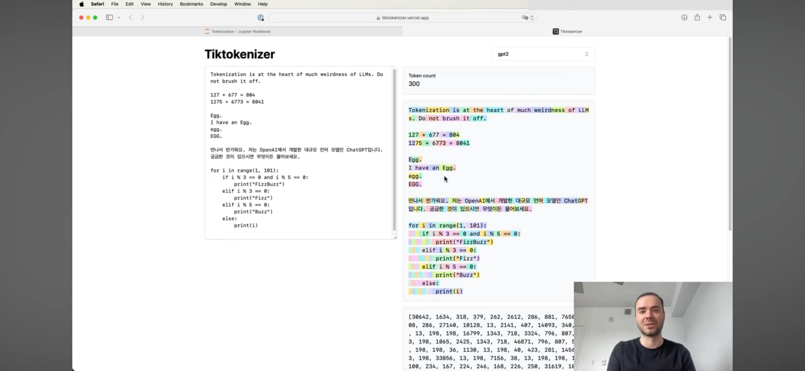

### 2월 22일 (목) 09:21 · #solar-min-beta-open #purpose-trained #o…

#solar-min-beta-open #purpose-trained #outperformsgpt4

Upstage, Powerful, Purpose-trained LLM, Solar Open Beta 시작합니다.

우수한 성능의 훨씬 가볍고 빠른 Solar-min-api (beta)를 공개합니다. https://console.upstage.ai 에 가입하시면 바로 사용하실수 있습니다.

Solar-min는 이름대로 mini size로 빠른 속도로 응답합니다. Mini-size로 세상의 지식은 부족하지만 많은 분들이 사용하시는 RAG 시나리오에서는 좋은 성능을 보입니다. GPT-3.5 보다 훨씬 잘합니다. (그동안 closed-beta 사용자 분들이 투표해주신 결과 참고) 지금은 4k 토큰을 지원하지만 곧 64K 지원 모델이 출시될 예정입니다. 또한 Solar-mini에 이어 더 뛰어난 성능의 medium, pro등도 곧 출시됩니다.

Solar-mini 와 같은 일반 모델뿐만 아니라 Upstage가 집중하는 부분은 고객의 목적에 딱 필요한 purpose-trained 모델입니다. 선택과 집중으로 더 뛰어난 성능의 powerful 한 모델을 만들수 있기 때문입니다. 이번 베타에 함께 출시하는 solar-mini-translate-enko, solar-mini-translate-koen 모델은 바로 powerful, purpose-trained 모델의 예입니다. 번역 purpose에 맞게 학습된 solar-mini-translate는 번역 전문 모델인 DeepL Pro, Google Translate, 파파고등 보다 뛰어날뿐만 아니라 GPT-4의 보다 번역을 잘합니다. 이 모델은 32K 토큰까지 지원이 됩니다. 추후 10M나 그 이상의 토큰사이즈도 지원할 예정입니다. 번역 특화 뿐만 아니라 Medical, Finance 도메인및 NL2SQL purpose-trained 모델들도 곧 출시됩니다.  

여러분들이 하시는 일에 Powerful, Purpose-trained 모델이 필요하신 분들은 https://www.upstage.ai/llm/custom-model-request 에 신청해주시면 바로 연락 드리겠습니다.

저도 API를 테스트 해보기 위해 60여줄되는 2개의 간단한 streamlit app을 만들어 보았습니다. 둘다 github에 코드도 모두 공개 되어 있습니다.

1. https://up-solar.streamlit.app: @ 테깅으로 3개의 모델을 불러서 시험 가능합니다.
2. https://solar-translate.streamlit.app: en-ko, ko-en 번역 데모. 이전 번역결과를 수정하여 톤 조절 가능합니다.

이번 solar mini 3종류의 API많이 사용해주시고 또 불편하신 부분에 많은 의견 부탁드립니다. 
* solar-1-mini-chat (4K tokens)
* solar-1-mini-translate-enko (32K tokens)
* solar-1-mini-translate-koen (32K tokens)

(서버 사정으로 가입자 수에 따라 Open Beta 에서 Waiting List로 전환될수 있음을 미리 말씀드립니다.)

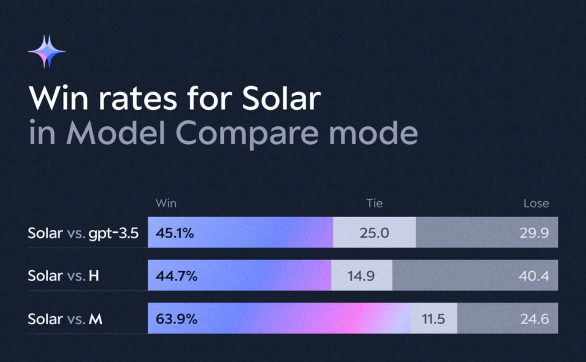 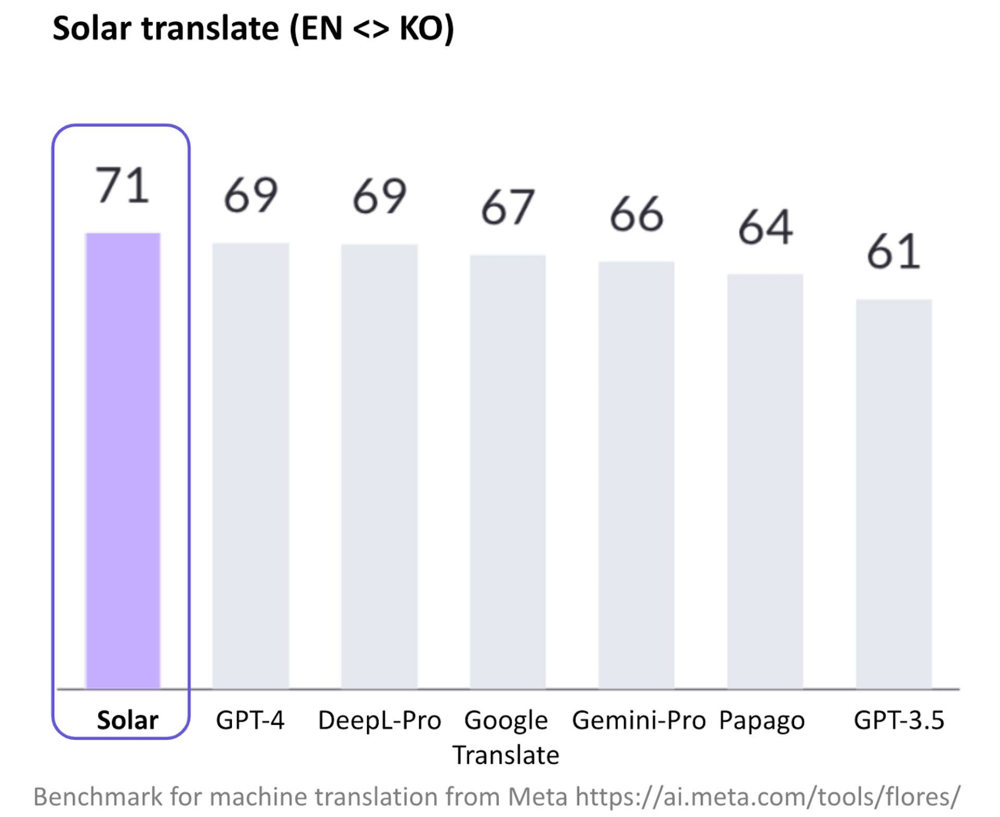 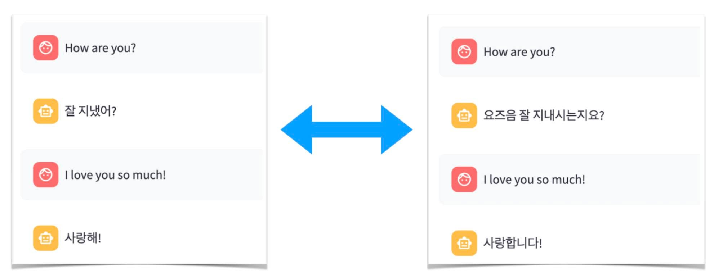 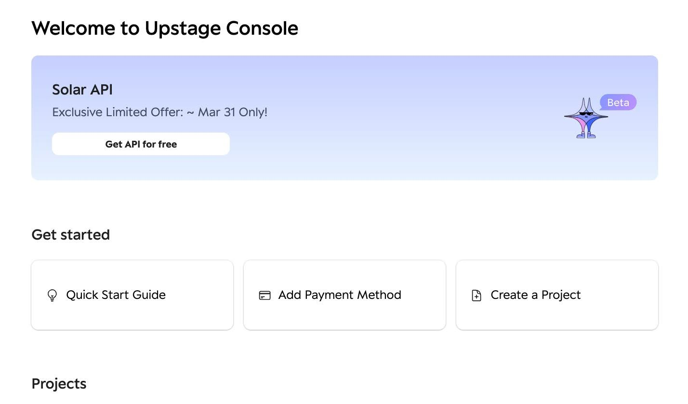

### 2월 22일 (목) 12:49 · #222 #강남눈꽃

#222 #강남눈꽃

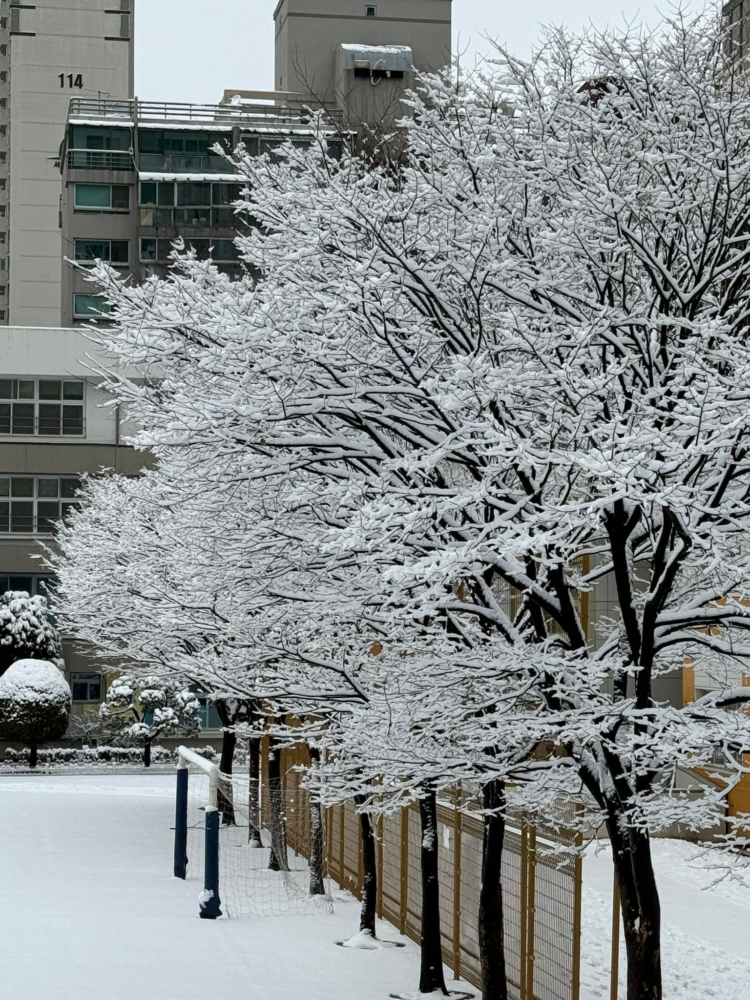 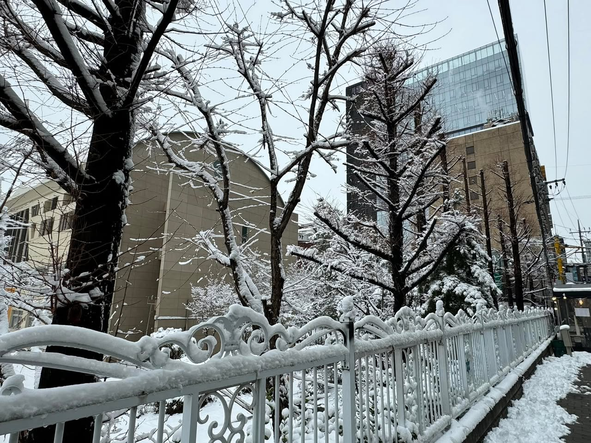 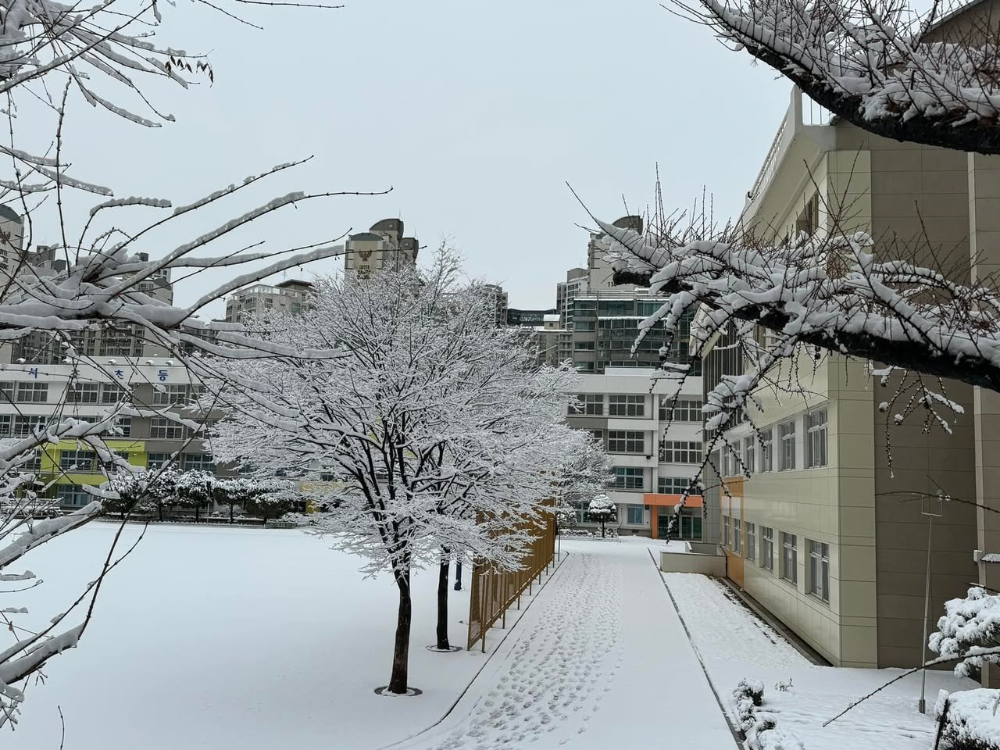 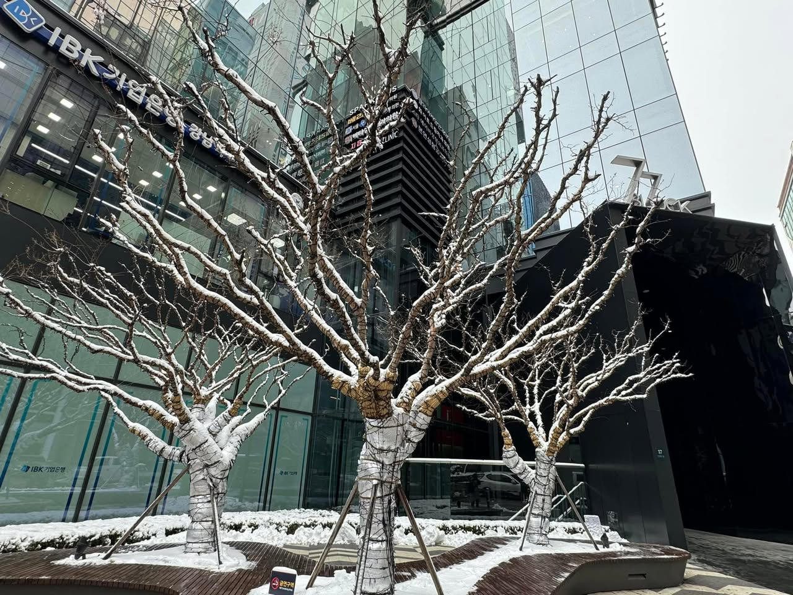 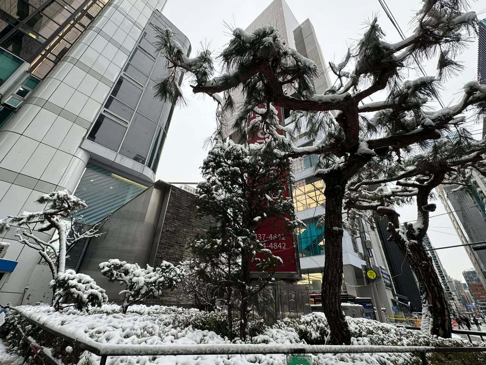 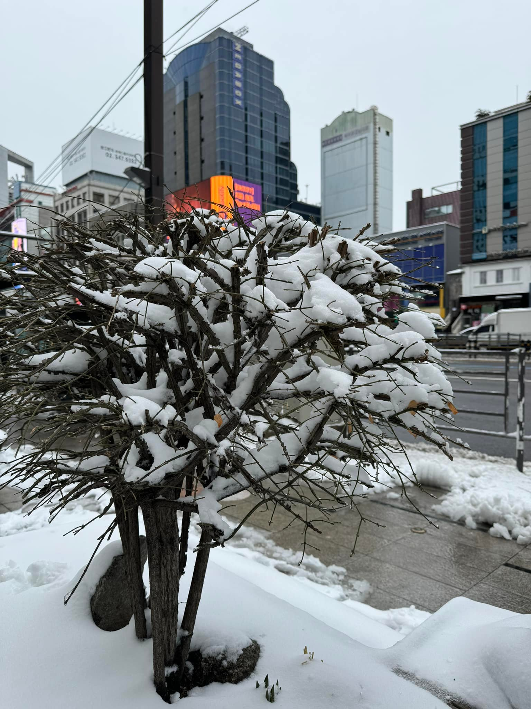

### 2월 23일 (금) 07:51 · #solarllm #gemma  Upstage Solar는 Open LL…

#solarllm #gemma  Upstage Solar는 Open LLM 생태계에 오신 Google Gemma를 환영합니다!

Upstage Solar welcomes Google Gemma to the Open LLM ecosystem!

Open-source Model: https://huggingface.co/upstage/SOLAR-10.7B-Instruct-v1.0
API: https://console.upstage.ai/

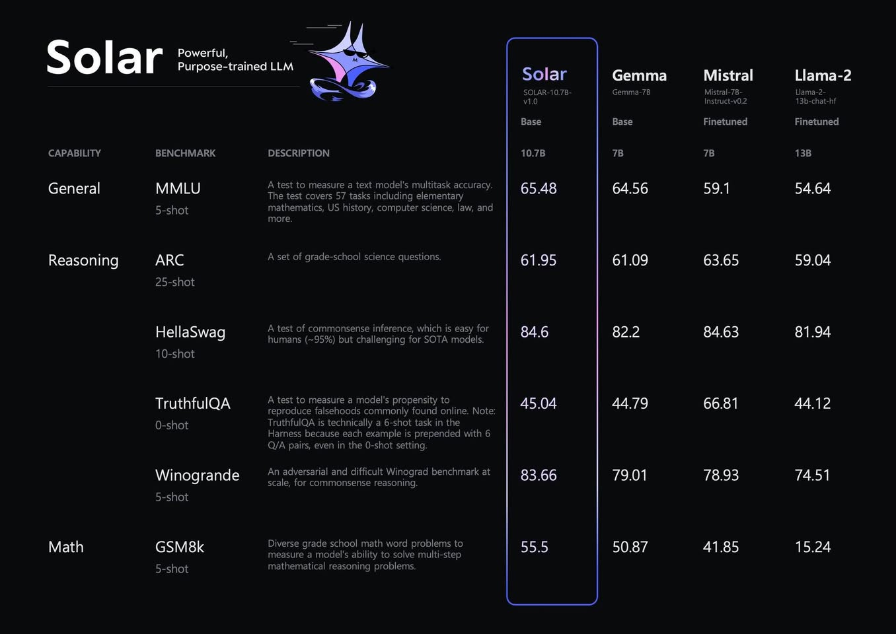

### 2월 23일 (금) 13:45 · #써보니좋더라 고객분들이 사용해보고 좋아 해주시는 것이 제일 좋습니다.

#써보니좋더라 고객분들이 사용해보고 좋아 해주시는 것이 제일 좋습니다. 

특히
* 톤 수정
* 용어 정의 
* 마크업 같은 form

등을 정의 해주시면 이를 따라 다음 번역은 위 톤/용어/형식을 따라 갑니다. 

여러분들이 API키를 받아 가세요: https://console.upstage.ai

### 2월 23일 (금) 22:16 · 📷 사진 (1장)

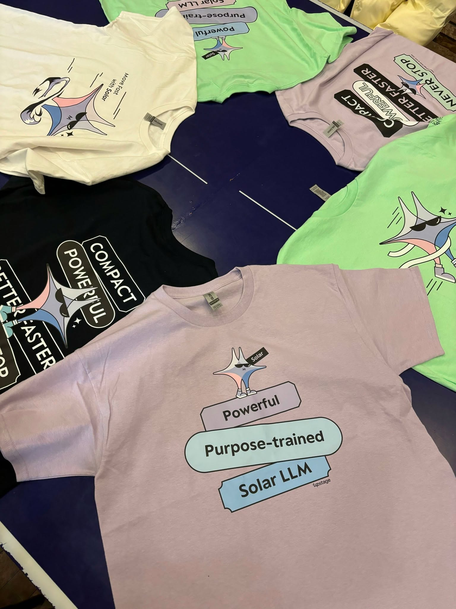

### 2월 25일 (일) 08:36 · #모두를위한AGI 많이 공유된 아래 @이영진님의 글을 읽고 가슴이 먹먹히…

#모두를위한AGI 많이 공유된 아래 @이영진님의 글을 읽고 가슴이 먹먹히 졌습니다. 정말 이 당시 최신 기술을 접하고 있던 사람들 조차도 미래를 쉽게 볼수 있는 것은 아니구나 생각이 들었습니다. 그럼 우리는 어떻게 해야 할까요? 저도 두렵습니다만 제 개인 생각을 말씀드리면:

1. 지금이라도 AI 기본 개념에 대해 알아야 한다: https://www.youtube.com/playlist?list=PLlMkM4tgfjnLSOjrEJN31gZATbcj_MpUm 1강과 2강만 들어 보셔도 좋겠습니다.

2. 딥다이브: 업스테이지와 패캠이 함께 만드는 인공지능 무료 부트캠프 (3/6일 마감)에 참여: https://fastcampus.co.kr/b2g_kdigitaltraining_ai

3. 핸즈온: https://console.upstage.ai/ 에서 solar API를 파고 이것 저것 만들어 본다. 간단한 요약봇, 챗봇, 이메일봇, 번역봇 등등 할수 있는게 많습니다.

여러분들은 어떻게 준비하시나요? 하시는 방법이 있으면 댓글로 알려주세요.

---
아니, 어떻게 그게 사람이 하는 일을 대신해요?
그 작은 전기칩(반도체)이 도대체 어떻게 사람 말을 알아듣고
미국에서 한국의 목포로, 부산으로 전화 연결을 해줘요?
일본 발신만 담당하는 교환원이 4조 3교대 80명이고
이것도 업무량이 늘어서 정신없는데 이걸 다 기계가 알아서 한다구요?
그럴리가요

### 2월 25일 (일) 20:23 · #solarllm Solar llm API로 무엇을 만들수 있을까요? 정…

#solarllm Solar llm API로 무엇을 만들수 있을까요? 정말 재미있는게 많습니다.

오늘은 뉴스나 정보를 찾아 여러분의 질문에 답하는 Solar Mini Search https://ss.sung.devstage.ai/ 시스템을 만들어 보았습니다. 

DDG 검색과  News API를 사용하여 150여줄 정도의 코드로 되어 있습니다. https://github.com/hunkim/solar-search. 
(위 코드는 간단한 동작을 보여주는 toy 시스템으로 실제 RAG와 정확한 검색, 그리고 Answer verification을 위해서는 더 많은 upstage 모듈들이 필요합니다.) 

API 필요하신 분들은 https://console.upstage.ai/ 에서 받으실수 있습니다.

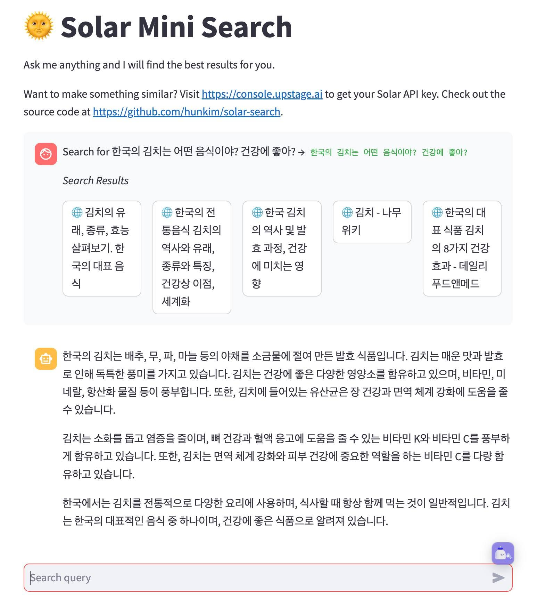 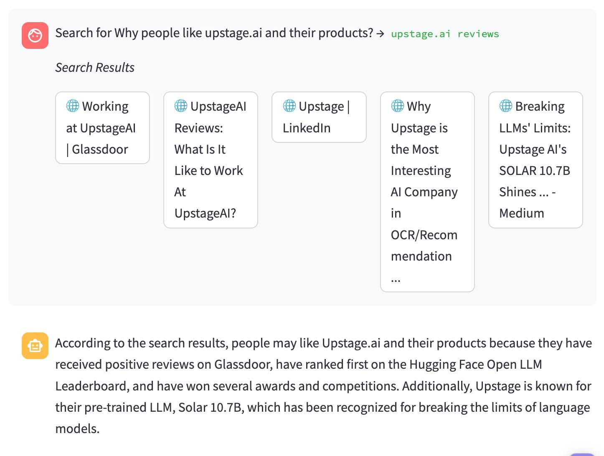

### 2월 27일 (화) 08:33 · #solarllm 아래 2개의 답변중 어떤게 좋으세요? 오른쪽 결과가 좋…

#solarllm 아래 2개의 답변중 어떤게 좋으세요? 오른쪽 결과가 좋다고 생각하시면 ❤️, 왼쪽 결과가 더 좋다고 생각하시면 👍를 눌러주세요.  잘 봐주세요!

https://console.upstage.ai/ 에 오시면 더 많은 모델들과 비교가 가능하고 그 결과를 저희들은 정기적으로 공개할 예정입니다. Upstage console로 놀러오셔요.

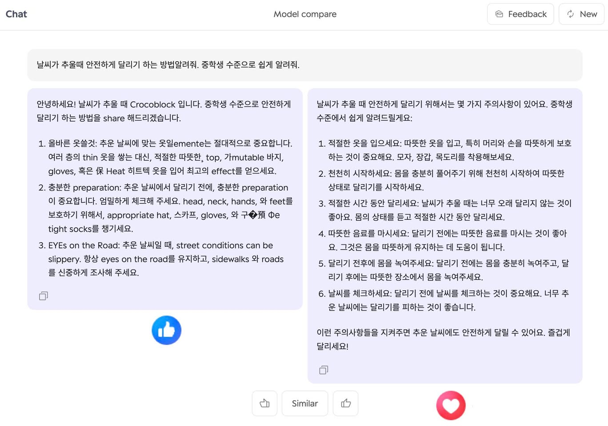

### 2월 27일 (화) 08:47 · 📷 사진 (1장)

### 2월 27일 (화) 09:48 · #solarllm Move Fast with Solar LLM  요즈음…

#solarllm Move Fast with Solar LLM  요즈음 핫하다는 을지로 패션입니다!

🎬 동영상 1개 (생략)

### 2월 27일 (화) 15:58 · #solarllm #kbank KBank에서 곧 solar llm 을 만…

#solarllm #kbank KBank에서 곧 solar llm 을 만나실수 있습니다! 

https://n.news.naver.com/mnews/article/001/0014530468?sid=105

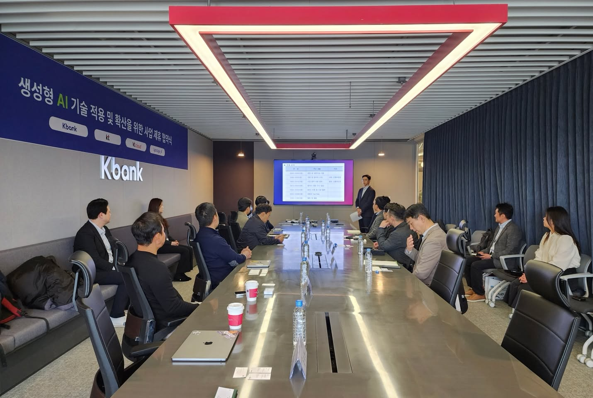 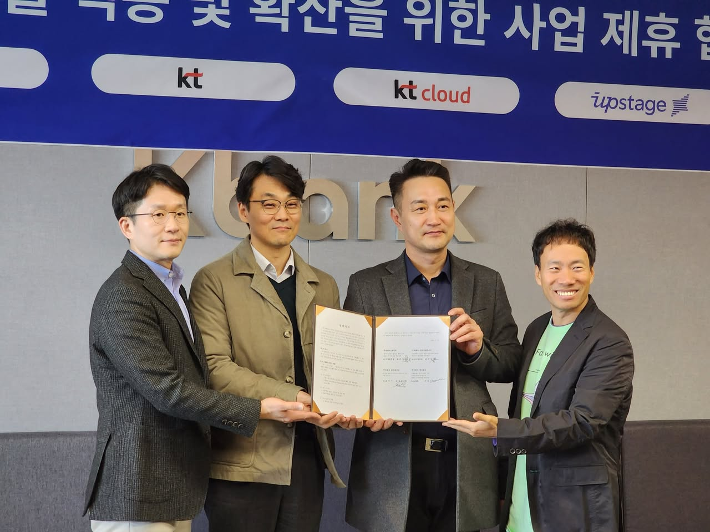 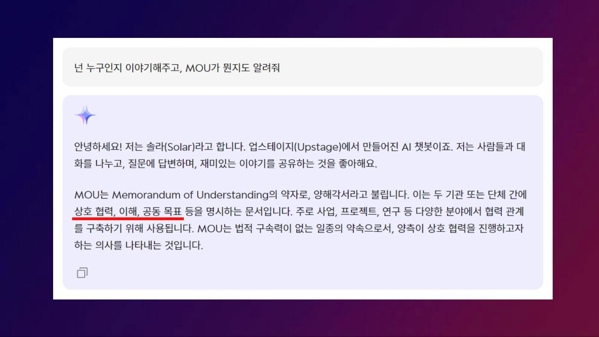

### 2월 27일 (화) 21:26 · #solarllm #함께만들어요세계 최고의 Powerful하고 고객의 목…

#solarllm #함께만들어요세계 최고의 Powerful하고 고객의 목적에 딱 맞는 purpose-trained Solar LLM을 함께 만들어 나갈 분들을 모십니다. 불가능을 가능하게 만들고 고객을 감동시킬 수 있는 분들과 함께하고자 합니다. 선지원 후고민!

* LLM Research Engineer - LLM: https://careers.upstage.ai/o/ai-research-engineer-llm
* LLM Data Engineer: https://careers.upstage.ai/o/data-engineer-2024

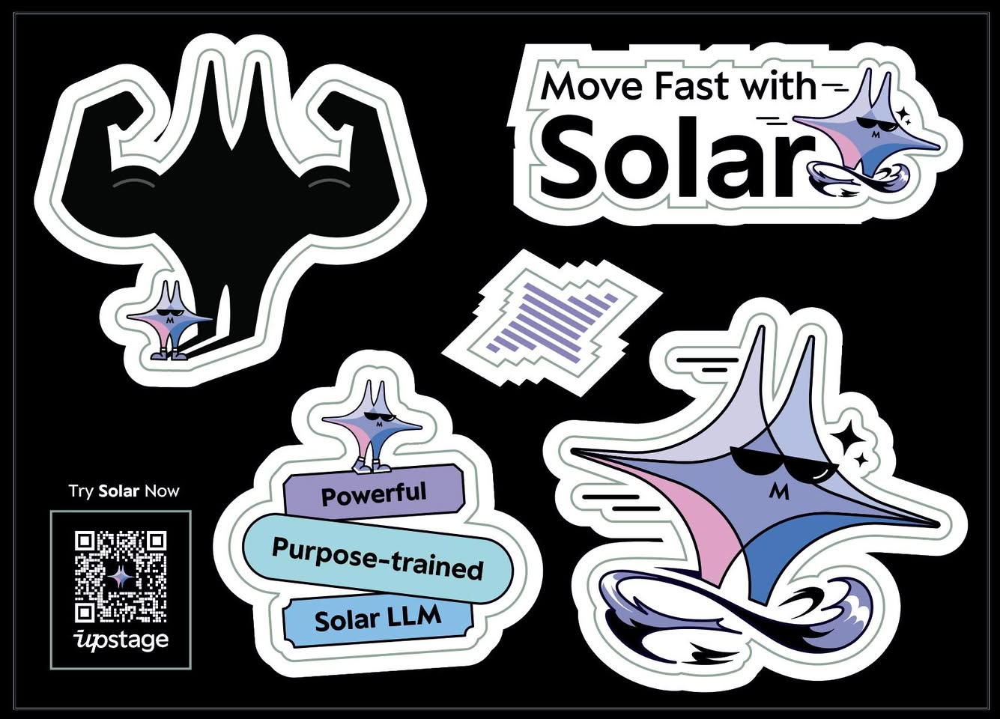

### 2월 28일 (수) 10:05 · #solarllm #써보니좋더라  "Solar 1 Mini Chat이 G…

#solarllm #써보니좋더라  "Solar 1 Mini Chat이 GPT 3.5 0125의 ELO를 추월했습니다. 10.7B 기반으로 알고있는데 성능 확실하네요."

@박정환 님이 운영해주시는 https://elo.instruct.kr/ 챗봇 아레나에 Solar-mini를 추가해 주셔서 감사합니다! 😊

이제 남은 것은 GPT-4를 넘어서고 OpenAI를 넘어서는 일입니다. 함께 만들어 나갈 분들을 찾고 있습니다. 선지원 후고민!

* LLM Research Engineer - LLM: https://careers.upstage.ai/o/ai-research-engineer-llm
* LLM Data Engineer: https://careers.upstage.ai/o/data-engineer-2024

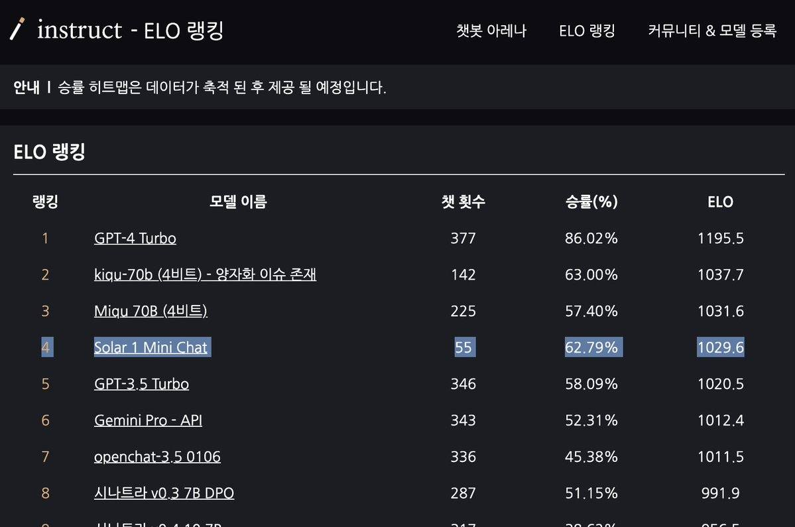

### 2월 28일 (수) 16:44 · #0313 #실리콘벨리밋업

#0313 #실리콘벨리밋업 

3월 13일 오픈AI를 방문하시고 오시는 기업들을 모시고 실리콘 벨리에서 밋업행사를 가집니다. 멋진 AI기업들과 또 멋진 분들 함께 해요.

신청 링크는 댓글에 있습니다.

--

82Startup 및 업계 리더와 함께하는 독점적인 Dinner & Networking 이벤트에서 혁신과 협업의 기회를 시작하십시오. 이 행사는 통찰력 있는 대화, 네트워킹 기회 및 맛있는 음식으로 가득 찬 저녁을 약속합니다.

​5:00 ~ 6:00 – Reception, 식사 + 네트워킹 시간
​6:00 ~ 6:10 – Opening remarks
​6:10 ~ 6:30 – 한국 스타트업 생태계의 글로벌화 (Fireside Chat - 중기부 임정욱실장)
​6:30 ~ 6:40 – AI Startup Elevator Pitching
​6:40 ~ 7:20 – Panel Talk: AI Startups (Sung Kim & 3~4 startups)
​7:20 ~ 7:30 – AI Startup Elevator Pitching
​7:30 ~ 8:10 – Panel Talk: Big AI Corps
​8:10 ~ 9:00 – 네트워킹

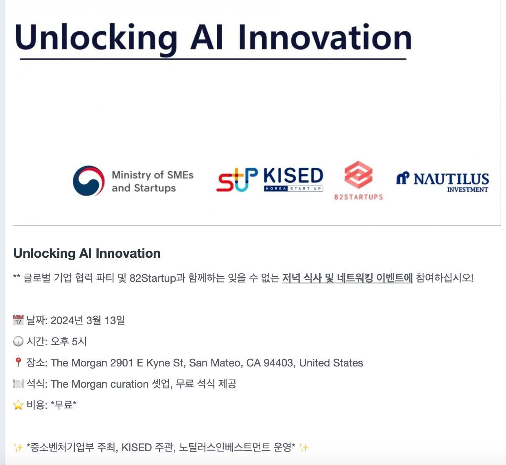

### 2월 29일 (목) 07:25 · #라마3 어제 저커버그님의 일정표에 성킴등장! ^^ 또 메타와 이야기 할…

#라마3 어제 저커버그님의 일정표에 성킴등장! ^^ 또 메타와 이야기 할것 같은데 여러분들은 메타에 기대하시는 것이 어떤것이 있나요? 제가 참고해서 전달 드리겠습니다.

제가 메타에 전달한것
* 라마1 좋아서 우리가 72B 튜닝 잘해서 허깅페이스 1등도 했다.
* 라마2 나와서 좋았으나 미스트랄등 다른 웨잇에 비해 좀 약했다.
* 라마3 그래서 기대 된다.

* 그런데 한국어는 잘 안된다. 신경써주면 좋겠다.
* 그런데 아마 라마팀도 리소스 없어서 신경 못쓰는거 이해한다.
* 그럼 메타 레지던시 같은 프로그램 해서 각 나라 한팀씩 선발해 (한국은 업스테이지 해달라) 라마3 출시 한두달전 불러 각국 언어들 같이 만들자
* 그런다음 라마3 kr, 라마3 jp 버전 같이 오픈해서 글로벌 임펙트 만들자

어제 너무 좋은 분위기로 미팅을 세팅해주시고 또 저희들을 환대해주신 메타 분들에게 감사드립니다.

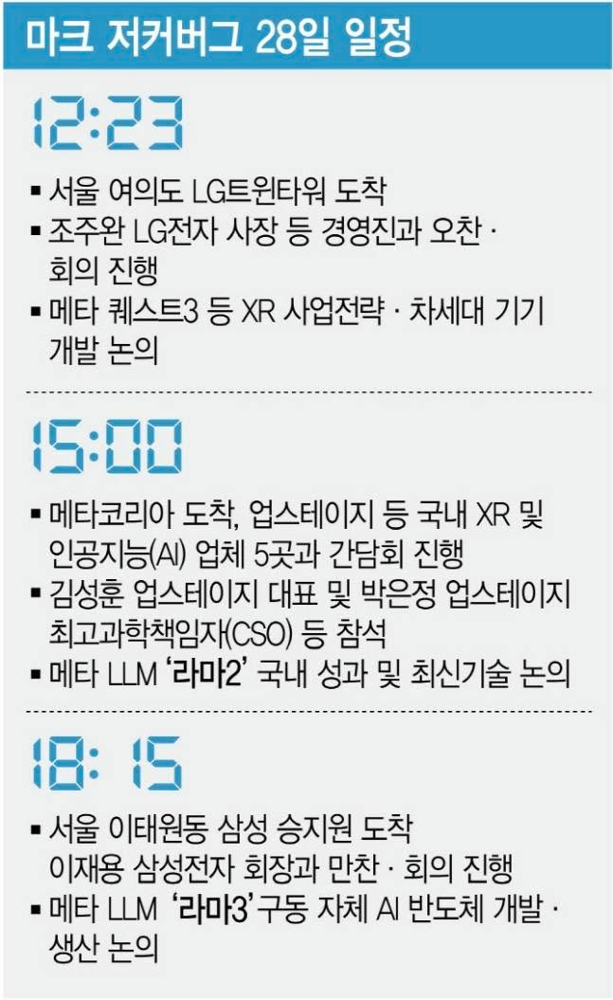 
