# 2024년 3월

[← 2024년](README.md)

### 3월 1일 (금) 11:17 · #0301 #좋은날 #첫온디바이스오피스 #solarllm 보안이나 추가 …

#0301 #좋은날 #첫온디바이스오피스 #solarllm 보안이나 추가 비용 걱정없이 온디바이스로 즐길수 있는 Polaris Office Mac On-device AI가 출시 되었습니다. 작지만 강력한 solar llm이 탑재되었습니다. 많이 사용해주세요. 

Hae-Seok Lee 부사장님의 리더쉽으로 빠르게 츨시 되어 Office On-device로는 첫 사례가 된것 같습니다. 지금은 Mac만 지원하지만 더 많은 플랫폼에서 더 많은 기능과 편리함으로 찾아 뵙겠습니다.

구매문의 링크는 댓글에 있습니다.

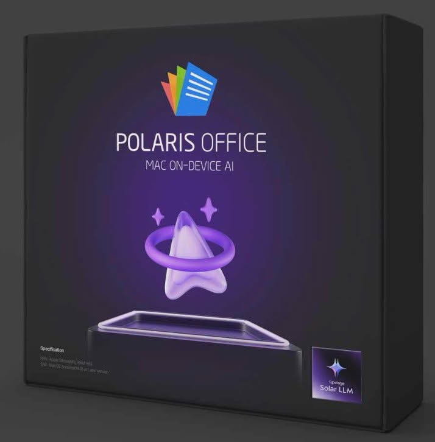
**이미지 캡션:** 이 사진은 검은색 상자 전면을 보여주며, 상자에는 "POLARIS OFFICE"라는 로고와 "MAC ON-DEVICE AI"라는 문구가 흰색으로 적혀 있습니다. 로고 위에는 여러 색상의 서류철 모양 아이콘이 있습니다. 상자 중앙에는 보라색 빛을 띠는 별 모양의 3D 렌더링이 있으며, 그 주위에는 보라색 고리가 회전하는 듯한 모습입니다. 별 아래에는 평평한 검은색 받침대가 있고, 그 위에 얇은 태블릿 모양의 기기가 놓여 있습니다. 상자 오른쪽 하단에는 "Supatage Solar LLM"이라고 적힌 작은 사각형 로고가 보입니다. 상자 왼쪽 하단에는 "Specification"이라는 제목과 함께 하드웨어 및 소프트웨어 요구 사항에 대한 텍스트가 작게 쓰여 있지만, 자세한 내용은 읽기 어렵습니다. 전체적으로 어두운 배경과 보라색 조명이 어우러져 현대적이고 기술적인 분위기를 자아냅니다. 로고가 보입니다. 상자 왼쪽 하단에는 "Specification"이라는 제목과 함께 하드웨어 및 소프트웨어 요구 사항에 대한 텍스트가 작게 쓰여 있지만, 자세한 내용은 읽기 어렵습니다. 전체적으로 어두운 배경과 보라색 조명이 어우러져 현대적이고 기술적인 분위기를 자아냅니다.
 
**이미지 캡션:** 이 이미지는 스마트폰 화면의 일부를 캡처한 것으로, '폴라리스 오피스 AI Chat'이라는 이름의 챗봇과의 대화 내용을 보여줍니다. 화면 상단에는 '작성'과 '채팅'이라는 두 개의 아이콘과 텍스트가 있으며, '채팅' 아이콘이 활성화되어 있습니다. 챗봇은 보라색 말풍선 안에 "안녕하세요. 쉽고, 빠르게 문서 작성을 도와주는 폴라리스 오피스 AI Chat 입니다."라고 인사하고 있습니다. 그 아래에는 사용자가 입력한 것으로 보이는 보라색 버튼에 "대한민국 미디어 이용 트렌드 조사 결과를 알려줘."라는 텍스트가 있습니다. 이어서 챗봇은 "내용을 생성 중입니다…"라는 메시지와 함께, 대한민국 미디어 이용 트렌드에 대한 조사 결과를 두 가지 항목으로 나누어 설명하고 있습니다. 첫 번째 항목은 '모바일 미디어 이용 증가'에 대한 내용으로, 스마트폰과 태블릿을 통한 미디어 이용이 증가하고 있으며 동영상 스트리밍, 소셜 미디어, 음악 및 영화 스트리밍 이용이 흔해지고 있다고 설명합니다. 두 번째 항목은 '동영상 스트리밍의 인기'에 대한 내용으로, YouTube, Netflix, Naver TV, KakaoTV 등 동영상 스트리밍 플랫폼이 인기를 얻고 있으며, 온라인 동영상 콘텐츠의 다양성과 퀄리티로 인해 시청자가 증가하고 있다고 언급합니다. 전체적으로 정보 제공 및 문서 작성 지원 기능을 가진 AI 챗봇과의 상호작용 화면을 보여주는 것으로, 차분하고 정보 전달에 초점을 맞춘 분위기입니다.습니다. 이어서 챗봇은 "내용을 생성 중입니다…"라는 메시지와 함께, 대한민국 미디어 이용 트렌드에 대한 조사 결과를 두 가지 항목으로 나누어 설명하고 있습니다. 첫 번째 항목은 '모바일 미디어 이용 증가'에 대한 내용으로, 스마트폰과 태블릿을 통한 미디어 이용이 증가하고 있으며 동영상 스트리밍, 소셜 미디어, 음악 및 영화 스트리밍 이용이 흔해지고 있다고 설명합니다. 두 번째 항목은 '동영상 스트리밍의 인기'에 대한 내용으로, YouTube, Netflix, Naver TV, KakaoTV 등 동영상 스트리밍 플랫폼이 인기를 얻고 있으며, 온라인 동영상 콘텐츠의 다양성과 퀄리티로 인해 시청자가 증가하고 있다고 언급합니다. 전체적으로 정보 제공 및 문서 작성 지원 기능을 가진 AI 챗봇과의 상호작용 화면을 보여주는 것으로, 차분하고 정보 전달에 초점을 맞춘 분위기입니다.
 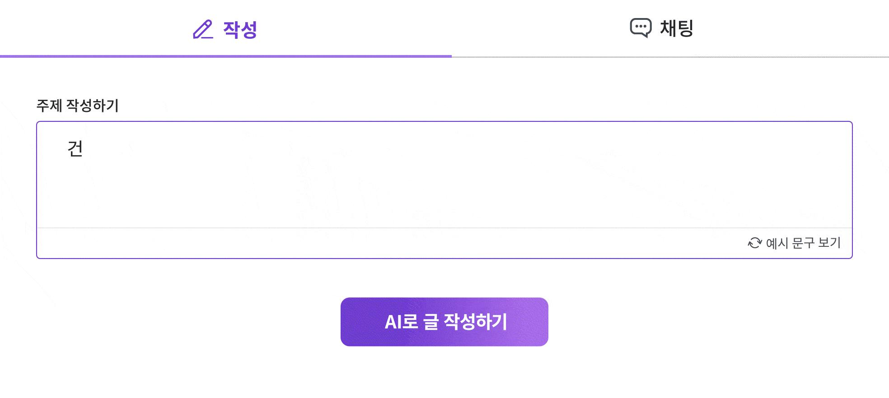
**이미지 캡션:** 이 이미지는 웹사이트의 인터페이스를 보여주며, 사용자가 글을 작성하는 기능을 제공합니다. 상단에는 "작성"이라는 제목과 연필 아이콘이 있고, 오른쪽에는 "채팅"이라는 단어와 말풍선 아이콘이 있습니다. 중앙에는 "주제 작성하기"라는 안내 문구와 함께 입력란이 있으며, 입력란 안에는 "건"이라는 한 글자가 입력되어 있습니다. 입력란 아래에는 "예시 문구 보기"라는 텍스트와 함께 새로고침 아이콘이 있습니다. 가장 하단에는 보라색 배경의 "AI로 글 작성하기" 버튼이 있습니다. 전체적으로 깔끔하고 현대적인 디자인이며, 사용자가 글쓰기 작업을 시작하거나 AI의 도움을 받아 글을 작성할 수 있는 환경을 제공합니다. 사람의 모습은 보이지 않으며, 배경은 흰색으로 단순합니다., 사용자가 글쓰기 작업을 시작하거나 AI의 도움을 받아 글을 작성할 수 있는 환경을 제공합니다. 사람의 모습은 보이지 않으며, 배경은 흰색으로 단순합니다.

### 3월 3일 (일) 01:43 · 📷 사진 (1장)

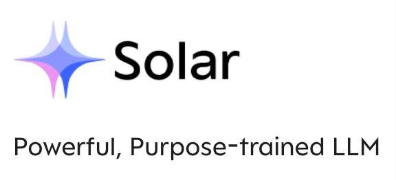
**이미지 캡션:** 이 사진은 흰색 배경에 "Solar"라는 단어와 함께 네 개의 뾰족한 별 모양의 로고가 왼쪽에 배치되어 있습니다. 로고는 파란색과 보라색, 분홍색이 겹쳐져 빛나는 듯한 효과를 줍니다. 로고 아래에는 "Powerful, Purpose-trained LLM"이라는 문구가 검은색 글씨로 쓰여 있습니다. 이 문구는 "강력하고, 목적에 맞게 훈련된 LLM"을 의미하며, "Solar"가 인공지능 언어 모델임을 나타냅니다. 사진에는 사람이 등장하지 않으며, 장소나 사물에 대한 정보도 없습니다. 전체적으로 깔끔하고 현대적인 디자인으로, 기술적인 제품이나 서비스를 홍보하는 데 사용될 것으로 보입니다. 디자인으로, 기술적인 제품이나 서비스를 홍보하는 데 사용될 것으로 보입니다.

### 3월 3일 (일) 12:37 · #0306 AI meetup (San Francisco): AI, LLM…

#0306 AI meetup (San Francisco): AI, LLMs, and ML @GitHub office 근처 계시는 분들 모두 초대 합니다. (RSVP는 댓글 링크 참조. 이미 300명 넘게 RSVP 주셨습니다.)

Welcome to the monthly in-person AI meetup in San Francisco. Join us for deep dive tech talks on AI, GenAI, LLMs and machine learning, food/drink, networking with speakers and fellow developers.

Agenda:
- 5:00pm~5:50pm: Checkin, food/drink and networking
- 5:50pm~6:00pm: Welcome, Community update
- 6:00pm~7:30pm: Tech talks and Q&A
- 7:30pm~8:00pm: Open discussion and Mixer
- 8:00pm: closing and head to bar

Tech Talk: Open-source LLM optimized for building purpose-trained models

Speaker: Sung Kim  (Upstage)
Abstract: Can small, purpose-trained models outperform GPT-4 in task-specific applications and enable developers to deploy AI systems quickly and efficiently? In this talk, we will introduce Solar, how it is optimized for a fast & efficient model development with our proprietary architecture/ techniques, and emerging use cases with global enterprises.

[...]

GitHub, 88 Colin P Kelly Junior Street, San Francisco, CA

**이미지 캡션:** 이 이미지는 AICamp에서 주최하는 샌프란시스코 인공지능, LLM, 머신러닝 및 데이터 관련 오프라인 모임을 홍보하는 포스터입니다. 배경은 짙은 파란색이며, 동심원과 원형의 추상적인 그래픽 요소들이 배치되어 있습니다. 상단에는 흰색 삼각형 로고와 함께 "AICamp | SAN FRANCISCO"라는 글자가 흰색으로 표시되어 있으며, 그 아래에는 "IN PERSON MEETUP"이라는 문구가 흰색 사각형 안에 담겨 있습니다. 중앙에는 "AI, LLMs, ML and Data Meetup"이라는 문구가 흰색으로 크게 적혀 있으며, "AI"와 "Data" 아래에는 파란색 밑줄이 그어져 있습니다. 이미지 하단에는 "AI meetup (San Francisco): AI, LLMs, and ML"이라는 텍스트가 흰색으로 표시되어 있습니다. 전체적으로 현대적이고 기술적인 분위기를 풍기며, 정보 전달에 초점을 맞춘 디자인입니다. 크게 적혀 있으며, "AI"와 "Data" 아래에는 파란색 밑줄이 그어져 있습니다. 이미지 하단에는 "AI meetup (San Francisco): AI, LLMs, and ML"이라는 텍스트가 흰색으로 표시되어 있습니다. 전체적으로 현대적이고 기술적인 분위기를 풍기며, 정보 전달에 초점을 맞춘 디자인입니다.

### 3월 4일 (월) 12:04 · #쉬운솔라 #solarllm 갓찬성 Park Chansung님이 만들어 …

#쉬운솔라 #solarllm 갓찬성 Park Chansung님이 만들어 주신 Solar API 사용법 tutorial인데 정말 쉽고 친절하게 잘 작성해주셨습니다. 
https://gde-codelabs.github.io/

10분만에 모든것을 할수 있고 테스트까지 해보실수있습니다. 한번 사용해보시면 바로 그 맛을 아십니다!

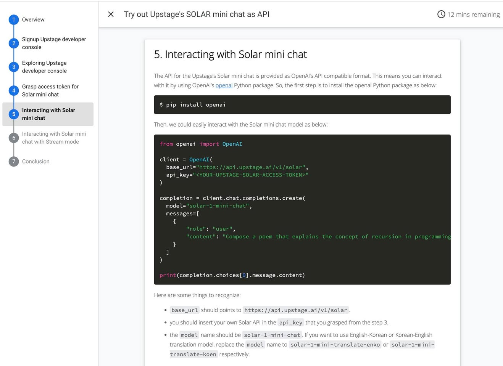
**이미지 캡션:** 이 이미지는 웹 페이지의 스크린샷으로, 왼쪽에는 단계별 안내가 표시되고 오른쪽에는 코드 예시와 설명이 있습니다. 안내 목록에는 "Overview", "Signup Upstage developer console", "Exploring Upstage developer console", "Grasp access token for Solar mini chat", "Interacting with Solar mini chat", "Interacting with Solar mini chat with Stream mode", "Conclusion"이 있으며, 현재 "Interacting with Solar mini chat" 단계가 강조 표시되어 있습니다. 오른쪽 메인 영역에는 "5. Interacting with Solar mini chat"라는 제목 아래, Upstage의 Solar mini chat API를 OpenAI API와 호환되는 형식으로 제공하며, 이를 사용하기 위해 OpenAI Python 패키지를 설치하는 방법과 Python 코드를 사용하여 Solar mini chat 모델과 상호작용하는 예시가 제시되어 있습니다. 코드 블록에는 `pip install openai` 명령어와 OpenAI 라이브러리를 임포트하고 API 키를 설정하여 챗봇 모델에 메시지를 보내는 Python 코드가 포함되어 있습니다. 코드 아래에는 `base_url`, `api_key`, `model` 이름에 대한 설명과 함께 영어-한국어 또는 한국어-영어 번역 모델 사용 시 `model` 이름을 변경하는 방법에 대한 추가 정보가 있습니다. 페이지 상단에는 "Try out Upstage's SOLAR mini chat as API"라는 제목과 함께 남은 시간이 표시되어 있습니다. 전반적으로 기술적인 튜토리얼의 일부로, 개발자가 Upstage의 AI 모델을 API를 통해 사용하는 방법을 안내하는 내용입니다., "Conclusion"이 있으며, 현재 "Interacting with Solar mini chat" 단계가 강조 표시되어 있습니다. 오른쪽 메인 영역에는 "5. Interacting with Solar mini chat"라는 제목 아래, Upstage의 Solar mini chat API를 OpenAI API와 호환되는 형식으로 제공하며, 이를 사용하기 위해 OpenAI Python 패키지를 설치하는 방법과 Python 코드를 사용하여 Solar mini chat 모델과 상호작용하는 예시가 제시되어 있습니다. 코드 블록에는 `pip install openai` 명령어와 OpenAI 라이브러리를 임포트하고 API 키를 설정하여 챗봇 모델에 메시지를 보내는 Python 코드가 포함되어 있습니다. 코드 아래에는 `base_url`, `api_key`, `model` 이름에 대한 설명과 함께 영어-한국어 또는 한국어-영어 번역 모델 사용 시 `model` 이름을 변경하는 방법에 대한 추가 정보가 있습니다. 페이지 상단에는 "Try out Upstage's SOLAR mini chat as API"라는 제목과 함께 남은 시간이 표시되어 있습니다. 전반적으로 기술적인 튜토리얼의 일부로, 개발자가 Upstage의 AI 모델을 API를 통해 사용하는 방법을 안내하는 내용입니다.

### 3월 4일 (월) 12:13 · Solar가 WSDM Cup 2024: LLM for Conversati…

Solar가 WSDM Cup 2024: LLM for Conversational Multi-Doc QA 대회에서 1등한 백본 모델이 되었습니다!  

https://sites.google.com/view/wsdm24-docqa 대회에서 Upstage Solar 모델을 투닝한 한 대학 팀이 1등을 했습니다. 

* 논문: https://arxiv.org/abs/2402.18385
* 소스코드: https://github.com/zhangzhao219/WSDM-Cup-2024 

유사한 대회나 업무를 하시는 분들이 1등을 하려면 Solar를 사용하시면 된다는 소식입니다. ^^ Mistal, Llama보다 뛰어날뿐만 아니라 GPT4를 뛰어 넘습니다.

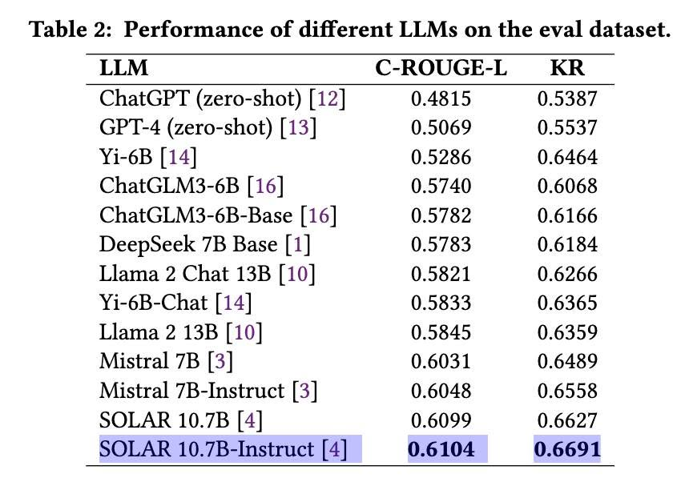
**이미지 캡션:** 이 이미지는 "Table 2: Performance of different LLMs on the eval dataset."라는 제목의 표로, 다양한 언어 모델(LLM)의 평가 데이터셋 성능을 보여줍니다. 표에는 LLM의 이름과 함께 C-ROUGE-L 및 KR이라는 두 가지 성능 지표가 나열되어 있습니다. 각 LLM은 ChatGPT, GPT-4, Yi-6B, ChatGLM3-6B, DeepSeek 7B, Llama 2, Mistral 7B, SOLAR 10.7B 등이며, 괄호 안의 숫자는 해당 LLM에 대한 참고 문헌을 나타냅니다. SOLAR 10.7B-Instruct 모델이 C-ROUGE-L과 KR 지표 모두에서 가장 높은 성능을 보이며, 해당 행은 연한 보라색으로 강조 표시되어 있습니다. 표는 흰색 배경에 검은색 텍스트로 구성되어 있으며, 명확한 정보 전달을 위한 깔끔한 디자인을 갖추고 있습니다. 이 표는 연구 논문이나 기술 보고서의 일부로, 다양한 LLM의 성능을 비교 분석하는 데 사용될 것으로 보입니다.고 문헌을 나타냅니다. SOLAR 10.7B-Instruct 모델이 C-ROUGE-L과 KR 지표 모두에서 가장 높은 성능을 보이며, 해당 행은 연한 보라색으로 강조 표시되어 있습니다. 표는 흰색 배경에 검은색 텍스트로 구성되어 있으며, 명확한 정보 전달을 위한 깔끔한 디자인을 갖추고 있습니다. 이 표는 연구 논문이나 기술 보고서의 일부로, 다양한 LLM의 성능을 비교 분석하는 데 사용될 것으로 보입니다.

### 3월 6일 (수) 10:56 · 업스테이지는 20억 명의 사용자를 보유한 선도적인 커뮤니케이션 API 플…

업스테이지는 20억 명의 사용자를 보유한 선도적인 커뮤니케이션 API 플랫폼인 Sendbird AI Chat에 #solarllm을 제공하게 되어 매우 기쁩니다. 😄

https://sendbird.com/ai-chatbot-free-trial 에서 Create application -> AI Chatbot -> Manage bots -> Create bot 에서 솔라 선택이 가능합니다.

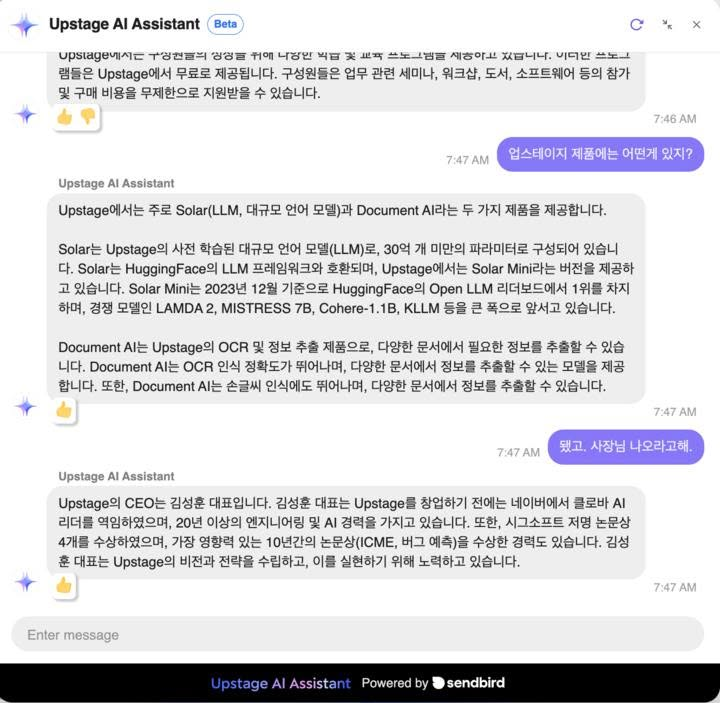
**이미지 캡션:** 이것은 Upstage AI Assistant와 사용자 간의 채팅 인터페이스를 보여주는 스크린샷입니다. 채팅은 텍스트 기반이며, AI 어시스턴트의 응답은 흰색 배경에 회색 글씨로 표시되고, 사용자의 메시지는 보라색 배경에 흰색 글씨로 표시됩니다. 상단에는 "Upstage AI Assistant"라는 로고와 함께 "Beta"라는 표시가 있습니다. 채팅 내용은 Upstage의 제품, 특히 Solar(LLM)와 Document AI에 대한 설명과 Upstage의 CEO인 김성훈 대표에 대한 정보로 구성되어 있습니다. 사용자는 "업스테이지 제품에는 어떤게 있지?"라고 질문하고, AI는 Solar와 Document AI에 대해 자세히 설명합니다. 이후 사용자는 "됐고, 사장님 나오라고해."라고 말하며, AI는 김성훈 대표에 대한 정보를 제공합니다. 채팅 인터페이스 하단에는 "Enter message"라는 입력창이 보이며, 이는 사용자가 새로운 메시지를 입력할 수 있음을 나타냅니다. 전반적으로 이 스크린샷은 AI 챗봇과의 대화 경험을 보여주며, 정보 제공 및 질의응답 기능을 중심으로 하고 있습니다. 사용자는 "업스테이지 제품에는 어떤게 있지?"라고 질문하고, AI는 Solar와 Document AI에 대해 자세히 설명합니다. 이후 사용자는 "됐고, 사장님 나오라고해."라고 말하며, AI는 김성훈 대표에 대한 정보를 제공합니다. 채팅 인터페이스 하단에는 "Enter message"라는 입력창이 보이며, 이는 사용자가 새로운 메시지를 입력할 수 있음을 나타냅니다. 전반적으로 이 스크린샷은 AI 챗봇과의 대화 경험을 보여주며, 정보 제공 및 질의응답 기능을 중심으로 하고 있습니다.
 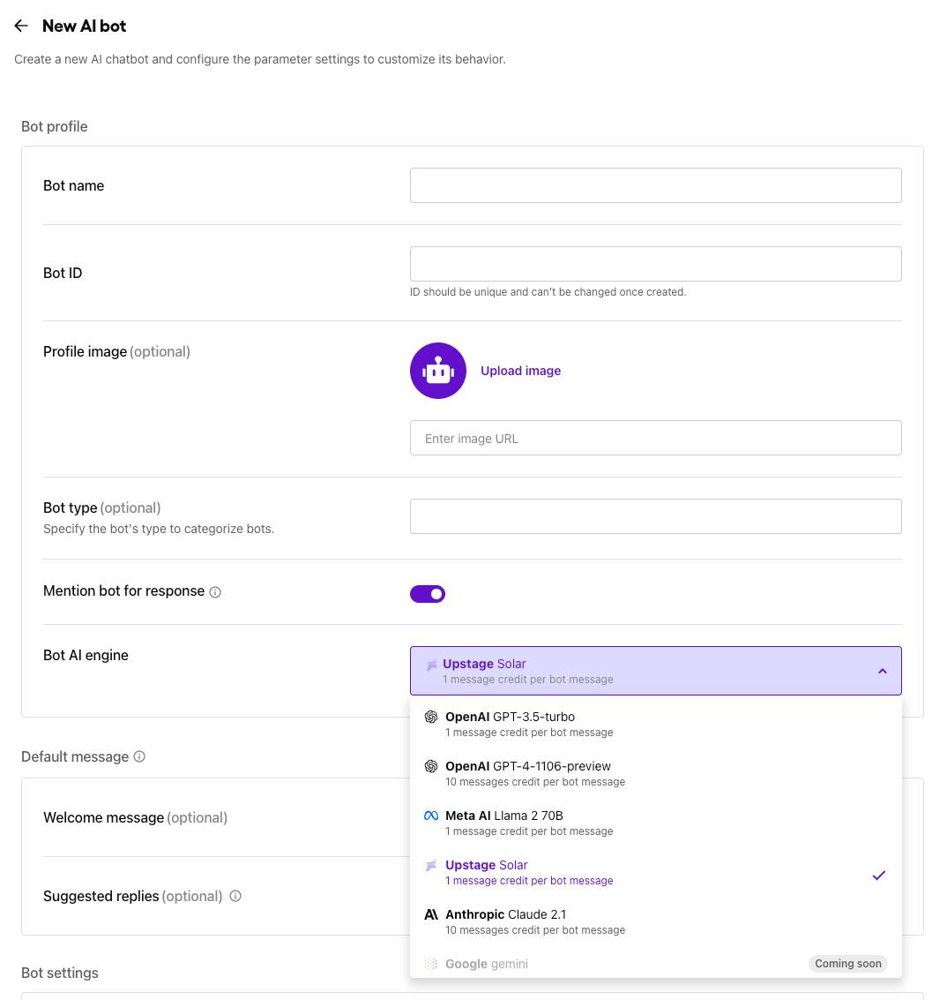
**이미지 캡션:** 이것은 새로운 AI 챗봇을 생성하고 설정을 구성하는 웹 페이지의 스크린샷입니다. 페이지 상단에는 "새 AI 봇"이라는 제목과 "새 AI 챗봇을 만들고 동작을 사용자 지정하기 위한 매개변수 설정을 구성하세요."라는 설명이 있습니다. 그 아래에는 "봇 프로필" 섹션이 있으며, 여기에는 "봇 이름", "봇 ID", "프로필 이미지(선택 사항)"를 입력할 수 있는 필드가 있습니다. 프로필 이미지 섹션에는 이미지를 업로드하거나 이미지 URL을 입력할 수 있는 옵션이 있습니다. 그 다음에는 "봇 유형(선택 사항)" 필드가 있으며, 봇 유형을 지정하여 봇을 분류할 수 있습니다. "응답에 봇 언급"이라는 토글 스위치가 있으며, 그 옆에는 정보 아이콘이 있습니다. "봇 AI 엔진" 섹션에는 드롭다운 메뉴가 있으며, 현재 "Upstage Solar"가 선택되어 있고 "봇 메시지당 1 크레딧"이라는 설명이 있습니다. 드롭다운 메뉴에는 "OpenAI GPT-3.5-turbo", "OpenAI GPT-4-1106-preview", "Meta AI Llama 2 70B", "Upstage Solar", "Anthropic Claude 2.1", "Google Gemini"와 같은 다른 옵션이 나열되어 있으며, 각 옵션에는 메시지당 크레딧 비용이 표시되어 있습니다. "Google Gemini" 옆에는 "출시 예정"이라는 표시가 있습니다. 그 아래에는 "기본 메시지" 섹션이 있으며, 정보 아이콘이 있습니다. 그 다음에는 "환영 메시지(선택 사항)" 및 "제안된 답변(선택 사항)" 필드가 있습니다. 페이지 하단에는 "봇 설정"이라는 섹션이 있습니다. 전반적으로 이 페이지는 사용자가 AI 챗봇의 다양한 측면을 사용자 지정할 수 있는 인터페이스를 제공합니다.가 있으며, 봇 유형을 지정하여 봇을 분류할 수 있습니다. "응답에 봇 언급"이라는 토글 스위치가 있으며, 그 옆에는 정보 아이콘이 있습니다. "봇 AI 엔진" 섹션에는 드롭다운 메뉴가 있으며, 현재 "Upstage Solar"가 선택되어 있고 "봇 메시지당 1 크레딧"이라는 설명이 있습니다. 드롭다운 메뉴에는 "OpenAI GPT-3.5-turbo", "OpenAI GPT-4-1106-preview", "Meta AI Llama 2 70B", "Upstage Solar", "Anthropic Claude 2.1", "Google Gemini"와 같은 다른 옵션이 나열되어 있으며, 각 옵션에는 메시지당 크레딧 비용이 표시되어 있습니다. "Google Gemini" 옆에는 "출시 예정"이라는 표시가 있습니다. 그 아래에는 "기본 메시지" 섹션이 있으며, 정보 아이콘이 있습니다. 그 다음에는 "환영 메시지(선택 사항)" 및 "제안된 답변(선택 사항)" 필드가 있습니다. 페이지 하단에는 "봇 설정"이라는 섹션이 있습니다. 전반적으로 이 페이지는 사용자가 AI 챗봇의 다양한 측면을 사용자 지정할 수 있는 인터페이스를 제공합니다.
 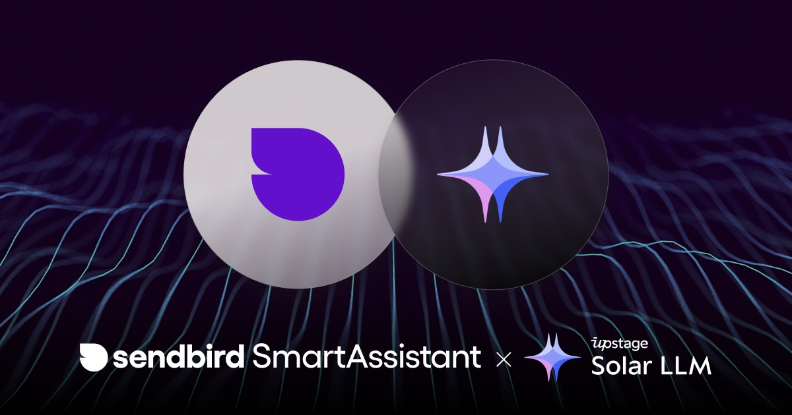
**이미지 캡션:** 이 이미지는 Sendbird SmartAssistant와 Upstage Solar LLM의 협력을 나타내는 그래픽 디자인입니다. 중앙에는 두 개의 원형 로고가 나란히 배치되어 있으며, 왼쪽 원에는 보라색의 추상적인 모양이, 오른쪽 원에는 파란색과 분홍색이 섞인 별 모양의 아이콘이 있습니다. 배경은 어두운 보라색이며, 물결 모양의 파란색 선들이 여러 겹으로 겹쳐져 있어 데이터나 네트워크를 연상시킵니다. 하단에는 "sendbird SmartAssistant × upstage Solar LLM"이라는 텍스트가 흰색으로 표시되어 있으며, 각 브랜드의 로고도 함께 나타납니다. 전체적으로 기술적이고 미래지향적인 분위기를 풍깁니다.으로 표시되어 있으며, 각 브랜드의 로고도 함께 나타납니다. 전체적으로 기술적이고 미래지향적인 분위기를 풍깁니다.

### 3월 7일 (목) 10:04 · #solarllm #문과 Yi-9B 새로 공개하면서 Solar 포함한 벤…

#solarllm #문과 Yi-9B 새로 공개하면서 Solar 포함한 벤치마크 공개해주셨습니다. Solar가 en-txt에서는 1등을 여전히 유지하고 있습니다. 즉 rag, 글쓰기, 검색등은 아주 잘합니다. 다만 수학과 코딩이 아직 약해서 이 부분은 더 공부하겠습니다.

이미 다음 버전 학습이 시작되어 곧 출시 예정입니다. Solar llm 다음 버전을 기대해주세요!

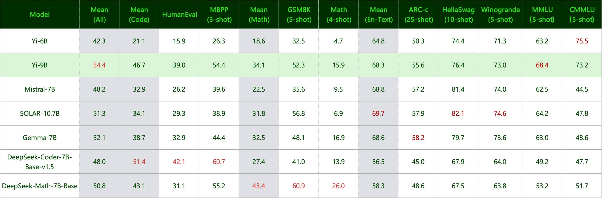
**이미지 캡션:** 이 이미지는 여러 인공지능 모델의 성능을 비교하는 표를 보여줍니다. 표의 행에는 "Yi-6B", "Yi-9B", "Mistral-7B", "SOLAR-10.7B", "Gemma-7B", "DeepSeek-Coder-7B-Base-v1.5", "DeepSeek-Math-7B-Base"와 같은 모델 이름이 나열되어 있으며, 열에는 "Mean (All)", "Mean (Code)", "HumanEval", "MBPP (3-shot)", "Mean (Math)", "GSM8K (5-shot)", "Math (4-shot)", "Mean (En-Text)", "ARC-c (25-shot)", "HellaSwag (10-shot)", "Winogrande (5-shot)", "MMLU (5-shot)", "CMMLU (5-shot)"와 같은 다양한 평가 지표가 표시됩니다. 각 셀에는 해당 모델과 지표에 대한 수치 결과가 포함되어 있으며, 일부 수치는 빨간색으로 강조되어 있어 높은 성능을 나타냅니다. 표는 흰색과 연한 녹색 배경으로 구분되어 있으며, 전체적으로 깔끔하고 정보 전달에 집중된 디자인입니다. 이 표는 인공지능 모델의 성능을 객관적으로 비교하고 분석하는 데 사용될 수 있습니다.ot)", "Mean (En-Text)", "ARC-c (25-shot)", "HellaSwag (10-shot)", "Winogrande (5-shot)", "MMLU (5-shot)", "CMMLU (5-shot)"와 같은 다양한 평가 지표가 표시됩니다. 각 셀에는 해당 모델과 지표에 대한 수치 결과가 포함되어 있으며, 일부 수치는 빨간색으로 강조되어 있어 높은 성능을 나타냅니다. 표는 흰색과 연한 녹색 배경으로 구분되어 있으며, 전체적으로 깔끔하고 정보 전달에 집중된 디자인입니다. 이 표는 인공지능 모델의 성능을 객관적으로 비교하고 분석하는 데 사용될 수 있습니다.

### 3월 7일 (목) 13:09 · #solarllm #sf #github 오늘 저녁 SF github본사에…

#solarllm #sf #github 오늘 저녁 SF github본사에서 열린 ML/AI meetup! 가장 주목을 받은 Lucy Park 의 Solar 와  Layout Analysis의 발표. 

더 대박인 것은 Lucy 다음 발표자가 Solar로 demo 하면서 좋고 빠르다고 계속 칭찬!!

이제 Solar API를 사용하는 것이 SF 대세가 되고 있습니다! 

뜨거운 반응, 너무 기쁩니다!

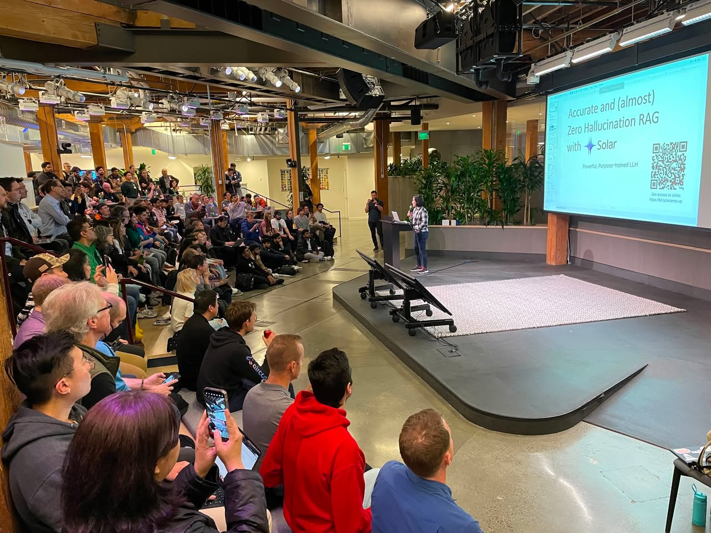
**이미지 캡션:** 넓은 강당에서 성인 여성 발표자가 "Accurate and (almost) Zero Hallucination RAG with Solar"라는 제목의 프레젠테이션을 하고 있으며, 화면에는 "Powerful, Purpose-trained LLM"이라는 문구와 QR 코드가 표시되어 있습니다. 발표자는 흰색 셔츠와 청바지를 입고 있으며, 무대에는 노트북과 태양광 패널 모양의 장치가 놓여 있습니다. 객석에는 다양한 연령대의 성인 남녀가 앉아 있으며, 일부는 휴대폰으로 발표를 촬영하고 있습니다. 강당은 현대적인 디자인으로, 나무 기둥과 조명이 특징이며, 배경에는 식물들이 배치되어 있습니다. 전반적으로 기술 관련 컨퍼런스나 발표회 분위기입니다.로, 나무 기둥과 조명이 특징이며, 배경에는 식물들이 배치되어 있습니다. 전반적으로 기술 관련 컨퍼런스나 발표회 분위기입니다.
 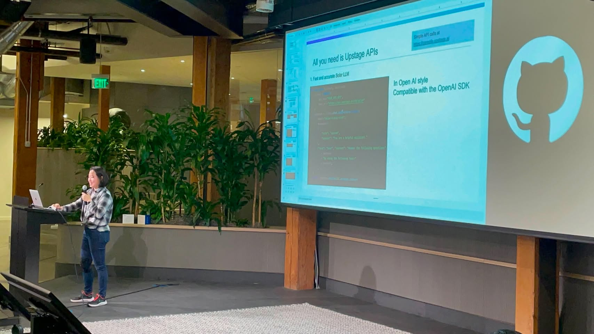
**이미지 캡션:** 한 명의 성인 여성이 강단에 서서 마이크를 들고 발표하고 있으며, 그녀는 체크무늬 셔츠와 청바지, 운동화를 신고 있다. 그녀는 노트북을 보며 미소를 짓고 있으며, 발표 내용은 "All you need is Upstage APIs"라는 제목과 함께 코드 예시가 포함된 슬라이드를 보여주고 있다. 배경에는 녹색 식물과 나무 기둥, 그리고 GitHub 로고가 보인다. 장소는 실내 강연장으로 보이며, 전반적으로 기술 발표회 분위기이다.
 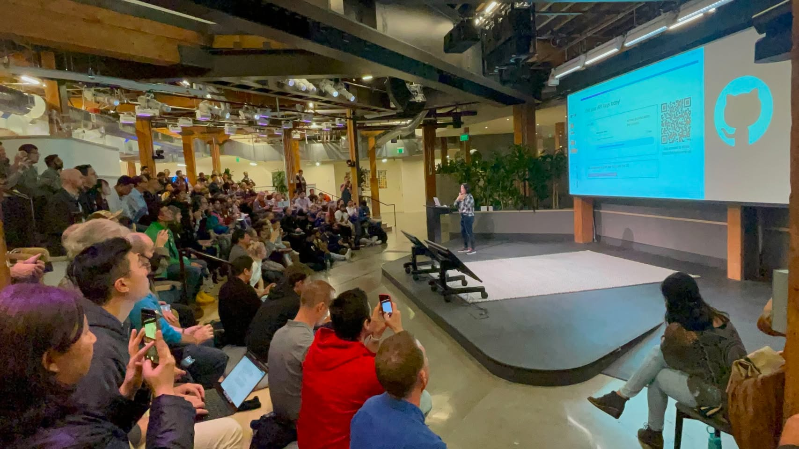
**이미지 캡션:** 이 사진은 실내 강연장으로 보이는 장소에서 진행되는 발표 장면을 담고 있으며, 무대 위에는 한 명의 성인 여성이 발표를 하고 있고 객석에는 많은 사람들이 앉아 발표를 경청하거나 스마트폰으로 촬영하고 있습니다. 발표자는 30대 후반에서 40대 초반으로 보이는 아시아계 여성으로, 체크무늬 셔츠와 검은색 바지를 입고 있으며, 손짓을 하며 열정적으로 발표하고 있습니다. 무대 뒤편에는 큰 스크린이 설치되어 있으며, 스크린에는 "Did your API Keys know?"라는 문구와 함께 QR 코드, 입력창, 그리고 GitHub 로고가 표시되어 있습니다. 객석에는 다양한 연령대의 남녀가 앉아 있으며, 많은 사람들이 스마트폰을 들고 발표를 촬영하거나 노트북을 사용하여 메모를 하고 있습니다. 강연장은 산업적인 느낌의 인테리어로, 나무 기둥과 노출된 천장 구조물이 특징이며, 조명과 식물들이 배치되어 있습니다. 전반적으로 기술 관련 컨퍼런스나 세미나의 분위기를 띠고 있으며, 활기차고 집중된 모습입니다.itHub 로고가 표시되어 있습니다. 객석에는 다양한 연령대의 남녀가 앉아 있으며, 많은 사람들이 스마트폰을 들고 발표를 촬영하거나 노트북을 사용하여 메모를 하고 있습니다. 강연장은 산업적인 느낌의 인테리어로, 나무 기둥과 노출된 천장 구조물이 특징이며, 조명과 식물들이 배치되어 있습니다. 전반적으로 기술 관련 컨퍼런스나 세미나의 분위기를 띠고 있으며, 활기차고 집중된 모습입니다.
 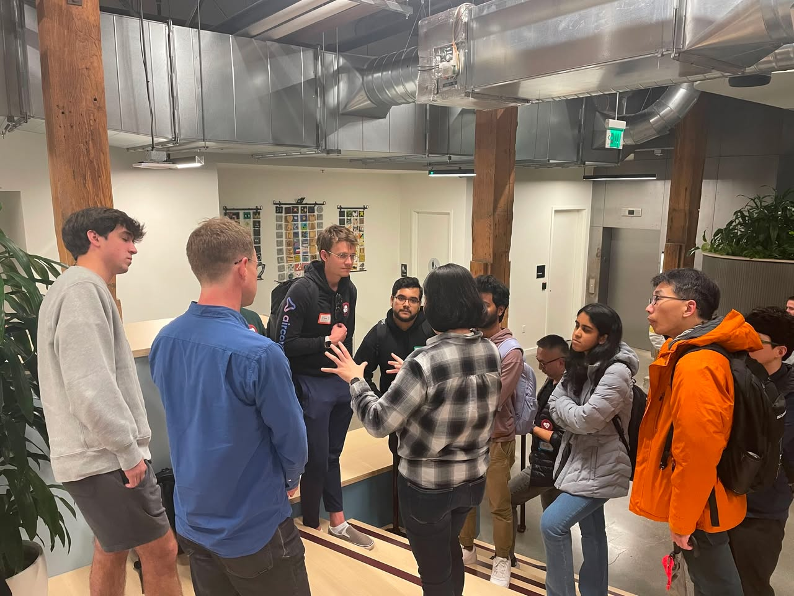
**이미지 캡션:** 이 사진은 여러 명의 젊은 성인들이 실내 공간에 모여 대화하고 있는 모습을 담고 있습니다. 왼쪽에는 회색 후드티와 회색 반바지를 입은 젊은 남성이 서 있고, 그의 옆에는 파란색 셔츠와 어두운 색 바지를 입은 젊은 남성이 서 있습니다. 이들 뒤로는 검은색 후드티에 "airco"라고 쓰인 로고가 있는 젊은 남성이 안경을 쓰고 있습니다. 중앙에는 체크무늬 셔츠를 입은 여성이 손짓하며 이야기하고 있고, 그녀 주변으로 몇몇 사람들이 둘러싸고 있습니다. 이들 중에는 검은색 후드티를 입은 남성, 회색 패딩 점퍼와 청바지를 입은 여성, 그리고 주황색 패딩 점퍼를 입은 남성이 눈에 띕니다. 배경에는 나무 기둥, 금속 환풍구, 벽에 걸린 여러 개의 그림 또는 포스터, 그리고 식물 화분이 보입니다. 전체적으로 캐주얼한 분위기 속에서 사람들이 정보를 공유하거나 토론하는 듯한 모습입니다. 입은 여성, 그리고 주황색 패딩 점퍼를 입은 남성이 눈에 띕니다. 배경에는 나무 기둥, 금속 환풍구, 벽에 걸린 여러 개의 그림 또는 포스터, 그리고 식물 화분이 보입니다. 전체적으로 캐주얼한 분위기 속에서 사람들이 정보를 공유하거나 토론하는 듯한 모습입니다.
 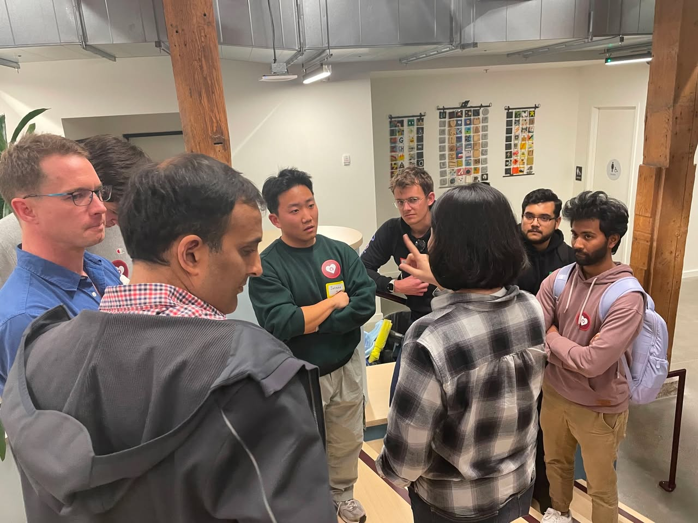
**이미지 캡션:** 이 사진은 여러 명의 사람들이 모여 대화하고 있는 실내 장면을 보여줍니다. 왼쪽에는 파란색 셔츠를 입고 안경을 쓴 백인 성인 남성이 있으며, 그의 옆에는 회색 셔츠를 입은 다른 성인 남성이 서 있습니다. 중앙에는 빨간색과 흰색 체크무늬 셔츠 위에 회색 재킷을 입은 성인 남성이 있고, 그의 앞에는 녹색 스웨트셔츠를 입은 동양인 성인 남성이 팔짱을 끼고 있습니다. 그의 스웨트셔츠에는 노란색 이름표가 붙어 있습니다. 그 뒤에는 검은색 후드티를 입은 백인 성인 남성이 안경을 쓰고 있으며, 그의 옆에는 검은색 후드티를 입은 인도계 성인 남성이 서 있습니다. 가장 오른쪽에 있는 사람은 분홍색 후드티와 갈색 바지를 입고 연한 파란색 백팩을 메고 있으며, 그의 팔은 교차되어 있습니다. 사진 중앙에는 검은색과 흰색 체크무늬 셔츠를 입은 동양인 성인 여성이 서서 손가락으로 무언가를 가리키며 이야기하고 있습니다. 배경에는 흰색 벽과 나무 기둥, 그리고 벽에 걸린 여러 개의 그림 또는 포스터가 보입니다. 조명은 밝고 전반적으로 캐주얼하고 사교적인 분위기입니다. 입은 인도계 성인 남성이 서 있습니다. 가장 오른쪽에 있는 사람은 분홍색 후드티와 갈색 바지를 입고 연한 파란색 백팩을 메고 있으며, 그의 팔은 교차되어 있습니다. 사진 중앙에는 검은색과 흰색 체크무늬 셔츠를 입은 동양인 성인 여성이 서서 손가락으로 무언가를 가리키며 이야기하고 있습니다. 배경에는 흰색 벽과 나무 기둥, 그리고 벽에 걸린 여러 개의 그림 또는 포스터가 보입니다. 조명은 밝고 전반적으로 캐주얼하고 사교적인 분위기입니다.

### 3월 8일 (금) 17:40 · #dus #solarllm Upstage 가 개발한 효율적으로 llm을 …

#dus #solarllm Upstage 가 개발한 효율적으로 llm을 만드는 방법인  depth-Up-scaling 방법 https://arxiv.org/abs/2312.15166 이 많은 곳에서 사용되고 있습니다. 연구하는 입장에서  많은 분들이 사용해주고 특히 중요한 LLM을 만드는데 사용되는 것이 가장 행복한일입니다.

Yi가 새로 내놓은 엄청난 성능을 자랑하는 9B 모델이 바로 DUS를 사용하여 만든 것입니다. 

"Method Following the methodology outlined by Kim et al. [38], our goal is to upscale our Yi-6B base model, which has 32 layers, to a 9B model named the Yi-9B base model, featuring 48 layers, by duplicating the original 16 middle layers 12-28. Depth up-scaling involves expanding the base model's depth and subsequently continuing the pretraining phase for the enhanced model." https://arxiv.org/abs/2403.04652

또한 11B Herbrew 모델도 Upstage DUS방법으로 만들어 졌습니다.
"- Solar: Discovered that models that were "merged with themselves" and then underwent a short fine-tuning session show an extreme jump in performance. (The 11B Solar model outperform even Falcon-180B)" https://huggingface.co/yam-peleg/Hebrew-Gemma-11B

저희는 LLM을 잘 만들뿐만 아니라, 더 쉽고 더 저렴하게 고성능 LLM을 만드는 방법을 공개하여 모두를 위한 LLM을 위한 생태계를 계속 만들어 가겠습니다.

### 3월 11일 (월) 09:19 · #spring #siliconvalley 모두가 기다리던 봄이 오고 있어…

#spring #siliconvalley 모두가 기다리던 봄이 오고 있어요. 실리콘 밸리 주변 꽃들을 감상하며 즐거운 봄을 함께 맞이해요! 🌸🌸

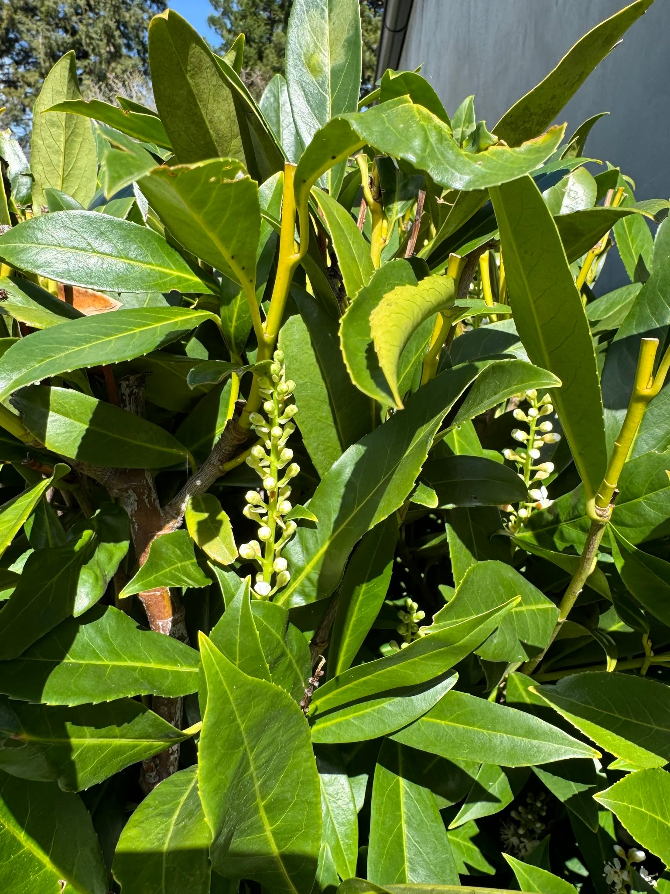
**이미지 캡션:** 이 사진은 햇볕이 잘 드는 날 야외에서 찍은 것으로, 짙은 녹색 잎과 노란색 줄기가 돋보이는 식물의 클로즈업 샷입니다. 식물은 빽빽하게 자라 있으며, 일부 줄기에는 작고 하얀 꽃봉오리가 달려 있어 곧 꽃이 필 것임을 암시합니다. 배경에는 흐릿하게 보이는 회색 건물과 푸른 하늘이 보입니다. 사진에는 사람이 등장하지 않으며, 특별한 사물이나 텍스트는 보이지 않습니다. 전체적으로 싱그러운 봄날의 자연 풍경을 담고 있으며, 식물의 생명력과 평화로운 분위기를 느낄 수 있습니다.
 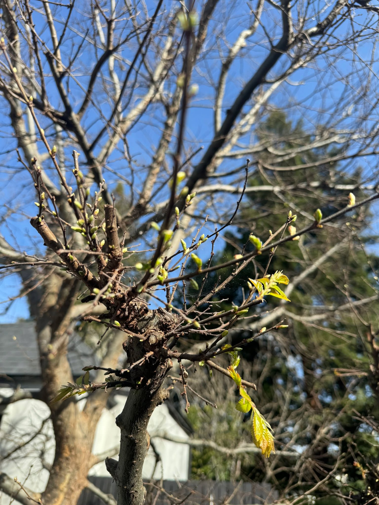
**이미지 캡션:** 맑고 푸른 하늘을 배경으로, 겨울 동안 앙상했던 나뭇가지에 새싹이 돋아나고 있는 모습이 포착되었습니다. 사진의 전경에는 굵은 줄기와 잔가지가 복잡하게 얽힌 나무가 자리하고 있으며, 가지 끝마다 작고 연둣빛 새싹들이 맺혀 봄의 기운을 알리고 있습니다. 일부 가지에는 이미 잎이 펴지기 시작하여 연한 녹색을 띠고 있으며, 햇빛을 받아 반짝입니다. 나무의 줄기는 거칠고 울퉁불퉁한 질감을 보여 오랜 세월을 견뎌온 듯한 느낌을 줍니다. 배경에는 흐릿하게 보이는 다른 나무들과 함께 하얀색 지붕의 건물이 보이며, 이는 나무가 야외, 아마도 주택가에 위치하고 있음을 시사합니다. 전반적으로 사진은 겨울이 지나고 새 생명이 움트는 봄의 시작을 담고 있으며, 맑고 밝은 날씨 덕분에 희망적이고 생기 넘치는 분위기를 자아냅니다.가 야외, 아마도 주택가에 위치하고 있음을 시사합니다. 전반적으로 사진은 겨울이 지나고 새 생명이 움트는 봄의 시작을 담고 있으며, 맑고 밝은 날씨 덕분에 희망적이고 생기 넘치는 분위기를 자아냅니다.
 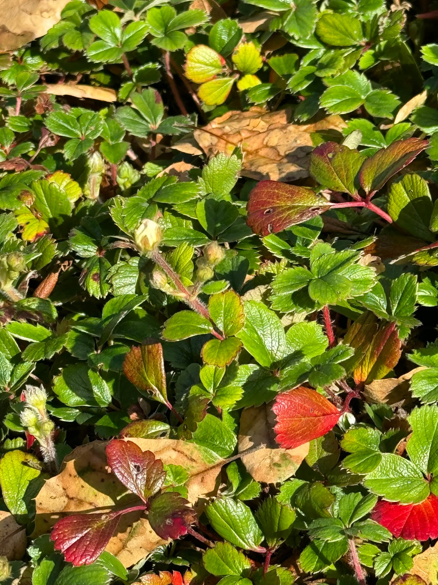
**이미지 캡션:** 이 사진은 햇빛이 비치는 야외에서 찍은 것으로, 늦가을 또는 초겨울의 숲 바닥을 보여줍니다. 사진에는 붉게 물든 잎과 녹색 잎이 섞여 있으며, 일부 잎은 갈색으로 말라 있습니다. 잎들은 덤불처럼 빽빽하게 자라 있으며, 일부에는 작은 하얀색 꽃봉오리가 보입니다. 잎맥이 선명하게 드러나 있고, 잎 가장자리는 톱니 모양입니다. 전체적으로 자연스럽고 평화로운 분위기를 자아냅니다.
 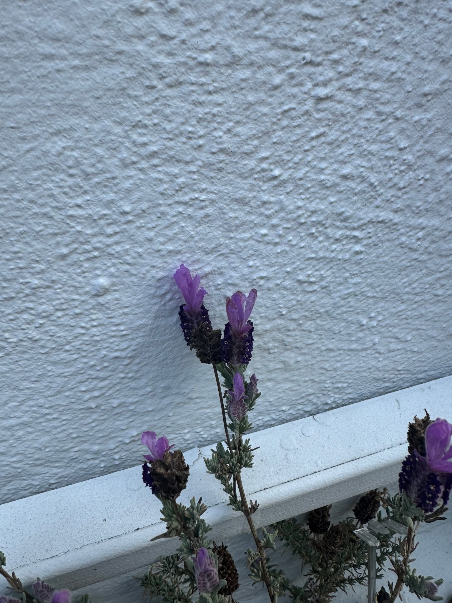
**이미지 캡션:** 이 사진은 하얀색 질감의 벽을 배경으로 보라색 라벤더 꽃이 피어 있는 모습을 담고 있습니다. 라벤더 꽃은 여러 개의 작은 꽃들이 모여 피어 있으며, 일부는 아직 봉오리 상태이고 일부는 활짝 피어 있습니다. 꽃 줄기는 가늘고 길며, 잎은 옅은 녹색을 띠고 있습니다. 사진의 하단에는 하얀색의 선반 같은 구조물이 보이며, 그 위로 라벤더가 자라고 있습니다. 전체적으로 자연적이고 평화로운 분위기를 자아냅니다. 사람이나 텍스트는 보이지 않습니다.
 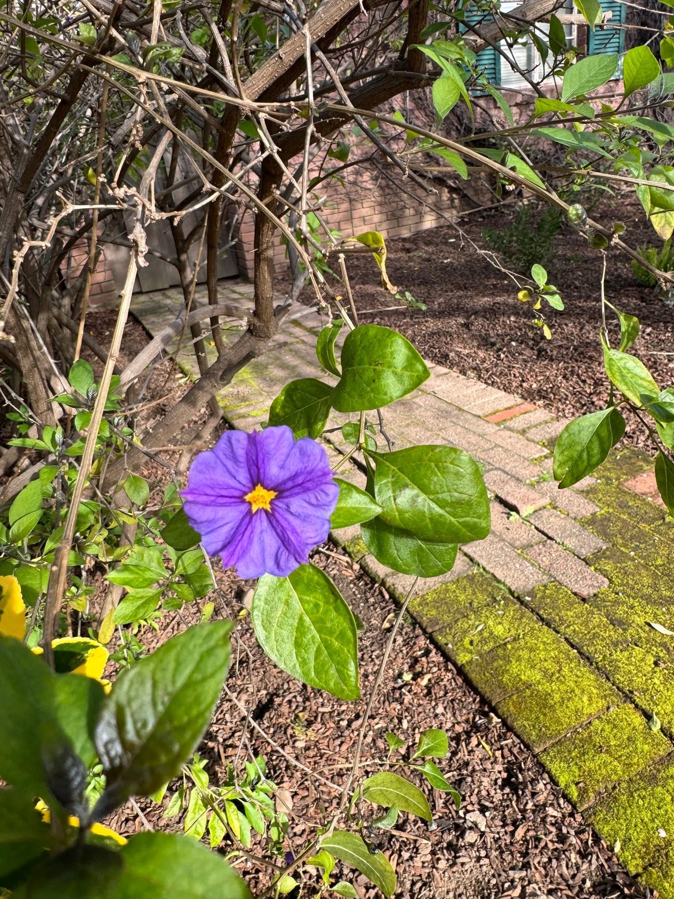
**이미지 캡션:** 이 사진은 햇살이 비치는 정원의 한 장면을 담고 있으며, 짙은 보라색 꽃 한 송이가 선명하게 초점을 맞추고 있습니다. 꽃은 다섯 개의 꽃잎을 가지고 있으며, 중앙에는 노란색 수술이 보입니다. 꽃 주변으로는 싱그러운 녹색 잎들이 풍성하게 자라 있으며, 일부 잎은 햇빛을 받아 반짝입니다. 배경에는 얽히고설킨 나뭇가지들이 드리워져 있고, 그 뒤로는 붉은 벽돌로 만들어진 건물과 녹색 창문이 희미하게 보입니다. 바닥에는 붉은색 벽돌로 만들어진 산책로가 보이며, 일부 벽돌에는 이끼가 푸르게 끼어 있습니다. 산책로 주변은 나무 조각으로 덮여 있어 자연스러운 정원의 분위기를 더합니다. 사진 전반적으로 따뜻하고 평화로운 분위기를 자아내며, 자연의 아름다움을 느끼게 합니다. 나무 조각으로 덮여 있어 자연스러운 정원의 분위기를 더합니다. 사진 전반적으로 따뜻하고 평화로운 분위기를 자아내며, 자연의 아름다움을 느끼게 합니다.
 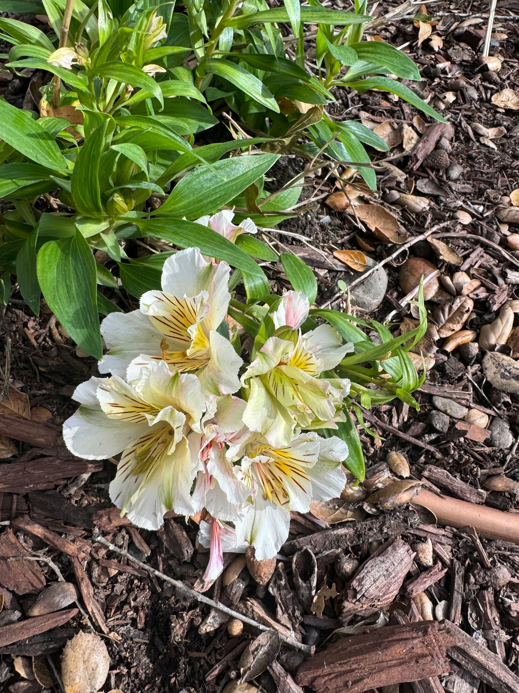
**이미지 캡션:** 이 사진은 야외 정원의 흙 위에 피어 있는 알스트로메리아 꽃다발을 클로즈업하여 보여줍니다. 꽃은 흰색 바탕에 노란색과 붉은색 줄무늬가 있으며, 일부 꽃잎에는 연한 분홍색이 섞여 있습니다. 꽃 주변에는 푸른색의 잎사귀와 흙, 그리고 나무껍질 조각, 작은 돌, 낙엽 등이 흩어져 있습니다. 햇빛이 비추어 꽃과 주변 환경에 그림자가 드리워져 있습니다. 전체적으로 자연스럽고 평화로운 분위기를 연출합니다.
 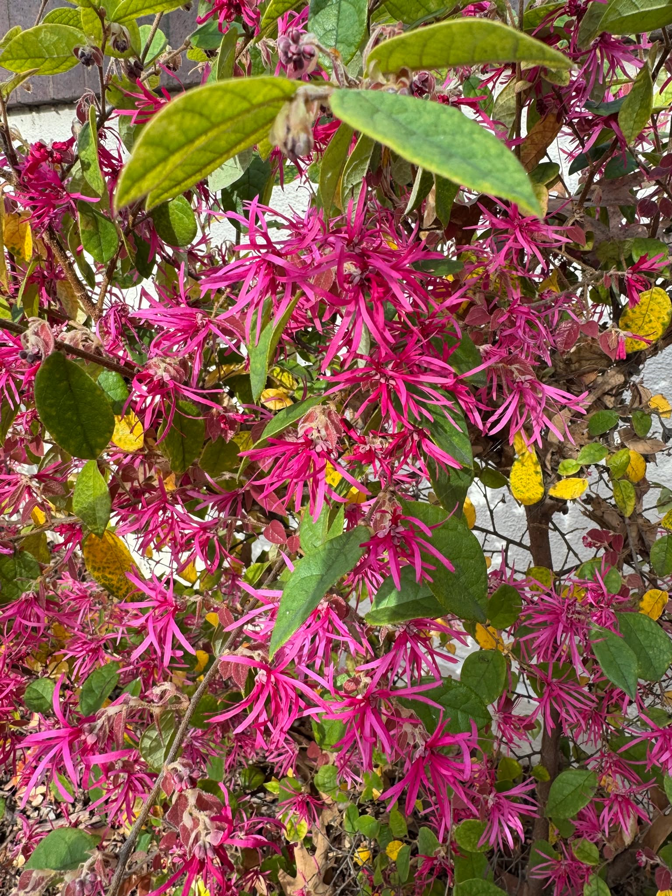
**이미지 캡션:** 이 사진은 짙은 분홍색의 독특한 모양의 꽃들이 풍성하게 피어 있는 관목을 클로즈업하여 보여줍니다. 꽃잎은 가늘고 길게 갈라져 있어 마치 불꽃놀이처럼 보이기도 합니다. 녹색 잎과 일부 노랗게 변한 잎들이 섞여 있어 계절감을 느끼게 합니다. 배경에는 흰색 벽이 희미하게 보이며, 전체적으로 자연스럽고 생기 넘치는 분위기를 자아냅니다. 사진에는 사람이 보이지 않으며, 텍스트도 없습니다.
 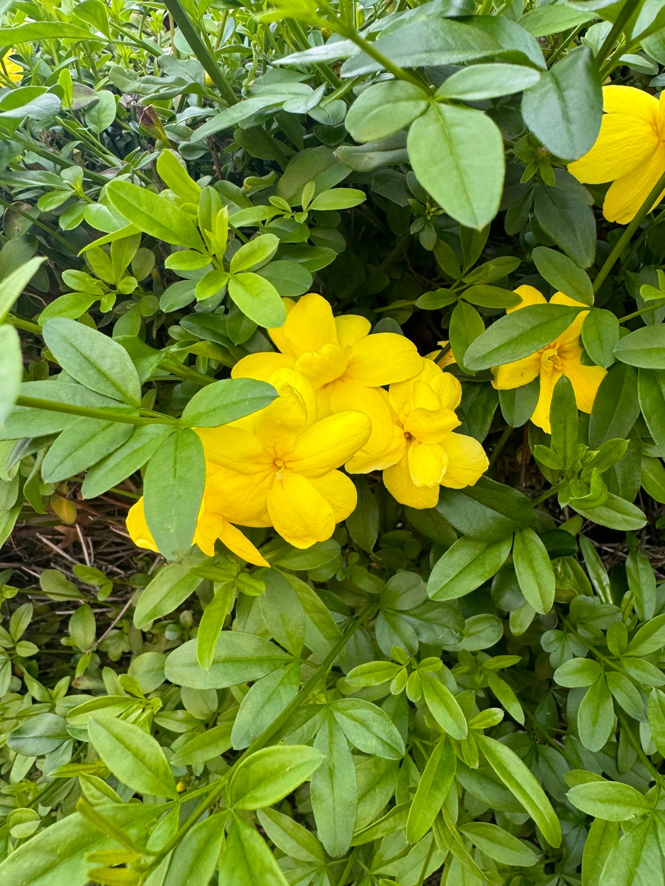
**이미지 캡션:** 이 사진은 햇볕이 잘 드는 야외에서 찍은 것으로, 풍성하게 자란 녹색 잎사귀들 사이에 선명한 노란색 꽃들이 피어 있는 모습을 클로즈업하여 보여줍니다. 꽃들은 여러 송이가 뭉쳐 피어 있으며, 꽃잎은 5개로 갈라져 있고 부드러운 질감을 가지고 있습니다. 잎사귀들은 작고 타원형이며 윤기가 흐르고, 가지들은 빽빽하게 얽혀 있습니다. 배경에는 흙과 마른 나뭇가지들이 희미하게 보이며, 전체적으로 자연스럽고 생기 넘치는 봄의 풍경을 연출합니다. 사진에는 사람이 등장하지 않으며, 보이는 텍스트도 없습니다.
 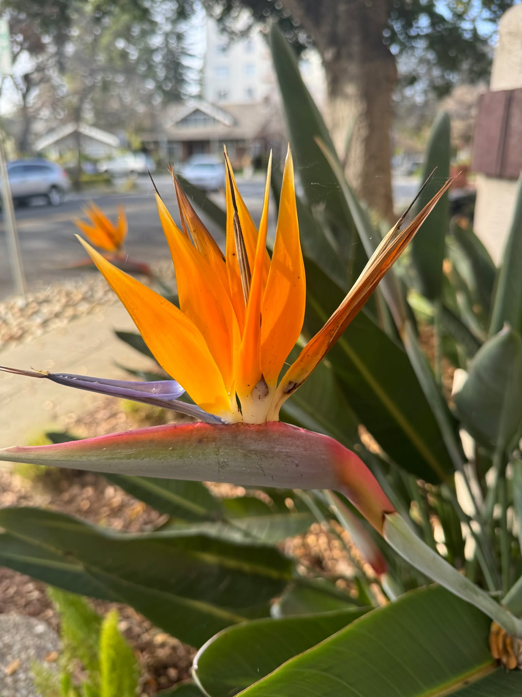
**이미지 캡션:** 이 사진은 밝은 햇살 아래 활짝 핀 극락조화 한 송이를 클로즈업하여 보여줍니다. 꽃잎은 선명한 주황색과 노란색으로, 새의 머리와 부리를 닮은 독특한 모양을 하고 있습니다. 꽃의 아래쪽에는 보라색과 분홍색이 섞인 잎이 길게 뻗어 있으며, 그 위로 얇은 거미줄이 쳐져 있습니다. 배경으로는 흐릿하게 처리된 주택가 풍경이 보이며, 차들이 지나가는 도로와 나무, 그리고 건물들이 희미하게 나타납니다. 사진의 초점은 극락조화에 맞춰져 있어 꽃의 섬세한 질감과 색감이 생생하게 느껴집니다. 전체적으로 따뜻하고 평화로운 분위기를 자아냅니다.를 자아냅니다.
 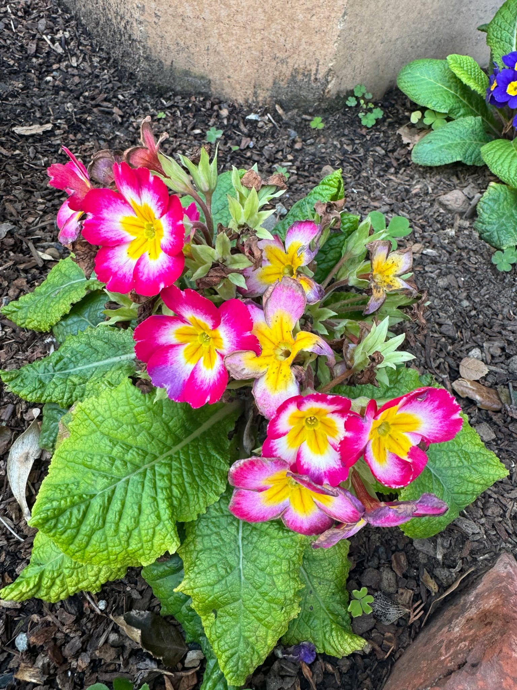
**이미지 캡션:** 이 사진은 흙과 나무 조각으로 덮인 땅에 심어진 여러 송이의 밝은 색 꽃을 클로즈업하여 보여줍니다. 꽃들은 짙은 분홍색 테두리와 노란색 중심을 가지고 있으며, 일부 꽃잎에는 흰색이 섞여 있습니다. 꽃잎은 둥글고 부드러운 모양이며, 꽃줄기는 짙은 녹색입니다. 꽃 주변에는 크고 주름진 짙은 녹색 잎들이 있으며, 일부 잎은 가장자리가 갈색으로 변해 말라가고 있습니다. 배경에는 옅은 갈색의 콘크리트 벽과 붉은 벽돌 조각이 보입니다. 사진의 오른쪽 상단에는 파란색 꽃이 피어 있는 다른 식물도 살짝 보입니다. 전반적으로 사진은 자연스럽고 생기 넘치는 분위기를 연출하며, 봄이나 초여름의 정원을 연상시킵니다. 사진은 자연스럽고 생기 넘치는 분위기를 연출하며, 봄이나 초여름의 정원을 연상시킵니다.
 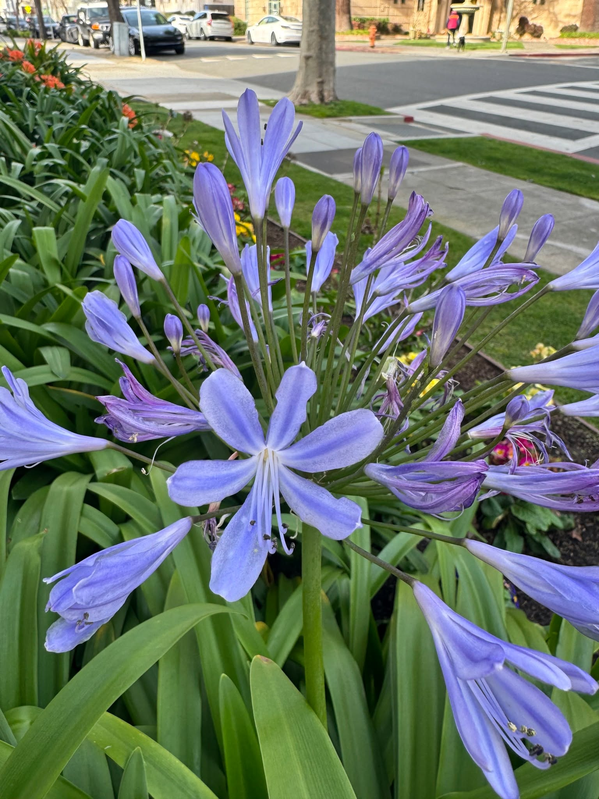
**이미지 캡션:** 이 사진은 보라색 아가판서스 꽃이 활짝 피어있는 모습을 클로즈업하여 보여줍니다. 꽃은 연한 보라색이며, 꽃잎은 길고 좁으며 별 모양으로 펼쳐져 있습니다. 꽃대에는 아직 피지 않은 보라색 꽃봉오리들도 많이 달려 있습니다. 꽃 주변으로는 짙은 녹색의 길고 잎이 무성하게 자라 있습니다. 배경에는 도로와 보도블록이 보이며, 도로에는 여러 대의 차들이 주차되어 있거나 지나가고 있습니다. 멀리 건물과 나무도 보입니다. 사진의 오른쪽 상단에는 붉은색 옷을 입은 사람과 개가 함께 걷고 있는 모습이 희미하게 보입니다. 전체적으로 화사하고 생기 넘치는 분위기이며, 봄이나 여름의 따뜻한 날씨를 연상시킵니다.으로 화사하고 생기 넘치는 분위기이며, 봄이나 여름의 따뜻한 날씨를 연상시킵니다.
 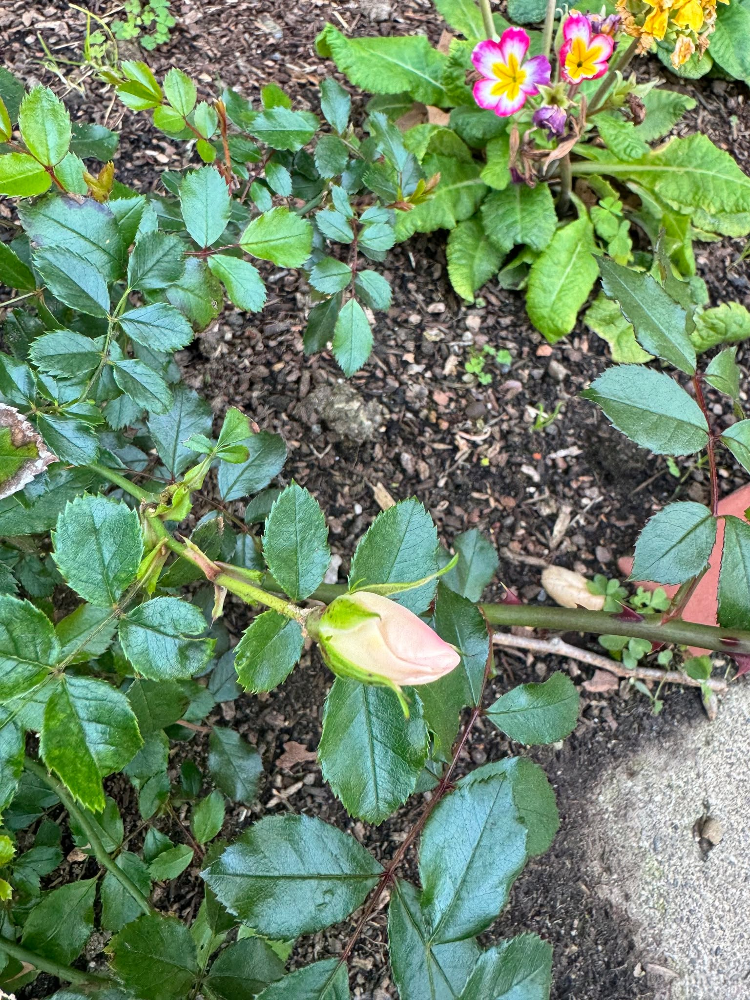
**이미지 캡션:** 이 사진은 정원의 흙과 식물들을 클로즈업하여 보여줍니다. 사진의 중앙에는 연한 분홍색 장미 봉오리가 맺혀 있으며, 주변으로는 윤기 나는 짙은 녹색의 장미 잎들이 빽빽하게 자라 있습니다. 장미 줄기에는 날카로운 가시들이 보입니다. 배경에는 흙이 드러나 있고, 그 위로 작은 풀들이 듬성듬성 나 있습니다. 사진의 오른쪽 상단에는 분홍색과 노란색이 섞인 작은 꽃과 노란색 꽃이 피어 있는 모습도 보입니다. 사진의 오른쪽 하단에는 회색 콘크리트 조각이 일부 보입니다. 전체적으로 자연스럽고 평화로운 정원의 분위기를 담고 있으며, 아직 피지 않은 장미 봉오리는 앞으로의 개화를 기대하게 합니다.있으며, 아직 피지 않은 장미 봉오리는 앞으로의 개화를 기대하게 합니다.
 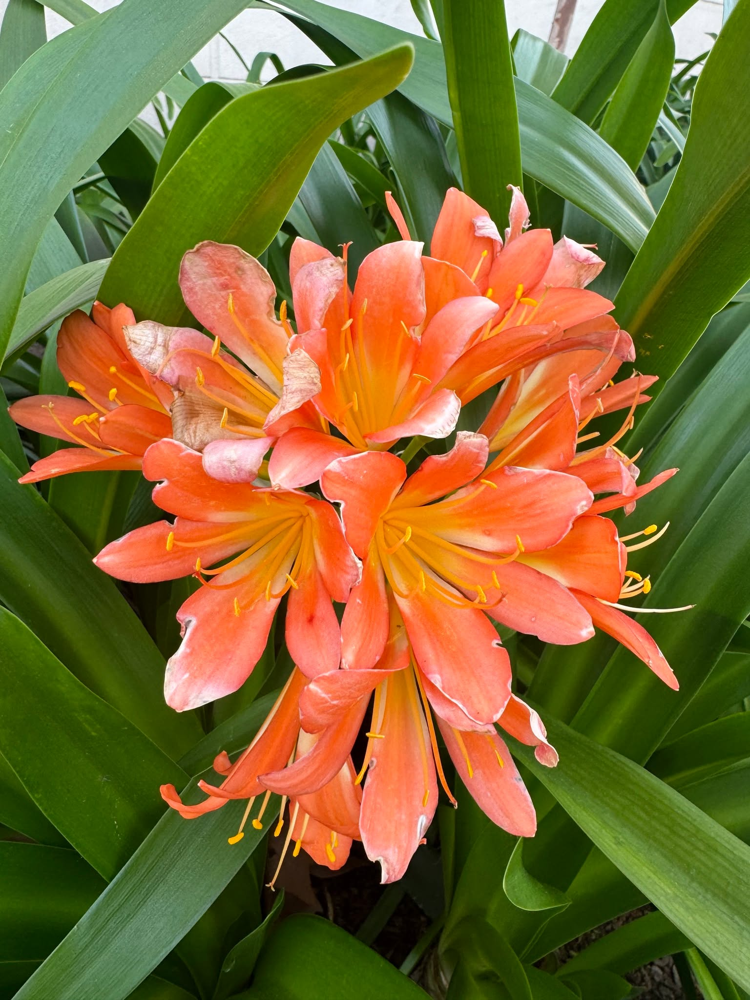
**이미지 캡션:** 클레로덴드룸의 주황색 꽃이 무성한 녹색 잎사귀 사이에서 활짝 피어 있습니다. 꽃잎은 짙은 주황색에서 연한 주황색으로 점차 옅어지며, 중앙에는 노란색 수술이 돋보입니다. 일부 꽃잎 가장자리에는 약간의 갈색 반점이 있어 자연스러운 아름다움을 더합니다. 배경에는 짙은 녹색의 길고 넓은 잎들이 겹쳐져 있어 꽃을 더욱 돋보이게 합니다. 전체적으로 생기 넘치고 화사한 분위기를 자아냅니다.
 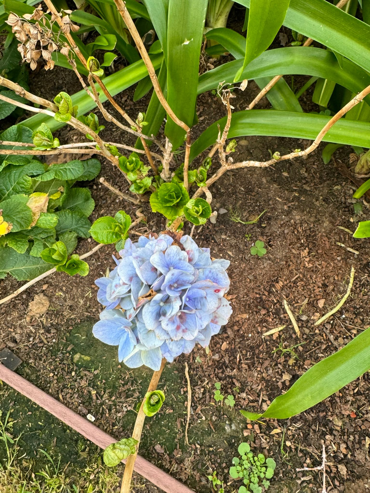
**이미지 캡션:** 이 사진은 정원의 흙 위에 놓인 푸른색 수국 꽃 한 송이를 클로즈업하여 보여줍니다. 수국은 연한 파란색 꽃잎으로 이루어져 있으며, 일부 꽃잎에는 붉은색 점이 찍혀 있습니다. 꽃 주변으로는 앙상한 나뭇가지와 새롭게 돋아나는 연두색 잎들이 보입니다. 배경에는 길고 짙은 녹색 잎을 가진 식물들이 자리하고 있으며, 흙에는 작은 풀들과 나뭇가지 조각들이 흩어져 있습니다. 사진의 왼쪽 하단에는 옅은 갈색의 테두리 같은 것이 비스듬히 놓여 있습니다. 전체적으로 자연적이고 평화로운 분위기를 자아내며, 봄이나 초여름의 정원 풍경을 담고 있습니다. 사람이나 텍스트는 보이지 않습니다.풍경을 담고 있습니다. 사람이나 텍스트는 보이지 않습니다.
 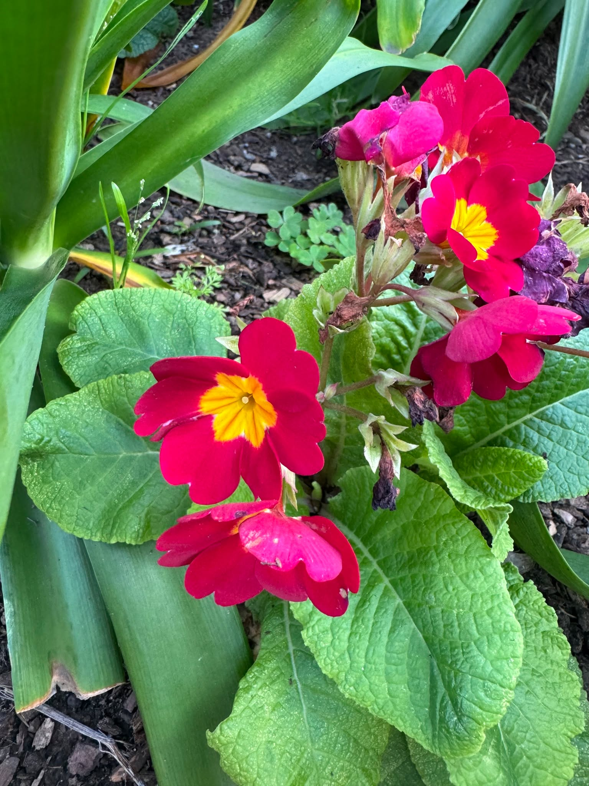
**이미지 캡션:** 이 사진은 붉은색과 노란색이 어우러진 아름다운 꽃과 푸른색의 잎사귀가 조화롭게 어우러진 자연의 모습을 담고 있습니다. 사진의 중앙에는 붉은색 꽃잎과 노란색 꽃술을 가진 꽃들이 여러 송이 피어 있으며, 꽃잎 가장자리에는 약간의 주름이 잡혀 있습니다. 꽃들은 줄기에 매달려 있으며, 일부 꽃은 시들기 시작한 모습도 보입니다. 꽃 주변으로는 짙은 녹색의 잎사귀들이 풍성하게 자라나 꽃을 더욱 돋보이게 합니다. 잎사귀들은 표면이 거칠고 잎맥이 뚜렷하게 보이며, 일부 잎에는 약간의 노란색 반점이 보이기도 합니다. 배경으로는 흙과 마른 나뭇가지, 그리고 작은 풀들이 보이며, 전체적으로 자연스러운 정원의 풍경을 연출합니다. 사진은 꽃과 잎사귀에 초점이 맞춰져 있어 선명하고 생생한 색감을 자랑하며, 봄이나 여름의 화사하고 싱그러운 분위기를 느끼게 합니다.는 흙과 마른 나뭇가지, 그리고 작은 풀들이 보이며, 전체적으로 자연스러운 정원의 풍경을 연출합니다. 사진은 꽃과 잎사귀에 초점이 맞춰져 있어 선명하고 생생한 색감을 자랑하며, 봄이나 여름의 화사하고 싱그러운 분위기를 느끼게 합니다.
 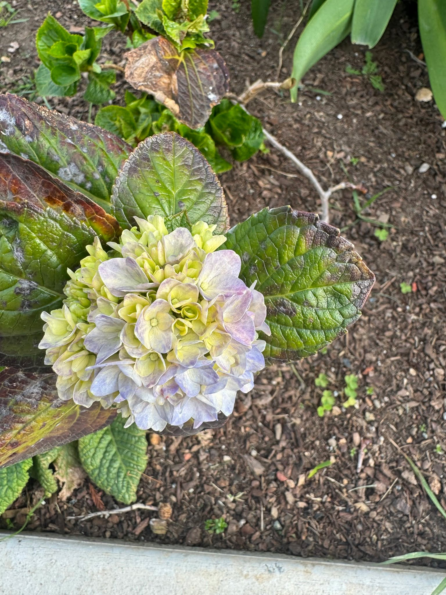
**이미지 캡션:** 이 사진은 정원의 흙 위에 놓인 수국 꽃송이와 잎사귀를 클로즈업하여 보여줍니다. 꽃은 연한 녹색과 연보라색이 섞인 색으로, 여러 개의 작은 꽃잎들이 모여 둥근 형태를 이루고 있습니다. 꽃 주변의 잎사귀들은 짙은 녹색이지만 가장자리가 갈색으로 변하며 일부는 말라 있습니다. 잎사귀 표면에는 흰색 가루 같은 것이 묻어 있어 병충해의 흔적으로 보입니다. 배경은 짙은 갈색의 흙으로, 작은 돌멩이와 마른 나뭇가지, 그리고 몇 개의 작은 풀들이 흩어져 있습니다. 사진의 하단에는 흰색의 콘크리트 경계석으로 보이는 부분이 일부 보입니다. 전체적으로 자연광 아래에서 촬영되었으며, 식물의 건강 상태가 좋지 않음을 암시하는 다소 어둡고 건조한 분위기를 풍깁니다. 사진에는 사람이 등장하지 않으며, 보이는 텍스트도 없습니다.부 보입니다. 전체적으로 자연광 아래에서 촬영되었으며, 식물의 건강 상태가 좋지 않음을 암시하는 다소 어둡고 건조한 분위기를 풍깁니다. 사진에는 사람이 등장하지 않으며, 보이는 텍스트도 없습니다.
 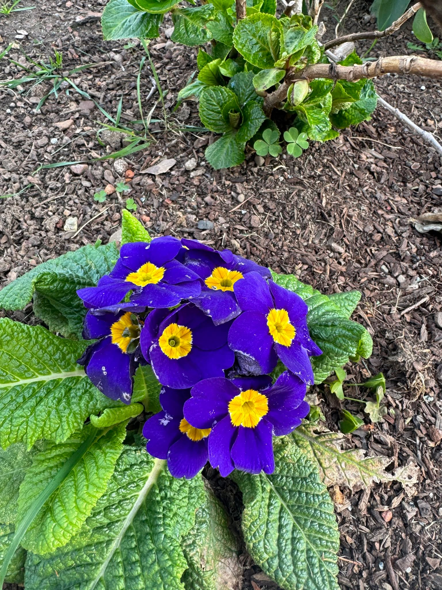
**이미지 캡션:** 이 사진은 정원의 흙 위에 피어난 보라색 꽃 무리를 클로즈업한 모습입니다. 꽃은 짙은 보라색 꽃잎과 밝은 노란색 중심부를 가지고 있으며, 몇 송이가 모여 풍성한 느낌을 줍니다. 꽃 주변으로는 크고 주름진 녹색 잎들이 둘러싸고 있으며, 일부 잎은 가장자리가 갈색으로 변해 있습니다. 배경에는 나무 조각과 흙이 섞여 있고, 몇 개의 작은 풀잎과 녹색 식물이 보입니다. 사진은 자연광 아래에서 촬영되었으며, 꽃의 선명한 색감과 질감이 돋보입니다. 전체적으로 평화롭고 자연적인 분위기를 자아냅니다.
 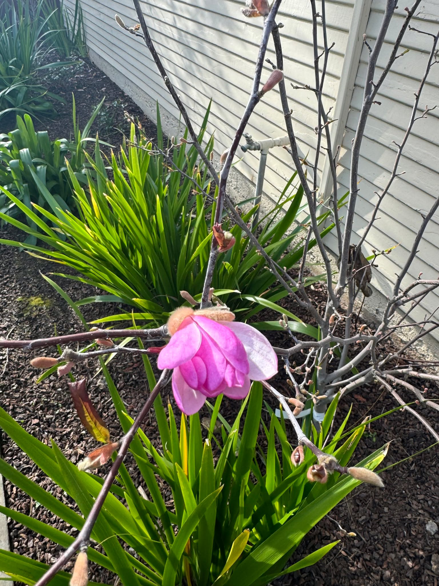
**이미지 캡션:** 이 사진은 햇살이 비치는 야외 정원의 풍경을 담고 있으며, 옅은 분홍색 목련 꽃 한 송이가 중심에 자리하고 있습니다. 꽃은 가지에 매달려 있으며, 꽃잎은 부드럽고 섬세한 질감을 가지고 있습니다. 꽃 주변으로는 짙은 녹색의 길쭉한 잎을 가진 식물들이 무성하게 자라 있고, 그 뒤로는 옅은 베이지색의 건물 벽이 보입니다. 건물 벽에는 가로로 긴 나무 판자들이 덧대어져 있으며, 그림자가 드리워져 있습니다. 정원 바닥은 짙은 갈색의 나무 조각으로 덮여 있습니다. 사진의 오른쪽에는 앙상한 나뭇가지들이 뻗어 있고, 몇 개의 갈색 꽃봉오리가 달려 있습니다. 전반적으로 따뜻하고 평화로운 분위기를 자아내며, 봄의 시작을 알리는 듯한 생명력이 느껴집니다.의 갈색 꽃봉오리가 달려 있습니다. 전반적으로 따뜻하고 평화로운 분위기를 자아내며, 봄의 시작을 알리는 듯한 생명력이 느껴집니다.
 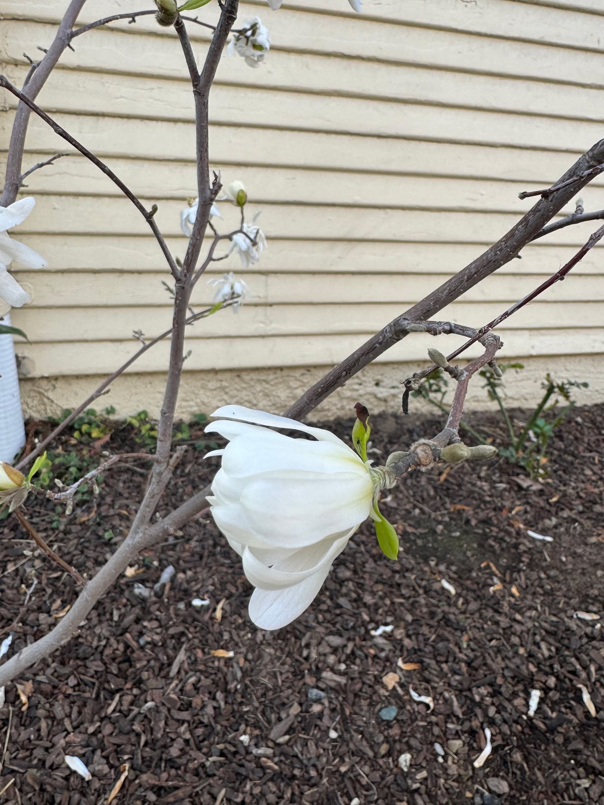
**이미지 캡션:** 이 사진은 옅은 노란색의 나무 외벽을 배경으로, 짙은 갈색의 나무 조각으로 덮인 땅 위에 놓인 목련 나무의 일부를 클로즈업한 모습입니다. 사진의 중앙에는 하얗고 봉오리진 목련 꽃 한 송이가 가지에 매달려 있으며, 꽃잎은 아직 완전히 펼쳐지지 않은 상태입니다. 꽃의 줄기 부분에는 연두색 잎이 달려 있고, 꽃 바로 위에는 작은 갈색 새싹이 보입니다. 배경에는 옅은 노란색의 나무 외벽이 수평으로 덧대어져 있으며, 그 아래로는 짙은 갈색의 나무 조각으로 덮인 땅이 보입니다. 땅 위에는 몇 개의 하얀 꽃잎 조각들이 흩어져 있습니다. 사진에는 사람이 보이지 않으며, 전체적으로 차분하고 자연스러운 분위기를 자아냅니다.어져 있습니다. 사진에는 사람이 보이지 않으며, 전체적으로 차분하고 자연스러운 분위기를 자아냅니다.
 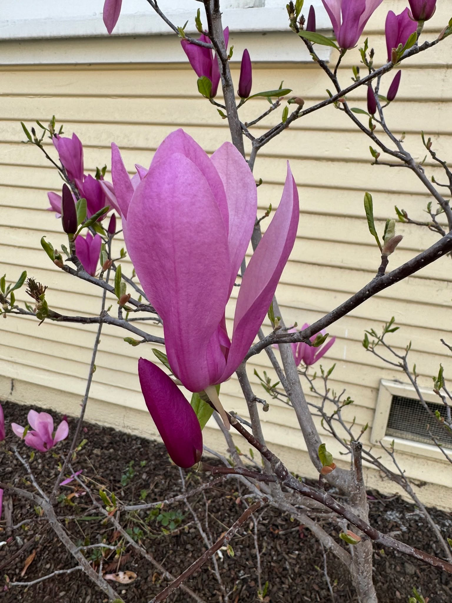
**이미지 캡션:** 이 사진은 옅은 노란색 건물 외벽을 배경으로 분홍색 목련 꽃이 만개한 모습을 담고 있습니다. 사진 중앙에는 크고 풍성한 분홍색 목련 꽃 한 송이가 클로즈업되어 있으며, 그 옆에는 짙은 보라색의 꽃봉오리가 맺혀 있습니다. 여러 개의 작은 분홍색 꽃들과 꽃봉오리들이 가지에 매달려 있으며, 일부는 아직 잎이 돋아나지 않은 앙상한 가지에 달려 있어 봄의 시작을 알리는 듯합니다. 배경에는 옅은 노란색의 건물 벽이 보이고, 건물 벽에는 작은 창문이 하나 있습니다. 건물 아래쪽으로는 짙은 갈색의 흙과 마른 나뭇가지들이 깔려 있어 자연스러운 정원의 모습을 연출합니다. 사진 전반적으로 따뜻하고 화사한 봄의 분위기를 느낄 수 있습니다.려 있어 자연스러운 정원의 모습을 연출합니다. 사진 전반적으로 따뜻하고 화사한 봄의 분위기를 느낄 수 있습니다.
 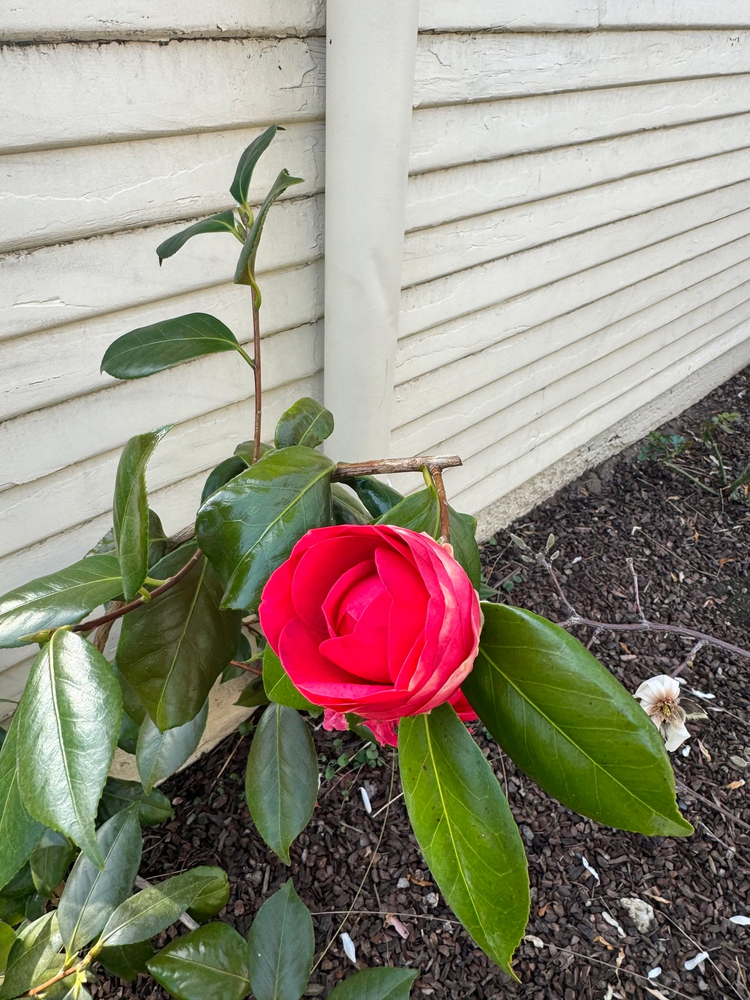
**이미지 캡션:** 이 사진은 붉은색 동백꽃 한 송이가 활짝 피어있는 모습을 담고 있으며, 배경에는 낡은 흰색 나무 판자 벽과 옅은 베이지색의 파이프가 보인다. 동백꽃은 겹겹이 쌓인 꽃잎이 풍성하고 선명한 붉은색을 띠고 있으며, 꽃잎 가장자리에는 약간의 흰색이 섞여 있다. 꽃 주변으로는 윤기 나는 짙은 녹색의 동백나무 잎들이 무성하게 자라 있고, 일부 잎은 햇빛을 받아 반짝인다. 바닥에는 나무 조각과 마른 잎들이 깔려 있으며, 희미하게 보이는 흰색 꽃잎 조각들도 보인다. 사진은 자연광 아래에서 촬영된 것으로 보이며, 동백꽃의 생생한 색감과 질감이 잘 표현되어 있다. 전체적으로 차분하면서도 생기 있는 분위기를 자아낸다.생한 색감과 질감이 잘 표현되어 있다. 전체적으로 차분하면서도 생기 있는 분위기를 자아낸다.
 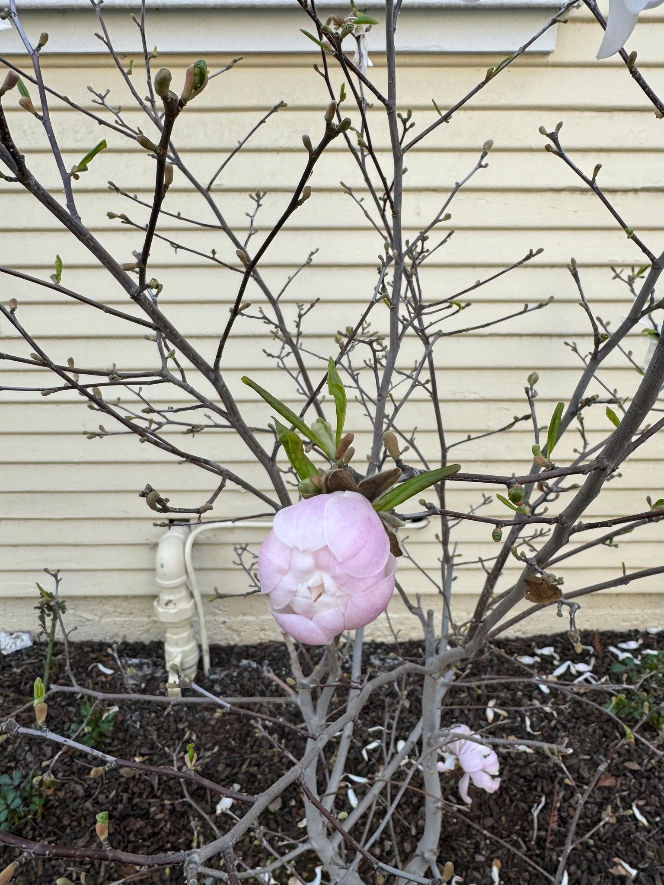
**이미지 캡션:** 이 사진은 옅은 분홍색 목련 꽃봉오리가 맺힌 나무를 클로즈업한 것으로, 배경에는 연한 베이지색의 가로 줄무늬가 있는 건물 벽이 보입니다. 나무는 아직 잎이 완전히 나지 않은 상태이며, 앙상한 가지들 사이로 작은 새싹들이 돋아나고 있습니다. 땅에는 짙은 갈색의 나무껍질이 깔려 있고, 몇 개의 떨어진 꽃잎들이 흩어져 있습니다. 사진 왼쪽 하단에는 흰색 페인트가 칠해진 수도꼭지 또는 파이프가 보입니다. 전체적으로 봄의 시작을 알리는 듯한 차분하고 자연스러운 분위기를 자아냅니다.
 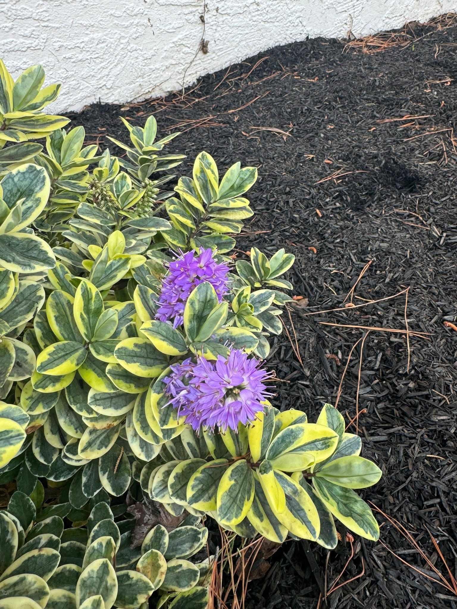
**이미지 캡션:** 이 사진은 짙은 검은색 나무 껍질로 덮인 정원 구역을 보여주며, 그 위에는 밝은 녹색과 노란색 잎을 가진 식물이 자라고 있으며, 보라색 꽃이 피어 있습니다. 식물은 빽빽하게 자라며 잎은 타원형이고 윤기가 납니다. 보라색 꽃은 작고 둥근 모양이며 여러 개의 꽃잎이 모여 있습니다. 배경에는 거칠게 마감된 흰색 벽이 보이며, 벽과 나무 껍질 사이에는 몇 개의 솔잎이 흩어져 있습니다. 사진에는 사람이 등장하지 않으며, 텍스트도 보이지 않습니다. 전반적으로 차분하고 자연스러운 분위기를 연출합니다.
 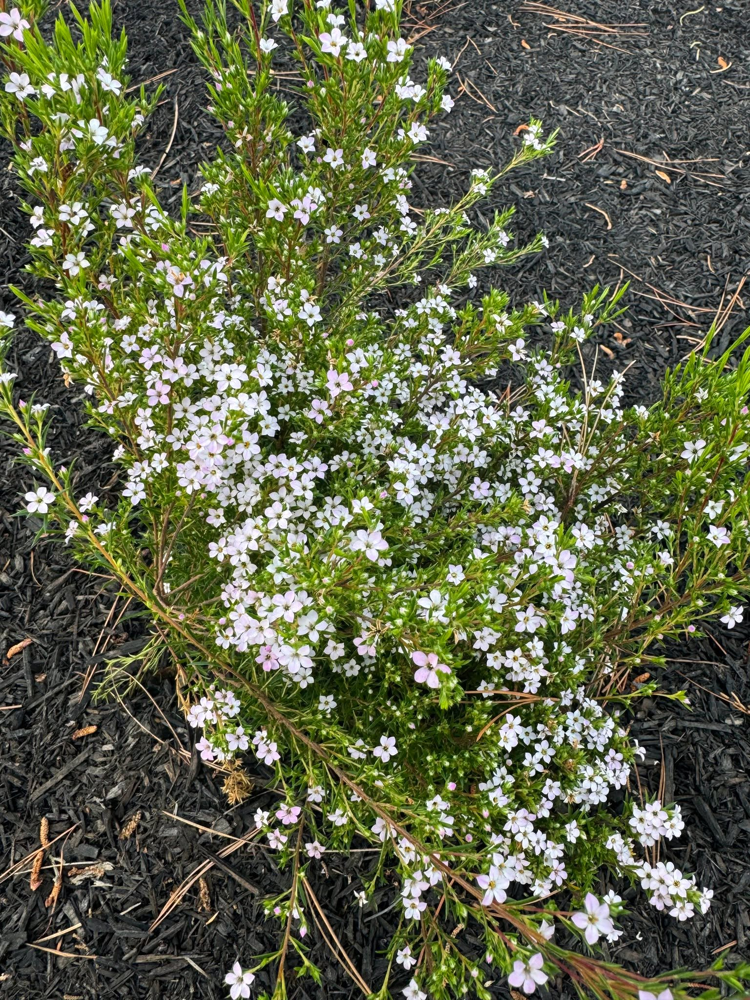
**이미지 캡션:** 이 사진은 검은색 나무 조각으로 덮인 땅에 심어진 작고 하얀 꽃이 만발한 관목을 클로즈업한 모습입니다. 꽃은 작고 섬세하며, 일부 꽃잎에는 연한 분홍색이 살짝 섞여 있습니다. 잎은 작고 짙은 녹색이며, 가지는 가늘고 뻗어 있습니다. 배경은 어둡고 질감이 있어 꽃의 밝은 색상을 돋보이게 합니다. 사진은 자연광 아래에서 촬영된 것으로 보이며, 전체적으로 평화롭고 고요한 분위기를 자아냅니다. 이 사진은 정원이나 자연 환경에서 식물을 촬영한 것으로, 식물의 아름다움과 섬세함을 강조합니다.
 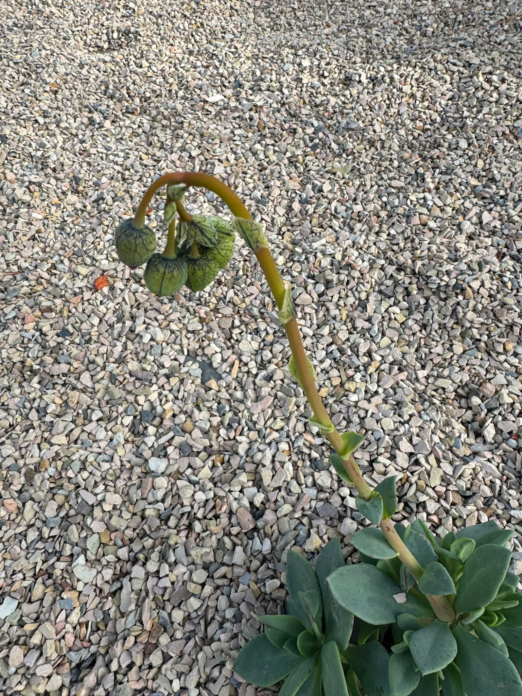
**이미지 캡션:** 이 사진은 굵은 자갈이 깔린 야외 공간에 심어진 다육 식물을 보여줍니다. 사진의 중앙에는 붉은색과 녹색이 섞인 줄기가 위로 뻗어 있으며, 줄기 끝에는 둥근 모양의 녹색 열매들이 매달려 있습니다. 열매 표면에는 짙은 녹색의 줄무늬가 있어 독특한 질감을 나타냅니다. 줄기 아래쪽에는 두꺼운 녹색 잎들이 촘촘하게 모여 자라고 있으며, 잎들은 둥근 모양에 가장자리가 부드럽습니다. 배경 전체는 다양한 크기와 색상의 굵은 자갈로 덮여 있으며, 자갈들은 회색, 베이지색, 분홍색 등 여러 색조를 띠고 있습니다. 사진에는 사람이 등장하지 않으며, 텍스트도 보이지 않습니다. 전체적으로 건조하고 햇볕이 잘 드는 정원이나 조경된 공간의 분위기를 연출하며, 식물의 독특한 형태와 질감이 시선을 사로잡습니다.이 등장하지 않으며, 텍스트도 보이지 않습니다. 전체적으로 건조하고 햇볕이 잘 드는 정원이나 조경된 공간의 분위기를 연출하며, 식물의 독특한 형태와 질감이 시선을 사로잡습니다.
 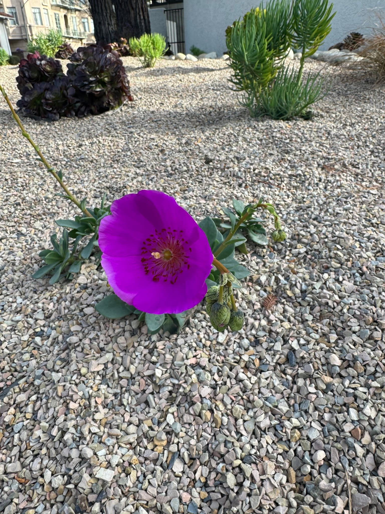
**이미지 캡션:** 이 사진은 자갈로 덮인 정원에서 보라색 꽃 한 송이가 피어 있는 모습을 담고 있습니다. 꽃은 선명한 보라색이며, 꽃잎 안쪽에는 붉은색 점들이 찍혀 있습니다. 꽃 주변에는 녹색 잎사귀와 두 개의 꽃봉오리가 보입니다. 배경에는 검은색 줄기가 있는 큰 나무와 여러 종류의 다육 식물들이 심어져 있습니다. 왼쪽에는 짙은 보라색의 잎을 가진 다육 식물이 있고, 오른쪽에는 길쭉한 녹색 잎을 가진 다육 식물이 있습니다. 멀리 건물과 담장도 보입니다. 전체적으로 햇볕이 잘 드는 야외 정원의 평화롭고 자연적인 분위기를 느낄 수 있습니다. 있습니다.
 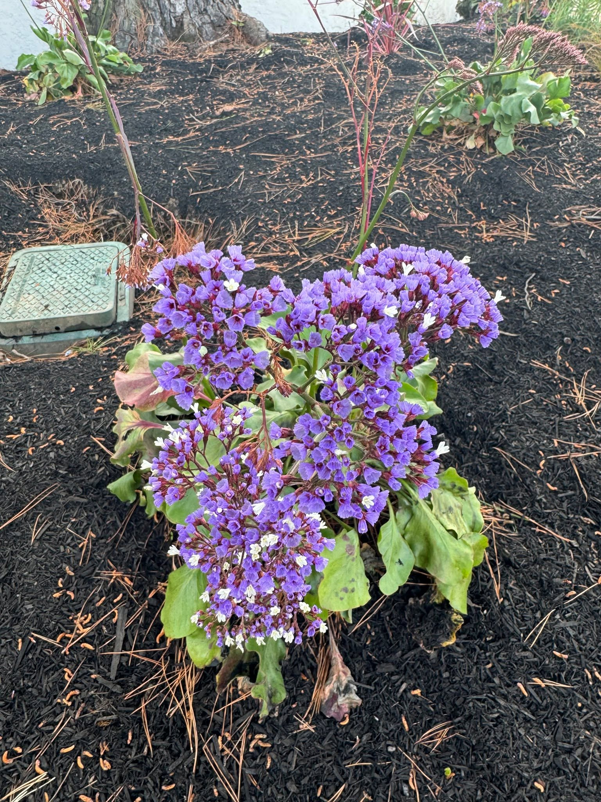
**이미지 캡션:** 이 사진은 짙은 검은색 나무 껍질로 덮인 정원 침대에 심어진 보라색 꽃다발을 클로즈업한 것입니다. 꽃은 작고 수많은 작은 꽃잎으로 구성되어 있으며, 일부는 흰색이며 짙은 보라색 꽃과 대조를 이룹니다. 꽃 줄기는 가늘고 길며, 일부는 붉은색을 띠고 있습니다. 꽃 주변에는 잎이 넓고 녹색이며 일부는 가장자리가 갈색으로 변해 있습니다. 배경에는 나무의 거친 껍질이 보이고, 왼쪽에는 녹색의 사각형 모양의 덮개가 땅에 묻혀 있습니다. 전체적으로 자연스럽고 평화로운 분위기를 자아냅니다.
 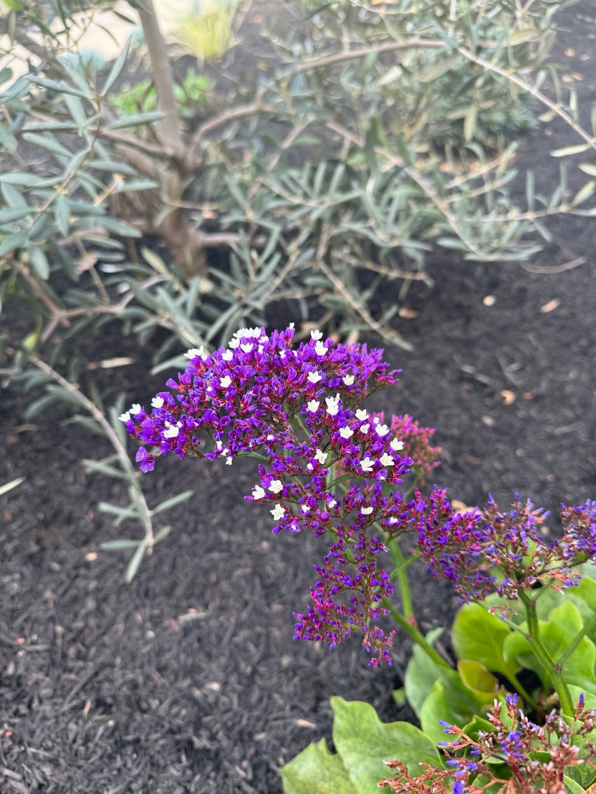
**이미지 캡션:** 이 사진은 보라색과 흰색의 작은 꽃들이 무리지어 피어 있는 모습과 그 주변의 배경을 담고 있습니다. 꽃들은 얇고 가는 줄기에 매달려 있으며, 보라색 꽃잎 사이사이로 작고 하얀 꽃들이 섞여 있어 섬세하고 화려한 느낌을 줍니다. 배경에는 짙은 회색의 나무 조각들이 깔려 있어 흙이나 멀칭 재료로 보이며, 그 뒤로는 흐릿하게 보이는 나무 가지와 잎들이 있습니다. 전체적으로 자연의 한 조각을 포착한 듯한 평화롭고 차분한 분위기를 자아냅니다. 사람이나 텍스트는 보이지 않습니다.
 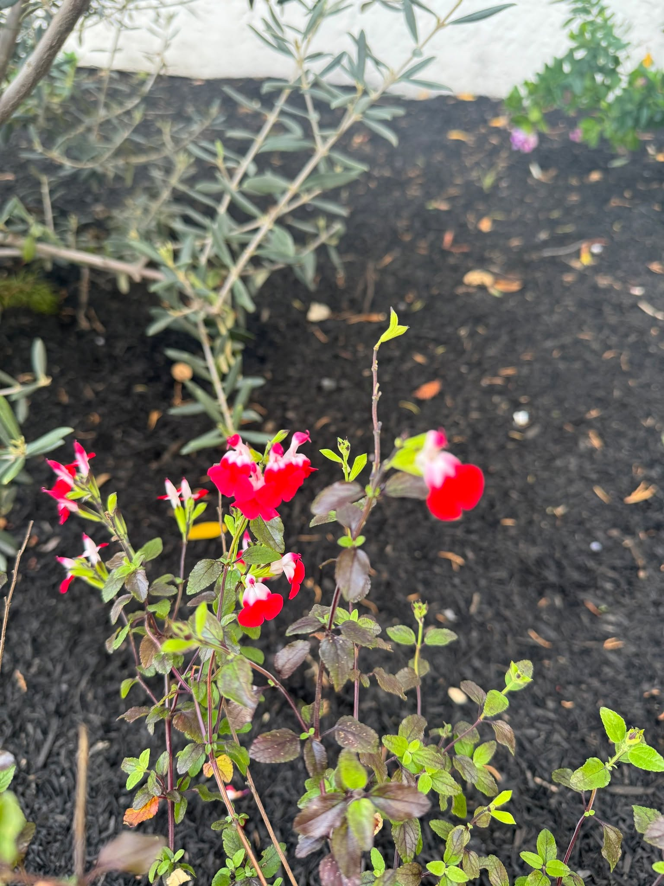
**이미지 캡션:** 이 사진은 붉은색과 흰색 꽃이 피어 있는 작은 관목을 클로즈업한 모습입니다. 꽃은 작고 나팔 모양이며, 붉은색 꽃잎 끝에 흰색이 섞여 있습니다. 잎은 작고 짙은 녹색이며, 일부는 붉은색을 띠고 있습니다. 배경은 검은색 나무 껍질로 덮여 있으며, 흐릿하게 보이는 올리브 나무 가지와 흰색 벽이 있습니다. 사진은 자연광 아래에서 촬영되었으며, 꽃과 잎의 질감이 선명하게 보입니다. 전체적으로 평화롭고 자연적인 분위기를 자아냅니다.
 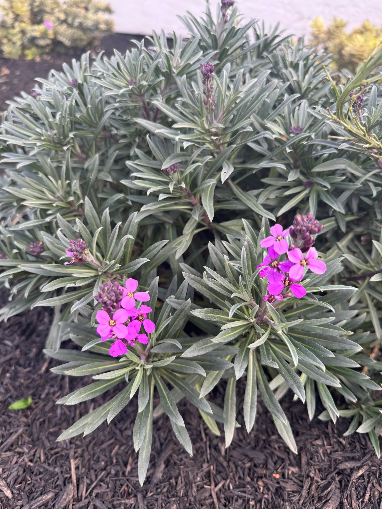
**이미지 캡션:** 이 사진은 짙은 녹색의 잎과 보라색 꽃이 피어 있는 식물을 클로즈업하여 보여줍니다. 식물은 짙은 갈색의 나무껍질로 덮인 땅에 심어져 있으며, 배경에는 흐릿하게 다른 식물들이 보입니다. 꽃은 작고 네 개의 꽃잎을 가지고 있으며, 짙은 보라색을 띱니다. 잎은 길고 좁으며 끝이 뾰족하고 은백색의 가장자리를 가지고 있습니다. 전체적으로 차분하고 자연스러운 분위기를 자아냅니다. 사진에는 사람이 등장하지 않으며, 보이는 텍스트도 없습니다.
 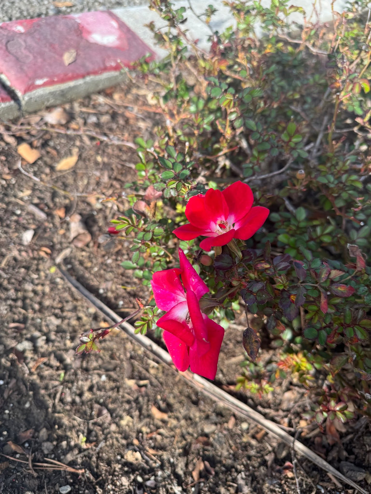
**이미지 캡션:** 이 사진은 붉은색 장미 두 송이가 돋보이는 야외 정원의 모습을 담고 있습니다. 사진의 왼쪽 상단에는 붉은색과 회색 테두리가 있는 벽돌 조각이 놓여 있으며, 그 주변으로는 흙과 마른 나뭇잎들이 흩어져 있습니다. 중앙에는 짙은 녹색 잎사귀와 붉은색 줄기를 가진 장미 덤불이 있으며, 그 위에 선명한 붉은색 장미 두 송이가 피어 있습니다. 위쪽에 있는 장미는 활짝 피어 꽃잎 중앙의 흰색과 노란색 수술이 보이고, 아래쪽에 있는 장미는 약간 비스듬하게 피어 붉은색 꽃잎이 강조되어 있습니다. 장미 덤불 아래로는 흙바닥이 보이며, 흙 위에는 가느다란 나뭇가지와 잎사귀들이 흩어져 있습니다. 사진의 전체적인 분위기는 햇살이 비치는 맑고 평화로운 날의 정원 풍경을 연상시킵니다.보이며, 흙 위에는 가느다란 나뭇가지와 잎사귀들이 흩어져 있습니다. 사진의 전체적인 분위기는 햇살이 비치는 맑고 평화로운 날의 정원 풍경을 연상시킵니다.

### 3월 12일 (화) 05:50 · #0313 #SF #solarllm 3월 13일 SF에서 Upstage …

#0313 #SF #solarllm 3월 13일 SF에서 Upstage Hwalsuk Lee CTO님이 Solar LLM pre-train & fine-tuning 에 대해 설명합니다. 근처 계시는 분들 모두 뵙겠습니다.
 
https://lu.ma/blem48rb

​We're excited to have Stan Lee from Upstage talk about The Art of Fine-tuning for Exceptional sLLMs - Discover the untapped power of fine-tuning small LLMs (sLLMs) to surpass GPT-4 in specific domains or tasks. This talk delves into two compelling case studies: building a custom sLLM for a commercial company and enhancing an sLLM’s ability to comprehend and solve complex mathematical problems.

**이미지 캡션:** 이 이미지는 MLOps 커뮤니티에서 주최하는 "MLOps Community San Francisco Fall & Winter Workshops - Part V" 행사를 홍보하는 포스터입니다. 왼쪽에는 보라색 배경에 흰색 로고와 "MLOps Community San Francisco Fall & Winter Workshops PART V"라는 텍스트가 있습니다. 오른쪽에는 행사 제목, 날짜 및 시간, 장소가 명확하게 표시되어 있습니다. 날짜는 3월 13일 수요일이며, 시간은 오후 12시 30분부터 오후 7시까지입니다. 장소는 555 California St, San Francisco, California입니다. 이미지 하단에는 귀여운 이모티콘이 있습니다. 전체적으로 깔끔하고 정보 전달에 중점을 둔 디자인입니다.입니다. 장소는 555 California St, San Francisco, California입니다. 이미지 하단에는 귀여운 이모티콘이 있습니다. 전체적으로 깔끔하고 정보 전달에 중점을 둔 디자인입니다.

### 3월 12일 (화) 23:37 · #solarllm #solarlegal 어렵고 도전적인 분야이지만 많은 …

#solarllm #solarlegal 어렵고 도전적인 분야이지만 많은 분들께 실질적인 도움을 줄 수 있어서 과감하게 선택했습니다. 😊🌟

국내 리걸테크 최고인 로앤컴퍼니와 함께 협력하여 법률 분야에서 생성형 AI를 개발하는 것에 대해 기쁩니다. 세계 최고 수준의 자체 언어모델인 솔라를 기반으로 법률 전문 AI 모델을 만들어 국내외 법률서비스 시장을 혁신하고, 여러분의 실생활에 도움이 되도록 노력하겠습니다. 

상반기에 출시 예정인 #solarlegal에 대해 많은 기대와 관심을 부탁드립니다!

**이미지 캡션:** 이 이미지는 어두운 배경에 두 개의 로고가 나란히 표시된 그래픽 디자인입니다. 왼쪽에는 "Law&Company"라는 텍스트와 함께 흰색 로고가 있으며, 오른쪽에는 "upstage"라는 텍스트와 함께 흰색 로고가 있습니다. 배경에는 파란색과 보라색의 물결 모양 패턴이 흐릿하게 보이며, 전체적으로 현대적이고 기술적인 분위기를 연출합니다. 사람, 장소, 사물, 보이는 텍스트, 분위기/상황에 대한 정보는 없습니다.

### 3월 12일 (화) 23:45 · #Upstage #AI #LLM #0314 #1400 Upstage 최고…

#Upstage #AI #LLM #0314 #1400 Upstage 최고의 입담을 자랑하는 Hongjun Choi 부사장의 "AI 실제 구축 사례"에 초대 합니다.

IBM, EY, 네이버, 라인뱅크, 라니아 생명 등에서 굴직한 프로젝트등을 대박 성공으로 이끌었습니다. 기술과 AI경험이 풍부한 Hongjun Choi 님은 이시대 AI 실제 구축에 대해 가장 잘 아는 분중 한분이라 생각됩니다.

망설임없이 선신청 해주시면 되십니다.

일정 : 3월 14일 오후 2시
등록 👉 👉 👉 https://lnkd.in/g2_MgGZN

AI를 실제로 구축하고자 하는 분들에게 이 가이드는 큰 도움이 될 것입니다. 😊

**이미지 캡션:** 이 이미지는 "디지털 자산화부터 LLM을 통한 비즈니스 가치 창출까지 AI 실제 구축 사례"라는 제목의 웨비나 또는 이벤트 홍보물입니다. 왼쪽에는 행사의 제목과 날짜(24년 3월 14일 목요일 오후 2시), 그리고 "등록하기" 버튼이 파란색으로 강조되어 있습니다. 그 아래에는 "등록만 하셔도 라이브 이후 다시보기 링크를 전달드립니다."라는 안내 문구가 있습니다. 오른쪽 배경에는 "Finance", "Law", "Commerce", "Science", "Math", "Health"와 같은 다양한 분야를 나타내는 아이콘과 텍스트가 희미하게 보이며, 중앙에는 AI가 적힌 파란색 폴더와 그 안의 서류, 그리고 돋보기 두 개가 그려져 있어 AI 기술을 활용한 실제 사례를 탐구한다는 의미를 시각적으로 전달하고 있습니다. 전체적으로 어두운 배경에 밝은 텍스트와 그래픽 요소가 대비를 이루며, 정보 전달과 참여 유도를 목적으로 하는 전문적이고 현대적인 분위기를 풍깁니다. 아이콘과 텍스트가 희미하게 보이며, 중앙에는 AI가 적힌 파란색 폴더와 그 안의 서류, 그리고 돋보기 두 개가 그려져 있어 AI 기술을 활용한 실제 사례를 탐구한다는 의미를 시각적으로 전달하고 있습니다. 전체적으로 어두운 배경에 밝은 텍스트와 그래픽 요소가 대비를 이루며, 정보 전달과 참여 유도를 목적으로 하는 전문적이고 현대적인 분위기를 풍깁니다.

### 3월 14일 (목) 08:45 · MS의 멋진 Cree Choi 님과 즐거운 논의 Stanford Univ…

MS의 멋진 Cree Choi 님과 즐거운 논의 Stanford University. 자세한 내용은 짤로 대신합니다. Stay tuned!

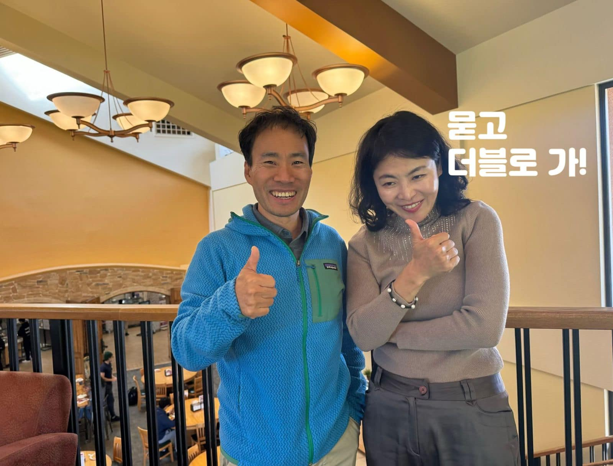
**이미지 캡션:** 사진에는 성인 남성과 성인 여성이 나란히 서서 엄지손가락을 치켜들고 환하게 웃고 있다. 남성은 40대 정도로 보이며, 파란색 집업 후드티를 입고 있다. 여성은 40대 후반에서 50대 초반으로 보이며, 베이지색 니트 상의와 회색 바지를 입고 있다. 두 사람 모두 긍정적이고 활기찬 표정을 짓고 있다. 배경은 실내 공간으로, 높은 천장과 여러 개의 샹들리에 조명이 보인다. 샹들리에는 갓이 달린 여러 개의 전등이 나무 프레임에 연결된 디자인이다. 벽은 연한 주황색으로 칠해져 있고, 일부는 돌담으로 장식되어 있다. 사진 오른쪽에는 "묻고 더블로 가!"라는 흰색 글자가 쓰여 있다. 이 문구는 한국어로, 어떤 제안이나 행동에 대해 두 배의 이득을 얻을 수 있다는 의미를 내포하고 있다. 사진 하단에는 계단 난간과 아래층의 모습이 보인다. 아래층에는 테이블과 의자들이 놓여 있고, 사람들이 앉아 있는 모습도 희미하게 보인다. 전반적으로 밝고 긍정적인 분위기의 사진으로, 두 사람이 무언가에 대해 만족하거나 성공적인 결과를 기대하는 듯한 모습을 보여준다.진 오른쪽에는 "묻고 더블로 가!"라는 흰색 글자가 쓰여 있다. 이 문구는 한국어로, 어떤 제안이나 행동에 대해 두 배의 이득을 얻을 수 있다는 의미를 내포하고 있다. 사진 하단에는 계단 난간과 아래층의 모습이 보인다. 아래층에는 테이블과 의자들이 놓여 있고, 사람들이 앉아 있는 모습도 희미하게 보인다. 전반적으로 밝고 긍정적인 분위기의 사진으로, 두 사람이 무언가에 대해 만족하거나 성공적인 결과를 기대하는 듯한 모습을 보여준다.

### 3월 14일 (목) 14:48 · #solarllm #부러움 제가 부러움이 별로 없는 사람인데, 사실 이것…

#solarllm #부러움 제가 부러움이 별로 없는 사람인데, 사실 이것은 많이 부럽네요. 대한민국 대통령실 포함 국가 기관장 분들에게도 사랑받는 Solar Chat이 되겠습니다.

https://console.upstage.ai/playground/chat

**이미지 캡션:** 이 사진은 소셜 미디어 게시물로, Sophia Yang이라는 이름의 성인 여성이 프랑스 대통령인 에마뉘엘 마크롱의 게시물을 공유하고 있습니다. Sophia Yang은 Mistral AI의 개발자 관계 책임자이며, 그녀의 프로필 사진에는 그녀가 미소를 짓고 있는 모습이 담겨 있습니다. 에마뉘엘 마크롱은 프랑스 공화국 대통령으로 소개되며, 그의 프로필 사진에는 그가 정장을 입고 있는 모습이 보입니다. 게시물은 프랑스 대통령이 Mistral AI의 챗봇을 사용하고 있다는 내용을 담고 있으며, 마크롱의 게시물은 프랑스의 인공지능 분야에서의 리더십, 야망, 책임감 있는 사용에 대한 내용을 프랑스어로 작성하고 있습니다. 게시물에는 "Leader", "Ambition du pays", "Rôle de premier plan", "Utilisation responsable"와 같은 문구가 포함되어 있으며, Mistral, LightOn, Shift Technology, Alan, Bioptimus, Google과 같은 회사들이 프랑스에서 인공지능 혁신을 선택하고 있다는 내용도 언급됩니다. 또한, 프랑스가 인공지능 분야에서 선두를 달리고 있으며, 이를 위해 600건의 청문회, 7000건의 상담, 25회의 세션, 1개의 실행 계획이 진행되었다는 내용도 포함되어 있습니다. 게시물 하단에는 "En un mot, la position de la France en matière d'intelligence artificielle."라는 제목과 함께 프랑스의 인공지능 분야에서의 입장을 설명하는 프랑스어 텍스트가 검은색 배경 위에 표시되어 있습니다. 전반적으로 이 게시물은 프랑스의 인공지능 분야에서의 리더십과 혁신에 대한 긍정적인 분위기를 전달하고 있습니다.스의 인공지능 분야에서의 리더십, 야망, 책임감 있는 사용에 대한 내용을 프랑스어로 작성하고 있습니다. 게시물에는 "Leader", "Ambition du pays", "Rôle de premier plan", "Utilisation responsable"와 같은 문구가 포함되어 있으며, Mistral, LightOn, Shift Technology, Alan, Bioptimus, Google과 같은 회사들이 프랑스에서 인공지능 혁신을 선택하고 있다는 내용도 언급됩니다. 또한, 프랑스가 인공지능 분야에서 선두를 달리고 있으며, 이를 위해 600건의 청문회, 7000건의 상담, 25회의 세션, 1개의 실행 계획이 진행되었다는 내용도 포함되어 있습니다. 게시물 하단에는 "En un mot, la position de la France en matière d'intelligence artificielle."라는 제목과 함께 프랑스의 인공지능 분야에서의 입장을 설명하는 프랑스어 텍스트가 검은색 배경 위에 표시되어 있습니다. 전반적으로 이 게시물은 프랑스의 인공지능 분야에서의 리더십과 혁신에 대한 긍정적인 분위기를 전달하고 있습니다.

### 3월 14일 (목) 15:44 · #solarllm #sf Solar를 사용해보고 좋아하는 사람들이 점점 …

#solarllm #sf Solar를 사용해보고 좋아하는 사람들이 점점 늘고 있습니다.

### 3월 16일 (토) 14:38 · #gtc #solarllm GTC에 참여하신다면 Upstage GTC b…

#gtc #solarllm GTC에 참여하신다면 Upstage GTC booth I-146 을 방문해주세요. Solar LLM full stack 인 chat, function call, embedding, answer verification, document parser 등을 제일 먼저 만나실수 있습니다.

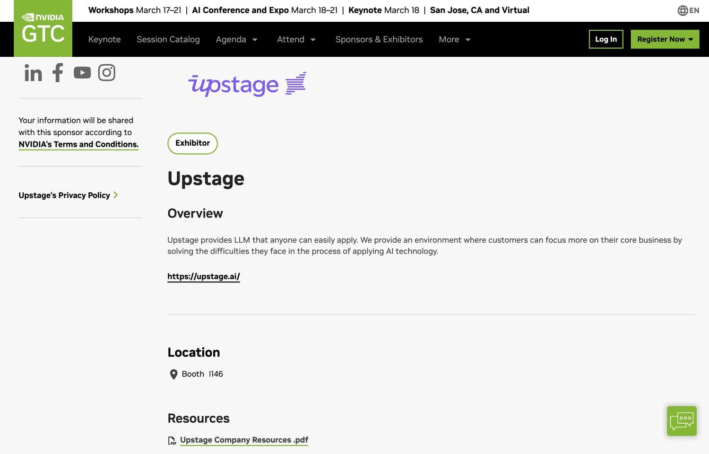
**이미지 캡션:** 이 화면은 NVIDIA GTC 컨퍼런스의 참가업체 정보 페이지로, Upstage라는 회사가 전시업체로 소개되고 있습니다. 페이지 상단에는 NVIDIA GTC 컨퍼런스의 날짜와 장소, 그리고 영어(EN)로 된 언어 선택 옵션이 보입니다. 페이지 좌측에는 소셜 미디어 아이콘(LinkedIn, Facebook, YouTube, Instagram)과 함께 "귀하의 정보는 이 스폰서와 NVIDIA의 이용 약관에 따라 공유됩니다."라는 안내 문구, 그리고 "Upstage의 개인정보 처리방침" 링크가 있습니다. 중앙에는 "Upstage"라는 회사 로고와 함께 "Exhibitor"라는 라벨이 붙어 있으며, 회사 개요 섹션에는 Upstage가 LLM을 쉽게 적용할 수 있도록 지원하며 고객이 AI 기술 적용 과정의 어려움을 해결하고 핵심 비즈니스에 집중할 수 있는 환경을 제공한다는 설명이 있습니다. 또한, 회사 웹사이트 주소인 "https://upstage.ai/"와 부스 번호 "1146"이 포함된 위치 정보, 그리고 "Upstage Company Resources.pdf"라는 이름의 리소스 링크가 제공됩니다. 화면 우측 상단에는 로그인 및 등록 버튼이 있습니다. 전반적으로 깔끔하고 정보 전달에 초점을 맞춘 웹사이트 디자인입니다."Upstage"라는 회사 로고와 함께 "Exhibitor"라는 라벨이 붙어 있으며, 회사 개요 섹션에는 Upstage가 LLM을 쉽게 적용할 수 있도록 지원하며 고객이 AI 기술 적용 과정의 어려움을 해결하고 핵심 비즈니스에 집중할 수 있는 환경을 제공한다는 설명이 있습니다. 또한, 회사 웹사이트 주소인 "https://upstage.ai/"와 부스 번호 "1146"이 포함된 위치 정보, 그리고 "Upstage Company Resources.pdf"라는 이름의 리소스 링크가 제공됩니다. 화면 우측 상단에는 로그인 및 등록 버튼이 있습니다. 전반적으로 깔끔하고 정보 전달에 초점을 맞춘 웹사이트 디자인입니다.

### 3월 17일 (일) 05:40 · #gtc #paloalto #farmersmarket GTC를 압둔 주말…

#gtc #paloalto #farmersmarket GTC를 압둔 주말 흥겨운 Upstage 팀!

GTC 참여하시면 I-146 찾아 주세요

🎬 동영상 1개 (생략)

### 3월 18일 (월) 21:39 · #solaremb #llmfullstack RAG를 구성할 때, 핵심이 …

#solaremb #llmfullstack RAG를 구성할 때, 핵심이 되는 임베딩 기능을 출시합니다. 한국어 임베딩은 정말 잘 작동합니다. 3말까지 무료로 사용하실 수 있으며, 부족한 부분이 있으면 말씀해주시면 보완하여 정식 출시하겠습니다. 😊

기존에 OpenAI 등을 사용하셨다면, 코드에서 모델명만 변경해주시면 됩니다. 

https://console.upstage.ai/services/embedding

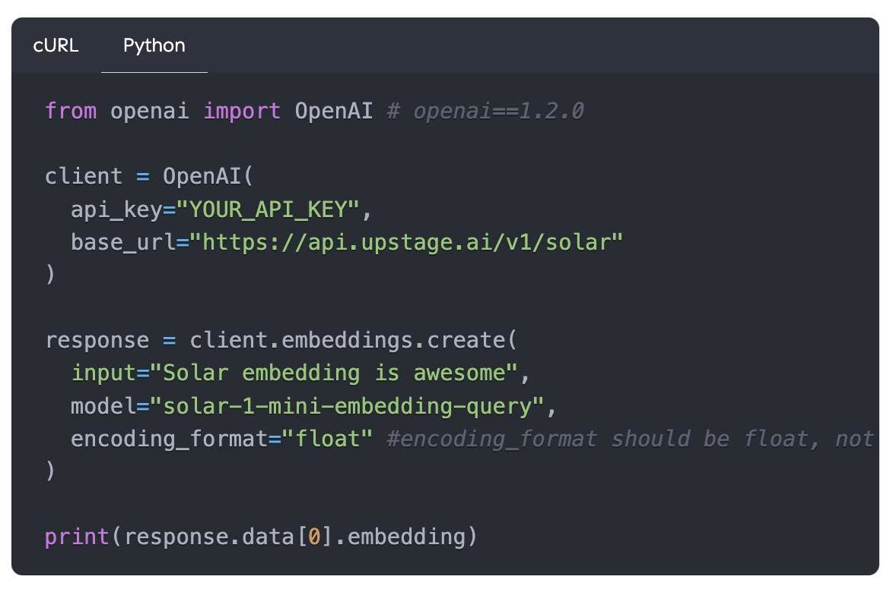
**이미지 캡션:** 이 이미지는 프로그래밍 코드의 스크린샷으로, 어두운 배경에 밝은 색상의 텍스트가 표시되어 있습니다. 상단에는 "cURL"과 "Python"이라는 두 개의 탭이 있으며, "Python" 탭이 선택되어 있습니다. 코드 내용은 파이썬으로 OpenAI 라이브러리를 사용하여 임베딩을 생성하는 과정을 보여줍니다. 구체적으로는 `openai` 라이브러리를 임포트하고, `OpenAI` 클래스의 인스턴스를 생성하며, `api_key`와 `base_url`을 설정합니다. 이후 `client.embeddings.create` 메서드를 호출하여 "Solar embedding is awesome"이라는 텍스트를 "solar-1-mini-embedding-query" 모델을 사용하여 임베딩으로 변환하고, `encoding_format`을 "float"으로 지정합니다. 마지막으로 생성된 임베딩 데이터를 출력하는 `print` 문이 있습니다. 코드의 가독성을 높이기 위해 주석도 포함되어 있습니다. 이 이미지는 프로그래밍, 특히 자연어 처리 분야의 개발자에게 유용할 수 있습니다.서드를 호출하여 "Solar embedding is awesome"이라는 텍스트를 "solar-1-mini-embedding-query" 모델을 사용하여 임베딩으로 변환하고, `encoding_format`을 "float"으로 지정합니다. 마지막으로 생성된 임베딩 데이터를 출력하는 `print` 문이 있습니다. 코드의 가독성을 높이기 위해 주석도 포함되어 있습니다. 이 이미지는 프로그래밍, 특히 자연어 처리 분야의 개발자에게 유용할 수 있습니다.

### 3월 18일 (월) 22:10 · 📷 사진 (1장)

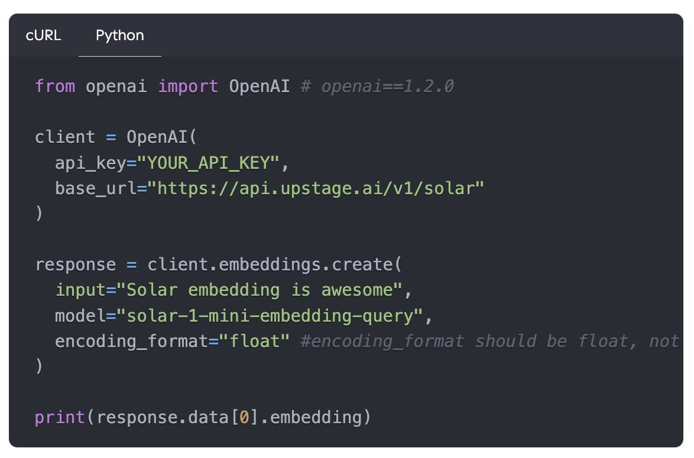
**이미지 캡션:** 이 이미지는 프로그래밍 코드의 스크린샷으로, 어두운 배경에 밝은 색상의 텍스트가 표시됩니다. 화면 상단에는 'cURL'과 'Python'이라는 두 개의 탭이 있으며, 'Python' 탭이 선택되어 있습니다. 코드의 내용은 파이썬으로 OpenAI 라이브러리를 사용하여 임베딩을 생성하는 과정을 보여줍니다. 구체적으로는 OpenAI 클라이언트를 초기화하고, API 키와 기본 URL을 설정한 후, 'Solar embedding is awesome'이라는 텍스트를 입력으로 사용하여 'solar-1-mini-embedding-query' 모델로 임베딩을 생성하는 명령이 포함되어 있습니다. 또한, `encoding_format`이 'float'으로 설정되어 있으며, 주석으로 'encoding_format should be float, not'이라고 명시되어 있습니다. 마지막으로 생성된 임베딩 데이터를 출력하는 `print` 문이 보입니다. 이 코드는 인공지능 모델을 활용하여 텍스트를 벡터 표현으로 변환하는 과정을 보여주며, 검색 또는 RAG(Retrieval-Augmented Generation) 시스템 구축에 활용될 수 있습니다. 이미지에는 사람이 등장하지 않으며, 장소는 명확히 드러나지 않지만, 코딩 환경이나 개발 관련 화면으로 추정됩니다. 분위기는 기술적이고 정보 중심적입니다.ing-query' 모델로 임베딩을 생성하는 명령이 포함되어 있습니다. 또한, `encoding_format`이 'float'으로 설정되어 있으며, 주석으로 'encoding_format should be float, not'이라고 명시되어 있습니다. 마지막으로 생성된 임베딩 데이터를 출력하는 `print` 문이 보입니다. 이 코드는 인공지능 모델을 활용하여 텍스트를 벡터 표현으로 변환하는 과정을 보여주며, 검색 또는 RAG(Retrieval-Augmented Generation) 시스템 구축에 활용될 수 있습니다. 이미지에는 사람이 등장하지 않으며, 장소는 명확히 드러나지 않지만, 코딩 환경이나 개발 관련 화면으로 추정됩니다. 분위기는 기술적이고 정보 중심적입니다.

> [#solaremb](https://www.facebook.com/hashtag/solaremb?__eep__=6&__cft__[0]=AZUOw_NelXPjyqMCNZb42JaLomH-vnacEdZsQysdbpq_7tOetIdiDGW6ASuIplOCqm3sBcfD2g2ODD14CfEN4ZpCnYe-3q9Qn2k6X4h0gKXSEpOOmQc95ByVrqeR5utlZoo&__tn__=*NK-R) [#llmfullstack](https://www.facebook.com/hashtag/llmfullstack?__eep__=6&__cft__[0]=AZUOw_NelXPjyqMCNZb42JaLomH-vnacEdZsQysdbpq_7tOetIdiDGW6ASuIplOCqm3sBcfD2g2ODD14CfEN4ZpCnYe-3q9Qn2k6X4h0gKXSEpOOmQc95ByVrqeR5utlZoo&__tn__=*NK-R) RAG를 구성할 때, 핵심이 되는 임베딩 기능을 출시합니다. 영어와 한국어 임베딩은 정말 잘 작동합니다. 3말까지 무료로 사용하실 수 있으며, 부족한 부분이 있으면 말씀해주시면 보완하여 정식 출시하겠습니다. 😊  기존에 OpenAI 등을 사용하셨다면, 코드에서 모델명만 변경해주시면 됩니다.  [https://console.upstage.ai/services/embedding](https://l.facebook.com/l.php?u=https%3A%2F%2Fconsole.upstage.ai%2Fservices%2Fembedding%3Ffbclid%3DIwAR0yR2lx-MZag43t7NaT2Os6swiXnyTc74Qq-5zlJ2f0lphVzazwlf5sbDo&h=AT3l_uG04JpoM_WyZAuItBxbO7XLW-lGhK-vlOfgktldXu44nMApF8OB7xbGlWvFP469TFUTrdzIwGL2DTYDRnpHsZ_U2eoHYzHh6vtZsukYQf3g9J0x_WA0Fke4EKrjvRRKe5Z2XPdLEYXmCoWvAjs&__tn__=-UK-R&c[0]=AT3t-jcj4RfQIMvxwJMuJstvLoghks4jGIY7R-CXdyq7ecLW9GDfTsIjPVRZgvkzG0Q0ETRIAuJc4StdJfigS_zF4w6Jx2kCeknQX2jNWQWs43H9r4SlGX4dQ3aW__JVhmSD8WRHwJveaTI2VDF3kqVFg54)

### 3월 19일 (화) 01:27 · #GTC #GTC2024 #solarllm #llmfullstack #눈…

#GTC #GTC2024 #solarllm #llmfullstack #눈에띄네 GTC에 참여하신다면 "Inception Startups" 섹션으로 들어오시면 정중앙에 눈에 띄는 Solar LLM 표시를 찾아주세요. 

Solar LLM Full Stack을 가장 빠르게 만나보세요! 😊

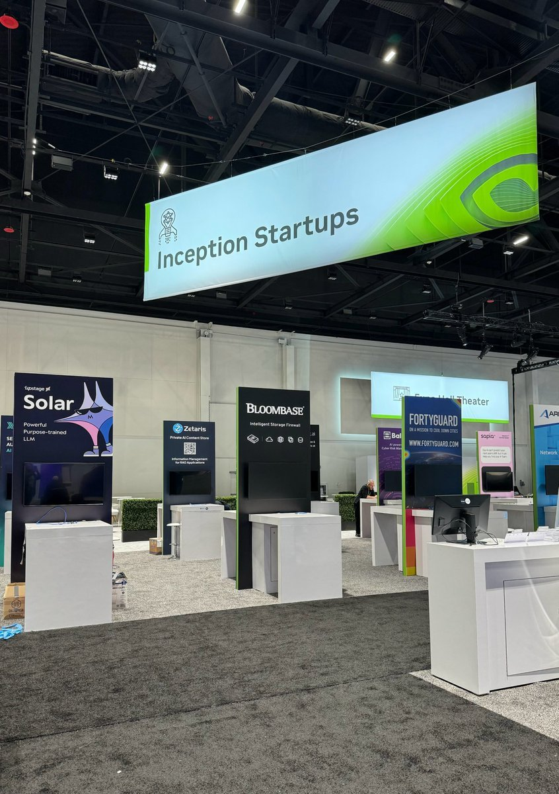
**이미지 캡션:** 전시회장으로 보이는 넓은 공간에서, 천장에 "Inception Startups"라고 쓰인 대형 현수막이 걸려 있고, 그 아래에는 여러 부스가 설치되어 있다. 왼쪽 부스에는 "ipstage Solar"라는 로고와 함께 "Powerful Purpose-trained LLM"이라는 문구가 보이며, 그 아래에는 검은색 화면이 있다. 중앙 부스에는 "Zetaris Private AI Content Store Information Management for RAG Applications"라고 쓰여 있고, 그 옆에는 "BLOOMBASE Intelligent Storage Firewall"이라는 문구가 적힌 부스가 있다. 오른쪽에는 "FORTYGUARD ON A MISSION TO COOL DOWN CITIES"라는 문구와 웹사이트 주소가 보이는 부스가 있으며, 그 옆에는 "sapia"라는 로고와 함께 "Network"라는 단어가 보이는 부스도 있다. 부스들은 대부분 흰색 테이블과 검은색 패널로 구성되어 있으며, 일부 부스에는 모니터가 설치되어 있다. 배경에는 "Event Hall Theater"라고 쓰인 간판이 보인다. 한 명의 성인 남성이 부스 뒤편에서 서류를 보고 있는 모습이 희미하게 보인다. 전체적으로 깔끔하고 현대적인 분위기의 IT 관련 전시회 또는 컨퍼런스 현장으로 보인다.LOOMBASE Intelligent Storage Firewall"이라는 문구가 적힌 부스가 있다. 오른쪽에는 "FORTYGUARD ON A MISSION TO COOL DOWN CITIES"라는 문구와 웹사이트 주소가 보이는 부스가 있으며, 그 옆에는 "sapia"라는 로고와 함께 "Network"라는 단어가 보이는 부스도 있다. 부스들은 대부분 흰색 테이블과 검은색 패널로 구성되어 있으며, 일부 부스에는 모니터가 설치되어 있다. 배경에는 "Event Hall Theater"라고 쓰인 간판이 보인다. 한 명의 성인 남성이 부스 뒤편에서 서류를 보고 있는 모습이 희미하게 보인다. 전체적으로 깔끔하고 현대적인 분위기의 IT 관련 전시회 또는 컨퍼런스 현장으로 보인다.

### 3월 19일 (화) 12:24 · #GTC #GTC2024 많은 분들이 #solarllm 을 사랑해주셔서 …

#GTC #GTC2024 많은 분들이 #solarllm 을 사랑해주셔서 감사드립니다. 내일도 I-146 에서 뵙겠습니다.

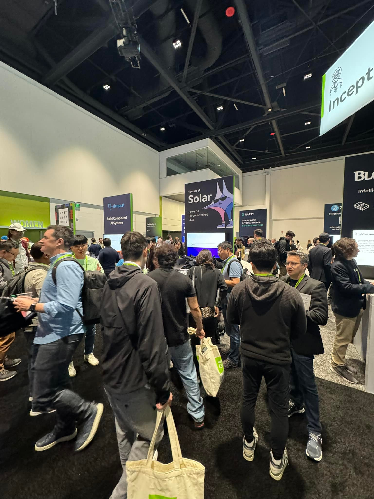
**이미지 캡션:** 이 사진은 인공지능 관련 컨퍼런스 또는 전시회의 실내 모습을 담고 있으며, 수많은 사람들이 검은색 카펫 위를 걸어 다니고 있다. 사진 중앙에는 검은색 후드티와 바지를 입은 젊은 성인 남성이 흰색 토트백을 들고 걸어가고 있으며, 그의 뒤로는 검은색 재킷을 입은 성인 남성이 비슷한 토트백을 들고 있다. 왼쪽에는 하늘색 셔츠와 청바지를 입은 성인 남성이 가방을 메고 걸어가고 있으며, 그의 앞에는 녹색 간판이 보인다. 배경에는 여러 부스가 설치되어 있으며, "deepset", "Solar", "RAFAY", "Incept", "BLO" 등의 로고와 텍스트가 보이는 간판들이 걸려 있다. 사람들은 대부분 캐주얼한 복장을 하고 있으며, 일부는 가방을 들고 있다. 전반적으로 활기차고 북적이는 분위기이며, 기술 관련 행사의 특징을 잘 보여준다.ept", "BLO" 등의 로고와 텍스트가 보이는 간판들이 걸려 있다. 사람들은 대부분 캐주얼한 복장을 하고 있으며, 일부는 가방을 들고 있다. 전반적으로 활기차고 북적이는 분위기이며, 기술 관련 행사의 특징을 잘 보여준다.
 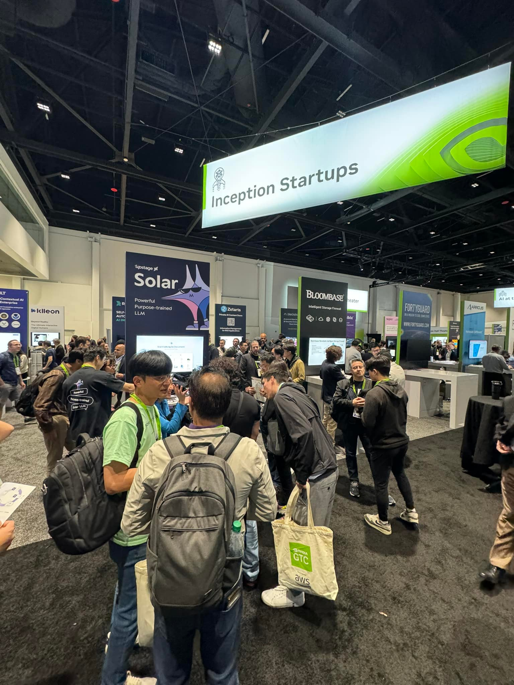
**이미지 캡션:** 이 사진은 많은 사람들이 모여 있는 실내 행사장의 모습으로, 천장에 "Inception Startups"라고 적힌 대형 현수막이 걸려 있고, 그 아래에는 다양한 기업들의 부스가 보인다. 중앙에는 연한 녹색 티셔츠를 입고 검은색 백팩을 멘 젊은 동양인 남성이 서 있으며, 그의 앞에는 회색 백팩을 멘 중년 남성이 서 있다. 주변에는 여러 명의 사람들이 서서 대화하거나 부스를 둘러보고 있으며, 일부는 명찰을 달고 있다. 바닥은 검은색 카펫으로 덮여 있고, 여러 개의 부스 간판에는 "Solar", "BLOOMBASE", "FORTYGUARD", "Zetaris" 등의 이름과 로고가 보인다. 한쪽에는 "NVIDIA GTC aws"라고 적힌 에코백을 들고 있는 사람도 보인다. 전반적으로 기술 관련 컨퍼런스나 전시회의 활기찬 분위기를 느낄 수 있다.", "FORTYGUARD", "Zetaris" 등의 이름과 로고가 보인다. 한쪽에는 "NVIDIA GTC aws"라고 적힌 에코백을 들고 있는 사람도 보인다. 전반적으로 기술 관련 컨퍼런스나 전시회의 활기찬 분위기를 느낄 수 있다.
 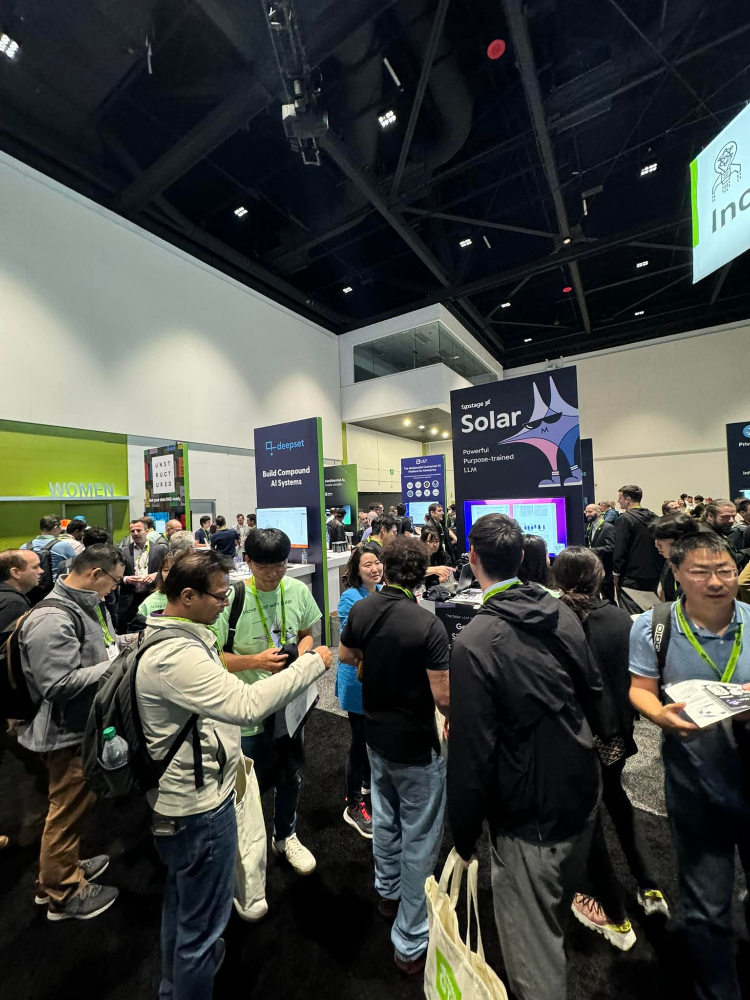
**이미지 캡션:** 행사장을 배경으로 다양한 연령대의 사람들이 모여 있습니다. 대부분 남성이며, 캐주얼한 복장을 하고 있습니다. 일부는 명찰을 목에 걸고 있으며, 손에는 서류나 가방을 들고 있습니다. 사람들은 서로 대화하거나 부스의 전시물을 살펴보는 등 활발하게 움직이고 있습니다. 'WOMEN', 'deepset', 'Build Compound AI Systems', 'Spistage Solar', 'Powerful Purpose-trained LLM', 'Ind'와 같은 글자들이 간판에 보입니다. 전반적으로 기술 관련 행사의 활기찬 분위기를 느낄 수 있습니다. hoodies, and jeans, with some wearing lanyards and carrying bags, suggesting they are attendees or exhibitors. In the foreground, an adult male in a light-colored jacket and jeans is looking at his phone, while another adult male in a light green t-shirt stands nearby, also looking at a device. Behind them, various booths and displays are visible, including one with the "deepset" logo and text "Build Compound AI Systems," another featuring "Solar" with the tagline "Powerful Purpose-trained LLM," and a green banner with the word "WOMEN" in large letters. The overall atmosphere is busy and engaging, with people interacting, looking at displays, and moving through the space.

### 3월 20일 (수) 12:18 · #GTC2024 #solarllm 내일 젠슨황님 저희 부스에 오신다는 첩…

#GTC2024 #solarllm 내일 젠슨황님 저희 부스에 오신다는 첩보가 있습니다. 뵐수 있을까요? 

GTC 계신다면 가장 핫한 부스인 Upstage solar Inception startups I-146 꼭 찾아주셔요.

🎬 동영상 1개 (생략)

### 3월 20일 (수) 22:16 · 📷 사진 (1장)

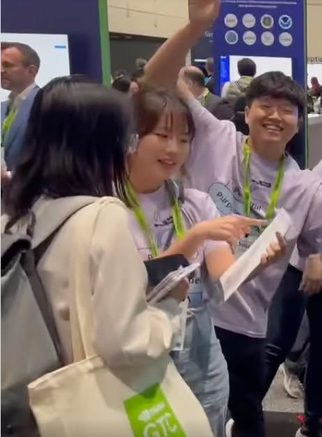
**이미지 캡션:** 이 사진은 컨퍼런스 또는 전시회와 같은 행사장에서 촬영된 것으로 보이며, 여러 사람이 활기찬 분위기 속에서 상호작용하고 있다. 중앙에는 젊은 여성 두 명과 젊은 남성 한 명이 보인다. 젊은 여성 중 한 명은 연보라색 티셔츠를 입고 있으며, 다른 한 명은 연보라색 티셔츠와 청바지를 입고 있다. 두 여성 모두 목에 녹색 줄이 달린 ID 카드를 걸고 있다. 젊은 남성 역시 연보라색 티셔츠를 입고 있으며, 밝게 웃으며 손을 흔들고 있다. 그는 ID 카드를 목에 걸고 있으며, 종이를 들고 있다. 젊은 여성 중 한 명은 종이를 가리키며 무언가를 설명하는 듯한 표정을 짓고 있다. 사진의 왼쪽에는 검은색 머리의 젊은 여성이 흰색 후드티와 에코백을 메고 서 있으며, 그녀의 얼굴은 보이지 않는다. 배경에는 다른 참가자들과 부스, 그리고 "optic"이라는 글자가 보이는 간판이 희미하게 보인다. 전반적으로 즐겁고 활기찬 분위기이며, 참가자들이 정보를 교환하거나 행사를 즐기는 모습으로 보인다. 종이를 가리키며 무언가를 설명하는 듯한 표정을 짓고 있다. 사진의 왼쪽에는 검은색 머리의 젊은 여성이 흰색 후드티와 에코백을 메고 서 있으며, 그녀의 얼굴은 보이지 않는다. 배경에는 다른 참가자들과 부스, 그리고 "optic"이라는 글자가 보이는 간판이 희미하게 보인다. 전반적으로 즐겁고 활기찬 분위기이며, 참가자들이 정보를 교환하거나 행사를 즐기는 모습으로 보인다.

### 3월 21일 (목) 14:03 · #GTC2024 너무 멋진 분을 만났습니다! Gavin Newsom 캘리…

#GTC2024 너무 멋진 분을 만났습니다! Gavin Newsom 캘리포니아 주지사면서 민주당에서 가장 유력한 차기 대권주자인 Upstage #solarllm  판매하기!

필요한 문화, 언어에 따라 모델을 만들수 있고
햇볕과 같이 모두를 비추는 LLM이 되겠다고 Solar 라고 이름을 지었는데
이것을 살 것인지 물어 보았습니다. 
(이 대목에서 한대 맞았고요. ^^)

아주 호탕한 분이셨습니다.

🎬 동영상 1개 (생략)

### 3월 21일 (목) 14:09 · #고객만족 사용해보시고 #solarllm이 좋다고 하실때가 이를 만드는 …

#고객만족 사용해보시고 #solarllm이 좋다고 하실때가 이를 만드는 사람으로서 가장 행복합니다. Solar 많이 사용해보셔요. chat 뿐만 아니라 임베딩, function call 까지 아주 잘 지원됩니다. 

https://console.upstage.ai/

스윗도 많이 애용해주세요!

### 3월 22일 (금) 09:31 · #solarllm #aws #sagemaker #jumpstart Ups…

#solarllm #aws #sagemaker #jumpstart Upstage의 #solarllm 모델이 Amazon SageMaker JumpStart에 출시 되었습니다! 이제 몇 번의 클릭만으로 Solar llm 을 여러분의 Private cloud 환경에서 보안 걱정없이 안전하게 사용할수 있습니다.

정말 간단한데요. 최고의 AWS Principal Developer Advocate Channy Yun 님과 같이 만든 설명 영상도 참고해보셔요. 

https://aws.amazon.com/ko/blogs/korea/solar-models-from-upstage-are-now-available-in-amazon-sagemaker-jumpstart#

### 3월 22일 (금) 14:14 · #solarllm #GTC2024 Upstage Full stack L…

#solarllm #GTC2024 Upstage Full stack LLM의 데모중 놀라운 일이 일어났습니다. 줌콜을 하시더니 저희가 데모하는 것을 카메라로 찍으면서 동료들에게 보여주었습니다. 와~ 이렇게 큰 관심으로 데모시연을 봐주시고 또 줌으로 전달까지 해주셔서 너무 감사했습니다.

https://console.upstage.ai/ 로 오시면 저희 solar, embedding, layout analyzer들이 다 모인 ChatDoc을 보실수 있습니다!

🎬 동영상 1개 (생략)

### 3월 23일 (토) 07:42 · #SageMaker #jumpstart Private AWS 클라우드에서…

#SageMaker #jumpstart Private AWS 클라우드에서 강력한 #solarllm을 보안 걱정 없이 사용하고 싶은가요? 매우 간단합니다 - Amazon SageMaker JumpStart에서 몇 번의 클릭만으로 완료됩니다. 🌞

AWS Principal Developer Advocate인 Channy Yun 님의 설명 동영상을 확인해보세요. 👀

🎬 동영상 1개 (생략)

### 3월 24일 (일) 08:45 · Yujian이 만들어 주신 March 2024 LLM Stack 에 #s…

Yujian이 만들어 주신 March 2024 LLM Stack 에 #solarllm 이 포함되었습니다!

https://console.upstage.ai/ 많이 사용해주세요!

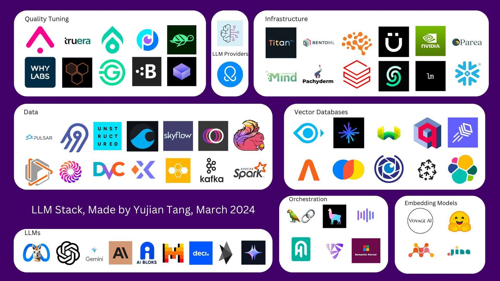
**이미지 캡션:** 이 이미지는 "LLM Stack, Made by Yujian Tang, March 2024"라는 제목의 다이어그램으로, 대규모 언어 모델(LLM) 개발 및 운영에 필요한 다양한 도구와 서비스를 범주별로 분류하여 보여줍니다. 다이어그램은 보라색 배경에 흰색 테두리의 여러 구획으로 나뉘어 있으며, 각 구획에는 관련 로고와 텍스트가 포함되어 있습니다. 상단 왼쪽에는 "Quality Tuning" 섹션이 있으며, Truera, Why Labs, G, B 등 여러 로고가 있습니다. 그 옆에는 "LLM Providers" 섹션으로, 뇌 모양의 로고와 파란색 원형 로고가 있습니다. 오른쪽 상단에는 "Infrastructure" 섹션으로, Titan, BentoML, NVIDIA, Parea, Mind, Pachyderm 등 다양한 인프라 관련 로고가 나열되어 있습니다. 중간 줄에는 "Data" 섹션이 있으며, Pulsar, Unstructured, Skyflow, Kafka, Apache Spark 등 데이터 관련 도구들의 로고가 보입니다. 그 옆에는 "Vector Databases" 섹션으로, 눈 모양 로고, 별 모양 로고, W 모양 로고, Q 모양 로고, 날아가는 모양 로고, 색상 블록 로고, 카메라 렌즈 모양 로고, 화살표 모양 로고, 여러 개의 원이 겹쳐진 모양 로고 등이 있습니다. 하단에는 "LLMs" 섹션으로, Meta의 Llama, OpenAI의 ChatGPT, Google의 Gemini, AI Bloks 등 주요 LLM들의 로고가 있습니다. 그 옆에는 "Orchestration" 섹션으로, 새 모양 로고, 사슬 모양 로고, 라마 모양 로고, 음파 모양 로고, A 모양 로고, V 모양 로고, Semantic Kernel 로고가 있습니다. 가장 오른쪽 하단에는 "Embedding Models" 섹션으로, Voyage AI, 웃는 이모티콘, M 모양 로고, Jina 로고가 있습니다. 다이어그램 전체적으로 기술적인 내용을 담고 있으며, LLM 생태계의 다양한 구성 요소를 시각적으로 정리하여 보여주는 정보성 콘텐츠입니다." 섹션으로, 뇌 모양의 로고와 파란색 원형 로고가 있습니다. 오른쪽 상단에는 "Infrastructure" 섹션으로, Titan, BentoML, NVIDIA, Parea, Mind, Pachyderm 등 다양한 인프라 관련 로고가 나열되어 있습니다. 중간 줄에는 "Data" 섹션이 있으며, Pulsar, Unstructured, Skyflow, Kafka, Apache Spark 등 데이터 관련 도구들의 로고가 보입니다. 그 옆에는 "Vector Databases" 섹션으로, 눈 모양 로고, 별 모양 로고, W 모양 로고, Q 모양 로고, 날아가는 모양 로고, 색상 블록 로고, 카메라 렌즈 모양 로고, 화살표 모양 로고, 여러 개의 원이 겹쳐진 모양 로고 등이 있습니다. 하단에는 "LLMs" 섹션으로, Meta의 Llama, OpenAI의 ChatGPT, Google의 Gemini, AI Bloks 등 주요 LLM들의 로고가 있습니다. 그 옆에는 "Orchestration" 섹션으로, 새 모양 로고, 사슬 모양 로고, 라마 모양 로고, 음파 모양 로고, A 모양 로고, V 모양 로고, Semantic Kernel 로고가 있습니다. 가장 오른쪽 하단에는 "Embedding Models" 섹션으로, Voyage AI, 웃는 이모티콘, M 모양 로고, Jina 로고가 있습니다. 다이어그램 전체적으로 기술적인 내용을 담고 있으며, LLM 생태계의 다양한 구성 요소를 시각적으로 정리하여 보여주는 정보성 콘텐츠입니다.

### 3월 24일 (일) 11:21 · #GTC2024 너무 신나고 즐거웠습니다. #solarllm 업업업!!!

#GTC2024 너무 신나고 즐거웠습니다. #solarllm 업업업!!!

🎬 동영상 1개 (생략)

### 3월 25일 (월) 15:31 · #stanford 근처에 계시다면 Upstage #solarllam 이 …

#stanford 근처에 계시다면 Upstage #solarllam 이 후원하는 LLM X Law 해커톤에 함께해요. LLM을 법률 업무에 통합하는 것은 LLM의 훌륭한 활용이라고 생각합니다. 이번 행사에서는 많은 흥미로운 프로젝트를 볼 수 있을 것입니다 🌞

**이미지 캡션:** 이 이미지는 LLM x Law Hackathon #3 행사를 홍보하는 포스터입니다. 상단에는 "LLM x Law Hackathon #3"이라는 제목이 붉은색 배경에 흰색 글씨로 쓰여 있으며, 그 아래에는 "April 7, 2024"와 "@Stanford"라는 문구가 같은 붉은색 배경에 흰색 글씨로 표시되어 있습니다. 배경에는 다양한 사람들이 등장하는데, 일부는 정장을 입고 있으며, 일부는 로봇이나 캐릭터 같은 모습으로 묘사되어 있습니다. 여러 명의 사람들이 컴퓨터 앞에 앉아 코딩을 하거나 토론하는 듯한 모습도 보입니다. 컴퓨터 화면에는 코드나 그래프가 표시되어 있습니다. 이미지 하단에는 여러 기업 로고들이 나열되어 있는데, aligns.ai, AXA, CODEX, DLA PIPER, Google, groq, LlamaIndex, LMNT, MISTRAL AI_, THOMSON REUTERS, upstage, vectara 등이 보입니다. 전체적으로 기술과 법률이 융합되는 행사를 알리는 역동적이고 미래지향적인 분위기를 풍깁니다. 보입니다. 컴퓨터 화면에는 코드나 그래프가 표시되어 있습니다. 이미지 하단에는 여러 기업 로고들이 나열되어 있는데, aligns.ai, AXA, CODEX, DLA PIPER, Google, groq, LlamaIndex, LMNT, MISTRAL AI_, THOMSON REUTERS, upstage, vectara 등이 보입니다. 전체적으로 기술과 법률이 융합되는 행사를 알리는 역동적이고 미래지향적인 분위기를 풍깁니다.

### 3월 26일 (화) 00:27 · #mistralai #sfhackton 2000명이 지원한 지난 주말 S…

#mistralai #sfhackton 2000명이 지원한 지난 주말 SF에서 열린 Mistral 해커톤의 수상작과 주목할만한 프로젝트들을 소개합니다. (저는 참여하지 못해서 아래의 트윗을 참고했습니다. 😊)

1. 둠게임의 화면을 ASCII로 변환하고 그 action을 파인튜닝한다음 이를 통한 게임을 함 (파인튜닝 부분 1위) 여러가지 데이터를 text형태로 전환할수 있다면 다양한 활용이 가능하겠습니다.

2. Prompt Parfait: 초기 prompt를 주면 그 결과를 자동 평가하 prompt를 자동 수정하는 것을 반복하여 가장 좋은 prompt를 생성 (API부분 1등)

3. 50k 연구 논문을 학습한 논문 생성프로그램. 잘된다고 합니다. (파인튜닝 2위)

5 월 #solarllm 해커톤도 진행 예정이니 좋은 해커톤 아이디어가 있으시면 알려주세요.

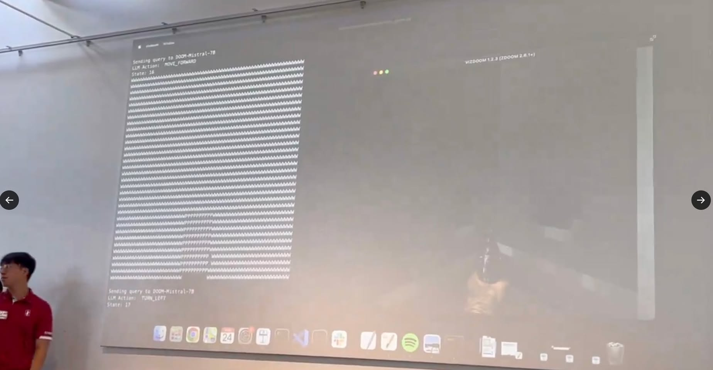
**이미지 캡션:** 한 명의 젊은 성인 남성이 화면 왼쪽에 서 있고, 그는 빨간색 폴로 셔츠를 입고 있으며 안경을 쓰고 있다. 그는 화면을 바라보고 있으며, 그의 표정은 무표정하다. 화면에는 텍스트와 그래픽이 표시되어 있으며, 왼쪽에는 "Sending query to DOOM-Mistral-78 LLM Action: MOVE_FORWARD State: 16"이라는 텍스트와 함께 많은 작은 사각형으로 이루어진 패턴이 보인다. 오른쪽에는 "VIZDOOM 1.2.3 (ZDOOM 2.8.1+)"라는 텍스트와 함께 세 개의 점(빨간색, 주황색, 녹색)이 표시되어 있다. 화면 하단에는 여러 아이콘이 있는 작업 표시줄이 보인다. 전체적으로, 이 장면은 컴퓨터 프로그래밍이나 게임 시연과 관련된 발표 또는 시연의 일부인 것으로 보인다.주황색, 녹색)이 표시되어 있다. 화면 하단에는 여러 아이콘이 있는 작업 표시줄이 보인다. 전체적으로, 이 장면은 컴퓨터 프로그래밍이나 게임 시연과 관련된 발표 또는 시연의 일부인 것으로 보인다.

### 3월 27일 (수) 23:53 · #hf #friends #solarllm 저희는 허깅페이스의 친구들과 함…

#hf #friends #solarllm 저희는 허깅페이스의 친구들과 함께 리더보드 등을 많이 협력하고 있어요. 마침 한국을 방문한 친구들과 함께 식사를 하면서 이야기를 나누었는데요.

1. 역시 회사들은 각자의 고민이 있더라고요. 
2. B2B에서는 작고 목적에 맞는 모델이 더 잘 될 것이라는,
3. 결론은 Upstage가 잘 될 것이라는 

훈훈한 이야기였습니다. 멋진 저녁이었어요! 😊

### 3월 28일 (목) 07:11 · #solarllm #amazon #sagemaker 역시 글로벌 (영어)…

#solarllm #amazon #sagemaker 역시 글로벌 (영어) 버전의 관심이 압도적이네요! 🌏 174 VS 29K!

전세계 모두를 위한 Solar LLM이 되도록 노력하겠습니다! 💪
https://www.youtube.com/watch?v=e2ehr1oBqnA&ab_channel=Upstage

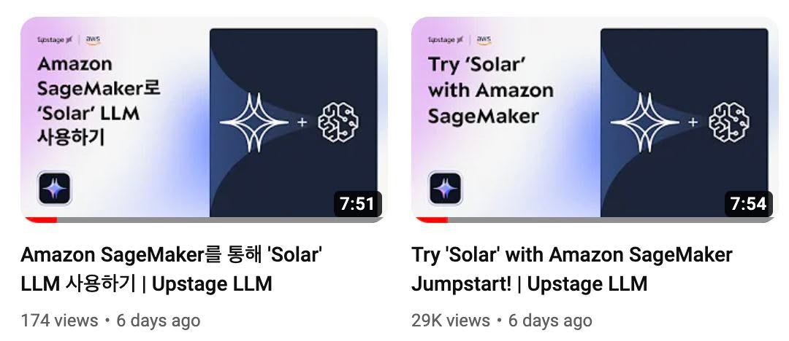
**이미지 캡션:** 이 이미지는 두 개의 유튜브 썸네일을 나란히 보여줍니다. 두 썸네일 모두 비슷한 디자인을 하고 있으며, 왼쪽 썸네일은 한국어로, 오른쪽 썸네일은 영어로 된 제목을 가지고 있습니다. 각 썸네일은 보라색과 파란색이 섞인 그라데이션 배경에 흰색 텍스트와 아이콘이 배치되어 있습니다. 왼쪽 상단에는 'upstage'와 'aws' 로고가 작게 보입니다. 왼쪽 썸네일의 제목은 "Amazon SageMaker로 'Solar' LLM 사용하기"이며, 오른쪽 썸네일의 제목은 "Try 'Solar' with Amazon SageMaker"입니다. 두 썸네일 모두 가운데에는 별 모양 아이콘과 뇌 모양 아이콘이 더하기 기호로 연결된 그래픽이 있고, 오른쪽 하단에는 각각 7:51과 7:54라는 영상 재생 시간이 표시되어 있습니다. 각 썸네일 아래에는 영상 제목, 조회수, 게시일이 표시되어 있습니다. 왼쪽 영상의 제목은 "Amazon SageMaker를 통해 'Solar' LLM 사용하기 | Upstage LLM"이며 조회수는 174회, 게시일은 6일 전입니다. 오른쪽 영상의 제목은 "Try 'Solar' with Amazon SageMaker Jumpstart! | Upstage LLM"이며 조회수는 29K회, 게시일은 6일 전입니다. 전반적으로 기술, 특히 인공지능 및 클라우드 컴퓨팅 관련 콘텐츠를 홍보하는 유튜브 영상 썸네일임을 알 수 있습니다. 사람이나 구체적인 장소는 보이지 않으며, 그래픽 디자인과 텍스트 정보가 주를 이룹니다. 분위기는 정보 전달에 초점을 맞춘 전문적이고 깔끔한 느낌을 줍니다.Maker"입니다. 두 썸네일 모두 가운데에는 별 모양 아이콘과 뇌 모양 아이콘이 더하기 기호로 연결된 그래픽이 있고, 오른쪽 하단에는 각각 7:51과 7:54라는 영상 재생 시간이 표시되어 있습니다. 각 썸네일 아래에는 영상 제목, 조회수, 게시일이 표시되어 있습니다. 왼쪽 영상의 제목은 "Amazon SageMaker를 통해 'Solar' LLM 사용하기 | Upstage LLM"이며 조회수는 174회, 게시일은 6일 전입니다. 오른쪽 영상의 제목은 "Try 'Solar' with Amazon SageMaker Jumpstart! | Upstage LLM"이며 조회수는 29K회, 게시일은 6일 전입니다. 전반적으로 기술, 특히 인공지능 및 클라우드 컴퓨팅 관련 콘텐츠를 홍보하는 유튜브 영상 썸네일임을 알 수 있습니다. 사람이나 구체적인 장소는 보이지 않으며, 그래픽 디자인과 텍스트 정보가 주를 이룹니다. 분위기는 정보 전달에 초점을 맞춘 전문적이고 깔끔한 느낌을 줍니다.

### 3월 28일 (목) 09:55 · 기쁜 소식을 알려드립니다! 저희 DUS #solarllm 구현 논문이 N…

기쁜 소식을 알려드립니다! 저희 DUS #solarllm 구현 논문이 NAACL 2024 Industry Track에서 승인되었습니다! 🎉 

https://openreview.net/forum?id=leEiEv43Kz
저희의 방법론이 AI top-tier NAACL학회에서도 인정을 받았다는데 큰 의미가 있습나다. 이미 새로운 기초 모델을 구축하는 데 널리 사용되고 있습니다. 많이 활용해 주세요.

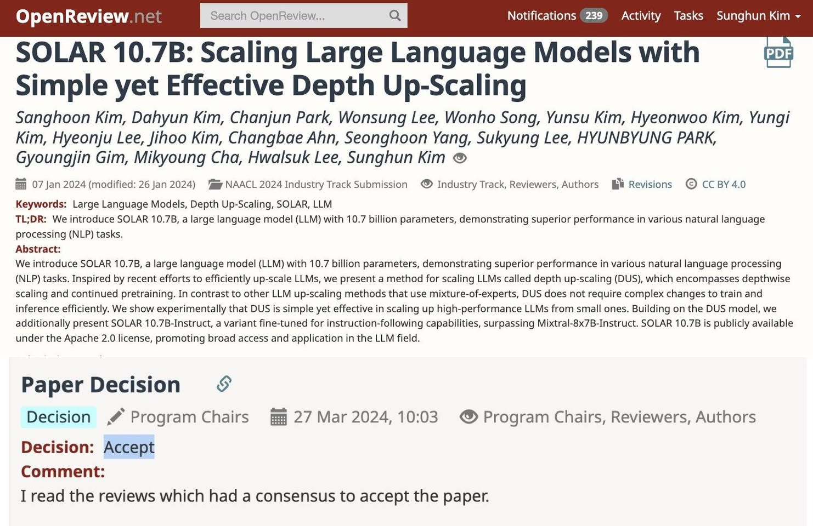
**이미지 캡션:** 이 이미지는 OpenReview.net 웹사이트의 논문 결정 페이지를 보여줍니다. 페이지 상단에는 "SOLAR 10.7B: Scaling Large Language Models with Simple yet Effective Depth Up-Scaling"이라는 제목의 논문이 표시되며, 그 아래에는 논문의 저자 목록이 나열되어 있습니다. 논문은 2024년 1월 7일에 제출되었고 1월 26일에 수정되었으며, NAACL 2024 산업 트랙 제출물로 분류됩니다. 키워드로는 대규모 언어 모델, 깊이 업스케일링, SOLAR, LLM이 포함됩니다. TL;DR 섹션에서는 107억 개의 매개변수를 가진 대규모 언어 모델인 SOLAR 10.7B를 소개하며, 다양한 자연어 처리 작업에서 우수한 성능을 보여준다고 설명합니다. 초록에서는 SOLAR 10.7B를 소개하고, 깊이 업스케일링(DUS)이라는 방법을 통해 LLM을 효율적으로 확장하는 방법을 설명하며, 이 방법이 복잡한 변경 없이 훈련 및 추론을 효율적으로 수행할 수 있다고 강조합니다. 또한, DUS 모델을 기반으로 instruction-following 기능을 갖춘 SOLAR 10.7B-Instruct를 소개하며, 이는 Mixtral-8x7B-Instruct를 능가한다고 언급합니다. SOLAR 10.7B는 Apache 2.0 라이선스 하에 공개적으로 사용 가능하며, LLM 분야의 광범위한 접근과 적용을 촉진합니다. 페이지 하단에는 "Paper Decision" 섹션이 있으며, 결정은 "Accept"로 표시되어 있습니다. 결정 날짜는 2024년 3월 27일 오전 10시 3분이며, 프로그램 의장, 검토자, 저자가 이 결정에 참여했음을 나타냅니다. 코멘트 섹션에는 "I read the reviews which had a consensus to accept the paper."라고 작성되어 있어, 검토자들이 논문 수용에 대한 합의에 도달했음을 알 수 있습니다. 전반적으로 이 페이지는 인공지능 분야의 새로운 언어 모델에 대한 학술적 평가 및 결정 과정을 보여주는 정보성 콘텐츠입니다.AR, LLM이 포함됩니다. TL;DR 섹션에서는 107억 개의 매개변수를 가진 대규모 언어 모델인 SOLAR 10.7B를 소개하며, 다양한 자연어 처리 작업에서 우수한 성능을 보여준다고 설명합니다. 초록에서는 SOLAR 10.7B를 소개하고, 깊이 업스케일링(DUS)이라는 방법을 통해 LLM을 효율적으로 확장하는 방법을 설명하며, 이 방법이 복잡한 변경 없이 훈련 및 추론을 효율적으로 수행할 수 있다고 강조합니다. 또한, DUS 모델을 기반으로 instruction-following 기능을 갖춘 SOLAR 10.7B-Instruct를 소개하며, 이는 Mixtral-8x7B-Instruct를 능가한다고 언급합니다. SOLAR 10.7B는 Apache 2.0 라이선스 하에 공개적으로 사용 가능하며, LLM 분야의 광범위한 접근과 적용을 촉진합니다. 페이지 하단에는 "Paper Decision" 섹션이 있으며, 결정은 "Accept"로 표시되어 있습니다. 결정 날짜는 2024년 3월 27일 오전 10시 3분이며, 프로그램 의장, 검토자, 저자가 이 결정에 참여했음을 나타냅니다. 코멘트 섹션에는 "I read the reviews which had a consensus to accept the paper."라고 작성되어 있어, 검토자들이 논문 수용에 대한 합의에 도달했음을 알 수 있습니다. 전반적으로 이 페이지는 인공지능 분야의 새로운 언어 모델에 대한 학술적 평가 및 결정 과정을 보여주는 정보성 콘텐츠입니다.

### 3월 29일 (금) 12:31 · #solarllm #dataverse #opensource AI, 특히 …

#solarllm #dataverse #opensource AI, 특히 LLM 모델을 만들고 파인튜닝할 때 가장 중요한 것 중 하나는 데이터이고 데이터 품질입니다. 고성능 Solar LLM을 만들어낸 핵심 요소인 고품질 데이터를 만들어준 Dataverse를 오픈 소스로 공개합니다.

대용량 텍스트를 넣으면 양질의 텍스트를 만들어주고 안 좋은 데이터를 필터링해줍니다. 

더 많은 분들이 양질의 데이터를 만들고, 더 좋은 LLM이 나오는 마음으로 더 큰 생태계를 꿈꾸며 공개하였습니다.

GitHub: https://github.com/UpstageAI/dataverse
Paper: https://arxiv.org/abs/2403.19340
Youtube: https://youtu.be/yYyyLuPNK5s?si=lzAb-pNnXTbPAfSJ

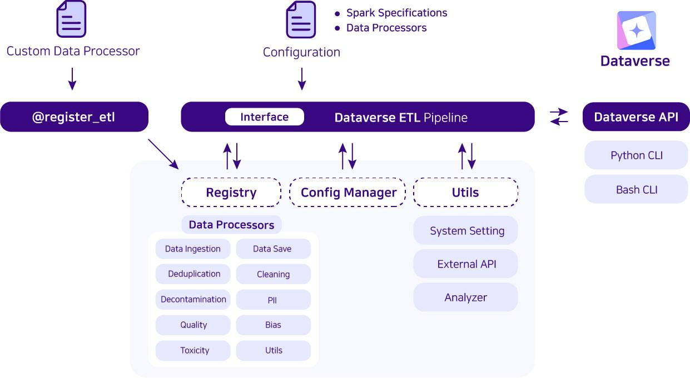
**이미지 캡션:** 이 이미지는 Dataverse ETL 파이프라인의 아키텍처를 보여주는 다이어그램으로, 사람이나 특정 인물은 등장하지 않으며, 기술적인 개념을 시각적으로 표현하고 있습니다. 배경은 흰색이며, 주요 요소들은 보라색과 연한 보라색으로 구분되어 있습니다. 상단에는 "Custom Data Processor"와 "Configuration"이라는 레이블이 있으며, 각각 아이콘과 함께 아래의 "@register_etl"과 "Interface", "Dataverse ETL Pipeline"으로 연결됩니다. "Configuration" 아래에는 "Spark Specifications"와 "Data Processors"라는 두 개의 글머리 기호 목록이 있습니다. "Dataverse ETL Pipeline"은 오른쪽의 "Dataverse API"와 양방향 화살표로 연결되어 있으며, "Dataverse API" 아래에는 "Python CLI"와 "Bash CLI"라는 두 개의 버튼이 있습니다. 파이프라인의 핵심 부분은 연한 보라색 상자로 표시되며, "Registry", "Config Manager", "Utils"라는 세 개의 주요 구성 요소가 포함되어 있습니다. "Registry" 아래에는 "Data Processors"라는 레이블과 함께 "Data Ingestion", "Data Save", "Deduplication", "Cleaning", "Decontamination", "PII", "Quality", "Bias", "Toxicity", "Utils"와 같은 다양한 데이터 처리 기능들이 버튼 형태로 나열되어 있습니다. "Utils" 아래에는 "System Setting", "External API", "Analyzer"가 있습니다. 전체적으로 이 다이어그램은 데이터 처리 및 관리 시스템의 구성 요소와 상호 작용을 명확하게 보여주는 기술적인 설명 자료입니다.tion" 아래에는 "Spark Specifications"와 "Data Processors"라는 두 개의 글머리 기호 목록이 있습니다. "Dataverse ETL Pipeline"은 오른쪽의 "Dataverse API"와 양방향 화살표로 연결되어 있으며, "Dataverse API" 아래에는 "Python CLI"와 "Bash CLI"라는 두 개의 버튼이 있습니다. 파이프라인의 핵심 부분은 연한 보라색 상자로 표시되며, "Registry", "Config Manager", "Utils"라는 세 개의 주요 구성 요소가 포함되어 있습니다. "Registry" 아래에는 "Data Processors"라는 레이블과 함께 "Data Ingestion", "Data Save", "Deduplication", "Cleaning", "Decontamination", "PII", "Quality", "Bias", "Toxicity", "Utils"와 같은 다양한 데이터 처리 기능들이 버튼 형태로 나열되어 있습니다. "Utils" 아래에는 "System Setting", "External API", "Analyzer"가 있습니다. 전체적으로 이 다이어그램은 데이터 처리 및 관리 시스템의 구성 요소와 상호 작용을 명확하게 보여주는 기술적인 설명 자료입니다.

### 3월 30일 (토) 03:09 · LangChain에 #solarllm 이 추가되었습니다. 저희 팀은 SF…

LangChain에 #solarllm 이 추가되었습니다. 저희 팀은 SF 지역에서 LangChain과 다른 회사들과 밋업 및 해커톤을 진행하고 있습니다.

한국에서도 LangChain, 라마인덱스, RAG, LLM 관련 밋업이나 해커톤을 진행하시면 Solar API 크래딧이나 현물 후원을 통해 함께 참여할 수 있습니다. 연락 주시면 감사하겠습니다! 😊

### 3월 31일 (일) 05:02 · #solarllm #writeup #windows [윈도우 개발자 모십니…

#solarllm #writeup #windows [윈도우 개발자 모십니다]

많은 사랑을 받고 있는 Solar 기반의 WriteUp 을 WindowsOS에서 개발해주실 1분 계약직으로 모십니다. 지금 Apple Sillicon에서만 동작이 되는데요. Windows 버전을 출시하고 저희가 협업하고있는 글로벌 I 사에서 주최하는 showcase 에 출품하는 것을 목표로 합니다.

전체 인터페이스는 내부적으로 웹서버를 띄우는 것으로 동작이 되며, 윈도우즈내 Apps의 입력 인터페이스만 연동이 되면 됩니다.

윈도우즈 개발경험이 있으신분 저에게 가볍게 DM이나 writeup@upstage.ai 로 간단한 이력서와 만드신 윈도우즈 어플이 있다면 같이 정보를 주시면 감사하겠습니다. 

https://writeup.upstage.ai/ 

덕분에 곧 윈도우즈에서도 WriteUp을 만나실수 있을 것입니다.

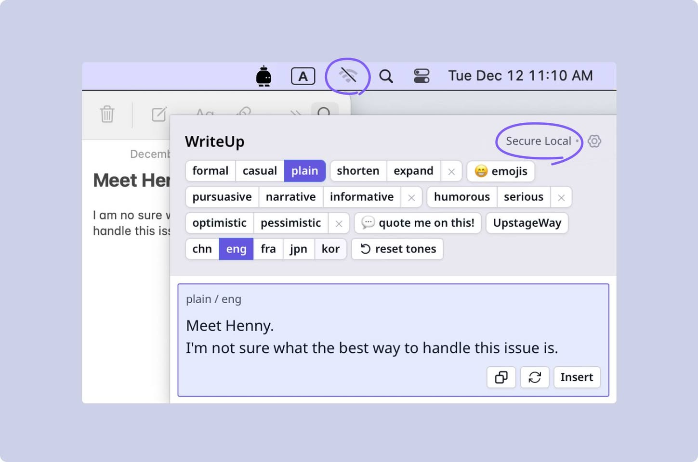
**이미지 캡션:** 이 사진은 컴퓨터 화면의 일부를 보여주며, 텍스트 편집 프로그램인 "WriteUp"이 열려 있습니다. 화면 상단에는 맥북의 메뉴바가 보이며, 배터리 아이콘, 글자 크기 조절 아이콘, 비행기 모드 아이콘, 검색 아이콘, 그리고 날짜와 시간이 "Tue Dec 12 11:10 AM"으로 표시되어 있습니다. "WriteUp" 창 안에는 "WriteUp"이라는 제목과 함께 다양한 톤과 스타일을 선택할 수 있는 여러 개의 태그 버튼들이 나열되어 있습니다. "formal", "casual", "plain", "shorten", "expand", "emojis", "persuasive", "narrative", "informative", "humorous", "serious", "optimistic", "pessimistic", "quote me on this!", "UpstageWay" 등의 태그가 보이며, 일부 태그에는 X 표시가 있어 선택 해제되었음을 나타냅니다. 또한 "chn", "eng", "fra", "jpn", "kor"와 같은 언어 태그도 있으며, "eng" 태그가 보라색으로 강조되어 선택된 상태입니다. "reset tones" 버튼도 보입니다. 창의 오른쪽 상단에는 "Secure Local"이라는 버튼과 톱니바퀴 모양의 설정 아이콘이 있습니다. 화면 왼쪽에는 "December"라는 날짜와 "Meet Her"라는 제목, 그리고 "I am no sure v handle this iss"라는 텍스트가 보입니다. "WriteUp" 창 아래에는 입력창이 있으며, "plain / eng"라는 표시와 함께 "Meet Henny. I'm not sure what the best way to handle this issue is."라는 문장이 입력되어 있습니다. 입력창 아래에는 파일 저장 아이콘, 새로고침 아이콘, 그리고 "Insert" 버튼이 있습니다. 전반적으로, 이 화면은 사용자가 텍스트를 작성하고 편집하는 과정에서 다양한 스타일과 언어를 선택하고 적용하는 모습을 보여줍니다.n", "expand", "emojis", "persuasive", "narrative", "informative", "humorous", "serious", "optimistic", "pessimistic", "quote me on this!", "UpstageWay" 등의 태그가 보이며, 일부 태그에는 X 표시가 있어 선택 해제되었음을 나타냅니다. 또한 "chn", "eng", "fra", "jpn", "kor"와 같은 언어 태그도 있으며, "eng" 태그가 보라색으로 강조되어 선택된 상태입니다. "reset tones" 버튼도 보입니다. 창의 오른쪽 상단에는 "Secure Local"이라는 버튼과 톱니바퀴 모양의 설정 아이콘이 있습니다. 화면 왼쪽에는 "December"라는 날짜와 "Meet Her"라는 제목, 그리고 "I am no sure v handle this iss"라는 텍스트가 보입니다. "WriteUp" 창 아래에는 입력창이 있으며, "plain / eng"라는 표시와 함께 "Meet Henny. I'm not sure what the best way to handle this issue is."라는 문장이 입력되어 있습니다. 입력창 아래에는 파일 저장 아이콘, 새로고침 아이콘, 그리고 "Insert" 버튼이 있습니다. 전반적으로, 이 화면은 사용자가 텍스트를 작성하고 편집하는 과정에서 다양한 스타일과 언어를 선택하고 적용하는 모습을 보여줍니다.
