# 2024년 4월

[← 2024년](README.md)

### 4월 1일 (월) 09:57 · "한국의 업스테이지 Solar 모델이 AWS를 타고 세계 정복" 그럼요!

"한국의 업스테이지 Solar 모델이 AWS를 타고 세계 정복" 그럼요!

### 4월 1일 (월) 10:26 · is coming to us!

https://agihouse.ai is coming to us!

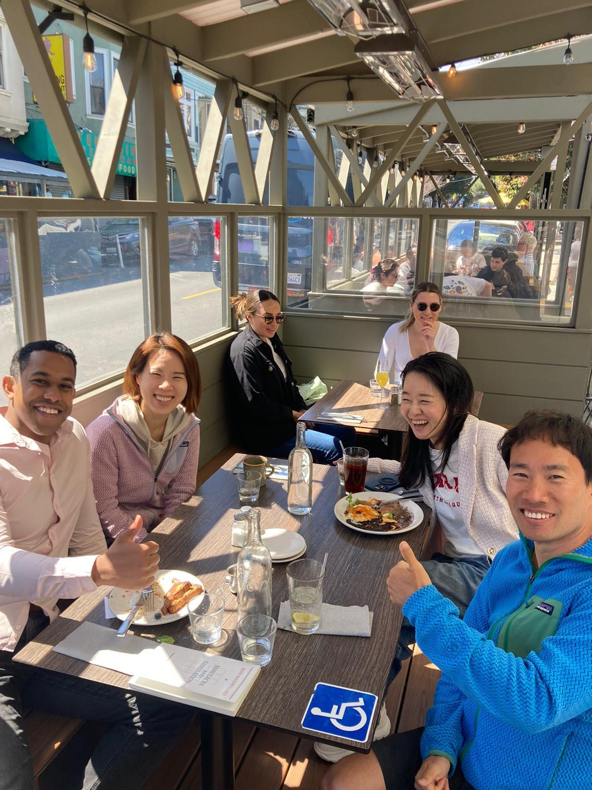
**이미지 캡션:** A group of six adults, appearing to be in their late 20s to 40s, are seated at a table on an outdoor patio, likely a restaurant, with a street view visible through glass windows. On the left, an adult male with dark skin and short black hair, wearing a light pink collared shirt, gives a thumbs-up. Next to him, an adult female with short dark hair, wearing a pink hooded jacket over a light-colored top, smiles. Across from them, another adult female with dark hair pulled back, wearing a black jacket over a white top, smiles. To her right, an adult female with blonde hair, wearing a white long-sleeved shirt, smiles and rests her chin on her hand. In the foreground on the right, an adult male with short black hair, wearing a blue fleece jacket, smiles and gives a thumbs-up. Behind him, an adult female with dark hair, wearing a white cardigan over a t-shirt, laughs heartily. The table is set with plates of food, drinks including water and iced tea, glasses, napkins, and a salt and pepper shaker. A book titled "SIMULACRA & SARILATION" is visible on the table, along with a blue and white wheelchair accessibility symbol. The atmosphere is cheerful and relaxed, suggesting a pleasant meal among friends or colleagues on a sunny day. The background shows a street with buildings and vehicles, indicating an urban setting.

### 4월 1일 (월) 10:46 · 📷 사진 (6장)

**이미지 캡션:** 이 사진은 페이스북 게시물로, 작성자는 Soonsoon Kwon이며 2016년 3월 26일에 게시되었습니다. 게시물은 TensorFlow에 관한 이야기를 나눌 수 있는 공간을 홍콩과기대의 Sung Kim 교수님이 만들었다는 내용과 함께, 해당 교수님이 머신러닝 강의를 제공하는 링크를 공유하고 있습니다. 사진에는 TensorFlow Korea라는 로고와 함께 추상적인 그래픽이 보입니다. 게시물 하단에는 "TensorFlow KR"이라는 공개 그룹 정보와 함께 68,391명의 멤버가 있음을 알 수 있습니다. 또한, "You, Soonson Kwon, Yeon Gyoung Gwack and 6 others"라는 문구와 함께 좋아요, 댓글, 공유 버튼이 있으며, 좋아요를 누른 사람들의 목록 일부가 팝업으로 표시되고 있습니다. 이 목록에는 Soonson Kwon, Yeon Gyoung Gwack, JeeHyun Hwang, Yunho an, Youngsung Son, Sangmin Park, Sang Sun Kim, Jaehyeuck Choi, Sung Kim 등의 이름이 보입니다. 전체적으로 기술 커뮤니티의 정보 공유 및 참여를 독려하는 분위기입니다.
 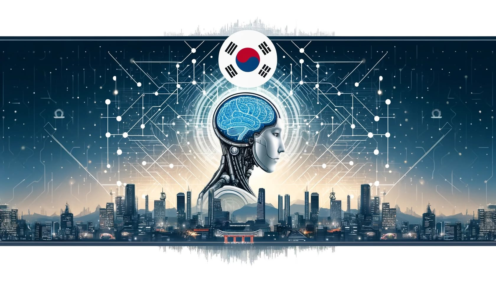
**이미지 캡션:** 이 이미지는 한국의 기술 발전을 상징하는 듯한 미래 지향적인 풍경을 담고 있습니다. 중앙에는 반짝이는 푸른색 뇌가 보이는 로봇의 머리가 자리 잡고 있으며, 그 위로는 태극기가 둥근 원형으로 배치되어 있습니다. 로봇 머리 뒤로는 복잡한 회로 기판 모양의 배경이 펼쳐져 있으며, 이는 기술과 연결성을 시각적으로 표현합니다. 하단에는 현대적인 고층 빌딩들이 늘어선 도시의 스카이라인이 보이며, 그 앞에 한국 전통 건축 양식의 건물이 자리하고 있어 전통과 현대의 조화를 암시합니다. 전체적으로 푸른색과 흰색의 차가운 색감이 주를 이루며, 빛나는 점들과 선들이 디지털 정보의 흐름을 나타내는 듯하여 첨단 기술과 미래에 대한 기대감을 불러일으킵니다.
 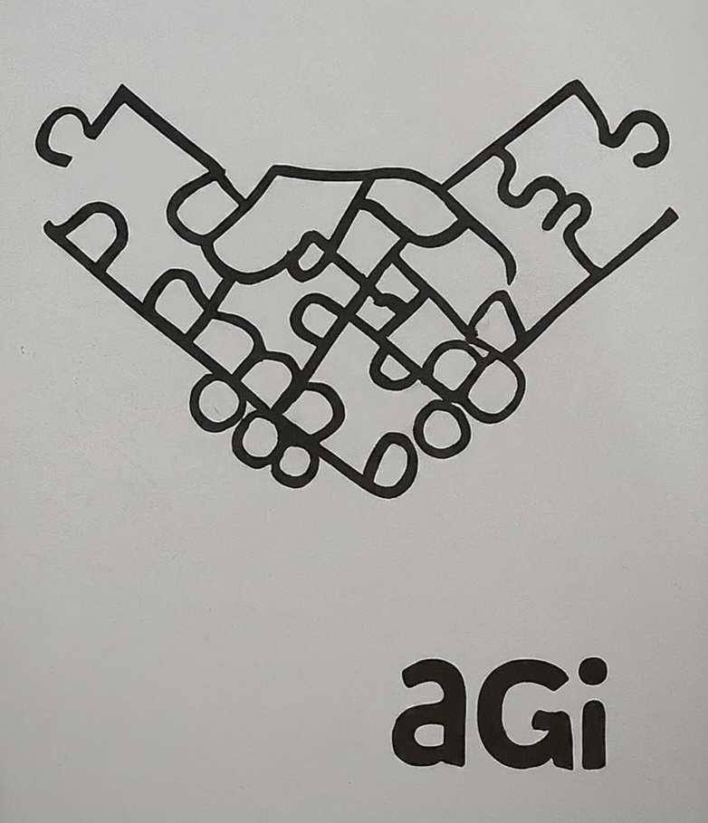
**이미지 캡션:** 이 이미지는 퍼즐 조각으로 만들어진 악수하는 두 손을 검은색 선으로 그린 그림입니다. 각 손은 여러 개의 퍼즐 조각으로 구성되어 있으며, 손가락 부분은 둥근 모양의 퍼즐 조각으로 표현되었습니다. 그림의 하단에는 "aGi"라는 로고가 검은색으로 쓰여 있습니다. 배경은 흰색이며, 특별한 장소나 사물은 보이지 않습니다. 이 그림은 협력, 파트너십, 통합 또는 문제 해결과 같은 개념을 상징하는 것으로 해석될 수 있습니다.
 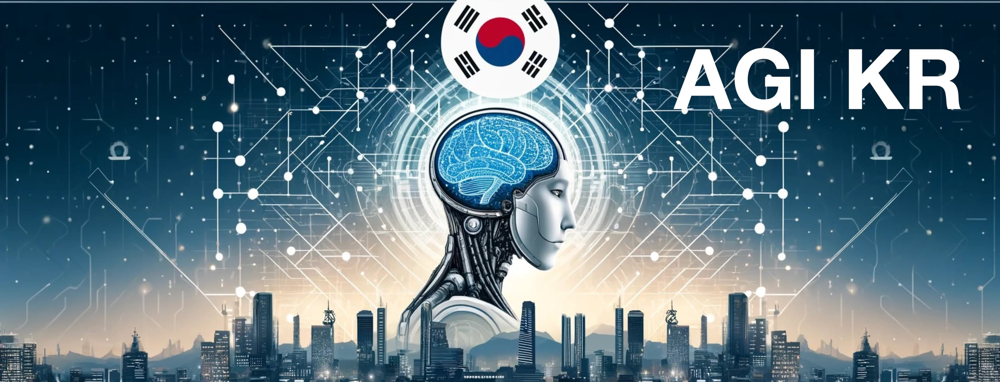
**이미지 캡션:** 이 이미지는 한국의 국기가 상단 중앙에 있고, 그 아래에는 푸른색으로 빛나는 인공지능 뇌가 있는 로봇의 머리가 그려져 있습니다. 로봇의 머리 부분은 은색과 검은색의 기계적인 디자인으로 되어 있으며, 뇌는 복잡한 회로망처럼 표현되어 있습니다. 이미지의 배경은 어두운 파란색으로, 마치 회로 기판처럼 보이는 흰색 선과 점들이 복잡하게 연결되어 있습니다. 하단에는 현대적인 도시의 스카이라인이 펼쳐져 있으며, 건물들은 불빛을 내고 있습니다. 이미지의 오른쪽 상단에는 흰색 글자로 "AGI KR"이라고 쓰여 있습니다. 전체적으로 첨단 기술, 인공지능, 그리고 한국의 기술력을 상징하는 듯한 미래지향적이고 과학적인 분위기를 풍깁니다.
 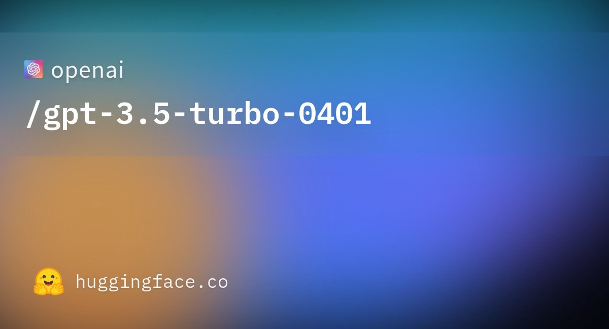
**이미지 캡션:** 이 이미지는 텍스트와 로고로 구성된 그래픽 디자인입니다. 상단에는 보라색 로고와 함께 "openai"라는 텍스트가 흰색으로 표시되어 있습니다. 그 아래에는 슬래시(/)로 시작하는 "/gpt-3.5-turbo-0401"이라는 더 큰 흰색 텍스트가 있습니다. 이미지 하단에는 노란색 이모티콘과 함께 "huggingface.co"라는 텍스트가 흰색으로 표시되어 있습니다. 배경은 상단에 청록색에서 시작하여 중간에 주황색으로 바뀌었다가 하단에 보라색으로 변하는 부드러운 그라데이션으로 이루어져 있습니다. 사람, 장소, 사물은 보이지 않으며, 보이는 텍스트는 OpenAI와 Hugging Face라는 두 개의 기술 회사와 관련된 모델 이름입니다. 전반적인 분위기는 기술적이고 현대적입니다.
 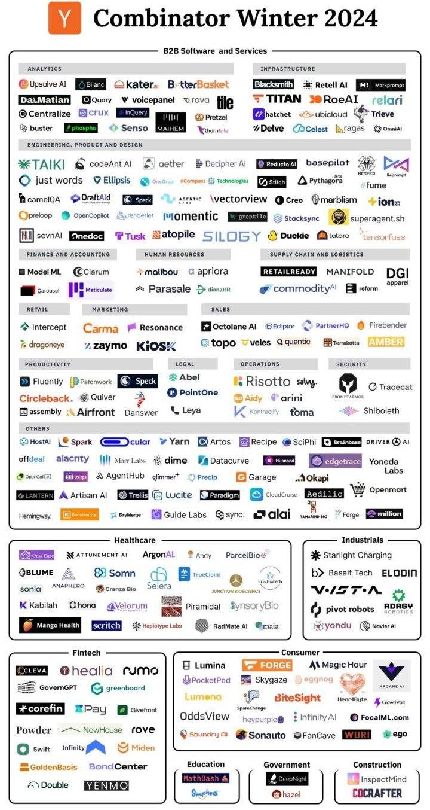
**이미지 캡션:** 이 이미지는 Y Combinator Winter 2024의 B2B 소프트웨어 및 서비스 목록을 보여주는 차트입니다. 차트는 다양한 산업 분야로 나뉘며, 각 섹션에는 해당 분야의 회사 로고와 이름이 나열되어 있습니다. 예를 들어, 'Analytics', 'Infrastructure', 'Engineering, Product and Design', 'Finance and Accounting', 'Human Resources', 'Supply Chain and Logistics', 'Retail', 'Marketing', 'Sales', 'Productivity', 'Legal', 'Operations', 'Security', 'Others', 'Healthcare', 'Fintech', 'Consumer', 'Education', 'Government', 'Construction', 'Industrials'와 같은 카테고리가 있습니다. 각 회사 로고는 해당 회사의 브랜드를 나타내며, 이름은 텍스트로 명확하게 표시되어 있습니다. 전반적으로 이 이미지는 Y Combinator가 지원하는 다양한 기술 스타트업을 한눈에 파악할 수 있도록 시각적으로 구성된 정보입니다.

> 오고 있습니다!!
> 70% 가 AI회사 입니다. 여러분들이 투자해보고 싶은 또는 일해보시고 싶은 마음에 드는 회사들이 있을까요?  https://www.ycombinator.com/companies?batch=W24

### 4월 1일 (월) 14:12 · #agikr TLDR: Good-bye TF KR, Welcome AGI…

#agikr TLDR: Good-bye TF KR, Welcome AGI KR! 

2016년 3월 Soonson Kwon님과 함께 시작한 TF-KR 커뮤니티가 8년이 넘고 약 7만명의 회원이 되었습니다. 당시 가슴 뛰던 TensorFlow를 통해 많은 모델들이 개발되면서 큰 AI 발전이 있었습니다. 다만 아쉽게도 이제 TensorFlow는 지금의 AI 시대를 반영하는 이름이 아니여서 추억으로 남겨 드려야 할것 같습니다. 

운영진들이 미래 지향적이고 우리를 가슴 설레게 할 이름을 논의 했습니다. AGI KR 이름을 4/1일 오전 회원들의 투표 결과 많은 분들이 동의 해주셨습니다.  수년전만 하더라도 AGI는 상상속에만 있었지만 지금은 손에 잡힐듯 합니다. 그 AGI를 이끌어 가는 그룹이 되기를 소망합니다.

또 몇 년이 지난후에는 AGI KR 이라는 이름도 낡은 이름이 되어 버릴수 있을것 같습니다만, 함께 AGI를 향한 항해를 떠나보면 좋겠습니다.

여러분들을 초대 합니다. 자주 찾아 주세요! https://www.facebook.com/groups/agikr/

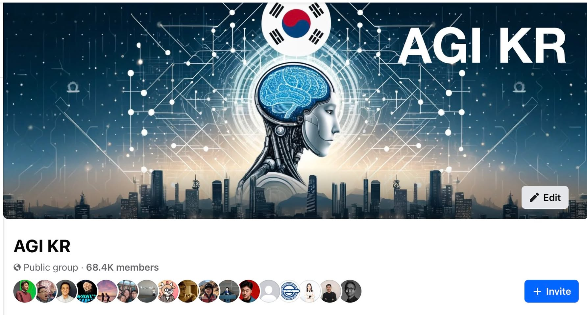
**이미지 캡션:** 이 이미지는 페이스북 그룹의 커버 사진으로, "AGI KR"이라는 이름과 함께 인공지능을 상징하는 로봇 머리와 한국 국기가 중앙에 배치되어 있습니다. 배경에는 미래 도시의 스카이라인과 복잡하게 연결된 회로망이 그려져 있어 첨단 기술과 도시의 발전을 시각적으로 표현하고 있습니다. 로봇 머리는 은색 금속 재질로 되어 있으며, 두개골 부분은 투명하게 열려 있어 푸른색의 뇌가 빛나고 있습니다. 한국 국기는 로봇 머리 위쪽에 둥근 형태로 자리 잡고 있습니다. 하단에는 그룹 이름 "AGI KR"과 함께 "Public group · 68.4K members"라는 정보가 표시되어 있으며, 여러 멤버들의 프로필 사진이 원형으로 나열되어 있습니다. 전반적으로 미래 지향적이고 기술적인 분위기를 풍기며, 인공지능 기술에 대한 관심과 한국 커뮤니티를 나타냅니다.
 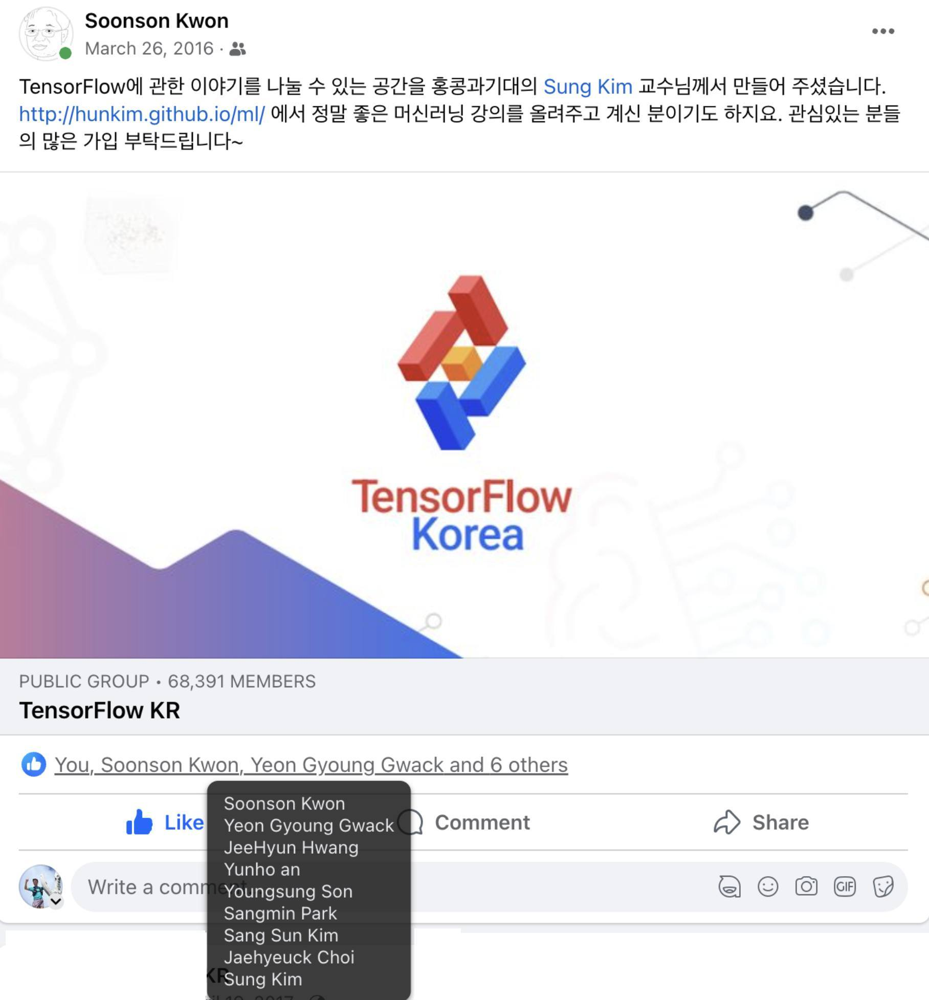
**이미지 캡션:** 이 사진은 페이스북 게시물로, "Soonson Kwon"이라는 사용자가 2016년 3월 26일에 올린 글입니다. 게시물은 "TensorFlow KR"이라는 공개 그룹에 속해 있으며, 68,391명의 회원이 있습니다. 게시물 내용은 홍콩과기대의 Sung Kim 교수님이 TensorFlow에 대한 이야기를 나눌 수 있는 공간을 만들었으며, 해당 교수님이 머신러닝 강의를 올리고 있다는 정보를 공유하고 있습니다. 또한, 관심 있는 사람들의 가입을 독려하는 내용입니다. 게시물에는 TensorFlow 로고와 함께 "TensorFlow Korea"라는 문구가 포함된 이미지가 첨부되어 있습니다. 게시물 하단에는 "You, Soonson Kwon, Yeon Gyoung Gwack and 6 others"라는 문구가 표시되어 있으며, 이는 해당 게시물에 '좋아요'를 누른 사람들을 나타냅니다. '좋아요'를 누른 사람들의 목록에는 Soonson Kwon, Yeon Gyoung Gwack, JeeHyun Hwang, Yunho an, Youngsung Son, Sangmin Park, Sang Sun Kim, Jaehyeuck Choi, Sung Kim 등이 보입니다. 게시물에는 '좋아요', '댓글', '공유' 버튼과 함께 이모티콘, 사진, GIF를 추가할 수 있는 아이콘들이 있습니다. 전반적으로 기술 커뮤니티의 정보 공유 및 참여를 유도하는 분위기입니다.

### 4월 2일 (화) 01:00 · 📷 사진 (3장)

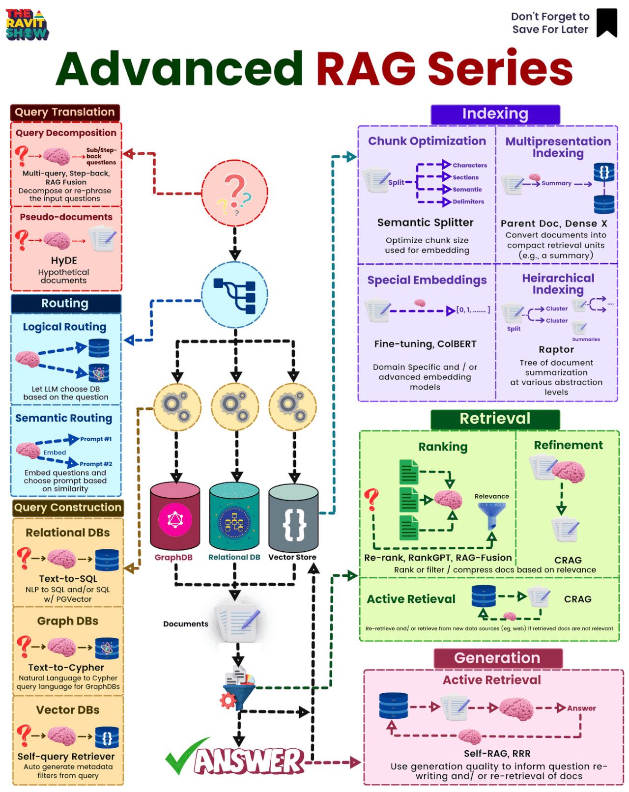
**이미지 캡션:** 이 이미지는 "Advanced RAG Series"라는 제목의 다이어그램으로, 검색 증강 생성(RAG) 시스템의 고급 개념을 설명합니다. 다이어그램은 여러 섹션으로 나뉘어 있으며, 각 섹션은 RAG 파이프라인의 특정 단계를 나타냅니다. 사람, 장소, 사물, 텍스트, 분위기 등 구체적인 요소는 없으며, 순수하게 정보 전달을 위한 기술적인 다이어그램입니다. 주요 섹션으로는 "Query Translation", "Indexing", "Routing", "Query Construction", "Retrieval", "Generation" 등이 있으며, 각 섹션은 하위 단계와 관련 개념들을 화살표와 아이콘으로 연결하여 설명합니다. 예를 들어, "Query Decomposition"은 질문을 여러 하위 질문으로 분해하는 과정을 나타내고, "Indexing"은 문서를 청크로 최적화하고 다양한 방식으로 인덱싱하는 방법을 보여줍니다. "Retrieval" 섹션에서는 검색된 문서의 순위를 매기거나 정제하는 과정을, "Generation" 섹션에서는 최종 답변을 생성하는 과정을 설명합니다. 전반적으로, 이 다이어그램은 복잡한 RAG 시스템의 작동 방식을 시각적으로 명확하게 이해할 수 있도록 구성되어 있습니다.
 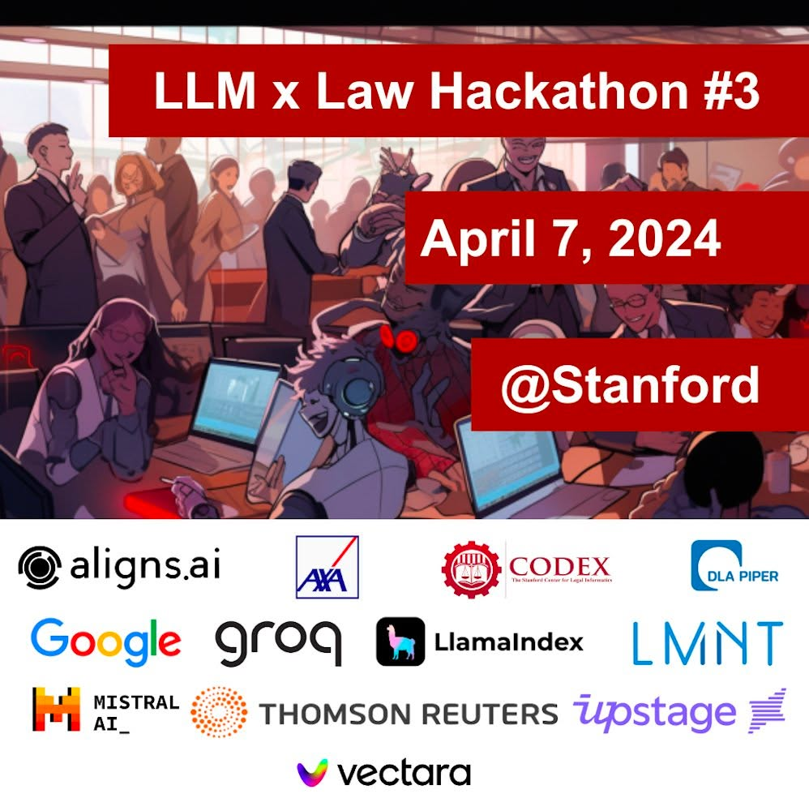
**이미지 캡션:** 이 이미지는 LLM x Law Hackathon #3 행사를 홍보하는 포스터로, 2024년 4월 7일에 스탠포드에서 개최된다는 내용을 담고 있습니다. 배경에는 여러 사람들이 모여 있는 모습이 그려져 있으며, 일부는 컴퓨터 앞에 앉아 코딩을 하거나 토론하는 듯한 모습입니다. 특히, 중앙에는 로봇 캐릭터와 붉은 눈을 가진 괴물 같은 캐릭터가 눈에 띕니다. 상단에는 "LLM x Law Hackathon #3"이라는 제목이, 오른쪽에는 "April 7, 2024"와 "@Stanford"라는 날짜와 장소 정보가 붉은색 바탕에 흰색 글씨로 크게 표시되어 있습니다. 하단에는 행사를 후원하는 여러 기업 및 단체의 로고들이 나열되어 있으며, aligns.ai, AXA, CODEX, DLA Piper, Google, groq, LlamaIndex, LMNT, Mistral AI, Thomson Reuters, upstage, vectara 등의 로고가 보입니다. 전체적으로 기술과 법률의 융합을 주제로 하는 행사임을 알 수 있으며, 활기차고 미래지향적인 분위기를 풍깁니다.
 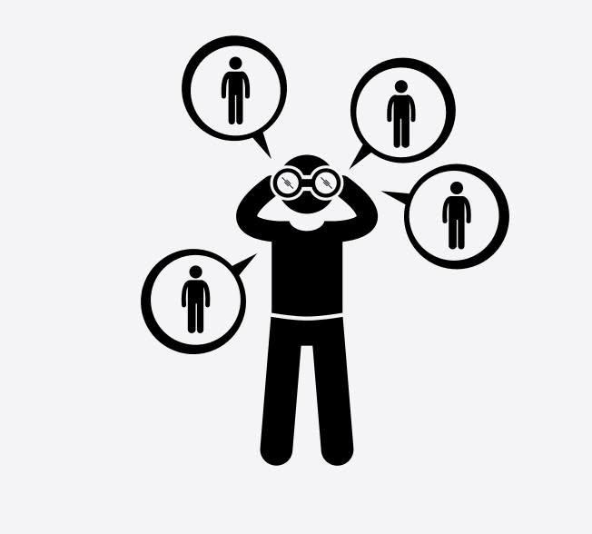
**이미지 캡션:** 이 이미지는 검은색 실루엣으로 표현된 한 사람과 주변의 말풍선 네 개를 보여줍니다. 중앙에 있는 사람은 성인 남성으로 추정되며, 두 손으로 쌍안경을 들고 무언가를 관찰하고 있습니다. 그의 복장은 단순한 상의와 하의로 표현되었으며, 표정은 드러나지 않습니다. 그의 행동은 집중하여 무언가를 탐색하는 모습입니다. 배경은 옅은 회색으로, 특별한 장소나 사물은 보이지 않습니다. 네 개의 말풍선은 각각 원 안에 사람 모양의 아이콘을 담고 있으며, 중앙 인물의 주변에 배치되어 있습니다. 이 아이콘들은 다른 사람들을 상징하는 것으로 보입니다. 전체적인 분위기는 정보 탐색, 관찰, 또는 특정 대상을 찾으려는 상황을 나타내는 듯합니다.

> RAG의 끝판왕이라고 할수 있을 수준의 그림입니다. 너무 멋집니다!  https://www.linkedin.com/feed/update/urn:li:activity:7172130950036897792/
> #04 #sf 4월 SF 에서 열리는 AI/LLM 관련 밋업/해커톤들입니다. 저는 아마 대부분 참여할 예정인데요. 혹시 어떤 행사 관심이 있으신지요? 댓글로 의견주시면 제가 더 자세히 듣고 후기 남겨보도록 하겠습니다. (* 표시는 Upstage solar llm 이 후원하면서 발표하는 행사입니다.)  * 4/2 [https://lu.ma/kiidiyeb](https://lu.ma/kiidiyeb) AI Alliance Meetup 2 * 4/4 [https://lu.ma/SFMeetupLLMs?utm_source=cerebralvalley](https://lu.ma/SFMeetupLLMs?utm_source=cerebralvalley) LLM Meetup with Predibase, LlamaIndex, Guardrails and Tryolabs | San Francisco * 4/6 [https://lu.ma/taa6ijxt](https://lu.ma/taa6ijxt) Memory Hackathon with New Computer, Anthropic, MongoDB and LangChain * *4/7 [https://partiful.com/e/NsYXeDR8YUiR7pJS2FEY](https://partiful.com/e/NsYXeDR8YUiR7pJS2FEY) LLM x Law Hackathon @Stanford #3 * 4/9 [https://lu.ma/AI-Night-SF](https://lu.ma/AI-Night-SF) AI Night ~ w/ Product Hunt, Mercury & [Jam.dev](http://jam.dev/) * 4/13 [https://lu.ma/q31iyevm](https://lu.ma/q31iyevm) GenAI Beyond Chat with RAG, Knowledge Graphs and Python * 4/15 [https://lu.ma/0v7wh0e6](https://lu.ma/0v7wh0e6) - From PDFs to Production: building and scaling enterprise-grade RAGs * 4/16 [https://www.meetup.com/unstructured-data-sf/events/298724282/](https://www.meetup.com/unstructured-data-sf/events/298724282/) Unstructured Data in LLMs [@Kasey Roh](https://upstageai.slack.com/team/U06RPHGEMUZ) 여기 저희 5분만 talk할수 있을까요? * 4/20 [https://lu.ma/MongoDB-GenAI-SF](https://lu.ma/MongoDB-GenAI-SF) MongoDB GenAI Hackathon SF [@Kasey Roh](https://upstageai.slack.com/team/U06RPHGEMUZ) 여기도 저희 발표나 스폰 가능할까요? * 4/23 [https://lu.ma/berkeleyllm](https://lu.ma/berkeleyllm) Berkeley LLM Meetup * 4/24 [https://lu.ma/y7mttj5w](https://lu.ma/y7mttj5w) Engineering the Bottom Line feat. Cloudflare, OpenAI, Pinecone, Lamini, Orb, and Amplify * * 4/27 TBA AI for Science / Bio Hackathon * * 5월 TBA Solar Full Stack LLM Hackathon
> #agikr #운영진모십니다 새로 개편된 AGI KR은 회원들과 더 많은 교류를 위해 온라인 및 오프라인 커뮤니티 행사를 계획하고 있습니다.  이에 새롭게 저희 운영진으로 함께 하시면서 좋은 아이디어와 빠른 실행력을 보여주실 분들을 찾고 있습니다.   4월 30일까지 아래 참고하셔서 지원서를 #agikr에 올려주시면 좋은 분들을 모셔 보겠습니다. 지원하시는 모든 분들을 운영진으로 모시지 못할수 있음을 미리 양해 부탁드립니다.  1. 하는일: AIG KR발전을 위한 아이디어 발굴및 온라인 오프라인 커뮤니티 운영과 방향 설정 2. 지원 요건: AGI KR 발전에 기여하시고 싶으신분/ 4월 한달 10개이상 글을 공유하신분 (관심을 보여주시는 것입니다.) 3. #2가 하신 분은 본인 지원 취지를 #runforagikr 와 함께 4/30일 이전까지 적어 주시면 like수 등을 종합판단하여 3명을 모십니다.  멋진 분들의 많은 지원을 부탁드리며 덕분에 더 멋진 AGI KR 되어 보겠습니다.

### 4월 3일 (수) 14:48 · 📷 사진 (3장)

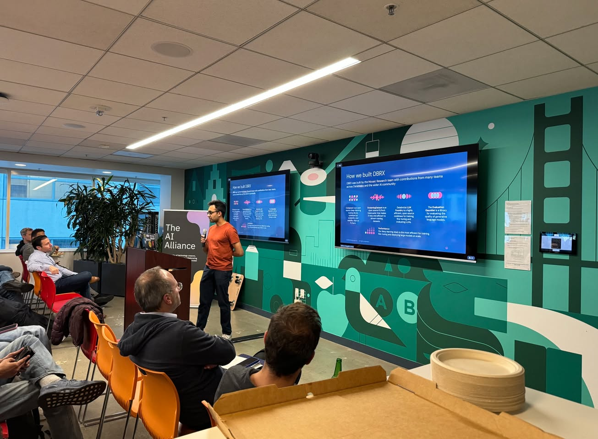
**이미지 캡션:** 한 명의 성인 남성이 주황색 반팔 티셔츠와 남색 바지를 입고 마이크를 들고 연단 뒤에서 발표하고 있으며, 그의 뒤에는 "The AI Alliance"라고 적힌 배너가 있다. 그의 왼쪽에는 두 개의 대형 스크린이 벽에 걸려 있고, 스크린에는 "How we built DBRX"라는 제목과 함께 그래프와 텍스트가 표시되어 있다. 벽에는 금문교와 새, 알파벳 A와 B가 그려진 녹색 배경의 그래피티가 그려져 있다. 강당에는 여러 명의 사람들이 의자에 앉아 발표를 듣고 있으며, 일부는 휴대폰을 보고 있다. 바닥에는 녹색 병이 놓여 있고, 앞쪽 테이블에는 종이 접시가 쌓여 있다. 전반적으로 기술 관련 발표회 또는 세미나 분위기이다.
 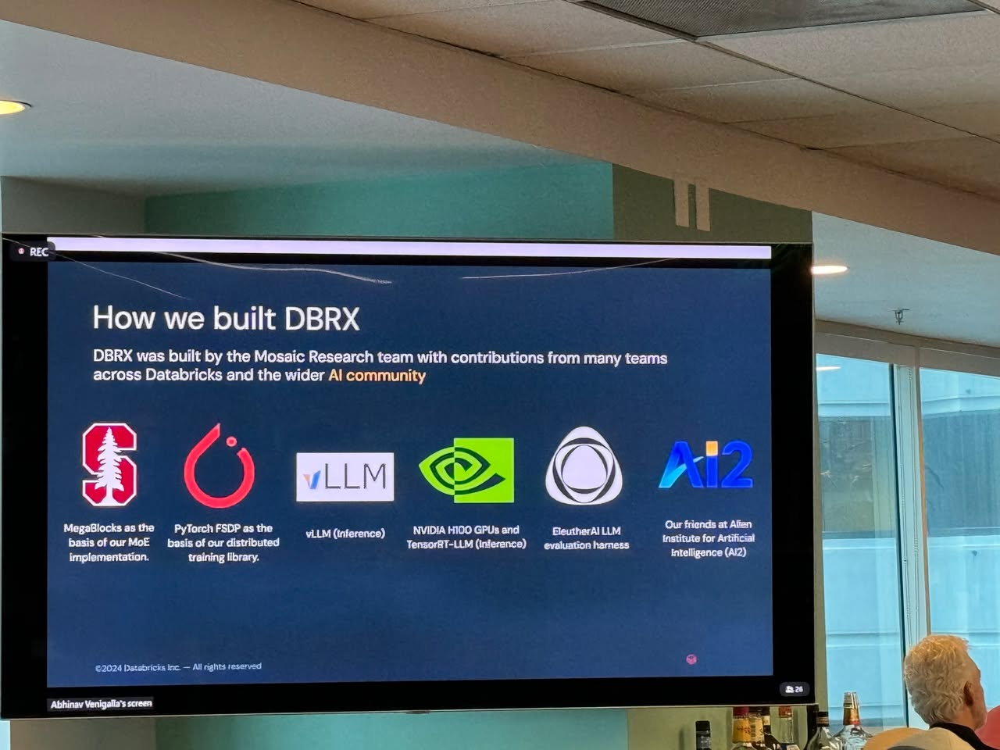
**이미지 캡션:** 화면에는 "How we built DBRX"라는 제목과 함께 DBRX가 Databricks의 Mosaic Research팀과 여러 팀, 그리고 AI 커뮤니티의 기여로 만들어졌다는 설명이 나와 있습니다. 화면 하단에는 Stanford, PyTorch, vLLM, NVIDIA, EleutherAI, AI2 등 여러 기관의 로고와 함께 각 로고 아래에 해당 기관이 DBRX 구축에 기여한 내용이 간략하게 설명되어 있습니다. 예를 들어 Stanford 로고 아래에는 "MegaBlocks as the basis of our MoE implementation."이라고 적혀 있으며, AI2 로고 아래에는 "Our friends at Allen Institute for Artificial Intelligence (AI2)"라고 쓰여 있습니다. 화면 왼쪽 상단에는 REC 표시가 있고, 오른쪽 하단에는 화면 번호로 보이는 "26"이 있습니다. 화면 하단에는 "©2024 Databricks Inc. All rights reserved"라는 저작권 표시와 함께 "Abhinav Venigalla's screen"이라는 문구가 보입니다. 배경에는 회의실로 보이는 장소에 테이블과 의자들이 놓여 있으며, 화면 오른쪽에는 백발의 성인 남성이 앉아 있는 모습이 일부 보입니다. 전체적으로 기술 발표 또는 회의 중에 사용되는 슬라이드 화면을 촬영한 사진으로 보이며, 차분하고 전문적인 분위기입니다.
 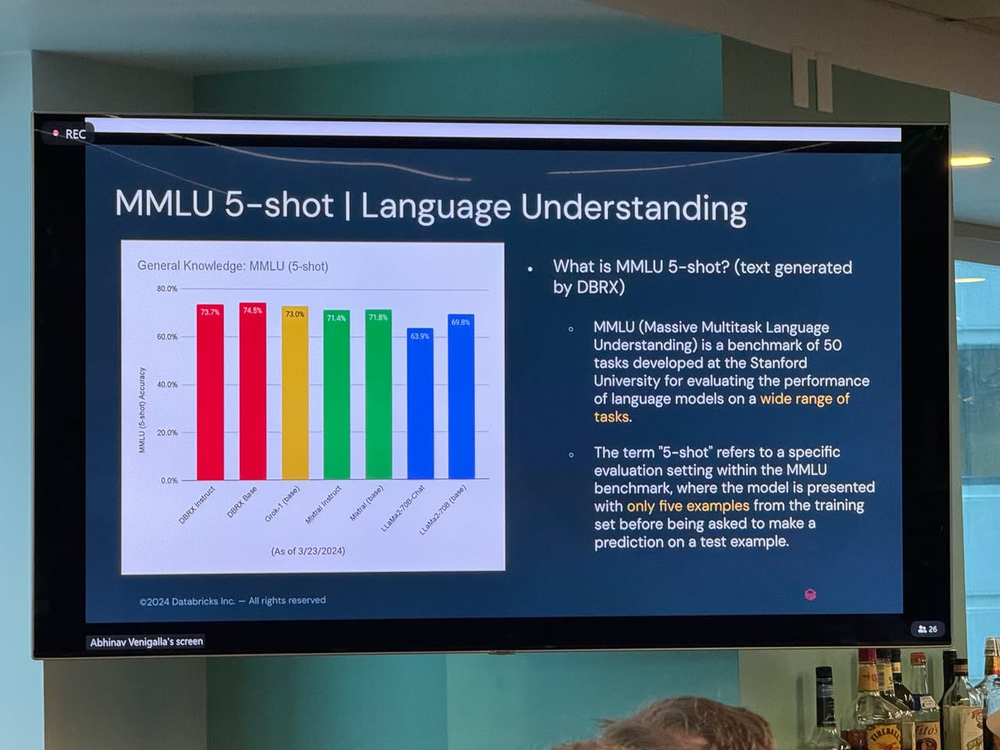
**이미지 캡션:** 이 사진은 발표 중인 화면을 촬영한 것으로, 화면에는 "MMLU 5-shot | Language Understanding"이라는 제목과 함께 MMLU 벤치마크의 일반 지식 성능을 보여주는 막대 그래프가 표시되어 있습니다. 그래프는 DBRX Instruct, DBRX Base, Grok-1 (base), Mistral Instruct, Mistral (base), LLaMa2-70B-Chat, LLaMa2-70B (base) 등 다양한 언어 모델의 5-shot 정확도를 비교하고 있으며, 각 막대 위에는 정확도 수치가 표시되어 있습니다. 그래프 아래에는 "As of 3/23/2024"라는 날짜 정보와 "©2024 Databricks Inc. - All rights reserved"라는 저작권 정보가 있습니다. 화면 오른쪽에는 MMLU 5-shot에 대한 설명이 텍스트로 제공되며, MMLU가 무엇인지, 그리고 "5-shot"이라는 용어가 의미하는 바를 설명하고 있습니다. 화면 하단에는 "Abhinav Venigalla's screen"이라는 문구가 보입니다. 화면 앞쪽에는 발표를 듣고 있는 것으로 보이는 여러 사람들의 머리 일부가 보이며, 배경에는 술병들이 놓여 있는 바 또는 테이블이 희미하게 보입니다. 전반적으로 기술 발표 또는 학술 발표의 한 장면으로 보이며, 언어 모델의 성능 평가에 대한 내용을 다루고 있습니다.

### 4월 4일 (목) 09:02 · 📷 사진 (1장)

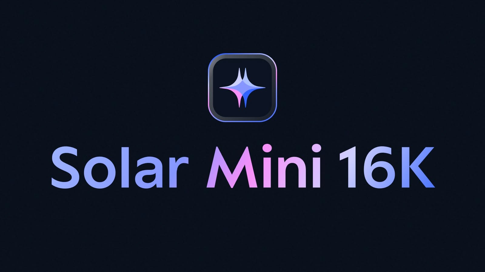
**이미지 캡션:** 어두운 배경에 "Solar Mini 16K"라는 텍스트가 중앙에 표시되어 있으며, 텍스트는 왼쪽에서 오른쪽으로 갈수록 파란색에서 보라색으로 변하는 그라데이션 효과를 띠고 있습니다. 텍스트 위에는 네모난 모양의 아이콘이 있는데, 아이콘 안에는 네 개의 빛나는 뾰족한 모양이 파란색과 보라색으로 빛나고 있습니다. 이 이미지는 어떤 제품이나 서비스의 로고 또는 타이틀로 보이며, 현대적이고 세련된 느낌을 줍니다.

> 지난 한달간 베타를 진행했던 #solarllm 많은 분들이 좋아 해주시고 많이 사용해주셔서 감사합니다.  그동안 context size 4K로 많이 불편하셨는데요. 오늘 부터 16K 가 지원됩니다.   그동안 분당 10개의 쿼리로 제한한 부분도 더 많은 실제 서비스 사용을 위해 분당 100개의 쿼리로 업데이트 하였습니다.    많은 사용 부탁드립니다. https://console.upstage.ai/

### 4월 4일 (목) 10:46 · 그동안 4K 였던 #solarllm 의 context length가 16…

그동안 4K 였던 #solarllm 의 context length가 16K로 확장되었습니다. 4월말에는 더 길어질 예정입니다. 

많은 사용 부탁드립니다. https://console.upstage.ai

### 4월 7일 (일) 04:20 · #memory #langchain #mongodb #Anthropic 메…

#memory #langchain #mongodb #Anthropic 메모리라는 주제로 열리는 해커톤 대회 참여하고 있습니다. #solarllm 으로 만들고 있는 시스템을 랭채인 CEO에게 직접 설명하고 있는 장면.

강의 영상과 재미있는 이야기들은 AGI KR https://www.facebook.com/groups/agikr 에 올려두겠습니다.

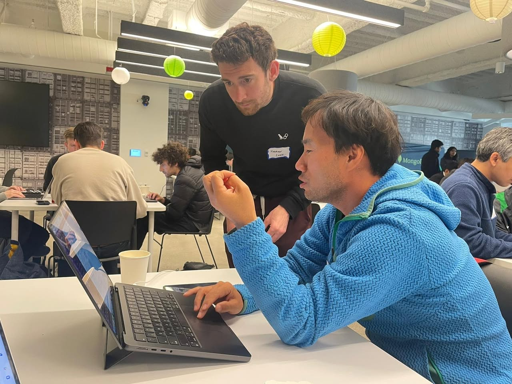
**이미지 캡션:** 한 명의 성인 남성이 파란색 후드티를 입고 노트북을 보며 다른 성인 남성과 이야기하고 있으며, 뒤에 있는 남성은 검은색 상의를 입고 명찰을 달고 있다. 이들은 사무실로 보이는 공간에 있으며, 배경에는 컨테이너 모양의 벽지와 둥근 조명들이 보인다. 테이블 위에는 노트북, 컵, 그리고 다른 사람들의 컴퓨터 화면이 보인다. 전반적으로 협업하거나 학습하는 듯한 분위기이다.
 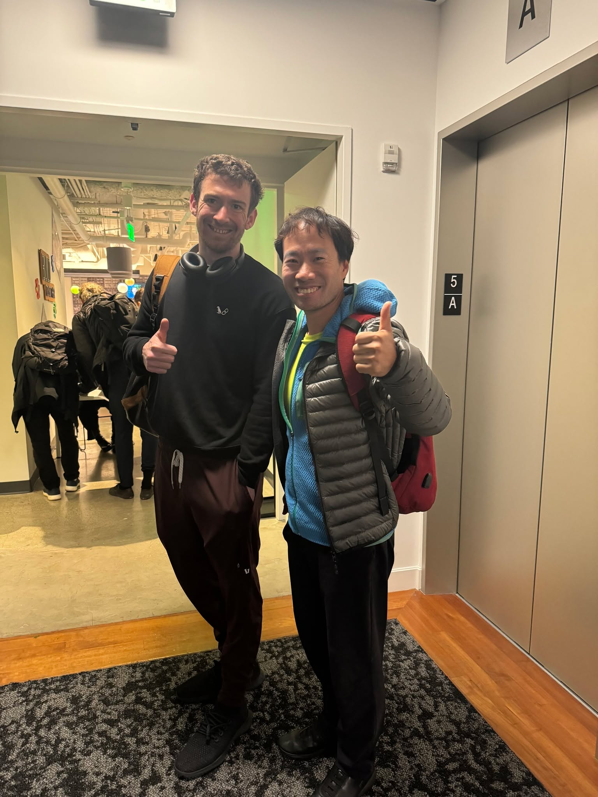
**이미지 캡션:** 두 명의 성인 남성이 복도에서 엄지손가락을 치켜세우며 카메라를 향해 웃고 있다. 왼쪽 남성은 30대 후반에서 40대 초반으로 보이며, 검은색 후드티와 버건디색 조거 팬츠, 검은색 운동화를 신고 있다. 목에는 검은색 헤드폰을 걸고 있으며, 어깨에는 갈색 백팩을 메고 있다. 오른쪽 남성은 30대 중반에서 40대 초반으로 보이며, 파란색과 녹색이 섞인 티셔츠 위에 회색 패딩 조끼를 입고 검은색 바지와 검은색 신발을 신고 있다. 어깨에는 빨간색 백팩을 메고 있다. 두 사람 모두 밝게 웃으며 긍정적인 분위기를 자아낸다. 배경에는 엘리베이터 문과 복도 끝의 사무실 공간이 보인다. 엘리베이터 문에는 '5A'라고 적힌 표지판이 붙어 있다. 복도 바닥은 회색 카펫과 나무 바닥으로 이루어져 있으며, 벽에는 조명과 환풍구가 보인다. 전반적으로 편안하고 캐주얼한 분위기의 실내 공간이다.
 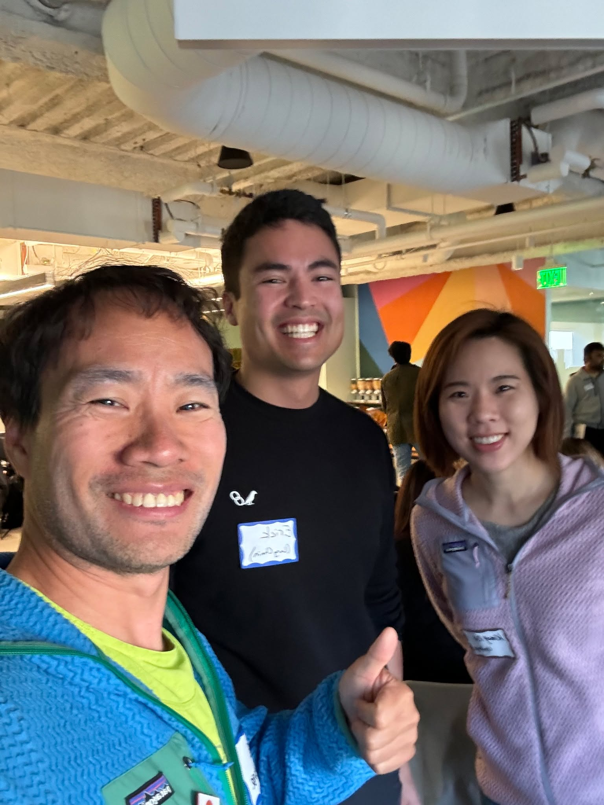
**이미지 캡션:** 사진에는 세 명의 사람이 등장하며, 모두 밝게 웃고 있다. 왼쪽에는 중년의 아시아 남성이 파란색 플리스 재킷과 형광 연두색 티셔츠를 입고 엄지손가락을 치켜세우고 있다. 그의 얼굴에는 주름이 있고, 머리는 짧고 검은색이다. 가운데에는 젊은 아시아 남성이 검은색 긴팔 티셔츠를 입고 있으며, 그의 티셔츠에는 흰색 로고와 함께 이름표가 붙어 있다. 오른쪽에는 젊은 아시아 여성이 연보라색 플리스 재킷과 회색 티셔츠를 입고 있으며, 그녀의 재킷에도 이름표가 달려 있다. 배경에는 사무실 천장의 파이프와 조명이 보이며, 벽에는 다채로운 색상의 그래픽이 그려져 있다. 전반적으로 즐겁고 편안한 분위기를 나타낸다.
 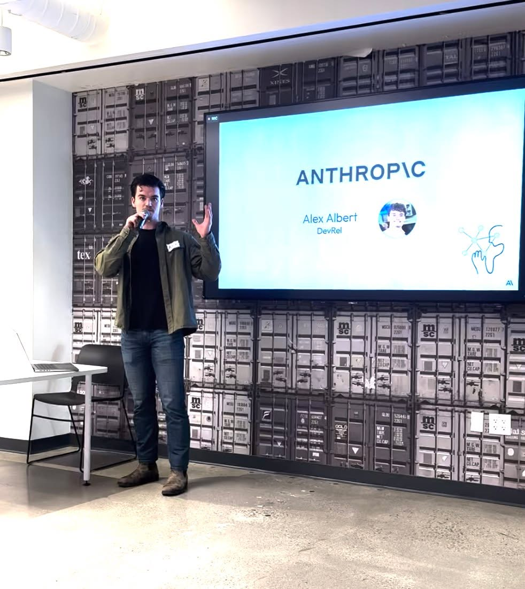
**이미지 캡션:** 한 명의 성인 남성이 마이크를 들고 발표하고 있으며, 그는 검은색 티셔츠 위에 올리브색 재킷을 입고 청바지를 착용하고 있습니다. 그의 표정은 진지하며, 한 손은 마이크를 잡고 있고 다른 한 손은 제스처를 취하고 있습니다. 배경에는 컨테이너 이미지가 반복적으로 그려진 벽지가 있고, 벽 중앙에는 큰 스크린이 설치되어 있습니다. 스크린에는 "ANTHROPIC"이라는 글자와 함께 "Alex Albert"라는 이름과 "DevRel"이라는 직책이 표시되어 있으며, 작은 프로필 사진과 함께 회사 로고로 보이는 그림도 있습니다. 스크린 왼쪽에는 흰색 테이블과 의자가 놓여 있으며, 테이블 위에는 노트북이 보입니다. 전체적으로 발표회 또는 강연이 진행되는 현대적인 실내 공간의 분위기입니다.
 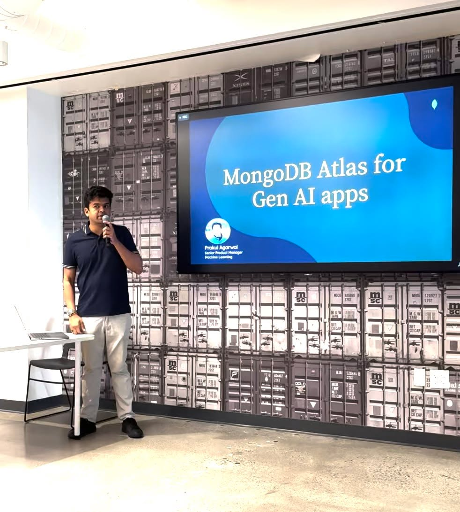
**이미지 캡션:** 한 명의 성인 남성이 마이크를 들고 발표하고 있으며, 그는 20대 후반에서 30대 초반으로 보이며 짧은 검은 머리에 검은색 폴로 셔츠와 회색 바지를 입고 있다. 그는 약간 미소를 띠고 있으며, 그의 시선은 화면을 향하고 있다. 배경에는 컨테이너 이미지로 장식된 벽과 대형 스크린이 있다. 스크린에는 "MongoDB Atlas for Gen AI apps"라는 제목과 발표자의 이름 및 직책이 표시되어 있다. 발표자 옆에는 노트북과 의자가 놓인 테이블이 있다. 전체적인 분위기는 기술 발표회 또는 세미나로 보이며, 현대적이고 전문적인 느낌을 준다.

### 4월 8일 (월) 09:31 · #solarllm #fun 재미로 보는 llm 성능 비교. 추억의 스트리…

#solarllm #fun 재미로 보는 llm 성능 비교. 추억의 스트리트 파이터게임을 LLM을 통해 하는 것입니다. 이미지 설명을 LLM으로 보내고, LLM이 다음 뭐 해야할지 알려주면 그 동작에 맞게 게임을 진행해보는 것입니다.

원하시는 LLM을 넣어서 테스트 해볼수 있는데요. Mistral small, medium, large와 과 Solar mini 를 넣어 게임을 해봤습니다.

Solar mini가 모든 Mistral을 이깁니다. 아래 코드를 참고해주세요. LLM의 성능을 직접적으로 반영하는 것은 아니니 재미로 즐겨주세요. ^^

https://github.com/OpenGenerativeAI/llm-colosseum

🎬 동영상 3개 (생략)

### 4월 9일 (화) 07:49 · #fullstackllm #llmxlaw 500명 이상이 참여한 Stan…

#fullstackllm #llmxlaw 500명 이상이 참여한 Stanford LLMxLaw 해커톤의 스폰스로 참여하고 #solarllm 소개를 했습니다. 정말 많은 분들이 관심을 가지고 Upstage Solar를 사용해주셨습니다!

Lucy Park 님의 멋진 발표 보셔요. API Key는 https://console.upstage.ai/ 에서 받아 가실수 있습니다!

🎬 동영상 1개 (생략)

### 4월 11일 (목) 06:13 · #swit #goolenext #next2024 열정적인 Josh Lee…

#swit #goolenext #next2024 열정적인 Josh Lee 대표님 부스와 #solarllm 의 멋진 데모까지 감사드립니다.

🎬 동영상 1개 (생략)

### 4월 11일 (목) 13:04 · #builder 저는 제가 만든 것을 다른 사람들에게 소개할때 제일 신납…

#builder 저는 제가 만든 것을 다른 사람들에게 소개할때 제일 신납니다. 저희가 만든것을 고객이 사용해주고, 또 만족해 주시면 제일 행복하고요. 

그래서 저는 Builder Sung으로 불리는 것이 제일 기쁩니다. 

아래는 langchain과 Vertex AI  팀에게 #solarllm 을 소개하는 장면인데 곧 멋진 일들이 많이 생길것 같습니다.

Builder Sung!

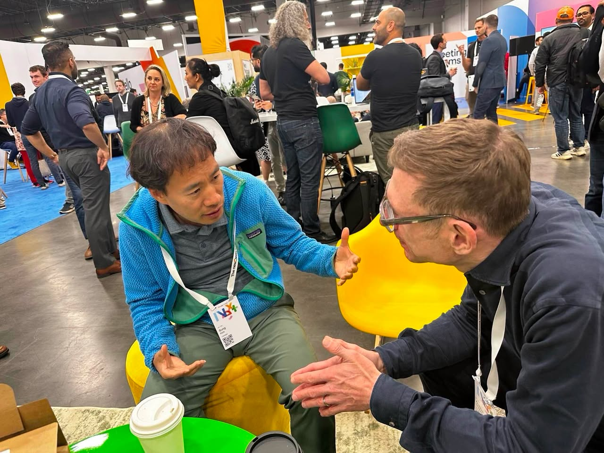
**이미지 캡션:** 이 사진은 컨퍼런스나 전시회와 같은 행사장에서 촬영된 것으로 보이며, 두 명의 성인 남성이 서로 대화하고 있다. 앞에 앉아 있는 남성은 동양인으로, 40대 후반에서 50대 초반으로 보이며 짧은 검은 머리에 편안한 표정으로 상대방을 바라보고 있다. 그는 파란색 플리스 재킷 안에 회색 폴로 셔츠를 입고 있으며, 녹색 바지와 함께 편안한 복장을 하고 있다. 그의 목에는 행사 ID 목걸이가 걸려 있고, 손짓을 하며 열정적으로 이야기하는 듯한 모습이다. 그의 옆에는 노란색 의자가 놓여 있고, 녹색 테이블 위에는 커피 컵과 상자가 보인다. 뒤에 서서 대화에 참여하고 있는 다른 남성은 백인으로, 30대 후반에서 40대 초반으로 추정되며 안경을 쓰고 있다. 그는 어두운 색 셔츠를 입고 있으며, 상대방의 이야기에 집중하며 경청하는 표정이다. 그의 손은 상대방의 손과 가까이 있으며, 대화에 적극적으로 참여하고 있음을 보여준다. 배경에는 다른 참석자들이 분주하게 움직이고 있으며, 부스, 간판, 조명 등이 보여 행사의 활기찬 분위기를 나타낸다. "Meeting rooms"라는 텍스트가 보이는 간판이 배경에 희미하게 보인다. 전반적으로, 이 사진은 비즈니스 행사에서 이루어지는 진지하고 활발한 대화를 포착하고 있다.
 
**이미지 캡션:** 이 사진은 여러 사람이 함께 작업하는 실내 공간을 보여줍니다. 전경에는 파란색 후드티를 입은 성인 남성이 노트북을 보며 손가락으로 무언가를 가리키고 있으며, 그의 옆에는 검은색 맨투맨 티셔츠를 입은 성인 남성이 그를 바라보며 설명을 듣고 있습니다. 검은색 맨투맨 티셔츠에는 "Harrison Chase"라고 적힌 이름표가 붙어 있습니다. 배경에는 흰색 테이블에 앉아 노트북을 사용하거나 대화하는 다른 사람들이 보이며, 벽에는 컨테이너 모양의 패턴이 그려져 있고, 천장에는 노란색과 흰색의 공 모양 조명이 매달려 있습니다. "Mongol"이라는 글자가 보이는 로고가 벽에 걸려 있습니다. 전반적으로 협업적인 분위기이며, 교육 또는 워크숍과 같은 행사가 진행 중인 것으로 보입니다.

### 4월 12일 (금) 12:42 · Mac, Windows, Linux에서 `ollama run solar`…

Mac, Windows, Linux에서 `ollama run solar` 한줄의 명령으로 #solarllm 을 local에서 구동시켜주는 #ollama 의 builder를 만났습니다. Solar 성능좋아 많이 사용된다고 말씀주셔서 아주 기뻤습니다. 

https://ollama.com/ 다운받아 보셔요!

**이미지 캡션:** 사진에는 두 명의 성인 남성이 등장하며, 둘 다 엄지손가락을 치켜들고 긍정적인 표정을 짓고 있습니다. 왼쪽 남성은 30대 후반에서 40대 초반으로 보이며, 곱슬거리는 갈색 머리에 흰색 이름표를 달고 회색 긴팔 티셔츠와 검은색 청바지를 입고 있습니다. 오른쪽 남성은 40대 초반에서 50대 초반으로 보이며, 검은색 머리에 밝은 녹색 티셔츠를 입고 있는데, 티셔츠에는 독특한 그림과 함께 "1st breakfast with Solo"라는 문구가 적혀 있습니다. 두 사람 모두 활짝 웃으며 카메라를 응시하고 있습니다. 배경에는 커다란 아치형 창문이 있으며, 창밖으로는 맑은 하늘과 함께 샌프란시스코의 유명한 베이 브릿지와 항구 풍경이 펼쳐져 있습니다. 창문 근처 테이블 위에는 물병, 상자, 그리고 몇 개의 음료수 캔이 놓여 있습니다. 전반적으로 밝고 긍정적인 분위기를 풍기는 사진으로, 두 사람이 함께 즐거운 시간을 보내고 있음을 보여줍니다.

### 4월 12일 (금) 16:03 · 📷 사진 (1장)

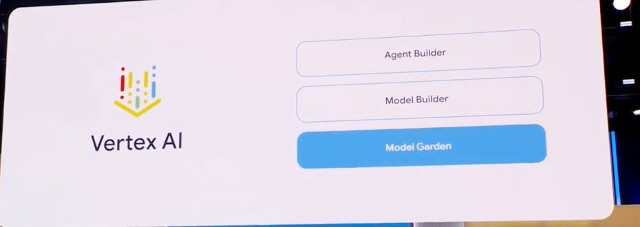
**이미지 캡션:** 이 사진은 Vertex AI라는 이름의 인공지능 플랫폼을 보여주는 화면을 담고 있으며, 화면 왼쪽에는 Vertex AI 로고와 함께 "Vertex AI"라는 텍스트가 표시되어 있습니다. 로고는 노란색 V자 모양 위에 빨강, 주황, 초록, 파랑 등 여러 색상의 점들이 솟아나는 듯한 디자인입니다. 화면 오른쪽에는 세 개의 버튼이 나란히 배치되어 있으며, 첫 번째 버튼에는 "Agent Builder", 두 번째 버튼에는 "Model Builder"라고 쓰여 있습니다. 세 번째 버튼은 파란색으로 채워져 있으며 "Model Garden"이라는 텍스트가 적혀 있습니다. 이 화면은 기술 컨퍼런스나 발표회 등에서 사용되는 것으로 보이며, 전반적으로 깔끔하고 현대적인 느낌을 줍니다. 사람이나 구체적인 장소는 보이지 않으며, 오직 소프트웨어 인터페이스 화면만이 나타나 있습니다.

> 클라우드라기 보다 AI가 핵심주제였던 Google Cloud Next '24 키노트 14분 정리입니다.  Usecase와 VertexAI등이 소개 됩니다. Grounding 기능도 아주 좋네요.   https://www.youtube.com/watch?v=M-CzbTUVykg&ab_channel=GoogleCloud

### 4월 13일 (토) 10:21 · 📷 사진 (1장)

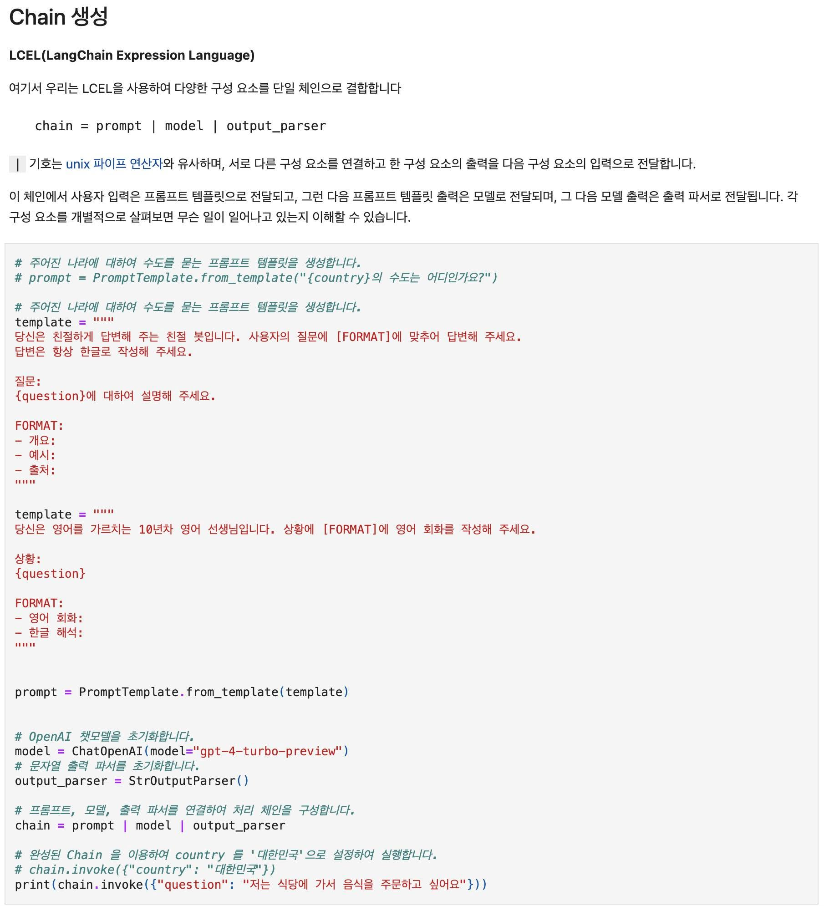
**이미지 캡션:** 이 이미지는 파이썬 코드와 함께 LCEL(LangChain Expression Language)을 사용하여 체인을 생성하는 과정을 설명하는 문서의 일부입니다. 문서의 제목은 "Chain 생성"이며, LCEL의 기본 개념과 사용법을 소개합니다. **사람:** 이미지에 직접적으로 묘사된 사람은 없습니다. 텍스트는 프로그래밍 코드와 설명을 포함하고 있으며, 이는 개발자나 AI 연구자가 이해할 수 있는 내용입니다. **장소/배경:** 배경은 흰색이며, 텍스트가 깔끔하게 정렬되어 있습니다. 특별한 장소나 배경은 묘사되지 않았습니다. **사물:** 주요 사물은 컴퓨터 화면에 표시되는 텍스트와 코드입니다. 코드에는 변수, 함수 호출, 문자열 등이 포함되어 있습니다. **보이는 텍스트:** *   **제목:** "Chain 생성" *   **소제목:** "LCEL (LangChain Expression Language)" *   **설명 텍스트:** LCEL을 사용하여 구성 요소를 결합하는 방법, 파이프 연산자(|)의 역할, 체인의 각 구성 요소(프롬프트, 모델, 출력 파서)가 어떻게 작동하는지에 대한 설명. *   **코드 블록:** 파이썬 코드로, `PromptTemplate`, `ChatOpenAI`, `StrOutputParser`와 같은 클래스를 사용하고, 이를 파이프 연산자로 연결하여 `chain`을 생성하는 예시를 보여줍니다. 또한 `chain.invoke()`를 사용하여 체인을 실행하는 코드도 포함되어 있습니다. *   **주석:** 코드 내에는 `#`으로 시작하는 주석이 있어 코드의 각 부분을 설명합니다. **분위기/상황:** 문서의 분위기는 교육적이고 기술적입니다. AI 개발 또는 자연어 처리 분야에 대한 지식을 전달하려는 목적을 가지고 있으며, 코드를 통해 개념을 명확하게 설명하려는 의도가 엿보입니다. 전반적으로 차분하고 정보 전달에 집중하는 상황입니다.

> #langchain 최근본 랭체인 관련 자료중 가장 정리가 잘되어 있고 쉽게 만들어진것 같습니다.  (랭체인 원본 문서보다 좋아서 랭채인에서 이 문서를 영어로 번역해서 사용해야 할것 같습니다.)  https://github.com/teddylee777/langchain-kr  제가 할수 있다면 100개의 별을 쏘고 싶습니다!

### 4월 14일 (일) 11:38 · #stanford #cs25 스텐포드 수업에서 많이 배웠는데요. 바로 그…

#stanford #cs25 스텐포드 수업에서 많이 배웠는데요. 바로 그 유명한 Stanford CS25 4월 18일 수업 그림에서 Upstage #solarllm이 소개 됩니다! (업스테이지 로그를 찾아 보세요!)

강의나 수업하실때 아래 이미지 많이 활용해주세요.

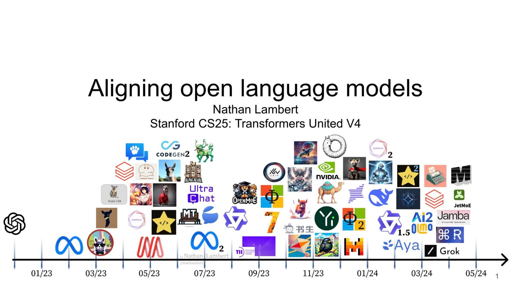
**이미지 캡션:** 이 이미지는 "Aligning open language models"라는 제목의 프레젠테이션 슬라이드로, Nathan Lambert가 Stanford CS25: Transformers United V4 강의의 일부로 발표한 것으로 보입니다. 슬라이드 상단에는 제목과 발표자, 강의 정보가 텍스트로 표시되어 있습니다. 중앙에는 연대기 순으로 다양한 오픈 언어 모델 로고들이 나열되어 있으며, 각 로고 아래에는 해당 모델이 출시된 대략적인 날짜가 표시되어 있습니다. 로고들은 알파카, 고양이, 곰, 낙타, 돌고래, 새 등 다양한 동물이나 추상적인 기하학적 도형, 그리고 텍스트 기반의 아이콘들로 구성되어 있습니다. 일부 로고에는 "CODEGEN2", "Ultra Chat", "OPEN MOE", "NVIDIA", "JetMoE", "Jamba", "Grok" 등의 텍스트가 포함되어 있습니다. 슬라이드 하단에는 2023년 1월부터 2024년 5월까지의 타임라인이 그려져 있으며, 각 월별로 주요 모델 출시 시점을 나타냅니다. 전반적으로 기술 발표 자료의 한 장면으로, 오픈 언어 모델의 발전 과정을 시각적으로 보여주는 정보성 슬라이드입니다.

### 4월 15일 (월) 08:01 · #0420 #SF 벡터DB의 최고중 하나인 MongoDB와 함께 하는 G…

#0420 #SF 벡터DB의 최고중 하나인 MongoDB와 함께 하는 GenAI 해커톤! SF 근처 계시면 같이 참여하셔서 멋진거 만들어 봐요! 

Upstage #solarllm, embeding, layout analyzer 등이 소개 됩니다. 

https://lu.ma/MongoDB-GenAI-SF 

* ​Quick Start your MongoDB Atlas Vector Search Setup by John Willis, Author & Consultant, MongoDB

* ​Getting Started with Fireworks for RAG by Ray Thai, Founding PM, Fireworks AI

​* Win today’s hackathon with Upstage Full-stack LLM by Lucy Park, CSO, Upstage

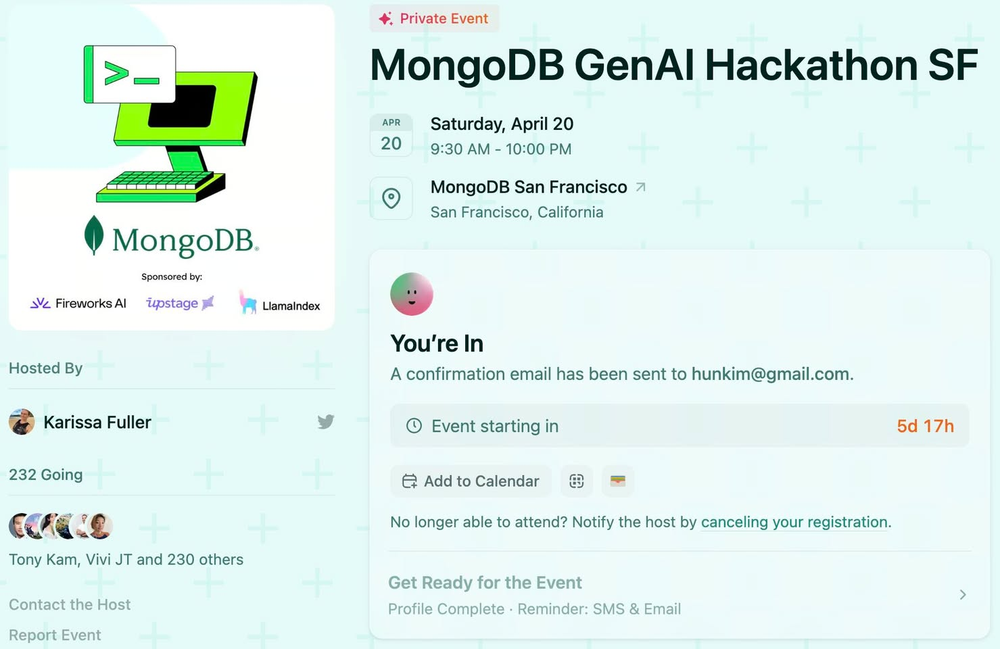
**이미지 캡션:** 이 이미지는 MongoDB GenAI Hackathon SF 이벤트 등록 확인 페이지를 보여줍니다. 페이지 왼쪽에는 MongoDB 로고와 함께 "Sponsored by: Fireworks AI, upstage, LlamaIndex"라는 문구가 보이며, "Hosted By Karissa Fuller"라는 호스트 정보와 함께 232명이 참석 예정임을 나타내는 "232 Going"이라는 문구와 함께 Tony Kam, Vivi JT 외 230명의 참석자 목록이 표시됩니다. 페이지 오른쪽 상단에는 "Private Event"라는 표시와 함께 이벤트 제목인 "MongoDB GenAI Hackathon SF"가 크게 적혀 있고, 이벤트 날짜는 4월 20일 토요일 오전 9시 30분부터 오후 10시까지이며 장소는 샌프란시스코 캘리포니아의 MongoDB San Francisco임을 알 수 있습니다. "You're In"이라는 섹션에는 등록 확인 이메일이 hunkim@gmail.com으로 발송되었음을 알리고, 이벤트 시작까지 5일 17시간이 남았음을 보여줍니다. 또한 "Add to Calendar" 버튼과 함께 이벤트 참석이 불가능할 경우 등록 취소 방법을 안내하는 문구가 있습니다. 하단에는 "Get Ready for the Event"라는 섹션이 있으며, 프로필 완료 및 SMS/이메일 알림에 대한 정보가 있습니다. 전체적으로 밝고 긍정적인 분위기이며, 기술 관련 이벤트임을 알 수 있습니다.

### 4월 15일 (월) 12:40 · #고객만족 저희들이 만든 Superhuman 성능의 DocAI (OCR)…

#고객만족 저희들이 만든 Superhuman 성능의 DocAI (OCR)로 고객이 더 많은 가치를 만들고 계시다는 소식! 너무 기쁩니다. Making AI Beneficial, Upstage!

이번은 의미가 큰 사례라고 생각합니다. 단순 업무 효율 개선이 아닌, 기존 데이터의 디지털화를 통하 인사이트 획득, 제품 개발에 반영된 첫 케이스입니다. 멋진 케이스를 만들어 주신 한화 프로젝트팀에게 큰 감사의 말씀 전합니다. 

AI 도움이 필요하시면 저희를 찾아 주세요! 

https://n.news.naver.com/article/001/0014630947?sid=101

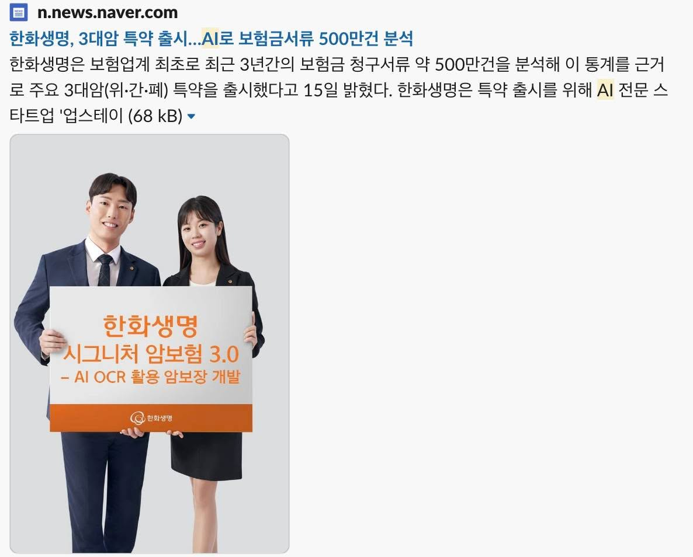
**이미지 캡션:** 밝은 배경에 한 남성과 한 여성이 서 있으며, 두 사람 앞에는 "한화생명 시그니처 암보험 3.0 - AI OCR 활용 암보장 개발"이라고 적힌 흰색 판이 놓여 있다. 남성은 20대 후반에서 30대 초반으로 보이는 성인 남성으로, 검은색 정장에 흰색 셔츠와 파란색 넥타이를 착용하고 환하게 웃고 있다. 여성은 20대 중반에서 30대 초반으로 보이는 성인 여성으로, 검은색 재킷과 블라우스를 착용하고 부드러운 미소를 짓고 있다. 두 사람 모두 전문적이고 긍정적인 이미지를 풍긴다. 배경은 흰색으로 깔끔하며, 판의 하단에는 한화생명의 로고가 보인다. 전체적으로 신뢰감 있고 현대적인 분위기를 연출한다.

### 4월 16일 (화) 11:43 · #1000억투자 Upstage가 B라운드에서 1000억의 투자를 유치하였…

#1000억투자 Upstage가 B라운드에서 1000억의 투자를 유치하였습니다. 한국의 AI회사로는 매우 큰 규모로, 리딩해주신  SK네트웍스 그리고 KT, 산업은행, 신한벤처투자, 하나벤처스, 미래에셋벤처투자, 기업은행 등 신규 투자 해주신 덕분입니다. 특히 SBVA(구 소프트뱅크벤처스), 프라이머사제, 컴퍼니케이파트너스, 프리미어파트너스 등 기존 투자자들의 전폭적인 지원과 큰 후속 투자에도 감사드립니다. 

다만 투자를 받았다는 것은 Upstage가 성과를 낸것이 아니라는 것을 잘 알고 있습니다. 이 투자금을 연료로 삼아, 지금부터 더 잘해서 10배 100배 그 이상 성과를 내야 합니다. 특히 1000억 큰 투자금을 주신것은, 국내를 넘어 세계시장에서 큰 성과를 내야한다는 의미입니다. 이를 잘 새겨서 글로벌 AI 1등을 향해 달려보겠습니다.

다시한번 Upstage 제품을 사용해주시고, 응원해주시고, 또 투자해주신 모든 분들에게 감사드립니다. 매우 행복한 날입니다.

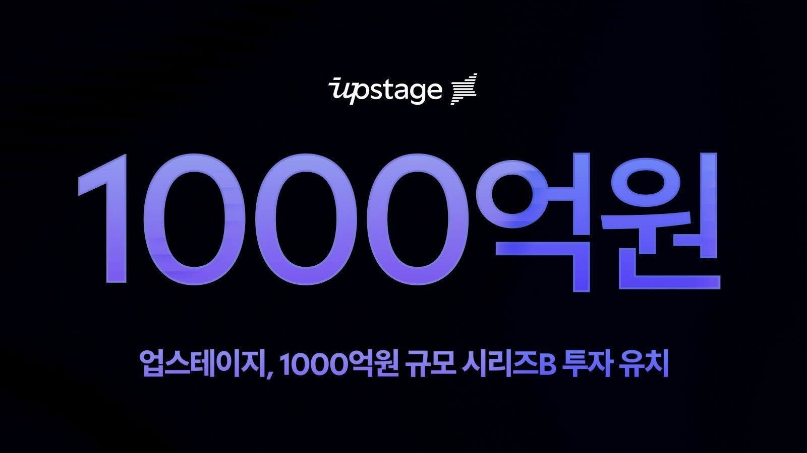
**이미지 캡션:** 어두운 배경에 보라색과 파란색이 혼합된 빛으로 "1000억 원"이라는 큰 숫자가 중앙에 표시되어 있으며, 그 위에는 흰색 로고와 함께 "upstage"라는 글자가 작게 쓰여 있습니다. 숫자 아래에는 "업스테이지, 1000억 원 규모 시리즈 B 투자 유치"라는 한국어 문구가 흰색으로 새겨져 있습니다. 이 이미지는 업스테이지라는 회사가 1000억 원 규모의 시리즈 B 투자를 유치했다는 소식을 알리는 것으로 보이며, 전반적으로 성공적인 투자 유치를 축하하는 듯한 긍정적이고 희망적인 분위기를 자아냅니다. 사람, 장소, 사물은 보이지 않으며, 텍스트 정보와 로고가 주요 내용입니다.

### 4월 17일 (수) 13:08 · #번역톤 #북마크  AI번역은 저도 매일 매일 사용하는데요. 그동안의 A…

#번역톤 #북마크 https://translate.upstage.ai/ AI번역은 저도 매일 매일 사용하는데요. 그동안의 AI번역은 톤이 정해져 있어 번역된 것을 일일이 다시 수정해야 하는 어려움이 있었습니다. 

이번 #solarllm 번역기능을 통해 개발된 저희 번역기는 원하는 긴글을 복사하면 알아서 문단을 나누어 번역합니다. 그리고 내가 원하는 톤으로 일부 문단을 수정하면 이 #번역톤을 기억했다가 다른 문단 번역에 적용해줍니다.

이를 통해 어린이 문체로 번역을 하거나, 쉬운 번역, 존댓말, 극존대등 다양한 형태의 톤 조절이 가능합니다. 즉 예제를 보여주고 이렇게 번역해 라고 할 수 있습니다.

베타 기간동안 무료로 사용이 가능하니 사용해보시고 개선할 점을 알려주시면 더 좋은 서비스로 찾아 뵙겠습니다. 북마크, https://translate.upstage.ai/ (지금은 PC용으로 개발되어 있습니다.)

🎬 동영상 1개 (생략)

### 4월 18일 (목) 01:33 · 📷 사진 (3장)

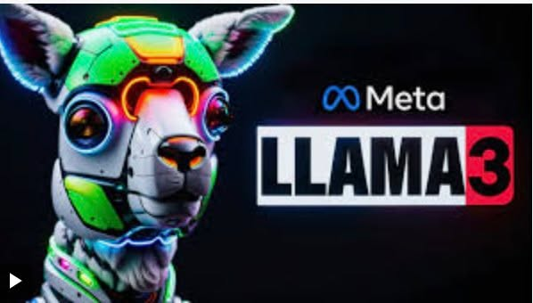
**이미지 캡션:** 이 이미지는 검은색 배경에 메타(Meta) 로고와 함께 "LLAMA3"라는 글자가 크게 쓰여 있습니다. 왼쪽에는 초록색, 파란색, 주황색 네온 불빛으로 장식된 로봇 라마의 머리가 클로즈업되어 있습니다. 로봇 라마는 기계적인 부품으로 이루어져 있으며, 눈은 동그랗고 빛나고 있습니다. 전체적으로 미래지향적이고 기술적인 분위기를 풍기며, 메타의 새로운 AI 모델인 LLAMA3를 홍보하는 것으로 보입니다.
 
**이미지 캡션:** 이 이미지는 검은색 배경에 메타(Meta) 로고와 함께 "LLAMA3"라는 글자가 크게 쓰여 있으며, 왼쪽에는 녹색과 파란색 네온 불빛으로 강조된 사이버펑크 스타일의 라마 머리 이미지가 배치되어 있습니다. 라마는 기계적인 부품으로 이루어져 있으며, 눈과 귀, 목 부분에 밝은 색상의 조명이 빛나고 있어 미래지향적이고 인공적인 느낌을 줍니다. "LLAMA3"라는 텍스트는 흰색 바탕에 검은색 글자로 쓰여 있고, 숫자 3은 빨간색 바탕에 흰색으로 표현되어 시각적인 대비를 이룹니다. 전체적으로 기술적인 혁신과 발전을 상징하는 듯한 분위기를 자아냅니다.
 
**이미지 캡션:** 이 사진은 검은색 배경에 메타(Meta) 로고와 함께 "LLAMA 3"이라는 글자가 흰색과 빨간색으로 크게 쓰여 있고, 그 옆에는 초록색과 파란색, 주황색 네온 불빛으로 장식된 로봇 라마의 머리가 클로즈업되어 있습니다. 로봇 라마는 기계적인 외형에 미래지향적인 디자인을 하고 있으며, 눈은 동그란 렌즈 형태이고 귀는 쫑긋 서 있습니다. 전체적으로 첨단 기술과 인공지능을 연상시키는 분위기이며, 메타의 새로운 AI 모델인 LLAMA 3를 홍보하는 이미지로 보입니다.

### 4월 19일 (금) 01:26 · 📷 사진 (2장)

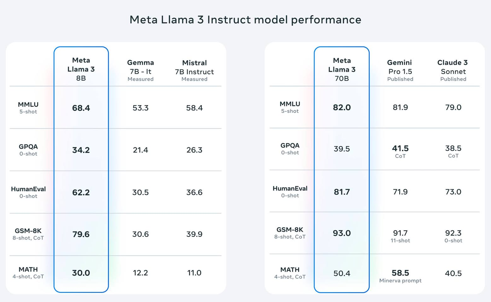
**이미지 캡션:** 이 이미지는 "Meta Llama 3 Instruct 모델 성능"이라는 제목의 표를 보여주며, 두 개의 주요 섹션으로 나뉘어 있습니다. 각 섹션은 다양한 언어 모델의 성능을 여러 벤치마크에 걸쳐 비교합니다. 왼쪽 섹션은 "Meta Llama 3 8B" 모델의 성능을 "Gemma 7B - It Measured" 및 "Mistral 7B Instruct Measured"와 비교하며, MMLU (5-shot), GPQA (0-shot), HumanEval (0-shot), GSM-8K (8-shot, CoT), MATH (4-shot, CoT)와 같은 벤치마크에 대한 점수를 보여줍니다. 오른쪽 섹션은 "Meta Llama 3 70B" 모델의 성능을 "Gemini Pro 1.5 Published" 및 "Claude 3 Sonnet Published"와 비교하며, 동일한 벤치마크에 대한 점수를 표시합니다. 각 셀에는 해당 모델과 벤치마크에 대한 수치 점수가 표시되어 있으며, 일부 셀에는 추가 정보(예: "CoT", "11-shot", "Minerva prompt")가 포함되어 있습니다. 전체적으로 이미지는 깔끔하고 현대적인 디자인으로, 데이터 시각화에 중점을 두고 있습니다.
 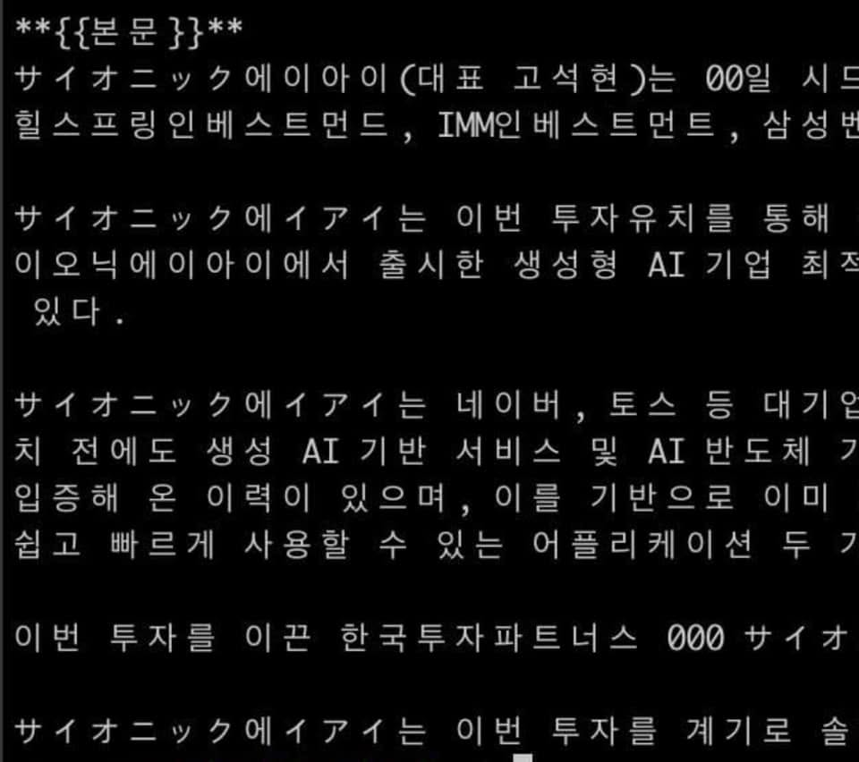
**이미지 캡션:** 이 사진은 검은색 배경에 흰색 글씨로 된 텍스트 문서의 일부를 보여줍니다. 텍스트는 한국어와 일본어가 혼합되어 있으며, 주로 기업 투자 및 AI 기술에 대한 내용을 다루고 있습니다. 구체적으로는 '사이오닉에이아이'라는 회사가 투자 유치를 통해 생성형 AI 기업으로서의 입지를 다지고 있으며, 네이버, 토스 등 대기업과의 협력 가능성 및 AI 기반 서비스와 반도체 기술에 대한 언급이 있습니다. 또한, 한국투자파트너스가 이번 투자에 참여했다는 내용도 포함되어 있습니다. 사진에는 사람이 등장하지 않으며, 장소나 사물에 대한 정보도 없습니다. 텍스트의 내용은 전문적이고 정보 전달에 초점을 맞추고 있어 진지하고 비즈니스적인 분위기를 풍깁니다.

> #라마3 소문대로 오늘 미국시간 아침에 출시! 멋집니다!!  [https://llama.meta.com/llama3/](https://llama.meta.com/llama3/)  솔라번역기: Llama 3은 공개적으로 사용 가능한 소스에서 15조 개 이상의 토큰으로 사전 학습되었습니다. 미세 조정 데이터에는 공개적으로 사용 가능한 지침 데이터 세트와 10M 개 이상의 주석이 달린 예가 포함됩니다. 사전 학습 또는 미세 조정 데이터 세트에는 Meta 사용자 데이터가 포함되어 있지 않습니다.

### 4월 19일 (금) 12:47 · #solarllm  LLM 만들때 대부분 사용하시는 #langchain …

#solarllm  LLM 만들때 대부분 사용하시는 #langchain 에 Upstage 가 공식 파터너 package를 출시했습니다. Chat과 Embedding이 제공됩니다. (추가로 Layout Analysis와 groundedness check가 곧 추가될 예정입니다.)

pip install langchain-upstage 해주시면 됩니다. 

langchain은 쉽게 사용할수 있어 설명이 필요없지만 기쁜 마음으로 사용하는 방법과 Solar 키를 받는 방법을 간단히 설명드립니다.

https://python.langchain.com/docs/integrations/providers/upstage/

🎬 동영상 1개 (생략)

### 4월 19일 (금) 14:15 · #llama3 #solarllm 라마3를 환영합니다. 저희도 더 열심히 …

#llama3 #solarllm 라마3를 환영합니다. 저희도 더 열심히 달리겠습니다.

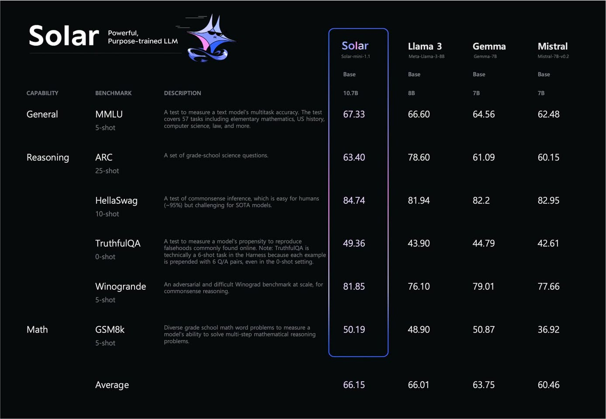
**이미지 캡션:** 이 이미지는 네 가지 대규모 언어 모델(LLM)인 Solar, Llama 3, Gemma, Mistral의 성능을 비교하는 표를 보여줍니다. 각 모델은 General, Reasoning, Math의 세 가지 주요 능력 범주에 대해 MMLU, ARC, HellaSwag, TruthfulQA, Winogrande, GSM8k과 같은 다양한 벤치마크에서 평가되었습니다. 각 벤치마크에 대한 설명과 함께 각 모델의 점수가 표시되어 있으며, 마지막에는 각 모델의 평균 점수가 나와 있습니다. 표는 어두운 배경에 밝은 텍스트로 구성되어 있으며, Solar 모델의 로고와 이름이 상단에 강조되어 있습니다. 이 표는 LLM의 성능을 객관적으로 비교하고 평가하는 데 유용하며, 특정 작업에 가장 적합한 모델을 선택하는 데 도움을 줄 수 있습니다.

### 4월 20일 (토) 02:54 · 📷 사진 (1장)

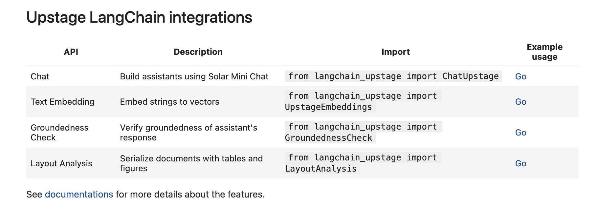
**이미지 캡션:** 이 이미지는 "Upstage LangChain integrations"라는 제목의 웹 페이지 스크린샷으로, Upstage의 LangChain 통합 기능을 설명하는 표를 보여줍니다. 표에는 API, 설명, Import, Example usage의 네 가지 열이 있습니다. 각 행은 특정 API 기능을 나타냅니다. 첫 번째 행은 "Chat" API로, "Solar Mini Chat을 사용한 어시스턴트 구축"을 설명하며, `from langchain_upstage import ChatUpstage`를 임포트하고 "Go" 버튼이 있습니다. 두 번째 행은 "Text Embedding" API로, "문자열을 벡터로 임베딩"하는 것을 설명하며, `from langchain_upstage import UpstageEmbeddings`를 임포트하고 "Go" 버튼이 있습니다. 세 번째 행은 "Groundedness Check" API로, "어시스턴트 응답의 근거 확인"을 설명하며, `from langchain_upstage import GroundednessCheck`를 임포트하고 "Go" 버튼이 있습니다. 네 번째 행은 "Layout Analysis" API로, "표와 그림이 포함된 문서 직렬화"를 설명하며, `from langchain_upstage import LayoutAnalysis`를 임포트하고 "Go" 버튼이 있습니다. 표 아래에는 "자세한 내용은 문서를 참조하십시오."라는 문구가 파란색 링크로 표시되어 있습니다. 이미지에는 사람이 등장하지 않으며, 배경은 흰색으로 깔끔하게 정리된 웹 페이지의 일부입니다. 전체적인 분위기는 정보 제공적이고 기술적인 문서의 느낌을 줍니다.

> #langchain 지난번 커뮤니티 분들과 같이 리뷰해 주셔서 감사드립니다. 덕분에 langchain-upstage 1.0 릴리즈 되었습니다. 추가로 Upstage 의 자랑인 Document AI 기반의 Layout analysis, 그리고 LLM 결과의 hallucination을 잡아주는 groundedness Check 까지 추가되어 #fullstack llm을 구현한 PR이 제출 되었습니다.   https://github.com/langchain-ai/langchain/pull/20651 보시고 의견, comment, 응원 많이 부탁드립니다.

### 4월 21일 (일) 11:13 · Gemini 1.5를 만들고 계시는 Jeff Dean 님! AGI 하우스…

Gemini 1.5를 만들고 계시는 Jeff Dean 님! AGI 하우스에서 뵙고 #solarllm 티셔츠 입고 사진찍고 이야기 나누었습니다. LLM 더 많이 사용되고 더 흥하기를 바라는 마음은 같았습니다. 

제가 직접 촬영한 오늘 Jeff 님 강의는 https://m.facebook.com/groups/agikr/permalink/2280534165620962/ 참고 하셔요.

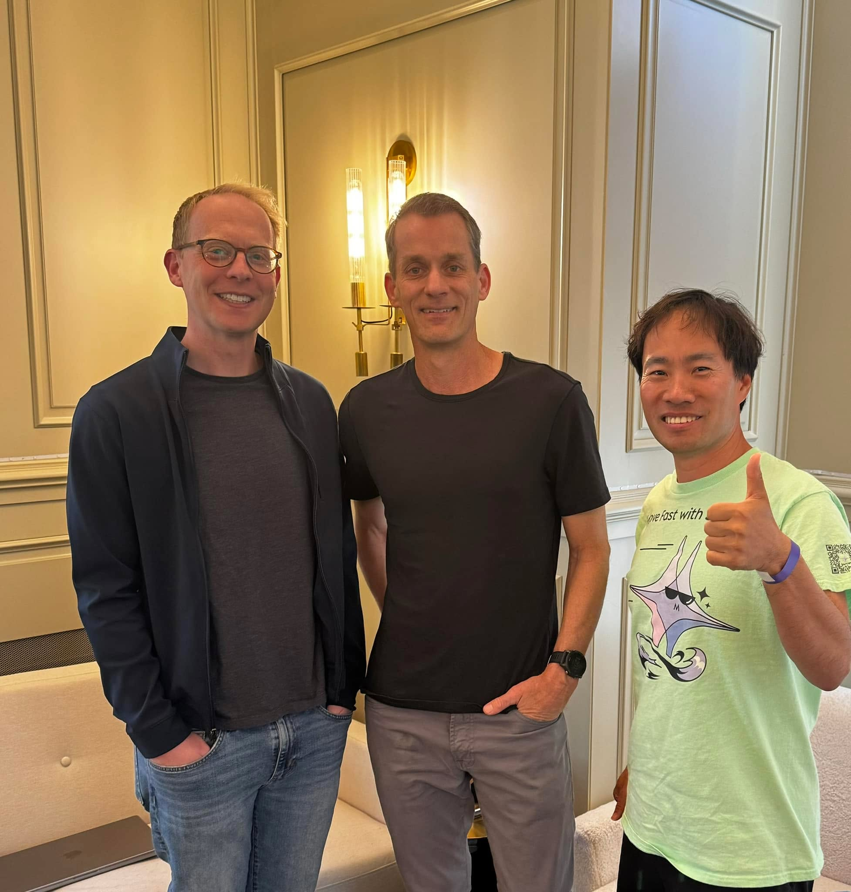
**이미지 캡션:** 세 명의 성인 남성이 실내에서 함께 서서 사진을 찍고 있다. 왼쪽 남성은 30대 후반에서 40대 초반으로 보이며, 금발 머리에 안경을 쓰고 있다. 그는 짙은 회색 티셔츠 위에 짙은 남색 재킷을 입고 청바지를 착용했으며, 두 손을 주머니에 넣고 환하게 웃고 있다. 가운데 남성은 40대 초반으로 보이며, 짧은 갈색 머리에 검은색 반팔 티셔츠와 회색 바지를 입고 있다. 그는 왼쪽 남성과 마찬가지로 환하게 웃고 있으며, 손은 바지 주머니에 넣고 있다. 오른쪽 남성은 30대 후반에서 40대 초반으로 보이며, 검은색 머리에 연한 녹색 티셔츠를 입고 있다. 티셔츠에는 "Love Fast with"라는 문구와 함께 보라색과 파란색으로 그려진 공룡 모양의 그림이 있다. 그는 엄지손가락을 치켜세우며 활짝 웃고 있으며, 왼쪽 손목에는 보라색 밴드를 착용하고 있다. 배경에는 벽에 걸린 조명과 고급스러운 벽 장식이 보이며, 소파와 노트북도 일부 보인다. 전반적으로 편안하고 긍정적인 분위기이다.

### 4월 22일 (월) 08:14 · #더행복 지난 주말에 SF에서 열린 MongoDB GenAI 주관, Up…

#더행복 지난 주말에 SF에서 열린 MongoDB GenAI 주관, Upstage 후원 해커톤에, 200명 이상 참여해 행복했습니다.

더 행복한 것은 Upstage layout analyzer, embeddings, #solarllm 포함 full stack llm을 사용한 팀이, 작품을 제출한 최종 32개 팀에서 1등을 차지 한것입니다. 참여팀은 Mistral, 라마등을 포함한 다른 llm 사용도 가능하고, 임베딩등도 다른 옵션들이 많았습니다.

멋진 결과와 데모를 만들기 위해 제일 좋은 것을 각 팀에서 골라서 하면 되는데 우승한 팀은 저희 제품을 사용한 것입니다. 

이 우승한 프로젝트는 복잡한 Nutrition 레벨을 layout analyzer 로 sturcture정보로 읽어서 임베딩을 하고 DB로 저장한다음, 필요할때 꺼내와서 질문에 답을 하거나 어떤 음식을 추천해주는 AI입니다.

Natalie Lunbeck, Sander Leung, Lucas Ho, Kevin Tran, Juliana Chyzhova, and Meera Vino 의 AI Nutrition Assistant 팀에게 큰 축하드립니다! 🎉

GenAI 해커톤 1등을 하려면 이제 Upstage full-stack llm, https://console.upstage.ai/ 을 사용하셔야 합니다. ^^

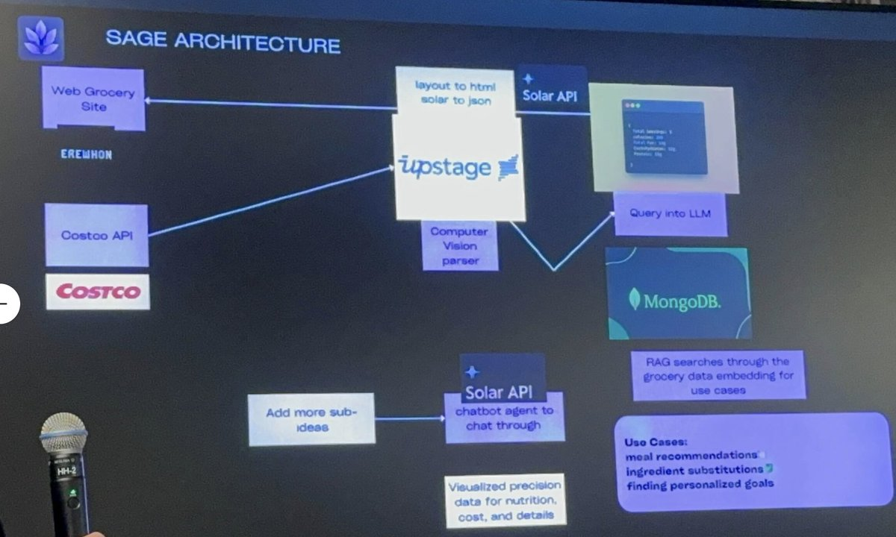
**이미지 캡션:** 이 사진은 "SAGE ARCHITECTURE"라는 제목의 프레젠테이션 슬라이드를 보여주며, 여러 구성 요소와 그 관계를 도식화한 다이어그램이다. 화면 왼쪽 하단에는 마이크가 보이며, 이는 발표 중임을 시사한다. 다이어그램은 "Web Grocery Site"와 "Costco API"를 시작점으로 하여, "upstage"라는 로고가 있는 "Solar API"와 "Computer Vision parser"를 거쳐 "Query into LLM"으로 이어지는 흐름을 나타낸다. 또한, "MongoDB"와 "RAG searches through the grocery data embedding for use cases"라는 설명과 함께 "Use Cases"로 "meal recommendations", "ingredient substitutions", "finding personalized goals"가 제시되어 있다. 전반적으로 기술 아키텍처를 설명하는 정보성 슬라이드로, 어두운 배경에 밝은 색상의 텍스트와 도형으로 구성되어 있다.

### 4월 22일 (월) 23:03 · #SBVA  이준표 대표님, 저희 Upstage 투자해주시고 많이 앞에서…

#SBVA  이준표 대표님, 저희 Upstage 투자해주시고 많이 앞에서 이끌어주셔서 정말 감사드립니다. 바쁘신 와중에도 미국까지 오셔서 격려해주시고 멋진 일들을 많이 만들어주셔서 감사드립니다. 😊

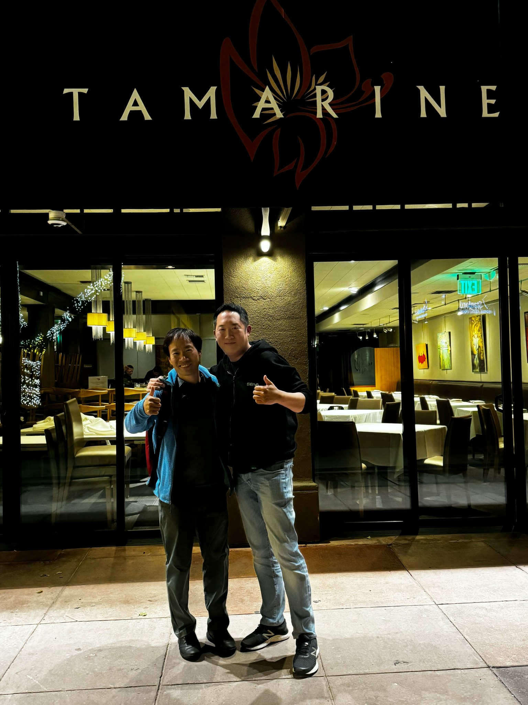
**이미지 캡션:** 밤에 타마린 레스토랑 앞에서 두 명의 성인 남성이 포즈를 취하고 있다. 왼쪽 남성은 30대 후반에서 40대 초반으로 보이며, 파란색 플리스 재킷과 회색 바지를 입고 검은색 신발을 신고 있다. 그는 카메라를 향해 미소를 지으며 엄지손가락을 치켜들고 있다. 오른쪽 남성은 30대 초반에서 30대 후반으로 보이며, 검은색 후드티와 청바지, 검은색과 흰색 운동화를 신고 있다. 그는 카메라를 향해 엄지손가락을 치켜들고 있다. 레스토랑의 검은색 외관에는 "TAMARINE"이라는 글자가 황금색으로 쓰여 있고, 그 옆에는 붉은색과 금색의 꽃 그림이 있다. 레스토랑 내부에는 테이블이 세팅되어 있고, 조명이 켜져 있다. 거리에는 보도블록이 깔려 있고, 건물 앞에는 가로등이 켜져 있다. 전반적으로 즐겁고 편안한 분위기이다.
 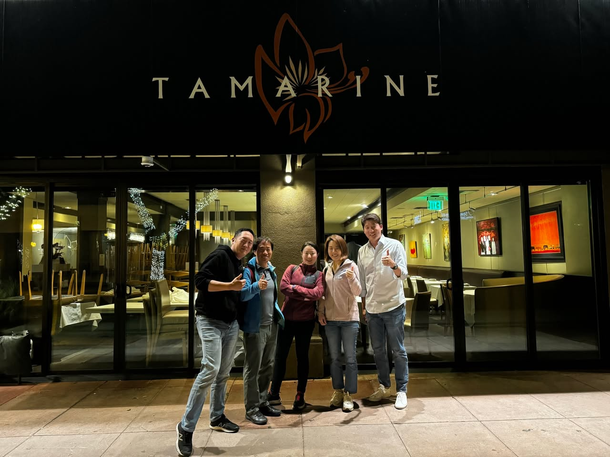
**이미지 캡션:** 밤에 타마린드 레스토랑 앞에서 네 명의 아시아인이 사진을 찍고 있다. 왼쪽에서부터 성인 남성 두 명과 성인 여성 두 명이다. 가장 왼쪽의 남성은 검은색 후드티와 청바지를 입고 있으며, 엄지손가락을 치켜들고 있다. 그 옆의 남성은 파란색 재킷과 회색 바지를 입고 있으며, 역시 엄지손가락을 치켜들고 있다. 가운데 여성은 분홍색 후드티와 청바지를 입고 있으며, 엄지손가락을 치켜들고 있다. 가장 오른쪽의 여성은 흰색 셔츠와 청바지를 입고 있으며, 엄지손가락을 치켜들고 있다. 모두 밝게 웃고 있으며, 즐거운 분위기이다. 레스토랑의 검은색 간판에는 "TAMARINE"이라고 쓰여 있고, 그 위에는 꽃 모양의 로고가 있다. 레스토랑 안에는 테이블과 의자가 보이며, 벽에는 그림들이 걸려 있다. 전체적으로 따뜻하고 환영하는 분위기이다.

### 4월 23일 (화) 08:17 · #서울대 #단기강의 서울대 컴퓨터 공학부와 업스테이지가 LLM 프로젝트 …

#서울대 #단기강의 서울대 컴퓨터 공학부와 업스테이지가 LLM 프로젝트 단기 강좌를 열고 여러분들을 초대합니다! 📚

https://bit.ly/fullstackllm

이틀 동안 서울대 이광근 교수님, 김건희 교수님, 그리고 성킴의 강의를 듣고 토요일 하루 종일 서울대 학생들과 Mix 팀으로 LLM Apps를 함께 만들어 보는 신나는 수업입니다. 

매일 식사를 제공하며 함께 즐겁게 이야기하는 네트워킹 시간이 있습니다. 강좌를 마치면 서울대 컴퓨터공학부 명의의 수료증을 드립니다. 또한, 모든 참여자에게 Upstage console 사용 500 USD 크레딧을 제공합니다. 😊

함께 멋진 LLM App과 사용 사례를 만들어 보면 좋을 것 같습니다. 🤝️ 조기 마감될 수 있으니관심 있는 분들은 선등록 후고민해주세요! 📝

멋진 식사를 위해 행사를 후원해주시는 😍 SK Networks 감사합니다.

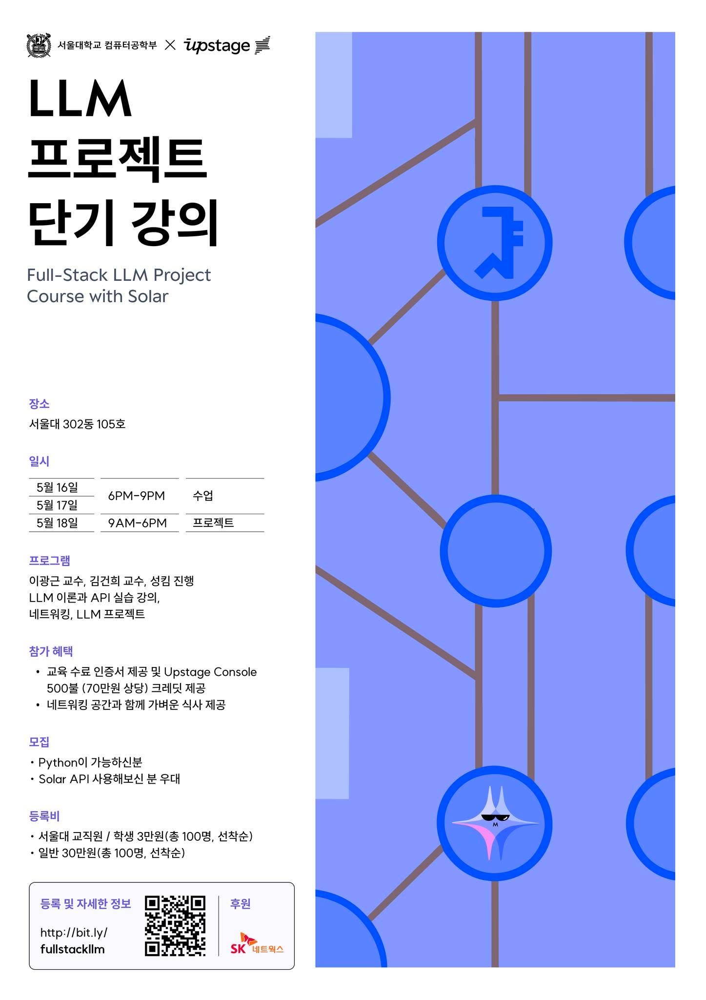
**이미지 캡션:** 이 포스터는 서울대학교 컴퓨터공학부와 업스테이지가 공동 주최하는 "LLM 프로젝트 단기 강의: Full-Stack LLM Project Course with Solar"를 홍보하고 있습니다. 강의는 서울대학교 302동 105호에서 5월 16일 오후 6시부터 9시까지 수업으로, 5월 17일과 18일 오전 9시부터 오후 6시까지 프로젝트로 진행됩니다. 프로그램은 이광근 교수, 김건희 교수, 성킴이 LLM 이론과 API 실습 강의, 네트워킹, LLM 프로젝트를 진행하며, 참가 혜택으로는 교육 수료증 제공, 업스테이지 콘솔 500불(70만원 상당) 크레딧 제공, 네트워킹 공간과 함께하는 식사가 있습니다. 모집 대상은 Python이 가능하신 분이며 Solar API 사용 경험이 있으신 분을 우대합니다. 등록비는 서울대 교직원 및 학생은 3만원, 일반은 30만원이며 각 100명 선착순입니다. 등록 및 자세한 정보는 http://bit.ly/fullstackllm에서 확인할 수 있으며, 후원사로 SK 네트웍스가 참여합니다. 배경에는 파란색과 보라색이 어우러진 추상적인 그래픽 디자인이 사용되었으며, 원형과 선으로 이루어진 네트워크 구조를 시각적으로 표현하고 있습니다.

### 4월 29일 (월) 01:37 · 어제 SF AI의 심장이라 할수 있는 AGI House SF에서 열린 B…

어제 SF AI의 심장이라 할수 있는 AGI House SF에서 열린 BioXAI Hackathon 의 최종 제출작품 발표!

Upstage #fullstackllm에 있는 이미지->html, pdf->html로 올려주는 Layout Analysis 에 감동을 받고 이를 적극 활용한 프로젝트 입니다.

이분은 Upstage 상을 받았습니다.

#solarllm을 비롯 임베딩, Layout Analysis, Groundedness Checker등 #fullstackllm 을 바로 만나보세요! https://console.upstage.ai/

🎬 동영상 1개 (생략)

### 4월 29일 (월) 03:00 · coding in SF

coding in SF

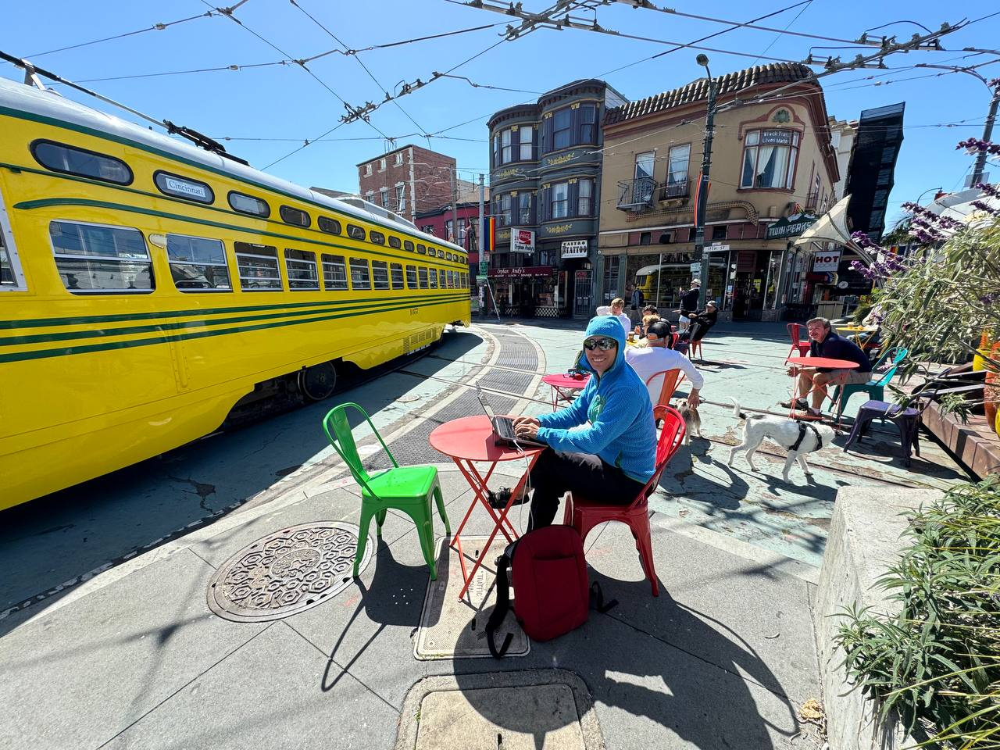
**이미지 캡션:** 밝은 노란색과 녹색 줄무늬가 있는 전차가 도로를 따라 움직이고 있으며, 그 옆에는 여러 개의 야외 테이블과 의자가 놓여 있습니다. 한 성인 여성이 파란색 후드티와 검은색 바지를 입고 빨간색 의자에 앉아 노트북을 사용하고 있으며, 그녀의 옆에는 빨간색 배낭이 놓여 있습니다. 그녀는 밝은 미소를 짓고 있으며, 그녀의 얼굴에는 선글라스가 걸려 있습니다. 다른 사람들도 테이블에 앉아 있거나 개와 함께 산책하고 있으며, 배경에는 여러 층의 건물들이 보입니다. 건물들에는 간판이 달려 있고, 일부 창문에는 무지개 깃발이 걸려 있어 이 장소가 LGBTQ+ 커뮤니티와 관련이 있음을 시사합니다. 하늘은 맑고 푸르며, 햇볕이 강하게 내리쬐고 있습니다. 전반적으로 활기차고 편안한 도시 거리 풍경입니다.
 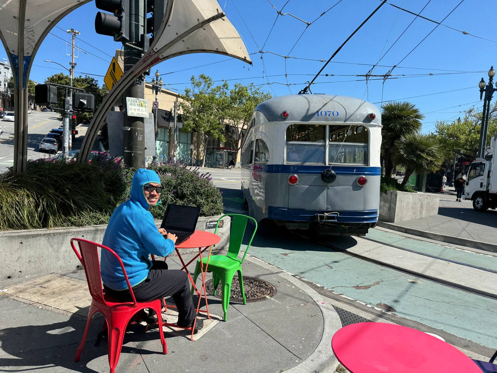
**이미지 캡션:** 밝고 화창한 날, 한 성인 남성이 파란색 후드티와 검은색 바지를 입고 빨간색 의자에 앉아 야외 테이블에서 노트북을 사용하고 있다. 그는 선글라스를 끼고 있으며, 얼굴에는 미소가 번져 있어 편안하고 여유로운 모습이다. 그의 옆에는 초록색 의자가 놓여 있고, 테이블 위에는 노트북 외에 다른 물건은 보이지 않는다. 배경에는 회색과 파란색이 섞인 오래된 듯한 트램이 선로 위를 지나고 있으며, 트램에는 '1070'이라는 숫자가 적혀 있다. 트램 뒤로는 야자수와 나무들이 보이고, 건물들도 늘어서 있다. 도로에는 차량들이 지나다니고 있으며, 신호등과 전선들이 복잡하게 얽혀 있다. 전반적으로 도시의 활기찬 거리 풍경 속에서 한가롭게 시간을 보내는 듯한 분위기이다.
 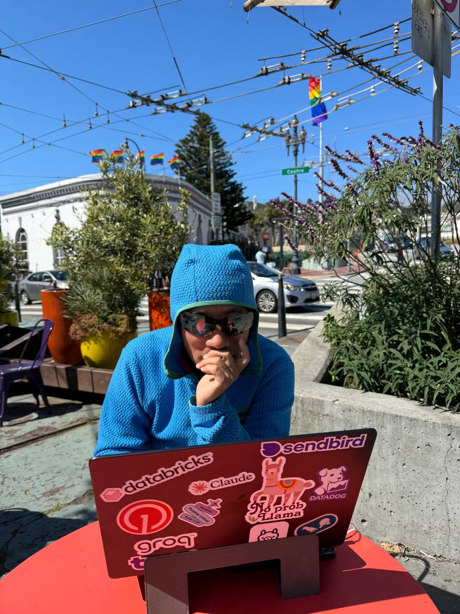
**이미지 캡션:** 푸른색 후드티를 입고 선글라스를 낀 성인 남성이 빨간색 테이블에 놓인 노트북을 바라보고 있으며, 노트북 화면에는 databricks, Claude, sendbird, groq, Datadog 등 다양한 로고 스티커가 붙어 있습니다. 남성은 오른손으로 턱을 괴고 생각에 잠긴 듯한 표정을 짓고 있으며, 배경에는 맑은 하늘과 함께 전깃줄, 나무, 건물, 그리고 무지개 깃발이 보입니다. 거리에는 차들이 지나다니고 있으며, 전체적으로 야외에서 작업하거나 휴식을 취하는 듯한 평화로운 분위기입니다.

### 4월 29일 (월) 12:37 · 📷 사진 (1장)

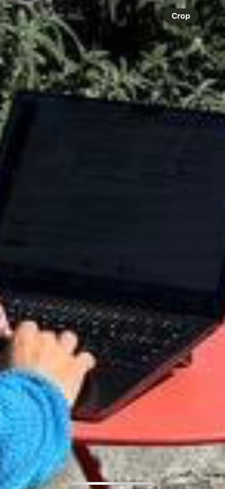
**이미지 캡션:** 한 성인 남성이 야외에서 노트북을 사용하고 있으며, 그의 손이 키보드 위에서 움직이는 모습이 보인다. 남성은 파란색 옷을 입고 있으며, 노트북은 붉은색 테이블 위에 놓여 있다. 배경에는 푸른색 식물들이 보이고, 햇빛이 비추는 듯한 밝은 분위기이다. 노트북 화면에는 텍스트가 보이지만 내용은 명확하게 식별되지 않는다.
