# 2024년 6월

[← 2024년](README.md)

### 6월 1일 (토) 13:12 · 아름다운 날, 멋진 한강길을 미끄러지듯 자전거로 달릴수 있다는 것은 축복…

아름다운 날, 멋진 한강길을 미끄러지듯 자전거로 달릴수 있다는 것은 축복입니다. 멋진 날입니다!!

Have a good day to you all!!

### 6월 2일 (일) 13:06 · Hyeshik Chang교수님은 제가 가장 존경하는 개발자중 한분으로 파…

Hyeshik Chang교수님은 제가 가장 존경하는 개발자중 한분으로 파이썬(Python)과 유닉스 운영체제 FreeBSD 등 커미터로 개발에 참여하셨고 지금도 Python을 설치하면 교수님이 만든 코드가 사용될텐데요. 

Upstage API로 이렇게 멋진 프로젝트 만들어 주셔서 감사드립니다. 저희 회사 슬랙에도 붙여 보겠습니다. 

#solarllm 관련 API로 재미있는게 정말 많을것 같습니다.

### 6월 2일 (일) 20:11 · #solarllmja  에 Solar LLM이 등록되었습니다. 일본에서도…

#solarllmja https://github.com/llm-jp/awesome-japanese-llm 에 Solar LLM이 등록되었습니다. 일본에서도 유명한 llm이 될수 있도록 나아가보겠습니다.

일본 관련 서비스 하시는 분들도 #solar-llm-ja, #solaremb 사용해 보셔요. 서비스에 도움이 됩니다!

API KEY는 바로 https://console.upstage.ai/ 에서 받으실수 있습니다!

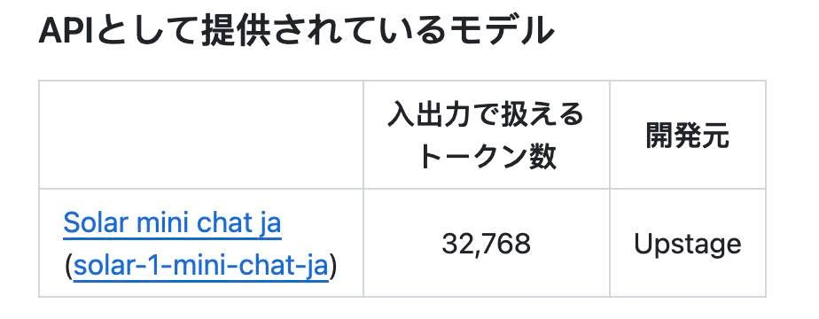

### 6월 4일 (화) 08:11 · #toyproject 여러분들의 분석파터너가 될수 있는 #solarllm…

#toyproject 여러분들의 분석파터너가 될수 있는 #solarllm 기반의 #solarproblemsolving 을 소개 합니다.

https://ps.x.upstage.ai/ 에 오셔서 여러분들이 토론하고 싶은 주제를 글로 넣으시거나 스샷이미지, PDF등을 올려주시면 https://x.com/HeyAbhishekk 이 제안해주신 20가지 분석 방법을 통해 이야기를 풀어 갑니다. Codestral을 통해 분석결과를 그림으로도 그려 보는데요. #solarllm과 #codestral 과의 조화를 이룹니다.

아래 최근 하이브와 민희진 대표님 상황에 대해 분석을 해보았습니다. 아직 llm이 우리처럼 깊은 생각을 하지는 못하지만 가볍게 읽고 또 어떤 사안에 대한 힌트얻을수 있습니다. 

뭔가 생각할 일이 있을때 https://ps.x.upstage.ai/  북마크 해두시고 입력해보시면 좋겠습니다.

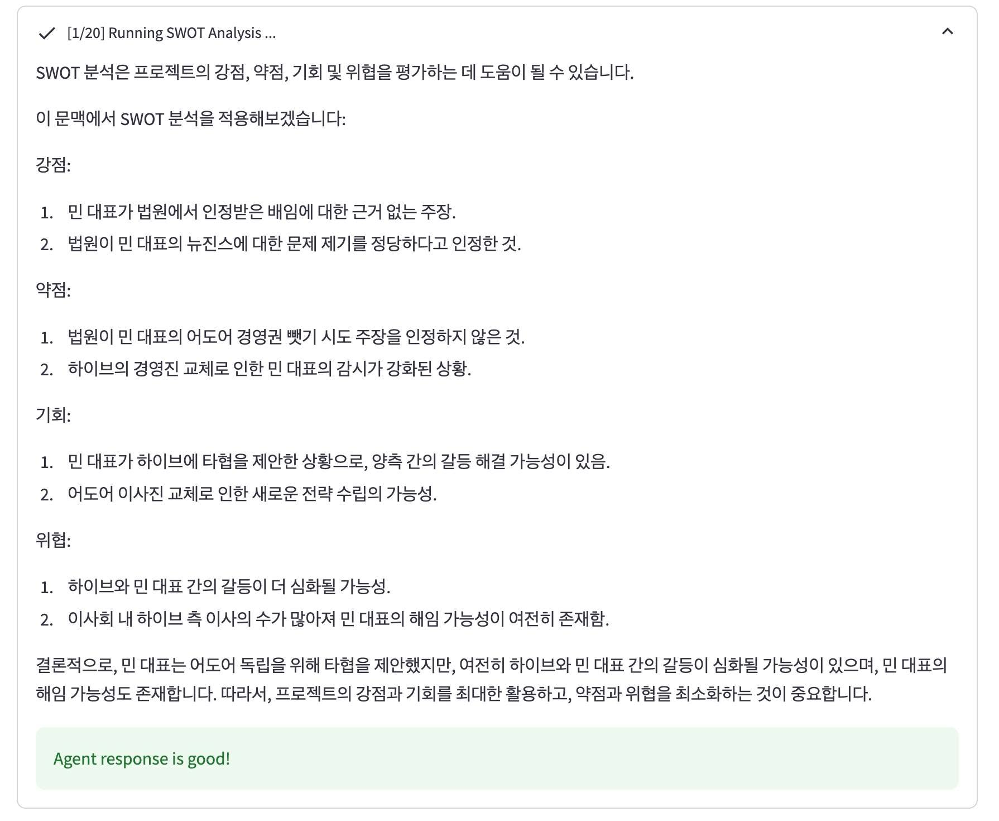 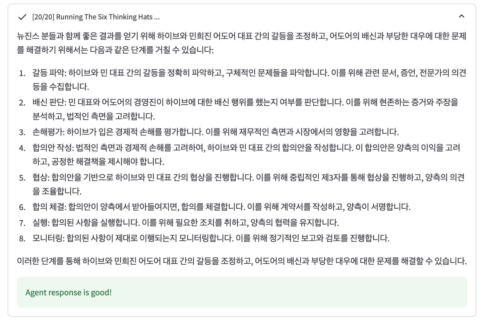 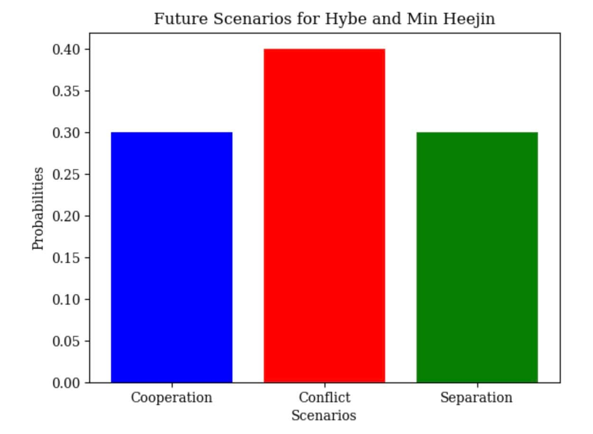

### 6월 4일 (화) 12:27 · Sung Kim shared a link.

🔗 <https://youtu.be/SDWaHCtBuTg?si=DMcARexb2Zdkjro9>

### 6월 4일 (화) 12:27 · #solarllm 강의 영상:

#solarllm 강의 영상: https://youtu.be/SDWaHCtBuTg?si=DMcARexb2Zdkjro9

설명을 쉽고 친절하게 잘 해 주십니다. 따라 하다보면 바로 RAG 챗봇이 완성되어 있습니다. 

좋아요와 구독도 많이 부탁드려요.

### 6월 5일 (수) 12:55 · 어느때보다 AI관련 잘하시는 분들이 더 많이 필요한 시기 입니다. 업스테…

어느때보다 AI관련 잘하시는 분들이 더 많이 필요한 시기 입니다. 업스테이지가 직접 만들고, 직접 강의 하는 Upstage AI Lab 수강생을 모집합니다.

이 교육의 특징은 실무 중심으로 현업에 필요한 부분에 집중하는 실습 위주의 교육입니다.

주위 AI 실무 중심으로 깊게 들어가고 싶은 분들에게 많은 공유 부탁드립니다.

#선지원후고민!

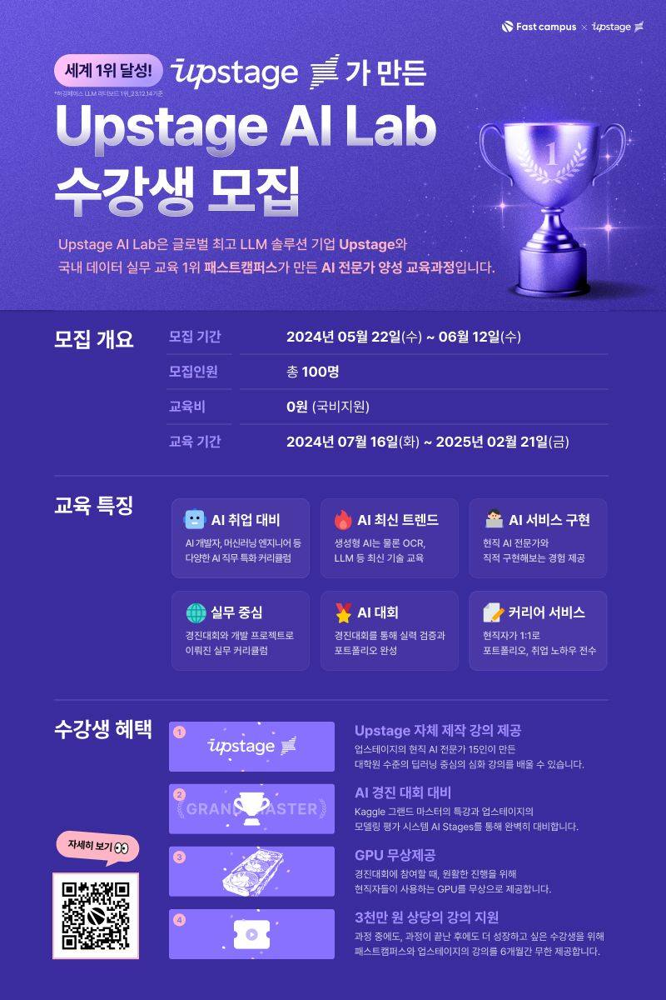

### 6월 6일 (목) 13:58 · #교보문고 #e5 #e6 오순영 Jung-Woo Ha 박태웅 David …

#교보문고 #e5 #e6 오순영 Jung-Woo Ha 박태웅 David Kim Douglas Guen 베스트셀러 작가들의 좋은 책이 많네요.

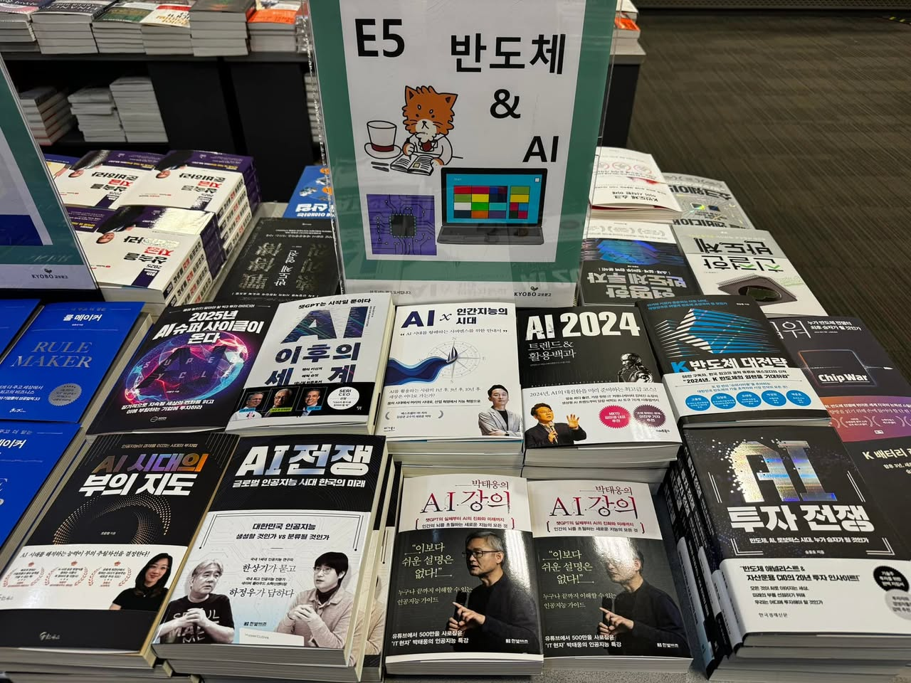 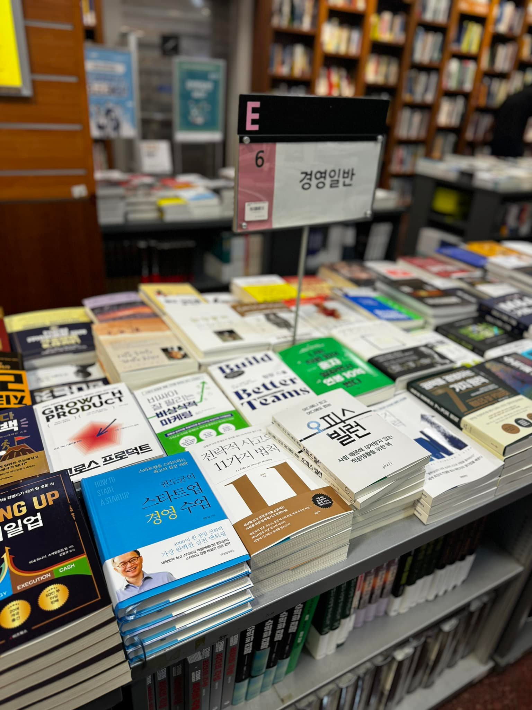

### 6월 7일 (금) 07:27 · 국가 번호 82가 암시하듯, 프라이머사제 Kiha Lee, Greg Kw…

국가 번호 82가 암시하듯, 프라이머사제 Kiha Lee, Greg Kwangrog Kim, 김희지님, 이랜디님이 만든 82 실리콘밸리 한국 스타터업 모임에서 5번째 아이디어 톤을 엽니다.

https://82startups.com/archives/6957

이번은 특히 Upstage 가 함께 합니다. 여러분들이 가지고 있는 아이디어가 Layout Analyzer, Embeddings, #solarrllm 등 LLM fullstack 등을 통해 구현될수 있도록 기술과 credit을 지원합니다.

미국 창업및 진출을 계획하고 계신다면 이번 IDEATHON을 통해 + 팀빌딩 + 상금을 받고 이후 투자로 이어질수 있는 좋은 기회가 될것입니다.

선지원, 후고민! LLM fullstack 을 살펴보시려면 cookbook 참고 해주세요. https://github.com/UpstageAI/cookbook

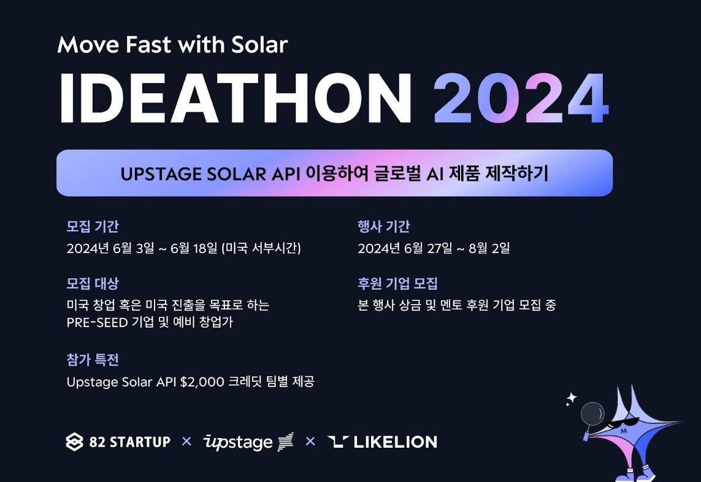

### 6월 7일 (금) 08:53 · #intelup Upstage 와 Intel 이 함께 코어 Ultra 프…

#intelup Upstage 와 Intel 이 함께 코어 Ultra 프로세서에 #solarllm 을 최적화 하였습니다. 이를 활용한 첫 데모인 온디바이스 WriteUp이 지난주 열린 타이베이 ‘컴퓨텍스(COMPUTEX) 2024’와 서울 ‘인텔 AI 서밋’에서 각각 소개되었습니다. (가장 인기가 많은 부스중 하나였습니다.)

WriteUp을 시작으로 SearchUp, FormUp, AutoUp등 "AI PC"시대를 인텔과 여러 파트너사와 함께 열어가겠습니다.

"작지만 강하다", #solarllm, 작은 것이 자랑이 되었습니다!

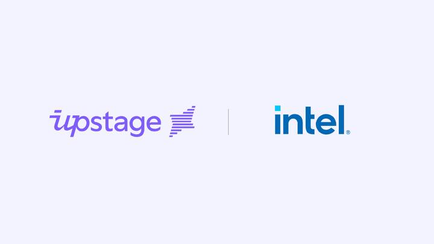 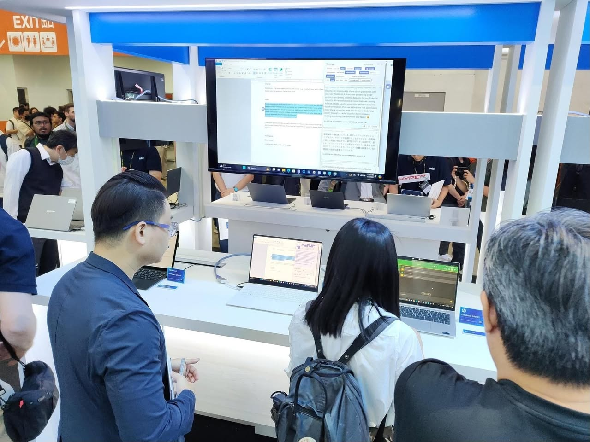 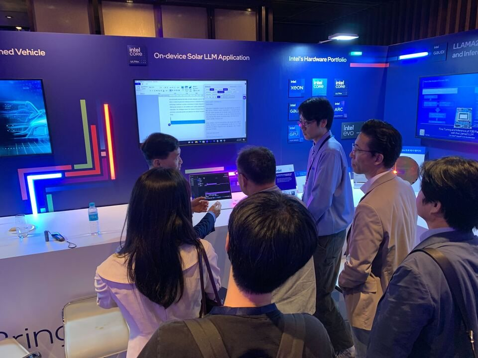

### 6월 8일 (토) 13:58 · 여러분들 chart 그리시나요? 말로 차트를 그릴수 있는 #solarch…

여러분들 chart 그리시나요? 말로 차트를 그릴수 있는 #solarchart 서비스를 소개 합니다.  

https://solar-chart.streamlit.app/ 

#solarllm 과 #quickchart 활용하여 자연어로 그래프를 설명하고 숫자를 넣어주시거나, 테이블이 들어 있는 이미지 부분을 올려주시면 (2번째 이미지 참고), 값들을 읽어서 멋진 chart를 만들어 줍니다. 그려진 차트가 생성되지 않거나 마음에 들지 않으면 여러번 생성하시면 됩니다.

Chart 필요하신 분들 사용해 보셔요!

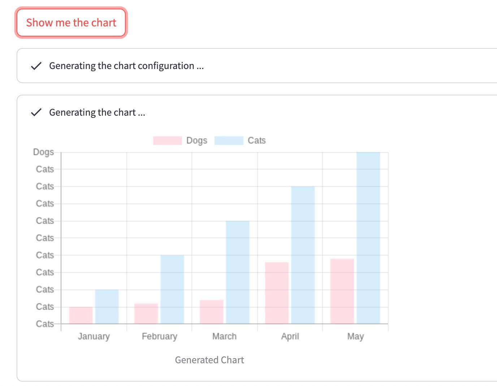 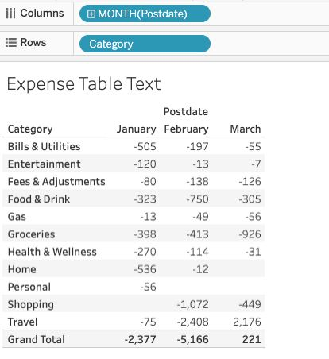 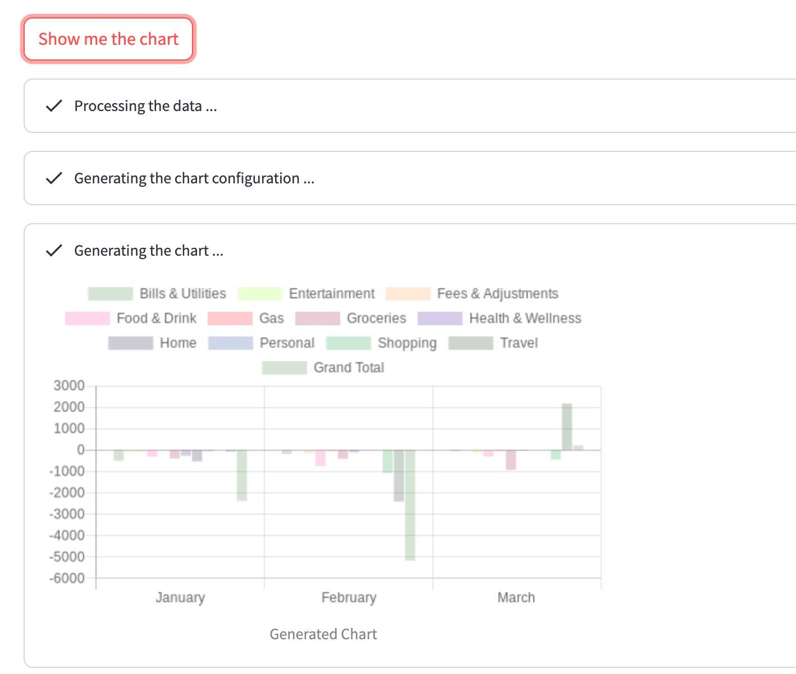

### 6월 8일 (토) 14:31 · 📷 사진 (1장)

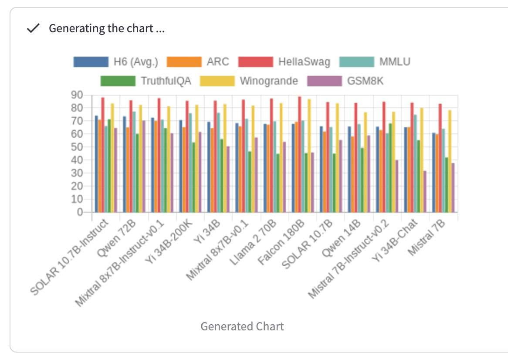

### 6월 8일 (토) 15:17 · 지난달 조기마감과 성황리에 진행되었던 #snullm 단기 수업에 이어 7…

지난달 조기마감과 성황리에 진행되었던 #snullm 단기 수업에 이어 7월 KAIST에서 #kaistllm 단기수업이 열립니다. KAIST 전산학부 (Sukyoung Ryu 학부장님)와 Upstage가 함께 준비하는 이번 #kaistllm 에서는 7/4(목)-5(금) 수업을 듣고, 넷트워킹을 하고, 프로젝트 팀구성 (학생x일반 믹스팀) 거쳐 7/6일 하루종일 신나는 llm 프로젝트를 진행합니다.

수업을 통해 AI/LLM 분야 세계적인 Alice Oh 교수님의 강의를 들을수 있고, 이어서 제가 #solarllm과 #langchain 그리고 관련 usecase를 소개합니다.

* 안내: bit.ly/kaistllm
* 등록: bit.ly/kaistreg

KAIST 학생 80명 (등록비 3만원), 일반인 80명 (등록비 30만원) 선착순 등록입니다. (학생은 이미 마감.) 참여하시는 일반인들은 KAIST학생들과 mix팀으로 함께 즐겁게 프로젝트를 할수 있습니다. 멋진 행사를 위해 오라클에서 매일 식사를 제공합니다. 참여하시는 모든 참여자에게 Upstage Console 사용 500 USD 크레딧을 제공합니다.

조기 마감될수 있으니 선지원, 후고민! 오시는 분들 대전에서 반갑게 뵙겠습니다.

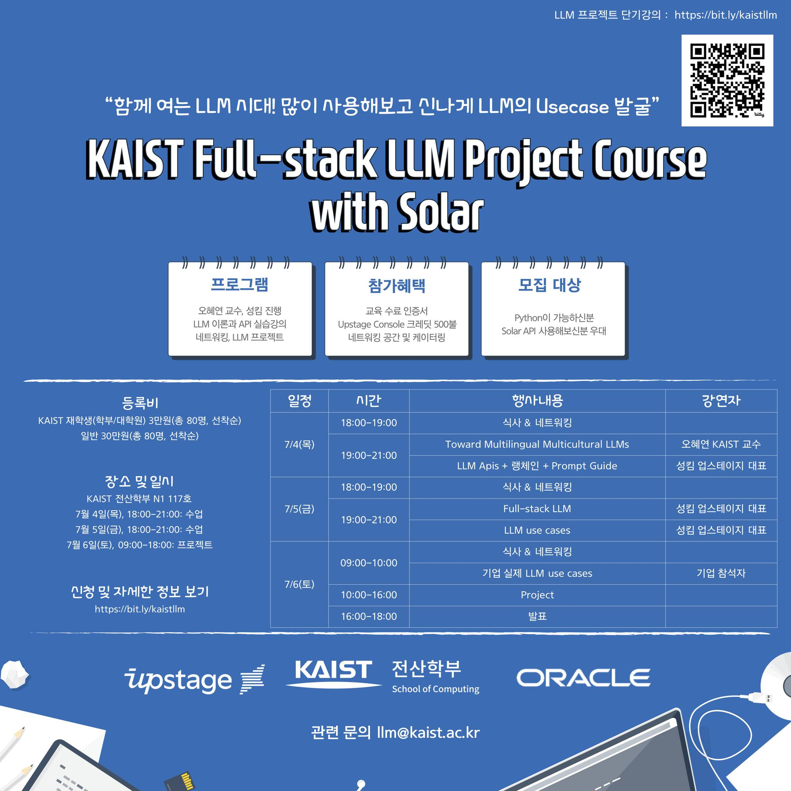

### 6월 9일 (일) 21:02 · #춘천200 반가운 친구 Seokjoo Han, 좋은 날씨, #닭갈비 맛…

#춘천200 반가운 친구 Seokjoo Han, 좋은 날씨, #닭갈비 맛집, 멋진길 왕복 자전거로 원없이 달릴수 있는 이 모든 것은 축복입니다.

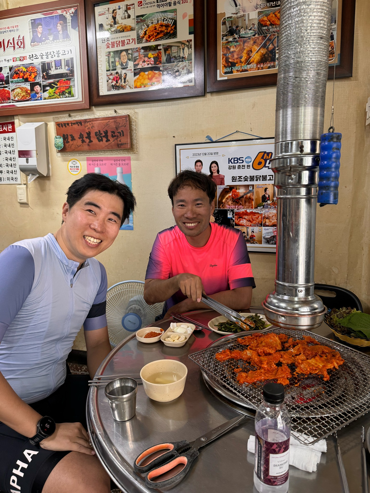 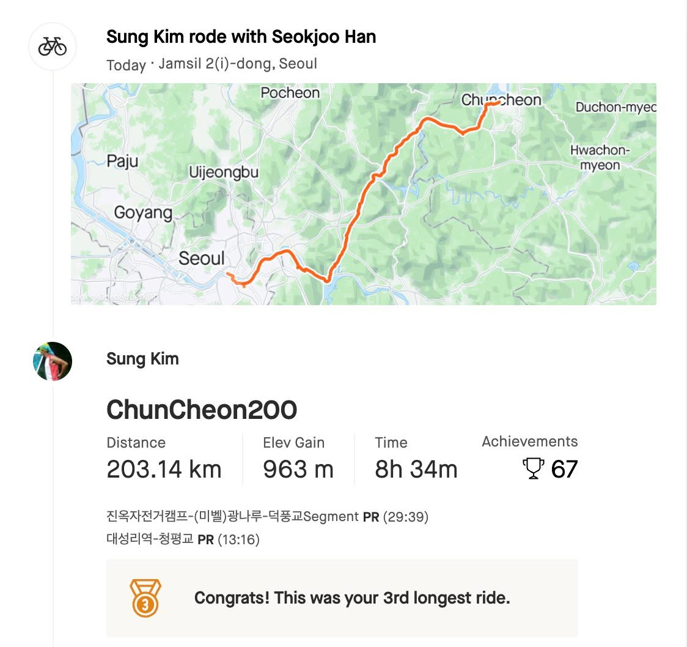

🎬 동영상 1개 (생략)

### 6월 11일 (화) 07:31 · #appleai #chatgp

#appleai #chatgp 

오늘 #wwdc24 AI관련 재미있는거 7가지! (아래 그림순)

1. iPhone + ChatGPT 아직 어디까지 integration 되는지는 모르겠지만 대략 
* Siri에서 ChatGPT에 바로 접속하여 질문을 하고
* 문서에 대한 질문을 하며
* ChatGPT와 사진을 공유하고
* ChatGPT와 함께 문서 내에서 이미지와 텍스트를 생성

2. 자연스러워진 AI-powered Siri
• 더 자연스럽고 더 잘 이해
• (아마 GPT추가로) . 더깊은 이해 

3. 자동완성
• 폼 입력시 문서 정보가 있으면 자동으로 입력
• 인증할때 본인 전화 번호/생일 입력하라는게 많은데 이것이라도 자동입력되면 좋겠습니다. 

4. AI Agent 101: 간단한 엡과 action간의 연결
• 너의 초록색 자켓을 입은 사진을 찾아 편집해줘
• 이 문서를 요약해서 동료에게 이메일로 보내줘

5.  이모지 자동생성
• 이건 라인 스티커 자동생성등 이미 있는데 얼마나 이쁘게 만들지가 관건

6. 통화 녹취
• 많은 분들이 기다렸던것 같은데요. 
• 통화를 녹취하고 요약하고 이걸 이메일 등으로 공유가능 

(여기까지 https://x.com/heykahn/status/1800257807905931294 중 중요한것 요약)

7. One more thing? 여러분들이 감동있게 본것은 어떤것인가요?

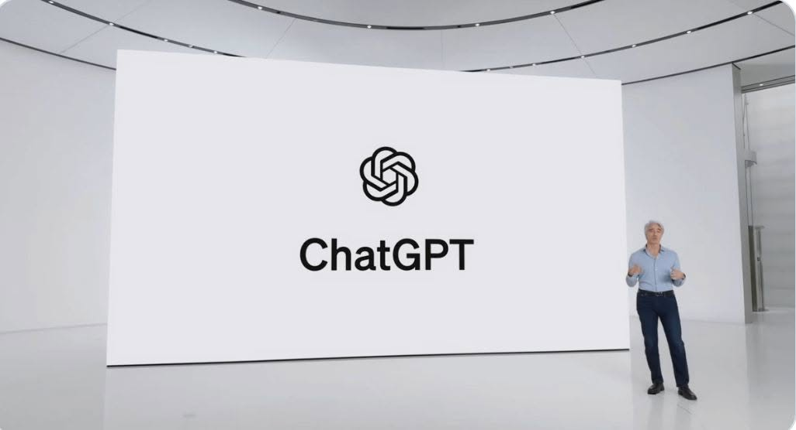  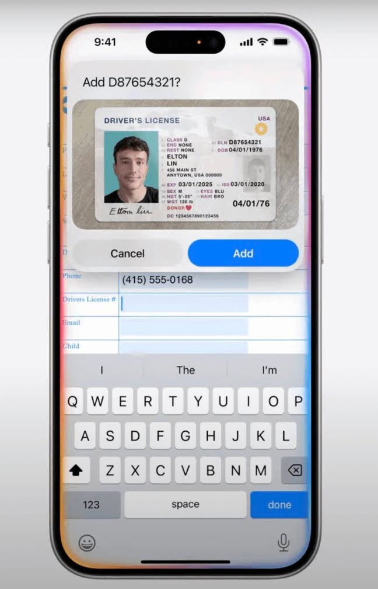 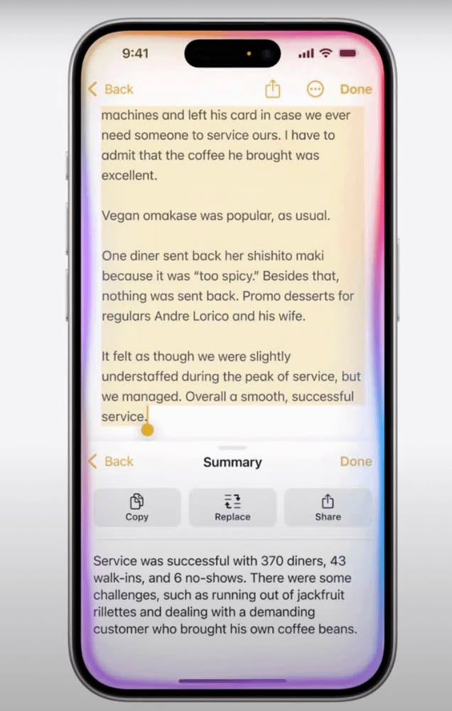 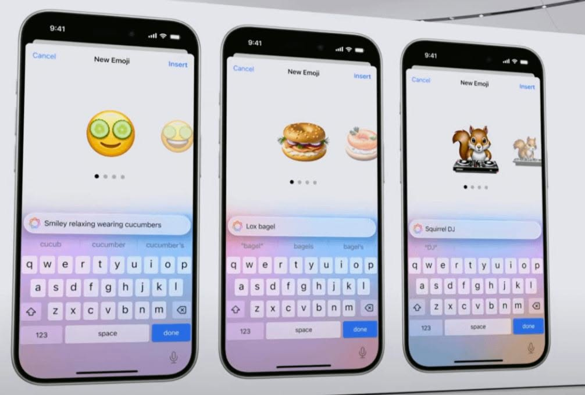 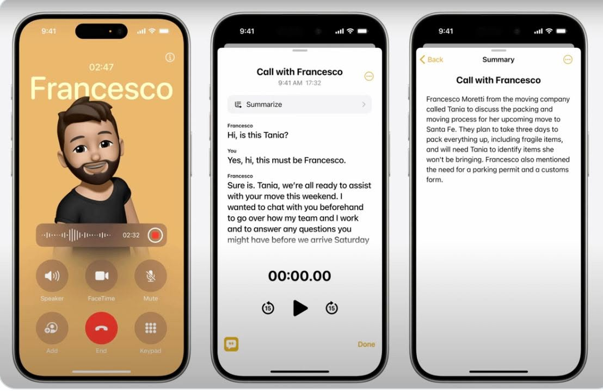

### 6월 13일 (목) 11:31 · #hkust #교수모집 #연구원모집 #0619 홍콩과기대 광저우에서 함께…

#hkust #교수모집 #연구원모집 #0619 홍콩과기대 광저우에서 함께 연구할 교수직과 연구원들을 모집합니다. 특히 총장님과 학장님이 한국으로 직접오셔서 후보자들을 만납니다.

관심있으신 분들은 globalaffairs@hkust-gz.edu.cn 로 이력서 보내 주시면 안내 드리겠습니다. 참여하시는 분들은 저녁 만찬을 제공합니다. 

관심있으신 분들은 오셔서 함께 총장님, 학장님, 교수진들과 이야기 나누어 보세요.

(지원자격: HKUST(GZ)에서 연구 또는 교수직을 수행하고자 하는 박사 또는 박사 후 경험을 가진 모든 지원자를 환영합니다. 업무 언어로 영어에 능통해야 합니다.)

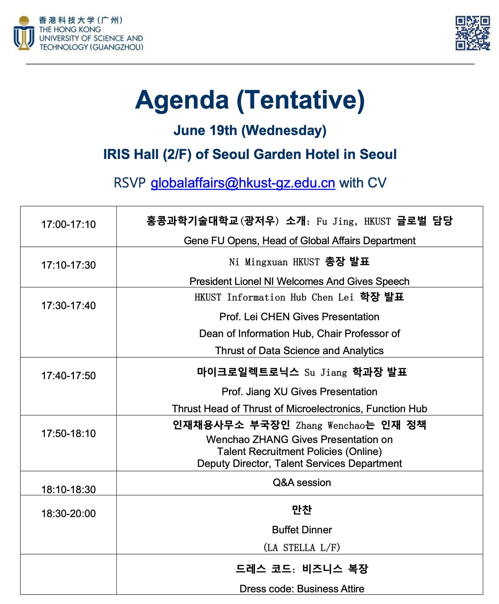

### 6월 13일 (목) 16:50 · 가장 많이 사용하시는 고성능 Vector Search 엔진인 Qdrant…

가장 많이 사용하시는 고성능 Vector Search 엔진인 Qdrant 에 Upstage #solaremb 가 탑제 되었습니다. 몇줄의 코드로 편안하게 Vector Search및 RAG를 즐길수 있습니다!

Qdrant에서 저희 emb사용해보시고 좋다고 바로 붙여 주셨습니다. 사용해보시면 아주 좋습니다!

https://qdrant.tech/documentation/embeddings/upstage/

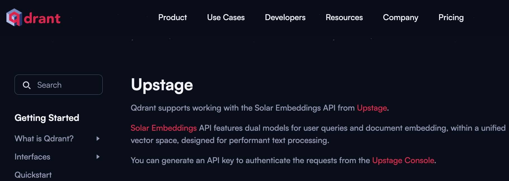 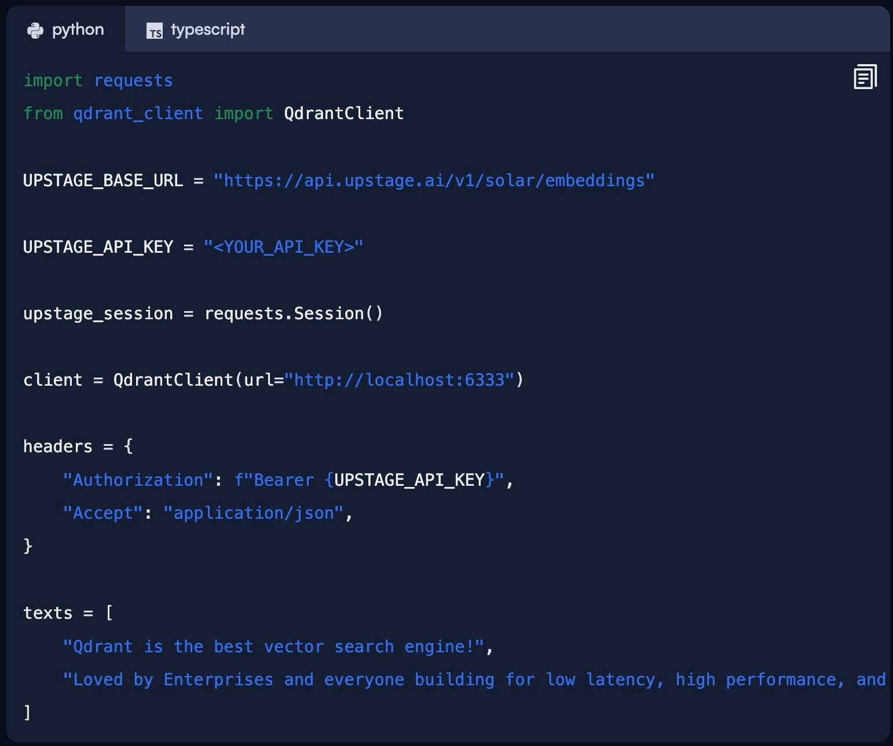

### 6월 13일 (목) 22:20 · Sung Kim shared a link.

🔗 <https://python.langchain.com/v0.2/docs/integrations/providers/upstage/>

### 6월 14일 (금) 05:23 · Sung Kim shared a link.

🔗 <https://translate.upstage.ai/>

### 6월 14일 (금) 06:26 · #aihacknight #0624 #SF RAG다음을 고민하는 RAG++…

#aihacknight #0624 #SF RAG다음을 고민하는 RAG++ 주제로 Upstage, DataStax, LangChain, Microsoft, NVIDIA and Unstructured 함께 해커톤 합니다. 

https://lu.ma/vpdj2zoj?utm_source=upstage 
6월 24일 4:30분 @San Francisco 주위에 계신분들 오시면 반갑게 뵙겠습니다. 벌써 319명이나 신청주셨네요!

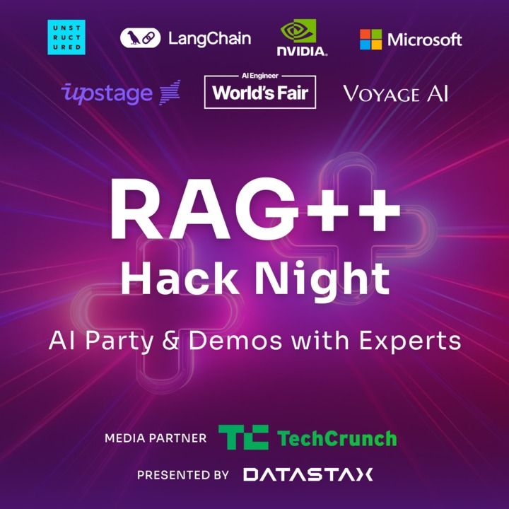

### 6월 17일 (월) 11:44 · #0621 #kaist #fullstackllm KAIST 학생들과 함께…

#0621 #kaist #fullstackllm KAIST 학생들과 함께 LLM 프로젝트를 진행할수 있는 단기 코스에 어려분을 초대 합니다. (학생들은 모두 정원 초과 마감), 일반은 6/21 까지 접수를 받고 있습니다. 

단기 강좌에서
1. Full-stack llm
2. Llm 파인튜닝 
을 다루며 무엇보다
3. KAIST 학생들과 mix 팀으로 하루종일 프로젝트를 진행할수 있습니다.

함께 멋진 프로젝트 만들어 봐요! (등록 링크는 댓들에 있습니다.)

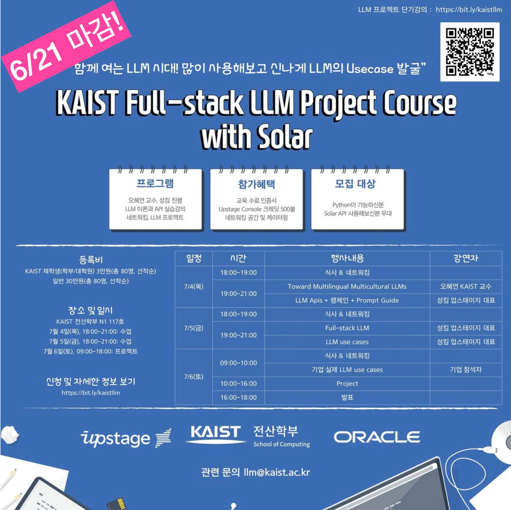

### 6월 17일 (월) 11:45 · Sung Kim shared a link.

🔗 <http://bit.ly/kaistllm>

### 6월 18일 (화) 08:26 · #무조건파인튜닝 #파인튜닝킹 #맞다이로들어와 #headtoheadcomp…

#무조건파인튜닝 #파인튜닝킹 #맞다이로들어와 #headtoheadcomparison  (작은사이즈) LLM은 여러분들의 task에 파인튜닝을 하면 그 task에 대해 10~20% 성능이 오를뿐만 아니라 task에 따라 gpt4를 뛰어 넘을수 있습니다.

그래서 무조건 파인튜닝 하시면 좋은데요. 그럼 많은 모델중 어떤것을 베이스 로 파인튜닝을 하는 것이 좋을까요? 최신 solar-mini (20240612버전)가 작은 사이즈에서는 파인튜닝이 가장 잘 먹는 모델이라는 결과가 나왔습니다. 즉 파인튜닝 할경우 여러분들의 말을 잘 듣습니다.

최근 미국의 파인튜닝 최고 업체인 Predibase가 내부 31가지 테스크 데이터를 가지고 실험을 했습니다. 유명한 Mistral, Llama3, Phi3등 최신 모델을 같은 데이터, 같은 조건으로 파인튜닝 했습니다. 그런다음 각 모델의 응답을 맞다이 비교했는데요. 여기서 Solar 모델이 평가한 모든 다른 모델들을 압도적인 차이로 이겼습니다. gpt3과 gpt4 베이스 모델들 보다 압도적인 성능이 나옵니다.

저희도 놀랐고, 이 평가를 진행한 PrediBase도 놀랐습니다. 아마도 저희가 사용한 DUS방식, 그리고 이를 통해 mix된 weight들의 조합이 파인튜닝을 잘 받아 주는 모델을 만들낸것 같습니다. 

이제 파인튜닝 베이스는 무조건 solar-mini 입니다. PrediBase는 solar-mini (20240612 private 버전) 파인튜닝 기능을 제공합니다. 

첫 가입시 25USD의 크래딧도 제공하니 오늘 Solar 파인튜닝 해보셔요!

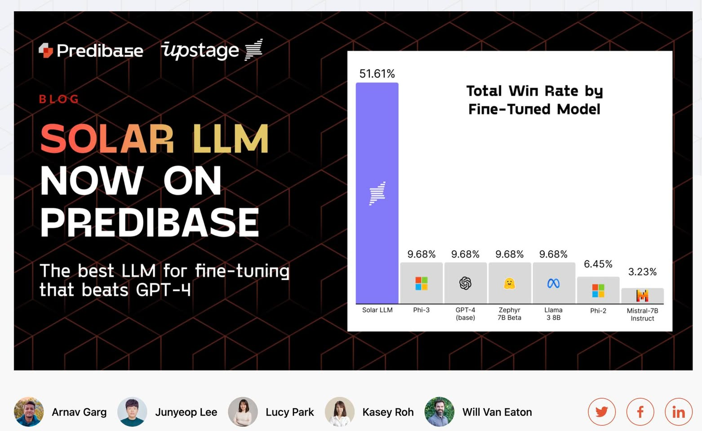 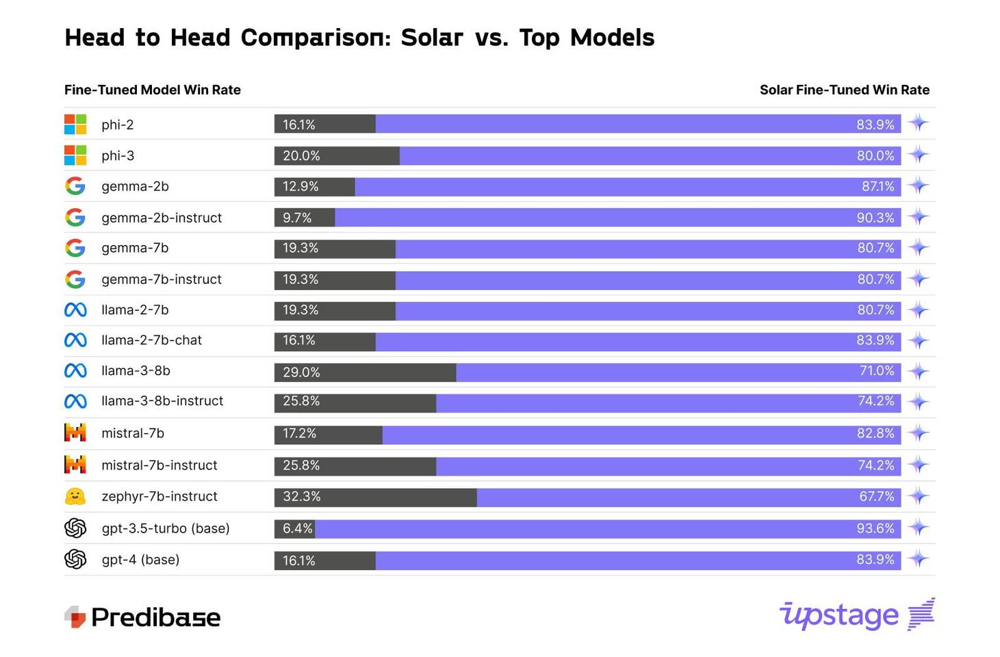

### 6월 18일 (화) 08:26 · Sung Kim shared a link.

🔗 <https://predibase.com/blog/solar-llm-on-predibase-the-best-llm-for-fine-tuning?utm_medium=partner&utm_source=upstage>

### 6월 19일 (수) 13:27 · 제가 좋아 하고 존경하는 Richard Socher 님이 한국에 오십니다…

제가 좋아 하고 존경하는 Richard Socher 님이 한국에 오십니다. 
Socher는 ImageNet 과 word2vector 모델인 GloVe로 유명한 세계적인 AI 연구자이자 최근 YOU.COM을 창업하여 이끌고 있습니다.

최근 LLM의 가장 좋은 usecase중 하나인 검색과 종합 research 모드등에 대해 소개하며, 저도 함께하여 #solarllm에 대해 이야기 합니다.

행사는 무료로 진행되며, 아래 링크에서 선착순으로 등록이 가능합니다. 장소 관계로 인해 조기 마감될 수 있으니 빠른 신청 부탁드립니다. 

오시는 분들 반갑게 뵙겠습니다.

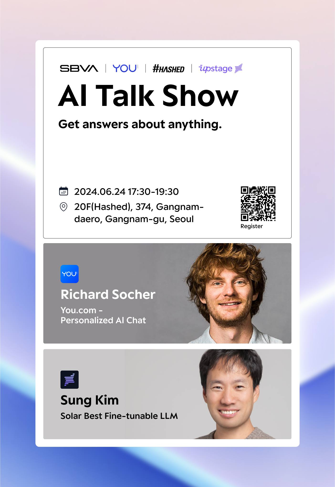

### 6월 19일 (수) 13:29 · Sung Kim shared a link.

🔗 <https://www.upstage.ai/ai-talk-show-2024>

### 6월 19일 (수) 15:21 · 📷 사진 (1장)

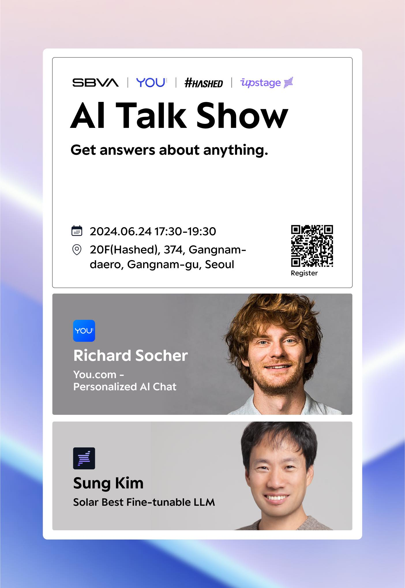

> AIG-KR 맴버 여러분! 제가 좋아 하고 존경하는 Richard Socher 님이 한국에 오십니다.   Socher는 ImageNet 과 word2vector 모델인 GloVe로 유명한 세계적인 AI 연구자이자 최근 YOU.COM을 창업하여 이끌고 있습니다.  최근 LLM의 가장 좋은 usecase중 하나인 검색과 종합 research 모드등에 대해 소개하며, 저도 함께하여 #solarllm에 대해 이야기 합니다.  행사는 무료로 진행되며, 아래 링크에서 선착순으로 등록이 가능합니다. 장소 관계로 인해 조기 마감될 수 있으니 빠른 신청 부탁드립니다.   https://www.upstage.ai/ai-talk-show-2024  오시는 분들 반갑게 뵙겠습니다.

### 6월 21일 (금) 09:09 · Sung Kim shared a link.

🔗 <https://predibase.com/blog/solar-llm-on-predibase-the-best-llm-for-fine-tuning?utm_medium=partner&utm_source=upstage>

### 6월 21일 (금) 09:53 · 존경하는 한컴 김연수 대표님 뵙고 AI에 대한 비전에 대해 듣고 배워서 …

존경하는 한컴 김연수 대표님 뵙고 AI에 대한 비전에 대해 듣고 배워서 너무 좋았습니다. 

“한컴AI의 목적지는 지능형 업무 자동화(Intelligent Automation)” 라는 큰 비전에 저희 Upstage 함께 할수 있어 너무 기쁩니다.

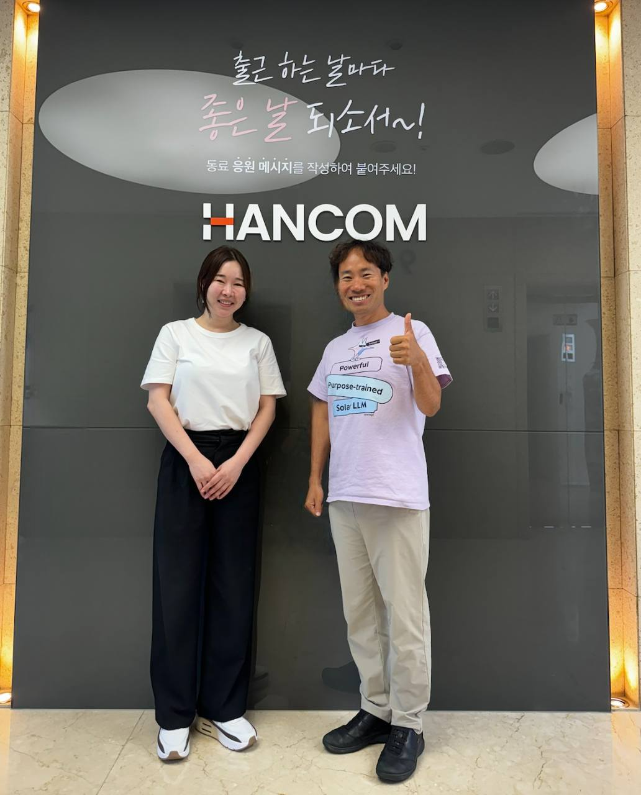

### 6월 21일 (금) 14:45 · 반가운 로고들이 많네요. NAVER & Upstage!  #KServe …

반가운 로고들이 많네요. NAVER & Upstage!  #KServe 사용하신다면 참고 하세요.

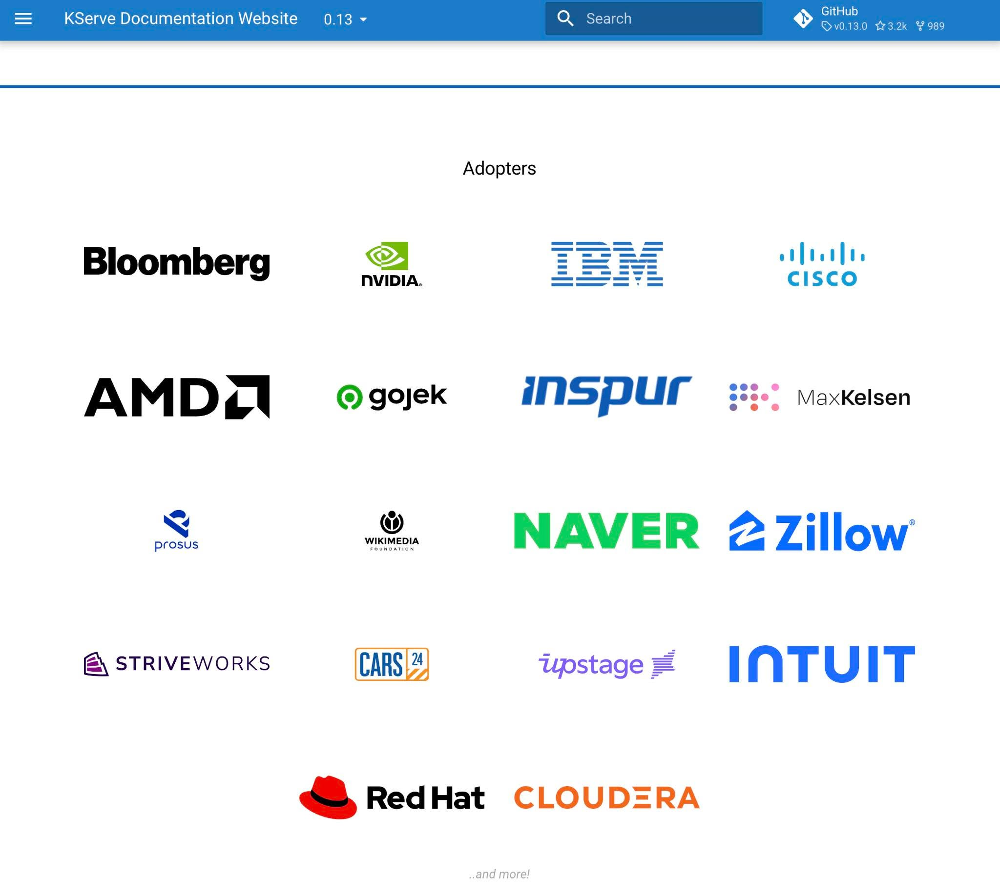

### 6월 21일 (금) 14:46 · Sung Kim shared a link.

🔗 <https://kserve.github.io/website/latest/>

### 6월 22일 (토) 06:10 · #고객만족 저희가 만든 제품을 사용해보시고 "제일 좋다"고 할때, 저희는…

#고객만족 저희가 만든 제품을 사용해보시고 "제일 좋다"고 할때, 저희는 가장 행복합니다. 최근 출시한 저희 임베딩 모델을 직접 사용해보시고 제일 좋다고 표까지 만들어 올려주셨습니다.

"This model appears to have *very strong* performance for legal domain tasks involving contract text." 

RAG, 의미 검색을 하신다면 Upstage 임베딩 꼭 사용해보셔요!

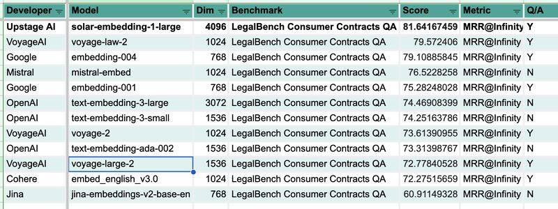

### 6월 22일 (토) 06:11 · Sung Kim shared a link.

🔗 <https://www.linkedin.com/posts/hunkimup_openai-activity-7209998085953916928-OAK4>

### 6월 22일 (토) 06:19 · 📷 사진 (1장)

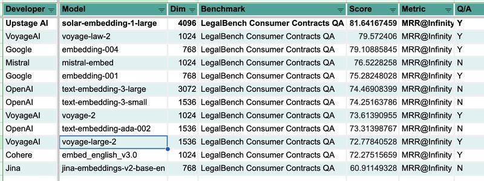

> RAG나 의미기반의 검색관련 일을 하신다면 Upstage 임베딩을 사용해보세요.   최근 출시한 저희 임베딩 모델을 직접 사용해보시고, 제일 좋다고 표까지 만들어 올려주셨습니다.  "This model appears to have *very strong* performance for legal domain tasks involving contract text."  영어도 좋지만 한국어, 일본어에서는 더 잘됩니다.

### 6월 22일 (토) 06:20 · Sung Kim shared a link.

🔗 <https://www.linkedin.com/posts/hunkimup_openai-activity-7209998085953916928-OAK4>

### 6월 23일 (일) 17:29 · Cree Choi, Wooguen Jeong님등 MS친구, 쿠팡친구, 이…

Cree Choi, Wooguen Jeong님등 MS친구, 쿠팡친구, 이런 멋진 분들과 올라가는 산은 더 멋집니다.

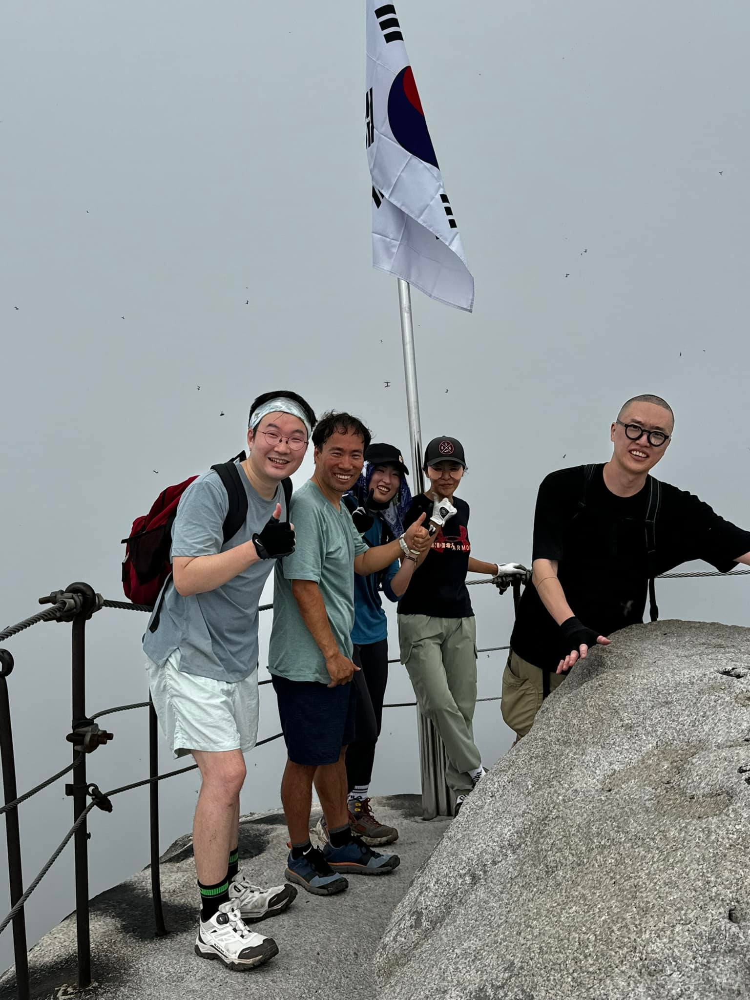 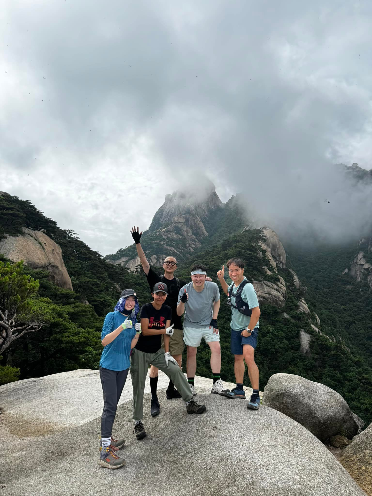

### 6월 24일 (월) 06:58 · Sung Kim shared a link.

🔗 <https://youtu.be/fsSjhyrzb_A?si=vz7hFlarYjDhZ1ts>

### 6월 25일 (화) 09:14 · 어제 Richard Socher님을 모시고 SBVA 이준표 대표님 리딩,…

어제 Richard Socher님을 모시고 SBVA 이준표 대표님 리딩, 신디의 fun 패널로 진행된 AI Talk Show 정말 즐거웠습니다. 저도 옆에서 이야기 들으면서 정말 즐거웠습니다. 무엇보다 통역없이 영어로만 진행된 행사에 엄청난 열기와 반응으로 이야기 하면서 더 신났습니다. 

30분의 짧은 시간이라 다 다루지는 못했지만 60개가 넘는 질문이 들어왔고, 깊은 생각이 필요한 좋은 질문들도 많아 아래 붙여 드립니다.

(국내외 좋은 분들 더 모셔서 1:1 AI Talk Show 진행한다면 어떤 분들을 모시면 좋을까요? 뵙고 싶은분 있으면 댓글로 남겨 주세요. 섭외 들어가 보겠습니다.)
---

(#solarllm이 정리한 질문요약 한문단) 참가자들은 Upstage/YOU 성능, 정확성, 사용성 등을 다른 인기 있는 AI 도인 ChatGPT와 비교하고 대조하는 데 관심이 많았습니다. 또한 Upstage가 멀티모달리티를 준비하고 있는지, LLM이 인간의 두 번째 뇌로 작용할 수 있는지, GPT-Vision과 같은 기능이 추가될 것인지 등에 대한 질문을 했습니다.
또한 참가자들은 Upstage/YOU의 구조, 사용자 데이터를 활용한 개인화, 데이터셋 품질 측정, 합성 데이터 사용 등에 대해 알고 싶어했습니다. AI 트렌드에서 가장 큰 영향을 미칠 산업, LLM을 사용한 스타트업이 기술 개발과 수익화를 어떻게 균형 잡을 수 있는지, 검색 아키텍처를 더 확장 가능하게 만드는 방법 등에 대한 질문도 많이 받았습니다. CEO의 가장 어려운 부분은 무엇인지, AI 분야에서 어떤 유형의 스타트업이나 기업이 가장 큰 잠재력을 가지고 있는지, 아시아에서 어떤 산업에 AI를 적용할 수 있는지 등에 대한 질문도 있었습니다. 마지막으로, 참가자들은 다른 AI 스타트업과 구별되는 Upstage/YOU의 경쟁 우위, 운영 및 유지 관리 비용, AI/NLP 및 멀티모달 LLM 분야에서 향후 5년 동안 가장 중요한 도전 과제가 무엇인지에 대해서도 알고 싶어했습니다.

Which industry do you think will have the biggest impact on the current AI trends?

How can you.com be better than perplexity?

What is the main challenge to be “personalized” LLM?

How do you measure dataset quality? If any, what drives you to choose synthetic data in training?

As a CEO of a relatively early stage AI startup, how do balance developing technology vs monetization?

What architecture has helped you search better? If you have found one, how can you make it more scalable? What would scalable mean for a search engine?

What is the most difficult part of running a company?

Features like GPT-Vision, which can handle multimodality, are enhancing the usability of LLMs. I am curious if Upstage is also preparing for this.

Can AI(or LLM) be the second brain for human being? Like.. can AI help developmental disability people to being the people without disability?

Why do you think there are more users on chatgpt even if the search tech eval is better for you.com?

How much data would be needed in order to continuously fine tune?

allowing llm to run code can improve the perform. But it could lead to security vulnerabilities. Can you provide advice on how to prevent these vulnerabilities?

In the GenAI era, would only few companies survive?

What could be the future of education? Do you think AI search engine could replace teachers in the future?

How do you see SBVA's value as an investor?

If an llm-based agent performs the search action instead, it would be better from a human perspective to use a different term. any terms that come to mind?

How is you.com more accurate than chatgpt? Later will chatgpt catch up because they are better capitalized?

I just got interested in llmops. What efforts should be made to create a competitive LLM within the company?

What areas or applications are leading AI researchers focused on? health? Finance? Search?

How to measure conciseness in the graph you showed? What are possible reasons for you.com below GPT4 for this component? Is this related to latency?

As a consumer, I'm concerned about the article that says the AI search uses more computing energy than the classic search. Is there a good way to use it?

Do you think the GraphRag is the key to semantic search?

To make robots smart, what kind of data should be collected? Can we collect them?

Are you developing your own LLM model?

What do you think is the biggest hurdle in creating a Korean-English translator for use in hospitals?

I think clinical abbreviations are the biggest hurdle. What should I consider when training a model to interpret them?

How do you think the future ui/ux of “search” would change? With on device models and vision pro, how would multimodality change the action of searching?

Human voice will be the next input method instead of keyboard or touch. Do you have any thoughts on using voice directly instead of text for llm learning?

If making a service with llm like gpt or sonarAi using the api key, how can one different the service ?? So, Can using Ai be an differentiation??

For an AI-search to generate the better answer, I think the server should do comparably more works than traditional searches. Does it cause performance issue?

socher, so future of ai/nlp is on science, then what approach is the key for future among searching or training? who wins? you.com? or openai or others?

When will a new model surpass the transformer architecture in LLMs? Can this model replace transformers for both research and practical use?

At You.com, do you use different tokenizers and embedding models for different languages of user questions, or do you translate to English first? pros and cons?

What efforts did you put into building and maintaining ml system in production level? (gpu infra, inference, etc.) Do you use cloud or private gpus?

For the long time, your work has been declined in the conference. I guess that it was hard time to get through it. How you get strong belief of your work?

Recently llm, nlp seems to be saturated (or at least more competitive) in the past few years. What do you look for when hiring people?

What types of Korean or Asian startups or enterprises are you interested in coop now or in near future?

What is the moat of you.com?

It's great that You.com outperforms Perplexity in every evaluable aspect. How does the operating cost of You.com compare to that of Perplexity?

What should NLP researchers focus on? How do you find really important questions? Many say that raising benchmark score may not be too important these days🥲

what area in AI can Korean companies excel in globally?

Can we teach curiosity and passion to AI?

Are you planning to create tool aware model?

Many companies have recently been releasing open-source models. What are some ways Upstage can differentiate itself?

While you.com and upstage are both tech startups, what are your visions towards responsible ai? Does it affect how the product is made?

How do you discern whether the source is relevant to the question of a user?

What are some of future crazy ideas that Richard mentioned in the beginning? that no one may think its possible now but in future, that would be the standard?

To Richard, What is your controversial idea about the future of NLP? I’m thinking I should maybe work on that

I saw GPT-4o also can search on the internet (Bing). What makes difference in accuracy btw you.com and chatGPT-4? (e.g. private web search engine)

If the question is in Korean, would LLM prefer to think in English or Korean? 🤔

Can you each share a couple of examples of use cases where companies are using your genAI solution to create tangible impact that would make a CFO smile?

Current answer generating algorithm is 50 percentage for real conversation between human and AI. What will be proper algorithm for question generating by AI.

What will productivity engine evolved from search engine in terms of our job or mental health? Hope or dystopia?

Do you think large scale dataset is the path to AGI, or would there be any model-level innovation required?

Is it better to use a single large model, or is it preferable to use a combination of multiple models? If the latter, on what criteria do you divide the model?

Recently Apple has developed their on-device LLM to evolve Siri into an AI secretary. What are your thoughts about highly efficient on-device fine-tuned sLLM?

What might be more helpful for AI to imitate human brain's thinking, training, cot, rag, or else?

can you.com also surpass other LLM apps in expertise knowledge (drug, medical treatments)

As AI makes people more productive, humans will have more spare time. What do you think about the importance of fitness? And AI + Fitness?

do you use different tokenizers and embedding models for different languages of user questions, or do you translate to English first? pros and cons?

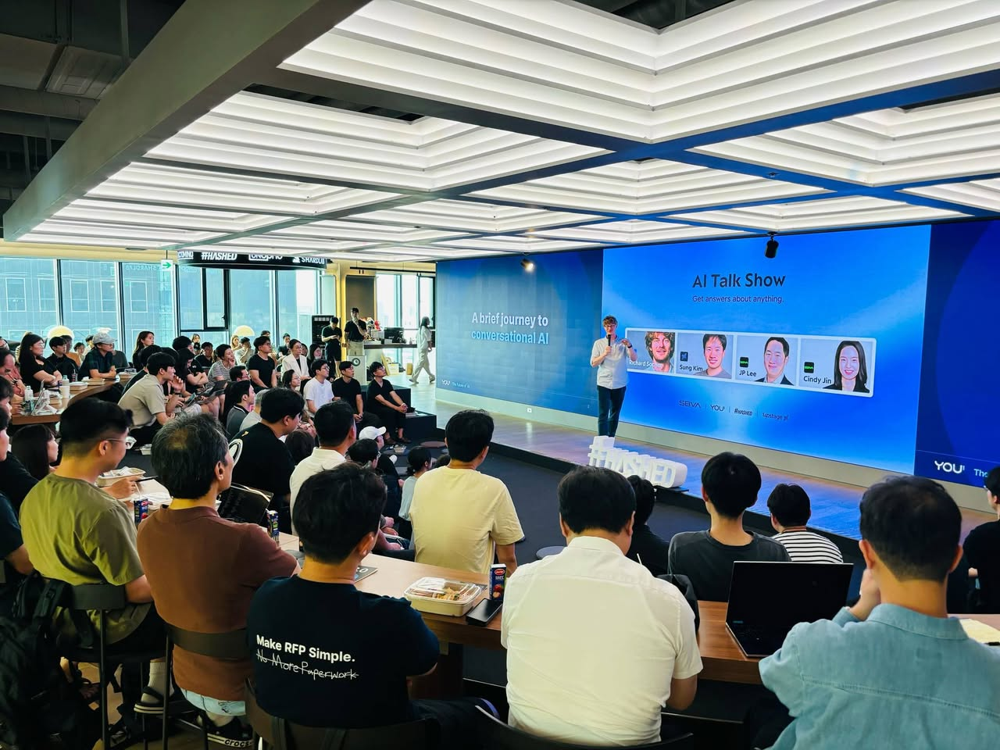 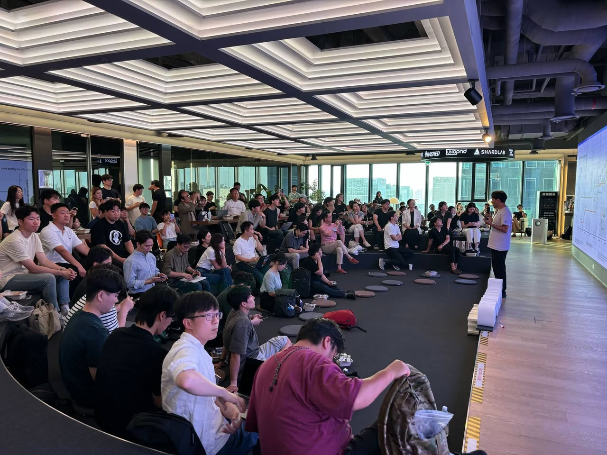 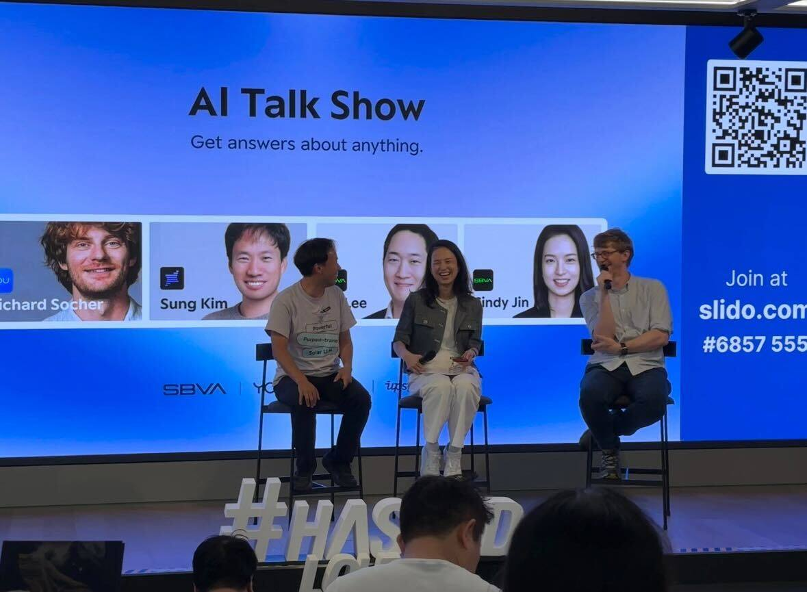 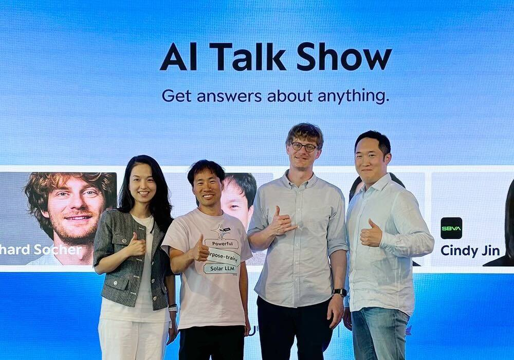

### 6월 25일 (화) 10:52 · 파인튜닝을 할 때 가장 좋은 모델인 #solarllm 을 소개하고, 파인…

파인튜닝을 할 때 가장 좋은 모델인 #solarllm 을 소개하고, 파인튜닝하는 방법과 다양한 활용 사례를 설명하는 웨비나를 개최합니다. Rish (Predibase CEO)님과 Upstage 미국팀이 총 출동하여, 파인튜닝에 대한 궁금증을 해결해 드립니다.

선지원, 후고민! 😊

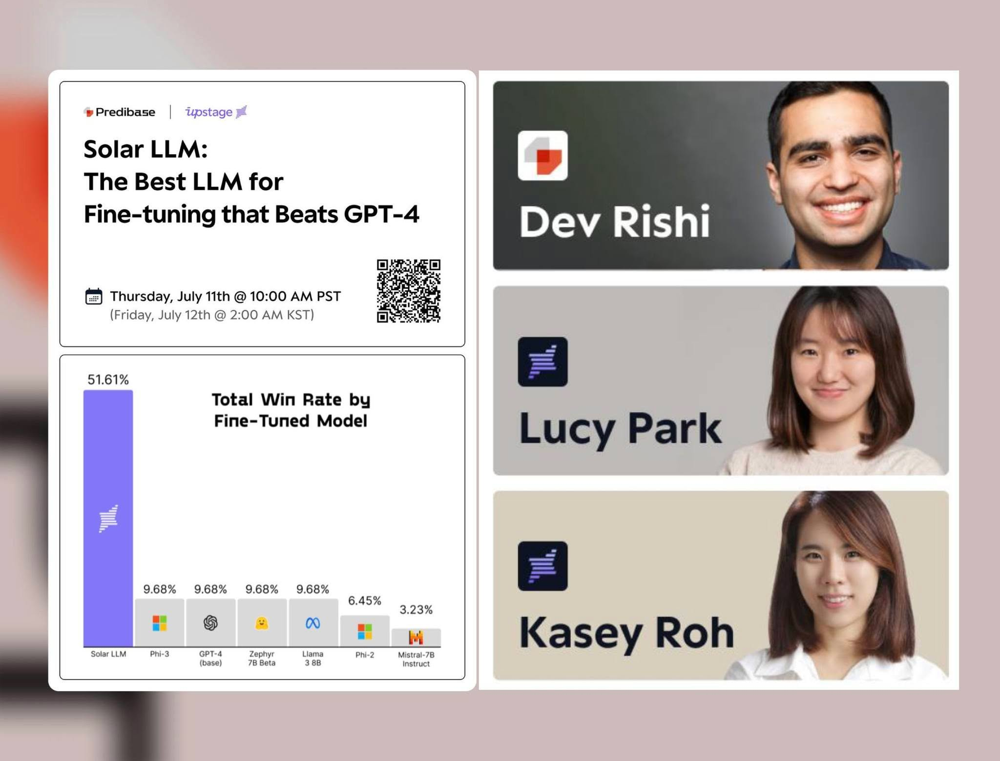

### 6월 25일 (화) 10:52 · Sung Kim shared a link.

🔗 <https://go.upstage.ai/fb_solar_llm_predibase_webinar>

### 6월 25일 (화) 17:51 · Sung Kim shared a link.

🔗 <https://youtu.be/i7rMUVYyVog?si=n4jV-PvkIZO5Y2tN&t=199>

### 6월 25일 (화) 17:51 · 저는 저의 커리어 절반이상을 교육자로 일했는데요. 그중 가장 아끼는 프로…

저는 저의 커리어 절반이상을 교육자로 일했는데요. 그중 가장 아끼는 프로그램중 하나가 바로 네이버 부스트캠프 AI Tech 입니다.

왜 제가 부스트캠프 AI Tech 을 제일 좋아 하는지 2가지 이유가 아래 영상에 있습니다.

https://youtu.be/i7rMUVYyVog?si=n4jV-PvkIZO5Y2tN&t=199

보시고 2024년 마지막 모집 기회! 지금 바로 7기 지원하기, 선지원 후고민! 
▶️ https://bit.ly/boostcamp_ait7_regi

### 6월 26일 (수) 06:36 · 오는 7월 30일 Andrew Ng 교수님을 모시고 아래와 같이 Kiha…

오는 7월 30일 Andrew Ng 교수님을 모시고 아래와 같이 Kiha Lee 대표님의 Primer Sazze Partners A.I. day를 합니다. 

저도 개인적으로 딥러닝 시절부터 Andrew Ng 교수님 수업에서 많이 배웠습니다. 매번 강연을 통해 큰 인사이트를 주십니다. 예를 들어 보자면 모델 구조 개발에 집중할때, data-driven AI 라는 개념을 만드셨습니다. 지금 데이터는 AI에서 가장 중요한 요소입니다. 또한 최근에는 LLM을 사용하는 새로운 방법인 Agentic workflow 개념도 만드셨는데 상당히 재미있는 개념입니다.
 
이렇게 멋진 교수님과 함께 행사를 할수 있어서 너무 기쁩니다. 선지원 후고민!

 📅 일시: 2024년 7월 30일 오후 2-5시 (VIP dinner from 5시 30분)
 📍 장소: 삼성역 구글 스타트업 캠퍼스 
🎤 Keynote Speakers: Prof. Andrew Ng (AI Fund), Sung Kim (Upstage)
👥 대상: 인원 제한으로 기업, CVC, LP등 출자가능한 기관중 선별적으로 모실수 있는 점 양해부탁드립니다.

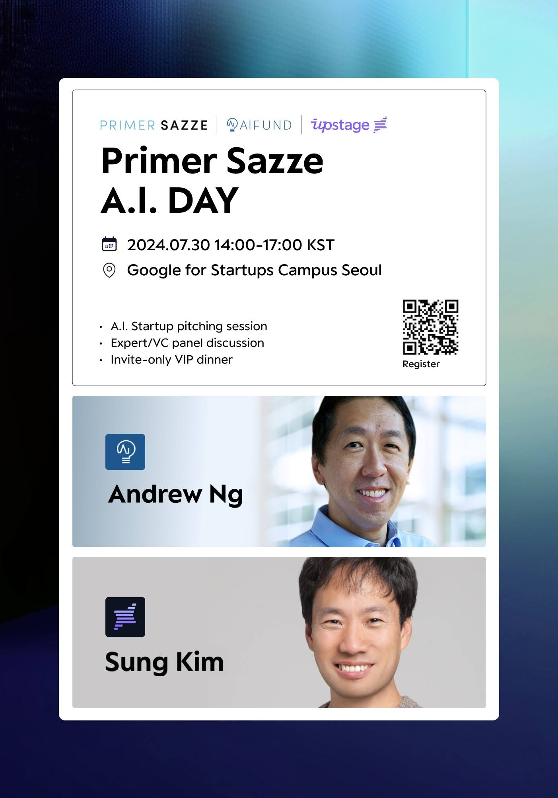

### 6월 26일 (수) 06:37 · Sung Kim shared a link.

🔗 <https://docs.google.com/forms/d/e/1FAIpQLSdtFOtseGfdbuRfOWoU_XPAa-yHxPItJRa3-YR3W7i6yCK1pg/viewform>

### 6월 26일 (수) 09:11 · LLM의 답변을 한번더 확인해서 정확하게 말하게 해주는 #solarllm…

LLM의 답변을 한번더 확인해서 정확하게 말하게 해주는 #solarllm Groundedness 에 대한 설명입니다. 정말 멋진 설명으로 듣기만 해도 기분좋아지는 강의 입니다. 

선시청, 후고민 https://www.youtube.com/watch?v=ObJJIcWnmA0

### 6월 27일 (목) 10:34 · #solarllm #aws Upstage - Amazon Web Serv…

#solarllm #aws Upstage - Amazon Web Services 전략적 협력 계약을 체결하고 최고 수준의 AWS ISV 파트너가 되었습니다! #solarllm의 판매와 사용은 이제 AWS 제품과 동일한 수준으로 인식됩니다. 😃 이를 통해 AWS와 국내외 AI 시장을 공동으로 개척할 예정입니다! 🚀 아주 기쁜 날입니다! 🎉

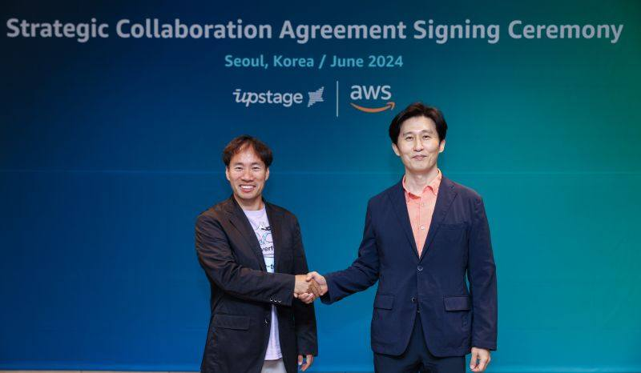

### 6월 28일 (금) 12:56 · Palo Alto 의 The Cube에 Upstage 미국팀 사업총괄님이…

Palo Alto 의 The Cube에 Upstage 미국팀 사업총괄님이 출연해서 #solarllm 소개 했습니다. 

(솔라요약) ---
00:06 Kasey Roh, Upstage의 미국 사업부 책임자는 AWS DC Summit에서 주요 이야기에 대해 논의합니다.

00:32 DC Summit의 주요 초점은 생성형 AI와 공공 부문에서의 보안 및 데이터 개인 정보 보호 영향입니다.

01:13 Upstage는 고객의 온프레미스 또는 프라이빗 클라우드 환경에 개인적으로 배포할 수 있는 작은 언어 모델을 제공하며, 데이터 보안 및 개인 정보 보호에 최적화되어 있습니다.

02:35 기초 모델과 대형 언어 모델이 논의되고 있으며, 애플리케이션에 통합하기 위한 작은 모델에 초점을 맞추고 있습니다.

03:04 작은 언어 모델의 중요성이 설명되며, 비용 효율성과 데이터 개인 정보 보호 이점이 강조됩니다.

05:31 Upstage와 AWS의 관계가 논의되며, AWS Marketplace, SageMaker 및 최근 전략적 파트너십 발표가 포함됩니다.

08:03 AI 공간에서 기업가들을 위한 현재 스타트업 환경이 분석되며, 애플리케이션 계층과 모델 성능의 융합에 초점을 맞추고 있습니다.

10:09 훈련에서 추론 및 강화 학습으로의 전환이 논의되며, 환각 및 데이터 추론에 대한 중요성이 강조됩니다.

12:03 DC Summit에서 AI 대화의 진행 상황이 공유되며, 공공 부문에서의 AI의 잠재력을 이해하고 우려를 해소하는 것이 강조됩니다.

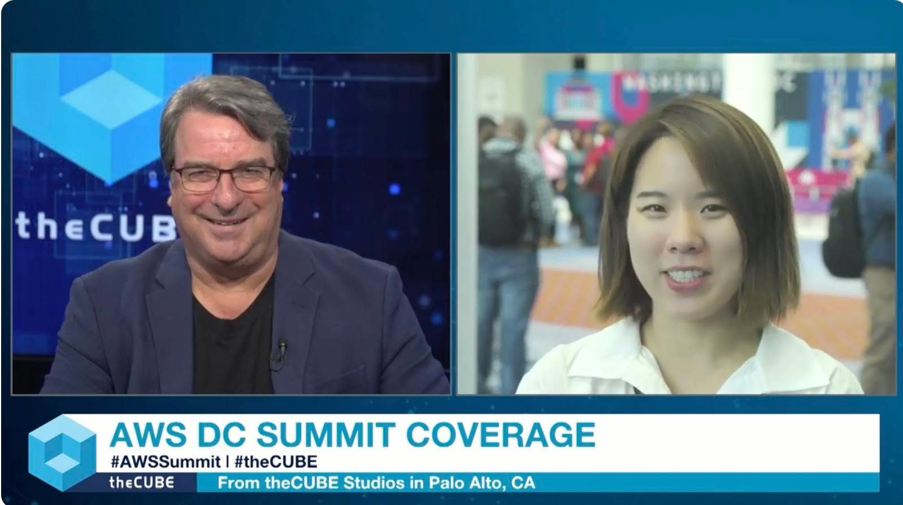

### 6월 28일 (금) 12:57 · Sung Kim shared a link.

🔗 <https://youtu.be/FYDi_6ONUAc?si=u0zdA4BXrT1EHLkZ>

### 6월 29일 (토) 20:20 · 📷 사진 (3장)

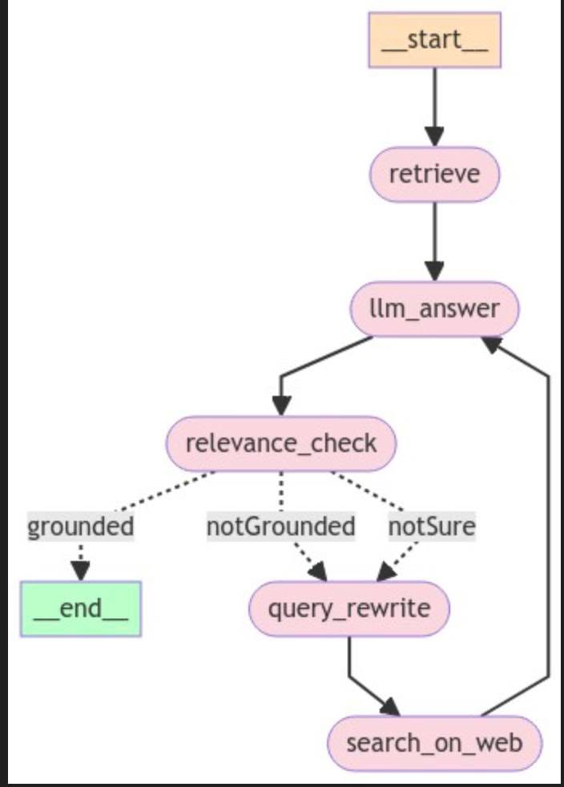 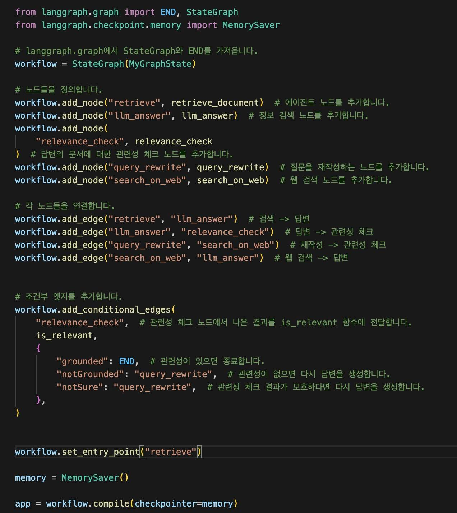 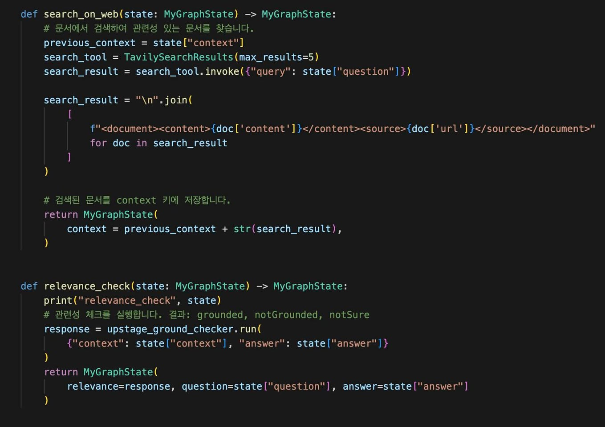

### 6월 29일 (토) 20:23 · Sung Kim shared a link.

🔗 <https://github.com/teddylee777/langchain-kr/tree/main/17-LangGraph>

### 6월 30일 (일) 20:37 · 제가 매일 사용하는 #solarllm 을 활용하여 생산성을 올려줄수 있는…

제가 매일 사용하는 #solarllm 을 활용하여 생산성을 올려줄수 있는 툴 하나 소개 드립니다. https://harpa.ai/ 크롬의 plugin 인데요. 요약, 페이지 질문답변, 번역, 글쓰기, 이메일 답장, 비디오 요약등 단편적인 작업을 할수 있습니다. 또한 이런 2~3개의 작업을 붙여 자동으로도 할수 있습니다. 

예를 아래 첫 스크린샷 처럼 웹페이지나 블로그 글등을 (특히 영어나 외국어) 읽을때 한번 요약을 보고, 필요하면 더 자세히 볼수 있습니다. 

harpa에 LLM을 지정할수 있는데요. #solarllm을 사용하면 정말 빠르게 원하는 결과를 얻을수 있습니다. 언어 설정을 한국어로 해두시면 한국어 답변/을 받을수 있습니다. 세팅을 위해서는 Upstage API키를 https://console.upstage.ai/ 에서 받으신 다음, 모델 이름은 solar-1-mini-chat, api proxy url은 https://api.upstage.ai 로 지정하면 됩니다. (2번째 스샷 참고) 

참고로 https://predibase.com/blog/solar-llm-on-predibase-the-best-llm-for-fine-tuning 의 내용 요약을 보면 더 빠르게 이해 가능합니다.

- 🌞 [Solar LLM on Predibase 소개](https://predibase.com/blog/solar-llm-on-predibase-the-best-llm-for-fine-tuning): GPT-4를 능가하는 미세 조정용 최고의 LLM
- 📈 [Solar LLM의 성능](https://arxiv.org/abs/2405.00732): Upstage의 Solar LLM은 ~11B 매개 변수 모델 무게 클래스에서 가장 우수한 성능을 발휘합니다.
- 💡 [미세 조정을 위한 최적의 모델](https://predibase.com/fine-tuning-index): Solar LLM은 Upstage의 실험에서 31개 작업 중 16개에서 최고 점수를 획득하여 가장 우수한 성능을 발휘했습니다.
- 🚀 [Predibase의 미세 조정 기술](https://predibase.com/fine-tuning-index): Predibase는 빠르고 안정적이며 비용 효율적인 LLM 미세 조정을 위한 선도적인 개발자 플랫폼입니다.
- 💸 [Predibase의 비용 효율적인 제공](https://loraexchange.ai/): LoRAX를 사용하여 단일 GPU로 100개 이상의 미세 조정된 LoRA 모델을 동적으로 제공할 수 있습니다.
- 📅 [7월 11일 웨비나](https://my.demio.com/ref/XkT1b7LkfvEA8bu7): Predibase 및 Upstage 팀이 Solar LLM의 전체 스토리를 자세히 설명하고 성능 결과를 자세히 보여줍니다.
- 🔍 [미세 조정된 모델 탐색](https://predibase.com/lora-land): LoRA Land를 사용하여 LoRAX를 사용하여 미세 조정된 모델의 응답 지연 시간을 확인하십시오.
- ❓ [자주 묻는 질문](https://predibase.com/faq): Predibase에 대해 자주 묻는 질문에 대한 답변을 찾아보십시오.
- 🤝 [파트너십](https://predibase.com/partnerships): Predibase와 협력하여 고객의 AI 여정을 가속화하는 파트너를 확인하십시오.
- 💼 [채용](https://predibase.com/careers): Predibase와 함께 성장하고 새로운 제품을 만들어 나갈 열정적인 인재를 모집합니다.
- 💬 [커뮤니티](https://discord.gg/CBgdrGnZjy): Predibase 커뮤니티에 가입하여 다른 AI 전문가와 연결하고 아이디어를 공유하십시오.

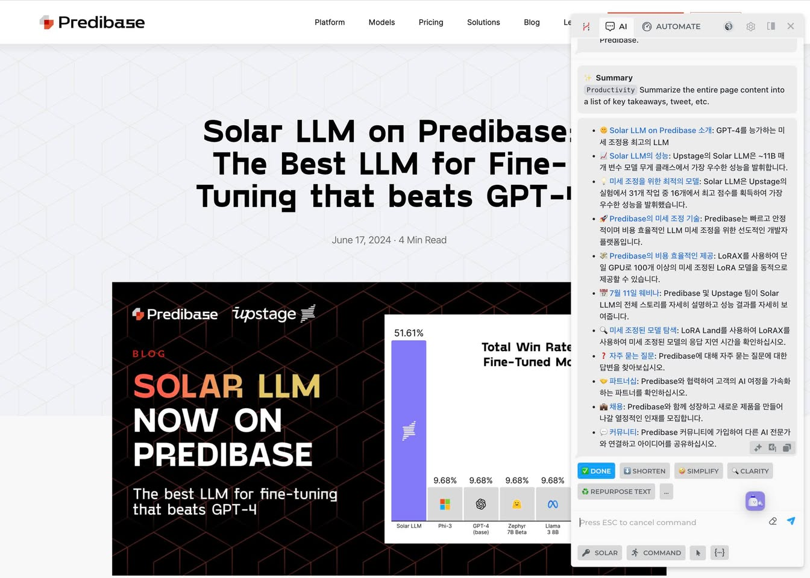 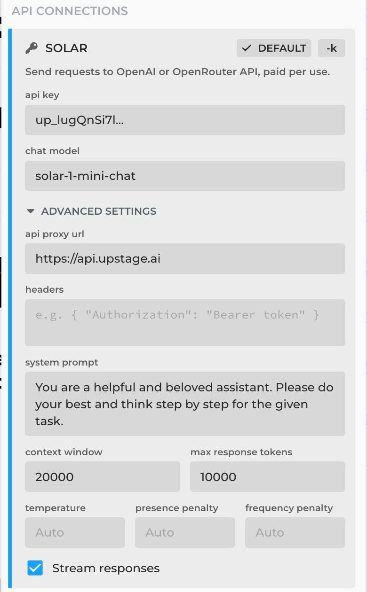
