# 2024년 7월

[← 2024년](README.md)

### 7월 1일 (월) 09:12 · #감동고객 #고객감동 Upstage가 만들고 많은 고객들이 사용하는 Do…

#감동고객 #고객감동 Upstage가 만들고 많은 고객들이 사용하는 DocAI는 LLM 시대 정확한 데이터를 추출하여 학습하고, RAG등으로 컨텍스트로 사용하는데 필수입니다. 이를 사용하는 더베스트 세무법인에서 연락을 주셨는데 감동입니다.

"우연히 귀사의 ocr를 이용하고 너무나 훌륭해서 감동하였습니다.
저희들은 pdf나 그림파일을 매우 많이 접합니다. 그래서 필수적으로 이걸 텍스트 추출해야 할 일들이 많습니다. 많은 ocr프로그램을 테스트해 보았는데 귀사의 ocr이 최고였습니다."

아래 그림과 같이 저희 내부 평가도 최고입니다. https://console.upstage.ai/ 에서 DocAI 등을 바로 사용할 수 있습니다. 많은 이용 부탁드립니다. 보안 유지가 필요한 문서를 처리하는 경우 private cloud 또는 on-prem을 사용할 수 있습니다.

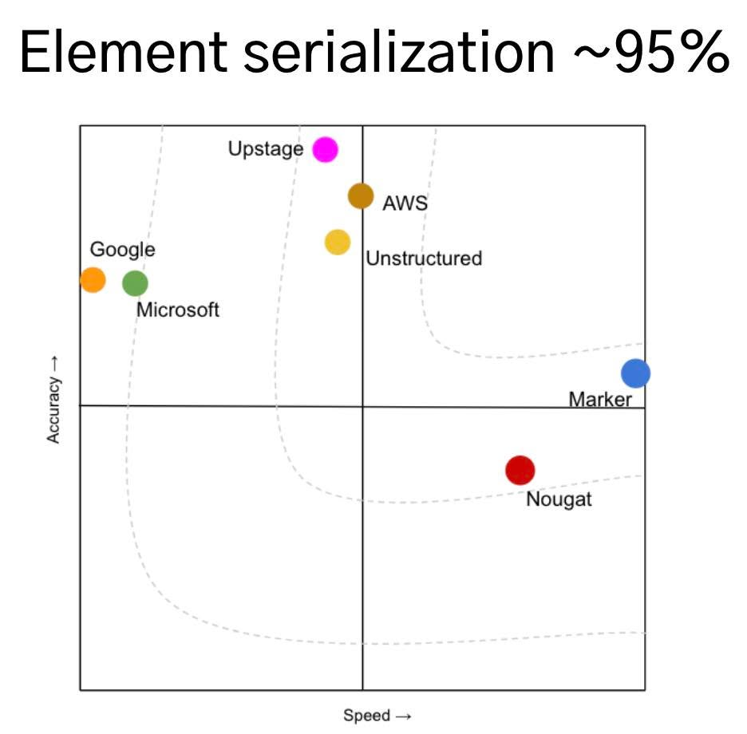

### 7월 3일 (수) 12:18 · ArxivGPT -> ArxivSolar 로 거듭나는 중입니다. (개발 …

ArxivGPT -> ArxivSolar 로 거듭나는 중입니다. (개발 진행중) 기존 chatgpt wrapper로 구동되던 버전을 #solarllm을 사용하여 더 빠르고 안정적으로 논문에 대한 요약 및 인사이트를 얻을 수 있습니다. 그동안 버그가 있었던 후속 질문을 수정하여 궁금한 부분에 대해 질문하고 논문에 대한 토론이 가능합니다. 😊

https://chromewebstore.google.com/detail/solar-arxiv/fbbfpcjhnnklhmncjickdipdlhoddjoh 에 오셔서 설치후 https://console.upstage.ai/ 에서 키를 받아 설정에 추가만 하시면 됩니다. 한국어로 요약을 받고 싶으시면 설정 prompt 뒷부분에 "한국어로 모두 답변해주세요" 추가 하시면 한국어로 요약도 가능합니다.

지금은 논문의 초록만 읽고 정리를 하는데, 추후에는 PDF까지 모두 읽고 답변을 제공할 수 있도록 할 예정입니다. 이 프로젝트는 개인 오픈 소스로 개발되고 있으니, 참여하고 싶은 분들은 알려주세요.

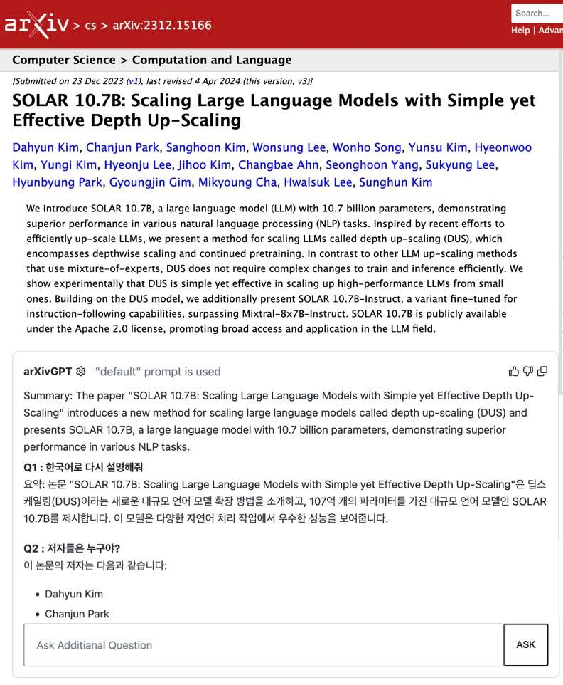 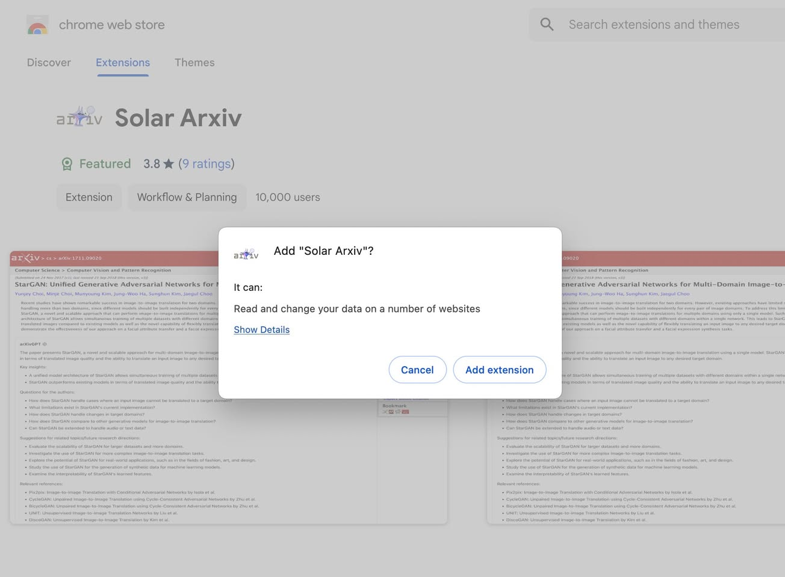 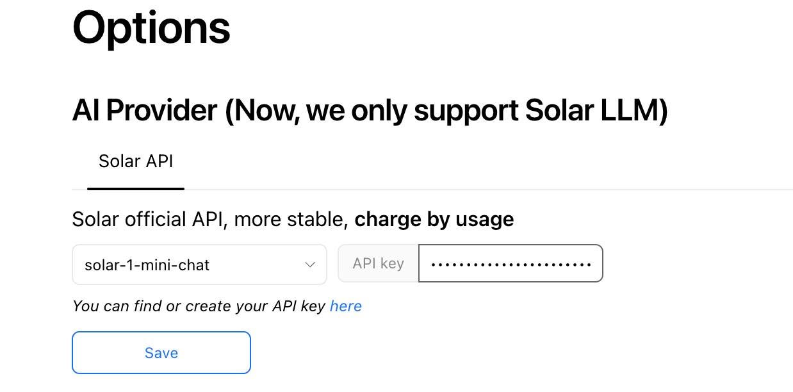

### 7월 3일 (수) 19:00 · 박성일님이 운영하는 "Kor-IR: 한국어 검색을 위한 임베딩 벤치마크"…

박성일님이 운영하는 "Kor-IR: 한국어 검색을 위한 임베딩 벤치마크"에서 #solaremb가 압도적인 점수로 1위를 차지했습니다. Cohere와 유명한 openai-3-large 모델에 비해 훨씬 우수한 결과입니다.

임베딩 사용하신다면 무조건 #solaremb https://console.upstage.ai/ 입니다.

벤치마크: https://github.com/Atipico1/Kor-IR

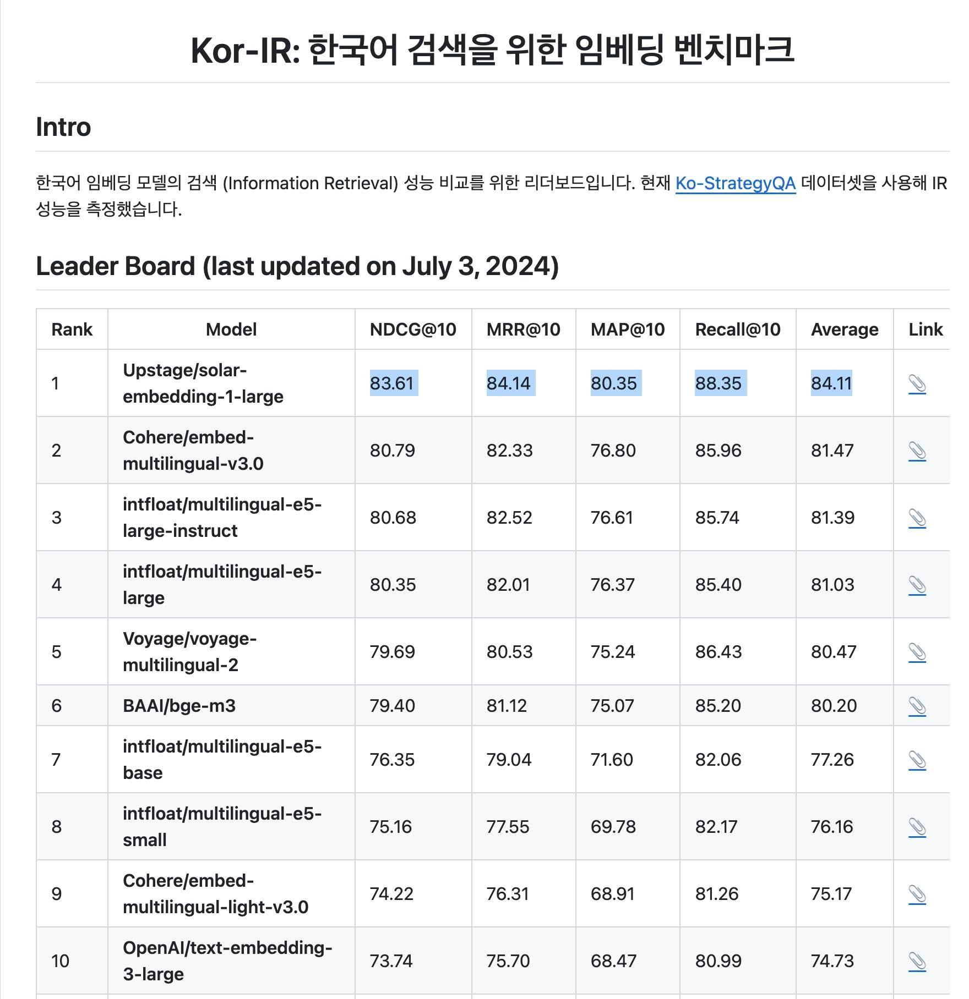

### 7월 4일 (목) 11:47 · 📷 사진 (1장)

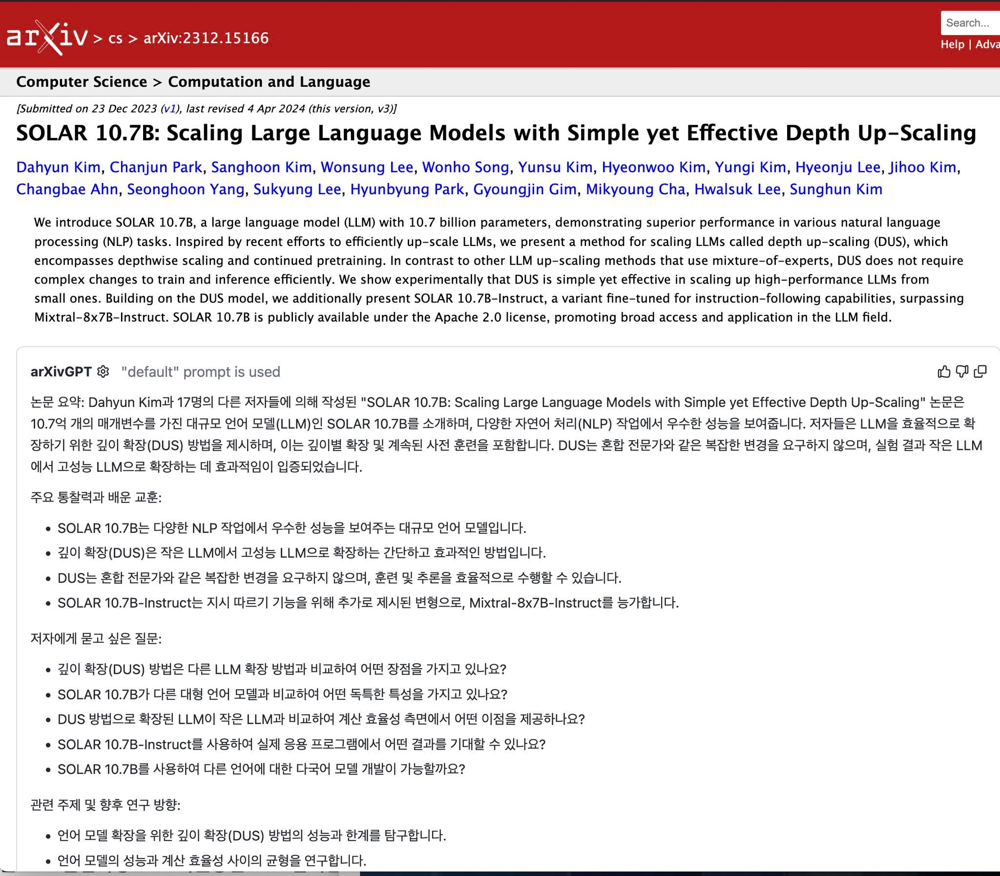

> #개인오픈소스프로젝트멤버모집 arxiv논문을 읽을때 요약을 하고 질문과 답변을 할수 있는 chrome plugin인데요.   최근 #solarllm 지원을 하면서  1. 기존 reactjs 코드 (chatgpt wrapping) 부분 refactoring 2. QA를 논문 PDF까지 읽고 필요하면 upstage LA나 emb 사용하여 답변  등을 추가해보려고 합니다. 혹시 reactjs 경험자중 관심있으신 분들은 함께해요.   코드: https://github.com/hunkimForks/chatgpt-arxiv-extension  Plug-in: [https://chromewebstore.google.com/detail/solar-arxiv/fbbfpcjhnnklhmncjickdipdlhoddjoh](https://chromewebstore.google.com/detail/solar-arxiv/fbbfpcjhnnklhmncjickdipdlhoddjoh)

### 7월 5일 (금) 08:20 · #kaistrun 새로운 곳을 만나고 달리는 것은 언제나 행복입니다. (…

#kaistrun 새로운 곳을 만나고 달리는 것은 언제나 행복입니다. (느낌상) 10년만에 다시 온 #KAIST 재미있는 일들이 많이 일어나고 있습니다.

 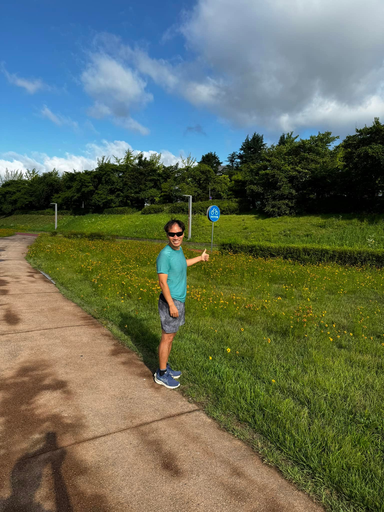

### 7월 7일 (일) 11:58 · 미래는 이미 와 있네요. 많은 사람들 사이에서 신호도 잘 지키며 요리조리…

미래는 이미 와 있네요. 많은 사람들 사이에서 신호도 잘 지키며 요리조리 잘 피해 다니는 배달로봇. 멋집니다!

🎬 동영상 1개 (생략)

### 7월 7일 (일) 13:58 · #featuredblog 파인튜닝을 세계에서 가장 잘하는 업체가 Pred…

#featuredblog 파인튜닝을 세계에서 가장 잘하는 업체가 PrediBase 인데요. 이 회사 블로그에 #SolarLLM이 파인튜닝을 위한 가장 좋은 베이스 모델이라는 글이 대문글로 소개되고 있습니다. 

https://predibase.com/blog

Upstage 제품이 파인튜닝 분야에서 최고로 인정받아, 글로벌 회사 블로그 대문글로 소개되어 매우 기쁩니다. 😊

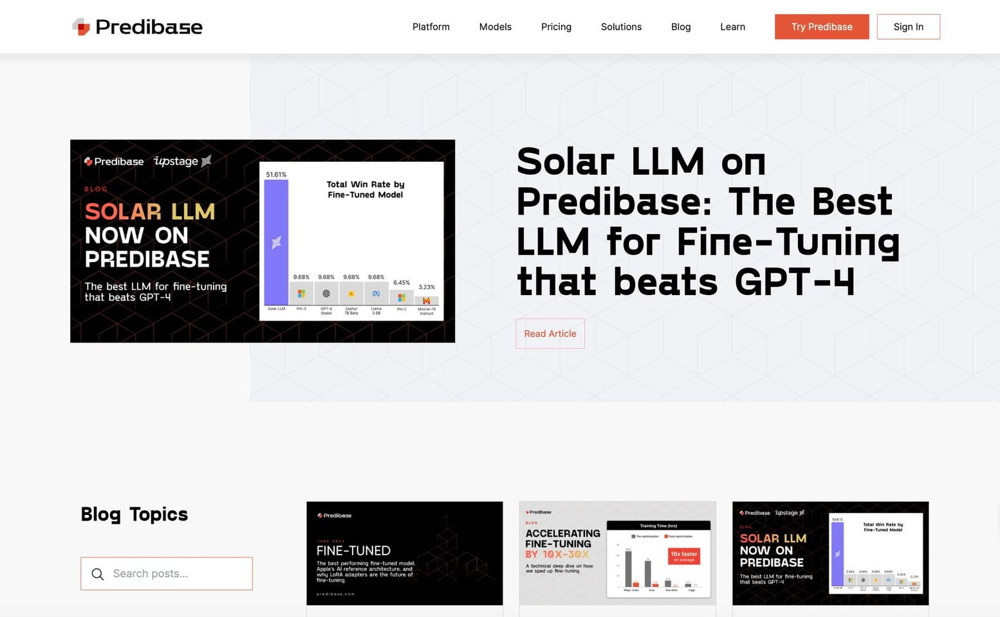

### 7월 9일 (화) 09:48 · 📷 사진 (1장)

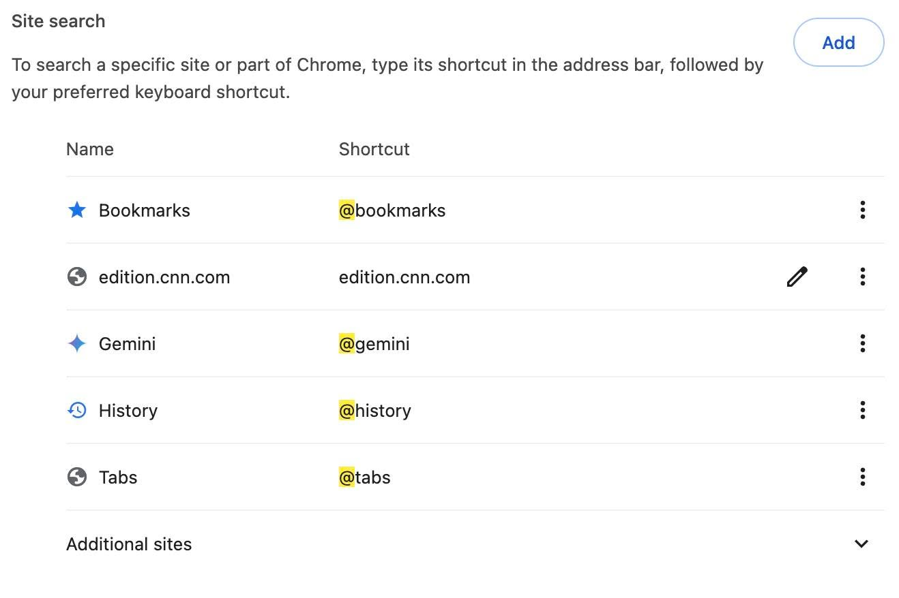

### 7월 9일 (화) 15:28 · 법률서비스 최고 업체인 로앤 컴퍼니가 다각도로 검토후 #SolarLLM을…

법률서비스 최고 업체인 로앤 컴퍼니가 다각도로 검토후 #SolarLLM을 가장 좋은 모델로 판단해 주셔서, 그리고 함께 공동사업을 할수 있어서 기쁩니다. 

오늘 열린 기자 간담회에서 대표님이 직접 말씀 주신것 처럼, "업스테이지와 공동 개발 중인 법률 특화 AI 모델로, 향후 기술 개발 및 고도화를 거쳐 로앤컴퍼니의 서비스에 활용될 예정이며, 목표는 국내 시장을 성공적으로 진출한 후글로벌 시장으로 확장하는 것입니다."

강력한 특화 AI 모델을 필요로 하시는 분들은 업스테이지와 함께 해요!

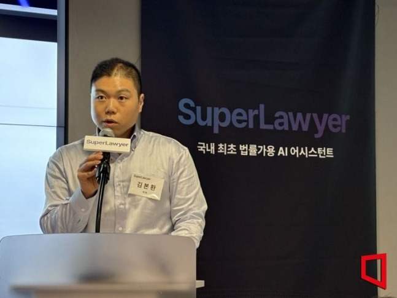

### 7월 9일 (화) 15:30 · Sung Kim shared a link.

🔗 <https://www.asiae.co.kr/article/2024070912231009181>

### 7월 11일 (목) 09:19 · 세계적으로 뛰어난 Friendli AI 의 생성형 AI 인프라를 통해 생…

세계적으로 뛰어난 Friendli AI 의 생성형 AI 인프라를 통해 생성형 AI 모델을 실행하는 데 필요한 GPU 비용을 *많이* 절감할 수 있습니다. 이런 멋진회사와 함께하여 더 빠르고 더 안정적인 Upstage #SolarLLM 을 여러분들에게 제공할수 있게 되어 기쁩니다. Byung-Gon Chun 대표님 감사드립니다.

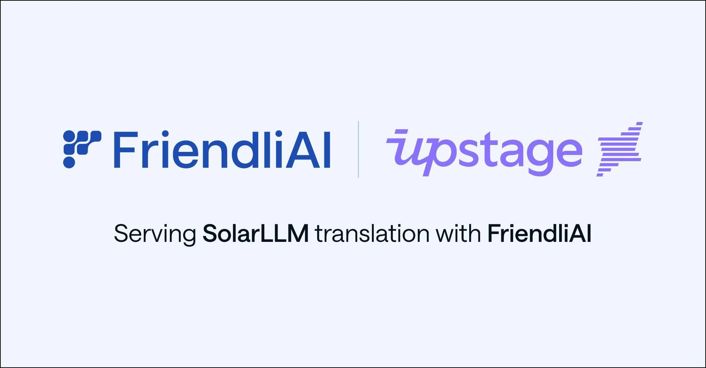

### 7월 11일 (목) 09:19 · Sung Kim shared a link.

🔗 <https://n.news.naver.com/mnews/article/015/0005007985?sid=105>

### 7월 15일 (월) 16:05 · #200만 Upstage #SolarLLM 기반의 카카오 AskUp 친구…

#200만 Upstage #SolarLLM 기반의 카카오 AskUp 친구가 200만을 넘었습니다. 대화하면 재미있어요! 아직 친구 아닌 분들은 추가하시고 들어와보세요!

https://pf.kakao.com/_BhxkWxj

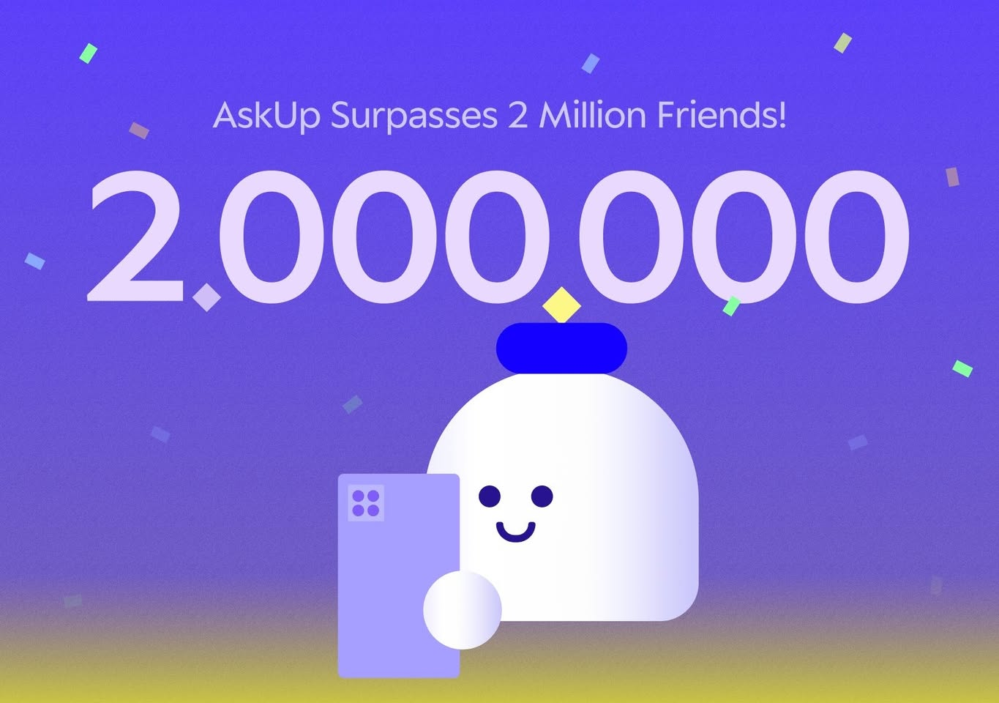

### 7월 17일 (수) 16:03 · 지난 주에 성황리에 진행된 Best Finetunable #SolarLL…

지난 주에 성황리에 진행된 Best Finetunable #SolarLLM의 PrediBase 웨비나 풀 영상이 업로드되었습니다. 😊

https://youtu.be/4lcRQ28VBxw?si=plVjXlGQV2ZHQeyi

여러분들의 작업에 맞는 모델을 찾고 계시다면, 망설임 없이 Solar Finetuning을 추천합니다. 관련하여 도움이 필요하신 분들은 Upstage와 Predibase의 전문가들이 제공하는 Assistance Finetuning 서비스를 이용해보세요. 😊

https://www.upstage.ai/llm/fine-tuning-request

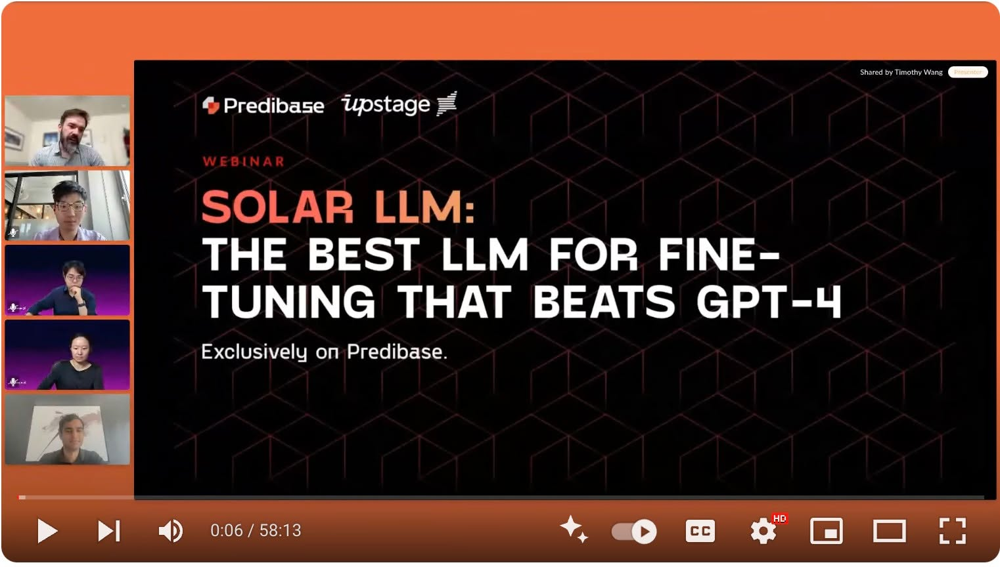

### 7월 18일 (목) 07:49 · #LLM #Pretraining #Shortcourse #꿈은이루어진다 …

#LLM #Pretraining #Shortcourse #꿈은이루어진다 #무료강의 #선등록무고민 #SolarLLM만들기 #코드공개  

https://www.deeplearning.ai/short-courses/pretraining-llms/ 

2008년도에 올라온 "Lecture 1 | Machine Learning (Stanford)" 이라는 수업을 듣고 와 정말 설명을 이렇게 잘하는 교수님이 계시는 구나 감동했던 Andrew Ng 교수님. 그후 수많은 멋진 AI 강의들을 통해 새로운 트렌드를 선도하고 다양한 인사이트를 주셨습니다. 지금의 이 AI 열풍을 교육으로 이끌어내신 분이라고 해도 과언이 아닐 것입니다. 

이런 분과 함께 강의를 하고 새로운 기술을 발표할수 있으면 얼마나 멋질까? "꿈"으로만 생각하던 일이 이루어졌습니다. 프라이머사제의 Ian Park 파트너님과 함께 논의하면서 꿈이 실제로 연결이 되었습니다. 제가 인격적으로도 존경하는, AI 최고 실력자인 Upstage 공동창업자/CPO/미국대표인 Lucy Park님과 함께 만든 강의를 소개할 수 있게 되어 기쁩니다. 강의 하는 도중에도 제 얼굴에 기쁨과 설렘을 감출 수 없었습니다.^^

더욱이 #solarllm 등 효율적으로 llm을 pre-training하는 DUS 방법을 Andrew Ng 교수님과 함께 소개할수 있게 되어 행복합니다.

망설임 없이 지금 바로 수강 신청 부탁드립니다. 무엇보다 재미있습니다!

아래는 Andrew Ng 교수님이 작성해주신 소개글 #SolarLM 번역입니다. 
---
LLM 사전 학습에 대한 새로운 단기 과정! Upstage와 함께 개발하고 CEO Sung Kim과 CSO Lucy Park가 가르칩니다.

프롬프트 또는 기존 모델의 미세 조정은 많은 일반적인 언어 작업에 잘 작동하지만 사전 학습은 현재 모델에서 표현이 제한된 특수 도메인 또는 언어에 대해  가치가 있습니다.

이 과정에서는 LLM 사전 학습 파이프라인을 안내합니다.
1. 데이터 준비: HuggingFace를 사용하여 학습 데이터를 소스, 정리 및 준비하는 방법을 배웁니다.
2. 모델 아키텍처: 기존 모델을 수정하는 것을 포함하여 트랜스포머 네트워크를 구성합니다.
3. 학습: 오픈 소스 라이브러리를 사용하여 학습을 설정하고 실행합니다.
4. 평가: 인기 있는 평가 전략을 사용하여 성능을 벤치마킹합니다.
예제 사용 사례로 기본 모델의 출력과 미세 조정 및 추가 사전 학습된 변형을 비교하여 사전 학습이 모델의 Python 작성 능력에 미치는 영향을 확인합니다. 

이 과정에서는 Upstage가 Solar 모델 패밀리를 훈련하는 데 사용한 깊이 업스케일링이라는 혁신적인 기술도 탐구합니다. 이 기술은 사전 학습 컴퓨팅 비용을 최대 70%까지 줄입니다. 이 기술은 먼저 더 작은 사전 학습된 모델의 레이어를 복제하여 더 큰 모델을 형성한 다음 결과를 추가로 사전 학습하는 방식으로 작동합니다.

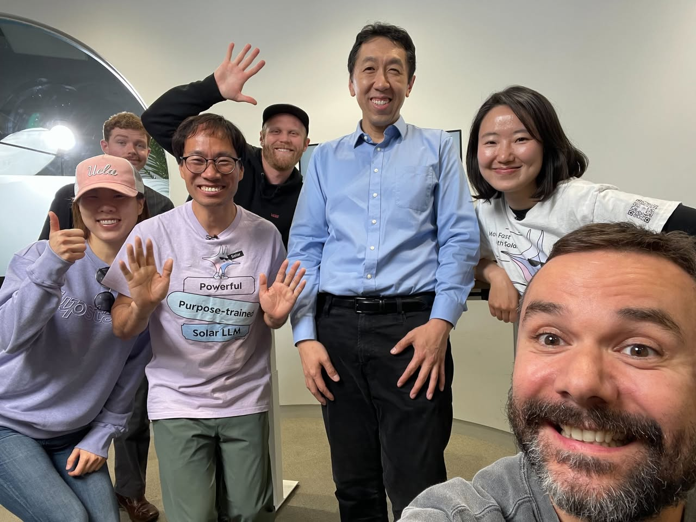 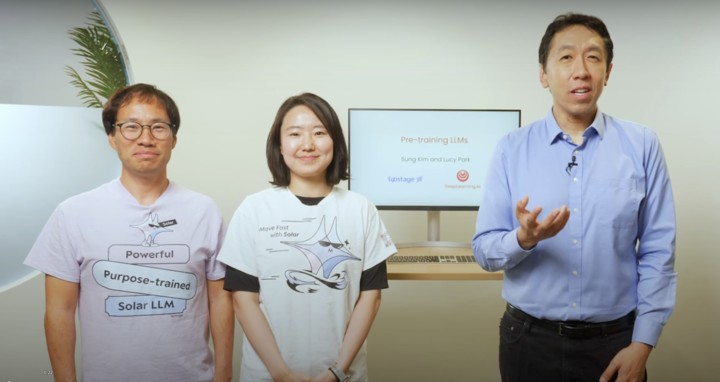 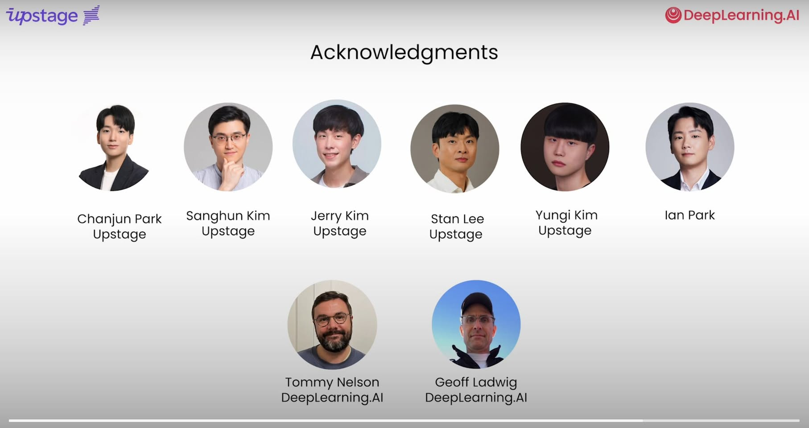

### 7월 18일 (목) 08:00 · Sung Kim shared a link.

🔗 <https://www.deeplearning.ai/short-courses/pretraining-llms/>

### 7월 18일 (목) 08:00 · Sung Kim shared a link.

🔗 <https://youtu.be/UzxYlbK2c7E?si=aWQ5wFg32dZTkvf8>

### 7월 18일 (목) 18:31 · 📷 사진 (1장)

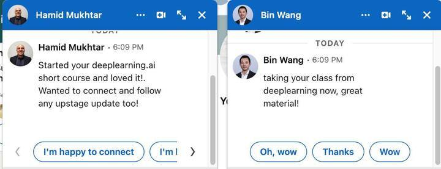

### 7월 21일 (일) 12:09 · 📷 사진 (1장)

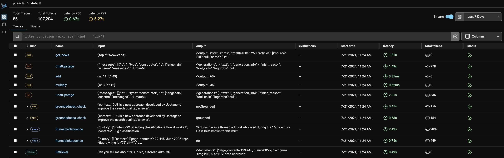

> 오픈소스인 **arize-phoenix[evals]** 프로젝트를 소개 합니다. 와~ 너무 좋습니다!  아래 2줄로 로컬 모니터링 서버를 띄우고: *import phoenix as px ssession = px.launch_app()*  아래 2줄만 넣으면, 랭체인등에서 전체 llm관련 입력 출력을 모니터링 할수 있습니다.   *from phoenix.trace.langchain import LangChainInstrumentor LangChainInstrumentor().instrument()*  아래 스크린샷과 같이 각각의 동작을 자세히 모니터링하면서 디버깅을 쉽게 할 수 있습니다. 아래 예제 참고해주세요.   https://github.com/UpstageAI/cookbook/blob/main/Solar-LLM-ZeroToAll/99_all.ipynb

### 7월 21일 (일) 12:13 · Sung Kim shared a link.

🔗 <https://github.com/UpstageAI/cookbook/blob/main/Solar-LLM-ZeroToAll/99_all.ipynb>

### 7월 23일 (화) 17:11 · 지난 5월과 7월에 열렸던 서울대, 카이스트 LLM 단기 코스에서 선정된…

지난 5월과 7월에 열렸던 서울대, 카이스트 LLM 단기 코스에서 선정된 최고의 팀을 다시 초청하여 발표하는 시간을 가집니다. 

* 일시: 2024년 8월 7일 오후 7시 (한국시간)
* 장소: 줌 (등록시 안내 안내)
* 등록: https://www.upstage.ai/2024-solar-llm-use-cases-webinar

Upstage Hwalsuk Lee CTO가 LLM 동향과 사용 사례를 소개하고, 이어서 6개의 재미있는 애플리케이션 발표가 있을 예정입니다.

* YouskUp (YouTube 댓글 자동 생성기)
* Docent Al (전시 해설 도우미 Al)
* Whenill.ai (의료 진단 Al)
* 낮달 (대학원생 논문 정리 서비스)
* Smart E-mail (RAG로 해결하는 이메일)
* L&D (유저 맞춤 세계관에서 TRPG 경험 제공하기)

LLM을 사용하는 방법을 고민하신다면, 선신청 후고민입니다.

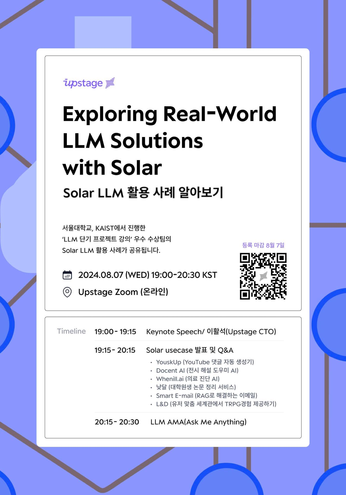

### 7월 23일 (화) 17:49 · 📷 사진 (1장)

> 지난 5월과 7월에 열렸던 서울대, 카이스트 LLM 단기 코스 정말 재미있었는데요. 아래와 같은 팀들이 그중 최고로 선정되었습니다.  * YouskUp (YouTube 댓글 자동 생성기) * Docent Al (전시 해설 도우미 Al) * Whenill.ai (의료 진단 Al) * 낮달 (대학원생 논문 정리 서비스) * Smart E-mail (RAG로 해결하는 이메일) * L&D (유저 맞춤 세계관에서 TRPG 경험 제공하기)   이분들을 줌으로 모셔 함께 이야기 하는 시간을 만들었는데요. LLM을 사용하는 방법을 고민하신다면, 선신청 후고민입니다.  * 일시: 2024년 8월 7일 오후 7시 (한국시간)  * 장소: 줌 (등록시 안내 안내)  * 등록: https://www.upstage.ai/2024-solar-llm-use-cases-webinar

### 7월 26일 (금) 18:19 · #SolarLLM기반  크롬 확장 프로그램 #SolarSummarizer…

#SolarLLM기반  크롬 확장 프로그램 #SolarSummarizer (SS)를 소개 합니다. 긴 웹 페이지를 더 이상 읽을 필요가 없습니다. Solar Summarizer (SS)를 사용하여 빠른 요약과 아이디어를 빨리 얻을수 있습니다.

https://chromewebstore.google.com/detail/iemdpmgkofekldbcpdkfcjhfpkmgnkig 

위 크롬 프로그램을 설치하신후, 웹 페이지나 YouTube에서 SS 아이콘을 클릭하면 됩니다. 여러분들의 생산성을 10배 향상시킬 수 있습니다! 🚀
(이 프로그램 대상 웹 페이지에 JavaScrip를 injection하는데 해당페이지에 따라 불안정할 수 있습니다. 페이지를 새로고침 하시면 잘 됩니다. 😕)

🎬 동영상 1개 (생략)

### 7월 27일 (토) 05:26 · 📷 사진 (1장)

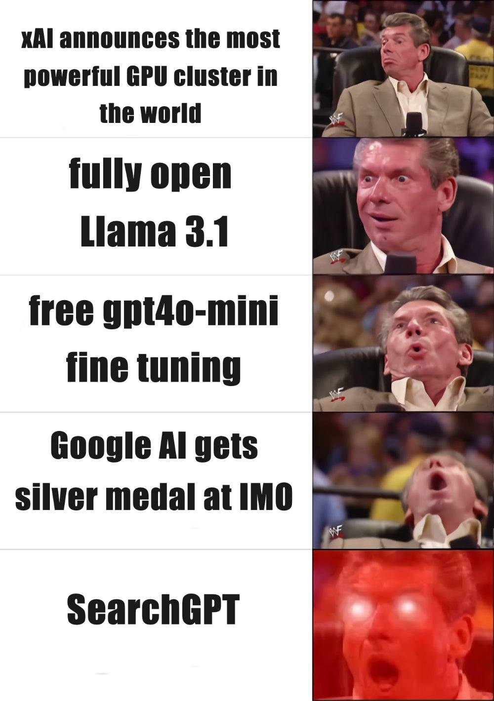

> 이번 주에 일어난 일들인데, 여기는 정말 빠르게 달려갑니다! 어떤 일이 여러분들이 하시는 일에 가장 큰 영향을 미쳤나요? 🤔

### 7월 27일 (토) 05:28 · Sung Kim shared a link.

🔗 <https://x.com/Yuchenj_UW/status/1816549234637779363>

### 7월 29일 (월) 13:51 · #40년 #1위 와~ 정말 40년 동안 한 분야에서 1위를 유지할 수 있…

#40년 #1위 와~ 정말 40년 동안 한 분야에서 1위를 유지할 수 있다는 것은 대단함을 넘어 놀라움입니다. 정말 멋지고 기쁜 소식입니다.

### 7월 30일 (화) 12:55 · #오늘 #andrewng 벌써 오늘입니다. Andrew Ng 교수님이 어…

#오늘 #andrewng 벌써 오늘입니다. Andrew Ng 교수님이 어떤 말씀을 주실지 궁금합니다. 

오시는 분들 반갑게 뵙겠습니다.

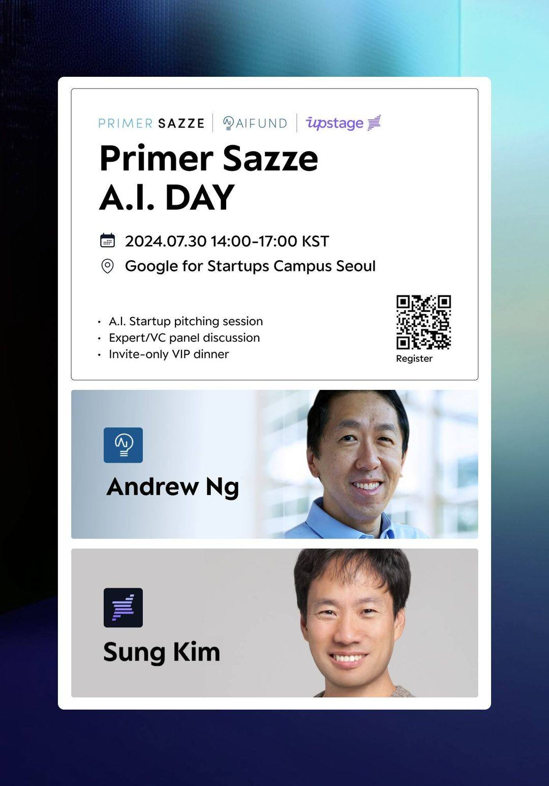

### 7월 30일 (화) 22:04 · Andrew Ng 교수님 발표에서 Upstage 를 자세히 소개해주시고 …

Andrew Ng 교수님 발표에서 Upstage 를 자세히 소개해주시고 AI/LLM을 잘하는 회사로 소개해주셔서 너무 감사하고 행복한 날이었습니다.

함께 재미있는 패널을 만들어 주신 이재진 교수님, Alice Oh 교수님 너무 멋졌어요! 

행사를 주최해주신 Kiha Lee 대표님, Ian Park 파트너님께도 감사드립니다.

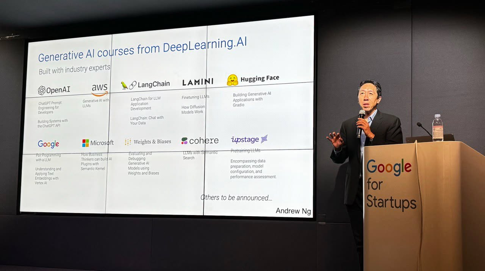 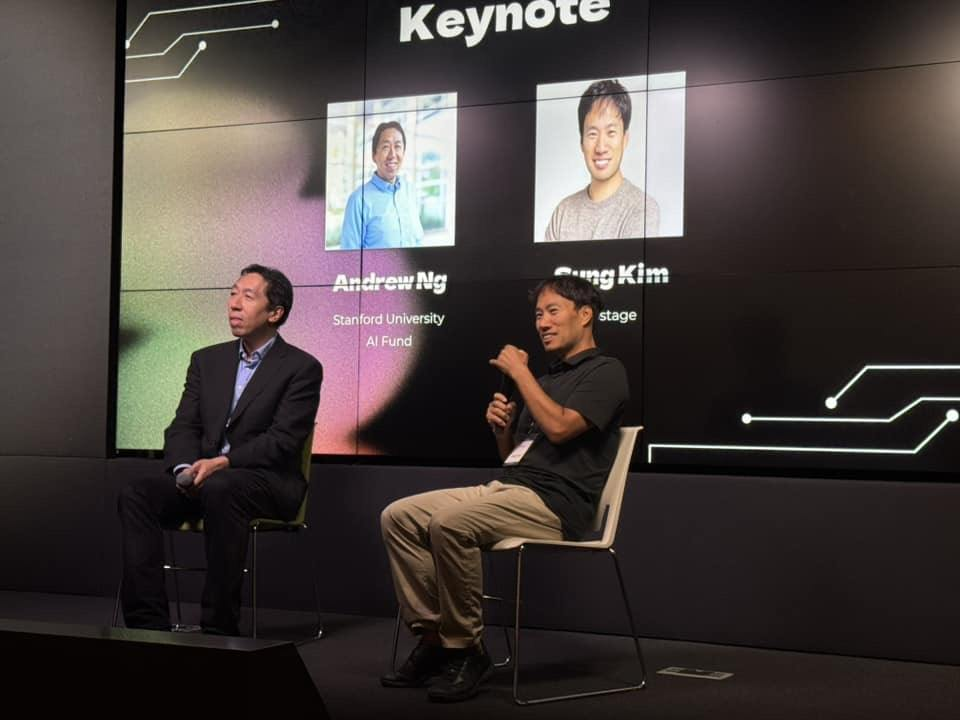 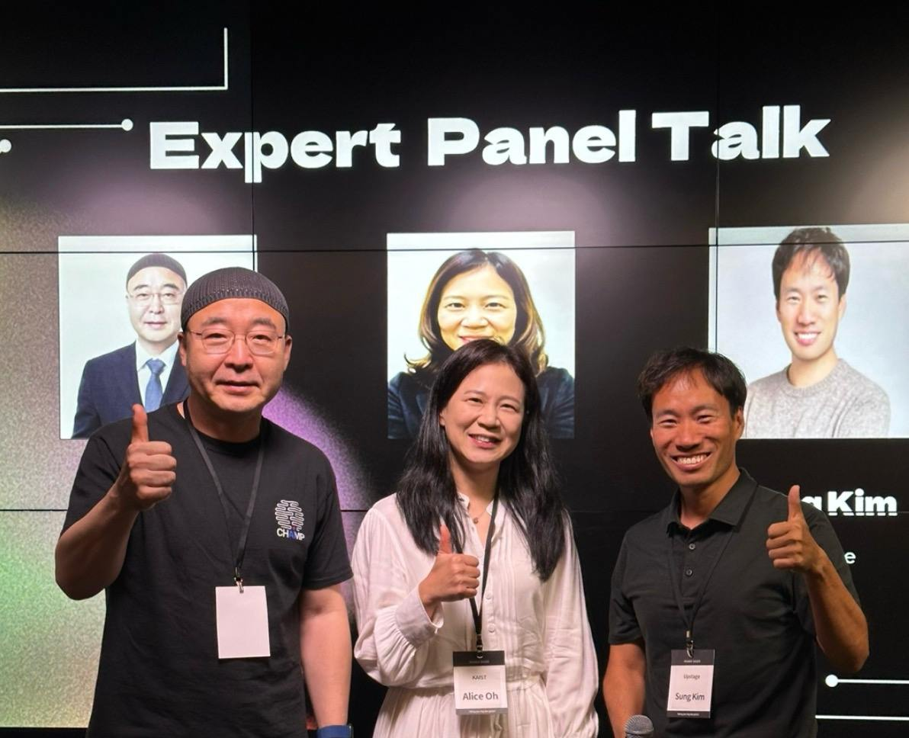
