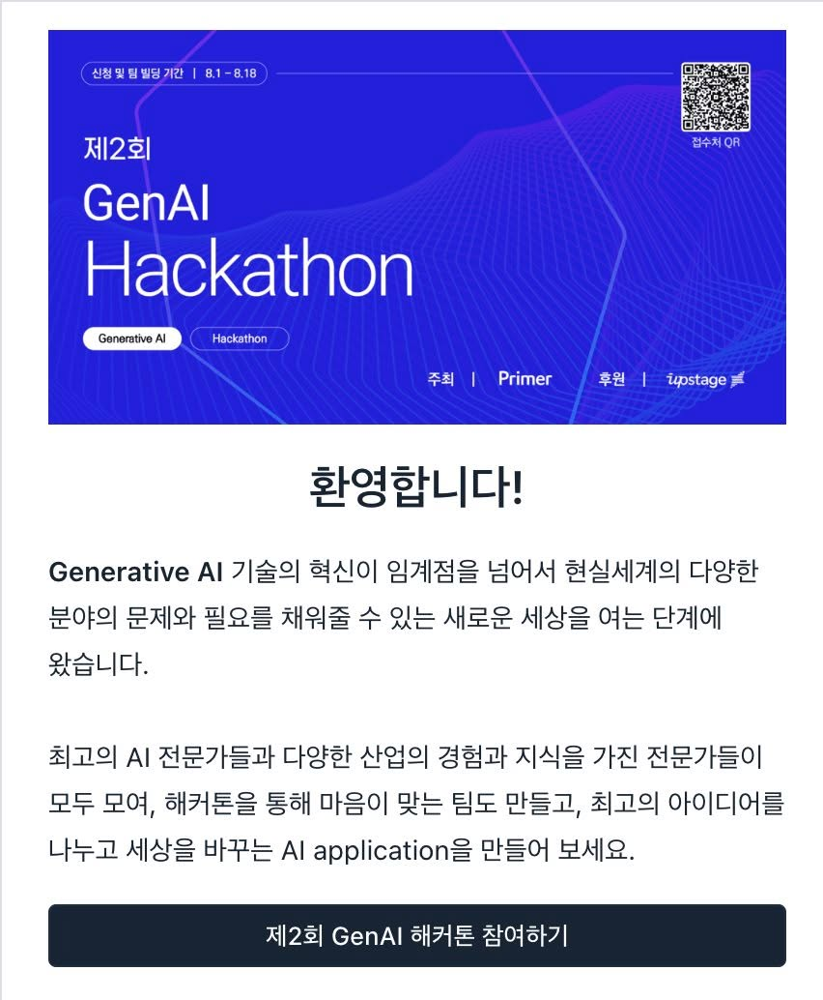
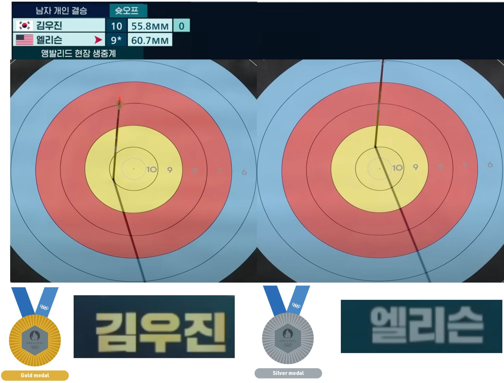
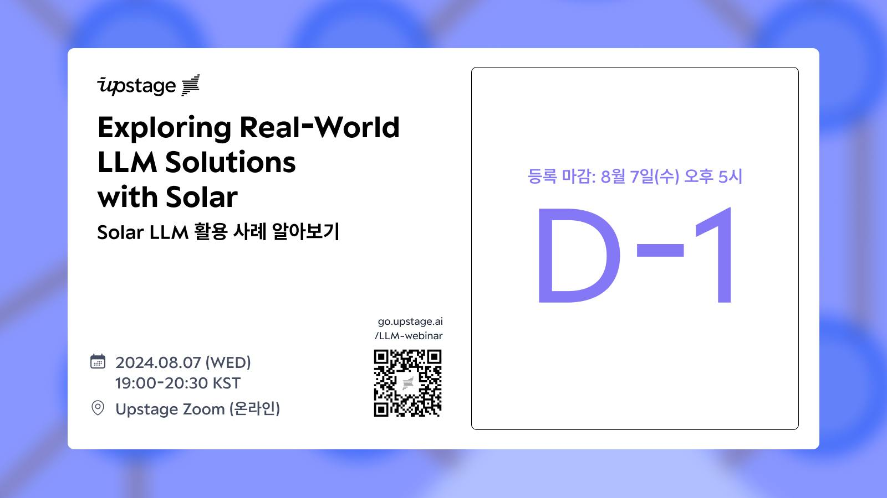
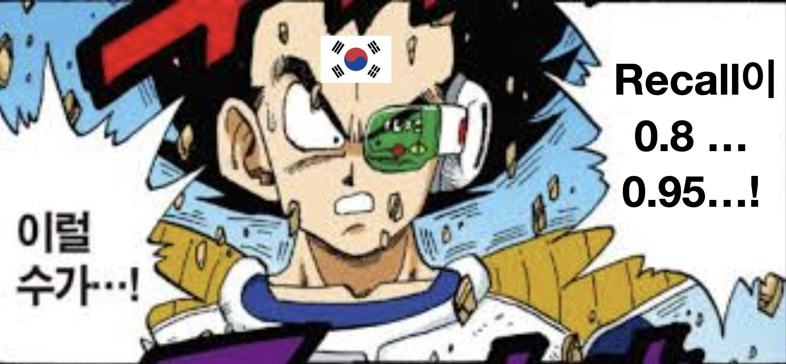
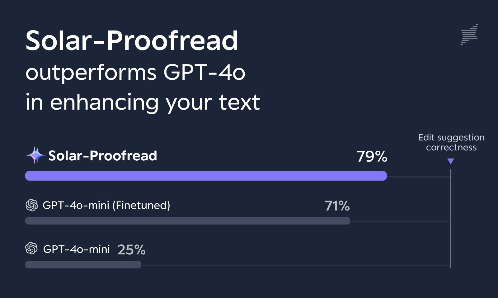
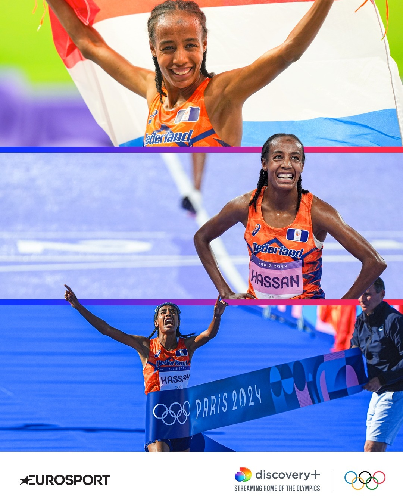
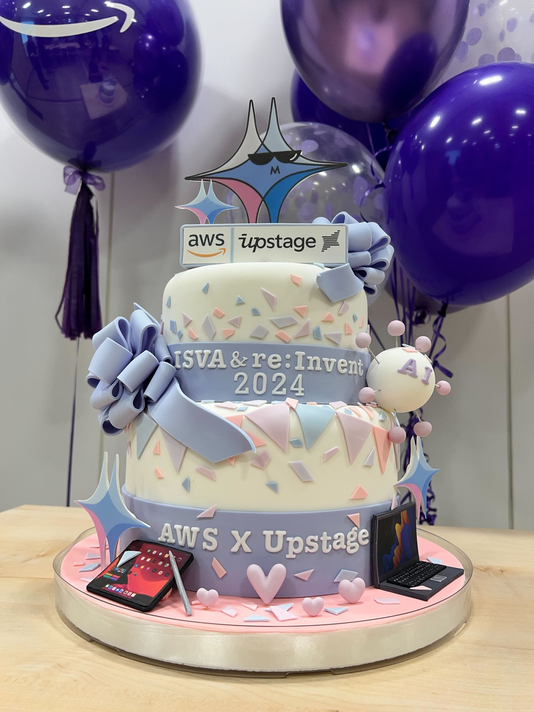
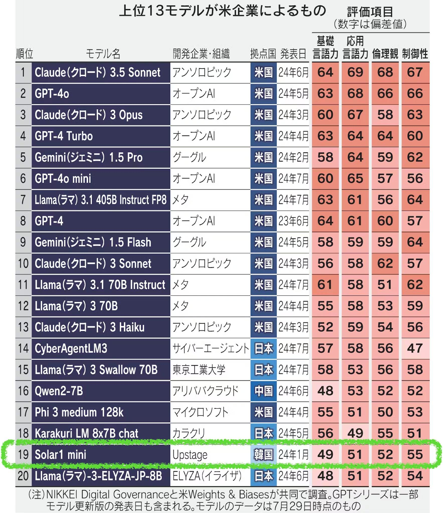
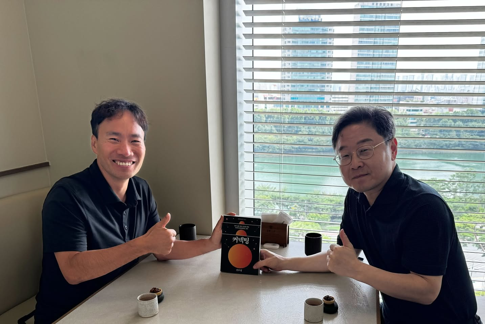
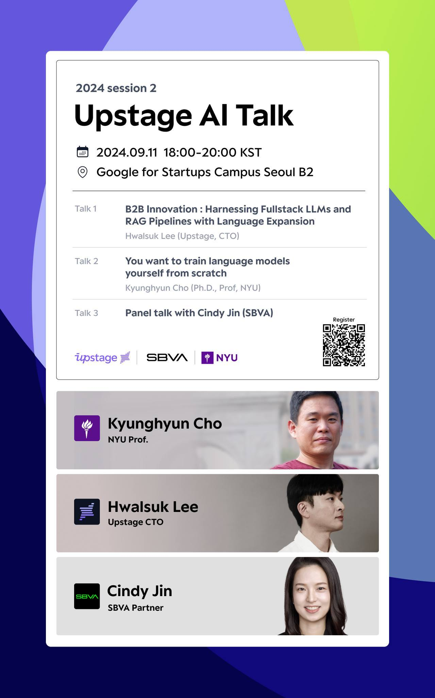

# 2024년 8월

[← 2024년](README.md)

### 8월 2일 (금) 14:06 · Upstage 와 함께 하는 GenAI 해커톤입니다. 참여하시는 모든 분…

Upstage 와 함께 하는 GenAI 해커톤입니다. 참여하시는 모든 분들에게 credit지급 + 멘토링으로 함께 멋진 작품 만들어 보시죠.

8월 18일까지 신청 + 팀빌딩 중입니다: https://hack.primer.kr/

**이미지 캡션:** 이 이미지는 제2회 GenAI 해커톤을 홍보하는 웹페이지의 일부로, 파란색 배경에 흰색과 연보라색의 추상적인 선들이 그려져 있으며, 상단에는 "신청 및 팀 빌딩 기간 | 8.1-8.18"이라는 문구와 함께 "제2회 GenAI Hackathon"이라는 제목이 크게 쓰여 있습니다. 왼쪽 하단에는 "Generative AI"와 "Hackathon"이라는 태그가 보이고, 오른쪽 상단에는 QR 코드가 있습니다. 하단에는 "환영합니다!"라는 인사말과 함께 Generative AI 기술의 혁신과 해커톤 참여를 독려하는 내용의 텍스트가 작성되어 있으며, 마지막으로 "제2회 GenAI 해커톤 참여하기"라는 버튼이 있습니다. 전반적으로 기술적이고 미래지향적인 분위기를 풍깁니다.

### 8월 4일 (일) 07:18 · #8+시간 회사의 대표로서 본인과 회사에서 하고 있는 일에 대해 긴 시간…

#8+시간 회사의 대표로서 본인과 회사에서 하고 있는 일에 대해 긴 시간 동안, 그리고 거의 모든 주제에 대해 인사이트가 있는 대화를 나눌 수 있다는 것이 정말 대단하다는 생각이 듭니다. 내용도 내용이지만, 역사에 길이 남을 Lex Fridman Podcast가 될 것입니다.

초반 Neuralink에 대한 내용을 듣고 있는데, 우리의 뇌를 더 많이 효과적으로 사용할 수 있을지 놀라운 이야기들이 많습니다.

🔗 <https://www.youtube.com/watch?v=Kbk9BiPhm7o&ab_channel=LexFridman>

### 8월 4일 (일) 11:42 · Sung Kim shared a link.

🔗 <https://www.youtube.com/watch?v=Kbk9BiPhm7o&ab_channel=LexFridman>

### 8월 5일 (월) 07:12 · #ParisOlympics2024 #남자양궁개인전 4:4로 팽팽한 세트 …

#ParisOlympics2024 #남자양궁개인전 4:4로 팽팽한 세트 스코어에서 마지막 5세트는 모두 10, 10, 10을 쏘아 비긴 다음, 마지막 한 발의 화살이 중심에서 가까운 사람이 금메달을 가져가는 숫오프! 🎯

마지막 숫오프를 10점 선의 안/바깥 몇 밀리미터 차이로 멋진 승부를 보여주고 금메달과 은메달을 가져간 대한민국의 김우진과 미국의 엘리슨 선수에게 큰 축하를 보냅니다! 🏆🏅🎉

**이미지 캡션:** 이 사진은 양궁 경기의 한 장면을 보여주며, 남자 개인 결승 슛오프 상황임을 알 수 있습니다. 화면 상단에는 한국 선수 김우진과 미국 선수 엘리슨의 점수와 정보가 표시되어 있습니다. 김우진은 10점, 55.8mm, 0이라는 기록을, 엘리슨은 9점, 60.7mm라는 기록을 보이고 있습니다. 두 선수 모두 양궁 과녁을 향해 화살을 쏜 상태이며, 김우진의 화살은 과녁 중앙에 가깝게 명중한 것으로 보입니다. 화면 하단에는 금메달과 은메달, 그리고 각 선수 이름이 새겨진 텍스트가 함께 표시되어 있어, 이 경기가 올림픽과 같은 큰 대회임을 짐작하게 합니다. 전반적으로 긴장감 있고 집중된 스포츠 경기 분위기를 느낄 수 있습니다.

### 8월 6일 (화) 11:35 · 지난번 SNU/KAIST LLM 단기수업에서 발굴된 멋진 LLM의 Use…

지난번 SNU/KAIST LLM 단기수업에서 발굴된 멋진 LLM의 Usecase들이 많았는데요. 이를 함께 공유하고 토론할수 있는 좋은 자리에 여러분들을 초대 드립니다. 줌 행사여서 많은 분들을 모실수 있습니다. 

https://www.upstage.ai/2024-solar-llm-use-cases-webinar 바로 내일 오후 5시 전까지 등록해주시면 됩니다.

아래와 같이 재미있는 발표들이 많이 있습니다.

YouskUp: 유투브 영상에 자동 댓글 생성해주기: 이다현(숭실대학교), 송선영(숭실대학교), 윤예준(숭실대학교), 김선재(주식회사 위뉴), 이지환(주식회사 위뉴) 

DocentAI: AI로 전시 해설 도와주기: 박성일(서울대학교), 박혜리(서울대학교), 박성우(마타에듀), 김영천, 박병민(항공대학교)

whenill.ai: 환자 증상 요약해주기: 이호종(언더밀리)

낮달: 대학원생을 위한 논문 정리 서비스: 이서현(KAIST), 이동재(KAIST), 장효진(KAIST), 김준석(POSTECH), 김순복(바이브컴퍼니), 조영진(KAIST)

Smart E-mail: 복잡한 이메일, RAG로 해결하기: 황태호(KAIST), 신재영(KAIST), 이준명(KAIST), 장원준(KAIST)

LRPG: 유저 맞춤 세계관 속에서 LLM을 이용한 TRPG경험 제공하기: 이현구(KAIST), 신혁준, 이승렬(서경대학교)

**이미지 캡션:** 이 이미지는 Upstage에서 주최하는 "Exploring Real-World LLM Solutions with Solar"라는 제목의 온라인 웨비나를 홍보하는 포스터입니다. 포스터 상단에는 Upstage 로고가 있으며, 그 아래에는 웨비나의 주제인 "Exploring Real-World LLM Solutions with Solar"와 한국어 부제 "Solar LLM 활용 사례 알아보기"가 굵은 글씨로 쓰여 있습니다. 포스터의 오른쪽에는 "등록 마감: 8월 7일(수) 오후 5시"라는 문구와 함께 "D-1"이라는 큰 글씨가 있어 웨비나 시작까지 하루 남았음을 알리고 있습니다. 포스터 하단에는 웨비나 날짜와 시간이 "2024.08.07 (WED) 19:00-20:30 KST"로 명시되어 있으며, 장소는 "Upstage Zoom (온라인)"으로 표시되어 있습니다. 또한, 웨비나 관련 정보 웹사이트 주소인 "go.upstage.ai/LLM-webinar"와 함께 QR 코드가 삽입되어 있어 쉽게 접속할 수 있도록 하였습니다. 포스터 전체적으로 깔끔하고 현대적인 디자인이며, 파란색과 보라색 계열의 색상을 사용하여 기술적인 느낌을 줍니다. 사람이나 특정 인물은 등장하지 않으며, 정보 전달에 초점을 맞춘 디자인입니다.

### 8월 7일 (수) 07:15 · "어떤 한국어 임베딩 모델 성능이 가장 좋을까? 직접 벤치마크 해보자."…

"어떤 한국어 임베딩 모델 성능이 가장 좋을까? 직접 벤치마크 해보자." AutoRAG 님의 기분 좋은 글!

LLM/RAG를 하신다면 임베딩은 무조건 제일 성능이 좋은 것을 사용하셔야 합니다.

제일 좋은 모델은 무엇일까요? 정답은 댓글에 있습니다!

**이미지 캡션:** 이 만화 장면은 땀을 흘리며 충격받은 표정을 짓고 있는 젊은 성인 남성을 보여줍니다. 그는 검은색 머리카락, 붉은색과 검은색이 섞인 머리띠, 녹색 렌즈가 달린 스카우터, 파란색과 흰색이 섞인 옷을 입고 있습니다. 그의 이마에는 태극기가 붙어 있습니다. 배경은 파란색과 노란색으로 이루어져 있으며, 파편들이 흩날리는 듯한 효과가 있습니다. 남성의 왼쪽에는 "이럴 수가…!"라는 한국어 대사가, 오른쪽에는 "Recall이 0.8 ... 0.95...!"라는 영어와 한국어가 섞인 텍스트가 보입니다. 전반적으로 긴박하고 놀라운 상황을 묘사하는 분위기입니다.

### 8월 7일 (수) 07:16 · Sung Kim shared a link.

🔗 <https://velog.io/@autorag/어떤-한국어-임베딩-모델-성능이-가장-좋을까-직접-벤치마크-해보자>

### 8월 8일 (목) 08:43 · #출판사 #함께해요 (주위 출판관련 종사하시는 분들에게 많은 공유 부탁드…

#출판사 #함께해요 (주위 출판관련 종사하시는 분들에게 많은 공유 부탁드립니다.)

#SolarLLM 기반의 파인튜닝 모델인 #SolarProofread 는 교열 작업을 정말 잘합니다. 아래 그림에서 보시는 것처럼 현재 맞춤법 교정 분야에서 뛰어난 성능을 보여주는 GPT-4o 모델보다 정확도에서 50% 이상 더 우수한 성능을 기록했습니다. 

여러분의 교열 (문장수정) 데이터가 추가된다면 여러분만의 특화 모델이 만들어질 수 있습니다. 이 특화 모델은 성능이 더 올라갈 뿐만 아니라, 문체와 톤도 여러분들이 원하는 형태로 출력이 됩니다.

아래 조건을 만족하는 경우 무료로 특화 모델을 제공해드리오니 많은 참여 부탁드립니다.

[1. 무료 모델 개발] 
1,000건 이상의 문장 수정 데이터를 업스테이지가 모델 학습에 사용할 수 있도록 제공해주시면, 무료로 Solar-귀출판사 특화 모델을 만들어 드립니다.
→업스테이지에서 제공하는 맞춤형 모델을 이용하시면, 귀사는 백만 단어당 1USD 라는 저렴한 비용으로 편리하게 서비스를 이용할 수 있습니다.

[2. 무료 모델 개발및 사용]
1,000건 이상의 문장 수정 데이터와 함께 귀사의 책 10권을 업스테이지 모델 학습에 활용할 수 있도록 해 주시면, 귀사만을 위한 맞춤형 AI 모델을 만들고 1년간 무료로 모델을 사용할 수 있도록 제공해드립니다. 
→ 10권마다 1년의 무료 사용 기간이 제공됩니다. 

업스테이지는 저작권 보호와 데이터 보안을 최우선으로 생각합니다. 제공해주신 데이터는 엄격한 보안 절차를 통해 보호되며, 어떠한 경우에도 제 3자에게 직/간접으로도 제공되지 않으며 외부로 유출될 가능성이 없습니다. 또한, LLM을 통해 학습한 모델은 원문 복원이 거의 불가능합니다.

9월 30일까지 https://www.upstage.ai/llm/fine-tuning-request 통해 연락주시면 자세한 안내 드리도록 하겠습니다. 

신청이 많아 대기 시간이 발생할 수 있으며, 데이터 품질에 따라 모델 성능이 달라질 수 있다는 점 미리 양해 부탁드립니다.

**이미지 캡션:** 이 이미지는 "Solar-Proofread"라는 텍스트 개선 도구가 "GPT-4o"를 능가한다는 내용을 보여주는 그래프입니다. 배경은 어두운 남색이며, 텍스트는 흰색으로 표시되어 있습니다. 상단에는 "Solar-Proofread outperforms GPT-4o in enhancing your text"라는 제목이 있습니다. 그 아래에는 세 개의 항목이 나열되어 있으며, 각 항목은 막대 그래프로 표현되어 있습니다. 첫 번째 항목은 "Solar-Proofread"이며, 79%의 정확도를 나타내는 보라색 막대가 그려져 있습니다. 두 번째 항목은 "GPT-4o-mini (Finetuned)"이며, 71%의 정확도를 나타내는 회색 막대가 있습니다. 세 번째 항목은 "GPT-4o-mini"이며, 25%의 정확도를 나타내는 짧은 회색 막대가 있습니다. 오른쪽에는 "Edit suggestion correctness"라는 레이블과 함께 수직선이 그려져 있어 각 막대의 정확도를 시각적으로 비교할 수 있도록 합니다. 이미지 상단 오른쪽에는 작은 기하학적 패턴이 있습니다. 이 이미지는 데이터 시각화를 통해 "Solar-Proofread"의 성능 우수성을 강조하고 있습니다.

### 8월 8일 (목) 15:26 · 인터넷 == 라디오?

인터넷 == 라디오?
인터넷 == 잡지? 
새로운 것이 나왔을 때, 이것이 아직 충분히 보편화되지 않았을 때, 그 usecase와 쓰임을 상상하는 것조차도 매우 어려운 일인 것 같습니다. 
LLM/AI는 10년, 20년후 어떤 세상을 열고 있을까요?

### 8월 11일 (일) 21:04 · #ParisOlympics2024 이번 올림픽에서 감동적인 장면들이 많았…

#ParisOlympics2024 이번 올림픽에서 감동적인 장면들이 많았는데, 그 중에서도 Sifan Hassan 은 정말 대단합니다.

8월 5일에 5km에서 동메달을 따고, 조금 휴식을 취한 후 8월 9일에 10km에서 또 동메달을 따고, 딱 32시간 후에 마라톤에서 2시간 22분으로 금메달을 땄습니다.

이것이 가능한 일일까요? 5K, 10K 전력으로 달리면 회복에 한참 시간이 걸리는데 그녀의 노력과 집념은 상상을 초월합니다. 

역사에 길이 남을 기록입니다. 축하합니다! Sifan Hassan!!

**이미지 캡션:** 이 사진은 세 개의 장면으로 구성되어 있으며, 모두 네덜란드 국기를 들고 환호하는 젊은 여성 육상선수를 보여줍니다. 그녀는 주황색 경기복을 입고 있으며, 경기복에는 "Nederland"와 "HASSAN"이라는 글자가 쓰여 있습니다. 첫 번째 장면에서는 그녀가 네덜란드 국기를 머리 위로 들어 올리며 활짝 웃고 있습니다. 두 번째 장면에서는 그녀가 경기복을 입고 카메라를 향해 포즈를 취하고 있으며, 얼굴에는 땀방울이 맺혀 있습니다. 세 번째 장면에서는 그녀가 결승선을 통과하며 두 팔을 높이 들어 올리고 환호하고 있으며, 그녀 앞에는 "PARIS 2024"라고 쓰인 파란색 배너가 있습니다. 배경은 육상 경기장으로 보이며, 관중이나 다른 선수들의 모습도 희미하게 보입니다. 사진 하단에는 유로스포츠 로고와 디스커버리 플러스 로고, 올림픽 오륜기가 함께 표시되어 있어 올림픽 관련 행사임을 알 수 있습니다. 전체적으로 승리의 기쁨과 성취감을 나타내는 역동적이고 긍정적인 분위기입니다.

### 8월 15일 (목) 06:45 · AWS와 ISVA (공동판매) 파트너사가 되어 매우 기쁩니다. AWS를 …

AWS와 ISVA (공동판매) 파트너사가 되어 매우 기쁩니다. AWS를 사용하신다면 몇 번의 클릭만으로 #SolarLLM 풀 스택을 서비스에 통합할 수 있습니다. 인상적인 케이크, 감사합니다!

**이미지 캡션:** 보라색 풍선 여러 개가 배경에 떠 있고, 그 앞에 3단 케이크가 놓여 있습니다. 케이크 상단에는 AWS와 Upstage 로고가 새겨진 장식물과 선글라스를 낀 캐릭터 장식이 있습니다. 케이크의 각 단에는 "ISVA & re: Invent 2024"와 "AWS X Upstage"라는 글자가 보라색으로 새겨져 있으며, 파스텔톤의 장식과 리본, 그리고 작은 하트 모양 장식으로 꾸며져 있습니다. 케이크 하단에는 태블릿 PC와 펜, 그리고 노트북 모양의 장식이 놓여 있습니다. 전반적으로 축하하는 분위기를 나타내는 밝고 화려한 모습입니다.

### 8월 16일 (금) 12:12 · 공신력이 있는 #nikkei 니혼게이자이에 Upstage #​Solar…

공신력이 있는 #nikkei 니혼게이자이에 Upstage #​SolarLLM이 소개되었습니다. #SolarLLM 이 일본어 전체 20위권에 들었고 특히 작은 사이즈 모델에서는 top중 하나의 모델로 언급되고 소개 되고 있습니다.

일본어 모델에도 더 노력하여 top10, top1에 들어가 보겠습니다.

**이미지 캡션:** 이 이미지는 AI 모델의 성능을 비교한 표로, 상위 20개 모델의 순위, 모델명, 개발 기업, 발표 국가, 발표일, 그리고 언어 능력, 윤리성, 제어성 등 네 가지 평가 항목에 대한 점수를 보여줍니다. 표의 제목은 "상위 13 모델이 미 기업에 의한 것"이며, 평가 항목의 수치는 편차값으로 표시되어 있습니다. 각 행은 순위별로 모델의 정보를 나타내며, 색상으로 구분된 셀은 각 평가 항목의 점수를 보여줍니다. 표 하단에는 NIKKEI Digital Governance와 Weights & Biases가 공동으로 조사했으며, GPT 시리즈는 일부 모델 업데이트 버전의 발표일도 포함하고, 데이터는 7월 29일 기준임을 명시하는 주석이 있습니다.

### 8월 16일 (금) 12:14 · Sung Kim shared a link.

🔗 <https://www.nikkei.com/prime/digital-governance/article/DGXZQOUC253KV0V20C24A7000000>

### 8월 18일 (일) 19:06 · 류내원 님의 동영상 생성 기술을 보면서 늘 감탄했는데 오늘 8월 21일 …

류내원 님의 동영상 생성 기술을 보면서 늘 감탄했는데 오늘 8월 21일 저녁 7:30분에 모셔서 이야기를 들을수 있어서 너무 행복합니다.

선참여, 후고민 입니다. AGI KR 회원이시면 누구나 참여가 가능하십니다!

### 8월 18일 (일) 19:11 · Sung Kim shared a link.

🔗 <https://hkust.zoom.us/j/94504405014?pwd=mJaRjnxqWu5VHcnKpLRhy3f1u3gapO.1>

### 8월 18일 (일) 19:11 · Sung Kim shared a link.

🔗 <https://hkust.zoom.us/j/94504405014?pwd=mJaRjnxqWu5VHcnKpLRhy3f1u3gapO.1>

### 8월 19일 (월) 21:52 · Sung Kim shared a link.

🔗 <https://youtu.be/R92Mba1mTX4?si=GsI2c6pUJMj0mqGQ>

### 8월 19일 (월) 21:52 · #처음입는광복 정말 감동적인 프로젝트! #AI기술 이 사용된 가장 멋진 …

#처음입는광복 정말 감동적인 프로젝트! #AI기술 이 사용된 가장 멋진 프로젝트가 아닐까 생각됩니다. 

#빙그레 바나나맛 우유 먹으러 갑니다.

https://youtu.be/R92Mba1mTX4?si=GsI2c6pUJMj0mqGQ

### 8월 20일 (화) 17:06 · 존경하는 신수정 부사장님 뵙고 책 #커넥팅 이야기, 인생 이야기, 회사 …

존경하는 신수정 부사장님 뵙고 책 #커넥팅 이야기, 인생 이야기, 회사 이야기, 미래 비전 이야기 많이 듣고 배웠습니다. 

뵐때 마다 새로운 에너지를 받을수 있어서 저에게는 큰 축복입니다. 감사합니다.

**이미지 캡션:** 두 명의 성인 남성이 테이블에 앉아 카메라를 향해 엄지손가락을 치켜세우고 있다. 왼쪽 남성은 40대 초중반으로 보이며, 검은색 폴로 셔츠를 입고 활짝 웃고 있다. 오른쪽 남성은 50대 초중반으로 보이며, 검은색 셔츠를 입고 안경을 썼으며, 부드러운 미소를 짓고 있다. 두 사람 사이 테이블 위에는 '커넥팅'이라는 제목의 책이 놓여 있으며, 책 표지에는 붉은색 행성과 별들이 그려져 있다. 테이블 위에는 작은 찻잔 두 개도 보인다. 배경에는 창문 블라인드 너머로 도시 풍경과 강이 보인다. 전반적으로 밝고 긍정적인 분위기이다.

### 8월 21일 (수) 18:54 · #오늘 #730 "동영상 생성형 AI의 발전과 현황" 곧 뵙겠습니다.

#오늘 #730 "동영상 생성형 AI의 발전과 현황" 곧 뵙겠습니다.

---
일시: 2024년 8월 21일 오후 7시 30분
장소: https://hkust.zoom.us/j/94504405014?pwd=mJaRjnxqWu5VHcnKpLRhy3f1u3gapO.1
내용: AI 동영상 생성은 이전에도 있었지만 단순 형태 및 논문 수준이었고 본격적인 생성형 AI로써 Text to Video, Image to Video 등의 상업적 서비스 시작은 2023년부터 시작되었습니다. 현재까지 여러 AI 동영상 생성 서비스 및 영상 생성 관련 기술들이 연이어 발표되었습니다. 이번 행사에서는 동영상 생성형 AI의 발전 내용과 현황에 대해 살펴봅니다.
강사: 네오컨버전스 주식회사의 류내원 연구소장은 페이스북 Stable Diffusion Korea 그룹의 운영진으로 활동하고 있습니다. 그는 방송통신사의 영상 및 AI 솔루션 연구개발을 담당하였으며, 과기부 AI 경진대회 '19년과 '20년에 입선하였습니다. 이전에는 SK브로드밴드 IPTV 기술개발에서 일한 경력이 있습니다.

### 8월 26일 (월) 10:40 · AI 세계 석학이시고 Upstage 이사님이신 Kyunghyun Cho…

AI 세계 석학이시고 Upstage 이사님이신 Kyunghyun Cho 교수님과, Hwalsuk Lee CTO 함께 멋진 톡이 준비 되어있습니다. 그 후 SBVA 신디 파트너님과 함께하는 멋진 패널 토크가 이어집니다.

선착순으로 무료 진행되며 가벼운 식사와 네트워킹 자리가 마련됩니다.

선지원, 후고민: https://go.upstage.ai/fb_ai_talk_2024_2 

오시는 분들 반갑게 뵙겠습니다.

**이미지 캡션:** 이 이미지는 "Upstage AI Talk"라는 제목의 행사 안내 포스터입니다. 행사는 2024년 9월 11일 18시부터 20시까지 Google for Startups Campus Seoul B2에서 열립니다. 총 세 개의 세션으로 구성되어 있으며, 첫 번째 세션은 "B2B Innovation: Harnessing Fullstack LLMs and RAG Pipelines with Language Expansion"이라는 주제로 Hwalsuk Lee (Upstage, CTO)가 발표합니다. 두 번째 세션은 "You want to train language models yourself from scratch"라는 주제로 Kyunghyun Cho (Ph.D., Prof, NYU)가 발표합니다. 세 번째 세션은 Cindy Jin (SBVA Partner)과의 패널 토크입니다. 포스터 하단에는 발표자들의 사진과 이름, 소속이 나와 있습니다. Kyunghyun Cho는 중년 남성으로, 보라색 티셔츠를 입고 카메라를 응시하고 있습니다. Hwalsuk Lee는 젊은 남성으로, 흰색 셔츠를 입고 옆모습을 보이고 있습니다. Cindy Jin은 젊은 여성으로, 검은색 재킷을 입고 환하게 웃으며 카메라를 보고 있습니다. 포스터에는 Upstage, SBVA, NYU 로고가 함께 표시되어 있으며, 등록을 위한 QR 코드도 포함되어 있습니다. 전체적으로 깔끔하고 정보 전달에 충실한 디자인입니다.
