# 2024년 9월

[← 2024년](README.md)

### 9월 4일 (수) 12:50 · 업스테이지가 카카오헬스케어와 손잡고 생성형 AI 기반 디지털 헬스케어 사…

업스테이지가 카카오헬스케어와 손잡고 생성형 AI 기반 디지털 헬스케어 사업에 본격적으로 나섭니다. 🤝

#SolarLLM 의 특화인 #SolarMedical 은 소아청소년을 위한 초거대 AI 보건의료 서비스 개발에 활용되어 많은 분들에게 도움이 될것 같습니다. 

특화 모델을 잘 만드는 Upstage #SolarLLM, 필요하신 분들은 바로 연락주세요.

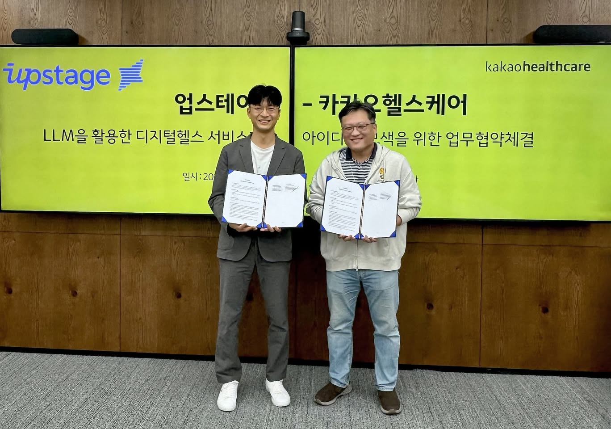
**이미지 캡션:** 두 명의 성인 남성이 서류를 들고 포즈를 취하고 있으며, 배경에는 노란색 현수막이 걸려 있고, 현수막에는 "upstage"와 "kakaohealthcare" 로고가 있으며, "업스테이 - 카카오헬스케어 LLM을 활용한 디지털헬스 서비스 아이디 색을 위한 업무협약체결"이라는 문구가 적혀 있습니다. 왼쪽 남성은 검은색 정장 재킷과 흰색 티셔츠, 회색 바지를 입고 흰색 운동화를 신고 있으며, 오른쪽 남성은 흰색 후드티와 줄무늬 티셔츠, 청바지를 입고 갈색 신발을 신고 있습니다. 두 사람 모두 서류를 들고 미소를 짓고 있으며, 이는 업무 협약 체결을 기념하는 행사로 보입니다. 배경의 나무 벽과 회색 바닥은 사무실 또는 회의실 환경을 나타냅니다.고 있으며, 이는 업무 협약 체결을 기념하는 행사로 보입니다. 배경의 나무 벽과 회색 바닥은 사무실 또는 회의실 환경을 나타냅니다.

### 9월 4일 (수) 12:58 · 제가 참여해본 GenAI 해커톤중 제일크고 또 제일 수준이 높았던 Sta…

제가 참여해본 GenAI 해커톤중 제일크고 또 제일 수준이 높았던 Stanford LLMxLaw Hackathon! 지난번 #3에 이에 이번 4번째도 Upstage 후원하며 발표와 #SolarPro 로 참여합니다.

주위 계신 분들 함께 해요!

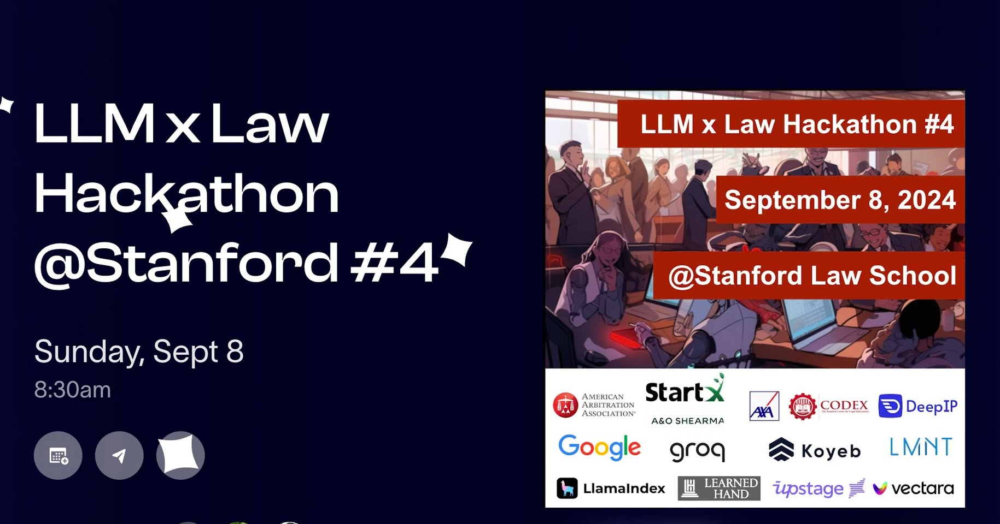
**이미지 캡션:** 이 이미지는 "LLM x Law Hackathon #4" 행사를 홍보하는 포스터입니다. 왼쪽에는 흰색 글씨로 "LLM x Law Hackathon @Stanford #4"라는 제목과 함께 행사 날짜와 시간이 "Sunday, Sept 8, 8:30am"으로 표시되어 있습니다. 그 아래에는 달력, 전송, 그리고 네모난 아이콘이 있습니다. 오른쪽에는 행사의 일러스트가 있는데, 법정이나 강의실 같은 배경에서 여러 사람들이 참여하고 있습니다. 앞쪽에는 노트북을 보며 코딩하는 듯한 젊은 여성과 남성이 보이고, 뒤쪽에는 정장을 입은정장을 입은

### 9월 6일 (금) 03:14 · Andrew Ng 교수님의 조언대로 AI에 더 많은 관심과 투자로, 국내…

Andrew Ng 교수님의 조언대로 AI에 더 많은 관심과 투자로, 국내의 많은 문제를 풀고 세계 AI기술을 리딩하면 좋겠습니다.

### 9월 7일 (토) 12:32 · #LetHimGo 오늘 #SF 에서 진귀한 경험을 했습니다. 낚시에 아기…

#LetHimGo 오늘 #SF 에서 진귀한 경험을 했습니다. 낚시에 아기 상어가 걸린것인데요.

제가 옆에서 보고 있다가 "이거 먹을꺼나? 아님 let it go" 이런 이야기를 계속 했더니 이분들도 결국 놓아주었습니다.  

제가 놓아 주는데 기여를 한것 같아 기분이 좋고, 상어가 살아 기쁩니다. 

이걸 본 저도 운이 좋았습니다. 이글을 보시는 여러분들도 모두 좋은 운을 전달 드립니다.

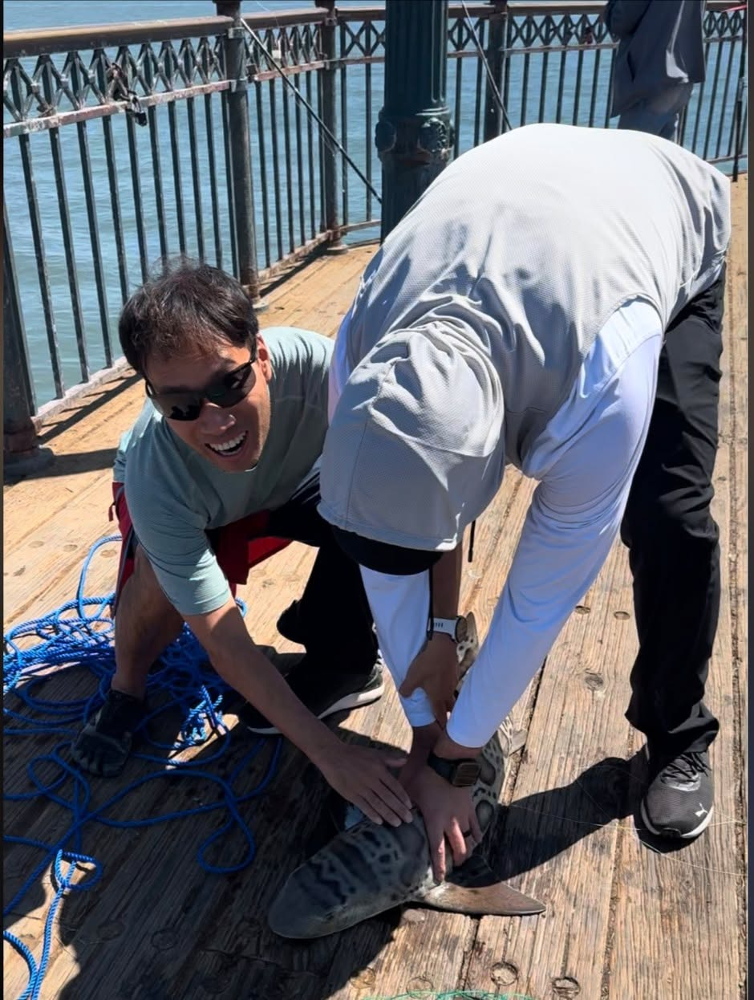
**이미지 캡션:** 두 명의 성인 남성이 나무 부두 위에서 물고기를 잡고 있다. 한 남성은 밝은 녹색 셔츠와 빨간색 반바지를 입고 있으며, 선글라스를 끼고 환하게 웃고 있다. 그는 물고기를 잡고 있는 다른 남성을 돕고 있다. 다른 남성은 회색 후드티와 검은색 바지를 입고 있으며, 물고기를 조심스럽게 다루고 있다. 물고기는 회색과 검은색 줄무늬가 있으며, 부두 위에는 파란색 밧줄이 놓여 있다. 배경에는 바다와 난간이 보인다. 전체적으로 즐겁고 활동적인 분위기이다.

🎬 동영상 2개 (생략)

### 9월 11일 (수) 08:50 · Upstage의 주력 모델인 #SolarProPreview (영어) 를 …

Upstage의 주력 모델인 #SolarProPreview (영어) 를 여러분들에게 선보일수 있어서 매우 기쁩니다.  Single GPU에서 돌아가는 가장 뛰어난 LLM으로, MMLU-Pro 및 IFEval과 같은 주요 벤치마크에서 우수한 성능을 보입니다.

아래중 가장 편하신 방법으로 사용가능하십니다.

1. Hugging Face에서 바로 오픈 모델 다운로드후 사용
https://huggingface.co/upstage/solar-pro-preview-instruct

2. 3개월간 무료로 제공되는 'solar-pro' API 사용 https://console.upstage.ai/api-keys 

3. Amazon Web Services 마켓플레이스에서 내 클라우드에 서 사용 https://aws.amazon.com/marketplace/seller-profile?id=seller-56j52of2hnuzo

더 자세한 정보는 https://upstage.ai/products/solar-pro-preview 에서 보실수 있습니다.

많이 사용해주세요!

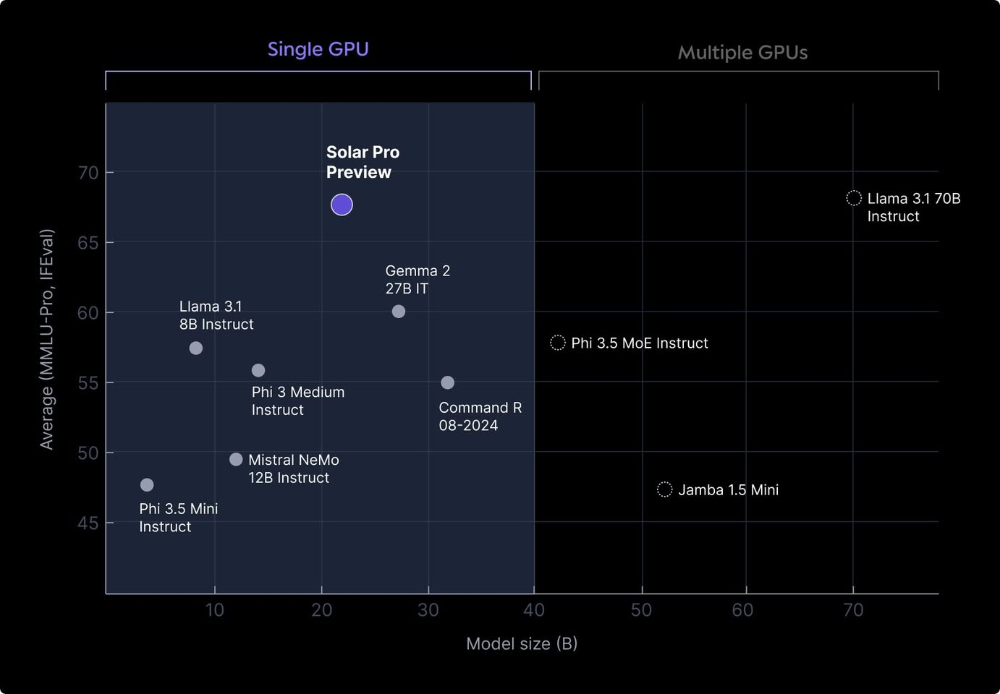
**이미지 캡션:** 이 이미지는 여러 대규모 언어 모델의 성능을 비교하는 산점도 그래프입니다. 그래프는 두 개의 주요 영역으로 나뉘는데, 왼쪽은 "Single GPU"를 나타내고 오른쪽은 "Multiple GPUs"를 나타냅니다. 세로축은 "Average (MMLU-Pro, IFEval)"로 모델의 평균 성능을 나타내며, 가로축은 "Model size (B)"로 모델의 크기를 나타냅니다. 각 점은 특정 언어 모델을 나타내며, 점의 위치는 해당 모델의 성능과 크기를 보여줍니다. 예를 들어, "Solar Pro Preview"는 Single GPU 영역에서 약 70의 성능과 15의 모델 크기를 가지는 것으로 표시됩니다. 다른 모델로는 "Gemma 2 27B IT", "Llama 3.1 8B Instruct", "Phi 3 Medium Instruct", "Mistral NeMo 12B Instruct", "Phi 3.5 Mini Instruct" 등이 Single GPU 영역에 표시되어 있으며, "Phi 3.5 MoE Instruct", "Jamba 1.5 Mini", "Llama 3.1 70B Instruct" 등은 Multiple GPUs 영역에 표시되어 있습니다. 그래프의 배경은 어두운 남색이며, 격자선과 텍스트는 밝은 색으로 표시되어 가독성을 높이고 있습니다. 이 그래프는 모델의 성능과 크기 간의 관계를 시각적으로 파악하는 데 유용하며, 특히 GPU 사용 환경에 따른 성능 차이를 비교하는 데 도움이 됩니다.ingle GPU 영역에서 약 70의 성능과 15의 모델 크기를 가지는 것으로 표시됩니다. 다른 모델로는 "Gemma 2 27B IT", "Llama 3.1 8B Instruct", "Phi 3 Medium Instruct", "Mistral NeMo 12B Instruct", "Phi 3.5 Mini Instruct" 등이 Single GPU 영역에 표시되어 있으며, "Phi 3.5 MoE Instruct", "Jamba 1.5 Mini", "Llama 3.1 70B Instruct" 등은 Multiple GPUs 영역에 표시되어 있습니다. 그래프의 배경은 어두운 남색이며, 격자선과 텍스트는 밝은 색으로 표시되어 가독성을 높이고 있습니다. 이 그래프는 모델의 성능과 크기 간의 관계를 시각적으로 파악하는 데 유용하며, 특히 GPU 사용 환경에 따른 성능 차이를 비교하는 데 도움이 됩니다.

### 9월 12일 (목) 07:43 · 📷 사진 (1장)

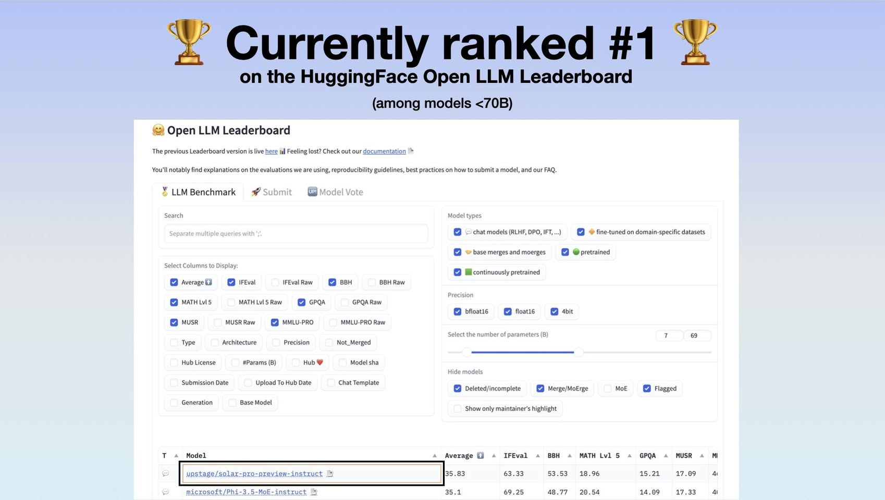
**이미지 캡션:** 화면 상단에는 "Currently ranked #1 on the Hugging Face Open LLM Leaderboard (among models <70B)"라는 제목과 함께 두 개의 금색 트로피 이미지가 보입니다. 그 아래에는 "Open LLM Leaderboard"라는 제목과 함께 웃는 이모티콘이 있고, 이전 리더보드 버전이 라이브이며 문서화 링크가 있음을 알리는 문구가 있습니다. 또한 평가, 재현성 지침, 모델 제출 모범 사례 및 FAQ에 대한 설명을 찾을 수 있다는 내용이 있습니다. 화면 중앙에는 "LLM Benchmark", "Submit", "Model Vote" 버튼이 있으며, 검색창과 "Select Columns to Display" 섹션이 있습니다. 이 섹션에서는 "Average", "IFEval", "IFEval Raw", "BBH", "BBH Raw", "MATH Lvl 5", "MATH Lvl 5 Raw", "GPQA", "GPQA Raw", "MUSR", "MUSR Raw", "MMLU-PRO", "MMLU-PRO Raw", "Type", "Architecture", "Precision", "Not_Merged", "Hub License", "#Params (B)", "Hub", "Model sha", "Submission Date", "Upload To Hub Date", "Chat Template", "Generation", "Base Model"과 같은 다양한 열을 선택할 수 있습니다. 오른쪽에는 "Model types" 섹션이 있으며, "chat models (RLHF, DPO, IFT, ...)", "fine-tuned on domain-specific datasets", "base merges and moerges", "pretrained", "continuously pretrained"와 같은 옵션이 있습니다. 그 아래에는 "Precision" 섹션이 있으며, "bfloat16", "float16", "4bit" 옵션이 있습니다. "Select the number of parameters (B)" 슬라이더와 "Hide models" 섹션도 있으며, "Deleted/incomplete", "Merge/MoErge", "MoE", "Flagged" 옵션이 있습니다. 화면 하단에는 "Model" 열에 "upstage/solar-pro-preview-instruct"와 "microsoft/Phi-3.5-MoE-instruct"라는 두 개의 모델 이름이 표시되고, 각 모델에 대한 "Average", "IFEval", "BBH", "MATH Lv1 5", "GPQA", "MUSR" 등의 성능 지표가 숫자로 표시됩니다. 전체적으로 이 화면은 Hugging Face의 오픈 LLM 리더보드를 보여주며, 다양한 모델의 성능을 비교하고 필터링할 수 있는 인터페이스를 제공합니다."LLM Benchmark", "Submit", "Model Vote" 버튼이 있으며, 검색창과 "Select Columns to Display" 섹션이 있습니다. 이 섹션에서는 "Average", "IFEval", "IFEval Raw", "BBH", "BBH Raw", "MATH Lvl 5", "MATH Lvl 5 Raw", "GPQA", "GPQA Raw", "MUSR", "MUSR Raw", "MMLU-PRO", "MMLU-PRO Raw", "Type", "Architecture", "Precision", "Not_Merged", "Hub License", "#Params (B)", "Hub", "Model sha", "Submission Date", "Upload To Hub Date", "Chat Template", "Generation", "Base Model"과 같은 다양한 열을 선택할 수 있습니다. 오른쪽에는 "Model types" 섹션이 있으며, "chat models (RLHF, DPO, IFT, ...)", "fine-tuned on domain-specific datasets", "base merges and moerges", "pretrained", "continuously pretrained"와 같은 옵션이 있습니다. 그 아래에는 "Precision" 섹션이 있으며, "bfloat16", "float16", "4bit" 옵션이 있습니다. "Select the number of parameters (B)" 슬라이더와 "Hide models" 섹션도 있으며, "Deleted/incomplete", "Merge/MoErge", "MoE", "Flagged" 옵션이 있습니다. 화면 하단에는 "Model" 열에 "upstage/solar-pro-preview-instruct"와 "microsoft/Phi-3.5-MoE-instruct"라는 두 개의 모델 이름이 표시되고, 각 모델에 대한 "Average", "IFEval", "BBH", "MATH Lv1 5", "GPQA", "MUSR" 등의 성능 지표가 숫자로 표시됩니다. 전체적으로 이 화면은 Hugging Face의 오픈 LLM 리더보드를 보여주며, 다양한 모델의 성능을 비교하고 필터링할 수 있는 인터페이스를 제공합니다.

> 어제 공개된 #SolarProLLM 이 허깅페이스 공식 리더보드 ver2 (70B이하의 모델)에서 1등을 달리고 있습니다. 많은 분들이 like 해주고 계셔서 Huggingface 오늘의 모델이 될수도 있을것 같습니다.   https://huggingface.co/upstage/solar-pro-preview-instruct (보시고 마음에 드시면 Like 부탁드립니다.)  제일 중요한것은 사용감인데요. 가벼운 테스트를 위해 제가 toy project을 만들어 보았습니다. (지금은 영어만 됩니다.)  * SolarPro Test: https://pro.toy.x.upstage.ai/  * SolarPro + duckduckgo 검색: https://search.toy.x.upstage.ai/ * 자동토론: https://discuss.toy.x.upstage.ai/  많이 사용해주세요!

### 9월 12일 (목) 07:55 · Sung Kim shared a link.

🔗 <https://huggingface.co/upstage/solar-pro-preview-instruct>

### 9월 13일 (금) 06:33 · 📷 사진 (1장)

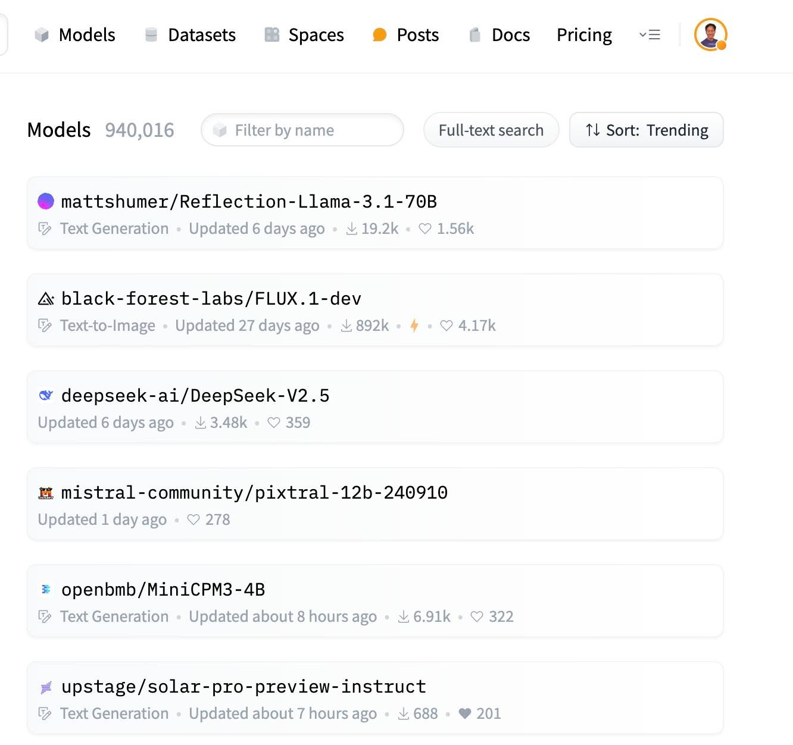
**이미지 캡션:** 이 화면은 인공지능 모델을 공유하고 탐색하는 웹사이트의 일부로, 다양한 모델 목록이 표시됩니다. 화면 상단에는 "Models", "Datasets", "Spaces", "Posts", "Docs", "Pricing"과 같은 메뉴 항목이 보이며, 오른쪽 상단에는 프로필 아이콘이 있습니다. 메인 영역에는 "Models 940,016"이라는 제목과 함께 모델을 필터링하거나 검색할 수 있는 입력란("Filter by name", "Full-text search") 및 정렬 옵션("Sort: Trending")이 있습니다. 그 아래로는 여러 AI 모델들이 카드 형태로 나열되어 있으며, 각 카드에는 모델 이름, 설명 (예: "Text Generation", "Text-to-Image"), 업데이트 날짜, 다운로드 수, 좋아요 수 등이 표시됩니다. 예를 들어, 첫 번째 모델은 "mattshumer/Reflection-Llama-3.1-70B"이며, 6일 전에 업데이트되었고 19.2k 다운로드와 1.56k 좋아요를 받았습니다. 두 번째 모델은 "black-forest-labs/FLUX.1-dev"로, 27일 전에 업데이트되었으며 892k 다운로드와 4.17k 좋아요를 기록했습니다. 이 외에도 "deepseek-ai/DeepSeek-V2.5", "mistral-community/pixtral-12b-240910", "openbmb/MiniCPM3-4B", "upstage/solar-pro-preview-instruct" 등의 모델들이 순서대로 나열되어 있습니다. 전반적으로 깔끔하고 정보가 잘 정리된 인터페이스이며, AI 모델 개발자나 사용자들이 최신 모델을 찾고 공유하는 데 유용한 플랫폼임을 알 수 있습니다.니다. 그 아래로는 여러 AI 모델들이 카드 형태로 나열되어 있으며, 각 카드에는 모델 이름, 설명 (예: "Text Generation", "Text-to-Image"), 업데이트 날짜, 다운로드 수, 좋아요 수 등이 표시됩니다. 예를 들어, 첫 번째 모델은 "mattshumer/Reflection-Llama-3.1-70B"이며, 6일 전에 업데이트되었고 19.2k 다운로드와 1.56k 좋아요를 받았습니다. 두 번째 모델은 "black-forest-labs/FLUX.1-dev"로, 27일 전에 업데이트되었으며 892k 다운로드와 4.17k 좋아요를 기록했습니다. 이 외에도 "deepseek-ai/DeepSeek-V2.5", "mistral-community/pixtral-12b-240910", "openbmb/MiniCPM3-4B", "upstage/solar-pro-preview-instruct" 등의 모델들이 순서대로 나열되어 있습니다. 전반적으로 깔끔하고 정보가 잘 정리된 인터페이스이며, AI 모델 개발자나 사용자들이 최신 모델을 찾고 공유하는 데 유용한 플랫폼임을 알 수 있습니다.

### 9월 15일 (일) 06:59 · "toy-o" project를 소개합니다: 일단 선접속, 후고민

"toy-o" project를 소개합니다: 일단 선접속, 후고민 
* https://toy-o1.streamlit.app/ 
* https://toy-o2.streamlit.app/ 

위 toy project는 STaR 논문, 최근 나온 OpenAI의 o1 및 reflection 70B 등에서 아이디어를 얻었습니다. 특히 SkunkworksAI/reasoning-0.01 데이터셋, https://chatgpt.com/g/g-Gz5b9D2CT-o1 의 https://github.com/bklieger-groq/g1 구현을 참고하여 아래와 같은 두가지 방법의 reasoning을 구현해 보았습니다.

1. "o1"은 SkunkworksAI 데이터셋을 기반으로 고정된 추론을 활용하며, 웹 검색 기능을 추가.
2. "o2"는 LLM 자체의 Planning을 활용하여 추론 ( https://github.com/bklieger-groq/g1 구현 활용)

위 toy project의 베이스 모델로는 #SolarProLLM을 사용하였습니다. (영어만 사용가능). 원하시면 @LangChainAI를 사용하여 선호하는 LLM 으로 쉽게 교체할 수 있습니다.

모든 프롬프트, 소스 코드는 https://github.com/hunkim/o/ 에 공개되어 있습니다. 많이 사용해주시고 comments나 pull request는 언제나 환영입니다.

#AI #추론 #오픈소스 #머신러닝 #SolarProLLM

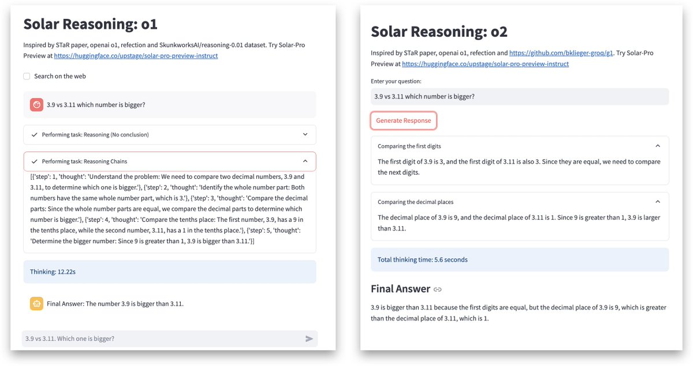
**이미지 캡션:** 이 이미지는 두 개의 웹 페이지 레이아웃을 나란히 보여주며, 각각 "Solar Reasoning: o1"과 "Solar Reasoning: o2"라는 제목이 붙어 있습니다. 두 페이지 모두 인공지능 모델의 추론 과정을 시각화한 것으로 보이며, 동일한 질문인 "3.9 vs 3.11 which number is bigger?"에 대한 답변을 생성하는 과정을 보여줍니다. 페이지에는 텍스트, 링크, 체크박스, 버튼, 그리고 추론 단계를 나타내는 코드와 설명이 포함되어 있습니다. 왼쪽 페이지 "Solar Reasoning: o1"은 "Performing task: Reasoning Chains"라는 섹션에서 단계별 사고 과정을 JSON 형식으로 보여주고 있으며, 각 단계마다 문제 이해, 전체 자릿수 비교, 소수점 이하 자릿수 비교, 그리고 최종 결론 도출 과정을 상세하게 설명하고 있습니다. "Thinking: 12.22s"라는 텍스트는 추론에 걸린 시간을 나타내며, "Final Answer: The number 3.9 is bigger than 3.11."이라는 최종 답변이 제시됩니다. 오른쪽 페이지 "Solar Reasoning: o2"는 "Enter your question:"이라는 입력란에 동일한 질문이 입력되어 있고, "Generate Response" 버튼이 있습니다. 그 아래에는 "Comparing the first digits"와 "Comparing the decimal places"라는 섹션이 있으며, 각 섹션에서 숫자를 비교하는 과정을 자연어 설명으로 제공합니다. "Total thinking time: 5.6 seconds"라는 텍스트와 함께 "Final Answer" 섹션에서 최종 답변을 다시 한번 설명하고 있습니다. 두 페이지 모두 텍스트 기반의 인터페이스이며, 특별한 인물이나 장소는 묘사되지 않고, 오직 컴퓨터 화면의 일부를 캡처한 것으로 보입니다. 전반적으로 기술적이고 정보 중심적인 분위기를 풍깁니다.ng: o1"은 "Performing task: Reasoning Chains"라는 섹션에서 단계별 사고 과정을 JSON 형식으로 보여주고 있으며, 각 단계마다 문제 이해, 전체 자릿수 비교, 소수점 이하 자릿수 비교, 그리고 최종 결론 도출 과정을 상세하게 설명하고 있습니다. "Thinking: 12.22s"라는 텍스트는 추론에 걸린 시간을 나타내며, "Final Answer: The number 3.9 is bigger than 3.11."이라는 최종 답변이 제시됩니다. 오른쪽 페이지 "Solar Reasoning: o2"는 "Enter your question:"이라는 입력란에 동일한 질문이 입력되어 있고, "Generate Response" 버튼이 있습니다. 그 아래에는 "Comparing the first digits"와 "Comparing the decimal places"라는 섹션이 있으며, 각 섹션에서 숫자를 비교하는 과정을 자연어 설명으로 제공합니다. "Total thinking time: 5.6 seconds"라는 텍스트와 함께 "Final Answer" 섹션에서 최종 답변을 다시 한번 설명하고 있습니다. 두 페이지 모두 텍스트 기반의 인터페이스이며, 특별한 인물이나 장소는 묘사되지 않고, 오직 컴퓨터 화면의 일부를 캡처한 것으로 보입니다. 전반적으로 기술적이고 정보 중심적인 분위기를 풍깁니다.

### 9월 15일 (일) 10:14 · 와! Hugging Face 총 951,486개의 모델중 #SolarPr…

와! Hugging Face 총 951,486개의 모델중 #SolarPro 가 이번주 #Trending #Top4 에 들었습니다. 

https://huggingface.co/upstage/solar-pro-preview-instruct 
좋아요 + 다운로드 많이 부탁드립니다.

Mistral은 이겨 보도록 하겠습니다!

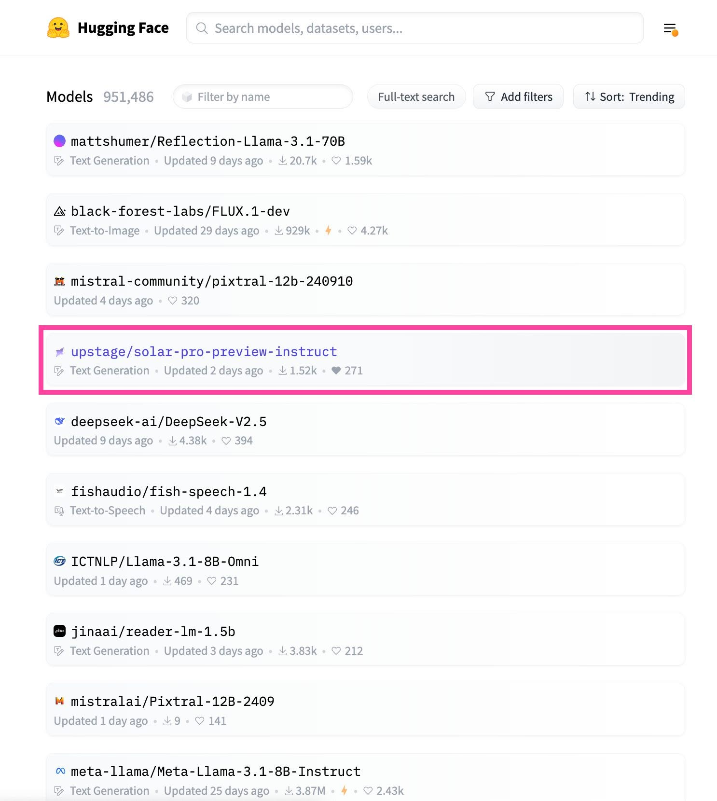
**이미지 캡션:** 이 이미지는 Hugging Face 웹사이트의 모델 목록 페이지를 보여줍니다. 화면 중앙에는 다양한 AI 모델들의 목록이 표시되어 있으며, 각 모델은 이름, 설명, 업데이트 날짜, 다운로드 수, 좋아요 수를 포함합니다. 보라색으로 강조 표시된 줄은 "upstage/solar-pro-preview-instruct"라는 이름의 모델을 나타내며, 이 모델은 "Text Generation" 카테고리에 속하고 2일 전에 업데이트되었으며 1.52k의 다운로드와 271개의 좋아요를 받았습니다. 페이지 상단에는 "Hugging Face" 로고와 검색창, 그리고 모델, 데이터셋, 사용자 검색을 위한 기능들이 있습니다. 목록은 "Models 951,486"으로 시작하며, 필터링 및 정렬 옵션도 제공됩니다. 전반적으로 기술적인 정보를 제공하는 깔끔하고 기능적인 인터페이스를 보여줍니다.ng Face" 로고와 검색창, 그리고 모델, 데이터셋, 사용자 검색을 위한 기능들이 있습니다. 목록은 "Models 951,486"으로 시작하며, 필터링 및 정렬 옵션도 제공됩니다. 전반적으로 기술적인 정보를 제공하는 깔끔하고 기능적인 인터페이스를 보여줍니다.

### 9월 15일 (일) 10:28 · Sung Kim shared a link.

🔗 <https://en.wikipedia.org/wiki/Nancy_Ip>

### 9월 16일 (월) 08:03 · 📷 사진 (1장)

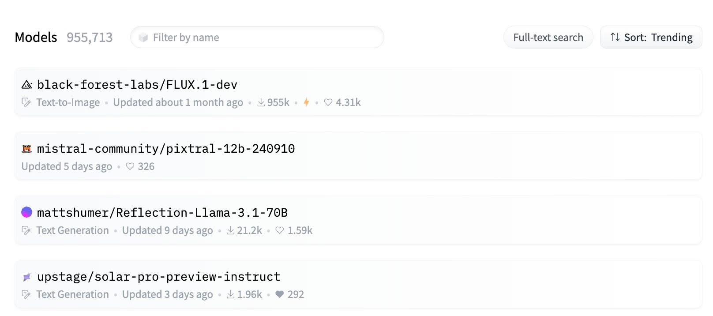
**이미지 캡션:** 이 이미지는 웹사이트의 모델 목록을 보여줍니다. 상단에는 "Models 955,713"이라는 텍스트와 함께 필터링 옵션이 있습니다. 그 아래에는 여러 개의 모델 목록이 표시되며, 각 목록에는 모델 이름, 업데이트 날짜, 다운로드 수, 좋아요 수가 포함되어 있습니다. 첫 번째 모델은 "black-forest-labs/FLUX.1-dev"이며, "Text-to-Image" 유형으로 약 1개월 전에 업데이트되었고 955k 다운로드와 4.31k 좋아요를 받았습니다. 두 번째 모델은 "mistral-community/pixtral-12b-240910"으로 5일 전에 업데이트되었고 326개의 좋아요를 받았습니다. 세 번째 모델은 "mattshumer/Reflection-Llama-3.1-70B"이며, "Text Generation" 유형으로 9일 전에 업데이트되었고 21.2k 다운로드와 1.59k 좋아요를 받았습니다. 네 번째 모델은 "upstage/solar-pro-preview-instruct"이며, "Text Generation" 유형으로 3일 전에 업데이트되었고 1.96k 다운로드와 292개의 좋아요를 받았습니다. 목록 오른쪽에는 "Full-text search" 버튼과 "Sort: Trending" 옵션이 있습니다. 전체적으로 깔끔하고 정보가 잘 정리된 인터페이스를 보여줍니다.pixtral-12b-240910"으로 5일 전에 업데이트되었고 326개의 좋아요를 받았습니다. 세 번째 모델은 "mattshumer/Reflection-Llama-3.1-70B"이며, "Text Generation" 유형으로 9일 전에 업데이트되었고 21.2k 다운로드와 1.59k 좋아요를 받았습니다. 네 번째 모델은 "upstage/solar-pro-preview-instruct"이며, "Text Generation" 유형으로 3일 전에 업데이트되었고 1.96k 다운로드와 292개의 좋아요를 받았습니다. 목록 오른쪽에는 "Full-text search" 버튼과 "Sort: Trending" 옵션이 있습니다. 전체적으로 깔끔하고 정보가 잘 정리된 인터페이스를 보여줍니다.

> 모든 AI모델들이 다 올라오는 곳이 허깅페이스 입니다. 여기 trending이라는 코너가 있는데요. ProductHunt 같이 인기 있는 모델들을 보여주는 곳입니다.  저희 #solarpro 가 무려 4위에 올랐는데요. 조금만 더 사랑을 받으면 Mistral을 넘어 2등, 그리고 1위도 가능할것 같습니다.  https://huggingface.co/upstage/solar-pro-preview-instruct 좋아요 + 다운로드 부탁드립니다. (계정은 금방 만들수 있습니다.)  행복한 한가위 되세요!

### 9월 16일 (월) 10:42 · Upstage가 후원하고 참여하고 있는 AI Agents Hackatho…

Upstage가 후원하고 참여하고 있는 AI Agents Hackathon with Lablab and MindsDB -  최종 본선팀의 발표가 곧 시작됩니다. 

LLM의 궁긍적인 Application은 결국은 우리대신 일을 해주는 Agent가 될것인데요. 어떤 아이디어들이 본선에 올라왔을지 기대 됩니다.

한국시간 10:30분 예정이였는데 심사관계로 조금 늦어지는것 같습니다.

https://www.youtube.com/watch?v=mtEdTmNUkCA

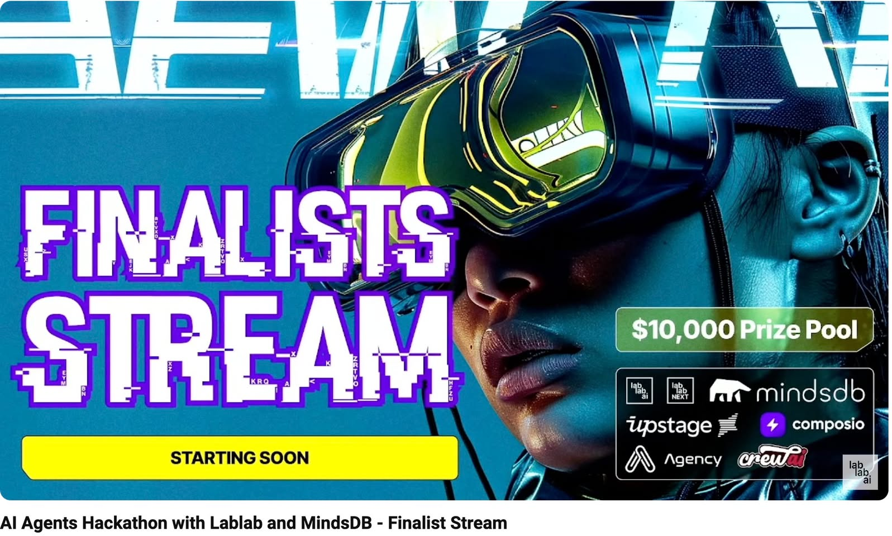
**이미지 캡션:** 이 이미지는 AI Agents Hackathon의 결승전 스트림을 홍보하는 포스터입니다. 중앙에는 가상현실(VR) 헤드셋을 착용한 젊은 성인 여성의 얼굴이 클로즈업되어 있습니다. 여성은 어두운 색상의 후드티를 입고 있으며, 귀에는 여러 개의 귀걸이를 하고 있습니다. 그녀의 표정은 보이지 않지만, VR 헤드셋의 반짝이는 렌즈는 미래적이고 기술적인 분위기를 자아냅니다. 배경은 밝은 파란색이며, "FINALISTS STREAM"이라는 글자가 보라색과 흰색으로 크게 쓰여 있고, 글자에는 디지털 노이즈 효과가 적용되어 있습니다. 그 아래에는 노란색 배경에 "STARTING SOON"이라는 문구가 있습니다. 오른쪽 상단에는 "$10,000 Prize Pool"이라는 문구가 녹색 테두리 안에 표시되어 있습니다. 그 아래에는 여러 로고가 나열되어 있는데, Lablab.ai, Lablab.ai NEXT, MindsDB, Upstage, Composio, Agency, CrewAI 등이 보입니다. 전체적으로 이 이미지는 기술, 혁신, 경쟁을 강조하는 역동적이고 현대적인 분위기를 전달합니다. 있습니다. 그 아래에는 노란색 배경에 "STARTING SOON"이라는 문구가 있습니다. 오른쪽 상단에는 "$10,000 Prize Pool"이라는 문구가 녹색 테두리 안에 표시되어 있습니다. 그 아래에는 여러 로고가 나열되어 있는데, Lablab.ai, Lablab.ai NEXT, MindsDB, Upstage, Composio, Agency, CrewAI 등이 보입니다. 전체적으로 이 이미지는 기술, 혁신, 경쟁을 강조하는 역동적이고 현대적인 분위기를 전달합니다.

### 9월 17일 (화) 13:45 · Sung Kim shared a link.

🔗 <https://huggingface.co/upstage/solar-pro-preview-instruct>

### 9월 18일 (수) 10:22 · 전세계 사람들이 즐겨 사용하는 Poe Platform에 #SolarPro…

전세계 사람들이 즐겨 사용하는 Poe Platform에 #SolarPro가 탑재 되었습니다.

https://poe.com/Solar-Pro-Preview

가벼운 쳇 뿐만 아니라 이미지 인식, PDF 내용 대화, 웹페이지 URL 내용기반 대화, (이미지 캡춰를 통한) 슬라이드 작업등 다양한 일들을 할수 있습니다.

바로 만나보세요! (지금은 영어로 대화가 가능합니다.)

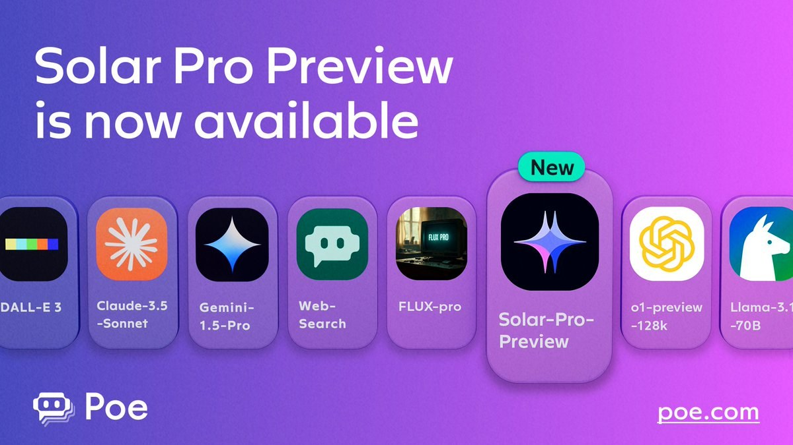
**이미지 캡션:** 이 이미지는 "Solar Pro Preview is now available"이라는 문구와 함께 Poe 플랫폼에서 제공되는 다양한 AI 모델들을 보여주는 광고 이미지입니다. 배경은 보라색 그라데이션으로 되어 있으며, 여러 개의 앱 아이콘들이 나열되어 있습니다. 왼쪽부터 DALL-E 3, Claude-3.5-Sonnet, Gemini-1.5-Pro, Web-Search, FLUX-pro, 그리고 "New" 라벨이 붙은 Solar-Pro-Preview 아이콘이 있습니다. 그 옆으로는 o1-preview-128k와 Llama-3.1-70B 아이콘이 보입니다. 각 아이콘은 해당 AI 모델을 상징하는 그래픽 디자인을 가지고 있습니다. 이미지 하단에는 Poe 로고와 웹사이트 주소인 poe.com이 표시되어 있습니다. 이 이미지에는 사람이 등장하지 않으며, 전체적으로 깔끔하고 현대적인 디자인으로 AI 서비스의 출시를 알리는 분위기입니다. Llama-3.1-70B 아이콘이 보입니다. 각 아이콘은 해당 AI 모델을 상징하는 그래픽 디자인을 가지고 있습니다. 이미지 하단에는 Poe 로고와 웹사이트 주소인 poe.com이 표시되어 있습니다. 이 이미지에는 사람이 등장하지 않으며, 전체적으로 깔끔하고 현대적인 디자인으로 AI 서비스의 출시를 알리는 분위기입니다.
 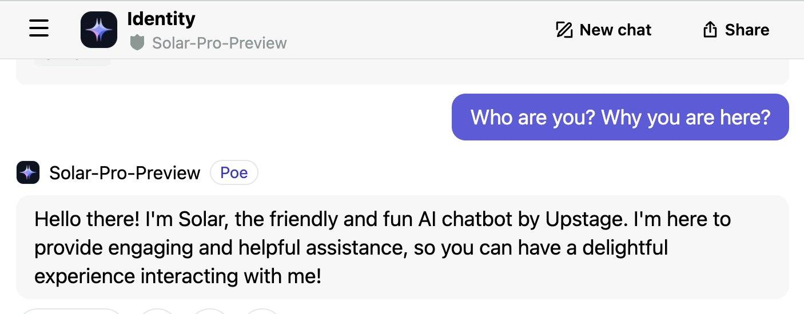
**이미지 캡션:** 이 이미지는 스마트폰 또는 컴퓨터 화면의 일부를 캡처한 것으로, 챗봇과의 대화 인터페이스를 보여줍니다. 화면 상단에는 "Identity"라는 제목과 함께 메뉴 아이콘, 챗봇의 프로필 아이콘, 그리고 "New chat" 및 "Share" 버튼이 있습니다. 프로필 아이콘 옆에는 "Solar-Pro-Preview"라는 텍스트가 표시되어 있습니다. 대화창에는 두 개의 메시지가 보입니다. 첫 번째 메시지는 보라색 말풍선 안에 "Who are you? Why you are here?"라고 쓰여 있으며, 이는 사용자가 챗봇에게 질문하는 내용으로 보입니다. 두 번째 메시지는 흰색 말풍선 안에 "Hello there! I'm Solar, the friendly and fun AI chatbot by Upstage. I'm here to provide engaging and helpful assistance, so you can have a delightful experience interacting with me!"라고 쓰여 있으며, 이는 챗봇 "Solar"가 자신을 소개하고 방문 목적을 설명하는 내용입니다. 챗봇의 이름 옆에는 "Poe"라는 작은 태그가 붙어 있어, 이 챗봇이 Poe 플랫폼에서 제공됨을 나타낼 수 있습니다. 전반적으로, 이 이미지는 사용자가 AI 챗봇과 상호작용하는 초기 단계를 보여주며, 기술적인 인터페이스와 텍스트 기반의 소통이 중심이 되는 분위기입니다.봇에게 질문하는 내용으로 보입니다. 두 번째 메시지는 흰색 말풍선 안에 "Hello there! I'm Solar, the friendly and fun AI chatbot by Upstage. I'm here to provide engaging and helpful assistance, so you can have a delightful experience interacting with me!"라고 쓰여 있으며, 이는 챗봇 "Solar"가 자신을 소개하고 방문 목적을 설명하는 내용입니다. 챗봇의 이름 옆에는 "Poe"라는 작은 태그가 붙어 있어, 이 챗봇이 Poe 플랫폼에서 제공됨을 나타낼 수 있습니다. 전반적으로, 이 이미지는 사용자가 AI 챗봇과 상호작용하는 초기 단계를 보여주며, 기술적인 인터페이스와 텍스트 기반의 소통이 중심이 되는 분위기입니다.
 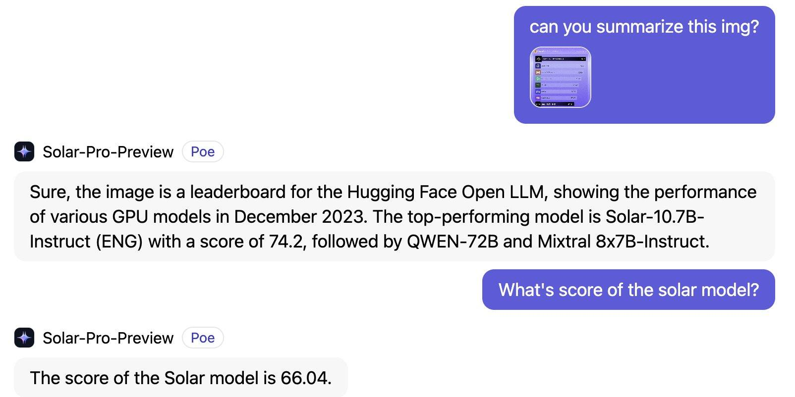
**이미지 캡션:** 이 이미지는 대화형 인터페이스의 스크린샷으로, 인공지능 챗봇인 "Solar-Pro-Preview"와 "Poe"가 상호작용하는 내용을 보여줍니다. 상단에는 사용자가 "이 이미지를 요약해 줄 수 있나요?"라고 질문하는 보라색 말풍선과 함께 작은 이미지 미리보기가 있습니다. 미리보기 이미지에는 표 형태로 여러 항목이 나열되어 있으며, 이는 GPU 모델의 성능 순위를 나타내는 리더보드로 보입니다. 그 아래에는 "Solar-Pro-Preview" 챗봇이 "네, 이 이미지는 2023년 12월 다양한 GPU 모델의 성능을 보여주는 Hugging Face Open LLM 리더보드입니다. 최고 성능 모델은 Solar-10.7B-Instruct (ENG)이며 74.2점을 기록했고, 그 뒤를 QWEN-72B와 Mixtral 8x7B-Instruct가 이었습니다."라고 답변하는 내용이 있습니다. 이어서 사용자가 "솔라 모델의 점수는 얼마인가요?"라고 질문하는 보라색 말풍선이 나타납니다. 마지막으로 "Solar-Pro-Preview" 챗봇이 "솔라 모델의 점수는 66.04입니다."라고 답변하는 내용이 보입니다. 전반적으로 기술적인 정보, 특히 인공지능 모델의 성능에 대한 질의응답이 이루어지는 상황을 묘사하고 있습니다. 보여주는 Hugging Face Open LLM 리더보드입니다. 최고 성능 모델은 Solar-10.7B-Instruct (ENG)이며 74.2점을 기록했고, 그 뒤를 QWEN-72B와 Mixtral 8x7B-Instruct가 이었습니다."라고 답변하는 내용이 있습니다. 이어서 사용자가 "솔라 모델의 점수는 얼마인가요?"라고 질문하는 보라색 말풍선이 나타납니다. 마지막으로 "Solar-Pro-Preview" 챗봇이 "솔라 모델의 점수는 66.04입니다."라고 답변하는 내용이 보입니다. 전반적으로 기술적인 정보, 특히 인공지능 모델의 성능에 대한 질의응답이 이루어지는 상황을 묘사하고 있습니다.
 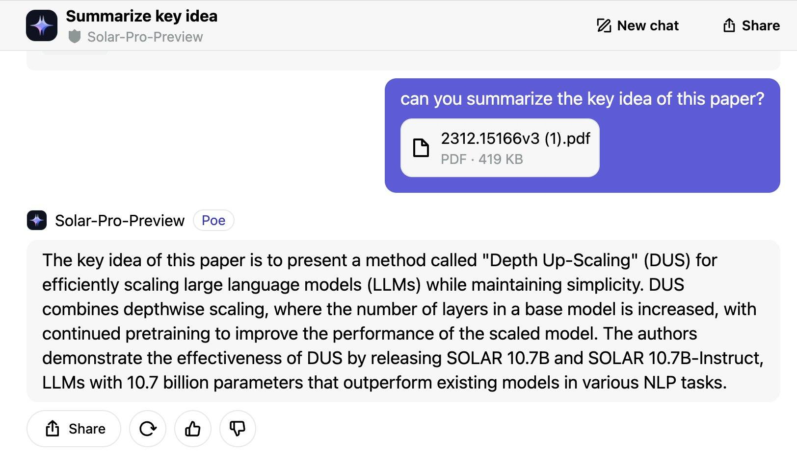
**이미지 캡션:** 이 이미지는 챗봇 인터페이스의 스크린샷으로, 사용자가 "이 논문의 핵심 아이디어를 요약해 줄 수 있나요?"라고 질문하고 챗봇인 Solar-Pro-Preview가 "Depth Up-Scaling"(DUS)이라는 방법을 소개하며, 이 방법은 대규모 언어 모델(LLM)을 효율적으로 확장하면서도 단순성을 유지하는 것을 목표로 한다고 설명합니다. DUS는 기본 모델의 레이어 수를 늘리는 심층 확장과 확장된 모델의 성능을 향상시키기 위한 지속적인 사전 훈련을 결합하며, 저자들은 107억 개의 매개변수를 가진 SOLAR 10.7B 및 SOLAR 10.7B-Instruct LLM을 공개하여 다양한 NLP 작업에서 기존 모델보다 뛰어난 성능을 입증했다고 합니다. 배경은 디지털 인터페이스이며, 텍스트는 질문과 답변 형식으로 구성되어 있습니다. 전반적으로 정보 전달 및 기술적 내용을 다루는 차분하고 전문적인 분위기입니다.10.7B 및 SOLAR 10.7B-Instruct LLM을 공개하여 다양한 NLP 작업에서 기존 모델보다 뛰어난 성능을 입증했다고 합니다. 배경은 디지털 인터페이스이며, 텍스트는 질문과 답변 형식으로 구성되어 있습니다. 전반적으로 정보 전달 및 기술적 내용을 다루는 차분하고 전문적인 분위기입니다.
 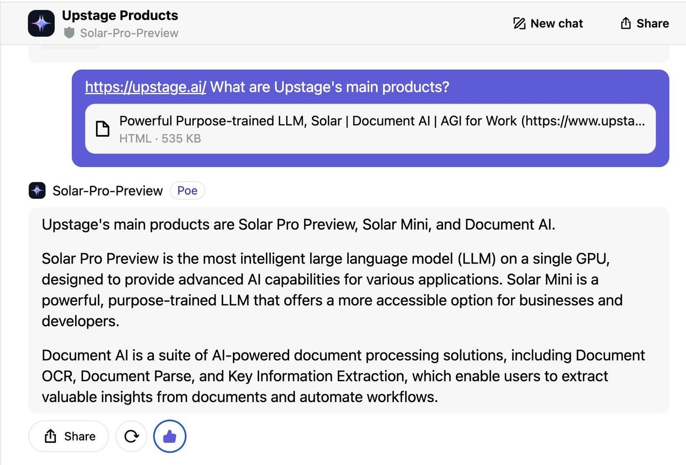
**이미지 캡션:** 이 이미지는 챗봇 인터페이스의 스크린샷으로, Upstage Products라는 이름의 챗봇이 Upstage의 주요 제품에 대한 질문에 답변하고 있습니다. 챗봇은 "Solar Pro Preview", "Solar Mini", "Document AI"를 주요 제품으로 소개하며, 각 제품의 특징을 설명합니다. Solar Pro Preview는 단일 GPU에서 작동하는 가장 지능적인 LLM이며, Solar Mini는 비즈니스와 개발자를 위한 접근 가능한 LLM입니다. Document AI는 OCR, 문서 구문 분석, 핵심 정보 추출을 포함하는 AI 기반 문서 처리 솔루션입니다. 인터페이스 상단에는 "New chat" 및 "Share" 버튼이 있으며, 하단에는 "Share", 새로고침 아이콘, 좋아요 아이콘이 있습니다. 챗봇의 응답은 명확하고 간결하며, 기술적인 정보를 제공합니다. 전반적으로 이 이미지는 AI 제품에 대한 정보를 제공하는 챗봇의 기능을 보여줍니다. 핵심 정보 추출을 포함하는 AI 기반 문서 처리 솔루션입니다. 인터페이스 상단에는 "New chat" 및 "Share" 버튼이 있으며, 하단에는 "Share", 새로고침 아이콘, 좋아요 아이콘이 있습니다. 챗봇의 응답은 명확하고 간결하며, 기술적인 정보를 제공합니다. 전반적으로 이 이미지는 AI 제품에 대한 정보를 제공하는 챗봇의 기능을 보여줍니다.
 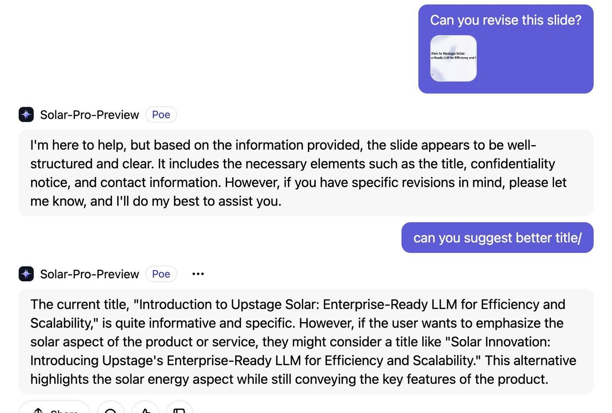
**이미지 캡션:** 이 이미지는 챗봇과의 대화 화면을 보여줍니다. 화면 상단에는 보라색 말풍선에 "Can you revise this slide?"라는 질문이 있고, 그 아래에는 작은 썸네일 이미지가 보입니다. 썸네일 이미지에는 "tion to Upstage Solar: e-Ready LLM for Efficiency and"라는 텍스트가 일부 보입니다. 그 아래에는 "Solar-Pro-Preview Poe"라는 이름과 함께 회색 말풍선에 챗봇의 답변이 있습니다. 챗봇은 제공된 정보를 바탕으로 슬라이드가 잘 구성되고 명확하며 제목, 기밀 유지 고지, 연락처 정보 등 필요한 요소를 포함하고 있다고 말합니다. 또한 특정 수정 사항이 있으면 알려달라고 덧붙입니다. 그 아래에는 또 다른 보라색 말풍선에 "can you suggest better title/"라는 질문이 있습니다. 마지막으로 "Solar-Pro-Preview Poe"라는 이름과 함께 회색 말풍선에 챗봇의 두 번째 답변이 있습니다. 챗봇은 현재 제목 "Introduction to Upstage Solar: Enterprise-Ready LLM for Efficiency and Scalability"가 유익하고 구체적이지만, 태양광 측면을 강조하고 싶다면 "Solar Innovation: Introducing Upstage's Enterprise-Ready LLM for Efficiency and Scalability"와 같은 제목을 고려할 수 있다고 제안합니다. 이 대안은 태양 에너지 측면을 강조하면서도 제품의 핵심 기능을 전달한다고 설명합니다. 전체적으로 이 이미지는 AI 챗봇을 사용하여 프레젠테이션 슬라이드에 대한 피드백과 개선 제안을 받는 상황을 보여줍니다.목, 기밀 유지 고지, 연락처 정보 등 필요한 요소를 포함하고 있다고 말합니다. 또한 특정 수정 사항이 있으면 알려달라고 덧붙입니다. 그 아래에는 또 다른 보라색 말풍선에 "can you suggest better title/"라는 질문이 있습니다. 마지막으로 "Solar-Pro-Preview Poe"라는 이름과 함께 회색 말풍선에 챗봇의 두 번째 답변이 있습니다. 챗봇은 현재 제목 "Introduction to Upstage Solar: Enterprise-Ready LLM for Efficiency and Scalability"가 유익하고 구체적이지만, 태양광 측면을 강조하고 싶다면 "Solar Innovation: Introducing Upstage's Enterprise-Ready LLM for Efficiency and Scalability"와 같은 제목을 고려할 수 있다고 제안합니다. 이 대안은 태양 에너지 측면을 강조하면서도 제품의 핵심 기능을 전달한다고 설명합니다. 전체적으로 이 이미지는 AI 챗봇을 사용하여 프레젠테이션 슬라이드에 대한 피드백과 개선 제안을 받는 상황을 보여줍니다.

### 9월 18일 (수) 12:10 · #SolarPro가 #gpt4 류를 이깁니다! EQ Bench와 MAG…

#SolarPro가 #gpt4 류를 이깁니다! EQ Bench와 MAGI-Hard 평가에서 GPT-4o-Mini보다 우수한 성능을 보였습니다!

이 지표는 사용성에서 특히 중요한데요. #SolarPro의 향상된 감성 지능과 고급 추론 능력이 있다는 것을 보여줍니다. 그래서 대인 관계 상호작용과 복잡한 문제 해결이 필요한 응용 프로그램에서 더 효과적입니다.

자세한 내용은 https://eqbench.com 참고하시면 됩니다. (오늘 발표한 Mistal 22B Mistral-Small-Instruct-2409 도 찾아 보셔요)

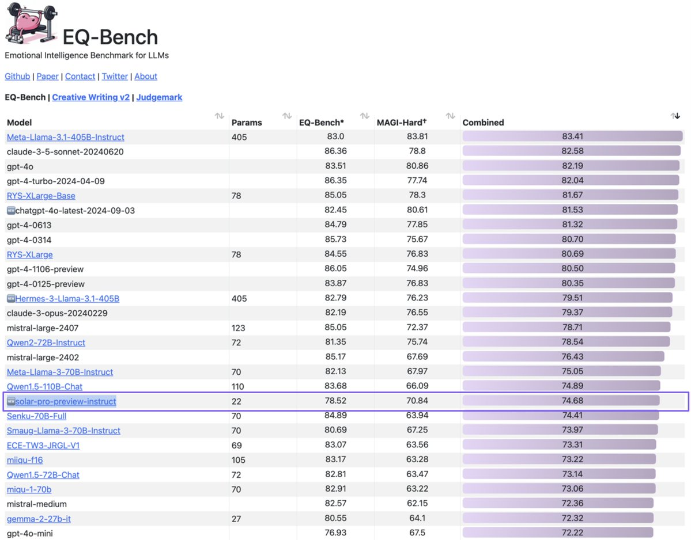
**이미지 캡션:** 이 이미지는 EQ-Bench라는 감성 지능 벤치마크의 결과를 보여주는 표입니다. 표에는 모델 이름, 파라미터 수, EQ-Bench 점수, MAGI-Hard 점수, 그리고 최종 결합 점수가 포함되어 있습니다. 상단에는 EQ-Bench 로고와 함께 "Emotional Intelligence Benchmark for LLMs"라는 부제가 있습니다. 표의 왼쪽 상단에는 Github, Paper, Contact, Twitter, About 링크가 있으며, 그 아래에는 EQ-Bench와 Creative Writing v2, Judgemark 링크가 있습니다. 표의 행들은 다양한 언어 모델들의 성능을 나타내며, 각 모델의 이름과 함께 해당 모델의 파라미터 수와 세 가지 다른 평가 지표에 대한 점수가 나열되어 있습니다. 특정 행은 "new solar-pro-preview-instruct"라는 모델을 강조 표시하고 있으며, 이 모델은 22개의 파라미터를 가지고 있고 EQ-Bench 점수는 78.52, MAGI-Hard 점수는 70.84, 결합 점수는 74.68입니다. 표의 배경은 연한 보라색과 흰색이 번갈아 나타나는 줄무늬 패턴으로 되어 있습니다. 전반적으로 이 이미지는 인공지능 모델들의 감성 지능 성능을 비교하고 평가하는 학술적이거나 기술적인 맥락을 보여줍니다.2, Judgemark 링크가 있습니다. 표의 행들은 다양한 언어 모델들의 성능을 나타내며, 각 모델의 이름과 함께 해당 모델의 파라미터 수와 세 가지 다른 평가 지표에 대한 점수가 나열되어 있습니다. 특정 행은 "new solar-pro-preview-instruct"라는 모델을 강조 표시하고 있으며, 이 모델은 22개의 파라미터를 가지고 있고 EQ-Bench 점수는 78.52, MAGI-Hard 점수는 70.84, 결합 점수는 74.68입니다. 표의 배경은 연한 보라색과 흰색이 번갈아 나타나는 줄무늬 패턴으로 되어 있습니다. 전반적으로 이 이미지는 인공지능 모델들의 감성 지능 성능을 비교하고 평가하는 학술적이거나 기술적인 맥락을 보여줍니다.

### 9월 18일 (수) 12:11 · Sung Kim shared a link.

🔗 <https://huggingface.co/upstage/solar-pro-preview-instruct>

### 9월 19일 (목) 08:46 · #SolarPro, Ollama에 탑재 되었습니다. 이번 저희가 새로운 …

#SolarPro, Ollama에 탑재 되었습니다. 이번 저희가 새로운 구조로 모델을 만들어서 이를 위해 특별히 Ollama 0.3.11을 새로 릴리즈 하면서 #solarpro 를 올려주었습니다.

https://ollama.com/download 에서 다운로드후

'ollama run solar-pro' 하시면 됩니다.

마침 팔로알토의 Ollama 사무실의 문을 직접 두드리며 함께 만들었고 앞으로도 멋진 협업이 기대 됩니다.

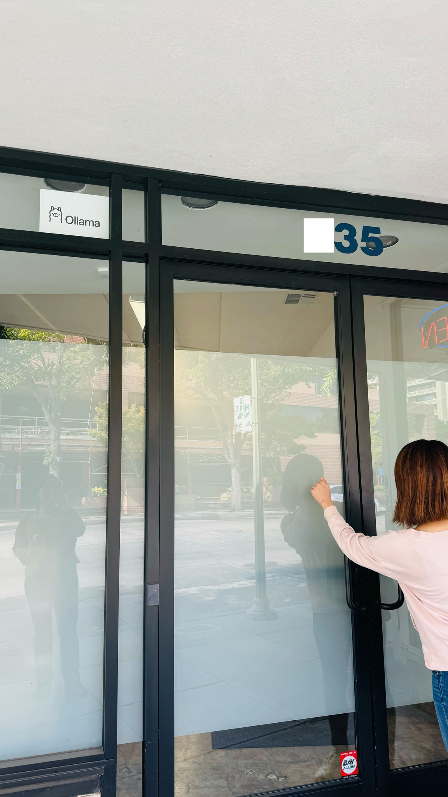
**이미지 캡션:** 한 성인 여성이 분홍색 스웨터와 청바지를 입고 검은색 문틀이 있는 유리문을 열려고 손을 뻗고 있습니다. 그녀는 갈색 머리를 가지고 있으며, 그녀의 얼굴은 보이지 않습니다. 문 위에는 "Ollama"라는 로고가 새겨진 흰색 표지판과 파란색 숫자 "35"가 있습니다. 유리문에는 건물 외부의 반사가 비치는데, 나무와 건물, 그리고 "30 MINUTE PARKING"이라고 쓰인 표지판이 보입니다. 문 아래쪽에는 "PROTECTED BY BAY ALARM"이라는 빨간색 스티커가 붙어 있습니다. 전반적으로 밝고 일상적인 분위기입니다. 분위기입니다.
 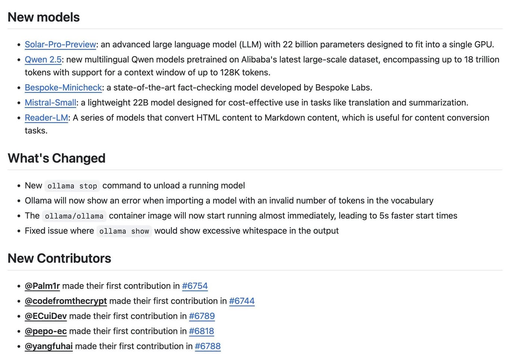
**이미지 캡션:** 이 이미지는 컴퓨터 화면의 일부를 캡처한 것으로, 텍스트 정보가 주를 이룹니다. 사람이나 장소, 사물은 보이지 않으며, 오직 흰색 배경에 검은색 텍스트로 구성된 문서의 일부입니다. 문서의 내용은 크게 "New models", "What's Changed", "New Contributors" 세 부분으로 나뉩니다. "New models" 섹션에서는 새로운 대규모 언어 모델(LLM)인 Solar-Pro-Preview, Qwen 2.5, Bespoke-Minicheck, Mistral-Small, Reader-LM에 대한 설명이 나열되어 있습니다. 각 모델의 특징과 용도가 간략하게 소개되어 있으며, 특히 매개변수 수, 학습 데이터 규모, 특정 작업에 대한 효율성 등이 언급됩니다. "What's Changed" 섹션에서는 ollama라는 소프트웨어의 변경 사항이 요약되어 있습니다. 새로운 명령어 추가, 모델 가져오기 시 오류 처리 개선, 컨테이너 이미지 시작 속도 향상, 출력 시 공백 문제 수정 등 구체적인 업데이트 내용이 점으로 구분되어 설명됩니다. 마지막으로 "New Contributors" 섹션에서는 해당 소프트웨어에 처음으로 기여한 사용자들의 목록과 함께 각 기여에 대한 이슈 번호가 해시태그(#)와 함께 표시되어 있습니다. 전반적으로 기술적인 업데이트 내용을 담고 있는 문서의 일부로, 정보 전달에 초점을 맞춘 차분하고 전문적인 분위기입니다.에 대한 설명이 나열되어 있습니다. 각 모델의 특징과 용도가 간략하게 소개되어 있으며, 특히 매개변수 수, 학습 데이터 규모, 특정 작업에 대한 효율성 등이 언급됩니다. "What's Changed" 섹션에서는 ollama라는 소프트웨어의 변경 사항이 요약되어 있습니다. 새로운 명령어 추가, 모델 가져오기 시 오류 처리 개선, 컨테이너 이미지 시작 속도 향상, 출력 시 공백 문제 수정 등 구체적인 업데이트 내용이 점으로 구분되어 설명됩니다. 마지막으로 "New Contributors" 섹션에서는 해당 소프트웨어에 처음으로 기여한 사용자들의 목록과 함께 각 기여에 대한 이슈 번호가 해시태그(#)와 함께 표시되어 있습니다. 전반적으로 기술적인 업데이트 내용을 담고 있는 문서의 일부로, 정보 전달에 초점을 맞춘 차분하고 전문적인 분위기입니다.
 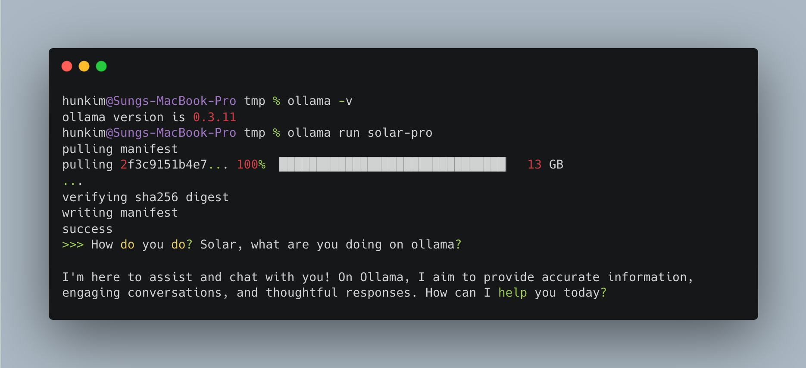
**이미지 캡션:** 이 사진은 어두운 배경의 컴퓨터 터미널 창을 보여줍니다. 창 상단에는 빨간색, 노란색, 녹색 점이 있는 맥북의 표준 창 컨트롤이 있습니다. 터미널에는 여러 줄의 텍스트가 표시되어 있으며, 이는 사용자가 "ollama"라는 소프트웨어를 사용하고 있음을 나타냅니다. 첫 번째 줄은 "hunkim@Sungs-MacBook-Pro tmp % ollama -v"로, 현재 버전 정보를 확인하는 명령을 실행했음을 보여줍니다. 다음 줄은 "ollama version is 0.3.11"로, 설치된 ollama의 버전이 0.3.11임을 명시합니다. 그 다음 줄은 "hunkim@Sungs-MacBook-Pro tmp % ollama run solar-pro"로, "solar-pro"라는 모델을 실행하는 명령을 실행했음을 나타냅니다. 이어서 "pulling manifest", "pulling 2f3c9151b4e7... 100%"라는 메시지가 표시되며, 이는 모델 파일을 다운로드하는 과정이 100% 완료되었음을 보여줍니다. 다운로드 진행률을 나타내는 막대와 함께 "13 GB"라는 텍스트가 보입니다. 그 후 "verifying sha256 digest", "writing manifest", "success"라는 메시지가 순서대로 나타나며, 파일 검증 및 작성이 성공적으로 완료되었음을 알립니다. 마지막으로 노란색 화살표로 시작하는 ">>> How do you do? Solar, what are you doing on ollama?"라는 질문이 보이고, 그 아래에는 "I'm here to assist and chat with you! On Ollama, I aim to provide accurate information, engaging conversations, and thoughtful responses. How can I help you today?"라는 응답이 표시됩니다. 이 텍스트는 사용자가 "Solar"라는 이름의 AI 챗봇과 상호작용하고 있으며, AI는 자신을 돕고 대화하며 정확한 정보와 사려 깊은 응답을 제공하기 위해 존재한다고 설명하고 있습니다. 전체적으로, 이 이미지는 사용자가 맥북에서 ollama 소프트웨어를 사용하여 "solar-pro" 모델을 다운로드하고 실행한 후, AI 챗봇과 대화를 시작하는 과정을 보여주는 기술적인 상황을 나타냅니다.11임을 명시합니다. 그 다음 줄은 "hunkim@Sungs-MacBook-Pro tmp % ollama run solar-pro"로, "solar-pro"라는 모델을 실행하는 명령을 실행했음을 나타냅니다. 이어서 "pulling manifest", "pulling 2f3c9151b4e7... 100%"라는 메시지가 표시되며, 이는 모델 파일을 다운로드하는 과정이 100% 완료되었음을 보여줍니다. 다운로드 진행률을 나타내는 막대와 함께 "13 GB"라는 텍스트가 보입니다. 그 후 "verifying sha256 digest", "writing manifest", "success"라는 메시지가 순서대로 나타나며, 파일 검증 및 작성이 성공적으로 완료되었음을 알립니다. 마지막으로 노란색 화살표로 시작하는 ">>> How do you do? Solar, what are you doing on ollama?"라는 질문이 보이고, 그 아래에는 "I'm here to assist and chat with you! On Ollama, I aim to provide accurate information, engaging conversations, and thoughtful responses. How can I help you today?"라는 응답이 표시됩니다. 이 텍스트는 사용자가 "Solar"라는 이름의 AI 챗봇과 상호작용하고 있으며, AI는 자신을 돕고 대화하며 정확한 정보와 사려 깊은 응답을 제공하기 위해 존재한다고 설명하고 있습니다. 전체적으로, 이 이미지는 사용자가 맥북에서 ollama 소프트웨어를 사용하여 "solar-pro" 모델을 다운로드하고 실행한 후, AI 챗봇과 대화를 시작하는 과정을 보여주는 기술적인 상황을 나타냅니다.

### 9월 21일 (토) 10:11 · #SolarPro 가 Friendli AI 에 올라갔습니다.

#SolarPro 가 Friendli AI 에 올라갔습니다.

아주 쉽게 사용이 가능하고 정말 빠른 속도로 서빙이 되고 있습니다. 한번 사용해봐주세요.

from langchain_upstage import ChatUpstage 
llm = ChatUpstage(model="solar-pro-preview-instruct", api_key=TOKEN,
                base_url= "https://inference.friendli.ai/v1")

### 9월 24일 (화) 08:48 · #20240923 은 매우 기쁜날입니다. Upstage #SolarPro…

#20240923 은 매우 기쁜날입니다. Upstage #SolarPro 가 미국 개발자/ 스타트업 사이에서 가장 인기 많은 tldr newsletter (60만 뷰어) 에 오가닉하게 피처링되었습니다!! 🚀

"Most powerful LLM on a single GPU (12 minute read)" 많이 읽어주세요!

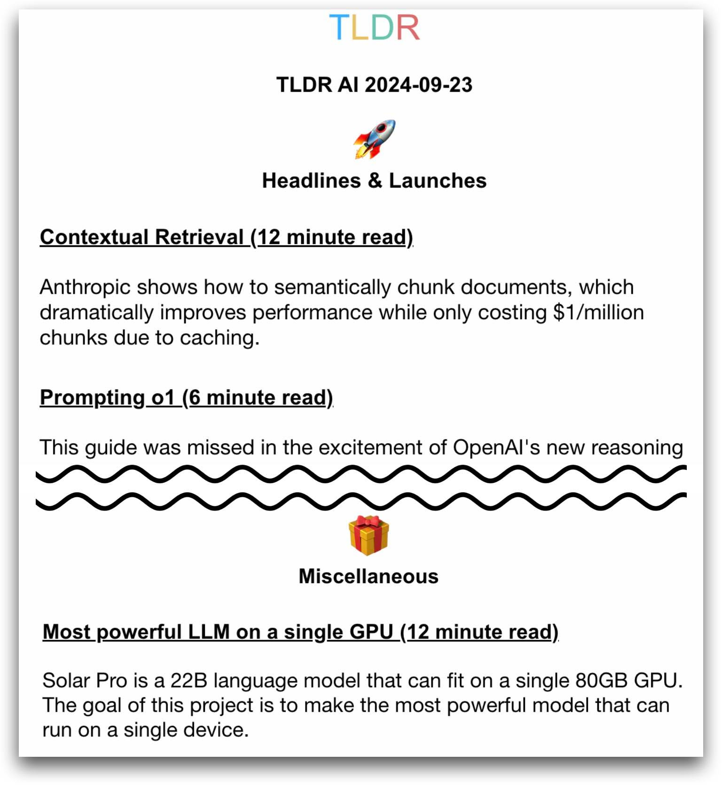
**이미지 캡션:** 이 이미지는 "TLDR AI 2024-09-23"이라는 제목의 뉴스레터 또는 요약본의 일부로, 인공지능 분야의 최신 소식과 정보를 담고 있습니다. 상단에는 "TLDR"이라는 로고가 파란색과 분홍색으로 표시되어 있으며, 그 아래에는 날짜와 함께 로켓 이모티콘이 있습니다. "Headlines & Launches" 섹션에는 "Contextual Retrieval (12 minute read)"라는 제목 아래 Anthropic의 문서 처리 기술에 대한 설명이 있으며, "Prompting 01 (6 minute read)"라는 제목 아래에는 OpenAI의 새로운 추론 기능에 대한 내용이 언급됩니다. 이 두 섹션 사이에는 물결 모양의 선과 선물 상자 이모티콘이 있어 시각적인 구분을 짓고 있습니다. 하단에는 "Miscellaneous" 섹션이 있으며, "Most powerful LLM on a single GPU (12 minute read)"라는 제목 아래에는 Solar Pro라는 22B 언어 모델이 단일 80GB GPU에 탑재될 수 있다는 내용과 해당 프로젝트의 목표가 설명되어 있습니다. 전체적으로 흰색 배경에 검은색 텍스트와 파란색, 분홍색, 빨간색의 이모티콘이 사용되어 깔끔하고 정보 전달에 집중하는 분위기입니다. 텍스트는 모두 영어로 작성되어 있으며, 특정 인물은 등장하지 않습니다.d)"라는 제목 아래에는 OpenAI의 새로운 추론 기능에 대한 내용이 언급됩니다. 이 두 섹션 사이에는 물결 모양의 선과 선물 상자 이모티콘이 있어 시각적인 구분을 짓고 있습니다. 하단에는 "Miscellaneous" 섹션이 있으며, "Most powerful LLM on a single GPU (12 minute read)"라는 제목 아래에는 Solar Pro라는 22B 언어 모델이 단일 80GB GPU에 탑재될 수 있다는 내용과 해당 프로젝트의 목표가 설명되어 있습니다. 전체적으로 흰색 배경에 검은색 텍스트와 파란색, 분홍색, 빨간색의 이모티콘이 사용되어 깔끔하고 정보 전달에 집중하는 분위기입니다. 텍스트는 모두 영어로 작성되어 있으며, 특정 인물은 등장하지 않습니다.

### 9월 24일 (화) 08:49 · Sung Kim shared a link.

🔗 <https://a.tldrnewsletter.com/web-version?ep=1&lc=3bf8d792-bd90-11ee-817b-b777f755fa8b&p=703435f8-799a-11ef-8b11-371f32244928&pt=campaign&t=1727097241&s=dcda0944a0dad5602d8b27308915cf426959da99e53da7f4f12b2e6ffb0fd41f>

### 9월 24일 (화) 12:37 · Slack 키노트에서 언급된 Putting AI to Work for Y…

Slack 키노트에서 언급된 Putting AI to Work for You 와 Agentforce in Slack 기조로 발표된 10가지 use case 등입니다. 협업툴의 입장에서 정말 많이 고민하신것 같고 멋진 케이스들이 많습니다. 다만 여기 모든 usecase들은 이미 Upstage 에서 사업화중인 것들이니 필요한 분들은 연락주시면 됩니다.

1. Inbox (help prioritize)
2. Search (via RAG)
3. Agent reply
4. Summary: Huddle Note , File Summary, Recap
5. Writer App/fill 
6. Task routing (workday)
7. AI assistant  (scheduling)
8. Agent: get action items
9. Biz intelligence 
10. Document Filling

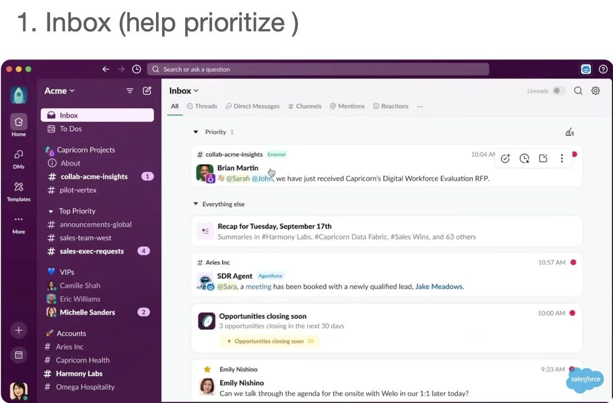
**이미지 캡션:** 이 이미지는 Slack 애플리케이션의 받은 편지함 화면을 보여줍니다. 화면 왼쪽에는 채널 목록이 있으며, "Inbox"가 선택되어 있습니다. "Inbox" 섹션에는 우선순위별로 메시지가 정렬되어 있습니다. 최상단에는 "Priority 1"로 표시된 메시지가 있으며, "Brian Martin"이라는 사용자가 "@Sarah @John"에게 "Capricorn's Digital Workforce Evaluation RFP를 방금 받았습니다."라고 보낸 내용입니다. 그 아래에는 "Everything else" 섹션이 있으며, "Recap for Tuesday, September 17th"라는 제목의 요약 메시지와 "#Aries Inc" 채널에서 "SDR Agent"가 "@Sara"에게 "새로운 자격을 갖춘 리드인 Jake Meadows와 회의가 예약되었습니다."라고 보낸 메시지가 있습니다. 또한 "Opportunities closing soon"이라는 제목의 알림과 "Emily Nishino"라는 사용자가 보낸 메시지가 보입니다. 화면 상단에는 검색창과 함께 "Acme"라는 회사 이름이 표시되어 있습니다. 전반적으로 이 화면은 업무 관련 커뮤니케이션을 효율적으로 관리하고 우선순위를 정하는 데 사용되는 Slack의 받은 편지함 기능을 보여줍니다. 있으며, "Recap for Tuesday, September 17th"라는 제목의 요약 메시지와 "#Aries Inc" 채널에서 "SDR Agent"가 "@Sara"에게 "새로운 자격을 갖춘 리드인 Jake Meadows와 회의가 예약되었습니다."라고 보낸 메시지가 있습니다. 또한 "Opportunities closing soon"이라는 제목의 알림과 "Emily Nishino"라는 사용자가 보낸 메시지가 보입니다. 화면 상단에는 검색창과 함께 "Acme"라는 회사 이름이 표시되어 있습니다. 전반적으로 이 화면은 업무 관련 커뮤니케이션을 효율적으로 관리하고 우선순위를 정하는 데 사용되는 Slack의 받은 편지함 기능을 보여줍니다.
 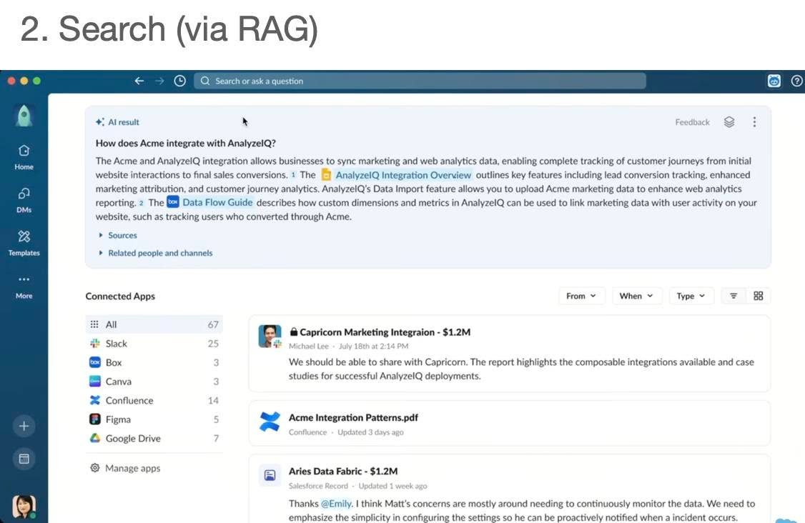
**이미지 캡션:** 화면에는 컴퓨터 화면의 일부가 캡처되어 있으며, "2. Search (via RAG)"라는 제목이 상단에 표시되어 있습니다. 화면 중앙에는 검색창과 AI 결과가 표시됩니다. AI 결과는 "How does Acme integrate with AnalyzelQ?"라는 질문에 대한 답변으로, Acme와 AnalyzelQ의 통합에 대한 설명이 포함되어 있습니다. 설명에는 "AnalyzeIQ Integration Overview"와 "Data Flow Guide"와 같은 문서가 언급되어 있으며, "Sources"와 "Related people and channels" 섹션도 있습니다. 그 아래에는 "Connected Apps" 목록이 있으며, "All", "Slack", "Box", "Canva", "Confluence", "Figma", "Google Drive"와 같은 앱들이 표시되고 각 앱 옆에는 숫자가 있습니다. 화면 오른쪽에는 "Capricorn Marketing Integraion - $1.2M", "Acme Integration Patterns.pdf", "Aries Data Fabric - $1.2M"과 같은 검색 결과 항목들이 표시됩니다. 각 항목에는 제목, 작성자, 날짜, 그리고 간략한 내용이 포함되어 있습니다. 전반적으로 이 화면은 정보 검색 및 관련 앱과의 통합을 보여주는 인터페이스로 보입니다.Related people and channels" 섹션도 있습니다. 그 아래에는 "Connected Apps" 목록이 있으며, "All", "Slack", "Box", "Canva", "Confluence", "Figma", "Google Drive"와 같은 앱들이 표시되고 각 앱 옆에는 숫자가 있습니다. 화면 오른쪽에는 "Capricorn Marketing Integraion - $1.2M", "Acme Integration Patterns.pdf", "Aries Data Fabric - $1.2M"과 같은 검색 결과 항목들이 표시됩니다. 각 항목에는 제목, 작성자, 날짜, 그리고 간략한 내용이 포함되어 있습니다. 전반적으로 이 화면은 정보 검색 및 관련 앱과의 통합을 보여주는 인터페이스로 보입니다.
 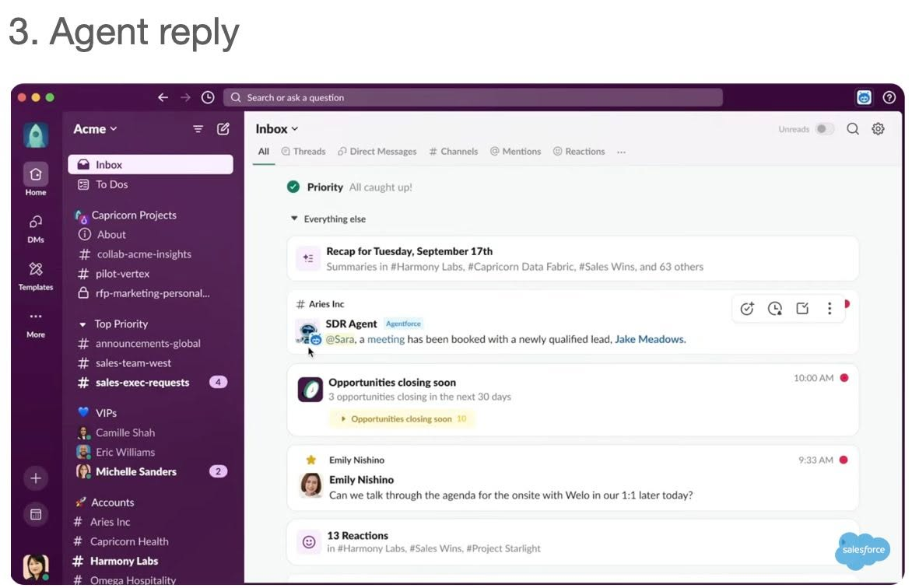
**이미지 캡션:** 이 이미지는 슬랙(Slack)과 같은 협업 도구의 인터페이스를 보여줍니다. 화면 왼쪽에는 "Acme"라는 회사 이름과 함께 홈, DM, 템플릿, 더보기 등의 메뉴가 보라색 사이드바에 나열되어 있습니다. 그 아래에는 "Capricorn Projects"라는 섹션과 함께 "About", "#collab-acme-insights", "#pilot-vertex", "#rfp-marketing-personal..."과 같은 채널 목록이 있습니다. "Top Priority" 섹션에는 "#announcements-global", "#sales-team-west", "#sales-exec-requests" 채널이 있으며, "#sales-exec-requests" 옆에는 숫자 4가 표시되어 있습니다. "VIPs" 섹션에는 "Camille Shah", "Eric Williams", "Michelle Sanders"의 이름이 있으며, "Michelle Sanders" 옆에는 숫자 2가 있습니다. "Accounts" 섹션에는 "#Aries Inc", "#Capricorn Health", "#Harmony Labs", "#Omega Hospitality" 채널이 있습니다. 화면 중앙 상단에는 "Search or ask a question"이라는 검색창이 있습니다. 그 아래에는 "Inbox"라는 제목과 함께 "All", "Threads", "Direct Messages", "# Channels", "@ Mentions", "Reactions" 탭이 있습니다. "Priority" 섹션에는 "All caught up!"이라는 메시지가 녹색 체크 표시와 함께 표시됩니다. "Everything else" 섹션에는 "Recap for Tuesday, September 17th"라는 제목의 메시지가 있으며, "#Harmony Labs", "#Capricorn Data Fabric", "#Sales Wins" 등의 해시태그와 함께 63개의 다른 항목이 요약되어 있습니다. 그 아래에는 "#Aries Inc" 채널에서 "SDR Agent"라는 이름의 사용자가 "Agentforce"라는 태그와 함께 "@Sara, a meeting has been booked with a newly qualified lead, Jake Meadows."라는 메시지를 보낸 내용이 있습니다. 이 메시지 옆에는 시계, 화살표, 체크 표시, 점 세 개 아이콘이 있습니다. 다음 메시지는 "Opportunities closing soon"이라는 제목으로 "3 opportunities closing in the next 30 days"라는 설명과 함께 "Opportunities closing soon 10"이라는 버튼이 있습니다. 그 아래에는 "Emily Nishino"라는 이름의 사용자가 보낸 메시지로, 프로필 사진과 함께 "Emily Nishino"라는 이름이 다시 나오고, "Can we talk through the agenda for the onsite with Welo in our 1:1 later today?"라는 질문이 있습니다. 이 메시지는 9:33 AM에 보낸 것으로 표시됩니다. 가장 아래에는 "13 Reactions"라는 제목의 메시지가 있으며, "#Harmony Labs", "#Sales Wins", "#Project Starlight" 해시태그와 함께 표시됩니다. 화면 오른쪽 하단에는 Salesforce 로고가 보입니다. 전반al", "#sales-team-west", "#sales-exec-requests" 채널이 있으며, "#sales-exec-requests" 옆에는 숫자 4가 표시되어 있습니다. "VIPs" 섹션에는 "Camille Shah", "Eric Williams", "Michelle Sanders"의 이름이 있으며, "Michelle Sanders" 옆에는 숫자 2가 있습니다. "Accounts" 섹션에는 "#Aries Inc", "#Capricorn Health", "#Harmony Labs", "#Omega Hospitality" 채널이 있습니다. 화면 중앙 상단에는 "Search or ask a question"이라는 검색창이 있습니다. 그 아래에는 "Inbox"라는 제목과 함께 "All", "Threads", "Direct Messages", "# Channels", "@ Mentions", "Reactions" 탭이 있습니다. "Priority" 섹션에는 "All caught up!"이라는 메시지가 녹색 체크 표시와 함께 표시됩니다. "Everything else" 섹션에는 "Recap for Tuesday, September 17th"라는 제목의 메시지가 있으며, "#Harmony Labs", "#Capricorn Data Fabric", "#Sales Wins" 등의 해시태그와 함께 63개의 다른 항목이 요약되어 있습니다. 그 아래에는 "#Aries Inc" 채널에서 "SDR Agent"라는 이름의 사용자가 "Agentforce"라는 태그와 함께 "@Sara, a meeting has been booked with a newly qualified lead, Jake Meadows."라는 메시지를 보낸 내용이 있습니다. 이 메시지 옆에는 시계, 화살표, 체크 표시, 점 세 개 아이콘이 있습니다. 다음 메시지는 "Opportunities closing soon"이라는 제목으로 "3 opportunities closing in the next 30 days"라는 설명과 함께 "Opportunities closing soon 10"이라는 버튼이 있습니다. 그 아래에는 "Emily Nishino"라는 이름의 사용자가 보낸 메시지로, 프로필 사진과 함께 "Emily Nishino"라는 이름이 다시 나오고, "Can we talk through the agenda for the onsite with Welo in our 1:1 later today?"라는 질문이 있습니다. 이 메시지는 9:33 AM에 보낸 것으로 표시됩니다. 가장 아래에는 "13 Reactions"라는 제목의 메시지가 있으며, "#Harmony Labs", "#Sales Wins", "#Project Starlight" 해시태그와 함께 표시됩니다. 화면 오른쪽 하단에는 Salesforce 로고가 보입니다. 전반
 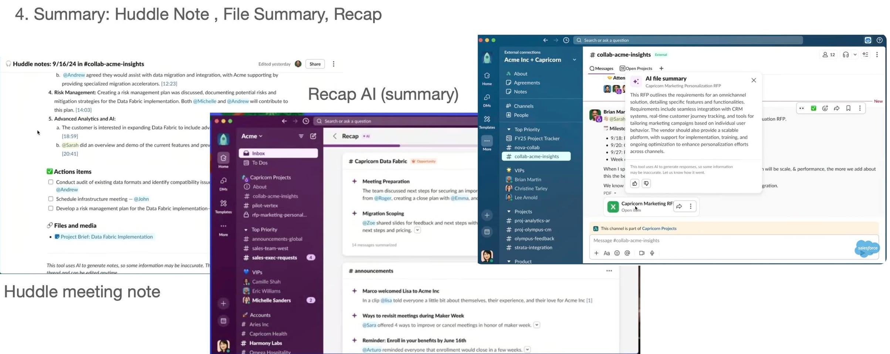
**이미지 캡션:** 이 이미지는 여러 개의 스크린샷을 모아 놓은 것으로, 주로 업무 관련 협업 도구의 화면을 보여줍니다. 왼쪽 상단에는 "4. Summary: Huddle Note, File Summary, Recap"이라는 제목과 함께 "Huddle notes: 9/16/24 in #collab-acme-insights"라는 내용이 보입니다. 이 부분은 회의록의 요약본으로 보이며, 여러 항목의 액션 아이템과 파일 및 미디어에 대한 정보가 나열되어 있습니다. 액션 아이템으로는 "Conduct audit of existing data formats and identify compatibility issues"와 "@Andrew", "@John"이라는 이름이 언급되어 있습니다. 파일 및 미디어 섹션에는 "Project Brief: Data Fabric Implementation"이라는 제목이 있습니다. 이 회의록은 AI가 생성한 것이며, 일부 정보는 부정확할 수 있다는 주의 문구가 하단에 있습니다. 중앙에는 보라색 배경의 협업 도구 화면이 보입니다. 왼쪽에는 "Acme"라는 로고와 함께 "Inbox", "To Dos", "Capricorn Projects" 등의 메뉴가 나열되어 있으며, "#collab-acme-insights" 채널이 선택되어 있습니다. 오른쪽에는 "Recap AI (summary)"라는 제목과 함께 "#Capricorn Data Fabric" 채널의 요약 내용이 표시됩니다. "Meeting Preparation" 섹션에서는 "@Roger"가 언급되었고, "Migration Scoping" 섹션에서는 "@Zoe"가 언급되었습니다. 또한, "announcements" 섹션에서는 "@Lisa"와 "@Sara"가 언급되었으며, "Reminder: Enroll in your benefits by June 16th"라는 내용도 보입니다. 오른쪽 상단에는 또 다른 협업 도구 화면이 보이며, "Acme Inc + Capricorn"이라는 제목과 함께 "Al file summary"라는 내용이 표시됩니다. 이 요약은 "Capricorn Marketing Personalization RFP"에 대한 것으로, 요구사항, 기능, CRM 통합, 고객 여정 추적, 마케팅 캠페인 등에 대한 내용을 담고 있습니다. 이 부분에서도 "Brian Martin", "Christine Tarley", "Lee Arnold" 등의 이름이 보입니다. 이 요약 역시 AI가 생성한 것이며, 일부 정보는 부정확할 수 있다는 내용이 있습니다. 전반적으로 이 이미지는 팀 협업, 프로젝트 관리, 회의 요약 및 AI 기반 요약 기능 등을 보여주는 업무 환경을 나타냅니다. 사람들은 대부분 성인 남성 또는 여성으로 보이며, 표정이나 행동은 명확하게 보이지 않습니다. 배경은 주로 컴퓨터 화면이며, 다양한 소프트웨어 인터페이스가 혼합되어 있습니다. 분위기는 업무적이고 정보 중심적입니다.ta formats and identify compatibility issues"와 "@Andrew", "@John"이라는 이름이 언급되어 있습니다. 파일 및 미디어 섹션에는 "Project Brief: Data Fabric Implementation"이라는 제목이 있습니다. 이 회의록은 AI가 생성한 것이며, 일부 정보는 부정확할 수 있다는 주의 문구가 하단에 있습니다. 중앙에는 보라색 배경의 협업 도구 화면이 보입니다. 왼쪽에는 "Acme"라는 로고와 함께 "Inbox", "To Dos", "Capricorn Projects" 등의 메뉴가 나열되어 있으며, "#collab-acme-insights" 채널이 선택되어 있습니다. 오른쪽에는 "Recap AI (summary)"라는 제목과 함께 "#Capricorn Data Fabric" 채널의 요약 내용이 표시됩니다. "Meeting Preparation" 섹션에서는 "@Roger"가 언급되었고, "Migration Scoping" 섹션에서는 "@Zoe"가 언급되었습니다. 또한, "announcements" 섹션에서는 "@Lisa"와 "@Sara"가 언급되었으며, "Reminder: Enroll in your benefits by June 16th"라는 내용도 보입니다. 오른쪽 상단에는 또 다른 협업 도구 화면이 보이며, "Acme Inc + Capricorn"이라는 제목과 함께 "Al file summary"라는 내용이 표시됩니다. 이 요약은 "Capricorn Marketing Personalization RFP"에 대한 것으로, 요구사항, 기능, CRM 통합, 고객 여정 추적, 마케팅 캠페인 등에 대한 내용을 담고 있습니다. 이 부분에서도 "Brian Martin", "Christine Tarley", "Lee Arnold" 등의 이름이 보입니다. 이 요약 역시 AI가 생성한 것이며, 일부 정보는 부정확할 수 있다는 내용이 있습니다. 전반적으로 이 이미지는 팀 협업, 프로젝트 관리, 회의 요약 및 AI 기반 요약 기능 등을 보여주는 업무 환경을 나타냅니다. 사람들은 대부분 성인 남성 또는 여성으로 보이며, 표정이나 행동은 명확하게 보이지 않습니다. 배경은 주로 컴퓨터 화면이며, 다양한 소프트웨어 인터페이스가 혼합되어 있습니다. 분위기는 업무적이고 정보 중심적입니다.
 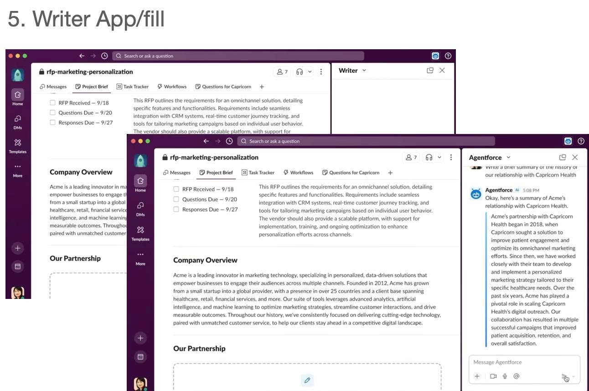
**이미지 캡션:** 이 이미지는 두 개의 창을 보여주는 스크린샷으로, 하나는 다른 하나 위에 떠 있습니다. 두 창 모두 "rfp-marketing-personalization"이라는 제목의 애플리케이션 인터페이스를 표시하며, 이는 마케팅 개인화에 대한 요청서(RFP)와 관련된 것으로 보입니다. 왼쪽 창은 더 크고 전체적인 레이아웃을 보여주며, 왼쪽 사이드바에는 홈, DM, 템플릿과 같은 메뉴 옵션이 있습니다. 중앙 영역에는 "Project Brief" 탭이 선택되어 있으며, RFP의 주요 항목과 설명이 나열되어 있습니다. 오른쪽 창은 더 작고, "Agentforce"라는 이름의 다른 애플리케이션 또는 채팅 창을 보여줍니다. 이 창에는 Acme와 Capricorn Health 간의 파트너십에 대한 요약이 포함되어 있으며, Agentforce라는 사용자가 5:08 PM에 보낸 메시지입니다. 전반적으로 이 이미지는 업무용 소프트웨어 인터페이스를 보여주며, 마케팅 프로젝트 관리 및 팀 커뮤니케이션과 관련된 내용을 담고 있습니다. 창은 더 작고, "Agentforce"라는 이름의 다른 애플리케이션 또는 채팅 창을 보여줍니다. 이 창에는 Acme와 Capricorn Health 간의 파트너십에 대한 요약이 포함되어 있으며, Agentforce라는 사용자가 5:08 PM에 보낸 메시지입니다. 전반적으로 이 이미지는 업무용 소프트웨어 인터페이스를 보여주며, 마케팅 프로젝트 관리 및 팀 커뮤니케이션과 관련된 내용을 담고 있습니다.
 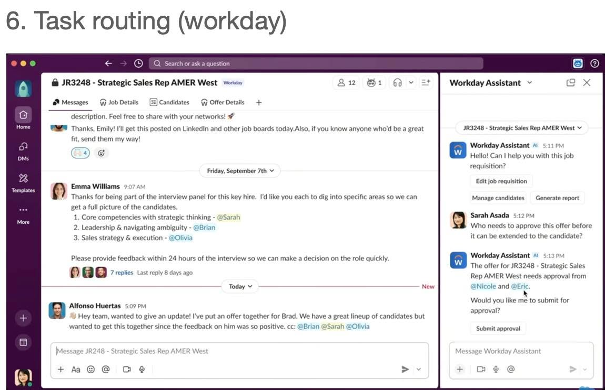
**이미지 캡션:** 이 이미지는 업무용 메신저인 슬랙(Slack) 화면을 보여줍니다. 화면 왼쪽에는 채널 목록이 있고, 가운데에는 'JR3248 - Strategic Sales Rep AMER West'라는 이름의 채널 대화 내용이 표시됩니다. 채널에는 여러 사용자가 참여하고 있으며, 채용 관련 논의가 이루어지고 있습니다. Emma Williams는 면접관들에게 후보자들에 대한 피드백을 요청하고 있으며, Alfonso Huertas는 특정 후보자에게 오퍼를 제안했음을 알리고 있습니다. 화면 오른쪽에는 'Workday Assistant'라는 챗봇과의 대화가 나타나는데, 이 챗봇은 채용 공고 관련 업무를 돕고 있으며, Sarah Asada는 오퍼 승인에 대해 문의하고 있습니다. Workday Assistant는 해당 오퍼가 Nicole과 Eric의 승인을 받아야 한다고 안내하며 승인 절차를 제안합니다. 전반적으로 채용 과정에서 팀원 간의 소통과 업무 자동화를 위한 시스템 활용이 이루어지는 업무 환경을 보여줍니다.anged between team members. Emma Williams, a woman with dark hair, wearing a dark top, posts at 9:07 AM, thanking the panel for interviewing for a key hire and outlining specific areas for feedback: core competencies with strategic thinking (@Sarah), leadership and navigating ambiguity (@Brian), and sales strategy and execution (@Olivia), requesting feedback within 24 hours. Alfonso Huertas, an adult male with dark hair and a beard, wearing a blue shirt, posts at 5:09 PM, updating the team that an offer has been prepared for Brad, mentioning positive feedback and cc'ing @Brian, @Sarah, and @Olivia. The conversation is dated Friday, September 7th, with a note that the last reply was 8 days ago. To the right, a "Workday Assistant" panel displays automated messages. At 5:11 PM, the Workday Assistant offers help with the job requisition and provides buttons for "Edit job requisition," "Manage candidates," and "Generate report." Sarah Asada, a woman with blonde hair, wearing a black top, asks at 5:12 PM who needs to approve an offer. The Workday Assistant responds at 5:13 PM that the offer for JR3248 needs approval from @Nicole and @Eric, and asks if the user would like to submit for approval, with a "Submit approval" button. The overall atmosphere is professional and collaborative, focused on recruitment and task management.
 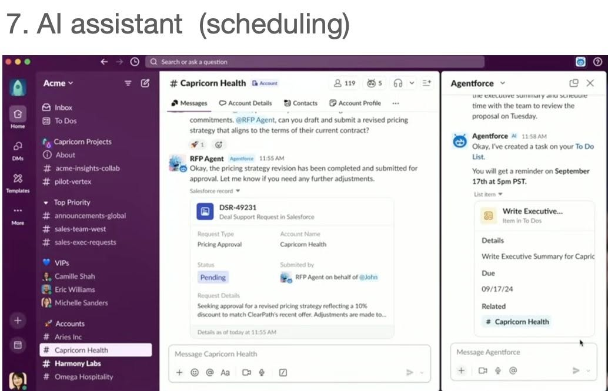
**이미지 캡션:** 이 이미지는 Slack과 유사한 인터페이스를 보여주며, AI 비서가 업무를 처리하는 과정을 시각화하고 있습니다. 왼쪽에는 보라색 배경의 사이드바가 있으며, "Acme"라는 회사 이름 아래 "Inbox", "To Dos", "Capricorn Projects"와 같은 메뉴 항목들이 나열되어 있습니다. "Capricorn Projects" 아래에는 "#acme-insights-collab", "#pilot-vertex"와 같은 채널 목록과 "Top Priority" 섹션, "VIPs" 섹션, "Accounts" 섹션이 있습니다. "Accounts" 섹션에는 "#Capricorn Health"가 선택되어 있습니다. 중앙에는 "#Capricorn Health" 채널의 대화 내용이 표시됩니다. 한 사용자가 "@RFP Agent"에게 현재 계약 조건에 맞는 수정된 가격 책정 전략 초안 작성 및 제출을 요청하는 메시지를 보냈습니다. 이에 "RFP Agent"는 가격 책정 전략 수정이 완료되어 승인 요청이 제출되었으며, 추가 조정이 필요하면 알려달라고 응답합니다. 또한 Salesforce에서 "DSR-49231"이라는 제목의 "Pricing Approval" 요청이 "Pending" 상태이며, "RFP Agent"가 "@John"을 대신하여 제출했음을 보여주는 상세 정보가 포함된 카드도 표시됩니다. 오른쪽에는 "Agentforce"라는 이름의 AI 비서가 표시됩니다. 이 AI는 팀과 함께 화요일에 제안 검토 일정을 잡았다고 알리고, 사용자의 "To Do List"에 작업을 생성했으며 9월 17일 오후 5시 PST에 알림을 받을 것이라고 안내합니다. 또한 "Write Executive Summary for Capric"이라는 제목의 작업이 생성되었고, 마감일은 09/17/24이며, "#Capricorn Health"와 관련되어 있음을 보여줍니다. 전반적으로 이 이미지는 AI 비서가 커뮤니케이션 플랫폼을 통해 업무를 자동화하고 관리하는 모습을 보여주며, 협업 및 일정 관리 기능을 강조합니다.섹션이 있습니다. "Accounts" 섹션에는 "#Capricorn Health"가 선택되어 있습니다. 중앙에는 "#Capricorn Health" 채널의 대화 내용이 표시됩니다. 한 사용자가 "@RFP Agent"에게 현재 계약 조건에 맞는 수정된 가격 책정 전략 초안 작성 및 제출을 요청하는 메시지를 보냈습니다. 이에 "RFP Agent"는 가격 책정 전략 수정이 완료되어 승인 요청이 제출되었으며, 추가 조정이 필요하면 알려달라고 응답합니다. 또한 Salesforce에서 "DSR-49231"이라는 제목의 "Pricing Approval" 요청이 "Pending" 상태이며, "RFP Agent"가 "@John"을 대신하여 제출했음을 보여주는 상세 정보가 포함된 카드도 표시됩니다. 오른쪽에는 "Agentforce"라는 이름의 AI 비서가 표시됩니다. 이 AI는 팀과 함께 화요일에 제안 검토 일정을 잡았다고 알리고, 사용자의 "To Do List"에 작업을 생성했으며 9월 17일 오후 5시 PST에 알림을 받을 것이라고 안내합니다. 또한 "Write Executive Summary for Capric"이라는 제목의 작업이 생성되었고, 마감일은 09/17/24이며, "#Capricorn Health"와 관련되어 있음을 보여줍니다. 전반적으로 이 이미지는 AI 비서가 커뮤니케이션 플랫폼을 통해 업무를 자동화하고 관리하는 모습을 보여주며, 협업 및 일정 관리 기능을 강조합니다.
 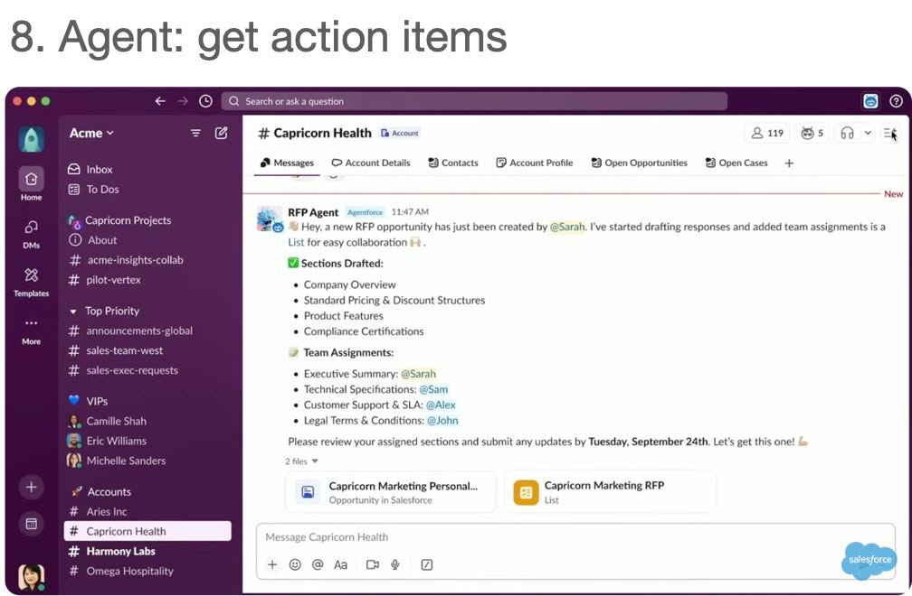
**이미지 캡션:** 이 이미지는 슬랙(Slack)과 같은 협업 도구의 화면을 캡처한 것으로, "8. Agent: get action items"이라는 제목이 상단에 표시되어 있습니다. 화면 왼쪽에는 보라색 사이드바가 있으며, 홈, 받은 편지함, 할 일, 프로젝트 목록, VIP 목록, 계정 목록 등이 포함되어 있습니다. "Capricorn Projects" 아래에는 "About", "#acme-insights-collab", "#pilot-vertex"와 같은 항목이 있고, "Top Priority" 아래에는 "#announcements-global", "#sales-team-west", "#sales-exec-requests"가 있습니다. VIP 목록에는 "Camille Shah", "Eric Williams", "Michelle Sanders"가 있으며, 계정 목록에는 "Aries Inc", "#Capricorn Health", "#Harmony Labs", "#Omega Hospitality"가 있습니다. 현재 "#Capricorn Health" 계정이 선택되어 있습니다. 화면 오른쪽에는 "#Capricorn Health Account" 채널의 대화 내용이 표시됩니다. "RFP Agent"라는 이름의 사용자가 11:47 AM에 "Sarah"라는 사용자가 새로운 RFP 기회를 생성했으며, 협업을 위해 응답 초안 작성 및 팀원 할당을 시작했다고 알리는 메시지를 보냈습니다. 메시지에는 초안 작성된 섹션 목록("Company Overview", "Standard Pricing & Discount Structures", "Product Features", "Compliance Certifications")과 팀 할당 목록("Executive Summary: @Sarah", "Technical Specifications: @Sam", "Customer Support & SLA: @Alex", "Legal Terms & Conditions: @John")이 포함되어 있습니다. 또한, "Tuesday, September 24th"까지 할당된 섹션을 검토하고 업데이트를 제출하라는 요청이 있습니다. 대화 내용 아래에는 "Capricorn Marketing Personal..."과 "Capricorn Marketing RFP"라는 두 개의 파일이 첨부되어 있으며, Salesforce 로고가 오른쪽 하단에 작게 보입니다. 전반적으로 업무 관련 협업 및 정보 공유가 이루어지고 있는 상황을 보여줍니다.ents-global", "#sales-team-west", "#sales-exec-requests"가 있습니다. VIP 목록에는 "Camille Shah", "Eric Williams", "Michelle Sanders"가 있으며, 계정 목록에는 "Aries Inc", "#Capricorn Health", "#Harmony Labs", "#Omega Hospitality"가 있습니다. 현재 "#Capricorn Health" 계정이 선택되어 있습니다. 화면 오른쪽에는 "#Capricorn Health Account" 채널의 대화 내용이 표시됩니다. "RFP Agent"라는 이름의 사용자가 11:47 AM에 "Sarah"라는 사용자가 새로운 RFP 기회를 생성했으며, 협업을 위해 응답 초안 작성 및 팀원 할당을 시작했다고 알리는 메시지를 보냈습니다. 메시지에는 초안 작성된 섹션 목록("Company Overview", "Standard Pricing & Discount Structures", "Product Features", "Compliance Certifications")과 팀 할당 목록("Executive Summary: @Sarah", "Technical Specifications: @Sam", "Customer Support & SLA: @Alex", "Legal Terms & Conditions: @John")이 포함되어 있습니다. 또한, "Tuesday, September 24th"까지 할당된 섹션을 검토하고 업데이트를 제출하라는 요청이 있습니다. 대화 내용 아래에는 "Capricorn Marketing Personal..."과 "Capricorn Marketing RFP"라는 두 개의 파일이 첨부되어 있으며, Salesforce 로고가 오른쪽 하단에 작게 보입니다. 전반적으로 업무 관련 협업 및 정보 공유가 이루어지고 있는 상황을 보여줍니다.
 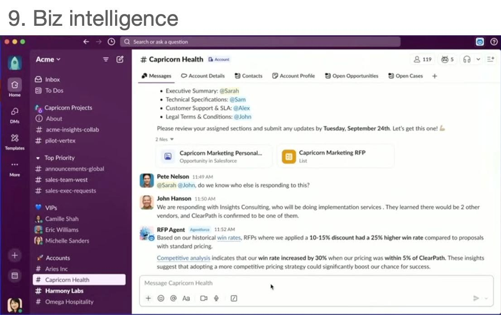
**이미지 캡션:** 이 이미지는 비즈니스 인텔리전스 관련 업무를 처리하는 협업 도구인 슬랙(Slack) 화면을 보여줍니다. 화면 왼쪽에는 채널 목록이 있으며, 그중 "Capricorn Health" 채널이 선택되어 있습니다. 채널의 메인 화면에는 "Capricorn Health" 계정에 대한 정보가 요약되어 있으며, "Executive Summary: @Sarah", "Technical Specifications: @Sam", "Customer Support & SLA: @Alex", "Legal Terms & Conditions: @John"과 같은 항목들이 나열되어 있습니다. 또한, "Please review your assigned sections and submit any updates by Tuesday, September 24th. Let's get this one!"이라는 메시지와 함께 두 개의 파일이 첨부되어 있습니다. 그 아래에는 "Capricorn Marketing Personal..."과 "Capricorn Marketing RFP"라는 두 개의 카드 형태의 정보가 보입니다. 이어서 "Pete Nelson"이라는 사용자가 "@Sarah @John, do we know who else is responding to this?"라고 질문하고, "John Hanson"이 "We are responding with Insights Consulting, who will be doing implementation services. They learned there would be 2 other vendors, and ClearPath is confirmed to be one of them."이라고 답변하는 대화가 이어집니다. 마지막으로 "RFP Agent"라는 사용자가 과거의 수주율 데이터를 기반으로 10-15% 할인을 적용한 제안서의 수주율이 표준 가격 제안서보다 25% 높았다는 내용과, 경쟁사 가격 분석 결과 수주율이 30% 증가했으며 더 경쟁력 있는 가격 전략이 성공 가능성을 높일 수 있다는 분석 결과를 공유하고 있습니다. 화면 하단에는 "Message Capricorn Health"라는 입력창이 보입니다. 전반적으로 비즈니스 관련 정보를 공유하고 논의하는 업무 환경을 나타냅니다.s: @John"과 같은 항목들이 나열되어 있습니다. 또한, "Please review your assigned sections and submit any updates by Tuesday, September 24th. Let's get this one!"이라는 메시지와 함께 두 개의 파일이 첨부되어 있습니다. 그 아래에는 "Capricorn Marketing Personal..."과 "Capricorn Marketing RFP"라는 두 개의 카드 형태의 정보가 보입니다. 이어서 "Pete Nelson"이라는 사용자가 "@Sarah @John, do we know who else is responding to this?"라고 질문하고, "John Hanson"이 "We are responding with Insights Consulting, who will be doing implementation services. They learned there would be 2 other vendors, and ClearPath is confirmed to be one of them."이라고 답변하는 대화가 이어집니다. 마지막으로 "RFP Agent"라는 사용자가 과거의 수주율 데이터를 기반으로 10-15% 할인을 적용한 제안서의 수주율이 표준 가격 제안서보다 25% 높았다는 내용과, 경쟁사 가격 분석 결과 수주율이 30% 증가했으며 더 경쟁력 있는 가격 전략이 성공 가능성을 높일 수 있다는 분석 결과를 공유하고 있습니다. 화면 하단에는 "Message Capricorn Health"라는 입력창이 보입니다. 전반적으로 비즈니스 관련 정보를 공유하고 논의하는 업무 환경을 나타냅니다.
 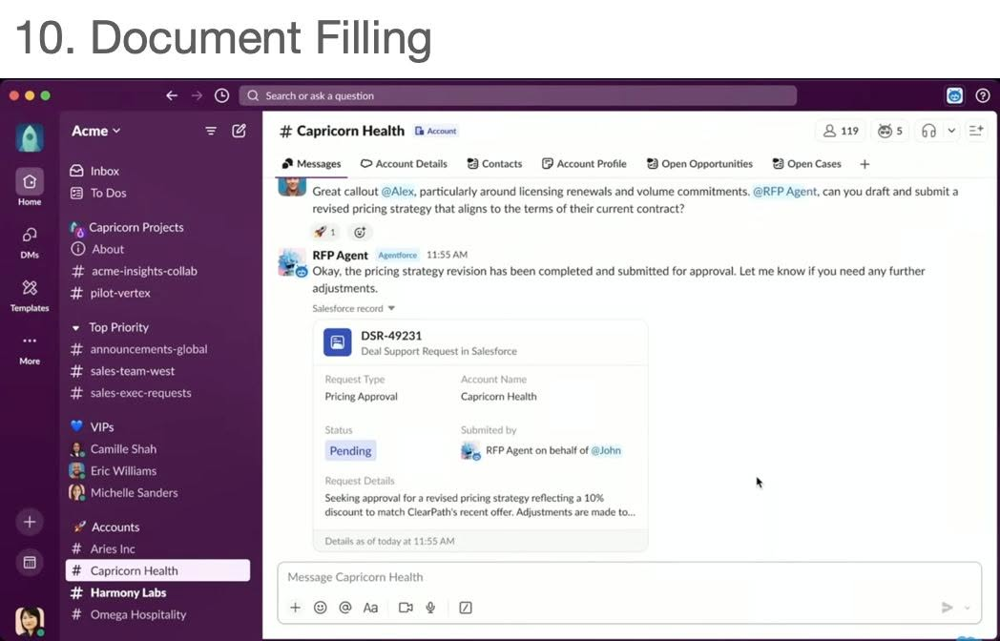
**이미지 캡션:** 화면 상단에는 "10. Document Filling"이라는 제목이 보이며, 그 아래에는 검색창과 함께 Slack과 유사한 인터페이스가 펼쳐져 있습니다. 왼쪽 사이드바에는 "Home", "Inbox", "To Dos", "Capricorn Projects", "DMs", "Templates", "More" 등의 메뉴와 함께 "Camille Shah", "Eric Williams", "Michelle Sanders"와 같은 VIP 목록, 그리고 "Accounts" 하위의 "Aries Inc", "Capricorn Health", "Harmony Labs", "Omega Hospitality" 채널 목록이 보입니다. 현재 "Capricorn Health" 채널이 선택되어 있으며, 채널 내에는 여러 메시지가 표시됩니다. 첫 번째 메시지는 "@Alex"에게 라이선스 갱신 및 볼륨 약정에 대한 언급과 함께 "@RFP Agent"에게 현재 계약 조건에 맞는 수정된 가격 전략 초안 작성 및 제출을 요청하는 내용입니다. 두 번째 메시지는 "RFP Agent"가 가격 전략 수정이 완료되어 승인 제출되었으며, 추가 조정이 필요하면 알려달라고 응답하는 내용입니다. 그 아래에는 Salesforce 레코드 정보가 포함된 카드 형태의 메시지가 나타나는데, "DSR-49231"이라는 제목과 함께 "Deal Support Request in Salesforce"라는 설명이 있습니다. 이 레코드에는 "Request Type"이 "Pricing Approval", "Account Name"이 "Capricorn Health", "Status"가 "Pending"으로 표시되어 있습니다. "Request Details"에는 ClearPath의 최근 제안에 맞춰 10% 할인을 반영하는 수정된 가격 전략에 대한 승인을 요청하는 내용이 담겨 있으며, "Submitted by"는 "@John"을 대신하여 "RFP Agent"로 되어 있습니다. 마지막으로 "Message Capricorn Health"라는 입력창이 보이며, 메시지를 작성할 수 있는 상태입니다. 전체적으로 업무 관련 커뮤니케이션이 이루어지고 있는 사무적인 분위기이며, 특히 가격 전략 승인 요청 및 진행 상황을 공유하는 상황으로 보입니다.n Health", "Harmony Labs", "Omega Hospitality" 채널 목록이 보입니다. 현재 "Capricorn Health" 채널이 선택되어 있으며, 채널 내에는 여러 메시지가 표시됩니다. 첫 번째 메시지는 "@Alex"에게 라이선스 갱신 및 볼륨 약정에 대한 언급과 함께 "@RFP Agent"에게 현재 계약 조건에 맞는 수정된 가격 전략 초안 작성 및 제출을 요청하는 내용입니다. 두 번째 메시지는 "RFP Agent"가 가격 전략 수정이 완료되어 승인 제출되었으며, 추가 조정이 필요하면 알려달라고 응답하는 내용입니다. 그 아래에는 Salesforce 레코드 정보가 포함된 카드 형태의 메시지가 나타나는데, "DSR-49231"이라는 제목과 함께 "Deal Support Request in Salesforce"라는 설명이 있습니다. 이 레코드에는 "Request Type"이 "Pricing Approval", "Account Name"이 "Capricorn Health", "Status"가 "Pending"으로 표시되어 있습니다. "Request Details"에는 ClearPath의 최근 제안에 맞춰 10% 할인을 반영하는 수정된 가격 전략에 대한 승인을 요청하는 내용이 담겨 있으며, "Submitted by"는 "@John"을 대신하여 "RFP Agent"로 되어 있습니다. 마지막으로 "Message Capricorn Health"라는 입력창이 보이며, 메시지를 작성할 수 있는 상태입니다. 전체적으로 업무 관련 커뮤니케이션이 이루어지고 있는 사무적인 분위기이며, 특히 가격 전략 승인 요청 및 진행 상황을 공유하는 상황으로 보입니다.

### 9월 24일 (화) 12:40 · Sung Kim shared a link.

🔗 <https://youtu.be/wcP1Kndl6xI?si=-zYuFi6M4lbsuaPh>

### 9월 25일 (수) 08:54 · Intel 은 방문할때마다 즐겁고 좋은 일이 생기는 것 같습니다! #In…

Intel 은 방문할때마다 즐겁고 좋은 일이 생기는 것 같습니다! #IntelXSolar!

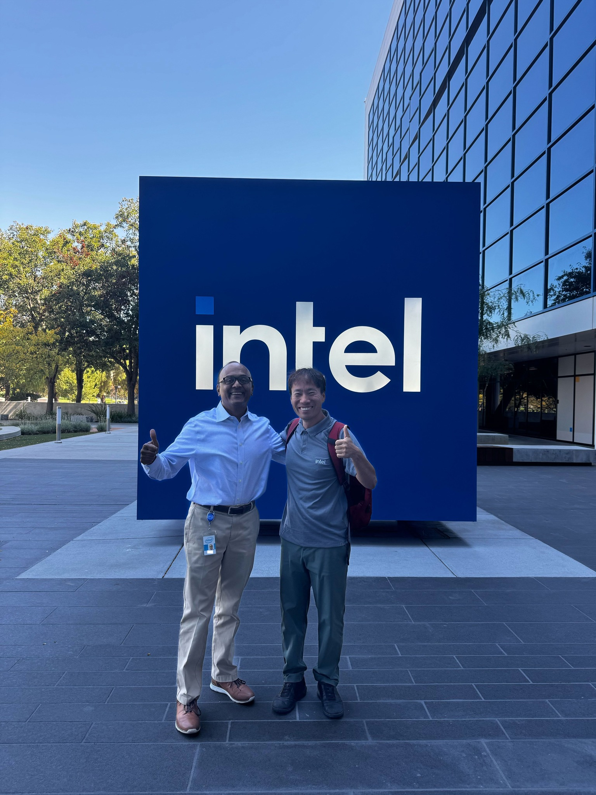
**이미지 캡션:** 푸른 하늘 아래, 인텔 본사 건물 앞에서 두 명의 성인 남성이 환하게 웃으며 엄지손가락을 치켜들고 있다. 왼쪽 남성은 40대 후반에서 50대 초반으로 보이는 동양인으로, 밝은 하늘색 셔츠에 베이지색 바지를 입고 있으며 목에는 사원증으로 보이는 ID 카드를 걸고 있다. 그는 안경을 쓰고 있으며, 얼굴에는 미소가 가득하다. 오른쪽 남성은 30대 후반에서 40대 초반으로 보이는 동양인으로, 회색 폴로 셔츠에 짙은 녹색 바지를 입고 있으며 등에는 빨간색 백팩을 메고 있다. 그의 셔츠에는 'intel' 로고가 작게 새겨져 있다. 두 사람 모두 활기차고 긍정적인 표정으로 사진을 찍고 있으며, 배경에는 거대한 파란색 인텔 로고 입체 조형물과 현대적인 유리 외벽의 인텔 건물이 보인다. 건물 주변에는 푸른 잔디와 나무가 있어 쾌적한 야외 환경을 보여준다. 전반적으로 밝고 화창한 날씨 속에서 인텔 직원들이 회사를 배경으로 즐거운 시간을 보내는 모습이다.겨져 있다. 두 사람 모두 활기차고 긍정적인 표정으로 사진을 찍고 있으며, 배경에는 거대한 파란색 인텔 로고 입체 조형물과 현대적인 유리 외벽의 인텔 건물이 보인다. 건물 주변에는 푸른 잔디와 나무가 있어 쾌적한 야외 환경을 보여준다. 전반적으로 밝고 화창한 날씨 속에서 인텔 직원들이 회사를 배경으로 즐거운 시간을 보내는 모습이다.

### 9월 27일 (금) 08:38 · Upstage #파티 #sfgiants #oraclepark 오는 9월 …

Upstage #파티 #sfgiants #oraclepark 오는 9월 29일 일요일 12시 부터 오라클 경기장 VIP 박스를 빌려서 친구들 모시고 파티를 합니다. 2~3명 정도 제가 추가로 모실수 있는데요. 혹시 그때 SF지역에 계시는 분들중 야구와 AI를 좋아 하시면 저에게 DM 주셔요. 

아주 멋진 날이 될것입니다!

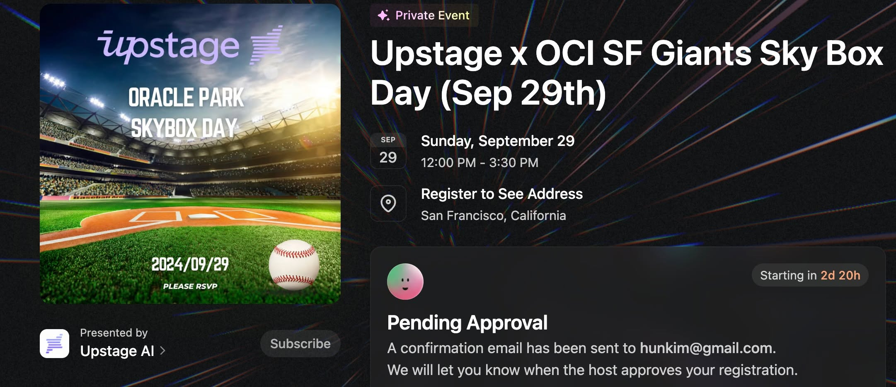
**이미지 캡션:** 이 이미지는 Upstage와 OCI가 주최하는 샌프란시스코 오라클 파크 스카이박스 데이 행사를 홍보하는 행사 정보 화면입니다. 왼쪽에는 야구 경기장인 오라클 파크의 전경과 야구공이 보이는 이미지와 함께 "Upstage", "ORACLE PARK", "SKYBOX DAY", "2024/09/29", "PLEASE RSVP"라는 텍스트가 있습니다. 오른쪽에는 "Private Event"라는 표시와 함께 행사 제목 "Upstage x OCI SF Giants Sky Box Day (Sep 29th)"가 크게 적혀 있습니다. 행사 날짜는 9월 29일 일요일이며, 시간은 오후 12시부터 3시 30분까지입니다. 장소는 "Register to See Address"라고 되어 있으며, "San Francisco, California"라고 명시되어 있습니다. 화면 하단에는 "Pending Approval"이라는 메시지와 함께 "A confirmation email has been sent to hunkim@gmail.com. We will let you know when the host approves your registration."이라는 내용이 보입니다. 또한 "Starting in 2d 20h"이라는 문구로 행사가 2일 20시간 후에 시작됨을 알리고 있습니다. 화면 왼쪽 하단에는 "Presented by Upstage AI"라는 문구와 함께 구독 버튼이 있습니다. 전체적으로 행사에 대한 정보를 명확하게 전달하며, 참여 신청 후 승인을 기다리는 상태임을 보여주는 분위기입니다.있습니다. 행사 날짜는 9월 29일 일요일이며, 시간은 오후 12시부터 3시 30분까지입니다. 장소는 "Register to See Address"라고 되어 있으며, "San Francisco, California"라고 명시되어 있습니다. 화면 하단에는 "Pending Approval"이라는 메시지와 함께 "A confirmation email has been sent to hunkim@gmail.com. We will let you know when the host approves your registration."이라는 내용이 보입니다. 또한 "Starting in 2d 20h"이라는 문구로 행사가 2일 20시간 후에 시작됨을 알리고 있습니다. 화면 왼쪽 하단에는 "Presented by Upstage AI"라는 문구와 함께 구독 버튼이 있습니다. 전체적으로 행사에 대한 정보를 명확하게 전달하며, 참여 신청 후 승인을 기다리는 상태임을 보여주는 분위기입니다.
