# 2024년 10월

[← 2024년](README.md)

### 10월 1일 (화) 08:50 · Steve Jobs 님이 걸으며 많은 고민을 해결하고 좋은 아이디어를 얻…

Steve Jobs 님이 걸으며 많은 고민을 해결하고 좋은 아이디어를 얻어 갔다는 Stanford dish trail! 여긴 달려도 너무 좋은 길입니다. 업업업!!!

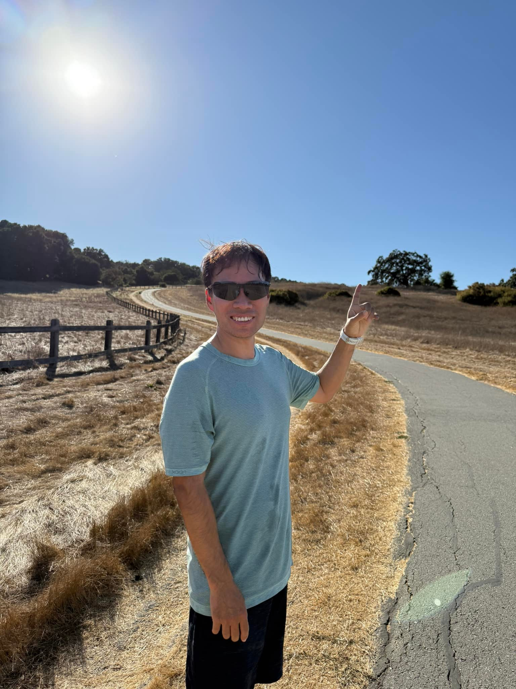 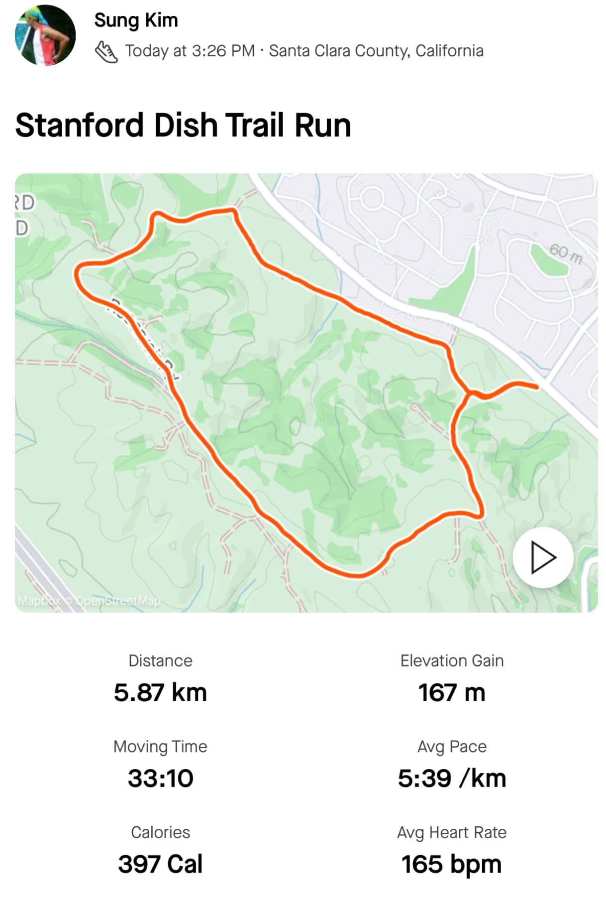

### 10월 2일 (수) 07:33 · 서울대 CSE 4190.209 Seminar Series 수업에 여러분들…

서울대 CSE 4190.209 Seminar Series 수업에 여러분들을 초대 합니다. 이번학기는 Upstage #SolarLLM, Qwen, Phi, Mistral, Cohere, OpenAI등 주로 LLM/AI 실무 개발/연구자들을 모시고 도전과 챌린지, 그리고 비전에 대해 이야기 나눕니다. 매주 금요일 11시 아래 Zoom으로 진행되며, 100명의 서울대 학생들에게 질문 우선권이 있으며, 수업은 모두에게 오픈됩니다.

https://snu-ac-kr.zoom.us/j/81289200560?pwd=ydj5ZDvLY5JpfVa4NZTdqQMM7m3jMt.1

자세한 내용은 https://github.com/snucse/SeminarSeries 참고 해주세요. 오시는 분들 반갑게 뵙겠습니다. 주위 분들에게도 많이 알려주세요.

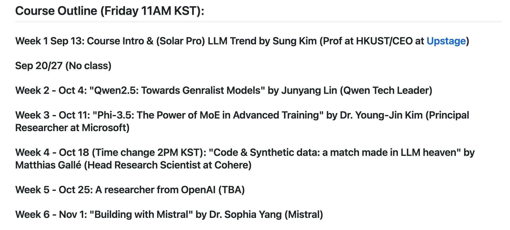

### 10월 2일 (수) 12:03 · 저희가 #SolarPro 는 새로운 구조로 만들다 보니 기존 vllm에서…

저희가 #SolarPro 는 새로운 구조로 만들다 보니 기존 vllm에서 지원이 안되었는데요. 지난주 출시된 vllm 0.6.2 에서 Solar를 지원하고 Release Note에도 잘 설명해주셨습니다. 

Vllm + Solar 많이 사용해주세요! 

https://github.com/vllm-project/vllm/releases

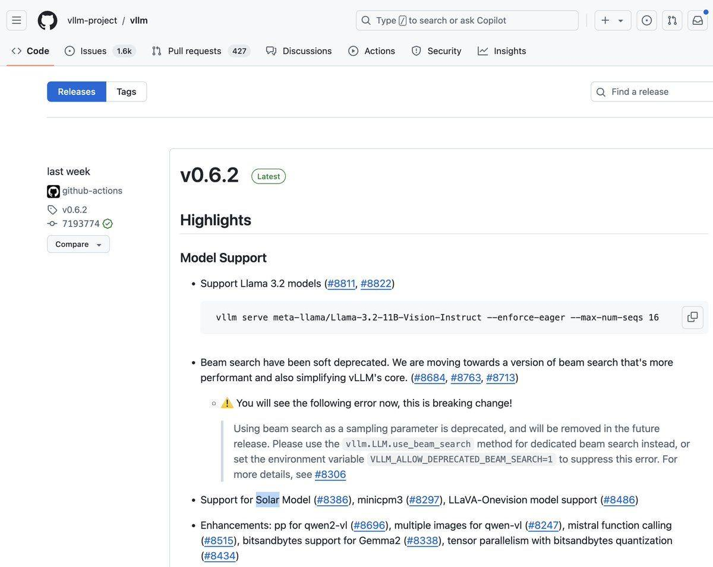

### 10월 3일 (목) 23:27 · 정말 개발자들이 사용해 보시고 좋다고 하시는 것이 만드는 입장에서는 가장…

정말 개발자들이 사용해 보시고 좋다고 하시는 것이 만드는 입장에서는 가장 #행복한 일입니다. LLM 사용하시면서 RAG등을 하신다면 필수인 임베딩, 최고 성능의 Upstage 임베딩사용하세요! https://console.upstage.ai/ 에서 바로 사용가능 합니다.

외부 API 사용이 어려운 보안 문서일 경우 AWS Private망으로 사용가능합니다. endpoint_name = sagemaker.utils.name_from_base("solar-embedding-1-large") 온프렘 서비스도 가능합니다.

많이 사용해주세요! 

Teddy Lee 멋진 영상들 감사합니다.

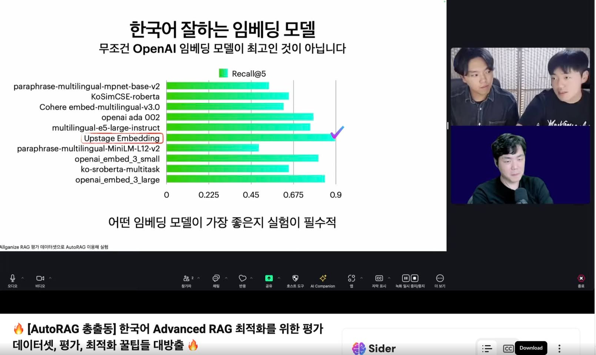

### 10월 9일 (수) 23:52 · #AI승리 과학/공학 하시는 분들에게 #노벨상은 그야 말로 '꿈의 상'인…

#AI승리 과학/공학 하시는 분들에게 #노벨상은 그야 말로 '꿈의 상'인데요. 올해는 노벨 물리학상에, 인공신경망을 이용한 머신러닝 즉 기계학습의 기초를 확립했으며 AI 선구자라 할 수 있는, 홉필드와 힌턴 교수가 선정되었습니다. 이어 베이커 미국 워싱턴대 교수, 데미스 허사비스 구글 딥마인드 최고경영자(CEO), 존 점퍼 딥마인드 수석연구원을 노벨 화학상 수상자로 선정했습니다.

이는 AI가 그만큼 우리 과학계에 큰 임팩트를 주고 있다는 것이고, 정말 상상보다 더 빠르게 우리 생활 모든 곳에 영향력을 줄 뿐만 아니라 모든 것을 바꾸는 세상이 될 것입니다.

그래서 이번 노벨상 수상 소식은 AI를 하시는 모든 분들의 승리라고도 할 수 있을 것입니다.

'꿈의 상'을 수상하신 홉필드와 힌턴 교수,  베이커 미국 워싱턴대 교수, 데미스 허사비스, 존 점퍼 모두에게 큰 축하를 드립니다. 정말 위대한 성과입니다.

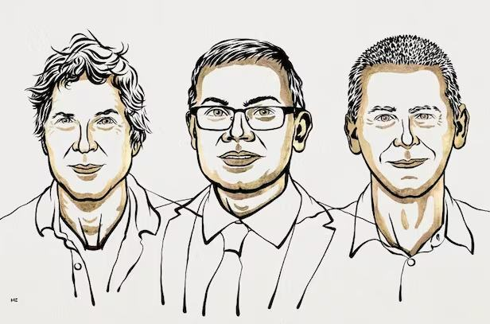 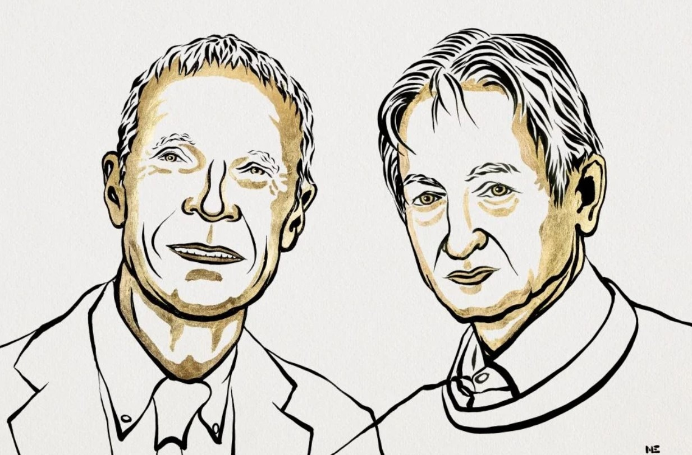

### 10월 11일 (금) 00:18 · #한강 #노벨문학상 이렇게 기쁜 소식이 있을까요? 최고중 최고의 영예로 …

#한강 #노벨문학상 이렇게 기쁜 소식이 있을까요? 최고중 최고의 영예로 꼽히는 노벨문학상을 제가 가장 좋아하는 작가인 한강 님이 받았습니다. 노벨 공식 페이지에 언급된 것과 같이 "역사적 상처를 직면하고 인간의 삶의 연약함을 드러내는 강렬한 시적 산문"으로서 인정받았다고 하는데요. 정말 한글을 이정도로 잘 구사할까라는 생각이 들 정도로 마음 속을 파고드는 멋진 글들에 감명을 많이 받아왔습니다.

이로서 한국은 더욱 더 문화 강국의 반열에 들게 되었습니다. 

마침내 김구 선생님이 꿈꾸었던 문화의 힘을 가진 나라가 되었습니다. 

“나는 우리나라가 세계에서 가장 아름다운 나라가 되기를 원합니다.
가장 강한 나라가 되기를 원하지 않습니다.
우리는 다른 나라의 침략으로 무척 괴로웠습니다. 그러니 우리가 강한 나라가 되어 또 다른 나라를 침략할 수는 없습니다.

오직 한 없이 갖고 싶은 것은 문화의 힘입니다. 문화는 우리에게 가진 것에 만족하고 다른 사람을 사랑하는 마음을 품게 해줍니다. 이런 마음을 갖는다면 지금 가진 것만으로 충분히 행복할 것입니다.” 

- 수필 <나의 소원>에서

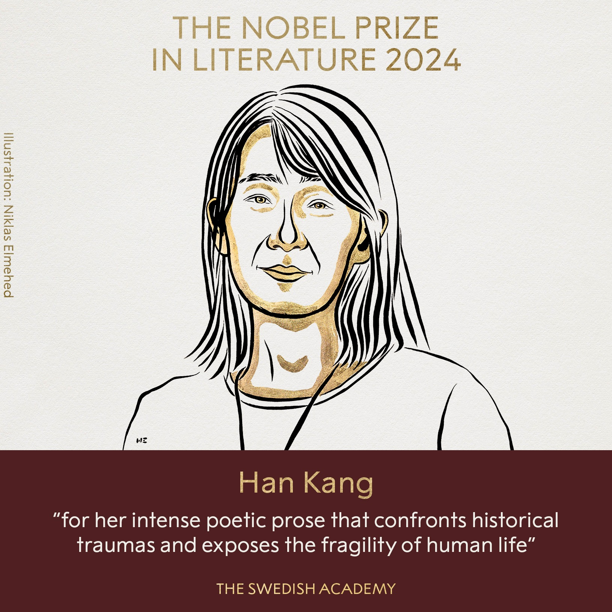

### 10월 13일 (일) 08:00 · Sung Kim shared a link.

🔗 <https://youtu.be/SFhTACNIvpc?si=LcQPBt72ENC4zCxK>

### 10월 13일 (일) 08:00 · “한강 특수에 첫 특근…1년이고 했으면”

“한강 특수에 첫 특근…1년이고 했으면” https://youtu.be/SFhTACNIvpc?si=LcQPBt72ENC4zCxK

"소설과 한강의이 노벨상 수상 소식은 침체를 겪고 있는 출판계 담비 같은 존재가 되고 있습니다 서점으로 독자들의 발길이 쏠리면서 오랜만에 웃음꽃이 피어나고 있습니다"

들어도 들어도 너무 신나고 좋은 소식입니다. 저도 주말에 책 많이 구매 했습니다!

### 10월 18일 (금) 12:00 · LLM을 할때, RAG를 할때, DB화를 할때, 가장 먼저 해야할일은 이…

LLM을 할때, RAG를 할때, DB화를 할때, 가장 먼저 해야할일은 이미지, PDF, 문서등에서 구조화된 정보 (html, md등)를 뽑아 내는 것입니다. 그것도 가장 정확하게 해야 하는데요.

이걸 제일 잘하는 것이 Upstage Document Parse 입니다. https://console.upstage.ai/playground/dp 에서 바로 사용해보세요.

자세한 기사, 감사드립니다!
https://www.chosun.com/economy/tech_it/2024/10/17/RXQAYPBVRZFLLMRV37PVZLS6GY/

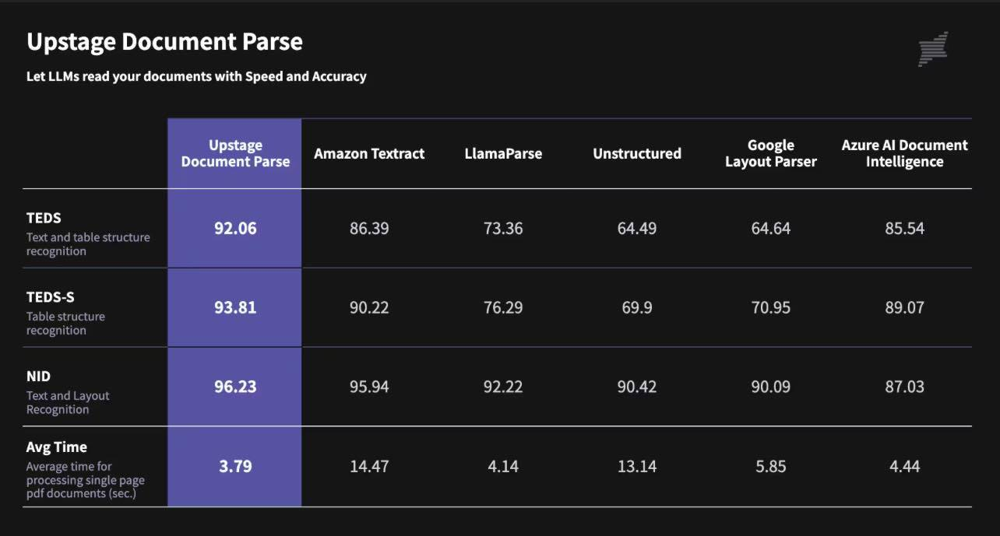

### 10월 22일 (화) 08:30 · arXiv에서 논문을 읽으신다면, #SolarPro로 업데이트된 #Sol…

arXiv에서 논문을 읽으신다면, #SolarPro로 업데이트된 #SolarXiv Chrome 플러그인을 설치해보세요. 이 플러그인은 논문을 더 빠르게 이해할 수 있도록 요약, 인사이트 및 추가 연구 토픽을 제공합니다. 또한 후속 질문을 할 수 있어 논문 토론을 자연스럽게 진행할 수 있습니다.

https://chromewebstore.google.com/detail/solarxiv/fbbfpcjhnnklhmncjickdipdlhoddjoh

하루 100회 논문 요약은 무료로 제공되며, 무제한 사용을 위해서는 UPSTAGE_API_KEY만 추가하면 됩니다.

선설치, 후고민! (별도 많이 부탁드립니다.)

🎬 동영상 1개 (생략)

### 10월 24일 (목) 10:46 · Songyee Yoon 박사님 #SF #TED AI 참여하시는거 재미있게…

Songyee Yoon 박사님 #SF #TED AI 참여하시는거 재미있게 구경했습니다. AI + Robotics 가 만들어낼 멋진 세상에 대해 좋은 말씀 잘 들었습니다. 감사합니다!

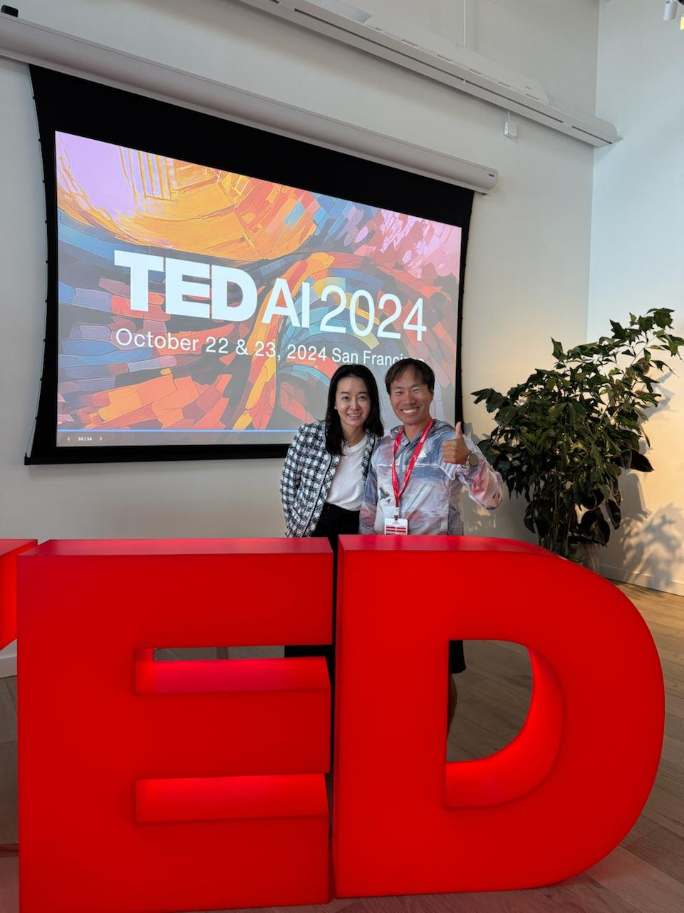

### 10월 24일 (목) 10:53 · AI 성능분석을 전문으로 하는 artificialanalysis.ai 에…

AI 성능분석을 전문으로 하는 artificialanalysis.ai 에서 #SolarPro 분석 결과를 공개했습니다. 비슷한 사이즈 모델에서 쟁쟁한 모델들과 당당히 겨루고 있습니다. #SolarPro는 지금 Preview 인데 더 정진하여 한계단 더 올라가 보겠습니다. 

https://console.upstage.ai/ 에서 사용하실수 있습니다.

(참고로 artificialanalysis 는 mattshumer/Reflection-Llama-3.1-70B 성능을 분석해서 그들이 잘못된 주장을 한다는 것을 밝혀내어 AI 생태계에서 큰 역할을 하는 공신력 있는 곳입니다.)

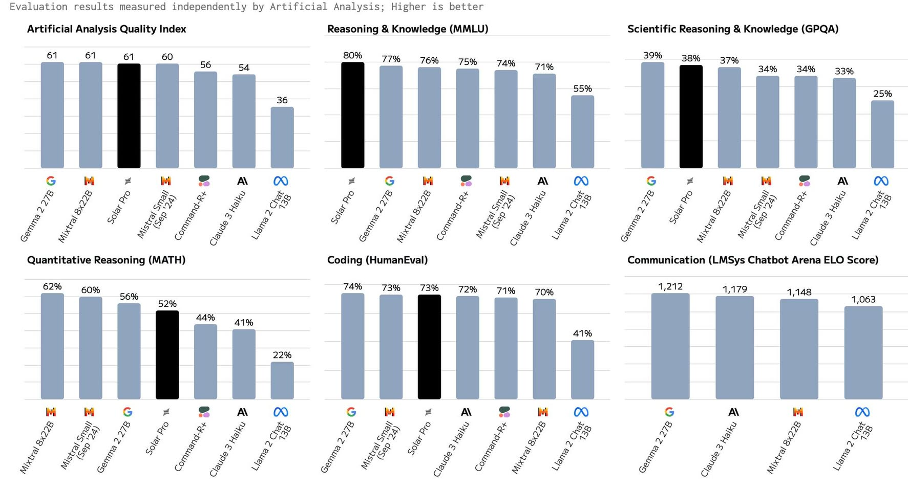

### 10월 24일 (목) 10:54 · Sung Kim shared a link.

🔗 <https://artificialanalysis.ai/models/solar-pro?models_selected=gemma-2-27b%2Cclaude-3-haiku%2Cmistral-8x22b-instruct%2Cmistral-small%2Ccommand-r-plus%2Csolar-pro%2Cllama-2-chat-13b>

### 10월 25일 (금) 07:22 · 존경하는 Julius Chun - 무형자산 유형자산 대표님께서 저희 제품…

존경하는 Julius Chun - 무형자산 유형자산 대표님께서 저희 제품에 대한 칭찬을 해주셨습니다. 감사합니다. 제품을 사용해보고 #써보니좋더라 말씀 주실 때 제일 행복합니다.

"사용자 입장에서 품질의 차이나 너무 나서 업스테이지를 안 쓸 수가 없다."

https://console.upstage.ai/ 에서 만나보세요!

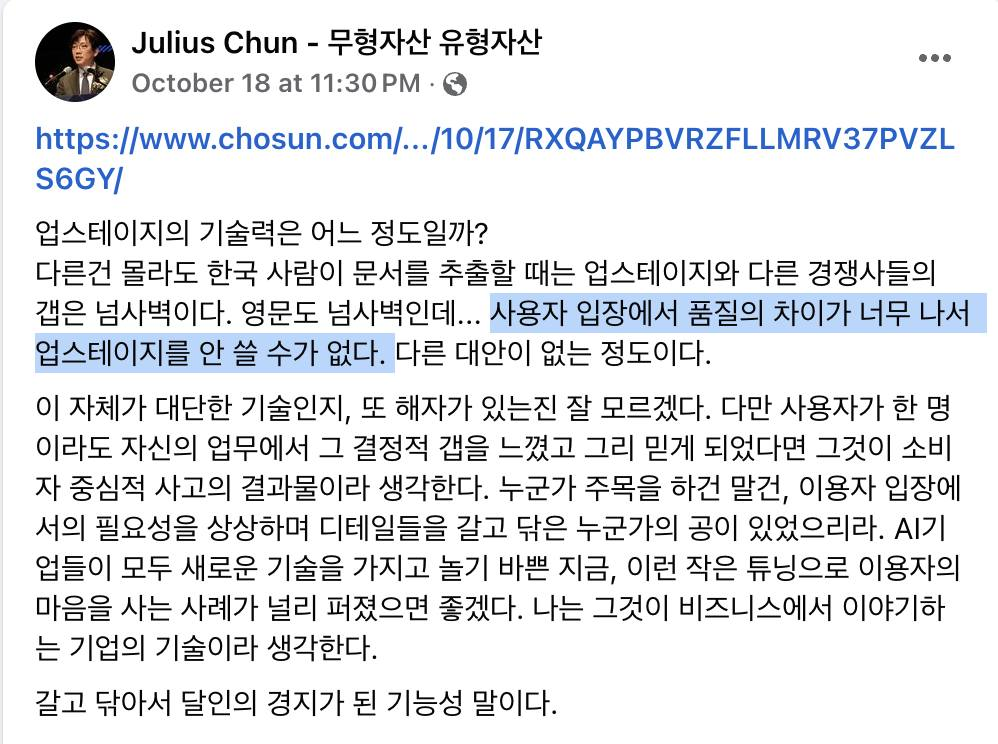

### 10월 26일 (토) 08:25 · #Qualcomm 과  함께 #SolarBox 를 통해 업스테이지 AI …

#Qualcomm 과  함께 #SolarBox 를 통해 업스테이지 AI 솔루션을 더 많은 분들에게 더 쉽게 그리고 더 안전하게 제공할수 있도록 협력하게 되어 너무 기쁩니다. #Qualcomm 에서 직접 Lucy Park의 키노트 세션과 그 내용을 홍보해주셨습니다!

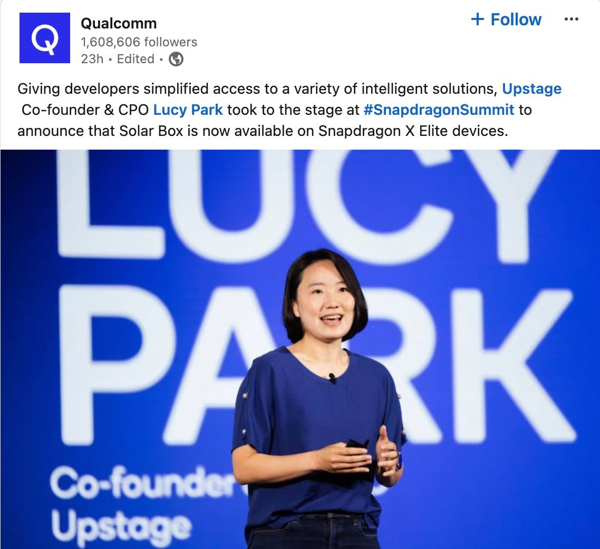

### 10월 27일 (일) 08:13 · 보기만 해도 행운이 찾아 온다는 #SolarHalo! 아주 기분 좋은…

보기만 해도 행운이 찾아 온다는 #SolarHalo! 아주 기분 좋은 날입니다. 

보시는 모든 분들에게 행운이 가득하길 기원합니다.

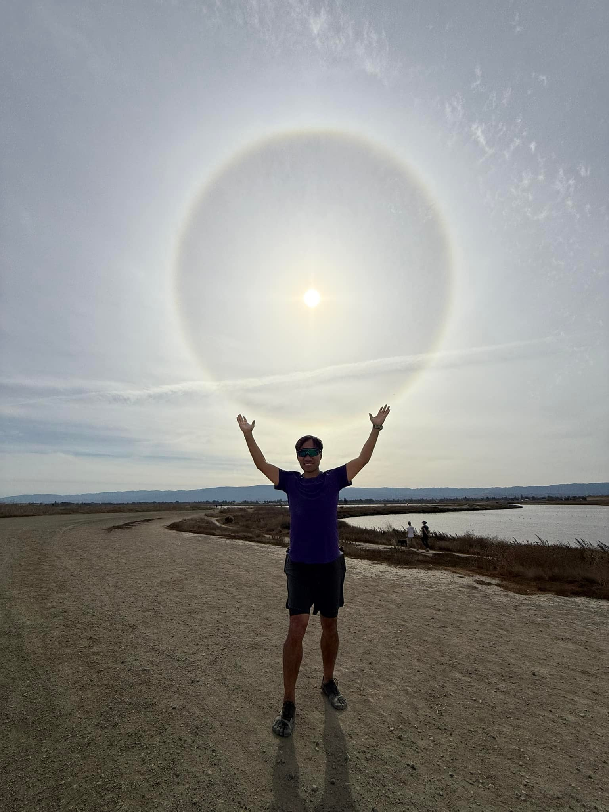

### 10월 27일 (일) 10:14 · 📷 사진 (1장)

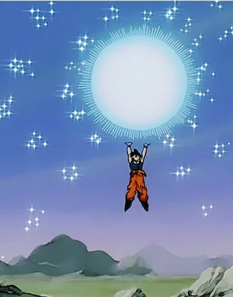

### 10월 27일 (일) 13:07 · 📷 앨범: Profile pictures (1장)

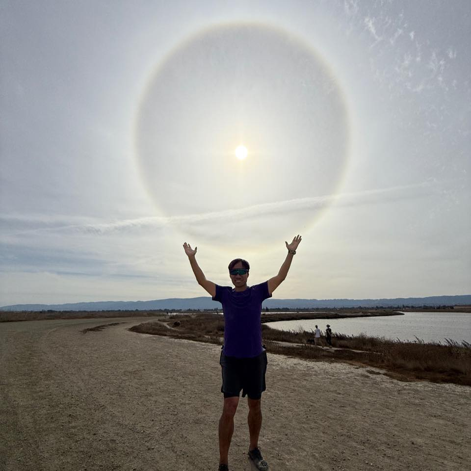

### 10월 28일 (월) 08:46 · 아침에 일어나서 제일 좋아 하는 카페를 간다음, 컴퓨터를 켜고 요즈음 제…

아침에 일어나서 제일 좋아 하는 카페를 간다음, 컴퓨터를 켜고 요즈음 제일 좋아 하는 노래를 듣습니다.  APT, APT, APT!

https://youtu.be/ekr2nIex040?si=tWlne3vILUzN01IF

그리고는 신나게 하루를 시작합니다!

### 10월 29일 (화) 13:00 · 존경하는 Teddy Lee 님의 채널에 Upstage 참여 합니다. 10…

존경하는 Teddy Lee 님의 채널에 Upstage 참여 합니다. 10월 30일인데요. 아래 링크에서 "Notify Me" 신청이 가능합니다.

https://www.youtube.com/live/wE42SIAWCmg?si=UA2RjgaC-OAUfLKF

"@Upstage 화제의 Document Parse 개발하신 분들께 직접 물어보겠습니다! (라이브 참여자 이벤트 있음)"

오시는 분들 반갑게 뵙겠습니다!

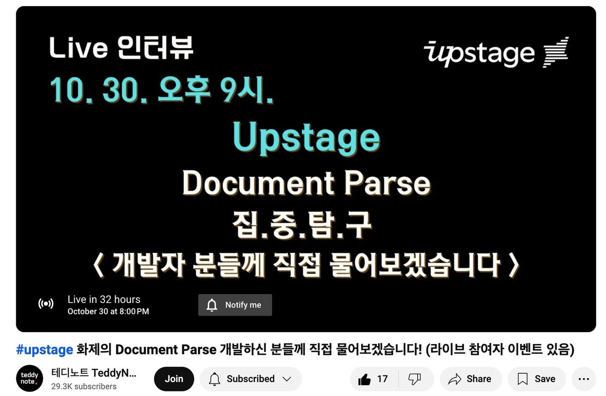

### 10월 29일 (화) 16:25 · 내년부터 전국 고등학교에 배포되는 교과서에 Upstage 이야기가 실린다…

내년부터 전국 고등학교에 배포되는 교과서에 Upstage 이야기가 실린다는 경사스러운 소식입니다. AI/SW 융합과목 “소프트웨어와 생활” 교과서인데요. 이 책을 보는 학생들이 더 많이 AI/SW에 큰 꿈을 꿀수 있으면 좋겠습니다.

참 감사한 일입니다.

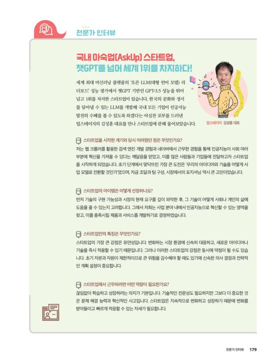
