# 2024년 12월

[← 2024년](README.md)

### 12월 2일 (월) 09:58 · 오늘부터 Las Vegas 에서 #AWSreInvent 가 열립니다. 가…

오늘부터 Las Vegas 에서 #AWSreInvent 가 열립니다. 가장 빠르게 고객들이 사용할수 있는 제품들을 만들어내는 AWS라 큰 기대가 됩니다.

특히 AWS AI 및 데이터 담당 부사장 Swami Sivasubramanian 님 기조연설 꼭 봐야 할것 같습니다.

무료 등록: https://reinvent.awsevents.com/register/virtualregistration

**이미지 캡션:** 이 이미지는 AWS re:Invent 2024 컨퍼런스의 홍보 자료로, 대규모 강연장 내부의 모습을 담고 있으며, 무대 위 연설자와 객석을 가득 메운 청중, 그리고 배경에 펼쳐진 대

### 12월 3일 (화) 09:17 · "한글 Q/A에서는 단연 Upstage!" 고객과 사용자가 써보고 좋다고…

"한글 Q/A에서는 단연 Upstage!" 고객과 사용자가 써보고 좋다고 할때 제일 행복 합니다. Upstage embedding, llm, doc parser 많이 사용해주셔요.

### 12월 5일 (목) 07:17 · 🎉 단일 GPU에서 가장 지능적인 LLM, Solar Pro! 이번주 L…

🎉 단일 GPU에서 가장 지능적인 LLM, Solar Pro! 이번주 Las Vegas에서 진행중인 Swami Sivasubramanian의 #AWSreInvent 기조연설에서 공개한 Amazon Web Services(AWS) Bedrock Marketplace 에 탑재 되었습니다!

Solar Pro의 장점 3가지만 꼽는다면:

1️⃣ Solar Pro는 다양한 작업, 언어 및 도메인을 처리하는 데 탁월하며, 특히 HTML 및 Markdown과 같은 구조화된 텍스트를 이해하는 데 중점을 둡니다. 기업 애플리케이션에 중요한 구조화된 텍스트를 처리해야 한다면 Solar Pro를 사용해 보세요.

2️⃣ Solar Pro는 Preview 버전과 비교하여 한국어와 일본에서 최대 64%의 향상된 성능을 달성했으며, 매우 뛰어난 모델입니다. 

3️⃣ 금융에서 법률 및 의료 도메인에 특화된 모델입니다.

👉 AWS Bedrock Marketplace에서 바로 사용할수 있습니다 https://aws.amazon.com/ko/bedrock/marketplace/

👉 https://chat.upstage.ai/ 에서 바로 테스트 가능합니다.

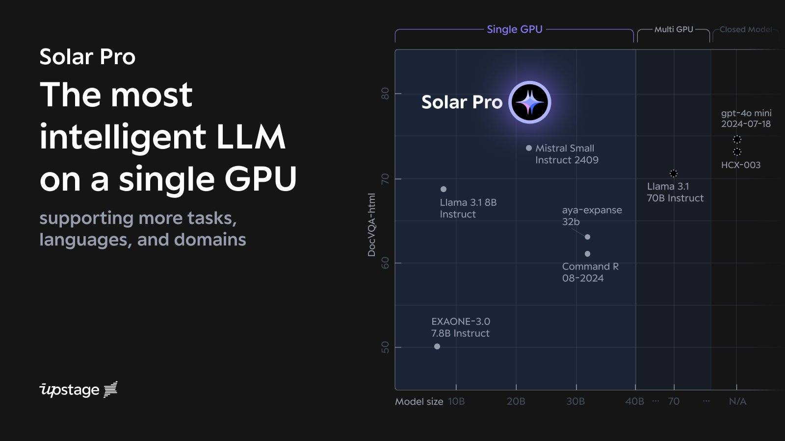
**이미지 캡션:** 이 이미지는 "Solar Pro"라는 대규모 언어 모델(LLM)을 홍보하는 그래픽으로, 단일 GPU에서 가장 지능적인 LLM임을 강조하며 더 많은 작업, 언어 및 도메인을 지원한다고 설명합니다. 왼쪽에는 검은색 배경에 흰색 글씨로 "Solar Pro", "The most intelligent LLM on a single GPU", 그리고 "supporting more tasks, languages, and domains"라는 문구가 적혀 있고, 하단에는 "upstage" 로고가 있습니다. 오른쪽에는 파란색 격자 배경의 그래프가 있으며, 가로축은 모델 크기(10B, 20B, 30B, 40B 등)를 나타내고, 세로축은 DocVQA-html 점수(50, 60, 70, 80 등)를 나타냅니다. 그래프 상단에는 "Single GPU", "Multi GPU", "Closed Model"이라는 영역 구분이 있습니다. "Solar Pro"는 그래프의 중앙 상단에 보라색 빛을 띠는 원형 아이콘과 함께 표시되어 있으며, 다른 LLM 모델들(Mistral Small Instruct 2409, Llama 3.1 8B Instruct, Llama 3.1 70B Instruct, aya-expanse 32b, Command R 08-2024, EXAONE-3.0 7.8B Instruct, gpt-4o mini 2024-07-18, HCX-003)도 점으로 표시되어 각 모델의 성능과 크기를 비교하고 있습니다. 전반적으로 기술적인 정보를 시각적으로 전달하는 깔끔하고 현대적인 디자인입니다.
 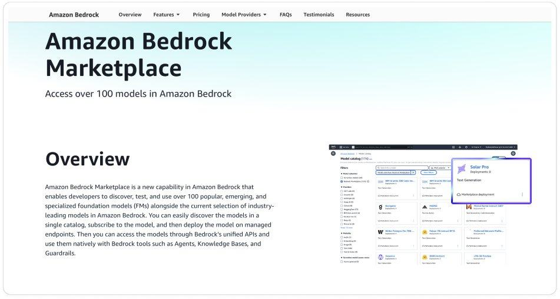
**이미지 캡션:** 이 이미지는 Amazon Bedrock Marketplace의 웹 페이지를 보여줍니다. 페이지 상단에는 "Amazon Bedrock", "Overview", "Features", "Pricing", "Model Providers", "FAQs", "Testimonials", "Resources"와 같은 탐색 메뉴가 있습니다. 메인 제목은 "Amazon Bedrock Marketplace"이며, 그 아래에는 "Access over 100 models in Amazon Bedrock"이라는 부제가 있습니다. 페이지 중앙에는 "Overview"라는 제목과 함께 Amazon Bedrock Marketplace에 대한 설명이 상세하게 나와 있습니다. 이 설명은 Amazon Bedrock Marketplace가 개발자들이 100개 이상의 인기 있고 새롭게 등장하는 전문화된 파운데이션 모델(FM)을 발견, 테스트 및 사용할 수 있게 해주는 새로운 기능이며, 이를 통해 개발자들은 단일 카탈로그에서 모델을 쉽게 발견하고, 구독하고, 관리형 엔드포인트에 배포할 수 있다고 설명합니다. 또한, Bedrock의 통합 API를 통해 모델에 액세스하고 Agents, Knowledge Bases, Guardrails와 같은 Bedrock 도구와 함께 네이티브하게 사용할 수 있다고 언급합니다. 페이지 오른쪽 하단에는 Amazon Bedrock Marketplace의 모델 카탈로그를 보여주는 스크린샷이 삽입되어 있으며, "Solar Pro"라는 모델과 "Text Generation"이라는 기능이 강조되어 있습니다. 이 스크린샷에는 필터링 옵션과 다양한 모델 목록이 표시되어 있습니다. 전반적으로 이 이미지는 Amazon Bedrock Marketplace의 기능과 이점을 소개하는 정보성 웹 페이지의 모습을 담고 있습니다.

### 12월 8일 (일) 01:29 · #서울의봄 #1212군사반란 #아픈역사의교훈 '서울의 봄'이 유튜브에서 …

#서울의봄 #1212군사반란 #아픈역사의교훈 '서울의 봄'이 유튜브에서 무료로 공개되었습니다 🎬! 12.12 군사반란의 참담한 순간들을 사실적으로 보여줍니다. 비상계엄의 공포와 반란/내란의 의미, 속고 속이는 비정함까지! 반복되어서는 안 될 아픈 역사입니다. 

https://youtu.be/XSwxos0bdH8?si=iFyimRAMc5qlYfUv
어떤 순간에도 헌법을 수호해야 합니다. 이에 반하여 국헌을 문란하게 하는 내란은 즉시 처벌되어야 합니다. 속이는 자들에게 속아서는 안됩니다.

---
형법 제87조(내란) 대한민국 영토의 전부 또는 일부에서 국가권력을 배제하거나 국헌을 문란하게 할 목적으로 폭동을 일으킨 자는 다음 각 호의 구분에 따라 처벌한다.

1. 우두머리는 사형, 무기징역 또는 무기금고에 처한다.

2. 모의에 참여하거나 지휘하거나 그 밖의 중요한 임무에 종사한 자는 사형, 무기 또는 5년 이상의 징역이나 금고에 처한다. 살상, 파괴 또는 약탈 행위를 실행한 자도 같다.

3. 부화수행(附和隨行)하거나 단순히 폭동에만 관여한 자는 5년 이하의 징역이나 금고에 처한다.

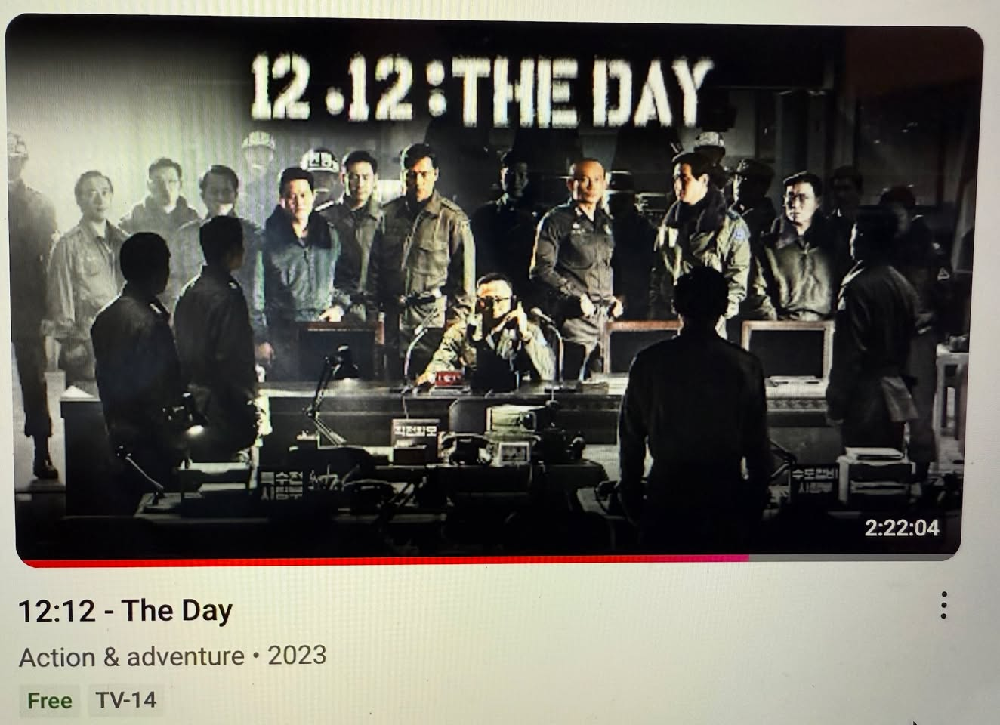
**이미지 캡션:** 어두운 실내에서 여러 명의 성인 남성들이 군복 또는 제복을 입고 서 있거나 앉아 있다. 중앙에는 안경을 쓴 한 남성이 전화기를 들고 심각한 표정으로 통화 중이며, 그의 앞에는 여러 개의 서류와 전화기, 그리고 컴퓨터 모니터로 보이는 장비들이 놓여 있다. 배경에는 "12.12: THE DAY"라는 큰 글자가 흰색으로 쓰여 있고, 그 아래로 여러 명의 남성들이 서서 긴장된 분위기를 자아낸다. 일부 남성들은 군복을 입고 있으며, 다른 남성들은 제복을 입고 있다. 전반적으로 긴박하고 중요한 회의가 진행되는 듯한 분위기이며, 일부 보이는 한국어 텍스트로는 "특수전", "수도권", "작전명령" 등이 있다. 화면 오른쪽 하단에는 영상 재생 시간 2:22:04이 표시되어 있다.

### 12월 10일 (화) 09:22 · 어떤 LLM 모델을 얼마나 다운로드 받아사용할까요?  (Downlods)…

어떤 LLM 모델을 얼마나 다운로드 받아사용할까요? https://aiworld.eu/embed/model/model/treemap (Downlods) 에서 최근 모델들의 다운로드 현황을 볼수 있습니다. Solar-Pro-Preview 가 작지만 하나의 Box를 차지 했습니다. 더 많은 분들이 사용할수 있도록 더 좋은 모델을 만들어 보겠습니다.

#SolarPro는 Upstage console에서 바로 테스트 해볼수 있습니다. https://console.upstage.ai/

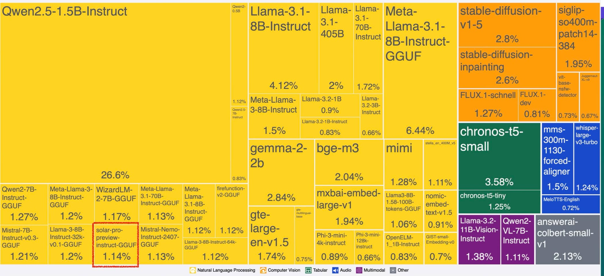
**이미지 캡션:** 이 이미지는 다양한 언어 모델의 크기와 성능을 시각적으로 나타낸 트리맵 차트입니다. 각 사각형은 특정 언어 모델을 나타내며, 사각형의 크기는 해당 모델의 상대적인 중요도나 사용량을 나타냅니다. 색상은 모델의 종류나 카테고리를 구분하는 데 사용된 것으로 보이며, 노란색, 주황색, 녹색, 보라색, 파란색 등 다양한 색상이 사용되었습니다. 각 사각형 안에는 모델의 이름과 함께 백분율로 표시된 수치가 기재되어 있어, 전체에서 차지하는 비중을 알 수 있습니다. 예를 들어, 가장 큰 노란색 사각형은 "Qwen2.5-1.5B-Instruct"라는 이름과 함께 26.6%라는 수치를 보여주며, 이는 이 모델이 전체에서 가장 큰 비중을 차지하고 있음을 나타냅니다. 다른 사각형들에는 "Llama-3.1-8B-Instruct", "stable-diffusion-v1-5", "gemma-2-2b", "mimi", "chronos-t5-small" 등 다양한 모델 이름들이 표시되어 있으며, 각각의 수치와 함께 나열되어 있습니다. 차트 하단에는 "Natural Language Processing", "Computer Vision", "Tabular", "Audio", "Multimodal", "Other"와 같은 범주를 나타내는 아이콘과 텍스트가 있어, 각 모델이 어떤 분야에 속하는지 추측할 수 있습니다. 전반적으로 이 이미지는 인공지능 언어 모델 생태계의 현황을 보여주는 정보성 그래픽으로, 복잡한 데이터를 직관적으로 이해할 수 있도록 돕습니다.

### 12월 10일 (화) 15:37 · #한컴X업스테이지 존경하는 김연수 대표님과 멋진 제품 출시를 위한 협약식…

#한컴X업스테이지 존경하는 김연수 대표님과 멋진 제품 출시를 위한 협약식을 하였습니다. 한컴과 Upstage AI를 통해 더 효율적인 업무 환경을 만들어 가겠습니다. 

https://n.news.naver.com/mnews/article/003/0012952063?sid=105

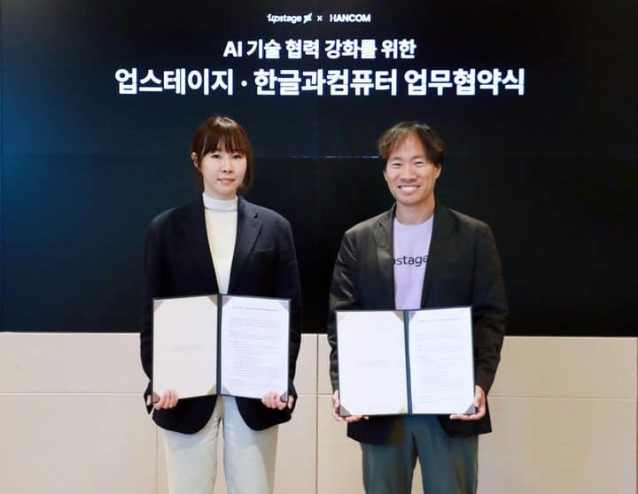
**이미지 캡션:** 사진에는 검은색 배경에 흰색 글씨로 '업스테이지 x HANCOM AI 기술 협력 강화를 위한 업스테이지·한글과컴퓨터 업무협약식'이라고 적힌 현수막이 걸려 있고, 그 앞에 성인 여성과 성인 남성이 서 있다. 여성은 30대 초중반으로 보이며, 검은색 재킷 안에 흰색 터틀넥 상의와 베이지색 바지를 입고 있다. 그녀는 차분한 표정으로 정면을 응시하며 두 손으로 서류를 들고 있다. 남성은 30대 후반에서 40대 초반으로 보이며, 검은색 재킷 안에 연보라색 티셔츠를 입고 어두운 색 바지를 입고 있다. 그는 활짝 웃으며 정면을 응시하고 있으며, 여성과 마찬가지로 두 손으로 서류를 들고 있다. 두 사람 모두 공식적인 행사에 참여한 듯한 모습이며, 배경의 현수막 내용은 두 회사가 AI 기술 협력을 위한 업무 협약을 맺었음을 나타낸다. 장소는 실내이며, 행사장으로 보이는 공간이다. 전반적으로 공식적이고 긍정적인 분위기를 풍긴다.

### 12월 16일 (월) 12:04 · #한라산 언제나 아름답네요. 물론 눈이 오면 100배 멋집니다!!

#한라산 언제나 아름답네요. 물론 눈이 오면 100배 멋집니다!!

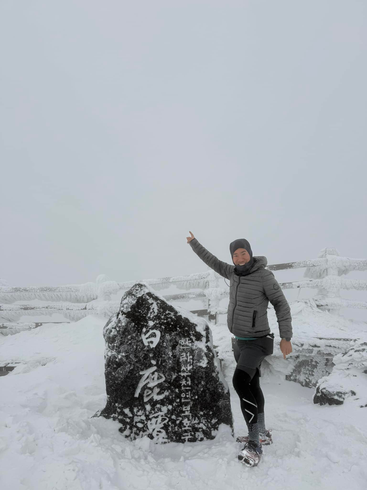
**이미지 캡션:** 눈 덮인 산 정상에서 한 성인 남성이 흰색 눈이 쌓인 검은색 비석 옆에 서서 오른손으로 하늘을 가리키고 있다. 남성은 30대에서 40대로 보이며, 회색 패딩 조끼와 회색 모자, 검은색 타이츠를 착용하고 있다. 그의 표정은 밝고 활기차며, 성취감을 느끼는 듯하다. 배경에는 눈으로 뒤덮인 나무 울타리와 흐릿한 하늘이 보인다. 비석에는 흰색 글씨로 "백록담"이라는 글자가 새겨져 있으며, 그 옆에는 한자로 된 설명이 적혀 있다. 전반적으로 추운 날씨 속에서 등반에 성공한 기쁨과 만족감을 나타내는 분위기이다.
 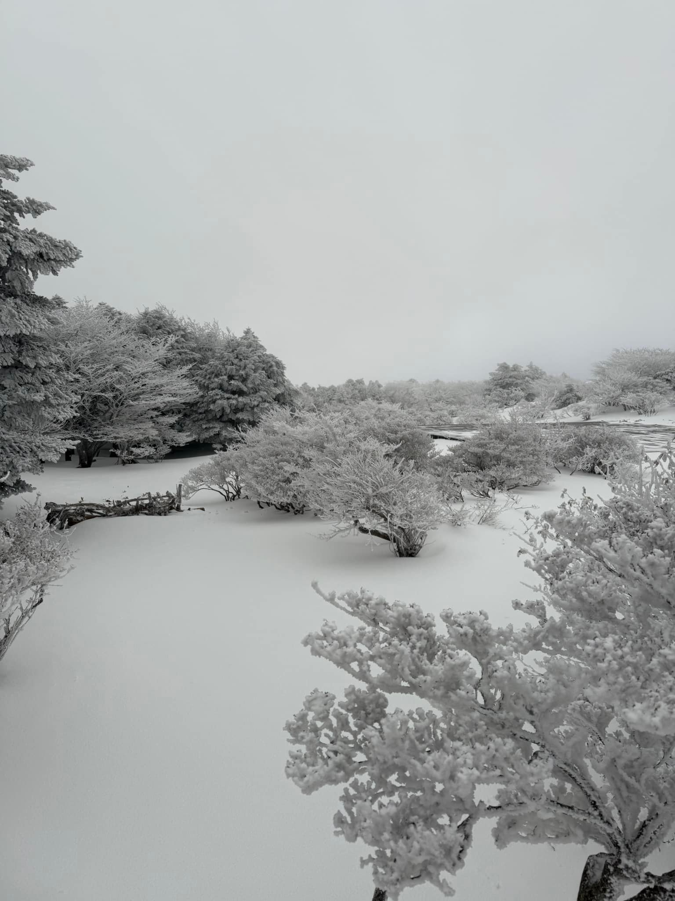
**이미지 캡션:** 사진에는 눈 덮인 풍경이 담겨 있으며, 사람이나 텍스트는 보이지 않습니다. 눈으로 뒤덮인 나무들이 숲을 이루고 있으며, 멀리 희미하게 다리가 보입니다. 하늘은 짙은 안개나 구름으로 덮여 있어 전체적으로 흐릿하고 차가운 분위기를 자아냅니다. 눈이 많이 쌓여 있어 겨울철 산악 지역의 고요하고 적막한 풍경을 연상시킵니다.
 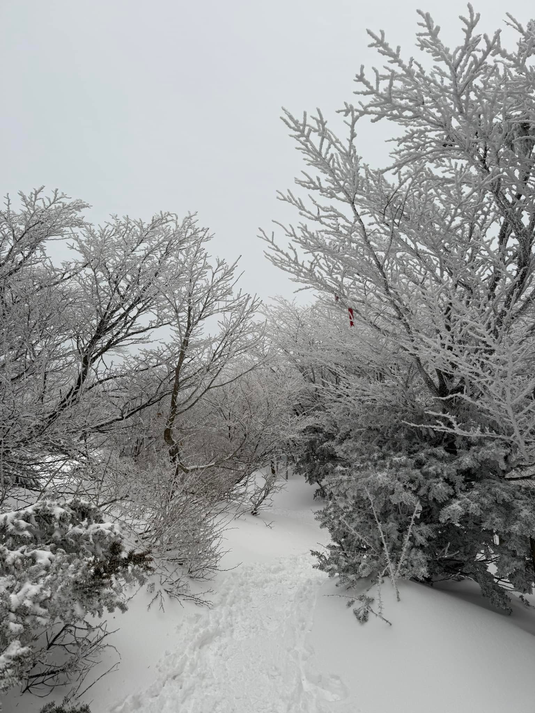
**이미지 캡션:** 하얀 눈으로 뒤덮인 겨울 산길 풍경으로, 나뭇가지마다 하얗게 서리가 내려 마치 나무가 눈꽃으로 장식된 듯한 모습이다. 앙상한 나뭇가지와 빽빽한 덤불이 눈 쌓인 오솔길 양옆으로 늘어서 있으며, 길은 눈이 밟혀 희미한 발자국이 나 있다. 하늘은 짙은 회색 구름으로 뒤덮여 있어 흐린 날씨임을 짐작하게 한다. 사진에는 사람이 보이지 않으며, 붉은색 깃발 조각이 나뭇가지에 걸려 있는 것이 희미하게 보인다. 전반적으로 고요하고 차가운 겨울의 정취를 느끼게 하는 풍경이다.
 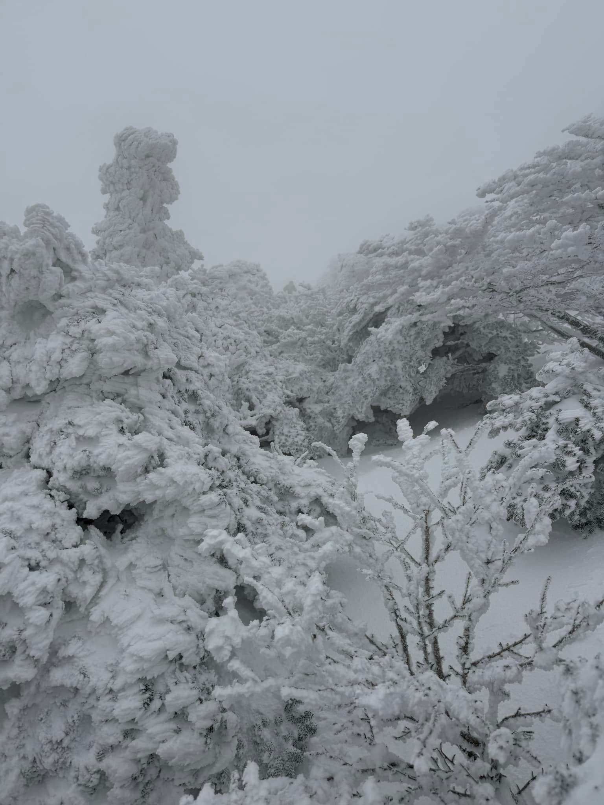
**이미지 캡션:** 이 사진은 눈 덮인 산의 풍경을 담고 있으며, 사람이나 인공적인 사물은 보이지 않고 오직 자연만이 존재합니다. 배경은 흐릿하고 회색빛 하늘로, 시야가 좋지 않은 안개나 눈보라가 치는 날씨임을 짐작하게 합니다. 사진의 대부분은 두껍게 눈이 쌓여 하얗게 뒤덮인 나무와 가지들로 채워져 있습니다. 특히 왼쪽에는 마치 조각상처럼 독특한 형태로 눈이 쌓인 나무가 눈길을 끕니다. 나뭇가지들은 눈의 무게로 인해 휘어지거나 뭉쳐져 있어, 혹독한 겨울 날씨를 생생하게 보여줍니다. 사진 전체적으로는 차갑고 고요하며, 자연의 위대함과 혹독함을 느끼게 하는 분위기입니다.
 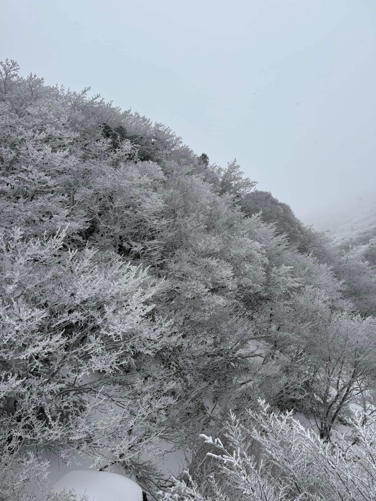
**이미지 캡션:** 눈 덮인 산비탈에 나무들이 빽빽하게 서 있으며, 나뭇가지마다 하얗게 서리가 내려앉아 마치 은빛으로 뒤덮인 듯한 풍경을 연출하고 있습니다. 하늘은 흐린 회색빛으로, 전반적으로 차갑고 고요한 겨울의 분위기를 자아냅니다. 사진에는 사람이 보이지 않으며, 눈으로 뒤덮인 나무와 숲만이 존재합니다. 배경에는 안개가 낀 듯 희미하게 보이는 산 능선이 있어 깊은 산속의 겨울 풍경임을 짐작하게 합니다. 텍스트는 보이지 않습니다.
 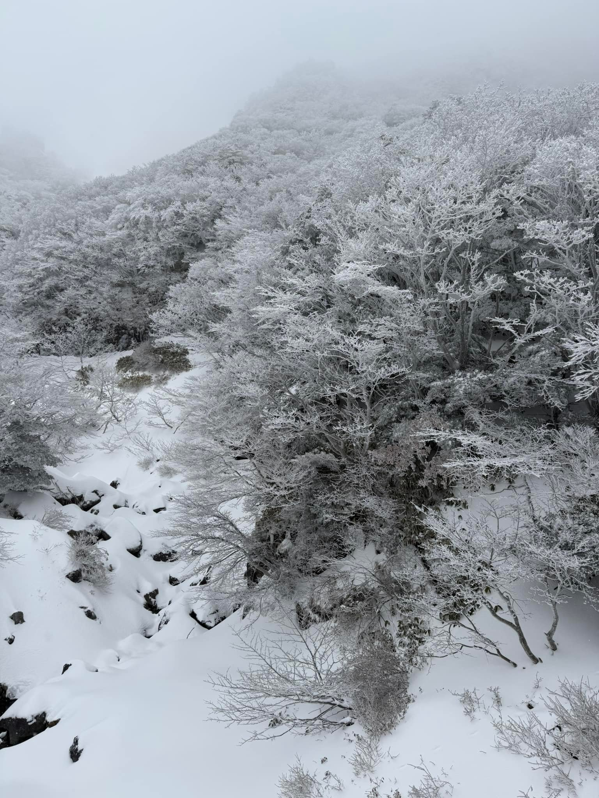
**이미지 캡션:** 이 사진은 눈 덮인 산의 풍경을 담고 있으며, 나무들은 하얗게 서리가 내려 마치 겨울 왕국을 연상케 합니다. 사진에는 사람이 보이지 않으며, 눈으로 뒤덮인 산비탈과 바위들이 계곡을 따라 펼쳐져 있습니다. 나무들은 앙상한 가지를 드러내고 있지만, 그 위로 쌓인 눈과 서리가 섬세한 패턴을 만들어내고 있습니다. 하늘은 흐리고 안개가 낀 듯 뿌옇지만, 이는 오히려 산의 신비로운 분위기를 더해줍니다. 전반적으로 고요하고 차가운 겨울의 정취를 느낄 수 있는 풍경입니다.
 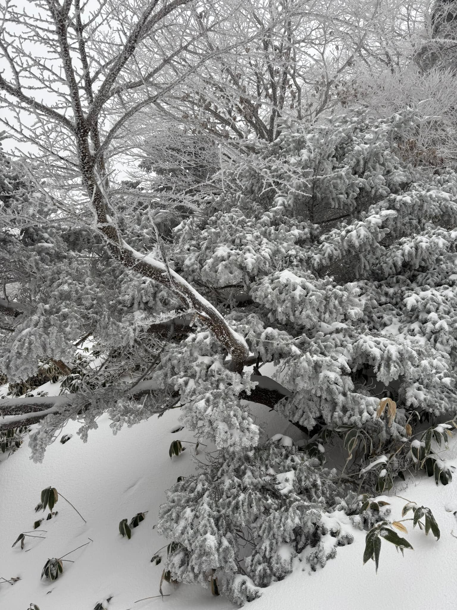
**이미지 캡션:** 이 사진은 눈 덮인 산의 풍경을 담고 있으며, 두꺼운 눈이 나뭇가지와 땅을 뒤덮고 있어 겨울의 추운 날씨를 짐작하게 합니다. 사진에는 사람이 보이지 않으며, 배경은 눈으로 뒤덮인 나무들과 덤불로 이루어져 있습니다. 일부 나뭇가지에는 하얗게 서리가 내려앉아 더욱 차가운 분위기를 자아냅니다. 땅에는 몇몇 죽은 듯한 식물들이 눈 사이로 삐져나와 있으며, 전반적으로 고요하고 적막한 겨울 산의 모습을 보여줍니다. 텍스트는 보이지 않으며, 사진은 자연의 아름다움과 겨울의 혹독함을 동시에 느끼게 하는 분위기를 연출합니다.
 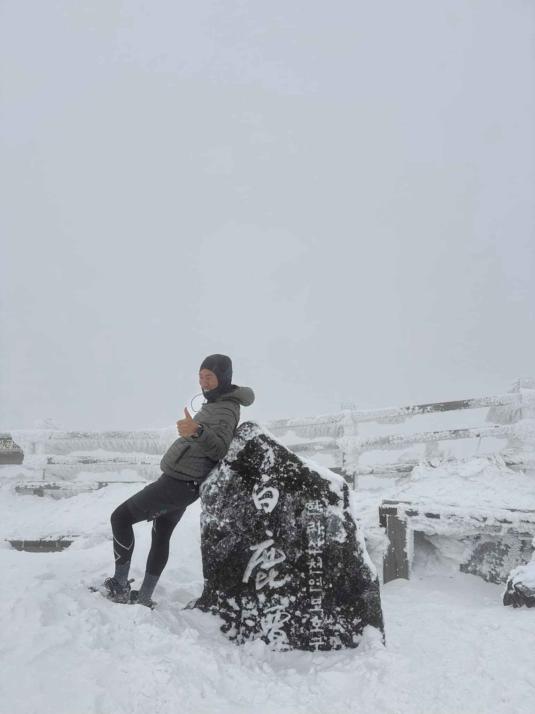
**이미지 캡션:** 눈 덮인 산 정상에서 한 성인 남성이 검은색 비석에 기대어 엄지손가락을 치켜들고 있다. 남성은 회색 경량 패딩 조끼와 검은색 타이츠, 회색 양말, 그리고 스노우슈즈를 착용하고 있으며, 머리에는 검은색 모자를 쓰고 있다. 그의 표정은 밝고 활기차 보이며, 마치 등반 성공을 자축하는 듯하다. 배경에는 눈으로 뒤덮인 나무 울타리와 벤치가 보이며, 하늘은 흐리고 뿌옇다. 비석에는 한자로 "한라산천연보호구"라고 쓰여 있어 이곳이 한라산의 특정 구역임을 알 수 있다. 전반적으로 추운 날씨 속에서 등반을 즐기는 역동적이고 긍정적인 분위기를 나타낸다.

🎬 동영상 1개 (생략)

### 12월 22일 (일) 14:08 · 어느 서점의 "노벨문학상 한강 작가의 첫 문장" 기획 너무 멋집니다. 첫…

어느 서점의 "노벨문학상 한강 작가의 첫 문장" 기획 너무 멋집니다. 첫 문장만 읽어도 가슴이 뜁니다.

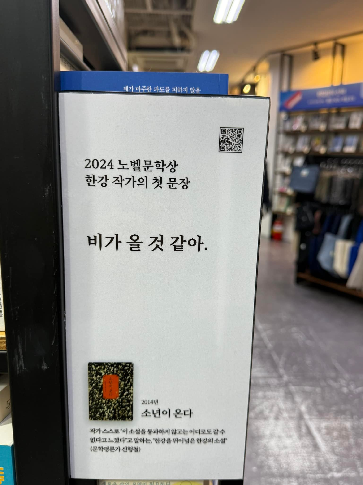
**이미지 캡션:** 이 사진은 서점의 책 진열대 앞에 놓인 홍보물로, 2024년 노벨문학상 후보로 거론되는 한강 작가의 첫 문장을 소개하고 있다. 홍보물 상단에는 "제가 마주한 파도를 피하지 않을"이라는 문구가 파란색 배경에 흰색 글씨로 적혀 있으며, 그 아래에는 "2024 노벨문학상 한강 작가의 첫 문장"이라는 제목과 함께 "비가 올 것 같아."라는 문장이 크고 굵은 글씨로 쓰여 있다. 오른쪽 상단에는 QR 코드가 있어 스캔하면 관련 정보를 얻을 수 있다. 하단에는 2014년에 출간된 한강 작가의 소설 "소년이 온다"의 표지 이미지와 함께, 이 소설에 대한 문학평론가 신형철의 평가가 인용되어 있다. 배경에는 책들이 진열된 서점의 모습이 흐릿하게 보이며, 전체적으로 차분하고 지적인 분위기를 자아낸다.
 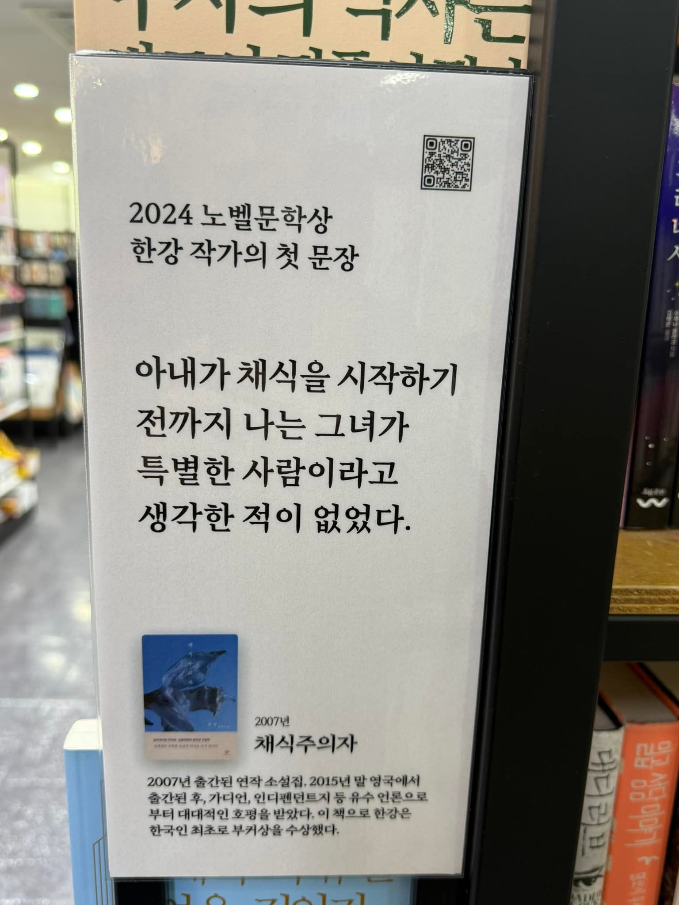
**이미지 캡션:** 이 사진은 서점의 책 진열대에서 찍은 것으로, 한강 작가의 소설 '채식주의자'를 홍보하는 안내문이 보인다. 안내문 상단에는 '2024 노벨문학상 한강 작가의 첫 문장'이라는 문구가 적혀 있고, 그 아래에는 '아내가 채식을 시작하기 전까지 나는 그녀가 특별한 사람이라고 생각한 적이 없었다.'라는 소설의 첫 문장이 인용되어 있다. 안내문 중앙에는 책 표지 이미지와 함께 '2007년 채식주의자'라는 정보가 있고, 이어서 이 책이 2007년 출간된 연작 소설집으로, 2015년 영국에서 출간 후 큰 호평을 받았으며, 한국인 최초로 부커상을 수상했다는 내용이 설명되어 있다. 안내문 우측 상단에는 QR 코드가 있어 스마트폰으로 스캔하면 더 많은 정보를 얻을 수 있을 것으로 보인다. 배경에는 다른 책들이 진열된 서점의 모습이 흐릿하게 보이며, 전체적으로 차분하고 지적인 분위기를 풍긴다.
 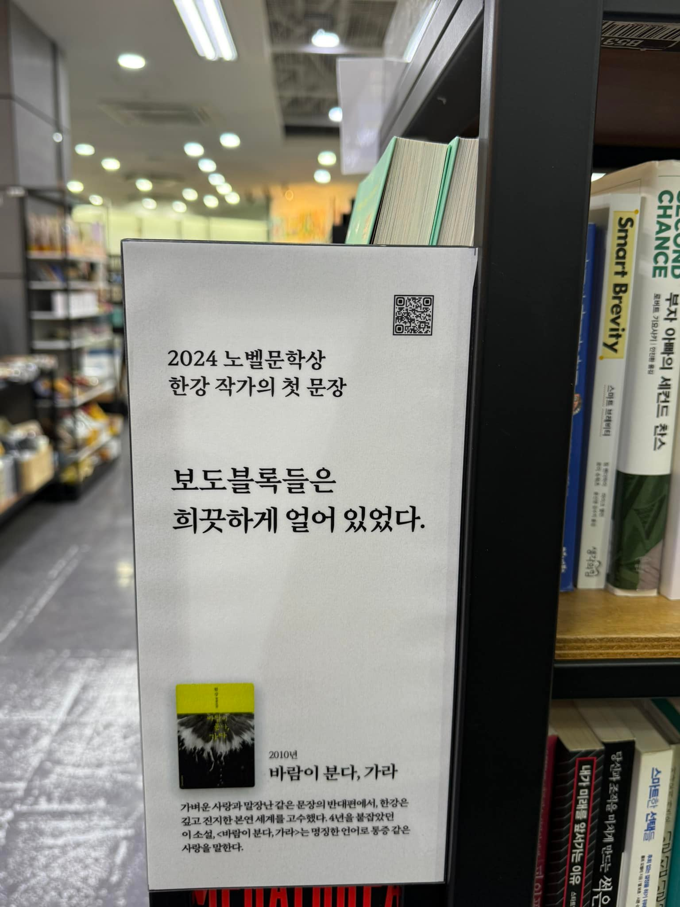
**이미지 캡션:** 이 사진은 서점의 책 진열대를 보여주며, 중앙에는 흰색 종이에 인쇄된 홍보물이 놓여 있습니다. 홍보물에는 "2024 노벨문학상 한강 작가의 첫 문장"이라는 문구와 함께 "보도블록들은 희끗하게 얼어 있었다."라는 문장이 적혀 있습니다. 그 아래에는 2010년 출간된 한강 작가의 소설 <바람이 분다, 가라>의 표지와 함께 작품에 대한 간략한 소개가 담겨 있습니다. QR 코드가 있어 스마트폰으로 스캔하면 더 많은 정보를 얻을 수 있습니다. 홍보물 오른쪽으로는 여러 권의 책들이 진열되어 있으며, 일부 책의 제목이 보입니다. 책들은 주로 한국어로 되어 있으며, "Smart Brevity", "부자 아빠의 세컨드 찬스" 등의 영어 제목도 보입니다. 배경에는 서점의 형광등 조명과 다른 책들이 진열된 선반들이 흐릿하게 보입니다. 전체적으로 차분하고 지적인 분위기를 풍깁니다.
 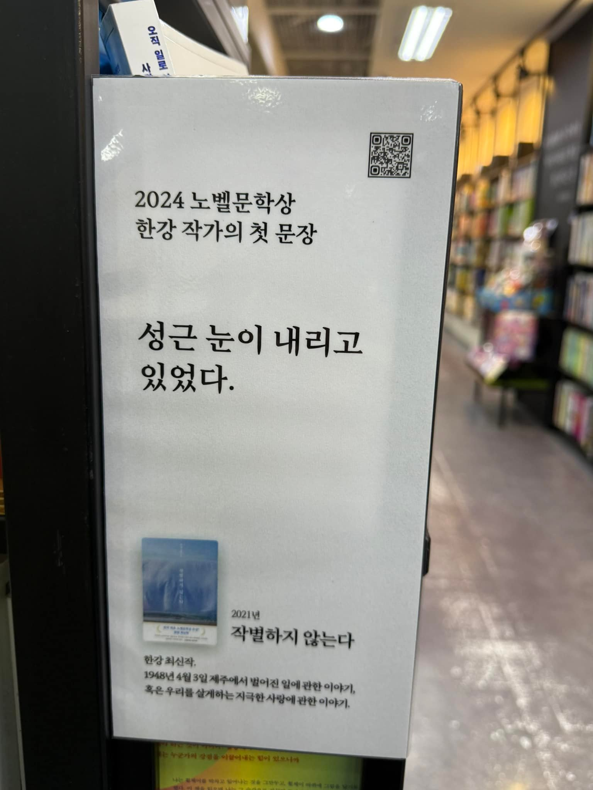
**이미지 캡션:** 이 사진은 서점의 책 진열대 앞에 부착된 홍보물로, 2024년 노벨문학상 후보로 거론되는 한강 작가의 작품을 소개하고 있다. 홍보물 상단에는 "2024 노벨문학상 한강 작가의 첫 문장"이라는 문구가, 그 아래에는 "성근 눈이 내리고 있었다."라는 작품의 첫 문장이 큰 글씨로 쓰여 있다. 중앙에는 QR 코드가 있어 스마트폰으로 스캔하면 관련 정보를 얻을 수 있다. 하단에는 한강 작가의 최신작인 "작별하지 않는다"의 표지 이미지와 함께 2021년 출간된 이 작품이 1948년 4월 3일 제주에서 벌어진 사건이나 지극한 사랑에 관한 이야기임을 설명하는 문구가 적혀 있다. 배경에는 책들이 진열된 서점의 모습이 흐릿하게 보인다. 전체적으로 차분하고 지적인 분위기를 풍긴다.
 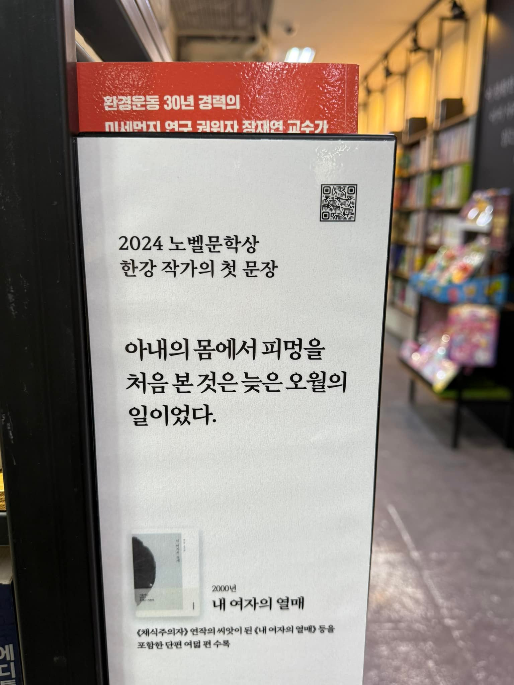
**이미지 캡션:** 이 사진은 서점의 책 진열대를 보여주며, 중앙에는 흰색 배경에 검은색 글씨로 쓰인 홍보 문구가 있다. 상단에는 붉은색 배경에 "환경운동 30년 경력의 미세먼지 연구 권위자 장재연 교수가"라는 문구가 적혀 있다. 그 아래에는 "2024 노벨문학상 한강 작가의 첫 문장"이라는 문구가 있고, 그 밑에는 "아내의 몸에서 피멍을 처음 본 것은 늦은 오월의 일이었다."라는 한강 작가의 소설 일부가 인용되어 있다. 또한, 책 표지로 보이는 작은 이미지와 함께 "2000년 내 여자의 열매"라는 문구가 있으며, 이 책이 <채식주의자> 연작의 씨앗이 된 작품임을 알리는 설명도 있다. 오른쪽에는 책들이 진열된 서점의 모습이 흐릿하게 보이며, 왼쪽에는 다른 책의 일부가 보인다. 전체적으로 책과 문학에 대한 홍보를 위한 분위기이다.
 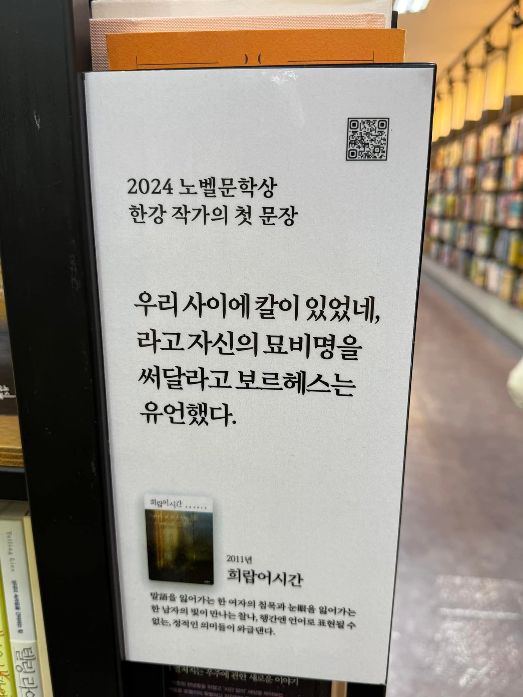
**이미지 캡션:** 이 사진은 서점의 책 진열대 앞에서 찍힌 것으로, 흰색 종이에 검은색 글씨로 쓰인 홍보 문구가 중앙에 배치되어 있습니다. 문구는 "2024 노벨문학상 한강 작가의 첫 문장"으로 시작하며, 이어 "우리 사이에 칼이 있었네, 라고 자신의 묘비명을 써달라고 보르헤스는 유언했다."라는 인용문이 적혀 있습니다. 이 문구 아래에는 책 표지 이미지와 함께 "2011년 희랍어시간"이라는 제목과 책에 대한 간략한 소개 글이 있습니다. 책 표지는 어두운 숲속의 풍경을 담고 있으며, 책 소개 글은 "말語을 잃어가는 한 여자의 침묵과 눈빠을 잃어가는 한 남자의 빛이 만나는 찰나, 행간엔 언어로 표현될 수 없는, 정적인 의미들이 와글낸다."라고 쓰여 있습니다. 사진의 오른쪽 배경에는 책들이 빼곡히 진열된 서점의 모습이 흐릿하게 보이며, 왼쪽에는 다른 책들의 일부가 보입니다. 전체적으로 차분하고 지적인 분위기를 풍깁니다.
 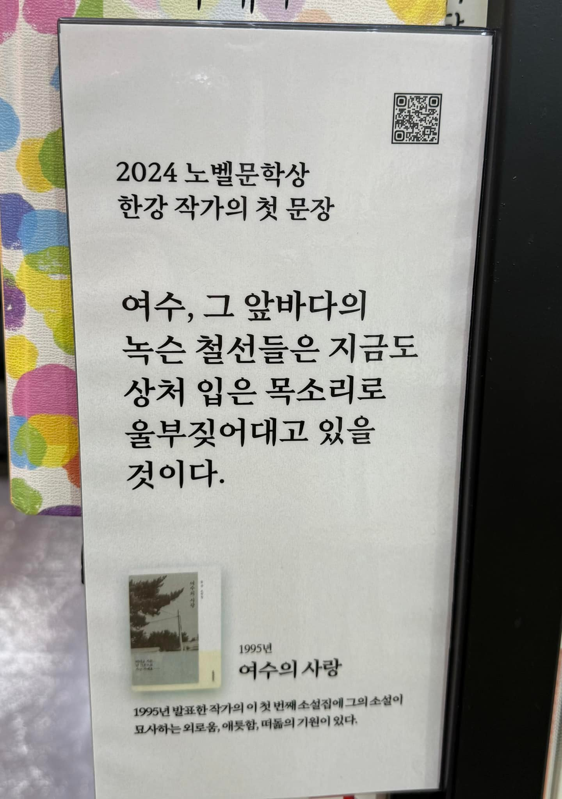
**이미지 캡션:** 이 사진은 책의 한 페이지를 보여주며, 2024년 노벨 문학상 후보로 언급된 한강 작가의 첫 문장을 소개하고 있다. 사진 중앙에는 "여수, 그 앞바다의 녹슨 철선들은 지금도 상처 입은 목소리로 울부짖어대고 있을 것이다."라는 문장이 검은색 글씨로 쓰여 있다. 이 문장은 한강 작가의 첫 번째 소설집인 "여수의 사랑"에 수록된 내용으로, 1995년에 발표되었다. 사진 하단에는 "여수의 사랑"이라는 책의 표지가 작게 보이며, 책에 대한 간략한 설명도 덧붙여져 있다. 설명에는 이 소설집이 작가의 외로움, 애틋함, 떠돌이 생활의 기원을 묘사하고 있다고 쓰여 있다. 사진 왼쪽에는 알록달록한 색상의 패턴이 있는 책 표지가 일부 보이며, 오른쪽에는 검은색 배경이 보인다. 전체적으로 차분하고 문학적인 분위기를 풍긴다.
 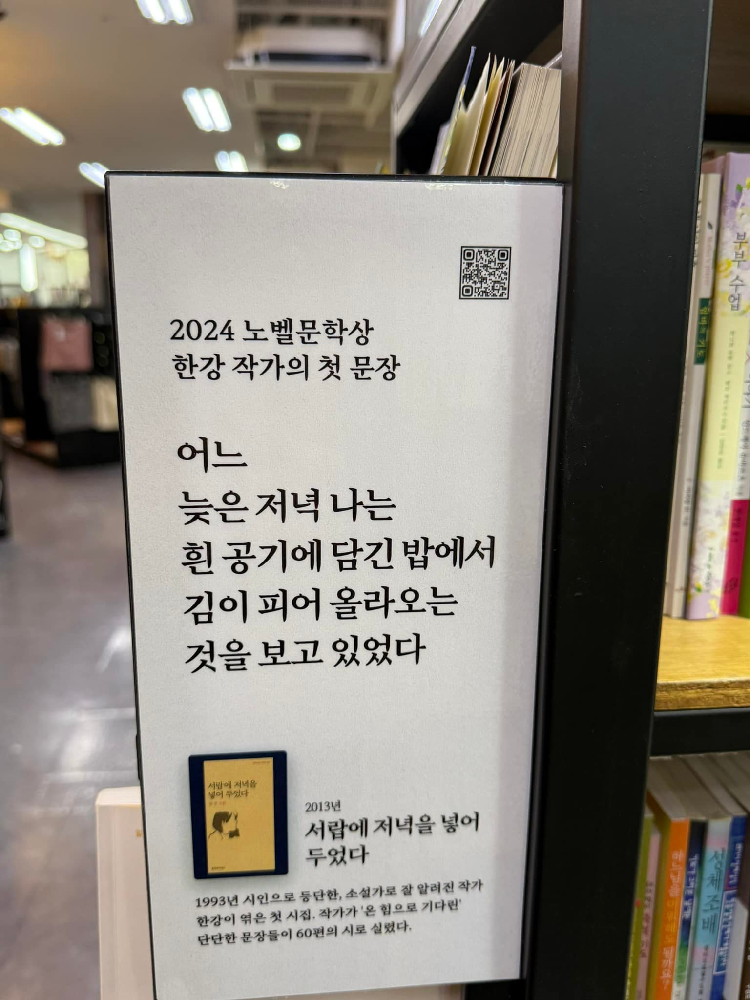
**이미지 캡션:** 이 사진은 서점의 책 진열대 옆에 세워진 홍보물로, 2024년 노벨문학상 후보로 거론되는 작가 한강의 첫 문장을 소개하고 있다. 홍보물에는 "2024 노벨문학상 한강 작가의 첫 문장"이라는 제목과 함께 "어느 늦은 저녁 나는 흰 공기에 담긴 밥에서 김이 피어 올라오는 것을 보고 있었다"라는 문장이 큰 글씨로 쓰여 있다. 그 아래에는 작가의 첫 시집 '서랍에 저녁을 넣어 두었다'에 대한 소개와 함께 2013년에 출간된 이 시집이 1993년 시인으로 등단한 한강 작가가 '온 힘으로 기다린' 단단한 문장 60편으로 구성되어 있다는 설명이 담겨 있다. 홍보물에는 책 표지 이미지와 QR 코드가 포함되어 있으며, 배경에는 다른 책들이 진열된 서점의 모습이 보인다. 전체적으로 차분하고 지적인 분위기를 풍긴다.
 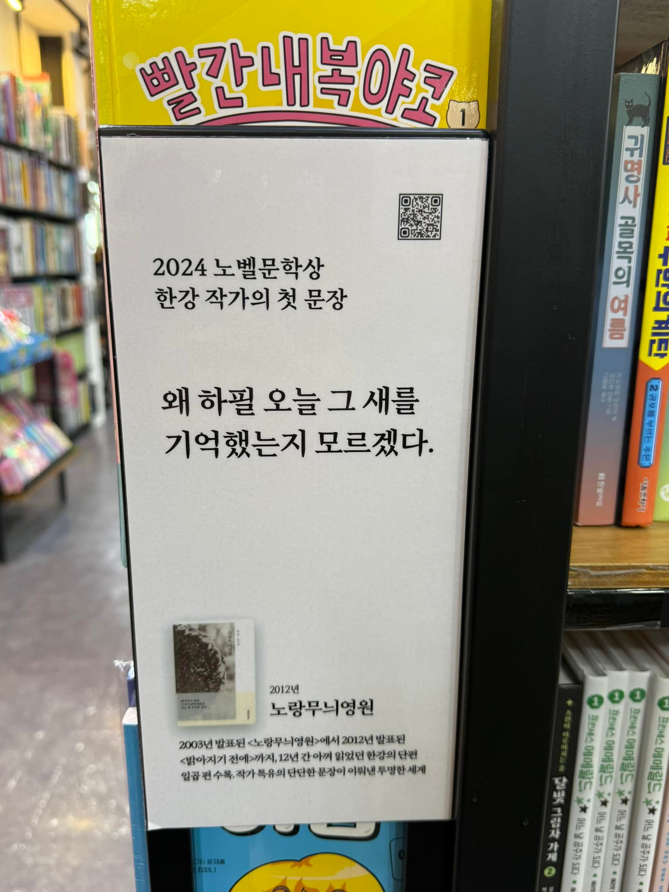
**이미지 캡션:** 책장 앞에 놓인 홍보물로, 노란색 배경에 빨간색 글씨로 "빨간내복야코"라고 쓰여 있으며, 그 아래에는 2024년 노벨문학상 수상자인 한강 작가의 첫 문장으로 "왜 하필 오늘 그 새를 기억했는지 모르겠다."라는 문구가 흰색 배경에 검은색 글씨로 적혀 있다. QR 코드가 함께 있어 스마트폰으로 스캔하면 관련 정보를 얻을 수 있다. 홍보물 하단에는 한강 작가의 단편집 "노랑무늬영원"의 표지 이미지와 함께 2012년 출간된 이 책에 대한 설명이 담겨 있다. 책장에는 "귀명사 골목의 여름"이라는 책과 여러 권의 만화책이 진열되어 있다. 전반적으로 서점의 한 코너에서 책을 홍보하는 분위기이다.
 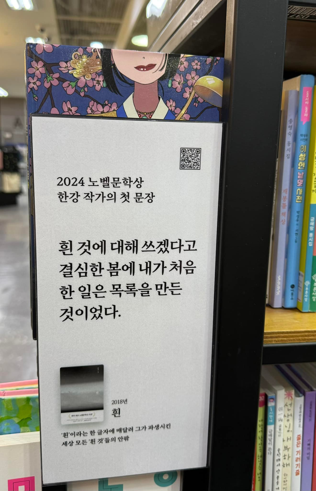
**이미지 캡션:** 이 사진은 서점의 책 진열대를 보여주며, 중앙에는 흰색 종이에 검은색 글씨로 쓰인 문구가 있다. 문구 위에는 애니메이션 스타일의 여성 캐릭터 그림이 있는데, 짙은 눈썹과 붉은 입술을 가지고 있으며 푸른색과 금색 장식이 있는 전통 의상을 입고 있다. 캐릭터의 머리 위에는 벚꽃 가지가 그려져 있다. 종이에는 "2024 노벨문학상 한강 작가의 첫 문장"이라는 제목과 함께 "흰 것에 대해 쓰겠다고 결심한 봄에 내가 처음 한 일은 목록을 만든 것이었다."라는 문장이 적혀 있다. 그 아래에는 책 표지 이미지와 함께 "2018년 흰"이라는 글과 " '흰'이라는 한 글자에 매달려 그가 파생시킨 세상 모든 '흰 것'들의 안팎"이라는 설명이 있다. 종이 오른쪽 상단에는 QR 코드가 있다. 배경에는 여러 권의 책들이 진열되어 있으며, 책등에는 한국어로 된 제목들이 보인다. 전반적으로 차분하고 지적인 분위기를 풍긴다.

### 12월 28일 (토) 07:17 · #총을쏴서라도 #폭력적독재 #민주주의파괴 Jongwoo Won 님 공유해…

#총을쏴서라도 #폭력적독재 #민주주의파괴 Jongwoo Won 님 공유해주신 "김용현의 내란중요임무종사, 직권남용 사건 수사결과" (재판에 의해 확정된 사실이 아님을 유념하여 주시기 바랍니다.) 보도자료를 읽어 보았습니다.

보수도 좋고 진보도 좋습니다. 우리는 서로의 다름을 인정하고, 그 다름에서 더 나은 결정을 내리기 위해 토론하고 논쟁하며, 때로는 설득하거나 설득당합니다. 그래도 결정이 안되면, 우리가 뽑은 국민의 대표들이 투표를 통해 다수결이나 법이 정한 방법대로 결정을 내립니다. 이러한 과정이 바로 민주주의의 핵심이며, 우리 사회를 건강하고 발전하게 만드는 원동력입니다.

이러한 민주공화국, 대한민국을 진심으로 사랑합니다.

그러나 아래 검찰의 공소사실에 따르면, 한 개인이 대통령의 자리에 있으면서 민주주의의 기본 원칙을 무너뜨리는 일들을 자행했습니다. 자신에게 반대하는 의견을 무력으로 억압하고, 국회를 불법적으로 봉쇄하며, 의회의 의결을 방해하는 행동은 민주주의를 향한 명백한 도전이자, 헌법과 법치를 무시한 행위입니다. 

“총을 쏴서라도 문을 부수고 들어가 끌어내라”는 지시는 더 이상 논쟁의 여지가 없는 폭력적 독재의 실체를 보여줍니다. 자신이 원하는 결과를 얻기 위해 국민의 대표를 구속하고, 심지어 의회와 주요 기관을 점령하려 한 대통령의 행태는, 단순히 비판의 대상이 아니라, 즉각적으로 구속 수사를 통해 책임을 물어야 할 범죄입니다.

대통령이 이러한 반민주주의적인 범죄행위를 주도했다는 사실은 매우 심각한 문제입니다. 대통령은 국가의 최고 지도자로서, 헌법을 준수하고, 국민의 자유와 권리를 보호해야 할 의무가 있습니다. 그러나 이 경우, 대통령은 그러한 의무를 저버리고, 오히려 민주주의의 근간을 뒤흔드는 범죄행위를 주도했습니다.

이와 같은 행위가 용인된다면, 우리 사회의 민주주의는 뿌리째 흔들릴 것입니다. 법치와 정의의 원칙에 따라 관련자는 엄중히 구속되어야 하며, 철저한 조사와 심판을 통해 다시는 이와 같은 일이 반복되지 않도록 해야 합니다.

민주주의를 파괴하는 행위는 결코 정당화될 수 없습니다. 

[별첨1] 카톡 대화 이미지에 나타난 대로, 그날 밤 국회에 모이신 분들의 용기와 행동이 2024년 대한민국을 구했습니다. 그분들께 우리 모두가 큰 빚을 졌습니다.

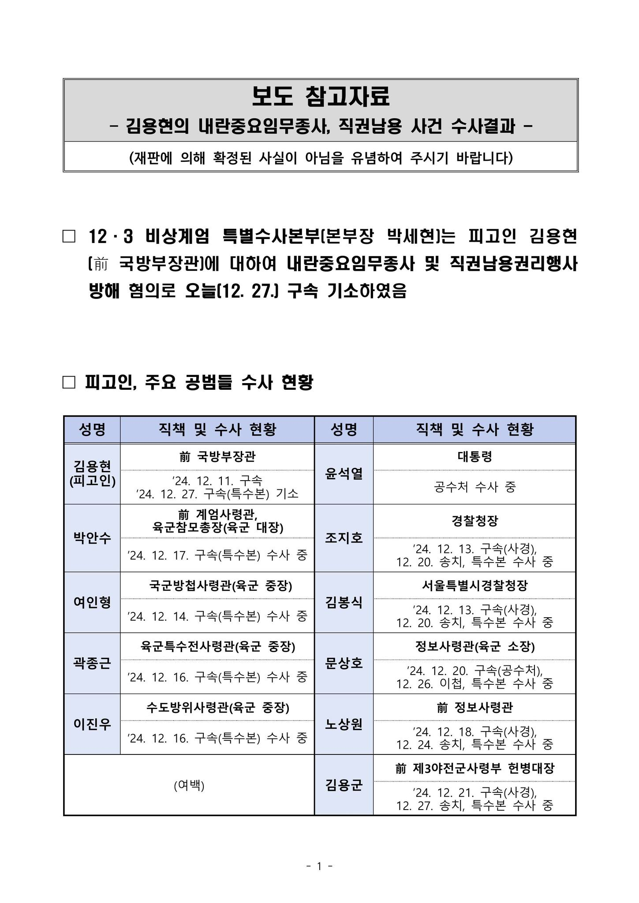
**이미지 캡션:** 이 문서는 "보도 참고자료"라는 제목 아래 김용현의 내란중요임무종사 및 직권남용 사건 수사 결과를 담고 있으며, 재판에 의해 확정된 사실이 아님을 명시하고 있습니다. 첫 번째 항목은 비상계엄 특별수사본부장 박세현이 피고인 김용현을 내란중요임무종사 및 직권남용권리행사방해 혐의로 12월 27일에 구속 기소했음을 알립니다. 두 번째 항목은 피고인 및 주요 공범들의 수사 현황을 표로 정리하여 보여줍니다. 표에는 성명, 직책 및 수사 현황이 좌측에는 김용현(피고인), 박안수, 여인형, 곽종근, 이진우, (여백)이, 우측에는 윤석열, 조지호, 김봉식, 문상호, 노상원, 김용군이 각각 기재되어 있으며, 각 인물의 직책과 수사 진행 상황 및 날짜가 상세히 기록되어 있습니다. 예를 들어, 김용현은 전 국방부장관으로 12월 11일 구속, 12월 27일 구속(특수본) 기소되었고, 박안수는 전 계엄사령관, 육군참모총장으로 12월 17일 구속(특수본) 수사 중입니다. 윤석열은 대통령으로 공수처 수사 중이며, 조지호는 경찰청장으로 12월 13일 구속(사경), 12월 20일 송치, 특수본 수사 중입니다. 전반적으로 법률 및 수사 관련 정보를 담고 있는 공식적인 문서로 보이며, 차분하고 객관적인 분위기입니다.
 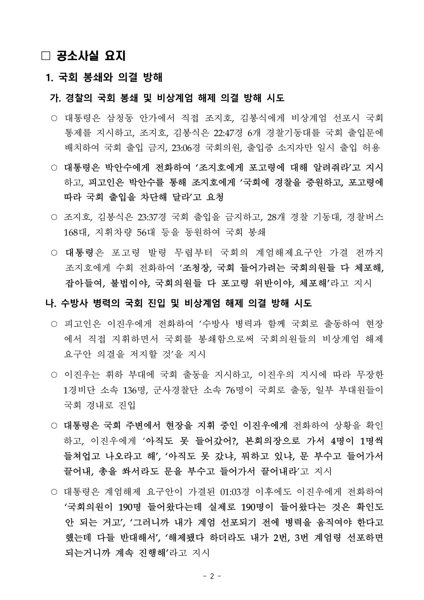
**이미지 캡션:** 이 문서는 한국어로 작성된 법률 문서의 일부로, 공소사실 요지 중 '국회 봉쇄와 의결 방해' 및 '수방사 병력의 국회 진입 및 비상계엄 해제 의결 방해 시도'에 대한 내용을 담고 있습니다. 구체적인 내용은 다음과 같습니다. **사람:** *   **대통령:** 지시를 내리는 주체로, 조지호, 김봉식, 박안수, 이진우 등에게 전화로 지시를 내립니다. *   **조지호, 김봉식:** 대통령의 지시를 받아 국회 출입을 통제하고 봉쇄하는 역할을 합니다. *   **박안수:** 대통령의 지시를 받아 조지호에게 전달하는 역할을 합니다. *   **이진우:** 대통령의 지시를 받아 수방사 병력을 지휘하여 국회 진입을 시도하고 봉쇄하는 역할을 합니다. *   **국회의원:** 비상계엄 해제 요구안을 의결하려 하거나 국회에 출입하려 합니다. *   **경찰:** 경찰 기동대, 경찰버스, 지휘차량 등을 동원하여 국회를 봉쇄합니다. *   **수방사 병력:** 1경비단 소속 136명, 군사경찰단 소속 76명이 국회로 출동합니다. **장소/배경:** *   **삼청동 안가:** 대통령이 직접 지시를 내린 장소입니다. *   **국회:** 봉쇄 및 진입 시도가 이루어지는 주요 장소입니다. *   **국회 출입문:** 경찰이 배치되어 출입을 통제합니다. *   **본회의장:** 국회의원들이 모여 의결을 진행하는 장소입니다. **사물:** *   **경찰 기동대, 경찰버스, 지휘차량:** 국회 봉쇄에 동원된 장비입니다. *   **출입증:** 국회 출입을 위해 필요한 물품입니다. *   **총:** 이진우에게 문을 부수고 국회의원을 끌어내기 위해 사용하라는 지시가 내려집니다. **보이는 텍스트:** *   "□ 공소사실 요지" *   "1. 국회 봉쇄와 의결 방해" *   "가. 경찰의 국회 봉쇄 및 비상계엄 해제 의결 방해 시도" *   "나. 수방사 병력의 국회 진입 및 비상계엄 해제 의결 방해 시도" *   각 항목별로 구체적인 지시 내용과 사건 경과
 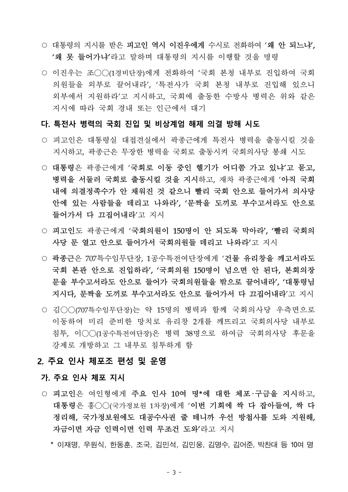
**이미지 캡션:** 이 문서는 한국의 정치적 사건에 대한 내용을 담고 있으며, 대통령의 지시와 관련된 피고인의 행동, 특전사 병력의 국회 진입 시도, 그리고 주요 인사 체포 지시에 대한 내용을 상세하게 기술하고 있다. 구체적으로는 대통령이 피고인에게 '왜 안 되느냐', '왜 못 들어가냐'라고 말하며 지시를 이행할 것을 명령했고, 피고인은 이진우에게 국회 본청 내부로 진입하여 국회의원들을 외부로 끌어내라고 지시했으며, 특전사 병력이 국회로 출동하여 국회의사당을 봉쇄하려 했다는 내용이 포함되어 있다. 또한, 대통령이 곽종근에게 국회로 이동 중인 헬기의 위치를 묻고 병력을 신속히 국회로 출동시키라고 지시했으며, 국회 안의 사람들을 데리고 나오라고 명령했고, 피고인 역시 곽종근에게 국회의원 150명이 안 되도록 막고 국회의사당 문을 열어 국회의원들을 데리고 나오라고 지시했다는 내용도 있다. 곽종근은 건물 유리창을 깨고 국회 본관으로 진입하라고 지시했으며, 김○○은 병력과 함께 국회의사당 우측면으로 이동하여 유리창을 깨고 침투했고, 이○○은 병력으로 후문을 개방하고 침투했다는 내용도 기술되어 있다. 마지막으로, 피고인은 여인형에게 주요 인사 10여 명에 대한 체포·구금을 지시했고, 대통령은 홍○○에게 '이번 기회에 싹 다 잡아들여, 싹 다 정리해'라고 지시하며 국가정보원에도 대공수사권을 주고 방첩사를 지원하라고 했다는 내용이 언급되어 있다. 이 문서는 전반적으로 긴박하고 위협적인 상황을 묘사하고 있으며, 정치적 갈등과 권력 남용의 가능성을 시사한다.
 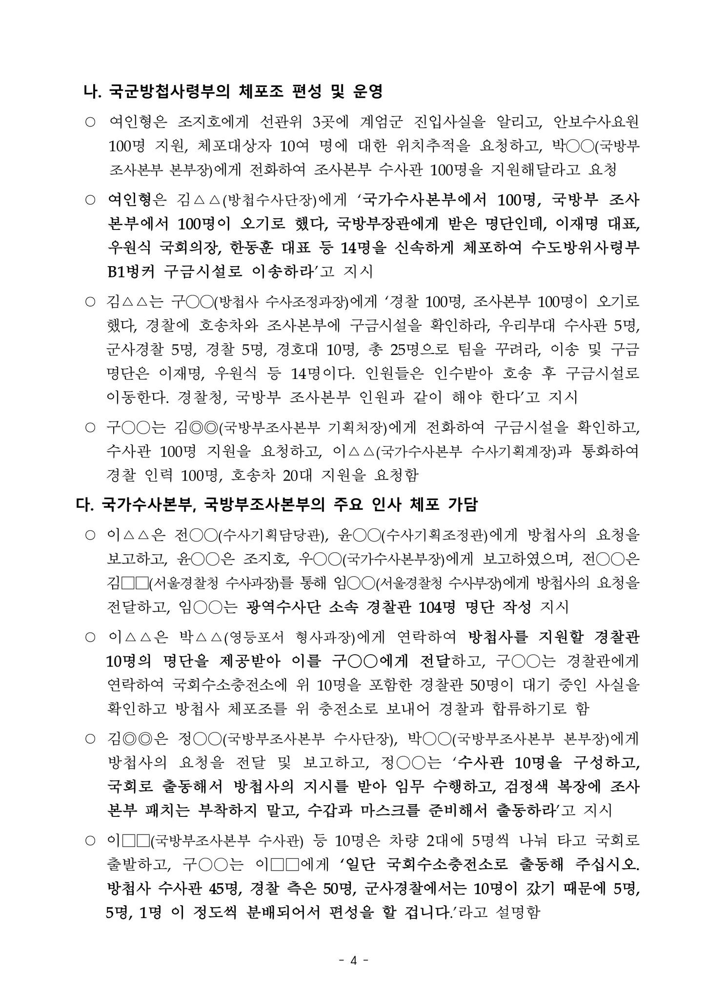
**이미지 캡션:** 이 문서는 국군방첩사령부의 체포조 편성 및 운영에 대한 내용을 담고 있으며, 주요 인물들의 지시와 행동을 상세히 기록하고 있습니다. 첫 번째 항목에서는 여인형이라는 인물이 안보수사요원 100명 지원과 체포대상자 10명에 대한 위치 추적을 요청하고, 국방부 조사본부 수사관 100명 지원을 요청하는 내용이 언급됩니다. 또한, 김△△라는 인물이 국가수사본부와 국방부 조사본부에서 인력이 오기로 했으며, 특정 인물 14명을 신속하게 체포하여 수도방위사령부 B1벙커 구금시설로 이송하라는 지시를 내립니다. 이어서 김△△는 경찰 100명과 조사본부 100명이 오기로 했으며, 경찰에 호송차와 구금시설 확인을 지시하고, 25명으로 팀을 꾸려 이송 및 구금 명단을 전달하라는 지시를 내립니다. 구○○라는 인물은 국방부조사본부 기획처장에게 구금시설 확인과 수사관 100명 지원을 요청하고, 국가수사본부 수사기획계장과 통화하여 경찰 인력 100명과 호송차 20대 지원을 요청합니다. 두 번째 항목에서는 국가수사본부와 국방부조사본부의 주요 인사 체포 가담에 대한 내용이 기술되어 있습니다. 이△△는 방첩사의 요청을 보고하고, 윤○○는 국가수사본부장에게 보고하며, 전○○는 서울경찰청 수사과장을 통해 서울경찰청 수사부장에게 방첩사의 요청을 전달하고, 광역수사단 소속 경찰관 104명 명단 작성을 지시합니다. 또한, 이△△는 영등포서 형사과장에게 연락하여 방첩사를 지원할 경찰관 10명의 명단을 제공받아 구○○에게 전달하고, 구○○는 경찰관에게 연락하여 국회수소충전소에 위 10명을 포함한 경찰관 50명이 대기 중인 사실을 확인하고 방첩사 체포조를 위 충전소로 보내어 경찰과 합류하기로 합니다. 김○○는 국방부조사본부 수사단장과 본부장에게 방첩사의 요청을 전달 및 보고하고, 수사관 10명을 구성하여 국회로 출동하여 임무 수행하고, 검정색 복장에 조사본부 패치는 부착하지 말고, 수갑과 마스크를 준비하여 출동하라는 지시를 내립니다. 마지막으로, 이□□(
 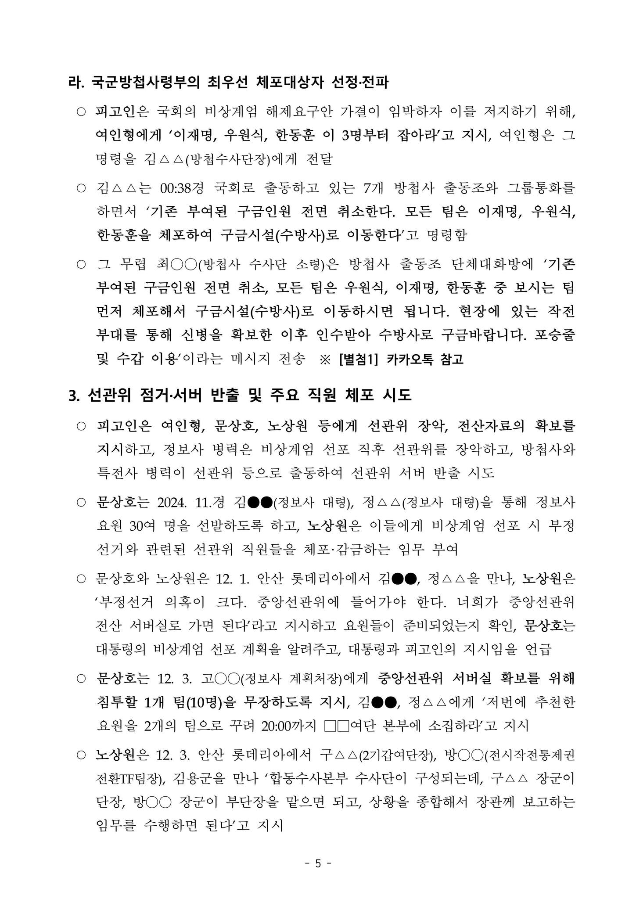
**이미지 캡션:** 이 문서는 국군방첩사령부의 최우선 체포대상자 선정 및 전파, 그리고 선관위 점거·서버 반출 및 주요 직원 체포 시도에 대한 내용을 담고 있습니다. 첫 번째 부분에서는 피고인이 여인형에게 특정 인물들을 체포하라고 지시한 내용과, 김△△가 국회로 출동하는 방첩사 출동조에게 구금인원 전면 취소 및 특정 인물 체포를 명령한 내용이 기술되어 있습니다. 또한, 최○○ 소령이 방첩사 출동조 단체대화방에 구금인원 전면 취소 및 특정 인물 체포 후 구금시설로 이동하라는 메시지를 전송한 내용도 포함되어 있습니다. 두 번째 부분에서는 피고인이 여인형, 문상호, 노상원 등에게 선관위 장악 및 전산자료 확보를 지시했으며, 정보사 병력이 비상계엄 선포 직후 선관위를 장악하고 방첩사와 특전사 병력이 선관위 서버 반출을 시도했다는 내용이 언급됩니다. 문상호는 정보사 요원 30여 명을 선발하도록 지시하고, 노상원은 이들에게 부정선거 관련 선관위 직원 체포·감금 임무를 부여했습니다. 또한, 문상호와 노상원이 안산 롯데리아에서 만나 중앙선관위 서버실 침투 계획과 대통령의 비상계엄 선포 계획을 논의한 내용, 문상호가 정보사 계획처장에게 중앙선관위 서버실 확보를 위한 침투팀 무장 지시, 그리고 노상원이 안산 롯데리아에서 다른 인물들과 만나 합동수사본부 수사단 구성 및 장관 보고 임무에 대해 논의한 내용이 상세하게 기술되어 있습니다. 전반적으로 군사 작전 및 정치적 개입과 관련된 심각한 상황을 묘사하고 있습니다.
 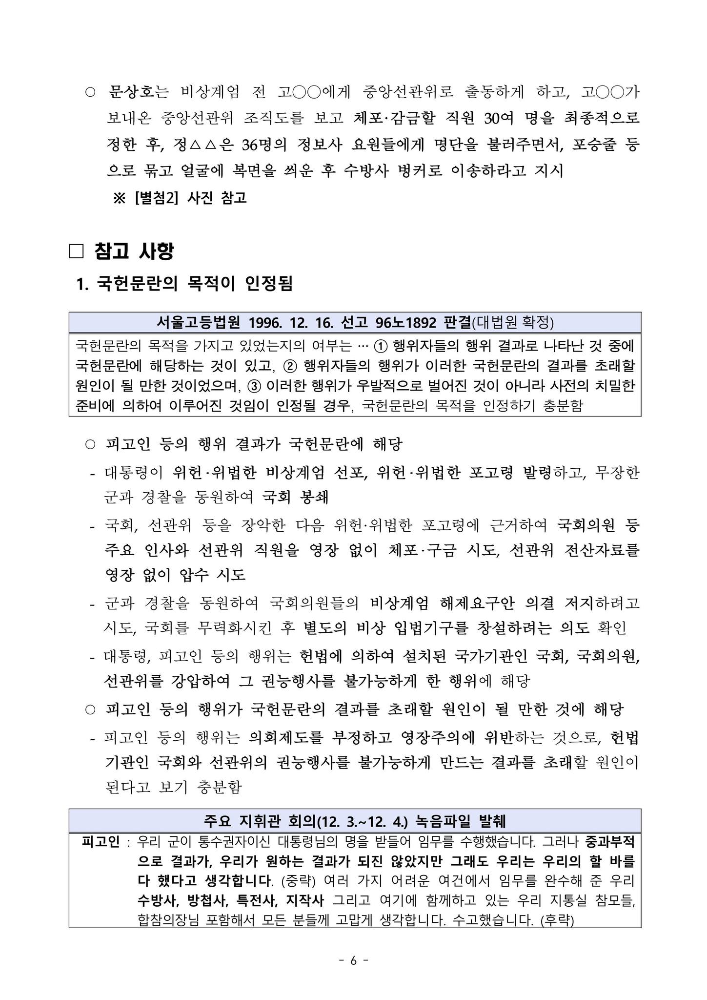
**이미지 캡션:** 이 문서는 법률 문서의 일부로, 국헌 문란의 목적이 인정된다는 내용과 관련된 법원의 판결 및 회의록 발췌를 담고 있습니다. 문서의 상단에는 "문상호"라는 인물이 중앙선관위로 출동하여 30여 명의 직원을 체포·감금하고, 정보사 요원들에게 명단을 불러주며 포승줄과 복면을 씌워 수방사 벙커로 이송하라고 지시했다는 내용이 언급되어 있습니다. 이어서 "참고 사항"이라는 제목 아래 "국헌 문란의 목적이 인정됨"이라는 소제목과 함께 서울고등법원의 1996년 판결 내용이 요약되어 있습니다. 이 판결은 행위자의 행위 결과, 행위가 국헌 문란의 결과를 초래할 원인이 될 만한지, 그리고 행위가 우발적이 아닌 치밀한 준비에 의해 이루어졌는지 등을 종합적으로 고려하여 국헌 문란의 목적을 인정할 수 있다고 설명합니다. 또한, 피고인 등의 행위 결과가 국헌 문란에 해당하는 구체적인 사례로 대통령의 위헌·위법한 비상계엄 선포, 포고령 발령, 국회 봉쇄, 국회의원 및 선관위 직원 체포·구금 시도, 선관위 전산자료 압수 시도 등이 열거되어 있습니다. 더불어, 피고인 등의 행위가 국헌 문란의 결과를 초래할 원인이 될 만한지에 대해서는 의회 제도 부정, 영장주의 위반, 국회 및 선관위의 권능 행사 불가능하게 만드는 결과 초래 등을 언급하고 있습니다. 문서 하단에는 "주요 지휘관 회의(12. 3.~12. 4.) 녹음파일 발췌"라는 제목과 함께 피고인의 발언이 인용되어 있습니다. 피고인은 대통령의 명을 받아 임무를 수행했으나 원하는 결과가 되지 않았지만 최선을 다했다고 말하며, 부하 직원들의 노고에 감사를 표하고 있습니다. 전반적으로 엄숙하고 법률적인 분위기를 띠고 있으며, 과거의 중요한 법적 사건에 대한 기록으로 보입니다.
 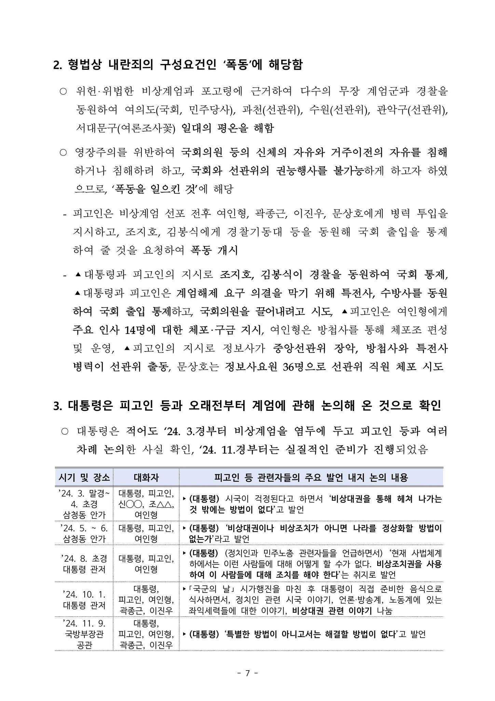
**이미지 캡션:** 이 문서는 형법상 내란죄의 구성 요건인 '폭동'에 대한 설명과 함께, 대통령이 피고인 등과 비상계엄에 대해 논의한 내용을 담고 있습니다. 첫 번째 섹션에서는 비상계엄과 포고령을 근거로 다수의 무장 계엄군과 경찰을 동원하여 평온을 해하고, 영장주의를 위반하여 신체의 자유와 거주이전의 자유를 침해하거나 국회와 선관위의 권능 행사를 불가능하게 하려 한 행위가 '폭동'에 해당한다고 설명합니다. 또한, 피고인이 비상계엄 선포 전후 여인형, 곽종근, 이진우, 문상호에게 병력 투입을 지시하고, 조지호, 김봉식에게 경찰 기동대 등을 동원해 국회 출입을 통제하도록 요청하여 폭동을 개시했다고 언급합니다. 이어서 대통령과 피고인의 지시로 조지호, 김봉식이 경찰을 동원하여 국회를 통제하고, 계엄 해제 요구 의결을 막기 위해 특전사, 수방사를 동원하여 국회 출입을 통제하며 국회의원을 끌어내려 시도했으며, 피고인은 여인형에게 주요 인사 14명에 대한 체포·구금 지시를 내리고, 여인형은 방첩사를 통해 체포조를 편성·운영했으며, 피고인의 지시로 정보사가 중앙선관위를 장악하고 방첩사와 특전사 병력이 선관위에 출동했으며, 문상호는 정보사 요원 36명으로 선관위 직원 체포를 시도했다고 상세히 설명합니다. 두 번째 섹션에서는 대통령이 피고인 등과 오래전부터 계엄에 관해 논의해 온 것으로 확인된다고 밝히며, '24년 3월경부터 비상계엄을 염두에 두고 여러 차례 논의했으며, '24년 11월경부터는 실질적인 준비가 진행되었음을 보여주는 시기별 대화 내용과 피고인 등 관련자들의 주요 발언 및 논의 내용을 표로 정리하여 제시합니다. 표에는 '24년 3월 말경~4월 초경 삼청동 안가'에서 대통령이 "시국이 걱정된다고 하면서 '비상대권을 통해 헤쳐 나가는 것 밖에는 방법이 없다'고 발언"한 내용, '24년 5월~6월 삼청동 안가'에서 대통령이 "비상대권이나 비상조치가 아니면 나라를 정상화할 방법이 없는가"라고 발언한 내용, '24년 8월 초경 대통령 관저
 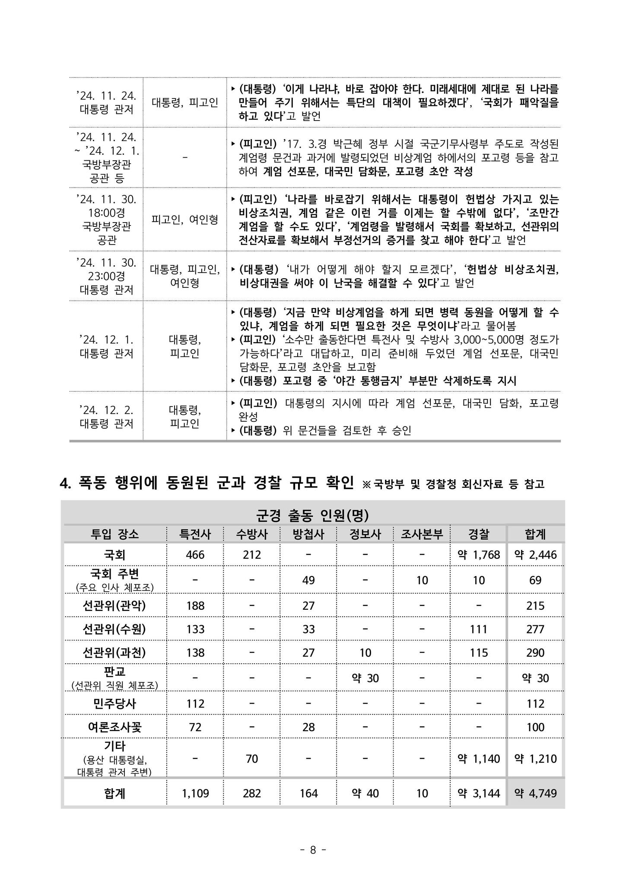
**이미지 캡션:** 이 문서는 2024년 11월 24일부터 12월 2일까지 대통령 관저와 국방부 장관 공관 등에서 있었던 일들을 기록한 것으로, 대통령과 피고인, 그리고 여인형으로 묘사된 인물 간의 대화 내용을 담고 있습니다. 대화 내용은 주로 계엄령 발동 가능성, 비상조치권 행사, 그리고 관련 문건 작성 및 검토에 관한 것입니다. 또한, 4번 항목에서는 폭동 행위에 동원된 군과 경찰의 규모를 투입 장소별로 상세하게 표로 정리하고 있으며, 국회, 국회 주변, 선관위(관악, 수원, 과천), 판교, 민주당사, 여론조사꽃, 기타(용산 대통령실, 대통령 관저 주변) 등 다양한 장소에 투입된 특전사, 수방사, 방첩사, 정보사, 조사본부, 경찰 인원과 총 합계가 명시되어 있습니다. 표의 내용은 숫자와 '약'이라는 표현으로 제시되어 있으며, 일부 항목은 '-'로 표시되어 있습니다. 전반적으로 이 문서는 정치적 사건과 관련된 기록으로 보이며, 딱딱하고 공식적인 분위기를 띠고 있습니다.
 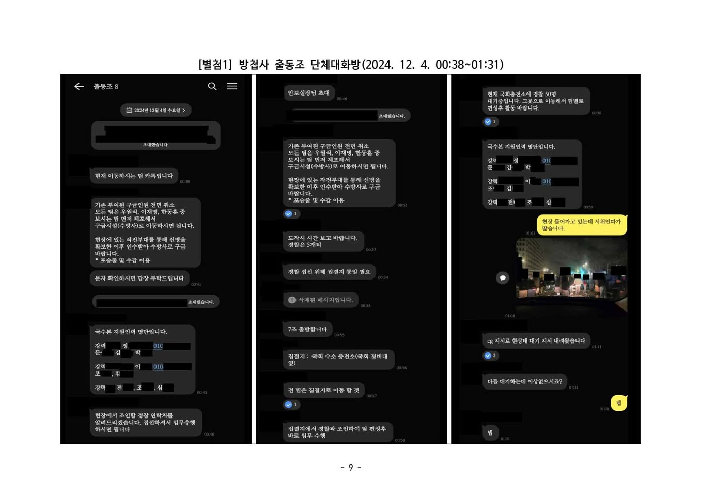
**이미지 캡션:** 이 사진은 여러 개의 스마트폰 채팅 화면을 캡처한 것으로, "별첨1] 방첩사 출동조 단체대화방 (2024. 12. 4. 00:38~01:31)"이라는 제목 아래 여러 대화가 시간 순서대로 나열되어 있습니다. 각 채팅 화면에는 시간, 발신자, 메시지 내용이 포함되어 있으며, 일부 메시지에는 사진이나 이모티콘이 첨부되어 있습니다. 첫 번째 채팅 화면은 "출동조 8"이라는 제목으로, 2024년 12월 4일 수요일 00:38에 시작되었습니다. 메시지 내용은 "현재 이동하시는 팀 카톡입니다"라는 안내와 함께 구금 인원 취소 및 체포, 구금 시설 이동에 대한 지시가 담겨 있습니다. 또한, 현장 작전부대와의 협조 및 포승줄, 수갑 사용에 대한 내용도 포함되어 있습니다. 두 번째 채팅 화면은 "안보실장님 초대"라는 제목으로, 00:46에 시작되었습니다. 메시지 내용은 "현재 국회충전소에 경찰 50명 대기중입니다. 그곳으로 이동해서 팀별로 편성후 활동 바랍니다."라는 지시입니다. 세 번째 채팅 화면은 "국수본 지원인력 명단입니다."라는 제목으로, 00:59에 시작되었습니다. 이 화면에는 "강력 문", "강력 조", "강력 전" 등의 이름과 함께 전화번호로 추정되는 숫자 "010"이 반복적으로 나타납니다. 네 번째 채팅 화면은 01:03에 시작되었으며, "현장 들어가고 있는데 시위인파가 많습니다."라는 메시지와 함께 밤에 시위 현장으로 보이는 사진이 첨부되어 있습니다. 사진에는 많은 사람들이 모여 있고 경찰 차량으로 추정되는 차량들도 보입니다. 다섯 번째 채팅 화면은 01:11에 시작되었으며, "cg 지시로 현상해 대기 지시 내려왔습니다"라는 메시지와 함께 이모티콘이 첨부되어 있습니다. 이후 "다들 대기하는데 이상없으시죠?"라는 질문이 이어집니다. 전반적으로 이 채팅방은 특정 사건이나 작전을 위한 출동 및 지시 사항을 공유하는 용도로 사용되고 있으며, 긴급하고 중요한 상황임을 짐작할 수 있습니다. 대화 참여자들은 주로 군인 또는 경찰로 추정되며, 작전 수행을 위한 구체적인 지시와 현장 상황 보고가 이루어지고 있습니다.
 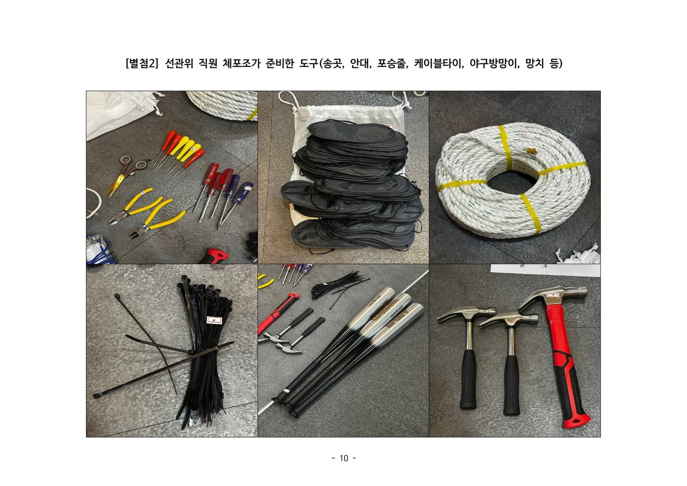
**이미지 캡션:** 이 사진은 선거관리위원회 직원 체포조가 준비한 도구들을 보여주는 여섯 개의 개별 사진으로 구성되어 있으며, 각 사진은 회색 타일 바닥에 놓여 있다. 왼쪽 상단 사진에는 가위, 플라이어, 빨간색과 노란색 손잡이의 드라이버 여러 개가 보인다. 중앙 상단 사진에는 흰색 천 주머니에 담긴 검은색 안대 수십 개가 쌓여 있다. 오른쪽 상단 사진에는 노란색 끈으로 묶인 두꺼운 흰색 로프가 둥글게 말려 있다. 왼쪽 하단 사진에는 검은색 케이블 타이 다발이 보인다. 중앙 하단 사진에는 야구 방망이 세 개가 나란히 놓여 있다. 오른쪽 하단 사진에는 검은색 손잡이가 달린 작은 망치 두 개와 빨간색과 검은색 손잡이가 달린 더 큰 망치 한 개가 있다. 사진 상단에는 "[별첨2] 선관위 직원 체포조가 준비한 도구(송곳, 안대, 포승줄, 케이블타이, 야구방망이, 망치 등)"라는 제목이 한국어로 적혀 있으며, 하단에는 페이지 번호 "- 10 -"가 있다. 전반적으로 사진은 준비된 도구들의 목록을 보여주며, 이는 잠재적인 체포 작전을 위한 것임을 시사한다.
