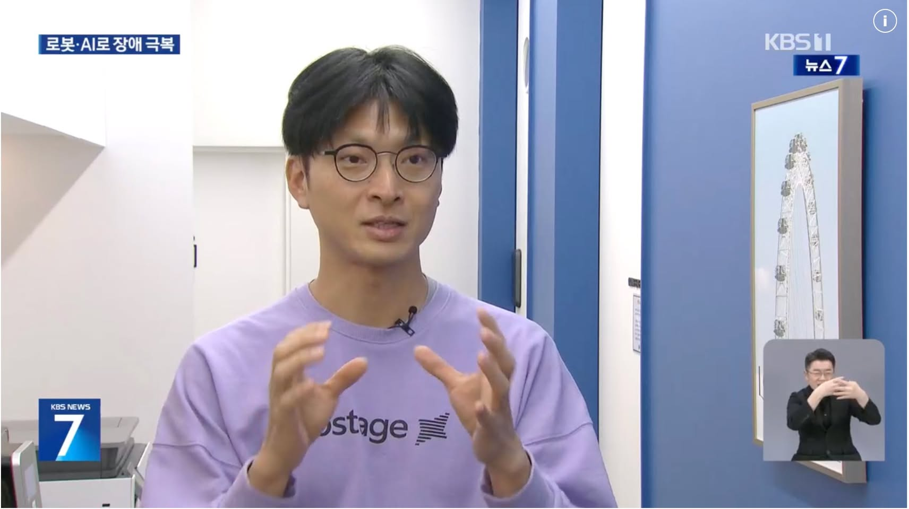
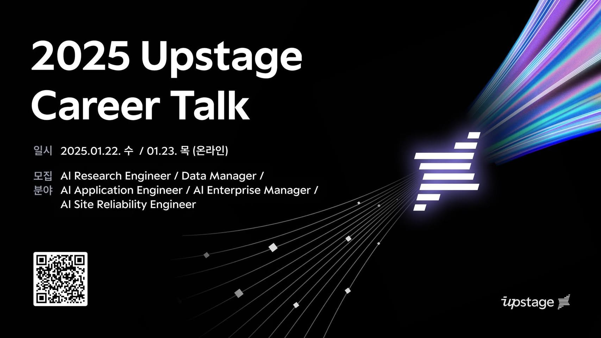
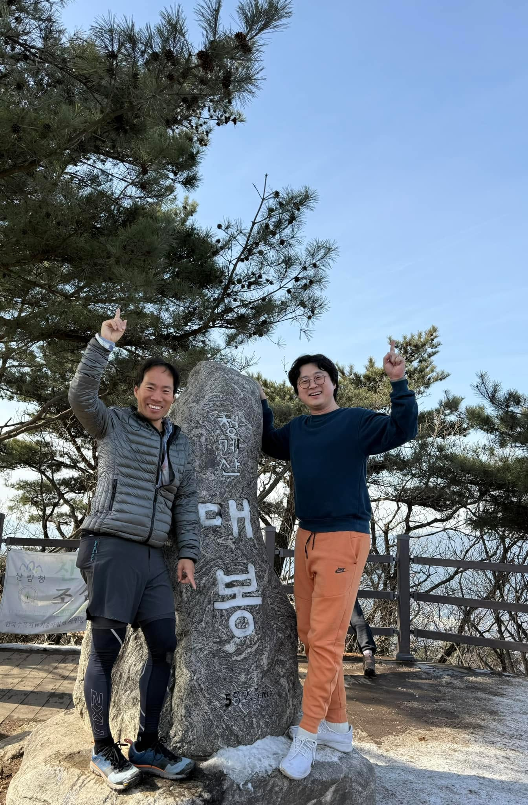
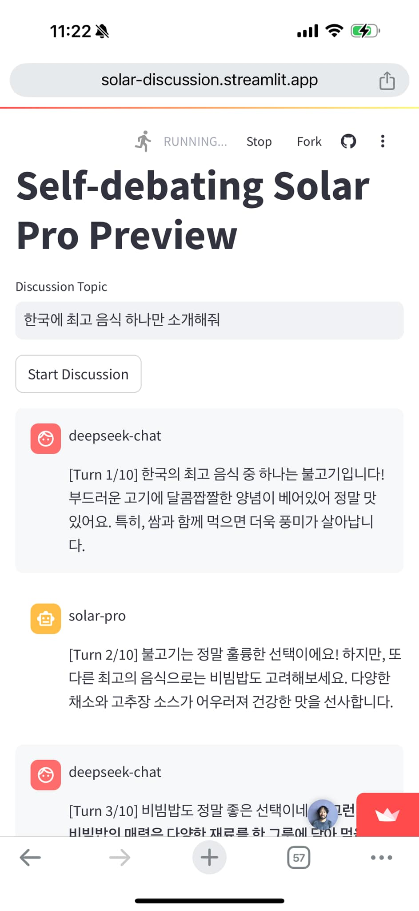
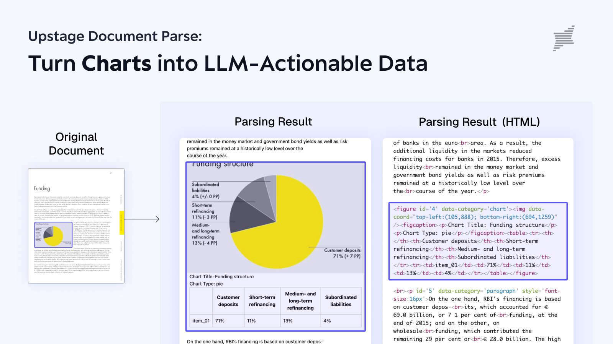
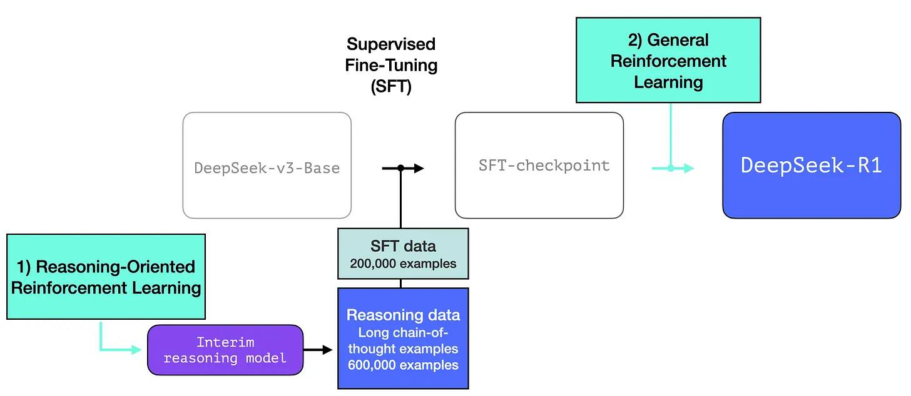

# 2025년 1월

[← 2025년](README.md)

### 1월 2일 (목) 20:21 · 저희가 만드는 기술이 도움이 되었다는 반가운 소식이 KBS 뉴스 7에 소…

저희가 만드는 기술이 도움이 되었다는 반가운 소식이 KBS 뉴스 7에 소개 되었습니다. https://news.kbs.co.kr/news/pc/view/view.do?ncd=8143491

더 뛰어난 기술로 가격도 낮추고 더 많은 분들이 쉽게 사용할수 있도록 노력하겠습니다. 

https://console.upstage.ai/

### 1월 9일 (목) 12:28 · #SolarLLM 과 #DocAI 로 세계에서 가장 뛰어난 Work In…

#SolarLLM 과 #DocAI 로 세계에서 가장 뛰어난 Work Intellegence를 만드는 업스테이지 함께 만들어 가실 분들을 찾습니다. 

👉지금 신청하기 >> https://go.upstage.ai/3WcGi71 
⠀
빠르게 성장하는 세계적인 AI 기업에서 새로운 도전과 글로벌 확장의 기회를 경험하고 싶다면, 함께 해요!  아래 1, 2차에 걸쳐 업스테이지의 비전, 직무 정보, 커리어 개발등에 대해 직접 확인하고 또 질문할수 있습니다.
⠀
📆 When⠀
1차: 2025년 1월 22일 (수) 19:00 - 20:00 ⠀
<기업 고객의 AI 혁신을 주도하는 Upstage 스타 스토리>⠀
⠀
2차: 2025년 1월 23일 (목) 19:00 - 20:00 ⠀
<글로벌 AI Product 경쟁력을 이끄는 Upstage Solar LLM 팀의 성공 스토리>⠀
⠀
👥Who: AI 혁신의 미래를 업스테이지와 함께 만들어 가고자 하는 열정 있는 인재라면 누구나 신청 가능

### 1월 18일 (토) 13:56 · 멋진산 멋진분!! OO 서비스를 만드시는 Ildoo Kim 대표님과 오니…

멋진산 멋진분!! OO 서비스를 만드시는 Ildoo Kim 대표님과 오니 더 좋습니다!

### 1월 23일 (목) 13:17 · #SolarLLM VS #DeepSeek 토론! 요즈음 화제를 모으고 있…

#SolarLLM VS #DeepSeek 토론! 요즈음 화제를 모으고 있는 Deepseek-chat 그리고 deepseek reasoner 룰 추가하여 #solarllm 과 교대로 주어진 주제를 반박하는 형식으로 토론하고 결론을 모읍니다.

마치 한국대표와 중국대표의 토론을 보는듯 약간 미묘하게 다른 입장도 있고 해서 재미있습니다.

뭔가 고민되는 주제가 있다면 바로 사용해봐주세요. 
https://solar-discussion.streamlit.app/

### 1월 24일 (금) 08:20 · PDF등 문서에서 차트정보를 자동으로 추출하시고 싶으신지요? Upstag…

PDF등 문서에서 차트정보를 자동으로 추출하시고 싶으신지요? Upstage Document Parse의 새로운 차트 인식 기능을 확인해보세요. 복잡한 차트도 HTML과 같은 구조화된 데이터로 변환하여 LLM이 쉽게 처리할 수 있도록 도와줍니다.

https://console.upstage.ai/ Upstage console에서 바로 사용이 가능합니다. 

자세한 정보: https://www.upstage.ai/blog/en/introducing-chart-recognition-in-upstage-document-parse

### 1월 28일 (화) 15:10 · Sung Kim shared a link.

🔗 <https://doctrans.streamlit.app/>

### 1월 28일 (화) 16:46 · 📷 사진 (1장)

> #   그 유명한 Jay님의 The Illustrated DeepSeek-R1! 그림만으로도 어떻게 만든것인지 감이 확 옵니다.  https://newsletter.languagemodels.co/p/the-illustrated-deepseek-r1
