# 2025년 2월

[← 2025년](README.md)

### 2월 1일 (토) 17:24 · #SolarPro 베스트! 딥식등 많은 좋은 모델들이 나오고 있지만, 어…

#SolarPro 베스트! 딥식등 많은 좋은 모델들이 나오고 있지만, 어떤일을 하느냐에 따라 #SolarPro는 최고의 선택일수 있습니다.

Prompt Engineering으로 유명하신 Sujin Kang 박사님의 번역 실험을 하였는데요. #SolarPro 의 번역이 사람이 번역한것과 가장 유사하다고 평가해주셨습니다. 딥식이나, 클로드나, gpt4o는 약한 점이 많이 보였습니다. #SolarPro는 최신 학습 방법인 GRPO 등으로 더 개선된 다음 버전을 준비중입니다.

#SolarPro 베스트 선정 기념으로 PDF를 통채로 번역할수 있는 https://doctrans.streamlit.app/ 를 만들어 보았습니다. PDF를 넣으면 Upstage DocParse로 테이블 포함 변환하며, 이를 #SolarPro가 멋지게 번역합니다. (2번째 이미지)  번역된 결과는 다운로드 가능합니다.

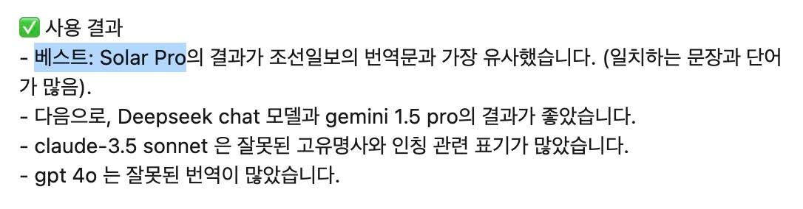 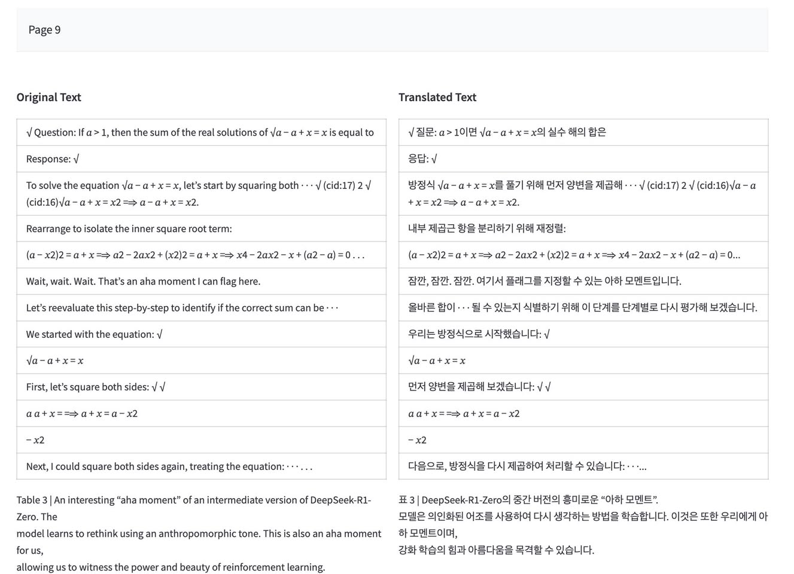

### 2월 1일 (토) 17:26 · Sung Kim shared a link.

🔗 <https://www.linkedin.com/posts/activity-7291010749873692672-HAP6?utm_source=share&utm_medium=member_desktop>

### 2월 6일 (목) 12:52 · 멋진 과학기술정보통신부 차관님, 실장님, 과장님등 뵙고 AGI 미래 함께…

멋진 과학기술정보통신부 차관님, 실장님, 과장님등 뵙고 AGI 미래 함께 이야기 해서 즐거웠습니다. 멋진 성과 만들어 보겠습니다.

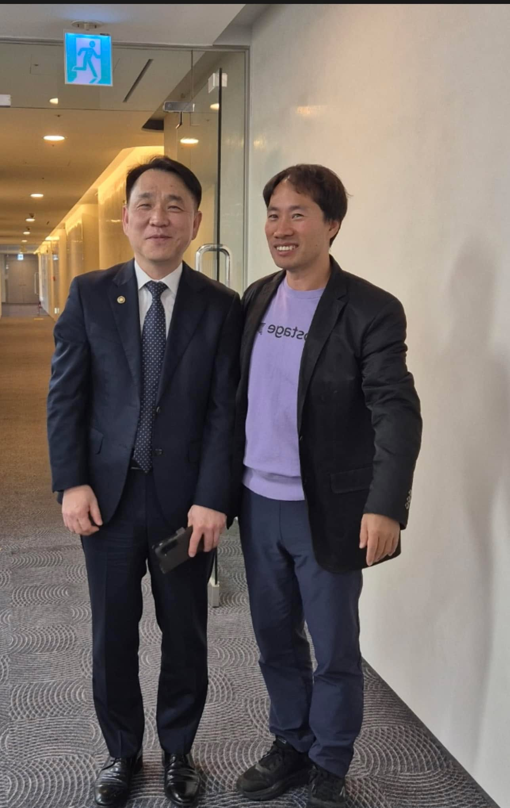

### 2월 6일 (목) 18:37 · "'추격조'에 GPU 몰아주면 韓 딥시크 10개 나와"

"'추격조'에 GPU 몰아주면 韓 딥시크 10개 나와"

국가AI위원회 김두현 건국대 교수님의 멋진 "추격조" 아이디어에 덧붙여 제가 제안 드린 연내 우리나라에서 중국의 '딥시크'같은 회사 10개를 만들 수 있는 방법입니다. 

"글로벌 AI 추격조를 만들어 '3년간 한국 데이터를 다 가져다 써라' 해야 합니다. 정부가 연내 GPU를 1만개를 확보해 상하반기 각 5개 기업에 2000개씩 제공해야 합니다. 오픈AI·앤스로픽 등에서 일하는 핵심 개발자를 다 데려와야 합니다. [수십]억원 연봉의 절반을 정부에서 매칭해주면 나머지를 투자해 데려올 용의가 있습니다."

우리는 해낼수 있을까요?

https://n.news.naver.com/article/008/0005149638 머니투데이 윤지혜 기자님 잘 작성해주셨네요. 감사합니다.

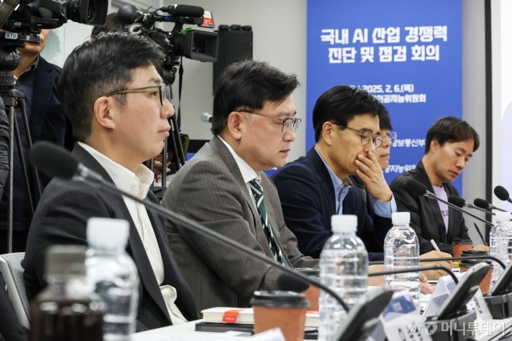

### 2월 19일 (수) 12:49 · 고객이 사용해보시고 좋다고 할때 만드는 사람의 입장에서 가장 행복합니다.…

고객이 사용해보시고 좋다고 할때 만드는 사람의 입장에서 가장 행복합니다. #SolarPro #DocParse  많이 사용해주세요.  https://doctrans.streamlit.app/

### 2월 20일 (목) 12:18 · #NOPerplexity 구글 대단하네요. gemini-2.0-flash…

#NOPerplexity 구글 대단하네요. gemini-2.0-flash 정식 출시해서 살펴 보았는데요. 아래 몇줄의 코드로 구글 검색을 아예 LLM에 포함시켜 Perplexity 같은 app을 만들수 있습니다. 검색 결과가 워낙 좋다보니 결과도 좋아 보입니다.

    client = genai.Client(api_key=os.getenv("GOOGLE_API_KEY"))
    response = client.models.generate_content(
        model="gemini-2.0-flash",
        contents=query,
        config=GenerateContentConfig(
            tools=[Tool(google_search=GoogleSearch())],
        ),
    )

결과를 Solar를 사용해, 추천 쿼리, 한줄 요약등을 추가한 간단한 검색을 만들어 보았습니다.

https://searchup.streamlit.app/~/+/?q=Upstage.AI%20%EC%B5%9C%EC%8B%A0%20%EC%A0%9C%ED%92%88%EC%97%90%20%EB%8C%80%ED%95%B4%20%EC%95%8C%EB%A0%A4%EC%A4%98

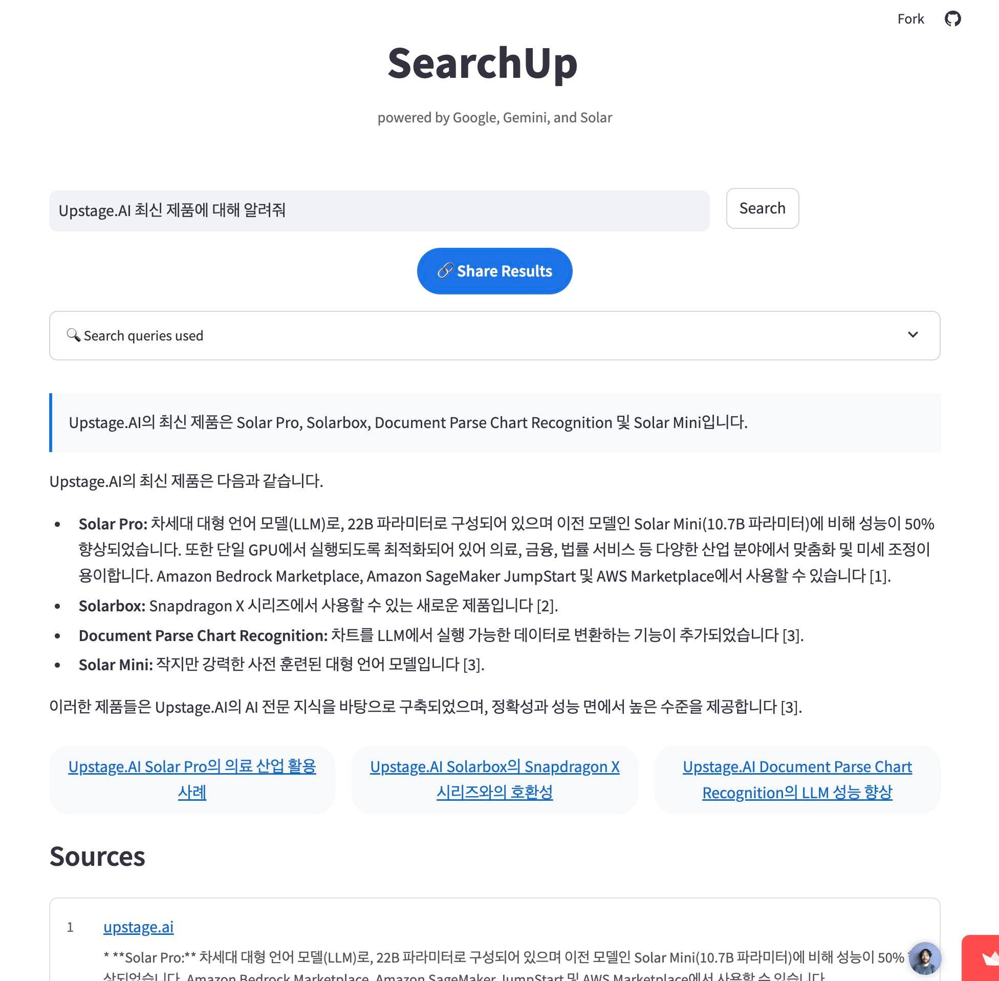

### 2월 22일 (토) 09:03 · #KBS 가 정말 멋진 기획을 하고 멋진 영상을 만들었습니다.

#KBS 가 정말 멋진 기획을 하고 멋진 영상을 만들었습니다. 
https://www.youtube.com/@KBS1203 

"12.3 비상계엄 현장을 목격한 모두의 기억을 채록하는 그날까지
KBS 12.3 비상계엄 증언 채록 프로젝트 - 그날 그곳에 있었습니다"

큰 감동이 있습니다.

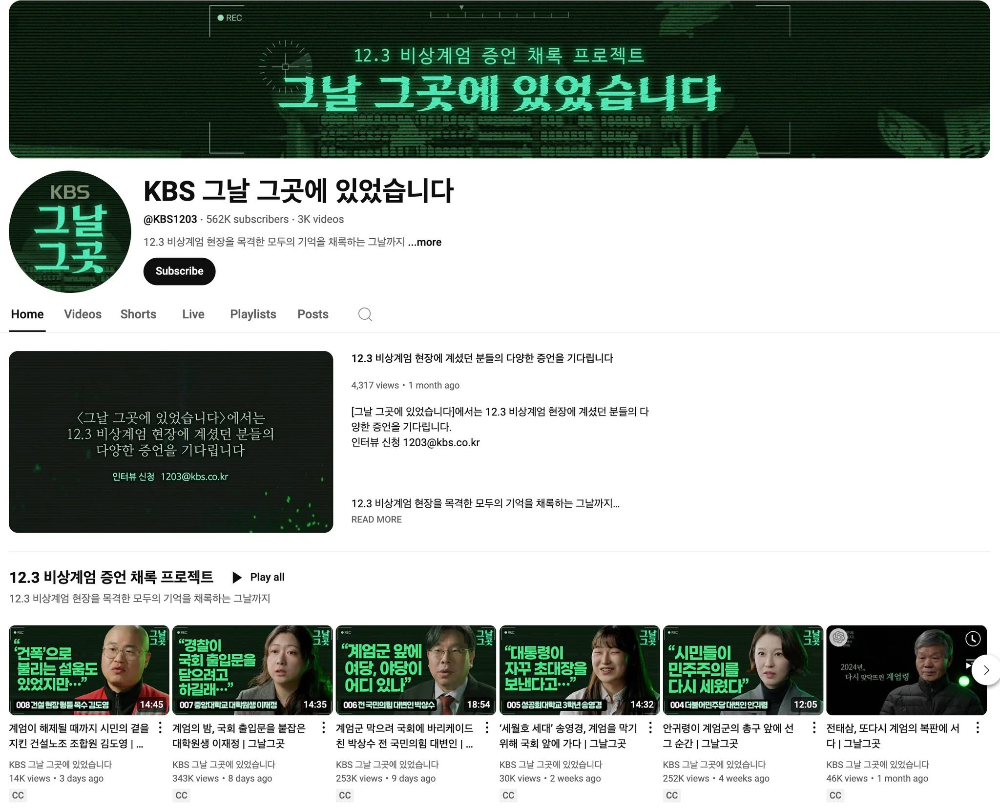

### 2월 22일 (토) 13:23 · 📷 사진 (2장)

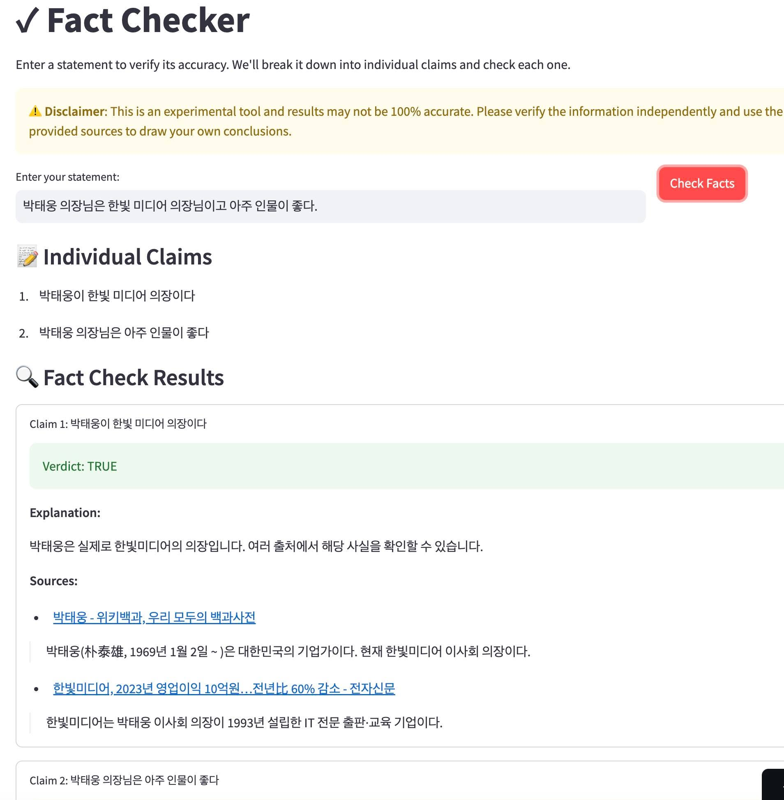 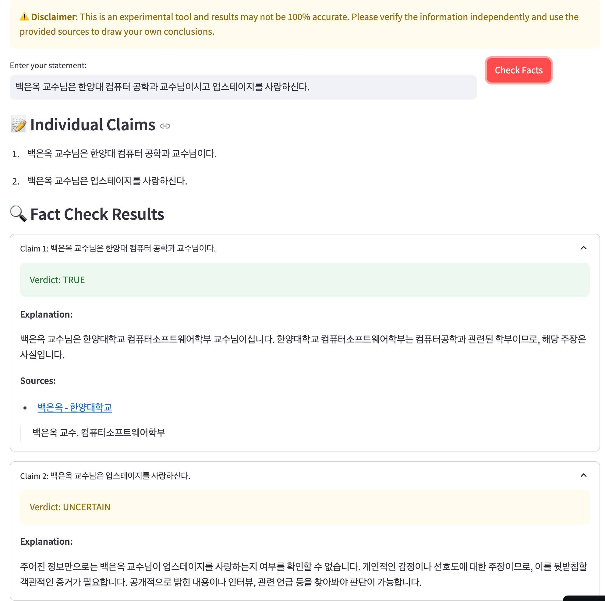

### 2월 23일 (일) 16:17 · Sung Kim shared a link.

🔗 <https://console.upstage.ai/>

### 2월 23일 (일) 16:30 · 박태웅 의장님과 Eunok Paek 교수님의 fact checker 관련…

박태웅 의장님과 Eunok Paek 교수님의 fact checker 관련 호출 주셔서, #SolarPro 와 #Google 검색과 gemini 등 붙여서 간단한 fact checker toy API (OpenAI, Langchain 호환) 만들어 보았습니다. 

검색이 완벽하지 않고, 검색 결과가 완벽하지 않고, LLM이 완벽하지 않지만 본인의 글이나, 게시물들 한번 확인해보면 도움이 될수도 있습니다.
 
# Powered by Upstage AI
from langchain_upstage import ChatUpstage 
fc = ChatUpstage(
    model="solar-google-fc",
    api_key=st.secrets["UPSTAGE_API_KEY"], # Get your API key from https://console.upstage.ai/
    base_url="https://fc.toy.x.upstage.ai/",
)

result = fc.invoke(claim)

데모: https://solarfc.streamlit.app/ 

의견 있으신 분들이나, 같이 개선하시고 싶은 분들은 함께 해요!

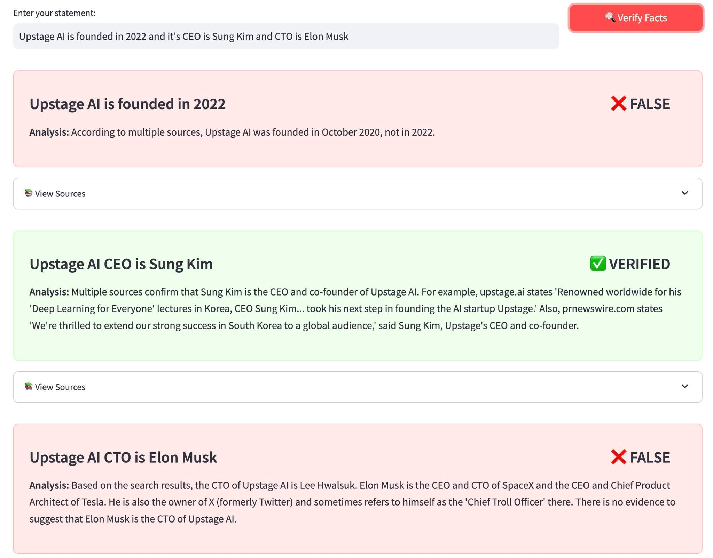

### 2월 25일 (화) 13:47 · #선사용후고민

#선사용후고민

### 2월 26일 (수) 07:20 · 사용자가 사용해보시고 만족할때 제일 행복합니다. Upstage #Sola…

사용자가 사용해보시고 만족할때 제일 행복합니다. Upstage #SolarLLM, #DocParse 너무 좋습니다. https://console.upstage.ai/ 에서 바로 무료 테스트 가능합니다!

### 2월 27일 (목) 09:08 · 컴퍼니케이파트너스 변준영 부사장님, 최우수 심사역[딥테크] 수상을 축하 …

컴퍼니케이파트너스 변준영 부사장님, 최우수 심사역[딥테크] 수상을 축하 드립니다. 

Upstage 시리즈 A 펀딩을 하고 있을때 일이 지금도 생생하게 기억납니다. 첫 소개 미팅에서 "Upstage를 알고 있고, 우리는 투자하겠습니다."라고 확신에 찬 말씀을 해주셔서 큰 힘이 되었습니다. 그 후 저희는 어렵지 않게 펀딩을 할 수 있었는데요. 기술 회사를 알아봐주시고 힘이 되어주신 부사장님께 다시 한번 큰 감사를 드립니다.

부사장님께는 당연한 상이라 생각됩니다. 다시한번 축하 드립니다.

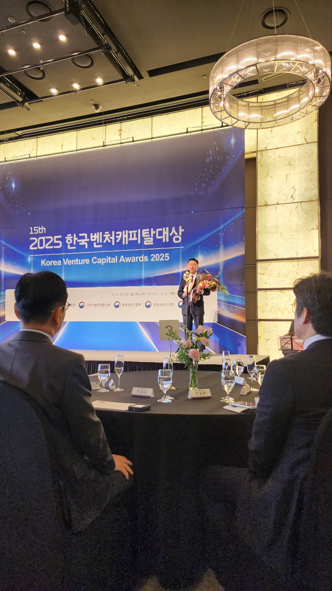 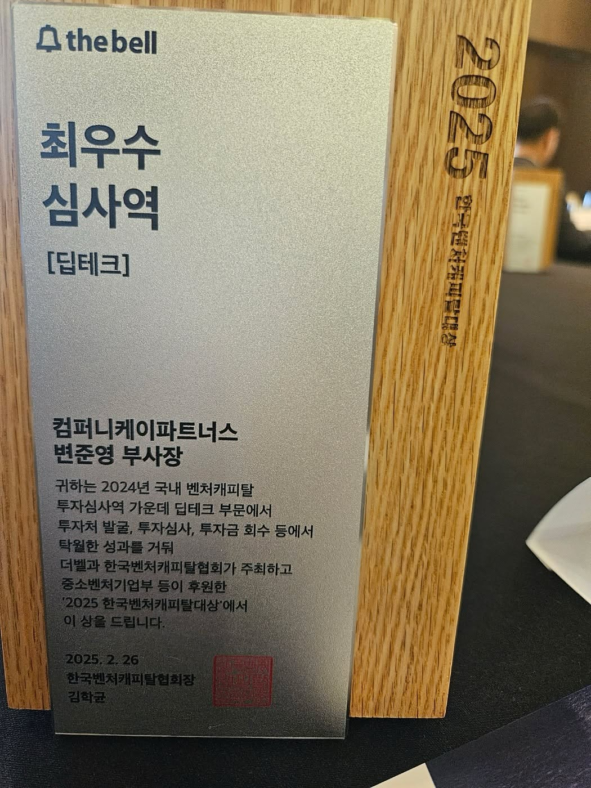
