# 2025년 3월

[← 2025년](README.md)

### 3월 4일 (화) 12:13 · #UpstageJP 3월 25일 Upstage 일본 사무실을 오픈하고 일…

#UpstageJP 3월 25일 Upstage 일본 사무실을 오픈하고 일본 AI 사업을 전개합니다. 이를 위해 AWS등에서 AI/Saas경력이 많으신 Hiroyuki Matsushita (松下 紘之) 님을 일년동안 설득했는데요. 마침내 이 멋진 분들 일본 대표님으로 모셨습니다. 

이 기쁨을 함께 나누고자 3月25日 15:30- 18:00 @Innovation Garden (東京都港区赤坂1-12-32 森 7階) 에서 Upstage Japan Kickoff & Meetup Event 를 가집니다. 

근처 계신 분들 모두 초대 드립니다. 더 자세한 정보는 https://wandb.connpass.com/event/347601/ 에서 보실수 있습니다. 오시는 분들 반갑게 뵙겠습니다.

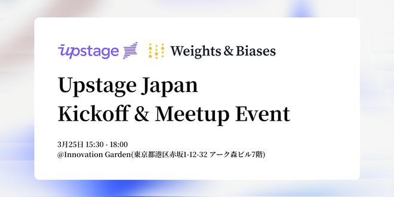
**이미지 캡션:** 이 이미지는 Upstage Japan Kickoff & Meetup Event를 알리는 행사 안내문입니다. 화면 중앙에는 'upstage' 로고와 'Weights & Biases' 로고가 나란히 배치되어 있으며, 그 아래에는 'Upstage Japan Kickoff & Meetup Event'라는 행사 제목이 굵은 글씨로 쓰여 있습니다. 행사 날짜와 시간은 3월 25일 15:30부터 18:00까지이며, 장소는 '@Innovation Garden(東京都港区赤坂1-12-32 アーク森ビル7階)'로 명시되어 있습니다. 배경은 흐릿한 흰색과 보라색 톤의 추상적인 디자인으로, 행사의 전문적이고 혁신적인 분위기를 나타냅니다. 이 이미지에는 사람이 직접적으로 묘사되어 있지 않으며, 텍스트 정보만을 제공하여 행사의 개요를 전달하고 있습니다.

### 3월 11일 (화) 18:38 · 복잡하고 또 복잡한 테이블들도 이제 Upstage DocParse (DP…

복잡하고 또 복잡한 테이블들도 이제 Upstage DocParse (DP) 에서 잘 인식됩니다. 
https://console.upstage.ai/playground/document-parse 에서 바로 테스트 해보실수 있습니다. 

이제 PDF등 문서를 LLM등에 넣으실때 Upstage DP는 필수 입니다.

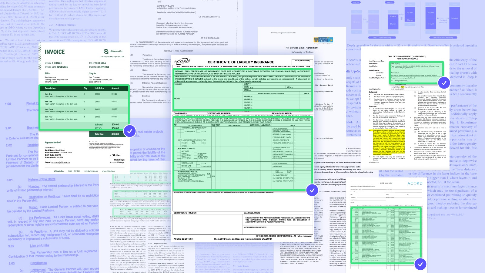
**이미지 캡션:** This image displays a collage of various documents, primarily legal and financial papers, overlaid on a light blue background. In the foreground, a green-highlighted section shows a table from an invoice with columns for Description, Qty, Unit Price, and Amount, listing items like "Item One," "Item Two," "Item Three," and "Item Four" with corresponding quantities and prices. Below this table, a payment method section details "Ultimate Co." as the payee, with bank account information and a PayPal address. To the right of the invoice, a green-highlighted section of a "CERTIFICATE OF LIABILITY INSURANCE" document is visible, featuring fields for insurer information, coverages, certificate number, and revision number. Further to the right, another green-highlighted section displays a "CALL OPTION AGREEMENT" with fields for agreement date, property, proposed call option, and the party entering into the agreement. The overall impression is one of a business or legal context, with multiple documents related to contracts, insurance, and financial transactions. The lighting is even, and the focus is sharp on the highlighted sections, suggesting a digital presentation or compilation of these documents.

### 3월 17일 (월) 10:35 · 2025 Upstage Talk : 업스테이지가 이끄는 AI 서비스 혁신…

2025 Upstage Talk : 업스테이지가 이끄는 AI 서비스 혁신 웨비나에 여러분들을 초대 합니다.⠀

* 사전등록 https://go.upstage.ai/3QBTmjd
* 2025년 3월 19일 (수) 14:00 – 16:00, 온라인 웨비나)
⠀
Document Parse, LLM, AI OCR 등 첨단 기술을 활용한 서비스 구축 사례와 기술 노하우를 통해, 업스테이지가 제시하는 2025 AI 서비스 전략을 공개합니다.⠀
⠀
업스테이지 제품 기술 담당 Hwalsuk Lee CTO를 필두로, 비즈니스 개발 담당자와 제품 엔지니어 등 업스테이지 핵심 멤버들이 진행하는 심도 있는 AI 서비스 전략 토크!
- 2025 글로벌 AI 트렌드 인사이트 및 업스테이지 방향성
- Document Parse 프로덕트 소개 및 ‘Document Parse With Solar’ 구축 사례
- 업스테이지만의 Document Parse 기술 차별점과 노하우 공개
- Solar Box: 프라이빗 풀스택 LLM 솔루션 ⠀
- AI 미디어 서비스: 교열 AI, 기사 생성 AI 유즈케이스⠀
- AIOCR + LLM 구축 사례 및 프로젝트 성공 노하우 ⠀
⠀
비즈니스 생성형 AI 서비스 구축 및 도입에 관심 있는 모든 분 초대 드립니다.⠀

온라인 웨비나로 진행되며, QR 코드 또는 프로필 내 링크를 통해 선착순 등록이 진행됩니다. 등록이 조기 마감될 수 있으니 빠른 신청 부탁드립니다!⠀

접수 마감 후 웨비나 접속 관련 정보를 추후 안내 드릴 예정입니다! 사전신청 완료하신 분들에 한해 웨비나 녹화본을 제공해 드릴 예정이니, 많은 관심과 참여 부탁드립니다!

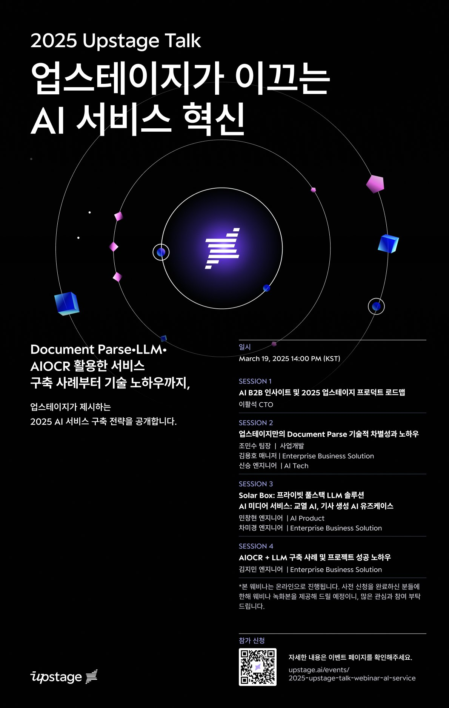
**이미지 캡션:** 이 이미지는 2025년 업스테이지 토크 웨비나를 홍보하는 포스터로, "업스테이지가 이끄는 AI 서비스 혁신"이라는 주제를 강조하고 있습니다. 검은색 배경에 원형의 추상적인 그래픽이 중앙에 배치되어 있으며, 그 안에 업스테이지 로고와 유사한 보라색 아이콘이 빛나고 있습니다. 포스터 상단에는 "2025 Upstage Talk"라는 문구가, 그 아래에는 "업스테이지가 이끄는 AI 서비스 혁신"이라는 큰 제목이 흰색으로 쓰여 있습니다. 왼쪽 하단에는 "Document Parse-LLM", "AIOCR 활용한 서비스", "구축 사례부터 기술 노하우까지", "업스테이지가 제시하는 2025 AI 서비스 구축 전략을 공개합니다."라는 설명이 있습니다. 오른쪽에는 웨비나의 일시가 "March 19, 2025 14:00 PM (KST)"로 명시되어 있으며, 네 개의 세션으로 나누어 각 세션의 주제와 발표자 이름, 소속이 상세하게 기재되어 있습니다. 세션 1은 "AI B2B 인사이트 및 2025 업스테이지 프로덕트 로드맵"이며 이활석 CTO가 발표합니다. 세션 2는 "업스테이지만의 Document Parse 기술적 차별성과 노하우"로 조민수 팀장, 김용호 매니저, 신승 엔지니어가 발표합니다. 세션 3은 "Solar Box: 프라이빗 풀스택 LLM 솔루션"과 "AI 미디어 서비스: 교열 AI, 기사 생성 AI 유즈케이스"로 민창현 엔지니어, 차미경 엔지니어가 발표합니다. 세션 4는 "AIOCR + LLM 구축 사례 및 프로젝트 성공 노하우"로 김지민 엔지니어가 발표합니다. 하단에는 웨비나가 온라인으로 진행되며 사전 신청자에게 녹화본을 제공한다는 안내와 함께 "참가 신청"이라는 문구와 QR 코드가 있습니다. QR 코드 옆에는 이벤트 페이지 주소인 "upstage.ai/events/2025-upstage-talk-webinar-al-service"가 안내되어 있습니다. 전체적으로 미래지향적이고 기술적인 분위기를 풍기며, AI 서비스 혁신에 대한 기대감을 높이는 디자인입니다.
 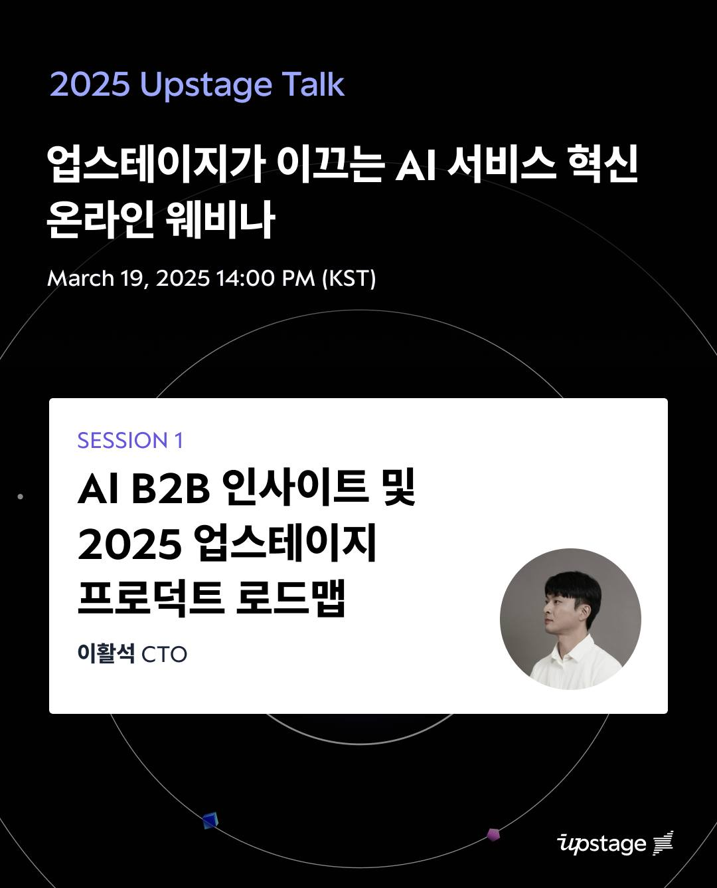
**이미지 캡션:** 이 이미지는 "2025 Upstage Talk"라는 제목의 온라인 웨비나 포스터로, 업스테이지가 이끄는 AI 서비스 혁신을 주제로 한다. 웨비나는 2025년 3월 19일 오후 2시(KST)에 진행된다. 포스터의 상단에는 "2025 Upstage Talk"라는 제목과 함께 "업스테이지가 이끄는 AI 서비스 혁신 온라인 웨비나"라는 부제가 흰색과 보라색 글씨로 쓰여 있다. 그 아래에는 웨비나 날짜와 시간이 "March 19, 2025 14:00 PM (KST)"로 명시되어 있다. 포스터의 하단에는 흰색 배경의 영역이 있으며, 이 영역에는 "SESSION 1"이라는 작은 제목과 함께 "AI B2B 인사이트 및 2025 업스테이지 프로덕트 로드맵"이라는 발표 내용이 검은색 글씨로 쓰여 있다. 발표자는 "이활석 CTO"로 소개되어 있으며, 그의 프로필 사진이 원형으로 잘려 우측에 배치되어 있다. 사진 속 인물은 젊은 성인 남성으로, 흰색 셔츠를 입고 있으며 차분하고 진지한 표정으로 정면을 응시하고 있다. 배경은 어두운 검은색이며, 은은한 곡선과 보라색 점들이 디자인 요소로 사용되어 미래지향적이고 세련된 분위기를 연출한다. 하단 우측에는 "upstage" 로고가 흰색으로 표기되어 있다. 전반적으로 전문적이고 정보 전달에 초점을 맞춘 디자인이다.
 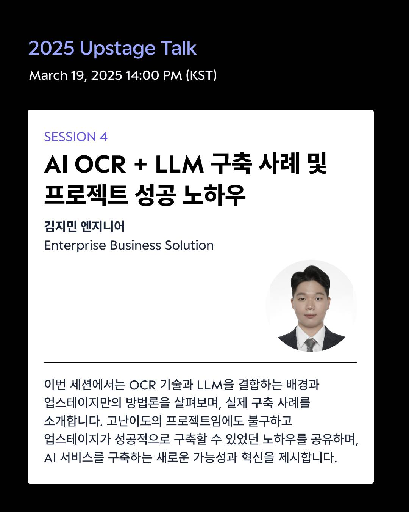
**이미지 캡션:** 이 사진은 2025년 3월 19일 오후 2시(KST)에 열리는 "2025 Upstage Talk"의 세션 4 발표 내용을 담고 있습니다. 발표자는 김지민 엔지니어로, "AI OCR + LLM 구축 사례 및 프로젝트 성공 노하우"라는 주제로 발표합니다. 사진에는 발표자의 얼굴 사진이 포함되어 있으며, 그는 깔끔한 검은색 정장을 입고 흰색 셔츠와 넥타이를 착용하고 있습니다. 젊은 성인 남성으로 보이며, 부드러운 미소를 띠고 정면을 응시하고 있습니다. 배경은 흰색이며, 발표 내용에 대한 설명이 한국어로 작성되어 있습니다. 이 세션에서는 OCR 기술과 LLM을 결합하는 배경, 업스테이지만의 방법론, 실제 구축 사례를 소개하고, 고난이도 프로젝트임에도 성공할 수 있었던 노하우와 AI 서비스 구축의 새로운 가능성 및 혁신을 제시할 예정입니다. 전체적으로 전문적이고 정보 전달에 초점을 맞춘 행사 안내 이미지입니다.
 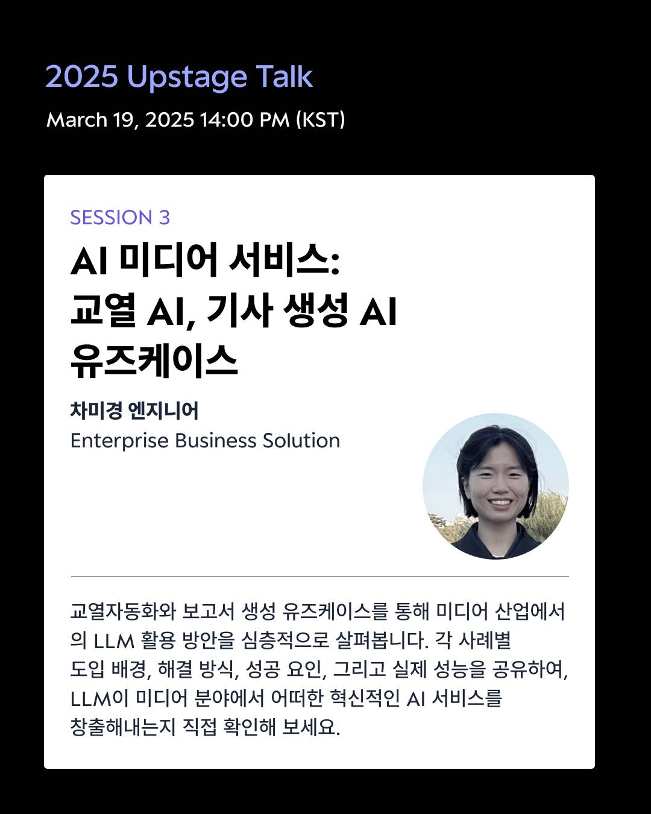
**이미지 캡션:** 이 이미지는 2025년 3월 19일 오후 2시(KST)에 열리는 "2025 Upstage Talk"의 세션 3 발표 내용을 담고 있습니다. 발표 주제는 "AI 미디어 서비스: 교열 AI, 기사 생성 AI 유즈케이스"이며, 발표자는 차미경 엔지니어로 Enterprise Business Solution 소속입니다. 사진에는 발표자인 차미경 엔지니어의 상반신 사진이 원형 프레임 안에 담겨 있으며, 그녀는 짧은 검은색 머리에 흰색 상의를 입고 환하게 웃고 있습니다. 배경에는 옅은 녹색의 식물들이 보입니다. 발표 내용 요약에는 교열 자동화와 보고서 생성 유즈케이스를 통해 미디어 산업에서 LLM 활용 방안을 심층적으로 살펴보고, 각 사례별 도입 배경, 해결 방식, 성공 요인, 실제 성능을 공유하여 LLM이 미디어 분야에서 혁신적인 AI 서비스를 어떻게 창출하는지 확인할 수 있다고 설명하고 있습니다. 전체적으로 정보 전달에 초점을 맞춘 깔끔하고 전문적인 분위기입니다.
 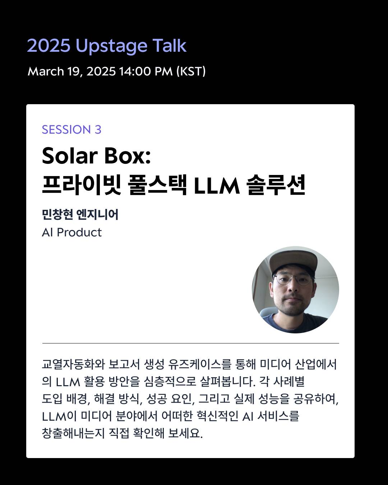
**이미지 캡션:** 이 사진은 2025년 3월 19일 오후 2시(KST)에 열리는 "2025 Upstage Talk"의 세션 3 발표 내용을 소개하는 이미지입니다. 발표 주제는 "Solar Box: 프라이빗 풀스택 LLM 솔루션"이며, 발표자는 민창현 엔지니어로 AI Product 분야 전문가입니다. 사진 오른쪽에는 민창현 엔지니어의 모습이 담긴 원형 프로필 사진이 있습니다. 그는 30대 후반에서 40대 초반으로 보이는 성인 남성이며, 회색 야구 모자와 안경을 착용하고 있습니다. 표정은 차분하고 전문적인 느낌을 줍니다. 배경은 흰색으로 깔끔하며, 발표 내용에 대한 간략한 설명이 한국어로 작성되어 있습니다. 설명에는 교열 자동화와 보고서 생성 유즈케이스를 통해 미디어 산업에서 LLM 활용 방안을 심층적으로 살펴보고, 각 사례별 도입 배경, 해결 방식, 성공 요인, 실제 성능을 공유하여 LLM이 미디어 분야에서 혁신적인 AI 서비스를 어떻게 창출하는지 확인할 수 있다는 내용이 담겨 있습니다. 전체적으로 정보 전달에 초점을 맞춘 깔끔하고 전문적인 분위기입니다.
 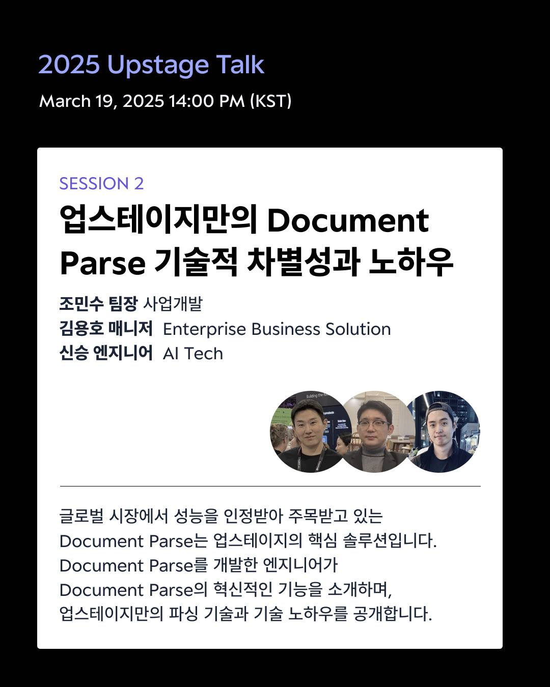
**이미지 캡션:** 이 사진은 "2025 Upstage Talk" 행사 안내 이미지로, 2025년 3월 19일 오후 2시(KST)에 열리는 세션 2의 내용을 담고 있습니다. 세션의 주제는 "업스테이지만의 Document Parse 기술적 차별성과 노하우"이며, 발표자는 조민수 팀장(사업개발), 김용호 매니저(Enterprise Business Solution), 신승 엔지니어(AI Tech)입니다. 이미지 하단에는 세션 내용에 대한 간략한 설명이 한국어로 적혀 있습니다. "글로벌 시장에서 성능을 인정받아 주목받고 있는 Document Parse는 업스테이지의 핵심 솔루션입니다. Document Parse를 개발한 엔지니어가 Document Parse의 혁신적인 기능을 소개하며, 업스테이지만의 파싱 기술과 기술 노하우를 공개합니다."라는 문구는 이 세션이 Document Parse 기술의 우수성과 업스테이지의 독자적인 기술력을 소개하는 자리임을 나타냅니다. 이미지 오른쪽에는 세 명의 성인 남성이 등장하는 사진이 삽입되어 있습니다. 이들은 각각 캐주얼한 복장과 함께 발표자들로 추정되며, 밝고 자신감 있는 표정으로 카메라를 응시하고 있습니다. 배경은 실내이며, 일부 인물 뒤로는 회의실이나 행사장의 모습이 희미하게 보입니다. 전체적으로 전문적이고 정보 전달에 초점을 맞춘 행사 안내 이미지의 분위기를 띠고 있습니다.

### 3월 20일 (목) 12:29 · Upstage 에서 만들고 있는 #꿈의OCR 을 소개 드립니다. 어떤 문…

Upstage 에서 만들고 있는 #꿈의OCR 을 소개 드립니다. 어떤 문서라도 넣어주시면, (1) 알아서 어떤 key-value를 뽑을지 결정한다음, (2) 알아서 값들을 (문서에 따라 차이는 있지만) 95+%의 정확도로 뽑아 냅니다.

기존 문서 별로 학습하고 또 파인튜닝이 필요했던 기존 방식에 비해 정말 꿈의OCR 이라 할수 있습니다. 여러분들이 가지고 있는 모든 문서, 이미지 등을 key-value의 정형화된 데이터로 가공할수 있습니다.

지금 웨이팅 리스트에 가입하시면 가장 먼저 사용하실수 있도록 해드리겠습니다.  https://go.upstage.ai/42fYoZa

🎬 동영상 1개 (생략)

### 3월 23일 (일) 10:01 · #시부야 #womenmarathon 너무 멋지네요. 특히 부러운 것은 시…

#시부야 #womenmarathon 너무 멋지네요. 특히 부러운 것은 시상을 위한 연령대에 80세 이상이 마련되어 있다는 것입니다. (3번째 사진)

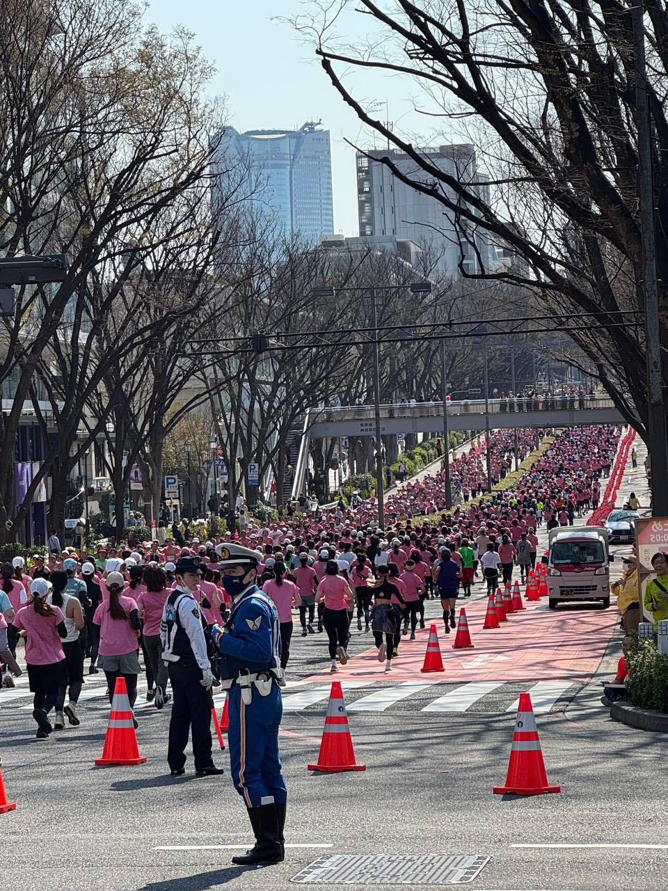
**이미지 캡션:** 이 사진은 도심에서 열리는 대규모 마라톤 행사를 보여줍니다. 사진 중앙에는 파란색 제복을 입은 성인 남성 경찰관 두 명이 서 있습니다. 한 명은 정면을 바라보고 있으며, 다른 한 명은 약간 옆을 보고 있습니다. 두 사람 모두 마스크를 착용하고 있으며, 제복에는 다양한 장비가 부착되어 있습니다. 이들 앞쪽으로는 수많은 참가자들이 분홍색 상의를 입고 마라톤을 하고 있습니다. 참가자들은 대부분 성인 여성으로 보이며, 다양한 연령대의 사람들이 섞여 있습니다. 일부 참가자는 머리에 흰색 모자를 쓰고 있습니다. 도로에는 주황색 콘이 일렬로 배치되어 참가자들의 동선을 안내하고 있으며, 횡단보도도 보입니다. 배경에는 높고 현대적인 건물들이 보이며, 나무들은 아직 잎이 나지 않은 겨울 또는 초봄의 모습입니다. 하늘은 맑고 푸르며, 햇살이 비추고 있습니다. 전반적으로 활기차고 질서 있는 분위기 속에서 진행되는 스포츠 행사임을 알 수 있습니다.
 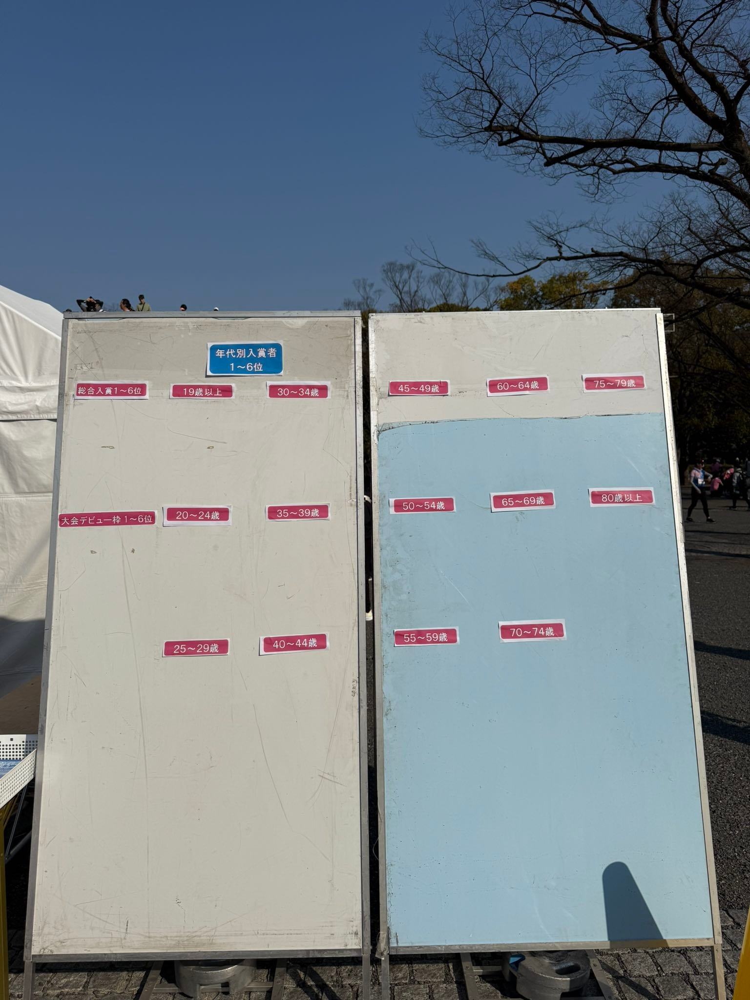
**이미지 캡션:** 야외에서 찍은 사진으로, 파란 하늘 아래 두 개의 큰 게시판이 나란히 서 있다. 왼쪽 게시판은 흰색이고 오른쪽 게시판은 하늘색이다. 두 게시판 모두 일본어로 된 연령대별 수상자 목록이 스티커 형태로 붙어 있다. 왼쪽 게시판 상단에는 파란색 바탕에 흰색 글씨로 "年代別入賞者 1~6位"라고 쓰여 있으며, 그 아래에는 "総合入賞1~6位", "19歳以上", "30~34歳", "大会デビュー枠1~6位", "20~24歳", "35~39歳", "25~29歳", "40~44歳" 등의 연령대와 순위가 적힌 스티커들이 붙어 있다. 오른쪽 게시판에는 "45~49歳", "60~64歳", "75~79歳", "50~54歳", "65~69歳", "80歳以上", "55~59歳", "70~74歳" 등의 연령대 스티커가 붙어 있다. 게시판 뒤로는 나뭇가지가 앙상한 나무와 함께 행사장으로 보이는 천막, 그리고 사람들이 희미하게 보인다. 게시판 하단에는 금속 지지대와 바퀴가 달려 있으며, 바닥은 돌로 포장되어 있다. 전반적으로 야외 행사장의 안내 또는 결과 발표 장소로 보이는 분위기이다.

🎬 동영상 1개 (생략)

### 3월 25일 (화) 17:33 · #세계1등 모델 Upstage DocParse 소개 드립니다. 최근 나온…

#세계1등 모델 Upstage DocParse 소개 드립니다. 최근 나온 Mistral OCR 포함 전문 기업인 LlamaParse, Unstructured 등의 성능을 훨씬 뛰어 넘습니다. 

https://www.upstage.ai/products/document-parse

한번 사용해보신 고객들은 놀라움으로 많이 사용해주고 계시는데요. API, AWS Marketplace, On-Prem 등 원하시는 방식으로 제공이 가능합니다. Upstage Playground에서 바로 테스트 해보셔요.

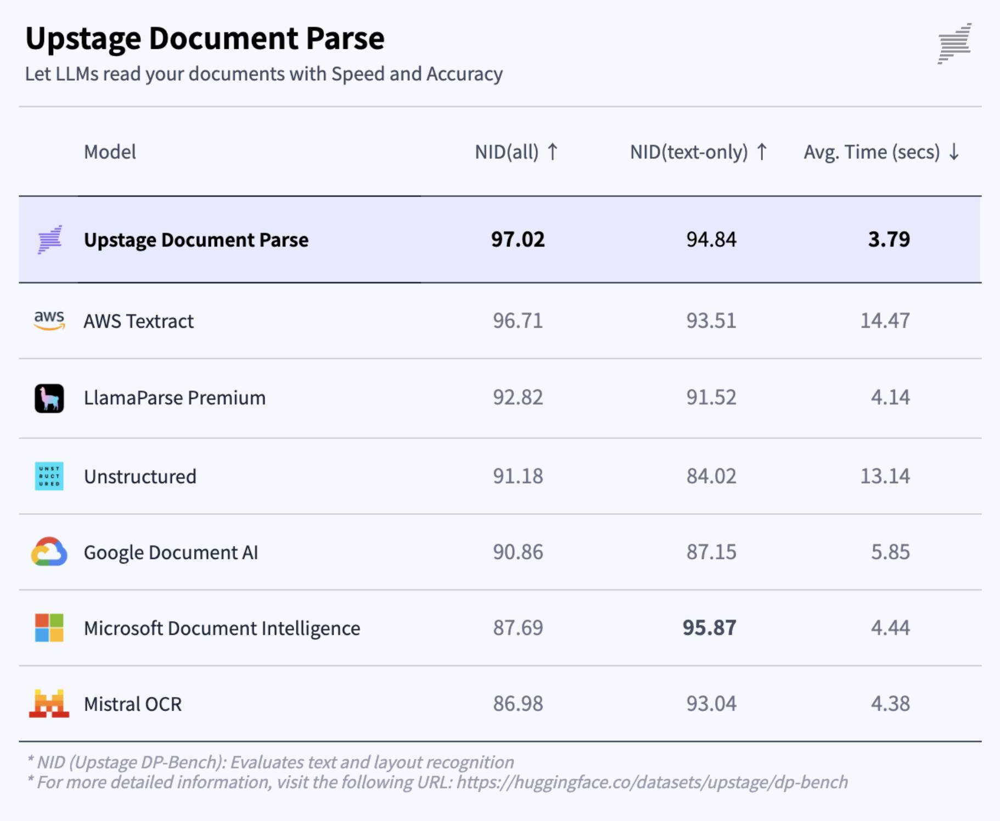
**이미지 캡션:** 이 이미지는 "Upstage Document Parse"라는 제목의 표를 보여주며, LLM이 문서를 얼마나 빠르고 정확하게 읽는지 비교하는 내용을 담고 있습니다. 표에는 여러 모델의 이름과 함께 NID(all), NID(text-only), Avg. Time(secs)이라는 세 가지 성능 지표가 표시되어 있습니다. 각 행은 "Upstage Document Parse", "AWS Textract", "LlamaParse Premium", "Unstructured", "Google Document AI", "Microsoft Document Intelligence", "Mistral OCR"과 같은 모델을 나타냅니다. "Upstage Document Parse"는 NID(all)에서 97.02, NID(text-only)에서 94.84, Avg. Time(secs)에서 3.79로 가장 높은 성능을 보입니다. 표 아래에는 "NID (Upstage DP-Bench): Evaluates text and layout recognition"이라는 설명과 함께 더 자세한 정보를 얻을 수 있는 URL이 제공됩니다. 전반적으로 이 이미지는 문서 처리 성능을 비교하는 기술적인 정보를 전달하고 있습니다.

### 3월 26일 (수) 11:48 · 가장 존경하는 IT CEO를 꼽아 보라면 아마 많은 분들이 이분을 생각하…

가장 존경하는 IT CEO를 꼽아 보라면 아마 많은 분들이 이분을 생각하실텐데요. 바로 MS의 Satya 대표님 뵙고 왔습니다. 

미팅을 하면서 업스테이지를 잘 알고 계시고 많이 도와주시려고 하는 인상을 받았습니다. 각 국가별 llm 비롯 멀티 모델들로 문제를 풀어야 한다는 분명한 인식을 갖고 계셨습니다. 

이에 저희는 아래 2가지를 부탁드렸습니다:
* 국내 최고의 slm 업스테이지 모델 azure maas등에 올려 b2b 같이하자
* 연구 교류, 방문 연구 등을 통해 ai 모델 공동 개발하자

개인 적으로는 세계 시총 최고 회사의 CEO로 여러가지 챙기실 일이 많을 텐데요. 대화를 통해 기술을 매우 잘 이해하고 있다는 인상을 받았습니다. mcp, model foundary, post training, 멀티모델 스위칭, model builder 등의 용어를 사용하시면서 기술 대화를 주도 하시는 모습에 놀랐습니다. Github copilot 이용해서 무언가 만들어보았다는 이야기도 하셨어요.

MS와의 협업이 기대 됩니다. 행복한 날입니다.

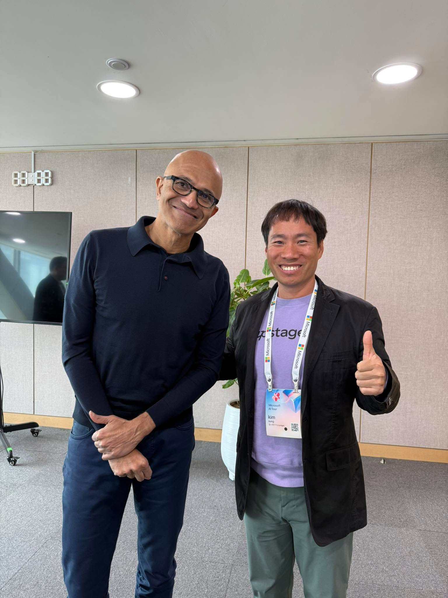
**이미지 캡션:** 사진에는 두 명의 성인 남성이 서 있으며, 왼쪽 남성은 50대 후반으로 보이는 아시아계 남성으로 대머리에 검은색 안경을 착용하고 있으며, 짙은 남색 폴로 셔츠와 남색 바지를 입고 손을 배 앞에 모으고 있다. 오른쪽 남성은 40대 초반으로 보이는 아시아계 남성으로 검은색 재킷 안에 연보라색 맨투맨 티셔츠를 입고 있으며, 목에는 마이크로소프트 행사 이름표를 걸고 있다. 이름표에는 "kim"이라고 적혀 있고, 엄지손가락을 치켜세우며 웃고 있다. 배경에는 회색 벽과 흰색 천장, 그리고 벽에 걸린 디지털 시계가 보인다. 또한, 한쪽에는 식물이 담긴 흰색 화분이 놓여 있다. 전반적으로 밝고 긍정적인 분위기이며, 두 남성은 친근하게 포즈를 취하고 있다.
