# 2025년 4월

[← 2025년](README.md)

### 4월 8일 (화) 09:34 · Upstage #DocumentParse 가 일본에도 많이 소개 되고 있…

Upstage #DocumentParse 가 일본에도 많이 소개 되고 있습니다. 그중 Fusic의 개발자가 작성한 블로그가 아직 부족한점은 있지만 RAG등을 위한 필수 도구로 소개하고 있습니다.

일본에서 사업하시거나 일본어 문서를 다루신다면 역시 Upstage DocumentParse를 사용해보세요.

https://zenn.dev/fusic/articles/7a7d4458dfd92a 
(간단한 #SolarLLM 요약)
✍ Upstage의 Document AI 모델을 사용하여 문서 전처리의 가능성을 검증했습니다. DocumentParse API를 사용하여 기존 RAG의 문제점인 OCR 후 고정 크기 분할로 인한 문맥 및 레이아웃 정보 손실을 해결했습니다. 이 API는 원본 레이아웃을 유지하면서 HTML 형식으로 문서를 출력하여 더 나은 문서 전처리를 가능하게 합니다.

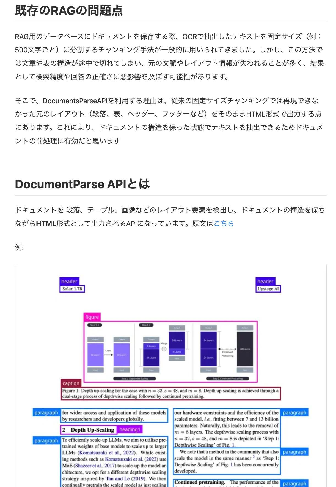
**이미지 캡션:** 이 이미지는 RAG(Retrieval-Augmented Generation) 시스템에서 문서 처리의 문제점과 DocumentParse API의 장점을 설명하는 기술 문서의 일부입니다. 상단에는 "기존 RAG의 문제점"이라는 제목과 함께 고정 크기 청킹 방식의 한계점을 설명하는 텍스트가 있습니다. 이어서 "DocumentParse API란"이라는 제목 아래, 이 API가 문서의 레이아웃 요소를 감지하고 구조를 유지한 채 HTML 형식으로 출력한다는 내용이 제시됩니다. 하단에는 API의 예시로 보이는 다이어그램과 함께 "Depth up-scaling"에 대한 설명이 포함된 그림과 캡션이 있습니다. 그림 아래에는 "for wider access and application of these models by researchers and developers globally."라는 문구가 있고, "Depth Up-Scaling"이라는 소제목과 함께 LLM(Large Language Model)을 효율적으로 확장하기 위한 방법론에 대한 설명이 이어집니다. 전반적으로 흰색 배경에 검은색 텍스트와 파란색, 보라색, 회색의 그래픽 요소가 사용되어 정보 전달에 집중하는 차분하고 전문적인 분위기를 자아냅니다. 함께 "Depth up-scaling"에 대한 설명이 포함된 그림과 캡션이 있습니다. 그림 아래에는 "for wider access and application of these models by researchers and developers globally."라는 문구가 있고, "Depth Up-Scaling"이라는 소제목과 함께 LLM(Large Language Model)을 효율적으로 확장하기 위한 방법론에 대한 설명이 이어집니다. 전반적으로 흰색 배경에 검은색 텍스트와 파란색, 보라색, 회색의 그래픽 요소가 사용되어 정보 전달에 집중하는 차분하고 전문적인 분위기를 자아냅니다.
 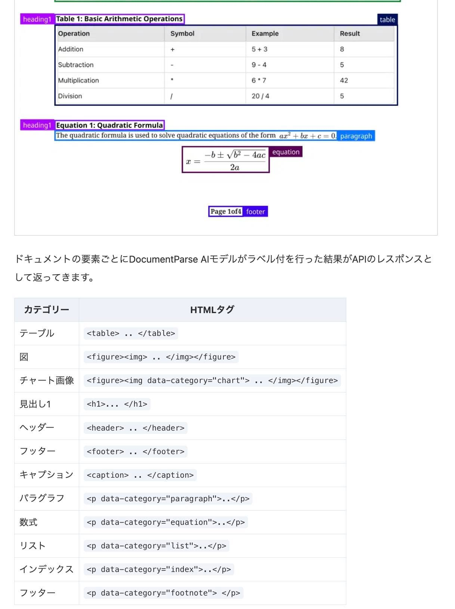
**이미지 캡션:** 이 이미지는 수학 관련 정보를 담고 있는 문서의 일부를 보여줍니다. 상단에는 "Table 1: Basic Arithmetic Operations"라는 제목과 함께 덧셈, 뺄셈, 곱셈, 나눗셈 연산에 대한 기호, 예시, 결과가 표 형태로 정리되어 있습니다. 그 아래에는 "Equation 1: Quadratic Formula"라는 제목과 함께 이차방정식의 근의 공식을 설명하는 문장과 공식 자체가 표시되어 있습니다. 문서 하단에는 일본어로 된 설명과 함께, 문서의 각 요소를 카테고리별로 나누고 해당 HTML 태그를 보여주는 표가 있습니다. 이 표에는 테이블, 그림, 차트 이미지, 제목, 헤더, 푸터, 캡션, 문단, 수식, 리스트, 인덱스, 각주 등이 포함되어 있으며, 각 카테고리에 해당하는 HTML 태그가 명시되어 있습니다. 전반적으로 기술 문서의 일부를 발췌하여 특정 요소에 대한 정보를 제공하는 내용입니다. 보여주는 표가 있습니다. 이 표에는 테이블, 그림, 차트 이미지, 제목, 헤더, 푸터, 캡션, 문단, 수식, 리스트, 인덱스, 각주 등이 포함되어 있으며, 각 카테고리에 해당하는 HTML 태그가 명시되어 있습니다. 전반적으로 기술 문서의 일부를 발췌하여 특정 요소에 대한 정보를 제공하는 내용입니다.

### 4월 17일 (목) 10:31 · Upstage 는 #mediaday를 통해 MBC, KBS 등 지상파, …

Upstage 는 #mediaday를 통해 MBC, KBS 등 지상파, 그리고 100명 이상의 언론 기자님들을 모시고 저희의 비전을 공유했습니다. 참여해주신 모든 분들에게 감사드립니다!

#DocParse, #SolarLLM, #DocVLLM 등의 AI 엔진으로 the future of work을 만들어 가는 것이 저희의 비전입니다. 한국과 일본을 넘어 동남아, 미국, 글로벌 TOP을 향해 달려갑니다.

이를 통해 인류의 업무 효율성을 다섯 배, 열 배, 백 배까지 높일 것입니다. 멋진 새로운 세상을 만들어 가겠습니다.

구체적으로는 4월 22일 출시 되는 성능이 더 올라가고 한국어가 제일 유창한 SolarLLM 1.3일 소개 드렸습니다. 많이 사용해주세요. 또한 6월에 출시될 Solar1.5&R과 문서 이미지 특화 멀티모달인 DocVLLM의 중간 성능을 소개 드렸습니다. 세계적인 수준입니다. 많은 기대 부탁드립니다!

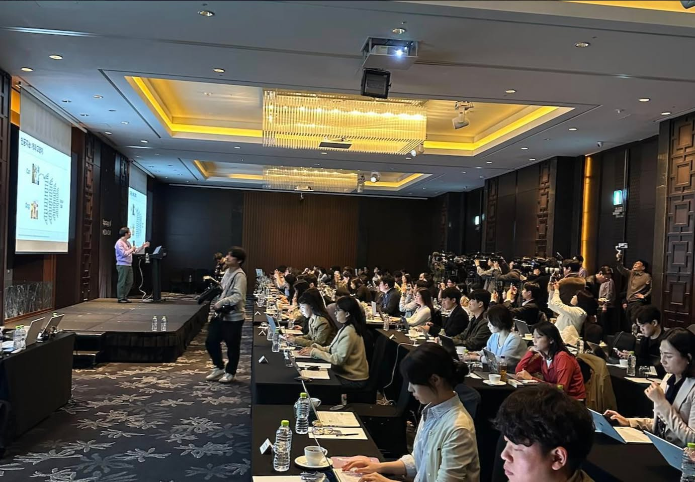
**이미지 캡션:** 넓은 강연장에서 한 명의 성인 남성이 연단 위에서 발표를 하고 있으며, 그의 뒤쪽 스크린에는 그래프와 그림이 포함된 발표 자료가 띄워져 있습니다. 연단 앞에는 노트북과 물병이 놓여 있습니다. 강연장에는 많은 사람들이 참석하여 발표를 경청하고 있으며, 일부는 노트북을 사용하거나 휴대폰으로 촬영하고 있습니다. 특히, 강연장 뒤쪽에는 여러 대의 카메라와 촬영 장비가 배치되어 있어 언론 행사나 기자회견임을 짐작하게 합니다. 참석자들은 대부분 젊은 성인 남녀로 보이며, 차분한 표정으로 발표에 집중하고 있습니다. 강연장은 고급스러운 조명과 패턴이 있는 카펫으로 장식되어 있으며, 전체적으로 진지하고 집중된 분위기입니다.은 고급스러운 조명과 패턴이 있는 카펫으로 장식되어 있으며, 전체적으로 진지하고 집중된 분위기입니다.
 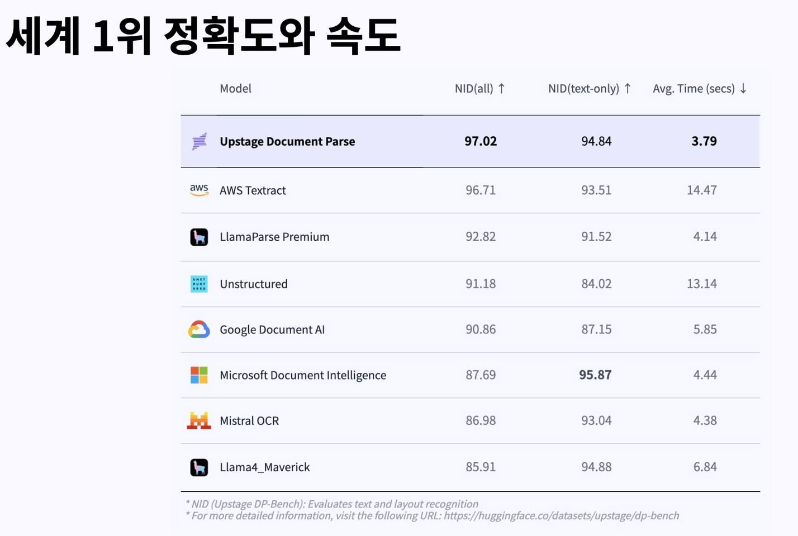
**이미지 캡션:** 이 이미지는 "세계 1위 정확도와 속도"라는 제목의 표를 보여주며, 다양한 문서 파싱 모델들의 성능을 비교하고 있습니다. 표에는 모델 이름, NID(all), NID(text-only), Avg. Time (secs)의 네 가지 열이 있습니다. 각 행은 Upstage Document Parse, AWS Textract, LlamaParse Premium, Unstructured, Google Document AI, Microsoft Document Intelligence, Mistral OCR, Llama4_Maverick과 같은 모델들을 나타냅니다. Upstage Document Parse는 97.02의 NID(all) 점수와 3.79초의 평균 시간을 기록하며 가장 높은 정확도와 빠른 속도를 보여줍니다. 표 하단에는 NID(Upstage DP-Bench)가 텍스트 및 레이아웃 인식을 평가한다는 설명과 더 자세한 정보를 얻을 수 있는 Hugging Face URL이 포함되어 있습니다. 배경은 흰색이며, 표는 회색과 흰색으로 구분되어 있습니다. 이 이미지는 문서 파싱 기술의 성능을 객관적으로 비교하고 평가하는 데 유용합니다.Maverick과 같은 모델들을 나타냅니다. Upstage Document Parse는 97.02의 NID(all) 점수와 3.79초의 평균 시간을 기록하며 가장 높은 정확도와 빠른 속도를 보여줍니다. 표 하단에는 NID(Upstage DP-Bench)가 텍스트 및 레이아웃 인식을 평가한다는 설명과 더 자세한 정보를 얻을 수 있는 Hugging Face URL이 포함되어 있습니다. 배경은 흰색이며, 표는 회색과 흰색으로 구분되어 있습니다. 이 이미지는 문서 파싱 기술의 성능을 객관적으로 비교하고 평가하는 데 유용합니다.
 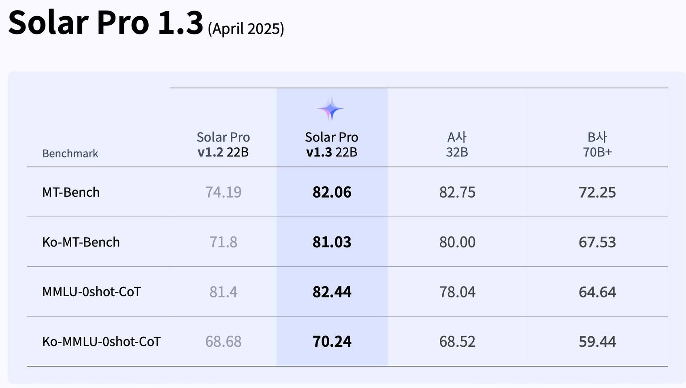
**이미지 캡션:** 이 이미지는 "Solar Pro 1.3 (April 2025)"라는 제목과 함께 여러 벤치마크 테스트 결과를 보여주는 표입니다. 표는 "Benchmark", "Solar Pro v1.2 22B", "Solar Pro v1.3 22B", "A사 32B", "B사 70B+"의 열로 구성되어 있습니다. 각 행은 MT-Bench, Ko-MT-Bench, MMLU-0shot-CoT, Ko-MMLU-0shot-CoT와 같은 다양한 벤치마크를 나타내며, 각 벤치마크에 대한 네 가지 모델의 점수가 표시됩니다. "Solar Pro v1.3 22B" 열에는 작은 별 모양 아이콘이 있습니다. 배경은 연한 보라색과 흰색으로 구성되어 있으며, 전체적으로 깔끔하고 정보 전달에 집중된 분위기입니다. 사람이나 특정 장소는 보이지 않으며, 오직 텍스트와 수치로 이루어진 데이터 시각화입니다.Pro v1.3 22B" 열에는 작은 별 모양 아이콘이 있습니다. 배경은 연한 보라색과 흰색으로 구성되어 있으며, 전체적으로 깔끔하고 정보 전달에 집중된 분위기입니다. 사람이나 특정 장소는 보이지 않으며, 오직 텍스트와 수치로 이루어진 데이터 시각화입니다.
 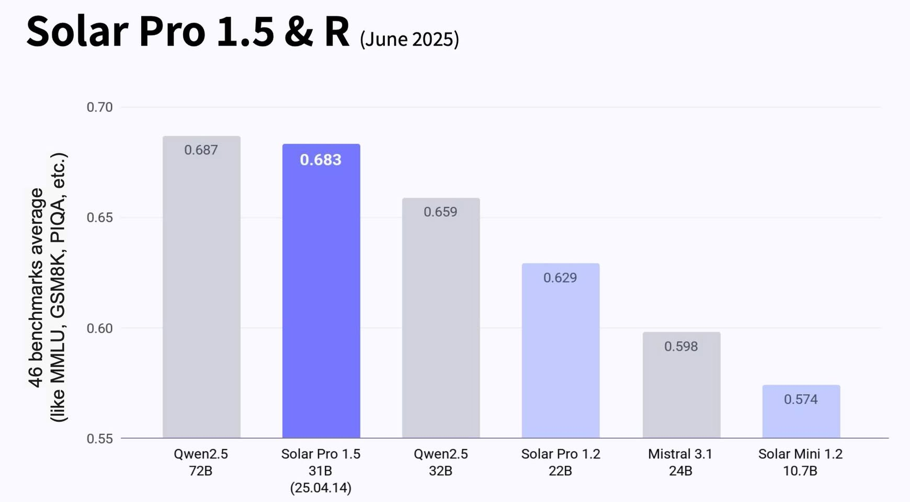
**이미지 캡션:** 이 이미지는 "Solar Pro 1.5 & R (June 2025)"라는 제목의 막대 그래프로, 46가지 벤치마크 평균 점수를 보여줍니다. 그래프는 수직축에 0.55부터 0.70까지의 점수를 나타내고, 수평축에는 다양한 모델 이름과 해당 모델의 매개변수 크기(예: 72B, 31B, 32B, 22B, 24B, 10.7B)가 표시됩니다. 가장 높은 점수를 받은 모델은 "Solar Pro 1.5 31B"로 0.683점이며, 그 다음으로 "Qwen2.5 72B"가 0.687점입니다. 다른 모델로는 "Qwen2.5 32B" (0.659점), "Solar Pro 1.2 22B" (0.629점), "Mistral 3.1 24B" (0.598점), "Solar Mini 1.2 10.7B" (0.574점)가 있습니다. "Solar Pro 1.5 31B" 모델 아래에는 "(25.04.14)"라는 날짜가 표기되어 있습니다. 그래프의 배경은 흰색이며, 막대는 연한 회색과 보라색 계열로 구분되어 있습니다. 이 그래프는 여러 AI 모델의 성능을 비교 분석하는 데 사용될 수 있으며, 전반적으로 기술적인 정보를 전달하는 차분하고 객관적인 분위기입니다.2B" (0.659점), "Solar Pro 1.2 22B" (0.629점), "Mistral 3.1 24B" (0.598점), "Solar Mini 1.2 10.7B" (0.574점)가 있습니다. "Solar Pro 1.5 31B" 모델 아래에는 "(25.04.14)"라는 날짜가 표기되어 있습니다. 그래프의 배경은 흰색이며, 막대는 연한 회색과 보라색 계열로 구분되어 있습니다. 이 그래프는 여러 AI 모델의 성능을 비교 분석하는 데 사용될 수 있으며, 전반적으로 기술적인 정보를 전달하는 차분하고 객관적인 분위기입니다.
 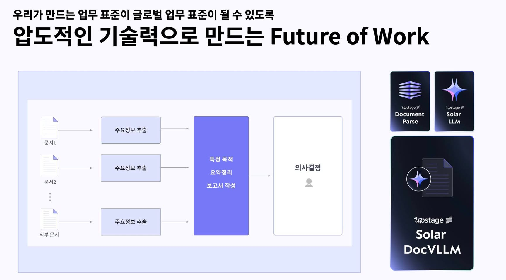
**이미지 캡션:** 이 이미지는 "압도적인 기술력으로 만드는 Future of Work"라는 제목 아래, 문서 처리 및 의사결정 과정을 시각화한 다이어그램과 관련 기술 로고들을 보여줍니다. 다이어그램은 여러 개의 문서(문서1, 문서2, 외부 문서)에서 주요 정보를 추출하고, 이를 바탕으로 특정 목적에 맞는 요약 정리 및 보고서 작성을 거쳐 최종적으로 의사결정을 내리는 과정을 화살표로 연결하여 나타냅니다. 오른쪽에는 Upstage의 기술 로고들이 배치되어 있으며, "Document Parse", "Solar LLM", 그리고 "Solar DocVLLM"이라는 텍스트가 포함된 로고들이 보입니다. 전반적으로 현대적인 업무 환경에서 AI 기술을 활용한 효율적인 정보 처리 및 의사결정 시스템을 홍보하는 듯한 분위기를 풍깁니다.olar DocVLLM"이라는 텍스트가 포함된 로고들이 보입니다. 전반적으로 현대적인 업무 환경에서 AI 기술을 활용한 효율적인 정보 처리 및 의사결정 시스템을 홍보하는 듯한 분위기를 풍깁니다.
 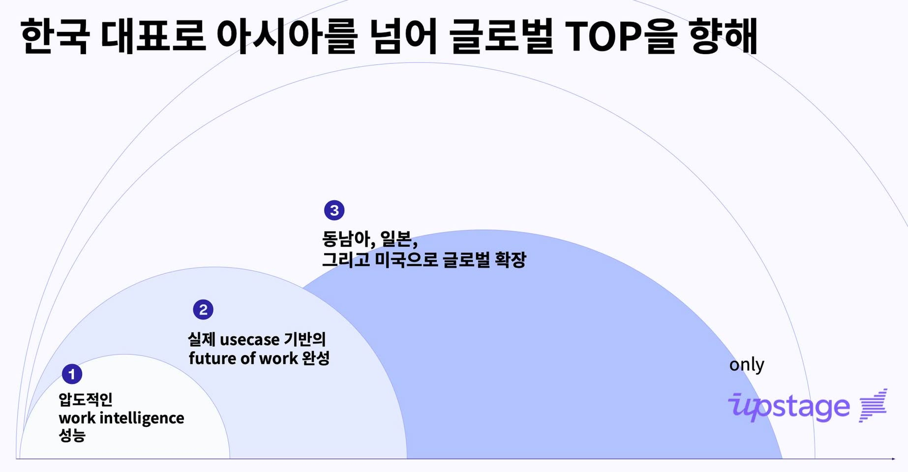
**이미지 캡션:** 이 이미지는 한국을 대표하여 아시아를 넘어 글로벌 최고를 향해 나아가는 비전을 담은 그래프입니다. 배경은 흰색이며, 연한 회색의 동심원들이 그려져 있습니다. 그래프는 세 개의 영역으로 나뉘어 있으며, 각 영역에는 숫자가 표시되어 있습니다. 첫 번째 영역(1번)에는 "압도적인 work intelligence 성능"이라는 문구가, 두 번째 영역(2번)에는 "실제 usecase 기반의 future of work 완성"이라는 문구가, 세 번째 영역(3번)에는 "동남아, 일본, 그리고 미국으로 글로벌 확장"이라는 문구가 한국어와 영어로 표기되어 있습니다. 오른쪽 하단에는 "only upstage"라는 문구와 함께 보라색 로고가 있습니다. 이 이미지는 특정 인물이나 사물을 보여주지 않으며, 비즈니스 전략이나 성장 단계를 시각적으로 표현하는 데 중점을 두고 있습니다. 전반적으로 깔끔하고 전문적인 분위기를 풍깁니다.가 한국어와 영어로 표기되어 있습니다. 오른쪽 하단에는 "only upstage"라는 문구와 함께 보라색 로고가 있습니다. 이 이미지는 특정 인물이나 사물을 보여주지 않으며, 비즈니스 전략이나 성장 단계를 시각적으로 표현하는 데 중점을 두고 있습니다. 전반적으로 깔끔하고 전문적인 분위기를 풍깁니다.

### 4월 19일 (토) 09:19 · 시청률이 가장 높은 뉴스인 MBC 뉴스데스크에 Upstage 일본 진출 …

시청률이 가장 높은 뉴스인 MBC 뉴스데스크에 Upstage 일본 진출 소식이 소개되었습니다. 저희의 예정대로 일본에서도 큰 성과를 만들어 보겠습니다. 

https://m.youtube.com/watch?v=bGhqfpTKb5s&ab_channel=MBCNEWS

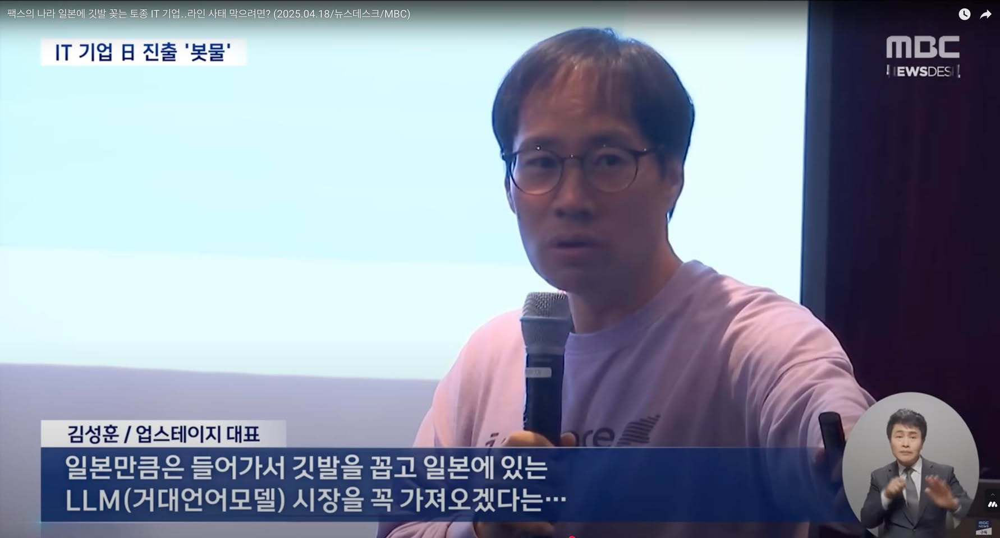
**이미지 캡션:** 화면 중앙에는 안경을 쓴 성인 남성이 마이크를 잡고 이야기하고 있다. 그는 연한 분홍색 맨투맨 티셔츠를 입고 있으며, 머리카락은 짧고 약간 숱이 적어 보인다. 표정은 진지하며, 입을 약간 벌리고 말하는 중이다. 배경은 밝은 파란색과 회색이 섞인 듯한 벽으로 보이며, 오른쪽에는 어두운 색상의 배경과 함께 MBC 뉴스 로고가 작게 보인다. 화면 하단에는 '김성훈/업스테이지 대표'라는 자막과 함께 "일본만큼은 들어가서 깃발을 꼽고 일본에 있는 LLM(거대언어모델) 시장을 꼭 가져오겠다는…"이라는 내용의 자막이 파란색 배경 위에 흰색 글씨로 표시되어 있다. 오른쪽 하단에는 수어 통역사가 화면에 작게 나오고 있다. 전반적으로 IT 기업의 일본 시장 진출에 대한 뉴스 보도의 한 장면으로 보인다.색 배경 위에 흰색 글씨로 표시되어 있다. 오른쪽 하단에는 수어 통역사가 화면에 작게 나오고 있다. 전반적으로 IT 기업의 일본 시장 진출에 대한 뉴스 보도의 한 장면으로 보인다.

### 4월 24일 (목) 11:49 · 📷 사진 (2장)

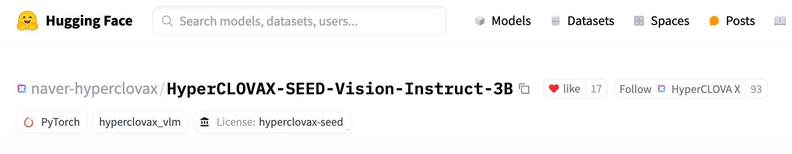
**이미지 캡션:** 이 이미지는 Hugging Face 웹사이트의 일부를 보여주며, 검색창과 함께 모델, 데이터셋, 스페이스, 게시물 등의 메뉴가 보입니다. 화면 중앙에는 "naver-hyperclovax"라는 사용자 이름과 함께 "HyperCLOVAX-SEED-Vision-Instruct-3B"라는 모델 이름이 크게 표시되어 있습니다. 그 아래에는 "PyTorch", "hyperclovax_vlm", "License: hyperclovax-seed"와 같은 태그들이 보입니다. 또한, "like" 버튼과 함께 17개의 좋아요 수가 표시되어 있고, "Follow" 버튼 옆에는 "HyperCLOVA X"라는 이름과 93이라는 숫자가 보입니다. 전체적으로 기술적인 정보를 담고 있는 웹페이지의 일부로, 인공지능 모델에 대한 정보를 제공하는 것으로 보입니다.가 표시되어 있고, "Follow" 버튼 옆에는 "HyperCLOVA X"라는 이름과 93이라는 숫자가 보입니다. 전체적으로 기술적인 정보를 담고 있는 웹페이지의 일부로, 인공지능 모델에 대한 정보를 제공하는 것으로 보입니다.
 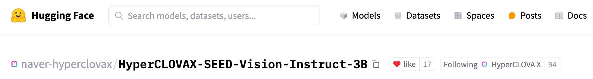
**이미지 캡션:** 이 이미지는 Hugging Face 웹사이트의 일부를 보여주며, 상단에는 "Hugging Face" 로고와 함께 검색창이 있고, 그 옆에는 "Models", "Datasets", "Spaces", "Posts", "Docs"와 같은 메뉴 항목들이 있습니다. 하단에는 "naver-hyperclovax"라는 사용자가 "HyperCLOVAX-SEED-Vision-Instruct-3B"라는 모델을 게시한 내용이 보이며, "like" 버튼과 함께 17개의 좋아요와 "Following" 정보, 그리고 "HyperCLOVA X"라는 이름과 94라는 숫자가 표시되어 있습니다. 전체적으로 기술적인 정보가 담긴 웹 페이지의 일부로, 인공지능 모델이나 데이터셋을 공유하고 검색하는 플랫폼의 화면으로 보입니다.A X"라는 이름과 94라는 숫자가 표시되어 있습니다. 전체적으로 기술적인 정보가 담긴 웹 페이지의 일부로, 인공지능 모델이나 데이터셋을 공유하고 검색하는 플랫폼의 화면으로 보입니다.

### 4월 25일 (금) 07:24 · 🚀 업스테이지, CB INSIGHTS 2025 AI 100에 선정! 🏆

🚀 업스테이지, CB INSIGHTS 2025 AI 100에 선정! 🏆

와우~ 정말 멋진 일이 일어났습니다! 많은 분들이 투자해주시고, 사용해주시고, 또 응원해주신 덕분에 Upstage가 CB INSIGHTS 에서 꼽은 2025년 세계에서 가장 유망한 AI 100개 기업 중 Foundation Models 카테고리에 선정되었습니다.

그동안 한국뿐만 아니라 태국까지 LLM을 수출하고, 일본과 미국 지사를 통해 확장해온 업스테이지의 기술력이 글로벌 무대에서도 최고 수준임을 공식적으로 인정받아 정말 행복합니다!

저희는 계속해서 글로벌 혁신의 선두로 나아갑니다. AI 기술로 The Future of Work를 현실로 만들며, 전 세계를 무대로 더 크게 도약하겠습니다. 앞으로도 업스테이지의 성장을 지켜봐 주시고, 변함없는 따뜻한 응원 부탁드립니다.

진심으로 감사드리며, 오늘의 기쁨을 여러분과 함께 나눕니다! 🎉

#CBInsights #AI100 #Upstage #SolarLLM #AIInnovation #AI2025

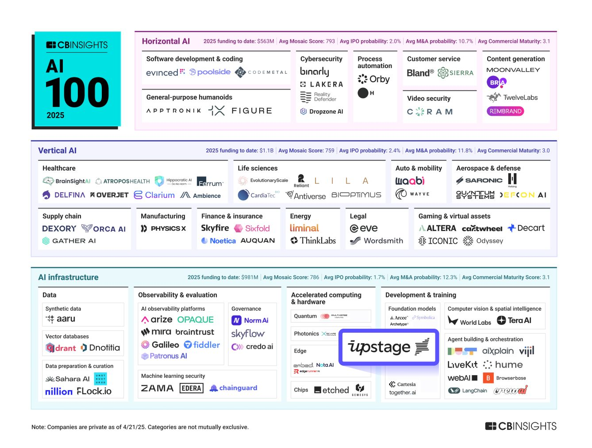
**이미지 캡션:** 이 이미지는 CB INSIGHTS에서 발행한 "AI 100 2025"라는 제목의 인포그래픽으로, 2025년까지 AI 분야에서 주목할 만한 100개의 기업을 분류하여 보여줍니다. 인포그래픽은 크게 "Horizontal AI", "Vertical AI", "AI infrastructure" 세 부분으로 나뉘며, 각 부분은 다시 세부 카테고리로 분류되어 관련 기업들의 로고와 이름이 나열되어 있습니다. "Horizontal AI" 섹션에는 소프트웨어 개발 및 코딩, 일반 목적 휴머노이드, 사이버 보안, 프로세스 자동화, 고객 서비스, 비디오 보안, 콘텐츠 생성 분야의 기업들이 포함되어 있습니다. "Vertical AI" 섹션은 헬스케어, 생명 과학, 공급망, 제조, 금융 및 보험, 에너지, 법률, 자동차 및 모빌리티, 항공 우주 및 국방, 게임 및 가상 자산 분야의 기업들을 다룹니다. "AI infrastructure" 섹션은 데이터, 관찰 가능성 및 평가, 머신 러닝 보안, 가속 컴퓨팅 및 하드웨어, 개발 및 교육, 컴퓨터 비전 및 공간 지능, 에이전트 구축 및 오케스트레이션 분야의 기업들을 보여줍니다. 각 섹션 상단에는 2025년까지의 총 펀딩 금액, 평균 모자이크 점수, 평균 IPO 확률, 평균 M&A 확률, 평균 상업 성숙도 점수 등의 통계 정보가 요약되어 있습니다. 인포그래픽 하단에는 "참고: 기업들은 2025년 4월 21일 기준으로 비공개이며, 카테고리는 상호 배타적이지 않습니다."라는 문구가 기재되어 있습니다. 전반적으로 정보가 밀집되어 있지만, 명확한 레이아웃과 시각적 요소로 AI 산업의 현황과 주요 플레이어들을 파악하는 데 유용한 자료입니다.화, 고객 서비스, 비디오 보안, 콘텐츠 생성 분야의 기업들이 포함되어 있습니다. "Vertical AI" 섹션은 헬스케어, 생명 과학, 공급망, 제조, 금융 및 보험, 에너지, 법률, 자동차 및 모빌리티, 항공 우주 및 국방, 게임 및 가상 자산 분야의 기업들을 다룹니다. "AI infrastructure" 섹션은 데이터, 관찰 가능성 및 평가, 머신 러닝 보안, 가속 컴퓨팅 및 하드웨어, 개발 및 교육, 컴퓨터 비전 및 공간 지능, 에이전트 구축 및 오케스트레이션 분야의 기업들을 보여줍니다. 각 섹션 상단에는 2025년까지의 총 펀딩 금액, 평균 모자이크 점수, 평균 IPO 확률, 평균 M&A 확률, 평균 상업 성숙도 점수 등의 통계 정보가 요약되어 있습니다. 인포그래픽 하단에는 "참고: 기업들은 2025년 4월 21일 기준으로 비공개이며, 카테고리는 상호 배타적이지 않습니다."라는 문구가 기재되어 있습니다. 전반적으로 정보가 밀집되어 있지만, 명확한 레이아웃과 시각적 요소로 AI 산업의 현황과 주요 플레이어들을 파악하는 데 유용한 자료입니다.

### 4월 25일 (금) 07:27 · Sung Kim shared a link.

🔗 <https://www.cbinsights.com/research/report/artificial-intelligence-top-startups-2025/>

### 4월 25일 (금) 20:49 · Sung Kim shared a link.

🔗 <https://cerebralvalley.ai/events>

### 4월 26일 (토) 08:41 · #MCP 와 #A2A 어떻게 사용하는가 주제로 #SF 에서 #meetup…

#MCP 와 #A2A 어떻게 사용하는가 주제로 #SF 에서 #meetup 열렸는데요. 

이중 (직접 손으로 찍은 것이라 영상 흔들림 + 음성상태 양해 부탁드립니다.)
1. MCP 다 필요없고 똘똘한 AI Browser하나면 된다 - 첫번째 영상
2. 구글 A2A의 데모 (gemini 성능이 좋으니 이제 OpenAI, 클로드 호환성 열어준다는 여유) - 두번째 영상
3. Sentry MCP서버 만들기. 너무쉽다고 여러번 말씀 - 세번째 영상

가 인상적이였습니다. 여러분들은 MCP를 어디에다 어떤 용도로 사용하시나요?

한달에 한번씩 MCP와 A2A주제 밋업을 한다고 하니 어떻게 발전하는지 계속 살펴보겠습니다.

🎬 동영상 3개 (생략)

### 4월 28일 (월) 07:53 · #SolarPro #SolarMini 업데이트 소식을 알려드립니다. 그동…

#SolarPro #SolarMini 업데이트 소식을 알려드립니다. 그동안 더 많은 한국어 데이터를 학습시켜, 이번 버전은 무엇보다 한국어의 자연스러움에 집중해서 학습했습니다. 또한 기존 대비 MMLU 등 기본 지능도 많이 향상되었습니다. 국내 L사, N사의 최신 모델 대비 벤치마크 성능으로는 Solar-Pro가 더 높습니다. 다만 사용감은 사용 시나리오 등에 따라 다를 수 있으니 테스트해 보시고 부족한 점들을 알려주시면 다음 버전에서 계속해서 개선해 보겠습니다.

이미 수많은 개인 사용자들은 https://console.upstage.ai/ API를 통해, 그리고 수십개의 기관에서는 on-prem/AWS Bedrock Marketplace 등으로 사용중인 Solar Mini/Pro! 많이 사용해주세요!!

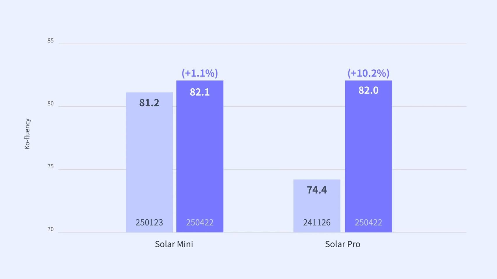
**이미지 캡션:** 이것은 한국어 유창성(Ko-fluency)을 나타내는 두 가지 제품, Solar Mini와 Solar Pro의 성능을 비교하는 막대 그래프입니다. Y축은 70에서 85까지의 유창성 점수를 나타내며, X축은 두 제품을 구분합니다. Solar Mini는 두 개의 막대로 표시되는데, 첫 번째 막대는 81.2점이고 두 번째 막대는 82.1점이며 (+1.1%) 증가했음을 나타냅니다. 각 막대 아래에는 250123과 250422라는 숫자가 표시되어 있습니다. Solar Pro 역시 두 개의 막대로 표시되는데, 첫 번째 막대는 74.4점이고 두 번째 막대는 82.0점이며 (+10.2%) 증가했음을 나타냅니다. 이 막대들 아래에는 241126과 250422라는 숫자가 표시되어 있습니다. 그래프의 배경은 연한 회색이며, 전체적으로 깔끔하고 정보 전달에 집중된 분위기입니다. 이 그래프는 Solar Pro가 Solar Mini에 비해 한국어 유창성에서 상당한 개선을 보였음을 시각적으로 보여줍니다.막대는 74.4점이고 두 번째 막대는 82.0점이며 (+10.2%) 증가했음을 나타냅니다. 이 막대들 아래에는 241126과 250422라는 숫자가 표시되어 있습니다. 그래프의 배경은 연한 회색이며, 전체적으로 깔끔하고 정보 전달에 집중된 분위기입니다. 이 그래프는 Solar Pro가 Solar Mini에 비해 한국어 유창성에서 상당한 개선을 보였음을 시각적으로 보여줍니다.
 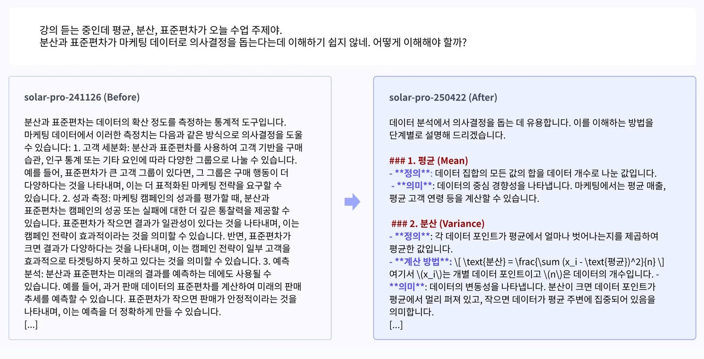
**이미지 캡션:** 이 이미지는 두 개의 섹션으로 나뉘어 있으며, 왼쪽 섹션은 "Before"라는 제목과 함께 마케팅 데이터 분석에서 분산과 표준편차의 활용에 대한 설명을 담고 있고, 오른쪽 섹션은 "After"라는 제목과 함께 데이터 분석에서 의사결정을 돕는 평균, 분산에 대한 단계별 설명을 제공합니다. 왼쪽 섹션에는 텍스트만 있고, 오른쪽 섹션에는 텍스트와 함께 수식과 같은 내용이 포함되어 있습니다. 두 섹션 사이에는 파란색 화살표가 있어 왼쪽에서 오른쪽으로 정보가 발전하거나 개선되는 과정을 시각적으로 나타냅니다. 전반적으로 교육적이거나 정보 전달적인 분위기를 띠고 있으며, 마케팅 및 데이터 분석 분야의 학습 자료로 보입니다. 교육적이거나 정보 전달적인 분위기를 띠고 있으며, 마케팅 및 데이터 분석 분야의 학습 자료로 보입니다.
 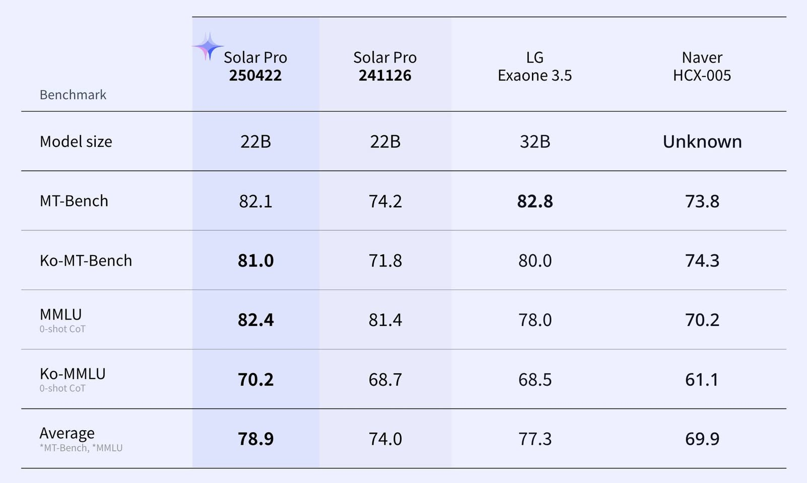
**이미지 캡션:** 이 이미지는 여러 인공지능 모델의 성능을 비교하는 벤치마크 결과표를 보여줍니다. 표에는 "Benchmark", "Model size", "MT-Bench", "Ko-MT-Bench", "MMLU 0-shot CoT", "Ko-MMLU 0-shot CoT", "Average"와 같은 항목들이 행으로 나열되어 있으며, 열에는 "Solar Pro 250422", "Solar Pro 241126", "LG Exaone 3.5", "Naver HCX-005"와 같은 모델 이름들이 표시되어 있습니다. 각 셀에는 해당 모델의 특정 벤치마크 점수가 숫자로 기재되어 있으며, 일부 항목은 볼드체로 강조되어 있습니다. 배경은 연한 보라색과 흰색으로 구분되어 있으며, 깔끔하고 정보 전달에 집중된 디자인입니다. 표 상단에는 "Solar Pro" 모델의 로고로 보이는 별 모양 아이콘이 있습니다. 이 표는 인공지능 모델의 성능을 객관적으로 평가하고 비교하는 데 사용될 수 있습니다.델의 특정 벤치마크 점수가 숫자로 기재되어 있으며, 일부 항목은 볼드체로 강조되어 있습니다. 배경은 연한 보라색과 흰색으로 구분되어 있으며, 깔끔하고 정보 전달에 집중된 디자인입니다. 표 상단에는 "Solar Pro" 모델의 로고로 보이는 별 모양 아이콘이 있습니다. 이 표는 인공지능 모델의 성능을 객관적으로 평가하고 비교하는 데 사용될 수 있습니다.

### 4월 29일 (화) 12:07 · '미래는 이미 와 있다. 다만 널리 퍼져 있지 않을 뿐' (The fut…

'미래는 이미 와 있다. 다만 널리 퍼져 있지 않을 뿐' (The future is already here – It's just not very evenly distributed) - SF 소설가 윌리엄 깁슨의 말이 와닿는 장면입니다.

얼마 지나지 않아 이제 사람들이 차에서 운전하는 장면을 신기해하면서 사진을 찍을 일이 있겠지요?

그리고 지금 우리가 손으로 하는 Work도 점점 AI가 받아가게 될것 같습니다. 
#SF #futureofwork

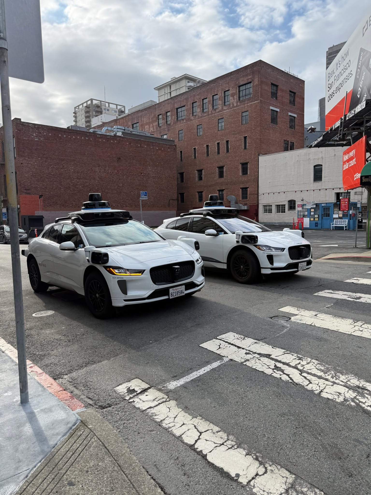
**이미지 캡션:** 두 대의 흰색 자율주행 자동차가 교차로에 서 있으며, 한 대는 보행자 횡단보도 앞에 있고 다른 한 대는 그 뒤에 있습니다. 두 차량 모두 루프에 센서 장비가 장착되어 있으며, 앞쪽 차량에는 "WAYMO"라는 글자가 보입니다. 차량은 재규어 I-PACE 모델로 보이며, 앞쪽 차량의 번호판은 8218544입니다. 배경에는 붉은 벽돌 건물과 흰색 건물이 있으며, 붉은 벽돌 건물에는 "BAT"라는 글자가 희미하게 보입니다. 오른쪽에는 "Brex. It's how San Francisco does expenses."라는 문구가 적힌 대형 광고판이 보이고, 그 아래에는 "Make every dollar count."라는 문구가 적힌 또 다른 광고판이 있습니다. 하늘은 구름이 낀 흐린 날씨를 보여줍니다. 전반적으로 도시의 거리 풍경이며, 자율주행 기술의 발전과 광고가 공존하는 모습을 보여줍니다.는 문구가 적힌 대형 광고판이 보이고, 그 아래에는 "Make every dollar count."라는 문구가 적힌 또 다른 광고판이 있습니다. 하늘은 구름이 낀 흐린 날씨를 보여줍니다. 전반적으로 도시의 거리 풍경이며, 자율주행 기술의 발전과 광고가 공존하는 모습을 보여줍니다.
