# 2025년 5월

[← 2025년](README.md)

### 5월 1일 (목) 08:15 · 저희 얼마전에 진행한 Upstage MediaDay 때 사용한 자료로 만…

저희 얼마전에 진행한 Upstage MediaDay 때 사용한 자료로 만들어본 #NotebookLM podcast 입니다. 중요한 부분을 상당히 잘 찾아서 이야기 해줍니다. (일부 과장 + 할루시네이션 있습니다.)

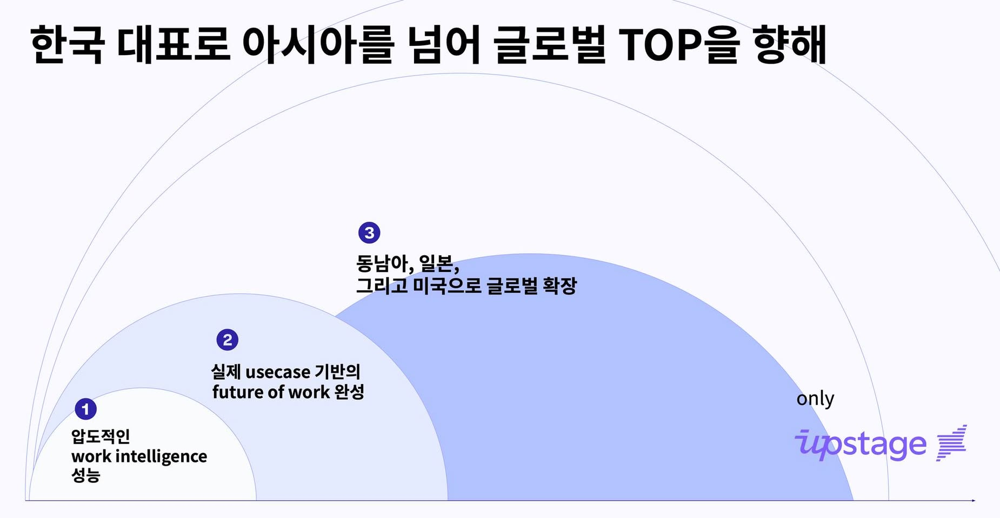

🎬 동영상 1개 (생략)

### 5월 10일 (토) 01:32 · 5/11일 오전 8시 함께 달려요! EO SF 시대 개막 기념 달리기에 …

5/11일 오전 8시 함께 달려요! EO SF 시대 개막 기념 달리기에 초대합니다. 

우리나라의 자랑이자 실리콘 벨리 창업자 커뮤니티를 리딩하는 EO 하우스가 아름다운 Palo Alto 시대를 마감하고, 혁신과 가능성의 도시 SF 시대를 엽니다. 

함께 모여 함께 달리며 EO를 많이 응원해주시면 감사하겠습니다. 

* 일시: 5/11일 오전 8시
* 장소/코스: San Francisco Ferry Building 에서 금문교초입까지 달리는 세상에서 가장 아름다운 달리기 코스 약 10K
* 특전: 완주하시는 모든 분들은 EO 하우스 후원으로 따뜻한 커피 대접하겠습니다. 

오시는 분들 반갑게 뵙겠습니다.

—
EO 하우스란?

창업자들이 가장 즐겨보는 채널인 EO 채널에서 운영하는 실리콘 벨리 하우스로 창업자들 커뮤니티의 중심이 되고 있습니다.

업스테이지도 2024년 미국 진출하며, 전체 임원들이 EO 하우스에서 한달간 머물면서 미국 진출의 전략을 수립할수 있었습니다. 다시한번 EO 하우스에 감사드립니다.

EO SF시대가 열리면. 더 멋진일들이 일어날것입니다. 너무 기대가 됩니다.

SF시스코를 방문하거나 미국 진출하신다면? EO 하우스에 들러보세요! 창업자들의 성지, 혁신의 허브에서 영감을 얻어 가세요.

### 5월 11일 (일) 08:37 · 🌊 버킷리스트 #SFSwim 클리어!

🌊 버킷리스트 #SFSwim 클리어!

오늘은 정말 특별한 하루를 보냈습니다. 오래전부터 꿈꿔왔던 금문교가 눈앞에 펼쳐진 SF 바닷가에서 수영하기! 5월의 차가운 바닷물은 예상했지만, 막상 물에 들어가니 "이거 진짜 얼음물이야?!" 라는 느낌이... 😂 

6월이나 7월에는 좀 더 편하게 도전할 수 있을 것 같아서 재도전도 예약합니다.

🎬 동영상 1개 (생략)

### 5월 14일 (수) 11:56 · 🚀 드디어 오늘! AWS Summit Seoul 2025! 업스테이지가 …

🚀 드디어 오늘! AWS Summit Seoul 2025! 업스테이지가 서울 코엑스 컨벤션 센터 B-29 부스에서 여러분을 기다립니다!

오시는 분들 반갑게 뵙겠습니다!
⠀
글로벌이 주목한 AI 기업, 업스테이지 최근, 세계적인 시장조사기관 CB Insights가 선정한 ‘AI 100’ 기업으로 이름을 올리며 기술력과 혁신성을 세계적으로 인정받았습니다.
⠀
그 주인공, 업스테이지가 AWS Summit Seoul 2025에 참가합니다!
이제, 생성형 AI로 업무 자동화 혁신을 직접 경험해보세요.
(단, 사전 등록자에 한해 입장이 가능하니 꼭 확인해 주세요)
⠀
⠀
💡 현장에서 만나볼 수 있는 주요 내용
✅ 생성형 AI 기반 업무 자동화 플랫폼
✅ DocAI & LLM 솔루션 실시간 데모
✅ 실제 AI 도입 성공 사례 소개
⠀
⠀
🎁 부스에서 설문에 참여하신 모든 분께 기념품 100% 증정!
📍 5월 14~15일, 코엑스 B-29에서 만나요!
⠀
🙌 현장 참석이 어려우시다면? AWS Marketplace 를 통해 업스테이지의 통합형 AI 솔루션도 확인하실 수 있습니다. 생성형 AI와 문서 자동화를 한 번에! 지금 확인해보세요.
⠀
#업스테이지 #upstage #AWS서밋서울 #AWSSummitSeoul2025 #AI100 #생성형AI #LLM #AI자동화 #DocAI #AI비즈니스 #업무혁신 #기념품증정 #사전등록필수

### 5월 18일 (일) 13:16 · #Antropic 과 #YC 가 후원하는 MCP 해커톤에 참여했습니다. …

#Antropic 과 #YC 가 후원하는 MCP 해커톤에 참여했습니다. #Antropic 의 #MCP 소개에 이어 하루 종일 약 400명이 멋진 YC 건물에서 치열하게 멋진 프로젝트로 경쟁했는데요.

아래 수상팀을 소개 합니다.

3등: MCP 서버를 쉽게 deploy 하는 https://devpost.com/software/vibeops

2등: 단백질 구조를 쉽게 검색  https://devpost.com/software/proteosurf 

1등: MCP logging을 도와주는 https://devpost.com/software/observee-nip2y8

저희팀의 Digital Human MCP 는 아쉽게도 수상하지 못했지만 하루종일 재미있었습니다: https://devpost.com/software/deephuman-the-digital-twin-mcp-network

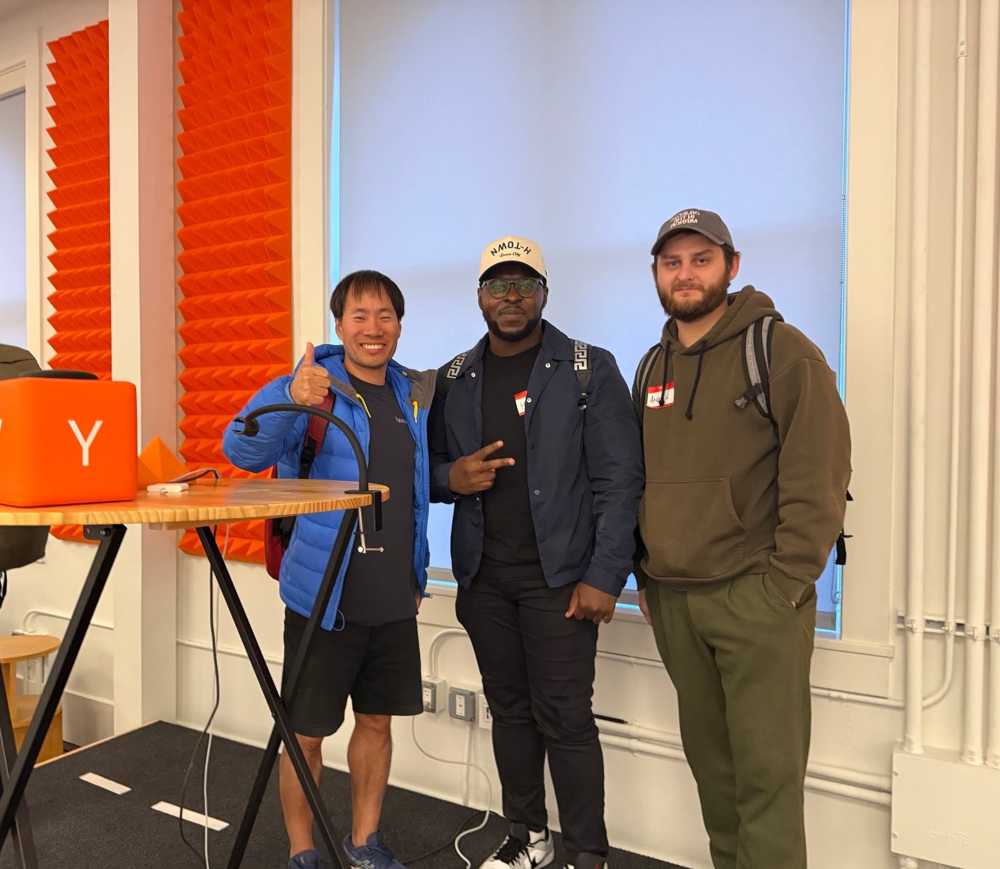 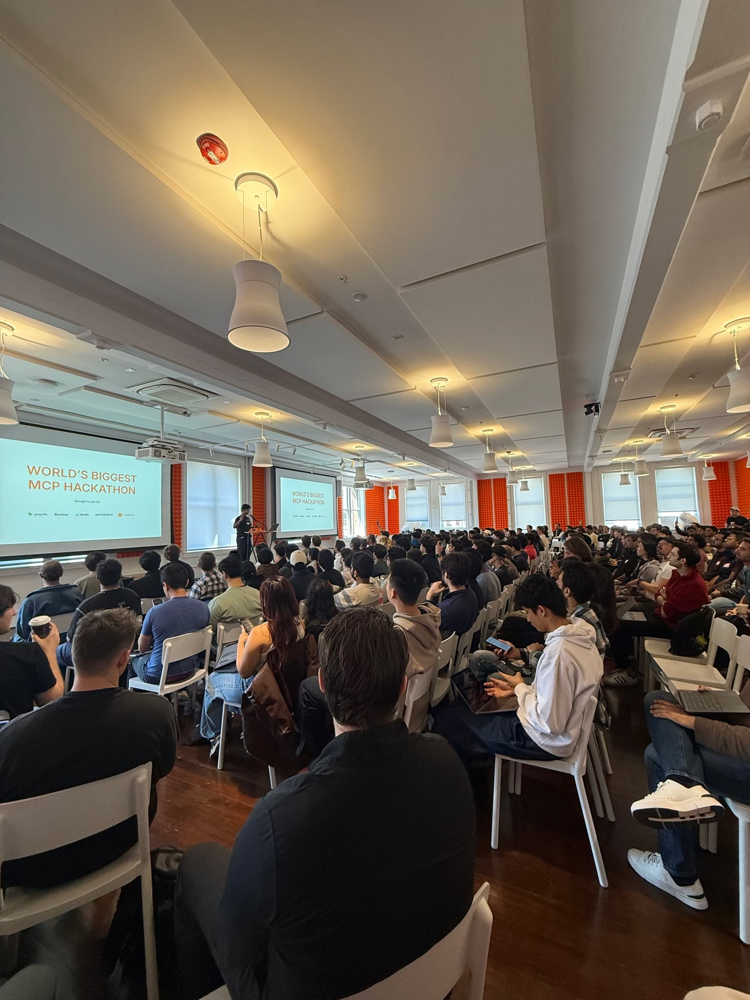

🎬 동영상 1개 (생략)

### 5월 19일 (월) 07:43 · 이번 대선에서 거의 모든 후보들이 AI의 중요성에 대해 인지하시고 파격적…

이번 대선에서 거의 모든 후보들이 AI의 중요성에 대해 인지하시고 파격적인 공약을 발표하고 계셔서 많은 기대가 됩니다. 경제 발전을 위해서는 결국 국가의 생산성이 올라가야 하는데요. AI는 생산성 향상에 있어 가장 좋은 활용 수단이라고 생각합니다. 특히 AI 분야에 대한 파격적인 투자와, 전 국민이 무료로 AI를 사용할 수 있도록 하는 공약들에 깊이 공감하고 있습니다. 

그런데 Upstage는 이미 (모든 학교와 비영리 기관, 대학병원 대상) 무료로 AI를 제공합니다. https://www.upstage.ai/events/ai-initiative-2025-ko

#AWS의 후원과 참여로 이루어지는 AI Initiative 프로그램으로 신청만 하시면 바로 #SolarLLM 과 문서처리에 좋은 DocumentParse를 무료로 제공합니다. API 무료 제공뿐만 아니라 해커톤과 프롬프톤 등 각종 교육 행사를 지원합니다.

벌써 수백 개의 기관이 등록해서 사용하고 계십니다. 본인이 학교나 비영리 기관, 대학 병원에 계시는데 아직 유료로 사용하고 계시다면 Upstage의 AI Initiative 프로그램을 바로 신청해주세요!

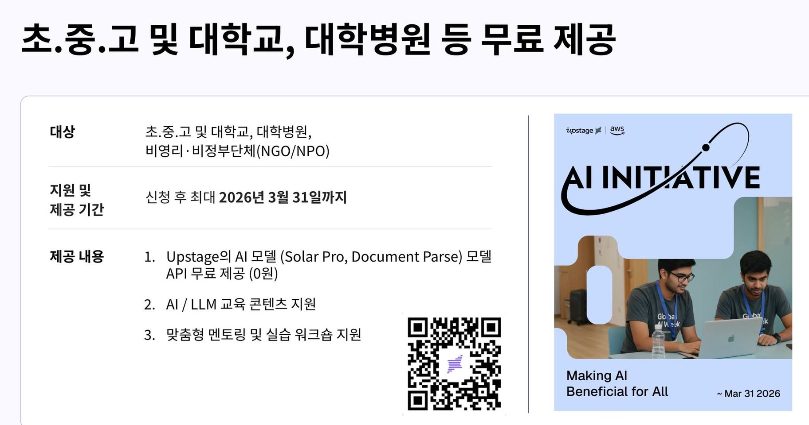 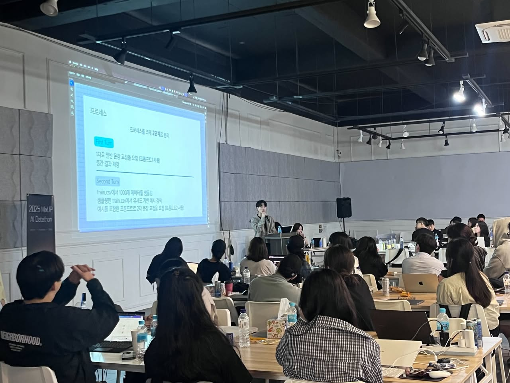 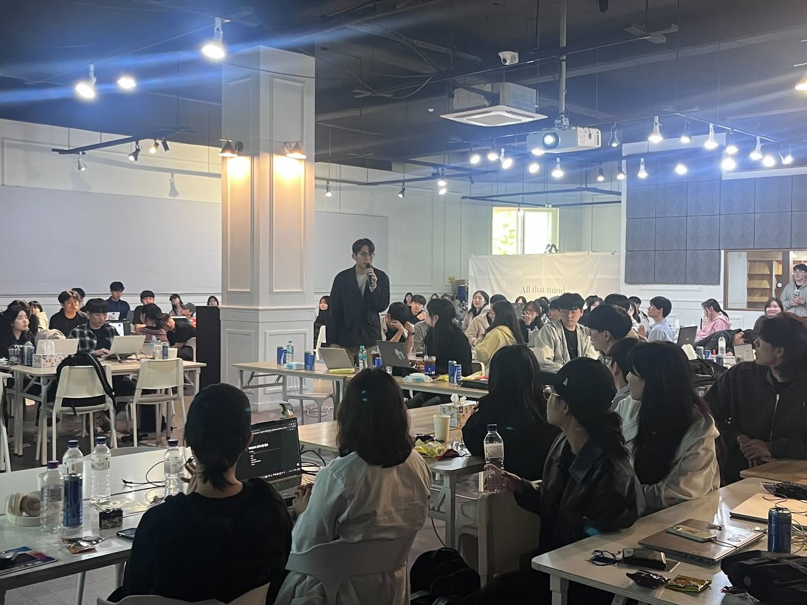

### 5월 20일 (화) 08:55 · #무료제공 #Solar-Pro2 (Preview) 출시 합니다. Upst…

#무료제공 #Solar-Pro2 (Preview) 출시 합니다. Upstage 최초의 reasoning/chat hybrid 모델입니다. Chat모드는 저희 파트너사인 조선일보, 언론사등의 많은 한국어 학습으로 한국어가 더 유창해졌습니다. Reasoning 모드는 복잡한 문제와 2~3번의 생각을 필요로 하는 문제를 아주 잘 풉니다. reasoning_effort="high" or "low" 옵션으로 조정이 가능합니다.

https://chat.upstage.ai/ 에서 무료로 테스트 가능하며 https://console.upstage.ai/ API는 정식 버전이 출시되는 6월 말까지 무료로 제공됩니다.

저희들이 중요하게 보는 벤치마크 기준으로는 Qwen2.5 70B 수준이며 최근 나온 Qwen 3 32B를 압도하는 성능 차이를 보입니다. 복잡한 문제는 gpt4o보다 뛰어납니다.

더 뛰어난 Solar-Pro2-Preview로 더 많은 AI 혁신 사례들을 같이 만들어 보시죠!

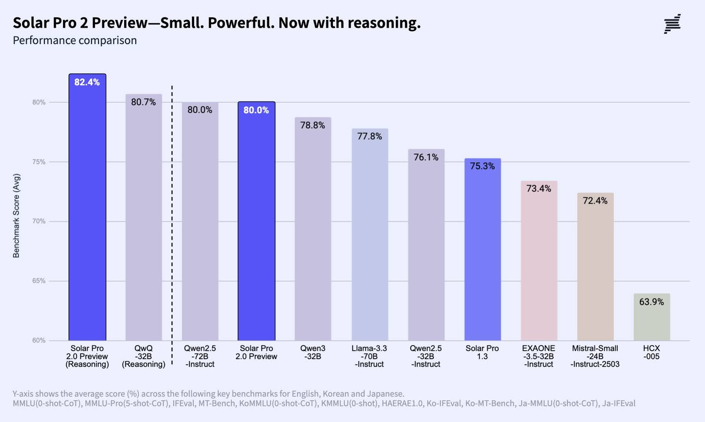 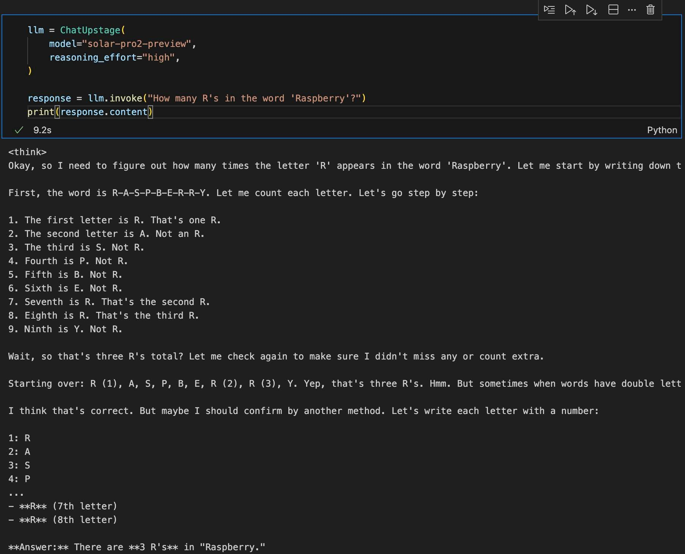 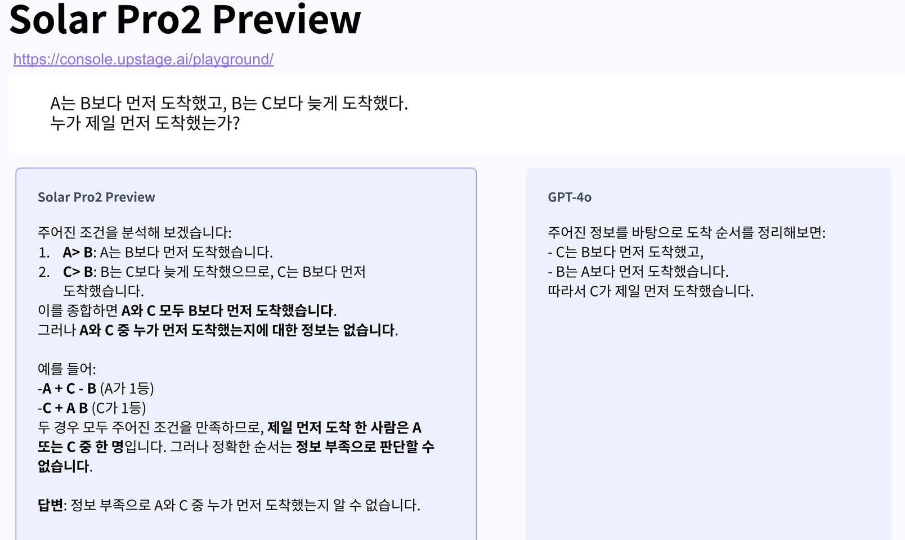 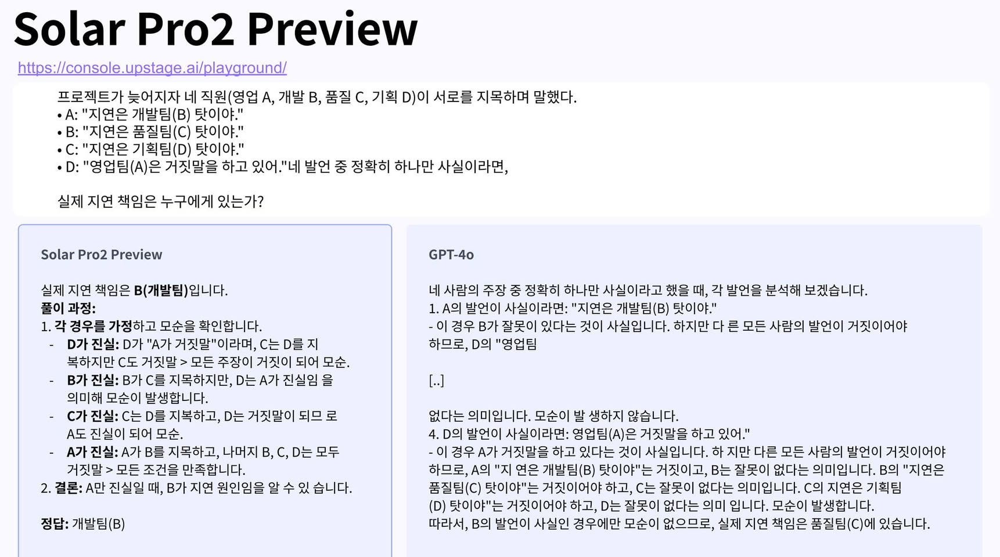

### 5월 20일 (화) 10:24 · 📷 사진 (1장)

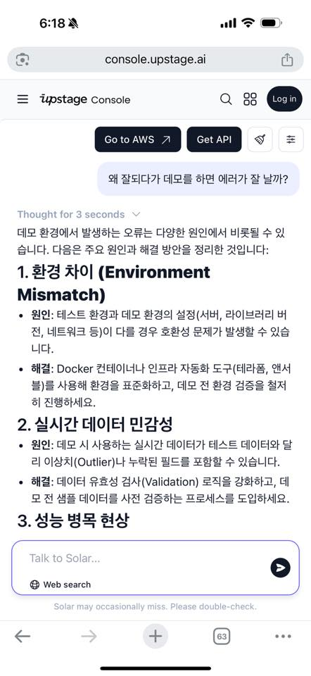

### 5월 21일 (수) 07:08 · #VOTED #제21대대통령선거 모두가 투표하시면 좋겠습니다! 🗳️

#VOTED #제21대대통령선거 모두가 투표하시면 좋겠습니다! 🗳️

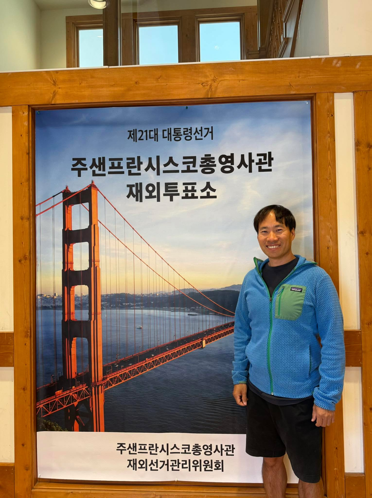

### 5월 22일 (목) 03:57 · 📷 사진 (1장)

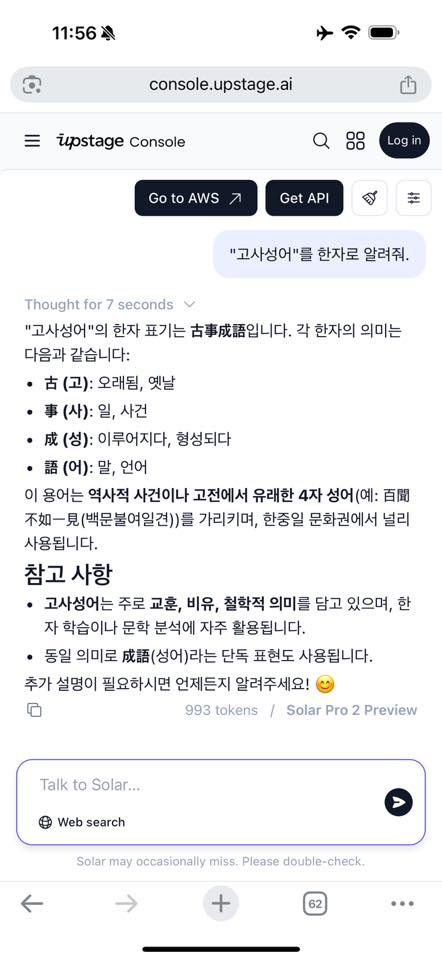

### 5월 22일 (목) 04:21 · #GoogleIO2025 #키노트 #핵심10가지

#GoogleIO2025 #키노트 #핵심10가지 
https://www.youtube.com/live/o8NiE3XMPrM 너무 멋지네요. 거의 2시간짜리 비디오인데요. 다 보시기 힘드시면 #SolarPro2 (preview)가 정리한 한국어 요약을 살펴보시면 됩니다. ^^

Solar-Pro2 (preview) 잘합니다! https://chat.upstage.ai/

---
1. Gemini 2.5 Pro & Flash 모델 강화
 - Gemini 2.5 Pro는 코딩, 수학, 추론 분야에서 최고 성능을 기록하며, 복잡한 문제 해결을 위한 Deep Think 모드를 도입했습니다.
- Gemini 2.5 Flash는 22%의 효율성 향상과 함께 빠른 처리 속도를 제공하며, 곧 정식 출시 예정입니다.

2. AI Mode로 재탄생한 Google 검색
- Gemini 2.5 기반의 AI 모드는 복잡한 질문, 후속 질문, 티켓 예약 등 에이전트 기능을 지원합니다.
- 개인 컨텍스트 기능으로 Gmail, 캘린더, 드라이브 정보를 통합해 맞춤형 추천을 제공합니다.

3. Android XR 생태계 확장
- 삼성 갤럭시 Project Moohan 헤드셋과 Warby Parker, Gentle Monster와 협업한 XR 글래스가 공개되었습니다.
- Gemini AI를 활용해 실시간 번역, 내비게이션, 핸즈프리 작업을 지원합니다.

4. Gemini 앱 주요 업데이트
- Gemini Live: 카메라/화면 공유 기능을 포함한 실시간 대화형 AI (무료 제공).
- Flow: 영화 제작을 위한 AI 도구로, Veo, Imagen, Gemini를 통합해 시네마틱 콘텐츠 생성 가능.
- 구독 플랜: Google AI Pro (글로벌)와 Ultra (Deep Think, Flow 우선 접근) 출시.

5. 생성형 미디어 혁신
- Imagen 4 (텍스트-이미지)와 Veo 3 (비디오+오디오 생성)로 초현실적 콘텐츠 제작이 가능해졌습니다.
- Lyria 2는 전문가 수준의 음악 생성 기능을 제공하며, 기업 및 크리에이터에게 개방됩니다.

6. 쇼핑 경험 혁신
- 가상 피팅 기능으로 3D 신체 모델링을 통해 옷 착용 효과를 미리 확인할 수 있습니다.
- 에이전트 체크아웃으로 Gemini가 웹에서 자동으로 구매 프로세스를 처리합니다.

7. 프로젝트 마리너와 에이전트 모드
- Project Mariner는 웹 자동화 에이전트 기능을 Gemini API로 제공합니다.
- 에이전트 모드는 다중 단계 작업(예: 티켓 예약)을 자동화해 생산성을 높입니다.

8. 딥 리서치 & 캔버스
- Deep Research는 웹 데이터를 종합해 전문가 수준의 보고서를 생성합니다.
- Canvas는 문서를 팟캐스트, 퀴즈 등 동적 형식으로 변환해 협업을 강화합니다.

9. 실시간 번역 및 접근성 강화
- Project Astra는 실시간 번역 기능으로 Google Meet, Aira(시각 장애인 지원)와 통합되었습니다.
- XR 글래스는 다국어 대화를 자동 번역해 글로벌 커뮤니케이션을 지원합니다.

10. 파트너십 및 생태계 확장
- 삼성, Qualcomm, AWS와의 협력을 통해 하드웨어 및 클라우드 생태계를 확장했습니다.
- 에이전트2에이전트 프로토콜로 개발자 및 기업 간 AI 에이전트 연동을 촉진합니다.

핵심 메시지: Google은 Gemini의 AI 리더십, 멀티모달 검색, XR 디바이스, 창작자 도구를 통해 개인화, 자동화, 사회적 영향력에 집중하며, 글로벌 생태계 확장을 통해 AI의 미래를 선도하고 있습니다.

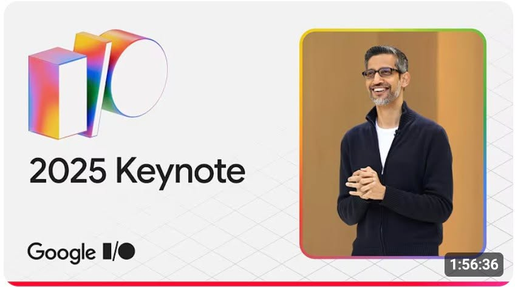

### 5월 24일 (토) 09:29 · Sung Kim shared a link.

🔗 <https://api.upstage.ai/v1/chat/completions>

### 5월 27일 (화) 12:31 · #써보니좋더라 얼마 전 출시된 #SolarPro2 preview 관련하여…

#써보니좋더라 얼마 전 출시된 #SolarPro2 preview 관련하여 좋은 피드백들이 많이 들어오고 있는데요. 제 지인들이 보내주신 피드백 소개 드립니다. 요즈음 자고 나면 또 더 고성능 모델이 나오는 가운데 그래도 #SolarPro2 사용해보니 좋다고 하시는 분들이 있어서 아주 기쁩니다.

가볍게 테스트해보실 분들은 https://chat.upstage.ai/ 그리고 본인이 사용하시는 서비스에 붙여보실 분들은 OpenAI SDK 호환되는 API로 쉽게 테스트 가능합니다. https://console.upstage.ai/docs/capabilities/reasoning

7월 15일까지 무료로 제공되는 Preview 많이 사용해 봐주세요.

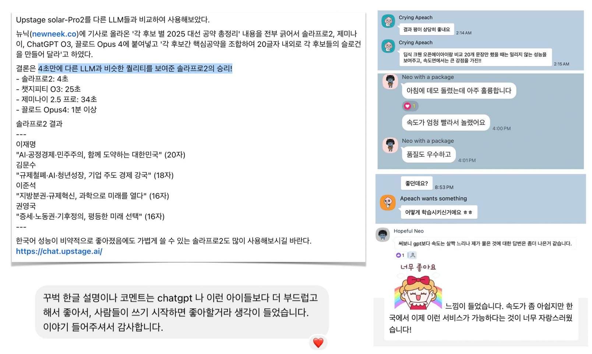 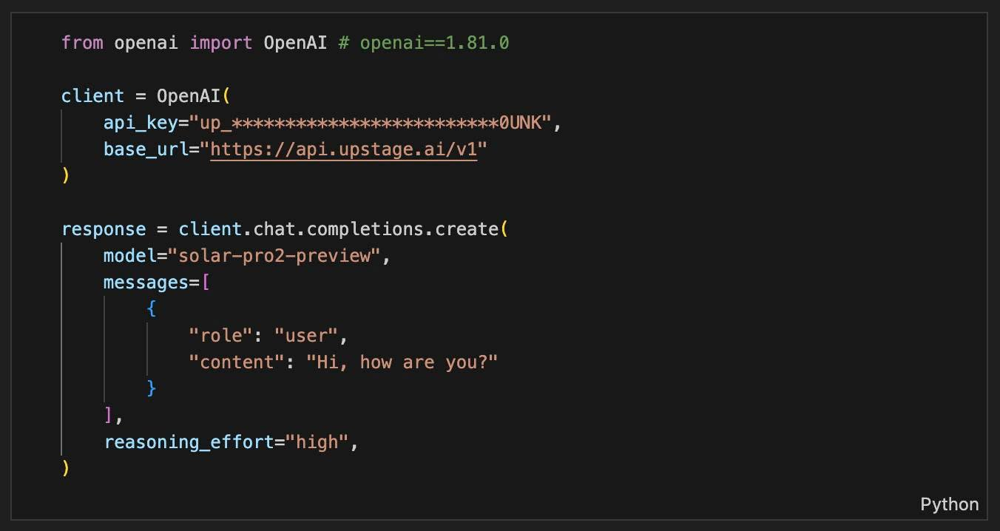
