# 2025년 6월

[← 2025년](README.md)

### 6월 3일 (화) 11:24 · Sung Kim shared a link.

🔗 <https://youtu.be/r5OquRwv7nI?si=3F5592W4MeBh-yVq>

### 6월 4일 (수) 02:31 · 대한민국의 제21대 이재명 대통령, 큰 축하 드립니다. 공약하신 것처럼 …

대한민국의 제21대 이재명 대통령, 큰 축하 드립니다. 공약하신 것처럼 "진짜 대한민국" 기대합니다!

특히 AI 3대 강국 도약: AI 대전환(AX)을 통해 세계 3대 AI 강국에 진입하기, 모두가 함께 노력하여 임기 내 달성되면 좋겠습니다.

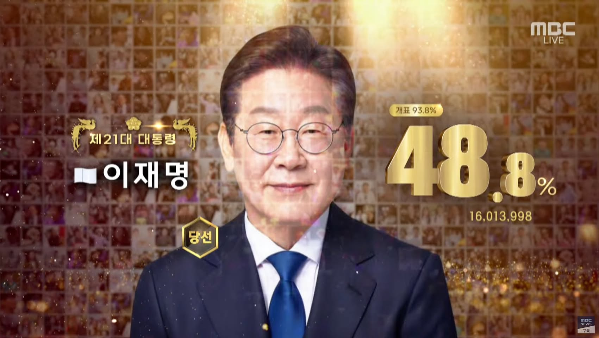
**이미지 캡션:** 이 사진은 제21대 대통령 선거 개표 상황을 보여주는 것으로, 중년의 성인 남성이 정면을 응시하며 부드러운 미소를 짓고 있다. 그는 검은색 정장에 파란색 넥타이를 매고 있으며, 동그란 안경을 착용하고 있다. 배경에는 수많은 사람들의 사진이 격자 형태로 배열되어 있으며, 금색으로 빛나는 "48.8%"라는 득표율과 "16,013,998"이라는 득표수가 크게 표시되어 있다. 또한 "개표 93.8%"라는 문구와 함께 "이재명"이라는 이름이 흰색 바탕에 검은색 글씨로, 그리고 "당선"이라는 단어가 금색 테두리의 육각형 안에 표시되어 있다. 전반적으로 선거 결과 발표의 긴장감과 함께 긍정적인 분위기를 나타내고 있다. 안에 표시되어 있다. 전반적으로 선거 결과 발표의 긴장감과 함께 긍정적인 분위기를 나타내고 있다.

### 6월 5일 (목) 07:00 · #sfrun 샌프란시스코에서 멋진 Alice Oh 러닝 크루 만났습니다!…

#sfrun 샌프란시스코에서 멋진 Alice Oh 러닝 크루 만났습니다! 여기서 같이 달리니 더 신나고 재미있습니다!

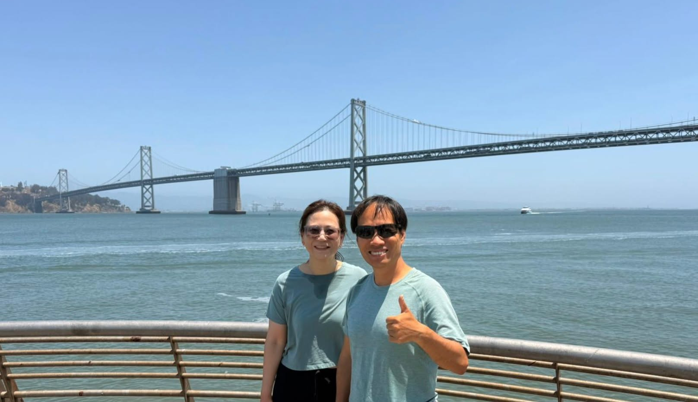
**이미지 캡션:** 푸른 하늘 아래, 한 성인 남성과 한 성인 여성이 바다를 배경으로 서 있습니다. 남성은 40대 후반에서 50대 초반으로 보이며, 짧은 검은 머리에 선글라스를 착용하고 있습니다. 그는 옅은 청록색 반팔 티셔츠를 입고 엄지손가락을 치켜세우며 활짝 웃고 있습니다. 여성은 40대 초반에서 40대 후반으로 보이며, 검은 머리를 뒤로 묶고 선글라스를 착용했습니다. 그녀 역시 옅은 청록색 반팔 티셔츠를 입고 미소를 짓고 있습니다. 두 사람 앞에는 금속 난간이 보이며, 배경에는 샌프란시스코-오클랜드 베이 브릿지가 장엄하게 펼쳐져 있습니다. 다리 너머로는 푸른 바다와 맑은 하늘이 보이며, 멀리 작은 배 한 척이 지나가고 있습니다. 전체적으로 화창한 날씨 속에서 즐거운 시간을 보내고 있는 듯한 밝고 긍정적인 분위기입니다.펼쳐져 있습니다. 다리 너머로는 푸른 바다와 맑은 하늘이 보이며, 멀리 작은 배 한 척이 지나가고 있습니다. 전체적으로 화창한 날씨 속에서 즐거운 시간을 보내고 있는 듯한 밝고 긍정적인 분위기입니다.

### 6월 6일 (금) 07:00 · #해외수출 #문서자동화 #AI기술 #Upstage #UIE #업무혁신 글…

#해외수출 #문서자동화 #AI기술 #Upstage #UIE #업무혁신 글로벌 TOP3 insurance brokerage가 선택한 Upstage UIE 를 소개 합니다.

최근 출시한 Upstage Universal Information Extractor(UIE)​는 별도 학습 없이도 문서를 넣으면 핵심 정보를 키-값 형태로 추출해주는 혁신적인 기술입니다. 📄➡️📊

Upstage 최강 OCR 엔진과 LLM을 Agentic Workflow​로 결합해 입력 유형에 맞춰 최적의 방법을 자동 선택하는 방식입니다. 성능도 뛰어 납니다: 쉬운 문서는 95% 이상, 대부분의 문서에서는 90% 이상의 정확도를 자랑합니다.

"요즘 멀티모달 LLM이면 다 되는 거 아냐?"라는 의문이 들 수 있지만, 실제 사용해보시면 UIE가 압도적인 성능을 가지고 있습니다. 세계 3대 insurance brokerage​ AMWINS도 처음엔 같은 질문을 했으나, UIE 테스트 후 완전히 반해​ MS Marketplace를 도입하였습니다. 

우리 회사 문서 처리도 자동화하고 싶다면? UIE를 사용해보세요.​ API​로 간편하게, MS 마켓플레이스​로 프라이빗 클라우드 구축 (AWS 지원예정), 그리고 온프레미스​ 환경에서도 사용 가능합니다. https://console.upstage.ai/playground/universal-information-extraction

Upstage UIE로 업무 효율을 업그레이드!​ 🚀

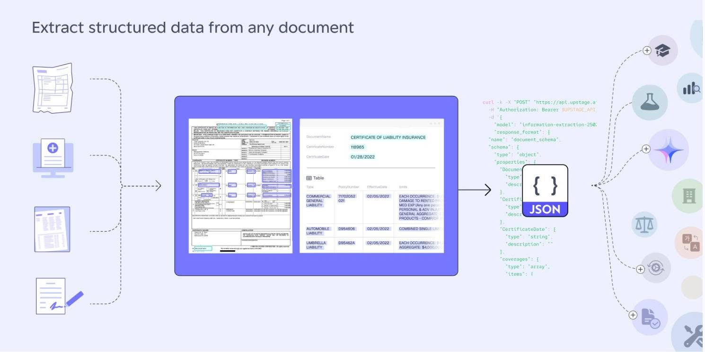
**이미지 캡션:** 이 이미지는 다양한 문서에서 구조화된 데이터를 추출하는 과정을 시각적으로 보여줍니다. 왼쪽에는 문서 아이콘, 컴퓨터 화면에 표시된 문서, 그리고 서명된 문서가 나열되어 있으며, 이들은 모두 중앙의 보라색 태블릿 화면으로 연결됩니다. 태블릿 화면에는 "CERTIFICATE OF LIABILITY INSURANCE"라는 제목의 보험 증권이 표시되어 있으며, 증권 번호, 발행일, 그리고 상업용 일반 책임, 자동차 책임, 우산 책임 등 다양한 보험 유형과 관련된 표가 포함되어 있습니다. 이 표에는 보험 증권 번호, 유효일, 그리고 각 보험 유형에 대한 설명이 상세하게 기재되어 있습니다. 태블릿 화면에서 오른쪽으로 화살표가 이어지며, 이는 추출된 데이터가 JSON 형식으로 변환됨을 나타내는 JSON 아이콘으로 연결됩니다. 마지막으로, 이 JSON 데이터는 다양한 아이콘으로 표현되는 여러 서비스나 기능으로 연결되는 과정을 보여주며, 이는 데이터 추출이 다양한 응용 프로그램이나 분석에 활용될 수 있음을 시사합니다. 전체적인 배경은 밝은 회색이며, 깔끔하고 현대적인 디자인으로 정보 전달에 집중하고 있습니다.유효일, 그리고 각 보험 유형에 대한 설명이 상세하게 기재되어 있습니다. 태블릿 화면에서 오른쪽으로 화살표가 이어지며, 이는 추출된 데이터가 JSON 형식으로 변환됨을 나타내는 JSON 아이콘으로 연결됩니다. 마지막으로, 이 JSON 데이터는 다양한 아이콘으로 표현되는 여러 서비스나 기능으로 연결되는 과정을 보여주며, 이는 데이터 추출이 다양한 응용 프로그램이나 분석에 활용될 수 있음을 시사합니다. 전체적인 배경은 밝은 회색이며, 깔끔하고 현대적인 디자인으로 정보 전달에 집중하고 있습니다.
 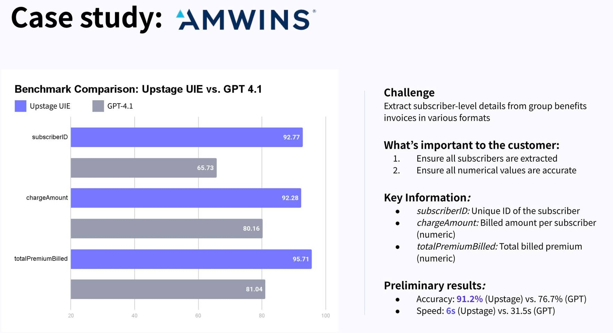
**이미지 캡션:** 이 이미지는 "Case study: AMWINS"라는 제목의 프레젠테이션 슬라이드로, Upstage UIE와 GPT-4.1의 벤치마크 비교 결과를 보여줍니다. 슬라이드 왼쪽에는 가로 막대 그래프가 있으며, 'subscriberID', 'chargeAmount', 'totalPremiumBilled' 세 가지 항목에 대해 Upstage UIE(파란색 막대)와 GPT-4.1(회색 막대)의 성능을 비교하고 있습니다. 각 막대에는 해당 수치가 표시되어 있으며, Upstage UIE가 모든 항목에서 GPT-4.1보다 높은 수치를 기록하고 있습니다. 예를 들어, subscriberID 항목에서 Upstage UIE는 92.77, GPT-4.1은 65.73을 기록했습니다. 슬라이드 오른쪽에는 'Challenge', 'What's important to the customer:', 'Key Information:', 'Preliminary results:' 섹션이 있습니다. 'Challenge' 섹션에서는 그룹 혜택 송장에서 다양한 형식으로 구독자 수준의 세부 정보를 추출하는 과제를 설명합니다. 'What's important to the customer:' 섹션에서는 모든 구독자가 추출되고 모든 숫자 값이 정확해야 한다는 고객의 요구 사항을 강조합니다. 'Key Information:' 섹션에서는 추출해야 할 주요 정보로 subscriberID, chargeAmount, totalPremiumBilled를 나열합니다. 'Preliminary results:' 섹션에서는 Upstage UIE가 GPT-4.1보다 정확도와 속도 면에서 우수하다는 예비 결과를 보여줍니다. 정확도는 Upstage UIE 91.2% 대 GPT-4.1 76.7%, 속도는 Upstage UIE 6초 대 GPT-4.1 31.5초입니다. 슬라이드에는 사람이 등장하지 않으며, 배경은 흰색입니다. 전체적으로 기술적인 비교와 결과를 명확하게 전달하는 정보성 슬라이드입니다.높은 수치를 기록하고 있습니다. 예를 들어, subscriberID 항목에서 Upstage UIE는 92.77, GPT-4.1은 65.73을 기록했습니다. 슬라이드 오른쪽에는 'Challenge', 'What's important to the customer:', 'Key Information:', 'Preliminary results:' 섹션이 있습니다. 'Challenge' 섹션에서는 그룹 혜택 송장에서 다양한 형식으로 구독자 수준의 세부 정보를 추출하는 과제를 설명합니다. 'What's important to the customer:' 섹션에서는 모든 구독자가 추출되고 모든 숫자 값이 정확해야 한다는 고객의 요구 사항을 강조합니다. 'Key Information:' 섹션에서는 추출해야 할 주요 정보로 subscriberID, chargeAmount, totalPremiumBilled를 나열합니다. 'Preliminary results:' 섹션에서는 Upstage UIE가 GPT-4.1보다 정확도와 속도 면에서 우수하다는 예비 결과를 보여줍니다. 정확도는 Upstage UIE 91.2% 대 GPT-4.1 76.7%, 속도는 Upstage UIE 6초 대 GPT-4.1 31.5초입니다. 슬라이드에는 사람이 등장하지 않으며, 배경은 흰색입니다. 전체적으로 기술적인 비교와 결과를 명확하게 전달하는 정보성 슬라이드입니다.

### 6월 6일 (금) 07:01 · 📷 사진 (3장)

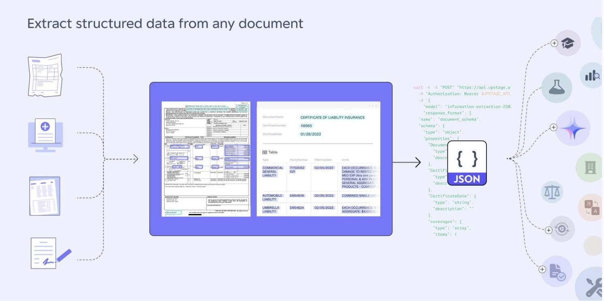
**이미지 캡션:** 이 이미지는 문서에서 구조화된 데이터를 추출하는 과정을 시각적으로 보여줍니다. 왼쪽에는 다양한 형태의 문서 아이콘(청구서, 컴퓨터 화면의 문서, 서명된 문서)이 있으며, 이 문서들이 점선으로 연결되어 중앙의 보라색 직사각형으로 들어갑니다. 중앙에는 두 개의 화면이 나란히 표시되어 있는데, 왼쪽 화면에는 복잡한 양식의 보험 증권이, 오른쪽 화면에는 "CERTIFICATE OF LIABILITY INSURANCE"라는 제목과 함께 증권 번호, 날짜, 그리고 표 형식으로 정리된 보험 정보가 나타납니다. 이 정보들은 "COMMERCIAL GENERAL LIABILITY", "AUTOMOBILE LIABILITY", "UMBRELLA LIABILITY" 등의 항목으로 분류되어 있으며, 각 항목별로 정책 번호, 유효 날짜, 한도 등이 명시되어 있습니다. 중앙 화면에서 오른쪽으로 화살표가 이어지며, 이는 추출된 데이터가 JSON 형식으로 변환됨을 나타내는 "JSON" 로고와 함께 표시됩니다. 그 옆에는 API 호출을 위한 curl 명령어와 JSON 스키마의 일부가 코드 형태로 보입니다. 가장 오른쪽에는 다양한 아이콘들이 원형으로 배치되어 있으며, 각 아이콘은 추출된 데이터를 활용할 수 있는 다양한 응용 분야나 기능을 상징하는 것으로 보입니다 (예: 학술, 연구, 분석, 법률, 문서 관리 등). 전체적으로 깔끔하고 현대적인 디자인으로, 기술적인 프로세스를 명확하게 전달하고 있습니다. "COMMERCIAL GENERAL LIABILITY", "AUTOMOBILE LIABILITY", "UMBRELLA LIABILITY" 등의 항목으로 분류되어 있으며, 각 항목별로 정책 번호, 유효 날짜, 한도 등이 명시되어 있습니다. 중앙 화면에서 오른쪽으로 화살표가 이어지며, 이는 추출된 데이터가 JSON 형식으로 변환됨을 나타내는 "JSON" 로고와 함께 표시됩니다. 그 옆에는 API 호출을 위한 curl 명령어와 JSON 스키마의 일부가 코드 형태로 보입니다. 가장 오른쪽에는 다양한 아이콘들이 원형으로 배치되어 있으며, 각 아이콘은 추출된 데이터를 활용할 수 있는 다양한 응용 분야나 기능을 상징하는 것으로 보입니다 (예: 학술, 연구, 분석, 법률, 문서 관리 등). 전체적으로 깔끔하고 현대적인 디자인으로, 기술적인 프로세스를 명확하게 전달하고 있습니다.
 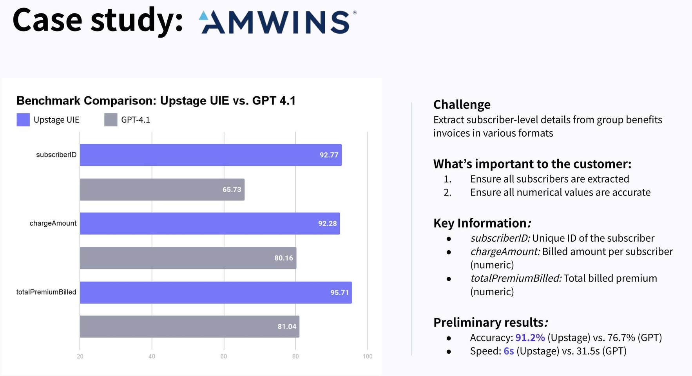
**이미지 캡션:** 이 이미지는 AMWINS의 사례 연구를 보여주는 프레젠테이션 슬라이드입니다. 슬라이드에는 "Case study: AMWINS"라는 제목과 함께 "Benchmark Comparison: Upstage UIE vs. GPT 4.1"이라는 제목의 가로 막대 그래프가 있습니다. 그래프는 Upstage UIE와 GPT-4.1의 성능을 subscriberID, chargeAmount, totalPremiumBilled의 세 가지 지표에 대해 비교합니다. Upstage UIE는 모든 지표에서 GPT-4.1보다 우수한 성능을 보이며, 특히 subscriberID에서 92.77%, chargeAmount에서 92.28%, totalPremiumBilled에서 95.71%의 정확도를 기록했습니다. 그래프 오른쪽에는 "Challenge", "What's important to the customer:", "Key Information:", "Preliminary results:"라는 제목의 텍스트 상자가 있습니다. "Challenge" 섹션에서는 다양한 형식의 그룹 혜택 송장에서 구독자 수준의 세부 정보를 추출하는 과제를 설명합니다. "What's important to the customer:" 섹션에서는 모든 구독자가 추출되고 모든 숫자 값이 정확해야 한다는 고객의 요구 사항을 강조합니다. "Key Information:" 섹션에서는 subscriberID, chargeAmount, totalPremiumBilled의 정의를 제공합니다. "Preliminary results:" 섹션에서는 Upstage가 GPT보다 정확도와 속도 모두에서 더 나은 성능을 보였다는 예비 결과를 요약합니다. 전체적으로 슬라이드는 AMWINS의 Upstage UIE 솔루션이 그룹 혜택 송장에서 데이터를 추출하는 데 있어 GPT-4.1보다 우수함을 보여줍니다.을 보이며, 특히 subscriberID에서 92.77%, chargeAmount에서 92.28%, totalPremiumBilled에서 95.71%의 정확도를 기록했습니다. 그래프 오른쪽에는 "Challenge", "What's important to the customer:", "Key Information:", "Preliminary results:"라는 제목의 텍스트 상자가 있습니다. "Challenge" 섹션에서는 다양한 형식의 그룹 혜택 송장에서 구독자 수준의 세부 정보를 추출하는 과제를 설명합니다. "What's important to the customer:" 섹션에서는 모든 구독자가 추출되고 모든 숫자 값이 정확해야 한다는 고객의 요구 사항을 강조합니다. "Key Information:" 섹션에서는 subscriberID, chargeAmount, totalPremiumBilled의 정의를 제공합니다. "Preliminary results:" 섹션에서는 Upstage가 GPT보다 정확도와 속도 모두에서 더 나은 성능을 보였다는 예비 결과를 요약합니다. 전체적으로 슬라이드는 AMWINS의 Upstage UIE 솔루션이 그룹 혜택 송장에서 데이터를 추출하는 데 있어 GPT-4.1보다 우수함을 보여줍니다.
 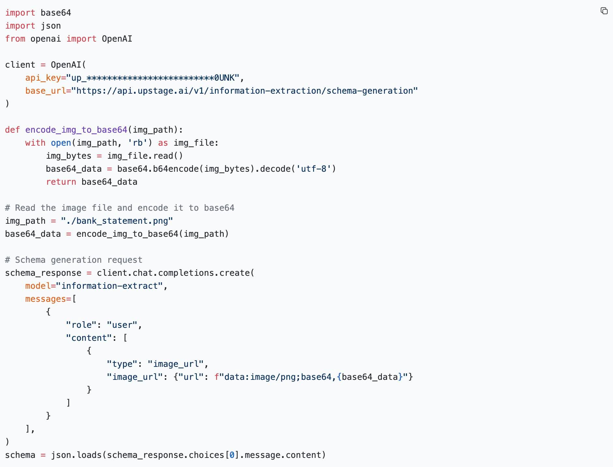
**이미지 캡션:** 이 이미지는 파이썬 코드를 보여주는 스크린샷입니다. 코드의 목적은 이미지 파일을 Base64 형식으로 인코딩하고, 이를 OpenAI API를 사용하여 정보 추출을 요청하는 것입니다. 코드에는 `base64`와 `json` 라이브러리를 임포트하고, `OpenAI` 클래스를 초기화하는 부분이 포함되어 있습니다. API 키와 기본 URL이 설정되어 있으며, `encode_img_to_base64` 함수는 이미지 파일 경로를 받아 Base64로 인코딩된 문자열을 반환합니다. 이후, `./bank_statement.png`라는 이미지 파일을 읽어 Base64로 인코딩하고, 이 데이터를 `information-extract` 모델을 사용하는 OpenAI API 호출의 메시지에 포함시킵니다. 메시지 형식은 사용자의 역할과 이미지 URL을 포함하며, 이미지 URL은 `data:image/png;base64,` 접두사와 함께 인코딩된 Base64 데이터를 사용합니다. 마지막으로, API 응답을 JSON 형식으로 파싱하는 코드가 있습니다. 이 코드는 프로그래밍 환경에서 실행되는 것으로 보이며, 특정 인물이나 장소, 사물, 텍스트가 직접적으로 보이는 것은 아닙니다. 전반적으로 기술적인 작업 흐름을 나타내는 코드 스니펫이며, 차분하고 집중된 분위기를 풍깁니다.ng`라는 이미지 파일을 읽어 Base64로 인코딩하고, 이 데이터를 `information-extract` 모델을 사용하는 OpenAI API 호출의 메시지에 포함시킵니다. 메시지 형식은 사용자의 역할과 이미지 URL을 포함하며, 이미지 URL은 `data:image/png;base64,` 접두사와 함께 인코딩된 Base64 데이터를 사용합니다. 마지막으로, API 응답을 JSON 형식으로 파싱하는 코드가 있습니다. 이 코드는 프로그래밍 환경에서 실행되는 것으로 보이며, 특정 인물이나 장소, 사물, 텍스트가 직접적으로 보이는 것은 아닙니다. 전반적으로 기술적인 작업 흐름을 나타내는 코드 스니펫이며, 차분하고 집중된 분위기를 풍깁니다.

### 6월 6일 (금) 23:48 · AI 수석 신설에 국가AI·과학기술·인구·기후환경 비서관까지!

AI 수석 신설에 국가AI·과학기술·인구·기후환경 비서관까지!
AI 미래를 향한 진심이 느껴집니다.
정말 큰 기대가 됩니다! 🙌

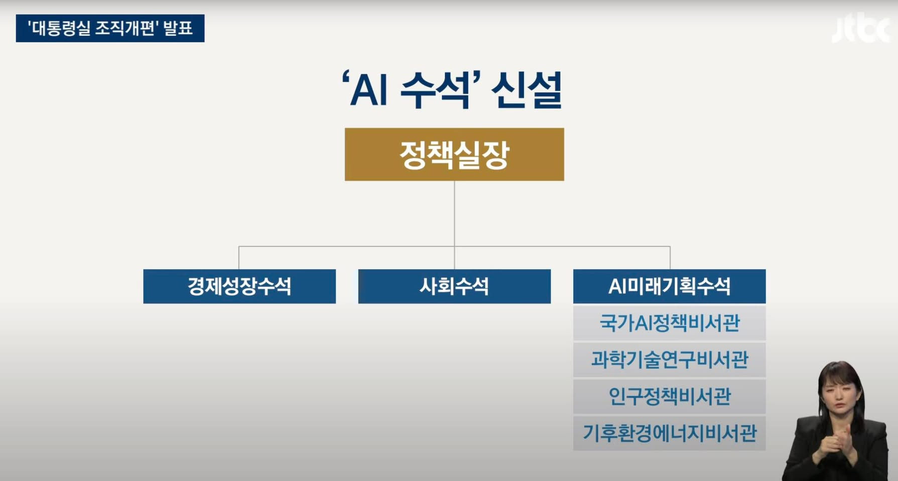
**이미지 캡션:** 화면 중앙에는 'AI 수석' 신설이라는 제목과 함께 조직도 형태의 그래픽이 표시되어 있으며, 가장 상단에는 '정책실장'이라는 직책이 황갈색 상자로 표시되어 있고, 그 아래로 '경제성장수석', '사회수석', 'AI미래기획수석'이라는 세 개의 직책이 파란색 상자로 나열되어 있습니다. 'AI미래기획수석' 아래에는 '국가AI정책비서관', '과학기술연구비서관', '인구정책비서관', '기후환경에너지비서관'이라는 네 개의 하위 직책이 연한 회색 상자로 표시되어 있습니다. 왼쪽 상단에는 '대통령실 조직개편' 발표라는 작은 파란색 직사각형 텍스트가 있습니다. 화면 오른쪽 하단에는 검은색 재킷을 입고 손을 모으고 있는 성인 여성이 수어 통역을 하고 있으며, 그녀의 표정은 진지합니다. 배경은 연한 회색이며, 오른쪽 상단에는 JTBC 로고가 작게 보입니다. 전반적으로 뉴스를 전달하는 듯한 공식적이고 정보 전달적인 분위기입니다.파란색 직사각형 텍스트가 있습니다. 화면 오른쪽 하단에는 검은색 재킷을 입고 손을 모으고 있는 성인 여성이 수어 통역을 하고 있으며, 그녀의 표정은 진지합니다. 배경은 연한 회색이며, 오른쪽 상단에는 JTBC 로고가 작게 보입니다. 전반적으로 뉴스를 전달하는 듯한 공식적이고 정보 전달적인 분위기입니다.

### 6월 7일 (토) 14:09 · Claude code pm 이 직접 알려주는 Anthropic 내부 팀들…

Claude code pm 이 직접 알려주는 Anthropic 내부 팀들이 Claude Code를 활용하는 실제 사례 6가지!

Claude 4부터는 코딩과 에이전트 성능이 많이 올라갔는데 그 덕분인지 다양한 팀에서 실무 적용이 되고 있네요. 특히 Claude Code를 Claude Code를 통해 개발하고 있다고 합니다.

1️⃣ 데이터 사이언스 팀
JavaScript 지식이 부족한 상태에서 5,000줄의 React 대시보드를 Claude Code로 처음부터 구축. ML 모델 성능 시각화에 활용.

2️⃣ 인프라 보안 팀
Terraform 변경 사항을 Claude Code에 입력하면 **"이 변경 사항이 어떤 영향을 미치는가?"**라고 질의. 보안 검토 자동화로 승인 프로세스 가속화 및 개발자 병목 현상 해결.

3️⃣ 성장 마케팅 팀
수백 개의 Google Ads CSV 파일을 분석해 저성과 광고 식별.
문자 제한 내에서 새로운 광고 변형 자동 생성.

4️⃣ 디자인 팀

복잡한 시각 변경 및 상태 관리 업데이트를 직접 구현.
1주일 걸리던 협업 작업을 2회의 30분 회의로 단축.
"Claude Code는 Figma만큼 자주 열려 있어요!"

5️⃣ 재무 팀
코딩 경험이 없는 직원도 일반 텍스트로 데이터 워크플로우 설명.
Claude Code가 대시보드 조회 → 분석 실행 → 엑셀 출력까지 자동화.

6️⃣ Claude Code 팀 (메타 활용)
Claude Code로 자체 Vim 키 바인딩 기능 70% 자동 구현. 팀이 나머지 30%를 수정해 최종 완성.

#ClaudeCode #AI도구 #업무자동화 #생산성향상 #테크트렌드

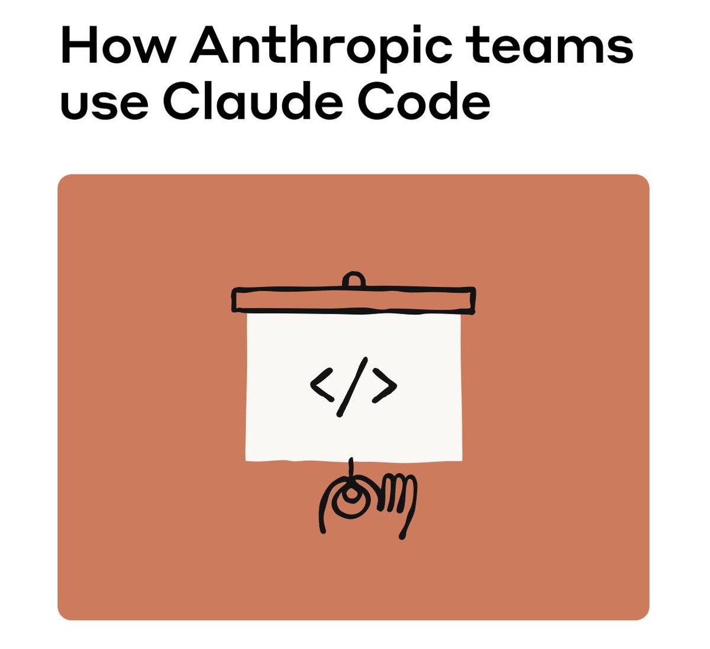
**이미지 캡션:** 이 이미지는 "How Anthropic teams use Claude Code"라는 제목과 함께 단순화된 삽화를 보여줍니다. 삽화는 짙은 주황색 배경에 흰색 스크린이 있는 프로젝터 스크린을 묘사합니다. 스크린에는 닫힌 태그를 나타내는 "</>"라는 코딩 기호가 표시되어 있습니다. 스크린 아래에는 손으로 그린 듯한 사람의 손이 스크린을 잡고 있는 모습이 그려져 있으며, 손가락은 둥글게 말려 있습니다. 전체적인 스타일은 미니멀하고 그래픽적이며, 텍스트와 삽화 모두 검은색으로 되어 있습니다. 이 이미지는 Anthropic 팀이 Claude Code를 어떻게 사용하는지에 대한 정보를 전달하는 데 사용될 것으로 보입니다.opic 팀이 Claude Code를 어떻게 사용하는지에 대한 정보를 전달하는 데 사용될 것으로 보입니다.

### 6월 7일 (토) 14:09 · Sung Kim shared a link.

🔗 <https://x.com/_catwu/status/1930703532715626587>

### 6월 9일 (월) 07:49 · #AIM #스터디그룹 #6말마감 🔥 코딩은 AI가 하더라도 비전은 결국 …

#AIM #스터디그룹 #6말마감 🔥 코딩은 AI가 하더라도 비전은 결국 AIM이 제시합니다 🔥 창의성과 실행의 새로운 파트너십의 중심이 될  AI 매니저(AIM)를 찾습니다!
바로 신청: https://forms.gle/8edKomeWWfF8Wy6E8  

이제 코딩 능력 없이 아이디어만 있어도 AI로 모든 것을 구현하는 시대가 도래했습니다. 하지만 AI 스스로는 창의적인 결과물을 뚝딱 만들어내지 못합니다. 

AI를 완벽하게 이해하고, 원하는 바를 집요하고 상세하게 요구하며 프로젝트를 이끌어갈 AI 매니저(AIM) 의 역할이 그 어느 때보다 중요해지고 있습니다.

이번 기회에 함께 공부하여 함께 AIM이 되실 분들을 모집합니다. 제가 생각하는 첫 시작은 자그마한 스터디 그룹입니다.

스터디 그룹을 통해 함께 실험하고, 부딪히고, 성장할 분들을 기다립니다. 코딩은 AI에게 맡기고, 우리는 아이디어와 기획력이라는 본질에 집중해 멋진 제품을 만들어보려고 합니다. 

🤝 우리 스터디 그룹 (약 3개월 예상) 이렇게 활동해요!
  * 리모트 격주 정기 모임: 아이디어를 공유하고 나누면서 서로에게 영감을 주고 받습니다.
  * 팀 프로젝트: 1~2인으로 팀을 꾸려 AI를 활용한 '바이브 코딩'으로 실제 결과물을 만들어 봅니다.
  * 상호 피드백: 서로의 창작물을 사용해보고, 따뜻한 응원과 건설적인 피드백을 나누며 함께 성장!

✅ 이런 분들과 함께하고 싶어요!
  * 🎯 집요한 분: 목표를 정하면 끝까지 파고들어 결과를 만들어내는 분
  * 🧐 호기심 많은 분: 새로 나온 서비스나 제품은 뭐든 직접 써봐야 직성이 풀리는 분
  * 🔍 꼼꼼한 분: 남들이 놓치는 디테일과 개선점을 기가 막히게 찾아내는 분

관심이 있으신 분들은 6월 말까지 아래 링크에 기본 정보 입력해주시면 별도로 연락 드리겠습니다 https://forms.gle/8edKomeWWfF8Wy6E8

이번 스터디는 제 개인으로 진행하여 소수로 구성됩니다. 지원하시는 분들을 모두 모실수 없을수도 있음을 미리 양해 부탁드립니다.

**이미지 캡션:** 미래 지향적인 어두운 공간에서 한 명의 성인 여성이 지휘자처럼 서서 막대기를 들고 로봇들을 지휘하고 있다. 여성은 짧은 금발 머리에 흰색 점프수트를 입고 있으며, 힐을 신고 있다. 그녀는 집중한 표정으로 로봇들을 향해 손짓하고 있다. 주변에는 여러 대의 작은 로봇들이 사방으로 뻗은 다리를 이용해 바닥에 서 있으며, 각 로봇의 머리에는 파란색 또는 분홍색 불빛이 들어와 있다. 배경에는 여러 개의 투명한 스크린이 떠 있는데, 각 스크린에는 복잡한 그래프, 차트, 회로도 등 데이터와 관련된 시각 정보가 표시되어 있다. 스크린과 로봇들 사이로는 분홍색과 파란색의 빛나는 선들이 물결치듯 연결되어 있어 마치 데이터의 흐름이나 에너지의 흐름을 형상화한 듯한 느낌을 준다. 바닥에는 원형의 빛나는 패턴이 깔려 있어 첨단 기술의 느낌을 더한다. 전체적으로 차갑고 푸른색과 분홍색의 네온 불빛이 어우러져 첨단 기술과 인공지능, 데이터 분석이 융합된 미래적인 분위기를 자아낸다.다. 스크린과 로봇들 사이로는 분홍색과 파란색의 빛나는 선들이 물결치듯 연결되어 있어 마치 데이터의 흐름이나 에너지의 흐름을 형상화한 듯한 느낌을 준다. 바닥에는 원형의 빛나는 패턴이 깔려 있어 첨단 기술의 느낌을 더한다. 전체적으로 차갑고 푸른색과 분홍색의 네온 불빛이 어우러져 첨단 기술과 인공지능, 데이터 분석이 융합된 미래적인 분위기를 자아낸다.

### 6월 9일 (월) 07:51 · 📷 사진 (1장)

**이미지 캡션:** 이 사진은 미래 지향적인 기술 환경을 묘사하며, 중앙에는 흰색 점프슈트를 입은 젊은 성인 여성이 지휘봉을 들고 서 있습니다. 그녀는 짧은 금발 머리에 안경을 착용하고 있으며, 집중한 듯한 표정으로 손짓을 하고 있습니다. 그녀 주변에는 여러 대의 작고 둥근 머리를 가진 로봇들이 배치되어 있으며, 각 로봇은 여러 개의 다리를 가지고 있습니다. 로봇들의 눈은 밝은 파란색과 분홍색으로 빛나고 있습니다. 배경에는 여러 개의 대형 스크린이 떠 있으며, 각 스크린에는 복잡한 그래프, 데이터 시각화, 회로도 등이 표시되어 있습니다. 화면과 로봇들 사이로는 네온 빛의 곡선들이 마치 에너지 흐름처럼 연결되어 있으며, 이는 데이터의 흐름이나 기술의 상호작용을 상징하는 것으로 보입니다. 바닥에는 원형의 빛나는 패턴이 그려져 있으며, 이는 기술적인 허브나 제어 센터를 연상시킵니다. 전반적으로 사진은 첨단 기술, 데이터 분석, 그리고 인공지능의 조화로운 협력을 보여주는 듯한 분위기를 자아냅니다.있습니다. 화면과 로봇들 사이로는 네온 빛의 곡선들이 마치 에너지 흐름처럼 연결되어 있으며, 이는 데이터의 흐름이나 기술의 상호작용을 상징하는 것으로 보입니다. 바닥에는 원형의 빛나는 패턴이 그려져 있으며, 이는 기술적인 허브나 제어 센터를 연상시킵니다. 전반적으로 사진은 첨단 기술, 데이터 분석, 그리고 인공지능의 조화로운 협력을 보여주는 듯한 분위기를 자아냅니다.

> #AIM #스터디그룹 #6말마감 **🔥 코딩은 AI가 하더라도 비전은 결국 AIM이 제시합니다 🔥** 창의성과 실행의 새로운 파트너십의 중심이 될  AI 매니저(AIM)를 찾습니다! 바로 신청: [[https://forms.gle/8edKomeWWfF8Wy6E8](https://forms.gle/8edKomeWWfF8Wy6E8)](https://forms.gle/8edKomeWWfF8Wy6E8)    이제 코딩 능력 없이 아이디어만 있어도 AI로 모든 것을 구현하는 시대가 도래했습니다. 하지만 AI 스스로는 창의적인 결과물을 뚝딱 만들어내지 못합니다.   AI를 완벽하게 이해하고, 원하는 바를 집요하고 상세하게 요구하며 프로젝트를 이끌어갈 AI 매니저(AIM) 의 역할이 그 어느 때보다 중요해지고 있습니다.  이번 기회에 함께 공부하여 함께 AIM이 되실 분들을 모집합니다. 제가 생각하는 첫 시작은 자그마한 스터디 그룹입니다.  스터디 그룹을 통해 함께 실험하고, 부딪히고, 성장할 분들을 기다립니다. 코딩은 AI에게 맡기고, 우리는 아이디어와 기획력이라는 본질에 집중해 멋진 제품을 만들어보려고 합니다.   🤝 우리 스터디 그룹 (약 3개월 예상) 이렇게 활동해요!   * 리모트 격주 정기 모임: 아이디어를 공유하고 나누면서 서로에게 영감을 주고 받습니다.   * 팀 프로젝트: 1~2인으로 팀을 꾸려 AI를 활용한 '바이브 코딩'으로 실제 결과물을 만들어 봅니다.   * 상호 피드백: 서로의 창작물을 사용해보고, 따뜻한 응원과 건설적인 피드백을 나누며 함께 성장!  ✅ 이런 분들과 함께하고 싶어요!   * 🎯 집요한 분: 목표를 정하면 끝까지 파고들어 결과를 만들어내는 분   * 🧐 호기심 많은 분: 새로 나온 서비스나 제품은 뭐든 직접 써봐야 직성이 풀리는 분   * 🔍 꼼꼼한 분: 남들이 놓치는 디테일과 개선점을 기가 막히게 찾아내는 분  관심이 있으신 분들은 6월 말까지 아래 링크에 기본 정보 입력해주시면 별도로 연락 드리겠습니다 [[https://forms.gle/8edKomeWWfF8Wy6E8](https://forms.gle/8edKomeWWfF8Wy6E8)](https://forms.gle/8edKomeWWfF8Wy6E8)  이번 스터디는 제 개인으로 진행하여 소수로 구성됩니다. 지원하시는 분들을 모두 모실수 없을수도 있음을 미리 양해 부탁드립니다.

### 6월 10일 (화) 10:34 · 와, 정말 멋진 제도네요!  정말 실력있고 멋진 분들이 많이 참여하시면 …

와, 정말 멋진 제도네요!  정말 실력있고 멋진 분들이 많이 참여하시면 좋겠습니다. 

저도 제 주위 분들을 열심히 추천해보겠습니다.

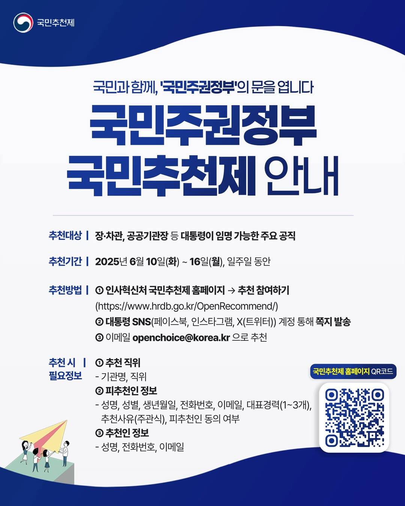
**이미지 캡션:** 이 이미지는 '국민추천제'에 대한 안내 포스터로, 파란색과 흰색을 주된 색상으로 사용하고 있습니다. 상단에는 '국민추천제'라는 로고가 있으며, 그 아래에는 "국민과 함께, '국민주권정부'의 문을 엽니다"라는 문구가 있습니다. 이어서 "국민주권정부"와 "국민추천제 안내"라는 큰 글씨가 강조되어 있습니다. 포스터의 하단에는 추천 대상, 기간, 방법, 필요 정보 등이 상세하게 나열되어 있습니다. 추천 대상은 장·차관, 공공기관장 등 대통령이 임명 가능한 주요 공직이며, 추천 기간은 2025년 6월 10일부터 16일까지 일주일간입니다. 추천 방법으로는 인사혁신처 국민추천제 홈페이지, 대통령 SNS, 이메일(openchoice@korea.kr)을 통한 추천이 가능하다고 안내하고 있습니다. 또한, 추천 시 필요한 정보로 추천 직위, 피추천인 정보(성명, 성별, 생년월일, 전화번호, 이메일, 대표경력, 추천사유, 동의 여부), 추천인 정보(성명, 전화번호, 이메일)를 명시하고 있습니다. 우측 하단에는 '국민추천제 홈페이지 QR코드'가 삽입되어 있습니다. 이미지의 좌측 하단에는 여러 사람이 손을 들고 함께 무언가를 향해 나아가는 듯한 일러스트가 그려져 있어, 국민들의 참여와 협력을 상징하는 것으로 보입니다. 전반적으로 정보 전달에 초점을 맞춘 공식적인 분위기를 띠고 있습니다.까지 일주일간입니다. 추천 방법으로는 인사혁신처 국민추천제 홈페이지, 대통령 SNS, 이메일(openchoice@korea.kr)을 통한 추천이 가능하다고 안내하고 있습니다. 또한, 추천 시 필요한 정보로 추천 직위, 피추천인 정보(성명, 성별, 생년월일, 전화번호, 이메일, 대표경력, 추천사유, 동의 여부), 추천인 정보(성명, 전화번호, 이메일)를 명시하고 있습니다. 우측 하단에는 '국민추천제 홈페이지 QR코드'가 삽입되어 있습니다. 이미지의 좌측 하단에는 여러 사람이 손을 들고 함께 무언가를 향해 나아가는 듯한 일러스트가 그려져 있어, 국민들의 참여와 협력을 상징하는 것으로 보입니다. 전반적으로 정보 전달에 초점을 맞춘 공식적인 분위기를 띠고 있습니다.

### 6월 10일 (화) 22:43 · Sung Kim shared a link.

🔗 <https://www.hrdb.go.kr/OpenRecommend/>

### 6월 14일 (토) 07:43 · Sung Kim shared a link.

🔗 <https://careers.upstage.ai/>

### 6월 14일 (토) 07:43 · 세계 최고 DocAI, SolarLLM 모델과 서비스를 만드는 Upsta…

세계 최고 DocAI, SolarLLM 모델과 서비스를 만드는 Upstage에서 미래를 함께 만들 AI 모델러, 엔지니어, SW 엔지니어 분들을 모십니다.

https://careers.upstage.ai/ 

"Making AI Beneficial"이라는 비전으로, Upstage는 세계 최고 수준의 OCR, Document Parsing, Solar LLM 기술로 업무 효율성을 재정의하고 있습니다. 최근 미국, 일본진출한 업스테이지에서 한국 뿐만 아니라 글로벌 사용자들이 사랑받는 AI 제품과 서비스를 만드실 분들을 모두 모시고 싶습니다.

[AI Application Engineer (정규직/인턴)]
주요 업무: AI Agent 기반 제품 개발, LLM·멀티모달 모델 적용, 고객 워크플로우 혁신
    ✅ 최신 AI 기술 (RAG, Function Calling, AutoGPT)을 실무에 적용
    ✅ 연구 성과를 제품으로 직접 구현하는 경험
    ✅ 국제 학회 논문 or AI 대회 입상 경험자. 우대

[Software Engineer - Backend (정규직)]
주요 업무: AI 솔루션의 백엔드 설계 및 개발, 대규모 트래픽 처리 시스템 구축
   ✅ AI 모델의 서빙부터 데이터 파이프라인까지 전 과정 참여
   ✅ 원격 근무 지원 + 최신 장비 예산 500만원 제공
   ✅ 글로벌 수준의 기술 스택 (Python/Golang, AWS/GCP, RDBMS 등). 

업스테이지는 전원 원격근무로 어디서나 근무 가능 합니다. AI로 세상을 바꾸고 싶은 분, 지금 바로 함께해요! 🚀 

#AI혁신 #백엔드 #AI엔지니어 #원격근무 #Upstage채용

### 6월 14일 (토) 13:43 · 제가 만들고 있는 project 에서 page.tsx는 수백 줄을 넘기는…

제가 만들고 있는 project 에서 page.tsx는 수백 줄을 넘기는 사실상 메인 코드인데요. AI가 몇 번 수정하다 오류가 나니 그냥 삭제하고 처음부터 짤게라는 무모한 도전. 그런데 AI는 해냅니다. 이 코드를 거의 20초 만에 이전보다 더 깔끔하고 오류 없이 작성해 버립니다.

이런 AI를 잘 활용하고 사용해서 멋진 프로젝트를 만들어 보실 AI Manager #AIM 모집은 6월 말까지 계속됩니다. 함께 해요!

https://www.facebook.com/hunkims/posts/pfbid02wekEGToiZCaFKZw7dk1oEYoEud7bkdtGLb9whucuPSMpooMXNJmJbDhnU8JcEgUol

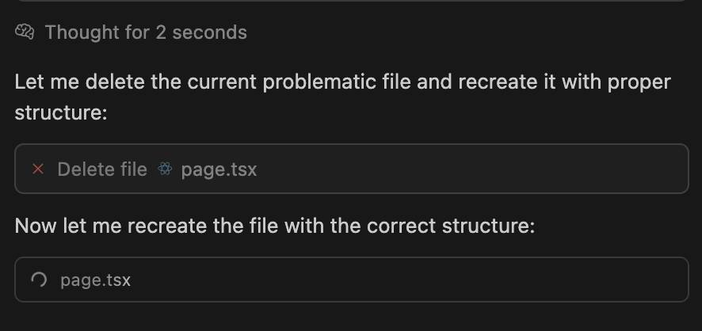
**이미지 캡션:** 이 이미지는 컴퓨터 화면의 일부를 캡처한 것으로, 어두운 배경에 흰색 텍스트가 표시됩니다. 화면 상단에는 뇌 모양 아이콘과 함께 "Thought for 2 seconds"라는 문구가 있습니다. 그 아래에는 "Let me delete the current problematic file and recreate it with proper structure:"라는 텍스트가 있습니다. 이 텍스트 아래에는 "X Delete file"이라는 버튼과 함께 "page.tsx"라는 파일 이름이 표시되어 있습니다. 마지막으로 "Now let me recreate the file with the correct structure:"라는 문구와 함께 "page.tsx"라는 파일 이름이 원형 아이콘과 함께 표시됩니다. 이 이미지는 프로그래밍 또는 파일 관리 작업 중인 상황을 보여주며, 특정 파일을 삭제하고 올바른 구조로 다시 생성하려는 의도를 나타냅니다.Now let me recreate the file with the correct structure:"라는 문구와 함께 "page.tsx"라는 파일 이름이 원형 아이콘과 함께 표시됩니다. 이 이미지는 프로그래밍 또는 파일 관리 작업 중인 상황을 보여주며, 특정 파일을 삭제하고 올바른 구조로 다시 생성하려는 의도를 나타냅니다.

### 6월 15일 (일) 13:34 · 이재명 정부의 초대 AI Jung-Woo Ha 수석님 축하드립니다. 우리…

이재명 정부의 초대 AI Jung-Woo Ha 수석님 축하드립니다. 우리나라에서 이 일을 맡기에 가장 적절한 분으로 생각하고 있었습니다.

새로운 대통령의 공약대로 우리나라가 AI 3대 강국이 될 수 있도록 하정우 AI 수석님의 멋진 활약을 기대하겠습니다.

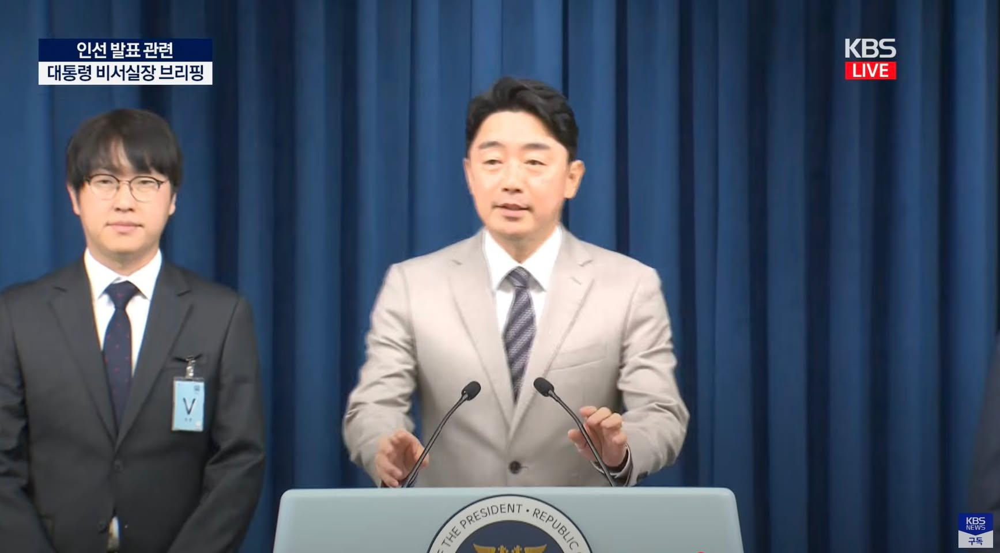
**이미지 캡션:** 이 사진은 푸른색 커튼을 배경으로 한 기자회견 장면을 담고 있으며, 두 명의 성인 남성이 포착되었다. 왼쪽 남성은 30대 후반에서 40대 초반으로 보이는 외모에 검은색 정장과 흰색 셔츠, 어두운 색 계열의 넥타이를 착용하고 있으며, 안경을 쓰고 있다. 그의 표정은 정면을 응시하며 진지한 모습이고, 왼쪽 가슴에는 'V'라고 표시된 출입증을 달고 있다. 중앙에 서 있는 남성은 40대 초반에서 50대 초반으로 추정되며, 밝은 회색 계열의 정장과 흰색 셔츠, 줄무늬 넥타이를 착용하고 있다. 그는 마이크 두 개가 놓인 연단 뒤에서 연설 중인 듯하며, 손을 앞으로 내밀고 말하는 듯한 표정을 짓고 있다. 연단에는 "THE PRESIDENT · REPUBLIC OF KOREA"라는 문구가 새겨져 있다. 사진 오른쪽 상단에는 KBS LIVE라는 로고가 보이며, 이는 방송 중임을 나타낸다. 전반적으로 공식적인 브리핑 상황으로 보이며, 진지하고 차분한 분위기이다. 연단 뒤에서 연설 중인 듯하며, 손을 앞으로 내밀고 말하는 듯한 표정을 짓고 있다. 연단에는 "THE PRESIDENT · REPUBLIC OF KOREA"라는 문구가 새겨져 있다. 사진 오른쪽 상단에는 KBS LIVE라는 로고가 보이며, 이는 방송 중임을 나타낸다. 전반적으로 공식적인 브리핑 상황으로 보이며, 진지하고 차분한 분위기이다.

### 6월 15일 (일) 22:38 · 😂 바이브 코딩할때 영원한 고민...

😂 바이브 코딩할때 영원한 고민...

"저기 마우스 올리면 나오는 그 뜨는 거 있잖아요"
"네? 툴팁 말씀하시는 건가요?"
"아니 그... 팝업? 모달? 그런 거요..."
"...???"

비쥬얼 컴포넌터 이름을 몰라서 어떻게 해야 할지 모를때가 저는 많았는데요. 그래서  그래서 만들어 보았습니다. 

https://vibe-coding-visual-guide.vercel.app/

바이브 코딩 비주얼에서 컴포넌트를 선택하시면 어떤 Prompt를 주면 좋은지 알려줍니다. 

더 이상 "그 뜨는 거" 라고 말하지 않아도 됩니다. 

#개발자 #웹개발 #AI코딩 #React #개발도구 #프론트엔드

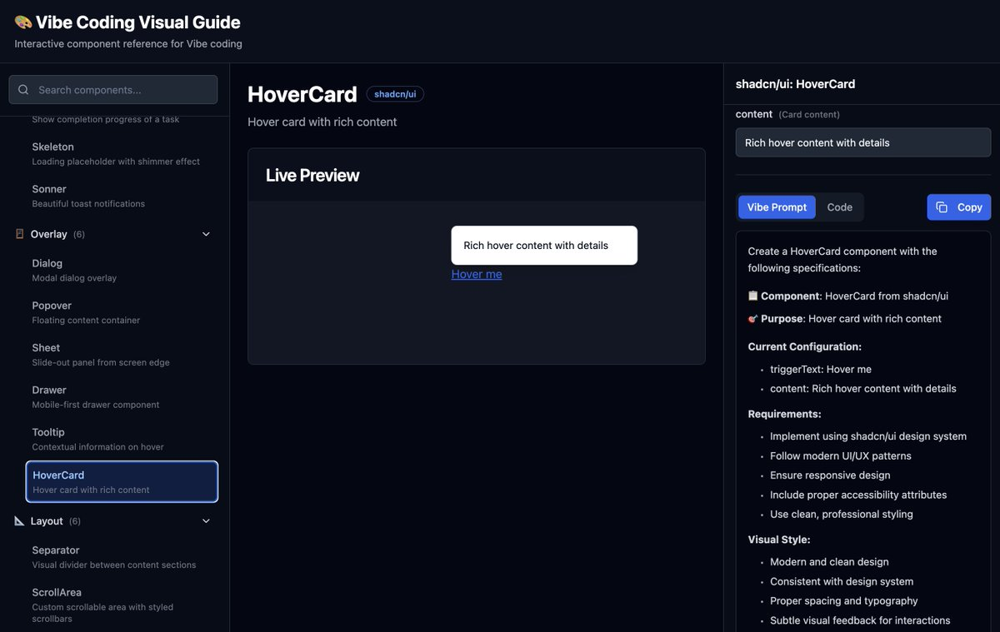
**이미지 캡션:** 이 이미지는 웹사이트의 인터페이스를 보여주며, "Vibe Coding Visual Guide"라는 제목 아래 다양한 UI 컴포넌트들을 소개하고 있습니다. 왼쪽 사이드바에는 "Skeleton", "Sonner", "Overlay", "Dialog", "Popover", "Sheet", "Drawer", "Tooltip", "HoverCard", "Layout", "Separator", "ScrollArea"와 같은 컴포넌트 목록이 나열되어 있으며, 현재 "HoverCard"가 선택되어 파란색으로 강조 표시되어 있습니다. 각 컴포넌트 이름 아래에는 해당 컴포넌트의 간략한 설명이 제공됩니다. 중앙 영역에는 "HoverCard"의 "Live Preview"가 표시되며, "shadcn/ui"라는 태그와 함께 "Hover card with rich content"라는 제목이 있습니다. 라이브 미리보기 영역에는 "Rich hover content with details"라는 텍스트가 포함된 작은 흰색 카드와 그 아래 "Hover me"라는 링크가 보입니다. 오른쪽 영역에는 "shadcn/ui: HoverCard"라는 제목과 함께 "content (Card content)"라는 섹션이 있고, "Rich hover content with details"라는 텍스트가 입력된 필드가 있습니다. 그 아래에는 "Vibe Prompt", "Code", "Copy" 버튼이 있으며, "HoverCard" 컴포넌트 생성에 대한 사양, 현재 구성, 요구 사항 및 시각적 스타일이 자세히 설명되어 있습니다. 전체적으로 어두운 배경에 밝은 텍스트와 UI 요소들이 배치되어 깔끔하고 현대적인 디자인을 보여줍니다.있습니다. 각 컴포넌트 이름 아래에는 해당 컴포넌트의 간략한 설명이 제공됩니다. 중앙 영역에는 "HoverCard"의 "Live Preview"가 표시되며, "shadcn/ui"라는 태그와 함께 "Hover card with rich content"라는 제목이 있습니다. 라이브 미리보기 영역에는 "Rich hover content with details"라는 텍스트가 포함된 작은 흰색 카드와 그 아래 "Hover me"라는 링크가 보입니다. 오른쪽 영역에는 "shadcn/ui: HoverCard"라는 제목과 함께 "content (Card content)"라는 섹션이 있고, "Rich hover content with details"라는 텍스트가 입력된 필드가 있습니다. 그 아래에는 "Vibe Prompt", "Code", "Copy" 버튼이 있으며, "HoverCard" 컴포넌트 생성에 대한 사양, 현재 구성, 요구 사항 및 시각적 스타일이 자세히 설명되어 있습니다. 전체적으로 어두운 배경에 밝은 텍스트와 UI 요소들이 배치되어 깔끔하고 현대적인 디자인을 보여줍니다.

### 6월 19일 (목) 07:47 · Sung Kim shared a link.

🔗 <https://www.youtube.com/watch?v=YG4jYCmlS2U&t=3s>

### 6월 19일 (목) 07:47 · 업스테이지가 추구하는 AI/LLM 기술 방향을 들어 볼수 있는 조코딩의 …

업스테이지가 추구하는 AI/LLM 기술 방향을 들어 볼수 있는 조코딩의 팟캐스트를 소개 합니다. Hwalsuk Lee 님 출연하셔서 재미있게 이야기 하십니다.
https://www.youtube.com/watch?v=YG4jYCmlS2U&t=3s 

Upstage의 1차 목표는 기반 기술을 잘 쌓고 그 위에 차별화 전략으로 남이 따라 올수 없는 세계 1위 기술들을 만드는 것입니다. 이를 통해 고객의 실제 문제를 풀어주는 제품을 만드는 것을 궁극의 목표로 하고 있습니다.  

Document AI 그리고 Agentic Workflow를 기반으로 만든 Information extractor는 압도적인 기술을 가지고 있으며 최근 출시한 Solar-Pro2 (preview) LLM은 30B 대 최고의 reasoning 모델로 인정받고 있습니다. 이를 바탕으로 만든 제품들이 국내 50여개 이상의 엔트프라이즈 그리고 일본 미국에서 사용되고 있습니다.

그러나 저희는 더 많은 기술 개발과 더 단단한 제품화를 하려고 합니다. 저희들과 함게 세계 최고의 기술을 만들고 고객의 실제 문제를 풀어 주는 제품을 함께 만드실 분들을 모시고 있습니다. 선지원, 후고민! 함께 해요!!
 https://careers.upstage.ai/

### 6월 20일 (금) 10:54 · [경축] 코스피 3000 돌파! 오랜만에 보는 짜릿한 수치네요! 🎉 앞으…

[경축] 코스피 3000 돌파! 오랜만에 보는 짜릿한 수치네요! 🎉 앞으로도 4000, 5000선까지 쭉쭉 성장하길 응원합니다.

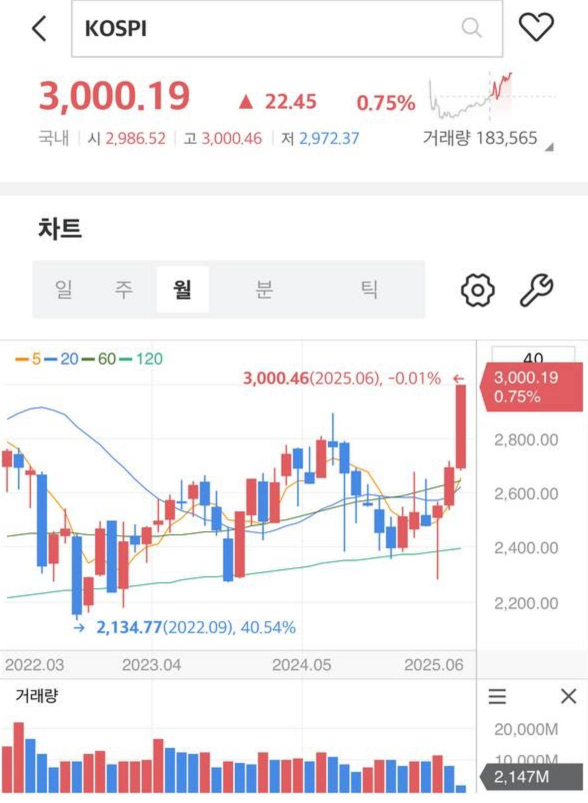
**이미지 캡션:** 이 이미지는 한국 주가지수인 코스피의 주가 차트를 보여주는 스마트폰 화면의 일부입니다. 화면 상단에는 'KOSPI'라는 글자와 함께 현재 코스피 지수가 3,000.19로 표시되어 있으며, 전일 대비 22.45포인트 상승한 0.75%의 상승률을 기록하고 있습니다. 또한, 거래량은 183,565로 나타나 있습니다. 그 아래에는 국내 시가, 고가, 저가 정보가 표시되어 있습니다. 화면 중앙에는 '차트'라는 제목과 함께 일, 주, 월, 분, 틱 단위로 차트를 볼 수 있는 탭이 있으며, 현재 '월' 탭이 선택되어 있습니다. 차트에는 5일, 20일, 60일, 120일 이동평균선이 표시되어 있으며, 캔들스틱 차트로 주가 변동을 나타내고 있습니다. 차트 하단에는 2022년 3월부터 2025년 6월까지의 기간이 표시되어 있습니다. 차트 오른쪽에는 2,200.00부터 3,000.00까지의 주가 범위가 표시되어 있으며, 현재 주가는 3,000.19 근처에 있습니다. 화면 하단에는 거래량 막대그래프가 표시되어 있습니다. 전반적으로 투자자가 코스피 지수의 추세를 파악하고 거래량을 확인하는 데 사용되는 금융 정보 화면입니다.니다. 차트에는 5일, 20일, 60일, 120일 이동평균선이 표시되어 있으며, 캔들스틱 차트로 주가 변동을 나타내고 있습니다. 차트 하단에는 2022년 3월부터 2025년 6월까지의 기간이 표시되어 있습니다. 차트 오른쪽에는 2,200.00부터 3,000.00까지의 주가 범위가 표시되어 있으며, 현재 주가는 3,000.19 근처에 있습니다. 화면 하단에는 거래량 막대그래프가 표시되어 있습니다. 전반적으로 투자자가 코스피 지수의 추세를 파악하고 거래량을 확인하는 데 사용되는 금융 정보 화면입니다.

### 6월 20일 (금) 21:41 · Sung Kim shared a link.

🔗 <https://www.yna.co.kr/view/AKR20250620138300001>

### 6월 20일 (금) 21:41 · 소버린AI 반대론에 대한 한마디 정리 너무 좋습니다.

소버린AI 반대론에 대한 한마디 정리 너무 좋습니다. 

"'농사 왜 짓냐'는 얘기와 같은 위험한 생각"

Upstage 는 계속해서 글로벌 최고의 LLM을 만들고 있습니다. 7월 17일 정식 출시 되는 Solar-Pro2도 많은 기대 부탁드립니다. (지금은 https://chat.upstage.ai/ 에서 무료 preview 진행중입니다.)

(Sunghyun Park 사진도 너무 좋네요.)

🔗 <https://www.yna.co.kr/view/AKR20250620138300001>

### 6월 25일 (수) 07:20 · 업스테이지 다음 모델인 Solar-Pro와 Document AI에 대한 …

업스테이지 다음 모델인 Solar-Pro와 Document AI에 대한 소식이 오라클 공식 매거진에 featured story로 올라갔습니다. 뉴스레터로도 발송하기 때문에 OCI 활용하는 전 세계 IT 종사자 100만명 이상이 저희 소식을 듣게 될 게 됩니다. 매우 기쁜 소식입니다.

이번 7월 중에 나올 reasoning모델인 Solar-Pro2 무료 Preview가 7/15일까지 진행되고 있으니 꼭 사용해 보세요. 좋습니다!
https://console.upstage.ai/docs/capabilities/reasoning

대표적인 AI업체인 오픈 리서치팀 Solar-Pro-Preview 사용 소감: "reasoning effort = high 기준으로 gemini 2.5 대비해서 성능 향상이 소폭 있는 걸로 저희는 판단이 되는데요 ㅎ 훌륭한 성능입니다. [...], 컨텍스트 렝스와 인퍼런스 속도 최적화가 이루어지면 글로벌 경쟁력이 있겠는데요"

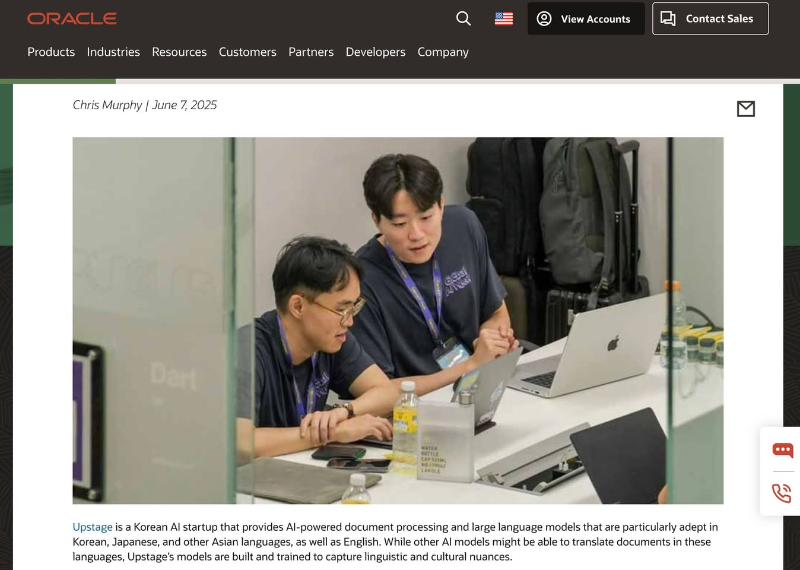
**이미지 캡션:** 두 명의 젊은 성인 남성이 사무실 환경에서 노트북을 보며 협력하고 있습니다. 왼쪽 남성은 검은색 티셔츠를 입고 안경을 썼으며, 오른쪽 남성은 네이비색 티셔츠를 입고 있습니다. 두 사람 모두 목에 ID 카드를 걸고 있으며, 이는 회의나 컨퍼런스에 참석했음을 시사합니다. 그들 앞에는 노트북, 휴대폰, 물병, 그리고 다른 사무용품들이 놓여 있습니다. 배경에는 여러 개의 배낭이 쌓여 있고, 유리 칸막이가 있어 사무실 공간임을 알 수 있습니다. 전반적으로 진지하고 집중하는 분위기이며, 기술적인 논의가 이루어지고 있는 것으로 보입니다.것으로 보입니다.

### 6월 26일 (목) 12:32 · Sung Kim shared a link.

🔗 <https://console.upstage.ai/docs/capabilities/reasoning>

### 6월 26일 (목) 12:58 · 지금 무료 Preview 중인 업스테이지 추론형 AI 모델에 대한 소개 …

지금 무료 Preview 중인 업스테이지 추론형 AI 모델에 대한 소개 감사드립니다. https://chat.upstage.ai/ Preview는 바로 테스트가 가능합니다.

기사에 언급된 것처럼 AI 3강 진입 목표, Upstage 함께 하겠습니다!

#업스테이지 #솔라프로2 #추론형AI #AI3강

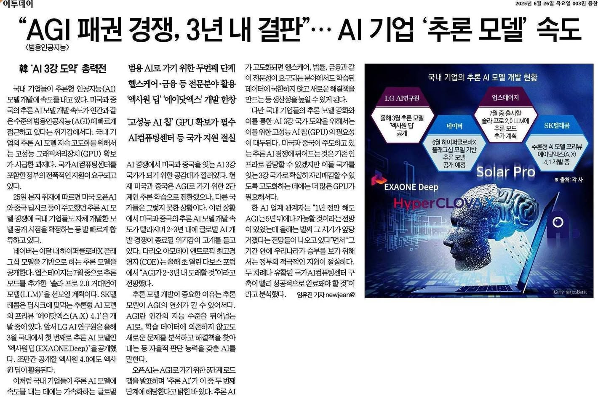
**이미지 캡션:** 이 기사는 한국의 인공지능 기업들이 추론형 인공지능(AI) 모델 개발에 박차를 가하고 있으며, 이는 범용 인공지능(AGI) 경쟁에서 미국과 중국에 뒤처지지 않기 위한 노력의 일환임을 보도합니다. 기사에는 네이버, 업스테이지, SK텔레콤, LG AI 연구원 등 국내 주요 기업들의 추론 AI 모델 개발 현황과 계획이 요약되어 있으며, 특히 LG AI 연구원의 '엑사원딥'과 SK텔레콤의 '에이닷엑스' 등이 언급됩니다. 또한, 고성능 그래픽 처리 장치(GPU) 확보와 국가 AI 컴퓨팅 센터 구축 등 정부의 지원이 필요하다는 점도 강조하고 있습니다. 기사 하단에는 국내 기업들의 추론 AI 모델 개발 현황을 시각적으로 보여주는 다이어그램이 포함되어 있으며, 이는 각 기업의 모델 이름, 개발 단계, 출시 예정일 등을 나타냅니다. 전반적으로 기사는 한국 AI 산업의 현황과 미래 전망에 대한 정보를 제공하며, AGI 기술 경쟁의 중요성을 부각하고 있습니다.요하다는 점도 강조하고 있습니다. 기사 하단에는 국내 기업들의 추론 AI 모델 개발 현황을 시각적으로 보여주는 다이어그램이 포함되어 있으며, 이는 각 기업의 모델 이름, 개발 단계, 출시 예정일 등을 나타냅니다. 전반적으로 기사는 한국 AI 산업의 현황과 미래 전망에 대한 정보를 제공하며, AGI 기술 경쟁의 중요성을 부각하고 있습니다.

### 6월 27일 (금) 13:15 · #美의회 #적대적AI금지법 #中러北이란 #AI구매배포금지 AI 강대국 중…

#美의회 #적대적AI금지법 #中러北이란 #AI구매배포금지 AI 강대국 중심으로 자국의 기술을 지키고 다른 나라를 견제하려는 이와 같은 시도는 계속될 것 같습니다. 

"고래 싸움에서 새우가 어부지리로 이기는 법, 새우 몸집을 키우는 거죠. 고래 싸움에 등이 터지지 않을 만큼. 포기하지만 않는다면, 시간은 새우 편 아닐까요?" <재벌집 막내아들 대사중>

Upstage 에서 고래보다 더 큰 새우를 만드실 분들을 모시고 있습니다. 함께 해요! https://careers.upstage.ai/

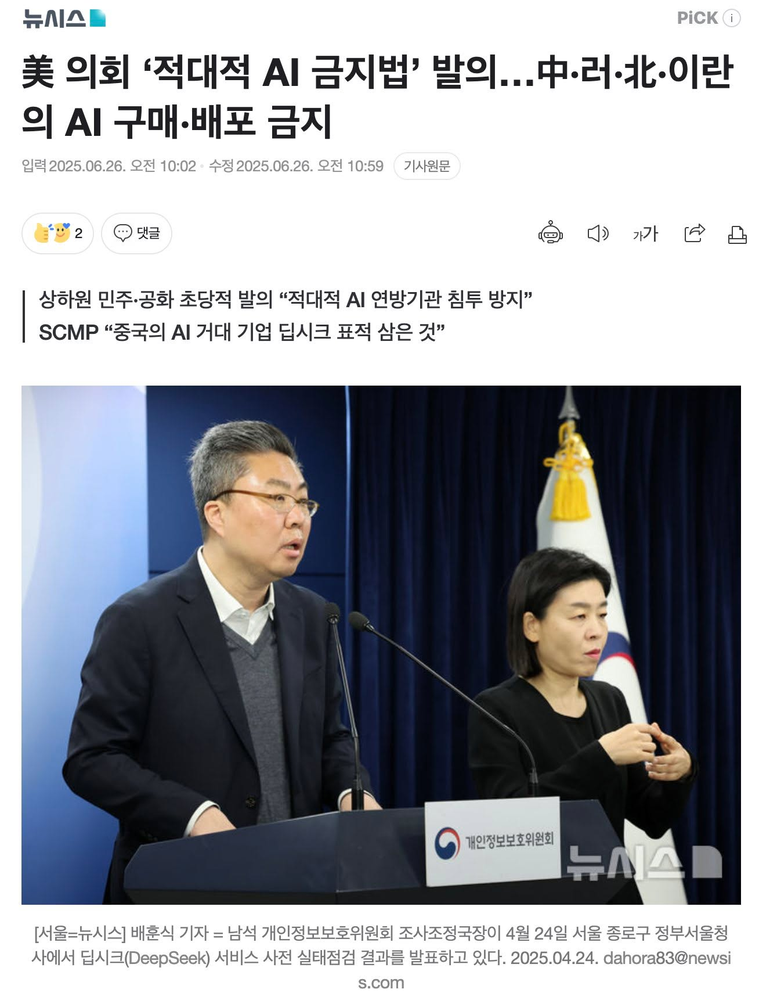
**이미지 캡션:** 한 명의 성인 남성이 안경을 쓰고 회색 니트 조끼 위에 네이비색 재킷을 입고 연단 뒤에서 마이크를 향해 말하고 있으며, 그의 옆에는 검은색 옷을 입은 한 명의 성인 여성이 손짓을 하며 이야기하고 있다. 배경에는 대한민국 개인정보보호위원회 로고가 있는 파란색 현수막이 걸려 있고, 그 옆에는 뉴시스 로고가 보인다. 이들은 뉴스 발표회 또는 기자회견 중인 것으로 보이며, 전반적으로 진지하고 공식적인 분위기이다.

### 6월 27일 (금) 13:15 · Sung Kim shared a link.

🔗 <https://n.news.naver.com/article/003/0013325830>
