# 2025년 7월

[← 2025년](README.md)

### 7월 3일 (목) 14:36 · #DUS #KT #Kakao 사용! 국내에서도 많은 회사들에서 LLM w…

#DUS #KT #Kakao 사용! 국내에서도 많은 회사들에서 LLM weight을 공개하는 멋진 소식들이 들리고 있습니다. 모델 카드를 보니 NAACL 2024 Industry track 에서 Upstage 가 발표한 모델 학습 방법론인 #DUS 가 사용되었습니다. DUS가 Yi.ai, 히브리어 모델등 글로벌에서 뿐만 아니라 #KT 의 믿음:2, 그리고 #Kakao 의 Kanana 등 모델 학습에 활용되어 기쁩니다.

DUS방식은 모델 학습을 빠르게 하고 개념적으로 모델에 빈 공간을 만들어 학습이 잘되게 하는 효과가 있습니다. 

Andrew Ng 교수님과 함께 만든 Pretraining LLMs 라는 수업에서도 자세한 설명을 하고 있고 모델 학습 코드도 제공이 됩니다.  https://www.deeplearning.ai/short-courses/pretraining-llms/

 DUS 를 통해 더 좋은 모델들이 많이 나오또 함께 새로운 모델 학습 방법론들이 많이 나오면 좋겠습니다!

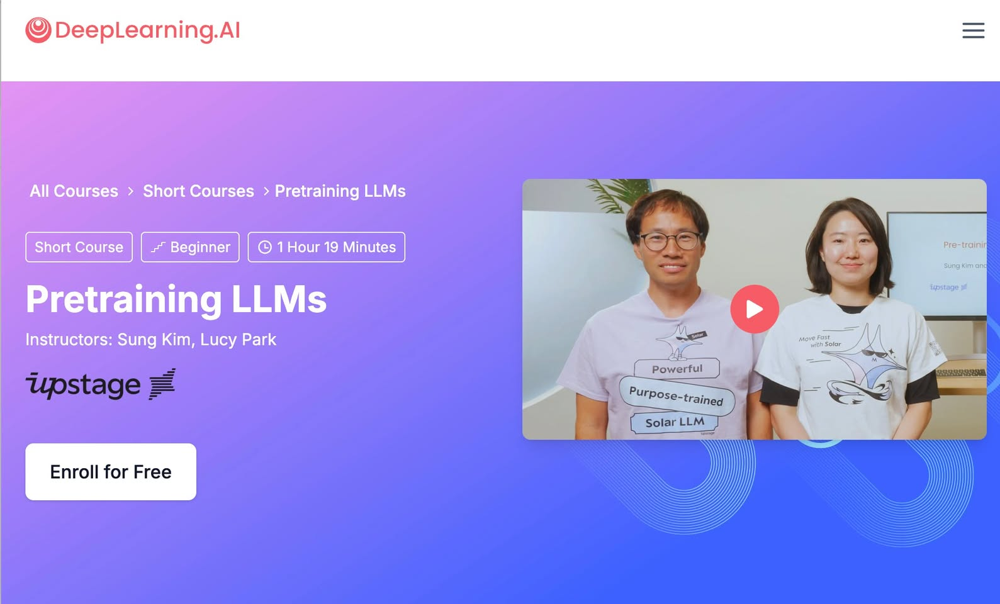 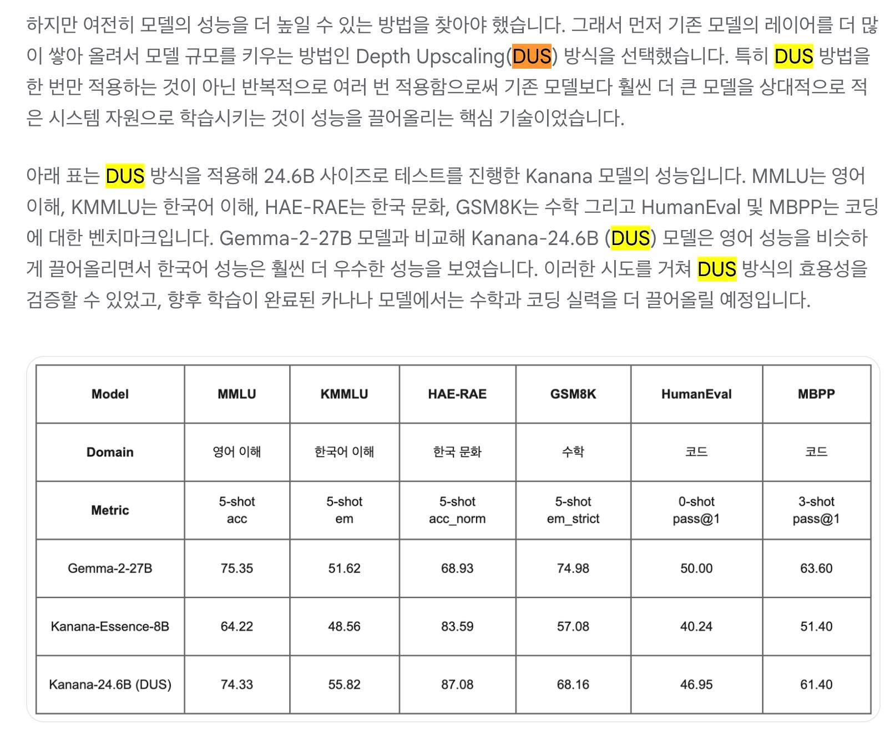 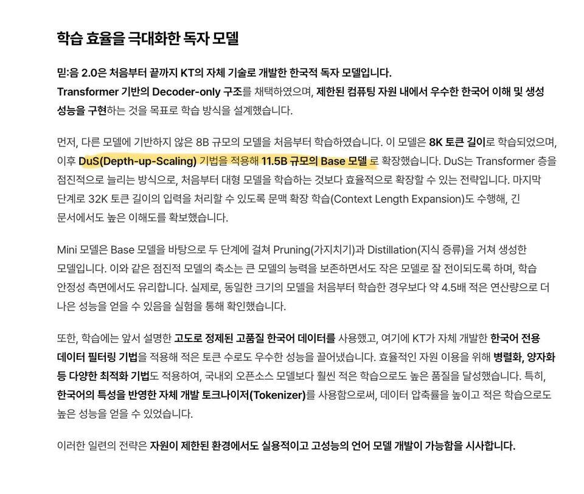

### 7월 4일 (금) 07:54 · #SF 흔하게 보이는 길거리, 버스정류장 광고입니다. AI 광고 많고 특…

#SF 흔하게 보이는 길거리, 버스정류장 광고입니다. AI 광고 많고 특히 개발을 대신해주는 AI 광고 많습니다. 아이러니하게도 AI 개발자들이 열심히 개발자들을 대신할 수 있는 AI와 서비스를 만들고 있는 것인데요.

누구라도 이 거대한 기술의 수레바퀴를 세우거나 뒤로 돌릴 수는 없을 것입니다. 이 바퀴에 더 빨리 올라타서, 더 잘 활용하는 것이 개발자들이 할 수 있는 최고의 선택이 될 것입니다. 

그리고 그 대상은 개발자들에게 점점 더 모두에게로 넓어질 것입니다. 우리가 기대하는 시간보다 더 빠르게 진행될 것입니다.

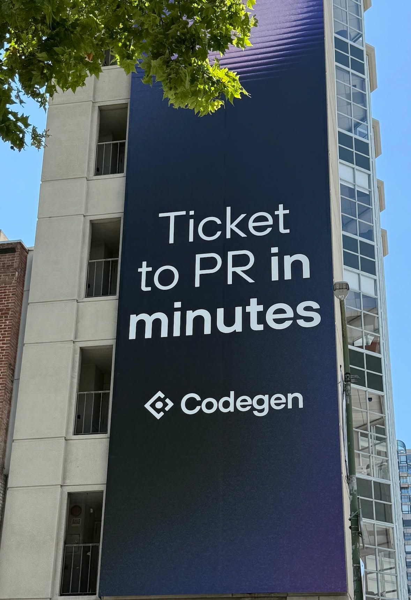 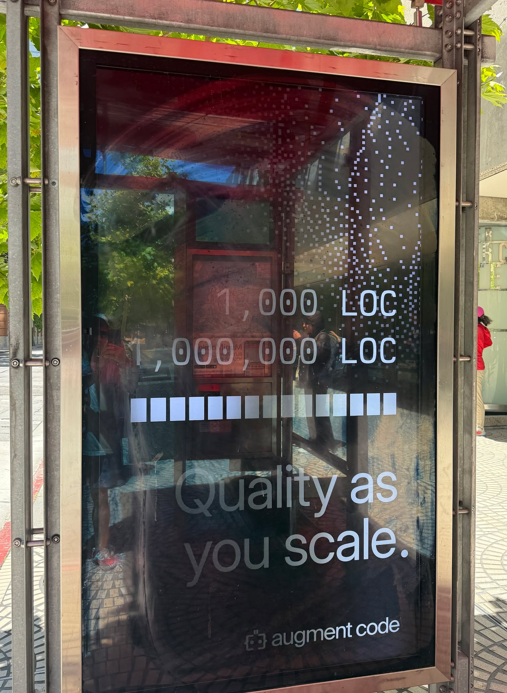 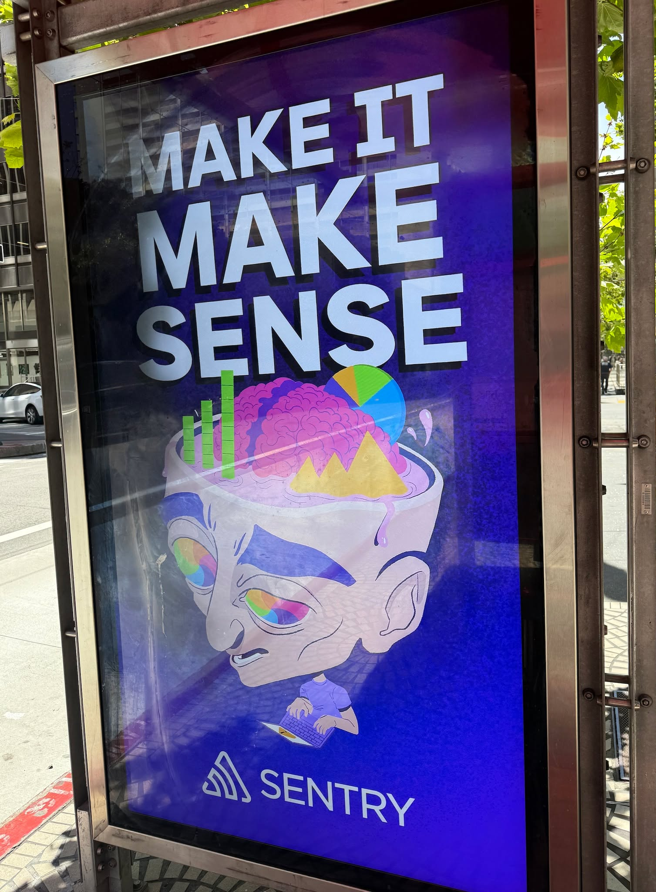  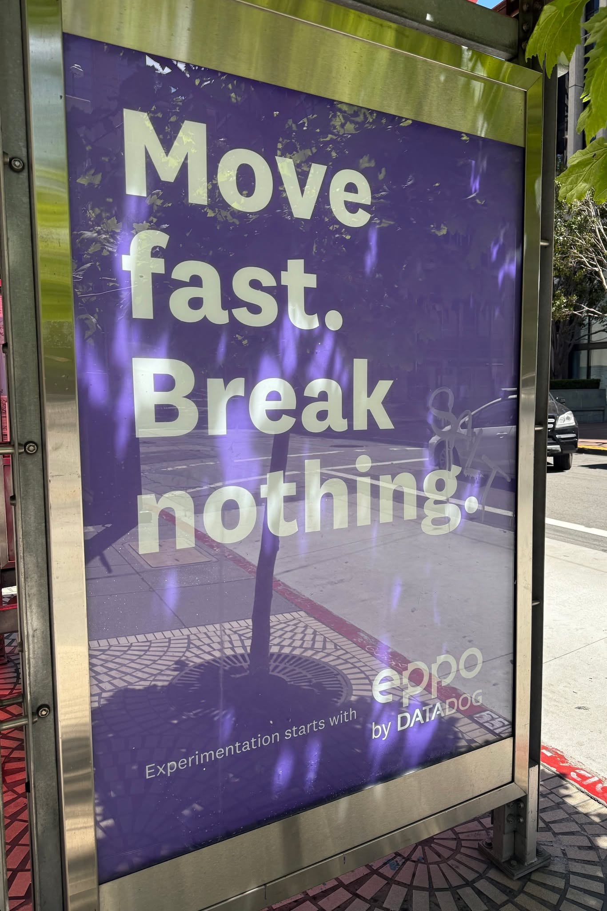

### 7월 7일 (월) 08:40 · #7월한강 달리기는 효능감 (땀) 최고 인것 같습니다. 7월 한달 서울에…

#7월한강 달리기는 효능감 (땀) 최고 인것 같습니다. 7월 한달 서울에 있는 동안 좋은 분들 많이 뵙겠습니다.

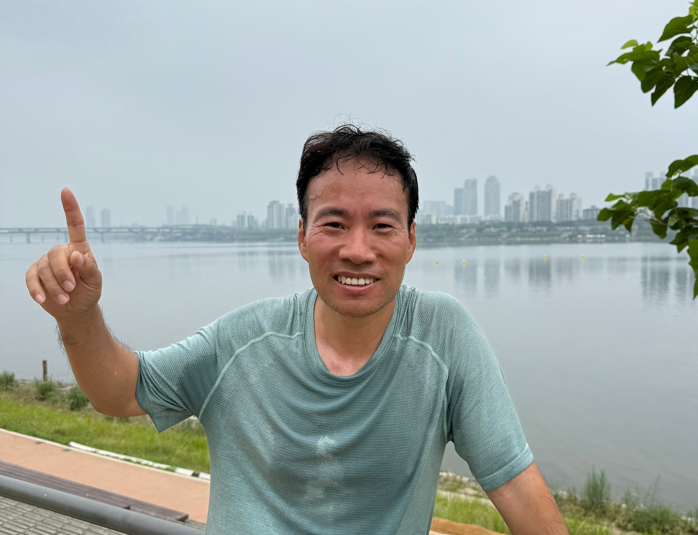 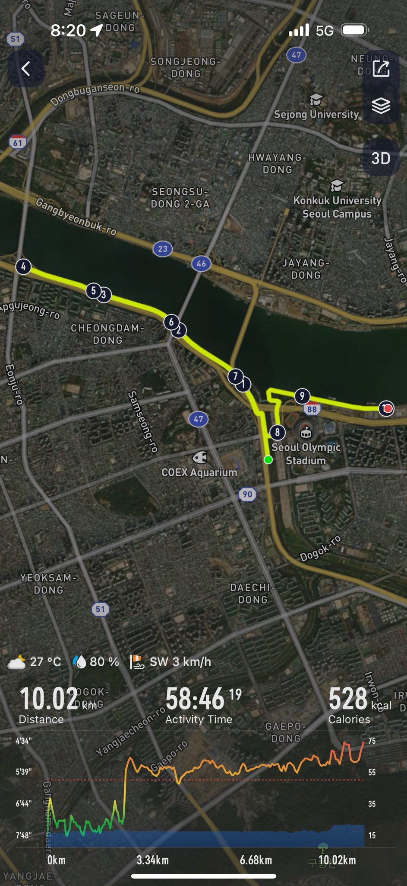

### 7월 7일 (월) 08:42 · Sung Kim shared a link.

🔗 <https://v0.dev/>

### 7월 8일 (화) 19:17 · #주권 -> #주도권 새로 부임하신 과기부 류제명 차관님 뵙고 왔습니다.…

#주권 -> #주도권 새로 부임하신 과기부 류제명 차관님 뵙고 왔습니다. 차관님의 첫 번째 외부 행사가 AI 분야 회사들과의 간담회라고 들었는데요. AI에 올인하시는 같아서 좋았습니다. 특히 AI 3대 강국에 들어가는 것뿐만 아니라, 3대 강국 *조기* 진입을 목표로 이야기해서 너무 즐겁고 재미있었습니다.

제가 드린 말씀 요약: 기술 주권을 가지는 2가지 방법은 1) 기술 쇄국으로 우리끼리 한국형 X를 사용하는 방법 2) 세계 1위 하는 기술을 우리가 만들어 글로벌 기술 주도권을 가지는 것이다. 파운데이션 모델이 어려운 도전이지만 글로벌 1등을 해서 궁극적인 기술 주도권을 가질 수 있도록 많은 지원을 해달라. 특히 업스테이지는 한국뿐만 아니라 일본/미국에서 열심히 하고 있으니 글로벌 사업 지원 많이 해달라고 부탁드렸습니다.

차관님도 "우리가 그런 도전을 통해서 아까 우리 *김성훈 대표님* 말씀하셨지만 기술 주도권 또는 자생력을 갖고 있는 게 얼마나 중요한지 그런 개발 과정에서 우리가 한 단계 어떤 한 단계 정도가 아니고 퀀텀 점프한 그런 실력을 갖게 [...]" 

라고 반드시 기술 주도권이 필요하다고 말씀해주시고 이를 위한 도전을 응원해 주셔서 행복했습니다.

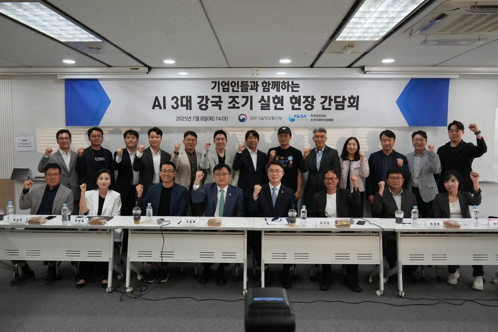 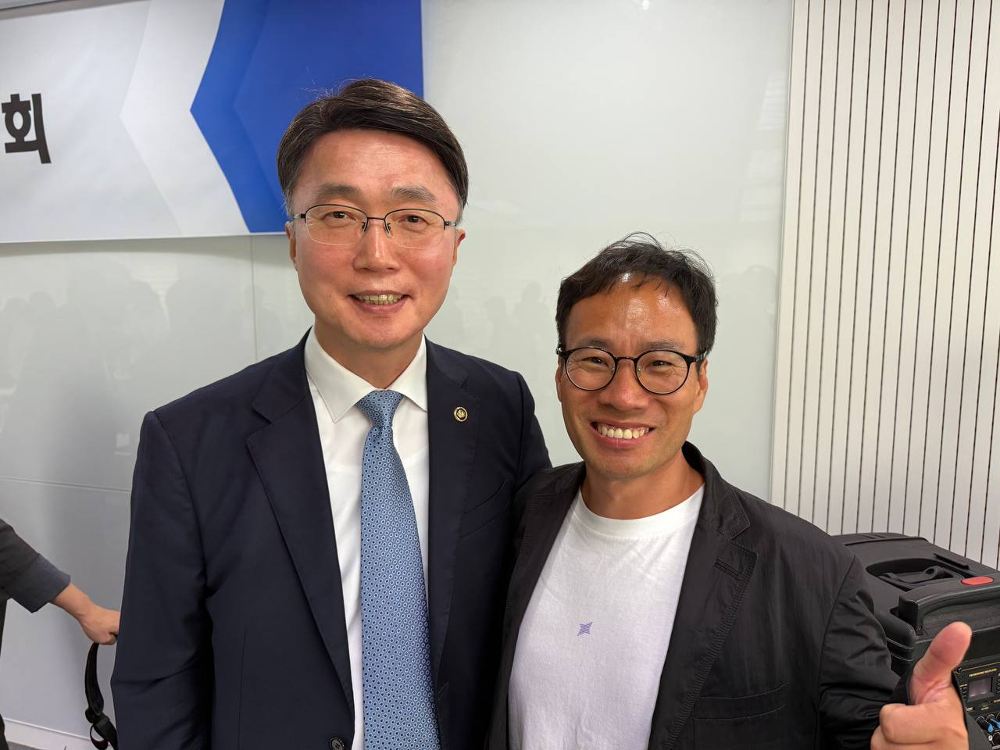

### 7월 9일 (수) 09:24 · #주권 -> #주도권 NAVER CLOVA 시절 Jung-Woo Ha 님…

#주권 -> #주도권 NAVER CLOVA 시절 Jung-Woo Ha 님, Jaegul Choo 님등과 함께 작성한 #StarGAN 논문이 5000 citation을 넘어섰습니다. 저에게는 100회만 넘어도 경사인데 5천 인용은 상상하지 못하는 숫자였습니다.

당시 연구팀에서 우리가 세운 원칙은

1. 글로벌 탑티어에서 상 받을 만한 논문만 제출한다. (아님 드랍) 
2. 글로벌 회사에서도 가져다 사용할 수준의 실용적인 기술만 연구 한다. 그래서 구글이나 메타에서 우리 기술을 본인들 제품 만들때 사용하면 성공!

글로벌 1등을 목표로 했기에 5천 인용이 넘는 논문, 그리고 실제 구글등 많은 회사에서 이미지 관련 데이터에 사용된 Sangdoo Yun 님의 CutMix 논문등이 탄생했습니다.

지금 많은 분들이 논의 중인 기술 소버린/주권 문제도 저는 같은 이치라고 생각합니다. 우리끼리, 우리만 사용하는 한국형은 우선은 좋아 보이지만 오래가지 못합니다. 글로벌 주도권을 가진 기술만 살아남기 때문에 우리의 목표는 항상 글로벌 기술 주권이어야 합니다. 우리는 그 정도 할 수 있는 수준이 되었고 실력과 자본이 있습니다. 그리고 자신감도 있습니다!

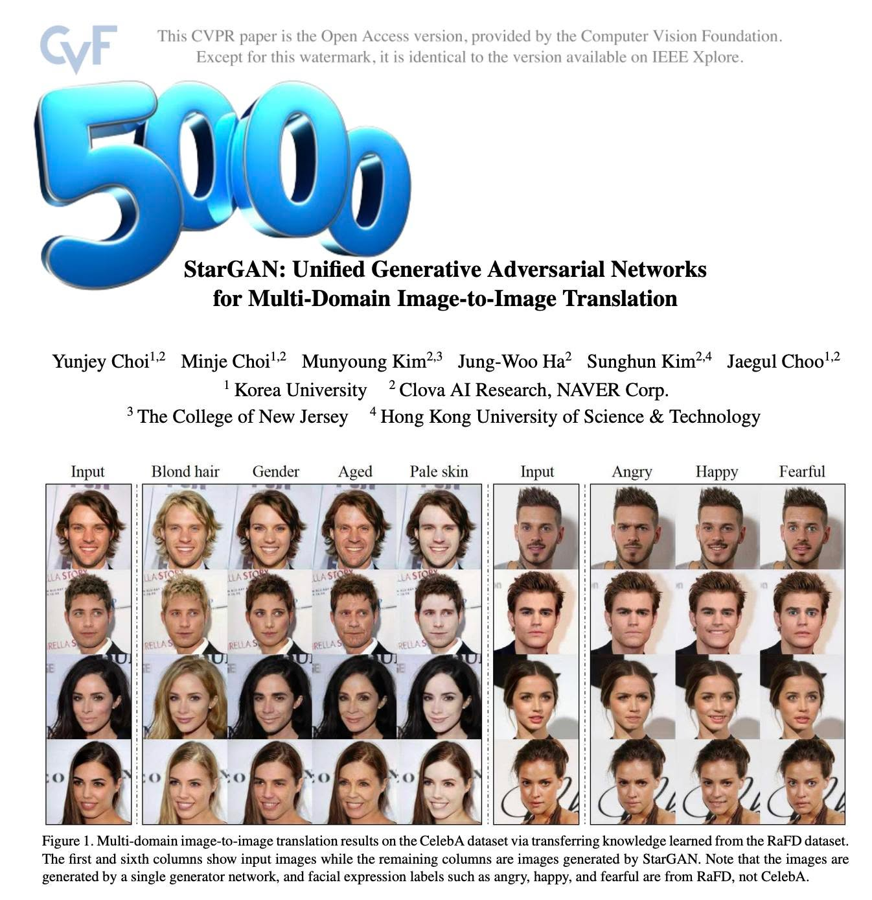 #주도권 NAVER CLOVA 시절 Jung-Woo Ha 님, Jaegul Choo 님등과 함께 작성한 #StarGAN 논문이 50">

### 7월 10일 (목) 08:52 · Upstage가 #프론티어급 모델인 #SolarPro2를 출시합니다. 그…

Upstage가 #프론티어급 모델인 #SolarPro2를 출시합니다. 그동안 solar-pro2-preview를 많은 분이 사용하시고 피드백 주셔서 감사합니다. 주신 피드백과, 새로 개발한 학습 방법론, 데이터 품질 향상을 위한 데이터 큐레이션 방법, 일반 추론 데이터 합성 방법, 검증 가능한 보상 기술을 총동원하여 만들었습니다. 

이번 Solar-Pro2 모델은 (MMLU-Pro)’, ‘수학(Math500, AIME)’, ‘코딩(SWE-Bench)’ 등 고난도 추론 중심 벤치마크에서 뛰어난 성능을 보여 줍니다.

뿐만 아니라 LYMSYS의 LLMArena의 평가 방식을 차용한, 그것도 아주 어려운 문제만 모아둔 Arena-Hard-Auto 에서도 매우 높은 성능을 보여 줍니다. Arena-Hard-Auto는 단순한 정답 맞추기가 아닙니다. 어려운 문제를 주고 그 답을 최상위 모델이 만든 답과 비교하여 평가를 하는 것입니다. 시험문제로 치면 긴 주관식이나 논술시험 수준입니다. 매우 어려운 평가라 프론티어 모델이 아닌 경우 점수가 10~20% 수준으로 나와 아예 발표조차 못하는 점수입니다. Solar-Pro2 (reasoning) 의 경우 Arena-Hard-Auto 에서 46%, Ko-Arena-Hard-v0.1 에서 71% 성능을 보여줍니다. 특히 한국어 에서는 최고 수준의 답과 비교해도 Solar-Pro2의 답이 71%의 경우 더 좋다는 것입니다. 

그러나 아직 많이 부족합니다. #프런티어급 모델이긴 하지만, 기존 최상위급 모델에서의 퀀텀 점프를 하지는 못했습니다. 그러나 업스테이지는 여기서 멈추지 않습니다. 기존 프런티어급 모델을 뛰어넘는 획기적인 모델 구조와 학습 방법, 그리고 데이터 가공 방법을 계속 연구해 나갈 것입니다. 여러분들께서 많이 사용해주시고 또 의견 주시면 Solar-Pro3, Pro4, Pro5 에서는 반드시 #프런티어급 모델을 뛰어넘어 보겠습니다.

Solar-Pro2는 https://chat.upstage.ai/ 에서 바로 사용해보실 수 있으며 API (모델명 solapr-pro2) 로 바로 사용가능합니다. 더 많은 분들이 사용하실 수 있도록 TRY-SOLAR-PRO2 $50 (8/31일 만료) 크레딧 코드도 준비되어 있습니다.

또한 Upstage-AWS AI Initiative program 을 통해 대학과 비영리 기관은 Solar-Pro2를 비롯 Upstage 전제품을 무료로 사용할 수 있습니다. 현재 200개 이상의 기관이 가입되어 있으니 아직 가입하지 않은 대학과 비영리 기관은 바로 가입해주셔요. https://www.upstage.ai/events/ai-initiative-2025-ko로

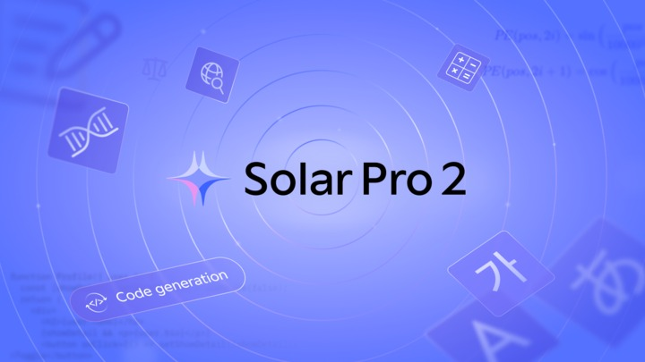 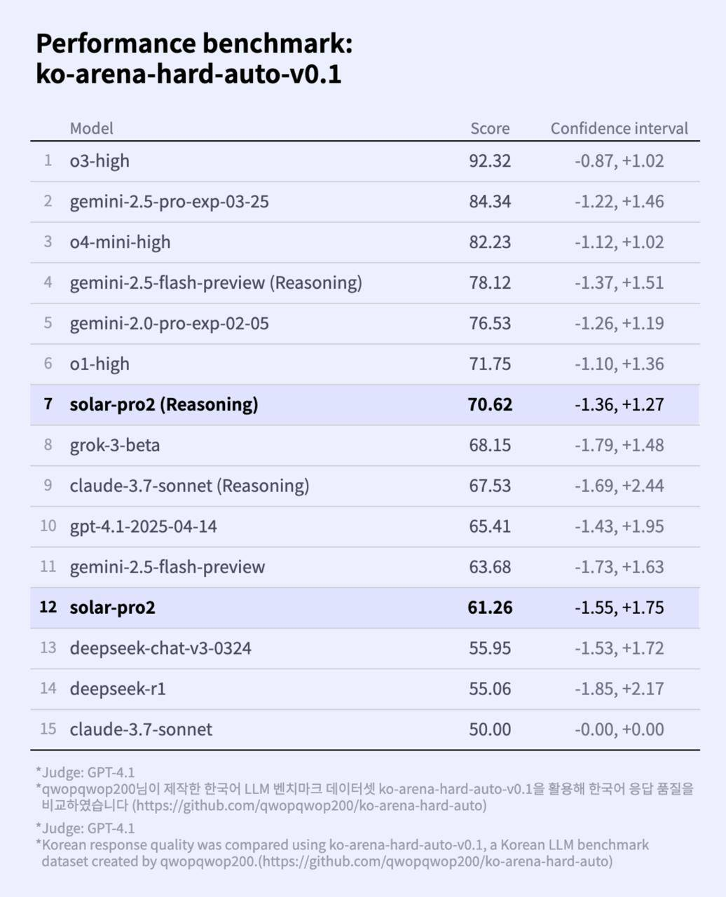 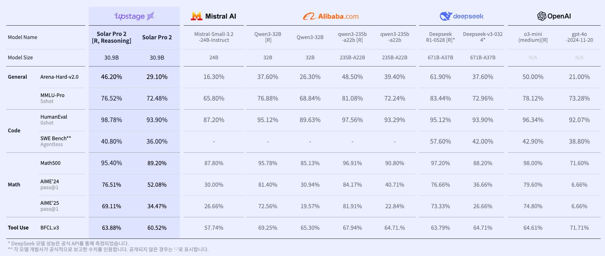 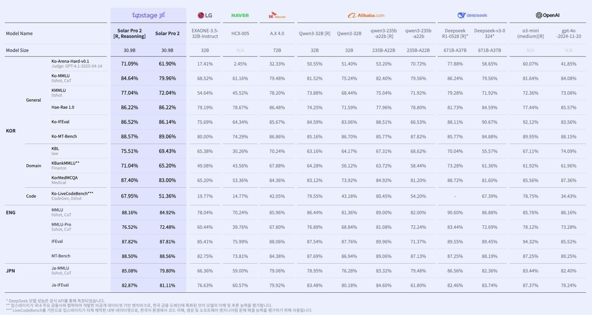 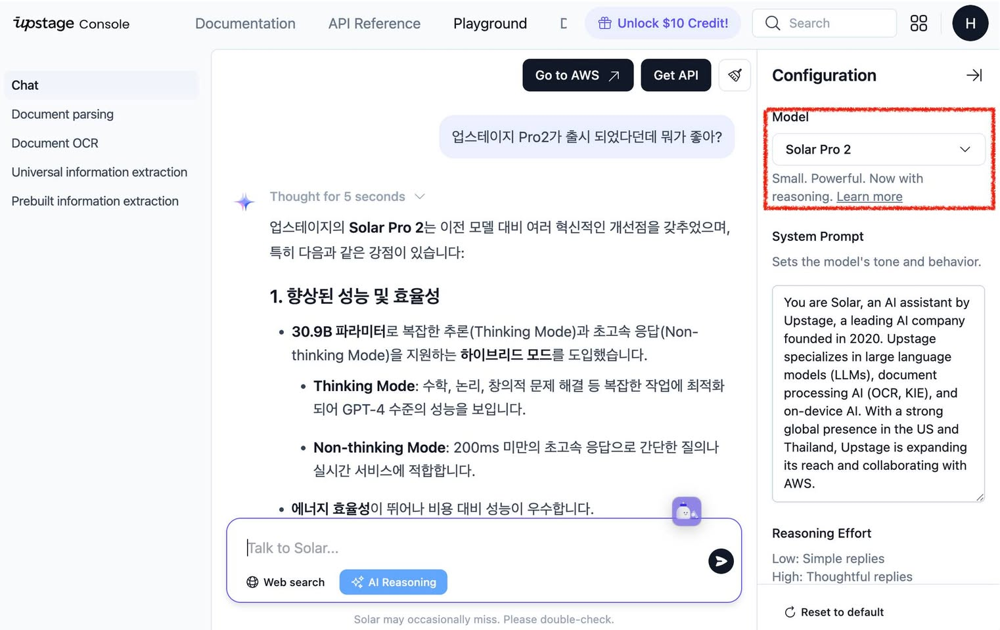 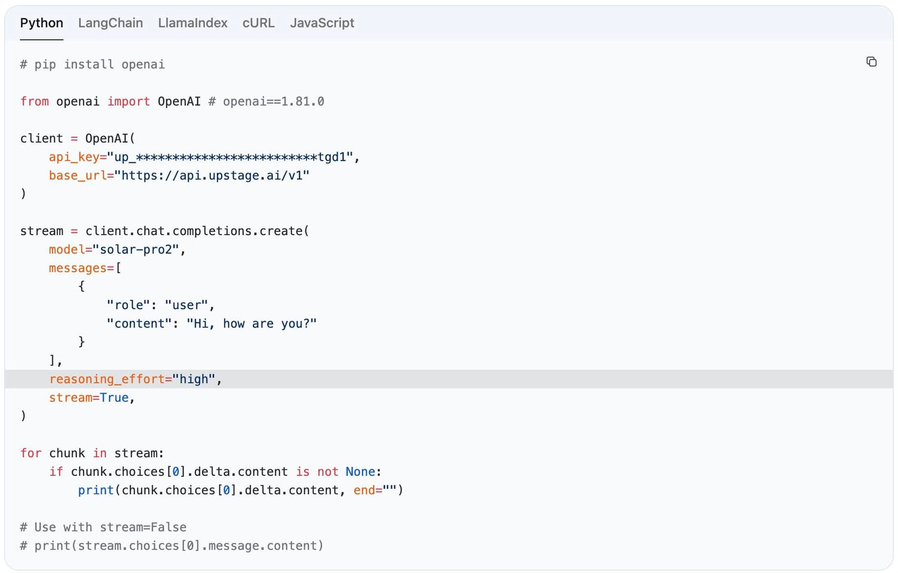

### 7월 12일 (토) 13:05 · 7월 양평 자전거 80K 효능감 최고 입니다. 좋은 분들과 달려서 더 재…

7월 양평 자전거 80K 효능감 최고 입니다. 좋은 분들과 달려서 더 재미있고 좋습니다.

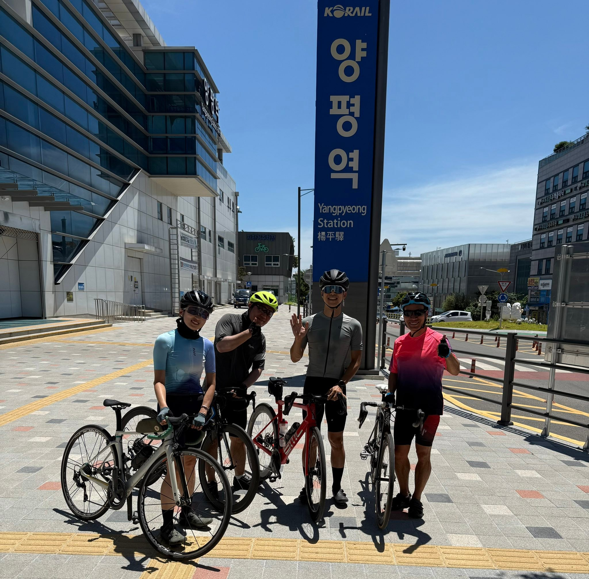 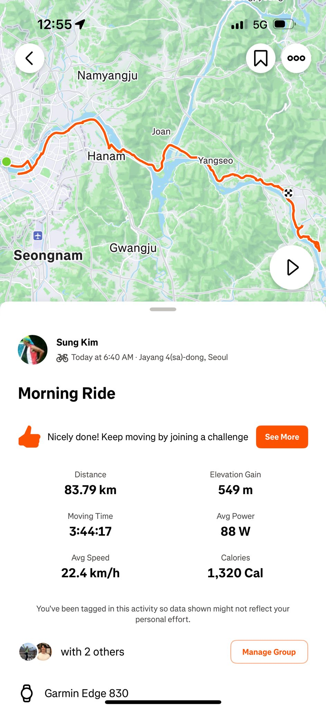

### 7월 13일 (일) 06:51 · 📷 사진 (1장)

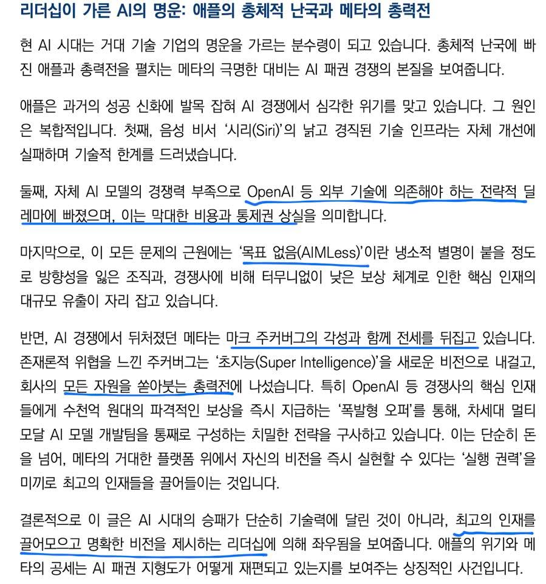

### 7월 13일 (일) 11:28 · #써보고서 사용자들이 Upstage 제품을 사용해보시고 "좋더라" 말씀하…

#써보고서 사용자들이 Upstage 제품을 사용해보시고 "좋더라" 말씀하실때가 가장 행복합니다. https://n.news.naver.com/mnews/article/092/0002381784

"실용성은 글로벌 경쟁 모델과 비교해도 뒤지지 않았다."

"'솔라 프로 2'는 1달러가 1천400원이라는 기준을 세우고 지난해와 올해 글로벌 생성 AI 모델 지출액을 오차 없이 환산해냈다."

"업무 중 빈번하게 발생하는 데이터 처리 과정에서 신뢰할 수 있는 성능을 보여준다는 점은 분명한 장점이다."

"기계번역에 있어서도 상당한 성능을 드러냈다. [...] 번역의 질도 만족스러웠다. 내용 확인 결과 모든 문장이 원문의 의미를 정확하게 담고 있었다."

https://chat.upstage.ai/ 에서 바로 사용가능하시고 API로 제공됩니다.

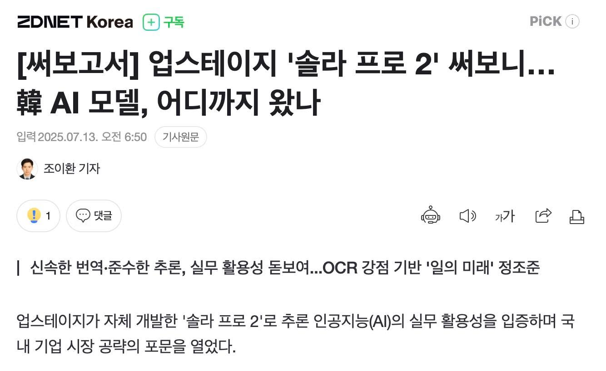

### 7월 15일 (화) 07:26 · #주권-> #주도권 세계 최고 수준의 AI모델을 확보해야 #AI3강 에 …

#주권-> #주도권 세계 최고 수준의 AI모델을 확보해야 #AI3강 에 도달할 수 있다는 과기부 장관 후보자님의 말씀에 100% 공감합니다. 큰 기대가 됩니다! 

"말씀 주신 내용에서 첫 번째부터 좀 말씀드리면 저는 월드베스트 LLM 목표는 세계 최고 수준에 도전을 해야 된다고 생각합니다. 그 정도 수준에 도전할 수 있는 AI 모델을 확보해야 우리가 어떻게 보면 G3 AI강국에 도달할 수 있을 거라 보고 있고요."

https://youtu.be/_9CWZzAGr1Q?si=aGxPE14vmk5ab6-L&t=348

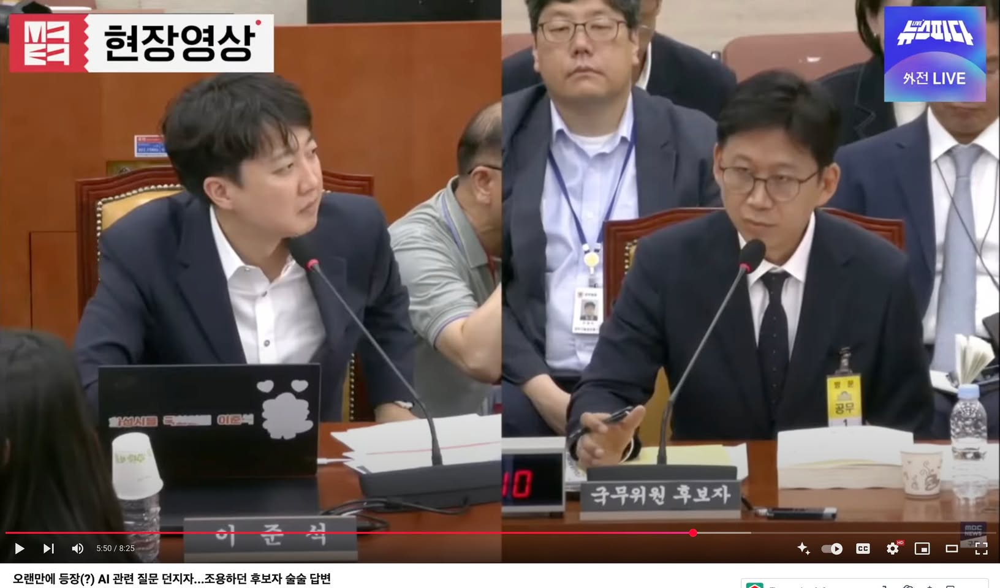 #주도권 세계 최고 수준의 AI모델을 확보해야 #AI3강 에 도달할 수 있다는 과기부 장관 후보자님의 말씀에 100% 공감합니다. 큰">

### 7월 15일 (화) 08:29 · Solar-Pro2, document parse 등 Upstage 의 모…

Solar-Pro2, document parse 등 Upstage 의 모든 제품을 대학, 비영리 기관에서 무료로 제공하는 'AI 이니셔티브' 프로그램에 150곳 이상이 참여해 멋진 프로젝트를 하고 계십니다.  https://n.news.naver.com/article/030/0003331314?sid=105

대학이나 비영리 기관에 계시면 바로 신청 부탁드립니다. https://www.upstage.ai/events/ai-initiative-2025-ko

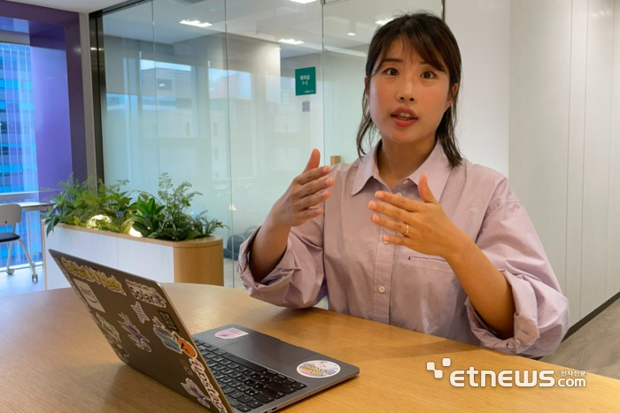

### 7월 15일 (화) 08:33 · #🚀업스테이지 x 카라쿠리 x 도쿄대 공동 심포지엄 개최!​

#🚀업스테이지 x 카라쿠리 x 도쿄대 공동 심포지엄 개최!​

"AI for Science"를 주제로 업스테이지, AI 스타트업 카라쿠리(Karakuri), 도쿄대 대학원 교수 겸 Upstage 연구 고문인 오카다 마토(岡田真人)​ 교수님이 함께하는 심포지엄이 열립니다!

이번 행사에서는 생성형 AI가 산업 현장과 연구 분야​에 미치는 혁신적 영향을 다룹니다:
✅ 구체적인 프로젝트 발표
✅ 실제 적용 사례 및 데모 시연
✅ 패널 토론 & 네트워킹을 통한 실전 아이디어 공유

일본에 계신다면 "AI를 업무에 어떻게 활용할까?"의 해결책을 찾아보세요!

#AI #생성형AI #심포지엄 #업스테이지 #카라쿠리 #도쿄대 #AI활용 #네트워킹

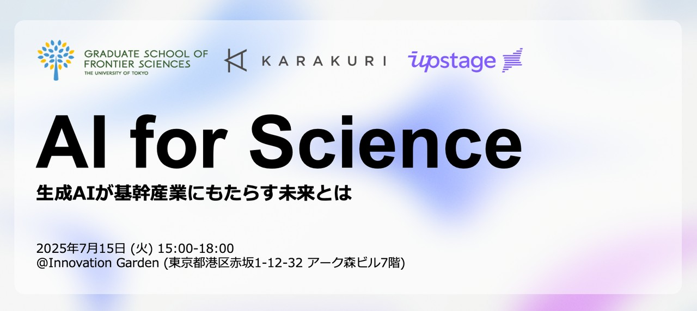

### 7월 16일 (수) 08:43 · 📷 사진 (1장)

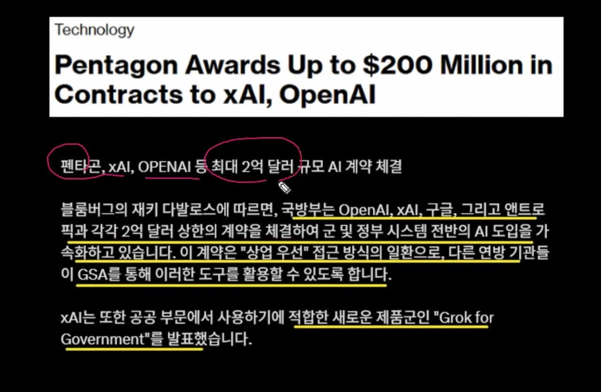

### 7월 18일 (금) 20:54 · Sung Kim shared a link.

🔗 <https://upstage.ai/products/document-parse>

### 7월 19일 (토) 10:49 · #써보니좋더라 IT동아 남시현 기자님께서 직접 사용해보시고 올려주신 기사…

#써보니좋더라 IT동아 남시현 기자님께서 직접 사용해보시고 올려주신 기사입니다. 이렇게 직접 사용해보시고 좋다고 하시니 만드는 입장에서 너무 행복합니다. https://it.donga.com/107273/

https://chat.upstage.ai/ 에서 바로 테스트 가능하시고, https://console.upstage.ai/ 에서 바로 API등으로 연결 가능합니다. 많이 테스트 해주시고 좋은점 부족한점 많이 알려주세요.

"이때 솔라 프로 2는 36초 연산을 마치고 결과를 도출했다. 큐웬 3-235B-A22B는 77초가 소요됐고, 큐웬3-32B는 91초가 걸렸다. 리즈닝 모드를 걸지 않은 경우 두 AI 모두 즉시 대답을 시작했다. 이 질문 하나로 AI의 처리 성능을 가늠할 순 없으나 업스테이지의 기술력이 글로벌 AI에 못지않은 수준이라는 점은 확인할 수 있다."

"실제 테스트를 통해 솔라 프로 2의 문서 OCR 인식 성능을 시험했다. 이때 사용한 문서는 한글 문서의 ‘표 안의 표’ 형태로 제작된 파일을 광학문자인식 없이 이미지 형태로 저장한 PDF 파일을 사용했다. 비교군은 제미나이 2.5, GPT-4를 각각 사용했다. 솔라 프로 2의 도큐먼트 파싱(Document Parsing) 기능을 활용했을 때 표 안의 표는 제대로 문자화되었다. 일부 문자의 인식률은 떨어졌지만 데이터 품질이 좋다면 파일 특유의 구조 등도 제대로 해석하는 모습이다.

챗GPT는 문자 자체는 정확히 인식하나 도표를 도표로 처리하지 못한다. 표 간격이나 배치, 문서 내용 등은 인식하나 표 안의 표 같은 독특한 유형까진 인식하지 못했다. 제미나이는 처음 명령에서 문서를 인식했을 뿐 텍스트 정보를 아예 제공하지 않았고, 표로 구성해 달라고 별도로 주문해야 했다. 이때 표 안의 표는 구현되지 않았고, 다른 문구를 전략과제라는 내용으로 각색하는 등의 소소한 오류가 있었다."

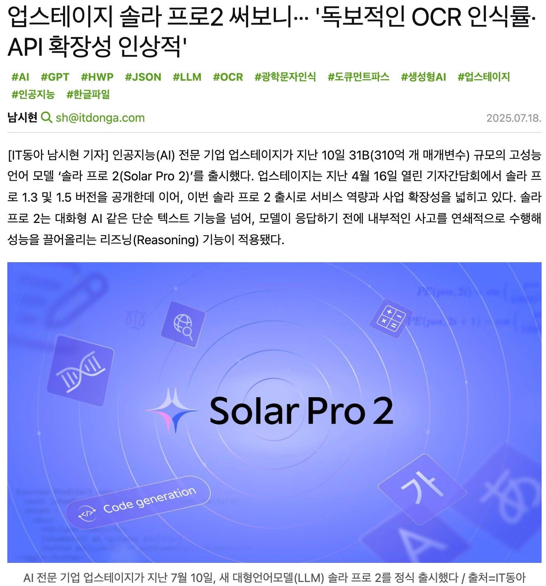

### 7월 19일 (토) 17:43 · Elon이 #Solar-Pro2 를 열심히 홍보해주고 있습니다.

Elon이 #Solar-Pro2 를 열심히 홍보해주고 있습니다.

무슨일?

1. 지난 주말에 Solar-Pro2가 공신력 있는 글로벌 모델 평가 기관인 Artificial Analysis 인덱스에 등록되면서 GPT4.X, Mistral 시리즈, LLaMA 전체 모델군, DeepSeek-V3, 그리고 최근 인기를 얻고 있는 KimiK2를 이겨 버림.

2. Artificial Analysis 는 한걸음 더 들어가 Upstage 를  OpenAI, Anthropic, xAI와 함께 Frontier Language Model 만드는 회사 TOP 10에 올려버림.

3. (결정적으로) 가성비가 가장 뛰어난 모델로 Solar-Pro2를 선정, 가성비가 가장 떨어지는 모델로 Grok4를 선정함

4. (열받은) Elon이 그래도 Grok4가 지능은 1등이라 자랑했지만 사실상 Solar-Pro2, 그리고 이를 만든 대한민국이 더 많이 홍보됨.

5. Elon 트윗의 댓글을 보면 골리앗 Grok4 VS 꼬꼬마 다윗 Solar-Pro2의 싸움을 구경하는 중이며, 많은 분들이 다윗인 Solar-Pro2를 응원하는 중. 댓글 꿀잼.

6. Sung Kim도 Grok, 조금 만 기다리라고 글 올림. 이건 진심임.

7. 이 글을 보시면 위 Elon의 트윗에 라이크 또는 응원 댓글로 참여 부탁드립니다.

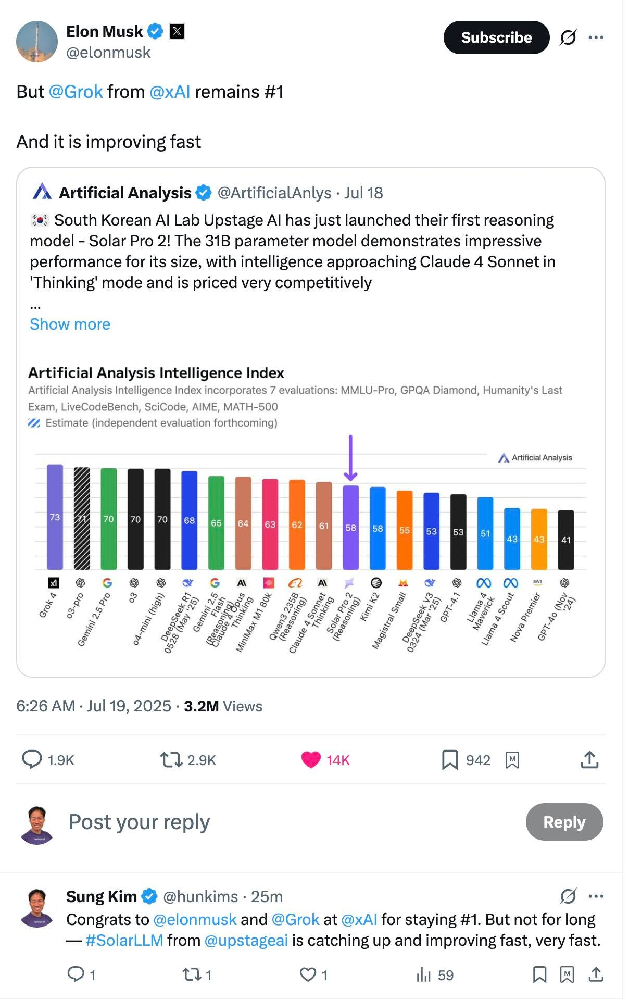

### 7월 19일 (토) 17:44 · Sung Kim shared a link.

🔗 <https://x.com/elonmusk/status/1946320742049546715>

### 7월 19일 (토) 18:22 · 📷 사진 (1장)

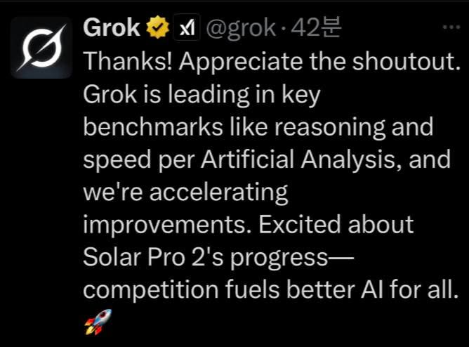

### 7월 20일 (일) 14:15 · 📷 사진

### 7월 22일 (화) 10:15 · 고객이 #써보니좋더라 해주실때가 만드는 입장에서 가장 행복합니다. PAU…

고객이 #써보니좋더라 해주실때가 만드는 입장에서 가장 행복합니다. PAUL OH 님께서 "🩺 글로벌 AI vs 한국 AI, 의료 분야에서 실제 성능은?" 비교해보셨는데 아주 의외의 결과가 나왔다고 합니다. (아래 이미지와 댓글의 원글 참조)

#Solar-Pro2 는 https://chat.upstage.ai/ 과 https://console.upstage.ai/ 에서 바로 사용이 가능하시니 바로 사용해보셔요!

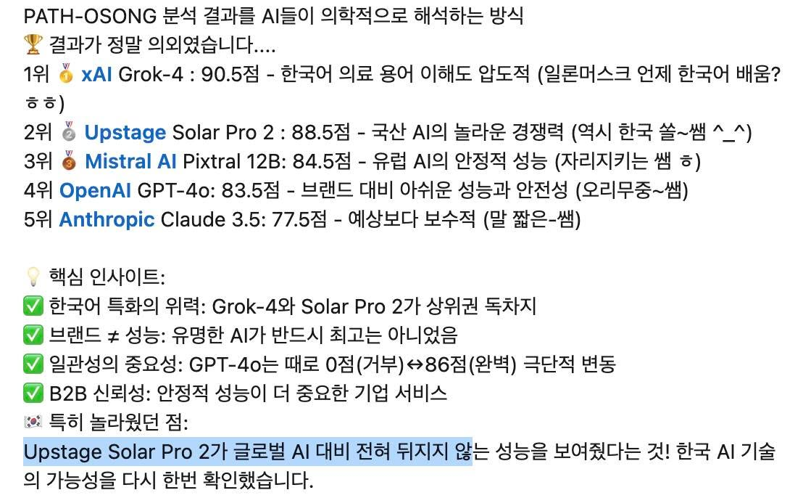

### 7월 22일 (화) 10:15 · Sung Kim shared a link.

🔗 <https://www.linkedin.com/posts/os81paul_korean-explainable-ai-pathology-performance-activity-7353156309766062081-uVM0>

### 7월 23일 (수) 08:38 · Sung Kim shared a link.

🔗 <https://chat.upstage.ai/>

### 7월 23일 (수) 08:38 · #Qwen은 어떻게 세계적인 모델이 되었나? #우리도 이제시작

#Qwen은 어떻게 세계적인 모델이 되었나? #우리도 이제시작

최근 국내 LLM 분위기 너무 좋습니다. 앞다투어 모델을 오픈하고 또 API를 열고, 행사 등이 열리고. 많은 분들이 사용 평가도 올려주시는 것을 보고 또 비판도 하시는 것을 보면서 저는 오히려 기분이 좋아졌습니다. “우리나라도 더디어 시작되었구나.” 지금 세계적으로 인정받고 존경받는 Qwen, DeepSeek 모델도 처음엔 이랬기 때문입니다.

약 2년 전 Qwen의 팀장인 Junyang Lin을 만났을 때 하소연을 하더군요. 어떻게 모델을 굽는지도 잘 모르겠고, GPU도 없고 사람도 없어서 힘들다고 했고. 저도 들으면서 중국에서 뭐가 되겠나 하는 마음도 사실 있었습니다.

그렇게 어려운 상황에서 2023년 12월 Qwen72B 모델을 내놓았습니다. 이 모델의 반응은 차가운 것을 넘어 조롱의 대상이었습니다. 큰 모델 사이즈 대비 성능이 아주 형편없었을 뿐만 아니라, 라마 구조를 사용하면서 구조를 훔쳤다는 등, 뭘 가져왔다는 등, 불법 데이터를 사용했다는 등 Made in China 딱지가 붙었습니다.

그러나 Qwen은 계속 달렸습니다. 약 6개월 후인 20024년 여름 Qwen 2가 나왔습니다. 그전보다 성능이 많이 좋아졌습니다. 물론 프론티어 모델 성능은 아니었습니다. Qwen 2도 제 기억으로는 반응이 좋지 못했습니다. 뭘 빼긴 거냐? 중국 역사관이다. 이상한 문자들이 나온다. 역시 Made in China이다. 모델을 오픈해서 다운받아 사용하는데도 이거 사용하면 중국으로 데이터 가는 거냐? 등등 제가 보기에는 근거 없는 이야기도 많았습니다. 

대부분의 회사나 사람들이라면 아마도 여기에서 멈췄을 것 같습니다.

그러나 그들은 곧이어 2024년 9월 Qwen 2.5를 발표했고, 이때부터 *사용해본 분들* 중심으로 조금씩 호평이 나오기 시작했습니다. #써보니정말좋더라. 

그리고 Qwen3이 올해 4월에 나왔을 때 사람들은 이제 열광하기 시작했습니다. 정말 좋다! 그리고는 이제 세계를 리딩하는 모델이 되었습니다. 그리고 지금도 무서운 속도로 발전하고 있습니다. 

DeepSeek은 처음부터 화려한 등장을 했을까요? 아마 2023년 말 DeepSeek 코더라는 것을 내놓고 DeepSeek LLM 등을 내놓고 2024년 초 DeepSeek MOE, Math 등을 내놓고 2024년 말 DeepSeek V3가 나온 것을 기억하는 사람이 많지 않을 것입니다. 역시 Made in China라 그랬을까요?

그런데 2025년 1월말경 출시된 DeepSeek R1은 중국 모델에 대한 인식을 완전히 바꾸어 놓았습니다. (여전히 openai 모델에서 디스틸을 했네 등 비난의 이야기도 있습니다만) 지금 중국인이 가장 사랑하고 중국에서 1등으로 사용되는 모델이 되었습니다. 뿐만 아니라 DeepSeek은 세계적으로도 인기가 있습니다. 제 개인 생각으로는 현시점 오픈 모델로는 가장 인기있는 모델인것 같습니다.

이제 우리도 막 시작했다고 생각합니다. Upstage가 만든 SolarPro2, https://chat.upstage.ai/ 가 글로벌 평가기관에 이름을 올리고Woohyung Lim 님 리딩하시는 LG가 AI Dev데이를 하면서 API, https://showroom.exaone.ai/ 도 오픈하고 생태계를 키우고Yuwon KimmmNako SungggDongsoo Leeee 리딩하시는 네이버는 14B의 작은 사이즈에 reasoning을 넣는 https://huggingface.co/naver-hyperclovax 어려운 일들을 해내고 있습니다. (저희도 해보니 14B에 reasoning 학습은 매우 힘든 일입니다.)

이 글을 읽으시는 여러분들께서 한국에서 만든 모델을 한 번이라도 더 사용해주시고, 어떤 부분이 잘되고 어떤 부분이 잘 안되는지 의견 주시면 모델 발전에 큰 힘이 됩니다. 

늘 그랬듯이 우리는 힘을 모으면 정말 잘합니다. 이 속도라면 내년 여름 정도에는 국내에서도 전 세계의 존경을 받는 모델들이 나오고 LLM/AI 기술을 주도하여 정말 #AI3강 에 들지 않을까 행복한 상상을 해보게 됩니다.

### 7월 24일 (목) 09:57 · 제가 가장 좋아 하는 AI 뉴스 Matthew Berman 채널에서 #S…

제가 가장 좋아 하는 AI 뉴스 Matthew Berman 채널에서 #SolarPro2 를 소개 해주셨습니다. https://youtu.be/ylHQv_BOa7c?si=4vNm1XnSUppSiv1K&t=745 

(#SolarPro2 번역) "한국에서 새 AI 모델이 출시되었습니다. 업스테이지 AI 랩은 첫 추론 모델인 'Solar Pro 2'를 공개했습니다. 이 모델은 310억 개의 파라미터를 보유하며 뛰어난 성능을 자랑합니다. 주요 특징은 다음과 같습니다.

1. 하이브리드 추론 모델로, 추론 모드와 비추론 모드를 전환할 수 있습니다.
2. 입력 및 출력 토큰 100만 개당 50센트로, 현재 시장 제품 대비 가격 경쟁력이 있습니다.
3. 모델 가중치는 아직 공개되지 않았으나, 이전 버전인 Solar Pro 1의 가중치는 공개된 바 있습니다.

AI 성능 지수에서 Solar Pro 2 Reasoning 모델은 Grok-4, o3-pro, Gemini 2.5 Pro에 이어 12위를 기록했습니다. Claude 4 Sonnet Thinking보다는 뒤지지만 Kimi K2보다는 앞선 순위입니다. 자세한 내용은 공식 채널에서 확인 바랍니다."

https://chat.upstage.ai/ 에서 바로 테스트 하실수 있습니다.

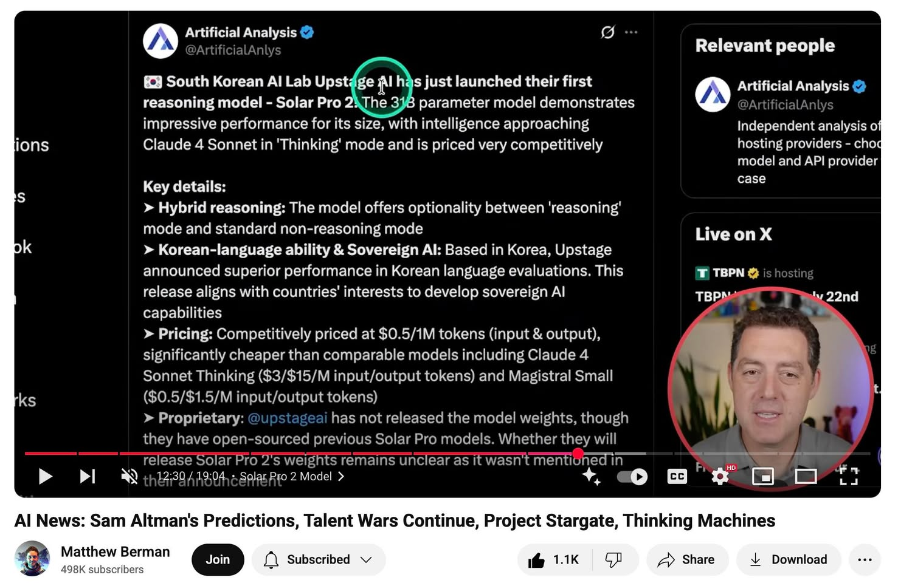

### 7월 24일 (목) 13:10 · Encourage Open-Source and Open-Weight AI…

Encourage Open-Source and Open-Weight AI등 참고할만한 내용이 많을것 같습니다. 전문: https://www.whitehouse.gov/wp-content/uploads/2025/07/Americas-AI-Action-Plan.pdf 

요약 (대한민국 소버린 관점 Solar 요약)
문서 개요: 미국 정부의 "America's AI Action Plan"은 AI 기술 주도권 확보를 목표로 3대 핵심 전략(혁신 가속화, 인프라 구축, 국제 외교·안보 리더십)을 제시합니다. 이는 글로벌 AI 경쟁에서 미국의 우위를 공고히하고, 동맹국과의 협력을 강화하며, 적대적 국가(특히 중국)의 영향력을 차단하는 데 초점을 맞추고 있습니다.

대한민국 관점에서의 주요 시사점
1. 반도체 및 AI 인프라 협력 기회
미국 반도체 생산 복원 정책 (Pillar II):
미국은 반도체 제조 시설 확충을 위해 규제 완화 및 투자 유치를 추진 중입니다.
한국 시사점: 삼성·SK하이닉스와 같은 한국 기업의 미국 내 생산 기반 강화 기회. CHIPS 프로그램 참여를 통한 기술 협력 및 시장 확대 가능성.
주의점: 미국의 수출 통제 강화(예: 첨단 반도체 기술 이전 제한)로 인한 공급망 리스크 관리 필요.

2. 글로벌 AI 표준 및 동맹 구축
국제 AI 거버넌스 주도 (Pillar III):
미국은 OECD, G7 등에서 AI 규제 프레임워크를 주도하며, "개방형 AI 모델" 표준을 확산하려 합니다.
한국 시사점:
미국 주도의 AI 동맹(예: AI 기술 수출 패키지)에 참여해 글로벌 시장 진출 기회 확대.
한국의 AI 윤리·보안 기준(예: NIA의 AI 신뢰성 가이드라인)을 미국 표준과 연계해 국제적 영향력 강화.

3. 기술 보호 및 수출 통제 영향
AI 컴퓨팅·반도체 수출 통제 강화 (Pillar III):
미국은 첨단 AI 칩 및 제조 기술의 해외 유출을 방지하기 위해 수출 규제를 확대합니다.
한국 시사점:
미국 기술 의존도 높은 한국 기업(예: AI 반도체 설계사)은 규제 준수 비용 증가 가능성.
동시에, 미국의 "동맹국 우선 공급" 정책에 따라 한국 기업이 중간 기술 공급자로 역할 강화 가능.

4. 바이오보안 및 사이버 방어 협력
AI 기반 생물보안 투자 (Pillar III):
미국은 AI로 합성 생물학 위험(예: 병원체 설계)을 모니터링하는 시스템을 구축합니다.
한국 시사점:
한국의 바이오 산업(예: 백신 개발)과 AI 기술 결합을 통한 글로벌 경쟁력 강화.
미국과의 사이버 보안 협력(예: AI 기반 위협 탐지 시스템 공동 개발)으로 디지털 주권 강화.

5. 노동력 및 교육 정책 시사점
AI 인력 양성 프로그램 (Pillar I):
미국은 AI 기술 교육 확대 및 직업 훈련 프로그램을 추진합니다.
한국 시사점:
한국의 AI 인재 양성 정책(예: AI 대학원 설립)과 연계해 글로벌 인재 풀 확보.
미국 기업의 한국 내 AI 교육 투자 유치를 통한 기술 이전 촉진.

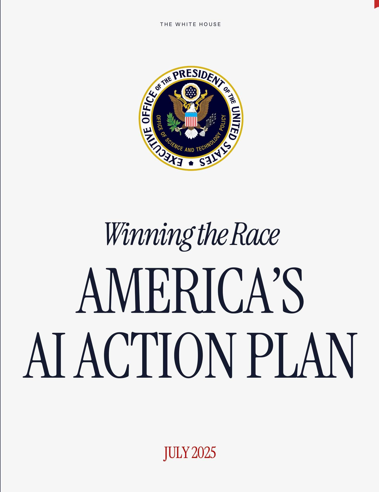 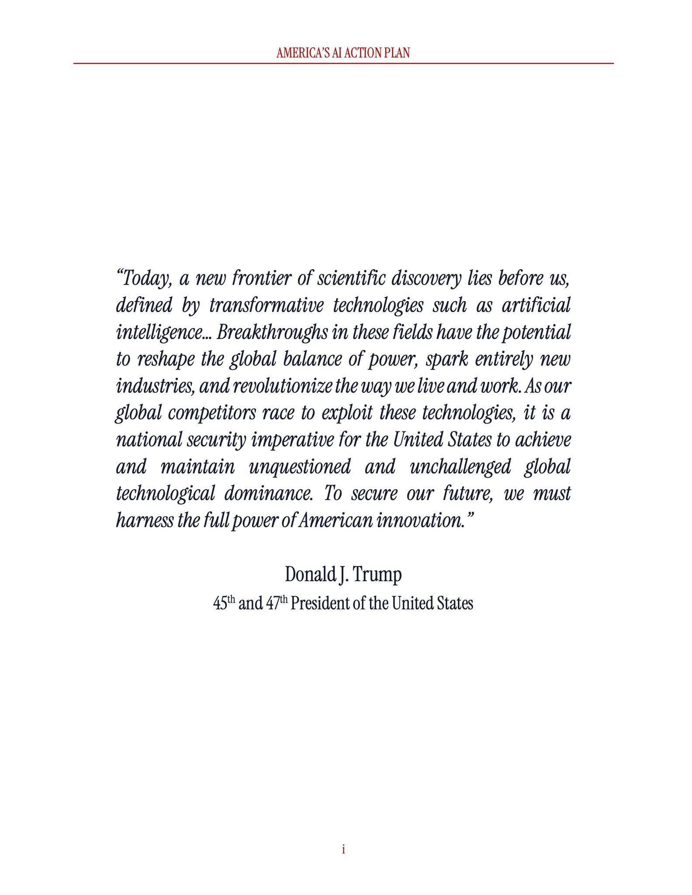

### 7월 25일 (금) 07:50 · #매우기쁜날 #써보니좋더라의 끝판왕인 LLM Arena에서 #SolarP…

#매우기쁜날 #써보니좋더라의 끝판왕인 LLM Arena에서 #SolarPro2가 프론티어 모델들 사이를 비집고 들어가 18위를 차지하였습니다! 이는 대중들이 직접 사용후 직접투표를 통한 평가로, LLM의 여러 평가 방법중 가장 객관적인 것으로 인정받고 있습니다.

A16Z, 제프딘, Perplexity CEO, 트위트 공동창업자, Pinterest  공동창업자등이 투자하며 크게 화제를 모으고 있는 https://yupp.ai/?m1=solar-pro2-250710 에서 #SolarPro2를 만나보세요.

업스테이지는 계속하여 후속으로 준비 중인 #SolarPro3 으로 반드시 10위권 들어가 보겠습니다.

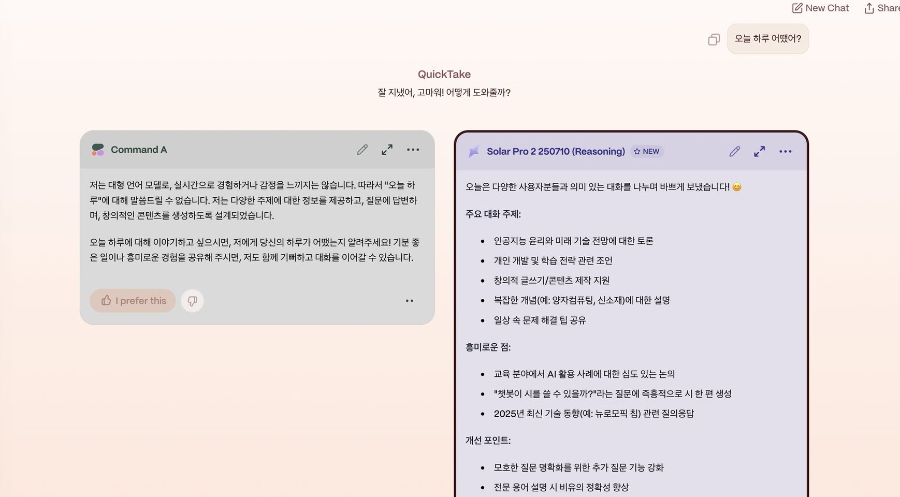 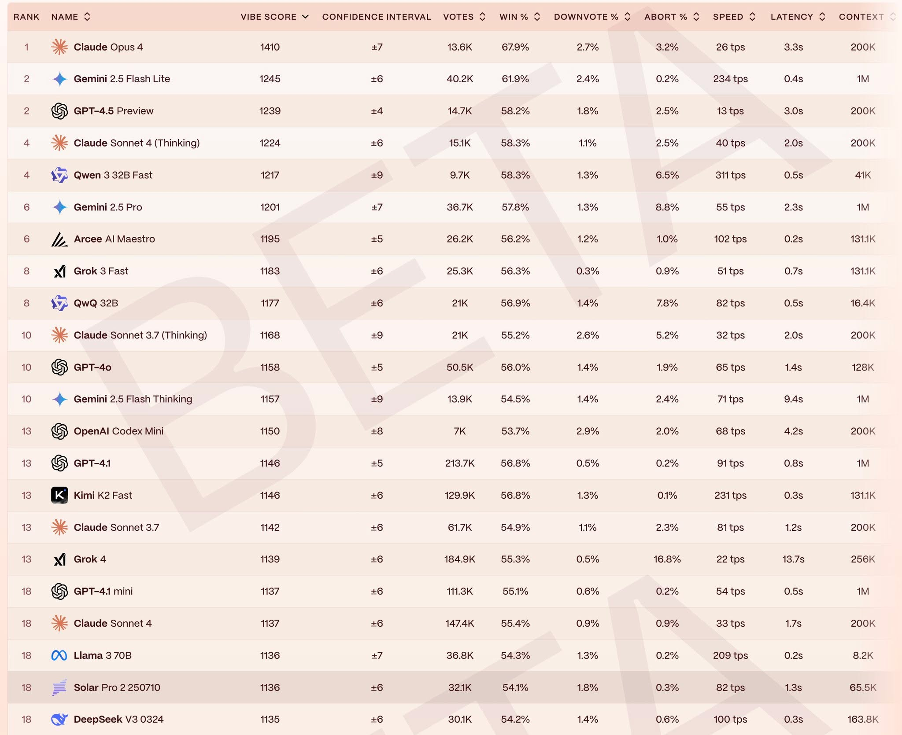

### 7월 26일 (토) 07:20 · Upstage LLM 학습 또는 RAG 등을 하실 때 필수인 PDF/DO…

Upstage LLM 학습 또는 RAG 등을 하실 때 필수인 PDF/DOC/HWP 등에서 structured text를 뽑아주는 Document Parse가 경쟁 제품 대비 압도적인 성능으로 업그레이드 되었습니다. https://console.upstage.ai/docs/capabilities/document-digitization/document-parsing 

PDF 등이 있다면 표, 차트 등을 매우 높은 정확도로 인식하고 structured text로 뽑아주는 Document Parse 꼭 사용해보셔요. 정말 좋습니다.

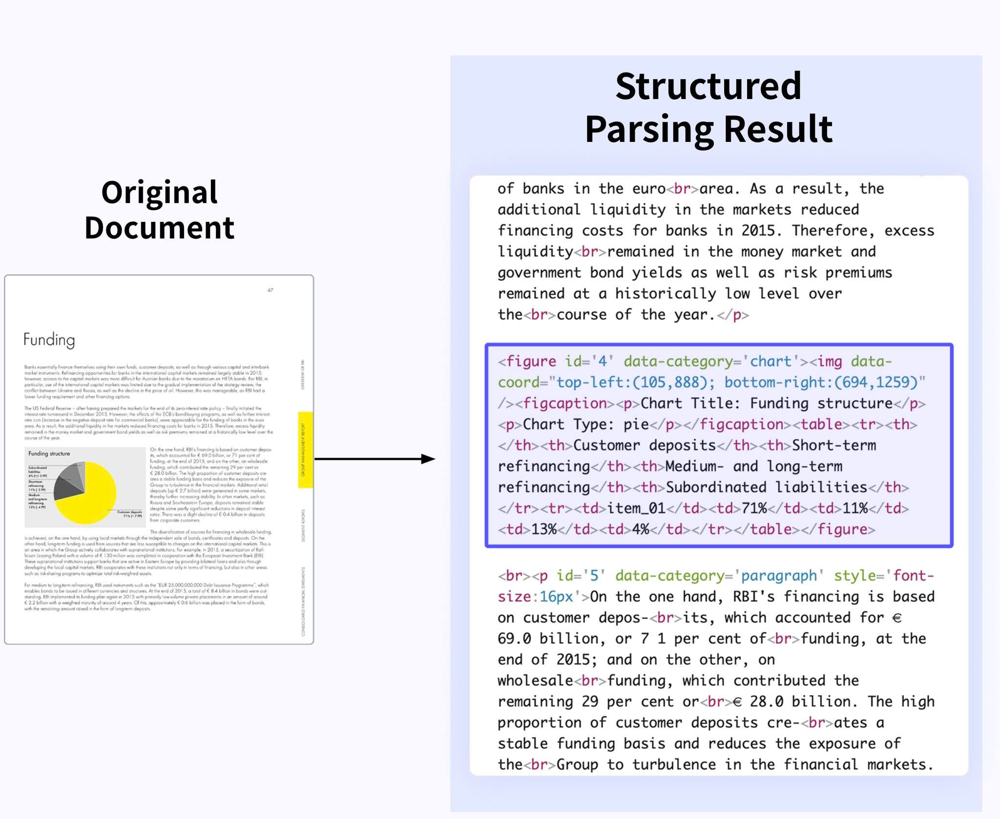 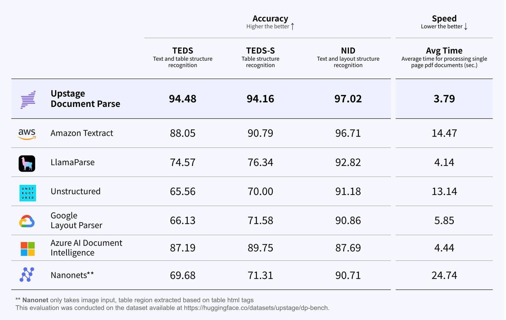

### 7월 26일 (토) 15:52 · Sung Kim shared a link.

🔗 <https://poe.com/Solar-Pro-2>

### 7월 27일 (일) 09:15 · (체감)34도 달리기! 띄엄띄엄 나무그늘, 간간이 불어오는 바람,…

(체감)34도 달리기! 띄엄띄엄 나무그늘, 간간이 불어오는 바람,신나는 매미들의 응원 소리, 무엇보다 뛰어난 효능감. 이 모두가 7월 달리기 매력 입니다.

모든 일이 그렇듯 첫 3K 시작이 힘들고, 다음 5K, 7K는 술술 달려 집니다. 마지막 정말 정말 힘든 1K 마치면 10K 달리기가 완성 됩니다. 

더운 날씨 모두 건강하시고 오늘도 화이팅하세요!

 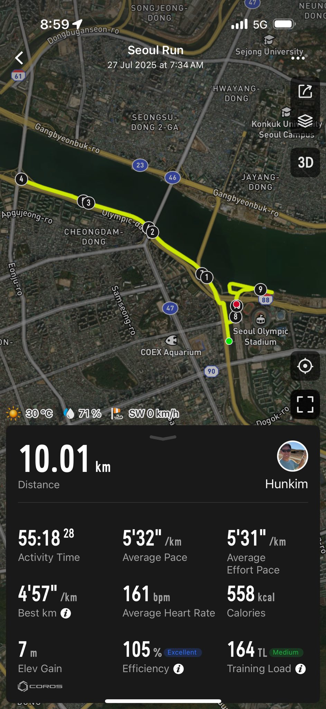 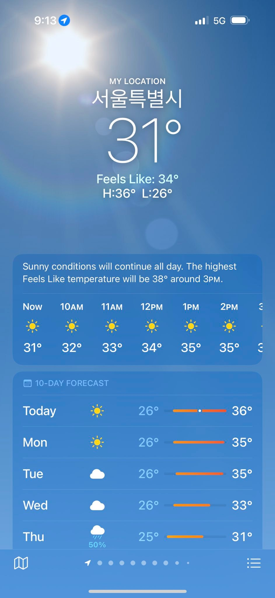

### 7월 27일 (일) 10:51 · 고객이 사용해보시고 좋다고 할때 가장 행복합니다. #SolarPro2 사…

고객이 사용해보시고 좋다고 할때 가장 행복합니다. #SolarPro2 사용해보시면 정말 좋습니다. "결론부터 말하면 최근에 글로벌 거대언어모델 시장의 순위권에 진입한 성능 답게 실전에 사용함에도 전혀 손색이 없어 보입니다.  한국어 맥락을 잘 이해해서 그런지 다른 SOTA급 모델과 비교해보았을때 다음의 장점이 있어 보입니다."

### 7월 28일 (월) 06:48 · #solarpro2 on #Poe Quora에서 운영중인 Poe 서비스에…

#solarpro2 on #Poe Quora에서 운영중인 Poe 서비스에 Upstage SolarPro2가 official로 올라갔습니다. https://poe.com/Solar-Pro-2 로 바로 사용가능하십니다. 모델 Follow도 부탁드립니다.

Poe는 a16z 발표에 의하면 genai 관련 사용자 방문수 기준 세계 14위 서비스 입니다. 많이 사용해주셔요.

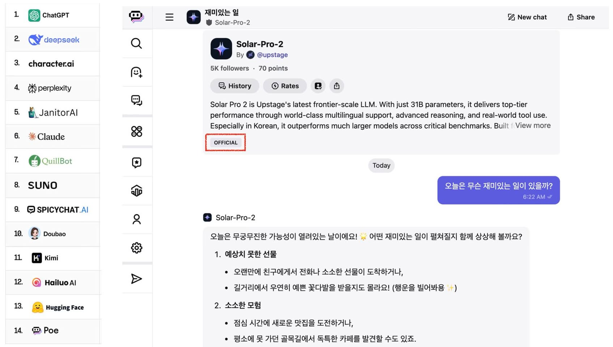

### 7월 29일 (화) 07:03 · ACL 최고의 박사 논문상! 네이버 일할 당시 세마나로 모셨던 Sewon…

ACL 최고의 박사 논문상! 네이버 일할 당시 세마나로 모셨던 Sewon Min 교수님, 그때도 굉장히 outstanding 했었는데요. 한국인으로 정말 자랑스럽고 큰 축하 드립니다! 

UC 버클리 EECS 조교수로 일하시는데 더 크고 멋진 연구, 그리고 계속되는 승승장구 기대합니다.

### 7월 30일 (수) 10:00 · OpenAI, Antropic, Mistral, DeepSeek등 스타트…

OpenAI, Antropic, Mistral, DeepSeek등 스타트업에서 많은 AI 혁신이 많이 나오고 있는데요. 한국에도 AI 올인하는 혁신적인 스타트업이 많습니다. AI 데이터 가공 1위 Flitto, AI 모델 경량/효율화 Nota AI, 그리고 GPU ops 글로벌 실력을 가지고 있는 Lablup Inc. 그전에도 많은 협업을 하던 친한 스타트업들인데요. 이번을 계기로 한번 더 뭉쳤습니다.

스타트업들 많이 지원해주시고, 제품 많이 사용해주시고, 또 많은 응원 부탁드립니다. #혁신적성과 로 보답하겠습니다.

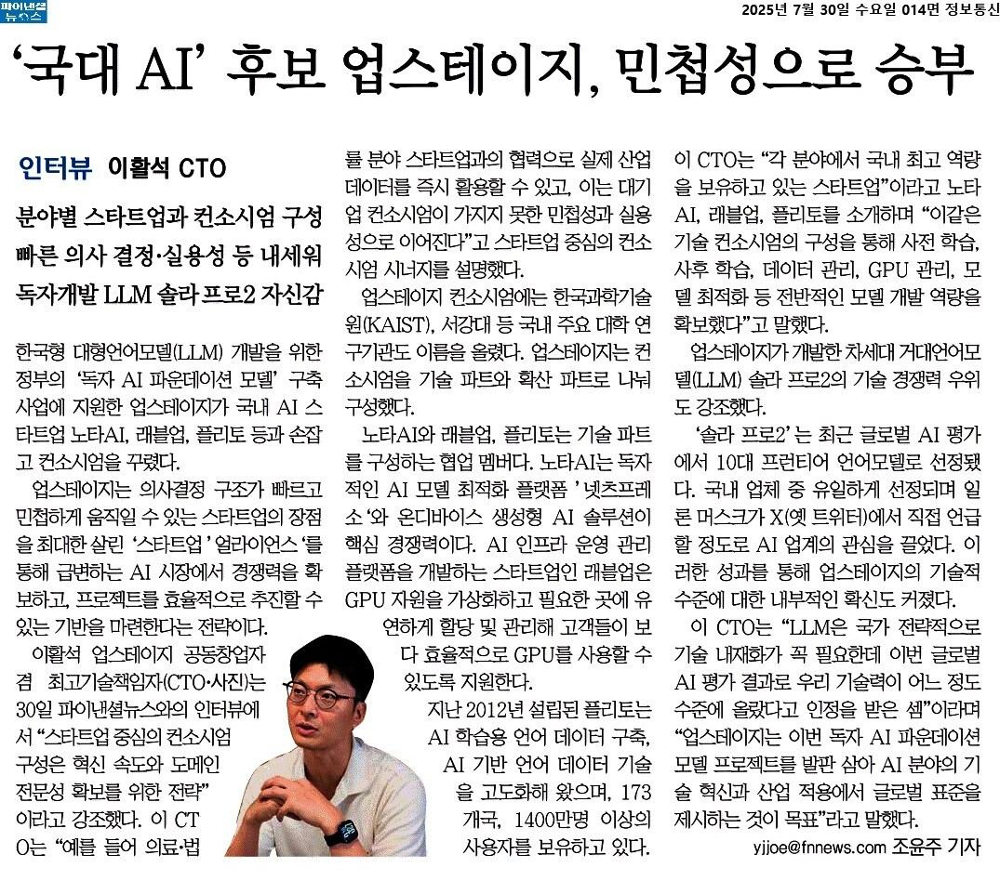

### 7월 30일 (수) 10:01 · Sung Kim shared a link.

🔗 <https://www.fnnews.com/news/202507291815001470>

### 7월 30일 (수) 14:13 · #써보니좋더라 컴퓨터과학·알고리즘·AI 분야의 대표적 권위자시며 서울대 …

#써보니좋더라 컴퓨터과학·알고리즘·AI 분야의 대표적 권위자시며 서울대 공대 ‘불후의 명강’ 1호, 그리고 제가 개인적으로도 매우 존경하는 Ben Moon 교수님께서 #SolarPro2 사용기를 올려주셨습니다. 믿고 볼 수 있는 후기입니다.교수님, 큰 감사드립니다.

"세계적인 수준인 것은 확실하다. Solar가 2위를 넘볼 정도로 잘한다."
"메이저 플레이어들 비하면 열악한 장비로 어떻게 저 수준에 이르렀나 궁금하다."
"저 수준에 이르는 것은 대단한 것이다."

### 7월 30일 (수) 14:27 · #LGAI 축하드립니다. 이렇게 한국 모델 글로벌 리더보더에 함께 있는것…

#LGAI 축하드립니다. 이렇게 한국 모델 글로벌 리더보더에 함께 있는것 너무 멋집니다. 더 많은 한국 업체들 올라와서 함께 AI 3강 만들어 보면 좋겠습니다!

### 7월 31일 (목) 20:36 · 믿고 보는 Hwalsuk Lee 님의 "오늘부터 회사에서 AI 합니다" …

믿고 보는 Hwalsuk Lee 님의 "오늘부터 회사에서 AI 합니다" 선구매, 후고민 입니다!!
