# 2025년 8월

[← 2025년](README.md)

### 8월 2일 (토) 05:59 · Upstage  를 소개 드립니다. (베타 기간 동안 무료로 제공) 여러…

Upstage https://space.upstage.ai/ 를 소개 드립니다. (베타 기간 동안 무료로 제공) 여러 개의 복잡한 문서를 읽고 정리하고 찾고 같이 생각할 수 있는 여러분의 AI 도우미입니다. 

여러 개의 문서들 속에서 간단한 질문뿐만 아니라 여러 곳의 정보를 취합해서 답을 해야 하는 경우도 정확하게 답을 합니다.

그리고 그 답이 어디서 나온 것인지 페이지 내 문단 단위로 정확하게 보여주어 답을 확인하고 추가 정보를 얻게 해줍니다.

RAG를 위해서 저희는 벡터 검색을 사용하지 않고 LLM을 사용한 의미 검색을 합니다. 기존 벡터 검색은 문장의 길이가 길어지면 정확도가 매우 떨어지는데 저희가 사용하는 의미 기반 검색은 chunk의 길이와 상관없이 정확한 context를 찾아줍니다.

Upstage Document Parse와 SolarLLM을 사용하여 개발되었습니다. 많이 사용해주세요.

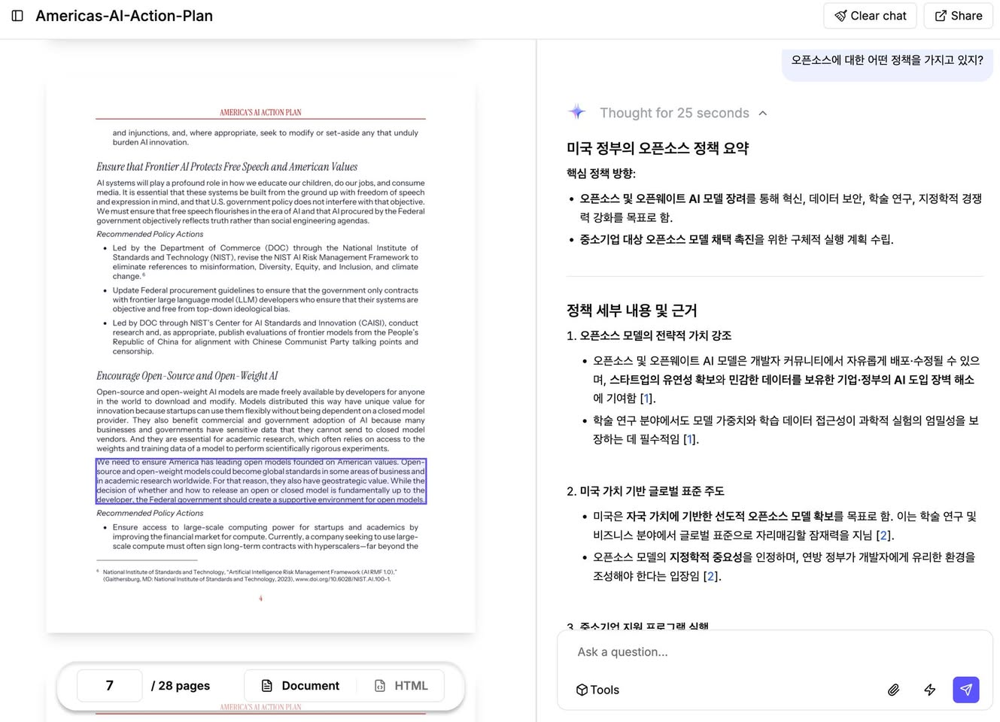

### 8월 2일 (토) 06:00 · Sung Kim shared a link.

🔗 <https://youtu.be/Jo_Na3UlWAM>

### 8월 2일 (토) 06:00 · Sung Kim shared a link.

🔗 <https://youtu.be/up7SXaILfqo?si=yQz8SStonsfZvm4P>

### 8월 5일 (화) 08:41 · World Best LLM (#WBL) 함께 만드실 분들을 모십니다.

World Best LLM (#WBL) 함께 만드실 분들을 모십니다.  https://careers.upstage.ai/?jobs-c88dea0d%5Bsearch%5D=WBL

#AI3강 을 목표로 하는 AI 국가대표 5개 정예팀에 Upstage 컨소시엄이 선정되었습니다. 매우 기쁘고 영광스럽습니다. 

우리의 목표는 분명하지만, 그러한 만큼 어깨는 더 무겁습니다. 짧은 시간에 적은 데이터와 소규모 GPU로 세계 최고의 모델을 뛰어넘어야 하기 때문입니다. 모든 순간이 불가능에 가까운 매우 도전적인 여정이 될 것입니다.

그러나 결국 좋은 분들이 함께 한다면 우리는 해낼 수 있을 것으로 생각합니다. 완전 새로운 방법을 찾아내고, 끊임없는 시도를 하고, 마침내 좋은 결과를 만들 것입니다. 이 가슴 뛰는 도전에 함께하실 [WBL] AI Research Engineer - Vision Language Model, [WBL] AI Research Engineer - LLM, [WBL] AI Model Production - LLM 분들을 모십니다.

리모트 근무환경을 기본으로 세계 어디서나 일하실 수 있으며 팀에 조인하시면 다량의 GPU가 제공됩니다. 빠르게 마감될 수 있으니 선지원, 후고민 부탁드립니다. 주위 좋은 분들에게 많이 알려주시고 공유 부탁드립니다.

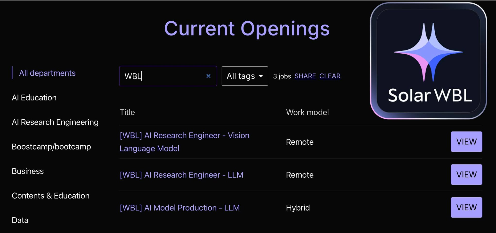

### 8월 7일 (목) 11:33 · #전직원스톡지급 Upstage는 회사의 성장을 개인의 성장과 보상으로  …

#전직원스톡지급 Upstage는 회사의 성장을 개인의 성장과 보상으로  어떻게 이어갈 것인지 고민하고 있습니다. 결국 회사가 성장할 수 있는 것은 개인 구성원 덕분이기 때문입니다.

다음 퀀텀점프를 향해 회사를 더 성장시켜 주실 멤버분들에게 감사의 마음을 담아 2025년 상반기에 이어, 하반기 한번 더 전사 스톡옵션을 지급하고자 합니다. 

업스테이지 로켓에 함께 하실 분들은 선지원, 후고민입니다. 특히 9/30 전에 함께하시면 좋겠습니다. https://careers.upstage.ai/

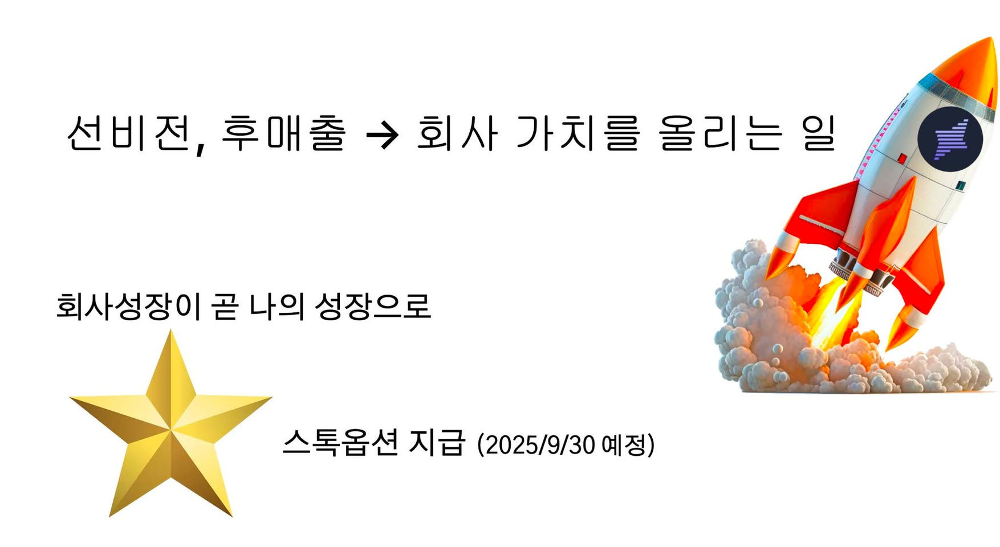

### 8월 8일 (금) 08:00 · #GPT5 #한줄요약 #우리도할수있겠네  이번 GPT5 발표에서 강조한 …

#GPT5 #한줄요약 #우리도할수있겠네  이번 GPT5 발표에서 강조한 것은  (1) 코드 잘짜요 (엔트로픽이 API 매출 OpenAI 추월 -- 3번째 스샷), (2) 그리고 healthcare 정보 잘돼요 였는데요.

아래 그래프와 클로드4.1과의 비교에서 보듯 아주 놀라운 퀀텀점프는 없었던것 같습니다. 모델을 만드는 관점에서 보니 우리도 할 수 있겠다는 생각이 들었습니다.

#SolarWBL 로 빠르면 올말, 늦어도 내년초에는 gpt5 성능의 모델을 만들어 보겠습니다. 그리고는 추월하도록 해보겠습니다.

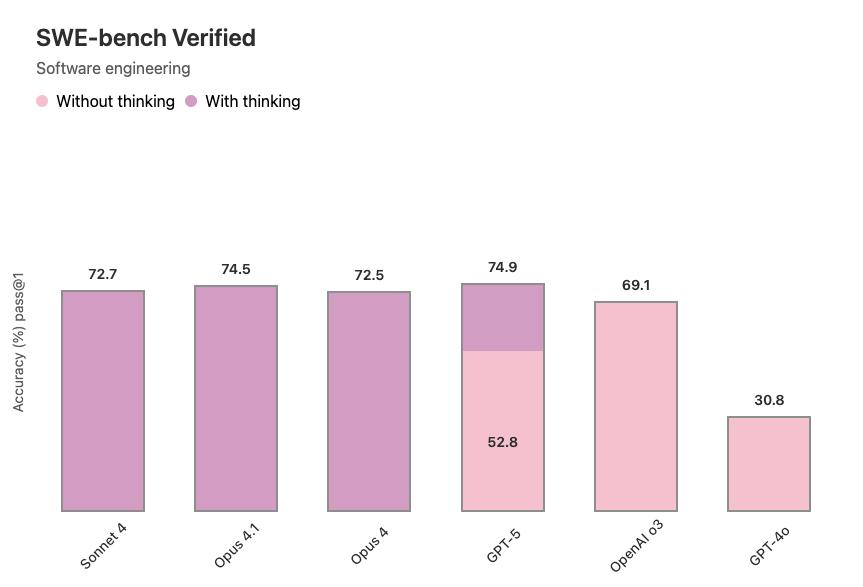 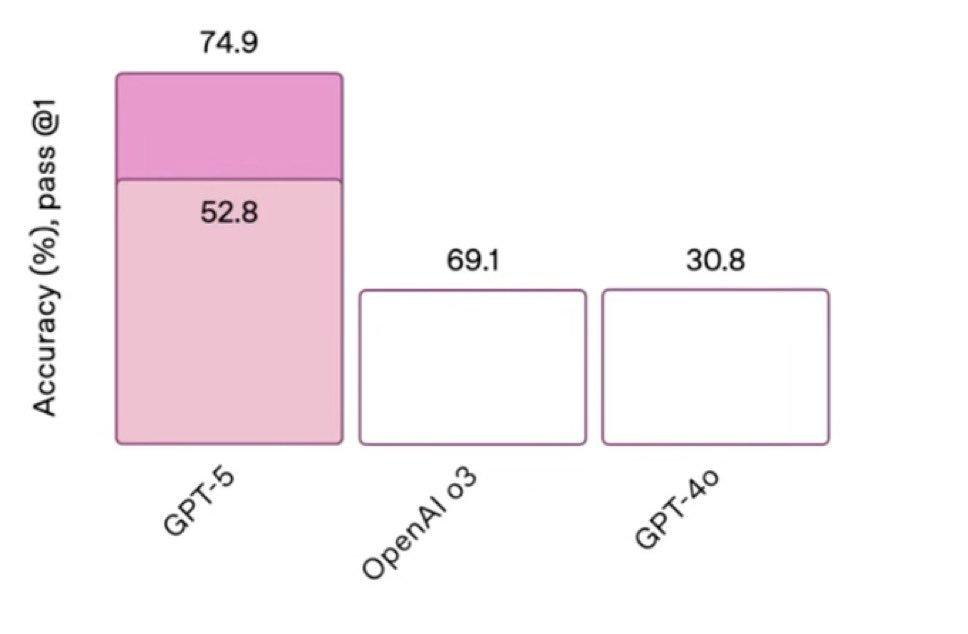 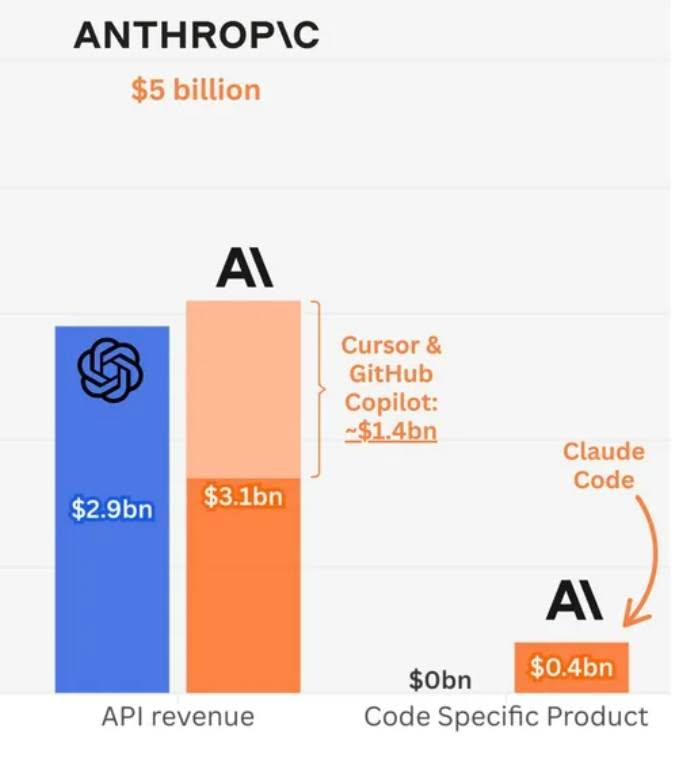

### 8월 9일 (토) 07:21 · #써보니좋더라 Ben Moon 교수님께서 GPT5와 함께 성능비교 해주셨…

#써보니좋더라 Ben Moon 교수님께서 GPT5와 함께 성능비교 해주셨습니다. 

"8개 회사 9개 제품을 테스트했는데 순서는 챗GPT>제미나이>딥식>솔라>그록>큐웬>클로드>"

#SolarWBL로 지능을 더더더 올려보도록 하겠습니다!

### 8월 11일 (월) 09:56 · #FT에성킴얼굴이 이코노미스트, 월스트리트 저널(WSJ)과 함께 글로벌 …

#FT에성킴얼굴이 이코노미스트, 월스트리트 저널(WSJ)과 함께 글로벌 금융, 정치권에서 필독하는 세계적인 권위지로 알려진 FINANCIAL TIMES에 Upstage 가 소개되었습니다. 

한국의 스타트업 Upstage 이 개발한 Depth-Up Scaling 방법으로 탄생한 LLM Solar Pro 2가 글로벌 상위권 모델들을 성능으로 제치고 비용의 효율성까지 입증했으며, 미국과 중국이 사실상 리딩하는 AI 시장에 도전장을 내밀며 한국 AI 생태계의 글로벌 위상 강화를 이끌고 있다는 내용이 담겨 있습니다.

#FT 가 이처럼 개인 인터뷰로 지면 전체를 할애하는 경우는 -한국 관련 뉴스로는 지정학적 이슈가 아니면 매우 드물고- 해외에서도 최소 OpenAI, 엔트로픽 정도로 금융시장에 임팩트 있는 기업만 다루어 준다고 합니다. 

Upstage 더더더 올라가보겠습니다!

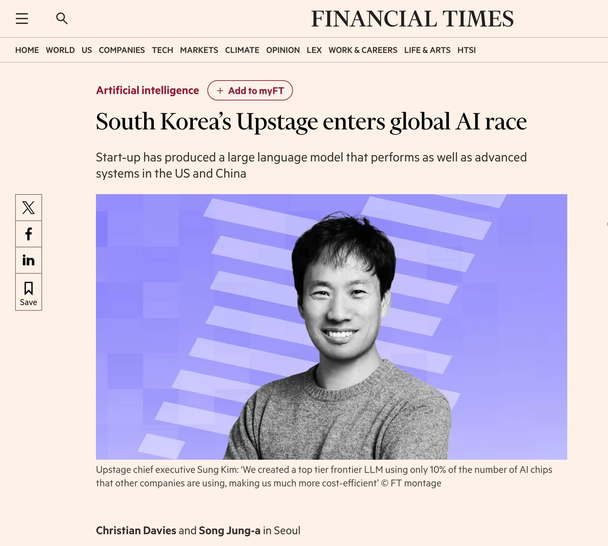

### 8월 11일 (월) 09:56 · Sung Kim shared a link.

🔗 <https://www.ft.com/content/549a34f1-5eb5-43bd-8400-2171e6e32022?accessToken=--sanitized--&sharetype=gift&token=--sanitized-->

### 8월 12일 (화) 15:47 · #APEC 민관 대화 기조연설을 통해 해외 정부 인사 및 기업인들에게 대…

#APEC 민관 대화 기조연설을 통해 해외 정부 인사 및 기업인들에게 대한민국 AI, 특히 #SolarPro2 기술력을 자랑하고 왔습니다. 또한 각국의 데이터 주권 및 AI 역량을 강화하고 이를 통한 경제성장을 도모할 수 있는 방안에 대해 말씀드렸습니다. (두 번째 이미지)

이를 계기로 APEC 회원국들과 많은 더 많은 AI 협력을 기대해 봅니다.

(APEC에서는 서로 민감한 국가라는 말 대신 Economy 용어를 사용해달라고 하더군요. 슬라이드 Economy == 국가)

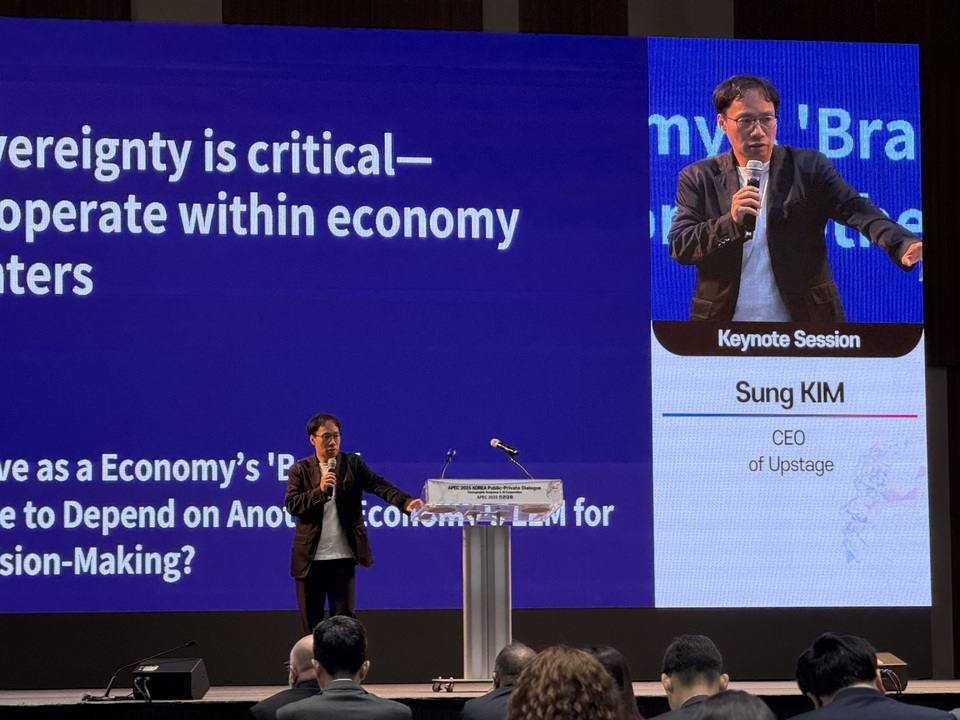 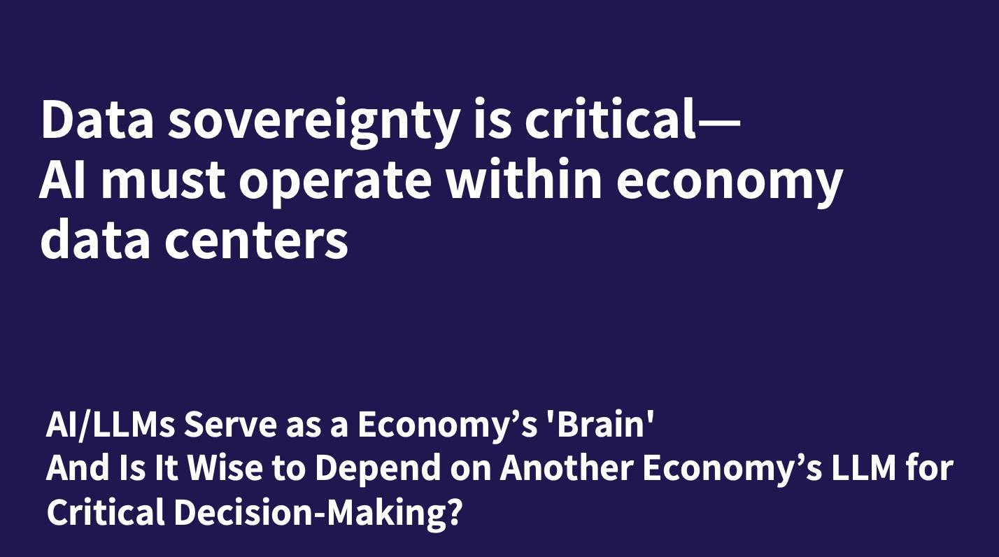

### 8월 12일 (화) 15:54 · Sung Kim shared a link.

🔗 <https://www.incheonilbo.com/news/articleView.html?idxno=1299270>

### 8월 13일 (수) 06:52 · K팝 노래 골든이 미국 빌보드 차트 1위를 기록했다는 반가운 소식입니다.

K팝 노래 골든이 미국 빌보드 차트 1위를 기록했다는 반가운 소식입니다. 

"We're going up, up, up" 너무 멋집니다. 이 노래를 많이 들으니 AI 에서도 더 많은 up, up, up 으로 1위가 탄생할 것 같은 느낌이!

https://youtu.be/yebNIHKAC4A?si=ks5wHTNDGkG7o3xi

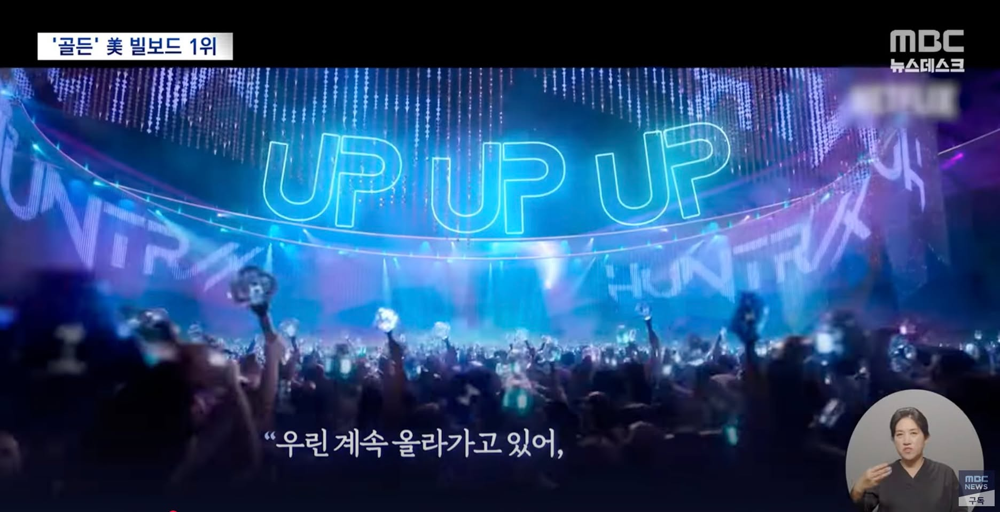

### 8월 14일 (목) 07:07 · 어제 국정기획위원회 국민보고가 있었는데요. Upstage AI Space…

어제 국정기획위원회 국민보고가 있었는데요. Upstage AI Space를 통해 읽어 보세요. PDF 파일 안에 있는 테이블, 차트 등을 Upstage Document Parse 기술로 정확하게 인식한 다음 답을 해줍니다.

답을 할 때 출처가 어디인지 정확하게 알려주는데요. 거의 몇 단어나 문장 단위로 보여줘서 출처를 쉽게 파악할 수 있도록 도와 드립니다.

국정기획서 Space: https://space.upstage.ai/share/fcb3fff7-3a90-4dad-aa4c-18e1d6caeaed

여러분이 원하시는 파일들이 있다면 AI Space에 올려서 같이 읽어 보세요. https://space.upstage.ai

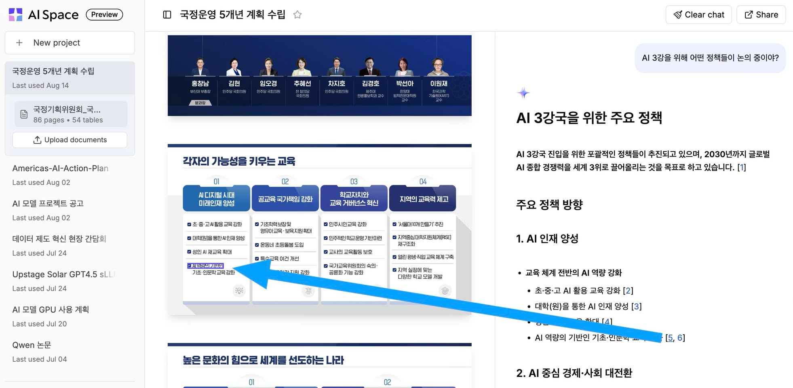

### 8월 14일 (목) 13:42 · Sung Kim shared a link.

🔗 <https://space.upstage.ai/>

### 8월 15일 (금) 21:14 · #AI3대강국 의 열망을 담아 이재명 대통령님의 #국민임명식 에 참여하였…

#AI3대강국 의 열망을 담아 이재명 대통령님의 #국민임명식 에 참여하였습니다. "글로벌 AI 혁신을 주도하여 대한민국의 기술 주도권을 확보해 나가는 국가대표 AI 기업의 이름으로, AI 3강 대한민국의 미래를 열기 위해 이 사람을 대한민국 대통령으로 임명합니다."

AI 3대 강국을 위해 Upstage 도 열심히 달려가겠습니다.

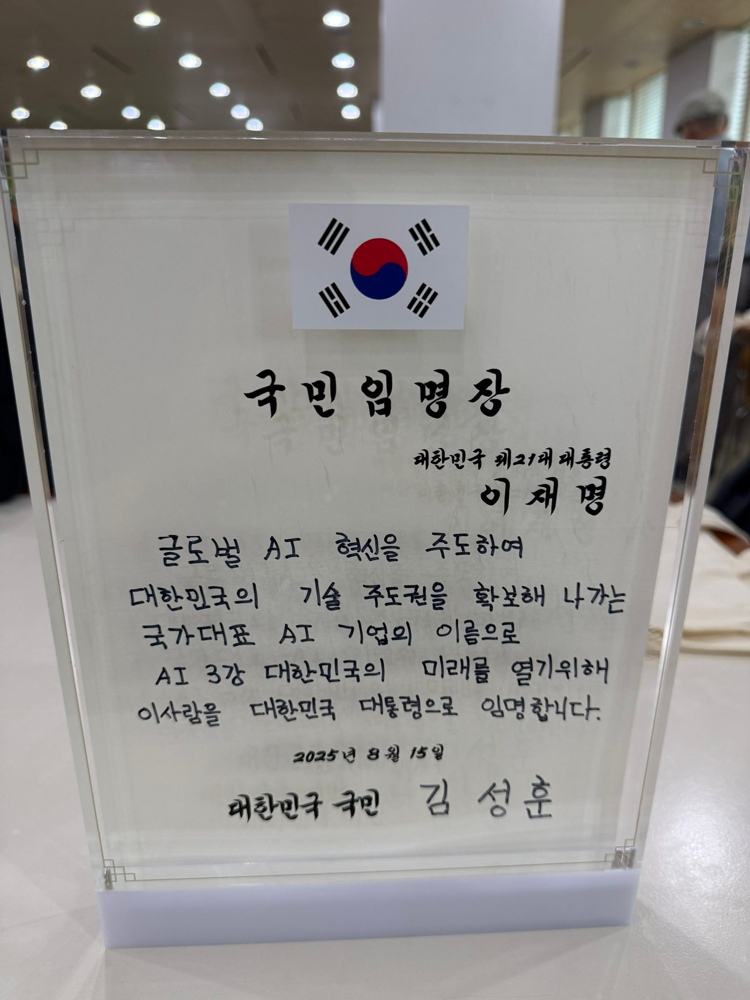 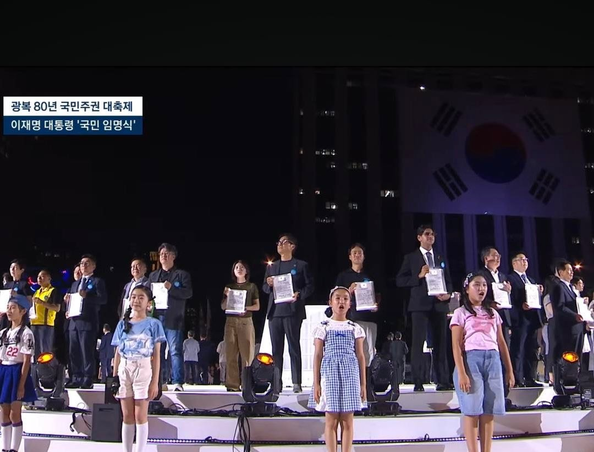 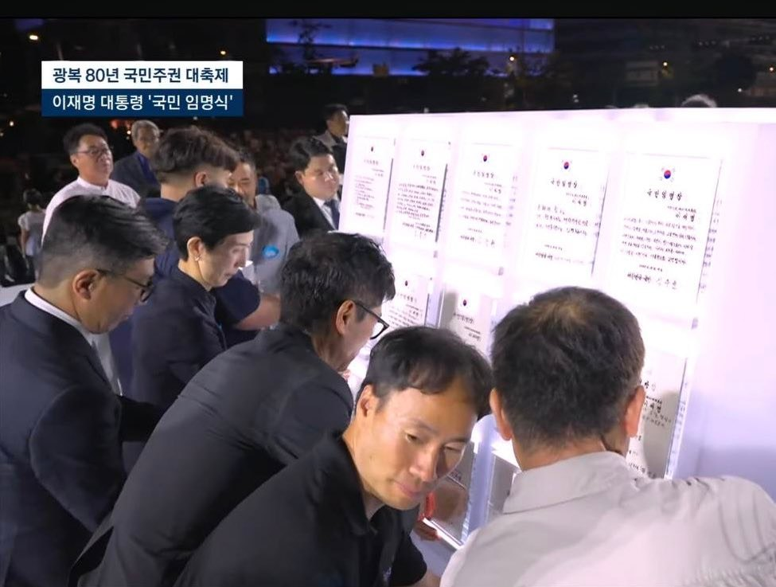

### 8월 17일 (일) 08:40 · #꿈은이루어진다 #돌고래와수영 은 제 오랜 꿈이었는데요. 오늘 월정리에서…

#꿈은이루어진다 #돌고래와수영 은 제 오랜 꿈이었는데요. 오늘 월정리에서 그 꿈이 이루어졌습니다. 

2~3마리가 30M 정도 거리를 두고 함께 수영했습니다. 아주 빠른 친구들인데 저에게 속도를 맞춰 주었습니다.

매우 기쁜 날입니다!

🎬 동영상 1개 (생략)

### 8월 18일 (월) 10:13 · 올때마다 아름다운 #한라산, 좋은 분과 함께라 더 좋습니다! #…

올때마다 아름다운 #한라산, 좋은 분과 함께라 더 좋습니다! #물찬백록담

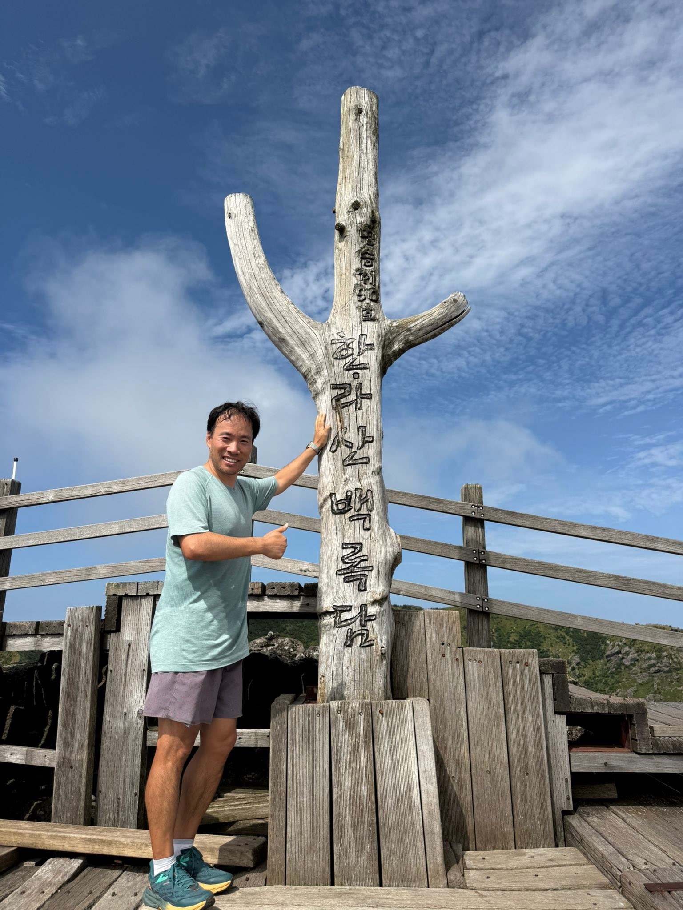 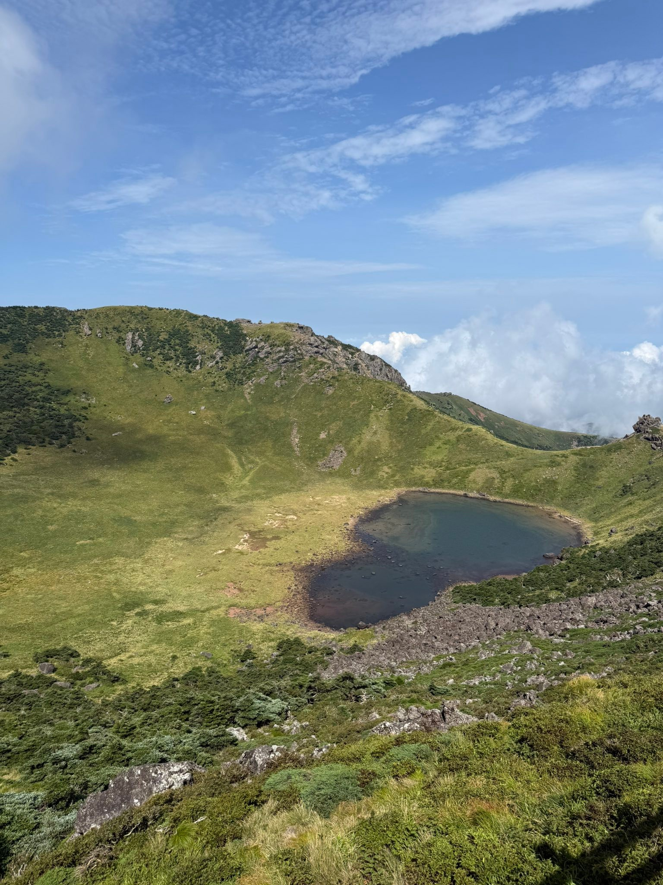 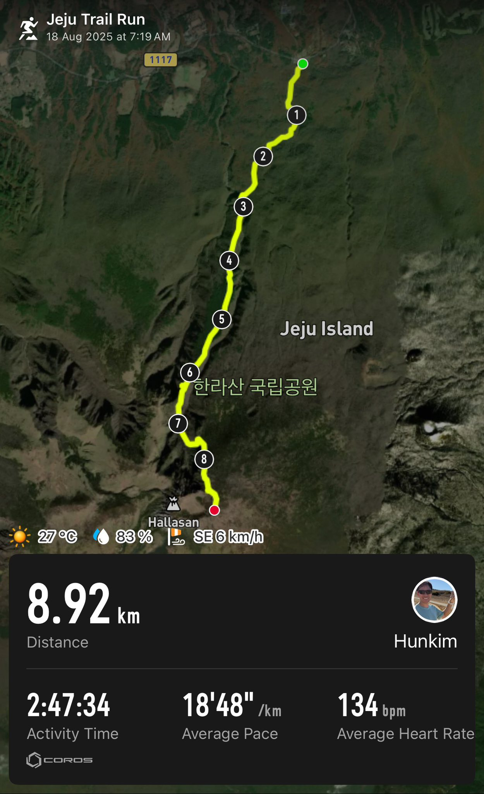

### 8월 19일 (화) 09:08 · 존경하는 #이세돌 교수님 뵈었는데요. 마침 조코딩님의 최근 인터뷰 정말 …

존경하는 #이세돌 교수님 뵈었는데요. 마침 조코딩님의 최근 인터뷰 정말 재미있게 보았습니다. 바둑의 신을 경험한 그가 이제 바둑뿐만 아니라 지금 우리가 하고 있는 99%의 일은 사라진다고 하시는 데요. 여러 가지 인사이트가 많습니다. 최근 본 AI 관련 영상 중 제일 집중해서 본 것 같습니다. 

https://youtu.be/Z-vVCekB9nI?si=WV3kEghjrOVsqBEp

제가 보면서 기억에 남는 말씀 적어 보았습니다:

"바둑 AI가 있는데 우리가 바둑을 연구하고 공부하는 것이 무슨 의미가 있나?" 

"인간의 수를 학습한 알파고 마스터는 인간보다 더 잘하지만 그가 두는 수는 이해가 된다. 그런데 알파고 마스터보다 더 잘하는 알파고 Zero는 정말 잘하지만 그 수는 나도 이해가 안된다."

"인간만이 인간에게 줄수 있는것이 무엇일까?"

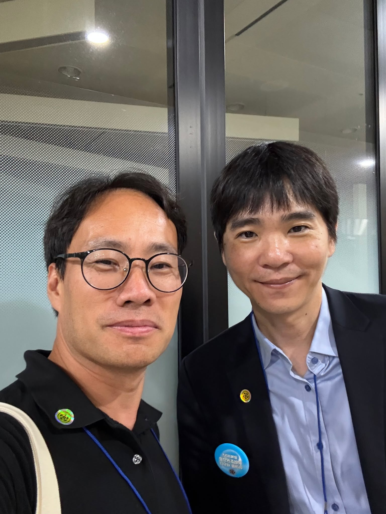

### 8월 20일 (수) 07:12 · #글로벌 진출을 향한 가장 중요한 포석 중 하나는 #글로벌투자 를 통하여…

#글로벌 진출을 향한 가장 중요한 포석 중 하나는 #글로벌투자 를 통하여 #글로벌협력 하는 것입니다. Upstage는 KDB와 함께 Amazon, AMD 글로벌 투자 유치에 성공하였습니다. AWS와 AMD의 클라우드와 인프라 등을 사용하여 전 세계인이 #SolarLLM 과 #DocAI 제품을 더 쉽게 사용이 가능합니다.

특히 Upstage는 Anthropic 이후 Amazon GenAI 분야 첫 투자사입니다. 그만큼 Upstage GenAI의 기술과 사업성을 높게 인정해 준 것입니다. 저희는 Anthropic이 그랬던 것처럼 AWS를 통해 수억의 글로벌 사용자들을 확보할 예정입니다.

#글로벌의꿈 을 이룰, World Best LLM을 만들고, 또 전 세계인이 애용하는 멋진 제품을 만들 분들을 모시고 있습니다. 함께 해요! 

https://careers.upstage.ai/

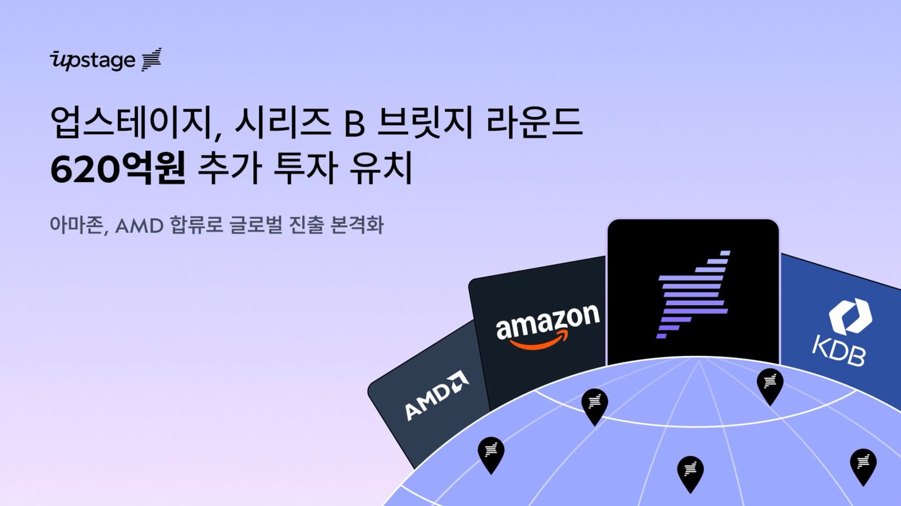

### 8월 21일 (목) 12:25 · #Bloomberg #Live로 불러주셔서, #글로벌투자 소식과 함께 #…

#Bloomberg #Live로 불러주셔서, #글로벌투자 소식과 함께 #SolarLLM이 얼마나 멋진지, 대한민국 정부와 KDB가 AI에 얼마나 진심인지, 네이버/카카오 등을 보유한 디지털 주권국인 대한민국이 어떻게 AI 주권뿐만 아니라 주도권을 가져야 할 것인지, 리벨리온, 퓨리오사, 하이퍼엑셀 등 NPU 회사들과 협업이 얼마나 중요한지 이야기하고 왔습니다. 

https://www.bloomberg.com/news/videos/2025-08-21/upstage-ceo-on-funding-growth-outlook-video 

Upstage 가 AI 주권을 넘어 주도권을 가져갈수 있도록 많은 응원 부탁드립니다.

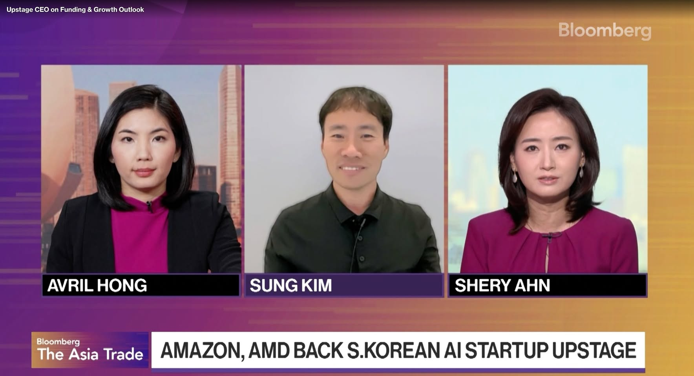

### 8월 26일 (화) 17:55 · 너무 멋진 제목의 Jung-Woo Ha 수석님의 강의. AI 3강을 위해…

너무 멋진 제목의 Jung-Woo Ha 수석님의 강의. AI 3강을 위해 가는 길을 조금 엿볼수 있습니다. 그리고 재미있습니다! 

https://www.youtube.com/live/WwSdN-1Hs7o?si=p8M6VqoYz5iN0jZG&t=1195

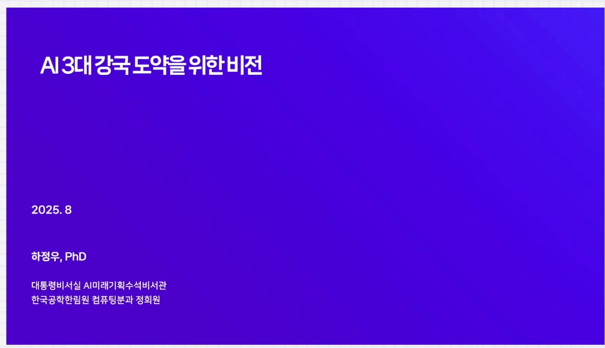 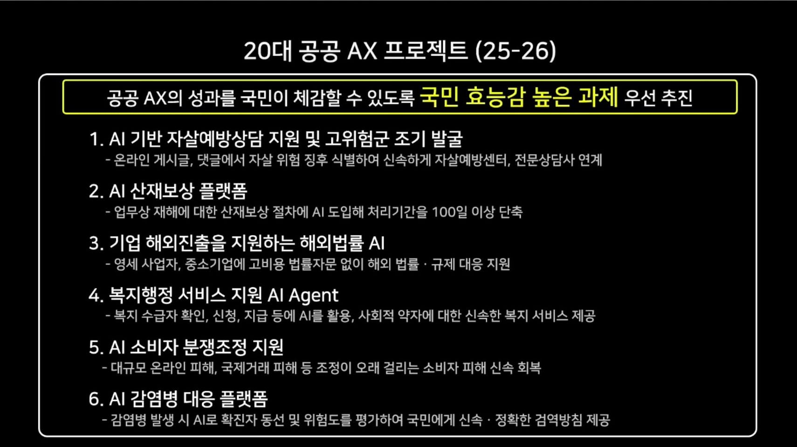 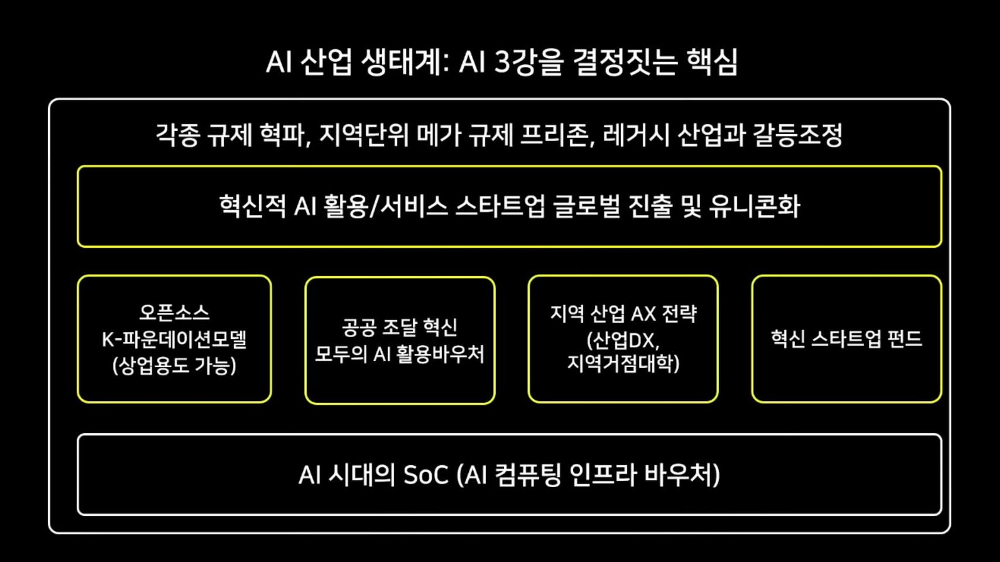 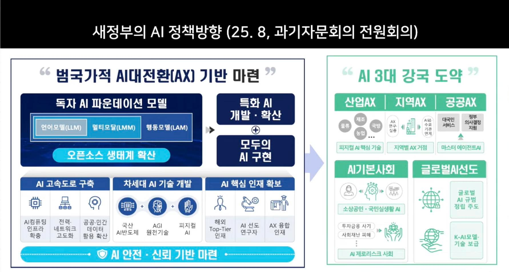 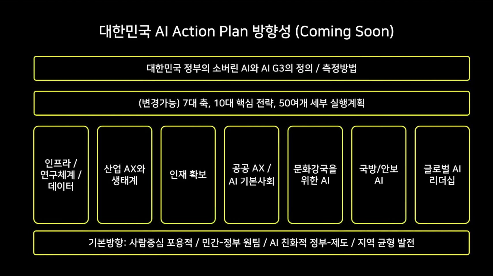

### 8월 27일 (수) 12:21 · 학교와 비영리 기관에 Upstage API를 #무료 제공하는 AWS AI…

학교와 비영리 기관에 Upstage API를 #무료 제공하는 AWS AI initiative 프로그램을 통해 멋진 결과들이 많이 나오고 있습니다. 몇 가지만 소개 드립니다.

1. 교직원의 반복 업무를 원클릭으로 자동화 https://szzng.zzolab.com/edu#features

2. AI 코칭 챗봇/ 보고서 및 발표자료 피드백: https://청해.com 

3.  SafeAI for kids : 초등학생들이 인공지능을 사용해보는 경험 (**안전한 AI를 위한 5개 장치 : 하드코딩/ 프롬프트 재구성/ 시스템 프롬프트로 필터링/ 출력 시 필터링/ 교사 모니터링 https://safeai.kids/login

학교와 비영리 기관인데 아직 신청하지 않으셨다면 꼭 https://www.upstage.ai/events/ai-initiative-2025-ko 신청하시고 무료로 멋진 서비스 많이 만들어 보셔요.

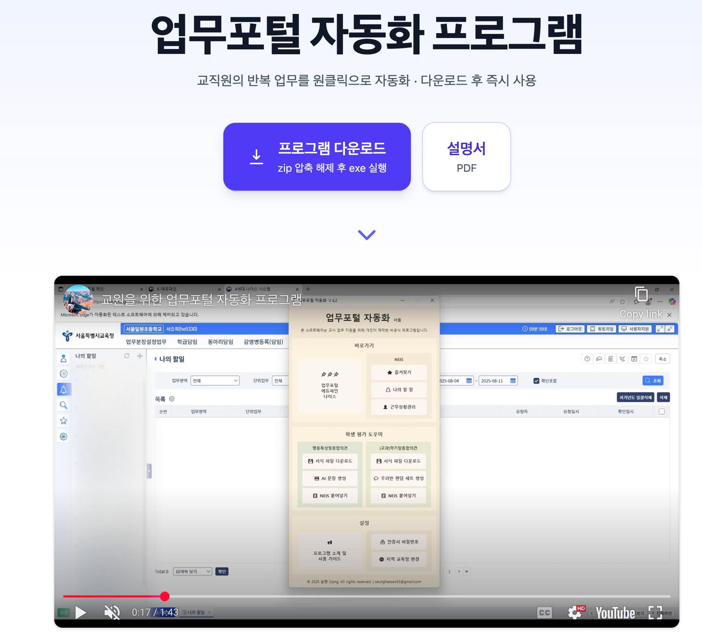 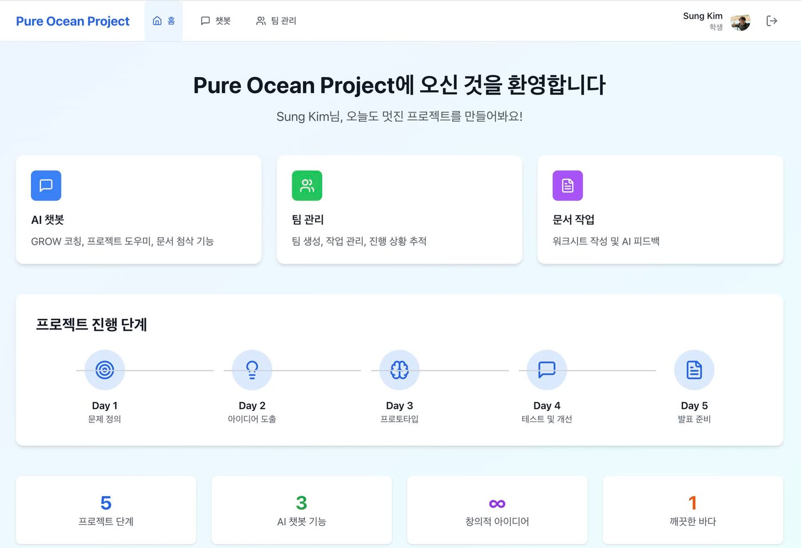

### 8월 29일 (금) 11:41 · 지난 주말에 열린 #2025JUNCTIONASIA 해커톤에서 #Upsta…

지난 주말에 열린 #2025JUNCTIONASIA 해커톤에서 #UpstageDP 와 #SolarPro2 사용한 #Synctank 팀이 1등이 되었습니다.

필요한 스샷이나 파일을 넣으면 중요한 정보를 뽑아 내고 (UpstageDP) 무슨 일인지 추론하여 (SolarPro2) 중요한 일을 잊어 버리지 않도록 notification에 넣어 줍니다. 

1등한 #Synctank 팀 다시 한번 축하 드리며 본선인 Junction 2025에서도 좋은 결과가 있기를 응원합니다.

#UpstageDP 와 #SolarPro2 로 좋은 서비스 많이 만들 수 있습니다. 많이 사용해주셔요!

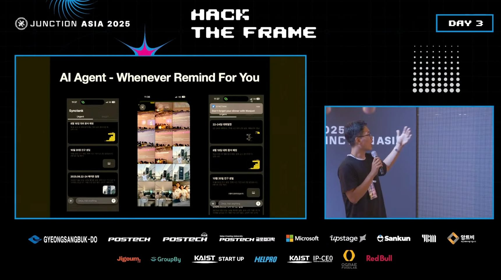 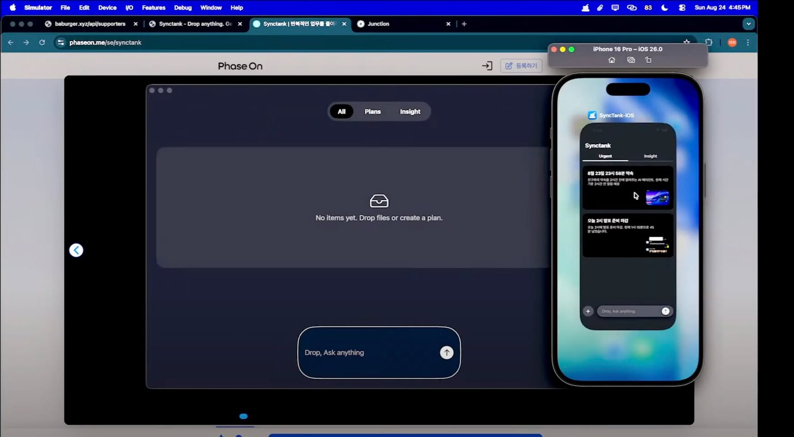

### 8월 29일 (금) 11:41 · Sung Kim shared a link.

🔗 <https://www.youtube.com/live/TdIRpI2Og84?t=17185s>

### 8월 30일 (토) 09:08 · 호수같이 잔잔한 #Jeju #월정리 바다 1K 크로싱, #이보다더좋을순없…

호수같이 잔잔한 #Jeju #월정리 바다 1K 크로싱, #이보다더좋을순없다 입니다!

🎬 동영상 2개 (생략)
