# 2025년 10월

[← 2025년](README.md)

### 10월 1일 (수) 06:47 · 한국 독자 AI 모델 (aka World Best LLM) 사업이 해외에…

한국 독자 AI 모델 (aka World Best LLM) 사업이 해외에서도 주목받고 있습니다. 

"Most ambitious sovereign AI initiative" 라고 표현할만큼 도전적인 과제이지만 Upstage 반드시 성공해서 LLM에서도 글로벌 주도권을 확보하겠습니다. 

결국 좋은 분들이 함께해야 성공할 수 있는데 함께 WBL 만들 분들을 모시고 있습니다.  https://careers.upstage.ai/

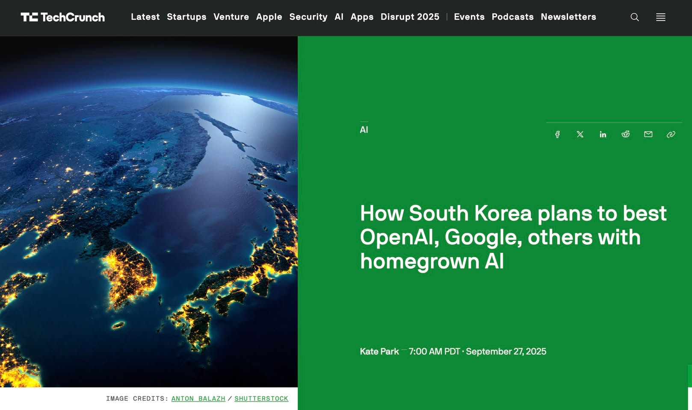
**이미지 캡션:** 이 이미지는 TechCrunch 웹사이트의 기사 미리보기 화면을 보여줍니다. 왼쪽에는 밤하늘에서 바라본 지구의 모습이 보이며, 한국과 일본을 중심으로 도시의 불빛이 밝게 빛나고 있습니다. 오른쪽은 녹색 배경으로, "AI"라는 단어가 작게 표시되어 있고, 그 아래에는 "How South Korea plans to best OpenAI, Google, others with homegrown AI"라는 제목이 큰 글씨로 쓰여 있습니다. 제목 아래에는 "Kate Park 7:00 AM PDT September 27, 2025"라는 기사 작성자와 발행 날짜가 표시되어 있습니다. 또한, 녹색 배경의 오른쪽 상단에는 페이스북, 트위터, 링크드인, 레딧, 이메일, 링크 아이콘이 나열되어 있어 기사를 공유할 수 있음을 나타냅니다. 이미지 하단에는 "IMAGE CREDITS: ANTON BALAZH / SHUTTERSTOCK"라는 문구가 있어 이미지 출처를 명시하고 있습니다. 전반적으로 인공지능 기술 분야에서 한국의 경쟁력을 다루는 기사에 대한 정보를 전달하는 차분하고 정보 전달적인 분위기입니다. 2025"라는 기사 작성자와 발행 날짜가 표시되어 있습니다. 또한, 녹색 배경의 오른쪽 상단에는 페이스북, 트위터, 링크드인, 레딧, 이메일, 링크 아이콘이 나열되어 있어 기사를 공유할 수 있음을 나타냅니다. 이미지 하단에는 "IMAGE CREDITS: ANTON BALAZH / SHUTTERSTOCK"라는 문구가 있어 이미지 출처를 명시하고 있습니다. 전반적으로 인공지능 기술 분야에서 한국의 경쟁력을 다루는 기사에 대한 정보를 전달하는 차분하고 정보 전달적인 분위기입니다.
 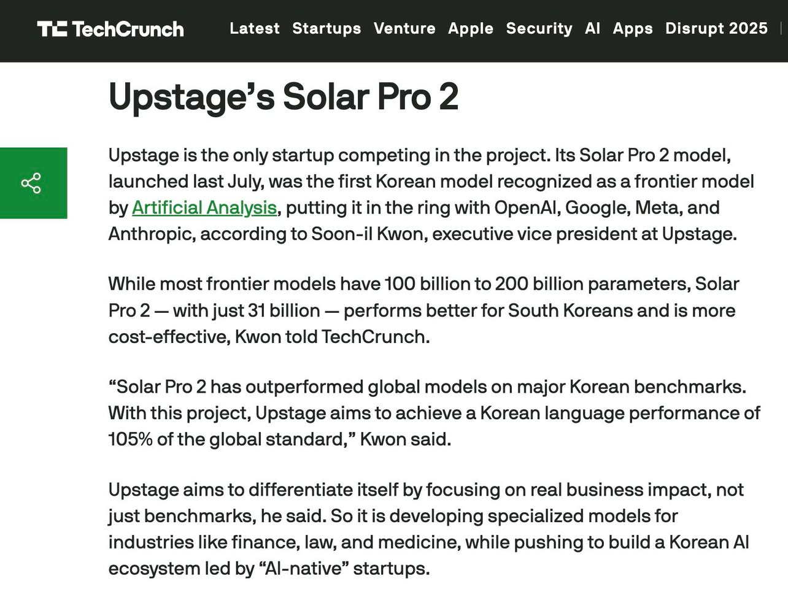
**이미지 캡션:** 이 이미지는 TechCrunch 웹사이트의 기사 일부를 보여줍니다. 기사 제목은 "Upstage's Solar Pro 2"이며, Upstage라는 스타트업이 개발한 인공지능 모델인 Solar Pro 2에 대한 내용을 다루고 있습니다. 기사 본문에는 Solar Pro 2가 한국어 성능에서 글로벌 기준 105%를 달성하는 것을 목표로 하며, OpenAI, Google, Meta, Anthropic과 같은 선두 기업들과 경쟁하고 있다는 내용이 포함되어 있습니다. 또한, 이 모델은 310억 개의 매개변수를 가지고 있으며, 한국인에게 더 나은 성능과 비용 효율성을 제공한다고 언급됩니다. 기사는 Upstage가 금융, 법률, 의료와 같은 특정 산업에 특화된 모델을 개발하고 한국 AI 생태계를 구축하는 데 집중하고 있다고 설명합니다. 이미지에는 TechCrunch 로고와 함께 "Latest", "Startups", "Venture", "Apple", "Security", "AI", "Apps", "Disrupt 2025"와 같은 메뉴 항목이 보입니다. 또한, 기사 내용과 관련된 공유 아이콘이 녹색 배경에 표시되어 있습니다.으며, 한국인에게 더 나은 성능과 비용 효율성을 제공한다고 언급됩니다. 기사는 Upstage가 금융, 법률, 의료와 같은 특정 산업에 특화된 모델을 개발하고 한국 AI 생태계를 구축하는 데 집중하고 있다고 설명합니다. 이미지에는 TechCrunch 로고와 함께 "Latest", "Startups", "Venture", "Apple", "Security", "AI", "Apps", "Disrupt 2025"와 같은 메뉴 항목이 보입니다. 또한, 기사 내용과 관련된 공유 아이콘이 녹색 배경에 표시되어 있습니다.

### 10월 1일 (수) 06:48 · Sung Kim shared a link.

🔗 <https://techcrunch.com/2025/09/27/how-south-korea-plans-to-best-openai-google-others-with-homegrown-ai/>

### 10월 2일 (목) 11:40 · "국가대표 AI 기업 보러 왔어요"…LG·네이버 등 5대 기업, 한 자리…

"국가대표 AI 기업 보러 왔어요"…LG·네이버 등 5대 기업, 한 자리서 기술력 과시 멋진 제목의 장유미 기자님 글입니다. 이번 AI 페스타에 정말 많은 분들이 Upstage 부스를 찾아 주셔서 감사드립니다. AI/LLM 주도권을 확보해 보겠습니다!

"업스테이지는 이번 전시에서 자체 모델 '솔라 프로 2'와 '도큐먼트 인텔리전스'를 소개해 관심을 끌었다. '솔라 프로2'가 국제 분석 기관 아티피셜 애널리시스에서 12위를 기록하면서 일론 머스크가 이례적으로 트윗에 언급해 화제가 됐던 LLM인 탓에 현장에선 학생, 기업인 등 각계각층의 관람객들이 많은 호기심을 보였다.

올해 7월 공개된 '솔라 프로 2'는 고도화된 추론 능력을 갖춘 '하이브리드 모드'를 탑재한 것이 특징으로, 실시간 웹 검색, 정보 정리, 프레젠테이션 초안 작성 등 업무를 자율적으로 수행할 수 있다는 점이 인상적이었다. '도큐먼트 인텔리전스'는 단순 텍스트 추출에 그치지 않고 체크박스나 그래프, 비틀어진 텍스트까지 인식 가능하다는 점에서 업무에 활용하기에 굉장히 편리할 듯 했다.

업스테이지 관계자는 "'솔라 프로 2'는 단순 문장 응답을 넘어 사용자의 의도를 파악하고 외부 도구를 호출해 실질적인 결과물을 도출하는 '에이전트형 LLM' 구조를 갖췄다"며 "도큐먼트 인텔리전스는 AI로 보험을 비롯한 계약서, 재무문서 등을 99% 정확도로 자동 처리할 수 있는 플랫폼으로, 특히 금융·보험 산업에서 활용하기 유용할 것"이라고 설명했다."

https://n.news.naver.com/article/092/0002392939

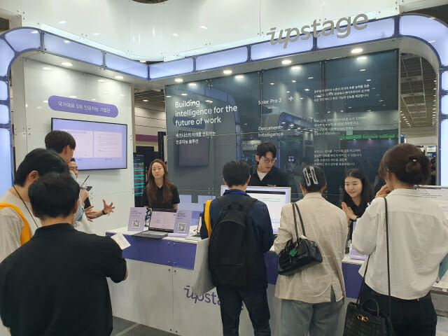
**이미지 캡션:** 이 사진은 한 전시회 부스에서 여러 사람들이 상호작용하는 모습을 담고 있다. 부스는 흰색과 파란색으로 꾸며져 있으며, 상단에는 "upstage"라는 로고가 크게 박혀 있다. 부스 중앙에는 큰 화면이 설치되어 있으며, "Building intelligence for the future of work"라는 문구와 함께 한국어로 된 설명이 보인다. 화면에는 "Solar Pro 2"와 "Document Intelligence"라는 제품명도 보인다. 부스에는 총 7명의 사람이 보인다. 부스 앞쪽에는 검은색 상의를 입은 성인 남성 한 명이 서서 무언가를 보고 있고, 그의 뒤로는 노란색 상의를 입은 성인 남성 한 명과 검은색 백팩을 멘 성인 남성 한 명이 서 있다. 이들은 부스 안쪽을 바라보고 있다. 부스 안쪽에는 두 명의 직원이 보인다. 한 명은 검은색 셔츠를 입은 젊은 남성으로, 안경을 쓰고 컴퓨터 화면을 보고 있으며, 다른 한 명은 검은색 상의를 입은 젊은 여성으로, 방문객과 대화하고 있다. 이들 앞에는 노트북과 몇 개의 서류가 놓여 있다. 부스 오른쪽에는 흰색 셔츠를 입은 성인 여성 한 명과 베이지색 재킷을 입은 성인 여성 한 명이 서서 부스 안쪽의 직원과 대화하고 있다. 베이지색 재킷을 입은 여성은 검은색 핸드백을 메고 있으며, 흰색 셔츠를 입은 여성은 검은색 핸드백을 메고 있다. 전반적으로 부스는 현대적이고 전문적인 분위기를 풍기며, 방문객들은 주로 기술 관련 제품에 대한 설명을 듣거나 정보를 얻는 모습이다. 성인 남성 한 명이 서서 무언가를 보고 있고, 그의 뒤로는 노란색 상의를 입은 성인 남성 한 명과 검은색 백팩을 멘 성인 남성 한 명이 서 있다. 이들은 부스 안쪽을 바라보고 있다. 부스 안쪽에는 두 명의 직원이 보인다. 한 명은 검은색 셔츠를 입은 젊은 남성으로, 안경을 쓰고 컴퓨터 화면을 보고 있으며, 다른 한 명은 검은색 상의를 입은 젊은 여성으로, 방문객과 대화하고 있다. 이들 앞에는 노트북과 몇 개의 서류가 놓여 있다. 부스 오른쪽에는 흰색 셔츠를 입은 성인 여성 한 명과 베이지색 재킷을 입은 성인 여성 한 명이 서서 부스 안쪽의 직원과 대화하고 있다. 베이지색 재킷을 입은 여성은 검은색 핸드백을 메고 있으며, 흰색 셔츠를 입은 여성은 검은색 핸드백을 메고 있다. 전반적으로 부스는 현대적이고 전문적인 분위기를 풍기며, 방문객들은 주로 기술 관련 제품에 대한 설명을 듣거나 정보를 얻는 모습이다.

### 10월 5일 (일) 07:04 · "해외 빅테크와 비교할 수 없이 적은 비용으로 프런티어급 성능을 뽐내면서…

"해외 빅테크와 비교할 수 없이 적은 비용으로 프런티어급 성능을 뽐내면서 세계적 주목을 받고 있다" JTBC 뉴스에서 Upstage를 멋지게 소개해주셨습니다. 

개인적으로 좋아하는 방송이라 더 기뻤습니다. Upstage는 꼭 프런티어 모델을 만들어 AI 기술 주도권을 확보하도록 하겠습니다.

이 멋진 도전을 함께하실 분들을 계속 모시고 있습니다. 함께해요! https://careers.upstage.ai/

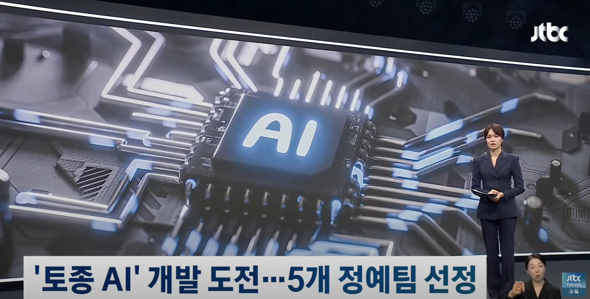
**이미지 캡션:** 뉴스 스튜디오에서 한 여성 앵커가 정면을 응시하며 서 있고, 그녀 뒤로는 거대한 스크린이 펼쳐져 있다. 스크린에는 인공지능(AI) 칩의 이미지가 크게 확대되어 보이며, 복잡한 회로와 빛나는 선들이 미래 지향적인 느낌을 준다. 앵커는 검은색 바지와 재킷을 착용한 단정한 모습이며, 손에는 서류를 들고 있다. 그녀의 표정은 진지하고 집중한 듯하다. 스크린 하단에는 '토종 AI' 개발 도전…5개 정예팀 선정'이라는 한국어 자막이 흰색 글씨로 표시되어 있다. 스튜디오의 전반적인 분위기는 전문적이고 정보 전달에 초점을 맞춘 뉴스 보도 상황임을 나타낸다. 화면 오른쪽 하단에는 JTBC 뉴스 로고와 함께 수어 통역사의 모습도 작게 보인다.맞춘 뉴스 보도 상황임을 나타낸다. 화면 오른쪽 하단에는 JTBC 뉴스 로고와 함께 수어 통역사의 모습도 작게 보인다.
 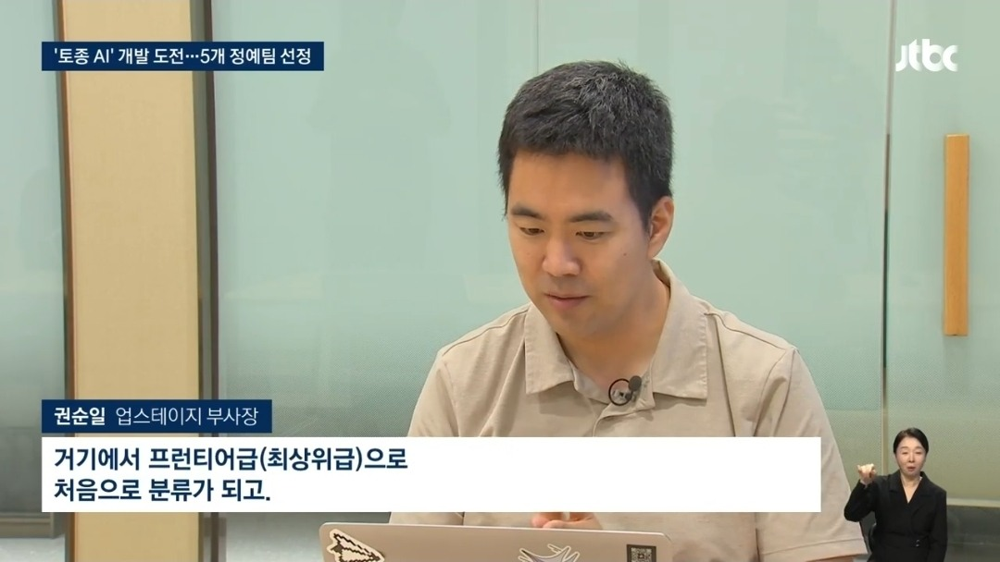
**이미지 캡션:** 화면 중앙에는 30대 후반에서 40대 초반으로 보이는 성인 남성이 베이지색 반팔 셔츠를 입고 앉아 있다. 그는 짧은 머리에 무표정하지만 약간은 집중하는 듯한 표정으로 화면 아래쪽을 응시하고 있으며, 목에는 마이크가 달려 있다. 남성의 앞쪽에는 노트북이 놓여 있고, 노트북에는 여러 스티커가 붙어 있다. 배경은 연한 녹색의 벽과 유리문으로 이루어져 있으며, 유리문에는 JTBC 로고가 보인다. 화면 왼쪽 상단에는 "'토종 AI' 개발 도전... 5개 정예팀 선정"이라는 제목의 파란색 자막이, 화면 하단에는 "권순일 업스테이지 부사장"이라는 이름과 함께 "거기에서 프런티어급(최상위급)으로 처음으로 분류가 되고."라는 내용의 흰색 자막이 표시되어 있다. 화면 오른쪽 하단에는 수어 통역사가 검은색 재킷을 입고 수어를 하고 있는 모습이 보인다. 전반적으로 뉴스 인터뷰나 토론 프로그램의 한 장면으로 보이며, 진지하고 정보 전달적인 분위기이다. 업스테이지 부사장"이라는 이름과 함께 "거기에서 프런티어급(최상위급)으로 처음으로 분류가 되고."라는 내용의 흰색 자막이 표시되어 있다. 화면 오른쪽 하단에는 수어 통역사가 검은색 재킷을 입고 수어를 하고 있는 모습이 보인다. 전반적으로 뉴스 인터뷰나 토론 프로그램의 한 장면으로 보이며, 진지하고 정보 전달적인 분위기이다.
 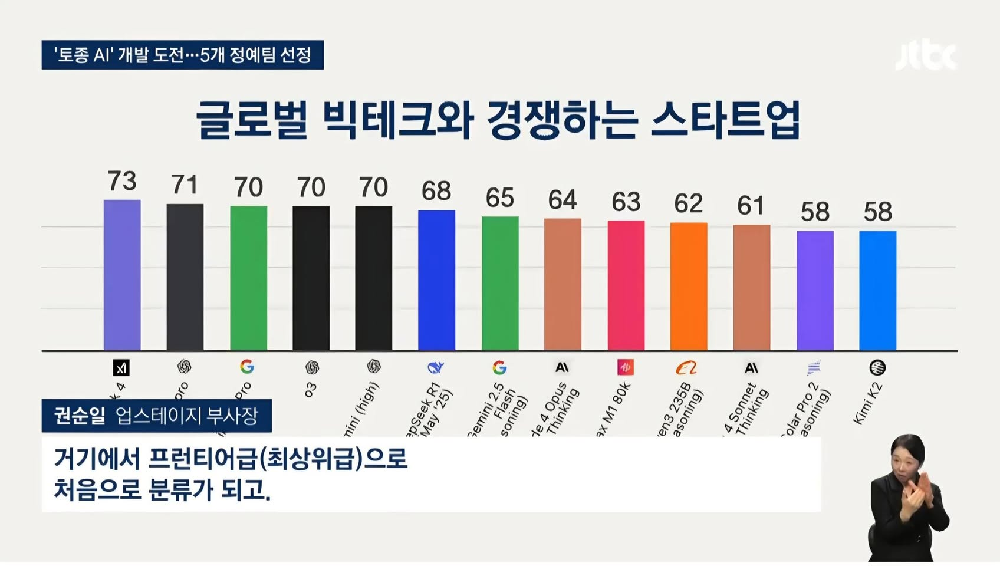
**이미지 캡션:** 화면 중앙에는 막대그래프가 있고, 막대그래프 위에는 '글로벌 빅테크와 경쟁하는 스타트업'이라는 제목이 한국어로 쓰여 있습니다. 막대그래프는 여러 개의 막대로 이루어져 있으며, 각 막대 위에는 숫자가 표시되어 있습니다. 막대 아래에는 다양한 로고와 함께 'x1', 'pro', 'nini (high)', 'epSeek R1 May 25', 'Gemini 2.5 Flash', 'Opus Thinking', 'M1 80k', '235B asoning', 'Sonnet Thinking', 'olar Pro 2 asoning', 'Kimi K2'와 같은 텍스트가 보입니다. 화면 왼쪽 하단에는 '권순일 업스테이지 부사장'이라는 이름과 함께 '거기에서 프런티어급(최상위급)으로 처음으로 분류가 되고.'라는 한국어 문장이 쓰여 있습니다. 화면 오른쪽 하단에는 한 명의 성인 여성이 수어 통역을 하고 있는 모습이 보입니다. 여성은 검은색 상의를 입고 있으며, 손을 사용하여 무언가를 표현하고 있습니다. 전반적으로 뉴스나 발표 자료의 한 장면으로 보이며, AI 기술 경쟁에 대한 내용을 다루고 있는 것으로 추정됩니다.ing', 'Kimi K2'와 같은 텍스트가 보입니다. 화면 왼쪽 하단에는 '권순일 업스테이지 부사장'이라는 이름과 함께 '거기에서 프런티어급(최상위급)으로 처음으로 분류가 되고.'라는 한국어 문장이 쓰여 있습니다. 화면 오른쪽 하단에는 한 명의 성인 여성이 수어 통역을 하고 있는 모습이 보입니다. 여성은 검은색 상의를 입고 있으며, 손을 사용하여 무언가를 표현하고 있습니다. 전반적으로 뉴스나 발표 자료의 한 장면으로 보이며, AI 기술 경쟁에 대한 내용을 다루고 있는 것으로 추정됩니다.

### 10월 5일 (일) 07:05 · Sung Kim shared a link.

🔗 <https://youtu.be/KKn2uxwe9xA?si=8XyNFj_BtJRNZ7nL>

### 10월 5일 (일) 10:10 · Sung Kim shared a link.

🔗 <https://console.upstage.ai/>

### 10월 7일 (화) 07:36 · 오늘 새벽에 진행된 OpenAI DevDay 2025 Opening Ke…

오늘 새벽에 진행된 OpenAI DevDay 2025 Opening Keynote 에서 제가 본 재미있는 것 5가지입니다.

1. 2025: 6B tokens/min: 어마어마하네요
2. Chat GPT Apps (chatgpt 안에서 다양한 기능들을 chat으로 사용)
3. AgentK: n8n 등과 같은 Agent + Connectors 
4. 70% 저렴해진 voice gpt-realtime-mini 
5. Sora2 in the API -- 재미있는 영상이 많이 나오겠네요.

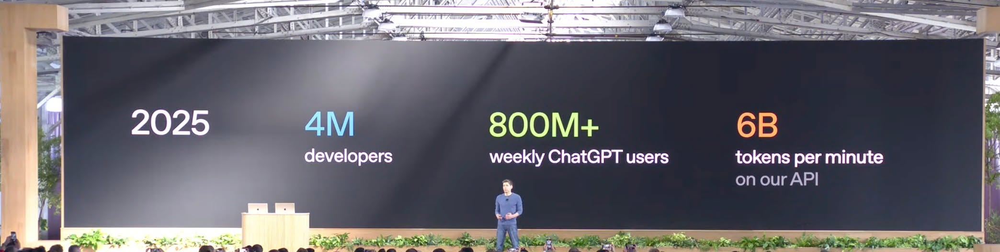
**이미지 캡션:** 넓은 강연장으로 보이는 장소에서, 검은색 대형 스크린에는 '2025', '4M developers', '800M+ weekly ChatGPT users', '6B tokens per minute on our API'라는 텍스트가 흰색, 파란색, 연두색, 주황색으로 각각 표시되어 있다. 스크린 앞에는 연단이 있고, 연단 위에는 두 대의 노트북이 놓여 있으며, 연단 앞에는 한 명의 성인 남성이 서서 발표를 하고 있다. 남성은 파란색 긴팔 상의와 청바지를 입고 있으며, 표정은 진지하고 손을 약간 벌리고 있다. 강연장 천장에는 조명과 구조물이 보이며, 무대 앞쪽에는 관객들이 앉아 있고, 무대 가장자리에는 화분과 식물들이 배치되어 있다. 전체적으로 기술 발표회 또는 컨퍼런스의 분위기를 띤다.장 천장에는 조명과 구조물이 보이며, 무대 앞쪽에는 관객들이 앉아 있고, 무대 가장자리에는 화분과 식물들이 배치되어 있다. 전체적으로 기술 발표회 또는 컨퍼런스의 분위기를 띤다.
 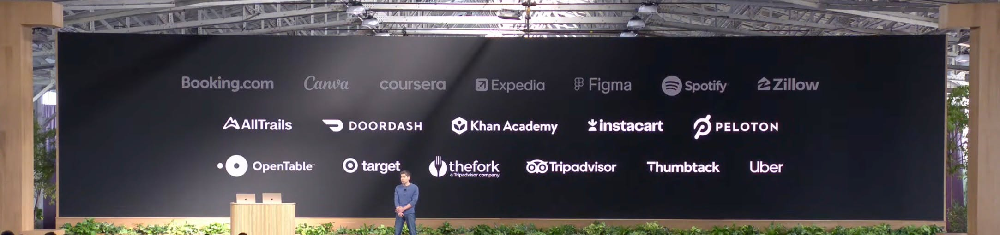
**이미지 캡션:** 넓은 검은색 스크린에는 Booking.com, Canva, Coursera, Expedia, Figma, Spotify, Zillow, AllTrails, DoorDash, Khan Academy, Instacart, Peloton, OpenTable, Target, TheFork, Tripadvisor, Thumbtack, Uber 등 다양한 기업 로고와 이름이 흰색으로 표시되어 있습니다. 스크린 왼쪽 하단에는 파란색 셔츠를 입은 젊은 성인 남성이 서 있으며, 그의 표정은 무표정하고 시선은 스크린을 향하고 있습니다. 남성 앞에는 나무 재질의 연단이 놓여 있으며, 연단 위에는 두 대의 노트북이 놓여 있습니다. 배경은 넓은 실내 공간으로, 천장에는 금속 구조물과 조명 장치가 보이며, 스크린 양옆으로는 나무 기둥과 녹색 식물들이 배치되어 있습니다. 전체적으로 기업 행사나 발표회와 같은 분위기를 풍깁니다.있습니다. 남성 앞에는 나무 재질의 연단이 놓여 있으며, 연단 위에는 두 대의 노트북이 놓여 있습니다. 배경은 넓은 실내 공간으로, 천장에는 금속 구조물과 조명 장치가 보이며, 스크린 양옆으로는 나무 기둥과 녹색 식물들이 배치되어 있습니다. 전체적으로 기업 행사나 발표회와 같은 분위기를 풍깁니다.
 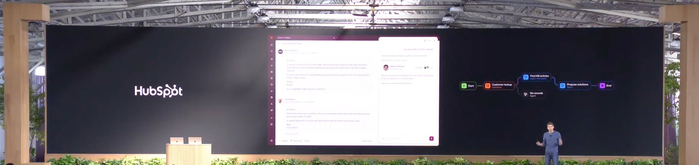
**이미지 캡션:** 이 사진은 넓은 무대에서 진행되는 프레젠테이션 장면을 담고 있으며, 검은색 배경의 대형 스크린이 중앙을 차지하고 있습니다. 스크린 왼쪽에는 흰색 글씨로 "HubSpot" 로고가 선명하게 보입니다. 스크린 중앙에는 보라색 테두리의 창이 열려 있는데, 이는 채팅 인터페이스로 보이며 여러 사용자의 메시지가 오간 기록이 표시됩니다. 메시지 내용 중 일부는 영어로 작성되어 있으며, "Hi Gabor", "Hi People" 등의 인사말과 함께 업무 관련 대화가 오가는 것으로 추정됩니다. 스크린 오른쪽에는 "Start", "Customer lookup", "Find KB articles", "No records", "Propose solutions", "End"와 같은 단어들이 연결된 다이어그램이 표시되어 있어, 고객 지원 또는 업무 자동화 프로세스를 시각적으로 보여주는 것으로 보입니다. 스크린 하단 중앙에는 나무 재질의 연단 위에 노트북 두 대가 놓여 있습니다. 무대 오른쪽 하단에는 한 명의 성인 남성이 서서 스크린을 바라보며 발표하고 있으며, 그는 남색 계열의 옷을 입고 있고, 손짓을 하며 열정적인 표정으로 설명하고 있습니다. 무대 앞쪽으로는 녹색 식물들이 배치되어 있어 생동감을 더합니다. 전반적으로 기술적인 내용을 설명하는 컨퍼런스나 세미나 현장의 분위기를 띄고 있습니다., "Customer lookup", "Find KB articles", "No records", "Propose solutions", "End"와 같은 단어들이 연결된 다이어그램이 표시되어 있어, 고객 지원 또는 업무 자동화 프로세스를 시각적으로 보여주는 것으로 보입니다. 스크린 하단 중앙에는 나무 재질의 연단 위에 노트북 두 대가 놓여 있습니다. 무대 오른쪽 하단에는 한 명의 성인 남성이 서서 스크린을 바라보며 발표하고 있으며, 그는 남색 계열의 옷을 입고 있고, 손짓을 하며 열정적인 표정으로 설명하고 있습니다. 무대 앞쪽으로는 녹색 식물들이 배치되어 있어 생동감을 더합니다. 전반적으로 기술적인 내용을 설명하는 컨퍼런스나 세미나 현장의 분위기를 띄고 있습니다.
 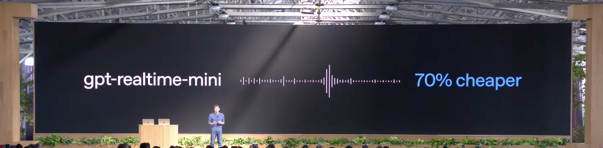
**이미지 캡션:** 무대 중앙에 놓인 거대한 검은색 스크린에는 흰색 글자로 'gpt-realtime-mini'라고 쓰여 있고, 그 옆에는 하얀색 파형 그래프와 함께 파란색 글자로 '70% cheaper'라고 표시되어 있습니다. 스크린 앞에는 한 명의 성인 남성이 서 있는데, 그는 30대 초중반으로 보이며 짧은 머리에 푸른색 셔츠와 청바지를 입고 있습니다. 그는 스크린을 바라보며 두 손을 앞으로 모으고 서서 발표 중인 것으로 보이며, 표정은 진지합니다. 무대 좌측에는 나무 재질의 연단이 있고, 그 위에 노트북 두 대가 놓여 있습니다. 무대 배경은 천장 구조물이 보이며, 조명이 설치되어 있습니다. 무대 앞쪽에는 관객들이 앉아 있으며, 무대 가장자리에는 녹색 식물들이 장식되어 있습니다. 전체적으로 기술 발표회 또는 컨퍼런스의 한 장면으로 보이며, 새로운 기술이나 서비스의 효율성 및 비용 절감 효과를 강조하는 분위기입니다.다. 무대 배경은 천장 구조물이 보이며, 조명이 설치되어 있습니다. 무대 앞쪽에는 관객들이 앉아 있으며, 무대 가장자리에는 녹색 식물들이 장식되어 있습니다. 전체적으로 기술 발표회 또는 컨퍼런스의 한 장면으로 보이며, 새로운 기술이나 서비스의 효율성 및 비용 절감 효과를 강조하는 분위기입니다.
 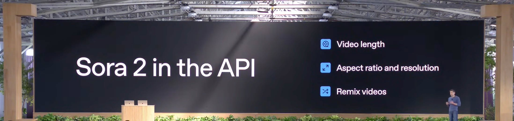
**이미지 캡션:** 넓은 강당에서 열린 행사로 보이는 장면으로, 검은색 대형 스크린에는 흰색 글자로 "Sora 2 in the API"라는 문구가 크게 쓰여 있고, 그 옆에는 파란색 아이콘과 함께 "Video length", "Aspect ratio and resolution", "Remix videos"라는 세 가지 항목이 나열되어 있습니다. 스크린 오른쪽 하단에는 파란색 상의와 청바지를 입은 젊은 성인 남성이 서서 스크린을 바라보고 있으며, 그의 표정은 차분하고 집중하는 듯 보입니다. 무대 앞쪽에는 나무 재질의 연단이 놓여 있고, 그 위에는 두 개의 노트북이 놓여 있습니다. 배경으로는 천장에 설치된 조명과 철골 구조물이 보이며, 무대 앞쪽에는 녹색 식물들이 장식되어 있습니다. 전체적으로 기술 발표회나 컨퍼런스의 한 장면으로, 진지하고 정보 전달에 초점을 맞춘 분위기입니다.있고, 그 위에는 두 개의 노트북이 놓여 있습니다. 배경으로는 천장에 설치된 조명과 철골 구조물이 보이며, 무대 앞쪽에는 녹색 식물들이 장식되어 있습니다. 전체적으로 기술 발표회나 컨퍼런스의 한 장면으로, 진지하고 정보 전달에 초점을 맞춘 분위기입니다.

### 10월 7일 (화) 07:38 · Sung Kim shared a link.

🔗 <https://www.youtube.com/watch?v=hS1YqcewH0c>

### 10월 7일 (화) 17:00 · 일본 GenAI 관련 가장 큰 행사 중 하나인 GenAI Summit에 …

일본 GenAI 관련 가장 큰 행사 중 하나인 GenAI Summit에 참여 중인데요. 재미있는 세션이 많습니다. 

산업별 AI 혁신을 보면 역시 일본도 금융, 보험, 제조업에 큰 관심을 보이고 있네요. 추가 정보는 아래 SolarLLM 행사 요약을 참고 하시기 바랍니다.

---
GenAI/SUM 2025 행사 요약: 생성형 AI 서밋

행사 개요
GenAI/SUM 生成AIサミット(생성형 AI 서밋) 2025는 생성형 인공지능의 최신 동향과 미래를 논의하는 대규모 국제 행사입니다 [1]. 2025년 10월 6일부터 8일까지 3일간 진행되며, 심포지엄, 워크숍, 스타트업 피치 등 다양한 세션이 3개의 주요 홀에서 열립니다 [2].

주요 세션 및 테마

1. AI와 사회의 미래
정부 정책 및 전략: 디지털 트랜스포메이션 장관의 특별 메시지와 '히로시마 AI 프로세스'에서 시작된 일본의 AI 전략에 대한 논의 [3]
AI와 인류의 공존: "AI for humanity" 비전을 중심으로 인간과 AI가 공존하는 사회의 모습 탐색 [4]
글로벌 AI 생태계: 인간, 사회, 일상을 연결하는 새로운 기반으로서의 AI 논의 [4]

2. 산업별 AI 혁신
금융 산업의 변화: 메가뱅크들의 AI 활용 사례와 금융 데이터 르네상스에 대한 논의 [5]
보험 비즈니스의 AI 에이전트: 보험 산업 전체 공급망에서 AI 에이전트 구현에 관한 라운드테이블 [6]
제조업의 지적재산권 전략: 일본 제조업의 경쟁력을 높이기 위한 공격적 IP 전략 논의 [7]

3. 기술 및 위험 관리
AI 보안: 프라이버시와 사이버 보안 위험에 대응하는 'AI 레드 팀' 전략 [5]
책임 있는 AI: 일본을 위한 책임 있는 AI와 기업 채택 방안에 대한 논의 [3]
콘텐츠와 생성형 AI: 생성형 AI 시대의 콘텐츠 미래와 가짜정보 대응 방안 [8]

4. 스타트업 및 투자 생태계
임팩트 피치 결선: 사회적 과제를 해결하는 생성형 AI 스타트업 10개 업체의 경연 [4]
VC 리버스 피치: 벤처캐피털이 스타트업에게 투자 전략을 설명하는 역발상 세션 [9]
생성형 AI 투자 전략: 벤처캐피털의 AI 투자 전략과 유망 기술 영역에 대한 인사이트 [10]

5. 교육 및 인재 개발
AI 시대의 학습과 경력: 일본의 교육 및 인적 자원 전략 로드맵 논의 [11]
여성 역량강화: 생성형 AI 시대의 인적 자본 전략을 여성 역량강화 관점에서 접근 [6]
인재 전략: AI 시대에 적합한 인재 전략과 교육 비전에 관한 다양한 관점 공유 [11]

특별 프로그램
임팩트 피치 파이널: 60개 이상의 지원 업체 중 선발된 10개 스타트업이 3분 피치로 '닛케이 어워드' 경쟁 [4]
스타트업 쇼케이스: AI 분야에서 성장 가능성이 있는 스타트업들의 발표와 네트워킹 [12]
AI 에이전트 개발 라이브 시연: AI 에이전트 개발 방법을 실시간으로 시연하는 세션 [13]

주요 참가자
디지털 트랜스포메이션 장관, 내각 관료 및 정부 기관 대표 [3]
메가뱅크, 보험사, 증권사 등 금융기관의 디지털 책임자 [5]
토요타, 미쓰이, 다이와 증권 등 주요 기업의 임원 [14]
AI 스타트업 창업자와 벤처캐피털 투자자 [10]
대학 교수 및 연구기관 전문가 [15]

이 행사는 생성형 AI가 산업, 사회, 경제에 미치는 영향을 종합적으로 살펴보고, 일본과 글로벌 맥락에서 AI의 책임 있는 발전과 활용 방향을 제시하는 중요한 플랫폼입니다.

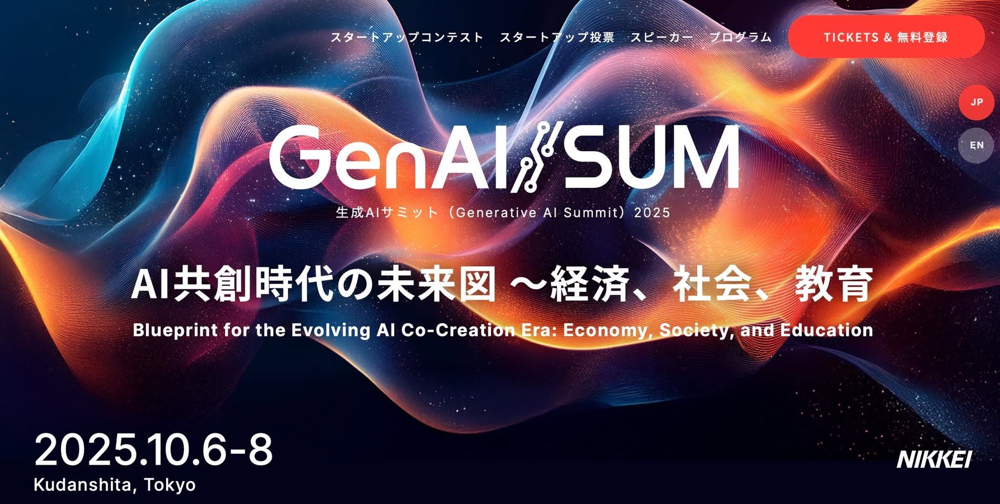
**이미지 캡션:** 이 이미지는 "GenAI SUM"이라는 제목의 행사 포스터로, 생성형 AI 서밋 2025를 홍보하고 있습니다. 배경은 추상적이고 유기적인 형태로 빛나는 파란색, 주황색, 분홍색의 물결 모양 디자인으로 이루어져 있으며, 마치 우주 공간이나 데이터 흐름을 연상시킵니다. 중앙에는 "GenAI SUM"이라는 큰 글자가 흰색으로 표시되어 있으며, 그 아래에는 "生成AIサミット (Generative AI Summit) 2025"라는 부제가 있습니다. 행사의 주요 주제는 "AI共創時代の未来図~経済、社会、教育" (AI 공창 시대의 미래도 ~ 경제, 사회, 교육)이며, 영어로 "Blueprint for the Evolving AI Co-Creation Era: Economy, Society, and Education"이라고 병기되어 있습니다. 행사 날짜는 2025년 10월 6일부터 8일까지이며, 장소는 일본 도쿄의 쿠단시타(Kudanshita, Tokyo)입니다. 상단에는 "스타트업 콘테스트", "스타트업 투표", "스피커", "프로그램"이라는 메뉴가 보이며, 우측 상단에는 "TICKETS & 무료 등록"이라는 빨간색 버튼이 있습니다. 또한, 언어 선택을 위한 "JP"와 "EN" 버튼이 보입니다. 하단 우측에는 "NIKKEI" 로고가 있습니다. 이 포스터는 AI 기술의 발전과 사회 전반에 미치는 영향을 다루는 중요한 컨퍼런스임을 시사하며, 미래 지향적이고 혁신적인 분위기를 전달합니다. 시대의 미래도 ~ 경제, 사회, 교육)이며, 영어로 "Blueprint for the Evolving AI Co-Creation Era: Economy, Society, and Education"이라고 병기되어 있습니다. 행사 날짜는 2025년 10월 6일부터 8일까지이며, 장소는 일본 도쿄의 쿠단시타(Kudanshita, Tokyo)입니다. 상단에는 "스타트업 콘테스트", "스타트업 투표", "스피커", "프로그램"이라는 메뉴가 보이며, 우측 상단에는 "TICKETS & 무료 등록"이라는 빨간색 버튼이 있습니다. 또한, 언어 선택을 위한 "JP"와 "EN" 버튼이 보입니다. 하단 우측에는 "NIKKEI" 로고가 있습니다. 이 포스터는 AI 기술의 발전과 사회 전반에 미치는 영향을 다루는 중요한 컨퍼런스임을 시사하며, 미래 지향적이고 혁신적인 분위기를 전달합니다.

### 10월 7일 (화) 17:01 · Sung Kim shared a link.

🔗 <https://www.xsum.jp/gai/index.html>

### 10월 8일 (수) 09:02 · 오픈AI가 1T 이상의 토큰을 사용한 상위 30개 고객을 리스트했는데요.…

오픈AI가 1T 이상의 토큰을 사용한 상위 30개 고객을 리스트했는데요. 어떤 서비스가 잘되는지 간접적으로 볼 수 있습니다. 토큰 사용량별 리스트는 아니고, 가입자 Lastname으로 정렬한 것 같습니다.

iSolutionsAI, Outtake, Read AI, Sider.AI 등 재미있는 서비스들을 많이 볼수 있습니다.

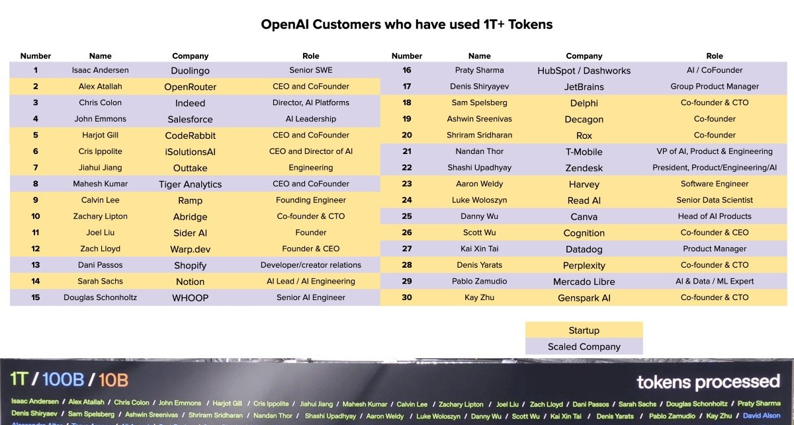
**이미지 캡션:** 이 이미지는 "OpenAI Customers who have used 1T+ Tokens"라는 제목의 표로, OpenAI의 서비스를 1조 토큰 이상 사용한 고객들의 목록을 보여줍니다. 표는 번호, 이름, 회사, 역할의 네 가지 열로 구성되어 있으며, 두 개의 열로 나뉘어 총 30명의 고객 정보를 담고 있습니다. 각 행에는 고객의 이름, 소속 회사, 그리고 해당 고객의 직책 또는 역할이 명시되어 있습니다. 예를 들어, 첫 번째 고객은 Isaac Andersen이며 Duolingo에서 Senior SWE로 일하고 있습니다. 두 번째 고객은 Alex Atallah로 OpenRouter의 CEO 겸 CoFounder입니다. 이 표는 주로 성인 남성과 여성으로 구성되어 있으며, 다양한 기술 회사 및 스타트업의 리더, 엔지니어, 경영진을 포함하고 있습니다. 배경은 흰색이며, 표의 일부 행은 노란색과 연보라색으로 구분되어 가독성을 높였습니다. 표 하단에는 "1T/100B/10B"라는 문구와 함께 고객 이름 목록이 다시 한번 나열되어 있으며, "tokens processed"라는 문구와 함께 OpenAI 로고가 작게 표시되어 있습니다. 전반적으로 정보 전달에 초점을 맞춘 깔끔하고 전문적인 디자인입니다. 있습니다. 두 번째 고객은 Alex Atallah로 OpenRouter의 CEO 겸 CoFounder입니다. 이 표는 주로 성인 남성과 여성으로 구성되어 있으며, 다양한 기술 회사 및 스타트업의 리더, 엔지니어, 경영진을 포함하고 있습니다. 배경은 흰색이며, 표의 일부 행은 노란색과 연보라색으로 구분되어 가독성을 높였습니다. 표 하단에는 "1T/100B/10B"라는 문구와 함께 고객 이름 목록이 다시 한번 나열되어 있으며, "tokens processed"라는 문구와 함께 OpenAI 로고가 작게 표시되어 있습니다. 전반적으로 정보 전달에 초점을 맞춘 깔끔하고 전문적인 디자인입니다.

### 10월 9일 (목) 06:48 · 일본 지방 공공단체의 정보화를 추진하기 위한 전시회인 J-LIS Tour…

일본 지방 공공단체의 정보화를 추진하기 위한 전시회인 J-LIS Tour 2025에 참여 중인 Upstage JP의 모습입니다. 저희 멋진 제품과 일본 대표인 Hiroyuki상의 열정적인 발표 덕분에 근처 부스 중 제일 인기가 많습니다!

업스테이지의 일본 공공진출도 많이 기대해주시고 일본에 계신다면 한번 들러주세요!

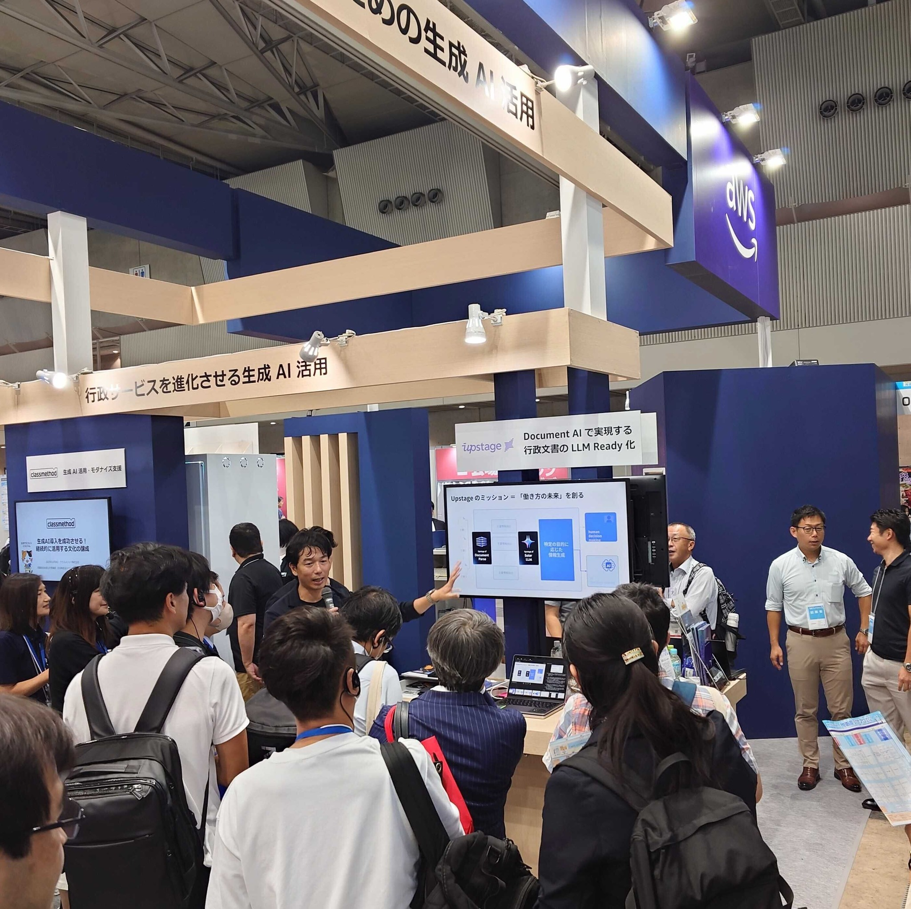
**이미지 캡션:** 행사 부스에서 한 성인 남성이 여러 사람들에게 발표하고 있으며, 그의 뒤에는 대형 스크린이 설치되어 있습니다. 스크린에는 "upstage"라는 로고와 함께 "Document AIで実現する行政文書のLLM Ready化" (Document AI로 실현하는 행정 문서의 LLM Ready화)라는 문구가 보입니다. 또한, "Upstageのミッション = 「働き方の未来」を創る" (Upstage의 미션 = "일하는 방식의 미래"를 만든다)라는 문구와 함께 다이어그램이 표시되어 있습니다. 발표자는 검은색 셔츠를 입고 있으며, 손가락으로 스크린을 가리키며 설명하고 있습니다. 그의 앞에는 다양한 연령대의 남녀 여러 명이 서서 발표를 경청하고 있으며, 일부는 헤드셋을 착용하고 있습니다. 배경에는 "AWS" 로고가 크게 보이고, 파란색과 흰색, 베이지색으로 꾸며진 부스 구조물이 보입니다. 전반적으로 기술 관련 행사나 컨퍼런스의 한 장면으로 보이며, 생성형 AI와 행정 문서 처리 기술에 대한 발표가 이루어지고 있는 분위기입니다.손가락으로 스크린을 가리키며 설명하고 있습니다. 그의 앞에는 다양한 연령대의 남녀 여러 명이 서서 발표를 경청하고 있으며, 일부는 헤드셋을 착용하고 있습니다. 배경에는 "AWS" 로고가 크게 보이고, 파란색과 흰색, 베이지색으로 꾸며진 부스 구조물이 보입니다. 전반적으로 기술 관련 행사나 컨퍼런스의 한 장면으로 보이며, 생성형 AI와 행정 문서 처리 기술에 대한 발표가 이루어지고 있는 분위기입니다.
 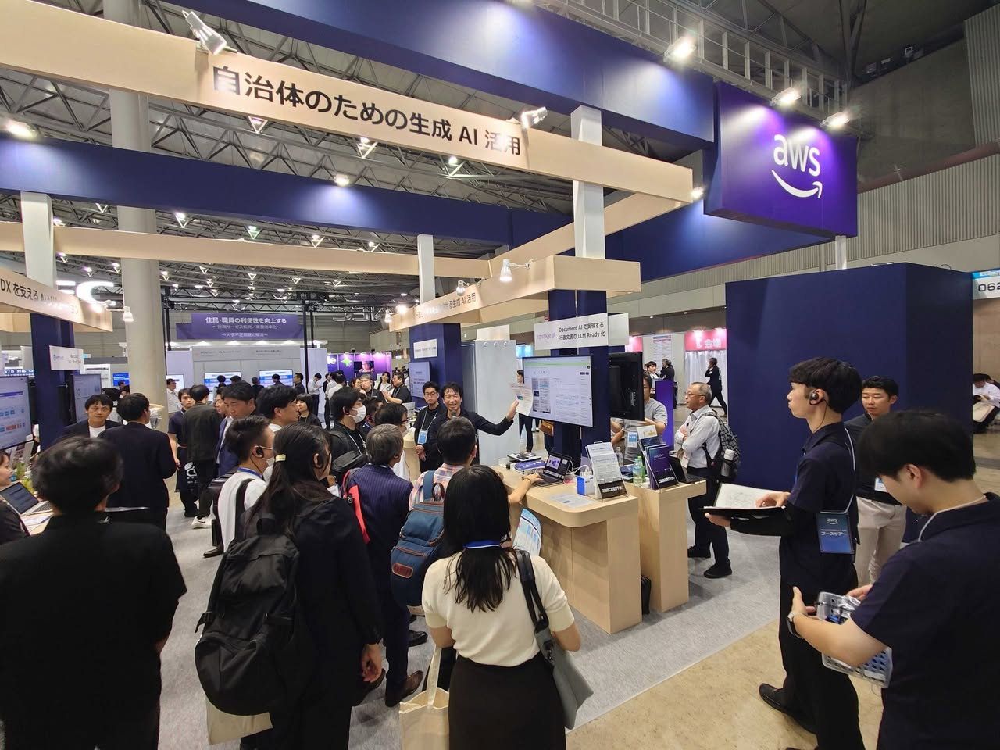
**이미지 캡션:** 이 사진은 기술 박람회 또는 컨퍼런스의 한 부스를 보여주며, 많은 사람들이 모여 있습니다. 중앙에는 AWS 부스가 보이며, 보라색 배경에 흰색 로고가 있습니다. 부스 앞에는 여러 명의 사람들이 서서 대화하거나 무언가를 보고 있습니다. 한쪽에는 여러 대의 모니터와 태블릿이 설치되어 있으며, 사람들이 정보를 얻거나 시연을 보고 있는 것으로 보입니다. 사람들은 대부분 성인 남성이며, 캐주얼한 복장을 하고 있습니다. 일부는 명찰을 달고 있으며, 이는 행사 관계자일 가능성이 있습니다. 전반적으로 활기찬 분위기이며, 기술에 대한 관심과 정보 교류가 이루어지고 있음을 알 수 있습니다. 사진 상단에는 "自治体のための生成 AI 汎用" (지자체를 위한 생성 AI 범용)이라는 일본어 문구가 적힌 현수막이 걸려 있어, 이 부스가 공공 부문을 위한 AI 솔루션을 홍보하고 있음을 시사합니다.술에 대한 관심과 정보 교류가 이루어지고 있음을 알 수 있습니다. 사진 상단에는 "自治体のための生成 AI 汎用" (지자체를 위한 생성 AI 범용)이라는 일본어 문구가 적힌 현수막이 걸려 있어, 이 부스가 공공 부문을 위한 AI 솔루션을 홍보하고 있음을 시사합니다.

### 10월 9일 (목) 06:49 · Sung Kim shared a link.

🔗 <https://fair.j-lis.go.jp/>

### 10월 10일 (금) 16:53 · 지난밤에 진행된 Gemini at Work 2025 재미있는 것들을 뽑아…

지난밤에 진행된 Gemini at Work 2025 재미있는 것들을 뽑아 보았습니다.

1. 65% 클라우드 고객이 AI 사용 
2. 2년 연속 노벨상 수상 (퀀텀팀) 
3. Gemini-2.5-Pro는 LMArena에서 6개월 동안 1등 유지
4. 1.3 quadrillion tokens/month (OpenAI 6B/minute == 263T/month)
5. Gemini Enterprise는 6개의 요소로 구성: (1) Brains (모델), (2) Workbench, (3) Taskforce (Prebuilt agents), (4) Context (연결), (5) Governance&Security, (6) Partner Ecosystem 
6. 실시간 speech translation 기대 됩니다.
7. Next Generation Conversation Agents: 고객상담등에 사용가능할것 같습니다.

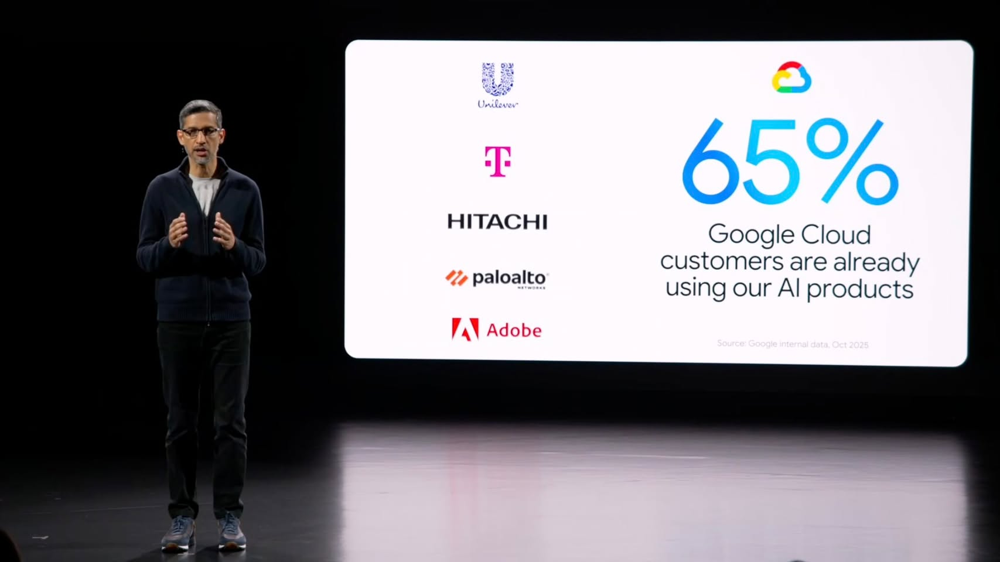
**이미지 캡션:** 검은색 배경의 무대에서 한 성인 남성이 발표를 하고 있다. 그는 40대 후반에서 50대 초반으로 보이며, 검은색 안경을 쓰고 짧은 머리에 짙은 색의 집업 재킷 안에 흰색 티셔츠를 입고 검은색 바지와 운동화를 착용했다. 두 손을 앞으로 모으고 연설하는 듯한 표정을 짓고 있으며, 그의 뒤에는 흰색 화면이 있고 화면에는 여러 기업 로고와 함께 "65% Google Cloud customers are already using our AI products"라는 문구가 크게 쓰여 있다. 화면 왼쪽에는 Unilever, T, HITACHI, paloalto networks, Adobe의 로고가 순서대로 보이며, 오른쪽에는 Google Cloud의 로고와 함께 "65%"라는 숫자가 파란색으로 강조되어 있고 그 아래에는 "Google Cloud customers are already using our AI products"라는 문구가 검은색으로 쓰여 있다. 화면 하단에는 "Source: Google internal data, Oct 2025"라는 작은 글씨가 있다. 전체적으로 발표회 또는 컨퍼런스의 한 장면으로 보이며, 진지하고 전문적인 분위기이다.T, HITACHI, paloalto networks, Adobe의 로고가 순서대로 보이며, 오른쪽에는 Google Cloud의 로고와 함께 "65%"라는 숫자가 파란색으로 강조되어 있고 그 아래에는 "Google Cloud customers are already using our AI products"라는 문구가 검은색으로 쓰여 있다. 화면 하단에는 "Source: Google internal data, Oct 2025"라는 작은 글씨가 있다. 전체적으로 발표회 또는 컨퍼런스의 한 장면으로 보이며, 진지하고 전문적인 분위기이다.
 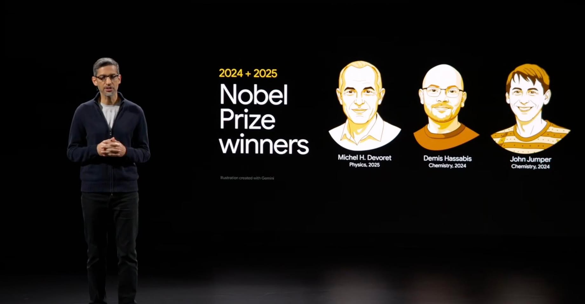
**이미지 캡션:** 검은색 배경의 무대에서 한 성인 남성이 발표를 하고 있으며, 그의 뒤로는 2024년과 2025년 노벨상 수상자들의 일러스트와 이름이 표시된 대형 스크린이 보인다. 발표자는 40대 후반에서 50대 초반으로 추정되며, 안경을 쓰고 회색 머리카락을 짧게 정리한 모습이다. 그는 네이비색 집업 가디건 안에 흰색 티셔츠를 입고 검은색 바지를 착용했으며, 두 손을 앞으로 모으고 차분한 표정으로 청중을 바라보고 있다. 스크린에는 "2024 + 2025 Nobel Prize winners"라는 문구가 크게 쓰여 있고, 그 옆으로 미셸 H. 데보레(물리학, 2025), 데미스 하사비스(화학, 2024), 존 점퍼(화학, 2024) 세 명의 수상자들의 초상화와 이름, 수상 분야 및 연도가 각각 표시되어 있다. 스크린 하단에는 "Illustration created with Gemini"라는 문구가 작게 보인다. 전체적으로 차분하고 정보 전달에 집중하는 분위기이며, 과학 분야의 성과를 축하하고 알리는 행사임을 짐작할 수 있다.으로 미셸 H. 데보레(물리학, 2025), 데미스 하사비스(화학, 2024), 존 점퍼(화학, 2024) 세 명의 수상자들의 초상화와 이름, 수상 분야 및 연도가 각각 표시되어 있다. 스크린 하단에는 "Illustration created with Gemini"라는 문구가 작게 보인다. 전체적으로 차분하고 정보 전달에 집중하는 분위기이며, 과학 분야의 성과를 축하하고 알리는 행사임을 짐작할 수 있다.
 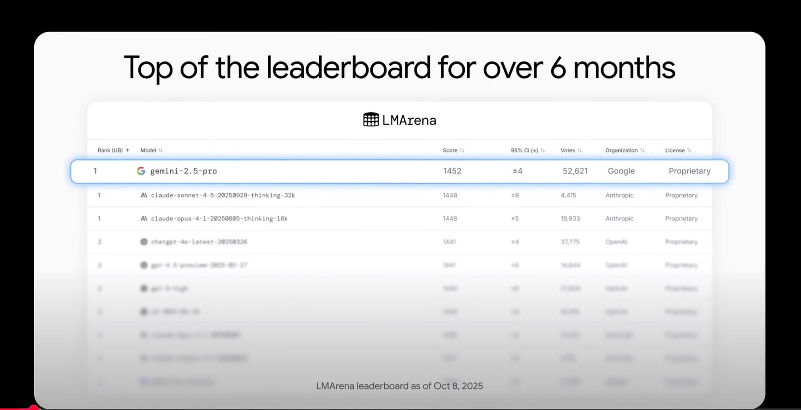
**이미지 캡션:** 화면 상단에는 "Top of the leaderboard for over 6 months"라는 제목이 흰색 텍스트로 표시되어 있으며, 그 아래에는 "LMArena"라는 로고와 함께 리더보드 테이블이 나타납니다. 테이블은 "Rank (UB)", "Model", "Score", "95% CI (±)", "Votes", "Organization", "License"와 같은 열로 구성되어 있습니다. 현재 선택된 행은 "gemini-2.5-pro" 모델로, 1위이며 점수는 1452점, 95% 신뢰 구간은 ±4, 투표 수는 52,621표, 조직은 Google, 라이선스는 Proprietary로 표시되어 있습니다. 이 행은 파란색 테두리로 강조 표시되어 있습니다. 다른 행들도 순위, 모델 이름, 점수, 투표 수, 조직, 라이선스 정보가 흐릿하게 보입니다. 테이블 하단에는 "LMArena leaderboard as of Oct 8, 2025"라는 날짜 정보가 표시되어 있습니다. 전체적으로 깔끔하고 현대적인 디자인의 인터페이스이며, 인공지능 모델의 성능 순위를 보여주는 화면입니다.수는 52,621표, 조직은 Google, 라이선스는 Proprietary로 표시되어 있습니다. 이 행은 파란색 테두리로 강조 표시되어 있습니다. 다른 행들도 순위, 모델 이름, 점수, 투표 수, 조직, 라이선스 정보가 흐릿하게 보입니다. 테이블 하단에는 "LMArena leaderboard as of Oct 8, 2025"라는 날짜 정보가 표시되어 있습니다. 전체적으로 깔끔하고 현대적인 디자인의 인터페이스이며, 인공지능 모델의 성능 순위를 보여주는 화면입니다.
 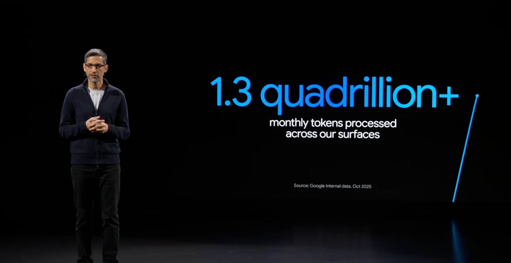
**이미지 캡션:** 검은색 배경의 무대에서 한 명의 성인 남성이 서서 발표하고 있다. 그는 40대 후반에서 50대 초반으로 보이며, 짧은 검은색 머리에 안경을 쓰고 있다. 흰색 티셔츠 위에 네이비색 집업 가디건을 입고 있으며, 검은색 바지를 착용하고 있다. 두 손을 앞으로 모아 쥐고 있으며, 표정은 진지하고 집중하고 있다. 그의 뒤편에는 파란색 글씨로 "1.3 quadrillion+"라는 문구가 크게 쓰여 있고, 그 아래에는 "monthly tokens processed across our surfaces"라는 설명이 작게 적혀 있다. 가장 하단에는 "Source: Google internal data, Oct 2025"라고 출처가 명시되어 있다. 전체적으로 기술 발표회 또는 컨퍼런스의 한 장면으로 보이며, 데이터의 방대한 양을 강조하는 분위기이다. 있다. 가장 하단에는 "Source: Google internal data, Oct 2025"라고 출처가 명시되어 있다. 전체적으로 기술 발표회 또는 컨퍼런스의 한 장면으로 보이며, 데이터의 방대한 양을 강조하는 분위기이다.
 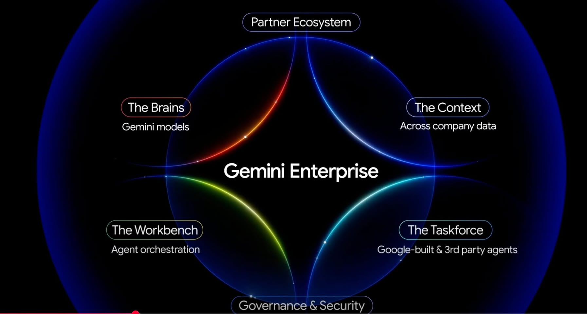
**이미지 캡션:** 이 이미지는 검은색 배경에 "Gemini Enterprise"라는 제목이 중앙에 표시되고, 이를 중심으로 네 개의 타원형 영역이 빛나는 곡선으로 연결된 다이어그램을 보여줍니다. 각 영역에는 캡션과 설명이 포함되어 있습니다. 상단에는 "Partner Ecosystem"이라는 캡션이 있고, 왼쪽 상단에는 "The Brains"와 "Gemini models"라는 설명이 있습니다. 왼쪽 하단에는 "The Workbench"와 "Agent orchestration"이라는 설명이 있습니다. 오른쪽 상단에는 "The Context"와 "Across company data"라는 설명이 있습니다. 오른쪽 하단에는 "The Taskforce"와 "Google-built & 3rd party agents"라는 설명이 있습니다. 가장 아래쪽에는 "Governance & Security"라는 캡션이 있습니다. 전체적으로 미래지향적이고 기술적인 분위기를 연출하며, Gemini Enterprise의 구성 요소와 기능을 시각적으로 설명하는 데 중점을 두고 있습니다. 사람, 장소, 구체적인 사물은 보이지 않으며, 텍스트 정보와 그래픽 요소로 구성된 정보 전달 목적의 이미지입니다.ntext"와 "Across company data"라는 설명이 있습니다. 오른쪽 하단에는 "The Taskforce"와 "Google-built & 3rd party agents"라는 설명이 있습니다. 가장 아래쪽에는 "Governance & Security"라는 캡션이 있습니다. 전체적으로 미래지향적이고 기술적인 분위기를 연출하며, Gemini Enterprise의 구성 요소와 기능을 시각적으로 설명하는 데 중점을 두고 있습니다. 사람, 장소, 구체적인 사물은 보이지 않으며, 텍스트 정보와 그래픽 요소로 구성된 정보 전달 목적의 이미지입니다.
 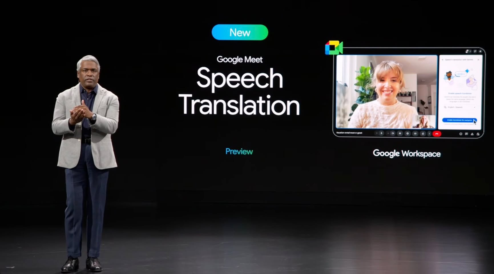
**이미지 캡션:** 검은색 배경의 무대에서 한 성인 남성이 서서 두 손을 모아 박수를 치는 듯한 동작을 하고 있다. 그는 50대 후반에서 60대 초반으로 보이며, 짧은 회색 머리에 검은색 셔츠와 회색 재킷, 남색 바지를 입고 있다. 그의 표정은 진지하면서도 긍정적인 느낌을 준다. 무대 중앙에는 'New', 'Google Meet', 'Speech Translation', 'Preview'라는 글자가 흰색과 녹색으로 표시되어 있으며, 오른쪽에는 태블릿 화면이 보인다. 태블릿 화면에는 두 명의 여성이 화상 통화를 하고 있는 모습과 함께 'Google Workspace'라는 로고가 하단에 배치되어 있다. 전체적으로 새로운 기술 발표를 알리는 듯한 분위기이며, 깔끔하고 현대적인 느낌을 준다.함께 'Google Workspace'라는 로고가 하단에 배치되어 있다. 전체적으로 새로운 기술 발표를 알리는 듯한 분위기이며, 깔끔하고 현대적인 느낌을 준다.
 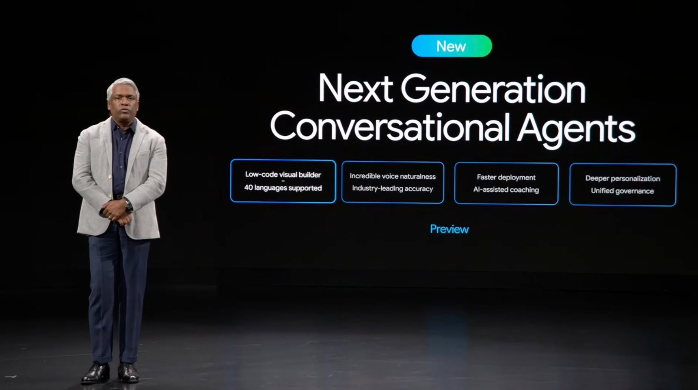
**이미지 캡션:** 검은색 배경의 무대에서 한 명의 성인 남성이 서 있다. 그는 50대 후반에서 60대 초반으로 보이며, 짧은 회색 머리에 검은색 피부를 가지고 있다. 남성은 짙은 남색 셔츠 위에 밝은 회색 재킷을 입고, 남색 바지와 검은색 구두를 신고 있다. 그의 표정은 진지하며, 두 손을 앞으로 모아 깍지를 끼고 서 있다. 그의 뒤로는 "New"라는 문구가 파란색과 녹색으로 빛나고 있으며, 그 아래에는 "Next Generation Conversational Agents"라는 큰 글씨가 흰색으로 쓰여 있다. 또한, 네 개의 파란색 테두리 상자 안에 각각 "Low-code visual builder 40 languages supported", "Incredible voice naturalness Industry-leading accuracy", "Faster deployment Al-assisted coaching", "Deeper personalization Unified governance"라는 문구가 적혀 있다. 가장 아래에는 "Preview"라는 파란색 글씨가 보인다. 전반적으로 기술 발표회 또는 프레젠테이션의 한 장면으로, 새로운 대화형 에이전트 기술을 소개하는 분위기이다.파란색 테두리 상자 안에 각각 "Low-code visual builder 40 languages supported", "Incredible voice naturalness Industry-leading accuracy", "Faster deployment Al-assisted coaching", "Deeper personalization Unified governance"라는 문구가 적혀 있다. 가장 아래에는 "Preview"라는 파란색 글씨가 보인다. 전반적으로 기술 발표회 또는 프레젠테이션의 한 장면으로, 새로운 대화형 에이전트 기술을 소개하는 분위기이다.

### 10월 10일 (금) 17:02 · Sung Kim shared a link.

🔗 <https://www.youtube.com/live/uLHF9T1SLrU?si=MWEN2d8_A4XT5Qif>

### 10월 11일 (토) 11:51 · Sung Kim shared a link.

🔗 <https://upstage.ai/products/document-parse>

### 10월 12일 (일) 13:43 · #도쿄 #황궁 달리기 10K! 도쿄에서 제일 좋고 신나는 코스입니다!! …

#도쿄 #황궁 달리기 10K! 도쿄에서 제일 좋고 신나는 코스입니다!! 근처 계신 분들은 같이 달려요.

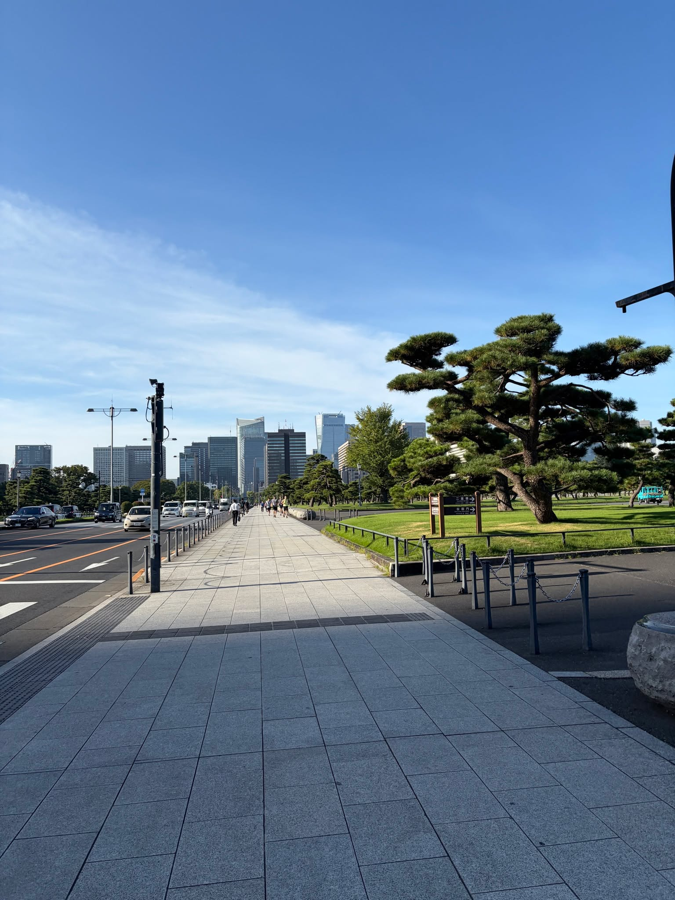
**이미지 캡션:** 푸른 하늘 아래 넓은 보행로가 펼쳐져 있고, 보행로 옆으로는 잘 가꾸어진 잔디밭과 울타리가 보이며, 그 너머로 현대적인 고층 건물들이 늘어서 있습니다. 보행로에는 몇몇 사람들이 산책하거나 걷고 있으며, 그들의 복장은 캐주얼합니다. 도로에는 자동차들이 통행하고 있으며, 신호등과 가로등도 보입니다. 사진의 오른쪽에는 크고 오래된 소나무 한 그루가 인상적으로 서 있습니다. 전체적으로 맑고 쾌적한 날씨 속에서 도시의 풍경과 자연이 조화를 이루는 평화로운 분위기입니다.
 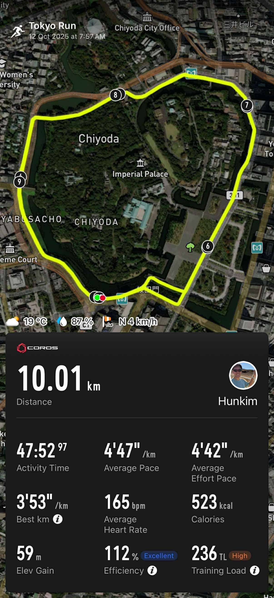
**이미지 캡션:** 이 화면은 도쿄에서 달리기 기록을 보여주는 스마트워치 또는 스마트폰 앱 화면입니다. 화면 상단에는 "Tokyo Run"이라는 제목과 함께 2025년 10월 12일 오전 7시 57분이라는 날짜와 시간이 표시되어 있습니다. 지도에는 도쿄의 치요다 지역과 황궁 주변을 따라 노란색으로 표시된 달리기 경로가 나타나 있으며, 경로 상에는 1번부터 9번까지의 체크포인트가 표시되어 있습니다. 지도에는 "Chiyoda City Office", "Imperial Palace", "Women's University", "Supreme Court" 등의 장소 이름도 보입니다. 화면 하단에는 달리기 기록 요약이 표시되어 있는데, 총 거리 10.01km, 활동 시간 47분 52초, 평균 페이스 4분 47초/km, 최고 페이스 3분 53초/km, 평균 심박수 165bpm, 칼로리 소모량 523kcal, 고도 상승 59m, 효율성 112% (Excellent), 훈련 부하 236 (High) 등의 정보가 포함되어 있습니다. 또한, "Hunkim"이라는 이름과 함께 달리는 사람의 프로필 사진으로 보이는 작은 원형 이미지가 오른쪽 상단에 있습니다. 전반적으로 맑은 날씨에 야외에서 달리기 활동을 기록한 것으로 보이며, 운동 기록에 대한 상세한 정보를 제공하고 있습니다.eme Court" 등의 장소 이름도 보입니다. 화면 하단에는 달리기 기록 요약이 표시되어 있는데, 총 거리 10.01km, 활동 시간 47분 52초, 평균 페이스 4분 47초/km, 최고 페이스 3분 53초/km, 평균 심박수 165bpm, 칼로리 소모량 523kcal, 고도 상승 59m, 효율성 112% (Excellent), 훈련 부하 236 (High) 등의 정보가 포함되어 있습니다. 또한, "Hunkim"이라는 이름과 함께 달리는 사람의 프로필 사진으로 보이는 작은 원형 이미지가 오른쪽 상단에 있습니다. 전반적으로 맑은 날씨에 야외에서 달리기 활동을 기록한 것으로 보이며, 운동 기록에 대한 상세한 정보를 제공하고 있습니다.

### 10월 15일 (수) 10:27 · #함께해요 올해 Upstage에 지원해주신 분이 5000명을 넘었습니다.…

#함께해요 올해 Upstage에 지원해주신 분이 5000명을 넘었습니다. 많은 관심과 지원에 대단히 감사드립니다.

AI #국가대표팀 Upstage에서는 계속해서 세계 최고의 AI를 만들어갈 분들을 모시고 있습니다. 선지원, 후고민으로 함께해요!

https://careers.upstage.ai/

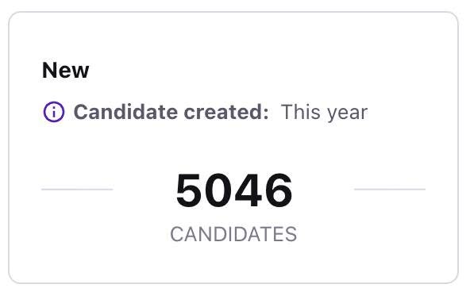
**이미지 캡션:** 이 이미지는 채용 관련 대시보드 화면의 일부로 보이며, 'New'라는 제목 아래 'Candidate created: This year'라는 문구와 함께 올해 생성된 후보자 수를 나타내는 '5046 CANDIDATES'라는 정보가 표시되어 있습니다. 사람이나 특정 장소, 사물은 보이지 않으며, 텍스트 정보와 숫자를 통해 올해 생성된 후보자가 5046명임을 알 수 있습니다. 전반적으로 깔끔하고 정보 전달에 집중된 디자인이며, 데이터 시각화 또는 관리 시스템의 일부로 추정됩니다.

### 10월 15일 (수) 11:29 · Sung Kim shared a link.

🔗 <https://playvod.imbc.com/Templete/VodView?bid=1000842101605100000>

### 10월 17일 (금) 09:10 · Upstage가 #CBInsights ‘InsurTech 50’ 선정되었…

Upstage가 #CBInsights ‘InsurTech 50’ 선정되었습니다. 저희 DX+AX 기술이 한국의 주요 보험 회사, 그리고 최근 미국의 AMWINS, Trucura, Zurich 등 top 회사들에서 사용되고 있는데요. 여기에 힘입어 #CBInsights가 업스테이지를 알아봐 주었습니다.

저희 DX+AX 기술이 더 많은 보험, 금융, 제조, 그리고 전 분야로 확산될 수 있도록 세계 #1으로 달려보겠습니다!

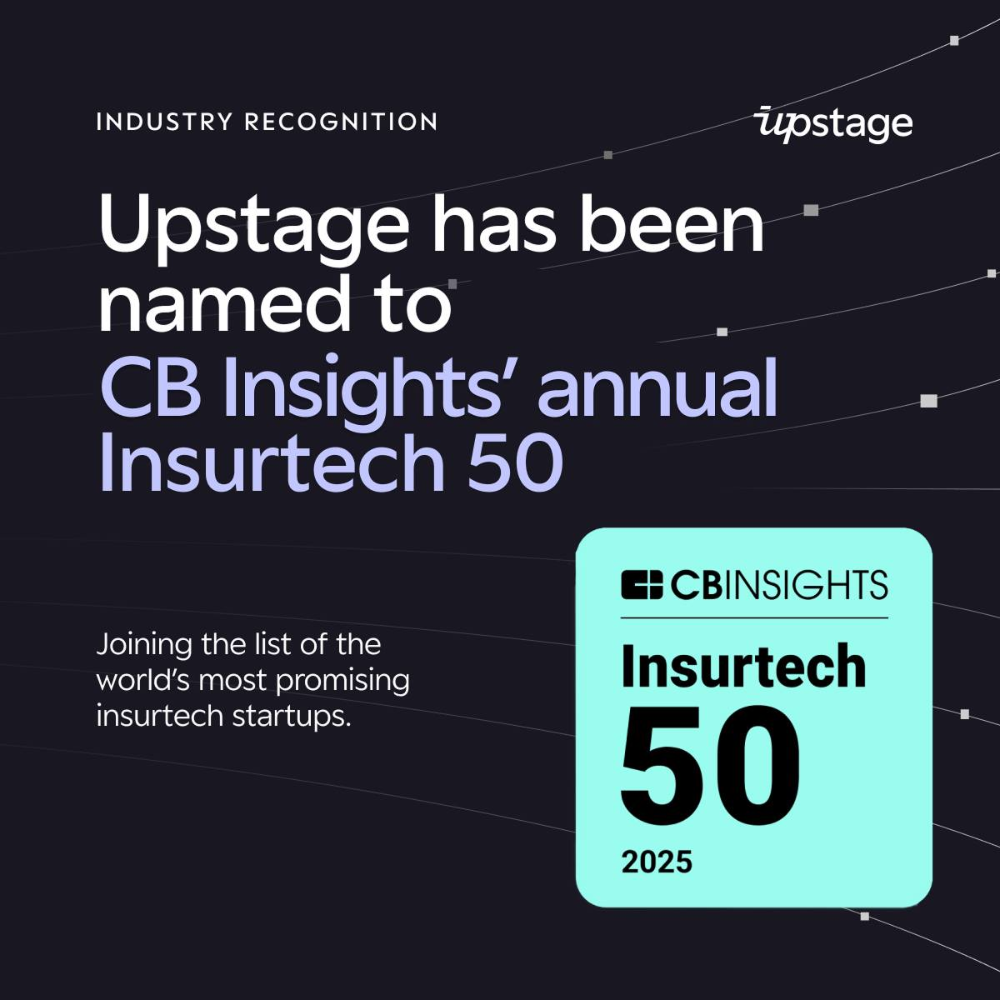
**이미지 캡션:** 이 이미지는 "Upstage has been named to CB Insights' annual Insurtech 50"라는 문구와 함께 업스테이지(Upstage)라는 회사가 CB 인사이트의 연례 인슈어테크 50에 선정되었음을 알리는 그래픽입니다. 배경은 어두운 보라색이며, 흰색과 연한 보라색의 텍스트가 사용되었습니다. 왼쪽 상단에는 "INDUSTRY RECOGNITION"이라는 문구가 있고, 오른쪽 상단에는 "upstage" 로고가 있습니다. 중앙에는 선정 사실을 알리는 큰 글씨의 문구가 있으며, 왼쪽 하단에는 "Joining the list of the world's most promising insurtech startups."라는 설명이 추가되어 있습니다. 오른쪽 하단에는 CB 인사이트의 로고와 함께 "CBINSIGHTS Insurtech 50 2025"라고 적힌 민트색 사각형 배지가 있습니다. 이미지에는 사람이 등장하지 않으며, 전반적으로 전문적이고 정보 전달에 초점을 맞춘 분위기입니다.에는 "Joining the list of the world's most promising insurtech startups."라는 설명이 추가되어 있습니다. 오른쪽 하단에는 CB 인사이트의 로고와 함께 "CBINSIGHTS Insurtech 50 2025"라고 적힌 민트색 사각형 배지가 있습니다. 이미지에는 사람이 등장하지 않으며, 전반적으로 전문적이고 정보 전달에 초점을 맞춘 분위기입니다.
 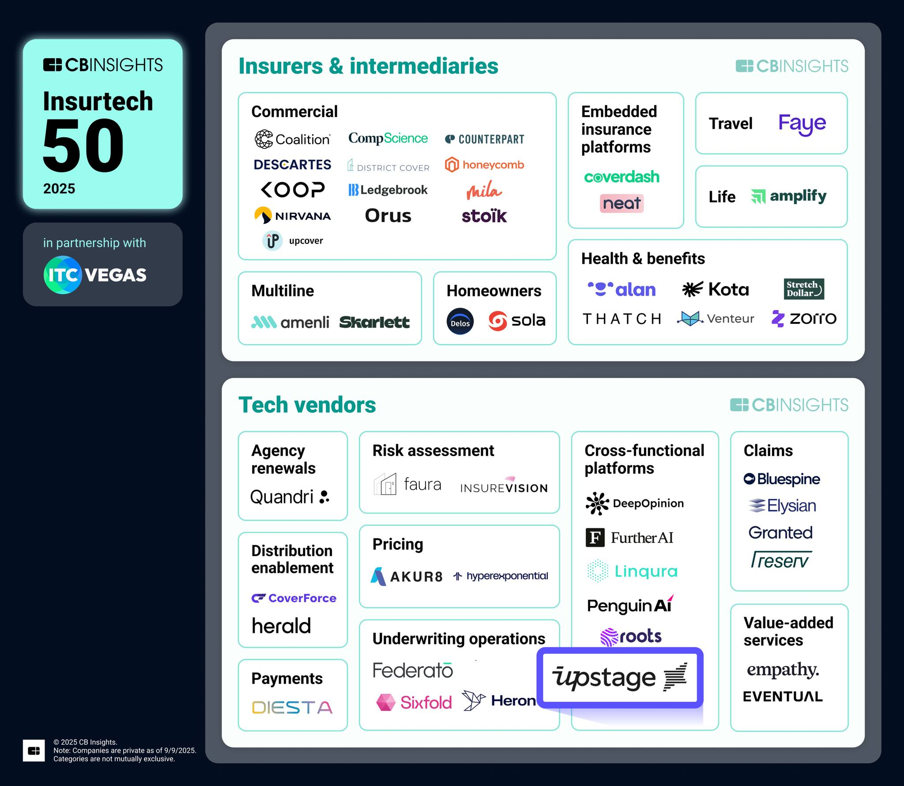
**이미지 캡션:** 이 이미지는 CB Insights에서 발행한 2025년 Insurtech 50 목록을 보여주는 인포그래픽으로, 보험사 및 중개업체와 기술 공급업체라는 두 가지 주요 섹션으로 나뉩니다. 왼쪽 상단에는 "CBINSIGHTS Insurtech 50 2025"라는 제목과 함께 ITC VEGAS와의 파트너십을 나타내는 로고가 있습니다. 주요 섹션인 "보험사 및 중개업체"는 상업, 멀티라인, 주택 소유자, 임베디드 보험 플랫폼, 여행, 생명, 건강 및 혜택과 같은 하위 범주로 나뉘며, 각 범주에는 해당 분야의 선도적인 회사 로고가 나열되어 있습니다. "기술 공급업체" 섹션은 에이전시 갱신, 유통 지원, 결제, 위험 평가, 가격 책정, 인수 운영, 기능 간 플랫폼 및 클레임과 같은 다양한 기술 영역을 다루며, 각 영역에는 관련 회사 로고가 포함되어 있습니다. 이미지 하단에는 CB Insights의 저작권 정보와 함께 2025년 9월 9일 기준 비공개 회사에 대한 참고 사항이 명시되어 있습니다. 전반적으로 이 인포그래픽은 보험 기술 산업의 주요 플레이어와 트렌드를 시각적으로 요약하여 제공합니다.회사 로고가 나열되어 있습니다. "기술 공급업체" 섹션은 에이전시 갱신, 유통 지원, 결제, 위험 평가, 가격 책정, 인수 운영, 기능 간 플랫폼 및 클레임과 같은 다양한 기술 영역을 다루며, 각 영역에는 관련 회사 로고가 포함되어 있습니다. 이미지 하단에는 CB Insights의 저작권 정보와 함께 2025년 9월 9일 기준 비공개 회사에 대한 참고 사항이 명시되어 있습니다. 전반적으로 이 인포그래픽은 보험 기술 산업의 주요 플레이어와 트렌드를 시각적으로 요약하여 제공합니다.
 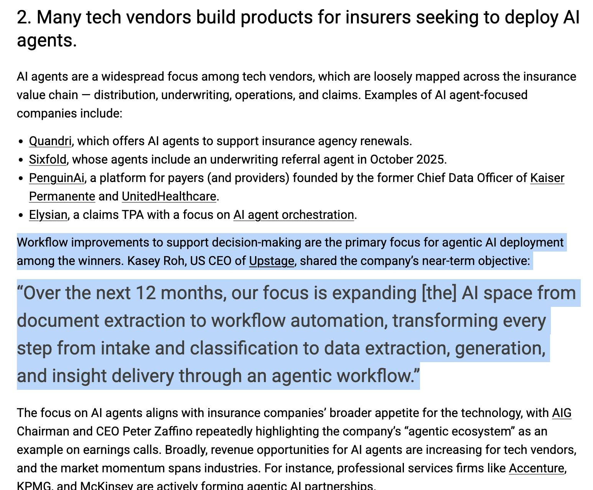
**이미지 캡션:** 이 이미지는 텍스트 기반의 문서로, AI 에이전트 기술을 보험 산업에 적용하는 것에 대한 내용을 담고 있습니다. 문서의 제목은 "2. 많은 기술 공급업체들이 AI 에이전트를 배포하려는 보험사를 위해 제품을 구축합니다."이며, AI 에이전트가 보험 가치 사슬 전반에 걸쳐 널리 활용되고 있음을 설명합니다. Quandri, Sixfold, PenguinAi, Elysian과 같은 AI 에이전트 중심 기업들의 예시가 제시되어 있으며, 특히 Upstage의 미국 CEO인 Kasey Roh의 인용문은 향후 12개월 동안 AI 공간을 문서 추출에서 워크플로우 자동화로 확장하고, 모든 단계를 자동화하여 통찰력을 제공하는 데 집중할 것이라고 밝히고 있습니다. 또한, AIG의 회장 겸 CEO인 Peter Zaffino가 회사의 "에이전틱 생태계"를 언급하며 AI 에이전트에 대한 보험사들의 관심을 강조하고, Accenture, KPMG, McKinsey와 같은 전문 서비스 회사들도 AI 에이전트 파트너십을 형성하고 있음을 보여줍니다. 문서에는 사람이 등장하지 않으며, 배경은 일반적인 문서의 텍스트 레이아웃입니다. 보이는 텍스트는 문서의 제목, 본문 내용, 회사 이름, 인명, 직책, 그리고 인용문입니다. 전반적인 분위기는 정보 전달 및 분석적인 톤을 띠고 있습니다. AI 공간을 문서 추출에서 워크플로우 자동화로 확장하고, 모든 단계를 자동화하여 통찰력을 제공하는 데 집중할 것이라고 밝히고 있습니다. 또한, AIG의 회장 겸 CEO인 Peter Zaffino가 회사의 "에이전틱 생태계"를 언급하며 AI 에이전트에 대한 보험사들의 관심을 강조하고, Accenture, KPMG, McKinsey와 같은 전문 서비스 회사들도 AI 에이전트 파트너십을 형성하고 있음을 보여줍니다. 문서에는 사람이 등장하지 않으며, 배경은 일반적인 문서의 텍스트 레이아웃입니다. 보이는 텍스트는 문서의 제목, 본문 내용, 회사 이름, 인명, 직책, 그리고 인용문입니다. 전반적인 분위기는 정보 전달 및 분석적인 톤을 띠고 있습니다.

### 10월 20일 (월) 08:53 · Sung Kim shared a link.

🔗 <https://www.upstage.ai/products/document-parse>

### 10월 23일 (목) 09:33 · #JPLLM #1 한국을 넘어 일본 LLM #1 을 만들었습니다.

#JPLLM #1 한국을 넘어 일본 LLM #1 을 만들었습니다. 

일본 회사 Karakuri와 합작으로 개발한 Syn-Pro가 일본에서 만든 모델 #1, 그리고 on-prem 가능한 모델로 #1 성능을 달성했습니다. 전체 성능으로도 #17로 상위권입니다. 

일본에서 사업을 하시거나 일본어 관련 서비스를 하신다면 바로 Syn-Pro 테스트 해보셔요. https://console.upstage.ai/ 

그리고 올 하반기 나올 Solar-Pro3, Syn-Pro2 등등 더 멋진 모델을 만들 분들을 계속 모시고 있습니다. 함께해요! https://careers.upstage.ai/

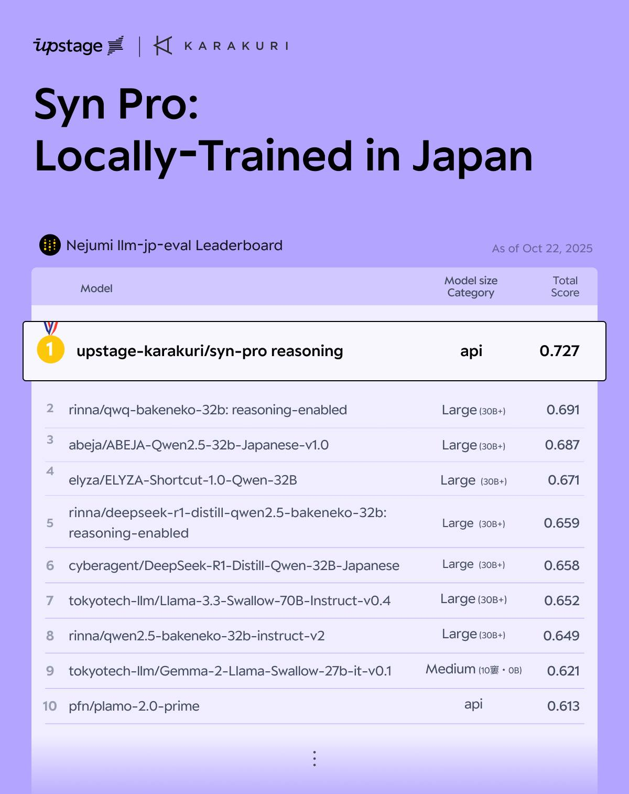
**이미지 캡션:** 이 이미지는 "Syn Pro: Locally-Trained in Japan"이라는 제목의 리더보드를 보여줍니다. 리더보드는 "Nejumi Ilm-jp-eval Leaderboard"라고 명시되어 있으며, 2025년 10월 22일 기준으로 작성되었습니다. 화면 상단에는 "upstage"와 "KARAKURI" 로고가 보입니다. 리더보드는 모델 이름, 모델 크기/카테고리, 총점의 세 가지 열로 구성되어 있습니다. 첫 번째 순위에는 "upstage-karakuri/syn-pro reasoning" 모델이 api 카테고리에서 0.727점을 기록하며 1위를 차지했습니다. 그 뒤를 이어 2위부터 10위까지 다양한 모델들이 Large 또는 Medium 카테고리에서 각각의 점수를 기록하고 있습니다. 1위 모델 옆에는 금메달 아이콘이 있어 특별함을 더합니다. 전반적으로 깔끔하고 정보 전달에 집중된 디자인이며, 기술적인 내용을 다루는 웹페이지 또는 보고서의 일부로 보입니다.고리에서 0.727점을 기록하며 1위를 차지했습니다. 그 뒤를 이어 2위부터 10위까지 다양한 모델들이 Large 또는 Medium 카테고리에서 각각의 점수를 기록하고 있습니다. 1위 모델 옆에는 금메달 아이콘이 있어 특별함을 더합니다. 전반적으로 깔끔하고 정보 전달에 집중된 디자인이며, 기술적인 내용을 다루는 웹페이지 또는 보고서의 일부로 보입니다.
 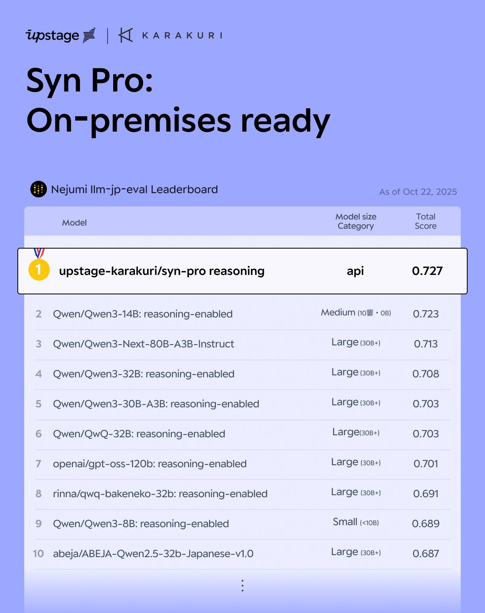
**이미지 캡션:** 이 이미지는 "Syn Pro: On-premises ready"라는 제목의 리더보드를 보여주며, "Nejumi Ilm-jp-eval Leaderboard"라는 부제가 있다. 리더보드는 2025년 10월 22일 기준으로 작성되었으며, 모델 이름, 모델 크기/카테고리, 총점 순으로 정렬되어 있다. 첫 번째 순위는 "upstage-karakuri/syn-pro reasoning" 모델로, api 카테고리에서 0.727점이라는 가장 높은 총점을 기록했다. 그 뒤를 이어 Qwen 모델들이 여러 순위에 걸쳐 있으며, 모델 크기는 Medium 또는 Large (30B+)로 표기되어 있고, 총점은 0.723점에서 0.687점까지 다양하다. 9번째 순위의 "Qwen/Qwen3-8B" 모델은 Small (<10B) 크기로 0.689점을 기록했다. 이미지의 배경은 연한 보라색이며, 상단에는 "upstage"와 "KARAKURI" 로고가 보인다. 리더보드 자체는 흰색 배경에 검은색 텍스트로 구성되어 있으며, 첫 번째 순위에는 금메달 아이콘이 표시되어 있다. 이미지에는 사람이 등장하지 않으며, 전반적으로 깔끔하고 정보 전달에 집중된 디자인이다.델 크기는 Medium 또는 Large (30B+)로 표기되어 있고, 총점은 0.723점에서 0.687점까지 다양하다. 9번째 순위의 "Qwen/Qwen3-8B" 모델은 Small (<10B) 크기로 0.689점을 기록했다. 이미지의 배경은 연한 보라색이며, 상단에는 "upstage"와 "KARAKURI" 로고가 보인다. 리더보드 자체는 흰색 배경에 검은색 텍스트로 구성되어 있으며, 첫 번째 순위에는 금메달 아이콘이 표시되어 있다. 이미지에는 사람이 등장하지 않으며, 전반적으로 깔끔하고 정보 전달에 집중된 디자인이다.
 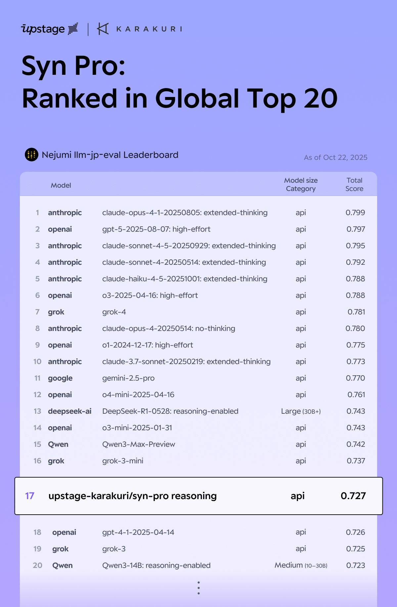
**이미지 캡션:** 이 이미지는 "Syn Pro: Ranked in Global Top 20"이라는 제목의 리더보드를 보여주며, 2025년 10월 22일 기준으로 Nejumi Ilm-jp-eval 리더보드에 대한 정보를 담고 있습니다. 리더보드는 모델 이름, 모델 크기 카테고리, 총점 순으로 정렬되어 있으며, 1위부터 20위까지의 인공지능 모델들의 순위와 점수를 확인할 수 있습니다. 각 행에는 모델의 순위, 모델을 개발한 주체(예: anthropic, openai, grok, google, deepseek-ai, Qwen), 모델의 구체적인 이름 또는 버전, 모델 크기 카테고리(api, Large (30B+), Medium (10-30B)), 그리고 총점이 표시되어 있습니다. 예를 들어, 1위는 anthropic의 claude-opus-4-1-20250805 모델로 0.799점을 기록했습니다. 17위에는 upstage-karakuri/syn-pro reasoning 모델이 api 카테고리에서 0.727점을 기록하고 있습니다. 배경은 연한 보라색이며, 상단에는 "upstage"와 "KARAKURI" 로고가 보입니다. 이 이미지는 인공지능 모델의 성능을 비교하고 평가하는 데 사용되는 리더보드 정보를 제공합니다.델의 구체적인 이름 또는 버전, 모델 크기 카테고리(api, Large (30B+), Medium (10-30B)), 그리고 총점이 표시되어 있습니다. 예를 들어, 1위는 anthropic의 claude-opus-4-1-20250805 모델로 0.799점을 기록했습니다. 17위에는 upstage-karakuri/syn-pro reasoning 모델이 api 카테고리에서 0.727점을 기록하고 있습니다. 배경은 연한 보라색이며, 상단에는 "upstage"와 "KARAKURI" 로고가 보입니다. 이 이미지는 인공지능 모델의 성능을 비교하고 평가하는 데 사용되는 리더보드 정보를 제공합니다.

### 10월 23일 (목) 17:51 · 배경훈 부총리 겸 과학기술정보통신부 장관님, Upstage 방문에 큰 감…

배경훈 부총리 겸 과학기술정보통신부 장관님, Upstage 방문에 큰 감사드립니다. AI 강국 비전에 대해 말씀해주시고 격려해 주셔서 큰 힘이 되었습니다. 세계 AI 기술 주도권을 확보하고 더 좋은 모델과 서비스로 국내뿐만 아니라 글로벌에서도 놀랄 만한 성과를 만들어보겠습니다. 너무 기쁜 날입니다.

1등을 상징하는 손 표시는 위로 계속 올라가는 업업업의 업스테이지 정신을 뜻합니다.

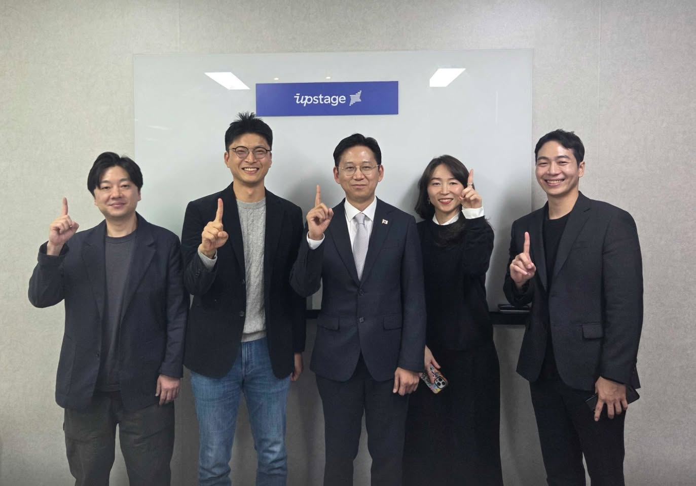
**이미지 캡션:** 다섯 명의 사람들이 흰색 벽 앞에 서서 모두 검지 손가락을 위로 향하게 하고 있다. 왼쪽에서부터 첫 번째 사람은 30대 후반에서 40대 초반으로 보이는 성인 남성으로, 어두운 색 재킷 안에 회색 티셔츠를 입고 있으며, 어두운 색 바지를 입고 있다. 두 번째 사람은 20대 후반에서 30대 초반으로 보이는 성인 남성으로, 검은색 재킷 안에 회색 니트를 입고 청바지를 입고 있으며, 안경을 쓰고 환하게 웃고 있다. 세 번째 사람은 40대 후반에서 50대 초반으로 보이는 성인 남성으로, 정장 재킷과 넥타이를 착용하고 있으며, 안경을 쓰고 정면을 응시하고 있다. 네 번째 사람은 20대 후반에서 30대 초반으로 보이는 성인 여성으로, 검은색 긴 소매 옷에 흰색 칼라가 보이는 옷을 입고 있으며, 휴대폰을 들고 있다. 다섯 번째 사람은 20대 후반에서 30대 초반으로 보이는 성인 남성으로, 검은색 재킷 안에 검은색 티셔츠를 입고 검은색 바지를 입고 있으며, 환하게 웃고 있다. 배경에는 'upstage'라고 쓰인 파란색 로고가 있는 흰색 보드와 회색 벽이 보인다. 전반적으로 밝고 긍정적인 분위기이며, 팀원들이 무언가를 강조하거나 성공을 축하하는 듯한 모습이다.있으며, 안경을 쓰고 정면을 응시하고 있다. 네 번째 사람은 20대 후반에서 30대 초반으로 보이는 성인 여성으로, 검은색 긴 소매 옷에 흰색 칼라가 보이는 옷을 입고 있으며, 휴대폰을 들고 있다. 다섯 번째 사람은 20대 후반에서 30대 초반으로 보이는 성인 남성으로, 검은색 재킷 안에 검은색 티셔츠를 입고 검은색 바지를 입고 있으며, 환하게 웃고 있다. 배경에는 'upstage'라고 쓰인 파란색 로고가 있는 흰색 보드와 회색 벽이 보인다. 전반적으로 밝고 긍정적인 분위기이며, 팀원들이 무언가를 강조하거나 성공을 축하하는 듯한 모습이다.

### 10월 27일 (월) 12:14 · #toyproject #SolarLLM으로 개인프로젝트로 만든 Vocab…

#toyproject #SolarLLM으로 개인프로젝트로 만든 Vocab1000Stream! https://vocab10000stream.vercel.app/

천 단어만 잘 활용해도 영어를 잘한다는 이야기가 있어서 단어와 설명을 우리에게 익숙한 피드 형식으로 공부할 수 있는 웹·앱을 만들어 보았습니다. 아이폰의 경우 사파리로 접속하신 다음 공유-> 홈스크린에 추가 하시면 앱처럼 쉽게 사용이 가능합니다.

심심할 때 feed 넘기듯 돌려보시면 영어 단어가 쏙쏙 들어옵니다.

간략한 단어 설명과 단어 예제는 SolarLLM을 통해 생성되었습니다.

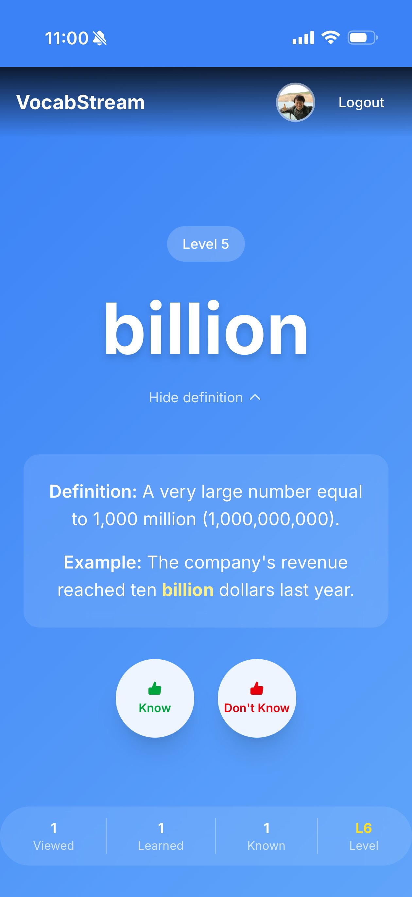
**이미지 캡션:** 이것은 스마트폰 화면을 캡처한 것으로, 파란색 배경에 "VocabStream"이라는 앱 이름이 보이고, 상단에는 시간과 배터리 상태, 와이파이 신호가 표시되어 있습니다. 중앙에는 "Level 5"라는 텍스트와 함께 "billion"이라는 단어가 크게 쓰여 있으며, 그 아래에는 "Hide definition"이라는 문구가 있습니다. 더 아래에는 "billion"의 정의와 예시 문장이 파란색 말풍선 안에 표시되어 있으며, "Definition: A very large number equal to 1,000 million (1,000,000,000)."와 "Example: The company's revenue reached ten billion dollars last year."라고 적혀 있습니다. 화면 하단에는 "Know"라고 쓰인 녹색 버튼과 "Don't Know"라고 쓰인 빨간색 버튼이 있으며, 그 아래에는 "Viewed", "Learned", "Known", "Level"이라는 텍스트와 함께 각각 숫자 1과 "L6"이 표시되어 있습니다. 오른쪽 상단에는 사용자의 프로필 사진으로 보이는 작은 원형 이미지가 있고, "Logout"이라는 텍스트가 있습니다. 전반적으로 단어 학습 앱의 인터페이스로 보이며, 사용자가 단어를 학습하고 자신의 이해도를 표시하는 기능을 제공하는 것으로 추정됩니다.lion (1,000,000,000)."와 "Example: The company's revenue reached ten billion dollars last year."라고 적혀 있습니다. 화면 하단에는 "Know"라고 쓰인 녹색 버튼과 "Don't Know"라고 쓰인 빨간색 버튼이 있으며, 그 아래에는 "Viewed", "Learned", "Known", "Level"이라는 텍스트와 함께 각각 숫자 1과 "L6"이 표시되어 있습니다. 오른쪽 상단에는 사용자의 프로필 사진으로 보이는 작은 원형 이미지가 있고, "Logout"이라는 텍스트가 있습니다. 전반적으로 단어 학습 앱의 인터페이스로 보이며, 사용자가 단어를 학습하고 자신의 이해도를 표시하는 기능을 제공하는 것으로 추정됩니다.

### 10월 27일 (월) 12:48 · Sung Kim shared a link.

🔗 <https://vocab10000stream.vercel.app/>

### 10월 27일 (월) 18:33 · 오늘 한경협(구 전경련) 국제 콘퍼런스에서 미국 피터슨국제경제연구소(PI…

오늘 한경협(구 전경련) 국제 콘퍼런스에서 미국 피터슨국제경제연구소(PIIE) 선임연구위원이 미국·중국이 추격하는 대표적인 AI 모델로 #SolarPro2를 언급해 주셨습니다.

미국 현지 연구소에도 Upstagee #SolarPro2 소식이 전달되고 있다니 너무 행복합니다. #Pro3, #Pro4를 통해 더 놀라운 성과를 만들어 보겠습니다!

https://console.upstage.ai/ 에서 #SolarPro2 바로 사용해볼수 있습니다. 성능 정말 좋습니다.

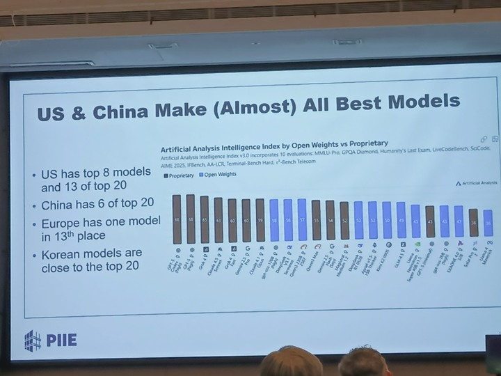
**이미지 캡션:** 발표 슬라이드에는 "US & China Make (Almost) All Best Models"라는 제목이 있으며, 인공지능 분석 지수(Artificial Analysis Intelligence Index) v3.0 결과를 보여주는 막대 그래프가 있습니다. 이 지수는 오픈 가중치(Open Weights) 모델과 독점(Proprietary) 모델을 비교하며, MMLU-Pro, GPQA Diamond 등 10가지 평가를 포함합니다. 슬라이드 왼쪽에는 주요 내용이 요약되어 있는데, 미국이 상위 20개 모델 중 8개를 차지하고 상위 20개 모델 중 13개를 차지하며, 중국은 상위 20개 모델 중 6개를 차지하고, 유럽은 13위에 한 개의 모델을 보유하고 있으며, 한국 모델은 상위 20위권에 근접해 있다고 설명합니다. 막대 그래프는 다양한 AI 모델의 성능 점수를 보여주며, 갈색 막대는 독점 모델을, 파란색 막대는 오픈 가중치 모델을 나타냅니다. 그래프 하단에는 각 모델의 이름이 표시되어 있습니다. 슬라이드 하단에는 "PIIE" 로고가 보이며, 발표장으로 보이는 장소에서 여러 명의 성인 남성이 슬라이드를 바라보고 있는 모습이 사진 하단에 일부 보입니다. 전반적으로 기술 발표회 또는 학술 회의의 한 장면으로 보이며, 진지하고 정보 전달에 초점을 맞춘 분위기입니다. 차지하고 상위 20개 모델 중 13개를 차지하며, 중국은 상위 20개 모델 중 6개를 차지하고, 유럽은 13위에 한 개의 모델을 보유하고 있으며, 한국 모델은 상위 20위권에 근접해 있다고 설명합니다. 막대 그래프는 다양한 AI 모델의 성능 점수를 보여주며, 갈색 막대는 독점 모델을, 파란색 막대는 오픈 가중치 모델을 나타냅니다. 그래프 하단에는 각 모델의 이름이 표시되어 있습니다. 슬라이드 하단에는 "PIIE" 로고가 보이며, 발표장으로 보이는 장소에서 여러 명의 성인 남성이 슬라이드를 바라보고 있는 모습이 사진 하단에 일부 보입니다. 전반적으로 기술 발표회 또는 학술 회의의 한 장면으로 보이며, 진지하고 정보 전달에 초점을 맞춘 분위기입니다.

### 10월 27일 (월) 18:33 · Sung Kim shared a link.

🔗 <https://n.news.naver.com/mnews/article/001/0015703743?sid=105>

### 10월 27일 (월) 19:07 · #KOSPI #4000 와~ 이걸 직접 보게 되네요. 5천, 7천, 만까…

#KOSPI #4000 와~ 이걸 직접 보게 되네요. 5천, 7천, 만까지 계속 업업업 하면 좋겠습니다!

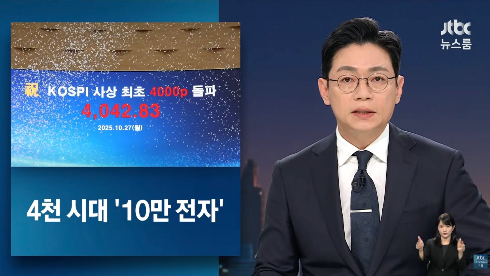
**이미지 캡션:** 화면 왼쪽에는 KOSPI 지수가 4000p를 돌파했다는 뉴스가 표시되고 있으며, 구체적인 수치는 4,042.83으로 나타나 있다. 날짜는 2025년 10월 27일 월요일이다. 하단에는 "4천 시대 '10만 전자'"라는 문구가 흰색 글씨로 크게 쓰여 있다. 화면 오른쪽에는 JTBC 뉴스룸 로고와 함께 정장을 입은 성인 남성 앵커가 등장한다. 그는 둥근 안경을 쓰고 있으며, 차분하고 진지한 표정으로 뉴스를 전달하고 있다. 앵커는 짙은 남색 정장에 흰색 셔츠, 그리고 패턴이 있는 짙은 남색 넥타이를 착용하고 있다. 넥타이에는 실버 색상의 넥타이핀이 달려 있다. 화면 오른쪽 하단에는 수어 통역사가 등장하여 뉴스를 수어로 전달하고 있다. 그녀 역시 검은색 정장을 입고 있으며, 밝고 또렷한 표정으로 손짓을 하고 있다. 전반적으로 경제 뉴스를 다루는 진지하고 전문적인 분위기이다. 넥타이에는 실버 색상의 넥타이핀이 달려 있다. 화면 오른쪽 하단에는 수어 통역사가 등장하여 뉴스를 수어로 전달하고 있다. 그녀 역시 검은색 정장을 입고 있으며, 밝고 또렷한 표정으로 손짓을 하고 있다. 전반적으로 경제 뉴스를 다루는 진지하고 전문적인 분위기이다.

### 10월 29일 (수) 21:15 · Sung Kim shared a link.

🔗 <https://www.youtube.com/watch?v=69YYpzDqzbE>

### 10월 29일 (수) 21:15 · #협상달인 묻지 마 3500억달러 선불 현금 요구! 이 어려운 협상을 어…

#협상달인 묻지 마 3500억달러 선불 현금 요구! 이 어려운 협상을 어떻게 풀어낼까 걱정이었는데 정말 잘 협상하신 것 같습니다.

총 3500억달러 현금 요구를 2000억달러로 줄였고요. 특히 현금 투자는 연간 200억달러 한도로 10년간이상 분산 투자로 외환 시장 부담 최소화뿐만 아니라 요즘 같은 인플레이션 시기에 10년 할부로 실질 부담은 상당히 줄어들 것 같습니다.

정말 멋진 협상이고 대단한 결과입니다.

🔗 <https://www.youtube.com/watch?v=69YYpzDqzbE>

### 10월 30일 (목) 10:53 · Wandb 가 주최하는 Fully Connected Tokyo 2025 …

Wandb 가 주최하는 Fully Connected Tokyo 2025 첫날 업스테이지 AI 웍샵 성황리 진행중입니다. 일본 참여자들의 집중도가 대단하네요. 

저희 document parse, information extractor, syn-pro 정말 좋아서 큰 인기를 얻고 있습니다. 

https://console.upstage.ai 에서 바로 사용 가능하십니다.

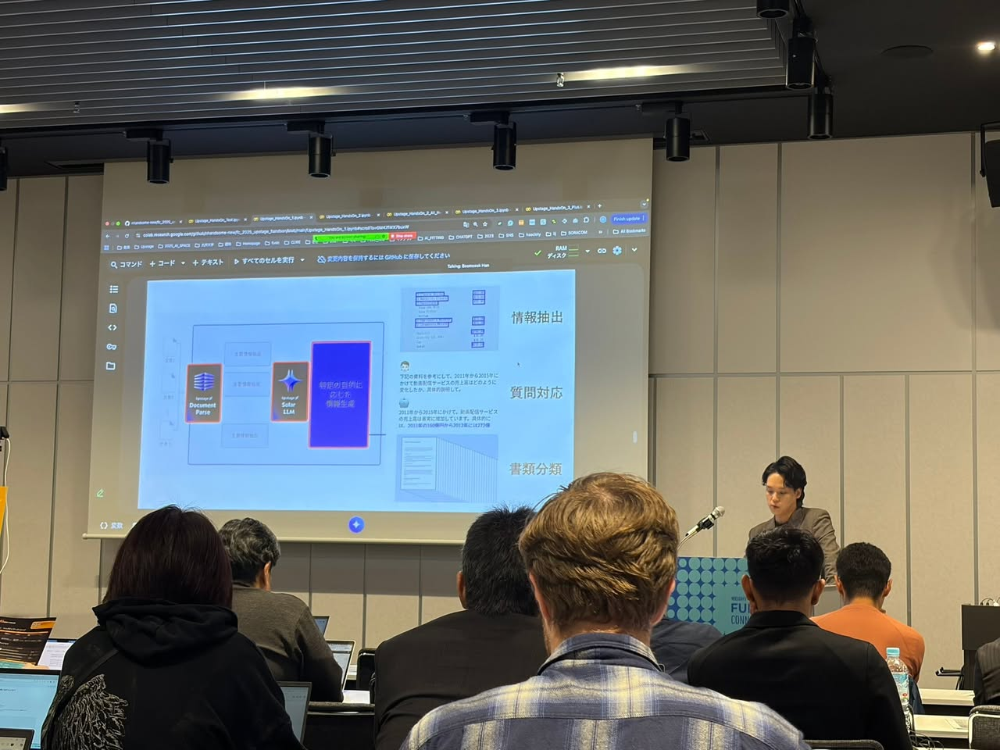
**이미지 캡션:** 이 사진은 강연 중인 한 성인 남성과 청중의 모습을 담고 있으며, 배경에는 발표 내용이 담긴 대형 스크린이 보인다. 발표자는 회색 재킷을 입고 마이크 앞에 서서 스크린을 바라보며 이야기하고 있으며, 표정은 진지하다. 스크린에는 일본어로 된 텍스트와 다이어그램이 표시되어 있으며, "情報抽出" (정보 추출), "質問対応" (질문 대응), "書類分類" (서류 분류)와 같은 제목들이 보인다. 청중은 노트북을 앞에 두고 강연을 듣고 있으며, 대부분 성인 남성으로 보이며 다양한 복장을 하고 있다. 전반적으로 기술 관련 발표회나 세미나와 같은 분위기이다.발표회나 세미나와 같은 분위기이다.
 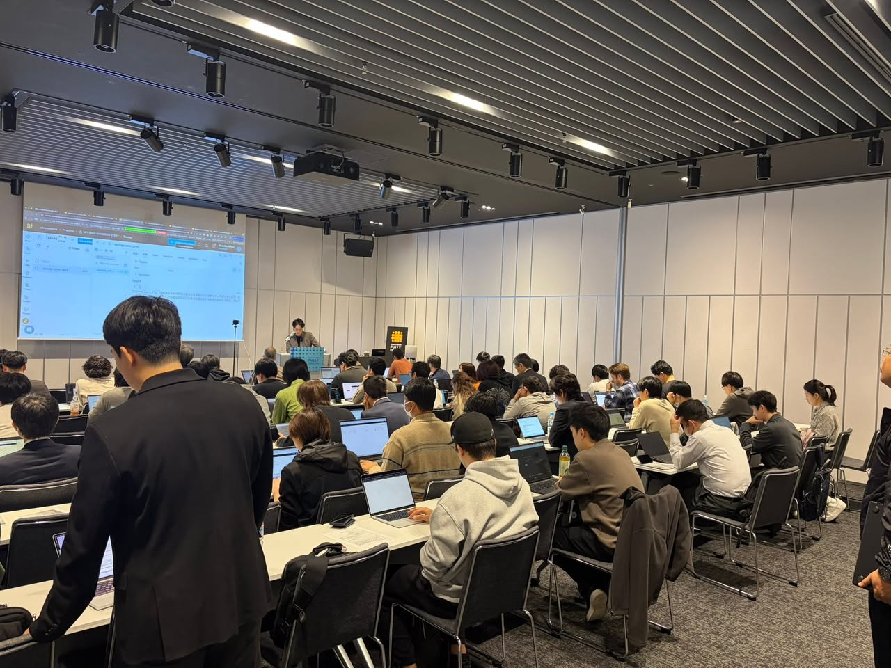
**이미지 캡션:** 넓은 강의실에서 많은 사람들이 노트북을 보며 강의를 듣고 있다. 강의실 앞쪽에는 대형 스크린이 설치되어 있고, 스크린에는 코딩 화면으로 보이는 내용이 표시되어 있다. 스크린 앞에는 한 명의 성인 남성이 서서 강의를 하고 있으며, 그는 셔츠와 재킷을 입고 있다. 청중석에는 다양한 연령대의 남녀가 앉아 있으며, 대부분 캐주얼한 복장을 하고 있다. 많은 사람들이 노트북을 켜놓고 화면을 집중해서 보고 있으며, 일부는 필기를 하거나 고개를 숙이고 생각에 잠겨 있다. 강의실은 현대적인 디자인으로 천장에는 조명과 환풍 시설이 설치되어 있고, 벽은 흰색 패널로 마감되어 있다. 전체적으로 차분하고 집중된 분위기이며, 교육 또는 세미나 현장으로 보인다.설이 설치되어 있고, 벽은 흰색 패널로 마감되어 있다. 전체적으로 차분하고 집중된 분위기이며, 교육 또는 세미나 현장으로 보인다.
 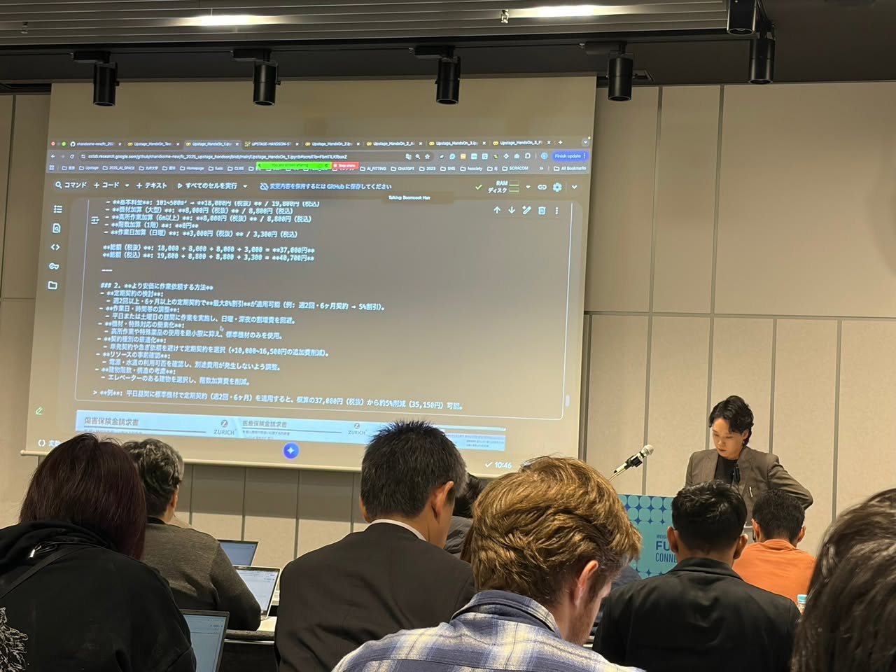
**이미지 캡션:** 이 사진은 강연이나 발표가 진행되는 실내 공간을 보여줍니다. 화면에는 일본어로 된 텍스트가 표시되어 있으며, 이는 코드나 계산식, 그리고 여러 항목에 대한 설명으로 보입니다. 화면 앞쪽에는 마이크가 설치되어 있고, 한 명의 성인 남성이 발표자로 서서 청중을 향해 이야기하고 있습니다. 발표자는 약 30대 후반에서 40대 초반으로 보이며, 어두운 색상의 재킷과 셔츠를 입고 있습니다. 그의 표정은 진지하며, 손짓을 하며 설명하는 듯한 모습입니다. 청중은 다양한 연령대의 사람들로 구성되어 있으며, 대부분 앞쪽을 바라보고 있습니다. 일부 청중은 노트북을 사용하고 있습니다. 전반적으로 지식 전달이나 정보 공유가 이루어지는 학술적이거나 비즈니스적인 분위기입니다.보고 있습니다. 일부 청중은 노트북을 사용하고 있습니다. 전반적으로 지식 전달이나 정보 공유가 이루어지는 학술적이거나 비즈니스적인 분위기입니다.
 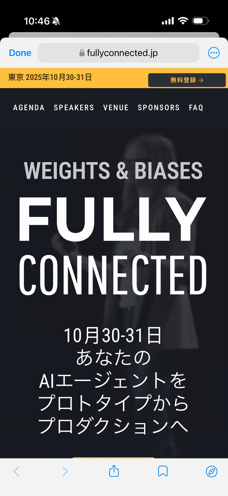
**이미지 캡션:** 이 이미지는 웹 브라우저 화면을 캡처한 것으로, "FULLY CONNECTED"라는 행사 정보를 담고 있습니다. 화면 상단에는 시간 10:46, "Done" 버튼, 웹사이트 주소 "fullyconnected.jp", 그리고 "無料登録" (무료 등록) 버튼이 보입니다. 그 아래 노란색 배경에는 "東京 2025年10月30-31日" (도쿄 2025년 10월 30-31일)이라고 행사 날짜와 장소가 명시되어 있습니다. 행사 메뉴로는 AGENDA, SPEAKERS, VENUE, SPONSORS, FAQ가 나열되어 있습니다. 화면 중앙에는 "WEIGHTS & BIASES"와 함께 크고 흰 글씨로 "FULLY CONNECTED"라는 행사의 주요 타이틀이 강조되어 있습니다. 그 아래에는 "10月30-31日" (10월 30-31일)이라는 날짜와 함께 "あなたの AIエージェントを プロトタイプから プロダクションへ" (당신의 AI 에이전트를 프로토타입에서 프로덕션으로)라는 문구가 일본어로 적혀 있어, 이 행사가 AI 에이전트의 개발 및 상용화에 관한 내용을 다룰 것임을 알 수 있습니다. 배경에는 흐릿하게 사람의 모습이 비치고 있으며, 전체적으로 어두운 톤에 흰색 텍스트가 대비되어 정보 전달에 집중하는 분위기입니다. 화면 하단에는 웹 브라우저의 탐색 및 공유 기능으로 보이는 아이콘들이 있습니다.다. 화면 중앙에는 "WEIGHTS & BIASES"와 함께 크고 흰 글씨로 "FULLY CONNECTED"라는 행사의 주요 타이틀이 강조되어 있습니다. 그 아래에는 "10月30-31日" (10월 30-31일)이라는 날짜와 함께 "あなたの AIエージェントを プロトタイプから プロダクションへ" (당신의 AI 에이전트를 프로토타입에서 프로덕션으로)라는 문구가 일본어로 적혀 있어, 이 행사가 AI 에이전트의 개발 및 상용화에 관한 내용을 다룰 것임을 알 수 있습니다. 배경에는 흐릿하게 사람의 모습이 비치고 있으며, 전체적으로 어두운 톤에 흰색 텍스트가 대비되어 정보 전달에 집중하는 분위기입니다. 화면 하단에는 웹 브라우저의 탐색 및 공유 기능으로 보이는 아이콘들이 있습니다.
 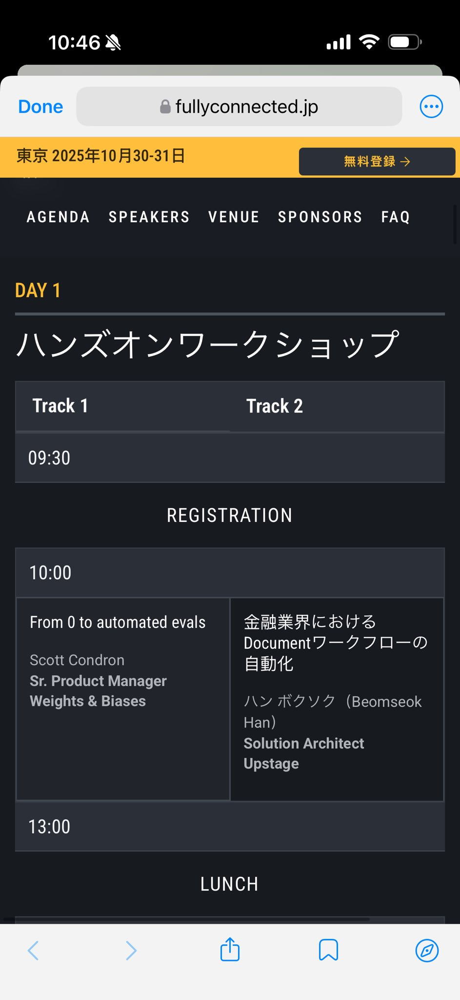
**이미지 캡션:** 이것은 스마트폰 화면을 캡처한 이미지로, 웹 브라우저에서 "fullyconnected.jp"라는 웹사이트를 보고 있습니다. 화면 상단에는 시간 "10:46"과 배터리 잔량 표시가 보이며, 웹 브라우저 주소창에는 "fullyconnected.jp"가 표시되어 있고 "Done" 버튼이 있습니다. 그 아래에는 노란색 배경에 "東京 2025年10月30-31日"이라는 날짜와 "無料登録 →" 버튼이 있습니다. 그 아래에는 "AGENDA", "SPEAKERS", "VENUE", "SPONSORS", "FAQ"와 같은 메뉴 항목이 보입니다. 메인 콘텐츠는 "DAY 1"이라는 제목과 함께 "ハンズオンワークショップ" (핸즈온 워크숍)이라는 일본어 제목으로 시작합니다. 그 아래에는 "Track 1"과 "Track 2"로 나뉘어 있으며, "09:30" 시간이 표시되어 있습니다. 이어서 "REGISTRATION"이라는 제목이 있고, 10:00부터 시작하는 세션 정보가 두 개의 열로 나뉘어 있습니다. 왼쪽 열에는 "From 0 to automated evals"라는 제목과 함께 "Scott Condron", "Sr. Product Manager", "Weights & Biases"라는 발표자 정보가 있습니다. 오른쪽 열에는 "金融業界における Document ワークフローの自動化" (금융 업계에서의 문서 워크플로우 자동화)라는 일본어 제목과 함께 "ハン ボクソク (Beomseok Han)", "Solution Architect", "Upstage"라는 발표자 정보가 있습니다. 13:00에는 "LUNCH"라고 표시되어 있습니다. 화면 하단에는 웹 브라우저의 탐색 버튼들이 보입니다. 전반적으로 이 화면은 기술 컨퍼런스의 일정 정보를 보여주고 있습니다. 항목이 보입니다. 메인 콘텐츠는 "DAY 1"이라는 제목과 함께 "ハンズオンワークショップ" (핸즈온 워크숍)이라는 일본어 제목으로 시작합니다. 그 아래에는 "Track 1"과 "Track 2"로 나뉘어 있으며, "09:30" 시간이 표시되어 있습니다. 이어서 "REGISTRATION"이라는 제목이 있고, 10:00부터 시작하는 세션 정보가 두 개의 열로 나뉘어 있습니다. 왼쪽 열에는 "From 0 to automated evals"라는 제목과 함께 "Scott Condron", "Sr. Product Manager", "Weights & Biases"라는 발표자 정보가 있습니다. 오른쪽 열에는 "金融業界における Document ワークフローの自動化" (금융 업계에서의 문서 워크플로우 자동화)라는 일본어 제목과 함께 "ハン ボクソク (Beomseok Han)", "Solution Architect", "Upstage"라는 발표자 정보가 있습니다. 13:00에는 "LUNCH"라고 표시되어 있습니다. 화면 하단에는 웹 브라우저의 탐색 버튼들이 보입니다. 전반적으로 이 화면은 기술 컨퍼런스의 일정 정보를 보여주고 있습니다.

### 10월 31일 (금) 14:21 · 경주 APEC관련 행사에서 멋진 소식들이 많은데요. Upstage도 좋은…

경주 APEC관련 행사에서 멋진 소식들이 많은데요. Upstage도 좋은 소식이 있습니다. APEC CEO 2025에서 진행된 Amazon Web Services CEO, @Matt Garman 님이 주재한 미팅에 참여하였습니다. 이 미팅을 통해 Upstage AI모델들이 AWS를 통해 더 많이 확산될수 있는 방법을 논의 했고, AWS는 이에 더 많은 투자를 하시기로 했습니다. 멋진 성과로 만들어 보겠습니다!

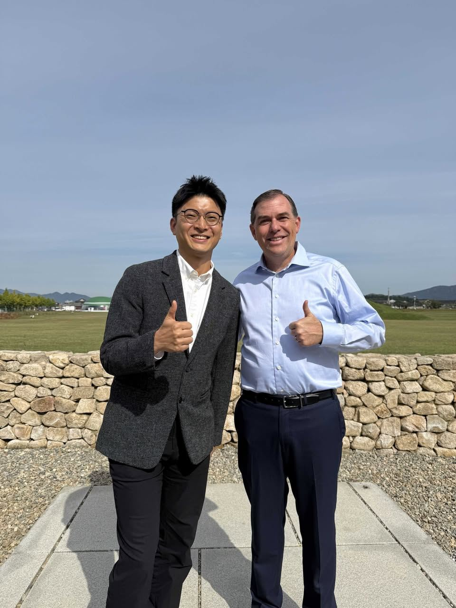
**이미지 캡션:** 밝은 날씨에 야외에서 두 명의 성인 남성이 나란히 서서 엄지손가락을 치켜들고 있다. 왼쪽 남성은 30대 후반에서 40대 초반으로 보이는 아시아인이며, 검은색 헤어스타일에 동그란 안경을 쓰고 있다. 그는 흰색 셔츠 위에 회색 재킷을 걸치고 검은색 바지를 입고 있으며, 밝게 웃는 표정으로 카메라를 바라보고 있다. 오른쪽 남성은 40대 후반에서 50대 초반으로 보이는 백인이며, 짧은 갈색 머리에 푸른색 셔츠와 남색 바지를 입고 있다. 그 역시 카메라를 향해 미소를 짓고 있으며, 두 사람 모두 긍정적이고 친근한 분위기를 자아낸다. 배경에는 돌담과 넓은 잔디밭, 그리고 멀리 산과 건물이 보인다. 전반적으로 화창한 날씨 속에서 두 사람이 좋은 시간을 보내고 있음을 보여주는 사진이다.기를 자아낸다. 배경에는 돌담과 넓은 잔디밭, 그리고 멀리 산과 건물이 보인다. 전반적으로 화창한 날씨 속에서 두 사람이 좋은 시간을 보내고 있음을 보여주는 사진이다.
 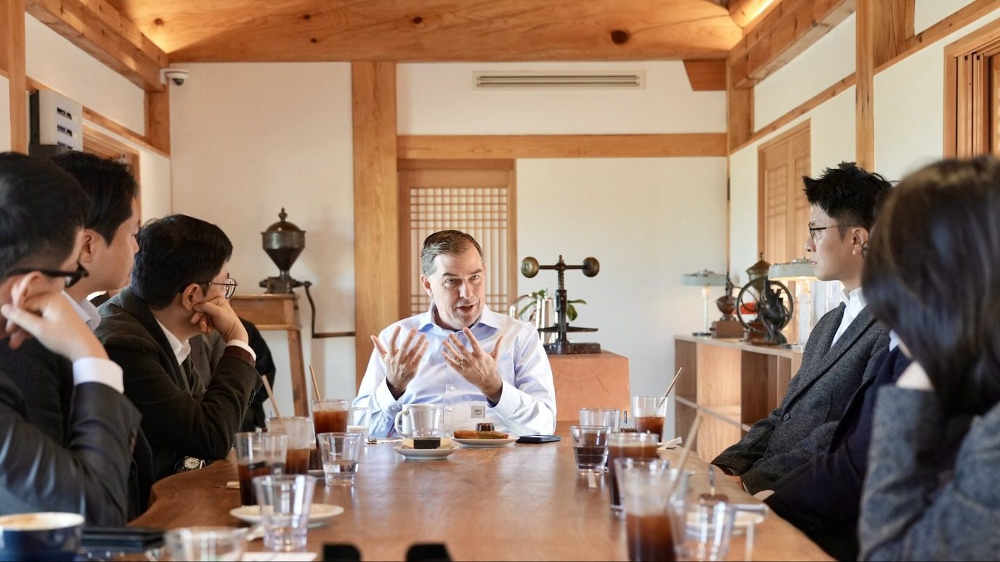
**이미지 캡션:** 이 사진은 한국 전통 가옥의 목재 구조가 돋보이는 실내 공간에서 여러 사람이 테이블에 둘러앉아 회의 또는 대화를 나누는 모습을 담고 있습니다. 중앙에는 40대 후반에서 50대 초반으로 보이는 백인 남성이 연한 하늘색 셔츠를 입고 손짓을 하며 열정적으로 이야기하고 있으며, 그의 표정은 진지하면서도 활기찹니다. 그의 앞 테이블에는 커피잔, 작은 접시에 담긴 디저트, 그리고 휴대폰이 놓여 있습니다. 테이블 주변에는 20대 후반에서 30대 초반으로 보이는 동양인 남성 여러 명과 여성 한 명이 앉아 있으며, 대부분 정장을 입고 있습니다. 이들은 발표자를 경청하거나 생각에 잠긴 듯한 표정을 짓고 있으며, 일부는 안경을 착용하고 있습니다. 배경에는 한국 전통 문양의 창문, 오래된 커피 그라인더와 같은 장식품, 그리고 조명이 보입니다. 전체적으로 차분하면서도 집중력 있는 분위기이며, 비즈니스 미팅이나 학술 토론과 같은 상황을 연상시킵니다.장을 입고 있습니다. 이들은 발표자를 경청하거나 생각에 잠긴 듯한 표정을 짓고 있으며, 일부는 안경을 착용하고 있습니다. 배경에는 한국 전통 문양의 창문, 오래된 커피 그라인더와 같은 장식품, 그리고 조명이 보입니다. 전체적으로 차분하면서도 집중력 있는 분위기이며, 비즈니스 미팅이나 학술 토론과 같은 상황을 연상시킵니다.
