# 2025년 11월

[← 2025년](README.md)

### 11월 1일 (토) 11:51 · 26만장의 AI 고속도로에 우리가 만든 AI 모델들을 쌩쌩 달리게 하자​…

26만장의 AI 고속도로에 우리가 만든 AI 모델들을 쌩쌩 달리게 하자​!

APEC 정상회의에서 많은 성과가 나왔는데요. 저는 개인적으로 가장 큰 성과는 바로 배경훈 부총리 겸 과학기술정보통신부 장관 님과 Jung-Woo Ha 수석님이 주도한 ​"AI 고속도로" 확장을 위한 추가 GPU 26만장 확보​입니다. 이는 대한민국이 AI 경쟁에서 진정한 게임체인저로 AI 3강으로 도약하는 초석이 될 것입니다.

​# AI 고속도로(GPU)가 왜 중요한가?​
GPU는 AI 시대의 핵심 인프라입니다. 아무리 뛰어난 AI 모델(차량)도 고속도로(GPU)가 없으면 달릴 수 없습니다. 충분한 GPU 확보는 AI 모델 개발의 ​시작점이자 완성점​입니다.

스케일링 법칙​에 따라 대규모 GPU에서 학습된 모델은 성능이 기하급수적으로 향상됩니다. 그래서 충분한 자원은 파운데이션 모델·로봇 AI·산업용 AI 등 다양한 혁신을 가능하게 합니다. GPU 부족하면 아예 시도해볼수가 없습니다. 미국·EU·중국 등 주요국과 OpenAI, Meta, XAI등이 GPU 확보에 사활을 거는 이유도 여기에 있습니다.

업스테이지도 AI 모델 개발 과정에서 GPU 확보의 어려움이 많았습니다. 비용도 비용이지만 수천 장 규모의 GPU는 구하기 어려웠고, 이는 기술 개발 속도를 저해하는 주요 장애물이었습니다.

# 26만장 확보는 어떤 의미인가?​
한마디로 ​"불가능을 가능으로"​ 바꾼 성과 입니다. 지난 정부 목표는 1만장이었으나, 이번 정부의 *공약*이 5만장 확보였습니다.  매우 도전적인 목표이긴 하지만 사실상 5만장은 많이 부족한 수준였습니다.

여기 배경훈장관님과 하정우 수석님은 ​2030년까지 20만장​이라는 과감한 목표를 설정했습니다.

그러나 데이터 센터 확보는 어떻게 하고, 또 전력은 어디서 마련할지, 특히 GPU 숫자로 봐서는 AI 약체국에 가까운 우리가 엔비디아로 부터 GPU를 받을수는 있을까 의문이 많았습니다.  글로벌 GPU 확보 전쟁 속에서 20만장은 도전적인 목표를 넘어 ​거의 불가능에 가까운 목표​로 보였습니다.

그 불가능을 바로 현실로 만든 것입니다. 26만장 확보​는 메타(30만장)·일론 머스크(10만장) 등과 비교해도 경쟁력 있는 규모입니다.
이번 성과는 ​AI 주권 확보​와 ​글로벌 기술 리더십​을 위한 아주 멋진 첫 걸음입니다.

​# 우리 AI 모델이 이 고속도로를 달려야 합니다​
이렇게 멋진 AI 고속도로가 깔렸는데, 우리는 무엇을 해야 할까요? 가장 슬픈일은 이 멋진 고속도로 위에서 외산 자동차만 쌩쌩 달리는 것일 것입니다. 상상해 보십시오. 우리가 힘들여 만든 10차선 멋진 고속도로에 현대차등 국산은 하나도 없고 100% 외산만 달리고 있다면 얼마나 속상할까요?

이제 우리가 할 일은 하나입니다. 이 확보된 AI 고속도로에 우리가 만든 AI 모델들이 쌩쌩 달리게 하는 것입니다.

이미 정부는 멋진 AI 독자 파운데이션 모델사업을 진행하고 있습니다. 업스테이지를 포함한 5개의 AI 국가 대표를 선정하였고 모두 열심히 달리고 있습니다. 이 국가 대표들에게 (1) 더 많은 GPU가 제공되어야 합니다. 최소 만장, 2만장 단위가 되어야 합니다. (2) 파운데이션 모델에 제일 중요한 데이터가 더 공개 되어야 합니다. 공공, 국정기관부터 시작해서 공개할 수 있는 모든 데이터를 공개해야 합니다. 이 데이터가 HWP, PDF 뿐만 아니라 컴퓨터가 읽을 수 있는 형식으로 공급되어 데이터 생성 즉시 이 데이터가 학습에 사용될 수 있도록 되어야 합니다.  이렇게 해서 만들어진 독자 파운데이션 모델을 (3) 정부가 나서서 빠르게 도입해야 합니다. 우선 가벼운 정부 지식 검색 부터 시작해서, 반복된 작업, 그리고 복잡한 작업들의 Agent화 까지 추진해야 합니다.

그리고 이런 모델을 만들고 관련 서비스를 만들 수 있는 (4)GPU를 손에 쥐어주며 더 많은 인재들을 육성해야 하며, (5) 더 많은 혁신과 새로운 기술을 만들어낼 스타트업을 전폭적으로 지원해야 합니다.

이런 멋진 일들이 일어날 때 반드시 기억해야 할 것이 있습니다. 글로벌 first 정신입니다. 기술 주도권을 확보하는 것입니다. 우리만 사용하는 것이 아니라 글로벌 진출이 되어야 하고 기술로 인정 받아야 합니다. 해외에서 인정받지 못하고 주도권을 확보하지 못한 기술은 아무리 국내에서 많이 사용된다고 하더라도, 이미 죽은 기술이나 다름없습니다. 반드시 글로벌 프론티어 기술과 서비스가 되어야 합니다. (6) 우리의 파운데이션 모델과 AI 서비스들이 쉽게  글로벌로 진출할수 있도록 더 많은 지원을 해야 합니다.

​# 업스테이지와 함께 미래를 만들어 봐요​
상상하지 못한 엄청난 AI 고속도로가 마련되었습니다. 이제 GPU 없어서 무엇을 못한다고 불평할 수 없을 것입니다. 이제 우리가 할 일은 이 위에서 쌩쌩 달릴 모델을 만드는 일입니다. 글로벌 프론티어급으로 잘 만들어 기술을 주도해야 합니다.

Upstage는 계속하여 Solar-Pro시리즈를 만들어 가고 있습니다. 올 겨울에 나올 pro3 그리고 문서 이미지 중심의 멀티모달등이 포함된 Pro4, 5등 세계 1위를 목표로 많은 모델들이 나올 것입니다. 이러한 모델들과 관련 서비스는 한국뿐만 아니라 미국, 일본 지사들 중심으로 글로벌에서 사용이 될것입니다. 

이 위대한 여정에 함께 하실 분들을 모시고 있습니다. https://careers.upstage.ai/ 함께 AI 고속도로에 쌩쌩 달릴 멋진 모델들 만들어요!

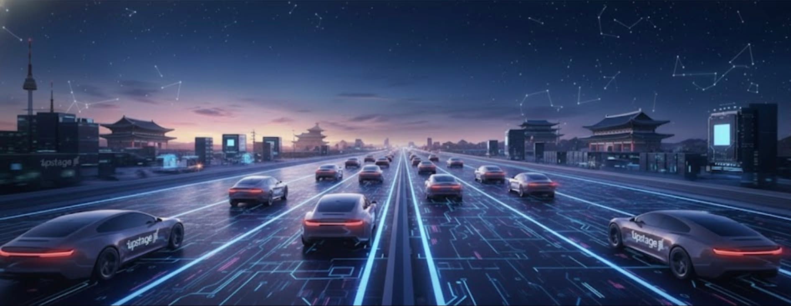
**이미지 캡션:** 이 이미지는 밤하늘 아래 펼쳐진 미래 도시의 고속도로를 보여줍니다. 도로 위에는 여러 대의 세련된 스포츠카가 줄지어 달리고 있으며, 각 차량의 후미등과 도로 표면의 푸른색 발광 라인이 미래 지향적인 분위기를 더합니다. 도로 표면은 마치 회로 기판처럼 복잡한 디지털 패턴으로 디자인되어 있으며, 이는 첨단 기술과 연결성을 상징하는 듯합니다. 배경에는 서울의 랜드마크인 남산타워와 전통적인 한국식 건축 양식의 건물들이 어우러져 현대와 전통이 공존하는 도시의 모습을 나타냅니다. 밤하늘에는 별자리들이 선명하게 보이며, 이는 기술적인 진보와 함께 자연적인 아름다움도 조화롭게 표현하고 있습니다. 일부 차량에는 "upstage"라는 로고가 새겨져 있어 특정 기업이나 브랜드를 연상시킵니다. 전체적으로 이 이미지는 자율 주행 기술, 스마트 시티, 그리고 미래 교통 시스템의 발전을 시각적으로 구현한 듯한 인상을 줍니다.

### 11월 3일 (월) 11:51 · 대전/KAIST 계시는 분들 반갑게 뵙겠습니다.

대전/KAIST 계시는 분들 반갑게 뵙겠습니다.

선참여, 후고민!

### 11월 4일 (화) 20:47 · 멋진 AI솔루션들을 기대합니다. 선지원, 후고민!

멋진 AI솔루션들을 기대합니다. 선지원, 후고민!

### 11월 6일 (목) 21:37 · 📷 사진 (1장)

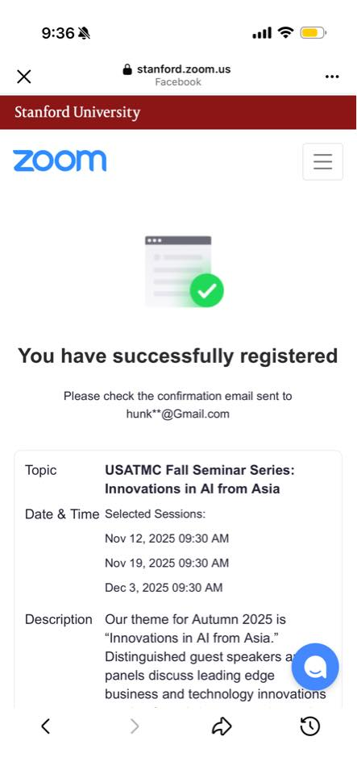
**이미지 캡션:** 이것은 스탠포드 대학교의 Zoom을 통해 진행되는 USATMC 가을 세미나 시리즈 "아시아의 AI 혁신" 등록 확인 페이지를 보여주는 스크린샷입니다. 페이지 상단에는 스탠포드 대학교 로고와 Zoom 로고가 보이며, "You have successfully registered"라는 문구가 크게 표시되어 있습니다. 등록이 성공적으로 완료되었음을 알리고 있으며, 등록 확인 이메일이 "hunk**@Gmail.com"으로 발송되었음을 안내합니다. 하단에는 세미나의 주제, 날짜 및 시간, 그리고 설명이 상세하게 나와 있습니다. 주제는 "아시아의 AI 혁신"이며, 선택 세션은 2025년 11월 12일, 11월 19일, 12월 3일 오전 9시 30분에 진행됩니다. 설명에는 "2025년 가을의 주제는 '아시아의 AI 혁신'이며, 저명한 연사들과 패널들이 비즈니스 및 기술 혁신을 논의할 것입니다."라고 적혀 있습니다. 페이지 하단에는 이전 페이지로 돌아가는 화살표와 공유, 새로고침 아이콘이 있습니다. 전반적으로 깔끔하고 정보 전달에 초점을 맞춘 디자인이며, 성공적인 등록을 축하하는 긍정적인 분위기입니다.

### 11월 12일 (수) 11:49 · Solar-LLM으로 업무 혁신 사례가 많이 생기고 있습니다. 국내 최고…

Solar-LLM으로 업무 혁신 사례가 많이 생기고 있습니다. 국내 최고의 언론사인 조선일보사는 Solar-LLM을 사용하여 기사의 문장을 확인하고 있습니다. 교열이라고 불리는 이 작업은 이제 온·오프라인 기사 작성 과정의 공식 프로세스가 되었습니다. Solar-LLM의 한국어 능력이 매우 뛰어나기 때문입니다.

또한 Solar-LLM을 사용해 자동 기사 번역을 하고 있는데요. 이전 대비 번역량이 20배 이상 늘었고, 그 결과로 PV는 10~20배가량 폭증했습니다. 더 놀라운 것은 해외 유력 언론이 조선일보 영문 기사를 인용해 보도하는 사례가 늘고 있다고 합니다. Solar-LLM의 한·영 번역 기능이 매우 뛰어나기 때문입니다.

업무 혁신이 필요하시면 Solar-LLM 그리고 Upstage Document AI 바로 테스트해보셔요. https://console.upstage.ai/ 아주 좋습니다!

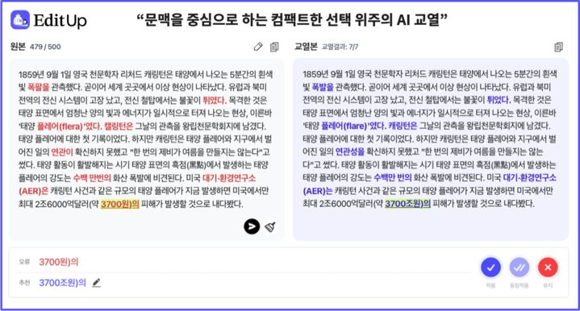
**이미지 캡션:** 화면은 두 개의 텍스트 블록으로 나뉘어 있으며, 왼쪽에는 "원본"이라고 표시된 텍스트가 있고 오른쪽에는 "교열본"이라고 표시된 텍스트가 있습니다. 두 텍스트 블록 모두 1859년 9월 1일에 발생한 태양 플레어 사건에 대한 내용을 담고 있으며, 이는 영국 천문학자 리처드 캐링턴이 관측한 것입니다. 텍스트는 태양 플레어가 전 세계적인 통신 시스템 장애와 전신 철탑에서의 불꽃 발생을 야기했으며, 이로 인해 막대한 경제적 피해가 발생할 수 있음을 설명합니다. 오른쪽 "교열본" 텍스트에서는 "3700원"이 "3700조원"으로 수정되었음을 보여주는 하단 부분도 있습니다. 화면 상단에는 "EditUp"이라는 로고와 함께 "문맥을 중심으로 하는 컴팩트한 선택 위주의 AI 교열"이라는 제목이 있습니다. 전반적으로 이 화면은 AI 기반의 텍스트 교열 도구를 시연하는 것으로 보이며, 원본 텍스트와 교열된 텍스트를 비교하고 있습니다.
 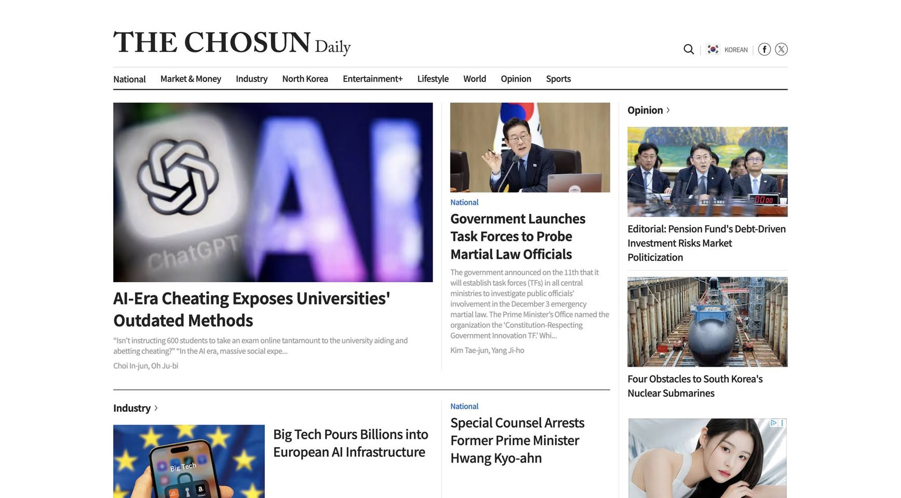
**이미지 캡션:** The image displays the homepage of "THE CHOSUN Daily" newspaper, featuring various news articles. The top section shows the newspaper's logo and navigation bar with categories like National, Market & Money, Industry, North Korea, Entertainment+, Lifestyle, World, Opinion, and Sports. A prominent article on the left, titled "AI-Era Cheating Exposes Universities' Outdated Methods," is accompanied by a blurred image of the ChatGPT logo and the letters "AI." To the right, a "National" section article, "Government Launches Task Forces to Probe Martial Law Officials," features an image of an adult male in a suit speaking at a podium, with a South Korean flag in the background. Below this, an "Opinion" section article, "Editorial: Pension Fund's Debt-Driven Investment Risks Market Politicization," shows a group of adult males in suits seated at a table. Further down, an "Industry" section article, "Big Tech Pours Billions into European AI Infrastructure," is illustrated with a hand holding a smartphone displaying the "Big Tech" logo against a backdrop of the European Union flag. Another "National" article, "Special Counsel Arrests Former Prime Minister Hwang Kyo-ahn," is presented with a portrait of a young adult female. Finally, an article titled "Four Obstacles to South Korea's Nuclear Submarines" is accompanied by an image of a submarine in a dry dock. The overall atmosphere is informative and news-oriented, with a focus on current events in South Korea and globally.

### 11월 13일 (목) 13:48 · 이번 ‘독자파운데이션(독파모) 모델 프로젝트’의 핵심 목표 중 하나는 기…

이번 ‘독자파운데이션(독파모) 모델 프로젝트’의 핵심 목표 중 하나는 기술 공유와 생태계 확장을 통해 ‘모두의 AI’, ‘모두를 위한 AI 대전환’을 실현하는 것입니다. 이를 위해 국가대표 AI 팀으로 로선정된 Upstage 컨소시엄은 10강에 걸쳐 파운데이션 모델 개발 기술과 인사이트를 공유합니다.

특히, 최근 업스테이지 독자파운데이션 모델 펠로우로 합류한 최근우 박사님과, 코나티 교수님, 박정렬 교수님을 이번 세미나를 통해 만나실 수 있습니다. 뿐만 아니라 세계 최고의 AI 석학 조경현 교수님, 오혜연 교수님, 최근 KORMo를 공개하신 임경태 교수님, K사에서 LLM 개발을 총괄하신 장두성 교수님, LLM safety 국내 1인자라 할 수 있는 이화란 교수님 등 연구 및 업계 최전선에서 활약 중인 전문가분들이 재미와 깊이를 겸비한 10강의 콘텐츠를 준비했습니다. 모든 강의는 무료로 온라인으로 진행되며, 사전 등록시 편리하게 참여할 수 있습니다. 선신청 후고민! 
https://docs.google.com/forms/d/e/1FAIpQLSd366lNIdyPcPCVHNnDjfgw1539KOlC7iuDhJFTUF2jxh0BHg/viewform 

Upstage는 앞으로도 ​'Making AI Beneficial' 을 통한 '모두를 위한 AI'​라는 비전을 실현하기 위해 기술 혁신과 생태계 확장에 최선을 다하겠습니다

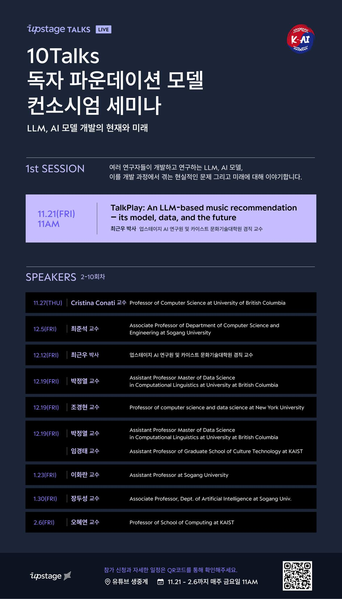
**이미지 캡션:** 이 이미지는 "10 Talks 독자 파운데이션 모델 컨소시엄 세미나: LLM, AI 모델 개발의 현재와 미래"라는 제목의 행사 포스터입니다. 행사는 11월 21일부터 2월 6일까지 매주 금요일 오전 11시에 유튜브 생중계로 진행됩니다. 첫 번째 세션은 11월 21일 금요일 오전 11시에 "TalkPlay: An LLM-based music recommendation - its model, data, and the future"라는 주제로 최근우 박사가 발표합니다. 이후 11월 27일부터 2월 6일까지 다양한 날짜에 걸쳐 Cristina Conati 교수, 최준석 교수, 최근우 박사, 박정열 교수, 조경현 교수, 임경태 교수, 이화란 교수, 장두성 교수, 오혜연 교수 등 여러 연사들이 각자의 전문 분야에 대한 발표를 진행합니다. 각 연사의 이름, 소속, 직책, 발표 주제 등이 상세하게 기재되어 있습니다. 포스터 하단에는 참가 신청 및 자세한 일정을 QR코드로 확인할 수 있다는 안내와 함께 유튜브 생중계 정보가 명시되어 있습니다. 전반적으로 어두운 배경에 흰색과 보라색 텍스트를 사용하여 정보를 명확하게 전달하고 있으며, 깔끔하고 전문적인 분위기를 풍깁니다.
 
**이미지 캡션:** 이 이미지는 "upstage TALKS LIVE"라는 행사 정보를 담고 있으며, 행사의 제목은 "TalkPlay: An LLM-based music recommendation – its model, data, and the future"입니다. 행사는 11월 21일 금요일 오전 11시에 온라인 유튜브 생중계로 진행됩니다. 이미지의 오른쪽 하단에는 최근우 박사의 사진이 있으며, 그는 업스테이지 AI 연구원이자 카이스트 문화기술대학원 겸직교수입니다. 최 박사는 성인 남성이며, 30대 초중반으로 보이는 외모에 짧은 검은색 머리를 하고 있습니다. 그는 남색 셔츠를 입고 있으며, 정면을 응시하며 무표정하고 차분한 표정을 짓고 있습니다. 배경은 어두운 회색으로, 인물 사진과 텍스트 정보가 분리되어 깔끔하고 전문적인 느낌을 줍니다. 전체적으로 기술 강연 또는 세미나 홍보 이미지로 보이며, 차분하고 정보 전달에 집중하는 분위기입니다.
 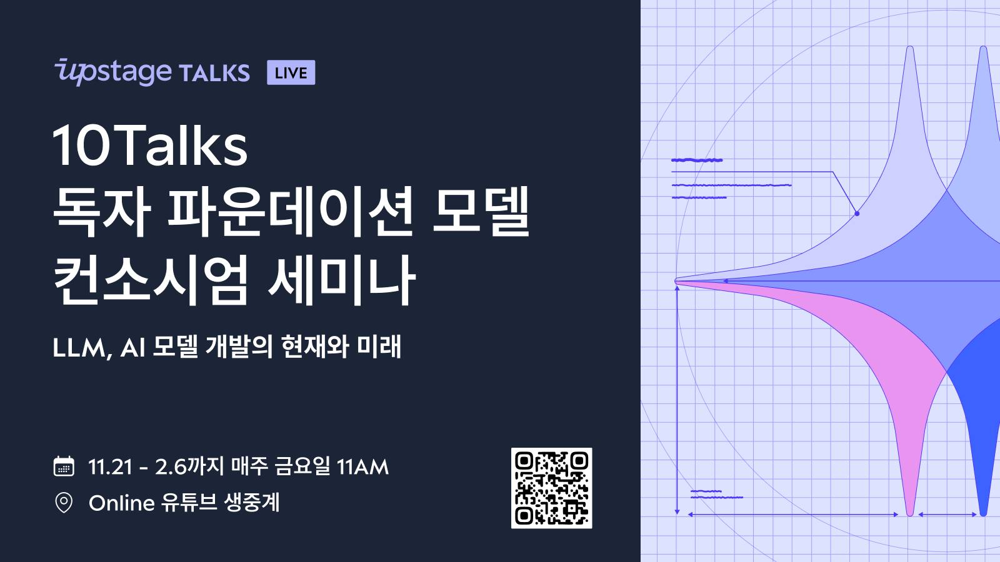
**이미지 캡션:** 이 이미지는 "Upstage Talks Live"라는 제목의 온라인 세미나 홍보물입니다. 어두운 남색 배경에 흰색 글씨로 "10 Talks", "독자 파운데이션 모델 컨소시엄 세미나", 그리고 "LLM, AI 모델 개발의 현재와 미래"라는 문구가 적혀 있습니다. 하단에는 세미나 날짜와 시간이 "11.21 - 2.6까지 매주 금요일 11AM"으로 표시되어 있으며, 참여 방법은 "Online 유튜브 생중계"라고 안내되어 있습니다. 오른쪽에는 파란색과 보라색이 혼합된 그래프가 격자무늬 배경 위에 그려져 있어 시각적인 흥미를 더합니다. QR 코드가 있어 온라인 참여를 위한 추가 정보를 얻을 수 있습니다. 이 이미지는 AI 기술, 특히 LLM 및 파운데이션 모델에 관심 있는 개발자나 연구자들을 대상으로 하는 세미나를 홍보하는 데 사용될 것으로 보입니다.

### 11월 17일 (월) 16:44 · AI 시대, 미디어는 어떻게 진화해야 할까요? 더밀크가 내놓은 "토론 A…

AI 시대, 미디어는 어떻게 진화해야 할까요? 더밀크가 내놓은 "토론 AI"에 Upstage #SolarLLM이 함께합니다.

우리의 생각의 방향에 #SolarLLM이 뛰어난 지능과 언어실력으로 디테일을 더하면서 더 풍성한 토론이 될 수 있다고 생각이 됩니다. 즉 사람이 주도하고 AI의 도움으로 더 다양한 생각을 할수 있고, 더 잘 대화하며 결국은 더 멋진 토론을 할 수 있게 될것입니다. 

이 멋진 아이디어를 내시고 바로 실행하신 JaeKwon Son 대표님 존경하고 토론 AI가 바로 적용되어 있는 더밀크 서비스 응원합니다.

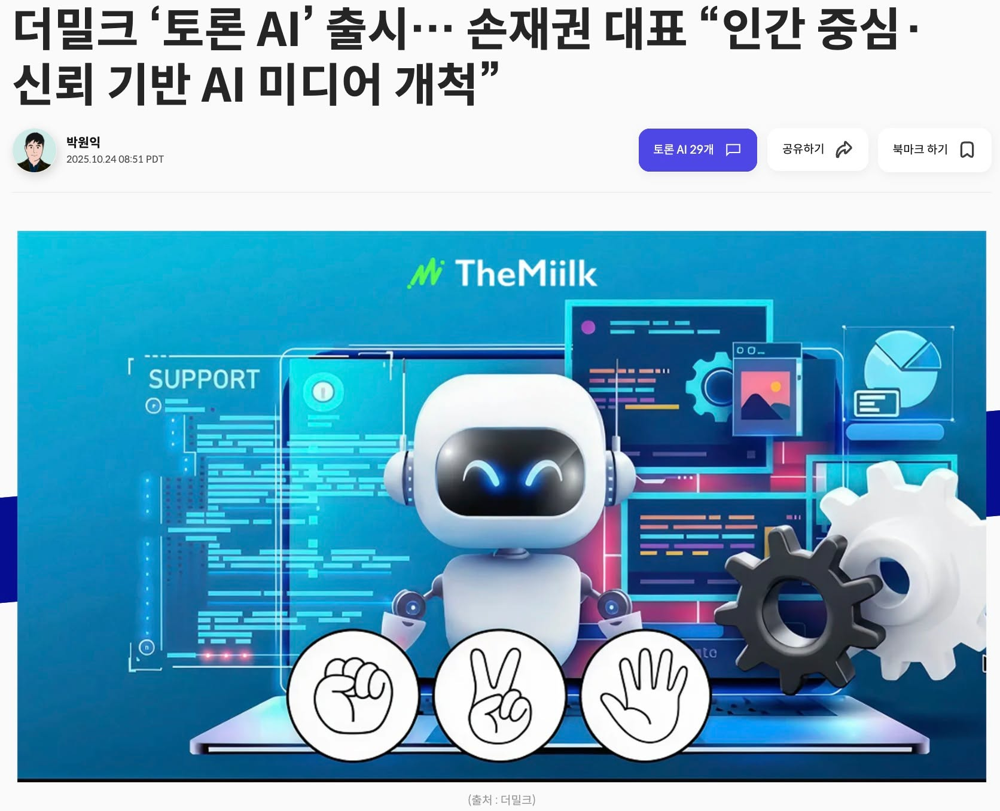
**이미지 캡션:** 이 이미지는 "더밀크 '토론 AI' 출시… 손재권 대표 “인간 중심·신뢰 기반 AI 미디어 개척”"라는 제목의 기사 일부를 보여줍니다. 상단에는 기사 제목과 함께 작성자 '박원익'과 발행일 '2025.10.24 08:51 PDT'가 표시되어 있습니다. 기사 제목 옆에는 '토론 AI 29개', '공유하기', '북마크 하기' 버튼이 있습니다. 중앙에는 파란색 배경에 'TheMiilk' 로고와 함께 귀여운 흰색 AI 로봇이 노트북 위에 앉아 있는 모습이 그려져 있습니다. 노트북 화면에는 코딩 코드와 'SUPPORT'라는 글자가 보입니다. AI 로봇 앞에는 가위바위보를 상징하는 세 개의 손 그림이 원 안에 그려져 있습니다. 배경에는 톱니바퀴, 그래프, 이미지 파일 아이콘 등 다양한 IT 관련 요소들이 배치되어 있습니다. 전체적으로 AI 기술과 미디어의 결합을 시사하는 현대적이고 기술적인 분위기를 풍깁니다.
 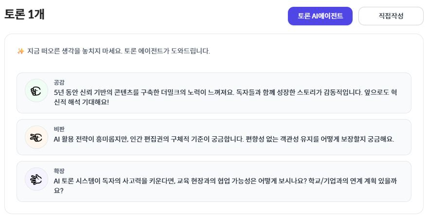
**이미지 캡션:** 화면 상단에는 "토론 1개"라는 제목과 함께 "토론 AI에이전트" 및 "직접작성" 버튼이 보입니다. 그 아래에는 "지금 떠오른 생각을 놓치지 마세요. 토론 에이전트가 도와드립니다."라는 안내 문구가 있습니다. 이어서 세 개의 토론 주제가 카드 형태로 제시되어 있으며, 각 카드에는 아이콘과 함께 제목, 그리고 내용이 포함되어 있습니다. 첫 번째 카드는 "공감"이라는 제목으로, "5년 동안 신뢰 기반의 콘텐츠를 구축한 더밀크의 노력이 느껴져요. 독자들과 함께 성장한 스토리가 감동적입니다. 앞으로도 혁신적 해석 기대해요!"라는 내용입니다. 두 번째 카드는 "비판"이라는 제목으로, "AI 활용 전략이 흥미롭지만, 인간 편집권의 구체적 기준이 궁금합니다. 편향성 없는 객관성 유지를 어떻게 보장할지 궁금해요."라는 내용입니다. 세 번째 카드는 "확장"이라는 제목으로, "AI 토론 시스템이 독자의 사고력을 키운다면, 교육 현장과의 협업 가능성은 어떻게 보시나요? 학교/기업과의 연계 계획 있을까 요?"라는 내용입니다. 전반적으로 흰색 배경에 회색과 보라색이 포인트로 사용된 깔끔하고 현대적인 웹 인터페이스 디자인입니다.
 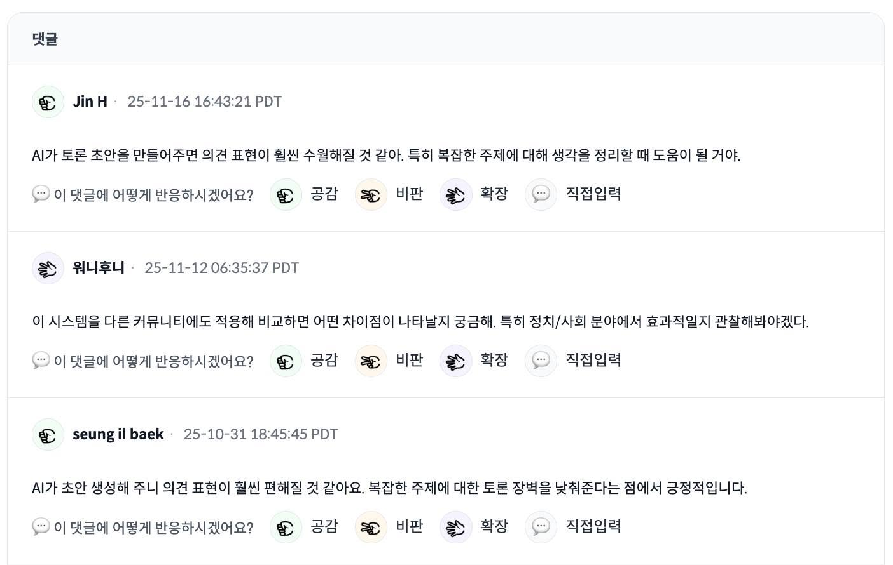
**이미지 캡션:** 이 화면은 온라인 커뮤니티의 댓글 섹션으로, 세 명의 사용자가 AI의 토론 초안 작성 기능에 대한 의견을 나누고 있습니다. 첫 번째 댓글은 Jin H라는 사용자가 작성했으며, AI가 토론 초안을 만들어주면 의견 표현이 수월해지고 복잡한 주제에 대한 생각 정리에도 도움이 될 것이라고 말합니다. 그 아래에는 "이 댓글에 어떻게 반응하시겠어요?"라는 문구와 함께 공감, 비판, 확장, 직접입력 버튼이 있습니다. 두 번째 댓글은 워니후니라는 사용자가 작성했으며, 이 시스템을 다른 커뮤니티에 적용했을 때 나타날 차이점이 궁금하고, 특히 정치/사회 분야에서의 효과를 관찰해봐야겠다고 언급합니다. 세 번째 댓글은 seung il baek이라는 사용자가 작성했으며, AI가 초안을 생성해주면 의견 표현이 편해지고 복잡한 주제에 대한 토론 장벽을 낮춰준다는 점에서 긍정적이라고 평가합니다. 각 댓글 아래에도 마찬가지로 반응을 선택할 수 있는 버튼들이 있습니다. 전반적으로 긍정적이고 건설적인 토론 분위기입니다.

### 11월 17일 (월) 16:45 · Sung Kim shared a link.

🔗 <https://www.themiilk.com/articles/a322e418e?u=15ed0645&t=a26469f10&from=>

### 11월 18일 (화) 20:58 · #토당쿠무업 Q. 우리나라에서 가장 빠르게 성장하는 스타트업은 어디라고 …

#토당쿠무업 Q. 우리나라에서 가장 빠르게 성장하는 스타트업은 어디라고 생각하시나요?

스타트업얼라이언스-오픈서베이가 발표한 스타트업 트렌드 리포트 2025에서 업스테이지가 토스, 당근, 쿠팡, 무신사와 함께 취준생 픽 "빠르게 성장하는 국내 스타터업" 상위권에 랭크되었습니다.

"취업준비생의 11%가 가장 빠르게 성장하는 국내 스타트업으로 토스를 꼽았고 일하는 방식을 알고 싶은 스타트업 또한 토스가 가장 높은 비중을 차지했습니다. 취업준비생 그룹에서도 업스테이지와 같은 AI 관련 기업 언급이 확인되었습니다"

Upstage는 더 업업업 해보겠습니다!

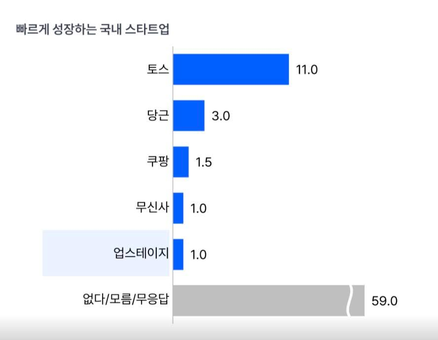
**이미지 캡션:** 이 이미지는 "빠르게 성장하는 국내 스타트업"이라는 제목의 가로 막대 그래프입니다. 그래프는 여러 스타트업의 이름과 해당 스타트업에 대한 응답 비율을 보여줍니다. 가장 위에 있는 막대는 "토스"로 11.0%를 나타내며, 그 아래로 "당근"이 3.0%, "쿠팡"이 1.5%, "무신사"가 1.0%, "업스테이지"가 1.0%를 나타냅니다. 가장 아래에는 "없다/모름/무응답"이라는 항목이 긴 회색 막대로 표시되어 있으며, 59.0%라는 높은 비율을 차지하고 있습니다. 그래프는 흰색 배경에 파란색과 회색 막대로 구성되어 있으며, 텍스트는 한국어로 작성되어 있습니다. 이 그래프는 국내 스타트업에 대한 인지도나 선호도 등을 조사한 결과로 보이며, 응답자의 상당수가 특정 스타트업을 언급하지 않거나 모르는 것으로 나타났습니다. 사람, 장소, 사물, 표정, 행동 등은 보이지 않으며, 오직 텍스트와 그래프만으로 구성된 정보성 이미지입니다.

### 11월 19일 (수) 21:40 · 산업은행 주최로 박상진 회장님 주재하신 NEXT100 포럼이 열렸습니다.…

산업은행 주최로 박상진 회장님 주재하신 NEXT100 포럼이 열렸습니다. Next 100 포럼'은 대한민국의 향후 100년을 준비하기 위한 산업정책과 정책금융을 논의 하는 자리였는데요.

대담에 참여하여, 3강이 아니라 우리가 하는 분야에 1등이 되어야 하며 이를 위해 1. AI파운데이션 모델에 대한 집중투자, 2. 스타트업의 혁신을 믿고 스타트업 투자, 2. 그리고 국내 반도체, 데이터등의 장점을 살린 생태계 강화를 해야 한다고 말씀드리고 왔습니다.

이를 통해 정말 대한민국 100년 준비가 잘되면 좋겠습니다.

회장님 옆옆자리에서 혼자웃고 있는 것이 바로 저 입니다. ^^

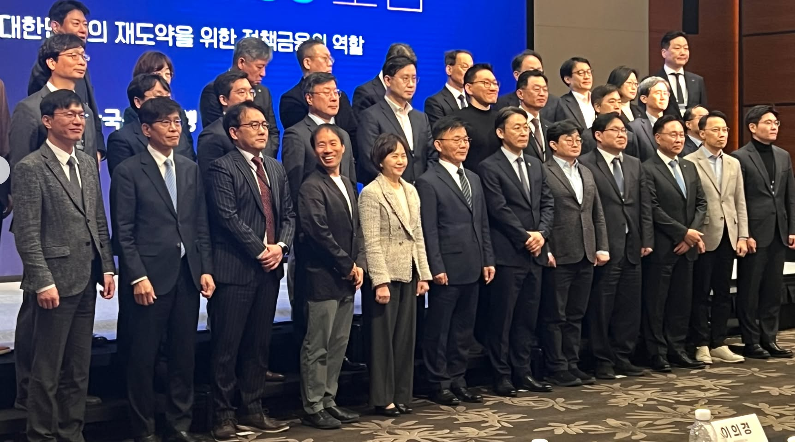
**이미지 캡션:** 이 사진은 한국어로 된 텍스트가 적힌 파란색 배경 앞에서 여러 명의 성인 남성과 한 명의 성인 여성이 단체 사진을 찍고 있는 모습을 담고 있습니다. 대부분의 사람들은 정장을 입고 있으며, 일부는 넥타이를 착용하고 있습니다. 사람들은 대부분 정면을 응시하거나 약간 옆을 보고 있으며, 표정은 진지하거나 약간의 미소를 띠고 있습니다. 배경에는 "대한의 재도약을 위한 정책금의 역할"이라는 문구가 보입니다. 장소는 실내이며, 바닥에는 꽃무늬가 있는 갈색 카펫이 깔려 있습니다. 전체적으로 공식적인 행사나 회의의 한 장면으로 보이며, 진지하고 전문적인 분위기를 풍깁니다.
 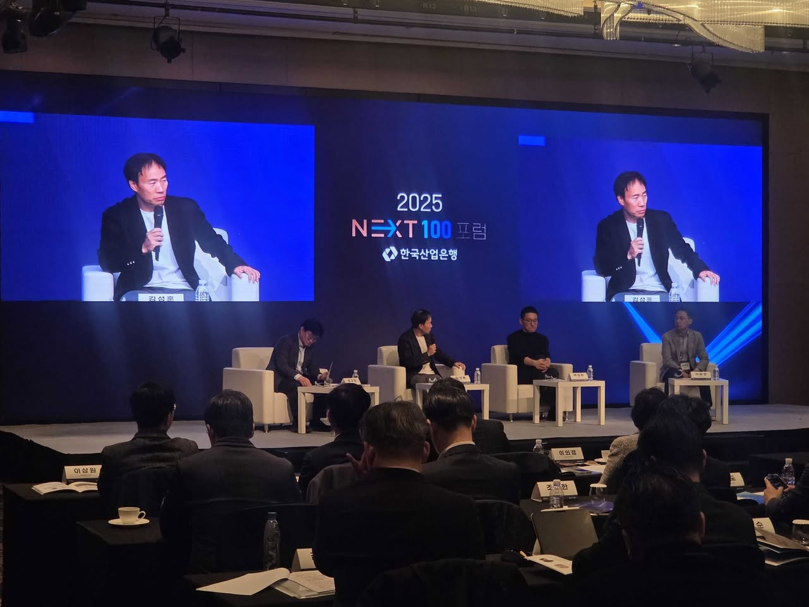
**이미지 캡션:** 이 사진은 한국산업은행이 주최한 2025 NEXT100 포럼의 한 장면을 담고 있으며, 무대 중앙에 설치된 대형 스크린에는 연사로 보이는 성인 남성이 흰색 의자에 앉아 마이크를 잡고 발언하는 모습이 비춰지고 있습니다. 그는 검은색 재킷과 흰색 티셔츠를 착용하고 있으며, 진지한 표정으로 청중을 응시하고 있습니다. 스크린에는 "2025 NEXT100 포럼"이라는 문구와 함께 "한국산업은행" 로고가 함께 표시되어 있습니다. 스크린 아래 무대에는 세 명의 패널이 흰색 의자에 앉아 토론에 참여하고 있으며, 이들 앞에는 작은 테이블이 놓여 있습니다. 왼쪽부터 성인 남성, 성인 남성, 성인 남성 순서로 앉아 있으며, 각자의 이름표가 놓여 있습니다. 이들 패널들은 진지한 표정으로 토론에 임하고 있습니다. 객석에는 많은 사람들이 앉아 있으며, 이들 역시 진지한 표정으로 무대를 바라보고 있습니다. 일부 관객들의 이름표가 보이는데, "이상원", "이의점", "조한" 등이 확인됩니다. 전반적으로 진지하고 학술적인 분위기의 행사임을 알 수 있습니다.

### 11월 21일 (금) 18:57 · Upstage와 카라쿠리가 공동 개발한 Syn-Pro 모델이 일본 경제산…

Upstage와 카라쿠리가 공동 개발한 Syn-Pro 모델이 일본 경제산업성(METI)의 ‘일본 국산 LLM 목록’에 정식 추가되었습니다. 이제 일본 고객들이 Syn-Pro를 더욱 많이 사용할 예정입니다.

일본에서 사업을 하시거나 일본어 관련 서비스를 운영 중이시라면 Syn-Pro https://console.upstage.ai/ 에서 바로 사용 가능합니다.

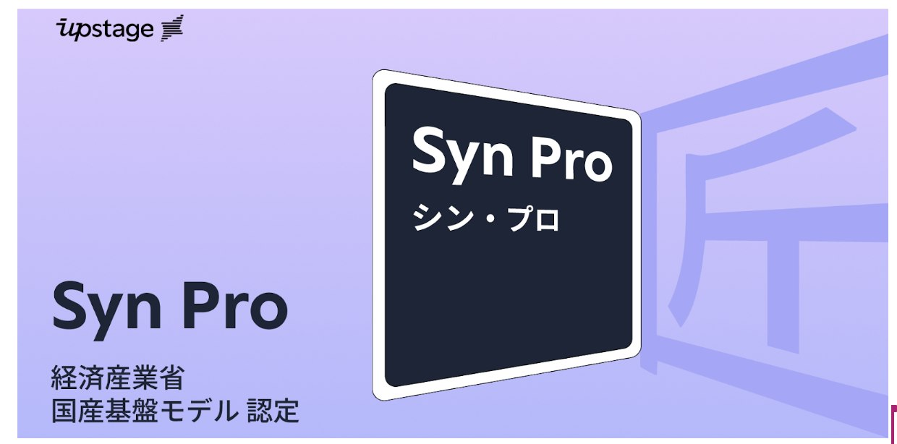
**이미지 캡션:** 이 이미지는 연보라색 배경에 "upstage" 로고와 함께 "Syn Pro"라는 문구가 크게 표시되어 있습니다. "Syn Pro"는 흰색 글씨로 두 번 나타나는데, 한 번은 왼쪽 하단에, 다른 한 번은 중앙의 어두운 네모난 패널 안에 있습니다. 어두운 패널 안에는 "Syn Pro" 아래에 일본어 히라가나로 "シン・プロ"라고 쓰여 있습니다. 왼쪽 하단에는 "経済産業省" (경제산업성)과 "国産基盤モデル 認定" (국산 기반 모델 인증)이라는 일본어 문구가 흰색으로 표시되어 있습니다. 배경 오른쪽에는 연보라색으로 옅게 "斤"이라는 한자가 그려져 있습니다. 전체적으로 깔끔하고 정보 전달에 초점을 맞춘 디자인이며, 기술 또는 소프트웨어 관련 발표 자료의 일부로 보입니다. 사람이나 구체적인 사물은 보이지 않으며, 텍스트 정보와 로고가 주를 이룹니다.
 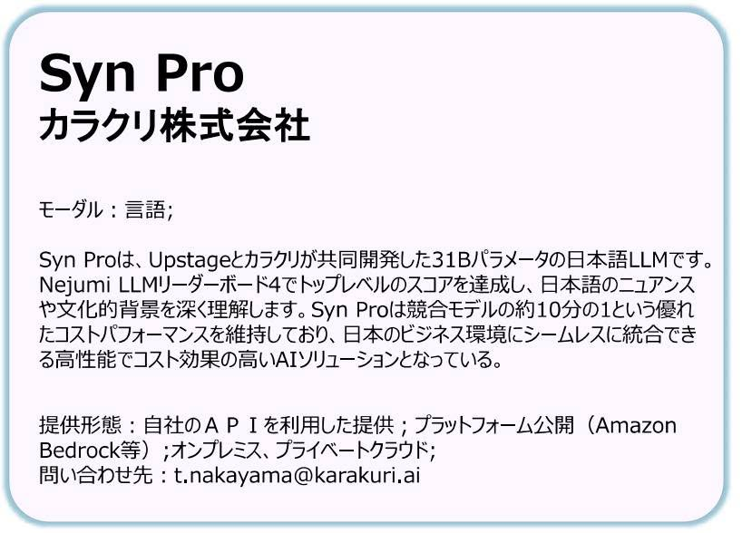
**이미지 캡션:** 이 이미지는 "Syn Pro"라는 일본어 LLM(대규모 언어 모델)에 대한 정보를 담고 있는 슬라이드 또는 문서의 일부입니다. 상단에는 "Syn Pro"라는 제목과 "カラクリ株式会社"라는 회사 이름이 검은색 글씨로 크게 쓰여 있습니다. 그 아래에는 "モーダル:言語;"라는 텍스트가 있습니다. 본문에는 Syn Pro가 Upstage와カラクリ가 공동 개발한 31B 파라미터의 일본어 LLM이며, Nejumi LLM 리더보드에서 최고 수준의 점수를 달성하여 일본어의 뉘앙스와 문화적 배경을 깊이 이해한다고 설명합니다. 또한 경쟁 모델의 약 10분의 1이라는 뛰어난 비용 효율성을 유지하며 일본 비즈니스 환경에 원활하게 통합될 수 있는 고성능, 고효율 AI 솔루션이라고 소개합니다. 제공 형태로는 자체 API를 이용한 제공, 플랫폼 공개(Amazon Bedrock 등), 온프레미스, 프라이빗 클라우드가 언급되어 있으며, 문의처는 t.nakayama@karakuri.ai로 명시되어 있습니다. 전체적으로 정보 전달을 목적으로 하는 깔끔하고 전문적인 분위기입니다.

### 11월 25일 (화) 06:21 · #SolarLLM을 사용하시고 방문자 500% 이상 늘리고 싶은 분들은 …

#SolarLLM을 사용하시고 방문자 500% 이상 늘리고 싶은 분들은 모두 연락주셔요! SolarLLM 정말 잘합니다.

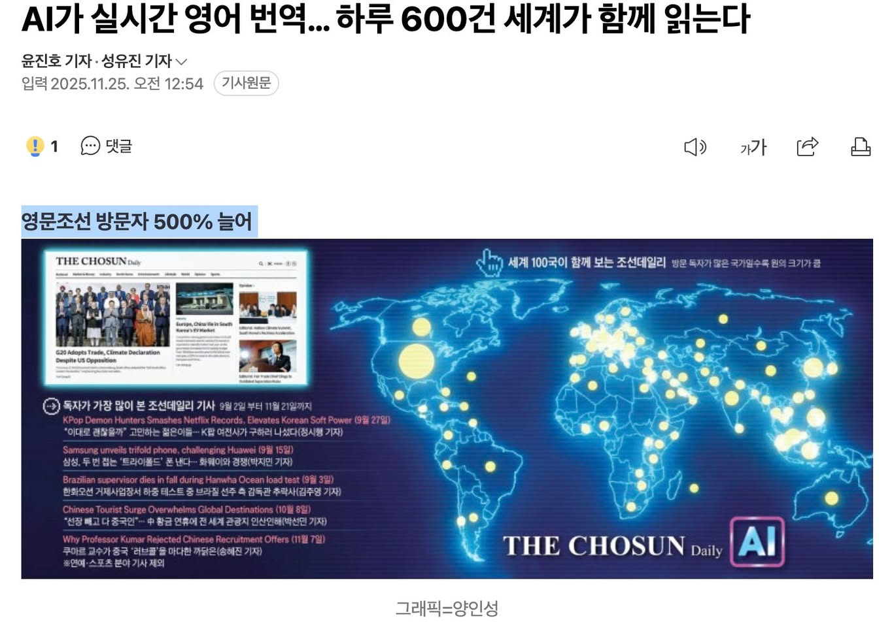
**이미지 캡션:** 이 사진은 조선일보의 영문판 웹사이트 방문자 수가 500% 증가했다는 내용을 담고 있으며, 제목은 "AI가 실시간 영어 번역... 하루 600건 세계가 함께 읽는다"이다. 사진의 왼쪽 상단에는 기사 제목과 함께 기자가 윤진호, 성유진으로 표기되어 있고, 입력 날짜는 2025년 11월 25일 오전 12시 54분으로 되어 있다. 그 아래에는 '1'이라는 숫자가 표시된 알림 아이콘과 말풍선 아이콘이 있어 댓글 수를 나타내는 것으로 보인다. 사진 중앙에는 조선일보 영문판 웹사이트의 일부 화면이 보이며, 여러 기사 제목과 함께 다양한 인물 사진이 작게 배치되어 있다. 특히 "G20 Adopts Trade, Climate Declaration Despite US Opposition"이라는 제목의 기사가 눈에 띈다. 사진의 오른쪽에는 파란색 배경에 세계 지도가 그려져 있고, 여러 국가에 노란색 원이 표시되어 방문자 수를 나타내는 것으로 보인다. 원의 크기가 클수록 방문자가 많은 국가임을 의미하며, "세계 100국이 함께 보는 조선데일리 방문 독자가 많은 국가일수록 원의 크기가 큼"이라는 설명이 덧붙여져 있다. 지도 하단에는 "THE CHOSUN Daily AI"라는 로고가 크게 박혀 있다. 사진 하단에는 "그래픽=양인성"이라는 문구가 있어 이 그래픽의 제작자를 나타낸다. 전체적으로 AI 번역 기술의 발전으로 조선일보 영문판의 국제적 영향력이 확대되고 있음을 시각적으로 보여주는 이미지이다.

### 11월 25일 (화) 06:21 · Sung Kim shared a link.

🔗 <https://n.news.naver.com/article/023/0003942976?sid=004>

### 11월 25일 (화) 10:37 · "Al 3대 강국을 향한 비전과 실질적인 로드맵" 이라는 주제로 구윤철 …

"Al 3대 강국을 향한 비전과 실질적인 로드맵" 이라는 주제로 구윤철 부총리님, 박영선 전장관님, 김기응 석좌교수님 그리고 멋진 분들과 함께 이야기 나눕니다. 오시는 여러분들 11월 30일에 반갑게 뵙겠습니다.

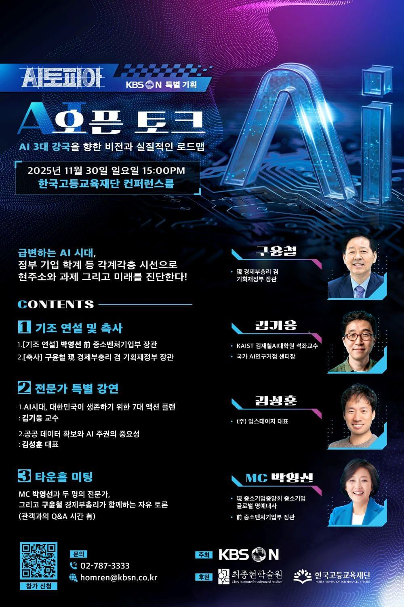
**이미지 캡션:** 이 포스터는 "AI 토피아: 오픈 토크"라는 제목의 행사를 홍보하며, AI 3대 강국을 향한 비전과 실질적인 로드맵을 주제로 2025년 11월 30일 일요일 오후 3시에 한국고등교육재단 컨퍼런스룸에서 개최된다. 포스터는 급변하는 AI 시대에 정부, 기업, 학계 등 각계각층의 시선으로 현주소와 과제, 그리고 미래를 진단하는 내용을 담고 있다. 행사는 기조 연설 및 축사, 전문가 특별 강연, 타운홀 미팅으로 구성되어 있으며, 각 세션별 연사 및 주제가 명시되어 있다. 기조 연설은 박영선 전 중소벤처기업부 장관이, 축사는 구윤철 현 경제부총리 겸 기획재정부 장관이 맡는다. 특별 강연에는 김기웅 교수가 'AI 시대, 대한민국이 생존하기 위한 7대 액션 플랜'을, 김성훈 대표가 '공공 데이터 확보와 AI 주권의 중요성'을 주제로 강연한다. 타운홀 미팅은 MC 박영선과 두 명의 전문가, 그리고 구윤철 경제부총리가 함께 자유 토론을 진행하며 관객과의 질의응답 시간도 포함된다. 포스터에는 각 연사들의 사진과 소속, 직책이 함께 기재되어 있으며, 문의 전화번호와 이메일 주소, 그리고 참가 신청을 위한 QR 코드가 하단에 포함되어 있다. 배경에는 푸른색과 보라색이 어우러진 추상적인 AI 관련 그래픽과 회로 기판 이미지가 사용되어 미래 지향적이고 기술적인 분위기를 연출한다. 전반적으로 진지하면서도 미래에 대한 기대감을 불러일으키는 분위기이다.

### 11월 26일 (수) 05:23 · Upstage가 2025년 NIPA 글로벌 AI 혁신상을 받았습니다. 무…

Upstage가 2025년 NIPA 글로벌 AI 혁신상을 받았습니다. 무엇보다 저희가 최근 미국·일본 지사를 내고 본격 사업을 시작했는데요. NIPA(NIce PArtner), KIC(Korea Innovation Center) 등 많은 도움을 받았는데 이렇게 상까지 주셔서 너무 감사합니다. 매우 기쁜날입니다!

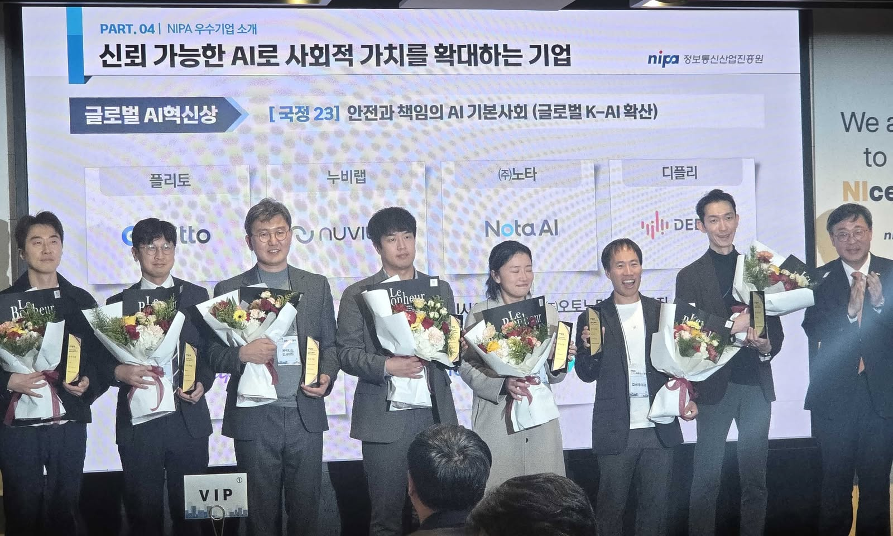
**이미지 캡션:** 이 사진은 시상식 장면으로, 무대 위에서 일곱 명의 성인 남성과 한 명의 성인 여성이 상을 받고 꽃다발을 들고 서 있다. 이들은 모두 정장을 입고 있으며, 대부분 밝은 표정을 짓고 있다. 배경에는 "신뢰 가능한 AI로 사회적 가치를 확대하는 기업"이라는 문구와 함께 "글로벌 AI혁신상" 및 "안전과 책임의 AI 기본사회" 등의 글자가 적힌 대형 스크린이 보인다. 스크린에는 "플리토", "누비랩", "(주)노타", "디플리"와 같은 기업 이름들도 보인다. 무대 앞쪽에는 "VIP"라고 적힌 표지판이 놓여 있다. 전반적으로 축하와 성취의 분위기가 느껴진다.
 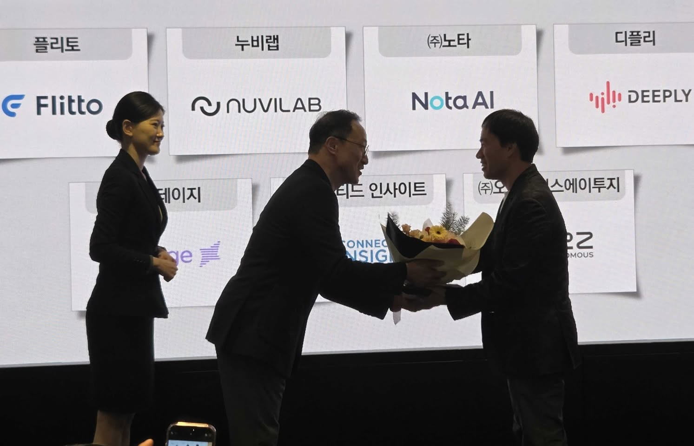
**이미지 캡션:** 행사장에서 한 명의 성인 여성은 검은색 정장을 입고 있으며, 머리를 단정하게 묶고 환한 미소를 짓고 있다. 그녀는 무대 위에서 다른 성인 남성에게 꽃다발을 건네받고 있다. 꽃다발을 건네는 성인 남성은 검은색 재킷을 입고 있으며, 진지한 표정으로 꽃다발을 전달하고 있다. 배경에는 여러 기업 로고와 이름이 적힌 패널들이 나열되어 있으며, '플리토', '누비랩', '(주)노타', '디플리' 등의 한글과 영어로 된 회사 이름이 보인다. 또한 'Flitto', 'NUVILAB', 'Nota AI', 'DEEPLY'와 같은 로고들도 함께 보인다. 전반적으로 시상식이나 발표회와 같은 공식적인 행사 분위기를 띠고 있으며, 긍정적이고 축하하는 듯한 느낌을 준다.
 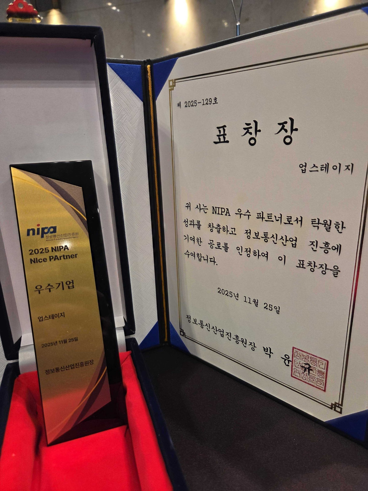
**이미지 캡션:** 이 사진은 시상식에서 수여된 표창장과 상패를 보여줍니다. 사진 왼쪽에는 붉은색 벨벳 안감으로 된 검은색 상자 안에 황금색의 길쭉한 상패가 놓여 있습니다. 상패에는 "nipa", "정보통신산업진흥원", "2025 NIPA Nice Partner", "우수기업", "업스테이지", "2025년 11월 25일", "정보통신산업진흥원장"이라는 글자가 한국어로 새겨져 있습니다. 사진 오른쪽에는 표창장이 펼쳐져 있으며, 표창장 상단에는 "제 2025-129호"라는 번호가, 그 아래에는 "표창장"이라는 제목이 크게 쓰여 있습니다. 표창장 본문에는 "업스테이지 귀 사는 NIPA 우수 파트너로서 탁월한 성과를 창출하고 정보통신산업 진흥에 기여한 공로를 인정하여 이 표창장을 수여합니다."라는 내용이 적혀 있으며, 하단에는 "2025년 11월 25일" 날짜와 "정보통신산업진흥원장 박윤"이라는 이름, 그리고 붉은색 도장이 찍혀 있습니다. 배경은 실내이며, 조명이 켜져 있고 약간의 빛 반사가 보입니다. 전체적으로 성과를 인정하고 축하하는 긍정적이고 공식적인 분위기입니다.

### 11월 27일 (목) 08:03 · Upstage Document AI (OCR+LLM) 기술이 미국 1위 …

Upstage Document AI (OCR+LLM) 기술이 미국 1위 (도매 보험 브로커 분야 1위) 회사의 AI 대전환을 만들어 내고 있습니다.

Amwins VP의 인터뷰를 직접 들어 보셔요. https://youtu.be/87iLEdL_wL4

"Amwins 수천 건의 견적서와 가입자 관리 어려움을 해결하기 위해 업스테이지의 AI 기반 문서 추출 기술을 그룹 보험 심사 업무에 도입했습니다. 이 솔루션은 기존 방식을 대체해 90% 정확도를 달성했고, 주당 60시간을 절약하며 동일 인력으로 견적 처리량을 30% 늘렸습니다. 이 성과는 Amwins의 보험 심사 자동화 및 그룹 보험 혁신 비전을 형성하는 계기가 되었습니다."

DocAI와 SolarLLM으로 AI대전환이 필요하신 분들은 바로 연락주셔요!

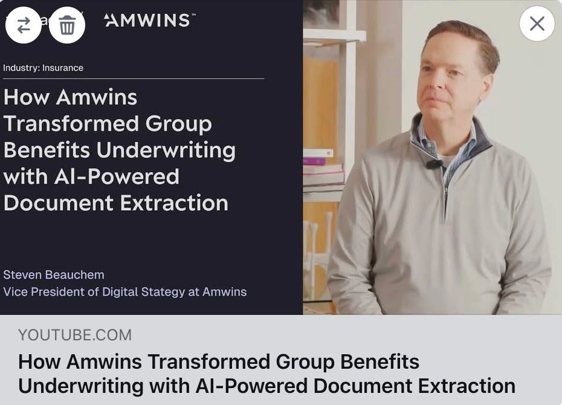
**이미지 캡션:** 화면 왼쪽에는 어두운 배경에 흰색 글씨로 "Industry: Insurance", "How Amwins Transformed Group Benefits Underwriting with AI-Powered Document Extraction"이라는 제목과 "Steven Beauchem Vice President of Digital Strategy at Amwins"라는 이름과 직책이 적혀 있습니다. 화면 오른쪽에는 흰색 셔츠 위에 회색 집업 스웨터를 입고 마이크를 착용한 40대 후반에서 50대 초반으로 보이는 성인 남성이 정면을 응시하고 있습니다. 남성의 뒤로는 책이 꽂힌 흰색 선반이 보이며, 전체적으로 깔끔하고 전문적인 분위기를 연출합니다. 화면 하단에는 "YOUTUBE.COM"이라는 문구와 함께 영상의 제목이 다시 한번 표시되어 있습니다.

### 11월 30일 (일) 11:47 · 간만에 한국을 방문 하신 네이버 프랑스 한석주 대표님과 신나게 달렸습니…

간만에 한국을 방문 하신 네이버 프랑스 한석주 대표님과 신나게 달렸습니다. 하시는 모든일들 응원합니다.

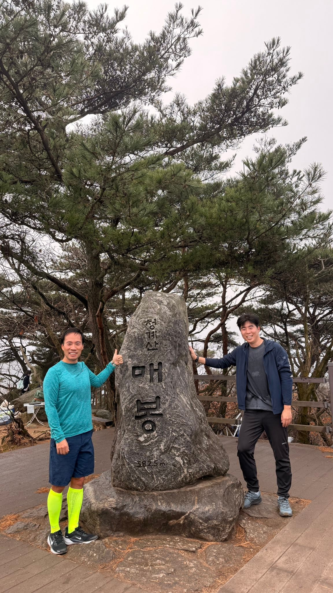
**이미지 캡션:** 두 명의 성인 남성이 산 정상에 있는 큰 바위 앞에서 포즈를 취하고 있다. 왼쪽 남성은 30대 후반에서 40대 초반으로 보이며, 청록색 긴팔 티셔츠와 남색 반바지, 형광 노란색 종아리 슬리브, 검은색 운동화를 착용하고 있다. 그는 엄지손가락을 치켜세우고 환하게 웃고 있다. 오른쪽 남성은 30대 초반으로 보이며, 회색 반팔 티셔츠 위에 남색 바람막이를 입고 검은색 바지와 회색 운동화를 착용하고 있다. 그는 바위에 손을 얹고 카메라를 보며 미소 짓고 있다. 바위에는 한국어로 "정계산 매봉"이라고 새겨져 있으며, 그 아래에는 "382.5m"라고 적혀 있다. 배경에는 울창한 소나무와 앙상한 나뭇가지들이 보이며, 흐린 날씨임을 알 수 있다. 전반적으로 등산을 성공적으로 마친 후의 성취감과 즐거움이 느껴지는 분위기이다.
 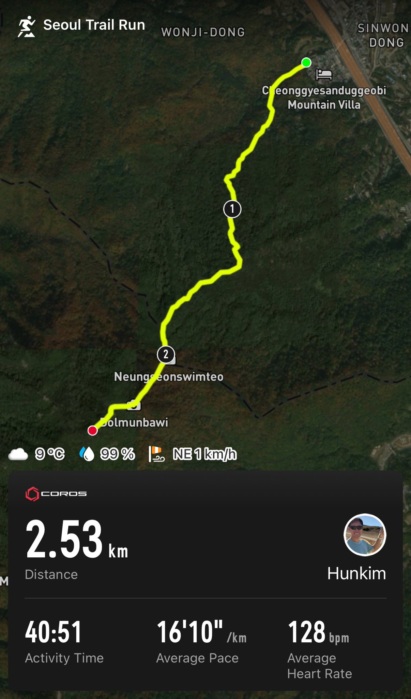
**이미지 캡션:** 이 화면은 서울 트레일 런 기록을 보여주는 스포츠 추적 앱의 일부로, 지도 위에 노란색 선으로 표시된 운동 경로와 함께 운동 관련 통계가 표시됩니다. 지도 상단에는 "Seoul Trail Run WONJI-DONG SINWON DONG"이라는 텍스트가 보이며, 운동 경로 상에는 "Cheonggyesanduggeobi Mountain Villa", "Neungseonswimteo", "Dolmunbawi"와 같은 지명이 표시되어 있습니다. 경로에는 1번과 2번으로 표시된 두 개의 지점이 있으며, 이는 운동 중 특정 지점을 나타내는 것으로 보입니다. 지도 하단에는 현재 온도 9°C, 습도 99%, 바람 방향 북동쪽, 바람 속도 1km/h와 같은 날씨 정보가 표시됩니다. 화면 하단에는 운동 기록이 요약되어 있는데, 총 거리 2.53km, 활동 시간 40분 51초, 평균 페이스 16분 10초/km, 평균 심박수 128 bpm입니다. 또한, "Hunkim"이라는 이름과 함께 사용자의 프로필 사진이 작게 표시되어 있습니다. 전반적으로 야외에서 진행된 트레일 러닝 활동의 기록을 보여주는 화면으로, 자연 풍경 속에서 운동이 이루어졌음을 짐작할 수 있습니다.
